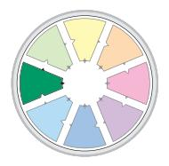
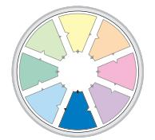

**E-Book**

By Dr. Dick McCann

# Contents

| Overview                      | 2  |
|-------------------------------|----|
| Who we are?                   | 4  |
| Where are we now?             | 7  |
| Where are we going?           | 10 |
| How will we get there?        | 11 |
| What is expected of us?       | 13 |
| What support do we need?      | 16 |
| How effective are we?         | 17 |
| What recognition do we get?   | 19 |
| Linking Skills                | 20 |
| References                    | 21 |
| About the author              | 22 |
| About Team Management Systems | 22 |

## Copyright

*Published by* Team Management Systems*, Brisbane, Australia. Copyright © Dick McCann, 2003, 2009, 2011, 2013, 2020 ISBN 0-9580722-2-1*

All rights reserved. Limited copies of this publication may be printed for the private use of the purchaser. Otherwise no part of this publication may be reproduced in any material form (including photocopying or storing in any medium by electronic means and whether or not transiently or incidentally to some other use of this publication) without the written permission of the copyright holder except in accordance with the provisions of the Copyright Act of 1968.

While the publisher has taken all reasonable care in the preparation of this book the publisher makes no representation, express or implied, with regard to the accuracy of the information contained in this book and cannot accept any legal responsibility or liability for any errors or omissions from the book or the consequences thereof.

The Team Management Wheel and the Margerison-McCann logo are registered trademarks of Team Management Systems. Other trademarks denoted by TM are either owned or licensed by Team Management Systems.

## Preface

Team Management Systems (TMS) was founded more than 30 years ago when Charles Margerison and I developed the ideas that became the Types of Work Wheel and the Team Management Wheel. Since then we have continued the work, both separately and together, to develop a powerful set of techniques for personal, team and organisational development. This e-book is part of a series that describes the concepts underlying the core of TMS technology.

Over the years I have been impressed with the performance of teams having characteristics that are best described as 'high energy'. Team members are committed to high level outputs and work with so much energy and enthusiasm that it is almost infectious.

In this e-book I describe a model Charles and I developed to help any team achieve this high-energy level. I have also updated the original model, adding recent ideas of risk and values and also indicating specifically how the various TMS products and processes can be applied to examine the issues raised by the eight questions that form the basis of the High-Energy Teams Model.

Dick McCann Author

## Overview

High-energy teams occur when eight fundamental questions are addressed:

- Who are we?
- Where are we now?
- Where are we going?
- How will we get there?
- What is expected of us?
- What support do we need?
- How effective are we?
- What recognition do we get?

To create a high-energy team, team members need to establish ways of addressing the issues associated with these questions. Each question must be subject to continuous discussion and review through regular team learning processes. In Team Management Systems we have developed the High-Energy Teams Model (Figure 1) as the basis for these processes.

#### Figure 1. The High-Energy Teams Model

Page 2 of 22 Team Management Systems • *E-Book Series*: High Energy Teams

#### Who are we?

Each person brings different strengths to a team and will approach problems and opportunities in a different way. Team members need to know 'what makes each person tick' so that individual differences can be harnessed to achieve maximum performance levels. The workplace behaviour of team members can be understood by examining their work values, risk-orientation and preferences.

#### Where are we now?

Before planning where you are heading as a team, it is useful to look at team balance, whether team members are likely to be risk-averse or risk-accepting, and whether conflicting values are likely to arise. A Situational (SWOT) Analysis will allow you to look at the team's key strengths, weaknesses, opportunities and threats and to determine whether the necessary resources are available to achieve the team's vision. In addition a Situational Analysis should contain a review of team balance in terms of work preferences and risk-orientation. Values alignment should also be checked.

#### Where are we going?

To work with energy, commitment and enthusiasm, a team needs to know where it is going. It has to have a vision that is aligned with the organisation's mission and goals. It needs to understand its purpose – what makes it different from other teams, what its outputs are and what outcomes they lead to. A Team Purpose Statement can be used as a structure for the team to determine its specific purpose and how that aligns with the organisational vision.

### How will we get there?

To turn a vision into reality, it is necessary to systematically set objectives, action plans and measures of performance. It is important to plan the route from where you are now to where you want to be through looking at the critical types of work.

### What is expected of us?

People find it difficult to perform if they don't know what they are meant to be doing. In a high-energy team, all team members will fully understand their job description, their role in the team, what they are responsible for and, most importantly, what they are accountable for. The development of behavioural ground rules aligned with agreed shared team values is also important to ensure team survival.

#### What support do we need?

Once the team finds answers to the first five questions it can then focus on what support is required to deliver results. This means doing a training and development needs assessment and establishing ongoing systems of team learning so that all team members can continuously develop their skills.

#### How effective are we?

A high-energy team is one that regularly reviews its effectiveness and continually improves its performance. Benchmarks for success can be established and procedures for learning from mistakes implemented. A regular process of 'Questioning' helps prevent complacency from developing.

#### What recognition do we get?

In general, most teams will not attain high energy levels unless there is adequate recognition for the accomplishments of all team members. This can be achieved through feedback, remuneration, fringe benefits and promotion.

### Linking Skills

The processes that ensure all eight questions are integrated and coordinated are known as 'linking'. Team members and particularly the team leader need to be effective at a whole range of Linking Skills.

## Who are we?

This question in the High-Energy Teams Model helps team members appreciate the different ways they approach work. When we understand how people are likely to behave in various situations we can make use of their strengths and avoid situations that are likely to cause stress or create conflict. This builds a strong foundation for addressing the other seven questions.

A good way to do this is to use the Workplace Behaviour Pyramid (McCann, 2020a) to examine behaviour on three levels.

#### Figure 2. Workplace Behaviour Pyramid

#### Values

At the base of the Pyramid are Values. These are fundamental concepts or beliefs which people use to guide their behaviour in the workplace. Values will drive our decision-making and cause us to summon up energy to preserve what we believe in. They go beyond specific situations and determine how we view people, behaviour and events. Often major sources of conflict and disillusionment are due to mismatched values. Whereas we are often willing to work on tasks that we dislike, we are much less likely to compromise when our values are under threat.

Values are difficult to observe in others, as they are inner concepts often buried in the human psyche and not readily accessible by the conscious mind. When these values are violated, then the conscious mind takes over and appropriate behaviour occurs to preserve and defend this attack.

#### Figure 3. Window on Work Values

Workplace values can be measured by the Window on Work Values (McCann, 2002). This is a model that groups values together in clusters of eight value types which are depicted as windowpanes, rather like those in the rose windows of many European cathedrals. The model has good structural validity, meaning that value types close to one another in the Window are related whereas those on opposite sides of the Window are unrelated. Window on Work Values is a topic discussed in another e-book in this series (McCann, 2020b).

### Risk-Orientation

The middle layer of the Workplace Behaviour Pyramid addresses the way people approach risk. The behaviours associated with this operate at the middle level of the human psyche. They are not as fundamental as values, as they can be influenced to some extent by the work environment and the attitudes of colleagues.

All through our life we are faced with opportunities and obstacles; they crop up in every project we undertake no matter how much forward planning is undertaken. What determines peoples' risk Profiles is the different emphasis they place on either 'seeing the opportunities' or 'seeing the obstacles'. Some people treat obstacles as an opportunity to take a new direction whereas others use them as an excuse to give up. Some people treat obstacles as a stumbling block but for others they are stepping stones to the future.

Five subscales are used to build up a picture of people's approach to risk and these are shown in the Risk-Orientation Model of Figure 4.

#### Figure 4. Risk-Orientation Model

The subject of risk as an inherent feature of individual behaviour is discussed in another e-book in this series QO2™ - Opportunities Obstacles Quotient (McCann, 2020c)..

## Preferences

We all approach our work in different ways – we think in different ways, we plan in different ways and we communicate in different ways. Some aspects of our work might interest us more than others and therefore we will tend to place more emphasis on these activities. Preferences are another name for what we like doing. We value our preferences but they are not 'values'. Preferences guide our behaviour, but if we have to work outside them at various times then we can usually cope. Values, on the other hand, are deep-seated determinants of behaviour and we are more likely to react negatively when these values are violated.

Preferences are usually transparent and are often the first thing we notice in others – 'He's rather quiet, isn't he?' or 'She never stops talking.' Some people prefer to think things through on their own whereas others need to talk out loud to clarify their ideas. Preferences are at the apex of the Pyramid because they are readily visible to others and are usually the basis of first impressions. They are also subject to a degree of variability dependent upon the situations faced.

In a team, work preferences can be well understood by using the model of the Margerison-McCann Team Management Wheel (Figure 5). These are measured by the Team Management Profile Questionnaire (Margerison and McCann, 1994). Work preferences are discussed in more detail in the eBook Developing Teams (McCann, 2020d).

### Figure 5. Margerison-McCann Team Management Wheel

This model describes eight different role preferences that people like to adopt when working in a team. The brief descriptions below explain the core differences identified by the Wheel.

| Role preferences     | Brief descriptions                                                                                                                                                           |
|----------------------|------------------------------------------------------------------------------------------------------------------------------------------------------------------------------|
| Reporter-Adviser     | Prefers gathering information and likes to fully understand situations before acting.                                                                                        |
| Creator-Innovator    | Enjoys thinking up new ideas and new ways of doing things rather than focusing on delivering outputs on a regular basis.                                                  |
| Explorer-Promoter    | Likes to take ideas and promote them to others, not worrying too much about any details involved.                                                                            |
| Assessor-Developer   | Enjoys analysing and developing different possibilities before decisions are made.                                                                                           |
| Thruster-Organiser   | Likes to make things happen and get results rather than 'waste' too much time debating issues.                                                                               |
| Concluder-Producer   | Practical people who like to carry things through to the end by working to a plan.                                                                                           |
| Controller-Inspector | Quieter, reflective people who enjoy the detailed side of work and like dealing with facts and figures.                                                                   |
| Upholder-Maintainer  | Enjoy working in support of others ensuring that tasks are delivered to high standards.                                                                                      |
| Linker               | Linkers can come from any of the role preferences mentioned above. Linking is not a preference but a set of skills and as such it is independent of the role preferences. |

Page 6 of 22 Team Management Systems • *E-Book Series*: High Energy Teams

#### Summary

In order for a team to work well everyone needs to understand the way individual team members like to approach work. The 'Who are we?' question allows differences to be discussed and used to the team's advantage. The Workplace Behaviour Pyramid is a model that allows this to happen. It addresses three levels of behaviour that give an accurate picture of how team members are likely to approach tasks and react to situations that occur in the day-to-day running of the team. These levels are:

- Preferences
- Risk-orientation
- Values

The Pyramid helps team members understand these levels and what they mean for successful interaction at work.

## Where are we now?

In this section team members ask the question, 'Where are we now?' as a way of evaluating the team from five different perspectives:

- How balanced are we in terms of role preference?
- What is our attitude to risk?
- Do our work values align?
- At what stage are we in our team development?
- What are our strengths, weaknesses, opportunities and threats?

### Role preferences

All areas need to be covered on the Team Management Wheel if a team is to be effective. If there is a balance of role preferences then it is relatively easy for a team to do this, as teamwork can be assigned to match role preferences. When too many people have the same role preferences then problems could occur if everyone tries to work only in their preference areas. Team members need to know to what extent there is a balance in their team. Typical problems of imbalance are:

- Too many Thruster-Organisers may cause the team to make hasty decisions.
- Too many Reporter-Advisers can cause the team to procrastinate and look for more information rather than make hard decisions.
- Too many Explorer-Promoters may cause the team to talk about what they might do, rather than actually do it.
- Too many Controller-Inspectors can cause the team to be too concerned with details.

If your team is unbalanced, the problem can be fixed by making sure action plans are developed to focus on those areas not covered by team members' preferences. If a team is balanced, problems can still occur with poor linking. Preference diversity is present in a balanced team and this can lead to conflict as everyone sees things differently.

#### Risk

A second assessment can be made of team members' approach to risk. In Team Management Systems (TMS) language this is measured using a quantity known as the QO2™ - the Opportunities-Obstacles Quotient.

The Opportunities-Obstacles Quotient (QO2™) is defined as the ratio of the energy put into seeing opportunities to the ratio of the energy put into seeing obstacles. It is measured by a 50-item profile questionnaire - the QO2™ Profile Questionnaire (McCann, 2000), which assesses people's responses to various statements. Feedback is a seven-page report indicating how the respondent is likely to approach situations involving risk at work.

Looking at the example in Figure 6, a typical result shows an 82% score towards the opportunities side of the scale and 30% score towards the obstacles side. The QO2™ score is calculated by dividing the Opportunities score by the Obstacles score. This result indicates that this person would be 2.7 times more likely to see the opportunities rather that see the obstacles.

#### Figure 6. Risk-Orientation scale

In the business world, a balance is necessary across the Risk-Orientation scale. As Zen wisdom says, "Nothing is possible without three essential elements: a great root of faith, a great ball of doubt and a fierce tenacity of purpose". In business we need that root of faith; it helps us look for the opportunities that match our beliefs. A tenacity of purpose gives us the persistence to 'hang in there' and seize the opportunities that come our way. However, also essential is a measure of intelligent doubt to prevent us from 'tilting at windmills' or 'waiting for Godot'. Having an orientation to seeing obstacles allows us to have a measure of doubt, which anchors us to reality and prevents us from making mistakes. When we have a good ratio between opportunities and obstacles, we can be a powerful force at work.

A high-energy team will know the QO2™ score of team members and understand how people will approach opportunities and initiatives involving change. If the combined QO2™ score of the team is high then the team will embrace opportunities but will need discipline to fully consider obstacles. If the combined QO2™ score is low then the team needs to understand its potential to dwell on the obstacles.

## Shared values

For team members to work well together there must be shared values. Those holding the Individualism value type strongly are likely to conflict with those valuing Collectivism. Those high on Empowerment will conflict with those driven by Compliance. Before moving forward to look at where the team is going and how it will get there, team members need to examine individual values. A commitment to a system of shared values is a prerequisite to moving on.

In TMS there is a system available to do this using the Window on Work Values Profile Questionnaire (McCann, 2003). Shared values can be agreed and a set of ground rules established that becomes part of the 'What is expected of us?' section. Mismatching values can be identified and used as the basis of a plan to deal with potential conflict.

Tuckman (1965) proposed four stages of teamwork that can help your team evaluate where it is on the pathway to mature development. The 'health check' thermometer in Figure 7 can help your team decide at what stage it is currently operating. The ideal is to reach the Performing stage and if not yet achieved your team will need to develop a plan to get there.

## Figure 7. Stages of Team Development

|  | PERFORMING | • Set and achieve goals • Diagnosing and solving problems • Open communication, support and trust • High work output |
|--|------------|-------------------------------------------------------------------------------------------------------------------------------|
|  | NORMING    | • Sharing problems • Time spent on process as well as task issues • Establish ground rules • Moderate work output    |
|  | STORMING   | • Competition • Tension • Opting out • Destructive conflict • Low work output                                     |
|  | FORMING    | • Cautious participation • Fear of tasks ahead • Little decision-making • Conflicts avoided • Low work output     |

Page 8 of 22 Team Management Systems • *E-Book Series*: High Energy Teams

## Situational (SWOT) Analysis

A Situational (SWOT) Analysis involves determining the strengths and weaknesses of the team and how they relate to any opportunities and threats.

Every team is affected by what goes on outside the team. These external factors can help determine the opportunities and threats facing the team. Some of these factors could be:

- Interest rates and unemployment: If these are high then customers will have less money to spend. This could seriously impact the existence of any team.
- Competition: Can we compete? Do we see our competitors as an opportunity or a threat?
- Social patterns/environment: How will our product/service be affected by changing social patterns and environmental concerns?
- Technology: Are we up-to-date with our technology? Can we see an opportunity to develop a niche or is there a looming threat?

External factors are invariably uncontrollable. But they are the source of most opportunities and threats facing any team. The team should get together for a session just to brainstorm and discuss these factors and their impact.

To evaluate the effect of the opportunities and threats the team needs to assess its strengths and weaknesses. This means examining the team's capabilities and how they align with those of the organisation. Some questions to consider are:

- How well do we perform?
- Do we have adequate resources?
- Do team members have the requisite skills?

The answer to these questions and others will help you to understand your team and your organisation's capabilities. What can your team achieve? What potential is there for growth? Are you achieving all you can with the resources you have? Just discussing these issues will enable you to identify strengths and weaknesses.

#### Summary

Five separate techniques are used to answer the question, 'Where are we now?' This information gives everyone a benchmark for moving to the next stage.

- Knowledge of team members' role preferences on the Team Management Wheel allows the team to assess its balance.
- QO2™ scores give team members feedback on how each person is likely to deal with risk and 'change' situations.
- Windows on Work Values data quickly give the team information on each person's values hierarchy. This enables an assessment of individual values alignment.
- An assessment of the current 'stage of team development' shows how far away from 'performing' the team is.
- A SWOT analysis prepares the team for the future by analysing its strengths, weaknesses, opportunities and threats.

## Where are we going?

#### Team Purpose

High-energy teams need a common purpose aligned with the organisational vision. Once the organisation has clearly articulated its future direction, it is up to a high-energy team to develop a Team Purpose Statement to ensure that the team is heading in the same direction. A Team Purpose Statement is important because it:

- Helps define boundaries for what is and is not part of the team's work
- Gives a framework for defining and evaluating the team's success
- Focuses thinking and creativity
- Helps determine the important tasks

of quality.

A good Team Purpose Statement clearly identifies and defines the 'what', the 'how' and the 'who'. The 'what' describes a specific focus for your team and distinguishes your work from that of other teams. The 'who' describes who the team serves: its internal and external customers; the people who will receive and use what the team produces. The 'how' describes how the team serves its customers, with an emphasis on the product, customer service and quality: how the team will work together to achieve its goals.

In addition, the Team Purpose Statement can be extended to include specific outputs and outcomes that may need to be altered from time to time. The 'outputs' are the specific team results delivered to clients or customers. The output statement should include realistic goals and targets. The 'outcomes' are the effect of the results on the clients.

A good Statement should be:

- Clear
- Understandable
- Brief
- Energising
- Inspirational

#### *Example of a Team Purpose Statement for a manufacturing team in an engineering organisation*

The What: Our purpose is to be the safest, most cost effective and reliable manufacturing team on site producing gate valves for water reticulation. The Who: We will do this by working together to achieve goals that will challenge us. Our customers are both internal and external to our organisation. For both groups customer service will be paramount, to agreed standards

- The How: We will develop skills to maintain safe practices and we will embrace new technology. To this end all team members will receive 10 days personal development and training per year. We will establish clear guidelines for customer service, production and quality.
- The Outputs: We will meet our budgeted weekly production targets with 365 loss-time accident-free days and reduce incidents by at least 25%. We aim to be within 10% of best practice worldwide.

The Outcomes: Totally satisfied senior management and internal teams who see us adding value to our organisation. Satisfied external customers who compliment us on our service.

#### Summary

Answering the question, 'Where are we going?' involves checking the organisational vision and developing a Team Purpose Statement that is aligned with it. Assuming that the organisational vision is known, this section of the High-Energy Teams Model largely concentrates on the development of a Team Purpose Statement.

A Team Purpose Statement is developed by the team, following a simple process of defining:

- The Who
- The What
- The How
- The Outputs
- The Outcomes

## How will we get there?

Answers to the 'How will we get there?' question focus on looking at the gap between 'Where are we now?' and 'Where are we going?' There is a starting point and a destination but now the team has to plan its journey. Of all possible routes it needs to work out the best one and to foresee any potential problems that might arise. This involves establishing key objectives and intermediate goals that will act as signposts along the way.

A good place to start this process is with the Types of Work Wheel, which ensures that all important stages of the journey are discussed and incorporated into the planning.

### Critical tasks

The Types of Work Wheel developed by Charles Margerison and Dick McCann (Margerison and McCann, 1994), is similar to the Team Management Wheel discussed in the 'Who are we?' section but focuses on critical tasks to be done, rather than preferences. Margerison and McCann's research examined the nature of work carried out in teams and identified eight core 'work functions' or different Types of Work, plus one central activity that integrated the Types of Work functions. These nine key success factors are illustrated in the Types of Work Wheel below (Figure 8).

#### Figure 8: Margerison-McCann Types of Work Wheel

In summary the nine critical areas of work that a team has to focus on are:

- Advising: Gathering and reporting information.
- Innovating: Creating and experimenting with ideas.
- Promoting: Exploring and presenting opportunities.
- Developing: Assessing and testing the applicability of new approaches.
- Organising: Establishing and implementing ways of making things work.
- Producing: Concluding and delivering outputs.
- Inspecting: Controlling and auditing the working of systems.
- Maintaining: Upholding and safeguarding standards and processes.
- Linking: Coordinating and integrating the work of others.

For each factor the team can discuss the key issues of relevance. The following table lists key questions for each sector that should be addressed. Advising is often the best place to start this process.

INKING

#### Advising

- What information is needed?
- Why do we need it?
- Where will we get it from?
- Who will get it?
- When will we get it?
- How will we get it?

#### Innovating

- Have we looked at all possible alternatives?
- Does our plan incorporate new ideas and latest thinking?
- Are we guilty of doing what we've always done?
- Is there a better way of doing it?

#### Promoting

- Who are our clients and/or customers?
- Are there any other stakeholders?
- Have we communicated with everyone affected by our plans?
- How can we 'sell' ourselves to key stakeholders?

### Developing

- Will our ideas be acceptable to others?
- Can our ideas be put into practice?
- Has a rigorous analysis been carried out?
- What likely obstacles might arise?
- Do we have contingency plans?

### Organising

- Are we well organised?
- What are our objectives?
- Do we have a timetable?
- Who will do what?
- What resources do we need?
- What are the immediate priorities?

## Producing

- What are we producing?
- Have we mapped out the various stages of our plan?
- Do we have key performance indicators for each stage?
- Do we have standard procedures to follow that ensure quality?

#### Inspecting

- Is timely financial data available to us?
- What are our quality standards?
- Is safety as good as it could be?
- Are our resources (files, data, tools etc.) secure?
- Are we well covered legally?

### Maintaining

- What ethical guidelines are we bound by?
- Are our working conditions adequate?
- How do we maintain quality and productivity?
- How do we maintain good relationships with stakeholders?

#### Linking

- Do we link well enough with each other?
- How are our external links?
- Is everyone well informed?
- Do we meet frequently enough?
- What other ways can we ensure good linking?

Page 12 of 22 Team Management Systems • *E-Book Series*: High Energy Teams

#### Summary

Once we know 'where we are going' and we have already determined 'where we are now' it is possible to map the journey from the start to the end. This can be effectively done using the Margerison-McCann Types of Work Wheel that describes the nine key activities that are the basis of teamwork. At some stage on the journey each of these factors becomes critical and will need to be focused on.

The nine key factors that form the basis of the Types of Work Wheel are:

- Advising
- Innovating
- Promoting
- Developing
- Organising
- Producing
- Inspecting
- Maintaining
- Linking

## What is expected of us?

In a high-energy team, all team members need to know what they are meant to be doing. They need to know and understand:

- Each person's critical work functions
- Areas of accountability and responsibility
- The ground rules for the team

### Critical work functions

Many tasks at work can be conducted satisfactorily by a variety of different people, although often there are some aspects of the job that are more complex or demanding, and these will usually require special skills or areas of expertise to complete them to a high standard. The critical tasks therefore, are those that 'make the difference' between a person who is a good performer in the job and a person who is a poor performer. Research has shown that knowledge of these critical factors can provide a strategic key to successful recruitment, selection, placement, personal and career development, and appraisal.

As far as teamwork is concerned it is possible to profile an individual job in terms of the eight outer functions of the Types of Work Wheel, which was described in the section, 'How will we get there?' Linking is not included, as this is an important part of everyone's role in the team.

A typical teamwork job Profile for a Project Manager might be:

- 30% Organising
- 20% Developing
- 17% Producing
- 15% Maintaining
- 9% Promoting
- 5% Inspecting
- 3% Advising
- 1% Innovating

Clearly the organising and developing functions are the most critical to the job, closely followed by the producing and maintaining functions. This means that the person with this job Profile needs to focus most of their effort in the three areas of Organising, Developing and Producing. Other team members would probably have a different Profile and collectively all of the eight Types of Work functions should appear somewhere in each person's 'top three'.

The critical Types of Work functions can be determined using the Types of Work Profile Questionnaire (Margerison and McCann, 1995) which is a multi-rater instrument allowing all team members to profile a particular job and to compare different perspectives. If a work function is not adequately covered by someone's job Profile then jobs can be re-specified or reallocated accordingly.

Role preferences are also important in the determination of who should be assigned which tasks. The degree of overlap between role preferences and critical tasks is something that should be discussed in a team meeting. For example, should someone with a strong Creator-Innovator role preference be assigned tasks that have Organising and Producing as a priority?

### Accountability and responsibility

It is important to the team that everyone knows not only what their job is but the areas over which they have accountability. A job description rarely, if ever, indicates precisely the authority and accountability that people have. In many teams, patterns of work are established whereby people are allowed by other members to have authority on an informal basis. This differs greatly from the formal basis by which a person is placed in a position of accountability.

Problems can occur in teams because there are no clear guidelines as to who has authority to do what, and where the areas of accountability lie. It is essential that these issues be clarified and documented for reference.

A similar procedure can be used for determining responsibilities. Difficulties often occur when there is ambiguity over the responsibilities of each team member. This tends to be compounded when people have responsibilities but not the accountability.

### Ground rules

Ground rules are guidelines for how the team will function. Sometimes they are referred to as the social 'glue' that holds a team together or a code that describes 'the way we do things around here'. Ground rules improve the team's effectiveness and efficiency and help prevent excessive 'storming'. They will minimise confusion, disruptions and conflicts.

The Window on Work Values can be used as a basis for developing a set of ground rules. The first step is to agree on shared values and from these shared values to generate a list of compatible ground rules.

A good example of the process for generating ground rules is some work I did with the cheese division of a large dairy company. The senior management team used a card sort technique to identify which of the Window on Work Values sectors they wanted to focus on in developing ideal team values. They identified the three most important sectors:

- Empowerment,
- Independence
- and Individualism.

These value types were then broken down into component values and these values were used as the basis of behavioural and/or action ground rules.

#### Figure 9: Team Values Statement for the 'Big Cheese' management team

#### *Team Values Statement*

In terms of the Window on Work Values our team holds most strongly the value types of Empowerment, Independence and Individualism. As such we aim to focus on the needs of our group, working with a high degree of individual freedom to meet organisational expectations. We also support some aspects of the Authority and Equality value types, insofar as there should be equality of opportunity within an agreed framework of line management authority. We encourage team members to meet their own needs while supporting one another to achieve the team goals.

In support of the values comprising these value types we agree on the following ground rules that will guide the behaviours and actions in our team.

- Our team will be fair, tolerant and trusting and be seen by others to have these qualities.
- We acknowledge that everyone brings value, talent, skill and resources to the team.
- We support gender and ethnic balance and without compromising on quality will move towards a recruitment policy implementing this.
- We will develop a clearly defined strategy and cascade detailed business objectives throughout the group.
- We will use a personal development program to develop key actions and to obtain buy-in to deliver objectives.
- Effective and open communication is important to us.
- We will come to meetings fully prepared.
- Teambuilding is important to us and we will encourage team development for senior management and other teams, using the Team Management Wheel.
- Full participation is expected by each team member and we accept the right of anyone to make and respond to any respectful challenge.
- There will be a focus on team goals before personal agendas.
- We will regularly measure performance against targets and key actions.
- Within these performance measures managers will have scope in how the actions are delivered.
- We encourage and respect different ideas.
- We are open to new ideas and will listen supportively.
- We support periodic brainstorming sessions.
- We will help one another.
- Failures are to be learned from in a positive way.
- Personal learning is to be encouraged.
- We agree to share all our information, for the benefit of the team.
- Individual rewards are important to us but we recognise the need to establish a system of team rewards.
- As a group of individuals we expect each person to have a high degree of self-direction and autonomy, working within the agreed corporate guidelines.
- We expect to have challenging targets.
- We support public recognition of success and will develop ways to implement this.

These ground rules then became part of the team's Charter and were placed in a prominent position for all team members to see. When disagreements arose in the team then these ground rules helped to resolve the conflict and persuaded team members to modify their behaviour for the benefit of the team.

#### Summary

A team can only function effectively when all team members know what is expected of them.

Team members need to know what aspects of their job are critical to success. This can be determined by using the Types of Work Wheel to highlight those tasks, which if done well, will ensure excellent performance in the job.

Clear agreements on areas of responsibility and accountability of all team members are also critical to individual success. As far as the team is concerned a clear statement of ground rules needs to be developed. The Window on Work Values is the ideal way to do this.

## What support do we need?

In the 'Where are we going?' and 'How will we get there?' sections the team develops the ideal outputs and outcomes. In this part of the High-Energy Teams Model, the team discusses the support that is required to deliver these targets. Support is required at both the team and the individual level.

#### Team support

Firstly, the team should agree on the main tasks to be carried out in the next planning period. Then an assessment is made of the current team skills required to deliver these. A list of necessary resources will soon identify any gaps that need to be filled, either by way of people, technology or systems and procedures.

Perhaps the best support a team can get is from the action process of team learning. This is a planned process where continuous improvement becomes a part of the team culture.

The CORE process is the basis of learning from successes and from mistakes. When things are going well, the team needs to understand why. When things are going bad, then the issues should be addressed with openness and without recriminations.

Every month the team should set aside time to look at what has been learned. Just posing these questions can help your team move in the right direction:

- What problems did we experience this month?
- What did we learn from our customers/clients this week?
- What did we learn from each other this month?

A culture of team support should encourage personal growth and development, risk-taking, experimentation and innovation.

### Individual support

Support is also required at the individual level. Every team member should consider the skills they need to do their job better. A Personal Learning Action Plan (PLAP) can help team members plug any gaps they have. Just four questions need to be addressed:

- What do I want to learn?
- What resources do I need?
- Who can help me?
- How will I know if I've learned anything?

Coaching can help too. It is a role often expected of team leaders and senior team members, but it is not always easy to do effectively. A good way to start is by concentrating on the positive aspects of each team member's performance. Offering advice rather than criticism and understanding how the person sees their job, will give a good foundation on which to build. If you are in a position to coach others in the team, it can become part of your own development to learn how to be an effective coach.

Mentoring is another way for individuals to get support. It is a process of learning from senior experienced managers, who are usually from outside the immediate team. It differs from coaching in that there is no direct accountability between the mentor and the team member.

A process for mentoring can be informally established by the team if people feel it will give them the support they need. Success of a one-to-one relationship of this kind depends on mutual respect, integrity and regular open discussion.

#### Summary

Once a team has generated a purpose aligned to a vision then expectations are set that the related objectives and goals will be delivered. A high-energy team will ensure that all team members have the necessary support to deliver what is expected of them.

Individual requirements can be determined by ensuring that everyone develops their Personal Learning Action Plan.

Coaching and mentoring opportunities of individual team members should also be explored.

At the team level, a process of team learning needs to be established.

## How effective are we?

High-energy teams are those that regularly evaluate their effectiveness and continually improve their performance. This can be done through questioning, benchmarking and team process reviews.

#### Questioning

'Questioning' is a process that prevents complacency from occurring. Many people are ready to give answers but are less able to formulate the relevant questions that should be asked. The 'right' questions can bring up issues that otherwise might not be raised.

The Margerison-McCann Types of Work Wheel is an excellent model to use as the basis of a questioning process, particularly when applied to projects.

INKING

### Advising

When a new project is undertaken, a starting point is the Advising function, where data are gathered about the project by referring to what others have done, by reading, talking to key people, and accessing databases available through intranet and internet facilities. This information then sets the scene within which the project can be undertaken.

### Innovating

Next the focus probably moves to the Innovating function where we try to fully understand the state-of-the-art associated with the project and look to incorporating new ideas that will give the project a competitive advantage. Many new concepts can increase productivity by reducing costs or by increasing customer service.

### Promoting

Probably simultaneously with Advising and Innovating, the project team needs to focus on Promoting. Key stakeholders need to be influenced, particularly those in senior positions within the organisation who have the power to make or break the project. Early influencing of these key people is a prerequisite for success.

## Developing

When we have a good idea of the form the project might take and we have the support of key stakeholders we can move to the Developing phase. Here ideas need to be turned into reality. This often means taking hard decisions to ensure that the project meets the needs of key clients and customers and fits within the commercial constraints of the organisation. Impractical ideas need to be weeded out so that the project has a high chance of success.

## Organising

The next function to focus on is Organising. Here we need to assign responsibilities to team members, establish clear goals and reporting mechanisms and ensure that everyone knows what they have to do, how, and by when. Organising people and resources efficiently is the basis of the Organising function.

## Producing

The Producing function is all about delivering the product or service. Very often a systematic approach is required to ensure delivery on time and to budget. The most effective projects usually have a production plan that is constantly monitored and updated to ensure that outputs are delivered to the right quality.

## Inspecting

Inspecting is an umbrella work function that covers many parts of project work. It means focusing strongly on budgets and financial auditing so that costs are controlled and revenue collected. But it also covers areas such as legal contracts, safety, security and quality issues. Successful projects often have a long checklist to ensure that all aspects of Inspecting are covered.

### Maintaining

Maintaining is a very important support activity on all projects. Key work processes need to be set up and maintained so that the team is working to agreed standards. Issues such as project ground rules and ethics often form the basis of successful project implementation.

### Linking

And of course there is Linking, which ensures that all the multitude of activities that make a project successful are coordinated and integrated. All team members have a duty in project work to take responsibility to keep others informed about what is going on. This usually covers linking tasks together as well as linking people together to achieve the tasks.

The Types of Work Wheel is an ideal tool to use as the basis of a team auditing process that takes place through questioning, discussion and feedback. By addressing the following questions team members can easily determine how effective the team is in key areas of team performance.

- Do we gather enough information?
- Is this the best way of doing it?
- Who are the stakeholders we need to influence?
- Is this what stakeholders want?
- Are we organised well enough?
- Are our products/services clearly defined in terms of outputs and outcomes?
- What details need checking?
- Are we maintaining our standards?
- How can linking be improved?

Team Management Systems has a special auditing process to ensure that teams can become more effective. This involves using the Team Performance Profile Questionnaire (Margerison and McCann, 1996), a multi-rater assessment where team members can record their view of current performance and compare it with those from people outside the team (clients, supervisors, senior managers etc.).

### Benchmarking

High-energy teams are those that constantly evaluate their performance against benchmark standards. Most organisations have best practice standards and urge their teams to continuously improve to meet these standards. There is always someone in your industry sector performing better than your team and the aim of this section of the High-Energy Teams Model is to get your team on the pathway to worldwide best practice.

Benchmarking is a detailed process and is beyond the scope of this e-book. However a few basic ideas might help your team in this area.

Benchmarks are often expressed in two general classes – output indicators and effectiveness indicators. Output indicators refer to the delivery of results, whereas effectiveness indicators relate to the outcomes achieved. Often people measure their results only by output indicators ('it has been done efficiently') and they forget the effectiveness indicators that measure whether the outcomes have been achieved. For example, consider training in the workplace. So many hours of training per person can be delivered but if it is not the right training, then only one measure has been satisfied. Measuring the effectiveness of the training will determine whether there has been an improvement in the performance relating to that training.

A good idea at a team meeting is to list the team's output benchmarks and against them write down the actual outputs. Look at the gaps and discuss what could be done to narrow them.

Likewise do the same for the outcomes.

#### Team Process Review

A Team Process Review looks at how things are done rather than the more straightforward what is being done. Asking teams to discuss this aspect of their work will usually mean consideration of the behavioural aspects of the team. This encourages all team members to begin to share, compare and give one another feedback.

It is vital that team members get together to discuss how they feel the team is performing. Everyone should be encouraged to give open and honest feedback. This should be done with an emphasis on the positive rather than the negative. Team members should discuss how to improve interaction rather than concentrate on complaining. This is the hallmark of a high-energy team.

Review sessions can be particularly effective if you address questions such as:

- What does our team do well?
- What does our team do badly?
- How can we improve our service to our clients?

#### Summary

High-energy teams regularly audit their effectiveness. This can be done though questioning, benchmarking and regular team process reviews.

The Team Performance Profile and associated discussion process can provide a structure for a team to address issues raised by this question of 'How effective are we?'

## What recognition do we get?

Teams are unlikely to attain high-energy status unless there is adequate recognition for the accomplishments of all team members. It is usually up to the team leader to ensure that this happens as far as financial remuneration and promotion are concerned, but for the 'softer' areas such as positive feedback and encouragement, everyone in the team can make a contribution.

The five basic ways of giving recognition to your team are:

- Feedback
- Celebrations
- Remuneration
- Fringe benefits
- Promotion

### Feedback

Many of us fail to make time to give positive feedback. It is such a simple thing to do but in the pressure of day-to-day activities we often forget it! When someone in the team does something well then just a simple 'thank you' goes a long way towards making people feel wanted.

Some people enjoy public recognition whereas others prefer just a one-on-one 'thank you'. Knowing when to 'go public' and when to 'go private' comes with skill in understanding people's work preference and values.

### Celebrations

Team celebrations can help the development of Collectivism within the team. There are many opportunities during the year to get people together just to socialise or to celebrate some important result such as the achievement of a special target. But make sure that everyone wants these celebrations – if they feel they must attend then the motivational effect will be lost.

#### Remuneration

This is the most difficult 'recognition' to implement but usually the most effective and what team members expect. Organisations that value Individualism will probably focus on individual rewards whereas those that value Collectivism will prefer a system of team rewards. The challenge for most team leaders is to get the balance right. It is important that the more senior team members are not rewarded at the expense of the more junior team members. The effect of this can be devastating on the motivation and energy of the team.

### Fringe benefits

An important way of recognising excellence is by the use of fringe benefits. Individual fringe benefits are commonly given in the form of travel bonuses, club memberships, car allowances and the like, although the fringe benefits tax system in many countries has minimised the possibilities in recent years.

#### Promotion

Even if the authority to promote people is not under the team's control, team members can at least be prepared for promotion. Everyone needs a personal career plan and if possible a particular job that they have their sights on. You may need to persuade senior management that you have the potential to go further in the organisation. This could be done by making it clear that you are prepared to develop the necessary skills for a future job.

#### Summary

All team members ask themselves, 'Are we being recognised for our efforts?' Leaders of high-energy teams will ensure that all team members can answer 'yes'.

There are five key ways to address this issue:

- Feedback
- Celebrations
- Remuneration
- Fringe benefits
- Promotion

## Linking Skills

At the centre of the Team Management Wheel is an area called 'Linker'. This defines a set of core skills that should be a part of the workplace behaviour of all team members.

When addressing the eight questions of the High-Energy Teams Model disagreements are bound to occur. Unless everyone puts the 'linking skills' into practice then these disagreements could lead to destructive conflicts, dissipating any energy the team may have had. 'Linking' is the process that holds team members together and helps ensure that everyone is moving in the same direction. Linking Skills are defined in the Linking Leader Model.

#### Figure 10. Linking Leader Model

Arranged around the outside of the Linking Leader Model are the six People Linking Skills of Active Listening, Communication, Team Relationships, Problem Solving & Counselling, Participative Decision Making and Interface Management. These skills need to be implemented as part of the workplace behaviour of all team members, if a team is to be high-performing.

Inside the People Linking Skills are the five Task Linking Skills of Work Allocation, Team Development, Delegation, Objectives Setting and Quality Standards. These are essential to the key tasks of the team leader and the more senior team members.

At the core of the Linking Leader Model are the two Leadership Linking Skills of Motivation and Strategy. Unless the team leader has these skills and makes them part of their daily behaviour then the team is unlikely to reach its full potential.

Linking Skills are discussed in detail in the eBook Linking Leadership (McCann, 2020e) and can be measured by the Linking Leadership Profile Questionnaire (McCann, 2002).

Background research into the eight components of the High Energy Team Model is available in the Strategic Team Development Profile section of the Team Management Systems Research Manual (McCann and Mead, 2018)

## References

- Team Management Profile Questionnaire, Margerison, C.J. and McCann, D.J., (1994), Team Management Systems, Brisbane, Australia.
- Types of Work Profile Questionnaire, Margerison, C.J. and McCann, D.J., (1995), Team Management Systems, Brisbane, Australia.
- Team Performance Profile Questionnaire, Margerison, C.J. and McCann, D.J., (1996), Team Management Systems, Brisbane, Australia.
- The Workplace Behaviour Pyramid eBook, McCann, D.J., (2020a), Team Management Systems, Brisbane, Australia.
- Window on Work Values eBook, McCann, D.J., (2020b), Team Management Systems, Brisbane, Australia.
- QO2™ Opportunities Obstacles Quotient eBook, McCann, D.J., (2020c), Team Management Systems, Brisbane, Australia.
- Developing Teams, eBook, McCann, D.J., (2020d), Team Management Systems, Brisbane, Australia
- Linking Leadership eBook, McCann, D.J., (2020e), Team Management Systems, Brisbane
- Window on Work Values Profile Questionnaire, McCann, D.J., (2002), Team Management Systems, Brisbane, Australia
- QO2™ Profile Questionnaire, McCann, D.J., (2000), Team Management Systems, Brisbane, Australia.
- Linking Leadership Profile Questionnaire, McCann, D.J., (2002), Team Management Systems, Brisbane, Australia.
- Team Management Systems Research Manual 5th Edition, McCann, D.J. and Mead, N.H.S. (Eds.), (2018), Institute of Team Management Studies, Brisbane, Australia.
- Development Sequence in Small Groups, Tuckman, B.W, (1965), Psychological Bulletin, 63(6).

## About the author

With a background in science, engineering, finance and organisational behaviour, Dick McCann has consulted widely for organisations such as BP and Hewlett Packard. He is co-author of Team Management: Practical New Approaches, with Charles Margerison; author of How to Influence Others at Work and The Workplace Wizard: The Definitive Guide to Working with Others; and co-author with Jan Stewart of Aesop's Management Fables. Dick is co-author and developer of the Team Management Systems concepts and products and also author of the QO2™ Profile, Window on Work Values and Organisational Values Profiles and the Strategic Team Development Profile. Dick has been involved in TMS worldwide for over 30 years.

## About Team Management Systems

Further information on Team Management Systems can be found online at www.TeamManagementSystems.com.

Contact us on... P: +61 (0) 7 3368 2333 | E: info@tmsoz.com | W: www.tmsoz.com PO Box 1107, Milton QLD 4064