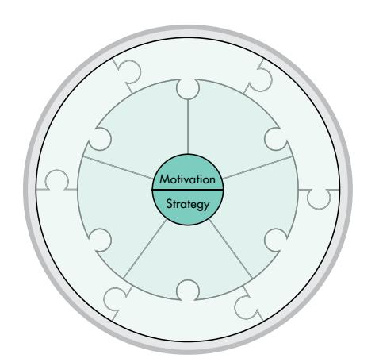
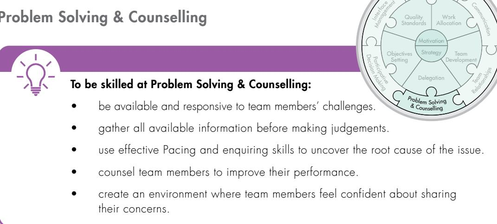
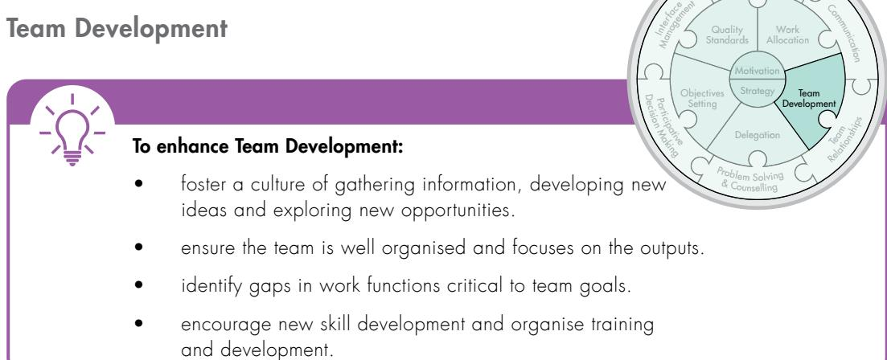
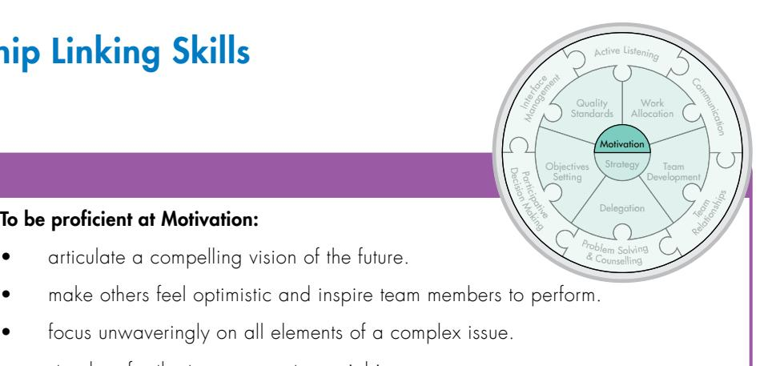
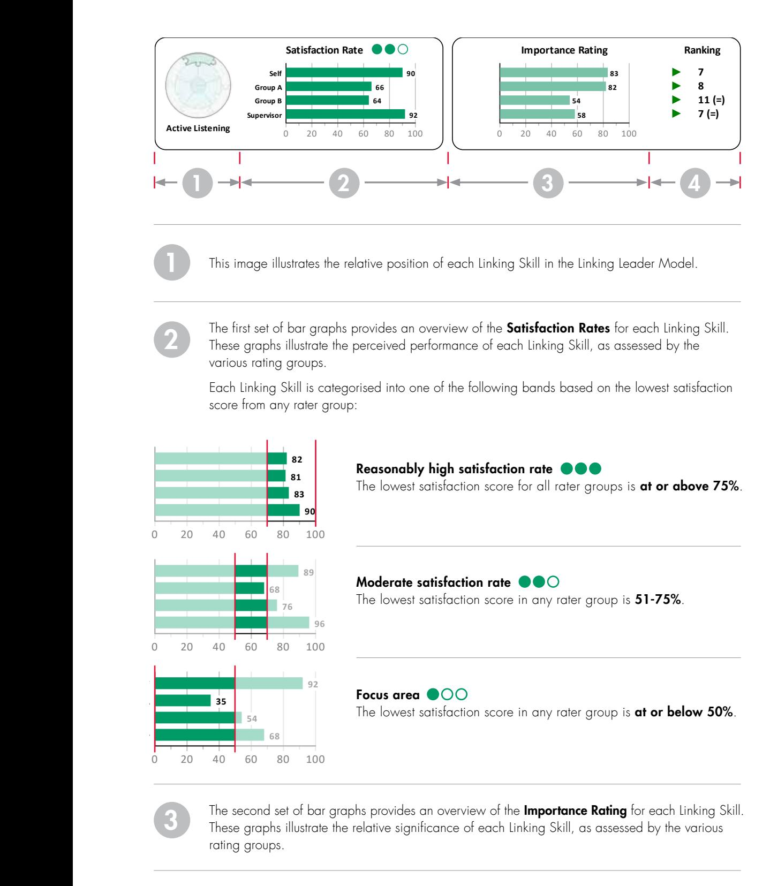

# Accreditation Handbook LINKING LEADER PROFILE

## Published by Team Management Systems PO Box 1107 Milton, Brisbane, Qld 4064 Australia

T: +61 (0) 7 3368 2333 W: tmsoz.com E: tms@tmsoz.com

All rights reserved: no part of this publication may be reproduced, stored in a retrieval system, or transmitted in any form or by any means, electronic, mechanical, photocopying, recording or otherwise, without prior written permission of the publishers.

# Welcome

Team Management Systems (TMS) has developed a complete system of teamwork designed to ignite human potential. We use the word 'system' intentionally.

Our psychometric products are more than just profiles – they lie at the heart of our teamwork methodology that develops individuals into high performing teams.

Your accreditation handbook contains an in-depth summary of the key concepts and models that contribute to the TMS framework. This resource has been designed to guide you during your programme and it is yours to revisit whenever you need to refresh your knowledge about the key elements associated with this product and our unique approach to creating high performing teams.

By gaining accreditation in one of the TMS' products, you are joining an international network of learning professionals who support leaders and teams as they learn to work better together.

We trust you will enjoy working with us and we welcome you to our community of TMS Accredited Practitioners.

**Kirsty Allen**

Kirsty McCann (Allen) *Managing Director*

# Contents

## INTRODUCTION

| The TMS Story How to use this Handbook The Profiles Your Learning Journey                                                                                | 1 2 4 6     |
|-------------------------------------------------------------------------------------------------------------------------------------------------------------------|----------------------|
| PART 1 – Linking Leader (LLP 360) Core Concepts                                                                                                                | 9                    |
| 1.01 Leadership and 360-degree feedback 1.02 Linking Skills 1.03 Linking Leader Profile Questionnaire 1.04 Linking Leader Profile – Overview | 10 11 27 31 |
| PART 2 – Next Level Concepts                                                                                                                                   | 39                   |
| 2.01 Linker Leader Profile Calculations 2.02 Research 2.03 Norm Data                                                                               | 40 42 45       |
| PART 3 – Putting the LLP 360 into Practice                                                                                                                     | 47                   |
| 3.01 Igniting human potential 3.02 Interpreting the profile Case Study: Warren House Recyclables 3.03 Guide to Programme Delivery               | 48 49 56 62 |
| PART 4 – Support and Additional Information                                                                                                                    | 67                   |
| 4.01 TMS Accredited Practitioner Support 4.02 Appropriate use of the LLP 360 4.03 Glossary of LLP 360 Terms                                        | 68 69 71       |

# The TMS Story

Team Management Systems (TMS) was founded in 1985 by Dr Charles Margerison, a professor in management development at the University of Queensland, and Dr Dick McCann, a chemical engineer and international business consultant. With a shared fundamental passion to help people work better together, they launched a comprehensive worldwide research programme to answer the underlying question, "What makes teams successful?".

After collecting data from all types of industries, Drs Margerison and McCann set about to create a suite of valid and reliable tools that would provide individualised feedback designed to facilitate personal, team and organisational development.

With over two and a half million profiles completed worldwide, the work of Dr Margerison and Dr McCann has laid a foundation of unparalleled research that continues to be developed by the TMS team as they strive to 'ignite human potential worldwide'.

# How to use this Handbook

This accreditation handbook is a reference guide for the Linking Leader Profile (LLP|360) and the key components underlying its concepts and models.

Team Management Systems (TMS) continually strives to innovate and deliver relevant, easy-to-use products. To this end, our L&D team frequently update Facilitator Resources on our TMS Global Portal. Remember to check your portal for the latest resources.

There are four parts to this handbook:

# 1 LLP|360 Core Concepts

We begin by exploring the overarching framework for LLP|360, including the key concepts of the Linking Leader Model and the 13 Linking Skills. Additionally, we take a detailed look at the questionnaire and provide an overview of the Linking Leader Profile.

# 2 Next Level Concepts

In this section, we delve deeper into the calculation of Linking Leader Profile scores. We examine the Linking Leader Model's origins in research on work functions, as well as the creation of the multi-rater questionnaire. We also explore the topics of validity, stability, and normative data, and their significance to LLP|360.

# 3 Putting the LLP|360 into Practice

Refer to this section when it is time to prepare for delivering an LLP|360 programme. Although the TMS Global Portal is the access point for up-to-date detailed Facilitator Resources, this section will be a useful starting point to help you formulate session plans to maximise the experience for your leader.

# 4 Support and Additional Information

Becoming a TMS Accredited Practitioner provides you access to our community of practitioners and the TMS Global Portal. TMS also has dedicated support services to cater for your administrative and organisational development needs.

# Navigating this handbook

This handbook incorporates a colour-coded reference for each part that is designed to be a quick visual guide. The page margins may also refer to extra information related to the content. Examples of these elements are shown below.

## Colour-coded sections

## Callouts

Refers to additional information relating to a key topic or subject.

Refers to information relating to Linking Skills Profile Executive Summary 5th Edition

Refers to activities in the Linking Leader Profile (LLP|360) Workbook or TMS Global website.

Refers to information relating to Linking Skills Profile Research Manual 5th Edition

Summarises a key concept or take-away message.

## Digital Experience

This handbook has been designed for an optimal digital experience. To access the interactive Table of Contents, open the handbook in a PDF viewer and click on the 'Contents' or 'Bookmarks' tab in the top left corner of the interface.

Look for the hand pointer icon (shown above) as a visual guide. This identifies interactive elements on the page that, when clicked, lead to related information either within the handbook or to external supporting web pages.

# The Profiles

# Team Management Profile (TMP)

Delivers work-focused insights to help individuals understand why they work the way they do, and develop strategies to improve the way they work with others.

Provides a common language and framework for individuals, teams and organisations to enable lasting change.

## The TMP is a valuable tool for:

- Onboarding and graduate programmes
- Team building and leadership development
- Conflict resolution
- Executive coaching

# Opportunities-Obstacles Quotient (QO2) Profile

Explores the balance of effort people put into seeing opportunities and obstacles.

Provides insights into how individuals and teams approach risk, cope with change, innovation, problem solving, decision making and goal achievement.

## The QO2 is a valuable tool for:

- Risk management
- Change management
- Strategic decision making
- Performance coaching

# Linking Leader Profile (LLP|360)

Creates a foundation for effective leadership development and performance benchmarking over time.

A 360-degree leadership tool that delivers multi-rater feedback on 13 essential skills required for leadership and teamwork.

## The LLP is a valuable tool for:

- Management programmes
- Performance coaching
- Executive and mentoring programmes
- Leadership development

# Window on Work Values (WoWV) Profile

Helps individuals and teams understand their values and how they influence behaviour at work.

Explores implications of misalignment between personal and organisational values, such as potential for conflict, disengagement or poor performance.

## The WoWV is a valuable tool for:

- Organisational change
- Working across cultures
- Merged and newly formed teams
- Creating team value statements and organisational charters

# Your Learning Journey

# About Accreditation

The Linking Leader Profile (LLP|360) is a psychometric product that provides valuable insights into the development and evaluation of leadership skills. To ensure the highest standards of ethical care, the LLP|360 must only be delivered and debriefed by appropriately trained professionals that have completed an authorised accreditation programme.

# Learning Objectives

By the end of the LLP|360 accreditation course, you will:

- Understand the theory and concepts underpinning the LLP|360.
- Have the confidence to apply this knowledge in practice.
- Know how to deliver successful programmes.
- Be equipped to support the development of leadership skills using the LLP|360 framework.

# LLP|360 Accreditation Process

Your learning journey is divided into three main stages.

|                               | Before the workshop                                                                                    |
|-------------------------------|--------------------------------------------------------------------------------------------------------|
|                               | By completing the online coursework, you will:                                                         |
| LLP                           | • Learn about the Linking Leader Model, which serves as the foundation of the LLP 360.           |
|                               | • Understand the levels of Linking and the 13 Linking Skills.                                       |
| COMPLETE                      | • Understand how Linking Skills are measured.                                                       |
| online course                 | • Become familiar with the different sections of the LLP 360 and how to use them in a debrief.   |
|                               | • Learn how scores are calculated.                                                                  |
|                               |                                                                                                        |
| 2                             | Attend the live workshop                                                                               |
|                               | By completing the accreditation workshop, you will:                                                    |
|                               | • Understand the practical application of the Linking Leader Model for leadership development.   |
| ATTEND                        | • Become confident to deliver individual and team debrief sessions.                                 |
| workshop                      | • Gain a deeper understanding of how to interpret and explain data presented in the LLP 360.     |
|                               | • Develop strategies for creating optimal debrief experiences for individual and group sessions. |
|                               | • Facilitate action plan activities for leaders using the Linking Leader Profile Workbook.       |
|                               |                                                                                                        |
|                               |                                                                                                        |
| 3                             | After the workshop                                                                                     |
|                               | You will facilitate a LLP 360 debrief by:                                                              |
|                               | • Setting up and administering your LLP 360 programme.                                              |
|                               | • Selecting relevant learning activities and facilitator resources from the TMS Global Portal.   |
| FACILITATE LLP 360 debrief |                                                                                                        |

# TMS Community of Practice

As an accredited practitioner, you will be invited to join our private LinkedIn TMS Accredited Practitioners group. This online group focuses on maintaining a community of practice where knowledge, experience and insights of TMS profiles and practical applications are shared amongst peers.

This page has been intentionally left blank

# PART 1

# LLP|360 Core Concepts

# Leadership and 360-degree feedback What is Leadership

A simple definition of leadership is the process or ability to influence and inspire others towards achieving a common goal or mission.

Leadership is a dynamic and continuously evolving concept, with various theories and perspectives emerging over time. However, at its core, leadership is centred on relationships and the effective management and development of these relationships. It encompasses not just a title or role but a pattern of behaviour that involves aligning team members with the leader's vision, establishing clear expectations, and inspiring them towards accomplishing shared objectives.

At Team Management Systems, we believe leadership is about Linking — a set of competencies that enhance the coordination and integration of people to create a unified team that knows where it is going and how to get there.

## Importance of multi-rater profiles

The Linking Leader Profile (LLP|360) is a comprehensive multi-rater feedback tool designed to support skills development in leaders. It assesses a leader's competency in the 13 Linking Skills by collecting feedback from different groups of people, including direct reports, supervisors, and peers. This multirater data is combined with the leader's self-assessment to create a 360-degree profile that examines the leader's perceived performance, identifying the Linking Skills that are most important for the role. A 360-degree view of the perceived gap between what the leader should do and what they actually do is also generated, resulting in a secondary measure which highlights the overall satisfaction rate for each Linking Skill.

In addition to the data, the personalised LLP|360 report offers the leader targeted advice and strategies for improving their Linking Skills. The report includes an 'Activity Action Guide' which outlines activities that may enhance or detract from their leadership performance. With this valuable information, leaders can identify areas for improvement and take action to elevate their performance and drive positive change in their organisations.

# Linking Skills Linking Leader Model

Early TMS research into high-performing teams identified eight tasks (referred to as 'Types of Work') that are critical to the success of any team. An additional ninth factor, 'Linking', was uncovered, which involves the coordination and integration of people and tasks within a team.

Linking lies at the centre of the Types of Work Wheel and represents a set of skills that any team member (referred to as a 'Linker') can contribute to a team's collective effort. Linking was further refined into the 'Linking Leader Model' which defines Linking Skills as a layered set of competencies that can be developed over time. The Linking Leader Model contains three levels of Linking Skills, which cumulatively influence outcomes such as team engagement, effectiveness, and discretionary effort.

As the 'ninth factor' in the Types of Work Wheel, Linking offers crucial support for projects and teams, enabling cohesive collaboration towards a common goal. However, if Linking Skills are not used well, a team can lose momentum and direction, potentially leading to a decline in performance.

Linking Leader Model

1.02

PART

# Levels of Linking – Overview

The Linking Leader Model identifies three levels of Linking:

- People Linking Skills
- Task Linking Skills
- Leadership Linking Skills

The three levels of Linking encompass a total of 13 Linking Skills: six in People Linking; five in Task Linking; and two in Leadership Linking. In an effective team, all team members need to contribute to the People Linking Skills level. However, those in leadership roles must successfully use the skills in all three levels.

## Task Linking Skills

The middle level of the Linking Leader Model describes the Task Linking Skills. Task Linking includes five skills that relate to collective team tasks, relevant for those who are responsible for the performance of others.

|                    | WHAT LINKERS DO                                                                         |
|--------------------|-----------------------------------------------------------------------------------------|
| Objectives Setting | Set achievable targets with the team but always press for improved performance       |
| Quality Standards  | Set an example and agree on high quality work standards with the team                |
| Work Allocation    | Allocate work to people based on their capabilities and preferences                  |
| Team Development   | Cultivate a balance of work preferences, tasks and skill development within the team |
| Delegation         | Delegate work when it is not essential to do it themselves                           |

## Leadership Linking Skills

At the core of the Linking Leader Model are the two Leadership Linking Skills, which relate specifically to transformational leadership skills.

|            | WHAT LINKERS DO                                                                    |
|------------|------------------------------------------------------------------------------------|
| Motivation | Inspire others to give their best                                                  |
| Strategy   | Develop clear action plans to achieve short-term goals and the long-term vision |

# People Linking Skills

Active Listening

Quality

Active Listening

Active Listening goes beyond just 'listening' to others. It is about showing interest in what people say by asking questions, building on their statements and summarising what has been said. When done well, Active Listening is incredibly effective. It can often result in a dynamic two-way conversation that lets the speakers access a variety of perspectives and thinking, potentially resulting in highly productive discussions.

Active Listening requires those in the conversation to focus on the words being spoken without being distracted. While some people can naturally focus in this way, others might find their internal dialogue intrudes on that focus. Internal dialogue can prevent people from really listening to and comprehending what is being said in a conversation. To be an Active Listener, it is important that the listener clears their mind of internal dialogue so they can focus on what the other person is saying.

When a person is actively listening they are doing more than just taking in words. They also read the other person's tone, tempo, body movements and facial expressions. These non-verbal cues give valuable information about the speaker's thoughts and feelings on the issue being discussed. In the same way, the listener should cultivate physical body language that shows they are giving the speaker their full attention. This can positively affect the speaker's perceptions of how willing the listener is and, in turn, increase their willingness to share.

What people say to one another must match the way they say it. Listening with the body, getting involved with what they are saying and using non-verbal cues, such as nodding, shows understanding, reinforces ideas and opens deeper communication.

Finally, Active Listening is also about indicating to the other person that they have been heard and understood. Techniques such as asking relevant questions to clarify potential misunderstandings and summarising their thoughts can show the speaker that the listener has understood them. Ultimately, this encourages more profound and effective two-way discussions.

*To be an effective listener, clear the mind of all internal dialogue and focus attention on what the other person is saying.*

## Communication

To be good at Communication:

and keep others informed.

• facilitate group discussions well.

An essential aspect of Linking is Communication, without it, there can be no teamwork. Communication helps team members understand what is happening in the team, and to be part of ongoing discussions and decisions about what will happen in the future. This allows them to feel like an essential part of the whole, which leads to more effective collaboration. On the other hand, when people are not updated about what is going on in their team, they may become demotivated. This can undermine a leader's other attempts to build a harmonious and effective team.

When it comes to Communication, people have different preferences and styles. Because of this, a team will need various communication techniques to interact effectively with each other. This is what we refer to as 'Pacing', and the ability to do this well is one of the key communication skills of Linkers.

Pacing requires empathising with another's perspective and engaging in communication that respects their preferences. Once rapport has been established and a certain level of trust generated, conversations can move into a free exchange of information where connection and understanding are created and maintained.

Being able to communicate effectively, supported by Pacing, allows a team to engage in dialogue that creates space for cooperation and collaboration.

> *Adjusting communication style to suit someone's preferences is called Pacing, which helps generate rapport and trust.*

## Team Relationships

Harmonious Team Relationships are essential in a high-performing team. When there is a lack of respect, understanding and trust, there is no real team, only a group of people. However, when team members have strong Team Relationships, they will also have shared values and goals, a common purpose and the willingness to hold themselves mutually accountable while offering each other support, understanding and trust.

When there is diversity within a team, everyone must work hard to develop mutual respect. Recognising and celebrating people's differences can help foster good Team Relationships, as team members who understand the value of each other's skills and contributions are much more likely to develop respect and loyalty. Of course, when there is diversity, there can also be conflict.

Addressing conflict in a positive way can be a great source of creativity and innovation. In fact, the most innovative solutions can be created out of diversity, but only if harmonious Team Relationships are maintained. When team members understand each person's particular skills and contributions to a job, they are much more likely to value individual differences and much less likely to see them as a source of conflict.

Fostering a culture where a difference of opinion is encouraged creates an environment of open and authentic Communication.

*Leveraging diversity through strong Team Relationships is essential for high performance.*

Active Listening

## Problem Solving & Counselling

Active Listening

Work

Quality

Quality

Team members need to learn how to be available and responsive when other team members have a problem. Being responsive means showing a sincere interest in individuals and their challenges. It means being willing to take the time to listen, offer advice if asked, or give guidance if needed. Sometimes, just listening and showing interest is all that is required.

Developing good counselling skills is valuable when Linking with team members that may need support. Linkers will use a combination of effective Pacing and enquiring skills to get to the heart of an issue. Without discovering the root cause of any problem, it can be difficult to come up with an adequate solution.

When enquiring about a specific issue, some people like to be asked direct questions, while others prefer more open-ended questions. Some people like to concentrate on facts, while others like to focus on feelings. A good enquirer will quickly notice if their questions do not match the other person's preferences. When they see this, they will move to a different mode of enquiry that will allow them to uncover the important details of the problem.

Once team members can identify the heart of a problem, they can help find a solution. Together, they can 'reframe' problems into opportunities for growth. This reframing is a valuable skill that will inspire high performance in the individuals and the team as a whole.

> *Problem Solving & Counselling involves responding in a supportive and sincere way to team members' problems.*

## Participative Decision Making

Sharing key problems and opportunities with team members builds trust. By doing this, the team become part-owners of the solution and will go that extra mile to make it work. Regardless of whose solution is ultimately chosen, inviting team members to voice their views early on paves the way for smooth and successful implementation.

With Participative Decision Making, it is important to strike the right balance of team participation. If every team member participates in all decisions, the team may spend all its time in meetings, stifling productivity. Instead, the key to balanced Participative Decision Making is identifying the specific areas where team member input is valuable, or there is a desire to be consulted. The most effective way to determine these areas is by engaging team members in open communication and discussion.

*A fundamental aspect of effective Participative Decision Making is establishing the key areas where team members wish to have input.*

Active Listening

Work Allocation

Quality Standards

Quality Standard

## Interface Management

Active Listening

Interface Management is the process of managing the links between a team's members as well as other teams or key stakeholders. There are two important aspects of Interface Management – internal Linking and external Linking. Taken together, they build the lines of contact that create engagement, build trust and lead to high performance.

## *Internal Linking*

There needs to be high levels of interaction and communication if a team is to function well. Each person needs to know what the other is doing. Therefore, it is crucial to establish good information flows. Daily stand-ups – short, daily meetings where the team can discuss progress and challenges – are a good example of effective internal Linking.

## *External Linking*

The success of any one team will invariably depend on other teams within the organisation. These might be senior management, customers and even suppliers and competitors. External Linking is the proactive process that allows open lines of communication with these other stakeholders to ensure they understand what is being done and what is needed from them.

*Key tips to effective Interface Management are timeliness and relevance.*

# Task Linking Skills

Objectives Setting

Active Listening

The expectations placed upon individuals can significantly influence their behaviour and performance. Where there are clear and achievable objectives for teams, the team is much more likely to demonstrate high-quality on-the-job performance. Where there are no clear expectations set or direction provided, or goals are constantly being changed, the team will tend to underperform.

Goals should encourage team members to stretch, but not to the extent of discouragement. Targets should be enough to pose a worthy challenge but not be so difficult that they seem too hard to tackle. Setting clear and achievable objectives allows team members to feel successful, boosting morale and motivation.

Involving team members in the objectives-setting process can also increase their sense of ownership and drive towards achieving set targets. Objectives should be clearly defined and results-focused, allowing the team to identify critical resources and measure success through performance indicators.

It is also essential to recognise and celebrate when the team achieves their objectives. This acknowledgment builds morale and ensures that the team is more likely to tackle the next challenge with enthusiasm and commitment.

> *Set clear and achievable objectives for the team and involve them in the process to drive towards success.*

## Quality Standards

Active Listening

Quality

Work

All teams should aim for excellence in their work, and Quality Standards play a vital part in determining the success of organisations.

Quality Standards are simply the guidelines, methods, systems and requirements followed by an organisation to ensure they are operating at a high level. Leaders can serve as role models for what is considered 'quality' within an organisation by setting high standards for their own behaviours and interactions. Their actions, whether they be a quick comment or a meticulously planned project, can set expectations for others to follow.

Quality Standards are not just 'set and forget'. They require ongoing review and analysis. Evaluations of client satisfaction can help improve the quality of products or services offered and should be undertaken on a regular basis. In addition, the team should continuously seek opportunities to enhance team members' skills, which will also lead to higher Quality Standards.

When working with individuals from a team, be mindful of criticism aimed solely at pointing out mistakes. This type of feedback can lead to fear of error and a tendency to hide them, which will undermine high performance. Instead, create a safe and supportive environment where mistakes are seen as opportunities for learning and improvement.

Together, the Linking Skills of Quality Standards and Objectives Setting are the cornerstones of the continuous improvement process. By working in tandem, they create a solid foundation in which individuals and team can achieve high performance.

> *By setting high standards through their behaviour and interactions, leaders can demonstrate the importance of quality and serve as role models for their team.*

## Work Allocation

A leader's ability to allocate work effectively can help or hinder the team's potential to become high performers. Effective Work Allocation requires a well-thought-out approach that balances individual strengths, experiences, preferences and organisational and team goals. When there is a harmonious relationship between the tasks assigned and an individual's work preferences, they will feel more motivated and be more productive.

When it comes to Work Allocation, a leader might be tempted to make assignments based on team members' past experience. However, this can result in Work Allocation that does not align with an individual's preferences. When that happens, the team member can become demotivated and lose productivity, even if they may appear to be the best person for the job.

While it may seem ideal to align work entirely with someone's preferences, it may not always be practical or beneficial. The key is to find the right balance between catering to personal preferences and providing challenging work that offers opportunities for growth and development. Individuals who spend most of their time on tasks they enjoy are more likely to be willing to step outside their comfort zone for other tasks. Providing challenging work with adequate support and resources can lead to a more motivated and productive workforce.

It is crucial to schedule regular Work Allocation and team performance evaluations to ensure that leaders are assigning work in a way that aligns with their team's preferences while also broadening their perspectives. These are particularly important during changes in team composition or responsibilities.

*Effective Work Allocation balances the consideration of team members' preferences with the opportunities for development within an organisation's overall priorities.* 

Active Listening

Work

Quality

## Team Development

Quality

Work

Active Listening

To develop a high-performing team, leaders need to foster skills within the team to help members successfully perform their work functions. Part of this process is assessing work preferences within the team, particularly the eight Types of Work outlined in the Team Management Profile (TMP) framework. These are Advising, Innovating, Promoting, Developing, Organising, Producing, Inspecting and Maintaining.

Where work preferences are balanced, the team can function well, and the work lifecycle will be optimised. But where they are not balanced, for example, where too many team members prefer Advising to Producing, this could result in certain tasks receiving less attention. In addition, workflow as a whole will suffer.

Once the team identifies the gaps in work functions critical to their goals, they can create a tailored training and development plan to address these areas. A supportive culture that encourages team members to embrace new opportunities, gather information, and generate new ideas can contribute to the effectiveness of this approach.

Ultimately, a successful team focuses not only on their input (what they are working on) but also considers their output (what they produce) and the impact of their actions (what they influence).

> *Evaluate the team's preferences for the eight Types of Work to inform training and development priorities.*

## Delegation

Delegation involves transferring work responsibilities by asking, 'Which activities can be completed by others?' Those tasks are then negotiated with team members available to take them on.

Successful Delegation requires providing the assigned team members with appropriate training and support. This allows those taking on the tasks to feel competent, and they will be able to demonstrate that competence in the work they produce. Accordingly, it is important to consider the necessary skills for successful task completion in order to build trust in team members' abilities and increase confidence in delegating tasks.

Finding the appropriate balance in Delegation is crucial. Being overly prescriptive can lead to micromanagement, which can be demotivating. On the other hand, having too much of a hands-off approach by failing to follow up on delegated tasks can result in confusion and inefficiencies.

In high-performing teams, Delegation may not be necessary. In those cases, team members will actively negotiate and allocate tasks among themselves autonomously and in a way that is the most efficient for the team as a whole.

> *Consider the necessary skills required for successful task completion before delegating to team members.*

Active Listening

# Leadership Linking Skills

To be proficient at Motivation:

Motivation

• focus unwaveringly on all elements of a complex issue.

• articulate a compelling vision of the future.

• stand up for the team on controversial issues.

Effective Motivation involves more than simply persuading someone to carry out a task. It entails building relationships and engaging individuals in an endeavour that will continuously inspire their commitment and energy. In practice, Motivation is bringing out someone's best.

To bring out their best, leaders need to provide individuals with a clear picture of the future. This allows them to feel optimistic about where they are headed. Leaders with a compelling vision can effectively communicate it in a way that motivates others. These leaders firmly believe in the value of their aims and are willing to explain and defend them, even in the face of direct challenge. A vision of this kind is fuelled by a genuine desire to achieve, and it brings the vision to life for others, persuading them that the vision is worth pursuing.

The vision must also be translated into clear, achievable goals to act as beacons for the team to follow. Motivational leaders will focus unwaveringly on these goals, highlighting the connection to the team's work, goals and long-term vision. If there are no achievable goals, the team can quickly become demotivated.

Motivation is an individual experience. What motivates one person may not necessarily be inspiring to others. Skilled motivators tailor their Communication style to match the preferences of their team members. For instance, some may respond well to storytelling and metaphors, while others may find visual diagrams showing relationships more compelling.

Standing up for the team in controversial situations can also have a significant impact on Motivation. When team members feel that their leader is advocating for them, they are more likely to go above and beyond to support the leader's vision.

> *Effective Motivation requires leaders to inspire individuals and teams with a compelling vision, and adapting communication styles to match team preferences.*

## Strategy

Strategy refers to the calculated and deliberate decisions that align with an organisation's long-term purpose. Effective leaders have a comprehensive understanding of the interconnections between various components within an organisation, that may not be immediately obvious to others. After all, no section, branch or team works in isolation.

When we zoom out to see the big picture to assess the impact of the rapidly changing external environment, we can adjust accordingly. When we zoom in, we can see the various impacts of the individual teams and even team members. This dual perspective helps leaders ensure that the outputs of individual units enhance the overall outcomes of the organisation.

The core of strategic planning involves having a clear and steadfast long-term vision, complemented by actionable plans that allow the achievement of short-term goals. This includes setting realistic timeframes that pave the way for the results to be achieved.

This requires leaders to stand back from the cut and thrust of daily life to examine the purpose of what they are doing; 'How do all the parts of the business interact to achieve the strategic plan?', 'What impact will external issues have on the organisation?', and 'How can we manage risk?' Leaders must anticipate potential roadblocks, critically evaluate their plans and make adjustments when necessary.

However, as accuracy in long-term planning is limited, strategic leaders must be flexible and ready to adapt to unexpected circumstances and changes. Effective leaders carefully separate the facts from their own assumptions when considering all the influencing factors. This requires a focus on long-term outcomes and the ability to respond creatively to setbacks, reprioritise goals, and continuously analyse and adjust their approach.

*Strategic planning involves having a clear long-term vision, actionable plans to achieve short-term goals and the flexibility to adapt to unexpected circumstances.*

Active Listening

# 1.03 PART

# Linking Leader Profile Questionnaire

# Measuring Linking Skills

Research highlights the difficulty we face when trying to accurately self-assess our own competencies. As such, Linking Skills proficiency is best assessed by those who regularly interact with the individual in question. For this reason, the LLP|360 was designed as a multi-rater questionnaire to allow an individual's Linking Skills to be rated by various people. This provides a more comprehensive Linking Skills assessment by comparing the self-rater's perceptions with those of others.

The Linking Leader Profile (LLP|360) Questionnaire consists of 78 items, comprising six items for each of the 13 Linking Skills. Leadership research clearly shows that while some competencies may be critical in certain roles, teams or organisational cultures, they can be of little importance in others. Accordingly, the questionnaire does not ask for a simple competence rating against each item. Instead, it implements a two-question assessment approach. Raters are asked to rate both the importance (Should occur) of the activity and its actual occurrence (Does occur) to determine the satisfaction rate for each skill, producing context-relevant feedback.

| 1. Listens well when others are speaking |            |                       |                   |                      |                           |                   |
|------------------------------------------|------------|-----------------------|-------------------|----------------------|---------------------------|-------------------|
|                                          | Not at all | To a little extent | To some extent | To a great extent | To a very great extent | Not Applicable |
| To what extent SHOULD this occur?        |            |                       |                   |                      |                           |                   |
| To what extent DOES this occur?          |            |                       |                   |                      |                           |                   |

LLP|360 Questionnaire raters are divided into a maximum of five different rater groups:

To ensure a comprehensive assessment, we recommend the inclusion of at least five raters. These raters should have sufficient familiarity with the individual being assessed to confidently respond to at least two-thirds of the questionnaire items.

# Grouping of LLP|360 Questionnaire items

The LLP|360 Questionnaire is designed to evaluate an individual's Linking Skills through 13 distinct skill categories, each consisting of six assessment items. This approach provides a comprehensive evaluation of the individual's overall Linking skills as well as the option to delve into specific aspects for a more targeted evaluation.

Management Interface

Communication

Active Listening

## People Linking Skills

## *Active Listening*

## Item # Items

|        | Active Listening                                          | Dec Pa rtici ision                       |
|--------|-----------------------------------------------------------|---------------------------------------------------|
| Item # | Items                                                     | Relationships pativ Ma Team king e |
| 1      | Listens well when others are speaking                     | Problem Solving                                   |
| 26     | Asks questions rather than makes statements               | & Counselling                                     |
| 27     | Summarises well their understanding of what has been said |                                                   |
| 40*    | Interrupts others instead of listening                    |                                                   |
| 47     | Checks others' feelings on important matters              |                                                   |
| 68     | Engenders a good two-way discussion of issues             |                                                   |

## *Communication*

| Item # | Items |
|--------|-------|
|--------|-------|

| 2  | Contributes regularly to discussions at team meetings         |
|----|---------------------------------------------------------------|
| 25 | Communicates persuasively when speaking                       |
| 28 | Keeps others well informed                                    |
| 46 | Is effective at communicating in writing                      |
| 49 | Facilitates group discussions well                            |
| 69 | Varies their communication style to match the needs of others |

## *Team Relationships*

## Item # Items

| 7  | Makes sure team members understand how their roles and responsibilities affect one another |
|----|--------------------------------------------------------------------------------------------|
| 20 | Ensures that team members value one another's contributions                                |
| 32 | Positively addresses conflict issues that may arise among team members                     |
| 43 | Develops high levels of trust with team members                                            |
| 54 | Encourages the development of mutual respect                                               |
| 74 | Promotes loyalty and pride among team members                                              |
|    |                                                                                            |

## *Problem Solving and Counselling*

| Item # | Items                                                        |
|--------|--------------------------------------------------------------|
| 3      | Is readily available to discuss problems                     |
| 24     | When they make a commitment, it is delivered                 |
| 30     | Is responsive to others' problems                            |
| 50     | Gathers and assesses information before making judgments     |
| 67     | Counsels team members to improve performance                 |
| 70     | Others feel confident about sharing their concerns with them |

\* Reverse-worded item

## *Participative Decision Making*

| Item # | Items                                                                                 |
|--------|---------------------------------------------------------------------------------------|
| 13     | Shares key problems and opportunities with other team members                         |
| 14     | Encourages differing points of view to be put forward and discussed                   |
| 38     | Encourages people to express their opinions and participate in discussions            |
| 60     | Involves the team in the development of solutions to major problems and opportunities |
| 61     | Organises effective meetings so that team members can contribute to problem solving   |
| 78     | Asks for input from members of the team about matters that affect them                |

## *Interface Management*

| Item # | Items                                                                                    |
|--------|------------------------------------------------------------------------------------------|
| 12     | Coordinates and integrates the work of other team members                                |
| 15     | Ensures that team members regularly get together to discuss how well the team is working |
| 39     | Communicates what is needed from other groups/teams in order to achieve team goals       |
| 58     | Effectively handles disagreements between their team and others                          |
| 62     | Encourages team members to co-operate with other groups which impact the team            |
| 77     | Represents the team well in discussions with senior management                           |

Quality Standards

Objectives Setting

Work Allocation

> Team Development

## Task Linking Skills

## *Objectives Setting*

| Item # | Delegation Items                                                      |
|--------|--------------------------------------------------------------------------|
| 10     | Sets challenging but achievable targets for others                       |
| 16     | Involves the team in establishing key objectives                         |
| 37     | Establishes performance indicators against which outputs may be measured |
| 41     | Presses others effectively for improved performance                      |
| 57     | Gives recognition and establishes incentives to perform                  |
| 63     | Encourages the establishment of goals that challenge the work group      |

## *Quality Standards*

## Item # Items 9 Is a role model for 'quality' that others can follow 18 Sets high standards 35 Leads by example 56 Strives for excellence at work 64 Positively helps others to learn from their mistakes

## 76 Has a focus towards client needs

## *Work Allocation*

| Item # | Items                                                                                 |  |
|--------|---------------------------------------------------------------------------------------|--|
| 6      | Allocates tasks so that team members' abilities are used to meet organisational goals |  |
| 21     | Matches the person to the job                                                         |  |
| 44     | Effectively supports others when they are working on tasks which require new skills   |  |
| 52     | Regularly reviews the performance of others to ensure that work allocation is optimal |  |
| 66     | Knows what activities other team members prefer to be involved in                     |  |
| 73     | Allocates work so that team members have an opportunity to learn new skills           |  |
|        |                                                                                       |  |

## *Team Development*

| Item # | Items                                                                         |
|--------|-------------------------------------------------------------------------------|
| 4      | Encourages others to develop their skills                                     |
| 22     | Recognises the need for the team to gather information and develop new ideas  |
| 31     | Encourages the team to explore new opportunities and promote itself to others |
| 45     | Ensures that the team is well organised to achieve its goals                  |
| 51     | Ensures that the team focuses on outputs as well as inputs                    |
| 71     | Has a training and development plan for staff                                 |

## *Delegation*

| Item # | Items                                                                             |
|--------|-----------------------------------------------------------------------------------|
| 8      | Develops confidence and trust in others to do their work with minimum supervision |
| 19     | Lets people plan their own way of achieving task outputs                          |
| 33     | Determines own work priorities well                                               |
| 34*    | Overloads themself with work when it should be delegated to others                |
| 55     | Negotiates work assignments with team members                                     |
| 75     | Follows up on delegated tasks to gain results                                     |

## Leadership Linking Skills

## *Motivation*

| Item # | Items                                                    |  |
|--------|----------------------------------------------------------|--|
| 5      | Articulates a compelling vision of the team's future     |  |
| 23     | Inspires team members to perform                         |  |
| 36     | Is someone team members want to follow                   |  |
| 42     | Can make others feel optimistic about the future         |  |
| 53     | Focuses unwaveringly on clear goals                      |  |
| 65     | Takes a stand on controversial issues affecting the team |  |

## *Strategy*

## Item # Items

| 11 | Is an effective strategic thinker                                |
|----|------------------------------------------------------------------|
| 17 | Analyses situations clearly and logically                        |
| 29 | Critically examines assumptions to discover potential weaknesses |
| 48 | Keeps in focus all elements of a complex issue                   |
| 59 | Is able to think ahead and see problems before they arise        |
| 72 | Knows 'where we are going' and 'how to get there'                |

\* Reverse-worded item

Motivation Strategy

# Linking Leader Profile – Overview

The Linking Leader Profile (LLP|360) report is generated based on multi-rater responses to the 78-item questionnaire. In addition, accredited practitioners receive two additional resources: the Facilitator Report, which provides a summary of individual rater responses; and the General Comments Report, which compiles optional, anonymised, open-ended feedback from raters. Together, these three resources offer a holistic view of the leader's strengths and areas for development.

# LLP|360 report

The LLP|360 report is organised into six main sections which are collectively designed to provide the leader with an in-depth understanding of the feedback they have received. Each section provides a unique perspective to support the leader to identify their strengths and opportunities to further develop Linking Skills in their role.

## 1. Introduction to Linking Skills

This page presents an overview of the 13 Linking Skills and an explanation of how the LLP|360 Questionnaire is used to generate a personalised report for each individual.

|                                                                                                                                                                                                                                           | INTRODUCTION TO LINKING SKILLS                                                                                                                                                                                                                                                                                                                                                                                                                                                                                                                                                                                                                                                                        |                                                                                                 |
|-------------------------------------------------------------------------------------------------------------------------------------------------------------------------------------------------------------------------------------------|----------------------------------------------------------------------------------------------------------------------------------------------------------------------------------------------------------------------------------------------------------------------------------------------------------------------------------------------------------------------------------------------------------------------------------------------------------------------------------------------------------------------------------------------------------------------------------------------------------------------------------------------------------------------------------------------------------|-------------------------------------------------------------------------------------------------|
|                                                                                                                                                                                                                                           | Linking is a set of skills that, if implemented effectively, contribute to the development of high-performing teams. The Linking Leader Model is based on extensive research1 identifying strongly correlated activities (ultimately termed Linking) that encompass a set of behaviours coordinating and integrating teamwork. The Linking Leader Profile (LLP 360) is based on the Linking Leader Model and is specifically designed for use with team leaders. It provides feedback on the 13 key Linking Skills across the three levels of Linking:                                                                                                                                       |                                                                                                 |
| PEOPLE LINKING SKILLS                                                                                                                                                                                                                  | TASK LINKING SKILLS                                                                                                                                                                                                                                                                                                                                                                                                                                                                                                                                                                                                                                                                                   | LEADERSHIP LINKING SKILLS                                                                    |
| The skills in the outer segment define the six People Linking Skills: • Active Listening • Communication • Team Relationships • Problem Solving & Counselling • Participative Decision Making • Interface Management | The skills in the middle segment define the five Task Linking Skills: • Objectives Setting • Quality Standards • Work Allocation • Team Development • Delegation                                                                                                                                                                                                                                                                                                                                                                                                                                                                                                                       | The skills in the centre define the Leadership Linking Skills: • Motivation • Strategy |
| evaluation from others.                                                                                                                                                                                                                   | When you completed the Linking Leader Profile Questionnaire, you were asked to indicate the extent to which certain activities should occur in your role and the extent to which they actually do occur. Multiple other raters, including direct reports, supervisors and other colleagues were also invited to provide their assessment of what should and does occur. The result is a composite profile that compares your own self-assessment with the Your rater's responses have been divided into Groups A, B and C. For information on these groups, refer to the section 'How should I interpret my Linking Leader Profile?' in the accompanying Linking Leader Profile Workbook. |                                                                                                 |
|                                                                                                                                                                                                                                           | 1 McCann, D.J. & Mead N.H.S 2018, Team Management Profile Research Manual (5th Edition), Team Management Systems, Brisbane. McCann, D.J. & Mead N.H.S 2018, Linking Skills Profile Research Manual (5th Edition), Team Management Systems, Brisbane.                                                                                                                                                                                                                                                                                                                                                                                                                                                  |                                                                                                 |

## 2. Snapshot of Results by Group

This section of the profile provides a set of graphs which display the Linking Skills satisfaction and importance hierarchy for each of the rater groups. In each graph, the Linking Skill with the highest score appears at the top, with the remaining skills arranged in descending order beneath it. To facilitate easy cross-referencing, each Linking Skill is represented by a unique colour.

These graphs assist in determining strengths, focus areas and priorities. Linking Skills ranked higher in the Satisfaction Rate graph can be considered relative strengths, while those ranked lower can indicate focus areas. Similarly, Linking Skills ranked higher in the Importance Rating graph signify a higher priority, while those ranked lower suggest a lower priority level.

Team Development

68

Problem Solving & Counselling

## 3. Results by Linking Skill - Overview

This section of the profile provides an overview of rater group responses by Linking Skill. RESULTS BY LINKING SKILL - OVERVIEW RESULTS BY LINKING SKILL - OVERVIEW

92 35 54 38 95 13 1 0 20 40 60 80 100 74 69 63 42 6 (=) 13 0 20 40 60 80 100 0 20 40 60 80 100 6 (=)13Mike Jones 8 © Bellcastle Pty Ltd T/A This column displays the perceived importance of each Linking Skill as a Ranking. Based on the Importance Rating percentages, Linking Skills are ranked from 1 to 13, with ties indicated by the symbol '(=)'.

4

## 4. Results by Linking Skill - Narrative

This section of the profile offers an in-depth assessment of each Linking Skill. It includes the relevant Linking Skill graph from the Results by Linking Skills - Overview section. Additionally, it presents bullet points of advice that correspond to the six questionnaire items specific to that particular Linking Skill.

Three different text variants are possible for each item.

- If all raters record a gap of one or less between what Should occur and what Does occur, then text is generated indicating that all raters seem pleased with the way this skill is being implemented.
- If the self-rater records a difference of one or less, while other raters record a gap of greater than one, then the text will focus on opportunities for further skill development.
- If the self-rater has a gap of greater than one, but all other raters have a gap of one or less, then text will be produced indicating that, while others seem content, the self-rater desires to do more. Possible reasons for this may include modesty or high personal standards.

Note that over-satisfaction will not generate any text unless the item is reverse-scored (items 34 and 40). For example, if the expected result is two and the actual result is four, this means that the individual is performing too much of this activity and may need to consider reallocating their efforts elsewhere.

## 5. Quantitative Report

People Linking Skills ACTIVE LISTENING QUANTITATIVE REPORT People Linking Skills This section delves into each item of the questionnaire and provides a comprehensive analysis of the responses received from different rater groups.

| Linking Skill Linking Skill                                                                                                                                     | No. No.            | Should Should Occur Occur | Does Does Occur Occur | Gap Gap                   | Not at All Not at All 0 | To a Little To a Little Extent Extent 1 | To Some To Some Extent Extent 2 | To a Great To a Great Extent Extent 3 | To a Very To a Very Great Extent Great Extent 4 | Guides Guides for for Action | 0 | 1 | Range of Opinion Range of Opinion 2 | 3 | 4 |
|--------------------------------------------------------------------------------------------------------------------------------------------------------------------|-----------------------|------------------------------------|--------------------------------|------------------------------|-------------------------------|-----------------------------------------------------|---------------------------------------------|---------------------------------------------------|-------------------------------------------------------------|------------------------------------------|---|---|-------------------------------------------|---|---|
|                                                                                                                                                                    |                       |                                    |                                |                              | 0                             | 1                                                   | 2                                           | 3                                                 | 4                                                           | Action                                   | 0 | 1 | 2                                         | 3 | 4 |
| Question 1: Listens well when others are speaking.                                                                                                                 |                       |                                    |                                |                              |                               |                                                     |                                             |                                                   |                                                             |                                          |   |   |                                           |   |   |
| Question 1: Listens well when others are speaking. Self                                                                                                         | 1                     | 3.00                               | 3.00                           | 0.00                         |                               |                                                     |                                             | D S                                            |                                                             | OK                                       |   |   |                                           |   |   |
| Self Group A                                                                                                                                                    | 1 4                | 3.00 3.50                       | 3.00 2.50                   | 0.00 1.00                 |                               |                                                     |                                             | D S D                                       | S                                                           | OK ?                                  | 2 | 1 |                                           | 1 |   |
| Group A Group B                                                                                                                                                 | 4 1                | 3.50 2.00                       | 2.50 2.00                   | 1.00 0.00                 |                               |                                                     | D S                                      | D                                                 | S                                                           | ? OK                                  | 2 | 1 |                                           | 1 |   |
| Group B Supervisor(s)                                                                                                                                           | 1 1                | 2.00 3.00                       | 2.00 3.00                   | 0.00 0.00                 |                               |                                                     | D S                                      | D S                                            |                                                             | OK OK                                 |   |   |                                           |   |   |
| Supervisor(s) Question 26: Asks questions rather than makes statements. Question 26: Asks questions rather than makes statements. Self Self Group A | 1 1 1 1 4 | 3.00 3.00 3.00 3.00       | 3.00 3.00 3.00 2.25   | 0.00 0.00 0.00 0.75 |                               |                                                     | 2 D                                      | D S D S D S S                   |                                                             | OK 3 OK OK ?                 | 2 | 1 | 4 1                                    |   |   |

D S

Question 27: Summarises well their understanding of what has been said. Self Group A Group B Supervisor(s) 1 4 1 1 3.00 3.00 1.00 1.00 2.00 1.75 3.00 1.00 1.00 1.25 2.00 0.00 OK M L OK 12 1 D D S S D S S Question 27: Summarises well their understanding of what has been said. Self Group B Supervisor(s) 1 1 1 3.00 3.00 1.00 1.00 2.00 1.75 3.00 1.00 1.00 2.00 0.00 OK L OK 12 1 D S D D S S The groups are listed in the first column, followed by a column indicating the number of raters in each group who submitted a response. The next two columns showcase the Should and Does scores. When only one rater is present in a group, their actual responses to the questionnaire are displayed, while groups with multiple raters have scores represented by an average. The gap between the Should and Does scores for each group is displayed both numerically and visually, with the 'D' signifying what 'Does occur' and the 'S' signifying what 'Should occur'.

OK

L

M

3 1

D

Group A Group B 1 0.00 1.00 1.25 1.00 OK 2 11 S S D Self Group A 4 0.00 1.25 0.00 1.25 L 2 11 D S D The bars are colour-coded based on the Guides for Action codes assigned to each item.

- Supervisor(s) 1 0.00 0.00 0.00 OK D S Supervisor(s) 1 0.00 0.00 0.00 0.00 OK OK D S A green bar indicates that the area is generally Acceptable (OK) and no action is recommended.
- 2

1

Group B

Group A

1

4

2.00

3.00

4.00

1.75

2.00

1.25

Supervisor(s)

1

1.00

Question 40: Interrupts others instead of listening.

Question 40: Interrupts others instead of listening.

1.00

0.00

- Question 47: Checks others feelings on important matters. 1 3.00 2.00 Question 47: Checks others feelings on important matters. 1 3.00 3.00 A purple bar indicates a clear recommendation to do More (M) or Less (L) of the activity.
  - Group B Supervisor(s) 1 1 3.00 3.00 4.00 3.00 1.00 0.00 OK S D D S Group B 3 1 1 3.00 3.00 3.00 2.00 4.00 3.00 1.00 1.00 0.00 OK S D A blue bar indicates that the recommended action is Uncertain (?) due to varying opinions among raters.

Question 68: Engenders a good two-way discussion of issues. Self 1 4.00 3.00 Question 68: Engenders a good two-way discussion of issues. When a rater indicates an item is 'Not Applicable', they are not included in the tally in this column.

Supervisor(s) 2.00 2.00 S Supervisor(s) 1 2.00 4.00 2.00 S The Guides for Action column shows one of the following responses:

OK This activity is considered to be OK and no action is required as no raters have a gap of more than 1.

S

D

- M Do More of this activity. The average gap is above 1 with Should higher than Does.
- L Do Less of this activity. The average gap is above 1 with Does higher than Should.
- Mike Jones 26 © Bellcastle Pty Ltd T/A ? Uncertain (some raters are satisfied and others not). Specifically, although the average gap is less than 1, at least one rater in the rater group has a gap of two or more.

3

The final column, Range of Opinion, displays the gap (difference between the Should and Does scores) indicated by the raters in each group. The possible gaps of 0-4 are listed in the heading. The figures in each column represent the count of raters per group who responded with the corresponding gap.

Queensland

Team Management Systems, 2023,

S

## 6. Activity Action Guide

This section presents a visual summary of the Guides for Action column represented in the Quantitative Report to support the development of a targeted action plan. The guide makes it easy to identify patterns of similarities and differences among the rater groups regarding recommendations for doing More (M) or Less (L) of an activity. A question mark (?) indicates the recommended action is uncertain, due to varying opinions among raters. The absence of a mark indicates satisfaction with the corresponding statement.

| ACTIVITY ACTION GUIDE People Linking Skills                                                                                   |                                          |
|----------------------------------------------------------------------------------------------------------------------------------|------------------------------------------|
| Do More of this ? Do Less of this Uncertain (Some of the group M L satisifed, others not) Activity Activity | SUPERVISOR GROUP A GROUP B SELF |
| Active Listening                                                                                                                 |                                          |
| Listens well when others are speaking.                                                                                           | ?                                        |
| Asks questions rather than makes statements.                                                                                     | ?                                        |
| Summarises well their understanding of what has been said.                                                                       | M L                                      |
| Interrupts others instead of listening.                                                                                          | L                                        |
| Checks others feelings on important matters.                                                                                     | ?                                        |
| Engenders a good two-way discussion of issues.                                                                                   | ML L                                  |
| Communication                                                                                                                    |                                          |
| Contributes regularly to discussions at team meetings.                                                                           | ?                                        |
| Communicates persuasively when speaking.                                                                                         | ?                                        |
| Keeps others well informed.                                                                                                      | ? L                                   |
| Is effective at communicating in writing.                                                                                        | ?                                        |
| Facilitates group discussions well.                                                                                              | ?                                        |
| Varies their communication style to match the needs of others.                                                                   | M                                        |
| Team Relationships                                                                                                               |                                          |
| Makes sure team members understand how their roles and responsibilities affect one another.                                      | M                                        |
| Ensures that team members value one another's contributions.                                                                     | ?                                        |
| Positively addresses conflict issues that may arise among team members.                                                          | M                                        |
| Develops high levels of trust with team members.                                                                                 | M                                        |
| Encourages the development of mutual respect.                                                                                    | M                                        |
| Promotes loyalty and pride among team members.                                                                                   |                                          |
|                                                                                                                                  |                                          |
| 40 Mike Jones © Bellcastle Pty Ltd T/A Team Management Systems, 2023, Queensland                                     |                                          |

In addition to the main Linking Leader Profile (LLP|360) Report, two supplementary reports are provided to the accredited practitioner. The Facilitator Report is a confidential resource designed for practitioner use only, where the General Comments report can be shared with the leader at the discretion of the accredited practitioner. 90% 82% 88% 89% 92% 92% 94% 92% 75% 42% 100% 83% 75% 90% 82% 88% 89% 92% 92% 94% 92% 75% 42% 100% 83% 75% 83% 67% 100% 58% 38% 100% 63% 100% 50% 100% 46% 96% 100% 90% 82% 88% 89% 92% 92% 94% 92% 75% 42% 100% 83% 75%

### Facilitator Report 83% 67% 100% 58% 38% 100% 63% 100% 50% 100% 46% 96% 100% 83% 67% 100% 58% 38% 100% 63% 100% 50% 100% 46% 96% 100%

The Facilitator Report is a resource generated for LLP|360 Accredited Practitioner use only. It offers a more in-depth analysis of the data to assist the practitioner in preparing for their debrief. The report presents each individual rater's perception of the leader's performance. The practitioner's discretion must be used as to whether this information is divulged to the leader, and to what extent. 83% 33% 42% 75% 25% 83% 83% 88% 100% 92% 44% 52% 79% 83% 33% 42% 75% 25% 83% 83% 88% 100% 92% 44% 52% 79% 83% 33% 42% 75% 25% 83% 83% 88% 100% 92% 44% 52% 79%

Expanding on insights gained from the Qualitative Report: Range of Opinion section, the Facilitator Report provides the practitioner with a more precise analysis of each rater's responses. Scores are averaged across the six items for each Linking Skill and displayed for both satisfaction and importance ratings. 79% 100% 100% 50% 100% 42% 50% 92% 75% 92% 79% 95% 96% 79% 100% 100% 50% 100% 42% 50% 92% 75% 92% 79% 95% 96% 79% 100% 100% 50% 100% 42% 50% 92% 75% 92% 79% 95% 96%

If a rater's satisfaction score is below average for that skill by 1 to 2 standard deviations, the data is bordered by an orange outline. If the score is well below average (i.e. by more than two standard deviations), the outline is red, highlighting the perceived areas for improvement on a rater-by-rater basis. A normal range is indicated by a black outline. 27% 63% 60% 81% 56% 56% 67% 79% 71% 65% 46% 67% 82% 90% 60% 83% 42% 92% 38% 67% 79% 63% 71% 92% 100% 88% 27% 63% 60% 81% 56% 56% 67% 79% 71% 65% 46% 67% 82% 90% 60% 83% 42% 92% 38% 67% 79% 63% 71% 92% 100% 88% 27% 63% 60% 81% 56% 56% 67% 79% 71% 65% 46% 67% 82% 90% 60% 83% 42% 92% 38% 67% 79% 63% 71% 92% 100% 88%

| 67% |
|-----|
|     |
| 46% |
|     |
| 92% |
|     |

## General Comments Report

The General Comments Report includes feedback about the leader's performance provided by raters from a final question within the questionnaire:

To maintain rater anonymity, comments are not linked to individual raters or groups and will only be generated where at least two raters have responded. The accredited practitioner may choose whether to share the comments with the leader at their discretion.

|       |                                                                                                                                                                                                                                                                                                                                      | GENERAL COMMENTS |  |
|-------|--------------------------------------------------------------------------------------------------------------------------------------------------------------------------------------------------------------------------------------------------------------------------------------------------------------------------------------|------------------|--|
|       | Colleagues and/or Supervisor groups were asked to provide optional information that might help you in developing an action plan for improvement. The comments are reproduced below:                                                                                                                                               |                  |  |
|       | Mike Jones is a wonderful Linker! Never before have I come across such a wonderful example of "Linking Prowess". Keep up the good work!                                                                                                                                                                                           |                  |  |
| week. | A lot can be said for Mikes ability to Link. Perhaps they could be a little more organised with how they plan their                                                                                                                                                                                                                  |                  |  |
|       | © Bellcastle Pty. Ltd. 2023 Version 10.18. Produced on 1/08/2023. All rights reserved. No part of this report may be reproduced, stored in a retrieval system, or transmitted in any form or by any means, electronic, mechanical, photocopying, recording or otherwise without the prior permission of the copyright holders. |                  |  |
|       | The general comments in this section were provided by respondents from either the co-worker or supervisor groups. The authors, publishers or distributors take no responsibility for the accuracy or relevance of these comments which are reproduced exactly as received, apart from minor grammatical or spelling edits.     |                  |  |
|       |                                                                                                                                                                                                                                                                                                                                      |                  |  |
|       |                                                                                                                                                                                                                                                                                                                                      |                  |  |
|       |                                                                                                                                                                                                                                                                                                                                      |                  |  |
|       |                                                                                                                                                                                                                                                                                                                                      |                  |  |
|       |                                                                                                                                                                                                                                                                                                                                      |                  |  |
|       |                                                                                                                                                                                                                                                                                                                                      |                  |  |
|       |                                                                                                                                                                                                                                                                                                                                      |                  |  |
|       |                                                                                                                                                                                                                                                                                                                                      |                  |  |
|       |                                                                                                                                                                                                                                                                                                                                      |                  |  |
|       |                                                                                                                                                                                                                                                                                                                                      |                  |  |
|       |                                                                                                                                                                                                                                                                                                                                      |                  |  |
|       |                                                                                                                                                                                                                                                                                                                                      |                  |  |
|       |                                                                                                                                                                                                                                                                                                                                      |                  |  |

# PART 2

# Next Level Concepts

# Linker Leader Profile Calculations

The LLP|360 algorithm assigns a numerical score to each rater response. 'Not at all' is assigned a score of zero and, 'To a very great extent' is assigned a score of four.

| Scoring responses |                       |                   |                      |                           |  |  |  |  |
|-------------------|-----------------------|-------------------|----------------------|---------------------------|--|--|--|--|
| Not at all     | To a little extent | To some extent | To a great extent | To a very great extent |  |  |  |  |
| 0                 | 1                     | 2                 | 3                    | 4                         |  |  |  |  |

However, the scoring is switched for reverse-worded items in the questionnaire (e.g., Item 40, 'Interrupts others instead of listening'). If the rater were to select the 'Not at all' response in a reverseworded item, it would be assigned a score of four instead of zero.

# Satisfaction rates

Satisfaction rates are determined by the variance between rater scores for Should occur and Does occur.

For example, consider the scores assigned for each of the questionnaire items for Active Listening (see table below). For Item 1, the rater indicated that the leader should listen well when others are speaking to a great extent (3) but does listen when others are speaking to a little extent (1). The gap between the two scores is then expressed as a fraction and represented as a percentage, which in this case would be 33%.

Note the satisfaction rate calculation is switched for reverse-worded items (e.g., Item 40). In this case, the score of 'Not at all' is assigned a score of four instead of zero.

|           |                                                              |                   |                 | Satisfaction rate |              |  |
|-----------|--------------------------------------------------------------|-------------------|-----------------|-------------------|--------------|--|
| Item # | Item                                                         | 'Should' score | 'Does' score | (Fraction)        | (Percentage) |  |
| 1         | Listens well when others are speaking                        | 3                 | 1               | 1/3               | 33%          |  |
| 26        | Asks questions rather than makes statements                  | 3                 | 3               | 3/3               | 100%         |  |
| 27        | Summarises well their understanding of what has been said | 3                 | 2               | 2/3               | 66%          |  |
| 40*       | Interrupts others instead of listening                       | 0                 | 0               | 4/4               | 100%         |  |
| 47        | Checks others' feelings on important matters                 | 2                 | 3               | 2/3               | 66%          |  |
| 68        | Engenders a good two-way discussion of issues                | 4                 | 3               | 3/4               | 75%          |  |
|           | Overall satisfaction rate for Active Listening               |                   |                 |                   | 73%          |  |

\* Reverse-worded item

Table 1. Sample questionnaire items for Active Listening

When calculating satisfaction rates, the smallest value always sits on top of the fraction, even when the score for does is higher than the score for should. For example, examine Items 27 and 47 in Table 1. The score of 2 for should and the score of 3 for does in Item 27 works out to two-thirds (or a 66% satisfaction rate). This same satisfaction rate of 66% is also obtained for Item 47 where the score for should is 3 and the score for does is 2.

$$
\frac{\text{Should}}{\text{Does}} \frac{2}{3} = 66\%
$$

Satisfaction rate calculation for Item 27 from Table 1

Should Does 2 3 = 66%

Satisfaction rate calculation for Item 47 from Table 1

This is because the calculation of satisfaction rates is based on the variance between the raters' assessment of the leader's desired performance (Should occur) versus their actual performance (Does occur). Raters may be indicating that they want the leader to be investing less of their time and energy into these activities than they currently are.

Rater satisfaction percentages are averaged across the six items corresponding to that particular Linking Skill. If a rater group comprises more than one rater, the average satisfaction rate is calculated across the rates provided by all raters in the group. See the example below to understand how the Active Listening satisfaction rate is calculated for a group of three raters, by aggregating and averaging their individual scores.

Satisfaction rate calculation for a group with more than one rater

## Importance ratings

Importance ratings are determined by the 'Should occur' responses in the questionnaire. The score for each Linking Skill is expressed as a percentage for each rater group, with a score of 100% being the highest possible score.

Similar to the satisfaction rate, where there is more than one rater in a group, the importance ratings are averaged to produce an importance rating for the whole group.

# Research

## [More Information](https://tms.global/Facilitator/Login)

## Can be found in the Linking Skills Profile Executive Summary 5th Edition

Located in the

## TMS Global Portal (Facilitator Resources)

## The concept of Linking was developed from empirical studies in the 1980s by Drs. Charles Margerison and Dick McCann during their research to define work functions. Several activities that correlated strongly to form a variable that was eventually defined as 'Linking' were placed at the centre of the Types of Work Wheel to indicate their shared relationship with the eight Types of Work. Linking was later defined as a set of behaviours that coordinate and integrate teamwork, initially divided into People Linking Skills and Task Linking Skills. In 2002, the model was extended to include the Leadership Linking Skills of Motivation and Strategy.

Linking Leader Model

# [More Information](mailto:tms%40tmsoz.com?subject=)

Request a copy of the Linking Skills Profile Research Manual 5th Edition

> By emailing tms@tmsoz.com

The LLP|360 Questionnaire was designed as a multi-rater feedback tool, recognising that leadership competencies may vary in importance based on the organisation, culture and type of leadership role. It uses a two-question approach, allowing the assessment to measure gaps against a varying benchmark.

Further information on the following areas can be found in the Linking Skills Profile Research Manual (5th Edition):

- The relationship of the Linking Leader Model to leadership theories
- An evaluation of the psychometric validity and reliability of the LLP|360
- Ongoing validation studies
- Normative data
- Comparative research

# Linking Skills Profile Executive Summary

The LLP|360 maintains a high level of psychometric validity and reliability due to many years of rigorous testing prior to commercial release, as well as the ongoing work of the Institute of Team Management Studies.

While the research manual addresses the more in-depth aspects of the LLP|360, the executive summary answers many questions that clients may ask. Enquiries concerning instrument development, validity and reliability and normative data can all be found in the executive summary. This is a useful resource to send to a prospective client or someone who needs more detail on the profile's rigour and research components.

# Reliability

Psychometric scales are measured by a number of items that define each scale. A reliable scale must have an adequate degree of internal consistency, which can be measured using a statistic known as the Cronbach alpha coefficient. In general, an ideal range is 0.75–0.85.

The table below shows the Cronbach alpha coefficient for the 78 questionnaire items grouped into their 13 component subscales for both Column A (to what extent should this activity occur) and Column B (to what extent does this activity occur).

|            | Linking Skill                 | Cronbach alpha Column A - Should occur | Cronbach alpha Column B - Does occur |
|------------|-------------------------------|-------------------------------------------|-----------------------------------------|
|            | Active Listening              | 0.77                                      | 0.79                                    |
|            | Communication                 | 0.83                                      | 0.79                                    |
| People     | Team Relationships            | 0.88                                      | 0.85                                    |
|            | Problem Solving & Counselling | 0.85                                      | 0.82                                    |
|            | Participative Decision Making | 0.89                                      | 0.85                                    |
|            | Interface Management          | 0.87                                      | 0.82                                    |
|            | Objectives Setting            | 0.87                                      | 0.82                                    |
|            | Quality Standards             | 0.86                                      | 0.83                                    |
| Task       | Work Allocation               | 0.87                                      | 0.82                                    |
|            | Team Development              | 0.85                                      | 0.82                                    |
|            | Delegation                    | 0.74                                      | 0.68                                    |
| Leadership | Motivation                    | 0.85                                      | 0.83                                    |
|            | Strategy                      | 0.85                                      | 0.84                                    |

Table 2. Internal consistencies for the 13 Linking Skills subscales (n=754)

*Data is sourced from the Linking Skills Profile Research Manual (5th Edition)* 

# Validity

Validity relates to whether the instrument measures what the authors claim it measures, namely, skills from the Linking Leader Model. While reliability addresses how consistent and accurate the measures are over time and across different contexts, validity looks at how 'meaningful' the scores are.

## *Face validity and utility*

Face validity is the extent to which a scale or group of scales 'makes sense' to observers and test users. Utility refers to the usefulness of an instrument, an important concept in the field of management, team and organisational development (as rater feedback is expected to lead to tangible performance improvement). High face validity and utility were generated through an iterative process, with input from many focus groups over a number of years leading to modifications and refinement.

## *Structural validity*

Structural validity refers to the degree to which the scores of an instrument are an adequate reflection of the construct being measured. The Pearson product-moment correlation coefficient is used to determine the extent to which variables are 'proportional' to each other. Intercorrelation calculations between the 13 subscales confirm the presence of a single scale – an overall measure of Linking. Further confirmation of this is indicated by a factor analysis of the 13 subscales (Table 3). This data shows the existence of a single scale on both Column A (to what extent should this activity occur) and Column B (to what extent does this activity occur).

|            | Linking Skill                 | Factor loading Column A - Should occur | Factor loading Column B - Does occur |
|------------|-------------------------------|-------------------------------------------|-----------------------------------------|
|            | Active Listening              | 0.85                                      | 0.78                                    |
|            | Communication                 | 0.89                                      | 0.84                                    |
| People     | Team Relationships            | 0.91                                      | 0.88                                    |
|            | Problem Solving & Counselling | 0.91                                      | 0.87                                    |
|            | Participative Decision Making | 0.91                                      | 0.85                                    |
|            | Interface Management          | 0.93                                      | 0.91                                    |
|            | Objectives Setting            | 0.90                                      | 0.86                                    |
|            | Quality Standards             | 0.89                                      | 0.84                                    |
| Task       | Work Allocation               | 0.89                                      | 0.86                                    |
|            | Team Development              | 0.92                                      | 0.87                                    |
|            | Delegation                    | 0.87                                      | 0.79                                    |
| Leadership | Motivation                    | 0.91                                      | 0.90                                    |
|            | Strategy                      | 0.88                                      | 0.82                                    |

Table 3. Principal component loadings for a single factor, for each of the 13 subscales (n=754)

## *Construct validity*

Construct validity refers to the relationship between the LLP|360 Questionnaire and other validated theoretical concepts. By studying these relationships, researchers gain a better understanding of the scale's true meaning. If the instrument accurately measures the intended construct and does not measure unrelated concepts, it demonstrates strong construct validity. For more information, download the Linking Skills Profile Research Manual, which compares Linking Skills with other leadership instruments.

# Norm Data

The Linking Skills Profile Research Manual (5th Edition) (LSP RM5) includes extensive normative (norm) data which can be used to support an understanding of how similar or different individuals and groups can be when compared with various sample data sets. Using this information in a debrief can be an effective way to generate discussion and discover insights.

The Norm Data presents the global mean percentages for satisfaction and importance.

Data sets include:

- Worldwide, country and regional
- Organisational levels
- Functional area
- Industry and professional groups

The following table shows the mean percentages from the worldwide data set.

|            | Linking Skill                 | Satisfaction % | Importance % |
|------------|-------------------------------|----------------|--------------|
|            | Active Listening              | 82.96          | 78.21        |
|            | Communication                 | 82.68          | 79.36        |
| People     | Team Relationships            | 82.05          | 78.64        |
|            | Problem Solving & Counselling | 83.53          | 80.00        |
|            | Participative Decision Making | 83.07          | 77.19        |
|            | Interface Management          | 81.96          | 77.15        |
|            | Objectives Setting            | 79.91          | 74.15        |
|            | Quality Standards             | 85.18          | 82.78        |
| Task       | Work Allocation               | 82.67          | 74.94        |
|            | Team Development              | 81.24          | 77.45        |
|            | Delegation                    | 82.13          | 75.65        |
| Leadership | Motivation                    | 79.67          | 77.28        |
|            | Strategy                      | 81.60          | 79.65        |

Request a copy of the i

[More Information](mailto:tms%40tmsoz.com%20?subject=)

2.03

PART

 Linking Skills Profile Research Manual 5th Edition

By emailing tms@tmsoz.com

Table 4. Linking Skills mean satisfaction and importance percentages (n=52,273)

This page has been intentionally left blank

# PART 3

# Putting the LLP|360 into Practice

# Igniting human potential

The Linking Leader Profile (LLP|360) has wide-ranging applications and benefits for any leader, team, or organisation. By incorporating the LLP|360 into professional development programs and capability initiatives, organisations can enjoy its benefits across all levels. The following

# Interpreting the profile

When preparing for a debrief, begin by identifying the main themes and focus areas in the leader's LLP|360 report. This will assist the leader to craft an action plan that produces impactful results for both the individual and the organisation as a whole. To keep outcomes achievable, TMS generally recommends that the leader is supported to identify three strengths and up to three focus areas for development.

Start by identifying any strengths or opportunities for improvement for each Linking Skill. Compare how different rater groups have scored the satisfaction and importance of these skills. Next, determine which of the six items for each of the identified Linking Skills need to be developed. Finally, use these selected items to support the formulation of a detailed development plan.

During each debrief, specific needs may arise, and there is no fixed rule about which section of the report to examine first. The decision will depend on the leader's objectives or interests. As a general guideline, we recommend starting with high-level views, such as 'Snapshot of Results by Group' and 'Results by Linking Skills – Overview'.

3.02

PART

# Review Linking Skills

## Compare Linking Skills *within* a rater group

The Snapshot of Results by Group section helps to identify the satisfaction and importance of each rater group. We recommend that leaders start by reviewing their self-rated scores and then look at the ratings from the other groups.

then repeat the process for each rater group. To identify strengths, first look at the top three Linking Skills in the Satisfaction Rate column, then cross-check for matches with the top three Linking Skills in the Importance Rating column. Team Development Communication Quality Standards Work Allocation Strategy Objectives Setting 83 81 77 76 Participative Decision Making Motivation Strategy Team Relationships 95 94 93

Any Linking Skill that appears in the top three of both the Satisfaction Rate and Importance Rating columns can be viewed as a strength. Any Linking Skill that has a high satisfaction rate, regardless of its position in the Importance Rating column, can also be viewed as positive feedback. We suggest that a leader's debrief always begins with positive feedback by having a conversation about these strengths. Problem Solving & Counselling Interface Management Active Listening Motivation Team Relationships Delegation Participative Decision Making 66 66 61 57 35 Team Development Active Listening Work Allocation Communication Objectives Setting Problem Solving & Counselling Interface Management 82 70 68 56 43

Once strengths have been identified, the leader can be supported to identify their areas for improvement. Start by comparing the bottom three Linking Skills in the Satisfaction Rate column with the top three in the Importance Rating column for each rater group. 0 10 20 30 40 50 60 70 80 90 100 0 10 20 30 40 50 60 70 80 90 100 Group B Satisfaction Rate

Communication Quality Standards Work Allocation Strategy Objectives Setting Problem Solving & Counselling Interface Management Active Listening Motivation 77 76 73 69 68 66 66 61 Motivation Strategy Team Relationships Delegation Quality Standards Team Development Active Listening Work Allocation Communication 93 93 89 86 82 70 706666 In the above example, the self-rater has identified Quality Standards as a strength, by rating it as the third highest Linking Skill in terms of satisfaction, and the third most important for the role. On the other hand, they have identified the Linking Skills of Strategy and Team Development as potential areas for improvement by rating them in the bottom three in terms of satisfaction, and in the highest three in terms of importance. This type of analysis helps identify both strengths and opportunities for improvement. Mike Jones 5 © Bellcastle Pty Ltd T/A Team Management Systems, 2023, Queensland

0 10 20 30 40 50 60 70 80 90 100

0 10 20 30 40 50 60 70 80 90 100

## Compare Linking Skills in general

RESULTS BY LINKING SKILL - NARRATIVE Use the Results by Linking Skill - Overview section to see which Linking Skills were scored the highest and lowest. These summary graphs may help the leader identify which skills raters are generally satisfied with and which ones they are the least satisfied with. An example of this process is set out in the images below:

### Task Linking Skills *Quality Standards*

QUALITY STANDARDS • Potential strengths are Linking Skills rated at or above 75%, represented by the visual key

satisfied with your efforts in this area. This skill has been rated by all respondent groups with a reasonably high satisfaction rate (at or above 75%). Most people are satisfied with your efforts in this area.

### *Participative Decision Making* One of the key Task Linking Skills is the setting of quality standards. Team members will often look to others in the team

• Areas for development are Linking Skills rated at or below 50%, represented by the visual key reviewing how well you act as a 'role model' on which others can base their behaviour. Team members particularly look PARTICIPATIVE DECISION MAKING

This skill has been rated at or below 50% by either yourself or another respondent group. Your Linking effectiveness should improve substantially if you can focus on ways of improving this skill. will respect you and want to work hard to achieve the team outputs. When you're under stress try to remember that your behaviour will have a strong impact on others in the team. At these times it's very important that you continue to set a high quality example in everything you do. set a high quality example in everything you do.This skill has been rated at or below 50% by either yourself or another respondent group. Your Linking effectiveness should improve substantially if you can focus on ways of improving this skill.

#### RESULTS BY LINKING SKILL - NARRATIVE Leadership Linking Skills *Strategy* The word 'excellence' is now a frequently used word in modern management. Teams that strive for excellence are those Some of the most significant mistakes in teamwork arise as a consequence of failure to share information. This is essential if others are to do their jobs effectively. You could benefit from 'taking stock' of how well you share important

STRATEGY • Skills rated 'moderately' (51% - 75%), represented by the visual key may be considered as areas for development if there are no Linking Skills rated at or below 50%. that will sooner or later deliver outstanding results. If everyone in the team has a belief that 'only the best will do' then excellence becomes part of the team's culture. It could be worth discussing with your team members to what extent excellence should be a part of the common or shared values in the team. Then it is up to you to set the example for information with other members of your team. Rather than trying to solve problems on your own, try involving others at an early stage.

Obstacle Analysis. This technique forces you to consider everything that might go wrong and one of the processes is a

|            | When solving problems and making important decisions you will benefit from welcoming and listening to different Satisfaction Rate                                                                                                |    |                                                                                                                     |  | Importance Rating |    |     | Ranking |
|------------|-------------------------------------------------------------------------------------------------------------------------------------------------------------------------------------------------------------------------------------|----|---------------------------------------------------------------------------------------------------------------------|--|-------------------|----|-----|---------|
| Self       | points of view. This is one of the hallmarks of the 'balanced team' where different descriptions of problems, One of the best ways for people to learn is through their mistakes. Unfortunately many managers communicate either | 75 |                                                                                                                     |  |                   |    | 100 | 1 (=)   |
| Group A    | opportunities or projects will often arise as people present various viewpoints. Do you encourage people to speak their                                                                                                             | 73 |                                                                                                                     |  |                   |    | 93  | 3 (=)   |
| Group B    | directly or through their actions that the penalty for error is criticism. The message conveyed is not 'admit your mind when they have a different perspective to you or do you 'shut them out'?                                 | 85 |                                                                                                                     |  |                   | 79 |     | 2       |
| Supervisor | mistakes and learn from them', but 'avoid doing anything at all slightly risky as the penalty for things going wrong always                                                                                                         | 67 | exceeds any rewards'. The data from the questionnaire suggest that you are doing what is expected of you in helping |  |                   | 79 |     | 2 (=)   |

This skill has been rated moderately (51% - 75%) by either yourself or another respondent group. This skill has been rated 'moderately' (51% - 75%) by either yourself or another respondent group. All teams have customers or clients - whether they be external to the organisation or internal. Respondent data future. Therefore, as a Linker, you need to handle the situation sensitively and indicate to people that their views are important and needed. Show interest in what your team members are saying and when someone comes up with a good

More Information

Supervisor Supervisor Importance Rating Importance Rating Mike Jones 8 © Bellcastle Pty Ltd T/A

Results by Linking Skill - Overview of the

LLP|360 report

#### Active Listening 0 20 40 60 80 100 Supervisor 0 20 40 60 80 100 RESULTS BY LINKING SKILL - OVERVIEW People Linking Skills Compare Linking Skills *between* rater groups

Satisfaction Rate Importance Rating Satisfaction Rate Importance Rating Use the Results by Linking Skill - Overview section to review the satisfaction rate, importance rating, and ranking scores of each rater group. Compare and identify any similarities and differences.

Self Group A 82 Self 90 An example of this process is set out in the images below:

Communication Group B Supervisor 83 63 58 6 (=) Group B Supervisor 64 92 54 58 11 (=) • Communication – the below example shows that all rater groups display a similar satisfaction rate. This indicates that the raters see Communication as a consistent strength.

Group A Group B Supervisor 68 76 51 63 12 Self Group A Group B Supervisor 76 100 93 67 3 (=) • Participative Decision Making – in contrast, the below example illustrates a variation between the raters' satisfaction rates. This demonstrates that the self-rater is satisfied with Participative Decision Making, but Group A is not.

Self Group A Group B 92 74 43 63 6 (=) Group B Supervisor 71 94 75 79 2 (=) Self Group A 92 35 38 95 13 • Quality Standards – in this example, three out of the four rater groups have ranked Quality Standards as the most important Linking Skill, highlighting this as a consistent priority.

5

92

Group A

40

#### For instance, in the image below: Question 1: Listens well when others are speaking. Group A 4 3.50 3.00 2.50

Occur

Linking Skill No. Should

Question 1: Listens well when others are speaking.

0.00

3.00

1.25

2.00

1.25

1.00

S

4

3

• Purple lines illustrate the extent of the gap between the rating score of 'what should occur' and 'what does occur'. The longer the line, the bigger the gap. Group B Supervisor(s) 1 3.00 2.00 3.00 0.00 OK D S QUANTITATIVE REPORT People Linking Skills ACTIVE LISTENING

After discussing the areas highlighted in the previous sections the leader should be supported to

ACTIVE LISTENING

Not at All To a Little Extent

Gap Guides

To Some Extent

01234 01234

To a Very

To a Great Extent

It can be a good idea for the leader to explore the Linking Skills they have identified as areas for improvement in more detail by looking at the six underlying items. The Quantitative Report section

supports this process by presenting a detailed view of rater responses, item by item.

| Supervisor(s) 1 1.00 1.00 0.00 0 Question 27: Summarises well their understanding of what has been said. Question 1: Listens well when others are speaking. Self 1 3.00 2.00 1.00 Self 1 3.00 3.00 0.00 Group A 4 3.00 1.75 1.25 Linking Skill No. Should Does Gap Group A 4 3.50 2.50 1.00 | People Linking Skills D S 1 2 3 ACTIVE LISTENING D S D S D S Not at All To a Little To Some To a Great D Extent S Extent Extent D D S | for OK Action 4 0           | 1 2 3 4           |
|---------------------------------------------------------------------------------------------------------------------------------------------------------------------------------------------------------------------------------------------------------------------------------------------------------------------------------------------------------------------------------------------|---------------------------------------------------------------------------------------------------------------------------------------------------------------------------------------------------------------|-----------------------------------------|----------------------------|
|                                                                                                                                                                                                                                                                                                                                                                                             |                                                                                                                                                                                                               |                                         |                            |
|                                                                                                                                                                                                                                                                                                                                                                                             |                                                                                                                                                                                                               |                                         |                            |
|                                                                                                                                                                                                                                                                                                                                                                                             |                                                                                                                                                                                                               | OK                                      |                            |
|                                                                                                                                                                                                                                                                                                                                                                                             |                                                                                                                                                                                                               | OK M 1 To a Very Guides     | 2 1 Range of Opinion |
| Group B 1 Occur 1.00 Occur 3.00 2.00                                                                                                                                                                                                                                                                                                                                      |                                                                                                                                                                                                               | S ? 2 Great Extent L for | 1 1                     |
| Group B 1 2.00 2.00 0.00 Supervisor(s) 1 1.00 1.00 0.00 0 Supervisor(s) 1 3.00 3.00 0.00                                                                                                                                                                                                                                                       | D S 1 2 3 D S                                                                                                                                                                               | OK Action OK 4 0 OK      | 1 2 3 4           |

Group B Supervisor(s) 1 2.00 3.00 3.00 0.00 0.00 OK OK D S S QUANTITATIVE REPORT People Linking Skills • 'Guides for Action' illustrated in the purple column identify whether the leader 'should do more' (M) or 'should do less' (L) of an activity. Supervisor(s) 1 0.00 0.00 0.00 OK D S Group B Supervisor(s) 1 1.00 1.00 2.00 1.00 1.00 0.00 OK OK D D S

D

D

D

| Group A Group A Linking Skill Group B Group B Group B                                                                                                                           | 3 4 4 No. 1 1 1 | 3.00 3.00 3.00 Should 3.00 1.00 Occur 1.00 | 2.00 2.25 1.75 Does 4.00 2.00 Occur 3.00 | 1.00 0.75 1.25 Gap 1.00 1.00 2.00 | Not at All  | To a Little S Extent S              | D D D To Some D Extent | S S S To a Great S Extent D | To a Very D Great Extent | ? ? M Guides OK OK L for | 1 2 1 | 1 1 1 1 2 1 Range of Opinion |        |        |
|------------------------------------------------------------------------------------------------------------------------------------------------------------------------------------------------|-----------------------------------|-----------------------------------------------------------------|---------------------------------------------------------------|-----------------------------------------------------|-------------|----------------------------------------------|---------------------------------------|-----------------------------------------------|--------------------------------|-----------------------------------------------|-------------|------------------------------------------------|--------|--------|
| Supervisor(s) Supervisor(s) Supervisor(s)                                                                                                                                                | 1 1 1                       | 3.00 1.00 1.00                                            | 3.00 1.00 1.00                                          | 0.00 0.00 0.00                                | 0           | D S D S 1 QUANTITATIVE REPORT | 2                                     | D S 3                                   | 4                              | OK OK Action OK                      | 0           | 1                                              | 2      | 3 4 |
| Question 68: Engenders a good two-way discussion of issues. Question 27: Summarises well their understanding of what has been said. Question 40: Interrupts others instead of listening. |                                   |                                                                 |                                                               |                                                     |             | People Linking Skills                        |                                       |                                               |                                |                                               |             |                                                |        |        |
| Question 1: Listens well when others are speaking. Self Self                                                                                                                             | 1 1                            | 4.00 3.00                                                    | 3.00 2.00                                                  | 1.00 1.00                                        |             | ACTIVE LISTENING                             | D                                     | D S                                        | S                              | OK OK                                      |             |                                                |        |        |
| Self Self                                                                                                                                                                                   | 1 1 4 4 4             | 0.00 3.00 3.00 3.00 0.00                            | 0.00 3.00 1.75 1.75 1.25                          | 0.00 0.00 1.25 1.25 1.25                | D S S | D                                            | D D                                | D S S S                              |                                | OK OK M M L                       | 1 2      | 3 2                                         | 1 1 | 1 1 |
| Group A                                                                                                                                                                                        | 4                                 | 3.50 2.00                                                    | 2.50 4.00 3.00 1.00                                  | 1.00 2.00 2.00 1.00 0.00                | S           | S D                                       | S D S                           | D D                                        | S D                         | ? L L OK OK                       | 2           | 1                                              |        | 1      |
| Group A Group A Group A Group B Group B Group B Group B                                                                                                                      | 1 1 1 1                  | 1.00 0.00 2.00                                            | 2.00                                                          |                                                     |             |                                              | S                                     |                                               | D                              | L                                             |             |                                                |        |        |

Self Group A Group B Supervisor(s) 1 4 1 3.00 3.50 2.00 3.00 3.00 2.50 2.00 3.00 0.00 1.00 0.00 0.00 OK ? OK 21 1 D D D S S S QUANTITATIVE REPORT People Linking Skills Supervisor(s) 1 0.00 0.00 0.00 OK D S Question 47: Checks others feelings on important matters. Self 1 3.00 3.00 0.00 D Group B Supervisor(s) 1 1 1.00 1.00 2.00 1.00 1.00 0.00 OK D S Question 27: Summarises well their understanding of what has been said. • 'Range of Opinion' illustrated in the lime green column brings context to the data for any rater group with more than one rater, showing the extent of alignment or variability within that group. For example, in Group A one rater had no gap, two raters had a gap of '1' and one rater had a gap to '3' between 'what should occur' and 'what does occur'. Supervisor(s) 1 3.00 3.00 0.00 OK D S Question 68: Engenders a good two-way discussion of issues. Self

D

D

| Group B Self Supervisor(s) Supervisor(s) Supervisor(s) Group A Linking Skill Group B Question 68: Engenders a good two-way discussion of issues. Supervisor(s) Question 40: Interrupts others instead of listening. | 1 1 1 1 1 4 No. 1 1 | 1.00 3.00 3.00 2.00 1.00 3.00 Should 1.00 Occur 1.00 | 3.00 3.00 3.00 4.00 1.00 2.25 Does 2.00 Occur 1.00 | 2.00 0.00 0.00 2.00 0.00 0.75 Gap 1.00 0.00 | Not at All 0 | S D S To a Little S Extent D S 1 | S D To Some D Extent 2 | D D S D S Queensland S To a Great Extent 3 | Team Management Systems, 2023, D To a Very Great Extent 4 | L OK OK L OK ? Guides OK for OK Action | 2 0 | 1 1 | 1 Range of Opinion 2 | 3      | 4 |
|---------------------------------------------------------------------------------------------------------------------------------------------------------------------------------------------------------------------------------------------------|---------------------------------------------|---------------------------------------------------------------------------------|-------------------------------------------------------------------------------|---------------------------------------------------------------------|-----------------|----------------------------------------------------------|---------------------------------------|-----------------------------------------------------------------------|-----------------------------------------------------------------------|----------------------------------------------------------------------|--------|--------|----------------------------|--------|---|
| Self Self Group A Question 27: Summarises well their understanding of what has been said. Group A Question 1: Listens well when others are speaking. Group B                                                                    | 1 1 4 4 1                       | 4.00 0.00 3.00 0.00 2.00                                            | 3.00 0.00 1.75 1.25 4.00                                          | 1.00 0.00 1.25 1.25 2.00                                | D S S     | D                                                        | D S                                | D S                                                                | S D                                                                | OK OK M L L                                              | 2      | 3      | 1 1                     | 1      |   |
| Group B Self Supervisor(s)                                                                                                                                                                                                                  | 1 1 1                                 | 0.00 3.00 2.00                                                            | 1.00 2.00 4.00                                                          | 1.00 1.00 2.00                                                | S               | D                                                        | D S                                | S                                                                     | D                                                                     | OK OK L                                                        |        |        |                            |        |   |
| Self Supervisor(s) Group A Group A                                                                                                                                                                                                       | 1 1 4 4                            | 3.00 0.00 3.00 3.50                                                    | 3.00 0.00 1.75 2.50                                                  | 0.00 0.00 1.25 1.00                                        | D S          |                                                          | D                                     | D S S D                                                      | S                                                                     | OK OK M ?                                                   | 1 2 | 2 1 |                            | 1 1 |   |
| Group B Group B                                                                                                                                                                                                                                | 1 1                                      | 1.00 2.00                                                                    | 3.00 2.00                                                                  | 2.00 0.00                                                        |                 | S                                                        | D S                                | D                                                                     |                                                                       | L OK                                                              |        |        |                            |        |   |
| Supervisor(s) Question 47: Checks others feelings on important matters. Supervisor(s)                                                                                                                                                       | 1 1                                      | 1.00 3.00                                                                    | 1.00 3.00                                                                  | 0.00 0.00                                                        |                 | D S                                                   |                                       | D S                                                                |                                                                       | OK OK                                                             |        |        |                            |        |   |

More Information i Can be found in the section titled Linking Skill No. Should Gap Guides 01234 01234 QUANTITATIVE REPORT People Linking Skills Question 26: Asks questions rather than makes statements. Supervisor(s) OK Question 40: Interrupts others instead of listening. OK OK Mike Jones 26 © Bellcastle Pty Ltd T/A

 Quantitative Report of the LLP|360 report

1

1

1

0.00

3.00

3.00

0.00

3.00

3.00

0.00

0.00

0.00

D S

Self

Group A

Group A

Group A

Group A

Group A

4

4

4

3.50

3.00

0.00

2.50

2.25

1.25

1.00

0.75

1.25

S

Identify focus items within a Linking Skill

establish their top three strengths and areas that need development.

Does Occur

Self

Supervisor(s)

OK

?

?

L

L

?

2 11

111

S

S

S

21 1

211

2 11

Range of Opinion

OK

OK

D S

D S

Queensland

Another way for the leader to identify which items to focus on for each Linking Skill is to go to the Activity Action Guide section. For each Linking Skill that the leader identifies as a focus area, they can look for the 'M' (do more of this activity) and 'L' (do less of this activity).

# Develop a plan

Start by exploring how any identified strengths might be leveraged to improve performance. Then use the Results by Linking Skill - Narrative section to drill into the details of each Linking Skill that has been identified as an area of focus. Up to six bullet points of advice are provided for each Linking Skill, corresponding to the six items related to that skill in the questionnaire. These suggestions offer practical strategies for a leader to incorporate into their action plan. Note that an over-satisfaction rating for an item will not generate any bullet points of information.

# Case Study: Warren House Recyclables

This case study will help you to understand how to interpret and prepare for an LLP|360 debrief, including how to interpret insights and develop suggested actions.

## Background

Eighteen months ago, Mike Jones took over as the new Production Manager for Warren House Recyclables, Australia's leading manufacturer of crates made from recycled plastic. The company's recent focus on sustainable products had led to positive growth, with turnover doubling in the two years prior.

When Mike became the Production Manager, he inherited a team of managers (Direct Reports) accustomed to working long hours to meet production targets. During the past couple of years, new competitors were emerging, and many were offering cheaper alternative forms of packaging. Because of this, the pace of work at Warren House Recyclables has recently started to level off.

These changes in the work environment led to some new challenges within the team which need to be addressed. Mike feels that current working practices should be re-evaluated and new ideas introduced. The team also needs to be more involved in key customer relationships and product development.

To help address these issues, Mike was invited by the Human Resources Director to complete an LLP|360 review in order to seek feedback from his Supervisor, Peer, and Direct Reports.

## Rater Selection

As the self-rater, Mike invited feedback from his:

Supervisor – Operations Director

Direct Reports (GROUP A) – four of the managers (reporting to Mike)

Peer (GROUP B) – Logistics Manager

No Independent Raters (GROUP C) were selected for this assessment

An extract from the Warren House Recyclables Organisational Chart shows the raters and their respective rater groups:

Extract from the Warren House Recyclables Organisational Chart

## The Production Team

*Mike*

Mike is ambitious and aspires to be a Managing Director one day. His colleagues on the management team respect his drive and strategic focus. However, a couple of his team members have said that they felt "left in the dark" by some of his decisions. He spends much of his time in project and management meetings.

*Jazmin*

Jazmin has been with the company from the beginning, 17 years. She has a master's degree in chemical engineering and manages a small team. Jazmin is quiet and thorough in her approach to work.

Orlando has been with the company as a Mixing Manager for seven years. He regards himself as a member of his production team first, and a supervisor second. As an older team member, he is respected for his production knowledge.

Liz has been with the company for eight years. She was promoted to Line Manager two years ago and is ambitious to move further. She enjoys working the factory floor and is rarely to be found in her office.

*Robin*

Robin joined the team and organisation four months ago. Robin holds an engineering degree and a Masters of Business Administration (MBA). Robin enjoys the work but has commented about some of the 'dinosaurs' in the organisation.

The production team recently participated in a Team Management Profile (TMP) team debrief workshop, which identified their major role preferences, as shown below:

## SNAPSHOT OF RESULTS BY GROUP

## Sample extracts from Mike Jone's Linking Leader Profile (LLP|360)

The following extracts from Mike's LLP|360 report will assist in identifying his areas of focus for Linking Skills.

## RESULTS BY LINKING SKILL - NARRATIVE People Linking Skills RESULTS BY LINKING SKILL - NARRATIVE

### COMMUNICATION *Communication* ACTIVE LISTENING

This skill has been rated by all respondent groups with a reasonably high satisfaction rate (at or above 75%). Most people are satisfied with your efforts in this area. RESULTS BY LINKING SKILL - NARRATIVE This skill has been rated by all respondent groups with a reasonably high satisfaction rate (at or above 75%). Most people are satisfied with your efforts in this area. This skill has been rated moderately (51% - 75%) by either yourself or another respondent group.

#### *Participative Decision Making* Perhaps the best way of communicating is through team-briefing meetings. When meetings are held, make sure that you contribute positively. Don't treat them as a routine necessity but as an exciting way to motivate others and share the information that you have. People often respond better in smaller groups. Therefore if your team is large, suggest People Linking Skills PARTICIPATIVE DECISION MAKING reduced. How long is your attention span now? How long is it before your mind wanders off onto other things?

 You may need to look at how well informed you're keeping the various people with whom you interact. It's sometimes hard to find the right balance between what people 'want' to know and what you think they 'need' to know. If you're a more introverted person you may well prefer to communicate with others by sending memos. This is a valuable way of This skill has been rated at or below 50% by either yourself or another respondent group. Your Linking effectiveness should improve substantially if you can focus on ways of improving this skill. This skill has been rated at or below 50% by either yourself or another respondent group. Your Linking effectiveness should improve substantially if you can focus on ways of improving this skill. RESULTS BY LINKING SKILL - NARRATIVE parties. It's also mandatory when discussions are being held with large groups, particularly where issues are complex and speakers are digressing.

Some of the most significant mistakes in teamwork arise as a consequence of failure to share information. This is

#### *Quality Standards* essential if others are to do their jobs effectively. You could benefit from 'taking stock' of how well you share important information with other members of your team. Rather than trying to solve problems on your own, try involving others Task Linking Skills QUALITY STANDARDS natural tendency to finish off their sentences for them and then go on with the interruption by explaining your view on a situation. If this applies to you then you need to be aware of the effect you are creating.

opportunity to make an equal contribution to the discussion. It often helps to know who are the more extroverted people so that you can control their contributions. Likewise you should know who are the more introverted people and give them every opportunity to contribute to the discussions as well. You will also need to learn how best to handle culture where this has been discouraged. They may feel that any views they express might be held against them in the future. Therefore, as a Linker, you need to handle the situation sensitively and indicate to people that their views are important and needed. Show interest in what your team members are saying and when someone comes up with a good This skill has been rated by all respondent groups with a reasonably high satisfaction rate (at or above 75%). Most people are satisfied with your efforts in this area. This skill has been rated by all respondent groups with a reasonably high satisfaction rate (at or above 75%). Most people are satisfied with your efforts in this area. RESULTS BY LINKING SKILL - NARRATIVE comments on what they say, and generally appearing interested. Don't just sit there passively listening, become a part of the discussion!

#### Perhaps the most important skill of communication is to realise that 'people are different' and so different communication processes are necessary with different people. No one communication style works with everyone and Once information has been shared and any problems or opportunities have been analysed, it's necessary to generate One of the key Task Linking Skills is the setting of quality standards. Team members will often look to others in the team to set the example of 'quality' for them to follow. In this way you're acting as a 'role model'. Spend a little time reviewing how well you act as a 'role model' on which others can base their behaviour. Team members particularly look Task Linking Skills TEAM DEVELOPMENT *Team Development*

If decisions are being made that directly affect your team members it's essential that you ask for their views at an early

To continue their commitment to a team or an organisation, people constantly need to be encouraged to learn new

issues to be aired and shared. The decision can then be taken later, whenever you judge that the major issues have been thoroughly discussed. You may need to review to what extent you set an example for your team. If you can set a good example then people will respect you and want to work hard to achieve the team outputs. When you're under stress try to remember that your behaviour will have a strong impact on others in the team. At these times it's very important that you continue to This skill has been rated at or below 50% by either yourself or another respondent group. Your Linking effectiveness should improve substantially if you can focus on ways of improving this skill. This skill has been rated at or below 50% by either yourself or another respondent group. Your Linking effectiveness should improve substantially if you can focus on ways of improving this skill. Team Management Systems, 2023, Queensland

set a high quality example in everything you do.

## Insights and suggested actions for the Warren House Recyclables Case Study

## Key insights

- With strong customer demand, the team has worked hard to achieve it's organisational goals.
- The team may need to focus more on responding to customer needs, optimising processes and driving innovation.
- The rater groups have varying priorities. For example, Mike seems eager to build a connected, strategic production leadership team. On the other hand, his supervisor places more emphasis on outputs and 'getting on with the job'.
- The team overall is highly experienced, qualified and wants to be involved in driving team decisions.

## *Strengths* Areas of high importance and high satisfaction Mike: Quality Standards Interface Management Supervisor: Quality Standards Objectives Setting Peer (GROUP B): Quality Standards Strategy Consistently high satisfaction ratings regardless of importance rating Direct Reports (GROUP A): Team Development Communication Quality Standards In General: Communication Quality Standards Areas of high importance and low satisfaction Mike: Team Development Strategy Supervisor: Strategy Direct Reports (GROUP A): Participative Decision Making Delegation Team Relationships Factors rated consistently low in satisfaction by more than 1 rater group. Direct Reports and Peer (GROUP A and B): Participative Decision Making Mike and Peer (GROUP B): Team Development *Development Areas*

## Strengths and development areas

## Debrief tips

The accredited practitioner delivering Mike's debrief should:

- Avoid trying to explain all the data in one session. Start with identifying Mike's strengths before moving on to development areas. Discuss his self-rated scores, then his Supervisor's ratings before focussing on the Direct Report rater group.
- Advise Mike that change in one area is likely to impact other areas. For example, if he addresses Participative Decision Making, he may well find Communication, and Team Relationships are positively impacted.
- Help Mike understand why there may be a large difference between rater groups, for example, his Supervisor rates Delegation at 92% satisfaction, whereas his team rates it at 40% satisfaction. This Linking Skill will have more impact on Mike's team, where they value autonomy over their work assignments.
- Confirm with Mike which Linking Skills will be the focus areas and then use the Quantitative Report and Activity Action Guide to determine which of the six items for those Linking Skills require development.
- Ensure Mike creates a development plan that clearly outlines his goals. To avoid overload, suggest Mike initially targets three areas to work on. The development plan should ideally address some of the items from Participative Decision Making, Delegation, Team Relationships (identified by Mike and the team) and Strategy (identified by Mike and his supervisor). These areas are high importance and low satisfaction.
- Help Mike log insights and actions in the Linking Skills Action Planning Guide section of the Linking Leader Profile Workbook.

## Follow-up activities

The accredited practitioner delivering Mike's debrief should:

- Suggest that Mike respond to each rater to thank them for their feedback.
- Encourage Mike to run a session with his Direct Reports, and one with his Supervisor, sharing key insights and any actions he will take. This is an effective way for Mike to show he is committed to professional development.
- Schedule ongoing coaching session to support Mike with his development plan.

# Guide to Programme Delivery

Once you have identified a need for the Linking Leader Profile (LLP|360), it is time to get planning!

Follow this guide for tips on how to deliver your programme successfully. When delivering debrief sessions, it is important to consider the circumstances and choose the most effective approach. Individual debriefs provide an opportunity for the leader to ask questions and create a personalised action plan with your guidance. However, running group feedback sessions can also yield great rewards. To be successful, there needs to be a high level of trust and professional maturity within the group, which allows participants to feel psychologically safe and comfortable expressing their vulnerabilities. Creating a safe environment for group feedback requires careful attention to the needs of each participant, as well as clear guidelines and ground rules for communication.

Whether it be an individual debrief or a group facilitation workshop, there are three main stages to programme delivery.

Before you deliver your programme, it is essential that you complete the following activities.

*with the client*

A LLP|360 programme should be designed to improve the performance of the leader(s) and their team(s) within the context of the organisation's strategic objectives. It is, therefore, critical to identify the business objectives behind the programme initiative. Placing professional development at the centre of a broader strategic context can also help people accept the process without feeling targeted or singled out for improvement or appraisal.

Gather information to define the scope, clarify expectations and design your programme. You may like to ask questions about the programme's purpose, previous exposure to psychometric profiles and the desired return on investment.

Key points that should be addressed at this stage of the process:

- Confirm that the organisational culture will support the introduction of 360° feedback. Ensure there is senior management commitment, as this has a key influence on whether 360° feedback is seen as credible within the organisation.
- Identify a specific business objective or problem.
- Explain that the focus of this instrument is on constructive feedback to help people improve their Linking Skills and, subsequently, their performance as managers and leaders.

## *with the leader and other raters*

## Select raters to complete questionnaire

The leader will ideally be involved in identifying who is best positioned to evaluate their performance. The number of raters is important as the feedback needs to include a large enough sample to ensure that it is valid. If it is too small, there is a risk that a single rater could significantly influence the resulting report.

A minimum of five raters is recommended, including:

- Self-rater
- Supervisor
- Three direct reports (Group A)

While the leader may be tempted to select only three raters with whom they have a personal relationship, this approach could result in inaccurate feedback on their Linking Skills. It is recommended that all peers and direct reports be invited to participate in the process, provided they have a sufficient level of familiarity with the leader to answer at least two-thirds of the questionnaire items accurately.

## Introduce the programme

This part of the process involves preparing raters to complete the LLP|360 Questionnaire. All raters need to complete the questionnaire in an honest and considered way and it is crucial that they understand the purpose and significance of the report and how it will be used. Use the 'LLP|360 Instructions and Email Templates' to assist with your communication.

You need to:

- be aware of past history and usage of leadership questionnaires within the organisation.
- outline the business objectives behind the application.
- clarify whose ratings will be identifiable. This occurs when there just one rater in the group, such as the supervisor.
- emphasise the importance of providing honest answers.
- describe the process of completing the questionnaire.

## Send out the questionnaires

With the programme now introduced, raters can be invited to complete the questionnaire. To guarantee a smooth experience process, TMS will provide administrative support and guidance throughout this stage.

Download 'LLP|360 Instructions and Email Templates'

Located in the

TMS Global Portal (Facilitator Resources)

Prepare

## *for the debrief*

## [More Information](https://tms.global/Facilitator/Login)

## Download the LLP|360 Debrief Session Plan

Located in the TMS Global Portal (Facilitator Resources)

To ensure the success of the programme, it is important to carefully consider the logistical requirements involved. This includes allocating sufficient time to gather and analyse the data. Having the reports generated a few days before the debrief is advisable, as this gives you time to read the results and prepare constructive feedback. Before feeding back the profile content, ensure you have read the report thoroughly and have extracted the key points. Reflect on how you will relate the results back to the key concepts underlying the Linking Leader Model.

When giving feedback, it is essential to plan ahead and choose an approach that will be situationally effective. By tailoring your feedback approach, you can increase the likelihood that feedback will be well-received and lead to positive outcomes. For individual debriefs, it is helpful to consider the leader's communication preferences and choose a feedback style that aligns with them. For team debriefs, choose a style that promotes positive communication within the group. Creating an environment conducive to constructive feedback makes participants more comfortable sharing their thoughts and ideas, which can lead to improved teamwork and better outcomes.

## Deliver your programme

You have arrived at the stage of delivering your well-planned programme! Your debrief can be conducted with the leader individually or as a group; in person or virtually. Whatever the delivery scenario, the basic process is:

Outline

*the business objectives*

Remind the leader of the objectives that were communicated during the initial consultation with the client and leader. These objectives might include enhancing leadership skills, improving communication and collaboration within the team, identifying areas for development and growth, and aligning individual goals with those of the organisation.

Explain the LLP|360 can help leaders achieve these objectives by providing valuable insights into their strengths and areas for improvement in key work competencies related to People Linking, Task Linking, and Leadership Linking Skills. Through the process of raters who have provided honest and constructive feedback, leaders can obtain meaningful insights. This feedback can serve as a starting point for discussing key leadership skills and help leaders identify their top priorities.

Explain that the model is based on extensive research on high-performing teams and identifies core skills that integrate and coordinate teamwork. Provide an overview of the three levels of Linking: People, Task, and Leadership. Explain that by using this framework, leaders will gain a deeper understanding of these skills and how they can enhance team performance.

To facilitate a better understanding of the profile, explain how to read and interpret the various sections. When working with individuals, you may consider sharing their profile report immediately. However, when working with a group, it is helpful to begin by sharing a sample profile report and explaining the different sections. This will ensure that participants understand how to read and interpret their own reports.

Once you are confident that participants understand the report's structure, you can distribute their profiles. It is important to be familiar with the content of each report, as it will inform the conversations you will have with each participant. By understanding their strengths and areas for development, you can ask the right questions and help them to set goals that will enhance their leadership skills.

Allow plenty of time for participants to read and absorb the information and encourage them to reflect and discuss the insights gained.

Develop

## *an action plan to align with the business objectives*

## [More Information](https://tms.global/Facilitator/Login)

Download 'Linking Leader Profile Workbook'

Located in the TMS Global Portal

(Facilitator Resources)

No matter how much interest and discussion the profiles generate, the process must always converge on development opportunities. Remember, 360° feedback is simply information. Having a tangible outcome of the process is essential. This can be encapsulated in a leadership development plan, allowing the leader to choose the kind of development strategy they want to adopt based on the feedback they have received.

You should ensure that action plans are aligned with business objectives, within the person's control and are measurable. Finally, build in a date for review so that progress can be tracked and amendments to the plan can be made in the light of new feedback (if needed).

## Follow Up

Follow-up is crucial for ensuring that the action plan is effective and that programme participants are committed to improvement. A clear, concise, and targeted post debrief programme can help you engage with participating leaders and ensure they have the opportunity to apply their insights back in the workplace.

Engage

*with your leader*

After completing a session, send a clear summary of the objectives and actions from the programme in a follow-up email. This will create alignment with the agreed next steps, clarify what needs to be done and create a shared commitment.

The initial debrief marks the beginning of their journey towards self-discovery and high performance, but to achieve their goals, they will need to schedule additional sessions.

Additionally, it is essential for the leader to engage with their raters, providing feedback on what they have learned and to thank them for their input. It is important they communicate what specific changes or improvements they plan to implement based on the feedback received.

If possible, a second set of LLP|360 Questionnaires can be completed six to 18 months after the initial questionnaire to measure the improvement over a suitable elapsed time. Additionally, this data can help you to evaluate the development programme in terms of return on investment.

# PART 4

# Support and Additional Information

# TMS Accredited Practitioner Support

Congratulations on joining our community of over 24,000 TMS Accredited Practitioners globally.

# Your TMS support includes:

## Access to TMS Global Portal

(https://[tms.global/Facilitator/Login](https://tms.global/Facilitator/Login))

• Access and download the latest facilitator resources to promote, prepare, and present learning programmes.

## Assistance from our Client Support Team

- First point of contact to assist with accredited practitioner enquiries.
- Training and support to use the TMS Global Portal.
- Administer questionnaires and groups.

## Advice from our TMS Master Trainers

- Guidance on programme design and delivery.
- Integrating diagnostic tools into your programmes.
- Interpreting report and profile data.
- General L&D advice.

## Additional Benefits

- Opportunity to become a TMS Associate.
- Practitioner access to The Happiness Project (subject to availability).
- Access to our private LinkedIn TMS Accredited Practitioners group.
- Subscription to our TMS Talk newsletter.

Contact our team on +61 7 3368 2333 or email tms@tmsoz.com.

# Appropriate use of the LLP|360

Team Management Systems (TMS) is committed to providing products and services to the highest standards of professional and ethical care. For the latest version of these guidelines and common ethical scenarios with practical guidance to support the correct interpretation, you can visit the Facilitator Resources section of your TMS Global Portal.

If you have any questions or would like assistance, please contact tms@tmsoz.com.

Important points to remember:

## Ethical Considerations

You must ensure that assessment instruments are chosen, administered and fed back appropriately and accurately. Any self-rater who completes the LLP|360 Questionnaire must participate in a profile debrief session with an LLP|360 Accredited Practitioner to enable them to understand the concepts and models behind the profile and effectively interpret their results. This can be either within a group or individually.

# Intellectual Property

The Team Management Systems intellectual property may only be used in conjunction with the purchase of the corresponding profile. It may not be copied, in any form whatsoever, without prior written permission from the Team Management Systems. If you wish to create materials using the TMS concepts, models or words, contact us at tms@tmsoz.com for assistance.

## Information Privacy

The TMS Global website contains Personally Identifiable Information (PII), and any distribution is subject to the stipulations of the Privacy Act 1988 and the Australian Privacy Principles.

You should contact TMS immediately if you believe any of your or your respondents' data may have been lost or compromised, including their TMS Global login details. The TMS Privacy Policy outlines how and why TMS collects, uses, holds and discloses respondent information, and is available on our website, tmsoz.com.

4.02

PART

# TMS Ethical Guidelines

The purpose for these Ethical Guidelines is to promote high standards of personal integrity, including the responsible handling of respondent profiles and interactions with respondents.

While the Ethical Guidelines do not, and cannot, deal with every situation that may arise, the principles provide a basis for honest and ethical decision-making and dealings. Failure to comply with these Ethical Guidelines could result in withdrawal of the accreditation status.

- Part A is for administrators and accredited practitioners.
- Part B is for accredited practitioners only who are subject to further ethical obligations.

These Ethical Guidelines relate to both single and multi-rater TMS profiles. A reference to 'respondent' and 'profile' should be interpreted in both the singular and plural. A 'respondent' is someone who has completed the TMS profile questionnaire and receives the resulting profile. An 'administrator' is someone who manages and is responsible for profile processing on behalf of an accredited practitioner. An 'accredited practitioner' is someone who has completed an authorised TMS accreditation and whose status is recognised by TMS as current.

## Part A – Administrators and Accredited Practitioners

Each person must:

- 1. Act with integrity and observe the highest ethical standards of business conduct in their dealings with TMS' customers, respondents and anyone else with whom they have contact in association with TMS, its products or its services.
- 2. Avoid conflicts of interest, comply with all applicable laws and regulations and uphold privacy and maintain confidentiality.
- 3. Only use profiles, associated materials and concepts and models, in a professional manner, showing due care and skill, and attention to the needs of the respondent.
- 4. Not access a respondent's profile without authority to do so, nor share a respondent's profile with people other than the respondent without the respondent's permission. Note that a respondent's profile is the personal property of the respondent and may contain personal information.
- 5. Not use a profile (or its contents) as the sole criteria for recruitment, selection or placement; or to label or evaluate the respondent. Profiles, labels and concepts associated with respondent results must not be used in a judgemental manner.

## Part B – Accredited Practitioners

In addition to Part A, accredited practitioners must, in addition to their obligations as set out in other TMS policies and codes:

- 6. Provide a debrief to every respondent including an overview of their profile and associated concepts and models from an authorised source, including any TMS Accredited Practitioner.
- 7. Inform respondents of the purpose of completing a profile questionnaire, and that it is voluntary.
- 8. Provide accurate and non-judgemental information to the respondent about the meaning of their profile results with a focus on development.
- 9. Regularly engage in continuing practicing education and training and keep their knowledge and skills up to date.

# Glossary of LLP|360 Terms

The following list outlines the common terminology, abbreviations and conventions used throughout the Linking Leader Profile (LLP|360). As a practising LLP|360 Accredited Practitioner, you are required to use the correct language when delivering debriefs, preparing resources or referencing any of our products.

360-degree assessment – An evaluation tool that assesses an individual's competencies by gathering feedback from multiple perspectives, typically including the individual's self-assessment, direct reports, supervisors, peers, and independent raters.

Debrief – A discussion of a self-rater's data, associated concepts and models from an accredited practitioner, which provides accurate and non-judgemental information focusing on self-development and application.

Facilitator Report – In addition to the Linking Leader Profile (LLP|360), a Facilitator Report is available to the accredited practitioner and offers a non-anonymised snapshot of each raters' response.

General Comments Report – In addition to the Linking Leader Profile (LLP|360), the General Comments Report provides written feedback submitted by raters at the end of the questionnaire. The decision to share this report with the self-rater is at the discretion of the accredited practitioner.

Importance Rating – Determined by the 'Should occur' responses in the questionnaire. Each Linking Skill is assigned an average score expressed as a percentage for a specific group.

Institute of Team Management Studies (ITMS) – A functional research entity for Team Management Systems that publishes Norm Data and TMS research manuals.

Items – The individual statements included in the Linking Leader Profile (LLP|360) Questionnaire. With a total of 78 specific questions, there are six items for each of the 13 Linking Skills.

Leader – The person receiving the Linking Leader Profile (LLP|360). This term can be used interchangeably with 'self-rater'.

Leadership Linking Skills – At the centre of the Linking Leader Model are two Leadership Linking Skills; Motivation and Strategy.

Linking – The act of coordinating and integrating the work of others within a team or project.

Linking Leader Model – A leadership model based on extensive research on high-performing teams, which identifies three levels of Linking (People, Task and Leadership) and 13 specific Linking Skills.

Linking Leader Profile (LLP|360) – Generated from responses to a 78 questions, the profile contains over 40 pages of interpreted data. The profile is accompanied by two reports for the accredited practitioner: a Facilitator Report and a General Comments document.

Linking Leader Profile (LLP|360) Questionnaire – a 360-degree assessment tool that measures an individual's Linking Skills to generate a Linking Leader Profile (LLP|360). It consists of 78 items, broken down into six items for each of the 13 Linking Skills.

Linking Skills – A set of core skills responsible for integrating and coordinating the work of a team.

Linking Skills Profile Research Manual – A collection of research papers addressing the academic aspects of the Linking Skills Profiles, including instrument development, validity, reliability and normative data.

LLP|360 Accredited Practitioner – Certified to deliver LLP|360 debriefs and other LLP|360 sessions to individuals and teams.

LLP|360 Workbook – Self-rater workbook that accompanies each Linking Leader Profile (LLP|360).

Norm Data – Presents the mean percentages for satisfaction and importance percentages, which can be used to support an understanding of how similar or different individuals and groups can be across various sample data sets.

Pacing – An important aspect of the Linking Skill of Communication; when a person varies their communication style in consideration of their colleague's preferences.

People Linking Skills – The outer level of the Linking Leader Model includes six People Linking Skills; Active Listening, Communication, Team Relationships, Problem Solving & Counselling, Participative Decision Making and Interface Management.

4.03

PART

Ranking – The importance ratings are ranked in descending order from highest to lowest, with the highest rated item ranked as 1 and the lowest rated item as 13.

Rater – A rater is an individual completing the LLP|360 Questionnaire about the self-rater.

Satisfaction Rate – The satisfaction rate in the LLP|360 are determined by comparing the scores given by raters for what 'Should occur' and what 'Does occur'.

Self-rater – The individual self-assessing their competencies using the LLP|360 Questionnaire. This term can be used interchangeably with 'leader'.

Task Linking Skills – The middle level of the Linking Leader Model includes five Task Linking Skills; Objectives Setting, Quality Standards, Work Allocation, Team Development and Delegation.

TMS Global account – Location for self-raters to log in to their personal account to access their LLP|360 Questionnaire and other resources.

TMS Global app – Downloadable app providing access to the TMS Global respondent account; for use with a smartphone.

TMS Global Portal – Website providing Authorised Users with access to TMS Global administration and resources.

Contact us on...

E: tms@tmsoz.com | W: tmsoz.com