**eBook**

# Language of Teamwork

By Dr. Dick McCann

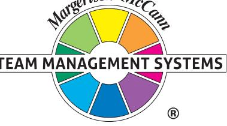

### Contents

| Preface                       | 1  |
|-------------------------------|----|
| Introduction                  | 2  |
| The nature of work            | 2  |
| Work preferences              | 8  |
| The TMS Wheels                | 12 |
| Applications                  | 16 |
| Conclusion                    | 17 |
| References                    | 18 |
| About the author              | 18 |
| About Team Management Systems | 18 |

#### Copyright

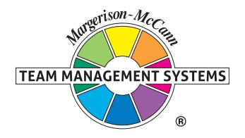

Published by Team Management Systems, Brisbane, Australia. Copyright © Dick McCann, 2004, 2009, 2020 ISBN 0-9751203-6-0

All rights reserved. Limited copies of this publication may be printed for the private use of the purchaser. Otherwise no part of this publication may be reproduced in any material form (including photocopying or storing in any medium by electronic means and whether or not transiently or incidentally to some other use of this publication) without the written permission of the copyright holder except in accordance with the provisions of the Copyright Act of 1968.

While the publisher has taken all reasonable care in the preparation of this book the publisher makes no representation, express or implied, with regard to the accuracy of the information contained in this book and cannot accept any legal responsibility or liability for any errors or omissions from the book or the consequences thereof.

The Team Management Wheel and the Margerison-McCann logo are registered trademarks of Team Management Systems. Other trademarks denoted by TM are either owned or licensed by Team Management Systems.

#### Preface

Some 30+ years ago, Charles Margerison and I sat down to develop a language of teamwork. We were both intrigued as to why some teams 'clicked' and achieved great results whereas others failed even though they all started out with great promise. We thought that by researching teamwork we might be able to develop a model that would give teams a recipe for success.

Our early models, the Wheel 'twins' – the Types of Work Wheel and the Team Management Wheel – are the subject of this eBook, part of a series I have written to bring together all the personal, team and organisational development techniques that form the core concepts of Team Management Systems (TMS).

In 2020, we are still refining our approaches and developing new models and concepts. Team Management Systems is now used in 190 countries and is available in 15 languages. As specialists in teamwork we are proud to have helped more than two million people make a contribution to improved teamwork.

Dick McCann Author

#### Introduction

Every industry, sport and country has a unique language. The computer industry speaks in bytes, RAM, ROM, MIPS and nanoseconds; golfers speak about eagles, birdies, bogeys and albatrosses; and there are thousands of different languages spoken throughout the world.

To communicate effectively with people we need to understand their language. So it is with teams. To communicate effectively as a team and develop high performance we need to understand the language of teamwork.

More than 30 years ago my colleague, Charles Margerison, and I sat down to develop a language of teamwork – a language that could be used to explain why some teams succeed and others fail, a language that could be used to develop teams from levels of mediocrity to levels of excellence.

Our language was built around two models of teamwork, developed from many interviews with managers and team members from all over the world, working in a variety of industries such as petrochemicals, manufacturing, banking and government.

The first model, the Types of Work Wheel, defines the nature of work in a team and the second model, the Team Management Wheel describes the preferences people have for the different types of work. Usually two or three aspects of teamwork are enjoyed but most people will have at least one area that they would prefer not to be involved in.

#### The nature of work

#### When work is a pleasure, life is joy When work is a duty, life is slavery

#### (Maxim Gorky)

Our first approach to developing a language of teamwork was to interview hundreds of people in order to identify key tasks that were essential in successful teamwork, regardless of the technical nature of the work undertaken. We were able to reduce these comments to eighty or so key phrases – such as 'making sure that people are accountable for their actions', 'having high visibility throughout the organisation, 'attention to detail', 'keeping abreast of recent developments' and 'generating new ideas'. By using domain sampling theory we can look at how similar these items are to one another.

Eventually we were able to group these statements into eight different 'Types of Work' or 'work functions' as shown below.

- Advising: Gathering and reporting information.
- Innovating: Creating and experimenting with ideas.
- Promoting: Exploring and presenting opportunities.
- Developing: Assessing and testing the applicability of new approaches.
- Organising: Establishing and implementing ways of making things work.
- Producing: Concluding and delivering outputs.
- Inspecting: Controlling and auditing the working of systems.
- Maintaining: Upholding and safeguarding standards and processes.

#### The Types of Work Wheel

The eight Types of Work and the process of Linking make up the Margerison-McCann Types of Work Wheel.

Work functions lying close together on the model have similar defining characteristics whereas those that lie on opposite sides tend to be unrelated.

#### Figure 1. Margerison-McCann Types of Work Wheel

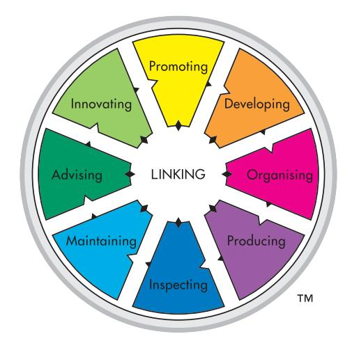

Many tasks at work can be conducted satisfactorily by a variety of different people, although often there are some aspects of the job that are more complex or demanding, and these will usually require special skills or areas of expertise to complete them to a high standard. The 'critical tasks' are those that make the difference between a person who is a good performer in the job and a person who is a poor performer. Research has shown that knowledge of these critical factors can provide a strategic key to successful recruitment, selection, placement, personal and career development and appraisal.

#### Types of Work

Let's look at each of these Types of Work in turn, identifying each sector through an example.

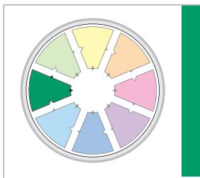

## Advising

Case Study: Not enough information gathered

In the wetlands of the Northern Territory of Australia there is a place called Humpty Doo. Many years ago a proposal was put forward to convert significant areas of Humpty Doo into extensive rice cultivation. After investigations into the climate and geology of the area, the project was implemented with the hope that it would become the rice-growing capital of Australia – rivalling its Asian competition.

Months after the rice was planted and the shoots began to grow; the Magpie Geese arrived in the wetlands for their annual breeding. The Geese fed and flourished on the rice shoots and over a few years bred faster than ever before.

The geese ate the rice as fast as it grew and the proposal was a commercial failure. The planners had gathered all the information on the flora but had not extended their research into the natural fauna of the region.

Advising work is concerned with giving and gathering information. It involves finding out what others are doing in your area of work and ensuring that you are following best practice. Information may need to be gathered from articles, reports, books, the internet, or by meeting and talking with people. It means ensuring that you have all the information available for the team to make the best decisions and deliver the results.

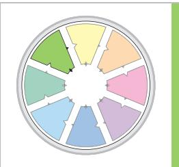

## Innovating

#### Case Study: Failure to innovate

There are many famous worldwide companies that have failed to innovate, leading to their demise.

One such company is Blockbuster – the home movie and video rental services giant founded in 1985. It was an iconic brand in the video rental space and at its peak had more than 9000 stores employing over 80,000 people. It failed to transition towards a digital economy and filed for bankruptcy in 2010.

In 2000 Netflix approached Blockbuster with an offer to sell their company to Blockbuster for US\$50 million. Blockbuster refused the deal because they thought it was a 'very small niche business' and was losing money at the time. Netflix now has over US\$20 billion annual revenue.

Many other organisations have a similar story. The original General Motors founded in 1982 failed to innovate and ignored competitors, resulting in one of history's largest bankruptcies in 2009. Similarly, Kodak filed for bankruptcy in 2012, failing to embrace the transition to digital.

Innovating is a key aspect of teamwork and involves challenging the way things are currently being done. Technology is changing so quickly that the way you are currently performing tasks may no longer be the best way. If you are not up to date in your practices, your cost structure may be too high or you may no longer be delivering competitive service. Innovating is essential for all teams. There are always better ways of doing things if you only take time to discover them.

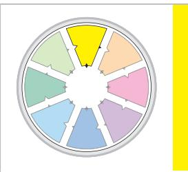

## Promoting

#### Case Study: Letting everyone know

A small IT department within a Government department was given the bad news that its budget for the following year had been cut by 25%. The manager was disappointed as it would mean losing another staff member and their new software program would have to be held over until the following year. He decided to appeal the decision and put forward a comprehensive paper outlining the plans for the following year.

The Board was invited to an information session in the department where they were given first-hand experience of the new programs. The Board agreed to waive the cut and increased the budget for the following year. The Chairman said to the manager – "We had no idea what you did before this submission!"

The IT team decided that in future they would have to make sure that everyone was aware of their value to the organisation. They began to issue a monthly newsletter and conduct regular information sessions for all staff.

To obtain the resources – people, money and equipment – to carry out your work, you have to 'sell' what you are doing to other people. Resources to implement new ideas will only be given if your team can persuade and influence people higher in the organisation. Promoting to customers or clients both inside and outside the organisation is also important if you are to continually deliver what people want.

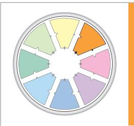

# Developing

#### Case Study: Good idea – but not developed

A retraining program was launched which was designed to update skills in many different technical areas, from car mechanics to plumbing. It involved both on-the-job training and also attendance at lectures.

It attracted many applicants as their Advising and Promoting had predicted. On paper it seemed to be the perfect solution to keeping skilled people up with the advanced technology. However when the first applicant from a rural community applied, who met all the enrollment criteria, they discovered that it was not a universally viable program.

It cost the government \$40,000 for each rural applicant, for accommodation and travel of both applicant and tutor. The program had to be withdrawn soon after they received an unexpected number of applications from outlying areas.

Many ideas don't see the light of day because they are impractical. The Developing activity ensures that your ideas are moulded and shaped to meet the needs of your customers, clients or users. It involves listening to their needs and incorporating these in your plans. Developing will ensure that what you are trying to do is possible, given the resource constraints of your organisation.

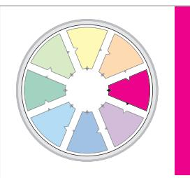

# Organising

#### Case Study: Biting conference

A training and development organisation planned to hold a conference in Far North Queensland in the hope of attracting participants from all over Australia. Port Douglas is an idyllic tropical resort and as the conference was to be held in winter, it would encourage attendance from many people in the south.

The committee did an excellent job and the conference was well attended. The program was varied and interesting. A few of the exhibitors were a little concerned that there had been a lack of information on the stands and no information on where to send their displays. Their worst fears were realised when they arrived to find that the exhibition hall had been downgraded to a poorly air-conditioned tent.

From registration on Tuesday evening to closure on Thursday evening, the conference declined. The committee discovered that they had seven parallel sessions and only five rooms. They hastily erected two white tents to house the sessions but then realised that the tropical location did not lend itself to this solution. Aggressive green ants, high temperatures and bright sunshine not only obliterated any electronic data projection but also made participation in the outdoor sessions unbearable.

The restaurant for the welcome session could not cater for the numbers and the extra barbecues needed were placed on wooden tables that burnt through, causing small fires. Many people did not get a meal that evening. There was an inadequate supply of white boards and flip charts. Many presenters had large rooms and few people attending while others had small rooms with large numbers of participants.

Few people stayed to the end of the conference.

In Organising, the emphasis is on getting into action and making things happen. It involves organising the team so that everyone knows what they have to do, how, and when. Clear goals have to be established and action taken to ensure that results are delivered on time and to budget.

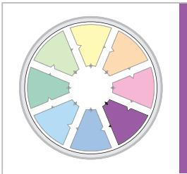

# Producing

#### Case Study: A burger with the works

McDonalds are a good example of an organisation that focuses on Producing. Each store sells the same products whether you are in Japan, Australia, UK or America. You know exactly what you will get and you are assured a quick meal prepared under hygienic conditions.

Their products adhere to a worldwide standard, from the density of the buns to the protein and fat content of the burger fillings. They have regulations for how long the food is allowed to be kept for sale and strict disposal routines.

This Producing system ensures reliable delivery of the product to common standards throughout the world.

Once plans are set up and everyone knows what has to be done, the team can concentrate on Producing. This activity focuses on delivering the product or service on a regular basis to high standards of effectiveness and efficiency. It is the Producing function that ensures the team keeps on delivering the required outputs.

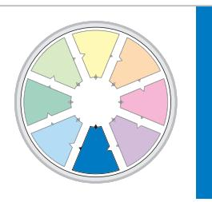

## Inspecting

Case Study: Don't bank on it

Barings Bank, the UK's oldest merchant bank, rued the day that they relaxed their controls on the systems and procedures within the bank. A rogue trader in the Singapore office was able to make stock trades and hide massive losses in hidden accounts.

Despite visits from head office accountants and regular reports, the trader was able to bring a multinational, well-established bank to its knees. The fact that one person's transactions could destroy a bank that had been in business for many years highlights their lack of inspection procedures.

Regular checks on work activities are essential to ensure that agreed standards are achieved. Quality audits of your products or services will ensure that your customers or clients will remain satisfied. Inspecting also covers the financial aspect of work in your team, as well as the security, safety and legal aspects.

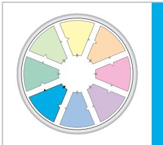

## Maintaining

#### Case Study: Phantom of the Opera

Phantom of the Opera is a long-running musical that has visited many cities throughout the world. Performers on tour have said that Maintaining was one of the most important activities for the cast to focus on.

They had been 'organised' to 'produce' a performance of outstanding excellence, which usually received rave reviews on opening night. However, after several hundred performances, standards had a tendency to slip. Singing might be slightly off key, the dance steps a little lethargic, the costumes frayed and the scenery chipped.

For them, Maintaining was the most important team function. Rehearsals were regularly needed to maintain excellence, sewers needed to maintain the costumes, and carpenters and painters required to regularly maintain the props.

Maintaining is an important activity that all teams need to focus on. Individually we all do it in our day-to-day life. We maintain our body (it takes longer when you are older!), we maintain our house and garden, and we send our car to the garage for its regular service. So it is with excellent teamwork – it needs to be maintained. It can take a long time to produce excellence but the slide back to mediocrity is quick without maintenance systems. All teams need to uphold standards and maintain effective work processes. Maintaining ensures that quality standards are upheld and that regular reviews of team effectiveness take place.

#### Linking

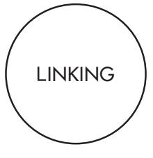

We also identified another factor that seemed to be common (psychometrically) to the eight Types of Work but was worthy of separate classification as it defined a process rather than a task. We called this factor 'linking' as it described actions that were responsible for coordinating and integrating the work of the team.

Every team member needs to make a contribution to this activity if the team is to be successful. It is placed in the centre of the model because it is a process common to all the eight Types of Work functions. For example, those who have Inspecting as a critical function within the team must do it in a linking way to avoid being negatively labelled a 'micromanager'. Those who have Organising as a critical function must

do it in a linking way to avoid being likened to a 'drill sergeant'.

The concepts of Linking were deduced from the interviews carried out with participants in the research study. When the key task aspects of individual teamwork were removed, there were a number of concepts left which grouped into activities best described as shared team processes. These were distinct from the eight Types of Work, which seemed to describe mainly the job demands of individual team members.

Linking comprises six people skills, five task skills and two leadership skills. Linking the tasks of the team is just as important as Linking the people. Without one, people suffer; without the other team outputs suffer. For the team leader, skills of Motivation and Strategy are required. The concepts of Linking Skills and the Linking Leader Model are described in the eBook: Linking Leadership (McCann, 2020).

#### Reviewing projects

The Types of Work Wheel is a useful model to examine project management within a team. When a new project is undertaken, a starting point is the Advising function, where data are gathered about the project by referring to what others have done, by researching, reading, talking to key people, and accessing databases available through intranet and internet facilities. This information then sets the scene for undertaking the project.

Next the focus probably moves to the Innovating function where we try to fully understand the 'state-of-the-art' associated with the project and look to incorporating new ideas that will give the project a competitive advantage. Many new concepts can increase productivity by reducing costs or by increasing customer service.

Probably simultaneously with Advising and Innovating, the project team needs to focus on Promoting. Key stakeholders need to be influenced, particularly those in senior positions within the organisation who have the power to make or break the project. Early influencing of these key people is a prerequisite for success.

When we have a good idea of the form the project might take and we have the support of key stakeholders, we can move to the Developing phase. Here ideas need to be turned into reality. This often means taking hard decisions to ensure that the project meets the needs of key clients and customers and fits within the commercial constraints of the organisation. Impractical ideas need to be weeded out so that the project has a high chance of success.

The next function to focus on is Organising. Here we need to assign responsibilities to team members, establish clear goals and reporting mechanisms and ensure that everyone knows what they have to do, how, and by when. Organising people and resources efficiently is the basis of the Organising function.

The Producing function is all about delivering the product or service. Very often a systematic approach is required to ensure delivery on time and to budget. The most effective projects usually have a production plan that is constantly monitored and updated to ensure that outputs are delivered to the right quality.

Inspecting is an umbrella work function that covers many parts of project work. It means focusing strongly on budgets and financial auditing so that costs are controlled and revenue collected. But it also covers areas such as legal contracts, safety, security and quality issues. Successful projects often have a long checklist to ensure that all aspects of Inspecting are covered.

Maintaining is a very important support activity on all projects. Key work processes need to be set up and maintained so that the team is working to agreed standards. Issues such as project ground rules and ethics often form the basis of successful project implementation.

And of course, there is Linking, which ensures that all the multitude of activities that make a project successful are coordinated and integrated. All team members have a duty in project work to take responsibility for keeping others informed about what is going on. This usually covers linking tasks together, as well as linking people together to achieve the tasks.

#### Likes and dislikes

The Types of Work Wheel was extremely useful in categorising the different work that goes on in teams. We found that some teams involved in production activities needed to focus more on Organising, Producing and Inspecting. Other teams in research and development needed to focus more on activities associated with Advising, Innovating and Promoting. However, all of the Types of Work needed to be addressed to some level, if the team was to be successful.

In meeting with team members to talk about work allocation, it became obvious that rarely would one person like all Types of Work. People showed distinct preferences for some Types of Work and a definite dislike for others. In other words, work preferences were a definite driver of how they liked to work. And so we turned our attention to developing a model of work preferences that would align with our Types of Work Wheel.

#### Work preferences

We tend to PRACTISE what we PREFER and become more PROFICIENT in our preferred areas. This in turn gives us PLEASURE from our work.

Usually people work better in areas that match their preferences. We always tend to practise what we prefer. For example, you might prefer to play golf rather than squash: therefore at any opportunity, you are more likely to be on the golf course rather than on the squash court. The more you practise golf the more likely you are to perform better at it and maybe even become perfect! So it is at work.

We tend to Practise what we Prefer and over time we become more Proficient in the areas of our preference. This then gives us Pleasure from our work.

#### Measures of work preferences

Is it possible to identify a person's work preferences? Fortunately the answer is 'yes'.

In speaking with people primarily engaged in the various work functions – Promoting, Organising, Inspecting, Advising, and so on – we found that those who really enjoyed their work showed common behavioural characteristics. Promoting people, for example, were commonly more outgoing whereas Inspecting people were quieter and more able to focus on the detail. Innovating people were obviously quite creative with ideas whereas Producing people were very much practically oriented. This then led us into attempting to find a relationship between the Types of Work Wheel and 'people' characteristics.

We initially experimented with the Myers-Briggs Type Indicator® (MBTI® ) assessment as a way of measuring the characteristics of people but were not able to relate the data to the Types of Work Wheel, possibly because the MBTI instrument attempts to assess a personality type across both 'work' and 'non-work' situations. We now know from our own work and that of others that work and non-work are often two distinct compartments in a person's life and that behaviours in each compartment can be totally different. Someone who is outgoing at work may prefer to be quieter in a non-work situation, so as to 'recharge the batteries' for the next day.

Nonetheless, we believed that Jung's original work on Psychological Types (Jung, 1923) is a powerful way of identifying people differences and we therefore decided to use his ideas but adapt them to the work environment. In doing so we developed and validated four measures of work preference.

In the workplace there are four key issues at the heart of people differences.

We describe these issues as:

- How people prefer to Relate to others at work
- How people prefer to gather and use Information at work
- How people prefer to make Decisions at work
- How people prefer to Organise themselves and others at work

These four issues are presented below as the RIDO scales (Relationships, Information, Decisions, Organisation).

#### Figure 2. Work preference measures

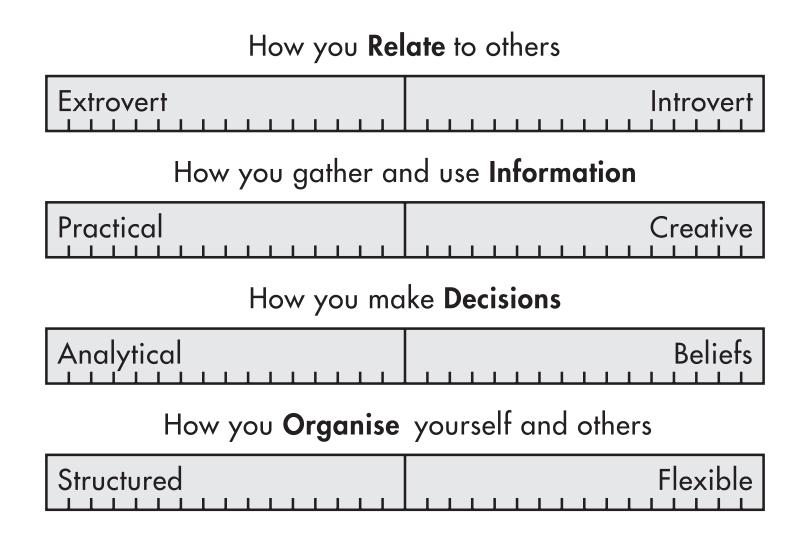

#### How you Relate to others

Each day at work we have to relate with others to get the work done. People like Maggie in the case study below prefer to do this in an extroverted way, meeting frequently with others, talking through ideas, and enjoying a variety of tasks and activities. Other people, such as Theo, are more Introverted, preferring to think things through on their own before speaking, and generally not having a high need to be with others.

#### Case Study

Maggie loved to work in an open-plan office and thrived on the noise of the busy office. If she needed to ask a question there were no doors and procedures – she could just go to the person's desk. She preferred to talk through her ideas or problems, as her thoughts seemed to crystallise as she spoke.

Maggie loved the weekly meetings, particularly when they had a problem to work through. She was also on the social committee and organised many of the after-work activities.

Sometimes she had difficulties interacting with the quieter people in the office. They accused her of opening her mouth before she had thought things through, but she found she was much less effective if she just tried to work through problems on her own.

The door was always open for her colleagues as she enjoyed unanticipated interruptions. She found these interactions stimulated her thinking.

One of Theo's conditions on accepting a new position was that he would have his own space. He needed peace and quiet to concentrate and be free of constant interruptions. He disliked impromptu meetings because he had no time to prepare his contribution. He preferred to be given a problem to solve and would write down his solutions to present at the next meeting.

Sometimes he had difficulties interacting with his boss, Maggie. In meetings, she would suggest possible solutions to problems and, wanting to impress, Theo had gone away to develop the solution. Unfortunately Maggie's ideas had often changed in the interim and Theo felt he had wasted his time.

Theo could be sociable when he wanted to. He wasn't shy but preferred his own company and didn't need to be stimulated by regularly interacting with others.

#### How you gather and use Information

In the process of relating with others, people will gather and use various types of information. They do this either in a practical or a creative way. Practical information-gatherers, like Andre in the case study below, prefer to work with tested ideas and pay attention to facts and details, whereas Creative information-gatherers, like Sofia, are future-oriented and always looking for ways to change and improve things.

#### Case Study

There was nothing Andre liked better than a new project to put into practice. He liked to see the systems work efficiently. By the time the project came to him, all the prototyping was done and it was left for him to ensure it was implemented quickly.

He would read all the facts and figures and then apply them to a well-tested approach. His focus was always on the immediate output. Sometimes he had problems working with Sofia who often suggested new ways of implementing projects using the latest project management techniques. But his first questions were always, "Who does it this way?" or "Can you prove to me that it is better than what we are doing now?"

He liked his down-to-earth approach and the tangible results he was able to achieve by working in this way.

Sofia loved a challenge and whenever there was an opportunity to find a new way of breaking into a market, she was first to volunteer. She would spend hours looking at the information and playing with new concepts. Her ideas were sometimes impossible to implement but that never deterred her. Her colleagues admired her stream of ideas and she rarely disappointed them – even though she sometimes went off the subject and had to be reminded of the original task.

She admitted that she found routine work boring and nothing stimulated her more that looking for improvements to what was already working well. She was really pleased when she could show her boss, Andre, that there were better ways of implementing the projects for which he was responsible.

She realised that sometimes she didn't always pay enough attention to details but to her details were boring, and besides, there were plenty of people around in the organisation who could do this better than her.

#### How you make Decisions

Once the information is gathered, it is necessary to make decisions. Some people, like Emilie in the case study below, go about this in an analytical way, setting objectives and choosing those decisions that best meet the objectives. Others, such as Lucas, may prefer to make decisions based on their beliefs, where personal principles and values are more important.

#### Case Study

Lucas was the manager of the state branch of a large retailing organisation. At the annual senior management meeting he was pleased to be able to talk about the growth in sales that his team had achieved during the last 12 months.

He had built up a happy team of people similar to himself, who had strong personal values about fairness and ethics in the workplace. During his presentation he mentioned one of his suppliers whom he felt had duped the organisation and was now claiming that they were owed \$50,000 for unscheduled work. Lucas passed off the problem by saying that he wasn't paying this amount and had taken legal action. When asked by the General Manager how much this might cost, Lucas replied, "we're not sure but it could be as much as \$100,000." When the general manager suggested that a better approach might be to negotiate a settlement, Lucas replied, "I don't care how much it costs. It's the principle that's important. They're not going to get away with it!"

For him decisions always had to be measured against personal values and beliefs. "Once beliefs are compromised," he was once heard to say, "It's the thin edge of the wedge!" He would be vocal if he felt that money was being used for purposes that did not align with the goals and values of the organisation. He believed in the good work done by the organisation and made all his decisions to support those beliefs.

Emilie enjoyed her work as office manager. It was a constant round of budgets, meetings and staff problems. Over the years she had developed her own system of making decisions, which suited her and had been very successful. With the financial side of her job, she would pore over statements, analyse trends and calculate profit projections before making her final decision.

As for dealing with staff problems, she would interview them and try to find out as much about the problem as she could. She always wanted to be scrupulously fair and to do this she needed to gather all the facts. She was always happy to negotiate her decision with those affected, so long as they concentrated on the evidence and the facts and didn't let their opinions get in the way. She had many problems in getting on with her boss, Lucas, whose eyes seemed to glaze over whenever she presented him with her spreadsheets.

#### How you Organise yourself and others

Decisions have to be implemented within a team framework. Some people, such as Pauline below, like a structured environment where things are neat and tidy and where action is taken quickly to resolve issues. Others, like Hayley, prefer to be more flexible and to make sure that all possible information has been gathered before decisions are taken. They prefer to find out about situations and delay taking action until they are sure that all alternatives have been looked at.

#### Case Study

Pauline started every working day by making herself a list of the tasks for the day and then prioritising them. This way, she was less likely to overlook anything and she could work far more efficiently. She could cross off each task when completed and be able to gauge whether she needed to adjust her pace or leave something until tomorrow. Nothing pleased her more at the end of a day than having a list with lots of ticks on it.

Her desk was organised with an in-tray and an out-tray and she would be most upset if people ignored this and placed new work in her out-tray. She also disliked people who insisted on using Post-it® notes for messages and sticking them on her computer screen.

She was a punctual person and when she scheduled a meeting for 2:00pm, she started it precisely on time. She was usually very annoyed with Hayley who for some reason always arrived at least 10 minutes late, despite being reprimanded on many occasions.

Hayley's desk was the talk of the office. It was continually untidy and if she was away no-one knew where to begin to find a file. Hayley knew where everything was and even if it took a while to unearth it she knew in which vicinity to look. Others claimed that she was disorganised but she thought this was unfair – untidy, yes, but she always found what was required, even if it sometimes took longer than expected. She was also famous for her proposal submissions. She would spend weeks sifting through the information and finding out ever more interesting facts, but never begin to put it all together until a few hours before it was needed.

She always had her proposals in on the right day but rarely made the 10.00am deadline – it was usually in by 5.00pm or pushed under the manager's door as she left for the day. She would then collapse into her chair, complaining how much pressure she was under.

#### The TMS Wheels

#### To business that we love we rise betime And go to't with delight

#### (William Shakespeare in Anthony and Cleopatra)

The Types of Work Wheel is a model about the nature of work. The four work preference measures focus on people rather than the work they do and indicate preferred behaviours in the workplace. The unique contribution of our research has been to combine these two models into a multipurpose model known as the Team Management Wheel. We were able to find a relationship between the work preferences and the Types of Work. For example, people with preferences for extroverted relationships and creative information-gathering mapped most often into the Promoting area of the Types of Work Wheel whereas those with introverted relationship preferences and practical information-gathering most often preferred Inspecting work. Those who liked analytical decision-making and preferred to work in a structured way showed a bias for Organising work whereas those with beliefs decisionmaking and a more flexible approach to the way they organise themselves and others enjoyed Advising work. The end result was the role preference model – the Team Management Wheel.

#### Figure 3. Margerison-McCann Team Management Wheel

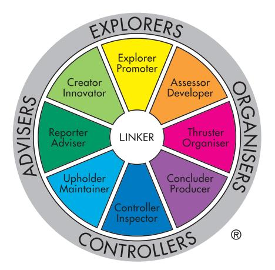

The Team Management Wheel is a role preference model that brings together the separate work preference measures into eight key roles that describe workplace behaviour emanating from preferences.

The actual terms used in the Wheel came from discussions with people in the workplace:

- People who enjoyed Innovating work described themselves as creative. From this information we derived the name Creator-Innovator for those who enjoy coming up with ideas and experimenting to see if they work.
- Likewise, those who enjoyed Promoting work often said they saw themselves as 'explorers' looking for new opportunities. The term Explorer-Promoter described this role perfectly.
- Those who like Developing plans and processes said they enjoyed assessing ideas and opportunities to see if they would work. We called them Assessor-Developers.
- Those who preferred Organising people and resources said they liked thrusting into action to set dates, timetables and achieve results. So the descriptor, Thruster-Organiser was formed.

Similarly, the other role preferences received their names through the characteristics exhibited by people who particularly enjoyed the various work functions.

- Concluder-Producers: those who liked working in a systematic way to produce and deliver and described themselves as having a preference for concluding assignments according to plan.
- Controller-Inspectors: those who said they liked working on details to audit procedures and processes and therefore saw themselves as having an emphasis on control.
- Upholder-Maintainers: those who considered they had strong beliefs and principles and felt they would put a premium on upholding standards and values.
- Reporter-Advisers: those who enjoyed giving and gaining information, and liked to perform the reporting role for the team.

The Wheel has eight outer sectors named with 'double-barrelled' words such as Explorer-Promoter, Assessor-Developer, and so on. The first word, for example 'Explorer', indicates the behaviour exhibited by a person mapping into that sector whereas the second word is derived from the Types of Work Wheel. Brief descriptions of the team role preferences are given below.

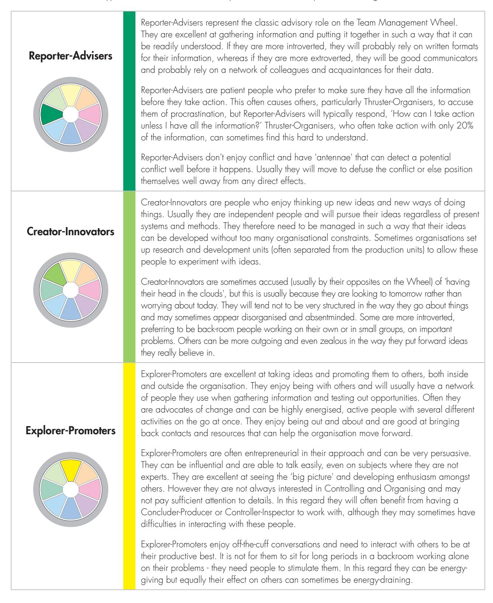

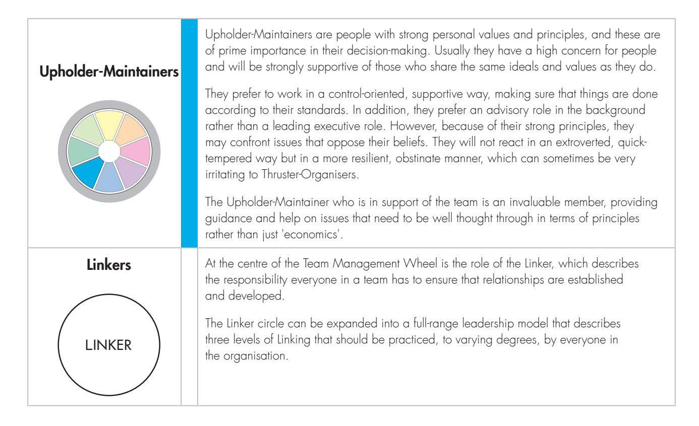

Figure 4. Linking Leader Model

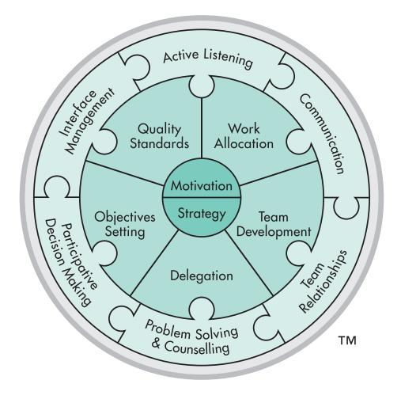

At the first level of Linking are the skills arranged around the outside of the model.

These are the People Linking Skills:

- Active Listening
- Communication
- Team Relationships
- Problem Solving and Counselling
- Participative Decision Making
- Interface Management

The People Linking Skills are six in number and create the atmosphere in which the team works, by promoting harmony and trust. As such everyone in a team has a responsibility to implement this level of leadership. Sometimes I call it 'universal linking'. It is the first step on the ladder to the higher levels of leadership.

Inside the People Linking Skills are the Task Linking Skills. They create a solid core or foundation on which the work of the team relies. They promote confidence and stability.

These are the Task Linking Skills:

- Work Allocation
- Team Development
- Delegation
- Objectives Setting
- Quality Standards

These skills tend to apply more to people on the second rung of the leadership ladder – those in more senior positions within a team, responsible for guiding others.

At the core of the Linking Leader Model are the two Leadership Linking Skills of Motivation and Strategy. Leadership Linking is the third step on the leadership ladder and applies to leaders that have organisational responsibility for strategy. They need to implement these two skills along with those of the People and Task Linking Skills to achieve the status of the Linker Leader.

Full details on Linking are given in the eBook: Linking Leadership (McCann, 2020).

#### Measuring role preferences

Role preference behaviour in the workplace is easy to spot once you understand fully the model of the Team Management Wheel. For accurate results though, it is necessary to use the well-validated questionnaire that is available to determine a person's position on the Wheel – the Team Management Profile Questionnaire (Margerison and McCann, 1994). This 60 item questionnaire produces a personal Team Management Profile of more than 5000 words giving key advice on individual work preferences. In addition the report contains information on leadership strengths, decision-making, interpersonal strengths, teambuilding skills, and areas for self-assessment. The results are mapped onto the Team Management Wheel as a major role preference and two related role preferences.

#### Applications

The principles of TMS can be applied to any management or business problem. It can be used for personal development, team development, onboarding, career planning, management development, performance review and organisational development – in fact in any application relating to improved 'people' performance. Over 2 million people in 190 countries have used TMS in a variety of ways. The Team Management Systems Case Studies Collection (McCann and Mead, 2003) presents over 110 case studies of how the TMS language of teamwork has been used in these ways.

A common use of the Wheels is for personal development and valuing diversity. The case of 'Joe' explains how one of our Network Members made an outstanding intervention in this area.

#### Case Study

Joe, who worked on a construction site, was placed in a Concluder-Producer role as a site engineer. He was most ineffective and caused others in his team great frustration.

Joe was at times called 'stupid'. He failed to plan what he did not see needed planning, although in other ways he was most competent. He was incredibly flexible and saw no point in letting people know on a Monday what changes were to be made on a Thursday.

When he received his personal Team Management Profile, Joe discovered that he was a Creator-Innovator. The revelation changed his life. His role was eventually changed to that of a design engineer, which was much more aligned to his preferred way of working. Even before the change was made, he was less frustrated and happier because he now understood that he was not incompetent, merely working against his preferences. He preferred to work in a different way to what others in the team expected of him. He learned to rely on his second-in-command to pick up on his less preferred areas, particularly in the scheduling area.

#### Balancing a team

Another use of the Wheels is in examining team balance and deciding on ways to achieve a better balance. The case below shows how another of our Network Members used the language of teamwork to do this.

#### Case Study

The Board of a company employing 1000 people in the computer industry came to us with a special version of a teamwork problem. They had over 140 unresolved issues and this was beginning to worry them.

We watched the team at work and looked at their Team Management Profiles. The managing director, who curiously was an accountant, was a strong Creator-Innovator and the rest of his Board members were fairly well distributed around the right-hand side of the Wheel. There was an Explorer-Promoter, an Assessor-Developer, two Thruster-Organisers, a Concluder-Producer and a Controller-Inspector.

The problem was that every time the managing director came up with a new idea it was added to the list of unresolved issues. Once they saw their roles more clearly, the team members approached these issues and ideas in a different way. Whenever the managing director now comes up with a new idea, the Thruster-Organiser says 'how' and the Concluder-Producer says 'when'. The Assessor-Developer also tries to assess where that particular idea might fit into a queue of other ideas.

Previously the directors had regarded the managing director as someone special. Now they behave more as a team, challenging the managing director's ideas and trying to put them into some sort of organisational context. As a result, the number of unresolved issues has diminished to less than 20.

#### Conclusion

Tuckman (1965) presented the four stages of teamwork, which are now widely used by work teams throughout the world to assess their progress. The model describes the stages as follows:

#### Figure 5. Tuckman's Stages of Teamwork Model

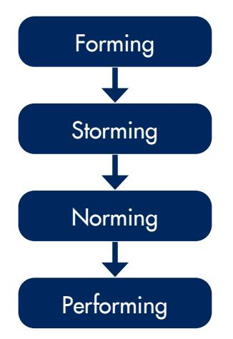

Once teams are formed, they go through an unpleasant storming stage before ground rules and norms are established. Eventually the performing stage is reached. In the 1990s it was acceptable to take maybe six months or so to reach the performing stage. In 2020 though, such is the speed of change and the intensity of competition that some teams have to get to good performance levels in six weeks or even six days!

Models such as the Wheel 'twins' – the Types of Work Wheel and the Team Management Wheel – give a reliable and valid way of measuring and managing team performance, by generating qualitative and quantitative feedback data both from team members and outsiders. Problems can be diagnosed or even predicted before they happen. In managing team performance, clever work teams will use this information to bypass the storming stage and move quickly to the norming stage by generating ground rules which will prevent major problems from occurring. The team can then accelerate its progress to the performing stage.

The basis of the modern organisation is the cross-functional or process team and these sometimes have short lives – perhaps only a few months. With the TMS language of teamwork they can accelerate to high-performance and on the way develop a culture of lifelong, individual and team learning.

#### References

- Psychological Types, Jung, C., (1923), Routledge and Kegan Paul, London.
- Team Management Profile Questionnaire, Margerison, C.J. and McCann, D.J., (1994), Team Management Systems, Brisbane, Australia.
- Linking Leadership, eBook, McCann, D.J., (2020), Team Management Systems, Brisbane, Australia.
- Team Management Systems Case Studies Collection: 2nd Edition, McCann, D.J. and Mead, N.H.S. (Eds.), (2003), Institute of Team Management Studies, Brisbane, Australia.
- Team Management Systems Research Manual: 5th Edition, McCann, D.J. and Mead, N.H.S. (Eds.), (2018), Institute of Team Management Studies, Brisbane, Australia.
- Development Sequence in Small Groups, Tuckman, B.W, (1965), Psychological Bulletin, 63(6).

#### Other eBooks in the series

- High-Energy Teams, McCann, D.J., (2020), Team Management Systems, Brisbane, Australia.
- Values in the Workplace, McCann, D.J., (2020), Team Management Systems, Brisbane, Australia.
- The Workplace Pyramid, McCann, D.J., (2020), Team Management Systems, Brisbane, Australia.
- QO2 Opportunities-Obstacles, McCann, D.J., (2020), Team Management Systems, Brisbane, Australia.
- Linking Leadership, McCann, D.J., (2020), Team Management Systems, Brisbane, Australia.

#### About the author

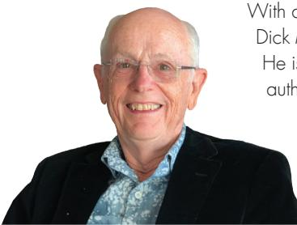

With a background in science, engineering, finance and organisational behaviour, Dick McCann has consulted widely for organisations such as BP and Hewlett Packard. He is co-author of Team Management: Practical New Approaches, with Charles Margerison; author of How to Influence Others at Work and The Workplace Wizard: The Definitive Guide to Working with Others; and co-author with Jan Stewart of Aesop's Management Fables. Dick is co-author and developer of the Team Management Systems concepts and products and also author of the QO2™ Profile, Window on Work Values and Organisational Values Profiles and the Strategic Team Development Profile. Dick has been involved in TMS worldwide for over 30 years.

#### About Team Management Systems

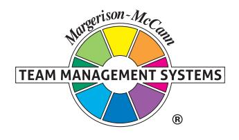

Further information on Team Management Systems can be found online at www.TeamManagementSystems.com.

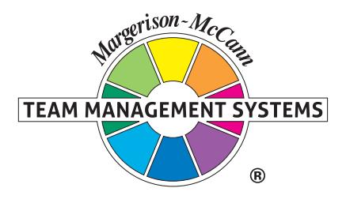

Contact us on...

E: Info@TeamManagementSystems.com | W: TeamManagementSystems.com