#### Accreditation Handbook OPPORTUNITIES-OBSTACLES (QO2 TM) PROFILE

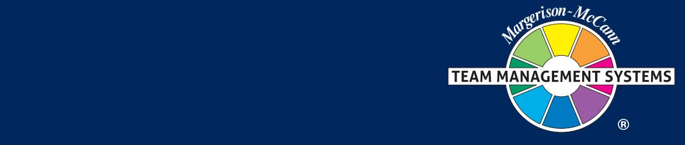

#### Published by Team Management Systems PO Box 1107 Milton, Brisbane, Qld 4064 Australia

T: +61 (0) 7 3368 2333 W: www.tmsoz.com E: info@tmsoz.com

All rights reserved: no part of this publication may be reproduced, stored in a retrieval system, or transmitted in any form or by any means, electronic, mechanical, photocopying, recording or otherwise, without prior written permission of the Publishers.

## Contents

| PART 1 – Opportunities-Obstacles                                                                                                                                                                                                                                                     | 4                                                                    |
|--------------------------------------------------------------------------------------------------------------------------------------------------------------------------------------------------------------------------------------------------------------------------------------|----------------------------------------------------------------------|
| Background to Opportunities-Obstacles The Fifth Scale The Opportunities-Obstacles Quotient Development Norm Data Profiles and their Interpretation                                                                                                                       | 5 8 10 11 12                                             |
| PART 2 – The Five Sub-Scales                                                                                                                                                                                                                                                         | 13                                                                   |
| Sub-Scales Moving Towards Goals (MTG) Energy Multi-Pathways Optimism Fault-Finding Time Focus Resilience Index                                                                                                                                                     | 14 15 16 22 24 26 30                               |
| PART 3 – Applications and Facilitation                                                                                                                                                                                                                                               | 31                                                                   |
| Personal Development Team Development Virtual Delivery Toolkit for QO2 TM Debrief Sample Half-Day Introductory Session Sample One-Day Team Session                                                                                                                    | 32 33 34 35 36                                           |
| PART 4 – Exercises and Resources                                                                                                                                                                                                                                                     | 38                                                                   |
| MTG Energy Multi-Pathways Optimism Fault-Finding Time Focus Team Development Role Play – A Change of Direction Communication Communicating with Others Pacing the High QO2 TM Person Pacing the Low QO2 TM Person Team Development Strategies | 39 40 41 42 43 44 48 49 50 51 52 53 |
| PART 5 – Case Studies                                                                                                                                                                                                                                                                | 55                                                                   |
| Case Study 1 Case Study 2                                                                                                                                                                                                                                                         | 56 57                                                             |
|                                                                                                                                                                                                                                                                                      |                                                                      |

## Introduction

## *Welcome*

#### Welcome to your Opportunities-Obstacles (QO2 TM) Profile Accreditation Programme.

This Guide contains an in-depth summary of the key concepts and models that are covered during the programme. You will refer to it throughout your programme and be able to revisit the guide in future when you wish to refresh your knowledge about the key elements of the development of our unique approach to high energy working.

#### The complete approach

The Margerison-McCann Profiles offer a complete approach to personal and team development with single and multi-rater Profiles that offer different perspectives on the job, the individual, the team, and the linking together of people and tasks.

#### *Linking Skills Profile*

Linking Skills are a central part of the approach, essential to high performance working. The Linking Skills Profile is a carefully researched multi-rater tool that clearly identifies perceived performance in fundamental people, task and leadership related skills. It explores the gaps which may exist between what a person should be doing and what they actually do.

#### *Team Management Profile*

The Team Management Profile offers a unique perspective on high performance. By measuring individual work preferences, the Profile is able to accurately predict what individuals are likely to focus their energies on in the workplace, and also how they are likely to approach their work. This information can easily be expanded to explore team and organisational dynamics.

#### *Opportunities-Obstacles Profile*

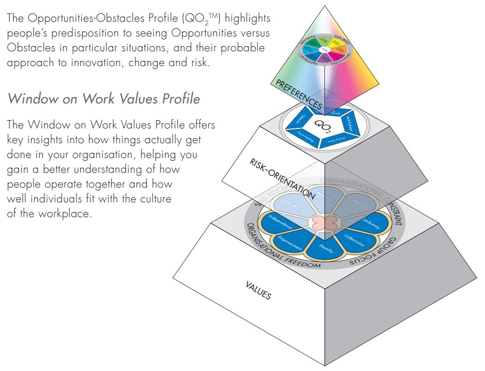

## About the Accreditation Process

The Opportunities-Obstacles Profile is facilitated by accredited TMS practitioners who have successfully completed an authorised accreditation programme with one of its approved Master Trainers.

There are several, flexible routes to becoming accredited:

- Tailored in-company accreditation facilitated at a location of your choice
- Live interactive virtual accreditations with pre and post work applications
- Public workshops located in the Asia Pacific region.

You can read more about these options at tmsoz.com

#### Your Accreditation Support Resources

Your accreditation comes fully supported with facilitator resources, L&D support from our Master Trainers and administrative support from our Client Services Team.

In addition, TMS provides consulting services\* to support practitioners when designing bespoke learning programmes with the TMS suit of Profiles.

#### Accreditation Guide

This guide is divided into five parts:

- 1. Introduction to Opportunities-Obstacles
- 2. Overview of the five sub-scales
- 3. Applications and facilitation
- 4. Exercises and resources
- 5. Case Studies

#### The TMS LinkedIn group

Once accredited, if you are not already a member, you will be invited to join the LinkedIn group for TMS network members. This vibrant group focuses on maintaining an active community of knowledge where people share real-life ideas and experiences and make new connections.

#### Ethical Guidelines

When you become an accredited TMS Practitioner you are bound by the TMS Ethical Guidelines.

For the latest version of these guidelines please go to your Network Member site. If you have any questions please contact tms@tmsoz.com

#### Research

The Institute of Team Management Studies (ITMS) is the research arm of TMS worldwide. ITMS was founded to ensure the validity and reliability of all TMS instruments.

The latest Research Manual (RM5) is available to Network Members at no cost. You can also download the executive summaries and reports from your Network Member site.

\**Fees apply.*

# PART 1 Opportunities-Obstacles

## Background to Opportunities-Obstacles

Much work has been carried out explaining and measuring the different ways people look at the world. There is a significant body of opinion that believes the different characteristics of the human psyche can be described by five independent scales. That is, most of the behaviour exhibited by people can be measured against five characteristics which do not inter-relate.

For many years, the Team Management Systems (TMS) authors were involved in the development of feedback tools using four of these scales in the context of the workplace. TMS research subsequently led to the development of a fifth dimension. The fifth scale had, until then, been in the domain of clinical psychology. Dr Dick McCann identified a scale which measures the balance of energy an individual puts into seeing opportunities or seeing obstacles at work. This additional measure enriches the feedback provided by the other four scales and helps to explain differences that are not easily measurable.

Firstly, let's look at the first four scales before going into detail on the fifth scale.

#### The Four Work Preference Measures

1.1

Previous research over many years by Drs Charles Margerison and Dick McCann led to a model for describing the different ways in which people like to approach work. This model measures four key characteristics about people in the workplace as shown below:

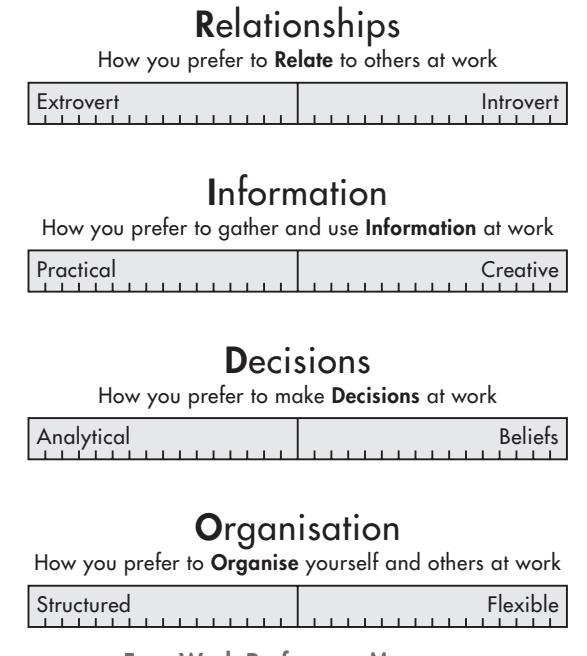

Four Work Preference Measures

The Extrovert-Introvert measure is based on how people relate with one another at work. Do they need to talk through their ideas, or are they happier thinking through ideas for themselves? Do they enjoy a variety of tasks or prefer to concentrate in-depth on a few tasks at a time?

The Practical-Creative measure looks at how people gather and use information at work. Are they down-to-earth people who enjoy working with tested ideas and are patient with routine work? Or are they bored by routine work and enjoy searching for new ideas and new ways of doing things?

The Analytical-Beliefs measure looks at how people make their decisions at work. Once they have the necessary information, do they make decisions based on facts and logical analysis? Or do they make decisions based on principles and personal values?

The Structured-Flexible measure looks at the way people organise themselves and others in the workplace. Do they like clarity, order and a systematic approach to delivering outputs to budgets and time constraints? Or are they so information-oriented that they regularly change their mind and delay decisions until they have all the data?

Research confirms that these four measures are relatively independent and have a low correlation with one another. This means that if some people have a preference to be extroverted rather than introverted, then there is equal probability that they might also be practical or creative with regards to how they gather and use information. Equally, they may be analytical or beliefs-oriented in how they make decisions, and structured or flexible in how they like to organise themselves and others at work.

#### The Team Management Wheel

The Four Work Preference Measures are the basis of a team role model known as the Margerison-McCann Team Management Wheel, as shown below.

This model gives a simple explanation of the importance of diversity within a team. People with work preferences in different parts of the Wheel will see the world in different ways. An understanding of this helps team members to develop a high-performing team.

It is invaluable in helping teams to perform better, giving team members a language of teamwork to help them focus on key issues, and identify their work preferences and strengths within the context of their team and its overall goals.

For example, people with more of a preference towards extroversion and creative information gathering are more likely to enjoy Explorer-Promoter roles, whereas those with introversion and practical preferences may well prefer Controller-Inspector roles. Other combinations of the four work preference measures define the remaining team roles.

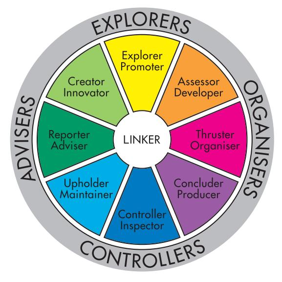

Margerison-McCann Team Management Wheel

#### Team Role Preference Descriptions

| Reporter-Advisers     | Enjoy gathering information and putting it together in a way that makes it easily understood. Usually they are patient people who prefer to have all the information before they take action.                                                                                                                                                                                                                                             |
|-----------------------|-------------------------------------------------------------------------------------------------------------------------------------------------------------------------------------------------------------------------------------------------------------------------------------------------------------------------------------------------------------------------------------------------------------------------------------------------|
| Creator-Innovators    | Enjoy thinking up new ideas and new ways of doing things. Often they are very independent and will pursue their ideas regardless of existing systems and methods.                                                                                                                                                                                                                                                                         |
| Explorer-Promoters    | Are excellent at taking ideas and promoting them to others, both inside and outside the organisation. Often advocates of change and are highly energised, active people with several different activities on the go at once. They are usually entrepreneurial in their approach and can be very persuasive. They are excellent at seeing 'the big picture' and developing an enthusiasm for an innovation among other people. |
| Assessor-Developers   | Usually display a strong analytical approach and are at their best when several different possibilities need to be analysed and developed. They are often sociable, outgoing people who enjoy looking for new markets or opportunities, always mindful of the organisation's bottom line constraints.                                                                                                                               |
| Thruster-Organisers   | Are people who enjoy making things happen. They are analytical decision-makers, always doing what is best for the task, even if their actions sometimes upset others. Their great ability is to get things done, and for this reason they are often found working in project management positions.                                                                                                                                  |
| Concluder-Producers   | Are practical people who can be counted on to carry things through to the end. Their strength is in setting up plans and standard systems so that outputs can be achieved on a regular basis, in an orderly and controlled fashion.                                                                                                                                                                                                    |
| Controller-Inspectors | Are quiet, reflective people who enjoy the detailed side of work, such as dealing with facts and figures. They tend to be careful and meticulous and can spend long periods of time on a particular task, working quietly on their own.                                                                                                                                                                                                |
| Upholder-Maintainers  | Are people with strong personal values and principles which are of prime importance in their decision making. Usually they have a high concern for people and will be strongly supportive of those who share the same ideals and values as they do.                                                                                                                                                                                    |
| Linker INKER       | The role of Linker is a shared role that is held in conjunction with the other roles. It comprises 13 key skills focusing on the linking of people, tasks and leadership to co-ordinate and integrate the working of the team.                                                                                                                                                                                                         |

## 1.2 The Fifth Scale

There are three levels of workplace behaviour that can be used to build a complete picture of the different ways that people approach work.

Preferences are readily visible to others and are often the first thing we notice – 'He's rather quiet, isn't he?' or 'She never stops talking'. Some people prefer to think things through on their own whereas others need to talk out loud to clarify their ideas. Preferences measure 'what people are like' rather than the intentions behind their behaviour. They are also subject to a degree of variability dependent upon the situations faced. Preferences at work are best measured by the Margerison-McCann Team Management Profile Questionnaire.

Values are more difficult to observe in others, as they are inner concepts often buried in the human psyche and not readily accessible by the conscious mind. However, values do explain the intentions behind people's behaviour. We refer to our values when we want to justify our choices or actions as legitimate or worthy. Many people are not consciously aware of how their workplace behaviour is influenced by their values, and as a result, these values are less open to change.

Whereas we are often willing to work on tasks that don't match our preferences, we are much less likely to compromise when our values are under threat.

In these circumstances we are likely to take action to defend our values from violation as well as promoting them to others. Values driving workplace behaviour can be measured using the Window on Work Values Profile.

The behaviours associated with the way people approach risk operate at the middle level of the human psyche. They are not as fundamental as values, as they can be influenced to some extent by the work environment and the attitudes of colleagues.

Opportunities-Obstacles is the balance of energy people put into seeing opportunities or seeing obstacles. Some people will put a lot of effort into seeing opportunities and not worry too much about any obstacles that might be present. Others may only see the obstacles and therefore any opportunities are likely to be too risky. Understanding this balance is crucial in project management and implementing change.

#### Opportunities and Obstacles

The Opportunities-Obstacles Profile focuses on how people approach and deal with risk. All through our working life we are faced with opportunities and obstacles; they occur in every project we undertake no matter how much forward planning is undertaken. What determines peoples' approach towards risk is the different emphasis they place on either 'seeing the opportunities' or 'seeing the obstacles'. Some people treat obstacles as an opportunity to take a new direction whereas others use them as an excuse to give up. Some people treat obstacles as a stumbling block, but for others they are stepping-stones to the future.

#### The Theory

This development tool taps into a fifth dimension of personality. This fifth scale is widely used in the area of clinical psychology to identify depression, anxiety, neuroticism, and emotionality (McCrae and Costa, 1997).

In general this fifth dimension has low face validity with the managerial population, as no-one likes reading feedback information using terms grounded in the world of clinical psychology.

The QO2 TM, however, looks at that portion of the fifth dimension usually considered in the 'normal' range and gives people feedback on whether they are likely to focus on seeing the opportunities or seeing the obstacles.

McCrae, R.R., & Costa, P.T. Jr., *(1997), Personality trait structure as a human universal, American Psychologist, 52, 509-516.* 

#### Opportunities versus Obstacles

Interviews with hundreds of people and six iterative versions of the Profile Questionnaire isolated a scale that is relatively independent of the four scales used to measure an individual's work preferences in the Team Management Profile. This scale is the Risk-Orientation scale which helps us to measure someone's approach to risk.

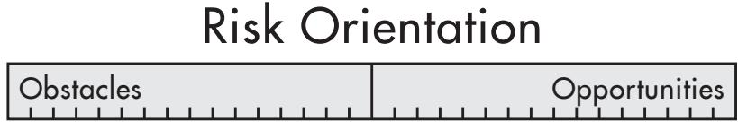

The Risk Orientation (QO2 TM) scale

At one extreme, people can focus most of their energy on seeing opportunities. They are always positive when new ideas are presented and will look optimistically at most situations. The downside is the limited energy they assign to seeing obstacles. They don't always see potential difficulties and this can cause them to misjudge situations.

At the other end of the scale, people may focus most of their energy on seeing obstacles. When working on a project, they are more likely to put a lot of effort into looking at all the things that might go wrong. When faced with potential opportunities they may well ignore them, presenting convincing arguments to support their view that the risks are too great.

#### Seeing the Opportunities

People who score strongly towards the opportunity side of the scale are usually very positive and can have a major impact on the dynamics of any group. It is hard to be negative when those around you are brimming with enthusiasm and looking hopefully to the future.

However, a high focus on opportunities can sometimes be seen by others as a naïve form of optimism. Individuals who focus almost exclusively on opportunities believe that things will always turn out for the best, and that no matter what happens, there is always something to be glad about. There are never any obstacles, only opportunities!

High-opportunity individuals can often accept anything that happens to them by reflecting that things could always have been worse. This view of the world is not always an asset in managing a business. The reality of the business world is often summarised by the law that if anything can go wrong, it will. It is essential for managers to identify all the obstacles that might occur and have an alternative plan of action to implement, should things go wrong.

Managers who have very high levels of opportunity-focus can sometimes run into problems at work. Their enthusiasm and belief in a positive outcome can sometimes lead to decisions that are regretted later. This extreme right-hand side of the scale is a normal, often admired characteristic in people, but it can have definite disadvantages in the world of work if it is used to excess.

#### Seeing the Obstacles

The left-hand side of the scale defines someone who puts most of their effort into looking for obstacles, which in the extreme can lead to pessimism – a mood state that affects us all to varying degrees. However, too much pessimism can lead to apathy and inaction.

Individuals who focus almost exclusively on obstacles can be seen by others as being gloomy and expecting the worst in most situations. They constantly expect things to go wrong. A focus on seeing the obstacles is very important in the business world as it can prevent serious mistakes from being made. However, excessive negativity is something to be avoided.

## The Opportunities-Obstacles Quotient 1.3

The Opportunities-Obstacles Quotient (QO2 TM) is a measure devised to quantify a person's position on the Risk-Orientation scale. It is defined as the ratio of the energy you put into seeing opportunities to the energy you put into seeing obstacles. It is measured by a 50-item Profile Questionnaire, which assesses people's responses to various statements. Feedback is a comprehensive report indicating how the respondent is likely to approach situations at work. It also provides numerical data and an overall QO2 TM rating.

Twenty-nine items are used to measure the Opportunities end of the Opportunities-Obstacles scale and twenty-one are used to measure the Obstacles end. The results are then presented as a unidimensional scale given that research shows two ends to be strongly negatively correlated.

The 50 items also break down into 5 subscales. MTG Energy is measured with 8 items, Mulit-Pathways with 10 items, Optimism with 14 items, Fault-Finding with 9 items and Time Focus with 9 items.

The Resilience Index is calculated from a combination of the MTG Energy, Multi-Pathways, Optimism and Time-Focus items.

The Handling Change section is generated from the composite score on Multi-Pathways, Optimism, Fault-Finding and Time Focus.

These scales and sub-scales for the instrument are fed back to respondents as percentage scores. This represents the percentage of the maximum possible on any of the scales and subscales.

Looking at the example below, a typical result shows an 82% score towards the opportunities side of the scale and a 30% score towards the obstacles side. The QO2 TM is calculated by dividing the opportunities score by the obstacles score. The result indicates that this person would be 2.7 times more likely to see the opportunities in a situation rather than the obstacles.

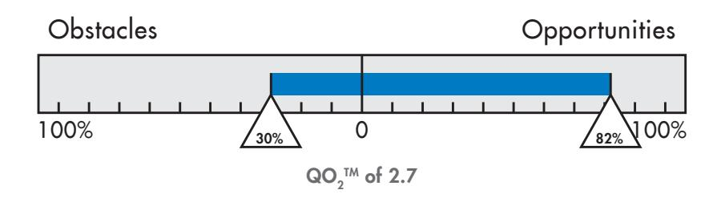

A particular QO2 TM score is related to the subscales. People with the same QO2 TM score may have different scores on the subscales, although there is a high probability that the subscale scores will be similar. As an example, if a person scored higher on the future end of the Time Focus scale and lower on MTG Energy then they may have the same QO2 TM score as a person who scored lower on Time Focus but higher on MTG Energy. However, their overall approach to Opportunities and Obstacles will be very similar. The reporting of the subscales as well as those of the prime scales of Opportunity and Obstacles enables greater individual variation in the QO2 TM Profiles. The QO2 TM has a maximum score of 15.

#### What Does it Mean?

In business we need an element of faith – it helps us to look for the opportunities that match our beliefs. Tenacity of purpose gives us the persistence to seize the opportunities which come our way. However, also essential is a measure of intelligent doubt which anchors us to reality and prevents us from making mistakes. When we have a good ratio between opportunities and obstacles, we can be a powerful force at work.

But what is a good ratio, and how does it relate to particular jobs and work situations? These are ongoing questions which can best be answered by looking in more detail at the five sub-scales which make up the overall scale.

## 1.4 Development Norm Data

Over 1,000 people in a variety of jobs in Canada, USA, UK and Australia took part in our initial research. Eighty percent were men and twenty percent women. They worked in a variety of jobs covering human resources, finance, production, and general management areas.

In summary, the development data shows that the median value for QO2 TM is around 2.2. This is simply the value where 50% of people (i.e. 500 in this sample) have a higher quotient and 50% have a lower quotient.

The data also shows that 25% of people have a QO2 TM above 3, and 25% have a QO2 TM below 1.6. Half the sample had a QO2 TM in the range 1.6 to 3.0. This is defined as the area of Opportunities-Obstacles balance.

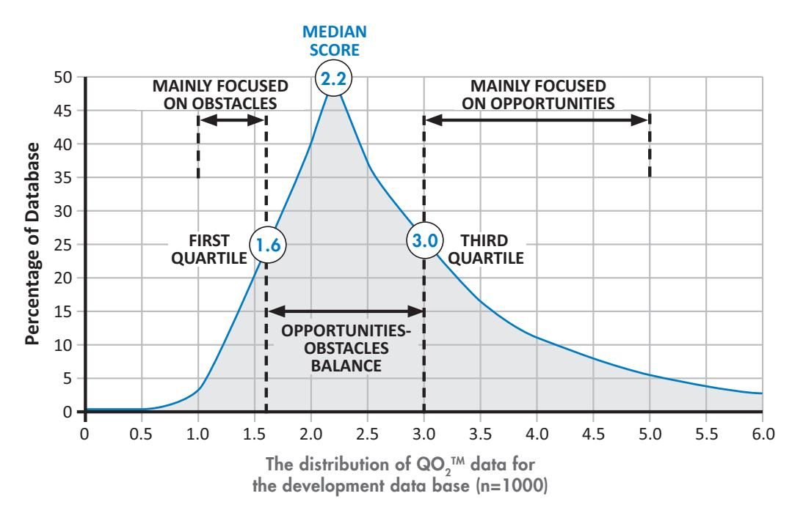

To interpret the development distribution diagram above, note that the percentages to the right of the median point give the percentage of the data base with a higher QO2 TM, whereas the values to the left of the median give the percentage of the data base with a lower QO2 TM.

These results are very useful as they show that the measure of central tendency is indicating that in the work situation, there is a tendency for people to put twice as much effort into seeing the opportunities as seeing the obstacles. Many people argue that this is a biological phenomenon in humans where we are designed to look for the opportunities rather than concentrate on the obstacles. This is a fundamental aspect of human nature and an important principle in evolution.

Although most people will put more effort into opportunities rather than obstacles, the relativities between people will be of primary importance in the workplace. A high QO2 TM person will be seen as someone who concentrates only on the opportunities and ignores the potential obstacles. A low QO2 TM person will be seen as someone who only sees the obstacles and ignores the opportunities.

Norm data for various other groupings such as worldwide data, gender, functional areas, professions, industries, countries, and regions are available on-line and in the QO2 TM Research Manual.

## 1.5 Profiles and their Interpretation

The QO2 TM Score is calculated as the ratio of the percentage score on the Opportunities scale to the percentage score on the Obstacles scale. The result is compared against a worldwide database. For each of the five sub-scales there are four different text outputs possible. The cut-off points for the selection of the appropriate text are based approximately on the quartile figures for each sub-scale. This means that, on average, 25% of people will receive the same text output for a particular sub-scale. Usually respondents with the same QO2 TM Score will receive the same output, although variations will occur if the cross-scale correlations differ significantly. The research data shows that this is relatively uncommon.

The Resilience Index is calculated from a weighted combination of items in the MTG Energy, Multi-Pathways, Optimism and Time Focus sub-scales. Resilience describes the ability to withstand, recover from and adapt to adversity and stress. As such it is strongly correlated with persistence and the ability to look for ways around any obstacles that may arise. Resilient people also tend to approach their goals with a positive emotional state and the ability to put the past behind them and rebound from diversity. Again, the text output of this section is divided into four reports, based roughly on the quartile norm results.

The 'Handling Change' section is generated from the composite score on Multi-Pathways, Optimism, Fault-Finding and Time Focus. People with a propensity to find their way around obstacles, who are optimistic, who look to the future and who do not see pitfalls, seem happy to deal with change. Those with the opposite approach are more likely to oppose change.

The section on 'How to Balance Your QO2 TM' gives general tips and hints on four main areas: Goals, Pathways, Time Focus and Obstacles. Four text outputs are possible for each section, roughly triggered by the quartile data. This section is designed as a stimulus for personal development rather than directive information about changes to make. After reading this data, participants can use the worksheets provided with the Guide to identify particular areas they would like to improve.

The Opportunities-Obstacles Profile has been designed as a feedback and discussion tool for individuals and teams.

It can be helpful to keep in mind the following characteristics when interpretting the QO2 TM scores.

| QO2 TM Value | Characteristics                             |
|-----------------|---------------------------------------------|
| >5              | A strong tendency towards Opportunities     |
| 3 to 5          | Mainly focused on Opportunities             |
| 1.6 to 3        | Balance between Opportunities and Obstacles |
| 1 to 1.6        | Mainly focused on Obstacles                 |
| <1              | A strong tendency towards Obstacles         |

Sample Norm Data

# The Five Sub-Scales PART 2

The Opportunities-Obstacles Quotient (QO2 TM) is synthesised from five sub-scales: Optimism, Moving Towards Goals (MTG) Energy, Multi-Pathways, Fault-Finding and Time Focus.

MTG Energy – the energy that gives us the determination, enthusiasm and resilience to formulate and achieve our goals.

Multi-Pathways – the ability to generate lots of possible pathways around obstacles.

Optimism – a psychological resource that gives people a generalised expectancy that they will succeed in their endeavours.

Fault-Finding – the effort put into looking for faults in both proposals and people.

Time Focus – a measure of whether people like to focus on the future, the present or the past.

People who map strongly towards the Opportunities side of the scale have high MTG Energy; that is they set challenging goals and regularly achieve them. When difficulties occur or blockages to their goals arise, they are quick to generate alternative pathways and move around the blockage, still focusing on the goal. As well, they are generally optimistic and full of hope that everything will turn out for the best. They tend to put less energy into finding faults with proposals, projects and people, and usually have a positive attitude and can enthuse those around them. For them, the future is a rosy place and one they want to be part of, because it is likely to be better than where they are now.

People who are strongly at the seeing Obstacles end of the scale have a lower MTG Energy and are less able to generate pathways around obstacles. When blockages occur they are more likely to keep pressing forward down the same pathway and will quickly give up when their energy is expended. As well, they tend to be more pessimistic and will anticipate the worst scenario when problems arise. They will usually put a lot of effort into Fault-Finding, and this can be both a strength and a weakness. When faced with a new idea they are more likely to identify all the difficulties that might prevent the idea from becoming a reality. Seeing obstacles people are also more comfortable with the present and past as, to them, the future is not a rosy place but one that is fraught with difficulties. Some long for the 'good old days' when life was much better than it is now.

The five sub-scales that make up the scale can be arranged as a pentagon to give a visual representation of the key factors defining people's approach to risk in the workplace. This forms the McCann Opportunities-Obstacles Model shown below.

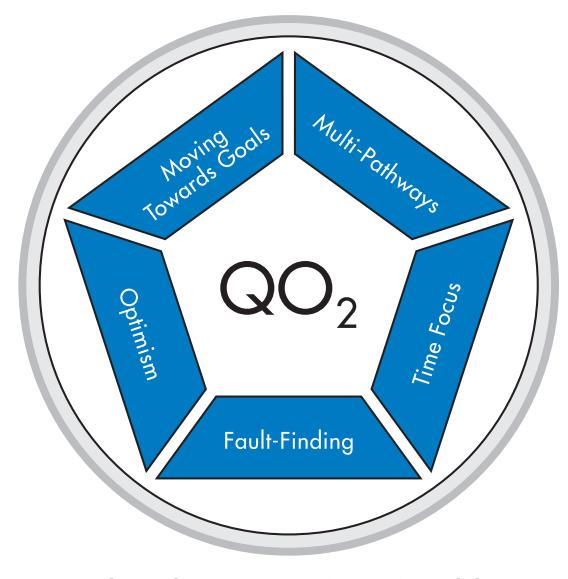

The Risk Orientation (QO2 TM) Model

# 2.2

## Moving Towards Goals (MTG) Energy

MTG Energy is a form of personal energy - the energy that gives us the determination, enthusiasm and resilience to formulate and achieve our goals. People with a high MTG Energy are those who see opportunities and are often prepared to take risks to seize them. People with a lower MTG Energy will often see obstacles in the way of any goals they have, and when things get difficult they will give up earlier than those with higher energy.

#### What Gives a Person High MTG Energy?

It seems that high MTG Energy is acquired through life's experiences. When we are children, goals are either set through our own innate desire to succeed (intrinsic goals) or through the expectation of our parents, school teachers or significant others (extrinsic goals). In many cases, the extrinsic goals help formulate the intrinsic ones. Whenever we achieve any of these goals we are usually rewarded in some way by prizes, admiration or concessions. Very soon an expectation of succeeding is established; if a goal is set, we will believe we can achieve it and therefore our MTG Energy is developed.

This is why goal-setting is so important in children. Goals must be set that challenge and stretch the individual rather than those that are easy to reach or too far away. In sport, the concept of the personal best sets the right goals. This can be extended to cover all parts of childhood development. If goal achievement is established at a young age it can be easily carried through into adulthood. If not, then MTG Energy will need to be developed later in life.

If goals are easy to reach, then a person's potential is not maximised. They may have an easy and enjoyable time as they readily achieve their goals, but sooner or later they will realise that they could have done more. Usually they will have an average MTG Energy, which could easily have been further developed. Some people fear failure and react badly to it with strong feelings of lack of confidence and low self-esteem. To avoid these debilitating characteristics they will often formulate 'easy' goals to bolster their feelings of self-worth. Such people have an untapped potential that can be released through goal-stretching programmes.

If the goals lie well beyond someone's capabilities then no amount of rewards or cajoling will realise those goals. Such people will usually find a reason to give up as soon as they can. Sometimes they see so many obstacles to the goals that have been set that they simply never begin. Many of these obstacles are imaginary. Such a pattern encourages a low MTG energy, no matter what the goal. It is not long before lack of confidence and low esteem set in.

Because higher MTG Energy is aligned with seeing and seizing opportunities, it is important to develop it to a high level. However there are situations where too high an MTG Energy can cause problems. Overconfidence can result, causing these people to be blind to serious obstacles that will impede their progress. It is difficult to predict the maximum level of MTG Energy. It very much depends on the individual, which is why goal-setting programmes need to be personally tailored.

Research has identified two main ingredients that can help develop MTG Energy: Stretch Goals and Persistence.

## Multi-Pathways 2.3

People who see opportunities and grab hold of them are those with the capability of Multi-Pathway generation.

When an obstacle occurs they are able to generate lots of possible pathways, and ultimately select one of them that effectively removes the obstacle. People without Multi-Pathways skills tend to follow a single pathway to achieve what they want. Often you may hear them say, 'There is only one way to do things well and that's the right way.' People with a high level of MTG Energy but a low Multi-Pathway capability can succeed in removing obstacles but they need a high level of determination and persistence.

When an obstacle arises to thwart your plans it is useful to follow the Multi-Pathway Generation Model. This model gives four possible routes to follow and the best results are achieved by using all four thinking modes. We recognise that brain lateralisation is more complex than this simple 'popular culture' model but it is still a very useful guide to identifying obstacles and generating pathways around them.

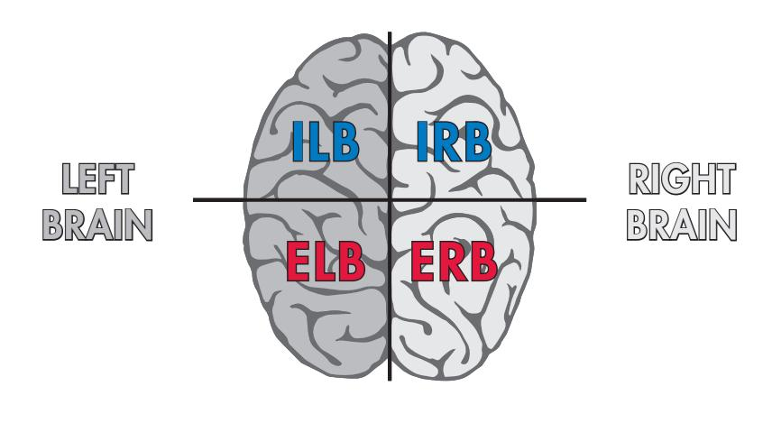

#### INTROVERTED ACTIVITY

EXTROVERTED ACTIVITY

Multi-Pathway Generation Model

#### Introverted Left-Brain (ILB) Thinking

This process involves a logical analysis of what the obstacle is and what is causing it. The technique often used here is sometimes known as the Why-Why diagram, although there are many other good techniques available. An excellent source is the handbook, *101 Creative Problem Solving Techniques* by James M. Higgins (2006).

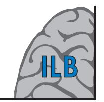

#### Why-Why Diagram

A Why-Why diagram will help you identify a series of obstacles rather than just the obvious one you may have thought was the primary cause. It is a process which gives you a perspective on the problem.

Higgins. J.M., *(2005). 101 Creative Problem-Solving Techniques, The New Management Publishing Company, Florida.*

First of all, write down the obvious primary obstacle. As an example, let's say a gym that has low membership figures. Next, consider the five possible causes of this by asking the question 'Why?'. Five secondary obstacles generated may look like this:

- fees too high
- inadequate promotion
- ageing equipment
- open at wrong times
- outdated activities

Your Why-Why diagram would look like this.

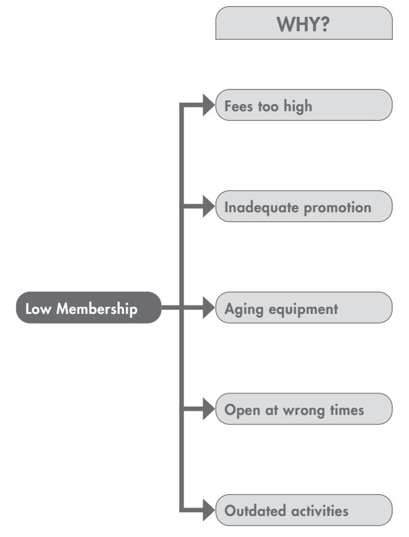

Stage One of the Why-Why Diagram

Next, the question 'Why?' is asked again for each of the possible causes listed in the second column. This then generates a third column with at least three further causes derived from each obstacle listed in the second column. A column with 15 detailed obstacles is the result, as shown overleaf.

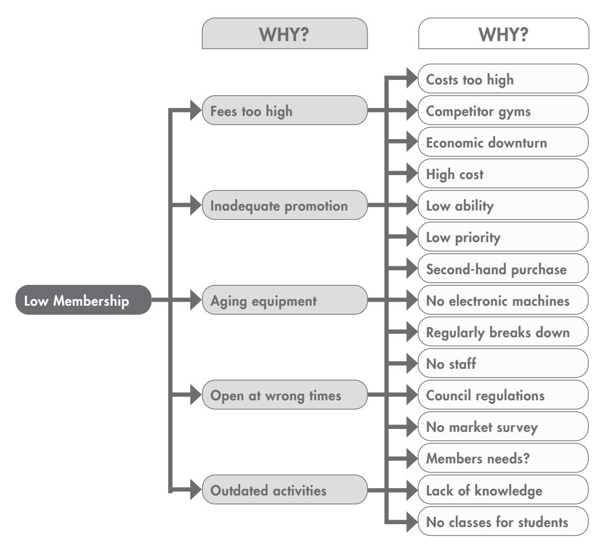

Stage Two of the Why-Why Diagram

Now that an expanded list of the primary obstacle is available, the next step is to prioritise all the obstacles so that the most important ones can be worked on first.

If, having completed stage two of our example Why-Why diagram, we considered the most important secondary obstacle to be 'inadequate promotion'. Our third-order analysis of 'inadequate promotion' further highlighted the key obstacles to be:

- 1. High cost
- 2. Low ability
- 3. Low priority

The next step is to look at each obstacle and attempt to build a pathway around it. Some pathways may be obvious, whereas others may need further consideration. For example, our solution to 'Low priority' might be to make time to give promotional activities priority in our day-to-day work. Alternatively, and considering it is not our key strength (see point 2 – Low ability) we may need to consider recruiting a marketing specialist to help give this activity the priority and focus it needs.

#### APO Diagram

In cases where people may be the cause of the obstacle, it is useful to take the Why-Why diagram further by constructing an APO diagram – an Analysis of People Obstacles.

By plotting the level of influence of key stakeholders, either for or against your goal, you can build up a good representation of your allies and opponents as far as any specified obstacle is concerned. Using your allies to persuade your opponents can be a good strategy for generating pathways around people obstacles.

The first thing to do is to consider who the key stakeholders are. A stakeholder is any person who has a stake in the outcome of what you are working on – in other words, anyone who has a vested interest in the problem, opportunity or project, or who is in a position to influence the outcome, either positively or negatively.

An APO diagram like the one shown below, will help identify those people with the greatest influence upon the success of your activities. The north-south axis describes the level of influence over the situation that a particular person will have, and the east-west axis defines whether the person is 'for' or 'against'.

Someone who is plotted to the extreme left will be totally 'against' the project, and someone who is plotted to the extreme right will be totally 'for' the project.

To draw up an APO diagram, consider all the people who could possibly have an influence on the outcome of what you are doing or intending to do and plot them on the diagram, indicating each person with the appropriate initials.

You will see from the example below that DK, JS and JB are all against the situation and will have moderate to strong influence on the outcome. PK, on the other hand, is 'for' the situation and has a high influence on the outcome.

Strategies need to be initiated that will bring the people from the upper left-hand quadrant to elsewhere on the diagram. One of the best strategies to use is the 'pull-push' technique where the person (or group of people) in the upper right-hand quadrant is used to 'pull' the upper lefthand quadrant people across into their quadrant. At the same time, you can try to 'get behind' the people in the upper left-hand quadrant and 'push' them across using a suitable strategy. In the diagram below, PK is an important external link and needs to be consulted at an early stage so that his or her influence can be brought to bear on other less committed people.

Key stakeholders, either 'for' or 'against', should always be regularly consulted as any project proceeds. In many cases, resistance to what you are doing will decrease just through the process of regular discussion about what you are trying to do. In this particular example, DK needs to be consulted at the earliest opportunity so that his or her concerns are fully understood and incorporated into your plans at the outset.

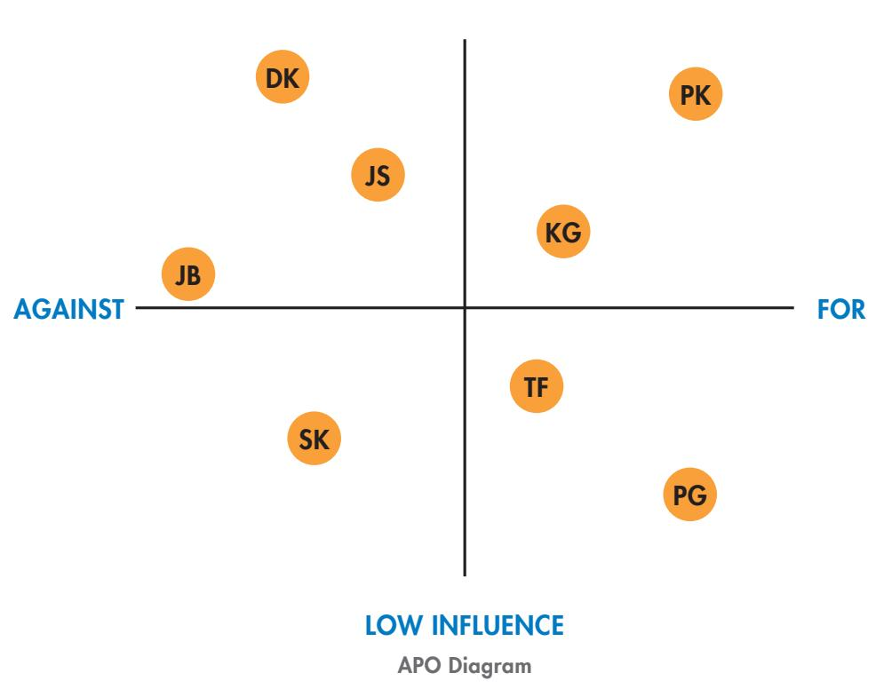

HIGH INFLUENCE

#### *More In-Depth ILB Thinking*

ILB thinking requires all possible information concerning the obstacle to be gathered. This can be obtained by reading, attending conferences and generally asking anyone who might have information to help. If the obstacle is a severe one, then it is important to have the intent and resolve to come up with a solution that is truly robust. This requires the constant examining of the obstacle, visualising scenarios of possible solutions, and gathering all the facts that might be relevant to the problem.

Effective ILB thinking for multi-pathway generation requires patience - the balance between boldness and being careful. Impatience is what causes people to give up on finding ways around the obstacles before their efforts have had a chance to bear fruit. Patient people learn to differentiate between disasters and temporary setbacks.

#### Introverted Right-Brain (IRB) Thinking

When a solution out of the ordinary is required, it is often necessary to venture into the IRB quadrant and spend time in Introverted mode, generating pathways using creative techniques. There are many techniques to use, but visual mapping or free association work well.

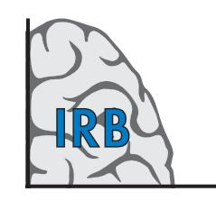

Visual mapping is an individual brainstorming technique where you

generate many possible ways around an obstacle without evaluating the merits of any of them. This is true Multi-Pathway stimulation where you allow your mind to run free. Evaluation comes later when you move back into ILB thinking.

The visual mapping procedure follows a structure that can be particularly useful in finding a way around obstacles. First, write the obstacle as a solution-oriented question in the centre of a sheet of paper and draw a circle around it. Then create branch lines off the obstacle, with as many ideas as you can generate. At this stage, don't worry about the practicality of what you are doing, just get as many alternatives down on paper as you can.

Each idea can be developed further by creating branch lines, which will eventually lead to a map-like structure of all possible ideas.

To return to our earlier example, a visual map could be generated quickly by writing down several different ways of promoting the gym. The main branches could show the ideas of:

- Referrals
- Social media
- Newspapers
- Newsletters
- Discovery seminars
- Telephone marketing
- Email bulletins
- Mailshots
- Magazines

Each of these branches would then lead to a number of different ideas, and very quickly we would have lots of possible ways around our potential obstacle. The next step is to go back to ILB thinking and consider which of these ideas can be implemented, given the various constraints of time, money, resources, etc.

#### Extroverted Right-Brain (ERB) Thinking

Many obstacles that arise in the work situation are team problems rather than individual ones, and it is often left to the team to come up with ways around the obstacle. Group pathway generation can provide a superior solution to that of the individual, as collectively there is more information available. However, the group process must be conducted effectively for this technique to work.

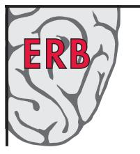

One well known method for ERB thinking is that of brainstorming, developed originally to increase the quantity and quality of advertising ideas.

Four ground rules are essential for this process to work:

- No judgements are made about anyone's suggestion.
- All ideas, particularly absurd or impracticable ones, are encouraged.
- Quantity of ideas is the aim, not quality.
- Ideas should be combined, refined and developed.

The features of spontaneity and absence of criticism encourage a positive atmosphere where participants know that no-one is going to criticise them for a 'silly' suggestion.

The leader's role is to start the session and explain the ground rules. Leaders must get the group to relax and feel comfortable. Once the session is underway, their role is mainly one of facilitation. In addition, they must insist on the ground rules being followed. The most important ground rule is number one - no judgements about anyone's suggestions. If criticism occurs while ideas are being generated, the whole point of brainstorming is lost.

The recorder's role is to list the ideas for everyone to see. Many of the ideas can be represented by pictures. Variation in colour also helps to stimulate further ideas.

#### Extroverted Left-Brain (ELB) Thinking

After a series of ERB sessions it is useful to converge on a solution, or series of solutions, so that an action plan for implementation can be developed. In this session, ELB thinking is used.

Again, there are several ground rules that are useful:

- be objective
- be critical
- attack the ideas, not the person
- if it is your idea, don't be defensive when it is criticised
- focus on the benefit/cost

If there are a large number of ideas, it is best to quickly reject those that are considered by all participants to be doubtful. Those remaining are then subjected to an intense analysis, asking questions such as, 'Why is it up there? Will it work? How will it work? Is it efficient? Is it effective?'.

After this process the possible solutions are ranked in order and left for further discussion at the next ELB session. In the meantime participants are encouraged to think about the issues using the ILB and IRB thinking modes.

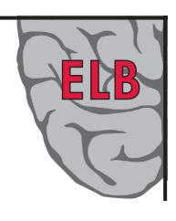

## 2.4 Optimism

Optimism is a characteristic that is the basis of positive thinking. It is a psychological resource which gives people a generalised expectancy that they will succeed in their endeavours. Expected success, in turn, gives people the will to expend effort to realise their goals. If they expect failure then they will put less effort into a task and are more likely to give up as soon as an obstacle appears. Positive thinking processes will help develop Optimism, which in turn elevates the expectation of favourable outcomes. People with high Optimism will score strongly on the seeing opportunities side of the scale.

People who are optimistic will often see more opportunities than those who are pessimistic. They are able to put problems behind them and take a positive view of the future. Optimism is an attitude to life that prevents people from becoming apathetic, or giving up hope. The belief that things can only get better is often a tonic for those around them. Their optimistic view of the world can be infectious and influence those they interact with.

#### Optimistic Speeches

The importance of Optimism to people is shown by Martin Seligman's work in analysing US political speeches, where he analysed the nomination acceptance speeches of candidates for the American presidential elections. In the 22 presidential elections from 1900 to 1984, Americans chose the more optimistic sounding candidate 18 times.

Seligman has spent many years researching the concept of optimism and pessimism through his work on attributional styles. He has found that people with an optimistic attributional style will attribute negative events differently to those with a pessimistic explanatory style. When setbacks occur, pessimists blame themselves. They believe the cause lies within them rather than being due to external or extenuating circumstances. Pessimists also believe that misfortune is longlasting ('things will never get better') or repetitive ('If I have failed once, it will happen again'). It is also global or pervasive, i.e. if it happens in one area of their lives, then it will happen to their whole life. These three characteristics of the pessimistic explanatory style for negative events are known as the three Ps – Personal, Permanent and Pervasive.

Individuals with a low Optimism score can show the characteristics of pessimism, and the three Ps may be prevalent for them.

Whether a tendency to pessimism is inherited or learned is a debate that has continued for many years. The truth is probably somewhere in between. People growing up in a pessimistic environment can be greatly affected by negative events.

Many controlled experiments have been carried out showing that a pessimistic mood can be induced by just listening to gloomy stories, watching a depressing film or listening to melancholy music. Likewise, being exposed to a person who continually focuses on the obstacles can create pessimism in you. This pessimism can spread quickly, affecting a large number of people.

Pessimism can be reduced through positive thinking. Positive thinking exercises can help individuals with low Optimism make their view of the world more positive and ensure that their problems do not become permanent or pervasive. This can be achieved through enhanced awareness of rumination or Positive Imaging.

#### Ruminating

People with low Optimism often have feelings of fear and uncertainty about the future. In some cases this can cause high levels of anxiety. This anxiety can lead to rumination. Rumination is a term often used to describe a negative internal dialogue that people have with themselves. If your level of Optimism is low, then you may well imagine all the things that could possibly go wrong.

Negative self-talk becomes an unstable cycle. The more you think about the terrible things that might happen, the more vivid they seem and the more cautious you become. Your very fear of the future event is magnified through rumination. So when the event actually takes place, you are more likely to be tentative and unsure of yourself. This can create a self-fulfilling prophecy, and the imagined negative outcome can become a reality. Sometimes negative self-talk becomes so bad that it can occupy much of people's waking time and may even prevent them from sleeping at night.

For many years researchers have continually shown the close connection between the mind and the body. Negative self-talk can cause the body to act in alignment and in turn, behaviour can mirror self-image. In other words, negative thoughts stimulate negative behaviour. Positive thinking is therefore an important process to overcome negative behaviour. It will help create the expectation of a positive outcome, which in turn will help establish positive behaviour.

The first step in developing positive thinking is to become aware of those times where you enter rumination mode. There are many ways to do this, but one of the best techniques is the creation of your own internal critic who you can summon up to respond to negative self-talk whenever it occurs. The purpose of this internal critic is to dispute your negative thoughts by insisting on objective evidence to support what you are thinking. If there is no supporting evidence, your internal critic tells you to banish your negative thoughts and to stop ruminating on them.

Another way of dealing with rumination is to use a personal journal where you can write down your negative thoughts for dealing with later. Many people find that the act of writing helps them to transfer their thoughts away from their mind. Once the thoughts are on paper, the mind tends to be quieted and the stress created by the rumination is reduced. These thoughts can then be read at a later stage when they are in a more analytical mode.

#### Positive Imaging

One of the most effective ways to elevate your level of Optimism is by using positive self-talk, together with visioning techniques or imagination. Visioning techniques involve constructing a desired future model of a situation you would like to experience and then running that model several times over so that it is programmed into your mind.

## 2.5 Fault-Finding

The Fault-Finding sub-scale measures to what extent a person looks for faults in both proposals and people. Some people will expend considerable effort in looking for the faults in any ideas or projects presented to them, whereas others only look for the opportunities and make assumptions that everything will turn out for the best. Likewise some people always expect that others will let them down and therefore approach relationships in a somewhat negative frame of mind, whereas others approach people interactions in a positive way, anticipating only the best.

If you are an 'opportunities' person then the chances are that you will score lower on Fault-Finding. You will see the glass half-full and not realise it might soon be empty! Therefore it may be worthwhile learning how to focus more energy on identifying potential obstacles.

Obstacle-oriented people have a mindset which causes them to always assume the worst. When faced with an opportunity, their first reaction is to look for all the potential faults by taking on the role of 'devil's advocate'. Opportunity-oriented people have to force themselves to examine the downside of proposals and can benefit from a structured approach to help them consider the full range of possible outcomes.

#### Potential Obstacle Analysis

A useful technique for examining the faults in any opportunity is Potential Obstacle Analysis. This is a systematic procedure designed to highlight the major obstacles that might be faced when a particular idea, proposal or project is implemented. The basic procedure involves asking:

- What could possibly go wrong?
- What assumptions have we made?
- What might we do now to minimise the risk?

For people who score highly on the Fault-Finding sub-scale, Potential Obstacle Analysis is a skill that comes naturally. Those who do not score highly in this area may not see any difficulties associated with the projects or proposals they are working on.

Potential Obstacle Analysis comprises four key steps:

- Identifying internal and external obstacles
- Ranking each obstacle in order of importance
- Gathering information
- Implementing preventative action and/or contingency plans

#### Internal and External Obstacles

The first step in Potential Obstacle Analysis is to draw a boundary around the presenting opportunity so that it is divided into internal obstacles and external obstacles. The internal obstacles are those actually associated with the project or plan itself, and the external obstacles are those covering the interaction of the project or plan with the external environment, in all its forms.

Next, the internal obstacles are identified under four main categories that act as a checklist to assess potential problems. The categories we use for identifying business obstacles are:

- Technical obstacles
- Financial obstacles
- Marketing obstacles
- People obstacles

When carrying out an external Potential Obstacle Analysis, the same four categories are used, but the questions asked focus on external factors or interactions.

Many of these obstacles interact with one another and sometimes it is difficult to decide which category to place them in. However, the categories are there as a prompt to help identify as many potential obstacles as possible, so as long as the obstacles are listed, it does not necessarily matter under which category they are placed.

The next stage of Potential Obstacle Analysis is to look at each specific obstacle you have identified and rank it in terms of importance to the future of your project or proposal. To do this, you should use a five-point scale ranging from 1 (extremely important) to 5 (not so important).

Once you have done this, you need to gather sufficient information to fully evaluate each of the obstacles you have ranked as 'class one' obstacles. These are the obstacles which will have a great bearing on the success or failure of your proposed project or undertaking and so it is essential to research them fully before getting into action.

The final step of Potential Obstacle Analysis is to balance these obstacles against the opportunity you are considering and make a decision on whether to go ahead. If the answer is 'yes' then the main obstacles you have identified need preventative action and/or contingency planning.

#### Inverse Brainstorming

Potential Obstacle Analysis is a skill that is often developed through experience and should be done in both introverted and extroverted modes. Once you think you have identified all the possible pitfalls yourself, it is important to get a different perspective from other interested parties. There will be many colleagues around you who have seen hundreds of problems that should have been anticipated. Their experience will be invaluable in identifying obstacles you may not have thought of.

One technique of extroverted Potential Obstacle Analysis is inverse brainstorming. Whereas brainstorming is all about thinking up creative ways around problems, inverse brainstorming looks at an opportunity and then considers all the obstacles that might prevent the opportunity from working.

This technique is very useful in exposing the assumptions that often lie hidden in the unconscious mind when individuals try to identify problems alone. The beliefs and values that we hold may prevent us from seeing the reality of a situation. Those can be exposed by considering the alternative views offered by other people.

## 2.6 Time Focus

Before the age of Einstein, people thought that time was absolute. Einstein changed the idea of time and showed that it is relative. The faster a person moves, the slower the time appears to an outside observer. Eventually, when we travel at the speed of light, time stands still.

Tongue in cheek, Einstein once explained the theory of relativity to his secretary, Helen Dukas, so that she could pass it on to reporters and others (Calaprice, 1997):

#### *"A watched pot never seems to boil."*

What Einstein was talking about here is psychological time - how we subjectively process time. For some people, time moves quickly, for others it moves slowly.

Time moves quickly when we are engaged in pleasant experiences and slowly when we are experiencing unpleasant situations. Time moves slowly when we are bored, and fast when a task is absorbing, challenging or mentally stimulating.

#### Fast Psychological Time

Psychological time is related to tempo and the pace of activities. In fast psychological time, there is a frenetic pace of activity and never enough time in the day to do what is required.

Here, so much activity is programmed into each day that psychological time is faster than clock time. At the end of each day, a business executive may well have worked for two days in terms of elapsed psychological time, and physical and mental exertion. Too much time spent in this way can cause stress and eventually decreased levels of effectiveness.

#### Slow Psychological Time

In slow psychological time there is a slower pace, and each day may well seem longer than the clock-time day. The effect of this is to create the phenomena of 'event time'.

Those working in event time will assign as much time as is necessary for each event until a satisfactory outcome is reached. If meetings take twice as long as scheduled, then it doesn't matter.

Slow psychological time is also associated with boredom. Here the internal clock seems to slow right down, with an individual's arousal level often dropping below action levels. When this happens, such extremes of boredom can be reached that people feel hopeless and pessimistic. In this way, the mental slowing of time can lead to a downward spiral where the future has no meaning and all focus is on the present or the past.

#### Past – Present – Future

Anthropologists have often focused on the different ways that cultures view time as a means of explaining many of their traditions and values. Present-oriented cultures focus on the here and now, with very few traditions and little planning for the future. Past-oriented cultures want to maintain past traditions by incorporating them into present-day activities. Future-oriented cultures have a vision for their society and generate plans to move their culture towards that vision.

It is the same with individuals. Western culture can be considered, on the whole, to be future-oriented. However, within society there are many individuals who believe in the good old days and want to maintain the values and traditions of the past. Equally there are many people who prefer to live each day as it comes.

One of the most useful models for understanding Time Focus in individuals involves the time line. Time runs on a continuum from the past, to the present, to the future. Some people can span the whole timeline giving equal weight to all states, whereas others like to focus on the past, the present, or the future.

#### *Future Time Lines*

Some people's time lines run from front to back. The future is in front of their eyes, the present lies embedded within them and the past is behind them. Most of their energy is directed towards the future and they have little interest in, or memory of, the past. In fact, you may well hear them say, 'Let's put the past behind us'.

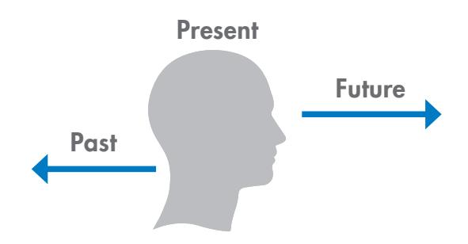

For them the future is a rosy place, somewhere they want to be. They are full of hope because they know that things will be better than they are now and better than they have been in the past. They can't wait to live in the future and their whole focus is on looking for the opportunities that will help them realise the vision of hope that they so readily have. This orientation to the future correlates well with people who are more opportunity focused. People with future time lines (F-time) talk with excitement about the future. You can hear their word tempo increase as they talk about their vision. They tend to be more optimistic, positive and seek out situations that are different.

People with very strong future time lines often blank out the past. Past memories will merge, being telescoped into one small time unit. The present quickly becomes the past and with that go the memories of any unpleasant events.

This is, of course, an important ingredient of entrepreneurship. Most entrepreneurs fail at their first attempt, or even their second. A focus on the future or a collapsing memory of the past will allow them to try again.

There is much evidence to suggest that people with future time lines are strong internal visualisers. They have the ability to think of future possibilities as visual images. Because the present is quickly telescoped into the past they can also be poor external visualisers. This means that their observation skills are less developed and they may not always retain external images for long. This can lead to them misplacing things!

A strong future time line also seems to be associated with faster psychological time. Time moves at a fast rate for people with future time lines and they are continually looking for new opportunities.

#### *Past Time Lines*

Some people's time lines may be reversed, with the future behind them and the past in front of them. This is the past time line (P-time) where energy tends to be more focused on identifying obstacles rather than seeing opportunities.

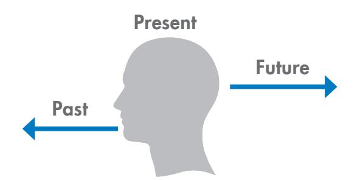

People with past time lines may long for the good old days when things were much better than they are now. The future is a very uncertain place and likely to be much worse than the current situation. So it is better to stay anchored in the past rather than risk the uncertainty of the future. When faced with a new opportunity, P-Time people will look for obstacles to support their inner feeling that things may be better left with 'what we already know'.

P-Time people sometimes have difficulty in imagining the future. Their skills in visioning may be less developed than others, and this can create uncertainty that may lead to fear of the unknown.

Often though, their external visualising ability is good and they can be excellent observers. This orientation to the past correlates well with people who are more obstacles focused. People with past time lines prefer the safety of how things are now and may even be pessimistic about the future. They prefer sameness rather than difference and are more comfortable with change when it is incremental rather than radical. Strong past time lines are also associated with slower psychological time.

Between the two extremes of future and past time lines we have various combinations favouring either the past or the future, with a neutral balance when the time lines are in front of us.

Here we tend to live in the present, from where we are happy to look towards both the past and the future.

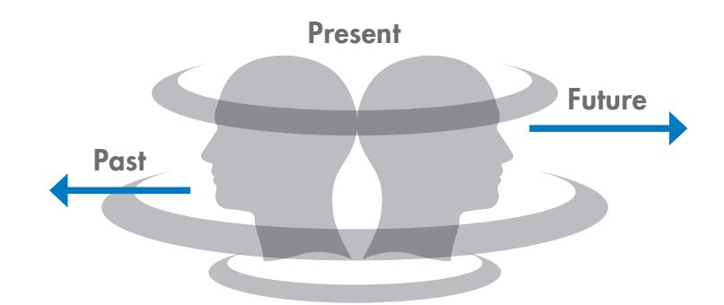

#### *Balancing Your Time Lines*

F-time people will often have a fast psychological time. The world moves at a quick pace as they focus on the future, striving hard to realise the vision they have generated for themselves. Excessive F-time can cause people to become stressed and even manic, particularly if their internal clock gets out of control. These people need to regularly slow down and activate their P-time mode. Setting aside time for personal reflection where the focus is on the past rather than the present can help achieve this.

Conversely P-Time people will often have a slower psychological time, which at the pathological extreme can degenerate into boredom, inactivity and even depression. These people need to have 'a dream' and helping them to create their own personal vision is one of the therapeutic activities which can balance their time line. It causes them to focus on the future a little more, a place that can actually be better than where they are now.

#### *Mindfulness*

Mindfulness is the intentional, accepting and non-judgemental focus of one's attention on the thoughts, emotions and sensations occuring in the present moment. Mindfulness can be developed using meditational practices.

Sometimes those who have a strong past-focus or future-focus may struggle with individuals who have an opposite time-focus. In these situtations, mindfulness techniques can be used to help bring balance and refocus their concentration on being completely present. This can act as a bridge for those experiencing challenges through interacting time lines.

#### *Interacting Time Lines*

Difficulties can occur when an F-Time person interacts with a P-Time person. Many 'change agents' in organisations are F-Time people, and for them the need for change is obvious as they can see enormous benefits in changing ways of working. P-Time people however, are more focused on the past and will have difficulty in understanding the reasons for change, particularly when existing and current ways of working were originally developed to optimise efficiency and effectiveness. 'If it isn't broken, don't fix it' may well be their motto.

F-Time people, focusing on the opportunities, often interact with P-Time people by concentrating on the future, painting a rosy picture of how much better things will be once the new changes are introduced. The P-Time people however, are more focused on the past and will only see the problems. When interacting with P-Time people, F-Time people need to slow down and make the connections between what has occurred in the past, what is happening in the present and how this relates to the future. They should point to some successful interventions in the past and show how successful these were for the organisation.

To a P-Time person, changes should be presented as small increments from what is currently happening. No leaps should be made from the present to the future. Each proposed change should be dealt with in detail and the links carefully made between what is happening now and what might happen in the future. All possible problems should be identified and discussed, with adequate time allowed for the P-Timers to reflect on whether every potential obstacle has been identified. This procedure may take some time, but it can be well worth the investment if it leads to acceptance by those with P-Time lines.

Likewise P-Timers, when influencing F-Timers, need to look more to the future and be prepared to discuss possible opportunities. Opening up a dialogue about future scenarios will allow F-Timers to feel committed and enthused about the future that lies in front of them.

The five sub-scales of the QO2 TM can be combined in different ways to describe various characteristics that are often observed in the workplace. One such combination is Resilience.

Resilience describes the ability to withstand, recover from and adapt to adversity and stress. As such it is strongly correlated with persistence and the ability to look for ways around any obstacles that may arise. Personal and social competence also play a role along with the ability to bounce back from negative situations.

Resilience is goal-oriented in that it relates to a future event that is desired. It also has a cognitive component where there is an assessment that this event has some probability of occurring. There is also an affective component in that the desired outcome is something pleasant.

In addition there is an agency component where willpower or energy must be deployed in order to move towards one's goals. MTG Energy is therefore a strong feature of resilient people.

Equally important is the perceived ability to generate routes to get somewhere. This is often called the Pathways component - a strong focus on looking for the best ways to achieve one's outcome. So in thinking about a desired future outcome, people form a cognitive analysis of their agency and their perceived ability to generate pathways. In street language 'where there's a will there's a way' summarises this characteristic well. In summary, a major feature of Resilience is an elevated sense of mental energy and a capacity to develop multi-pathways going forwards.

Optimism is also a characteristic of Resilience. It helps to have a generalised expectancy of positive events occurring in life when setbacks are encountered. Resilient people tend to approach their goals with a positive emotional state.

Resilience is also related to the ability to put the past behind us and rebound easily from adversity. This focus on the future rather than the past is an important characteristic of resilient people. It helps to believe that the future is a rosy place and one that will be better than they are currently experiencing.

The Resilience Index has been created from a weighted selection of four items from the MTG Energy sub-scale, four from the Multi-pathways sub-scale, two from the Optimism scale and one from the Time Focus scale.

# Applications and Facilitation PART 3

Using the Opportunity Orientaion Profile to support personal development offers a useful insight into the deeper motivations that drive workplace behaviour. As a tool to support a development conversation with an accredited facilitator, there are many areas that might be explored. Here are a selection of potential discussion points:

#### *Bringing Balance*

The Profile report feedback allows individuals to understand how they apportion their energy between Seeing Opportunities and Seeing Obstacles. It is their choice to decide how they would like to correct any imbalance. They may wish to increase their MTG energy, enhance their techniques in Multi-Pathway generation, or improve their abilities to look for potential obstacles. The role of the facilitator in these conversations is to explore what a healthy and appropriate balance might look like, and help the individual arrive at actionable solutions to work towards their ideal balance.

#### *Managing Individual Responses to Change*

The Opportunities-Obstacles Profile is often used as the basis for change management programmes. It can help people see why they might be resistant to change and why others embrace it. A useful discussion can ensue on how 'change acceptors' tend to live in the future and ignore potential obstacles, whereas 'change resistors' tend to be present or past-oriented and look for obstacles. This can be incredibly helpful for team managers, who can use the information to help predict, ahead of time what each of their team might require of them during periods of change.

#### *Exploring Risk*

The concept of risk is embedded in the sub-scales. The information in the Profile can be used by a facilitator to explore respondents' approach to risk – i.e are they more risk-accepting or more risk-averse than others they work with? They may wish to deploy the skill of Pacing to help moderate their language and behaviour when connecting with colleagues who might have different concepts of risk.

#### *Building Resilience*

Resilience, often described as part of our psychological defense, is a well-documented predictor of successful leaders and team members. For those with high levels of resilience, the Opportunities-Obstacles Profile can be used to illuminate specific areas in which they might be able to further leverage their ability to push toward goals, create multiple solutions around problems, and view situations in a more-positive light. The Opportunities-Obstacles Profile can be used to help individuals understand why they might struggle to bounce back when faced with failure or adversity, as well as provide guidance for techniques and strategies that they might put into place to understand and cope with low-resilience.

As a team development tool, the Opportunities-Obstacles Profile offers a shared language to discuss perspectives in times of uncertainty, change and risks. As with all the TMS Profiling tools, the Opportunities-Obstacles Profile becomes a crucial vehicle to assist the team in moving towards their developmental goals. If you have identified specific sub-scales that need to be explored you will find a selection of exercises on page 43-44. Here are a selection of topics that might be explored as part of a team development session.

#### *Building Strategy*

As part of a strategic planning session, a team may need to ask itself challenging questions such as "who are we?" "where are we now?" and "where are we going?". A powerful way to enable the team to answer these types of questions is through sharing and discussing aspects of the team's Opportunities-Obstacles Profiles. For instance, if we have a mixture of high vs low-Multi Pathways energy in our team, what implications does that have for our short, medium and long-term goals?

#### *Managing Conflict*

When conflict occurs, the Opportunities-Obstacles Profile can offer a non-threatening, neutral language to discuss differences and uncover shared strengths to build on. Whilst conflict can often stop teams from moving forward, the Profile offers an explanation as to why conflict might have occurred in the past, and allows the team to make a proactive effort to stop it occurring in the future.

#### *Creating Readiness for Change*

On page 35, we propose a method of using the Opportunities-Obstacles Profile to help identify and manage individual responses to change. This is equally powerful when extrapolated to the entire team. For example, how will the team cope in times of change when it is clear that some team members are able to visualise the next ten years with complete clarity, whilst others are challenged when imaging their future reality? How can those who are more-comfortable looking to the past help ensure that those with a more defined future-focus don't ignore important learning experiences before they all proceed with change initiatives?

#### *Identifying Important Opportunities*

In a volatile, uncertain, complex and ambiguous world, it can be a huge challenge for teams to be able to make informed decisions. The information contained within the team's Opportunities-Obstacles Profiles can help support the decision-making process and ensure that a balanced approach is taken when handling potentially risky situations or exciting new opportunities. If the team can heighten their awareness of who amongst them is likely to view the unknown as an opportunity or obstacle, they can increase the likelihood of their resources being allocated in the best possible way.

#### *A Comprehensive Exploration of Team Attitude*

When accompanied with the information from the Margerison-McCann Team Management Profile, the Opportunities-Obstacles Profile forms a "fifth dimension" allowing a team to explore multiple factors of their approach to work. Does a shared team focus on action and moving projects forward also combine with a shared orientation towards opportunities? Exploring the complement of work preference and risk orientation can enable a team to raise their collective understanding of "how we are likely to approach our work", and take informed steps to bring balance.

## Virtual Delivery Toolkit for QO2 TM Debrief 3.3

This toolkit is complimentary and available to download from intranet.tmsoz.com. Included are:

- Session plans
- Activities
- Power Point Slides
- Facilitation resources and more

Contact our Client Services Team if you need guidance to access these resources.

#### Face to Face Delivery

#### Aims and Objectives

During the programme participants will:

- Explore how individuals believe they are energised at work
- Recognise the value of differing motivators
- Develop a greater understanding of colleagues' approaches to energy, risk and change in the workplace
- Develop strategies for improving team communication and effectiveness

#### *Pre-work required:*

- Complete QO2 TM Questionnaire
- Read QO2 TM Profile
- Complete 321 Activity

| Time  | Session                                      | Outline Content                                                                                | Outcomes                                                                                                                 |
|-------|----------------------------------------------|------------------------------------------------------------------------------------------------|--------------------------------------------------------------------------------------------------------------------------|
|       |                                              | Morning                                                                                        |                                                                                                                          |
| 09.00 | Getting to know you                          | Interactive session exploring what energises us at work (using picture postcards).    | Greater understanding about colleagues and the many different ways in which we can all be energised at work. |
| 9.30  | A model of energy, risk and change skills | Facilitator-led session introducing the QO2 TM model and the five sub-scales.      | Clarity about the Opportunities-Obstacles Model and sub-scales.                                                    |
| 10.00 | QO2 TM Personal Profile                   | Share Your 321 Pre-work with the team.                                                      | Clarity about personal motivation. Team awareness and sharing of Profiles                                       |
| 10.45 | Team effectiveness                           | SWOT analysis of the team picture, in relation to current work situation.                | Shared views about the strengths, weaknesses, opportunities and threats to the team.                            |
| 11.30 | Team communications                          | Individual sharing of "Things I respond well to" and "Things I respond less well to". | Greater understanding of colleagues' approaches and the need to adapt to communication styles.                  |
| 12.30 | Personal actions                             | "Stop, Start, Continue" exercise.                                                           | Personal commitment to actions.                                                                                       |
| Close |                                              |                                                                                                |                                                                                                                          |

#### Face to Face Delivery

#### Aims and Objectives

During the programme participants will:

- Explore how individuals believe they are energised at work
- Recognise the value of differing motivators
- Develop a greater understanding of colleagues' approaches to energy, risk and change in the workplace
- Explore a current change programme in the light of the teams contributions
- Develop strategies for improving team communication and team effectiveness

#### *Pre-work required:*

- Complete QO2 TM Questionnaire
- Read QO2 TM Profile
- Complete 321 Activity

| Time    | Session                                      | Outline Content                                                                                                                                  | Outcomes                                                                                                                 |
|---------|----------------------------------------------|--------------------------------------------------------------------------------------------------------------------------------------------------|--------------------------------------------------------------------------------------------------------------------------|
| Morning |                                              |                                                                                                                                                  |                                                                                                                          |
| 09.00   | Getting to know you                          | Interactive session exploring what energises us at work (using picture postcards).                                                      | Greater understanding about colleagues and the many different ways in which we can all be energised at work. |
| 9.30    | A model of energy, risk and change skills | Facilitator-led session introducing the QO2 TM model and the five sub-scales.                                                        | Clarity about the Opportunities-Obstacles Model and sub-scales.                                                    |
| 10.00   | Personal Profile                             | Receipt of personal Opportunities-Obstacles Profile and discovery workbook.                                                             | Clarity about personal motivation. Tips and hints for personal development.                                     |
| 10.45   | "My approach to change and risk"          | On flipchart, sharing of key learning from personal Profile.                                                                               | Enhanced understanding about colleagues' approaches to risk and change at work.                                 |
| 12.00   | Current changes                              | In pairs, individuals discuss some of the key changes taking place at work and how their approach can enhance the change process. | Awareness of colleagues' differing approaches to risk and what they bring to current challenges.                |
| 12.30   | Lunch                                        |                                                                                                                                                  |                                                                                                                          |

| Time      | Session            | Outline Content                                                                                                                                                 | Outcomes                                                                                                                                                            |  |
|-----------|--------------------|-----------------------------------------------------------------------------------------------------------------------------------------------------------------|---------------------------------------------------------------------------------------------------------------------------------------------------------------------|--|
| Afternoon |                    |                                                                                                                                                                 |                                                                                                                                                                     |  |
| 13.30     | Line up exercise   | Group exercise standing along five sub-scales. Facilitator-led debrief around contributions each make to change.                                    | Greater understanding of colleagues' approach to risk and change.                                                                                             |  |
| 14.15     | Team effectiveness | SWOT analysis of the team picture, in relation to current work situation. On flipchart, create plans to maximise positives and minimise threats. | Shared views about the strengths, weaknesses, opportunities and threats to the team. Concrete action plans to improve outcomes of current change. |  |
| 15.15     | Team communication | Individual sharing of "Things I respond well to" and "Things I respond less well to".                                                                  | Greater understanding of colleagues' approaches and the need to adapt to communication styles.                                                             |  |
| 16.15     | Personal actions   | "Stop, Start, Continue" exercise.                                                                                                                            | Personal commitment to actions.                                                                                                                                  |  |
| Close     |                    |                                                                                                                                                                 |                                                                                                                                                                     |  |

More comprehensive session designs are available in the ebook 'Session Designs: Risk and Values', available for download from your Network Member Intranet.

There are half-day session designs for each of the five QO2 TM sub-scales – MTG Energy, Multi-Pathways, Optimism, Fault-Finding and Time Focus. These detailed sessions include various activities that Dick McCann used in his many workshops with participants.

# PART 4 Exercises and Resources

## MTG Energy 4.1

Are you satisfied with the energy you put into moving towards your goals? Yes No What are you most likely to do when an obstacle prevents progress towards your goal? (a) Push hard to break through Yes (b) Give up and focus on something else Yes

What is the most important work goal for you at the moment?

#### Is this goal a challenge for you?

Can you stretch it any further?

| Describe a time when you had to rely on your MTG Energy to achieve an important work goal. |
|--------------------------------------------------------------------------------------------|
|--------------------------------------------------------------------------------------------|

How would you rate yourself on resilience? High Medium Low

*What has this taught you about your level of resilience?*

## Multi-Pathways 4.2

| What is your score on the Multi-Pathways sub-scale?                                                                               |  |  |  |  |  |
|-----------------------------------------------------------------------------------------------------------------------------------|--|--|--|--|--|
|                                                                                                                                   |  |  |  |  |  |
| Are you satisfied with the way you generate pathways around obstacles? Yes No                                               |  |  |  |  |  |
| ILB Thinking                                                                                                                      |  |  |  |  |  |
| How effective do you feel you are in this mode of thinking? Low Medium High                                              |  |  |  |  |  |
| Steps you will take to improve this mode:                                                                                         |  |  |  |  |  |
|                                                                                                                                   |  |  |  |  |  |
| IRB Thinking                                                                                                                      |  |  |  |  |  |
| How effective do you feel you are in this mode of thinking? Low Medium High                                              |  |  |  |  |  |
| Steps you will take to improve this mode:                                                                                         |  |  |  |  |  |
| ERB Thinking                                                                                                                      |  |  |  |  |  |
| How effective do you feel you are in this mode of thinking? Low Medium High Steps you will take to improve this mode: |  |  |  |  |  |
|                                                                                                                                   |  |  |  |  |  |
| ELB Thinking                                                                                                                      |  |  |  |  |  |
| How effective do you feel you are in this mode of thinking? Low Medium High Steps you will take to improve this mode: |  |  |  |  |  |
|                                                                                                                                   |  |  |  |  |  |
|                                                                                                                                   |  |  |  |  |  |
|                                                                                                                                   |  |  |  |  |  |

## Optimism 4.3

|  |  | What is your score on the Optimism sub-scale? |  |
|--|--|-----------------------------------------------|--|
|--|--|-----------------------------------------------|--|

| Is this a fair representation of your current desired level of Optimism at work? | Yes | No |
|----------------------------------------------------------------------------------|-----|----|
| If No, would you alter this score to be higher or lower?                         |     |    |

How has your level of Optimism changed during your working life? What work events have had an impact on your optimism?

To what extent do you engage in rumination1?

Can you give an example and indicate the effect it had on you?

What factors could alter your score on this scale in the future?

(collegues, music, mediation, exercise, family and friends etc)

1*Rumination: A deep or considered thought about something (Oxford Dictionary)*

## Fault-Finding 4.4

What is your score on the Fault-Finding sub-scale?

| Are you satisfied with the effort you put into looking for potential obstacles? | Yes | No |  |
|---------------------------------------------------------------------------------|-----|----|--|
| If No, should you develop yourself further in this area?                        |     |    |  |

To what extent do you act as a 'voice of reason' when possible opportunities are presented? Or do you get carried away with the excitement?

Think of a current project you are working on.

#### Project title:

What could possibly go wrong?

What assumptions have been made?

What strategies have you put in place to minimise risk and maximise opportunities?

Fault-Finding in People

When working with others what characteristics frustrate you the most?

How do you currently manage yourself when faced with these characteristics at work?

## Time Focus 4.5

|  |  |  |  |  |  |  |  | What is your score on the Time Focus sub-scale? |
|--|--|--|--|--|--|--|--|-------------------------------------------------|
|--|--|--|--|--|--|--|--|-------------------------------------------------|

| Where would you rate yourself on the timeline measure?                                                                          |
|---------------------------------------------------------------------------------------------------------------------------------|
| Predominantly 'F' Predominantly 'P' Balanced                                                                              |
| If you are predominantly 'F' Time, what can you do to slow down, and prevent yourself from being carried away by the future? |
|                                                                                                                                 |
|                                                                                                                                 |
| If you are predominantly 'P' Time, what can you do to create your dream or personal vision?                                     |
|                                                                                                                                 |
|                                                                                                                                 |
| (If you ticked 'Balanced Timeline' then choose at least one of the above to answer)                                             |
| If you have an 'F' Timeline, what strategy should you use when attempting to persuade 'P Timers' of your point of view?      |
|                                                                                                                                 |
|                                                                                                                                 |
| If you have a 'P' Timeline, what strategy should you use when attempting to persuade 'F Timers' of your point of view?       |
|                                                                                                                                 |
|                                                                                                                                 |

(If you ticked 'Balanced Timeline' then choose at least one of the above to answer)

## Team Development 4.6

In this section of the Workbook you will have the opportunity to compare your score with the scores of your colleagues.

Using the table below write down the names of the people in your team, or those with whom you work.

Enter their QO2 TM score and note the appropriate characteristics e.g. obstacles focus, balanced focus, etc. Enter the data with the highest score first and the remainder in descending order.

| QO2 TM Value | Characteristics                             |
|-----------------|---------------------------------------------|
| >5              | A strong tendency towards Opportunities     |
| 3 to 5          | Mainly focused on Opportunities             |
| 1.6 to 3        | Balance between Opportunities and Obstacles |
| 1 to 1.6        | Mainly focused on Obstacles                 |
| <1              | A strong tendency towards Obstacles         |

Sample Norm Data

| Team Members | Score | Characteristics |
|--------------|-------|-----------------|
|              |       |                 |
|              |       |                 |
|              |       |                 |
|              |       |                 |
|              |       |                 |
|              |       |                 |
|              |       |                 |
|              |       |                 |
|              |       |                 |
|              |       |                 |
|              |       |                 |

#### What bias does your team show towards either Opportunities or Obstacles?

Check the box that best describes your overall assessment of the team.

| Strongly Opportunities | Strongly Obstacles |          |
|------------------------|--------------------|----------|
| Mainly Opportunities   | Mainly Obstacles   | Balanced |

Give any examples you can think of which support the category above that you selected.

Discuss with your team the strengths and weaknesses of your group assessment.

Are you a team that focuses mainly on obstacles, opportunities or both? What are the main points arising from the discussion?

Consider the key stakeholders who have an influence on your team.

How might you use information from your team's QO2 TM scores to help manage relationships with these stakeholders?

Now consider the following questions:

Does the team focus enough on the obstacles?

TEAM MANAGEMENT SYSTEMS © **45**

Does the team focus enough on the opportunities?

Does the team have stretch goals?

Is the team persistent in its goals or does it give up too easily?

What does the team do when obstacles arise?

Does the team develop multiple pathways to get around problems?

Does the team use Potential Obstacle Analysis?

Do team members spend more time finding faults with one another or with their work?

Is the team collectively optimistic or pessimistic?

Does the team focus on the future or is it pre-occupied with the present and past?

Does the team focus too much on the future and not enough on the present?

#### Action plan

What group actions or ways of working have resulted from the discussion? Does the team use Potential Obstacle Analysis?

## Role Play – A Change of Direction 4.7

The following role play outlines a conversation between two individuals who have very different approaches to risk. You may wish to invite two volunteers to read this out loud and then ask the rest of the group to consider the following:

- Is this type of conversation familiar to you?
- Who do you empathise with in this dialogue?
- Who do you think is in the right/wrong?
- If this is a typical conversation for these two individuals, what might be the long-term consequences for their team and the organisational impact?
- Remi: Hi Alex, have you had a chance to look at the discussion document I handed out at last week's product development meeting? Everyone was so enthusiastic. I can't wait to get going with the whole idea – it's going to have such an impact!
- Alex: I certainly did read your proposal Remi, and I agree what you're suggesting will have an impact. But I'm not sure it will be the one you want! I think you're brave, but you're mad to have suggested this at the moment – I don't think it will work.
- Remi: What on earth do you mean? I've thought everything through in such detail and there's never been a better time for introducing something like this!
- Alex: Well the timescales seem completely out to me. I mean, how can we expect people to understand the new technology you're proposing to introduce by the end of next month? The hardware alone is going to take some getting used to and new software always brings problems that crash the system. The engineers won't be happy if you cause problems with the server!
- Remi: I'm sure we can schedule some product training onto the other programme everyone's doing over the next 2 weeks. I mean, it will only add about an hour to the event and it's so straight forward a child could follow the instructions. Besides, I got the impression from the software providers that the programme will actually make things easier for the engineers in the long run.
- Alex: Yes, but do you remember the last time we tried to bundle two different types of software training together? Some people found one bit easy and the other bits hard; others couldn't manage either package! I don't think you're being realistic about people's capabilities. Besides, people care about what's happening today, not some possible benefits at some undefined time in the future. They've got so much on at the moment.
- Remi: I have faith in people Alex just because they didn't do it last time doesn't mean they can't do it on this occasion! People rise to a challenge.
- Alex: They've got long memories though. And what about the cost of it all? Have you had any feedback from Accounts yet about the budgeting issues that emerged? It's a brave person that tries to meet them head on. I remember the time I tried for 4 months to get my expenses claim met – you've got no chance!
- Remi: Well as a matter of fact, I'm optimistic about this one. I put together a number of different options to them, outlining how we could address each issue in turn. I'm confident that at least one of the alternatives will do the trick!
- Alex: I wouldn't be so sure!

## 4.8 Communication

Select 2 people with a different QO2 TM score from you. From the information on Pacing (page 51-52), write down the points you consider most important when interacting with this person. This will then become your Pacing Plan with them.

# Name: Name:

## Communicating with Others 4.9

Information about other people's quotients can help you communicate with them more effectively.

If you have a high QO2 TM you may find it challenging to work with people with a low QO2 TM because to you they will:

- always seem negative
- tell you why your ideas won't work
- seem to be resistant to change
- point out the obstacles to any proposals
- seem to be locked in the old ways
- appear naturally pessimistic
- consider that there is only one way to do things well

#### If you have a low QO2 TM you may find it challenging to work with people with a high QO2 TM because to you they:

- will never see the difficulties of any situation
- don't live in the real world
- always look on the bright side of life
- live too much in the future
- are always looking at ways to change things
- set unrealistic goals
- tend to be over-confident

Note that these are your perceptions, not necessarily 'the truth'.

In order to communicate effectively with others, it is important to understand their model of the world and the things that are important to them. By communicating to them in a language that supports their view of life, you are more likely to win their approval and achieve your outcomes. This is known as the skill of Pacing.

If you stay in your model of the world and don't make allowances for other people, your interactions are likely to be ineffective. Pacing is the key to influencing others and getting them to see the world from your point of view.

## 4.10 Pacing the High QO2 TM Person

| High QO2 TM |                       | DO                                                                                                                                                                                                                                                                                                                                                                                                                                                |
|----------------|-----------------------|---------------------------------------------------------------------------------------------------------------------------------------------------------------------------------------------------------------------------------------------------------------------------------------------------------------------------------------------------------------------------------------------------------------------------------------------------|
|                | • • • • • | Be initially supportive and listen. Try to sound positive about their ideas even if you disagree. Focus on the good part of their proposal before you explain what the difficulties are. Encourage them to describe the changes that might need to be made to implement their ideas, then point out any obstacles that might arise. Be prepared for their ideas to be unrealistic but look for the kernel of a good idea. |
|                | •                     | DON'T Tell them why their ideas won't work; help them to see this themselves.                                                                                                                                                                                                                                                                                                                                                                  |
|                | • •                | Dwell on the past. Criticise them personally.                                                                                                                                                                                                                                                                                                                                                                                                  |

• Appear negative or lacking in enthusiasm.

## 4.11 Pacing the Low QO2 TM Person

| Low QO2 TM | DO                                                                                                                                                                                                                                                                                                                                                                                               |
|---------------|--------------------------------------------------------------------------------------------------------------------------------------------------------------------------------------------------------------------------------------------------------------------------------------------------------------------------------------------------------------------------------------------------|
|               | • Expect them to be initially negative, so be prepared to explain why your ideas will work. • Be prepared for them to be resistant to change. • Ask them to help you examine all the things that could go wrong. • Accept that their 'devil's advocate' position might be of value to you. • Understand that you may need to work hard to change their mind. |
|               | DON'T                                                                                                                                                                                                                                                                                                                                                                                            |
|               | • Focus excessively on the future; show them how your proposals link to the present and the past.                                                                                                                                                                                                                                                                                          |
|               | • Be over-excited until you are sure they can see the opportunities as you do.                                                                                                                                                                                                                                                                                                             |
|               | • React negatively when they tell you what the pitfalls are.                                                                                                                                                                                                                                                                                                                                  |
|               | • Appear over-optimistic.                                                                                                                                                                                                                                                                                                                                                                     |

## Team Development Strategies 4.12

#### MTG Energy

|   | Too Low                                                                   |   | Too High                                                                     |
|---|---------------------------------------------------------------------------|---|------------------------------------------------------------------------------|
| • | Create a comprehensive Team Charter with specific team objectives.     | • | Check that team members share the same objectives and goals and there     |
| • | Ensure that the team regularly review performance and progress.        | • | is a strategic team alignment. Spend time exploring the cultural fit      |
| • | Chart current team objectives and progress in a highly visible format. |   | between the team and the rest of the organisation.                        |
| • | Take time to define the team supply chains.                            | • | Identify times when this needs to be checked and how this should be done. |

Multi-Pathways

levels of energy.

| Too Low |
|---------|
|         |

• Explore the key reasons behind low

- InItroduce the concept of Green Meetings where the team meet to share information and ideas – no decisions or actions are taken.
- Get the team to explore new creative techniques and new ways of generating ideas. Perhaps they work most creatively in smaller groups.

#### Too High

- Use the concept of Purple Meetings where the focus is on strict action planning and goal achievement.
- Stop to check Team Perseverance Levels. In the past 12 months were key problems really resolved or just worked around?

the effectiveness of team communication?

#### Optimism

|   | Too Low                                                                                                                                                                                                 |   | Too High                                                                                                                                                                        |
|---|---------------------------------------------------------------------------------------------------------------------------------------------------------------------------------------------------------|---|---------------------------------------------------------------------------------------------------------------------------------------------------------------------------------|
| • | Research shows that the only guaranteed way to increase levels of optimism is to give an unexpected gift. What are the equivalent gifts the team could give to and receive from each other? | • | Ask the team to consider the perception of others if they score too highly on this scale. What type of signals may others send to indicate this could be a problem? |
| • | Ask the team to consider how their levels                                                                                                                                                               | • | How do the levels of optimism impact on                                                                                                                                         |

of optimism will affect others.

#### Fault Finding

#### Too Low

#### • Potential Obstacle Analysis.

A technique which identifies internal and external obstacles, ranks them in order of importance and devises preventative actions.

• Inverse brain storming.

This is the method of brainstorming where the focus is on getting everyone's perspective on the potential pitfalls of any project or piece of work.

#### Too High

#### • Wheel barrow exercise.

- Ask a team member to draw a wheelbarrow on the flip chart and then ask for comments.
- Most people will be critical. Then ask why they didn't give positive feedback and ask them to consider how it feels to be criticised and potential consequences for the recipient. This will reinforce team behaviours in a simple exercise

#### Time Focus

#### High F-Time

#### • Nostalgic exercise

- This is a creative exploration of the history of the team and how this may affect current and future team performance. If the team has been together for some time you may wish to use music from the period they joined to recapture the memories of that time.
- Ask them to start with the present.

 Then look to the past for the events which influence present issues. The next step is to imagine the best possible future and the worst. How could both options be linked to current and past actions?

> – What needs to be done now to give the team the best chance of achieving their most desired option?

#### High P-Time

#### • Visioning exercise

- Ask the team to imagine that they are writing an article in a professional magazine which details their achievements. The date of this article is 2 years into the future. What would the article say?
- The team could be given a few different literary styles to try to make this exercise more challenging and possibly add new ideas to consider.

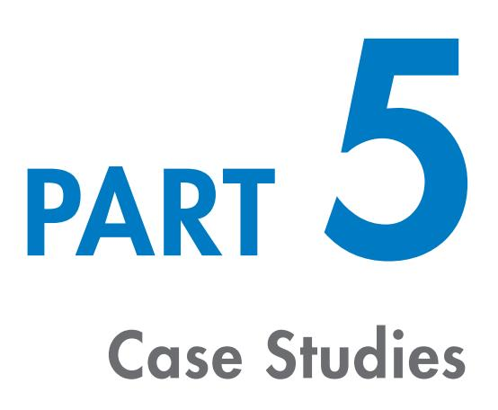

## 5.1

*The following scenarios are designed to support you as you put the theory into practice during your accreditation.*

## Case Study 1

A small internal auditing team within a well known Statutory Authority was experiencing low morale, mediocre productivity and high absenteeism. New members of staff often presented new ideas and suggestions, but their colleagues told them not to even bother, as things would never change. Team members had discussed their Team Management Profile results in the past and had improved some work processess. Although the team was slightly unbalanced in terms of its spread of Team Management Wheel roles, it was generally operating efficiently.

QO2 TM Questionnaires were administered to the team, and the results are shown below. How would you plan the feedback session, what would be some issues you'd like to address with this team and what follow up do you envisage would be required?

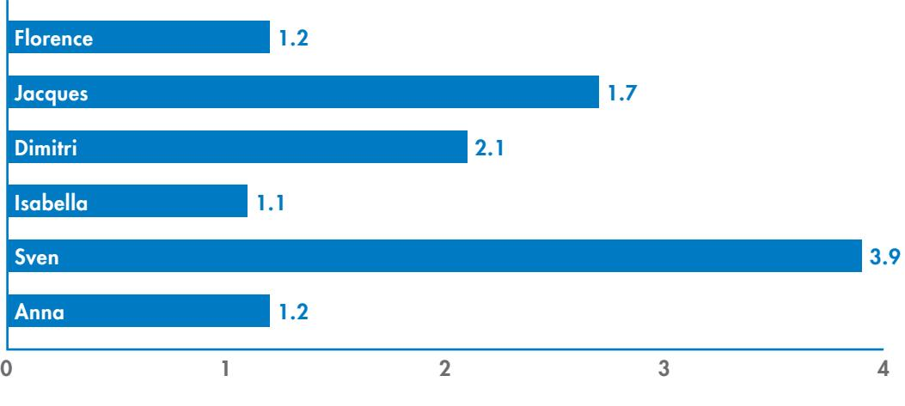

QO2 TM Score

TEAM MANAGEMENT SYSTEMS © **56**

## Case Study 2 5.2

A middle manager has asked for your help. He has not got a promotion for the fourth time and is starting to feel that his career has plateaued. His track record has been satisfactory and he is good at what he does, but he has been unable to demonstrate the same drive and determination that his more successful colleagues have shown. He feels confident that he can somehow get back on track and get the promotion he dreams of.

His QO2 TM is 2.7 and the scores on his sub-scales are:

| MTG Energy     | 62% |
|----------------|-----|
| Multi-Pathways | 67% |
| Optimism       | 92% |
| Fault-Finding  | 19% |
| Time Focus     | 89% |

How would you explain the results, and how would you help your client?

## Case Study 3 5.3

A dynamic and motivated marketing team has exceeded a project budget by more than 10% for the second time. They have been successful at introducing new ideas, but have a poor reputation with some of the other divisions for 'leaping before they look'. They have the skills, qualifications and enthusiasm, yet have been unable to avoid overspending. Their QO2 TM results are below. What would you consider when designing a team event for this team?

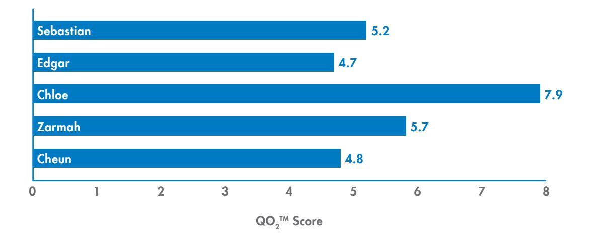

## Case Study 4 5.4

A software company experienced rapid growth in their first 18 months. Based on this, they capitalised extensively, buying large premsies and expensive equipment, as well as hiring many extra staff. However, the last 6 months have seen their sales decline almost as spectacularly as they grew in the first 18 months. What issues and implications are suggested by the management team's QO2 TM scores below?

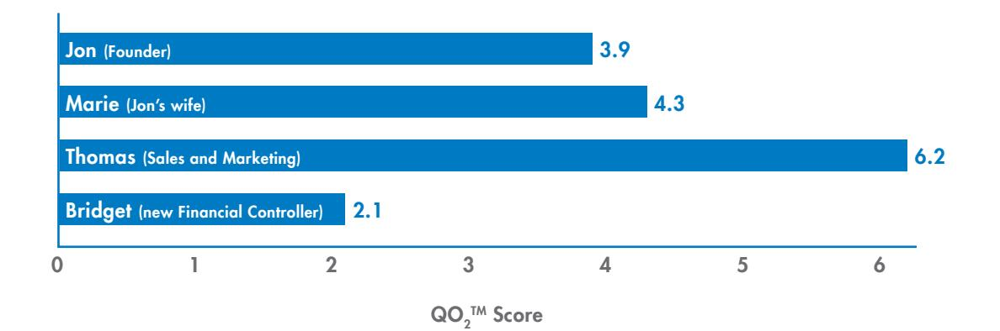

## 5.5 Case Study 5 – Part 1

An administration team was advised by their head office that they had been allocated two days' training in the next quarter. This would involve one working day and one Saturday, for which time-and-a-half in lieu would be allowed. Everyone thought it would be a breeze and welcomed the extra day-and-a-half holiday.

The first days' training was focused on the Team Management Wheel and they spent a whole day exploring their differing work preferences. Everyone thoroughly enjoyed the process and relationships in the team improved considerable, even after just one day.

The second day was focused on the QO2 TM. After the theory had been explained, team members were given their results. As on the previous day, they were asked to share the information. They did this by placing themselves along the QO2 TM scale, as shown below.

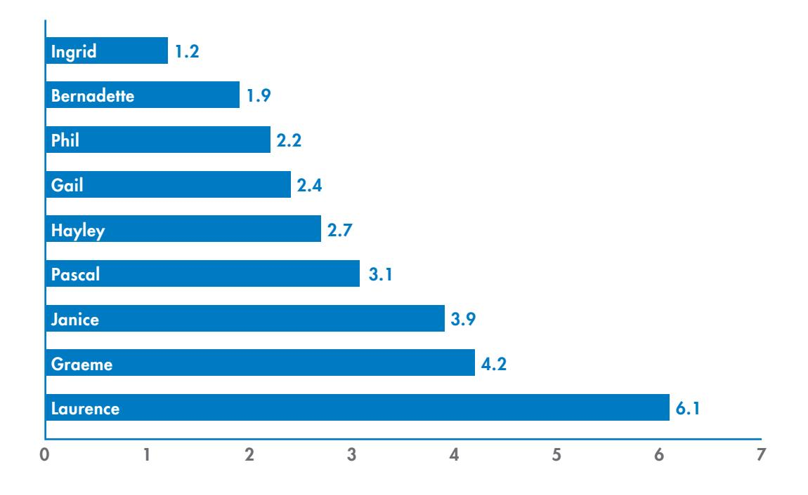

#### *Group Exercise A*

- 1 Looking at the scores for this team and knowing that Gail is the team leader, what are your intital observations about the dynamics of this team?
- 2 What challenges might they encounter?
- 3 What questions could you ask to address these challenges?

## Case Study 5 – Part 2 5.6

Laurence's results were a total surprise to the group. He had the highest QO2 TM score in the group. No one was surprised that Ingrid had the lowest QO2 TM score but they expected Laurence to be a very close competitor for Ingrid's position. Laurence's team nickname was 'the destructor' as he was well known for his destructive criticism.

#### *Group Exercise B*

- 1 Now that you know that Laurence is not perceived as having a high QO2 TM score by the team, what suggestions would you make for dealing with this situation?
- 2 What questions could you ask the team to establish better ways of working?

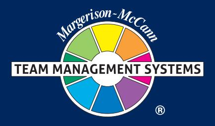

#### Contact us on...

E: Info@TeamManagementSystems.com | W: TeamManagementSystems.com