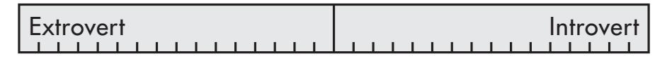
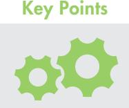

# Welcome

Team Management Systems (TMS) has developed a complete system of teamwork designed to ignite human potential. We use the word 'system' intentionally.

Our psychometric products are more than just profiles – they lie at the heart of our teamwork methodology that develops individuals into high performing teams.

Your accreditation handbook contains an in-depth summary of the key concepts and models that contribute to the TMS framework. This resource has been designed to guide you during your programme and it is yours to revisit whenever you need to refresh your knowledge about the key elements associated with this product and our unique approach to creating high performing teams.

By gaining accreditation in one of the TMS' products, you are joining an international network of learning professionals who support leaders and teams as they learn to work better together.

We trust you will enjoy working with us and we welcome you to our community of TMS Accredited Practitioners.

**Kirsty Allen**

Kirsty McCann (Allen) *Managing Director*

# Contents

## INTRODUCTION

|          | The TMS Story                                                   | 1   |
|----------|-----------------------------------------------------------------|-----|
|          | How to use this Handbook                                        | 2   |
|          | The Profiles                                                    | 4   |
|          | Your Learning Journey                                           | 6   |
| PART 1 – | TMP Core Concepts                                               | 9   |
|          | Energy from Collaboration 1.01                               | 10  |
|          | Types of Work Wheel 1.02                                     | 11  |
|          | Four Work Preference Measures (RIDO) 1.03                    | 17  |
|          | Team Management Wheel 1.04                                   | 35  |
|          | Linking Skills 1.05                                          | 43  |
|          | Team Management Profile Questionnaire 1.06                   | 52  |
|          | Team Management Profile – Overview 1.07                      | 56  |
| PART 2 – | Next Level Concepts                                             | 63  |
|          | Levels of the Team Management Wheel 2.01                     | 64  |
|          | 2.02 16-fold Model – Description                             | 66  |
|          | 2.03 Guide to Split Wheels                                   | 80  |
|          | 2.04 Major and Related Role Calculations                     | 83  |
|          | 2.05 Mapping Your Career                                     | 88  |
|          | 2.06 Research Manual                                         | 89  |
|          | 2.07 Norm Data – Major Team Role Preference Distribution     | 92  |
| PART 3 – | Putting the TMP into Practice                                   | 95  |
|          | 3.01 Igniting human potential                                | 96  |
|          | 3.02 Working with Teams                                      | 97  |
|          | Case Study: Balanced and Unbalanced Teams – A Tale of Two Teams | 98  |
|          | Case Study: Telemedicine Company                                | 100 |
|          | 3.03 Guide to Programme Delivery                             | 103 |
|          | 3.04 Diagnostic Tools                                        | 107 |
|          | 3.05 Activities                                              | 109 |
| PART 4 – | Support and Additional Information                              | 119 |
|          | 4.01 TMS Accredited Practitioner Support                     | 120 |
|          | 4.02 Appropriate use of the TMP                              | 121 |
|          | 4.03 Glossary of TMP Terms                                   | 123 |
|          |                                                                 |     |

# The TMS Story

Team Management Systems (TMS) was founded in 1985 by Dr Charles Margerison, a professor in management development at the University of Queensland, and Dr Dick McCann, a chemical engineer and international business consultant. With a shared fundamental passion to help people work better together, they launched a comprehensive worldwide research programme to answer the underlying question, "What makes teams successful?".

After collecting data from all types of industries, Drs Margerison and McCann set about to create a suite of valid and reliable tools that would provide individualised feedback designed to facilitate personal, team and organisational development.

With over two and a half million profiles completed worldwide, the work of Dr Margerison and Dr McCann has laid a foundation of unparalleled research that continues to be developed by the TMS team as they strive to 'ignite human potential worldwide'.

## How to use this Handbook

This accreditation handbook is a reference guide for the Team Management Profile (TMP) and the key components underlying its concepts and models. It is a foundational resource for preparing and planning the delivery of individual and team debriefs.

Team Management Systems (TMS) continually strives to innovate and deliver relevant, easy-to-use products. To this end, our L&D team frequently update Facilitator Resources on our TMS Global Portal. Remember to check your portal for the latest resources, such as session plans, case studies and workshop activities.

There are four parts to this handbook:

We start with the overarching framework for the TMP by exploring the underpinning concepts that support the data and insights delivered in each personalised report.

This section takes a deeper dive into how the TMP is created, interpreted and applied. In this section, you can find answers to the more complex questions that respondents may ask.

## 3 Putting the TMP into Practice

Refer to this section when it is time to prepare for individual debriefs and group workshops. Although the TMS Global Portal is the access point for up-to-date detailed Facilitator Resources, this section will be a useful starting point to help you formulate session plans to maximise the experience for your respondents.

## 4 Support and Additional Information

Becoming a TMS Accredited Practitioner provides you access to our community of practitioners and the TMS Global Portal. TMS also has dedicated support services to cater for your administrative and organisational development needs.

## Navigating this handbook

This handbook incorporates a colour-coded reference for each part that is designed to be a quick visual guide. The page margins may also refer to extra information related to the content. Examples of these elements are shown below.

## Colour-coded sections

## Callouts

Refers to additional information relating to a key topic or subject.

## Legends

Maps Team Management Wheel segments to colours.

Refers to activities in the TMP Personal Discovery Workbook or TMS Global website.

Summarises a key concept or take-away message.

Maps RIDO constucts to abbreviations.

## Digital Experience

This handbook has been designed for an optimal digital experience. To access the interactive Table of Contents, open the handbook in a PDF viewer and click on the 'Contents' or 'Bookmarks' tab in the top left corner of the interface.

Look for the hand pointer icon (shown above) as a visual guide. This identifies interactive elements on the page that, when clicked, lead to related information either within the handbook or to external supporting web pages.

## The Profiles

## Team Management Profile (TMP)

Delivers work-focused insights to help individuals understand why they work the way they do, and develop strategies to improve the way they work with others.

Provides a common language and framework for individuals, teams and organisations to enable lasting change.

#### The TMP is a valuable tool for:

- Onboarding and graduate programmes
- Team building and leadership development
- Conflict resolution
- Executive coaching

## Opportunities-Obstacles Quotient (QO2) Profile

Explores the balance of effort people put into seeing opportunities and obstacles.

Provides insights into how individuals and teams approach risk, cope with change, innovation, problem solving, decision making and goal achievement.

## The QO2 is a valuable tool for:

- Risk management
- Change management
- Strategic decision making
- Performance coaching

## Linking Leader Profile (LLP|360)

Creates a foundation for effective leadership development and performance benchmarking over time.

A 360-degree leadership tool that delivers multi-rater feedback on 13 essential skills required for leadership and teamwork.

## The LLP is a valuable tool for:

- Management programmes
- Performance coaching
- Executive and mentoring programmes
- Leadership development

## Window on Work Values (WoWV) Profile

Helps individuals and teams understand their values and how they influence behaviour at work.

Explores implications of misalignment between personal and organisational values, such as potential for conflict, disengagement or poor performance.

#### The WoWV is a valuable tool for:

- Organisational change
- Working across cultures
- Merged and newly formed teams
- Creating team value statements and organisational charters

# Your Learning Journey

## About Accreditation

The Team Management Profile (TMP) is a psychometric product that delivers insights into preferences and behaviour in the workplace. To ensure the highest standards of ethical care, the TMP must only be delivered and debriefed by appropriately trained professionals that have completed an authorised accreditation programme.

## Learning Objectives

By the end of the TMP accreditation course, you will:

- Understand the theory and concepts underpinning the TMP.
- Have the confidence to apply this knowledge in practice.
- Know how to deliver successful programmes.
- Support individuals and teams using the TMP framework to work more effectively and achieve high performance within an organisation.

## TMP Accreditation Process

Your learning journey is divided into three main stages.

## TMS Community of Practice

As an accredited practitioner, you will be invited to join our private LinkedIn TMS Accredited Practitioners group. This online group focuses on maintaining a community of practice where knowledge, experience and insights of TMS profiles and practical applications are shared amongst peers.

This page has been intentionally left blank

# PART 1

# TMP Core Concepts

# Energy from Collaboration

The Team Management Profile (TMP) was developed by Dr Charles Margerison and Dr Dick McCann as they researched and refined a model to explain why some teams are successful while others simply fall apart and fail. Margerison and McCann observed that teams could appear equally well-equipped with skills, intelligence, and experience on the surface. Yet, there were clearly other forces at play that were difficult to understand.

We all like to succeed. None of us ever forgets what it feels like to be part of a high-performing, high-energy team, where we enjoy working hard together for a common purpose. So, what makes the difference between high and low performing teams? What are the critical success factors? Is there anything we can do to tip the balance even a little in favour of success? These questions became the guiding force behind Margerison and McCann's work as they researched the hidden energies that drive individuals and teams.

At a fundamental level, the TMP is about energy – the energy that individuals feel when 'who they are' matches 'what they do'. It is also the energy that teams feel when they see the value and strength of different perspectives focused on a common goal. This is the energy that sits behind true collaboration.

It's a curious thing, but most people don't instinctively know where their personal energies lie. We can endure many years of a poor fit before finding our true career calling. Teams often succeed or fail by accident without really understanding why.

The TMP brings together Margerison and McCann's research on successful work practices and the behavioural characteristics of people, to create a model of people at work.

In Part 1 we explore the core concepts which underpin the TMP, illustrated by the following equation:

# Types of Work Wheel What is work?

#### Let us begin with the question, 'What is work?'

What are we supposed to be doing as we embark on any kind of activity, large or small, whatever the place or the timescale? Can we identify a universal model that is valid in all situations? Is there a framework that helps people develop a shared view of what must be done, making it easier for us to illustrate and talk about our work? Is there a common visual model, or a 'language of teamwork' that can go some way to giving us a better chance of success?

Margerison and McCann interviewed hundreds of teams from different sectors and industries across the world, asking them fundamental questions about what they did at work and how they described it. Their research revealed a similar pattern of comments across a wide variety of scenarios in both public and private sector organisations. It led to the creation of a unique model that presents a clear graphic illustration of *what actually happens* in the world of work.

This model of work became the starting point for the complete Team Management Systems approach. A detailed understanding of the importance and relevance of this model will become critical as we move on to explore the relationship between the work that must be done and the way different people prefer to approach their work.

## Introducing the Types of Work Wheel

The Types of Work Wheel, which encapsulates the original research at the heart of Team Management Systems, is the first of the key concepts and models behind our unique approach to high performance work. This model identifies nine essential functions common in all teams, regardless of their work context. Each function needs to be carried out effectively if a team is to succeed. It is important to emphasise that the Types of Work Wheel is fundamental to building and sustaining high performance work. It lies at the centre of our approach to teamwork and provides a common language for all to share.

## Types of Work – Overview

## Advising

Advising work is concerned with giving and gathering information. It involves finding out what others are doing in your own area of work and ensuring that you are following best practice. Information may need to be gathered from articles, reports, books or the internet, or by meeting and talking with people. It means ensuring that you have all the information available for the team to make the best decisions and deliver results.

## Innovating

Innovating is a key aspect of teamwork and involves challenging the way things are currently being done. Technology is changing so quickly that the way you are currently performing tasks may no longer be delivering competitive service. Innovation is essential for all teams. There are always better ways of doing things if you only take the time to discover them.

## Promoting

To obtain the resources—people, money and equipment—to carry out your work, you have to 'sell' what you are doing to other people. Resources to implement new ideas will only be given if your team can persuade and influence decision makers in your organisation. Promoting to customers or clients both inside and outside the organisation is also important if you are to continually deliver what people want.

## Developing

Many ideas don't see the light of day because they are impractical. The Developing activity ensures that your ideas are moulded and shaped to meet the needs of your customers, clients or users. It involves listening to their needs and incorporating these into your plans. Developing will ensure that what you are trying to do is possible, given the resource constraints of your organisation.

## Organising

Here the emphasis is on getting into action and making things happen. It involves Organising the team so that everyone knows what they have to do, how, and when. Clear goals have to be established and action taken to ensure that results are delivered on time and to budget.

## Producing

Once plans are set up, and everyone knows what has to be done, the team can concentrate on Producing. This activity focuses on delivering the product or service on a regular basis to high standards of effectiveness and efficiency. It is the Producing function that ensures the team continually delivers the required outputs.

## Inspecting

Regular checks on work activities are essential to ensure that agreed standards are achieved. Quality audits of your products or services will ensure that your customers or clients remain satisfied. Inspecting covers the financial aspect of work in your team, as well as the security, safety and legal aspects.

## Maintaining

All teams need to uphold standards and maintain effective work processes. Your car will fail if it does not have its regular service. Teams can fail too, if the team processes are not regularly checked and maintained. Maintaining ensures that quality standards are upheld and that regular reviews of team effectiveness take place.

## *Bringing it all together:* Linking

The Types of Work Wheel also contains a ninth factor, known as Linking, which involves coordinating and integrating people and tasks within the team.

Linking is not a Type of Work like the eight described above. Instead, it is a set of skills that any team member can contribute to the team effort. The effective use of Linking Skills in a team makes the difference between a group of individuals operating independently and a highly efficient and coordinated work group.

## The 'flow' of the Types of Work

The Types of Work Wheel is a dynamic and continuous representation of team activity. Many projects, for example, will follow the natural clockwise flow from Advising around to Maintaining. Others may move back and forth between the information (western side of the wheel) and action (eastern side of the wheel) areas, each one fueling the other's progress.

Types of Work Wheel

The positioning of each segment, or task, is important and confirms the natural flow that tends to happen in work. Tasks that fall adjacent to one another have more in common, whilst those opposite one another are very different. Organising, for example, is about tasks associated with urgency and speed, whereas Advising is about slowing down and taking all available information into account.

As all nine activities need to be addressed for a team to be effective, if any factor requires strengthening, the team will account for this and put a strategy in place. This task diversity can sometimes lead to conflict; however, Linking, which sits at the centre of the wheel, can effectively mediate this tension.

| Advising    | Gathering and reporting information                       |
|-------------|-----------------------------------------------------------|
| Innovating  | Creating and experimenting with ideas                     |
| Promoting   | Exploring and presenting opportunities                    |
| Developing  | Assessing and testing the applicability of new approaches |
| Organising  | Establishing and implementing ways of making things work  |
| Producing   | Concluding and delivering outputs                         |
| Inspecting  | Controlling and auditing the working of systems           |
| Maintaining | Upholding and safeguarding standards and processes        |
| Linking     | Coordinating and integrating the work of others           |

The nine essential activities of the Types of Work Wheel

## The project life cycle

The Types of Work Wheel is a useful model to examine project management within a team.

When a new project is undertaken, teams often start with Advising work: new data is gathered about the project by referring to what others have done; researching; and talking with competitors and colleagues.

The next area of focus is often the Innovating function, where the essential nature of the product or service is examined, and the possibility and/or benefit of incorporating new elements or ideas are explored. This creative process looks to gain a competitive advantage by increasing productivity, reducing costs, and potentially answering additional needs expressed by customers or clients.

The Type of Work that often runs simultaneously to Advising and Innovating is Promoting. Key stakeholders need to be influenced, particularly those in senior positions with decision latitude that allocates resources and funding for such projects. Early influencing is a prerequisite to create the necessary buy-in and support.

When there is a clear idea of what form the project will take, and the support of key stakeholders has been confirmed, it is time to move into Developing. This is where ideas get turned into reality. Business modelling may be performed, cost benefit analysis may be run, and risk mitigation may be accessed. Here is where the hard decisions are made to ensure the project meets the needs of key clients and customers and fits within the commercial constraints of the organisation.

The next function to focus on is Organising. Responsibilities are assigned to various team members, clear goals are established, and reporting mechanisms are put in place. A plan is created to ensure everyone knows what they must do, how, and when. Organising people and resources efficiently is the basis of the Organising function.

Producing work is all about delivering the product or service. A systematic approach is often required to ensure delivery is on time and on budget. The most effective projects usually have a production plan that is constantly monitored and updated to ensure that outputs are delivered to the desired standards.

Inspecting includes a focus on budgets and financial audits to ensure that costs are controlled and revenue is collected. It also covers areas such as legal contracts, safety, security, and other quality issues.

Maintaining is an important support activity on all projects. Key work processes need to be set up and maintained so that the team is working to agreed standards. A review of work practices and quality all fall under maintaining work; this includes issues such as project ground rules and ethics forming the basis of successful project implementation.

Linking is also an important part of the project management mix, ensuring that all project activities are successfully coordinated and integrated. All team members have a duty to link effectively across tasks and people, ensuring effective communication and collaboration are maintained.

## Helpful points to remember

- *• The eight Types of Work do not always occur consecutively. Often, work will move back and forth around the wheel.*
- *• All eight Types of Work and Linking need to be carried out effectively for a team to succeed.*
- *• Different teams can spend varying amounts of time performing each of the Types of Work. Manufacturing teams, for example, may spend most of their time Organising, Producing, and Inspecting, whereas marketing teams may place more emphasis on Innovating, Promoting and Developing.*

## Types of Work review questions

High performing teams address all nine success factors represented in the Types of Work Wheel. The following questions provide a framework for evaluating each essential activity. This can help individuals and teams determine where there may be gaps and which actions might improve performance in this area.

| Advising Gathering and reporting information                            | • Is the flow of information in your group effective? Why or why not? • Did you get all the information you needed to do the job? • How did you respond to new or unexpected information? • Did you have a process to challenge assumptions?                                                          |                                                                |
|-------------------------------------------------------------------------------|----------------------------------------------------------------------------------------------------------------------------------------------------------------------------------------------------------------------------------------------------------------------------------------------------------------|----------------------------------------------------------------|
| Innovating Creating and experimenting with ideas                     | • Were there many ideas generated before one was acted upon? • Does the group challenge existing processes and consider new approaches? • Are ideas heard and considered? • How is an environment for idea generation created?                                                                        |                                                                |
| Promoting Exploring and presenting opportunities                        | • How effective is the group at selling its ideas internally? Externally? • Does the group promote its output effectively? • Does the group explore all opportunities to meet customers' needs?                                                                                                          | Relevant Activities                                            |
| Developing Assessing and testing the applicability of new approaches | • Has the group established clear criteria for assessing ideas? • Are ideas, innovations and market opportunities tested before being discarded or adopted? • Are ideas and opportunities refined to take into account practical considerations and limitations?                                   | Download 'Types of Work Review'                          |
| Organising Establishing and implementing ways of making things work  | • How well does the group manage its time? • Is the group organised to get the maximum contribution from all? • Are there clear goals and objectives? Does each person understand their specific contribution toward each objective? • Is the group able to make quick decisions to ensure action? | Located in the TMS Global Portal (Facilitator Resources) |
| Producing Concluding and delivering outputs                             | • Does the group meet deadlines and targets? • Are the outputs of the group produced effectively and efficiently? • Does the group have effective systems and procedures? Does everyone know what they are? Are they up-to-date?                                                                      |                                                                |
| Inspecting Controlling and auditing the working of systems           | • What is the attitude towards quality? How are quality standards imposed? • Is there a mechanism available for people to address quality issues? • Does the group keep track of the details well?                                                                                                       |                                                                |
| Maintaining Upholding and safeguarding standards and processes       | • To what extent does the group honour its own and customer values? • Does the group pay attention to maintaining behaviour standards internally? Externally? • How does the group feel about their progress and the team climate?                                                                    |                                                                |
| Linking Integrating and co-ordinating team efforts                   | • Do all members understand what other members of the group are doing? • Does the group agree upon and check for consensus? • Does the group effectively collaborate with different areas of the business and external stakeholders?                                                                  |                                                                |

More Information

Can be found on page

60 under the heading 'Work preference distribution'

in

PART 1.07

## Relevant Activities

Can be found on pages

4, 5 & 18 of the TMP Personal Discovery Workbook under the headings

'Personal Snapshot'

and 'Types of Work – Team' and

'Types of Work – Me

Located in the TMS Global Portal (Facilitator Resources)

## Work preference distribution

Work preference distribution data shows to what degree an individual prefers to work in each of the eight areas of the Types of Work Wheel, based on their responses to the Team Management Profile Questionnaire.

Probability scores are calculated by distributing one hundred percentage points across all eight Types of Work to indicate the tasks the respondent likes best and least.

The Work preference distribution shown here indicates a strong preference for Developing and Promoting. Inspecting, Maintaining and Advising are the least preferred tasks.

Work Preference Distribution – Sample

## Applications

Work preference distribution data is useful when considering issues relating to work allocation, job satisfaction, motivation, as well as career decisions.

## Work Allocation

A review of work preference distribution data may be useful when allocating work to ensure a healthy overlap between people's preferences and their work tasks.

Job satisfaction and motivation research show people enjoy working in roles where there is sufficient overlap between work preferences and job demands. Work preference distribution scores provide a framework for exploring the degree of overlap an individual has with their current role or discussions about job redefinition. A useful tool to support this process is the Job Match Diagnostic Tool which respondents can access via their TMS Global account.

Accredited practitioners can also use the TMP Advanced Reports via their TMS Global Portal to aggregate and display a team's average work preference distribution score, as they provide a snapshot of the tasks the group may like best and least. While teams, like individuals, may have strengths that flow from their preferred Types of Work, it is important to be aware this data does not describe their level of effort in each Type of Work.

## Career Decisions

People tend to be more proficient at the work they prefer, as they allocate more time and focus to these tasks. For this reason, work preferences often indicate an individual's strengths. However, this is not always the case as work preference does not measure work performance. For example, an individual may become proficient at specific job tasks because of dedicated practice, not because it is their work preference.

A clear understanding of work preferences can help shape career decisions and ensure that future work roles incorporate areas around the wheel that show the strongest preference.

# Four Work Preference Measures (RIDO)

## Work preferences, engagement, and performance

Job appraisal frameworks and competency-based training models highlight the importance of skills, abilities and experience. However, the impact of individual work preferences on performance can often be overlooked.

People can perform well at most tasks if they have the ability, are adequately trained and are provided the opportunity to develop proficiency. However, there is a psychological cost if there is insufficient overlap between the required work tasks and an individual's work preferences. As a result, people can experience reduced engagement if they spend too much time performing tasks they don't enjoy, which jeopardises their happiness at work.

People who experience increased positive emotions at work also experience increased cognitive capacity, which promotes greater levels of creativity, knowledge and resilience. This confirms that happier workers tend to be more productive.

Margerison and McCann's work expands on this concept by proposing that people tend to practice what they prefer and thus become more proficient, which in turn, provides more pleasure at work. Margerison and McCann coined this concept, 'The Four Ps'.

In summary, it makes sense to maximise the overlap between the tasks people enjoy and the job they are hired to do. This helps to set a spiral of success in motion, whereby people enjoy what they do, are more productive, and are likely to receive positive feedback for their work, having an affirming and energising effect.

However, we rarely have the opportunity to solely focus on the work we enjoy, as job demands incorporate many different types of tasks. Margerison and McCann viewed this as a positive, concluding that approximately a two-thirds overlap between an individual's work preferences and job role was optimal. Working outside one's comfort zone and taking on new and sometimes difficult tasks provides opportunities for growth. The key is balance: too little challenge leads to boredom, and too much challenge leads to disengagement. Therefore, when considering who tasks are allocated to and how they are performed, Margerison and McCann's Types of Work Wheel can have tangible benefits, leading to greater levels of engagement and performance. Consider how this mechanism of task allocation, engagement and performance can be used to build high energy teams.

1.03

PART

## Moving from individual performance to high energy teams

Highly effective teams perform all functions shown in the Types of Work Wheel. By understanding each team member's work preferences, tasks can be allocated to maximise team performance while ensuring that all work functions are addressed. Such consideration can maximise individual engagement while also leveraging the innate diversity inherent within any team.

Types of Work Wheel

## Work preferences and individual differences

When reviewing Jung's original work on Psychological Types (Jung, 1923), Margerison and McCann considered whether this framework could provide insight into identifying people's individual differences in relation to the work environment. Importantly, they found that people who share a preference for a task on the Types of Work Wheel also tend to share certain behavioural characteristics.

People who prefer Promoting work, for example, are normally quite outgoing in terms of their relationships with other people. They tend to be more comfortable interacting with others in meetings and giving presentations, and are more spontaneous in their responses to ideas.

On the other hand, those who prefer Inspecting activities tend to be less outgoing and are more comfortable focusing on the detail. They prefer to be thoroughly prepared for meetings and like to have time to consider things.

People with a preference for Innovating are inclined to be creative with how they use information. In contrast, people who like producing are more interested in obtaining and using information that is of immediate practical value to them.

## The emergence of four key measures

When the different approaches to work activities were examined, four key preference areas emerged as being central to the ways in which people approach work, bringing us to the second element within the TMP framework, the Four Work Preference Measures:

- How people prefer to Relate to others
- How people prefer to gather and use Information
- How people prefer to make Decisions
- How people prefer to Organise themselves and others

The Four Work Preference Measures are often referred to as RIDO (Relationships, Information, Decisions, Organisation).

Four Work Preference Measures (RIDO) Structured Flexible Structured Flexible

## RIDO constructs

Each RIDO scale has a psychological construct on either side. For instance, we have the Extrovert and Introvert construct on either side of the Relationships scale.

9 of the TMP Personal Discovery Workbook under the heading 'Work Preference Measures'

Located in the TMS Global Portal (Facilitator Resources)

## Where do preferences come from?

People often ask, "How do I get my preferences?" Are they something we inherit, or do they develop as we travel through life, experiencing different situations and learning as we go? Many people have tried to answer these questions over the years, and the current view considers both to be important.

It is important to note, that when studying behaviour at work, it became clear to Margerison and McCann that how people behave at work did not always correlate to how they behaved in other situations outside of work. Work preferences on the Extrovert-Introvert scale may be inherited, but environmental influences can substantially modify such characteristics. For example, managers with a more introverted preference, may become more extroverted as they rise to higher levels of responsibility. Equally, those managers may never change their true preferences on the Extrovert-Introvert scale but develop tools and strategies to moderate their behaviour depending on who they are working with.

Therefore, preferences appear to be a fundamental construct that we develop to guide ourselves through life. By operating within our desired construct, we feel comfortable in what we do and are more likely to gain the outcomes that we seek.

The TMP Questionnaire has been researched and designed to capture an individual's band of preference across each of the Four Work Preference Measures (RIDO). There are 15 items for each measure, giving 60 items in total.

## Can preferences change?

In essence, work preferences can change. New work experiences and rewards for certain behaviours may encourage us to work in different ways. As a result, we may gradually shift our overall preferences. Much will depend on the original strength of each preference. It is unlikely, for example, that a very strong Extrovert preference will become a very strong Introvert preference.

Where changes do occur, they tend to be in small steps. It is important to consider the overall spread of preference across the scales, as this indicates the extent to which you are comfortable operating in both ways. This information is useful in helping to assess how easy you may find it to change over time or to operate out of preference if you choose.

Some people find it useful to complete a new TMP Questionnaire every few years, particularly if they have undergone career changes. The long term stability of the questionnaire means that profiles should not change dramatically over the short term. However, as it measures preference rather than personality, some changes over time are possible. Thus, the profile can be used as an ongoing development tool over a long period of time.

## Four Work Preference Measures (RIDO) – Overview

## Relationships: how you prefer to relate to others at work

Some people like to relate to others by meeting frequently. They enjoy talking about ideas while working alongside other people and are more extroverted in the way they conduct their relationships.

Other people prefer to work on their own and think things through for themselves, developing their ideas before speaking. In general, when at work, they do not have a high need to be with others and are more introverted in the way they conduct their relationships.

Few people are entirely Introvert or Extrovert. Most people have elements of both characteristics, depending on the situation and the nature of the task at hand. However, most people exhibit an overall tendency toward either extroversion or introversion.

# Relationships

## Extrovert (E)

- Will often think things out by talking them through
- Enjoy meeting other people and often seek social gatherings
- Enjoy a variety of tasks and activities
- Are stimulated by unanticipated interruptions
- When speaking publicly will often ad lib How you prefer to make Decisions at work
- Are likely to contribute a lot at meetings
- Can be impulsive

#### Introvert (I) Information

- Prefer to think things through before speaking How you prefer to gather and use Information at work
- Do not have a high need to meet regularly with others Practical Creative
  - Like to concentrate on a few tasks at a time
  - Dislike unanticipated interruptions
  - When speaking publicly will prepare in depth and speak to a plan Decisions
    - May be more quiet at meetings
- Will be more likely to consider things before acting Analytical Beliefs

## Information: how you prefer to gather and use information at work

At work, people have to gather and use various types of information. They will tend to exhibit either a practical or a creative approach. Relationships

People with a practical preference prefer to work with tested ideas and pay attention to the facts and details, using information to provide workable solutions to existing problems. How you prefer to Relate to others at work

Those with a creative preference are more future-oriented, enjoying ambiguous situations and always looking at possibilities and implications. Extrovert Introvert

## Practical (P)

- Prefer clearly defined problems
- Are present-oriented
- Like to work with tested ideas
- Are down-to-earth
- Like to work with real things
- Are patient with routine work
- Prefer schedules and standard systems and procedures
- Pay attention to facts and details
- Search for the standard problem-solving approach
- Are usually sound on details but may not always see the total picture

#### Creative (C) Decisions

- Enjoy ambiguous problems How you prefer to make Decisions at work
- Are future-oriented Analytical Beliefs
  - Regularly float new ideas
  - Have their 'head in the clouds'
  - Look for possibilities and implications
  - Get bored with routine work Organisation
- Are always searching for the new way How you prefer to Organise yourself and others at work
- May get details wrong and jump beyond the facts Structured Flexible
  - Like complexity and search for creative approaches
  - Will often see the total picture but miss details

#### Decisions: how you prefer to make decisions at work Information

The third scale relates to decision making. Some people go about this in an analytical way, setting up objective decision making criteria and choosing the solution which maximises pay-offs. How you prefer to gather and use Information at work

For others, principles and convictions will have a much greater impact on their decision making – they are more likely to make decisions in accordance with their beliefs. Practical Creative

## Analytical (A)

- Try to establish objective decision making criteria
- Measure decisions against pay-offs Structured Flexible
- Can sometimes be seen as detached and 'clinical'
- Will emphasise deciding according to situation
- Are open to change depending on the situation
- Negotiate on the evidence
- Have concern for fairness based on the rules
- Like analysis and clarity
- Are task-oriented
- Set objectives and beliefs may follow

#### Beliefs (B) Organisation

- Have personal, subjective decision making criteria How you prefer to Organise yourself and others at work
  - Measure decisions against beliefs
  - May be over-committed to a point of view
  - Believe in deciding on personal considerations
  - Will resist change if it opposes beliefs
  - Negotiate on the rights and wrongs of the issues
  - Believe fairness relates to values and beliefs
  - Like harmony based on common values
  - Are principles-oriented
  - Allow objectives to emerge from beliefs

#### Organisation: how you prefer to organise yourself and others at work Practical Creative

When decisions are reached, they need to be implemented within an organisational framework.

Some people like a structured environment with a clearly defined framework in which action is taken quickly to resolve issues. Plans, procedures and schedules play an important part in the way they organise themselves and others. How you prefer to make Decisions at work Decisions

There are people whose preference is for a more flexible approach that allows them to adapt or modify plans and schedules to suit changing needs and circumstances. They may be more informationoriented and be inclined to postpone action until they have gathered as much information as possible. Analytical Beliefs

## Organisation

## Structured (S)

- Like clarity and order
- Are action-oriented, concerned with resolving issues
- Will develop and stick to a plan
- May rush to quick decisions without sufficient information
- Are time conscious and will keep to deadlines
- Are reluctant to change once judgment is made
- Dislike ambiguity
- Emphasise concluding and resolving over diagnosing

## Flexible (F)

- Are information-oriented, may procrastinate in search of more information
- Will often change plans from day to day
- Are prone to 'information overload' which can delay decisions
- Will often fail to meet deadlines
- Are open-minded and curious
- Will change mind according to available data
- Tolerate ambiguity
- Emphasise diagnosing over concluding and resolving

## Four Work Preference Measures (RIDO) – Description

How you relate to others at work

## Extrovert

People with an extroverted preference tend to be outgoing and need variety and stimulation to prevent them from becoming bored. They will often clarify their ideas by talking with others rather than thinking things through on their own. They seek to interact with and enthuse others. How you prefer to gather and use Information at work Information

#### *Subject to change* Practical Creative

In the course of a conversation, those with an extroverted preference may change their ideas several times as they develop new thoughts through interaction. Because of this, people may accuse them of talking too much, but it is more the case that the interaction with others helps them crystallise their thinking. Decisions

#### *Stimulated by interruptions* How you prefer to make Decisions at work

In a work situation, those with a more extroverted preference are often stimulated by unanticipated interruptions. They will typically have an open door policy because it gives them an opportunity to share their thinking. If no one comes in, they will often go looking for someone to talk to. Analytical Beliefs

## *Outgoing at meetings*

Those with an extroverted preference will contribute a lot at meetings and may try to dominate proceedings. Many of us have experienced meetings where the views of someone with a preference for extroversion outweighed those of colleagues with a more introverted preference. When this happens, there is a danger of decisions being biased towards the contributions of those with a more extroverted preference, and the views of those with a more introverted preference may be ignored. If your manager approaches work in a more extroverted way, you can probably expect lots of meetings as they are likely to try and gather information by going out into the world. How you prefer to Organise yourself and others at work Structured Flexible Organisation

## *Inclined to be impulsive*

Those with a more extroverted preference may be more impulsive than those with a more introverted preference, who generally prefer to think things through before committing themselves. A group that collectively has a more extroverted preference has to be careful not to rush into impulsive decision making. That is why in teams, it is good to have a mixture of extroverted and introverted preferences.

## *Enthusiastic*

If people that you work with have a more extroverted preference, they will want to relate with you on a deeper level. They will talk a lot, often very enthusiastically, and you will have to try and listen while making sure that they do not take up too much of your time. Those who are more experienced will know when to talk and when to listen and try to read the situation in order to avoid the risk of alienating other people.

## *Preference for variety*

Those with a more extroverted preference usually enjoy having a lot of things on the go and may find it stressful to have to concentrate on one thing in depth for too long.

## Introvert

People with a more introverted preference are quieter people who are more effective when they have time to think before they speak. They prefer not to be pressured into speaking without pre-planning. Their reasoning processes are enhanced when they can be by themselves to think through the implications of the problem or opportunity facing them. Their ideas may change several times as they develop new thoughts, but in contrast with those who have a more extroverted preference, the changes take place via internal dialogue. Only the well thought through response is delivered. How you prefer to gather and use Information at work Practical Creative Information

## *Self-contained but receptive*

Those with a more introverted preference inherently possess all the necessary resources to meet their unique needs. They can be very receptive, picking up subtle points and grasping issues even when supplied with very little information. Their need to retreat and digest information can be a great strength but also a weakness if carried to an extreme, particularly in cases where quick decisions are needed, requiring the involvement and commitment of all the members of the group. How you prefer to make Decisions at work Analytical Beliefs Decisions

Those with a strong introverted preference are likely to talk only when they consider it necessary. Some may appear reserved, but this is often not the case. They quite simply do not have as high a need to interact with others, and they feel more efficient on their own. As a result, they are often accused of not keeping people informed about what they know or think. They are inclined to assume that others understand issues in the same way they do. How you prefer to Organise yourself and others at work Organisation

#### *Well-prepared for meetings* Structured Flexible

Those with a strong introverted preference are capable of communicating well. Many can make good presentations and speeches, but usually, they will put in far more preparation than those with a more extroverted preference (who are likely to be spontaneous, using just a few notes). Those with a more introverted preference will also communicate well with those they trust.

## *May communicate in writing*

Someone who leans more towards introversion may take a long time to get to know well. Communicating by email may be more common than calling informal meetings. You may have to use the same form of communication if you want to get through to them on important issues.

If your colleagues or those you manage have a more introverted approach to work, you may find that they seem to live in a world of their own. Although they tend to place more emphasis on their own ideas than on other people's, if you talk things through with them quietly and confidentially, they are likely to be receptive.

Those with a more introverted preference can be easily overlooked. They may not have as much influence on the course of events as they would like because of their tendency not to seek out company or put things forward. They are likely to stick with people they know, even at coffee breaks and informal meetings.

## *Prefer depth to breadth*

Those with a more introverted preference invariably like to concentrate on fewer tasks and do them well. They like depth rather than breadth. If they have too many projects running at once, they are likely to become stressed at an earlier stage than those with a more extroverted preference.

## Extrovert or Introvert?

In reality, no one is completely extroverted or introverted. At times a person may like to seek out people at work to share ideas, and at other times the same person might want to be alone to think things through. However, most people tend to opt for their preferred behaviour, be it extroverted or introverted, whenever they have a choice. Jobs and circumstances can influence people's behaviour a great deal, and it is not always easy to identify a person's preference purely by observing how they behave.

## Work and non-work

People may behave differently in work and non-work situations. While there are many who do not change at all between work and non-work, on balance, a significant number of people have a different rating on the Relationships measure at home and work.

Some organisations inadvertently develop extroversion in their managers, with management training depicting the ideal leader as extroverted rather than introverted. As a result of this and other influences, some people who are extroverted at work may be more introverted outside work. The reverse can also be true. For example, some software programmers may have an introverted preference at work, but outside work, they become more extroverted. They may have a split on their Relationships measure, depending on whether they are in their work or home persona.

The important point to recognise is that extroversion and introversion are preferences and not good or bad characteristics. There is a need in every team for people to contribute in both ways. We all need to be aware of our own preferences and also try to understand and accommodate those of others.

## How you gather and use information at work

## Practical

People who prefer a more a practical approach to gathering and using information are usually very matter-of-fact. They like clear tasks with specific things to do and are more interested in doing things where they can see that they have had an effect. How you prefer to make Decisions at work Decisions

#### *Prefer clarity to ambiguity* Analytical Beliefs

They prefer problems to be clearly defined, knowing that if they follow a standard solution, they can be fairly confident of achieving their goals. Their use of information is very much oriented toward the present: "If we don't get things right today, we may not be here tomorrow." Organisation

They are particularly good at acquiring knowledge about mechanical procedures, working on jobs that require manipulation of physical materials, or assessing the practical implications of changes involving reorganisation. They may become frustrated if situations are ambiguous or unclear with no tangible outcomes. How you prefer to Organise yourself and others at work Structured Flexible

## *Can tolerate routine*

People who prefer a more a practical approach to information seem to be able to tolerate fairly high levels of routine work. The fact that they are doing something today that they did last week or last month does not seem to concern them, and they may well say, 'If a job is worth doing, it is worth doing well'. For them, motivation comes from seeing a task completed to their normal high standards of effectiveness and efficiency.

## *Down-to-earth in the here and now*

If you have to manage people who have a strong practical preference, it is important to give them work that has some tangible aspect to it. They will respond well to a work situation where there is a given task that requires the application of specific skills and will take pride in doing this work and developing their skills in the process. They will not always enjoy developing new ideas or brainstorming unless it is based upon direct work experience.

People who prefer a more practical approach can be very effective if they are asked to develop a more efficient way of organising work processes or rectifying situations that are out of control. They like to apply their abilities to practical problems in the here and now rather than speculating about things that might be tried at some date in the future.

## Creative

People who prefer a more creative approach to gathering information are usually highly imaginative. They tend to concentrate on the big picture rather than the specifics, which may mean they sometimes neglect important details. How you prefer to make Decisions at work Decisions

#### *Ideas-oriented* Analytical Beliefs

They are motivated by the stages of work when ideas are generated but are likely to become bored as soon as the ideas enter the routine implementation stage. They will then want to move on to the next idea. Organisation

## *Looking to the future*

People with a more creative preference can be exciting to work with, although they are not always easy to understand. Their minds are often racing ahead of the present, looking for the consequences and implications of a given course of action. While they are not always good at details, they usually have a firm grasp of the long-term vision. How you prefer to Organise yourself and others at work Structured Flexible

## *Experimental*

Those with a more creative preference for gathering and using information will often have a work pattern that is irregular. When they have an idea, they will work long hours to follow it up, but at other times they may seem uninspired or even unproductive. They like to question the status quo and theorise and experiment with new ideas. These tendencies, together with the fact that they are often very individualistic, can mean that people with different preferences can find them difficult to work with. However, a creative approach to gathering information is an essential aspect of effective teamwork, and it is important to seek out and harness the talents of creative people.

## Practical or Creative?

Although we all may have to adapt to both ways of working at different times, many people do show a leaning towards one side of the scale or the other. For example, you might enjoy working out the detail of an idea and following it through to completion; you might also read a great deal but find that you rarely have time to explore the ideas and concepts you read about as much as you would like. In this case, you are probably more practical. If, however, you enjoy the theoretical side more and pursue the construction of ideas and the exploration of possibilities and options, you probably have a more creative preference. If you like both, you are probably what we call 'practico-creative'.

## Work and non-work

As with the Extrovert-Introvert dimension, you might vary your preference between home and work. Many people who engage in creative information-gathering at work may have practical hobbies. On the other hand, people who are strongly involved at work with the here and now may engage in more creative pursuits in non-work situations.

## How you prefer to make decisions at work

## Analytical

People who have a more analytical approach to decision making will often try to establish objective criteria against which they can measure decision options. The decision that maximises some kind of pay-off is usually the one that is taken, be it maximum profit, minimum cost or maximum flow of physical material through a production plant. How you prefer to Organise yourself and others at work Structured Flexible Organisation

## *Put business objectives first*

When making decisions, people with a more analytical preference will support the mission and goals of the organisation or team – objectives are all important, and personal beliefs come second. In business, they are likely to use analytical aids to assess situations and reduce risk.

## *Prefer facts to feelings*

Analytical decision makers may be accused of being cold and calculating, and their straightforward approach may hurt other people's feelings, but they see themselves more as independent, analytical thinkers. They are able to make hard decisions according to data without being influenced by their own or other people's emotions and feelings. Analytical people will evaluate fairness according to the rules. If the rules are broken, then you must face the consequences.

Leaders who are analytical decision makers usually want to see evidence. They will be convinced by data, not by an eloquent presentation of beliefs. Similarly, if you manage people who like to make decisions in a more analytical way, it is important that they see the factual basis on which you base your decisions if they are to become committed to your line of action. Getting them to act purely on personal conviction will rarely be sufficient.

## Beliefs

People who are more beliefs-oriented will seek to determine whether a decision will be congruent with their values. If they hold strong beliefs or views, they will look at a situation from that perspective rather than from an objective or analytical standpoint. How you prefer to Organise yourself and others at work Organisation

#### *Strong convictions* Structured Flexible

The individual with strongly held beliefs can be found in all areas. With their strong convictions, they may sometimes ignore the logic of a situation to press on with what they believe is right.

People who have strong beliefs can be enormously helpful to those who share the same views. However, if other people do not see the world on their terms, they can be fierce opponents. They can very easily polarise people into 'for and against' positions on an issue about which they feel strongly.

## *Base objectives on beliefs*

Beliefs decision makers believe that fairness relates to their own values, and if there is a difference between their beliefs and the rules, they are more likely to follow their beliefs. For beliefs-oriented people, it is important to set objectives that match their views.

## Analytical or Beliefs?

There will always be a mixture of analysis and beliefs underpinning major decisions. We all need to assess situations objectively while having standards, values, and ideals against which we can measure our decisions. Many of us will use both, but some will place more emphasis on one or the other.

It is important to note that even strong beliefs decision makers can be quite analytical in their chosen discipline. However, when it comes to major decisions, they may well be swayed by their deep-seated beliefs. Sometimes beliefs-oriented people unconsciously filter data so that it fits with their underlying beliefs.

All of us have beliefs and values, whether they are about how business should be conducted, how to bring up a family, or how to run society. The important thing to assess is the extent to which you use your beliefs when making decisions at work. If you suppress your beliefs and act in an objective manner according to your organisation's goals, you are more likely to be an analytical decision maker. If, however, you allow your beliefs and personal values to be a major influence on your thinking, you are more likely to be beliefs-oriented.

## Work and non-work

As with the other work preference measures, your own assessment may differ between work and non-work situations. Often, people feel they have to suppress their individual beliefs at work, but they can express them to the full outside work.

## How you prefer to organise yourself and others at work

## Structured

People with a preference for structure in the way they like to organise themselves and others will usually enjoy working in a neat, tidy, clear and precise manner. Often, their desks are well-ordered, with everything in its proper place.

## *Action-oriented*

Those with a more structured preference are also action-oriented when it comes to resolving issues. They usually have clear goals and objectives and will manage in a way that delivers results on time. When issues arise that may cause a deviation from the plan, the more structured person is likely to become very action-oriented and move to get things back on target again. They are very conscious of planning schedules and deadlines and expect everyone to work to such systems so that objectives can be met on time.

## *Prefer conclusions and resolutions*

They are likely to have little tolerance for ambiguity. When things are vague, or there is too much unfinished work, they will move to gather everything together and converge towards a definite conclusion. They may become annoyed and frustrated with more flexible people, whom they see as never coming to a decision and always wanting to build option upon option.

If they find themselves in complex situations, they will exert considerable pressure for action and resolution. In a stable situation, however, they will produce a set of rules, procedures and systems so that everyone knows what they are doing and decisions can be made in a timely and orderly manner.

## Flexible

People who have a more flexible approach to organisation see themselves as being very adaptable to change. They like to postpone action until they have gathered sufficient data to be confident they are acting in the right way. It is important to note that the term, Flexible, refers to the way that people organise themselves and those around them, not the degree to which they are open to ideas and willing to consider alternatives.

## *Data gatherers*

Many people with a more flexible preference work with a lot of data around them, and their desks may sometimes look messy. Those with a more structured preference may see them as disorganised. However, flexible people would see themselves more as being gatherers of information, either practical or creative, so that decisions can be made on the best available data.

Those with a more flexible preference are likely to be less action-oriented than structured people when situations are unclear or ambiguous. Their preference is to sift through all the data, and sooner or later, things will become clearer. They will often try to extend deadlines by saying, 'If I can have a little more time, then I will be able to do a better job'. If the deadline is fixed and immovable, they may still seem to work in an unstructured way and appear to leave everything to the last minute.

## Structured or Flexible

If you are comfortable with rules, procedures, systems and deadlines, you are more likely to have a structured preference in the way that you like to organise yourself and those around you. If you are more comfortable gathering information and offering advice rather than making decisions against tight deadlines, you are more likely to have a flexible preference.

## Work and non-work

People who are structured at work may be more flexible in non-work situations. Many organisations have a culture that reinforces the development of a structured approach in their managers. There are monthly, sometimes weekly reports to complete, and always a multitude of deadlines to meet. Because of this, some traditional management development programmes will still concentrate on developing managers to be more comfortable with a structured way of organising themselves and their teams. In unpredictable environments, however, where change and uncertainty are frequent, there is also a need for teams to be adaptable and able to act in a more flexible way to prioritise information over action.

# Team Management Wheel

## Combining the models

In previous sections, we looked at the Types of Work Wheel, which provides a simple visual image of the complete cycle of tasks that must occur within successful teams. We also explored how people differ in their approach to work and the four key preference areas that help predict energy and behaviours in the workplace. We can now take a closer look at the Team Management Wheel, which combines the nine essential factors of high performing teams with how people differ in their approach to work, to create our unique model showing the roles people prefer to play within a team.

Drs Charles Margerison and Dick McCann based their research on the original work of Carl Jung and adapted it to the workplace. Their results found a predictive relationship between the Types of Work Wheel and the Four Work Preference Measures (RIDO).

Key Points

On the Relationships scale, an Introverted preference is more closely associated with Maintaining and Inspecting work, while an Extroverted preference is more closely associated with Promoting and Developing work.

Team Management Systems' distinctive contribution to organisational development research combines the two models: the Types of Work Wheel and the Four Work Preference Measures (RIDO). Together, these look at the work we prefer to do, combined with how we prefer to do it, which predicts the role we prefer to play within a team. For example, Creative

## Development of the Team Management Wheel

Based on Margerison and McCann's original research, this unique and powerful model of balanced teamwork lies at the heart of the Team Management Profile and the TMS approach to building and sustaining high performance at work.

The Team Management Wheel combines the Types of Work Wheel and the Four Work Preference Measures (RIDO) into one simple model that helps illustrate what we like to do and how we go about our work.

The double-barrelled role titles were initially derived from focus group research that discovered:

Reporter-Advisers said they enjoyed giving and gaining information, and frequently performed the reporting role for the team.

People who enjoyed innovating work described themselves as creative. From this information, the name Creator-Innovator was used to describe those who enjoy coming up with ideas and experimenting to see if they work.

Likewise, those who enjoyed promoting work often said they saw themselves as explorers looking for new opportunities. The term Explorer-Promoter illustrated this role perfectly.

Those who liked developing plans and processes said they enjoyed assessing ideas and opportunities to see if they would work. These people were called Assessor-Developers.

Those who preferred organising people and resources said they liked thrusting into action to set dates, timetables and achieve results. So, the descriptor Thruster-Organiser was formed.

Concluder-Producers said they liked working in a systematic way to produce and deliver, and described themselves as having a preference for concluding assignments according to a plan.

Controller-Inspectors said they liked working on details to audit procedures and processes, and therefore saw themselves as having an emphasis on control.

Upholder-Maintainers considered they had strong beliefs and principles with which they wanted to work, and felt they would put a premium on upholding standards and values.

The Linker role, which sits at the very centre of the Team Management Wheel, is a shared responsibility integral to high performing teams. The role of the Linker is not a discrete role preference. Instead, it is a set of skills that any member of the team can develop.

## Team balance

Opposite roles in the Team Management Wheel approach work differently. Potential conflict can arise unless there is an appreciation of these differences. Having a range of different role preferences can help ensure the team works optimally, as it is more likely that the team will cover all eight Types of Work.

#### Team Management Wheel

# Relevant Activities

'Your Team'

Located in the

TMS Global Portal (Facilitator Resources)

## More Information

Can be found on pages

97–99 under the heading 'Working with Teams' in

## Team Management Wheel Roles – Overview

| ROLE                 | MAJOR CHARACTERISTICS                                                                                                                   | GENERAL BEHAVIOURS                                                                                                                                                        |
|----------------------|-----------------------------------------------------------------------------------------------------------------------------------------|---------------------------------------------------------------------------------------------------------------------------------------------------------------------------|
| Reporter-Adviser     | • Supporter, helper, tolerant • A collector of information • Tends not to rush into big decisions • Flexible and Beliefs-based | • Not time conscious • Enjoys finding out • Issues interpreted personally • Tends to put off decisions                                                           |
| Creator-Innovator    | • Imaginative • Enjoys complexity • Future-oriented • Creative and Flexible                                                    | • Often irregular work patterns • May miss deadlines • Continually searching for new ways • Independent                                                          |
| Explorer-Promoter    | • Persuader, 'seller' • Influential and outgoing • Enjoys exploring new ides • Extroverted and Creative                        | • High energy level • Knows lots of people • Good at getting resources • A visionary • A good communicator                                                    |
| Assessor-Developer   | • Objective • Experimenter • Enjoys prototype or project work • Extroverted and Analytical                                     | • Moves from task to task • Dislikes routine • Gregarious but independent • Likes plans                                                                          |
| Thruster-Organiser   | • Results focused • Action orientated • Organises and implements • Analytical and Structured                                   | • Makes things happen • Action via deadlines • Will exert pressure • Impatient • May overlook people's feelings                                               |
| Concluder-Producer   | • Pragmatic • Results focused • Values effectiveness and efficiency • Practical and Structured                                 | • Time conscious • Follows through to the end • Dislikes change • Prefers routine • Makes schedules work • Emphasises outputs                              |
| Controller-Inspector | • Detail focused • Quiet and reflective • An inspector of standards • Introverted and Practical                                | • Critical of inaccuracies • Enforcer of regulations • Meticulous • Quiet and reflective • Concentrates in depth on a few issues at a time                 |
| Upholder-Maintainer  | • Loyal and supportive • Strong sense of right and wrong • Personal values are important • Introverted and Beliefs-based       | • Can help weld the team together • Prefers advisory role • Can negotiate well • Usually has strong feelings • Quiet approach • Dedicated to their beliefs |

## Team Management Wheel Roles – Description

#### Reporter-Advisers

Reporter-Advisers represent the classic advisory role on the Team Management Wheel. They are excellent at gathering information and putting it together in such a way that it can be readily understood. If they are more introverted, they will probably rely on written formats for their information, whereas if they are more extroverted, they will be good communicators and probably rely on a network of colleagues and acquaintances for their data.

Reporter-Advisers are patient people who prefer to make sure they have all the information before they take action. This often causes others to accuse them of procrastination, but Reporter-Advisers will typically respond: "How can I take action unless I have all the information?"

Reporter-Advisers do not enjoy conflict and have 'antennae' that can detect a potential conflict well before it happens. Usually, they will move to defuse the conflict or else position themselves well away from any direct effects.

#### Creator-Innovators

Creator-Innovators are people who are very much 'future-oriented' and will enjoy thinking up new ideas and new ways of doing things. Usually, they are very independent and will pursue their ideas regardless of present systems and methods. They need to be managed in such a way that their ideas can be developed without too many organisational constraints. Sometimes organisations set up research and development units (often separated from the production unit) to allow these people to experiment with ideas.

Creator-Innovators are sometimes perceived as having their 'head in the clouds', but this is usually because they are looking to tomorrow rather than worrying about today. They tend not to be very structured in the way they go about things and may sometimes appear disorganised and absent-minded. Some are more introverted, preferring to work on their own or in small groups on important problems. Others can be more outgoing and even zealous in the way they put forward ideas they really believe in.

#### Explorer-Promoters

Explorer-Promoters are excellent at taking ideas and promoting them to others, both inside and outside the organisation. They enjoy being with people and will usually have a network of colleagues that they use when gathering information and testing out opportunities. They are often advocates of change and are highly energised, active people with several different activities on the go at once. They enjoy being 'out and about' and are good at bringing back contacts and resources which can help the organisation move forward.

Explorer-Promoters are usually entrepreneurial in their approach, and they can be very persuasive. They are often influential and can talk easily, even on subjects where they are not experts. They are excellent at seeing 'the big picture' and developing an enthusiasm for innovation among other people. However, they are not always interested in Inspecting and Organising, and they may not pay sufficient attention to details.

Explorer-Promoters enjoy 'off-the-cuff' conversations and need to interact with others to be at their productive best. They do not like spending long periods working alone on their problems – they need people to stimulate them.

## Assessor-Developers

Assessor-Developers are located on the Team Management Wheel midway between the Explorers and the Organisers and therefore exhibit both of these characteristics. They may not always think up good ideas for themselves, but they are excellent at taking the ideas of others and making them work in practice. They are usually sociable, outgoing people who enjoy looking for new markets or opportunities. They will then take the idea and match it to the opportunity, always mindful of the organisational 'bottom line' constraints. They often make good product development managers or people concerned with assessing new ventures.

Assessor-Developers usually display a strong analytical approach and are at their best where several different possibilities need to be analysed and developed before making a decision. They like organising new activities and respond well to such challenges, taking an idea and pushing it forward into a workable scheme. However, once the activity has been set up and proven to work, they will often lose interest, preferring to move on to the next project rather than engage in the production and control of the output.

## Thruster-Organisers

Thruster-Organisers are people who enjoy making things happen. They are analytical decision makers, always doing what is best for the task, even if sometimes their actions upset others. Their great ability is to get things done, and for this reason they are often found working in project management positions. They will 'thrust' forward towards a goal, meeting conflict head-on if necessary. They emphasise targets, deadlines and budgets, and will ensure that people are organised to take action.

Thruster-Organisers will usually prefer to work to a plan and in a structured manner so that objectives are clearly set out, and everyone in the team knows what has to be achieved and when. They excel at organising people and systems so that deadlines are met. They tend to be task-oriented and, in their pursuit of goals, may sometimes ignore people's feelings. This, more than anything else, gets them into difficulties with their colleagues.

## Concluder-Producers

Concluder-Producers are practical people who can be counted on to carry things through to the end. Their strength is in setting up plans and standard systems so that outputs can be achieved on a regular basis in a controlled and orderly fashion. For this reason, they usually do not like rapid change, as it interferes with the efficient systems they have established for doing the work.

For Concluder-Producers, the challenge lies not in dreaming up new ideas, but in doing the work effectively and efficiently. They are often more patient than others with routine work, as their drive comes from a 'job well done'. As a result, they can be sought after as managers, for their ability to work in a quick, reliable, dependable and stable manner and to deliver results.

## Controller-Inspectors

Controller-Inspectors are quiet, reflective people who enjoy the detailed side of work, such as dealing with facts and figures. They are usually careful and meticulous, and can spend long periods of time on a particular task working quietly on their own.

Controller-Inspectors are comfortable working within the rules and regulations which have been established in the organisation. They would probably argue that the rules have been made to ensure that the organisation works in the most efficient manner and therefore everyone should follow them. For this reason, they enjoy working in situations where their output is guided by organisation or governmental regulations. We have found many of them working in finance, accounting and quality-control positions where their Inspecting preferences are important assets for the work they are doing.

The formulation and checking of contracts is an area that Controller-Inspectors sometimes enjoy, along with computer systems and issues on safety and security.

## Upholder-Maintainers

Upholder-Maintainers are people with strong personal values and principles which are of prime importance in their decision making. Usually, they have a high concern for people and will be strongly supportive of those who share the same ideals and values as they do.

They prefer to work in a control-oriented supportive way, making sure that things are done according to their standards. In addition, they prefer an advisory role in the background rather than a leading executive role. However, because of their strong principles, they may 'dig in their heels' when confronting issues that oppose their beliefs. They will not react in an extroverted, quick-tempered way, but in a more resilient manner.

The Upholder-Maintainer who is in support of the team is an invaluable member, providing guidance and help on issues that need to be well thought through in terms of principles rather than just 'economics'.

# 1.05 PART

# Linking Skills

Located in the centre of the Types of Work Wheel, Linking is the ninth essential activity. Equally important, in the Team Management Wheel, the Linker role is described as a shared responsibility for high performing teams.

Linking is the set of core behaviours, represented in the Linking Leader Model, responsible for integrating and coordinating the work of a team. Unless Linking skills are used well, the team will lose momentum and direction, and performance may suffer.

Effective teams value diversity. They respect the wide range of approaches that everyone brings to work. It is through effective Linking that diversity can be utilised and differences respected. Successful teams have more than a shared sense of purpose; they are also very good at Linking.

Effective coordination of people and tasks lies at the heart of the Types of Work Wheel and the Team Management Wheel:

Linking Leader Model

## Levels of Linking – Overview

The Linking Leader Model identifies three levels of Linking:

- People Linking Skills
- Task Linking Skills
- Leadership Linking Skills

The three levels of Linking encompass a total of 13 Linking Skills: six in People Linking; five in Task Linking; and two in Leadership Linking. In an effective team, all team members need to contribute to the People Linking Skills level. However, those in leadership roles must successfully use the skills in all three levels.

## Task Linking Skills

The middle level of the Linking Leader Model describes the Task Linking Skills. Task Linking includes five skills that relate to collective team tasks, relevant for those who are responsible for the performance of others.

|                    | WHAT LINKERS DO                                                                         |
|--------------------|-----------------------------------------------------------------------------------------|
| Objectives Setting | Set achievable targets with the team but always press for improved performance       |
| Quality Standards  | Set an example and agree on high quality work standards with the team                |
| Work Allocation    | Allocate work to people based on their capabilities and preferences                  |
| Team Development   | Cultivate a balance of work preferences, tasks and skill development within the team |
| Delegation         | Delegate work when it is not essential to do it themselves                           |

## Leadership Linking Skills

At the core of the Linking Leader Model are the two Leadership Linking Skills, which relate specifically to transformational leadership skills.

|                                                                                                | WHAT LINKERS DO                   |
|------------------------------------------------------------------------------------------------|-----------------------------------|
| Motivation                                                                                     | Inspire others to give their best |
| Strategy Develop clear action plans to achieve short-term goals and the long-term vision |                                   |

## People Linking Skills

## Active Listening

Active Listening goes beyond just 'listening' to others. It is about showing interest in what people say by asking questions, building on their statements and summarising what has been said. When done well, Active Listening is incredibly effective. It can often result in a dynamic two-way conversation that lets the speakers access a variety of perspectives and thinking, potentially resulting in highly productive discussions.

Active Listening requires those in the conversation to focus on the words being spoken without being distracted. While some people can naturally focus in this way, others might find their internal dialogue

intrudes on that focus. Internal dialogue can prevent people from really listening to and comprehending what is being said in a conversation. To be an Active Listener, it is important that the listener clears their mind of internal dialogue so they can focus on what the other person is saying.

When a person is actively listening they are doing more than just taking in words. They also read the other person's tone, tempo, body movements and facial expressions. These non-verbal cues give valuable information about the speaker's thoughts and feelings on the issue being discussed. In the same way, the listener should cultivate physical body language that shows they are giving the speaker their full attention. This can positively affect the speaker's perceptions of how willing the listener is and, in turn, increase their willingness to share.

What people say to one another must match the way they say it. Listening with the body, getting involved with what they are saying and using non-verbal cues, such as nodding, shows understanding, reinforces ideas and opens deeper communication.

Finally, Active Listening is also about indicating to the other person that they have been heard and understood. Techniques such as asking relevant questions to clarify potential misunderstandings and summarising their thoughts can show the speaker that the listener has understood them. Ultimately, this encourages more profound and effective two-way discussions.

*To be an effective listener, clear the mind of all internal dialogue and focus attention on what the other person is saying.*

## Communication

An essential aspect of Linking is Communication, without it, there can be no teamwork. Communication helps team members understand what is happening in the team, and to be part of ongoing discussions and decisions about what will happen in the future. This allows them to feel like an essential part of the whole, which leads to more effective collaboration. On the other hand, when people are not updated about what is going on in their team, they may become demotivated. This can undermine a leader's other attempts to build a harmonious and effective team.

When it comes to Communication, people have different preferences and styles. Because of this, a team will need various communication techniques to interact effectively with each other. This is what we refer to as 'Pacing', and the ability to do this well is one of the key communication skills of Linkers.

Pacing requires empathising with another's perspective and engaging in communication that respects their preferences. Once rapport has been established and a certain level of trust generated, conversations can move into a free exchange of information where connection and understanding are created and maintained.

Being able to communicate effectively, supported by Pacing, allows a team to engage in dialogue that creates space for cooperation and collaboration.

## Team Relationships

Harmonious Team Relationships are essential in a high-performing team. When there is a lack of respect, understanding and trust, there is no real team, only a group of people. However, when team members have strong Team Relationships, they will also have shared values and goals, a common purpose and the willingness to hold themselves mutually accountable while offering each other support, understanding and trust.

When there is diversity within a team, everyone must work hard to develop mutual respect. Recognising and celebrating people's differences can help foster good Team Relationships, as team members who understand the value of each other's skills and contributions are much more likely to develop respect and loyalty. Of course, when there is diversity, there can also be conflict.

Addressing conflict in a positive way can be a great source of creativity and innovation. In fact, the most innovative solutions can be created out of diversity, but only if harmonious Team Relationships are maintained. When team members understand each person's particular skills and contributions to a job, they are much more likely to value individual differences and much less likely to see them as a source of conflict.

Fostering a culture where a difference of opinion is encouraged creates an environment of open and authentic Communication.

*Leveraging diversity through strong Team Relationships is essential for high performance.*

## Problem Solving & Counselling

Team members need to learn how to be available and responsive when other team members have a problem. Being responsive means showing a sincere interest in individuals and their challenges. It means being willing to take the time to listen, offer advice if asked, or give guidance if needed. Sometimes, just listening and showing interest is all that is required.

Developing good counselling skills is valuable when Linking with team members that may need support. Linkers will use a combination of effective Pacing and enquiring skills to get to the heart of an issue. Without discovering the root cause of any problem, it can be difficult to come up with an adequate solution.

When enquiring about a specific issue, some people like to be asked direct questions, while others prefer more open-ended questions. Some people like to concentrate on facts, while others like to focus on feelings. A good enquirer will quickly notice if their questions do not match the other person's preferences. When they see this, they will move to a different mode of enquiry that will allow them to uncover the important details of the problem.

Once team members can identify the heart of a problem, they can help find a solution. Together, they can 'reframe' problems into opportunities for growth. This reframing is a valuable skill that will inspire high performance in the individuals and the team as a whole.

> *Problem Solving & Counselling involves responding in a supportive and sincere way to team members' problems.*

## Participative Decision Making

Sharing key problems and opportunities with team members builds trust. By doing this, the team become part-owners of the solution and will go that extra mile to make it work. Regardless of whose solution is ultimately chosen, inviting team members to voice their views early on paves the way for smooth and successful implementation.

With Participative Decision Making, it is important to strike the right balance of team participation. If every team member participates in all decisions, the team may spend all its time in meetings, stifling productivity. Instead, the key to balanced Participative Decision

Making is identifying the specific areas where team member input is valuable, or there is a desire to be consulted. The most effective way to determine these areas is by engaging team members in open communication and discussion.

*A fundamental aspect of effective Participative Decision Making is to establish the key areas where team members wish to have input.*

## Interface Management

Interface Management is the process of managing the links between a team's members as well as other teams or key stakeholders. There are two important aspects of Interface Management – internal Linking and external Linking. Taken together, they build the lines of contact that create engagement, build trust and lead to high performance.

## *Internal Linking*

There needs to be high levels of interaction and communication if a team is to function well. Each person needs to know what the other

is doing. Therefore, it is crucial to establish good information flows. Daily stand-ups – short, daily meetings where the team can discuss progress and challenges – are a good example of effective internal Linking.

## *External Linking*

The success of any one team will invariably depend on other teams within the organisation. These might be senior management, customers and even suppliers and competitors. External Linking is the proactive process that allows open lines of communication with these other stakeholders to ensure they understand what is being done and what is needed from them.

## Linking and Communication

All team members need to implement People Linking Skills, especially the skill of Communication. Learning how to vary our communication style to 'pace' with other people's role preferences is a key message behind the Team Management Profile.

People with different role preferences have different ways of seeing the world. Valuing and respecting difference and varying our approach is vitally important if we want to achieve a successful outcome from the interaction. Encouraging people to vary their communication style to consider their colleagues' preferences will enhance communication and performance.

For example, Explorer-Promoters will invariably like to communicate with people who are prepared to explore ideas and meet to talk things through. They can be put off by people who insist on putting everything in writing or are more concerned with detail. Thruster-Organisers in turn, usually like to communicate with people who deal in the facts, are goal-oriented and can make things happen. They may become frustrated by people who are ambiguous, don't get to the point and delay taking action.

Linking Leader Model highlighting the Communication segment of the People Linking Skills

## Tips for Linking (Pacing)

Some points to consider when using the skill of Pacing when communicating with the various roles on the wheel are given in the table below:

| ROLE                 | DOs                                                                                                                                                                                                  | DON'Ts                                                                                                                                            |                                                                                                         |
|----------------------|------------------------------------------------------------------------------------------------------------------------------------------------------------------------------------------------------|---------------------------------------------------------------------------------------------------------------------------------------------------|---------------------------------------------------------------------------------------------------------|
| Reporter-Adviser     | • Be flexible • Develop personal relationships • Be cooperative • Give personal thanks • Establish harmony • Allow them to express their concerns                                     | • Put facts before feelings • Move too fast • Be insincere                                                                                  |                                                                                                         |
| Creator-Innovator    | • Explore ideas • Be enthusiastic • Ensure you have some knowledge of the area under discussion • Give personal thanks • Record important decisions in writing                        | • Be too structured • Force them into deadlines • Focus on the solution before you have discussed the problem                            | More Information i Download                                                                       |
| Explorer-Promoter    | • Explore ideas and be flexible • Allow them to talk • Recognise their contributions in public • Concentrate on the future • Be enthusiastic • Record important agreements in writing | • Talk about details • Take issue with their opinions unless they persist • Dwell on the past                                            | Various Linking (Pacing) resources Located in the TMS Global Portal (Facilitator Resources) |
| Assessor-Developer   | • Be prepared • Analyse issues fully • Explore possibilities • Be factual • Speak clearly, logically and precisely • Look for alternatives                                            | • Talk about subjects you know little about • Give too many opinions • Waste time                                                        |                                                                                                         |
| Thruster-Organiser   | • Be work focused • Be factual and punctual • Be goal orientated • Give incentives to perform • Make things happen • Summarise regularly                                              | • Make it personal, instead focus on the facts surrounding disagreements • Be ambiguous • Get off the subject                            |                                                                                                         |
| Concluder-Producer   | • Be structured • Give notice of proposed changes • Be practical • Stick to your word • Keep to deadlines • Focus on results                                                          | • Change your mind too frequently • Focus on ideas without considering how they would be implemented (or work in practice) • 'Waffle' |                                                                                                         |
| Controller-Inspector | • Use email to communicate • Send written information before meetings • Slow down your pace • Take time to understand them • Talk about details • Think before you speak              | • Drop in unexpectedly • Surprise them • Rush them • Concentrate on the future at the expense of the past                             |                                                                                                         |
| Upholder-Maintainer  | • Develop personal relationships • Be clear and precise • Encourage them to talk • Be supportive                                                                                            | • Dominate discussions • Ignore their feelings • Focus on the numbers only, think also about the impact on people                     |                                                                                                         |

## Team Management Profile Questionnaire Measuring work preferences

Having explored the core concepts, we can now look at how they can be used to evaluate work preferences. The Team Management Profile (TMP) Questionnaire measures overall preferences by presenting pairs of alternatives from which to choose. There are 60 pairs of alternative items on the TMP Questionnaire – 15 pairs relating to each work preference measure on the RIDO Scale. When respondents complete a TMP Questionnaire, they are asked to indicate the statement in each pair that most closely describes the way they prefer to work. For example, item 27 on the TMP Questionnaire presents the respondent with the following:

*I usually let my heart rule my head I usually let my head rule my heart*

This item measures preferences in relation to decision making. The way in which you respond will contribute to your overall score with regard to decision making preferences. You can respond with any one of the following combinations:

| I usually let my heart rule my head | 2 – 0 | I usually let my head rule my heart |
|-------------------------------------|-------|-------------------------------------|
| I usually let my heart rule my head | 0 – 2 | I usually let my head rule my heart |
| I usually let my heart rule my head | 2 – 1 | I usually let my head rule my heart |
| I usually let my heart rule my head | 1 – 2 | I usually let my head rule my heart |

In the TMP, the preference scores are called work preference measures which are mapped on to the scales below:

Many of the questions that people ask about their profile arise either directly or indirectly from the results that are shown on these scales. In order to be able to answer these questions, it helps to understand how the results are calculated, what they mean, and how they relate to the major and related role preferences that are displayed in each personal profile. Knowing how the scores from the TMP Questionnaire are used to produce the profiles is also important for understanding the relationships between the different roles on the Team Management Wheel.

## TMP Questionnaire raw scores

We will look at the Relationships scale to see how the raw scoring system works.

If 15 items provide a choice between an Introvert (I) or an Extrovert (E) preference, the maximum score in either direction along this measure will be 30. Consider the extreme example of what will appear on the scales if each of the pairs relating to Relationships is scored in an identical manner. For example, if all the pairs of statements are scored as Extrovert 2 – 0 Introvert, the result will be Extrovert 30 – 0 Introvert (15 x 2 for Extrovert; 15 x 0 for Introvert), and the scale will appear as shown below:

If, however, all items are scored as Extrovert 1 – 2 Introvert, the result will be Extrovert 15 – 30 Introvert (15 x 1 for Extrovert; 15 x 2 for Introvert). It will then appear as shown below:

## TMP Questionnaire net scores

We will now look at how net scores are calculated from raw scores. Consider the raw scores Extrovert E:7, Introvert I:24. If we subtract the lower score from the higher one on each scale, we obtain the net scores. In this case, the net score is Introvert I:17. The letter of the higher raw score is used to indicate the direction in which a person's overall preference lies on a particular scale.

This process is followed for all four scales to obtain a net score for each. The following example shows raw scores (white bars) on the Four Work Preference Measures (RIDO) and the resulting net scores (green bars) which are obtained by performing the simple calculation described above.

*We can see that this person has the following work preference:*

(I) Introvert (P) Practical (A) Analytical (S) Structured = Concluder-Producer

## Comparing the strength and direction of preferences

It is important to understand the significance of the net gravitation in preference, which shows the overall 'pull' towards one end of the scale or the other. Work preferences are situational; everyone displays their own unique pattern of preference, which often shows as a range spanning both sides of the scale. The raw scores for a measure on the RIDO scale represent the extent of this range.

However, there is usually an overall tendency to favour one more than the other. Such a tendency will be strong for some people, while it will be only slight or moderate for others. The net score represents this overall tendency. The strength of gravitational pull will not change its impact on major role calculations but will affect related role calculations.

On occasion, someone might receive a net score of 0. This means the respondent has an equal balance of preferences along that particular scale. In this case, a tie-breaking algorithm is used to determine a respondent's net score, based on the high validity of certain questions.

|                                        | Defining net scores                                                                                              |                              |
|----------------------------------------|------------------------------------------------------------------------------------------------------------------|------------------------------|
|                                        | To assist with describing the strength of preferences, net scores are categorised into three distinct groups: |                              |
| Undifferentiated Preference: 0–5 | Moderate Preference: 6–8                                                                                   | Clear Preference: 9–30 |

*Consider the following two people's scores:* 

| Darcy           |            |    | Raw Scores |    |   | Net Scores |
|-----------------|------------|----|------------|----|---|------------|
| Relationships   | Extrovert  | 19 | Introvert  | 14 | = | E:5        |
| Information     | Practical  | 5  | Creative   | 28 | = | C:23       |
| Decision Making | Analytical | 15 | Beliefs    | 16 | = | B:1        |
| Organisation    | Structured | 17 | Flexible   | 27 | = | F:10       |

| Alex            |            |    | Raw Scores |    |   | Net Scores |
|-----------------|------------|----|------------|----|---|------------|
| Relationships   | Extrovert  | 13 | Introvert  | 23 | = | I:10       |
| Information     | Practical  | 23 | Creative   | 8  | = | P:15       |
| Decision Making | Analytical | 22 | Beliefs    | 21 | = | A:1        |
| Organisation    | Structured | 10 | Flexible   | 20 | = | F:10       |

For both Darcy and Alex, net scores on the Information scale are clear, indicating a marked preference for how they gather and use information. Their preferences, however, are pulling in different directions, with Darcy having a clear Creative (C) preference and Alex having a clear Practical (P) preference.

On the Analytical-Beliefs measure, both Darcy and Alex have undifferentiated net scores, indicating that neither of them has a clear preference for the way in which they approach Decision making.

In their approach to Organising themselves and others, both have clear scores. It is interesting that although Darcy and Alex have quite different raw scores on this scale, their net scores are identical. Net scores are determined by calculating the net difference between raw scores for each individual.

In the above example, both Darcy and Alex obtain a net score of 10 for Flexible (F). Darcy's raw score calculation is Flexible (F) 27 – 17 Structured (S) = 10 Flexible (F), while Alex's is Flexible (F) 20 – 10 Structured (S) = 10 Flexible (F).

## Team Management Profile – Overview

The Team Management Profile (TMP) report is based on responses to the 60-item TMP Questionnaire. Each report contains around 5000 words over approximately 25 pages, and there are 208 different variants available. A Personal Discovery Workbook accompanies every profile received by a respondent.

More Information

Download 'TMP Report Sample (Managerial) - Peter Piper' and

 'TMP Report Sample (Team Member) - Peter Piper'

Located in the

TMS Global Portal (Facilitator Resources)

There are two versions of the TMP report. The Managerial version (the default), supplied in the accreditation workshop, and the Team Member version, which is written using simplified language and discusses the respondent's strengths as a team member instead of a leader.

There are seven main sections in each profile that introduce the respondent to various aspects of the TMP. Each part aims to build a holistic understanding of the respondent's work preferences and how these can be applied to ignite their full potential.

## Team Management Profile report

## 1. Front cover

The front cover displays the respondent's name along with their major role and related roles.

Each person receives three segments from the Team Management Wheel. The major role is based on the direction of preferences e.g. Is the respondent's overall preference Extroverted (E) or Introverted (I), regardless of strength?

The two related roles are based on probability, that is, if I'm not working in my major role preference, what is the next most likely role preference that I would work in?

## 2. Introduction

This section showcases the respondent's major and related roles. It also details their Key Preference Areas based on the 4-fold Model of the Team Management Wheel, where a respondent has a major or related role that aligns with its corresponding hemisphere on the wheel. For example, the Exploring Key Preference Area would be indicated for anyone with a major or related role of Creator-Innovator, Explorer-Promoter, or Assessor-Developer.

The introduction also provides an overview of the eight Types of Work, which are foundational to the TMP. These critical functions help the respondent begin to understand the meaning behind their major and related roles.

| Name Peter Piper Organisation |                                                                                                                                                                                                                                                                                                                                         |
|-------------------------------------|-----------------------------------------------------------------------------------------------------------------------------------------------------------------------------------------------------------------------------------------------------------------------------------------------------------------------------------------|
| Key Preference Areas                |                                                                                                                                                                                                                                                                                                                                         |
| Exploring, Advising                 |                                                                                                                                                                                                                                                                                                                                         |
|                                     | Major Role Creator Innovator 1st Related Role Reporter Adviser 2nd Related Role Explorer Promoter                                                                                                                                                                                                                        |
|                                     | Your personal Team Management Profile provides you with information about your work preferences. It is a starting point for consideration and discussion of how you approach your work and your interactions with others in the workplace. All work teams need to consider nine key activities essential for high-performance: |
| Advising                            | Gathering and reporting information                                                                                                                                                                                                                                                                                                     |
| Innovating                          | Creating and experimenting with ideas                                                                                                                                                                                                                                                                                                   |
| Promoting                           | Exploring and presenting opportunities                                                                                                                                                                                                                                                                                                  |
| Developing                          | Assessing and testing the applicability of new approaches                                                                                                                                                                                                                                                                               |
| Organising                          | Establishing and implementing ways of making things work                                                                                                                                                                                                                                                                                |
|                                     | Concluding and delivering outputs                                                                                                                                                                                                                                                                                                       |
| Producing                           |                                                                                                                                                                                                                                                                                                                                         |
| Inspecting                          | Controlling and auditing the working of systems                                                                                                                                                                                                                                                                                         |
| Maintaining                         | Upholding and safeguarding standards and processes                                                                                                                                                                                                                                                                                      |
| Linking                             | Coordinating and integrating the work of others                                                                                                                                                                                                                                                                                         |
|                                     | 2 Peter Piper © Bellcastle Pty Ltd 2023                                                                                                                                                                                                                                                                                           |
|                                     |                                                                                                                                                                                                                                                                                                                                         |
|                                     |                                                                                                                                                                                                                                                                                                                                         |

The major role is represented on top and the two related roles are positioned at the bottom.

## 3. Work preference measures

The Four Work Preference Measures (RIDO) display a preference continuum.

**RELATIONSHIPS** Raw scores are represented by the white shaded areas on each continuum and the numbers at either end of the measure. For example, 'E:16' and 'I:15'.

How you gather and use Information The net score for each measure is the area shaded in green and the number in the triangle. For example. '1' for Extrovert.'

## 4. Personalised content

The following pages deliver personalised information and suggestions based on the data captured across the four RIDO net scores.

#### *Overview*

• Summarises the major characteristics and general behaviours associated with the major role.

#### *Leadership Strengths*

• Indicates the respondent's preferred approach to leadership. In the Team Member version, this section is titled Individual Strengths.

#### *Decision Making*

• Provides the respondents an understanding of their approach to decision making.

#### *Interpersonal Skills*

• Describes the respondent's preferred style of relating to others and how that may be perceived by others.

#### *Team Building*

• Identifies the respondent's preferred approach of building and leading a work team. In the Team Member version, this is titled 'Teamwork'.

#### *Areas for Self-Assessment*

• Examines areas the respondent might look to develop further, phrased in positive language.

#### *Key Points of Note*

• Descriptions of characteristics and general behaviours in bullet points.

#### *Related Roles*

• Describes the major characteristics and general behaviours associated with the related roles.

## 5. Work preference distribution

One hundred percentage points are distributed across all eight Types of Work, indicating the tasks the respondent likes best and those the respondent likes least.

This section helps the respondent understand their preference levels for Types of Work outside their major and related roles. It's important to note that these preferences do not necessarily reflect the effort or level of performance that the individual puts into each Type of Work.

#### More Information

Can be found on pages

## 65-69 under the headings '16-fold Model'

in

## PART 2.01

and '16-fold Model - Description' in

Work preference distribution data is derived from calculating a percentage for each sector of the 16-fold Model based on the Four Work Preference Measures (RIDO). Preferences of inner and outer sectors are combined to determine a percentage for each Type of Work.

## 6. Linking

Important to all team members are People Linking Skills, particularly the Communication skill of Pacing. Each profile has bullet points summarising the key points that others should consider when interacting with the profile owner.

| LINKING                                                                                                                                                                                                                                                                                                                                                                                                                                                                   |  |  |  |  |
|---------------------------------------------------------------------------------------------------------------------------------------------------------------------------------------------------------------------------------------------------------------------------------------------------------------------------------------------------------------------------------------------------------------------------------------------------------------------------|--|--|--|--|
| At the centre of the Team Management Wheel is the Linker role, defined not by preferences, but by the skills that all team members need to develop. Linking Skills comprise people linking, task linking and leadership linking.                                                                                                                                                                                                                                    |  |  |  |  |
| Of importance to all team members are the People Linking Skills, particularly the skill of Communication. A useful technique to try here is Pacing - varying your communication style so that it matches other people's role preferences. The successful implementation of Pacing skills helps avoid conflict and leads to more productive interactions.                                                                                                         |  |  |  |  |
| Below are some key points that team members should consider when interacting with a Creator Innovator major role preference like yours. Read each point and consider whether you would like the other person to act like this when they are communicating with you. Highlight those points that you definitely agree with and share them with your team members. This may help them understand 'what makes you tick' and how they can better meet your needs. |  |  |  |  |
| In order to link more effectively with you, the person you are interacting with could:                                                                                                                                                                                                                                                                                                                                                                                    |  |  |  |  |
|  Explore ideas in conversation with you.                                                                                                                                                                                                                                                                                                                                                                                                                                 |  |  |  |  |
|  Ask for clarification if they don't understand what you are saying.                                                                                                                                                                                                                                                                                                                                                                                                     |  |  |  |  |
|  Appreciate the value of your divergent way of thinking.                                                                                                                                                                                                                                                                                                                                                                                                                 |  |  |  |  |
|  Not force you to a decision until all ideas have been talked through.                                                                                                                                                                                                                                                                                                                                                                                                   |  |  |  |  |
|  Focus on the positives and use these to lead the conversation into the areas you would like to focus on.                                                                                                                                                                                                                                                                                                                                                             |  |  |  |  |
|  Speed up their speech delivery (if necessary) to match yours and try to talk with 'colour' in their voice rather than in a monotone.                                                                                                                                                                                                                                                                                                                                 |  |  |  |  |
|  Not expect you always to be punctual.                                                                                                                                                                                                                                                                                                                                                                                                                                   |  |  |  |  |
|  Record key points in writing after discussions with you, so as to avoid misunderstandings.                                                                                                                                                                                                                                                                                                                                                                              |  |  |  |  |
|  Give credit publicly for your contributions.                                                                                                                                                                                                                                                                                                                                                                                                                            |  |  |  |  |
|  Make allowances for your need to gather lots of information, even if they can't see the reason for it.                                                                                                                                                                                                                                                                                                                                                               |  |  |  |  |
|  Accept that you may delay making decisions if there is not enough information available.                                                                                                                                                                                                                                                                                                                                                                                |  |  |  |  |
|  Summarise the content of conversations, making sure the summaries focus on your 'feelings' as well as the 'facts'.                                                                                                                                                                                                                                                                                                                                                   |  |  |  |  |
|  Use visual representations (perhaps on a whiteboard) to help them get their point of view across.                                                                                                                                                                                                                                                                                                                                                                    |  |  |  |  |
| 17 Peter Piper © Bellcastle Pty Ltd 2023                                                                                                                                                                                                                                                                                                                                                                                                                            |  |  |  |  |

This text is based on the Four Work Preference Measures (RIDO) combination (e.g. ECBF). Therefore, there are 16 different sets of text for this section. Participants can share points from their profile that they would like others to consider when interacting with them.

## 7. Individual profile summary

Located on the second last page, this section provides a comprehensive data snapshot of the profile.

The summary includes the respondent's:

- Key Preference Areas
- major and related roles
- their RIDO raw and net scores
- their work preference distribution scores

It is particularly useful during debrief sessions, as it provides a one-page reference to the respondent's TMP data.

# PART 2

# Next Level Concepts

# Levels of the Team Management Wheel

To understand how individual differences impact the way in which people work together, the Team Management Wheel can be analysed at various levels of depth. In Part 1, we covered the 8-fold Model in detail, which is the most commonly used version. Together with the 8-fold Model, there are two additional levels of the wheel providing further insights, the 4-fold Model and the 16-fold Model:

## 4-fold Model

| Team Management Wheel Segments |                      |  |
|-----------------------------------|----------------------|--|
|                                   |                      |  |
|                                   | Reporter-Adviser     |  |
|                                   | Creator-Innovator    |  |
|                                   | Explorer-Promoter    |  |
|                                   | Assessor-Developer   |  |
|                                   | Thruster-Organiser   |  |
|                                   | Concluder-Producer   |  |
|                                   | Controller-Inspector |  |
|                                   | Upholder-Maintainer  |  |
|                                   | Linker               |  |

The simplest level of analysis of the Team Management Wheel is the 4-fold Model. In this model, we identify work preferences based on four different hemispheres in the Wheel. Those who have a role preference in the western hemisphere are described as Advisers , whereas those with a preference in the eastern hemisphere of the Wheel see themselves as Organisers. Those with a role preference in the northern hemisphere of the Wheel are referred to as Explorers, while those in the southern hemisphere of the Wheel are described as Controllers.

The 4-fold Model is a useful framework for considering work preferences. 'Key Preference Areas' are indicated when a respondent has a major or related role aligning with its corresponding hemisphere on the wheel. For example, if someone has a Reporter-Adviser major or related role, then Advising would be a Key Preference Area. If a respondent has a Concluder-Producer major or related role, then both Organising and Controlling would be Key Preference Areas.

## 8-fold Model

Accredited practitioners will typically facilitate workshops using the 8-fold Model. This level of depth provides respondents with the foundational knowledge of the eight team role preferences.

This model is particularly useful for looking at role preference balance. If a team is unbalanced, with most people mapping onto one side of the wheel, roles on the other side of the wheel might be given a lower priority. The team can identify gaps and discuss how to compensate. There can also be challenges with a balanced distribution of role preferences. With each team member having a variety of perspectives, there needs to be more emphasis placed on Linking to harness this diversity effectively.

## 16-fold Model

The 16-fold Model takes a deeper look and shows the location of all possible Four Work Preference Measures (RIDO) combinations on the Team Management Wheel. Since there are 16 possible combinations of preferences on the RIDO scale, for each of the eight role preferences on the Team Management Wheel, one combination is presented in the 'Outer Wheel', and the other is presented in the 'Inner Wheel'.

# 16-fold Model – Description

The 16-fold Model of the Team Management Wheel can add richness and depth to programmes, particularly if several respondents share the same major role preference. The model allows for a more targeted approach to Linking with others. This perspective can inform conversations about career planning and also explains how related roles are calculated.

Looking at the Extrovert-Introvert scale (E-I) line on the 16-fold Model, notice how the four immediately adjacent segments on the 'E' side of the line (ECAF, ECBS, ECAS and EPAF) all have Extrovert characteristics. Similarly, the four adjacent segments on the 'I' side of the line (IPAF, IPBS, ICBS and IPBF) all have Introvert characteristics.

## RIDO combination

There is a logic to the order of the RIDO combination. The letters are always placed in RIDO order:

- Relationships (Extrovert/Introvert) is the first letter of the RIDO combination. E/I \_ \_ \_
- Information (Practical/Creative) is the second letter. \_ P/C \_ \_
- Decisions (Analytical/Beliefs) is the third letter. \_ \_ A/B \_
- Organisation (Structured/Flexible) is the fourth letter. \_ \_ \_ S/F

## Defining constructs

Each role preference on the Team Management Wheel is associated with two work preference constructs. For example, a Reporter-Adviser will prefer a Beliefs-oriented (B) approach to decision making and a Flexible (F) approach to organising themselves, 'BF'.

On the other hand, all Thruster-Organisers prefer an Analytical (A) approach to decision making and a Structured (S) approach to organising themselves and others, 'AS'. The two preferences strongly associated with each of the Team Management Wheel roles are referred to as defining constructs. EXPLORERS Extrovert Creative EXPLORERS Extrovert Creative

## Inner and outer role preference

One way to understand inner and outer role preferences is that they are different ways of approaching similar work functions. Knowledge of how preference scores relate to the 16-fold Model of the Team Management Wheel may help respondents modify their approach to colleagues by pinpointing differences and similarities on a particular scale. The closer the role preferences are to each other, the more similar they will be. However, two people with the same major role preference may differ in some respects if one is an Inner Wheel and the other is an Outer Wheel.

Consider an Explorer-Promoter, whose two defining constructs are Extrovert (E) on the Relationships scale and Creative (C) on the Information scale, 'EC'. The respondent could have an Analytical (A) preference on the Decisions scale and a Flexible (F) preference on the Organisation scale, which would place them in the Outer Wheel, 'ECAF'. Or this respondent could have a Beliefs (B) preference on the Decisions scale and a Structured (S) preference on the Organisation scale, which would place them in the Inner Wheel, 'ECBS'.

ADV SI ERS Controller Inspector Upholder Maintainer Concluder Producer Structured Beliefs SI ERS ADV IPBF IPAS IPAF ICBS EPBS Structured Beliefs Additionally, the model shows that people from quite different parts of the wheel may approach some things in a similar way. For example, an Inner Wheel Creator-Innovator (ICAF) has Introvert (I), Analytical (A) and Flexible (F) preferences, as does an Inner Wheel Controller-Inspector (IPAF). Awareness of overlaps like these can provide valuable insights when working with individuals and teams.

## Difference between Inner and Outer Wheel major role preferences

Role preferences in the outer sectors of the wheel are the result of the constructs from the Four Work Preference Measures (RIDO) pulling in the same direction. For example, if a person's net scores show them to be Extrovert (E), Practical (P), Analytical (A) and Structured (S), these preferences pull in the same direction towards the Organisers part of the wheel.

Because these work preference reinforce each other, a person with an EPAS combination will have strong organising characteristics that are relatively easy to see. However, with Inner Wheel major role preferences, the RIDO combination are pulling in opposite directions across the wheel. For an Inner Wheel Thruster-Organiser (ICAS), their Analytical (A) and Structured (S) preferences pull towards the Organisers side of the wheel, while the Creative (C) and Introvert (I) preferences pull towards the Advisers.

The Inner Wheel Thruster-Organiser (ICAS)

The Outer Wheel Thruster-Organiser (EPAS)

## Applications for the 16-fold Model

Some situations where the added value of using the 16-fold Model may be helpful include:

- Advanced Workshops When a group has previously worked with the 8-fold Model of the Wheel, introducing the 16-fold Model can be a good way to re-visit the theory and provide extended learning.
- Extra Differentiation To differentiate and explore the implications when respondents share a mixture of Inner and Outer Wheel combinations for the same role preference. For example, with a group of Explorer-Promoters, delve into how the respondents with Outer Wheel role preferences (ECAF) may like to approach tasks differently to those with Inner Wheel role preferences (ECBS).
- Individual Work In coaching sessions, the 16-fold Model can be a useful way of gaining a deeper understanding of their major and related roles.
- Career Journeys As explained in the TMP Personal Discovery Workbook (page 21), the 16-fold Model can be used to help illustrate how a person may change as they move position, organisation or career.

Inner and Outer Wheel major roles are different ways to approach similar work functions.

## Inner and Outer Wheel characteristics – Overview

The following overview will help describe the differences and similarities between the various Inner and Outer Wheel role preferences:

## Extrovert Introvert Practical Creative Analytical Beliefs Structured Flexible RIDO Constructs

## Reporter-Advisers

## Outer Wheel – ICBF

- Gather information by using books, articles, journals, online sources etc.
- Prefer new ideas and future opportunities
- Focus on the ideal world

## Inner Wheel – EPBF

- Gather information through a network of trusted contacts
- Prefer improvements to existing situations
- Focus on down-to-earth, practical projects

## Creator-Innovators

## Outer Wheel – ECBF

- Gather ideas through interaction with others
- Review their thoughts by involving other people
- Excite and enthuse others about their ideas

## Inner Wheel – ICAF

- Come up with new ideas themselves
- Ensure their ideas are fully thought through
- Ideas are sometimes seen as radical by others

## Explorer-Promoters

## Outer Wheel – ECAF

- Look at all opportunities on offer and select one presenting the best pay-off
- Adaptable and comfortable with changing priorities
- Turn problems into opportunities

## Assessor-Developers

## Outer Wheel – ECAS

- Like to explore ideas through divergent thinking
- Place structure around ideas to get them into action quickly
- Will drive towards finishing a project

#### • Drive forward ideas they strongly believe in

Inner Wheel – ECBS

- May be reluctant to change their views
- Will press on with the original plan or idea

## Inner Wheel – EPAF

- Like to work on here and now projects
- Enjoy prototyping and market research to develop ideas that fit the organisation's objectives
- Will experiment within existing parameters

## Thruster-Organisers

## Outer Wheel – EPAS

- Will be visible and interact with others to find out what is happening
- Concerned with the here and now
- Drive for action to deliver immediate results

## Inner Wheel – ICAS

- Prefer to think through things alone before pushing forward their plan
- Focus on the future rather than the present
- Will expect quick action to be taken

## Concluder-Producers

## Outer Wheel – IPAS

- Focus on ensuring completion of the task
- Prefer to think things through alone rather than consulting others
- Can be tough negotiators

## well done • Will be quick to offer their opinion

• Ensure efficient standards

• Take personal pride in a job

Inner Wheel – EPBS

## Controller-Inspectors

Outer Wheel – IPBS

## • Like things to be done correctly and in the right way

- Will ensure controls are in place to minimise error
- Ensure existing systems are working properly

## Upholder-Maintainers

## Outer Wheel – IPBF

- Will safeguard current standards and ways of working
- Consult everyone on important issues
- Establish a harmonious working environment

## Inner Wheel – IPAF

are maintained

- Analyse data to check it matches rules and standards
- Will change direction to follow the needs of the situation
- Propose alternative practical solutions

## Inner Wheel – ICBS

- Will protect legacy and ethos of the team/organisation
- Like to converge on a limited number of possibilities when faced with a problem or opportunity
- Ideas are influenced by personal principles

## Inner and Outer Wheel characteristics – Description

## Reporter-Adviser

An Outer Wheel Reporter-Adviser is defined by the ICBF preference combination, whereas the Inner Wheel Reporter-Adviser by EPBF. The common elements to both roles are Beliefs (B) and Flexible (F), and this combination defines the reporting nature of this sector.

#### Common characteristics of Beliefs-Flexible (BF) preference

The Advisers-Organisers axis runs from left to right across the Team Management Wheel. Directly opposite Reporter-Advisers lies the Analytical-Structured (AS) combination, which describes people who enjoy Organising. In contrast, Beliefs-Flexible (BF) people do not particularly enjoy the cut and thrust, which is often necessary to ensure everything is organised and happens on time. They tend to prefer the Advising role.

Only two percent of our worldwide database of over 600,000 people have a major role of Reporter-Adviser. This shows many organisations prefer Analytical and Structured characteristics over Beliefs and Flexible.

| RIDO Constructs |           |  |  |
|-----------------|-----------|--|--|
|                 |           |  |  |
| Extrovert       | Introvert |  |  |
| Practical       | Creative  |  |  |
| Analytical      | Beliefs   |  |  |
| Structured      | Flexible  |  |  |

With their strong Beliefs and Flexible organisation preference, Reporter-Advisers prefer to gather information and feed it to others, who can then organise for action to take place. People with the BF combination are often on a continuous search for the truth as they seek information that constantly reinforces and supports their beliefs.

Reporter-Advisers are usually good listeners, and many are attracted to professions such as Counselling, Consulting and Human Resources, where this skill is important. Reporter-Advisers are people with strong feelings who often rely on an internal gut response to interpret information. This causes them to be quite sensitive to what people say, and they often extract underlying meanings that many others miss.

#### ECAF Outer Wheel characteristics of Introvert-Creative (IC) preference

ICBF EPAS IPAS INKER EPBS EPBF ICAS ECAS EPAF ICBF Reporter-Advisers are more Introverted in their relationships and more Creative in the way they gather and use information. They prefer to gather information about new ideas and future opportunities by using Introverted approaches. For example, they will often enjoy reading and like to gather their data from books, articles, journals, the internet and conferences. Many will enjoy strategic planning or policy jobs where they can focus on the ideal world of 'what could be'. Outer Wheel Reporter-Advisers do not particularly enjoy conflict and, because of this, will move to defuse these situations well before they occur. In this regard, they often have a 'sixth sense' that can be put to good use in a team.

#### Inner Wheel characteristics of Extrovert-Practical (EP) preference

EPBF Reporter-Advisers are more Extroverted in their relationships with people and more Practical in the information they gather and use. They will tend to collect their information in a more Extroverted way by using a network of contacts they have established. EPBF Reporter-Advisers also like to work on practical down-to-earth projects where they can experiment with ways of improving existing situations.

#### Related roles of an Inner Wheel Reporter-Advisor

Inner Wheel Reporter-Advisers can also have interesting related roles. When the B score is low, the Assessor-Developer role is important. This combination describes someone who enjoys gathering data and developing it into a form for practical use within the organisation. When the F score is low, then the Concluder-Producer role is important. This combination describes someone who likes gathering the data but also enjoys carrying things through to completion rather than diverging in the search for yet more information.

## Creator-Innovator

An Outer Wheel Creator-Innovator is defined by the ECBF preference combination, whereas the Inner Wheel Creator-Innovator by ICAF. The common elements to both roles are Creative (C) and Flexible (F), and this combination defines the Creative nature of this sector, particularly as far as the world of ideas is concerned.

#### Common characteristics of Creative-Flexible (CF) preference

Creator-Innovators are future-oriented people who enjoy working with ideas and concepts. They are internal visual people who tend to think in pictures, by 'image-inating'. One idea often leads to another, resulting in a divergent thinking process. Creator-Innovators tend to work in a Flexible, independent way and may not always value punctuality.

When working towards a goal, they may seem relatively unstructured in how they organise themselves. Still, they will usually meet important deadlines, even if it means working long hours at the last minute. Creator-Innovators like to focus on the future and enjoy enthusiastic discussions about 'what might be' rather than 'what is'.

#### Outer Wheel characteristics of Extrovert-Beliefs (EB) preference

ECAS EPAF ECBF Creator-Innovators are more Extroverted in their relationships and more Beliefs-orientated in their decision making. Often their ideas are gathered through interacting with others, and they will usually check out their thoughts at an early stage by involving other people. They can also be very charismatic presenters or even zealots about ideas they really believe in. Many ECBF Creator-Innovators are almost like preachers as they excite and enthuse others about their ideas. However, sometimes their views may not be thoroughly analysed or tested, and it is important to know this when interacting with them.

#### Inner Wheel characteristics of Introvert-Analytical (IA) preference

IPAS IPBS IPBF IPAF IPA ICAF Creator-Innovators are more Introverted in their relationships and more Analytical in their decision making. Usually, their ideas are thought through, and when they speak, their ideas are not off the top of their head but have been comprehensively researched. Their analytical decision making preference will usually ensure a logical background to their thoughts.

The Inner Wheel Creator-Innovator will often come up with ideas that are well ahead of their time, unlike the Outer Wheel Creator-Innovator, whose thoughts are sometimes tempered by the views of those around them.

IPBF ICBS ICAF Creator-Innovators sometimes feel misunderstood when others reject their ideas which emanate from within, and as such, these can be quite radical and even threatening to others. Inner Wheel Creator-Innovators are often technical experts in their chosen field. They sometimes get carried away with jargon, making it difficult for others to understand what they are saying.

#### Related roles of an Inner Wheel Creator-Innovator

Inner Wheel Creator-Innovators can also have interesting related roles. When the C score is low, the Controller-Inspector role is important, and the resulting profile is one where the person concerned enjoys thinking up new ideas but also pays attention to detail in how they might work. Many systems analysts and computer programmers have Split Wheels of this type. When the F score is low, an important related role is that of the Thruster-Organiser. This describes someone who will enjoy thinking up ideas but ensures that these are also put quickly into action. Many people working in research and development or policy jobs often show profiles of this type.

## Explorer-Promoter

An Outer Wheel Explorer-Promoter is defined by the ECAF preference combination, whereas the Inner Wheel Explorer-Promoter by ECBS. The common elements of both roles are Extrovert (E) and Creative (C), and this combination defines the Exploring nature of this sector. Extroversion is about exploring relationships and Creative information-gathering is about exploring ideas.

#### Common characteristics of Extrovert-Creative (EC) preference

The outer sector also has an Analytical decision making preference and Flexible organisation, whereas Beliefs and Structured organisation drive the inner sector. Flexible organisation is more exploring than Structured organisation as it describes a preparedness to change direction when relevant information comes to hand.

Structured organisation is about sticking to a plan and not allowing deviations from a previously agreed goal. Analytical decision making is also more exploring than Beliefs decision making.

People who are driven by their beliefs can lock in with passion to ideas they fervently believe in and therefore are sometimes reluctant to change. Analytical decision making describes a situation where objective analysis is made and an advantage taken of all opportunities.

The net effect of the combinations of ECAF and ECBS is to describe people who have strong exploring characteristics but the ECAF combination is slightly stronger in the exploring domain. Which is why the ECAF combination is on the Outer Wheel and ECBS is on the Inner Wheel.

## Outer Wheel characteristics of Analytical-Flexible (AF) preference

ECAF people tend to be more resilient entrepreneurs than ECBS people. For ECAF, there are usually no problems – only opportunities. They often have the happy knack of turning a problem into an opportunity! They also seem to be able to put the past behind them and bounce back from any failure. Entrepreneurs tend to fail multiple times before they succeed; therefore, the ability to bounce back can be essential for success.

#### ICBF EPAS INKER EPBF ICAS Inner Wheel characteristics of Beliefs-Structured (BS) preference

IPAS EPBS IPBS IPBF ICBS ECBS people can also be successful entrepreneurs because they will drive forward in a structured, organised way with ideas they believe. They can therefore be exciting and charismatic people to be around. However, sometimes they press on with their ideas when it is obvious to everyone except the ECBS that things are not going to work out. Usually, they are the last to recognise failure, as to do so can cause a re-evaluation of their internal beliefs and values. Consequently, they tend to be less resilient to failure and may not always rebound with new ideas as quickly as the ECAF.

#### Related roles of an Inner Wheel Explorer-Promoter

EPBS IPBS IPBF IPAF ICBS Inner Wheel Explorer-Promoters can also have interesting related roles. When the C score is low, the Concluder-Producer role may be important. This combination often describes people who enjoy looking for new ideas and focusing on the big picture but also pay attention to outputs and delivering results. When the E score is low, an important related role is that of the Upholder-Maintainer. This describes someone who will enjoy promoting the work of the team or organisation but will also have a high concern for people and enjoy working in a supportive way with others.

## RIDO Constructs

| Introvert |
|-----------|
| Creative  |
| Beliefs   |
|           |

Structured Flexible

## Assessor-Developer

An Outer Wheel Assessor-Developer is defined by the ECAS preference combination, whereas the Inner Wheel Assessor-Developer by EPAF. The common elements of both roles are Extrovert (E) and Analytical (A), and this combination defines the Assessing nature of this sector.

#### Common characteristics of Extrovert-Analytical (EA) preference

Assessor-Developers like to analyse ideas and check whether they are likely to work by consulting and interacting with others. In this way, they can develop plans that take account of organisational constraints and have a high degree of acceptance by others. When interacting with Assessor-Developers it is important to understand that they like dealing with people who can communicate clearly, precisely and logically. Be sure to back up any opinions with facts. ADV B

## Outer Wheel characteristics of Creative-Structured (CS) preference

ECAS Assessor-Developers are outgoing people who like to explore opportunities, but these opportunities will usually be reality-tested through logical, rational analysis. They like to focus on the world of ideas through divergent thinking but will then converge once they have a workable idea. Whereas CF combinations tend to continue diverging, with one idea leading to another, CS combinations will put a structure around the ideas and plan to get them into action as soon as possible.

S E RS

F

ECBF

I

ICAF

IPAS EPBS IPBS IPAF According to the research, ECAS Assessor-Developers are strongly represented amongst managers working as CEOs. Many organisations look to their senior managers to communicate the vision of where the business should be going. People with an EC preference are more likely to enjoy this activity and see it as a priority. However, a system needs to be in place to ensure this vision is put into action. This corresponds to an AS preference which is more associated with thrusting and driving characteristics. There are many successful CEOs with other preferences, but it is interesting to note the effect of organisational expectations, which shape and influence the preferences of individual managers.

#### Inner Wheel characteristics of Practical-Flexible (PF) preference

ECBF EPAF Assessor-Developers are more Practical in how they gather and use information and more Flexible in how they like to organise. They tend to prefer working on here-and-now projects, refining and developing them so they can be concluded and produced. They particularly enjoy developing prototypes of products or services, tinkering with them to fit the organisation's goals and objectives best.

CONTROLLERS

P

ECAS

EPAF

ICBF EPAS

INKER

EPBF ICAS

EXPLORERS

C E

ECAF

ECBS

ORGA

N

S

A

SI ERS

EPBS IPBF IPAF ICBS Inner Wheel Assessor-Developers also show the PF creativity combination, which is particularly valuable when they are involved in experimenting with new markets or products. EPAF Assessor-Developers are less common than ECAS Assessor-Developers. Data from more than 600,000 people worldwide shows there are over three times as many Outer Wheel Assessor-Developers as Inner Wheel.

#### Related roles of an Inner Wheel Assessor-Developer

Inner Wheel Assessor-Developers can also have interesting related roles. When the E score is low, the Controller-Inspector role is important. This combination describes someone who enjoys developing prototypes but also focuses on the details surrounding the new products, markets or projects. When the A score is low, the Reporter-Adviser role is important. People with this profile tend to move back and forth between gathering information and developing plans using this information.

## Thruster-Organiser

An Outer Wheel Thruster-Organiser is defined by the EPAS preference combination, whereas the Inner Wheel Thruster-Organiser has the combination ICAS. The common elements of both roles are Analytical (A) and Structured (S), and this combination defines the Thrusting nature of this sector.

#### Common characteristics of Analytical-Structured (AS) preference

Thruster-Organisers are action-oriented, professional in their dealings and focussed on achieving goals. They also deal in the facts and respond well to others who show the same command of the facts that they have. They are time conscious and appreciate punctuality. When Thruster-Organisers say they can meet for five minutes at 2 pm, they usually mean from 2:00 to 2:05. Creator-Innovators have undoubtedly experienced what it is like to be late for a meeting with strong Thruster-Organisers!

## Outer Wheel characteristics of Extrovert-Practical (EP) preference

EPAS Thruster-Organisers are more Extroverted in their relationships and more Practical in how they gather and use information. In fact, the 'thrusting' nature of the Outer Wheel Thruster-Organiser is often more visible than that of the Inner Wheel role preference. An Outer Wheel Thruster-Organiser will be very concerned with the present and want to get into action to deliver results. If they are not getting the results they want, they will soon get out of their office and interact with others to find out what is happening.

#### Inner Wheel characteristics of Introvert-Creative (IC) preference

ICBF EPAS ECBF ICAF EPBF ICAS IPBS IPBF ICBS ECBS While people may describe Outer Wheel Thruster-Organisers as 'calling a spade, a spade', the ICAS Thruster-Organisers tend to be more of the quiet achiever. They are more Introverted and prefer to focus on the future rather than the present. When faced with challenges, they may contemplate various options on their own, and when they have come up with a solution they are satisfied with, they will want to get into action as soon as possible. This tendency to keep ideas to themselves and then expect things to be done 'yesterday', can cause problems with team members unless the Thruster-Organiser has developed good Linking Skills.

#### Related roles of an Inner Wheel Thruster-Organiser

Inner Wheel Thruster-Organisers can also have interesting related roles. When the A score is low, the Upholder-Maintainer role can be quite strong, giving Thruster-Organiser characteristics, which are tempered by an interest in supporting and maintaining the team. When the S score is low on the ICAS combination, then a Thruster-Organiser/Creator-Innovator Split Wheel results. This is quite common for someone with a research or policy background.

#### ICBF EPAS ICAF EPBF ICAS IPBS IPBF Extrovert Introvert Practical Creative Analytical Beliefs RIDO Constructs

Structured Flexible

KERA S

## Concluder-Producer

An Outer Wheel Concluder-Producer is defined by the IPAS preference combination, whereas the Inner Wheel Concluder-Producer has the combination EPBS. The common elements of both roles are Practical (P) and Structured (S), and this combination defines the Concluding nature of this sector.

#### Common characteristics of Practical-Structured (PS) preference

ECAF ECAS ECBS Both inner and outer roles prefer to work in a down-to-earth, Practical way, focusing on the here-and-now rather than tomorrow. Also, they like to work in a Structured, action-oriented way, ensuring that work is delivered on time and to agreed targets and performance levels. Concluder-Producers are steady, stable, reliable and can be counted on in a crisis to deliver the goods.

## Outer Wheel characteristics of Introvert-Analytical (IA) preference

ECBF ECAF ECAS ECBS EPAF IPAS Concluder-Producers are more Introverted and Analytical. They tend to work in a quieter way, getting on with the task at hand and preferring to think things through on their own rather than asking others for their help. The combination of the Analytical with the Structured score gives rise to driving or thrusting characteristics, and Outer Wheel Concluder-Producers can be tough when difficult business decisions need to be made. Depending upon the nature of their beliefs, Inner Wheel Concluder-Producers are often less demanding. They may well be influenced by the views of others, particularly on issues of fairness and equity.

#### Inner Wheel characteristics of Extrovert-Beliefs (EB) preference

ICBF EPAS EPBF ICAS IPBF ICBS The EPBS Concluder-Producer is more Extroverted and Beliefs-orientated and may have a 'black or white' perspective on many issues. If beliefs are shared, they can be the greatest friend and ally; if beliefs are opposed, they will quickly give their opinion – whether asked for or not. They also tend to be quite sociable at work and often enjoy organising group activities, directly or indirectly related to work.

In the research database of more than 600,000 respondents, there are nearly seven times as many Outer Wheel Concluder-Producers (20%) as there are Inner Wheel ones (3%). This highlights the preferences that

organisations seem to have for Analytical decision makers rather than Beliefs-oriented decision makers.

#### Related roles of an Inner Wheel Concluder-Producer

Inner Wheel Concluder-Producers can also have interesting related roles. When the P score is low, a related role is that of Explorer-Promoter. This combination often describes people who enjoy looking for opportunities and carrying them through to implementation, unlike many strong Explorer-Promoters who may move from one opportunity to the next without personally concluding and producing. A low score on S for the EPBS combination will give the Reporter-Adviser as a related role. This describes someone who puts effort into gathering all the information before getting into action and setting up systems and procedures for task delivery.

ECBF

## Controller-Inspector

An Outer Wheel Controller-Inspector is defined by the IPBS preference combination, whereas the Inner Wheel Controller-Inspector by IPAF. The common elements to both roles are Introvert (I) and Practical (P) and this combination defines the Controlling nature of this sector.

#### Common characteristics of Introvert-Practical (IP) preference

Both Inner and Outer Wheel Controller-Inspectors enjoy working on here-and-now issues, and they like to concentrate on them in depth, free from interruptions. In this way, they can focus on the details of any problems or opportunities.

Many Controller-Inspectors enjoy working in areas associated with finance, computers, security, contracts and quality. Controller-Inspectors are quieter people who like to think things through before committing. When faced with a new idea, they will want to make sure

ECAF that it will work and therefore need time to check that every eventuality has been anticipated. They may speak slightly slower than others as they like to choose their words carefully to avoid misunderstandings. Therefore you may need to slow down if you are a fast talker!

Controller-Inspectors are usually excellent observers who like to relate the past to the present and future. If introducing 'change' to Controller-Inspectors, ensure that 'new directions' relate to past successes. If

RIDO Constructs

| Extrovert | Introvert |
|-----------|-----------|
| Practical | Creative  |

Analytical Beliefs Structured Flexible

#### ICBF EPAS INKER EPBF ICAS Outer Wheel characteristics of Beliefs-Structured (IC) preference

a proposal builds on past events, they will be more receptive to the idea..

ECAS

EPAF

ECBS

ECBF ICAF ECAF ECBS EPAF IPBS Controller-Inspectors prefer Beliefs decision making and are more Structured in the way they like to organise themselves and others. For them, there is often a right and wrong way and they can be determined to make sure things are done correctly. Their great strength is in ensuring that existing systems are working correctly, and if they are managing a team, they can be very demanding when mistakes are made. Of the two types, the Outer Wheel Controller-Inspector is the more Controlling. They will want to work

ICBF EPAS INKER EPBF ICAS F E quietly and systematically, ensuring that everyone focuses on the task at hand and that the work outputs are delivered accurately. When deviations occur, they will ensure that controls are in place to reduce error.

## Inner Wheel characteristics of Analytical-Flexible (AF) preference

IPAF Controller-Inspectors are more Analytical in their decision making and more Flexible in how they organise themselves and others. Consequently, they tend to enjoy the Inspecting role. They will enjoy gathering and checking practical data and analysing it to determine how it matches up against standards. The financial IPAF Controller-Inspector, for example, will very likely enjoy sifting through accounts, checking the integrity of the data and

painstakingly ensuring that everything is accurately recorded. Because of their Flexible organisation preference, they can readily change direction as they follow the needs of the situation.

Inner Wheel Controller-Inspectors have what we call PF creativity. These individuals apply a practical approach to information processing, yet they often enjoy experimentation, seeking the most effective practical techniques. Their unique blend of practicality and curiosity creates a distinct form of creativity that others frequently admire. Artisans and do-it-yourself enthusiasts are good examples of PF creativity.

#### Related roles of an Inner Wheel Controller-Inspector

Inner Wheel Controller-Inspectors can also have interesting related roles. When the P score is low, the Creator-Innovator role is important. The resulting profile is one in which they enjoy working with detail but continuously look to new ideas to improve results. When the I score is low, an important role is that of the Assessor-Developer. This describes someone who will focus on the details but also like variety in their tasks. They will also enjoy working with others, consulting them for their input and planning for success.

## Upholder-Maintainer

An Outer Wheel Upholder-Maintainer is defined by the IPBF preference combination; the Inner Wheel Upholder-Maintainer by ICBS. The common elements to both roles are Introvert (I) and Beliefs (B) and this combination defines the Upholding nature of this sector.

#### Common characteristics of Introvert-Beliefs (IB) preference

Upholder-Maintainers are quieter people who like to think before they speak and enjoy supporting in the background within the team. Their beliefs strongly influence their decision making, and they prefer to make decisions that agree with and reinforce their values.

F

C

ECBF

EXPLORERS

ECAF

ECBS

ECBF ICAF ECAF ECAS ECBS EPAF With a preference to work in a low-key manner, Upholder-Maintainers will not usually impose their beliefs and values upon others. However, if they feel an injustice has been done, they can go into battle against almost anyone. There can be some fascinating interactions between Upholder-Maintainers and Thruster-Organisers – very much like the immovable object meeting the irresistible force!

#### Outer Wheel characteristics of Practical-Flexible (PF) preference

IPAS EPBS IPBF Upholder-Maintainers are Practical in how they gather information and Flexible in how they like to organise themselves and others. They can apply themselves for long hours to a particular task and work at it until the results meet their usually high standards. This is particularly the case where the project centres around issues that are extremely important to them.

Outer Wheel Upholder-Maintainers often prefer to lead by example and like to gain mastery over their specialist area, setting an example for others to follow. They usually don't expect others to do things they can't do themselves. They also tend to show what is sometimes call 'PF creativity';

ECBF ICAF although they prefer to focus on the present, working in a here-and-now practical manner, they also like to gather lots of data and experiment with the best way of doing things. Others may praise their creativity in improving systems or procedures. This is similar to a do-it-yourself home renovator, who has experimented with many ways of making something that others describe as creative.

#### Inner Wheel characteristics of Creative-Structured (CS) preference

ICBS Upholder-Maintainers tend to look more to the world of ideas and concepts and work in a structured, action-oriented way to get things done. They enjoy thinking up ideas, but these ideas are internally generated and usually filtered through their beliefs. Inner Wheel Upholder-Maintainers show 'CS creativity', which means that they tend to be less divergent in their ideas compared to roles with the CF combination. Rather than explore all possible options when faced with a particular problem or opportunity, they are more likely to select from a limited range of possibilities and then move to get that idea implemented as soon as possible.

S

A

ORGA

ECAS

E

N

SI ERS

While Inner Wheel Upholder-Maintainers will enjoy change, they tend to be happier with incremental change rather than major changes of direction. They will prefer to work in a quiet, organised, harmonious manner with people who share their beliefs and values, making small changes and improvements to existing systems.

#### Related roles of an Inner Wheel Upholder-Maintainer

Inner Wheel Upholder-Maintainers can also have interesting related roles. When the B score is low, a related role is that of Thruster-Organiser. This combination sometimes describes people who can be Thrusting and Organising in their work but who are also feelings-oriented in the management of others. A low score on I for the ICBS combination will give Explorer-Promoter as a related role. This combination describes a person who enjoys working in a supportive way with others but will also take the initiative in promoting the work of the team or organisation to others.

# Guide to Split Wheels

## What is a Split Wheel?

Key Points

In the majority of profiles, major and related role preferences will sit adjacent to each other. A Split Wheel occurs when one or more related roles are separate from the other role preferences. A simple way of explaining a Split Wheel is that the respondent likes to work in different parts of the wheel.

Adjacent Wheel Skewed Wheel

#### Key Points

According to Norm Data, 18% of profiles present with a 2-way Split Wheel, whereby only 4% present with a 3-way Split Wheel.

There are two types of Split Wheel: a 2-way Split Wheel, which is the most common, and a 3-way Split Wheel. A 2-way split occurs when one related role sits adjacent to the major role, and the other related role sits elsewhere on the Team Management Wheel. A 3-way split occurs when both related roles sit in different areas of the Team Management Wheel.

## Why do Split Wheels occur?

An individual with a Split Wheel enjoys very different Types of Work rather than Types of Work that cluster together on the wheel. See the example on the right, where, the combination of work preferences pulls towards opposite sides of the wheel, Flexible-Beliefs (BF) and Extrovert-Practical (EP), indicating a preference for Advising, Developing and Producing work.

## When do Split Wheels occur?

Split Wheels can only occur when the major role lies in the Inner Wheel. Outer Wheel major roles, on the other hand, are composed of work preferences that all pull in the same direction. Changing any of the preferences will only ever result in major and related roles sitting adjacent to each other.

For example, consider an Outer Wheel Controller-Inspector (IPBS). Any change to a preference will result in the related role sitting adjacent to the major role:

- Change the I to E to make EPBS = Concluder-Producer
- Change the P to C to make ICBS = Upholder-Maintainer
- Change the B to A to make IPAS = Concluder-Producer
- Change the S to F to make IPBF = Upholder Maintainer

Can be found on page

149 of the

TMP Research Manual 5th Edition

under the heading 'Worldwide Database Split Wheel Analysis'

Located in the TMS Global Portal (Facilitator Resources)

EXPLORERS

E

C

Team Management Wheel Outer Wheel Controller-Inspector

In contrast, for an Inner Wheel Controller-Inspector (IPAF), depending on which preference changes, the related role will either sit adjacent to the major role or elsewhere on the wheel:

- Change the I to E to make EPAF = Assessor-Developer
- Change the P to C to make ICAF = Creator-Innovator
- Change the A to B to make IPBF = Upholder-Maintainer
- Change the F to S to make IPAS = Concluder-Producer

Team Management Wheel Inner Wheel Controller-Inspector

## Advantages of having a Split Wheel

A Split Wheel can be beneficial for both the individual and their team. The person could be quite versatile and flex around the wheel as required, plugging gaps in the team, particularly if the team has a skew in a certain direction. For example, imagine a team of Creator-Innovators and Explorer-Promoters.

One person may be an Inner Wheel Creator-Innovator (ICAF) with related roles of Thruster-Organiser (ICAS) and Controller-Inspector (IPAF). So for this team it could be very useful having someone who not only enjoys generating ideas, but can also focus on goals and detail.

An individual with a Split Wheel may also find it easy to see and approach situations from many different viewpoints enabling them to challenge others when required. So it is important for team members to be aware that someone in their team has a Split Wheel to ensure the individual has the opportunity to give a 'voice' to each of their preferences.

In a team where there are lots of different team roles, someone with a Split Wheel can also act as a bridge and provide a 'link' between different team members on opposite sides of the wheel. They may have the ability to empathise with colleagues who view the world of work in different ways.

The Inner Wheel Creator-Innovator (ICAF)

## Challenges of having a Split Wheel

Focus can be a potential challenge for an individual who may experience some internal conflict about where they want to spend their time – for example, is it Innovating, Organising or Inspecting? And this could also prove challenging for the team as they may lack clarity about where the individual's focus is at any one time. Are they in ideas mode today, or needing action? Do they want to check the detail, or search out more information? It some situations it can be beneficial for individuals with a Split Wheel to be able to 'signpost' what role they are working in. Using colour coded post-it notes, visual cues in a team channel, or the concepts of 'hats' for different roles in meetings can promote open communication and a language of sharing between colleagues.

It is important to recognise what triggers an individual with a Split Wheel to shift to a different preference. What makes them move from exploring ideas to becoming action and deadline focused, then changing again to focus on some of the controlling aspects of work? The individual needs to recognise what their behavioural and situational triggers are and consider how changes in their behaviour may impact on the team.

# Major and Related Role Calculations

## Major role calculation

Every Team Management Profile (TMP) reports on a respondent's major role and two related roles. Once the RIDO combination is known, it can be located on the 16-fold Model; this becomes the major role.

It is important to note that the relative strength or weakness of the net score is not a factor in determining the major role. For example, two people who register a preference combination of IPBS will be Outer Wheel Controller-Inspectors, even if one has a net score of S:1 and the other S:24.

2.04

PART

## Related role calculations

In addition to the major role, the Team Management Profile reports on two related roles. Of all the roles around the wheel, these are the two roles that the individual is likely to prefer in addition to their major role. They may be capable of operating in other roles, but these three are the ones they are likely to feel most comfortable with. For most respondents, the related roles will appear on either side of the major role. However, they can appear in other areas around the wheel. Although the TMP algorithm calculates the related roles, they can also be approximated using a few general rules of thumb. The purpose of providing the basic principles here is to answer queries that respondents may have about the relationships between the scores on their profiles and the preferred roles that have been identified for them.

## All net scores >9

## One or more net scores <9

## RULE 2

When Rule 1 does not apply, then use Rule 2.

If one or more of the net scores are below nine, then the following steps need to be taken:

## Step 1

Change the lowest net score to the opposite work preference, e.g. change C to P.

## Step 2

Return the work preference to its original letter and then change the next lowest net score to the opposite work preference, e.g. return P back to C, and change B to A.

If there are now two different related roles, the calculation is complete.

## Split Wheel

When a respondent has a Split Wheel, their major role always sits in the inner part of the wheel. A respondent with an Outer Wheel preference will never have a Split Wheel. This is because the outer sectors of the wheel are composed of work preference measures that reinforce one another by pulling in the same direction. Inner Wheel sectors consist of work preference measures that pull in different directions, which can cause a Split Wheel.

## Related roles in same sector Sum of two lowest net scores <3rd lowest net score

(S)1 + (A)8 = 9 which is LESS than the third lowest score of C:11 EXAMPLE *Net scores:* E:12 C:11 A:8 S:1 *Major role:* ECAS Assessor-Developer *1st related role:* ECAF Explorer-Promoter *2nd related role:* ECBS Explorer-Promoter *2nd related role:* RELATED ROLE MAJOR ROLE RELATED ROLE CONTROLLERS ORGA N SI ERS EXPLORERS ADV S E RS ECAF ECBF ECAS ECBS INKER

If Rule 2 produces related roles in the same sector, and the sum of the two lowest net scores is less than or equal to the third lowest score, then change the two lowest net scores. This calculation gives the second related role.

## Skewed Wheel

Some profiles will present with the two related roles adjacent to each other rather than on either side of the major role. Known as a 'Skewed Wheel', this combination is based on the calculation of the two lowest net scores being combined and compared to the next highest net score. This rule applies when the first and second related roles end up in the same part of the wheel, which forces a further calculation to identify a second related role in another part of the wheel.

## RULE 3 RIDO Constructs

Structured Flexible

ECBF Creator-Innovator

## Related roles in same sector Sum of two lowest net scores >3rd lowest net score

**86** TEAM MANAGEMENT SYSTEMS ©

## Tie-breaking

As the related roles are calculated from probability distributions rather than net scores, there may be a few instances where the computer results are different from the rule of thumb calculations previously outlined. This can occur in a tie-breaking situation.

## RIDO Constructs

| Extrovert  | Introvert |
|------------|-----------|
| Practical  | Creative  |
| Analytical | Beliefs   |
| Structured | Flexible  |

#### More Information

Can be found on pages

36–39

of the TMP Research Manual 5th Edition

under the heading

'Test-Retest Analysis'

Located in the

TMS Global Portal (Facilitator Resources)

Relevant Activities

Can be found on page

22 of the TMP Personal Discovery Workbook under the heading 'Career Journey'

## Mapping Your Career

Research involving the Team Management Profile (TMP) suggests that people's work preferences tend to remain stable over short periods of time. Test-retest studies conducted over a period of six years found that 64% of respondents reported the same major role, while 27% of the remaining respondents reported a change in just one preference.

Work preferences tend to change gradually over time, reflecting a person's career journey. These changes may be influenced by factors such as a change in job role, organisation or intentional professional development. It may be a helpful exercise to plot a career journey from the start of employment to the current position and plan for the future career path.

## A common journey towards management

Many people early in their career start with preferences for Introversion, Practical information-gathering, Analytical decision-making and Structured organisation. This gives them the major role of Concluder-Producer (IPAS).

Over time, with experience and management development programmes, their preferences change their Introverted approach to work, towards Extroversion. This move takes them to a major role of Thruster-Organiser (EPAS), which is often effective in project management, where projects have to fall within time limits and budgets.

Again, through management development and strategic planning, they are encouraged to be more future-oriented in their information-gathering. Work preferences start to move towards the Creative end of the work preference measure, resulting in a move to the Assessor-Developer role (ECAS).

## A common journey in research

People in research roles often start their careers with preferences for Introversion, Creative informationgathering, Analytical decision-making and Flexible organisation, which gives them the major role of Creator-Innovator (ICAF).

Two career journeys are commonly observed among these researchers. The first is a shift towards a more Structured approach to organisation if they move into supervisory roles with a focus on outputs, monthly reports and figures. This often leads to a change in major role to that of Thruster-Organiser (ICAS).

The second career journey often involves an increase in Extroversion, as individuals may need to communicate with their team and persuade others to accept their ideas. This shift may lead to a major role of Explorer-Promoter (ECAF). Many people then continue their journey clockwise around the wheel as they develop more structure in how they organise themselves and others, which results in a major role of Assessor-Developer (ECAS).

Team Management Wheel Common career journey towards management

Team Management Wheel Common career journey in research

# Research Manual

The British Psychological Society (BPS) recognised the Team Management Profile (TMP) Questionnaire as an important instrument to review. Although an indicator of work and team preference, the BPS places the TMP in the 'Personality' category of psychometric instruments and concluded that,

*"…the Team Management Profile has a high face validity with managers, the narrative profile is easy to read and understand, and the information feedback guidance is excellent … The instrument has a wide range of applications: career counselling, training and personal development, project management, team building, and so on."*1

The high level of psychometric validity and reliability of all of the TMS instruments is attributed to many years of rigorous testing prior to commercial release, as well as the ongoing work of the Institute of Team Management Studies (ITMS). Key results from initial development samples are shown below.

## Team Management Profile Executive Summary

While the research manual addresses the more in-depth aspects of the TMP, the executive summary answers many of the questions that clients may ask. Enquiries concerning instrument development, validity and reliability and normative data can all be found in the executive summary. This is an appropriate resource to send to a prospective client or someone who needs more detail on the Profile's rigour and research components.

## Reliability

Reliability refers to the TMP Questionnaire's ability to accurately discern or measure the four separate dimensions it claims to: the Four Work Preference Measures (RIDO). Furthermore, the questionnaire needs to be able to do this in a way that is stable over time and in different settings.

## Four independent scales

The TMP Questionnaire purports to measure four independent, or different, dimensions of workplace preferences. Table 1 (below) reports on the scale intercorrelations of the TMP, that is, how the E-I dimension compares with the P-C dimension, and so on. With all correlation coefficients less than .35,2 we can confirm that the four scales are relatively independent.

|     | E-I | P-C  | A-B  | S-F  |
|-----|-----|------|------|------|
| E-I |     | -.34 | -.22 | -.13 |
| P-C |     |      | .32  | .32  |
| A-B |     |      |      | .32  |
| S-F |     |      |      |      |

Table 1. TMP Questionnaire scale intercorrelations (Pearson's r) (n=275)

- 1 *British Psychological Society, (2003), Team Management Profile Questionnaire, Psychological Testing Center Test Reviews.*
- 2 *As a rule of thumb, a correlation coefficient of less than .35 indicates little or no relationship, while a coefficient above .75 indicates a strong relationship. A glossary of statistical terms is contained in the TMP Research Manual 5th Edition.*

2.06

PART

Can be found in the

TMP Research Manual 5th Edition and

 TMP Executive Summary 5th Edition

Located in the TMS Global Portal (Facilitator Resources)

#### *Internal consistency*

The TMP Questionnaire consists of 60 items with 15 questions for each of the four scales. It is important that each group of 15 items all measure the same thing. Table 2 presents an analysis of internal consistency for the four scales using Cronbach's Alpha. All coefficients are greater than .75, so we can be confident that the 15 items that are meant to measure each scale are internally aligned, or measuring the same thing.

| RIDO Constructs |           |  |  |
|-----------------|-----------|--|--|
|                 |           |  |  |
|                 |           |  |  |
| Extrovert       | Introvert |  |  |
| Practical       | Creative  |  |  |
| Analytical      | Beliefs   |  |  |
| Structured      | Flexible  |  |  |

|     | Alpha |
|-----|-------|
| E-I | 0.83  |
| P-C | 0.85  |
| A-B | 0.86  |
| S-F | 0.80  |

Table 2. Reliabilities of TMP Questionnaire scales (n=275)

#### *Test-retest reliability or temporal stability*

The TMP Questionnaire needs to be capable of producing similar results when administered at different time intervals. Data presented in Table 3 indicates that, over a one to six year period, 64% of a sample of 100 people experienced no change in their profile overall. Furthermore, only 27% changed on one preference, 8% changed on two, and only one person changed on three preferences. No-one changed on four preferences in the study. These findings support the claim that the TMP Questionnaire is a reliable instrument over time.

|                              | Percentage |
|------------------------------|------------|
| No change in overall Profile | 64         |
| One Preference change        | 27         |
| Two Preference changes       | 8          |
| Three Preference changes     | 1          |
| Four Preference changes      | 0          |

Table 3. Stability of TMP Questionnaire scales over 1 – 6 years (n=100)

Further to the test-retest studies, the research manual contains results from a longitudinal study, looking in more depth at respondent factors that change over periods of time.

## Validity

The validity of the TMP Questionnaire relates to the instrument measuring what the authors claim it measures, namely, team role preferences on the Team Management Wheel. While reliability addresses how much error is contained in the scores, validity looks at the 'meaningfulness' of the data the tool generates.

## *Face validity*

Face validity concerns how accurate the report seems to be to the respondent. This is especially important in a team context because respondents are often asked to share their feedback with colleagues and take action based on the results. In developing the TMP Questionnaire, Margerison and McCann aimed to have at least 80% of the TMP deemed 'correct' by the recipient. This was achieved through extensive focus grouping of the report content and the writing of 208 different variants of the TMP.

## *Predictive validity*

Predictive validity is the capacity of a measure to predict future criteria, which is important when a test is used for selection purposes. It is important to note that the TMP Questionnaire was not designed to predict work performance. Instead, the instrument identifies work preferences. Therefore, if someone is a Creator-Innovator, we can confidently predict they will enjoy the Innovating tasks. However, other factors impact their performance when doing this type of work.

## *Construct validity*

Construct validity refers to the relationship between the TMP Questionnaire and other theoretical concepts. The most obvious candidate for this comparison is the MBTI® instrument, as both tools use Jungian personality type theory as the conceptual underpinning. However, the MBTI® instrument looks at the individual from a 'whole of life' perspective while the TMP Questionnaire focuses on task preferences in the workplace.

Table 4 outlines the results of one comparative study between the two instruments. The findings indicate that, in general, the two instruments are measuring different things. For example, the Structured-Flexible (S-F) scale correlated with the Judging-Perceiving (J-P) scale returns a Pearson's correlation (r) of .27.3

|     | E-I  | P-C  | A-B | S-F |
|-----|------|------|-----|-----|
| E-I | .62  | -.05 | .10 | .04 |
| S-N | -.30 | .67  | .21 | .28 |
| T-F | -.11 | .20  | .56 | .14 |
| J-P | -.36 | .42  | .12 | .27 |

Table 4. MBTI® – TMP Questionnaire scale correlations (n= 88)

Extensive research has been performed to validate the TMP Questionnaire alongside other instruments, including 16pf®, Belbin®, Emotional Intelligence (EQ), learning styles, QO2 and WoWV.

All these studies are referred to in the Team Management Profile Research Manual, which provides a comprehensive understanding of how the TMP framework extends the body of research on how people can work more effectively together.

3 *The values can vary between -1 to +1, with a number below zero indicating a negative association, zero representing no association and a number above zero showing a positive association.*

#### Key Points

Using Norm Data within a debrief encourages teams to compare their results with other industries, professions and functions.

#### More Information

Can be found in the TMP 2023 Norm Data

Located in the TMS Global Portal (Facilitator Resources)

Team Management Wheel Segments

Reporter-Adviser

- Creator-Innovator
- Explorer-Promoter
- Assessor-Developer
- Thruster-Organiser

Concluder-Producer

Controller-Inspector

Upholder-Maintainer

Linker

## Norm Data – Major Team Role Preference Distribution

The TMP Research Manual includes extensive normative (norm) data which demonstrates the Team Management Profile's stability, credibility and validity. This research can be used to support an understanding of how similar or different individuals and groups can be across various sample data sets. Using this information in a facilitated workshop can be an effective way to generate discussion and discover insights.

The TMP Norm Data outlines the major role preference distributions for selected norm reference groups.

Data sets include:

- Worldwide, country and regional
- Organisational levels
- Functional area
- Industry and professional groups

## Worldwide, country and regional

Data sets are presented for over 50 countries and across the world's major regions. A noticeable trend is that not all team roles are represented equally around the Team Management Wheel. For instance, the worldwide distribution sample highlights the prevalence of the Thruster-Organiser (27%) and Concluder-Producer (23%) role preferences in the workplace. Collectively, these two sections comprise more than half of the major role preferences around the wheel. In comparison, Upholder-Maintainer (2%) and Reporter-Advisor (2%) combine to represent just 4% of major role preferences. With some exceptions, these two trends are prevalent across many of the data sets.

Major role preference distribution for total worldwide sample: (n=657,975)

## Median scores on RIDO

The median score is the point where 50% of people within the sample have a higher net score, and 50% have a lower net score. Using the data from the latest TMP Norm Data, the median scores on RIDO are:

#### E:3 P:2 A:12 F:5 (n=657,975)

## Organisational level

The major role distributions show the Top Manager organisational level has the highest percentage of Explorer-Promoters and Assessor-Developers, while the Team Member organisational level records the highest percentage of Controller-Inspectors and Concluder-Producers.

These trends, along with others, can be useful for coaching and career planning conversations.

## Functional area

When comparing different functional areas, several themes emerge. Reporter-Advisor and Upholder-Maintainer groups tend to remain relatively small, whereas other major preference groups fluctuate across functional divisions. For example, the Explorer-Promoter major role preference increases by nearly 100% between those working in Finance/Accounting and those working in Marketing/PR or Design/ R&D. The Assessor-Developer major role preference also varies considerably across these sample groups ranging from 14% for Administration to 24% for Marketing/PR.

Comparing data at this level can be useful for informing team composition discussions, as well as developing an appreciation of cross functional perspectives for the purpose of increasing effective communication across the organisation.

*Graphics and data are sourced from the Team Management Profile Research Manual (5th Edition) and the Team Management Profile 2023 Norm Data.* 

*Please note, numbers have been rounded to the nearest whole number. This may lead to total percentages of more or less than 100 percentage points.*

#### Relevant Activities

Can be found on page

23

of the TMP Personal Discovery Workbook under the heading 'Norm Data'

## Industry and professional groups

When comparing different professional groups, various themes may emerge. For example, the data sets for teaching and science show higher representation of Creator-Innovators (12% and 13%, respectively) compared to the average (8%). Meanwhile, the sample for the legal profession has a higher percentage of Thruster-Organisers (31%) than the average (27%).

Examining data in this way can help inform career decisions and increase appreciation of diversity across disciplines. Furthermore, a deeper understanding of major role preferences and the underlying work preference measures can greatly aid in Linking effectively and building collaborative cross-functional teams.

Teacher (n=2,886)

Scientist (n=3,832)

Solicitor/Attorney/Lawyer (n=5,904)

Major role preference distribution for total worldwide sample: (n=657,975)

# PART 3

# Putting the TMP into Practice

# Igniting human potential

Application of the Team Management Profile (TMP) is not limited to a particular business area, team or team member role. Benefits can be felt at all levels of the organisation when the TMP is embedded as part of professional development programmes and organisational capability initiatives. The following pages provide information and support for successful programme delivery.

*Organisational culture*

*Engagement and retention*

# 3.02 PART

# Working with Teams

## Team composition – developing balance and Linking

TMP theory emphasises that if a team is to be successful, it must have a good understanding of role preferences and the concept of linking. Remember, the role of the Linker is not a discrete work preference; it is a set of skills that any team member can develop. In this way, the Linker role is not just the responsibility of one person: various members of the team perform it at different times.

In the lexicon of TMS, balanced teams are those where there is a good balance of role preferences around the Team Management Wheel. On the other hand, unbalanced teams are those where role preferences congregate in one part of the wheel.

Balanced teams experience just as many challenges as unbalanced teams, but they experience different ones. Having team members with clustered preferences can lead to group thinking, however a full range of preferences around the wheel can lead to conflict. Each team member sees the world, and the solutions to problems, from a variety of perspectives. Harnessing this diversity is vital, and where there is a good balance of role preferences Linking becomes the key to success.

In this way, learning how to interact better with those on the other side of the wheel becomes an essential skill for everyone to develop. In the same way, understanding role preferences and potential blinds spots is also key.

The successful leadership of teams is a crucial factor to organisational effectiveness. Some teams may require a formal manager to do this, whereas others will be more self-organised, but the principles are the same – the team needs to develop balance and be well linked.

Often, a team has little say in its composition; they are either brought together to work on specific tasks or join an already intact team. When the preferred roles of all team members are known, their major and related roles can be mapped on the Team Management Wheel to identify the gaps and overlaps. The team can then discuss how they can manage any gaps.

Balanced Team

Unbalanced Team

## Case Study: Balanced and Unbalanced Teams – A Tale of Two Teams

Review the following two examples to understand the different challenges faced by balanced and unbalanced teams. Each team will present with different strengths, improvement areas and strategic priorities.

Team A – Balanced

Team B – Unbalanced

## Team A – Executive decision making

A team of 10 executives are working remotely in three different locations around the globe. Being market leaders in their industry, they are now faced with a company restructure due to a diversification of their portfolio. The leader of this team has a Concluder-Producer work preference and a history of delivering outstanding business results.

The team is experiencing conflict, which centres around their ability to make decisions at an executive level. They tend to debate heavily about people matters, and the HR Executive, who has a Reporter-Advisor work preference, finds it challenging to influence the group collectively. The most urgent priority for the executive team is to successfully navigate the transition of 2000 employees through the upcoming company restructure.

## Team B – Emphasis on output

The area manager of a retail group has requested support from the People and Culture department after realising that cracks are starting to appear in a particular retail store within their portfolio.

The store is led by eight department managers who have a preference for delivering on outputs. Even though they 'get stuff done', operational challenges are starting to have a negative impact on the bottom line, and turnover of staff is increasing rapidly. They are a very structured group that pushes forward quickly with practical solutions. However, sometimes, they miss the opportunity to provide innovative solutions.

The leader has commenced assessing all reporting and team reviews and needs something to change for the store to turn around its results and culture.

## Insights and suggested actions for balanced and unbalanced teams

|                                   | Team A Balanced Team                                                                                                                                                                                                                                         | Team B Unbalanced Team                                                                                                                                                                                                                                                         | Relevant Activities                                                                                                               |
|-----------------------------------|-----------------------------------------------------------------------------------------------------------------------------------------------------------------------------------------------------------------------------------------------------------------|-----------------------------------------------------------------------------------------------------------------------------------------------------------------------------------------------------------------------------------------------------------------------------------|-----------------------------------------------------------------------------------------------------------------------------------|
| Strengths Improvement Areas | • Diverse preferences • Likely to bring different insights and perspectives • Most roles needed for a high performing team are covered • Potential for conflict due to diverse perspectives • Communication • Effective decision making | • They 'get stuff done' • Practical and Structured preferences are well represented • Team members share a common perspective • Awareness of 'groupthink' • Does the team address all essential activities to optimise high performance?                  | Respondents can access 'My Team Diagnostic Tool' Located in the TMS Global respondent account                   |
|                                   | • Environment of inclusiveness • Explore impact of the leader's preference • Improve Linking (Pacing) to address conflict • Establish team ground rules                                                                                          | • Use My Team Diagnostic Tool to identify gaps • Audit all eight Types of Work plus Linking • Stretch the team with development                                                                                                                                       | Relevant Activities                                                                                                               |
| Strategies                        | • Use 'Redlining Your Style' to explore impact on others • Use 'Effective Decision Making using RIDO' to improve decision making                                                                                                                       | opportunities in gap areas • Use 'Redlining Your Style' to bring awareness of the impact to other people when a role preference is overused. • Link with other stores to promote Innovation • Introduce coloured meetings to encourage divergent thinking | Download 'Redlining Your Style' and 'Effective Decision Making using RIDO' and 'Types of Work Review' and |
|                                   | Focus area for Balanced Teams: RIDO and Linking                                                                                                                                                                                                           | Focus area for Unbalanced Teams: Types of Work                                                                                                                                                                                                                              | 'Coloured Meetings' Located in the TMS Global Portal (Facilitator Resources)                                             |

## Case Study: Telemedicine Company

Obtain an understanding of how to prepare a team debrief session by reading the background to this case study and the team's TMP data. Insights and suggested actions can be found on the following page.

## Background

Eighteen months ago, Lina took over as the new Chief Operations Officer (COO) for a telemedicine company. The company had grown rapidly as a result of the ever-increasing demand for telephone consultations with doctors. The company's future was promising, and she had inherited a hard-working team dedicated to maintaining high levels of growth.

The team enjoyed a successful first year with Lina in the role of COO, but she is starting to see challenges emerging. She has approached the Head of People and Culture to discuss her concerns.

Strong demand for software products has meant the development team has been focused and working hard to achieve their targets. However, the pace of work is now levelling out, and cracks within the team are beginning to appear. Work ethic is beginning to wane, petty grievances are emerging, and quality standards are starting to slip.

To achieve their long-term objectives of performance improvement and increased efficiency, the team needs to start working together more effectively. They also need to improve the quality of their stakeholder engagement activities.

New competitors are starting to emerge in the market, offering more intuitive technology and flexibility with improved booking and reporting features. Lina is convinced that if her development team doesn't continually innovate their product offering, they will be left behind. It is essential for them to start working together to build a sustainable company and achieve long term success.

The Head of People and Culture listened to Lina's concerns and suggested that the Team Management Profile and linked diagnostic tools would provide the perfect approach to address her team's key issues.

**100** TEAM MANAGEMENT SYSTEMS ©

Team Management Profile Group Summary

## Insights and suggested actions for the Telemedicine Case Study

#### Relevant Activities

Can be found on page

15 under the heading 'Types of Work review questions' in

## Relevant Activities

Download 'Effective Decision Making with RIDO' and

'Coloured Meetings'

Located in the TMS Global Portal (Facilitator Resources)

## Key insights

- With strong customer demand, the team has maintained focus, working hard to achieve team goals.
- Morale may be dipping as fatigue and external competition create a drain on the team's initial excitement.
- Most major role preferences lie on the eastern side of the Team Management Wheel.
- Lina and Noor have Split Wheels, indicating they may be more inclined to flex around the wheel as required.

## Challenges

- The majority of preferences are clustered in the eastern and southern hemispheres of the Team Managment Wheel. Advising, Maintaining and Promoting may be neglected. Therefore, getting things done may take precedence over continual improvement initiatives.
- Morale may also suffer as it appears little time is devoted to maintaining quality work relationships.

## Pre-work considerations

- Read the Personal Discovery Workbook.
- Complete My TMP in 3-2-1.
- Complete the My Team Diagnostic Tool.

## Workshop activities

- Use Advanced Reports to discuss the dynamics of team composition.
- Use the relevant Types of Work review questions in section 1.02 of this handbook.
- Use the My Team Diagnostic Tool to review perceptions of team performance and perceived gaps.

## Follow up activities

- Encourage the team to use 'Effective Decision Making with RIDO' in the workplace.
- Consider related roles and assign tasks accordingly.
- Introduce 'Coloured Meetings' to help the team consider a diversity of perspectives.
- Link with others outside the team to get a fresh perspective.

# Guide to Programme Delivery

Once you have identified a need for the Team Management Profile (TMP), it's time to get planning! Follow this guide for tips on how to deliver your first programme successfully. Each activity has suggested resources which you can find in the Facilitator Resources section of your TMS Global Portal.

Whether it be an individual debrief or a group facilitation workshop, face-to-face or virtual, there are three main stages to programme delivery:

exposure to psychometric profiles and the desired return on investment.

# 1 Before

Before delivering your programme, it is essential that you complete the following activities.

Gather information from your client to define the scope, clarify expectations and design your

Communicate

*with your respondents*

Consult

*with your client*

programme. You may like to ask questions about the programme's purpose, the team's history, previous

Introduce your programme and objectives to respondents. Explain how they will receive their TMP Questionnaire, how to complete it, and any other required pre-work.

Remind respondents of their pre-work, which can include some or all of the following:

- Complete: TMP Questionnaire
- Download and read: TMP report
- Download or print: TMP Personal Discovery Workbook (to bring along to the session)
- Read: Language of Teamwork eBook
- Complete: 'My TMP in 3-2-1' worksheet

Prepare

*for the debrief*

More Information

Download Individual Reports

and Group Summary Reports and

 Advanced Reports and

 TMP Advanced Reports User Guide

Located in the

TMS Global Portal (Reporting)

## More Information

Download Debrief Session Plans and Debrief PowerPoint Slide Decks

Located in the TMS Global Portal (Facilitator Resources)

## Set up your respondents with their TMP Questionnaire

Do this by adding them to the TMS Global Portal and sending them an activation email. You will need each respondent's first name, last name and email address.

## Check completion of TMP Questionnaires

Respondents need to have a TMP completed before a programme can be delivered. Without this their ability to participate in workshop activities will be hindered.

## Download Team Management Profiles

Once respondents have completed their TMP Questionnaires, log into your TMS Global Portal to view and download each respondent's profile or individual summary. For groups, use reports for team data analysis and to gain valuable insights. Remember that profiles contain Personally Identifiable Information and should be handled according to the respondent organisation's security and privacy policies and the TMS Ethical Guidelines.

## Identify suitable activities and finalise session plans

Adjust your session based on the preferences of the individual or group.. For example, if the majority of a group prefers Extroversion, check that you have ample discussion time for them to talk through their thinking. Alternatively, if the majority of a group has a preference for Introversion, check that you have scheduled sufficient time for individual reflection and quiet thinking.

## Deliver your programme

When delivering a debrief, the basic process is

*an action plan to enhance performance and improve Linking*

TEAM MANAGEMENT SYSTEMS © **105**

## Follow Up

Download 'TMP Email Template: After the debrief'

Located in the TMS Global Portal (Facilitator Resources)

Effective programmes require active participant engagement before, during, and after the main debrief session. To ensure that the learning is applied in the workplace, it is important to implement a well-structured follow-up programme.

## *with your participants*

After completing a session, send a clear summary of the objectives and actions from the programme in a follow-up email. This will align everyone with the agreed next steps, clarify what needs to be done and create a shared commitment.

#### *the TMP programme*

Create a focused and well organised post-workshop programme to engage with the participants. To maintain engagement and embed the TMP language within the organisation, consider encouraging the group to appoint a TMP champion to oversee post-workshop activities, such as Pacing with colleagues and implementing action plans. Once a programme has been delivered, respondents must be able to apply their insights back in the workplace. This helps to embed the TMP language within the organisation.

*the diagnostic tools*

Encourage respondents to complete the Pacing Diagnostic Tool within their TMS Global account to enhance communication with their colleagues. Respondents can gain instant feedback and develop a team action plan with the My Team Diagnostic Tool. Additionally, team members can share their diagnostic reports and TMP with each other.

*additional workshops*

To achieve agreed objectives, addition sessions or workshops may be required. Often, the first session is just the start of their journey to self discovery and high performance. Choose from a large selection of resources to enhance follow up sessions or contact the TMS L&D team to discuss the best activities to match the objectives.

# 3.04 PART

## Diagnostic Tools Embedding behavioural change

The TMP is supported by three interactive diagnostic tools available to respondents via their TMS Global account. These tools provide individuals with the opportunity to learn at their own pace and personalise their development journey.

Diagnostic Tools allow facilitators to extend learning beyond the TMP debrief and maximise the learning experience for respondents. TMS recommends that diagnostic tools are included as activities before and after debriefs and linked to respondent learning outcomes.

Pacing My Team Job Match

Key Features:

- Two years of access from the date of completing their TMP Questionnaire
- Reports are personalised according to the respondent's responses and profile results
- Improves transfer of learning
- Unlimited usage and downloads
- Detailed qualitative and quantitative data with instant feedback
- Share reports with others

## Application of TMP-linked diagnostic tools

|           | Application                                                                                                    | Skills and competencies                                                                                      |
|-----------|----------------------------------------------------------------------------------------------------------------|--------------------------------------------------------------------------------------------------------------|
| Pacing    | • Improve communication • Build trust • Leverage diversity • Optimise teamwork                        | • Linking (Pacing) • Difficult conversations • Collaboration with colleagues • Personal development |
| My Team   | • Team performance review • Generate team conversations around effectiveness • Inform task allocation | • Team collaboration • Project management • Action planning                                            |
| Job Match | • Coaching conversations • Career pathways • Job crafting                                                | • Professional development • Leadership • Succession planning                                          |

## Pacing

This report supports the respondent in improving their communication with others.

This brief questionnaire asks the respondent to identify the Four Work Preference Measures (RIDO) of an individual they would like to better 'pace' with. It is not necessary for the person they are pacing with to have completed the TMP. A one-page report, based on the respondent's TMP results, is generated to provide tips for better Linking and identify areas of potential conflict.

The Pacing Diagnostic Tool is a valuable tool for:

- Improving communication
- Increasing team performance through collaboration
- Providing self-reflective qualitative insights

## My Team

The My Team Diagnostic Tool is designed to generate conversations around project roles and the focus of the team's work. Respondents answer a short questionnaire and receive instant feedback on their perceptions of their team's performance across the eight Types of Work and Linking. The results are combined with their personal Team Management Profile (TMP) results to produce feedback that highlights key issues and helps the respondent and team develop action plans for improvement.

The My Team Diagnostic Tool is a valuable tool for:

- Generating high performance team-based conversations
- Providing project insights at an individual level
- Evaluating the Types of Work that are overused or missed

## Job Match

The Job Match Diagnostic Tool is designed to provide respondents with insights into 'job fit' and enrich their connection to their work preferences. The questionnaire collects data from the respondent to analyse the demands of a specific job and the Types of Work. When completed, the results will be matched with their TMP, and a comprehensive report with recommendations for action will be provided.

The Job Match Diagnostic Tool is a valuable tool for:

- Informing coaching conversations about career pathways
- Providing insights for role fit and redesign
- Providing feedback on strengths and opportunities for development

# 3.05 PART

Activities

This section contains popular workshop activities.

Some of these are found in the TMP Personal Discovery Workbook, others are arranged according to the relevant TMP core concepts: Types of Work, Four Work Preference Measures (RIDO) and Team Management Wheel.

## TMP Personal Discovery Workbook

The TMP Personal Discovery Workbook is a valuable resource before, during and after programme delivery. All respondents have access to this interactive and fillable PDF workbook via their TMS Global account.

Below is a list of all the activities you may like to consider including in your programme. For example, as pre-work, we recommend that respondents read their profile, then read the workbook and complete activities on pages 15, 18 and 19.

Summary list of all activities:

| Category                                      | Title                              | Description                                                                                                          | Page Number |
|-----------------------------------------------|------------------------------------|----------------------------------------------------------------------------------------------------------------------|----------------|
| Types of Work                                 | Personal Snapshot                  | Rate effectiveness and enjoyment on each of the Types of Work factors.                                            | 4              |
| Types of Work                                 | Types of Work – Team               | Reflect on the Types of Work that teams do well, the ones they neglect, and the impact on performance.         | 5              |
| Four Work Preference Measures (RIDO) | Work Preference Measures        | Plot where individual preferences may lie.                                                                        | 9              |
| Team Management Profile                 | Your Team Management Profile | Reflect on points that are agreed with, those that are a surprise, and their implication to work.              | 15             |
| Team Management Profile                 | You and a Colleague                | After discussing with a colleague, reflect on the key points for the individual, job, colleague and others. | 16             |

## More Information

Download Various activities and

Debrief Session Plans and

 Debrief PowerPoint Slide Decks

Located in the

TMS Global Portal (Facilitator Resources)

| Category                                                            | Title                        | Description                                                                                               | Page Number |
|---------------------------------------------------------------------|------------------------------|-----------------------------------------------------------------------------------------------------------|----------------|
| Team Management Profile and Team Management Wheel | Your Team                    | Plot the team on the Team Management Wheel. Reflect on strengths, improvement areas and actions. | 17             |
| Types of Work                                                       | Types of Work – Me           | Reflect on the Types of Work that are liked best and least, and the implication to work.            | 18             |
| Linking – Communication                                          | Linking                      | Reflect on the preferred do's and don't's for the individual's communication style.                 | 19             |
| Team Management Wheel – 16-fold Model                      | Career Journey               | Reflect on significant jobs, preferences at the time and the actual requirements for the job.       | 22             |
| Team Management Wheel                                         | Norm Data                    | Compare individual scores with the worldwide Norm Data.                                                | 23             |
| After the Debrief                                                | Maintaining your Learning | Reflect on how to maintain learning and continue development.                                          | 24             |
| Learning Log                                                        | Personal Discovery           | Note the learnings, applications and benefits.                                                         | 25             |

## Types of Work

Types of Work Wheel

## Team Project

Workbook

## *Description*

• Have participants form duos or small groups. Ask them to choose a project; this could be a current work project or a hypothetical project, such as planning a holiday or a birthday party. Provide five minutes for them to brainstorm and list the tasks they will need to do. Then ask each group for one task and relate it to the Types of Work Wheel. Keep asking for examples until you've covered all eight Types of Work plus Linking. Use each example to strengthen the understanding of each Type of Work. After completing the exercise, assess whether any gaps have been left by the team, and then brainstorm ideas on how to address them.

More Information

i

15 under the heading 'Types of Work review questions' in PART 1.02

## Types of Work Review

## *Description*

• Ask the team to review how well they cover each Type of Work and Linking by discussing the questions outlined in the Types of Work Review document. Alternatively, if time is limited, ask the team to choose one question for each Type of Work that they will address in every meeting.

#### Four Work Preference Measures (RIDO) How you prefer to Relate to others at work Relationships Relationships

| Relationships How you prefer to Relate to others at work Extrovert Introvert Relationships How you prefer to Relate to others at work Extrovert Introvert How you prefer to Relate to others at work Extrovert Introvert |                                                                                    |  |  |  |
|--------------------------------------------------------------------------------------------------------------------------------------------------------------------------------------------------------------------------------------------------------|------------------------------------------------------------------------------------|--|--|--|
| Extrovert                                                                                                                                                                                                                                              | Information Introvert                                                           |  |  |  |
| Information How you prefer to gather and use Information at work Information How you prefer to gather and use Information at work Practical Creative                                                                                    |                                                                                    |  |  |  |
| Information How you prefer to gather and use Information at work Practical Creative                                                                                                                                                           |                                                                                    |  |  |  |
| Practical                                                                                                                                                                                                                                              | How you prefer to gather and use Information at work Creative                   |  |  |  |
| Decisions Practical Creative Decisions How you prefer to make Decisions at work                                                                                                                                                            |                                                                                    |  |  |  |
| Decisions How you prefer to make Decisions at work Analytical Beliefs                                                                                                                                                                         |                                                                                    |  |  |  |
| Analytical                                                                                                                                                                                                                                             | Decisions How you prefer to make Decisions at work Beliefs                   |  |  |  |
| How you prefer to make Decisions at work Analytical Beliefs Organisation Analytical Beliefs                                                                                                                                             |                                                                                    |  |  |  |
| Organisation How you prefer to Organise yourself and others at work                                                                                                                                                                                 |                                                                                    |  |  |  |
| Structured                                                                                                                                                                                                                                             | Organisation How you prefer to Organise yourself and others at work Flexible |  |  |  |
| Organisation How you prefer to Organise yourself and others at work Structured Flexible Four Work Preference Measures (RIDO)                                                                                                               |                                                                                    |  |  |  |

Structured Flexible

How you prefer to Organise yourself and others at work

## Handwriting

#### *Description*

- Ask the group to write their full name on the paper. (Optional: tell them they have 20 seconds to complete the task and count down their time.)
- Now ask them to switch to their non-dominant hand and write their name again.
- Ask them the following questions:

non-dominant hand to be as equally

proficient as the other.

- Which hand was easier and more comfortable?
- (if there was no time limit) How long did it take you to complete the task with your preferred hand compared to working with your non-preferred hand?
- (if there was a time limit) How did you feel about the time pressure?
- What are some other ways to highlight preferences? (e.g. folding our arms, then try doing it the opposite way)

## The Line Up (Extrovert-Introvert)

## *Description*

- On the Relationships scale, draw an imaginary line on the floor to represent the continuum from Extrovert to Introvert (E-I). Ask everyone to stand on the line based on their net score for the Relationships measure.
- Encourage comments and observations. Use the following questions to delve further:
  - How would you demonstrate the characteristics of your preference in the workplace?
  - How might you perceive someone at the other end of the scale?
  - What do you value about the opposite preference?
  - Are you the same or different outside of work?
- This exercise can also be used for the other scales; Practical-Creative, Analytical-Beliefs and Structured-Flexible.

## Design a Pool Complex (Practical-Creative)

## *Description*

- Tell the group they have an unlimited budget and 5 minutes to design a pool complex and to be prepared to share their design. Ask the person with the highest net score on the Practical scale to hold up their design and explain it to the team. Do the same for the person with the highest net score on the Creative scale.
- Invite the group to discuss the differences between the two designs.

## Conference Tickets (Analytical-Beliefs)

#### Relevant Activities

Download 'Effective Decision making using RIDO'

Located in the TMS Global Portal (Facilitator Resources)

#### *Description*

- Split the participants into groups according to their preference for Analytical or Beliefs decision making.
- Pose the following decision making scenario: "You are given six complimentary tickets for a conference. However, there are 10 staff in the team. How do you decide to allocate the tickets?"
- Provide the two groups with discussion time (about five minutes), after which they can briefly present their conclusions.
- Then ask, "What differences did you notice between people with a preference for Analytical and Beliefs?"
- Common responses include:
  - Analytical: objectives focus, prefer to make decisions based on logic and data, talk in terms of cause and effect, and consider how decisions impact the bottom line.
  - Beliefs: people focus, prefer to make decisions based on values, talk in terms of impact on others, and consider how decisions impact morale.

## Project Preference (Structured-Flexible)

## *Description*

- Pose the following scenario to participants:
  - You've been asked to complete a small project that will take approximately seven full workdays to complete. You have eight weeks to deliver the outcome.
  - On what date would you plan to start and finish the project?
- Ask the person with the highest net score on Structured.
- Do the same for the person with the highest net score on Flexible.
- Common responses include:
  - Structured: like to start early, develop a plan with detailed timelines and stick to it, and finish with time to spare.
  - Flexible: as they are information oriented, they like to spend time gathering information, and often work best under time pressure.

## Team Management Wheel

Team Management Wheel

## Spinning Around The Wheel

## *Description*

- Firstly place the magnetic wheel pieces on the floor and ask everyone to stand behind their major role preference. Ask people to comment on their composition, i.e. are they all on one side of the wheel or spread out?
- Next, tell everyone you are going to challenge them by asking them to walk in the shoes of other role preferences.
- Ask everyone to move around the wheel 'x' number of places. Now, they must answer a question about that team role preference, such as characteristics and Pacing tips.

## Speed Meetings

#### *Description*

• Firstly, give participants time to review their TMP and jot down responses to various questions about their profile.

Some suggested questions:

- My major role preference and its characteristics.
- What motivates me aspects of work I enjoy the most.
- Something from my profile that surprised me.
- What I do to contribute to this team and what I need from others to make this contribution.
- How I prefer others to communicate with me do's & don'ts.
- Explain that participants will share this information in different pairs and that each person should find a partner when you sound a bell. They have four minutes to answer the question (two minutes per person – you may like to ring the bell at two minutes to signal that it is time to swap).
- When the bell sounds again, participants swap partners and answer the next question, and so on. Sound the bell twice to indicate the end.
- Finish by asking what insights participants gained into their colleagues' working preferences.

## My TMP in 3-2-1

## Value

• This worksheet helps your respondents summarise key points from their TMP. As this information is commonly used to generate activities in the initial debrief session, we recommend they fill out the worksheet before the debrief as pre-work.

The fillable PDF asks respondents to identify:

- 3 points from their Team Management Profile
- 2 ways to communicate best with them
- 1 thing they may need support with

Respondents can download

'My TMP in 3-2-1'

Located in the TMS Global respondent account

#### Relevant Activities

Download 'Our Team TMP in 3-2-1'

Located in the

TMS Global Portal (Facilitator Resources)

## *Description*

.

Suggested options for activities:

- Respondents break out into pairs and share their 3-2-1 responses. You may like to match people with opposing sides of the wheel and ask them to discuss how they would leverage these opposing preferences in their workplace. For example, 'This person could promote my ideas internally, so I can go ahead and produce.'
- Ask people to group up according to their major team role preference. Their task is to collate their 3-2-1 activity responses onto a flip chart, which they will present back to the group.
- Use this in conjunction with the 'Our Team TMP in 3-2-1' worksheet to consolidate team responses. Invite the team to suggest how this resource would be of value and how they may like to use it in the workplace. For example, they could print hard copies of the completed 'Our Team TMP in 3-2-1' and refer to it before they meet with colleagues. Alternatively, they could share with other teams in the organisation.

This page has been intentionally left blank

# PART 4

# Support and Additional Information

# TMS Accredited Practitioner Support

Congratulations on joining our community of over 24,000 TMS Accredited Practitioners globally.

## Your TMS support includes:

## More Information

As an

#### accredited practitioner

you can administer and access reports and resources

Located in the TMS Global Portal

#### More Information

#### As a respondent

you can access your profile questionnaire, profile report, diagnostic tools, personalised reports and learning resources

Located in the TMS Global respondent account

## Access to TMS Global

*TMS Global Portal – accredited practitioners* (https://tms.global/Facilitator/Login)

- Administer and purchase profile questionnaires.
- Download profile reports.
- Generate Group and Advanced Reports.
- Access and download the latest Facilitator Resources to promote, prepare and present learning programmes.

## *TMS Global account – respondents* (https://tms.global/Respondent/Login)

- Access profile questionnaires.
- Access diagnostic tools.
- Download and share profile and diagnostic tool reports.
- Access learning resources and videos.

## Assistance from our Client Support Team

- First point of contact to assist with accredited practitioner enquiries.
- Training and support to use the TMS Global Portal.

## Advice from our TMS Master Trainers

- Guidance on programme design and delivery.
- Integrating diagnostic tools into your programmes.
- Interpreting report and profile data.
- General L&D advice.

## Additional Benefits

- Opportunity to become a TMS Associate.
- Practitioner access to The Happiness Project (subject to availability).
- Access to our private LinkedIn TMS Accredited Practitioners group.
- Subscription to our TMS Talk newsletter.

Contact our team on +61 7 3368 2333 or email tms@tmsoz.com.

# Appropriate use of the TMP

Team Management Systems (TMS) is committed to providing products and services to the highest standards of professional and ethical care. For the latest version of these guidelines and common ethical scenarios with practical guidance to support the correct interpretation, you can visit the Facilitator Resources section of your TMS Global Portal.

If you have any questions or would like assistance, please contact tms@tmsoz.com.

Important points to remember are summarised below:

## Ethical Considerations 1 i

You must ensure that assessment instruments are chosen, administered and fed back appropriately and accurately. Any respondent who completes the TMP Questionnaire must participate in a profile debrief session with a TMP Accredited Practitioner to enable them to understand the concepts and models behind the profile, and effectively interpret their results. This can be either within a group or individually.

A respondent's Team Management Profile, results or scores from the TMP Questionnaire must never be used as the sole criteria for recruitment, selection, placement, promotion or termination decision. If a Team Management Profile is to be used in an interview session for the purposes of selection, the agreement of the person being interviewed should first be obtained.

## Intellectual Property

The Team Management Systems intellectual property may only be used in conjunction with the purchase of the corresponding profile. It may not be copied, in any form whatsoever, without prior written permission from the Team Management Systems. If you wish to create materials using the TMS concepts, models or words, contact us for assistance.

## Information Privacy

The TMS Global website contains Personally Identifiable Information (PII), and any distribution is subject to the stipulations of the Privacy Act 1988 and the Australian Privacy Principles.

You should contact TMS immediately if you believe any of your or your respondents' data may have been lost or compromised, including their TMS Global login details. The TMS Privacy Policy outlines how and why TMS collects, uses, holds and discloses respondent information, and is available on our website, tmsoz.com.

4.02

PART

Download 'TMS Ethics in Practice' and 'TMS Brand Guidelines' and 'TMS Writing Style Guide'

Located in the

TMS Global Portal (Facilitator Resources)

## TMS Ethical Guidelines

The purpose for these Ethical Guidelines is to promote high standards of personal integrity, including the responsible handling of respondent profiles and interactions with respondents.

While the Ethical Guidelines do not, and cannot, deal with every situation that may arise, the principles provide a basis for honest and ethical decision-making and dealings. Failure to comply with these Ethical Guidelines could result in withdrawal of the accreditation status.

- Part A is for administrators and accredited practitioners.
- Part B is for accredited practitioners only who are subject to further ethical obligations.

These Ethical Guidelines relate to both single and multi-rater TMS profiles. A reference to 'respondent' and 'profile' should be interpreted in both the singular and plural. A 'respondent' is someone who has completed the TMS profile questionnaire and receives the resulting profile. An 'administrator' is someone who manages and is responsible for profile processing on behalf of an accredited practitioner. An 'accredited practitioner' is someone who has completed an authorised TMS accreditation and whose status is recognised by TMS as current.

## Part A – Administrators and Accredited Practitioners

Each person must:

- 1. Act with integrity and observe the highest ethical standards of business conduct in their dealings with TMS' customers, respondents and anyone else with whom they have contact in association with TMS, its products or its services.
- 2. Avoid conflicts of interest, comply with all applicable laws and regulations and uphold privacy and maintain confidentiality.
- 3. Only use profiles, associated materials and concepts and models, in a professional manner, showing due care and skill, and attention to the needs of the respondent.
- 4. Not access a respondent's profile without authority to do so, nor share a respondent's profile with people other than the respondent without the respondent's permission. Note that a respondent's profile is the personal property of the respondent and may contain personal information.
- 5. Not use a profile (or its contents) as the sole criteria for recruitment, selection or placement; or to label or evaluate the respondent. Profiles, labels and concepts associated with respondent results must not be used in a judgemental manner.

## Part B – Accredited Practitioners

In addition to Part A, accredited practitioners must, in addition to their obligations as set out in other TMS policies and codes:

- 6. Provide a debrief to every respondent including an overview of their profile and associated concepts and models from an authorised source, including any TMS Accredited Practitioner.
- 7. Inform respondents of the purpose of completing a profile questionnaire, and that it is voluntary.
- 8. Provide accurate and non-judgemental information to the respondent about the meaning of their profile results with a focus on development.
- 9. Regularly engage in continuing practicing education and training and keep their knowledge and skills up to date.

# Glossary of TMP Terms

The following list outlines the common terminology, abbreviations and conventions used throughout the Team Management Profile (TMP). As a practising TMP Accredited Practitioner, you are required to use the correct language when delivering debriefs, preparing resources or referencing any of our products.

4-fold Model – Four work preference hemispheres mapped to the Team Management Wheel.

8-fold Model – Eight combinations (permutations) of team roles mapped to the Team Management Wheel.

16-fold Model – Sixteen combinations (permutations) of Four Work Preference Measures (RIDO) mapped to the Team Management Wheel.

Construct – A particular psychological construct derived from the TMP core concepts. For instance, Extrovert from the Relationship scale of the Four Work Preference Measures (RIDO).

Debrief – A discussion of respondent data, associated concepts and models from an accredited practitioner, which provides accurate and non-judgemental information, focusing on self-development and application.

Defining construct – Each Team Management Wheel role preference is defined by two work preference constructs. For example, Explorer-Promoter is defined by Extrovert and Creative.

Diagnostic tools – Interactive tools that respondents can access via their TMS Global account which provide instant data on work priorities, performance and communication.

Four Work Preference Measures (RIDO) – Four dimensions of individual differences that describe preferences, not skills. How we prefer to: Relate to others at work, gather and use Information at work, make Decisions at work, and Organise ourselves and others at work. Also known as the RIDO scales.

Inner Wheel – The 16-fold Model has an inner sector where all the RIDO combinations have constructs that pull in different directions of the wheel. For example, an Inner Wheel Thruster-Organiser (ICAS) has two preferences that pull towards the Organiser part of the wheel (A and S) and two preferences that pull towards the Advisers part of the wheel (I and C).

Institute of Team Management Studies – A functional research entity for Team Management Systems that publishes Norm Data and the TMS Research Manual.

Key Preference Area – Is referred to when a respondent has a preference that lies within a hemisphere (4-fold Model) of the Team Management Wheel.

Linking – The act of coordinating and integrating the work of others within a team or project.

Linking Skills – A set of core skills responsible for integrating and coordinating the work of a team.

Major role preference – The role preference based on an individual's direction of preference.

Net score – Indicate the person's overall preference on a particular scale. It is the difference between the two raw scores on a scale.

Norm Data – Work preference scores and role preference distributions from the worldwide database of TMP Questionnaires, which cover geography, organisational levels, functional areas, industry and professional groups.

Outer Wheel – The 16-fold Model has an outer sector where all the RIDO combinations have preferences that pull in the same direction of the wheel. For example, an Outer Wheel Thruster-Organiser (EPAS) has preferences that pull them towards the Organisers part of the wheel.

Pacing – An important aspect of the Linking Skill of Communication; when a person varies their communication style in consideration of their colleague's preferences.

Personal Discovery Workbook – Respondent workbook that accompanies each TMS profile.

Raw score – The individual scores for each construct on a scale.

Related role preference – If the respondent is not in their major role, there are two roles that an individual will probably prefer in addition to their major role.

Respondent – The term used for a person completing or who has completed a questionnaire.

4.03

PART

RIDO – A commonly used abbreviation for the Four Work Preference Measures, and an acronym for Relationships, Information, Decisions and Organisation.

RIDO combination – The constructs, usually abbreviated, that are attributed to a TMP, based on the net scores (e.g. ECAF).

Role preferences – Used to describe the eight team role preferences that comprise the Team Management Wheel.

Skewed Wheel – When the two related roles appear adjacent to each other rather than the more common presentation of sitting on either side of the major role.

Split Wheels – Major and related roles that are not adjacent on the wheel. This indicates a person who likes to work in different parts of the wheel.

Team Management Profile (TMP) – A research-proven self-report psychometric profiling tool.

Team Management Wheel – Describes the roles individuals prefer to play in a team.

Team Management Wheel role – Describes the 8-fold Model Team Management Wheel roles.

The Four Ps – "We tend to practise what we prefer and become more proficient in our preferred areas. This in turn, gives us pleasure from our work." People tend to be more engaged and energised at work in areas that match their preferences.

TMP Accredited Practitioner – Certified to deliver TMP debriefs and other TMP sessions to individuals and teams.

TMP Research Manual – A collection of research papers addressing the academic aspects of the Team Management Profile, including instrument development, validity, reliability and normative data.

TMS Global account – Location for respondents to log in to their personal account to access their profile and other resources.

TMS Global app – Location to access the TMS Global account via a smartphone application.

TMS Global Portal – Website providing Authorised Users with access to TMS Global administration and resources.

Types of Work Wheel – The eight Types of Work plus Linking that high performing teams need to cover.

Work preference distribution – Section in the TMP where 100 percentage points are distributed across all eight Types of Work, indicating the tasks the respondent likes best and least.

Work preference measure – The singular term used when referring to one of the scales included in the Four Work Preference Measures (RIDO). For example, Information is a work preference measure.

Work preferences – Dimensions of individual differences in tendencies to show relatively consistent patterns of relationships, thoughts, feelings and actions. What people are like rather than the intentions behind their behaviour. When we use our preferred methods, we are generally at our best.