## *Welcome*

Team Management Systems has developed a complete system of teamwork designed to ignite human potential. We use the word "system" intentionally. Our psychometric products are more than just profiles – they lie at the heart of our teamwork methodology that develops individuals into high performing teams.

Your Accreditation Handbook contains an in-depth summary of the key concepts and models that contribute to the Team Management Systems framework. This resource has been designed to guide you during your programme and it is yours to revisit whenever you need to refresh your knowledge about the key elements associated with this product and our unique approach to creating high energy teams.

By gaining accreditation in one of the Team Management Systems products, you are joining an international network of learning professionals who support leaders and teams as they learn to work better together.

We trust you will enjoy working with Team Management Systems and we welcome you to our network.

Warm regards,

### Kirsty (McCann) Allen

*Managing Director*

## Contents

| TMS Profile Suite                           |                                                                        |    |  |  |  |
|---------------------------------------------|------------------------------------------------------------------------|----|--|--|--|
| The TMS Story                               |                                                                        | 2  |  |  |  |
|                                             | PART 1 – Technical Information                                         | 3  |  |  |  |
| 1.1                                         | Values Research                                                        | 4  |  |  |  |
| 1.2                                         | The McCann Workplace Behaviour Pyramid                                 | 7  |  |  |  |
| 1.3                                         | The Window on Work Values Model                                        | 9  |  |  |  |
| 1.4                                         | Brief Descriptions of the Eight Core Value Types Measuring Work Values | 12 |  |  |  |
| 1.5                                         | Reasons for Using the Window on Work Values Profile                    | 20 |  |  |  |
| 1.6                                         | Choosing Who Should Complete the Questionnaires Reliability            | 21 |  |  |  |
| 1.7                                         | Validity                                                               | 22 |  |  |  |
| 1.8                                         | Validity Mapping                                                       | 24 |  |  |  |
| 1.9                                         | The Window on Work Values Profile Tour                                 | 25 |  |  |  |
| PART 2 – Applications of TMS Concepts 29 |                                                                        |    |  |  |  |
| 2.1                                         | Overview of a TMS Programme                                            | 30 |  |  |  |
| 2.2                                         | Pulling it all Together                                                | 31 |  |  |  |
|                                             | Sample: Programme                                                      | 36 |  |  |  |
|                                             | Sample: Letter/Email                                                   | 37 |  |  |  |
| 2.3                                         | Session Plan Suggestions                                               | 38 |  |  |  |
| 2.4                                         | Introducing the Window on Work Values Model and Debriefing the Profile | 39 |  |  |  |
|                                             | Example: Team Charter                                                  | 41 |  |  |  |
|                                             | Example: Team Purpose Statement                                        | 42 |  |  |  |
| 2.5                                         | Team Values Statement                                                  | 43 |  |  |  |
| PART 3 – Membership and Support 45       |                                                                        |    |  |  |  |
| 3.1                                         | Accredited Practitioner Membership                                     | 46 |  |  |  |
| 3.2                                         | Support Services                                                       | 47 |  |  |  |
| 3.3                                         | Ethical Guidelines                                                     | 48 |  |  |  |

## TMS Profile Suite

## A Complete Approach

The TMS portfolio of instruments is based on models that form the basis for four psychometric profiles that address many applications including personal, management, leadership, team and organisational development. The profiles form an integrated suite and can be used separately or in combination.

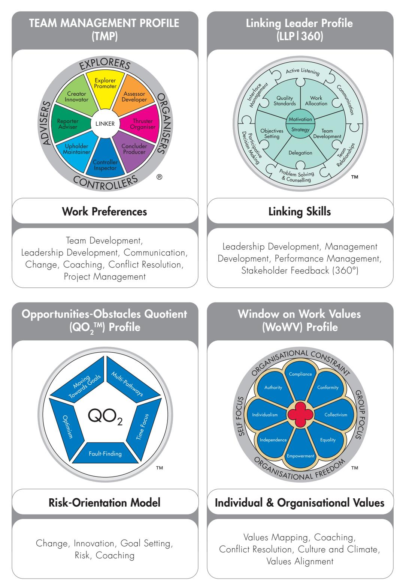

## The TMS Story

Team Management Systems (TMS) was founded in 1985 by Dr Charles Margerison and Dr Dick McCann. Dr Margerison, an educational psychologist, and Dr McCann, a chemical engineer, shared a fundamental passion: to help people learn to work better together.

Based at the University of Queensland, Dr Margerison and Dr McCann launched a comprehensive worldwide research program to answer the underlying question, "What makes teams successful?"

After collecting data from all types of industries, they recognised that some teams were highly successful whereas others with similar experience, skills, and abilities were not.

In response, Dr Margerison and Dr McCann set about to design a suite of valid and reliable tools that would provide specific, individualised feedback designed to facilitate personal, team, and organsiational development.

With over two million profiles completed in over 160 countries, it is safe to say that the work of Dr Margerison and Dr McCann has laid a foundation of unparalleled research, applications, frameworks, and profiles that continue to effectively ignite human potential.

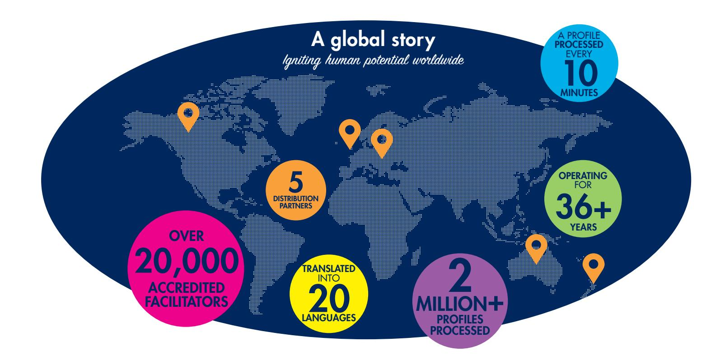

# PART 1 Technical Information

## Values Research

## Rokeach Values Survey

Modern-day thinking about values has been largely influenced by the work of Milton Rokeach (1973; 1979). He defined the value concept as 'an enduring belief that a specific mode of conduct or end-state of existence is personally or socially preferable to an opposite or converse mode of conduct or end-state of existence'. He developed an instrument to measure personal and social values. This Rokeach Values Survey (RVS) has been a popular tool for many research studies investigating the structure of value domains. The RVS distinguishes two kinds of values: instrumental, referring to modes of conduct and reflecting behavioural characteristics that are seen as socially desirable, and terminal, referring to end states of existence or ultimate modes of living which have been idealised. For example, 'an exciting life' and 'freedom' are examples of terminal values, whereas 'ambitious' and 'helpful' are examples of 'instrumental' values. Subsequent work by Schwartz (1992) suggests that it is unnecessary to distinguish between these two concepts and that only a single form - either terminal or instrumental – is needed to accurately measure values.

## Debats' Work

Debats (1998) initiated a study to empirically investigate the structure of human values. Its aim was to evaluate the coherence between the 36 values as specified by the RVS. It was hypothesised that human values do not exist in isolation but cluster in some coherent fashion to values domains with more specific meanings.

Debats' research approach was inspired by Feather (1991) who revealed from an analysis of the RVS instrumental values the existence of three value domains that were largely consistent with the motivational domains as described by Schwartz and Bilsky (1987): self-directed competence, restrictive conformity and pro-social concern. Within the intercorrelations of the terminal values, Feather discriminated five value domains: positive affiliation, universal prosocial, mature accomplishment, comfort/stimulation and security/salvation. To this end the RVS items were subjected to a principal components factor analysis followed by an orthogonal rotation varimax, based upon which 8 sub-scales were identified and constructed.

The Debats study was carried out on a sample of 109 clients, as part of a wider study to determine the impact of values on the process and outcome of psychotherapy. The results of this study are summarised in Table 1 on the following page.

| Scales (Major & Sub-)                  | Rokeach Values                                                                             |  |  |  |
|----------------------------------------|--------------------------------------------------------------------------------------------|--|--|--|
| Terminal Values                        |                                                                                            |  |  |  |
| Life without Inner and Outer Conflicts | Pleasure, national security, inner harmony, happiness, a comfortable life, salvation    |  |  |  |
| Universal Prosocial                    | Equality, a world at peace, a world of beauty                                              |  |  |  |
| Mature Accomplishment                  | A sense of accomplishment, social recognition, self-respect, wisdom                     |  |  |  |
| Positive Affiliation                   | True friendship, mature love                                                               |  |  |  |
| Individual Self-definition             | An exciting life, freedom, (negative correlation with family security)                  |  |  |  |
| Instrumental Values                    |                                                                                            |  |  |  |
| Self-directed Competence               | Broad-minded, independent, courageous, imaginative, logical                             |  |  |  |
| Restrictive Conformity                 | Polite, clean, ambitious, self-controlled, capable, obedient                            |  |  |  |
| Prosocial Concern                      | Forgiving, helpful, responsible, honest, loving, cheerful, (negative with intellectual) |  |  |  |

#### Table 1: Debats' analysis of the Rokeach Values Survey

Debats' study showed the existence of eight factors that were derived from the principal components analysis of the 36 RVS values. These eight factors accounted for substantial variances within the intercorrelations for the terminal and instrumental RVS values.

## Schwartz Values Survey

Schwartz (1994) developed a typology of values as conscious goals relating to three universal requirements with which all individuals and societies must cope: needs of individuals as biological organisms; requisites of coordinated social interaction; and requirements for the smooth functioning and survival of groups.

Ten motivationally distinct types of values were derived from these three universal requirements. They are:

| Power          | Universalism |
|----------------|--------------|
| Achievement    | Benevolence  |
| Hedonism       | Tradition    |
| Stimulation    | Confirmity   |
| Self-direction | Security     |

The relationship between these value types pointed to two higher-order factors that Schwartz called Self-Enhancement – Self-Transcendence, and Openness to Change – Conservation.

Schwartz' model was based on his Schwartz Values Survey (SVS) which measured the responses of over 9000 people from 20 countries worldwide. Respondents were asked to rate 56 values 'as a guiding principle in my life'. His survey included 30 of the values from the Rokeach Survey and the SVS has become the 'gold standard' assessment instrument for measuring individual values.

## Cross-cultural Structures

The two most important values constructs appearing in cross-cultural studies are those of Individualism and Collectivism. Triandis (1995) has drawn together much of the literature describing these important cross-cultural constructs. The defining attributes of Individualism and Collectivism suggested by Triandis are:

- 1 Collectivists define themselves as parts or aspects of a group; Individualists focus on self-concepts that are autonomous from groups. Collectivists have personal goals that overlap with the goals of their in-groups, and if there is a discrepancy between the two sets of goals, they consider it obvious that the group goals should have priority over their personal goals. Individualists have personal goals that may or may not overlap with the goals of their in-groups, and if there is a discrepancy between the two sets of goals, they consider it obvious that their personal goals should have priority over the group.
- 2 Among Collectivists, social behaviour is best predicted from norms and perceived duties and obligations (Miller, 1994). Among Individualists, social behaviour is best predicted from attitudes and other such internal processes as well as contracts made by the individual.
- 3 Among Collectivists, relationships are of the greatest importance, and even if the costs of these relationships exceed the benefits, individuals tend to stay with the relationship. Among Individualists when the costs exceed the benefits, the relationship is often dropped (Kim, Triandis, Kagitcibasi & Yoon, 1994).

## 1.2 The McCann Workplace Behaviour Pyramid

Having worked as a management consultant with teams from all over the world for 20 years, Dr. McCann became convinced that people will expend a lot of energy to preserve their core work values. He observed that infringements of core work values can lead to terminal conflicts in teams as people defend their values against potential violators. This is why an understanding of an individual's core values is essential to effective teamwork.

Margerison and McCann (1984-2007) developed the Team Management Profile Questionnaire and associated model, the Team Management Wheel, to explain the concept of work preferences. Preferences are another name for what we like doing. They are dimensions of individual differences in tendencies to show consistent patterns of relationships, thoughts, feelings and actions.

Preferences determine the conditions we set up to allow our mental and psychic processes to flow freely. They guide our behaviour, but if we have to work outside them at various times then we can usually cope. Although we value our preferences, they are not 'values'. Preferences simply describe what people are like rather than any intention behind their behaviour. Values, however, are deep-seated determinants of behaviour and define what people think are important – the goals or motivations that will drive their behaviour. We are more likely to react negatively when our values are violated but are often neutral to the actions flowing from other people's preferences.

Although preferences explain many of the behaviours exhibited in teams, they do not adequately explain behaviours emanating from values. In an effort to develop an integrated approach to understanding behaviours within teams, Dr. McCann (McCann, 2002) developed the concept of the Workplace Behaviour Pyramid (Figure 1). This shows the three levels that build a complete picture of the different ways that people approach work.

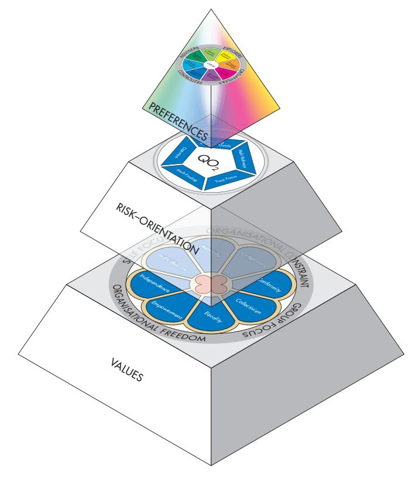

Figure 1: McCann Workplace Behaviour Pyramid

Preferences are usually transparent and are often the first thing we notice in others – 'He's rather quiet, isn't he?' or 'She talks a lot!' Some people prefer to think things through on their own whereas others need to talk out loud to clarify their ideas. Preferences are therefore at the apex of the pyramid because they are readily visible to others and are usually the basis of first impressions. They are also subject to a degree of variability dependent upon the situations faced.

The middle layer of the Workplace Behaviour Pyramid addresses the way people approach risk. All through our life we are faced with opportunities and obstacles; they crop up in every project we undertake no matter how much forward planning is undertaken. What determines peoples' risk profiles is the different emphasis they place on either 'seeing the opportunities' or 'seeing the obstacles'. Some people treat obstacles as an opportunity to take a new direction whereas others use them as an excuse to give up. Some people treat obstacles as a stumbling block but for others they are stepping-stones to the future. The concepts of risk are addressed by the QO2 TM – the Opportunities-Obstacles Quotient (McCann, 2000).

At the base of the pyramid are values. These are fundamental concepts or beliefs which people use to guide their behaviour in the workplace. Values will drive our decisionmaking and cause us to summon up energy to preserve what we believe in. They go beyond specific situations and determine how we view people, behaviour and events. Often major sources of conflict and disillusionment are due to mismatched values. Whereas we are often willing to work on tasks that we dislike, we are much less likely to compromise when our values are under threat.

Values are difficult to observe in others, as they are inner concepts often buried in the human psyche and not readily accessible by the conscious mind. When these values are violated then the conscious mind takes over and appropriate behaviour occurs to preserve and defend this attack.

## 1.3 The Window on Work Values Model

Most of the research on values focuses on the non-work domain or on the cross-cultural domain. Where values are applied to the work situation the approach is invariably ad hoc, with random checklists of workplace 'values' such as 'excellence, honesty, creativity etc.' offered (Senge et al, 1994) as a basis for developing a shared-values approach to working together. To give workplace values some theoretical underpinning, Dr. McCann developed the model of the Window on Work Values, by developing the ideas expressed by Rokeach, Schwartz and Triandis and applying them to the workplace.

Schwartz (1992, 1994) has generated a conceptual definition of values that incorporates the five main features of values recurrently mentioned in the literature.

Values are:

- Concepts or beliefs.
- Pertaining to desirable end states or behaviours.
- That transcend specific situations.
- Guide selection or evaluation of people, behaviour and events.
- Are ordered by importance relative to other values to form a system of value priorities.

It is this definition of values that form the basis of the Window on Work Values. The primary content aspect is the type of goal or motivational concern that the value expresses. The work of previous researchers suggested that higher-order factors or clusters might be a way to start developing a useful values model for the world of work. Preliminary discussions and interviews with participants on management development workshops identified the importance of a factor that focuses on either the self or the group. This eventually became the west-east axis of the Window on Work Values. Although many people can do both, the results suggest that most people will have a bias one way or the other.

The other higher-order factor suggested was the cluster of values that related to an organisational environment where the focus was on 'constraints' vs. a cluster of values that allowed more organisational freedom. This eventually became the north-south axis of the model, where the focus was on the organisational environment that people value.

This two-factor model led to the concept of value types where values would cluster around the two-factor model. The end result was eight 'value types', which are depicted as windowpanes, rather like those in the rose windows of many European cathedrals. The model was developed to have good structural validity, meaning that value types close to one another in the window are related whereas those on opposite sides of the window are unrelated.

## Self Focus vs. Group Focus

The Self Focus value types govern the dominance of personal over group goals. The defining motivation for the Self Focus value types are actions that further individual gain and foster a hierarchy of differentiation within an organisation. The Group Focus value types have defining goals where the individual is subordinated to the wishes, needs and goals of the group.

The key 'self-focus' value type was identified as Individualism. People high on Individualism will invest energy in being seen as capable, intelligent and highly competent. They will value self-sufficiency and also the rewards that go with being successful. The work behaviours of those high on Individualism will also depend on the organisational environment they value. People who believe that Organisational Constraints (such as rules, regulations and procedures) are necessary for effective work will hold the Authority value type as well, whereas those who desire Organisational Freedom will more likely hold the value type of Independence.

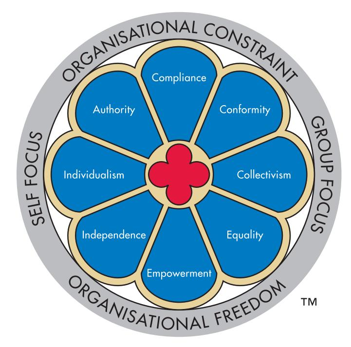

Figure 2: Window on Work Values Model

The key 'group-focus' value type is that of Collectivism. Collectivism emphasises the placing of group goals over personal ones. Those who value this highly will want to put others first, support the underdog and work with loyal people who value harmony. Issues such as truth, integrity and fairness feature high on their list. The generation of group opinions and adherence to them are far more important than personal gain. People who value Collectivism highly will use the power of the group to bring individual recalcitrants into line with group thinking.

Work behaviours of people who value Collectivism will depend to a large extent on their desired working environment. Those who also value Organisational Constraint will also hold the value type of Conformity. Those who believe in Organisational Freedom are more likely to value Equality.

## Organisational Constraint vs. Organisational Freedom

Organisational Constraint as a motivational type is derived from the prerequisite for some groups to ensure smooth interaction and group survival, thereby developing a prescriptive set of norms for group members to restrain impulses and inhibit actions that might hurt others.

Organisational Freedom, on the other hand, is a motivational type with defining goals of independence of thought and action where individual behaviour is unrestricted and people are free to choose their pathways, unfettered by Organisational Constraints. As such these two value types are unlikely to be held in the human psyche with equal probability, as the behaviours associated with each are conflicting.

The Window on Work Values helps explain why problems exist within any group of people working together. Value types define core frameworks that people hold and for which they are prepared to expend considerable quantities of energy in either promoting or defending. Most people will hold three or four of the values reasonably strongly and because of the structure of the model these values are more likely to be concentrated in one particular section, giving rise to key value patterns which are useful in understanding and predicting individual and group behaviour.

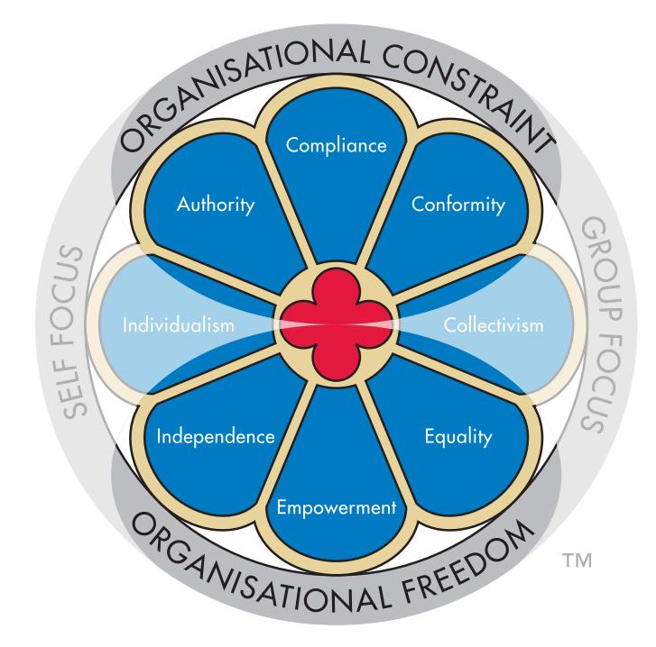

## Brief Descriptions of the Eight Core Value Types

## Individualism

Individualism is the value type which focuses entirely on the self. It comprises values held in high regard in many western countries such as the USA, Australia and the UK. A society that values Individualism will idolise the individual and have many role models to which people aspire.

People high on Individualism tend to classify themselves and others by individual characteristics rather than by membership of a particular group. Individualists in the world of work are driven by the need to be successful and competent, and to receive the individual accolades that go with successful performance. Individual incentives such as pay for performance and assessment based on individual targets are the hallmark of Individualism. Very often high-performers, heroes and champions are sought out for special praise.

In an organisation valuing Individualism, people are encouraged to achieve alone and take personal responsibility for their decisions. Conducting business alone means that this person is respected by his company and has esteem. A negotiator can commit those who sent him/her and is usually reluctant to go back on an undertaking. The toughest negotiations were probably done within the organisation while preparing for the meeting.

An organisation valuing Individualism will have in its senior management structure a collection of individuals striving to do the best for themselves as well as their organisation. In many cases employees are more interested in how their current organisation can benefit their personal career rather than what they can do for the organisation. In other words their involvement with the organisation is more likely to be 'calculative' rather than 'altruistic'.

Organisations that value Individualism will emphasize individual initiative and achievement and will reward people who show these characteristics. Promotion is just as likely to come from outside the organisation as inside and will be based on market value. As a result job mobility is likely to be higher than in organisations based on Collectivism where there is much more of a 'cradle-to-the-grave' approach.

In summary, the following points apply to those strongly valuing Individualism:

- Classification through individual characteristics.
- Driven by need to be successful and competent.
- Recognition through personal efforts and personal excellence.
- Continual opportunities to extend own capability.
- Personal responsibility for own decisions.

## Collectivism

Collectivism is the opposite to Individualism and is a value type that focuses on the importance of the group rather than the self. People who hold these values will usually put others first and want to work in a way that preserves the functioning of the group and the support that goes with it. Collectivists will want to avoid conflict and often go out of their way to promote harmony. Often they will shield those of less ability and actively support any underdogs.

For Collectivists the important words are 'we', 'us' and 'ours', compared to words such as 'I', 'me' and 'mine', which reside in the vocabulary of the 'Individualist'. Individualists will work in a team primarily because it will further their self-interest, whereas Collectivists need a team to give them social context, meaning and purpose. The work group is like a family, community or clan that nurtures its members and gives them a sense of belonging. Trades unions are often based on the need for Collectivism within organisations that focus primarily on Individualism.

Although many people give lip service to values such as 'integrity' and 'the truth', these are guiding principles to 'Collectivists' who will want to behave in ways that align with such values.

In a collectivist group, consensus is highly valued and group members are reluctant to vote on key issues unless there is an absolute necessity. They much prefer to continue meeting and debating issues until a group decision emerges. This is why decisions in primarily collectivist organisations can take a long time. However once there is agreement, implementation can proceed quickly.

Pay-for-performance schemes that reward individuals are less likely to work with work groups that value Collectivism. Where the group is working cohesively, it is far better to construct a group-bonus system where everyone in the group benefits from the group's performance. Many organisations meet the needs of both Individualism and Collectivism by combining individual pay-for-performance systems with a group bonus structure.

Negotiations in collectivist organisations are often done with many people from the one organisation involved in the face-to-face discussions. Leaders of delegations are more likely to be valued when they arrive with several colleagues rather than on their own. Whereas lone-ranger negotiators are valued in 'individualism' cultures, they are considered less important if they don't have a team of people helping them.

In summary, the following points apply to those strongly valuing Collectivism:

- Focus on group and teamwork.
- Loyalty to the team and good team relationships paramount.
- Value shared rewards that are based on achievements of team.
- Culture of helping and supporting others.
- Consensus in decision-making prized.

## Compliance

Compliance is a core value type built around a person's need to work to an agreed set of rules and procedures – the Organisational Constraints. People high on Compliance feel comfortable in knowing what they can and can't do and it is this security that enables them to give of their best.

Compliance in the Window on Work Values is midway between Self Focus and Group Focus and if this value type is the strongest one then a person holding it will give equal emphasis to both themselves and the group to which they belong. Usually this is manifested by their need to set an example in being obedient, following the rules, sticking to procedures and being stable. Their desire to also ensure that their group functions well is shown by their tendency to advocate these values when working with others. Therefore if they are in a management position they will expect team members to also comply with the Organisational Constraints although they will not push this as strongly as someone who holds predominantly the Authority value type.

Organisations that value Compliance will usually have a clearly defined strategy and a system of ensuring that detailed business objectives are cascaded throughout the organisation. In most cases performance-evaluation schemes against these targets are designed to ensure the business objectives are delivered. For many of these organisations the basic philosophy may well be that of 'punishment' rather than encouragement.

In summary, the following points apply to those strongly valuing Compliance:

- Plans and objectives cascaded throughout organisation from top-level strategy.
- Performance evaluated against published targets.
- Emphasis on security and stability.
- Clear rules, regulations and procedures that avoid ambiguity.
- Value standardization and repeating best practice.

### Empowerment

Directly opposite the Compliance value type is Empowerment. A person strongly holding this value type will insist on Organisational Freedom, where they can have the opportunity to contribute to the organisation, unfettered by unnecessary rules and regulations. They will accept the need for business objectives and performance targets but because they hold to the principles of self-reliance and self-accountability they will want to establish their own constraints in order to pursue outputs and outcomes in their own way.

The Empowerment value type is midway between a focus on the self and a focus on the group. Consequently, a person who scores highest on Empowerment will also value empowerment being passed on to those they manage. As a result they will usually want to work in a way where they can find the best in others and give them personal responsibility. High-scoring Empowerment people are also more likely to value and implement personal development and training programmes for their staff.

Organisations that value Empowerment highly can often be identified by their open system of management where there is a readiness to listen to other's ideas, no matter how radical, and a culture where people are encouraged to learn from their mistakes.

In summary, the following points apply to those strongly valuing Empowerment:

- Decisions taken at lowest possible level.
- Flexibility to respond to unique circumstances.
- Encouragement of people to learn through experience.
- Value receiving and passing on responsibility and accountability.
- Each person takes responsibility for overall success of organisation.

## Authority

The Authority value type comprises a focus on the self, combined with a belief in the need for Organisational Constraints. A strong Authority person will want to work within an organisational hierarchy so that adequate control processes are in place and outputs delivered to maximum quality and minimum cost. They usually believe that people need to be monitored otherwise inefficiencies will creep in.

The focus on the self means that they will often want to put themselves first and be seen to be right in front of others. They usually dislike being proved wrong and may react strongly to situations where they are allowed to 'lose face'. Authority people will be ambitious and because they put themselves first they will constantly seek promotion and may therefore have a tendency to be highly mobile.

Organisations that hold the Authority value type strongly tend to have a hierarchical system of management where the leader takes charge and organisational structure and accountability are unambiguously enforced. People are less likely to challenge those in senior positions, as there tends to be an acceptance that the leader is always right. Such organisations are often identified by a system of strong line management authority in pursuit of an agreed business plan.

In summary, the following points apply to those strongly valuing Authority:

- Managers accountable for actions of others.
- Clear strong individual leadership.
- Organisational structure and accountability are unambiguously enforced.
- Policy and direction is clearly set and driven by those at the top.
- Acceptance of decisions of senior managers.

## Equality

The Equality value type comprises a focus on the group, combined with the need for an organisational environment that allows a degree of freedom. Equality people value the group and therefore put emphasis on the need for tolerance and the acceptance of other people's ideas and beliefs. The need for Organisational Freedom means that they expect to be trusted and will give trust in return, to those people they are managing. To some extent there is an air of altruism about high Equality scorers, as they like to work for the benefit of others and have a willingness to forgive.

In an organisation that values Equality there will be a belief that everyone brings value, talent, skill and resources to the organisation, no matter what their job function. People understand that a hierarchy of management is necessary but interactions between those at the 'top' and those more to the 'bottom' tend to be frequent and courteous. There is an openness about such organisations, where equality of opportunity is available to all.

In summary, the following points apply to those strongly valuing Equality:

- Belief that all bring talent to the organisation.
- All contribute to policy and decision-making.
- Open communication and sharing of information.
- Tolerance and willingness to work through differences.
- Fairness and equality of opportunity at all levels.

## Independence

The Independence value type is a combination of a focus on the self with the need for an environment that allows Organisational Freedom. In many ways the high Independence person is often seen as a maverick or a 'loose cannon' who values their own creativity and will work with a high degree of self-direction and autonomy. The problem may come when they go off in different directions to those defined by 'organisational visions' or 'team purposes'.

High Independence scorers value making their own decisions and 'doing their own thing'. Material rewards are not necessarily key desires. They would rather have a 'long leash' and the freedom to act in any way they thought might be beneficial. They are even likely to continue working in organisations where remuneration is low provided that their independence is ensured. Organisations that value Independence highly are often those where individual creativity and 'having fun while working' are part of the culture. Many start-ups with senior executives under 30 years old have a culture where this value is upheld.

In summary, the following points apply to those strongly valuing Independence:

- Recognition of value of individual creativity.
- Emphasis on personal autonomy.
- High levels of personal engagement with strategy.
- Self-motivation and personal enjoyment paramount.
- Trusted to set and meet own objectives.

### Conformity

Conformity is the combination of a focus on the group plus the need for an environment of Organisational Constraints. People high on the Conformity value type will avoid extremes of action and conform to others' expectations of them. Conformity people will not want to stand out from the crowd, but fit into the norms of the group as they need a group in order to give of their best.

Whereas Independence people are more likely to challenge the status quo, Conformity people are happy doing what they are told. They are more likely to want to preserve the organisation's traditions and culture and if they hold this value strongly they may have a tendency to oppose change.

Organisations that value Conformity often have a culture where there is an emphasis on the past and a reluctance to take risks. The ideals of the 'founders' tend to be preserved and reinforced by a celebration of the past successes. Rewards tend to be given to those who want to conserve past values and in this way a strong solidarity is maintained which, in a rapidly changing environment, could lead to a situation of 'group think'.

In summary, the following points apply to those strongly valuing Conformity:

- Respect for organisation's tradition and values.
- Meeting group/team expectations is important.
- Stability of structures and strategies.
- Avoidance of extremes of action preserves group solidarity.
- Established group culture provides strong bond.

## Collaborative Individualism

Many people will have a balance across the Individualism-Collectivism sectors of the Window on Work Values Model. This is particularly the case in organisations that encourage and reward individual achievement but at the same time espouse and promote teamwork. In a sense, these two approaches could be conflicting and lead to some interesting patterns of behaviour.

Look out for the 'Collaborative Individualism' situation which is often represented by a strong score on both Individualism and Collectivism. The person understands the need to work in a team and values the group approach. However they need to beware of a potential tendency to use the group for their own advancement – i.e. their Collectivism score may be there only to support their Individualism score. This can lead to a 'values paradox' as shown below.

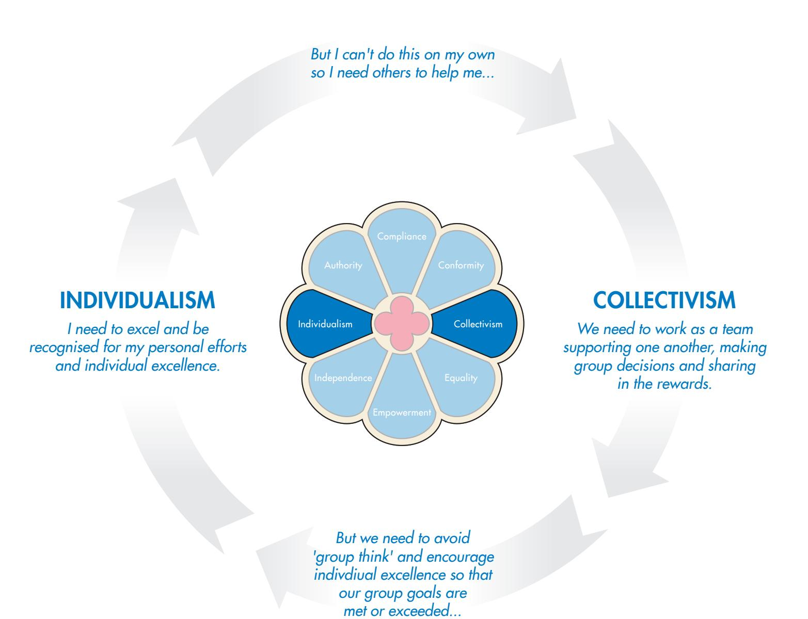

Figure 3: Complying Empowerment Paradox

## Complying Empowerment

Likewise, look out for the possibility of 'Complying Empowerment' where people value both Compliance and Empowerment. This may appear to be a paradox but like the Collaborative Individualism situation it arises from one of the values being 'espoused' (i.e. Empowerment) within a framework where the primary value type is Compliance. Those portraying this combination realize that commitment to the job comes through allowing people to have the responsibility and accountability for their decisions, but deep down they are concerned that mistakes are likely to be made and so they make sure that rigorous plans are in place to be followed with minimal deviation. Likely behaviour is the checking and double-checking of team members' work to ensure it is done the 'right' way – but still espousing that everyone is free to make their own decisions.

### COMPLIANCE

*People must rigorously follow plans and objectives cascaded from top-level strategy.*

*But we don't want mistakes or 'anarchy', so...*

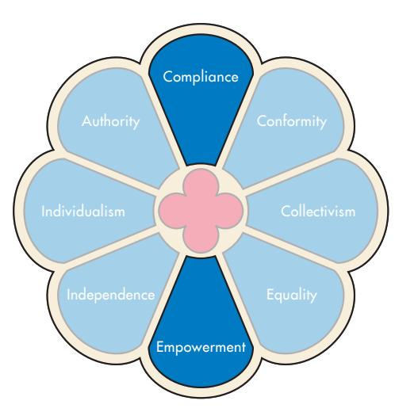

*But people work harder when they have freedom to plan their own way of working and flexibility to make decisions, so...*

### EMPOWERMENT

*Decisions, responsibility and accountability must be taken at the lowest possible level.*

Figure 4: Collaborative Individualism Paradox

## Measuring Work Values

The Window on Work Values Profile Questionnaire is a 64-item instrument designed to measure the work values of the respondent, in terms of the Window on Work Values Model. A two-pass item approach is used in order to improve discrimination. Respondents are first asked whether the activity or situation is something they value at work (yes or no) and for those items with a 'yes' response they then record 'to what extent' they value this situation or activity, making one of four choices: To a little extent; to some extent; to a great extent; or to a very great extent. The overall responses then form a five-point Likert scale.

There are eight questions for each of the eight windowpanes, making a total of 64 questions in all. The scoring for each question ranges from 0 for a 'No' to the first part of the profile questionnaire to 4 for 'To a Very Great Extent'. So the maximum raw score for any windowpane is 32 (4x8). The scores are then converted into raw score percentages representing the percent of the maximum score possible. So, if over eight questions the total were 24, then the raw score would be 75% of the maximum.

Next the scores are 'normalised' so that they add up to 100%. The result is a pattern of distribution around the window showing which sectors score higher and which score lower. If the same score occurs in each sector, respondents are saying they regard each of the eight value types equally. While this is theoretically possible, the psychometric data confirms that it is highly unlikely as most people will favour some values more than others, resulting in a hierarchy of work values.

It is the hierarchy that is more important rather than the absolute percentage. Decisive respondents will have a more discriminated profile whereas conservative respondents will have a flatter profile.

## Reasons for Using the Window on Work Values Profile

The Window on Work Values Profile has been designed as a feedback and discussion tool for individuals and teams. It is particularly useful for the following situations:

## Personal/Executive Development

The feedback information allows individuals to understand the core values that drive their behaviour at work. The hierarchy of value types will identify the top two or three value types that will influence their workplace behaviour the most. By identifying how they are likely to react in a variety of situations, they can learn to modify their behaviour to achieve more optimal outcomes – particularly with team members and colleagues. Sharing and comparing the values data with key organisational stakeholders can lead to improved cooperation.

## Values Alignment

The Window on Work Values Profile data can be used to check the alignment between personal work values and organisational values. This is best done in a qualitative way using a card sort process (contact TMS for further information regarding this resource).

### Team Development

Team development activities will allow team members to share the data on their hierarchy of work values. Often conflicts at work can be traced back to people holding opposing values. Values are the personal standards that individuals use to judge their own behaviour and that of others. Understanding the different values frameworks and learning how to 'Pace' different values sets can improve substantially the interactions among team members.

## Team Charter

The profile questionnaire and the Window on Work Values Model can be used to develop a team charter, comprising the team purpose and team values statements. This process will help team members understand what the team is supposed to do, why it is doing it and how everyone should contribute to the outcomes. When a team agrees on its core values it is easy to deal with conflict situations. Team members can then pull in the same rather than different directions. Without agreed common values, team problems are likely to arise. You can use the Window on Work Values to develop a Team Charter which lists the core values that team members agree should be the foundation of how the team works. Behavioural ground rules and actions can then be drawn up to act as guidelines for the way the team works.

## Choosing Who Should Complete the Profile Questionnaire

The Window on Work Values Profile Questionnaire is a self-rater instrument meaning it is completed by one person only. It can be administered via the TMS Global Portal.

The profile questionnaire is particularly useful as a personal development or executive coaching tool as it identifies the core values that drive individual behaviour. It is often used in conjunction with the other Pyramid of Workplace Behaviour instruments – the TMP Questionnaire and the QO2 TM Questionnaire.

## Reliability

1.6

### Internal consistency

Four versions of the profile questionnaire were developed from an initial item pool of more than 100 questions. The fifth version became the commercial version and the following reliability data was recorded.

Since the original development sample was analysed, further data has been collected for model validation testing. The larger sample described below includes those respondents recorded during development.

Table 2 presents the Cronbach alpha coefficients. The alpha coefficient for Empowerment has increased to 0.69 in this expanded sample.

Descriptive data for the worldwide sample are reported in detail in the full Windows on Work Values Profile Research Manual.

| Value Type    | Cronbach Alpha Coefficient |  |  |  |
|---------------|----------------------------|--|--|--|
| Compliance    | 0.83                       |  |  |  |
| Conformity    | 0.75                       |  |  |  |
| Collectivism  | 0.71                       |  |  |  |
| Equality      | 0.74                       |  |  |  |
| Empowerment   | 0.69                       |  |  |  |
| Independence  | 0.83                       |  |  |  |
| Individualism | 0.71                       |  |  |  |
| Authority     | 0.76                       |  |  |  |

Table 2: Cronbach alpha coefficients for each value type (n=529)

Validity

## Structural validity

Structural validity relates to the relationship between the various scales and subscales. For continuous models such as the Window on Work Values, good structural validity requires the correlations between one value type and the other seven to vary progressively around the model. Adjacent value types should show moderate correlations that then progressively decrease as the gap between value types increases. Opposite value types should be unrelated or even negatively correlated. This verifies the model's spatial integrity.

Selection of scale items and structural validity verification require an iterative research programme. Items for a particular scale or subscale are selected or rejected according to internal consistency requirements, while simultaneously checking that the scale intercorrelations follow the progressive pattern. Items that enhance both the international consistency and the structural validity requirement are accepted.

Since the original development sample was analysed, a larger sample has been collected for structural validation testing. The sample on the next page includes those respondents recorded during development.

| Value Type    | mpliance Co | mity Confor | m Collectivis | Equality | ment wer mpo E | Independence | m Individualis | Authority |
|---------------|----------------|----------------|------------------|----------|-------------------------|--------------|-------------------|-----------|
| Compliance    |                | 0.70           | 0.37             | 0.12     | 0.04                    | -0.11        | 0.17              | 0.44      |
| Conformity    |                |                | 0.52             | 0.31     | 0.23                    | -0.06        | 0.19              | 0.31      |
| Collectivism  |                |                |                  | 0.66     | 0.40                    | 0.17         | 0.15              | 0.06      |
| Equality      |                |                |                  |          | 0.55                    | 0.26         | 0.14              | -0.10     |
| Empowerment   |                |                |                  |          |                         | 0.52         | 0.50              | 0.21      |
| Independence  |                |                |                  |          |                         |              | 0.60              | 0.28      |
| Individualism |                |                |                  |          |                         |              |                   | 0.54      |
| Authority     |                |                |                  |          |                         |              |                   |           |

Table 3: Pearson product-moment correlations for each value type (raw scores; n=529)

The following (Figure 5) is a plot of the Conformity line. Again, the progressive relationship around the model is confirmed.

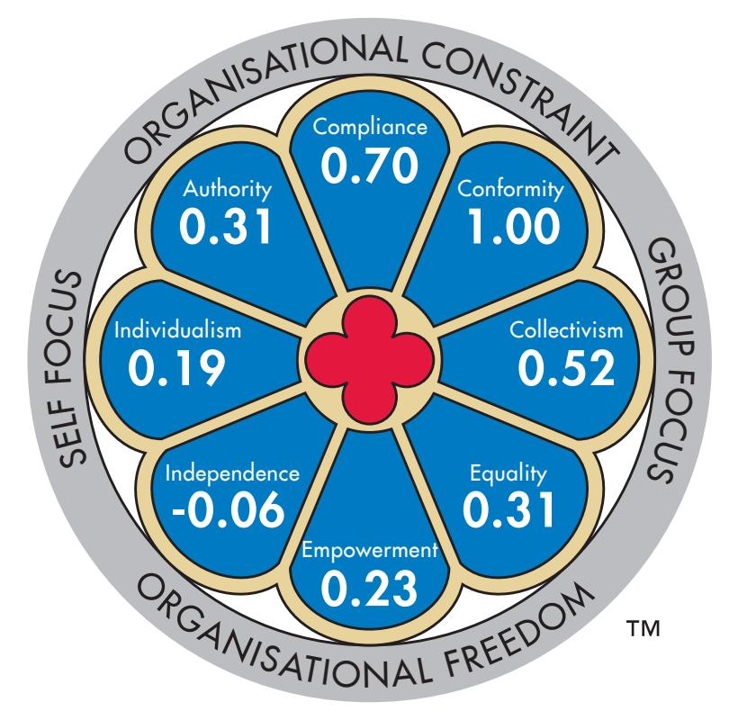

Figure 5: Pearson product-moment correlations against Conformity (n=529)

## Validity Mapping 1.8

Two criterion-related validity studies and one construct validity study have been carried out to determine the values components of the eight value types on the Window on Work Values. These are reported in detail in the full Windows on Work Values Profile Research Manual.

The map below (Figure 6) summarises the significant relationships found between the values studies and the eight value types of the Window on Work Values.

Although the listed values appear only once in a chosen windowpane, in most cases they also apply to the adjacent windowpanes, given the structural validity of the window and the cross-correlations between adjacent sectors.

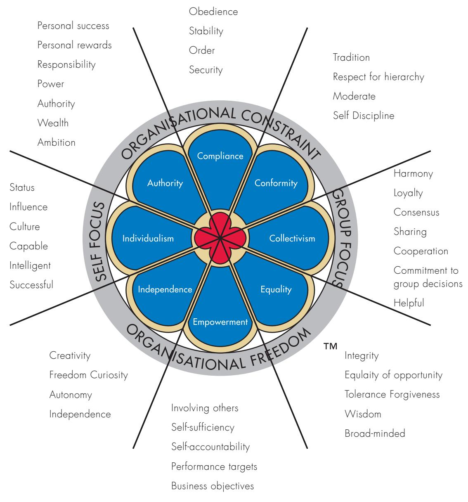

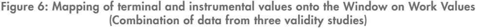

## The Window on Work Values Profile Tour

## Interpreting the Quantitative and Qualitative Feedback

This content section is a tour of the Window on Work Values Profile, describing the graphical, narrative and quantitative parts in detail. Once you understand the mechanics of the profile you will find it easy to interpret the data and feed back the information to your clients. There is a wealth of information for an individual to consider and your role is to help them understand the implications of the profile and how it might assist them in personal, team or organisational development.

The Window on Work Values Profile is divided into a number of different sections:

- Cover sheet this gives a graphical summary of the percentage scores for each value type.
- Overview this briefly summarizes the two axes comprising the Window on Work Values Model.
- The value type hierarchy this ranks the value types in order of importance from one to eight.
- Narrative text on all eight value types.

### Page 1: Cover sheet

1.9

The cover sheet shows the Window on Work Values Model with the percentage scores for the eight value types. If a respondent scores equally in all eight value types they would have 12.5% in each windowpane, indicating they regarded all eight value types equally. Given the structural validity of the model such a score is improbable.

More likely, some scores will be above 12.5% and some scores will be below, indicating the different importance attached to each value type. Scores over 16% are generally regarded as high; scores below 8% are generally regarded as low.

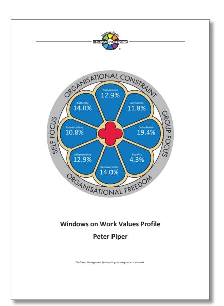

### Page 2: Overview

Page 2 gives an introduction to the profile explaining the two key axes of the model: Group Focus and Self Focus as the east-west axis; Organisational Constraint and Organisational Freedom as the north-south axis.

#### **YOUR RESULTS** Your responses to the profile questionnaire have been distributed across the eight panes of the Page 3: Value type hierarchy

*Window on Work Values*. Scores above 12.5% indicate work value types that are more important to you whereas scores below 12.5% indicate value types that are less important to you. Your hierarchy Page 3 shows the hierarchy of value types ranging from the highest (Individualism and Equlaity at 19.3%) to the lowest (Compliance at 2.6%).

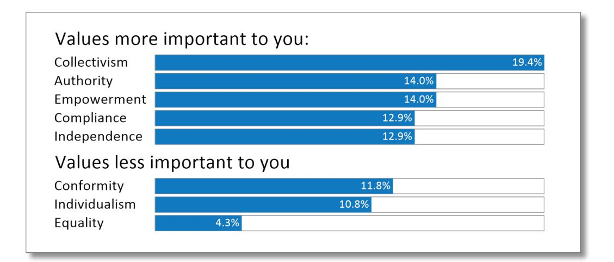

scores whereas *Group-Focus* value types (Equality, Collectivism and Conformity) account for 35.5% of your scores. This indicates the importance you place on balancing your own needs with the needs The 'values more important to you' are those scoring 12.5% or above. The 'values less important to you' are those scoring below 12.5%.

of others. The *Organisational Freedom* value types (Independence, Empowerment and Equality) account for 31.2% of your scores whereas *Organisational Constraint* value types (Authority, Compliance and Conformity) account for 38.7% of your scores. This indicates the bias you have towards values that This table is important when feeding back the profile to the respondent. The theory of values hierarchy says that we try to keep some aspects of all the values hierarchy within our decision-making framework. When a conflict arises between values then we are more likely to suppress those values held at a lower level.

ensure that you and others work to organisational guidelines. Below are some points to consider when interpreting this hierarchy:

Your pattern of scoring in each of the eight window panes is described on the following pages. Start with the highest value type – in this example, we'll use Individualism. The opposing value type is Collectivism. Look for its location in the hierarchy. It is 5th on the list in the group 'values more important to you'. Therefore when a conflict occurs between Individualism and Collectivism the respondent is more likely to give up any Collectivism values that are held.

Similarly with Independence, the opposing value is Conformity which is 2nd on the list of 'values less important to you'. So again the Independence values are likely to be reinforced at the expense of the Conformity values, when a values conflict looms.

Remember it's the hierarchy of value types that is more important than the absolute percentages. Decisive respondents will have a more discriminated window whereas conservative respondents will have a flatter profile.

## Pages 4–20: Narrative text

This part of the profile is the narrative, which gives general advice and comments on each of the eight value types.

For each sector on the window there are 16 possible texts that are used to create the report. To determine which text is printed the following algorithm is used:

The eight raw scores are first rearranged so that the highest score is graded as 100% and the others proportionally upgraded. For the sample profile, the following table shows the raw scores and their upgrade.

| Value Type    | Raw scores | Upgraded scores |  |  |
|---------------|------------|-----------------|--|--|
| Individualism | 81%        | 100%            |  |  |
| Compliance    | 78%        | 96%             |  |  |
| Empowerment   | 72%        | 89%             |  |  |
| Conformity    | 61%        | 74%             |  |  |
| Equality      | 56%        | 69%             |  |  |
| Collectivism  | 56%        | 69%             |  |  |
| Independence  | 53%        | 65%             |  |  |
| Authority     | 37%        | 46%             |  |  |

#### Example of Window on Work Values scoring

To determine which text is printed out the upgraded scores are used. If the score is 75% or over then a 'strong' text file is printed. Between 50-74% a 'moderate to high' text file is printed; between 25-49% a 'moderate to low' text file is printed and less than 25% a 'low' file is printed.

Each of these files is modified depending upon the score in the opposite pole of the value pair. As an example, Individualism has a 100% upgraded score, but its opposite pole, Collectivism has 69%. So the file selected for printing will be the one containing 'strong' Individualism text modified by 'moderate to high' Collectivism text. Similarly, the Equality file will have the 'moderate to high' text but suitably modified for a 'moderate to low' score on Authority. The net result is one of 16 text options for each windowpane.

This procedure takes account of the different answering patterns of respondents. No matter whether the respondent is decisive or indecisive, the algorithm will calculate which files will be printed out in their 'strong' version and which in their weaker version. In this way everyone will receive a number of 'strong' texts followed by texts that describe those value types with lower scores.

# PART 2 Applications of TMS Concepts

## Overview of a TMS Programme

Once you have identified a need for the Windows on Work Values Profile, it's time to prepare the programme!

- Planning What questions will you ask your clients?
- Administration -– How will you explain the process to learners?
- Debriefing How will you design the session and present the concepts?
- Developing and Follow-Up How will you help learners keep TMS on the agenda?

The following table outlines the approximate timeline for the different steps leading to a successful programme delivery.

|                             |                                                                                                    | Time    |
|-----------------------------|----------------------------------------------------------------------------------------------------|---------|
| Planning                    | Consultation – what, why, who, how, when, scope.                                                   | 2 weeks |
|                             | Planning – formal statement of understanding.                                                      | 2 weeks |
| Administration              | Intro, objectives, expectations, issues, admin.                                                    | 2 hrs   |
|                             | Logistics – profile questionnaires to facilitator.                                                 | 1 week  |
| Preparation                 | Logistics – profile questionnaires to TMS.                                                         | 1 week  |
|                             | Preparation – further consultation, technical support, programme refinement, develop materials. | 2 weeks |
| The Debrief                 | Theory – your profile, your organisational values, Team Charter.                                | 1 day   |
| Developing and Follow-Up | Follow-up – further consultation, 1-on-1 support coaching, planning next steps.                 | 1 month |
|                             | Next modules – needs based.                                                                        | 1/2 day |
|                             | Next Steps – ongoing support, additional programmes, team-led activities.                       | Ongoing |

Each step along the way has resources to support your programme delivery. You can find these in the Facilitator Resources section of your TMS Global Portal. Resources include session designs, template emails, activities and PowerPoint decks with scripts.

# 2.2 Pulling it all Together

The simple approach outlined below will guide you in your planning for profile feedback sessions. The following framework reflects five basic steps that take you from initial preparation to final action results:

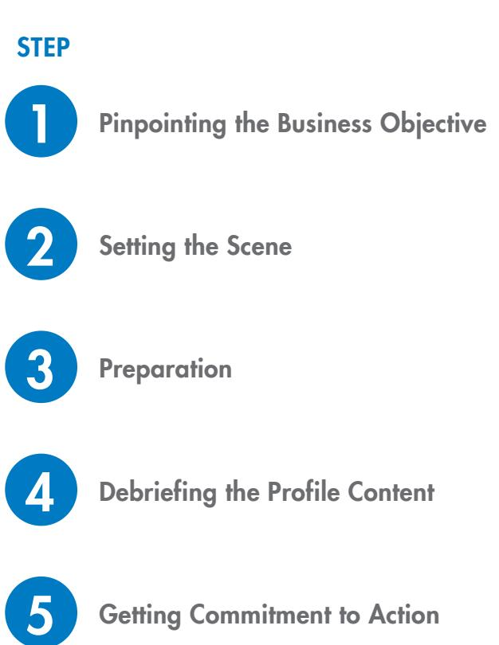

## STEP 1 Pinpointing the Business Objective

The first thing is to identify a specific business objective or problem. The next thing is to identify how the Window on Work Values Profile might help to address this problem or issue. Key points to consider at this stage of the process:

The feedback information allows individuals to understand the core values that drive their behaviour at work. The hierarchy of value types will identify the top two or three value types that will influence their workplace behaviour the most. By identifying how they are likely to react in a variety of situations, an individual can learn to modify their behaviour to achieve more optimal outcomes – particularly with team members and colleagues. Often, conflicts at work can be traced back to people holding opposing values. Values are the personal standards that individuals use to judge their own behaviour and that of others. Understanding the different values frameworks and learning how to 'Pace' different values sets can improve substantially the interactions among team members, as well as organisational stakeholders.

- The 'outcome' for many programmes using the Window on Work Values Profile is a team charter, comprising the team purpose and team values statements. A Team Charter lists the core values that team members agree should be the foundation of how the team works. Behavioural ground rules and actions can then be drawn up to act as guidelines for the way the team works. This process will help team members understand what the team is supposed to do, why it is doing it and how everyone should contribute to the outcomes.
- On the logistics side of things, you will also need to consider what support will be necessary to make the process successful. This includes time to gather, prepare and debrief the data; as well as resources to support subsequent development.

## STEP 2 Setting the Scene

This part of the process involves preparing people to complete profile questionnaires. Respondents need to complete the profile questionnaires in an honest and considered way. To do that, they need to understand exactly what the profile questionnaire measures and why it is being used. Clear and positive communication is vital.

You need to:

- Explain what the Window on Work Values Profile Questionnaire measures.
- Show a sample profile so people know what to expect.
- Take the time to explain the method of completion of the profile questionnaires and emphasise the confidential nature of the feedback. You may also like to review the TMS Ethical Guidelines.
- Spend time with your client/s making sure they understand where values sit conceptually is important. It is helpful to position the Values concept within the overall framework of workplace behaviour, by using the Pyramid of Workplace Behaviour.

## STEP 3 Preparation

Your preparation before debriefing the Window on Work Values Profile is critical. Having the profile processed a few days in advance of the debrief session is advisable, so you can scan through the reports. You should also think about how to relate the results back to key models and concepts underlying the profile you are using.

Here are some tips for working through the profile:

• Keep in mind your overall objectives – what action you would like to result from the session and what impact any major differences of opinion could have and how to handle them.

## STEP 4 Debriefing the Profile Content

- The Window on Work Values Model must be well understood by clients before giving them their Window on Work Values Profile. The PowerPoint slides in your TMS Global Portal (Facilitator Resources section) can be used for this purpose.
- The Values Mapping diagram in this handbook (and on the PowerPoint slides) should be shown after the Window on Work Values Model is explained. This helps participants understand the three levels used to explain values.
  - Level 1: the two axes of Group Focus Self Focus and Organisational Constraint – Organisational Freedom.
  - Level 2: the eight value types.
  - Level 3: the component values that cluster into the value types.
- Make sure you understand the difference between a 'value' and a 'preference'. Sooner or later someone will ask you about this. Using the Workplace Behaviour Pyramid is a good way of explaining where values sit conceptually.
- Show a sample profile and demonstrate its relevant sections so as to enable people to read and understand the profile. Once you are confident that the person/s has a good grasp of the concepts, then give them their profile. Always allow plenty of time for reading and absorbing the information. This may involve taking the profile away to read in-depth and returning at a later date to discuss the data.
- All profiles have an accompanying Personal Discovery Workbook which explains the main concepts. Make sure this is read by each respondent.
- There is often a tendency for people to see only negatives in those parts of the Window on Work Values that are opposite to their core values. Try to encourage everyone to look at the good points of each of the eight value types. A way of doing so can be through looking at the pros and cons of each value type. For instance, with Collectivism, it's good that we value the group, but it could be bad that we have lowest common denominator decisions to ensure consensus.
- To facilitate a quick understanding of the differing values within a team it is useful to run the 'Dos and Don'ts' exercise. Ask participants to complete one sheet of flip chart paper with the key behaviours that support their core value types. The 'Dos' are, 'Those behaviours that I would like to experience from others' and the 'Don'ts' are, 'Those behaviours which break any possible rapport between me and others'.
- Sometimes, people place undue importance on the percentage allocated to each value type. With this report, the more important feature of the values 'make-up' is the hierarchy, order or relativity, not the absolute values of the numbers on the front page.

## STEP 5 Getting Commitment to Action

- Summarise points from earlier discussions. It is important to decide on appropriate action points to take and to agree on a date for review.
- In values work the whole concept of the ecological check is important as it helps explain why people don't 'walk the talk'. This term can be loosely defined as a broad alignment check. This check should occur at many different levels, e.g. alignment internally, alignment between individual and organisational values, alignment between our team values and those of other teams in the organisation etc. Problems can occur when the personal value types of the senior managers in an organisation are not aligned with the espoused values or values based outcomes that comprise the organisational values statement. An ecological check here can bring out this discrepancy and facilitate a discussion of the inherent problems.
- You can use the Window on Work Values with your clients to develop a Team Charter. This is a tangible way for the team to manage and uphold values. The Team Charter lists the core values that team members agree should be the foundation of how the team works. Behavioural ground rules and actions can then be drawn up to act as guidelines for the way the team works. Examples of this can be found in the Personal Discovery Workbook, or from the PowerPoint slides on the TMS Global Portal (Facilitator Resources). Reinforce the idea that those whose personal work values are misaligned with the Team Charter, may be those most likely to violate the ground rules in times of crises or stress (ecological check).

## Sample: Programme

This section of the Accreditation Handbook provides an outline of a sample Window on Work Values programme. It represents a starting point and should be viewed as an example for considering your own programmes, in light of your own approach and your client needs.

## Administration

Giving your participant/s the opportunity to discuss profile questionnaire administration is an important part of managing issues and expectations. Some of the concerns you might like to discuss would include:

- Emotions: How do we feel about embarking on the process? Are we scared, optimistic, anxious etc?
- Confidentiality: Will I have to share the results? What conflict could this generate? What are the ethical requirements?
- Maturity: Are we mature enough as a team/organisation to work with this process effectively?
- Next Steps: What will we do with this data? What actions would we be expecting to see? Will we report back to our raters?

Although it is optimal to convene the participant/s to discuss the programme and the Window on Work Values, this is not always practical. The following sample provides an example letter or email that could be sent to respondents prior to receiving their invitation to complete their questionnaire.

## Sample: Letter/Email

#### Dear (participant's name),

I am writing to introduce myself and begin the process for the [programme name] being conducted on the [date] at [location]. My name is [facilitator's details], I am [role explanation] and I will be [programme involvement – e.g. facilitating, co-facilitator, coordinator].

## Purpose

The purpose of the session is to [primary purpose/objective]. Furthermore, we will spend time addressing [additional objectives].

## Window on Work Values Profile

As part of this discussion, you will receive your own personalised Window on Work Values Profile. This report tells you about your individual values at work. In order to receive this feedback, you will need to complete the Window on Work Values Profile Questionnaire.

You will soon receive an email with additional instructions on how to complete the questionnaire. The questionnaire should only take about 15 minutes to complete.

You don't need to feel concerned by the feedback you might receive. This approach has been selected because: it is simple and easy to understand; it provides practical information presented in a positive way and; is based on extensive research.

## Deadline

We would like the results sent back by close of business on [deadline date]. If this is not possible, please get in touch with me as soon as you can so we can make some alternative arrangements. If you have any questions about the questionnaire, the Window on Work Values Profile or any aspects of the [programme name] session, please feel free to contact me, [contact details].

Further information on the Window on Work Values Profile can be found at Team Management Systems' website at www.tmsoz.com.

I trust you will enjoy and benefit from the profile and the programme. I look forward to working with you.

Sincerely,

[facilitator's details]

Window on Work Values can be used in a number of ways in many aspects of individual, team and management development programmes. These workshop formats may be useful as a starting point when presenting your first few programmes using the Window on Work Values Profile.

The first session is an introductory session to explain the concepts behind the profile and feed back the results. The Window on Work Values Personal Discovery Workbook (standard inclusion with all profiles) will help all participants analyse the results of their profile.

This session plan is followed by another workshop design where we develop a team charter, a behavioural based statement, to help us manage and uphold values.

All materials referenced in the session plans are available via the Facilitator Resources section of your TMS Global Portal.

# 2.4

## Introducing the Window on Work Values and Debriefing the Profile

A half-day session designed to introduce the Window on Work Values concepts and highlight the implications for each person's profile results.

|                                                                                                                                                                                                                                                                                                                                                                                                                                                                                                                                                                                                                                                                                                                                                                                                                                                                                                                                                                                                                                                                                                                                                                                                                                                                     | Time       |
|---------------------------------------------------------------------------------------------------------------------------------------------------------------------------------------------------------------------------------------------------------------------------------------------------------------------------------------------------------------------------------------------------------------------------------------------------------------------------------------------------------------------------------------------------------------------------------------------------------------------------------------------------------------------------------------------------------------------------------------------------------------------------------------------------------------------------------------------------------------------------------------------------------------------------------------------------------------------------------------------------------------------------------------------------------------------------------------------------------------------------------------------------------------------------------------------------------------------------------------------------------------------|------------|
| Welcome and Introductions                                                                                                                                                                                                                                                                                                                                                                                                                                                                                                                                                                                                                                                                                                                                                                                                                                                                                                                                                                                                                                                                                                                                                                                                                                           |            |
| Values Photographs Exercise – Contact your nearest TMS office for a set of 64 photographs showing images roughly aligned with the eight Window on Work Values segments. These cards are arranged on tables for participants to view. Ask them to look at the cards and choose two that 'strike a chord' with them - either for better or worse. After they have chosen, ask each participant to show their cards and explain their choice. Some participants will choose cards that remind them of holidays but others will choose cards that highlight some underlying value. After everyone has shown the cards and the discussion is finished, say that people's choice of cards are often based on their underlying values. Maybe you can refer to some of the cards that have been chosen as examples of people's need to be with others (Collectivism) or to be 'free' (Independence) but just mention this as a lead in to the workshop and don't go into too much detail. You may refer to their choice later in the programme once the Window on Work Values Model has been introduced. Often you will find that the images they choose in this introductory session align with their core value types. | 30 minutes |
| In discussing people's choices it is useful to start using the language of the Window on Work Values when summarizing their choices or asking questions about their choices.                                                                                                                                                                                                                                                                                                                                                                                                                                                                                                                                                                                                                                                                                                                                                                                                                                                                                                                                                                                                                                                                                  |            |
| What are Values?                                                                                                                                                                                                                                                                                                                                                                                                                                                                                                                                                                                                                                                                                                                                                                                                                                                                                                                                                                                                                                                                                                                                                                                                                                                    |            |
| Exploration of values and their role in the workplace.                                                                                                                                                                                                                                                                                                                                                                                                                                                                                                                                                                                                                                                                                                                                                                                                                                                                                                                                                                                                                                                                                                                                                                                                              |            |
| If you feel comfortable you could ask people to meet in groups to discuss the question, 'What are values?' This would require you to fully understand what is and what is not a value. Otherwise show the Workplace Behaviour Pyramid and describe the three levels using the PowerPoint slides. The slides will also allow you to explain the difference between values and preferences.                                                                                                                                                                                                                                                                                                                                                                                                                                                                                                                                                                                                                                                                                                                                                                                                                                                            | 15 minutes |
| Define values and show the various slides. Indicate that 'work values' as mentioned in this programme have a specific definition and are often different from 'values' described in mission and value statements in organisations.                                                                                                                                                                                                                                                                                                                                                                                                                                                                                                                                                                                                                                                                                                                                                                                                                                                                                                                                                                                                                         |            |

|                                                                                                                                                                                                                                                                                                                                                                                                                                                                                                                                      | Time       |
|--------------------------------------------------------------------------------------------------------------------------------------------------------------------------------------------------------------------------------------------------------------------------------------------------------------------------------------------------------------------------------------------------------------------------------------------------------------------------------------------------------------------------------------|------------|
| The Window on Work Values Model Explain the Window on Work Values Model using the PowerPoint slides. Focus on the characteristics of individual behaviours that support each value type as well as the characteristics of organisations that foster each value type.                                                                                                                                                                                                                                                     | 30 minutes |
| Personal Window on Work Values Profile Go through an example of a personal profile holding up a sample for everyone to see. Explain the concepts of a values hierarchy and the position in the hierarchy of opposing value types. Talk about the possibilities of Collaborative Individualism and Complying Empowerment. Hand out the personal profiles and allow people 20 minutes to read.                                                                                                                       | 40 minutes |
| Duo Discussions of Profiles Assign participants into duos. Each person should have 10 minutes to explain their profile to their partner. The role of the partner is to act as a 'coach' bringing out any insights that might help the other person. Finally ask the duo to prepare a 5 minute summary of their discussions for presentation to the whole group. It is a good idea to prepare PowerPoint slides of each person's scores prior to the workshop so that these can be projected for easy reference. | 45 minutes |

## Example: Team Charter

High-performing teams need a common purpose and a shared set of values aligned with the organisational vision. These are best created through the development of a Team Charter.

This comprises a Team Purpose statement and a Team Values statement. They help everyone understand what the team is supposed to do, why it is doing it and how team members should contribute to the outcomes. If a team does not have such a charter then team members can be pulled in many different directions at once.

Whether teamwork occurs in the context of an orchestra, football team, military unit, family or work team, one principle is universal: teamwork requires commitment from all team members to an energizing and inspirational shared purpose and a common set of values.

### Team Purpose Statement

A 'Team Purpose' is important because it:

- Helps define boundaries for what is and is not part of the team's work.
- Gives a framework for defining and evaluating the team's success.
- Focuses thinking and creativity.
- Helps determine the important tasks.

A good purpose statement clearly identifies and defines:

| The What | This describes a specific focus for your team and distinguishes your work from that of other teams.                                                       |
|----------|--------------------------------------------------------------------------------------------------------------------------------------------------------------|
| The Who  | Who the team serves: internal and external customers; people who will receive and use what the team produces.                                             |
| The How  | How the team serves its customers with an emphasis on the product, customer service and quality: how the team will work together to achieve its goals. |

In addition, the purpose statement can be extended to include specific outputs and outcomes which may need to be altered from time to time.

| The Outputs  | The specific team results delivered to clients or customers. The output statement should include realistic goals and targets which may be needed. |
|--------------|------------------------------------------------------------------------------------------------------------------------------------------------------|
| The Outcomes | The effect of the result on the clients.                                                                                                             |

A good purpose statement should be:

- Clear;
- Understandable;
- Brief;
- Energising; and
- Inspirational.

Team Purpose statements can vary in their layout and content. A possible example is shown on the following page for a manufacturing team.

## Example: Team Purpose Statement

## A Manufacturing Team of an Engineering Organisation

### The What

Our purpose is to be the safest, most cost effective and reliable manufacturing team on site producing gate valves for water reticulation.

## The Who

We will achieve this by working together to achieve goals which will challenge us. Our customers are both internal and external to our organisation. For both groups customer service will be paramount, to agreed standards of quality.

## The How

We will develop skills to maintain safe practices and we will embrace new technology. To this end all team members will receive 10 days personal development and training per year. We will establish clear guidelines for customer service, production and quality.

## The Outputs

We will meet our budgeted weekly production targets with 365 Lost Time Injury (LTI) accident-free days and reduce incidents by at least 25%. We aim to be within 10% of best practice worldwide.

## The Outcomes

Totally satisfied senior management and internal teams who see us adding value to our organisation. Satisfied external customers who compliment us on our service.

For a team to function at an optimum level it is important that there is an agreed set of shared values. When a team agrees on its core values it is easy to deal with conflict situations. Team members can then adjust their behaviour and pull in the same rather than different directions. Without agreed common values, problems will definitely arise.

The Window on Work Values Model can be used as a basis for team members to agree an ideal set of value types which will guide team members' behaviour. A Team Values Statement should identify behaviours and actions which will ensure that the agreed value types are upheld. Many teams and organisations advocate values such as 'integrity' and 'openness' but only pay lip service to them because they are not developed into behaviours and actions.

## Pacing Values

The concept of Pacing is very useful when feeding back the results of a Window on Work Values Profile. Core values determine what we value as legitimate and worthy, and most people will respond to behaviour that aligns with their core values. When people with opposing value types interact, there will be a tendency for both parties to lock into their own 'model of reality', thus leading to potential conflict. Pacing is a technique to prevent this from happening. It requires both parties to make allowances for the other person's view of the world by attempting to interact with them in ways that respect their values.

The Pacing tips below are suggested approaches to use with people holding the indicated value type strongly.

## Authority Value Type

- It is important for them to be seen to be right in front of others, so be careful about challenging them in ways that make them look bad.
- Expect them to have a lower tolerance for people with opposing beliefs and ideas and therefore avoid responding negatively if they oppose you.
- Allow for their ambitions and expect them to take every opportunity to push themselves forward.
- Know that they will respond well to feedback that highlights their prowess in leadership activities.

## Compliance Value Type

- They will expect people to respect the organisational hierarchy and obey orders.
- They may check up on you regularly to ensure that their orders have been carried out as they specified.
- They will usually insist on following the organisational procedures.
- They value stability and are unlikely to respond well to people who want to change things.

## Conformity Value Type

- Make allowance for their needs to work within the defined rules and regulations of their organisation.
- Show respect for the hierarchy that may exist within any group.
- Recognize that stability is preferred and avoid 'rocking the boat' unnecessarily.
- Understand their need to avoid extremes of action and to accept the current situation rather than moving to change it.

## Collectivism Value Type

- Be patient, as they will need time to consult with others before agreeing to decisions.
- Spend time building lasting relationships, as they are unlikely to give of their best unless there is a strong bond between you and them.
- Appreciate and praise the work of the whole group wherever possible, rather than singling out individuals.
- Remember that these people never act in a way that causes a member of the team or group to lose 'face' in front of others.

## Equality Value Type

- They respond best to people who show tolerance.
- They expect people to be treated equally and fairly.
- They do not enjoy conflict and will have reduced motivation and commitment in such circumstances.
- They appreciate people who can show forgiveness.

## Empowerment Value Type

- They will not enjoy following orders and will prefer to develop their own way of delivering results.
- They will not appreciate people checking up on them to ensure they have complied with orders.
- They will want to be consulted on key issues and to have an input in the decision-making process.
- They work best when they are trusted and given either individual or group responsibility for outcomes.

## Independence Value Type

- They are people who value freedom of thought and freedom of action.
- They will want to exercise their own creativity and will not respond well to those who restrict them.
- Above all they will want to formulate their own goals and have the autonomy to pursue them.
- They will give of their best when allowed to 'do their own thing'.

## Individualism Value Type

- They will want to make decisions on their own without necessarily referring back to the group.
- They will respond well to delegated authority where they are the responsible and accountable person.
- They will constantly look for employment that meets their own individual needs and so their job mobility may be high.
- They usually respond well to pay incentives and recognition that singles them out from the team.

# PART 3 Membership and Support

## Accredited Practitioner Membership 3.1 3.2

Congratulations on joining our network of over 20,000 TMS Accredited Practitioners globally.

TMS Accredited Practitioner Membership is included when you complete your Team Management Systems accreditation programme. It is applicable to the products you are accredited in.

Exclusive membership inclusions:

- 1. Ongoing support and advice from TMS master trainers.
- 2. TMS Global Portal access to exclusive member resources including session designs, workshop materials, handouts, and research papers.
- 3. Opportunity to become a TMS Associate.
- 4. Membership of our LinkedIn TMS Accredited Practitioners group.
- 5. Subscription to our TMS Talk newsletter.

## Maintaining your TMS Professional Development

- Maintain your TMS knowledge and deliver programmes with the latest facilitator resources. Our L&D Specialists revise content and create new programme delivery resources on a regular basis (find these on your TMS Global Portal).
- Track changes to your own TMS profiles throughout the course of your career. Accredited practitioners can complete new questionnaires at a 50% discount.
- Attend TMS forums and events. Go to www.tmsoz.com for registration and to view the latest TMS products and research.

For support contact our team on +61 7 3368 2333 or email our team via tms@tmsoz.com.

TMS adopts a best-fit approach to our clients' needs, matching the in-depth knowledge of our team with the unique requirements of each client.

TMS is the trusted choice for professional development with many of the world's leading brands. We make clients for life. Clients come to us because we have over 35 years' experience, and they stay with us as they believe in our ability to continuously deliver results.

Our team pride themselves on delivering outstanding customer support. Let us know how we can help you. We genuinely believe in the value of what we do and care about our clients.

## Contact the Learning and Development Team

Our TMS L&D Specialists are on hand to provide 'just in time' support for accredited practitioners. We can support you with:

- Guidance on creating customised session plans;
- Integrating diagnostic tools into your programmes;
- Interpreting report and profile data; and
- General L&D advice.

## Contact the Client Support Team

Our Client Support Team are available to provide administrative assistance, such as:

- Administration of client profiles;
- Training and support for using the TMS Global Portal;
- Processing orders for TMS promotional products and resources;
- Support with managed services; and
- Direct additional enquiries to the relevant TMS team such as bulk profile purchases, assistance with tender applications, and pricing for inhouse accreditations.

For support contact our team on +61 7 3368 2333 or email our team via tms@tmsoz.com.

## Ethical Guidelines 3.3

Team Management Systems (TMS) is committed to providing products and services to the highest standards of professional and ethical care.

The purpose for these Ethical Guidelines is to promote high standards of personal integrity, including the responsible handling of respondent profiles and interactions with respondents.

While the Ethical Guidelines do not, and cannot, deal with every situation that may arise, the principles provide a basis for honest and ethical decision-making and dealings. Failure to comply with these Ethical Guidelines could result in withdrawal of the accreditation status.

- Part A is for administrators and accredited practitioners.
- Part B is for accredited practitioners only who are subject to further ethical obligations.

These Ethical Guidelines relate to both single and multi-rater TMS profiles. A reference to 'respondent' and 'profile' should be interpreted in both the singular and plural. A 'respondent' is someone who has completed the TMS profile questionnaire and receives the resulting profile. An 'administrator' is someone who manages and is responsible for profile processing on behalf of an accredited practitioner. An 'accredited practitioner' is someone who has completed an authorised TMS accreditation and whose status is recognised by TMS as current.

## Part A – Administrators and Accredited Practitioners

Each person must:

- 1. Act with integrity and observe the highest ethical standards of business conduct in their dealings with TMS' customers, respondents and anyone else with whom they have contact in association with TMS, its products or its services.
- 2. Avoid conflicts of interest, comply with all applicable laws and regulations and uphold privacy and maintain confidentiality.
- 3. Only use profiles, associated materials and concepts and models, in a professional manner, showing due care and skill, and attention to the needs of the respondent.
- 4. Not access a respondent's profile without authority to do so, nor share a respondent's profile with people other than the respondent without the respondent's permission. Note that a respondent's profile is the personal property of the respondent and may contain personal information.
- 5. Not use a profile (or its contents) as the sole criteria for recruitment, selection or placement; or to label or evaluate the respondent. Profiles, labels and concepts associated with respondent results must not be used in a judgemental manner.

### Part B – Accredited Practitioners

In addition to Part A, accredited practitioners must, in addition to their obligations as set out in other TMS policies and codes:

- 6. Provide a debrief to every respondent including an overview of their profile and associated concepts and models from an authorised source, including any TMS Accredited Practitioner.
- 7. Inform respondents of the purpose of completing a profile questionnaire, and that it is voluntary.
- 8. Provide accurate and non-judgemental information to the respondent about the meaning of their profile results with a focus on development.
- 9. Regularly engage in continuing practicing education and training and keep their knowledge and skills up to date.

For support contact our team on +61 7 3368 2333 or email our team via tms@tmsoz.com.