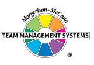

# Mike Jones

Team Management Systems, the wheel device and the associated trademarks marked with 'TM' or ® are registered or common law marks of Team Management Systems IP in Australia and various international jurisdictions.

| INTRODUCTION TO LINKING SKILLS       | 3  |
|--------------------------------------|----|
| SNAPSHOT OF RESULTS BY GROUP         | 4  |
| RESULTS BY LINKING SKILL - OVERVIEW  | 7  |
| People Linking Skills                | 8  |
| Task Linking Skills                  | 9  |
| Leadership Linking Skills            | 10 |
| RESULTS BY LINKING SKILL - NARRATIVE | 11 |
| People Linking Skills                | 12 |
| Task Linking Skills                  | 18 |
| Leadership Linking Skills            | 23 |
| QUANTITATIVE REPORT                  | 25 |
| People Linking Skills                | 26 |
| Task Linking Skills                  | 32 |
| Leadership Linking Skills            | 37 |
| ACTIVITY ACTION GUIDE                | 39 |
| People Linking Skills                | 40 |
| Task Linking Skills                  | 42 |
| Leadership Linking Skills            | 44 |
| DISCLAIMER                           | 45 |

## INTRODUCTION TO LINKING SKILLS

Linking is a set of skills that, if implemented effectively, contribute to the development of high-performing teams.

The Linking Leader Model is based on extensive research1 identifying strongly correlated activities (ultimately termed Linking) that encompass a set of behaviours coordinating and integrating teamwork.

The Linking Leader Profile (LLP|360) is based on the Linking Leader Model and is specifically designed for use with team leaders. It provides feedback on the 13 key Linking Skills across the three levels of Linking:

When you completed the Linking Leader Profile Questionnaire, you were asked to indicate the extent to which certain activities should occur in your role and the extent to which they actually do occur. Multiple other raters, including direct reports, supervisors and other colleagues were also invited to provide their assessment of what should and does occur. The result is a composite profile that compares your own self-assessment with the evaluation from others.

Your rater's responses have been divided into Groups A, B and C. For information on these groups, refer to the section 'How should I interpret my Linking Leader Profile?' in the accompanying Linking Leader Profile Workbook.

1 McCann, D.J. & Mead N.H.S 2018, Team Management Profile Research Manual (5th Edition), Team Management Systems, Brisbane. McCann, D.J. & Mead N.H.S 2018, Linking Skills Profile Research Manual (5th Edition), Team Management Systems, Brisbane.

## SNAPSHOT OF RESULTS BY GROUP

This section of the profile provides a set of graphs which display the Linking Skills satisfaction and importance hierarchy for each of the rater groups. In each graph, the Linking Skill with the highest score appears at the top, with the remaining skills arranged in descending order beneath it. To facilitate easy cross-referencing, each Linking Skill is represented by a unique colour.

These graphs assist in determining strengths, focus areas and priorities. Linking Skills ranked higher in the Satisfaction Rate graph can be considered relative strengths, while those ranked lower can indicate focus areas. Similarly, Linking Skills ranked higher in the Importance Rating graph signify a higher priority, while those ranked lower suggest a lower priority level.

## SNAPSHOT OF RESULTS BY GROUP

## SNAPSHOT OF RESULTS BY GROUP

This section of the profile provides an overview of rater group responses by Linking Skill.

This image illustrates the relative position of each Linking Skill in the Linking Leader Model.

2

The first set of bar graphs provides an overview of the Satisfaction Rates for each Linking Skill. These graphs illustrate the perceived performance of each Linking Skill, as assessed by the various rating groups.

Each Linking Skill is categorised into one of the following bands based on the lowest satisfaction score from any rater group:

3 The second set of bar graphs provides an overview of the Importance Rating for each Linking Skill. These graphs illustrate the relative significance of each Linking Skill, as assessed by the various rating groups.

4 This column displays the perceived importance of each Linking Skill as a Ranking. Based on the Importance Rating percentages, Linking Skills are ranked from 1 to 13, with ties indicated by the symbol '(=)'.

People Linking Skills

Task Linking Skills

Leadership Linking Skills

This section of the profile provides a comprehensive review of each Linking Skill. Use this information to develop practical strategies that will aid in creating a detailed action plan.

- A visual summary of the Satisfaction Rate and Importance Rating for each Linking Skill can be found at the top of the page. For a greater understanding of this data refer to the section titled Results by Linking Skills - Overview.
- 2 This statement provides a summary of the overall satisfaction score for each Linking Skill, based on the lowest satisfaction score from any rater group. This score is aligned with the category bands of 'reasonably high', 'moderate' or 'focus area'.

The bullet points of advice correspond to the questionnaire items specific to each Linking Skill.

People Linking Skills

#### ACTIVE LISTENING

This skill has been rated moderately (51% - 75%) by either yourself or another respondent group.

- Try to listen well when others are speaking to you. Switch off your 'internal dialogue' and don't 'talk to yourself' while they are talking. Don't evaluate what they've said until they've finished saying it, otherwise your ability to listen is reduced. How long is your attention span now? How long is it before your mind wanders off onto other things?
- You may need to learn to ask more questions when interacting with others, rather than just making statements. Questions are a way of focusing on the current problems and allow you to indicate to others that you're listening to what they say. Excessive use of statements will quickly bring a conversation to a close, with the other person often accusing you of not listening.
- A way of indicating that you've listened and understood the conversation is by summarising what others have said. Summarising is an essential skill in conflict situations where a satisfactory solution to a problem is being sought by both parties. It's also mandatory when discussions are being held with large groups, particularly where issues are complex and speakers are digressing.
- Internal thinking speeds and rates of talking vary from person to person. If you talk faster than others or like to think as you speak you may run into difficulties when communicating with people who are different from you. You may have a natural tendency to finish off their sentences for them and then go on with the interruption by explaining your view on a situation. If this applies to you then you need to be aware of the effect you are creating.
- Conversations can be conveniently divided into those concentrating on 'facts' and those concentrating on 'feelings'. In any conversation a mixture of the 'facts' and the 'feelings' is essential although the ratio will depend on the issue under discussion and who you are speaking to. In your case the data from the questionnaire indicate that you could perhaps concentrate more on the 'feelings' side of things.
- Active listening is a two-way process with both parties building on the discussion in a sequential manner. Learn when to talk and when to listen. Likewise when others are speaking, learn to listen actively by asking questions, making comments on what they say, and generally appearing interested. Don't just sit there passively listening, become a part of the discussion!

People Linking Skills

#### COMMUNICATION

This skill has been rated by all respondent groups with a reasonably high satisfaction rate (at or above 75%). Most people are satisfied with your efforts in this area.

- Perhaps the best way of communicating is through team-briefing meetings. When meetings are held, make sure that you contribute positively. Don't treat them as a routine necessity but as an exciting way to motivate others and share the information that you have. People often respond better in smaller groups. Therefore if your team is large, suggest breaking it into small common-interest groups when discussing important issues.
- You may need to look at the process you use for getting your point of view across. People respond best if they're persuaded that a particular course of action is required rather than just being 'told'. It may also help if you review your communication style and seek advice on how best to improve the way you get your message over. Do you speak with the right tone and tempo? Do you modulate your voice sufficiently to gain attention? Do you use body language to complement your voice?
- You may need to look at how well informed you're keeping the various people with whom you interact. It's sometimes hard to find the right balance between what people 'want' to know and what you think they 'need' to know. If you're a more introverted person you may well prefer to communicate with others by sending memos. This is a valuable way of presenting information to others but try to increase the face-to-face contact you have with your work colleagues. If you're more extroverted you probably enjoy face-to-face contact but check that you're giving your colleagues sufficient detail and facts to satisfy them.
- You may need to review your written communication skills. Successful team members need to develop a lucid writing style and a way of distilling key information into succinct reports. Also make sure that your reports have plenty of visual information and use plenty of headings so that key issues can be itemised. Perhaps you should sit down with your colleagues and ask them how you might improve the way you present them with written information.
- A major skill of Linking is to develop skills in the area of facilitation. The questionnaire data suggest that you should review your facilitation skills and look at ways you could improve them. In meetings it's important that everyone has an opportunity to make an equal contribution to the discussion. It often helps to know who are the more extroverted people so that you can control their contributions. Likewise you should know who are the more introverted people and give them every opportunity to contribute to the discussions as well. You will also need to learn how best to handle conflict situations.
- Perhaps the most important skill of communication is to realise that 'people are different' and so different communication processes are necessary with different people. No one communication style works with everyone and therefore you should try to vary the way you interact, depending upon who is on the other side of the communication 'loop'. What works well with one person may irritate another. Review your Pacing Skills.

People Linking Skills

#### TEAM RELATIONSHIPS

This skill has been rated moderately (51% - 75%) by either yourself or another respondent group.

- By definition a team is a group of people who depend on each other for the attainment of results. Therefore team members need to understand how their role relates to and impacts on others in the team. In a high-energy team, all team members will fully understand their job description, their role in the team, what they're responsible for and, most importantly, what they're accountable for. The respondent data suggest that some team members may be unclear about their role and how it relates to the responsibilities of others.
- Good team relationships are essential if the team is to function optimally. If there's a lack of respect, understanding and trust in the team, then there is no real team. Hence the Linking Skill of being able to value and make the most of the differences between team members, rather than belittling these differences and regarding them as obstacles, is a critical one. It is a responsibility of all team members to help others in the team see the value in people who are 'different' from them.
- All teams will face conflict at various stages in their life some more frequently than others. Don't be uneasy about conflict situations, because they can be helpful to the high performance of a team. When conflict arises it's often because the team members are approaching situations from different perspectives. This adds value to the team because a diversity of inputs is created. It's essential to view this conflict positively - as an opportunity to share alternative viewpoints and from them develop the best solution. You may need to review your conflict handling skills and take action accordingly.
- Teams function much better when there is a high level of trust among team members, because everyone knows that they can speak openly and that nothing will be held against them. Some of your team members or colleagues may be a little concerned about the level of trust between you and them and therefore it would be wise to discuss this with them at an early opportunity. Usually a lot of the problems are simple misunderstandings that can be cleared up through open discussion.
- If team members have mutual respect for one another then the efficiency of the team will be greatly increased. Help your team members understand each others' strengths and weaknesses by getting them to do a team SWOT analysis (Strengths, Weaknesses, Opportunities, Threats). If team members understand the special skills and contributions that each person brings to a job, they're much more likely to develop mutual respect.
- High-energy teams have a strong loyalty to the organisation and team members are proud that they belong to the team. Data from the questionnaire indicate satisfaction with what you're doing to help make this happen.

People Linking Skills

#### PROBLEM SOLVING & COUNSELLING

This skill has been rated moderately (51% - 75%) by either yourself or another respondent group.

- People may find it difficult to approach you and you need to assess the benefits that might come from adopting more of an 'open door' policy with your co-workers. Being a team member means allocating time so that people can interact with you whenever problems or opportunities arise. Perhaps you should consider how you could make yourself more available to your team members.
- When you give a commitment about anything concerning your staff or colleagues try to make sure that it's carried out. Sometimes in the pressure of day-to-day work we forget what we might have agreed to or make an 'off-the-cuff' remark like, "That sounds good, I'll look into it". Try to avoid remarks like this unless you really intend to do what you say.
- Being available and responsive are important characteristics of the 'Linker'. It's no good doing one without the other. Being responsive means that you're genuinely interested in people and their problems. It means that when people come to you for help and advice you make the time to listen and to show a sincere interest in helping them resolve their difficulties. Respondents have indicated that they're satisfied with what you are doing in this area.
- You probably do gather and assess information before you make judgments. This is important when helping others with problems or providing counselling. If you're too hasty you may end up providing a solution to the wrong problem or a solution based on insufficient information. Unless people feel that they're on the same wave length as you they won't open up with their real concerns.
- If you're in a position where you manage others then it's important to give positive feedback so that staff can consider their personal development plans. To do this well it is important to have good skills in counselling. Respondent data from the questionnaire indicate that no further development is required in this area.
- Some of your team members and colleagues don't feel as confident as they should about sharing their concerns with you. You may like to review your behaviour in this area and identify where the main problem areas lie. Remember that the technique of Pacing is very important when others come to you wanting to share concerns. You need to establish a rapport with them and listen well, otherwise they're unlikely to reveal the true nature of their concerns and you may well think you've solved the problem, whereas in reality you haven't.

People Linking Skills

#### PARTICIPATIVE DECISION MAKING

This skill has been rated at or below 50% by either yourself or another respondent group. Your Linking effectiveness should improve substantially if you can focus on ways of improving this skill.

- Some of the most significant mistakes in teamwork arise as a consequence of failure to share information. This is essential if others are to do their jobs effectively. You could benefit from 'taking stock' of how well you share important information with other members of your team. Rather than trying to solve problems on your own, try involving others at an early stage.
- When solving problems and making important decisions you will benefit from welcoming and listening to different points of view. This is one of the hallmarks of the 'balanced team' where different descriptions of problems, opportunities or projects will often arise as people present various viewpoints. Do you encourage people to speak their mind when they have a different perspective to you or do you 'shut them out'?
- Sometimes people may be a little reluctant to give their opinions about key issues, particularly if they come from a culture where this has been discouraged. They may feel that any views they express might be held against them in the future. Therefore, as a Linker, you need to handle the situation sensitively and indicate to people that their views are important and needed. Show interest in what your team members are saying and when someone comes up with a good idea, tell them so!
- Once information has been shared and any problems or opportunities have been analysed, it's necessary to generate some solutions. It's here that a well-managed team can contribute far more than an individual, provided that team members have some knowledge and experience of the issues under consideration. Rather than coming up with your own solution why not try for a 'team' solution? It may take a little longer but in the end implementation could be a lot quicker because team members are able to feel 'part-owners' of the solution.
- If you're going to involve team members in the problem solving of key issues, it's often best done in a 'meeting' situation where everyone is brought together to consider the issues. When controversial issues are involved, be sure to discuss them at a meeting which is clearly defined as 'exploratory' at which no decisions will be taken. This gives time for the issues to be aired and shared. The decision can then be taken later, whenever you judge that the major issues have been thoroughly discussed.
- If decisions are being made that directly affect your team members it's essential that you ask for their views at an early stage. If you present them with a fait accompli it may cause team members to feel that they aren't part of a team and that communication is all 'one-way'. The net effect for you will be one of lower commitment and enthusiasm from everyone. It is unlikely that you'll always have all the answers particularly on issues that are under the control of other team members.

People Linking Skills

#### INTERFACE MANAGEMENT

This skill has been rated moderately (51% - 75%) by either yourself or another respondent group.

- Effective management of a team's internal interfaces is essential if the team is to fulfil its potential. Internal interface management is called 'internal Linking' and involves the co-ordination of all team members so that everyone knows exactly what's expected of them and who in the team can help at any moment. You should consider how well your team is linked together and how you could make improvements in this area.
- In the workplace conflict between the various teams in the organisation is inevitable. The role of the external Linker demands high levels of skills in problem solving and conflict resolution, and often the morale of the team is dependent on how well team members represent their team in this respect. The questionnaire data suggest that you may need to take action to further improve your skills in handling problems between your team and others.
- You might like to reflect for a moment on how many 'them' and 'us' situations there are between your team and the team's key 'stakeholders'. In mature effective teams, everyone is encouraged to make their own links with counterparts in other teams and indeed other organisations. If you want to improve the team's skills in managing interfaces you should actively encourage team members to link and liaise with key 'stakeholders' who are likely to impact on the performance of the team.
- Each team needs someone who's good at effectively representing team members to senior management. This person needs to be an effective advocate of the resources their team requires to optimally achieve tasks. Without a strong link to senior management the team may be deprived of a 'voice' and in the end this could lead to a reduction of team resources. Data from the questionnaire indicate satisfaction with your contribution to this area.

Task Linking Skills

#### OBJECTIVES SETTING

This skill has been rated moderately (51% - 75%) by either yourself or another respondent group.

- Setting challenging but achievable targets for team members is perhaps one of the most difficult Linking Skills to accomplish; set the targets too high and people will 'switch off' and not even try to achieve them; set them too low and people will never achieve their true potential. Goals need to force team members to stretch, but not so far that they 'hurt'. You should review with your team the way goals and targets are set to see whether you have the right balance.
- Outputs or objectives by themselves are not enough; you also need to know how good they are. This requires setting performance indicators against which the outputs can be measured. It might help the performance of your team if in future everyone agrees to performance indicators for key team tasks.
- If the team has 'stretch' targets set for it then there needs to be a support system which encourages team members to push themselves to achieve the team and organisational goals. If team members aren't achieving what has been agreed then you should speak up and not let things go on too long. Facilitate a discussion to determine what the problems are. Coaching, counselling, mentoring and training should be available to those who need them.
- If your team members achieve excellence or just do 'a really good job' you should take time out to congratulate them. Sometimes just a few words of sincere praise are all that is needed. At other times maybe a celebration is required. Suggest that the team has a special lunch or an evening out. Such low-cost rewards help maintain the incentive to perform.
- Respondents have indicated their satisfaction with how you encourage the establishment of goals that challenge the work group. The old adage, 'nothing succeeds like success' is a fundamental concept in the development of a highperforming team. If we set the goals and conditions that enable team members to feel like 'winners', the chances are that they'll become winners. Therefore if we expect challenging goals to be set and accomplished, sooner or later people will achieve what we expect of them.

Task Linking Skills

#### QUALITY STANDARDS

This skill has been rated by all respondent groups with a reasonably high satisfaction rate (at or above 75%). Most people are satisfied with your efforts in this area.

- One of the key Task Linking Skills is the setting of quality standards. Team members will often look to others in the team to set the example of 'quality' for them to follow. In this way you're acting as a 'role model'. Spend a little time reviewing how well you act as a 'role model' on which others can base their behaviour. Team members particularly look towards their leaders, not just as sources of authority but as individuals who earn respect through the example they set.
- Poor quality products and service can lead rapidly to the demise of a company. But poor quality team behaviour can itself set the tone that results in the poor product quality. An important part of 'quality' management is setting high standards. Do you set standards that 'only the best will do'? If you insist on high standards in interacting with clients or customers and in the general operation of the team then quality will become the 'hallmark' of your team and performance will be greatly enhanced.
- You may need to review to what extent you set an example for your team. If you can set a good example then people will respect you and want to work hard to achieve the team outputs. When you're under stress try to remember that your behaviour will have a strong impact on others in the team. At these times it's very important that you continue to set a high quality example in everything you do.
- The word 'excellence' is now a frequently used word in modern management. Teams that strive for excellence are those that will sooner or later deliver outstanding results. If everyone in the team has a belief that 'only the best will do' then excellence becomes part of the team's culture. It could be worth discussing with your team members to what extent excellence should be a part of the common or shared values in the team. Then it is up to you to set the example for others to follow.
- One of the best ways for people to learn is through their mistakes. Unfortunately many managers communicate either directly or through their actions that the penalty for error is criticism. The message conveyed is not 'admit your mistakes and learn from them', but 'avoid doing anything at all slightly risky as the penalty for things going wrong always exceeds any rewards'. The data from the questionnaire suggest that you are doing what is expected of you in helping people to learn from mistakes.
- All teams have customers or clients whether they be external to the organisation or internal. Respondent data indicate satisfaction with the way you focus on client needs but has your team clearly identified who its customers or clients are? If you don't keep the customers satisfied they will go elsewhere. This certainly happens with external customers but it can also happen within organisations, where people will go to other parts of the organisation for their needs if you can't satisfy them.

#### Task Linking Skills

### WORK ALLOCATION

This skill has been rated moderately (51% - 75%) by either yourself or another respondent group.

- When allocating job responsibilities it's important to have a clear view of the organisational goals and to make sure that the tasks which are allocated are in line with these organisational objectives. In order to effectively allocate work it's necessary to fully understand the abilities of each team member and in general assign work loads that relate to people's abilities. If this is part of your current role you seem to being doing all that's required of you.
- The skill of work allocation is the ability to match people's preferences and abilities to the requirements of the job. This can be achieved by developing an understanding of the theory behind the Team Management Wheel, and the particular work preferences individuals have. Everyone seems satisfied with your understanding of the need to match people to the job.
- One of the Task Linking Skills is to allocate work to people to match their preferences, but also to stretch them by giving them opportunities to develop new skills. However you need to recognise when they're working in new areas they'll need substantial support. You can help by sitting down with them and talking through any problems they might be having with their job. If you are in a leadership position then you may need to develop your coaching skills.
- Whenever new members join the work group, the team should review how well it's working and whether there should be a re-arrangement of tasks. People today are more 'multi-skilled' and there is scope to regularly review work allocation in terms of work preference and ability. The aim is to achieve a good overlap between tasks and work preference for all members of the team.
- To help your team give its best you may need to have a better understanding of the work that each team member prefers to be involved in. This may mean that you need to take a deeper interest in what they're doing and establish closer relationships with them so that open and free discussions can take place. Ask them which aspects of their job they feel confident in and which areas they would like to develop more. This information could be invaluable in helping you optimise the outputs of the team while at the same time developing people for the future.
- A 100% overlap between the tasks which have to be done and a person's work preference may seem ideal but it isn't always a good thing. If team members always do the same type of work it doesn't allow them to develop new skills. Therefore raise the issue of whether team members would like to try out new areas of work. It might be just what everyone needs to rekindle interest and enthusiasm in the team's work. In general a 70% or greater overlap between the assigned tasks and a person's work preference is probably a good target to aim for.

### Task Linking Skills

### TEAM DEVELOPMENT

This skill has been rated at or below 50% by either yourself or another respondent group. Your Linking effectiveness should improve substantially if you can focus on ways of improving this skill.

- To continue their commitment to a team or an organisation, people constantly need to be encouraged to learn new things and generally develop themselves. As team members come and go everyone needs to help the newcomers learn the skills to succeed. As well as developing your own skills make sure you actively persuade others to keep abreast of the new techniques that are necessary to succeed in a changing world. Your colleagues seem to think you're already doing this but you've said you'd like to do more.
- All teams need to develop skills in Advising and Innovating. Organisations need to check constantly that they're abreast of the latest information in their particular sphere of activity and to generate new ways of doing things. Others seem satisfied that you recognise the need to focus on these areas but you've indicated that there's room for improvement. What you've been doing in the past may no longer be appropriate for the present and future.
- Your team may need to put more emphasis on 'organising' activities. If a team is to be successful it needs to be well organised to achieve its goals. Everyone needs to know what these goals are and to understand 'what' has to be completed by 'when'. This doesn't mean that team members need to be closely supervised but more that they should have autonomy within clearly defined goals and deadlines. Once everyone knows what's expected of them then the results will be more readily forthcoming.
- All teams need to have a focus on outputs as, after all, these produce the bottom line results on which the performance of the team is based. Some teams are more likely to concentrate on 'inputs' and sometimes forget that 'outputs' are equally important. The results from the questionnaire indicate that you should address the issue of team outputs. It may be worthwhile bringing the team together to discuss whether you have the correct balance between 'inputs' and 'outputs'.
- If people are to improve their performance year by year then they need to have access to the right training and development opportunities, as well as coaching, counselling and mentoring support from within the organisation. Suggest that the team meets for a discussion on what members need to do in order to develop themselves to meet the challenges inherent in the team's vision and objectives. Everyone in the team should be given an opportunity to carry out a personal SWOT (Strengths, Weaknesses, Opportunity, Threats) analysis on themselves and their ability to meet future challenges. Any gaps in their needs can then form the basis of a training and development plan.

Task Linking Skills

#### DELEGATION

This skill has been rated at or below 50% by either yourself or another respondent group. Your Linking effectiveness should improve substantially if you can focus on ways of improving this skill.

- If you are managing others be careful that you don't supervise them excessively. It's difficult to do all the managerial tasks if too much time is spent checking the work of others. It's important for you to develop a trust level with your team members whereby they know that you trust them to do their work competently. However to achieve two-way trust you'll need to put time and effort into training and development, which in itself will produce competence, in turn creating confidence. Only when team members are confident can adequate trust levels be established.
- When setting targets and outputs with your team members, do you allow them freedom to plan how they can achieve team goals? People like to work in different ways and it's important to give them sufficient flexibility to work out their own way of doing things. If you have a tendency to 'tell' others how to do things, try asking them next time how their tasks could be accomplished. You might be surprised at the increased commitment to the task that could result.
- You may need to review your own work priorities to ensure that you are working on the 'important' issues rather than those that may seem 'important'. When planning your workload ask yourself the question, "Do I personally have to do this task, or is there someone who I should delegate it to?" If a team member could do it if they were trained, then ask yourself what plans are in place to develop skills in the appropriate people.
- There is a danger that you may be taking on too much work yourself and not using the resources of the team. While this may be alright in special circumstances you need to realise that there are others to help you and by involving them you are likely to increase enthusiasm and commitment in the team. It is a good idea to occasionally keep a time log of your activities over a two or three week period and then look at each activity asking, "Do I really need to do this?"
- Effective delegation involves the skill of being able to negotiate work assignments with the team. Rather than 'push work downwards' try getting the team together to discuss what has to be achieved and who might do it. Work assignments can then be optimally negotiated so that team goals are met.
- You may delegate or negotiate work assignments well, but do you always follow up to see that the tasks are completed? People who map in the Exploring part of the Team Management Wheel are often good at letting go of the tasks that have to be done, but sometimes they don't pay sufficient attention to checking that things have been completed. If this applies to you it may be worthwhile recording the tasks you ask others to do in your diary or time manager. You can then make a note to ask them about the task at a future date.

Leadership Linking Skills

### MOTIVATION

This skill has been rated moderately (51% - 75%) by either yourself or another respondent group.

- If people are to give their best they need to have a clear picture of what lies ahead. In addition they need to be persuaded that this vision is worth pursuing and it's here that a leader has a real chance to motivate the team. You should look at how your influencing skills might be improved. It's important to understand the concepts of Pacing and Leading and how different techniques need to be used to persuade different people. Some people will see the opportunities whereas others will see only the obstacles. You'll have to spend more time with 'obstacle-focused' people to gain their commitment.
- Effective leaders inspire team members to perform. This is particularly important when setbacks occur and people have become de-motivated. At these times it's important to understand how everyone is feeling and use the skills of Leading to encourage team members to put the past behind them and look towards a 'rosy' future. Remember that people will give their best when they have high hopes for the future and it's your role as a leader to encourage and maintain this.
- A leader can only lead if others follow without 'followership', leadership is just a name. You may need to review whether your actions have generated a will to follow in your team members. If you feel that you're not getting what you want out of your team then the problem could be with you. It would be a good idea to consider how you might do more to motivate your team.
- Optimism is a psychological resource that gives people a generalised expectancy that they'll succeed in their endeavours. Expected success, in turn, gives people the will to expend effort to realise their goals. If they expect failure then they'll put less effort into a task and are more likely to give up as soon as an obstacle appears. That's why it's important as a leader to encourage team members to have an optimistic outlook. Perhaps you should focus more on the opportunities that lie before you (rather than the obstacles) and give an upbeat presentation to your team sometime soon.
- People are motivated when there's a vision of the future plus a set of clear goals that act as beacons along the path. Nothing de-motivates people more than when the 'goalposts' are constantly changing. The questionnaire data indicate that you may need to review whether the goals you set for your team are too 'fuzzy'. One way to find out is to ask people at the next team meeting whether they have an understanding of where the team is headed and the clear goals that should guide everyone's effort.
- It's important for a Linking Leader to take a stand when controversial issues affecting the team arise. If team members feel justifiably ill treated by some issue or situation, then it's important for you to put the case strongly to senior people in the organisation. When team members feel there's someone standing up for them, often in unpleasant circumstances, then they'll be more willing to 'go that extra mile' and respond to what you want from them.

Leadership Linking Skills

### STRATEGY

This skill has been rated moderately (51% - 75%) by either yourself or another respondent group.

- Business issues are complex and survival depends on thinking and acting strategically. As a leader you need to regularly stand back from the cut and thrust of daily life and examine the purpose of what you're doing. How do all the parts of the business interact to achieve the grand plan? What impact will external issues have on my business unit? How can I seize opportunities but avoid catastrophes? The challenge of a leader is to see this big picture and to understand all of the key interacting elements. You should consider how you might develop your skills as a strategic thinker.
- Analysing situations clearly and logically is fundamental to the development and implementation of any strategy. You should regularly review your effectiveness in this area, although respondent data indicates current satisfaction with what you're doing. One way to start is to ask yourself, "Are these the 'facts' or am I being misled by my opinions?" Often we get so caught up by what we think is 'right' that it clouds our judgment on what's necessary.
- You may need to review the assumptions you make when formulating strategies. Strategic plans and action plans always have built-in assumptions and often it's these that cause the problems. One useful technique is to use Potential Obstacle Analysis. This technique forces you to consider everything that might go wrong and one of the processes is a critical review of assumptions.
- Organisations are systemic, part of a huge interdependent system where outputs from one part become inputs to another. It's sometimes difficult to keep all these elements in focus and factor them into the decision-making process. It's important to differentiate between the 'quick fix' and the underlying root cause of any problems. A good example from everyday life is the headache. The 'quick fix' is an aspirin but this doesn't solve the long-term problem which could be any number of defects in other parts of the body. A strategic thinker will spend time looking for the root cause, considering the interaction of all elements involved in any complex issue.
- Strategic skills require the ability to think ahead and 'see' potential problems before they arise. People who do this well seem able to conjure up lots of different images and scenarios. In technical terms they find it easy to 'image-inate', that is, create visual images in their head to simplify complex situations. For many people it's simply a lack of time and practice that prevents this skill from developing. It may help if you set aside more time to let your mind 'free wheel' and think about all sorts of possibilities that may lie ahead.
- A Linking Leader needs to have the skills of strategic thinking and strategic planning. A team wants to know not only 'where it's going' but how it will get there. A vision without action planning isn't sufficient. If you haven't recently done so it's worth running a session for your team to check whether the team has a shared vision and whether the action plans are aligned with that vision. Rather than trying to do all this yourself, it's worthwhile involving the whole team.

This section of the profile provides a detailed analysis of each questionnaire item, categorised by rater group.

| Linking Skill | No.                                                | Should Occur | Does Occur | Gap  | Not at All | To a Little Extent | To Some To a Great Extent Extent | To a Very Great Extent | Guides for |   |   | Range of Opinion |   |  |
|---------------|----------------------------------------------------|-----------------|---------------|------|------------|-----------------------|-------------------------------------------|---------------------------|---------------|---|---|------------------|---|--|
|               |                                                    |                 |               |      | 0          | 1                     | 2 3                                    | 4                         | Action        | 0 |   | 1 2 3 4          |   |  |
|               | Question 1 : Listens well when others are speaking |                 |               |      |            |                       |                                           |                           |               |   |   |                  |   |  |
| Self          | 1                                                  | 3.00            | 3.00          | 0.00 |            |                       | D                                         | S                         | OK            |   |   |                  |   |  |
| Group A       | 4                                                  | 3.50            | 2.50          | 1.00 |            |                       | D                                         | S                         | ?             | 2 | 1 |                  | 1 |  |
| Group B       | 1                                                  | 2.00            | 2.00          | 0.00 |            |                       | D S                                    |                           | OK            |   |   |                  |   |  |
| Supervisor(s) | 1                                                  | 3.00            | 3.00          | 0.00 |            |                       | D                                         | S                         | OK            |   |   |                  |   |  |
|               | 1                                                  |                 |               |      |            |                       | 2                                         |                           | 3             |   |   | 4                |   |  |

The groups are listed in the first column, followed by a column indicating the number of raters in each group who submitted a response. The next two columns showcase the Should and Does scores. When only one rater is present in a group, their actual responses to the questionnaire are displayed, while groups with multiple raters have scores represented by an average. The gap between the Should and Does scores for each group is displayed both numerically and visually, with the 'D' signifying what 'Does occur' and the 'S' signifying what 'Should occur'.

The bars are colour-coded based on the Guides for Action codes assigned to each item.

A green bar indicates that the area is generally acceptable (OK) and no action is recommended.

A purple bar indicates a clear recommendation to do More (M) or Less (L) of the activity.

A blue bar indicates that the recommended action is uncertain (?) due to varying opinions among raters.

When a respondent indicates an item is 'Not Applicable', they are not included in the tally in this column.

The Guides for Action column shows one of the following responses:

2

4

| OK | This activity is considered to be OK and no action is required. |
|----|-----------------------------------------------------------------|
| M  | Do More of this activity.                                       |
| L  | Do Less of this activity.                                       |
| ?  | Uncertain (some respondents are satisfied and others not).      |

The final column, Range of Opinion, displays the gap (difference between the Should and Does scores) indicated by the raters in each group. The possible gaps of 0-4 are listed in the heading. The figures in each column represent the count of raters per group who responded with the corresponding gap.

People Linking Skills

#### ACTIVE LISTENING

| Linking Skill                                                           | No. | Should Occur | Does Occur | Gap  | Not at All | To a Little Extent | To Some Extent | Guides for |   |        |   | Range of Opinion |     |         |  |
|-------------------------------------------------------------------------|-----|-----------------|---------------|------|------------|-----------------------|-------------------|---------------|---|--------|---|------------------|-----|---------|--|
|                                                                         |     |                 |               |      | 0          | 1                     | 2                 | 3             | 4 | Action | 0 |                  |     | 1 2 3 4 |  |
|                                                                         |     |                 |               |      |            |                       |                   |               |   |        |   |                  |     |         |  |
| Question 1: Listens well when others are speaking.                      |     |                 |               |      |            |                       |                   |               |   |        |   |                  |     |         |  |
| Self                                                                    | 1   | 3.00            | 3.00          | 0.00 |            |                       |                   | D S        |   | OK     |   |                  |     |         |  |
| Group A                                                                 | 4   | 3.50            | 2.50          | 1.00 |            |                       |                   | D             | S | ?      | 2 | 1                |     | 1       |  |
| Group B                                                                 | 1   | 2.00            | 2.00          | 0.00 |            |                       | D S            |               |   | OK     |   |                  |     |         |  |
| Supervisor(s)                                                           | 1   | 3.00            | 3.00          | 0.00 |            |                       |                   | D S        |   | OK     |   |                  |     |         |  |
|                                                                         |     |                 |               |      |            |                       |                   |               |   |        |   |                  |     |         |  |
| Question 26: Asks questions rather than makes statements.               |     |                 |               |      |            |                       |                   |               |   |        |   |                  |     |         |  |
| Self                                                                    | 1   | 3.00            | 3.00          | 0.00 |            |                       |                   | D S        |   | OK     |   |                  |     |         |  |
| Group A                                                                 | 4   | 3.00            | 2.25          | 0.75 |            |                       | D                 | S             |   | ?      | 2 |                  | 1 1 |         |  |
| Group B                                                                 | 1   | 1.00            | 2.00          | 1.00 |            | S                     | D                 |               |   | OK     |   |                  |     |         |  |
| Supervisor(s)                                                           | 1   | 1.00            | 1.00          | 0.00 |            | D S                |                   |               |   | OK     |   |                  |     |         |  |
|                                                                         |     |                 |               |      |            |                       |                   |               |   |        |   |                  |     |         |  |
| Question 27: Summarises well their understanding of what has been said. |     |                 |               |      |            |                       |                   |               |   |        |   |                  |     |         |  |
| Self                                                                    | 1   | 3.00            | 2.00          | 1.00 |            |                       | D                 | S             |   | OK     |   |                  |     |         |  |
| Group A                                                                 | 4   | 3.00            | 1.75          | 1.25 |            |                       | D                 | S             |   | M      | 1 | 2                |     | 1       |  |
| Group B                                                                 | 1   | 1.00            | 3.00          | 2.00 |            | S                     |                   | D             |   | L      |   |                  |     |         |  |
| Supervisor(s)                                                           | 1   | 1.00            | 1.00          | 0.00 |            | D S                |                   |               |   | OK     |   |                  |     |         |  |
|                                                                         |     |                 |               |      |            |                       |                   |               |   |        |   |                  |     |         |  |
| Question 40: Interrupts others instead of listening.                    |     |                 |               |      |            |                       |                   |               |   |        |   |                  |     |         |  |
| Self                                                                    | 1   | 0.00            | 0.00          | 0.00 | D S     |                       |                   |               |   | OK     |   |                  |     |         |  |
| Group A                                                                 | 4   | 0.00            | 1.25          | 1.25 | S          |                       | D                 |               |   | L      | 2 |                  |     | 1 1     |  |
| Group B                                                                 | 1   | 0.00            | 1.00          | 1.00 | S          | D                     |                   |               |   | OK     |   |                  |     |         |  |
| Supervisor(s)                                                           | 1   | 0.00            | 0.00          | 0.00 | D S     |                       |                   |               |   | OK     |   |                  |     |         |  |
|                                                                         |     |                 |               |      |            |                       |                   |               |   |        |   |                  |     |         |  |
| Question 47: Checks others feelings on important matters.               |     |                 |               |      |            |                       |                   |               |   |        |   |                  |     |         |  |
| Self                                                                    | 1   | 3.00            | 3.00          | 0.00 |            |                       |                   | D S        |   | OK     |   |                  |     |         |  |
| Group A                                                                 | 3   | 3.00            | 2.00          | 1.00 |            |                       | D                 | S             |   | ?      | 1 |                  | 1 1 |         |  |
| Group B                                                                 | 1   | 3.00            | 4.00          | 1.00 |            |                       |                   | S             | D | OK     |   |                  |     |         |  |
| Supervisor(s)                                                           | 1   | 3.00            | 3.00          | 0.00 |            |                       |                   | D S        |   | OK     |   |                  |     |         |  |
|                                                                         |     |                 |               |      |            |                       |                   |               |   |        |   |                  |     |         |  |
| Question 68: Engenders a good two-way discussion of issues.             |     |                 |               |      |            |                       |                   |               |   |        |   |                  |     |         |  |
| Self                                                                    | 1   | 4.00            | 3.00          | 1.00 |            |                       |                   | D             | S | OK     |   |                  |     |         |  |
| Group A                                                                 | 4   | 3.00            | 1.75          | 1.25 |            |                       | D                 | S             |   | M      |   | 3                | 1   |         |  |

M L L

D D

Group A Group B Supervisor(s) 4 1 1 3.00 2.00 2.00 1.75 4.00 4.00 1.25 2.00 2.00 D S S

People Linking Skills

### COMMUNICATION

| Linking Skill                                                               | No.    | Should Occur | Does Occur | Gap          | Not at All | To a Little Extent | To Some Extent | Guides for |                   | Range of Opinion |   |   |         |     |  |
|-----------------------------------------------------------------------------|--------|-----------------|---------------|--------------|------------|-----------------------|-------------------|---------------|-------------------|------------------|---|---|---------|-----|--|
|                                                                             |        |                 |               |              | 0          | 1                     | 2                 | Extent 3   | Great Extent 4 | Action           | 0 |   | 1 2 3 4 |     |  |
|                                                                             |        |                 |               |              |            |                       |                   |               |                   |                  |   |   |         |     |  |
| Question 2: Contributes regularly to discussions at team meetings.          |        |                 |               |              |            |                       |                   |               |                   |                  |   |   |         |     |  |
|                                                                             |        |                 |               |              |            |                       |                   |               |                   |                  |   |   |         |     |  |
| Self                                                                        | 1      | 3.00            | 3.00          | 0.00         |            |                       |                   | D S        |                   | OK               |   |   |         |     |  |
| Group A                                                                     | 4      | 2.25            | 2.75          | 0.50         |            |                       | S                 | D             |                   | ?                | 1 |   |         | 1 2 |  |
| Group B Supervisor(s)                                                    | 1 1 | 2.00 3.00    | 2.00 4.00  | 0.00 1.00 |            |                       | D S            | S             | D                 | OK OK         |   |   |         |     |  |
|                                                                             |        |                 |               |              |            |                       |                   |               |                   |                  |   |   |         |     |  |
|                                                                             |        |                 |               |              |            |                       |                   |               |                   |                  |   |   |         |     |  |
| Question 25: Communicates persuasively when speaking.                       |        |                 |               |              |            |                       |                   |               |                   |                  |   |   |         |     |  |
| Self                                                                        | 1      | 3.00            | 2.00          | 1.00         |            |                       | D                 | S             |                   | OK               |   |   |         |     |  |
| Group A                                                                     | 4      | 2.75            | 2.75          | 0.00         |            |                       |                   | D S        |                   | ?                | 2 |   | 2       |     |  |
| Group B                                                                     | 1      | 3.00            | 3.00          | 0.00         |            |                       |                   | D S        |                   | OK               |   |   |         |     |  |
| Supervisor(s)                                                               | 1      | 3.00            | 3.00          | 0.00         |            |                       |                   | D S        |                   | OK               |   |   |         |     |  |
|                                                                             |        |                 |               |              |            |                       |                   |               |                   |                  |   |   |         |     |  |
| Question 28: Keeps others well informed.                                    |        |                 |               |              |            |                       |                   |               |                   |                  |   |   |         |     |  |
| Self                                                                        | 1      | 2.00            | 1.00          | 1.00         |            | D                     | S                 |               |                   | OK               |   |   |         |     |  |
| Group A                                                                     | 4      | 2.75            | 2.25          | 0.50         |            |                       | D                 | S             |                   | ?                | 1 |   |         | 1 2 |  |
| Group B                                                                     | 1      | 2.00            | 4.00          | 2.00         |            |                       | S                 |               | D                 | L                |   |   |         |     |  |
| Supervisor(s)                                                               | 1      | 2.00            | 3.00          | 1.00         |            |                       | S                 | D             |                   | OK               |   |   |         |     |  |
|                                                                             |        |                 |               |              |            |                       |                   |               |                   |                  |   |   |         |     |  |
| Question 46: Is effective at communicating in writing.                      |        |                 |               |              |            |                       |                   |               |                   |                  |   |   |         |     |  |
| Self                                                                        | 1      | 2.00            | 2.00          | 0.00         |            |                       | D S            |               |                   | OK               |   |   |         |     |  |
| Group A                                                                     | 3      | 2.67            | 3.00          | 0.33         |            |                       |                   | S D        |                   | ?                |   | 1 | 2       |     |  |
| Group B                                                                     | 1      | 4.00            | 3.00          | 1.00         |            | D S                |                   |               |                   |                  |   |   |         |     |  |
| Supervisor(s)                                                               | 1      | 3.00            | 3.00          | 0.00         |            |                       |                   | D S        |                   | OK               |   |   |         |     |  |
|                                                                             |        |                 |               |              |            |                       |                   |               |                   |                  |   |   |         |     |  |
| Question 49: Facilitates group discussions well.                            |        |                 |               |              |            |                       |                   |               |                   |                  |   |   |         |     |  |
| Self                                                                        | 1      | 2.00            | 2.00          | 0.00         |            |                       | D S            |               |                   | OK               |   |   |         |     |  |
| Group A                                                                     | 4      | 2.25            | 2.25          | 0.00         |            |                       | D                 | S             |                   | ?                |   |   | 2       | 2   |  |
| Group B                                                                     | 1      | 3.00            | 4.00          | 1.00         |            |                       |                   | S             | D                 | OK               |   |   |         |     |  |
| Supervisor(s)                                                               | 1      | 2.00            | 2.00          | 0.00         |            |                       | D S            |               |                   | OK               |   |   |         |     |  |
|                                                                             |        |                 |               |              |            |                       |                   |               |                   |                  |   |   |         |     |  |
| Question 69: Varies their communication style to match the needs of others. |        |                 |               |              |            |                       |                   |               |                   |                  |   |   |         |     |  |
| Self                                                                        | 1      | 4.00            | 3.00          | 1.00         |            |                       |                   | D             | S                 | OK               |   |   |         |     |  |
| Group A                                                                     | 4      | 3.75            | 1.25          | 2.50         |            | D                     |                   |               | S                 | M                |   |   | 2       | 2   |  |

OK OK

Group B Supervisor(s) 1 1 1.00 1.00 1.00 1.00 0.00 0.00 D D S S

People Linking Skills

#### TEAM RELATIONSHIPS

| Linking Skill                                                                                           | No. | Should Occur | Does Occur | Gap  | To a Little Guides Not at All To Some To a Great To a Very Extent Extent Extent Great Extent |   |        |        |        |               |   |   | Range of Opinion |     |         |
|---------------------------------------------------------------------------------------------------------|-----|-----------------|---------------|------|-------------------------------------------------------------------------------------------------------------------------|---|--------|--------|--------|---------------|---|---|------------------|-----|---------|
|                                                                                                         |     |                 |               |      | 0                                                                                                                       | 1 | 2      | 3      | 4      | for Action | 0 |   |                  |     | 1 2 3 4 |
|                                                                                                         |     |                 |               |      |                                                                                                                         |   |        |        |        |               |   |   |                  |     |         |
| Question 7: Makes sure team members understand how their roles and responsibilities affect one another. |     |                 |               |      |                                                                                                                         |   |        |        |        |               |   |   |                  |     |         |
| Self                                                                                                    | 1   | 4.00            | 4.00          | 0.00 |                                                                                                                         |   |        |        | D S | OK            |   |   |                  |     |         |
| Group A                                                                                                 | 4   | 4.00            | 1.50          | 2.50 |                                                                                                                         |   | D      |        | S      | M             |   |   | 2                | 2   |         |
| Group B                                                                                                 | 1   | 2.00            | 3.00          | 1.00 |                                                                                                                         |   | S      | D      |        | OK            |   |   |                  |     |         |
| Supervisor(s)                                                                                           | 1   | 2.00            | 2.00          | 0.00 |                                                                                                                         |   | D S |        |        | OK            |   |   |                  |     |         |
|                                                                                                         |     |                 |               |      |                                                                                                                         |   |        |        |        |               |   |   |                  |     |         |
| Question 20: Ensures that team members value one another's contributions.                               |     |                 |               |      |                                                                                                                         |   |        |        |        |               |   |   |                  |     |         |
| Self                                                                                                    | 1   | 4.00            | 3.00          | 1.00 |                                                                                                                         |   |        | D      | S      | OK            |   |   |                  |     |         |
| Group A                                                                                                 | 4   | 2.75            | 2.50          | 0.25 |                                                                                                                         |   |        | D S |        | ?             |   | 1 |                  | 1 2 |         |
| Group B                                                                                                 | 1   | 1.00            | 2.00          | 1.00 |                                                                                                                         | S | D      |        |        | OK            |   |   |                  |     |         |
| Supervisor(s)                                                                                           | 1   | 2.00            | 2.00          | 0.00 |                                                                                                                         |   | D S |        |        | OK            |   |   |                  |     |         |
|                                                                                                         |     |                 |               |      |                                                                                                                         |   |        |        |        |               |   |   |                  |     |         |
| Question 32: Positively addresses conflict issues that may arise among team members.                    |     |                 |               |      |                                                                                                                         |   |        |        |        |               |   |   |                  |     |         |
| Self                                                                                                    | 1   | 4.00            | 4.00          | 0.00 |                                                                                                                         |   |        |        | D S | OK            |   |   |                  |     |         |
| Group A                                                                                                 | 4   | 4.00            | 1.50          | 2.50 |                                                                                                                         |   | D      |        | S      | M             |   |   | 2                | 2   |         |
| Group B                                                                                                 | 1   | 2.00            | 3.00          | 1.00 |                                                                                                                         |   | S      | D      |        | OK            |   |   |                  |     |         |
| Supervisor(s)                                                                                           | 1   | 3.00            | 3.00          | 0.00 |                                                                                                                         |   |        | D S |        | OK            |   |   |                  |     |         |
|                                                                                                         |     |                 |               |      |                                                                                                                         |   |        |        |        |               |   |   |                  |     |         |
| Question 43: Develops high levels of trust with team members.                                           |     |                 |               |      |                                                                                                                         |   |        |        |        |               |   |   |                  |     |         |
| Self                                                                                                    | 1   | 4.00            | 3.00          | 1.00 |                                                                                                                         |   |        | D      | S      | OK            |   |   |                  |     |         |
| Group A                                                                                                 | 4   | 3.75            | 2.25          | 1.50 |                                                                                                                         |   | D      |        | S      | M             |   | 2 | 2                |     |         |
| Group B                                                                                                 | 1   | 4.00            | 4.00          | 0.00 |                                                                                                                         |   |        |        | D S | OK            |   |   |                  |     |         |
| Supervisor(s)                                                                                           | 1   | 3.00            | 3.00          | 0.00 |                                                                                                                         |   |        | D S |        | OK            |   |   |                  |     |         |
|                                                                                                         |     |                 |               |      |                                                                                                                         |   |        |        |        |               |   |   |                  |     |         |
| Question 54: Encourages the development of mutual respect.                                              |     |                 |               |      |                                                                                                                         |   |        |        |        |               |   |   |                  |     |         |
| Self                                                                                                    | 1   | 4.00            | 3.00          | 1.00 |                                                                                                                         |   |        | D      | S      | OK            |   |   |                  |     |         |
| Group A                                                                                                 | 4   | 4.00            | 1.50          | 2.50 |                                                                                                                         |   | D      |        | S      | M             |   |   | 2                | 2   |         |
| Group B                                                                                                 | 1   | 4.00            | 4.00          | 0.00 |                                                                                                                         |   |        |        | D S | OK            |   |   |                  |     |         |
| Supervisor(s)                                                                                           | 1   | 2.00            | 2.00          | 0.00 |                                                                                                                         |   | D S |        |        | OK            |   |   |                  |     |         |
|                                                                                                         |     |                 |               |      |                                                                                                                         |   |        |        |        |               |   |   |                  |     |         |
| Question 74: Promotes loyalty and pride among team members.                                             |     |                 |               |      |                                                                                                                         |   |        |        |        |               |   |   |                  |     |         |
| Self                                                                                                    | 1   | 4.00            | 4.00          | 0.00 |                                                                                                                         |   |        |        | D S | OK            |   |   |                  |     |         |
| Group A                                                                                                 | 4   | 3.75            | 3.00          | 0.75 |                                                                                                                         |   |        | D      | S      | OK            | 1 | 3 |                  |     |         |

OK OK

D

Group B Supervisor(s) 1 1 3.00 3.00 4.00 3.00 1.00 0.00

S D

S

People Linking Skills

#### PROBLEM SOLVING & COUNSELLING

| Linking Skill                                                              | No. | Should Occur | Does Occur | Gap  | Not at All | To a Little Extent | To Some Extent | To a Great Extent | To a Very Great Extent | Guides for |   |   | Range of Opinion |   |  |
|----------------------------------------------------------------------------|-----|-----------------|---------------|------|------------|-----------------------|-------------------|----------------------|---------------------------|---------------|---|---|------------------|---|--|
|                                                                            |     |                 |               |      | 0          | 1                     | 2                 | 3                    | 4                         | Action        | 0 |   | 1 2 3 4          |   |  |
|                                                                            |     |                 |               |      |            |                       |                   |                      |                           |               |   |   |                  |   |  |
|                                                                            |     |                 |               |      |            |                       |                   |                      |                           |               |   |   |                  |   |  |
| Question 3: Is readily available to discuss problems.                      |     |                 |               |      |            |                       |                   |                      |                           |               |   |   |                  |   |  |
| Self                                                                       | 1   | 3.00            | 2.00          | 1.00 |            |                       | D                 | S                    |                           | OK            |   |   |                  |   |  |
| Group A                                                                    | 4   | 2.50            | 1.75          | 0.75 |            |                       | D                 | S                    |                           | ?             | 2 |   | 1 1              |   |  |
| Group B                                                                    | 1   | 2.00            | 4.00          | 2.00 |            |                       | S                 |                      | D                         | L             |   |   |                  |   |  |
| Supervisor(s)                                                              | 1   | 3.00            | 3.00          | 0.00 |            |                       |                   | D S               |                           | OK            |   |   |                  |   |  |
|                                                                            |     |                 |               |      |            |                       |                   |                      |                           |               |   |   |                  |   |  |
|                                                                            |     |                 |               |      |            |                       |                   |                      |                           |               |   |   |                  |   |  |
| Question 24: When they make a commitment it is delivered.                  |     |                 |               |      |            |                       |                   |                      |                           |               |   |   |                  |   |  |
| Self                                                                       | 1   | 2.00            | 2.00          | 0.00 |            |                       | D S            |                      |                           | OK            |   |   |                  |   |  |
| Group A                                                                    | 4   | 2.50            | 1.00          | 1.50 |            | D                     |                   | S                    |                           | M             |   | 3 |                  | 1 |  |
| Group B                                                                    | 1   | 4.00            | 3.00          | 1.00 |            |                       |                   | D                    | S                         | OK            |   |   |                  |   |  |
| Supervisor(s)                                                              | 1   | 4.00            | 3.00          | 1.00 |            |                       |                   | D                    | S                         | OK            |   |   |                  |   |  |
|                                                                            |     |                 |               |      |            |                       |                   |                      |                           |               |   |   |                  |   |  |
| Question 30: Is responsive to others' problems.                            |     |                 |               |      |            |                       |                   |                      |                           |               |   |   |                  |   |  |
|                                                                            |     |                 |               |      |            |                       |                   |                      |                           |               |   |   |                  |   |  |
| Self                                                                       | 1   | 2.00            | 2.00          | 0.00 |            |                       | D S            |                      |                           | OK            |   |   |                  |   |  |
| Group A                                                                    | 4   | 1.75            | 1.50          | 0.25 |            | D                     | S                 |                      |                           | OK            | 3 | 1 |                  |   |  |
| Group B                                                                    | 1   | 3.00            | 3.00          | 0.00 |            |                       |                   | D S               |                           | OK            |   |   |                  |   |  |
| Supervisor(s)                                                              | 1   | 3.00            | 3.00          | 0.00 |            |                       |                   | D S               |                           | OK            |   |   |                  |   |  |
|                                                                            |     |                 |               |      |            |                       |                   |                      |                           |               |   |   |                  |   |  |
| Question 50: Gathers and assesses information before making judgements.    |     |                 |               |      |            |                       |                   |                      |                           |               |   |   |                  |   |  |
| Self                                                                       | 1   | 2.00            | 2.00          | 0.00 |            |                       | D S            |                      |                           | OK            |   |   |                  |   |  |
| Group A                                                                    | 4   | 2.00            | 2.00          | 0.00 |            |                       | D S            |                      |                           | OK            | 4 |   |                  |   |  |
| Group B                                                                    | 1   | 2.00            | 3.00          | 1.00 |            |                       | S                 | D                    |                           | OK            |   |   |                  |   |  |
| Supervisor(s)                                                              | 1   | 2.00            | 2.00          | 0.00 |            |                       | D S            |                      |                           | OK            |   |   |                  |   |  |
|                                                                            |     |                 |               |      |            |                       |                   |                      |                           |               |   |   |                  |   |  |
| Question 67: Counsels team members to improve performance.                 |     |                 |               |      |            |                       |                   |                      |                           |               |   |   |                  |   |  |
|                                                                            |     |                 |               |      |            |                       |                   |                      |                           |               |   |   |                  |   |  |
| Self                                                                       | 1   | 2.00            | 2.00          | 0.00 |            |                       | D S            |                      |                           | OK            |   |   |                  |   |  |
| Group A                                                                    | 4   | 1.75            | 1.25          | 0.50 |            | D                     | S                 |                      |                           | OK            | 2 | 2 |                  |   |  |
| Group B                                                                    | 1   | 2.00            | 3.00          | 1.00 |            |                       | S                 | D                    |                           | OK            |   |   |                  |   |  |
| Supervisor(s)                                                              | 1   | 2.00            | 2.00          | 0.00 |            |                       | D S            |                      |                           | OK            |   |   |                  |   |  |
|                                                                            |     |                 |               |      |            |                       |                   |                      |                           |               |   |   |                  |   |  |
| Question 70: Others feel confident about sharing their concerns with them. |     |                 |               |      |            |                       |                   |                      |                           |               |   |   |                  |   |  |
| Self                                                                       | 1   | 3.00            | 2.00          | 1.00 |            |                       | D                 | S                    |                           | OK            |   |   |                  |   |  |
| Group A                                                                    | 4   | 1.75            | 0.75          | 1.00 |            | D                     | S                 |                      |                           | ?             | 1 |   | 2 1              |   |  |
| Group B                                                                    | 1   | 2.00            | 2.00          | 0.00 |            |                       | D S            |                      |                           | OK            |   |   |                  |   |  |
|                                                                            |     |                 |               |      |            |                       |                   |                      |                           |               |   |   |                  |   |  |

OK

Supervisor(s)

1

1.00

1.00

0.00

D

S

People Linking Skills

#### PARTICIPATIVE DECISION MAKING

| Linking Skill                                                                                       | No. | Should | Does  | Gap  | Not at All | To a Little | To Some | To a Great | To a Very    | Guides |   |   |   | Range of Opinion |  |
|-----------------------------------------------------------------------------------------------------|-----|--------|-------|------|------------|-------------|---------|------------|--------------|--------|---|---|---|------------------|--|
|                                                                                                     |     | Occur  | Occur |      |            | Extent      | Extent  | Extent     | Great Extent | for    |   |   |   |                  |  |
|                                                                                                     |     |        |       |      | 0          | 1           | 2       | 3          | 4            | Action | 0 |   |   | 1 2 3 4          |  |
|                                                                                                     |     |        |       |      |            |             |         |            |              |        |   |   |   |                  |  |
|                                                                                                     |     |        |       |      |            |             |         |            |              |        |   |   |   |                  |  |
| Question 13: Shares key problems and opportunities with other team members.                         |     |        |       |      |            |             |         |            |              |        |   |   |   |                  |  |
| Self                                                                                                | 1   | 1.00   | 1.00  | 0.00 |            | D S      |         |            |              | OK     |   |   |   |                  |  |
| Group A                                                                                             | 4   | 3.75   | 1.50  | 2.25 |            |             | D       |            | S            | M      |   | 1 |   | 1 2              |  |
| Group B                                                                                             | 1   | 2.00   | 4.00  | 2.00 |            |             | S       |            | D            | L      |   |   |   |                  |  |
| Supervisor(s)                                                                                       | 1   | 3.00   | 4.00  | 1.00 |            |             |         | S          | D            | OK     |   |   |   |                  |  |
|                                                                                                     |     |        |       |      |            |             |         |            |              |        |   |   |   |                  |  |
|                                                                                                     |     |        |       |      |            |             |         |            |              |        |   |   |   |                  |  |
| Question 14: Encourages differing points of view to be put forward and discussed.                   |     |        |       |      |            |             |         |            |              |        |   |   |   |                  |  |
| Self                                                                                                | 1   | 1.00   | 1.00  | 0.00 |            | D S      |         |            |              | OK     |   |   |   |                  |  |
| Group A                                                                                             | 4   | 3.75   | 1.50  | 2.25 |            |             | D       |            | S            | M      |   | 1 |   | 1 2              |  |
| Group B                                                                                             | 1   | 1.00   | 4.00  | 3.00 |            | S           |         |            | D            | L      |   |   |   |                  |  |
| Supervisor(s)                                                                                       | 1   | 2.00   | 3.00  | 1.00 |            |             | S       | D          |              | OK     |   |   |   |                  |  |
|                                                                                                     |     |        |       |      |            |             |         |            |              |        |   |   |   |                  |  |
|                                                                                                     |     |        |       |      |            |             |         |            |              |        |   |   |   |                  |  |
| Question 38: Encourages people to express their opinions and participate in discussions.            |     |        |       |      |            |             |         |            |              |        |   |   |   |                  |  |
| Self                                                                                                | 1   | 1.00   | 1.00  | 0.00 |            | D S      |         |            |              | OK     |   |   |   |                  |  |
| Group A                                                                                             | 4   | 3.25   | 1.00  | 2.25 |            | D           |         |            | S            | M      |   | 1 |   | 1 2              |  |
| Group B                                                                                             | 1   | 2.00   | 4.00  | 2.00 |            |             | S       |            | D            | L      |   |   |   |                  |  |
| Supervisor(s)                                                                                       | 1   | 1.00   | 3.00  | 2.00 |            | S           |         | D          |              | L      |   |   |   |                  |  |
|                                                                                                     |     |        |       |      |            |             |         |            |              |        |   |   |   |                  |  |
|                                                                                                     |     |        |       |      |            |             |         |            |              |        |   |   |   |                  |  |
| Question 60: Involves the team in the development of solutions to major problems and opportunities. |     |        |       |      |            |             |         |            |              |        |   |   |   |                  |  |
| Self                                                                                                | 1   | 2.00   | 2.00  | 0.00 |            |             | D S  |            |              | OK     |   |   |   |                  |  |
| Group A                                                                                             | 4   | 4.00   | 1.25  | 2.75 |            | D           |         |            | S            | M      |   |   | 1 | 3                |  |
| Group B                                                                                             | 1   | 2.00   | 4.00  | 2.00 |            |             | S       |            | D            | L      |   |   |   |                  |  |
| Supervisor(s)                                                                                       | 1   | 3.00   | 3.00  | 0.00 |            |             |         | D S     |              | OK     |   |   |   |                  |  |
|                                                                                                     |     |        |       |      |            |             |         |            |              |        |   |   |   |                  |  |
|                                                                                                     |     |        |       |      |            |             |         |            |              |        |   |   |   |                  |  |
| Question 61: Organises effective meetings so that team members can contribute to problem solving.   |     |        |       |      |            |             |         |            |              |        |   |   |   |                  |  |
| Self                                                                                                | 1   | 2.00   | 1.00  | 1.00 |            | D           | S       |            |              | OK     |   |   |   |                  |  |
| Group A                                                                                             | 4   | 4.00   | 1.50  | 2.50 |            |             | D       |            | S            | M      |   |   | 2 | 2                |  |
| Group B                                                                                             | 1   | 3.00   | 3.00  | 0.00 |            |             |         | D S     |              | OK     |   |   |   |                  |  |
| Supervisor(s)                                                                                       | 1   | 2.00   | 2.00  | 0.00 |            |             | D S  |            |              | OK     |   |   |   |                  |  |
|                                                                                                     |     |        |       |      |            |             |         |            |              |        |   |   |   |                  |  |
|                                                                                                     |     |        |       |      |            |             |         |            |              |        |   |   |   |                  |  |
| Question 78: Asks for input from members of the team about matters that affect them.                |     |        |       |      |            |             |         |            |              |        |   |   |   |                  |  |
| Self                                                                                                | 1   | 2.00   | 2.00  | 0.00 |            |             | D S  |            |              | OK     |   |   |   |                  |  |
| Group A                                                                                             | 4   | 4.00   | 1.25  | 2.75 |            | D           |         |            | S            | M      |   |   | 1 | 3                |  |
| Group B                                                                                             | 1   | 2.00   | 4.00  | 2.00 |            |             | S       |            | D            | L      |   |   |   |                  |  |
|                                                                                                     |     |        |       |      |            |             |         |            |              |        |   |   |   |                  |  |

L

Supervisor(s)

1

1.00

3.00

2.00

S

D

People Linking Skills

#### INTERFACE MANAGEMENT

| Linking Skill                                                                                          | No. | Should Occur | Does Occur | Gap  | Not at All | To a Little Extent | To Some Extent | Guides for |        |        | Range of Opinion |   |     |         |
|--------------------------------------------------------------------------------------------------------|-----|-----------------|---------------|------|------------|-----------------------|-------------------|---------------|--------|--------|------------------|---|-----|---------|
|                                                                                                        |     |                 |               |      | 0          | 1                     | 2                 | 3             | 4      | Action | 0                |   |     | 1 2 3 4 |
|                                                                                                        |     |                 |               |      |            |                       |                   |               |        |        |                  |   |     |         |
| Question 12: Coordinates and integrates the work of other team members.                                |     |                 |               |      |            |                       |                   |               |        |        |                  |   |     |         |
| Self                                                                                                   | 1   | 4.00            | 4.00          | 0.00 |            |                       |                   |               | D S | OK     |                  |   |     |         |
| Group A                                                                                                | 4   | 2.25            | 1.25          | 1.00 |            | D                     |                   | S             |        | ?      | 1                |   | 2 1 |         |
| Group B                                                                                                | 1   | 3.00            | 3.00          | 0.00 |            |                       |                   | D S        |        | OK     |                  |   |     |         |
| Supervisor(s)                                                                                          | 1   | 3.00            | 3.00          | 0.00 |            |                       |                   | D S        |        | OK     |                  |   |     |         |
|                                                                                                        |     |                 |               |      |            |                       |                   |               |        |        |                  |   |     |         |
| Question 15: Ensures that team members regularly get together to discuss how well the team is working. |     |                 |               |      |            |                       |                   |               |        |        |                  |   |     |         |
| Self                                                                                                   | 1   | 4.00            | 4.00          | 0.00 |            |                       |                   |               | D S | OK     |                  |   |     |         |
| Group A                                                                                                | 4   | 2.00            | 1.75          | 0.25 |            |                       | D S            |               |        | OK     | 3                | 1 |     |         |
| Group B                                                                                                | 1   | 2.00            | 4.00          | 2.00 |            |                       | S                 |               | D      | L      |                  |   |     |         |
| Supervisor(s)                                                                                          | 1   | 2.00            | 3.00          | 1.00 |            |                       | S                 | D             |        | OK     |                  |   |     |         |
|                                                                                                        |     |                 |               |      |            |                       |                   |               |        |        |                  |   |     |         |
| Question 39: Communicates what is needed from other groups / teams in order to achieve team goals.     |     |                 |               |      |            |                       |                   |               |        |        |                  |   |     |         |
| Self                                                                                                   | 1   | 4.00            | 4.00          | 0.00 |            |                       |                   |               | D S | OK     |                  |   |     |         |
| Group A                                                                                                | 4   | 1.00            | 0.75          | 0.25 |            | D S                |                   |               |        | OK     | 3                | 1 |     |         |
| Group B                                                                                                | 1   | 2.00            | 4.00          | 2.00 |            |                       | S                 |               | D      | L      |                  |   |     |         |
| Supervisor(s)                                                                                          | 1   | 1.00            | 2.00          | 1.00 |            | S                     | D                 |               |        | OK     |                  |   |     |         |
|                                                                                                        |     |                 |               |      |            |                       |                   |               |        |        |                  |   |     |         |
| Question 58: Effectively handles disagreements between their team and others.                          |     |                 |               |      |            |                       |                   |               |        |        |                  |   |     |         |
| Self                                                                                                   | 1   | 4.00            | 3.00          | 1.00 |            |                       |                   | D             | S      | OK     |                  |   |     |         |
| Group A                                                                                                | 4   | 1.50            | 0.75          | 0.75 |            | D                     | S                 |               |        | ?      | 2                |   | 1 1 |         |
| Group B                                                                                                | 1   | 2.00            | 3.00          | 1.00 |            |                       | S                 | D             |        | OK     |                  |   |     |         |
| Supervisor(s)                                                                                          | 1   | 1.00            | 2.00          | 1.00 |            | S                     | D                 |               |        | OK     |                  |   |     |         |
|                                                                                                        |     |                 |               |      |            |                       |                   |               |        |        |                  |   |     |         |
| Question 62: Encourages team members to co-operate with other groups which impact the team.            |     |                 |               |      |            |                       |                   |               |        |        |                  |   |     |         |
| Self                                                                                                   | 1   | 4.00            | 3.00          | 1.00 |            |                       |                   | D             | S      | OK     |                  |   |     |         |
| Group A                                                                                                | 4   | 1.75            | 0.75          | 1.00 |            | D                     | S                 |               |        | ?      | 1                |   | 2 1 |         |
| Group B                                                                                                | 1   | 3.00            | 3.00          | 0.00 |            |                       |                   | D S        |        | OK     |                  |   |     |         |
| Supervisor(s)                                                                                          | 1   | 1.00            | 2.00          | 1.00 |            | S                     | D                 |               |        | OK     |                  |   |     |         |
|                                                                                                        |     |                 |               |      |            |                       |                   |               |        |        |                  |   |     |         |
| Question 77: Represents the team well in discussions with senior management.                           |     |                 |               |      |            |                       |                   |               |        |        |                  |   |     |         |
| Self                                                                                                   | 1   | 4.00            | 4.00          | 0.00 |            |                       |                   |               | D S | OK     |                  |   |     |         |
| Group A                                                                                                | 4   | 1.75            | 1.50          | 0.25 |            |                       | D S            |               |        | OK     | 3                | 1 |     |         |

OK OK

D

Group B Supervisor(s) 1 1 3.00 2.00 4.00 2.00 1.00 0.00

D

S

S

Task Linking Skills

### OBJECTIVES SETTING

| Linking Skill                                                                          | No. | Should Occur | Does Occur | Gap  | Not at All | To a Little Extent | To Some Extent | Guides for |                   | Range of Opinion |   |   |     |         |
|----------------------------------------------------------------------------------------|-----|-----------------|---------------|------|------------|-----------------------|-------------------|---------------|-------------------|------------------|---|---|-----|---------|
|                                                                                        |     |                 |               |      | 0          | 1                     | 2                 | Extent 3   | Great Extent 4 | Action           | 0 |   |     | 1 2 3 4 |
|                                                                                        |     |                 |               |      |            |                       |                   |               |                   |                  |   |   |     |         |
|                                                                                        |     |                 |               |      |            |                       |                   |               |                   |                  |   |   |     |         |
| Question 10: Sets challenging but achievable targets for others.                       |     |                 |               |      |            |                       |                   |               |                   |                  |   |   |     |         |
| Self                                                                                   | 1   | 3.00            | 3.00          | 0.00 |            |                       |                   | D S        |                   | OK               |   |   |     |         |
| Group A                                                                                | 4   | 2.75            | 2.00          | 0.75 |            |                       | D                 | S             |                   | ?                | 2 |   | 1 1 |         |
| Group B                                                                                | 1   | 4.00            | 3.00          | 1.00 |            |                       |                   | D             | S                 | OK               |   |   |     |         |
| Supervisor(s)                                                                          | 1   | 4.00            | 4.00          | 0.00 |            |                       |                   |               | D S            | OK               |   |   |     |         |
|                                                                                        |     |                 |               |      |            |                       |                   |               |                   |                  |   |   |     |         |
| Question 16: Involves the team in establishing key objectives.                         |     |                 |               |      |            |                       |                   |               |                   |                  |   |   |     |         |
| Self                                                                                   | 1   | 2.00            | 2.00          | 0.00 |            |                       | D S            |               |                   | OK               |   |   |     |         |
| Group A                                                                                | 4   | 2.25            | 2.00          | 0.25 |            |                       | D                 | S             |                   | OK               | 3 | 1 |     |         |
| Group B                                                                                | 1   | 1.00            | 4.00          | 3.00 |            | S                     |                   |               | D                 | L                |   |   |     |         |
| Supervisor(s)                                                                          | 1   | 3.00            | 3.00          | 0.00 |            |                       |                   | D S        |                   | OK               |   |   |     |         |
|                                                                                        |     |                 |               |      |            |                       |                   |               |                   |                  |   |   |     |         |
| Question 37: Establishes performance indicators against which outputs may be measured. |     |                 |               |      |            |                       |                   |               |                   |                  |   |   |     |         |
| Self                                                                                   | 1   | 3.00            | 2.00          | 1.00 |            |                       | D                 | S             |                   | OK               |   |   |     |         |
| Group A                                                                                | 4   | 2.25            | 1.25          | 1.00 |            | D                     |                   | S             |                   | ?                | 1 |   | 2 1 |         |
| Group B                                                                                | 1   | 4.00            | 3.00          | 1.00 |            |                       |                   | D             | S                 | OK               |   |   |     |         |
| Supervisor(s)                                                                          | 1   | 3.00            | 2.00          | 1.00 |            |                       | D                 | S             |                   | OK               |   |   |     |         |
|                                                                                        |     |                 |               |      |            |                       |                   |               |                   |                  |   |   |     |         |
| Question 41: Presses others effectively for improved performance.                      |     |                 |               |      |            |                       |                   |               |                   |                  |   |   |     |         |
| Self                                                                                   | 1   | 3.00            | 3.00          | 0.00 |            |                       |                   | D S        |                   | OK               |   |   |     |         |
| Group A                                                                                | 4   | 2.00            | 1.25          | 0.75 |            | D                     | S                 |               |                   | ?                | 2 |   | 1 1 |         |
| Group B                                                                                | 1   | 4.00            | 2.00          | 2.00 |            |                       | D                 |               | S                 | M                |   |   |     |         |
| Supervisor(s)                                                                          | 1   | 3.00            | 3.00          | 0.00 |            |                       |                   | D S        |                   | OK               |   |   |     |         |
|                                                                                        |     |                 |               |      |            |                       |                   |               |                   |                  |   |   |     |         |
| Question 57: Gives recognition and establishes incentives to perform.                  |     |                 |               |      |            |                       |                   |               |                   |                  |   |   |     |         |
| Self                                                                                   | 1   | 2.00            | 2.00          | 0.00 |            |                       | D S            |               |                   | OK               |   |   |     |         |
| Group A                                                                                | 4   | 2.25            | 1.00          | 1.25 |            | D                     |                   | S             |                   | M                |   | 3 | 1   |         |
| Group B                                                                                | 1   | 2.00            | 2.00          | 0.00 |            |                       | D S            |               |                   | OK               |   |   |     |         |
| Supervisor(s)                                                                          | 1   | 2.00            | 2.00          | 0.00 |            |                       | D S            |               |                   | OK               |   |   |     |         |
|                                                                                        |     |                 |               |      |            |                       |                   |               |                   |                  |   |   |     |         |
| Question 63: Encourages the establishment of goals that challenge the work group.      |     |                 |               |      |            |                       |                   |               |                   |                  |   |   |     |         |
| Self                                                                                   | 1   | 2.00            | 2.00          | 0.00 |            |                       | D S            |               |                   | OK               |   |   |     |         |
| Group A                                                                                | 4   | 2.00            | 1.75          | 0.25 |            |                       | D S            |               |                   | OK               | 3 | 1 |     |         |
| Group B                                                                                | 1   | 3.00            | 3.00          | 0.00 |            |                       |                   | D S        |                   | OK               |   |   |     |         |

OK

D

S

Supervisor(s)

1

4.00

4.00

0.00

Task Linking Skills

#### QUALITY STANDARDS

| Linking Skill                                                      | No. | Should Occur | Does Occur | Gap  | Not at All | To a Little Extent | To Some Extent | To a Great Extent | To a Very Great Extent | Guides for |   |   | Range of Opinion |  |
|--------------------------------------------------------------------|-----|-----------------|---------------|------|------------|-----------------------|-------------------|----------------------|---------------------------|---------------|---|---|------------------|--|
|                                                                    |     |                 |               |      | 0          | 1                     | 2                 | 3                    | 4                         | Action        | 0 |   | 1 2 3 4          |  |
|                                                                    |     |                 |               |      |            |                       |                   |                      |                           |               |   |   |                  |  |
| Question 9: Is a role model for 'quality' that others can follow.  |     |                 |               |      |            |                       |                   |                      |                           |               |   |   |                  |  |
| Self                                                               | 1   | 4.00            | 4.00          | 0.00 |            |                       |                   |                      | D S                    | OK            |   |   |                  |  |
| Group A                                                            | 4   | 3.75            | 2.75          | 1.00 |            |                       |                   | D                    | S                         | ?             | 1 |   | 2 1              |  |
| Group B                                                            | 1   | 4.00            | 3.00          | 1.00 |            |                       |                   | D                    | S                         | OK            |   |   |                  |  |
| Supervisor(s)                                                      | 1   | 4.00            | 3.00          | 1.00 |            |                       |                   | D                    | S                         | OK            |   |   |                  |  |
|                                                                    |     |                 |               |      |            |                       |                   |                      |                           |               |   |   |                  |  |
| Question 18: Sets high standards.                                  |     |                 |               |      |            |                       |                   |                      |                           |               |   |   |                  |  |
| Self                                                               | 1   | 4.00            | 4.00          | 0.00 |            |                       |                   |                      | D S                    | OK            |   |   |                  |  |
| Group A                                                            | 4   | 3.75            | 2.75          | 1.00 |            |                       |                   | D                    | S                         | ?             | 1 |   | 2 1              |  |
| Group B                                                            | 1   | 4.00            | 3.00          | 1.00 |            |                       |                   | D                    | S                         | OK            |   |   |                  |  |
| Supervisor(s)                                                      | 1   | 4.00            | 4.00          | 0.00 |            |                       |                   |                      | D S                    | OK            |   |   |                  |  |
|                                                                    |     |                 |               |      |            |                       |                   |                      |                           |               |   |   |                  |  |
| Question 35: Leads by example.                                     |     |                 |               |      |            |                       |                   |                      |                           |               |   |   |                  |  |
| Self                                                               | 1   | 4.00            | 3.00          | 1.00 |            |                       |                   | D                    | S                         | OK            |   |   |                  |  |
| Group A                                                            | 4   | 4.00            | 2.50          | 1.50 |            |                       |                   | D                    | S                         | M             |   | 2 | 2                |  |
| Group B                                                            | 1   | 4.00            | 3.00          | 1.00 |            |                       |                   | D                    | S                         | OK            |   |   |                  |  |
| Supervisor(s)                                                      | 1   | 4.00            | 4.00          | 0.00 |            |                       |                   |                      | D S                    | OK            |   |   |                  |  |
|                                                                    |     |                 |               |      |            |                       |                   |                      |                           |               |   |   |                  |  |
| Question 56: Strives for excellence at work.                       |     |                 |               |      |            |                       |                   |                      |                           |               |   |   |                  |  |
| Self                                                               | 1   | 4.00            | 3.00          | 1.00 |            |                       |                   | D                    | S                         | OK            |   |   |                  |  |
| Group A                                                            | 4   | 3.25            | 2.50          | 0.75 |            |                       |                   | D                    | S                         | ?             | 2 |   | 1 1              |  |
| Group B                                                            | 1   | 4.00            | 3.00          | 1.00 |            |                       |                   | D                    | S                         | OK            |   |   |                  |  |
| Supervisor(s)                                                      | 1   | 4.00            | 4.00          | 0.00 |            |                       |                   |                      | D S                    | OK            |   |   |                  |  |
|                                                                    |     |                 |               |      |            |                       |                   |                      |                           |               |   |   |                  |  |
| Question 64: Positively helps others to learn from their mistakes. |     |                 |               |      |            |                       |                   |                      |                           |               |   |   |                  |  |
| Self                                                               | 1   | 4.00            | 4.00          | 0.00 |            |                       |                   |                      | D S                    | OK            |   |   |                  |  |
| Group A                                                            | 4   | 2.50            | 2.25          | 0.25 |            |                       | D                 | S                    |                           | OK            | 3 | 1 |                  |  |
| Group B                                                            | 1   | 3.00            | 3.00          | 0.00 |            |                       |                   | D S               |                           | OK            |   |   |                  |  |
| Supervisor(s)                                                      | 1   | 2.00            | 2.00          | 0.00 |            |                       | D S            |                      |                           | OK            |   |   |                  |  |
|                                                                    |     |                 |               |      |            |                       |                   |                      |                           |               |   |   |                  |  |
| Question 76: Has a focus towards client needs.                     |     |                 |               |      |            |                       |                   |                      |                           |               |   |   |                  |  |
| Self                                                               | 1   | 4.00            | 4.00          | 0.00 |            |                       |                   |                      | D S                    | OK            |   |   |                  |  |
| Group A                                                            | 4   | 4.00            | 3.50          | 0.50 |            |                       |                   |                      | D S                    | OK            | 2 | 2 |                  |  |
| Group B                                                            | 1   | 4.00            | 4.00          | 0.00 |            |                       |                   |                      | D S                    | OK            |   |   |                  |  |
| Supervisor(s)                                                      | 1   | 3.00            | 3.00          | 0.00 |            |                       |                   | D S               |                           | OK            |   |   |                  |  |

Task Linking Skills

### WORK ALLOCATION

Not at All To a Little

Gap Guides

To a Great

To a Very

To Some

Linking Skill No. Should

Group B Supervisor(s) 1 1 2.00 1.00 2.00 1.00 0.00 0.00

Does

Range of Opinion

|                                                                                                      |        | Occur        | Occur        |              |   | Extent | Extent      | Extent | Great Extent | for     |   |   |       |         |
|------------------------------------------------------------------------------------------------------|--------|--------------|--------------|--------------|---|--------|-------------|--------|--------------|---------|---|---|-------|---------|
|                                                                                                      |        |              |              |              | 0 | 1      | 2           | 3      | 4            | Action  | 0 |   |       | 1 2 3 4 |
|                                                                                                      |        |              |              |              |   |        |             |        |              |         |   |   |       |         |
|                                                                                                      |        |              |              |              |   |        |             |        |              |         |   |   |       |         |
| Question 6: Allocates tasks so that team members' abilities are used to meet organisational goals.   |        |              |              |              |   |        |             |        |              |         |   |   |       |         |
| Self                                                                                                 | 1      | 2.00         | 2.00         | 0.00         |   |        | D S      |        |              | OK      |   |   |       |         |
| Group A                                                                                              | 4      | 2.50         | 2.25         | 0.25         |   |        | D           | S      |              | OK      | 3 | 1 |       |         |
| Group B                                                                                              | 1      | 3.00         | 3.00         | 0.00         |   |        |             | D      | S            | OK      |   |   |       |         |
| Supervisor(s)                                                                                        | 1      | 3.00         | 3.00         | 0.00         |   |        |             | D      | S            | OK      |   |   |       |         |
|                                                                                                      |        |              |              |              |   |        |             |        |              |         |   |   |       |         |
| Question 21: Matches the person to the job.                                                          |        |              |              |              |   |        |             |        |              |         |   |   |       |         |
|                                                                                                      |        |              |              |              |   |        |             |        |              |         |   |   |       |         |
| Self                                                                                                 | 1      | 2.00         | 2.00         | 0.00         |   |        | D S      |        |              | OK      |   |   | 2 1   |         |
| Group A                                                                                              | 4      | 2.75         | 2.75         | 0.00         |   |        |             | D S |              | OK      | 1 |   |       |         |
| Group B                                                                                              | 1      | 3.00         | 3.00         | 0.00         |   |        |             | D      | S            | OK      |   |   |       |         |
| Supervisor(s)                                                                                        | 1      | 2.00         | 2.00         | 0.00         |   |        | D S      |        |              | OK      |   |   |       |         |
|                                                                                                      |        |              |              |              |   |        |             |        |              |         |   |   |       |         |
| Question 44: Effectively supports others when they are working on tasks which require new skills.    |        |              |              |              |   |        |             |        |              |         |   |   |       |         |
| Self                                                                                                 | 1      | 2.00         | 1.00         | 1.00         |   | D      | S           |        |              | OK      |   |   |       |         |
| Group A                                                                                              | 4      | 3.25         | 1.75         | 1.50         |   |        | D           |        | S            | M       | 1 |   | 1 1 1 |         |
| Group B                                                                                              | 1      | 3.00         | 4.00         | 1.00         |   |        |             | S      | D            | OK      |   |   |       |         |
| Supervisor(s)                                                                                        | 1      | 2.00         | 2.00         | 0.00         |   |        | D S      |        |              | OK      |   |   |       |         |
|                                                                                                      |        |              |              |              |   |        |             |        |              |         |   |   |       |         |
| Question 52: Regularly reviews the performance of others' to ensure that work allocation is optimal. |        |              |              |              |   |        |             |        |              |         |   |   |       |         |
|                                                                                                      |        |              |              |              |   |        |             |        |              |         |   |   |       |         |
| Self                                                                                                 | 1      | 2.00         | 2.00         | 0.00         |   |        | D S      |        |              | OK      |   |   | 2 1   |         |
| Group A Group B                                                                                   | 4 1 | 3.00 2.00 | 2.00 2.00 | 1.00 0.00 |   |        | D D S | S      |              | ? OK | 1 |   |       |         |
|                                                                                                      |        |              |              |              |   |        |             |        |              |         |   |   |       |         |
| Supervisor(s)                                                                                        | 1      | 2.00         | 2.00         | 0.00         |   |        | D S      |        |              | OK      |   |   |       |         |
|                                                                                                      |        |              |              |              |   |        |             |        |              |         |   |   |       |         |
| Question 66: Knows what activities other team members prefer to be involved in.                      |        |              |              |              |   |        |             |        |              |         |   |   |       |         |
| Self                                                                                                 | 1      | 2.00         | 1.00         | 1.00         |   | D      | S           |        |              | OK      |   |   |       |         |
| Group A                                                                                              | 4      | 2.50         | 1.75         | 0.75         |   |        | D           | S      |              | ?       | 2 |   | 1 1   |         |
| Group B                                                                                              | 1      | 2.00         | 2.00         | 0.00         |   |        | D S      |        |              | OK      |   |   |       |         |
| Supervisor(s)                                                                                        | 1      | 1.00         | 1.00         | 0.00         |   | D S |             |        |              | OK      |   |   |       |         |
|                                                                                                      |        |              |              |              |   |        |             |        |              |         |   |   |       |         |
| Question 73: Allocates work so that team members have an opportunity to learn new skills.            |        |              |              |              |   |        |             |        |              |         |   |   |       |         |
|                                                                                                      |        |              |              |              |   |        |             |        |              |         |   |   |       |         |
| Self Group A                                                                                      | 1 4 | 2.00 2.75 | 1.00 2.00 | 1.00 0.75 |   | D      | S D      | S      |              | OK ? | 2 |   | 1 1   |         |
|                                                                                                      |        |              |              |              |   |        |             |        |              |         |   |   |       |         |

OK OK

D

S

D

S

Task Linking Skills

### TEAM DEVELOPMENT

| Linking Skill                                                                               | No.    | Should Occur | Does Occur | Gap          | Not at All | To a Little Extent | To Some Extent | To a Great Extent | To a Very Great Extent | Guides for |   |   | Range of Opinion |  |
|---------------------------------------------------------------------------------------------|--------|-----------------|---------------|--------------|------------|-----------------------|-------------------|----------------------|---------------------------|---------------|---|---|------------------|--|
|                                                                                             |        |                 |               |              | 0          | 1                     | 2                 | 3                    | 4                         | Action        | 0 |   | 1 2 3 4          |  |
|                                                                                             |        |                 |               |              |            |                       |                   |                      |                           |               |   |   |                  |  |
| Question 4: Encourages others to develop their skills.                                      |        |                 |               |              |            |                       |                   |                      |                           |               |   |   |                  |  |
|                                                                                             |        |                 |               |              |            |                       |                   |                      |                           |               |   |   |                  |  |
| Self Group A                                                                             | 1 4 | 4.00 3.75    | 2.00 3.50  | 2.00 0.25 |            |                       | D                 |                      | S D S               | M OK       | 3 | 1 |                  |  |
| Group B                                                                                     | 1      | 2.00            | 2.00          | 0.00         |            |                       | D S            |                      |                           | OK            |   |   |                  |  |
| Supervisor(s)                                                                               | 1      | 3.00            | 3.00          | 0.00         |            |                       |                   | D S               |                           | OK            |   |   |                  |  |
|                                                                                             |        |                 |               |              |            |                       |                   |                      |                           |               |   |   |                  |  |
| Question 22: Recognises the need for the team to gather information and develop new ideas.  |        |                 |               |              |            |                       |                   |                      |                           |               |   |   |                  |  |
|                                                                                             |        |                 |               |              |            |                       |                   |                      |                           |               |   |   |                  |  |
| Self                                                                                        | 1      | 4.00            | 1.00          | 3.00         |            | D                     |                   |                      | S                         | M             |   | 3 |                  |  |
| Group A Group B                                                                          | 4 1 | 3.50 2.00    | 2.75 3.00  | 0.75 1.00 |            |                       | S                 | D D               | S                         | OK OK      | 1 |   |                  |  |
| Supervisor(s)                                                                               | 1      | 2.00            | 3.00          | 1.00         |            |                       | S                 | D                    |                           | OK            |   |   |                  |  |
|                                                                                             |        |                 |               |              |            |                       |                   |                      |                           |               |   |   |                  |  |
|                                                                                             |        |                 |               |              |            |                       |                   |                      |                           |               |   |   |                  |  |
| Question 31: Encourages the team to explore new opportunities and promote itself to others. |        |                 |               |              |            |                       |                   |                      |                           |               |   |   |                  |  |
| Self                                                                                        | 1      | 4.00            | 2.00          | 2.00         |            |                       | D                 |                      | S                         | M             |   |   |                  |  |
| Group A                                                                                     | 4      | 3.75            | 3.50          | 0.25         |            |                       |                   |                      | D S                    | OK            | 3 | 1 |                  |  |
| Group B                                                                                     | 1      | 1.00            | 4.00          | 3.00         |            | S                     |                   |                      | D                         | L             |   |   |                  |  |
| Supervisor(s)                                                                               | 1      | 1.00            | 2.00          | 1.00         |            | S                     | D                 |                      |                           | OK            |   |   |                  |  |
|                                                                                             |        |                 |               |              |            |                       |                   |                      |                           |               |   |   |                  |  |
| Question 45: Ensures that the team is well organised to achieve its goals.                  |        |                 |               |              |            |                       |                   |                      |                           |               |   |   |                  |  |
| Self                                                                                        | 1      | 4.00            | 2.00          | 2.00         |            |                       | D                 |                      | S                         | M             |   |   |                  |  |
| Group A                                                                                     | 4      | 3.50            | 2.50          | 1.00         |            |                       |                   | D                    | S                         | ?             | 1 |   | 2 1              |  |
| Group B                                                                                     | 1      | 4.00            | 3.00          | 1.00         |            |                       |                   | D                    | S                         | OK            |   |   |                  |  |
| Supervisor(s)                                                                               | 1      | 3.00            | 2.00          | 1.00         |            |                       | D                 | S                    |                           | OK            |   |   |                  |  |
|                                                                                             |        |                 |               |              |            |                       |                   |                      |                           |               |   |   |                  |  |
| Question 51: Ensures that the team focuses on outputs as well as inputs.                    |        |                 |               |              |            |                       |                   |                      |                           |               |   |   |                  |  |
| Self                                                                                        | 1      | 4.00            | 2.00          | 2.00         |            |                       | D                 |                      | S                         | M             |   |   |                  |  |
| Group A                                                                                     | 4      | 2.50            | 2.50          | 0.00         |            |                       |                   | D S               |                           | OK            | 2 | 2 |                  |  |
| Group B                                                                                     | 1      | 4.00            | 2.00          | 2.00         |            |                       | D                 |                      | S                         | M             |   |   |                  |  |
| Supervisor(s)                                                                               | 1      | 2.00            | 2.00          | 0.00         |            |                       | D S            |                      |                           | OK            |   |   |                  |  |
|                                                                                             |        |                 |               |              |            |                       |                   |                      |                           |               |   |   |                  |  |
| Question 71: Has a training and development plan for staff.                                 |        |                 |               |              |            |                       |                   |                      |                           |               |   |   |                  |  |
|                                                                                             |        |                 |               |              |            |                       |                   |                      |                           |               |   |   |                  |  |
| Self Group A                                                                             | 1 4 | 4.00 3.75    | 1.00 2.25  | 3.00 1.50 |            | D                     | D                 |                      | S S                    | M M        |   | 2 | 2                |  |
| Group B                                                                                     | 1      | 1.00            | 2.00          | 1.00         |            | S                     | D                 |                      |                           | OK            |   |   |                  |  |

OK

Supervisor(s)

1

2.00

2.00

0.00

D

S

Task Linking Skills

#### DELEGATION

| Linking Skill                                                                                  | No. | Should Occur | Does Occur | Gap  | To a Little Not at All To Some To a Great To a Very Extent Extent Extent Great Extent |        |        | Guides for |        |        | Range of Opinion |   |   |     |         |
|------------------------------------------------------------------------------------------------|-----|-----------------|---------------|------|---------------------------------------------------------------------------------------------------------------|--------|--------|---------------|--------|--------|------------------|---|---|-----|---------|
|                                                                                                |     |                 |               |      | 0                                                                                                             | 1      | 2      | 3             | 4      | Action | 0                |   |   |     | 1 2 3 4 |
|                                                                                                |     |                 |               |      |                                                                                                               |        |        |               |        |        |                  |   |   |     |         |
| Question 8: Develops confidence and trust in others to do their work with minimum supervision. |     |                 |               |      |                                                                                                               |        |        |               |        |        |                  |   |   |     |         |
| Self                                                                                           | 1   | 2.00            | 2.00          | 0.00 |                                                                                                               |        | D S |               |        | OK     |                  |   |   |     |         |
| Group A                                                                                        | 4   | 3.50            | 1.50          | 2.00 |                                                                                                               |        | D      |               | S      | M      |                  | 1 |   | 2 1 |         |
| Group B                                                                                        | 1   | 2.00            | 4.00          | 2.00 |                                                                                                               |        | S      |               | D      | L      |                  |   |   |     |         |
| Supervisor(s)                                                                                  | 1   | 3.00            | 3.00          | 0.00 |                                                                                                               |        |        | D S        |        | OK     |                  |   |   |     |         |
|                                                                                                |     |                 |               |      |                                                                                                               |        |        |               |        |        |                  |   |   |     |         |
| Question 19: Lets people plan their own way of achieving task outputs.                         |     |                 |               |      |                                                                                                               |        |        |               |        |        |                  |   |   |     |         |
| Self                                                                                           | 1   | 2.00            | 2.00          | 0.00 |                                                                                                               |        | D S |               |        | OK     |                  |   |   |     |         |
| Group A                                                                                        | 4   | 3.75            | 1.50          | 2.25 |                                                                                                               |        | D      |               | S      | M      |                  |   | 3 | 1   |         |
| Group B                                                                                        | 1   | 1.00            | 3.00          | 2.00 |                                                                                                               | S      |        | D             |        | L      |                  |   |   |     |         |
| Supervisor(s)                                                                                  | 1   | 2.00            | 2.00          | 0.00 |                                                                                                               |        | D S |               |        | OK     |                  |   |   |     |         |
|                                                                                                |     |                 |               |      |                                                                                                               |        |        |               |        |        |                  |   |   |     |         |
| Question 33: Determines own work priorities well.                                              |     |                 |               |      |                                                                                                               |        |        |               |        |        |                  |   |   |     |         |
| Self                                                                                           | 1   | 2.00            | 2.00          | 0.00 |                                                                                                               |        | D S |               |        | OK     |                  |   |   |     |         |
| Group A                                                                                        | 4   | 4.00            | 1.25          | 2.75 |                                                                                                               | D      |        |               | S      | M      |                  |   | 1 | 3   |         |
| Group B                                                                                        | 1   | 4.00            | 4.00          | 0.00 |                                                                                                               |        |        |               | D S | OK     |                  |   |   |     |         |
| Supervisor(s)                                                                                  | 1   | 3.00            | 3.00          | 0.00 |                                                                                                               |        |        | D S        |        | OK     |                  |   |   |     |         |
|                                                                                                |     |                 |               |      |                                                                                                               |        |        |               |        |        |                  |   |   |     |         |
| Question 34: Overloads themself with work when it should be delegated to others.               |     |                 |               |      |                                                                                                               |        |        |               |        |        |                  |   |   |     |         |
| Self                                                                                           | 1   | 1.00            | 1.00          | 0.00 |                                                                                                               | D S |        |               |        | OK     |                  |   |   |     |         |
| Group A                                                                                        | 4   | 1.00            | 2.75          | 1.75 |                                                                                                               | S      |        | D             |        | L      |                  |   | 2 |     | 1 1     |
| Group B                                                                                        | 1   | 2.00            | 1.00          | 1.00 |                                                                                                               | D      | S      |               |        | OK     |                  |   |   |     |         |
| Supervisor(s)                                                                                  | 1   | 1.00            | 1.00          | 0.00 |                                                                                                               | D S |        |               |        | OK     |                  |   |   |     |         |
|                                                                                                |     |                 |               |      |                                                                                                               |        |        |               |        |        |                  |   |   |     |         |
| Question 55: Negotiates work assignments with team members.                                    |     |                 |               |      |                                                                                                               |        |        |               |        |        |                  |   |   |     |         |
| Self                                                                                           | 1   | 1.00            | 1.00          | 0.00 |                                                                                                               | D S |        |               |        | OK     |                  |   |   |     |         |
| Group A                                                                                        | 4   | 3.75            | 1.25          | 2.50 |                                                                                                               | D      |        |               | S      | M      |                  | 1 |   | 3   |         |
| Group B                                                                                        | 1   | 2.00            | 3.00          | 1.00 |                                                                                                               |        | S      | D             |        | OK     |                  |   |   |     |         |
| Supervisor(s)                                                                                  | 1   | 1.00            | 2.00          | 1.00 |                                                                                                               | S      | D      |               |        | OK     |                  |   |   |     |         |
|                                                                                                |     |                 |               |      |                                                                                                               |        |        |               |        |        |                  |   |   |     |         |
| Question 75: Follows up on delegated tasks to gain results.                                    |     |                 |               |      |                                                                                                               |        |        |               |        |        |                  |   |   |     |         |
| Self                                                                                           | 1   | 1.00            | 1.00          | 0.00 |                                                                                                               | D S |        |               |        | OK     |                  |   |   |     |         |
| Group A                                                                                        | 4   | 4.00            | 2.00          | 2.00 |                                                                                                               |        | D      |               | S      | M      |                  | 1 |   | 2 1 |         |

OK OK

Group B Supervisor(s) 1 1 2.00 2.00 2.00 2.00 0.00 0.00 D D S S

Leadership Linking Skills

#### MOTIVATION

| Linking Skill                                                          | No. | Should Occur | Does Occur | Gap  | Not at All | To a Little To Some To a Great To a Very Extent Extent Extent Great Extent |        |        | Guides for |        |   | Range of Opinion |         |  |
|------------------------------------------------------------------------|-----|-----------------|---------------|------|------------|-------------------------------------------------------------------------------------------------|--------|--------|---------------|--------|---|------------------|---------|--|
|                                                                        |     |                 |               |      | 0          | 1                                                                                               | 2      | 3      | 4             | Action | 0 |                  | 1 2 3 4 |  |
|                                                                        |     |                 |               |      |            |                                                                                                 |        |        |               |        |   |                  |         |  |
| Question 5: Articulates a compelling vision of the team's future.      |     |                 |               |      |            |                                                                                                 |        |        |               |        |   |                  |         |  |
|                                                                        |     |                 |               |      |            |                                                                                                 |        |        |               |        |   |                  |         |  |
| Self                                                                   | 1   | 4.00            | 2.00          | 2.00 |            |                                                                                                 | D      |        | S             | M      |   |                  |         |  |
| Group A                                                                | 4   | 3.75            | 2.00          | 1.75 |            |                                                                                                 | D      |        | S             | M      |   | 1                | 3       |  |
| Group B                                                                | 1   | 4.00            | 3.00          | 1.00 |            |                                                                                                 |        | D      | S             | OK     |   |                  |         |  |
| Supervisor(s)                                                          | 1   | 2.00            | 2.00          | 0.00 |            |                                                                                                 | D S |        |               | OK     |   |                  |         |  |
| Question 23: Inspires team members to perform.                         |     |                 |               |      |            |                                                                                                 |        |        |               |        |   |                  |         |  |
|                                                                        |     |                 |               |      |            |                                                                                                 |        |        |               |        |   |                  |         |  |
| Self                                                                   | 1   | 4.00            | 3.00          | 1.00 |            |                                                                                                 |        | D      | S             | OK     |   |                  |         |  |
| Group A                                                                | 4   | 3.50            | 2.50          | 1.00 |            |                                                                                                 |        | D      | S             | ?      |   | 2                | 2       |  |
| Group B                                                                | 1   | 3.00            | 1.00          | 2.00 |            | D                                                                                               |        | S      |               | M      |   |                  |         |  |
| Supervisor(s)                                                          | 1   | 3.00            | 4.00          | 1.00 |            |                                                                                                 |        | S      | D             | OK     |   |                  |         |  |
|                                                                        |     |                 |               |      |            |                                                                                                 |        |        |               |        |   |                  |         |  |
| Question 36: Is someone team members want to follow.                   |     |                 |               |      |            |                                                                                                 |        |        |               |        |   |                  |         |  |
| Self                                                                   | 1   | 4.00            | 4.00          | 0.00 |            |                                                                                                 |        |        | D S        | OK     |   |                  |         |  |
| Group A                                                                | 4   | 4.00            | 2.50          | 1.50 |            |                                                                                                 |        | D      | S             | M      |   | 2                | 2       |  |
| Group B                                                                | 1   | 4.00            | 2.00          | 2.00 |            |                                                                                                 | D      |        | S             | M      |   |                  |         |  |
| Supervisor(s)                                                          | 1   | 2.00            | 2.00          | 0.00 |            |                                                                                                 | D S |        |               | OK     |   |                  |         |  |
|                                                                        |     |                 |               |      |            |                                                                                                 |        |        |               |        |   |                  |         |  |
| Question 42: Can make others feel optimistic about the future.         |     |                 |               |      |            |                                                                                                 |        |        |               |        |   |                  |         |  |
| Self                                                                   | 1   | 3.00            | 3.00          | 0.00 |            |                                                                                                 |        | D S |               | OK     |   |                  |         |  |
| Group A                                                                | 4   | 3.75            | 2.75          | 1.00 |            |                                                                                                 |        | D      | S             | ?      | 1 |                  | 2 1     |  |
| Group B                                                                | 1   | 3.00            | 3.00          | 0.00 |            |                                                                                                 |        | D S |               | OK     |   |                  |         |  |
| Supervisor(s)                                                          | 1   | 3.00            | 2.00          | 1.00 |            |                                                                                                 | D      | S      |               | OK     |   |                  |         |  |
|                                                                        |     |                 |               |      |            |                                                                                                 |        |        |               |        |   |                  |         |  |
| Question 53: Focuses unwaveringly on clear goals.                      |     |                 |               |      |            |                                                                                                 |        |        |               |        |   |                  |         |  |
| Self                                                                   | 1   | 4.00            | 4.00          | 0.00 |            |                                                                                                 |        |        | D S        | OK     |   |                  |         |  |
| Group A                                                                | 3   | 3.67            | 2.00          | 1.67 |            |                                                                                                 | D      |        | S             | M      |   | 1                | 2       |  |
| Group B                                                                | 1   | 2.00            | 3.00          | 1.00 |            |                                                                                                 | S      | D      |               | OK     |   |                  |         |  |
| Supervisor(s)                                                          | 1   | 4.00            | 3.00          | 1.00 |            |                                                                                                 |        | D      | S             | OK     |   |                  |         |  |
|                                                                        |     |                 |               |      |            |                                                                                                 |        |        |               |        |   |                  |         |  |
| Question 65: Takes a stand on controversial issues affecting the team. |     |                 |               |      |            |                                                                                                 |        |        |               |        |   |                  |         |  |
| Self                                                                   | 1   | 4.00            | 3.00          | 1.00 |            |                                                                                                 |        | D      | S             | OK     |   |                  |         |  |
| Group A                                                                | 4   | 3.75            | 2.00          | 1.75 |            |                                                                                                 | D      |        | S             | M      |   | 1                | 3       |  |
| Group B                                                                | 1   | 2.00            | 3.00          | 1.00 |            |                                                                                                 | S      | D      |               | OK     |   |                  |         |  |

L

Supervisor(s)

1

1.00

3.00

2.00

S

D

Leadership Linking Skills

#### STRATEGY

| Linking Skill                                                                  | No.    | Should       | Does         | Gap          | Not at All | To a Little | To Some | To a Great  | To a Very    | Guides  |   |   | Range of Opinion |  |
|--------------------------------------------------------------------------------|--------|--------------|--------------|--------------|------------|-------------|---------|-------------|--------------|---------|---|---|------------------|--|
|                                                                                |        | Occur        | Occur        |              |            | Extent      | Extent  | Extent      | Great Extent | for     |   |   |                  |  |
|                                                                                |        |              |              |              | 0          | 1           | 2       | 3           | 4            | Action  | 0 |   | 1 2 3 4          |  |
|                                                                                |        |              |              |              |            |             |         |             |              |         |   |   |                  |  |
| Question 11: Is an effective strategic thinker.                                |        |              |              |              |            |             |         |             |              |         |   |   |                  |  |
|                                                                                |        |              |              |              |            |             |         |             |              |         |   |   |                  |  |
| Self                                                                           | 1      | 4.00         | 3.00         | 1.00         |            |             |         | D           | S            | OK      |   |   |                  |  |
| Group A                                                                        | 4      | 3.50         | 2.75         | 0.75         |            |             |         | D           | S            | ?       | 2 |   | 1 1              |  |
| Group B                                                                        | 1      | 3.00         | 3.00         | 0.00         |            |             |         | D S      |              | OK      |   |   |                  |  |
| Supervisor(s)                                                                  | 1      | 4.00         | 2.00         | 2.00         |            |             | D       |             | S            | M       |   |   |                  |  |
|                                                                                |        |              |              |              |            |             |         |             |              |         |   |   |                  |  |
| Question 17: Analyses situations clearly and logically.                        |        |              |              |              |            |             |         |             |              |         |   |   |                  |  |
| Self                                                                           | 1      | 4.00         | 4.00         | 0.00         |            |             |         |             | D S       | OK      |   |   |                  |  |
| Group A                                                                        | 4      | 4.00         | 3.25         | 0.75         |            |             |         | D           | S            | OK      | 1 | 3 |                  |  |
| Group B                                                                        | 1      | 3.00         | 3.00         | 0.00         |            |             |         | D S      |              | OK      |   |   |                  |  |
| Supervisor(s)                                                                  | 1      | 3.00         | 3.00         | 0.00         |            |             |         | D S      |              | OK      |   |   |                  |  |
|                                                                                |        |              |              |              |            |             |         |             |              |         |   |   |                  |  |
| Question 29: Critically examines assumptions to discover potential weaknesses. |        |              |              |              |            |             |         |             |              |         |   |   |                  |  |
|                                                                                |        |              |              |              |            |             |         |             |              |         |   |   |                  |  |
| Self                                                                           | 1      | 4.00         | 2.00         | 2.00         |            |             | D       |             | S            | M       |   |   | 2 1              |  |
| Group A Group B                                                             | 4 1 | 3.50 3.00 | 2.50 3.00 | 1.00 0.00 |            |             |         | D D S | S            | ? OK | 1 |   |                  |  |
|                                                                                |        |              |              |              |            |             |         |             |              |         |   |   |                  |  |
| Supervisor(s)                                                                  | 1      | 3.00         | 3.00         | 0.00         |            |             |         | D S      |              | OK      |   |   |                  |  |
|                                                                                |        |              |              |              |            |             |         |             |              |         |   |   |                  |  |
| Question 48: Keeps in focus all elements of a complex issue.                   |        |              |              |              |            |             |         |             |              |         |   |   |                  |  |
| Self                                                                           | 1      | 4.00         | 3.00         | 1.00         |            |             |         | D           | S            | OK      |   |   |                  |  |
| Group A                                                                        | 4      | 3.50         | 2.75         | 0.75         |            |             |         | D           | S            | OK      | 1 | 3 |                  |  |
| Group B                                                                        | 1      | 3.00         | 3.00         | 0.00         |            |             |         | D S      |              | OK      |   |   |                  |  |
| Supervisor(s)                                                                  | 1      | 3.00         | 1.00         | 2.00         |            | D           |         | S           |              | M       |   |   |                  |  |
|                                                                                |        |              |              |              |            |             |         |             |              |         |   |   |                  |  |
| Question 59: Is able to think ahead and see problems before they arise.        |        |              |              |              |            |             |         |             |              |         |   |   |                  |  |
| Self                                                                           | 1      | 4.00         | 4.00         | 0.00         |            |             |         |             | D S       | OK      |   |   |                  |  |
| Group A                                                                        | 4      | 4.00         | 2.75         | 1.25         |            |             |         | D           | S            | M       |   | 3 | 1                |  |
| Group B                                                                        | 1      | 4.00         | 3.00         | 1.00         |            |             |         | D           | S            | OK      |   |   |                  |  |
| Supervisor(s)                                                                  | 1      | 4.00         | 2.00         | 2.00         |            |             | D       |             | S            | M       |   |   |                  |  |
|                                                                                |        |              |              |              |            |             |         |             |              |         |   |   |                  |  |
| Question 72: Knows 'where we are going' and 'how to get there'.                |        |              |              |              |            |             |         |             |              |         |   |   |                  |  |
|                                                                                |        |              |              |              |            |             |         |             |              |         |   |   |                  |  |
| Self                                                                           | 1      | 4.00         | 2.00         | 2.00         |            |             | D       |             | S            | M       |   |   |                  |  |
| Group A                                                                        | 4      | 3.75         | 2.25         | 1.50         |            |             | D       |             | S            | M       |   | 2 | 2                |  |
| Group B                                                                        | 1      | 3.00         | 1.00         | 2.00         |            | D           |         | S           |              | M       |   |   |                  |  |
| Supervisor(s)                                                                  | 1      | 2.00         | 3.00         | 1.00         |            |             | S       | D           |              | OK      |   |   |                  |  |

## ACTION ACTIVITY GUIDE

This section presents a visual summary of the Guides for Action column represented in the Quantitative Report to support the development of a targeted action plan. The guide makes it easy to identify patterns of similarities and differences among the groups regarding recommendations for doing More (M) or Less (L) of an activity. A question mark (?) indicates the recommended action is uncertain, due to varying opinions among raters. The absence of a mark indicates satisfaction with the corresponding statement.

| <b>ACTIVITY ACTION GUIDE</b> People Linking Skills                                                                                                                                                         |                                                                              |                                                        |  |
|---------------------------------------------------------------------------------------------------------------------------------------------------------------------------------------------------------------|------------------------------------------------------------------------------|--------------------------------------------------------|--|
| M Do More of this Do Less of this O Uncertain (Some of the group Activity satisifed, others not) Activity                                                                           | SUPERVISOR GROUP B GROUP A SELF                                     |                                                        |  |
| <b>Active Listening</b>                                                                                                                                                                                       |                                                                              |                                                        |  |
| Listens well when others are speaking.                                                                                                                                                                        | ᢙ                                                                            |                                                        |  |
| Asks questions rather than makes statements.                                                                                                                                                                  | $\circledR$                                                                  |                                                        |  |
| Summarises well their understanding of what has been said.                                                                                                                                                    | $\circledR$                                                                  |                                                        |  |
| Interrupts others instead of listening                                                                                                                                                                        | !!!!!!!!!!!!!!!!!!!!!!!!!!!!!!!!!!!!!!!!                                     |                                                        |  |
| Checks others feelings on important matters.                                                                                                                                                                  | ⊙                                                                            |                                                        |  |
| Engenders a good two-way discussion of issues.                                                                                                                                                                | $\circledcirc$ $\circledcirc$                                                |                                                        |  |
| Communication                                                                                                                                                                                                 |                                                                              |                                                        |  |
| Contributes regularly to discussions at team meetings. Communicates persuasively when speaking Keeps others well informed. Is effective at communicating in ith Facilitates grd esions w | $\overline{(\mathcal{C})}$ $\Omega$ $\odot$ $\odot$ $\Omega$ (?) |                                                        |  |
| match the needs of others. Varies their communica stv                                                                                                                                                   | $^{\circledR}$                                                               |                                                        |  |
| <b>Team Relationship</b>                                                                                                                                                                                      |                                                                              |                                                        |  |
|                                                                                                                                                                                                               |                                                                              |                                                        |  |
| Makes sure team members understand how their roles and responsibilities affect one another.                                                                                                                   | !!!!!!!!!!!!!!!!!!!!!!!!!!!!!!!!!!!!!!!! ⊙                                |                                                        |  |
| Ensures that team members value one another's contributions.                                                                                                                                                  | $\circledR$                                                                  |                                                        |  |
| Positively addresses conflict issues that may arise among team members. Develops high levels of trust with team members.                                                                                   | !!!!!!!!!!!!!!!!!!!!!!!!!!!!!!!!!!!!!!!!                                     |                                                        |  |
| Encourages the development of mutual respect.                                                                                                                                                                 | $\circledR$                                                                  |                                                        |  |
| Promotes loyalty and pride among team members.                                                                                                                                                                |                                                                              |                                                        |  |
| 40 C Bellcastle Pty Ltd T/A Team Management Systems, 2023 Mike Jones                                                                                                                                 |                                                                              |                                                        |  |
| <b>Uncertain</b> (Some of the group $\widehat{\mathsf{M}}$ Do <b>More</b> of this Do Less of this $\left( \Gamma\right)$ $\circled{?}$ satisifed, others not) Activity Activity          |                                                                              | SUPERVISOR <b>GROUP B</b> <b>GROUP A</b> SELF |  |
| <b>Active Listening</b>                                                                                                                                                                                       |                                                                              |                                                        |  |
| istens well when others are speaking.                                                                                                                                                                         |                                                                              | $\mathbf{?}$                                           |  |
| sks questions rather than makes statements.                                                                                                                                                                   |                                                                              | $\overline{?}$                                         |  |
| iummarises well their understanding of wha∿has beer said)                                                                                                                                                  |                                                                              | !!!!!!!!!!!!!!!!!!!!!!!!!!!!!!!!!!!!!!!! (L)        |  |
| nterrupts others instead of listen/ng $\sim$                                                                                                                                                                  |                                                                              | Г                                                      |  |
| :hecks others feelings on important mat\ers                                                                                                                                                                   |                                                                              | $\widehat{\mathcal{L}}$                                |  |
| ingenders a good two-way discussion of issues.                                                                                                                                                                |                                                                              | $\widehat{\mathsf{M}}$ $\Omega$ $\Omega$         |  |

People Linking Skills

#### Do More of this Activity SELF GROUP A GROUP B SUPERVISOR M L ? Do Less of this Activity Uncertain (Some of the group satisifed, others not)

| Active Listening                                                                            |             |
|---------------------------------------------------------------------------------------------|-------------|
| Listens well when others are speaking.                                                      | ?           |
| Asks questions rather than makes statements.                                                | ?           |
| Summarises well their understanding of what has been said.                                  | L M      |
| Interrupts others instead of listening.                                                     | L           |
| Checks others feelings on important matters.                                                | ?           |
| Engenders a good two-way discussion of issues.                                              | L L M |
| Communication                                                                               |             |
| Contributes regularly to discussions at team meetings.                                      | ?           |
| Communicates persuasively when speaking.                                                    | ?           |
| Keeps others well informed.                                                                 | L ?      |
| Is effective at communicating in writing.                                                   | ?           |
| Facilitates group discussions well.                                                         | ?           |
| Varies their communication style to match the needs of others.                              | M           |
| Team Relationships                                                                          |             |
| Makes sure team members understand how their roles and responsibilities affect one another. | M           |
| Ensures that team members value one another's contributions.                                | ?           |
| Positively addresses conflict issues that may arise among team members.                     | M           |
| Develops high levels of trust with team members.                                            | M           |
| Encourages the development of mutual respect.                                               | M           |
| Promotes loyalty and pride among team members.                                              |             |

People Linking Skills

| Uncertain (Some of the group Do More of this Do Less of this L M ? satisifed, others not) Activity Activity | SUPERVISOR GROUP A GROUP B SELF |
|-------------------------------------------------------------------------------------------------------------------------------------|------------------------------------------|
| Problem Solving & Counselling                                                                                                       |                                          |
| Is readily available to discuss problems.                                                                                           | L ?                                   |
| When they make a commitment it is delivered.                                                                                        | M                                        |
| Is responsive to others' problems.                                                                                                  |                                          |
| Gathers and assesses information before making judgements.                                                                          |                                          |
| Counsels team members to improve performance.                                                                                       |                                          |
| Others feel confident about sharing their concerns with them.                                                                       | ?                                        |
| Participative Decision Making                                                                                                       |                                          |
| Shares key problems and opportunities with other team members.                                                                      | L M                                   |
| Encourages differing points of view to be put forward and discussed.                                                                | L M                                   |
| Encourages people to express their opinions and participate in discussions.                                                         | L L M                              |
| Involves the team in the development of solutions to major problems and opportunities.                                              | L M                                   |
| Organises effective meetings so that team members can contribute to problem solving.                                                | M                                        |
| Asks for input from members of the team about matters that affect them.                                                             | L L M                              |
| Interface Management                                                                                                                |                                          |
| Coordinates and integrates the work of other team members.                                                                          | ?                                        |
| Ensures that team members regularly get together to discuss how well the team is working.                                           | L                                        |
| Communicates what is needed from other groups / teams in order to achieve team goals.                                               | L                                        |

? ?

Effectively handles disagreements between their team and others.

Represents the team well in discussions with senior management.

Encourages team members to co-operate with other groups which impact the team.

Task Linking Skills

| Uncertain (Some of the group Do More of this Do Less of this L M ? satisifed, others not) Activity Activity | SUPERVISOR GROUP A GROUP B SELF |
|-------------------------------------------------------------------------------------------------------------------------------------|------------------------------------------|
| Objectives Setting                                                                                                                  |                                          |
| Sets challenging but achievable targets for others.                                                                                 | ?                                        |
| Involves the team in establishing key objectives.                                                                                   | L                                        |
| Establishes performance indicators against which outputs may be measured.                                                           | ?                                        |
| Presses others effectively for improved performance.                                                                                | M ?                                   |
| Gives recognition and establishes incentives to perform.                                                                            | M                                        |
|                                                                                                                                     |                                          |

Encourages the establishment of goals that challenge the work group.

| Quality Standards                                                                       |   |
|-----------------------------------------------------------------------------------------|---|
| Is a role model for 'quality' that others can follow.                                   | ? |
| Sets high standards.                                                                    | ? |
| Leads by example.                                                                       | M |
| Strives for excellence at work.                                                         | ? |
| Positively helps others to learn from their mistakes.                                   |   |
| Has a focus towards client needs.                                                       |   |
| Work Allocation                                                                         |   |
| Allocates tasks so that team members' abilities are used to meet organisational goals.  |   |
| Matches the person to the job.                                                          |   |
| Effectively supports others when they are working on tasks which require new skills.    | M |
| Regularly reviews the performance of others' to ensure that work allocation is optimal. | ? |
| Knows what activities other team members prefer to be involved in.                      | ? |
| Allocates work so that team members have an opportunity to learn new skills.            | ? |

Task Linking Skills

| Uncertain (Some of the group Do More of this Do Less of this L M ? satisifed, others not) Activity Activity | SELF | GROUP A | GROUP B | SUPERVISOR |  |
|-------------------------------------------------------------------------------------------------------------------------------------|------|---------|---------|------------|--|

| Team Development                                                                   |        |
|------------------------------------------------------------------------------------|--------|
| Encourages others to develop their skills.                                         | M      |
| Recognises the need for the team to gather information and develop new ideas.      | M      |
| Encourages the team to explore new opportunities and promote itself to others.     | L M |
| Ensures that the team is well organised to achieve its goals.                      | ? M |
| Ensures that the team focuses on outputs as well as inputs.                        | M M |
| Has a training and development plan for staff.                                     | M M |
| Delegation                                                                         |        |
| Develops confidence and trust in others to do their work with minimum supervision. | L M |
|                                                                                    |        |
| Lets people plan their own way of achieving task outputs.                          | L M |
| Determines own work priorities well.                                               | M      |
| Overloads themself with work when it should be delegated to others.                | L      |
| Negotiates work assignments with team members.                                     | M      |

Leadership Linking Skills

| Do More of this M Activity | Do Less of this L Activity | Uncertain (Some of the group ? satisifed, others not) | SELF | GROUP A | GROUP B | SUPERVISOR |  |
|----------------------------------|----------------------------------|-------------------------------------------------------------|------|---------|---------|------------|--|
|                                  |                                  |                                                             |      |         |         |            |  |

| Motivation                                                        |   |        |   |
|-------------------------------------------------------------------|---|--------|---|
| Articulates a compelling vision of the team's future.             | M | M      |   |
| Inspires team members to perform.                                 |   | M ? |   |
| Is someone team members want to follow.                           |   | M M |   |
| Can make others feel optimistic about the future.                 |   | ?      |   |
| Focuses unwaveringly on clear goals.                              |   | M      |   |
| Takes a stand on controversial issues affecting the team.         |   | M      | L |
| Strategy                                                          |   |        |   |
| Is an effective strategic thinker.                                |   | ?      | M |
| Analyses situations clearly and logically.                        |   |        |   |
| Critically examines assumptions to discover potential weaknesses. | M | ?      |   |
| Keeps in focus all elements of a complex issue.                   |   |        | M |
| Is able to think ahead and see problems before they arise.        |   | M      | M |
| Knows 'where we are going' and 'how to get there'.                | M | M M |   |

© Team Management Systems IP, 2024, Australia. Published by Team Management Systems. Produced on 17/03/2025. All rights reserved. No part of this publication may be reproduced, stored in a retrieval system, or transmitted in any form or by any means, electronic, mechanical, photocopying, recording or otherwise, without prior written permission of the publishers.

The content of this report is based on data submitted through the Linking Skills Profile Questionnaire. While great care and diligence have been exercised, it is important to note that each personalised report is based on general observations and interpretations.

The authors and publishers make no guarantees regarding the accuracy, completeness, or applicability of this report for any specific individual or situation. Consequently, they cannot be held liable for any decisions, actions, or outcomes resulting from the use of the information contained in this report.

## GENERAL COMMENTS

Colleagues and/or Supervisor groups were asked to provide optional information that might help you in developing an action plan for improvement. The comments are reproduced below:

Mike is highly respected both inside and outside the organisation. He is very bright, has a positive attitude and gets things done. He is an approachable manager who is generous with his time. I've had feedback from peers that at times Mike spends too much time getting buy-in from colleagues who aren't part of the decision process. From what I've seen, Mike could probably benefit from delegating more tasks to his capable team, but he manages the workload, so he is obviously capable.

Mike is good at handling things and can anticipate where the land mines are and plan his approach accordingly. He has the skill to be both direct and forceful as well as diplomatic, but sometimes may miss when people feel uncomfortable or disagree with his direction. Sometimes, Mike finds it challenging to pull resources together effectively, and may rely too much on himself to get the work done. This results in scrambling at the last minute and having to work long hours to finish. Mike does not shrink from personal responsibility and can be counted on when times get tough.

Mike presents as very professional, with high levels of composure and has a settling influence in a crisis. He sets the bar very high for himself and can be unreasonably critical of his own actions and work. Mike has made a big impact on the company by using rigorous logic and methods to solve difficult quality control problems with effective solutions.

Mike possesses a combination of qualities, such as effective communication skills, strong ethics, empathy and technical expertise. He confidently solves technically challenging problems and makes quick decisions. He uses different ways of communication, such as phone, email, or any other, and he keeps everyone in the loop. I'd say that Mike could improve by involving his team more in some of the problem-solving and decision-making. Sometimes he doesn't share his deep industry knowledge as much as he could.

Mike, you always provide praise and recognition. I really admire your work ethic, but I think you could benefit from delegating more. The coaching and mentoring opportunities you have provided have been invaluable. I always feel optimistic and smarter after our one-on-one meetings.

I do enjoy working with Mike. He has a lot of innovative ideas, but he struggles to get the production leadership team on board with them. He's a strong communicator but doesn't collaborate that well. It's "my way or the highway" quite often. It's true that Mike is technically very sound, but there's value he could be getting from his line managers that's being left on the table.

© Team Management Systems IP, 2024, Australia. Published by Team Management Systems. Produced on 17/03/2025. All rights reserved. No part of this publication may be reproduced, stored in a retrieval system, or transmitted in any form or by any means, electronic, mechanical, photocopying, recording or otherwise, without prior written permission of the publishers.

The general comments in this section were provided by respondents from either the co-worker or supervisor groups. The authors, publishers or distributors take no responsibility for the accuracy or relevance of these comments which are reproduced exactly as received, apart from minor grammatical or spelling edits.

