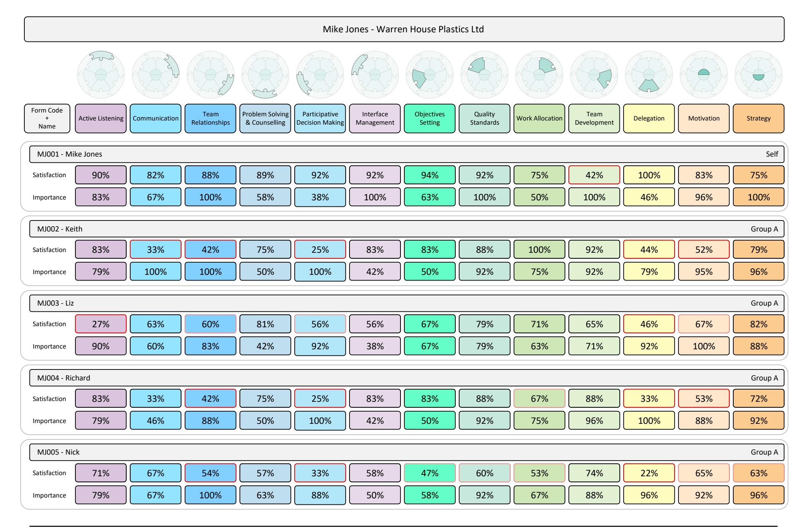

## Facilitator Report

| Mike Jones - Warren House Plastics Ltd |                  |               |                       |                                  |                                  |                         |                       |                      |                 |                     |            |            |          |
|----------------------------------------|------------------|---------------|-----------------------|----------------------------------|----------------------------------|-------------------------|-----------------------|----------------------|-----------------|---------------------|------------|------------|----------|
|                                        |                  |               |                       |                                  |                                  |                         |                       |                      |                 |                     |            |            |          |
| Form Code + Name                 | Active Listening | Communication | Team Relationships | Problem Solving & Counselling | Participative Decision Making | Interface Management | Objectives Setting | Quality Standards | Work Allocation | Team Development | Delegation | Motivation | Strategy |
| Group B MJ006 - Lee                 |                  |               |                       |                                  |                                  |                         |                       |                      |                 |                     |            |            |          |
| Satisfaction                           | 64%              | 83%           | 76%                   | 76%                              | 54%                              | 74%                     | 71%                   | 83%                  | 96%             | 61%                 | 69%        | 65%        | 85%      |
| Importance                             | 54%              | 63%           | 67%                   | 63%                              | 50%                              | 63%                     | 75%                   | 96%                  | 63%             | 58%                 | 54%        | 75%        | 79%      |
| Supervisor MJ107 - Sonny            |                  |               |                       |                                  |                                  |                         |                       |                      |                 |                     |            |            |          |
| Satisfaction                           | 92%              | 90%           | 100%                  | 96%                              | 68%                              | 69%                     | 94%                   | 96%                  | 100%            | 81%                 | 92%        | 75%        | 67%      |
| Importance                             | 58%              | 58%           | 63%                   | 63%                              | 50%                              | 42%                     | 79%                   | 88%                  | 46%             | 54%                 | 58%        | 63%        | 79%      |