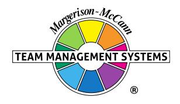

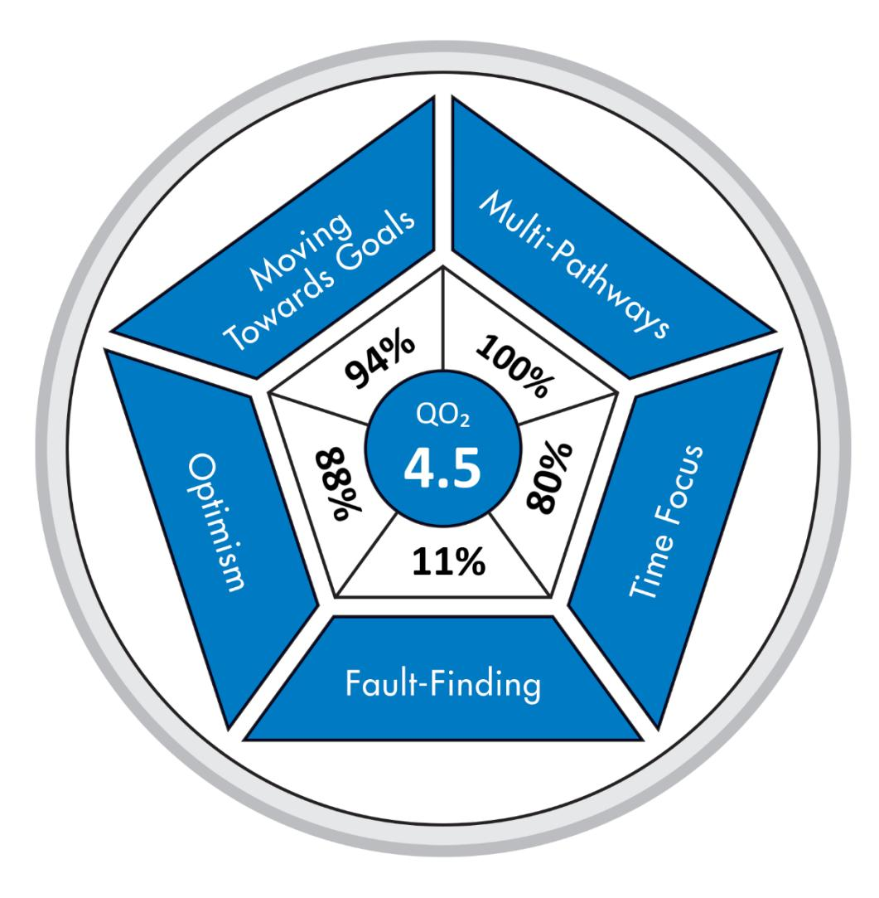

# **Opportunities-Obstacles QO2 Profile**

# **Matthew Page-Hanify**

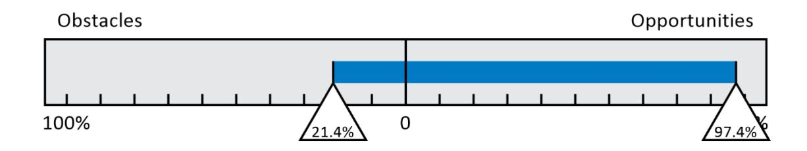

Team Management Systems, the wheel device and the associated trademarks marked with 'TM' or ® are registered or common law marks of Team Management Systems IP in Australia and various international jurisdictions.

### **CONTENTS**

| THE OPPORTUNITIES-OBSTACLES QUOTIENT  | 2  |
|---------------------------------------|----|
| MOVING TOWARDS GOALS (MTG) ENERGY     | 3  |
| MULTI-PATHWAYS                        | 4  |
| OPTIMISM                              | 5  |
| FAULT-FINDING                         | 6  |
| TIME FOCUS                            | 7  |
| RESILIENCE INDEX                      | 8  |
| HANDLING CHANGE                       | 9  |
| COMPARISON WITH OTHER PEOPLE'S SCORES | 10 |
| HOW TO BALANCE YOUR QO2               | 11 |
| GOALS                                 | 11 |
| PATHWAYS                              | 12 |
| TIME FOCUS                            | 13 |
| OBSTACLES                             | 14 |
| NORM DATA                             | 15 |
| DISCLAIMER                            | 16 |

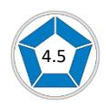

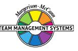

### **THE OPPORTUNITIES-OBSTACLES QUOTIENT**

Your answers to the QO2 items measure your approach to risk. Your scores are mapped onto the Opportunities-Obstacles scale, indicating the balance you have between seeing opportunities and seeing obstacles. If you always focus on opportunities, it may prevent you from seeing potential obstacles; if you focus too much on seeing obstacles, it may cause you to miss opportunities.

On a scale ranging from 100% opportunities to 100% obstacles you scored 97.4% on the Opportunities side and 21.4% on the Obstacles side.

The ratio of your 'Seeing Opportunities' score to your 'Seeing Obstacles' score defines your QO2 – your Opportunities / Obstacles Quotient.

Your QO2 is 4.5. This means that you are 4.5 times more likely to focus your energy on 'seeing opportunities' rather than 'seeing obstacles'.

You scored strongly on the Opportunities side of the QO2 scale. This is a strength that is particularly valuable in organisations where persistence and initiative are important to success. You are particularly valuable in situations where there is frequent frustration, and people around you have lost their positivity about the situation that they are facing.

Your score on the Obstacles side of the scale is lower than many others. This means that you may not always focus sufficient effort into looking for problems in the projects that you are working on. You will prefer to put your energy into seeking opportunities. Consequently, your acceptance of risk will be higher than most colleagues at work, as you can usually see the opportunities that lie ahead and are prepared to go for them. Looking for opportunities is important in decision-making, but so too is identifying the obstacles that could impede progress.

The QO2 scale is a composite of five sub-scales: Moving Towards Goals Energy, Multi-Pathways, Optimism, Fault-Finding and Time Focus. These sub-scales define the McCann Risk-Orientation Model. Around the model are your scores on each sub-scale, shown as a percentage of the maximum possible. Detailed information on each sub-scale is given on the following pages.

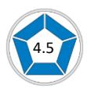

### **MOVING TOWARDS GOALS (MTG) ENERGY**

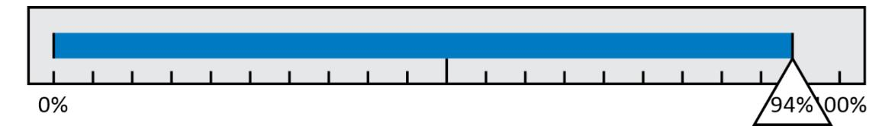

Moving Towards Goals (MTG) Energy is a form of psychic energy - the energy that gives us the determination, enthusiasm, and resilience to formulate and achieve our goals in life.

You scored quite strongly on the 'Moving Towards Goals' Energy sub-scale. This means that you will expend a considerable energy in trying to achieve the goals that you set for yourself. When problems arise which seem likely to prevent you from attaining your goals, you are likely to push even harder to get where you want to go. You are not the sort of person to give up easily.

You probably consider yourself to be fairly successful in life, and your performance record will probably show that you have achieved most of the goals you have set for yourself over the years. It is likely that you are a determined sort of person, and this has been largely responsible for the results that you have obtained. When obstacles appear in your path, you are capable of finding extra energy to push through the barriers and achieve what you want.

Because you put a lot of effort into moving towards your goals, you are a person who is quick to see the opportunities in life. This means that you will be a fairly ambitious person, capable of achieving success in whatever you set your mind to. Most likely you will have high levels of confidence and self-esteem.

You are likely to set yourself challenging goals that will stretch your capabilities, as you are usually confident in your own abilities. However, beware of situations where your high MTG Energy may cause you to become over confident. If lots of obstacles appear in your path and you find that you are constantly having to push your way through them, it may be a message that you are heading in the wrong direction.

Overall, your strong scores on this scale will cause you to not only *see* the opportunities but to *seize* them as well.

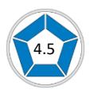

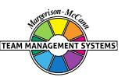

You scored strongly on the Multi-Pathways sub-scale. When obstacles arise, you are likely to put effort into finding a way around them, rather than simply continuing as before. By putting energy into the generation of alternative pathways, you are likely to be successful in attaining your goals and in finding solutions to problems.

You are probably a good improviser and will not find it difficult to identify possible solutions when problems arise. It is likely that you will have the ability to turn obstacles into opportunities.

You are probably a person who likes to be different, and may stand out from the crowd. Doing the same as everyone else has never been your approach to life. At work, you will want the challenge of different projects, particularly those that test your ability.

However, your interest in generating multiple pathways may sometimes cause you difficulties in an organisation bound by standard rules and procedures. You may need to check that you do not place yourself in a difficult position when you suggest unusual solutions to problems.

You will be excited by new and different aspects of your work. Much of your energy at work may be directed at continually changing and adapting things so that the best result is always achieved. However, there is a downside to this: beware of a tendency to indulge yourself in looking for unusual ways around an obstacle, when there may be a simpler and more effective solution.

Your high scores on the Multi-Pathways sub-scale contribute significantly to your acceptance of risk. You will be prepared to accept higher levels of risk than many others, confident in your ability to find ways around obstacles when they arise.

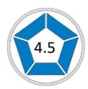

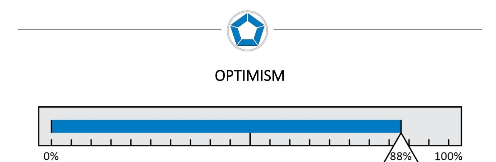

Optimism is a characteristic that is the basis of positive thinking. It is a psychological resource that gives people a generalised expectancy that they will succeed in their endeavours. Expected success, in turn, gives people the will to expend effort to reach their goals.

Your high scores on this sub-scale indicate that you are a person with an optimistic outlook on life, someone who brings a lot of enthusiasm and energy to the workplace. You are a person full of hope, and you will usually believe that things will turn out for the best.

When things go wrong, you are less likely to attribute the cause of any problems solely to yourself. Usually, you will consider external events to have contributed. Even on occasions when you do blame yourself for any setbacks, you will usually rebound quickly, as you have the ability to turn obstacles into opportunities. When difficulties occur in one part of your life, you are unlikely to allow them to impact other aspects of your life. For example, you may well leave problems at home rather than allow them to affect your working life. However, you may have some difficulty in preventing work problems from affecting your private life.

You may need to recognise when your optimism gets out of control. The classic novel about Pollyanna (written by Eleanor Porter) shows what can happen if you have an excessively optimistic view of life. No matter what happens to Pollyanna she accepts it, and is glad because things could always be worse. However, the reality of today's world requires a focus on identifying potential problems before they impact your work activities. In this way, unnecessary risks are avoided and any potential obstacles are considered in detail. Success in the future can be attained, if you have the correct balance of optimism plus a measure of 'intelligent doubt'.

If you constantly approach life optimistically, you may be unprepared for disappointments. Therefore, learning to be a little more cautious may prevent you from making major mistakes.

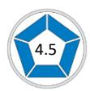

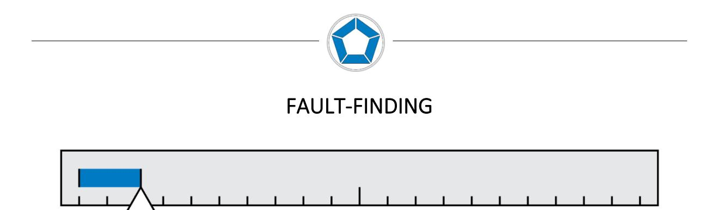

The Fault-Finding sub-scale measures to what extent people put effort into examining what could possibly go wrong. People who look only to the opportunities often forget to examine the potential obstacles that could impede progress. Those who put most of their effort into potential obstacles analysis, may have little interest in looking for opportunities.

At work, you will be considered to be a positive person who usually looks for the best in others. Your enthusiasm can be infectious, and others may look to you for support when they are depressed. When new ideas are presented, you usually consider how they can be made to work, rather than rejecting them without discussion. You will probably believe that everyone can make a valuable contribution at work once the correct use of their skills is made. For you, a glass is always likely to be half-full rather than half-empty.

On the Fault-Finding sub-scale you have scored in the lower range, indicating that your positive approach may need to be balanced with a stronger focus on looking for the faults in any proposals or projects that you are involved in. This will ensure that you constantly think about the major obstacles that might arise, and have 'plan B' ready to implement when the unexpected occurs.

Therefore, your work could perhaps benefit from a more critical approach to analysing potential problems. List all the things that might go wrong in the project that you are currently working on. Do you have alternative plans in place? Remember, a good team member or leader needs to be prepared so that action can be taken when problems arise.

A useful technique for you to consider is Potential Obstacle Analysis. This is a systematic procedure designed to highlight the major obstacles that might be faced when a particular idea, proposal or project is implemented. The basic procedure involves asking: *What could possibly go wrong? What assumptions have we made? What could we do to minimise the risk?*

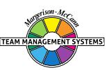

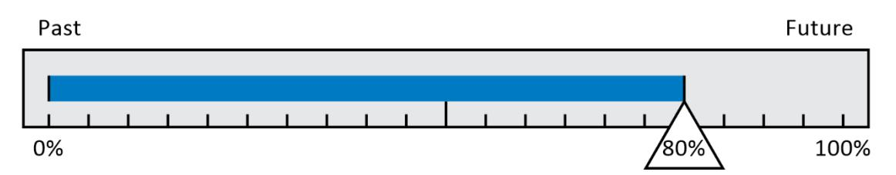

The Time Focus sub-scale is a measure of psychological time - how we subjectively process time. For some people time moves quickly, for others it moves slowly. Some people live in the future; others long for the past; many live for the 'here and now'.

Your scores on this sub-scale indicate that you will have a Future (F) time line. A time line is a continuum running from the past to the present to the future. Most people will have an F-time line, a P-time line (Past) or a Balanced time line.

You enjoy looking to the future because you tend to see it in a positive light. The challenge of the unknown is something that excites you, and you may fantasise about all sorts of future possibilities involving yourself. For you, the future is a happy place, and you will want to be living in it. You will understand the importance of the phrase, 'Let's put the past behind us'.

Your score towards the Future end of the Time Focus sub-scale contributes to your higher acceptance of risk than many others. For you the future is a land of opportunities - one that you want to be in as soon as you can. You are prepared to take risks to get there.

You may need to learn lessons from the past in order to prevent history from repeating itself. When mistakes are made, do you tend to push them aside, or do you spend time trying to analyse in detail what went wrong so that the same mistake is not made again?

Many people with scores similar to you also have a fast psychological time as well as a future one. You may have a tendency to live your working life in the 'fast lane' as you move from one opportunity to another. If this is the case you may need to find opportunities to slow down by setting aside time for personal reflection. Very few people can continue at a fast pace without suffering 'burn out' at some stage.

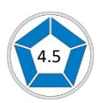

### **RESILIENCE INDEX**

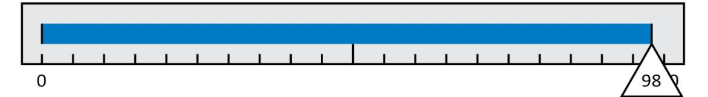

Resilience describes the ability to withstand, recover from, and adapt to adversity and stress. A measure of your resilience is derived from your scores on the subscales of the QO2.

Resilience is strongly correlated with persistence and determination and the ability to look for ways around any obstacles that may arise. Personal and social competence also play a role along with the ability to bounce back from negative situations.

Our resilience scale is derived from a combination of your scores on MTG Energy and Multipathway generation as well as some of the Optimism and Time Focus items. It's important to have both the *will* and the *way* to achieve our goals. One of the differences between optimists and resilient people is that the optimist may have a generalised expectation that things will work out whereas those with high resilience will also look for alternative pathways when blocked from a goal. If we only have the will, then we are vulnerable when obstacles arise. We are unable to generate alternative routes to our goal and therefore need extra energy to 'pound away' in the only way we know. Resilience is also related to the ability to put the past behind us and rebound easily from adversity. Resilient people approach goals with a positive emotional state, a sense of challenge, and a focus on success.

Those with low resilience have lower energy available to push towards their goals and will often follow a single pathway. They may well approach goals with a negative emotional state, a sense of ambivalence, and a conservative approach to risk.

#### **Your Resilience Index on a scale ranging from 0 to 100, has been calculated as 98.**

This value is at the higher end of the scale, which means that you are likely to approach your goals in a positive emotional state, with a sense of challenge and a focus on success. You are enough of a realist to know that plenty of setbacks will occur, but you are likely to treat these as challenges and not failures.

### **HANDLING CHANGE**

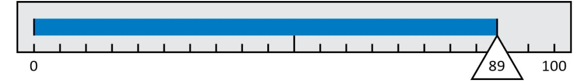

The four sub-scales of Multi-Pathways, Optimism, Fault-Finding and Time Focus can be combined to give some indication of how you handle change. The calculation shows that you will adapt well to change, and on many occasions may be an advocate for introducing improvements to your organisation. People will enjoy your positive approach to worklife and your ability to generate different ways of doing things.

You probably have a tendency to become excited by new ideas or new technology. Sometimes, you may under-estimate the problems created by introducing such changes. Others may find that you move too fast for them and this could cause them to become opposed to your initiatives.

When you do have changes that you are excited about, take a little time to research them fully before jumping into action. Try involving others in the changes and incorporating their views into your plans.

You may need to understand more about why people oppose change. Often it is because their perception is that the obstacles associated with the changes seem insurmountable in relation to the benefits likely to accrue. In the language of this Profile they will have a significantly lower QO2 than you. You probably explain and even promote the opportunities associated with the change, but you may not put sufficient effort into addressing the obstacles. In fact, you may not even see the obstacles as clearly as those with a lower QO2 than you! If this is the case you will benefit from asking such people what the difficulties might be from their perspective.

Because others may not see the benefits of change as quickly as you, don't expect them to agree with you the first time you propose new initiatives. To you the benefits may seem obvious but you will need to be patient and realise that others may need more time to accept what you are proposing. It is also a good idea to be prepared for objections, and to have done a Potential Obstacles Analysis on the issues of the change so that you can handle the objections in a clear and precise way, rather than perhaps improvising with ambiguities.

### **COMPARISON WITH OTHER PEOPLE'S SCORES**

The median for the QO2 is 2.2 compared to your score of 4.5.

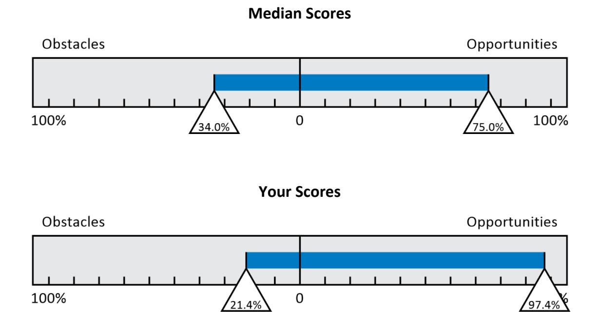

You may be interested in how your scores compare with others who have answered the QO2 Profile Questionnaire. The median scores of a development sample of 1000 respondents are shown by the top bar above. This data shows the importance of having a balance across the Opportunities-Obstacles dimension.

Of further interest is the norm data on the five sub-scales, which allows you to interpret your scores relative to other people. The lower quartile, median and upper quartile data are summarised below:

| Sub-scales     | Lower Quartile | Median | Upper Quartile |
|----------------|----------------|--------|----------------|
| MTG Energy     | 68%            | 77%    | 87%            |
| Multi-Pathways | 68%            | 77%    | 86%            |
| Optimism       | 60%            | 70%    | 79%            |
| Fault-Finding  | 21%            | 30%    | 40%            |
| Time Focus     | 53%            | 63%    | 73%            |

Looking at the MTG Energy norms as an example, 25% of respondents had a score less than 68%, 50% of respondents had a score greater than 77%, and 25% of respondents had a score greater than 87%. A similar interpretation applies to the other sub-scales.

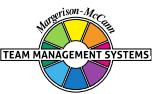

## **HOW TO BALANCE YOUR QO2**

### **GOALS**

You are a person with a lot of energy and a determination to pursue goals. This is a characteristic to be admired, and you should continue to focus your energy in this way. With a good record of achieving success, you should reflect on whether the goals you set for yourself could be extended even more.

Because you are highly goal-oriented, you may sometimes expect too much of others who are less focused on them than you. You may need to check whether they share the same achievement, determination and motivation as you. Sometimes, you may move too fast for them and lose their support. Take time to explain your vision to them and what could be achieved if everyone works together.

Because a high MTG Energy is aligned with seeing *and* seizing opportunities, it is important to develop it to a high level. However, there are some situations where too high an MTG Energy can cause problems. You may need to regularly consider whether you are over-confident in your ambitions. It is possible that your determination to achieve your goals might prevent you from objectively seeing the obstacles likely to impede progress. It may help if you talk to others about what you are trying to achieve, and ask for their assessment of what might go wrong. Indeed, it is possible that in your determination and persistence you may be slow to see the times when you have the wrong goals.

What level of MTG Energy is best is difficult to predict. It very much depends on the individual, which is why any goal-setting program has to be personally tailored.

You may be able to help others develop their MTG Energy by helping them with goal setting. Goals should be set that challenge and stretch the individual rather than those that are too easy to reach or too far away. In sport, the concept of the personal best sets the right goals. This can be easily extended to the workplace. Assessing people's current capabilities and then helping them set stretch goals will, over time, develop their MTG Energy.

# **HOW TO BALANCE YOUR QO2**

### **PATHWAYS**

You are a Multiple-Pathways person. This means that you are constantly looking for new approaches to try. You probably, therefore, have a reputation for being a person who can find ways around problems. You probably see this as one of your strengths and it has probably given you the confidence to pursue and be stimulated by opportunities that come your way.

You have a natural tendency to want to try different approaches to the projects that you are involved in. While this is an admirable quality, you may need to consider whether this is always the best thing to do. Sometimes, following proven methods leads to safer, more effective outcomes. When deciding how you are going to approach a particular project, take some time to discover whether other people have worked on the same or similar projects. Listen to them and utilise their experience. There may be times when you would be better to stay with your initial course of action and put in extra effort to overcome resistance.

Your tendency to look for ways around problems may cause you to quickly implement alternative solutions whenever obstacles occur. If this is the case you will benefit from studying the Multi-Pathway Generation Model described in the accompanying *Personal Discovery Workbook*. You should reflect on whether you give enough attention to the ILB (Introverted Left Brain) quadrant. This is the quadrant that helps you identify the root cause of any obstacle. Once the root cause of the obstacle is found then a pathway can be built around it. In this way the solutions you generate may have a better chance of succeeding. The secret to effective pathway generation around obstacles is to use all four modes of thinking - not just the one that comes naturally to you.

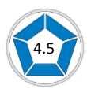

# **HOW TO BALANCE YOUR QO2 TIME FOCUS**

Because your Time Focus is more future-oriented rather than present-oriented, you may not always spend sufficient time analysing your current situation. When things go wrong, you will probably rebound quite easily by formulating a new strategy, which might be based more on your optimism rather than a detailed interpretation of the facts.

You may therefore need to spend more time determining answers to the question, 'Where are we now?' This will require a detailed analysis of the strengths, weaknesses, opportunities and threats for you, your team and your organisation. By fully understanding where your team/organisation has been and where it is now, you can move it forward into the future, based on reality. By carrying out a 'history walk' with your team, it may help others to see where you want them to go. If you are already doing this, you will be well on the way to achieving a balance between focusing on the future but learning from the past.

Your great enthusiasm for the future may sometimes be overpowering for others with higher scores on the obstacles side of the Risk Orientation scale (a lower QO2 ). Make sure that you are not working too far ahead of others in your team and the organisation. As an F-time person, you may have difficulties in interacting with P-timers, who are more focused on the past and will tend to look to tried and tested approaches. When interacting with such people try to slow down and make the connections between what has occurred in the past, what is happening in the present and how this relates to the future that you can readily see. Point out similar successful situations in the past and show them how successful these were.

To a P-time person, changes should be presented as small increments from what is currently happening. No leaps should be made from the present to the future. Each proposed change should be dealt with in detail and the links made between what is happening now and what might happen in the future. All possible problems should be identified, with adequate time allowed for the Ptimers to reflect on whether every potential obstacle has been identified. This could take some time, but it is well worth the investment if it leads to acceptance rather than rejection.

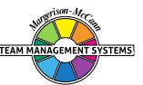

# **HOW TO BALANCE YOUR QO2 OBSTACLES**

When situations go wrong, you could benefit from analysing in detail why this happened. You may have a tendency to dismiss setbacks as isolated incidents, but it is often the case that their underlying causes are part of a recurring pattern. First of all, consider whether the obstacles genuinely could not have been predicted or whether, with a more cautious approach, they might have been avoided.

Some people with this Profile sometimes refuse to acknowledge their role in situations that go wrong. To improve your performance at work, it is essential that you can review, without selfrecriminations, whether your actions contributed at all to the result. Successful people learn from their mistakes and plan how things might be improved next time.

Many successful executives in organisations plan for the unexpected. They consider things that might go wrong and develop alternative strategies in advance. Through experience they have often learned that 'if anything can go wrong, it will'.

You may therefore benefit from developing expertise in analysing the downside potential of any projects you are involved in. A useful way of doing this is to identify a full range of possible outcomes. Imagine all the things that might go wrong with your project, and develop clear alternatives to carry out if that scenario comes to pass.

Alternatively, you could look for someone with a lower QO2 to help you identify any potential obstacles. A useful technique is *Inverse Brainstorming*. Whereas brainstorming is all about thinking up creative ways around problems, inverse brainstorming looks at an opportunity and then considers all the obstacles that might prevent the opportunity from working. This technique is very useful in exposing the assumptions that often lie hidden in the unconscious mind when just one person looks for what could go wrong. The beliefs and values we hold may prevent us from seeing the reality of a situation, which can be exposed by considering the alternatives offered by others, particularly those with an eye for seeing obstacles.

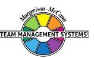

### **NORM DATA**

For your information, some database reference material is presented below. This data shows the percentage of people sampled who have QO2 scores higher than the value listed.

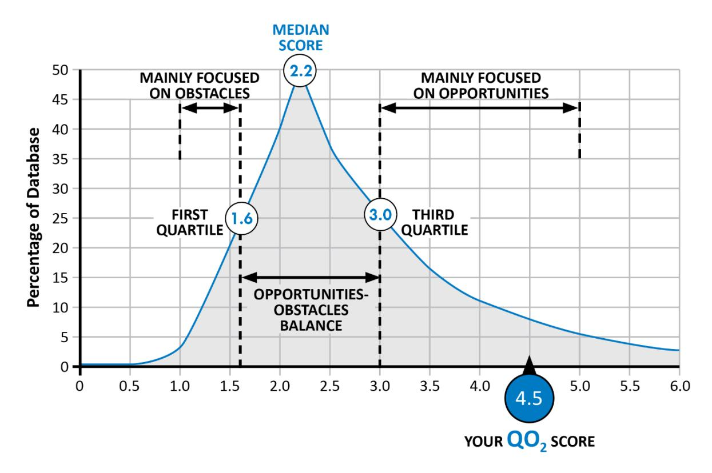

The norm data shows that for a development sample of people across a number of job functional areas, 25% have a QO2 greater than 3.0. As your QO2 is greater than or equal to 3.0, you will be a person who puts more energy into seeing and seizing opportunities, rather than focusing on potential obstacles and pitfalls. This is a great strength at work, as you will normally have an optimistic view of life and be a positive influence on those around you.

If you want to achieve a better balance in your QO2, you should look at how to further develop your skills in identifying possible obstacles. The advice in the section 'How to Balance Your QO2, may help you. If you are already implementing this advice, you are well on the way to balancing the risks in any decision you take.

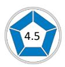

### **DISCLAIMER**

© Team Management Systems IP, 2024, Australia. Published by Team Management Systems. Produced on 15/04/2025. All rights reserved. No part of this publication may be reproduced, stored in a retrieval system, or transmitted in any form or by any means, electronic, mechanical, photocopying, recording or otherwise, without prior written permission of the publishers.

Team Management Systems, the wheel device and the associated trademarks marked with 'TM' or ® are registered or common law marks of Team Management Systems IP in Australia and various international jurisdictions.

The content of this report is based on data submitted through the Opportunities-Obstacles QO2 Profile Questionnaire. While great care and diligence have been exercised, it is important to note that each personalised report is based on general observations and interpretations.

The authors and publishers make no guarantees regarding the accuracy, completeness, or applicability of this report for any specific individual or situation. Therefore, they cannot be held liable for any decisions, actions, or outcomes resulting from the use of the information contained in this report.

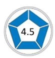

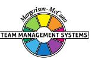