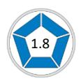

# **Opportunities-Obstacles QO2 Profile**

# **Monica Selth**

Team Management Systems, the wheel device and the associated trademarks marked with 'TM' or ® are registered or common law marks of Team Management Systems IP in Australia and various international jurisdictions.

## **CONTENTS**

| THE OPPORTUNITIES-OBSTACLES QUOTIENT  | 2  |
|---------------------------------------|----|
| MOVING TOWARDS GOALS (MTG) ENERGY     | 3  |
| MULTI-PATHWAYS                        | 4  |
| OPTIMISM                              | 5  |
| FAULT-FINDING                         | 6  |
| TIME FOCUS                            | 7  |
| RESILIENCE INDEX                      | 8  |
| HANDLING CHANGE                       | 9  |
| COMPARISON WITH OTHER PEOPLE'S SCORES | 10 |
| HOW TO BALANCE YOUR QO2               | 11 |
| GOALS                                 | 11 |
| PATHWAYS                              | 12 |
| TIME FOCUS                            | 13 |
| OBSTACLES                             | 14 |
| NORM DATA                             | 15 |
| DISCLAIMER                            | 16 |

### **THE OPPORTUNITIES-OBSTACLES QUOTIENT**

Your answers to the QO2 items measure your approach to risk. Your scores are mapped onto the Opportunities-Obstacles scale, indicating the balance you have between seeing opportunities and seeing obstacles. If you always focus on opportunities, it may prevent you from seeing potential obstacles; if you focus too much on seeing obstacles, it may cause you to miss opportunities.

On a scale ranging from 100% opportunities to 100% obstacles you scored 67.2% on the Opportunities side and 36.9% on the Obstacles side.

The ratio of your 'Seeing Opportunities' score to your 'Seeing Obstacles' score defines your QO2 – your Opportunities / Obstacles Quotient.

Your QO2 is 1.8. This means that you are 1.8 times more likely to focus your energy on 'seeing opportunities' rather than 'seeing obstacles'.

You scored equally strongly on both sides of the QO2 scale, with a balance between seeing obstacles and seeing opportunities. However, you have scored higher on the Obstacles side of the scale than many other people. This is a valuable strength that is particularly useful in organisations where a strong sense of reality is necessary. You are particularly valuable in situations where making a wrong decision could end in disaster. Your strong sense of reality can help people to see where their effort should be focused. However, you will also focus on the opportunities that come your way, and are prepared to seize them, provided that you are convinced that any major problems have been considered and thought through. In general you will not like to be in situations that are too risky and will want to consider the downside thoroughly before moving forwards.

The QO2 scale is a composite of five sub-scales: Moving Towards Goals Energy, Multi-Pathways, Optimism, Fault-Finding and Time Focus. These five sub-scales define the McCann Risk-Orientation Model shown on the previous page. Around the model are your scores on each sub-scale, calculated as a percentage of the maximum possible for each scale. Detailed information and advice on each sub-scale are given on the following pages.

### **MOVING TOWARDS GOALS (MTG) ENERGY**

Moving Towards Goals (MTG) Energy is a form of psychic energy - the energy that gives us the determination, enthusiasm, and resilience to formulate and achieve our goals in life.

In relation to others, you scored moderately strongly on the 'Moving Towards Goals' Energy subscale. This means that you will expend energy in trying to achieve the goals that you set for yourself. When problems arise which seem likely to prevent you from attaining your goals, you will usually keep going, although there will be times when you might feel it would be easier to give up and turn your attention elsewhere.

You probably consider yourself to be fairly successful in life, and your performance record will probably show that you have usually succeeded in the goals you have set yourself, although there may have been times when you felt you could have done better. On balance, you have a good measure of determination, even though you may have periods of self-doubt. When obstacles appear in your path, you will usually try to find that extra energy to push through the barriers and achieve what you want.

You are likely to set yourself goals that lie within your capabilities, as this gives you the confidence to succeed. Remember though, if goals are too easy to reach then your potential may not be maximised. You may consider that goals beyond your capability are too risky but try to balance this with setting yourself *stretch goals* that will challenge you. Do you have untapped potential that might be released by a goal-stretching program? Success at achieving goals that lie just beyond your current abilities will have a strong effect on increasing your confidence and self esteem.

Because you have been reasonably successful in what you have achieved, you have learned to look for the opportunities in life. However, remember that it is important to not only *see* the opportunities, but to take action and *seize* them as well.

In relation to others, you scored moderately strongly on the Multi-Pathways sub-scale. When obstacles arise, you are likely to put effort into finding a way around them, once you are convinced that existing ways are unlikely to give you what you want. By putting energy into the generation of alternative pathways, you are likely to be quite a good improviser and will find solutions to problems when they arise. Often, you will be able to turn an obstacle into an opportunity.

You will probably direct a lot of your energy at work to looking for alternative ways of doing things so that the best result is always achieved. At work you will enjoy the challenge of different projects, as these will stretch you and test your ability to perform.

You are a person who likes to be different, but there is also an element of wanting to conform about you, as you don't particularly enjoy standing out from the crowd. Despite your different approach to the world, you will probably respect the rules and procedures, as you recognise that these have been developed to deliver results.

You will be excited by new and different aspects of your work. Much of your energy at work may be directed at changing and adapting things so that the best result is always achieved. However, there could be a downside to this: be careful not to indulge yourself in looking for unusual ways around an obstacle, when there may be a simpler and more effective solution.

Your moderately strong scores on the Multi-Pathways sub-scale contribute to your acceptance of risk. You may be prepared to accept higher levels of risk than many others, confident in your ability to find ways around obstacles when they arise.

Optimism is a characteristic that is the basis of positive thinking. It is a psychological resource that gives people a generalised expectancy that they will succeed in their endeavours. Expected success, in turn, gives people the will to expend effort to reach their goals.

You are a person with a cautious outlook on life and a strong sense of reality. However, despite this, there are times when you can be quite optimistic about work, particularly when you have taken into account everything that could possibly go wrong. Experiences in your life may have caused you to assume the worst, and this can be a strength in helping you to avoid mistakes. However, sometimes you are so pre-occupied with finding the disadvantages of a project or proposal, that you may miss seeing opportunities when they arise.

When things go wrong, you may sometimes blame yourself, instead of considering just how much of the problem was due to you and how much to situations that could not be predicted. Consider to what extent such influences played a role in any setbacks, before you totally blame yourself.

When setbacks do occur, you may have a tendency to consider them to be long lasting rather than temporary. If this is the case, it may take you longer than others to rebound from adversity. When difficulties occur in one part of your life, you may sometimes allow them to affect other unrelated parts of your life. You may need to learn how to localise unpleasant situations and prevent them from affecting other things that you want to do.

At times you might worry too much, usually because you demand a lot from yourself. You probably regard this as a positive aspect as you will want to avoid unnecessary risks. However you may need to be aware of the dangers of 'ruminating', where excessive worrying could cause you to procrastinate and become stressed. Although experience has taught you that things don't always work out as planned, you can still smile and look at life optimistically.

The Fault-Finding sub-scale measures to what extent people put effort into examining what could possibly go wrong. People who look only to the opportunities often forget to examine the potential obstacles that could impede progress. Those who put most of their effort into potential obstacles analysis, may have little interest in looking for opportunities.

On the Fault-Finding sub-scale you have scored in the moderate to high range. At work, you may therefore be considered as a person who is quick to point out problems, and who is good at examining projects and new situations for potential difficulties. When working on a new project, you are likely to spend considerable time looking for faults and planning to avoid failure. This is a great strength, as you will be able to imagine all the problems that might occur. When new ideas are presented to you, you are likely to first look at the reasons why they might fail, before considering how they might be made to work. Once someone disappoints you, you may become more cautious in dealing with them in future. However, you will usually look for the best in people, even if you are sometimes critical of those who don't share your high standards.

Your focus on seeing potential obstacles is balanced with a focus on identifying opportunities. This is rather like the ancient Chinese view of seeking a 'yin' and 'yang' balance in everything that you do. Your careful approach to work ensures that you will usually think about the things that might go wrong and have plan 'B' ready.

You will balance your focus on caution with an assessment of more risky options. You can be very proactive when you believe in something or when an assessment of the facts indicates that you cannot lose. In summary, you are likely to accept measured risks, as the effort you put into ensuring that all the obstacles have been considered will give you confidence that the risk of things going wrong has been minimised.

The Time Focus sub-scale is a measure of psychological time - how we subjectively process time. For some people time moves quickly, for others it moves slowly. Some people live in the future; others long for the past; many live for the 'here and now'. Your scores indicate that you have a Balanced time line. A time line is a continuum running from the past to the present to the future. Most people will have an F-time line, a P-time line (Past) or a Balanced time line.

While you are likely to enjoy the security of the present, you are reasonably comfortable with the uncertainty of the future. In general, you are happy focusing on the way things are and you will enjoy living each day as it comes. However a Balanced time line also means that you are likely to enjoy the security of the past. You will recognise that many lessons can be learnt from past situations and will value learning from experience. Those with F-time lines particularly need to learn the lessons of the past. It is here that you can help these people to learn from their mistakes.

Because you enjoy the security of the present and past, you may sometimes be nostalgic, remembering the time when things were better than they are now. However, you will also dream about what you might achieve in your life, but how often have you put your dreams into action?

While you may live in the present, remember that others are very future-oriented. This is often the case for those strongly advocating change. Try to listen to these people and consider what they are saying. Otherwise, they may see you as being too conservative. More than likely, you will embrace the future; it is just that you want to be sure that things will work out before you act.

Your balanced score on the Time Focus sub-scale makes a neutral contribution to your approach to risk. You are wary of the future but will accept the inherent risk of moving into the unknown once you are convinced that the chosen way is the right way. The other four sub-scales are likely to make a larger contribution to whether you are risk-accepting or risk-averse.

#### **RESILIENCE INDEX**

Resilience describes the ability to withstand, recover from, and adapt to adversity and stress. A measure of your resilience is derived from your scores on the subscales of the QO2.

Resilience is strongly correlated with persistence and determination and the ability to look for ways around any obstacles that may arise. Personal and social competence also play a role along with the ability to bounce back from negative situations.

Our resilience scale is derived from a combination of your scores on MTG Energy and Multipathway generation as well as some of the Optimism and Time Focus items. It's important to have both the *will* and the *way* to achieve our goals. One of the differences between optimists and resilient people is that the optimist may have a generalised expectation that things will work out whereas those with high resilience will also look for alternative pathways when blocked from a goal. If we only have the will, then we are vulnerable when obstacles arise. We are unable to generate alternative routes to our goal and therefore need extra energy to 'pound away' in the only way we know. Resilience is also related to the ability to put the past behind us and rebound easily from adversity. Resilient people approach goals with a positive emotional state, a sense of challenge, and a focus on success.

Those with low resilience have lower energy available to push towards their goals and will often follow a single pathway. They may well approach goals with a negative emotional state, a sense of ambivalence, and a conservative approach to risk.

#### **Your Resilience Index on a scale ranging from 0 to 100, has been calculated as 66.**

This value is in the low to mid-range of the scale, which means that you may have experienced many situations where things did not work out as planned. This may have caused you to have a lower MTG Energy level, and a tendency to resign yourself to life's difficulties. You may need to put more effort into adjusting your goals when unexpected circumstances arise. Developing a higher level of resilience will bring you through the various crises that you will undoubtedly experience during your life.

#### **HANDLING CHANGE**

The four sub-scales of Multi-Pathways, Optimism, Fault-Finding and Time Focus can be combined to give some indication of how you handle change. The calculation shows that you will understand the need for change but will usually need to be convinced that it is absolutely necessary and not simply a sudden notion of someone elsewhere in the organisation. In general, you are against change for the sake of change.

You could be uncomfortable with some new initiatives, particularly those that are introduced too quickly. Usually, this is because you prefer to work with proven approaches rather than ambiguous situations. You will want to see how any changes affect current operations, and are more comfortable with gradual change, rather than something that is too radical.

You may need to understand why, on occasions, you might resist change. It could be that your perception of the obstacles associated with the changes seems insurmountable in relation to the benefits likely to accrue. In the language of this Profile you could have a significantly lower QO2 than those proposing the changes. For you, it is important that all the reasons why the change initiatives might fail have been well thought through, but often those with a higher QO2 may not have even considered what the obstacles are! If this is the case you can help them by explaining carefully what objections you might have. If this is done from a logical perspective it is likely to be well received. They will appreciate the different viewpoint that you may be able to give.

You may not see the benefits of change as quickly as others, so don't expect them to agree with you when you first offer your views. To you the obstacles may seem obvious but you will need to be patient and realise that others may need more time to accept what you are saying. It is also a good idea to have done a Potential Obstacles Analysis on the issues of the change so that you can present your assessment clearly. It may also help to indicate that you can see the opportunities that the changes will bring, but only after any potential problems have been factored in. When promoting change yourself, you are likely to take a conservative approach and make sure that the opportunities significantly outweigh the obstacles before you become an advocate. Consequently, your ideas may be accepted because of your track record with well-thought-through proposals.

### **COMPARISON WITH OTHER PEOPLE'S SCORES**

The median for the QO2 is 2.2 compared to your score of 1.8.

You may be interested in how your scores compare with others who have answered the QO2 Profile Questionnaire. The median scores of a development sample of 1000 respondents are shown by the top bar above. This data shows the importance of having a balance across the Opportunities-Obstacles dimension.

Of further interest is the norm data on the five sub-scales, which allows you to interpret your scores relative to other people. The lower quartile, median and upper quartile data are summarised below:

| Sub-scales     | Lower Quartile | Median | Upper Quartile |
|----------------|----------------|--------|----------------|
| MTG Energy     | 68%            | 77%    | 87%            |
| Multi-Pathways | 68%            | 77%    | 86%            |
| Optimism       | 60%            | 70%    | 79%            |
| Fault-Finding  | 21%            | 30%    | 40%            |
| Time Focus     | 53%            | 63%    | 73%            |

Looking at the MTG Energy norms as an example, 25% of respondents had a score less than 68%, 50% of respondents had a score greater than 77%, and 25% of respondents had a score greater than 87%. A similar interpretation applies to the other sub-scales.

# **HOW TO BALANCE YOUR QO2 GOALS**

You are a person with a good amount of energy and a determination to pursue goals. Because a high MTG Energy is aligned with seeing *and* seizing opportunities, it is important to develop it to a high level. You are probably fairly good at *seeing* the opportunities that come your way, although you may not always *seize* them. You probably need only a small increase in confidence to give you the determination to succeed in anything you try.

You may need to check whether the goals that you set for yourself offer the right degree of challenge. If goals are easy to achieve, then you may never reach your true potential. You may have an easy and enjoyable time as you work towards your goals, but sooner or later you will realise that more could have been done with your life. On the other hand it might be that you are setting goals that lie well beyond your capabilities. If this is the case, then no amount of rewards, or cajoling can help realise these goals. In this situation you may well find a reason to give up as soon as you can. If this occurs then your MTG Energy will be in decline. You should reflect on which of the two above possibilities may apply to you.

It seems that high MTG Energy is acquired through life's experiences. When we are children, goals are either set through our own innate desire to succeed (intrinsic goals) or through the expectations of our parents, school teachers or significant others (extrinsic goals). In many cases the extrinsic goals help formulate the intrinsic ones. Whenever we achieve any of these goals we are usually rewarded in some way by prizes, admiration or concessions. Very soon an expectation of succeeding is established; if a goal is set, we will believe we can achieve it and therefore our MTG Energy is developed.

This is why goal setting is so important for personal development. Goals must be set that challenge the individual rather than those that are easy to reach or too far away. In sport the concept of the personal best sets the right goals. This can easily be extended to cover personal development. You need to determine your PB (personal best) in relation to your current work load and then set yourself challenges that will break your PB, even if by only a small amount.

## **HOW TO BALANCE YOUR QO2**

#### **PATHWAYS**

You will like to try out new ideas at work, but may be cautious in case they fail. Occasionally, you might take a risky option, but only if all the alternatives have been thoroughly considered. Your scores on the Multi-Pathways sub-scale are moderate to high, indicating that you will try different approaches but always have one eye on their outcome.

You can be of great help to others in your organisation who might want to change the way of doing things without having thought through the risks. However, to improve results at work, try looking at different ways of carrying out your current projects. This will help you to feel more comfortable with generating alternative ways to achieve end results.

It is worth learning how to use the techniques for pathway generation, defined by the Multi-Pathway Generation Model. The four thinking modes of this model are described in the *Personal Discovery Workbook* accompanying this Profile and are summarised below.

**ILB** (Introverted Left Brain) thinking is a logical, sequential process that helps you determine the root cause of any obstacles. Once the root cause of the obstacle is found then a pathway can be built around it.

**IRB** (Introverted Right Brain) thinking is a technique to use when you have a mental block. It uses techniques like visual mapping and processes such as meditation or creative visualisation, often accompanied by appropriate music to help you break through pathway blockages.

**ERB** (Extroverted Right Brain) thinking uses the power of the group to generate many possible pathways that you might not have thought about yourself.

**ELB** (Extroverted Left Brain) thinking uses the group again but this time in an objective, critical, analytical way to determine which of many pathways actually have the best chance of working.

# **HOW TO BALANCE YOUR QO2 TIME FOCUS**

In relation to others, you have a Balanced time line, with a focus a bit more to the present and past, than the future. You may well put considerable effort into analysing your current situation before moving forward, but when things go wrong, you may have difficulties in putting the past behind you. There is no point in thinking too deeply about situations that have not met your expectations. When setbacks occur, you may need to develop resilience so that you can rebound from any adversity. Rather than thinking too deeply about failures, it is better to deal with them by talking to other people, who can help you to analyse what went wrong. Remember the saying, 'From every problem stems an opportunity'.

If something is worrying you, try putting your troubles behind you by using the time line swivelling technique. Imagine the problem you are facing right in front of you. Close your eyes and picture the problem. See it in all its detail, with sounds and colour. Then imagine wrapping it up and tying it tight with cord. Reach out with your imaginary hands and grab hold of the problem. With all your might hurl it back over your head far into the past so it can never return. Now imagine the future, as you would like it to be, in all its splendour. Try this imaging technique several times when you feel depressed and can't escape the feeling that your problems are permanent. Putting difficulties behind you using this imaging technique can help your problems to disappear. You have temporarily reversed your time line, with the future now in front of you and the past behind you.

With a Balanced time line, you may have some difficulties in imagining the future. Because you may not see what might be, as readily as others, you could have a fear of the unknown. If this is the case you may benefit from exercises that help you to 'imaginate', to fantasise, to conjure up future possibilities in visual images. Techniques such as creative visualisation, free mental image stimulation, and those associated with Introverted Right Brain (IRB) thinking might help you. Having a Balanced time line, you can be of great help to those who spend their life living too much in the future. You can give them a grounding in reality. They, in turn, could help you become more comfortable with what 'might be' rather than 'what is'.

# **HOW TO BALANCE YOUR QO2 OBSTACLES**

When situations go wrong, we can attribute the cause to ourselves or to external events. Opportunity-oriented people often attribute problems to external events whereas obstacle-oriented people sometimes blame setbacks on their own inadequacies. If you do tend to blame yourself when things go wrong, it may affect your willingness to take risks and explore opportunities. When this occurs, try to look instead at external events as the cause of the problem. Problems are rarely entirely caused by our own actions. External events constantly occur, over which we have no control. Try to identify these events. It will help you to become more positive.

When you achieve good results, reverse the scenario. Think to yourself, 'Yes, that was largely due to me, what else would I expect?' Many people become very positive in their outlook by applying one success to all other parts of their life.

When things go wrong, opportunity-oriented people attribute the cause to specific situations rather than generalising the problem, whereas obstacle-oriented people may attribute the failure to general causes. For example, if you made a serious mistake in proofreading you may be more likely to attribute the cause to a general fault of carelessness, whereas an opportunity-oriented person may say, "I hate proofreading so, of course, I am likely to make mistakes." Implicit in this statement is that mistake making is confined only to proofreading.

So when things go wrong, ask yourself if you are being general or specific when you try to find out why. If you are attributing the setback to a general fault in yourself, look carefully for the specific causes of the setback.

When major obstacles arise, do you sometimes find yourself thinking in great depth about the problem, reliving all the events that occurred? This is called 'running an internal dialogue' or simply, talking to yourself. While it is good to analyse problems so that they don't occur again, uncontrolled 'self-talk' can waste time and cause you to become even more stressed. If your 'self-talk' is negative, try replacing it with positive thoughts about yourself, your life and your work.

### **NORM DATA**

For your information, some database reference material is presented below. This data shows the percentage of people sampled who have QO2 scores higher than the value listed.

The norm data shows that for a development sample of people across a number of job functional areas, 50% have a QO2 lower than 2.2 with 25% ranging between 1.6 and 2.2. As your QO2 is between 1.6 and 2.2, you will be less likely to be influenced by over-enthusiastic colleagues who may see opportunities everywhere. You will want to carefully check that all potential obstacles have been identified and considered before moving forward. This is a great strength at work, as you can help others to avoid problems and costly mistakes.

If you want to achieve a better balance in your QO2, you could look at how to further develop your skills, as indicated in the section 'How to Balance Your QO2'. If you are already implementing this advice, you are well on the way to balancing the risks in any decision you take.

### **DISCLAIMER**

© Team Management Systems IP, 2024, Australia. Published by Team Management Systems. Produced on 15/04/2025. All rights reserved. No part of this publication may be reproduced, stored in a retrieval system, or transmitted in any form or by any means, electronic, mechanical, photocopying, recording or otherwise, without prior written permission of the publishers.

Team Management Systems, the wheel device and the associated trademarks marked with 'TM' or ® are registered or common law marks of Team Management Systems IP in Australia and various international jurisdictions.

The content of this report is based on data submitted through the Opportunities-Obstacles QO2 Profile Questionnaire. While great care and diligence have been exercised, it is important to note that each personalised report is based on general observations and interpretations.

The authors and publishers make no guarantees regarding the accuracy, completeness, or applicability of this report for any specific individual or situation. Therefore, they cannot be held liable for any decisions, actions, or outcomes resulting from the use of the information contained in this report.

