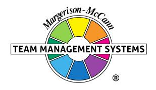

# **Opportunities-Obstacles QO2 Profile**

# **Opal Edgar**

Team Management Systems, the wheel device and the associated trademarks marked with 'TM' or ® are registered or common law marks of Team Management Systems IP in Australia and various international jurisdictions.

### **CONTENTS**

| THE OPPORTUNITIES-OBSTACLES QUOTIENT  | 2  |
|---------------------------------------|----|
| MOVING TOWARDS GOALS (MTG) ENERGY     | 3  |
| MULTI-PATHWAYS                        | 4  |
| OPTIMISM                              | 5  |
| FAULT-FINDING                         | 6  |
| TIME FOCUS                            | 7  |
| RESILIENCE INDEX                      | 8  |
| HANDLING CHANGE                       | 9  |
| COMPARISON WITH OTHER PEOPLE'S SCORES | 10 |
| HOW TO BALANCE YOUR QO2               | 11 |
| GOALS                                 | 11 |
| PATHWAYS                              | 12 |
| TIME FOCUS                            | 13 |
| OBSTACLES                             | 14 |
| NORM DATA                             | 15 |
| DISCLAIMER                            | 16 |

### **THE OPPORTUNITIES-OBSTACLES QUOTIENT**

Your answers to the QO2 items measure your approach to risk. Your scores are mapped onto the Opportunities-Obstacles scale, indicating the balance you have between seeing opportunities and seeing obstacles. If you always focus on opportunities, it may prevent you from seeing potential obstacles; if you focus too much on seeing obstacles, it may cause you to miss opportunities.

On a scale ranging from 100% opportunities to 100% obstacles you scored 73.3% on the Opportunities side and 33.3% on the Obstacles side.

The ratio of your 'Seeing Opportunities' score to your 'Seeing Obstacles' score defines your QO2 – your Opportunities / Obstacles Quotient.

Your QO2 is 2.2. This means that you are 2.2 times more likely to focus your energy on 'seeing opportunities' rather than 'seeing obstacles'.

You scored in the mid-range of the QO2 scale, showing a balance between seeing opportunities and seeing obstacles. Your bias towards the opportunities side of the scale is a strength that is particularly valuable in organisations where persistence and initiative are important. However, you will also have a good understanding of what will work and what will not.

You are particularly valuable in situations where people around you have a tendency to give up, or have lost their positivity about the way forward. Your strong sense of reality can help people to see where their effort should be focused. Your acceptance of risk will be higher than many colleagues as you can usually see the opportunities that lie ahead and are prepared to go for them.

The QO2 scale is a composite of five sub-scales: Moving Towards Goals Energy, Multi-Pathways, Optimism, Fault-Finding and Time Focus. These five sub-scales define the McCann Risk-Orientation Model shown on the previous page. Around the model are your scores on each sub-scale, calculated as a percentage of the maximum possible for each scale. Detailed information and advice on each sub-scale are given on the following pages.

#### **MOVING TOWARDS GOALS (MTG) ENERGY**

Moving Towards Goals (MTG) Energy is a form of psychic energy - the energy that gives us the determination, enthusiasm, and resilience to formulate and achieve our goals in life.

In relation to others, you scored moderately strongly on the 'Moving Towards Goals' Energy subscale. This means that you will expend energy in trying to achieve the goals that you set for yourself. When problems arise which seem likely to prevent you from attaining your goals, you will usually keep going, although there will be times when you might feel it would be easier to give up and turn your attention elsewhere.

You probably consider yourself to be fairly successful in life, and your performance record will probably show that you have usually succeeded in the goals you have set yourself, although there may have been times when you felt you could have done better. On balance, you have a good measure of determination, even though you may have periods of self-doubt. When obstacles appear in your path, you will usually try to find that extra energy to push through the barriers and achieve what you want.

You are likely to set yourself goals that lie within your capabilities, as this gives you the confidence to succeed. Remember though, if goals are too easy to reach then your potential may not be maximised. You may consider that goals beyond your capability are too risky but try to balance this with setting yourself *stretch goals* that will challenge you. Do you have untapped potential that might be released by a goal-stretching program? Success at achieving goals that lie just beyond your current abilities will have a strong effect on increasing your confidence and self esteem.

Because you have been reasonably successful in what you have achieved, you have learned to look for the opportunities in life. However, remember that it is important to not only *see* the opportunities, but to take action and *seize* them as well.

You scored strongly on the Multi-Pathways sub-scale. When obstacles arise, you are likely to put effort into finding a way around them, rather than simply continuing as before. By putting energy into the generation of alternative pathways, you are likely to be successful in attaining your goals and in finding solutions to problems.

You are probably a good improviser and will not find it difficult to identify possible solutions when problems arise. It is likely that you will have the ability to turn obstacles into opportunities.

You are probably a person who likes to be different, and may stand out from the crowd. Doing the same as everyone else has never been your approach to life. At work, you will want the challenge of different projects, particularly those that test your ability.

However, your interest in generating multiple pathways may sometimes cause you difficulties in an organisation bound by standard rules and procedures. You may need to check that you do not place yourself in a difficult position when you suggest unusual solutions to problems.

You will be excited by new and different aspects of your work. Much of your energy at work may be directed at continually changing and adapting things so that the best result is always achieved. However, there is a downside to this: beware of a tendency to indulge yourself in looking for unusual ways around an obstacle, when there may be a simpler and more effective solution.

Your high scores on the Multi-Pathways sub-scale contribute significantly to your acceptance of risk. You will be prepared to accept higher levels of risk than many others, confident in your ability to find ways around obstacles when they arise.

Optimism is a characteristic that is the basis of positive thinking. It is a psychological resource that gives people a generalised expectancy that they will succeed in their endeavours. Expected success, in turn, gives people the will to expend effort to reach their goals.

You are a person with a cautious outlook on life and a strong sense of reality. However, despite this, there are times when you can be quite optimistic about work, particularly when you have taken into account everything that could possibly go wrong. Experiences in your life may have caused you to assume the worst, and this can be a strength in helping you to avoid mistakes. However, sometimes you are so pre-occupied with finding the disadvantages of a project or proposal, that you may miss seeing opportunities when they arise.

When things go wrong, you may sometimes blame yourself, instead of considering just how much of the problem was due to you and how much to situations that could not be predicted. Consider to what extent such influences played a role in any setbacks, before you totally blame yourself.

When setbacks do occur, you may have a tendency to consider them to be long lasting rather than temporary. If this is the case, it may take you longer than others to rebound from adversity. When difficulties occur in one part of your life, you may sometimes allow them to affect other unrelated parts of your life. You may need to learn how to localise unpleasant situations and prevent them from affecting other things that you want to do.

At times you might worry too much, usually because you demand a lot from yourself. You probably regard this as a positive aspect as you will want to avoid unnecessary risks. However you may need to be aware of the dangers of 'ruminating', where excessive worrying could cause you to procrastinate and become stressed. Although experience has taught you that things don't always work out as planned, you can still smile and look at life optimistically.

The Fault-Finding sub-scale measures to what extent people put effort into examining what could possibly go wrong. People who look only to the opportunities often forget to examine the potential obstacles that could impede progress. Those who put most of their effort into potential obstacles analysis, may have little interest in looking for opportunities.

On the Fault-Finding sub-scale you have scored in the moderate to high range. At work, you may therefore be considered as a person who is quick to point out problems, and who is good at examining projects and new situations for potential difficulties. When working on a new project, you are likely to spend considerable time looking for faults and planning to avoid failure. This is a great strength, as you will be able to imagine all the problems that might occur. When new ideas are presented to you, you are likely to first look at the reasons why they might fail, before considering how they might be made to work. Once someone disappoints you, you may become more cautious in dealing with them in future. However, you will usually look for the best in people, even if you are sometimes critical of those who don't share your high standards.

Your focus on seeing potential obstacles is balanced with a focus on identifying opportunities. This is rather like the ancient Chinese view of seeking a 'yin' and 'yang' balance in everything that you do. Your careful approach to work ensures that you will usually think about the things that might go wrong and have plan 'B' ready.

You will balance your focus on caution with an assessment of more risky options. You can be very proactive when you believe in something or when an assessment of the facts indicates that you cannot lose. In summary, you are likely to accept measured risks, as the effort you put into ensuring that all the obstacles have been considered will give you confidence that the risk of things going wrong has been minimised.

The Time Focus sub-scale is a measure of psychological time - how we subjectively process time. For some people time moves quickly, for others it moves slowly. Some people live in the future; others long for the past; many live for the 'here and now'.

Your scores on this sub-scale indicate that you will have a Balanced time line. A time line is a continuum running from the past to the present to the future. Most people will have an F-time line, a P-time line (Past) or a Balanced time line.

A Balanced time line means that you enjoy looking to the future because you tend to see it in a positive light. However, you are also aware of the 'here and now', and are very realistic. You may sometimes dream about what might be, but you will soon regain your sense of reality. For you, the future is a happy place and you will want to be living in it, however you realise that the future also depends on the past and present and you will prefer success now, rather than waiting for the uncertainties of tomorrow.

When you dream about the future and get carried away by changes and improvements, remember that others are firmly positioned in the present, and maybe even the past. You may need to slow down and give them time to catch up with you.

You will recognise that many lessons can be learnt from past situations. When reviewing situations that have gone wrong, remember to encourage others, particularly those with an F-time line, to learn from their experiences.

Your balanced score on the Time Focus sub-scale makes a neutral contribution to your approach to risk. You recognise the enticement of the future but are enough of a realist to distinguish reality from an impossible dream. The other four sub-scales are likely to make a larger contribution to whether you are risk-accepting or risk-averse.

#### **RESILIENCE INDEX**

Resilience describes the ability to withstand, recover from, and adapt to adversity and stress. A measure of your resilience is derived from your scores on the subscales of the QO2.

Resilience is strongly correlated with persistence and determination and the ability to look for ways around any obstacles that may arise. Personal and social competence also play a role along with the ability to bounce back from negative situations.

Our resilience scale is derived from a combination of your scores on MTG Energy and Multipathway generation as well as some of the Optimism and Time Focus items. It's important to have both the *will* and the *way* to achieve our goals. One of the differences between optimists and resilient people is that the optimist may have a generalised expectation that things will work out whereas those with high resilience will also look for alternative pathways when blocked from a goal. If we only have the will, then we are vulnerable when obstacles arise. We are unable to generate alternative routes to our goal and therefore need extra energy to 'pound away' in the only way we know. Resilience is also related to the ability to put the past behind us and rebound easily from adversity. Resilient people approach goals with a positive emotional state, a sense of challenge, and a focus on success.

Those with low resilience have lower energy available to push towards their goals and will often follow a single pathway. They may well approach goals with a negative emotional state, a sense of ambivalence, and a conservative approach to risk.

#### **Your Resilience Index on a scale ranging from 0 to 100, has been calculated as 77.**

This value is in the mid-range of the scale, which means that you are reasonably resilient and will approach your goals with an expectation of success. You may have had as many setbacks as successes but have developed enough resilience to keep trying, knowing that you will ultimately be successful. You may need to put more effort into adjusting your goals when unexpected circumstances arise. Developing a higher level of resilience will bring you through the various crises that you will undoubtedly experience during your working life.

#### **HANDLING CHANGE**

The sub-scales of Multi-Pathways, Optimism, Fault-Finding and Time Focus can be combined to give an indication of how you handle change. The calculation shows that you will adapt well to change, and may often initiate it, but only if you are sure that it has distinct advantages. You are likely to be against change for the sake of change, and will want to see the benefits of any new initiatives before accepting them.

Your generally positive approach to life means that you will want to keep informed of the latest ideas or new technology, but will want to be sure that most problems have been 'ironed out' before they are implemented. In particular, you will want to see how any changes affect current procedures and processes, and are more comfortable with gradual change, rather than something that is a little radical.

When you do have changes that you are excited about and wish to implement, take a little time to research them fully before jumping into action. Try involving others in the changes and incorporating their views into your plans.

You may need to understand more about why people oppose change. Often it is because their perception is that the obstacles associated with the changes seem insurmountable in relation to the benefits likely to accrue. In the language of this Profile they will have a significantly lower QO2 than you. You probably explain and even promote the opportunities associated with the change, but you may not put sufficient effort into addressing the obstacles. In fact, you may not even see the obstacles as clearly as those with a lower QO2 than you! If this is the case you will benefit from asking such people what the difficulties might be from their perspective.

Because others may not see the benefits of change as quickly as you, don't expect them to agree with you the first time you propose new initiatives. To you the benefits may seem obvious but you will need to be patient and realise that others may need more time to accept what you are proposing. It is also a good idea to be prepared for objections, and to have done a Potential Obstacles Analysis on the issues of the change so that you can handle the objections in a clear and precise way, rather than perhaps improvising with ambiguities.

### **COMPARISON WITH OTHER PEOPLE'S SCORES**

The median for the QO2 is 2.2 compared to your score of 2.2.

You may be interested in how your scores compare with others who have answered the QO2 Profile Questionnaire. The median scores of a development sample of 1000 respondents are shown by the top bar above. This data shows the importance of having a balance across the Opportunities-Obstacles dimension.

Of further interest is the norm data on the five sub-scales, which allows you to interpret your scores relative to other people. The lower quartile, median and upper quartile data are summarised below:

| Sub-scales     | Lower Quartile | Median | Upper Quartile |
|----------------|----------------|--------|----------------|
| MTG Energy     | 68%            | 77%    | 87%            |
| Multi-Pathways | 68%            | 77%    | 86%            |
| Optimism       | 60%            | 70%    | 79%            |
| Fault-Finding  | 21%            | 30%    | 40%            |
| Time Focus     | 53%            | 63%    | 73%            |

Looking at the MTG Energy norms as an example, 25% of respondents had a score less than 68%, 50% of respondents had a score greater than 77%, and 25% of respondents had a score greater than 87%. A similar interpretation applies to the other sub-scales.

## **HOW TO BALANCE YOUR QO2 GOALS**

You are a person with a good amount of energy and a determination to pursue goals. Because a high MTG Energy is aligned with seeing *and* seizing opportunities, it is important to develop it to a high level. You are probably fairly good at *seeing* the opportunities that come your way, although you may not always *seize* them. You probably need only a small increase in confidence to give you the determination to succeed in anything you try.

You may need to check whether the goals that you set for yourself offer the right degree of challenge. If goals are easy to achieve, then you may never reach your true potential. You may have an easy and enjoyable time as you work towards your goals, but sooner or later you will realise that more could have been done with your life. On the other hand it might be that you are setting goals that lie well beyond your capabilities. If this is the case, then no amount of rewards, or cajoling can help realise these goals. In this situation you may well find a reason to give up as soon as you can. If this occurs then your MTG Energy will be in decline. You should reflect on which of the two above possibilities may apply to you.

It seems that high MTG Energy is acquired through life's experiences. When we are children, goals are either set through our own innate desire to succeed (intrinsic goals) or through the expectations of our parents, school teachers or significant others (extrinsic goals). In many cases the extrinsic goals help formulate the intrinsic ones. Whenever we achieve any of these goals we are usually rewarded in some way by prizes, admiration or concessions. Very soon an expectation of succeeding is established; if a goal is set, we will believe we can achieve it and therefore our MTG Energy is developed.

This is why goal setting is so important for personal development. Goals must be set that challenge the individual rather than those that are easy to reach or too far away. In sport the concept of the personal best sets the right goals. This can easily be extended to cover personal development. You need to determine your PB (personal best) in relation to your current work load and then set yourself challenges that will break your PB, even if by only a small amount.

# **HOW TO BALANCE YOUR QO2**

#### **PATHWAYS**

You are a Multiple-Pathways person. This means that you are constantly looking for new approaches to try. You probably, therefore, have a reputation for being a person who can find ways around problems. You probably see this as one of your strengths and it has probably given you the confidence to pursue and be stimulated by opportunities that come your way.

You have a natural tendency to want to try different approaches to the projects that you are involved in. While this is an admirable quality, you may need to consider whether this is always the best thing to do. Sometimes, following proven methods leads to safer, more effective outcomes. When deciding how you are going to approach a particular project, take some time to discover whether other people have worked on the same or similar projects. Listen to them and utilise their experience. There may be times when you would be better to stay with your initial course of action and put in extra effort to overcome resistance.

Your tendency to look for ways around problems may cause you to quickly implement alternative solutions whenever obstacles occur. If this is the case you will benefit from studying the Multi-Pathway Generation Model described in the accompanying *Personal Discovery Workbook*. You should reflect on whether you give enough attention to the ILB (Introverted Left Brain) quadrant. This is the quadrant that helps you identify the root cause of any obstacle. Once the root cause of the obstacle is found then a pathway can be built around it. In this way the solutions you generate may have a better chance of succeeding. The secret to effective pathway generation around obstacles is to use all four modes of thinking - not just the one that comes naturally to you.

## **HOW TO BALANCE YOUR QO2 TIME FOCUS**

In relation to others, you have a Balanced time line, with a focus a bit more to the future than the past. You could therefore benefit from spending a little more time on answers to the question, 'Where are we now?' This will require a detailed analysis of the strengths, weaknesses, opportunities and threats for you, your team and your organisation. By fully understanding where your team/organisation has been and where it is now, you can move it forward into the future, based on reality. By carrying out a 'history walk' with your team, it may help others to see where you want them to go. If you are already doing this, you will be well on the way to achieving a balance between focusing on the future but learning from the past.

Your enthusiasm for the future is important to the contribution that you make at work; however make sure that you are not working too far ahead of others in your team and the organisation, particularly those with a lower QO2. As a Balanced time line person with a focus to the future, you may have difficulties in interacting with some P-timers, who are more focused on the past and will tend to look to tried and tested approaches. When interacting with such people try to slow down and make the connections between what has occurred in the past, what is happening in the present and how this relates to the future that you can readily see. Point out similar successful situations in the past and show them how successful these were.

To a P-time person, changes should be presented as small increments from what is currently happening. No leaps should be made from the present to the future. Each proposed change should be dealt with in detail and the links made between what is happening now and what might happen in the future. All possible problems should be identified, with adequate time allowed for the Ptimers to reflect on whether every potential obstacle has been identified. This could take some time, but it is well worth the investment if it leads to acceptance rather than rejection.

Don't assume that any success you are having now can be automatically transferred to the future. Successes are usually related to specific instances and cannot always be generalised to other events.

## **HOW TO BALANCE YOUR QO2 OBSTACLES**

When situations go wrong, we can attribute the cause to ourselves or to external events. Opportunity-oriented people often attribute problems to external events whereas obstacle-oriented people sometimes blame setbacks on their own inadequacies. If you do tend to blame yourself when things go wrong, it may affect your willingness to take risks and explore opportunities. When this occurs, try to look instead at external events as the cause of the problem. Problems are rarely entirely caused by our own actions. External events constantly occur, over which we have no control. Try to identify these events. It will help you to become more positive.

When you achieve good results, reverse the scenario. Think to yourself, 'Yes, that was largely due to me, what else would I expect?' Many people become very positive in their outlook by applying one success to all other parts of their life.

When things go wrong, opportunity-oriented people attribute the cause to specific situations rather than generalising the problem, whereas obstacle-oriented people may attribute the failure to general causes. For example, if you made a serious mistake in proofreading you may be more likely to attribute the cause to a general fault of carelessness, whereas an opportunity-oriented person may say, "I hate proofreading so, of course, I am likely to make mistakes." Implicit in this statement is that mistake making is confined only to proofreading.

So when things go wrong, ask yourself if you are being general or specific when you try to find out why. If you are attributing the setback to a general fault in yourself, look carefully for the specific causes of the setback.

When major obstacles arise, do you sometimes find yourself thinking in great depth about the problem, reliving all the events that occurred? This is called 'running an internal dialogue' or simply, talking to yourself. While it is good to analyse problems so that they don't occur again, uncontrolled 'self-talk' can waste time and cause you to become even more stressed. If your 'self-talk' is negative, try replacing it with positive thoughts about yourself, your life and your work.

#### **NORM DATA**

For your information, some database reference material is presented below. This data shows the percentage of people sampled who have QO2 scores higher than the value listed.

This norm data shows that, compared to our research sample, you have a QO2 score close to the mid-point. This means that you will be able to see potential opportunities at the same time as identifying any major obstacles that might arise. This is a great strength at work, as it gives you a balance across the Opportunities-Obstacles dimension.

If you want to achieve an even better balance in your QO2, read the advice given in the section 'How to Balance Your QO2'. If you are already implementing this advice, you are well on the way to balancing the risks in any decision you take.

### **DISCLAIMER**

© Team Management Systems IP, 2024, Australia. Published by Team Management Systems. Produced on 15/04/2025. All rights reserved. No part of this publication may be reproduced, stored in a retrieval system, or transmitted in any form or by any means, electronic, mechanical, photocopying, recording or otherwise, without prior written permission of the publishers.

Team Management Systems, the wheel device and the associated trademarks marked with 'TM' or ® are registered or common law marks of Team Management Systems IP in Australia and various international jurisdictions.

The content of this report is based on data submitted through the Opportunities-Obstacles QO2 Profile Questionnaire. While great care and diligence have been exercised, it is important to note that each personalised report is based on general observations and interpretations.

The authors and publishers make no guarantees regarding the accuracy, completeness, or applicability of this report for any specific individual or situation. Therefore, they cannot be held liable for any decisions, actions, or outcomes resulting from the use of the information contained in this report.

