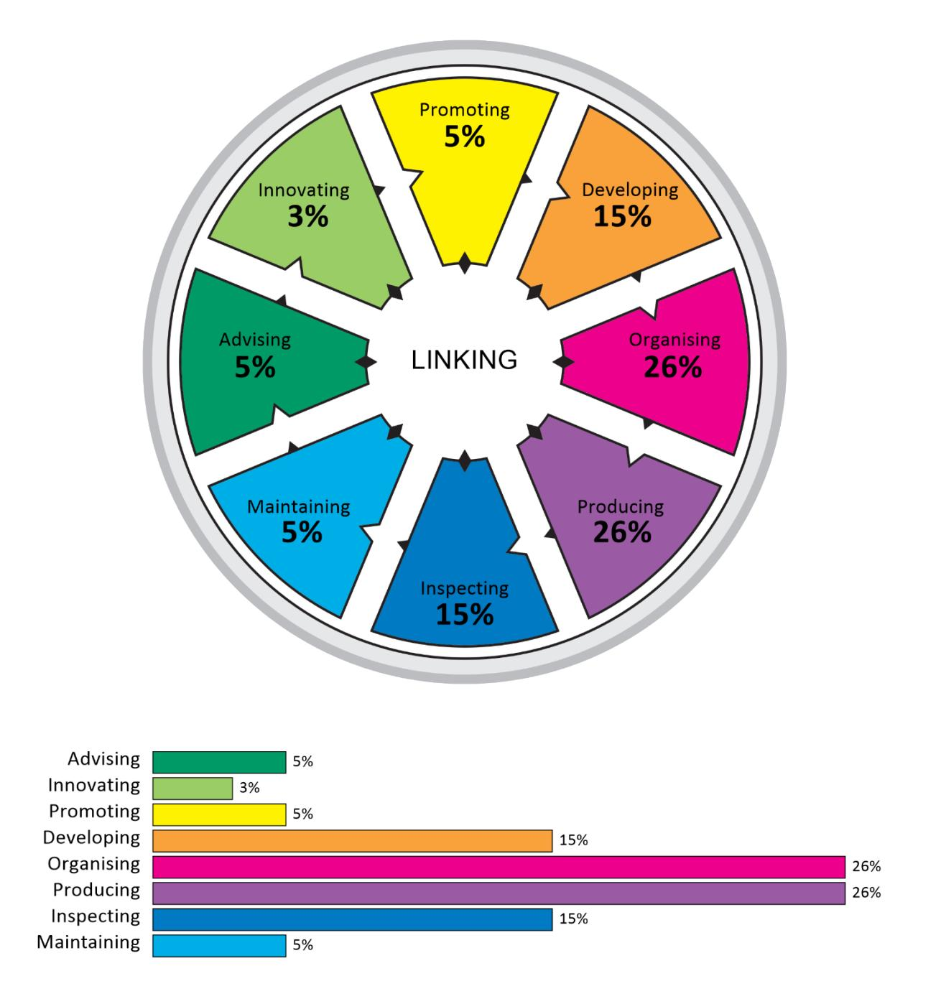
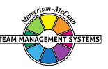

## **Team Management Profile**

# **Belinda Balchin**

Team Management Systems, the wheel device and the associated trademarks marked with 'TM' or ® are registered

or common law marks of Team Management Systems IP in Australia and various international jurisdictions.

## **CONTENTS**

| INTRODUCTION                               | 2  |
|--------------------------------------------|----|
| WORK PREFERENCE MEASURES                   | 4  |
| OVERVIEW                                   | 5  |
| LEADERSHIP STRENGTHS                       | 7  |
| DECISION-MAKING                            | 8  |
| INTERPERSONAL SKILLS                       | 9  |
| TEAM-BUILDING                              | 10 |
| AREAS FOR SELF-ASSESSMENT                  | 11 |
| KEY POINTS OF NOTE FOR THRUSTER ORGANISERS | 12 |
| RELATED ROLES                              | 14 |
| WORK PREFERENCE DISTRIBUTION               | 15 |
| LINKING                                    | 17 |
| INDIVIDUAL SUMMARY                         | 18 |
| DISCLAIMER                                 | 19 |

Your personal Team Management Profile provides you with information about your work preferences. It is a starting point for consideration and discussion of how you approach your work and your interactions with others in the workplace.

All work teams need to consider nine key activities essential for high-performance:

| Advising    | Gathering and reporting information                       |
|-------------|-----------------------------------------------------------|
| Innovating  | Creating and experimenting with ideas                     |
| Promoting   | Exploring and presenting opportunities                    |
| Developing  | Assessing and testing the applicability of new approaches |
| Organising  | Establishing and implementing ways of making things work  |
| Producing   | Concluding and delivering outputs                         |
| Inspecting  | Controlling and auditing the working of systems           |
| Maintaining | Upholding and safeguarding standards and processes        |
| Linking     | Coordinating and integrating the work of others           |

Your own work preferences have been derived from your responses to the Team Management Profile Questionnaire. While you may work in any of the areas of the Wheel, your highest preference area, or Major Role, has been identified together with two Related Roles which indicate your next highest preference areas. All the roles are displayed on the Team Management Wheel shown at the front of this Profile. The Linker role at the centre is the responsibility of all team members.

Note that the Team Management Profile Questionnaire does not measure skill or experience - you may have good abilities in areas of work where you have low preferences. However, where there is a good match between your preferences and the demands of your job, you are more likely to enjoy work, develop skills and perform well. Where a group is made up of individuals with complementary work preferences, it has a higher chance of being effective.

Your roles on the Team Management Wheel arise from your preferred approaches to work in four different areas:

- how you relate with others
- how you gather and use information
- how you make decisions
- how you organise yourself and others.

These four work preference measures are shown on the next page as bipolar scales ranging from 0 to 30 either side of a centre point.

For example, on the first work preference measure, the length of the bar to the left shows the extent to which you relate to others at work in an extroverted way. The bar to the right indicates the extent to which you relate to others at work in an introverted way.

Similarly the second measure indicates the extent to which you gather and use information in either a practical or creative way. The third measure looks at the extent to which you make decisions in either an analytical way or according to your beliefs, and the fourth measure determines whether you like to organise yourself and others in a structured or flexible way.

By subtracting the lower score from the higher one for each measure, a net score is obtained. This is indicated by a black vertical line. These are E: 4; P: 18; A: 11; S: 11 and are the foundation of your major role preference.

#### **WORK PREFERENCE MEASURES**

**RELATIONSHIPS**

How you Relate to others

## **OVERVIEW**

Thruster-Organisers are outgoing types who make things happen by organising people and resources so ideas, discussions, and experiments are turned into action. They are important people to have on a team to ensure attention is focused on results. They enjoy meeting with others and discussing issues, but will do so primarily on the basis of facts. They will usually analyse in detail any information they have to hand and then make their decision, based on what is necessary to ensure the satisfactory completion of the task. They put a heavy emphasis on getting the job done in an efficient and effective way. The term Thruster-Organiser is, therefore, appropriate as a description as they like to thrust forward into action by organising people and tasks.

As a Thruster-Organiser, you will want to set objectives and take action. You do not like things to be in disarray and will strive, wherever possible, to try and reach the resolution and conclusion of a task, rather than leave it hanging in the air for too long. The motto of the Thruster-Organiser is 'let's do it now and get it finished'.

Thruster-Organisers are leaders of the way, not followers. They push forward to achieve objectives, despite the problems. Often their thrusting and energetic approach goes beyond the set plan. It is usually the Thruster-Organiser who strides forward, with others scrambling to keep up with the pace.

You will enjoy meeting others at work, particularly to get agreement on decisions. You do not appreciate people who 'waffle' and may 'switch-off' when this occurs. Others may, therefore, accuse you of not always listening to what they have to say. In fact, you do listen, particularly when the conversation relates to facts and information concerning the task at hand. You can be sociable on your own terms, but do not usually like spending a long period of time in small talk that gets in the way of completing work.

You are very much task-centred and like to get on with the job. Indeed, you can be a tough negotiator when required and make decisions which may affect people adversely, if you consider it is in the best interests of doing the job efficiently and properly.

You will probably find executive positions to your liking. If you value achievement, you will no doubt be ambitious, not only to get tasks completed, but to gain a position where you can have influence. You will very likely find the responsibility that comes from having a position of authority a positive challenge to which you respond well.

The kind of work you prefer is a specific task where you will be able to measure the results. You like clear objectives and will work to them, often 'knocking down obstacles' if you have to, rather than going round them or waiting till they go away.

As you will probably have a number of practical interests and skills, you will look for jobs that involve organising things, rather than playing with ideas. You will probably prefer dealing with tangible situations where you can see the results of your efforts. You can work well on your own, but like to balance these periods with time spent 'managing by wandering around', using your five senses to keep you on track.

You will prefer your work situation to be reasonably structured and will probably like to work to a set of rules and regulations. You will respect routine, organisational systems and roles and if such procedures don't exist, you will set them up. You will take pride in meeting deadlines and being punctual. You discipline yourself and expect others to also conform to the organisational systems you lay down. If they do not, you can become impatient and your frustrations may well show at times in a lost temper. You consider it is important for people to do their duty and earn their keep.

Within the terms of the Team Management Wheel, you are capable of both Exploring and Controlling. Because of your concern for structure, you will be interested in the Controlling aspects of work, such as getting the job done. As a result, you may focus on areas such as production scheduling, time deadlines and the quality and quantity of output, even though you won't necessarily want to manage these things in detail on a day-to-day basis. Your strength lies in pushing for systems to be set up and showing how they can be implemented, even if it means making some drastic changes.

Your ability to stand back and analyse a situation is also strong and, as you find it relatively easy to meet with others and discuss new challenges, you will also be interested in Exploring. You are one of the few people who is capable of operating in both the Exploring and Controlling areas of the Team Management Wheel.

## **LEADERSHIP STRENGTHS**

It is your practical thinking and desire to make things happen that is the key to the way you work. You believe in setting objectives and working to a plan which is based, wherever possible, on experience and well-tested procedures. You will bring reason, logic, and analytical systems to bear on a job, and will consider emotional matters, such as people's feelings about work allocation and so on, as secondary to getting the work done. You admire commonsense and straight-talking in others.

As a leader, you take responsibility and expect others to respect and follow your leadership once you have committed yourself. You can allocate work to people, assess their performance and be direct with them in your evaluation. Sometimes others may feel you can be critical, although when they do well you will usually arrange a way of showing recognition.

As a Thruster-Organiser, you can be counted on to get projects underway. You will 'cut-and-thrust' and push forward until your objectives are met. Thruster-Organisers look for leadership roles. In particular, they are excellent in areas such as project management, where time and schedules are of utmost importance.

You will tend to enjoy jobs where there is a specific end to be met, with time and cost constraints that demand decisive leadership. You will then be able to develop a plan, and guide and direct others to do their part. You can become impatient if team members don't comply with the plan.

Thruster-Organisers don't easily let obstacles get in their way. In the jungle of work, they clear a path which is as quick and straight as possible, even if it means overcoming resistance from others.

Although you probably don't like long meetings, you will take pride in running efficient meetings where people are expected to speak to the point. You will be most comfortable with a well-ordered, well-planned agenda. You demand action from discussion and look for quick feedback.

You are usually a painstaking worker, loyal to the organisation and its purpose. While you like to be briefed in detail, the pace at which you tackle projects often means you have to make decisions without sufficient information. Whereas data is vital, you never let too much of it stand in the way of action.

#### **DECISION-MAKING**

Decision-making is important to you. It paves the way for action. Rather than sit around for long periods considering, theorising and discussing, you prefer to weigh the pros and cons, make a decision, take action and if it does not work try again. You may see decisions as a series of negotiations with trade-offs to get things done. The cut and thrust of negotiations can be an exciting challenge where you can see the wins and losses that emerge. This may be appropriate with other groups, but with your own team you may need to take time to get commitment and consensus.

On occasions, the strength of your ideas tends to run away with you and you can become somewhat impetuous. Because you are always pushing for outputs and action, a possible weakness is your tendency to jump to conclusions and rush into decisions before getting sufficient information. You may tend to feel 'bogged down' by the slowness of others. As a result, you should continually monitor this side of your leadership style to ensure you are not making decisions on weak foundations. Doing things and seeing the results are important to you, but success depends equally on listening to other people's ideas and careful planning.

In your keenness to get into action, you may sometimes overlook other people's views which may need consideration. A useful skill for you here is to develop the knack of summarizing the opinions of others and reflecting their feelings before indicating your position, especially if it differs from theirs. In this way, you acknowledge people's feelings even if you do not always accept them.

In reaching decisions, you like to see some stability being established. You will tend to dislike situations which are unstable and confusing. However, you may need to spend more time gathering information when the problem is not a standard one. You may feel that time is being wasted and inefficiency creeping in if too long is being spent on playing with ideas and gathering data. You will need to develop this side, particularly as you climb higher in the organisation. It is important to have members of your team who can supply sufficient data for you to come to a sensible conclusion.

### **INTERPERSONAL SKILLS**

You are reasonably well balanced across the extroversion-introversion dimension and will, therefore, enjoy meeting others. However, you also need time to yourself to do some deep thinking. When conversing with colleagues you like them to get to the point and stick to it. As a result, you tend to prefer sensible people who will set challenging objectives and work at achieving them. You believe you are a realist, and indeed are when you are dealing with work and systems. However, with people your business-like, goal-oriented, factual manner can sometimes create an unintended effect. Unless you have developed good Linking Skills, you might be seen by others as someone who listens to what is said, but is sometimes reluctant to incorporate their views. Such people may become demotivated and prevent you from achieving your objectives, if they have a chance.

You are usually clear-cut in your dealings with colleagues and both sides will know where they stand. Wherever possible, you move in straight lines towards your objectives. In doing so, you can be outspoken if other people don't do as required. Where your comments on other people's weaknesses, rather than strengths, become a regular activity, uneasy and adverse relationships can develop with your staff. If, however, such criticism is positive, deserved, and taken in the right spirit, then personal relationships at work will not suffer. Try to reinforce people's successes and give positive guidance when errors occur.

For you, the occasional count to ten when people do things that make you angry or annoyed can be useful, although your direct approach often gets through to them. Also the skill of asking a question, rather than making another Thrusting-Organising statement, is valuable, particularly in delicate situations.

Your major concern will be to get things done by mobilising the talents of others. You can do this through your ability to see what action is required. However, remember to allocate enough time to talk and listen to your team members and openly recognise their contributions as you forge ahead.

You find it easier than others to meet all sorts of people because of your outgoing approach. However, because of the pressure of work and the deadlines you set, you may feel you don't have enough time to talk through key issues with your own team. You may therefore need to set aside time 'off site' with your own staff to do this. When did you last go away with your team to review progress and discuss the future?

You tend to speak your mind rather than hold back, just to please people. Others, therefore, usually know where they stand with you, for good or bad.

You often get your best ideas by thinking them through on your own and then going out and checking them with other people. Conversation with others will help confirm you are on the right track. You will then take all the data you have gathered and spend time thinking about it, writing down notes to help you, where necessary. You will enjoy discussion with people at work as it is a way of moving forward.

### **TEAM-BUILDING**

You will enjoy working at the 'sharp end' of the team where the action is taking place. You will need to build a team around you that enables you to concentrate on the things you are strong at and delegate the other key jobs. You are good at organising and planning work, and pushing forward towards the target.

The most important thing, however, is to ensure that the projects and activities you 'get off the ground' are then passed over to Concluder-Producers, who will take a pride in continuing the output while you move to another start-up project.

People in your team will usually respect your Thrusting-Organising capability to get things done. It is, after all, your key combination. However, be careful to ensure that your team members know what you are doing, by holding regular meetings to inform them of developments. Thruster-Organisers can often get too far ahead of the team and then complain that they are not given support. Where people do support you, they admire your go-getting spirit, willingness to take risks, and your direct style.

A danger might be that team members don't challenge you because of your tendency to thrust forward towards an objective. However, you should set up situations, for example at a meeting, where people can constructively criticise your plans prior to action. This will then ensure that all possible ideas have been incorporated.

You may have a tendency to choose Concluder-Producers or Assessor-Developers as your team members because you get on best with these people. However, it is possible that an effective complementary role for you is the Reporter-Adviser who makes an excellent support person. They will usually provide the detailed information you need. In a team, someone from the Creator-Innovator or the Upholder-Maintainer sector can also provide an equally good balance. The Creator-Innovators can provide the new ideas and intuitive understanding, and the Upholder-Maintainers the social support and bonding of people as you push forward. However, because of their less thrusting approach, whereby they require more time to come to a conclusion, you may find such people move more slowly than you want to go. Nevertheless, in order to build an effective team, you need to develop patience and encourage others accordingly.

## **AREAS FOR SELF-ASSESSMENT**

The following points could be helpful in reviewing your approach to teamwork:-

- At times, you need to analyse things carefully before taking action. There is a tendency on occasions for you to want to push forward before all the planning has been done. Doing things and seeing the results are important to you, but success depends equally on listening to other people's ideas and careful planning. Be aware of the signs that your team members may not be following you and ask them how they can improve things rather than tell them yet again.
- Having people around to think through creative and innovative problems and provide ideas to positively challenge your own analysis is important. Your strength is in making systems work. You can get things organised and translate ideas into practical output. You should make time to meet the Creator-Innovators, even though they may disturb the status quo. Either that or you may get left behind with an outmoded system. Schedule such meetings rather than leave them to chance. Indeed, provide your team with an opportunity to be constructively creative each year by having a one-day or two-day workshop on new ideas where Thrusting and Organising takes second place to future options.
- It is useful to develop the skill of summarising the views of others and reflecting their feelings before indicating your position if it differs from theirs. In this way, people's beliefs are acknowledged, even if they are not always accepted. You will also get a wider perspective on the problem, even though it may slow down the initial move to action. However, the commitment of others can more than make up for this.
- You may need to spend more time gathering information when the problem is not a standard one. You may feel that time is being wasted and inefficiency is creeping in if too long is spent playing with ideas and collecting data. However, the higher you go in the organisation, the more you will need accurate information. You will, therefore, need to build a team of people who can support you by supplying the data you need to come to a sensible decision.

Thruster-Organisers push for what they consider is required. Their matter-of-fact approach to work and life means instructions can be given in an impersonal way, even if they are not always received as such. You like life to be organised and will establish orderly systems and procedures to make sure things get done. Overall, Thruster-Organisers can make excellent executives, particularly in getting projects completed on time, providing they take the trouble to keep their team members informed and involved.

## **KEY POINTS OF NOTE FOR THRUSTER ORGANISERS**

- You are likely to be more outgoing and enjoy meeting others, but equally like periods on your own.
- You like to work to systems and procedures.
- You are concerned to see outputs finished on time and to a standard.
- You prefer to use an impersonal, analytical approach to decision-making after you have heard people's opinions.
- There are times when you can be impatient and impulsive, although you will generally keep these tendencies in check.
- You are usually practical, factual and realistic.
- You rely heavily on technical skills and past experiences.
- You place emphasis on accepting responsibility and being punctual.
- You work to objectives and look for logical approaches.
- You like jobs that have variety and a fast action atmosphere.
- You often get your best thoughts on your own, but then like to check out your ideas with others.
- You may need to work with a Concluder-Producer to ensure continuity of the tasks.
- You like to take a direct route.
- You prefer tangible facts to theoretical ideas.
- You like to work to a schedule and timetable.
- You take pride in doing a job in an efficient manner.
- You like to be organised and to organise others.
- Your willingness to take on commitments can lead to time-allocation problems.
- You can enjoy the challenge of negotiation.
- You prefer to reach a decision, take action, then change if necessary, rather than have long discussions.
- You tend to speak your mind and indicate what you want.
- You prefer to take a commonsense approach and expect others to do the same.
- You prefer to converge rather than diverge.

- You can bring stability to work operations.
- You welcome the challenge of leadership and developing an effective team.

### **RELATED ROLES**

In the constructs of the Team Management Profile Questionnaire, you scored in the areas of practical information-gathering and analytical decision-making. These two factors have combined to give you a major role in the Thruster-Organiser sector. However, you also scored significantly in the Concluder-Producer and Assessor-Developer sectors, mapping you on to the Organising area of the Team Management Wheel. This right-hand side of the Wheel is the area where you are 'at home'.

While on balance you prefer to be outgoing, particularly with people you know well, there are times when you can withdraw 'into your shell' and reflect on the progress being made. This is more likely to occur when complex problems arise, or when you feel under pressure. At these times, you are likely to adopt more of a Concluder-Producer approach to the job and become cautious. You will probably want to double-check the work of your team members, just to be sure nothing can go wrong. To you, it is important that your work or project be completed in the most effective and efficient manner, and you will want to make sure you are in control of all the details.

You probably value your own and other people's skills very highly, and take whatever work you do seriously. You will not like to deal with things superficially, but rather become a master of the task and see it through until it is finished. Others may see you as a perfectionist and say you sometimes become too occupied with precision. This is because you like to see things done correctly, as you believe this will enable the job to be done well, first time round. Certainly, you are a practical person and value getting things done on time and to an agreed plan.

In your Assessor-Developer role, you will enjoy being in close contact with new opportunities and advances, provided they have a strong element of the real world associated with them. It is the practical challenge of making someone else's idea work that can highly motivate you.

You probably see yourself as a realist who can make the best of what is available. You are unlikely to stand on the sidelines and watch life go by. For you, it is important to be on the field playing, close to the action. While you can cope with conflict, you do not always enjoy these situations and on occasions can find them stressful. If this is the case, you may need to develop your sense of intuition so you recognise and solve potential conflict problems at an early stage.

You are definitely a pragmatic person, who will judge situations on their interest to you. You may well enjoy risk and the direct excitement of working on projects where the payoffs are big. In these situations, your strengths lie in the way you can assess information. Here, your analytical approach enables you to stand back and look at the information you have in an objective way. Usually, you will be able to give objective advice on the pros and cons of taking particular courses of action, particularly from the practical point of view.

You are likely to be an 'activist' learner who benefits most from in-depth experiences, rather than by reading and study. Probably, you won't enjoy classroom situations as most of the experience you value has been learned the hard way - in the school of 'hard knocks'.

### **WORK PREFERENCE DISTRIBUTION**

The Team Management Wheel highlights your major role preference and two related roles. In terms of the eight Types of Work that define the critical tasks of a team, these roles indicate the top three task areas that you prefer to work in.

It is possible to extend your scores on the Team Management Wheel beyond the top three task areas to produce a work preference distribution that indicates your level of preference for all eight Types of Work. This information is valuable when it comes to allocating work among team members, as Team Management Systems theory states that all eight Types of Work are critical to the success of a team. If several team members have the same major and related roles, it is worth looking at the individual work preference distributions to determine whether there is a significant difference among team members in the less preferred work areas.

Your work preference distribution is shown with 100 percentage points distributed across all eight Types of Work, indicating those tasks that you like best and those that you like least. If the percentages are similar, you will be relatively comfortable working on any task. If there is a gap of more than 15 percentage points between the highest and lowest scores, there may be some tasks that you definitely like and others that you dislike.

When allocating tasks, it seems sensible for there to be some overlap between your work preferences and the team tasks that need to be undertaken. If you are spending a lot of time in areas that are not your preference, it may affect your enjoyment and wellbeing at work. Likewise if you are working solely in Types of Work that strongly match your work preferences, you may be ignoring important personal development opportunities in areas of lower preference.

It is important to remember that work preferences and competence are unrelated, and you may perform well in Types of Work for which you have a low preference. However, it is important to get the right balance between working to your preferences and working against them. Our research shows that a two-thirds/one-third balance works well for many people, and that problems with dissatisfaction can occur when the ratio moves significantly in the opposite direction. Working to your preferences will help establish conditions at work where your mental and psychic energy can flow freely.

### **LINKING**

At the centre of the Team Management Wheel is the Linker role, defined not by preferences, but by the skills that all team members need to develop. Linking Skills comprise people linking, task linking and leadership linking.

Of importance to all team members are the People Linking Skills, particularly the skill of Communication. A useful technique to try here is Pacing - varying your communication style so that it matches other people's role preferences. The successful implementation of Pacing skills helps avoid conflict and leads to more productive interactions.

Below are some key points that team members should consider when interacting with a Thruster-Organiser major role preference like yours. Read each point and consider whether you would like the other person to act like this when they are communicating with you. Highlight those pacing points that you definitely agree with and share them with your team members. This may help them understand 'what makes you tick' and how they can better meet your needs.

In order to link more effectively with you, the person you are interacting with could:

- Engage with you in a professional manner.
- Suggest practical rather than theoretical solutions.
- Try to converge in their discussions rather than diverge into areas you may consider irrelevant.
- Talk things through with you before forcing a decision.
- Not impose their own beliefs and opinions unless they are backed up by facts.
- Speed up their speech delivery (if necessary) to match yours and try to talk with 'colour' in their voice rather than in a monotone.
- Be punctual to meetings.
- Stick where possible to agendas.
- Use a whiteboard to record the details discussed; this will help you to capture key points and keep on top of the details.
- Not overload you with too much information.
- Realise that your mind may wander onto more important things and so learn techniques that make you want to listen to them.
- Help you to see the 'big picture', where necessary.
- Summarise the content of conversations, making sure the summaries are succinct and factual, rather than their opinions.
- Give you one or two options rather than a long list, when wanting a decision from you.

# **Individual Summary**

## **DISCLAIMER**

© Team Management Systems IP, 2024, Australia. Published by Team Management Systems. Produced on 15/04/2025. All rights reserved. No part of this publication may be reproduced, stored in a retrieval system, or transmitted in any form or by any means, electronic, mechanical, photocopying, recording or otherwise, without prior written permission of the publishers.

Team Management Systems, the wheel device and the associated trademarks marked with 'TM' or ® are registered or common law marks of Team Management Systems IP in Australia and various international jurisdictions.

The content of this report is based on data submitted through the Team Management Profile Questionnaire. While great care and diligence have been exercised, it is important to note that each personalised report is based on general observations and interpretations.

The authors and publishers make no guarantees regarding the accuracy, completeness, or applicability of this report for any specific individual or situation. Therefore, they cannot be held liable for any decisions, actions, or outcomes resulting from the use of the information contained in this report.

