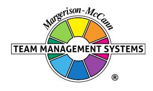

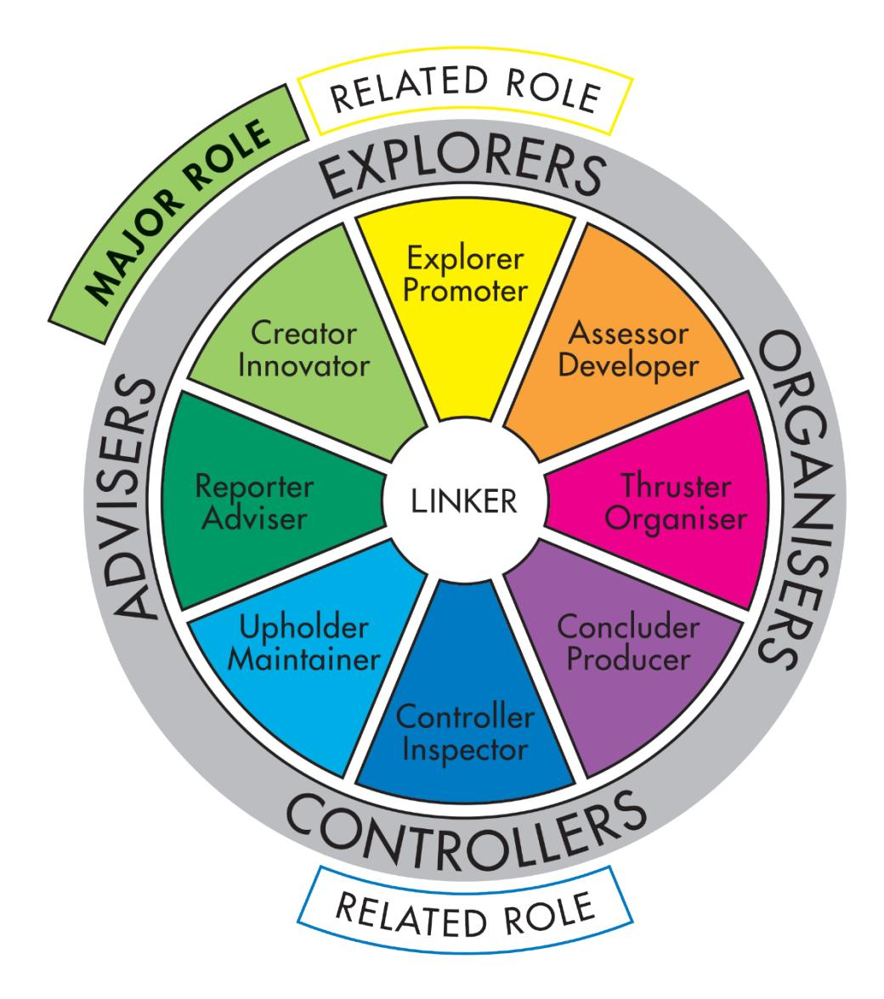

## **Team Management Profile**

## **Kirsty McCann**

Team Management Systems, the wheel device and the associated trademarks marked with 'TM' or ® are registered

or common law marks of Team Management Systems IP in Australia and various international jurisdictions.

## **CONTENTS**

| INTRODUCTION                              | 2  |
|-------------------------------------------|----|
| WORK PREFERENCE MEASURES                  | 4  |
| OVERVIEW                                  | 5  |
| LEADERSHIP STRENGTHS                      | 6  |
| DECISION-MAKING                           | 7  |
| INTERPERSONAL SKILLS                      | 8  |
| TEAM-BUILDING                             | 9  |
| AREAS FOR SELF-ASSESSMENT                 | 10 |
| KEY POINTS OF NOTE FOR CREATOR INNOVATORS | 11 |
| RELATED ROLES                             | 12 |
| WORK PREFERENCE DISTRIBUTION              | 13 |
| LINKING                                   | 15 |
| INDIVIDUAL SUMMARY                        | 17 |
| DISCLAIMER                                | 18 |

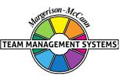

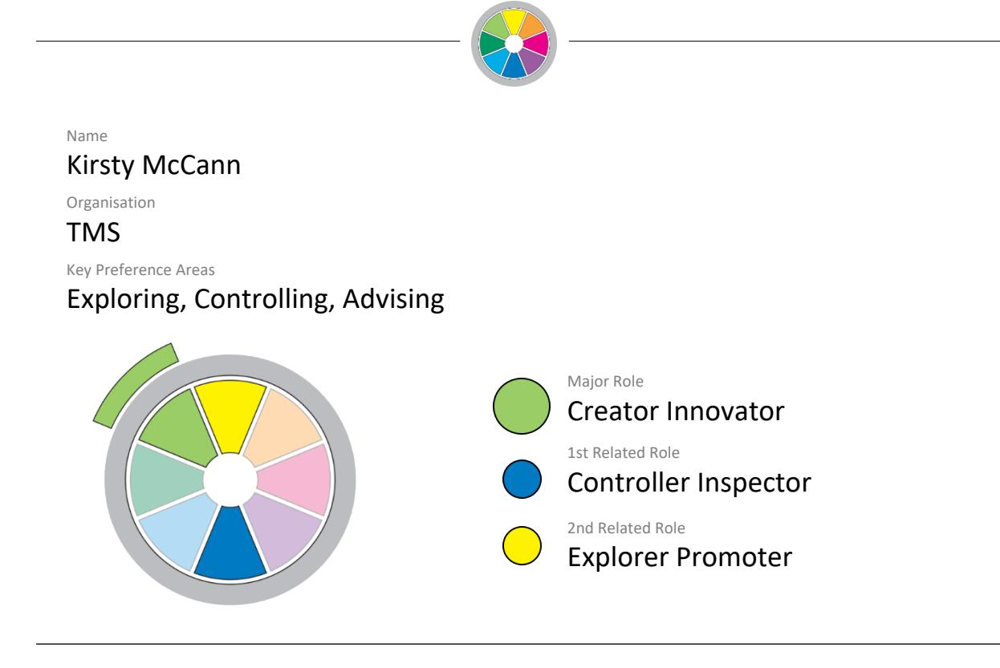

Your personal Team Management Profile provides you with information about your work preferences. It is a starting point for consideration and discussion of how you approach your work and your interactions with others in the workplace.

All work teams need to consider nine key activities essential for high-performance:

| Advising    | Gathering and reporting information                       |
|-------------|-----------------------------------------------------------|
| Innovating  | Creating and experimenting with ideas                     |
| Promoting   | Exploring and presenting opportunities                    |
| Developing  | Assessing and testing the applicability of new approaches |
| Organising  | Establishing and implementing ways of making things work  |
| Producing   | Concluding and delivering outputs                         |
| Inspecting  | Controlling and auditing the working of systems           |
| Maintaining | Upholding and safeguarding standards and processes        |
| Linking     | Coordinating and integrating the work of others           |

Kirsty McCann 2 © Team Management Systems IP, 2024, Australia

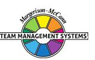

Your own work preferences have been derived from your responses to the Team Management Profile Questionnaire. While you may work in any of the areas of the Wheel, your highest preference area, or Major Role, has been identified together with two Related Roles which indicate your next highest preference areas. All the roles are displayed on the Team Management Wheel shown at the front of this Profile. The Linker role at the centre is the responsibility of all team members.

Note that the Team Management Profile Questionnaire does not measure skill or experience - you may have good abilities in areas of work where you have low preferences. However, where there is a good match between your preferences and the demands of your job, you are more likely to enjoy work, develop skills and perform well. Where a group is made up of individuals with complementary work preferences, it has a higher chance of being effective.

Your roles on the Team Management Wheel arise from your preferred approaches to work in four different areas:

- how you relate with others
- how you gather and use information
- how you make decisions
- how you organise yourself and others.

These four work preference measures are shown on the next page as bipolar scales ranging from 0 to 30 either side of a centre point.

For example, on the first work preference measure, the length of the bar to the left shows the extent to which you relate to others at work in an extroverted way. The bar to the right indicates the extent to which you relate to others at work in an introverted way.

Similarly the second measure indicates the extent to which you gather and use information in either a practical or creative way. The third measure looks at the extent to which you make decisions in either an analytical way or according to your beliefs, and the fourth measure determines whether you like to organise yourself and others in a structured or flexible way.

By subtracting the lower score from the higher one for each measure, a net score is obtained. This is indicated by a black vertical line. These are I: 6; C: 5; A: 8; F: 11 and are the foundation of your major role preference.

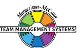

#### **WORK PREFERENCE MEASURES**

**RELATIONSHIPS**

How you Relate to others

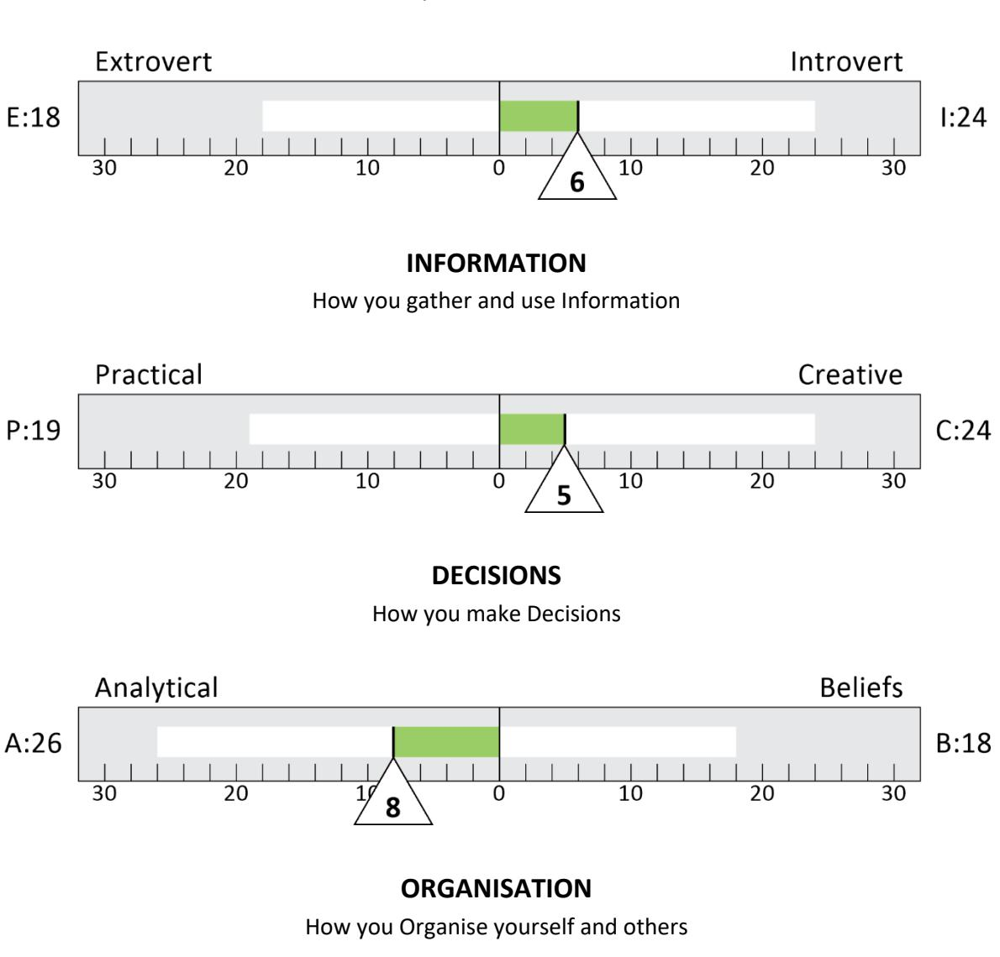

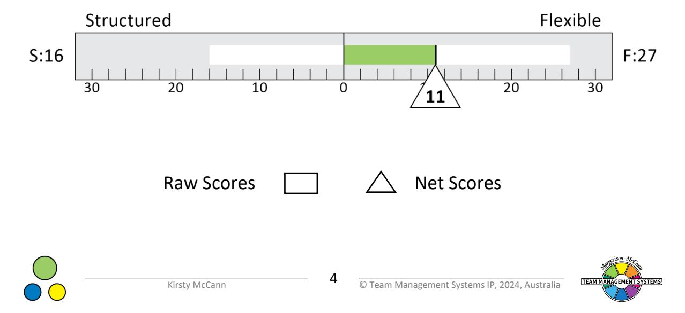

#### **OVERVIEW**

Creator-Innovators are usually people with a strong, intellectual curiosity who will be concerned to design and develop new approaches to problems. They are good at theoretical thinking and like to pursue a wide range of ideas. Their strength often lies in their ability to formulate criteria for problem-solving. Provided the puzzle or problem is sufficiently interesting and presents a challenge to their curiosity, they will keep on looking for an answer despite opposition or indifference. They are important people to have in any team and organisation that is concerned with looking at new ways of doing things. The term Creator-Innovator is, therefore, appropriate.

As a Creator-Innovator, you are more creative than most people and like to gather a lot of information to feed your ideas. Because you enjoy pursuing matters in depth, you will often look for time when you can be alone, to read, write, think and develop your ideas.

Other people may not always recognise the contribution you can make, because you are not given to communicating your ideas freely until they are fully formed. You don't like implementing your ideas at an early stage and prefer to work on them alone or in a small group, unpressured by time deadlines and schedules. For you, much of the challenge in a job comes from analysis and design, and once that is achieved you may lose interest and move onto other work.

People with this Profile are open to new ideas and willing to listen to all shades of opinion. However, they do not like being pressurised, and will stop being adaptable and become quite intransigent when they believe their basic ideas are being attacked and undermined.

You are particularly interested in the design aspects of any work project and are always searching for new ways to do things. Often, you may feel misunderstood, particularly as you prefer to work in areas which are on the edge of the unknown. Sometimes, people may not always recognise your abilities and the contribution you make to the project at hand.

You may prefer an advisory to an operational executive role. Such a position can give you time away from day-to-day management problems, to think, consider and foster your proposals.

You can be quite good at assessing ideas because you are strong on analysis. If anything, you may be over-cautious, insofar as you seek to assess the consequences of decisions as carefully as possible to make sure nothing fundamental can go wrong. This caution can sometimes lead to problems in communication. You do not usually like to commit your ideas to public scrutiny until you are fairly certain they have been well thought through. You like to state what you understand to be the truth of the situation. In doing this, you may have a tendency to make what you say rather too wide in scope and complicated. Others may regard this as being too detailed.

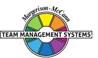

## **LEADERSHIP STRENGTHS**

Your key strength is in developing ideas and problem-solving. You may read a lot and enjoy gathering all sorts of information, particularly on concepts and new ideas. You then like to digest this information and use it to 'spark off' your own ideas. Often, you may be the source of some very fundamental changes which are introduced to the organisation, but you may not always get the credit.

You will analyse things carefully and view situations as objectively as possible. Your incisive mind is invaluable when it comes to research or design work, or working out new ways in which a product or business should be developed. You always assess things logically, even sometimes to the point of arguing over minute interpretations. At times others may feel you take this too far and say you can be pedantic. However, this arises from your desire to state things accurately.

Within the terms of the Team Management Wheel, you are definitely an Explorer with a preference for an advisory role. You may well prefer to work in teams involved in new thinking. Most likely people will respect you in a leadership role that demands innovative, path-finding work. You can inspire others with your breadth of vision, width of knowledge, and wealth of ideas. However you may need to have someone working closely with you to push the ideas into action, as the fine practical detail may bore you. You should, therefore, look to people who are strong on control skills with the ability to implement.

Your approach to leadership will probably be quietly efficient and will be run on a project basis with meetings being held as and when necessary. You will prefer to interact with smaller groups at a time, tackling one or two jobs in depth, rather than ranging too widely. However you can interact very effectively with larger groups, so long as you are well prepared. This is particularly the case with presentations, where you can put your point of view across in a creative and entertaining manner.

People in your team who are more outgoing may need the opportunity to talk through their ideas and problems with you, and you should make time for this. It is also important in your leadership role that you verbally recognise other team members with a word of appreciation when they are doing good work.

Overall, you may prefer an advisory leadership role, such as a consultant or researcher, rather than an operational executive role. Leadership of project teams may appeal where there is a demand for creative insight and a challenge to the imagination.

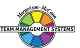

#### **DECISION-MAKING**

While you are good at creative thinking and logical analysis, you may sometimes stop short of seeing your ideas implemented. To you, ideas or solutions can always be improved and you prefer to take 'just a little bit more time'. You usually don't like deadlines and unless pressurised you may have a tendency to postpone them. You really need to work with someone who is strong on implementing, otherwise you may get a reputation as one who develops a lot of ideas but does not get many to work in practice.

You may tend to be critical of others when they propose solutions which, to you, have an obvious flaw. You may well make comments which, often unintentionally, 'put others down' and this can generate ill-feeling. Indeed, you may need to work hard at your communicating skills. Try to understand the feelings of others, particularly when they come up with a different solution, which perhaps does not have the same degree of logical analysis as yours. Other people may not have thought the issue through as clearly as you, but a little patience here can reduce or avoid conflict later on.

You may not feel the need for regular meetings, but other team members will find such gatherings useful, not just to confirm decisions but to keep up with each other's thoughts.

Many of your best decisions are made when you are by yourself. You develop an idea, think it through, gather the data and see how it fits together. However, remember to keep people involved in this process as it goes along, otherwise the final product may come as a surprise and this can lead to resistance from others.

You tend to approach issues in an individualistic way and in many cases decision-making is a personal matter. However, the higher you go in an organisation, the more you need to involve your group in problem-solving processes and a share of the decision-making, if you are to gain their commitment.

#### **INTERPERSONAL SKILLS**

You can work for long periods by yourself and probably find this most rewarding as you will not have interruptions from others. While you can work effectively as a team member, you feel confident in your own ideas to pursue an individual path. If people wish to co-operate with you that is fine, but if people object to your ideas, you will probably prefer to press on by yourself, rather than waste time fighting political battles with a bureaucracy.

On a social level, you are usually quieter, except with people you know or trust well, when you can become quite outgoing. In a leadership or subordinate role, misunderstandings may arise, if time is not taken to ensure that interpersonal communication is maintained.

You can sometimes be surprised that others, both subordinates and superiors, have not mastered the details as well as you have. You may need to take time to explain to people the intricacies of a problem or solution. Other people do not always have your power of concentration for studying an issue in depth, and require the particular support and advice you can give.

As you have many ideas and think them through in depth, it is not always easy for others to follow your thought processes. You need to maintain regular discussions with your colleagues so they can follow your ideas at a steady pace, and this will require the discipline of allocating time to both informal and formal meetings.

Because you are often absorbed in your thoughts and work, you may not recognise how others are feeling about a situation. It may take an effort to find out how people react to the work you give them or other matters, but it will help the problem-solving process in the team if you do so. You may feel that certain things are obvious and do not require saying. However, for others this is not true. A word of recognition, or a summary of another person's views and feelings, can help establish effective work relationships and joint understanding.

#### **TEAM-BUILDING**

Although you can organise a team, you enjoy doing a lot of your work by yourself. You can manage a team if you have to, but probably prefer to do things your own way in your own time. Indeed, managing a team will reduce your personal time to do your own work.

Because of your preference for flexibility in your method of working, it is important to have people working with you who can convert your ideas into a plan, schedule or system that is well-organised. An ideal complementary role for you is the Assessor-Developer or Concluder-Producer, either of whom will work hard to take your ideas to fruition, providing you explain things to them in detail.

You will probably prefer to gather around you a quiet group of people who speak your language and pursue work in a similar way. This can be very effective at the design and creative stage of a project. However, for other aspects, such as selling the ideas, detail and assessment, applications and business implementations, you will need to build a group with a wide range of skills.

You will set high standards for yourself and the team. If anything, you will ask the team to ensure the job is done correctly, even if it means putting in extra time and effort. Doing a job well is important, although some team members may feel there is too much preparation before ideas are put into action.

At times, you may get annoyed with team members who take short cuts or avoid rigorous detail, although you may not always show it.

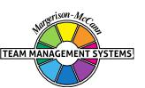

## **AREAS FOR SELF-ASSESSMENT**

The above points have highlighted a number of issues relating to your own Profile which give you areas of considerable strength. Equally, however, you need to look at those areas which may need further development:-

- Make sure you maintain regular discussions with other colleagues about your work as you progress, so they can follow at a steady pace with their own thinking.
- It may be useful to make sure there is someone working closely with you who can check on points of practical detail to support the major ideas that you develop.
- Try to understand the feelings and personal concerns of others when they come up with a logical analysis of what should be done, which differs to yours. They may not have thought the issues through as clearly as you, but have patience, as time spent understanding can reduce or avoid conflict later on.
- You need to make sure there is a good balance between coming forward with new ideas and logical proposals, as well as ensuring sufficient effort is put into implementing these ideas. You should select people to work with you who are capable of seeing things through, otherwise others may say you think a lot but do little to make your ideas work. Be prepared to hand over to your colleagues and delegate work that has been well-developed, even if not fully tested, so applications and business assessments can be made.

Overall, you bring to your job many strengths. In particular, your ideas, vision, and attention to generating a lot of information can play a major role in helping your team move forward. On balance, you will tend to prefer more of an Exploring-Advising role in the team.

## **KEY POINTS OF NOTE FOR CREATOR INNOVATORS**

- You can make major contributions to the design and creative aspects of work projects.
- You are quiet, reflective and sometimes don't say things that seem obvious to you.
- You enjoy creative thinking.
- You dislike routine and practical, detailed work.
- You have a high degree of curiosity in certain work areas and this motivates you to find out more.
- You like complex problems and will work on them in a concentrated way over long periods.
- You like to understand things in depth and may state matters in a complex way so as to cover all aspects.
- You tend to prefer the Advisory role rather than the Organising role.
- You are sometimes seen as detached, objective and critical.
- You may need to appreciate the strength of other people's feelings on key issues.
- You are strong on logical, analytical skills.
- You probably like developing new ideas but may not fully follow them through.
- You prefer to take a wide, diverging view of a problem rather than converge too quickly.
- You dislike too many interruptions.
- You can work efficiently by yourself, but like to balance this with periods where you 'manage by wandering around'.
- You probably don't like to work to detailed timetables, schedules or deadlines.
- You are independent in the way you work and don't always fit easily into bureaucratic, organisational systems.
- You enjoy collecting a lot of information on a subject and sorting out the possibilities and implications.
- You put a lot of energy into future-orientated activities, rather than concentrating on present, practical, day-to-day issues.
- You often see the 'big picture' but may miss the practical details.
- You need a team of people who are Controllers-Organisers to complement your strengths of Exploring and Advising.

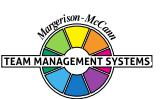

#### **RELATED ROLES**

While on balance you prefer to adopt a quieter approach in your dealings with people, there are times when you can be more outgoing, particularly with people you know well. As a result, you can adopt an Explorer-Promoter approach when you choose and present your ideas to others in a very persuasive manner. This is particularly so when the ideas are your own or you really believe in them. At meetings, you may often speak less than others, but when a topic in your field of expertise arises, you can become quite forthright and may hold the floor until you are satisfied that others see your point of view.

You are receptive to change and may go out of your way to seek out new ideas and practices. You enjoy this part of your work and will make it your business to know what others are doing in your field, gathering your information from written reports and from meetings with your peers. When the opportunity arises, you will enjoy attending professional conferences in your field of interest.

Your particular combination of major and related roles gives an interesting 'tail' to your set of preferences. Your primary strengths are in the Creator-Innovator / Explorer-Promoter areas, but you also showed some strength in the area of Controller-Inspector. This is an unusual pattern as it gives you strengths in opposite parts of the Team Management Wheel - something which occurs in less than 5% of those who have completed the Team Management Profile Questionnaire.

In the constructs of the Team Management Profile Questionnaire, you scored strongest in the areas of analytical decision-making and flexible organisation. These two factors have loaded together to give you a preference for gathering as much information as possible about a topic and subjecting it to a complete analysis of pros and cons before making your decision. This is an excellent combination when working creatively, as it enables you to assess objectively the value of potential new ideas. However, unlike other Creator-Innovators, you never lose sight of the practical aspects of what you are working on. Before presenting your ideas to others, you will prefer to check the practical implications of your proposals and make sure all the details are correct. In this regard, you can be invaluable in finding out what new ideas in your field of expertise are being implemented elsewhere in the world. You are unlikely to get carried away with new ideas until you have subjected them to a careful analysis and they have passed your test of 'practicality'.

The combination of Creator-Innovator and Controller-Inspector may cause you at times to be rather critical of others who have not fully assessed the implication of their ideas before they put them forward. On these occasions, remember not to 'put them down' but help them to see how their proposals could be improved.

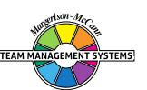

#### **WORK PREFERENCE DISTRIBUTION**

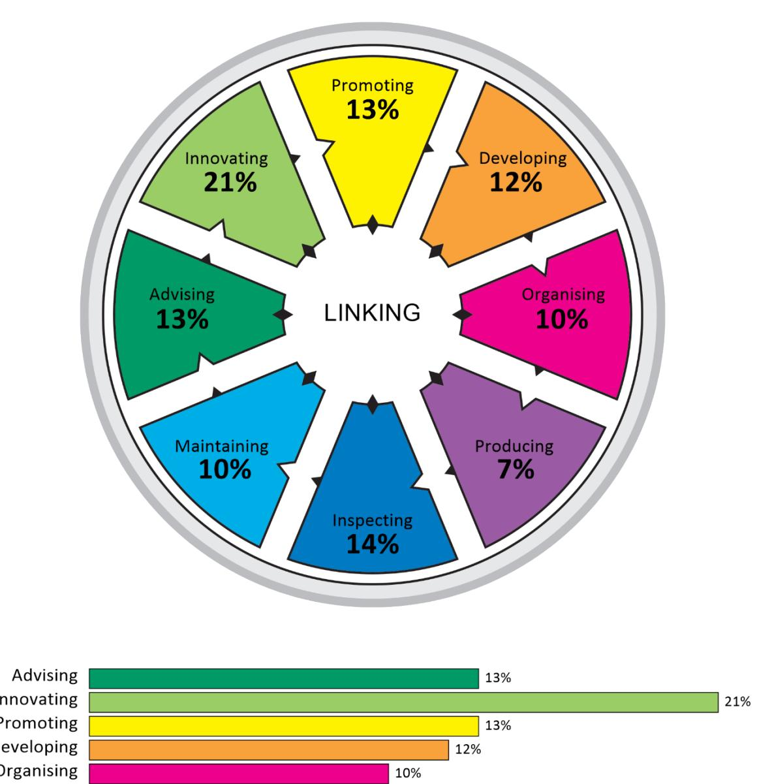

The Team Management Wheel highlights your major role preference and two related roles. In terms of the eight Types of Work that define the critical tasks of a team, these roles indicate the top three task areas that you prefer to work in.

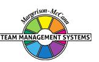

It is possible to extend your scores on the Team Management Wheel beyond the top three task areas to produce a work preference distribution that indicates your level of preference for all eight Types of Work. This information is valuable when it comes to allocating work among team members, as Team Management Systems theory states that all eight Types of Work are critical to the success of a team. If several team members have the same major and related roles, it is worth looking at the individual work preference distributions to determine whether there is a significant difference among team members in the less preferred work areas.

Your work preference distribution is shown with 100 percentage points distributed across all eight Types of Work, indicating those tasks that you like best and those that you like least. If the percentages are similar, you will be relatively comfortable working on any task. If there is a gap of more than 15 percentage points between the highest and lowest scores, there may be some tasks that you definitely like and others that you dislike.

When allocating tasks, it seems sensible for there to be some overlap between your work preferences and the team tasks that need to be undertaken. If you are spending a lot of time in areas that are not your preference, it may affect your enjoyment and wellbeing at work. Likewise if you are working solely in Types of Work that strongly match your work preferences, you may be ignoring important personal development opportunities in areas of lower preference.

It is important to remember that work preferences and competence are unrelated, and you may perform well in Types of Work for which you have a low preference. However, it is important to get the right balance between working to your preferences and working against them. Our research shows that a two-thirds/one-third balance works well for many people, and that problems with dissatisfaction can occur when the ratio moves significantly in the opposite direction. Working to your preferences will help establish conditions at work where your mental and psychic energy can flow freely.

#### **LINKING**

At the centre of the Team Management Wheel is the Linker role, defined not by preferences, but by the skills that all team members need to develop. Linking Skills comprise people linking, task linking and leadership linking.

Of importance to all team members are the People Linking Skills, particularly the skill of Communication. A useful technique to try here is Pacing - varying your communication style so that it matches other people's role preferences. The successful implementation of Pacing skills helps avoid conflict and leads to more productive interactions.

Below are some key points that team members should consider when interacting with a Creator-Innovator major role preference like yours. Read each point and consider whether you would like the other person to act like this when they are communicating with you. Highlight those points that you definitely agree with and share them with your team members. This may help them understand 'what makes you tick' and how they can better meet your needs.

In order to link more effectively with you, the person you are interacting with could:

- Give you time to think things through.
- Allow you to finish your point and not interrupt, particularly if you like to choose your words carefully.
- Ask for clarification if they don't understand what you are saying.
- Appreciate the value of your divergent way of thinking.
- Not force you to a decision until all ideas have been considered.
- Focus on the positives and use these to lead the conversation into the areas you would like to focus on.
- Not expect you always to be punctual.
- Make allowances for your need to gather lots of information, even if they can't see the reason for it.
- Make sure they have a good grasp of the facts, written down for you to look at, if possible.
- Preferably make an appointment to see you, rather than just 'dropping in'.
- Communicate in writing on important issues so that you have time to mull them over.
- Accept that you may delay making decisions if there is not enough information available.
- Summarise the content of conversations by focusing mainly on the 'facts', but with attention also given to any 'feelings' expressed.
- Use visual representations (perhaps on a whiteboard) to help them get their point of view across.

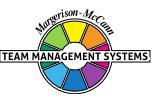

 Give you options to explore rather than suggesting a unique solution, when wanting a decision from you.

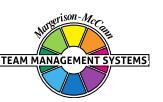

# **Individual Summary**

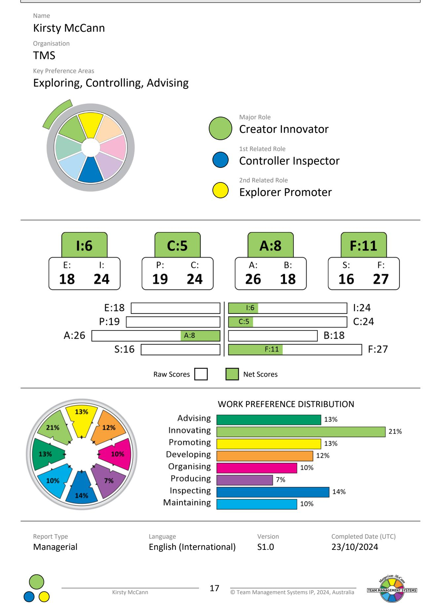

## **DISCLAIMER**

© Team Management Systems IP, 2024, Australia. Published by Team Management Systems. Produced on 15/04/2025. All rights reserved. No part of this publication may be reproduced, stored in a retrieval system, or transmitted in any form or by any means, electronic, mechanical, photocopying, recording or otherwise, without prior written permission of the publishers.

Team Management Systems, the wheel device and the associated trademarks marked with 'TM' or ® are registered or common law marks of Team Management Systems IP in Australia and various international jurisdictions.

The content of this report is based on data submitted through the Team Management Profile Questionnaire. While great care and diligence have been exercised, it is important to note that each personalised report is based on general observations and interpretations.

The authors and publishers make no guarantees regarding the accuracy, completeness, or applicability of this report for any specific individual or situation. Therefore, they cannot be held liable for any decisions, actions, or outcomes resulting from the use of the information contained in this report.

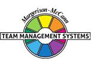