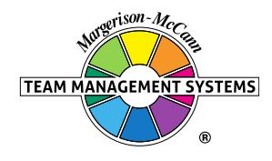

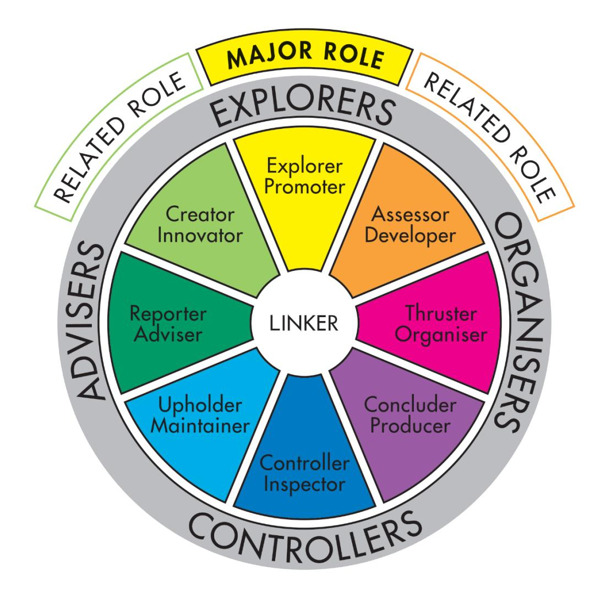

# **Team Management Profile**

# **Matthew Page-Hanify**

Team Management Systems, the wheel device and the associated trademarks marked with 'TM' or ® are registered

or common law marks of Team Management Systems IP in Australia and various international jurisdictions.

# **CONTENTS**

| INTRODUCTION                              | 2  |
|-------------------------------------------|----|
| WORK PREFERENCE MEASURES                  | 4  |
| OVERVIEW                                  | 5  |
| LEADERSHIP STRENGTHS                      | 6  |
| DECISION-MAKING                           | 7  |
| INTERPERSONAL SKILLS                      | 8  |
| TEAM-BUILDING                             | 9  |
| AREAS FOR SELF-ASSESSMENT                 | 10 |
| KEY POINTS OF NOTE FOR EXPLORER PROMOTERS | 11 |
| RELATED ROLES                             | 12 |
| WORK PREFERENCE DISTRIBUTION              | 14 |
| LINKING                                   | 16 |
| INDIVIDUAL SUMMARY                        | 18 |
| DISCLAIMER                                | 19 |

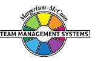

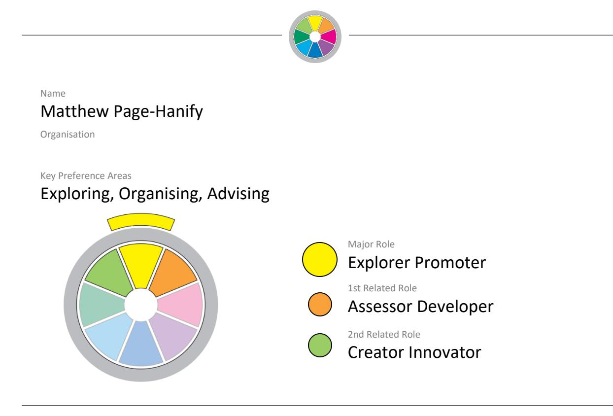

Your personal Team Management Profile provides you with information about your work preferences. It is a starting point for consideration and discussion of how you approach your work and your interactions with others in the workplace.

All work teams need to consider nine key activities essential for high-performance:

| Advising    | Gathering and reporting information                       |
|-------------|-----------------------------------------------------------|
| Innovating  | Creating and experimenting with ideas                     |
| Promoting   | Exploring and presenting opportunities                    |
| Developing  | Assessing and testing the applicability of new approaches |
| Organising  | Establishing and implementing ways of making things work  |
| Producing   | Concluding and delivering outputs                         |
| Inspecting  | Controlling and auditing the working of systems           |
| Maintaining | Upholding and safeguarding standards and processes        |
| Linking     | Coordinating and integrating the work of others           |

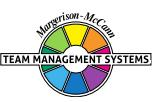

Your own work preferences have been derived from your responses to the Team Management Profile Questionnaire. While you may work in any of the areas of the Wheel, your highest preference area, or Major Role, has been identified together with two Related Roles which indicate your next highest preference areas. All the roles are displayed on the Team Management Wheel shown at the front of this Profile. The Linker role at the centre is the responsibility of all team members.

Note that the Team Management Profile Questionnaire does not measure skill or experience - you may have good abilities in areas of work where you have low preferences. However, where there is a good match between your preferences and the demands of your job, you are more likely to enjoy work, develop skills and perform well. Where a group is made up of individuals with complementary work preferences, it has a higher chance of being effective.

Your roles on the Team Management Wheel arise from your preferred approaches to work in four different areas:

- how you relate with others
- how you gather and use information
- how you make decisions
- how you organise yourself and others.

These four work preference measures are shown on the next page as bipolar scales ranging from 0 to 30 either side of a centre point.

For example, on the first work preference measure, the length of the bar to the left shows the extent to which you relate to others at work in an extroverted way. The bar to the right indicates the extent to which you relate to others at work in an introverted way.

Similarly the second measure indicates the extent to which you gather and use information in either a practical or creative way. The third measure looks at the extent to which you make decisions in either an analytical way or according to your beliefs, and the fourth measure determines whether you like to organise yourself and others in a structured or flexible way.

By subtracting the lower score from the higher one for each measure, a net score is obtained. This is indicated by a black vertical line. These are E: 26; C: 15; A: 17; F: 9 and are the foundation of your major role preference.

#### **WORK PREFERENCE MEASURES**

**RELATIONSHIPS**

How you Relate to others

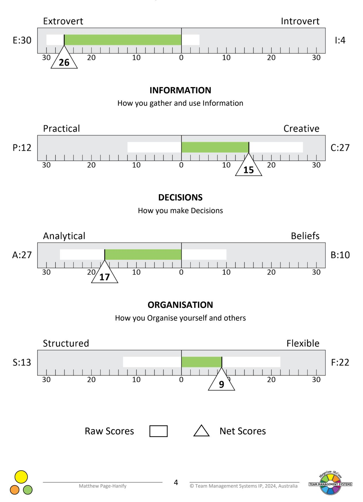

# **OVERVIEW**

Explorer-Promoters enjoy going out in search of new opportunities and designing initiatives to respond. They particularly welcome the chance to share the latest ideas and hear what others have to say. It is the new project or idea that really motivates the Explorer-Promoter.

They are valuable team members who can usually be counted on to bring in resources and contacts, and look for new ways of doing things. The term Explorer-Promoter is, therefore, descriptive of the way they like to work.

As an Explorer-Promoter, you will enjoy working on and with new projects. If an idea captures your imagination, you will go out and convince others, even though you may have little hard evidence. You are, therefore, normally an enthusiastic, outgoing person. You invariably know who to contact to gain information or help. If not, you will make it your business to find out. You have the capacity to see the 'big picture' beyond what currently exists, and pursue it. You are also able to persuade others to be involved.

You will probably have wide interests rather than just concentrating on one project at a time. Indeed, it is probable you will like to juggle 'many balls in the air' and be stimulated and challenged by the different projects. From time to time, you will make links between them and this will stimulate even more interesting possibilities. You will dislike routine and repetitive work.

It is the possibilities, opportunities and consequences of the work that really motivate you. You will continually want to see what is new. The great attraction is to conceive a different way of approaching a problem and possibly a unique way of solving it. Implementing the solutions, however, is probably not as important, and you are often prepared to leave this to other people.

This is because you have a high interest in knowing about an issue and are concerned to understand it in depth. Coming to a decision or conclusion can only be done after a thorough analysis. Your colleagues may find this rather difficult to cope with, particularly if there are time pressures or other constraints which require quick decision-making. However, if you are given a deadline which you accept as important, you will rise to the challenge and meet it, often through ingenious means.

Your work may suffer from a lack of detailed planning, but you gain from the inspiration associated with doing a task. Often you do not know what you will do till the situation presents itself. You are, therefore, good at improvisation, fixing and adapting. Changes of plan rarely worry you. It is a challenge to test your ability to come up with a way out. You often enjoy ambiguous situations and problems as they give you the chance to improvise.

You will be known for your enthusiasm, particularly on new projects. It is likely you will establish a reputation for coming up with new ways of doing things and suggesting that people should change existing methods. Indeed, you can be a good advocate and presenter. However, you normally prefer others to deal with what you see as the more practical aspect of detailed organising.

If people get in your way or make it difficult for you to pursue your ideas, then you will often move on, rather than waste your energy on those who do not understand. You will feel confident that others will appreciate your ideas.

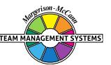

## **LEADERSHIP STRENGTHS**

People will value your ability to seize on new ideas and give them life. They will usually appreciate the way you can obtain resources and persuade people to back your projects.

You are normally easy to talk to as you have an outgoing way of relating to others. You tend to speak your mind, often before you have thought through the details. Indeed, it is through conversation that you think up many of your best ideas. While others may not speak until they have thought about the issues, you will develop your thinking by speaking and listening. Meetings, both formal and informal, are important, although you may not prepare for them as well as you could.

Your great strength, if played properly, is your ability to see things on a wide scale. Although you have sharp insights, they may not always seem real to you, and you may dismiss your best ideas too quickly or not act on them. It is important that this does not happen, and you should take time to verify your hunches and ideas. You may need to have people appointed to work with you who can do that.

You tend to work in bursts of energy and get a lot done in a short period. When this happens, you are almost unaware of time. It may be difficult for others to keep pace with you on such occasions.

You are usually particularly energised and effective when having to make a presentation or meet with others. The reality of other people's presence concentrates your mind and enables you to produce your best, often at short notice. You can react quickly and adapt spontaneously to such situations. You can be a particularly good teacher or communicator when you wish, and this stands you in good stead in your leadership role.

In meetings, you can listen well, although on occasions you may have a short attention span. You will probably enjoy meetings best when ideas and opportunities are being discussed, rather than problems of logical detail which require the systematic analysis of hard facts. You enjoy discussing what 'will be', rather than 'what is'.

You will continually present your team members with the next challenge or the next opportunity, and expect them to be as enthusiastic about it as you are. People will respect your leadership in these areas and find working in your team an exciting challenge as new projects are invariably being developed. You may, however, need to develop, with experience, the ability to follow through the detail, so as to ensure the designing of prototypes and ideas you initiate are carried out properly.

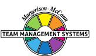

#### **DECISION-MAKING**

When you do reach a decision, it will usually be based on sound, analytical reasoning. You will prefer, in the main, to gather a lot of information before coming to a conclusion. Where possible, you will establish criteria for your decision and apply whatever techniques and methods are on hand to test out the best option from those available. Rarely will you go into a decision based purely on your own inner beliefs, but prefer to assess the evidence of what is required from the prevailing facts and circumstances. When a major conclusion has to be drawn - for example, answering an important proposal - you may put something in writing immediately but, unless it is urgent, you prefer to review what you have written before it is finalised.

You probably have a skill in bringing people together and getting them to talk about the important decisions. You can generate enthusiasm and enable people to perceive things in a different way, so they feel a sense of urgency in doing something about the issues. In this way, you can make a good adviser or task force manager. However, when people continually get in the way of your ideas or don't understand what you are trying to do, you will leave and go elsewhere rather than waste time. To you, there are always other opportunities you can pursue.

It is likely you will have considerable skill in designing approaches to problems. You like to do lots of things at the same time, and this can create problems of time management and stress. You will need to be very good at decision-making or delegation if your best ideas are to be implemented.

People may say you design many initiatives, but do not always see them through to completion. They may argue you move from project to project without dealing with any one of them in sufficient depth. This is always the problem of the creative designer who needs to be able to hand over to others at the right point in order to move on to the next opportunity.

From time to time, you may put off reaching conclusions. You may feel this is necessary because you probably prefer more information before making a decision.

However, there are times when you see an opportunity that your insight and intuition tells you is right. At such times, you can become impulsive and may rush into a decision because you feel the chance will disappear if you don't seize it.

Colleagues may be surprised at these two different approaches to decision-making and not realise the force of your ideas. Therefore you may need to balance the strength of your insight, imagination, intuition, and ideas, with an assessment of the practical implications and requirements to make the decision work on a day-to-day basis.

The biggest problem you are likely to have as a leader is in controlling the initiatives you start. Unless you develop your skills of delegation and co-ordination, then the above points may become a selffulfilling prophecy. Getting jobs done on time, to a set standard, and ensuring that the details are covered, will not always come easily. It may be worthwhile having someone working closely with you who can look after these points. In this way your ideas and decisions can lead to effective action taking place.

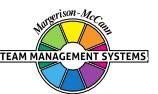

#### **INTERPERSONAL SKILLS**

Overall, you have an easy-going style when relating to others. You prefer to understand people rather than judge them. You may well do this by summarising the concerns of others, which helps you establish rapport. You may be surprised how often people will consequently trust you with personal and confidential information. Your ability to listen in this way is often of great support and help to those involved, as it helps them clear their minds on what they should do.

You will particularly value the opportunity to share your latest ideas and hear what others have to say. It is likely that on many occasions you will start talking through an idea, even though the nature of it is not absolutely clear in your own mind. You feel that, by talking it through with others, you will get a better understanding of the idea. That is why casual visitors, and even people who interrupt you, are often helpful as you can clarify your ideas with them.

Besides generating ideas yourself, you can be a good listener and can identify the main issues that others are concerned about fairly quickly. However, you prefer people to be dealing with issues which have fascinating possibilities, rather than with hard facts and particular details. Those who concentrate excessively on the data and specifics may bore you and cause you to 'switch off'. These same people may sometimes accuse you of not listening.

It is quite likely that you will prefer a fair degree of complexity in any problem which you take on. You will also usually enjoy trying to get a total picture of the issues rather than dealing with them in a logical, sequential order.

Others may sometimes see you as impatient because, once you have an idea, you want to see it developed. Overall though, you will put effort into establishing sound, interpersonal relationships, not just to make friends, but to get the job done. The execution of the task is the challenge, particularly if it involves gathering information from people.

You are not particularly good at following rules and procedures, and may sometimes upset those concerned with administering them. To you, writing the grand plan of tomorrow is more important than following the rule book of today.

At times, you can see the funny side of work and life, and convey this to others. This also helps you establish informal and fairly open relationships. Overall, you may prefer to have a wide range of acquaintances rather than just rely on a few friends.

### **TEAM-BUILDING**

You can be effective in building a work team, particularly where there is a need for project leadership demanding the injection of creative ideas and enthusiasm. You will be able to conceive the overall requirements and chart the direction.

As an Explorer-Promoter, you are probably going to be more 'at home' with other creative, outgoing types. However, in your team, you need to develop a sound relationship with people who will deal with the practical, tangible realities, and who push to get jobs done on time and completed in neat order. Therefore you may need to look for people who have sound control skills to be members of your team.

Indeed, your contribution to the team will probably involve you spending a lot of time in outside contacts with people from other units, either from within your organisation or elsewhere. You enjoy the challenge of going out and finding out. As a result, you are not always at ease looking after the team's day-to-day needs. You may need to have someone in the team who can do these things and work with you in a complementary way.

You will probably encourage an informal but task-oriented approach. Because of the pace you set, you may not find enough time to meet with the team members individually to talk through their problems. Also you may assume people know what to do and, therefore, not give them specific instructions.

As a result, you can be disappointed when people let you down. Indeed, some people may also try to take advantage of your easy-going manner. When this happens, you may react strongly and impose controls for a time. However, this is usually against the spirit of the way you like to work. You prefer everyone to take individual responsibility and initiative for getting the work done. Such an autonomous work group does give you more time to pursue new projects and opportunities, but in reality you probably need to co-ordinate and give guidance on a regular basis.

The team will respect you for developing new ideas, bringing in new contacts and resources, and exploring new directions. Alongside this, however, it is important that the control aspects of the managerial job are not overlooked. You will probably not relish having to manage a team where there is a lot of routine and repetitive work that demands similar activity day after day.

# **AREAS FOR SELF-ASSESSMENT**

In working with others, it is important for you to understand how they see you. In this way, it is possible for you to develop an approach which relates your own strengths to the needs of others. The following points should, therefore, be borne in mind:-

- Being more outgoing than many others, you may well say things which are not your final view, but more an opinion which can be changed quickly on receiving new information or ideas. However, if you are in a position of authority, others may regard your first thoughts as decisive and be influenced by them for good or ill. In these situations it is important to think through the issues in depth before you give voice to your half-thought-out ideas.
- As you are creative, you will see the opportunities and possibilities as well as the dangers. You may be tempted to start other projects before the ones you are already working on are finished. However, you may underestimate the time and the detail required to follow-up your ideas. You may benefit from working with someone who is good at a systematic approach, logically following things through and gathering the facts, if you feel that you are not prepared to do this yourself.
- Being strong on analysis, you will tend to place considerable faith in techniques and may not be sufficiently in touch with the personal opinions and feelings of people about you. Although you may hear what they say, you may not appreciate the strength of the beliefs behind their views. This can be dangerous if you underplay it, or ignore it in your decisions and the way you manage your team.
- Generally, you spend a lot of time finding out about a problem or project before implementing action. This is fine when the situation is not urgent, but it can annoy others if they feel you are putting off decisions and wanting more information. Indeed, your own projects may not come to fruition if you do not develop more of a decisive approach to conclude proceedings and take action. Setting deadlines and having situations where you have to deliver results to others by a specific time can help concentrate your energies. If other people, particularly superiors or clients, set you deadlines then you invariably organise yourself to get the task done on time.

Given your natural enthusiasm, there will be times when you feel that your inspiration has deserted you and you feel rather down, particularly if there are a number of jobs half done or left unfinished. It is important to make sure these are completed before the next creative idea comes along, otherwise you may end up with too many loose ends. Your main strength is that you are seldom short of ideas. Indeed, you may feel you can rarely be trapped in a situation because you will always come up with a new idea to solve the problem. This is a considerable strength and, if tied to sound planning and practical implementation, can provide you with a most impressive approach to work.

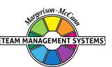

# **KEY POINTS OF NOTE FOR EXPLORER PROMOTERS**

- You are usually an enthusiastic developer of ideas.
- You prefer to work on a project basis.
- You are outgoing, sociable and, on occasions, can be impulsive and spontaneous.
- You can become easily bored and look for new challenges.
- You may take on too many new initiatives and projects simultaneously.
- You will be mainly an analytical thinker who takes a detached, objective view of problems.
- You will want a lot of information before deciding and taking action.
- You will probably feel you have to regularly prove and establish your competence.
- You are continually searching for new ideas and activities.
- You are conversationally able, both in talking and listening.
- You tend to be very independent, and like variety and versatility.
- You can suspend criticism more than others until you have the information.
- You are good at presenting ideas and information to others.
- You are not usually a tough bargainer unless pushed into a corner.
- You can improvise well to overcome inadequate preparation.
- You can often think as you speak, and get many of your best thoughts from conversing.
- You may change jobs regularly to avoid repetition and boredom.
- If there is resistance to your way of doing things, then it is probable you will search for a different route rather than waste energy on fighting the opposition.
- You will enjoy working on the design stages of activities and developing prototypes.
- You will be involved in many tasks, and will not always have a neat and well-organised work situation.
- You will want to avoid work that is routine and repetitive, although you may have leisure activities which involve a lot of repetition.
- You can be very effective at representing your team and getting resources.
- You probably contribute a lot at meetings.
- You will have a vision of how things could be and work hard to make it a reality, before moving on to the next possibility.

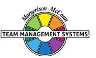

### **RELATED ROLES**

In the constructs of the Team Management Wheel, you scored decisively in the areas of extroversion, creative information-gathering, analytical decision-making and flexible organisation. This places you firmly in the Explorer-Promoter sector, where you are 'at home' searching out new ideas and opportunities, and introducing change to your organisation. However, there are times when you are happy working in the Creator-Innovator and Assessor-Developer sectors. This particular combination of the Explorer-Promoter, backed up by the Creator-Innovator and Assessor-Developer roles, is well-suited to those people who like to be entrepreneurial and engage in highrisk, high-return strategies.

It is when you place emphasis on your creative and flexible preferences, that you are likely to wear your Creator-Innovator 'hat'. Here, you will rely heavily on your imagination and vision to see how things fit together into the 'big picture', even though you may not always be familiar with the details of the issues involved.

In your Creator-Innovator role, you will enjoy working on complex and ambiguous problems. Straight-forward, logical problems with neat solutions where you follow a set path are not for you. The more ambiguous the problem, the more angles there are to it, the more loose ends and possibilities to consider, the better you usually like it. 'Travelling' can often be more exciting than 'arriving'.

When in your Creator-Innovator role, you will value your independence and want to do things in your own way and at your own pace. At these times, you can get so involved in your ideas, that you may become absentminded and forget to tell others what you are thinking and planning. You may even forget commitments you have made to others, and colleagues may well have learned to make written records of important discussions they have with you.

People on your team will find you an exciting person to work with, as you are always presenting them with the next challenge. Problems could arise, however, with the more Controlling people who may find your leadership style unsettling. Remember though, these people can be of great benefit to you, as they have strengths in areas that may not interest you. You may have to slow down and take your time when dealing with these people.

It is when you place emphasis on your extroverted and analytical preferences, that you are likely to take on an Assessor-Developer role. In these circumstances, you will want to take ideas and opportunities, and develop them to a stage where they can be successfully implemented. However, you may not want to do the implementing yourself, but prefer to get back into your Explorer-Promoter role and look for the next opportunity. In this regard, you can be invaluable on a team concerned with the development of new prototypes, products or markets.

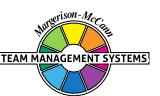

Your ability to communicate readily, combined with your ideas and concern for change, enables you to move into leadership roles with ease. You will enjoy the challenge of developing a team to chase an opportunity or a business possibility, rather than manage regular, standardised operations. In this regard, you are valuable in a trouble-shooting or business development role, particularly in new or growth businesses. However, you may not enjoy running stable, mature operations on a day-to-day basis, where there is little opportunity for innovation or change.

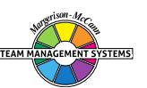

#### **WORK PREFERENCE DISTRIBUTION**

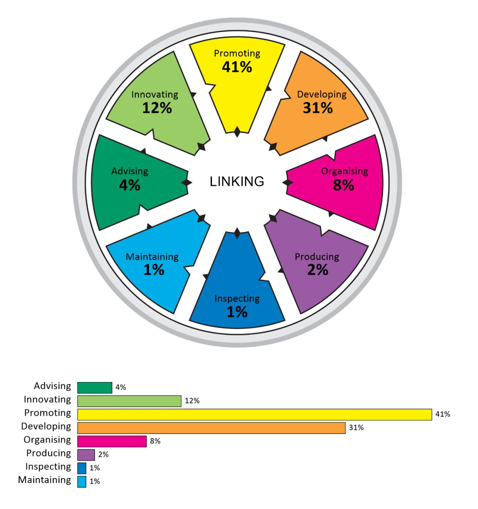

The Team Management Wheel highlights your major role preference and two related roles. In terms of the eight Types of Work that define the critical tasks of a team, these roles indicate the top three task areas that you prefer to work in.

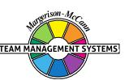

It is possible to extend your scores on the Team Management Wheel beyond the top three task areas to produce a work preference distribution that indicates your level of preference for all eight Types of Work. This information is valuable when it comes to allocating work among team members, as Team Management Systems theory states that all eight Types of Work are critical to the success of a team. If several team members have the same major and related roles, it is worth looking at the individual work preference distributions to determine whether there is a significant difference among team members in the less preferred work areas.

Your work preference distribution is shown with 100 percentage points distributed across all eight Types of Work, indicating those tasks that you like best and those that you like least. If the percentages are similar, you will be relatively comfortable working on any task. If there is a gap of more than 15 percentage points between the highest and lowest scores, there may be some tasks that you definitely like and others that you dislike.

When allocating tasks, it seems sensible for there to be some overlap between your work preferences and the team tasks that need to be undertaken. If you are spending a lot of time in areas that are not your preference, it may affect your enjoyment and wellbeing at work. Likewise if you are working solely in Types of Work that strongly match your work preferences, you may be ignoring important personal development opportunities in areas of lower preference.

It is important to remember that work preferences and competence are unrelated, and you may perform well in Types of Work for which you have a low preference. However, it is important to get the right balance between working to your preferences and working against them. Our research shows that a two-thirds/one-third balance works well for many people, and that problems with dissatisfaction can occur when the ratio moves significantly in the opposite direction. Working to your preferences will help establish conditions at work where your mental and psychic energy can flow freely.

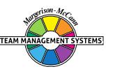

### **LINKING**

At the centre of the Team Management Wheel is the Linker role, defined not by preferences, but by the skills that all team members need to develop. Linking Skills comprise people linking, task linking and leadership linking.

Of importance to all team members are the People Linking Skills, particularly the skill of Communication. A useful technique to try here is Pacing - varying your communication style so that it matches other people's role preferences. The successful implementation of Pacing skills helps avoid conflict and leads to more productive interactions.

Below are some key points that team members should consider when interacting with an Explorer-Promoter major role preference like yours. Read each point and consider whether you would like the other person to act like this when they are communicating with you. Highlight those points that you definitely agree with and share them with your team members. This may help them understand 'what makes you tick' and how they can better meet your needs.

In order to link more effectively with you, the person you are interacting with could:

- Explore ideas in conversation with you.
- Not force you to converge to solutions before things have been fully talked through.
- Focus more on the positives, rather than the negatives, when helping you develop your ideas further.
- Learn to understand your divergent way of thinking.
- Give credit publicly for your contributions.
- Make sure they have a good grasp of the facts.
- Speed up their speech delivery (if necessary) to match yours and try to talk with 'colour' in their voice rather than in a monotone.
- Record key points in writing after discussions with you, so as to avoid misunderstandings.
- Make allowances for your need to gather information before making decisions, even if they can't see the reason for it.
- Summarise the content of conversations by focusing on the 'facts', but with attention also given to any 'feelings' expressed.
- Not expect you always to be punctual.
- Use visual representations (perhaps on a whiteboard) to help you understand their point of view.
- Give you options to consider rather than suggesting a unique solution, when wanting a decision from you.

 Not reject your views until they have listened fully to your point of view and explored the possibilities.

# **Individual Summary**

Name

#### Matthew Page-Hanify

Organisation

Key Preference Areas

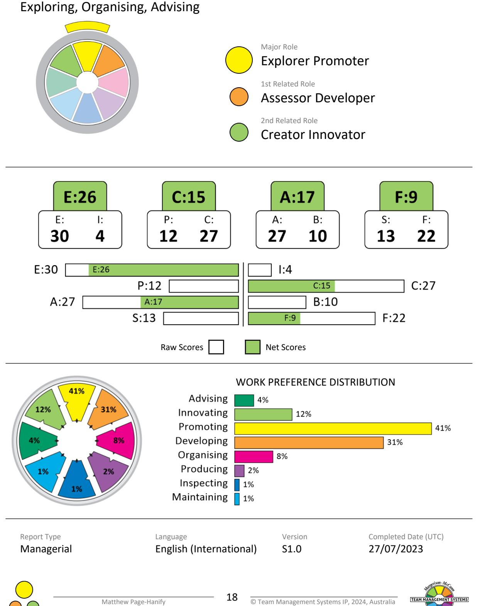

# **DISCLAIMER**

© Team Management Systems IP, 2024, Australia. Published by Team Management Systems. Produced on 15/04/2025. All rights reserved. No part of this publication may be reproduced, stored in a retrieval system, or transmitted in any form or by any means, electronic, mechanical, photocopying, recording or otherwise, without prior written permission of the publishers.

Team Management Systems, the wheel device and the associated trademarks marked with 'TM' or ® are registered or common law marks of Team Management Systems IP in Australia and various international jurisdictions.

The content of this report is based on data submitted through the Team Management Profile Questionnaire. While great care and diligence have been exercised, it is important to note that each personalised report is based on general observations and interpretations.

The authors and publishers make no guarantees regarding the accuracy, completeness, or applicability of this report for any specific individual or situation. Therefore, they cannot be held liable for any decisions, actions, or outcomes resulting from the use of the information contained in this report.

