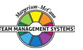
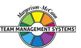

## **Team Management Profile**

# **Sara Alfredson**

Team Management Systems, the wheel device and the associated trademarks marked with 'TM' or ® are registered

or common law marks of Team Management Systems IP in Australia and various international jurisdictions.

## **CONTENTS**

| INTRODUCTION                              | 2  |
|-------------------------------------------|----|
| WORK PREFERENCE MEASURES                  | 4  |
| OVERVIEW                                  | 5  |
| LEADERSHIP STRENGTHS                      | 7  |
| DECISION-MAKING                           | 8  |
| INTERPERSONAL SKILLS                      | 9  |
| TEAM-BUILDING                             | 10 |
| AREAS FOR SELF-ASSESSMENT                 | 11 |
| KEY POINTS OF NOTE FOR CREATOR INNOVATORS | 12 |
| RELATED ROLES                             | 14 |
| WORK PREFERENCE DISTRIBUTION              | 16 |
| LINKING                                   | 18 |
| INDIVIDUAL SUMMARY                        | 20 |
| DISCLAIMER                                | 21 |

Your personal Team Management Profile provides you with information about your work preferences. It is a starting point for consideration and discussion of how you approach your work and your interactions with others in the workplace.

All work teams need to consider nine key activities essential for high-performance:

| Advising    | Gathering and reporting information                       |
|-------------|-----------------------------------------------------------|
| Innovating  | Creating and experimenting with ideas                     |
| Promoting   | Exploring and presenting opportunities                    |
| Developing  | Assessing and testing the applicability of new approaches |
| Organising  | Establishing and implementing ways of making things work  |
| Producing   | Concluding and delivering outputs                         |
| Inspecting  | Controlling and auditing the working of systems           |
| Maintaining | Upholding and safeguarding standards and processes        |
| Linking     | Coordinating and integrating the work of others           |

Sara Alfredson 2 © Team Management Systems IP, 2024, Australia

Your own work preferences have been derived from your responses to the Team Management Profile Questionnaire. While you may work in any of the areas of the Wheel, your highest preference area, or Major Role, has been identified together with two Related Roles which indicate your next highest preference areas. All the roles are displayed on the Team Management Wheel shown at the front of this Profile. The Linker role at the centre is the responsibility of all team members.

Note that the Team Management Profile Questionnaire does not measure skill or experience - you may have good abilities in areas of work where you have low preferences. However, where there is a good match between your preferences and the demands of your job, you are more likely to enjoy work, develop skills and perform well. Where a group is made up of individuals with complementary work preferences, it has a higher chance of being effective.

Your roles on the Team Management Wheel arise from your preferred approaches to work in four different areas:

- how you relate with others
- how you gather and use information
- how you make decisions
- how you organise yourself and others.

These four work preference measures are shown on the next page as bipolar scales ranging from 0 to 30 either side of a centre point.

For example, on the first work preference measure, the length of the bar to the left shows the extent to which you relate to others at work in an extroverted way. The bar to the right indicates the extent to which you relate to others at work in an introverted way.

Similarly the second measure indicates the extent to which you gather and use information in either a practical or creative way. The third measure looks at the extent to which you make decisions in either an analytical way or according to your beliefs, and the fourth measure determines whether you like to organise yourself and others in a structured or flexible way.

By subtracting the lower score from the higher one for each measure, a net score is obtained. This is indicated by a black vertical line. These are E: 13; C: 13; B: 12; F: 24 and are the foundation of your major role preference.

#### **WORK PREFERENCE MEASURES**

**RELATIONSHIPS**

How you Relate to others

## **OVERVIEW**

Creator-Innovators are outgoing people who are excellent at designing and initiating new ideas and concepts. They are usually imaginative and future-oriented, and often work with intensive bursts of energy. During these times, they are sometimes prone to absentmindedness. As they regularly come forward with new ways and ideas, the term Creator-Innovator is appropriate.

As a Creator-Innovator, you will enjoy being with people and will often develop a lot of your ideas through conversation. Other people's views can 'spark you off' to see the possibilities way beyond what they themselves have considered. You are likely to be a good conversationalist and effective at leading group meetings or making presentations.

Your major strength is your vision and imagination which is based on your intuition. You are usually quick to see how things fit into the 'big picture', even though you may not be familiar with the details of the issues involved. Your enthusiasm for new ideas or projects can take up a considerable amount of your time, but you will hardly notice it, as long as you feel there is meaning and purpose to the effort involved. You do not believe that creativity can be turned on, but are constantly in search of the 'flash' which will give you the insight necessary for sustained effort.

Because you rely so heavily on your imagination and creative insight, you may at times feel you live in rather an unreal world. It is a world where you dream up new ways of looking at things and, if others do not take your ideas seriously, you may begin to doubt their validity and move on to the next idea.

You find it hard to tolerate a lot of routine and do not like to be held to deadlines, preferring to pursue your curiosity in its own way. You will try to delegate or avoid altogether repetitive jobs. Indeed, some of your own projects may seem to become routine after a while and you will be tempted to leave them. At a later stage, however, you are likely to turn your attention to them again, as long as the basic, creative, challenging problem needs resolving.

Usually you will like complex and ambiguous problems, rather than straight-forward, logical problems that have a neat solution as long as you follow a set path. The more obscure a problem, the more angles there are to it, the more loose ends and possibilities to consider, the better you usually like it. 'Travelling' can often be more exciting than 'arriving'.

Sometimes you can be hard to manage, not because you are argumentative, but because you like to do things in your own way and make changes as and when you feel it appropriate to the task at hand. Many Creator-Innovators are artistic and show these gifts in an outgoing way - be it at conferences, meetings, workshops, or in extra-mural activities such as amateur theatre or politics. It is important that any job given to Creator-Innovators should allow the opportunity for maximum expression of the artistic side of their personality, otherwise frustration and aggression are likely to build up.

Your relationships with others are likely to be strong, either 'for' or 'against'. People who share the same ideals about life can be very close, but you are concerned about this in case the 'magic spell' breaks. You may at times feel you get too involved and then regret it later. However, you do not like to offend people, but may occasionally do so by misunderstanding their motives.

Overall, your approach to work and life puts emphasis on searching out new, exciting opportunities and looking for innovative ways of tackling problems.

## **LEADERSHIP STRENGTHS**

Creator-Innovators are ingenious at coming up with new ideas. They prefer to maintain their independence and freedom to pursue their own ideas. They are lively people and can be forceful personalities, occasionally overwhelming others with their enthusiasm. You probably have a gift for expressing yourself well in conversation and also for speaking with conviction in public. All of this helps you influence others and exercise leadership, even when you don't have the formal role of leader.

Your beliefs on how you see the world usually play a considerable part in the way you organise your work, and that of others, as well as your life as a whole. You feel there are certain principles and standards which are very important to you. If these are threatened or infringed, then you will resist strongly. In this sense, standing back and engaging in detached analysis is not the way you believe that decisions should be taken.

You prefer to have people around you who share the same principles and standards, and colleagues such as these can become close friends. Although you are reluctant to judge people, once done, it is a decision hard to change and therefore, you need to be careful in choosing your management team. You prefer to lead from the front; if the rest of the team is not with you, your position will be undermined. You may prefer speed of action, and overlook or minimise the time it takes to get the support and agreement of others.

It is the range and quality of your ideas and your openness to discussion that provides the great strength for your leadership of others. However, you may feel that others do not always follow through these ideas as well as you would like. Moreover, because you may not put enough time into controlling the implementation of the ideas, it is possible that people may criticise your leadership as strong on starting but weak on finishing and implementation. Overall though, your outgoing, creative style combined with strong views on what should be done, enable you to exercise considerable influence over the group. It may well be that you do not prefer a formal executive leadership role where you have to deal with all the administrative detail, but instead prefer an advisory leadership role where you can propose and guide.

#### **DECISION-MAKING**

While you usually find it easy to meet with others and establish a rapport, it is important to provide enough time to carefully consider the issues raised, rather than always having to think on your feet. At times, you can be a little impetuous and say things which you later feel you should have thought about more carefully. On important occasions, it is vital to spend some time in planning out what it is you want to do and how you intend to do it, rather than just relying on your natural ability to innovate, improvise, and adapt.

Your ability to be creative enables you to develop many ideas. However, there are occasions when you need to concentrate on the detail and be systematic. Here, it may be important for you to have someone working closely with you who has a strong preference for structure, or to force yourself to spend more time concentrating in this area. Your preference is to be highly flexible, and to understand as much as possible.

This is fine when there is no great pressure for decision. However, you may need to develop an approach towards resolving issues, otherwise a lot of your good ideas and projects may well be left unfinished - full of potential, but not concluded. If this has happened in the past, then ensure you develop relationships with others who can follow through with the fine detail to ensure projects are completed.

You normally prefer decisions to be in line with your fundamental beliefs. When you have a good idea that also has a major link to your beliefs and values, you feel that action must be taken. When obstacles are put in your way, you can not only become annoyed, but may also react strongly.

As you tend to be optimistic and assume things will work out for the best, you can be disappointed when people let you down. However, more attention to the detail of your ideas will narrow down the risks and also make it clear to others what you want and expect.

You probably prefer to make decisions in discussion with others, rather than just coming to a conclusion by yourself. Your enthusiasm is often contagious and you need to choose colleagues who, while being supportive, will get you to tie your decisions to the practical realities of what can be done in the time available.

#### **INTERPERSONAL SKILLS**

You have a high concern for people and do not like to offend them. Those who share the same ideals and principles are special to you and you will usually go out of your way to help them. However, your relationships with people of opposite beliefs can be difficult, but you are usually courteous in your interpersonal dealing with them. If people have different views, you can become rather vague, sometimes infuriatingly so. You may give the impression of intending to do one thing, but then continue in your independent way, carrying out that which you had always intended.

Because of your need for independence it may be difficult for you to accept the subordinate role for long, unless you really admire the other person. Where this is not so, you will probably have a difficult relationship, unless the other person understands the situation.

Your outgoing, sociable style clearly helps you make lots of acquaintances. However, you have a particularly strong attachment to friends. You will often go out of your way to be helpful over and beyond the call of duty and will expect others to do likewise.

Interpersonal relationships in the main come easily to you. Your own outgoing style, combined with your gift for coming up with ideas which you communicate enthusiastically, means people will tend to enjoy your company. You make it known what you like, who you like and your openness facilitates a wide range of friends and acquaintances. At times, the commitments emerging from this wide range of contacts means you have little time for yourself.

You will particularly welcome the opportunity to share ideas. You often get your best ideas when talking to others rather than working alone. The more spontaneous these meetings are the better, as you don't like things too structured. Long discussions on new ideas excite you. Such sessions have a touch of authenticity about them, over and above the reality of the world. To you, seeking to resolve how things should be is more important than being tired and depressed about the problems of today. 'Where we are going is the key to where we are' could well describe your attitude.

Although you can be very perceptive, others may not be able to see the 'big picture' as clearly as you. They may feel you are taking giant leaps ahead rather than working in a step-by-step, logical approach. At meetings, therefore, you may need to summarise the views of others before proposing your ideas so they can see the link.

You can be very influential because of your command with words. Because of your insight and communication skills, people may look to you for leadership over and beyond what you are prepared to give. Indeed, you often prefer to advise and leave the detailed organisation and implementation to others.

Overall, your ability to make relationships at work is a strong point. Like all strong points, however, it can be over-played, such as spending too much time in discussion, both formal and informal, and not enough time preparing. While your interpersonal relations can sometimes be rather intense, they can in the main provide a solid basis for you to get to know what is going on and formulate ideas on how to improve the work situation.

#### **TEAM-BUILDING**

Because of your preference to be flexible in your method of working, it is important to have people working with you who can convert your ideas into a plan, schedule, or system, that is well-organised. The ideal complementary role for you is probably that of the Concluder-Producer, although you could prefer Explorer-Promoters or Reporter-Advisers as colleagues, since you probably find their way of working closest to your own.

Members of your team will need to learn that you work in your own style, at your own pace, and that you don't like too much formal structure. This can be disorientating for some team members who like and need rules and regulations. You prefer a more informal approach, which is fine when there are no tight deadlines to meet or specific systems to operate.

You will enjoy developing a team whose members support each other warmly in an informal, friendly way. You will probably seek a wide variety of work activity and welcome a project-by-project basis of operating.

Because of your particular values and beliefs, the team will have to recognise your standards and preferences. However, you may be reluctant to judge others and be prepared to tolerate a wide range of behaviour. This discretion will be fine as long as you co-ordinate others and no-one lets you down.

You will bring to the team an interest in design and experimentation in whatever field you have developed technical expertise. Your curiosity and the ability to ask 'why?' are key strengths. You will want to build a team that questions the *status quo* and looks for different ways of operating. If you work in a team doing routine work, you will probably become frustrated and look for challenges elsewhere.

## **AREAS FOR SELF-ASSESSMENT**

The Creator-Innovator emphasises Exploring behaviour. The challenge is always to follow the next idea and impulse to see what is around the corner. The preferred role is usually Advisory rather than that of an Organiser. Creator-Innovators can make excellent communicators, with the gift for the right word at the right time. Those jobs that demand innovative, outgoing, communicative skills in situations which are always producing unpredictable challenges may well have an appeal.

- While you find it easy to meet with others and establish a rapport, it is important to provide enough time to think through the issues which are raised, rather than always having to think on your feet. At times, you may be a little impetuous and say things which you later regret. On important occasions, it is vital to spend some time in planning out what you want to do and how you intend to do it, rather than just relying on your natural ability to innovate, improvise, and adapt.
- Your intuition and creativity enable you to develop many ideas. However, there are occasions when you need to concentrate on details and be systematic. You tend to respond well to deadlines in a reactive rather than a planned basis. Here, it may be important for you to have someone working closely with you who is strong on planning and can follow through in an orderly way.
- When it comes to decisions, your own convictions give you a good indication of what is right or wrong. The danger is that you may rely on these convictions to the exclusion of a careful assessment of the evidence. It is probable that a combination of both your beliefs and an analytical assessment would be useful in reaching decisions. Here again, you can benefit from discussing with someone who is skilled in objective, detailed analysis and able to weigh the pros and cons in reaching a conclusion.
- Overall, your preference is to understand what is happening and know as much as possible. This is fine when there is no great pressure for decision. However, there is a need to develop an approach to resolving issues, otherwise a lot of your good ideas and projects may well not come to fruition in the way you planned. If this has happened in the past, then ensure you develop relationships with others who can follow through with the fine detail to ensure projects are completed.

Creator-Innovators will prefer exploring new options rather than detailed control work. The challenge will always be to follow the new idea and the impulse is to see what is round the next corner. The role preferred is more advisory than organisational. They like jobs that demand innovative design work where social skills are required.

## **KEY POINTS OF NOTE FOR CREATOR INNOVATORS**

- You will normally be full of ideas, optimistic, and enthusiastic.
- You are easily bored if the job does not offer a new challenge.
- You like work that comes as a series of projects.
- You are independent and, therefore, sometimes difficult to manage.
- You have little interest in procedures and regulations.
- You are an active person, often impulsive. If a situation feels right, you will act rather than wait too long.
- You have strongly held principles, and are often prepared to help the less fortunate.
- You see the possibilities and opportunities, both good and bad.
- You can sometimes enjoy artistic interests and involvement outside your normal career.
- You like close personal relationships and harmony at work.
- You are strong on challenging basic assumptions.
- You are ready for emergencies and can usually respond quickly with novel ideas for resolving problems.
- You are excellent at gathering information, but may not always come to valid conclusions when your beliefs take precedence over careful analysis.
- You prefer creative work to detailed, practical tasks.
- You show a high degree of enthusiasm for those tasks you take on.
- You can from time to time support minorities against the organisation or system.
- You will tend to enjoy work which has a lot of design aspects and elements of experimentation.
- You do not find conforming to rules and regulations easy.
- You are usually optimistic and may be too trusting that things will work out for the best.
- You will prefer Exploring kind of work to Controlling kind of work.
- You can get to know others well through your ability to listen and support.
- You can work long and hard when you feel the work has purpose and meaning to it, even if the financial rewards are not high.
- You often do your best thinking while talking with others, rather than reflecting on matters by yourself.

- You often see the 'big picture' but might miss the details.
- You can be influential, as you usually find the right words to describe your feelings.

### **RELATED ROLES**

In the constructs of the Team Management Wheel, you scored decisively in the areas of extroversion, creative information-gathering, beliefs decision-making and flexible organisation. This places you firmly in the Creator-Innovator sector, where you are really 'at home' thinking up new ideas and initiating change within your organisation. However, there are times when you are happy working in the Explorer-Promoter and Reporter-Adviser sectors. This particular combination of the Creator-Innovator, backed up by the Explorer-Promoter and Reporter-Adviser roles, is well-suited to those people who prefer advisory roles rather than operational responsibilities. People with this pattern of scoring usually enjoy jobs such as planning, researching, and training and development. A significant number also enjoy consulting work and we have found in our worldwide sample of managers many people with this Profile are engaged in individual or small group consulting practices. Often this is because they are very independent and can sometimes find the constraints of a large organisation stressful.

It is when you concentrate on your preference for being outgoing and creative you are more likely to adopt the Explorer-Promoter role. Here, you will go out in search of new opportunities, sharing your latest ideas and hearing what others have to say. You are an enthusiastic and exciting person to be with and will convince others to 'run' with your ideas, even if you don't always have hard evidence to back your hunches. If you don't have the information about a particular issue, you will certainly know how to get it, often by using the network of acquaintances you have built up throughout the organisation. Overall, you can be counted upon to bring in resources and new contacts to your working environment. Many will say you are entrepreneurial.

You will probably have wide interests rather than concentrating on one project at a time. Indeed, some may say that you try to juggle 'too many balls in the air' and there is some danger they may all come crashing down around you, unless you are able to work with someone who is more detailedoriented. That is why someone who has a more Organiser-Controller preference is an invaluable person for you to work with. Concluder-Producers, in particular, will make an ideal complement to you. However, you will need to work hard to link with these people, as they will have a different view of the world to you. When dealing with them, slow down your pace and give them time to consider issues. Remember, they don't particularly like surprises and need to be regularly informed about what you are thinking.

People on your team will find you an exciting person to work with, as you are always presenting them with the next challenge. However problems could arise with the more Controlling people who may find your leadership style unsettling. In particular, your tendency to change your mind and to put off making the final decision will often irritate these people. Remember though, they can be of great benefit to you, as they have strengths in areas you are not interested in. You may have to slow down and take your time when dealing with them.

It is when you place emphasis on your beliefs decision-making and flexible organisation, that you are more likely to take on a Reporter-Adviser role. Here you will want to be in contact with a wide range of resources and will enjoy spending a lot of time gathering information about new ideas and concepts. You will enjoy going to and presenting at conferences as this gives you a chance to find out what others are doing in your field.

In your Reporter-Adviser role, you will be very supportive of those who work with you, provided they show loyalty in return. You can be very generous in the amount of time you give to others with problems and will be highly regarded as a person with a sympathetic ear. Your relationships with others will very likely be polarised - either strongly for or against. You will want to gather the 'for' people around you and mould them into a highly supportive team. The 'against' people you will probably ignore altogether and not waste your time dealing with them.

#### **WORK PREFERENCE DISTRIBUTION**

The Team Management Wheel highlights your major role preference and two related roles. In terms of the eight Types of Work that define the critical tasks of a team, these roles indicate the top three task areas that you prefer to work in.

It is possible to extend your scores on the Team Management Wheel beyond the top three task areas to produce a work preference distribution that indicates your level of preference for all eight Types of Work. This information is valuable when it comes to allocating work among team members, as Team Management Systems theory states that all eight Types of Work are critical to the success of a team. If several team members have the same major and related roles, it is worth looking at the individual work preference distributions to determine whether there is a significant difference among team members in the less preferred work areas.

Your work preference distribution is shown with 100 percentage points distributed across all eight Types of Work, indicating those tasks that you like best and those that you like least. If the percentages are similar, you will be relatively comfortable working on any task. If there is a gap of more than 15 percentage points between the highest and lowest scores, there may be some tasks that you definitely like and others that you dislike.

When allocating tasks, it seems sensible for there to be some overlap between your work preferences and the team tasks that need to be undertaken. If you are spending a lot of time in areas that are not your preference, it may affect your enjoyment and wellbeing at work. Likewise if you are working solely in Types of Work that strongly match your work preferences, you may be ignoring important personal development opportunities in areas of lower preference.

It is important to remember that work preferences and competence are unrelated, and you may perform well in Types of Work for which you have a low preference. However, it is important to get the right balance between working to your preferences and working against them. Our research shows that a two-thirds/one-third balance works well for many people, and that problems with dissatisfaction can occur when the ratio moves significantly in the opposite direction. Working to your preferences will help establish conditions at work where your mental and psychic energy can flow freely.

#### **LINKING**

At the centre of the Team Management Wheel is the Linker role, defined not by preferences, but by the skills that all team members need to develop. Linking Skills comprise people linking, task linking and leadership linking.

Of importance to all team members are the People Linking Skills, particularly the skill of Communication. A useful technique to try here is Pacing - varying your communication style so that it matches other people's role preferences. The successful implementation of Pacing skills helps avoid conflict and leads to more productive interactions.

Below are some key points that team members should consider when interacting with a Creator-Innovator major role preference like yours. Read each point and consider whether you would like the other person to act like this when they are communicating with you. Highlight those points that you definitely agree with and share them with your team members. This may help them understand 'what makes you tick' and how they can better meet your needs.

In order to link more effectively with you, the person you are interacting with could:

- Explore ideas in conversation with you.
- Ask for clarification if they don't understand what you are saying.
- Appreciate the value of your divergent way of thinking.
- Not force you to a decision until all ideas have been talked through.
- Focus on the positives and use these to lead the conversation into the areas you would like to focus on.
- Speed up their speech delivery (if necessary) to match yours and try to talk with 'colour' in their voice rather than in a monotone.
- Not expect you always to be punctual.
- Record key points in writing after discussions with you, so as to avoid misunderstandings.
- Give credit publicly for your contributions.
- Make allowances for your need to gather lots of information, even if they can't see the reason for it.
- Accept that you may delay making decisions if there is not enough information available.
- Summarise the content of conversations, making sure the summaries focus on your 'feelings' as well as the 'facts'.
- Use visual representations (perhaps on a whiteboard) to help them get their point of view across.

 Give you options to explore rather than suggesting a unique solution, when wanting a decision from you.

# **Individual Summary**

## **DISCLAIMER**

© Team Management Systems IP, 2024, Australia. Published by Team Management Systems. Produced on 15/04/2025. All rights reserved. No part of this publication may be reproduced, stored in a retrieval system, or transmitted in any form or by any means, electronic, mechanical, photocopying, recording or otherwise, without prior written permission of the publishers.

Team Management Systems, the wheel device and the associated trademarks marked with 'TM' or ® are registered or common law marks of Team Management Systems IP in Australia and various international jurisdictions.

The content of this report is based on data submitted through the Team Management Profile Questionnaire. While great care and diligence have been exercised, it is important to note that each personalised report is based on general observations and interpretations.

The authors and publishers make no guarantees regarding the accuracy, completeness, or applicability of this report for any specific individual or situation. Therefore, they cannot be held liable for any decisions, actions, or outcomes resulting from the use of the information contained in this report.

