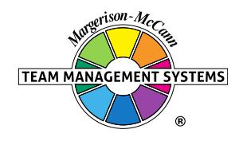

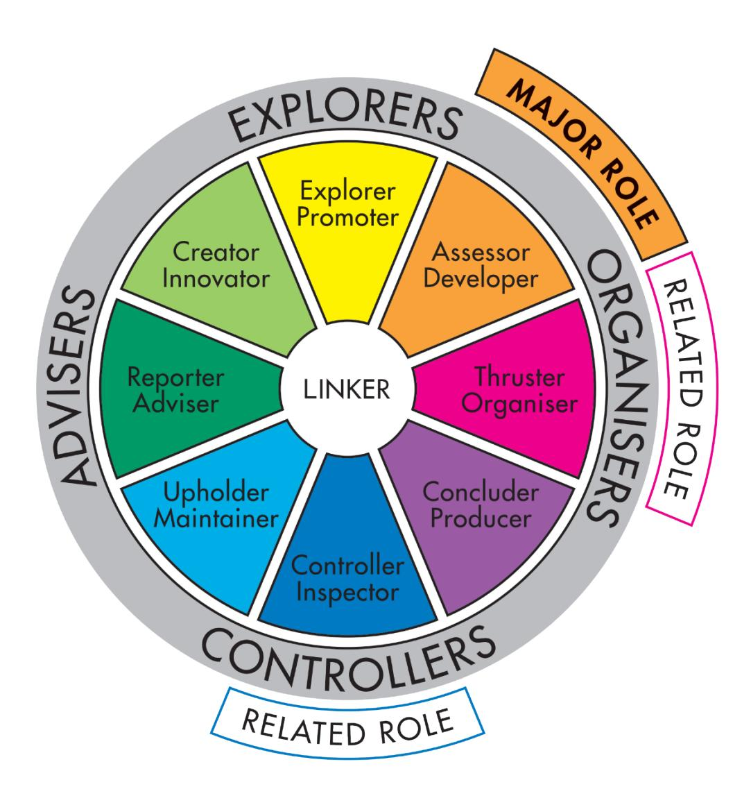

## **Team Management Profile**

# **Tianna Priest**

Team Management Systems, the wheel device and the associated trademarks marked with 'TM' or ® are registered

or common law marks of Team Management Systems IP in Australia and various international jurisdictions.

## **CONTENTS**

| INTRODUCTION                               | 2  |
|--------------------------------------------|----|
| WORK PREFERENCE MEASURES                   | 4  |
| OVERVIEW                                   | 5  |
| LEADERSHIP STRENGTHS                       | 6  |
| DECISION-MAKING                            | 7  |
| INTERPERSONAL SKILLS                       | 8  |
| TEAM-BUILDING                              | 9  |
| AREAS FOR SELF-ASSESSMENT                  | 10 |
| KEY POINTS OF NOTE FOR ASSESSOR DEVELOPERS | 11 |
| RELATED ROLES                              | 12 |
| WORK PREFERENCE DISTRIBUTION               | 14 |
| LINKING                                    | 16 |
| INDIVIDUAL SUMMARY                         | 18 |
| DISCLAIMER                                 | 19 |

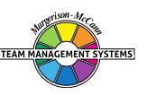

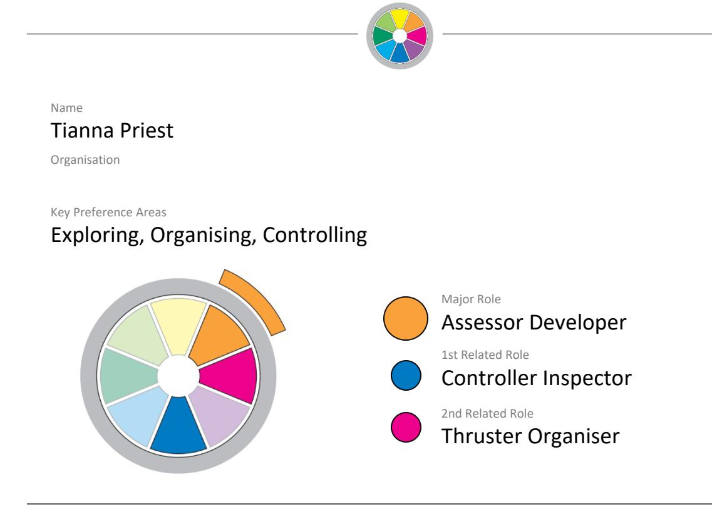

Your personal Team Management Profile provides you with information about your work preferences. It is a starting point for consideration and discussion of how you approach your work and your interactions with others in the workplace.

All work teams need to consider nine key activities essential for high-performance:

| Advising    | Gathering and reporting information                       |
|-------------|-----------------------------------------------------------|
| Innovating  | Creating and experimenting with ideas                     |
| Promoting   | Exploring and presenting opportunities                    |
| Developing  | Assessing and testing the applicability of new approaches |
| Organising  | Establishing and implementing ways of making things work  |
| Producing   | Concluding and delivering outputs                         |
| Inspecting  | Controlling and auditing the working of systems           |
| Maintaining | Upholding and safeguarding standards and processes        |
| Linking     | Coordinating and integrating the work of others           |

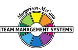

Your own work preferences have been derived from your responses to the Team Management Profile Questionnaire. While you may work in any of the areas of the Wheel, your highest preference area, or Major Role, has been identified together with two Related Roles which indicate your next highest preference areas. All the roles are displayed on the Team Management Wheel shown at the front of this Profile. The Linker role at the centre is the responsibility of all team members.

Note that the Team Management Profile Questionnaire does not measure skill or experience - you may have good abilities in areas of work where you have low preferences. However, where there is a good match between your preferences and the demands of your job, you are more likely to enjoy work, develop skills and perform well. Where a group is made up of individuals with complementary work preferences, it has a higher chance of being effective.

Your roles on the Team Management Wheel arise from your preferred approaches to work in four different areas:

- how you relate with others
- how you gather and use information
- how you make decisions
- how you organise yourself and others.

These four work preference measures are shown on the next page as bipolar scales ranging from 0 to 30 either side of a centre point.

For example, on the first work preference measure, the length of the bar to the left shows the extent to which you relate to others at work in an extroverted way. The bar to the right indicates the extent to which you relate to others at work in an introverted way.

Similarly the second measure indicates the extent to which you gather and use information in either a practical or creative way. The third measure looks at the extent to which you make decisions in either an analytical way or according to your beliefs, and the fourth measure determines whether you like to organise yourself and others in a structured or flexible way.

By subtracting the lower score from the higher one for each measure, a net score is obtained. This is indicated by a black vertical line. These are E: 2; P: 10; A: 6; F: 4 and are the foundation of your major role preference.

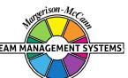

#### **WORK PREFERENCE MEASURES**

**RELATIONSHIPS**

How you Relate to others

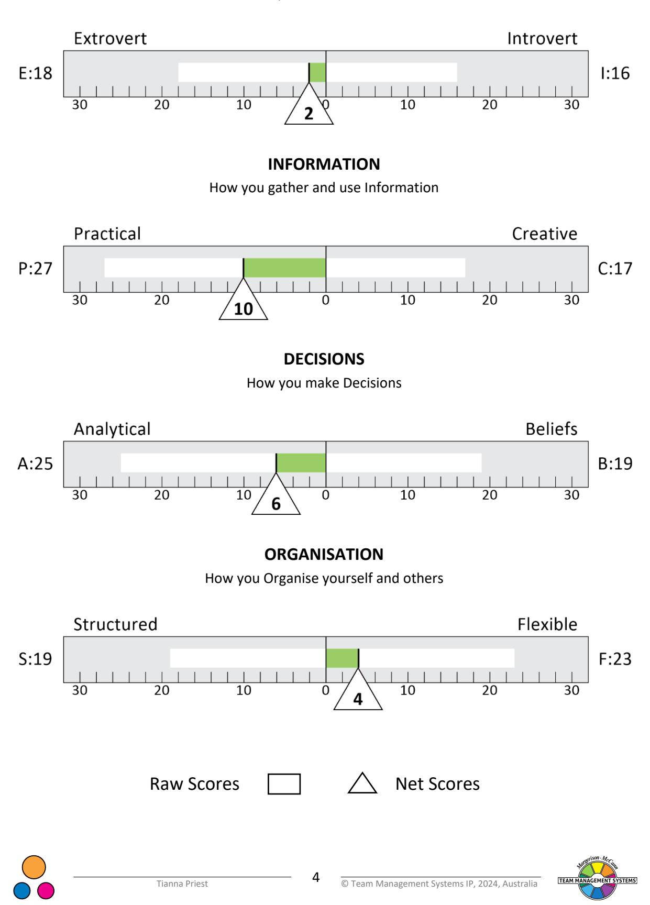

### **OVERVIEW**

Assessor-Developers enjoy being in close contact with new opportunities and advances. They will be attracted particularly to practical challenges that involve the excitement and risk associated with new activities, projects and ventures. It is in this sense that the term Assessor-Developer is appropriate for this key team role, as it involves assessing and developing new opportunities.

As an Assessor-Developer, you probably see yourself as a realist who makes the best of what is available. You do not like standing on the sidelines and watching life go by. You prefer to be on the field playing, but without too much strain or worry. You will look for tasks where you can develop an idea and show how it can be made to work.

Being more outgoing and sociable than many, you enjoy being with people and prefer to discuss practical matters and experiences. Indeed, you will probably immerse yourself in various experiences as this is the way you learn best. This can involve a good knowledge of 'what's on' in the locality, both socially as well as at work.

You can easily become bored at work and prefer employment with a lot of variety. Jobs which involve a lot of projects of a practical nature are particularly appealing. Unlike some Assessor-Developers, you have a good eye for detail and will usually make sure your projects have control systems with enough detail to allow them to be managed on a day-to-day basis.

You can come under pressure when people ask for time schedules to be drawn up for action, and plans to be brought forward which you will have to implement. This may lead to others saying you get involved in too many things, and do not always put enough effort into making them come to fruition. In short, they will say you start many things, but sometimes take too long to finish.

Overall, you enjoy tasks where you can be involved in design work and use your specialised knowledge. Developing a prototype is a challenge, although once the complexity has been solved, you will usually be at ease with others running and maintaining the day-to-day details.

You enjoy going out and meeting people in various situations and will arrange a lifestyle to fit your wide range of interests. However, you like to balance these periods with times you can be alone to 'recharge your batteries'.

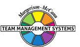

### **LEADERSHIP STRENGTHS**

As a leader, you will have an easy-going style and people around you will find it relatively easy to talk to you. As you are outgoing, you will share your thinking, but will usually have thought through various options before discussing them with others. You also will be willing to listen to others, even when under pressure. However, you may not always make decisions quickly enough for some of your team members, who may feel you put things off a little until you have heard and thought about all aspects of the issue.

You are usually resourceful and often good in face-to-face situations requiring entrepreneurial, diplomatic, or negotiating skills. All of these roles you can find challenging, in that they keep you close to reality, while enabling you to be stimulated by the risks and opportunities.

You will usually provide good support as a leader by encouraging others and enabling them to develop their ideas. You are good at providing resources and particularly helpful when it comes to supplying information, as you collect a lot of it. This shows itself when you are asked to provide leadership on a project, or advise an organisation that is in difficulty. Your ability to get to the key issues quickly, and inject guidance and direction can be vital to re-organisation.

As a leader, your emphasis will be on Exploring and Organising. You will encourage people to show how ideas can work. Your strength is in helping them to give the ideas a practical form. You will, therefore, seek to develop new products and services, and will be active, particularly in turning projects into reality. You tend to be very adaptable and will not necessarily follow a set path or the rules. Indeed, when it comes to discipline in the work situation, some will say you are not hard enough, although you will make a tough decision if you are forced through circumstances to do so, particularly in negotiations.

Members of your team may at times feel you don't push them hard enough. At other times, they may feel you get too personally involved, particularly on practical projects. However, you will probably believe it is difficult to be a good leader unless you have personal experience of the work on a regular basis. In addition, you cannot reach sound decisions unless you have a lot of information. You may, therefore, ask your staff to do a lot of homework in preparation for meetings.

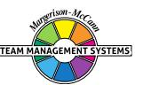

### **DECISION-MAKING**

You will tend to prefer situations where you can make decisions that are based on a wide background of information, but have some high-return and high-risk attached to them. Decisionmaking of a routine nature is probably not exciting enough for you.

One of your strengths is the way that you assess information. Your analytical approach enables you to stand back and look at the data you have in an objective way. If you are particularly strong on this, you will use a variety of means to test out the validity of the information you have. Such an approach will often enable you to see the logical consequences of a decision and you will be able to give objective advice on the pros and cons. Sometimes you feel that this in itself is sufficient, whereas other people will be looking to you to carry through the decision.

At times, you will feel you are travelling very fast, particularly if moving from project to project. You enjoy competitive situations where winning and losing are clearly spelt out. Such challenges will be important to you and you will often be willing to take personal risks in order to win.

People with this Profile generally enjoy practical experiences. You will be pragmatic, judging activities on their interest to you and will gather a tremendous amount of facts about such things. You will often seek out work situations which will give you the direct excitement you require from being involved with decisions that have risks of some order. In this way, you can get close to the action.

You may feel you learn most from in-depth experience rather than from reading and study. Others may say you spend too much time being involved in practical details.

Overall, you can have considerable influence on the decision-making process through your supply of information. However, this is not sufficient, and people will look for your point of view and what you believe should be done. You probably feel the facts should speak for themselves. However, when it comes to situations of judgement, you will on occasion have to go beyond the facts, and give views and opinions based on your beliefs. This may not come easily to you, as you prefer to make decisions on practical facts rather than general principles.

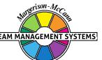

#### **INTERPERSONAL SKILLS**

Although you need quieter periods on your own to analyse and develop various options, you often do your best thinking while talking. Meeting with others is, therefore, important to you and you have probably developed a network of colleagues and friends with whom you can talk over issues that are concerning you. Your outgoing approach will usually enable you to communicate clearly the points which you wish to get across. In particular, it will enable you to talk over facts with other people in a very precise way. However, this may not be so easy when talking about theories as these do not interest people with high practical interests as much as those with high creative interests.

For each strength, however, there is the other side, and it may well be that your ability to communicate so freely will at times overwhelm others who know less, or who are quite introverted. You need, therefore, to keep a close eye on how they see your contributions and judge the amount of information they can take at any one time.

Your interest in knowing things and being involved needs also to be balanced against doing things and resolving issues. This could well cause conflict in that you may wish to be involved in lots of projects but may not be able to maintain sufficient interest to follow through the details of implementation before moving on to a new project.

Assessor-Developers are usually easy people to be with because they do not get too worried or anxious. They don't like to be drawn into major conflicts where they have to impose their will upon people. They want to enjoy life and share their enthusiasm with others.

You can be very aware of how others will react and, on occasions, anticipate well what is required in negotiations or situations of conflict. Your insight into what is required enables you to be a pragmatic negotiator. You will use the information you gain carefully, not rushing to an agreement, but holding on for the best terms. That may be seen by others as a high-risk, high-return approach. To you, such situations bring their own excitement as you enjoy being at the forefront of the action.

You can easily get bored when you do not have contact with others. They can enjoy your company because of the range of stories, memory for personal details, and your style of entertaining. You are sensitive to people's behaviour because you are good at observing both verbal and non-verbal signals, and responding to them. However, once the excitement of the situation wanes, you will usually prefer to move on to other things rather than become bored.

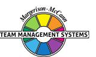

### **TEAM-BUILDING**

Your ability to relate to others makes it relatively easy for people to work with you. Your ability to weld a team together to overcome specific problems and crises will be respected. Your leadership by example, by 'going in first' in difficult and dangerous situations, will give confidence to team members.

Depending on the nature of the job, you will probably need someone who can supply a range of ideas and a Creator-Innovator is a person you should seek out. When it comes to making the ideas work, you are usually at your best, but operating the ideas on a regular basis requires someone from the Concluder-Producer sector. Likewise, to ensure work involving a lot of detail is done properly, you will probably need a Controller-Inspector working with you. However, you can sometimes do this work yourself, provided you have not taken on too many projects.

You will enjoy leading a team where you are asked to help bring order to chaos. Your team will respond to your leadership when you can explore new ways of doing things and develop projects in such a way as to maximise your personal involvement in the tasks. Once the team has been organised and stabilised, you may wish to move on.

You will want your team to concentrate on the essentials and keep to the practical aspects of the task. Whereas theory might be important to guide operations, you prefer your team members to stick closely to the day-to-day requirements. You prefer them to have challenging tasks where they are faced with opportunities which produce excitement.

Your matter-of-fact method of operating means team members must be willing to respond to your down-to-earth approach. They need to recognise your preference for direct, verbal communication and your wish to have important issues documented. You will want to ensure working conditions are up to standard. You expect the team to get involved and commit themselves fully to the day-to-day battle of work.

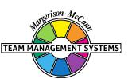

## **AREAS FOR SELF-ASSESSMENT**

Although you bring a number of strengths to the job, you should also take account of some other areas for development and these may include the following:-

- Despite having a relatively easy-going approach, you can be impulsive at times and take risks before a considered judgement has been made. Others who are quieter will not necessarily want to move at the same pace as you do. They require the opportunity to digest and consider information before giving worthwhile opinions. You may need to give them more time and accept they can best communicate in writing rather than by spontaneous conversation.
- While you prefer a fast pace, you will also prefer to work within the established, existing principles rather than look at new ideas and theories. If you are in a managerial situation, it is important to have someone who will regularly confront you with new ideas which will challenge your existing ways of doing things. Look for people who will do this and guide your thinking into new ways of action.
- You will normally know what is going on through direct participation. This will be very helpful in problem-solving. Alongside this, you will need to recognise that other people's beliefs are sometimes an important part of the problem-solving process. To you, this may seem irrational. To them, it is central to their life that personal beliefs should govern decisions, rather than simply assessing an event on its practical merit.
- You have a high capacity for gathering and remembering facts, and organising them. However, how many of these facts do you use on a day-to-day basis? You must establish a balance between gathering knowledge and using knowledge to ensure jobs get done on time. Overall, you will prefer a job that enables you to explore new opportunities and to assess how they can be made to work. It could be important to have people on your team who will help you follow through on details and deal with the long-term control aspects of projects such as schedules, budgets and audits.

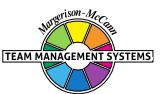

## **KEY POINTS OF NOTE FOR ASSESSOR DEVELOPERS**

- You can be outgoing, persuasive and influential, but need time to yourself to 'recharge your batteries'.
- You are also practical, pragmatic, and look for economy of effort.
- You like to be easy-going, and enjoy a social lifestyle.
- You are usually logical, analytical, and gather lots of facts.
- You can probably be good at keeping people entertained with anecdotes when you wish.
- You are usually an action-oriented person, concerned to get the best out of the present.
- You can be a resourceful negotiator.
- You have the capacity for detailed observation and learning from experience.
- You probably like direct involvement and experience in many areas.
- You may enjoy various practical activities and sports.
- You like an exciting, competitive environment.
- You will often get your best thoughts when talking, rather than writing or thinking alone in your office.
- You will probably enjoy a job which involves a number of challenging projects.
- You prefer to gather lots of information before making decisions.
- You may need deadlines to motivate you to produce the final product or output.
- You can work well in helping a unit or organisation to re-organise, especially when the situation is difficult.
- You will tend to welcome situations where you can 'travel fast' between one task and another.
- You tend to learn by doing.
- You probably enjoy work situations of high-risk, high-return rather than routine operations.
- You search for opportunities and don't let rules and regulations deter you.
- You can work effectively as a negotiator or trouble-shooter when required.
- You will tend to be adaptable, pragmatic and flexible to meet the challenges that come your way.
- You can be persuasive when required, in putting forward a view.

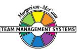

### **RELATED ROLES**

In the constructs of the Team Management Profile Questionnaire, you scored strongest in the areas of practical information-gathering and analytical decision-making. These two constructs have weighted your scores to give you a major role in the Assessor-Developer sector, but with related roles in the Thruster-Organiser and Controller-Inspector areas. This pattern of scoring suggests you will enjoy taking new ideas and seeing how they can be made to work in practice. You probably also have an eye for detail and will want to ensure what you are involved in is accurate before you act.

Usually, you will place a lot of emphasis on the facts and will want to ensure all possibilities have been considered before you move into action. However, unlike some other Assessor-Developers who may have a tendency to procrastinate, you will want to push your decisions into action once you are convinced everything will go well. At these times you are more likely to be wearing your Thruster-Organiser 'hat'.

You are likely to have a number of practical interests and skills, and will look for jobs that involve manipulating things rather than playing with ideas. In this regard, you will want to deal with real, tangible situations where you can see the results of your efforts. It is your practical thinking and desire to make things work that is the key to your work pattern in the Thruster-Organiser mode. You will believe in setting objectives and working to a plan, based wherever possible on experience and well-tested procedures. Reason, logic and analytical systems will be important to you but, unlike many people with the Thruster-Organiser preference as a major role, you are more likely to consider emotional matters, such as people's feelings, as equally important as getting the job done.

Your particular combination of major and related roles gives an interesting 'tail' to your set of preferences. Your primary strengths are in the Assessor-Developer / Thruster-Organiser areas, but you also showed some strength in the area of Controller-Inspector. This is a less common pattern on the Wheel, as most often the major and related roles are adjacent.

While on balance you prefer to be more outgoing, there are times when you would like to withdraw from the day-to-day operations and think more deeply about important issues. This will occur when there are major decisions to be made, or when the problems are complex and you find yourself under some stress. At these times, you will want to concentrate on the task at hand with few interruptions. You will want to ensure you have covered every possible eventuality and will move forward only once you are sure everything is correct. On these occasions, you can be quite incisive and will often come up with a novel approach to problem-solving.

You will prefer leadership roles where there is some excitement and involvement with practical realities. Once you can see how things should be done, you will organise people and resources to meet these realities, even if it means ignoring the existing rules, regulations and systems. This may at times upset others, who might complain you don't consult them enough before making your decisions.

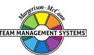

You respond well to people who can provide you with soundly based arguments, where the facts are clearly set forth, and logic and clear reasoning are used to justify a conclusion. You will often appreciate this information in a report, which you can study at your leisure, rather than being forced into a quick decision based upon the other person's verbal agility and personal presentation skills.

### **WORK PREFERENCE DISTRIBUTION**

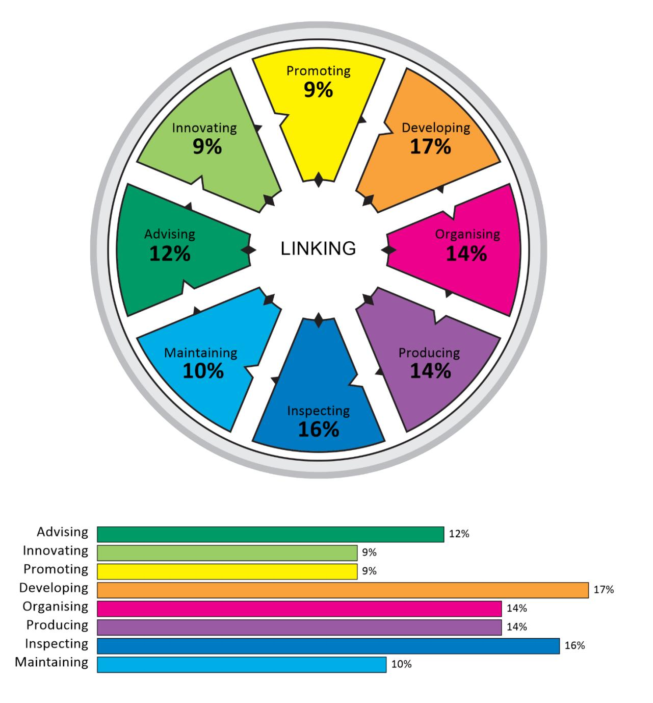

The Team Management Wheel highlights your major role preference and two related roles. In terms of the eight Types of Work that define the critical tasks of a team, these roles indicate the top three task areas that you prefer to work in.

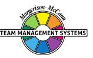

It is possible to extend your scores on the Team Management Wheel beyond the top three task areas to produce a work preference distribution that indicates your level of preference for all eight Types of Work. This information is valuable when it comes to allocating work among team members, as Team Management Systems theory states that all eight Types of Work are critical to the success of a team. If several team members have the same major and related roles, it is worth looking at the individual work preference distributions to determine whether there is a significant difference among team members in the less preferred work areas.

Your work preference distribution is shown with 100 percentage points distributed across all eight Types of Work, indicating those tasks that you like best and those that you like least. If the percentages are similar, you will be relatively comfortable working on any task. If there is a gap of more than 15 percentage points between the highest and lowest scores, there may be some tasks that you definitely like and others that you dislike.

When allocating tasks, it seems sensible for there to be some overlap between your work preferences and the team tasks that need to be undertaken. If you are spending a lot of time in areas that are not your preference, it may affect your enjoyment and wellbeing at work. Likewise if you are working solely in Types of Work that strongly match your work preferences, you may be ignoring important personal development opportunities in areas of lower preference.

It is important to remember that work preferences and competence are unrelated, and you may perform well in Types of Work for which you have a low preference. However, it is important to get the right balance between working to your preferences and working against them. Our research shows that a two-thirds/one-third balance works well for many people, and that problems with dissatisfaction can occur when the ratio moves significantly in the opposite direction. Working to your preferences will help establish conditions at work where your mental and psychic energy can flow freely.

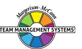

#### **LINKING**

At the centre of the Team Management Wheel is the Linker role, defined not by preferences, but by the skills that all team members need to develop. Linking Skills comprise people linking, task linking and leadership linking.

Of importance to all team members are the People Linking Skills, particularly the skill of Communication. A useful technique to try here is Pacing - varying your communication style so that it matches other people's role preferences. The successful implementation of Pacing skills helps avoid conflict and leads to more productive interactions.

Below are some key points that team members should consider when interacting with an Assessor-Developer major role preference like yours. Read each point and consider whether you would like the other person to act like this when they are communicating with you. Highlight those points that you definitely agree with and share them with your team members. This may help them understand 'what makes you tick' and how they can better meet your needs.

In order to link more effectively with you, the person you are interacting with could:

- Explore their ideas with you, but focus on the practicalities.
- Focus on the positives, rather than the negatives and use these to improve on your ideas.
- Learn to understand your divergent way of thinking.
- Help you to see the 'big picture', where necessary.
- Not force you to a decision until things have been fully talked through.
- Accept that you may delay making decisions if there is not enough information available.
- Make sure they have a good grasp of the facts.
- Speed up their speech delivery (if necessary) to match yours and try to talk with 'colour' in their voice rather than in a monotone.
- Give credit publicly for your contributions.
- Don't expect you to always be punctual.
- Record key points in writing after discussions with you, so as to avoid misunderstandings.
- Make allowances for your need to gather lots of information, even if they can't see the reason for it.
- Not force their own beliefs and opinions on you unless they are backed up by facts.
- Use visual representations (perhaps on a whiteboard) to help them get their point of view across.

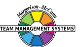

 Give you options to explore rather than suggesting a unique solution, when wanting a decision from you.

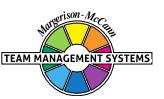

# **Individual Summary**

Name Tianna Priest

Organisation

Key Preference Areas Exploring, Organising, Controlling Major Role Assessor Developer 1st Related Role Controller Inspector 2nd Related Role Thruster Organiser Raw Scores Net Scores WORK PREFERENCE DISTRIBUTION Report Type Language Version Completed Date (UTC) Managerial English (International) S1.0 05/02/2024

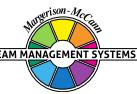

## **DISCLAIMER**

© Team Management Systems IP, 2024, Australia. Published by Team Management Systems. Produced on 15/04/2025. All rights reserved. No part of this publication may be reproduced, stored in a retrieval system, or transmitted in any form or by any means, electronic, mechanical, photocopying, recording or otherwise, without prior written permission of the publishers.

Team Management Systems, the wheel device and the associated trademarks marked with 'TM' or ® are registered or common law marks of Team Management Systems IP in Australia and various international jurisdictions.

The content of this report is based on data submitted through the Team Management Profile Questionnaire. While great care and diligence have been exercised, it is important to note that each personalised report is based on general observations and interpretations.

The authors and publishers make no guarantees regarding the accuracy, completeness, or applicability of this report for any specific individual or situation. Therefore, they cannot be held liable for any decisions, actions, or outcomes resulting from the use of the information contained in this report.

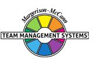