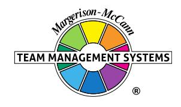

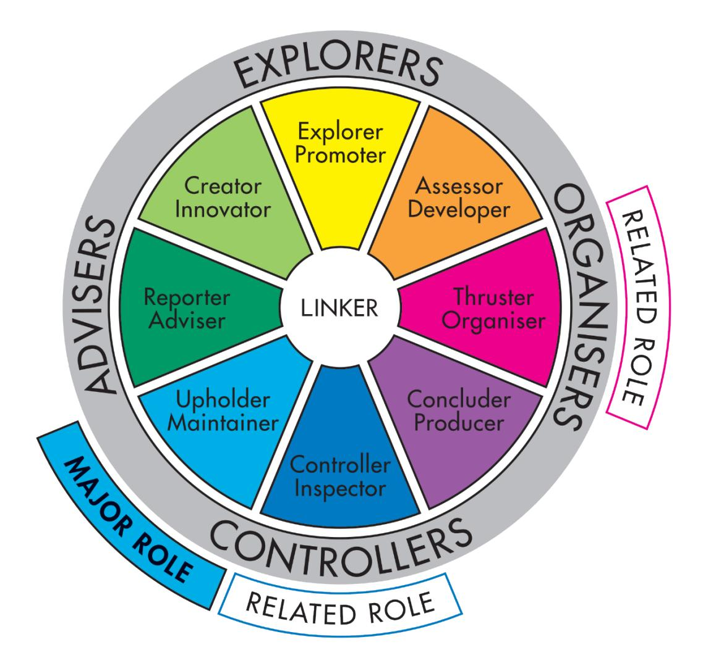

## **Team Management Profile**

# **Toby Hone**

Team Management Systems, the wheel device and the associated trademarks marked with 'TM' or ® are registered

or common law marks of Team Management Systems IP in Australia and various international jurisdictions.

## **CONTENTS**

| INTRODUCTION                                | 2  |
|---------------------------------------------|----|
| WORK PREFERENCE MEASURES                    | 4  |
| OVERVIEW                                    | 5  |
| LEADERSHIP STRENGTHS                        | 6  |
| DECISION-MAKING                             | 7  |
| INTERPERSONAL SKILLS                        | 8  |
| TEAM-BUILDING                               | 9  |
| AREAS FOR SELF-ASSESSMENT                   | 10 |
| KEY POINTS OF NOTE FOR UPHOLDER MAINTAINERS | 11 |
| RELATED ROLES                               | 12 |
| WORK PREFERENCE DISTRIBUTION                | 13 |
| LINKING                                     | 15 |
| INDIVIDUAL SUMMARY                          | 17 |
| DISCLAIMER                                  | 18 |

Toby Hone 1 © Team Management Systems IP, 2024, Australia

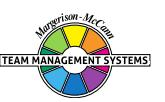

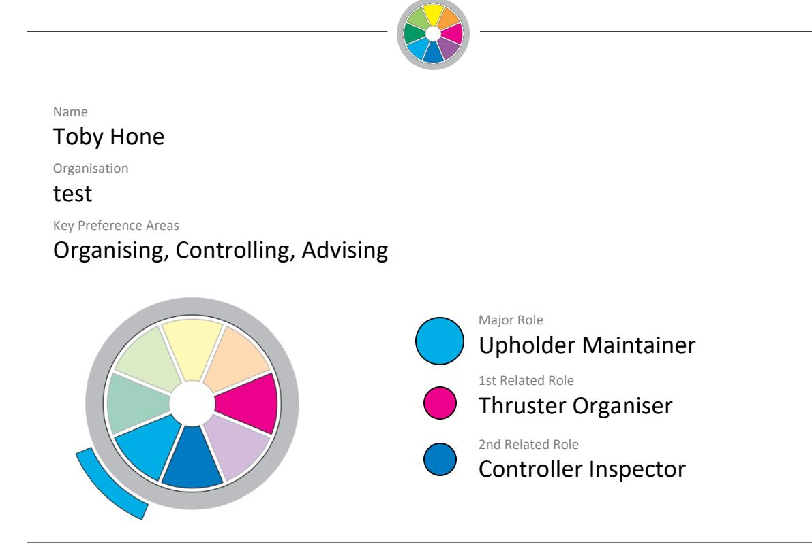

Your personal Team Management Profile provides you with information about your work preferences. It is a starting point for consideration and discussion of how you approach your work and your interactions with others in the workplace.

All work teams need to consider nine key activities essential for high-performance:

| Advising    | Gathering and reporting information                       |
|-------------|-----------------------------------------------------------|
| Innovating  | Creating and experimenting with ideas                     |
| Promoting   | Exploring and presenting opportunities                    |
| Developing  | Assessing and testing the applicability of new approaches |
| Organising  | Establishing and implementing ways of making things work  |
| Producing   | Concluding and delivering outputs                         |
| Inspecting  | Controlling and auditing the working of systems           |
| Maintaining | Upholding and safeguarding standards and processes        |
| Linking     | Coordinating and integrating the work of others           |

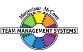

Your own work preferences have been derived from your responses to the Team Management Profile Questionnaire. While you may work in any of the areas of the Wheel, your highest preference area, or Major Role, has been identified together with two Related Roles which indicate your next highest preference areas. All the roles are displayed on the Team Management Wheel shown at the front of this Profile. The Linker role at the centre is the responsibility of all team members.

Note that the Team Management Profile Questionnaire does not measure skill or experience - you may have good abilities in areas of work where you have low preferences. However, where there is a good match between your preferences and the demands of your job, you are more likely to enjoy work, develop skills and perform well. Where a group is made up of individuals with complementary work preferences, it has a higher chance of being effective.

Your roles on the Team Management Wheel arise from your preferred approaches to work in four different areas:

- how you relate with others
- how you gather and use information
- how you make decisions
- how you organise yourself and others.

These four work preference measures are shown on the next page as bipolar scales ranging from 0 to 30 either side of a centre point.

For example, on the first work preference measure, the length of the bar to the left shows the extent to which you relate to others at work in an extroverted way. The bar to the right indicates the extent to which you relate to others at work in an introverted way.

Similarly the second measure indicates the extent to which you gather and use information in either a practical or creative way. The third measure looks at the extent to which you make decisions in either an analytical way or according to your beliefs, and the fourth measure determines whether you like to organise yourself and others in a structured or flexible way.

By subtracting the lower score from the higher one for each measure, a net score is obtained. This is indicated by a black vertical line. These are I: 22; C: 7; B: 5; S: 22 and are the foundation of your major role preference.

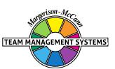

#### **WORK PREFERENCE MEASURES**

**RELATIONSHIPS**

How you Relate to others

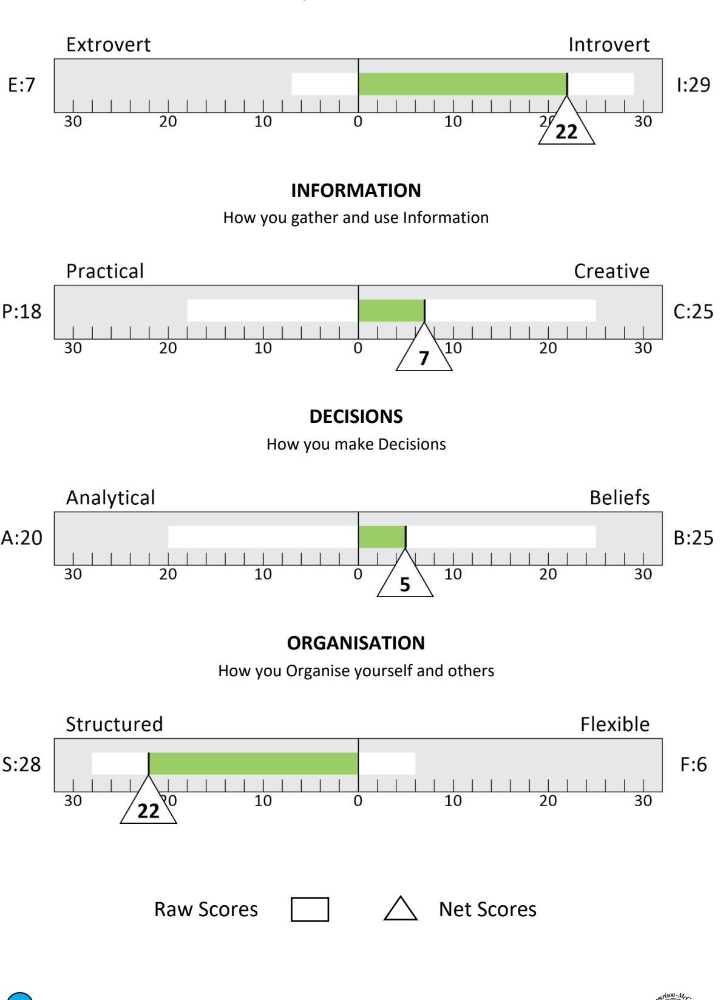

Toby Hone 4 © Team Management Systems IP, 2024, Australia

## **OVERVIEW**

Upholder-Maintainers play an important role in any work team. Their main concern is to set up and maintain standards. They establish close and supportive relationships with those who uphold the beliefs and values they consider important. However, they can at the same time be tough opponents against people who they perceive stand for ideas and decisions to which they are opposed.

Upholder-Maintainers can be key people in generating ideas and views on how an organisation and individuals should do things. The term Upholder-Maintainer is consequently very appropriate for this important team role.

As an Upholder-Maintainer, you will have quite a number of creative ideas which you will interpret through your own values. Where your theories combine with your beliefs, you have the powerful ingredients for taking and advising on action. As you prefer an organised and structured way of doing things, you will usually move to put your plans into practice rather than just thinking about them.

Where your work and beliefs are closely related, you will work extra hard and have confidence in what you are doing. Contributing extra hours in such a situation is part of the challenge. Where your ideas don't support your beliefs, you may not be as highly motivated.

Often other people do not realise how hard you are working because you prefer to do a lot of your best work by yourself. Indeed, you have the capacity to concentrate for long periods of time and to persevere when problems appear. You dislike too many interruptions and prefer to do the job in your own way. If this is so, then members of your team may not always understand what you are doing, unless you make a special effort to communicate on a regular basis.

You may well enjoy working on community activities, where you can contribute to the welfare and well-being of others. This could be through helping children, the elderly, a sports group or some other public cause.

While you will not enjoy being pushed, you can and do work to deadlines. Above all, you take a pride in the quality of your work and will ensure it is done, not only to time but also to a high standard.

You will probably have a strong feeling of what is right and wrong, and will align yourself closely with people of similar beliefs and convictions. Your ability to read people's motives and intentions is something that is important. You can often 'see' their strengths and weaknesses, and emotional make-up soon after you have met them.

You will have a vision of how things should be and will work towards it in a purposeful way. You can work for long periods by yourself in planning and preparation. Overall, you respect other people's feelings and work for what you believe is right, despite opposition on economic or other grounds.

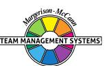

## **LEADERSHIP STRENGTHS**

As a leader, the Upholder-Maintainer will deal with matters in some depth. Your strength here will be in your ability to grasp a wide understanding of the complex issues at stake, and to commit tremendous energy and effort to push for new approaches.

You try to establish a harmonious, close-knit team and will spend time with those with personal problems or emotional upsets, if you believe they can benefit from your support. While you can be helpful, you can also be tough when required.

As a leader, you will set goals based on your ideals and theories, and will quietly but persistently pursue your objectives. You try to form a group of people who will support and work with you, but if all else fails, you will press on alone. This is particularly so when you really believe in the purpose of the activity. You may, therefore, take leadership in various social and community groups whose ideals and values you support.

Not everyone, however, will appreciate your leadership style, because much of your best work is done by yourself. Indeed, you often enjoy experimenting with new ideas and may not share these until they are well advanced or fully formed. Your colleagues may then have difficulty in understanding how you came to reach your conclusions.

Your enthusiasm is a key strength. You don't believe in letting today's disappointments get in the way of tomorrow. Your ability to come up with new ideas and your optimism will usually engender confidence. However, you will probably react badly to personal criticism and dwell on it rather than accepting it and pressing on.

As a team leader, you can represent and defend the group when you believe that the issues are worth fighting for. At this point, you can become a negotiator and representative who is hard to beat. You will particularly support those who suffer from what you regard as unfair and unjust treatment.

You will normally adopt a quiet approach to leadership, but will let people know where you stand. You like jobs to be finished on time so that everything is left neat and tidy. You will press for a high work standard and will not let people get away with slipshod work. Indeed, some will at times say you can be very critical when people do not meet your high standards.

You exercise leadership by doing rather than just talking and expect others to follow your example. You will probably talk in depth only with those whom you trust. At times, others may say you don't confide in them.

To what extent do you have special, group, problem-solving discussions on the key questions facing you at work? Such discussions give everyone on the team the opportunity to understand your concerns and express their views. Experienced managers have learned this is a useful way of getting people's opinions, even though specific criticisms may emerge. If handled constructively, such sessions can lead to major improvements. However, they need to be held separately from normal business meetings.

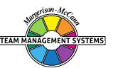

#### **DECISION-MAKING**

Your approach to decision-making is heavily influenced by your beliefs and values. This, combined with your imaginative ideas and concern to get things done in an ordered way, will mean you push for action.

On occasions, however, you may make decisions too quickly. You will rely too much on the inspiration of the idea, together with the strength of your beliefs, and may not acquire sufficient information to assess the decision.

In the main, you will have a steady approach, together with a highly intuitive, creative way of gathering information. You are likely to see the world from a very personal, unique viewpoint. Your approach will enable you to reflect quietly and deeply upon matters. This, combined with your creative insight, will often allow you to see possibilities and ideas beyond the facts of the situation.

Other people will not always see the world in the same way as you do. Indeed, they may talk a lot but not really come to grips with the points you feel are important. Your own preferred way of working is usually to listen to what others have to say, but not make a major contribution yourself until you have clarified in your own mind the key points. In general, you like to understand the whole picture before committing yourself. You are usually better able than others to see how things relate and interact, although the specific details and facts may be of little interest to you.

Because you like to resolve and conclude matters, rather than generate a lot of extra data, you could sometimes become impatient with others who either don't share your vision or will not commit themselves. While you prefer to work in a co-operative way, your keenness to implement your ideas can sometimes be seen by others as being 'over enthusiastic'.

You can be extremely keen in your own quiet way and will work for long hours to pursue the job in hand. You do not like to be beaten and will put in tremendous effort if you believe the issue or task is worth doing. You will not easily be thrown off course and can be seen by others as stubborn and obstinate when it comes to changing direction. Essentially, you tend to have commitment to your ideas and the overall purpose, and do not like to be put off. Clearly, this is a strength, but it needs to be played in the context of other people's willingness to go along the path you have decided.

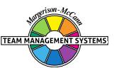

### **INTERPERSONAL SKILLS**

Establishing sound interpersonal relationships is important to you and you usually take time to do this well. You can be particularly concerned for other people's feelings and worries, and like to please and help those in need.

In your own way, you take time to work closely with people and try to understand their concerns. Wherever possible, you will seek to help colleagues and friends, particularly when they are having difficulty in career and work issues. You can often see the potential in others that they may not see or appreciate in themselves.

When you get to know people, you can find the right words to give feedback and encouragement. Your enthusiasm for what you are doing usually rubs off on to others in the team. In return, you will value those who appreciate your efforts and make it clear by word and deed. Working in a supportive team will be important to you. Where it does not exist, you will seek to create it or if that is not possible, you will probably move on.

You can, therefore, work well with those who recognise your concern to support and help. You probably indicate more than others your appreciation of work well done. However, you can be critical when people do not pull their weight or pursue a course which is not the one you believe is correct.

Overall, you can provide a sound basis for improving interpersonal relationships not only in your team but between groups. You have a concern to uphold and maintain relationships, and will work hard to bring people together. Occasionally, those you support may let you down. They may play on your good nature and you will have to make hard decisions as to whether you continue to help and support them and cause risk to yourself and the company.

You can be an effective representative of the organisation when asked to stand up for those things that you believe in, providing you have had time to prepare. On such matters, you can be an effective spokesperson or negotiator. Where, however, you do not identify with the purpose or cause, you will find it difficult to perform such roles with conviction. Play-acting in that sense does not come easily to you, when it cuts across your beliefs and convictions.

Overall, you can generate a high degree of enthusiasm and optimism among your colleagues. You also consider it important for established customs to be upheld and recognition given for service and loyalty.

You can usually communicate well, particularly in the written word, where you often find the right phrase to capture the moment. This can provide the basis for you to involve others in your ideas and ideals, and get them as enthused as yourself on what can be achieved with collective efforts.

#### **TEAM-BUILDING**

You prefer to have a close group of colleagues who share the same values as you. Establishing a solid 'esprit de corps' is important. You feel people will want to give of their best if they have a harmonious understanding and help each other. You will, therefore, listen to what others have to say and will at times 'bend over backwards' to accommodate their points of view, to hold the team together.

To achieve a balanced team, it is important to have people working with you who have the required skills, but may not share your vision or ideals. To complement your own strengths, you may need to work with Controller-Inspectors, Assessor-Developers, or Reporter-Advisers. If one or more of your related roles are already in these areas you may well be able to provide much of this balance yourself.

In building an effective work team, it is important to share your thoughts and ideas with your colleagues on a regular basis. You may feel it inappropriate to talk through your theories until they are well thought out. Unless, however, your colleagues understand how your thinking is developing, they may feel left behind. Regular discussions can pay big dividends, even if they do take more time.

You probably feel you try to give your team a fair amount of autonomy. While you like to see things done your way, you want everyone to be themselves, so their individual ways of doing things are respected.

Overall, you can build an effective work team when you are able to delegate and trust others. This is, however, difficult when others do not understand or share your ideals, or let you down.

Your greatest strength is the innovative thinking and strong values you bring to the organisation. Others may find it hard to understand these ideas. Your job is to help them appreciate what you see clearly and they can only dimly see. You may be hurt by what you perceive as criticism. Try not to take it personally. Treat criticism of your ideas as a problem statement to be discussed and resolved. You won't always be right and neither will your critics.

You will probably do well in a co-ordinating role, as long as people share your values. You will have an interest not only in advising others, but also in controlling the detail and direction. However, to ensure work gets finished on time, you will probably need others, particularly Concluder-Producers, to complement your efforts.

## **AREAS FOR SELF-ASSESSMENT**

Clearly, your approach has a number of strengths which can be extremely useful at work. However, one also needs to look at the other side of these strengths in order to develop a balanced Profile. You may, therefore, find it useful to consider the following points:-

- You often do your best work when by yourself, rather than talking to others. Communication is, therefore, an important issue, unless you have developed good Linking Skills. You will usually communicate well with a few tried and trusted people, but may perhaps be more reluctant to share your ideas with others at an early stage. If this is so, look at how you can improve communications, so other people can understand your thinking as it develops, rather than having to absorb your innovative ideas in their full version. Your team and colleagues need to be introduced to the complexity of your thinking in a series of ongoing steps.
- Ideas are your strength. Gathering detailed facts can be your weakness. If so, ensure you have someone working with you who is strong on practical details and the provision of relevant information.
- When it comes to substantial decisions, you should spend more time doing a detailed, objective analysis of the costs and benefits, rather than just relying on your ideas and beliefs. Again, it may be useful to have someone working with you who is a bit more detached and can look at some of these issues objectively.
- Once you have developed an idea, your inclination will usually be to get on with the action. However, you will probably need the support of others to fully implement your proposals, given your own preferences for advisory work. A person with a Thruster-Organiser major role preference can be helpful in such situations.

Overall, you will bring to your job many strengths. In particular, you will play a key role in the team of maintaining relationships and standards, and upholding principles important to the organisation and yourself. Alongside this, you will bring in new ideas and ways of tackling problems, and an ordered approach to dealing with difficulties.

### **KEY POINTS OF NOTE FOR UPHOLDER MAINTAINERS**

- You are usually quietly confident and persevering in the team's interests.
- You tend to be strong on ideas and innovation.
- You may prefer a co-ordinating, advisory role, but will act in an executive role.
- You tend to be individualistic and it is sometimes hard for others to know what you are thinking.
- Your personal convictions and beliefs are important in your decision-making.
- You are often single-minded and determined about ideas that you believe in.
- You may be easily hurt by criticism of your ideas or behaviour.
- You continually look for new approaches to old problems.
- You enjoy work where there is a wider meaning or purpose.
- You need to work with others who are strong on details regarding costs and benefits.
- You can concentrate for long periods working alone.
- You may support community organisations as a voluntary worker.
- You enjoy a close working relationship with a few trusted colleagues.
- Your enthusiasm and optimism can be great strengths.
- You have the ability to see opportunities and possibilities, often in advance of others.
- You can represent the organisation effectively if you believe in the cause and are well briefed.
- You have the ability to communicate clearly and usually succinctly.
- You can express yourself well in writing.
- You need to regularly review your priorities to ensure they have not been subverted by other people's.
- You can take a lot of time to be supportive and helpful to others.
- You dislike sudden change and prefer gradual evolution.
- You appreciate specific recognition and appreciation for what you have done.
- You have a strong sense of what is 'right and wrong' and 'good and bad' and this guides your decision-making.
- You can uphold and maintain traditions and values in the organisation.

### **RELATED ROLES**

In the constructs of the Team Management Profile Questionnaire, you scored strongest in the areas of introversion and structured organisation. These two factors have combined with your scores on the other two factors to locate you in the Upholder-Maintainer sector of the Team Management Wheel. Here, you will want to work quietly on your own, ensuring standards are upheld and organisational systems maintained so that everyone can work in an optimum way for the benefit of the organisation. Your related roles lie in the Controller-Inspector and Thruster-Organiser sectors and there are times when you show some of the characteristics of both these sectors. Many people with this pattern of scoring excel in administration management positions.

Although you showed a preference to work creatively with information, it is usually within the bounds of practical reality. This means you are unlikely to get carried away with ideas and concepts unless you can see their immediate relevance to what you do. This is the Controller-Inspector side of your working pattern, where you will want to work with ideas that have been well thought through and, if possible, fully tested before they are implemented.

It is one of your strengths that you reach a conclusion and make a judgement. On occasions, you will be so concerned to make a decision that you may not hear sufficient of the views being expressed by others. They may even see you as being unprepared to listen, particularly where the decision is related to something that you strongly believe in. To you, however, it is simply a question of efficiency and not letting matters drag on when you believe you have enough information to make a decision.

It is interesting that your combination of scores gives you a Split Wheel where your major and related roles are not adjacent. This is a less common pattern found in less than 5% of people who have completed the Team Management Profile Questionnaire.

Although you will tend to make decisions according to your beliefs, you will usually want to analyse situations fully before taking action. Where an analysis supports your beliefs, you will have no hesitation in pushing your ideas forward. Indeed, you may surprise yourself and others at times as to the urgency and commitment you bring to some of the tasks you are involved in. It is at these times that you are more likely to be wearing your Thruster-Organiser 'hat'. Where an analysis is contrary to your beliefs, you are more likely to request further information, hoping to find something that supports your hunches. On occasions, there may even be an internal conflict between your need to get action on a project and your concern to implement a decision that feels right to you.

When acting in a Thruster-Organiser role, you may get resistance from others if you have not shared your thinking with them as your ideas have evolved. In the interests of getting your ideas underway, you may feel that it is sometimes better to do things yourself than waste time telling others. In this regard, you may at times have difficulties in delegating.

Unlike some people with a major role as Thruster-Organiser, however, you will usually be aware of people's feelings and concerns and make sure these issues are kept to the fore in any dealings with your team members or other colleagues.

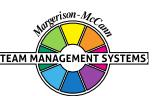

#### **WORK PREFERENCE DISTRIBUTION**

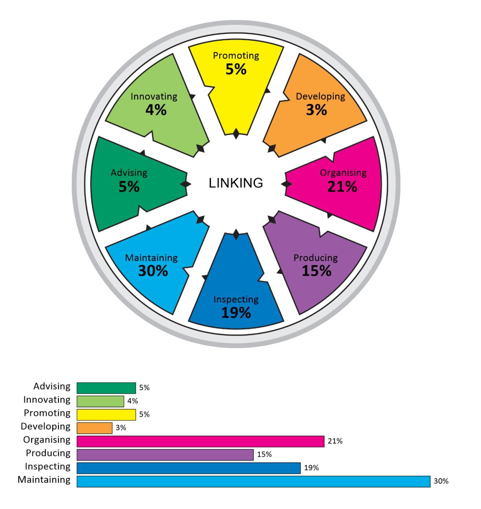

The Team Management Wheel highlights your major role preference and two related roles. In terms of the eight Types of Work that define the critical tasks of a team, these roles indicate the top three task areas that you prefer to work in.

It is possible to extend your scores on the Team Management Wheel beyond the top three task areas to produce a work preference distribution that indicates your level of preference for all eight Types of Work. This information is valuable when it comes to allocating work among team members, as Team Management Systems theory states that all eight Types of Work are critical to the success of a team. If several team members have the same major and related roles, it is worth looking at the individual work preference distributions to determine whether there is a significant difference among team members in the less preferred work areas.

Your work preference distribution is shown with 100 percentage points distributed across all eight Types of Work, indicating those tasks that you like best and those that you like least. If the percentages are similar, you will be relatively comfortable working on any task. If there is a gap of more than 15 percentage points between the highest and lowest scores, there may be some tasks that you definitely like and others that you dislike.

When allocating tasks, it seems sensible for there to be some overlap between your work preferences and the team tasks that need to be undertaken. If you are spending a lot of time in areas that are not your preference, it may affect your enjoyment and wellbeing at work. Likewise if you are working solely in Types of Work that strongly match your work preferences, you may be ignoring important personal development opportunities in areas of lower preference.

It is important to remember that work preferences and competence are unrelated, and you may perform well in Types of Work for which you have a low preference. However, it is important to get the right balance between working to your preferences and working against them. Our research shows that a two-thirds/one-third balance works well for many people, and that problems with dissatisfaction can occur when the ratio moves significantly in the opposite direction. Working to your preferences will help establish conditions at work where your mental and psychic energy can flow freely.

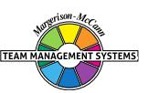

#### **LINKING**

At the centre of the Team Management Wheel is the Linker role, defined not by preferences, but by the skills that all team members need to develop. Linking Skills comprise people linking, task linking and leadership linking.

Of importance to all team members are the People Linking Skills, particularly the skill of Communication. A useful technique to try here is Pacing - varying your communication style so that it matches other people's role preferences. The successful implementation of Pacing skills helps avoid conflict and leads to more productive interactions.

Below are some key points that team members should consider when interacting with an Upholder-Maintainer major role preference like yours. Read each point and consider whether you would like the other person to act like this when they are communicating with you. Highlight those points that you definitely agree with and share them with your team members. This may help them understand 'what makes you tick' and how they can better meet your needs.

In order to link more effectively with you, the person you are interacting with could:

- Develop a personal relationship with you.
- Balance idea generation with converging on results and actions.
- Give you time to think.
- Allow you to finish your point and not interrupt, particularly if you like to choose your words carefully.
- Ask for clarification if they don't understand what you are saying.
- Avoid attacking any strong beliefs you may hold.
- Make sure they have a good grasp of the details, written down for you to look at, if possible.
- Respect your feelings on those issues that passionately concern you.
- Preferably make an appointment to see you, rather than just 'dropping in'.
- Avoid conflict.
- Foster an environment of co-operation and harmony.
- Be sincere.
- Communicate in writing on important issues so that you have time to mull them over.
- Summarise the content of conversations but make sure they focus on your 'feelings' as well as the 'facts'.
- Be specific in their discussions and not ramble.

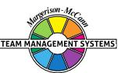

 Use a whiteboard to record the details discussed; this will help you both to capture key points and keep on top of the details.

## **Individual Summary**

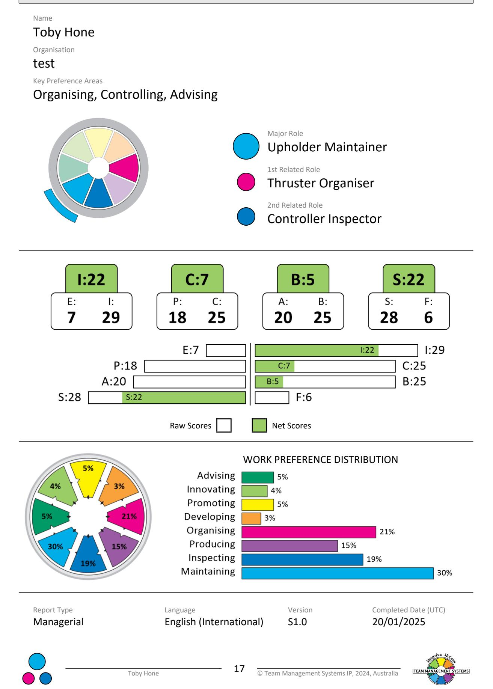

## **DISCLAIMER**

© Team Management Systems IP, 2024, Australia. Published by Team Management Systems. Produced on 15/04/2025. All rights reserved. No part of this publication may be reproduced, stored in a retrieval system, or transmitted in any form or by any means, electronic, mechanical, photocopying, recording or otherwise, without prior written permission of the publishers.

Team Management Systems, the wheel device and the associated trademarks marked with 'TM' or ® are registered or common law marks of Team Management Systems IP in Australia and various international jurisdictions.

The content of this report is based on data submitted through the Team Management Profile Questionnaire. While great care and diligence have been exercised, it is important to note that each personalised report is based on general observations and interpretations.

The authors and publishers make no guarantees regarding the accuracy, completeness, or applicability of this report for any specific individual or situation. Therefore, they cannot be held liable for any decisions, actions, or outcomes resulting from the use of the information contained in this report.

