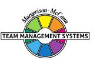

# **Team Management Profile**

# **Xander Capiaghi**

Team Management Systems, the wheel device and the associated trademarks marked with 'TM' or ® are registered

or common law marks of Team Management Systems IP in Australia and various international jurisdictions.

# **CONTENTS**

| INTRODUCTION                                 | 2  |
|----------------------------------------------|----|
| WORK PREFERENCE MEASURES                     | 4  |
| OVERVIEW                                     | 5  |
| LEADERSHIP STRENGTHS                         | 6  |
| DECISION-MAKING                              | 7  |
| INTERPERSONAL SKILLS                         | 8  |
| TEAM-BUILDING                                | 9  |
| AREAS FOR SELF-ASSESSMENT                    | 10 |
| KEY POINTS OF NOTE FOR CONTROLLER INSPECTORS | 11 |
| RELATED ROLES                                | 13 |
| WORK PREFERENCE DISTRIBUTION                 | 14 |
| LINKING                                      | 16 |
| INDIVIDUAL SUMMARY                           | 17 |
| DISCLAIMER                                   | 18 |

Name Xander Capiaghi

Organisation

Key Preference Areas Exploring, Organising, Controlling, Advising

Your personal Team Management Profile provides you with information about your work preferences. It is a starting point for consideration and discussion of how you approach your work and your interactions with others in the workplace.

All work teams need to consider nine key activities essential for high-performance:

| Advising    | Gathering and reporting information                       |
|-------------|-----------------------------------------------------------|
| Innovating  | Creating and experimenting with ideas                     |
| Promoting   | Exploring and presenting opportunities                    |
| Developing  | Assessing and testing the applicability of new approaches |
| Organising  | Establishing and implementing ways of making things work  |
| Producing   | Concluding and delivering outputs                         |
| Inspecting  | Controlling and auditing the working of systems           |
| Maintaining | Upholding and safeguarding standards and processes        |
| Linking     | Coordinating and integrating the work of others           |

Your own work preferences have been derived from your responses to the Team Management Profile Questionnaire. While you may work in any of the areas of the Wheel, your highest preference area, or Major Role, has been identified together with two Related Roles which indicate your next highest preference areas. All the roles are displayed on the Team Management Wheel shown at the front of this Profile. The Linker role at the centre is the responsibility of all team members.

Note that the Team Management Profile Questionnaire does not measure skill or experience - you may have good abilities in areas of work where you have low preferences. However, where there is a good match between your preferences and the demands of your job, you are more likely to enjoy work, develop skills and perform well. Where a group is made up of individuals with complementary work preferences, it has a higher chance of being effective.

Your roles on the Team Management Wheel arise from your preferred approaches to work in four different areas:

- how you relate with others
- how you gather and use information
- how you make decisions
- how you organise yourself and others.

These four work preference measures are shown on the next page as bipolar scales ranging from 0 to 30 either side of a centre point.

For example, on the first work preference measure, the length of the bar to the left shows the extent to which you relate to others at work in an extroverted way. The bar to the right indicates the extent to which you relate to others at work in an introverted way.

Similarly the second measure indicates the extent to which you gather and use information in either a practical or creative way. The third measure looks at the extent to which you make decisions in either an analytical way or according to your beliefs, and the fourth measure determines whether you like to organise yourself and others in a structured or flexible way.

By subtracting the lower score from the higher one for each measure, a net score is obtained. This is indicated by a black vertical line. These are I: 7; P: 1; A: 11; F: 21 and are the foundation of your major role preference.

#### **WORK PREFERENCE MEASURES**

**RELATIONSHIPS**

How you Relate to others

Xander Capiaghi 4 © Team Management Systems IP, 2024, Australia

### **OVERVIEW**

Controller-Inspectors put the emphasis on ensuring work is done thoroughly. They have an eye for detail. If you have something that requires careful checking, Controller-Inspectors will get the job done. They rarely make errors concerning the facts and can pick out discrepancies quickly. They are important members of a team when there is a need to ensure standards and procedures are kept. The term Controller-Inspector is, therefore, appropriate for this key team role.

As a Controller-Inspector, you probably like to concentrate on one task at a time. You don't like to be rushed because that is where errors creep in. You take pride in getting things right and do not welcome people interrupting your work schedule.

You may prefer to work with systems or procedures. Being more of a practical person, you will enjoy the challenge of making things work in your own way, without always having a high need to discuss matters regularly with others.

You like to be in touch with the real world where you can get feedback on your success in achieving outputs. You have an ability to make things work and may well use a trial-and-error approach. Rather than plan things thoroughly before putting them into effect, you may well prefer to implement a partial solution and then refine it as practical results are generated.

In your work, you have the ability to gather and analyse a considerable amount of information in a clear, logical way. You prefer not to let your personal feelings cloud your judgement and some people may say you are very analytical, detached, and only have concern for what the situation demands. Although you like to see things finished, you do not like to be rushed. Indeed, if it requires more time to get the information, you will push for this rather than completing the task without the full facts.

# **LEADERSHIP STRENGTHS**

It is your ability to get involved and gather the information, to sift and assess what needs to be done, that is the basis of your leadership skills. Normally, you will be patient in analysing a problem until you can find the cause and the way ahead, based on practical, down-to-earth reasoning.

You can, therefore, give sound leadership in situations where the task demands practical action. As a result it is not surprising that many Controller-Inspectors gravitate to leadership positions in areas requiring detailed knowledge and skills, or areas requiring control of systems, such as the administration, economic or accounting side of a business. You will welcome leadership positions where you can be at the 'sharp end', seeing the results of your efforts.

However, you often like to do things in your own way and at your own pace. The organisational rules and regulations, while recognised, may get in your way and you may not always conform, particularly when these systems put you under pressure or involve a lot of personal communication.

You can usually make good use of technology in the pursuit of your job and give leadership on how to utilise it to resolve problems and meet challenges. You will be respected for your contribution in areas requiring technical or specialist skills.

Some people will say you do not spend enough time explaining things to others. Your own style is to observe and study things in detail, and you expect others to do likewise. You may, therefore, have to spend more time listening to your colleagues and explaining what you are doing and what you want.

You will prefer leadership roles where there is some excitement and involvement with practical realities, because, for you the important thing is to get the job done efficiently and effectively. If you see how to do this, you will move quickly to make things work, even if it upsets others who feel you should have gone through established procedures.

You will lead from the front in a quiet but forceful way to get things done. You like to be free to move to meet the needs of the situation. Your emphasis is on 'do it now' rather than 'wait and see'.

As a result, you can be effective in a trouble-shooting, leadership role. You are rarely threatened by the thought of failure when involved with a practical task involving your skills. You lead by example, often doing the difficult parts of a job yourself, and expect others to follow.

Although you don't always let regulations and hierarchical systems stand in your way, you expect people who report to you to be disciplined in their approach to the task. You will require detailed preparation and a high level of practical skill. It is the demands of the task that you feel should govern the relationships.

At times, you may find it hard to delegate tasks to others. Your concern for the details means you will often want to do the task yourself, so you can be sure it will be done to your own high standards of effectiveness and efficiency. While this approach can work in small teams, with larger teams you may well find yourself working long hours to achieve your outputs. Delegation is a key Linking Skill and you may need to put some time into developing it.

#### **DECISION-MAKING**

Your approach is to get involved with the practical details and find out why and how things work. You like to get to the heart of the matter; only then can a proper solution be found. Rushed decisionmaking based on hunches and intuition is not for you - unless time is short.

This approach may, however, slow down the process of decision-making. When others are under pressure for quick action, they may criticise you for being too painstaking. However, when you come to use a system or equipment with which you are familiar, you can often find quick solutions and enjoy the thrill of adventurous activity. This reflects your liking for direct experience and the confidence you have in your ability to make things work.

It is your ability to individually analyse situations that guides your basic decisions on key issues. You can be objective, some may say even detached, in finding solutions based on what you see as the logic of the situation. Others may not always understand your thinking and you may need to make more effort to share the reasons for your decisions.

You probably enjoy a work situation where your practical abilities are tested. This will energise you into action. At such times, you can be very decisive and sure. You can read the requirements of the situation, not from a distance, but from personal involvement. As a result, you welcome jobs that put you in contact with the realities of working life, sometimes involving life or death decisions. You can face such situations with little fear if you are able to bring your special, practical skills to bear on the task.

You like to deal in facts and details. Because of this, you may not always come up with new ideas. When decision-making involves an innovative, new look at a problem, you may need to work with others from the northern part of the Team Management Wheel, who have a different approach based on ideas rather than facts.

In meetings you may not always talk as much as others, but once allowed to speak, can be quite persuasive and influential, showing a strong command of the practical realities of problems. People will learn that when you speak it is to make an important comment. Maybe someone has overlooked an important item of detail, or perhaps there are inaccuracies in someone's reasoning or calculations. You will usually pick up such issues in your own quiet way by studying the details. You may expect others to do likewise and will be disappointed when people who work with you do not pay the same attention to detail in decision-making.

You will enjoy meeting others in the workplace but usually in smaller groups. You will recognise the value of formal meetings but may feel that they go on for too long and are poorly chaired by others. Your style is to stick to the point and avoid 'waffling'. However, you may need to realise that other people, particularly those from the northern part of the Team Management Wheel, often need to do their thinking out loud.

#### **INTERPERSONAL SKILLS**

You often do your best work when thinking through a problem by yourself. You consider selfreliance to be important, although you do value input from others. You will consult team members for their views but should ensure you listen to them to try to incorporate the points they raise, otherwise they will see you as presenting them with a *fait accompli*. You may also need to spend more time keeping people in the picture on items that seem obvious to you. You may well realise the importance of this but feel that it sometimes wastes time. However, remember that unless team members see issues in the same way, productivity will eventually decline. Time invested 'today' in consulting and listening to others is repaid with interest 'tomorrow'.

You will recognise the importance of giving feedback to others so they can improve their performance. However, try not to be too critical, but concentrate on the positive aspects of what they are doing and suggest ways they might be able to improve.

When you give answers, however, you like them to be based on a careful analysis of the pros and cons. Essentially, you will like to weigh up all the known factors and assess the relative merits of the options in an objective manner. You like to state things precisely and accurately, and may, therefore, have a tendency to focus on unnecessary detail. Be careful that people don't lose interest in what you are saying. Try to develop your skills of summarizing and presenting the broad overview.

You respond well to people who can provide you with soundly based arguments, where the facts are clearly set forth, and logic and clear reasoning are used to justify a conclusion. You will usually like such information provided in a report which you can study at your leisure, rather than being forced into a quick decision based on someone else's verbal agility and personal presentation skills.

You usually communicate best with those who have similar practical skills and interests to you. Then the communication is not so much by words as by action. A mutual respect grows based on each other's ability to perform, and communication is often done by observation and non-verbal means. When you have done a good job, you like to have that appreciated and recognised. You will usually pass this recognition on to others who deserve it.

#### **TEAM-BUILDING**

You will encourage your colleagues to concentrate on details and produce accurate results, and will set up systems to enable them to see how they should work as a team.

While putting a lot of effort into practical issues and logically thinking them through in depth, you will usually take into account the importance of others' feelings and emotions. Your major concern is generally to find things out and understand what is happening. In order to do this, you will place equal significance on the facts and people's feelings, unlike some other Controller-Inspectors who place more weight on the facts.

You will find other people will not always be easy to work with, because they will want to do things in their own way. This will probably mean they will interrupt you to discuss issues and want to press you for a decision before you have got a complete answer worked out. By bringing these people into your thinking early and on a regular basis, you can help build your team's awareness of what you are trying to do and they can contribute more fully.

In building your team, you should look for what the overall requirements are. Try not to select people who are all Controllers if the task requires people with more Exploring skills.

Your team will probably work more effectively if you can include people who can operate easily as an Explorer-Promoter or a Thruster-Organiser. The Explorer-Promoter will provide the insight and new ways of tackling problems, while the Thruster-Organiser will keep everyone 'on target' with deadlines.

In operating as a team member, seek to link and help co-ordinate the work of the other members. This will mean calling regular meetings to exchange information, as well as making decisions. These meetings should be the basis for improving team co-operation.

## **AREAS FOR SELF-ASSESSMENT**

Controller-Inspectors have an eye for detail and prefer to control organisational systems and procedures. In terms of the Team Management Profiles, they can operate both as Controllers and Organisers.

Your approach to work has a number of major strengths, but if you want to develop your areas of competence further, you may need to consider the following points:-

- Try to give colleagues regular feedback on how your work is going (both on an individual and group basis) rather than waiting till the job is completed.
- While you are usually good at following a logical approach and gathering lots of facts, do not ignore the people who come up with 'wild' theories and ideas - they may just provide you with the insight you need to progress.
- Let people know how you feel about their work, particularly if they have been helpful. You may already do this, but there is always room for improvement. People like to be praised and given encouragement.
- While you are concerned to get things done properly, make sure the job is done against a time schedule. You may tend to delay a decision until you get more data or do another analysis.

Overall, your desire to get involved and find things out, and your thoroughness and persistence tend to carry you through. These are strong characteristics which you should build upon, but in doing so recognise the need to further develop the other approaches mentioned here.

# **KEY POINTS OF NOTE FOR CONTROLLER INSPECTORS**

- You will put emphasis on establishing systems and procedures.
- You will have a practical approach to work and life.
- You will usually be good on factual details and like to state things exactly.
- You will probably prefer roles that provide opportunity for use of systems, procedures, equipment, or technology.
- You like to be convinced by hard reasoning and logic.
- You do not always work easily in a hierarchy, but respond as you feel the situation requires.
- You emphasise economy of effort, and can take life as it comes when there is no pressure of work.
- You like to do things in your own way rather than conform rigidly to timetables and schedules.
- You often prefer to exercise clear leadership in areas where practical, technical expertise is needed.
- You show a clear preference for the facts and details in most situations, but recognise that people's feelings are also important.
- You can concentrate on a task for long periods without the need for the company of others.
- You consider self-reliance important.
- You can be particularly critical of missed details and errors.
- You can have a strong loyalty to those who share the same risk and orientation to yourself.
- You tend to have a quiet approach to work relationships.
- You may, from time to time, be impulsive in dealing with specific work issues that involve practical matters, or in responding to the interests of the moment.
- You usually like to take an uncomplicated approach to leadership, rather than work to theories and systems.
- You can be effective as a trouble-shooter in resolving difficult practical problems.
- You communicate well with people who have similar skills, but may need to work harder at communicating with those who don't.
- You may not feel the need for regular meetings, but the higher you go in the organisation, the more important meetings will be to involve and link people together.

- You will not always follow rules, regulations and procedures, or obey senior people in the hierarchy, particularly when you are confident that the task demands different approaches.
- You prefer a job where you can get quick feedback on whether you are winning or losing, and will try to organise things accordingly.
- You are at your most confident when using your technical or specialist skills.
- You may not find it easy to communicate or teach your skills to others, and may need to develop skills in presentation.
- You have a particular strength in your knowledge of practical matters and the willingness to take on difficult assignments.

### **RELATED ROLES**

In the constructs of the Team Management Profile Questionnaire, you scored strongest in the areas of analytical decision-making and flexible organisation. These two constructs have weighted your scores to give you a major role in the Controller-Inspector sector, with related roles in the Creator-Innovator and Assessor-Developer areas. Here, you will want to work in an accurate, detailed way, making sure all facts have been considered before you make a decision. However, there will be times when you can be quite creative, thinking up ways to improve the systems and procedures you are working with. On these occasions, you are likely to be wearing your Creator-Innovator 'hat'. You also showed some strength in the Assessor-Developer sector, indicating your preference for thoroughly analysing and developing ideas before you proceed to put them into action.

It is interesting that your combination of scores gives you a Split Wheel, where your major and related roles are not adjacent. In fact, you have a very unusual three-way split - something that is observed in less than 1% of people who have completed the Team Management Profile Questionnaire. Your preferences to some extent cover all four major parts of the Team Management Wheel - Exploring, Advising, Controlling and Organising - and you are likely to be able to adapt to most situations. In some circumstances, this split of the Wheel indicates you may be over-cautious in implementing ideas that are your own. You will want to make sure everything is 'just right' before proceeding and at times this may cause you to 'bog down'.

When acting in your Creator-Innovator role, you will want to spend time on your own thinking deeply about the problems you have. You are more likely to find answers on your own than come up with them in group discussions. The design aspects of your work are likely to interest you and people will admire you for your ability to come up with improvements to existing products or services. You may well read a lot and enjoy gathering all sorts of information, particularly on concepts and new ideas. You will then like to digest this information and let it 'spark off' your own ideas. Often, you may be the source of some very fundamental changes to systems and procedures which are introduced to the organisation, but you may not always get the credit.

While on balance, you prefer to be more quiet and reflective, there are times when you can be very outgoing, particularly with people you know well, or in situations that are familiar to you. Once you have an idea you see can be of great benefit to the organisation, you can become quite forthright in expressing your view, sometimes in a highly persuasive manner. These ideas have usually been well thought through and, when you act in this way, people should realise your proposals have a high potential for success, as you do not like failure, and will not suggest ideas unless you are very sure they will succeed.

You may tend to fluctuate in your relationships with other people. Sometimes, you can be very friendly and interested in what others are doing and at other times you can be quite reserved and formal with these same people. Your colleagues may, therefore, sometimes be unsure as to where they stand with you. Usually though, you do not intentionally become non-communicative - it is more a by-product of you being immersed in a complex problem when your thoughts tend to be focused on the resolution of this one situation. Until you come up with the answer, you are likely to be quite single-minded.

#### **WORK PREFERENCE DISTRIBUTION**

The Team Management Wheel highlights your major role preference and two related roles. In terms of the eight Types of Work that define the critical tasks of a team, these roles indicate the top three task areas that you prefer to work in.

It is possible to extend your scores on the Team Management Wheel beyond the top three task areas to produce a work preference distribution that indicates your level of preference for all eight Types of Work. This information is valuable when it comes to allocating work among team members, as Team Management Systems theory states that all eight Types of Work are critical to the success of a team. If several team members have the same major and related roles, it is worth looking at the individual work preference distributions to determine whether there is a significant difference among team members in the less preferred work areas.

Your work preference distribution is shown with 100 percentage points distributed across all eight Types of Work, indicating those tasks that you like best and those that you like least. If the percentages are similar, you will be relatively comfortable working on any task. If there is a gap of more than 15 percentage points between the highest and lowest scores, there may be some tasks that you definitely like and others that you dislike.

When allocating tasks, it seems sensible for there to be some overlap between your work preferences and the team tasks that need to be undertaken. If you are spending a lot of time in areas that are not your preference, it may affect your enjoyment and wellbeing at work. Likewise if you are working solely in Types of Work that strongly match your work preferences, you may be ignoring important personal development opportunities in areas of lower preference.

It is important to remember that work preferences and competence are unrelated, and you may perform well in Types of Work for which you have a low preference. However, it is important to get the right balance between working to your preferences and working against them. Our research shows that a two-thirds/one-third balance works well for many people, and that problems with dissatisfaction can occur when the ratio moves significantly in the opposite direction. Working to your preferences will help establish conditions at work where your mental and psychic energy can flow freely.

#### **LINKING**

At the centre of the Team Management Wheel is the Linker role, defined not by preferences, but by the skills that all team members need to develop. Linking Skills comprise people linking, task linking and leadership linking.

Of importance to all team members are the People Linking Skills, particularly the skill of Communication. A useful technique to try here is Pacing - varying your communication style so that it matches other people's role preferences. The successful implementation of Pacing skills helps avoid conflict and leads to more productive interactions.

Below are some key points that team members should consider when interacting with a Controller-Inspector major role preference like yours. Read each point and consider whether you would like the other person to act like this when they are communicating with you. Highlight those points that you definitely agree with and share them with your team members. This may help them understand 'what makes you tick' and how they can better meet your needs.

In order to link more effectively with you, the person you are interacting with could:

- Make sure they have a good grasp of the details, written down for you to look at, if possible.
- Suggest practical rather than theoretical solutions.
- Give you time to think.
- Allow you to finish your point and not interrupt, particularly if you like to choose your words carefully.
- Ask for clarification if they don't understand what you are saying.
- Not expect you always to be punctual.
- Give you logical explanations.
- Make allowances for your need to gather lots of information before deciding, even if they can't see the reason for it.
- Preferably make an appointment to see you, rather than just 'dropping in'.
- Accept that you may delay making decisions if there is not enough information available.
- Communicate in writing on important issues so that you have time to mull them over.
- Use e-mail to communicate with you rather than wasting time in unnecessary face-to-face interactions.
- Show you how any new ideas relate to what is happening now, or, indeed, what has happened in the past.

# **Individual Summary**

Name

#### Xander Capiaghi

Organisation

Key Preference Areas

Exploring, Organising, Controlling, Advising

# **DISCLAIMER**

© Team Management Systems IP, 2024, Australia. Published by Team Management Systems. Produced on 15/04/2025. All rights reserved. No part of this publication may be reproduced, stored in a retrieval system, or transmitted in any form or by any means, electronic, mechanical, photocopying, recording or otherwise, without prior written permission of the publishers.

Team Management Systems, the wheel device and the associated trademarks marked with 'TM' or ® are registered or common law marks of Team Management Systems IP in Australia and various international jurisdictions.

The content of this report is based on data submitted through the Team Management Profile Questionnaire. While great care and diligence have been exercised, it is important to note that each personalised report is based on general observations and interpretations.

The authors and publishers make no guarantees regarding the accuracy, completeness, or applicability of this report for any specific individual or situation. Therefore, they cannot be held liable for any decisions, actions, or outcomes resulting from the use of the information contained in this report.

