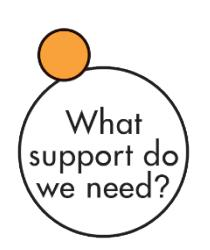

### **TEAM SIGNALS**

### **TEAM: Team OS**

This report reflects your personal assessment of your team's performance using the High Energy Teams Model. It highlights areas where you perceive your team to be excelling and identifies opportunities for improvement.

Your responses have been converted into percentage scores based on the maximum possible for each sector. Once all team members have completed the questionnaire, your facilitator will receive a separate report showing the aggregated team results—how the team as a whole is perceived by its members.

Before reviewing the combined team results, take time to explore your individual insights in this personalised report.

**Pink (Immediate Attention Required):** If you have scored your team below 50% then this is a sector where you think your team could make substantial improvements. It is recommended that your team meets to discuss answers to the relevant questions.

**Orange (Moderate Development Achieved):** If you have scored your team in the range 50- 75% for all sectors then most of your team's development goals are probably being met. However, there may be scope for further development.

**Green (Development Goals Met):** If you have scored your team above 75% on all sectors then you consider your team to be effectively meeting its development goals. Congratulations!

#### **Your Score: 88%**

Each person brings different strengths to a team and will approach work in different ways. Team members need to know 'what makes each person tick' so that individual differences can be harnessed to achieve maximum performance potential. In particular team members need to know about work preferences, approach to risk and personal values. This circle is coloured green because you're confident that team members know enough about the individual characteristics of each person.

We all approach work in different ways – we think in different ways, we plan in different ways and we communicate in different ways. Some aspects of our work might interest us more than others and therefore we'll tend to place more emphasis on these activities. The things we like doing at work are sometimes referred to as our work preferences. Knowing the preferences of your colleagues will help reduce conflict and improve communication. The more you understand about people the easier it is to interact with them. You 'strongly agree' that team members know what work team members prefer to do but maybe you should relate these to the three concepts of preferences, risk and values. The Workplace Behaviour Pyramid is a good model to help you do this.

People also approach risk in different ways. Some see opportunities as 'stepping stones' to the future whereas others may see them as 'stumbling blocks'. For a team to function well it's important for everyone to understand who is risk-accepting and who is risk-averse as it will impact how they react to change. You 'mostly agree' that this aspect of 'Who are we?' is well covered, although you might need to check this out with other team members.

Values are fundamental concepts or beliefs that drive our decision-making and cause us to summon up energy to preserve what we believe in. They go beyond specific situations and determine how we view people, behaviour and events. Often major sources of conflict and disillusionment are due to mismatched values. An important part of addressing the 'Who are we?' question is understanding the differing values held by team members. You 'strongly agree' that team members do understand the different personal values held by team members.

Diversity is essential to the survival of all systems, be they ecosystems or human systems. It's through diversity that a wide variety of options are generated which in turn can lead to better outcomes. You 'mostly agree' that team members value diversity and this could enable you to see problems from different angles.

#### **Your Score: 44%**

Before planning where you're heading as a team, it's useful to look at team balance, whether people are likely to be risk-averse or risk-accepting, and whether conflicting values are likely to arise. Here it's valuable to carry out a Team Situational Analysis where the team examines its Strengths, Weaknesses, Opportunities and Threats and determines whether the necessary resources are available to achieve the Team Purpose. This circle is coloured pink because it signals that you don't think the team knows enough about its current capabilities. This should be discussed with others in the team to see if they think the same way. Some team development needs to be undertaken to move this circle from pink to orange or green.

An important part of addressing the 'Where are we now?' issue is to look at the balance within the team. This can be done easily by examining individual work preferences. If everyone has strong work preferences for Organising and Producing, for example, and low preferences for Innovating and Advising, it may lead to a reduced emphasis on gathering information and the acceptance of new ideas. Imbalances like this can be easily corrected once they are identified. You're not confident there's good enough team balance to cope with all aspects of teamwork.

Some teams can see the opportunities that lie ahead whereas others seem to lack foresight. In planning for the future it's worth identifying the 'risk-orientation' of each team member. This is measured by the QO2™ metric. A low QO2™ may explain why some team members may place less emphasis on seeing the opportunities. This may be the case as you've indicated that the team doesn't always see the opportunities that lie ahead.

It's important for a team to recognise any weaknesses it may have. These may relate to either external factors or internal factors. If not recently done, it might be useful to carry out a team SWOT analysis (Strengths, Weaknesses, Opportunities, Threats). You've indicated that the team isn't always aware of its strengths and, particularly, its weaknesses.

A useful framework to review the stages of teamwork is Tuckman's model of Forming, Storming, Norming and Performing. High-energy teams set and achieve goals, diagnose and solve problems, have open communication, good support and high levels of trust. Above all they set and achieve goals regularly. You've indicated that your team could be functioning at the highest level – Performing.

#### **Your Score: 31%**

To work with energy, commitment and enthusiasm, a team needs to know where it's going. It has to have a vision that's aligned with the organisation's mission and goals. It needs to understand its purpose – what makes it different from other teams, what its outputs are and what outcomes they lead to. This circle is coloured pink because it signals that you don't think that team members have a clear view of where the team is going. This should be discussed with others in the team to see if they think the same way. Some team development needs to be undertaken to move this circle from pink to orange or green.

A team needs to know why it exists otherwise it has no direction. One way to do this is to develop a Team Purpose. This defines boundaries for what is and is not part of the team's work; gives a framework for defining and evaluating the team's success; focuses thinking and creativity; and helps determine the important tasks. You seem reasonably confident that everyone understands the Team Purpose and knows why the team exists, but you should check this at a team meeting.

The 'organisational vision' is a basic component of the strategic question 'Where are we going?' If nobody knows where they're going then it's virtually impossible to plan how to get there. An organisational vision needs to be developed and widely communicated by the senior management team. It establishes the 'big picture' and gives the necessary direction for teams to develop the Team Purpose. You seem unsure that everyone knows what the organisational vision is. This probably needs discussing with others in the team.

High-performing teams always make sure that their vision is aligned with that of the organisation. In general, organisations are only effective when the various teams all pull in the same direction towards the output and outcomes desired by those at the highest level. You seem unsure whether the team and organisational vision are aligned well enough.

A high-performing team will also focus on those tasks that are aligned with the team purpose and which will deliver the organisational vision in the most efficient way. Critical tasks will vary as a project proceeds but it's important that the team regularly checks that it's 'doing the right thing' as well as 'doing things right'. Does your team know specifically what its outputs and outcomes are? Outputs are the specific team results delivered to clients or customers. Outcomes are the effect of the results on the clients. These issues can be dealt with by getting the team to draw up a Team Purpose Statement. You definitely think team members don't know what outputs and outcomes are necessary to deliver organisational expectations. Clearly this is another item for discussion at a team meeting.

#### **Your Score: 56%**

To turn a vision into reality, it's necessary to systematically set objectives, action plans and measures of performance. It's important to plan the route from where you are now to where you want to be, by examining carefully the critical tasks that need to be done. This circle is coloured orange because you're reasonably sure that the team has action plans in place to steer it towards the goals and objectives that lie ahead, although further development of this area is probably a good idea.

Addressing the strategic issue of 'How will we get there?' means having clear individual and team objectives - milestones along the way to delivering the organisational vision. This may involve agreeing key result areas and ways of evaluating performance. The team also needs the commitment to move forward to its goals. This requires a high level of motivation and the ability to distinguish the important tasks from the peripheral ones. You 'mostly agree' that the team has clear individual and team objectives.

Plans that are specific and action based are important to the success of the team. Some teams consider the planning is done when they have developed generalised statements of idealised ways of working rather than practical, structured procedures of 'who' will do 'what', 'how', 'when' and 'why'. This could apply to your team as you've indicated that you're not sure that the team has action plans that it follows carefully.

Obstacles are a fact of life. They crop up in every project, no matter how much forward planning is undertaken. What makes the difference in successful teams is how project leaders and their teams react when problems arise. Obstacles treated only as stumbling blocks impede progress; obstacles treated as stepping-stones keep a project moving. High-energy teams will use Potential Obstacle Analysis to highlight and evaluate those areas where unexpected difficulties might arise. You are not sure that this is being done in the team so it's worth following up with other team members.

To move the team towards its goals it's important to understand the critical tasks that are the basis of team success. These are the nine key factors that form the Team Management Systems (TMS) Types of Work Wheel - Advising, Innovating, Promoting, Developing, Organising, Producing, Inspecting, Maintaining and Linking. At various stages in a project one or more of these will be critical. You've indicated that the team definitely focuses on the critical tasks that ensure success and doesn't get side-tracked.

## **Your Score: 75%**

People find it difficult to perform if they don't know what they're meant to be doing. In a high-energy team all team members will fully understand their job descriptions, their role in the team, what they're responsible for and, most importantly, what they're accountable for. The development of behavioural ground rules aligned with shared team values is also important to ensure team survival. This circle is coloured orange because you're reasonably sure that team members do know what's expected of them, although there will be some areas where improvements could be made.

It's important for team members to know: What are the boundaries to my job? and What are the tasks on which I will be evaluated? While it's important to have some flexibility, if job descriptions lead to overlapping responsibilities there could be problems for the team. This may not be the situation in your team as you've indicated that the job descriptions are mostly unambiguous and roles are reasonably defined.

It's also important to the team that everyone knows not only what their job is but the areas over which they have accountability. Problems can occur in teams because there aren't clear guidelines as to who has authority to do what, and where the areas of accountability lie. However, you've indicated that this isn't the case in your team and that there are clear lines of accountability and authority in place.

Difficulties often occur when there is ambiguity over the responsibilities of each team member. This tends to be compounded when people have responsibilities but not the accountability that goes with them. However this doesn't seem to be the case for your team as you've indicated that you 'strongly agree' that everyone does take responsibility for their actions.

Ground rules are guidelines for how the team will function. Sometimes they are referred to as the social 'glue' that holds a team together or a code that describes 'the way we do things around here'. Ground rules improve the team's effectiveness and efficiency and help prevent excessive 'storming'. They will minimise confusion, disruptions and conflicts. Once ground rules are in place everyone knows what is expected of them as far as teamwork is concerned. You probably think there's a need for clearer ground rules defining acceptable behaviour that team members subscribe to.

### **Your Score: 69%**

Once the team finds answers to the first five strategic circles it can focus on what support is required to deliver results. This means identifying skills gaps and providing necessary training and development so that the team can function at a high level. Personal learning should be encouraged along with a culture of learning from mistakes. This circle is coloured orange because you're reasonably sure that team members have identified the support that's required for the team to deliver great results, although there will be some areas where improvements could be made.

In the 'Where are we going?' and 'How will we get there?' sections the team develops the ideal outputs and outcomes. In this part of the High-Energy Teams Model, the team identifies the support that's required to deliver these targets. Support is required at both the team and the individual level. A culture of team support should encourage personal growth and development, risk taking, experimentation and innovation. You're unsure whether team members know what support is needed for the team to function at a high level; so this probably needs checking out.

It's a good idea for the team to agree on the main tasks to be carried out in the next planning period and then assess what skills will be required. A list of necessary resources will soon identify any gaps that need to be filled, either by way of people, technology or systems and procedures. Mostly you agree that individual skill gaps within the team are being identified and training and development provided.

No one is perfect and mistakes will be made. What differentiates high-performing teams from lowperforming teams is how they treat mistakes. High-performing teams will use mistakes as a learning opportunity and a way to ensure that similar situations don't occur again. You 'mostly agree' that learning from mistakes is encouraged.

The team as a whole should encourage team members in their personal learning. A Personal Learning Action Plan can help team members plug any gaps they have, by addressing four questions: What do I want to learn? What resources do I need? Who can help me? How will I know if I've learnt anything? As you strongly agree that personal learning is encouraged, this issue is unlikely to be a development priority.

#### **Your Score: 56%**

A high-energy team is one that regularly reviews its effectiveness and continually improves its performance. Benchmarks for success can be established and procedures for learning from mistakes implemented. A regular process of Questioning helps prevent complacency from developing. This circle is coloured orange because you're reasonably sure that the team has procedures in place to regularly monitor its effectiveness, although there will be some areas where improvements could be made.

Addressing this strategic issue involves carrying out regular team performance audits. An audit is best done using a questionnaire that addresses the key team performance factors. Team members should give their individual views and outsiders such as other teams, clients or senior management can also be asked for their views. You've indicated that regular team audits aren't being conducted. Perhaps you should ask other team members if they think that more team audits should be done.

High-energy teams are those that constantly evaluate their performance against benchmark standards. Most organisations have best practice standards and urge their teams to continuously improve to meet these standards. There's always someone in your industry sector performing better than your team and the aim of this section of the High-Energy Teams Model is to get your team on the pathway to world-wide best practice. You're unsure whether there are sufficient benchmarks by which to assess performance so this could be an issue for discussion.

To be effective, teams need to continually question their way of working. One way of doing this is to use the following questions as a framework. Do we gather enough information? Is this the best way of doing it? Who are the stakeholders we need to influence? Is this what stakeholders want? Are we organised well enough? Are our products/services clearly defined in terms of outputs and outcomes? What details need checking? Are we maintaining our standards? How can linking be improved? You 'mostly agree' that the team regularly questions its way of working, so no further development is needed, but you should check with other team members to get their views.

It's vital that team members should also discuss how well they are interacting with one another. This should focus more on 'how' things are done rather than 'what' is being done. Everyone should be encouraged to give open and honest feedback. This should be done with an emphasis on the positive rather than the negative. One way to initiate this is to address such questions as: What does our team do well? What does our team do badly? How can we improve our service to our clients? You 'strongly agree' that the team is doing this.

## **Your Score: 50%**

In general, most teams won't reach their full potential unless there's adequate recognition for the accomplishments of all team members. This means rewarding the whole team as well as individuals. Positive feedback should be encouraged, and successes recognised and appropriately celebrated. This circle is coloured orange because you're reasonably sure that team members do get adequate recognition for their efforts, although there will be some areas where improvements could be made.

Many of us fail to make time to give positive feedback. When someone in the team does something well then just a simple 'thank you' goes a long way towards making people feel wanted. Some people enjoy public recognition whereas others prefer just a one-on-one 'thank you'. Knowing when to 'go public' and when to 'go private' comes with skill in understanding people's work preference and values. You 'strongly agree' that positive feedback is openly given in the team.

People like recognition for the effort they put in at work. One way of doing this is by celebrating key successes. There are many opportunities during the year to get people together just to socialise or to celebrate some important result such as the achievement of a special target. Celebrations are beneficial as they help the development of team spirit. You definitely think that much more should be done to celebrate team successes.

Teams are unlikely to attain high-energy status unless there's adequate recognition for the individual accomplishments of all team members. As far as financial remuneration and promotion are concerned, it's usually the team leader and organisational policy that influence this, so it can be the most difficult form of recognition to get right. You've indicated that you think there are some problems with the individual reward processes in the team.

The challenge for organisations is to reward teams collectively for their efforts, and at the same time recognise the different contributions made by individuals. You 'mostly agree' that this balance is being achieved within the team.

# **Linking Skills**

Addressing the eight strategic questions that are the basis of your team's development priorities requires the application of Linking Skills. These create the atmosphere in which the team works, by promoting harmony and trust. In discussions with team members you will need to implement the six People Linking Skills of:

- Active Listening
- Communication
- Team Relationships
- Problem Solving & Counselling
- Participative Decision Making
- Interface Management

**Active Listening** is about indicating to the other person that you've received and understood what they've said. Techniques such as seeking clarification, summarizing, and two-way discussion are all a part of the process of active listening.

**Communication** involves interacting with other people in a way that enters their model of the world rather than just staying in your own worldview.

**Team Relationships** is about maintaining respect, understanding and trust.

**Problem Solving & Counselling** is about being available and responsive to people's concerns.

**Participative Decision Making** means involving others in making decisions on key issues so that there is joint ownership of solutions and commitment to their implementation.

**Interface Management** is a term used to describe the process of managing the links between team members and from the team itself to other teams or key stakeholders. The two important aspects of Interface Management are external Linking and internal Linking.

More information on Linking Skills is available from your Team Management Systems (TMS) Accredited Practitioner.

## **Disclaimer**

© Team Management Systems IP, , Australia. Published by Team Management Systems. All rights reserved. No part of this publication may be reproduced, stored in a retrieval system, or transmitted in any form or by any means, electronic, mechanical, photocopying, recording or otherwise, without prior written permission of the publishers.

Team Management Systems, the wheel device and the associated trademarks marked with 'TM' or ® are registered or common law marks of Team Management Systems IP in Australia and various international jurisdictions.

The content of this report is based on data submitted through the Team Signals Questionnaire. While great care and diligence have been exercised, it is important to note that each personalised report is based on general observations and interpretations.

The authors and publishers make no guarantees regarding the accuracy, completeness, or applicability of this report for any specific individual or situation. Therefore, they cannot be held liable for any decisions, actions, or outcomes resulting from the use of the information contained in this report.

