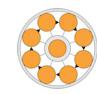

# **TEAM SIGNALS 360 REPORT**

Team Signals uses the High Energy Teams Model to assess a team's development priorities. Individual results are aggregated to display a 360-degree view of the team's responses to eight strategic development questions. Teams that have answers to each of these questions are more likely to become high-performing teams.

This report provides a clear and actionable overview of team satisfaction using a traffic light system. The Team Signals report acts as a baseline for development, a pulse check and a tool for ongoing improvement.

- **Green (above 75%)** represents areas of strength. These are the practices that a team excels at and should be leveraged further to sustain positive momentum. Reflect on what makes these areas strong and how to build on this foundation. Consider questions like: *What are we doing to maintain this strength? How can we leverage this success in other areas?*
- **Orange (between 50% 75%) or Pink (below 50%)** highlights potential opportunities for improvement. Focus on one or two key priorities to address first. Start with the foundational questions, *'Who are we?'* and *'Where are we now?'*. Ensure these are resolved before progressing to questions about direction, expectations or recognition. Addressing the questions in this sequence ensures that the development journey follows a logical and effective order. Explore questions like: *Why is this an area of concern? What can we do to tackle this challenge effectively? What steps will have the greatest impact?*

The third page of this report shows the range of responses to each question. The highest and lowest scores are indicated by the width of the band:

- **Narrow bands** indicate a consistency of the team's responses.
- **Wider bands** suggest outliers or differing perspectives, which can be investigated to understand their impact on team dynamics.

# **TEAM SIGNALS 360 REPORT**

# **TEAM: Team OS**

**Pink (Immediate Attention Required):** Any sector with a score below 50% indicates room for improvement.

**Orange (Moderate Development Achieved):** Sectors scoring between 50-75% suggest that most team members' development goals are being met to some extent.

**Green (Development Goals Met):** Sectors with scores above 75% demonstrate that the team is effectively meeting its development goals.

### **QUESTIONNAIRE ITEMS FOR EACH DEVELOPMENT QUESTION**

### **'Who are we?'**

- We know what work each team member prefers to do
- We understand the different personal values held by team members
- We know how each team member approaches risk
- We value diversity

### **'Where are we now?'**

- We can see the opportunities that lie ahead of us
- Team strengths and weaknesses are clear to all
- The team is well balanced to cope with all aspects of teamwork
- We are performing at a high level

#### **'Where are we going?'**

- We understand our Team Purpose and why we exist as a team
- Our Team Purpose is aligned with the organisational vision
- We know what the organisational vision is
- We know specifically what team outputs and outcomes are necessary to meet organisational expectations

#### **'How will we get there?'**

- We have action plans that we follow carefully
- We have clear individual and team objectives
- We monitor potential obstacles and are prepared for them
- We focus on the critical tasks that ensure success and don't get sidetracked

#### **'What is expected of us?'**

- There are clear lines of accountability and authority
- There are clear ground rules defining acceptable workplace behaviour that we all follow
- We have unambiguous job descriptions and know each person's role in the team
- We all take responsibility for our actions

#### **'What support do we need?'**

- Learning from mistakes is encouraged
- Individual skills gaps are identified and training and development provided
- We know what support we need for the team to function at a high level
- Personal learning is encouraged

#### **'How effective are we?'**

- We regularly question our way of working
- We have key benchmarks against which to measure performance
- We conduct regular team performance audits
- Interaction processes among team members are regularly discussed and reviewed

### **'What recognition do we get?'**

- We celebrate our successes
- Individual team members are adequately rewarded
- Positive feedback is openly given
- The whole team is rewarded and not just individuals

## **INDIVIDUAL RESPONSES**

|          | Who are we? | Where are we now? | Where are we going? | How will we get there? | What is expected of us? | What support do we need? | How effective are we? | What recognition do we get? |
|----------|-------------|----------------------|------------------------|---------------------------|----------------------------|-----------------------------|--------------------------|--------------------------------|
| Averages | 67%         | 61%                  | 42%                    | 56%                       | 50%                        | 42%                         | 71%                      | 54%                            |
| S Sub1   | 88%         | 44%                  | 31%                    | 56%                       | 75%                        | 69%                         | 56%                      | 50%                            |
| S Sub2   | 50%         | 88%                  | 50%                    | 62%                       | 31%                        | 31%                         | 94%                      | 56%                            |
| S Sub3   | 62%         | 50%                  | 44%                    | 50%                       | 44%                        | 25%                         | 62%                      | 56%                            |

