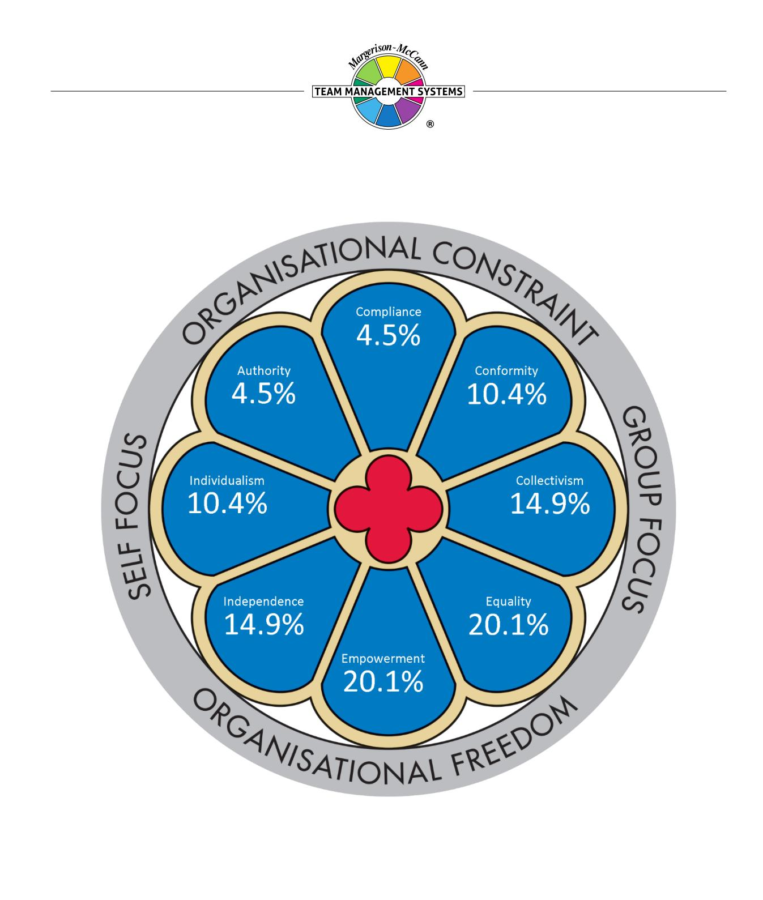
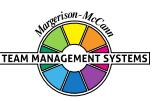
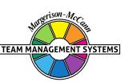
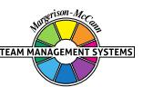
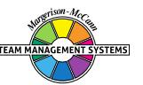
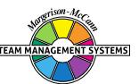
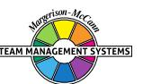
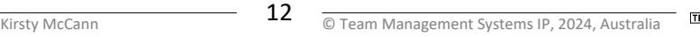
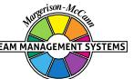
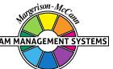

## **Window on Work Values Profile**

# **Kirsty McCann**

Team Management Systems, the wheel device and the associated trademarks marked with 'TM' or ® are registered or common law marks of Team Management Systems IP in Australia and various international jurisdictions.

#### **CONTENTS**

| INTRODUCTION TO WINDOW ON WORK VALUES | 2  |
|---------------------------------------|----|
| THE MODEL                             | 2  |
| YOUR RESULTS                          | 3  |
| EQUALITY                              | 4  |
| EMPOWERMENT                           | 5  |
| COLLECTIVISM                          | 6  |
| INDEPENDENCE                          | 8  |
| CONFORMITY                            | 9  |
| INDIVIDUALISM                         | 10 |
| AUTHORITY                             | 11 |
| COMPLIANCE                            | 12 |
| DISCLAIMER                            | 13 |

#### **INTRODUCTION TO WINDOW ON WORK VALUES**

This Profile gives you feedback on eight core value types that form the basis of behaviour in the workplace.

Values are concepts or beliefs which people use to guide their behaviour in the workplace. Values will drive our decision making and cause us to summon up energy to preserve what we believe in. They go beyond specific situations and determine how we view people, behaviour and events. Often major sources of conflict and disillusionment are due to mismatched values.

#### **THE MODEL**

The different values explored in your Profile are displayed in the *Window on Work Values* model which has been developed by Dr Dick McCann from his extensive workplace experience and comprehensive research with individuals and teams. The model has been validated within a rigorous testing process and has good structural validity, meaning that values close to one another in the window are related whereas those on opposite sides of the window are unrelated. The feedback in this report is presented in a practical and accessible way but you can be confident that it is backed by the appropriate statistical research.

The model consists of eight core work value types depicted as window panes, rather like those in the rose windows of many European cathedrals. It is divided into quadrants, each containing a core value type as follows:

**Self Focus:** Value types that put personal goals ahead of group goals. *Individualism* is the core value type in this quadrant.

**Group Focus:** Value types that put group wishes ahead of individual need. *Collectivism* is the core value type.

**Organisational Constraint:** Value types that require strictly-adhered-to guidelines to ensure the smooth running of an organisation. *Compliance* is the core value type.

**Organisational Freedom:** Value types where individual behaviour is unrestricted and people are free to choose their pathways, unfettered by organisational constraints. *Empowerment* is the core value type.

Values focusing on the self, within an environment of organisational freedom are defined by the *Independence* value type. Those focusing on the self within an environment of organisational constraint are defined by the *Authority* value type.

Values focusing on the group, within an environment of organisational freedom are defined by the *Equality* value type. Those focusing on the group within an environment of organisational constraint are defined by the *Conformity* value type.

#### **YOUR RESULTS**

Your responses to the profile questionnaire have been distributed across the eight panes of the *Window on Work Values*. Scores above 12.5% indicate work value types that are more important to you whereas scores below 12.5% indicate value types that are less important to you. Your hierarchy of value types (adding up to 100%) is as follows:

| Equality     | 20.1%                         |  |
|--------------|-------------------------------|--|
| Empowerment  | 20.1%                         |  |
| Collectivism | 14.9%                         |  |
| Independence | 14.9%                         |  |
|              | Walues less important to your |  |

| nformity    |      | 10.4% |  |
|-------------|------|-------|--|
| lividualism |      | 10.4% |  |
| thority     | 4.5% |       |  |
| mpliance    | 4.5% |       |  |

The *Self-Focus* value types (Independence, Individualism and Authority) account for 29.9% of your scores whereas *Group-Focus* value types (Equality, Collectivism and Conformity) account for 45.5% of your scores. This indicates the greater importance you place on the needs of others at the expense of your own needs.

The *Organisational Freedom* value types (Independence, Empowerment and Equality) account for 55.2% of your scores whereas *Organisational Constraint* value types (Authority, Compliance and Conformity) account for 19.4% of your scores. This indicates the strong bias you have towards values that ensure you have freedom to work in your own way.

Your pattern of scoring in each of the eight window panes is described on the following pages.

### **EQUALITY**

You scored in the high range on the *Equality* value type. This is the part of the *Window on Work Values* model that focuses on values relating to the establishment and maintenance of the work group in a way that allows you individual freedom.

Treating everyone equally and fairly is a guiding principle in the way you approach work. You are likely to be a tolerant person and one who readily accepts the different viewpoints of people in the workplace.

Support of the weak and disadvantaged is likely to be important to you. You may well defend any members of your team or group whom you consider to be disadvantaged by the actions of others.

You will want to be in a conflict-free environment and therefore may be seen as someone who is a 'peacemaker' and who will move to diffuse potential conflict situations.

You may also be seen as an altruistic person, one who is always willing to help others and work for their benefit. For you it is important to feel that people care about you.

If you are in a leadership position you may well have a reputation as someone who puts people first and gives equal opportunities to all.

You may have difficulty in working with people who scored high on the *Authority* value type. You could see them as being into 'power' and wanting to control people's lives. You may well feel dominated by them and this could cause you to react negatively towards them.

When interacting with high *Authority* people, consider these points to help you communicate better with them:

- Realise that it is important for them to be seen to be right in front of others;
- They will have a lower tolerance for people with opposing beliefs and ideas;
- They will be ambitious and take every opportunity to push themselves forward for promotion;
- They will respond well to feedback that highlights their prowess in leadership activities.

#### **EMPOWERMENT**

You scored strongly on the *Empowerment* value type. This is the part of the *Window on Work Values* model where people value a working environment where there is a degree of organisational freedom as to how people generate results.

For you, it is important to have the opportunity to contribute in a variety of ways to work projects and to be trusted that you will do your best to achieve the goals and expectations of the organisation. You will prefer situations where there is little supervision and high levels of accountability and responsibility are delegated to you and your team.

You are unlikely to be motivated solely by remuneration and material rewards and 'working for a higher purpose' is at least equally important. For you, work is to be enjoyed and rewards also come through the relationships you develop and the personal growth that comes through stretching your abilities and striving to extend your 'personal best'.

You are not necessarily a person who responds well to orders being given in a detached, compliant way and sometimes you may react badly to those who expect you to do as you are told. Occasionally you may even act to ensure that the 'orders' given to you are unsuccessfully implemented. Sticking to procedures and respect for the organisational hierarchy are not necessarily guiding principles in the way you approach work.

In general, you will have some difficulties in working with people who score high on *Compliance*. You may see them as inflexible and resistant to change. You much prefer to be around people who also see the importance of empowering others to achieve their maximum potential.

When interacting with people who score highly on the *Compliance* value type, the following points could help you improve your interaction with them:

- They will expect people to respect the organisational hierarchy and obey orders;
- They may check up on you regularly to ensure that their orders have been carried out as they specified;
- They will usually insist on following the organisational procedures;
- They value stability and are unlikely to respond well to people who want to change things.

#### **COLLECTIVISM**

You scored in the moderate range on the *Collectivism* value type. This is the part of the *Window on Work Values* model that focuses on core values that enhance the working of groups or teams.

*Collectivism* is important in the way you approach work. Most often you will subordinate your own personal interests and desires to those of your group or team. For you the best collective interests of the group are important in any decision-making process. However, you will be aware of the need to focus on issues that advance yourself and you will constantly be seeking the best balance between what is good for you and what is good for the group.

Harmony in the workplace is most likely important to you and you will often act in a way that defuses conflict in your team or work group. Having close supportive colleagues is important in the way you live your life and therefore you will try to act so that you don't upset others, even if you don't always succeed.

You are a person who gives loyalty and will expect loyalty from others in return, particularly when you find yourself in difficulties. Because of this you are more likely than many to have strong working relationships with particular colleagues.

Above all, you are a person who values consensus decision making and will have this as a priority, even if it means delays in taking decisions and getting into action. You will realise that effective action will only occur when everybody is committed to the same solution. Voting for a majority decision is not the way you like to work, although you may reluctantly advocate it if it gets the right result.

You are a person who strongly values the truth; therefore, you may have little time for those people who bend the truth to suit their needs. The issue of integrity is also important to you and you will always try to act in a way that is consistent with your views. You are unlikely to be a person who is swayed by others wanting expedient solutions to difficulties. You believe in openness and will enjoy working in a group where people honestly express their opinions and where there are no hidden agendas.

You may have difficulty in working closely with people who scored highly on the *Individualism* value type. You may see them as 'pushy' and as 'feathering their own nest' or just simply 'detached' and not being part of the team. Equally you may be misunderstood by such people, who may well see you as being too focused on what is good for others and not acting in your own best interests.

When interacting with such people, the following points may help you better understand them:

- They will want to make decisions on their own without necessarily referring back to the group;
- They will respond well to delegated authority where they are the responsible and accountable person;
- They will constantly look for employment that meets their own individual needs and so their job mobility may be high;

 They usually respond well to pay incentives and recognition that singles them out from the team.

#### **INDEPENDENCE**

You scored in the moderate range on the *Independence* value type. This is the part of the *Window on Work Values* model where people value working with a degree of organisational freedom in a way that allows them to focus on self-needs.

*Independence* is a reasonably important principle in the way you prefer to work. You will want to be left to 'do your own thing' and rely on your own ability to work your way through problems. While you are courteous in your dealings with others you will not always exercise self-restraint when you are expected to conform to principles which you oppose. For you, freedom of action and the ability to exercise your own creativity are important to your wellbeing at work. In general, you are a person who values self-sufficiency.

You appreciate the need to be a 'team player' but sometimes you prefer to be a 'solo operator'. While you can be comfortable working within a team environment, you can be just as effective in situations where you can pursue your own ideas, make your own decisions and stand by your actions.

You will not always respect the organisational hierarchy, particularly if senior management hold views strongly opposed to yours. Some people may even say you are a 'non-conformist'. Workplace issues such as security and safety, while seen as important, are not necessarily areas in which you would want to become personally involved.

You may not always react well to plans and goals which are imposed on you without your discussion and involvement. In these situations, you may well maintain your independence by insisting on increased levels of autonomy.

If you are working closely with people who score highly on the *Conformity* value type, you may well experience some difficulties in interacting with them. They will expect you to preserve the organisation's traditions and culture and to conform to the rules and regulations. While you appreciate the importance of this approach and can understand why people embrace such values, your high need for *Independence* dictates that you will not be a person who always conforms to the organisational norms.

When interacting with high *Conformity* people, consider the following points to help you communicate better with them:

- Make allowance for their needs to work within the defined rules and regulations of their organisation;
- Show respect for the hierarchy that may exist within any group;
- Recognise that stability is preferred and avoid 'rocking the boat' unnecessarily;
- Understand their need to avoid extremes of action and to accept the current situation rather than moving to change it.

#### **CONFORMITY**

You scored in the moderate to low range on the *Conformity* value type.

*Conformity* is of moderate importance in the way you prefer to work. You will try to conform to other people's expectations of you and will want to be seen as a reliable and valuable member of any team or organisation. You will not enjoy 'rocking the boat' but will if you are convinced that others are going in the wrong direction. You will be a loyal supporter to those who put their trust in you.

In general, you are prepared to accept whatever happens, provided you have freedom to explore your own creativity. You try not to show extremes of action and will generally try to fit in with those around you and not 'stand out' too much, although there may be times when you could take a more independent stand. You are probably more comfortable where there is some sense of security in your work environment as you like to know where you stand and what is expected of you.

You will usually enjoy being a team player although, if given the opportunity, you can be even more effective working independently and with a degree of autonomy. In making decisions you try to ensure that your actions conform to the organisational procedures and values, to which you will generally subscribe. You are probably to some extent, a supporter of the more important traditions and culture of your organisation.

You are a person conscious of the organisational hierarchy and will try to go through the proper 'channels' when undertaking important tasks and assignments, even if later you tend to 'do your own thing'. Exercising self-restraint will be important to you so that you do not 'lose face' in difficult situations.

Interestingly, you scored in the moderate to high range on the *Independence* value type and this may impact how you actually stick to your *Conformity* value in practice. You will probably enjoy a measure of self-reliance and set challenging goals for yourself. There may even be times when you are torn between the responsibility of conforming to the established norms of the workplace, while at the same time you may want to break out and exercise your own creativity and independence.

#### **INDIVIDUALISM**

You scored in the low to moderate range on the *Individualism* value type. This is the part of the *Window on Work Values* model containing values that primarily focus on the self.

Being an individual is reasonably important to the way you like to work. You will appreciate the need to make a significant contribution to your work group and to be recognised for your capabilities. When necessary you can take the hard decisions if you believe that they are in the best interests of your team and the organisation. However, you are unlikely to push too hard if there is likely to be a lot of opposition to your ideas.

You will probably enjoy being recognised for your intelligence and competence, but you are not someone who will act in a way that ensures others will give you this recognition. You are more likely to take a 'back-seat' role and be happy when others notice your contributions. Success too, will be important in achieving the goals you set for yourself. However, these goals are more likely to be selfimposed rather than imposed by others.

In general, you will tend to rely on yourself, taking personal responsibility for any outcomes. However, you also value your relationship with your work group, and you will usually try to fit in with their needs.

Interestingly, you scored in the moderate to high range on the *Collectivism* value type and this may impact how you actually use your *Individualism* in practice. Both are moderately important to you and you may sometimes experience internal conflict, being torn between your own need to put yourself first while ensuring that the views of others are taken into account.

Because you have reasonable balanced scores at both ends of the *Individualism-Collectivism* pair, these value-types are less likely than others to cause conflict situations with your colleagues at work.

### **AUTHORITY**

You scored in the lower range on the *Authority* value type.

Being seen as an *Authority* figure is not important in the way you approach work. The times when you actively seek to be in control of others are only so that you can achieve the best results for your team and the organisation.

You will take on the leadership role if you have to and will work hard to be effective in this area. However, you may be less interested in promotion than many others and may not always seek out new job prospects, particularly if you are happy with your current work and the only reason for changing jobs is for increased material rewards. You will prefer to be noticed by your 'good deeds' and would rather be invited to apply for job positions than have to push yourself forwards.

Being ambitious is not a guiding principle for you and you are more likely to seek a balance between your work commitments and your outside-work interests.

High remuneration will not be important to you although you are happy to receive it as a reward for your excellence and commitment to the organisation. You are more likely to be attracted to a job because of your intrinsic interest in the nature of the work you will be undertaking.

Being seen to be 'right' in front of others is also not important to you. You are unlikely to push your point of view across unless it is something you feel strongly about. You will work hard to convince people about situations you really believe in, but usually you try to be polite and diplomatic.

#### **COMPLIANCE**

You scored in the lower range on the *Compliance* value type.

Being seen as a person who values *Compliance* is not the way you approach work. You may not always have great respect for people in senior positions, particularly those who tend to follow orders and impose restrictions on you. For you, while it is important to show respect for the organisational hierarchy, you may not always be as compliant and obedient as others might like, particularly with people who have let you down.

Working in a way that follows set-down procedures and policies is not something you necessarily value. You probably like people to follow your recommendations and guidelines but are well prepared for challenges and on occasions may actively seek them.

Job security and organisational stability are not really important to your well-being at work. You probably have the temperament to cope with ambiguity and fit in with changing situations.

Above all you do not like constraints imposed on you and may on occasions react negatively to those who attempt this.

#### **DISCLAIMER**

© Team Management Systems IP, 2024, Australia. Published by Team Management Systems. Produced on 15/04/2025. All rights reserved. No part of this publication may be reproduced, stored in a retrieval system, or transmitted in any form or by any means, electronic, mechanical, photocopying, recording or otherwise, without prior written permission of the publishers.

Team Management Systems, the wheel device and the associated trademarks marked with 'TM' or ® are registered or common law marks of Team Management Systems IP in Australia and various international jurisdictions.

The content of this report is based on data submitted through the Window on Work Values Profile Questionnaire. While great care and diligence have been exercised, it is important to note that each personalised report is based on general observations and interpretations.

The authors and publishers make no guarantees regarding the accuracy, completeness, or applicability of this report for any specific individual or situation. Therefore, they cannot be held liable for any decisions, actions, or outcomes resulting from the use of the information contained in this report.

