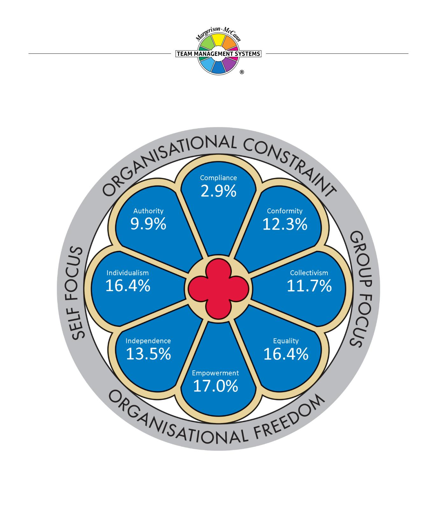

# **Window on Work Values Profile**

# **Matthew Page-Hanify**

Team Management Systems, the wheel device and the associated trademarks marked with 'TM' or ® are registered or common law marks of Team Management Systems IP in Australia and various international jurisdictions.

# **CONTENTS**

| INTRODUCTION TO WINDOW ON WORK VALUES | 2  |
|---------------------------------------|----|
| THE MODEL                             | 2  |
| YOUR RESULTS                          | 3  |
| EMPOWERMENT                           | 4  |
| EQUALITY                              | 5  |
| INDIVIDUALISM                         | 6  |
| INDEPENDENCE                          | 7  |
| CONFORMITY                            | 8  |
| COLLECTIVISM                          | 9  |
| AUTHORITY                             | 10 |
| COMPLIANCE                            | 11 |
| DISCLAIMER                            | 12 |

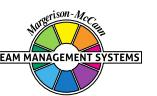

# **INTRODUCTION TO WINDOW ON WORK VALUES**

This Profile gives you feedback on eight core value types that form the basis of behaviour in the workplace.

Values are concepts or beliefs which people use to guide their behaviour in the workplace. Values will drive our decision making and cause us to summon up energy to preserve what we believe in. They go beyond specific situations and determine how we view people, behaviour and events. Often major sources of conflict and disillusionment are due to mismatched values.

# **THE MODEL**

The different values explored in your Profile are displayed in the *Window on Work Values* model which has been developed by Dr Dick McCann from his extensive workplace experience and comprehensive research with individuals and teams. The model has been validated within a rigorous testing process and has good structural validity, meaning that values close to one another in the window are related whereas those on opposite sides of the window are unrelated. The feedback in this report is presented in a practical and accessible way but you can be confident that it is backed by the appropriate statistical research.

The model consists of eight core work value types depicted as window panes, rather like those in the rose windows of many European cathedrals. It is divided into quadrants, each containing a core value type as follows:

**Self Focus:** Value types that put personal goals ahead of group goals. *Individualism* is the core value type in this quadrant.

**Group Focus:** Value types that put group wishes ahead of individual need. *Collectivism* is the core value type.

**Organisational Constraint:** Value types that require strictly-adhered-to guidelines to ensure the smooth running of an organisation. *Compliance* is the core value type.

**Organisational Freedom:** Value types where individual behaviour is unrestricted and people are free to choose their pathways, unfettered by organisational constraints. *Empowerment* is the core value type.

Values focusing on the self, within an environment of organisational freedom are defined by the *Independence* value type. Those focusing on the self within an environment of organisational constraint are defined by the *Authority* value type.

Values focusing on the group, within an environment of organisational freedom are defined by the *Equality* value type. Those focusing on the group within an environment of organisational constraint are defined by the *Conformity* value type.

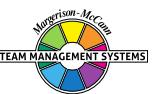

# **YOUR RESULTS**

Your responses to the profile questionnaire have been distributed across the eight panes of the *Window on Work Values*. Scores above 12.5% indicate work value types that are more important to you whereas scores below 12.5% indicate value types that are less important to you. Your hierarchy of value types (adding up to 100%) is as follows:

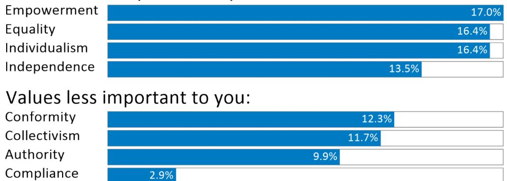

The *Self-Focus* value types (Independence, Individualism and Authority) account for 39.8% of your scores whereas *Group-Focus* value types (Equality, Collectivism and Conformity) account for 40.4% of your scores. This indicates the importance you place on balancing your own needs with the needs of others.

The *Organisational Freedom* value types (Independence, Empowerment and Equality) account for 46.8% of your scores whereas *Organisational Constraint* value types (Authority, Compliance and Conformity) account for 25.1% of your scores. This indicates the strong bias you have towards values that ensure you have freedom to work in your own way.

Your pattern of scoring in each of the eight window panes is described on the following pages.

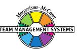

# **EMPOWERMENT**

You scored strongly on the *Empowerment* value type. This is the part of the *Window on Work Values* model where people value a working environment where there is a degree of organisational freedom as to how people generate results.

For you, it is important to have the opportunity to contribute in a variety of ways to work projects and to be trusted that you will do your best to achieve the goals and expectations of the organisation. You will prefer situations where there is little supervision and high levels of accountability and responsibility are delegated to you and your team.

You are unlikely to be motivated solely by remuneration and material rewards and 'working for a higher purpose' is at least equally important. For you, work is to be enjoyed and rewards also come through the relationships you develop and the personal growth that comes through stretching your abilities and striving to extend your 'personal best'.

You are not necessarily a person who responds well to orders being given in a detached, compliant way and sometimes you may react badly to those who expect you to do as you are told. Occasionally you may even act to ensure that the 'orders' given to you are unsuccessfully implemented. Sticking to procedures and respect for the organisational hierarchy are not necessarily guiding principles in the way you approach work.

In general, you will have some difficulties in working with people who score high on *Compliance*. You may see them as inflexible and resistant to change. You much prefer to be around people who also see the importance of empowering others to achieve their maximum potential.

When interacting with people who score highly on the *Compliance* value type, the following points could help you improve your interaction with them:

- They will expect people to respect the organisational hierarchy and obey orders;
- They may check up on you regularly to ensure that their orders have been carried out as they specified;
- They will usually insist on following the organisational procedures;
- They value stability and are unlikely to respond well to people who want to change things.

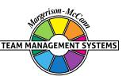

# **EQUALITY**

You scored quite strongly on the *Equality* value type. This is the part of the *Window on Work Values* model that focuses on values relating to the establishment and maintenance of the work group in a way that allows you individual freedom.

Treating everyone equally and fairly is a guiding principle in the way you approach work. You are likely to be a tolerant person and one who readily accepts the different viewpoints of people in the workplace.

Support of the weak and disadvantaged is likely to be important to you. You may well defend any members of your team or group whom you consider to be disadvantaged by the actions of others.

You will prefer to be in a conflict-free environment and therefore may be seen as someone who is a 'peacemaker'. When possible, you will try to smooth over differences by diffusing potential conflict situations.

You may also be seen as a caring person, one who is willing to help others and work for their benefit. For you, it is important to feel that people appreciate you.

If you are in a leadership position you may well have a reputation as someone who puts people first and gives equal opportunities to all.

You may have difficulty in working with people who scored high on the *Authority* value type. You will see them as being into 'power' and wanting to control people's lives. Your low to moderate score on the *Authority* value type means you understand the importance of a hierarchy at work, but you do not value those who make a show of it and who seek to dominate others.

When interacting with high *Authority* people, consider these points in order to help you communicate better with them:

- Realise that it is important for them to be seen to be right in front of others;
- They will have a lower tolerance for people with opposing beliefs and ideas;
- They will be ambitious and take every opportunity to push themselves forward for promotion;
- They will respond well to feedback that highlights their prowess in leadership activities.

# **INDIVIDUALISM**

You scored quite strongly on the *Individualism* value type. This is the part of the *Window on Work Values* model containing values that primarily focus on the self. However, your scores on *Collectivism* also indicate that, while maintaining your individualism, you will also value being a respected member of a work group.

Being an individual is important to the way you like to work. You are more likely to believe that it is through being a strong individual and making the hard decisions when they come, that you are doing your best for your team and the organisation. Although you will care about other people with whom you work, you are quite capable of taking individual action that may affect them adversely if it is in the best interests of the organisation. For you, getting results quickly is often the most important part of doing business.

It is probably important for you to be recognised for your intelligence and competence. More than likely, you will enjoy standing out from the crowd and being praised and rewarded for your individual success. Above all you will want to be seen as a capable person.

Because of your high reliance on yourself, you may not always conform to the wishes of others and prefer to work in your own way. However, your moderate to high score on *Collectivism* means that you will balance this need with the needs of the team or group to which you belong. Relationships are important to you and you will probably have just as many outside work as you do at work.

Some people could view you as an 'individual' as you don't always take advice from others, particularly from colleagues at a similar or lower level in the organisation. You will probably consider that the value of *Individualism* has contributed to your success and it probably has. However, more than many others you try to strike the balance between your own needs and the needs of your colleagues, even if you don't always succeed.

You will understand the importance of being part of a team and may even wish you placed a stronger emphasis on the values of team harmony and loyalty. The balance between doing what is best for you and what is best for others is something you will try hard to get right.

Your moderate to high scores on *Collectivism* are likely to impact how you actually use your *Individualism* value type in practice. Most likely you will value having close supportive colleagues who form a harmonious team, provided you are free to pursue goals that allow you to advance yourself. You will probably also support group decision making and consensus but could be reluctant to bow to group pressures if you see decisions going against you. However, there may be, at times, competing demands on you and it could be difficult for you to get the right balance between your need to be an individual and the concessions you may have to make in the interest of what's best for the team.

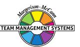

# **INDEPENDENCE**

You scored in the moderate range on the *Independence* value type. This is the part of the *Window on Work Values* model where people value working with a degree of organisational freedom in a way that allows them to focus on self-needs. However, your scores on *Conformity* also indicate that, while valuing your independence, you will want to ensure that you reasonably conform to what is expected of you.

*Independence* is a reasonably important principle in the way you prefer to work. You will like to be left to 'do your own thing' and rely on your own ability to work your way through problems. While you are courteous in your dealings with others, you will not always conform to principles that you oppose, although you will invariably exercise self-restraint.

For you, freedom of action and the ability to exercise your own creativity are important to your wellbeing at work. Above all, you are a person who values self-sufficiency, but are happy to work within broad guidelines set down by others.

While you can happily work as a 'team player', you are equally as effective as a 'solo operator' with the freedom to pursue your own ideas, make your own decisions and stand by your actions.

You usually respect the organisational hierarchy, particularly if the views of senior management align with your own. Workplace issues such as security and safety are seen as important and could be areas in which you would want to become involved.

You may not always react well to plans and goals which are imposed on you without your discussion and involvement. In these situations, you will want to maintain your independence and may push hard to get your point of view across.

Interestingly, you scored more or less equally on the *Conformity* value type and this may impact how you actually use your *Independence* value in practice. You will probably avoid extremes of action and control your emotions, wherever possible following the agreed plan. However, you may suffer at times from the conflicting values of wanting to do your own thing but trying to work within preestablished guidelines.

Because you have reasonable strong scores at both ends of the *Independence-Conformity* pair, these values are less likely than others to cause conflict situations with your colleagues at work.

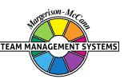

# **CONFORMITY**

You scored in the moderate range on the *Conformity* value type. This is the part of the *Window on Work Values* model that focuses on group values exercised within a framework of organisational constraints. However, you also scored equally strongly on the *Independence* value type and therefore you have an unusual Profile where, to some extent, you value both *Conformity* and *Independence*.

*Conformity* is an important principle in the way you prefer to work. You will be keen to conform to other people's expectations of you and will want to be seen as a reliable and valuable member of any team or organisation. You will not enjoy 'rocking the boat' but will if you are convinced that others are going in the wrong direction. You will be a loyal supporter to those who put their trust in you.

In general, you are quite willing to accept whatever happens to you, provided you have some freedom to explore your own creativity. You try not to show extremes of action and will generally try to fit in with those around you and not 'stand out' too much, although there may be times when you could take a more independent stand. You are probably more comfortable where there is a sense of security in your work environment as you like to know where you stand and what is expected of you.

You will usually enjoy being a team player although, if given permission, you are quite happy to work independently and with some degree of autonomy. In making decisions you will want to be sure that your actions conform to the organisational procedures and values, to which you will generally subscribe. In fact, you may well be a supporter of the important traditions and culture of your organisation.

You are a person conscious of the organisational hierarchy and will be careful to go through the proper 'channels' when undertaking important tasks and assignments, even if later you tend to 'do your own thing'. Exercising self-restraint will be important to you so that you do not 'lose face' in difficult situations.

Interestingly, you scored in the moderate to high range on the *Independence* value type and this may impact how you actually stick to your *Conformity* value in practice. You will probably enjoy a measure of self-reliance and set challenging goals for yourself. There may even be times when you are torn between the responsibility of conforming to the established norms of the workplace, while at the same time you may want to break out and exercise your own creativity and independence.

# **COLLECTIVISM**

You scored in the moderate range on the *Collectivism* value. This is the part of the *Window on Work Values* model that focuses on core values that enhance the working of groups or teams. However, your scores on *Individualism* also indicate that, while you value being a respected member of a work group, it is even more important for you maintain your individualism.

*Collectivism* is important in the way you approach work. For you the best collective interests of the group are important in any decision-making process. However, you are unlikely to subordinate your own personal interests and desires to those of your group or team as you are aware of the need to focus on issues that advance yourself in the organisation and in your career. You are constantly seeking the best balance between what is good for you and what is good for the group.

Harmony in the workplace is most likely important to you and you will often act in a way that defuses conflict in your team or work group. Having close supportive colleagues is important in the way you live your life and therefore you will try to act so that you don't upset others. However, your tendency towards *Individualism* could cause you, on occasions, to act in ways that put your own needs before those of the group. In these situations, you are prepared to cope with any negative reactions that may result.

You are a person who gives loyalty and will expect loyalty from others in return, particularly when you find yourself in difficulties.

Above all, you are a person who values consensus decision making and will have this as a priority, even if it means some delays in taking decisions and getting into action. You will realise that effective action will only occur when everybody is committed to the same solution. Voting for a majority decision is not the way you like to work, although you will advocate it if it gets the right result.

You are a person who strongly values the truth; therefore, you may have little time for those people who bend the truth to suit their needs. The issue of integrity is also important to you and you will always try to act in a way that is consistent with your views. You are unlikely to be a person who is swayed by others wanting expedient solutions to difficulties. You believe in openness and will enjoy working in a group where people honestly express their opinions and where there are no hidden agendas.

Your high scores on *Individualism* are likely to impact how you actually use your *Collectivism* value in practice. This combination of higher scores on both ends of the *Collectivism-Individualism* pair is less common. Most likely you will value having close supportive colleagues who form a harmonious team, with little conflict. You will probably also support group decision making and consensus but may experience discomfort if you see decisions going against you. At times, you may experience internal conflict, trying to balance your need to be seen as a competent, intelligent, successful individual keen to get on in the world, with your principles of maintaining group cohesion and doing what is best for those around you.

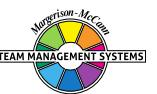

# **AUTHORITY**

You scored in the moderate to lower range on the *Authority* value type.

Being seen as an *Authority* figure is only moderately important in the way you approach work. You will like to be in control of others but only so that you can achieve the best results for your team and the organisation.

You will take on the leadership role when you have to and will work hard to be effective in this area. Most likely you will be reasonably interested in promotion possibilities and will actively pursue job prospects when they appear. You will look for job opportunities when they arise and will expect to be considered for any position. However, you may not always actively push yourself forward but rather expect to be noticed for your past successes.

In general, you are a moderately ambitious person and will look for people in the organisation who can help you achieve your goals. You will consider it important to be able to influence others to accept your viewpoint and will work hard to develop skills in this area.

You will appreciate above-average remuneration and material rewards for the job that you do as this is a good way of being recognised for your contributions. You will usually try to get a good deal for yourself when discussing potential benefits that might come your way.

You like to be seen as being 'right' in front of others and therefore you are likely to have developed strong communication skills. You will work hard to convince people that your views on a particular situation are correct, but usually you try to be polite and diplomatic.

Interestingly, you scored in the high range on the *Equality* value type and this will have a strong mitigating influence on how you use your *Authority* value in practice. Very likely you will hold strongly the principles of treating everyone fairly and being tolerant of differing viewpoints. You may even be prepared to regularly forgive others for their mistakes and to support the disadvantaged. However, you may need to reflect on the internal conflict you could sometimes experience if you are forced to act in an authority role that treats people unfairly. This could cause you to become stressed.

# **COMPLIANCE**

You scored in the lower range on the *Compliance* value type.

Being seen as a person who values *Compliance* is not the way you approach work. You may not always have great respect for people in senior positions, particularly those who tend to follow orders and impose restrictions on you. For you, while it is important to show respect for the organisational hierarchy, you may not always be as compliant and obedient as others might like, particularly with people who have let you down.

Working in a way that follows set-down procedures and policies is not something you necessarily value. You probably like people to follow your recommendations and guidelines but are well prepared for challenges and on occasions may actively seek them.

Job security and organisational stability are not really important to your well-being at work. You probably have the temperament to cope with ambiguity and fit in with changing situations.

Above all you do not like constraints imposed on you and may on occasions react negatively to those who attempt this.

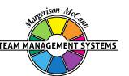

# **DISCLAIMER**

© Team Management Systems IP, 2024, Australia. Published by Team Management Systems. Produced on 15/04/2025. All rights reserved. No part of this publication may be reproduced, stored in a retrieval system, or transmitted in any form or by any means, electronic, mechanical, photocopying, recording or otherwise, without prior written permission of the publishers.

Team Management Systems, the wheel device and the associated trademarks marked with 'TM' or ® are registered or common law marks of Team Management Systems IP in Australia and various international jurisdictions.

The content of this report is based on data submitted through the Window on Work Values Profile Questionnaire. While great care and diligence have been exercised, it is important to note that each personalised report is based on general observations and interpretations.

The authors and publishers make no guarantees regarding the accuracy, completeness, or applicability of this report for any specific individual or situation. Therefore, they cannot be held liable for any decisions, actions, or outcomes resulting from the use of the information contained in this report.

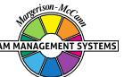