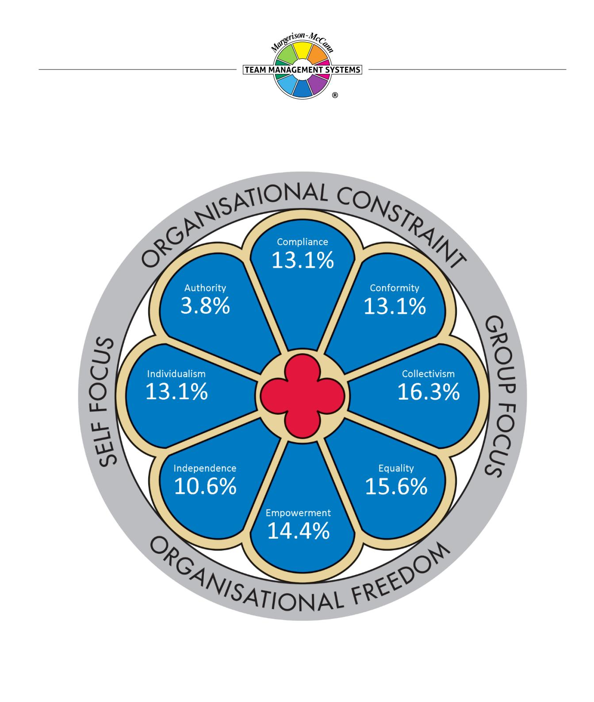
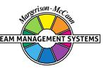
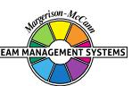
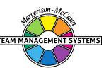
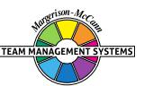
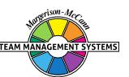
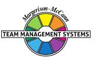
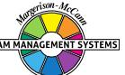
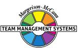

# **Window on Work Values Profile**

# **Tianna Priest**

Team Management Systems, the wheel device and the associated trademarks marked with 'TM' or ® are registered or common law marks of Team Management Systems IP in Australia and various international jurisdictions.

# **CONTENTS**

| INTRODUCTION TO WINDOW ON WORK VALUES |    |
|---------------------------------------|----|
| THE MODEL                             | 2  |
| YOUR RESULTS                          | 3  |
| COLLECTIVISM                          | 4  |
| EQUALITY                              | 5  |
| EMPOWERMENT                           | 6  |
| COMPLIANCE                            | 7  |
| CONFORMITY                            | 8  |
| INDIVIDUALISM                         | 9  |
| INDEPENDENCE                          | 10 |
| AUTHORITY                             | 11 |
| DISCLAIMER                            | 12 |

# **INTRODUCTION TO WINDOW ON WORK VALUES**

This Profile gives you feedback on eight core value types that form the basis of behaviour in the workplace.

Values are concepts or beliefs which people use to guide their behaviour in the workplace. Values will drive our decision making and cause us to summon up energy to preserve what we believe in. They go beyond specific situations and determine how we view people, behaviour and events. Often major sources of conflict and disillusionment are due to mismatched values.

# **THE MODEL**

The different values explored in your Profile are displayed in the *Window on Work Values* model which has been developed by Dr Dick McCann from his extensive workplace experience and comprehensive research with individuals and teams. The model has been validated within a rigorous testing process and has good structural validity, meaning that values close to one another in the window are related whereas those on opposite sides of the window are unrelated. The feedback in this report is presented in a practical and accessible way but you can be confident that it is backed by the appropriate statistical research.

The model consists of eight core work value types depicted as window panes, rather like those in the rose windows of many European cathedrals. It is divided into quadrants, each containing a core value type as follows:

**Self Focus:** Value types that put personal goals ahead of group goals. *Individualism* is the core value type in this quadrant.

**Group Focus:** Value types that put group wishes ahead of individual need. *Collectivism* is the core value type.

**Organisational Constraint:** Value types that require strictly-adhered-to guidelines to ensure the smooth running of an organisation. *Compliance* is the core value type.

**Organisational Freedom:** Value types where individual behaviour is unrestricted and people are free to choose their pathways, unfettered by organisational constraints. *Empowerment* is the core value type.

Values focusing on the self, within an environment of organisational freedom are defined by the *Independence* value type. Those focusing on the self within an environment of organisational constraint are defined by the *Authority* value type.

Values focusing on the group, within an environment of organisational freedom are defined by the *Equality* value type. Those focusing on the group within an environment of organisational constraint are defined by the *Conformity* value type.

# **YOUR RESULTS**

Your responses to the profile questionnaire have been distributed across the eight panes of the *Window on Work Values*. Scores above 12.5% indicate work value types that are more important to you whereas scores below 12.5% indicate value types that are less important to you. Your hierarchy of value types (adding up to 100%) is as follows:

| Collectivism                       |       | 16.3% |  |
|------------------------------------|-------|-------|--|
| Equality                           |       | 15.6% |  |
| Empowerment                        |       | 14.4% |  |
| Compliance                         | 13.1% |       |  |
| Conformity                         | 13.1% |       |  |
| Individualism                      | 13.1% |       |  |
| Values less important to you: . |       |       |  |

The *Self-Focus* value types (Independence, Individualism and Authority) account for 27.5% of your scores whereas *Group-Focus* value types (Equality, Collectivism and Conformity) account for 45% of your scores. This indicates the greater importance you place on the needs of others at the expense of your own needs.

The *Organisational Freedom* value types (Independence, Empowerment and Equality) account for 40.6% of your scores whereas *Organisational Constraint* value types (Authority, Compliance and Conformity) account for 30% of your scores. This indicates the strong bias you have towards values that ensure you have freedom to work in your own way.

Your pattern of scoring in each of the eight window panes is described on the following pages.

# **COLLECTIVISM**

You scored in the high range on the *Collectivism* value type. This is the part of the *Window on Work Values* model that focuses on core values that enhance the working of groups or teams. However, your scores on *Individualism* also indicate that while you value being a respected member of a work group, you will want to ensure that your personal goals and work ambitions are well catered for.

*Collectivism* is a guiding principle in the way you approach work. Most often you will subordinate your own personal interests and desires to those of your group or team. For you, the best collective interests of the group are paramount in any decision-making process. However, you will act on your own without the approval of others if you are convinced it is in the best interests of your work group or team.

Harmony in the workplace is most likely of great importance to you and you will often act in a way that defuses conflict in your team or work group. Having close supportive colleagues is important in the way you live your life and therefore you will usually act so that you don't upset others.

You are a person who gives loyalty and will expect loyalty from others in return, particularly when you find yourself in difficulties. Because of this you are more likely than many to establish lasting friendships at work. However, your strong personal relationships may well be outside work.

Above all, you are a person who values consensus decision making and will have this as a high priority, even if it means delays in taking decisions and getting into action. You will realise that effective action will only occur when everybody is committed to the same solution. Voting for a majority decision is not the way you like to work, although you will do this if unnecessary delays grind action to a halt.

You are a person who strongly values the truth; therefore, you may have little time for those people who bend the truth to suit their needs. The issue of integrity is also important to you and you will always try to act in a way that is consistent with your views. You will not be a person who is swayed by others wanting expedient solutions to difficulties. You believe in openness and will enjoy working in a group where people honestly express their opinions and where there are no hidden agendas.

Interestingly, you had a moderate to high score on *Individualism* and this will affect how you actually use your *Collectivism* value in practice. Most likely you will value the *Individualism* characteristics of being recognised for your individual capabilities and competencies and being singled out from others for your contribution to the organisation. However, there may be, at times, competing demands on you and it could be difficult for you to get the right balance between putting your work group first while at the same time progressing your own career and acting in your own best interests.

# **EQUALITY**

You scored in the high range on the *Equality* value type. This is the part of the *Window on Work Values* model that focuses on values relating to the establishment and maintenance of the work group in a way that allows you individual freedom.

Treating everyone equally and fairly is a guiding principle in the way you approach work. You are likely to be a tolerant person and one who readily accepts the different viewpoints of people in the workplace.

Support of the weak and disadvantaged is likely to be important to you. You may well defend any members of your team or group whom you consider to be disadvantaged by the actions of others.

You will want to be in a conflict-free environment and therefore may be seen as someone who is a 'peacemaker' and who will move to diffuse potential conflict situations.

You may also be seen as an altruistic person, one who is always willing to help others and work for their benefit. For you it is important to feel that people care about you.

If you are in a leadership position you may well have a reputation as someone who puts people first and gives equal opportunities to all.

You may have difficulty in working with people who scored high on the *Authority* value type. You could see them as being into 'power' and wanting to control people's lives. You may well feel dominated by them and this could cause you to react negatively towards them.

When interacting with high *Authority* people, consider these points to help you communicate better with them:

- Realise that it is important for them to be seen to be right in front of others;
- They will have a lower tolerance for people with opposing beliefs and ideas;
- They will be ambitious and take every opportunity to push themselves forward for promotion;
- They will respond well to feedback that highlights their prowess in leadership activities.

# **EMPOWERMENT**

You scored strongly on the *Empowerment* value type. This is the part of the *Window on Work Values* model where people value a working environment where there is a degree of organisational freedom as to how people generate results.

For you, it is important to have the opportunity to contribute in a variety of ways to work projects and to be trusted that you will do your best to achieve the goals and expectations of the organisation. You will prefer situations where there is little supervision and high levels of accountability and responsibility are delegated to you and your team. However, you will want to comply with organisational guidelines and fit in with the corporate mission and vision.

You are unlikely to be motivated solely by remuneration and material rewards and 'working for a higher purpose' is at least equally important. For you, work is to be enjoyed and rewards also come through the relationships you develop and the personal growth that comes through stretching your abilities and striving to extend your 'personal best'.

You are not necessarily a person who responds well to orders being given in a detached, compliant way and sometimes you may react badly to those who expect you to do as you are told without explaining the reasons. Sticking to procedures and respect for the organisational hierarchy are not necessarily guiding principles in the way you approach work although you will value them to some extent.

Interestingly, you scored moderately on the *Compliance* value type as well and this may impact how you actually use your *Empowerment* value in practice. Very likely you will want to ensure that your individual plan and goals align with those of the organisation as you will not want to be seen as a 'renegade'. There could at times be competing demands on you as you try to balance *Compliance* and *Empowerment*.

# **COMPLIANCE**

You scored in the moderate range on the *Compliance* value type. This is the part of the *Window on Work Values* model where people value a working environment where there are clearly-defined organisational constraints and expectations. However, you scored even more strongly on the *Empowerment* value type and therefore you have a less-common Profile where you value both *Compliance* and *Empowerment*.

You will have respect for people in senior positions and are likely to value those who follow your directions, without too many critical questions. However, you like people to be committed and take personal responsibility for their actions, and therefore you will probably understand the need for participative decision making. For you, obedience is a reasonably important principle to how you approach your work. However, provided people accept your general direction, you will be happy for them to be empowered and set their own plans.

For you, efficiency in the workplace results from people following organisational guidelines and doing things the right way. You may not always appreciate those people who want to use a different approach to the tried-and-tested methods that have usually worked in the past. However, you value the opportunity for people to contribute their own thoughts and generally you will listen to alternative views, provided they are not too radical.

You are a person who will meet your obligations and therefore you expect others to do the same. You may well be critical of those who don't follow orders but would probably accept their decisions provided there were good enough reasons.

Job security can be an important issue for you and will shape your decision making. You probably feel more comfortable in an organisation where you know where you stand and what is expected of you. Generally, you will value stability, which gives you the environment to do your best work.

Despite your concern for *Compliance*, you are someone who also values *Empowerment*. This combination of higher scores on both ends of the *Compliance-Empowerment* value pair is unusual. Very likely you will hold strongly the principles of giving responsibility to others and allowing them to find their own way of working, provided it does not conflict with the organisational norms and expectations. You probably like them to be self-reliant and accountable for their own actions as it will free you up to get on with your own work. However, you may need to reflect on the internal conflict you could sometimes experience when trying to balance these views with your principles of expecting other to follow orders and comply with organisational rules and regulations.

# **CONFORMITY**

You scored in the moderate range on the *Conformity* value type. This is the part of the *Window on Work Values* model that focuses on group values exercised within a framework of organisational constraints. However, you also scored equally strongly on the *Independence* value type and therefore you have an unusual Profile where, to some extent, you value both *Conformity* and *Independence*.

*Conformity* is an important principle in the way you prefer to work. You will be keen to conform to other people's expectations of you and will want to be seen as a reliable and valuable member of any team or organisation. You will not enjoy 'rocking the boat' but will if you are convinced that others are going in the wrong direction. You will be a loyal supporter to those who put their trust in you.

In general, you are quite willing to accept whatever happens to you, provided you have some freedom to explore your own creativity. You try not to show extremes of action and will generally try to fit in with those around you and not 'stand out' too much, although there may be times when you could take a more independent stand. You are probably more comfortable where there is a sense of security in your work environment as you like to know where you stand and what is expected of you.

You will usually enjoy being a team player although, if given permission, you are quite happy to work independently and with some degree of autonomy. In making decisions you will want to be sure that your actions conform to the organisational procedures and values, to which you will generally subscribe. In fact, you may well be a supporter of the important traditions and culture of your organisation.

You are a person conscious of the organisational hierarchy and will be careful to go through the proper 'channels' when undertaking important tasks and assignments, even if later you tend to 'do your own thing'. Exercising self-restraint will be important to you so that you do not 'lose face' in difficult situations.

Interestingly, you scored in the moderate to high range on the *Independence* value type and this may impact how you actually stick to your *Conformity* value in practice. You will probably enjoy a measure of self-reliance and set challenging goals for yourself. There may even be times when you are torn between the responsibility of conforming to the established norms of the workplace, while at the same time you may want to break out and exercise your own creativity and independence.

#### **INDIVIDUALISM**

You scored in the moderate range on the *Individualism* value type. This is the part of the *Window on Work Values* model containing values that primarily focus on the self. However, your scores on *Collectivism* also indicate that, while maintaining your individualism, it is even more important for you to be a respected member of a work group.

Being an individual is reasonably important to the way you like to work. You are more likely to believe that it is through being a strong individual and making the hard decisions when they come, that you are doing your best for your team and the organisation. However, you will care about other people with whom you work and will often modify your own actions if you feel that too many people may be adversely affected. For you, getting results quickly is a very important part of doing business, but not if it alienates those around you.

It is probably important for you to be recognised for your intelligence and competence. More than likely, you will appreciate individual recognition for your contribution to team work and the praise and rewards that go with individual success. Above all you will want to be seen as a capable person. However, you will also want to see recognition for those team members that have helped you stand out.

Because of your strong reliance on yourself, you may not always conform to the wishes of others and are more likely to follow your own ideas, taking personal responsibility for any outcomes. You will want to lead other group members in the right direction but are probably aware that it is important to keep them involved in your thinking.

Some people could view you as an 'individual', as you don't always take advice from others, although you will always listen to them courteously. You will probably consider that the values of *Individualism* have contributed to your success and they probably have. However, you will work very effectively within a group context, and are probably well respected for your focus on success and competence.

Your high scores on *Collectivism* are likely to impact how you actually use your *Individualism* value in practice. This combination of higher scores on both ends of the *Individualism-Collectivism* pair is less common. Most likely you will value having close supportive colleagues who form a harmonious team, with little conflict. You will probably also support group decision making and consensus but may experience discomfort if you see decisions going against you. At times, you may experience internal conflict, trying to balance your 'group needs' with your principles of wanting to be seen as a competent, intelligent, successful individual keen to get on in the world. Values such as these will invariable compromise those associated with *Collectivism*.

# **INDEPENDENCE**

You scored in the moderate range on the *Independence* value type. This is the part of the *Window on Work Values* model where people value working with a degree of organisational freedom in a way that allows them to focus on self-needs. However, your scores on *Conformity* also indicate that, while valuing your independence, you will want to ensure that you reasonably conform to what is expected of you.

*Independence* is a reasonably important principle in the way you prefer to work. You will like to be left to 'do your own thing' and rely on your own ability to work your way through problems. While you are courteous in your dealings with others, you will not always conform to principles that you oppose, although you will invariably exercise self-restraint.

For you, freedom of action and the ability to exercise your own creativity are important to your wellbeing at work. Above all, you are a person who values self-sufficiency, but are happy to work within broad guidelines set down by others.

While you can happily work as a 'team player', you are equally as effective as a 'solo operator' with the freedom to pursue your own ideas, make your own decisions and stand by your actions.

You usually respect the organisational hierarchy, particularly if the views of senior management align with your own. Workplace issues such as security and safety are seen as important and could be areas in which you would want to become involved.

You may not always react well to plans and goals which are imposed on you without your discussion and involvement. In these situations, you will want to maintain your independence and may push hard to get your point of view across.

Interestingly, you scored more or less equally on the *Conformity* value type and this may impact how you actually use your *Independence* value in practice. You will probably avoid extremes of action and control your emotions, wherever possible following the agreed plan. However, you may suffer at times from the conflicting values of wanting to do your own thing but trying to work within preestablished guidelines.

Because you have reasonable strong scores at both ends of the *Independence-Conformity* pair, these values are less likely than others to cause conflict situations with your colleagues at work.

# **AUTHORITY**

You scored in the lower range on the *Authority* value type.

Being seen as an *Authority* figure is not important in the way you approach work. The times when you actively seek to be in control of others are only so that you can achieve the best results for your team and the organisation.

You will take on the leadership role if you have to and will work hard to be effective in this area. However, you may be less interested in promotion than many others and may not always seek out new job prospects, particularly if you are happy with your current work and the only reason for changing jobs is for increased material rewards. You will prefer to be noticed by your 'good deeds' and would rather be invited to apply for job positions than have to push yourself forwards.

Being ambitious is not a guiding principle for you and you are more likely to seek a balance between your work commitments and your outside-work interests.

High remuneration will not be important to you although you are happy to receive it as a reward for your excellence and commitment to the organisation. You are more likely to be attracted to a job because of your intrinsic interest in the nature of the work you will be undertaking.

Being seen to be 'right' in front of others is also not important to you. You are unlikely to push your point of view across unless it is something you feel strongly about. You will work hard to convince people about situations you really believe in, but usually you try to be polite and diplomatic.

# **DISCLAIMER**

© Team Management Systems IP, 2024, Australia. Published by Team Management Systems. Produced on 15/04/2025. All rights reserved. No part of this publication may be reproduced, stored in a retrieval system, or transmitted in any form or by any means, electronic, mechanical, photocopying, recording or otherwise, without prior written permission of the publishers.

Team Management Systems, the wheel device and the associated trademarks marked with 'TM' or ® are registered or common law marks of Team Management Systems IP in Australia and various international jurisdictions.

The content of this report is based on data submitted through the Window on Work Values Profile Questionnaire. While great care and diligence have been exercised, it is important to note that each personalised report is based on general observations and interpretations.

The authors and publishers make no guarantees regarding the accuracy, completeness, or applicability of this report for any specific individual or situation. Therefore, they cannot be held liable for any decisions, actions, or outcomes resulting from the use of the information contained in this report.

