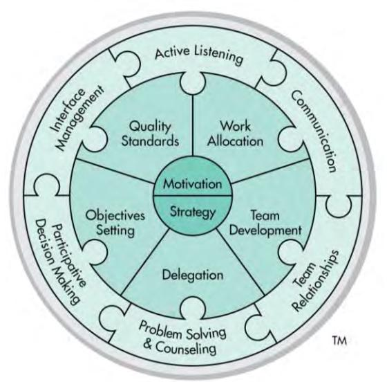
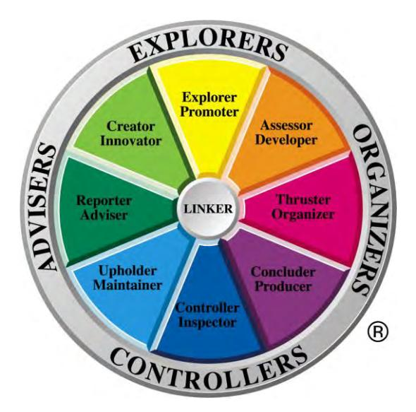
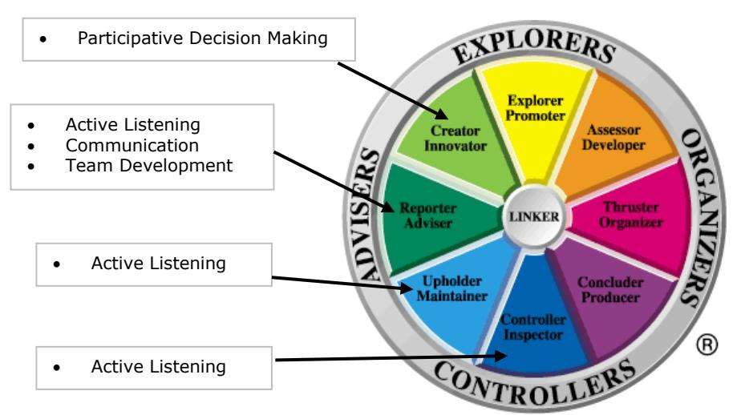

# **Team Management Systems Research Manual 5th Edition:**

# **Linking Skills Profile Questionnaires**

Editors: D.J. McCann and N.H.S. Mead Publisher: [Team Management Systems](http://www.tmsworldwide.com/)

Copyright © Team Management Systems, 2018. All rights reserved.

ISBN: 978-0-9580722-6-7

While copyright of this publication is held by Team Management Systems, we make no claim on any articles, applications and/or designs presented by independent contributors.

The purchaser of this Research Manual is permitted to print only a single copy for personal use. No further copies or distributions are permitted.

No part of this publication may be reproduced, stored in a retrieval system, or transmitted in any form or by any means, electronic, mechanical, photocopying, recording, or otherwise without the prior written permission of the publishers.

# Welcome,

This fifth edition of the *Team Management Systems Research Manual* is a collection of stand-alone manuals focusing on each of the eight Profiles. These manuals are a major revision of the last edition which was published in 2010. Since then we have undertaken new research and significantly increased the norm data allowing for a greater depth and breadth of analysis to be presented.

The research was carried out by the Institute of Team Management Studies (ITMS) led by Dr. Dick McCann and Nikki Mead. ITMS was established in 1988 by Team Management Systems (TMS) authors Drs. Charles Margerison and Dick McCann to formalize the research program that was already underway. ITMS was headed up by Rod Davies until 1994 and the comprehensive research program he created was continued by the current editors. It should also be noted that ITMS has many associates who have carried out both joint and external research studies on TMS. Their involvement has been crucial to our work and we thank them for their enthusiasm and commitment.

Each manual includes an *Executive Summary*. These are ideal for clients who want a summary of the key research points, without being overwhelmed by statistics. Normative data and detailed articles on specific studies on face validity, construct validity and criterion-related validity as well as confirmatory factor analyses are also presented.

We have enjoyed writing, compiling and editing this collection of manuals and hope they will stimulate you to use TMS in new and exciting ways.

Dick McCann & Nikki Mead

Editors

Team Management Systems (TMS) distributes a wide variety of products developed by Drs . Charles Margerison and Dick McCann. Over the years they have developed, jointly and individually, many concepts and models widely in use throughout the world. Today there are more than 15,000 accredited international network members who have used the Margerison-McCann Team Management Systems Profiles to enhance the personal, team and organizational performance of more than 1,500,000 people.

For further information, please visit [TMSworldwide.com.](http://www.tmsworldwide.com/)

# **Abbreviations & Conventions Used**

### **Abbreviations**

| ITMS  | - | Institute of Team Management Studies              |
|-------|---|---------------------------------------------------|
| LLPQ  | - | Linking Leader Profile Questionnaire              |
| LPPQ  | - | Linking of People Profile Questionnaire           |
| LPTPQ | - | Linking of People and Tasks Profile Questionnaire |
| LSPQs | - | Linking Skills profile questionnaires             |
| MLQ   | - | Multifactor Leadership Questionnaire              |
| TMP   | - | Team Management Profile                           |
| TMPQ  | - | Team Management Profile Questionnaire             |
| TMS   | - | Team Management Systems                           |
| TWP   | - | Types of Work Profile                             |
| TWPQ  | - | Types of Work Profile Questionnaire               |

# **Conventions**

**All rater**. This term is used to describe data samples that include multi-rater responses and results.

**Bipolar scales** refer to the four E-I, P-C, A-B, and S-F scales treated as categorical variables (e.g. 'E' = 1, 'I' = 0).

**Continuous scales**. In the case of the Team Management Profile Questionnaire, continuous scales refer to the four E-I, P-C, A-B, and S-F scales measured on the continuum, from the +30 for the first mentioned pole (e.g. 'E' in Extroversion-Introversion) to -30 for the second mentioned pole ('I' in the above example).

**Critical types of work**. The types of work identified by the Types of Work Profile Questionnaire as being the most critical in a job.

**Global ratings**. This term is used to describe data samples that include multi-rater responses and results.

**Linking**. A set of behaviors that are responsible for coordinating and integrating the work of a team and the team members themselves.

**Linking Leader Profile**. The output from the processing of Linking Leader Profile Questionnaires.

**Linking of People Profile**. The output from the processing of Linking of People Profile Questionnaires.

**Linking of People and Tasks Profile**. The output from the processing of Linking of People and Tasks Profile Questionnaires.

**Major role preference** is the role identified by the Team Management Profile Questionnaire as being major and identified as such in the written feedback.

The **major sample** refers to the total worldwide database for a particular profile questionnaire.

**Net scores** on the Team Management Profile Questionnaire refer to the difference between the raw scores on each of the work preference measures. For example raw scores of E:22 and I:10 result in a net score of E:12.

**Raw scores** on the Team Management Profile Questionnaire are the total scores for each pole on the work preference measures. For example E: 22 and I:10 represent the number of points scored on the Team Management Profile Questionnaire for Extroversion and Introversion.

**Role Profiles** are the narrative output from the Team Management Profile Questionnaire. These are divided into the eight roles originally developed by Drs. Charles Margerison and Dick McCann - *Reporter-Adviser*, *Creator-Innovator*, *Explorer-Promoter*, *Assessor-Developer*, *Thruster-Organizer*, *Concluder-* *Producer*, *Controller-Inspector*, and *Upholder-Maintainer*. These can be further divided to create 16 subsectors, there being two distinct types of each role Profile.

**Team Management Profile**. The output from the processing of the Team Management Profile Questionnaire.

The **Types of Work** are the work functions originally identified by Charles Margerison and Dick McCann. These are *Advising*, *Innovating*, *Promoting*, *Developing*, *Organizing*, *Producing*, *Inspecting*, *Maintaining*, and *Linking*. The first eight work functions are measured by the Types of Work Profile Questionnaire and form the basis of job design and analysis. The last work function - *Linking* - is a separate skill and is measured by the Linking Skills Profile Questionnaire.

**Types of Work Profile**. The output report from the processing of Types of Work Profile Questionnaires.

# **Statistical Glossary**

*This statistical glossary is not an exhaustive list of all the terms and concepts used in this publication. Definitions and brief examples are only provided for the key concepts used for comparing data samples.* 

An **Analysis of Variance (ANOVA) test** is a procedure used to examine population variances to determine whether the population means are equal or significantly different.

**Cronbach's coefficient alpha** is a measure of how well the items in a scale are related to each other. The alpha coefficient is a measure of internal consistency that in turn is an indicator of the reliability of a scale. Values range from 0.00 to 1.00, where 0 represents no reliability and 1.00 perfect reliability. It takes into account every item's correlation with each other and the total score for that scale. As a rule of thumb, a value of 0.70-0.75 is seen as adequate reliability for a preference type scale.

**Factor Analysis** is a general descriptor for a number of specific computational techniques. All of these techniques, however, have the object of reducing a large number of measures or tests to some smaller number by telling us which belong together and which seem to measure the same thing.

The *F* **value** is a statistic used in **Analysis of Variance (ANOVA)** calculations. ANOVA is used to determine whether the differences between the means of several populations are significant. The *F* value is the measure of the ratio of the variation in mean between the samples being tested to a pooled estimate of the variation in mean within the samples. If *F* is large then the various populations will have different means.

**Item/total correlations** represent the correlation coefficient reached between the item and the scale itself (without the item included).

The **mean** is the most commonly used measure of location. It is equal to the sum of measurements divided by the number of measurements (*n)*.

The **minimum** and **maximum scores** give an indication of the range of the scores received.

The shorthand for probability is '**p**'. For example, *p*<0.05 indicates that the probability of a difference between scores being attributable to chance rather than some other factor is less than five per cent. It is used, among other purposes, for indicating whether two mean scores vary, or whether the magnitude of a correlation coefficient is large enough to be due to a real difference rather than a chance.

The **Pearson product-moment coefficient** is a summary statistic that represents the linear relationship between 2 sets of variables. The values can vary between -1 to 0 to +1, with 0 representing no association, and -1 indicating a perfect negative association.

The **Shapiro-Wilks** test allows us to tell if a random sample comes from a normal distribution. If the results of the test are greater than 0.05, we can say that the data is normal. If it is less than or equal to 0.05, we can say that the data significantly deviates from a normal distribution.

**Spearman's rank-order coefficient or (Spearman's** *rho).* Spearman's *rho* is a special form of the Pearsonian correlation coefficient and does not require the assumption of a normal distribution. This coefficient gives us an idea of the association between scales and the items that are meant to represent them. Values for *rho* can vary between -1 to 0 to +1, with 0 representing no association, and -1 indicating a perfect negative association

The **standard deviation** provides us with a look at the distribution or spread of the scores with approximately 68% of the sample being within one standard deviation (plus or minus) of the mean. For example, in a sample where the mean satisfaction percentage is 73.44 and the standard deviation is 11.56, we would be able to say that 68% of the sample was between 61.88% and 85.00% satisfaction. The higher the standard deviation, the more 'spread out' the scores.

**T-value**. A *t*-test is used to determine the statistical significance between a sample distribution and a parameter.

**Variance** is a measure of data dispersion. It is the average of the squared differences between the

individual measurements and the mean.

# **Linking Skills Profile Questionnaires: Executive Summary**

# **Leadership Research**

Popular leadership theories in recent times have been developed based on the identification of two particular phases of development of followers and associates. Blake and Mouton (1964) proposed five management styles based on the dimensions of *initiating structure* relating to the task and *initiating consideration* toward the individual. Fiedler (1967) proposed that leadership style is a constant characteristic of each person. Vroom and Yetton's (1973) model assumed that a flexible leadership style was more desirable where the appropriate style depended on the type of problem addressed.

Leadership models such as those developed by Hersey and Blanchard (Hersey, Blanchard & Johnson, 2007) have also been very successful in identifying appropriate leadership styles based upon two phases of development of followers, resulting in the dimensions of Supportive and Directive leadership behavior. The idea is that most people will respond to a leadership style that has various combinations of supportive and directive behavior, depending on the situation they are in.

A similar variant of this situational-developmental approach was proposed by Schein (1992), but with a situational variable of organizational development. Each phase of an organization's life requires a different set of responses from their leaders, depending on the organizational life cycle - young, midlife, mature, declining or rejuvenating.

More recently leadership skills have also been grouped under the heading of *transactional leadership*. These approaches assume exchanges of reinforcements by the leader that are based upon established theories of social exchange. By contrast, *transformational leadership* styles result in considerably enhanced effects on followers (Bass, 1985). Bass (1997) argues that the transactional - transformational leadership paradigm views leadership as either a matter of contingent reinforcement of followers by a transactional leader or the moving of followers beyond their self-interest for the good of the group, organization, or society by a transformational leader.

# **Rationale**

The Team Management Systems (TMS) view on leadership is that it is primarily about relationships. Excellent leaders monitor and develop relationships among their followers and ensure that this emphasis is rolled down from their direct reports to the bottom-most layers of the organization. The concept of Linking was developed from the empirical studies carried out by Drs. Charles Margerison and Dick McCann in the 1980s. They interviewed over 300 managers and team members to discover what the essential success factors in a team were. Their job analytic approach looked at the activities of team members that made a difference between good and poor performance in their job. The data fell naturally into eight work functions eventually described as:

- Advising
- Innovating
- Promoting
- Developing
- Organizing
- Producing
- Inspecting
- Maintaining

These Types of Work functions then formed the basis of the Margerison-McCann Types of Work Wheel (Figure 1). Subsequently, quantitative work was undertaken to define these work functions in more detail. This eventually led to the development of the Types of Work Profile Questionnaire, discussed in more detail in the *Team Management Systems Research Manual 5th Edition: Types of Work Profile Questionnaire* (McCann & Mead, 2018).

In their initial research there were several activities that correlated strongly with each other and with the eight Types of Work functions listed above. These activities were eventually defined as Linking and placed in the center of the Types of Work Wheel to indicate their shared relationship with the eight Types of Work. Linking was generically described as a set of behaviors that were responsible for coordinating and integrating the work of the team.

Figure 1. Margerison-McCann Types of Work Wheel

Initially Linking was divided into the Linking of People and the Linking of Tasks. In 2002 the concept was extended by Dick McCann to encompass leadership, and two Linking Leadership Skills were introduced. The final result was the development of an extended model shown in Figure 2. This model, the Linking Leader Model, is a multi-level team leadership model tailored to meet the needs of team leadership. It identifies three levels of Linking that have differential effects on outcomes such as satisfaction, effectiveness, results, and extra effort. The model is cumulative in that the successful implementation of any level depends upon the level below being effectively implemented.

Figure 2. Linking Leader Model

Around the outside of the model are the People Linking Skills – six skills that are either supportive or transformational, depending upon how they are applied. They are:

- Active Listening
- Communication
- Team Relationships
- Problem Solving & Counseling
- Participative Decision Making
- Interface Management

The next level contains the Task Linking Skills – five skills that relate to collective team tasks. They are:

- Objectives Setting
- Quality Standards
- Work Allocation
- Team Development
- Delegation

The third level contains the Leadership Linking Skills – two skills that are the domain of the team leader. They are:

- Motivation
- Strategy

# **The Linking Skills Profile Questionnaires**

The main Linking Skills profile questionnaire is the Linking Leader Profile Questionnaire (LLPQ), the instrument used for development of team leaders. It uses the six People Linking Skills, the five Task Linking Skills and the two Leadership Linking Skills as the basis of assessment, and contains 78 items for assessment. In addition there are two cut-down versions available for use with other team members. These are the Linking of People and Tasks Profile Questionnaire (LPTPQ) and the Linking of People Profile Questionnaire (LPPQ).

The Linking Skills profile questionnaires were also designed to be multi-rater. This is because we determined that respondents are not always the best judges of their own performance. Corroborative or other feedback from team members, colleagues and senior management are helpful in creating an alternative viewpoint.

Leadership research unambiguously shows that some leadership competencies may be very important in certain organizations and cultures, but of little or no importance in others. The best way to deal with this issue is to implement a two-column assessment approach. In Column A of the Linking Leader Profile Questionnaire, respondents are asked to record *To what extent should this activity occur.* In Column B they record *To what extent this activity does occur.* In this way the importance of any leadership item can be varied to suit the 'situation' - be it the state of follower readiness, the leadership responsibilities of the ratee, or the organizational culture. The instrument therefore measures a gap against a varying benchmark. This gap becomes a trigger for leadership development. The important psychometric properties of the instrument then reduce to those of reliability, validity and norm data.

# **Reliability**

Psychometric scales are measured by a number of items that define each scale. These items should be related to some extent, otherwise errors become unacceptable. Too much correlation accurately defines a scale that is so narrow to be of limited use; too little correlation means that the scale is so broad that that it measures nothing. A reliable scale must have an adequate degree of *internal consistency* and this can be measured using a statistic known as the Cronbach alpha coefficient. Values below 0.7 indicate that the scale is becoming too broad; values over 0.9 indicate the scale is becoming too narrow. An ideal range is 0.75-0.85.

A summary of internal consistency results is given for a development sample of 754 respondents who completed the Linking Leader Profile Questionnaire. Mean age was 40.5 with a standard deviation of 8.4. 63% were male and 37% female. Means for Column A and Column B are shown below.

The data show the skewness of Column A, but this is to be expected, given the *a priori* assumption that the linking skills are important in leadership. Thus one would expect a mean response centered somewhere close to the level of 'to a great extent' - a Column A score of 3. The responses to Column B are less skewed and show a reasonable normal distribution between the minimum and maximum responses. The mean minimum value indicates the reluctance of some respondents to use the zero ('not at all') scale.

Table 1 shows the Cronbach alpha coefficient for the overall linking scale (78 items) and for each of the grouped subscales - People Linking Skills (36 items), Task Linking Skills (30 items) and Leadership Linking Skills (12 items).

| Table 1. | Internal consistencies for People, Task and Leadership Linking Skills (n=754) |  |  |
|----------|-------------------------------------------------------------------------------|--|--|

| Linking Skill               | Cronbach alpha Column A | Cronbach alpha Column B |
|-----------------------------|----------------------------|----------------------------|
| Overall Linking scale       | 0.98                       | 0.98                       |
| People Linking subscale     | 0.97                       | 0.96                       |
| Task Linking subscale       | 0.96                       | 0.95                       |
| Leadership Linking subscale | 0.91                       | 0.90                       |

Table 2 breaks down the items into their 13 component subscales showing the Cronbach alpha coefficient for both columns A and B.

Table 2. Internal consistencies for Column A, for the 13 Linking Skills subscales (n=754)

| Linking Skill |                               | Cronbach alpha Column A | Cronbach alpha Column B |
|---------------|-------------------------------|----------------------------|----------------------------|
| P1            | Active Listening              | 0.77                       | 0.79                       |
| P2            | Communication                 | 0.83                       | 0.79                       |
| P3            | Team Relationships            | 0.88                       | 0.85                       |
| P4            | Problem Solving & Counseling  | 0.85                       | 0.78                       |
| P5            | Participative Decision Making | 0.89                       | 0.85                       |
| P6            | Interface Management          | 0.87                       | 0.82                       |
| T1            | Objectives Setting            | 0.87                       | 0.82                       |
| T2            | Quality Standards             | 0.86                       | 0.83                       |
| T3            | Work Allocation               | 0.87                       | 0.82                       |
| T4            | Team Development              | 0.85                       | 0.82                       |
| T5            | Delegation                    | 0.74                       | 0.68                       |
| L1            | Motivation                    | 0.85                       | 0.83                       |
| L2            | Strategy                      | 0.85                       | 0.84                       |

# **Validity**

Two questions that are often asked when assessing the adequacy of a profile questionnaire are 'How well does it minimize error in measurement?' and 'How well does the score measure what it has been designed to measure?' The first question is that of *reliability*, the second is that of *validity*. Put in another way, *reliability* concerns the association between different measurements of the same concept using the same indicator. *Validity*, on the other hand, concerns the association between the indicator and the concept. Important concepts of validity are face validity and utility, structural validity, predictive validity, construct validity and criterion-related validity.

### *Face Validity and Utility*

Face validity is the extent to which a scale or group of scales 'makes sense' to observers and test users. Utility (the 'usefulness' of an instrument) was also an important part of the development process of the Linking Skills profile questionnaires. High utility and face validity was generated through an iterative process with many focus groups. A typical procedure was as follows:

- 1) Groups of at least 8 people were assembled and a preliminary feedback Profile report presented to them. They then indicated which aspects of the report were considered to be accurate, whether they understood the terminology, and what changes might be useful to improve utility.
- 2) They were then asked what insights the report gave them about their managerial/leadership style and did it identify any areas that they needed to develop. Would they then take action

based on the result of this report? They were also asked whether the results explained any problems that might exist in their current team and how they might use these results to improve performance.

- 3) We then assessed the importance of each Linking Skill across a number of groups in similar organizations to ensure that average importance ratings were above 70%, so that each Linking Skill contributed positively to utility.
- 4) Concepts and feedback reports were then modified and Steps 1-3 repeated.
- 5) After the instrument was commercially released subsequent changes to the Profiles were made every two years, whenever consistent suggestions for change were received.

Traditionally, face validity and utility are often ignored in psychometric assessment, but in the field of management, team and organizational development it is often the most useful in getting practical performance improvement.

#### *Structural Validity*

Structural validity is a form of validity that relates to the development of models or their scales and subscales. Structural validity can be measured by using the Pearson product-moment correlation coefficient. The correlation coefficient determines the extent to which the values of the two variables are 'proportional' to each other.

The relationships between the subscales are shown in Tables 1 and 2 of the *LSPQs: Validity* section of this manual.

These intercorrelations confirm the existence of a single scale – an overall measure of Linking. Further confirmation is shown by a factor analysis of the 13 subscales. The data showed the existence of a single scale on both Column A and Column B, as per Table 3. Explained total variance was 80.5% for Column A and 72.7% for Column B.

| Linking Skill |                               | Factor loading Column A | Factor loading Column B |
|---------------|-------------------------------|----------------------------|----------------------------|
| P1            | Active Listening              | 0.85                       | 0.78                       |
| P2            | Communication                 | 0.89                       | 0.84                       |
| P3            | Team Relationships            | 0.91                       | 0.88                       |
| P4            | Problem Solving & Counseling  | 0.91                       | 0.87                       |
| P5            | Participative Decision Making | 0.91                       | 0.85                       |
| P6            | Interface Management          | 0.93                       | 0.91                       |
| T1            | Objectives Setting            | 0.90                       | 0.86                       |
| T2            | Quality Standards             | 0.89                       | 0.84                       |
| T3            | Work Allocation               | 0.89                       | 0.86                       |
| T4            | Team Development              | 0.92                       | 0.87                       |
| T5            | Delegation                    | 0.87                       | 0.79                       |
| L1            | Motivation                    | 0.91                       | 0.90                       |
| L2            | Strategy                      | 0.88                       | 0.82                       |

#### Table 3. Principal component loadings for a single factor, for each of the 13 subscales (n=754)

### *Construct Validity*

Construct validity is a special case of criterion-related validity and measures the extent to which a test or scale relates to other theoretical concepts (i.e. constructs) which have been proved by other studies to be valid. By studying the relationships of a test to many others, researchers can get a better feel for the real meaning of a scale. To the extent that one construct is related to another that it should be related to, and not to others that it should not be related to, we can say that the instrument has good construct validity.

The *LSPQs: Validity* section of this manual compares the Linking Skills with the concepts explained in other leadership instruments. Comparisons are given with directive and supportive behaviors, and with transformational leadership concepts.

#### *Comparison with Transformational Leadership*

Transformational leadership is measured by the Multifactor Leadership Questionnaire (Bass & Avolio, 1997). There are five transformational subscales:

- Individual Consideration
- Idealized Behaviors
- Idealized Attributes
- Inspirational Motivation
- Intellectual Stimulation

Elliott (1996, 1997) reports a study where he correlated the results of the Linking of People and Tasks Profile with the Multifactor Leadership Questionnaire. A sample of 143 managers in a major Australian manufacturing organization participated in the study. He states that seven of the eleven Linking Skills "…*are strongly related to transformational leadership styles, which are in turn positively related to superior outcomes such as perceived efficiency, extra effort and satisfaction. These may be called the core leadership skills for enhanced group outcomes. All these core leadership skills were strongly positively related with ratings of efficiency using the in-built MLQ scale.*"

The seven Linking Skills found to be core leadership skills were: Communication, Problem Solving & Counseling, Team Relationships, Quality Standards, Work Allocation and Delegation. Elliott has provided Pearson product-moment correlations for these skills as follows:

| Linking Skill                | Individual consideration | Idealized behavior | Extra effort ratings | Efficiency ratings |
|------------------------------|-----------------------------|-----------------------|-------------------------|-----------------------|
| Communication                | 0.51                        | 0.57                  | 0.39                    | 0.52                  |
| Team Relationships           | 0.44                        | 0.56                  | 0.45                    | 0.54                  |
| Problem Solving & Counseling | 0.51                        | 0.56                  | 0.37                    | 0.61                  |
| Quality Standards            | 0.49                        | 0.51                  | 0.39                    | 0.54                  |
| Work Allocation              | 0.50                        | 0.52                  | 0.35                    | 0.56                  |
| Team Development             | 0.44                        | 0.49                  | 0.39                    | 0.44                  |
| Delegation                   | 0.43                        | 0.56                  | 0.31                    | 0.49                  |
|                              |                             |                       |                         |                       |

Table 4. Core Linking Skills strongly associated with all transformational leadership behaviors and enhanced group outcomes

*NOTE:* All values significant at *p*<0.001

These results show that team members' behaviors which demonstrate these particular Linking Skills will also strongly reflect the implementation of the indicated transformational leadership behaviors. However, all of the People and Task Linking Skills were positively related to some extent to the transformational leadership constructs of the MLQ and to ratings of extra effort and efficiency. Table 5 provides the correlations with the MLQ transformational behaviors for the remaining People and Task Linking Skills, together with their associated efficiency and extra effort ratings.

| Table 5. | Correlations of Linking Skills with transformational behaviors and associated outcome |
|----------|---------------------------------------------------------------------------------------|
|          | ratings, where there are one or more weaker correlations                              |

| Linking Skill                 | Individual consideration | Idealized behavior | Extra effort ratings | Efficiency ratings |
|-------------------------------|-----------------------------|-----------------------|-------------------------|-----------------------|
| Active Listening              | 0.38                        | 0.39                  | 0.24(p<0.01)            | 0.39                  |
| Participative Decision Making | 0.33                        | 0.47                  | Not significant         | 0.32(p<0.01)          |
| Interface Management          | 0.36                        | 0.38                  | 0.31(p<0.01)            | 0.43                  |
| Objectives Setting            | 0.30(p<0.01)                | 0.47                  | 0.26(p<0.01)            | 0.33                  |

*NOTE:* Values not indicated are significant at (*p<*0.001)

These results confirm the strong transformational leadership base of the People and Task Linking Skills.

*Comparison with the Team Management Profile Questionnaire and associated Team Management Wheel* 

As the constructs of the Team Management Profile Questionnaire have been well researched and described in the *Team Management Systems Research Manual 5th Edition: Team Management Profile Questionnaire* (McCann & Mead, 2018a) and reviewed by the British Psychological Society (2003), it is useful to carry out a construct validity comparison between the scales of the Linking Skills profile questionnaires and those of the Team Management Profile Questionnaire (TMPQ). The results of this study are discussed in the *Comparative Studies: Linking Skills & Work Preferences* section of this manual.

#### *Criterion-Related Validity*

There are many different ways to achieve excellent leadership performance and much depends on the industry, organizational size and culture. In the two-column approach to design, inherent validity is built into the instrument. Respondents can choose which of the leadership factors are important to any given organization and then assess the ratee against the level of importance chosen. In this way the instrument is shaped by respondents to meet the perceived ideal leadership style for a given organization.

Because Column A of this two-column approach actually measures the importance of each item, the Linking Skills profile questionnaires contain inherent criterion-related validity. Although Column A allows a varying benchmark, if the mean value of a particular item over a large number of administrations were low then the validity of this item would be questionable.

A minimum desirable average score on each item for Column A would be 3. This indicates that the item in question is considered to be important 'to a great extent'. At this level the item would deserve its place in the inventory and its validity justified, in that this activity is of great importance in the exercise of team leader responsibilities. Table 6 shows the mean Column A score for each of the 13 Linking Skills subscales measured in the Linking Leader Profile Questionnaire.

| Linking Skill                 | Mean Column A item score | Standard deviation |  |
|-------------------------------|--------------------------|--------------------|--|
| Active Listening              | 3.1                      | 0.45               |  |
| Communication                 | 3.1                      | 0.49               |  |
| Team Relationships            | 3.1                      | 0.57               |  |
| Problem Solving & Counseling  | 3.1                      | 0.51               |  |
| Participative Decision Making | 3.0                      | 0.57               |  |
| Interface Management          | 3.0                      | 0.57               |  |
| Objectives Setting            | 2.9                      | 0.59               |  |
| Quality Standards             | 3.2                      | 0.49               |  |
| Work Allocation               | 2.9                      | 0.59               |  |
| Team Development              | 3.0                      | 0.57               |  |
| Delegation                    | 3.0                      | 0.47               |  |
| Motivation                    | 3.0                      | 0.56               |  |
| Strategy                      | 3.1                      | 0.50               |  |

Table 6. Mean Column A score for the 13 Linking Skills (all raters; n=754)

This table confirms that all subscales are rated as being important 'to a great extent' by the sample population of 754 team leaders.

Further confirmation of the inherent validity of the Linking skills profile questionnaire is shown in the *LSPQs: Validity* section of this manual. This section presents an 'all rater' sample of 21918 ratings of 6213 team leaders and the mean importance percentages of the 13 Linking Skills subscales are shown below in Table 7.

Importance ratings of 75% are equivalent to the '3' response on the Column A scale. Again the data confirm that all 13 Linking Skills are important 'to a great extent'.

Similar results are also available for the Linking of People and Tasks Profile Questionnaire (LPTPQ) administered to a mixture of team leaders and senior team members.

| Linking Skill                 | Mean importance rating % | Standard deviation |  |
|-------------------------------|--------------------------|--------------------|--|
| Active Listening              | 78.07                    | 9.88               |  |
| Communication                 | 79.52                    | 10.88              |  |
| Team Relationships            | 78.99                    | 12.16              |  |
| Problem Solving & Counseling  | 80.05                    | 10.92              |  |
| Participative Decision Making | 76.85                    | 12.20              |  |
| Interface Management          | 77.54                    | 12.33              |  |
| Objectives Setting            | 74.17                    | 13.63              |  |
| Quality Standards             | 82.54                    | 11.02              |  |
| Work Allocation               | 75.37                    | 13.27              |  |
| Team Development              | 77.39                    | 12.80              |  |
| Delegation                    | 75.54                    | 10.17              |  |
| Motivation                    | 77.28                    | 12.59              |  |
| Strategy                      | 79.65                    | 11.57              |  |

| Table 7. |  | Mean importance ratings for the 13 Linking Skills (all raters; LLP only; n=21918) |
|----------|--|-----------------------------------------------------------------------------------|
|          |  |                                                                                   |

[Value of *n* may vary due to missing data]

# **British Psychological Society Review**

In their 2006 review1 of the Linking Skills Profiles, the British Psychological Society (BPS) concluded that,

"*The Linking Skills Profiles will probably be used most as an adjunct to the TMPQ for team building and development work and it is fairly well-suited to that purpose. … The questionnaire and accompanying materials are produced to a high quality and are easy to use, and provide a very practical focus in order to help ensure that steps are taken to improve the future performance of the individual in relation to these key areas. Some aspects of the report require careful interpretation and feedback, particularly the headline satisfaction rate percentages. The extensive listings of development pointers will also require navigation through skilled feedback. Good internal consistency reliability evidence is available for all thirteen scales."*

Ratings given in the review of the instrument are reproduced below.

| Characteristics            | Evaluation |
|----------------------------|------------|
| Quality of documentation   |            |
| Quality of materials       |            |
| Norms and reference groups |            |
| Construct validity         |            |
| Criterion-related validity | -          |
| Reliability - overall      |            |

This table shows adequate to good ratings for quality of documentation and materials, norm and reference groups, construct validity and overall reliability. They recommended that statistical studies for criterion-related validity be submitted for evaluation.

# **Norm Data**

The worldwide LSPQs database as of 2018 consists of 52273 respondent groups from 89 countries, 69 industries, and 165 professions. A summary of the satisfaction and importance percentages for norm groups are given in the *LSPQs: Worldwide Database* sections of this manual.

# **References**

Bass, B.M., (1985), Leadership and performance beyond expectations, New York, N.Y.: Free Press.

1 A copy of the review can be found online at [ptc.bps.org.uk.](http://www.ptc.bps.org.uk/)

Bass, B.M., (1997), Does the Transactional - Transformational Leadership Paradigm Transcend Organizational and National Boundaries?, **American Psychologist**, 52(2), 130-139.

Bass, B.M., & Avolio, B.J., (1997), Full Range Leadership Development: Manual for the Multifactor Leadership Questionnaire, Palo Alto, USA: Mind Garden Inc.

Blake, R.R., & Mouton, J.S., (1964), The Managerial Grid, Houston, Texas: Gulf.

British Psychological Society, (2003), Team Management Profile, **Psychological Testing Center Test Reviews**.

British Psychological Society, (2006), Linking Skills Profile, **Psychological Testing Center Test Reviews**.

Elliott, R., (1996), The Leadership, Teams and Outcomes Study, 'Beyond the Karpin Report' Symposium, National Conference of the Australian Psychological Society, Sydney.

Elliott, R., (1997), Applying behavioral research in your business, **Management**, Australian Institute of Management, Sydney.

Fiedler, F.E., (1967), A Theory of Leadership Effectiveness, New York: McGraw-Hill.

Hersey, P., Blanchard, K., & Johnson, D.E., (2007), Management of Organizational Behavior: Leading Human Resources, (9th ed.), Englewood Cliffs, New Jersey: Prentice Hall.

McCann, D.J., & Mead, N.H.S., (Eds.), (2018), Team Management Systems Research Manual 5th Edition: Types of Work Profile Questionnaire, Team Management Systems, Brisbane.

McCann, D.J., & Mead, N.H.S., (Eds.), (2018a), Team Management Systems Research Manual 5th Edition: Team Management Profile Questionnaire, Team Management Systems, Brisbane.

Schein, E.H., (1992), Organizational Culture and Leadership (2nd ed.), San Francisco: Jossey-Bass Publishers.

Vroom, V.H., & Yetton, P.W., (1973), Leadership and decision-making, Pittsburgh: University of Pittsburgh Press.

# **Linking Skills Profile Questionnaires: Development**

# **Leadership Research**

Popular leadership theories in recent times have been developed based on the identification of two particular phases of development of followers and associates. Blake and Mouton (1964) proposed five management styles based on the dimensions of *initiating structure* relating to the task and *initiating consideration* toward the individual. Low, medium and high leader behaviors on these two dimensions created the various styles. Although the conceptual clarity of the model was appealing, extensive subsequent research demonstrated that the leadership style which was most effective was not a highhigh on each dimension. It all depended strongly on the situation and the challenge.

Fiedler (1967) proposed that leadership style is a constant characteristic of each person. The challenge was therefore to match the leader and the situation. Subsequently Vroom and Yetton's (1973) model assumed that a flexible leadership style was more desirable where the appropriate style depended on the type of problem addressed. Recent research has confirmed that there are indeed strong associations between a manager's *behavior repertoire* and effectiveness - suggesting that a portfolio of behaviors is the most desirable and achievable (Hooijberg, 1996).

Leadership models such as those developed by Hersey and Blanchard (Hersey, Blanchard & Johnson, 2007) have also been very successful in identifying appropriate leadership styles based upon two phases of development of followers, resulting in the dimensions of Supportive and Directive leadership behavior. The idea is that most people will respond to a leadership style that has various combinations of supportive and directive behavior, depending on the situation they are in.

Supportive behaviors include:

- Listening to problems
- Encouraging and reassuring
- Facilitating followers' problem-solving and task accomplishment
- Setting work in context
- Praising task accomplishment

Directive behaviors include:

- Setting clear goals and objectives
- Defining priorities and deadlines
- Giving precise instructions on unfamiliar tasks
- Checking and supervising
- Clear role accountability

A similar variant of this situational-developmental approach was proposed by Schein (1992), but with a situational variable of organizational development. Each phase of an organization's life requires a different set of responses from their leaders, depending on the organizational life cycle - young, midlife, mature, declining or rejuvenating. This focuses attention on the necessity for leaders to adapt their leadership style to the culture of the organization they lead.

However it is not only the life cycle of an organization that influences the 'situation'. Organizational values are equally important. Some organizations value compliance where organizational objectives are determined by senior management and rolled throughout the organization without question. Such a culture often discourages risk-taking and even the acceptance of responsibility but such an authoritarian, directive leadership style can well be effective in delivering results. Other organizations will value empowerment and encourage the appropriate challenging of assumptions about how to do things better, thereby creating openness and confidence and an adaptive approach to leadership.

These various approaches to leadership are all dependent on 'the situation' and are often grouped under the heading of 'contingency theories'. More recently they have also been grouped under the heading of *transactional leadership*. These approaches assume exchanges of reinforcements by the leader that are based upon established theories of social exchange, such as that of contingent reward: "If you do this for me/us, I/we will do this for you."

By contrast, *transformational leadership* styles result in considerably enhanced effects on followers (Bass,

1985). Transformational leadership behavior models build on the research of a number of people and groups (Avolio, 1999; Avolio, Bass & Jung, 1999; Bass, 1990; Bass & Avolio, 1993; Bass & Avolio, 1993a; Conger & Kanungo, 1987; House, 1977; Kouzes & Posner, 1987; Lowe, Kroeck, & Sivasubramanian, 1996). Bass (1997) argues that the transactional - transformational leadership represents a leadership paradigm which is now supported by evidence gathered from all continents. He says that this paradigm views leadership as either a matter of contingent reinforcement of followers by a transactional leader or the moving of followers beyond their self-interest for the good of the group, organization, or society by a transformational leader.

Transformational leader styles are not an alternative to transactional behaviors but an enhancement designed to produce increased levels of satisfaction, efficiency and extra-effort. Recent studies have confirmed the efficacy of transformational leader styles in bringing about superior outcomes using independent indicators (for example, Podsakoff et al, 1990). Carless, Mann and Wearing (1996) also found that managers who were better managers differed significantly from weaker managers in their use of transformational leader styles.

# **Rationale**

The Team Management Systems (TMS) view on leadership is that it is primarily about relationships. Excellent leaders monitor and develop relationships among their followers and ensure that this emphasis is rolled down from their direct reports to the bottom-most layers of the organization. For us leadership is about Linking – a set of behaviors arising out of acquired skills that encourage the coordination and integration of followers, thereby creating a unified team that knows where it is going and how to get there.

The concept of Linking was developed from the empirical studies carried out by Drs. Charles Margerison and Dick McCann in the 1980s. They interviewed over 300 managers and team members to discover what the essential success factors in a team were. Their job analytic approach looked at the activities of team members that made a difference between good and poor performance in their job. The data fell naturally into eight work functions eventually described as:

- Advising
- Innovating
- Promoting
- Developing
- Organizing
- Producing
- Inspecting
- Maintaining

These Types of Work functions then formed the basis of the Margerison-McCann Types of Work Wheel (Figure 1). Subsequently, quantitative work was undertaken to define these work functions in more detail. This eventually led to the development of the Types of Work Profile Questionnaire, discussed in more detail in the *Team Management Systems Research Manual 5th Edition: Types of Work Profile Questionnaire* (McCann & Mead, 2018).

Factors opposite each other had low intercorrelation coefficients while those adjacent had moderate correlations, thus establishing the progressive, overlapping nature of the model.

These 'types of work' or work functions are critical tasks that team members, collectively, have to undertake. Some team member's tasks might focus on the northern sectors of the model, whereas others may focus on the southern areas. Similarly for the east and west sectors.

In their initial research there were several activities that correlated strongly with each other and with the eight work functions listed above. For example, in addition to the tasks associated with a work function like Organizing (i.e. organizing people and resources effectively), team members also had to implement common team activities. These activities were eventually defined as Linking and placed in the center of the Types of Work Wheel to indicate their shared relationship with the eight Types of Work. Linking was generically described as a set of behaviors that were responsible for coordinating and integrating the work of the team. Originally some 100 items were gathered from this research and these were gradually reduced to 66, through an iterative program of reliability testing.

#### Figure 1. Margerison-McCann Types of Work Wheel

Initially Linking was divided into the Linking of People and the Linking of Tasks. In 2002 the concept was extended by Dick McCann to encompass leadership, and two Linking Leadership Skills were introduced. The final result was the development of an extended model shown in Figure 2. This model, the Linking Leader Model, is a multi-level team leadership model tailored to meet the needs of team leadership. It identifies three levels of Linking that have differential effects on outcomes such as satisfaction, effectiveness, results, and extra effort. The model is cumulative in that the successful implementation of any level depends upon the level below being effectively implemented.

Figure 2. Linking Leader Model

Around the outside of the model are the People Linking Skills – six skills that are either supportive or transformational, depending upon how they are applied. They are:

- Active Listening
- Communication
- Team Relationships
- Problem Solving & Counseling
- Participative Decision Making
- Interface Management

The next level contains the Task Linking Skills – five skills that relate to collective team tasks. They are:

- Objectives Setting
- Quality Standards
- Work Allocation
- Team Development
- Delegation

The third level contains the Leadership Linking Skills – two skills that are the domain of the team leader. They are:

- Motivation
- Strategy

The relationships of the various levels are shown in Figure 3.

Figure 3. The three levels of Team Linking

People Linking Skills are the level 1 skills of team leadership. However they are not the sole domain of the team leader. The concept of Linking requires that each team member successfully implements the six People Linking Skills as well as focusing on the content of their critical Types of Work functions.

People Linking activities relate directly to the *initiating consideration for the individual* dimension of Blake's grid or the *supporting* dimension of the Hersey and Blanchard models. It is not surprising that the activities identified in Margerison and McCann's work that relate to People Linking align strongly with the work of previous leadership researchers.

Task Linking Skills relate directly to the *initiating structure relating to the task* of Blake's grid or the Directive dimension of the Hersey and Blanchard models. The Task Linking Skills listed above align closely with this other dimension of the earlier models. Task Linking Skills tend to be the responsibility of the more senior members of a team who may supervise more junior team members. Such team members would be expected to successfully implement both People Linking Skills and Task Linking Skills.

Leadership Linking Skills relate specifically to transformational leadership skills. The team leader must implement all three levels of the Linking Leader Model in order to be fully effective.

Our model of team leadership is based on the process of satisfying team needs with the aim of enhancing team effectiveness. Accordingly team leadership is a shared responsibility and can't be abrogated to the formal leader. This view of leadership is critical to success in self-organized teams and the agile teamwork processes that have been developed in recent years particularly in the IT industry.

# **People Linking Skills**

The items for the People Linking Skills were generated from the original Types of Work research. They are summarized below:

#### *Active Listening*

- Listens well while others are speaking
- Asks questions rather than makes statements
- Summarizes well his/her understanding of what has been said

- Interrupts others instead of listening
- Checks others feelings on important matters
- Engenders a good two-way discussion of issues

#### *Communication*

- Contributes regularly to discussions at team meetings
- Communicates persuasively when speaking
- Keeps others well informed
- Is effective at communication in writing
- Facilitates group discussions well
- Varies his/her communication style to match the needs of others

#### *Team Relationships*

- Makes sure team members understand how their roles and responsibilities affect one another
- Ensures that team members value one another's contributions
- Positively addresses conflict issues that may arise among team members
- Develops high levels of trust with team members
- Encourages the development of mutual respect
- Promotes loyalty and pride among team members

#### *Problem Solving & Counseling*

- Is readily available to discuss problems
- When he/she makes a commitment it is delivered
- Is responsive to others' problems
- Gathers and assesses information before making judgments
- Counsels team members to improve performance
- Others feel confident about sharing their concerns with him/her

#### *Participative Decision Making*

- Shares key problems and opportunities with other team members
- Encourages differing points of view to be put forward and discussed
- Encourages people to express their opinions and participate in discussions
- Involves the team in the development of solutions to major problems and opportunities
- Organizes effective meetings so that team members can contribute to problem solving
- Asks for input from members of the team about matters that affect them

#### *Interface Management*

- Coordinates and integrates the work of other team members
- Ensures that team members regularly get together to discuss how well the team is working
- Communicates what is needed from other groups/teams in order to achieve team goals
- Effectively handles disagreements between his/her team and others
- Encourages team members to cooperate with other groups which impact the team
- Represents the team well in discussions with senior management

# **Task Linking Skills**

The Task Linking Skills were also generated from the Types of Work research. They are summarized below:

#### *Objectives Setting*

- Sets challenging but achievable targets for others
- Involves the team in establishing key objectives
- Establishes performance indicators against which outputs may be measured
- Presses others effectively for improved performance
- Gives recognition and establishes incentives to perform
- Encourages the establishment of goals that challenge the work group

#### *Quality Standards*

• Is a role model for 'quality' that others can follow

- Sets high standards
- Leads by example
- Strives for excellence at work
- Positively helps others to learn from their mistakes
- Has a focus towards client needs

#### *Work Allocation*

- Allocates tasks so that team members' abilities are used to meet organizational goals
- Matches the person to the job
- Effectively supports others when they are working on tasks which require new skills
- Regularly reviews the performance of others to ensure that work allocation is optimal
- Knows what activities other team members prefer to be involved in
- Allocates work so that team members have an opportunity to learn new skills

#### *Team Development*

- Encourages others to develop their skills
- Recognizes the need for the team to gather information and develop new ideas
- Encourages the team to explore new opportunities and promote itself to others
- Ensures that the team is well organized to achieve its goals
- Ensures that the team focuses on outputs as well as inputs
- Has a training and development plan for staff

#### *Delegation*

- Develops confidence and trust in others to do their work with minimum supervision
- Lets people plan their own way of achieving task outputs
- Determines own work priorities well
- Overloads himself/herself with work when it should be delegated to others
- Negotiates work assignments with team members
- Follows up on delegated tasks to gain results

# **Leadership Linking**

The items for the two Leadership Linking Skills were gathered from interviews with team leaders, conducted by Dick McCann in the period 1996-2002. Originally 18 items were selected from these interviews and then reduced to 12 by item analysis. The final 12 items are summarized below:

#### *Motivation*

- Articulates a compelling vision of the team's future
- Inspires team members to perform
- Is someone team members want to follow
- Can make others feel optimistic about the future
- Focuses unwaveringly on clear goals
- Takes a stand on controversial issues affecting the team

#### *Strategy*

- Is an effective strategic thinker
- Analyses situations clearly and logically
- Critically examines assumptions to discover potential weaknesses
- Is able to think ahead and see problems before they arise
- Knows 'where we are going' and 'how to get there'
- Keeps in focus all elements of a complex issue

# **The Linking Skills Profile Questionnaires**

The Linking Leader Profile Questionnaire (LLPQ) is the instrument mainly used for the development of team leaders. In addition there are two cut-down versions available for use with other team members. These are the Linking of People and Tasks Profile Questionnaire (LPTPQ) and the Linking of People Profile Questionnaire (LPPQ).

The Linking of People and Tasks Profile Questionnaire contains sixty-six items covering the People and Task Linking Skills. It is suitable for senior members of a team. Considerable norm data is available on this instrument as it has been commercially used for a number of years.

The Linking of People Profile Questionnaire contains thirty-six items measuring the six People Linking Skills. It is suitable for everyone in the team, including more junior team members.

# **Two-Column Instrumentation**

Leadership research has highlighted several key points which are worth summarizing:

- The existence of ideal leadership personality trait*s* is not as strong as once believed.
- Concern for the individual and concern for the task are important aspects for leaders and managers to balance in their work with others.
- The 'situation' is important and leaders need to be appropriately responsive to situational variables and organizational constraints.
- Contingent reward transactional behaviors are important features of effective leadership.
- In addition there are transformational influencing behaviors that result in increased outcome effects for followers and colleagues in organizations.
- For maximum team effectiveness 'team leadership' is a shared responsibility.

What is clear is that no single set of absolute items can be generated to measure the effectiveness of leadership in *all* organizations. The answer to the oft-asked question, 'What is the ideal set of competences for leaders in our organization?' is 'it all depends'.

In designing the Linking Skills profile questionnaires the first stage was to use a phenomenological approach that had its roots in the practical experience of successful team leaders. This approach was then combined with current leadership research in an attempt to identify most of the leadership activities deemed to be important across a wide range of organizations and cultures. The end result was the 78 items comprising the Linking Leader Profile Questionnaire.

However, leadership research unambiguously shows that some of these activities may be very important in certain organizations and cultures, but of little or no importance in others. The best way to deal with this issue is to implement a two-column assessment approach. In Column A of the Linking Leader Profile Questionnaire, respondents are asked to record *To what extent should this activity occur.* In Column B they record *To what extent this activity does occur.* In this way the importance of any leadership item can be varied to suit the 'situation' - be it the state of follower readiness, the leadership responsibilities of the ratee, or the organizational culture. The instrument therefore measures a gap against a varying benchmark. This gap becomes a trigger for leadership development. If a respondent's supervisor, for example, indicates that the respondent is doing significantly less of an activity than is expected of them, then this, of itself, becomes a powerful driver for change.

When the People and Task Linking Skills were originally identified, participants in management workshops were asked to rate themselves against the eleven skills. However it was often noticed that there was a discrepancy between managers' own ratings and those of their team. In many workshops a process was used where the manager rated himself/herself and then was counseled by one of the facilitators. In the meantime, the team members were led through an exercise where they collectively rated their boss on the same eleven skills. The consistency of gaps encouraged the authors to develop a multi-rater Linking Skills profile questionnaire as the best way of dealing with this issue. The profile questionnaire was designed to allow ratings from team members, supervisors, peers and any other significant work colleagues. Because of the variation in perception of respondents, the instrument was designed not for selection, but solely for development, under the guidance of a trained facilitator.

The important psychometric properties of the instrument then reduce to those of internal consistency, validity and norm data. Internal consistency is important for each of the 13 Linking Skills and must show that the items in each skill belong to the same domain. Because the instrument is designed solely as a development tool, test-retest reliability is less important as most participants will undergo a learning and development program which guarantees changes over periods of a few months.

Validity is important in that all the items chosen must relate to the body of leadership knowledge. Norm data is also important as it allows those being rated to compare themselves against other leaders in similar functional areas, professions, industries and countries.

# **References**

Avolio, B.J., (1999), Full Leadership Development: Building the Vital Forces in Organizations, Thousand Oaks, USA: Sage Publications.

Avolio, B.J., Bass, B.M., & Jung, D.I., (1999), Re-examining the components of transformational and transactional leadership using the Multifactor Leadership Questionnaire*,* **Journal of Occupational and Organizational Psychology**, 72, pp. 441-462.

Bass, B.M., (1985), Leadership and performance beyond expectations, New York, N.Y.: Free Press.

Bass, B.M., (1990), Bass and Stogdill's Handbook of Leadership: Theory, research and management applications (3rd edition), New York, N.Y.: Free Press.

Bass, B.M., (1997), Does the Transactional - Transformational Leadership Paradigm Transcend Organizational and National Boundaries?, **American Psychologist**, 52(2), 130-139.

Bass, B.M., & Avolio, B.J., (1993), Transformational leadership and organizational structure, **International Journal of Public Administration Quarterly**, 17.

Bass, B.M., & Avolio, B.J., (1993a), 'Transformational leadership: A response to critiques', In Chemers, M. M. M., & Ayman, R. (Eds.), Leadership Theory and Practice: Perspectives and Directions, (pp. 49 – 80), San Diego, USA: Academic Press, Inc.

Blake, R.R., & Mouton, J.S., (1964), The Managerial Grid, Houston, Texas: Gulf.

Carless, S., Mann, L., & Wearing, A., (1996), 'Transformational leadership and teams: An examination of the Bass and Kouzes-Posner models', In Parry, K. W. (Ed.), Leadership Research and Practice: Emerging Themes and New Challenges, (pp. 105- 112), South Melbourne, Victoria: Pitman Publishing.

Conger, J.A., & Kanungo, R.N., (1987), Toward a behavioral theory of charismatic leadership in organizational settings, **Academy of Management Review**, 12.

Fiedler, F.E., (1967), A Theory of Leadership Effectiveness, New York: McGraw-Hill.

Hersey, P., Blanchard, K., & Johnson, D.E., (2007), Management of Organizational Behavior: Leading Human Resources, (9th ed.), Englewood Cliffs, New Jersey: Prentice Hall.

Hooijberg, R., (1996), *A multidirectional approach toward leadership: An extension of the concept of behavioral complexity*, **Human-Relations**, 49(7), 917-946.

House, R.J., (1977), 'Theory of charismatic leadership', In Hunt, J.G. and Larson, L.L. (Eds.), Leadership: The cutting edge, Carbondale, IL: Southern Illinois University Press.

Kouzes, J.M., & Posner, B.Z., (1987), The leadership challenge: How to get extraordinary things done in organizations, San Francisco: Jossey-Bass Publishers.

Lowe, K., Kroeck, K. G., & Sivasubramanian, N., (1996), Effectiveness correlates of transformational and transactional leadership: A meta-analytic review*,* **Leadership Quarterly**, 7. 385-425.

McCann, D.J., & Mead, N.H.S., (Eds.), (2018), Team Management Systems Research Manual 5th Edition: Types of Work Profile Questionnaire, Team Management Systems, Brisbane.

Podsakoff, P.M., MacKenzie, S.B., Moorman, R.H., & Fetter, R., (1990), Transformational leader behaviors and their effects on followers' trust in leader, satisfaction, and organizational citizenship behaviors, **Leadership Quarterly**, 1(2). 107-142.

Schein, E.H., (1992), Organizational Culture and Leadership (2nd ed.), San Francisco: Jossey-Bass Publishers.

Vroom, V.H., & Yetton, P.W., (1973), Leadership and decision-making, Pittsburgh: University of Pittsburgh Press.

# **Linking Skills Profile Questionnaires: Reliability**

# **What is Reliability?**

An important measurement in the development of models and profile questionnaires to describe concepts is reliability. The main form of reliability used in the Linking Skills profile questionnaires is internal consistency.

By using domain-sampling theory we can look at how similar items in a particular scale are. The logic is that, if a scale is to be reliable, the items must have some degree of similarity to one another and that, the more items present, the closer we should get to the true score. Such methods assess a special form of reliability - that of *internal consistency*. This can be measured by the Cronbach alpha coefficient.

The other important form of reliability is temporal stability. For example, if an individual completing a Linking Leader Profile Questionnaire receives a satisfaction rating of 80% on Delegation one day and 8% a few weeks later, we may begin to question how accurate the profile questionnaire is at measuring that Linking Skill. Knowing that a score can vary from 0% to 100%, a difference of 72 points seems quite large. Considering that the instrument is meant to measure consistent and relatively enduring predispositions (at least over very short time intervals), we would rightly claim that the Linking Leader Profile Questionnaire is doing a poor job of measurement.

Temporal stability is not important in a development instrument like the Linking Leader Profile. The purpose of administering the instrument is to develop an action plan for change and so we would expect significant changes in Linking to occur, once the initial feedback is given.

# **Linking Skills Internal Consistency Study**

As Linking is defined as a unique concept, it is important to determine the internal consistency of the questions comprising the profile questionnaires. We report data here on the 66 questions comprising the Linking of People and Tasks Profile Questionnaire.

Version 1 of the Linking of People and Tasks Profile Questionnaire was administered to over 500 participants and the data analyzed to determine the overall Cronbach alpha coefficient for both Column A and Column B. The value obtained for Column A was 0.977 and for Column B 0.973.

On the five point scale from 0 to 4 the minimum, mean and maximum data were as follows:

|          | Mean    | Mean    | Overall |      |  |
|----------|---------|---------|---------|------|--|
|          | minimum | maximum | mean    | SD   |  |
| Column A | 1.2     | 4.00    | 3.16    | 0.44 |  |
| Column B | 1.1     | 3.98    | 2.65    | 0.50 |  |

The data show the skewness of Column A, but this is to be expected, given the *a priori* assumption that Linking Skills are important in teamwork. Thus one would expect a response between the *To a great extent* and *To a very great extent* ratings.

The responses to Column B are less skewed and show a reasonable scale-shifted normal distribution between the minimum and maximum responses. The mean minimum value indicates the reluctance of respondents to use the zero (not at all) scale.

The item-total correlation was also calculated for each of the 66 questions as it gives an indication of the contribution that each question makes to the whole scale. Only three questions were below the accepted cut off value of 0.35 for a scale of this length, making them problematical in terms of contribution to the linking scale. These questions are:

| Question No. |                                                                   | Item-total correlation |
|--------------|-------------------------------------------------------------------|------------------------|
| 2            | Contributes regularly to discussions at team meetings             | 0.348                  |
| 34           | Prefers to do tasks himself/herself rather than give it to others | 0.192                  |
| 40           | Interrupts while others are speaking                              | 0.20                   |

This document is an extract from *Team Management Systems Research Manual 5th Edition: LSPQs*  Editors: D.J. McCann & N.H.S. Mead - Copyright © 2018 Team Management Systems

Questions 34 and 40 are the only two items asked in negative form. Ideally an instrument should have items with a mixture of positive and negative questions so that the item means are centered at the midpoint. However it was determined from focus group discussions that negative questions in an instrument on Linking would seriously affect face validity. It has always been a premise in the design of instrumentation for managers that high face validity leads to high utility and so all the Team Management Systems instruments place considerable emphasis on this feature.

However because the Linking of People and Tasks Profile Questionnaire uses Column A to determine the level of importance there is a real danger that acquiescence error might occur. Respondents may lock into a pattern of answering 3 or 4 on each question, as most of the Linking Skills are important in all managerial jobs. To reduce acquiescence error, it was decided to insert two questions (Q34 and Q40) in the instrument asked in negative format. A banner warning saying, "*Please pay particular attention to Questions 34 and 40.*" was positioned at the top of the page containing these two questions. These questions are designed to break the answering pattern and encourage respondents to think before answering.

However despite these efforts, the item-total correlation for Questions 34 and 40 was low, indicating either the presence of acquiescence error or error due to an inappropriately phrased negative question. As a result, two new questions were generated to replace questions 34 and 40. Question 2 has been left in as it is right on the cut-off point.

The new questions that replaced questions 34 and 40 are:

- Q34 Overloads himself/herself with work when it should be given to others
- Q40 Interrupts others instead of listening

#### *The Eleven People & Task Linking Skills*

For ease of teaching, the skills are broken down into eleven sub-sets, but these are not separate scales in themselves. However it is necessary to show that the six questions comprising each Linking Skill have acceptable internal consistency.

Below are the internal consistencies for each Linking Skill for Column A and Column B.

Given that there are only six questions in each of the Linking Skills, a suitable cut off for the alpha coefficient is 0.70. On this basis only the questions comprising Active Listening and Delegation need improvement. The low values are due to the two questions identified earlier as being inadequate.

| Table 1. | Internal consistencies for Column A, for each Linking Skill |
|----------|-------------------------------------------------------------|
|----------|-------------------------------------------------------------|

| Linking Skill |                               | Cronbach alpha | n   |
|---------------|-------------------------------|----------------|-----|
| P1            | Active Listening              | 0.64           | 535 |
| P2            | Communication                 | 0.76           | 533 |
| P3            | Team Relationships            | 0.84           | 514 |
| P4            | Problem Solving & Counseling  | 0.76           | 537 |
| P5            | Participative Decision Making | 0.85           | 529 |
| P6            | Interface Management          | 0.82           | 508 |
| T1            | Objectives Setting            | 0.88           | 511 |
| T2            | Quality Standards             | 0.83           | 534 |
| T3            | Work Allocation               | 0.86           | 514 |
| T4            | Team Development              | 0.85           | 493 |
| T5            | Delegation                    | 0.65           | 519 |

#### Table 2. Internal consistencies for Column B, for each Linking Skill

| Linking Skill |                               | Cronbach alpha | n   |
|---------------|-------------------------------|----------------|-----|
| P1            | Active Listening              | 0.72           | 532 |
| P2            | Communication                 | 0.76           | 525 |
| P3            | Team Relationships            | 0.85           | 510 |
| P4            | Problem Solving & Counseling  | 0.76           | 528 |
| P5            | Participative Decision Making | 0.83           | 526 |
| P6            | Interface Management          | 0.79           | 500 |
| T1            | Objectives Setting            | 0.83           | 509 |
| T2            | Quality Standards             | 0.84           | 527 |
| T3            | Work Allocation               | 0.82           | 505 |
| T4            | Team Development              | 0.82           | 486 |
| T5            | Delegation                    | 0.63           | 515 |

# **Linking Leader Profile Questionnaire Development Sample**

When the Linking Leader Profile Questionnaire (Version 3 of the Linking Skills Profile Questionnaire) was developed in 2002, 12 new items were added to define two new scales of Motivation and Strategy. Items 34 and 40 were also altered, as indicated above.

The two Leadership Linking Skills of Motivation and Strategy were separately tested for internal consistency at this point. A sample of 400 Linking Leader Profile Questionnaires was analyzed to determine the Cronbach alpha coefficients for the six items comprising the two subscales of Motivation and Strategy. These results are shown in Tables 3 and 4.

Table 3. Internal consistencies for Column A, for each Linking Skill

| Linking Skill |            | Cronbach alpha | n   |
|---------------|------------|----------------|-----|
| L1            | Motivation | 0.82           | 400 |
| L2            | Strategy   | 0.84           | 400 |

Table 4. Internal consistencies for Column B, for each Linking Skill

| Linking Skill |            | Cronbach alpha | n   |
|---------------|------------|----------------|-----|
| L1            | Motivation | 0.80           | 400 |
| L2            | Strategy   | 0.84           | 400 |

The overall Cronbach Alphas for all 78 questions in Version 3 were 0.98 for Column A and 0.97 for Column B.

These results show that the two subscales of Motivation and Strategy can be considered to be part of the Linking Skills scale, and add an extra feature to the measurement of Linking among leaders.

# **Thirteen Linking Skills**

Following the commercial release of the Linking Leader Profile Questionnaire, a full internal consistency analysis was carried out on this profile questionnaire with a new sample of 754 respondents. Mean age was 40.5 with a standard deviation of 8.4. 63% were male and 37% female. Means for Column A and Column B are similar to those of the first development sample and are shown below.

| Column A Column B | Mean minimum 0.81 0.85 | Mean maximum 4.00 4.00 | Overall mean 3.04 2.63 | SD 0.48 0.50 |  |
|----------------------|---------------------------------|---------------------------------|---------------------------------|--------------------|--|
|----------------------|---------------------------------|---------------------------------|---------------------------------|--------------------|--|

Table 5 shows the Cronbach alpha coefficient for the overall Linking scale (78 items) and for each of the grouped subscales - People Linking Skills (36 items), Task Linking Skills (30 items) and Leadership Linking Skills (12 items).

| Table 5. |  |  |  |  | Internal consistencies for People, Task and Leadership Linking Skills (n=754) |
|----------|--|--|--|--|-------------------------------------------------------------------------------|
|----------|--|--|--|--|-------------------------------------------------------------------------------|

| Linking Skill               | Cronbach alpha Column A | Cronbach alpha Column B |  |
|-----------------------------|----------------------------|----------------------------|--|
| Overall Linking scale       | 0.98                       | 0.98                       |  |
| People Linking subscale     | 0.97                       | 0.96                       |  |
| Task Linking subscale       | 0.96                       | 0.95                       |  |
| Leadership Linking subscale | 0.91                       | 0.90                       |  |

Table 6 breaks down the items into their 13 component subscales showing the Cronbach alpha coefficient for both Columns A and B

Considerable improvements in both the Active Listening and Delegation subscales were obtained and good alpha coefficients achieved for the new items.

Table 6. Internal consistencies for Column A, for the 13 Linking Skills subscales (n=754)

| Linking Skill |                               | Cronbach alpha Column A | Cronbach alpha Column B |  |
|---------------|-------------------------------|----------------------------|----------------------------|--|
| P1            | Active Listening              | 0.77                       | 0.79                       |  |
| P2            | Communication                 | 0.83                       | 0.79                       |  |
| P3            | Team Relationships            | 0.88                       | 0.85                       |  |
| P4            | Problem Solving & Counseling  | 0.85                       | 0.78                       |  |
| P5            | Participative Decision Making | 0.89                       | 0.85                       |  |
| P6            | Interface Management          | 0.87                       | 0.82                       |  |
| T1            | Objectives Setting            | 0.87                       | 0.82                       |  |
| T2            | Quality Standards             | 0.86                       | 0.83                       |  |
| T3            | Work Allocation               | 0.87                       | 0.82                       |  |
| T4            | Team Development              | 0.85                       | 0.82                       |  |
| T5            | Delegation                    | 0.74                       | 0.68                       |  |
| L1            | Motivation                    | 0.85                       | 0.83                       |  |
| L2            | Strategy                      | 0.85                       | 0.84                       |  |

# **Linking Skills Profile Questionnaires: Validity**

# **What is Validity?**

The measurement of all psychological phenomena, like Linking Skills, confronts us with problems over and above those we would encounter in measuring phenomena that exist in the physical world. Such concepts as personality, ability, attitudes and cognitive style cannot be measured *directly* as we would measure height of buildings, total sales or marketing expenditure. At best, when we measure psychological phenomena we obtain an 'indication' of what it is that we are measuring.

Two questions that are often asked when assessing the adequacy of a profile questionnaire are 'How well does it minimize error in measuring what it is supposed to?' and 'How well does the score measure what it has been designed to measure?' The first question is that of *reliability*, the second is that of *validity*.

Put in another way, *reliability* concerns the association between different measurements of the same concept using the same indicator. *Validity*, on the other hand, concerns the association between the indicator and the concept. Important measures of validity are face validity and utility, structural validity, predictive validity, construct validity and criterion-related validity.

The Linking Leader Profile Questionnaire is derived from a qualitative model developed over many years by Drs. Charles Margerison and Dick McCann, working with clients. It attempts to incorporate many of the ideas presented in research articles on leadership. It draws for its validity on various key position papers of well-known researchers, combined with the years of practical experience of Margerison and McCann in working with thousands of managers throughout the world. They used feedback from focus groups and team development workshops to identify a list of factors that contributed to Team Linking and Linking Leadership.

# **Face Validity and Utility**

Face validity is the extent to which a scale or group of scales 'makes sense' to observers and test users. The associated concept of 'utility' (the 'usefulness of an instrument) was also an important part in the development of the Linking Skills profile questionnaires. Utility is a more applied and practical concept than validity which is more theoretical in nature.

The kind of questions we may ask in assessing the utility of the Linking Skills profile questionnaires include:

- Can the Linking Skills profile questionnaires indicate where our team is lacking in coordination and integration?
- Do the Linking Skills profile questionnaires explain why our team lacks motivation and direction?
- Do the Linking Skills profile questionnaires explain why we don't work well as a team?
- Does the Linking Leader Profile Questionnaire highlight the areas I need to develop if I want to be a successful leader?

Face validity and utility were an important part of the development process of all Linking Skills profile questionnaires. High ratings were generated through an iterative process with many focus groups. A typical procedure was as follows:

- 1) Groups of at least 8 people were assembled and a preliminary feedback Profile report presented to them. They then indicated which aspects of the report were considered to be accurate, whether they understood the terminology, and what changes might be useful to improve utility.
- 2) They were then asked what insights the report gave them about their managerial/leadership style and did it identify any areas that they needed to develop. Would they then take action based on the result of this report? They were also asked whether the results explained any problems that might exist in their current team and how they might use these results to improve team performance.
- 3) We then assessed the importance of each Linking Skill across a number of groups in similar organizations to ensure that average importance ratings were above 70%, so that each Linking Skill contributed positively to face validity and utility.

- 4) Concepts and feedback reports were then modified and Steps 1-3 repeated.
- 5) After the instrument was commercially released subsequent changes to the Profiles were made every two years, whenever consistent suggestions for change were received.

Traditionally, face validity and utility are often ignored in psychometric assessment, but in the field of management, team and organizational development they are often the most useful in gaining acceptance and practical performance improvement.

### **Structural Validity**

Structural validity is a form of validity that relates to the development of models or their scales and subscales. Structural validity can be measured by using the Pearson product-moment correlation coefficient. The correlation coefficient determines the extent to which the values of the two variables are 'proportional' to each other.

The relationships between the subscales are shown in Tables 1 and 2.

| Table 1. | Pearson product-moment correlations between the 13 subscales, Column A (n=754) |  |  |
|----------|--------------------------------------------------------------------------------|--|--|
|----------|--------------------------------------------------------------------------------|--|--|

|    | P1 | P2   | P3   | P4   | P5   | P6   | T1   | T2   | T3   | T4   | T5   | L1   | L2   |
|----|----|------|------|------|------|------|------|------|------|------|------|------|------|
| P1 |    | 0.79 | 0.78 | 0.81 | 0.82 | 0.77 | 0.74 | 0.75 | 0.74 | 0.75 | 0.77 | 0.74 | 0.75 |
| P2 |    |      | 0.78 | 0.83 | 0.81 | 0.81 | 0.77 | 0.80 | 0.76 | 0.80 | 0.77 | 0.79 | 0.82 |
| P3 |    |      |      | 0.83 | 0.82 | 0.86 | 0.81 | 0.82 | 0.81 | 0.84 | 0.78 | 0.85 | 0.77 |
| P4 |    |      |      |      | 0.83 | 0.83 | 0.79 | 0.82 | 0.82 | 0.83 | 0.77 | 0.81 | 0.79 |
| P5 |    |      |      |      |      | 0.86 | 0.82 | 0.77 | 0.79 | 0.82 | 0.81 | 0.80 | 0.79 |
| P6 |    |      |      |      |      |      | 0.85 | 0.80 | 0.84 | 0.85 | 0.80 | 0.83 | 0.81 |
| T1 |    |      |      |      |      |      |      | 0.77 | 0.84 | 0.86 | 0.76 | 0.86 | 0.76 |
| T2 |    |      |      |      |      |      |      |      | 0.77 | 0.80 | 0.76 | 0.82 | 0.81 |
| T3 |    |      |      |      |      |      |      |      |      | 0.84 | 0.78 | 0.81 | 0.74 |
| T4 |    |      |      |      |      |      |      |      |      |      | 0.77 | 0.86 | 0.78 |
| T5 |    |      |      |      |      |      |      |      |      |      |      | 0.75 | 0.76 |
| L1 |    |      |      |      |      |      |      |      |      |      |      |      | 0.78 |
| L2 |    |      |      |      |      |      |      |      |      |      |      |      |      |

| Table 2. | Pearson product-moment correlations between the 13 subscales, Column B (n=754) |  |
|----------|--------------------------------------------------------------------------------|--|
|----------|--------------------------------------------------------------------------------|--|

|    | P1 | P2   | P3   | P4   | P5   | P6   | T1   | T2   | T3   | T4   | T5   | L1   | L2   |
|----|----|------|------|------|------|------|------|------|------|------|------|------|------|
| P1 |    | 0.71 | 0.69 | 0.74 | 0.70 | 0.67 | 0.58 | 0.65 | 0.63 | 0.61 | 0.66 | 0.64 | 0.66 |
| P2 |    |      | 0.71 | 0.72 | 0.74 | 0.79 | 0.69 | 0.69 | 0.67 | 0.70 | 0.66 | 0.75 | 0.72 |
| P3 |    |      |      | 0.78 | 0.76 | 0.81 | 0.74 | 0.75 | 0.76 | 0.77 | 0.68 | 0.81 | 0.66 |
| P4 |    |      |      |      | 0.71 | 0.76 | 0.68 | 0.76 | 0.74 | 0.71 | 0.70 | 0.75 | 0.70 |
| P5 |    |      |      |      |      | 0.80 | 0.73 | 0.64 | 0.69 | 0.75 | 0.68 | 0.73 | 0.63 |
| P6 |    |      |      |      |      |      | 0.81 | 0.74 | 0.78 | 0.79 | 0.71 | 0.81 | 0.72 |
| T1 |    |      |      |      |      |      |      | 0.69 | 0.79 | 0.81 | 0.66 | 0.79 | 0.68 |
| T2 |    |      |      |      |      |      |      |      | 0.70 | 0.71 | 0.63 | 0.78 | 0.74 |
| T3 |    |      |      |      |      |      |      |      |      | 0.80 | 0.71 | 0.76 | 0.66 |
| T4 |    |      |      |      |      |      |      |      |      |      | 0.63 | 0.80 | 0.68 |
| T5 |    |      |      |      |      |      |      |      |      |      |      | 0.66 | 0.64 |
| L1 |    |      |      |      |      |      |      |      |      |      |      |      | 0.72 |
| L2 |    |      |      |      |      |      |      |      |      |      |      |      |      |

*Key* 

P1 Active Listening T1 Objectives Setting L1 Motivation

P2 Communication T2 Quality Standards L2 Strategy

P3 Team Relationships T3 Work Allocation

P4 Problem Solving & Counseling T4 Team Development

P5 Participative Decision Making T5 Delegation

P6 Interface Management

These intercorrelations confirm the existence of a single scale – an overall measure of Linking Leadership. Further confirmation of this is indicated by a factor analysis of the 13 subscales. The data showed the existence of a single scale on both Column A and Column B, as per Table 3. Explained total variance was 80.5% for Column A and 72.7% for Column B.

| Table 3. | Principal component loadings for a single factor, for each of the 13 subscales (n=754) |  |
|----------|----------------------------------------------------------------------------------------|--|
|          |                                                                                        |  |

| Linking Skill |                               | Factor loading Column A | Factor loading Column B |  |  |
|---------------|-------------------------------|----------------------------|----------------------------|--|--|
| P1            | Active Listening              | 0.85                       | 0.78                       |  |  |
| P2            | Communication                 | 0.89                       | 0.84                       |  |  |
| P3            | Team Relationships            | 0.91                       | 0.88                       |  |  |
| P4            | Problem Solving & Counseling  | 0.91                       | 0.87                       |  |  |
| P5            | Participative Decision Making | 0.91                       | 0.85                       |  |  |
| P6            | Interface Management          | 0.93                       | 0.91                       |  |  |
| T1            | Objectives Setting            | 0.90                       | 0.86                       |  |  |
| T2            | Quality Standards             | 0.89                       | 0.84                       |  |  |
| T3            | Work Allocation               | 0.89                       | 0.86                       |  |  |
| T4            | Team Development              | 0.92                       | 0.87                       |  |  |
| T5            | Delegation                    | 0.87                       | 0.79                       |  |  |
| L1            | Motivation                    | 0.91                       | 0.90                       |  |  |
| L2            | Strategy                      | 0.88                       | 0.82                       |  |  |

# **Predictive Validity**

Predictive validity is the ability of a measure to predict future criteria. This form of validity is important when a test is used for selection purposes. If the Linking Skills profile questionnaires were being used to predict the success of a leader we would have to prove that it is related to the criteria for success that organizations use to evaluate performance. Predictive validity studies are difficult to administer as they involve a long-term research design and access to organizational performance data that is difficult to access, due to privacy and confidential issues.

The Linking Skills profile questionnaires were not designed as predictive instruments and no claims are made about their predictive validity. The instruments were designed primarily for development.

# **Construct Validity**

Construct validity is a special case of criterion-related validity and measures the extent to which a test or scale relates to other theoretical concepts (i.e. constructs) which have been proved by other studies to be valid. By studying the relationships of a test to many others, researchers can get a better feel for the real meaning of a scale. To the extent that one construct is related to another that it should be related to, and not to others that it should not be related to, we can say that the test has good construct validity.

#### *Relationship to Leadership Theories*

The Linking Skills profile questionnaires rely for their validity on the phenomenological approach of Margerison and McCann in their development of the Types of Work Profile Questionnaire. The Linking Skills identified in this research were further augmented by Dick McCann in his interviews with team leaders, between 1996-2002, leading to the two further Leadership Linking Skills of Motivation and Strategy. The most comprehensive and commonly used Profile is the Linking Leader Profile with 78 items. These items were then checked against various leadership theories to assess their validity.

#### *Comparison with Supportive and Directive Dimensions*

In the *LSPQs: Development* section of this manual we mentioned the strong agreement of the research literature that *concern for the individual* and *concern for the task* are important aspects for leaders and managers to balance in their work with others.

Researchers have summarized the Supportive Behaviors (concern for the individual) as:

- Listening to problems
- Encouraging and reassuring

- Facilitating followers' problem-solving and task accomplishment
- Setting work in context
- Praising task accomplishment

The Directive Behaviors (concern for the task) are:

- Setting clear goals and objectives
- Defining priorities and deadlines
- Giving precise instructions on unfamiliar tasks
- Checking and supervising
- Clear role accountability

A comparison of these issues can be made against relevant Linking Skills of the Linking Leader Profile. This is shown in Table 4.

#### Table 4. Relationship of the Supportive and Directive Leadership Behaviors to Linking Skills

| Supportive Behavior                                                | Linking Skill                          |
|--------------------------------------------------------------------|----------------------------------------|
| Listening to problems                                              | Active Listening                       |
| Encouraging and reassuring                                         | Problem Solving & Counseling           |
| Facilitating followers' problem solving and task accomplishment | Problem Solving & Counseling           |
| Setting work in context                                            | Work Allocation                        |
| Praising task accomplishment                                       | Quality Standards and Team Development |
|                                                                    |                                        |

| Directive Behavior                              | Linking Skill                        |
|-------------------------------------------------|--------------------------------------|
| Setting clear goals and objectives              | Objectives Setting                   |
| Defining priorities and deadlines               | Objectives Setting                   |
| Giving precise instructions on unfamiliar tasks | Work Allocation and Team Development |
| Checking and supervising                        | Delegation                           |
| Clear role accountability                       | Team Relationships                   |

Table 4 shows that the Supportive and Directive Behaviors reported in the leadership literature are well catered for in the Linking Leader Profile Questionnaire.

#### *Comparison with Transformational Leadership*

It is also useful to see how the Linking Leader concepts relate to transformational leadership. The Multifactor Leadership Questionnaire (Bass & Avolio, 1997) is perhaps the most popular instrument that measures these concepts. There are five transformational subscales:

- Individual Consideration
- Idealized Behaviors
- Idealized Attributes
- Inspirational Motivation
- Intellectual Stimulation

*Individual Consideration* focuses on treating others as unique individuals, helping team members to develop strengths, listening attentively to others' concerns, and addressing issues of training and coaching. All of these issues are covered by the following items of the Linking Leader Profile Questionnaire:

| Linking Skill      | Item No. | Item content                                                     |
|--------------------|----------|------------------------------------------------------------------|
| Active Listening   | 1        | Listens well while others are speaking                           |
| Team Relationships | 20       | Ensures that team members value one another's' contributions     |
| Team Development   | 4        | Encourages others to develop their skills                        |
| Team Development   | 71       | Has a training and development plan for staff                    |
| Work Allocation    | 73       | Allocates work so that team members have an opportunity to learn |
|                    |          | new skills                                                       |

*Idealized Attributes* describe people who go beyond self-interest, instil pride in others, act in ways that build respect, display personal power and confidence and reassure others that obstacles will be overcome. These characteristics are covered by various items in Team Relationships, Team Development and Quality Standards.

| Linking Skill      | Item No. | Item content                                              |
|--------------------|----------|-----------------------------------------------------------|
| Team Relationships | 74       | Promotes loyalty and pride among team members             |
| Team Relationships | 54       | Encourages the development of mutual respect              |
| Quality Standards  | 35       | Leads by example                                          |
| Team Development   | 56       | Strives for excellence at work                            |
| Strategy           | 59       | Is able to think ahead and see problems before they arise |

*Idealized Behaviors* are defined by a strong sense of purpose, a collective sense of mission, the importance of trusting one another, a focus on important values and consideration of the ethical consequences of decisions. Most of these issues are dealt with in the Linking Skills of Team Relationships, Participative Decision Making, and Motivation.

| Linking Skill      | Item No. | Item content                                                        |
|--------------------|----------|---------------------------------------------------------------------|
| Team Relationships | 43       | Develops high levels of trust with team members                     |
| Team Relationships | 54       | Encourages the development of mutual respect                        |
| Participative      | 60       | Involves the team in the development of solutions to major problems |
| Decision Making    |          | and opportunities                                                   |
| Motivation         | 53       | Focuses unwaveringly on clear goals                                 |

*Inspirational Motivation* addresses the issues of talking optimistically about the future, articulating a compelling vision, expressing confidence that goals will be achieved and taking a stand by defending the team. The close relationship between these issues and the Linking Leader Profile Questionnaire items is shown below.

| Linking Skill | Item No. | Item content                                             |
|---------------|----------|----------------------------------------------------------|
| Motivation    | 42       | Can make others feel optimistic about the future         |
| Motivation    | 5        | Articulates a compelling vision of the team's future     |
| Motivation    | 65       | Takes a stand on controversial issues affecting the team |
| Strategy      | 72       | Knows 'where we are going' and 'how to get there'        |

*Intellectual Stimulation* focuses on testing assumptions for appropriateness, seeking different perspectives when solving problems, looking at problems from different angles and encouraging nontraditional thinking. Again the close relationship between transformational leadership and the Linking Leadership Skill of Strategy is shown below.

| Linking Skill | Item No. | Item content                                                     |  |
|---------------|----------|------------------------------------------------------------------|--|
| Strategy      | 42       | Critically examines assumptions to discover potential weaknesses |  |
| Strategy      | 11       | Is an effective strategic thinker                                |  |
| Strategy      | 48       | Keeps in focus all elements of a complex issue                   |  |

Elliott (1996, 1997) reports a study where he correlated the results of the Linking of People and Tasks Profile with the Multifactor Leadership Questionnaire. A sample of 143 managers in a major Australian manufacturing industry participated in the study. He states that seven of the eleven Linking Skills "…*are strongly related to transformational leadership styles, which are in turn positively related to superior outcomes such as perceived efficiency, extra effort and satisfaction. These may be called the core leadership skills for enhanced group outcomes. All these core leadership skills were strongly positively related with ratings of efficiency using the in-built MLQ scale.*"

The seven Linking Skills found to be core leadership skills were: Communication, Problem Solving & Counseling, Team Relationships, Quality Standards, Work Allocation and Delegation. Elliott has provided Pearson product-moment correlations for these skills as follows in Table 5.

These results show that team members' behaviors which demonstrate these particular Linking Skills will also strongly reflect the implementation of the indicated transformational leadership behaviors. However, all of the People and Task Linking Skills were positively related to some extent to the transformational leadership constructs of the MLQ and to ratings of extra effort and efficiency. Table 6 provides the correlations with the MLQ transformational behaviors for the remaining People and Task Linking Skills, together with their associated efficiency and extra effort ratings.

Table 5. Core Linking Skills strongly associated with all transformational leadership behaviors and enhanced group outcomes

| Linking Skill                | Individual consideration | Idealized behavior | Extra effort ratings | Efficiency ratings |
|------------------------------|-----------------------------|-----------------------|-------------------------|-----------------------|
| Communication                | 0.51                        | 0.57                  | 0.39                    | 0.52                  |
| Team Relationships           | 0.44                        | 0.56                  | 0.45                    | 0.54                  |
| Problem Solving & Counseling | 0.51                        | 0.56                  | 0.37                    | 0.61                  |
| Quality Standards            | 0.49                        | 0.51                  | 0.39                    | 0.54                  |
| Work Allocation              | 0.50                        | 0.52                  | 0.35                    | 0.56                  |
| Team Development             | 0.44                        | 0.49                  | 0.39                    | 0.44                  |
| Delegation                   | 0.43                        | 0.56                  | 0.31                    | 0.49                  |

*NOTE:* All values significant at *p<*0.001

Table 6. Correlations of Linking Skills with transformational behaviors and associated outcome ratings, where there are one or more weaker correlations

| Linking Skill                 | Individual consideration | Idealized behavior | Extra effort ratings | Efficiency ratings |  |
|-------------------------------|-----------------------------|-----------------------|-------------------------|-----------------------|--|
| Active Listening              | 0.38                        | 0.39                  | 0.24(p<0.01)            | 0.39                  |  |
| Participative Decision Making | 0.33                        | 0.47                  | Not significant         | 0.32(p<0.01)          |  |
| Interface Management          | 0.36                        | 0.38                  | 0.31(p<0.01)            | 0.43                  |  |
| Objectives Setting            | 0.30(p<0.01)                | 0.47                  | 0.26(p<0.01)            | 0.33                  |  |
|                               |                             |                       |                         |                       |  |

*NOTE:* Values not indicated are significant at (*p<*0.001)

These results confirm the strong transformational leadership base of the People and Task Linking Skills.

This study was carried out prior to the addition of the two Leadership Linking Skills, but the item relationships discussed above indicate that strong correlations for these two skills should also be obtained.

#### *Comparison with the Team Management Profile Questionnaire and Associated Team Management Wheel*

As the constructs of the Team Management Profile Questionnaire have been well researched and described in the *Team Management Systems Research Manual 5th Edition: Team Management Profile Questionnaire* (McCann & Mead, 2018) and reviewed by the British Psychological Society (2003), it is useful to carry out a construct validity comparison between the scales of the Linking Skills profile questionnaires and those of the Team Management Profile Questionnaire (TMPQ). The results of this study are discussed in the *Comparative Studies: Linking Skills & Work Preferences* section of this manual.

# **Criterion-Related Validity**

Criterion-related studies are difficult to do for an instrument of this type where the results need to be correlated with objective data about individuals' performance in organizations. The design of such studies is fraught with difficulties, due to privacy and confidential issues which prevent data from being readily accessed. That is why instruments of this type rely on the criterion-related validity of the two column approach, based on strong theoretical concepts.

#### *Inherent Validity of the Importance Rating Column*

The profile questionnaire design uses a two-column approach which reduces the need for validity studies. The items comprise the main features of transactional, transformational, supportive and directive leadership characteristics. There are many different ways to achieve excellent leadership and much of it is situational with regard to industry, organizational size and culture. The two-column approach allows a respondent to choose which of the leadership factors are important to any given organization and then to rate the 'ratee' against the level of importance chosen. In this way the instrument is shaped by respondents to meet the perceived ideal leadership style for a given organization.

Because Column A of this two-column approach actually measures the importance of each item, the Linking Skills profile questionnaires contain inherent validity. Although Column A allows a varying benchmark, if the mean value of a particular item over a large number of administrations were low then the validity of this item would be questionable.

A minimum desirable average score on each item for Column A would be 3. This indicates that the item in question is considered to be important 'to a great extent'. At this level the item would deserve its place in the inventory and its validity justified in that this activity is of great importance in the exercise of team leader responsibilities. Table 7 shows the mean Column A score for each of the 13 Linking Skills subscales measured in the Linking Leader Profile Questionnaire.

| Linking Skill                 | Mean Column A item score | Standard deviation |  |
|-------------------------------|--------------------------|--------------------|--|
| Active Listening              | 3.1                      | 0.45               |  |
| Communication                 | 3.1                      | 0.49               |  |
| Team Relationships            | 3.1                      | 0.57               |  |
| Problem Solving & Counseling  | 3.1                      | 0.51               |  |
| Participative Decision Making | 3.0                      | 0.57               |  |
| Interface Management          | 3.0                      | 0.57               |  |
| Objectives Setting            | 2.9                      | 0.59               |  |
| Quality Standards             | 3.2                      | 0.49               |  |
| Work Allocation               | 2.9                      | 0.59               |  |
| Team Development              | 3.0                      | 0.57               |  |
| Delegation                    | 3.0                      | 0.47               |  |
| Motivation                    | 3.0                      | 0.56               |  |
| Strategy                      | 3.1                      | 0.50               |  |

|  | Table 7. |  |  |  |  | Mean Column A score for the 13 Linking Skills (all raters; n=754) |
|--|----------|--|--|--|--|-------------------------------------------------------------------|
|--|----------|--|--|--|--|-------------------------------------------------------------------|

This table confirms that all subscales are rated as being important 'to a great extent' by the sample population of 754 team leaders.

Further confirmation of the inherent validity of the Linking Leader Profile Questionnaire (LLPQ) is shown in the section *LSPQs: Worldwide Database Sample Breakdown & Global Means* of this manual.

The current worldwide Linking Leader Profile Questionnaire sample provides 21918 ratings of 6213 team leaders, the mean importance percentages of the 13 Linking Skills subscales are shown in Table 8.

Table 8. Mean importance ratings for the 13 Linking Skills (all raters; LLP only; n=21918)

| Linking Skill                 | Mean importance rating % | Standard deviation |  |  |
|-------------------------------|--------------------------|--------------------|--|--|
| Active Listening              | 78.07                    | 9.88               |  |  |
| Communication                 | 79.52                    | 10.88              |  |  |
| Team Relationships            | 78.99                    | 12.16              |  |  |
| Problem Solving & Counseling  | 80.05                    | 10.92              |  |  |
| Participative Decision Making | 76.85                    | 12.20              |  |  |
| Interface Management          | 77.54                    | 12.33              |  |  |
| Objectives Setting            | 74.17                    | 13.63              |  |  |
| Quality Standards             | 82.54                    | 11.02              |  |  |
| Work Allocation               | 75.37                    | 13.27              |  |  |
| Team Development              | 77.39                    | 12.80              |  |  |
| Delegation                    | 75.54                    | 10.17              |  |  |
| Motivation                    | 77.28                    | 12.59              |  |  |
| Strategy                      | 79.65                    | 11.57              |  |  |

[Value of *n* may vary due to missing data]

Importance ratings of 75% are equivalent to the '3' response on the Column A scale. Again the data confirm that all 13 Linking Skills are important 'to a great extent'.

Norm data are also available for the Linking of People and Tasks Profile Questionnaire (LPTPQ) administered to a mixture of team leaders and senior team members. The mean importance ratings for each of the 11 Linking Skills are shown in Table 9 for an all rater sample of 30243.

The data confirm the inherent validity of the 11 Linking Skills.

Table 9. Mean importance ratings for the 11 Linking Skills (all raters; LPTPQ only; n=30243)

| Linking Skill                 | Mean importance rating % | Standard deviation |  |
|-------------------------------|--------------------------|--------------------|--|
| Active Listening              | 78.32                    | 9.40               |  |
| Communication                 | 79.25                    | 10.12              |  |
| Team Relationships            | 78.41                    | 12.62              |  |
| Problem Solving & Counseling  | 79.99                    | 10.74              |  |
| Participative Decision Making | 77.45                    | 12.38              |  |
| Interface Management          | 76.89                    | 13.45              |  |
| Objectives Setting            | 74.12                    | 15.42              |  |
| Quality Standards             | 82.95                    | 10.71              |  |
| Work Allocation               | 74.62                    | 15.20              |  |
| Team Development              | 77.49                    | 13.69              |  |
| Delegation                    | 75.73                    | 11.01              |  |

[Value of *n* may vary due to missing data]

# **Other Validity Studies**

Various additional validity studies have been completed by external researchers using the Linking Skills profile questionnaires. These were usually research projects/ theses for higher degree tertiary education qualifications. Two of the more useful projects are summarized below.

McMullan (1992) explored the relationship between Team Management Profile Questionnaire (TMPQ) scores and Linking Skills for a sample of 151 respondents. Some relationships were found between the S-F scale on the TMPQ and both the Delegation and Quality Standards Linking Skills.

Woehrle (1997) looked at small businesses and examined the links between small business owners' attachment style and team leadership skills. The Linking of People and Tasks Profile Questionnaire was used in this research and the utility of attachment style, team leadership skills, education and qualifications as predictors of profit were also examined. Secure attachment was associated with better team leadership skills and team leadership skills were associated with the business profit.

# **References**

Bass, B.M., & Avolio, B.J., (1997), Full Range Leadership Development: Manual for the Multifactor Leadership Questionnaire, Palo Alto, USA: Mind Garden Inc.

British Psychological Society, (2003), Team Management Profile, **Psychological Testing Center Test Reviews**.

Elliott, R., (1996), The Leadership, Teams and Outcomes Study, 'Beyond the Karpin Report' Symposium, National Conference of the Australian Psychological Society, Sydney.

Elliott, R., (1997), Applying behavioral research in your business, **Management**, Australian Institute of Management, Sydney.

McCann, D.J., & Mead, N.H.S., (Eds.), (2018), Team Management Systems Research Manual 5th Edition: Team Management Profile Questionnaire, Team Management Systems, Brisbane.

McMullan, A., (1992), 'Analysis of the Team Management Index and Linking Skills Index developed by Margerison and McCann as an aid to effective team management', Unpublished Project Report presented for M.Sc. in Occupational Psychology, Queen's University, Belfast.

Woehrle, T., (1997), 'Small Business Performance: Links with Interpersonal Style and Team Leadership Skills', Report as requirement for Masters of Organizational Psychology, University of Queensland.

# **Linking Skills Profile Questionnaires: Profiles & their Interpretation**

It is important to explain to the person whose Linking Skills are being assessed that the reason for this exercise is for personal and managerial development. The focus on these instruments is on constructive feedback to help people improve their Linking Skills and subsequently their performance as managers. The instruments should never be used as an assessment tool.

If you stress this feature of the Profile you will find that its acceptability, and hence face validity, will be improved. In the cases where coworker groups or supervisors record low satisfactions, you should stress that the Profile gives the person being rated an opportunity to develop an action plan for improvement. If they are prepared to work with the facilitator then improved results can almost be 'guaranteed'.

When distributing the profile questionnaires for completion it is important to stress that the responses will be confidential and, if necessary, explain the process by which confidentiality will be maintained. Otherwise inaccurate responses may be obtained, particularly in the situations where team members may be working for an authoritarian boss.

Sampling methodology is also very important, particularly when selecting co-worker respondents. If the sampling is left to the person being rated there is often a tendency to select those colleagues or 'friends' that will supply a good rating and to reject those with whom there are difficulties. Make sure that in all cases a representative sample is chosen otherwise the Profile may suffer from the GIGO problem (Garbage in – Garbage out).

Also note that responses from co-workers or supervisors are perceptions only, not necessarily an absolute indication of a skill deficit in a particular Linking Skill. Therefore it is very important not to overinterpret the results from the profile questionnaire. Always ask the persons being rated whether or not they agree with a particular colleague's viewpoint. If they disagree, make sure they verbalize a valid reason for the disagreement. If the low rating is definitely due to a perception error then it is important that action be taken to align a colleague's perception with reality.

Always relate a person's satisfaction and importance scores to appropriate norm data. This confirms whether changes need to be made in the way the person actually links with colleagues at work.

As the Linking Skills profile questionnaires are designed for personal development it is often a good idea to arrange for the Profile to be redone six to twelve months after the initial administration. This enables the improvements in the various Linking Skills to be charted and linked back to the success of the development plan actually implemented.

There are three versions of the Linking Skills Profiles and it is important to select the most suitable one for each participant.

- For more junior members of the team, Version 1 (Linking of People Profile (LPP)) may be the most suitable, particularly if they have no responsibility for supervising others. This version of the profile questionnaire will measure the People Linking Skills, required of all team members.
- Version 2 (Linking of People and Tasks Profile (LPTP)) is best for senior team members who have some responsibility for supervising others but who may not be in a full leadership position.
- Version 3 (Linking Leader Profile (LLP)) is the most suitable profile questionnaire to use for team leaders responsible for developing and implementing strategy and motivating others.

Any number of raters may be used for each version of the profile questionnaire. However we recommend a minimum of five respondents – the self-rater, a supervisor, and three team members.

# **Linking Skills Profile Questionnaires: Worldwide Database Sample Breakdown & Global Means**

The analysis contained in the *LSPQs: Worldwide Database* sections of this manual has been conducted on the total worldwide sample from both of the commercial versions of the Linking of People and Tasks Profile Questionnaire (LPTPQ) and the commercial versions of both the Linking of People Profile Questionnaire (LPPQ) and Linking Leader Profile Questionnaire (LLPQ).

### **Sample Breakdown**

The worldwide Linking Skills database as of 2018 consists of 52273 respondent groups.

The sample size of the major worldwide database cannot be taken as an indicator of the number of profile questionnaires completed worldwide.

Table 1. Functional area distribution of the worldwide database (all raters; n=52273)

| Functional area                   | n     |
|-----------------------------------|-------|
| CEO/Managing Director             | 1169  |
| Corporate Planning/Development    | 2849  |
| Personnel/HR/Training/Recruitment | 3770  |
| Finance/Accounting                | 3357  |
| Sales/Marketing/PR                | 5026  |
| Production/Construction/Control   | 8091  |
| Design/R&D                        | 2410  |
| Consultancy                       | 2160  |
| Administration                    | 5040  |
| Missing Data                      | 18401 |

Table 2 presents the regional distribution of the major worldwide database. Please note that for the purposes of regional area distribution some countries may be counted/included in more than one region. This does not affect any data other than regional distribution.

| Regional area          | n     |                                                                                                                                                                                                                                                                                                                                          |  |
|------------------------|-------|------------------------------------------------------------------------------------------------------------------------------------------------------------------------------------------------------------------------------------------------------------------------------------------------------------------------------------------|--|
| Africa                 | 98    | Botswana, Cameroon, Kenya, Malawi, Mauritius, Morocco, Nigeria, South                                                                                                                                                                                                                                                                    |  |
|                        |       | Africa, Tanzania, Uganda, Zambia, Zimbabwe                                                                                                                                                                                                                                                                                               |  |
| Australasia            | 29677 | Australia, Kiribati, New Zealand, Papua New Guinea, Tonga                                                                                                                                                                                                                                                                                |  |
| Caribbean              | 26    | Netherlands Antilles, Turks and Caicos Islands                                                                                                                                                                                                                                                                                           |  |
| Europe                 | 4188  | Austria, Belgium, Bosnia and Herzegovina, Bulgaria, Croatia, Czech Republic, Denmark, Estonia, Finland, France, Germany, Greece, Hungary, Italy, Latvia, Lithuania, Luxembourg, Netherlands, Norway, Poland, Portugal, Romania, Russia, Slovakia, Slovenia, Spain, Sweden, Switzerland, Turkey, Ukraine |  |
| Latin America          | 155   | Argentina, Brazil, Colombia, Mexico, Uruguay, Venezuela                                                                                                                                                                                                                                                                                  |  |
| Middle East            | 506   | Bahrain, Egypt, Kazakhstan, Kuwait, Lebanon, Libya, Oman, Qatar, Saudi Arabia, United Arab Emirates                                                                                                                                                                                                                                   |  |
| North America          | 4404  | Canada, USA                                                                                                                                                                                                                                                                                                                              |  |
| North East & West Asia | 887   | Bhutan, China, Hong Kong, India, Japan, Korea, Maldives, Mongolia, South Korea, Taiwan                                                                                                                                                                                                                                                |  |
| Scandinavia            | 1381  | Denmark, Finland, Norway, Sweden                                                                                                                                                                                                                                                                                                         |  |
| South East Asia        | 1969  | Cambodia, Indonesia, Malaysia, Philippines, Singapore, Thailand, Vietnam                                                                                                                                                                                                                                                                 |  |
| United Kingdom         | 7430  | Channel Islands, England, Ireland, Scotland, Wales                                                                                                                                                                                                                                                                                       |  |
| Missing Data           | 2933  |                                                                                                                                                                                                                                                                                                                                          |  |

Table 2. Regional breakdown of the worldwide database (all raters; n=52273)

Table 3 displays the language distribution of profile questionnaires completed in the worldwide sample. Please note that this table does not refer to all languages that the profile questionnaires have been translated into but rather the languages that are recorded in our research database.

#### Table 3. Language breakdown of the worldwide database (all raters; n=52273)

| Language               | n     |  |
|------------------------|-------|--|
| Dutch                  | 680   |  |
| English                | 50150 |  |
| European Spanish       | 45    |  |
| French                 | 1041  |  |
| German                 | 4     |  |
| Italian                | 10    |  |
| Latin American Spanish | 123   |  |
| Norwegian              | 180   |  |
| Swedish                | 30    |  |
| Missing Data           | 10    |  |

### **Global Means**

Table 4 presents the global means for both the satisfaction and importance percentages and highlights the three highest mean percentages for each rater group.

Table 4. Linking Skills means and standard deviations: worldwide database (all raters; n=52273)

| Satisfaction                    |                                 | Mean  | Standard deviation |  |
|---------------------------------|---------------------------------|-------|--------------------|--|
| People Linking Skills (n=52273) |                                 |       |                    |  |
| P1                              | Active Listening                | 82.96 | 12.75              |  |
| P2                              | Communication                   | 82.68 | 12.18              |  |
| P3                              | Team Relationships              | 82.05 | 14.11              |  |
| P4                              | Problem Solving & Counseling    | 83.53 | 12.07              |  |
| P5                              | Participative Decision Making   | 83.07 | 13.27              |  |
| P6                              | Interface Management            | 81.96 | 13.39              |  |
|                                 | Task Linking Skills (n=52146)   |       |                    |  |
| T1                              | Objectives Setting              | 79.91 | 14.72              |  |
| T2                              | Quality Standards               | 85.18 | 12.25              |  |
| T3                              | Work Allocation                 | 82.67 | 13.39              |  |
| T4                              | Team Development                | 81.24 | 13.71              |  |
| T5                              | Delegation                      | 82.13 | 12.33              |  |
|                                 | Leadership Linking (n=21851)    |       |                    |  |
| L1                              | Motivation                      | 79.67 | 14.21              |  |
| L2                              | Strategy                        | 81.60 | 13.74              |  |
|                                 |                                 |       |                    |  |
|                                 |                                 |       |                    |  |
| Importance                      |                                 | Mean  | Standard deviation |  |
|                                 | People Linking Skills (n=52273) |       |                    |  |
| P1                              | Active Listening                | 78.21 | 9.61               |  |
| P2                              | Communication                   | 79.36 | 10.45              |  |
| P3                              | Team Relationships              | 78.64 | 12.44              |  |
| P4                              | Problem Solving & Counseling    | 80.00 | 10.82              |  |
| P5                              | Participative Decision Making   | 77.19 | 12.32              |  |
| P6                              | Interface Management            | 77.15 | 13.01              |  |
|                                 | Task Linking Skills (n=52146)   |       |                    |  |
| T1                              | Objectives Setting              | 74.15 | 14.70              |  |
| T2                              | Quality Standards               | 82.78 | 10.84              |  |
| T3                              | Work Allocation                 | 74.94 | 14.43              |  |
| T4                              | Team Development                | 77.45 | 13.32              |  |
| T5                              | Delegation                      | 75.65 | 10.67              |  |
|                                 | Leadership Linking (n=21851)    |       |                    |  |
| L1                              | Motivation                      | 77.28 | 12.59              |  |

Table 4 shows a range in importance from 74.15% for Objectives Setting to 82.78% for Quality Standards. This highlights the importance of delivering the right quality to customers. A satisfied customer is an important motivator to a team, increasing the bond among members.

Satisfaction rates range from 79.67% for Motivation to 85.18% for Quality Standards, indicating a benchmark for a Linker of around 82% for all Linking Skills.

### **General Satisfaction Percentages**

The mean satisfaction percentages for self-perceptions are compared with non-self perceptions/ratings in Table 5. The three highest mean percentages for each rater group are highlighted.

These data show that self-raters, on average, assess themselves lower than their colleagues, peers or supervisors. Follow-up questioning has indicated that this is primarily due to two situations:

- Self-raters are worried about how they are perceived by others and therefore rate themselves lower, so as not to 'lose face'; and
- Self-raters have higher expectations of themselves than others do and are therefore more critical of their own performance.

The satisfaction rates are highest for Quality Standards, as with the previous analysis for all raters. The lowest satisfaction rates were recorded for Objectives Setting by self-raters and Motivation by non-self raters.

**Please note** that this table refers to the Linking Skills by number only. These have been indicated in the previous articles and for reference are as follows:

| P1 | Active Listening              | L1 | Motivation |
|----|-------------------------------|----|------------|
| P2 | Communication                 | L2 | Strategy   |
| P3 | Team Relationships            |    |            |
| P4 | Problem Solving & Counseling  |    |            |
| P5 | Participative Decision Making |    |            |
| P6 | Interface Management          |    |            |
| T1 | Objectives Setting            |    |            |
| T2 | Quality Standards             |    |            |
| T3 | Work Allocation               |    |            |
| T4 | Team Development              |    |            |
| T5 | Delegation                    |    |            |

| Motivation |
|------------|
| reav       |

| People Linking Skills                     | P1    |       | P2    |       | P3    |       | P4    |       | P5    |       | P6    |       |
|-------------------------------------------|-------|-------|-------|-------|-------|-------|-------|-------|-------|-------|-------|-------|
| Rater groups                              | Mean  | SD    | Mean  | SD    | Mean  | SD    | Mean  | SD    | Mean  | SD    | Mean  | SD    |
| Self-perceptions (n=15852)                | 79.99 | 12.58 | 81.15 | 11.97 | 80.90 | 13.75 | 82.14 | 11.73 | 82.53 | 12.83 | 80.05 | 13.46 |
| All perceptions other than self (n=36411) | 84.26 | 12.61 | 83.34 | 12.21 | 82.55 | 14.23 | 84.13 | 12.16 | 83.31 | 13.44 | 82.80 | 13.28 |
|                                           |       |       |       |       |       |       |       |       |       |       |       |       |
| Task Linking Skills                       | T1    |       | T2    |       | T3    |       | T4    |       | T5    |       |       |       |
| Rater groups                              | Mean  | SD    | Mean  | SD    | Mean  | SD    | Mean  | SD    | Mean  | SD    |       |       |
| Self-perceptions (n=15815)                | 76.94 | 15.26 | 83.64 | 11.80 | 80.36 | 13.71 | 78.82 | 13.91 | 79.66 | 12.52 |       |       |
| All perceptions other than self (n=36321) | 81.21 | 14.28 | 85.85 | 12.37 | 83.68 | 13.12 | 82.29 | 13.49 | 83.21 | 12.09 |       |       |
|                                           |       |       |       |       |       |       |       |       |       |       |       |       |
| Leadership Linking                        | L1    |       | L2    |       |       |       |       |       |       |       |       |       |
| Rater groups                              | Mean  | SD    | Mean  | SD    |       |       |       |       |       |       |       |       |
| Self-perceptions (n=6197)                 | 77.29 | 14.16 | 79.03 | 13.76 |       |       |       |       |       |       |       |       |

#### Table 5. Mean satisfaction percentages: worldwide database

All perceptions other than self (n=15654) 80.61 14.12 82.62 13.59

# **Linking Skills Profile Questionnaires: Worldwide Database Gender & Age Analysis**

The analysis contained in the *LSPQs: Worldwide Database* sections of this manual has been conducted on the total worldwide sample from both of the commercial versions of the Linking of People and Tasks Profile Questionnaire (LPTPQ) and the commercial versions of both the Linking of People Profile Questionnaire (LPPQ) and Linking Leader Profile Questionnaire (LLPQ). Further information on the worldwide sample can be found in the *LSPQs: Worldwide Database Sample Breakdown & Global Means* section.

# **Gender Analysis**

Tables 1 and 2 provide mean self-rated scores for the 13 Linking Skills for satisfaction and importance rates by gender. The three highest mean percentages for each sample are highlighted.

The three highest satisfaction means for both samples are Quality Standards, Problem Solving & Counseling and Participative Decision Making. Overall the data show little difference in satisfaction ratings with the exception of Motivation and Strategy where the male sample has rated three percentage points higher than the female sample.

The three highest importance means for both samples are Quality Standards, Problem Solving & Counseling and Strategy. As with the satisfaction ratings, there are very little differences between the gender samples on importance with the exception of Active Listening where the female sample has rated three percentage points higher than the male sample.

# **Age Group Analysis**

Tables 3 and 4 provide the mean self-rater satisfaction and importance percentages by age groups. The three highest mean percentages for each sample are highlighted.

The three highest satisfaction means for all age group samples are Quality Standards, Problem Solving & Counseling and Participative Decision Making. Of interest is the progressive increase in the satisfaction rates with, for example, Team Development means increasing from 76.93% for <=30 age group sample to 80.33% for >=51 age group sample. This can be readily understood if we accept the hypothesis that, "*If we don't consider something important, we won't try to improve it.*"

The highest importance mean for all age group samples was recorded for Quality Standards. A similar progressive pattern is noted for most Linking Skills importance ratings from the <=30 age group sample up to the >=51 age group sample. For example the <=30 age group sample has a mean of 75.27% for Team Development compared with 79.96% for the >=51 age group sample. This may show the 'wisdom' that comes through age and experience.

**Please note** that the tables refer to the Linking Skills by number only. These have been indicated in the previous articles and for reference are as follows:

| P1 | Active Listening              | L1 | Motivation |
|----|-------------------------------|----|------------|
| P2 | Communication                 | L2 | Strategy   |
| P3 | Team Relationships            |    |            |
| P4 | Problem Solving & Counseling  |    |            |
| P5 | Participative Decision Making |    |            |
| P6 | Interface Management          |    |            |
| T1 | Objectives Setting            |    |            |
| T2 | Quality Standards             |    |            |
| T3 | Work Allocation               |    |            |
| T4 | Team Development              |    |            |
| T5 | Delegation                    |    |            |
|    |                               |    |            |

| otivation |
|-----------|
| $\sim$    |

#### Table 1. Means of Linking Skills satisfaction percentages: worldwide gender samples (self-raters only)

| People Linking Skills | P1    |       | P2    |       | P3    |       | P4    |       | P5    |       | P6    |       |
|-----------------------|-------|-------|-------|-------|-------|-------|-------|-------|-------|-------|-------|-------|
| Sample                | Mean  | SD    | Mean  | SD    | Mean  | SD    | Mean  | SD    | Mean  | SD    | Mean  | SD    |
| Male (n=10497)        | 80.53 | 12.39 | 81.44 | 11.88 | 81.25 | 13.58 | 82.12 | 11.63 | 82.76 | 12.63 | 80.33 | 13.31 |
| Female (n=4791)       | 78.76 | 12.80 | 80.37 | 12.15 | 79.85 | 14.05 | 81.95 | 11.98 | 81.80 | 13.28 | 79.20 | 13.79 |
|                       |       |       |       |       |       |       |       |       |       |       |       |       |
| Task Linking Skills   | T1    |       | T2    |       | T3    |       | T4    |       | T5    |       |       |       |
| Sample                | Mean  | SD    | Mean  | SD    | Mean  | SD    | Mean  | SD    | Mean  | SD    |       |       |
| Male (n=10481)        | 77.16 | 14.99 | 83.63 | 11.74 | 80.34 | 13.56 | 78.91 | 13.74 | 79.73 | 12.48 |       |       |
| Female (n=4775)       | 76.12 | 15.89 | 83.50 | 11.94 | 80.25 | 14.13 | 78.38 | 14.30 | 79.47 | 12.64 |       |       |
|                       |       |       |       |       |       |       |       |       |       |       |       |       |
| Leadership Linking    | L1    |       | L2    |       |       |       |       |       |       |       |       |       |
| Sample                | Mean  | SD    | Mean  | SD    |       |       |       |       |       |       |       |       |
| Male (n=4149)         | 78.00 | 13.98 | 79.88 | 13.61 |       |       |       |       |       |       |       |       |

Female (n=1773) 75.15 14.35 76.58 13.84 [Value of *n* may vary due to missing data]

Table 2. Means of Linking Skills importance percentages: worldwide gender samples (self-raters only)

| People Linking Skills | P1    |       | P2    |       | P3    |       | P4    |       | P5    |       | P6    |       |
|-----------------------|-------|-------|-------|-------|-------|-------|-------|-------|-------|-------|-------|-------|
| Sample                | Mean  | SD    | Mean  | SD    | Mean  | SD    | Mean  | SD    | Mean  | SD    | Mean  | SD    |
| Male (n=10497)        | 78.02 | 10.47 | 79.65 | 11.18 | 79.34 | 13.03 | 80.46 | 11.47 | 78.16 | 12.67 | 77.44 | 13.52 |
| Female (n=4791)       | 81.23 | 10.54 | 81.91 | 11.33 | 81.24 | 14.25 | 82.16 | 12.17 | 79.39 | 14.16 | 78.55 | 15.42 |

| Task Linking Skills | T1    |       | T2    |       | T3    |       | T4    |       | T5    |       |
|---------------------|-------|-------|-------|-------|-------|-------|-------|-------|-------|-------|
| Sample              | Mean  | SD    | Mean  | SD    | Mean  | SD    | Mean  | SD    | Mean  | SD    |
| Male (n=10481)      | 74.90 | 14.81 | 83.51 | 11.47 | 75.86 | 14.48 | 78.24 | 13.71 | 75.69 | 11.17 |
| Female (n=4775)     | 74.92 | 17.52 | 85.11 | 11.82 | 76.54 | 17.51 | 79.38 | 15.68 | 77.87 | 12.56 |

| Leadership Linking | L1    |       | L2    |       |  |
|--------------------|-------|-------|-------|-------|--|
| Sample             | Mean  | SD    | Mean  | SD    |  |
| Male (n=4149)      | 77.59 | 13.05 | 80.23 | 12.17 |  |
| Female (n=1773)    | 79.58 | 13.71 | 81.93 | 12.56 |  |
|                    |       |       |       |       |  |

#### Table 3. Means of Linking Skills satisfaction percentages: worldwide age group samples (self-ratings only)

| People Linking Skills | P1    |       | P2    |       | P3    |       |       | P4    | P5    |       | P6    |       |
|-----------------------|-------|-------|-------|-------|-------|-------|-------|-------|-------|-------|-------|-------|
| Sample                | Mean  | SD    | Mean  | SD    | Mean  | SD    | Mean  | SD    | Mean  | SD    | Mean  | SD    |
| Age <=30 (n=906)   | 79.73 | 12.15 | 79.37 | 12.53 | 79.17 | 14.03 | 80.70 | 12.32 | 80.06 | 13.46 | 77.94 | 14.20 |
| Age 31-40 (n=5147)    | 79.66 | 12.55 | 80.45 | 12.01 | 79.95 | 13.99 | 81.23 | 11.65 | 81.60 | 13.01 | 79.10 | 13.62 |
| Age 41-50 (n=4589)    | 80.06 | 12.55 | 81.54 | 11.73 | 81.17 | 13.49 | 82.30 | 11.61 | 83.15 | 12.50 | 80.29 | 13.13 |
| Age >=51 (n=1707)     | 80.41 | 12.69 | 82.26 | 11.57 | 82.05 | 13.02 | 83.55 | 11.44 | 84.18 | 12.14 | 81.43 | 12.84 |
|                       |       |       |       |       |       |       |       |       |       |       |       |       |
| Task Linking Skills   | T1    |       | T2    |       | T3    |       | T4    |       | T5    |       |       |       |
| Sample                | Mean  | SD    | Mean  | SD    | Mean  | SD    | Mean  | SD    | Mean  | SD    |       |       |
| Age <=30 (n=906)      | 75.08 | 16.72 | 82.71 | 12.20 | 79.35 | 14.44 | 76.93 | 15.01 | 78.52 | 12.88 |       |       |
| Age 31-40 (n=5142)    | 75.59 | 15.54 | 83.04 | 11.92 | 79.26 | 13.91 | 77.74 | 14.12 | 78.93 | 12.66 |       |       |
| Age 41-50 (n=4577)    | 77.27 | 14.71 | 83.66 | 11.51 | 80.74 | 13.38 | 79.17 | 13.47 | 80.15 | 12.31 |       |       |
| Age >=51 (n=1702)     | 78.41 | 14.42 | 84.71 | 11.55 | 81.57 | 13.36 | 80.33 | 13.55 | 80.78 | 12.30 |       |       |
|                       |       |       |       |       |       |       |       |       |       |       |       |       |
| Leadership Linking    | L1    |       |       | L2    |       |       |       |       |       |       |       |       |
| Sample                | Mean  | SD    | Mean  | SD    |       |       |       |       |       |       |       |       |

| Age <=30 (n=192)   | 74.29 | 15.13 | 76.36 | 14.74 |
|--------------------|-------|-------|-------|-------|
| Age 31-40 (n=1760) | 75.44 | 14.48 | 77.75 | 13.87 |
| Age 41-50 (n=1670) | 77.54 | 13.70 | 78.84 | 13.41 |
| Age >=51 (n=703)   | 77.91 | 13.75 | 79.45 | 14.01 |

| People Linking Skills |       | P1    | P2    |       | P3    |       |       | P4 P5 |       |       | P6    |       |
|-----------------------|-------|-------|-------|-------|-------|-------|-------|----------|-------|-------|-------|-------|
| Sample                | Mean  | SD    | Mean  | SD    | Mean  | SD    | Mean  | SD       | Mean  | SD    | Mean  | SD    |
| Age <=30 (n=906)      | 79.02 | 11.09 | 80.09 | 12.08 | 77.15 | 16.41 | 79.64 | 13.75    | 76.34 | 15.54 | 75.09 | 17.64 |
| Age 31-40 (n=5147)    | 78.45 | 10.47 | 79.87 | 10.92 | 79.01 | 13.12 | 80.47 | 11.57    | 77.83 | 12.92 | 77.31 | 13.67 |
| Age 41-50 (n=4589)    | 79.06 | 10.53 | 80.21 | 11.31 | 80.67 | 13.08 | 81.01 | 11.52    | 79.10 | 12.82 | 78.35 | 13.64 |
| Age >=51 (n=1707)     | 79.88 | 10.96 | 80.81 | 11.61 | 81.37 | 13.14 | 81.87 | 11.80    | 79.87 | 13.13 | 78.60 | 14.32 |
|                       |       |       |       |       |       |       |       |          |       |       |       |       |
| Task Linking Skills   |       | T1    |       | T2    |       | T3    |       | T4       |       | T5    |       |       |
| Sample                | Mean  | SD    | Mean  | SD    | Mean  | SD    | Mean  | SD       | Mean  | SD    |       |       |
| Age <=30 (n=906)      | 71.20 | 18.99 | 82.70 | 13.11 | 72.64 | 19.51 | 75.27 | 18.37    | 74.16 | 13.95 |       |       |
| Age 31-40 (n=5142)    | 74.52 | 15.39 | 83.55 | 11.49 | 75.82 | 14.98 | 78.09 | 14.08    | 75.84 | 11.51 |       |       |
| Age 41-50 (n=4577)    | 75.47 | 15.11 | 84.16 | 11.57 | 76.40 | 14.82 | 79.12 | 13.77    | 76.70 | 11.40 |       |       |
| Age >=51 (n=1702)     | 75.92 | 15.47 | 84.81 | 11.41 | 76.95 | 15.62 | 79.76 | 14.04    | 77.31 | 12.14 |       |       |
|                       |       |       |       |       |       |       |       |          |       |       |       |       |
| Leadership Linking    |       | L1    | L2    |       |       |       |       |          |       |       |       |       |
| Sample                | Mean  | SD    | Mean  | SD    |       |       |       |          |       |       |       |       |
| Age <=30 (n=192)      | 75.94 | 15.28 | 80.31 | 13.37 |       |       |       |          |       |       |       |       |
|                       |       |       |       |       |       |       |       |          |       |       |       |       |

Age 31-40 (n=1760) 77.43 13.43 79.91 12.23 Age 41-50 (n=1670) 77.95 13.21 80.08 12.58 Age >=51 (n=703) 77.99 12.95 80.47 12.48

# **Linking Skills Profile Questionnaires: Worldwide Database Organizational Level Analysis**

The analysis contained in the *LSPQs: Worldwide Database* sections of this manual has been conducted on the total worldwide sample from both of the commercial versions of the Linking of People and Tasks Profile Questionnaire (LPTPQ) and the commercial versions of both the Linking of People Profile Questionnaire (LPPQ) and Linking Leader Profile Questionnaire (LLPQ). Further information on the worldwide sample can be found in the *LSPQs: Worldwide Database Sample Breakdown & Global Means* section.

# **Organizational Level Analysis**

Tables 1 and 2 provide the means for the Linking Skills satisfaction and importance scores by organizational level. The tables have been calculated using all ratings and the three highest mean percentages for each sample are highlighted.

#### **Please note:** *The organizational level indicated is that of the self-rater.*

The highest mean score for both satisfaction and importance was Quality Standards as rated by all organizational level samples.

The data show how importance ratings decline from higher organization levels to lower ones. For example the mean importance for Objectives Setting is 79.39% for the Top Manager/Leader sample, falling to 62.71% for the Team Member sample. This undoubtedly shows the increased management knowledge associated with the development processes undergone by those people at a higher organizational level. A similar pattern occurs for the other Linking Skills with a progressive increase in mean importance ratings as we move up the organizational level samples from Team Member to Front Line Manager/Leader, Middle Manager/Leader and Top Manager/Leader.

**Please note** that the tables refer to the Linking Skills by number only. These have been indicated in the previous articles and for reference are as follows:

| P1 | Active Listening              | L1 | Motivation |
|----|-------------------------------|----|------------|
| P2 | Communication                 | L2 | Strategy   |
| P3 | Team Relationships            |    |            |
| P4 | Problem Solving & Counseling  |    |            |
| P5 | Participative Decision Making |    |            |
| P6 | Interface Management          |    |            |
| T1 | Objectives Setting            |    |            |
| T2 | Quality Standards             |    |            |
| T3 | Work Allocation               |    |            |
| T4 | Team Development              |    |            |
| T5 | Delegation                    |    |            |
|    |                               |    |            |

|  | otivation |
|--|-----------|
|  | .         |

#### Table 1. Means of Linking Skills satisfaction percentages: worldwide organizational level samples (all raters)

| People Linking Skills              |       | P1    |       | P2    |       | P3    |       | P4    |       | P5    |       | P6    |
|------------------------------------|-------|-------|-------|-------|-------|-------|-------|-------|-------|-------|-------|-------|
| Sample                             | Mean  | SD    | Mean  | SD    | Mean  | SD    | Mean  | SD    | Mean  | SD    | Mean  | SD    |
| Top Manager/Leader (n=2937)        | 81.80 | 13.28 | 82.87 | 11.94 | 82.17 | 13.70 | 83.18 | 12.08 | 82.54 | 13.17 | 82.21 | 12.81 |
| Middle Manager/Leader (n=8930)     | 83.04 | 13.01 | 82.83 | 12.17 | 82.14 | 14.01 | 83.68 | 12.07 | 83.23 | 13.34 | 82.17 | 13.05 |
| Front Line Manager/Leader (n=5527) | 83.09 | 12.81 | 81.79 | 12.66 | 81.47 | 14.51 | 82.86 | 12.37 | 82.48 | 13.54 | 81.28 | 13.50 |
| Team Member (n=2080)               | 83.58 | 12.48 | 81.78 | 13.32 | 82.27 | 14.93 | 84.03 | 12.27 | 82.42 | 14.09 | 81.19 | 14.86 |
|                                    |       |       |       |       |       |       |       |       |       |       |       |       |
| Task Linking Skills                | T1    |       | T2    |       | T3    |       | T4    |       | T5    |       |       |       |
| Sample                             | Mean  | SD    | Mean  | SD    | Mean  | SD    | Mean  | SD    | Mean  | SD    |       |       |
| Top Manager/Leader (n=2924)        | 80.69 | 13.43 | 85.29 | 11.91 | 82.18 | 12.81 | 80.80 | 13.23 | 81.24 | 12.02 |       |       |
| Middle Manager/Leader (n=8907)     | 79.87 | 14.48 | 85.22 | 12.05 | 82.75 | 12.96 | 81.20 | 13.78 | 81.98 | 12.14 |       |       |
| Front Line Manager/Leader (n=5515) | 78.25 | 15.23 | 84.30 | 12.91 | 82.75 | 13.21 | 79.98 | 14.35 | 81.31 | 12.79 |       |       |
| Team Member (n=2022)               | 78.83 | 17.58 | 84.54 | 12.99 | 83.06 | 14.81 | 80.85 | 15.17 | 83.03 | 12.60 |       |       |
|                                    |       |       |       |       |       |       |       |       |       |       |       |       |
| Leadership Linking                 | L1    |       | L2    |       |       |       |       |       |       |       |       |       |
| Sample                             | Mean  | SD    | Mean  | SD    |       |       |       |       |       |       |       |       |
| Top Manager/Leader (n=2582)        | 80.36 | 13.57 | 82.35 | 13.17 |       |       |       |       |       |       |       |       |
| Middle Manager/Leader (n=7588)     | 79.38 | 13.87 | 81.34 | 13.58 |       |       |       |       |       |       |       |       |
| Front Line Manager/Leader (n=4432) | 78.33 | 14.79 | 80.16 | 14.22 |       |       |       |       |       |       |       |       |

Team Member (n=1487) 77.88 15.63 80.29 14.00 [Value of *n* may vary due to missing data]

#### Table 2. Means of Linking Skills importance percentages: worldwide organizational level samples (all raters)

| People Linking Skills              |       | P1    | P2    |       | P3    |       | P4    |       | P5    |       | P6    |       |
|------------------------------------|-------|-------|-------|-------|-------|-------|-------|-------|-------|-------|-------|-------|
| Sample                             | Mean  | SD    | Mean  | SD    | Mean  | SD    | Mean  | SD    | Mean  | SD    | Mean  | SD    |
| Top Manager/Leader (n=2937)        | 79.70 | 9.37  | 81.67 | 10.25 | 81.85 | 10.73 | 82.11 | 10.17 | 79.85 | 11.02 | 80.21 | 10.96 |
| Middle Manager/Leader (n=8930)     | 77.84 | 9.74  | 79.33 | 10.62 | 78.89 | 11.70 | 79.84 | 10.67 | 76.77 | 11.63 | 77.79 | 11.58 |
| Front Line Manager/Leader (n=5527) | 76.86 | 10.10 | 77.66 | 10.85 | 78.14 | 11.98 | 79.24 | 11.02 | 75.58 | 12.05 | 76.64 | 12.07 |
| Team Member (n=2080)               | 75.11 | 10.30 | 74.74 | 11.51 | 71.06 | 14.79 | 74.81 | 12.07 | 69.61 | 14.45 | 68.30 | 15.79 |
|                                    |       |       |       |       |       |       |       |       |       |       |       |       |
| Task Linking Skills                | T1    |       | T2    |       | T3    |       | T4    |       | T5    |       |       |       |
| Sample                             | Mean  | SD    | Mean  | SD    | Mean  | SD    | Mean  | SD    | Mean  | SD    |       |       |
| Top Manager/Leader (n=2924)        | 79.39 | 11.21 | 85.29 | 9.90  | 78.04 | 11.48 | 81.01 | 10.96 | 77.37 | 9.38  |       |       |
| Middle Manager/Leader (n=8907)     | 74.40 | 12.60 | 82.31 | 10.77 | 75.55 | 12.53 | 77.68 | 12.05 | 75.62 | 9.96  |       |       |
| Front Line Manager/Leader (n=5515) | 72.50 | 13.06 | 81.56 | 11.17 | 74.89 | 12.65 | 76.32 | 12.27 | 74.59 | 10.06 |       |       |
| Team Member (n=2022)               | 62.71 | 17.72 | 77.58 | 12.49 | 65.04 | 17.95 | 67.41 | 16.58 | 71.21 | 11.79 |       |       |
|                                    |       |       |       |       |       |       |       |       |       |       |       |       |
| Leadership Linking                 |       | L1    | L2    |       |       |       |       |       |       |       |       |       |
| Sample                             | Mean  | SD    | Mean  | SD    |       |       |       |       |       |       |       |       |
| Top Manager/Leader (n=2582)        | 81.84 | 11.04 | 83.52 | 10.51 |       |       |       |       |       |       |       |       |
| Middle Manager/Leader (n=7588)     | 77.20 | 11.92 | 79.45 | 11.30 |       |       |       |       |       |       |       |       |
| Front Line Manager/Leader (n=4432) | 74.96 | 12.29 | 76.84 | 11.49 |       |       |       |       |       |       |       |       |

Team Member (n=1487) 67.03 15.23 72.99 13.27 [Value of *n* may vary due to missing data]

# **Linking Skills Profile Questionnaires: Worldwide Database Functional Area Analysis**

The analysis contained in the *LSPQs: Worldwide Database* sections of this manual has been conducted on the total worldwide sample from both of the commercial versions of the Linking of People and Tasks Profile Questionnaire (LPTPQ) and the commercial versions of both the Linking of People Profile Questionnaire (LPPQ) and Linking Leader Profile Questionnaire (LLPQ). Further information on the worldwide sample can be found in the *LSPQs: Worldwide Database Sample Breakdown & Global Means* section.

# **Functional Area Analysis**

The following analysis shows the mean satisfaction and importance percentages for functional areas recorded in the worldwide database.

**Please note:** *The functional area indicated is that of the self-rater.*

Table 1 provides the means for the Linking Skill satisfaction scores by functional area. This table has been calculated using all ratings and the three highest mean percentages for each sample are highlighted.

Mean satisfaction percentages for the People Linking Skills are all over 80% for each of the nine functional area samples. It is also interesting to note that the functional area sample of Personnel/HR/Training/ Recruitment has the highest mean satisfaction ratings for five of the six People Linking Skills. This is something we might expect from a functional area that focuses mainly on dealing with people.

Quality Standards has the highest satisfaction mean within each functional area sample. Mean satisfaction rates were generally lower for the Task Linking Skills than the People Linking Skills, the lowest being Objectives Setting at 78.02% for the Production/Construction/Control functional area sample. The Leadership Linking Skill of Motivation was below 80% for seven of the nine functional area samples, the lowest again being Production/Construction/Control.

Table 2 provides the means for the Linking Skill importance scores by functional area. This table has also been calculated by using all ratings and the highest mean percentages for each sample are highlighted.

The CEO/Managing Director functional area sample has the highest mean importance ratings for all five Task Linking Skills, the two Leadership Linking Skills, and five of the six People Linking Skills. This shows the great importance of all Linking Skills at the top management level. Quality Standards has the highest importance within each functional area sample.

The lowest mean importance for the CEO/Managing Director functional area sample is Delegation while for the other eight functional areas it is either Objectives Setting or Work Allocation. The importance of these Task Linking Skills will probably depend on the management level of the person being rated.

**Please note** that the tables refer to the Linking Skills by number only. These have been indicated in the previous articles and for reference are as follows:

| P1 | Active Listening              | L1 | Motivation |
|----|-------------------------------|----|------------|
| P2 | Communication                 | L2 | Strategy   |
| P3 | Team Relationships            |    |            |
| P4 | Problem Solving & Counseling  |    |            |
| P5 | Participative Decision Making |    |            |
| P6 | Interface Management          |    |            |
| T1 | Objectives Setting            |    |            |
| T2 | Quality Standards             |    |            |
| T3 | Work Allocation               |    |            |
| T4 | Team Development              |    |            |
| T5 | Delegation                    |    |            |
|    |                               |    |            |

| itivation |
|-----------|
| σv        |

| People Linking Skills                                                     |                | P1             |                | P2             |                | P3             |                | P4             |                | P5             |       | P6    |  |
|---------------------------------------------------------------------------|----------------|----------------|----------------|----------------|----------------|----------------|----------------|----------------|----------------|----------------|-------|-------|--|
| Sample                                                                    | Mean           | SD             | Mean           | SD             | Mean           | SD             | Mean           | SD             | Mean           | SD             | Mean  | SD    |  |
| CEO/Managing Director (n=1169)                                            | 81.26          | 13.27          | 82.86          | 12.07          | 81.43          | 13.74          | 82.57          | 12.03          | 82.80          | 12.86          | 81.69 | 12.89 |  |
| Corporate Planning/Development (n=2849)                                   | 82.89          | 12.92          | 83.20          | 11.78          | 82.14          | 13.82          | 83.83          | 11.66          | 83.93          | 12.84          | 82.67 | 12.97 |  |
| Personnel/HR/Training/Recruitment (n=3770)                                | 83.91          | 12.28          | 83.95          | 11.40          | 83.14          | 13.53          | 84.47          | 11.56          | 84.43          | 12.59          | 82.87 | 13.14 |  |
| Finance/Accounting (n=3357)                                               | 82.68          | 12.98          | 81.53          | 12.52          | 81.68          | 14.42          | 83.49          | 12.13          | 81.59          | 13.88          | 81.16 | 13.66 |  |
| Sales/Marketing/PR (n=5026)                                               | 81.64          | 13.17          | 82.03          | 12.15          | 81.50          | 14.12          | 82.40          | 12.56          | 81.88          | 13.40          | 81.18 | 13.35 |  |
| Production/Construction/Control (n=8091)                                  | 82.00          | 12.90          | 81.16          | 12.80          | 80.69          | 14.30          | 82.11          | 12.45          | 81.88          | 13.60          | 80.53 | 13.58 |  |
| Design/R&D (n=2410)                                                       | 83.05          | 12.55          | 81.88          | 12.37          | 81.24          | 14.39          | 83.34          | 11.98          | 82.61          | 12.81          | 80.95 | 13.90 |  |
| Consultancy (n=2160)                                                      | 83.09          | 12.29          | 82.97          | 12.14          | 83.20          | 13.65          | 83.84          | 12.17          | 83.50          | 13.12          | 82.50 | 13.41 |  |
| Administration (n=5040)                                                   | 83.58          | 12.52          | 83.03          | 11.96          | 82.14          | 13.95          | 83.93          | 11.76          | 83.39          | 13.17          | 82.40 | 13.12 |  |
|                                                                           |                |                |                |                |                |                |                |                |                |                |       |       |  |
|                                                                           | T1             |                | T2             |                | T3             |                | T4             |                | T5             |                |       |       |  |
| Task Linking Skills                                                       |                |                |                |                |                |                |                |                |                |                |       |       |  |
| Sample                                                                    | Mean           | SD             | Mean           | SD             | Mean           | SD             | Mean           | SD             | Mean           | SD             |       |       |  |
|                                                                           |                |                |                |                |                |                |                |                |                |                |       |       |  |
| CEO/Managing Director (n=1167)                                            | 80.34          | 13.88          | 84.65          | 12.26          | 81.46          | 12.84          | 80.88          | 13.14          | 81.00          | 11.97          |       |       |  |
| Corporate Planning/Development (n=2841)                                   | 80.64          | 14.10          | 85.62          | 12.01          | 82.70          | 13.36          | 82.47          | 13.20          | 82.30          | 12.07          |       |       |  |
| Personnel/HR/Training/Recruitment (n=3759) Finance/Accounting (n=3352) | 81.30 79.16 | 14.44 15.13 | 85.96 85.25 | 11.98 12.14 | 83.91 82.45 | 13.22 13.41 | 83.28 80.34 | 13.06 14.30 | 82.86 82.39 | 12.26 12.01 |       |       |  |
| Sales/Marketing/PR (n=5015)                                               | 79.69          | 14.43          | 84.36          | 12.26          | 81.21          | 13.60          | 79.76          | 13.72          | 81.18          | 12.51          |       |       |  |
| Production/Construction/Control (n=8077)                                  | 78.02          | 15.03          | 83.69          | 12.76          | 81.82          | 13.27          | 79.46          | 14.15          | 80.66          | 12.82          |       |       |  |
| Design/R&D (n=2407)                                                       | 78.91          | 14.58          | 84.78          | 12.34          | 82.26          | 13.59          | 80.80          | 13.56          | 82.10          | 12.53          |       |       |  |
| Consultancy (n=2159)                                                      | 80.59          | 14.85          | 85.72          | 12.23          | 83.09          | 13.45          | 81.93          | 13.94          | 82.31          | 12.49          |       |       |  |
| Administration (n=4998)                                                   | 79.48          | 14.95          | 85.38          | 12.25          | 82.90          | 13.15          | 81.33          | 13.56          | 82.80          | 11.90          |       |       |  |
|                                                                           |                |                |                |                |                |                |                |                |                |                |       |       |  |

| Leadership Linking                         | L1    |       | L2    |       |  |  |
|--------------------------------------------|-------|-------|-------|-------|--|--|
| Sample                                     | Mean  | SD    | Mean  | SD    |  |  |
| CEO/Managing Director (n=717)              | 80.82 | 13.44 | 82.45 | 12.69 |  |  |
| Corporate Planning/Development (n=1322)    | 80.03 | 14.12 | 82.68 | 13.14 |  |  |
| Personnel/HR/Training/Recruitment (n=1135) | 79.12 | 14.13 | 80.24 | 13.80 |  |  |
| Finance/Accounting (n=1528)                | 79.10 | 14.74 | 81.66 | 13.71 |  |  |
| Sales/Marketing/PR (n=2237)                | 79.63 | 13.68 | 80.50 | 13.53 |  |  |
| Production/Construction/Control (n=4363)   | 77.85 | 14.57 | 79.93 | 14.15 |  |  |
| Design/R&D (n=920)                         | 78.86 | 14.37 | 81.73 | 13.79 |  |  |
| Consultancy (n=1059)                       | 78.57 | 14.76 | 81.33 | 14.11 |  |  |
| Administration (n=1844)                    | 79.35 | 14.20 | 81.01 | 13.77 |  |  |
| [Value of n may vary due to missing data]  |       |       |       |       |  |  |

#### Table 2. Means of Linking Skills importance percentages: worldwide functional area samples (all raters)

| People Linking Skills                      | P1    |       | P2    |       | P3    |       | P4    |       | P5    |       | P6    |       |
|--------------------------------------------|-------|-------|-------|-------|-------|-------|-------|-------|-------|-------|-------|-------|
| Sample                                     | Mean  | SD    | Mean  | SD    | Mean  | SD    | Mean  | SD    | Mean  | SD    | Mean  | SD    |
| CEO/Managing Director (n=1169)             | 79.36 | 8.99  | 81.35 | 9.99  | 81.86 | 10.64 | 81.70 | 9.70  | 80.21 | 10.35 | 79.77 | 10.91 |
| Corporate Planning/Development (n=2849)    | 78.40 | 9.45  | 80.34 | 9.85  | 78.67 | 12.09 | 79.55 | 10.68 | 77.86 | 11.74 | 78.08 | 12.24 |
| Personnel/HR/Training/Recruitment (n=3770) | 80.51 | 9.55  | 80.93 | 10.36 | 78.22 | 13.72 | 80.22 | 12.02 | 76.76 | 13.41 | 75.33 | 15.14 |
| Finance/Accounting (n=3357)                | 76.90 | 9.48  | 77.63 | 10.44 | 77.16 | 12.42 | 79.29 | 10.44 | 75.37 | 12.23 | 76.01 | 12.59 |
| Sales/Marketing/PR (n=5026)                | 77.52 | 10.01 | 79.00 | 10.91 | 77.86 | 12.85 | 79.49 | 11.44 | 76.44 | 12.60 | 76.70 | 13.16 |
| Production/Construction/Control (n=8091)   | 76.80 | 9.77  | 77.72 | 10.52 | 78.32 | 11.70 | 79.19 | 10.70 | 76.38 | 11.83 | 76.93 | 12.08 |
| Design/R&D (n=2410)                        | 75.86 | 9.59  | 77.41 | 10.36 | 75.97 | 12.70 | 77.65 | 10.57 | 75.52 | 12.19 | 75.43 | 13.29 |
| Consultancy (n=2160)                       | 79.76 | 10.05 | 80.86 | 11.08 | 78.03 | 13.62 | 79.96 | 11.96 | 76.87 | 13.92 | 75.92 | 14.61 |
| Administration (n=5040)                    | 78.06 | 9.29  | 78.54 | 10.48 | 78.39 | 12.57 | 79.67 | 10.60 | 76.41 | 12.61 | 76.62 | 13.20 |
|                                            |       |       |       |       |       |       |       |       |       |       |       |       |
| Task Linking Skills                        | T1    |       | T2    |       | T3    |       | T4    |       | T5    |       |       |       |
|                                            |       |       |       |       |       |       |       |       |       |       |       |       |
| Sample                                     | Mean  | SD    | Mean  | SD    | Mean  | SD    | Mean  | SD    | Mean  | SD    |       |       |
| CEO/Managing Director (n=1167)             | 79.02 | 11.59 | 85.56 | 9.72  | 77.83 | 11.08 | 81.19 | 10.69 | 77.74 | 9.40  |       |       |
| Corporate Planning/Development (n=2841)    | 74.80 | 14.16 | 82.64 | 10.67 | 74.46 | 14.29 | 78.02 | 12.79 | 76.20 | 10.31 |       |       |
| Personnel/HR/Training/Recruitment (n=3759) | 71.32 | 17.57 | 83.14 | 11.01 | 72.67 | 17.70 | 77.17 | 14.87 | 74.47 | 13.08 |       |       |
| Finance/Accounting (n=3352)                | 73.18 | 13.97 | 81.45 | 10.96 | 74.34 | 13.62 | 75.94 | 12.91 | 74.66 | 10.10 |       |       |
| Sales/Marketing/PR (n=5015)                | 74.79 | 15.06 | 82.41 | 11.34 | 74.20 | 15.16 | 77.17 | 13.97 | 74.70 | 10.80 |       |       |
| Production/Construction/Control (n=8077)   | 73.82 | 13.18 | 82.08 | 10.82 | 74.99 | 12.74 | 76.78 | 12.31 | 74.71 | 10.21 |       |       |
| Design/R&D (n=2407)                        | 71.70 | 14.23 | 80.36 | 11.05 | 73.20 | 14.09 | 75.64 | 13.22 | 74.54 | 10.35 |       |       |
| Consultancy (n=2159)                       | 72.08 | 17.15 | 83.86 | 11.04 | 73.86 | 16.80 | 76.42 | 15.25 | 74.97 | 12.34 |       |       |
| Administration (n=4998)                    | 73.19 | 14.76 | 82.25 | 10.91 | 74.37 | 14.53 | 76.63 | 13.42 | 75.71 | 10.53 |       |       |
|                                            |       |       |       |       |       |       |       |       |       |       |       |       |
| Leadership Linking                         | L1    |       | L2    |       |       |       |       |       |       |       |       |       |

| Sample                                     | Mean  | SD    | Mean  | SD    |
|--------------------------------------------|-------|-------|-------|-------|
| CEO/Managing Director (n=717)              | 83.12 | 10.39 | 84.31 | 10.12 |
| Corporate Planning/Development (n=1322)    | 77.31 | 12.38 | 81.03 | 11.12 |
| Personnel/HR/Training/Recruitment (n=1135) | 77.26 | 12.79 | 79.20 | 11.74 |
| Finance/Accounting (n=1528)                | 74.68 | 12.90 | 78.57 | 11.85 |
| Sales/Marketing/PR (n=2237)                | 77.40 | 12.86 | 79.03 | 11.78 |
| Production/Construction/Control (n=4363)   | 75.27 | 12.07 | 76.91 | 11.50 |
| Design/R&D (n=920)                         | 73.64 | 12.74 | 77.35 | 11.57 |
| Consultancy (n=1059)                       | 77.95 | 13.65 | 81.15 | 12.06 |
| Administration (n=1844)                    | 75.64 | 13.29 | 77.43 | 12.12 |
| [Value of n may vary due to missing data]  |       |       |       |       |

This document is an extract from *Team Management Systems Research Manual 5th Edition: LSPQs*  Editors: D.J. McCann & N.H.S. Mead - Copyright © 2018 Team Management Systems

# **Linking Skills Profile Questionnaires: Worldwide Database Profession Analysis**

The analysis contained in the *LSPQs: Worldwide Database* sections of this manual has been conducted on the total worldwide sample from both of the commercial versions of the Linking of People and Tasks Profile Questionnaire (LPTPQ) and the commercial versions of both the Linking of People Profile Questionnaire (LPPQ) and Linking Leader Profile Questionnaire (LLPQ). Further information on the worldwide sample can be found in the *LSPQs: Worldwide Database Sample Breakdown & Global Means* section.

# **Profession Analysis**

There are now 165 profession areas coded in the worldwide Linking Skills database. The distinction of what is coded as a profession and what is not, is drawn from whether a specific qualification must be obtained for a person to hold that position, i.e., doctor, lawyer/solicitor, forensic scientist, firefighter, or boilermaker.

The following analysis shows the mean importance and satisfaction Linking Skills ratings for major profession samples recorded in the worldwide database. The tables have been calculated using all ratings and the three highest mean percentages for each sample are highlighted.

Major profession samples were selected as those groups with a sample size of 100 or more ratings in all 13 Linking Skills.

#### **Please note:** *The profession area indicated is that of the self-rater.*

Quality Standards is recorded by all profession samples as the highest mean importance percentage with the exception of the Academic profession sample which has Strategy at 86.42%, just 0.02% above its Quality Standards rating of 86.40%. The highest mean importance ratings for Quality Standards, Work Allocation, Team Relationships and Interface Management was recorded by the profession sample of Nurse: General. The highest mean importance ratings for the remaining nine Linking Skills was recorded by the Academic profession sample. The lowest mean importance rating is Objectives Setting (65.35%) for the Information Technology & Management Specialists profession sample. This compares to the figure of 78.38% for the Academic profession sample. This may help explain why many IT projects have a reputation for 'blowing out'.

The highest mean satisfaction rates were recorded by the Academic profession sample with the exception of two Linking Skills. These were Work Allocation where the Engineer: Civil profession sample recorded the highest mean and Delegation where the Project Manager profession sample recorded the highest mean. It is also interesting to note that the profession samples of Editor, Electrical Technician and Engineer: Civil were the only samples to record two of their three highest satisfaction percentages in the Task Linking Skills. These were Quality Standards and Work Allocation. The lowest mean satisfaction rate is for Motivation (75.45%) for the Engineer: Mechanical profession sample.

**Please note** that the tables refer to the Linking Skills by number only. These have been indicated in the previous articles and for reference are as follows:

| P1 | Active Listening              | L1 | Motivation |
|----|-------------------------------|----|------------|
| P2 | Communication                 | L2 | Strategy   |
| P3 | Team Relationships            |    |            |
| P4 | Problem Solving & Counseling  |    |            |
| P5 | Participative Decision Making |    |            |
| P6 | Interface Management          |    |            |
| T1 | Objectives Setting            |    |            |
| T2 | Quality Standards             |    |            |
| T3 | Work Allocation               |    |            |
| T4 | Team Development              |    |            |
| T5 | Delegation                    |    |            |
|    |                               |    |            |

| dtivation    |
|--------------|
| AUV ا ا ب |

#### Table 1. Means of Linking Skills satisfaction percentages: worldwide profession samples (all raters)

| People Linking Skills                                        | P1    |       | P2    |       | P3    |       | P4    |       | P5    |       | P6    |       |
|--------------------------------------------------------------|-------|-------|-------|-------|-------|-------|-------|-------|-------|-------|-------|-------|
| Sample                                                       | Mean  | SD    | Mean  | SD    | Mean  | SD    | Mean  | SD    | Mean  | SD    | Mean  | SD    |
| Academic (n=422)                                             | 86.17 | 11.59 | 86.25 | 10.34 | 84.53 | 12.42 | 86.45 | 9.89  | 86.86 | 11.04 | 84.66 | 11.28 |
| Accountant (n=1327)                                          | 83.32 | 13.16 | 81.78 | 12.69 | 82.64 | 14.31 | 83.59 | 12.16 | 82.27 | 13.63 | 81.77 | 13.52 |
| Editor (n=246)                                               | 83.74 | 13.71 | 84.60 | 10.58 | 82.06 | 13.58 | 83.55 | 13.22 | 83.60 | 13.36 | 82.73 | 12.60 |
| Electrical Technician (n=462)                                | 83.02 | 12.20 | 81.30 | 13.45 | 81.41 | 14.21 | 82.39 | 11.95 | 83.27 | 12.78 | 81.47 | 13.22 |
| Engineer: Civil (n=180)                                      | 82.99 | 13.48 | 83.93 | 11.12 | 83.27 | 11.35 | 84.13 | 9.75  | 82.99 | 12.19 | 83.27 | 10.43 |
| Engineer: Computer (n=174)                                   | 83.81 | 10.95 | 81.46 | 12.11 | 82.16 | 12.64 | 83.94 | 11.03 | 83.02 | 12.39 | 81.20 | 13.66 |
| Engineer: Mechanical (n=115)                                 | 81.55 | 11.19 | 79.28 | 13.25 | 80.07 | 14.32 | 81.20 | 12.58 | 79.85 | 14.02 | 79.79 | 14.23 |
| Engineer: Unspecified (n=1487)                               | 82.77 | 12.43 | 81.20 | 12.24 | 81.25 | 13.91 | 82.73 | 11.79 | 82.15 | 13.00 | 80.77 | 13.45 |
| Information Technology and Management Specialists (n=787) | 84.22 | 12.43 | 82.60 | 12.75 | 82.35 | 14.55 | 83.58 | 12.27 | 84.31 | 12.94 | 82.28 | 13.36 |
| Market/Marketing Researchers & Strategists (n=158)        | 83.85 | 13.21 | 82.65 | 12.16 | 81.78 | 16.13 | 82.25 | 12.66 | 83.17 | 13.61 | 82.48 | 13.58 |
| Nurse: General (n=313)                                       | 81.14 | 13.52 | 82.56 | 12.21 | 80.37 | 14.05 | 82.81 | 12.37 | 80.57 | 14.60 | 80.03 | 13.85 |
| Project Manager (n=632)                                      | 83.03 | 12.93 | 83.11 | 11.89 | 82.82 | 13.69 | 84.33 | 11.89 | 84.54 | 12.30 | 83.31 | 12.83 |
| Scientist (n=354)                                            | 84.66 | 11.87 | 83.23 | 11.78 | 82.06 | 14.21 | 84.16 | 11.61 | 83.94 | 12.26 | 82.44 | 13.61 |
| Solicitor/Attorney/Lawyer (n=393)                            | 84.74 | 13.60 | 85.45 | 12.00 | 83.38 | 16.07 | 85.40 | 12.29 | 84.25 | 14.49 | 84.24 | 14.61 |
| Teacher (n=216)                                              | 85.48 | 11.34 | 84.67 | 11.37 | 82.22 | 14.41 | 85.29 | 11.06 | 85.16 | 12.87 | 82.70 | 13.53 |
|                                                              |       |       |       |       |       |       |       |       |       |       |       |       |

| Task Linking Skills                                          | T1    |       |       | T2    | T3    |       | T4    |       | T5    |       |
|--------------------------------------------------------------|-------|-------|-------|-------|-------|-------|-------|-------|-------|-------|
| Sample                                                       | Mean  | SD    | Mean  | SD    | Mean  | SD    | Mean  | SD    | Mean  | SD    |
| Academic (n=422)                                             | 83.24 | 11.70 | 88.59 | 9.93  | 84.19 | 12.47 | 85.12 | 11.52 | 83.03 | 11.18 |
| Accountant (n=1322)                                          | 79.37 | 15.04 | 85.64 | 12.24 | 82.65 | 13.45 | 80.57 | 14.40 | 82.87 | 11.65 |
| Editor (n=246)                                               | 79.84 | 14.85 | 85.80 | 11.10 | 83.99 | 12.16 | 80.54 | 13.57 | 83.26 | 11.45 |
| Electrical Technician (n=462)                                | 78.53 | 14.08 | 84.82 | 12.22 | 84.69 | 11.75 | 81.52 | 12.61 | 81.39 | 12.64 |
| Engineer: Civil (n=180)                                      | 80.20 | 11.70 | 86.97 | 9.46  | 84.95 | 10.70 | 83.79 | 10.76 | 82.99 | 10.52 |
| Engineer: Computer (n=174)                                   | 77.54 | 16.46 | 84.32 | 11.58 | 82.57 | 12.28 | 80.90 | 13.27 | 81.64 | 11.98 |
| Engineer: Mechanical (n=115)                                 | 76.61 | 16.70 | 82.76 | 12.88 | 80.81 | 15.86 | 76.97 | 14.82 | 80.86 | 13.28 |
| Engineer: Unspecified (n=1475)                               | 77.87 | 14.63 | 83.97 | 12.20 | 81.62 | 12.95 | 79.42 | 13.96 | 80.81 | 12.45 |
| Information Technology and Management Specialists (n=787) | 79.32 | 15.15 | 85.03 | 12.61 | 83.66 | 13.25 | 80.97 | 14.16 | 82.13 | 12.43 |
| Market/Marketing Researchers & Strategists (n=158)        | 80.04 | 14.41 | 84.18 | 12.35 | 82.41 | 12.64 | 78.92 | 14.18 | 82.29 | 11.49 |
| Nurse: General (n=313)                                       | 78.19 | 15.95 | 85.11 | 12.85 | 81.77 | 13.43 | 80.52 | 14.39 | 80.03 | 12.68 |
| Project Manager (n=632)                                      | 80.82 | 13.66 | 85.04 | 11.29 | 82.69 | 13.24 | 82.22 | 13.41 | 83.93 | 11.50 |
|                                                              |       |       |       |       |       |       |       |       |       |       |

#### LSPQs: Worldwide Database Profession Analysis Page 3 of 5

|  | Table 1 Contd. Means of Linking Skills satisfaction percentages: worldwide profession samples (all raters) |  |  |  |  |  |  |  |  |
|--|------------------------------------------------------------------------------------------------------------|--|--|--|--|--|--|--|--|
|--|------------------------------------------------------------------------------------------------------------|--|--|--|--|--|--|--|--|

| Task Linking Skills                                          |       | T1    |       | T2    |       | T3    |       | T4    |       | T5    |
|--------------------------------------------------------------|-------|-------|-------|-------|-------|-------|-------|-------|-------|-------|
| Sample                                                       | Mean  | SD    | Mean  | SD    | Mean  | SD    | Mean  | SD    | Mean  | SD    |
| Scientist (n=354)                                            | 79.19 | 14.95 | 85.35 | 12.05 | 83.87 | 13.30 | 82.51 | 13.44 | 83.73 | 10.89 |
| Solicitor/Attorney/Lawyer (n=393)                            | 80.89 | 16.19 | 86.55 | 12.73 | 84.18 | 13.96 | 82.88 | 14.22 | 82.46 | 12.72 |
| Teacher (n=216)                                              | 79.11 | 15.72 | 86.17 | 11.93 | 83.13 | 12.81 | 81.76 | 14.13 | 82.17 | 12.23 |
| Leadership Linking                                           |       | L1    | L2    |       |       |       |       |       |       |       |
| Sample                                                       | Mean  | SD    | Mean  | SD    |       |       |       |       |       |       |
| Academic (n=404)                                             | 81.86 | 12.28 | 83.93 | 12.64 |       |       |       |       |       |       |
| Accountant (n=950)                                           | 78.84 | 15.11 | 82.05 | 13.87 |       |       |       |       |       |       |
| Editor (n=155)                                               | 81.35 | 13.76 | 81.93 | 14.06 |       |       |       |       |       |       |
| Electrical Technician (n=452)                                | 78.45 | 14.22 | 81.13 | 13.58 |       |       |       |       |       |       |
| Engineer: Civil (n=173)                                      | 80.32 | 11.42 | 83.31 | 10.61 |       |       |       |       |       |       |
| Engineer: Computer (n=123)                                   | 79.77 | 12.65 | 82.54 | 12.57 |       |       |       |       |       |       |
| Engineer: Mechanical (n=109)                                 | 75.45 | 15.52 | 80.24 | 13.05 |       |       |       |       |       |       |
| Engineer: Unspecified (n=968)                                | 78.60 | 13.95 | 81.56 | 12.97 |       |       |       |       |       |       |
| Information Technology and Management Specialists (n=452) | 80.29 | 13.40 | 82.94 | 12.98 |       |       |       |       |       |       |
| Market/Marketing Researchers & Strategists (n=158)        | 79.28 | 14.60 | 80.60 | 14.16 |       |       |       |       |       |       |
| Nurse: General (n=151)                                       | 77.54 | 14.14 | 76.57 | 14.76 |       |       |       |       |       |       |
| Project Manager (n=430)                                      | 80.33 | 13.42 | 82.84 | 12.73 |       |       |       |       |       |       |
| Scientist (n=161)                                            | 79.78 | 13.98 | 82.74 | 13.72 |       |       |       |       |       |       |
| Solicitor/Attorney/Lawyer (n=285)                            | 81.04 | 14.76 | 84.24 | 14.01 |       |       |       |       |       |       |
| Teacher (n=156)                                              | 79.99 | 13.72 | 80.65 | 14.01 |       |       |       |       |       |       |

#### Table 2. Means of Linking Skills importance percentages: worldwide profession samples (all raters)

| People Linking Skills                                     | P1    |       | P2    |       | P3    |       | P4    |       | P5    |       |       | P6    |  |
|--------------------------------------------------------------|-------|-------|-------|-------|-------|-------|-------|-------|-------|-------|-------|-------|--|
| Sample                                                       | Mean  | SD    | Mean  | SD    | Mean  | SD    | Mean  | SD    | Mean  | SD    | Mean  | SD    |  |
| Academic (n=422)                                             | 82.51 | 8.75  | 85.26 | 9.75  | 83.83 | 10.27 | 84.80 | 9.79  | 83.07 | 10.82 | 82.01 | 11.10 |  |
| Accountant (n=1327)                                          | 77.27 | 9.70  | 78.12 | 10.39 | 77.73 | 12.08 | 79.78 | 10.33 | 75.30 | 12.08 | 75.96 | 11.86 |  |
| Editor (n=246)                                               | 79.64 | 9.40  | 81.58 | 10.21 | 79.92 | 13.35 | 81.55 | 11.62 | 78.68 | 13.00 | 78.93 | 13.84 |  |
| Electrical Technician (n=462)                                | 75.00 | 8.57  | 74.66 | 9.39  | 77.11 | 10.33 | 77.16 | 9.25  | 73.40 | 10.57 | 75.70 | 9.99  |  |
| Engineer: Civil (n=180)                                      | 73.92 | 8.07  | 75.66 | 8.99  | 74.68 | 10.29 | 75.26 | 8.98  | 72.56 | 10.52 | 73.50 | 10.35 |  |
| Engineer: Computer (n=174)                                   | 75.77 | 10.42 | 75.47 | 10.98 | 73.18 | 14.44 | 76.17 | 12.22 | 72.40 | 13.27 | 71.91 | 15.47 |  |
| Engineer: Mechanical (n=115)                                 | 74.99 | 9.73  | 78.29 | 10.43 | 76.98 | 13.66 | 79.03 | 11.06 | 77.16 | 11.90 | 76.98 | 12.86 |  |
| Engineer: Unspecified (n=1487)                               | 75.40 | 9.82  | 76.96 | 10.80 | 76.25 | 11.89 | 77.52 | 11.05 | 75.34 | 11.80 | 75.66 | 11.76 |  |
| Information Technology and Management Specialists (n=787) | 75.34 | 9.80  | 76.05 | 10.31 | 74.73 | 12.56 | 77.15 | 10.82 | 74.00 | 11.86 | 74.35 | 12.77 |  |
| Market/Marketing Researchers & Strategists (n=158)        | 79.23 | 9.35  | 79.89 | 10.95 | 80.08 | 11.29 | 81.73 | 10.56 | 77.27 | 11.56 | 77.91 | 11.61 |  |
| Nurse: General (n=313)                                       | 81.94 | 9.97  | 82.03 | 10.80 | 84.32 | 11.59 | 83.47 | 10.84 | 80.82 | 12.48 | 82.29 | 12.38 |  |
| Project Manager (n=632)                                      | 76.24 | 10.37 | 77.80 | 11.05 | 76.01 | 13.20 | 77.27 | 11.14 | 75.18 | 12.43 | 75.86 | 13.66 |  |
| Scientist (n=354)                                            | 76.22 | 9.26  | 78.15 | 10.05 | 76.31 | 12.88 | 78.10 | 9.96  | 75.47 | 12.44 | 74.50 | 13.78 |  |
| Solicitor/Attorney/Lawyer (n=393)                            | 78.39 | 8.86  | 79.80 | 9.34  | 78.01 | 12.71 | 80.88 | 9.39  | 74.15 | 13.30 | 74.55 | 13.59 |  |
| Teacher (n=216)                                              | 80.96 | 8.59  | 81.89 | 9.75  | 81.84 | 11.22 | 82.80 | 9.79  | 80.41 | 11.36 | 79.43 | 12.55 |  |
|                                                              |       |       |       |       |       |       |       |       |       |       |       |       |  |
|                                                              |       |       |       |       |       |       |       |       |       |       |       |       |  |

| Task Linking Skills                        | T1    |       | T2    |       | T3    |       | T4    |       | T5    |       |
|--------------------------------------------|-------|-------|-------|-------|-------|-------|-------|-------|-------|-------|
| Sample                                     | Mean  | SD    | Mean  | SD    | Mean  | SD    | Mean  | SD    | Mean  | SD    |
| Academic (n=422)                           | 78.38 | 12.15 | 86.40 | 9.68  | 79.25 | 12.00 | 82.87 | 11.31 | 80.06 | 9.49  |
| Accountant (n=1322)                        | 73.67 | 13.37 | 82.11 | 10.84 | 74.88 | 12.79 | 76.14 | 12.51 | 75.19 | 9.86  |
| Editor (n=246)                             | 74.13 | 16.23 | 84.55 | 10.73 | 77.35 | 15.46 | 80.47 | 13.74 | 77.62 | 9.69  |
| Electrical Technician (n=462)              | 70.04 | 11.58 | 80.20 | 9.67  | 74.34 | 9.90  | 74.23 | 10.06 | 73.01 | 9.09  |
| Engineer: Civil (n=180)                    | 69.13 | 11.29 | 77.81 | 9.08  | 70.62 | 11.54 | 72.25 | 11.71 | 72.49 | 8.50  |
| Engineer: Computer (n=174)                 | 65.35 | 19.49 | 78.45 | 12.24 | 69.79 | 16.93 | 72.07 | 15.35 | 71.91 | 11.18 |
| Engineer: Mechanical (n=115)               | 72.71 | 13.99 | 80.40 | 11.50 | 74.45 | 14.37 | 75.39 | 14.12 | 73.70 | 10.31 |
| Engineer: Unspecified (n=1475)             | 72.80 | 12.44 | 80.02 | 11.22 | 72.85 | 12.73 | 75.03 | 12.37 | 73.66 | 9.88  |
| Information Technology and Management      | 70.33 | 14.47 | 79.23 | 11.05 | 71.70 | 13.84 | 73.44 | 13.59 | 73.46 | 9.85  |
| Specialists (n=787)                        |       |       |       |       |       |       |       |       |       |       |
| Market/Marketing Researchers & Strategists | 75.78 | 11.76 | 83.78 | 10.81 | 78.79 | 10.57 | 80.38 | 12.77 | 77.08 | 9.62  |
| (n=158)                                    |       |       |       |       |       |       |       |       |       |       |
| Nurse: General (n=313)                     | 77.56 | 14.71 | 87.56 | 10.17 | 79.59 | 14.43 | 81.25 | 12.53 | 79.79 | 10.48 |
| Project Manager (n=632)                    | 71.53 | 14.61 | 79.62 | 11.10 | 71.65 | 15.36 | 73.42 | 14.03 | 74.56 | 10.68 |
| [Value of n may vary due to missing data]  |       |       |       |       |       |       |       |       |       |       |

Table 2 *Contd*. Means of Linking Skills importance percentages: worldwide profession samples (all raters)

|       |                                           |                                                       |                                           |                                                 |       |             |       |             | T5    |
|-------|-------------------------------------------|-------------------------------------------------------|-------------------------------------------|-------------------------------------------------|-------|-------------|-------|-------------|-------|
| Mean  | SD                                        | Mean                                                  | SD                                        | Mean                                            | SD    | Mean        | SD    | Mean        | SD    |
|       |                                           |                                                       |                                           |                                                 |       |             |       |             | 10.43 |
| 69.33 | 16.03                                     | 84.17                                                 | 9.76                                      | 72.88                                           | 15.30 | 74.69       | 13.75 | 75.85       | 9.89  |
| 74.25 | 13.33                                     | 85.30                                                 | 9.20                                      | 76.93                                           | 13.63 | 79.86       | 12.52 | 78.85       | 9.53  |
|       |                                           | L2                                                    |                                           |                                                 |       |             |       |             |       |
| Mean  | SD                                        | Mean                                                  | SD                                        |                                                 |       |             |       |             |       |
|       |                                           |                                                       |                                           |                                                 |       |             |       |             |       |
| 76.29 | 12.68                                     | 80.05                                                 | 11.07                                     |                                                 |       |             |       |             |       |
|       |                                           |                                                       |                                           |                                                 |       |             |       |             |       |
| 73.40 | 10.56                                     | 74.53                                                 | 9.93                                      |                                                 |       |             |       |             |       |
| 72.17 | 10.23                                     | 75.44                                                 | 9.58                                      |                                                 |       |             |       |             |       |
| 70.65 | 16.11                                     | 76.26                                                 | 12.84                                     |                                                 |       |             |       |             |       |
| 75.82 | 13.53                                     | 79.62                                                 | 11.93                                     |                                                 |       |             |       |             |       |
| 75.14 | 12.35                                     | 78.08                                                 | 11.55                                     |                                                 |       |             |       |             |       |
| 73.80 | 12.98                                     | 77.01                                                 | 12.15                                     |                                                 |       |             |       |             |       |
| 79.64 | 11.24                                     | 80.59                                                 | 11.30                                     |                                                 |       |             |       |             |       |
|       |                                           |                                                       |                                           |                                                 |       |             |       |             |       |
|       |                                           |                                                       |                                           |                                                 |       |             |       |             |       |
| 73.10 | 11.95                                     | 76.89                                                 | 10.19                                     |                                                 |       |             |       |             |       |
| 72.81 | 13.48                                     | 81.38                                                 | 10.20                                     |                                                 |       |             |       |             |       |
| 77.80 | 11.44                                     | 79.69                                                 | 10.71                                     |                                                 |       |             |       |             |       |
|       | 70.75 82.78 82.04 80.75 74.76 | T1 13.65 L1 10.86 10.98 11.93 12.84 | 80.90 86.42 81.54 82.38 77.84 | T2 10.94 10.45 11.29 11.38 11.98 | 72.68 | T3 14.70 | 75.12 | T4 13.85 | 74.56 |

# **Linking Skills Profile Questionnaires: Worldwide Database Industry Analysis**

The analysis contained in the *LSPQs: Worldwide Database* sections of this manual has been conducted on the total worldwide sample from both of the commercial versions of the Linking of People and Tasks Profile Questionnaire (LPTPQ) and the commercial versions of both the Linking of People Profile Questionnaire (LPPQ) and Linking Leader Profile Questionnaire (LLPQ). Further information on the worldwide sample can be found in the *LSPQs: Worldwide Database Sample Breakdown & Global Means* section.

# **Industry Analysis**

There are now 69 industry codes applied to respondents in the worldwide database. Of the total sample, 88% have been allocated an industry code.

The following analysis shows the mean importance and satisfaction Linking Skills ratings for major industry samples recorded in the worldwide database. The tables have been calculated using all ratings and the three highest mean percentages for each sample are highlighted.

Major industry areas were selected as those groups have a sample size of 300 or more ratings in all 13 Linking Skills.

**Please note:** *The industry indicated is that of the self-rater.*

The highest mean importance rates on all Linking Skills were recorded by the Accounting & Financial Planning/Management or Hospitality industry samples. The Trading/Exporters-Importers industry sample by comparison had the lowest mean importance ratings for 12 Linking Skills (ranging from 67.84% for Objectives Setting to 75.54% for Problem Solving & Counseling). The Oil, Petroleum and Gas Resources industry sample recorded the lowest importance for the remaining Linking Skill of Strategy at 73.90%, although it should be noted this was only 0.01% less than the Trading/Exporters-Importers industry sample at 73.91%.

Quality Standards is recorded by all industry samples as the highest mean importance percentage with the exception of Trading/Exporters-Importers which has Problem Solving & Counseling at 75.54%, just 0.6% above its Quality Standards mean of 74.93%. The highest overall mean importance rating was recorded by the Hospitality industry sample for Quality Standards (87.44%) while the industry sample for Trading/Exporters-Importers recorded the lowest overall rating for Objectives Setting (67.84%).

The highest overall satisfaction mean rating was recorded by the Education industry sample for Quality Standards (87.00%) while the lowest overall rating was by the Containers/Packaging industry sample for Objectives Setting (73.53%). It is also interesting to note that the industry samples for Accounting & Financial Planning/Management and Energy Utilities & Producers were the only industry samples to record two of their three highest satisfaction percentages in the Task Linking Skills. These were Quality Standards and Work Allocation.

**Please note** that the tables refer to the Linking Skills by number only. These have been indicated in the previous articles and for reference are as follows:

| P1 | Active Listening              | L1 | Motivation |
|----|-------------------------------|----|------------|
| P2 | Communication                 | L2 | Strategy   |
| P3 | Team Relationships            |    |            |
| P4 | Problem Solving & Counseling  |    |            |
| P5 | Participative Decision Making |    |            |
| P6 | Interface Management          |    |            |
| T1 | Objectives Setting            |    |            |
| T2 | Quality Standards             |    |            |
| T3 | Work Allocation               |    |            |
| T4 | Team Development              |    |            |
| T5 | Delegation                    |    |            |

| tivation |
|----------|
|          |

| People Linking Skills                                            |       | P1    | P2    |       | P3    |       | P4    |       | P5    |       | P6    |       |
|------------------------------------------------------------------|-------|-------|-------|-------|-------|-------|-------|-------|-------|-------|-------|-------|
| Sample                                                           | Mean  | SD    | Mean  | SD    | Mean  | SD    | Mean  | SD    | Mean  | SD    | Mean  | SD    |
| Accounting & Financial Planning/Management (n=1310)           | 83.76 | 13.76 | 82.65 | 13.54 | 83.74 | 14.85 | 84.39 | 13.18 | 83.47 | 14.42 | 82.84 | 14.47 |
| Automotive & Vehicle Industry (n=1349)                        | 81.87 | 12.85 | 81.03 | 12.83 | 79.99 | 14.00 | 81.47 | 12.89 | 80.51 | 13.63 | 79.61 | 14.31 |
| Banking & Financial Institutions (n=5638)                     | 83.43 | 12.43 | 82.84 | 12.02 | 82.78 | 14.27 | 83.92 | 11.89 | 83.37 | 13.34 | 82.87 | 13.25 |
| Containers/Packaging (n=434)                                  | 82.38 | 12.74 | 80.38 | 13.27 | 80.01 | 14.11 | 81.24 | 12.68 | 80.27 | 13.89 | 78.51 | 14.47 |
| Education (n=2427)                                               | 84.80 | 12.24 | 84.72 | 11.22 | 83.44 | 13.49 | 85.29 | 11.12 | 85.56 | 12.18 | 83.33 | 12.88 |
| Energy Utilities & Producers (n=2267)                         | 83.16 | 12.55 | 82.06 | 12.43 | 82.12 | 14.13 | 83.02 | 12.24 | 83.28 | 13.06 | 81.73 | 13.07 |
| Government (n=7956)                                              | 84.30 | 12.21 | 84.33 | 11.35 | 83.19 | 13.66 | 84.85 | 11.40 | 84.94 | 12.31 | 83.69 | 12.69 |
| Hospitality (n=667)                                              | 81.68 | 12.32 | 81.95 | 11.81 | 81.28 | 13.32 | 82.53 | 11.44 | 81.30 | 13.08 | 80.73 | 12.32 |
| Market/Marketing and Consumer Research/ Consulting (n=448) | 81.71 | 14.07 | 79.95 | 13.86 | 79.83 | 14.99 | 81.01 | 13.53 | 80.22 | 15.04 | 79.86 | 14.50 |
| Medical Services/Hospitals (n=2067)                              | 83.21 | 12.75 | 83.71 | 11.71 | 81.82 | 14.13 | 83.72 | 11.87 | 83.80 | 13.22 | 81.86 | 13.25 |
| Oil, Petroleum and Gas Resources (n=847)                      | 80.27 | 14.04 | 80.28 | 13.10 | 80.13 | 14.53 | 81.17 | 13.11 | 81.51 | 13.75 | 80.03 | 14.21 |
| Professional Associations & Regulatory Bodies (n=1417)        | 83.93 | 12.53 | 83.88 | 11.97 | 82.45 | 14.22 | 84.52 | 11.95 | 84.63 | 12.96 | 82.82 | 13.53 |
| Publishing/Printing (n=2311)                                  | 83.82 | 12.33 | 83.69 | 11.30 | 83.13 | 13.59 | 84.74 | 11.74 | 83.79 | 12.54 | 83.22 | 12.34 |
| Retail (n=800)                                                   | 82.03 | 12.50 | 82.21 | 11.37 | 82.25 | 13.68 | 82.57 | 12.55 | 82.28 | 12.81 | 81.62 | 13.37 |
| Telecommunications (n=752)                                       | 82.92 | 12.25 | 81.84 | 12.91 | 82.32 | 13.61 | 83.20 | 12.03 | 83.01 | 13.23 | 81.26 | 13.54 |
| Trading/Exporters-Importers (n=406)                           | 82.42 | 13.16 | 81.14 | 13.72 | 79.81 | 15.17 | 82.55 | 14.25 | 80.21 | 14.65 | 79.36 | 15.39 |

| Task Linking Skills                                    |       | T1    | T2 T3 |       |       | T4    |       | T5    |       |       |
|--------------------------------------------------------|-------|-------|----------|-------|-------|-------|-------|-------|-------|-------|
| Sample                                                 | Mean  | SD    | Mean     | SD    | Mean  | SD    | Mean  | SD    | Mean  | SD    |
| Accounting & Financial Planning/Management (n=1309) | 81.65 | 15.20 | 85.26    | 13.34 | 83.97 | 13.91 | 82.74 | 14.32 | 83.13 | 12.87 |
| Automotive & Vehicle Industry (n=1349)              | 78.77 | 14.51 | 83.58    | 12.68 | 80.21 | 14.24 | 79.01 | 14.09 | 80.73 | 12.78 |
| Banking & Financial Institutions (n=5636)           | 80.73 | 14.36 | 85.87    | 11.95 | 83.49 | 13.04 | 81.82 | 13.42 | 82.44 | 12.10 |
| Containers/Packaging (n=434)                        | 73.53 | 18.45 | 83.84    | 13.31 | 80.76 | 13.45 | 75.34 | 16.44 | 79.29 | 13.30 |
| Education (n=2391)                                     | 81.41 | 13.84 | 87.00    | 11.22 | 84.01 | 12.44 | 83.61 | 13.10 | 82.94 | 11.74 |
| Energy Utilities & Producers (n=2267)               | 79.32 | 14.70 | 84.79    | 12.46 | 83.66 | 12.77 | 81.40 | 13.72 | 82.04 | 12.25 |
| Government (n=7945)                                    | 81.22 | 14.25 | 86.33    | 11.90 | 84.16 | 13.06 | 82.94 | 12.99 | 83.76 | 11.69 |
| Hospitality (n=667)                                    | 79.25 | 13.46 | 84.46    | 11.78 | 80.48 | 13.04 | 79.81 | 13.00 | 81.43 | 12.05 |
| Market/Marketing and Consumer Research/                | 77.01 | 15.44 | 82.00    | 13.47 | 79.98 | 13.95 | 76.59 | 14.91 | 80.44 | 13.98 |
| Consulting (n=448)                                  |       |       |          |       |       |       |       |       |       |       |
| Medical Services/Hospitals (n=2067)                    | 79.72 | 15.22 | 85.52    | 12.17 | 82.34 | 13.60 | 81.21 | 13.67 | 82.51 | 12.07 |
| [Value of n may vary due to missing data]              |       |       |          |       |       |       |       |       |       |       |

This document is an extract from *Team Management Systems Research Manual 5th Edition: LSPQs* Editors: D.J. McCann & N.H.S. Mead - Copyright © 2018 Team Management Systems

| aae 3 of 5 |  |  |
|------------|--|--|
|            |  |  |

Table 1 *Contd*. Means of Linking Skills satisfaction percentages: worldwide industry samples (all raters)

| Task Linking Skills                           |       | T1    |       | T2    |       | T3    |       | T4    |       | T5    |  |
|-----------------------------------------------|-------|-------|-------|-------|-------|-------|-------|-------|-------|-------|--|
| Sample                                        | Mean  | SD    | Mean  | SD    | Mean  | SD    | Mean  | SD    | Mean  | SD    |  |
| Oil, Petroleum and Gas Resources (n=835)   | 78.87 | 14.72 | 81.44 | 13.47 | 80.08 | 13.75 | 79.51 | 13.90 | 80.61 | 13.16 |  |
| Professional Associations & Regulatory Bodies |       | 15.30 | 85.28 | 12.73 | 83.89 | 13.57 | 83.23 | 13.67 | 84.32 | 11.84 |  |
| (n=1415)                                      |       |       |       |       |       |       |       |       |       |       |  |
| Publishing/Printing (n=2310)               | 81.28 | 14.03 | 85.97 | 12.04 | 83.57 | 12.91 | 81.60 | 13.17 | 83.00 | 11.68 |  |
| Retail (n=800)                                | 80.52 | 13.58 | 84.73 | 12.45 | 82.05 | 13.01 | 80.76 | 13.57 | 81.51 | 12.02 |  |
| Telecommunications (n=752)                    | 79.12 | 15.08 | 85.56 | 12.15 | 82.41 | 13.34 | 80.20 | 13.91 | 81.46 | 12.92 |  |
| Trading/Exporters-Importers (n=406)        |       | 16.08 | 82.78 | 13.54 | 80.37 | 14.60 | 77.12 | 15.56 | 81.29 | 13.66 |  |

| Leadership Linking                                               | L1    |       | L2    |       |
|------------------------------------------------------------------|-------|-------|-------|-------|
| Sample                                                           | Mean  | SD    | Mean  | SD    |
| Accounting & Financial Planning/Management (n=1032)           | 79.23 | 16.00 | 81.31 | 15.29 |
| Automotive & Vehicle Industry (n=585)                         | 77.62 | 14.73 | 79.13 | 14.47 |
| Banking & Financial Institutions (n=2089)                     | 83.67 | 12.67 | 85.64 | 11.80 |
| Containers/Packaging (n=350)                                  | 75.71 | 14.16 | 76.66 | 14.68 |
| Education (n=1605)                                               | 81.21 | 13.16 | 83.14 | 13.09 |
| Energy Utilities & Producers (n=1783)                         | 78.59 | 14.38 | 80.97 | 13.56 |
| Government (n=2546)                                              | 80.44 | 13.90 | 83.03 | 12.94 |
| Hospitality (n=377)                                              | 79.36 | 13.85 | 79.56 | 13.16 |
| Market/Marketing and Consumer Research/ Consulting (n=448) | 76.42 | 14.93 | 77.44 | 14.67 |
| Medical Services/Hospitals (n=451)                               | 78.25 | 16.38 | 80.05 | 15.22 |
| Oil, Petroleum and Gas Resources (n=536)                      | 78.30 | 14.69 | 77.83 | 15.38 |
| Professional Associations & Regulatory Bodies (n=407)         | 78.71 | 15.34 | 81.41 | 15.12 |
| Publishing/Printing (n=1431)                                  | 80.72 | 14.03 | 81.88 | 13.69 |
| Retail (n=446)                                                   | 78.47 | 13.71 | 80.10 | 13.68 |
| Telecommunications (n=315)                                       | 80.74 | 12.93 | 82.51 | 12.53 |
| Trading/Exporters-Importers (n=392)                           | 77.21 | 15.78 | 77.53 | 15.02 |

| People Linking Skills                                            | P1    |       | P2    |       | P3    |       | P4    |       | P5    |       | P6    |       |
|------------------------------------------------------------------|-------|-------|-------|-------|-------|-------|-------|-------|-------|-------|-------|-------|
| Sample                                                           | Mean  | SD    | Mean  | SD    | Mean  | SD    | Mean  | SD    | Mean  | SD    | Mean  | SD    |
| Accounting & Financial Planning/Management (n=1310)           | 81.98 | 10.77 | 83.61 | 11.58 | 82.58 | 13.64 | 84.30 | 11.76 | 81.02 | 14.51 | 80.23 | 15.19 |
| Automotive & Vehicle Industry (n=1349)                        | 75.99 | 9.80  | 76.94 | 10.85 | 76.99 | 12.05 | 77.13 | 11.70 | 74.51 | 12.82 | 75.75 | 12.72 |
| Banking & Financial Institutions (n=5638)                     | 78.89 | 9.22  | 80.43 | 10.24 | 79.54 | 12.07 | 81.39 | 10.32 | 77.82 | 12.08 | 77.98 | 12.63 |
| Containers/Packaging (n=434)                                  | 75.38 | 9.39  | 75.21 | 10.42 | 76.27 | 12.45 | 77.63 | 10.68 | 72.43 | 11.93 | 73.45 | 12.76 |
| Education (n=2427)                                               | 81.05 | 9.10  | 82.87 | 10.12 | 82.42 | 11.47 | 83.05 | 10.14 | 80.68 | 11.81 | 80.63 | 12.01 |
| Energy Utilities & Producers (n=2267)                         | 76.53 | 9.03  | 76.10 | 9.85  | 76.64 | 11.33 | 77.44 | 10.04 | 74.15 | 11.30 | 74.99 | 11.51 |
| Government (n=7956)                                              | 77.99 | 8.89  | 78.90 | 9.71  | 77.89 | 12.10 | 79.11 | 10.21 | 77.08 | 11.64 | 76.61 | 12.52 |
| Hospitality (n=667)                                              | 81.19 | 10.00 | 82.29 | 10.97 | 83.36 | 11.26 | 83.59 | 10.94 | 80.03 | 11.91 | 81.19 | 12.13 |
| Market/Marketing and Consumer Research/ Consulting (n=448) | 78.25 | 11.76 | 79.02 | 13.04 | 80.03 | 12.98 | 81.04 | 13.09 | 77.65 | 13.34 | 78.11 | 13.56 |
| Medical Services/Hospitals (n=2067)                              | 79.20 | 9.18  | 80.31 | 9.72  | 80.08 | 11.61 | 80.23 | 10.19 | 78.79 | 11.69 | 79.05 | 11.85 |
| Oil, Petroleum and Gas Resources (n=847)                      | 73.73 | 12.08 | 75.62 | 12.47 | 74.39 | 13.88 | 75.73 | 12.56 | 73.84 | 13.75 | 73.36 | 14.71 |
| Professional Associations & Regulatory Bodies (n=1417)        | 77.58 | 9.25  | 78.40 | 10.32 | 77.14 | 12.30 | 78.54 | 10.61 | 76.03 | 12.63 | 75.55 | 13.81 |
| Publishing/Printing (n=2311)                                  | 78.38 | 9.21  | 79.91 | 9.94  | 78.88 | 11.63 | 80.85 | 9.84  | 77.12 | 11.56 | 78.13 | 11.97 |
| Retail (n=800)                                                   | 78.76 | 10.45 | 78.83 | 10.99 | 79.38 | 11.91 | 80.11 | 12.00 | 76.90 | 12.22 | 77.01 | 12.46 |
| Telecommunications (n=752)                                       | 77.73 | 9.62  | 78.72 | 10.90 | 76.84 | 12.92 | 77.97 | 12.40 | 75.26 | 13.82 | 75.79 | 13.79 |
| Trading/Exporters-Importers (n=406)                           | 73.15 | 12.07 | 73.99 | 13.04 | 73.13 | 13.71 | 75.54 | 12.49 | 71.84 | 13.23 | 71.97 | 14.23 |

| Task Linking Skills                                    | T1    |       | T2    |       | T3    |       | T4    |       | T5    |       |
|--------------------------------------------------------|-------|-------|-------|-------|-------|-------|-------|-------|-------|-------|
| Sample                                                 | Mean  | SD    | Mean  | SD    | Mean  | SD    | Mean  | SD    | Mean  | SD    |
| Accounting & Financial Planning/Management (n=1309) | 78.78 | 17.48 | 86.67 | 11.22 | 80.28 | 16.12 | 81.29 | 15.49 | 79.03 | 11.52 |
| Automotive & Vehicle Industry (n=1349)              | 71.72 | 14.22 | 80.44 | 11.82 | 73.30 | 14.04 | 75.42 | 13.14 | 74.14 | 11.02 |
| Banking & Financial Institutions (n=5636)           | 75.93 | 14.31 | 84.37 | 10.28 | 76.45 | 14.24 | 78.78 | 12.81 | 75.98 | 9.92  |
| Containers/Packaging (n=434)                        | 69.60 | 14.50 | 82.23 | 10.81 | 71.55 | 13.86 | 73.02 | 13.60 | 70.78 | 10.14 |
| Education (n=2391)                                     | 77.18 | 13.12 | 85.68 | 9.75  | 78.19 | 13.27 | 81.16 | 12.12 | 78.89 | 9.88  |
| Energy Utilities & Producers (n=2267)               | 70.87 | 13.25 | 80.05 | 10.36 | 72.32 | 12.58 | 74.49 | 11.81 | 73.97 | 9.52  |
| Government (n=7945)                                    | 73.25 | 14.22 | 81.87 | 10.43 | 74.04 | 13.88 | 76.95 | 12.79 | 76.12 | 10.37 |
| Hospitality (n=667)                                    | 79.18 | 12.56 | 87.44 | 10.31 | 79.96 | 12.16 | 81.74 | 12.11 | 77.90 | 10.40 |
| Market/Marketing and Consumer Research/                | 75.76 | 14.07 | 82.55 | 13.01 | 78.71 | 13.29 | 79.72 | 14.24 | 76.55 | 11.61 |
| Consulting (n=448)                                  |       |       |       |       |       |       |       |       |       |       |
| Medical Services/Hospitals (n=2067)                    | 75.59 | 13.00 | 83.32 | 10.25 | 76.14 | 13.61 | 78.76 | 12.28 | 78.32 | 9.69  |
| [Value of n may vary due to missing data]              |       |       |       |       |       |       |       |       |       |       |

This document is an extract from *Team Management Systems Research Manual 5th Edition: LSPQs* Editors: D.J. McCann & N.H.S. Mead - Copyright © 2018 Team Management Systems

Table 2 *Contd*. Means of Linking Skills importance percentages: worldwide industry samples (all raters)

| Task Linking Skills                           | T1    |       | T2    |       | T3    |       | T4    |       | T5    |       |
|-----------------------------------------------|-------|-------|-------|-------|-------|-------|-------|-------|-------|-------|
| Sample                                        | Mean  | SD    | Mean  | SD    | Mean  | SD    | Mean  | SD    | Mean  | SD    |
| Oil, Petroleum and Gas Resources (n=835)   | 70.86 | 15.63 | 78.20 | 12.70 | 71.95 | 14.45 | 74.40 | 14.49 | 69.99 | 12.38 |
| Professional Associations & Regulatory Bodies | 71.53 | 15.34 | 80.67 | 10.70 | 72.97 | 14.96 | 75.25 | 13.41 | 75.62 | 10.46 |
| (n=1415)                                      |       |       |       |       |       |       |       |       |       |       |
| Publishing/Printing (n=2310)               | 75.52 | 13.29 | 83.21 | 10.44 | 76.27 | 13.30 | 78.85 | 12.55 | 76.54 | 9.71  |
| Retail (n=800)                                | 74.46 | 15.26 | 83.10 | 11.37 | 75.39 | 13.95 | 78.02 | 13.03 | 75.28 | 11.26 |
| Telecommunications (n=752)                    | 71.36 | 16.30 | 82.21 | 10.93 | 71.36 | 16.72 | 74.56 | 15.34 | 73.42 | 11.14 |
| Trading/Exporters-Importers (n=406)        | 67.84 | 14.58 | 74.93 | 13.06 | 69.61 | 15.30 | 72.50 | 13.53 | 68.92 | 11.51 |

| Leadership Linking                                               |       | L1    | L2    |       |
|------------------------------------------------------------------|-------|-------|-------|-------|
| Sample                                                           | Mean  | SD    | Mean  | SD    |
| Accounting & Financial Planning/Management (n=1032)           | 82.89 | 12.88 | 84.62 | 11.79 |
| Automotive & Vehicle Industry (n=585)                         | 73.37 | 13.00 | 76.78 | 11.77 |
| Banking & Financial Institutions (n=2089)                     | 80.67 | 10.25 | 82.37 | 9.87  |
| Containers/Packaging (n=350)                                  | 74.50 | 11.23 | 74.76 | 10.71 |
| Education (n=1605)                                               | 81.01 | 11.66 | 83.96 | 11.02 |
| Energy Utilities & Producers (n=1783)                         | 73.37 | 11.82 | 75.04 | 10.77 |
| Government (n=2546)                                              | 74.82 | 12.69 | 78.30 | 10.98 |
| Hospitality (n=377)                                              | 80.48 | 12.89 | 81.83 | 12.16 |
| Market/Marketing and Consumer Research/ Consulting (n=448) | 78.96 | 13.92 | 79.78 | 13.01 |
| Medical Services/Hospitals (n=451)                               | 77.95 | 11.84 | 79.83 | 11.21 |
| Oil, Petroleum and Gas Resources (n=536)                      | 72.05 | 14.21 | 73.90 | 14.02 |
| Professional Associations & Regulatory Bodies (n=407)         | 73.23 | 12.23 | 76.71 | 11.00 |
| Publishing/Printing (n=1431)                                  | 79.87 | 11.53 | 80.94 | 10.07 |
| Retail (n=446)                                                   | 79.49 | 12.17 | 79.63 | 12.73 |
| Telecommunications (n=315)                                       | 76.29 | 12.84 | 78.23 | 11.82 |
| Trading/Exporters-Importers (n=392)                           | 70.47 | 13.90 | 73.91 | 13.59 |

# **Linking Skills Profile Questionnaires: Worldwide Database International Analysis**

The analysis contained in the *LSPQs: Worldwide Database* sections of this manual has been conducted on the total worldwide sample from both of the commercial versions of the Linking of People and Tasks Profile Questionnaire (LPTPQ) and the commercial versions of both the Linking of People Profile Questionnaire (LPPQ) and Linking Leader Profile Questionnaire (LLPQ). Further information on the worldwide sample can be found in the *LSPQs: Worldwide Database Sample Breakdown & Global Means* section.

# **Country Analysis**

The worldwide database has recorded data from 89 countries.

The following analysis shows the mean importance and satisfaction Linking Skills ratings for major country samples recorded in the worldwide database. The tables have been calculated using all ratings and the three highest mean percentages for each sample are highlighted.

Major country samples were selected as those groups have a sample size of 300 or more ratings in all 13 Linking Skills.

**Please note:** *The following country samples represent only where the self-rater works. As such they should not be taken as an indication of nationality or cultural orientation.* 

The USA country sample has recorded the highest mean satisfaction rates across all 13 Linking Skills ranging from 83.27% for Delegation to 87.39% for Quality Standards. The highest mean satisfaction rates for each country sample was Quality Standards with two exceptions. The exceptions were the country samples for Japan with 81.68% for Active Listening 81.68%, and Malaysia with a mean Participative Decision Making satisfaction rate of 80.94%.

The lowest mean satisfaction ratings were all recorded by the country samples for Japan or Malaysia. The overall lowest mean satisfaction rate was for Motivation (75.76%) for the Japan country sample.

Quality Standards is recorded by all country samples as the highest mean importance percentage with the exception of the Japan country sample which has Strategy at 72.24%. The highest overall mean importance rating was recorded by the New Zealand country sample for Quality Standards (84.60%) while the Japan country sample recorded the lowest overall mean importance rating for Objectives Setting (66.24%).

# **Regional Areas**

The country listing for each regional area coded in the worldwide sample was previously shown in *LSPQs: Worldwide Database Sample Breakdown & Global Means*. Please note that for the purposes of regional distribution some countries may be counted/included in more than one region. This does not affect any data other than regional distribution.

The following analysis shows the mean importance and satisfaction Linking Skills ratings for major regional area samples recorded in the worldwide database. The tables have been calculated using all ratings and the three highest mean percentages for each sample are highlighted.

Major regional area samples were selected as those groups have a sample size of 1000 or more ratings in all 13 Linking Skills.

**Please note:** *The following regional area samples represent only where the self-rater works. As such they should not be taken as an indication of nationality or cultural orientation.*

The highest satisfaction mean percentage ratings for the Australasia, South East Asia and United Kingdom regional area samples was for Quality Standards recording 85.30%, 81.91% and 85.52% respectively. The highest satisfaction mean for the Europe regional area sample was Strategy (84.75%) which was just 0.13% above the mean recorded for Quality Standards (84.62%).

The lowest mean satisfaction percentages were recorded by the South East Asia regional area sample (ranging from 77.72% for Motivation to 81.91% for Quality Standards) with the exception of Delegation where the regional area sample for Europe recorded the lowest mean percentage at 81.07%.

For importance ratings the highest mean percentage for the Australasia, South East Asia and United Kingdom regional area samples was for Quality Standards recording 82.41%, 80.57% and 83.58% respectively. The highest satisfaction mean for the Europe regional area sample was Strategy (82.68%)

The lowest overall mean importance ratings was Objectives Setting (73.25%) for the Australasia regional area sample.

**Please note** that the tables refer to the Linking Skills by number only. These have been indicated in the previous articles and for reference are as follows:

| P1 | Active Listening              | L1 | Motivation |
|----|-------------------------------|----|------------|
| P2 | Communication                 | L2 | Strategy   |
| P3 | Team Relationships            |    |            |
| P4 | Problem Solving & Counseling  |    |            |
| P5 | Participative Decision Making |    |            |
| P6 | Interface Management          |    |            |
| T1 | Objectives Setting            |    |            |
| T2 | Quality Standards             |    |            |
| T3 | Work Allocation               |    |            |
| T4 | Team Development              |    |            |
| T5 | Delegation                    |    |            |

| vation |
|--------|
|        |

#### Table 1. Means of Linking Skills satisfaction percentages: country samples (all raters)

| People Linking Skills | P1    |       | P2    |       | P3    |       | P4    |       | P5    |       | P6    |       |  |
|-----------------------|-------|-------|-------|-------|-------|-------|-------|-------|-------|-------|-------|-------|--|
| Sample                | Mean  | SD    | Mean  | SD    | Mean  | SD    | Mean  | SD    | Mean  | SD    | Mean  | SD    |  |
| Australia (n=28072)   | 83.01 | 12.72 | 82.79 | 12.07 | 81.91 | 14.13 | 83.42 | 11.89 | 83.24 | 13.16 | 81.96 | 13.23 |  |
| England (n=6548)      | 82.99 | 12.69 | 82.79 | 11.93 | 81.96 | 14.41 | 83.63 | 11.90 | 83.22 | 13.22 | 82.22 | 13.17 |  |
| Japan (n=365)         | 81.68 | 13.28 | 78.89 | 14.08 | 78.19 | 15.03 | 81.23 | 14.02 | 79.16 | 15.40 | 78.12 | 15.83 |  |
| Malaysia (n=565)      | 80.40 | 14.65 | 80.36 | 13.74 | 80.08 | 14.95 | 80.68 | 14.29 | 80.94 | 14.85 | 80.13 | 14.59 |  |
| New Zealand (n=1460)  | 82.41 | 12.43 | 82.89 | 11.68 | 82.37 | 13.66 | 83.42 | 11.86 | 83.04 | 12.49 | 82.67 | 12.48 |  |
| Singapore (n=823)     | 82.33 | 12.23 | 80.53 | 12.72 | 80.22 | 13.79 | 82.20 | 12.31 | 80.79 | 13.52 | 79.49 | 13.68 |  |
| USA (n=3996)          | 84.28 | 12.03 | 83.61 | 11.82 | 84.00 | 12.78 | 84.26 | 12.18 | 84.36 | 12.48 | 83.60 | 13.08 |  |
|                       |       |       |       |       |       |       |       |       |       |       |       |       |  |
| Task Linking Skills   | T1    |       | T2    |       | T3    |       | T4    |       | T5    |       |       |       |  |
| Sample                | Mean  | SD    | Mean  | SD    | Mean  | SD    | Mean  | SD    | Mean  | SD    |       |       |  |
| Australia (n=27987)   | 79.31 | 14.91 | 85.31 | 12.05 | 82.77 | 13.23 | 81.13 | 13.67 | 82.36 | 12.09 |       |       |  |
| England (n=6540)      | 80.60 | 14.40 | 85.46 | 12.34 | 83.16 | 13.21 | 81.90 | 13.55 | 82.10 | 12.06 |       |       |  |
| Japan (n=365)      | 77.85 | 16.07 | 80.74 | 14.39 | 78.89 | 16.16 | 76.77 | 15.97 | 80.28 | 14.08 |       |       |  |
| Malaysia (n=565)      | 78.45 | 15.16 | 80.74 | 14.22 | 79.70 | 14.03 | 78.72 | 14.45 | 80.34 | 13.82 |       |       |  |
| New Zealand (n=1460)  | 80.96 | 13.97 | 85.77 | 11.83 | 82.89 | 13.03 | 81.65 | 12.73 | 81.94 | 12.17 |       |       |  |
| Singapore (n=822)     | 78.90 | 14.21 | 82.51 | 12.87 | 80.26 | 12.99 | 79.34 | 13.79 | 82.22 | 12.22 |       |       |  |
| USA (n=3996)          | 83.29 | 13.53 | 87.39 | 11.33 | 84.49 | 12.98 | 83.98 | 12.92 | 83.27 | 12.93 |       |       |  |
|                       |       |       |       |       |       |       |       |       |       |       |       |       |  |
| Leadership Linking    | L1    |       | L2    |       |       |       |       |       |       |       |       |       |  |
| Sample                | Mean  | SD    | Mean  | SD    |       |       |       |       |       |       |       |       |  |

| Sample               | Mean  | SD    | Mean  | SD    |
|----------------------|-------|-------|-------|-------|
| Australia (n=10920)  | 78.92 | 14.08 | 81.27 | 13.58 |
| England (n=2864)     | 80.83 | 13.73 | 82.81 | 13.03 |
| Japan (n=327)        | 75.76 | 16.24 | 76.98 | 15.44 |
| Malaysia (n=547)     | 78.40 | 14.77 | 78.00 | 15.23 |
| New Zealand (n=1336) | 79.31 | 13.74 | 81.17 | 13.70 |
| Singapore (n=332)    | 76.43 | 14.41 | 78.34 | 14.21 |
| USA (n=474)          | 83.28 | 13.11 | 83.59 | 13.33 |

#### Table 2. Means of Linking Skills importance percentages: country samples (all raters)

| People Linking Skills | P1    |       | P2    |       | P3    |       | P4    |       | P5    |       | P6    |       |
|-----------------------|-------|-------|-------|-------|-------|-------|-------|-------|-------|-------|-------|-------|
| Sample                | Mean  | SD    | Mean  | SD    | Mean  | SD    | Mean  | SD    | Mean  | SD    | Mean  | SD    |
| Australia (n=28072)   | 77.73 | 9.21  | 78.56 | 10.03 | 78.04 | 12.13 | 79.27 | 10.26 | 76.47 | 12.04 | 76.45 | 12.66 |
| England (n=6548)      | 78.77 | 9.79  | 80.31 | 10.50 | 78.57 | 12.94 | 80.73 | 10.72 | 77.43 | 12.21 | 77.38 | 13.43 |
| Japan (n=365)         | 69.25 | 11.32 | 71.58 | 12.01 | 70.28 | 12.87 | 72.15 | 12.19 | 70.69 | 12.82 | 70.34 | 13.17 |
| Malaysia (n=565)      | 72.30 | 12.92 | 75.15 | 13.43 | 75.30 | 13.79 | 75.19 | 13.78 | 74.31 | 14.15 | 74.81 | 14.25 |
| New Zealand (n=1460)  | 79.66 | 8.90  | 80.66 | 9.27  | 80.61 | 11.58 | 80.95 | 10.05 | 78.28 | 11.27 | 78.51 | 11.69 |
| Singapore (n=823)     | 77.89 | 11.11 | 78.88 | 12.14 | 80.00 | 12.47 | 79.89 | 12.46 | 78.01 | 13.28 | 77.76 | 13.10 |
| USA (n=3996)          | 80.48 | 9.21  | 80.67 | 10.31 | 79.05 | 13.26 | 80.06 | 12.46 | 76.40 | 13.62 | 76.50 | 14.82 |
|                       |       |       |       |       |       |       |       |       |       |       |       |       |
| Task Linking Skills   | T1    |       | T2    |       | T3    |       | T4    |       | T5    |       |       |       |
| Sample                | Mean  | SD    | Mean  | SD    | Mean  | SD    | Mean  | SD    | Mean  | SD    |       |       |
| Australia (n=27987)   | 73.09 | 14.29 | 82.28 | 10.40 | 73.84 | 13.96 | 76.39 | 13.06 | 75.50 | 10.01 |       |       |
| England (n=6540)      | 75.07 | 15.15 | 83.46 | 10.99 | 74.91 | 15.11 | 78.54 | 13.55 | 75.97 | 10.29 |       |       |
| Japan (n=365)         | 66.24 | 13.41 | 71.32 | 12.46 | 67.82 | 13.50 | 70.97 | 12.85 | 66.41 | 10.92 |       |       |
| Malaysia (n=565)      | 72.60 | 14.43 | 77.61 | 13.90 | 73.51 | 13.96 | 75.13 | 14.28 | 71.07 | 11.97 |       |       |
| New Zealand (n=1460)  | 75.73 | 13.71 | 84.60 | 9.70  | 75.32 | 13.63 | 77.68 | 12.72 | 76.99 | 9.86  |       |       |
| Singapore (n=822)     | 77.12 | 13.62 | 81.96 | 12.63 | 76.15 | 13.47 | 78.43 | 13.30 | 75.54 | 10.77 |       |       |
| USA (n=3996)          | 72.23 | 17.70 | 85.01 | 10.36 | 74.91 | 17.27 | 77.98 | 14.63 | 75.08 | 14.83 |       |       |
|                       |       |       |       |       |       |       |       |       |       |       |       |       |
| Leadership Linking    | L1    |       | L2    |       |       |       |       |       |       |       |       |       |
|                       |       |       |       |       |       |       |       |       |       |       |       |       |

| Sample               | Mean  | SD    | Mean  | SD    |
|----------------------|-------|-------|-------|-------|
| Australia (n=10920)  | 74.91 | 11.98 | 77.47 | 10.83 |
| England (n=2864)     | 80.94 | 11.81 | 83.25 | 10.89 |
| Japan (n=327)        | 68.13 | 13.01 | 72.24 | 12.95 |
| Malaysia (n=547)     | 72.33 | 14.40 | 74.23 | 14.11 |
| New Zealand (n=1336) | 79.22 | 11.70 | 81.23 | 10.45 |
| Singapore (n=332)    | 74.75 | 14.67 | 76.36 | 14.49 |
| USA (n=474)          | 80.23 | 10.78 | 81.77 | 10.66 |
|                      |       |       |       |       |

#### Table 3. Means of Linking Skills satisfaction percentages: regional area samples (all raters)

South East Asia (n=1315) 77.72 14.75 77.93 14.93

| People Linking Skills    | P1    |       | P2    |       | P3    |       | P4    |       | P5    |       | P6    |       |
|--------------------------|-------|-------|-------|-------|-------|-------|-------|-------|-------|-------|-------|-------|
| Sample                   | Mean  | SD    | Mean  | SD    | Mean  | SD    | Mean  | SD    | Mean  | SD    | Mean  | SD    |
| Australasia (n=29677)    | 82.97 | 12.71 | 82.79 | 12.05 | 81.91 | 14.11 | 83.40 | 11.89 | 83.20 | 13.14 | 81.97 | 13.20 |
| Europe (n=4188)          | 82.81 | 12.19 | 82.59 | 11.74 | 82.41 | 13.42 | 84.66 | 11.15 | 82.68 | 12.78 | 81.56 | 13.20 |
| South East Asia (n=1969) | 81.41 | 13.46 | 80.47 | 13.43 | 80.23 | 14.45 | 81.51 | 13.24 | 80.61 | 14.21 | 79.70 | 14.09 |
| United Kingdom (n=7430)  | 82.96 | 12.81 | 82.86 | 11.90 | 81.99 | 14.38 | 83.63 | 11.94 | 83.25 | 13.24 | 82.26 | 13.19 |
|                          |       |       |       |       |       |       |       |       |       |       |       |       |
| Task Linking Skills      | T1    |       | T2    |       | T3    |       | T4    |       | T5    |       |       |       |
| Sample                   | Mean  | SD    | Mean  | SD    | Mean  | SD    | Mean  | SD    | Mean  | SD    |       |       |
| Australasia (n=29595)    | 79.36 | 14.88 | 85.30 | 12.05 | 82.74 | 13.23 | 81.13 | 13.64 | 82.33 | 12.10 |       |       |
| Europe (n=4187)          | 79.88 | 14.28 | 84.62 | 11.86 | 81.99 | 13.19 | 80.44 | 13.35 | 81.07 | 12.26 |       |       |
| South East Asia (n=1967) | 78.55 | 14.70 | 81.91 | 13.44 | 79.91 | 13.67 | 78.88 | 14.29 | 81.27 | 13.12 |       |       |
| United Kingdom (n=7419)  | 80.63 | 14.40 | 85.52 | 12.29 | 83.13 | 13.24 | 81.93 | 13.57 | 82.05 | 12.04 |       |       |
|                          |       |       |       |       |       |       |       |       |       |       |       |       |
| Leadership Linking       | L1    |       | L2    |       |       |       |       |       |       |       |       |       |
| Sample                   | Mean  | SD    | Mean  | SD    |       |       |       |       |       |       |       |       |
| Australasia (n=12300)    | 78.97 | 14.04 | 81.24 | 13.61 |       |       |       |       |       |       |       |       |
| Europe (n=1002)          | 83.86 | 12.45 | 84.75 | 12.83 |       |       |       |       |       |       |       |       |

United Kingdom (n=3398) 80.94 13.74 82.87 12.92 [Value of *n* may vary due to missing data]

#### LSPQs: Worldwide Database International Analysis Page 6 of 6

#### Table 4. Means of Linking Skills importance percentages: regional area samples (all raters)

| People Linking Skills                               | P1             |                | P2             |                | P3             |                | P4             |                | P5             |                | P6    |       |
|-----------------------------------------------------|----------------|----------------|----------------|----------------|----------------|----------------|----------------|----------------|----------------|----------------|-------|-------|
| Sample                                              | Mean           | SD             | Mean           | SD             | Mean           | SD             | Mean           | SD             | Mean           | SD             | Mean  | SD    |
| Australasia (n=29677)                               | 77.82          | 9.21           | 78.67          | 10.02          | 78.18          | 12.12          | 79.36          | 10.27          | 76.58          | 12.02          | 76.58 | 12.63 |
| Europe (n=4188)                                     | 77.33          | 9.03           | 79.25          | 9.88           | 78.62          | 11.48          | 80.84          | 10.00          | 78.56          | 11.24          | 77.87 | 11.93 |
| South East Asia (n=1969)                            | 76.01          | 12.33          | 77.58          | 13.14          | 78.35          | 13.69          | 78.53          | 13.49          | 76.67          | 13.97          | 76.90 | 14.01 |
| United Kingdom (n=7430)                             | 78.99          | 9.81           | 80.54          | 10.53          | 78.87          | 13.01          | 80.96          | 10.79          | 77.77          | 12.27          | 77.66 | 13.50 |
|                                                     |                |                |                |                |                |                |                |                |                |                |       |       |
| Task Linking Skills                                 | T1             |                | T2             |                | T3             |                | T4             |                | T5             |                |       |       |
| Sample                                              | Mean           | SD             | Mean           | SD             | Mean           | SD             | Mean           | SD             | Mean           | SD             |       |       |
| Australasia (n=29595)                               | 73.25          | 14.28          | 82.41          | 10.39          | 73.94          | 13.96          | 76.47          | 13.06          | 75.58          | 10.01          |       |       |
|                                                     |                |                |                |                |                |                |                |                |                |                |       |       |
|                                                     |                |                |                |                |                |                |                |                |                |                |       |       |
| Europe (n=4187)                                     | 75.62          | 12.92          | 81.85          | 10.73          | 77.04          | 12.90          | 78.40          | 12.35          | 75.29          | 9.66           |       |       |
| South East Asia (n=1967) United Kingdom (n=7419) | 75.23 75.34 | 14.49 15.19 | 80.57 83.58 | 13.56 11.02 | 75.70 75.23 | 14.08 15.15 | 77.56 78.72 | 14.20 13.61 | 74.13 76.15 | 11.88 10.36 |       |       |
|                                                     |                |                |                |                |                |                |                |                |                |                |       |       |
| Leadership Linking                                  | L1             |                | L2             |                |                |                |                |                |                |                |       |       |
| Sample                                              | Mean           | SD             | Mean           | SD             |                |                |                |                |                |                |       |       |

| Australasia (n=12300)    | 75.42 | 12.04 | 77.92 | 10.87 |
|--------------------------|-------|-------|-------|-------|
| Europe (n=1002)          | 80.32 | 11.27 | 82.68 | 10.32 |
| South East Asia (n=1315) | 74.07 | 14.61 | 75.74 | 14.25 |
| United Kingdom (n=3398)  | 81.32 | 11.75 | 83.57 | 10.86 |
|                          |       |       |       |       |

# **Linking Skills Profile Questionnaires: Translations**

The Cronbach alpha coefficients for the 66 questions on the Linking of People and Tasks Profile Questionnaire are high – in excess of 0.97. Cronbach alpha coefficients for the 78 questions on the Linking Leader Profile Questionnaire are also high - 0.97 or above (refer to the *LSPQs: Reliability* section of this manual). Because of this characteristic and the fact that we are dealing with only one scale, it was decided not to redo the psychometrics for any Linking Skills profile questionnaire translations.

The main focus on translations is to make sure that the concepts in each item are accurately described in the translated language. Consequently, expert native translators with a good understanding of management and business are always chosen and each item is carefully considered and crosschecked with the views of the Team Management Systems organization requesting the translation.

To date the following translations have been approved by the Institute of Team Management Studies:

- Brazilian-Portuguese
- Dutch
- French
- Italian
- Japanese
- Latin American Spanish
- Norwegian
- Swedish

# **Comparative Studies: Linking Skills & Work Preferences**

### **Work Preferences**

Drs. Charles Margerison and Dick McCann (1995) developed in the 1980s the work preference model known as the Team Management Wheel. It identified eight key role preferences that described how team members preferred to work in the team environment. The Team Management Profile Questionnaire (Margerison and McCann (1984-20050), which determines an individual's role preference, is based on four independent scales measuring work preferences. These four scales are summarized below:

#### Figure 1. Work preference measures

|                   | How you relate to others                                   |
|-------------------|------------------------------------------------------------|
| <b>Extrovert</b>  | <b>Introvert</b>                                           |
|                   | How you gather and use information                         |
| <b>Practical</b>  | <b>Creative</b>                                            |
|                   | <b>How you make decisions</b>                              |
| <b>Analytical</b> | <b>Beliefs-based</b>                                       |
|                   | How you organize yourself and others                       |
| <b>Structured</b> | <b>Flexible</b> ,,,,,,,,,,,,,,,,,,,,,,,,,,,,,,,,,,,,,,, |

Work preferences are dimensions of individual differences in tendencies to show consistent patterns of relationships, thoughts, feelings and actions in the work environment. Work preferences determine the conditions we set up to allow our mental and psychic processes to flow freely. They guide our behavior, but if we have to work outside them at various times then we can usually cope. Preferences are another name for what we like doing. Often our preferences at work are different from our preferences outside of work.

Preferences are usually transparent and are often the first thing we notice in others – 'He's rather quiet, isn't he?' or 'She never stops talking.' Some people prefer to think things through on their own whereas others need to talk out loud to clarify their ideas. Preferences are readily visible to others and are usually the basis of first impressions. They are also subject to a degree of variability dependent upon the situations faced.

The four work preferences map to form the model known as the Team Management Wheel (Figure 2). People's location on this model is determined from responses to the Team Management Profile Questionnaire (TMPQ).

Over the years, many people have asked whether there was any relationship between Linking Skills satisfaction rates and the Team Management Profile Questionnaire results. In the book *How to Influence Others at Work* (McCann, 1993, page 94), the theoretical relationship between the Reporter-Adviser/Upholder-Maintainer part of the Team Management Wheel and the external word channel, often represented as We (or Ade) is mentioned. This implies a relationship between listening and these role preferences.

The theory of the Team Management Wheel also postulates that the right-hand side of the Wheel might be better at the Task Linking Skills and the left-hand side might be better at the People Linking Skills.

The concept of Linking Skills implies that, being 'skills', anyone can learn to do them well, irrespective of their work preferences or role preferences. However because of the characteristics and behaviors associated with individual work and role preferences, the effort required in learning a particular skill is likely to be related to these measures. Because of this, it is possible that some significant relationships might be identified from the analysis of a large enough data sample.

Figure 2. The Team Management Wheel

To determine whether any significant relationships might exist between the Linking Skills and either work preferences or role preferences, the Institute of Team Management Studies (ITMS) collected in 2001 all available data from the Linking of People and Tasks Profile Questionnaire, from the Team Management Systems distributors in the UK, Australia and the USA. These data required the concurrent completion of both a Team Management Profile Questionnaire (TMPQ) and a Linking of People and Tasks Profile Questionnaire (LPTPQ).

# **Descriptive Statistics**

A total of 466 sets of Linking of People and Tasks Profiles and Team Management Profiles were used in this study. For the Linking of People and Tasks Profiles the number of raters was as follows:-

| Self-Raters       | 466 |
|-------------------|-----|
| Co-worker Group A | 700 |
| Co-worker group B | 649 |
| Co-worker group C | 174 |
| Supervisor group  | 398 |

The majority of these Profiles had four co-worker responses and one supervisor response in addition to the one self-rater response.

For the purposes of analysis, the above responses were grouped into four different data samples. Sample 1 contained the responses from **all** raters i.e. self-raters, all co-worker groups and supervisors. Sample 2 contained just the self-raters; Sample 3 contained all co-workers groups and supervisors but not self–raters; and Sample 4 contained supervisors only. Any responses that contained zeros in both the 'should occur' column and 'does occur' column were not included in the calculations.

The purpose of using samples excluding the self-raters was to remove any averaging effects that might occur due to possible differences between self-perception and external observation.

# **Methodology**

To determine whether any significant differences in satisfaction rates occurred for any Linking Skill, a comparison of independent means was made for various groupings of Team Management Profile Questionnaire responses.

The groupings of pairs of independent variables were as follows:

| Work preference measures      | Net E scores vs. Net I scores Net P scores vs. Net C scores Net A scores vs. Net B scores Net S scores vs. Net F scores                                                |
|-------------------------------|---------------------------------------------------------------------------------------------------------------------------------------------------------------------------------|
| 8-Fold Team Management Wheel  | Reporter-Adviser vs. Thruster-Organizer Creator-Innovator vs. Concluder-Producer Explorer-Promoter vs. Controller-Inspector Assessor-Developer vs. Upholder-Maintainer |
| 16-Fold Team Management Wheel | ICBF vs. EPAS ECBF vs. IPAS ECAF vs. IPBS ECAS vs. IPBF EPBF vs. ICAS ICAF vs. EPBS ECBS vs. IPAF EPAF vs. ICBS                                            |

The analysis reported below uses the *t*-test for independent means. This test requires a normal distribution within the groups as well as no significant differences in variances between the two groups. The test for normality is not so important in this study as the data set is sufficiently large to enable the sample means to follow the normal distribution even if the respective variables are not normally distributed. However a Shapiro-Wilks analysis of the satisfaction rate distributions gave *W*-statistics in the range 0.8784 to 0.9161 at *p<*0.0000. This means that we can be more than 99% certain of a normality assumption for the satisfaction rate distributions.

Significant results are summarized in Tables 1 to 8. The cut-off p-level was taken to be 0.01 i.e. the difference between the mean Linking Skills scores for a particular Linking Skill could have occurred by chance less than 1 time in a 100. The tables also give the *F* ratio of variances and the corresponding plevel, indicating in all cases no significant difference in the variances of the two independent variables.

# **Comparison with the Four Work Preference Measures**

### *Comparison between the E-I Scores*

Table 1 shows the Linking Skills with significant difference between the 'E' group and the 'I' group. For 'all raters' the difference in the mean satisfaction rate for the People Linking Skill of Active Listening is significant, with Introvert scores showing a higher rating. The probability of this difference occurring by chance is less than 4 times per 1000 (p=0.0036). There is little difference in the variance as seen by the *F* ratio of 1.018 and the p-level of 0.7564.

When the analysis was done with just the self-raters, the people skill of Communication was significant as well, with 'E' scorers showing a higher mean satisfaction rate.

Table 1. Relationship of People and Task Linking Skills to the E-I scale of the TMPQ

| All raters (n=2387) |                               |                               |         |        |                        |                  |
|---------------------|-------------------------------|-------------------------------|---------|--------|------------------------|------------------|
| Linking Skills      | Sat. mean (%) E scorers | Sat. mean (%) I scorers | t-value | p      | F ratio (variances) | p (variances) |
| Active Listening    | 83.7                          | 85.3                          | -2.91   | 0.0036 | 1.018                  | 0.7564           |
|                     |                               |                               |         |        |                        |                  |

#### Self-raters (n=466)

| Linking Skills   | Sat. mean (%) E scorers | Sat. mean (%) I scorers | t-value | p      | F ratio (variances) | p (variances) |
|------------------|-------------------------------|-------------------------------|---------|--------|------------------------|------------------|
| Active Listening | 79.48                         | 82.46                         | -2.85   | 0.0045 | 1.208                  | 0.1535           |
| Communication    | 83.59                         | 80.72                         | 2.88    | 0.0042 | 1.262                  | 0.0756           |
|                  |                               |                               |         |        |                        |                  |

#### *Comparison between the A-B Scores*

Table 2 shows the Linking Skills with significant difference between the 'A' group and the 'B' group. For 'all raters' significant differences in the mean satisfaction rate occurred for four People Linking Skills (Communication, Problem Solving & Counseling, Interface Management, and Participative Decision Making) and for the total scores of all six People Linking Skills. When the self-raters were excluded all six People Linking Skills were again significant. In all cases higher satisfaction rates occurred with 'B' scorers.

| Table 2. |  | Relationship of People and Task Linking Skills to the A-B scale of the TMPQ |  |
|----------|--|-----------------------------------------------------------------------------|--|
|          |  |                                                                             |  |

| All raters (n=2387)              |                               |                               |         |        |                        |                  |
|----------------------------------|-------------------------------|-------------------------------|---------|--------|------------------------|------------------|
| Linking Skills                   | Sat. mean (%) A scorers | Sat. mean (%) B scorers | t-value | p      | F ratio (variances) | p (variances) |
| Communication                    | 83.90                         | 85.56                         | -2.68   | 0.0074 | 1.026                  | 0.7195           |
| Problem Solving & Counseling  | 84.31                         | 86.22                         | -3.12   | 0.0018 | 1.001                  | 0.9971           |
| Interface Management          | 82.97                         | 84.99                         | -2.93   | 0.0034 | 1.064                  | 0.3623           |
| Participative Decision Making | 83.85                         | 85.79                         | -2.84   | 0.0045 | 1.033                  | 0.6529           |
| The six People Linking Skills | 83.64                         | 85.38                         | -3.11   | 0.0019 | 1.045                  | 0.5128           |

Co-worker groups plus supervisors ( n=1921)

| Linking Skills                   | Sat. mean (%) A scorers | Sat. mean (%) B scorers | t-value | p      | F ratio (variances) | p (variances) |
|----------------------------------|-------------------------------|-------------------------------|---------|--------|------------------------|------------------|
| Active Listening                 | 84.85                         | 86.94                         | -2.81   | 0.0050 | 1.008                  | 0.9297           |
| Communication                    | 84.27                         | 86.58                         | -3.24   | 0.0012 | 1.026                  | 0.7531           |
| Problem Solving & Counseling  | 84.70                         | 87.15                         | -3.45   | 0.0006 | 1.007                  | 0.9189           |
| Interface Management          | 83.69                         | 85.96                         | -2.86   | 0.0043 | 1.105                  | 0.1921           |
| Team Relationships               | 83.09                         | 85.61                         | -2.95   | 0.0032 | 1.064                  | 0.4411           |
| Participative Decision Making | 83.99                         | 86.69                         | -3.40   | 0.0007 | 1.011                  | 0.8786           |
| The six People Linking Skills | 84.10                         | 86.49                         | -3.65   | 0.0003 | 1.063                  | 0.4240           |

#### *Comparison between the S-F Scores*

Table 3 shows the Linking Skills with significant difference between the 'S' group and the 'F' group. Only Participative Decision Making reached significance at the *p<*0.01 level, for the sample excluding selfraters. Here 'F' scorers had a higher mean satisfaction rate.

Table 3. Relationship of People and Task Linking Skills to the S-F scale of the TMPQ

| Co-worker groups plus supervisors ( n=1921) |                               |                               |         |        |                        |                  |  |  |
|---------------------------------------------|-------------------------------|-------------------------------|---------|--------|------------------------|------------------|--|--|
| Linking Skills                              | Sat. mean (%) S scorers | Sat. mean (%) F scorers | t-value | p      | F ratio (variances) | p (variances) |  |  |
| Participative Decision Making            | 83.95                         | 85.75                         | -2.62   | 0.0088 | 1.056                  | 0.4226           |  |  |

#### *Conclusions*

The following general conclusions can be drawn:

- The Introvert sample showed a significantly higher mean satisfaction rate on Active Listening compared to Extroverts;
- The Beliefs-oriented sample showed significantly higher mean satisfaction rates (compared with Analytical scorers) on the total People Linking Skills score and on four of the individual People Linking Skills for the 'all raters' sample, and on all six individual skills for the sample excluding self-raters;
- The Flexible sample showed a significantly higher mean satisfaction rate on Participative Decision Making, compared with the Structured sample; and
- Second order conclusions indicate that the Introverted and Beliefs-oriented sample would have a significantly higher mean satisfaction rate on Active Listening. The 'IB' part of the Team Management Wheel covers both Upholder-Maintainer roles and the outer Reporter-Adviser and Controller-Inspector roles.

### **Comparison with the Roles in the 8-Fold Version of the Team Management Wheel**

#### *Comparison between the Reporter-Adviser and Thruster-Organizer Roles*

Table 4 shows the significant results obtained in this comparison. For the co-worker plus supervisor sample, the mean satisfaction rates of the People Linking Skills of Active Listening, Communication and Team Development were significantly higher for the Reporter-Adviser sample than for the Thruster-Organizer sample.

Table 4. Comparison of People and Task Linking Skills between the Reporter-Adviser and Thruster-Organizer roles

| Linking Skills   | Sat. mean (%) Reporter Adviser | Sat. mean (%) Thruster Organizer | t-value | p      | F ratio (variances) | p (variances) |  |
|------------------|-----------------------------------------|-------------------------------------------|---------|--------|------------------------|------------------|--|
| Active Listening | 89.34                                   | 84.11                                     | 2.89    | 0.0040 | 1.396                  | 0.1097           |  |
| Communication    | 89.14                                   | 84.43                                     | 2.88    | 0.0041 | 1.493                  | 0.0556           |  |
| Team Development | 89.14                                   | 84.12                                     | 2.62    | 0.0091 | 1.350                  | 0.1508           |  |

Co-worker groups plus supervisors ( n=557)

#### *Comparison between the Creator-Innovator and Concluder-Producer Roles*

Table 5 shows the significant results obtained in this comparison. For the 'all rater' sample, the mean satisfaction rates of the People Linking Skill of Participative Decision Making were significantly higher for the Creator-Innovator sample than for the Concluder-Producer sample. A similar result was obtained for the co-workers plus supervisor sample.

Table 5. Comparison of People and Task Linking Skills between the Creator-Innovator and Concluder-Producer roles

| All raters (n=759)               |                                          |                                           |         |        |                        |                  |
|----------------------------------|------------------------------------------|-------------------------------------------|---------|--------|------------------------|------------------|
| Linking Skills                   | Sat. mean (%) Creator Innovator | Sat. mean (%) Concluder Producer | t-value | p      | F ratio (variances) | p (variances) |
| Participative Decision Making | 85.70                                    | 82.27                                     | 2.90    | 0.0039 | 1.109                  | 0.3517           |

Table 5 *Contd*. Comparison of People and Task Linking Skills between the Creator-Innovator and Concluder-Producer roles

| Co-worker groups plus supervisors ( n=611) |                                          |                                           |         |        |                        |                  |  |  |
|--------------------------------------------|------------------------------------------|-------------------------------------------|---------|--------|------------------------|------------------|--|--|
| Linking Skills                             | Sat. mean (%) Creator Innovator | Sat. mean (%) Concluder Producer | t-value | p      | F ratio (variances) | p (variances) |  |  |
| Participative Decision Making           | 86.15                                    | 82.32                                     | 2.82    | 0.0050 | 1.079                  | 0.5418           |  |  |

#### *Comparison between the Explorer-Promoter and Controller-Inspector Roles*

Table 6 shows the significant results obtained in this comparison. For the supervisor sample, the mean satisfaction rate of the People Linking Skill of Active Listening was significantly higher for the Controller-Inspector sample than for the Explorer-Promoter sample.

Table 6. Comparison of People and Task Linking Skills between the Explorer-Promoter and Controller-Inspector roles

| Supervisors ( n=74) |                                          |                                             |         |        |                        |                  |
|---------------------|------------------------------------------|---------------------------------------------|---------|--------|------------------------|------------------|
| Linking Skills      | Sat. mean (%) Explorer Promoter | Sat. mean (%) Controller Inspector | t-value | p      | F ratio (variances) | p (variances) |
| Active Listening    | 82.47                                    | 90.18                                       | -3.01   | 0.0036 | 1.380                  | 0.3465           |
|                     |                                          |                                             |         |        |                        |                  |

#### *Comparison between the Assessor-Developer and Upholder-Maintainer Roles*

Table 7 shows the significant results obtained in this comparison. For the 'all rater' sample, the mean satisfaction rate of the People Linking Skill of Active Listening was significantly higher for the Upholder-Maintainer sample than for the Assessor-Developer sample.

#### Table 7. Comparison of People and Task Linking Skills between the Assessor-Developer and Upholder-Maintainer roles

| All raters (n=417) |                                           |                                            |         |        |                        |                  |
|--------------------|-------------------------------------------|--------------------------------------------|---------|--------|------------------------|------------------|
| Linking Skills     | Sat. mean (%) Assessor Developer | Sat. mean (%) Upholder Maintainer | t-value | p      | F ratio (variances) | p (variances) |
| Active Listening   | 83.59                                     | 87.41                                      | -2.65   | 0.0083 | 1.360                  | 0.0696           |

### *Conclusions*

Figure 3 shows the Linking Skills where significant differences in mean satisfaction rates were obtained in comparisons between opposite role preferences. Significant results from all samples are mapped.

Higher mean satisfaction rates in Active Listening were obtained for the Reporter-Adviser, Upholder-Maintainer and Controller-Inspector sectors, as compared to the Thruster-Organizer, Assessor-Developer and Explorer-Promoter sectors. This confirms the earlier observations mentioned in this article.

Four of the six People Linking Skills show significance on the left-hand side of the Team Management Wheel, confirming the views of many network members who have worked with Team Management Systems (TMS) over the years.

However no significant difference in satisfaction rates for the Task Linking Skills was found between opposite sectors of the 8-Fold model.

Figure 3. Linking Skills where significant differences in mean satisfaction rates were obtained in comparisons between opposite role preferences of the 8-Fold model

# **Comparison with Opposite Roles in the 16-Fold Version of the Team Management Wheel**

When comparisons of means are carried out between opposite roles in the 16-Fold version of the Team Management Wheel significant differences are fewer, due to the sample size in several comparisons being quite small. However some significant differences were found at the cut-off p-level of <0.01 in the larger samples and these are reported below.

### *Comparison between the ICBF and EPAS Roles*

Table 8 shows the significant results obtained in this comparison. For the co-worker plus supervisor sample, the mean satisfaction rates for Active Listening and for the combined six People Linking Skills were significantly higher for the ICBF sample than for the EPAS sample.

Table 8. Comparison of People and Task Linking Skills between the ICBF and EPAS combinations

| Linking Skills                   | Sat. mean (%) ICBF | Sat. mean (%) EPAS | t-value | p      | F ratio (variances) | p (variances) |  |  |
|----------------------------------|--------------------------|--------------------------|---------|--------|------------------------|------------------|--|--|
| Active Listening                 | 89.70                    | 83.52                    | 3.16    | 0.0017 | 1.241                  | 0.3603           |  |  |
| The six People Linking Skills | 89.45                    | 84.11                    | 3.34    | 0.0009 | 1.585                  | 0.0513           |  |  |

Co-workers plus supervisors (n=368)

### *Comparison between the ECBF and IPAS Roles*

Table 9 shows the significant results obtained in this comparison. For the co-worker plus supervisor sample, the mean satisfaction rates for Interface Management, Participative Decision Making and for the combined six People Linking Skills were significantly higher for the ECBF sample than for the IPAS sample.

Table 9. Comparison of People and Task Linking Skills between the ECBF and IPAS combinations

All raters (n=514)

| Linking Skills                   | Sat. mean (%) ECBF | Sat. mean (%) IPAS | t-value | p      | F ratio (variances) | p (variances) |
|----------------------------------|--------------------------|--------------------------|---------|--------|------------------------|------------------|
| The six People Linking Skills | 86.66                    | 82.54                    | 3.20    | 0.0014 | 1.266                  | 0.1316           |

This document is an extract from *Team Management Systems Research Manual 5th Edition: LSPQs*  Editors: D.J. McCann & N.H.S. Mead - Copyright © 2018 Team Management Systems

| Co-worker groups plus supervisors (n=415) |                          |                          |         |        |                        |                  |  |
|-------------------------------------------|--------------------------|--------------------------|---------|--------|------------------------|------------------|--|
| Linking Skills                            | Sat. mean (%) ECBF | Sat. mean (%) IPAS | t-value | p      | F ratio (variances) | p (variances) |  |
| Interface Management                   | 87.19                    | 82.40                    | 2.72    | 0.0068 | 1.372                  | 0.0743           |  |
| Participative Decision Making          | 89.12                    | 81.72                    | 4.15    | 0.0000 | 1.383                  | 0.0670           |  |
| The six People Linking Skills          | 87.86                    | 82.92                    | 3.29    | 0.0011 | 1.254                  | 0.1998           |  |

Table 9 *Contd*. Comparison of People and Task Linking Skills between the ECBF and IPAS combinations

#### *Conclusions*

Figure 4 shows the Linking Skills where significant differences in mean satisfaction rates were obtained in comparisons between opposite role preferences on the 16-Fold model. Significant results from all samples are mapped.

Higher mean satisfaction rates for the six People Linking Skills were obtained for the outer Creator-Innovator role preference (ECBF) and the outer Reporter-Adviser role preference (ICBF). Active Listening was significant for the ICBF sector and Interface Management and Participative Decision Making for the ECBF sector.

Figure 4. Linking Skills where significant differences in mean satisfaction rates were obtained in comparisons between opposite role preferences of the 16-Fold model

# **References**

Margerison, C.J., & McCann, D.J., (1984-2005), The Team Management Profile Questionnaire, Team Management Systems, Brisbane.

Margerison, C.J., & McCann, D.J., (1995), Team Management – Practical New Approaches, Management Books 2000, Chalford, Gloucestershire, UK.

McCann, D.J., (1993), How to Influence Others at Work: 2nd Edition, Butterworth Heinemann, Oxford.

# **Linking Skills Studies: Further Research & Validity Studies**

Various studies have been completed by external researchers using the Linking Skills profile questionnaires. A cross-section of the projects are summarized below.

McMullan (1992) explored the relationship between Team Management Profile Questionnaire (TMPQ) scores and Linking Skills for a sample of 151 respondents. Some relationships were found between the S-F scale on the TMPQ and both the Delegation and Quality Standards Linking Skills.

Woehrle (1997) looked at small businesses and examined the links between small business owners' attachment style and team leadership skills. The Linking of People and Tasks Profile Questionnaire was used in this research and the utility of attachment style, team leadership skills, education and qualifications as predictors of profit were also examined. Secure attachment was associated with better team leadership skills and team leadership skills were associated with the business' profit.

### **References**

McMullan, A., (1992), 'Analysis of the Team Management Index and Linking Skills Index developed by Margerison and McCann as an aid to effective team management', Unpublished Project Report presented for M.Sc. in Occupational Psychology, Queen's University, Belfast.

Woehrle, T., (1997), 'Small Business Performance: Links with Interpersonal Style and Team Leadership Skills', Report as requirement for Masters of Organizational Psychology, University of Queensland.

# **Linking Skills Profiles: British Psychological Society Review**

In their 2006 review1 of the Linking Skills Profiles, the British Psychological Society (BPS) concluded that,

"*The Linking Skills Profiles will probably be used most as an adjunct to the TMPQ for team building and development work and it is fairly well-suited to that purpose. … The questionnaire and accompanying materials are produced to a high quality and are easy to use, and provide a very practical focus in order to help ensure that steps are taken to improve the future performance of the individual in relation to these key areas. Some aspects of the report require careful interpretation and feedback, particularly the headline satisfaction rate percentages. The extensive listings of development pointers will also require navigation through skilled feedback. Good internal consistency reliability evidence is available for all thirteen scales. Some construct validity evidence is provided to support the use of the questionnaire; however no criterion-related validity evidence is yet available. Collecting such validity evidence to support the use of the questionnaires should now be a priority."*

| Characteristics            | Evaluation |
|----------------------------|------------|
| Quality of documentation   |            |
| Quality of materials       |            |
| Norms and reference groups |            |
| Construct validity         |            |
| Criterion-related validity | -          |
| Reliability - overall      |            |

Ratings given in the review of the instrument are reproduced below.

This table shows adequate to good ratings for quality of documentation and materials, norm and reference groups, construct validity and overall reliability. They recommended that statistical studies for criterion-related validity be submitted for evaluation.

Criterion-related validity studies for the Linking Leader Profile are still ongoing. The most appropriate study is to relate the Linking Skills satisfaction rates to quantitative performance ratings of managers in organizations, as gathered from annual performance reviews or succession planning initiatives. We have experienced some difficulty in getting sufficiently large samples of this sort due to the reluctance of most organizations to release suitable data, due to privacy and confidential issues.

In the meantime we rely on the validity of the two-column approach to evaluating Linking Skills, which checks that the items being measured are valid goals of leadership/Linking performance for the individual being rated. The gap between actual and desired performance on a particular item is then measured as the degree of satisfaction. We refer to this as the inherent validity of two-column designs: if a particular item is considered to be a desirable goal (Column A) then a low satisfaction (Column A-B) will occur with a low performance on this item, whereas if an item is considered to be unimportant for the person being rated, then a low performance on it may well return a high satisfaction. It is only the low satisfactions that need improving.

Since the submission of the data to the BPS, the norm database has been extended from 24279 respondents to a sample size of 52273. In the original data sample most of the data related only to the Linking of People and Tasks Profile. In the new norm sample we have included information on the Leadership Linking scales from 21918 rating groups. Full details can be found in the *LSPQs: Worldwide Database Sample Breakdown & Global Means* section of this manual.

# **References**

British Psychological Society, (2006), Linking Skills Profile, **Psychological Testing Center Test Reviews**.

1 A copy of the review can be found online at [ptc.bps.org.uk.](http://www.ptc.bps.org.uk/)