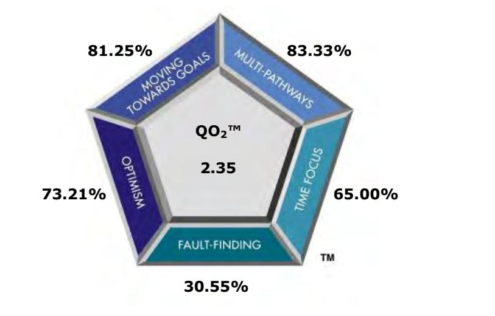
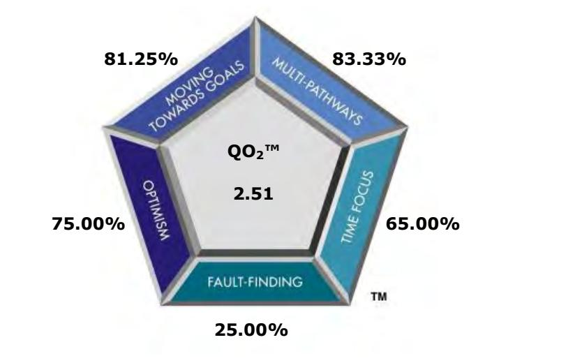
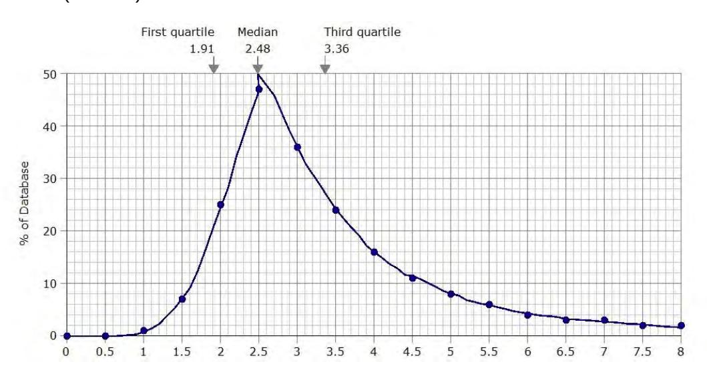
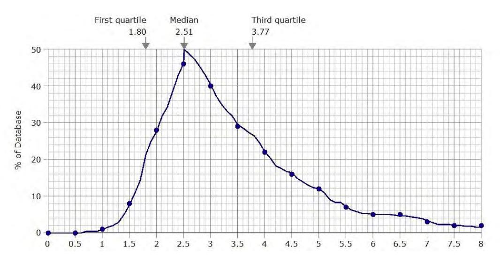

# **Team Management Systems Research Manual 5th Edition:**

# **QO2™ Profile Questionnaire**

Editors: D.J. McCann and N.H.S. Mead Publisher: [Team Management Systems](http://www.tmsworldwide.com/) Copyright © Team Management Systems, 2018. All rights reserved. ISBN: 978-0-9580722-8-1

While copyright of this publication is held by Team Management Systems, we make no claim on any articles, applications and/or designs presented by independent contributors.

The purchaser of this Research Manual is permitted to print only a single copy for personal use. No further copies or distributions are permitted.

No part of this publication may be reproduced, stored in a retrieval system, or transmitted in any form or by any means, electronic, mechanical, photocopying, recording, or otherwise without the prior written permission of the publishers.

## Welcome,

This fifth edition of the *Team Management Systems Research Manual* is a collection of stand-alone manuals focusing on each of the eight Profiles. These manuals are a major revision of the last edition which was published in 2010. Since then we have undertaken new research and significantly increased the norm data allowing for a greater depth and breadth of analysis to be presented.

The research was carried out by the Institute of Team Management Studies (ITMS) led by Dr. Dick McCann and Nikki Mead. ITMS was established in 1988 by Team Management Systems (TMS) authors Drs. Charles Margerison and Dick McCann to formalize the research program that was already underway. ITMS was headed up by Rod Davies until 1994 and the comprehensive research program he created was continued by the current editors. It should also be noted that ITMS has many associates who have carried out both joint and external research studies on TMS. Their involvement has been crucial to our work and we thank them for their enthusiasm and commitment.

Each manual includes an *Executive Summary*. These are ideal for clients who want a summary of the key research points, without being overwhelmed by statistics. Normative data and detailed articles on specific studies on face validity, construct validity and criterion-related validity as well as confirmatory factor analyses are also presented.

We have enjoyed writing, compiling and editing this collection of manuals and hope they will stimulate you to use TMS in new and exciting ways.

Dick McCann & Nikki Mead

Editors

Team Management Systems (TMS) distributes a wide variety of products developed by Drs . Charles Margerison and Dick McCann. Over the years they have developed, jointly and individually, many concepts and models widely in use throughout the world. Today there are more than 15,000 accredited international network members who have used the Margerison-McCann Team Management Systems Profiles to enhance the personal, team and organizational performance of more than 1,500,000 people.

For further information, please visit [TMSworldwide.com.](http://www.tmsworldwide.com/)

## **Abbreviations & Conventions Used**

## **Abbreviations**

| ITMS   | - | Institute of Team Management Studies        |
|--------|---|---------------------------------------------|
| NEO-PI | - | NEO Personality Inventory                   |
| QO2™   | - | Opportunities-Obstacles Quotient            |
| TMP    | - | Team Management Profile                     |
| TMPQ   | - | Team Management Profile Questionnaire       |
| TMS    | - | Team Management Systems                     |
| WoWV   | - | Window on Work Values                       |
| WoWVP  | - | Window on Work Values Profile               |
| WoWVPQ | - | Window on Work Values Profile Questionnaire |

## **Conventions**

**Bipolar scales** refer to the four E-I, P-C, A-B, and S-F scales treated as categorical variables (e.g. 'E' = 1, 'I' = 0).

**Continuous scales**. In the case of the Team Management Profile Questionnaire, continuous scales refer to the four E-I, P-C, A-B, and S-F scales measured on the continuum, from the +30 for the first mentioned pole (e.g. 'E' in Extroversion-Introversion) to -30 for the second mentioned pole ('I' in the above example). In the case of the Types of Work Profile Questionnaire, continuous scales refer to the eight types of work scales measured on the continuum from 0 to 32.

**Global ratings**. This term is used to describe data samples that include multi-rater responses and results.

**Major role preference** is the role identified by the Team Management Profile Questionnaire as being major and identified as such in the written feedback.

The **major sample** refers to the total worldwide database for a particular profile questionnaire.

**Net scores** on the Team Management Profile Questionnaire refer to the difference between the raw scores on each of the work preference measures. For example raw scores of E:22 and I:10 result in a net score of E:12.

**QO2™ Profile**. The output from the processing of a QO2™ Profile Questionnaire.

**Raw scores** on the Team Management Profile Questionnaire are the total scores for each pole on the work preference measures. For example E: 22 and I:10 represent the number of points scored on the Team Management Profile Questionnaire for Extroversion and Introversion.

**Role Profiles** are the narrative output from the Team Management Profile Questionnaire. These are divided into the eight roles originally developed by Drs. Charles Margerison and Dick McCann - *Reporter-Adviser*, *Creator-Innovator*, *Explorer-Promoter*, *Assessor-Developer*, *Thruster-Organizer*, *Concluder-Producer*, *Controller-Inspector*, and *Upholder-Maintainer*. These can be further divided to create 16 subsectors, there being two distinct types of each role Profile.

**Team Management Profile**. The output from the processing of the Team Management Profile Questionnaire.

**Value type**. There are eight core value types in the Window on Work Values that together define the main values observed in the workplace.

**Window on Work Values Profile**. The output report from the processing of a Window on Work Values Profile Questionnaire.

## **Statistical Glossary**

*This statistical glossary is not an exhaustive list of all the terms and concepts used in this publication. Definitions and brief examples are only provided for the key concepts used for comparing data samples.* 

Measures of **central tendency** used in this manual are the **mean** and **median**. These measures allow different ways of defining the central region of a distribution or central tendency.

**Cronbach's coefficient alpha** is a measure of how well the items in a scale are related to each other. The alpha coefficient is a measure of internal consistency that in turn is an indicator of the reliability of a scale. Values range from 0.00 to 1.00, where 0 represents no reliability and 1.00 perfect reliability. It takes into account every item's correlation with each other and the total score for that scale. As a rule of thumb, a value of 0.70-0.75 is seen as adequate reliability for a preference type scale.

**Factor Analysis** is a general descriptor for a number of specific computational techniques. All of these techniques, however, have the object of reducing a large number of measures or tests to some smaller number by telling us which belong together and which seem to measure the same thing.

**Item/total correlations** represent the correlation coefficient reached between the item and the scale itself (without the item included).

The **mean** is the most commonly used measure of location. It is equal to the sum of measurements divided by the number of measurements (*n)*.

The **median score** is also a measure of location. The median is the middle item in a set of measurements that have been arranged according to magnitude. It represents the point where 50% of people have a higher net score and, therefore, the remaining 50% have a lower net score.

For any set of data, the **mean** and **median** need not be the same. The only time these two location measures will both have the same value is when the data distribution is both unimodal and symmetrical.

The **minimum** and **maximum scores** give an indication of the range of the scores received.

The shorthand for probability is '**p**'. For example, *p*<0.05 indicates that the probability of a difference between scores being attributable to chance rather than some other factor is less than five per cent. It is used, among other purposes, for indicating whether two mean scores vary, or whether the magnitude of a correlation coefficient is large enough to be due to a real difference rather than a chance.

The **Pearson product-moment coefficient** is a summary statistic that represents the linear relationship between 2 sets of variables. The values can vary between -1 to 0 to +1, with 0 representing no association, and -1 indicating a perfect negative association.

The **standard deviation** provides us with a look at the distribution or spread of the scores with approximately 68% of the sample being within one standard deviation (plus or minus) of the mean. For example, in a sample where the mean scale percentage is 8.45 and the standard deviation is 4.35, we would be able to say that 68% of the sample was between 4.10% and 12.80%. The higher the standard deviation, the more 'spread out' the scores.

## **QO2™ Profile Questionnaire: Executive Summary**

## **Development**

Practical experience with the Team Management Wheel suggested that people in the same sector (i.e. Creator-Innovator) often showed similar workplace characteristics; however sometimes there were characteristics not easily explained by similar work preferences. Likewise opposites on the Wheel frequently show substantially different approaches to work, but sometimes they had similarities that were not explained by the four scales. In order to increase the utility of the Team Management Systems approach, Dr. Dick McCann initiated a research program in 1996 to look for a '5th dimension' that could give insights into some of these workplace variations. This new dimension became the Risk-Orientation Scale.

Figure 1. The Risk-Orientation scale

|                  | <b>Orientation Towards Risk</b> |                             |
|------------------|---------------------------------|-----------------------------|
| Seeing Obstacles |                                 | <b>Seeing Opportunities</b> |
|                  |                                 |                             |
| 100%             |                                 | 100%                        |

At one extreme, people can focus most of their energy on 'seeing opportunities'. They are always positive when new ideas are presented and will look optimistically at most situations. The downside is the energy they assign to 'seeing obstacles'. They don't always see potential difficulties and this can cause them to misjudge situations. As a result they tend to be more risk-accepting.

At the other end of the scale, people may focus most of their energy on 'seeing obstacles'. When working on a project, they are more likely to put a lot of effort into looking at all the things that might go wrong. When faced with potential opportunities they may well ignore them, presenting cogent arguments to support their view that the risks are too great. As a result they tend to be more risk-averse.

The overall Risk-Orientation scale was then deconstructed to look for component subscales (Figure 2) that would measure concepts of importance to the workplace. These are shown in the Risk-Orientation (QO2™) Model.

Figure 2. The Risk-Orientation Model

## *MTG Energy*

Moving Towards Goals (MTG) Energy is a form of psychic energy – the energy that gives us the determination, enthusiasm, and resilience to formulate and achieve our goals in life. People with a high MTG Energy are those who see opportunities and are often prepared to take risks to seize them. People with a lower MTG Energy will often see obstacles in the way of any goals they have and when the going gets tough they will give up earlier than those with higher energy.

## *Multi-Pathways*

People who see opportunities and grab hold of them are those with the capability of multi-pathway generation. When an obstacle occurs they are able to generate lots of possible pathways and ultimately select one of them that effectively removes the obstacle. People without multi-pathway skills tend to follow a single pathway to achieve what they want.

## *Optimism*

Optimism is a characteristic that is the basis of positive thinking. It is a psychological resource that gives people a generalized expectancy that they will succeed in their endeavors. Expected success, in turn, gives people the will to expend effort to realize their goals. If they expect failure then they will put less effort into a task and are more likely to give up as soon as an obstacle appears.

## *Fault-Finding*

An important aspect of business management is Potential Obstacle Analysis. Before large sums are spent on future projects, successful organizations will spend a lot of time (and money) in trying to answer three questions:

- What could possibly go wrong?
- What assumptions have we made?
- What might we do to minimize the risk?

Some people naturally put effort into these activities, almost without thinking. They have an automatic orientation towards 'looking for Murphy' or being a 'devil's advocate'. It is inherent in their self-definition to always consider what could possibly go wrong. Other people pay scant attention to this and prefer to focus on 'what will work' rather than 'what could go wrong'.

## *Time Focus*

This subscale was generated from the idea of psychological time. Although absolute time proceeds at the same pace, psychological time varies. For some people time moves fast; for others it drags. Some people live in the future; some in the past; and some live in the present from where they can look forward and back.

## **Item Development**

An item pool of 50 questions was developed, 29 relating to the Seeing Opportunities scale and 21 to the Seeing Obstacles scale. These were built up from measures relating to the five subscales of MTG (Moving Towards Goals) Energy, Multi-Pathways, Optimism, Fault-Finding and Time Focus, as shown in Table 1.

| Scale/subscale | n  |
|----------------|----|
| Opportunities  | 29 |
| Obstacles      | 21 |
|                |    |
| MTG Energy     | 8  |
| Multi-Pathways | 9  |
| Optimism       | 14 |
| Fault-Finding  | 9  |
| Time Focus     | 10 |

Table 1. No. of items per scale/subscale

Examples of items are shown in Table 2. Respondents rate them according to the Likert scale: *Strongly Agree, Mostly Agree, Mostly Disagree, Strongly Disagree.*

## Table 2. Examples of items for each subscale (n=135)

| Item                                                                         | Subscale       |
|------------------------------------------------------------------------------|----------------|
| I pursue my goals vigorously                                                 | MTG Energy     |
| I find it easy to find alternative solutions to problems                     | Multi-Pathways |
| I am someone who rebounds easily from adversity                              | Optimism       |
| I am more likely to show you why things will work rather than why they won't | Fault-Finding  |
| I like the excitement of the future                                          | Time Focus     |

The scales and subscales for the instrument are fed back to respondents as percentage scores. This represents the percentage of the maximum possible on any of the scales and subscales. In addition a derived scale is given as a way to compare data among team members. This non-linear scale is called the Opportunities-Obstacles Quotient, written as QO2™. This shorthand is often used to describe the instrument. Results for all scales are given in the QO2™ Profile report.

Looking at the example in Figure 3, a typical result shows an 82% score towards the Opportunities side of the scale and 30% score towards the Obstacles side. The QO2™ is calculated by dividing the Opportunities score by the Obstacles score. This result indicates that this person would be 2.7 times more likely to see the opportunities rather that see the obstacles.

Figure 3. QO2™ of 2.7

|                  |     | <b>Orientation Towards Risk</b> |                             |
|------------------|-----|---------------------------------|-----------------------------|
| Seeing Obstacles |     |                                 | <b>Seeing Opportunities</b> |
|                  | 30% |                                 | 82%                         |
| 100%             |     |                                 | 100%                        |

## **Reliability**

Psychometric scales are measured by a number of items that define each scale. These items should be related to some extent, otherwise errors become unacceptable. Too much correlation accurately defines a scale that is so narrow to be of limited use; too little correlation means that the scale is so broad that that it measures nothing. A reliable scale must have an adequate degree of *internal consistency* and this can be measured using a statistic known as the Cronbach alpha coefficient. Values below 0.70 indicate that the scale is becoming too broad; values over 0.90 indicate the scale is becoming too narrow. An ideal range is 0.75-0.85.

The Cronbach alpha coefficients for the scales and subscales are displayed in Table 3. This analysis has been conducted on the total worldwide sample from the commercial English language versions of the QO2™ Profile Questionnaire. The worldwide QO2™ database as of 2018 consists of 10255 completed profile questionnaires.

| Scale/subscale | Cronbach alpha |
|----------------|----------------|
| Opportunities  | 0.88           |
| Obstacles      | 0.79           |
|                |                |
| MTG Energy     | 0.72           |
| Multi-Pathways | 0.69           |
| Optimism       | 0.75           |
| Fault-Finding  | 0.70           |
| Time Focus     | 0.66           |

Table 3. Cronbach alpha coefficients (n=10255)

Cronbach alphas of 0.88 and 0.79 were recorded for the Opportunities and Obstacles scales respectively. This is an adequate result for scales of this length. The two item pools correlated negatively (-0.55) indicating that for visual purposes they can be shown at opposite ends of the Risk-Orientation scale. The alpha coefficients for the subscales are also satisfactory, given the small number of items in these subscales.

It is also important to check the temporal stability of a scale by measuring people's responses to it at two different times. For many scales such as Extroversion-Introversion one would expect quite high testretest coefficients, as these are concepts which seem relatively stable over short to medium time scales. However the Risk-Orientation scale, by its very nature, is tapping into areas of the human psyche known to have some temporal variation. Therefore it is important to ensure the scale does have sufficient stability to be used in personal and team development, for which it was designed.

A sample of 165 people has been analyzed with a time interval of re-administration ranging from one month to over twelve months. The age range was 19-60 years with 46% men and 54% women. The sample was collected from 16 countries with the largest percentages being from England, USA, and Australia.

The test-retest correlation coefficients were 0.80 for the Opportunities scale and 0.74 for the Obstacles scale. These are perfectly adequate for a scale known to have some variation with time.

## **Validity**

Two questions that are often asked when assessing the adequacy of a profile questionnaire are 'How well does it minimize error in measurement?' and 'How well does the score measure what it has been designed to measure?' The first question is that of *reliability*, the second is that of *validity*. Put in another way, *reliability* concerns the association between different measurements of the same concept using the same indicator. *Validity*, on the other hand, concerns the association between the indicator and the concept. Important concepts of validity are face validity, structural validity, predictive validity, construct validity and criterion-related validity.

## *Face Validity*

Face validity is the extent to which a scale or group of scales 'makes sense' to observers and test users. As far as the QO2™ is concerned, people like to be convinced that a profile questionnaire is 'sensible' before they complete it. When users feel comfortable with a profile questionnaire, they are more likely to feel positive about the process which the tests are intended to facilitate. If this is the case then we can say the instrument has high face validity.

Much care was taken to ensure high face validity was obtained on both the QO2™ Profile Questionnaire and the Profile itself. This was achieved through an iterative process with many focus groups. A typical procedure was as follows:

- 1) A group of at least 8 people with similar QO2™ scores was assembled and a preliminary feedback report presented to them. They then indicated the paragraphs that were accurate for them, those that were dubious and those which were inaccurate.
- 2) Based on this information, a new version of the relevant Profile was produced and tested in a new focus group.
- 3) The process was repeated until at least 80% face validity was indicated by the subsequent focus group.
- 4) Steps 1) to 3) were repeated for various combinations of the QO2™ scores.
- 5) After the instrument was commercially released subsequent changes to the Profiles were made over a two-year period whenever consistent criticism was received about any particular report.

A 2009 confirmatory study on face validity covering 2667 QO2™ Profile reports showed a mean face validity in excess of 88%.

## *Structural Validity*

Structural validity is a form of validity that relates to the development of models or their scales and subscales. For the QO2™ model, a structural validity analysis shows how the five subscales relate to the two poles (Opportunities and Obstacles) of the Risk-Orientation scale.

Structural validity can be measured by using the Pearson product-moment correlation coefficient. The correlation coefficient determines the extent to which the values of two variables are 'proportional' to each other.

The current worldwide database comprises 10255 respondents from the commercial English language versions of the QO2™ Profile Questionnaire. Pearson product-moment correlations for the percentage scale scores are shown in Table 4.

| Scale/subscale | OPP | OBST  | MTG   | MPATH | OPT   | F-FIND | TIME  |
|----------------|-----|-------|-------|-------|-------|--------|-------|
| Opportunities  |     | -0.55 | 0.78  | 0.80  | 0.71  | -0.51  | 0.71  |
| Obstacles      |     |       | -0.49 | -0.44 | -0.82 | 0.77   | -0.64 |
| MTG Energy     |     |       |       | 0.53  | 0.58  | -0.34  | 0.47  |
| Multi-Pathways |     |       |       |       | 0.49  | -0.36  | 0.51  |
| Optimism       |     |       |       |       |       | -0.56  | 0.54  |
| Fault-Finding  |     |       |       |       |       |        | -0.45 |
| Time Focus     |     |       |       |       |       |        |       |

| Table 4. | Pearson product-moment correlations for percentage scale scores (n=10255) |  |  |
|----------|---------------------------------------------------------------------------|--|--|
|          |                                                                           |  |  |

The Risk-Orientation scale is presented as a uni-dimensional scale with Opportunities at one end and Obstacles at the other. The two poles are actually measured separately and presented visually as one scale. Table 4 shows that this representation is justified, given the negative correlation (-0.55) between each pole.

The subscales provide further information on the items comprising the Risk-Orientation scale. The structural validity of these subscales can be seen from the data in Table 4 where moderate to high correlations (either positively or negatively) between the subscales and the poles of the Risk-Orientation scale are obtained.

The 'seeing opportunities' scale correlates positively with the MTG Energy subscale (0.78), the Multi-Pathways subscale (0.80), the Optimism subscale (0.71) and the Time Focus subscale (0.71). It correlates negatively (-0.51) with the Fault-Finding subscale.

The 'seeing obstacles' scale correlates positively with the Fault-Finding subscale (0.77) and negatively with the MTG Energy subscale (-0.49), the Multi-Pathways subscale (-0.44), the Optimism subscale (-0.82) and the Time Focus subscale (-0.64).

## *Predictive Validity*

Predictive validity is the ability of a measure to predict future criteria. This form of validity is important when a test is used for selection purposes. If the QO2™ Profile Questionnaire was being used to predict the success of a group of job applicants we would have to prove that it is related to the criteria for success that were chosen at the recruitment or promotion stage. Predictive validity studies are difficult to administer as they involve a long-term research design which has the inherent difficulty of locating subjects at times in the future and possible changes in the success criteria that can occur over time.

The QO2™ Profile Questionnaire was not designed as a predictive instrument and no claims are made about its predictive validity. The instrument was designed primarily for personal, team and organizational development.

## *Construct Validity*

Construct validity is a special case of criterion-related validity and measures the extent to which a test or scale relates to other theoretical concepts (i.e. constructs) which have been proved by other studies to be valid. By studying the relationships of a test to many others, researchers can get a better feel for the real meaning of a scale. To the extent that one construct is related to another that it should be related to, and not to others that it should not be related to, we can say that the test has good construct validity.

As the constructs of the Team Management Profile Questionnaire (TMPQ) have been well researched and described in the *Team Management Systems Research Manual 5th Edition: Team Management Profile Questionnaire* (McCann & Mead, 2018) and reviewed by the British Psychological Society (2003), it is useful to carry out a construct validity comparison between the scales of the QO2™ Profile Questionnaire and those of the TMPQ. The results of this study are discussed in detail in the *Comparative Studies: QO2™ & Work Preferences* section of this manual.

A construct validity study was also carried out between the QO2™ Profile Questionnaire and the Window

on Work Values Profile Questionnaire. The results of this study are discussed in detail in the *Comparative Studies: QO2™ & the Window on Work Values* section of this manual.

## *Criterion-Related Validity*

Criterion-related validity is the extent to which a test is related to external criteria. A number of studies were undertaken in this area using two different samples.

*Self-Rating and Associate Rater Study* 

This study used a sample of 121 respondents, collected specifically for a series of criterionrelated validity evaluations. Participants completed a QO2™ Profile Questionnaire and were concurrently asked to answer 10 questions on a self-rating questionnaire. One associate of each respondent was also asked to complete an associate-rating questionnaire, where they answered the 10 questions about each participant. These questions covered assessments such as:

- o How opportunities focused is this person?
- o How obstacles focused is this person?
- o Is this person risk-accepting or risk-averse?
- o Does this person have a positive, neutral or negative outlook?
- o How determined is this person?
- o How persistent is this person?
- o How would you rate this person on generating lots of possible pathways to overcome difficulties?
- o Is this person optimistic or pessimistic?
- o How well does this person consider what might go wrong when undertaking any project?
- o With regard to time, is this person past-oriented, present-oriented or future oriented?

The results of this study are discussed in detail in the *QO2™ Studies: Self-Rating and Associate Rater QO2™ Study* section of this manual.

*Career Direction Study*

A criterion-related QO2™ validity study was included as part of a career longitudinal study on the Team Management Systems concepts. In the second year of the study 93 participants were asked the question: 'Do you feel that you are in control of your career direction?' The Pearson product-moment correlation between the QO2™ score and the 'control' question was –0.25, significant at *p<*0.05.

From this relationship we can conclude that there is a small but significant relationship between the two variables. The higher the QO2™ score, the more likely a person will feel that control of their career lies *internally* with them. The lower the QO2™ the more likely they will feel that control of their career is dependent on *external* situations.

The results of this study are discussed in detail in the *Comparative Studies: Longitudinal Study*  section of this manual.

These criterion-related validity studies produced a number of correlations confirming the validity of the major scales and subscales.

## **British Psychological Society Review**

In their 2006 review1 of the of the Opportunities-Obstacles Profile, the British Psychological Society concluded that the Profile was an innovative measure that taps into those aspects of Neuroticism-Stability which are not pathological and is therefore intentionally narrower than that measured by traditional measures of Neuroticism, seeking to identify the implications for workplace behavior. In their final conclusions, they state that:

*"Overall, the QO2™ provides a reliable measure of a construct with high face validity. Knowledge of one's own position with regard to seeing opportunities or obstacles* 

1 A copy of the review can be found online at [ptc.bps.org.uk.](http://www.ptc.bps.org.uk/)

This document is an extract from *Team Management Systems Research Manual 5th Edition: QO2™* Editors: D.J. McCann & N.H.S. Mead - Copyright © 2018 Team Management Systems

*relative to the stance of others should be helpful in both personal and team development. This will be particularly important during periods of change and turnaround that have now become almost a constant feature of organisational life. The measure will probably be used most as an adjunct to the TMPQ for team building and development work and it is well-suited for that purpose."*

Ratings given in the review of the instrument are reproduced below.

| Characteristics            | Evaluation |
|----------------------------|------------|
| Quality of documentation   |            |
| Quality of materials       |            |
| Norms and reference groups |            |
| Construct validity         |            |
| Criterion-related validity |            |
| Reliability - overall      |            |

This table shows adequate to good ratings for all BPS evaluation categories.

## **Norm Data**

The worldwide QO2™ database as of 2018 consists of 10255 completed profile questionnaires from 68 industries and 73 countries. A summary of the median score distribution data is shown in Table 5. Other breakdowns are given in the *QO2™ Profile Questionnaire: Worldwide Database* sections of this manual. These cover analyses of gender, age group, functional area, profession, organizational level, industry, countries, and regional areas.

Table 5. Interpretative data for the QO2™ score and scales: worldwide database (n=10255)

|                     | Lower quartile | Median | Upper quartile |
|---------------------|----------------|--------|----------------|
| QO2™                | 1.87           | 2.45   | 3.37           |
|                     |                |        |                |
| Opportunities scale | 73.27%         | 79.31% | 85.34%         |
| Obstacles scale     | 25.00%         | 32.14% | 40.48%         |

Percentile norms are used for comparing the QO2™ score of a respondent against a reference group. The full distributions for the QO2™ scores can be found in the *QO2™ Profile Questionnaire: Worldwide Database Percentile Norms* section of this manual. The distribution for the development sample is shown below in Figure 4, as an example.

Figure 4. Distribution of QO2™ score data: development sample (n=1000)

When interpreting a score note that the percentage of database scores to the left of the median shows the percentage of the database with a lower score whereas scores to the right of the median show the percentage of the database with a higher score.

For example consider the initial development sample of 1000 respondents, which is plotted as percentile norms in Figure 4. This sample shows a median value of 2.2 and upper and lower quartiles of 3.0 and 1.6 respectively. This sample is used as the reference point for the Profile report.

If a respondent had a score of 5.0 they could see from Figure 4 that 5% of the development sample has a score higher than 5.0 and 95% of the sample had a score below 5.0. Likewise, a score of 1.8 would show that 33% of the sample had a lower score and therefore 67% of people had a higher score.

## **References**

British Psychological Society, (2003), Team Management Profile, **Psychological Testing Center Test Reviews**.

British Psychological Society, (2006), QO2: Opportunity Orientation Profile, **Psychological Testing Center Test Reviews**.

McCann, D.J., & Mead, N.H.S., (Eds.), (2018), Team Management Systems Research Manual 5th Edition: Team Management Profile Questionnaire, Team Management Systems, Brisbane, Australia.

## **QO2™ Profile Questionnaire: Development**

The development of the QO2**™** Profile resulted from years of experience in developing the concepts of work preferences.

## **Work Preferences**

Drs. Charles Margerison and Dick McCann (1995) developed in the 1980s the work preference model known as the Team Management Wheel. It identified eight key role preferences that described how team members preferred to work in the team environment. The Team Management Profile Questionnaire (TMPQ) (Margerison & McCann (1984-2005)), which determines an individual's role preference, is based on four independent scales measuring work preferences. These four scales are summarized below:

## Figure 1. Work preference measures

|                   | How you relate to others           |
|-------------------|------------------------------------|
| <b>Extrovert</b>  | <b>Introvert</b>                   |
|                   | How you gather and use information |
| <b>Practical</b>  | <b>Creative</b>                    |
|                   | How you make decisions             |
| <b>Analytical</b> | <b>Beliefs-based</b>               |

| <b>Structured</b>                       | Flexible |
|-----------------------------------------|----------|
| --------------------------------------- |          |

Work preferences are dimensions of individual differences in tendencies to show consistent patterns of relationships, thoughts, feelings and actions in the work environment. Work preferences determine the conditions we set up to allow our mental and psychic processes to flow freely. They guide our behavior, but if we have to work outside them at various times then we can usually cope. Preferences are another name for what we like doing. Often our preferences at work are different from our preferences outside of work.

Preferences are usually transparent and are often the first thing we notice in others – 'He's rather quiet, isn't he?' or 'She never stops talking.' Some people prefer to think things through on their own whereas others need to talk out loud to clarify their ideas. Preferences are readily visible to others and are usually the basis of first impressions. They are also subject to a degree of variability dependent upon the situations faced.

The four work preferences map to form the model known as the Team Management Wheel (Figure 2). People's location on this model is determined from responses to the Team Management Profile Questionnaire (TMPQ).

Practical experience with this model showed that people in the same sector (i.e. Creator-Innovator) often showed similar workplace characteristics; however sometimes there were characteristics not easily explained by similar work preferences. Likewise opposites on the Wheel frequently show substantially different approaches to work, but sometimes they had similarities that were not explained by the four scales.

In order to increase the utility of the Team Management Systems approach, Dick McCann initiated a research program in 1996 to look for a '5th dimension' that could give insights into some of these workplace variations.

## Figure 2. The Margerison-McCann Team Management Wheel

## **Background**

Over the last 20 years or so the views of many personality psychologists have converged regarding the structure and concepts of personality. Generally, researchers agree that there are five robust factors of personality that can serve as a meaningful taxonomy for classifying personal attributes. A good summary of the various approaches is given by Barrick and Mount (1991).

It is widely agreed that the first dimension is Extroversion-Introversion – most commonly referred to as Extroversion or Surgency. Characteristics frequently associated with it include being sociable, gregarious, assertive, talkative and active.

There is also general agreement about the second dimension, which has most frequently been called Emotional Stability, Stability, Emotionality or Neuroticism (McCrae & Costa, 1985; Noller et al, 1987; Norman, 1963; Smith, 1967). Common traits associated with this factor include being anxious, depressed, angry, embarrassed, emotional, worried and insecure.

The third dimension has generally been interpreted as Agreeableness or Likeability (McCrae & Costa, 1985; Norman, 1963; Smith, 1967). Characteristics often associated with this dimension are being courteous, flexible, trusting, good-natured, cooperative, forgiving, soft-hearted and tolerant.

The fourth dimension has most frequently been called Conscientiousness or Conscience (McCrae & Costa, 1985; Noller et al, 1987; Norman; 1963), although some researchers have referred to it as Conformity or Dependability or even Will to Achieve. As the variation in labels suggests there is some disagreement in the content of this dimension, although the concepts seem to embrace the ideas of being careful, thorough, responsible, organized and planning-oriented.

The last dimension has been the most difficult to identify. It has most frequently been interpreted as Intellect or Intelligence (Borgatta, 1964; Peabody & Goldberg, 1989), or Openness to Experience (McCrae & Costa, 1985) or Culture (Hakel, 1974; Norman, 1963). Digman (1990) points out that it is most likely all of these. Characteristics commonly associated with this dimension include being imaginative, cultured, curious, original, broad-minded, intelligent, and artistically sensitive.

Probably the most common five-factor model used in industry is that of the NEO Personality Inventory (McCrae & Costa, 1997). The five factors here are defined as Extroversion, Neuroticism, Agreeableness, Conscientiousness, and Open to Experience. This model is not based on any single theory of personality but has been derived from the identification of independent factors that psychometrically describe large data sets.

Although no construct validity comparisons have been done between the Team Management Profile Questionnaire and the NEO Personality Inventory (NEO-PI), it is easy to see how the scales qualitatively relate to the four constructs (E-I, P-C, A-B, S-F).

Extroversion obviously relates to the E-I scale; Agreeableness identifies many of the A-B scale characteristics; Open to Experience relates to the PC scale and Conscientiousness is likely to align with the SF scale. It is the Neuroticism or Emotional Stability dimension that is not measured by the TMPQ.

Neuroticism in the NEO-PI is defined by six characteristics – Anxiety, Angry hostility, Depression, Selfconscientiousness, Impulsiveness, and Vulnerability. Low neuroticism scorers tend to be calm, poised, and emotionally stable.

It was this 'neuroticism' or emotional stability scale that was deemed worthy of attention in looking for a suitable 5th dimension to use in conjunction with the TMPQ.

## **The Fifth Dimension**

In the field of management development, terminology is critical to success. Any instrument purporting to look into issues of 'neuroticism' or 'emotional stability' will not be well received and as a result the utility of the instrument, no matter how reliable or valid, will suffer - particularly if a senior executive is the recipient of a high neuroticism score. As a result considerable thought was given to identifying those issues of emotional stability that would have good face validity among a managerial population as well as good utility.

To understand the importance of emotional stability at work, the starting point was to look at those issues that applied to a significant percentage of the workforce. The concepts of hypomania and depression and seemed to be useful benchmark points.

The symptoms of hypomania are an elevated mood, increased activity, and decreased need for sleep, grandiosity, racing thoughts, and the like. Hypomanic episodes differ from manic behavior in that they do not cause significant distress or impair one's work, family, or social life in an obvious way. Hypomanic people tend to be unusually optimistic, have more than ample energy, and need little sleep. Hypomania is a pleasurable state that confers a heightened sense of creativity and power. However, hypomania can subtly impair a person's judgment. Too much confidence and an excessive focus on opportunities can conceal the consequences of decisions.

Depression is characterized by an initial increase in pessimism and a developing sense of inadequacy. Obstacles tend to appear, no matter what direction is taken and often the result is no action at all.

The development of a useful 5th dimension then focused on an area that could be defined within these outlier benchmarks i.e. within the bounds of reasonable emotional stability where no serious pathologies exist.

As a result a uni-dimensional scale was defined as follows:

| Seeing Obstacles |   | Seeing Opportunities |
|------------------|---|----------------------|
|                  |   |                      |
| 100%             | 0 | 100%                 |

At one extreme, people can focus most of their energy on 'seeing opportunities'. They are always positive when new ideas are presented and will look optimistically at most situations. The downside is the energy they assign to 'seeing obstacles'. They don't always see potential difficulties and this can cause them to misjudge situations.

In the classic book, *Pollyanna* (Porter, 1969) we can see how someone with a focus on opportunities can affect those with a negative view of life. Pollyanna's positive attitude helps Aunt Polly, Mrs. Snow and Mr. Pendleton see the world in a new light and the book is a tonic for anyone who feels at all depressed.

Pollyanna's behavior is often described as a naïve form of optimism. She believes that things will always turn out for the best and that no matter what happens, there is always something to be glad about. There are never any obstacles, only opportunities!

Pollyanna's attitude to life has led to the coining of a recent psychological term, known as Pollyanna-ism.

Pollyanna accepts anything that happens to her by reflecting that things could always have been worse. This noble view of the world is not always an asset in managing a business. The reality of the business world is often summarized, tongue in cheek, by Murphy's Law, 'If anything can go wrong, it will'. Therefore it is important not to sit back and accept fate in a positive way, as Pollyanna does. It is essential for managers to identify all the obstacles that might occur and have an alternative plan of action to implement, should things go wrong. Looking for the problems and pitfalls, and planning to avoid them can help prevent Murphy's Law from happening.

Those who suffer from Pollyanna-ism can cause major problems at work. Their enthusiasm and belief in a positive outcome can sometimes lead to decisions that are regretted later.

The extreme right-hand side of the Opportunities-Obstacles scale is defined by Pollyanna-ism. It is a normal, often admired characteristic in people, but it has definite disadvantages in the world of management when used to excess. Beyond Pollyanna-ism lies hypomania and beyond that manic behavior.

At the other end of the scale, people may focus most of their energy on 'seeing obstacles'. When working on a project, they are more likely to put a lot of effort into looking at all the things that might go wrong. When faced with potential opportunities they may well ignore them, presenting cogent arguments to support their view that the risks are too great.

The left-hand end of the scale defines someone who puts most of their effort into looking for obstacles, which in the extreme can lead to pessimism - a mood state that affects all of us to varying degrees. However, too much pessimism can lead to apathy and inaction. The benchmark for the left-hand end of the Opportunities-Obstacles scale is the donkey Eeyore, from A.A. Milne's classic book, *Winnie-the-Pooh* (1926).

Eeyore is universally recognized as being gloomy about life and anticipates the worst in most situations. He constantly expects things to go wrong. However, if we were all like Eeyore and saw difficulties in everything we did, then maybe we wouldn't get out of bed in the morning! A focus on seeing the obstacles is very important in the business world as it can prevent serious mistakes from being made. But excessive negativity or Eeyore-ism is something to be avoided at all costs.

Beyond Eeyore-ism we enter the abnormal part of the scale where clinical depression is defined. All of us suffer at times, from some form of mild depression. It occurs when our plans go wrong: we don't get into the university course we want or we don't get the promotion we desire. What differentiates people is how they deal with this depression. Do they deal with the problems quickly and put the past behind them or do they dwell on their misfortune and become languid and unable to act? Can they learn how to turn the obstacles into opportunities? Eeyore-ism defines the boundary between these two situations.

## **Risk-Orientation**

The Opportunities-Obstacles 5th dimension as defined above was eventually named the Risk-Orientation scale, once the domain content was developed through the definition of the five subscale components. The scale is usually presented as follows:

| Figure 3. | The Risk-Orientation scale |
|-----------|----------------------------|
|-----------|----------------------------|

|                  | <b>Orientation Towards Risk</b> |                             |
|------------------|---------------------------------|-----------------------------|
| Seeing Obstacles |                                 | <b>Seeing Opportunities</b> |
|                  |                                 |                             |
| 100%             |                                 | 100%                        |

Those who focus mainly on the opportunities and discount the obstacles, tend to be risk-accepting. Those who see only the obstacles tend to be risk-averse.

## **Risk-Orientation Subscales**

The overall Opportunities-Obstacles scale was then deconstructed to look for component subscales (Figure 4) that would measure concepts of importance to the workplace. This process took three years to complete and was based on a phenomenological approach (built on Dick McCann's 20 years of experience in management, team and organizational development), combined with confirmatory research from the literature. Eventually five subscales were defined and presented as the Risk-Orientation (QO2™) Model.

Figure 4. The Risk-Orientation Model

## *MTG Energy*

Moving Towards Goals (MTG) Energy is a form of psychic energy – the energy that gives us the determination, enthusiasm, and resilience to formulate and achieve our goals in life. People with a high MTG Energy are those who see opportunities and are often prepared to take risks to seize them. People with a lower MTG Energy will often see obstacles in the way of any goals they have and when the going gets tough they will give up earlier than those with higher energy.

As humans, we are intrinsically goal-oriented. We have short-term goals and long-term goals. Some of us have goals within our reach and others of us set goals well beyond our reach. But we all live our lives by goals. If we don't, we are likely to suffer from apathy, which can lead to hopelessness and depression.

There is a class of people who seem to put more energy into achieving their goals, no matter whether these goals are simple or more ambitious. This characteristic can best be described as the energy they harness to move towards future outcomes. In other words, they constantly deploy their energy in a way that moves them towards their goal. Other people, however, may expend their energy in a way that is far less effective. Whatever their goal, they never seem to have the drive and determination to get there. Either their energy is below a certain threshold or it is dissipated by focusing on peripheral issues.

It seems that high MTG Energy is acquired through life's experiences. When we are children, goals are either set through our own innate desire to succeed (intrinsic goals) or through the expectations of our parents, school teachers or significant others (extrinsic goals). In many cases the extrinsic goals help formulate the intrinsic ones. Whenever we achieve any of these goals we are usually rewarded in some way by prizes, admiration or concessions. Very soon an expectation of succeeding is established; if a goal is set, we will believe we can achieve it and therefore our MTG Energy is developed.

If goals are easy to reach, then people's potential is not maximized. They may have an easy and enjoyable time as they readily achieve their goals, but sooner or later will realize that they could have done more with their life. Usually they will have an average MTG Energy, which could easily have been further developed. Some people fear failure and react badly to it with strong feelings of lack of confidence and low self-esteem. To avoid these debilitating characteristics they will often formulate easy goals to bolster their feelings of self-worth. Such people may have an untapped potential that can be released through goal-stretching programs.

If the goals lie well beyond someone's capabilities then no amount of rewards or cajoling can realize those goals. Such people will usually find a reason to give up as soon as they can. Sometimes they see so many obstacles to the goals that have been set that they simply give up before they start. Many of these obstacles are imaginary. Such a pattern encourages a low MTG Energy, no matter what the goal. It is not long before lack of confidence and low esteem set in.

Because higher MTG Energy is aligned with seeing and seizing opportunities, organizations often encourage employees to develop it to a high level. However there are situations where too high an MTG Energy score can cause problems. Overconfidence can result, causing these people to be blind to serious obstacles that will impede their progress. What level of MTG Energy is maximum is difficult to predict. It very much depends on the individual, which is why goal-setting programs need to be personally tailored.

Two important ingredients of MTG Energy are determination and persistence.

## *Multi-Pathways*

People who see opportunities and grab hold of them are those with the capability of multi-pathway generation. When an obstacle occurs they are able to generate lots of possible pathways and ultimately select one of them that effectively removes the obstacle. People without multi-pathway skills tend to follow a single pathway to achieve what they want. Often you may hear them say, 'There is only one way to do things well and that's the *right* way.' People with a high level of MTG Energy but a low multipathway capability can succeed in removing obstacles but they need a high level of determination and persistence, otherwise they may give up and turn their attention elsewhere.

The concepts of MTG Energy and Multi-Pathways relate to the ideas of 'hope'. Many writers in the past have suggested that 'hope' is a vague concept and difficult to measure. However Sara Staats (1986) defined hope as the difference between expected positive affect and expected negative affect. Hope is individually based and future referenced. It has both a cognitive component (the expectation of a future event that has some probability of occurring), and an affective component (i.e. the things that we hope for are pleasant events or good outcomes). High-Hope people could therefore be expected to be those that focus their energy on 'seeing opportunities' rather than 'seeing obstacles'.

Snyder's (1995) work on hope confirms that the two subscales of MTG Energy and Multi-Pathways are domains worth developing for the Risk-Orientation scale. As he says, "*Two necessary components are the cognitive willpower or energy to get moving towards one's goals (this is called the agency component) and the perceived ability to generate routes to get somewhere (this is called the pathways component). Thus in thinking about goals, people perform a cognitive analysis of their agency and pathways. In street language one needs both the 'will and the way' to get somewhere…..Higher hope therefore reflects an elevated sense of mental energy and pathways for goals.*"

## *Optimism*

Optimism is a characteristic that is the basis of positive thinking. It is a psychological resource that gives people a generalized expectancy that they will succeed in their endeavors. Expected success, in turn, gives people the will to expend effort to realize their goals. If they expect failure then they will put less effort into a task and are more likely to give up as soon as an obstacle appears.

Optimism is a concept related to hope but most researchers now differentiate between the two. Optimism usually refers to a general disposition of positive affect where there is a *general* expectation of positive events occurring in life. Hope is a more specific phenomenon that relates to a specific event that is wished for, where there is a cognitive assessment that the event has some definite probability of occurring and ways can be found to make the event a reality. In other words, hope is related to the goal-oriented aspirations of people, in addition to having a positive outcome expectancy.

The literature abounds in studies on optimism as a dispositional characteristic (Lightsey, 1996). Many studies have shown that an optimistic outlook on life leads to less incidences of post-partum depression and distress, and greater subjective wellbeing and life satisfaction. It has also been positively correlated with goal setting and achievement and negatively with goal abandonment and resignation to fate.

In his book, *Optimism: The Biology of Hope*, Lionel Tiger (Tiger, 1995) argues cogently that optimism is not an optional characteristic in humans; it is as 'natural to man as his eyes that see, and as irreplaceable as hair'. Through evolution we have developed a species-wide tendency to overestimate moderately, the odds in our favor.

Seligman (1991) has spent many years researching the concept of optimism and pessimism through his work on attributional styles. He has found that people with an optimistic attributional style will attribute negative events differently to those with a pessimistic explanatory style. When setbacks occur, pessimists blame themselves. 'I am just no good' or 'Nobody wants me' are phrases that soon flow from the lips of such people. They believe the cause of their misfortune lies within them rather than being due to external or extenuating circumstances. Pessimists also believe that misfortune is long lasting ('Things will never get better') or repetitive ('If I have failed once, it will happen again'). It is also global or pervasive, that is, 'If misfortune befalls me in one part of my life, then it will happen to my whole life'. These three characteristics of the pessimistic explanatory style for negative events are known as the three Ps – *Personal, Permanent* and *Pervasive.* 

The most common measure of optimism is the Life Orientation Test (Scheier et al, 1994). Dember et al (1989) also have a useful measure where optimism and pessimism are measured separately. An interesting feature of their work is the question they raise about the assumed bipolarity of the scale (Pearson coefficient –0.52 to -0.57), suggesting that the two scales may sample different but overlapping domains.

The domains of both optimism and pessimism are well reported and studies appear in a large number of articles. They essentially relate to generalized positive affect and generalized negative affect. For this reason they were added to the domain content of the Risk-Orientation scale.

## *Fault-Finding*

An important aspect of business management is Potential Obstacle Analysis. Before large sums are spent on future projects, successful organizations will spend a lot of time (and money) in trying to answer three questions:

- What could possibly go wrong?
- What assumptions have we made?
- What might we do to minimize the risk?

Some people naturally put effort into these activities, almost without thinking. They have an automatic orientation towards 'looking for Murphy' or being a 'devil's advocate'. It is inherent in their self-definition to always consider what could possibly go wrong. Other people pay scant attention to this and prefer to focus on 'what will work' rather than 'what could go wrong'.

This domain content of this subscale endeavors to measure the nature of this focus on fault-finding. It definitely taps into the negative affect as well as the negative cognitive domains.

## *Time Focus*

This subscale was generated from the idea of psychological time, well described by Robert Levine (1997). Although absolute time proceeds at the same pace, psychological time varies.

Tongue in cheek, Einstein once explained the theory of relativity to his secretary, Helen Dukas, so that she could pass it on to reporters and laypersons (Calaprice, 1997): "*An hour sitting with a pretty girl on a park bench passes like a minute, but a minute sitting on a hot stove seems like an hour.*" What Einstein was talking about here is psychological time – how we subjectively process time. For some people time moves quickly, for others it moves slowly.

Time moves quickly when we are engaged in pleasant experiences (sitting with a nice girl) and slowly when we are experiencing unpleasant situations (a hot stove). Time moves slowly when we are bored and fast when a task is absorbing, challenging or mentally stimulating. The ideas around psychological time are described in more detail in McCann (2002).

One of the most useful models for understanding time focus in individuals is that of the NLP (neurolinguistic programming) timelines. Time runs on a continuum from the past to the present to the future. Some people can span the whole timeline giving equal weight to all states, whereas others like to focus on the past, the present, or the future.

## *Future Timelines*

Some people's timelines run from front to back. The future is in front of their eyes, the present lies embedded within them and the past is behind them. Most of their energy is directed towards the future and they have little interest or memory of the past. In fact, you may well hear them say, 'Let's put the past behind us.'

For them the future is a rosy place, somewhere they want to be. They are full of hope because they

know that things will be better than they are now and better than they have been in the past. They can't wait to live in the future and their whole focus is on looking for the opportunities that will help them realize the vision of hope that they so readily conjure up. This orientation to the future relates to the 'seeing opportunities' pole of the Risk-Orientation scale.

People with very strong Future Timelines (F-Time) often blank out the past. Past memories will merge, being telescoped into one small time unit. The present quickly becomes the past and with that go the memories of any unpleasant events. This is, of course, an important ingredient in entrepreneurship. Most entrepreneurs fail at their first attempt, or even their second attempt. A focus on the future or a collapsing memory of the past will allow them to try again. A strong Future Timeline also seems to be associated with faster psychological time.

## *Past Timelines*

Some people's timelines may be reversed, with the future behind them and the past in front of them. This is the Past Timeline (P-Time) where energy tends to be more focused on identifying obstacles rather than seeing opportunities.

These people may long for the 'good old days' when things were much better than they are now. The future is a very uncertain place and likely to be much worse than the current situation. So it is better to stay anchored in the past rather than risk the uncertainty of the future. When faced with a new opportunity, P-Time people will look for obstacles to support their inner feeling that life may be better with 'the devil we know'.

The ideas of psychological time seemed to give a different slant on the Opportunities-Obstacles concept and so this domain content was added to the other four subscales.

## **Item Development**

An initial item pool of more than 80 items was generated from the subscale concepts. This formed the first research version of the QO2™ Profile Questionnaire. This was then administered to a sample of 100 Team Management Systems (TMS) network members, enabling the relationship between the items to be established. Items that were poor indicators of any particular subscale were deleted and in some instances replaced by new items and the profile questionnaire administered to a second sample. The process was then repeated through five iterations until each subscale gave satisfactory results. At the same time comparisons were made with the Team Management Profile Questionnaire to ensure that the developing instrument was not simply reproducing one or more of the TMPQ scales. The final number of items in each scale is shown in Table 1.

These 50 items became the commercial version of the instrument, where respondents recorded against each item whether they strongly agreed, mostly agreed, mostly disagreed or strongly disagreed.

| Table 1. |  |  |  |  |  | No. of items per scale/subscale |
|----------|--|--|--|--|--|---------------------------------|
|----------|--|--|--|--|--|---------------------------------|

| Scale/subscale | n  |
|----------------|----|
| Opportunities  | 29 |
| Obstacles      | 21 |
|                |    |
| MTG Energy     | 8  |
| Multi-Pathways | 9  |
| Optimism       | 14 |
| Fault-Finding  | 9  |
| Time Focus     | 10 |

Reliability and structural data are given in the *QO2™ Profile Questionnaire: Reliability* and *Comparative Studies: QO2™ & the Window on Work Values* sections of this manual. As an example of the item results, Table 2 lists those items scoring the highest item-total correlation for the sample of 135 in the latter study.

## Table 2. Examples of items for each subscale (n=135)

| Item                                                              | Subscale       | Item-total correlation |
|-------------------------------------------------------------------|----------------|---------------------------|
| I pursue my goals vigorously                                      | MTG Energy     | 0.57                      |
| I find it easy to find alternative solutions to problems          | Multi-Pathways | 0.60                      |
| I am someone who rebounds easily from adversity                   | Optimism       | 0.54                      |
| I am more likely to show you why things will work rather than why | Fault-Finding  | 0.61                      |
| they won't                                                        |                |                           |
| I like the excitement of the future                               | Time Focus     | 0.55                      |

Item development is a complex process that relies on the experience of the designer. Scales where all the item correlations are high are often too narrow to be useful whereas those with too many low correlations are too broad and may contain overlapping domains.

## **Instrument Scoring**

The scales and subscales for the instrument are fed back to respondents as percentage scores. This represents the percentage of the maximum possible on any of the scales and subscales. In addition a derived scale is given as way to compare data amongst team members. This non-linear scale is called the Opportunities-Obstacles Quotient, written as QO2™. This shorthand is often used to describe the instrument. Results for all scales are given in the QO2™ Profile report.

Looking at the example in Figure 5, a typical result shows an 82% score towards the Opportunities side of the scale and 30% score towards the Obstacles side. The QO2™ is calculated by dividing the Opportunities score by the Obstacles score. This result indicates that this person would be 2.7 times more likely to see the opportunities rather that see the obstacles.

Figure 5. QO2™ of 2.7

|                  |     | <b>Orientation Towards Risk</b> |                                          |
|------------------|-----|---------------------------------|------------------------------------------|
| Seeing Obstacles |     |                                 | <b>Seeing Opportunities</b>              |
|                  | 30% |                                 | 82%                                      |
| 100%             |     |                                 | !!!!!!!!!!!!!!!!!!!!!!!!!!!!!!!!!!!!!!!! |

A particular QO2™ score is built up from the scores on the subscales. Therefore people with the same overall QO2™ score *may* have different scores on the subscales, although there is a high probability that the subscale scores will be similar. As an example, if a person scored higher on the future end of the Time Focus scale and lower on MTG Energy then they may have the same QO2™ score as a person who scored lower on Time Focus but higher on MTG Energy. However, their overall approach to Opportunities and Obstacles will be very similar. The reporting of the subscale scores as well as those of the prime scales of Opportunities and Obstacles enables greater individual variation in the QO2™ Profiles.

An initial reference sample of 1000 respondents was used as the basis for the norm data in the original QO2™ Profile. Table 3 shows the median and quartile data for the QO2™ score, and the Opportunities and Obstacles scales. Figure 6 shows the median scores for the subscales.

Table 3. Interpretative data for the QO2™ score and scales: development sample (n=1000)

|                     | Lower quartile | Median | Upper quartile |
|---------------------|----------------|--------|----------------|
| QO2™                | 1.5            | 2.2    | 3.0            |
|                     |                |        |                |
| Opportunities scale | 68%            | 75%    | 83%            |
| Obstacles scale     | 25%            | 34%    | 42%            |

Figure 6. Median score distribution: development sample (n=1000)

## **References**

Barrick, M.R., & Mount, M.K., (1991), The big five personality dimensions and job performance: A Metaanalysis, **Personnel Psychology**, 44, 1-26.

Borgata, E.F., (1964), The structure of personality characteristics, **Behavioral Science**, 12, 8-17.

Calaprice, A., (1997), The Quotable Einstein, Princeton University Press, Princeton.

Dember, W.N., Martin, S.H., Hummer, M.K., Howe, S.R., & Melton, R.S., (1989), The measurement of optimism and pessimism*,* **Current Psychology: Research & Reviews**, 8, 102-119.

Digman, J.M., (1990), Personality structure: Emergence of the five-factor model, **Annual Review of Psychology**, 41, 417-440.

Hakel, M.D., (1974), Normative personality factors recovered from scalings of personality descriptors: The beholder's eyes, **Personnel Psychology**, 1974, *27*, 409-422.

Levine, R., (1997), The Geography of Time, Basic Books, Harper Collins, New York.

Lightsey, R.L., (1996), What Leads to Wellness? The Role of Psychological Resources in Well-Being, **The Counseling Psychologist**, Vol. 24, No. 4, pp. 589-735.

Margerison, C.J., & McCann, D.J., (1984-2005), The Team Management Profile Questionnaire, Team Management Systems, Brisbane.

Margerison, C.J., & McCann, D.J., (1995), Team Management: Practical New Approaches, Management Books 2000, Chalford, Gloucestershire, UK.

McCann, D.J., (2002), The Workplace Wizard: The Definitive Guide to Working with Others, Gwent Publishing, Brisbane.

McCrae, R.R., & Costa, P.T. Jr., (1985), Updating Norman's 'adequate taxonomy: Intelligence and personality dimensions in natural language and in questionnaires, **Journal of Personality and Social Psychology**, 49, 710-721.

McCrae, R.R., & Costa, P.T. Jr., (1997), Personality trait structure as a human universal, **American Psychologist**, 52, 509-516.

Milne, A.A., (1926), Winnie-the-Pooh, Methuen, London.

Noller, P., Law, H., & Comrey, A.L., (1987), Cattell, Comrey, and Eysenck personality factors compared: More evidence for the five robust factors?, **Journal of Personality and Social Psychology**, 53, 775- 782.

Norman, W.T., (1963), Towards an adequate taxonomy of personality attributes: Replicated factor structure in peer nomination personality ratings, **Journal of Abnormal & Social Psychology**, 66, 574- 583.

Peabody, D., & Goldberg, L.R., (1989), Some determinates of factor structure from personality trait descriptors, **Journal of Personality & Social Psychology**, 4, 681-691.

Porter, E.H., (1969), Pollyanna*,* Puffin Books, London and New York.

Scheier, M.F., Carver, C.S., & Bridges, M.W., (1994), Distinguishing optimism from neuroticism (and trait anxiety, self-mastery, and self-esteem): A re-evaluation of the Life Orientation Test, **Journal of Personality and Social Psychology**, 67, 1063-1078.

Seligman, M.E.P., (1991), Learned Optimism, Alfred Knopf, New York.

Smith, G.M., (1967), Usefulness of peer ratings in educational research, **Educational and Psychological Measurement**, 27, 967-984.

Snyder, C.R., (1995), Conceptualizing, Measuring and Nurturing Hope, **Journal of Counseling and Development**, Vol. 73, January/February, pp. 355-360.

Staats, S., (1986), Hope: Expected Positive Affect in an Adult Sample, **Journal of Genetic Psychology**, 148 (3), 357-364.

Tiger, L., (1995), Optimism: The Biology of Hope*,* Kodansha, New York.

## **QO2™ Profile Questionnaire: Reliability**

## **What is Reliability?**

If an individual completing the QO2™ Profile Questionnaire receives a QO2™ score of 1.5 one day and 6.5 two weeks later, we may begin to question the accuracy of the profile questionnaire. Considering that the instrument is meant to measure consistent and relatively enduring predispositions (at least over short time periods), we would rightly claim that the QO2™ Profile Questionnaire is doing a poor job of measurement.

Let us approach this measurement error problem from another angle. During construction of the QO2™ Profile Questionnaire, many more items than were actually needed for the profile questionnaire were collected and assessed on their ability to measure each scale. Suppose that, of these, 20 reached acceptable standards, but only 10 were needed because retaining the whole 20 would make the QO2™ Profile Questionnaire too lengthy.

Suppose also that the final 10 scale items were selected randomly and now comprise the Multi-Pathways subscale. What of the other 10? We know they would do just as good a job as the 10 randomly selected items. Going a step further then, we should expect an individual to attain the same or similar scores on both sets of items. If, however, he/she scored 80% on one set and 8% on the other, we would have real reason for concern. How could one make important decisions on an employee's personal or career development if such was the case?

The reliability of a scale is a measure of the extent to which an individual would get similar scores on parallel forms of the same test. In the language of psychometrics, when we measure a group of individuals at different times and compare the scores, we are assessing 'test-retest reliability'. When we compare the scores of individuals taking different forms of the same test we assess 'parallel forms reliability'.

The above methods of estimating reliability involve giving the same or a similar test more than once to the same subjects. However, it is possible to estimate reliability on just one administration of the test using what is called 'domain sampling theory'. Such estimates measure reliability by assessing the similarity between items in the scale. The logic is that, if a scale is to be reliable, the items must have some degree of similarity to each other and that, the more items present, the closer we should get to the true score. Such methods assess a special form of reliability - that of internal consistency.

## **Internal Consistency**

The Cronbach alpha coefficients for the scales and subscales are displayed in Table 3. This analysis has been conducted on the total worldwide sample from the commercial English language versions of the QO2™ Profile Questionnaire. The sample excludes the original development sample of 1000.

## *Sample Breakdown*

The worldwide QO2™ database as of 2018 comprises 10255 completed profile questionnaires. Descriptive data for this worldwide database is reported in detail in the *QO2*™ *Profile Questionnaire: Worldwide Database Sample Breakdown & Global Medians* section of this manual.

Tables 1 and 2 give the mean, median, standard deviation, and scale length.

The Cronbach alpha coefficients are shown in Table 3.

#### Table 1. Scale/subscale means, medians and standard deviations (n=10255)

| Scale/subscale | Mean score | Standard deviation | Median score |
|----------------|------------|--------------------|--------------|
| Opportunities  | 78.67%     | 10.00              | 79.31%       |
| Obstacles      | 32.69%     | 11.38              | 32.14%       |
|                |            |                    |              |
| QO2™           | 2.90       | 2.21               | 2.45         |
|                |            |                    |              |
| MTG Energy     | 81.19%     | 12.07              | 81.25%       |
| Multi-Pathways | 80.48%     | 10.91              | 80.55%       |
| Optimism       | 73.35%     | 12.13              | 75.00%       |
| Fault-Finding  | 28.91%     | 12.89              | 27.78%       |
| Time Focus     | 65.02%     | 12.10              | 65.00%       |

#### Table 2. No. of items per scale/subscale

| Scale/subscale | n  |
|----------------|----|
| Opportunities  | 29 |
| Obstacles      | 21 |
|                |    |
| MTG Energy     | 8  |
| Multi-Pathways | 9  |
| Optimism       | 14 |
| Fault-Finding  | 9  |
| Time Focus     | 10 |

Cronbach alphas of 0.88 and 0.79 were recorded for the Opportunities and Obstacles scales respectively. This is an adequate result for scales of this length. The two item pools correlated negatively (-0.55) indicating that for visual purposes they can be shown at opposite ends of the Risk-Orientation scale. The alpha coefficients for the subscales are also satisfactory, given the small number of items in these subscales.

#### Table 3. Cronbach alpha coefficients (n=10255)

| Scale/subscale | Cronbach alpha |
|----------------|----------------|
| Opportunities  | 0.88           |
| Obstacles      | 0.79           |
|                |                |
| MTG Energy     | 0.72           |
| Multi-Pathways | 0.69           |
| Optimism       | 0.75           |
| Fault-Finding  | 0.70           |
| Time Focus     | 0.66           |

## **Test-Retest Study**

It is always important to check the temporal stability of a scale by measuring people's responses to it at two different times. For many scales such as Extroversion-Introversion one would expect quite high testretest coefficients, as these are concepts which seem relatively stable over short to medium time scales. However the Risk-Orientation scale, by its very nature, is tapping into areas of the human psyche known to have some temporal variation. Therefore it is important to ensure the scale has sufficient stability to be used in personal and team development, for which it was designed.

In the book *The Workplace Wizard* (McCann, 2002), the concept of MIPs (Mood Induction Procedures) is introduced and shows how people's moods can be influenced by listening to stories, watching movies, receiving gifts and playing music. These mood changes often have a temporary effect on the Optimism subscale, more so than the other subscales. So we would expect some variation of people's scores over time. But the question is, 'how much'? This is the subject of on-going research.

A sample of 165 people has been analyzed with a time interval of re-administration ranging from one month to over twelve months. The age range was 19-60 years with 46% men and 54% women. The sample was collected from 16 countries with the largest percentages being from England, USA, and Australia.

The test-retest correlation coefficients were 0.80 for the Opportunities scale and 0.74 for the Obstacles scale. While the Obstacles scale correlation coefficient is only just below the value of 0.75 we usually look for, it is perfectly adequate for a scale known to have some variation with time.

Specific variation data for the Opportunities scale, the Obstacles scale and the QO2™ score itself are shown in the tables below. Tables 4-6 show the results for a sample of 165. This sample is then broken down in Tables 7-9 for time periods less than a year and in Tables 10-12 for time periods greater than a year. Please note that rounding errors may occur.

## Table 4. Percentage variation of the Opportunities scale

| Absolute % variation | n  | %     | Cumulative % |
|----------------------|----|-------|--------------|
| 0 to 5               | 30 | 18.18 | 18.18        |
| 5 to 10              | 38 | 23.03 | 41.21        |
| 10 to 15             | 24 | 14.54 | 55.75        |
| 15 to 20             | 19 | 11.52 | 67.27        |
| 20 to 25             | 8  | 4.85  | 72.12        |
| 25 to 30             | 10 | 6.06  | 78.18        |
| 30 to 40             | 14 | 8.48  | 86.66        |
| 40 to 50             | 3  | 1.82  | 88.48        |
| 50 to 60             | 8  | 4.85  | 93.33        |
| 60 to 80             | 3  | 1.82  | 95.15        |
| 80 to 100            | 2  | 1.21  | 96.36        |
| >100                 | 6  | 3.63  | 100.00       |

The median point for the Opportunities scale variations was 12.5% with lower and upper quartiles of 6.0% and 27.7% respectively.

## Table 5. Percentage variation of the Obstacles scale

| Absolute % variation | n  | %     | Cumulative % |
|----------------------|----|-------|--------------|
| 0 to 5               | 20 | 12.12 | 12.12        |
| 5 to 10              | 13 | 7.88  | 20.00        |
| 10 to 15             | 13 | 7.88  | 27.87        |
| 15 to 20             | 16 | 9.70  | 37.57        |
| 20 to 25             | 10 | 6.06  | 43.63        |
| 25 to 30             | 11 | 6.67  | 50.30        |
| 30 to 40             | 21 | 12.73 | 63.03        |
| 40 to 50             | 13 | 7.88  | 70.90        |
| 50 to 60             | 12 | 7.27  | 78.18        |
| 60 to 80             | 9  | 5.45  | 83.63        |
| 80 to 100            | 6  | 3.63  | 87.27        |
| >100                 | 21 | 12.73 | 100.00       |

The median point for the Obstacles scale variations was 29.4% with lower and upper quartiles of 13.0% and 53.3% respectively.

## Table 6. Percentage variation of the QO2™ score

| Absolute % variation | n  | %     | Cumulative % |
|----------------------|----|-------|--------------|
| 0 to 5               | 26 | 15.75 | 15.75        |
| 5 to 10              | 23 | 13.94 | 29.69        |
| 10 to 15             | 23 | 13.94 | 43.63        |
| 15 to 20             | 26 | 15.75 | 59.39        |
| 20 to 25             | 9  | 5.45  | 64.84        |
| 25 to 30             | 16 | 9.70  | 74.54        |
| 30 to 40             | 17 | 10.30 | 84.84        |
| 40 to 50             | 10 | 6.06  | 90.90        |
| 50 to 60             | 4  | 2.42  | 93.33        |
| 60 to 80             | 8  | 4.85  | 98.18        |
| 80 to 100            | 2  | 1.21  | 99.39        |
| >100                 | 1  | 0.61  | 100.00       |

The median point for the QO2™ score variations was 16.6% with lower and upper quartiles of 8.6% and 30.4% respectively.

In summary, a quarter of the sample showed a QO2™ score variation of less than 9%. Half the sample showed a variation of less than 17% and three-quarters of the sample had a variation of less than 30%.

## *Test-Retest Analysis: One to Eleven Months*

The previous sample is now limited to 104 people with a time interval of re-administration ranging from one month to eleven months.

Specific variation data for the Opportunities scale, the Obstacles scale and the QO2™ score itself are shown in the tables below. Please note that rounding errors may occur.

## Table 7. Percentage variation of the Opportunities scale

| Absolute % variation | n  | %     | Cumulative % |
|----------------------|----|-------|--------------|
| 0 to 5               | 15 | 14.42 | 14.42        |
| 5 to 10              | 27 | 25.96 | 40.38        |
| 10 to 15             | 14 | 13.46 | 53.84        |
| 15 to 20             | 15 | 14.42 | 68.26        |
| 20 to 25             | 4  | 3.85  | 72.11        |
| 25 to 30             | 6  | 5.77  | 77.88        |
| 30 to 40             | 9  | 8.65  | 86.53        |
| 40 to 50             | 2  | 1.92  | 88.46        |
| 50 to 60             | 6  | 5.77  | 94.23        |
| 60 to 80             | 1  | 0.96  | 95.19        |
| 80 to 100            | 2  | 1.92  | 97.11        |
| >100                 | 3  | 2.88  | 100.00       |

The median point for the Opportunities scale variations was 13.2% with lower and upper quartiles of 6.3% and 27.8% respectively.

## Table 8. Percentage variation of the Obstacles scale

| Absolute % variation | n  | %     | Cumulative % |
|----------------------|----|-------|--------------|
| 0 to 5               | 13 | 12.50 | 12.50        |
| 5 to 10              | 11 | 10.57 | 23.07        |
| 10 to 15             | 9  | 8.65  | 31.73        |
| 15 to 20             | 8  | 7.69  | 39.42        |
| 20 to 25             | 8  | 7.69  | 47.11        |
| 25 to 30             | 7  | 6.73  | 53.84        |
| 30 to 40             | 12 | 11.54 | 65.38        |
| 40 to 50             | 7  | 6.73  | 72.11        |
| 50 to 60             | 8  | 7.69  | 79.80        |
| 60 to 80             | 4  | 3.85  | 83.65        |
| 80 to 100            | 3  | 2.88  | 86.53        |
| >100                 | 14 | 13.46 | 100.00       |

The median point for the Obstacles scale variations was 26.1% with lower and upper quartiles of 10.0% and 51.0% respectively.

## Table 9. Percentage variation of the QO2™ score

| Absolute % variation | n  | %     | Cumulative % |
|----------------------|----|-------|--------------|
| 0 to 5               | 19 | 18.26 | 18.26        |
| 5 to 10              | 14 | 13.46 | 31.73        |
| 10 to 15             | 14 | 13.46 | 45.19        |
| 15 to 20             | 14 | 13.46 | 58.65        |
| 20 to 25             | 3  | 2.88  | 61.53        |
| 25 to 30             | 10 | 9.62  | 71.15        |
| 30 to 40             | 10 | 9.62  | 80.76        |
| 40 to 50             | 7  | 6.73  | 87.50        |
| 50 to 60             | 4  | 3.85  | 91.34        |
| 60 to 80             | 7  | 6.73  | 98.07        |
| 80 to 100            | 1  | 0.96  | 99.03        |
| >100                 | 1  | 0.96  | 100.00       |

The median point for the QO2™ score variations was 16.4% with lower and upper quartiles of 7.5% and 32.3% respectively.

In summary, a quarter of the sample showed a QO2™ score variation of less than 8%. Half the sample showed a variation of less than 17% and three-quarters of the sample had a variation of less than 33%.

## *Test-Retest Analysis: Twelve Months or Greater*

The original sample is now limited to the 61 people with a time interval of re-administration of twelve months or over.

Specific variation data for the Opportunities scale, the Obstacles scale and the QO2™ itself are shown in the tables below. Please note that rounding errors may occur.

## Table 10. Percentage variation of the Opportunities scale

| Absolute % variation | n  | %     | Cumulative % |
|----------------------|----|-------|--------------|
| 0 to 5               | 15 | 24.59 | 24.59        |
| 5 to 10              | 11 | 18.03 | 42.62        |
| 10 to 15             | 10 | 16.39 | 59.01        |
| 15 to 20             | 4  | 6.56  | 65.57        |
| 20 to 25             | 4  | 6.56  | 72.13        |
| 25 to 30             | 4  | 6.56  | 78.68        |
| 30 to 40             | 5  | 8.19  | 86.88        |
| 40 to 50             | 1  | 1.64  | 88.52        |
| 50 to 60             | 2  | 3.28  | 91.80        |
| 60 to 80             | 2  | 3.28  | 95.08        |
| 80 to 100            | 0  | 0.00  | 95.08        |
| >100                 | 3  | 4.92  | 100.00       |

The median point for the Opportunities scale variations was 12.0% with lower and upper quartiles of 5.0% and 25.7% respectively.

## Table 11. Percentage variation of the Obstacles scale

| Absolute % variation | n | %     | Cumulative % |
|----------------------|---|-------|--------------|
| 0 to 5               | 7 | 11.47 | 11.47        |
| 5 to 10              | 2 | 3.28  | 14.75        |
| 10 to 15             | 4 | 6.56  | 21.31        |
| 15 to 20             | 8 | 13.11 | 34.42        |
| 20 to 25             | 2 | 3.28  | 37.70        |
| 25 to 30             | 4 | 6.56  | 44.26        |
| 30 to 40             | 9 | 14.75 | 59.01        |
| 40 to 50             | 6 | 9.84  | 68.85        |
| 50 to 60             | 4 | 6.56  | 75.40        |
| 60 to 80             | 5 | 8.19  | 83.60        |
| 80 to 100            | 3 | 4.92  | 88.52        |
| >100                 | 7 | 11.47 | 100.00       |

The median point for the Obstacles scale variations was 33.3% with lower and upper quartiles of 15.7% and 57.8% respectively.

## Table 12. Percentage variation of the QO2™ score

| Absolute % variation | n  | %     | Cumulative % |
|----------------------|----|-------|--------------|
| 0 to 5               | 7  | 11.47 | 11.47        |
| 5 to 10              | 9  | 14.75 | 26.22        |
| 10 to 15             | 9  | 14.75 | 40.98        |
| 15 to 20             | 12 | 19.67 | 60.65        |
| 20 to 25             | 6  | 9.84  | 70.49        |
| 25 to 30             | 6  | 9.84  | 80.32        |
| 30 to 40             | 7  | 11.47 | 91.80        |
| 40 to 50             | 3  | 4.92  | 96.72        |
| 50 to 60             | 0  | 0.00  | 96.72        |
| 60 to 80             | 1  | 1.64  | 98.36        |
| 80 to 100            | 1  | 1.64  | 100.00       |
| >100                 | 0  | 0.00  | 100.00       |

The median point for the QO2™ score variations was 16.6% with lower and upper quartiles of 9.0% and 25.8% respectively.

In summary, a quarter of the sample showed a QO2™ score variation of less than 10%. Half the sample showed a variation of less than 17% and three-quarters of the sample had a variation of less than 26%.

## **References**

McCann, D.J., (2002), The Workplace Wizard: The Definitive Guide to Working with Others, Gwent Publishing, Brisbane.

## **QO2™ Profile Questionnaire: Validity**

## **What is Validity?**

The measurement of all psychological phenomena, like work preferences, confronts us with problems over and above those we would encounter in measuring phenomena that exist in the physical world. Such concepts as personality, ability, attitudes and cognitive style cannot be measured *directly* as we would measure height of buildings, total sales or marketing expenditure. At best, when we measure psychological phenomena we obtain an 'indication' of what it is that we are measuring. As Carmines and Zeller (1979) state:

*"... From an empirical standpoint, the focus is on the 'observable response' - whether it takes the form of a mark on a self-administered questionnaire, the behavior recorded in an observational study, or the answer given to an interviewer. Theoretically, interest lies in the 'underlying observable' (and directly immeasurable) concept that is represented by the response..."*

Two questions that are often asked when assessing the adequacy of a profile questionnaire are 'How well does it minimize error in measurement?' and 'How well does the score measure what it has been designed to measure?' The first question is that of *reliability*, the second is that of *validity*.

Put in another way, *reliability* concerns the association between different measurements of the same concept using the same indicator. *Validity*, on the other hand, concerns the association between the indicator and the concept.

When we move from assessing reliability to the validity of an indicator, we may use what we call 'external criteria'. External criteria are other indicators or more direct measures that have been found from past experiences and research to be strongly related to the concept we are trying to measure.

To the extent that the indicator shows a strong and consistent relationship to the appropriate external criteria, we say that it has some degree of validity.

For an indicator of personal characteristics, a researcher may use peer ratings, other personality tests, personnel files, or assessment centre ratings as external criteria. For the test to demonstrate validity, a strong relationship between external criteria and the indicator is required. Of course this estimate of the relationship is dependent on the accuracy with which we measure these external criteria and the extent to which they themselves represent the concept of interest. It is for this reason that careful selection and measurement of criteria are vital in validity studies. Often multiple criteria are used and various complex methods have been used to combine them.

The types of criteria we would use to assess the validity of the QO2™ Profile Questionnaire would be such things as a person's own assessment of their relevant behaviors, their colleague's ratings of similar characteristics, biographical records, personnel files and other measures of value.

The process of validation is therefore long term. An effective validation program is based on the scientific method. Experiments are designed and hypotheses formulated regarding the relationship of an indicator to certain criteria, in certain situations and among certain subjects. Extraneous factors are controlled, both experimentally and statistically. Gradually, researchers build up a feel for, or a 'picture' of, the concept that the indicator is tapping and its relationship to other phenomena. Cronbach and Meehi (1955) refer to this as positioning the concept within the nomological network.

Reliability is important when we discuss validity as it acts as an upper limit on the validity we can achieve. This is because an instrument cannot have a stronger relationship to anything but itself. The first requirement of high validity therefore is minimal random measurement error, or in other words, high reliability.

Another term we could use in describing validity is 'meaningfulness'. An indicator with high reliability may have minimal error but, until we establish the relationship between itself and external criteria of which we know more, it is hard to either understand or interpret the output. The more we know about the relationships between the QO2™ scales and other concepts, the more meaningful and useful the outcome becomes.

## **Face Validity**

Face validity is the extent to which a scale or group of scales 'makes sense' to observers and test users. As far as the Opportunities-Obstacles (QO2™) Profile Questionnaire is concerned, people like to be convinced that a profile questionnaire is 'sensible' before they complete it. When users feel comfortable with a profile questionnaire, they are more likely to feel positive about the process which the tests are intended to facilitate. If this is the case then we can say the instrument has high face validity.

Of more importance though, is the extent to which the feedback report – the QO2™ Profile – is acceptable to the test respondent. In management development it is critical that any feedback based on an instrument has high face validity otherwise the data will be rejected and the instrument denounced, even though it may have high reliability and even predictive validity.

Much care was taken to ensure high face validity was obtained on both the QO2™ Profile Questionnaire and the Profile itself. This was achieved through an iterative process with many focus groups. A typical procedure was as follows:

- 1) Three groups of at least 10 people each were assembled and a preliminary feedback report presented to them. One was a collection of people with QO2™ scores greater than 3.5, another had people with scores less than 2.0 and the third group had people with a score range from 2.0 to 3.5. They then indicated the paragraphs that were accurate for them, those that were dubious and those which were inaccurate.
- 2) Based on this information, a new version of the relevant Profile was produced and tested in a new focus group.
- 3) The process was repeated until more than 80% face validity was indicated by the subsequent focus group.
- 4) After the instrument was commercially released subsequent changes to the Profiles were made over a two-year period whenever consistent criticism was received about any particular report.

Traditionally, face validity is seen as the least important form of validity, particularly as far as the test questionnaire and feedback are concerned. Test developers often try to obscure the concepts behind the instrument, which may be important in situations where the test is used for selection purposes or for psychometric assessment. However in the realm of management development face validity is usually the most important form of validity.

A detailed face validity study was begun in 2009 with an international sampling of Team Management Systems (TMS) Network Members. Preliminary results from this study show a mean face validity figure in excess of 88% for all the Profile reports (2667) covered by this study. The results of the study to-date are discussed in detail in the *QO2™ Studies: Face Validity Study* section of this manual.

## **Structural Validity**

Structural validity is a form of validity that relates to the development of models or their scales and subscales. For the QO2™ model a structural validity analysis shows how the five subscales relate to the two poles (Opportunities and Obstacles) of the Risk-Orientation scale.

Structural validity can be measured by using the Pearson product-moment correlation coefficient. The correlation coefficient determines the extent to which the values of two variables are 'proportional' to each other.

## *Development Sample*

A development sample of 1000 respondents was used to confirm the extent of the various correlations for the first commercial version of the profile questionnaire. Various respondent samples were used in the development of this instrument. Comprehensive work was done on a matched sample where respondents were randomly selected while ensuring that 10 people were included from each of the 16 sectors of the Team Management Wheel. This enabled the relationships between the QO2™ and the Team Management Profile Questionnaire to be determined. Results of this study are reported in detail in the *Comparative Studies: QO2™ & Work Preferences* section of this manual.

Table 1 shows Pearson product-moment correlations for the matched sample of 160.

| Scale  | OPP | OBST  | MTG   | MPATH | OPT   | F-FIND | TIME  | E-I   | P-C   | A-B   | S-F   |
|--------|-----|-------|-------|-------|-------|--------|-------|-------|-------|-------|-------|
| OPP    |     | -0.60 | 0.75  | 0.85  | 0.72  | -0.58  | 0.68  | 0.35  | -0.38 | 0.08  | 0.03  |
| OBST   |     |       | -0.50 | -0.53 | -0.85 | 0.69   | -0.61 | -0.32 | 0.33  | 0.01  | 0.14  |
| MTG    |     |       |       | 0.53  | 0.57  | -0.34  | 0.38  | 0.28  | -0.27 | 0.12  | 0.19  |
| MPATH  |     |       |       |       | 0.58  | -0.41  | 0.59  | 0.29  | -0.49 | 0.11  | -0.15 |
| OPT    |     |       |       |       |       | -0.54  | 0.45  | 0.36  | -0.18 | 0.10  | 0.00  |
| F-FIND |     |       |       |       |       |        | -0.42 | -0.31 | 0.20  | 0.22  | 0.03  |
| TIME   |     |       |       |       |       |        |       | 0.21  | -0.47 | 0.04  | -0.18 |
| E-I    |     |       |       |       |       |        |       |       | -0.24 | -0.17 | -0.07 |
| P-C    |     |       |       |       |       |        |       |       |       | 0.05  | 0.38  |
| A-B    |     |       |       |       |       |        |       |       |       |       | 0.13  |
| S-F    |     |       |       |       |       |        |       |       |       |       |       |

Table 1. Pearson product-moment correlations for the QO2™ and TMPQ scales (n=160)

The Risk-Orientation scale is presented as a uni-dimensional scale with Opportunities at one end and Obstacles at the other. The two poles are actually measured separately and presented visually as one scale. Table 1 shows that this representation is justified, given the negative correlation (-0.60) between each pole. The subscales provide further information on the items comprising the Risk-Orientation scale. The structural validity of these subscales can be seen from the data in Table 1 where moderate to high correlations (either positively or negatively) between the subscales and the poles of the Risk-Orientation scale are obtained.

The 'seeing opportunities' scale correlates positively with the MTG Energy subscale (0.75), the Multi-Pathways subscale (0.85), the Optimism subscale (0.72) and the Time Focus subscale (0.68). It correlates negatively (-0.58) with the Fault-Finding subscale.

The 'seeing obstacles' scale correlates positively with the Fault-Finding subscale (0.69) and negatively with the MTG Energy subscale (-0.50), the Multi-Pathways subscale (-0.53), the Optimism subscale (-0.85) and the Time Focus subscale (-0.61).

## *Current Worldwide Database*

The worldwide QO2™ database as of 2018 comprises 10255 respondents from the commercial English language versions of the QO2™ Profile Questionnaire. The sample excludes the original development sample of 1000. Descriptive data for this worldwide database is reported in detail in the *QO2™ Profile Questionnaire: Worldwide Database Sample Breakdown & Global Medians* section of this manual.

Pearson product-moment correlations for the percentage scale scores are shown in Table 2.

| Scale/subscale | OPP | OBST  | MTG   | MPATH | OPT   | F-FIND | TIME  |
|----------------|-----|-------|-------|-------|-------|--------|-------|
| Opportunities  |     | -0.55 | 0.78  | 0.80  | 0.71  | -0.51  | 0.71  |
| Obstacles      |     |       | -0.49 | -0.44 | -0.82 | 0.77   | -0.64 |
| MTG Energy     |     |       |       | 0.53  | 0.58  | -0.34  | 0.47  |
| Multi-Pathways |     |       |       |       | 0.49  | -0.36  | 0.51  |
| Optimism       |     |       |       |       |       | -0.56  | 0.54  |
| Fault-Finding  |     |       |       |       |       |        | -0.45 |
| Time Focus     |     |       |       |       |       |        |       |

Table 2. Pearson product-moment correlations for percentage scale scores (n=10255)

## **Predictive Validity**

Predictive validity is the ability of a measure to predict future criteria. This form of validity is important when a test is used for selection purposes. If the QO2™ Profile Questionnaire was being used to predict the success of a group of job applicants we would have to prove that it is related to the criteria for success that were chosen at the recruitment or promotion stage. Predictive validity studies are difficult to administer as they involve a long-term research design which has the inherent difficulty of locating subjects at times in the future and possible changes in the success criteria that can occur over time.

The QO2™ Profile Questionnaire was not designed as a predictive instrument and no claims are made about its predictive validity. The instrument was designed primarily for personal, team and organizational development.

## **Construct Validity**

Construct validity is a special case of criterion-related validity and measures the extent to which a test or scale relates to other theoretical concepts (i.e. constructs) which have been proved by other studies to be valid. By studying the relationships of a test to many others, researchers can get a better feel for the real meaning of a scale. To the extent that one construct is related to another that it should be related to, and not to others that it should not be related to, we can say that the test has good construct validity.

## *Comparison with the Team Management Profile Questionnaire and Associated Team Management Wheel*

As the constructs of the Team Management Profile Questionnaire (TMPQ) have been well researched and described in the *Team Management Systems Research Manual 5th Edition: Team Management Profile Questionnaire* (McCann & Mead, 2018) and reviewed by the British Psychological Society (2003), it is useful to carry out a construct validity comparison between the scales of the QO2™ Profile Questionnaire and those of the TMPQ. The results of this study are discussed in detail in the *Comparative Studies: QO2™ & Work Preferences* section of this manual.

## *Comparison with the Window on Work Values Profile Questionnaire*

A construct validity study was also carried out between the QO2™ Profile Questionnaire and the Window on Work Values Profile Questionnaire. The results of this study are discussed in the *Comparative Studies: QO2™ & the Window on Work Values* section of this manual.

## **Criterion-Related Validity**

Criterion-related validity is the extent to which a test is related to external criteria. A number of studies were undertaken in this area using two different samples.

## *Self-Rating and Associate Rater Study*

This study used a sample of 121 respondents, collected specifically for a series of criterion-related validity evaluations. Participants completed a QO2™ Profile Questionnaire and were concurrently asked to answer 10 separate questions on a self-rating questionnaire. One associate of each respondent was also asked to complete an associate-rating questionnaire, where they answered the 10 questions about each participant. The results of this study are discussed in the *QO2™ Studies: Self-Rating and Associate Rater QO2™ Study* section of this manual.

## *Career Direction Study*

A criterion-related QO2™ validity study was included as part of a career longitudinal study on the Team Management Systems concepts. The results of this study are discussed in the *Comparative Studies: Longitudinal Study* section of this manual.

## **References**

British Psychological Society, (2003), Team Management Profile, **Psychological Testing Center Test Reviews**.

Carmines, E.G., & Zeller, R.A., (1979), Reliability and Validity Assessment, Sage, California.

Cronbach, L.J., & Meehi, P.E., (1955*),* Construct Validity in Psychological Tests, Psychological Bulletin, Vol. 52, pp. 281-302.

McCann, D.J., (2002), The Workplace Wizard: The Definitive Guide to Working with Others, Gwent Publishing, Brisbane.

McCann, D.J., & Mead, N.H.S., (Eds.), (2018), Team Management Systems Research Manual 5th Edition: Team Management Profile Questionnaire, Team Management Systems, Brisbane, Australia.

## **QO2™ Profile Questionnaire: Profiles & their Interpretation**

The QO2™ score is calculated as the ratio of the normalized score on the Opportunities scale to the normalized score on the Obstacles scale. The result is compared against a worldwide database. For each of the five subscales there are four different text outputs possible. The cut-off points for the selection of the appropriate text are based approximately on the quartile figures for each subscale. This means that, on average, 25% of people will receive the same text output for a particular subscale. Usually respondents with the same QO2™ score will receive the same output, although variations will occur if the cross-scale correlations differ significantly. The research data show that this is relatively uncommon.

The Hope Index is calculated from a combination of the MTG Energy subscale and the Multi-Pathways subscale. As explained in *The Workplace Wizard* (McCann, 2002), people with high MTG Energy and high Multi-Pathways scores have both the will and the way to get results. This combination describes people who approach tasks with a high level of hope. Again, the text output of this section is divided into four reports, based roughly on the quartile norm results.

The 'Handling Change' section is generated from the composite score on Multi-Pathways, Optimism, Fault-Finding and Time Focus. People with a propensity to find their way around obstacles, who are optimistic, who look to the future and who do not see pitfalls, seem happy to deal with change. Those with the opposite approach are more likely to oppose change.

The section on 'How to Balance Your QO2™' gives general tips and hints on four main areas: Goals, Pathways, Time Focus and Obstacles. Four text outputs are possible for each section, roughly triggered by the quartile data. This section is designed as a stimulus for personal development rather than directive information about changes to make. After reading this data, participants should use the *QO2™ Development Guide* (McCann, 1999) to identify particular areas they would like to improve.

The QO2™ has been designed as a feedback and discussion tool for individuals and teams. It is particularly useful for the following situations:

## *Personal Development*

The feedback information allows individuals to understand how they apportion their energy between seeing opportunities and seeing obstacles. It is their choice to decide how they would like to correct any imbalance. They may wish to increase their MTG Energy, their skills in Multi-Pathway generation, or their abilities to look for potential obstacles. The 'Personal Development' section of the *Development Guide* can be used as a basis for this process of self-discovery.

The QO2™ can also be used as the basis for any 'Change Program' that facilitators might be running. It can help people see why they might be resistant to change and why others embrace it. A useful discussion can ensue on how 'change acceptors' tend to live in the future and ignore potential obstacles, whereas 'change resistors' tend to be present or past-oriented and look for obstacles.

The concept of risk is embedded in the QO2™ subscales. The information in the Profile can be used by an accredited facilitator to explore respondents' approach to risk – i.e. whether they are more risk-accepting or risk-averse than others they work with.

## *Team Development*

Team development activities will allow team members to understand everyone's natural tendency to focus on either opportunities or obstacles. It can help overcome barriers that sometimes occur between those who are more 'Pollyanna-oriented', and those who are more 'Eeyore-oriented'. It can also help the team to seize the opportunities that come its way, and to fully analyze potential obstacles that might impede its progress. The *QO2™ Development Guide* has a comprehensive section outlining a suggested way to use the concepts for team development.

## **References**

McCann, D.J., (1999), The QO2 ™ Development Guide, Team Management Systems, Brisbane.

McCann, D.J., (2002), The Workplace Wizard: The Definitive Guide to Working with Others, Gwent Publishing, Brisbane.

## **QO2™ Profile Questionnaire: Worldwide Database Sample Breakdown & Global Medians**

## **Current Worldwide Sample Analysis**

The analysis contained in the *QO2™ Profile Questionnaire: Worldwide Database* sections of this manual has been conducted on the total worldwide sample from the commercial English language versions of the QO2™ Profile Questionnaire. The data are subsequent and completely independent of the development sample of 1000.

## *Sample Breakdown*

The worldwide QO2™ database as of 2018 consists of 10255 completed profile questionnaires.

Please note that the sample size of the worldwide database cannot be taken as an indicator of the number of profile questionnaires completed worldwide.

## Table 1. Age and gender distribution of the worldwide database

|                    | Age (n=6836) | Gender (n=9516) |
|--------------------|--------------|-----------------|
| Mean age           | 40.2         |                 |
| Range              | 15 to 75     |                 |
| Standard deviation | 9.5          |                 |
|                    |              |                 |
| Male               |              | 5147            |
| Female             |              | 4369            |

Table 2. Functional area distribution of the worldwide database (n=10255)

| Functional area                   | n    |
|-----------------------------------|------|
| CEO/Managing Director             | 606  |
| Corporate Planning/Development    | 525  |
| Personnel/HR/Training/Recruitment | 1580 |
| Finance/Accounting                | 536  |
| Sales/Marketing/PR                | 1162 |
| Production/Construction/Control   | 983  |
| Design/R&D                        | 270  |
| Consultancy                       | 840  |
| Administration                    | 929  |
| Missing Data                      | 2824 |

Table 3 displays the language distribution of profile questionnaires completed in the worldwide sample. Please note that this table does not refer to all languages that the profile questionnaire has been translated into but rather the languages that are recorded in our research database.

## Table 3. Language distribution of the worldwide database (n=10255)

| Language     | n     |
|--------------|-------|
| English      | 10255 |
| Missing Data | 0     |

Table 4 presents the regional distribution of the QO2™ worldwide database. Please note that for the purposes of regional area distribution some countries may be counted/included in more than one region. This does not affect any data other than regional distribution.

| Regional area          | n    |                                                                                                                                                                                                                                                                    |
|------------------------|------|--------------------------------------------------------------------------------------------------------------------------------------------------------------------------------------------------------------------------------------------------------------------|
| Africa                 | 11   | Ghana, South Africa, Tunisia                                                                                                                                                                                                                                       |
| Australasia            | 4753 | Australia, Fiji, New Zealand, Papua New Guinea                                                                                                                                                                                                                     |
| Caribbean              | 0    |                                                                                                                                                                                                                                                                    |
| Europe                 | 412  | Austria, Belgium, Cyprus, Czech Republic, Denmark, Finland, France, Germany, Greece, Hungary, Iceland, Italy, Latvia, Luxembourg, Macedonia, Netherlands, Norway, Poland, Romania, Russia, Slovenia, Spain, Sweden, Switzerland, Turkey |
| Latin America          | 4    | Brazil, Uruguay                                                                                                                                                                                                                                                    |
| North America          | 881  | Canada, USA                                                                                                                                                                                                                                                        |
| North East & West Asia | 120  | Bangladesh, China, Hong Kong, India, Japan, Korea, Nepal, Pakistan, South Korea, Sri Lanka, Taiwan                                                                                                                                                              |
| Scandinavia            | 101  | Denmark, Finland, Norway, Sweden                                                                                                                                                                                                                                   |
| South East Asia        | 620  | Cambodia, Indonesia, Malaysia, Philippines, Singapore, Thailand, Vietnam                                                                                                                                                                                           |
| Middle East            | 77   | Azerbaijan, Bahrain, Egypt, Israel, Jordan, Kazakhstan, Kuwait, Lebanon, Palestine, Qatar, Saudi Arabia, Syria, United Arab Emirates                                                                                                                            |
| United Kingdom         | 1763 | Channel Islands, England, Ireland, Scotland, Wales                                                                                                                                                                                                                 |
| Missing Data           | 1614 |                                                                                                                                                                                                                                                                    |

#### Table 4. Regional area breakdown of the worldwide database (n=10255)

#### *Global Medians*

Table 5 presents the interpretative data for the QO2™ score and scales while Figure 1 presents the medians for the subscales.

The full distribution for the QO2™ score can be seen in the *QO2™ Profile Questionnaire: Worldwide Database Percentile Norms* section of this manual.

Table 5. Interpretative data for the QO2™ score and scales: worldwide database (n=10255)

|                     | Lower quartile | Median |        |
|---------------------|----------------|--------|--------|
| QO2™                | 1.87           | 2.45   | 3.37   |
|                     |                |        |        |
| Opportunities scale | 73.27%         | 79.31% | 85.34% |
| Obstacles scale     | 25.00%         | 32.14% | 40.48% |

Figure 1. Median score distribution: worldwide database (n=10255)

## **Development Sample**

An initial reference sample of 1000 respondents was used as the basis for the norm data in the QO2™ Profile. Table 6 shows the median data and subscale scores for this balanced sampled.

Table 6. Interpretative data for the QO2™ score and scales: development sample (n=1000)

|                     | Lower quartile Median |     | Upper quartile |  |
|---------------------|--------------------------|-----|----------------|--|
| QO2™                | 1.5                      | 2.2 | 3.0            |  |
|                     |                          |     |                |  |
| Opportunities scale | 68%                      | 75% | 83%            |  |
| Obstacles scale     | 25%                      | 34% | 42%            |  |

Figure 2. Median score distribution: development sample (n=1000)

## **QO2™ Profile Questionnaire: Worldwide Database Gender & Age Analysis**

The analysis contained in the *QO2™ Profile Questionnaire: Worldwide Database* sections of this manual has been conducted on the total worldwide sample from the commercial English language versions of the QO2™ Profile Questionnaire. The data are subsequent and completely independent of the development sample of 1000. Further information on the worldwide sample can be found in the *QO2™ Profile Questionnaire: Worldwide Database Sample Breakdown & Global Medians* section.

## **Gender Analysis**

Table 1 presents the interpretative data for the QO2™ score and scales while Figures 1 and 2 present the medians for the subscales. As can be seen from the data, there are no significant differences between the gender samples.

The full distribution for the QO2™ scores can be seen in the *QO2™ Profile Questionnaire: Worldwide Database Percentile Norms* section of this manual.

## **Age Group Analysis**

Please note that the age groups of *Less than 20* and *Age 70 and over* are not included in this analysis due to their sample sizes being too small for analysis.

Table 2 presents the interpretative data for the QO2™ score and scales while Figures 3-7 present the medians for the subscales.

Of interest is the increase in the QO2™ median score with age. There is also a significant decline in the median score on the Obstacles scale as one gets older. Perhaps this reflects life's experiences and the increased confidence that often comes with age.

The full distribution for the QO2™ scores can be seen in the *QO2™ Profile Questionnaire: Worldwide Database Percentile Norms* section of this manual.

#### Table 1. Interpretative data for the QO2™ score and scales: worldwide gender samples

|                     |                | Male (n=5147) | Female (n=4369) |
|---------------------|----------------|------------------|--------------------|
| QO2™                | Lower quartile | 1.89             | 1.87               |
|                     | Median         | 2.48             | 2.43               |
|                     | Upper quartile | 3.40             | 3.34               |
|                     |                |                  |                    |
| Opportunities scale | Lower quartile | 73.27%           | 72.41%             |
|                     | Median         | 80.17%           | 79.31%             |
|                     | Upper quartile | 86.21%           | 85.34%             |
|                     |                |                  |                    |
| Obstacles scale     | Lower quartile | 25.00%           | 25.00%             |
|                     | Median         | 32.14%           | 32.14%             |
|                     | Upper quartile | 40.48%           | 39.28%             |

Figure 1. Median score distribution for worldwide gender sample: Male (n=5147)

Figure 2. Median score distribution for worldwide gender sample: Female (n=4369)

|                     |                | Age 20-29 (n=900) | Age 30-39 (n=2393) | Age 40-49 (n=2232) | Age 50-59 (n=1130) | Age 60-69 (n=131) |
|---------------------|----------------|----------------------|-----------------------|-----------------------|-----------------------|----------------------|
| QO2™                | Lower quartile | 1.67                 | 1.83                  | 1.95                  | 2.03                  | 2.03                 |
|                     | Median         | 2.17                 | 2.39                  | 2.58                  | 2.71                  | 2.67                 |
|                     | Upper quartile | 2.78                 | 3.26                  | 3.59                  | 3.77                  | 3.70                 |
|                     |                |                      |                       |                       |                       |                      |
| Opportunities scale | Lower quartile | 71.55%               | 73.27%                | 73.27%                | 74.13%                | 73.27%               |
|                     | Median         | 78.44%               | 79.31%                | 80.17%                | 80.17%                | 80.17%               |
|                     | Upper quartile | 84.48%               | 85.34%                | 86.21%                | 86.21%                | 86.21%               |
|                     |                |                      |                       |                       |                       |                      |
| Obstacles scale     | Lower quartile | 29.76%               | 25.00%                | 23.81%                | 22.62%                | 22.62%               |
|                     | Median         | 36.90%               | 33.33%                | 30.95%                | 29.76%                | 29.76%               |
|                     | Upper quartile | 44.05%               | 40.48%                | 39.28%                | 36.90%                | 36.90%               |

#### Table 2. Interpretative data for the QO2™ score and scales: worldwide age group samples

- Figure 3. Median score distribution for worldwide age group sample: 20-29 (n=900)
  - **63.89% 81.25% 80.00% 71.43% 30.55% QO2™ 2.17**

Figure 4. Median score distribution for worldwide age group sample: 30-39 (n=2393)

Figure 5. Median score distribution for worldwide age group sample: 40-49 (n=2232)

**81.25% 83.33% QO2™**

Figure 6. Median score distribution for worldwide age group

sample: 50-59 (n=1130)

Figure 7. Median score distribution for worldwide age group sample: 60-69 (n=131)

## **QO2™ Profile Questionnaire: Worldwide Database Organizational Level Analysis**

The analysis contained in the *QO2™ Profile Questionnaire: Worldwide Database* sections of this manual has been conducted on the total worldwide sample from the commercial English language versions of the QO2™ Profile Questionnaire. The data are subsequent and completely independent of the development sample of 1000. Further information on the worldwide sample can be found in the *QO2™ Profile Questionnaire: Worldwide Database Sample Breakdown & Global Medians* section.

The following analysis shows data for organizational levels recorded in the worldwide database.

**Please note:** *This data refers only to the current organizational level indicated by respondents and in no way reflects quality of performance.*

The results show a significant trend in the QO2™, Opportunities, and Obstacles major scales, as well as in the five component subscales.

The median QO2™ score increases progressively from 2.10 for the Team Member level to 2.90 for the Top Manager/Leader level, with the 'Opportunities' median moving correspondingly from 76.72% to 83.62% (Table 1). 'Obstacles' medians trend in the opposite direction from 35.71% for the Team Member level to 28.57% for the Top Manager/Leader level.

The component subscales follow these trends, as shown in Figures 1-4.

From this data we can conclude that a focus on Opportunities and the associated risk-accepting behavior is greater as one moves up the organizational hierarchy. What is unclear is the causal arrow, i.e. are people selected for higher responsibilities because they focus more on the opportunities, or do the demands of more responsible organizational positions require incumbents to look for opportunities and therefore the trends occur through on-the-job experience and management/leadership training.

The full distribution for the QO2™ scores can be seen in the *QO2™ Profile Questionnaire: Worldwide Database Percentile Norms* section of this manual.

|                     |                | Top Manager/Leader (n=1171) | Middle Manager/Leader (n=2200) | Front Line Manager/Leader (n=1019) | Team Member (n=1171) |
|---------------------|----------------|--------------------------------|-----------------------------------|------------------------------------------|-------------------------|
| QO2™                | Lower quartile | 2.24                           | 1.91                              | 1.82                                     | 1.60                    |
|                     | Median         | 2.90                           | 2.48                              | 2.30                                     | 2.10                    |
|                     | Upper quartile | 3.98                           | 3.36                              | 3.13                                     | 2.81                    |
|                     |                |                                |                                   |                                          |                         |
| Opportunities scale | Lower quartile | 78.45%                         | 73.27%                            | 72.41%                                   | 68.96%                  |
|                     | Median         | 83.62%                         | 80.17%                            | 79.31%                                   | 76.72%                  |
|                     | Upper quartile | 88.79%                         | 85.34%                            | 85.34%                                   | 82.76%                  |
|                     |                |                                |                                   |                                          |                         |
| Obstacles scale     | Lower quartile | 21.43%                         | 25.00%                            | 26.19%                                   | 28.57%                  |
|                     | Median         | 28.57%                         | 32.14%                            | 33.33%                                   | 35.71%                  |
|                     | Upper quartile | 35.71%                         | 39.28%                            | 41.67%                                   | 44.05%                  |

Table 1. Interpretative data for the QO2™ score and scales: worldwide organizational level samples

- Figure 1. Median score distribution for worldwide organizational level sample: Top Manager/Leader (n=1171)
- Figure 2. Median score distribution for worldwide organizational level sample: Middle Manager/Leader (n=2200)

Figure 3. Median score distribution for worldwide organizational level sample: Front Line Manager/Leader (n=1019)

Figure 4. Median score distribution for worldwide organizational level sample: Team Member (n=1171)

## **QO2™ Profile Questionnaire: Worldwide Database Functional Area Analysis**

The analysis contained in the *QO2™ Profile Questionnaire: Worldwide Database* sections of this manual has been conducted on the total worldwide sample from the commercial English language versions of the QO2™ Profile Questionnaire. The data are subsequent and completely independent of the development sample of 1000. Further information on the worldwide sample can be found in the *QO2™ Profile Questionnaire: Worldwide Database Sample Breakdown & Global Medians* section.

## **Functional Area Analysis**

The following analysis shows data for the functional areas recorded in the worldwide database.

**Please note:** *This data only refers to the current functional area indicated by respondents and in no way reflects quality of performance.*

Table 1 presents the interpretative data for the QO2™ score and scales while Figures 1-9 present the medians for the subscales.

The Finance/Accounting and Administration functional area samples showed the lowest median QO2™ scores and high Obstacles median scale scores. Our knowledge of the responsibilities of these functional area groups supports the face validity of the instrument.

The highest median QO2™ and Opportunities scores, as well as the lowest median Obstacles score, is that of the CEO/Managing Director functional area sample. This reflects the emphasis of the last decade where leaders have been expected to 'look for the opportunities', perhaps in some cases ignoring the obstacles.

The full distribution for the QO2™ scores can be seen in the *QO2™ Profile Questionnaire: Worldwide Database Percentile Norms* section of this manual.

## **Development Sample Study: Finance/Accounting Students**

A similar analysis was conducted on a sample of Finance/Accounting students in Canada during the development of the QO2™ Profile Questionnaire.

Table 2 provides the interpretative data for the QO2™ score and scales while Figure 10 presents the medians for the subscales.

As with the current worldwide functional area analysis for Finance/Accounting, this sample showed a low QO2™ median score and a high Obstacles median scale score further supporting the face validity of the instrument.

#### QO2™: Worldwide Database Functional Area Analysis Page 2 of 6

|                     |                | Sample 1 | Sample 2 | Sample 3 | Sample 4 | Sample 5 | Sample 6 | Sample 7 | Sample 8 | Sample 9 |
|---------------------|----------------|----------|----------|----------|----------|----------|----------|----------|----------|----------|
| QO2™                | Lower quartile | 2.28     | 1.98     | 1.93     | 1.70     | 1.92     | 1.76     | 1.89     | 2.04     | 1.68     |
|                     | Median         | 2.96     | 2.62     | 2.56     | 2.21     | 2.48     | 2.28     | 2.35     | 2.73     | 2.22     |
|                     | Upper quartile | 3.96     | 3.54     | 3.48     | 3.09     | 3.37     | 3.08     | 3.09     | 3.77     | 2.93     |
|                     |                |          |          |          |          |          |          |          |          |          |
| Opportunities scale | Lower quartile | 78.45%   | 74.13%   | 73.27%   | 70.68%   | 75.00%   | 71.55%   | 72.41%   | 74.14%   | 69.83%   |
|                     | Median         | 83.62%   | 81.03%   | 79.31%   | 77.59%   | 81.03%   | 78.45%   | 80.17%   | 81.03%   | 77.59%   |
|                     | Upper quartile | 88.79%   | 87.07%   | 85.34%   | 84.48%   | 86.21%   | 85.34%   | 85.34%   | 87.07%   | 83.62%   |
|                     |                |          |          |          |          |          |          |          |          |          |
| Obstacles scale     | Lower quartile | 21.43%   | 23.81%   | 23.81%   | 27.38%   | 25.00%   | 26.19%   | 26.19%   | 22.62%   | 27.38%   |
|                     | Median         | 28.57%   | 30.95%   | 30.95%   | 34.52%   | 32.14%   | 34.52%   | 33.33%   | 29.76%   | 34.52%   |
|                     | Upper quartile | 35.71%   | 38.09%   | 39.28%   | 42.86%   | 40.48%   | 41.67%   | 40.48%   | 38.09%   | 42.86%   |

#### Table 1. Interpretative data for the QO2™ score and scales: worldwide functional area samples

*Key:* 

Sample 1 Worldwide functional area sample: CEO/Managing Director (n=606)

Sample 2 Worldwide functional area sample: Corporate Planning/Development (n=525)

Sample 3 Worldwide functional area sample: Personnel/HR/Training/Recruitment (n=1580)

Sample 4 Worldwide functional area sample: Finance/Accounting (n=536)

Sample 5 Worldwide functional area sample: Sales/Marketing/PR (n=1162)

Sample 6 Worldwide functional area sample: Production/Construction/Control (n=983)

Sample 7 Worldwide functional area sample: Design/R&D (n=270)

Sample 8 Worldwide functional area sample: Consultancy (n=840)

Sample 9 Worldwide functional area sample: Administration (n=929)

Figure 1. Median score distribution for worldwide functional area sample: CEO/Managing Director (n=606)

Figure 3. Median score distribution for worldwide functional area sample: Personnel/HR/Training/Recruitment (n=1580)

Figure 2. Median score distribution for worldwide functional area sample: Corporate Planning/Development (n=525)

Figure 4. Median score distribution for worldwide functional area sample: Finance/Accounting (n=536)

This document is an extract from *Team Management Systems Research Manual 5th Edition: QO2™* Editors: D.J. McCann & N.H.S. Mead - Copyright © 2018 Team Management Systems

Figure 5. Median score distribution for worldwide functional area sample: Sales/Marketing/PR (n=1162)

Figure 7. Median score distribution for worldwide functional area sample: Design/R&D (n=270)

Figure 8. Median score distribution for worldwide functional area sample: Consultancy (n=840)

This document is an extract from *Team Management Systems Research Manual 5th Edition: QO2™* Editors: D.J. McCann & N.H.S. Mead - Copyright © 2018 Team Management Systems

Figure 9. Median score distribution for worldwide functional area sample: Administration (n=929)

| Table 2. |  |  |  | Interpretative data for the QO2™ score and scales |
|----------|--|--|--|---------------------------------------------------|
|----------|--|--|--|---------------------------------------------------|

|                     |                | Finance/accounting student sample in Canada (n=140) |
|---------------------|----------------|--------------------------------------------------------|
| QO2™                | Lower quartile | 1.20                                                   |
|                     | Median         | 1.50                                                   |
|                     | Upper quartile | 2.10                                                   |
|                     |                |                                                        |
| Opportunities scale | Lower quartile | 59.48%                                                 |
|                     | Median         | 63.79%                                                 |
|                     | Upper quartile | 68.10%                                                 |
|                     |                |                                                        |
| Obstacles scale     | Lower quartile | 46.42%                                                 |
|                     | Median         | 51.19%                                                 |
|                     | Upper quartile | 54.76%                                                 |

Figure 10. Median score distribution for Finance/Accounting student sample in Canada (n=140)

## **QO2™ Profile Questionnaire: Worldwide Database Profession Analysis**

The analysis contained in the *QO2™ Profile Questionnaire: Worldwide Database* sections of this manual has been conducted on the total worldwide sample from the commercial English language versions of the QO2™ Profile Questionnaire. The data are subsequent and completely independent of the development sample of 1000. Further information on the worldwide sample can be found in the *QO2™ Profile Questionnaire: Worldwide Database Sample Breakdown & Global Medians* section.

## **Profession Analysis**

There are now 147 profession codes applied to respondents in the worldwide QO2™ Profile Questionnaire database. The distinction of what is coded as a profession and what is not, is drawn from whether a specific qualification must be obtained for a person to hold that position, i.e. doctor, lawyer/solicitor, forensic scientist, fire-fighter, or boilermaker.

The following analysis below has been conducted on major profession areas with 100 or more respondents.

Table 1 presents the interpretative data for the QO2™ score and scales while Figures 1-7 present the medians for the subscales.

The highest median QO2™, as well as the lowest median Obstacles score, is that of the Project Manager profession sample.

The lowest median QO2™ was for the Information Technology & Management Specialists profession sample. This profession sample also recorded the lowest Optimism median.

The highest Obstacles median score was recorded by both the Solicitor/Attorney/Lawyer and Information Technology & Management Specialists profession samples.

The highest Opportunities median score was recorded equally by the profession samples for Engineer – Unspecified, Information Technology & Management Specialists, and Project Manager. In contrast the lowest Opportunities median score was that of the Nurse – General profession sample.

The full distribution for the QO2™ scores can be seen in the *QO2™ Profile Questionnaire: Worldwide Database Percentile Norms* section of this manual.

|                     |                | Sample 1 | Sample 2 | Sample 3 | Sample 4 | Sample 5 | Sample 6 | Sample 7 |
|---------------------|----------------|----------|----------|----------|----------|----------|----------|----------|
| QO2™                | Lower quartile | 1.84     | 1.95     | 1.92     | 1.76     | 1.95     | 1.98     | 1.82     |
|                     | Median         | 2.37     | 2.36     | 2.45     | 2.27     | 2.43     | 2.51     | 2.33     |
|                     | Upper quartile | 3.12     | 3.27     | 3.39     | 3.22     | 3.28     | 3.21     | 3.05     |
|                     |                |          |          |          |          |          |          |          |
| Opportunities scale | Lower quartile | 72.41%   | 73.27%   | 74.14%   | 71.55%   | 70.69%   | 74.14%   | 73.27%   |
|                     | Median         | 79.31%   | 78.88%   | 80.17%   | 80.17%   | 76.72%   | 80.17%   | 79.31%   |
|                     | Upper quartile | 85.34%   | 83.62%   | 85.34%   | 87.07%   | 83.62%   | 87.07%   | 84.48%   |
|                     |                |          |          |          |          |          |          |          |
| Obstacles scale     | Lower quartile | 26.19%   | 23.81%   | 23.81%   | 26.19%   | 25.00%   | 26.19%   | 27.38%   |
|                     | Median         | 33.33%   | 32.14%   | 32.14%   | 34.52%   | 32.14%   | 30.95%   | 34.52%   |
|                     | Upper quartile | 40.48%   | 38.09%   | 39.28%   | 41.67%   | 38.09%   | 39.28%   | 40.48%   |

#### Table 1. Interpretative data for the QO2™ score and scales: worldwide profession samples

*Key:* 

Sample 1 Worldwide profession sample: Accountant (n=157)

Sample 2 Worldwide profession sample: Editor (n=114)

Sample 3 Worldwide profession sample: Engineer - Unspecified (n=229)

Sample 4 Worldwide profession sample: Information Technology & Management Specialists (n=142)

Sample 5 Worldwide profession sample: Nurse - General (n=137)

Sample 6 Worldwide profession sample: Project Manager (n=102)

Sample 7 Worldwide profession sample: Solicitor/Attorney/Lawyer (n=117)

Figure 1. Median score distribution for worldwide profession sample: Accountant (n=157)

Figure 3. Median score distribution for worldwide profession sample: Engineer - Unspecified (n=229)

Figure 2. Median score distribution for worldwide profession sample: Editor (n=114)

Figure 4. Median score distribution for worldwide profession sample: Information Technology & Management Specialists (n=142)

This document is an extract from *Team Management Systems Research Manual 5th Edition: QO2™* Editors: D.J. McCann & N.H.S. Mead - Copyright © 2018 Team Management Systems

Figure 5. Median score distribution for worldwide profession sample: Nurse - General (n=137)

Figure 6. Median score distribution for worldwide profession sample: Project Manager (n=102)

Figure 7. Median score distribution for worldwide profession sample: Solicitor/Attorney/Lawyer (n=117)

## **QO2™ Profile Questionnaire: Worldwide Database Industry Analysis**

The analysis contained in the *QO2™ Profile Questionnaire: Worldwide Database* sections of this manual has been conducted on the total worldwide sample from the commercial English language versions of the QO2™ Profile Questionnaire. The data are subsequent and completely independent of the development sample of 1000. Further information on the worldwide sample can be found in the *QO2™ Profile Questionnaire: Worldwide Database Sample Breakdown & Global Medians* section.

## **Industry Analysis**

There are now 68 industry codes applied to respondents in the worldwide database. Of the total sample, 74% have been allocated an industry code.

The following analysis presents the interpretative data for the QO2™ score and scales in Table 1 while Figures 1-7 present the medians for the subscales.

The analysis has been conducted on major industry samples with 300 or more respondents.

The highest QO2™ median, as well as the lowest Obstacles median score, is that of the Business Improvement & Management Consultants industry sample. This sample also recorded the highest Time Focus median score.

The lowest QO2™ median was for the Banking & Financial Institutions industry sample. This sample also recorded the highest Obstacles median score, a significantly higher Fault-Finding median score and a significantly lower Optimism median score.

The highest Opportunities median score was recorded for the Telecommunications industry sample. In contrast the lowest Opportunities median score was that of the Banking & Financial Institutions industry sample.

Both the Telecommunications and Business Improvement & Management Consultants industry samples have significantly higher MTG Energy median scores.

The full distribution for the QO2™ scores can be seen in the *QO2™ Profile Questionnaire: Worldwide Database Percentile Norms* section of this manual.

|                     |                | Sample 1 | Sample 2 | Sample 3 | Sample 4 | Sample 5 | Sample 6 | Sample 7 |
|---------------------|----------------|----------|----------|----------|----------|----------|----------|----------|
| QO2™                | Lower quartile | 1.61     | 2.05     | 1.80     | 1.84     | 1.91     | 1.82     | 1.83     |
|                     | Median         | 2.12     | 2.68     | 2.51     | 2.39     | 2.51     | 2.45     | 2.56     |
|                     | Upper quartile | 2.95     | 3.55     | 3.77     | 3.34     | 3.41     | 3.19     | 3.45     |
|                     |                |          |          |          |          |          |          |          |
| Opportunities scale | Lower quartile | 69.83%   | 74.14%   | 71.55%   | 71.55%   | 71.55%   | 71.55%   | 75.86%   |
|                     | Median         | 76.72%   | 81.03%   | 80.17%   | 78.45%   | 78.45%   | 78.45%   | 82.76%   |
|                     | Upper quartile | 83.62%   | 86.21%   | 85.34%   | 84.48%   | 85.34%   | 83.62%   | 87.07%   |
|                     |                |          |          |          |          |          |          |          |
| Obstacles scale     | Lower quartile | 27.38%   | 23.81%   | 22.62%   | 25.00%   | 23.81%   | 26.19%   | 25.00%   |
|                     | Median         | 35.71%   | 29.76%   | 30.95%   | 32.14%   | 30.95%   | 32.14%   | 32.14%   |
|                     | Upper quartile | 44.04%   | 36.90%   | 39.28%   | 40.48%   | 39.28%   | 40.48%   | 41.07%   |

#### Table 1. Interpretative data for the QO2™ score and scales: worldwide industry samples

*Key:* 

Sample 1 Worldwide industry sample: Banking & Financial Institutions (n=703)

Sample 2 Worldwide industry sample: Business Improvement & Management Consultants (n=453)

Sample 3 Worldwide industry sample: Education (n=431)

Sample 4 Worldwide industry sample: Government (n=971)

Sample 5 Worldwide industry sample: Medical Services/Hospitals (n=365)

Sample 6 Worldwide industry sample: Special Interest/Charitable Organizations (n=335)

Sample 7 Worldwide industry sample: Telecommunications (n=388)

Figure 1. Median score distribution for worldwide industry sample: Banking & Financial Institutions (n=703)

Figure 3. Median score distribution for worldwide industry sample: Education (n=431)

Figure 4. Median score distribution for worldwide industry sample: Government (n=971)

This document is an extract from *Team Management Systems Research Manual 5th Edition: QO2™* Editors: D.J. McCann & N.H.S. Mead - Copyright © 2018 Team Management Systems

Figure 5. Median score distribution for worldwide industry sample: Medical Services/Hospitals (n=365)

Figure 7. Median score distribution for worldwide industry sample: Telecommunications (n=388)

Figure 6. Median score distribution for worldwide industry sample: Special Interest/Charitable Organizations (n=335)

## **QO2™ Profile Questionnaire: Worldwide Database International Analysis**

The analysis contained in the *QO2™ Profile Questionnaire: Worldwide Database* sections of this manual has been conducted on the total worldwide sample from the commercial English language versions of the QO2™ Profile Questionnaire. The data are subsequent and completely independent of the development sample of 1000. Further information on the worldwide sample can be found in the *QO2™ Profile Questionnaire: Worldwide Database Sample Breakdown & Global Medians* section.

## **Country Analysis**

The database has recorded data from 73 countries.

The following analysis presents the interpretative data for the QO2™ score and scales in Table 1 while Figures 1-5 present the medians for the subscales.

The analysis has been conducted on major country samples with 300 or more respondents.

**Please note:** *The following country samples represent only where the respondent works. As such they should not be taken as an indication of nationality or cultural orientation.*

It appears that there are no significant differences between the country samples for Australia, New Zealand and England although the MTG Energy median score is lower for the England country sample.

The USA country sample records the highest QO2™ median score along with a significantly higher MTG Energy median score. A high focus on Multi-Pathways is also noted.

Although the country sample for Singapore is low, it does show a significantly lower QO2™ median of 1.79 and also lower median subscale scores on MTG Energy, Multi-Pathways, Optimism and Time Focus. The median score on the Fault-Finding subscale is also substantially higher at 36.11%, being 44% higher than the USA sample and some 30% greater than the other comparative samples. It will be interesting to see if this trend continues with a larger sample size.

The full distribution for the QO2™ scores can be seen in the *QO2™ Profile Questionnaire: Worldwide Database Percentile Norms* section of this manual.

## **Regional Area Analysis**

The country listing for each regional area coded in the worldwide sample was previously shown in the *QO2™ Profile Questionnaire: Worldwide Database Sample Breakdown & Global Medians* section.

The following analysis presents the interpretative data for the QO2™ score and scales in Table 2 while Figures 6-7 present the medians for the subscales.

The analysis has been conducted on major regional area samples with 1000 or more respondents.

**Please note:** *The following regional area samples represent only where the respondent works. As such they should not be taken as an indication of nationality or cultural orientation.*

The full distribution for the QO2™ scores can be seen in the *QO2™ Profile Questionnaire: Worldwide Database Percentile Norms* section of this manual.

#### QO2™: Worldwide Database International Analysis Page 2 of 4

|                     |                | Australia (n=4167) | England (n=1176) | New Zealand (n=568) | Singapore (n=460) | USA (n=775) |
|---------------------|----------------|-----------------------|---------------------|------------------------|----------------------|----------------|
| QO2™                | Lower quartile | 1.93                  | 1.86                | 1.94                   | 1.38                 | 2.04           |
|                     | Median         | 2.52                  | 2.46                | 2.47                   | 1.79                 | 2.66           |
|                     | Upper quartile | 3.43                  | 3.42                | 3.55                   | 2.38                 | 3.51           |
|                     |                |                       |                     |                        |                      |                |
| Opportunities scale | Lower quartile | 74.14%                | 71.55%              | 73.27%                 | 68.10%               | 76.72%         |
|                     | Median         | 80.17%                | 78.45%              | 80.17%                 | 75.00%               | 82.76%         |
|                     | Upper quartile | 86.21%                | 85.34%              | 85.34%                 | 81.90%               | 87.93%         |
|                     |                |                       |                     |                        |                      |                |
| Obstacles scale     | Lower quartile | 23.81%                | 23.81%              | 23.81%                 | 33.33%               | 25.00%         |
|                     | Median         | 32.14%                | 32.14%              | 32.14%                 | 41.67%               | 30.95%         |
|                     | Upper quartile | 39.28%                | 39.28%              | 39.28%                 | 50.00%               | 38.09%         |

#### Table 1. Interpretative data for the QO2™ score and scales: country samples

Figure 1. Median score distribution for country sample: Australia (n=4167)

Figure 2. Median score distribution for country sample: England (n=1176)

Figure 3. Median score distribution for country sample: New Zealand (n=568)

**27.78%**

Figure 5. Median score distribution for country sample: USA (n=775)

Figure 4. Median score distribution for country sample: Singapore (n=460)

#### Table 2. Interpretative data for the QO2™ score and scales: regional area samples

|                     |                | Australasia (n=4753) | United Kingdom (n=1763) |
|---------------------|----------------|-------------------------|----------------------------|
| QO2™                | Lower quartile | 1.93                    | 1.84                       |
|                     | Median         | 2.52                    | 2.42                       |
|                     | Upper quartile | 3.46                    | 3.34                       |
|                     |                |                         |                            |
| Opportunities scale | Lower quartile | 73.27%                  | 71.55%                     |
|                     | Median         | 80.17%                  | 78.45%                     |
|                     | Upper quartile | 86.21%                  | 84.48%                     |
|                     |                |                         |                            |
| Obstacles scale     | Lower quartile | 23.81%                  | 25.00%                     |
|                     | Median         | 32.14%                  | 32.14%                     |
|                     | Upper quartile | 39.28%                  | 39.28%                     |

Figure 6. Median score distribution for regional area sample: Australasia (n=4753)

## **QO2™ Profile Questionnaire: Worldwide Database Percentile Norms**

The analysis contained in the *QO2™ Profile Questionnaire: Worldwide Database* sections of this manual has been conducted on the total worldwide sample from the commercial English language versions of the QO2™ Profile Questionnaire. The data are subsequent and completely independent of the development sample of 1000. Further information on the worldwide sample can be found in the *QO2™ Profile Questionnaire: Worldwide Database Sample Breakdown & Global Medians* section.

## **Percentile Norms**

Percentile norms are used for comparing the QO2™ score of a respondent against a reference group.

## *Example*

When interpreting a score note that the percentage of database scores to the left of the median shows the percentage of the database with a lower score whereas scores to the right of the median show the percentage of the database with a higher score.

For example consider the initial development sample of 1000 respondents, which is plotted as percentile norms in Figure 1. This sample shows a median value of 2.2 and upper and lower quartiles of 3.0 and 1.6 respectively.

If a respondent had a score of 5.0 they could see from Figure 1 that 5% of the development sample has a score higher than 5.0 and 95% of the sample had a score below 5.0. Likewise, a score of 1.8 would show that 33% of the sample had a lower score and therefore 67% of people had a higher score.

The characteristics of Pollyanna-ism are defined by the 95th percentile; the characteristics of Eeyore-ism are defined by the 5th percentile.

Figures 2–43 show the QO2™ score distributions for all major norm samples in the total worldwide database as of 2018. These graphs are unsmoothed and were created by connecting raw data points.

## Figure 1. QO2™ score distribution - development sample (n=1000)

Figure 3. QO2™ score distribution - worldwide gender sample: Male (n=5147)

Figure 4. QO2™ score distribution - worldwide gender sample: Female (n=4369)

Figure 6. QO2™ score distribution - worldwide age group sample: 30-39 (n=2393)

Figure 7. QO2™ score distribution - worldwide age group sample: 40-49 (n=2232)

This document is an extract from *Team Management Systems Research Manual 5th Edition: QO2™* Editors: D.J. McCann & N.H.S. Mead - Copyright © 2018 Team Management Systems

Figure 9. QO2™ score distribution - worldwide age group sample: 60-69 (n=131)

Figure 10. QO2™ score distribution - worldwide organizational level sample: Top Manager/Leader (n=1171)

Figure 11. QO2™ score distribution - worldwide organizational level sample: Middle Manager/Leader (n=2200)

Figure 12. QO2™ score distribution - worldwide organizational level sample: Front Line Manager/ Leader (n=1019)

Figure 13. QO2™ score distribution - worldwide organizational level sample: Team Member (n=1171)

This document is an extract from *Team Management Systems Research Manual 5th Edition: QO2™* Editors: D.J. McCann & N.H.S. Mead - Copyright © 2018 Team Management Systems

Figure 14. QO2™ score distribution - worldwide functional area sample: CEO/Managing Director (n=606)

Figure 15. QO2™ score distribution - worldwide functional area sample: Corporate Planning/ Development (n=525)

Figure 16. QO2™ score distribution - worldwide functional area sample: Personnel/HR/Training/ Recruitment (n=1580)

This document is an extract from *Team Management Systems Research Manual 5th Edition: QO2™* Editors: D.J. McCann & N.H.S. Mead - Copyright © 2018 Team Management Systems

Figure 18. QO2™ score distribution - worldwide functional area sample: Sales/Marketing/PR (n=1162)

Figure 19. QO2™ score distribution - worldwide functional area sample: Production/Construction/ Control (n=983)

Figure 21. QO2™ score distribution - worldwide functional area sample: Consultancy (n=840)

Figure 22. QO2™ score distribution - worldwide functional area sample: Administration (n=929)

Figure 24. QO2™ score distribution - worldwide profession sample: Editor (n=114)

Figure 25. QO2™ score distribution - worldwide profession sample: Engineer - Unspecified (n=229)

This document is an extract from *Team Management Systems Research Manual 5th Edition: QO2™* Editors: D.J. McCann & N.H.S. Mead - Copyright © 2018 Team Management Systems

Figure 26. QO2™ score distribution - worldwide profession sample: Information Technology & Management Specialists (n=142)

Figure 27. QO2™ score distribution - worldwide profession sample: Nurse - General (n=137)

Figure 28. QO2™ score distribution - worldwide profession sample: Project Manager (n=102)

This document is an extract from *Team Management Systems Research Manual 5th Edition: QO2™* Editors: D.J. McCann & N.H.S. Mead - Copyright © 2018 Team Management Systems

Figure 31. QO2™ score distribution - worldwide industry sample: Business Improvement & Management Consultants (n=453)

Figure 33. QO2™ score distribution - worldwide industry sample: Government (n=971)

Figure 34. QO2™ score distribution - worldwide industry sample: Medical Services/Hospitals (n=365)

This document is an extract from *Team Management Systems Research Manual 5th Edition: QO2™* Editors: D.J. McCann & N.H.S. Mead - Copyright © 2018 Team Management Systems

Figure 35. QO2™ score distribution - worldwide industry sample: Special Interest/Charitable Organizations (n=335)

Figure 36. QO2™ score distribution - worldwide industry sample: Telecommunications (n=388)

Figure 37. QO2™ score distribution - country sample: Australia (n=4167)

This document is an extract from *Team Management Systems Research Manual 5th Edition: QO2™* Editors: D.J. McCann & N.H.S. Mead - Copyright © 2018 Team Management Systems

Figure 39. QO2™ score distribution - country sample: New Zealand (n=568)

Figure 40. QO2™ score distribution - country sample: Singapore (n=460)

Figure 42. QO2™ score distribution - regional area sample: Australasia (n=4753)

Figure 43. QO2™ score distribution - regional area sample: United Kingdom (n=1763)

## **QO2™ Profile Questionnaire: Translations**

To date the QO2™ Profile Questionnaire has been translated into Norwegian and Latin American Spanish only. Results are not available at this stage.

## **Comparative Studies: Longitudinal Study**

## **Introduction**

The objective of the Longitudinal Study was to follow the career development of a heterogeneous group of managers over a period of five years, concentrating on changes in their work preferences, jobs and career directions. The research is case study based rather than reductionist, even though a variety of descriptive (rather than inferential) statistical methods were used.

Respondents from Australia, New Zealand, United States, Canada, Asia, the United Kingdom, and Europe were invited to participate in the study with the final number of approved participants being 112. Various criteria were used in the selection process, including restrictions/sample distribution requirements for: -

- Age
- Gender
- Functional area
- Industry of current organization
- Country of residence
- Accessibility
- Team Management Profile role distribution spread

Once approved in the study, respondents were asked to complete the following: -

- Team Management Profile Questionnaire
- Types of Work Profile Questionnaire
- QO2™ Profile Questionnaire
- Longitudinal Study Questionnaire

Year 1 data allowed us to establish a base for comparisons and to begin tracking the respondents' changes. The Year 2 data allowed us to make the first comparisons with the base data and this was continued with the Year 3 data where the increased time lapse was sufficient for significant variations to be picked up.

We started Year 1 with 112 respondents and this decreased by 19 to give us 93 respondents for the Year 2 analysis. In Year 3 the numbers had decreased to 66 and in Year 4 we were down to 49. This is an unfortunate feature of longitudinal studies where researchers have to rely on the goodwill of participants to complete the questionnaires each year.

We were unable to conduct a quantitative analysis on the Year 4 responses as the small sample size (44% of Year 1 respondents) was considered too small to provide accurate results. This report uses qualitative data from all four years but quantitative analysis was carried out only on the results from the first three years.

While many different analyses were carried out, only those showing statistical significance are reported here.

Please note that rounding errors may occur.

## **Descriptive Analysis: Sample Distribution**

## *Age*

The age range was selected to ensure that the study focused on the period in managers' careers which is the most volatile, critical for management success, and covers to a large extent the technical/management transition. The minimum age on completion of the study was 28 while the maximum was 40 years.

| Table 1. Age distribution |  |
|------------------------------|--|
|------------------------------|--|

| Age group        | Year 1 (n=112) | Year 2 (n=93) | Year 3 (n=66) | Year 4 (n=49) |
|------------------|-------------------|------------------|------------------|------------------|
| Age 25 and below | 3%                | 1%               | 0%               | 0%               |
| Age 26 – 30      | 44%               | 28%              | 17%              | 8%               |
| Age 31 – 35      | 41%               | 52%              | 56%              | 59%              |
| Age 36 – 40      | 10%               | 17%              | 24%              | 31%              |
| Missing Data     | 2%                | 2%               | 3%               | 2%               |

#### *Gender*

The gender distribution percentages for all four years met our requirement of the variation being no more than 60/40 in either direction.

| Table 2. |  | Gender distribution |
|----------|--|---------------------|
|----------|--|---------------------|

| Gender       | Year 1 (n=112) | Year 2 (n=93) | Year 3 (n=66) | Year 4 (n=49) |
|--------------|-------------------|------------------|------------------|------------------|
| Male         | 50%               | 46%              | 48%              | 49%              |
| Female       | 50%               | 54%              | 52%              | 51%              |
| Missing Data | 0%                | 0%               | 0%               | 0%               |

## *Functional Area*

The functional area recorded for each person is taken from the pre-determined list in the research section of the Team Management Profile Questionnaire.

#### Table 3. Functional area distribution

| Functional area                   | Year 1 (n=112) | Year 2 (n=93) | Year 3 (n=66) | Year 4 (n=49) |
|-----------------------------------|-------------------|------------------|------------------|------------------|
| CEO/Managing Director             | 4%                | 2%               | 4%               | 4%               |
| Corporate Planning/Development    | 4%                | 5%               | 6%               | 12%              |
| Personnel/HR/Training/Recruitment | 35%               | 28%              | 30%              | 31%              |
| Finance/Accounting                | 9%                | 7%               | 6%               | 8%               |
| Sales/Marketing/PR                | 11%               | 12%              | 11%              | 10%              |
| Production/Construction/Control   | 6%                | 6%               | 8%               | 6%               |
| Design/R&D                        | 8%                | 9%               | 8%               | 8%               |
| Consultancy                       | 4%                | 11%              | 15%              | 8%               |
| Administration                    | 10%               | 7%               | 6%               | 6%               |
| Missing Data                      | 9%                | 12%              | 6%               | 6%               |

## *Industry*

As part of the selection criteria the mix of industries and companies was chosen to be as diverse as possible. Care was taken when the sample was compiled in Year 1 to ensure that there were no more than five people from the same organization.

#### Table 4. Industry distribution

| Industry                                     | Year 1 (n=112) | Year 2 (n=93) | Year 3 (n=66) | Year 4 (n=49) |
|----------------------------------------------|-------------------|------------------|------------------|------------------|
| Banking/Finance/Insurance                    | 20                | 14               | 8                | 7                |
| Public Service                               | 19                | 17               | 12               | 5                |
| Management/HR Consulting                     | 16                | 16               | 16               | 10               |
| Computer/Information Technology              | 8                 | 5                | 2                | 2                |
| Telecommunications                           | 3                 | 4                | 5                | 3                |
| Manufacturing – Metal/Construction Materials | 3                 | 3                | 1                | 1                |
| Medical/Hospitals                            | 3                 | 3                | 1                | 1                |
| Churches/Ministries                          | 3                 | 3                | 2                | 2                |
| Manufacturing – General                      | 2                 | 3                | 3                | 3                |
| Education                                    | 2                 | 3                | 1                | 0                |
| Retail                                       | 2                 | 2                | 1                | 0                |
| Food/Produce Processing                      | 2                 | 2                | 0                | 1                |
| Advertising/Marketing/PR                     | 2                 | 2                | 2                | 2                |
| Agriculture                                  | 2                 | 0                | 0                | 0                |
| Building/Construction                        | 2                 | 2                | 2                | 0                |
| Manufacturing – Plastics/Rubber              | 2                 | 0                | 0                | 0                |
| Landscaping                                  | 1                 | 0                | 0                | 0                |
| Brewery                                      | 2                 | 1                | 2                | 2                |
| Automotive Supplies                          | 1                 | 1                | 1                | 1                |
| Maritime                                     | 1                 | 0                | 0                | 0                |
| Carriers/Couriers/Transport                  | 1                 | 0                | 0                | 2                |
| Architecture                                 | 1                 | 1                | 0                | 0                |
| Cultural Arts                                | 1                 | 1                | 1                | 1                |
| Mining                                       | 1                 | 0                | 0                | 0                |
| Fire Dept/Emergency Services                 | 1                 | 1                | 1                | 1                |
| Legal                                        | 1                 | 1                | 0                | 0                |
| Electronics                                  | 1                 | 0                | 0                | 0                |
| Special Interest/Charitable Organizations    | 1                 | 1                | 2                | 2                |
| Power/Electricity Companies                  | 1                 | 1                | 0                | 0                |
| Publishing/Printing                          | 1                 | 0                | 0                | 0                |
| Water Utilities                              | 1                 | 0                | 0                | 0                |
| Graphic Design                               | 1                 | 1                | 1                | 1                |
| Manufacturing – Medical Equipment            | 1                 | 1                | 1                | 1                |
| Sports/Recreation                            | 0                 | 1                | 0                | 0                |
| Timber                                       | 0                 | 1                | 0                | 0                |
| Tobacco                                      | 0                 | 1                | 1                | 1                |
| Missing Data/Other                           | 3                 | 1                | 0                | 0                |

## *Language*

## Table 5. Language distribution

| Language     | Year 1 (n=112) | Year 2 (n=93) | Year 3 (n=66) | Year 4 (n=49) |
|--------------|-------------------|------------------|------------------|------------------|
| English      | 93%               | 93%              | 97%              | 98%              |
| Dutch        | 4%                | 3%               | 0%               | 0%               |
| French       | 2%                | 2%               | 0%               | 0%               |
| Spanish      | 1%                | 1%               | 1%               | 2%               |
| Italian      | 1%                | 1%               | 1%               | 0%               |
| Missing Data | 0%                | 0%               | 0%               | 0%               |

## *Country & Regional Area Information*

| Table 6. |  | Country and regional distribution |
|----------|--|-----------------------------------|
|          |  |                                   |

| Region/country          | Year 1 (n=112) | Year 2 (n=93) | Year 3 (n=66) | Year 4 (n=49) |
|-------------------------|-------------------|------------------|------------------|------------------|
| United Kingdom & Europe | 36%               | 34%              | 32%              | 33%              |
| England                 | 20%               | 20%              | 23%              | 24%              |
| Netherlands             | 4%                | 3%               | 0%               | 0%               |
| Scotland                | 3%                | 3%               | 3%               | 4%               |
| Ireland                 | 2%                | 2%               | 2%               | 0%               |
| France                  | 2%                | 2%               | 0%               | 0%               |
| Belgium                 | 2%                | 0%               | 0%               | 0%               |
| Switzerland             | 1%                | 1%               | 2%               | 2%               |
| Italy                   | 1%                | 1%               | 2%               | 0%               |
| Spain                   | 1%                | 1%               | 2%               | 2%               |
|                         |                   |                  |                  |                  |
| Australia               | 31%               | 32%              | 33%              | 33%              |
|                         |                   |                  |                  |                  |
| North America           | 22%               | 24%              | 27%              | 24%              |
| USA                     | 20%               | 23%              | 24%              | 20%              |
| Canada                  | 2%                | 1%               | 3%               | 4%               |
|                         |                   |                  |                  |                  |
| Asia                    | 13%               | 10%              | 8%               | 10%              |
| Malaysia                | 4%                | 2%               | 2%               | 0%               |
| Hong Kong               | 3%                | 2%               | 3%               | 4%               |
| Philippines             | 3%                | 3%               | 3%               | 4%               |
| Singapore               | 2%                | 1%               | 0%               | 0%               |
| Indonesia               | 1%                | 0%               | 0%               | 0%               |
| Thailand                | 0%                | 1%               | 0%               | 0%               |
| Cambodia                | 0%                | 0%               | 0%               | 2%               |

## **Descriptive Analysis: Job Satisfaction & Demands**

Information on job demands and satisfaction levels was collected by gathering data from both the Types of Work Profile Questionnaire and the responses to the Longitudinal Questionnaire.

## *Length of Time in Current Position*

Table 7. Distribution of time in job

| Time in job         | Year 1 (n=112) | Year 2 (n=93) | Year 3 (n=66) | Year 4 (n=49) |
|---------------------|-------------------|------------------|------------------|------------------|
| Less than 3 months  | 3%                | 10%              | 11%              | 16%              |
| 3 – 12 months       | 14%               | 22%              | 20%              | 24%              |
| More than 12 months | 45%               | 66%              | 67%              | 59%              |
| Missing Data        | 38%               | 2%               | 3%               | 0%               |

## *Job Match Score*

The Types of Work Profile Questionnaire allows us to calculate a match score percentage between the work preferences as assessed by the Team Management Profile Questionnaire, and the critical job demands as assessed by the Types of Work Profile Questionnaire.

|                | Min   | Max   | Median |
|----------------|-------|-------|--------|
| Year 1 (n=111) | 32.3% | 92.2% | 66.7%  |
| Year 2 (n=92)  | 26.7% | 89.0% | 64.2%  |
| Year 3 (n=64)  | 41.8% | 88.2% | 66.4%  |
| Year 4 (n=49)  | 38.0% | 87.4% | 61.4%  |

#### Table 8. Job match score descriptives

The anecdotal data received in the Longitudinal Study Questionnaire highlights the danger of basing job satisfaction on a single measure, such as overlapping work preferences. Some of the data are reported below.

#### *Respondents with the lowest match scores:*

The respondent in Year 1 with the lowest job match (32.3%) indicated that she was satisfied with her position overall and cited a number of career triumphs for the 12 month period. No negative factors were indicated, although the respondent did indicate that her energy levels were low, due to being 6 months pregnant.

The respondent with the lowest job match in Year 2 (26.7%) had a new position on the same level with new responsibilities but did not feel in control of his career, which he thought was on a downward trend. The respondent also indicated that he had changed his 5-year career plan after a lot of reflection about his ability, commitment and self-worth, but in general was satisfied. Non-work issues were also raised and the respondent indicated that these might have impacted his work life.

The respondent with the lowest job match in Year 3 (41.8%) had remained in the same position and felt in control of her career direction, which was indicated as being on a stable trend. The respondent indicated that she was satisfied overall. She did not have a 5-year career plan and listed as a career disappointment that there was "*continued frustration with a very hands-on supervisor*". Non-work issues were also raised and the respondent indicated that these might have impacted her work life.

The respondent in Year 4 with the lowest job match (38.0%) had moved to a new organization with both a salary increase and new responsibilities and indicated that he was satisfied overall in the position. He felt his career trend was upward and that he was in control of his career direction.

## *Respondents with the highest match scores:*

The respondent in Year 1 with the highest job match score (92.2%) indicated that she was dissatisfied with her position overall and cited organizational uncertainty as the cause.

The respondent with the highest match score in Year 2 (89.0%) was on a stable job trend in the same job but did not feel in control. He was dissatisfied with the organizational uncertainty and cited high stress levels, along with poor health.

The respondent with the highest match score in Year 3 (88.2%) was on an upward job trend in the same organization and felt in control. He had obtained a new position on a higher level with a higher salary and new responsibilities. While career disappointments and non-work issues were raised, the overall satisfaction was indicated as being high.

The respondent in Year 4 with the highest job match score (87.4%) was on an upward career trend and felt in control of her career direction. She had stayed in the same position and indicated that she was very satisfied overall.

## *Critical Demands*

Critical demands for the sample can be mapped onto the Margerison-McCann Types of Work Wheel. As expected with such a diverse sample, the critical job demands when presented as mean percentage scores are relatively even across the eight Types of Work.

## Table 9. Comparison of critical Types of Work function distributions

## *Satisfaction Level*

The Longitudinal Questionnaire asked respondents each year to answer nine questions on career goals and plans, job satisfaction, identification of work preferences and critical job demands, career triumphs and failures, organizational change and outside influences. This satisfaction level is indicated by each respondent in the Longitudinal Questionnaire.

| Table 10. | Distribution of satisfaction levels |
|-----------|-------------------------------------|
|-----------|-------------------------------------|

| Satisfaction level | Year 1 (n=112) | Year 2 (n=93) | Year 3 (n=66) | Year 4 (n=49) |
|--------------------|-------------------|------------------|------------------|------------------|
| Very satisfied     | 21%               | 29%              | 27%              | 27%              |
| Satisfied          | 47%               | 54%              | 56%              | 51%              |
| Dissatisfied       | 21%               | 16%              | 14%              | 18%              |
| Very dissatisfied  | 3%                | 1%               | 2%               | 4%               |
| Missing Data       | 8%                | 0%               | 2%               | 0%               |

## *Reasons for Dissatisfaction*

Respondents who chose *Dissatisfied* or *Very Dissatisfied* were asked to identify the reasons from seven options. The distribution among these options is displayed in Table 11 below.

No restriction was placed on the number of options that could be selected. Table 12 presents the number of choices selected for those respondents who chose *Dissatisfied* or *Very Dissatisfied*.

#### Table 11. Dissatisfaction reasons

| Dissatisfaction reason          | Year 1 (n=27) | Year 2 (n=16) | Year 3 (n=10) | Year 4 (n=11) |
|---------------------------------|------------------|------------------|------------------|------------------|
| Insufficient pay                | n=5              | n=0              | n=2              | n=1              |
| Don't like the work I do        | n=10             | n=5              | n=3              | n=3              |
| Physical environment            | n=3              | n=3              | n=0              | n=2              |
| Difficulties with my supervisor | n=10             | n=4              | n=1              | n=3              |
| Difficulties with my colleagues | n=4              | n=1              | n=2              | n=1              |
| Poor career prospects           | n=11             | n=7              | n=4              | n=6              |
| Organizational uncertainty      | n=13             | n=6              | n=5              | n=6              |
| Other                           | n=0              | n=4              | n=4              | n=3              |

#### Table 12. Distribution of response options

| Response option selection | Year 1 (n=27) | Year 2 (n=16) | Year 3 (n=10) | Year 4 (n=11) |
|---------------------------|------------------|------------------|------------------|------------------|
| 1 selection               | 44%              | 56%              | 40%              | 27%              |
| 2 selections              | 22%              | 6%               | 30%              | 36%              |
| 3 selections              | 26%              | 19%              | 10%              | 18%              |
| 4 selections              | 4%               | 19%              | 20%              | 18%              |
| 5 selections              | 0%               | 0%               | 0%               | 0%               |
| 6 selections              | 0%               | 0%               | 0%               | 0%               |
| 7 selections              | 4%               | 0%               | 0%               | 0%               |

It is interesting to look at what percentage of the dissatisfaction responses are potentially related to work preferences rather than other factors within the organization, or even external to it. The response 'Don't like the work I do' may be related to a mismatch of preference but it is only 18% of Year 1 dissatisfactions, 17% of Year 2 dissatisfactions, 14% of Year 3 dissatisfactions and 12% of Year 4 dissatisfactions. These results suggest that a good match between work preferences and critical work functions may not, by itself, be a good predictor of job satisfaction.

Comments from some of those registering four concerns/dissatisfaction reasons throughout the study are as follows:

*"I have obtained a new position on a lower level with the same organization and have been transferred to a less-developed country. I have a downward career trend but feel in control of my career direction. Overall I am very dissatisfied with my position and the causes of these are the work I do, my physical environment, and difficulties with both my supervisor and colleagues."*

*"I am in the same job with a stable trend but I do not feel in control of my career direction. I am dissatisfied with my career prospects, salary, organizational uncertainty and lack of recognition. I have a five-year plan, which will allow me to have another direction for my career and to pursue other professional goals. My aim from this plan is that I want to make a difference somewhere."*

*"I am in the same job with a stable trend and I feel in control of my career direction. I am dissatisfied with my supervisor, career prospects, organizational uncertainty and I want to move to another state but am not allowed to. My five-year plan is to have a Director Level position that combines 'doing, organizing and leading' within a management development field. While my career may be stalling at present, I earn a lot compared to other companies and I like the type of work I'm doing so I don't want to take a general director position that would have a larger scope."*

*"I am in the same job, in control and with a stable trend. But I am dissatisfied with my supervisor, colleagues, the organizational uncertainty and the lack of vision. I have a five-year plan to complete my degree and expand my knowledge. If these skills can be utilized within the organization that would be great; if not then I will seek outside employment."*

This document is an extract from *Team Management Systems Research Manual 5th Edition: QO2™* Editors: D.J. McCann & N.H.S. Mead - Copyright © 2018 Team Management Systems

*"I am on a downward career trend and do not feel in control of my career direction. I have obtained a new position on the same level within my organization and have received new responsibilities. Overall I am dissatisfied due to the work that I do and poor career prospects, combined with organizational uncertainty. I feel 'stale' and that I have moved backwards doing work I did 5 years ago. My career plan hasn't changed, but I do feel very disillusioned about it and whether I will reach my goal."*

*"I am in the same job, not in control and on a downward trend. I am dissatisfied with my work, environment, supervisor and the organizational uncertainty. Much of this is caused by decentralization and economic rationalism. My five year plan is still the same but it may take me longer than I thought."*

*"I am in a new position on the same level, not in control, but with a stable trend. I am very dissatisfied with my work, supervisor, prospects and with poor management. My five-year plan has changed due to imminent motherhood."*

## **Descriptive Analysis: Career Trends & Changes**

Career direction, trends and changes were additional questions in the Longitudinal Study Questionnaire for Years 2 through to 4.

## *Twelve Month Career Trend*

Respondents were asked to describe their career trend over the last twelve months. The response options given were *Upward*, *Stable*, and *Downward*.

#### Table 13. Distribution of career trends

| Career trend | Year 2 (n=93) | Year 3 (n=66) | Year 4 (n=49) |
|--------------|------------------|------------------|------------------|
| Upward       | 46%              | 38%              | 45%              |
| Stable       | 48%              | 59%              | 45%              |
| Downward     | 4%               | 2%               | 10%              |
| Missing Data | 1%               | 2%               | 0%               |

#### *Career Direction*

Respondents were also asked if they felt that they were in control of their career direction.

Table 14. Control of career direction

| Control of career direction | Year 2 (n=93) | Year 3 (n=66) | Year 4 (n=49) |
|-----------------------------|------------------|------------------|------------------|
| Yes                         | 75%              | 82%              | 78%              |
| No                          | 25%              | 17%              | 22%              |
| Missing Data                | 0%               | 1%               | 0%               |

#### *Career Changes*

Respondents were asked if they changed organizations in the past 12 months.

#### Table 15. Organization change

| Organization change               | Year 2 (n=93) | Year 3 (n=66) | Year 4 (n=49) |
|-----------------------------------|------------------|------------------|------------------|
| Moved to a new organization       | 12%              | 12%              | 16%              |
| Remained at the same organization | 86%              | 86%              | 84%              |
| Missing Data                      | 2%               | 2%               | 0%               |

The following table details a list of career change options that respondents indicated had occurred in the last twelve months.

| Table 16. | Distribution of career change options |  |  |  |
|-----------|---------------------------------------|--|--|--|
|-----------|---------------------------------------|--|--|--|

| Career change option                      | Year 2 (n=93) | Year 3 (n=66) | Year 4 (n=49) |
|-------------------------------------------|------------------|------------------|------------------|
| Obtained a new position on the same level | 19%              | 11%              | 20%              |
| Obtained a new position on a higher level | 21%              | 29%              | 18%              |
| Obtained a new position on a lower level  | 0%               | 5%               | 4%               |
| Stayed in the same position as last year  | 48%              | 50%              | 51%              |
| Became self-employed                      | 5%               | 0%               | 4%               |
| Changed profession                        | 4%               | 2%               | 0%               |
| Been job seeking                          | 1%               | 2%               | 2%               |
| Received a salary increase                | 51%              | 39%              | 47%              |
| Received new responsibilities             | 55%              | 35%              | 47%              |

## **Descriptive Analysis: Work Preferences**

The work preference data are gathered from the Team Management Profile results.

## *Continuous Scales*

| Table 17. | Continuous scale descriptives for Year 1 (n=111) |
|-----------|--------------------------------------------------|
|-----------|--------------------------------------------------|

| Scale | Min | Max | Mean  | SD    |
|-------|-----|-----|-------|-------|
| E-I   | -26 | 30  | 3.11  | 13.93 |
| P-C   | -30 | 25  | -1.61 | 13.60 |
| A-B   | -30 | 30  | 5.95  | 14.57 |
| S-F   | -30 | 25  | -0.21 | 12.40 |

Table 18. Continuous scale descriptives for Year 2 (n=93)

| Scale | Min | Max | Mean  | SD    |
|-------|-----|-----|-------|-------|
| E-I   | -27 | 30  | 2.40  | 14.39 |
| P-C   | -29 | 28  | -2.48 | 12.92 |
| A-B   | -24 | 30  | 5.45  | 14.80 |
| S-F   | -25 | 26  | 0.53  | 12.37 |

Table 19. Continuous scale descriptives for Year 3 (n=66)

| Scale | Min | Max | Mean  | SD    |
|-------|-----|-----|-------|-------|
| E-I   | -25 | 25  | 1.80  | 14.09 |
| P-C   | -25 | 23  | -0.62 | 12.96 |
| A-B   | -17 | 29  | 8.59  | 13.61 |
| S-F   | -24 | 23  | 0.18  | 11.75 |

Table 20. Continuous scale descriptives for Year 4 (n=49)

| Scale | Min | Max | Mean | SD    |
|-------|-----|-----|------|-------|
| E-I   | -29 | 28  | 1.51 | 14.01 |
| P-C   | -22 | 28  | 2.18 | 12.28 |
| A-B   | -18 | 30  | 7.08 | 13.89 |
| S-F   | -29 | 23  | 2.24 | 11.78 |

Table 21 allows comparison of median scores across various groups. For each reference group, the median score represents the point where 50% of people have a higher net score and, therefore, the remaining 50% have a lower net score.

This document is an extract from *Team Management Systems Research Manual 5th Edition: QO2™* Editors: D.J. McCann & N.H.S. Mead - Copyright © 2018 Team Management Systems

|                        | n      | E-I  | P-C  | A-B   | S-F    |
|------------------------|--------|------|------|-------|--------|
| Year 4                 | 49     | E: 2 | P: 3 | A: 7  | S: 3   |
| Year 3                 | 66     | E: 1 | C: 1 | A: 11 | F: 0.5 |
| Year 2                 | 93     | E: 1 | C: 1 | A: 7  | S/F: 0 |
| Year 1                 | 111    | E: 3 | C: 1 | A: 6  | S/F: 0 |
| Total worldwide sample | 519303 | E: 3 | P: 2 | A: 12 | S: 5   |

Table 21. Median scores of continuous scales

#### *Role Preference Distributions*

The major role preference distributions for the sample can be mapped onto the 16-Fold model of the Margerison-McCann Team Management Wheel. It is interesting to see that in Year 2 all sectors were represented in the sample. These distributions are presented in Table 22 below.

## **Descriptive Analysis: QO2™**

A comparison of the QO2™ scores for Years 1 to 4 is shown below in Table 23.

| Table 23. | QO2™ score descriptives |
|-----------|-------------------------|
|-----------|-------------------------|

|               | Min | Max | Median | Lower quartile | Upper quartile |
|---------------|-----|-----|--------|----------------|----------------|
| Year 1 (n=99) | 0.8 | 9.4 | 2.3    | 1.7            | 3.2            |
| Year 2 (n=93) | 0.6 | 7.7 | 2.3    | 1.7            | 3.2            |
| Year 3 (n=64) | 0.8 | 6.4 | 2.1    | 1.7            | 3.2            |
| Year 4 (n=49) | 1.0 | 9.9 | 2.3    | 1.6            | 3.0            |

## **Quantitative Analysis: Team Management Profile Test-Retest**

Test-retest analysis is undertaken to determine the stability of a measure over time.

## *Years 1 and 2*

Table 24. Test-retest analysis sample descriptives

|                  |     | Min | Max | Mean  | SD    |
|------------------|-----|-----|-----|-------|-------|
|                  | E-I | -26 | 30  | 3.11  | 13.93 |
| Year 1           | P-C | -30 | 25  | -1.61 | 13.60 |
| (n=111)          | A-B | -30 | 30  | 5.95  | 14.57 |
|                  | S-F | -30 | 25  | -0.21 | 12.40 |
|                  |     |     |     |       |       |
|                  | E-I | -27 | 30  | 2.40  | 14.39 |
| Year 2 (n=93) | P-C | -29 | 28  | -2.48 | 12.92 |
|                  | A-B | -24 | 30  | 5.45  | 14.80 |
|                  | S-F | -25 | 26  | 0.53  | 12.37 |

The table below represents the correlations of the individual scales for both administrations of the profile questionnaire. As can be seen all correlations are above the acceptable level of 0.70 to 0.75.

#### Table 25. Test-retest correlations

| Year 2 | Year 1 |      |      |      |
|--------|--------|------|------|------|
|        | E-I    | P-C  | A-B  | S-F  |
| E-I    | 0.87   |      |      |      |
| P-C    |        | 0.89 |      |      |
| A-B    |        |      | 0.89 |      |
| S-F    |        |      |      | 0.82 |

Table 26 shows that 56% of participants returned the same overall Profile. Only 9% returned two or more changes in their preferences, demonstrating strong stability of Team Management Profile Questionnaire role preferences over this time.

Table 26. Change in role preferences over time

| Change in role preference    | n  | %  |
|------------------------------|----|----|
| No change in overall Profile | 52 | 56 |
|                              |    |    |
| No change in E-I preference  | 80 | 86 |
| No change in P-C preference  | 84 | 90 |
| No change in A-B preference  | 83 | 89 |
| No change in S-F preference  | 76 | 82 |
|                              |    |    |
| One preference change        | 33 | 35 |
| Two preference changes       | 8  | 9  |
| Three preference changes     | 0  | 0  |
| Four preference changes      | 0  | 0  |

It can be concluded from this analysis that the Team Management Profile Questionnaire demonstrates adequate stability over time period between Year 1 and Year 2 administrations.

## *Years 2 and 3*

The descriptive breakdown for the continuous scales in Year 2 and Year 3 are below.

|                  |     | Min | Max | Mean  | SD    |  |
|------------------|-----|-----|-----|-------|-------|--|
| Year 2 (n=93) | E-I | -27 | 30  | 2.40  | 14.39 |  |
|                  | P-C | -29 | 28  | -2.48 | 12.92 |  |
|                  | A-B | -24 | 30  | 5.45  | 14.80 |  |
|                  | S-F | -25 | 26  | 0.53  | 12.37 |  |
|                  |     |     |     |       |       |  |
| Year 3 (n=66) | E-I | -25 | 25  | 1.80  | 14.09 |  |
|                  | P-C | -25 | 23  | -0.62 | 12.96 |  |
|                  | A-B | -17 | 29  | 8.59  | 13.61 |  |
|                  | S-F | -24 | 23  | 0.18  | 11.75 |  |

Table 27. Test-retest analysis sample descriptives

The table below represents the correlations of the individual scales for both administrations of the profile questionnaire. As can be seen all correlations are above the acceptable level of 0.70 to 0.75.

#### Table 28. Test-retest correlations

| Year 2 | Year 3 |      |      |      |
|--------|--------|------|------|------|
|        | E-I    | P-C  | A-B  | S-F  |
| E-I    | 0.92   |      |      |      |
| P-C    |        | 0.90 |      |      |
| A-B    |        |      | 0.87 |      |
| S-F    |        |      |      | 0.90 |

Table 29 shows that 56% of participants returned the same overall Profile. Only 8% returned two or more changes in their preferences, again demonstrating strong stability of Team Management Profile Questionnaire role preferences over this time.

Table 29. Change in role preferences over time

| Change in role preference    | n  | %  |
|------------------------------|----|----|
| No change in overall Profile | 37 | 56 |
|                              |    |    |
| No change in E-I preference  | 58 | 88 |
| No change in P-C preference  | 61 | 92 |
| No change in A-B preference  | 56 | 85 |
| No change in S-F preference  | 54 | 82 |
|                              |    |    |
| One preference change        | 24 | 36 |
| Two preference changes       | 4  | 6  |
| Three preference changes     | 1  | 2  |
| Four preference changes      | 0  | 0  |

It can be concluded from this analysis that the Team Management Profile Questionnaire demonstrates adequate stability over time period between Year 2 and Year 3 administrations.

## **Quantitative Analysis: QO2™ Test-Retest**

## *Years 2 and 3*

The test-retest correlation coefficients were 0.87 for the Opportunities scale and 0.76 for the Obstacles scale. These are above the value of 0.75 we usually look for in normal scales and are more than adequate for a scale known to have some variation with time.

Specific variation data for the Opportunities scale, the Obstacles scale and the QO2™ score itself are shown in the tables below.

| Absolute % variation | n  | %     | Cumulative % |
|----------------------|----|-------|--------------|
| 0 to 5               | 15 | 24.59 | 24.59        |
| 5 to 10              | 11 | 18.03 | 42.62        |
| 10 to 15             | 10 | 16.39 | 59.01        |
| 15 to 20             | 4  | 6.56  | 65.57        |
| 20 to 25             | 4  | 6.56  | 72.13        |
| 25 to 30             | 4  | 6.56  | 78.69        |
| 30 to 40             | 5  | 8.19  | 86.88        |
| 40 to 50             | 1  | 1.64  | 88.52        |
| 50 to 60             | 2  | 3.28  | 91.80        |
| 60 to 80             | 2  | 3.28  | 95.08        |
| 80 to 100            | 0  | 0.00  | 95.08        |
| >100                 | 3  | 4.92  | 100.00       |

Table 30. Percentage variation of the Opportunities scale (n=61)

The median point for the Opportunities scale variations was 12.0% with lower and upper quartiles of 5.0% and 25.7% respectively.

Table 31. Percentage variation of the Obstacles scale (n=61)

| Absolute % variation | n | %     | Cumulative % |
|----------------------|---|-------|--------------|
| 0 to 5               | 7 | 11.47 | 11.47        |
| 5 to 10              | 2 | 3.28  | 14.75        |
| 10 to 15             | 4 | 6.56  | 21.31        |
| 15 to 20             | 8 | 13.11 | 34.42        |
| 20 to 25             | 2 | 3.28  | 37.70        |
| 25 to 30             | 4 | 6.56  | 44.26        |
| 30 to 40             | 9 | 14.75 | 59.01        |
| 40 to 50             | 6 | 9.84  | 68.85        |
| 50 to 60             | 4 | 6.56  | 75.41        |
| 60 to 80             | 5 | 8.19  | 83.60        |
| 80 to 100            | 3 | 4.92  | 88.52        |
| >100                 | 7 | 11.47 | 100.00       |

The median point for the Obstacles scale variations was 33.3% with lower and upper quartiles of 15.7% and 57.8% respectively.

#### Table 32. Percentage variation of the QO2™ score (n=64)

| Absolute % variation | n  | %     | Cumulative % |
|----------------------|----|-------|--------------|
| 0 to 5               | 9  | 14.06 | 14.06        |
| 5 to 10              | 10 | 15.62 | 29.68        |
| 10 to 15             | 9  | 14.06 | 43.75        |
| 15 to 20             | 12 | 18.75 | 62.50        |
| 20 to 25             | 6  | 9.37  | 71.87        |
| 25 to 30             | 6  | 9.37  | 81.25        |
| 30 to 40             | 7  | 10.93 | 92.18        |
| 40 to 50             | 3  | 4.69  | 96.87        |
| 50 to 60             | 0  | 0.00  | 96.87        |
| 60 to 80             | 1  | 1.56  | 98.43        |
| 80 to 100            | 1  | 1.56  | 100.00       |
| >100                 | 0  | 0.00  | 100.00       |

The median point for the QO2™ score variations was 15.5% with lower and upper quartiles of 8.8% and 25.6% respectively.

In summary, a quarter of the sample showed a QO2™ score variation of less than 9%. Half the sample showed a variation of less than 16% and three-quarters of the sample had a variation of less than 26%.

## **Quantitative Analysis: Relationship of Change in Job to Change in Work Preference**

We have analyzed the data to determine the effect (if any) of the change in critical Types of Work functions on work preference. One theory often postulated is that people's work preferences are very much molded and shaped by the job they do.

To test this hypothesis we calculated the difference in Types of Work function scores between years and determined the correlation with the change in work preference scores over the same period.

The results are shown below. All sets of analysis show results closely in line with the results one might expect *a priori* from knowledge of the 16-Fold model and the relationships between the work preference measures and the Types of Work Wheel.

## *Years 2 and 3*

The results for Years 2 and 3 show some interesting trends, as follows:

- An increase in the criticality of the Innovating function is related to an increase in the Creative information-gathering work preference measure.
- An increase in the criticality of the Organizing function is related to an increase in the Practical information-gathering work preference measure.
- An increase in the criticality of the Developing function is related to an increase in the Structured organization work preference measure.

| Table 33. | Relationship between changing Types of Work functions and continuous scale scores |  |  |  |  |  |
|-----------|-----------------------------------------------------------------------------------|--|--|--|--|--|
|           | (n=63)                                                                            |  |  |  |  |  |

|             | E-I   | P-C    | A-B   | S-F   |  |  |
|-------------|-------|--------|-------|-------|--|--|
| Advising    | -0.07 | 0.00   | -0.01 | -0.22 |  |  |
| Innovating  | -0.03 | -0.34* | 0.09  | -0.12 |  |  |
| Promoting   | 0.03  | -0.08  | -0.05 | -0.01 |  |  |
| Developing  | 0.10  | -0.08  | 0.06  | 0.31* |  |  |
| Organizing  | 0.05  | 0.25*  | -0.09 | 0.01  |  |  |
| Producing   | -0.09 | 0.00   | -0.04 | 0.05  |  |  |
| Inspecting  | -0.10 | 0.19   | 0.11  | 0.08  |  |  |
| Maintaining | 0.15  | 0.09   | -0.09 | -0.11 |  |  |
|             |       |        |       |       |  |  |

*NOTE:* Marked correlations are significant at *p<*0.05

## *Years 1 and 2*

The results for Years 1 and 2 showed:

- An increase in the criticality of the Producing function is related to an increase in introversion.
- An increase in the criticality of the Innovating function is related to an increase in the Creative information-gathering work preference measure.
- An increase in the criticality of the Maintaining function is related to an increase in the Beliefs decision-making work preference measure.

Table 34. Relationship between changing Types of Work functions and continuous scale scores (n=92)

|             | E-I    | P-C    | A-B    | S-F   |
|-------------|--------|--------|--------|-------|
| Advising    | -0.04  | -0.01  | 0.07   | -0.14 |
| Innovating  | 0.09   | -0.23* | 0.08   | -0.19 |
| Promoting   | 0.15   | 0.03   | -0.16  | -0.10 |
| Developing  | 0.14   | 0.08   | 0.15   | 0.04  |
| Organizing  | 0.04   | 0.11   | -0.09  | 0.15  |
| Producing   | -0.26* | -0.00  | 0.16   | 0.15  |
| Inspecting  | -0.08  | -0.04  | -0.10  | -0.01 |
| Maintaining | 0.11   | 0.10   | -0.22* | 0.05  |

*NOTE:* Marked correlations are significant at *p<*0.05

#### *Years 1 and 3*

The results for Years 1 and 3 also showed:

- An increase in the criticality of the Developing function is related to an increase in extroversion.
- An increase in the criticality of the Producing function is related to an increase in introversion.
- Table 35. Relationship between changing Types of Work functions and continuous scale scores (n=64)

|             | E-I    | P-C   | A-B   | S-F   |
|-------------|--------|-------|-------|-------|
| Advising    | -0.12  | 0.00  | 0.05  | -0.15 |
| Innovating  | 0.11   | -0.13 | 0.03  | -0.11 |
| Promoting   | 0.18   | -0.01 | 0.08  | -0.01 |
| Developing  | 0.27*  | -0.08 | 0.07  | 0.01  |
| Organizing  | 0.11   | 0.04  | -0.05 | 0.08  |
| Producing   | -0.34* | 0.06  | -0.09 | -0.03 |
| Inspecting  | -0.17  | 0.18  | 0.00  | 0.15  |
| Maintaining | -0.12  | -0.03 | -0.15 | 0.12  |

*NOTE:* Marked correlations are significant at *p<*0.05

## **Quantitative Analysis: Relationship of QO2™ Score to Personal 'Control'**

Another relationship was identified from the comparison between the Year 1 and Year 2 data.

Table 36 shows the relationship between the QO2™ score and respondents' answers to Question 2 on the Longitudinal Study Questionnaire – "*Do you feel that you are in control of your career direction?"* The 'Yes' answers were coded as 1 and 'No' answers were coded as 2.

Table 36. Correlation between QO2™ scores and 'control' (n=93)

|         | QO2™ score |
|---------|------------|
| Control | -0.25*     |

*NOTE:* Marked correlations are significant at *p<*0.05

From this relationship we can conclude that there is a small but significant relationship between the two variables. The results tend to support the theory of the QO2™.

People with a higher QO2™ score are more likely to feel they are in control of their career directions whereas those with a lower score are more likely to feel not in control. A lower QO2™ score means that respondents are more likely to focus on the Obstacles and foresee lots of potential problems. People with a higher QO2™ score focus more on the Opportunities and are more likely to feel in control.

The respondent with the greatest increase in their QO2™ score (1.3 to 3.7) was on a stable trend in the same job but felt in control. She was bored and looking for a new challenge, but had reassessed the merits of corporate life now that her children were starting school.

The highest QO2™ score for a respondent in Year 2 was 7.7. This person indicated that he was also on a stable trend and felt in control, having received a salary increase and new responsibilities.

The person with the greatest decrease in a QO2™ score (1.6 to 0.6) was not in control although he was on a stable trend in the same job, with new responsibilities. Non-work pressures and uncertainty on job security may have had an effect here.

## **Comparative Studies: QO2™ & the Window on Work Values**

## **The Pyramid of Workplace Behavior**

The Risk-Orientation (QO2™) Model is part of the Pyramid of Workplace Behavior (McCann, 2003) which links the three people characteristics that are most important in understanding behavior at work. The other two concepts are preferences and values.

Figure 1. The Pyramid of Workplace Behavior

## *Work Preferences*

Drs. Charles Margerison and Dick McCann (1995) developed in the 1980s the work preference model known as the Team Management Wheel. It identified eight key role preferences that described how team members preferred to work in the team environment. The Team Management Profile Questionnaire (Margerison & McCann (1984-2005)), which determines an individual's role preference, is based on four independent scales measuring work preferences. These four scales are summarized below in Figure 2.

Work preferences are dimensions of individual differences in tendencies to show consistent patterns of relationships, thoughts, feelings and actions in the work environment. Work preferences determine the conditions we set up to allow our mental and psychic processes to flow freely. They guide our behavior, but if we have to work outside them at various times then we can usually cope. Preferences are another name for what we like doing. Often our preferences at work are different from our preferences outside of work.

Preferences are usually transparent and are often the first thing we notice in others – 'He's rather quiet, isn't he?' or 'She never stops talking.' Some people prefer to think things through on their own whereas others need to talk out loud to clarify their ideas. Preferences are readily visible to others and are usually the basis of first impressions. They are also subject to a degree of variability dependent upon the situations faced.

This document is an extract from *Team Management Systems Research Manual 5th Edition: QO2™* Editors: D.J. McCann & N.H.S. Mead - Copyright © 2018 Team Management Systems

#### Figure 2. Work preference measures

|                   | How you relate to others             |
|-------------------|--------------------------------------|
| <b>Extrovert</b>  | <b>Introvert</b>                     |
|                   | How you gather and use information   |
| <b>Practical</b>  | <b>Creative</b>                      |
|                   | How you make decisions               |
| <b>Analytical</b> | <b>Beliefs-based</b>                 |
|                   | How you organize yourself and others |
| <b>Structured</b> | <b>Flexible</b>                      |

#### *Values*

At the base of the Pyramid are values. These are fundamental concepts or beliefs which people use to guide their behavior in the workplace. Values will drive our decision-making and cause us to summon up energy to preserve what we believe in. They go beyond specific situations and determine how we view people, behavior and events. Often major sources of conflict and disillusionment are due to mismatched values. Whereas we are often willing to work on tasks that we dislike, we are much less likely to compromise when our values are under threat.

Values are concepts or beliefs (1), pertaining to desirable end states or behaviors (2), that transcend specific situations (3), guide selection or evaluation of people, behavior and events (4), and are ordered by importance relative to other values to form a system of value priorities (5).

It is this definition of values that forms the basis of the Window on Work Values (WoWV), the model that measures the base of the Pyramid of Workplace Behavior. This model defines two higher-order valuetype constructs – Self Focus versus Group Focus, and Organizational Constraint versus Organizational Freedom.

## *Self Focus vs. Group Focus*

The Self Focus value types govern the dominance of personal over group goals. The defining motivation for the Self Focus value types are actions that further individual gain and foster a hierarchy of differentiation within an organization. The Group Focus value types have defining goals where the individual is subordinated to the wishes, needs and goals of the group.

The key 'self focus' value type was identified as Individualism. People high on Individualism will invest energy in being seen as capable, intelligent and highly competent. They will value self-sufficiency and also the rewards that go with being successful. The work behaviors of those high on Individualism will also depend on the organizational environment they value. People who believe that organizational constraints (such as rules, regulations and procedures) are necessary for effective work will hold the Authority value as well, whereas those who desire organizational freedom will more likely hold the value of Independence.

The key 'group-focus' value type is that of Collectivism. Collectivism emphasizes the placing of group goals over personal ones. Those who value this highly will want to put others first, support the underdog and work with loyal people who value harmony. Issues such as truth, integrity and fairness feature high on their list. The generation of group opinions and adherence to them are far more important than personal gain. People who value Collectivism highly will use the power of the group to bring individual recalcitrants into line with group thinking.

Work behaviors of people who value Collectivism will depend to a large extent on their desired working environment. Those who also value Organizational Constraint will also hold the value of Conformity. Those who believe in Organizational Freedom are more likely to value Equality.

## Figure 3. The Window on Work Values

*Organizational Constraint versus Organizational Freedom*

Organizational Constraint as a motivational type is derived from the prerequisite for some groups to ensure smooth interaction and group survival, thereby developing a prescriptive set of norms for group members to restrain impulses and inhibit actions that might hurt others. Organizational Freedom, on the other hand, is a motivational type with defining goals of independence of thought and action where individual behavior is unrestricted and people are free to choose their pathways, unfettered by organizational constraints. As such these two value types are unlikely to be held in the human psyche with equal probability, as the behaviors associated with each are conflicting.

The Window on Work Values helps explain why problems exist within any group of people working together. Value types define core frameworks that people hold and for which they are prepared to expend considerable quantities of energy in either promoting or defending. Most people will hold three or four of the values reasonably strongly and because of the structure of the model these values are more likely to be concentrated in one particular section, giving rise to key value patterns which are useful in understanding and predicting individual and group behavior.

Brief descriptions of the eight core value types:

#### *Individualism*

Individualism is the value type which focuses entirely on the self. It comprises values held in high regard in many western countries such as the USA, Australia and the UK. A society that values Individualism will idolize the individual and have many role models to which people aspire.

People high on Individualism tend to classify themselves and others by individual characteristics rather than by membership of a particular group. Individualists in the world of work are driven by the need to be successful and competent, and to receive the individual accolades that go with successful performance. Individual incentives such as pay for performance and assessment based on individual targets are the hallmark of Individualism. Very often high-performers, heroes and champions are sought out for special praise.

In an organization valuing Individualism, people are encouraged to achieve alone and take personal responsibility for their decisions. Conducting business alone means that this person is respected by their company and has esteem. A negotiator can commit those that sent him/her and are usually reluctant to go back on an undertaking. The toughest negotiations were probably done within the organization while preparing for the meeting.

An organization valuing Individualism will have in its senior management structure a collection of individuals striving to do the best for themselves as well as their organization. In many cases employees are more interested in how their current organization can benefit their personal career rather than what they can do for the organization. In other words their involvement with the organization is more likely to be 'calculative' rather than 'altruistic'.

Organizations that value Individualism will emphasize individual initiative and achievement and will reward people who show these characteristics. Promotion is just as likely to come from outside the organization as inside and will be based on market value. As a result job mobility is likely to be higher than in organizations based on Collectivism where there is much more of a 'cradle-to-the-grave' approach.

#### *Collectivism*

Collectivism is the opposite of Individualism and is a value type that focuses on the importance of the group rather than the self. People who hold these values will usually put others first and want to work in a way that preserves the functioning of the group and the support that goes with it. Collectivists will want to avoid conflict and often go out of their way to promote harmony. Often they will shield those of less ability and actively support any underdogs.

For collectivists the important words are 'we', 'us' and 'ours', compared to words such as 'I', 'me' and 'mine', which reside in the vocabulary of the 'individualist'. Individualists will work in a team primarily because it will further their self-interest, whereas collectivists need a team to give them social context, meaning and purpose. The work group is like a family, community or clan that nurtures its members and gives them a sense of belonging. Trades unions are often based on the need for Collectivism within organizations that focus primarily on Individualism.

Although many people give lip service to values such as 'integrity' and 'the truth', these are guiding principles to 'collectivists' who will want to behave in ways that align with such values.

In a collectivist group, consensus is highly valued and group members are reluctant to vote on key issues unless there is an absolute necessity. They much prefer to continue meeting and debating issues until a group decision emerges. This is why decisions in primarily collectivist organizations can take a long time. However once there is agreement, implementation can proceed quickly.

Pay-for-performance schemes that reward individuals are less likely to work with work groups that value Collectivism. Where the group is working cohesively, it is far better to construct a group-bonus system where everyone in the group benefits from the group's performance. Many organizations meet the needs of both Individualism and Collectivism by combining individual pay-for-performance systems with a group bonus structure.

Negotiations in collectivist organizations are often done with many people from the one organization involved in the face-to-face discussions. Leaders of delegations are more likely to be valued when they arrive with several colleagues rather than on their own. Whereas lone-ranger negotiators are valued in 'individualism' cultures, they are considered less important if they don't have a team of people helping them.

#### *Compliance*

Compliance is a core value type built around a person's need to work to an agreed set of rules and procedures – the Organizational Constraints. People high on Compliance feel comfortable in knowing what they can and can't do and it is this security that enables them to give of their best.

Compliance in the Window on Work Values is midway between Self Focus and Group Focus and if this value type is the strongest one then a person holding it will give equal emphasis to both themselves and the group to which they belong. Usually this is manifested by their need to set an example in being obedient, following the rules, sticking to procedures and being stable. Their desire to also ensure that their group functions well is shown by their tendency to advocate these values when working with others. Therefore if they are in a management position they will expect team members to also comply with the organizational constraints although they will not push this as strongly as someone who holds predominantly the Authority value.

Organizations that value Compliance will usually have a clearly defined strategy and a system of ensuring that detailed business objectives are cascaded throughout the organization. In most cases performanceevaluation schemes against these targets are designed to ensure the business objectives are delivered. For many of these organizations the basic philosophy may well be that of 'punishment' rather than encouragement.

#### *Empowerment*

Directly opposite the Compliance value type is Empowerment. A person strongly holding this value will insist on organizational freedom, where they can have the opportunity to contribute to the organization, unfettered by unnecessary rules and regulations. They will accept the need for business objectives and performance targets but because they hold to the principles of self-reliance and self-accountability they will want to establish their own constraints in order to pursue outputs and outcomes in their own way.

The Empowerment value type is midway between a focus on the self and a focus on the group. Consequently a person who scores highest on Empowerment will also value empowerment being passed on to those they manage. As a result they will usually want to work in a way where they can find the best in others and give them personal responsibility. High-scoring Empowerment people are also more likely to value and implement personal development and training programs for their staff.

Organizations that value Empowerment highly can often be identified by their open system of management where there is a readiness to listen to other's ideas, no matter how radical, and a culture where people are encouraged to learn from their mistakes.

#### *Authority*

The Authority value type comprises a focus on the self, combined with a belief in the need for organizational constraints. A strong Authority person will want to work within an organizational hierarchy so that adequate control processes are in place and outputs delivered to maximum quality and minimum cost. They usually believe that people need to be monitored otherwise inefficiencies will creep in.

The focus on the self means that they will often want to put themselves first and be seen to be right in front of others. They usually dislike being proved wrong and may react strongly to situations where they are allowed to 'lose face'. Authority people will be ambitious and because they put themselves first they will constantly seek promotion and may therefore have a tendency to be highly mobile.

Organizations that hold the Authority value strongly tend to have a hierarchical system of management where the leader takes charge and organizational structure and accountability are unambiguously enforced. People are less likely to challenge those in senior positions, as there tends to be an acceptance that the leader is always right. Such organizations are often identified by a system of strong line management authority in pursuit of an agreed business plan.

#### *Equality*

The Equality value type comprises a focus on the group, combined with the need for an organizational environment that allows a degree of freedom. Equality people value the group and therefore put emphasis on the need for tolerance and the acceptance of other people's ideas and beliefs. The need for organizational freedom means that they expect to be trusted and will give trust in return, to those people they are managing. To some extent there is an air of altruism about high Equality scorers, as they like to work for the benefit of others and have a willingness to forgive.

In an organization that values Equality there will be a belief that everyone brings value, talent, skill and resources to the organization, no matter what their job function. People understand that a hierarchy of management is necessary but interactions between those at the 'top' and those more to the 'bottom' tend to be frequent and courteous. There is an openness about such organizations, where equality of opportunity is available to all.

## *Independence*

The Independence value type is a combination of a focus on the self with the need for an environment that allows organizational freedom. In many ways the high Independence person is often seen as a maverick or a 'loose cannon' that values their own creativity and will work with a high degree of selfdirection and autonomy. The problem may come when they go off in different directions to those defined by organizational visions or team purposes.

High Independence scorers value making their own decisions and 'doing their own thing'. Material

rewards are not necessarily key desires. They would rather have a 'long leash' and the freedom to act in any way they thought might be beneficial. They are even likely to continue working in organizations where remuneration is low provided that their independence is ensured.

Organizations that value Independence highly are often those where individual creativity and 'having fun while working' are part of the culture. Many of the 'dot com' start-ups, with senior executives under 30 years old, had a culture where this value was upheld.

#### *Conformity*

Conformity is the combination of a focus on the group plus the need for an environment of organizational constraints. People high on the Conformity value type will avoid extremes of action and conform to others' expectations of them. Conformity people will not want to stand out from the crowd, but fit into the norms of the group as they need a group in order to give of their best.

Whereas Independence people are more likely to challenge the status quo, Conformity people are happy doing what they are told. They are more likely to want to preserve the organization's traditions and culture and if they hold this value strongly they may have a tendency to oppose change.

Organizations that value Conformity often have a culture where there is an emphasis on the past and a reluctance to take risks. The ideals of the 'founders' tend to be preserved and reinforced by a celebration of the past successes. Rewards tend to be given to those who want to conserve past values and in this way a strong solidarity is maintained which, in a rapidly changing environment, could lead to a situation of 'group think'.

More information on the concepts of the Window on Work Values is given in the book *The Workplace Wizard* (McCann, 2002).

## **Comparison with the Window on Work Values Profile Questionnaire (WoWVPQ)**

As the constructs of the Window on Work Values Profile Questionnaire have been well researched and described in the *Team Management Systems Research Manual 5th Edition: Window on Work Values Profile Questionnaire* (McCann & Mead, 2018) as well as being reviewed by the British Psychological Society (2006), it is useful to carry out a construct validity comparison between the scales of the QO2™ Profile Questionnaire (McCann, 2000) and those of the Window on Work Values Profile Questionnaire (McCann, 2002a).

The QO2™ Profile Questionnaire and the Window on Work Values Profile Questionnaire (WoWVPQ) were administered concurrently to a sample of 135 respondents. 105 of these were of UK nationality, 11 were Australian and the remainder from the USA, India, New Zealand, Canada, Singapore and Germany. 62 were male and 73 were female. Mean age was 36.0 with a standard deviation of 11.45. The functional area distribution is listed in Table 1.

| Functional area                   | n  |
|-----------------------------------|----|
| CEO/Managing Director             | 11 |
| Corporate Planning/Development    | 2  |
| Personnel/HR/Training/Recruitment | 14 |
| Finance/Accounting                | 10 |
| Sales/Marketing                   | 18 |
| Production/Construction/Control   | 7  |
| Design/R&D                        | 12 |
| Consultancy                       | 23 |
| Administration                    | 25 |
| Missing Data                      | 13 |

Table 1. Functional area distribution (n=135)

Internal consistency data and intra-scale Pearson product-moment correlations replicated the data reported in the *QO2™ Accreditation Manual*, the *Window on Work Values Accreditation Manual* and the *Team Management Systems Research Manual: 4th Edition* (McCann & Mead, 2010). Summary results are reported in Tables 2-5.

| Table 2. | QO2™ Cronbach alpha coefficients for concurrent study (n=135) |
|----------|---------------------------------------------------------------|
|----------|---------------------------------------------------------------|

| Scale/subscale          | Cronbach alpha |
|-------------------------|----------------|
| Opportunities scale     | 0.88           |
| Obstacles scale         | 0.82           |
| MTG Energy subscale     | 0.78           |
| Multi-Pathways subscale | 0.73           |
| Optimism subscale       | 0.79           |
| Fault-Finding subscale  | 0.75           |
| Time Focus subscale     | 0.70           |

Table 3. Pearson product-moment correlations for QO2™ scales and subscales (n=135)

| Scale/subscale | OPP | OBST | MTG   | MPATH | OPT   | F-FIND | TIME  | QO2™  |
|----------------|-----|------|-------|-------|-------|--------|-------|-------|
| OPP            |     | 0.51 | 0.79  | 0.67  | 0.69  | -0.48  | 0.70  | 0.62  |
| OBS            |     |      | -0.48 | -0.33 | -0.82 | 0.78   | -0.55 | -0.86 |
| MTG            |     |      |       | 0.37  | 0.58  | -0.36  | 0.45  | 0.49  |
| MPATH          |     |      |       |       | 0.33  | -0.23  | 0.39  | 0.44  |
| OPT            |     |      |       |       |       | -0.57  | 0.48  | 0.76  |
| F-FIND         |     |      |       |       |       |        | -0.35 | -0.70 |
| TIME           |     |      |       |       |       |        |       | 0.58  |

*Key:* 

QO2™: Opportunities-Obstacles Quotient OPT: Optimism subscale

OPP: Opportunities scale MTG: Moving Towards Goals (MTG) Energy subscale

OBST: Obstacles scale MPATH: Multi-Pathways subscale

F-FIND: Fault-Finding subscale

TIME: Time Focus subscale

## Table 4. WoWVPQ Cronbach alpha coefficients for concurrent study (n=135)

| Value type    | Cronbach alpha |
|---------------|----------------|
| Compliance    | 0.82           |
| Conformity    | 0.81           |
| Collectivism  | 0.75           |
| Equality      | 0.71           |
| Empowerment   | 0.70           |
| Independence  | 0.83           |
| Individualism | 0.68           |
| Authority     | 0.70           |

Table 5. Pearson product-moment correlations for WoWV value types (raw scales; n=135)

| Value type                                    | CP | CF       | CV                         | EQ       | EM                            | IP      | IV                    | A    |
|-----------------------------------------------|----|----------|----------------------------|----------|-------------------------------|---------|-----------------------|------|
| CP                                            |    | 0.78     | 0.32                       | 0.22     | -0.01                         | -0.32   | 0.15                  | 0.33 |
| CF                                            |    |          | 0.50                       | 0.41     | 0.06                          | -0.26   | 0.08                  | 0.15 |
| CV                                            |    |          |                            | 0.69     | 0.35                          | 0.03    | 0.11                  | 0.00 |
| EQ                                            |    |          |                            |          | 0.50                          | 0.12    | 0.18                  | 0.06 |
| EM                                            |    |          |                            |          |                               | 0.50    | 0.45                  | 0.24 |
| IP                                            |    |          |                            |          |                               |         | 0.49                  | 0.21 |
| IV                                            |    |          |                            |          |                               |         |                       | 0.54 |
| Key: CP Compliance EM Empowerment |    | CF IP | Conformity Independence | CV IV | Collectivism Individualism | EQ A | Equality Authority |      |

Table 6 shows the similarities and differences in the constructs that are measuring the Opportunities-Obstacles concepts (QO2™) and the values structures. Because the Pyramid of Workplace Behavior identifies three levels of workplace behavior we would expect there to be significant differences between the domains, but equally, because there are at least 8 scales and even more subscales involved across the Pyramid we would also expect some similarities.

The first point to make is that Collectivism seems to be unrelated to the 'seeing opportunities', 'seeing obstacles' and QO2™ scales. Subscales also show little relationships, with Fault-Finding, just reaching negative significance.

The opposite value type of Individualism shows a similar result, although a low correlation exists with the Opportunities scale and the MTG Energy subscale, suggesting that higher scores on Individualism do relate to a stronger focus on 'seeing opportunities' and a higher MTG Energy. It appears that those with a values structure relating to their own needs may deploy more energy to fulfill them.

MTG Energy also correlates positively with Empowerment and Equality, suggesting that values related to Organizational Freedom are more likely to contribute to a higher personal MTG Energy than those in the northern windowpanes.

An interesting relationship is indicated between the Multi-Pathways subscale of the QO2™ Profile Questionnaire and four of the Window on Work Values scales. Empowerment and Independence (southwest location in the Window) show a definite positive relationship with Multi-Pathways and an equally strong negative relationship with Compliance and Conformity (north-east location in the Window). This suggests that the Multi-Pathways construct may lie across the Window as shown in Figure 4. It appears that those holding the value types of Independence and Empowerment may be more likely to look for alternative pathways when obstacles arise. This supports the concepts of Independence and Empowerment as defined by the WoWV item domain. Interestingly the relationships also support the idea that higher scores on Independence and Empowerment are also related to higher QO2™ scores, higher 'seeing opportunities' scores and lower 'seeing obstacles' scores. This means they are more likely to be risk-accepting than those with value types on the other side of the Window.

|    | OPP   | OBST   | QO2™   | MTG   | MPATH  | OPT   | F-FIND | TIME   |
|----|-------|--------|--------|-------|--------|-------|--------|--------|
| CP | -0.12 | 0.32*  | -0.30* | 0.02  | -0.41* | -0.10 | 0.15   | -0.29* |
| CF | -0.01 | 0.14   | -0.16  | 0.08  | -0.37* | 0.08  | 0.00   | -0.15  |
| CV | 0.05  | -0.11  | 0.11   | 0.08  | -0.14  | 0.15  | -0.17* | -0.00  |
| EQ | 0.23* | -0.23* | 0.22*  | 0.22* | 0.03   | 0.26* | -0.23* | 0.19*  |
| EM | 0.39* | -0.29* | 0.31*  | 0.35* | 0.35*  | 0.27* | -0.23* | 0.30*  |
| IP | 0.19* | -0.11  | 0.18*  | 0.08  | 0.32*  | 0.05  | -0.04  | 0.22*  |
| IV | 0.20* | 0.02   | 0.07   | 0.24* | 0.11   | 0.03  | 0.01   | 0.11   |
| A  | 0.10  | 0.09   | -0.01  | 0.17* | -0.02  | -0.06 | 0.03   | 0.04   |

| Table 6. | Pearson product-moment cross-correlations between the QO2™ scales and subscales and |
|----------|-------------------------------------------------------------------------------------|
|          | WoWV value types (raw scales; n=135)                                                |

*NOTE:* Marked correlations are significant at *p<*0.05

*QO2™ Key:*

QO2™: Opportunities-Obstacles Quotient OPT: Optimism subscale

OPP: Opportunities scale MTG: Moving Towards Goals (MTG) Energy subscale OBST: Obstacles scale MPATH: Multi-Pathways subscale F-FIND: Fault-Finding subscale TIME: Time Focus subscale

| Window on Work Values Key: |  |  |  |
|----------------------------|--|--|--|
|                            |  |  |  |

| CP | Compliance  | CF | Conformity   | CV | Collectivism  | EQ | Equality  |
|----|-------------|----|--------------|----|---------------|----|-----------|
| EM | Empowerment | IP | Independence | IV | Individualism | A  | Authority |

#### Figure 4. Mapping the Multi-Pathways QO2™ subscale onto the Window on Work Values

*Higher Multi-Pathways*

Conversely the opposite is true of those scoring more strongly in the north-east part of the Window (Compliance and Conformity). Here the focus is more likely to be on a narrower range of alternatives when obstacles arise and more of a risk-averse approach to opportunities.

The Optimism subscale is unrelated to six of the value types but does show a significant relationship with the Empowerment and Equality value types – those in the south-east part of the Window. A possible interpretation here is that those holding values supporting a group approach to work within a culture of organizational freedom are more likely to show elevated levels of Optimism. These two value types also show a negative relationship with Fault-Finding indicating a lower propensity to look for 'what might go wrong'.

The Time Focus subscale also shows a positive significant relationship with the value types in the southern part of the Window – Independence, Empowerment and Equality. This indicates that those scoring stronger in this area are more likely to look to the future than the past. In contrast to this, those scoring higher in the Compliance windowpane show a significant relationship with a focus on the past. This suggests that those with values supporting Organizational constraint are less likely to focus on the future and therefore likely to be less receptive to change, or as the QO2™ and 'seeing obstacles' score show for this value type – they are more risk-averse.

Finally, overall similarities and differences between the eight WoWV value types and the QO2™ main scales are worth summarizing. As far as the derived QO2™ scale is concerned, the highest significant correlation is with the Empowerment value type (0.31) and the lowest is with Compliance (-0.30). Similarly the highest relationship with the 'seeing opportunities' main scale is 0.39 for Empowerment and the lowest is with Compliance (–0.12). Highest relationship for 'seeing obstacles' is with Compliance and the lowest is with Empowerment (-0.29). These results are summarized in the mapping of Figure 5.

The comparison between the QO2™ Profile Questionnaire and the Window on Work Values Profile Questionnaire show significant correlations on those domain contents that overlap, as defined by the concepts behind each instrument. Organizations that value Compliance tend to discourage risk-taking as the emphasis is on clear rules, regulations and procedures that avoid ambiguity. Deviations from an agreed plan are more likely to be 'punished' leading to more of a focus on potential obstacles, rather than opportunities. Organizations that value Empowerment encourage an open management system with an emphasis on self-accountability and self-reliance within a framework of business objectives and performance management. Those who look for opportunities tend to be rewarded and this leads to a more risk-accepting culture.

This study adds to the construct validity of the instrument, confirming the expected content overlap with the Window on Work Values Profile Questionnaire. However the comparison also highlights the areas where the instruments are different, reinforcing the idea that both levels of measurement are required to gain a more complete understanding of how people are likely to behave in the workplace.

*More risk-accepting Higher focus on 'seeing opportunities' Lower focus on 'seeing obstacles'*

## **References**

British Psychological Society, (2006), Window on Work Values Profile, **Psychological Testing Center Test Reviews**.

Margerison, C.J., & McCann, D.J., (1984-2005), The Team Management Profile Questionnaire, Team Management Systems, Brisbane and York.

Margerison, C.J., & McCann, D.J., (1995), Team Management: Practical New Approaches, Management Books 2000, Chalford, Gloucestershire, UK.

McCann, D.J., (2000), The Opportunities-Obstacles (QO2™) Profile Questionnaire, Team Management Systems, Brisbane.

McCann, D.J., (2002), The Workplace Wizard: The Definitive Guide to Working with Others, Gwent Publishing, Brisbane.

McCann, D.J., (2002a), The Window on Work Values Profile Questionnaire, Team Management Systems, Brisbane and York.

McCann, D.J., (2003), The Workplace Behavior Pyramid, Team Management Systems, Brisbane.

McCann, D.J., & Mead, N.H.S., (Eds.), (2010), Team Management Systems Research Manual: 4th Edition, Team Management Systems, Brisbane.

McCann, D.J., & Mead, N.H.S., (Eds.), (2018), Team Management Systems Research Manual 5th Edition: Window on Work Values Profile Questionnaire, Team Management Systems, Brisbane.

## **Comparative Studies: QO2™ & Work Preferences**

## **The Pyramid of Workplace Behavior**

The Risk-Orientation (QO2™) Model is part of the Pyramid of Workplace Behavior (McCann, 2002) which links the three people characteristics that are most important in understanding behavior at work. The other two concepts are preferences and values.

Figure 1. The Pyramid of Workplace Behavior

## *Work Preferences*

Drs. Charles Margerison and Dick McCann (1995) developed in the 1980s the work preference model known as the Team Management Wheel. It identified eight key role preferences that described how team members preferred to work in the team environment. The Team Management Profile Questionnaire (TMPQ) (Margerison & McCann (1984-2005)), which determines an individual's role preference, is based on four independent scales measuring work preferences. The scales are summarized below in Figure 2.

Figure 2. Work preference measures

|                   | How you relate to others             |
|-------------------|--------------------------------------|
| <b>Extrovert</b>  | <b>Introvert</b>                     |
|                   | How you gather and use information   |
| <b>Practical</b>  | <b>Creative</b>                      |
|                   | How you make decisions               |
| <b>Analytical</b> | <b>Beliefs-based</b>                 |
|                   | How you organize yourself and others |
| <b>Structured</b> | <b>Flexible</b>                      |

Work preferences are dimensions of individual differences in tendencies to show consistent patterns of relationships, thoughts, feelings and actions in the work environment. Work preferences determine the conditions we set up to allow our mental and psychic processes to flow freely. They guide our behavior, but if we have to work outside them at various times then we can usually cope. Preferences are another name for what we like doing. Often our preferences at work are different from our preferences outside of work.

Preferences are usually transparent and are often the first thing we notice in others – 'He's rather quiet, isn't he?' or 'She never stops talking.' Some people prefer to think things through on their own whereas others need to talk out loud to clarify their ideas. Preferences are readily visible to others and are usually the basis of first impressions. They are also subject to a degree of variability dependent upon the situations faced.

#### *Values*

Although we value our preferences, they are not necessarily 'values'. Preferences simply describe what people are like, rather than any intention behind their behavior. Values, however, are deep-seated determinants of behavior and define what people think are important – the goals or motivations that will drive their behavior. We are more likely to react negatively when our values are violated, but are often neutral to the actions flowing from other people's preferences.

Values are at the base of the Pyramid of Workplace Behavior. They are fundamental concepts or beliefs which people use to guide their behavior in the workplace. Values will drive our decision-making and cause us to summon up energy to preserve what we believe in. They go beyond specific situations and determine how we view people, behavior and events. Often major sources of conflict and disillusionment are due to mismatched values. Whereas we are often willing to work on tasks that we dislike, we are much less likely to compromise when our values are under threat. Work values are measured by the Window on Work Values and are discussed on more detail in *The Workplace Wizard* (McCann, 2002) and the e-book, *Values in the Workplace* (McCann, 2003). Summary information is available in the *Comparative Studies: QO2™ & the Window on Work Values* section of this manual.

## **Comparison with the Team Management Profile Questionnaire (TMPQ)**

As the constructs of the Team Management Profile Questionnaire have been well researched and described in the *Team Management Systems Research Manual 5th Edition: Team Management Profile Questionnaire* (McCann & Mead, 2018) and reviewed by the British Psychological Society (2003), it is useful to carry out a construct validity comparison between the scales of the QO2™ Profile Questionnaire and those of the TMPQ.

In the development of the QO2™ Profile Questionnaire, various item pools of questions were formulated to define the five subscales and the overall Risk-Orientation scales ('seeing opportunities' and 'seeing obstacles'). A comparison was continually made against the scores of respondents on the four work preference measures of the Team Management Wheel. The development process was aimed at formulating a 5th dimension which was sufficiently independent of the work preference measures to justify its use in giving extra information about the way people approach work.

In the development of QO2™ theory, the idea of Multi-Pathway generation was deemed to be important concept in explaining why some people put more energy into looking for opportunities than others. The creative pole of the P-C construct of the Team Management Wheel describes people who enjoy looking for possibilities and implications, regularly float new ideas, and are always searching for new ways (Margerison & McCann, 2004). There is an overlap here between the two domains and a construct validity comparison should show a significant relationship between the Creative information-gathering pole of the TMPQ P-C scale and the Multi-Pathways subscale.

The Time Focus subscale of the QO2™ ranges from past-orientation to future-orientation. The Creative information-gathering pole of the TMPQ P-C scale implies a focus on the world of ideas and concepts (i.e. the future) and as such, we would also expect some positive relationship between these two variables.

The most common measure of optimism is the Life Orientation Test (LOT) (Scheier & Carver, 1985). Marshall et al (1992) has shown that optimistically worded items are linked to extroversion and positive affect. Negatively worded items are linked to pessimism, neuroticism and negative affect (Chang et al, 1994). Hence we might expect that some positive relationship would exist between extroversion and the Opportunities and QO2™ scales, and the Optimism subscale. Opposite relationships should occur with introversion.

In this study a developmental matched sample was used to quantify the relationship between the QO2™ and TMPQ scales. A sample of 160 people was obtained, with 10 people from each of the 16 sectors of the Team Management Wheel.

The sample included 74 women and 86 men, with a mean age of 35 years. A total of 99 people came from Australia, 27 from the UK and 17 from the USA. The functional area distribution for the sample is presented in Table 1.

| Table 1. Functional area distribution |
|------------------------------------------|
|------------------------------------------|

| Functional area                   | n  |
|-----------------------------------|----|
| CEO/Managing Director             | 5  |
| Corporate Planning/Development    | 1  |
| Personnel/HR/Training/Recruitment | 51 |
| Finance/Accounting                | 9  |
| Sales/Marketing/PR                | 11 |
| Production/Construction/Control   | 7  |
| Design/R&D                        | 6  |
| Consultancy                       | 30 |
| Administration                    | 9  |
| Missing Data                      | 31 |

The 'seeing opportunities' scale returned a Cronbach alpha coefficient of 0.90 and the 'seeing obstacles' scale gave a value of 0.78. The two scales were negatively correlated at -0.60. These results closely match those of the current worldwide sample of 10255, shown in Table 3 of the *QO2™ Profile Questionnaire: Reliability* section of this manual.

The Pearson product-moment correlations for the scales in both instruments are summarized in Table 2.

Again the correlations between the subscales of the QO2™ replicate the data reported in the larger sample of 10255 (see Table 2 in the *QO2™ Profile Questionnaire: Validity* section of this manual)*.*

| Table 2: |         | Pearson product-moment correlations for the QO2™ and Team Management Wheel scales |  |  |  |  |  |
|----------|---------|-----------------------------------------------------------------------------------|--|--|--|--|--|
|          | (n=160) |                                                                                   |  |  |  |  |  |

| Scale  | OPP | OBST  | MTG   | MPATH | OPT   | F-FIND | TIME  | E-I   | P-C   | A-B   | S-F   |
|--------|-----|-------|-------|-------|-------|--------|-------|-------|-------|-------|-------|
| OPP    |     | -0.60 | 0.75  | 0.85  | 0.72  | -0.58  | 0.68  | 0.35  | -0.38 | 0.08  | 0.03  |
| OBST   |     |       | -0.50 | -0.53 | -0.85 | 0.69   | -0.61 | -0.32 | 0.33  | 0.01  | 0.14  |
| MTG    |     |       |       | 0.53  | 0.57  | -0.34  | 0.38  | 0.28  | -0.27 | 0.12  | 0.19  |
| MPATH  |     |       |       |       | 0.58  | -0.41  | 0.59  | 0.29  | -0.49 | 0.11  | -0.15 |
| OPT    |     |       |       |       |       | -0.54  | 0.45  | 0.36  | -0.18 | 0.10  | 0.00  |
| F-FIND |     |       |       |       |       |        | -0.42 | -0.31 | 0.20  | 0.22  | 0.03  |
| TIME   |     |       |       |       |       |        |       | 0.21  | -0.47 | 0.04  | -0.18 |
| E-I    |     |       |       |       |       |        |       |       | -0.24 | -0.17 | -0.07 |
| P-C    |     |       |       |       |       |        |       |       |       | 0.05  | 0.38  |
| A-B    |     |       |       |       |       |        |       |       |       |       | 0.13  |
| S-F    |     |       |       |       |       |        |       |       |       |       |       |

The S-F construct of the TMPQ shows no significant correlation with any of the QO2™ subscales. Hence the full scales of Opportunities and Obstacles also show no relationship.

The A-B construct of the TMPQ is relatively independent of the QO2™ subscales, although significance is reached in the correlation with Fault-Finding (0.22), showing some relationship between analytical decision-making and Fault-Finding – not unsurprising, given the domain contents of the two. Overall though, there is independence between the TMPQ A-B scale and the QO2™ Opportunities and Obstacles scales.

The E-I construct of the TMPQ shows some interesting relationships with the QO2™ subscales. The strongest relationship is between extroversion and Optimism (0.36). On the Team Management Wheel the extrovert mapping covers the region of the Explorer-Promoter and the Assessor-Developer. McCann (2002) gives the following description of the Explorer-Promoter roles:

*"Explorer-Promoters are excellent at taking ideas and promoting them to others, both inside and outside the organization. They enjoy being with people and will usually have a network of people that they use when gathering information and testing out opportunities. Often they are advocates of change and can be highly energized, active people with several different activities on the go at once. They enjoy being out and about and are good at bringing back contacts and resources which can help the organization move forward.* 

*Explorer-Promoters are usually entrepreneurial in their approach and they can be very persuasive. They are often influential and can talk easily, even on subjects where they are not experts. They are excellent at seeing the 'big picture' and developing an enthusiasm for an innovation among other people. However they are not always interested in Controlling and Organizing and they may not pay sufficient attention to details. In this regard they will often benefit from having a Concluder-Producer or Controller-Inspector to work with, although they may sometimes have difficulties in interacting with these people."*

Given this description, it is easy to understand the overlap between these two variables. This confirms the expected result mentioned above in the work of Scheier and Carver (1985) and Marshall et al (1992).

The E-I construct also correlates negatively (-0.31) with the Fault-Finding subscale. This shows the relationship between introversion and the effort put into looking for faults, problem and difficulties that might arise. Introverts are more likely to consider matters in depth before taking action, and this relationship confirms the expected overlap between these two variables.

Positive correlations also exist between extroversion and MTG Energy (0.28) and Multi-Pathways (0.29). This is to be expected given the energy that flows outwards from extroverts and the enthusiasm they have for 'possibilities'.

Looking at the composite scales of Opportunities and Obstacles, we can summarize the construct validity results. The A-B and S-F constructs seem to be measuring different concepts to the QO2™ scales, with orthogonal correlations occurring.

The E-I construct does show significant correlations with both the Opportunities and Obstacles composite scales. Extroversion is related to 'seeing opportunities' (0.35) and introversion is related to 'seeing obstacles' (0.32).

The P-C construct also shows significant correlations with the Opportunities and Obstacles scales. Creative information-gathering correlates (0.38) with the 'seeing opportunities' scale and practical information-gathering correlates (0.33) with the 'seeing obstacles' scale.

While several of the subscales (and hence composite scales) show good and expected correlations with two of the four TMPQ constructs it is worth commenting on the independence of the QO2™ and its place in giving an extra dimension to understanding human behavior.

Looking the results from the sample study of 160 respondents (Table 2) we can examine the intra-scale correlation for the four TMPQ constructs. The highest intra-scale correlation is between the P-C construct and the S-F construct at 0.38. The highest intercorrelations between the QO2™ scales and the TMPQ constructs are 0.35 between 'seeing opportunities' and E-I, and -0.38 between 'seeing opportunities' and P-C. These are less than, or equal to, the intra-scale correlations of the TMPQ constructs alone, giving confidence that the QO2™ Profile is definitely tapping into a different dimension. Its position as an adjunct to the TMPQ adds extra information to the feedback process. For example, despite the correlations between extroversion (E) and Opportunities, and introversion (I) and practical informationgathering, it is incorrect to assume that all extroverts will necessarily be opportunity-oriented and all introverts will be obstacle-oriented. Likewise all creative information-gatherers may not be opportunityoriented, nor will all practical information-gatherers necessarily be obstacle-oriented. The QO2™ combined with the TMPQ gives further insight into workplace behavior.

## **References**

British Psychological Society, (2003), Team Management Profile, **Psychological Testing Center Test Reviews**.

Chang, E.C., D'Zurilla, T.J., & Maydeu-Olivares, A., (1994), Assessing the dimensionality of optimism and pessimism using a multimeasure approach, **Cognitive Therapy and Research**, 18, 143-160.

Margerison, C.J., & McCann, D.J., (1984-2005), The Team Management Profile Questionnaire, Team Management Systems, Brisbane.

Margerison, C.J., & McCann, D.J., (1995), Team Management: Practical New Approaches, Management Books 2000, Chalford, Gloucestershire, UK.

Margerison, C.J., & McCann, D.J., (2004), The Team Management Profile Personal Discovery Workbook, Team Management Systems, Brisbane.

Marshall, G.N., Wortman, C.B., Kusulas, J.W., Hervig, L.K., & Vickers, R.R., Jr., (1992), Distinguishing optimism from pessimism: Relations to fundamental dimensions of mood and personality, **Journal of Personality and Social Psychology**, 6, 1067-1074.

McCann, D.J., (2002), The Workplace Wizard: The Definitive Guide to Working with Others, Gwent Publishing, Brisbane.

McCann, D.J., (2003), Values in the Workplace, Team Management Systems, Brisbane.

McCann, D.J., & Mead, N.H.S., (Eds.), (2018), Team Management Systems Research Manual 5th Edition: Team Management Profile Questionnaire, Team Management Systems, Brisbane.

Scheier, M.F., & Carver, C.S., (1985), Optimism, coping and Health: Assessment and implications of generalized outcome expectations, **Health Psychology**, 4, 219-247.

#### **QO2 ™ Studies: Face Validity Study**

In 2009 we began a second face validity study by asking 82 facilitators accredited in the QO2™ Profile to answer a short questionnaire. This face validity survey was administered by directing participants to an online questionnaire at [TMSworldwide.com.](http://www.tmsworldwide.com/)

Five questions were asked as follows:

- *Question 1: Approximately how many QO2™ Profiles would you say you have administered since becoming accredited?*
- *Question 2: Of these, approximately how many individuals (if any) were unable to understand the questions and/or instructions in the profile questionnaire?*
- *Question 3: How many of your respondents claimed the QO2™ Profile report was a GROSSLY INACCURATE representation of their scores?*
- *Question 4a: How many of your respondents said the QO2™ Profile report contained significant elements that they DISAGREED with?*
- *Question 4b: For the respondents included in Questions 4a, how much of their Profile report, on average, would you say they disagreed with?*
- *Question 5: For the remaining respondents (those not included in Questions 3 and 4), how much of the Profile report would you say they agreed with?*

## **Descriptive Data**

82 active facilitators accredited in the QO2™ Profile were invited to participate in this study. 41 of them completed the survey questionnaire. Descriptive data are presented in Tables 1-3.

## Table 1. Age and gender distribution

|                    | Age (n=41) | Gender (n=41) |
|--------------------|------------|---------------|
| Mean age           | 47.6       |               |
| Range              | 26 to 67   |               |
| Standard deviation | 10.08      |               |
|                    |            |               |
| Male               |            | 25            |
| Female             |            | 16            |

## Table 2. Industry distribution (n=41)

| Industry                   | n  |
|----------------------------|----|
| Consultants                | 28 |
| Energy                     | 1  |
| Engineering                | 1  |
| Government                 | 3  |
| Medical Services/Hospitals | 3  |
| Military/Defense           | 2  |
| Retail                     | 1  |
| Missing Data               | 2  |

| Regional area  | n  |                        |
|----------------|----|------------------------|
| Australasia    | 24 | Australia, New Zealand |
| North America  | 2  | Canada, USA            |
| S.E. Asia      | 4  | Singapore              |
| United Kingdom | 11 | England                |
| Missing Data   | 0  |                        |

#### Table 3. Regional area distribution (n=41)

## **Analysis of Results**

The results of the survey are detailed below.

*Question 1: Approximately how many QO2™ Profiles would you say you have administered since becoming accredited?*

A total of 2,667 Profiles were processed by respondents. The minimum per respondent was 1 and the maximum 500. The mean number of Profiles administered per respondent was 65, with a standard deviation of 92. The median was 40. Table 4 summarizes the distribution.

Table 4. Distribution of Profiles processed by respondents (n=41)

| Range of Profiles processed | n  |
|-----------------------------|----|
| <50                         | 23 |
| 50 - 249                    | 16 |
| 250 - 499                   | 1  |
| 500 - 999                   | 1  |
| 1,000-2,999                 | 0  |
| >=3,000                     | 0  |
| Missing Data                | 0  |

*Question 2: Of these, approximately how many individuals (if any) were unable to understand the questions and/or instructions in the profile questionnaire?* 

Of the 2,667 QO2™ Profile Questionnaires administered to clients, 2 respondents indicated that a total of 22 Profile recipients were unable to understand the questions and/or instructions in the profile questionnaire. This represents 0.8% of the total number of profile questionnaires administered.

In other words, 99.2% of the 2,667 QO2™ Profile Questionnaires administered by facilitators in this survey reported no difficulties from clients in understanding the questions or instructions in the QO2™ Profile Questionnaire.

These results show the high face validity of the QO2™ Profile Questionnaire.

*Question 3: How many of your respondents claimed the QO2™ Profile report was a GROSSLY INACCURATE representation of their scores?*

Of the 2,667 QO2™ Profile Questionnaires administered to clients, 2 respondents indicated that a total of 7 Profile recipients claimed the QO2™ Profile report was a grossly inaccurate representation of their work preferences. This represents only 0.3% of the total number of QO2™ Profiles administered.

*Question 4a: How many of your respondents said the QO2™ Profile report contained significant elements that they DISAGREED with?*

Of the 2,667 QO2™ Profile Questionnaires administered to clients, 14 respondents indicated that a total of 52 Profile recipients said the QO2™ Profile report contained significant elements they disagreed with. This represents 1.9% of the total number of QO2™ Profiles administered.

The data from Questions 3 and 4a can be summarized in Table 5 below.

#### Table 5. Questions 3 and 4a: Summary results (n=41)

| Category                                                | No. of Profiles | % of Profiles | No. of respondents |
|---------------------------------------------------------|--------------------|---------------|-----------------------|
| Total Profiles administered                             | 2,667              | 100%          | 41                    |
| Profiles considered grossly inaccurate                  | 7                  | 0.3%          | 2                     |
| Profiles containing significant elements disagreed with | 52                 | 1.9%          | 14                    |
| Missing Data                                            | 0                  | 0             | 0                     |

Table 5 indicates that the degree of face validity of the QO2™ Profile report is high with only 2.2% of the total number of Profiles processed judged to be less than accurate on a 'gross' or 'significant' scale.

*Question 4b: For the respondents included in Questions 4a, how much of their Profile report, on average, would you say they disagreed with?* 

Table 6 analyzes the data from Questions 4a and 4b.

Table 6. Question 4b: Summary results (n=41)

| % of Profile report with significant disagreement | No. of Profiles with this level of disagreement | % of total Profiles administered | No. of respondents |
|------------------------------------------------------|-------------------------------------------------------|-------------------------------------|--------------------|
| >0% - 10%                                            | 13                                                    | 0.5%                                | 4                  |
| >10% - 20%                                           | 34                                                    | 1.3%                                | 9                  |
| >20% - 30%                                           | 0                                                     | 0.0%                                | 0                  |
| >30%                                                 | 5                                                     | 0.2%                                | 1                  |
| Missing Data                                         | 0                                                     | 0                                   | 0                  |

The mean level of disagreement for these 52 Profiles was 17.14% with a standard deviation of 8.25%.

*Question 5: For the remaining respondents (those not included in Questions 3 and 4), how much of the Profile report would you say they agreed with?* 

Table 7. Question 5: Summary results (n=41)

| % of Profile report agreed with | No. of Profiles with this level of agreement | % of total Profiles administered | No. of respondents |  |
|---------------------------------|----------------------------------------------------|-------------------------------------|--------------------|--|
| 100%                            | 246                                                | 9.2%                                | 6                  |  |
| 90% - <100%                     | 1352                                               | 50.7%                               | 18                 |  |
| 80% - <90%                      | 975                                                | 36.5%                               | 16                 |  |
| 75% - <80%                      | 35                                                 | 1.3%                                | 1                  |  |
| <75%                            | 0                                                  | 0.0%                                | 0                  |  |
| Missing Data                    | 0                                                  | 0                                   | 0                  |  |

Table 7 shows that across 2,608 QO2™ Profile reports administered by 41 respondents, the mean level of agreement was 88.7%, with a standard deviation of 6.7%.

## **Summary**

This study reported on 2,667 QO2™ Profile Questionnaires and reports administered by 41 accredited Team Management Systems network members.

99.2% (2,645) of those completing the profile questionnaire found no difficulty in understanding the questions and/or instructions.

The mean level of agreement with the Profile content was 88.7% recorded from 2,608 (97.8% of the total sample) Profiles administered by network members in this survey.

Only 0.3% of Profile reports were found by participants to be grossly inaccurate, and 1.9% were reported to contain elements of significant disagreement. The mean level of these disagreements was 17% of the report content.

Putting these results together yields a mean face validity figure in excess of 88% for all the Profile reports (2667) covered by this study.

## **QO2™ Studies: Self-Rating and Associate Rater QO2™ Study**

This study used a sample of 121 respondents, collected specifically for a series of criterion-related validity evaluations. Participants completed a QO2™ Profile Questionnaire and were concurrently asked to answer 10 separate questions on a self-rating questionnaire. One associate of each respondent was also asked to complete an associate-rating questionnaire, where they answered the 10 questions about each participant.

## **Sample**

Nationality breakdown of this sample is given in Table 1.

Means, medians and standard deviations for the scales and subscales of the QO2™ Profile Questionnaire statistics are shown in Table 3.

| Table 1. |  | Country of nationality of respondents |
|----------|--|---------------------------------------|
|          |  |                                       |

| Country of nationality | n  |
|------------------------|----|
| England                | 87 |
| Australia              | 11 |
| Germany                | 7  |
| Scotland               | 4  |
| Canada                 | 4  |
| New Zealand            | 1  |
| Singapore              | 1  |
| Missing Data           | 4  |

The gender distribution was 54 male and 67 female. Mean age was 36.3 with a standard deviation of 11.8. The functional area distribution for respondents is shown in Table 2.

## Table 2. Functional area distribution

| Functional area                   | n  |
|-----------------------------------|----|
| CEO/Managing Director             | 9  |
| Corporate Planning/ Development   | 1  |
| Personnel/HR/Training/Recruitment | 14 |
| Finance/Accounting                | 10 |
| Sales/Marketing                   | 15 |
| Production/Construction/Control   | 7  |
| Design/R&D                        | 9  |
| Consultancy                       | 20 |
| Administration                    | 25 |
| Missing Data                      | 11 |

Table 3. Interpretive data for the QO2™ scales and subscales (% scores, n=121)

| Scale/subscale | Mean | Median | Standard deviation |
|----------------|------|--------|--------------------|
| Opportunities  | 74.0 | 75.0   | 10.6               |
| Obstacles      | 35.7 | 34.5   | 11.5               |
|                |      |        |                    |
| QO2™           | 2.41 | 2.12   | 1.21               |
|                |      |        |                    |
| MTG Energy     | 75.4 | 78.1   | 14.6               |
| Multi-Pathways | 77.7 | 77.8   | 12.1               |
| Optimism       | 69.0 | 71.4   | 12.5               |
| Fault-Finding  | 32.2 | 30.6   | 14.1               |
| Time Focus     | 61.8 | 62.5   | 12.2               |
|                |      |        |                    |

focused

## **Opportunities-Obstacles Assessment**

Respondents were asked to answer the following questions about themselves:

focused

*Q1. In your day-to-day worklife, how would you rate yourself as a person who puts effort into looking for opportunities?*

|     | Very opportunity focused |            | Definitely opportunity focused                                                                      | About average | Opportunity focused to some extent | Not at all opportunity focused |  |
|-----|--------------------------------|------------|--------------------------------------------------------------------------------------------------------|------------------|---------------------------------------|-----------------------------------|--|
| Q2. |                                | obstacles? | In your day-to-day work life, how would you rate yourself as a person who puts effort into looking for |                  |                                       |                                   |  |
|     | Very obstacle                  |            | Definitely obstacle                                                                                    | About            | Obstacle focused to                   | Not at all obstacle               |  |

One associate per respondent was also asked to answer the same questions about the person completing the QO2™ Profile Questionnaire. These questions were an excellent way of assessing the perceived focus on opportunities or obstacles – particularly as the 50 items in the QO2™ Profile Questionnaire do not specifically rate either of these concepts. The focus on opportunities or obstacles is a derived scale builtup from responses to the five subscales.

average

Pearson product-moment correlations between the responses to these questions and the scales and subscales of the QO2™ are shown in Table 4. Q1 and Q2 were scored on a 4 to 0 Likert scale.

Table 4. Pearson product-moment correlations for Q1 and Q2 self and associate rater responses against QO2™ scales and subscales (n=121)

| Question       | OPP    | OBST   | QO2™   | MTG    | MPATH | OPT    | F-FIND | TIME   |
|----------------|--------|--------|--------|--------|-------|--------|--------|--------|
| Q1 (Self)      | 0.46*  | -0.24* | 0.28*  | 0.42*  | 0.36* | 0.30*  | -0.19* | 0.29*  |
| Q1 (Associate) | 0.33*  | -0.23* | 0.27*  | 0.17   | 0.33* | 0.17   | -0.31* | 0.28*  |
| Q2 (Self)      | -0.29* | 0.57*  | -0.46* | -0.27* | -0.15 | -0.42* | 0.58*  | -0.26* |
| Q2 (Associate) | -0.12  | 0.16   | -0.15  | -0.12  | -0.08 | -0.14  | 0.23*  | 0.02   |

*NOTE:* Marked correlations are significant at *p<*0.05

*Key:* 

focused

OPP: Opportunities scale MTG: Moving Towards Goals (MTG) Energy subscale OBST: Obstacles scale MPATH: Multi-Pathways subscale QO2™: Opportunities-Obstacles Quotient OPT: Optimism subscale

some extent

 F-FIND: Fault-Finding subscale TIME: Time Focus subscale

Q1 (Self), which is the self-rater assessment of the effort put into seeing opportunities, correlates positively with the Opportunities scale (0.46) and the QO2™ (0.28). It correlates negatively with the Obstacles scale (-0.24). These are expected results from the theory behind the model. The subscale correlations also validate the seeing opportunities concept as expected. MTG Energy (0.42), Multi-Pathways (0.36), Optimism (0.30) and Time Focus (0.29) also show significant positive correlations. Fault-Finding shows an expected negative relationship (-0.19).

Q2 (Self), which is the self-rater assessment of the effort put into seeing obstacles, correlates positively with the Obstacles scale (0.57) and negatively with the Opportunities scale (-0.29) and the QO2™ score (-0.46). Again these results confirm the theory of the QO2™ models. The subscale correlations also validate the seeing obstacles concept. MTG Energy (-0.27), Optimism (-0.42) and Time Focus (-0.26) also show significant negative correlations, as expected. Fault-Finding shows the expected positive relationship (0.58).

The Q1 (Associate) ratings closely followed the Q1 (Self) ratings for the three overall scales – Opportunities (0.33), Obstacles (-0.23) and the QO2™ (0.27). The Q2 (Associate) ratings show no significant correlation with these three scales, although positive significance (0.23) was reached with the Fault-Finding subscale, as expected. This result suggests that Opportunity-oriented behavior may be easier to recognize than Obstacle-oriented behavior.

These results give good evidence that the constructs of the QO2™ Profile Questionnaire are measuring what the theory postulates.

#### *Approach to Risk*

Respondents were asked to answer the following questions about themselves:

*Q3. How would you rate yourself with regard to risk-taking?* 

One associate per respondent was also asked to answer the same question about the person completing the QO2™ Profile Questionnaire. The concept of risk is not measured in the 50 items of the QO2™ Profile Questionnaire. It is a derived concept relating to the interaction between the five subscales. QO2™ theory postulates that those with higher 'seeing opportunities' and lower 'seeing obstacles' scores (and hence higher QO2™ scores) should be risk-accepting whereas those with lower 'seeing opportunities' and higher 'seeing obstacles' scores (and hence lower QO2™ scores) should be risk-averse.

Pearson product-moment correlations between the responses to this question and the scales and subscales of the QO2™ are shown in Table 5. Q3 was scored on a 4 to 0 Likert scale.

Table 5. Pearson product-moment correlations for Q3 (self) and Q3 (associate) rater responses against QO2™ scales and subscales (n=121)

| Question       | OPP   | OBST   | QO2™  | MTG   | MPATH | OPT   | F-FIND | TIME  |
|----------------|-------|--------|-------|-------|-------|-------|--------|-------|
| Q3 (Self)      | 0.33* | -0.36* | 0.28* | 0.19* | 0.35* | 0.33* | -0.31* | 0.27* |
| Q3 (Associate) | 0.10  | -0.15  | 0.19* | -0.03 | 0.28* | 0.02  | -0.24* | 0.07  |

*NOTE:* Marked correlations are significant at *p<*0.05

*Key:* 

QO2™: Opportunities-Obstacles Quotient OPT: Optimism subscale

OPP: Opportunities scale MTG: Moving Towards Goals (MTG) Energy subscale OBST: Obstacles scale MPATH: Multi-Pathways subscale F-FIND: Fault-Finding subscale TIME: Time Focus subscale

The results for the self-rater responses (Q3) again confirm the theory of the QO2™. Risk-acceptance correlates with 'seeing opportunities' (0.33) and risk-aversion correlates with 'seeing obstacles' (0.36). Risk-acceptance correlates significantly with the QO2™ score (0.28). For the subscales, risk-acceptance correlates positively with MTG Energy (0.19), Multi-Pathways (0.35), Optimism (0.33) and Time Focus (0.27). Risk-aversion correlates positively with Fault-Finding (0.31).

The results for the associate raters are not as clear as those for the self-rater, a common situation when collecting criterion-related data from associates. Such ratings depend on the extent to which the associate interacts sufficiently with the respondent in order to assess the content item. Risk-acceptance correlates significantly with QO2™ (0.19) and Multi-Pathways (0.28); risk-aversion correlates significantly with Fault-Finding (0.24). The common result for both self and associate raters is that higher Multi-Pathways are more accepting of risk, possibly due to the confidence that comes from being able to generate multiple possibilities when problems arise. Equally, higher scorers on Fault-Finding are more risk-averse, possible because the energy put into Potential Obstacle Analysis ('Looking for Murph*y'*) helps them to identify the risks. Or equally the opposite might occur; those who are more risk-averse will put more effort into finding out what could possibly go wrong.

## *Positive-Negative Outlook*

Respondents were asked to answer the following questions about themselves:

*Q4. How would you rate yourself in the workplace?* 

| Always positive | Often positive | Balanced positive/ negative outlook | Often negative | Always negative |  |
|--------------------|----------------|----------------------------------------|----------------|--------------------|--|
|                    |                |                                        |                |                    |  |

One associate per respondent was also asked to answer the same question about the person completing the QO2™ Profile Questionnaire. QO2™ theory postulates that a positive/negative outlook should be positively related to 'seeing opportunities' and the QO2™ score but negatively to 'seeing obstacles'.

Pearson product-moment correlations between the responses to this question and the scales and subscales of the QO2™ are shown in Table 6. Q4 was scored on a 4 to 0 Likert scale.

Table 6. Pearson product-moment correlations for Q4 (self) and Q4 (associate) rater responses against QO2™ scales and subscales (n=121)

| Question       | OPP   | OBST   | QO2™  | MTG   | MPATH | OPT   | F-FIND | TIME  |
|----------------|-------|--------|-------|-------|-------|-------|--------|-------|
| Q4 (Self)      | 0.43* | -0.36* | 0.34* | 0.30* | 0.28* | 0.45* | -0.39* | 0.22* |
| Q4 (Associate) | 0.27* | -0.28* | 0.26* | 0.15  | 0.29* | 0.27* | -0.35* | 0.08  |
|                |       |        |       |       |       |       |        |       |

*NOTE:* Marked correlations are significant at *p<*0.05

*Key:* 

| OPP:  | Opportunities scale                    | MTG: | Moving Towards Goals (MTG) Energy subscale |
|-------|----------------------------------------|------|--------------------------------------------|
| OBST: | Obstacles scale                        |      | MPATH: Multi-Pathways subscale             |
|       | QO2™: Opportunities-Obstacles Quotient | OPT: | Optimism subscale                          |

OPP: Opportunities scale MTG: Moving Towards Goals (MTG) Energy subscale F-FIND: Fault-Finding subscale TIME: Time Focus subscale

The results for the self-rater responses (Q4) again confirm the theory of the QO2™. A positive outlook correlates positively with the Opportunities scale (0.43) and with the QO2™ itself (0.34). A negative outlook correlates with the Obstacles scale (0.36). For the subscales a positive outlook is related to MTG Energy (0.30), Multi-Pathways (0.28), Optimism (0.45) and Time Focus (0.22). A negative outlook correlates with Fault-Finding (0.39). These results provide yet further validity confirmation for the QO2™ concepts.

The associate rater results show similar results to the self-rater results. A positive outlook correlates positively with the Opportunities scale (0.27) and with the QO2™ itself (0.26). A negative outlook correlates with the Obstacles scale (0.28). For the subscales a positive outlook is related to Multi-Pathways (0.29), and Optimism (0.27). A negative outlook correlates with Fault-Finding (0.35). These results provide yet further validity confirmation for the QO2™ concepts. The common subscale relationships for self and associate results suggest the positive-negative dimension lies in the combination of the Multi-Pathways, Optimism and Fault-Finding subscales.

## *Determination*

Respondents were asked to answer the following questions about themselves:

*Q5. How would you rate yourself on determination?* 

Very high High Moderate Low Very low

One associate per respondent was also asked to answer the same question about the person completing the QO2™ Profile Questionnaire. QO2™ theory assigns 'Determination' to the MTG Energy subscale. Therefore one would expect there to be a quite strong positive correlation between the self-rater responses to Q5 and the MTG Energy subscale.

Pearson product-moment correlations between the responses to this question (Q5) and the scales and subscales of the QO2™ are shown in Table 7. Q5 was scored on a 4 to 0 Likert scale.

The results for the self-rater responses (Q5) show the expected strong positive correlation (0.61) with MTG Energy. A positive correlation with MTG Energy (0.27) was also found for the associate rater results.

The self-rater results show that 'Determination' relates to three subscales: MTG Energy (0.61), Multi-Pathways (0.34) and Optimism (0.27). Those who deploy a higher amount of energy in the pursuit of their goals, who look for multiple ways around obstacles and who are optimistic that their goals will be achieved are more likely to display 'determined' behavior. This result is also confirmed for the associate rater responses. The self-rater responses show no significant relationship between 'determination' and Fault-Finding or Time Focus. Associate rater responses showed a significant correlation with Time Focus.

Table 7. Pearson product-moment correlations for Q5 (self) and Q5 (associate) rater responses against QO2™ scales and subscales (n=121)

| Question       | OPP   | OBST   | QO2™  | MTG   | MPATH | OPT   | F-FIND | TIME  |
|----------------|-------|--------|-------|-------|-------|-------|--------|-------|
| Q5 (Self)      | 0.52* | -0.09  | 0.19* | 0.61* | 0.34* | 0.27* | -0.05  | 0.17  |
| Q5 (Associate) | 0.38* | -0.21* | 0.25* | 0.27* | 0.26* | 0.27* | -0.13  | 0.36* |

*NOTE:* Marked correlations are significant at *p<*0.05

| Key:  |                                        |       |                                            |
|-------|----------------------------------------|-------|--------------------------------------------|
| OPP:  | Opportunities scale                    | MTG:  | Moving Towards Goals (MTG) Energy subscale |
| OBST: | Obstacles scale                        |       | MPATH: Multi-Pathways subscale             |
|       | QO2™: Opportunities-Obstacles Quotient | OPT:  | Optimism subscale                          |
|       |                                        |       | F-FIND: Fault-Finding subscale             |
|       |                                        | TIME: | Time Focus subscale                        |

Looking at the overall scales (Opportunities, Obstacles and the QO2™), both self-raters and associate raters showed positive correlations (0.52 and 0.38 respectively) with the 'seeing opportunities' scale. Associate raters showed a negative correlation with the 'seeing obstacles' scale (-0.21). Both raters showed significant correlations with the derived QO2™ scale. Again this supports the QO2™ theory where those with lower determination are more likely to see obstacles, which in turn encourages them to give up more easily when the 'hurdles' become too high.

## *Persistence*

Respondents were asked to answer the following questions about themselves:

*Q6. How would you rate yourself on persistence?* 

Very high High Moderate Low Very low

One associate per respondent was also asked to answer the same question about the person completing the QO2™ Profile Questionnaire. In QO2™ theory, 'persistence', like 'determination' is a characteristic of MTG Energy and similar results would be expected for both studies. In fact the self-rater responses for Q6 (Persistence) correlated strongly (0.70) with the self-rater responses for Q5 (Determination). Associate rater responses for Q6 also correlated strongly (0.73) with the associate rater responses for Q5.

Pearson product-moment correlations between the responses to this question (Q6) and the scales and subscales of the QO2™ are shown in Table 8. Q6 was scored on a 4 to 0 Likert scale.

Table 8. Pearson product-moment correlations for Q6 (self) and Q6 (associate) rater responses against QO2™ scales and subscales (n=121)

| Question       | OPP   | OBST   | QO2™  | MTG   | MPATH | OPT   | F-FIND | TIME  |
|----------------|-------|--------|-------|-------|-------|-------|--------|-------|
| Q6 (Self)      | 0.26* | 0.06   | -0.04 | 0.42* | 0.11  | 0.14  | 0.15   | -0.01 |
| Q6 (Associate) | 0.33* | -0.21* | 0.21* | 0.24* | 0.30* | 0.24* | -0.12  | 0.27* |

*NOTE:* Marked correlations are significant at *p<*0.05

| Key:  |                                        |      |                                            |
|-------|----------------------------------------|------|--------------------------------------------|
| OPP:  | Opportunities scale                    | MTG: | Moving Towards Goals (MTG) Energy subscale |
| OBST: | Obstacles scale                        |      | MPATH: Multi-Pathways subscale             |
|       | QO2™: Opportunities-Obstacles Quotient | OPT: | Optimism subscale                          |
|       |                                        |      | F-FIND: Fault-Finding subscale             |

OPP: Opportunities scale MTG: Moving Towards Goals (MTG) Energy subscale

TIME: Time Focus subscale

The results for the self-rater responses (Q6) show the expected positive correlation (0.42) with MTG Energy. A positive correlation with MTG Energy (0.24) was also found for the associate rater results.

The associate-rater results show that 'persistence' relates to three subscales: MTG Energy (0.24), Multi-Pathways (0.30) and Optimism (0.24). Again, those who deploy a higher amount of energy in the pursuit of their goals, who look for multiple ways around obstacles and who are optimistic that their goals will be achieved are more likely to display 'persistent' behavior.

Looking at the overall scales (Opportunities, Obstacles and the QO2™), both self-raters and associate raters showed positive correlations (0.26 and 0.33 respectively) with the 'seeing opportunities' scale. Associate raters showed a negative correlation with the 'seeing obstacles' scale (-0.21). Again this supports the QO2™ theory where those with lower persistence are more likely to see obstacles, which in turn encourages them to give up more easily when the 'hurdles' become too high.

#### *Multi-Pathways*

Respondents were asked to answer the following questions about themselves:

*Q7. How would you rate yourself on generating lots of possible pathways to overcome difficulties?* 

Very high High Moderate Low Very low

One associate per respondent was also asked to answer the same question about the person completing the QO2™ Profile Questionnaire. This question attempts to obtain an overall behavioral measure of the composite ideas expressed by the Multi-Pathways subscale of the QO2™ theory. One would expect a strong correlation with the Multi-Pathways subscale and much lower correlations with the other subscales.

Pearson product-moment correlations between the responses to this question (Q7) and the scales and subscales of the QO2™ are shown in Table 9. Q7 was scored on a 4 to 0 Likert scale.

Table 9. Pearson product-moment correlations for Q7 (self) and Q7 (associate) rater responses against QO2™ scales and subscales (n=121)

| Question                                            | OPP   | OBST   | QO2™   | MTG   | MPATH | OPT   | F-FIND | TIME |  |  |
|-----------------------------------------------------|-------|--------|--------|-------|-------|-------|--------|------|--|--|
| Q7 (Self)                                           | 0.39* | -0.15  | -0.19* | 0.23* | 0.55* | 0.19* | -0.15  | 0.14 |  |  |
| Q7 (Associate)                                      | 0.23* | -0.25* | 0.29*  | 0.11  | 0.37* | 0.19* | -0.19* | 0.15 |  |  |
| NOTE: Marked correlations are significant at p<0.05 |       |        |        |       |       |       |        |      |  |  |

*Key:* 

OBST: Obstacles scale MPATH: Multi-Pathways subscale QO2™: Opportunities-Obstacles Quotient OPT: Optimism subscale

OPP: Opportunities scale MTG: Moving Towards Goals (MTG) Energy subscale F-FIND: Fault-Finding subscale TIME: Time Focus subscale

For the subscales, the self-rater responses, Q7 (Self) show that the strongest positive correlation was with the Multi-Pathways scale (0.55); a lower significant correlation occurred with the MTG Energy subscale (0.23) and significance was just reached with Optimism (0.19). For the associate-rater responses, Q7 (Associate), the highest significant positive correlation was also with the Multi-Pathway subscale (0.37); a lower positive correlation occurred with Optimism (0.19) and a negative correlation (-0.19) with Fault-Finding. These results show a good relationship between the QO2™ Profile Questionnaire scores on Multi-Pathways and demonstrated behavior of this concept, as rated by both the 'self' and the 'associate'.

As expected the overall scale results (Opportunities, Obstacles and the QO2™), showed a positive significant relationship between both raters and the 'seeing opportunities' scale (0.39 and 0.23 respectively).

## *Optimism-Pessimism*

Respondents were asked to answer the following questions about themselves:

*Q8. How would you describe yourself on an optimism-pessimism scale?* 

| Very optimistic |  | Optimistic |  | About average |  | Pessimistic |  | Very pessimistic |  |
|-----------------|--|------------|--|---------------|--|-------------|--|------------------|--|
|-----------------|--|------------|--|---------------|--|-------------|--|------------------|--|

One associate per respondent was also asked to answer the same question about the person completing the QO2™ Profile Questionnaire. This question attempts to obtain a behavioral measure of the composite ideas expressed by the Optimism subscale of the QO2™ theory. One would expect a strong correlation with the Optimism subscale and lower correlations with the other subscales.

Pearson product-moment correlations between the responses to this question (Q8) and the scales and subscales of the QO2™ are shown in Table 10. Q8 was scored on a 4 to 0 Likert scale.

Table 10. Pearson product-moment correlations for Q8 (self) and Q8 (associate) rater responses against QO2™ scales and subscales (n=121)

| Question       | OPP   | OBST   | QO2™  | MTG   | MPATH | OPT   | F-FIND | TIME  |  |
|----------------|-------|--------|-------|-------|-------|-------|--------|-------|--|
| Q8 (Self)      | 0.54* | -0.59* | 0.51* | 0.34* | 0.35* | 0.56* | -0.61* | 0.45* |  |
| Q8 (Associate) | 0.33* | -0.35* | 0.36* | 0.25* | 0.25* | 0.30* | -0.40* | 0.22* |  |
|                |       |        |       |       |       |       |        |       |  |

*NOTE:* Marked correlations are significant at *p<*0.05

*Key:* 

OBST: Obstacles scale MPATH: Multi-Pathways subscale QO2™: Opportunities-Obstacles Quotient OPT: Optimism subscale

OPP: Opportunities scale MTG: Moving Towards Goals (MTG) Energy subscale F-FIND: Fault-Finding subscale TIME: Time Focus subscale

For the subscales, both Q8 responses (self and associate) showed the highest positive correlations (0.56 and 0.30 respectively) with the Optimism subscale of the QO2™ Profile Questionnaire. This supports the validity of this subscale. Strong negative correlations (-0.61 and -0.40 respectively) were achieved between both Q8 responses and the Fault-Finding subscale. This shows the positive relationship between pessimism and Fault-Finding, giving credence to the 'Looking for Murphy' concept implicitly embedded in the Fault-Finding subscale.

The full-scale correlations show the positive relationship of Optimism to the 'seeing opportunities' scale (0.54 self-rater; 0.33 associate rater). A similar relationship occurs with the derived QO2™ scale (0.51 self-rater; 0.36 associate rater). A negative relationship for Optimism (positive for Pessimism) exists with the 'seeing obstacles' scale.

The correlations across all subscales and the full scales follow the same relationships between the Optimism subscale and the other subscales and scales as shown in the *QO2™ Profile Questionnaire: Reliability* section of this manual.

## *Fault-Finding*

Respondents were asked to answer the following questions about themselves:

*Q9. How would you rate yourself on considering what could possibly go wrong when undertaking any project?* 

Very high High Moderate Low Very low

One associate per respondent was also asked to answer the same question about the person completing the QO2™ Profile Questionnaire. This question attempts to obtain an overall behavioral measure of the composite ideas expressed by the Fault-Finding subscale of the QO2™ theory. One would expect a strong correlation with the Fault-Finding subscale and lower correlations with the other subscales.

Pearson product-moment correlations between the responses to this question (Q9) and the scales and subscales of the QO2™ are shown in Table 11. Q9 was scored on a 4 to 0 Likert scale.

The self-rater responses, Q9 (Self) confirm the validity of the Fault-Finding subscale. The highest positive correlation is with Fault-Finding (0.51) and the highest negative correlation is with Optimism (- 0.21). This shows directly opposite results to those obtained with the Optimism study (Q8) above, as expected. For the full scale, Q9 (Self) shows a positive correlation with the 'seeing obstacles' scale (0.42) and no significant correlation with the 'seeing opportunities' scale. A negative correlation (-0.32) is achieved with the QO2™ scale itself.

The Q9 (Associate) responses are interesting and show the greatest divergence between self and associate responses across all 10 of these criterion-related validity studies. No significant correlation was obtained with any scale or subscale. This is likely to be due to the difficulty that associate raters have in assessing whether the person being rated does actually assess 'what could possibly go wrong when undertaking any project'. This activity is not easily observed in workplace behavior, particularly among introverts who may well undertake such an activity privately.

Table 11. Pearson product-moment correlations for Q9 (self) and Q9 (associate) rater responses against QO2™ scales and subscales (n=121)

| Question       | OPP   | OBST  | QO2™   | MTG   | MPATH | OPT    | F-FIND | TIME  |
|----------------|-------|-------|--------|-------|-------|--------|--------|-------|
| Q9 (Self)      | -0.12 | 0.42* | -0.32* | -0.07 | -0.07 | -0.21* | 0.51*  | -0.18 |
| Q9 (Associate) | -0.00 | -0.00 | -0.03  | 0.01  | -0.04 | 0.05   | 0.09   | 0.03  |
|                |       |       |        |       |       |        |        |       |

*NOTE:* Marked correlations are significant at *p<*0.05

*Key:* 

OPP: Opportunities scale MTG: Moving Towards Goals (MTG) Energy subscale OBST: Obstacles scale MPATH: Multi-Pathways subscale

QO2™: Opportunities-Obstacles Quotient OPT: Optimism subscale

F-FIND: Fault-Finding subscale

TIME: Time Focus subscale

## *Time Focus*

Respondents were asked to answer the following questions about themselves:

*Q10. How would you describe yourself with regards to time?* 

Past-oriented Present-oriented Future-oriented

One associate per respondent was also asked to answer the same question about the person completing the QO2™ Profile Questionnaire. This question attempts to obtain a behavioral validity measure of the composite ideas expressed by the Time Focus subscale of the QO2™ theory. One would expect a strong correlation with the Time Focus subscale and much lower correlations with the other subscales.

Pearson product-moment correlations between the responses to this question (Q10) and the scales and subscales of the QO2™ are shown in Table 12. Q10 was scored on a 3 to 0 Likert scale.

Table 12. Pearson product-moment correlations for Q10 (self) and Q10 (associate) rater responses against QO2™ scales and subscales (n=121)

| Question        | OPP   | OBST   | QO2™ | MTG  | MPATH | OPT   | F-FIND | TIME  |
|-----------------|-------|--------|------|------|-------|-------|--------|-------|
| Q10 (Self)      | 0.23* | -0.16  | 0.09 | 0.17 | 0.12  | -0.08 | -0.06  | 0.45* |
| Q10 (Associate) | 0.22* | -0.23* | 0.16 | 0.14 | 0.24* | 0.22* | -0.31* | 0.04  |
|                 |       |        |      |      |       |       |        |       |

*NOTE:* Marked correlations are significant at *p<*0.05

*Key:*  OBST: Obstacles scale MPATH: Multi-Pathways subscale QO2™: Opportunities-Obstacles Quotient OPT: Optimism subscale

OPP: Opportunities scale MTG: Moving Towards Goals (MTG) Energy subscale F-FIND: Fault-Finding subscale TIME: Time Focus subscale

The self-rater responses, Q10 (Self) confirm the validity of the Time Focus subscale. The highest positive correlation is with Time Focus (0.45) showing that higher scores on this subscale relate to self-assessed future-oriented behavior. No significant correlations were obtained with the other subscales. For the overall scales a positive significant correlation (0.23) exists with the Opportunities scale, as expected. Someone who is 'future-oriented' might be expected to focus their efforts on looking for opportunities.

For the Q10 associate rater responses, a similar correlation (0.22) with the Opportunities scale was found. A negative correlation exists with the Obstacles scale. This indicates the relationship between future-orientation and 'seeing opportunities' and past-orientation and 'seeing obstacles', as postulated in the QO2™ theory.

The correlations of Q10 associate responses against the QO2™ subscales show interesting results. It

appears that associates may have had difficulty in assessing this subscale from observable behaviors of respondents. It appears that they rated future-orientation more as a function of higher Multi-Pathways and higher Optimism, and past-orientation more of a function of lower scores on these variables. This is not a surprising result, as the structural validity development results show strong positive relationships between the Time Focus and Multi-Pathways subscales (0.59), and the Time Focus and Optimism subscales (0.45). Refer to the *QO2™ Profile Questionnaire: Validity* section of this manual for further information. Multi-Pathways behavior and optimism are far easier to determine in other people than timeorientation, which is more of a masked concept. Nonetheless, the trends shown in this criterion-related validity assessment do confirm the time-orientation concept.

## **QO2™ Profile: British Psychological Society Review**

In their 2006 review1 of the Opportunities-Obstacles Profile, the British Psychological Society (BPS) concluded that the Profile was an innovative measure that taps into those aspects of Neuroticism-Stability which are not pathological and is therefore intentionally narrower than that measured by traditional measures of Neuroticism, seeking to identify the implications for workplace behavior. In their final conclusions, they state that:

*"Overall, the QO2™ provides a reliable measure of a construct with high face validity. Knowledge of one's own position with regard to seeing opportunities or obstacles relative to the stance of others should be helpful in both personal and team development. This will be particularly important during periods of change and turnaround that have now become almost a constant feature of organisational life. The measure will probably be used most as an adjunct to the TMPQ for team building and development work and it is well-suited for that purpose."*

Ratings given in the review of the instrument are reproduced below.

| Characteristics            | Evaluation |
|----------------------------|------------|
| Quality of documentation   |            |
| Quality of materials       |            |
| Norms and reference groups |            |
| Construct validity         |            |
| Criterion-related validity |            |
| Reliability - overall      |            |

This table shows adequate to good ratings for all BPS evaluation categories.

Ongoing research is focused on strengthening the instrument's construct and criterion-related validity. Although current ratings in these areas are adequate we aim to provide cross-correlations with other independent instruments measuring similar characteristics, such as optimism, anxiety, locus of control etc. to provide further evidence of construct validity.

Criterion-related validity studies are underway to relate QO2™ scores to functional areas and professions where one might expect a bias towards a focus on opportunities or obstacles in order to be more effective in the workplace.

A new face validity study is included in the *QO2™ Studies: Face Validity Study* section of this manual. This analysis showed a mean face validity in excess of 88% for the 2667 Profile reports covered by this study.

Since the BPS review we have also extended our database of norm data from 3037 to 10255 with additional reporting in a number of categories. Full details can be found in the *QO2™ Profile Questionnaire: Worldwide Database Sample Breakdown & Global Medians* section of this manual.

It should be noted that the BPS refers to the Opportunities-Obstacles Profile as the Opportunity Orientation Profile. This terminology is preferred by TMS Development International Ltd – the organization that distributes the Profiles in Europe, Africa and the Middle East.

## **References**

British Psychological Society, (2006), QO2: Opportunity Orientation Profile, **Psychological Testing Center Test Reviews**.

1 A copy of the review can be found online at [ptc.bps.org.uk.](http://www.ptc.bps.org.uk/)