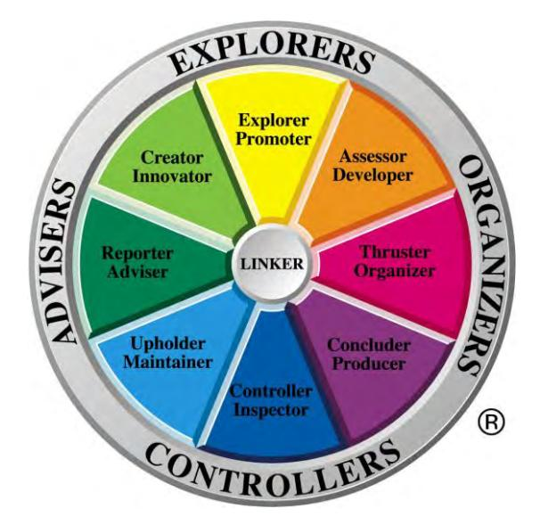
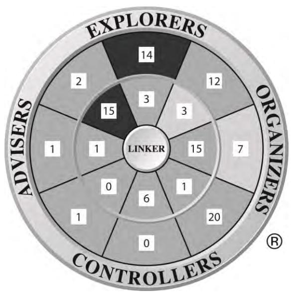
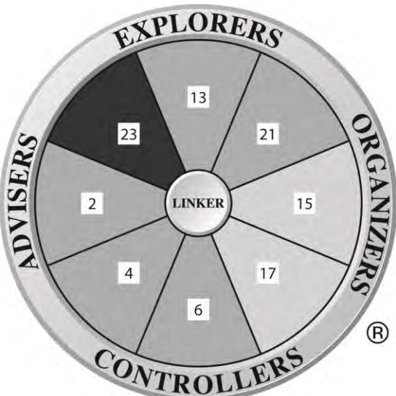
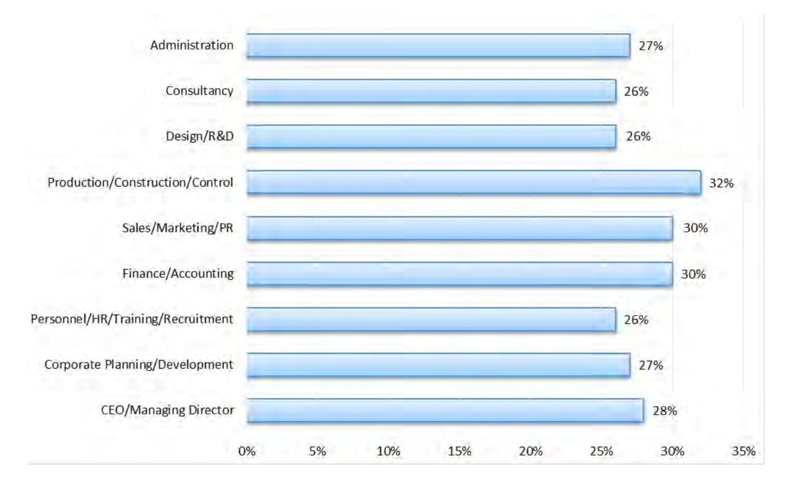
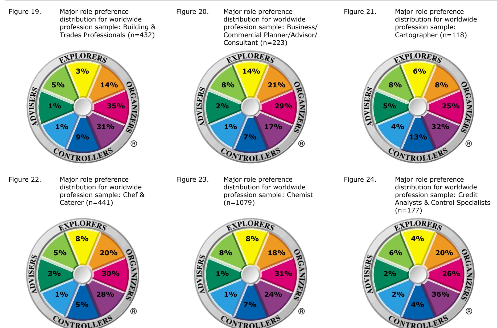
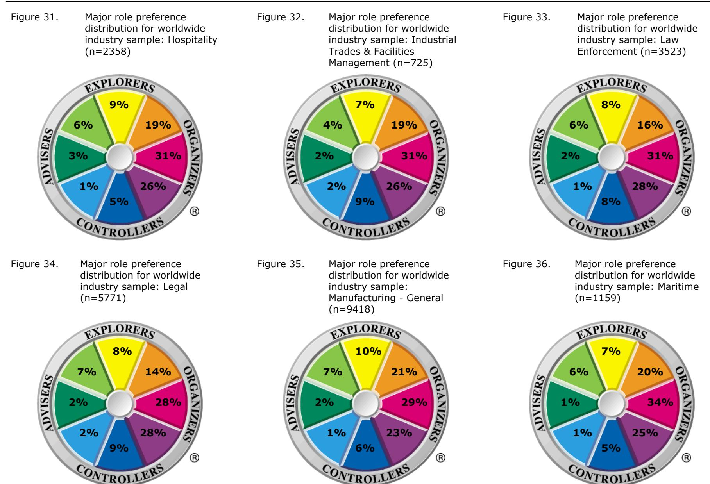
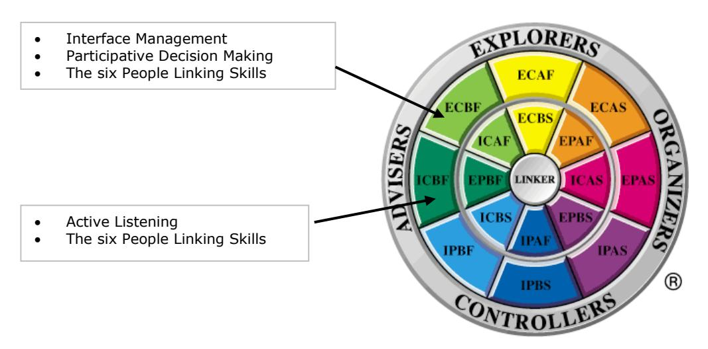
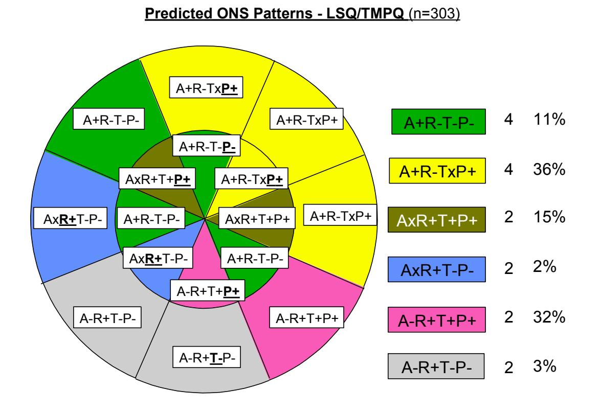

# **Team Management Systems Research Manual 5th Edition:**

# **Team Management Profile Questionnaire**

Editors: D.J. McCann and N.H.S. Mead Publisher: [Team Management Systems](http://www.tmsworldwide.com/)

Copyright © Team Management Systems, 2018. All rights reserved.

ISBN: 978-0-9803905-9-9

While copyright of this publication is held by Team Management Systems, we make no claim on any articles, applications and/or designs presented by independent contributors.

The purchaser of this Research Manual is permitted to print only a single copy for personal use. No further copies or distributions are permitted.

No part of this publication may be reproduced, stored in a retrieval system, or transmitted in any form or by any means, electronic, mechanical, photocopying, recording, or otherwise without the prior written permission of the publishers.

## Welcome,

This fifth edition of the *Team Management Systems Research Manual* is a collection of stand-alone manuals focusing on each of the eight Profiles. These manuals are a major revision of the last edition which was published in 2010. Since then we have undertaken new research and significantly increased the norm data allowing for a greater depth and breadth of analysis to be presented.

The research was carried out by the Institute of Team Management Studies (ITMS) led by Dr. Dick McCann and Nikki Mead. ITMS was established in 1988 by Team Management Systems (TMS) authors Drs. Charles Margerison and Dick McCann to formalize the research program that was already underway. ITMS was headed up by Rod Davies until 1994 and the comprehensive research program he created was continued by the current editors. It should also be noted that ITMS has many associates who have carried out both joint and external research studies on TMS. Their involvement has been crucial to our work and we thank them for their enthusiasm and commitment.

Each manual includes an *Executive Summary*. These are ideal for clients who want a summary of the key research points, without being overwhelmed by statistics. Normative data and detailed articles on specific studies on face validity, construct validity and criterion-related validity as well as confirmatory factor analyses are also presented.

We have enjoyed writing, compiling and editing this collection of manuals and hope they will stimulate you to use TMS in new and exciting ways.

Dick McCann & Nikki Mead

Editors

Team Management Systems (TMS) distributes a wide variety of products developed by Drs . Charles Margerison and Dick McCann. Over the years they have developed, jointly and individually, many concepts and models widely in use throughout the world. Today there are more than 15,000 accredited international network members who have used the Margerison-McCann Team Management Systems Profiles to enhance the personal, team and organizational performance of more than 1,500,000 people.

For further information, please visit [TMSworldwide.com.](http://www.tmsworldwide.com/)

## **Abbreviations & Conventions Used**

### **Abbreviations**

| ECI    | - | Emotional Competence Inventory assessment         |
|--------|---|---------------------------------------------------|
| EQ     | - | Emotional Intelligence                            |
| ITMS   | - | Institute of Team Management Studies              |
| LLPQ   | - | Linking Leader Profile Questionnaire              |
| LPPQ   | - | Linking of People Profile Questionnaire           |
| LPTPQ  | - | Linking of People and Tasks Profile Questionnaire |
| LSPQs  | - | Linking Skills profile questionnaires             |
| LSQ    | - | Learning Styles Questionnaire                     |
| MBTI1 | - | Myers-Briggs Type Indicatorassessment           |
| MLQ    | - | Multifactor Leadership Questionnaire              |
| OVP    | - | Organizational Values Profile                     |
| OVPQ   | - | Organizational Values Profile Questionnaire       |
| QO2™   | - | Opportunities-Obstacles Quotient                  |
| 16pf®  | - | The 16 Personality Factors Questionnaire          |
| STDP   | - | Strategic Team Development Profile                |
| STDPQ  | - | Strategic Team Development Profile Questionnaire  |
| TMLQ   | - | Team Multifactor Leadership Questionnaire         |
| TMP    | - | Team Management Profile                           |
| TMPQ   | - | Team Management Profile Questionnaire             |
| TMS    | - | Team Management Systems                           |
| TPP    | - | Team Performance Profile                          |
| TPPQ   | - | Team Performance Profile Questionnaire            |
| TWP    | - | Types of Work Profile                             |
| TWPQ   | - | Types of Work Profile Questionnaire               |
| WAPS   | - | Work Aspect Preference Scale                      |
| WoWV   | - | Window on Work Values                             |
| WoWVP  | - | Window on Work Values Profile                     |
| WoWVPQ | - | Window on Work Values Profile Questionnaire       |

### **Conventions**

**All rater**. This term is used to describe data samples that include multi-rater responses and results.

**Bipolar scales** refer to the four E-I, P-C, A-B, and S-F scales treated as categorical variables (e.g. 'E' = 1, 'I' = 0).

**Continuous scales**. In the case of the Team Management Profile Questionnaire, continuous scales refer to the four E-I, P-C, A-B, and S-F scales measured on the continuum, from the +30 for the first mentioned pole (e.g. 'E' in Extroversion-Introversion) to -30 for the second mentioned pole ('I' in the above example). In the case of the Types of Work Profile Questionnaire, continuous scales refer to the eight types of work scales measured on the continuum from 0 to 32.

**Critical types of work**. The types of work identified by the Types of Work Profile Questionnaire as being the most critical in a job.

**Global ratings**. This term is used to describe data samples that include multi-rater responses and results.

**Job Match**. The value from 0 to 100 represents the 'fit' between the job, as assessed by the Types of Work Profile Questionnaire, and the person, as assessed by the Team Management Profile Questionnaire. A higher job match value represents a better degree of fit.

**Linking**. A set of behaviors that are responsible for coordinating and integrating the work of a team and

1 MBTI, Myers-Briggs, and Myers-Briggs Type Indicator are trademarks or registered trademarks of the Myers-Briggs Type Indicator Trust in the United States and other countries.

the team members themselves.

**Linking Leader Profile**. The output from the processing of Linking Leader Profile Questionnaires.

**Linking of People Profile**. The output from the processing of Linking of People Profile Questionnaires.

**Linking of People and Tasks Profile**. The output from the processing of Linking of People and Tasks Profile Questionnaires.

**Major role preference** is the role identified by the Team Management Profile Questionnaire as being major and identified as such in the written feedback.

The **major sample** refers to the total worldwide database for a particular profile questionnaire.

**Net scores** on the Team Management Profile Questionnaire refer to the difference between the raw scores on each of the work preference measures. For example raw scores of E:22 and I:10 result in a net score of E:12.

**Organizational Values Profile**. The output report from the processing of Organizational Values Profile Questionnaires.

**QO2™ Profile.** The output from the processing of a QO2™ Profile Questionnaire.

**Raw scores** on the Team Management Profile Questionnaire are the total scores for each pole on the work preference measures. For example E: 22 and I:10 represent the number of points scored on the Team Management Profile Questionnaire for Extroversion and Introversion.

**Related role preferences** are the two role preferences scoring highest after the major role preference.

**Role Profiles** are the narrative output from the Team Management Profile Questionnaire. These are divided into the eight roles originally developed by Drs. Charles Margerison and Dick McCann - *Reporter-Adviser*, *Creator-Innovator*, *Explorer-Promoter*, *Assessor-Developer*, *Thruster-Organizer*, *Concluder-Producer*, *Controller-Inspector*, and *Upholder-Maintainer*. These can be further divided to create 16 subsectors, there being two distinct types of each role Profile.

A **Split Wheel** is when one or more of the related roles calculated from the Team Management Profile Questionnaire responses are not adjacent to the major role preference.

**Strategic issue.** The eight fundamental questions posed on the High-Energy Teams model.

**Strategic Team Development Profile**. The output report from the processing of Strategic Team Development Profile Questionnaires.

**Team Management Profile**. The output from the processing of the Team Management Profile Questionnaire.

**Team Performance Profile**. The output from the processing of Team Performance Profile Questionnaires.

The **Types of Work** are the work functions originally identified by Charles Margerison and Dick McCann. These are *Advising*, *Innovating*, *Promoting*, *Developing*, *Organizing*, *Producing*, *Inspecting*, *Maintaining*, and *Linking*. The first eight work functions are measured by the Types of Work Profile Questionnaire and form the basis of job design and analysis. The last work function - *Linking* - is a separate skill and is measured by the Linking Skills Profile Questionnaire.

**Types of Work Profile**. The output report from the processing of Types of Work Profile Questionnaires.

**TWP Lite**. The output report from the processing of the Types of Work Profile Questionnaire (Lite). This is a TMS 'App' and is only available online at [TMSProfiles.com.](http://www.tmsprofiles.com/)

**Value type**. There are eight core value types in the Window on Work Values that together define the main values observed in the workplace.

**Window on Work Values Profile**. The output report from the processing of a Window on Work Values Profile Questionnaire.

## **Statistical Glossary**

*This statistical glossary is not an exhaustive list of all the terms and concepts used in this publication. Definitions and brief examples are only provided for the key concepts used for comparing data samples.* 

An **Analysis of Variance (ANOVA) test** is a procedure used to examine population variances to determine whether the population means are equal or significantly different. An example of this would be the examination of the relationship between the Team Management Profile Questionnaire scores and a person's own indication of main work preference and most significant work activity as defined by the Types of Work Profile Questionnaire. The statistic that is calculated by this test is referred to as the *F* value.

Measures of **central tendency** used in this manual are the **mean** and **median**. These measures allow different ways of defining the central region of a distribution or central tendency.

**Confidence levels** are an indication of how confident we are in the accuracy of a particular numerical value. For example, in Table 4 (*TMPQ: Reliability*) the data shows that if a person's net score on extroversion is 13 or higher we can be 95% confident that this person has a definite Extrovert preference. For a net score of 7 on extroversion we can only be 66% confident that the person shows a definite Extrovert preference.

**Cronbach's coefficient alpha** is a measure of how well the items in a scale are related to each other. The alpha coefficient is a measure of internal consistency that in turn is an indicator of the reliability of a scale. Values range from 0.00 to 1.00, where 0 represents no reliability and 1.00 perfect reliability. It takes into account every item's correlation with each other and the total score for that scale. As a rule of thumb, a value of 0.70-0.75 is seen as adequate reliability for a preference type scale.

Net scores can be converted to **dichotomous data** for comparison. Dichotomous data does not in any way reflect the strength of the scores, merely the preference.For example an Extrovert score of 2 and an Extrovert score of 29 would both be indicated as simply Extrovert. Because some information is lost by simplifying the data in this way, correlation coefficients calculated using dichotomous data will always be lower than Pearson product-moment coefficients.

**Factor Analysis** is a general descriptor for a number of specific computational techniques. All of these techniques, however, have the object of reducing a large number of measures or tests to some smaller number by telling us which belong together and which seem to measure the same thing.

The *F* **value** is a statistic used in **Analysis of Variance (ANOVA)** calculations. ANOVA is used to determine whether the differences between the means of several populations are significant. The *F* value is the measure of the ratio of the variation in mean between the samples being tested to a pooled estimate of the variation in mean within the samples. If *F* is large then the various populations will have different means. Table 1 (*TMPQ: Validity*) gives an example of the *F*-value calculation. There are eight means for the E-I scale which are calculated for each of the eight Types of Work functions. The *F*-value will tell us whether these means are different or whether they are all part of the same population. The high *F*-value of 4.24 shows that we can be 95% sure that the E-I means are different for each Types of Work. This enables us to develop an understanding of how E-I scores are related to the Types of Work functions.

**Item/total correlations** represent the correlation coefficient reached between the item and the scale itself (without the item included).

**Kuder–Richardson Formula 20 (KR-20)** is a measure of internal consistency reliability for measures with dichotomous choice.

The **Mann-Whitney U test** is a non-parametric technique that enables a comparison of two independent samples by utilizing ranking information. The logic of this test centers around the idea that if the sum of the rankings of one group differs greatly from the sum of rankings of the second group, we should conclude that there is a difference in central locations of the populations. The Mann-Whitney U test produces **Z values**.

The **mean** is the most commonly used measure of location. It is equal to the sum of measurements

divided by the number of measurements (*n)*.

The **median score** is also a measure of location. The median is the middle item in a set of measurements that have been arranged according to magnitude. It represents the point where 50% of people have a higher net score and, therefore, the remaining 50% have a lower net score.For example in a sample where the median score for Analytical-Beliefs is A:14**,** we would be able to determine that 50% of the sample had an Analytical score of 14 and above, and 50% had an Analytical score of 13 or less, or a Beliefs score.

For any set of data, the **mean** and **median** need not be the same. The only time these two location measures will both have the same value is when the data distribution is both unimodal and symmetrical.

The **minimum** and **maximum scores** give an indication of the range of the scores received. For example E-I min -22 and max 22, indicates that the E-I scores ranged from Introvert 22 to Extrovert 22.

**Multidimensional scaling (MDS)** is a means of visualizing the level of similarity of individual cases of a dataset. It can be considered to be an alternative to factor analysis.

The **Newman-Keuls test** is referred to as a multiple-range test or layered method as it involves testing ranges between groups in a layered fashion. Observed *F* statistics are calculated for each pair-wise contrast. This method requires that the mean differences be compared to the critical values in a specific order. Table 2 (*TMPQ: Validity*) shows the Newman-Keuls test for comparing means on the E-I scale. The result shows maximum differences for the Promoting-Inspecting pair.

The shorthand for probability is '**p**'. For example, *p*<0.05 indicates that the probability of a difference between scores being attributable to chance rather than some other factor is less than five per cent. It is used, among other purposes, for indicating whether two mean scores vary, or whether the magnitude of a correlation coefficient is large enough to be due to a real difference rather than a chance. Table 1 (*TMPQ: Validity*) gives an example of 'p' being used to determine the significance of factors.

The **Pearson product-moment coefficient** is a summary statistic that represents the linear relationship between 2 sets of variables. The values can vary between -1 to 0 to +1, with 0 representing no association, and -1 indicating a perfect negative association.

The **phi coefficient** is a correlation coefficient measure that is used when we are comparing dichotomous scales.

The **Shapiro-Wilks** test allows us to tell if a random sample comes from a normal distribution. If the results of the test are greater than 0.05, we can say that the data is normal. If it is less than or equal to 0.05, we can say that the data significantly deviates from a normal distribution.

**Split-half reliability coefficients**. The split-half technique can be used when the measuring tool has a number of similar questions or statements to which the subject can respond. The instrument is administered to the subject, and then the results are separated by item into two randomly selected halves. These are then compared. If the results are similar, the instrument is said to have high reliability in an equivalence sense. Table 1 (*TMPQ: Reliability*) gives examples of split-half reliability measures.

**Spearman's rank-order coefficient or (Spearman's** *rho).* Spearman's *rho* is a special form of the Pearsonian correlation coefficient and does not require the assumption of a normal distribution. This coefficient gives us an idea of the association between scales and the items that are meant to represent them. Values for *rho* can vary between -1 to 0 to +1, with 0 representing no association, and -1 indicating a perfect negative association. Table 5 (*TMPQ: Reliability*) shows values of *rho* which are used to determine the relation between a single question on the Team Management Profile Questionnaire and the scores for the total scale.

The **standard deviation** provides us with a look at the distribution or spread of the scores with approximately 68% of the sample being within one standard deviation (plus or minus) of the mean. For example, in a sample where the mean for Extroversion-Introversion is -0.16 and the standard deviation is 11.68, we would be able to say that 68% of the sample was between Introvert: 11.84 and Extrovert: 11.52. The higher the standard deviation, the more 'spread out' the scores.

**T-value**. A *t*-test is used to determine the statistical significance between a sample distribution and a

parameter.

**Variance** is a measure of data dispersion. It is the average of the squared differences between the individual measurements and the mean.

**Z values** are transformed scores on a scale where the mean is set at 0 and the first, second, and third standard deviations away from the mean in both directions are designated as +1, +2, +3, -1, -2 and -3. This is a simpler way to see how far a score differs from the average. The higher the Z value, the more sure we can be of the differences between the two subscales. Table 6 (*TMPQ: Reliability*) shows examples of *Z* values used in the Mann-Whitney test.

## **Team Management Profile Questionnaire: Executive Summary**

### **Development**

### *The Types of Work and Team Management Wheels*

Based on their many years of talking with managers about their jobs, Drs. Charles Margerison and Dick McCann developed a model which describes comprehensively the 'types of work' that managers and their team members are required to perform on a day-to-day basis. This model is shown below as Figure 1.

Figure 1. The Margerison-McCann Types of Work Wheel

This model identifies eight core work functions that are measured and defined by the Types of Work Profile Questionnaire. Brief descriptions of these functions are:

- Advising Gathering and reporting information
- Innovating Creating and experimenting with ideas
- Promoting Exploring and presenting opportunities
- Developing Assessing and testing the applicability of new approaches
- Organizing Establishing and implementing ways of making things work
- Producing Concluding and delivering outputs
- Inspecting Controlling and auditing the working of systems
- Maintaining Upholding and safeguarding standards and processes

The psychometrics of this model are explained in the *Team Management Systems Research Manual 5 th Edition: Types of Work Profile Questionnaire* (McCann & Mead, 2018).

Margerison and McCann discovered that people tended to like some Types of Work more than others. They found a way of measuring these 'work preferences' based on four scales (Figure 2).

They were then able to map these work preferences onto the Types of Work Wheel, as shown in Figure 3.

From here, the Team Management Wheel (Figure 4) was created as a simple way of combining behavioral characteristics with key work functions.

Work preferences are measured by the Team Management Profile Questionnaire (TMPQ), which elicits self-report data about an individual's work preferences. A computer program then allocates major and related role preferences based on this data and prints out a narrative-style Profile report.

#### Figure 2. Work preference measures

|                   | How you relate to others             |
|-------------------|--------------------------------------|
| <b>Extrovert</b>  | <b>Introvert</b>                     |
|                   | How you gather and use information   |
| <b>Practical</b>  | <b>Creative</b>                      |
|                   | <b>How you make decisions</b>        |
| <b>Analytical</b> | <b>Beliefs-based</b>                 |
|                   | How you organize yourself and others |
| <b>Structured</b> | <b>Flexible</b>                      |

Figure 3. Mapping of work preferences onto Types of Work Wheel

Figure 4. The Margerison-McCann Team Management Wheel

### *Development Samples*

An initial sample of 275 respondents completed the TMPQ and their results were used to examine the characteristics of the scales. This was later followed by another analysis on a random sample of 623 respondents and on a matched sample with 16 respondents for each of the 8 sectors on the Team Management Wheel. The results of these analyses are summarized in Tables 1 to 3.

| Table 1. |  | Cronbach alpha reliabilities of the TMPQ Version 2 scales |  |  |
|----------|--|-----------------------------------------------------------|--|--|

|     | Development sample* (Version 1) (n=275) | Matched sample (Version 2) (n=128) | Random sample (Version 2) (n=623) |
|-----|--------------------------------------------|---------------------------------------|--------------------------------------|
| E-I | 0.83                                       | 0.80                                  | 0.82                                 |
| P-C | 0.85                                       | 0.85                                  | 0.84                                 |
| A-B | 0.86                                       | 0.86                                  | 0.82                                 |
| S-F | 0.80                                       | 0.75                                  | 0.74                                 |

\* (Davies, 1988)

Table 2. Minimum, maximum, mean and standard deviations for the matched sample (n=128)

|     | Min | Max | Mean  | SD    |
|-----|-----|-----|-------|-------|
| E-I | -22 | 28  | 0.77  | 11.45 |
| P-C | -25 | 24  | 0.17  | 11.73 |
| A-B | -27 | 28  | 2.51  | 12.02 |
| S-F | -28 | 20  | -0.08 | 10.20 |

| Table 3. | Matched sample intercorrelations (n=128) |  |
|----------|------------------------------------------|--|
|----------|------------------------------------------|--|

|     | E-I | P-C              | A-B              | S-F              |
|-----|-----|------------------|------------------|------------------|
| E-I |     | -0.28 (-0.34) | -0.08 (-0.22) | -0.06 (-0.13) |
| P-C |     |                  | 0.04 (0.32)   | 0.22 (0.32)   |
| A-B |     |                  |                  | 0.32 (0.32)   |
| S-F |     |                  |                  |                  |

*NOTE:* The values in brackets are those from the development sample of Version 1 (n=275).

Further studies on the Team Management E-Profile Questionnaire and Version 3 of the profile questionnaire (n=1760) are given in the *TMPQ: Development* section of this manual.

### **Reliability**

### *Internal Consistency*

Psychometric scales are measured by a number of items that define each scale. These items should be related to some extent, otherwise errors become unacceptable. Too much correlation accurately defines a scale that is so narrow to be of limited use; too little correlation means that the scale is so broad that that it measures nothing. A reliable scale must have an adequate degree of *internal consistency* and this can be measured using a statistic known as the Cronbach alpha coefficient. Values below 0.70 indicate that the scale is becoming too broad; values over 0.90 indicate the scale is becoming too narrow. An ideal range is 0.75-0.85. Table 1 (above) indicates adequate Cronbach alpha coefficients for the development samples and this has been replicated many times with other samples.

### *Item Analysis*

Some items do a better job of measuring a particular preference than others. One way of measuring how well an item does this is to estimate the association between the item and the total scale score. To the extent that high scores on a particular item are associated with high scores on the scale and low scores are associated with low scores on the scale, we can say there is a degree of association between the item and the scale. Such a statistic is Spearman's rank-order coefficient (*rho)*. Values for *rho* can vary between -1 to 0 to +1, with 0 representing no association, and -1 indicating a perfect negative association. Another useful statistic in analyzing the dichotomous nature of the scales is the Mann-Whitney *U* test. Data on both of these tests is reported in the *TMPQ: Reliability* section of this manual.

### *Test-Retest Reliability*

Test-retest reliability measures the temporal stability of a measure. Time intervals vary from short-term reliabilities, usually involving two-to-four-week intervals, and long-term reliability utilizing longer periods. Choice of time interval hinges on the type of instrument being assessed and the task that it is expected to achieve, as well as administrative constraints. Short-term reliabilities are susceptible to memory effects, artificially inflating coefficients, while long-term reliabilities are susceptible to the fact that 'real' changes may occur in that time-scale, therefore overestimating the random error component. Long-term estimates also pose an administrative problem of subject attrition.

One study of 100 respondents over a period of 1 to 6 years is described in this Executive Summary. The sample of participants consisted of 56 males and 44 females. All participants were Australian.

The time period between testing was:

|  | 1 year  | 4%  | 4 years  | 23% |
|---|---------|-----|--------------|-----|
|  | 2 years | 39% |  5 years | 13% |
|  | 3 years | 20% |  6 years | 1%  |

Table 4 below represents the correlations of the individual scales for both administrations of the profile questionnaire. As can be seen all correlations are above the acceptable level of 0.70 to 0.75, indicating that test-retest reliability is adequate.

Table 4. Correlation table of Administration 1 and Administration 2: Individual scales

|                   | Administration #1 |       |       |       |
|-------------------|-------------------|-------|-------|-------|
| Administration #2 | E-I               | P-C   | A-B   | S-F   |
| E-I               | 0.850             |       |       |       |
| P-C               |                   | 0.871 |       |       |
| A-B               |                   |       | 0.776 |       |
| S-F               |                   |       |       | 0.762 |

Table 5 shows how major role preferences have changed over the one to six year period. As can be seen, 64% of participants returned the same overall Profile. Only 9% returned two or more changes in their preferences, demonstrating strong stability of TMPQ role preferences over this time.

Table 5. Stability of role preferences over one to six years

|                              | n  | %  |
|------------------------------|----|----|
| No change in overall Profile | 64 | 64 |
|                              |    |    |
| No change in E-I preference  | 92 | 92 |
| No change in P-C preference  | 89 | 89 |
| No change in A-B preference  | 86 | 86 |
| No change in S-F preference  | 87 | 87 |
|                              |    |    |
| One preference change        | 27 | 27 |
| Two preference changes       | 8  | 8  |
| Three preference changes     | 1  | 1  |
| Four preference changes      | 0  | 0  |

### **Validity**

Two questions that are often asked when assessing the adequacy of a profile questionnaire are 'How well does it minimize error in measurement?' and 'How well does the score measure what it has been designed to measure?' The first question is that of *reliability*, the second is that of *validity*. Important concepts of validity are face validity, structural validity, predictive validity, construct validity and criterion-related validity.

Concurrent validity is another term often used to establish the ability of a scale to relate to other scales or measures that are taken at the same time. Criterion-related and construct validity are frequently examples of concurrent validity, provided simultaneous administration of the tests is undertaken.

### *Face Validity*

Face validity is the extent to which a scale or group of scales 'makes sense' to observers and test users. As far as the Team Management Profile Questionnaire is concerned, people like to be convinced that a profile questionnaire is 'sensible' before they complete it. Of more importance though, is the extent to which the feedback report – the Team Management Profile – is acceptable to the test respondent. In management development it is critical that any feedback based on an instrument has high face validity otherwise the data will be rejected and the instrument denounced, even though it may have high reliability and even predictive validity.

Much care was taken to ensure high face validity was obtained on both the Team Management Profile Questionnaire and the Profile itself. This was achieved through an iterative process with many focus groups.

A confirmatory face validity study was undertaken in 2009 with an international sampling of Team Management Systems (TMS) network members. Results from this study show a mean face validity figure in excess of 91% for all the Profile reports (109,843) covered by this study. The results of the study are discussed in detail in the *TMPQ Studies: Face Validity Study* section of this manual.

### *Structural Validity*

Structural validity is a form of validity that relates to the development of models or their scales and subscales. In the case of the Team Management Profile Questionnaire it is concerned with establishing the relationship between the four work preference scales (E-I, P-C, A-B, S-F) and the Types of Work Wheel, which results in the Team Management Wheel. Two studies on structural validity are summarized below.

### *Multi-Dimensional Scaling: Structural Validity of the Types of Work Wheel Study 1987*

In this study 16 MBA students were asked to rank 16 types of managerial work in terms of their similarity: Advertising, Customer Service, Sales, Marketing, Promotions, Training, R&D, Project Management, Production, Operations, Information Records, Administration, Auditing, Safety Standards, Quality Control and Purchasing. These similarity ratings were then analyzed using a multi-dimensional scaling technique (MDS) which reduces such ratings to a dimensional space. Stress values indicated that the two-dimensional configuration was the most appropriate for the data set and the resultant map bears some similarity to the Types of Work Wheel. Indeed when we overlay the elements as mapped by the MDS program onto the Types of Work Wheel, the meaning of the relationships between the job titles becomes clearer.

There are interesting relationships between the job titles and the Types of Work Wheel functions indicating a reasonable level of criterion-related validity. A study such as this helps confirm the structural validity of the Types of Work model. Refer to the *TMPQ: Validity* section of this manual for further details.

#### *Team Management Profile Questionnaire Scores Compared with Preferred and Actual Work Areas: Structural Validity Study 1988*

Figure 3 shows how the four work preference measures map onto the Types of Work Wheel. The aim of this study was to test whether the hypotheses arising from that Wheel could be confirmed empirically. Are people who prefer Promoting work really more Extroverted and Creative than others in reality? To take another hypothesis, are people who prefer Inspecting work more Introverted and Practical?

In order to test the hypotheses, 281 full-time managers attending management education courses run by the Queensland Combined Schools or enrolled part-time in the MBA course at the University of Queensland, were asked to complete the Team Management Profile Questionnaire. They were then required to fill out a questionnaire that asked them first to rank the eight types of work from 1 to 8 in terms of their preferences. They were then asked to do the same thing again, but this time to reflect on the types of work they engaged in during their normal working day. Each subscale of the Team Management Profile Questionnaire was tested in its ability to discriminate between respondents' first major work preference and major work activity using analysis of variance. The results are presented in Table 6.

Table 6. *F* Scores resulting from analysis of variance of work preference and activity by Team Management Profile Questionnaire scales

| Scale               | Work preference | Work activity |
|---------------------|-----------------|---------------|
| Extrovert-Introvert | 4.24**          | 1.58          |
| Practical-Creative  | 12.80**         | 4.80**        |
| Analytical-Beliefs  | 2.85*           | 1.90          |
| Structured-Flexible | 4.92**          | 3.78**        |

*NOTE:* \* *p*<0.01; \*\* *p*<0.001; All other *F* values not significant

As can be seen, there is a definite relationship between work preferences and all Team Management Profile Questionnaire scales. The *F* values range from a low of 2.85 (Analytical-Beliefs) to 12.80 (Practical-Creative). These results suggest that each of the four subscales are measuring something that relates to the type of work managers prefer.

To determine which scales contributed most to the explanatory power for each work area, the total sample was divided according to subjects' first work area preference and subjects' major work activity. Mean scores were then computed for each of the TMPQ scales (E-I, P-C, A-B and S-F) for each type of work. Mean scores were tested for significant differences using the post-hoc Newman-Keuls test.

The results are presented in the *TMPQ: Validity* section of this manual. They confirm that the E-I and P-C scales are able to discriminate between work preferences at the northern part of the Types of Work Wheel (Promoting and Innovating) and those at the southern part (Producing and Inspecting). A significant Newman-Keuls test result was also returned for the difference between Developing and Maintaining, indicating that the A-B measure maps across these sectors. Similarly the study showed that the S-F measure mapped across the Organizing-Advising sectors.

### *Predictive Validity*

Predictive validity is the ability of a measure to predict future criteria. This form of validity is important when a test is used for selection purposes. Predictive validity studies are difficult to administer as they involve a long-term research design, which comes with concomitant problems such as locating subjects at different times in the future. The TMPQ was not designed as a predictive instrument and no claims are made about its predictive validity. The instrument is designed primarily for personal and team development purposes.

### *Construct Validity*

Construct validity is a particular case of criterion-related validity and measures the extent to which a test or scale relates to other theoretical concepts (i.e. constructs) which have been proved by other studies to be valid. By studying the relationships of a test to many others, researchers can get a better feel for the 'real' meaning of a scale. To the extent that one construct is related to another that it should be related to, and not to others that it should not be related to, we can say that the test has good construct validity.

Several studies have been undertaken comparing the constructs of the Team Management Profile Questionnaire with other instruments. The results of these studies are discussed in the following sections of this manual:

- *Comparative Studies: TMP & the MBTI®1 assessment*
- *Comparative Studies: TMP & Belbin®*
- *Comparative Studies: TMP & 16pf®*
- *Comparative Studies: TMP & Emotional Intelligence*

1 MBTI, Myers-Briggs, and Myers-Briggs Type Indicator are trademarks or registered trademarks of the Myers-Briggs Type Indicator Trust in the United States and other countries.

- *Comparative Studies: Relationship to Work Aspect Preferences*
- *Comparative Studies: TMP & Learning Styles*
- *Comparative Studies: TMP & the Learning Styles Questionnaire*

It is also useful to carry out a construct validity comparison between the scales of the Team Management Profile Questionnaire and other instruments within the TMS suite of products. The results of these studies are discussed in the following sections of this manual:

- *Comparative Studies: Linking Skills & Work Preferences*
- *Comparative Studies: QO2™ & Work Preferences*
- *Comparative Studies: WoWV & Work Preferences*

These 10 construct validity studies confirm that the Team Management Profile Questionnaire has good construct validity.

### *Criterion-Related Validity*

Criterion-related validity is the extent to which an instrument is related to external criteria. One example of this is the role preferences functional area analysis where role preferences are compared with functional job areas. If we have defined a role as say, Concluder-Producer and indicated that people with this preference enjoy working in a practical way producing results according to a plan, then we would expect there to be a high number of people with these characteristics working in production jobs. This would be an example of criterion-related validity. Other examples might be the relationship between the instrument and personal appraisal results or peer ratings of the same concepts.

### *Role Preference Functional Area Concurrent Validity Study 1988*

The role preferences of respondents in a sample of 3737 respondents were analyzed for a project on workplace role preferences. Of these 43% were tested in Great Britain, 46% in Australia and 4% in Asia. A substantial number of respondents were able to be placed into discrete categories and occupational profiles were developed. These are presented in the *TMPQ: Validity* section of this manual. To test whether these percentages differed significantly from the total percentages, simple chi-squared tests were used.

According to the theory of the Team Management Wheel, respondents with various role preferences should be attracted to different functional areas. It would be reasonable to expect, for instance, that Explorer-Promoters are more likely to be working in the more entrepreneurial and high-profile activities of corporate planning and marketing than in 'controlling' type areas such as administration or finance and accounting. Similarly, Reporter-Advisers should be more prevalent in jobs where information is of prime concern than in jobs which involve fast action and decision, often based on minimal information. These latter types of activities would be more sought after by Thruster-Organizers and Concluder-Producers.

This hypothesis is confirmed when we look at each role preference in turn, starting from the Creator-Innovator sector and moving clockwise around the Team Management Wheel.

- Creator-Innovators (Creative and Flexible) Predictably, managers working in design or research & development (17%) and management consultants (18%) predominate in this role.
- Explorer-Promoters (Extrovert and Creative) 13% of corporate planning and development managers and 17% of those involved in design and research & development returned this role preference.
- Assessor-Developers (Extrovert and Analytical) A recurring role preference for chairpersons, directors and proprietors (27%); consultants (23%) and sales and marketing managers (26%).
- Thruster-Organizers (Analytical and Structured) No single functional area predominates, but it includes many chairpersons, directors and proprietors as well as managers from personnel and training, sales and marketing, and production, construction and control areas.

- Concluder-Producers (Practical and Structured) This is a characteristic role of managers involved in production, construction and control (41%), administration (34%) and finance and accounting (33%).
- Controller-Inspectors (Introvert and Practical) Managers working in administration (8%) and finance/accounting (10%) often return this role.
- Upholder-Maintainers (Introvert and Beliefs-based) Only 2% of the sample were Upholder-Maintainers; of these, managers occupying administrative roles (5%) are the only significant group.
- Reporter-Advisers (Beliefs-based and Flexible) This role is mostly preferred by those involved in consultancy (6%). Again, another underrepresented role within this sample.

### *Career Direction Study*

A criterion-related validity study was included as part of a career longitudinal study on the Team Management Systems concepts. The results of this study are discussed in the C*omparative Studies: Longitudinal Study* section of this manual.

### *Work Preferences: Concurrent Validity Study 1988*

This study examined the correspondence between subjects' Team Management Profile Questionnaire scores as one measure of work preferences and subjects' self-ratings and descriptions of their work behavior as one set of criteria. Additionally, associates of these subjects were also asked to rate and describe their colleagues' behavior. These were used as further criteria. As a second focus of the study, information was obtained from subjects and their associates regarding preferred work areas. This qualitative study shows good relationships between the Team Management Wheel concepts and external criteria elicited from subjects' and associates' comments.

### *Other Studies*

A number of other validity studies have been carried out by external researchers. Eleven of these are summarized in the *TMPQ: Further Research & Validity Studies* section of this manual.

### **British Psychological Society Review**

The British Psychological Society (BPS) has recognized the Team Management Profile as an important instrument to review. Only a small proportion of tests are reviewed and we are happy that the ratings for the instrument are on a par with other older and more established psychometric tests. Our aim in developing the Team Management Profile Questionnaire was always to provide a tool that first and foremost had practical utility to trainers and managers. In fact, we do not use the term 'personality' in describing the instrument as we feel that the Team Management Profile Questionnaire is less an indicator of personality, but of work and team preference. However, the BPS decided to place the Team Management Profile Questionnaire into their 'Personality' category.

In their 2003 updated review2 of the of the Team Management Profile, the British Psychological Society concluded that,

"*The strength of the test, from a practitioner viewpoint, is that the Team Management Profile has a high face validity with managers, the narrative Profile is easy to read and understand, and the documentation and feedback material is excellent. … The technical quality of the information and the overall presentation of the material are very good. The instrument has a wide range of applications: career counseling, training and personal development, project management, team building, and so on. It is likely to be particularly useful in the context of team building as a basis for group discussion to identify the strengths, weaknesses and complementary skills of the team."*

2 A copy of the review can be found online at [ptc.bps.org.uk.](http://www.ptc.bps.org.uk/)

Their ratings for the instrument are reproduced below.

| Characteristics            | Evaluation |
|----------------------------|------------|
| Quality of documentation   |            |
| Quality of materials       |            |
| Norms and reference groups |            |
| Construct validity         |            |
| Criterion-related validity |            |
| Reliability - overall      |            |

This table shows adequate to excellent ratings for all BPS evaluation categories.

### **Norm Data**

The worldwide TMPQ database as of 2018 consists of 519303 completed profile questionnaires in 25 languages. Respondents are from 81 industries and 295 professions spanning across 202 countries.

Figure 5. Major role preference distribution for total worldwide database (n=519303)

Work preference score and role preference distributions for 298 major norm groups from the worldwide database are given in the *TMPQ: Worldwide Database* sections of this manual. These cover age group, gender, organizational level, functional area, profession, industry, country, language and regional area. Percentile norms for all major norm groups are also available in the *TMPQ: Worldwide Database Percentile Norms* section of this manual.

Please note that the sample size of the major worldwide database cannot be taken as an indicator of the number of profile questionnaires completed worldwide. Due to the enormity of the task, the Institute of Team Management Studies is restricted in the amount of data that can be collated for analysis. More than 1.5 million Team Management Profile Questionnaires have been completed worldwide.

### **References**

British Psychological Society, (2003), Team Management Profile Questionnaire (TMPQ), **Psychological Testing Center Test Reviews**.

Davies, R.V., (1988/89), 'The Margerison-McCann Team Management System: Research Manual 1988/89', Graduate School of Management, University of Queensland.

McCann, D.J., & Mead, N.H.S., (Eds.), (2018), Team Management Systems Research Manual 5th Edition: Types of Work Profile Questionnaire, Team Management Systems, Brisbane, Australia.

## **Team Management Profile Questionnaire: Development**

The Team Management Profile Questionnaire elicits self-report data about an individual's work preferences. A computer program then allocates major and related role preferences based on this data and prints out a narrative-style Profile report. This forms the hub of Team Management Systems (TMS) as it identifies an individual's work preferences and team role preferences.

The Team Management Profile Questionnaire itself consists of 60 pairs of statements. In each case, respondents are asked to choose between two alternatives on the basis of their agreement or disagreement. No 'neutral' option is available and the respondent must choose one or other of the alternatives, and indicate the strength of their preference for that option over the alternative.

For example, item 15 reads:

A B I prefer possibilities I prefer realities

The respondent may place the figure 0, 1 or 2 in both spaces, provided they are not the same. The total options available to a respondent for item 15 and their meanings are set out below:

| A | B | Meaning                                                                           |
|---|---|-----------------------------------------------------------------------------------|
| 2 | 0 | I definitely prefer possibilities                                                 |
| 2 | 1 | I prefer possibilities but find it difficult to choose between the two statements |
| 1 | 2 | I prefer realities but find it difficult to choose between the two statements     |
| 0 | 2 | I definitely prefer realities                                                     |

The 60 items have been drawn from statements typically made by managers about their work, either informally, in meetings, or in management training/development programs. As a result, the terms and language prove to be familiar and easy to understand among respondents.

Each of the work preferences - Extrovert/Introvert (E-I), Practical/Creative (P-C), Analytical/Beliefs (A-B), and Structured/Flexible (S-F) - is measured by 15 unique randomly ordered items of the Team Management Profile Questionnaire. Additionally, items are randomly reverse scored.

The initial analysis involves the scoring of each of the four scales. Possible scores range from 30 for the first pole in each through to 0, which represents a balance between the two poles, through to 30 for the opposite pole.

A respondent's net score consists of the first letter of the appropriate pole signifying the direction of the preference and a number signifying the 'magnitude' of the preference. This is repeated for each scale, resulting in four 'preference scores'.

For example, a person who scores E:20, C:5, B:10 and F:11 would have endorsed many more of the Extrovert responses than the Introvert, more of the Creative than Practical responses, more of the Beliefs than the Analytical and more of the Flexible than the Structured responses. Because the magnitude of the E-I score is higher than the P-C score, we would be more confident in saying that this person is more Extrovert (rather than Introvert), than in saying they are more Creative (rather than Practical).

The special case of a respondent scoring '0' causes some difficulties in assigning a particular preference. Jung (1923) believed that people generally favor either one preference or the other; there is no middle ground. The computer program refers back to several questions that have been found by past experience to be good single indicators of the appropriate scale, and uses these to assign the preference score.

#### Figure 1. Work preference measures

An individual's major role preference on the Team Management Wheel (see Figure 2) is determined by the first letter of their four Team Management Profile Questionnaire scores. For example, the individual who scores:

E:20 C:5 B:10 F:11

would be classified by the key letters ECBF. The magnitude of the number does not make any difference in this procedure.

Figure 2. The Margerison-McCann Team Management Wheel

To determine the major role, refer to Figure 3. An individual with the above Team Management Profile Questionnaire scores, scoring ECBF, would be placed in the Creator-Innovator category. An individual scoring ICAF would still be a Creator-Innovator, but of a different type.

It will also be apparent from Figure 3 that each role is 'defined' by two preferences, which are common to both categories. For example, all Explorer-Promoters are Extrovert and Creative. However, one type of Explorer-Promoter is also Analytical and Flexible, while the alternative Explorer-Promoter likes to work in a Structured way and make Beliefs-based decisions.

The computer program allocates two 'related' roles as well as the major role to reflect other areas that a respondent could find satisfying. The procedure for determining related roles sometimes results in related roles on either side of the major role, but other patterns also occur regularly.

### Figure 3. The 16 sub-sectors of the Team Management Wheel

### **Development Samples**

### *Scale Means and Intercorrelations*

An initial sample of 275 respondents completed the Team Management Profile Questionnaire and their results were used to examine the characteristics of the scales.

Mean ages of the sample ranged from 19 to 64 with a standard deviation of 7.8. Out of the sample, 11% were female, with 28% filling out the Team Management Profile Questionnaire in the UK, 28% in Australia and 7% in Asia. They worked in a variety of management positions ranging from accounting (25%) to engineering (18%), and computing (11%). Table 1 presents data relating to central tendency and intercorrelations for this sample (Davies, 1985).

| Scale               | Mean  | P-C              | A-B              | S-F              |
|---------------------|-------|------------------|------------------|------------------|
| Extrovert-Introvert | 0.43  | -0.34 (-0.24) | -0.22 (-0.16) | -0.13 (-0.03) |
| Practical-Creative  | 1.17  |                  | 0.32 (0.23)   | 0.32 (0.23)   |
| Analytical-Beliefs  | 11.34 |                  |                  | 0.32 (0.25)   |
| Structured-Flexible | 4.86  |                  |                  |                  |

Table 1. Means and scale intercorrelations

*NOTE*: Scales range from -30 for the second mentioned pole (i.e. I, C, B and F) to +30 for the first mentioned pole (E, P, A and S).

The means of the various scales reveal the differing central tendencies of the scales. The E-I and P-C scales have distributions that cluster roughly around the midpoint of 0. The S-F scale mean suggests that a few more people are scoring on the Structured side of the scale (1 to +30) than the Flexible side (-30 to -1). The A-B scale mean suggests a more definite preference of this sample for Analytical than for Beliefs-based decision-making. The implications of these differences will be examined when we discuss the distribution of role preferences.

Also presented in Table 1 are the intercorrelations of the four scales, calculated both as continuous scales (Pearson product-moment coefficients) and dichotomous scales (phi coefficients). The latter value, shown in brackets, is the more appropriate to examine when viewing the scales as dichotomous (i.e. Extrovert or Introvert; Structured or Flexible). Because some information is lost by simplifying the data in this way, phi coefficients are always lower than Pearson product-moment coefficients. The results confirm the relationships existing in the development sample.

E-I is moderately negatively related to P-C (-0.34 and -0.24) while P-C is moderately positively related to A-B and S-F (0.32 and 0.23). A-B is moderately positively related to S-F (0.32 and 0.25) while E-I and S-F are fairly independent (-0.13 and -0.03). Again, the two most closely related scales, E-I and P-C, share only 12% common variance, and the scales can be considered to be relatively independent.

Table 2 provides further information on central tendency for development samples of aircrew and male/female managers. As can be seen, some differences do exist between these groups. The implications of these will be examined later in the section on validity and utility. However, as can be seen, there are small to negligible differences between female and male managers, but some major differences between managers and aircrew (Davies, McCann, & Margerison, 1986; Connolly, 1986).

| Table 2. | Scale means for aircrew, and male and female managers |
|----------|-------------------------------------------------------|
|----------|-------------------------------------------------------|

| Scale | Aircrew 1 (n=68) | Male managers 2 (n=296) | Female managers 2 (n=40) |
|-------|---------------------|----------------------------|-----------------------------|
| E-I   | -8.31               | -1.06                      | 0.31                        |
| P-C   | 7.21                | 0.69                       | 1.26                        |
| A-B   | 15.17               | 12.12                      | 9.24                        |
| S-F   | 4.31                | 5.15                       | 3.48                        |

*NOTE*: Scale means range from -30 to -1 indicating I, C, B or F score, to +1 to +30 indicating an E, P, A or S score. 1 From Davies, McCann, and Margerison, 1986.

2 From Connolly, 1986.

### **Development Strategy and Procedures**

### *Strategy*

Many strategies have evolved for developing and validating psychological tests. Anastasia (1985) provides an excellent review of the history of test development and measurement. Some strategies emphasize uncovering the 'structure' inherent within a certain domain of items (Cattell, 1949); others emphasize relationships between items and observable behavior external to the test (Eysenck & Eysenck, 1964; Holland, 1973; Strong, 1927); while some stress selecting items that seem, prima facie, to be capable of measuring the concept of interest. Some of these strategies are *theoretical* in that they are designed to measure critical concepts suggested by theories of human functioning. Others are *atheoretical* and aim simply to define and measure a particular domain.

As we have seen, the rationale for the Team Management Profile Questionnaire is based on the type theory propounded by Jung; yet, to form a practical tool for management it must also be shown to be useful in predicting or describing relevant behavior. In other words, it must be shown to be related to critical empirical criteria.

The sequential strategy for test construction pioneered by Jackson (1970) in the development of his Personal Research Form was the model utilized here. Graham and Lilly (1984; p. 234) describe this strategy as using:

*"... a combination of content validation, internal consistency, and criterion keying. The first step in the sequential strategy is to decide what theoretical constructs are to be measured. Next, clear concise definitions are generated for the constructs. A pool of items to measure each construct is generated intuitively by referring to the definitions. Tentative scales are constructed from these intuitively generated items. The scales are administered to subjects and are refined by internal consistency procedures. Finally, the resulting scales are validated by comparing scores on the scales with appropriate external criterion measures."* 

Jackson's approach is particularly applicable here and makes sense in that it builds on the thorough observation and testing required in theory construction and completes the bridge by rooting the theory firmly back into the ground of empirical data. The result is a measure that represents the best of both worlds - an acknowledgement of the careful theory building that went on before it and an instrument proven empirically to be valid and useful.

### *Procedure*

More than 100 items that *a priori* seemed to measure the four constructs of interest – Extrovert-Introvert, Practical-Creative, Analytical-Beliefs, and Structured-Flexible - were collated. The majority of these items were gleaned from statements either written down on flipcharts or spoken by managers participating in discussion during management workshops. Additionally, other items were added from time to time that from previous research and further experience seemed to reflect the relevant construct. These items therefore represented a broad sample of the behavior and cognitive styles of managers that could best and most economically explain the differences in work preferences. The original item bank was subject to eight or nine revisions in the early stages as items were revised, dropped or added on the basis of expert judgement and testing trials. The items were eventually thinned to 15 measuring each of the four constructs, and these 60 items became the development form of the Team Management Profile Questionnaire.

An initial sample of 267 respondents who filled in the Team Management Profile Questionnaire as participants in management education programs run in the UK (39%) and Australia (61%) made up the development sample. Of the sample, 90% were male, with ages ranging from 21 to 60 (median=40, SD=8.7). The sample ranged from the banking, transportation, manufacturing, publishing and mining industries to management consulting and the public service. The detailed procedure and results are presented in Davies (1985) but the more pertinent results are summarized here.

As will be recalled, the four scales of the Team Management Profile Questionnaire (E-I, P-C, A-B and S-F) are presented as being relatively independent. The correlation matrix of scale scores revealed slight to moderate relationships, E-I being moderately negatively related to P-C while S-F was positively related to P-C and A-B. Nevertheless the two most closely related scales, E-I and P-C, shared only 12% common variance.

An item analysis was also performed and reliability estimates calculated. Alpha coefficients for the four scales ranged from 0.71 (S-F) to 0.80 (E-I). Split-half reliability coefficients ranged from 0.73 (A-B) to 0.80 (P-C). Three items (one from the A-B scale and two from the S-F scale) emerged as poor indicators of their respective scales and were recommended for deletion.

Overall, the first empirical test of the Team Management Profile Questionnaire revealed relatively high reliability coefficients and low inter-scale correlations, indicating the soundness of the theoretical and conceptual base. On the other hand, the Team Management Profile Questionnaire was found to require further refinement before its reliability was confirmed and criterion testing commenced.

With this in mind, further items were generated in order to increase the already satisfactory reliability of the E-I and P-C scales and the borderline cases A-B and S-F. These were again developed by noting down comments and reflections made by managers when asked to consider the way they worked with other people. A further sample of managers, similar in makeup to the initial development sample but numbering 120, completed the 'development Team Management Profile Questionnaire', which consisted of all 60 original items and 13 new items. On the basis of this, 10 items were replaced, resulting in a final commercial version of the Team Management Profile Questionnaire.

### **Development of Version 2 of the Team Management Profile Questionnaire**

Version 2 of the Team Management Profile Questionnaire (TMPQ) was created in 1997 using simpler English. This replaced Version 1 so that one version of the Profile Questionnaire was available for use by all English speakers, including those with English as a second language.

Version 2 of the Team Management Profile Questionnaire includes ten modified questions/items. The amended items are detailed below.

| Question 2 | I like to explore many different options, even if it means delaying action. / I like to make sure that action is taken quickly to resolve problems.                                    |
|------------|-------------------------------------------------------------------------------------------------------------------------------------------------------------------------------------------|
| Question 3 | I emphasize facts in explaining a decision as people respond best to logic and reason. / I emphasize beliefs in explaining decisions as people work harder for things they believe in. |
| Question 4 | I prefer to work with as much information as possible and will not always be orderly. / I prefer to work in an orderly way so I know where things are.                                 |
| Question 9 | On balance I am more outgoing. / On balance I am more quiet.                                                                                                                              |

| Question 20 | In a group at work on average, I would talk less than others. / In a group at work, on average, I would talk more than others.                                                |
|-------------|----------------------------------------------------------------------------------------------------------------------------------------------------------------------------------|
| Question 22 | I often come up with new ideas but I don't always know how to make them work. / I usually know how to make things work but don't always come up with new ideas.               |
| Question 24 | I prefer clear rules so that everyone knows what to do and work is completed correctly. / I prefer fewer rules and procedures so that changes are easier to make when needed. |
| Question 34 | When under pressure I prefer to have time for myself to think things through. / When under pressure I prefer to meet with others to talk things through.                      |
| Question 39 | Under pressure, reason must come before personal principles. / Under pressure, personal principles must come before reason.                                                   |
| Question 49 | Facts / Principles                                                                                                                                                               |

Testing was completed on a random sample of 623 respondents and on a matched sample with 16 respondents for each of the 8 sectors on the Team Management Wheel. The results of the testing can be found below in Tables 3 to 5.

|  | Table 3. |  |  | Cronbach alpha reliabilities of the TMPQ Version 2 scales |  |  |  |  |
|--|----------|--|--|-----------------------------------------------------------|--|--|--|--|
|--|----------|--|--|-----------------------------------------------------------|--|--|--|--|

| Scale | Development sample* (Version 1) (n=275) | Matched sample (Version 2) (n=128) | Random sample (Version 2) (n=623) |
|-------|--------------------------------------------|---------------------------------------|--------------------------------------|
| E-I   | 0.83                                       | 0.80                                  | 0.82                                 |
| P-C   | 0.85                                       | 0.85                                  | 0.84                                 |
| A-B   | 0.86                                       | 0.86                                  | 0.82                                 |
| S-F   | 0.80                                       | 0.75                                  | 0.74                                 |

\* (Davies, 1988)

Table 4. Minimum, maximum, mean and standard deviations for the matched sample (n=128)

| Scale | Min | Max | Mean  | SD    |
|-------|-----|-----|-------|-------|
| E-I   | -22 | 28  | 0.77  | 11.45 |
| P-C   | -25 | 24  | 0.17  | 11.73 |
| A-B   | -27 | 28  | 2.51  | 12.02 |
| S-F   | -28 | 20  | -0.08 | 10.20 |

#### Table 5. Matched sample intercorrelations (n=128)

| Scale | E-I | P-C              | A-B              | S-F              |
|-------|-----|------------------|------------------|------------------|
| E-I   |     | -0.28 (-0.34) | -0.08 (-0.22) | -0.06 (-0.13) |
| P-C   |     |                  | 0.04 (0.32)   | 0.22 (0.32)   |
| A-B   |     |                  |                  | 0.32 (0.32)   |
| S-F   |     |                  |                  |                  |

*NOTE:* The values in brackets are those from the development sample of Version 1 (n=275).

It can be noted from the above tables that the new version of the Team Management Profile Questionnaire reached acceptable levels on both alpha reliabilities and intercorrelations.

### **Development of the Electronic Version of the Team Management Profile Questionnaire**

The electronic version of the Team Management Profile Questionnaire (E-TMPQ) was created in 1999. The items used were those from Version 2 of the Team Management Profile Questionnaire.

Testing was completed on a random worldwide sample of 256 respondents and the results can be found below in Tables 6 to 8.

### Table 6. Cronbach alpha reliabilities of the E-TMPQ scales

| Scale | Development sample* (Version 1) (n=275) | Random sample (Version 2) (n=623) |
|-------|--------------------------------------------|--------------------------------------|
| E-I   | 0.83                                       | 0.83                                 |
| P-C   | 0.85                                       | 0.85                                 |
| A-B   | 0.86                                       | 0.84                                 |
| S-F   | 0.80                                       | 0.77                                 |

\* (Davies, 1988)

Table 7. Minimum, maximum, mean and standard deviations for the E-TMPQ sample (n=256)

| Scale | Min | Max | Mean  | SD    |
|-------|-----|-----|-------|-------|
| E-I   | -26 | 27  | 1.20  | 10.98 |
| P-C   | -29 | 27  | -0.23 | 10.67 |
| A-B   | -20 | 30  | 12.97 | 9.22  |
| S-F   | -22 | 27  | 3.35  | 9.30  |

Table 8. Random sample intercorrelations (n=256)

| Scale | E-I | P-C              | A-B              | S-F              |
|-------|-----|------------------|------------------|------------------|
| E-I   |     | -0.38 (-0.34) | -0.32 (-0.22) | -0.07 (-0.13) |
| P-C   |     |                  | 0.40 (0.32)   | 0.44 (0.32)   |
| A-B   |     |                  |                  | 0.26 (0.32)   |
| S-F   |     |                  |                  |                  |

*NOTE:* The values in brackets are those from the development sample of Version 1 (n=275).

It can be noted from the above tables that the electronic version of the Team Management Profile Questionnaire reached acceptable levels on both alpha reliabilities and intercorrelations.

### **Development of Version 3 of the Team Management Profile Questionnaire**

As language changes over time, it is important to periodically check instruments to confirm that the items measuring the underlying factors remain reliable. A confirmation analysis was carried out in July 2004 on a random sample of profile questionnaires selected from a database of net scores over the 66% confidence limits. This study is reported on in the section *TMPQ Studies: Confirmatory Factor Analysis* section of this manual.

As a result Question 55, the word pair 'Control-Explore' was deemed to be a poor discriminator of the E-I scale. A search was therefore undertaken to find a replacement for this item.

### *Item Selection*

A trial questionnaire was developed for the *Team Management Systems Learning Exchange E-Journal1* website and members were invited to complete the questionnaire as part of a research study. The questionnaire contained all 20 word-pair items from the TMPQ (questions 40-60) plus five additional word-pair items selected as possible replacements. The potential E-I scale on this profile questionnaire therefore comprised the following items:

| Item No. | Content                   |
|----------|---------------------------|
| 1.       | Talkative - Quiet         |
| 4.       | Participate - Contemplate |

1 This E-Journal was published online at TMSworldwide.com from 1995 to 2015.

| Item No. | Content                  |
|----------|--------------------------|
| 6.       | Careful – Impulsive      |
| 8.       | Reserved - Animated      |
| 10.      | Concentration - Variety  |
| 12.      | Persuade - Consider      |
| 15.      | Spontaneous - Reflective |
| 18.      | Calm - Enthusiastic      |
| 19.      | Control - Explore        |
| 21.      | Sociable - Private       |

Tables 9-10 shows the descriptive data for the 130 responses received to this trial questionnaire.

Table 9. Age and gender distribution

|                    | Age (n=127) | Gender (n=127) |
|--------------------|-------------|----------------|
| Mean age           | 38.8        |                |
| Range              | 20 to 67    |                |
| Standard deviation | 11.85       |                |
|                    |             |                |
| Male               |             | 63             |
| Female             |             | 64             |

#### Table 10. Regional area breakdown (n=128)

| Regional area          | n  |                                          |
|------------------------|----|------------------------------------------|
| Africa                 | 1  | South Africa                             |
| Australasia            | 30 | Australia, New Zealand, Papua New Guinea |
| Europe                 | 5  | Bulgaria, Finland, Romania               |
| North America          | 38 | Canada, USA                              |
| North East & West Asia | 2  | Sri Lanka                                |
| Latin America          | 1  | Uruguay                                  |
| South East Asia        | 4  | Indonesia, Philippines                   |
| United Kingdom         | 47 | England                                  |
| Missing Data           | 0  |                                          |

Table 11 shows the correlations for each question against the four scales of E-I, P-C, A-B and S-F. For the E-I scale, the correlation is the standard item-total correlation (the item being correlated is not included in the E-I total). For the other scales the correlations are Pearson product-moments.

Table 11. Correlations for the 10 E-I items of the Learning Exchange Questionnaire (n=130)

| Item No. | Content                   | E-I  | P-C   | A-B   | S-F   |
|----------|---------------------------|------|-------|-------|-------|
| 1.       | Talkative - Quiet         | 0.58 | -0.17 | -0.07 | 0.08  |
| 4.       | Participate - Contemplate | 0.48 | 0.02  | -0.17 | 0.13  |
| 6.       | Careful - Impulsive       | 0.39 | -0.26 | -0.21 | -0.09 |
| 8.       | Reserved - Animated       | 0.64 | -0.23 | -0.12 | -0.01 |
| 10.      | Concentration - Variety   | 0.22 | -0.26 | -0.01 | -0.20 |
| 12.      | Persuade - Consider       | 0.28 | -0.19 | -0.26 | 0.27  |
| 15.      | Spontaneous - Reflective  | 0.61 | -0.18 | -0.22 | 0.14  |
| 18.      | Calm - Enthusiastic       | 0.64 | -0.25 | -0.07 | 0.08  |
| 19.      | Control - Explore         | 0.26 | -0.31 | -0.07 | -0.36 |
| 21.      | Sociable - Private        | 0.53 | -0.06 | -0.24 | 0.05  |

The highlighted rows in this trial questionnaire illustrate the difficulties with the 'Control-Explore' item (shown more completely in the factor analysis of the *TMPQ Studies: Confirmatory Factor Analysis* section of this manual). It correlates broadly with the E-I, P-C and S-F scales thereby showing poor discrimination.

In selecting a replacement for the 'control-explore' item we look for a word pair that shows relative independence of the P-C, A-B and S-F scales while showing an item-total correlation for the E-I scale within the range expressed by the other four TMPQ items - those shaded in Table 12. The choice of item selection, in the end, is a judgment by the researcher. Any of items 4, 6, 15, 18 or 21 might have been chosen, but item 4 was finally selected based on orthogonality with the other three scales (P-C, A-B and S-F) plus the contribution that this item makes to the broadening of the E-I scale.

### *Version 3 Testing*

A new Version 3 of the TMPQ was tested via [TMSProfiles.com.](http://www.tmsprofiles.com/) Question 55 was replaced by the item pair 'contemplate-participate'. A sample of 1760 respondents was collected with descriptive statistics as shown in Tables 12-15.

#### Table 12. Age and gender distribution

|                    | Age (n=1674) | Gender (n=1740) |
|--------------------|--------------|-----------------|
| Mean age           | 39.1         |                 |
| Range              | 17 to 80     |                 |
| Standard deviation | 9.93         |                 |
|                    |              |                 |
| Male               |              | 933             |
| Female             |              | 807             |

#### Table 13. Functional area distribution (n=1760)

| Functional area                   | n   |
|-----------------------------------|-----|
| CEO/Managing Director             | 58  |
| Corporate Planning/Development    | 95  |
| Personnel/HR/Training/Recruitment | 197 |
| Finance/Accounting                | 209 |
| Sales/Marketing/PR                | 192 |
| Production/Construction/Control   | 231 |
| Design/R&D                        | 128 |
| Consultancy                       | 165 |
| Administration                    | 350 |
| Missing Data                      | 135 |

#### Table 14. Regional area breakdown (n=1754)

| Regional area          | n    |                                                            |
|------------------------|------|------------------------------------------------------------|
| Africa                 | 8    | Algeria, Mozambique, South Africa                          |
| Australasia            | 1278 | Australia, New Zealand, Papua New Guinea                   |
| Europe                 | 18   | Belgium, Germany, Netherlands, Poland, Switzerland, Turkey |
| Latin America          | 1    | Mexico                                                     |
| North America          | 351  | Canada, USA                                                |
| North East & West Asia | 25   | China, Hong Kong, Japan                                    |
| South East Asia        | 55   | Indonesia, Malaysia, Singapore, Vietnam                    |
| United Kingdom         | 18   | England, Scotland, Wales                                   |
| Missing Data           | 0    |                                                            |

#### Table 15. Minimum, maximum, mean and standard deviations (n=1760)

| Scale | Min | Max | Mean | SD    |
|-------|-----|-----|------|-------|
| E-I   | -28 | 30  | 2.1  | 11.98 |
| P-C   | -29 | 30  | 2.0  | 11.08 |
| A-B   | -29 | 30  | 10.8 | 10.59 |
| S-F   | -28 | 29  | 3.8  | 9.44  |

Table 16 shows the Cronbach alpha coefficients for the Version 3 profile questionnaire and compares it

This document is an extract from *Team Management Systems Research Manual 5th Edition: TMPQ* Editors: D.J. McCann & N.H.S. Mead - Copyright © 2018 Team Management Systems

with analyses of Versions 1 and 2.

| Table 16. | Cronbach alpha reliabilities |
|-----------|------------------------------|
|-----------|------------------------------|

| Scale | Development sample* (Version 1) (n=275) | Confirmation Sample (Version 2) (n=647) | Confirmation Sample (Version 3) (n=1760) |
|-------|--------------------------------------------|--------------------------------------------|---------------------------------------------|
| E-I   | 0.83                                       | 0.89                                       | 0.84                                        |
| P-C   | 0.85                                       | 0.90                                       | 0.83                                        |
| A-B   | 0.86                                       | 0.91                                       | 0.84                                        |
| S-F   | 0.80                                       | 0.87                                       | 0.72                                        |

\* (Davies, 1988)

Table 17 shows the scale intercorrelations (Pearson product-moment) for the Version 3 confirmation sample and compares the correlation coefficients in this sample with those in the original development sample. The relationships between the four scales of the Team Management Profile Questionnaire show similar correlations with the original development sample, as would be expected.

This information, combined with the Cronbach alpha data confirms that the Version 3 Team Management Profile Questionnaire has maintained its reliability.

| Scale | E-I | P-C              | A-B              | S-F              |
|-------|-----|------------------|------------------|------------------|
| E-I   |     | -0.33 (-0.34) | -0.21 (-0.22) | -0.07 (-0.13) |
| P-C   |     |                  | 0.24 (0.32)   | 0.35 (0.32)   |
| A-B   |     |                  |                  | 0.30 (0.32)   |
| S-F   |     |                  |                  |                  |

Table 17. Sample intercorrelations (Pearson product-moment; n=1760)

*NOTE:* The values in brackets are those from the development sample of Version 1 (n=275).

Finally it is worth looking at how the new item no. 55 performs as part of the 15-item E-I scale of the Version 3 TMPQ. Table 18 shows the correlations for each question against the four scales of E-I, P-C, A-B and S-F. For the E-I scale, the correlation is the standard item-total correlation (the item being correlated is not included in the E-I total). For the other scales the correlations are Pearson productmoments.

Table 18. Correlations for the 15 E-I items of Version 3 of the TMPQ (n=1760)

| Item No. | E-I  | P-C   | A-B   | S-F   |
|----------|------|-------|-------|-------|
| 6.       | 0.26 | -0.06 | -0.08 | -0.04 |
| 9.       | 0.69 | -0.17 | -0.07 | 0.04  |
| 14.      | 0.52 | -0.13 | -0.06 | 0.02  |
| 16.      | 0.48 | -0.34 | -0.06 | -0.00 |
| 20.      | 0.55 | -0.20 | -0.09 | 0.01  |
| 23.      | 0.64 | -0.13 | -0.10 | 0.03  |
| 25.      | 0.31 | -0.04 | -0.09 | -0.05 |
| 30.      | 0.32 | -0.29 | -0.12 | -0.12 |
| 34.      | 0.34 | -0.15 | -0.13 | -0.10 |
| 38.      | 0.53 | -0.14 | -0.22 | -0.09 |
| 41       | 0.39 | -0.26 | -0.11 | -0.00 |
| 48.      | 0.34 | -0.32 | -0.19 | -0.26 |
| 50.      | 0.74 | -0.17 | -0.10 | 0.03  |
| 55.      | 0.33 | 0.10  | 0.02  | 0.16  |
| 59.      | 0.37 | -0.36 | -0.34 | 0.25  |

Item 55 shows a 0.33 correlation with the total E-I scale, similar to the contribution made by items 25, 30, 34 and 48. However it shows significantly lower correlations with the other three scales (P-C, A-B and S-F) confirming its usefulness in adding to the meaning of the E-I scale without inhibiting the meaning of the other three scales.

### **References**

Anastasia, A., (1985), Some Emerging Trends in Psychological Measurement: A Fifty-Year Perspective, **Applied Psychological Measurement**, Vol.9, pp. 121-38.

Cattell, R.B., (1949), Manual for Forms A & B: Sixteen Personality Factor Questionnaires, Institute for Personality and Ability Testing, Champaign, Illinois.

Connolly, D.R., (1986), 'Sex Differences in Work Preferences: A test of the Margerison-McCann Team Management Index', Research Project, Department of Management, University of Queensland.

Davies, R.V., (1985), 'Preliminary Testing of the Team Management Index' MERU Research Report 2, Department of Management, University of Queensland.

Davies, R.V., (1988/89), 'The Margerison-McCann Team Management System: Research Manual 1988/89', Graduate School of Management, University of Queensland.

Davies, R.V., McCann, D.J., & Margerison, C.J., (1986), 'Team Management in Jet Aircraft', MERU Working Paper No.7, University of Queensland.

Eysenck, H.J., & Eysenck, S.G.G., (1964), Eysenck Personality Inventory Manual, Education and Industrial Testing Service, San Diego.

Graham, J.R., & Lilly, R.S., (1984), Psychological Testing, Prentice-Hall, New Jersey.

Holland, J.L., (1973), Making Vocational Choices: A Theory of Careers, Prentice-Hall, New Jersey.

Jackson, D.N., (1970), A Sequential System for Personality Scale Development, in Speilberger, C.D. (Ed.), **Current Topics in Clinical and Community Psychology**, Vol.2, Academic Press, New York.

Jung, C., (1923), Psychological Types, Routledge and Kegan Paul, London.

Strong, E.K. Jr., (1927), A Vocational Interest Test, **Education Record**, Vol.8, pp. 107-21.

## **Team Management Profile Questionnaire: Reliability**

## **What is Reliability?**

If an individual completing the Team Management Profile Questionnaire scores E:20 one day and E:2 two weeks later, we may begin to question how accurately the Team Management Profile Questionnaire measures Extrovert-Introvert. Knowing that a score can vary from I:30 to E:30 (consisting of 61 points including 0), a difference of 18 points seems quite large. Of course such a difference is not so significant as if a respondent has scored E:20 on one occasion and I:20 on the next. One day we would be saying that they are extroverted and the next day that they are introverted. Considering that the instrument is meant to measure consistent and relatively enduring predispositions, we would rightly claim that the Team Management Profile Questionnaire is doing a poor job of measurement.

Let us approach this measurement error problem from another angle. During construction of the Team Management Profile Questionnaire, many more items than were actually needed for the profile questionnaire were collected and assessed on their ability to measure each scale. Suppose that, of these, 30 reached acceptable standards, but only 15 were needed because retaining the whole 30 would make the Team Management Profile Questionnaire too lengthy.

Suppose also that the final 15 E-I items were selected randomly and now comprise the E-I scale. What of the other 15? We know they would do just as good a job as the 15 randomly selected items. Going a step further then, we should expect an individual to attain the same or similar scores on both sets of items. If, however, they scored E:20 on one set and I:5 on the other, we would have real reason for concern. How could one make important decisions on an employee's placement or career development if such was the case?

The reliability of a scale is a measure of the extent to which an individual would get similar scores on parallel forms of the same test. In the language of psychometrics, when we measure a group of individuals at different times and compare the scores, we are assessing 'test-retest reliability'. When we compare the scores of individuals taking different forms of the same test we assess 'parallel forms reliability'.

The above methods of estimating reliability involve giving the same or a similar test more than once to the same subjects. However, it is possible to estimate reliability on just one administration of the test using what is called 'domain sampling theory'. Such estimates measure reliability by assessing the similarity between items in the scale. The logic is that, if a scale is to be reliable, the items must have some degree of similarity to each other and that, the more items present, the closer we should get to the true score. Such methods assess a special form of reliability - that of internal consistency. The Team Management Profile Questionnaire has been assessed by two types of consistency measures. When the scale is divided randomly into two, and the two subsequent sets of items related to each other, we estimate 'split-half reliability'. It is a special case of 'coefficient alpha' (Cronbach, 1951) where all possible splits of items are taken into consideration.

What all four estimates of reliability described above have in common is to address the problem of 'error' in measurement. The classic formulation of reliability (Spearman, 1904) holds that any individual's observed score is a combination of both the true score and an error score.

In mathematical terms, it can be expressed as:

$$
X = T + E
$$

where *X* is the observed score (as, in this case, provided by the computer program), *T* is the true score, and *E* is an error score. We never know for sure an individual's true score, but in theory it can be estimated by the average of all possible attempts at a test, given that previous administrations of the test would have no effect on later trials. One can see, therefore, that it would be impossible to arrive at an individual's true score empirically, as it would require an infinite number of trials, and the unfortunate test-taker's later scores would be influenced by such factors as memory, fatigue, and (sooner or later) mounting anger!

A primary objective in measurement, either of work preferences or physical objects (such as the length of a swimming pool or height of an individual) is to reduce the size of the error *(E)* component of the above equation. Therefore, the smaller the *E* score, the closer the observed score *(X)* to the true score *(T)*, and the more reliable the instrument in making consistent measurements.

There are many sources of measurement error. Sources of error shared by both physical and psychological measurement include instrument error (the calibrations on a ruler may get smudged; the reading on a police radar may confuse signals that bounce off large objects) and recording error (measurements are noted down wrongly or entered in the wrong columns). Measures of psychological phenomena (where the 'things' we are measuring are often less concrete and therefore less defined) are especially subject to measurement error. Possible sources of error in the Team Management Profile Questionnaire would include:

- Motivation (is the Team Management Profile Questionnaire being taken as part of a selection test, training course, or just out of interest?);
- Misunderstanding instructions;
- Emotional state;
- Poor health;
- Missing questions or marking the wrong spaces;
- Immediate experiences prior to test-taking;
- Social desirability;
- Completing the Team Management Profile Questionnaire too quickly as there are other more urgent things to do;
- Ambiguity in item wording;
- Inadequate sampling of the domain of items; and
- Incorrect analyses of item scores (this source of error is minimized by use of the computer program).

All of the above would tend to increase the error component of our equation *(E)*, making it harder to estimate the true score from an individual's observed score. The four estimates of reliability referred to earlier estimate the error component of our measures, but in differing ways.

Coefficient alpha and split-half reliability estimate error owing to those errors occurring *within* a test. Inadequate sampling of the domain of items, missing questions, misstating by placing a '2' in Column A rather than B, and ambiguity in item wording, are errors that are picked up by the above consistency measures.

Test-retest reliability can tap sources of error external to the actual test such as emotional, health and motivational factors, recording errors, etc. The length of time between testings is crucial here as well. Short periods will be subject to bias from 'remembering' effects and longer periods will be subject to the fact that people do change. A change in scores may in fact reflect legitimate change in the true score rather than random error. However, as it has been stated earlier that the instrument measures fairly permanent phenomena, we would expect this 'coefficient of stability' to be fairly high.

There are a variety of ways in which reliability can be reported. Most common is the reliability coefficient. More will be said about interpretation of reliability coefficients later but, for now, suffice to say that coefficients range from 0 to 1 with a reliability of 1 indicating total lack of measurement error (a perfectly reliable measure), and 0 indicating a completely unreliable measure (all variance in scores is due to error). Test-retest reliability (the estimate of stability) will also be reported as the percentage of cases in which Profiles change from one administration to the other.

Before we leave this discussion of reliability, it is timely to examine the special case of the Team Management Profile Questionnaire. First, a reported reliability should not be seen as the reliability of the instrument *per se*. Reliabilities vary between samples of people who complete the Team Management Profile Questionnaire. For instance, in a situation where respondents are not clear about the instructions, or where there is a high level of anxiety among test-takers, reliabilities would be adversely affected. Furthermore, reliabilities would not be so high among those who were unfamiliar with the terms, language and situations of the item content. For this reason, reliabilities are valid only to the extent that conditions and respondents are similar to the situation in which the Team Management Profile Questionnaire was tested.

Secondly, it must be remembered that the four preference scores are used primarily for identification of role preferences. We therefore treat the scales as dichotomous rather than continuous. For applied purposes, the magnitude of the scores is not so important as the end of the scale in which respondents are placed. In other words, whether an individual scores S:1 or S:30, *for the purposes of role preference*  *assignment* they are scored as Structured (S) only. The magnitude is useful in telling us how confident we should be that the individual is classified correctly. For instance, one would be more confident in placing an individual with score P:15 in the 'Practical' category than if the score was P:2.

In summary then, reliability tells us how confident we are that an individual Profile or observed score reflects the true Profile/score. We estimate this correspondence by methods that estimate random measurement error owing to a variety of factors that affect the instrument's consistency and stability. Reliability is therefore an essential quality of any test from which important decisions and inferences are to be drawn.

Because the role preference is the end result of the measure, and is used more than the continuous preference scores, the main thrust in assessing the Team Management Profile Questionnaire is to assess the reliability of the role preference categories rather than the continuous scores. However, where possible, the reliability of both the role preference categories and preference scores will be reported.

### **Internal Consistency of the Team Management Profile Questionnaire**

Two estimates of internal consistency (split-half and alpha coefficients) are presented in Table 1 for each of the four continuous subscales of the Team Management Profile Questionnaire.

KR-20 coefficients, which reduce the continuous scales to dichotomous scales, are also supplied. These estimates are usually smaller as they take into account less information, but are more appropriate when we focus on the scales as dichotomous rather than continuous. These were computed using a sample of 275 middle-to-high level managers who had completed the Team Management Profile Questionnaire mainly during their participation in various management development programs. Full details of the sample are provided in the *TMPQ: Development* section of this manual.

Alpha coefficients have also been computed using other samples. Table 2 provides this information for samples of male and female MBA students and aircrew (Davies, McCann, & Margerison, 1986; Connolly, 1986). Table 3 presents alpha coefficients for age groups (Corcoran, 1987).

| Table 1. |  |  | Reliabilities of the Team Management Profile Questionnaire scales |  |
|----------|--|--|-------------------------------------------------------------------|--|
|----------|--|--|-------------------------------------------------------------------|--|

|       | Internal consistency |            |       |  |
|-------|----------------------|------------|-------|--|
| Scale | Alpha                | Split-half | KR-20 |  |
| E-I   | 0.83                 | 0.81       | 0.81  |  |
| P-C   | 0.85                 | 0.88       | 0.83  |  |
| A-B   | 0.86                 | 0.86       | 0.85  |  |
| S-F   | 0.80                 | 0.84       | 0.77  |  |

Table 2. Internal consistency of Team Management Profile Questionnaire scales for male and female MBA students and aircrew

| Scale | Males* (n=296) | Females* (n=40) | Aircrew+ (n=68) |
|-------|-------------------|--------------------|--------------------|
| E-I   | 0.81              | 0.77               | 0.82               |
| P-C   | 0.84              | 0.82               | 0.78               |
| A-B   | 0.84              | 0.91               | 0.77               |
| S-F   | 0.75              | 0.81               | 0.71               |

\* From Davies, McCann & Margerison, 1986; + from Connolly, 1986

#### Table 3. Internal consistency of Team Management Profile Questionnaire scales for age groups

| Scale | 21–30 (n=56) | 31–40 (n=185) | 41–50 (n=83) | 51–64 (n=33) |
|-------|-----------------|------------------|-----------------|-----------------|
| E-I   | 0.77            | 0.77             | 0.80            | 0.86            |
| P-C   | 0.76            | 0.77             | 0.80            | 0.86            |
| A-B   | 0.72            | 0.75             | 0.75            | 0.68            |
| S-F   | 0.71            | 0.67             | 0.80            | 0.77            |

Coefficients of these magnitudes are usually viewed as more than adequate for a test from the affective domain, given the length of the scales (Anastasia, 1976).

Confidence limits for the estimation of respondents' true scores were calculated using alpha coefficients. Two confidence limits were used - the 66% limit, which nominates the score span where we can be approximately 2:1 sure that the respondent's true score lies within, and the 95% limit, which nominates the score span where we can be 19:1 sure that the respondent's true score lies within.

Table 4 presents the lowest observed score at each confidence level which does not cross over into the opposing pole. For instance, the lowest E score where we can be 2:1 sure that the respondent is an Extrovert and not an Introvert is E:7. However, if we needed to be 95% sure, a respondent would need to obtain a score of E:13. Note that the limits are not always symmetrical. A respondent would need to score A:4 for us to be 66% sure that they are Analytical, but B:7 if we are to be 66% sure that they are Beliefs-based.

Table 4. Minimum observed scores for determination of Profiles at 66% and 95% confidence levels

| Scale      | 2:1 Confidence level (66%) | 19:1 Confidence level (95%) |  |  |
|------------|----------------------------|-----------------------------|--|--|
| Extrovert  | E:7                        | E:13                        |  |  |
| Introvert  | I:7                        | I:13                        |  |  |
| Practical  | P:6                        | P:11                        |  |  |
| Creative   | C:6                        | C:12                        |  |  |
| Analytical | A:4                        | A:9                         |  |  |
| Beliefs    | B:7                        | B:12                        |  |  |
| Structured | S:6                        | S:12                        |  |  |
| Flexible   | F:8                        | F:14                        |  |  |

As stated earlier, the reliability of the subscales is only secondary to the reliability of the final role preference. However, knowledge of the reliability of the four subscales and appropriate confidence limits can give an indication of the confidence we can have in the final major role preference.

Consider the case of a participant in one management development course who scored the following and was assigned the major role preference of Controller-Inspector:

I:4 P:1 B:3 S:8

We know from Table 4 that the only scale where we can be at least 2:1 sure that the respondent's true score lies in the specified end of the scale is the Structured/Flexible. For the other scales, we would not be very confident. As low preference scores are more subject to change, it can be appreciated that it is vital to stress the related role preferences when providing feedback on the Team Management Profile Questionnaire. In this case, these are Upholder-Maintainer and Concluder-Producer.

On the other hand, another person on our files scored as follows, and was assigned the major role preference of Thruster-Organizer:

E:18 P:13 A:22 S:14

In this case, we would be very confident that the person's Profile is correct, as each of the scores is outside the appropriate 95% confidence limit. The related role preferences are Assessor-Developer and Concluder-Producer.

### **Item Analysis of the Team Management Profile Questionnaire**

Some items do a better job of measuring a particular preference than others. If we know the items that have been proven as the best indicators of a particular preference, it may be possible to pick a person's preferences by glancing quickly through their responses to a few well-chosen questions.

One way of measuring how well an item does this is to estimate the association between the item and the total scale score. To the extent that high scores on a particular item are associated with high scores on the scale and low scores are associated with low scores on the scale, we can say there is a degree of association between the item and the scale. Such a statistic is Spearman's rank-order coefficient (*rho)*. Values for *rho* can vary between -1 to 0 to +1, with 0 representing no association, and -1 indicating a perfect negative association. Since all the reversed items on the original Team Management Profile Questionnaire have been re-reversed for this purpose, we would expect therefore that no items should return a negative value. Such items would not be contributing to measurement of the scale under consideration.

Table 5 provides Spearman rank-order item-scale correlations for each of the four scales of the Team Management Profile Questionnaire (Hotelling & Pabst, 1936). As can be seen, items recording the highest association with the Extrovert-Introvert scale are:

| Item 9:  | On balance I am more outgoing and gregarious. / On balance I am more quiet and                |
|----------|-----------------------------------------------------------------------------------------------|
|          | reflective.                                                                                   |
| Item 23: | I'm easy to get to know as I like meeting lots of people. / I'm fairly quiet and people don't |
|          | always know the real me.                                                                      |
| Item 50: | Talkative / Quiet                                                                             |

The best items for measuring the Practical-Creative scale are:

| Item 44: | Imagination / Common Sense |
|----------|----------------------------|
| Item 53: | Creative / Practical       |

The Analytical-Beliefs scale is best measured by:

| Item 27: | I usually let my heart rule my head. / I usually let my head rule my heart. |
|----------|-----------------------------------------------------------------------------|
| Item 47: | Belief / Reason                                                             |
| Item 52: | Feelings / Analysis                                                         |

Finally, the items that are most highly associated with the Structured-Flexible scale are:

| Item 4:  | I prefer to work with as much information as possible and will not always be orderly. / I put |
|----------|-----------------------------------------------------------------------------------------------|
|          | a lot of emphasis on working an orderly way so I know where things are.                       |
| Item 35: | I prefer to take things as they come. / I prefer to work to a clear schedule and system.      |
| Item 51: | Unplanned / Planned                                                                           |

Table 5. Spearman rank-order correlations between items and continuous scales

| Extrovert–Introvert (n=275) |       | Practical–Creative (n=274) |      | Analytical–Beliefs (n=272) |      | Structured–Flexible (n=273) |      |
|--------------------------------|-------|-------------------------------|------|-------------------------------|------|--------------------------------|------|
| Item                           | r     | Item                          | r    | Item                          | r    | Item                           | r    |
| 06                             | 0.35  | 05                            | 0.43 | 01                            | 0.52 | 02                             | 0.40 |
| 09                             | 0.74  | 07                            | 0.64 | 03                            | 0.51 | 04                             | 0.62 |
| 14                             | 0.56  | 15                            | 0.62 | 10                            | 0.66 | 08                             | 0.38 |
| 16                             | 0.56  | 17                            | 0.67 | 12                            | 0.51 | 11                             | 0.57 |
| 20                             | 0.66  | 22                            | 0.50 | 18                            | 0.52 | 13                             | 0.36 |
| 23                             | 0.69  | 26                            | 0.59 | 27                            | 0.58 | 19                             | 0.57 |
| 25                             | 0.39  | 28                            | 0.61 | 29                            | 0.50 | 21                             | 0.60 |
| 30                             | 0.45  | 33                            | 0.37 | 31                            | 0.53 | 24                             | 0.43 |
| 34                             | 0.41  | 37                            | 0.22 | 36                            | 0.69 | 32                             | 0.53 |
| 38                             | 0.62  | 40                            | 0.64 | 39                            | 0.52 | 35                             | 0.67 |
| 41                             | 0.55  | 42                            | 0.42 | 43                            | 0.48 | 45                             | 0.54 |
| 48                             | 0.51  | 44                            | 0.77 | 47                            | 0.69 | 51                             | 0.69 |
| 50                             | 0.78  | 46                            | 0.59 | 49                            | 0.37 | 54                             | 0.36 |
| 55                             | 0.19* | 53                            | 0.78 | 52                            | 0.73 | 56                             | 0.48 |
| 59                             | 0.46  | 58                            | 0.60 | 57                            | 0.37 | 60                             | 0.35 |

*NOTE:* All coefficients significant at *p*<0.001 excepting those marked \*, for which *p*<0.01.

From this table it can be seen that Questions 50 to 53 are the best single question predictors of each of the four work preference measures.

Spearman's rank-order coefficient gives us an idea of the association between scales and the items that are meant to represent them, but the prime purpose for using continuous scale scores of the Team Management Profile Questionnaire is to determine role preferences. For this purpose *we are not interested so much in the magnitude of the person's score but in the direction*.

As you will recall, when we, or the computer program, determine a person's role preference, it utilizes only the letter and not the number of the four scale scores. A score of E:28 is treated no differently from a score of E:2. A score of I:2, however, is scored differently (as Introvert rather than Extrovert) from a score of E:2 even though only three points exist between them. For this reason we need to assess not only how well an item is associated with the full range of scale scores, but also how well it *discriminates* between the two opposites of the scale.

One way we can do this is to calculate the midpoint of all who were classified at one end of the scale, do the same for all who were classified at the other end, and compare the two median scores to see if they are significantly different. Various procedures are available to estimate statistical significance. All of them ask basically the same question - How sure can we be that the differences in midpoints are 'real' differences and not just a result of random error? We can never be absolutely sure, of course, but it has become the tradition in social science to nominate 5% as the level of probability at which we accept the proposition that there is a significant difference.

The Mann-Whitney *U* test was used in this case to test for the significance of the difference in medians for each subscale at the 0.05 confidence level. Specifically, each E-I item was tested for its ability to discriminate between people scoring Extrovert scores and those scoring Introvert scores. Each P-C item was tested for its ability to discriminate between Practicals and Creatives, and so on.

As Table 6 shows, all items were able to discriminate between the respective polarities except for Item 55 from the E-I scale, which was unable to discriminate at the 0.05 level of confidence. Item 55 was replaced with a new item in later versions of the Team Management Profile Questionnaire (TMPQ).

| Extrovert–Introvert |        | Practical–Creative |       | Analytical–Beliefs |       | Structured–Flexible |       |
|---------------------|--------|--------------------|-------|--------------------|-------|---------------------|-------|
| Item                | Z      | Item               | Z     | Item               | Z     | Item                | Z     |
| 06                  | 4.01   | 05                 | 6.02  | 01                 | 7.13  | 02                  | 5.09  |
| 09                  | 10.48  | 07                 | 9.20  | 03                 | 6.94  | 04                  | 8.40  |
| 14                  | 7.50   | 15                 | 7.70  | 10                 | 8.36  | 08                  | 5.01  |
| 16                  | 7.53   | 17                 | 9.37  | 12                 | 7.04  | 11                  | 8.22  |
| 20                  | 9.69   | 22                 | 5.76  | 18                 | 7.56  | 13                  | 4.43  |
| 23                  | 9.67   | 26                 | 7.38  | 27                 | 7.36  | 19                  | 8.03  |
| 25                  | 4.96   | 28                 | 8.48  | 29                 | 5.08  | 21                  | 9.01  |
| 30                  | 6.59   | 33                 | 5.76  | 31                 | 6.00  | 24                  | 5.44  |
| 34                  | 4.73   | 37                 | 2.54* | 36                 | 9.19  | 32                  | 7.45  |
| 38                  | 9.13   | 40                 | 8.51  | 39                 | 5.80  | 35                  | 8.77  |
| 41                  | 7.35   | 42                 | 4.59  | 43                 | 5.45  | 45                  | 7.53  |
| 48                  | 6.52   | 44                 | 11.05 | 47                 | 8.38  | 51                  | 10.32 |
| 50                  | 11.42  | 46                 | 8.37  | 49                 | 2.41* | 54                  | 3.57  |
| 55                  | 1.80** | 53                 | 11.72 | 52                 | 8.55  | 56                  | 5.24  |
| 59                  | 5.88   | 58                 | 8.77  | 57                 | 5.07  | 60                  | 4.83  |

Table 6. Discriminating ability of Team Management Profile Questionnaire items indexed by Mann-Whitney *U* transformed to *Z* scores

*NOTE:* All *Z* values significant at *p*<0.001 except those marked \*, for which *p*<0.05 and \*\*, for which *p*>0.05.

A final way in which to assess the contribution of each item to measurement is by computing the proportion of each group who scored in the appropriate direction on each item. For instance, we would expect that if a person obtained a high Structured score they would answer 0,2 or 1,2 to question 2 (I like to explore many different avenues even if it means delaying action / I like to make sure that action is implemented quickly to resolve problems) and not 2,0 or 2,1 which would suggest such a person is more Flexible.

For the purposes of this exercise, high scorers were defined as those people who scored higher than 7 on the relevant scale. The proportion of 'high scorers' who indicated the appropriate preference for each item was then calculated. Table 7 reports these proportions for each item of each subscale. Proportions below 50% are bolded.

A quick perusal of the table shows that most items are adequate in discriminating between high scores on each subscale. On no occasion does an item fail to discriminate at least one of the polarities, while in more than 90% of items the appropriate group scores most heavily. Note that some items are good at identifying one function, but not the opposing. For example, item 6 correctly placed 96% of Extroverts but only 35% of Introverts.

Table 7 is an easy table to interpret. For example, in our sample, item 38 correctly classified 99% of the 88 Introverts while item 51 correctly classified 99% of Structured people and 76% of Flexible people. In other words, 99% of the high Extrovert-scorers scored item 38 2,0 or 2,1. In contrast, only 76% scored item 51 2,0 or 2,1. Table 7 can therefore be used as a quick guide to double check the computer printout. For example, we would expect high-scoring Introverts (I:7 to I:30) to place a '2' in the 'Introvert' response side of items 38, 50 and 59 more than 90% of the time.

| Percentage of respondents scoring in correct category for each item |      |      |      |      |       |      |      |       |      |       |        |
|---------------------------------------------------------------------|------|------|------|------|-------|------|------|-------|------|-------|--------|
| Item                                                                | Int. | Ext. | Item | Cre. | Prac. | Item | Bel. | Anal. | Item | Flex. | Struc. |
| 06                                                                  | 35   | 96   | 05   | 82   | 56    | 01   | 71   | 95    | 02   | 57    | 84     |
| 09                                                                  | 85   | 88   | 07   | 73   | 93    | 03   | 87   | 82    | 04   | 96    | 66     |
| 14                                                                  | 74   | 82   | 15   | 77   | 87    | 10   | 97   | 79    | 08   | 57    | 79     |
| 16                                                                  | 76   | 73   | 17   | 60   | 97    | 12   | 84   | 75    | 11   | 76    | 92     |
| 20                                                                  | 86   | 87   | 22   | 82   | 73    | 18   | 84   | 78    | 13   | 61    | 82     |
| 23                                                                  | 83   | 88   | 26   | 80   | 86    | 27   | 71   | 91    | 19   | 77    | 73     |
| 25                                                                  | 60   | 72   | 28   | 88   | 79    | 29   | 58   | 89    | 21   | 78    | 90     |
| 30                                                                  | 75   | 68   | 33   | 80   | 57    | 31   | 68   | 87    | 24   | 72    | 71     |
| 34                                                                  | 78   | 64   | 37   | 91   | 25    | 36   | 84   | 96    | 32   | 87    | 73     |
| 38                                                                  | 99   | 66   | 40   | 91   | 78    | 39   | 74   | 88    | 35   | 80    | 90     |
| 41                                                                  | 83   | 83   | 42   | 90   | 47    | 43   | 70   | 89    | 45   | 94    | 51     |
| 48                                                                  | 70   | 80   | 44   | 87   | 97    | 47   | 90   | 94    | 51   | 76    | 99     |
| 50                                                                  | 92   | 97   | 46   | 74   | 97    | 49   | 84   | 63    | 54   | 54    | 86     |
| 55                                                                  | 72   | 50   | 53   | 88   | 98    | 52   | 97   | 84    | 56   | 81    | 69     |
| 59                                                                  | 93   | 55   | 58   | 84   | 84    | 57   | 52   | 93    | 60   | 50    | 87     |
| n                                                                   | 88   | 106  |      | 82   | 118   |      | 31   | 302   |      | 54    | 134    |

Table 7. Responses of high scorers to Team Management Profile Questionnaire items

### **Test-Retest Study**

Test-retest reliability measures the temporal stability of a measure. Time intervals vary from short-term reliabilities, usually involving two-to-four-week intervals, and long-term reliability utilizing longer periods. Choice of time interval hinges on the type of instrument being assessed and the task which it is expected to achieve, as well as administrative constraints. Short-term reliabilities are susceptible to memory effects, artificially inflating coefficients, while long-term reliabilities are susceptible to the fact that 'real' changes may occur in that time-scale, therefore over-estimating the random error component. Longterm estimates also pose an administrative problem of subject attrition.

#### *Test-Retest Analysis: Six to Seven Months*

The initial test-retest (Davies, 1988) was completed on 44 participants with time periods ranging from six to seven months. All participants in two general management development programs who had completed the Team Management Profile Questionnaire as part of the program were contacted by letter five months after the completion of their respective courses. In this they were asked to fill in another profile questionnaire which was enclosed, and return it as soon as possible. After a follow-up letter the final response was 44 Team Management Profile Questionnaires out of 61 – a response rate of 72%. The time interval between completions ranged from six to seven months.

The scores of these 44 subjects on the second administration were compared with their scores the first time they filled in the Team Management Profile Questionnaire. The resultant test-retest coefficients were 0.85 (Extrovert-Introvert), 0.76 (Practical-Creative), 0.70 (Analytical-Beliefs), and 0.67 (Structured-Flexible). Median reliability was 0.73. Retest coefficients of the continuous scales therefore demonstrated that the Team Management Profile Questionnaire has adequate stability over a six-month period.

Table 8 represents how major role preferences changed over a six to seven month period. As can be seen, 55% of respondents returned the same role preference. Only 5% of respondents recorded two or more changes in their preference, demonstrating the considerable stability of Team Management Profile Questionnaire role preferences over this time period for this sample. These results are even more encouraging, given the nature of the sample where job preferences were still very much in the formative state and subjective to rapid change.

The results show that respondents can be fairly sure of the stability of role preferences. Role preferences do not seem subject to wild fluctuations within such time spans. Where role preferences did change, only once did the person's role preference move to a non-adjacent sector on the Team Management Wheel and this was caused by two scores changing to their opposite poles. These scales returned low numeric scores on both administrations.

More commonly we would expect a change in one of the preferences to cause a slight shift to an adjacent sector on the Team Management Wheel. This is certainly the case for the outer roles. However, for the inner roles, it is possible for a change in only one of the preferences to cause a shift to a non-adjacent role. This would be the case with a shift in the 'F' score for a person with an ICAF (Creator-Innovator) role. A shift to an 'S' score would result in the Thruster-Organizer role. Indeed, there are certain similarities between inner Creator-Innovator and Thruster-Organizer roles, particularly the preference for developing one's own ideas and not always taking sufficient time in communicating them to others. However people with an 'S' score will be far more concerned in pushing forward their ideas, not always keeping others informed.

| Table 8. | Stability of role preferences over six to seven months |  |  |
|----------|--------------------------------------------------------|--|--|
|          |                                                        |  |  |

| Change in role preference    | n  | %  |  |
|------------------------------|----|----|--|
| No change in overall Profile | 24 | 55 |  |
|                              |    |    |  |
| No change in E-I preference  | 38 | 86 |  |
| No change in P-C preference  | 36 | 82 |  |
| No change in A-B preference  | 43 | 98 |  |
| No change in S-F preference  | 36 | 82 |  |
|                              |    |    |  |
| One preference change        | 18 | 41 |  |
| Two preference changes       | 2  | 5  |  |
| Three preference changes     | 0  | 0  |  |
| Four preference changes      | 0  | 0  |  |

### *Test-Retest Analysis: One to Six Years*

In this study we aimed to provide data on a minimum sized sample of 100 respondents. All participants were randomly selected from the Team Management Systems network of members. The participants were contacted by mail in late 1994 and asked to complete a complimentary Team Management Profile Questionnaire that was enclosed. All those contacted were aware that the enclosed profile questionnaire was for the test-retest study being conducted. After follow-up in April 1995 the final response was 100 out of approximately 280, thus giving a response rate of 35%. The sample of participants consisted of 56 males and 44 females. All participants were Australian.

The time period between testing was:

|  | 1 year | 4% |
|---|--------|----|
|   |        |    |

|  | 2 years | 39% |
|---|---------|-----|
|   |         |     |

- 3 years 20%
- 4 years 23%
- 5 years 13% 6 years 1%

It should be noted that the time periods between testing were calculated on year dates and not on months, for instance June 1994 - April 1995 has been scored as a one-year interval.

The descriptive breakdown for the continuous scales on first and second administration follows in Table 9. While the means in Table 9 have changed between administrations of the profile questionnaire, the variation is slight.

It should also be noted that the means in both administrations indicate an average Profile of ECAF, characteristic of the human resource profession that was strongly represented in the sample.

| Table 9. |  |  | Descriptive breakdown for Administration 1 and 2: Continuous scales |
|----------|--|--|---------------------------------------------------------------------|
|----------|--|--|---------------------------------------------------------------------|

| Scale             | Min | Max | Mean  | SD    |  |
|-------------------|-----|-----|-------|-------|--|
| Administration #1 |     |     |       |       |  |
| E-I               | -23 | 27  | 6.85  | 13.03 |  |
| P-C               | -30 | 19  | -6.10 | 12.54 |  |
| A-B               | -30 | 29  | 0.89  | 13.61 |  |
| S-F               | -30 | 22  | -1.66 | 11.84 |  |
|                   |     |     |       |       |  |
| Administration #2 |     |     |       |       |  |

| E-I | -26 | 29 | 7.43  | 13.74 |
|-----|-----|----|-------|-------|
| P-C | -30 | 26 | -7.15 | 13.37 |
| A-B | -28 | 29 | 2.39  | 14.10 |
| S-F | -30 | 22 | -2.81 | 13.24 |

Table 10 below represents the correlations of the individual scales for both administrations of the profile questionnaire. As can be seen all correlations are above the acceptable level of 0.70 to 0.75.

Table 10. Correlation table of Administration 1 and Administration 2: Individual scales

|                   | Administration #1 |       |       |       |  |  |
|-------------------|-------------------|-------|-------|-------|--|--|
| Administration #2 | E-I               | P-C   | A-B   | S-F   |  |  |
| E-I               | 0.850             |       |       |       |  |  |
| P-C               |                   | 0.871 |       |       |  |  |
| A-B               |                   |       | 0.776 |       |  |  |
| S-F               |                   |       |       | 0.762 |  |  |

Table 11 below shows the correlation matrix of all 4 scales from both administrations. All correlations are as would be expected.

| Table 11. | Correlation table of Administration 1 and Administration 2 |  |
|-----------|------------------------------------------------------------|--|
|           |                                                            |  |

|       | E-I 1 | P-C 1 | A-B 1 | S-F 1 | E-I 2 | P-C 2 | A-B 2 | S-F 2 |
|-------|-------|-------|-------|-------|-------|-------|-------|-------|
| E-I 1 |       | -0.33 | -0.06 | -0.24 | 0.85  | -0.44 | -0.09 | -0.20 |
| P-C 1 |       |       | 0.32  | 0.59  | -0.28 | 0.87  | 0.21  | 0.47  |
| A-B 1 |       |       |       | 0.42  | -0.09 | 0.23  | 0.78  | 0.41  |
| S-F 1 |       |       |       |       | -0.14 | 0.48  | 0.32  | 0.76  |
| E-I 2 |       |       |       |       |       | -0.41 | -0.12 | -0.19 |
| P-C 2 |       |       |       |       |       |       | 0.20  | 0.51  |
| A-B 2 |       |       |       |       |       |       |       | 0.39  |
| S-F 2 |       |       |       |       |       |       |       |       |

Table 12 shows how major role preferences have changed over the one to six year period. As can be seen, 64% of participants returned the same overall Profile. Only 9% returned two or more changes in their preferences, demonstrating strong stability of Team Management Profile Questionnaire role preferences over this time.

Table 12. Stability of role preferences over one to six years

| Change in role preference    | n  | %  |
|------------------------------|----|----|
| No change in overall Profile | 64 | 64 |
|                              |    |    |
| No change in E-I preference  | 92 | 92 |
| No change in P-C preference  | 89 | 89 |
| No change in A-B preference  | 86 | 86 |
| No change in S-F preference  | 87 | 87 |
|                              |    |    |
| One preference change        | 27 | 27 |
| Two preference changes       | 8  | 8  |
| Three preference changes     | 1  | 1  |
| Four preference changes      | 0  | 0  |

This study shows that the Team Management Profile Questionnaire demonstrates adequate stability over the time period of one to six years.

#### *Conclusion*

The test-retest conducted in 1988 and the more recent study in 1995 both have shown that users can be confident in the stability of the Team Management Profile Questionnaire over time. Two-thirds of the respondents did not change their major role. Of the one-third whose major role did change, most of the respondents recorded a change in only one preference. This change is most likely to be associated with a career journey, either through personal choice or through the demands of the job exerting an influence on preference.

### **References**

Anastasia, A., (1976), Psychological Testing, Macmillan, New York.

Connolly, D.R., (1986), 'Sex Differences in Work Preferences: A test of the Margerison-McCann Team Management Index', Research Project, Department of Management, University of Queensland.

Corcoran, G., (1987), 'A Study of Age Related Differences in Managerial Work Functions and Preferences using Margerison-McCann's Team Management Index', Research Report, Department of Management, University of Queensland.

Cronbach, L.J., (1951), Co-efficient Alpha and the Internal Structure of Tests, **Psychometrika**, Vol. 16, pp. 297-334.

Davies, R.V., (1988/89), 'The Margerison-McCann Team Management System: Research Manual 1988/89', Graduate School of Management, University of Queensland.

Davies, R.V., McCann, D.J., & Margerison, C.J., (1986), 'Team Management in Jet Aircraft', MERU Working Paper No.7, University of Queensland.

Hotelling, H., & Pabst, M.R., (1936), Rank Correlation and Tests of Significance Involving no Assumption of Normality, **Annals of Mathematical Statistics**, Vol.7, pp. 29-43.

Spearman, C., (1904), The Proof and Measurement of Association Between Two Things, **American Journal of Psychology**, Vol.15, pp. 72-101.

## **Team Management Profile Questionnaire: Validity**

### **What is Validity?**

The measurement of all psychological phenomena, like work preferences, confronts us with problems over and above those we would encounter in measuring phenomena that exist in the physical world. Such concepts as personality, ability, attitudes and cognitive style cannot be measured *directly* as we would measure height of buildings, total sales or marketing expenditure. At best, when we measure psychological phenomena we obtain an 'indication' of what it is that we are measuring. As Carmines and Zeller (1979) state:

*"... From an empirical standpoint, the focus is on the 'observable response' - whether it takes the form of a mark on a self-administered questionnaire, the behavior recorded in an observational study, or the answer given to an interviewer. Theoretically, interest lies in the 'underlying observable' (and directly unmeasurable) concept that is represented by the response..."*

Relating this back to our present problem, the Team Management Profile Questionnaire could be described, more correctly, as an 'indicator' of work preferences.

Two questions that are often asked when assessing the adequacy of the Team Management Profile Questionnaire are 'How well does the Team Management Profile Questionnaire minimize error in measuring work preferences?' and 'How well does the score measure what it has been designed to measure?' The first question is that of *reliability*, the second is that of *validity*.

Put in another way, *reliability* concerns the association between different measurements of the same concept using the same indicator. *Validity*, on the other hand, concerns the association between the indicator and the concept (in this case, role preferences).

When we move from assessing reliability to the validity of an indicator, we may use what we call 'external criteria'. External criteria are other indicators or more direct measures that have been found from past experiences and research to be strongly related to the concept we are trying to measure.

To the extent that the indicator shows a strong and consistent relationship to appropriate external criteria, we say that it has some degree of validity.

For an indicator of personality, a researcher may use peer ratings, other personality tests, personnel files, or assessment center ratings as external criteria. For the personality test to demonstrate validity, a strong relationship between external criteria and the indicator is required. Of course this estimate of the relationship is dependent on the accuracy with which we measure these external criteria and the extent to which they themselves represent the concept of interest. It is for this reason that careful selection and measurement of criteria are vital in validity studies. Often multiple criteria are used and various complex methods have been used to combine them.

The types of criteria we would use to assess the validity of the Team Management Profile Questionnaire would be such things as a respondents' own assessment of their work preferences, their colleagues' ratings of their work preferences, biographical records, personnel files and other measures of work preferences.

The process of validation is therefore *long-term*. An effective validation program is based on the scientific method. Experiments are designed and hypotheses formulated regarding the relationship of an indicator to certain criteria, in certain situations, and among certain subjects. Extraneous factors are controlled, both experimentally and statistically. Gradually researchers build up a feel for, or a 'picture' of, the concept that the indicator is tapping and its relationships to other phenomena. Cronbach and Meehl (1955) refer to this as positioning the concept within the 'nomological network'.

Reliability is important when we discuss validity as it acts as an upper limit on the validity we can achieve. This is because an instrument cannot have a stronger relationship to anything than itself. The first requirement of high validity therefore is minimal random measurement error or, in other words, high reliability.

Another term we could use in describing validity is 'meaningfulness'. An indicator with high reliability

may have minimal error but, until we establish the relationship between itself and external criteria of which we know more, it is hard either to understand or to interpret the output. The more we know about the relationships between Team Management Profile Questionnaire scales and other concepts, the more meaningful and useful the outcome becomes.

Important concepts of validity are face validly and utility, structural validity, predictive validity, construct validity and criterion-related validity.

Concurrent validity is another term often used to establish the ability of a scale to relate to other scales or measures that are taken at the same time. Criterion-related and construct validity are frequently examples of concurrent validity, provided simultaneous administration of the tests is undertaken.

### **Face Validity and Utility**

Face validity is the extent to which a scale or group of scales 'makes sense' to observers and test users. As far as the Team Management Profile Questionnaire is concerned, people like to be convinced that a profile questionnaire is 'sensible' before they complete it. When users feel comfortable with a profile questionnaire, they are more likely to feel positive about the process which the tests are intended to facilitate. If this is the case then we can say the instrument has high face validity.

Of more importance though, is the extent to which the feedback report – the Team Management Profile – is acceptable to the test respondent. In management development it is critical that any feedback based on an instrument has high face validity otherwise the data will be rejected and the instrument denounced, even though it may have high reliability and even predictive validity.

Much care was taken to ensure high face validity was obtained on both the Team Management Profile Questionnaire and the Profile itself. This was achieved through an iterative process with many focus groups. A typical procedure was as follows:

- 1) A group of at least 8 people with the same role preference (say ECAF) was assembled and a preliminary feedback report presented to them. They then indicated the paragraphs that were accurate for them, those that were dubious and those which were inaccurate.
- 2) Based on this information, a new version of the relevant Profile was produced and tested in a new focus group.
- 3) The process was repeated until more than 80% face validity was indicated by the subsequent focus group.
- 4) Steps 1) to 3) were repeated for each of the 16 role preferences.
- 5) After the instrument was commercially released subsequent changes to the Profiles were made over a two-year period whenever consistent criticism was received about any particular report.

Traditionally, face validity is seen as the least important form of validity, particularly as far as the test is concerned. Test developers often try to obscure the concepts behind the test, which may be important in situations where the test is used for selection purposes or for psychometric assessment. However in the realm of management development face validity is usually the most important form of validity.

A detailed face validity study was undertaken in 2009 with an international sampling of Team Management Systems (TMS) network members. Results from this study show a mean face validity figure in excess of 91% for all the Profile reports (109,843) covered by this study. The results of the study are discussed in detail in the *TMPQ Studies: Face Validity Study* section of this manual.

### *What is Utility?*

While reliability examines the relationship between an indicator and itself, and validity the relationship between an indicator and external criteria, utility examines the relationship to *specific applied criteria*. While both utility and validity assess external criteria, the emphasis of validity is on 'meaningfulness' and utility on 'usefulness' (Messick, 1980). While reliability asks how much error is contained in the scores, and validity asks what the scores mean, utility asks *what can the scores do for me?*

Utility is a more applied and practical concept than validity which is more theoretical in nature. Unlike validity, the time-scale is usually shorter, criteria are fewer, and results are more sample and situationspecific.

While reliability is an essential component of both validity and utility, there have been instances of a test or indicator having great utility, but lacking any validity or meaning. A certain test proved to be a fine predictor of success among insurance salespeople but studies have yet to indicate why it succeeds. This is sometimes the case when instruments are developed totally empirically. These instruments can often be very useful in specific situations but are difficult to transfer to other situations. However, while such instances do exist, an instrument with high utility is more likely to have high validity as well.

The kind of questions we may ask in assessing the utility of the Team Management Profile Questionnaire include:

- How useful is the Team Management Profile Questionnaire in selecting managers to staff the finance function in my organization?
- Can the Team Management Profile Questionnaire predict the functional areas in which my younger managers may succeed, even though they know relatively little of their interests and abilities at this stage?
- How useful is the Team Management Profile Questionnaire in predicting satisfaction of female accountants?
- Can the Team Management Profile Questionnaire help in selecting people for the taskforce on productivity?
- Can Team Management Profile Questionnaire scores explain the reasons for the poor working relationships between Bob and Mary?
- Can the Team Management Profile Questionnaire help explain why the R&D section has lots of good ideas but has trouble getting them accepted and implemented by other parts of the organization?

### **Structural Validity**

Structural validity is a form of validity that relates to the development of models or their scales and subscales. In the case of the Team Management Profile Questionnaire (TMPQ) it is concerned with establishing the relationship between the four work preference scales (E-I, P-C, A-B, S-F) and the Types of Work Wheel, which results in the Team Management Wheel.

### *Multi-Dimensional Scaling: Structural Validity of the Types of Work Wheel Study 1987*

The Types of Work Wheel (Figure 1) identifies eight Types of Work that can be represented in a twodimensional 'map' with 'Exploring' at the top, opposed by 'Controlling' at the bottom, and 'Advising' on the left-hand side, opposed by 'Organizing'. This Wheel was developed by feeding back various representations or 'maps' of managerial work to differing groups of managers and assessing how realistic and useful the 'map' was to these target groups.

Figure 1. The Margerison-McCann Types of Work Wheel

The Team Management Wheel was then developed. The Wheel has a high degree of face validity for management practitioners and their advisers alike. In an attempt to provide objective data to confirm the structural validity of the Types of Work Wheel empirically, a structural validity study was conducted in which 16 MBA students were asked to rank 16 types of managerial work in terms of their similarity (Davies, 1987). These similarity ratings were then analyzed using a multi-dimensional scaling technique (MDS) which reduces such ratings to a dimensional space. Stress values indicated that the twodimensional configuration was the most appropriate for the data set and the resultant map bears some similarity to the Types of Work Wheel. Indeed when we overlay the elements as mapped by the MDS program onto the Types of Work Wheel/Team Management Wheel, the meaning of the relationships between the job titles becomes clearer.

This study is indicative only and represents the views of a very low sample size. Therefore the results should be interpreted with caution. Nonetheless, there are interesting relationships between the job titles and the Types of Work Wheel functions indicating a reasonable level of criterion-related validity. A study such as this helps confirm the structural validity of the Types of Work model.

Figure 2. Two-dimensional map of managerial work areas derived from similarity rating data (superimposed on the Types of Work Wheel) (n=16)

### *Team Management Profile Questionnaire Scores Compared with Preferred and Actual Work Areas: Structural Validity Study 1988*

One of the first tasks in assessing the validity of Team Management Profile Questionnaire scales was to examine their relationship to the Types of Work represented on the Types of Work Wheel. Figure 3 in the *TMPQ: Development* section of this manual represents the way in which role preferences are related to the four work preference scales. As can be seen, two work preferences can be said to 'define' each role preference. For instance, Explorer-Promoters are Extrovert and Creative, Thruster-Organizers are Analytical and Structured, while Reporter-Advisers are Beliefs-oriented and Flexible. The aim of this research was to test whether the hypotheses arising from that Wheel could be confirmed empirically. Are people who prefer Promoting type work really more Extroverted and Creative than others in reality? To take another hypothesis, are people who prefer Inspecting work more Introverted and Practical?

In order to test the hypotheses, 281 full-time managers attending management education courses run by the Queensland Combined Schools or enrolled part-time in the MBA course at the University of Queensland, were asked to complete the Team Management Profile Questionnaire. They were then required to fill out a questionnaire that asked them first to rank the eight Types of Work from 1 to 8 in terms of their preferences. They were then asked to do the same thing again, but this time to reflect on the types of work they engaged in during their normal working day (Davies, 1987a).

Each subscale of the Team Management Profile Questionnaire was tested in its ability to discriminate between respondents' first major work preference and major work activity using analysis of variance. The results are presented in Table 1.

As can be seen, there is a definite relationship between work preferences and all Team Management Profile Questionnaire scales. The *F* values range from a low of 2.85 (Analytical-Beliefs) to 12.80 (Practical-Creative). These results suggest that each of the four subscales are measuring something that relates to the type of work managers prefer.

The results for the type of work managers report as actually doing is not so clear cut. There is an effect for the Practical-Creative and Structured-Flexible scales, but the Extrovert-Introvert and Analytical-Beliefs subscales fail, in this sample, to discriminate significantly among Types of Work activities.

#### Table 1. *F* Scores resulting from analysis of variance of work preference and activity by Team Management Profile Questionnaire scales

| Scale               | Work preference | Work activity |
|---------------------|-----------------|---------------|
| Extrovert-Introvert | 4.24**          | 1.58          |
| Practical-Creative  | 12.80**         | 4.80**        |
| Analytical-Beliefs  | 2.85*           | 1.90          |
| Structured-Flexible | 4.92**          | 3.78**        |

*NOTE:* \* *p*<0.01; \*\* *p*<0.001; All other *F* values not significant

To determine which scales contributed most to the explanatory power for each work area, the total sample was divided according to subjects' first work area preference and subjects' major work activity. Mean scores were then computed for each of the Team Management Profile Questionnaire scales (E-I, P-C, A-B and S-F) for each type of work. Mean scores were tested for significant differences using the post-hoc Newman-Keuls test.

In each of the Tables 2 to 7, means and standard deviations are presented for each of these preference and work activity groups for each scale. Significant differences between groups are indicated by an asterisk.

#### *Extrovert - Introvert*

Mean scores of work preference groups on the Extrovert-Introvert subscale ranged from -12.60 (Inspecting) to -8.25 (Producing), and 1.21 (Organizing), where Introvert is represented by negative scores and Extrovert by positive scores. While Promoting and Inspecting mean scores constituted the only significant difference, all scores suggest a relationship where those work areas in the north of the Team Management Wheel return the highest Extrovert scores, while those at the bottom return the highest Introvert scores.

The overall *F* for Extrovert-Introvert and actual work activity was not significant, so individual group differences were not investigated.

| Table 2. | Means, standard deviations, and Newman-Keuls test results for Extrovert-Introvert by |
|----------|--------------------------------------------------------------------------------------|
|          | first work preference                                                                |

| First work preference | Mean   | SD    | Newman-Keuls results |
|-----------------------|--------|-------|----------------------|
|                       |        |       | Promoting            |
| Innovating            | -0.92  | 11.35 |                      |
| Promoting             | 4.47   | 11.89 |                      |
| Developing            | -5.36  | 12.07 |                      |
| Organizing            | 1.21   | 12.50 |                      |
| Producing             | -8.25  | 8.58  |                      |
| Inspecting            | -12.60 | 7.44  | *                    |
| Maintaining           | -6.75  | 11.35 |                      |
| Advising              | -2.55  | 14.35 |                      |

*NOTE:* Overall *F* = 4.24, *df* = 7/250, *p*<0.05

### *Practical - Creative*

The Practical-Creative subscale was able to discriminate significantly between the Promoting preference (-3.27) and Organizing (6.33), Maintaining (7.00), Producing (12.75) and Inspecting (13.60). Also, the Innovating preference returned a significantly higher mean score (-5.39) than both Producing (12.75) and Inspecting (13.60). These data show that the Practical-Creative subscale maps across the Types of Work Wheel from a point in the Innovating-Promoting sectors across to the Producing-Inspecting sectors.

Table 3. Means, standard deviations, and Newman-Keuls test results for Practical-Creative by first work preference

| First work preference | Mean  | SD    | Newman-Keuls results |           |  |
|-----------------------|-------|-------|----------------------|-----------|--|
|                       |       |       | Innovating           | Promoting |  |
| Innovating            | -5.39 | 10.05 |                      |           |  |
| Promoting             | -3.27 | 10.82 |                      |           |  |
| Developing            | 4.27  | 8.57  |                      |           |  |
| Organizing            | 6.33  | 9.75  |                      | *         |  |
| Producing             | 12.75 | 6.75  | *                    | *         |  |
| Inspecting            | 13.60 | 8.99  | *                    | *         |  |
| Maintaining           | 7.00  | 4.83  |                      | *         |  |
| Advising              | 4.40  | 12.78 |                      |           |  |

*NOTE:* Overall *F* = 12.80, *df* = 7/250, *p*<0.05

These relationships persisted when analyzing the major work activity. Those work activity areas with high mean 'creative' scores were Innovating, Promoting, and Developing, while those with the highest Practical mean scores were Organizing, Producing and Inspecting. Newman-Keuls tests revealed significant differences between Innovating (-9.00) and Organizing (4.97), Inspecting (3.94), Producing (3.88) and Advising (2.6).

| Table 4. |                     |  |  |  |  |  | Means, standard deviations, and Newman-Keuls test results for Practical-Creative by |  |
|----------|---------------------|--|--|--|--|--|-------------------------------------------------------------------------------------|--|
|          | major work activity |  |  |  |  |  |                                                                                     |  |

| Major work activity | Mean  | SD    | Newman-Keuls results |
|---------------------|-------|-------|----------------------|
|                     |       |       | Innovating           |
| Innovating          | -9.00 | 11.63 |                      |
| Promoting           | -2.82 | 10.36 |                      |
| Developing          | -4.54 | 11.21 |                      |
| Organizing          | 4.97  | 9.95  | *                    |
| Producing           | 3.88  | 10.89 | *                    |
| Inspecting          | 3.94  | 12.32 | *                    |
| Maintaining         | -0.67 | 8.34  |                      |
| Advising            | 2.65  | 14.43 | *                    |

*NOTE:* Overall *F* = 4.80, *df* = 7/233, *p*<0.05

### *Analytical - Beliefs*

The Analytical-Beliefs scale returned the lowest overall *F* score for all subscales. This is reflected in the relative closeness of the mean scores in Table 5. The lowest scores on the scale were for Maintaining (5.75) and Inspecting (9.60) while the highest were for Developing (19.15). A significant Newman-Keuls test result was returned for the difference between Developing and Maintaining, indicating that the A-B measure maps across these sectors.

The overall *F* for Analytical-Beliefs when compared with the major work activity was not significant, so individual group differences were not investigated.

| First work preference | Mean  | SD    | Newman-Keuls results |
|-----------------------|-------|-------|----------------------|
|                       |       |       | Developing           |
| Innovating            | 12.44 | 10.66 |                      |
| Promoting             | 11.19 | 10.30 |                      |
| Developing            | 19.15 | 6.64  |                      |
| Organizing            | 14.33 | 9.26  |                      |
| Producing             | 15.38 | 8.94  |                      |
| Inspecting            | 9.60  | 4.93  |                      |
| Maintaining           | 5.75  | 16.15 | *                    |
| Advising              | 13.45 | 8.71  |                      |

#### Table 5. Means, standard deviations, and Newman-Keuls test results for Analytical-Beliefs by first work preference

*NOTE:* Overall *F* = 2.85, *df* = 7/250, *p*<0.05

#### *Structured - Flexible*

Despite a significant overall *F* score, individual group differences for Structured-Flexible work preferences failed to reach significance. However, it is informative to note that the highest mean scores for this scale were Organizing (10.61), Producing (10.19) and Developing (8.67) while the lowest (more Flexible) scores were returned for Innovating (1.87), Inspecting (1.80) and Advising (2.80).

There were significant differences, however, when we turned to the major work activity of respondents. Again, subjects indicating Organizing (8.29), and Producing (8.02) as their major work activity returned the most Structured mean scores while Innovating (-2.64) and Promoting (-1.41) groups returned the most Flexible scores. Both Innovating (-2.64) and Promoting mean scores differed significantly from Organizing, Producing and Inspecting scores, while Innovating was also significantly different from Developing. The data indicates a mapping of the S-F construct across the Wheel from the Organizing-Producing sectors to the Advising-Innovating sectors.

#### Table 6. Means, standard deviations, and Newman-Keuls test results for Structured-Flexible by first work preference

| First work preference | Mean  | SD    | Newman-Keuls results |
|-----------------------|-------|-------|----------------------|
| Innovating            | 1.87  | 10.26 |                      |
| Promoting             | 4.32  | 9.66  |                      |
| Developing            | 8.67  | 8.85  |                      |
| Organizing            | 10.61 | 10.17 |                      |
| Producing             | 10.19 | 8.83  |                      |
| Inspecting            | 1.80  | 7.79  |                      |
| Maintaining           | 3.50  | 2.52  |                      |
| Advising              | 2.80  | 12.64 |                      |

*NOTE:* Overall *F* = 4.92, *df* = 7/250, *p*<0.05

### Table 7. Means, standard deviations, and Newman-Keuls test results for Structured-Flexible by major work activity

| Major work activity | Mean  | SD    | Newman-Keuls results |           |  |  |
|---------------------|-------|-------|----------------------|-----------|--|--|
|                     |       |       | Innovating           | Promoting |  |  |
| Innovating          | -2.64 | 8.45  |                      |           |  |  |
| Promoting           | -1.41 | 11.34 |                      |           |  |  |
| Developing          | 6.00  | 10.24 | *                    |           |  |  |
| Organizing          | 8.29  | 10.52 | *                    | *         |  |  |
| Producing           | 8.02  | 8.50  | *                    | *         |  |  |
| Inspecting          | 7.19  | 10.23 | *                    | *         |  |  |
| Maintaining         | 4.89  | 9.94  |                      |           |  |  |
| Advising            | 5.12  | 11.17 |                      |           |  |  |

*NOTE:* Overall *F* = 3.78, *df* = 7/233, *p*<0.05

The above results lend empirical support to an intuitive model that nevertheless can boast high managerial acceptance (face validity). Not only has it been demonstrated that there exists a significant, substantial relationship between the work preferences as measured by the Team Management Profile Questionnaire and preferred work area, but these relationships have, in the great majority of cases, occurred in the expected direction.

In two cases, that of Extrovert-Introvert and Analytical-Beliefs, this influence has not extended to the actual work on which managers were presently engaged. This is not a totally unexpected result. A common finding in vocational preference research is that there are more influences on vocational choice than preference alone. Just some of these are the economic situation, minimum educational standards, organization manpower policy and job opportunity.

### **Predictive Validity**

Predictive validity is the ability of a measure to predict future criteria. This form of validity is important when a test is used for selection purposes. If the Team Management Profile Questionnaire was being used to predict the later success of a group of job applicants, we would have to prove that it is related to the criteria for success that were chosen at the recruitment stage (e.g. 'value of sales' or 'high performance ratings'). Predictive validity studies are difficult to administer as they involve a long-term research design which comes together with concomitant problems such as locating subjects at different times in the future. Additionally the criteria for success can change, making the study invalid.

The Team Management Profile Questionnaire was not designed as a predictive instrument and no claims are made about its predictive validity. The instrument is designed primarily for personal and team development purposes.

### **Construct Validity**

Construct validity is a particular case of criterion-related validity and measures the extent to which a test or scale relates to other theoretical concepts (i.e. constructs) which have been proved by other studies to be valid. By studying the relationships of a test to many others, researchers can get a better feel for the 'real' meaning of a scale. To the extent that one construct is related to another that it should be related to, and not to others that it should not be related to, we can say that the test has good construct validity.

### *Comparative Studies*

The relationship between the Team Management Profile Questionnaire and other instruments such as the Myers-Briggs Type Indicator (MBTI)1 assessment, the Honey-Mumford Learning Styles and the Belbin® Team Roles are obvious candidates for construct and/or criterion-related validity. Studies both conducted in-house at the Institute of Team Management Studies, jointly and externally are detailed in the following sections of this manual:

- *Comparative Studies: TMP & the MBTI® assessment*
- *Comparative Studies: TMP & Belbin®*
- *Comparative Studies: TMP & 16pf®*
- *Comparative Studies: TMP & Emotional Intelligence*
- *Comparative Studies: Relationship to Work Aspect Preferences*
- *Comparative Studies: TMP & Learning Styles*
- *Comparative Studies: TMP & the Learning Styles Questionnaire*

### *Comparative Studies: TMS Products*

As the constructs of the Team Management Profile Questionnaire have been well researched and described in this manual and reviewed by the British Psychological Society (1995, 2000, 2003), it is useful to carry out a construct validity comparison between the scales of the Team Management Profile Questionnaire and other instruments within the Team Management Systems suite of products. The results of these studies are discussed in the following sections of this manual:

*Comparative Studies: Linking Skills & Work Preferences* 

1 MBTI, Myers-Briggs, and Myers-Briggs Type Indicator are trademarks or registered trademarks of the Myers-Briggs Type Indicator Trust in the United States and other countries.

- *Comparative Studies: QO2™ & Work Preferences*
- *Comparative Studies: WoWV & Work Preferences*

### **Criterion-Related Validity**

Criterion-related validity is the extent to which a test is related to external criteria. One example of this is the role preferences functional area analysis where role preferences are compared with functional job areas. If we have defined a role as say, Concluder-Producer and indicated that people with this preference enjoy working in a practical way producing results according to a plan, then we would expect there to be a high number of people with these characteristics working in production jobs. This would be an example of criterion-related validity. Other examples might be the relationship between the instrument and personal appraisal results or peer ratings of the same concepts.

### *Role Preference Functional Area Concurrent Validity Study 1988*

The role preferences of respondents in the validity sample of 3737 reported in the first research manual (Davies, 1988) were analyzed for a project on workplace role preferences. Of these 43% were tested in Great Britain, 46% in Australia and 4% in Asia. Out of the total sample, 87% were males and ages ranged from 19 to 61 with a mean of 38 and a standard deviation of 8.3.

A substantial number of the sample were able to be placed into discrete categories and occupational profiles were developed. These are presented in Figures 3 to 12.

The numbers in each of the segments refer to the percentage of that occupational group who returned the corresponding role preference. Reporting in percentages was adopted to facilitate the comparison of role preferences across groups. To test whether these percentages differed significantly from the total percentages, simple chi-squared tests were used.

According to Margerison and McCann's various formulations of Team Management principles, respondents with various role preferences should be attracted to different functional areas. It would be reasonable to expect, for instance, that Explorer-Promoters are more likely to be working in the more entrepreneurial and high-profile activities of corporate planning and marketing than in 'controlling' type areas such as administration or finance and accounting. Similarly, Reporter-Advisers should be more prevalent in jobs where information is of prime concern than in jobs which involve fast action and decision, often based on minimal information. These latter types of activities would be more sought after by Thruster-Organizers and Concluder-Producers.

Of course, we do not expect work preferences as measured by the Team Management Profile Questionnaire to be the perfect predictor of a respondent's functional area. The career development literature delineates a variety of other factors which influence occupational choice (Osipow, 1968). These include job opportunity, salary levels, perceived opportunity for advancement, and a myriad of other influences. On the other hand, the respondent may lack the self-awareness necessary to recognize their strengths, weaknesses and work preference and have allowed themselves to be carried along in the wind rather than aiming in a proactive way to work at the activities they prefer.

Nevertheless, it seems that role preferences provide a useful indicator of job area. If the collective profiles of differing managerial groups differ according to the tenets of Team Management Systems principles, that is considerable evidence for the criterion-related validity of both the classification scheme and the instrument that places people within it.

While some of the sample sizes are quite small, it is legitimate to talk of trends in the data. For instance, 17% of managers working in design and research & development have Explorer-Promoter as their major role preference. Compare this figure with 13% (corporate planning and development and personneltraining), 11% (chairperson, directors and proprietors), 9% (sales and marketing), 3% (production, construction and control) and 5% for finance and accounting. This confirms what we would expect from Margerison and McCann's description of that role:

*"… Explorer-Promoters like to take new ideas and see how they can be pushed forward. They enjoy introducing new ideas, contacts and resources into the organization from outside. They usually work hard at communicating new initiatives and opportunities to any person inside or outside the organization. They are excellent at finding resources and promoting new ways of doing things."* (Margerison & McCann, 1984, p.5)

The Concluder-Producer is a predominant role preference for many managers working in production, construction and control. Compare what you know of these functional positions with the following description of the Concluder-Producer:

*"… (They) are concerned with results and are very practical people. Their strength is in setting up plans and standard systems so that output can be achieve on a regular basis in an orderly and controlled fashion … In a team role they can be counted on to follow through and get a job finished. This is often their strength as they will ensure that any action agreed upon will be taken in conclusion. Many production managers and works engineers prefer to work in this kind of way. They like to gather information in a practical way and take what they see as a "common-sense, feet on the floor" approach. They take pride in producing a regular output to a standard. Repetition for them is not boring but part of the Concluder-Producer function. This is the key strength they bring to a team …*" (Margerison & McCann, 1984, p.6)

Table 8 presents the data in a different form. Shown is the percentage of respondents in each functional area who returned each role preference. For example, 26% of chairpersons, directors or proprietors are ECAS Assessor-Developers, 19% are EPAS Thruster-Organizers and 13% are IPAS Concluder-Producers.

Figure 3. Major role preferences of Chairpersons/Directors/ Proprietors (%) (n=104) Figure 4. Major role preferences of managers working in Corporate Planning/Development (%) (n=221)

| More than expected at p<0.05 |
|------------------------------|
| Less than expected at p<0.05 |
| No significant difference    |

Figure 7. Major role preferences of managers working in Sales and Marketing (%) (n=433)

- More than expected at *p<*0.05
  - Less than expected at *p<*0.05

No significant difference

Figure 6. Major role preferences of managers working in Finance/ Accounting (%) (n=388)

managers working in Production, Construction and Control (%) (n=465)

Figure 11. Major role preferences of management consultants (%) (n=191)

Figure 10. Major role preferences of

|                                          | Explorer Promoters |      | Assessor Developers |      | Thruster Organizers |      | Concluder Producers |      | Controller Inspectors |      | Upholder Maintainers |      | Reporter Advisers |      | Creator Innovators |      |
|------------------------------------------|-----------------------|------|------------------------|------|------------------------|------|------------------------|------|--------------------------|------|-------------------------|------|----------------------|------|-----------------------|------|
|                                          | ECAF                  | ECBS | ECAS                   | EPAF | EPAS                   | ICAS | IPAS                   | EPBS | IPBS                     | IPAF | IPBF                    | ICBS | ICBF                 | EPBF | ECBF                  | ICAF |
| Chairperson/ Director/ Proprietor  | 9                     | 2    | 26                     | 1    | 19                     | 14   | 13                     | 3    | 1                        | 4    | 0                       | 0    | 1                    | 0    | 4                     | 4    |
| Corporate Planning and Development | 9                     | 4    | 17                     | 4    | 16                     | 10   | 18                     | 1    | 1                        | 6    | 1                       | 1    | 2                    | 0    | 3                     | 8    |
| Personnel and Training                | 10                    | 3    | 17                     | 3    | 18                     | 9    | 16                     | 2    | 0                        | 4    | 1                       | 1    | 2                    | 1    | 9                     | 5    |
| Finance and Accounting                | 4                     | 1    | 10                     | 3    | 17                     | 9    | 31                     | 2    | 1                        | 9    | 2                       | 0    | 1                    | 0    | 2                     | 6    |
| Sales and Marketing                   | 7                     | 2    | 22                     | 4    | 23                     | 7    | 18                     | 2    | 2                        | 4    | 1                       | 0    | 0                    | 1    | 3                     | 4    |
| Production/ Construction/ Control  | 2                     | 1    | 9                      | 2    | 17                     | 14   | 39                     | 2    | 2                        | 7    | 1                       | 0    | 1                    | 0    | 1                     | 4    |
| Design/ Research & Development     | 14                    | 3    | 12                     | 3    | 7                      | 15   | 20                     | 1    | 0                        | 6    | 1                       | 0    | 1                    | 1    | 2                     | 15   |
| Consultancy                              | 10                    | 3    | 18                     | 5    | 11                     | 6    | 15                     | 1    | 3                        | 2    | 1                       | 2    | 4                    | 2    | 12                    | 6    |
| Administration                           | 5                     | 1    | 9                      | 5    | 17                     | 9    | 33                     | 1    | 1                        | 7    | 3                       | 2    | 1                    | 1    | 1                     | 4    |

### Table 8. Role preferences by functional area (%) (n=3192)

When we examine the functional areas most highly represented for each role preference, we can begin to discern a noticeable clustering of similar activities in certain sectors of the Wheel. To a large extent, these are consistent with the defining functions of the corresponding role preference. To illustrate this, let us examine each role in turn, from the north (Exploring) sector, around to the south (Controlling) sector and back to the top.

#### *Explorer-Promoters (Extrovert and Creative)*

13% of corporate planning and development managers and 17% of those involved in design and research & development returned this role preference.

#### *Assessor-Developers (Extrovert and Analytical)*

A recurring role preference for chairperson, directors and proprietors (27%); consultants (23%) and sales and marketing managers (26%).

#### *Thruster-Organizers (Analytical and Structured)*

No single functional area predominates, but it includes many chairperson, directors and proprietors as well as managers from personnel and training, sales and marketing, and production, construction and control areas.

#### *Concluder-Producers (Practical and Structured)*

This is a characteristic role of managers involved in production, construction and control (41%), administration (34%) and finance and accounting (33%).

#### *Controller-Inspectors (Introvert and Practical)*

Managers working in administration (8%) and finance/accounting (10%) often return this role.

#### *Upholder-Maintainers (Introvert and Beliefs-based)*

Only 2% of the sample were Upholder-Maintainers; of these, managers occupying administrative roles (5%) are the only significant group.

#### *Reporter-Advisers (Beliefs-based and Flexible)*

This role is mostly preferred by those involved in consultancy (6%). Again, another under-represented role within this sample.

#### *Creator-Innovators (Creative and Flexible)*

Predictably, managers working in design or research & development (17%) and management consultants (18%) predominate in this role.

#### *Summary*

Analysis of the role preferences of those working in various functional and professional areas has demonstrated considerable criterion-related validity for the role preferences. The results support the continued research into occupational profiles using larger samples to increase the reliability and validity of the collated norms and Profiles.

#### *Career Direction Study*

A criterion-related validity study was included as part of a career longitudinal study on the Team Management Systems concepts. The results of this study are discussed in the C*omparative Studies: Longitudinal Study* section of this manual.

### *Work Preferences: Concurrent Validity Study 1988*

This study examined the correspondence between subjects' Team Management Profile Questionnaire scores as one measure of work preferences and subjects' self-ratings and descriptions of their work

behavior as one set of criteria. Additionally, associates of these subjects were also asked to rate and describe their colleagues' behavior. These were used as further criteria. As a second focus of the study, information was obtained from subjects and their associates regarding preferred work areas.

Twenty-seven government service managers were approached to participate in this study. They were asked to complete the Team Management Profile Questionnaire, answer a personal questionnaire about their work likes and dislikes and distribute a similar one to their closest associate. Eighteen usable personal questionnaires and Team Management Profile Questionnaires, and fourteen associate questionnaires were eventually returned.

The mean age of the sample was 39 (SD 9.17), and four of the eighteen (22%) were females. There were seven (39%) engineers, seven (39%) consultants, and four (22%) accountants. Three of the engineers saw themselves as working in design, research and development, three as working in production, construction and control and one in the personnel field. While small, the sample represents a fairly heterogeneous group of managers working within the Queensland Public Service in Australia.

All subjects and their associates were asked to indicate on four bi-polar seven-point scales analogous to the four Team Management Profile Questionnaire subscales (E-I, P-C, A-B and S-F) their perception of subjects' work preferences. Short descriptions were provided for each pole of the four scales based on the explanations provided by Margerison and McCann (1985).

Table 9. Correlations between Team Management Profile Questionnaire, 'self' and 'associate' ratings of 18 government service managers

|                                                                                    | E-I    | P-C    | A-B   | S-F    |
|------------------------------------------------------------------------------------|--------|--------|-------|--------|
| Team Management Profile Questionnaire scale scores and self-ratings (n=18)      | 0.71** | 0.73** | 0.57* | 0.62** |
| Team Management Profile Questionnaire scale scores and associate ratings (n=14) | 0.32   | 0.28   | -0.15 | 0.19   |
| Self-ratings and associate ratings (n=14)                                          | 0.25   | 0.62*  | -0.44 | 0.39   |
| NOTE: * p<0.05, ** p<0.01                                                          |        |        |       |        |

Table 9 provides Pearson product-moment coefficients between Team Management Profile Questionnaire subscale scores, self-ratings and associate ratings. While the four Team Management Profile Questionnaire-self coefficients are significant, this does not carry through to the Team Management Profile Questionnaire-associate relationship. Such a finding makes intuitive sense to the extent that people should be able to describe their preferences better than their associates. Also of interest is that associate ratings of Analytical-Beliefs preferences are negatively related to self or Team Management Profile Questionnaire ratings. The small number of subjects makes significant results hard to achieve here but indications are that some of the Team Management Profile Questionnaire-associate values may reach significance, given a larger sample.

Table 10. Comparison of Team Management Profile Questionnaire, 'self' and 'associate' ratings of 18 government service managers

|                                  | Team Management Profile Questionnaire and 'self' (n=18) | Team Management Profile Questionnaire and 'associate' (n=14) | 'Associate' and 'self' (n=14) |
|----------------------------------|---------------------------------------------------------------|-----------------------------------------------------------------------|----------------------------------|
| No difference in overall Profile | 9 (50%)                                                       | 1 (7%)                                                                | -                                |
|                                  |                                                               |                                                                       |                                  |
| No difference in E-I             | 14 (78%)                                                      | 11 (79%)                                                              | 9 (64%)                          |
| No difference in P-C             | 15 (83%)                                                      | 9 (64%)                                                               | 10 (71%)                         |
| No difference in A-B             | 15 (83%)                                                      | 8 (57%)                                                               | 5 (36%)                          |
| No difference in S-F             | 15 (83%)                                                      | 10 (71%)                                                              | 9 (64%)                          |
|                                  |                                                               |                                                                       |                                  |
| One preference change            | 6 (33%)                                                       | 8 (57%)                                                               | 6 (43%)                          |
| Two preference changes           | 2 (11%)                                                       | 5 (36%)                                                               | 7 (50%)                          |
| Three preference changes         | 1 (6%)                                                        | -                                                                     | 1 (7%)                           |
| Four preference changes          | -                                                             | -                                                                     | -                                |

Table 10 shows that 50% of subjects were able to pick their work preferences as measured by the Team Management Profile Questionnaire perfectly; 83% reversed one or less of the preferences. When associates chose the work preference of the government service managers this figure dropped to 64%.

As part of the personal questionnaire, subjects were asked what task or aspect of their jobs they most disliked and the task or aspect they enjoyed. Additionally, work associates were asked to pinpoint the three characteristics of their colleague's work behavior which would best discriminate him or her from other people they worked with. It was hoped that these questions would yield the most useful information about critical workplace behavior.

This information is presented verbatim, without addition or deletion, in Table 11 (subjects' descriptions of liked and disliked tasks) and Table 12 (associates' descriptions of subjects' work behavior).

| Role                            | Likes                                                                                                                                                                                                                                                                                                                                            | Dislikes                                                                                                                                                                                                                                                                                                                                                        |  |  |
|---------------------------------|--------------------------------------------------------------------------------------------------------------------------------------------------------------------------------------------------------------------------------------------------------------------------------------------------------------------------------------------------|-----------------------------------------------------------------------------------------------------------------------------------------------------------------------------------------------------------------------------------------------------------------------------------------------------------------------------------------------------------------|--|--|
| Explorer-Promoters (ECAF)    |  Autonomy to manage my section with limited external influence.  Dealing with a wide range of officers at all levels. Developing new strategies to solve problems.  Unstructured problems. Theorizing and addressing such problems. Thinking, using logic and reasoning to come to a conclusion.       |  Routine and repetitive administrative work. 'Processing type' aspects of work.  The more procedural aspects of the job. These have set rules that are quite inflexible. Therefore these types of tasks provide little room for experimentation and innovation.                                                                 |  |  |
| Explorer-Promoters (ECBS)    |  Deciding how the team should develop, researching into better ways of doing things.                                                                                                                                                                                                                                                   |  Coordinating the information flow.                                                                                                                                                                                                                                                                                                                      |  |  |
| Assessor-Developers (ECAS)   |  Seeing the successful completion of projects that meet the requirements of senior management or 'client' branches.                                                                                                                                                                                                              |  Attending to administrative procedures rather than the technical content of the job.                                                                                                                                                                                                                                                                 |  |  |
| Thruster-Organizers (EPAS)   |  Coordinating and planning a specific task which involves use of different resources. Power, influence, importance,  recognition.                                                                                                                                                                                            |  Routine responses to situations not clearly under control of me or my employer's authority. Attending meetings.                                                                                                                                                                                                                               |  |  |
| Concluder-Producers (IPAS)   | Organizing work within the  branch and bringing it to a successful completion.  Developing and directing projects.  Overall supervision and control of budget expenditure.  Organizing fluid run of work.  Devising solutions to problems discovered and selling/discussing them with clients. | Discipline matters. Resolution of  conflict situations.  Attending many regular meetings which are not of a productive nature.  Detailed breakdowns of expenditure against budget. Forecasting expenditure.  Strict deadlines.  Writing final detailed reports with recommendations for senior management. |  |  |
| Controller-Inspectors (IPBS) | Financial advisory duties.                                                                                                                                                                                                                                                                                                                   | Accounting reporting duties.                                                                                                                                                                                                                                                                                                                                |  |  |
| Reporter-Advisers (ICBF)     |  Consulting with clients.                                                                                                                                                                                                                                                                                                                    |  Research.                                                                                                                                                                                                                                                                                                                                                  |  |  |
| Creator-Innovators (ECBF)    |  Designing, testing, implementing new systems and processes for the whole organization in association with top management.                                                                                                                                                                                                       |  Processing simple one-off tasks that involve volumes of paperwork (Reports/ Submissions).                                                                                                                                                                                                                                                         |  |  |

Table 11. Current job likes and dislikes of government service managers by major role preference as indicated by the subjects (n=18)

| Explorer-Promoters (ECAF) |  He thinks he knows everything about any topic you could imagine.  Even though he delegates a routine job to a subordinate he will not rely on that person to complete the work and tends to supply advice even though it has not been requested. If two subordinates are discussing something he imposes himself upon the conversation and starts giving unwanted advice.  Concentrates excessively on details.  Determined.  Accumulates information and uses it to advantage in work and with |
|------------------------------|----------------------------------------------------------------------------------------------------------------------------------------------------------------------------------------------------------------------------------------------------------------------------------------------------------------------------------------------------------------------------------------------------------------------------------------------------------------------------------------------------------------------------------------------|
|                              | people.                                                                                                                                                                                                                                                                                                                                                                                                                                                                                                                                      |
|                              |  Presents well. Great personal style. Speaks well.                                                                                                                                                                                                                                                                                                                                                                                                                                                                                       |
|                              |  Logically thinks issues through but at the same time considers a number of options.                                                                                                                                                                                                                                                                                                                                                                                                                                                  |
|                              |  Willing to learn from others.                                                                                                                                                                                                                                                                                                                                                                                                                                                                                                           |
|                              |  Willing to accept constructive feedback about performance.                                                                                                                                                                                                                                                                                                                                                                                                                                                                              |
|                              |                                                                                                                                                                                                                                                                                                                                                                                                                                                                                                                                              |
| Assessor-Developers          |  Attention to detail and practicality.                                                                                                                                                                                                                                                                                                                                                                                                                                                                                                   |
| (ECAS)                       |  Production-oriented.                                                                                                                                                                                                                                                                                                                                                                                                                                                                                                                    |
|                              |  Effervescent and a challenge to work for.                                                                                                                                                                                                                                                                                                                                                                                                                                                                                               |
|                              |  Drive and energy.                                                                                                                                                                                                                                                                                                                                                                                                                                                                                                                       |
|                              |  Large output.                                                                                                                                                                                                                                                                                                                                                                                                                                                                                                                           |
|                              |  Ability to analyze a problem quickly, identify the major points/issues,                                                                                                                                                                                                                                                                                                                                                                                                                                                                 |
|                              | draw a conclusion and present it forcefully.                                                                                                                                                                                                                                                                                                                                                                                                                                                                                                 |
|                              |  Strong moral beliefs do not allow him to be bound by traditional approach to problems. Tests his solutions by likely effect it will have on                                                                                                                                                                                                                                                                                                                                                                                          |
|                              | recipient and how he would like to be treated under similar                                                                                                                                                                                                                                                                                                                                                                                                                                                                                  |
|                              |                                                                                                                                                                                                                                                                                                                                                                                                                                                                                                                                              |
|                              | circumstances.  Creative thinker - able to derive new approaches to problem solving –                                                                                                                                                                                                                                                                                                                                                                                                                                                 |
|                              | believes if given opportunity would introduce some refreshing (radical)                                                                                                                                                                                                                                                                                                                                                                                                                                                                      |
|                              | ideas to a public-service job.                                                                                                                                                                                                                                                                                                                                                                                                                                                                                                               |
|                              |  Theoretical - in that some solutions are not achievable. Perhaps                                                                                                                                                                                                                                                                                                                                                                                                                                                                        |
|                              | underestimates influence of external forces (political, financial) that will                                                                                                                                                                                                                                                                                                                                                                                                                                                                 |
|                              | be applied when ideas are promoted to superiors.                                                                                                                                                                                                                                                                                                                                                                                                                                                                                             |
| Thruster-Organizers          |  Very keen to involve subordinates actively in the more interesting                                                                                                                                                                                                                                                                                                                                                                                                                                                                      |
| (EPAS)                       | aspects of his work.                                                                                                                                                                                                                                                                                                                                                                                                                                                                                                                         |
|                              |  A strong eye for detail.                                                                                                                                                                                                                                                                                                                                                                                                                                                                                                                |
|                              |  Takes a personal interest in his subordinates' wellbeing.                                                                                                                                                                                                                                                                                                                                                                                                                                                                               |
|                              |  Loyalty: if they are right he will stand behind his subordinates.                                                                                                                                                                                                                                                                                                                                                                                                                                                                       |
|                              |  Objectivity: he will listen to any reasoned debate.                                                                                                                                                                                                                                                                                                                                                                                                                                                                                     |
|                              |  Always available to offer assistance.                                                                                                                                                                                                                                                                                                                                                                                                                                                                                                   |
|                              | Looks after staff with problems both within and outside work.   Always willing to help outside people.                                                                                                                                                                                                                                                                                                                                                                                                                            |
|                              |  Greatly involved in the activities of all areas connected with the                                                                                                                                                                                                                                                                                                                                                                                                                                                                      |
|                              | department.                                                                                                                                                                                                                                                                                                                                                                                                                                                                                                                                  |
|                              |  Good at consulting and sharing with others ideas, work, thoughts,                                                                                                                                                                                                                                                                                                                                                                                                                                                                       |
| Concluder-Producers          | feelings, and responsibilities. Open and very honest. Tries to harmonize                                                                                                                                                                                                                                                                                                                                                                                                                                                                     |
| (IPAS)                       | things.                                                                                                                                                                                                                                                                                                                                                                                                                                                                                                                                      |
|                              |  Enthusiastic, hard-working and dedicated.                                                                                                                                                                                                                                                                                                                                                                                                                                                                                               |
|                              |  Very conscious of status and all that goes with it. Is very proud of his                                                                                                                                                                                                                                                                                                                                                                                                                                                                |
|                              | 'profession'.                                                                                                                                                                                                                                                                                                                                                                                                                                                                                                                                |
|                              |  Delegates very well, both the task, responsibility and authority to go                                                                                                                                                                                                                                                                                                                                                                                                                                                                  |
|                              | with it.  Communicates poorly under pressure; becomes confused and confuses                                                                                                                                                                                                                                                                                                                                                                                                                                                           |
|                              | others.                                                                                                                                                                                                                                                                                                                                                                                                                                                                                                                                      |
|                              |  Does not perform well under pressure.                                                                                                                                                                                                                                                                                                                                                                                                                                                                                                   |
|                              | Ordered and methodical.                                                                                                                                                                                                                                                                                                                                                                                                                                                                                                                  |
|                              |  Authoritative and not very flexible.                                                                                                                                                                                                                                                                                                                                                                                                                                                                                                    |
|                              |  Determined and persistent.                                                                                                                                                                                                                                                                                                                                                                                                                                                                                                              |
|                              |  Prefers to work with staff who are capable of following his line of thought                                                                                                                                                                                                                                                                                                                                                                                                                                                             |
|                              | and action. Staff need to be constantly alert.                                                                                                                                                                                                                                                                                                                                                                                                                                                                                               |

### Table 12. Associates' descriptions of subjects' work behavior by subjects' major role preference (n=14)

| Table 12 Contd. Associates' descriptions of subjects' work behavior by subjects' major role preference |        |  |  |  |  |
|--------------------------------------------------------------------------------------------------------|--------|--|--|--|--|
|                                                                                                        | (n=14) |  |  |  |  |

| Concluder-Producers (IPAS)   |  Works alone gathering and assessing data.  Does not communicate easily with other staff. Leads by example: provides good example of a project leader, e.g. well  spoken, good verbal and written presentation, task oriented rather than time oriented, well dressed and well groomed, non-disparaging, provides constructive criticism, yet firm and deliberate when censure is required.  Human approach: very interested in the welfare of others. This factor allows the establishment of a good level of rapport with all levels of people with whom he deals and engenders a good response from other personnel.  Reliable - matters discussed in confidence remain in confidence; agreement and commitments given are met whole-heartedly.  Flamboyant personality, usually filled with optimism and inspires confidence; always developing options - looking for ways to proceed; good negotiating skills especially in difficult situations.  Very high levels of energy and tenacity, works long hours consistently when required, very reliable – high task orientation.  Very good leader with good organizing abilities - leads by example - good counseling skills - open to alternative ideas, approaches, etc. Uses available resources (human) to the full; helps subordinates to develop |
|---------------------------------|------------------------------------------------------------------------------------------------------------------------------------------------------------------------------------------------------------------------------------------------------------------------------------------------------------------------------------------------------------------------------------------------------------------------------------------------------------------------------------------------------------------------------------------------------------------------------------------------------------------------------------------------------------------------------------------------------------------------------------------------------------------------------------------------------------------------------------------------------------------------------------------------------------------------------------------------------------------------------------------------------------------------------------------------------------------------------------------------------------------------------------------------------------------------------------------------------------------------------------------------------------------------------------------------------------------------------------------------------------------------------------------------------|
| Controller-Inspectors (IPBS) | themselves and achieve more.  Strong feelings and beliefs are important in decisions.  Very orderly and neat. Believes in overcoming a problem or task straightaway rather than  putting it aside until later.                                                                                                                                                                                                                                                                                                                                                                                                                                                                                                                                                                                                                                                                                                                                                                                                                                                                                                                                                                                                                                                                                                                                                               |
| Creator-Innovators (ECBF)    |  High personal standards.  Critical.  Intelligent.  Creative ideas for tackling problems, produced usually in short time frames with penetrating value - linked to a notion of 'visions'.  Strategic value/level of thought, capacity to see broad context of any issues and issues in general.  Sharp wit and inter-personal communication style that cuts straight to the center of a matter, often with scant regard for the listener's feelings. The 'honesty's too much' (maybe it's frankness) for many people when delivered bluntly.                                                                                                                                                                                                                                                                                                                                                                                                                                                                                                                                                                                                                                                                                                                                                                                                   |

To a large extent, Tables 11 and 12 speak for themselves. **As the data are, by its very nature, anecdotal, conclusions cannot claim any great degree of objectivity or precision.** However, Explorer-Promoters consistently show a liking for 'exploring' activities against the 'controlling' activities favored by Upholder-Maintainers, Controller-Inspectors, and Concluder-Producers. Such trends become even more apparent when we compare the 'active' verbs used by these different types of people. 'Autonomy', 'developing', 'theorizing', 'thinking', 'reasoning', and 'researching' are popular words among Explorers, while Controllers talk of 'organizing', 'developing and directing', 'supervision' and 'financial advising'.

As could be expected, the correspondence between associates' descriptions of subjects' work behavior and subjects' role preferences, while conforming well to the Team Management Wheel, are not so striking as subjects' own likes and dislikes. Naturally, associates cannot be expected to 'know' the work behavior of the subject as well as the subject themself. Situational factors affecting the work relationship between the two may also color a worker's perception of their colleague's work behavior. An associate may see that person as a threat to their own position, using mechanisms such as projection, negativism or reaction-formation to modify their perception of the other person's work behavior. An associate's *own* work preferences are also likely to affect the perception of others' working styles.

Despite the operation of these uncontrolled confounding factors, Table 11 provides a clear picture of the varying work behavior of those with different role preferences. While there are some contradictions (for example a Concluder-Producer is described as communicating poorly under pressure, while another is 'well-spoken'), it is expected that further research will be able to tap the *critical* dimensions of work behavior that can best discriminate between those having different role preferences.

Of course we cannot expect work preferences (no matter how valid the measure) to explain most or even a substantial amount of variance in people's work behavior. Other factors which have an effect on work behavior include company policy, field of endeavor, size of the organization, interpersonal factors, incentive schemes, educational background, health, and even non-job influences like family problems and leisure interests. We do, however, expect work preferences to help explain work behavior substantially. The study described above has gone one step towards demonstrating that each of the role preferences has certain work behaviors associated with it. The Team Management Profile Questionnaire has demonstrated some usefulness in measuring work preferences, and combining them into discrete categories which are related together to form a model of teamwork.

### **Other Validity Studies**

A number of other validity studies have been carried out by external researchers. Eleven of these are summarized in the *TMPQ: Further Research & Validity Studies* section of this manual.

### **References**

British Psychological Society, (1995), Team Management Index (TMI), **Review of Personality Assessment Instruments (Level B) For Use in Occupational Settings**, pp. 268-273.

British Psychological Society, (2000), Team Management Profile Questionnaire (TMPQ), **Review of Personality Assessment Instruments (Level B) For Use in Occupational Settings**, pp. 520-529.

British Psychological Society, (2003), Team Management Profile Questionnaire (TMPQ), **Psychological Testing Center Test Reviews**.

Carmines, E.G., & Zeller, R.A., (1979), Reliability and Validity Assessment, Sage, California.

Cronbach, L.J., & Meehl, P.E., (1955), Construct Validity in Psychological Tests, **Psychological Bulletin**, Vol. 52, pp. 281-302.

Davies, R.V., (1987), 'A visual representation of job title similarity ratings', MERU Working Paper No. 7, University of Queensland.

Davies, R.V., (1987a), 'Concurrent scale validity of the Team Management Index', MERU Research Report 11, Department of Management, University of Queensland.

Davies, R.V., (1988/89), 'The Margerison-McCann Team Management System: Research Manual 1988/89', Graduate School of Management, University of Queensland.

Margerison, C.J., & McCann, D.J., (1984), A New Approach to Team Management, **Training and Development in Australia**, Vol. 11.

Margerison, C.J., & McCann, D.J., (1985), Team Management Profiles: Questions and Answers, MCB University Press, England.

Messick, S., (1980), Test Validity and the Ethics of Assessment, **American Psychologist**, Vol. 35, pp. 1012-27.

Osipow, S.H., (1968), Theories of Career Development, Appleton Century-Crofts, New York.

Siegel, S., (1956), Non-parametric Statistics for the Social Sciences, McGraw-Hill, New York.

## **Team Management Profile Questionnaire: Profiles & their Interpretation**

The normative material presented in this manual provides a way of comparing a Team Management Profile with the Profiles of others in similar jobs. It may be that dissatisfaction with someone's present job is due to their major and related role preferences lying in a completely different area of the Team Management Wheel.

Those who use Team Management Systems (TMS) regularly find they develop an intuitive feeling for the different roles and, based on their experience of sharing Profiles with others, are able to build on the printouts using their own interpretations of a role for their particular team or organization.

Notwithstanding local knowledge, however, several general principles regarding the interpretation and use of TMS have emerged. They tend to be confirmed regularly in widely varying organizations and work groups, and may form the basis for your thinking on the use of TMS for your particular situation. Some of these principles are summarized below:

- Different tasks may require a different mix of roles. A task force investigating production line problems may require strengths from the 'southern' half of the Team Management Wheel. Similarly, a marketing taskforce may require people with role preferences from the 'northern' sector of the Wheel.
- Notwithstanding the above, an unbalanced team can have problems working effectively. A strong input from a person with a role preference on the opposite side of the Wheel may be required to emphasize production requirements to a taskforce heavy with Creator-Innovators involved in new product development. Team members may need to be developed to adequately cope with areas outside their preference.
- Team members differ in their work preferences and a task disliked by one person may be enjoyed by someone with an opposite role preference.
- Work preferences also affect the interpersonal strengths of each person. It is important to understand your own and others strengths and tailor your communication styles appropriately.
- The most effective teams are those that are best able to implement the skills of Linking, regardless of how balanced they might be in terms of the Team Management Wheel.
- The 'ideal' team is one that has a balance in terms of role preferences and implements the skills of Linking to a high standard.

## **Team Management Profile Questionnaire: Worldwide Database Sample Breakdown & Global Means**

The analysis contained in the *TMPQ: Worldwide Database* sections of this manual has been conducted on the total worldwide sample from both Versions 1 and 2 of the Team Management Profile Questionnaire. The data are subsequent to and completely independent of the development sample of 275 and the first validity sample of 3737 reported in the first research manual (Davies, 1988). This database does however include data reported in previous *Research Updates* No.1, No.2, and No.3, and the 2nd, 3rd, and 4 th Editions of the *Team Management Systems Research Manual*.

### **Sample Size and Breakdown**

The major Team Management Profile Questionnaire (TMPQ) sample as of 2018 consists of 519303 completed profile questionnaires.

The sample size of the major worldwide database cannot be taken as an indicator of the number of profile questionnaires completed worldwide. Due to the enormity of the task, the Institute of Team Management Studies is restricted in the amount of data that can be collated for analysis. More than 1.5 million Team Management Profile Questionnaires have been completed worldwide.

The breakdown of the sample is summarized in Tables 1 to 4.

| Table 1. |  |  | Age and gender distribution of the worldwide database |  |  |  |
|----------|--|--|-------------------------------------------------------|--|--|--|
|----------|--|--|-------------------------------------------------------|--|--|--|

|                    | Age (n=322993) | Gender (n=476879) |
|--------------------|----------------|-------------------|
| Mean age           | 39.0           |                   |
| Range              | 15 to 89       |                   |
| Standard deviation | 9.6            |                   |
|                    |                |                   |
| Male               |                | 276671            |
| Female             |                | 200208            |

Table 2. Functional area distribution of the worldwide database (n=519303)

| Functional area                   | n      |
|-----------------------------------|--------|
| CEO/Managing Director             | 16780  |
| Corporate Planning/Development    | 27565  |
| Personnel/HR/Training/Recruitment | 39883  |
| Finance/Accounting                | 36100  |
| Sales/Marketing/PR                | 55632  |
| Production/Construction/Control   | 54234  |
| Design/R&D                        | 29004  |
| Consultancy                       | 31022  |
| Administration                    | 53367  |
| Missing Data                      | 175716 |

Table 3 displays the language distribution of profile questionnaires completed in the worldwide sample. Please note that this table does not refer to all languages that the TMPQ has been translated into but rather the languages that are recorded in our research database.

#### Table 3. Language distribution of the worldwide database (n=519303)

| Language               | n      |
|------------------------|--------|
| Arabic                 | 441    |
| Brazilian Portuguese   | 2696   |
| English                | 394410 |
| Danish                 | 1152   |
| Dutch                  | 4982   |
| European Spanish       | 1527   |
| Finnish                | 977    |
| Flemish Dutch          | 52     |
| French                 | 8244   |
| German                 | 28287  |
| Greek                  | 193    |
| Hungarian              | 1      |
| Indonesian Bahasa      | 81     |
| Italian                | 1449   |
| Japanese               | 986    |
| Korean                 | 24     |
| Latin American Spanish | 3169   |
| Mandarin               | 613    |
| Norwegian              | 20508  |
| Polish                 | 527    |
| Romanian               | 8      |
| Russian                | 1701   |
| Swedish                | 8906   |
| Missing Data           | 38369  |

Table 4 presents the regional distribution of the major worldwide database. Please note that for the purposes of regional area distribution some countries may be counted/included in more than one region. This does not affect any data other than regional distribution.

#### Table 4. Regional area breakdown of the worldwide database (n=519303)

| Regional area | n      |                                                                                                                                                                                                                                                                                                                                                                                                                                                                                      |
|---------------|--------|--------------------------------------------------------------------------------------------------------------------------------------------------------------------------------------------------------------------------------------------------------------------------------------------------------------------------------------------------------------------------------------------------------------------------------------------------------------------------------------|
| Africa        | 6126   | Algeria, Angola, Benin, Botswana, Burkina Faso, Cameroon, Chad, Congo, Cote d'Ivoire, Equatorial Guinea, Eritrea, Ethiopia, Gabon, Gambia, Ghana, Guinea, Kenya, Lesotho, Liberia, Madagascar, Malawi, Mali, Mauritania, Mauritius, Morocco, Mozambique, Namibia, Nigeria, Rwanda, Senegal, Seychelles, Sierra Leone, Somalia, South Africa, South Sudan, St Helena, Sudan, Swaziland, Tanzania, Tunisia, Uganda, Zambia, Zimbabwe                                    |
| Australasia   | 190525 | Australia, Cook Islands, Fiji, Guam, Kiribati, Nauru, New Caledonia, New Zealand, Noumea, Papua New Guinea, Samoa, Solomon Islands, Tahiti, Thursday Island, Tonga, Tuvalu, Vanuatu                                                                                                                                                                                                                                                                                            |
| Caribbean     | 217    | Antigua & Barbuda, Aruba, Bahamas, Barbados, Cayman Islands, Curacao, Dominican Republic, Haiti, Jamaica, Martinique, Netherlands Antilles, Saint Maarten, St Kitts and Nevis, Trinidad & Tobago, Turks & Caicos Islands                                                                                                                                                                                                                                                       |
| Europe        | 75441  | Albania, Austria, Belarus, Belgium, Bosnia & Herzegovina, Bulgaria, Croatia, Cyprus, Czech Republic, Denmark, Estonia, Finland, France, Germany, Gibraltar, Greece, Hungary, Iceland, Italy, Kosovo, Latvia, Liechtenstein, Lithuania, Luxembourg, Macedonia, Malta, Moldova, Monaco, Montenegro, Netherlands, Norway, Poland, Portugal, Romania, Russia, Serbia, Slovakia, Slovenia, Spain, Sweden, Switzerland, Turkey, Ukraine, Yugoslavia |
| Latin America | 8334   | Argentina, Bolivia, Brazil, Chile, Colombia, Costa Rica, Cuba, Ecuador, El Salvador, Falkland Islands, Guatemala, Guyana, Honduras, Mexico, Nicaragua, Panama, Paraguay, Peru, Puerto Rico, Suriname, Uruguay, Venezuela                                                                                                                                                                                                                                                    |
| Middle East   | 3149   | Afghanistan, Armenia, Azerbaijan, Bahrain, Egypt, Georgia, Iran, Iraq, Israel, Jordan, Kazakhstan, Kyrgyzstan, Kuwait, Lebanon, Libya, Oman, Palestine, Qatar, Saudi Arabia, Syria, Tajikistan, Turkmenistan, United Arab Emirates, Uzbekistan, Yemen                                                                                                                                                                                                                       |

| Regional area          | n     |                                                                                                                             |
|------------------------|-------|-----------------------------------------------------------------------------------------------------------------------------|
| North America          | 73144 | Canada, USA                                                                                                                 |
| North East & West Asia | 10755 | Bangladesh, Bhutan, China, Hong Kong, India, Japan, Korea, Macau, Maldives, Mongolia, Nepal, Pakistan, Sri Lanka, Taiwan |
| Scandinavia            | 29582 | Denmark, Finland, Norway, Sweden                                                                                            |
| South East Asia        | 8919  | Borneo, Brunei, Cambodia, East Timor, Indonesia, Laos, Malaysia, Myanmar, Philippines, Singapore, Thailand, Vietnam      |
| United Kingdom         | 58212 | Bermuda, Channel Islands, England, Ireland, Scotland, Wales                                                                 |
| Missing Data           | 84481 |                                                                                                                             |

#### Table 4 *Contd*. Regional area breakdown of the worldwide database (n=519303)

### **Work Preference Score Distributions**

Table 5 presents the minimum, maximum, mean, median and standard deviations for the four work preference measures.

Table 5. Work preference scale means and standard deviations: worldwide database (n=519303)

| Scale | Minimum | Maximum | Median | Mean  | SD    |
|-------|---------|---------|--------|-------|-------|
| E-I   | -30     | 30      | 3      | 2.44  | 11.81 |
| P-C   | -30     | 30      | 2      | 1.37  | 10.82 |
| A-B   | -30     | 30      | 12     | 10.49 | 10.36 |
| S-F   | -30     | 30      | 5      | 4.35  | 9.46  |

Distribution of respondents' scores on the four work preference measures can be viewed in Figures 1 to 4. The ranges and groupings of scores are displayed in bar chart format. Percentile norms can be seen in the *TMPQ: Worldwide Database Percentile Norms* section of this manual.

It can be seen in the Figures below that the E-I and P-C scales are almost perfectly normally distributed, while the S-F and A-B scales demonstrate some skewness but not enough to preclude the use of parametric analysis in the evaluation of the instrument.

### Figure 1. Worldwide norms: Extrovert-Introvert scale (n=519303)

This document is an extract from *Team Management Systems Research Manual 5th Edition: TMPQ* Editors: D.J. McCann & N.H.S. Mead - Copyright © 2018 Team Management Systems

### Figure 2. Worldwide norms: Practical-Creative scale (n=519303)

### Figure 3. Worldwide norms: Analytical-Beliefs scale (n=519303)

### Figure 4. Worldwide norms: Structured-Flexible scale (n=519303)

### **Major Role Preference Distributions**

The major role preference breakdown for the total worldwide sample is presented in Figure 5 on a 16- Fold Wheel. For the purpose of comparison and reporting, major role preference distributions are reported in all other *TMPQ: Worldwide Database* sections of this manual on the 8-Fold Wheel. Titles of major role preferences are not reproduced for clarity reasons. It should also be noted that rounding errors might occur.

Figure 5. Major role preference distribution for total worldwide database (n=519303)

### **References**

Davies, R.V., (1988/89), 'The Margerison-McCann Team Management System: Research Manual 1988/89', Graduate School of Management, University of Queensland.

Team Management Systems (1998), Team Management Systems Research Manual: 2nd Edition, Brisbane, Australia.

McCann, D.J., & Mead, N.H.S., (Eds.), (2003), Team Management Systems Research Manual: 3rd Edition, Team Management Systems, Brisbane, and York.

McCann, D.J., & Mead, N.H.S., (Eds.), (2010), Team Management Systems Research Manual: 4th Edition, Team Management Systems, Brisbane, and York.

## **Team Management Profile Questionnaire: Worldwide Database Gender & Age Analysis**

The analysis contained in the *TMPQ: Worldwide Database* sections of this manual has been conducted on the total worldwide sample from both Versions 1 and 2 of the Team Management Profile Questionnaire. The data are subsequent to and completely independent of the development sample of 275 and the first validity sample of 3737 reported in the first research manual (Davies, 1988). This database does however include data reported in previous *Research Updates* No.1, No.2, and No.3, and the 2nd, 3rd, and 4 th Editions of the *Team Management Systems Research Manual*. Further information on the worldwide sample can be found in the *TMPQ: Worldwide Database Sample Breakdown & Global Means* section.

### **Gender Analysis**

Table 1 reports the means and standard deviations of the work preference measures by gender.

It should be noted that there is a slight difference on the A-B scale where the male sample returns a significantly higher Analytical score than the female sample. All the other differences are minimal and if any real differences do exist they are fairly insignificant for practical purposes.

Percentile norms for these samples are available in the *TMPQ: Worldwide Database Percentile Norms* section of this manual.

The major role preferences for gender samples are presented in Figures 1 and 2. It should be noted that titles of major role preferences are not reproduced for clarity reasons and that rounding errors may occur.

It can be noted from the Figures 1 and 2 that, as with the work preference scale comparison for gender, there are only minor differences between males and females.

### **Age Group Analysis**

Table 2 displays the means and standard deviations of the major Team Management Profile Questionnaire sample broken down by age groups.

Here we see the mean score for Extrovert-Introvert becoming more introverted with age. The Practical score also appears to increase with age. The Analytical score declines with age, as people become more beliefs-based.

This trend towards Introvert, Practical, and Beliefs may be interpreted by some as a reflection of the 'creeping conservatism' of aging while others may interpret it as the result of experience and the decrease in importance of experimentation at older ages.

In interpreting these results, care should be taken to remember that we are not measuring the same people over time and factors such as the changing management beliefs and methodologies over the past 60 years have not been taken into account. It should also be noted that the differences found are small and the effect may be negligible in many circumstances. Nevertheless these results may facilitate useful discussion on age and work preferences.

Percentile norms for these samples are available in the *TMPQ: Worldwide Database Percentile Norms* section of this manual.

The major role preferences for age group samples are presented in Figures 3-9. It should be noted that titles of major role preferences are not reproduced for clarity reasons and that rounding errors may occur.

Table 1. Work preference scale means and standard deviations: worldwide gender samples

|                   | E-I  |       | P-C  |       | A-B   |       | S-F  |      |  |
|-------------------|------|-------|------|-------|-------|-------|------|------|--|
| Sample            | Mean | SD    | Mean | SD    | Mean  | SD    | Mean | SD   |  |
| Male (n=276671)   | 1.98 | 11.70 | 0.52 | 10.64 | 11.77 | 9.90  | 4.14 | 9.49 |  |
| Female (n=200208) | 3.03 | 12.00 | 2.69 | 10.97 | 8.79  | 10.79 | 4.56 | 9.44 |  |

Figure 1. Major role preference distribution for worldwide gender sample: Male (n=276671)

|                      | E-I   |       | P-C  |       | A-B   |       | S-F  |      |
|----------------------|-------|-------|------|-------|-------|-------|------|------|
| Sample               | Mean  | SD    | Mean | SD    | Mean  | SD    | Mean | SD   |
| Under age 20 (n=994) | 1.42  | 11.29 | 1.01 | 8.96  | 6.13  | 10.84 | 1.80 | 8.69 |
| Age 20-29 (n=56521)  | 2.33  | 11.55 | 1.61 | 10.12 | 11.28 | 10.24 | 4.03 | 9.22 |
| Age 30-39 (n=114034) | 2.79  | 11.89 | 1.46 | 10.64 | 11.17 | 10.21 | 4.51 | 9.44 |
| Age 40-49 (n=99649)  | 2.64  | 12.05 | 1.34 | 11.13 | 10.08 | 10.50 | 4.38 | 9.61 |
| Age 50-59 (n=45951)  | 1.52  | 11.93 | 2.02 | 11.52 | 9.76  | 10.47 | 4.11 | 9.66 |
| Age 60-69 (n=5703)   | 0.38  | 11.76 | 2.70 | 11.63 | 9.98  | 10.43 | 3.74 | 9.62 |
| Age 70-79 (n=150)    | -1.23 | 10.49 | 1.51 | 11.98 | 9.29  | 11.16 | 2.60 | 9.85 |

Table 2. Work preference scale means and standard deviations: worldwide age group samples

**7%**

**2%**

**1%**

**22%**

**29%**

Figure 5. Major role preference distribution for worldwide age group sample: 30-39 (n=114034)

Figure 9. Major role preference distribution for worldwide age group sample: 70-79 (n=150)

### **References**

Davies, R.V., (1988/89), 'The Margerison-McCann Team Management System: Research Manual 1988/89', Graduate School of Management, University of Queensland.

Team Management Systems (1998), Team Management Systems Research Manual: 2nd Edition, Brisbane, Australia.

McCann, D.J., & Mead, N.H.S., (Eds.), (2003), Team Management Systems Research Manual: 3rd Edition, Team Management Systems, Brisbane, and York.

McCann, D.J., & Mead, N.H.S., (Eds.), (2010), Team Management Systems Research Manual: 4th Edition, Team Management Systems, Brisbane, and York.

## **Team Management Profile Questionnaire: Worldwide Database Organizational Level Analysis**

The analysis contained in the *TMPQ: Worldwide Database* sections of this manual has been conducted on the total worldwide sample from both Versions 1 and 2 of the Team Management Profile Questionnaire. The data are subsequent to and completely independent of the development sample of 275 and the first validity sample of 3737 reported in the first research manual (Davies, 1988). This database does however include data reported in previous *Research Updates* No.1, No.2, and No.3, and the 2nd, 3rd, and 4 th Editions of the *Team Management Systems Research Manual*. Further information on the worldwide sample can be found in the *TMPQ: Worldwide Database Sample Breakdown & Global Means* section.

### **Organizational Level Analysis**

The following analysis shows the means and major role preference distribution for organizational levels recorded in the worldwide database.

**Please note:** *This data refers only to the current organizational level indicated by respondents and in no way reflects quality of performance.*

Table 1 reports the means and standard deviations of the work preference measures. Percentile norms for these samples are available in the *TMPQ: Worldwide Database Percentile Norms* section of this manual.

The major role preferences for organizational level samples are presented in Figures 1 to 4. For comparative purposes, it should be noted that titles of major role preferences are not reproduced for clarity reasons and that rounding errors may occur.

Some of the more significant differences are highlighted in comparing the Top Manager/Leader organizational level sample with the Team Member organizational level sample. Table 1 shows a clear progression in the E-I mean from the introverted side of the scale to the extroverted side, as the organizational level is increased. A similar progression occurs with the P-C scale, from 'P' at the Team Member organizational level to 'C' at the Top Manager/Leader organizational level.

The major role preference distributions in Figures 1 to 4 show that the Top Manager/Leader organizational level sample has the highest percentage of Explorer-Promoters and Assessor-Developers while the Team Member organizational level sample records the highest percentage of Controller-Inspectors.

|                                    | E-I  |       | P-C   |       | A-B   |       | S-F  |      |
|------------------------------------|------|-------|-------|-------|-------|-------|------|------|
| Sample                             | Mean | SD    | Mean  | SD    | Mean  | SD    | Mean | SD   |
| Top Manager/Leader (n=36701)       | 6.64 | 11.51 | -1.38 | 10.76 | 9.72  | 10.76 | 5.76 | 9.69 |
| Middle Manager/Leader (n=88050)    | 3.88 | 11.77 | 0.98  | 10.75 | 10.97 | 10.21 | 5.21 | 9.46 |
| Front Line Manager/Leader(n=41891) | 2.22 | 11.58 | 2.58  | 10.43 | 11.48 | 9.97  | 4.85 | 9.33 |
| Team Member (n=88899)              | 0.79 | 11.79 | 2.85  | 10.54 | 10.53 | 10.55 | 3.88 | 9.22 |

**2%**

**1%**

#### Table 1. Work preference scale means and standard deviations: worldwide organizational level samples

Figure 1. Major role preference distribution for worldwide organizational level sample: Top Manager/Leader (n=36701)

**6%**

**22%**

**30%**

Figure 3. Major role preference distribution for worldwide organizational level sample: Front Line Manager/Leader

Figure 4. Major role preference distribution for worldwide organizational level sample: Team Member (n=88899)

### **References**

Davies, R.V., (1988/89), 'The Margerison-McCann Team Management System: Research Manual 1988/89', Graduate School of Management, University of Queensland.

Team Management Systems (1998), Team Management Systems Research Manual: 2nd Edition, Brisbane, Australia.

McCann, D.J., & Mead, N.H.S., (Eds.), (2003), Team Management Systems Research Manual: 3rd Edition, Team Management Systems, Brisbane, and York.

McCann, D.J., & Mead, N.H.S., (Eds.), (2010), Team Management Systems Research Manual: 4th Edition, Team Management Systems, Brisbane, and York.

## **Team Management Profile Questionnaire: Worldwide Database Functional Area Analysis**

The analysis contained in the *TMPQ: Worldwide Database* sections of this manual has been conducted on the total worldwide sample from both Versions 1 and 2 of the Team Management Profile Questionnaire. The data are subsequent to and completely independent of the development sample of 275 and the first validity sample of 3737 reported in the first research manual (Davies, 1988). This database does however include data reported in previous *Research Updates* No.1, No.2, and No.3, and the 2nd, 3rd, and 4 th Editions of the *Team Management Systems Research Manual*. Further information on the worldwide sample can be found in the *TMPQ: Worldwide Database Sample Breakdown & Global Means* section.

### **Functional Area Analysis**

The following analysis shows the means and major role preference distribution for functional areas recorded in the worldwide database.

**Please note:** *This data only refers to the current functional area indicated by respondents and in no way reflects quality of performance.*

Table 1 reports the means and standard deviations of the work preference measures.

Some key points to note are: -

- The functional area sample with the highest mean E-I score (Extrovert) is CEO/Managing Director with 7.24.
- The functional area sample with the lowest mean E-I score (Introvert) is Finance/Accounting with -0.19.
- The highest mean score for Creative information-gathering is -2.22 for the CEO/Managing Director functional area sample.
- The highest mean score for Practical information-gathering is 4.44 for the Administration functional area sample, closely followed by the Finance/Accounting functional area sample with 4.19.
- The highest mean scores for Analytical decision-making were for the functional area samples of Design/R&D (13.22) and Finance/Accounting (13.10).
- The functional area sample with the lowest mean A-B score (towards Beliefs) is Personnel/HR/Training/Recruitment with 7.12.
- The functional area sample mean scores for Structured-Flexible range between 5.78 for CEO/Managing Director, closely followed by Production/Construction/Control with 5.77, to 2.66 for the Design/R&D sample.

Percentile norms for these samples are available in the *TMPQ: Worldwide Database Percentile Norms* section of this manual.

The major role preferences for functional area samples are presented in Figures 1 to 9. It should be noted that titles of major role preferences are not reproduced for clarity reasons and that rounding errors may occur.

These Wheel diagrams together reflect the weighing towards the right-hand (Organizing) section of the Wheel. While organizations are now becoming more aware of the need for creativity and informationsourcing skills to respond to the challenges of globalization, the information age and concurrent complexity of the business nuclei have ensured that the roles of Thruster-Organizer, Assessor-Developer and Concluder-Producer remain high in demand. In future years we may see a move back towards the left-hand (Advising) section of the Wheel, but we doubt whether the 'practical' roles will ever be usurped in importance. They are the glove that keeps organizations and teams effective and productive.

Within the general spread of roles however, significant differences continue to exist between respondents carrying out particular functional roles. These data are a form of criterion-related validity for the Wheel.

Some key points to note are: -

Concluder-Producers have the highest representation in the Finance/Accounting (31%) functional

area sample. They are also strongly represented in the functional area samples of Production/Construction/Control (29%) and Administration (29%), as would be expected.

- Thruster-Organizers have a high representation in all functional area samples shown here, indicating the importance of this preference in most organizations.
- Reporter-Advisers are under-represented but there are slightly more located in the Personnel/HR/Training/Recruitment functional area sample.
- Creator-Innovators have the highest representation in the Design/R&D functional area sample at 13%. The lowest representation is in the Finance/Accounting and Production/Construction/ Control functional area samples which each record 5%.
- The representation of Explorer-Promoters in both the CEO/Managing Director and Corporate Planning/Development functional area samples of 14% is twice that found in the Finance/Accounting and Production/Construction/Control functional area samples which each have 7%.
- Controller-Inspectors have the highest representation in the functional area samples of Administration (10%), Finance/Accounting (9%) and Production/Construction/Control (8%).
- Assessor-Developers have the highest representation in the CEO/Managing Director functional area sample (26%), closely followed by Sales/Marketing/PR and Corporate Planning/Development samples both at 24%.

Figures 10 to 17 display the major role preference of functional areas in bar chart format. These graphs should be interpreted as showing the percentage of the total functional area that recorded the appropriate role preference. For example in Figure 10, 3% of the Administration functional area sample were recorded as Reporter-Advisers.

|                                             | E-I   |       | P-C   |       | A-B   |       | S-F  |      |
|---------------------------------------------|-------|-------|-------|-------|-------|-------|------|------|
| Sample                                      | Mean  | SD    | Mean  | SD    | Mean  | SD    | Mean | SD   |
| CEO/Managing Director (n=16780)             | 7.24  | 11.26 | -2.22 | 10.67 | 8.67  | 10.80 | 5.78 | 9.68 |
| Corporate Planning/Development (n=27565)    | 4.83  | 11.71 | -2.08 | 10.78 | 10.88 | 10.26 | 4.33 | 9.59 |
| Personnel/HR/Training/Recruitment (n=39883) | 4.70  | 12.03 | 0.77  | 11.54 | 7.12  | 11.43 | 3.17 | 9.92 |
| Finance/Accounting (n=36100)                | -0.19 | 11.58 | 4.19  | 10.03 | 13.10 | 9.05  | 5.27 | 8.90 |
| Sales/Marketing/PR (n=55632)                | 6.27  | 11.10 | -0.10 | 10.41 | 9.19  | 10.37 | 5.29 | 9.27 |
| Production/Construction/Control (n=54234)   | 0.92  | 11.38 | 3.68  | 9.88  | 12.53 | 9.33  | 5.77 | 9.05 |
| Design/R&D (n=29004)                        | 0.37  | 11.83 | -2.04 | 10.83 | 13.22 | 9.65  | 2.66 | 9.60 |
| Consultancy (n=31022)                       | 3.44  | 11.80 | -0.70 | 10.93 | 10.60 | 10.76 | 2.81 | 9.76 |
| Administration (n=53367)                    | 0.02  | 11.72 | 4.44  | 10.55 | 9.55  | 10.37 | 4.49 | 9.24 |

#### Table 1. Work preference scale means and standard deviations: worldwide functional area samples

Figure 3. Major role preference distribution for worldwide functional area sample: Personnel/HR/Training/ Recruitment (n=39883)

#### Figure 10. Worldwide norms: functional areas of Reporter-Advisers

This document is an extract from *Team Management Systems Research Manual 5th Edition: TMPQ* Editors: D.J. McCann & N.H.S. Mead - Copyright © 2018 Team Management Systems

### Figure 12. Worldwide norms: functional areas of Explorer-Promoters

This document is an extract from *Team Management Systems Research Manual 5th Edition: TMPQ* Editors: D.J. McCann & N.H.S. Mead - Copyright © 2018 Team Management Systems

#### Figure 14. Worldwide norms: functional areas of Thruster-Organizers

#### Figure 15. Worldwide norms: functional areas of Concluder-Producers

### Figure 16. Worldwide norms: functional areas of Controller-Inspectors

#### Figure 17. Worldwide norms: functional areas of Upholder-Maintainers

### **References**

Davies, R.V., (1988/89), 'The Margerison-McCann Team Management System: Research Manual 1988/89', Graduate School of Management, University of Queensland.

Team Management Systems (1998), Team Management Systems Research Manual: 2nd Edition, Brisbane, Australia.

McCann, D.J., & Mead, N.H.S., (Eds.), (2003), Team Management Systems Research Manual: 3rd Edition, Team Management Systems, Brisbane, and York.

McCann, D.J., & Mead, N.H.S., (Eds.), (2010), Team Management Systems Research Manual: 4th Edition, Team Management Systems, Brisbane, and York.

## **Team Management Profile Questionnaire: Worldwide Database Profession Analysis**

The analysis contained in the *TMPQ: Worldwide Database* sections of this manual has been conducted on the total worldwide sample from both Versions 1 and 2 of the Team Management Profile Questionnaire. The data are subsequent to and completely independent of the development sample of 275 and the first validity sample of 3737 reported in the first research manual (Davies, 1988). This database does however include data reported in previous *Research Updates* No.1, No.2, and No.3, and the 2nd, 3rd, and 4 th Editions of the *Team Management Systems Research Manual*. Further information on the worldwide sample can be found in the *TMPQ: Worldwide Database Sample Breakdown & Global Means* section.

### **Profession Analysis**

There are now 295 profession areas coded in the major Team Management Profile Questionnaire sample. The distinction of what is coded as a profession and what is not, is drawn from whether a specific qualification must be obtained for a person to hold that position, i.e., doctor, lawyer/solicitor, forensic scientist, fire-fighter, or boilermaker.

The following analysis shows the means and major role preference distribution for major profession samples recorded in the worldwide database. Major profession areas in the sample have been selected as those with 100 or more respondents.

**Please note:** *This data only refers to the current profession indicated by respondents and in no way reflects quality of performance.* 

Table 1 reports the means and standard deviations of the work preference measures.

Some key points to note are: -

- The profession samples with the highest mean E-I score (Extrovert) are Media/Public Relations Specialist at 7.36 and Fundraiser at 6.81.
- The profession samples with the lowest mean E-I score (Introvert) are Draftsperson at -4.29 and Geographic Information Systems Specialists at -3.55.
- The highest mean score for Creative information-gathering is –5.21 for the Architect profession sample, followed by the Psychologist and Multimedia Designer/Artist profession samples which both recorded -4.89.
- The profession samples with the highest mean score for Practical information-gathering are Paralegal at 7.94 and Personal/Executive Assistant at 7.59.
- The highest mean scores for Analytical decision-making are recorded for the Geoscientist (16.53) and Geophysicist (16.43) profession samples.
- The highest mean score for Beliefs decision-making is -0.36 for the Priest/Minister of Religion/Pastor/Chaplain profession sample.
- The profession sample with the highest mean S-F score (Structured) is Engineer: Industrial at 8.56, very closely followed by the Hospitality Worker profession sample with 8.55.
- The profession samples with the lowest mean S-F score (towards Flexible) are Guidance/Career Counsellor (0.08) and Psychologist (0.16).

Percentile norms for these samples are available in the *TMPQ: Worldwide Database Percentile Norms*  section of this manual.

The major role preferences for the profession samples are presented in Figures 1 to 135. It should be noted that titles of major role preferences are not reproduced for clarity reasons and that rounding errors may occur.

Some key points to note are: -

- The profession sample with the highest Concluder-Producer distribution is Paralegal at 39%, closely followed by the profession samples of Fitter & Turner and Woodworker each with 38%. In comparison the profession samples of Architect and Guidance/Career Counsellor have the lowest representation at 10% each.
- The profession sample with the highest Thruster-Organizer distribution is Hospitality Worker with

44%, closely followed by the profession samples of Seaman/Mariner/Sailor and Engineer: Industrial each at 42%. In comparison the lowest representations can be found in the profession samples of Priest/Minister of Religion/Pastor/Chaplain and Youth Worker with 13% and 14% respectively.

- The highest Creator-Innovator role preference distribution of 18% can be seen in both the Psychologist and Geophysicist profession samples. These are closely followed by the profession samples of Arts & Media Professionals and Mathematician which both recorded 17%. In comparison the Woodworker profession sample has the lowest representation at 1% followed by the Fitter & Turner, Hotelier and Armed Forces: NCO profession samples recording 2% each.
- The highest Explorer-Promoter role preference distribution is 21% for both the Fundraiser and Psychologist profession samples. The lowest representations are in the profession samples of Seaman/Mariner/Sailor, Woodworker and Fitter & Turner with 2% each. These are closely followed at 3% each by the profession samples of Air Traffic Controller/System Specialist, Building & Trades Professionals, Electronics Technician, Microbiologist, Production Specialist and Prison/Correctional Services Officer.
- The highest Assessor-Developer role preference distribution is 28% and recorded by the Engineer: Development profession sample. The lowest representations are in the profession samples of Woodworker and Cartographer both with 8%. These are closely followed by the Armed Forces: NCO profession sample with 9%.
- The Reporter-Adviser role preference is under-represented but is highest for the profession samples of Youth Worker (12%), Guidance/Career Counsellor (11%) and Priest/Minister of Religion/Pastor/Chaplain (10%).
- The Upholder-Maintainer role preference representation also is low but the highest percentages recorded are for the profession samples of Aged/Disability Care Worker (11%) and Priest/Minister of Religion/Pastor/Chaplain (9%).
- The profession sample with the highest Controller-Inspector distribution is Engineer: Technical at 14%, closely followed by the profession samples of Agriculturalist, Cartographer, and Engineer: Agriculture each with 13%. In comparison the profession sample of Engineer: Industrial has the lowest representation at 2%, closely followed by the profession samples of Diplomat, Engineer: Sales, Media/Public Relations Specialist, and Mathematician at 3% each.

### **Development Sample Study: Hewlett Packard**

A similar analysis was conducted on a Hewlett Packard sample during the development of the Team Management Profile Questionnaire. For 132 people (Figure 136) working in Hewlett Packard laboratories in Palo Alto, California, USA, the highest number were in the Creator-Innovator sector, mainly ICAF. Many of these also had a 2-way Split Wheel to Thruster-Organizer.

Again, these data are another 'brick in the wall' for the criterion-related validity studies that show a relationship between role preference and the type of work to which that role preference might be attracted.

#### Table 1. Work preference scale means: worldwide profession samples

|                                                                             | E-I   |       | P-C   |       | A-B   |       |      | S-F   |
|-----------------------------------------------------------------------------|-------|-------|-------|-------|-------|-------|------|-------|
| Sample                                                                      | Mean  | SD    | Mean  | SD    | Mean  | SD    | Mean | SD    |
| Academic (n=2163)                                                        | 2.04  | 11.53 | -4.55 | 10.53 | 9.39  | 10.80 | 2.82 | 9.61  |
| Accountant (n=12513)                                                     | -0.51 | 11.69 | 4.70  | 10.04 | 13.23 | 9.04  | 5.48 | 8.94  |
| Actuary (n=548)                                                          | -1.39 | 12.00 | 1.16  | 11.09 | 14.47 | 8.97  | 2.29 | 9.66  |
| Aged/Disability Care Worker (n=113)                                      | 0.62  | 11.21 | 4.65  | 10.53 | 4.59  | 10.77 | 1.36 | 9.93  |
| Agriculturalist (n=191)                                                  | -1.77 | 11.17 | 5.27  | 9.87  | 8.89  | 10.46 | 5.14 | 9.47  |
| Air Traffic Controller/System Specialist (n=222)                         | -3.33 | 11.39 | 5.44  | 10.05 | 14.30 | 8.58  | 5.06 | 8.68  |
| Ambulance Officer/Paramedic (n=143)                                      | 0.16  | 10.80 | 4.89  | 10.42 | 10.55 | 9.41  | 2.80 | 9.24  |
| Architect (n=356)                                                        | 3.57  | 11.23 | -5.21 | 10.59 | 9.29  | 10.59 | 3.83 | 9.95  |
| Armed Forces: NCO (n=138)                                                | 0.16  | 11.26 | 6.17  | 9.49  | 12.30 | 9.32  | 5.31 | 7.82  |
| Armed Forces: Officers (n=372)                                           | 1.32  | 11.90 | 2.25  | 11.64 | 11.97 | 9.75  | 5.56 | 9.60  |
| Arts & Media Professionals (n=360)                                       | 1.77  | 11.43 | -3.80 | 10.86 | 5.09  | 11.64 | 1.75 | 9.73  |
| Auditor (n=1154)                                                         | 0.85  | 11.15 | 3.76  | 9.86  | 13.14 | 8.44  | 5.00 | 8.90  |
| Bank Manager (n=267)                                                     | 4.50  | 11.63 | 3.13  | 9.60  | 8.67  | 10.25 | 5.67 | 9.20  |
| Bank Teller/Clerk/Officer (n=358)                                        | 2.89  | 11.82 | 5.22  | 10.19 | 7.89  | 10.57 | 6.82 | 8.75  |
| Banker (n=1837)                                                          | 5.22  | 11.59 | 1.43  | 10.53 | 9.80  | 11.03 | 5.17 | 9.46  |
| Biochemist (n=105)                                                       | 2.78  | 10.18 | -1.19 | 10.98 | 15.00 | 8.52  | 4.88 | 9.77  |
| Biologist (n=282)                                                        | 2.37  | 12.25 | -0.25 | 10.37 | 11.77 | 10.20 | 3.81 | 9.76  |
| Broker (n=343)                                                           | 3.63  | 11.67 | 2.80  | 10.17 | 9.66  | 9.95  | 4.66 | 8.95  |
| Building & Trades Professionals (n=432)                                  | 0.22  | 10.48 | 6.01  | 9.80  | 10.42 | 9.73  | 6.88 | 9.20  |
| Business/Commercial Planner/Advisor/Consultant (n=223)                   | 4.86  | 12.06 | 0.31  | 12.01 | 10.50 | 10.12 | 4.26 | 10.23 |
| Cartographer (n=118)                                                     | -3.53 | 12.33 | 5.92  | 10.19 | 11.30 | 10.27 | 5.19 | 9.27  |
| Chef & Caterer (n=441)                                                   | 2.66  | 11.66 | 1.92  | 10.09 | 8.35  | 10.35 | 8.10 | 9.25  |
| Chemist (n=1079)                                                         | 0.45  | 11.86 | 0.81  | 10.38 | 14.62 | 9.18  | 4.48 | 9.20  |
| Credit Analysts & Control Specialists (n=177)                            | -0.74 | 10.41 | 4.04  | 9.26  | 14.02 | 8.72  | 5.54 | 8.48  |
| Customs & Immigration (n=238)                                            | 0.55  | 11.81 | 5.68  | 10.18 | 13.34 | 8.45  | 5.18 | 9.83  |
| Data Analyst/Specialist (n=224)                                          | -2.82 | 11.83 | 2.86  | 10.06 | 14.11 | 8.51  | 2.09 | 9.10  |
| Dealer/Trader: Commodities, Stocks, Securities, FX and Equity (n=230) | 2.37  | 10.68 | 1.93  | 10.71 | 11.76 | 10.80 | 4.13 | 9.98  |
| Dental: General Practitioner (n=165)                                     | 1.99  | 11.27 | 2.33  | 10.04 | 11.33 | 10.01 | 5.22 | 9.44  |
| Diplomat (n=160)                                                         | 6.04  | 11.90 | 1.01  | 10.11 | 11.49 | 9.67  | 3.94 | 9.17  |
| Draftsperson (n=170)                                                     | -4.29 | 11.92 | 3.69  | 10.16 | 12.90 | 8.35  | 5.09 | 8.67  |
| Economist (n=2157)                                                       | 4.35  | 11.62 | -0.86 | 10.42 | 12.90 | 9.23  | 4.92 | 9.62  |
| Editor (n=279)                                                           | 1.56  | 12.44 | -1.36 | 11.36 | 7.34  | 10.83 | 2.99 | 9.56  |
| Electrical Technician (n=525)                                            | -1.92 | 10.09 | 6.20  | 8.71  | 12.67 | 8.89  | 5.83 | 8.55  |
| Electronics Technician (n=129)                                           | -2.67 | 11.38 | 5.00  | 9.01  | 13.05 | 9.16  | 4.84 | 9.32  |
| Engineer: Agricultural (n=163)                                           | 2.87  | 11.62 | 1.31  | 9.66  | 11.35 | 9.95  | 4.55 | 9.49  |

Table 1 *Contd*. Work preference scale means: worldwide profession samples

|                                                            | E-I   |       | P-C   |       | A-B   |       |      | S-F   |
|------------------------------------------------------------|-------|-------|-------|-------|-------|-------|------|-------|
| Sample                                                     | Mean  | SD    | Mean  | SD    | Mean  | SD    | Mean | SD    |
| Engineer: Aviation & Aerospace (n=236)                  | 1.47  | 10.63 | 4.29  | 10.34 | 14.52 | 8.75  | 4.97 | 9.08  |
| Engineer: Business/Commercial (n=2000)                  | 0.39  | 11.77 | 1.37  | 10.25 | 14.13 | 9.37  | 3.56 | 9.05  |
| Engineer: Chemical (n=898)                              | 2.92  | 11.52 | 1.44  | 9.84  | 13.96 | 9.24  | 6.07 | 9.53  |
| Engineer: Civil (n=2093)                                | 3.62  | 11.91 | 2.53  | 10.13 | 13.23 | 9.00  | 7.04 | 9.15  |
| Engineer: Computer (n=2798)                             | -2.20 | 11.44 | 0.51  | 10.31 | 14.67 | 8.59  | 2.41 | 9.14  |
| Engineer: Cost & Proposal (n=105)                       | -1.61 | 10.98 | 5.17  | 10.45 | 14.86 | 8.22  | 5.10 | 9.01  |
| Engineer: Design (n=212)                                   | -1.15 | 11.47 | -0.99 | 10.01 | 14.96 | 8.33  | 2.86 | 8.76  |
| Engineer: Development (n=100)                           | 1.33  | 12.15 | -0.70 | 9.26  | 15.59 | 8.56  | 4.73 | 9.37  |
| Engineer: Electrical (n=920)                            | 0.39  | 11.44 | 1.53  | 9.56  | 15.00 | 8.46  | 5.27 | 9.12  |
| Engineer: Electronic (n=201)                            | 2.58  | 11.41 | 0.31  | 9.83  | 14.99 | 7.71  | 6.06 | 10.28 |
| Engineer: Environmental (n=186)                         | 1.56  | 11.19 | 2.39  | 8.97  | 14.28 | 8.60  | 2.97 | 9.66  |
| Engineer: Financial (n=777)                             | -0.04 | 11.43 | 2.44  | 9.92  | 14.88 | 7.95  | 4.09 | 8.62  |
| Engineer: Food (n=367)                                  | 3.59  | 11.50 | 1.62  | 10.39 | 12.51 | 9.30  | 6.00 | 9.62  |
| Engineer: Forestry (n=228)                              | 0.19  | 11.48 | 3.42  | 10.37 | 11.65 | 9.80  | 5.56 | 8.86  |
| Engineer: Geotechnical, Geomatical & Geospatial (n=198) | -2.49 | 12.29 | 3.22  | 10.10 | 13.39 | 9.27  | 2.45 | 8.65  |
| Engineer: Industrial (n=470)                            | 4.50  | 11.06 | 0.06  | 10.36 | 13.24 | 8.85  | 8.56 | 9.51  |
| Engineer: Logistics & Supply Chain (n=1392)             | 2.46  | 11.59 | 3.32  | 10.17 | 12.89 | 9.22  | 6.70 | 8.61  |
| Engineer: Maintenance (n=100)                           | 0.13  | 11.24 | 4.83  | 9.25  | 15.49 | 7.08  | 5.54 | 9.11  |
| Engineer: Mechanical (n=1276)                           | 1.31  | 11.46 | 2.61  | 9.40  | 15.53 | 8.12  | 6.58 | 9.05  |
| Engineer: Mining (n=742)                                | 1.54  | 11.46 | 2.67  | 9.75  | 14.97 | 8.31  | 6.53 | 9.29  |
| Engineer: Operations (n=147)                            | -1.11 | 11.93 | 3.33  | 10.37 | 13.92 | 9.08  | 4.91 | 8.48  |
| Engineer: Packaging/Package Development (n=102)         | 0.95  | 10.99 | -0.00 | 10.65 | 13.58 | 10.62 | 6.37 | 9.37  |
| Engineer: Petroleum (n=279)                             | 2.45  | 11.63 | 1.40  | 8.94  | 15.64 | 7.60  | 6.02 | 8.65  |
| Engineer: Project/Production/Process/Field (n=1678)     | 0.08  | 11.13 | 2.82  | 9.60  | 15.43 | 8.57  | 4.82 | 9.06  |
| Engineer: Quality Control/Assurance (n=1472)            | 0.95  | 11.35 | 3.67  | 9.85  | 14.03 | 9.27  | 5.04 | 9.09  |
| Engineer: Research (n=312)                              | -1.30 | 11.34 | -2.05 | 10.26 | 15.88 | 8.53  | 2.14 | 9.29  |
| Engineer: Risk Management/Control (n=636)               | 1.21  | 11.73 | 1.03  | 10.46 | 13.82 | 9.18  | 4.57 | 9.31  |
| Engineer: Sales (n=102)                                 | 4.12  | 10.32 | 0.69  | 9.20  | 11.43 | 9.00  | 5.11 | 8.18  |
| Engineer: Structural (n=614)                            | -3.29 | 11.33 | 0.53  | 10.34 | 15.91 | 8.41  | 3.19 | 9.18  |
| Engineer: Technical (n=101)                          | 0.08  | 11.71 | 1.68  | 9.83  | 10.90 | 8.78  | 4.09 | 8.43  |
| Engineer: Transport (n=147)                             | -0.40 | 11.78 | 2.00  | 10.21 | 13.96 | 8.61  | 3.62 | 10.55 |
| Engineer: Unspecified (n=14520)                         | 2.03  | 11.62 | 1.00  | 10.25 | 13.66 | 9.07  | 5.44 | 9.31  |
| Environmental Specialist (n=488)                        | 1.48  | 11.48 | 2.82  | 9.93  | 12.92 | 9.23  | 2.96 | 9.23  |
| Financial Controller (n=822)                            | -0.70 | 11.64 | 4.66  | 9.37  | 14.95 | 8.22  | 6.73 | 8.67  |
| Financial Planner/Adviser (n=1369)                      | 0.49  | 11.80 | 3.69  | 10.01 | 11.70 | 9.97  | 3.97 | 9.20  |

|                                                                    | E-I   |       | P-C   |       | A-B   |       |      | S-F   |
|--------------------------------------------------------------------|-------|-------|-------|-------|-------|-------|------|-------|
| Sample                                                             | Mean  | SD    | Mean  | SD    | Mean  | SD    | Mean | SD    |
| Firefighter (n=540)                                             | 1.13  | 11.42 | 3.14  | 10.78 | 9.77  | 9.64  | 4.65 | 8.58  |
| Fitter & Turner (n=393)                                         | -1.03 | 10.03 | 6.24  | 8.51  | 12.67 | 8.14  | 6.58 | 7.63  |
| Fundraiser (n=168)                                              | 6.81  | 11.57 | -1.56 | 11.04 | 6.33  | 10.98 | 3.14 | 9.67  |
| Geographic Information Systems Specialists (n=120)              | -3.55 | 11.94 | 3.08  | 10.73 | 12.83 | 9.69  | 2.03 | 9.52  |
| Geologists & Mineralogists (n=1278)                             | 1.89  | 11.63 | -1.61 | 10.76 | 14.46 | 9.50  | 1.99 | 9.85  |
| Geophysicist (n=381)                                            | -1.44 | 12.29 | -2.11 | 11.50 | 16.43 | 8.25  | 0.22 | 9.01  |
| Geoscientist (n=282)                                            | 0.19  | 11.25 | -1.54 | 10.81 | 16.53 | 8.18  | 1.20 | 9.95  |
| Guidance/Career Counsellor (n=118)                              | 6.04  | 12.15 | -2.95 | 12.34 | 2.28  | 13.04 | 0.08 | 11.63 |
| Hospitality Worker (n=134)                                      | 3.28  | 10.32 | 3.31  | 9.16  | 10.71 | 9.28  | 8.55 | 8.57  |
| Hotelier (n=130)                                                | 4.11  | 11.43 | 4.50  | 8.80  | 6.88  | 11.40 | 7.96 | 8.34  |
| Hydrologist (n=121)                                             | -2.38 | 11.24 | 2.59  | 10.00 | 14.88 | 9.21  | 1.75 | 9.22  |
| Information Technology & Management Specialists (n=6558)        | 1.10  | 11.94 | 0.84  | 10.55 | 13.17 | 9.33  | 3.81 | 9.09  |
| Insurance Practitioner (n=685)                                  | 2.57  | 11.63 | 3.80  | 10.07 | 11.29 | 10.01 | 4.56 | 8.78  |
| Investment Portfolio/Funds/Asset Management Specialists (n=364) | 1.39  | 11.60 | 1.42  | 10.36 | 12.97 | 9.08  | 4.24 | 8.12  |
| Labor/Industrial/Employee Relations Specialists (n=137)         | 2.26  | 11.57 | 4.89  | 10.27 | 13.87 | 9.63  | 2.91 | 8.79  |
| Laboratory Technologist (n=218)                                 | -1.89 | 11.66 | 5.78  | 9.12  | 11.92 | 10.68 | 5.11 | 9.38  |
| Landscape Architect (n=206)                                     | 0.78  | 10.99 | 0.32  | 11.23 | 8.80  | 9.79  | 4.38 | 9.48  |
| Language Specialist (n=133)                                     | 0.31  | 12.54 | 1.36  | 11.38 | 6.56  | 11.66 | 4.55 | 9.57  |
| Law Enforcement Professionals (n=1538)                          | 1.25  | 11.06 | 4.48  | 10.33 | 12.03 | 9.31  | 5.72 | 8.72  |
| Library & Archive Specialists (n=1284)                          | -1.16 | 12.38 | 0.86  | 11.60 | 8.43  | 10.76 | 0.80 | 9.40  |
| Market/Marketing Researchers & Strategists (n=418)              | 2.03  | 11.67 | -1.54 | 10.31 | 12.41 | 9.35  | 3.08 | 9.09  |
| Mathematician (n=109)                                           | -0.82 | 11.91 | -4.73 | 11.17 | 14.05 | 9.41  | 1.88 | 10.15 |
| Mechanic (n=343)                                                | -0.18 | 10.44 | 5.10  | 9.38  | 11.65 | 9.64  | 6.35 | 8.52  |
| Media/Public Relations Specialist (n=760)                       | 7.36  | 11.11 | -1.07 | 10.90 | 6.95  | 11.25 | 4.06 | 9.65  |
| Medical Practitioner: Complementary Specialist (n=870)          | 1.60  | 12.12 | 2.44  | 10.81 | 9.16  | 11.18 | 2.67 | 10.00 |
| Medical Practitioner: General Doctor/Physician (n=829)       | 2.39  | 11.88 | -0.55 | 11.35 | 10.19 | 10.48 | 3.89 | 9.99  |
| Medical Practitioner: Specialized (n=395)                       | 1.19  | 11.59 | 1.08  | 11.03 | 10.92 | 10.10 | 2.75 | 9.58  |
| Medical Practitioner: Technologist (n=110)                      | 0.77  | 11.50 | 5.05  | 9.08  | 12.39 | 9.97  | 2.65 | 10.34 |
| Metallurgist (n=183)                                            | 1.75  | 11.62 | 1.15  | 10.23 | 14.92 | 8.11  | 5.18 | 9.41  |
| Microbiologist (n=145)                                          | -1.95 | 10.71 | 3.56  | 10.12 | 14.32 | 8.32  | 4.86 | 9.36  |
| Multimedia Designer/Artist (n=406)                              | -1.62 | 11.56 | -4.89 | 10.19 | 6.68  | 10.56 | 2.60 | 9.78  |
| Nurse: General (n=3139)                                         | 1.82  | 11.40 | 4.23  | 10.40 | 8.18  | 10.14 | 3.21 | 9.19  |
| Nurse: Specialized (n=107)                                      | 0.36  | 11.08 | 2.78  | 10.06 | 7.49  | 10.68 | 3.57 | 9.57  |
| Occupational Health & Safety Specialists (n=613)                | 2.96  | 10.95 | 2.35  | 9.16  | 11.44 | 10.15 | 3.59 | 9.03  |
| Paralegal (n=119)                                               | -1.07 | 12.14 | 7.94  | 9.68  | 9.73  | 10.39 | 5.29 | 9.18  |

Table 1 *Contd*. Work preference scale means: worldwide profession samples

|                                                            | E-I   |       | P-C   |       | A-B   |       | S-F  |       |
|------------------------------------------------------------|-------|-------|-------|-------|-------|-------|------|-------|
| Sample                                                     | Mean  | SD    | Mean  | SD    | Mean  | SD    | Mean | SD    |
| Personal/Executive Assistant (n=2842)                   | -0.37 | 11.37 | 7.59  | 10.00 | 6.79  | 10.61 | 5.88 | 8.79  |
| Pharmacist (n=1092)                                     | 2.19  | 11.85 | 3.22  | 10.70 | 11.64 | 9.49  | 5.13 | 9.42  |
| Physicist (n=214)                                       | 1.02  | 12.14 | -4.47 | 10.17 | 14.30 | 9.54  | 2.25 | 9.50  |
| Policy Analyst (n=1069)                                 | -0.45 | 12.38 | 0.07  | 11.68 | 12.98 | 10.11 | 1.02 | 9.97  |
| Priest/Minister of Religion/Pastor/Chaplain (n=768)     | 0.74  | 12.34 | 0.46  | 12.32 | -0.36 | 10.54 | 1.75 | 11.02 |
| Prison/Correctional Services Officer (n=258)            | -0.56 | 10.00 | 5.03  | 9.65  | 12.32 | 9.05  | 4.94 | 9.25  |
| Production Specialist (n=122)                           | -1.11 | 11.58 | 5.65  | 10.34 | 12.77 | 9.61  | 7.02 | 8.09  |
| Professional Writer (n=467)                             | 4.08  | 12.55 | -2.56 | 11.01 | 6.32  | 11.08 | 2.16 | 9.84  |
| Project Manager (n=4430)                                | 3.80  | 11.58 | 1.99  | 10.46 | 12.42 | 9.82  | 7.08 | 9.06  |
| Psychologist (n=1190)                                   | 5.11  | 11.92 | -4.89 | 11.60 | 5.49  | 11.85 | 0.16 | 10.63 |
| Public Elected Official/Politician (n=175)              | 5.97  | 11.15 | 0.39  | 10.27 | 9.59  | 11.33 | 3.37 | 9.94  |
| Ranger (n=256)                                          | -1.41 | 10.82 | 7.20  | 8.83  | 10.89 | 8.89  | 4.24 | 8.92  |
| Real Estate Agent/Property Manager/Estate Agent (n=272) | 3.62  | 11.27 | 5.23  | 9.16  | 9.97  | 9.66  | 5.90 | 9.25  |
| Research Officer (n=563)                                | 0.58  | 11.47 | -1.35 | 10.46 | 12.47 | 9.70  | 3.11 | 9.14  |
| School Principal (n=648)                                | 1.27  | 11.49 | -0.31 | 11.38 | 3.39  | 11.03 | 2.46 | 9.94  |
| Scientist (n=2709)                                      | 0.52  | 12.25 | -1.80 | 11.17 | 14.22 | 9.38  | 2.12 | 9.69  |
| Seaman/Mariner/Sailor (n=139)                           | 0.96  | 9.56  | 5.22  | 8.34  | 11.46 | 8.38  | 6.79 | 8.62  |
| Social Worker (n=1178)                                  | 3.62  | 11.30 | -0.77 | 10.77 | 6.02  | 10.85 | 1.74 | 9.77  |
| Solicitor/Attorney/Lawyer (n=4480)                      | 2.56  | 11.55 | 3.31  | 9.67  | 13.35 | 9.70  | 3.60 | 9.36  |
| Statistician (n=293)                                    | -2.33 | 12.31 | 0.91  | 11.73 | 15.71 | 8.92  | 1.50 | 10.23 |
| Student (n=1714)                                        | 3.55  | 11.26 | 0.13  | 10.26 | 6.34  | 11.62 | 3.52 | 10.07 |
| Surveyor: Other (n=602)                                 | 1.50  | 11.48 | 3.61  | 10.15 | 11.74 | 9.61  | 4.61 | 8.70  |
| Surveyor: Quantity (n=149)                              | 1.39  | 11.01 | 6.07  | 10.18 | 12.91 | 9.37  | 5.05 | 8.62  |
| Systems Analyst (n=322)                                 | -1.16 | 11.66 | 1.54  | 10.10 | 14.25 | 8.79  | 3.36 | 9.03  |
| Teacher (n=2360)                                        | 0.30  | 11.55 | 1.74  | 11.19 | 4.56  | 10.74 | 3.15 | 9.83  |
| Urban/Town Planner (n=464)                              | 1.87  | 12.29 | -1.19 | 10.86 | 10.54 | 10.40 | 2.74 | 9.83  |
| Veterinary: Doctor/Specialist (n=249)                   | 1.60  | 11.05 | 1.53  | 10.20 | 11.53 | 9.09  | 3.14 | 10.00 |
| Web Developer (n=445)                                   | -1.10 | 12.54 | -2.25 | 10.17 | 10.30 | 10.78 | 1.56 | 9.38  |
| Woodworker (n=132)                                      | -0.42 | 11.63 | 7.09  | 8.48  | 10.09 | 9.32  | 7.74 | 8.41  |
| Youth Worker (n=103)                                    | 1.95  | 10.79 | -0.65 | 10.58 | 2.25  | 13.22 | 0.94 | 10.09 |

**8%**

**12%**

**5%**

**22%**

**14%**

Figure 133. Major role preference distribution for worldwide profession sample: Web Developer (n=445) Figure 134. Major role preference distribution for worldwide profession sample: Woodworker (n=132) Figure 135. Major role preference distribution for worldwide profession sample: Youth Worker (n=103) **14% 16% 12% 1% 8% 2% 16% 15% 10%**

**3%**

**3%**

**8%**

**38%**

**36%**

Figure 136. Major role preference distribution managers working in R&D at Hewlett Packard Laboratories (%) (n=132)

**7%**

**5%**

 **4%**

**16%**

**25%**

This document is an extract from *Team Management Systems Research Manual 5th Edition: TMPQ* Editors: D.J. McCann & N.H.S. Mead - Copyright © 2018 Team Management Systems

### **References**

Davies, R.V., (1988/89), 'The Margerison-McCann Team Management System: Research Manual 1988/89', Graduate School of Management, University of Queensland.

Team Management Systems (1998), Team Management Systems Research Manual: 2nd Edition, Brisbane, Australia.

McCann, D.J., & Mead, N.H.S., (Eds.), (2003), Team Management Systems Research Manual: 3rd Edition, Team Management Systems, Brisbane, and York.

McCann, D.J., & Mead, N.H.S., (Eds.), (2010), Team Management Systems Research Manual: 4th Edition, Team Management Systems, Brisbane, and York.

## **Team Management Profile Questionnaire: Worldwide Database Industry Analysis**

The analysis contained in the *TMPQ: Worldwide Database* sections of this manual has been conducted on the total worldwide sample from both Versions 1 and 2 of the Team Management Profile Questionnaire. The data are subsequent to and completely independent of the development sample of 275 and the first validity sample of 3737 reported in the first research manual (Davies, 1988). This database does however include data reported in previous *Research Updates* No.1, No.2, and No.3, and the 2nd, 3rd, and 4 th Editions of the *Team Management Systems Research Manual*. Further information on the worldwide sample can be found in the *TMPQ: Worldwide Database Sample Breakdown & Global Means* section.

### **Industry Analysis**

There are now 81 industry codes applied to respondents in the major worldwide database. Of the total sample, 80% have been allocated an industry code.

The following analysis shows the means and major role preference distribution for major industry samples recorded in the worldwide database. Major industry groups for analysis have been selected as those with over 300 respondents.

Table 1 reports the means and standard deviations of the work preference measures for the major industry group samples.

Some key points to note are: -

- The industry sample with the highest mean E-I score (Extrovert) is Trade Unions with 6.85 followed by the Staffing & Employment industry sample with 5.93.
- The industry sample with the lowest mean E-I score (Introvert) is Research at -0.75 followed by the Armed Forces/Defense industry sample at -0.58.
- The highest mean score for Creative information-gathering is -2.18 for the industry sample of Advertising/Marketing/PR/Branding Specialists followed by the Business Improvement & Management Consultants industry sample with -1.97.
- The highest mean scores for Practical information-gathering are for the industry samples of Construction/Building (4.27), Legal (4.10) and Law Enforcement (4.09).
- The highest mean scores for Analytical decision-making are for the industry sample of Mining & Metallurgy (13.55) closely followed by the industry sample for Containers/Packaging (13.51).
- The industry sample with the lowest mean A-B score (towards Beliefs) is Churches/Ministries at 2.30.
- The industry sample with the highest mean S-F score (Structured) is Construction/Building at 7.56 followed by the Textile industry sample with a mean score of 7.11.
- The industry sample score with the lowest mean S-F score (towards Flexible) is Culture, Music & Arts at 2.20.

Percentile norms for these samples are available in the *TMPQ: Worldwide Database Percentile Norms* section of this manual.

The major role preferences for the major industry group samples are presented in Figures 1 to 65. For comparative purposes. It should be noted that titles of major role preferences are not reproduced for clarity reasons and that rounding errors may occur.

Some key points to note are: -

- The industry sample with the highest Concluder-Producer distribution is Construction/Building at 30%, closely followed by the industry samples for Agriculture/Rural, Artillery/Explosives Manufacturing, and Textile each with 29%. In comparison the industry samples for Broadcasting/Media and Advertising/Marketing/PR/Branding Specialists both have the lowest representations at 16%.
- The industry samples with the highest Thruster-Organizer distribution are Textile and Plastics/Rubber Manufacturing both with 36%. They are closely followed by the industry samples for Beverages, Maritime, Trading/Exporters-Importers and Construction/Building each with 34%. In comparison the industry sample for Churches/Ministries has the lowest representation at 17%.

- The highest Creator-Innovator role preference distribution of 15% can be seen in both the Business Improvement & Management Consultants and Churches/Ministries industry samples. In comparison the industry samples for Textile, Industrial Trades & Facilities Management and Construction/Building each have the lowest representations at 4%.
- The highest Explorer-Promoter role preference distribution is 17% for the Trade Unions industry sample, closely followed by the Business Improvement & Management Consultants (16%) industry sample. The lowest representations are in the industry samples for Artillery/Explosives Manufacturing and Construction/Building with 6% each.
- The highest Assessor-Developer role preference distribution is 24% and can be seen in both the industry samples of Advertising/Marketing/PR/Branding Specialists and Business Processing & Support Services. This is closely followed by the Plastics/Rubber Manufacturing industry sample with 23%. The lowest representation is in the industry sample for Churches/Ministries with 13%.
- The Reporter-Adviser role preference is under-represented but is highest at 8% for the Churches/Ministries industry sample.
- The industry sample for Churches/Ministries also records 7% Upholder-Maintainers which is well above that of the other industry samples shown here.

#### Table 1. Work preference scale means: worldwide industry group samples

|                                                                                      | E-I   |       | P-C   |       | A-B   |       |      | S-F   |
|--------------------------------------------------------------------------------------|-------|-------|-------|-------|-------|-------|------|-------|
| Sample                                                                               | Mean  | SD    | Mean  | SD    | Mean  | SD    | Mean | SD    |
| Worldwide industry sample: Accounting & Financial Planning/Management (n=16721)   | 2.18  | 11.66 | 2.12  | 10.47 | 11.13 | 9.70  | 3.98 | 9.11  |
| Worldwide industry sample: Advertising/Marketing/PR/Branding Specialists (n=2496) | 5.73  | 11.10 | -2.18 | 11.16 | 8.04  | 10.87 | 4.04 | 9.53  |
| Worldwide industry sample: Agriculture/Rural (n=1033)                             | 0.60  | 11.62 | 3.93  | 10.25 | 10.57 | 9.94  | 5.28 | 8.94  |
| Worldwide industry sample: Armed Forces/Defense (n=6685)                          | -0.58 | 12.06 | 3.20  | 11.16 | 12.84 | 9.98  | 3.73 | 9.63  |
| Worldwide industry sample: Artillery/Explosives Manufacturing (n=305)          | -0.14 | 11.70 | 2.81  | 10.57 | 11.80 | 10.33 | 4.99 | 9.10  |
| Worldwide industry sample: Automotive & Vehicle Industry (n=6675)                 | 2.65  | 11.18 | 1.97  | 10.10 | 11.71 | 9.78  | 5.56 | 9.07  |
| Worldwide industry sample: Aviation/Aerospace (n=4829)                            | 1.67  | 11.79 | 2.38  | 10.59 | 12.41 | 9.82  | 4.72 | 9.22  |
| Worldwide industry sample: Banking & Financial Institutions (n=52485)             | 2.98  | 11.94 | 1.68  | 10.74 | 10.67 | 10.25 | 4.36 | 9.36  |
| Worldwide industry sample: Betting/Gambling (n=537)                               | 5.16  | 11.81 | 0.47  | 11.73 | 10.28 | 9.31  | 5.09 | 9.76  |
| Worldwide industry sample: Beverages (n=5066)                                     | 3.47  | 11.35 | 1.92  | 10.29 | 11.84 | 9.32  | 6.38 | 9.04  |
| Worldwide industry sample: Broadcasting/Media (n=1752)                            | 3.85  | 11.64 | -1.37 | 10.52 | 9.40  | 10.58 | 3.25 | 9.33  |
| Worldwide industry sample: Business Improvement & Management Consultants             | 5.42  | 12.25 | -1.97 | 11.95 | 5.29  | 12.21 | 2.62 | 10.38 |
| (n=5856)                                                                             |       |       |       |       |       |       |      |       |
| Worldwide industry sample: Business Processing & Support Services (n=778)         |       | 11.76 | 1.64  | 10.01 | 11.76 | 10.24 | 6.51 | 8.95  |
| Worldwide industry sample: Chemical (n=9732)                                      |       | 11.74 | 1.53  | 10.73 | 11.45 | 9.84  | 4.87 | 9.17  |
| Worldwide industry sample: Churches/Ministries (n=843)                            | 1.03  | 12.08 | 0.28  | 11.94 | 2.30  | 10.88 | 2.61 | 10.35 |
| Worldwide industry sample: Clothing/Apparel Design & Production (n=463)           |       | 10.57 | 1.52  | 10.02 | 11.20 | 9.89  | 6.84 | 8.81  |
| Worldwide industry sample: Community Care & Services (n=1673)                     | 1.87  | 11.36 | 1.79  | 10.72 | 8.38  | 10.78 | 3.42 | 9.50  |
| Worldwide industry sample: Computers/Information Technology (n=14914)             | 2.52  | 11.92 | -0.37 | 10.83 | 9.60  | 10.51 | 3.26 | 9.33  |
| Worldwide industry sample: Construction/Building (n=2629)                         | 2.21  | 11.37 | 4.27  | 9.83  | 11.87 | 9.59  | 7.56 | 8.75  |
| Worldwide industry sample: Containers/Packaging (n=2050)                          | 1.82  | 11.41 | 2.78  | 10.36 | 13.51 | 9.07  | 5.97 | 8.79  |
| Worldwide industry sample: Cosmetics (n=488)                                      | 5.05  | 11.72 | 1.09  | 10.42 | 8.78  | 10.35 | 6.78 | 9.26  |
| Worldwide industry sample: Culture, Music & Arts (n=3286)                         | 0.62  | 12.34 | -0.05 | 11.68 | 8.68  | 10.80 | 2.20 | 9.88  |
| Worldwide industry sample: Education (n=25573)                                    | 1.38  | 11.91 | 0.48  | 11.29 | 8.22  | 11.07 | 3.08 | 9.74  |
| Worldwide industry sample: Electrical/Electronics Manufacturing & Design (n=7621) | 2.75  | 11.62 | 1.17  | 10.37 | 10.94 | 9.92  | 5.47 | 9.00  |
| Worldwide industry sample: Energy Utilities & Producers (n=11433)                 | 1.96  | 12.01 | 2.27  | 10.61 | 11.10 | 10.00 | 4.28 | 9.24  |
| Worldwide industry sample: Engineering (n=4906)                                   | 1.48  | 11.73 | 2.50  | 10.29 | 12.70 | 9.40  | 5.44 | 9.36  |
| Worldwide industry sample: Environmental & Conservation Specialists (n=377)       | 0.47  | 11.35 | 2.13  | 9.84  | 11.65 | 9.41  | 2.92 | 8.52  |
| Worldwide industry sample: Fire & Emergency Services (n=1408)                     | 0.73  | 11.55 | 2.45  | 10.90 | 9.97  | 9.99  | 3.53 | 9.23  |
| Worldwide industry sample: Food/Produce Processing (n=8458)                       | 2.48  | 11.36 | 1.93  | 10.41 | 11.65 | 9.60  | 5.44 | 9.23  |
| Worldwide industry sample: Government (n=51157)                                   | 1.16  | 12.18 | 1.57  | 11.35 | 10.87 | 10.32 | 3.04 | 9.63  |
| Worldwide industry sample: Hospitality (n=2358)                                   | 3.05  | 11.26 | 2.56  | 10.27 | 9.21  | 10.25 | 6.41 | 9.16  |
| Worldwide industry sample: Industrial Trades & Facilities Management (n=725)      | 2.27  | 11.24 | 3.90  | 9.51  | 10.96 | 9.70  | 5.82 | 9.14  |

This document is an extract from *Team Management Systems Research Manual 5th Edition: TMPQ* Editors: D.J. McCann & N.H.S. Mead - Copyright © 2018 Team Management Systems

#### Table 1 *Contd*. Work preference scale means: worldwide industry group samples

|                                                                                  | E-I   |       | P-C   |       | A-B   |       |      | S-F   |
|----------------------------------------------------------------------------------|-------|-------|-------|-------|-------|-------|------|-------|
| Sample                                                                           | Mean  | SD    | Mean  | SD    | Mean  | SD    | Mean | SD    |
| Worldwide industry sample: Law Enforcement (n=3523)                           | 0.95  | 11.31 | 4.09  | 10.59 | 11.95 | 9.40  | 5.02 | 9.17  |
| Worldwide industry sample: Legal (n=5771)                                     | -0.12 | 11.79 | 4.10  | 10.41 | 11.81 | 10.20 | 3.81 | 9.46  |
| Worldwide industry sample: Manufacturing - General (n=9418)                | 3.03  | 11.53 | 1.34  | 10.44 | 11.29 | 9.89  | 5.31 | 9.00  |
| Worldwide industry sample: Maritime (n=1159)                                  | 2.38  | 11.27 | 2.46  | 10.49 | 12.25 | 8.94  | 6.15 | 8.97  |
| Worldwide industry sample: Market/Marketing & Consumer Research/Consulting       | 2.68  | 11.65 | -0.01 | 11.04 | 10.62 | 9.73  | 3.20 | 9.26  |
| (n=698)                                                                          |       |       |       |       |       |       |      |       |
| Worldwide industry sample: Medical Services/Hospitals (n=13027)               | 1.41  | 11.86 | 2.58  | 11.07 | 9.26  | 10.55 | 3.31 | 9.60  |
| Worldwide industry sample: Metal/Construction Materials (n=3230)              | 2.74  | 11.58 | 1.89  | 10.08 | 11.72 | 9.43  | 6.09 | 8.93  |
| Worldwide industry sample: Mining & Metallurgy (n=7413)                       | 1.18  | 11.37 | 2.53  | 9.79  | 13.55 | 9.28  | 5.61 | 8.98  |
| Worldwide industry sample: Oil, Petroleum & Gas Resources (n=18604)           | 2.34  | 11.58 | 1.63  | 10.62 | 12.55 | 9.43  | 5.06 | 9.42  |
| Worldwide industry sample: Pharmaceutical/Biotechnology (n=13686)             | 3.37  | 11.49 | 0.91  | 10.66 | 10.74 | 10.21 | 4.66 | 9.31  |
| Worldwide industry sample: Photography (n=392)                                | 1.42  | 11.64 | 2.10  | 10.66 | 8.20  | 11.01 | 4.49 | 10.01 |
| Worldwide industry sample: Plastics/Rubber Manufacturing (n=303)              | 3.13  | 11.47 | 2.28  | 10.23 | 13.41 | 8.98  | 6.50 | 9.21  |
| Worldwide industry sample: Prison/Correctional Services (n=2198)              |       | 11.05 | 3.67  | 10.47 | 12.42 | 9.80  | 5.33 | 9.18  |
| Worldwide industry sample: Professional Associations & Regulatory Bodies         |       | 12.05 | 1.71  | 11.18 | 11.14 | 10.34 | 3.41 | 9.52  |
| (n=13379)                                                                        |       |       |       |       |       |       |      |       |
| Worldwide industry sample: Property & Waste Services (n=727)                  |       | 11.29 | 3.00  | 10.24 | 10.01 | 9.33  | 6.21 | 8.61  |
| Worldwide industry sample: Property/Real Estate (n=2845)                      |       | 11.26 | 3.30  | 10.02 | 11.37 | 9.90  | 6.28 | 9.10  |
| Worldwide industry sample: Publishing/Printing (n=2244)                       | 2.93  | 12.07 | 0.14  | 11.13 | 10.42 | 10.31 | 3.89 | 9.75  |
| Worldwide industry sample: Research (n=6159)                                  | -0.75 | 12.01 | -0.29 | 11.52 | 12.70 | 9.82  | 2.65 | 9.87  |
| Worldwide industry sample: Retail (n=14769)                                   | 2.63  | 11.39 | 2.45  | 10.15 | 10.67 | 9.82  | 5.68 | 9.16  |
| Worldwide industry sample: Special Interest/Charitable Organizations (n=8885) | 1.96  | 11.94 | 0.62  | 11.21 | 7.57  | 11.17 | 3.20 | 9.61  |
| Worldwide industry sample: Sports/Recreation/Leisure (n=845)                  | 1.97  | 11.47 | 1.72  | 10.15 | 9.40  | 10.71 | 5.49 | 9.14  |
| Worldwide industry sample: Staffing & Employment (n=2429)                     | 5.93  | 11.32 | 1.28  | 10.54 | 7.76  | 10.87 | 4.50 | 9.36  |
| Worldwide industry sample: Telecommunications (n=11291)                       | 3.93  | 11.74 | 0.41  | 10.55 | 9.80  | 10.35 | 3.96 | 9.43  |
| Worldwide industry sample: Textile (n=393)                                    | -0.17 | 10.91 | 3.73  | 10.35 | 12.52 | 9.36  | 7.11 | 8.68  |
| Worldwide industry sample: Timber, Pulp & Paper (n=2424)                      | 3.24  | 11.62 | 1.51  | 10.62 | 11.72 | 9.40  | 5.55 | 9.08  |
| Worldwide industry sample: Tobacco (n=573)                                    | 2.43  | 11.51 | 0.76  | 11.08 | 12.32 | 9.80  | 5.99 | 9.17  |
| Worldwide industry sample: Trade Unions (n=797)                               | 6.85  | 11.33 | -0.74 | 10.68 | 6.93  | 9.76  | 3.23 | 9.42  |
| Worldwide industry sample: Trading/Exporters-Importers (n=932)                | 4.02  | 11.62 | 2.82  | 10.32 | 10.80 | 10.30 | 6.60 | 9.35  |
| Worldwide industry sample: Transport & Logistics (n=6425)                     | 3.31  | 11.63 | 2.03  | 10.32 | 11.25 | 9.84  | 4.74 | 9.05  |
| Worldwide industry sample: Transport: Ground (n=1866)                         | 2.50  | 12.07 | 2.36  | 10.80 | 11.87 | 9.85  | 5.45 | 9.38  |
| Worldwide industry sample: Travel/Tourism (n=929)                             | 3.81  | 11.38 | 1.74  | 10.48 | 9.90  | 10.50 | 4.14 | 9.26  |
| Worldwide industry sample: Water Utilities (n=2379)                           | 1.86  | 11.94 | 2.56  | 10.64 | 11.41 | 10.02 | 4.12 | 9.54  |
| Worldwide industry sample: Zoos, Parks & Wildlife Sanctuaries (n=502)         | 0.87  | 11.65 | 2.97  | 10.14 | 10.07 | 9.44  | 3.79 | 9.40  |

### **References**

Davies, R.V., (1988/89), 'The Margerison-McCann Team Management System: Research Manual 1988/89', Graduate School of Management, University of Queensland.

Team Management Systems (1998), Team Management Systems Research Manual: 2nd Edition, Brisbane, Australia.

McCann, D.J., & Mead, N.H.S., (Eds.), (2003), Team Management Systems Research Manual: 3rd Edition, Team Management Systems, Brisbane, and York.

McCann, D.J., & Mead, N.H.S., (Eds.), (2010), Team Management Systems Research Manual: 4th Edition, Team Management Systems, Brisbane, and York.

## **Team Management Profile Questionnaire: Worldwide Database International Analysis**

The analysis contained in the *TMPQ: Worldwide Database* sections of this manual has been conducted on the total worldwide sample from both Versions 1 and 2 of the Team Management Profile Questionnaire. The data are subsequent to and completely independent of the development sample of 275 and the first validity sample of 3737 reported in the first research manual (Davies, 1988). This database does however include data reported in previous *Research Updates* No.1, No.2, and No.3, and the 2nd, 3rd, and 4 th Editions of the *Team Management Systems Research Manual*. Further information on the worldwide sample can be found in the *TMPQ: Worldwide Database Sample Breakdown & Global Means* section.

### **Language Analysis**

The distribution of languages for the worldwide sample was previously shown in the *TMPQ: Worldwide Database Sample Breakdown & Global Means* section of this manual.

The following analysis shows the means and major role preference distribution for major language samples recorded in the worldwide database. Major language samples for analysis have been selected as those with 300 or more respondents.

**Please note:** *The language indicates only the language of the profile questionnaire completed. It does not determine the native/first language of the respondent, country of administration or nationality of the respondents included i.e. not all of the German language sample are from Germany or from respondents who work in Germany.*

Table 1 reports the means and standard deviations of the work preference measures for the major language samples.

Some key points to note are: -

- The highest mean Extrovert-Introvert score recorded is 8.98 for the Danish language sample compared with the language samples for Mandarin Simplified (0.57) and Japanese (0.89) which show the lowest mean scores.
- There are also significant differences on the P-C scale means with a 6.7 point range from -2.21 for the Danish language sample to 4.48 for the Mandarin Simplified language sample.
- On the A-B scale the mean scores ranged from 5.77 on the German language sample to 14.08 on the Finnish language sample, a significant difference of 8.3 points.
- The S-F scale has a 6.8 point range in mean scores from 2.12 for the Japanese language sample to 8.95 for the Latin American Spanish language sample.

Percentile norms for these samples are available in the *TMPQ: Worldwide Database Percentile Norms* section of this manual.

The major role preferences for the major language samples are presented in Figures 1 to 17. It should be noted that titles of major role preferences are not reproduced for clarity reasons and that rounding errors may occur.

Some key points to note are: -

- The Danish language sample has a much greater percentage of Explorer-Promoters (21%) than the other samples. The lowest percentage of Explorer-Promoters (5%) was in the Mandarin Simplified language sample.
- The greatest percentages of Thruster-Organizers were in the European Spanish (39%), Mandarin Simplified (38%), and Latin American Spanish (37%) language samples compared with the Danish and Japanese language samples which had the lowest percentage at 24%.
- The Finnish language sample had the highest percentage of Assessor-Developers (32%) compared with the lowest percentage of 16% for the German language sample.
- The Mandarin Simplified language sample has a significantly higher percentage of Concluder-Producers (30%) than all other language samples. The lowest representation is the Finnish language sample with 14%.
- At 12% representation, the Japanese language sample has a significantly higher percentage of

Controller-Inspectors than all other language samples. The lowest percentage was for the European Spanish language sample with 3%.

 The Dutch language sample has the highest percentage of Creator-Innovators at 10% while the lowest representation was in the European Spanish language sample with 3%.

### **Country Analysis**

The worldwide database has recorded data from 202 countries.

The following analysis shows the means and major role preference distribution for major country samples recorded in the worldwide database. Major country samples for analysis have been determined as those with 300 or more respondents.

**Please note:** *The following country samples represent only where the respondent works. As such they should not be taken as an indication of nationality or cultural orientation.*

Table 2 reports the means and standard deviations of the work preference measures for the major country samples.

Some key points to note are: -

- The highest mean Extrovert-Introvert score is 8.34 for the country sample of Denmark compared with the lowest scores for the country samples for the Philippines (-0.60) and Malaysia (-0.53).
- There are also significant differences on the P-C scale where the lowest mean scores are for the Scandinavian country samples of Denmark (-2.55), Sweden (-1.94) and Finland (-1.50), compared with more Practical mean scores from the Hong Kong (4.08) and Ireland (4.03) country samples.
- On the A-B scale the mean scores ranged from 6.14 for the Germany country sample to the Nigeria country sample with 15.92, a significant difference of 9.8 points.
- The S-F scale mean has a 6.6 point range on the country samples shown from 2.99 for Japan to 9.62 for Chile.

Percentile norms for these samples are available in the *TMPQ: Worldwide Database Percentile Norms* section of this manual.

The major role preferences for the major country samples are presented in Figures 18 to 65. It should be noted that titles of major role preferences are not reproduced for clarity reasons and that rounding errors may occur.

Some key points to note are: -

- The Denmark country sample at 20% has a much greater percentage of Explorer-Promoters than the other country samples. The lowest representation is in the Philippines country sample with 4%.
- The Mexico country sample had the greatest percentage of Thruster-Organizers (42%), compared with the Denmark country sample at 23%.
- The Sweden, Netherlands, Switzerland, Denmark and USA country samples have the highest percentage of Creator-Innovators with 10% each compared with the Mexico and Turkey country samples both at 3%.
- The country sample for Turkey has the highest percentage of Assessor-Developers at 31% with the lowest representations being in the Hong Kong and Ireland country samples which each recorded 15%.
- An equally wide range in representations can be seen for the Concluder-Producer role preference on the country samples shown. The highest percentages were in the Hong Kong (33%), Philippines (32%) and Malaysia (31%) country samples compared with the country samples for Sweden and Denmark at 15% each.

### **Regional Area Analysis**

The country listing for each regional area coded in the worldwide sample was previously shown in *TMPQ: Worldwide Database Sample Breakdown & Global Means*. Please note that for the purposes of regional distribution some countries may be counted/included in more than one region. This does not affect any data other than regional distribution.

The following analysis shows the means and major role preference distribution for major regional area samples recorded in the worldwide database. Major regional area samples for analysis have been determined as those with 1000 or more respondents.

**Please note:** *The following regional area samples represent only where the respondent works. As such they should not be taken as an indication of nationality or cultural orientation.*

Table 3 reports the means and standard deviations of the work preference measures for the major regional area samples.

Some key points to note are: -

- The highest mean Extrovert-Introvert score recorded at 7.02 is for the Scandinavia regional area sample compared with the lowest mean score at -0.12 for the South East Asia regional area sample.
- The highest mean P-C score recorded is for the Australasia regional area sample with 2.16 compared with -0.60 for the Scandinavia regional area sample.
- Means for the A-B scale range from 13.07 for the Africa regional area sample to 8.76 for the regional area sample for Europe.
- The S-F scale ranges from 7.81 for the Latin America regional area sample to 3.25 for the North America regional area sample.

Percentile norms for these samples are available in the *TMPQ: Worldwide Database Percentile Norms* section of this manual.

The major role preferences for the major regional area samples are presented in Figures 66 to 75. It should be noted that titles of major role preferences are not reproduced for clarity reasons and that rounding errors may occur.

Some key points to note are: -

- The South East Asia regional area sample has recorded the highest percentage of Concluder-Producers (29%) compared with the Scandinavia regional area sample at 16%.
- The Latin America (36%) regional area sample has recorded the highest percentage of Thruster-Organizers compared with the North America regional area sample at 26%.
- The representation of Creator-Innovators in the North America regional area sample (10%) is twice that for both the Latin America and Middle East regional area samples.
- The Scandinavia regional area sample has recorded the highest percentage of Assessor-Developers (27%) compared with Australasia regional area sample at 16%.
- The Scandinavia regional area sample has recorded the highest percentage of Explorer-Promoters (13%) compared with the regional area samples for Africa, the Middle East and South East Asia which each recorded 7%.

|                                 |      | E-I   |       | P-C   | A-B   |       | S-F  |      |
|---------------------------------|------|-------|-------|-------|-------|-------|------|------|
| Sample                          | Mean | SD    | Mean  | SD    | Mean  | SD    | Mean | SD   |
| Arabic (n=441)                  | 1.66 | 9.66  | 1.14  | 8.01  | 10.74 | 9.37  | 6.18 | 8.44 |
| Brazilian Portuguese (n=2696)   | 4.55 | 11.13 | 2.02  | 9.72  | 9.35  | 9.89  | 7.03 | 8.83 |
| Danish (n=1152)                 | 8.98 | 10.85 | -2.21 | 11.07 | 6.92  | 9.73  | 3.82 | 9.12 |
| Dutch (n=4982)                  | 7.24 | 11.32 | 0.19  | 9.63  | 8.52  | 9.89  | 3.83 | 9.58 |
| English (n=394410)              | 1.74 | 11.78 | 1.48  | 10.94 | 10.92 | 10.28 | 3.98 | 9.44 |
| European Spanish (n=1527)       | 4.88 | 10.20 | 2.98  | 9.90  | 10.34 | 8.58  | 8.51 | 8.27 |
| Finnish (n=977)                 | 6.56 | 11.97 | 0.08  | 9.64  | 14.08 | 8.56  | 5.53 | 8.42 |
| French (n=8244)                 | 5.30 | 10.95 | 0.55  | 9.51  | 10.13 | 9.14  | 6.54 | 9.33 |
| German (n=28287)                | 4.63 | 11.87 | 2.21  | 10.20 | 5.77  | 12.16 | 6.83 | 9.66 |
| Italian (n=1449)                | 4.24 | 10.99 | -0.21 | 10.54 | 9.47  | 8.87  | 6.29 | 8.65 |
| Japanese (n=986)                | 0.89 | 12.08 | -0.50 | 9.60  | 10.11 | 8.68  | 2.12 | 8.19 |
| Latin American Spanish (n=3169) | 3.74 | 10.41 | 1.43  | 9.29  | 11.33 | 8.85  | 8.95 | 8.56 |
| Mandarin Simplified (n=392)     | 0.57 | 8.87  | 4.48  | 8.84  | 11.91 | 8.05  | 7.81 | 7.98 |
| Norwegian (n=20508)             | 7.04 | 11.22 | 0.59  | 10.59 | 9.40  | 8.94  | 5.97 | 9.07 |
| Polish (n=527)                  | 6.03 | 10.42 | 0.84  | 8.86  | 12.79 | 9.67  | 5.97 | 8.66 |
| Russian (n=1701)                | 2.64 | 10.81 | -0.95 | 9.85  | 12.48 | 8.80  | 7.75 | 8.75 |
| Swedish (n=8906)                | 7.63 | 11.25 | -1.75 | 10.32 | 8.59  | 9.70  | 4.59 | 9.32 |

| Table 2. | Work preference scale means: country samples |  |  |
|----------|----------------------------------------------|--|--|
|          |                                              |  |  |

|                          | E-I   |       | P-C   |       | A-B   |       | S-F  |      |
|--------------------------|-------|-------|-------|-------|-------|-------|------|------|
| Sample                   | Mean  | SD    | Mean  | SD    | Mean  | SD    | Mean | SD   |
| Argentina (n=1637)       | 3.26  | 10.70 | 1.23  | 9.66  | 10.30 | 8.88  | 8.20 | 8.62 |
| Australia (n=149359)     | 0.51  | 11.90 | 2.34  | 11.03 | 11.09 | 10.36 | 3.74 | 9.55 |
| Austria (n=1050)         | 4.90  | 11.52 | 1.47  | 10.46 | 6.40  | 12.09 | 6.62 | 9.60 |
| Belgium (n=3297)         | 5.27  | 11.43 | 0.79  | 10.16 | 10.94 | 9.66  | 5.52 | 9.66 |
| Brazil (n=3390)          | 4.76  | 11.25 | 1.59  | 10.01 | 9.49  | 10.05 | 6.72 | 8.91 |
| Canada (n=7617)          | 1.65  | 11.76 | 1.95  | 10.91 | 11.24 | 10.48 | 3.62 | 9.33 |
| Chile (n=867)            | 4.46  | 10.92 | 1.20  | 9.09  | 11.65 | 8.76  | 9.62 | 8.31 |
| China (n=3172)           | 1.15  | 9.95  | 1.48  | 10.21 | 12.35 | 8.42  | 8.43 | 8.16 |
| Colombia (n=362)         | 4.40  | 10.05 | 1.70  | 9.10  | 12.16 | 8.99  | 9.23 | 8.49 |
| Croatia (n=309)          | 2.54  | 10.18 | -1.20 | 9.93  | 12.42 | 9.17  | 6.65 | 7.40 |
| Czech Republic (n=401)   | 1.93  | 11.26 | 1.30  | 10.12 | 11.17 | 9.42  | 4.88 | 8.82 |
| Denmark (n=1254)         | 8.34  | 10.99 | -2.55 | 11.15 | 7.26  | 10.18 | 3.70 | 9.16 |
| England (n=42589)        | 3.24  | 11.83 | 1.86  | 11.00 | 10.32 | 10.51 | 4.00 | 9.64 |
| Finland (n=3326)         | 6.10  | 11.91 | -1.50 | 10.65 | 12.07 | 9.68  | 4.91 | 9.12 |
| France (n=5021)          | 5.39  | 10.99 | 0.56  | 9.70  | 10.27 | 9.28  | 6.81 | 9.17 |
| Germany (n=15476)        | 4.96  | 11.84 | 1.81  | 10.35 | 6.14  | 12.31 | 6.65 | 9.68 |
| Greece (n=335)           | 2.44  | 10.49 | 1.18  | 9.24  | 12.21 | 9.41  | 7.36 | 8.23 |
| Hong Kong (n=2208)       | 0.04  | 10.90 | 4.08  | 10.47 | 11.47 | 9.00  | 6.10 | 8.45 |
| Hungary (n=331)          | 3.64  | 11.89 | -0.36 | 10.45 | 11.81 | 9.50  | 5.95 | 8.98 |
| India (n=1977)           | 0.25  | 10.74 | 0.46  | 10.09 | 12.24 | 9.68  | 8.05 | 9.11 |
| Indonesia (n=983)        | 0.72  | 9.95  | 1.04  | 9.79  | 13.36 | 8.18  | 7.26 | 8.45 |
| Ireland (n=3313)         | 1.07  | 11.46 | 4.03  | 10.92 | 12.03 | 9.82  | 4.70 | 9.58 |
| Italy (n=1712)           | 3.77  | 10.99 | 0.23  | 10.57 | 10.18 | 8.93  | 6.50 | 8.78 |
| Japan (n=2345)           | 1.02  | 11.26 | -0.82 | 9.68  | 9.17  | 9.27  | 2.99 | 8.26 |
| Lebanon (n=553)          | 3.43  | 9.87  | 1.53  | 8.91  | 11.65 | 10.22 | 7.66 | 8.72 |
| Malaysia (n=1723)        | -0.53 | 11.15 | 2.37  | 10.40 | 12.27 | 8.90  | 6.42 | 9.07 |
| Mexico (n=1143)          | 4.05  | 9.80  | 2.37  | 9.42  | 14.37 | 8.70  | 9.02 | 8.42 |
| Netherlands (n=4438)     | 6.84  | 11.49 | -0.78 | 9.87  | 8.38  | 10.14 | 3.69 | 9.79 |
| New Zealand (n=39386)    | 2.02  | 11.83 | 1.50  | 11.06 | 11.06 | 10.43 | 3.57 | 9.40 |
| Nigeria (n=316)          | -0.15 | 10.28 | 1.08  | 9.45  | 15.92 | 8.27  | 8.63 | 8.76 |
| Norway (n=16740)         | 6.83  | 11.26 | 0.39  | 10.64 | 9.53  | 9.06  | 6.03 | 9.07 |
| Papua New Guinea (n=687) | 0.64  | 10.02 | 2.22  | 9.44  | 11.53 | 9.30  | 6.30 | 8.96 |
| Philippines (n=474)      | -0.60 | 10.71 | 2.84  | 9.51  | 13.25 | 9.39  | 8.14 | 8.67 |
| Poland (n=822)           | 4.81  | 11.01 | -0.27 | 9.49  | 12.37 | 9.57  | 6.38 | 8.73 |
| Russia (n=1238)          | 2.98  | 10.73 | -0.98 | 9.95  | 12.61 | 9.13  | 7.38 | 8.86 |

This document is an extract from *Team Management Systems Research Manual 5th Edition: TMPQ* Editors: D.J. McCann & N.H.S. Mead - Copyright © 2018 Team Management Systems

|                              | E-I   |       | P-C   |       | A-B   |       | S-F  |      |
|------------------------------|-------|-------|-------|-------|-------|-------|------|------|
| Sample                       | Mean  | SD    | Mean  | SD    | Mean  | SD    | Mean | SD   |
| Saudi Arabia (n=375)         | 0.26  | 9.68  | -0.22 | 9.27  | 12.44 | 8.35  | 6.77 | 8.51 |
| Scotland (n=4228)            | 2.79  | 11.76 | 2.95  | 10.81 | 10.66 | 10.11 | 4.16 | 9.42 |
| Singapore (n=4188)           | -0.24 | 11.44 | 2.24  | 10.67 | 12.12 | 9.69  | 5.14 | 8.86 |
| South Africa (n=4162)        | 0.75  | 10.93 | 0.31  | 9.87  | 12.88 | 9.06  | 6.71 | 8.63 |
| Spain (n=1164)               | 4.31  | 10.65 | 2.65  | 10.09 | 10.16 | 9.06  | 7.49 | 8.33 |
| Sweden (n=8262)              | 7.55  | 11.25 | -1.94 | 10.34 | 8.34  | 9.75  | 4.15 | 9.33 |
| Switzerland (n=6323)         | 4.64  | 11.60 | 0.47  | 10.36 | 7.22  | 11.31 | 5.16 | 9.51 |
| Thailand (n=929)             | 0.38  | 10.72 | 1.48  | 9.81  | 12.32 | 9.12  | 5.55 | 8.67 |
| Turkey (n=329)               | 4.58  | 10.04 | 0.16  | 9.48  | 12.44 | 8.68  | 8.70 | 8.28 |
| United Arab Emirates (n=729) | 2.42  | 11.15 | 1.19  | 10.01 | 12.57 | 9.54  | 7.50 | 8.33 |
| USA (n=65462)                | 2.07  | 11.60 | 0.49  | 10.95 | 10.27 | 10.19 | 3.20 | 9.22 |
| Vietnam (n=410)              | 0.20  | 9.66  | 1.70  | 9.67  | 11.48 | 8.84  | 8.04 | 8.30 |
| Wales (n=1006)               | 1.46  | 11.74 | 3.89  | 10.90 | 10.40 | 9.96  | 3.56 | 8.99 |

|  |  | Table 2 Contd. Work preference scale means: country samples |  |  |  |
|--|--|-------------------------------------------------------------|--|--|--|
|--|--|-------------------------------------------------------------|--|--|--|

- Figure 18. Major role preference distribution for country sample: Argentina (n=1637)
- Figure 19. Major role preference distribution for country sample: Australia (n=149359)
- Figure 20. Major role preference distribution for country sample: Austria (n=1050)

| Table 3. Work preference scale means: regional area samples |
|----------------------------------------------------------------|
|----------------------------------------------------------------|

|                                  | E-I   |       | P-C   |       | A-B   |       | S-F  |      |
|----------------------------------|-------|-------|-------|-------|-------|-------|------|------|
| Sample                           | Mean  | SD    | Mean  | SD    | Mean  | SD    | Mean | SD   |
| Africa (n=6126)                  | 0.45  | 10.77 | 0.51  | 9.78  | 13.07 | 9.06  | 6.88 | 8.64 |
| Australasia (n=190525)           | 0.83  | 11.89 | 2.16  | 11.03 | 11.09 | 10.37 | 3.72 | 9.51 |
| Europe (n=75441)                 | 5.73  | 11.49 | 0.26  | 10.42 | 8.76  | 10.51 | 5.76 | 9.38 |
| Latin America (n=8334)           | 4.13  | 10.79 | 1.52  | 9.69  | 10.82 | 9.55  | 7.81 | 8.78 |
| Middle East (n=3149)             | 2.11  | 10.31 | 1.05  | 9.34  | 12.19 | 9.46  | 7.18 | 8.46 |
| North America (n=73144)          | 2.03  | 11.62 | 0.64  | 10.95 | 10.37 | 10.22 | 3.25 | 9.24 |
| North East & West Asia (n=10755) | 0.67  | 10.66 | 1.30  | 10.23 | 11.25 | 9.18  | 6.43 | 8.71 |
| Scandinavia (n=29582)            | 7.02  | 11.33 | -0.60 | 10.64 | 9.38  | 9.44  | 5.28 | 9.20 |
| South East Asia (n=8919)         | -0.12 | 11.02 | 2.04  | 10.32 | 12.34 | 9.26  | 5.96 | 8.86 |
| United Kingdom (n=58212)         | 3.07  | 11.84 | 2.01  | 10.97 | 10.45 | 10.46 | 4.04 | 9.59 |

Figure 72. Major role preference distribution for regional area sample: North East & West Asia (n=10755)

distribution for regional area sample: Scandinavia (n=29582) **7% 4% 16% 29% 27% 13% 2% 1%**

Figure 73. Major role preference

Figure 74. Major role preference distribution for regional area sample: South East Asia

Figure 75. Major role preference distribution for regional area sample: United Kingdom (n=58212)

### **References**

Davies, R.V., (1988/89), 'The Margerison-McCann Team Management System: Research Manual 1988/89', Graduate School of Management, University of Queensland.

Team Management Systems (1998), Team Management Systems Research Manual: 2nd Edition, Brisbane, Australia.

McCann, D.J., & Mead, N.H.S., (Eds.), (2003), Team Management Systems Research Manual: 3rd Edition, Team Management Systems, Brisbane, and York.

McCann, D.J., & Mead, N.H.S., (Eds.), (2010), Team Management Systems Research Manual: 4th Edition, Team Management Systems, Brisbane, and York.

## **Team Management Profile Questionnaire: Worldwide Database Split Wheel Analysis**

The analysis contained in the *TMPQ: Worldwide Database* sections of this manual has been conducted on the total worldwide sample from both Versions 1 and 2 of the Team Management Profile Questionnaire. The data are subsequent to and completely independent of the development sample of 275 and the first validity sample of 3737 reported in the first research manual (Davies, 1988). This database does however include data reported in previous *Research Updates* No.1, No.2, and No.3, and the 2nd, 3rd, and 4 th Editions of the *Team Management Systems Research Manual*. Further information on the worldwide sample can be found in the *TMPQ: Worldwide Database Sample Breakdown & Global Means* section.

### **Split Wheel Analysis**

The majority of Team Management Profiles result in major and related role preferences that are adjacent on the Team Management Wheel. The allocation of major and related roles is based on the net Team Management Profile Questionnaire (TMPQ) scores which are calculated by subtracting, for example, the Extrovert score from the Introvert score or vice versa, and likewise for the other work preference measures. However, on some occasions Team Management Profiles result in a 2-way Split Wheel (where there are 2 adjacent roles and one non-adjacent) or a 3-way Split Wheel (where all roles are nonadjacent).

'Split Wheels' can occur when scores on the continuous work preference scales fall below a certain figure which is determined roughly by the 75% Confidence Level. The 75% Confidence Level (or a net score of 9 or over) is the score at which we can be reasonably confident that the direction of the preference would not change on subsequent administrations of the Team Management Profile Questionnaire.

For example, a person with a score of E:2 is more likely to change to an Introvert preference if tested again than a person with a score of E:10 or more. If all work preference scores are above the 75% Confidence Level (net scores 9 or over), then a person's major and related roles will always be adjacent.

However Split Wheels will only occur when the major role is in the inner part of the Wheel and then only when one or both of the sector defining scores is below the 75% confidence level. For example an inner Wheel Thruster Organizer's score of I:12, C:10, A:6, S:12 will result in a Split Wheel because one of the two sector defining cores (A and S) is below 9. However a score of I:4, C:5, A:12, S:20 will not result in a Split Wheel because both sector defining scores are 9 or over.

In general low net scores on any preference can be the result of a number of factors, including indecision by the respondent, limited managerial work experience or just as likely, a person who simply does not have a strong preference one way or the other. In many cases it can mean that the person may have an 'all-round' range of preferences.

Table 1 shows that in the current worldwide database 18% of people are likely to have a 2-way Split Wheel and 4% a 3-way Split Wheel.

Table 2 provides interesting information on the breakdown of Split Wheels. However, no meaningful significance can be read into differences between people who have a major role with a Split Wheel and those that have the same major role with no Split Wheel, except that they enjoy different ways of working.

Work preferences are by definition choices that people make. How they exercise them is the important point and people with Split Wheels can and do make an enormous contribution to teams - particularly those that are unbalanced.

| Major role           | Total database (n=519303) | Inner roles (n=147269) | 2-way Split Wheels (n=90691) | 3-way Split Wheels (n=19277) |
|----------------------|------------------------------|---------------------------|------------------------------------|------------------------------------|
| Reporter-Adviser     | 13023                        | 6373                      | 4306                               | 1369                               |
| Creator-Innovator    | 44148                        | 23434                     | 13646                              | 5675                               |
| Explorer-Promoter    | 54645                        | 15389                     | 8232                               | 991                                |
| Assessor-Developer   | 96170                        | 23003                     | 13455                              | 1528                               |
| Thruster-Organizer   | 144643                       | 32212                     | 20156                              | 2347                               |
| Concluder-Producer   | 120335                       | 14079                     | 8550                               | 2486                               |
| Controller-Inspector | 37552                        | 28820                     | 19641                              | 4184                               |
| Upholder-Maintainer  | 8787                         | 3959                      | 2705                               | 697                                |

### Table 1. Split Wheel frequency for the worldwide TMPQ database

Table 2. Split Wheel percentage distributions for the worldwide TMPQ database

|                      | Percentage of inner roles with Split Wheels |             | Percentage of total role preference with Split Wheels |             | Percentage of total database with Split Wheels |             |
|----------------------|------------------------------------------------|-------------|-------------------------------------------------------------|-------------|------------------------------------------------------|-------------|
| Major role           | 2-way Split                                    | 3-way Split | 2-way Split                                                 | 3-way Split | 2-way Split                                          | 3-way Split |
| Reporter-Adviser     | 67%                                            | 21%         | 33%                                                         | 10%         | 0.8%                                                 | 0.3%        |
| Creator-Innovator    | 58%                                            | 24%         | 31%                                                         | 13%         | 2.6%                                                 | 1.1%        |
| Explorer-Promoter    | 53%                                            | 6%          | 15%                                                         | 2%          | 1.6%                                                 | 0.2%        |
| Assessor-Developer   | 58%                                            | 7%          | 14%                                                         | 2%          | 2.6%                                                 | 0.3%        |
| Thruster-Organizer   | 63%                                            | 7%          | 14%                                                         | 2%          | 3.9%                                                 | 0.4%        |
| Concluder-Producer   | 61%                                            | 18%         | 7%                                                          | 2%          | 1.6%                                                 | 0.5%        |
| Controller-Inspector | 68%                                            | 14%         | 52%                                                         | 11%         | 3.8%                                                 | 0.8%        |
| Upholder-Maintainer  | 68%                                            | 18%         | 31%                                                         | 8%          | 0.5%                                                 | 0.1%        |

### **References**

Davies, R.V., (1988/89), 'The Margerison-McCann Team Management System: Research Manual 1988/89', Graduate School of Management, University of Queensland.

Team Management Systems (1998), Team Management Systems Research Manual: 2nd Edition, Brisbane, Australia.

McCann, D.J., & Mead, N.H.S., (Eds.), (2003), Team Management Systems Research Manual: 3rd Edition, Team Management Systems, Brisbane, and York.

McCann, D.J., & Mead, N.H.S., (Eds.), (2010), Team Management Systems Research Manual: 4th Edition, Team Management Systems, Brisbane, and York.

## **Team Management Profile Questionnaire: Worldwide Database Default Profile Analysis**

The analysis contained in the *TMPQ: Worldwide Database* sections of this manual has been conducted on the total worldwide sample from both Versions 1 and 2 of the Team Management Profile Questionnaire. The data are subsequent to and completely independent of the development sample of 275 and the first validity sample of 3737 reported in the first research manual (Davies, 1988). This database does however include data reported in previous *Research Updates* No.1, No.2, and No.3, and the 2nd, 3rd, and 4 th Editions of the *Team Management Systems Research Manual*. Further information on the worldwide sample can be found in the *TMPQ: Worldwide Database Sample Breakdown & Global Means* section.

### **Default Profile Analysis**

A Team Management Profile consists of a major role preference and two related role preferences. When calculating related roles the general algorithm for varying the two lowest scores is only used when one or more scores are below 9. When all the scores are 9 or over the general algorithm is not used to calculate the related roles.

The cut-off point of 9 is chosen, as a net score of 9 on most of the four work preference measures corresponds to the 75% confidence level. This is the point where we are 75% confident that the person will show a similar score in repeat administrations of the Team Management Profile Questionnaire.

The cut-off point of 9 was also chosen so that 90% of Team Management Profile Questionnaire scores would benefit from the standard related role calculations and that in only about 10% of cases (Default Profiles) would the related roles be assigned to either side of the major role.

This enhancement to the normal algorithm was required to cover the cases of high scores, particularly on the inner Wheel. Default Profiles are allocated when all four net scores are 9 or greater. These Profiles have the related roles arbitrarily allocated as being on either side of the major role preference. For example a Creator-Innovator with a score of I:25, C:18, A:24, F:19 would show Controller-Inspector and Thruster-Organizer related roles if the general algorithm were used. Focus groups showed that this was unacceptable to people with such scores and they saw their preference very strongly in the quadrant of the Wheel relating to their major role preference. It was for this reason that the 'over 9' algorithm was introduced.

Table 1 displays the frequency of Default Profiles compared to Split Wheels (2-way and 3-way) and the total database for each major role preference. It can be noted that only 9% of respondents have the special case of related roles on either side.

| Major role           | Total database (n=519303) | Default Profile (n=47714) | Split Wheel Profile (n=109968) |
|----------------------|------------------------------|------------------------------|-----------------------------------|
| Reporter-Adviser     | 13023                        | 643                          | 5675                              |
| Creator-Innovator    | 44148                        | 5477                         | 19321                             |
| Explorer-Promoter    | 54645                        | 4177                         | 9223                              |
| Assessor-Developer   | 96170                        | 6053                         | 14983                             |
| Thruster-Organizer   | 144643                       | 10735                        | 22503                             |
| Concluder-Producer   | 120335                       | 18410                        | 11036                             |
| Controller-Inspector | 37552                        | 1994                         | 23825                             |
| Upholder-Maintainer  | 8787                         | 225                          | 3402                              |

Table 1. Default Profile analysis for the worldwide TMPQ database

### **References**

Davies, R.V., (1988/89), 'The Margerison-McCann Team Management System: Research Manual 1988/89', Graduate School of Management, University of Queensland.

Team Management Systems (1998), Team Management Systems Research Manual: 2nd Edition, Brisbane, Australia.

McCann, D.J., & Mead, N.H.S., (Eds.), (2003), Team Management Systems Research Manual: 3rd Edition, Team Management Systems, Brisbane, and York.

McCann, D.J., & Mead, N.H.S., (Eds.), (2010), Team Management Systems Research Manual: 4th Edition, Team Management Systems, Brisbane, and York.

## **Team Management Profile Questionnaire: Worldwide Database Low Scores Frequency Analysis**

The analysis contained in the *TMPQ: Worldwide Database* sections of this manual has been conducted on the total worldwide sample from both Versions 1 and 2 of the Team Management Profile Questionnaire. The data are subsequent to and completely independent of the development sample of 275 and the first validity sample of 3737 reported in the first research manual (Davies, 1988). This database does however include data reported in previous *Research Updates* No.1, No.2, and No.3, and the 2nd, 3rd, and 4 th Editions of the *Team Management Systems Research Manual*. Further information on the worldwide sample can be found in the *TMPQ: Worldwide Database Sample Breakdown & Global Means* section.

### **Low Scores Frequency Analysis**

Role preferences are calculated from the four continuous work preference scales Extrovert-Introvert, Practical-Creative, Analytical-Beliefs, and Structured-Flexible. These scores are displayed in the Team Management Profile and are transformed into role preferences.

When this transformation is made, information is lost on how 'strong' a person's work preferences are. Some people have high net scores and others have low scores. By transforming the net scores of the work preferences into absolute values, the frequency of low scores can be judged.

The table below reports the frequency of scores for the total worldwide database and for each of the 4 continuous scales, broken down by high scorers (net scores of 15 and above), medium scorers (net scores of 6 to 14), and low scorers (net scores of 0 to 5). Please note that rounding errors may occur.

As can be seen, there is a sizeable group of 'low scorers' in each work preference. Scores of this magnitude are more subject to change in later administrations of the Team Management Profile Questionnaire. Network members should be aware that role preferences may not be as stable for respondents with a majority of low scores (0 to 5), rather than those with medium to high scores (6 and above) for each preference.

| Scale | Low scorers % | Medium scorers % | High scorers % |
|-------|---------------|------------------|----------------|
| E-I   | 28            | 46               | 25             |
| P-C   | 35            | 45               | 19             |
| A-B   | 19            | 39               | 42             |
| S-F   | 37            | 46               | 17             |

Table 1. Percentage of low, medium and high scorers for each work preference scale (n=519303)

However when we examine all four scale scores at the same time, it is rare to find low scores on all four scales. Table 2 summarizes, for the same sample, the percentage of respondents who scored at a certain level and below for all work preferences combined. As can be seen, only 1.0% of people, after a further pass is made over the data, retain scores of 5 or less in all four scales. Similarly, only 11.0% of people score 10 or less for all scales.

The computer program that allocates role preferences from the continuous score data categorizes work preferences according to the direction of the score on each of the four scales. When scores are low, the program makes one or two extra passes over the data, looking for answers to items that our item analyses have shown to be particularly good indicators of the work preference in question. In these cases, raw scores are sometimes adjusted upwards, to make role assignment more reliable.

| Score range | Percentage of total database | (n=519303) |
|-------------|------------------------------|------------|
| All <=1     | 0.01                         | 47         |
| All <=2     | 0.04                         | 226        |
| All <=3     | 0.16                         | 816        |
| All <=4     | 0.38                         | 1964       |
| All <=5     | 0.96                         | 4979       |
| All <=6     | 1.7                          | 9102       |
| All <=7     | 3.1                          | 16372      |
| All <=8     | 4.9                          | 25356      |
| All <=9     | 7.5                          | 38766      |
| All <=10    | 10.6                         | 54900      |
| All <=11    | 14.7                         | 76158      |
| All <=12    | 19.3                         | 100197     |
| All <=13    | 25.0                         | 129899     |
| All <=14    | 31.2                         | 162289     |
| All <=15    | 38.0                         | 197507     |
| All <=16    | 44.1                         | 233541     |
| All <=17    | 52.0                         | 270022     |
| All <=18    | 59.0                         | 306615     |
| All <=19    | 65.6                         | 340536     |
| All <=20    | 71.6                         | 371977     |
| All <=21    | 77.2                         | 400821     |
| All <=22    | 82.4                         | 427776     |
| All <=23    | 86.6                         | 449717     |
| All <=24    | 90.2                         | 468395     |
| All <=25    | 93.2                         | 483982     |
| All <=26    | 95.8                         | 497420     |
| All <=27    | 97.4                         | 505799     |
| All <=28    | 98.6                         | 511858     |
| All <=29    | 99.4                         | 516315     |
| All <=30    | 100%                         | 519303     |

#### Table 2. Percentile distribution of absolute scores

### **References**

Davies, R.V., (1988/89), 'The Margerison-McCann Team Management System: Research Manual 1988/89', Graduate School of Management, University of Queensland.

Team Management Systems (1998), Team Management Systems Research Manual: 2nd Edition, Brisbane, Australia.

McCann, D.J., & Mead, N.H.S., (Eds.), (2003), Team Management Systems Research Manual: 3rd Edition, Team Management Systems, Brisbane, and York.

McCann, D.J., & Mead, N.H.S., (Eds.), (2010), Team Management Systems Research Manual: 4th Edition, Team Management Systems, Brisbane, and York.

## **Team Management Profile Questionnaire: Worldwide Database Percentile Norms**

The analysis contained in the *TMPQ: Worldwide Database* sections of this manual has been conducted on the total worldwide sample from both Versions 1 and 2 of the Team Management Profile Questionnaire. The data are subsequent to and completely independent of the development sample of 275 and the first validity sample of 3737 reported in the first research manual (Davies, 1988). This database does however include data reported in previous *Research Updates* No.1, No.2, and No.3, and the 2nd, 3rd, and 4 th Editions of the *Team Management Systems Research Manual*. Further information on the worldwide sample can be found in the *TMPQ: Worldwide Database Sample Breakdown & Global Means* section.

### **Percentile Norms**

Percentile norms are used for comparing the scores from one Team Management Profile Questionnaire (TMPQ) to a reference group which best describes the group to which the TMPQ scores belong.

The values in the norm table indicate the percentage of people who scored higher than a specific score on each table. For the purposes of percentile norms, the high end of a scale is defined as the highest possible score (30) on the first mentioned pole. For example, a score of E:10 is higher than I:20, and a score of P:3 is higher than C:13.

### *Example*

A Team Management Profile Questionnaire with continuous scores (graphed on Page 1 or 2 of the Team Management Profile) of I:12, P:20, B:5 and F:4 can be compared with various reference groups as follows:

### *Worldwide Norms:*

86.25% of all people in the database have a *more extroverted* work preference 13.75% of all people in the database have a *more introverted* work preference 2.60% of all people in the database have a *more practical* work preference 97.40% of all people in the database have a *more creative* work preference 90.14% of all people in the database have a *more analytical* work preference 9.86% of all people in the database have a *more beliefs orientated* work preference 79.83% of all people in the database have a *more structured* work preference 20.17% of all people in the database have a *more flexible* work preference

If you wanted to compare the scores against other respondents in the worldwide industry sample of Research - the results would be different in line with the scores achieved by the respondents in this sample. For the same set of scores above:

### *Worldwide Industry Norms: Research*

79.04% of all people in the database have a *more extroverted* work preference 20.96% of all people in the database have a *more introverted* work preference 2.47% of all people in the database have a *more practical* work preference 97.53% of all people in the database have a *more creative* work preference 93.38% of all people in the database have a *more analytical* work preference 6.62% of all people in the database have a *more beliefs orientated* work preference 73.33% of all people in the database have a *more structured* work preference 26.67% of all people in the database have a *more flexible* work preference

Table 1 provides the median work preference scores all major norm samples in the total worldwide database as of 2018.

Tables 2–299 present percentile norms for each sample.

| Sample                                        | E-I | P-C | A-B  | S-F |
|-----------------------------------------------|-----|-----|------|-----|
| Total worldwide sample (n=519303)             | 3   | 2   | 12   | 5   |
| Country sample: Argentina (n=1637)            | 4   | 2   | 11   | 9   |
| Country sample: Australia (n=149359)          | 1   | 3   | 13   | 4   |
| Country sample: Austria (n=1050)              | 6   | 2   | 8    | 7   |
| Country sample: Belgium (n=3297)              | 6   | 1   | 12   | 6   |
| Country sample: Brazil (n=3390)               | 6   | 2   | 11   | 8   |
| Country sample: Canada (n=7617)               | 2   | 3   | 13   | 4   |
| Country sample: Chile (n=867)                 | 6   | 1   | 13   | 10  |
| Country sample: China (n=3172)                | 1   | 2   | 13   | 9   |
| Country sample: Colombia (n=362)              | 5.5 | 1   | 14   | 9   |
| Country sample: Croatia (n=309)               | 2   | 0   | 14   | 7   |
| Country sample: Czech Republic (n=401)        | 3   | 2   | 12   | 5   |
| Country sample: Denmark (n=1254)              | 10  | -2  | 8    | 4   |
| Country sample: England (n=42589)             | 5   | 3   | 12   | 5   |
| Country sample: Finland (n=3326)              | 7   | -1  | 14   | 5   |
| Country sample: France (n=5021)               | 6   | 1   | 12   | 8   |
| Country sample: Germany (n=15476)             | 6   | 2   | 8    | 8   |
| Country sample: Greece (n=335)                | 3   | 1   | 14   | 8   |
| Country sample: Hong Kong (n=2208)            | 1   | 5   | 13   | 6.5 |
| Country sample: Hungary (n=331)               | 5   | 0   | 13   | 7   |
| Country sample: India (n=1977)                | 1   | 1   | 14   | 9   |
| Country sample: Indonesia (n=983)             | 1   | 1   | 14   | 8   |
| Country sample: Ireland (n=3313)              | 2   | 5   | 14   | 5   |
| Country sample: Italy (n=1712)                | 5   | 0   | 11   | 7   |
| Country sample: Japan (n=2345)                | 1   | 0   | 10   | 3   |
| Country sample: Lebanon (n=553)               | 3   | 2   | 13   | 9   |
| Country sample: Malaysia (n=1723)             | -1  | 3   | 14   | 7   |
| Country sample: Mexico (n=1143)               | 5   | 3   | 15   | 10  |
| Country sample: Netherlands (n=4438)          | 8   | 0   | 10   | 4   |
| Country sample: New Zealand (n=39386)         | 3   | 2   | 13   | 4   |
| Country sample: Nigeria (n=316)               | -2  | 2   | 17   | 10  |
| Country sample: Norway (n=16740)              | 8   | 1   | 10   | 7   |
| Country sample: Papua New Guinea (n=687)      | 1   | 3   | 13   | 7   |
| Country sample: Philippines (n=474)           | -1  | 3   | 14   | 9   |
| Country sample: Poland (n=822)                | 6   | 0   | 14   | 7   |
| Country sample: Russia (n=1238)               | 4   | -1  | 14   | 8   |
| Country sample: Saudi Arabia (n=375)          | 1   | 0   | 13   | 7   |
| Country sample: Scotland (n=4228)             | 4   | 4   | 12   | 5   |
| Country sample: Singapore (n=4188)            | -1  | 3   | 14   | 6   |
| Country sample: South Africa (n=4162)         | 1   | 1   | 14   | 7   |
| Country sample: Spain (n=1164)                | 5   | 4   | 12   | 8   |
| Country sample: Sweden (n=8262)               | 9   | -2  | 9    | 5   |
| Country sample: Switzerland (n=6323)          | 6   | 1   | 9    | 6   |
| Country sample: Thailand (n=929)              | 1   | 2   | 14   | 6   |
| Country sample: Turkey (n=329)                | 6   | 0   | 13   | 10  |
| Country sample: United Arab Emirates (n=729)  | 2   | 2   | 14   | 8   |
| Country sample: USA (n=65462)                 | 3   | 1   | 12   | 4   |
| Country sample: Vietnam (n=410)               | 1   | 2   | 12.5 | 9   |
| Country sample: Wales (n=1006)                | 2   | 5   | 12   | 4   |
| Regional area sample: Africa (n=6126)         | 1   | 1   | 14   | 8   |
| Regional area sample: Australasia (n=190525)  | 2   | 3   | 13   | 4   |
| Regional area sample: Europe (n=75441)        | 7   | 1   | 10   | 6   |
| Regional area sample: Latin America (n=8334)  | 5   | 2   | 12   | 9   |
| Regional area sample: Middle East (n=3149)    | 2   | 2   | 14   | 8   |
| Regional area sample: North America (n=73144) | 3   | 1   | 12   | 4   |

Regional area sample: North East & West Asia (n=10755) 1 2 12 7

| Sample                                                                | E-I | P-C | A-B  | S-F |
|-----------------------------------------------------------------------|-----|-----|------|-----|
| Regional area sample: Scandinavia (n=29582)                           | 8   | 0   | 11   | 6   |
| Regional area sample: South East Asia (n=8919)                        | -1  | 3   | 14   | 7   |
| Regional area sample: United Kingdom (n=58212)                        | 5   | 3   | 12   | 5   |
| Worldwide age group sample: Under age 20 (n=994)                      | 2   | 2   | 7    | 2   |
| Worldwide age group sample: Age 20-29 (n=56521)                       | 4   | 2   | 13   | 5   |
| Worldwide age group sample: Age 30-39 (n=114034)                      | 4   | 2   | 13   | 5   |
| Worldwide age group sample: Age 40-49 (n=99649)                       | 3   | 2   | 12   | 5   |
| Worldwide age group sample: Age 50-59 (n=45951)                       | 2   | 3   | 11   | 5   |
| Worldwide age group sample: Age 60-69 (n=5703)                        | 1   | 3   | 11   | 4   |
| Worldwide age group sample: Age 70-79 (n=150)                         | -2  | 2   | 11   | 2   |
| Worldwide functional area sample: CEO/Managing Director (n=16780)     | 9   | -2  | 10   | 6   |
| Worldwide functional area sample: Corporate Planning/Development      | 6   | -2  | 13   | 5   |
| (n=27565)                                                             |     |     |      |     |
| Worldwide functional area sample: Personnel/HR/Training/Recruitment   | 6   | 2   | 9    | 4   |
| (n=39883)                                                             |     |     |      |     |
| Worldwide functional area sample: Finance/Accounting (n=36100)        | 1   | 5   | 14   | 6   |
| Worldwide functional area sample: Sales/Marketing/PR (n=55632)        | 8   | 0   | 11   | 6   |
| Worldwide functional area sample: Production/Construction/Control     | 1   | 4   | 14   | 6   |
| (n=54234)                                                             |     |     |      |     |
| Worldwide functional area sample: Design/R&D (n=29004)                | 0   | -2  | 15   | 3   |
| Worldwide functional area sample: Consultancy (n=31022)               | 5   | 0   | 13   | 3   |
| Worldwide functional area sample: Administration (n=53367)            | 1   | 5   | 11   | 5   |
| Worldwide gender sample: Male (n=276671)                              | 2   | 1   | 13   | 5   |
| Worldwide gender sample: Female (n=200208)                            | 5   | 4   | 10   | 5   |
| Worldwide industry sample: Accounting & Financial                     | 3   | 3   | 13   | 4   |
| Planning/Management (n=16721)                                         |     |     |      |     |
| Worldwide industry sample: Advertising/Marketing/PR/Branding          | 7   | -2  | 10   | 5   |
| Specialists (n=2496)                                                  |     |     |      |     |
| Worldwide industry sample: Agriculture/Rural (n=1033)                 | 2   | 5   | 12   | 6   |
| Worldwide industry sample: Armed Forces/Defense (n=6685)              | -1  | 4   | 15   | 4   |
| Worldwide industry sample: Artillery/Explosives Manufacturing (n=305) | -1  | 4   | 14   | 6   |
| Worldwide industry sample: Automotive & Vehicle Industry (n=6675)     | 3   | 3   | 13   | 6   |
| Worldwide industry sample: Aviation/Aerospace (n=4829)                | 2   | 3   | 14   | 5   |
| Worldwide industry sample: Banking & Financial Institutions (n=52485) | 4   | 2   | 12   | 5   |
| Worldwide industry sample: Betting/Gambling (n=537)                   | 6   | 1   | 11   | 6   |
| Worldwide industry sample: Beverages (n=5066)                         | 5   | 3   | 13   | 7   |
| Worldwide industry sample: Broadcasting/Media (n=1752)                | 5   | -1  | 11   | 4   |
| Worldwide industry sample: Business Improvement & Management          | 7   | -2  | 7    | 3   |
| Consultants (n=5856)                                                  |     |     |      |     |
| Worldwide industry sample: Business Processing & Support Services     | 6   | 2   | 14   | 7   |
| (n=778)                                                               |     |     |      |     |
| Worldwide industry sample: Chemical (n=9732)                          | 2   | 2   | 13   | 5   |
| Worldwide industry sample: Churches/Ministries (n=843)                | 1   | 0   | 3    | 3   |
| Worldwide industry sample: Clothing/Apparel Design & Production       | 5   | 2   | 13   | 8   |
| (n=463)                                                               |     |     |      |     |
| Worldwide industry sample: Community Care & Services (n=1673)         | 2   | 2   | 10   | 4   |
| Worldwide industry sample: Computers/Information Technology           | 3   | 0   | 11   | 4   |
| (n=14914)                                                             |     |     |      |     |
| Worldwide industry sample: Construction/Building (n=2629)             | 3   | 5   | 13   | 8   |
| Worldwide industry sample: Containers/Packaging (n=2050)              | 2   | 4   | 15   | 6   |
| Worldwide industry sample: Cosmetics (n=488)                          | 6   | 1   | 10.5 | 7   |
| Worldwide industry sample: Culture, Music & Arts (n=3286)             | 1   | 0   | 11   | 3   |
| Worldwide industry sample: Education (n=25573)                        | 2   | 1   | 10   | 4   |
| Worldwide industry sample: Electrical/Electronics Manufacturing &     | 4   | 2   | 13   | 6   |
| Design (n=7621)                                                       |     |     |      |     |
| Worldwide industry sample: Energy Utilities & Producers (n=11433)     | 2   | 3   | 13   | 5   |
| Worldwide industry sample: Engineering (n=4906)                       | 2   | 3   | 14   | 6   |

| Sample                                                                                        | E-I    | P-C    | A-B     | S-F    |
|-----------------------------------------------------------------------------------------------|--------|--------|---------|--------|
| Worldwide industry sample: Environmental & Conservation Specialists                           | 1      | 3      | 13      | 3      |
| (n=377)                                                                                       |        |        |         |        |
| Worldwide industry sample: Fire & Emergency Services (n=1408)                                 | 1      | 3      | 11      | 4      |
| Worldwide industry sample: Food/Produce Processing (n=8458)                                   | 3      | 3      | 13      | 6      |
| Worldwide industry sample: Government (n=51157)                                               | 2      | 2      | 13      | 3      |
| Worldwide industry sample: Hospitality (n=2358)                                               | 5      | 3      | 11      | 7      |
| Worldwide industry sample: Industrial Trades & Facilities Management                          | 3      | 5      | 13      | 7      |
| (n=725)                                                                                       |        |        |         |        |
| Worldwide industry sample: Law Enforcement (n=3523)                                           | 2      | 5      | 13      | 5      |
| Worldwide industry sample: Legal (n=5771)                                                     | 1      | 5      | 14      | 4      |
| Worldwide industry sample: Manufacturing - General (n=9418)                                   | 4      | 2      | 13      | 6      |
| Worldwide industry sample: Maritime (n=1159)                                                  | 3      | 3      | 14      | 7      |
| Worldwide industry sample: Market/Marketing & Consumer Research/ Consulting (n=698)        | 3      | 1      | 12      | 4      |
| Worldwide industry sample: Medical Services/Hospitals (n=13027)                               | 2      | 4      | 11      | 4      |
| Worldwide industry sample: Metal/Construction Materials (n=3230)                              | 3      | 3      | 13      | 6      |
| Worldwide industry sample: Mining & Metallurgy (n=7413)                                       | 1      | 3      | 15      | 6      |
| Worldwide industry sample: Oil, Petroleum & Gas Resources (n=18604)                           | 2      | 2      | 14      | 5      |
| Worldwide industry sample: Pharmaceutical/Biotechnology (n=13686)                             | 5      | 2      | 12      | 5      |
| Worldwide industry sample: Photography (n=392)                                                | 2      | 3      | 9       | 5      |
| Worldwide industry sample: Plastics/Rubber Manufacturing (n=303)                              | 4      | 3      | 15      | 7      |
| Worldwide industry sample: Prison/Correctional Services (n=2198)                              | 2      | 5      | 14      | 6      |
| Worldwide industry sample: Professional Associations & Regulatory                             | 2      | 3      | 13      | 4      |
| Bodies (n=13379)                                                                              |        |        |         |        |
| Worldwide industry sample: Property & Waste Services (n=727)                                  | 5      | 4      | 11      | 6      |
| Worldwide industry sample: Property/Real Estate (n=2845)                                      | 4      | 4      | 13      | 7      |
| Worldwide industry sample: Publishing/Printing (n=2244)                                       | 5      | 0      | 12      | 4      |
| Worldwide industry sample: Research (n=6159)                                                  | -2     | 0      | 14      | 3      |
| Worldwide industry sample: Retail (n=14769)                                                   | 4      | 3      | 12      | 6      |
| Worldwide industry sample: Special Interest/Charitable Organizations                          | 2      | 1      | 9       | 4      |
| (n=8885)                                                                                      |        |        |         |        |
| Worldwide industry sample: Sports/Recreation/Leisure (n=845)                                  | 2      | 2      | 11      | 6      |
| Worldwide industry sample: Staffing & Employment (n=2429)                                     | 7      | 2      | 9       | 5      |
| Worldwide industry sample: Telecommunications (n=11291)                                       | 5      | 1      | 11      | 4      |
| Worldwide industry sample: Textile (n=393)                                                    | 1      | 5      | 14      | 8      |
| Worldwide industry sample: Timber, Pulp & Paper (n=2424)                                      | 4      | 2      | 13      | 6      |
| Worldwide industry sample: Tobacco (n=573) Worldwide industry sample: Trade Unions (n=797) | 3 8 | 1 0 | 14 8 | 7 4 |
| Worldwide industry sample: Trading/Exporters-Importers (n=932)                                | 5      | 3      | 12      | 7      |
| Worldwide industry sample: Transport - Ground (n=1866)                                        | 3      | 3      | 14      | 6      |
| Worldwide industry sample: Transport & Logistics (n=6425)                                     | 5      | 3      | 13      | 5      |
| Worldwide industry sample: Travel/Tourism (n=929)                                             | 5      | 2      | 11      | 4      |
| Worldwide industry sample: Water Utilities (n=2379)                                           | 2      | 3      | 13      | 5      |
| Worldwide industry sample: Zoos, Parks & Wildlife Sanctuaries (n=502)                         | 1      | 4      | 11      | 4      |
| Worldwide language sample: Arabic (n=441)                                                     | 1      | 2      | 13      | 7      |
| Worldwide language sample: Brazilian Portuguese (n=2696)                                      | 5      | 3      | 11      | 8      |
| Worldwide language sample: Danish (n=1152)                                                    | 11     | -2     | 7       | 4      |
| Worldwide language sample: Dutch (n=4982)                                                     | 8      | 0      | 10      | 4      |
| Worldwide language sample: English (n=394410)                                                 | 2      | 2      | 13      | 5      |
| Worldwide language sample: European Spanish (n=1527)                                          | 6      | 4      | 12      | 9      |
| Worldwide language sample: Finnish (n=977)                                                    | 8      | 0      | 15      | 6      |
| Worldwide language sample: French (n=8244)                                                    | 6      | 1      | 11      | 7      |
| Worldwide language sample: German (n=28287)                                                   | 6      | 3      | 8       | 8      |
| Worldwide language sample: Italian (n=1449)                                                   | 5      | 0      | 10      | 7      |
| Worldwide language sample: Japanese (n=986)                                                   | 1      | 0      | 11      | 2      |
| Worldwide language sample: Latin American Spanish (n=3169)                                    | 5      | 2      | 12      | 10     |
| Worldwide language sample: Mandarin Simplified (n=392)                                        | 2      | 5      | 13      | 9      |

This document is an extract from *Team Management Systems Research Manual 5th Edition: TMPQ* Editors: D.J. McCann & N.H.S. Mead - Copyright © 2018 Team Management Systems

|  | Table 1 Contd. Work preference median scores |  |
|--|----------------------------------------------|--|
|--|----------------------------------------------|--|

| Sample                                                                | E-I | P-C | A-B  | S-F |
|-----------------------------------------------------------------------|-----|-----|------|-----|
| Worldwide language sample: Norwegian (n=20508)                        | 8   | 1   | 10   | 7   |
| Worldwide language sample: Polish (n=527)                             | 7   | 2   | 14   | 6   |
| Worldwide language sample: Russian (n=1701)                           | 4   | -1  | 14   | 8   |
| Worldwide language sample: Swedish (n=8906)                           | 9   | -2  | 10   | 5   |
| Worldwide organizational level sample: Top Manager/Leader             | 8   | -1  | 12   | 6   |
| (n=36701)                                                             |     |     |      |     |
| Worldwide organizational level sample: Middle Manager/Leader          | 5   | 2   | 13   | 6   |
| (n=88050)                                                             |     |     |      |     |
| Worldwide organizational level sample: Front Line Manager/Leader      | 3   | 3   | 13   | 5   |
| (n=41891)                                                             |     |     |      |     |
| Worldwide organizational level sample: Team Member (n=88899)          | 2   | 4   | 12   | 4   |
| Worldwide profession sample: Academic (n=2163)                        | 2   | -5  | 11   | 3   |
| Worldwide profession sample: Accountant (n=12513)                     | -1  | 6   | 15   | 6   |
| Worldwide profession sample: Actuary (n=548)                          | -2  | 2   | 16   | 3   |
| Worldwide profession sample: Aged/Disability Care Worker (n=113)      | 3   | 5   | 6    | 2   |
| Worldwide profession sample: Agriculturalist (n=191)                  | -1  | 6   | 9    | 6   |
| Worldwide profession sample: Air Traffic Controller/System Specialist | -4  | 7   | 16   | 5   |
| (n=222)                                                               |     |     |      |     |
| Worldwide profession sample: Ambulance Officer/Paramedic (n=143)      | 1   | 6   | 11   | 3   |
| Worldwide profession sample: Architect (n=356)                        | 3   | -6  | 11   | 4   |
| Worldwide profession sample: Armed Forces - NCO (n=138)               | 1   | 6   | 14.5 | 5   |
| Worldwide profession sample: Armed Forces - Officers (n=372)          | 1   | 4   | 14   | 6   |
| Worldwide profession sample: Arts & Media Professionals (n=360)       | 2   | -5  | 7    | 2   |
| Worldwide profession sample: Auditor (n=1154)                         | 2   | 5   | 14   | 6   |
| Worldwide profession sample: Bank Manager (n=267)                     | 5   | 4   | 11   | 6   |
| Worldwide profession sample: Bank Teller/Clerk/Officer (n=358)        | 4   | 6   | 9    | 7   |
| Worldwide profession sample: Banker (n=1837)                          | 7   | 2   | 12   | 6   |
| Worldwide profession sample: Biochemist (n=105)                       | 3   | -2  | 15   | 5   |
| Worldwide profession sample: Biologist (n=282)                        | 3   | 1   | 13   | 4   |
| Worldwide profession sample: Broker (n=343)                           | 5   | 3   | 11   | 4   |
| Worldwide profession sample: Building & Trades Professionals (n=432)  | 1   | 7   | 12   | 7.5 |
| Worldwide profession sample: Business/Commercial Planner/Advisor/     | 7   | 1   | 12   | 5   |
| Consultant (n=223)                                                    |     |     |      |     |
| Worldwide profession sample: Cartographer (n=118)                     | -5  | 6   | 13   | 4   |
| Worldwide profession sample: Chef & Caterer (n=441)                   | 5   | 2   | 10   | 10  |
| Worldwide profession sample: Chemist (n=1079)                         | -1  | 2   | 16   | 5   |
| Worldwide profession sample: Credit Analysts & Control Specialists    | -1  | 4   | 15   | 5   |
| (n=177)                                                               |     |     |      |     |
| Worldwide profession sample: Customs & Immigration (n=238)            | 2.5 | 7   | 15   | 6   |
| Worldwide profession sample: Data Analyst/Specialist (n=224)          | -5  | 3.5 | 15   | 2   |
| Worldwide profession sample: Dealer/Trader - Commodities, Stocks,     | 4   | 3.5 | 14   | 4   |
| Securities, FX and Equity (n=230)                                     |     |     |      |     |
| Worldwide profession sample: Dental - General Practitioner (n=165)    | 1   | 3   | 13   | 5   |
| Worldwide profession sample: Diplomat (n=160)                         | 8   | 2   | 13.5 | 4   |
| Worldwide profession sample: Draftsperson (n=170)                     | -6  | 4   | 14   | 6   |
| Worldwide profession sample: Economist (n=2157)                       | 5   | 0   | 14   | 6   |
| Worldwide profession sample: Editor (n=279)                           | 2   | -2  | 9    | 3   |
| Worldwide profession sample: Electrical Technician (n=525)            | -2  | 7   | 14   | 7   |
| Worldwide profession sample: Electronics Technician (n=129)           | -3  | 6   | 15   | 6   |
| Worldwide profession sample: Engineer - Agricultural (n=163)          | 3   | 1   | 13   | 4   |
| Worldwide profession sample: Engineer - Aviation & Aerospace          | 2.5 | 5   | 16   | 6   |
| (n=236)                                                               |     |     |      |     |
| Worldwide profession sample: Engineer - Business/Commercial           | 1   | 2   | 16   | 4   |
| (n=2000)                                                              |     |     |      |     |
| Worldwide profession sample: Engineer - Chemical (n=898)              | 3   | 2   | 16   | 7   |
| Worldwide profession sample: Engineer - Civil (n=2093)                | 5   | 3   | 15   | 7   |
| Worldwide profession sample: Engineer - Computer (n=2798)             | -3  | 1   | 16   | 3   |
|                                                                       |     |     |      |     |

| Sample                                                                                   | E-I  | P-C | A-B  | S-F |
|------------------------------------------------------------------------------------------|------|-----|------|-----|
| Worldwide profession sample: Engineer - Cost & Proposal (n=105)                          | -1   | 7   | 16   | 5   |
| Worldwide profession sample: Engineer - Design (n=212)                                   | -1   | 0   | 16   | 3   |
| Worldwide profession sample: Engineer - Development (n=100)                              | 2    | 0   | 17   | 4.5 |
| Worldwide profession sample: Engineer - Electrical (n=920)                               | -1   | 2   | 16   | 6   |
| Worldwide profession sample: Engineer - Electronic (n=201)                               | 3    | 1   | 15   | 7   |
| Worldwide profession sample: Engineer - Environmental (n=186)                            | 3    | 3   | 15   | 4   |
| Worldwide profession sample: Engineer - Financial (n=777)                                | 1    | 4   | 16   | 5   |
| Worldwide profession sample: Engineer - Food (n=367)                                     | 4    | 2   | 13   | 7   |
| Worldwide profession sample: Engineer - Forestry (n=228)                                 | 1    | 4   | 13   | 5.5 |
| Worldwide profession sample: Engineer - Geotechnical, Geomatical &                       | -3.5 | 4   | 15   | 2   |
| Geospatial (n=198)                                                                       |      |     |      |     |
| Worldwide profession sample: Engineer - Industrial (n=470)                               | 5    | 0   | 14.5 | 10  |
| Worldwide profession sample: Engineer - Logistics & Supply Chain                         | 2    | 4   | 15   | 7   |
| (n=1392)                                                                                 |      |     |      |     |
| Worldwide profession sample: Engineer - Maintenance (n=100)                              | 1    | 5.5 | 16   | 6   |
| Worldwide profession sample: Engineer - Mechanical (n=1276)                              | 1    | 3   | 17   | 7   |
| Worldwide profession sample: Engineer - Mining (n=742)                                   | 2    | 4   | 16   | 7   |
| Worldwide profession sample: Engineer - Operations (n=147)                               | -1   | 4   | 15   | 4   |
| Worldwide profession sample: Engineer - Packaging/Package                                | -1   | 1   | 15   | 7   |
| Development (n=102)                                                                      |      |     |      |     |
| Worldwide profession sample: Engineer - Petroleum (n=279)                                | 3    | 3   | 17   | 6   |
| Worldwide profession sample: Engineer -                                                  | 1    | 4   | 17   | 6   |
| Project/Production/Process/Field (n=1678)                                                |      |     |      |     |
| Worldwide profession sample: Engineer - Quality Control/Assurance                        | 2    | 4   | 15   | 6   |
| (n=1472)                                                                                 |      |     |      |     |
| Worldwide profession sample: Engineer - Research (n=312)                                 | -2   | -2  | 17   | 3   |
| Worldwide profession sample: Engineer - Risk Management/Control                          | 1    | 2   | 15   | 5   |
| (n=636)                                                                                  |      |     |      |     |
| Worldwide profession sample: Engineer - Sales (n=102)                                    | 4    | 1   | 13   | 5.5 |
| Worldwide profession sample: Engineer - Structural (n=614)                               | -5   | 1   | 17   | 4   |
| Worldwide profession sample: Engineer - Technical (n=101)                                | 2    | 2   | 12   | 5   |
| Worldwide profession sample: Engineer - Transport (n=147)                                | -1   | 3   | 15   | 4   |
| Worldwide profession sample: Engineer - Unspecified (n=14520)                            | 2    | 2   | 15   | 6   |
| Worldwide profession sample: Environmental Specialist (n=488)                            | 2    | 4   | 14   | 3   |
| Worldwide profession sample: Financial Controller (n=822)                                | -1.5 | 5   | 16   | 7   |
| Worldwide profession sample: Financial Planner/Adviser (n=1369)                          | 1    | 5   | 13   | 4   |
| Worldwide profession sample: Firefighter (n=540)                                         | 1    | 5   | 12   | 4   |
| Worldwide profession sample: Fitter & Turner (n=393)                                     | -1   | 7   | 14   | 7   |
| Worldwide profession sample: Fundraiser (n=168)                                          | 8    | -2  | 7.5  | 3   |
| Worldwide profession sample: Geographic Information Systems                              | -5   | 3   | 15   | 2   |
| Specialists (n=120)                                                                      |      |     |      |     |
| Worldwide profession sample: Geologists & Mineralogists (n=1278)                         | 2    | -1  | 16   | 2.5 |
| Worldwide profession sample: Geophysicist (n=381)                                        | -3   | -2  | 17   | 0   |
| Worldwide profession sample: Geoscientist (n=282)                                        | -1   | -1  | 18   | 1   |
| Worldwide profession sample: Guidance/Career Counsellor (n=118)                          | 7    | -4  | 4    | 1   |
| Worldwide profession sample: Hospitality Worker (n=134)                                  | 5    | 4   | 12   | 9   |
| Worldwide profession sample: Hotelier (n=130)                                            | 6    | 4   | 8.5  | 8.5 |
| Worldwide profession sample: Hydrologist (n=121)                                         | -4   | 4   | 16   | 2   |
| Worldwide profession sample: Information Technology & Management Specialists (n=6558) | 1    | 1   | 15   | 4   |
| Worldwide profession sample: Insurance Practitioner (n=685)                              | 4    | 5   | 13   | 5   |
| Worldwide profession sample: Investment Portfolio/Funds/Asset                            | 2    | 2   | 15   | 5   |
| Management Specialists (n=364)                                                           |      |     |      |     |
| Worldwide profession sample: Labor/Industrial/Employee Relations                         | 5    | 6   | 15   | 3   |
| Specialists (n=137)                                                                      |      |     |      |     |
| Worldwide profession sample: Laboratory Technologist (n=218)                             | -2   | 6   | 14   | 6   |
| Worldwide profession sample: Landscape Architect (n=206)                                 | 1.5  | 2   | 10   | 6   |

| Sample                                                                  | E-I | P-C | A-B  | S-F |
|-------------------------------------------------------------------------|-----|-----|------|-----|
| Worldwide profession sample: Language Specialist (n=133)                | 2   | 2   | 7    | 5   |
| Worldwide profession sample: Law Enforcement Professionals              | 2   | 6   | 13   | 6   |
| (n=1538)                                                                |     |     |      |     |
| Worldwide profession sample: Library & Archive Specialists (n=1284)     | -2  | 2   | 10   | 1   |
| Worldwide profession sample: Market/Marketing Researchers &             | 2   | -1  | 14.5 | 4   |
| Strategists (n=418)                                                     |     |     |      |     |
| Worldwide profession sample: Mathematician (n=109)                      | -2  | -5  | 15   | 2   |
| Worldwide profession sample: Mechanic (n=343)                           | 1   | 6   | 14   | 8   |
|                                                                         |     |     |      |     |
| Worldwide profession sample: Media/Public Relations Specialist          | 8   | -1  | 8    | 4   |
| (n=760)                                                                 |     |     |      |     |
| Worldwide profession sample: Medical Practitioner - Complementary       | 3   | 3   | 11   | 3   |
| Specialist (n=870)                                                      |     |     |      |     |
| Worldwide profession sample: Medical Practitioner - General Doctor/     | 3   | 0   | 12   | 5   |
| Physician (n=829)                                                       |     |     |      |     |
| Worldwide profession sample: Medical Practitioner - Specialized         | 2   | 2   | 13   | 3   |
| (n=395)                                                                 |     |     |      |     |
| Worldwide profession sample: Medical Practitioner - Technologist        | 2   | 6.5 | 14   | 3   |
| (n=110)                                                                 |     |     |      |     |
| Worldwide profession sample: Metallurgist (n=183)                       | 3   | 2   | 16   | 7   |
| Worldwide profession sample: Microbiologist (n=145)                     | -4  | 3   | 15   | 5   |
| Worldwide profession sample: Multimedia Designer/Artist (n=406)         | -2  | -5  | 8    | 3   |
| Worldwide profession sample: Nurse - General (n=3139)                   | 2   | 5   | 9    | 4   |
| Worldwide profession sample: Nurse - Specialized (n=107)                | 2   | 4   | 8    | 4   |
| Worldwide profession sample: Occupational Health & Safety Specialists   | 4   | 3   | 13   | 4   |
| (n=613)                                                                 |     |     |      |     |
| Worldwide profession sample: Paralegal (n=119)                          | 1   | 9   | 12   | 6   |
| Worldwide profession sample: Personal/Executive Assistant (n=2842)      | 2   | 9   | 7    | 7   |
| Worldwide profession sample: Pharmacist (n=1092)                        | 2.5 | 4   | 13   | 6   |
| Worldwide profession sample: Physicist (n=214)                          | 2   | -4  | 16   | 3   |
| Worldwide profession sample: Policy Analyst (n=1069)                    | -1  | 1   | 15   | 2   |
| Worldwide profession sample: Priest/Minister of                         | 1   | 0   | -0.5 | 2   |
| Religion/Pastor/Chaplain (n=768)                                        |     |     |      |     |
| Worldwide profession sample: Prison/Correctional Services Officer       | -1  | 6   | 14   | 6   |
| (n=258)                                                                 |     |     |      |     |
| Worldwide profession sample: Production Specialist (n=122)              | -1  | 7   | 13   | 7   |
| Worldwide profession sample: Professional Writer (n=467)                | 6   | -3  | 8    | 3   |
| Worldwide profession sample: Project Manager (n=4430)                   | 5   | 3   | 14   | 8   |
| Worldwide profession sample: Psychologist (n=1190)                      | 6   | -5  | 7    | 1   |
| Worldwide profession sample: Public Elected Official/Politician (n=175) | 7   | 1   | 13   | 3   |
| Worldwide profession sample: Ranger (n=256)                             | -2  | 8   | 11.5 | 5   |
|                                                                         |     |     |      |     |
| Worldwide profession sample: Real Estate Agent/Property Manager/        | 5   | 6   | 11   | 6   |
| Estate Agent (n=272)                                                    |     |     |      |     |
| Worldwide profession sample: Research Officer (n=563)                   | 1   | -1  | 14   | 4   |
| Worldwide profession sample: School Principal (n=648)                   | 2   | 0   | 4    | 3   |
| Worldwide profession sample: Scientist (n=2709)                         | 1   | -1  | 16   | 2   |
| Worldwide profession sample: Seaman/Mariner/Sailor (n=139)              | 2   | 5   | 12   | 6   |
| Worldwide profession sample: Social Worker (n=1178)                     | 5   | -1  | 7    | 2   |
| Worldwide profession sample: Solicitor/Attorney/Lawyer (n=4480)         | 4   | 4   | 15   | 4   |
| Worldwide profession sample: Statistician (n=293)                       | -4  | 1   | 17   | 2   |
| Worldwide profession sample: Student (n=1714)                           | 5   | 1   | 8    | 4   |
| Worldwide profession sample: Surveyor - Other (n=602)                   | 2   | 5   | 14   | 5   |
| Worldwide profession sample: Surveyor - Quantity (n=149)                | 2   | 8   | 14   | 6   |
| Worldwide profession sample: Systems Analyst (n=322)                    | -2  | 3   | 15   | 4   |
| Worldwide profession sample: Teacher (n=2360)                           | 1   | 2   | 5    | 4   |
| Worldwide profession sample: Urban/Town Planner (n=464)                 | 2   | -1  | 12.5 | 3   |
| Worldwide profession sample: Veterinary - Doctor/Specialist (n=249)     | 2   | 2   | 13   | 3   |
| Worldwide profession sample: Web Developer (n=445)                      | -2  | -3  | 12   | 1   |
|                                                                         |     |     |      |     |

| Sample                                            | E-I | P-C | A-B | S-F |
|---------------------------------------------------|-----|-----|-----|-----|
| Worldwide profession sample: Woodworker (n=132)   | 1   | 8   | 11  | 7   |
| Worldwide profession sample: Youth Worker (n=103) | 2   | 0   | 3   | 1   |

|    | Extrovert | Practical | Analytical | Structured |
|----|-----------|-----------|------------|------------|
| 30 | 100.00    | 100.00    | 100.00     | 100.00     |
| 29 | 99.91     | 99.96     | 99.63      | 99.96      |
| 28 | 99.77     | 99.92     | 99.09      | 99.91      |
| 27 | 99.58     | 99.86     | 98.38      | 99.85      |
| 26 | 99.30     | 99.77     | 97.40      | 99.75      |
| 25 | 98.85     | 99.58     | 95.88      | 99.52      |
| 24 | 98.28     | 99.35     | 94.15      | 99.24      |
| 23 | 97.56     | 99.06     | 92.13      | 98.86      |
| 22 | 96.70     | 98.66     | 89.80      | 98.34      |
| 21 | 95.61     | 98.07     | 86.98      | 97.57      |
| 20 | 94.38     | 97.40     | 83.96      | 96.69      |
| 19 | 92.96     | 96.57     | 80.65      | 95.59      |
| 18 | 91.37     | 95.54     | 77.01      | 94.23      |
| 17 | 89.50     | 94.22     | 73.01      | 92.49      |
| 16 | 87.50     | 92.75     | 68.78      | 90.59      |
| 15 | 85.39     | 91.04     | 64.48      | 88.41      |
| 14 | 83.05     | 89.05     | 59.96      | 85.90      |
| 13 | 80.44     | 86.73     | 55.56      | 82.96      |
| 12 | 77.84     | 84.25     | 51.14      | 79.85      |
| 11 | 75.18     | 81.58     | 47.22      | 76.56      |
| 10 | 72.36     | 78.66     | 43.27      | 72.92      |
| 9  | 69.40     | 75.49     | 39.81      | 69.02      |
| 8  | 66.43     | 72.19     | 36.34      | 65.00      |
| 7  | 63.33     | 68.93     | 33.49      | 60.97      |
| 6  | 59.99     | 65.36     | 30.47      | 56.68      |
| 5  | 56.51     | 61.89     | 27.94      | 52.51      |
| 4  | 52.60     | 58.23     | 25.31      | 48.24      |
| 3  | 50.48     | 54.88     | 23.20      | 44.37      |
| 2  | 48.38     | 51.24     | 20.94      | 40.29      |
| 1  | 44.94     | 47.89     | 19.04      | 36.54      |
| 0  | 41.59     | 44.40     | 17.07      | 32.73      |
| 1  | 41.38     | 41.31     | 15.52      | 29.46      |
| 2  | 38.53     | 38.04     | 13.84      | 26.03      |
| 3  | 35.42     | 35.14     | 12.45      | 23.12      |
| 4  | 33.66     | 32.15     | 11.01      | 20.17      |
| 5  | 31.64     | 29.52     | 9.86       | 17.73      |
| 6  | 27.95     | 26.78     | 8.65       | 15.31      |
| 7  | 25.09     | 24.34     | 7.62       | 13.24      |
| 8  | 22.47     | 21.85     | 6.60       | 11.34      |
| 9  | 20.14     | 19.66     | 5.77       | 9.72       |
| 10 | 17.89     | 17.46     | 4.92       | 8.19       |
| 11 | 15.73     | 15.46     | 4.20       | 6.86       |

| Table 2. | TMPQ percentile norms: Total worldwide sample (n=519303) |  |  |
|----------|----------------------------------------------------------|--|--|
|----------|----------------------------------------------------------|--|--|

| 12 | 13.75     | 13.54    | 3.54    | 5.73     |
|----|-----------|----------|---------|----------|
| 13 | 11.94     | 11.79    | 2.98    | 4.74     |
| 14 | 10.21     | 10.13    | 2.45    | 3.87     |
| 15 | 8.59      | 8.59     | 2.00    | 3.13     |
| 16 | 7.19      | 7.24     | 1.62    | 2.52     |
| 17 | 5.95      | 6.01     | 1.30    | 1.99     |
| 18 | 4.83      | 4.93     | 1.05    | 1.57     |
| 19 | 3.77      | 3.97     | 0.80    | 1.19     |
| 20 | 2.96      | 3.16     | 0.62    | 0.91     |
| 21 | 2.26      | 2.49     | 0.47    | 0.68     |
| 22 | 1.68      | 1.93     | 0.35    | 0.50     |
| 23 | 1.17      | 1.42     | 0.25    | 0.35     |
| 24 | 0.82      | 1.05     | 0.17    | 0.25     |
| 25 | 0.57      | 0.75     | 0.12    | 0.16     |
| 26 | 0.37      | 0.51     | 0.08    | 0.10     |
| 27 | 0.20      | 0.32     | 0.04    | 0.06     |
| 28 | 0.11      | 0.20     | 0.02    | 0.03     |
| 29 | 0.06      | 0.10     | 0.01    | 0.01     |
| 30 | 0.02      | 0.04     | 0.00    | 0.00     |
|    | Introvert | Creative | Beliefs | Flexible |

Table 2 *Contd.* TMPQ percentile norms: Total worldwide sample (n=519303)

|    | Extrovert | Practical | Analytical | Structured |
|----|-----------|-----------|------------|------------|
| 30 | 100.00    | 100.00    | 100.00     | 100.00     |
| 29 | 100.00    | 100.00    | 99.69      | 100.00     |
| 28 | 100.00    | 100.00    | 99.57      | 99.87      |
| 27 | 99.81     | 99.93     | 98.96      | 99.75      |
| 26 | 99.75     | 99.93     | 98.10      | 99.20      |
| 25 | 99.26     | 99.81     | 97.49      | 98.83      |
| 24 | 98.47     | 99.63     | 96.39      | 98.22      |
| 23 | 97.92     | 99.32     | 95.11      | 97.31      |
| 22 | 97.25     | 99.08     | 93.34      | 96.51      |
| 21 | 96.57     | 98.77     | 90.95      | 95.11      |
| 20 | 94.92     | 98.16     | 88.45      | 93.64      |
| 19 | 93.64     | 97.86     | 85.27      | 91.69      |
| 18 | 92.42     | 97.06     | 82.83      | 89.55      |
| 17 | 90.47     | 96.15     | 78.92      | 86.49      |
| 16 | 88.63     | 95.35     | 75.13      | 83.13      |
| 15 | 86.56     | 93.76     | 70.80      | 80.02      |
| 14 | 83.93     | 92.18     | 65.66      | 75.38      |
| 13 | 81.36     | 89.98     | 60.29      | 70.86      |
| 12 | 78.80     | 86.98     | 55.71      | 66.89      |
| 11 | 75.99     | 84.66     | 50.94      | 61.88      |
| 10 | 72.44     | 81.79     | 45.99      | 57.36      |
| 9  | 68.78     | 79.53     | 41.90      | 52.90      |
| 8  | 65.18     | 76.23     | 38.17      | 48.19      |
| 7  | 61.57     | 72.51     | 33.96      | 43.73      |
| 6  | 58.09     | 68.66     | 29.62      | 39.82      |
| 5  | 54.36     | 65.05     | 26.69      | 35.30      |
| 4  | 50.21     | 60.90     | 24.43      | 31.21      |
| 3  | 49.11     | 56.56     | 21.80      | 27.73      |
| 2  | 47.46     | 53.32     | 19.12      | 24.98      |
| 1  | 44.83     | 49.11     | 16.55      | 21.80      |
| 0  | 41.60     | 45.57     | 14.23      | 19.24      |
| 1  | 41.60     | 42.27     | 12.64      | 16.18      |
| 2  | 36.53     | 38.54     | 11.17      | 13.98      |
| 3  | 32.25     | 35.43     | 9.52       | 12.21      |
| 4  | 29.56     | 31.82     | 7.94       | 10.62      |
| 5  | 26.81     | 28.95     | 6.84       | 8.97       |
| 6  | 22.29     | 25.71     | 5.68       | 6.84       |
| 7  | 19.30     | 22.48     | 4.45       | 5.25       |
| 8  | 17.04     | 19.79     | 3.54       | 4.27       |
| 9  | 14.90     | 17.53     | 2.87       | 3.84       |
| 10 | 12.88     | 15.39     | 2.13       | 3.05       |
| 11 | 10.50     | 12.70     | 1.71       | 2.19       |

#### Table 3. TMPQ percentile norms: Country sample – Argentina (n=1637)

| 12 | 8.67      | 10.26    | 1.16    | 1.83     |
|----|-----------|----------|---------|----------|
| 13 | 7.45      | 8.55     | 0.97    | 1.22     |
| 14 | 5.86      | 7.33     | 0.73    | 0.91     |
| 15 | 5.00      | 5.62     | 0.54    | 0.54     |
| 16 | 3.90      | 4.39     | 0.48    | 0.36     |
| 17 | 3.05      | 3.72     | 0.42    | 0.30     |
| 18 | 2.38      | 2.56     | 0.30    | 0.24     |
| 19 | 1.40      | 1.83     | 0.24    | 0.18     |
| 20 | 0.97      | 1.34     | 0.12    | 0.06     |
| 21 | 0.79      | 0.91     | 0.06    | 0.06     |
| 22 | 0.61      | 0.54     | 0.06    | 0.06     |
| 23 | 0.36      | 0.24     | 0.06    | 0.00     |
| 24 | 0.24      | 0.24     | 0.00    | 0.00     |
| 25 | 0.12      | 0.18     | 0.00    | 0.00     |
| 26 | 0.06      | 0.06     | 0.00    | 0.00     |
| 27 | 0.06      | 0.00     | 0.00    | 0.00     |
| 28 | 0.06      | 0.00     | 0.00    | 0.00     |
| 29 | 0.00      | 0.00     | 0.00    | 0.00     |
| 30 | 0.00      | 0.00     | 0.00    | 0.00     |
|    | Introvert | Creative | Beliefs | Flexible |

|  | Table 3 Contd. TMPQ percentile norms: Country sample – Argentina (n=1637) |  |  |
|--|---------------------------------------------------------------------------|--|--|
|--|---------------------------------------------------------------------------|--|--|

|    | Extrovert | Practical | Analytical | Structured |
|----|-----------|-----------|------------|------------|
| 30 | 100.00    | 100.00    | 100.00     | 100.00     |
| 29 | 99.93     | 99.95     | 99.56      | 99.97      |
| 28 | 99.83     | 99.89     | 98.93      | 99.93      |
| 27 | 99.69     | 99.78     | 98.07      | 99.87      |
| 26 | 99.50     | 99.64     | 96.95      | 99.79      |
| 25 | 99.15     | 99.37     | 95.18      | 99.58      |
| 24 | 98.73     | 99.05     | 93.20      | 99.35      |
| 23 | 98.22     | 98.65     | 90.91      | 99.03      |
| 22 | 97.62     | 98.17     | 88.33      | 98.58      |
| 21 | 96.81     | 97.38     | 85.25      | 97.85      |
| 20 | 95.93     | 96.52     | 81.91      | 97.09      |
| 19 | 94.87     | 95.50     | 78.36      | 96.11      |
| 18 | 93.72     | 94.24     | 74.53      | 94.89      |
| 17 | 92.24     | 92.63     | 70.30      | 93.29      |
| 16 | 90.64     | 90.96     | 65.95      | 91.59      |
| 15 | 88.93     | 89.02     | 61.55      | 89.63      |
| 14 | 87.00     | 86.74     | 57.09      | 87.35      |
| 13 | 84.75     | 84.09     | 52.70      | 84.55      |
| 12 | 82.57     | 81.26     | 48.43      | 81.63      |
| 11 | 80.35     | 78.30     | 44.64      | 78.53      |
| 10 | 77.88     | 75.14     | 40.89      | 75.06      |
| 9  | 75.15     | 71.78     | 37.54      | 71.24      |
| 8  | 72.42     | 68.37     | 34.29      | 67.36      |
| 7  | 69.46     | 64.99     | 31.54      | 63.47      |
| 6  | 66.12     | 61.40     | 28.73      | 59.25      |
| 5  | 62.63     | 57.69     | 26.27      | 55.03      |
| 4  | 58.73     | 54.09     | 23.88      | 50.71      |
| 3  | 56.24     | 50.73     | 21.82      | 46.82      |
| 2  | 54.00     | 47.20     | 19.70      | 42.76      |
| 1  | 50.65     | 43.90     | 17.81      | 38.89      |
| 0  | 47.54     | 40.60     | 15.99      | 35.03      |
| 1  | 47.24     | 37.69     | 14.53      | 31.71      |
| 2  | 44.50     | 34.63     | 12.97      | 28.16      |
| 3  | 41.60     | 31.89     | 11.59      | 24.96      |
| 4  | 39.81     | 29.09     | 10.25      | 21.92      |
| 5  | 37.95     | 26.79     | 9.16       | 19.39      |
| 6  | 34.22     | 24.29     | 8.03       | 16.91      |
| 7  | 31.02     | 22.09     | 7.06       | 14.66      |
| 8  | 28.12     | 19.93     | 6.13       | 12.66      |
| 9  | 25.48     | 17.99     | 5.37       | 10.92      |
| 10 | 22.88     | 16.03     | 4.59       | 9.27       |
| 11 | 20.30     | 14.24     | 3.89       | 7.84       |

| Table 4. | TMPQ percentile norms: Country sample – Australia (n=149359) |  |  |
|----------|--------------------------------------------------------------|--|--|
|          |                                                              |  |  |

| 12 | 17.93     | 12.55    | 3.28    | 6.60     |
|----|-----------|----------|---------|----------|
| 13 | 15.74     | 10.96    | 2.75    | 5.54     |
| 14 | 13.65     | 9.46     | 2.26    | 4.56     |
| 15 | 11.56     | 8.06     | 1.86    | 3.72     |
| 16 | 9.79      | 6.84     | 1.51    | 3.03     |
| 17 | 8.24      | 5.74     | 1.21    | 2.46     |
| 18 | 6.77      | 4.72     | 0.98    | 1.95     |
| 19 | 5.34      | 3.86     | 0.75    | 1.49     |
| 20 | 4.23      | 3.09     | 0.57    | 1.16     |
| 21 | 3.26      | 2.48     | 0.44    | 0.88     |
| 22 | 2.48      | 1.96     | 0.32    | 0.66     |
| 23 | 1.74      | 1.45     | 0.24    | 0.46     |
| 24 | 1.25      | 1.08     | 0.18    | 0.33     |
| 25 | 0.88      | 0.78     | 0.12    | 0.23     |
| 26 | 0.59      | 0.56     | 0.08    | 0.14     |
| 27 | 0.31      | 0.36     | 0.04    | 0.09     |
| 28 | 0.18      | 0.22     | 0.02    | 0.05     |
| 29 | 0.11      | 0.12     | 0.02    | 0.03     |
| 30 | 0.04      | 0.05     | 0.01    | 0.01     |
|    | Introvert | Creative | Beliefs | Flexible |

|  |  | Table 4 Contd. TMPQ percentile norms: Country sample – Australia (n=149359) |  |
|--|--|-----------------------------------------------------------------------------|--|
|--|--|-----------------------------------------------------------------------------|--|

|    | Extrovert | Practical | Analytical | Structured |
|----|-----------|-----------|------------|------------|
| 30 | 100.00    | 100.00    | 100.00     | 100.00     |
| 29 | 100.00    | 100.00    | 99.80      | 100.00     |
| 28 | 100.00    | 99.90     | 99.71      | 99.90      |
| 27 | 99.80     | 99.90     | 98.95      | 99.80      |
| 26 | 99.61     | 99.90     | 98.19      | 99.80      |
| 25 | 99.14     | 99.80     | 97.42      | 99.33      |
| 24 | 98.38     | 99.71     | 96.28      | 98.66      |
| 23 | 97.23     | 99.52     | 94.95      | 98.00      |
| 22 | 95.61     | 99.33     | 93.80      | 96.76      |
| 21 | 94.28     | 99.04     | 91.61      | 95.14      |
| 20 | 92.00     | 98.38     | 89.52      | 94.28      |
| 19 | 90.38     | 97.61     | 86.47      | 92.09      |
| 18 | 87.80     | 96.28     | 83.71      | 89.14      |
| 17 | 86.00     | 95.52     | 81.23      | 86.28      |
| 16 | 83.61     | 93.80     | 78.38      | 83.33      |
| 15 | 81.23     | 91.80     | 75.14      | 81.33      |
| 14 | 77.61     | 88.85     | 71.52      | 77.80      |
| 13 | 73.61     | 86.09     | 67.52      | 74.09      |
| 12 | 70.28     | 84.09     | 63.90      | 70.38      |
| 11 | 66.76     | 81.90     | 59.80      | 66.57      |
| 10 | 64.28     | 78.28     | 56.66      | 62.66      |
| 9  | 61.42     | 75.52     | 52.85      | 58.66      |
| 8  | 57.52     | 72.38     | 50.38      | 55.14      |
| 7  | 53.61     | 68.38     | 47.04      | 51.71      |
| 6  | 50.66     | 64.85     | 43.71      | 48.00      |
| 5  | 47.52     | 61.90     | 41.23      | 44.19      |
| 4  | 43.61     | 57.52     | 39.04      | 40.09      |
| 3  | 41.23     | 53.71     | 36.95      | 36.19      |
| 2  | 38.57     | 50.57     | 34.38      | 32.76      |
| 1  | 36.00     | 48.19     | 31.90      | 29.61      |
| 0  | 32.47     | 44.00     | 30.00      | 24.85      |
| 1  | 32.09     | 41.61     | 28.28      | 21.90      |
| 2  | 30.19     | 38.28     | 26.38      | 19.23      |
| 3  | 27.42     | 34.76     | 24.47      | 17.33      |
| 4  | 26.09     | 31.90     | 22.19      | 14.76      |
| 5  | 24.38     | 28.76     | 20.66      | 12.19      |
| 6  | 21.14     | 25.90     | 18.85      | 10.85      |
| 7  | 18.57     | 23.52     | 17.52      | 9.42       |
| 8  | 17.14     | 21.33     | 15.90      | 8.09       |
| 9  | 15.04     | 18.85     | 14.95      | 6.85       |
| 10 | 13.61     | 16.85     | 12.85      | 5.80       |
| 11 | 12.00     | 15.90     | 11.14      | 5.04       |

| Table 5. |  |  | TMPQ percentile norms: Country sample – Austria (n=1050) |  |
|----------|--|--|----------------------------------------------------------|--|
|----------|--|--|----------------------------------------------------------|--|

| 12 | 10.00     | 14.09    | 9.14    | 4.38     |
|----|-----------|----------|---------|----------|
| 13 | 8.85      | 12.38    | 7.71    | 3.52     |
| 14 | 6.85      | 9.52     | 6.76    | 2.57     |
| 15 | 5.80      | 8.00     | 5.80    | 2.28     |
| 16 | 4.38      | 5.80     | 4.66    | 1.61     |
| 17 | 3.52      | 4.47     | 3.80    | 1.33     |
| 18 | 2.95      | 3.61     | 3.61    | 0.85     |
| 19 | 2.66      | 3.33     | 3.04    | 0.85     |
| 20 | 2.00      | 2.38     | 2.38    | 0.76     |
| 21 | 1.61      | 1.61     | 1.80    | 0.57     |
| 22 | 0.85      | 1.23     | 1.52    | 0.47     |
| 23 | 0.47      | 0.76     | 1.23    | 0.38     |
| 24 | 0.47      | 0.47     | 0.95    | 0.19     |
| 25 | 0.38      | 0.28     | 0.66    | 0.00     |
| 26 | 0.28      | 0.09     | 0.57    | 0.00     |
| 27 | 0.28      | 0.09     | 0.38    | 0.00     |
| 28 | 0.19      | 0.00     | 0.38    | 0.00     |
| 29 | 0.09      | 0.00     | 0.00    | 0.00     |
| 30 | 0.00      | 0.00     | 0.00    | 0.00     |
|    | Introvert | Creative | Beliefs | Flexible |

Table 5 *Contd.* TMPQ percentile norms: Country sample – Austria (n=1050)

|    | Extrovert | Practical | Analytical | Structured |
|----|-----------|-----------|------------|------------|
| 30 | 100.00    | 100.00    | 100.00     | 100.00     |
| 29 | 99.90     | 100.00    | 99.78      | 100.00     |
| 28 | 99.72     | 100.00    | 99.48      | 99.87      |
| 27 | 99.27     | 99.96     | 99.09      | 99.72      |
| 26 | 98.84     | 99.96     | 98.39      | 99.51      |
| 25 | 98.27     | 99.90     | 97.39      | 99.09      |
| 24 | 97.54     | 99.78     | 95.48      | 98.75      |
| 23 | 96.11     | 99.57     | 93.35      | 98.27      |
| 22 | 94.66     | 99.30     | 91.08      | 97.63      |
| 21 | 93.23     | 98.93     | 88.29      | 96.69      |
| 20 | 91.47     | 98.48     | 85.01      | 95.32      |
| 19 | 89.44     | 97.72     | 81.04      | 93.93      |
| 18 | 87.01     | 97.02     | 77.25      | 92.32      |
| 17 | 84.71     | 96.02     | 73.40      | 90.05      |
| 16 | 82.19     | 94.75     | 68.33      | 87.65      |
| 15 | 79.40     | 93.23     | 63.96      | 85.44      |
| 14 | 76.34     | 91.65     | 58.87      | 82.25      |
| 13 | 73.03     | 89.62     | 54.83      | 79.19      |
| 12 | 70.03     | 87.38     | 50.50      | 74.79      |
| 11 | 67.09     | 84.89     | 46.58      | 70.45      |
| 10 | 63.51     | 81.86     | 41.55      | 67.24      |
| 9  | 60.08     | 79.25     | 37.70      | 63.02      |
| 8  | 57.14     | 75.79     | 34.18      | 58.99      |
| 7  | 53.77     | 72.39     | 31.24      | 55.50      |
| 6  | 50.47     | 68.82     | 27.44      | 51.41      |
| 5  | 47.19     | 65.39     | 24.96      | 47.58      |
| 4  | 43.49     | 61.66     | 21.98      | 42.85      |
| 3  | 41.97     | 58.29     | 20.20      | 38.97      |
| 2  | 40.15     | 54.59     | 18.10      | 35.15      |
| 1  | 36.97     | 51.13     | 16.49      | 32.18      |
| 0  | 33.15     | 47.46     | 14.37      | 28.63      |
| 1  | 33.09     | 43.79     | 13.13      | 25.62      |
| 2  | 30.14     | 39.91     | 11.73      | 23.02      |
| 3  | 26.72     | 36.63     | 10.40      | 20.26      |
| 4  | 25.17     | 32.75     | 9.28       | 17.83      |
| 5  | 23.08     | 29.81     | 8.31       | 15.83      |
| 6  | 19.53     | 26.81     | 7.24       | 13.70      |
| 7  | 17.13     | 24.14     | 6.15       | 11.91      |
| 8  | 14.77     | 21.65     | 5.24       | 10.03      |
| 9  | 12.64     | 18.98     | 4.48       | 8.43       |
| 10 | 10.97     | 16.89     | 3.70       | 6.88       |
| 11 | 9.67      | 14.71     | 2.88       | 5.70       |

| Table 6. | TMPQ percentile norms: Country sample – Belgium (n=3297) |  |  |
|----------|----------------------------------------------------------|--|--|
|          |                                                          |  |  |

| 12 | 8.21      | 13.07    | 2.45    | 4.76     |
|----|-----------|----------|---------|----------|
| 13 | 7.21      | 10.79    | 2.21    | 3.85     |
| 14 | 6.06      | 9.06     | 1.72    | 3.15     |
| 15 | 4.73      | 7.61     | 1.30    | 2.79     |
| 16 | 3.88      | 6.12     | 1.09    | 2.33     |
| 17 | 3.33      | 5.03     | 0.81    | 1.81     |
| 18 | 2.60      | 4.12     | 0.69    | 1.48     |
| 19 | 1.94      | 3.27     | 0.54    | 1.33     |
| 20 | 1.42      | 2.76     | 0.51    | 1.09     |
| 21 | 0.97      | 2.06     | 0.39    | 0.90     |
| 22 | 0.84      | 1.57     | 0.24    | 0.75     |
| 23 | 0.63      | 1.33     | 0.18    | 0.42     |
| 24 | 0.42      | 1.00     | 0.18    | 0.30     |
| 25 | 0.36      | 0.72     | 0.06    | 0.24     |
| 26 | 0.27      | 0.45     | 0.03    | 0.12     |
| 27 | 0.18      | 0.27     | 0.03    | 0.12     |
| 28 | 0.15      | 0.21     | 0.00    | 0.06     |
| 29 | 0.06      | 0.12     | 0.00    | 0.00     |
| 30 | 0.03      | 0.06     | 0.00    | 0.00     |
|    | Introvert | Creative | Beliefs | Flexible |

|  | Table 6 Contd. TMPQ percentile norms: Country sample – Belgium (n=3297) |  |  |  |
|--|-------------------------------------------------------------------------|--|--|--|
|--|-------------------------------------------------------------------------|--|--|--|

|    | Extrovert | Practical | Analytical | Structured |
|----|-----------|-----------|------------|------------|
| 30 | 100.00    | 100.00    | 100.00     | 100.00     |
| 29 | 99.94     | 99.94     | 99.64      | 100.00     |
| 28 | 99.73     | 99.91     | 99.32      | 99.97      |
| 27 | 99.49     | 99.85     | 98.96      | 99.79      |
| 26 | 99.02     | 99.76     | 98.25      | 99.73      |
| 25 | 98.25     | 99.67     | 97.25      | 99.52      |
| 24 | 97.69     | 99.52     | 96.07      | 99.26      |
| 23 | 96.72     | 99.38     | 94.51      | 98.87      |
| 22 | 95.57     | 99.02     | 92.92      | 98.08      |
| 21 | 94.48     | 98.61     | 90.59      | 97.07      |
| 20 | 92.65     | 98.31     | 88.43      | 95.87      |
| 19 | 90.64     | 97.55     | 85.39      | 94.57      |
| 18 | 88.87     | 96.48     | 82.35      | 92.53      |
| 17 | 86.16     | 95.45     | 78.49      | 89.61      |
| 16 | 83.68     | 94.01     | 74.21      | 87.10      |
| 15 | 81.32     | 92.30     | 70.17      | 84.10      |
| 14 | 78.55     | 90.61     | 66.19      | 80.70      |
| 13 | 75.10     | 88.58     | 61.26      | 77.19      |
| 12 | 72.47     | 86.51     | 56.84      | 73.12      |
| 11 | 69.26     | 84.01     | 52.35      | 68.28      |
| 10 | 65.69     | 80.61     | 48.25      | 63.59      |
| 9  | 61.97     | 77.81     | 43.92      | 58.55      |
| 8  | 58.96     | 74.04     | 40.20      | 53.98      |
| 7  | 55.92     | 70.50     | 36.96      | 49.82      |
| 6  | 52.92     | 66.96     | 33.77      | 45.28      |
| 5  | 48.76     | 63.00     | 30.26      | 40.79      |
| 4  | 44.33     | 59.20     | 26.75      | 36.90      |
| 3  | 43.03     | 55.48     | 24.30      | 33.18      |
| 2  | 41.29     | 51.09     | 22.06      | 29.20      |
| 1  | 38.73     | 47.31     | 19.61      | 25.75      |
| 0  | 35.87     | 43.65     | 17.66      | 22.41      |
| 1  | 35.66     | 39.41     | 16.04      | 19.49      |
| 2  | 32.44     | 35.98     | 14.33      | 17.13      |
| 3  | 29.11     | 32.50     | 12.77      | 15.19      |
| 4  | 26.99     | 29.43     | 11.23      | 13.06      |
| 5  | 24.48     | 26.75     | 10.11      | 11.38      |
| 6  | 20.59     | 23.92     | 8.73       | 9.82       |
| 7  | 16.96     | 21.38     | 7.72       | 8.34       |
| 8  | 14.57     | 18.84     | 6.60       | 6.96       |
| 9  | 12.80     | 16.78     | 5.81       | 5.42       |
| 10 | 10.82     | 14.54     | 4.95       | 4.69       |
| 11 | 9.38      | 12.44     | 4.24       | 4.18       |

| Table 7. | TMPQ percentile norms: Country sample – Brazil (n=3390) |  |
|----------|---------------------------------------------------------|--|
|          |                                                         |  |

| 12 | 8.20      | 10.38    | 3.53    | 3.45     |
|----|-----------|----------|---------|----------|
| 13 | 7.05      | 8.99     | 2.94    | 2.97     |
| 14 | 6.04      | 7.64     | 2.71    | 2.38     |
| 15 | 5.19      | 6.72     | 2.38    | 1.94     |
| 16 | 4.04      | 5.75     | 1.91    | 1.68     |
| 17 | 3.03      | 4.69     | 1.47    | 1.26     |
| 18 | 2.30      | 3.83     | 1.26    | 1.06     |
| 19 | 2.09      | 2.92     | 1.15    | 0.82     |
| 20 | 1.32      | 2.15     | 0.91    | 0.73     |
| 21 | 1.00      | 1.85     | 0.73    | 0.50     |
| 22 | 0.70      | 1.41     | 0.61    | 0.29     |
| 23 | 0.53      | 0.97     | 0.41    | 0.11     |
| 24 | 0.41      | 0.73     | 0.35    | 0.05     |
| 25 | 0.26      | 0.53     | 0.26    | 0.05     |
| 26 | 0.20      | 0.32     | 0.11    | 0.05     |
| 27 | 0.17      | 0.17     | 0.05    | 0.00     |
| 28 | 0.05      | 0.08     | 0.02    | 0.00     |
| 29 | 0.05      | 0.05     | 0.00    | 0.00     |
| 30 | 0.05      | 0.02     | 0.00    | 0.00     |
|    | Introvert | Creative | Beliefs | Flexible |

| Table 7 Contd. TMPQ percentile norms: Country sample – Brazil (n=3390) |  |
|------------------------------------------------------------------------|--|
|                                                                        |  |

|    | Extrovert | Practical | Analytical | Structured |
|----|-----------|-----------|------------|------------|
| 30 | 100.00    | 100.00    | 100.00     | 100.00     |
| 29 | 99.84     | 99.97     | 99.50      | 99.97      |
| 28 | 99.69     | 99.89     | 98.84      | 99.89      |
| 27 | 99.56     | 99.82     | 98.08      | 99.88      |
| 26 | 99.36     | 99.67     | 96.98      | 99.81      |
| 25 | 99.04     | 99.48     | 95.19      | 99.64      |
| 24 | 98.55     | 99.26     | 93.42      | 99.50      |
| 23 | 98.08     | 99.00     | 90.90      | 99.25      |
| 22 | 97.50     | 98.64     | 88.38      | 98.91      |
| 21 | 96.54     | 98.01     | 84.83      | 98.18      |
| 20 | 95.30     | 97.41     | 81.73      | 97.55      |
| 19 | 94.06     | 96.37     | 77.87      | 96.62      |
| 18 | 92.66     | 95.19     | 73.86      | 95.56      |
| 17 | 90.96     | 93.69     | 69.69      | 94.10      |
| 16 | 89.18     | 91.80     | 65.19      | 92.68      |
| 15 | 87.40     | 90.07     | 60.60      | 90.56      |
| 14 | 85.26     | 87.76     | 55.96      | 88.47      |
| 13 | 82.65     | 85.03     | 51.75      | 85.78      |
| 12 | 79.84     | 82.81     | 47.28      | 82.78      |
| 11 | 77.11     | 79.91     | 43.67      | 79.54      |
| 10 | 74.51     | 76.72     | 40.08      | 76.17      |
| 9  | 71.83     | 73.51     | 36.43      | 72.44      |
| 8  | 69.01     | 69.97     | 32.84      | 68.54      |
| 7  | 66.07     | 66.56     | 30.24      | 63.97      |
| 6  | 62.47     | 62.62     | 27.28      | 59.82      |
| 5  | 59.09     | 59.19     | 25.02      | 55.41      |
| 4  | 55.34     | 55.07     | 22.59      | 51.35      |
| 3  | 52.71     | 51.60     | 20.62      | 47.22      |
| 2  | 50.37     | 48.02     | 18.74      | 43.38      |
| 1  | 47.23     | 45.01     | 17.13      | 39.05      |
| 0  | 44.00     | 41.97     | 15.41      | 34.65      |
| 1  | 43.94     | 38.61     | 14.16      | 31.29      |
| 2  | 40.88     | 35.77     | 12.76      | 27.68      |
| 3  | 38.20     | 33.11     | 11.48      | 24.58      |
| 4  | 36.33     | 30.56     | 10.26      | 21.67      |
| 5  | 34.60     | 27.97     | 9.25       | 19.15      |
| 6  | 30.24     | 25.23     | 8.37       | 16.43      |
| 7  | 27.04     | 22.69     | 7.49       | 14.54      |
| 8  | 24.39     | 20.46     | 6.57       | 12.47      |
| 9  | 21.81     | 18.47     | 5.88       | 10.71      |
| 10 | 19.49     | 16.62     | 5.22       | 9.07       |
| 11 | 17.30     | 14.76     | 4.47       | 7.54       |

| Table 8. | TMPQ percentile norms: Country sample – Canada (n=7617) |  |  |
|----------|---------------------------------------------------------|--|--|
|----------|---------------------------------------------------------|--|--|

| 12 | 15.12     | 12.93    | 3.87    | 6.15     |
|----|-----------|----------|---------|----------|
| 13 | 13.35     | 11.40    | 3.41    | 5.21     |
| 14 | 11.47     | 9.84     | 2.77    | 4.27     |
| 15 | 9.79      | 8.29     | 2.16    | 3.57     |
| 16 | 8.06      | 6.84     | 1.69    | 3.07     |
| 17 | 6.73      | 5.75     | 1.45    | 2.48     |
| 18 | 5.25      | 4.85     | 1.20    | 1.99     |
| 19 | 4.16      | 4.04     | 0.85    | 1.49     |
| 20 | 3.25      | 3.19     | 0.70    | 1.06     |
| 21 | 2.44      | 2.58     | 0.63    | 0.78     |
| 22 | 1.81      | 1.99     | 0.43    | 0.56     |
| 23 | 1.33      | 1.53     | 0.35    | 0.44     |
| 24 | 0.93      | 1.08     | 0.23    | 0.35     |
| 25 | 0.59      | 0.86     | 0.14    | 0.24     |
| 26 | 0.32      | 0.59     | 0.09    | 0.13     |
| 27 | 0.15      | 0.31     | 0.06    | 0.09     |
| 28 | 0.06      | 0.18     | 0.06    | 0.06     |
| 29 | 0.05      | 0.15     | 0.01    | 0.02     |
| 30 | 0.02      | 0.03     | 0.00    | 0.01     |
|    | Introvert | Creative | Beliefs | Flexible |

Table 8 *Contd.* TMPQ percentile norms: Country sample – Canada (n=7617)

|          | Extrovert | Practical | Analytical | Structured |
|----------|-----------|-----------|------------|------------|
|          |           |           |            |            |
| 30 29 | 100.00    | 100.00    | 100.00     | 100.00     |
| 28       | 100.00    | 100.00    | 99.30      | 99.88      |
|          | 100.00    | 100.00    | 99.07      | 99.65      |
| 27       | 100.00    | 100.00    | 98.61      | 99.19      |
| 26 25 | 99.88     | 100.00    | 97.80      | 98.96      |
| 24       | 99.53     | 100.00    | 96.65      | 98.26      |
|          | 98.61     | 100.00    | 94.80      | 97.80      |
| 23       | 97.23     | 99.65     | 92.96      | 96.88      |
| 22       | 96.19     | 99.30     | 91.11      | 95.50      |
| 21       | 95.15     | 99.07     | 88.69      | 93.31      |
| 20       | 94.00     | 99.07     | 85.69      | 90.77      |
| 19       | 92.73     | 98.73     | 82.92      | 88.23      |
| 18       | 90.08     | 98.26     | 80.04      | 86.04      |
| 17       | 87.65     | 96.77     | 74.85      | 82.69      |
| 16       | 86.04     | 95.73     | 70.47      | 78.66      |
| 15       | 83.96     | 94.69     | 64.47      | 75.20      |
| 14       | 81.08     | 92.73     | 58.70      | 70.81      |
| 13       | 76.93     | 91.23     | 53.86      | 65.28      |
| 12       | 73.93     | 89.15     | 48.55      | 61.01      |
| 11       | 70.81     | 87.19     | 42.56      | 56.51      |
| 10       | 66.66     | 84.19     | 38.40      | 52.82      |
| 9        | 62.51     | 81.77     | 34.83      | 47.75      |
| 8        | 59.40     | 78.08     | 30.79      | 43.02      |
| 7        | 55.70     | 74.74     | 28.14      | 38.52      |
| 6        | 52.36     | 70.47     | 25.37      | 34.71      |
| 5        | 48.67     | 66.32     | 22.03      | 29.06      |
| 4        | 44.98     | 62.86     | 19.37      | 25.25      |
| 3        | 43.71     | 59.40     | 16.95      | 21.91      |
| 2        | 42.67     | 54.55     | 14.07      | 17.99      |
| 1        | 39.56     | 50.51     | 12.45      | 15.91      |
| 0        | 37.13     | 44.86     | 10.72      | 13.72      |
| 1        | 37.13     | 41.86     | 9.22       | 12.34      |
| 2        | 34.25     | 37.25     | 8.30       | 10.03      |
| 3        | 31.14     | 33.10     | 6.92       | 8.18       |
| 4        | 27.79     | 29.52     | 5.76       | 7.15       |
| 5        | 25.37     | 26.75     | 4.95       | 5.53       |
| 6        | 20.18     | 23.87     | 4.61       | 4.26       |
| 7        | 16.26     | 20.64     | 3.80       | 3.46       |
| 8        | 14.07     | 17.99     | 3.34       | 2.42       |
| 9        | 11.76     | 15.68     | 2.88       | 1.96       |
| 10       | 9.80      | 13.14     | 1.84       | 1.73       |
| 11       | 8.76      | 10.38     | 1.73       | 1.38       |

| Table 9. | TMPQ percentile norms: Country sample – Chile (n=867) |  |  |  |  |
|----------|-------------------------------------------------------|--|--|--|--|
|----------|-------------------------------------------------------|--|--|--|--|

| 12 | 7.38      | 8.65     | 1.26    | 1.15     |
|----|-----------|----------|---------|----------|
| 13 | 5.88      | 7.15     | 1.15    | 0.92     |
| 14 | 5.30      | 5.53     | 0.69    | 0.69     |
| 15 | 4.38      | 4.49     | 0.69    | 0.46     |
| 16 | 3.57      | 3.34     | 0.57    | 0.34     |
| 17 | 2.99      | 2.65     | 0.57    | 0.11     |
| 18 | 2.53      | 1.84     | 0.34    | 0.11     |
| 19 | 2.07      | 1.49     | 0.34    | 0.11     |
| 20 | 1.61      | 1.15     | 0.23    | 0.11     |
| 21 | 1.03      | 1.03     | 0.23    | 0.11     |
| 22 | 0.80      | 0.92     | 0.23    | 0.11     |
| 23 | 0.69      | 0.92     | 0.23    | 0.00     |
| 24 | 0.46      | 0.69     | 0.11    | 0.00     |
| 25 | 0.23      | 0.34     | 0.00    | 0.00     |
| 26 | 0.23      | 0.00     | 0.00    | 0.00     |
| 27 | 0.23      | 0.00     | 0.00    | 0.00     |
| 28 | 0.11      | 0.00     | 0.00    | 0.00     |
| 29 | 0.11      | 0.00     | 0.00    | 0.00     |
| 30 | 0.11      | 0.00     | 0.00    | 0.00     |
|    | Introvert | Creative | Beliefs | Flexible |

|  | Table 9 Contd. TMPQ percentile norms: Country sample – Chile (n=867) |  |  |
|--|----------------------------------------------------------------------|--|--|
|--|----------------------------------------------------------------------|--|--|

|    | Extrovert | Practical | Analytical | Structured |
|----|-----------|-----------|------------|------------|
| 30 | 100.00    | 100.00    | 100.00     | 100.00     |
| 29 | 99.90     | 99.90     | 99.59      | 99.90      |
| 28 | 99.90     | 99.90     | 99.24      | 99.84      |
| 27 | 99.87     | 99.87     | 98.51      | 99.74      |
| 26 | 99.81     | 99.71     | 97.98      | 99.62      |
| 25 | 99.59     | 99.62     | 96.31      | 99.46      |
| 24 | 99.40     | 99.49     | 95.11      | 99.18      |
| 23 | 99.18     | 99.36     | 92.81      | 98.80      |
| 22 | 98.80     | 99.08     | 90.66      | 98.01      |
| 21 | 98.14     | 98.48     | 87.57      | 96.97      |
| 20 | 97.79     | 97.79     | 84.99      | 95.77      |
| 19 | 97.22     | 97.28     | 81.14      | 93.41      |
| 18 | 96.31     | 96.50     | 77.39      | 90.85      |
| 17 | 95.20     | 95.68     | 72.98      | 87.54      |
| 16 | 93.82     | 94.29     | 67.05      | 84.07      |
| 15 | 92.46     | 92.65     | 61.50      | 80.04      |
| 14 | 91.01     | 90.79     | 56.02      | 75.50      |
| 13 | 88.71     | 88.33     | 50.66      | 71.27      |
| 12 | 86.85     | 85.37     | 44.73      | 66.55      |
| 11 | 84.71     | 83.07     | 39.81      | 61.50      |
| 10 | 81.49     | 80.07     | 35.24      | 56.46      |
| 9  | 78.40     | 76.76     | 31.74      | 51.00      |
| 8  | 75.56     | 73.73     | 27.77      | 46.40      |
| 7  | 72.60     | 70.23     | 24.77      | 41.80      |
| 6  | 68.97     | 66.01     | 21.50      | 37.04      |
| 5  | 65.03     | 62.29     | 19.10      | 32.94      |
| 4  | 60.68     | 58.79     | 16.61      | 29.09      |
| 3  | 58.32     | 54.72     | 14.09      | 25.78      |
| 2  | 55.42     | 50.91     | 12.10      | 22.35      |
| 1  | 50.75     | 47.73     | 10.37      | 19.19      |
| 0  | 45.42     | 44.01     | 8.66       | 16.39      |
| 1  | 45.05     | 40.63     | 7.53       | 13.96      |
| 2  | 41.04     | 37.16     | 6.39       | 11.75      |
| 3  | 36.22     | 34.52     | 5.80       | 10.24      |
| 4  | 33.54     | 31.30     | 4.85       | 8.03       |
| 5  | 30.83     | 28.43     | 4.19       | 6.93       |
| 6  | 25.97     | 25.12     | 3.59       | 5.35       |
| 7  | 22.95     | 22.66     | 2.93       | 4.25       |
| 8  | 20.39     | 20.30     | 2.45       | 3.78       |
| 9  | 17.55     | 18.19     | 2.01       | 3.21       |
| 10 | 14.78     | 15.47     | 1.60       | 2.90       |
| 11 | 12.73     | 13.61     | 1.35       | 2.45       |

| Table 10. | TMPQ percentile norms: Country sample – China (n=3172) |  |
|-----------|--------------------------------------------------------|--|
|           |                                                        |  |

| 12 | 11.09     | 11.34    | 1.26    | 1.92     |
|----|-----------|----------|---------|----------|
| 13 | 9.39      | 9.33     | 1.07    | 1.54     |
| 14 | 7.75      | 7.91     | 0.75    | 1.19     |
| 15 | 6.36      | 6.58     | 0.63    | 0.81     |
| 16 | 4.82      | 5.42     | 0.47    | 0.59     |
| 17 | 3.78      | 4.44     | 0.47    | 0.44     |
| 18 | 2.93      | 3.68     | 0.37    | 0.34     |
| 19 | 2.01      | 2.83     | 0.25    | 0.22     |
| 20 | 1.45      | 2.39     | 0.18    | 0.18     |
| 21 | 1.13      | 1.79     | 0.18    | 0.09     |
| 22 | 0.69      | 1.63     | 0.12    | 0.06     |
| 23 | 0.40      | 1.22     | 0.03    | 0.03     |
| 24 | 0.31      | 0.94     | 0.03    | 0.00     |
| 25 | 0.18      | 0.69     | 0.03    | 0.00     |
| 26 | 0.09      | 0.59     | 0.03    | 0.00     |
| 27 | 0.03      | 0.37     | 0.03    | 0.00     |
| 28 | 0.00      | 0.22     | 0.00    | 0.00     |
| 29 | 0.00      | 0.12     | 0.00    | 0.00     |
| 30 | 0.00      | 0.00     | 0.00    | 0.00     |
|    | Introvert | Creative | Beliefs | Flexible |

|  | Table 10 Contd. TMPQ percentile norms: Country sample – China (n=3172) |  |  |
|--|------------------------------------------------------------------------|--|--|
|--|------------------------------------------------------------------------|--|--|

|    | Extrovert | Practical | Analytical | Structured |
|----|-----------|-----------|------------|------------|
| 30 | 100.00    | 100.00    | 100.00     | 100.00     |
| 29 | 99.72     | 100.00    | 100.00     | 100.00     |
| 28 | 99.72     | 100.00    | 99.44      | 99.72      |
| 27 | 99.72     | 100.00    | 99.44      | 99.17      |
| 26 | 99.72     | 100.00    | 99.17      | 99.17      |
| 25 | 99.44     | 100.00    | 98.06      | 98.34      |
| 24 | 98.61     | 100.00    | 95.58      | 97.51      |
| 23 | 98.34     | 99.72     | 92.26      | 96.96      |
| 22 | 98.34     | 99.72     | 90.33      | 94.75      |
| 21 | 97.79     | 99.17     | 87.29      | 93.09      |
| 20 | 97.23     | 98.61     | 83.42      | 91.43      |
| 19 | 96.68     | 98.34     | 79.00      | 89.22      |
| 18 | 95.02     | 96.68     | 74.03      | 86.18      |
| 17 | 92.54     | 95.58     | 69.61      | 82.32      |
| 16 | 89.22     | 94.19     | 64.36      | 79.28      |
| 15 | 87.29     | 93.09     | 59.11      | 76.24      |
| 14 | 84.53     | 90.88     | 54.14      | 72.09      |
| 13 | 80.66     | 88.67     | 49.44      | 67.67      |
| 12 | 76.24     | 87.56     | 43.64      | 64.36      |
| 11 | 71.54     | 84.53     | 40.88      | 59.66      |
| 10 | 68.78     | 82.04     | 35.63      | 55.52      |
| 9  | 64.36     | 79.83     | 31.76      | 50.55      |
| 8  | 59.11     | 75.13     | 29.00      | 45.30      |
| 7  | 56.90     | 72.92     | 25.69      | 40.60      |
| 6  | 54.14     | 68.23     | 23.20      | 35.35      |
| 5  | 50.00     | 65.74     | 20.71      | 29.83      |
| 4  | 43.92     | 62.70     | 17.67      | 27.07      |
| 3  | 42.26     | 59.66     | 16.29      | 23.48      |
| 2  | 41.43     | 55.24     | 14.91      | 20.44      |
| 1  | 38.67     | 51.38     | 12.70      | 17.95      |
| 0  | 35.63     | 44.19     | 11.04      | 14.64      |
| 1  | 35.63     | 40.60     | 9.94       | 12.43      |
| 2  | 32.32     | 35.08     | 8.83       | 8.83       |
| 3  | 26.79     | 32.04     | 7.73       | 7.45       |
| 4  | 23.48     | 27.62     | 6.90       | 6.35       |
| 5  | 20.71     | 25.96     | 5.24       | 5.24       |
| 6  | 17.67     | 20.71     | 4.41       | 4.69       |
| 7  | 15.46     | 18.23     | 4.14       | 4.14       |
| 8  | 12.98     | 16.02     | 3.59       | 3.86       |
| 9  | 9.94      | 14.64     | 3.31       | 3.31       |
| 10 | 8.28      | 12.15     | 2.20       | 2.76       |
| 11 | 6.62      | 10.77     | 1.65       | 1.93       |

| Table 11. | TMPQ percentile norms: Country sample – Colombia (n=362) |  |  |
|-----------|----------------------------------------------------------|--|--|
|           |                                                          |  |  |

| 12 | 4.97      | 7.73     | 1.38    | 1.93     |
|----|-----------|----------|---------|----------|
| 13 | 4.41      | 6.07     | 1.38    | 1.38     |
| 14 | 3.59      | 5.24     | 1.10    | 1.10     |
| 15 | 3.31      | 4.14     | 0.55    | 1.10     |
| 16 | 3.03      | 3.59     | 0.27    | 0.82     |
| 17 | 2.20      | 1.93     | 0.27    | 0.55     |
| 18 | 2.20      | 1.38     | 0.27    | 0.55     |
| 19 | 2.20      | 0.55     | 0.27    | 0.00     |
| 20 | 1.93      | 0.55     | 0.27    | 0.00     |
| 21 | 1.93      | 0.55     | 0.27    | 0.00     |
| 22 | 1.38      | 0.00     | 0.27    | 0.00     |
| 23 | 0.55      | 0.00     | 0.27    | 0.00     |
| 24 | 0.27      | 0.00     | 0.27    | 0.00     |
| 25 | 0.27      | 0.00     | 0.27    | 0.00     |
| 26 | 0.00      | 0.00     | 0.27    | 0.00     |
| 27 | 0.00      | 0.00     | 0.27    | 0.00     |
| 28 | 0.00      | 0.00     | 0.00    | 0.00     |
| 29 | 0.00      | 0.00     | 0.00    | 0.00     |
| 30 | 0.00      | 0.00     | 0.00    | 0.00     |
|    | Introvert | Creative | Beliefs | Flexible |

|  | Table 11 Contd. TMPQ percentile norms: Country sample – Colombia (n=362) |  |  |  |
|--|--------------------------------------------------------------------------|--|--|--|
|--|--------------------------------------------------------------------------|--|--|--|

|    | Extrovert | Practical | Analytical | Structured |
|----|-----------|-----------|------------|------------|
| 30 | 100.00    | 100.00    | 100.00     | 100.00     |
| 29 | 100.00    | 100.00    | 99.35      | 100.00     |
| 28 | 100.00    | 100.00    | 99.35      | 100.00     |
| 27 | 100.00    | 100.00    | 98.38      | 100.00     |
| 26 | 99.67     | 100.00    | 97.73      | 100.00     |
| 25 | 99.35     | 100.00    | 96.44      | 100.00     |
| 24 | 98.70     | 100.00    | 93.52      | 100.00     |
| 23 | 98.70     | 100.00    | 91.26      | 99.67      |
| 22 | 98.38     | 100.00    | 87.70      | 98.70      |
| 21 | 97.73     | 100.00    | 84.14      | 96.76      |
| 20 | 96.76     | 100.00    | 80.25      | 96.44      |
| 19 | 95.79     | 99.02     | 76.69      | 95.14      |
| 18 | 95.14     | 98.70     | 73.78      | 93.85      |
| 17 | 92.55     | 98.38     | 68.93      | 91.90      |
| 16 | 90.93     | 97.73     | 63.10      | 89.64      |
| 15 | 88.02     | 96.44     | 58.25      | 88.02      |
| 14 | 85.43     | 95.46     | 53.07      | 85.11      |
| 13 | 84.78     | 93.52     | 48.54      | 82.20      |
| 12 | 81.87     | 92.55     | 44.01      | 79.61      |
| 11 | 79.93     | 90.93     | 38.83      | 75.08      |
| 10 | 75.72     | 90.29     | 35.27      | 70.87      |
| 9  | 72.81     | 84.78     | 32.36      | 65.04      |
| 8  | 71.52     | 82.20     | 28.47      | 59.22      |
| 7  | 68.60     | 77.99     | 26.86      | 55.33      |
| 6  | 63.75     | 73.13     | 23.62      | 48.86      |
| 5  | 59.87     | 69.25     | 21.35      | 43.36      |
| 4  | 55.66     | 67.96     | 17.79      | 37.54      |
| 3  | 53.07     | 63.75     | 15.53      | 33.65      |
| 2  | 50.48     | 60.19     | 13.91      | 30.42      |
| 1  | 44.66     | 56.95     | 11.97      | 25.24      |
| 0  | 39.48     | 52.75     | 10.35      | 20.06      |
| 1  | 39.48     | 49.51     | 9.38       | 15.85      |
| 2  | 36.24     | 47.89     | 9.38       | 13.59      |
| 3  | 31.71     | 46.92     | 8.73       | 10.03      |
| 4  | 29.44     | 42.07     | 7.76       | 8.41       |
| 5  | 27.50     | 38.83     | 6.47       | 6.47       |
| 6  | 24.59     | 35.59     | 5.50       | 5.17       |
| 7  | 22.97     | 32.03     | 4.20       | 3.88       |
| 8  | 20.06     | 28.80     | 3.55       | 3.23       |
| 9  | 17.47     | 25.56     | 2.91       | 1.61       |
| 10 | 13.26     | 22.00     | 2.58       | 1.29       |
| 11 | 10.67     | 19.41     | 2.26       | 0.97       |

| Table 12. | TMPQ percentile norms: Country sample – Croatia (n=309) |  |  |
|-----------|---------------------------------------------------------|--|--|
|           |                                                         |  |  |

| 12 | 8.09      | 18.12    | 1.94    | 0.64     |
|----|-----------|----------|---------|----------|
| 13 | 5.50      | 15.53    | 1.29    | 0.64     |
| 14 | 4.20      | 11.00    | 0.32    | 0.32     |
| 15 | 3.55      | 9.38     | 0.32    | 0.32     |
| 16 | 3.23      | 8.09     | 0.32    | 0.32     |
| 17 | 1.94      | 6.79     | 0.00    | 0.00     |
| 18 | 1.29      | 5.50     | 0.00    | 0.00     |
| 19 | 1.29      | 4.85     | 0.00    | 0.00     |
| 20 | 1.29      | 3.55     | 0.00    | 0.00     |
| 21 | 0.97      | 2.26     | 0.00    | 0.00     |
| 22 | 0.32      | 1.61     | 0.00    | 0.00     |
| 23 | 0.32      | 1.61     | 0.00    | 0.00     |
| 24 | 0.32      | 0.64     | 0.00    | 0.00     |
| 25 | 0.32      | 0.32     | 0.00    | 0.00     |
| 26 | 0.32      | 0.00     | 0.00    | 0.00     |
| 27 | 0.32      | 0.00     | 0.00    | 0.00     |
| 28 | 0.00      | 0.00     | 0.00    | 0.00     |
| 29 | 0.00      | 0.00     | 0.00    | 0.00     |
| 30 | 0.00      | 0.00     | 0.00    | 0.00     |
|    | Introvert | Creative | Beliefs | Flexible |

|  | Table 12 Contd. TMPQ percentile norms: Country sample – Croatia (n=309) |  |  |
|--|-------------------------------------------------------------------------|--|--|
|--|-------------------------------------------------------------------------|--|--|

|    | Extrovert | Practical | Analytical | Structured |
|----|-----------|-----------|------------|------------|
| 30 | 100.00    | 100.00    | 100.00     | 100.00     |
| 29 | 100.00    | 100.00    | 100.00     | 100.00     |
| 28 | 100.00    | 100.00    | 99.25      | 100.00     |
| 27 | 100.00    | 100.00    | 98.75      | 100.00     |
| 26 | 100.00    | 100.00    | 98.00      | 100.00     |
| 25 | 99.25     | 100.00    | 97.00      | 99.75      |
| 24 | 99.25     | 99.75     | 94.76      | 99.75      |
| 23 | 98.25     | 99.75     | 93.01      | 99.50      |
| 22 | 97.50     | 99.25     | 90.27      | 99.25      |
| 21 | 96.25     | 98.75     | 87.28      | 98.00      |
| 20 | 94.51     | 98.50     | 81.04      | 97.50      |
| 19 | 94.01     | 98.25     | 79.30      | 96.01      |
| 18 | 93.26     | 96.75     | 76.55      | 94.26      |
| 17 | 92.51     | 95.76     | 73.31      | 93.26      |
| 16 | 90.52     | 94.51     | 69.57      | 91.02      |
| 15 | 87.28     | 92.26     | 64.33      | 88.77      |
| 14 | 85.28     | 90.77     | 60.34      | 86.03      |
| 13 | 82.54     | 89.52     | 55.36      | 82.04      |
| 12 | 80.79     | 86.53     | 50.12      | 78.30      |
| 11 | 78.30     | 84.53     | 47.38      | 75.56      |
| 10 | 75.31     | 83.04     | 41.39      | 72.31      |
| 9  | 73.06     | 78.55     | 37.40      | 67.33      |
| 8  | 70.32     | 73.56     | 34.16      | 64.83      |
| 7  | 67.33     | 70.82     | 30.92      | 59.10      |
| 6  | 62.34     | 68.07     | 26.43      | 53.86      |
| 5  | 59.60     | 63.84     | 24.18      | 50.37      |
| 4  | 55.11     | 58.35     | 21.94      | 46.63      |
| 3  | 52.11     | 55.61     | 20.44      | 43.64      |
| 2  | 49.87     | 51.62     | 18.95      | 38.15      |
| 1  | 46.38     | 45.88     | 16.95      | 35.66      |
| 0  | 43.14     | 42.89     | 14.46      | 30.67      |
| 1  | 43.14     | 39.15     | 12.21      | 27.93      |
| 2  | 39.90     | 35.66     | 11.22      | 24.18      |
| 3  | 36.65     | 32.91     | 10.22      | 21.69      |
| 4  | 32.91     | 30.67     | 8.72       | 18.70      |
| 5  | 31.42     | 27.93     | 7.48       | 14.96      |
| 6  | 27.68     | 24.68     | 5.98       | 12.46      |
| 7  | 24.68     | 22.69     | 5.73       | 9.97       |
| 8  | 22.94     | 20.69     | 4.73       | 7.73       |
| 9  | 20.69     | 17.95     | 4.23       | 6.98       |
| 10 | 19.45     | 15.71     | 3.24       | 4.73       |
| 11 | 14.96     | 14.96     | 1.99       | 4.23       |

| Table 13. | TMPQ percentile norms: Country sample – Czech Republic (n=401) |  |
|-----------|----------------------------------------------------------------|--|
|           |                                                                |  |

| 12 | 13.71     | 14.46    | 1.49    | 3.99     |
|----|-----------|----------|---------|----------|
| 13 | 11.22     | 11.22    | 0.99    | 3.24     |
| 14 | 9.97      | 9.97     | 0.99    | 2.99     |
| 15 | 7.73      | 7.98     | 0.49    | 1.99     |
| 16 | 6.23      | 6.98     | 0.24    | 1.74     |
| 17 | 4.98      | 5.23     | 0.00    | 0.99     |
| 18 | 4.23      | 3.49     | 0.00    | 0.74     |
| 19 | 2.99      | 2.99     | 0.00    | 0.49     |
| 20 | 2.49      | 2.24     | 0.00    | 0.49     |
| 21 | 1.49      | 1.74     | 0.00    | 0.00     |
| 22 | 1.24      | 1.24     | 0.00    | 0.00     |
| 23 | 0.74      | 0.99     | 0.00    | 0.00     |
| 24 | 0.74      | 0.49     | 0.00    | 0.00     |
| 25 | 0.24      | 0.49     | 0.00    | 0.00     |
| 26 | 0.00      | 0.00     | 0.00    | 0.00     |
| 27 | 0.00      | 0.00     | 0.00    | 0.00     |
| 28 | 0.00      | 0.00     | 0.00    | 0.00     |
| 29 | 0.00      | 0.00     | 0.00    | 0.00     |
| 30 | 0.00      | 0.00     | 0.00    | 0.00     |
|    | Introvert | Creative | Beliefs | Flexible |

Table 13 *Contd.* TMPQ percentile norms: Country sample – Czech Republic (n=401)

|    | Extrovert | Practical | Analytical | Structured |
|----|-----------|-----------|------------|------------|
| 30 | 100.00    | 100.00    | 100.00     | 100.00     |
| 29 | 99.84     | 100.00    | 99.92      | 100.00     |
| 28 | 99.76     | 100.00    | 99.52      | 99.84      |
| 27 | 98.64     | 100.00    | 99.20      | 99.68      |
| 26 | 98.48     | 99.92     | 98.24      | 99.52      |
| 25 | 97.68     | 99.76     | 96.96      | 99.28      |
| 24 | 96.81     | 99.76     | 96.17      | 99.12      |
| 23 | 94.65     | 99.68     | 95.29      | 99.04      |
| 22 | 92.42     | 99.52     | 94.25      | 98.80      |
| 21 | 89.87     | 99.20     | 92.82      | 98.24      |
| 20 | 87.95     | 98.88     | 91.38      | 97.04      |
| 19 | 84.44     | 98.40     | 90.03      | 95.85      |
| 18 | 81.26     | 97.84     | 87.40      | 94.57      |
| 17 | 77.75     | 96.81     | 84.52      | 92.98      |
| 16 | 73.04     | 96.25     | 80.94      | 91.70      |
| 15 | 69.45     | 94.89     | 77.75      | 90.03      |
| 14 | 65.47     | 93.54     | 74.00      | 88.27      |
| 13 | 61.24     | 92.02     | 70.81      | 85.64      |
| 12 | 57.41     | 90.90     | 66.66      | 81.73      |
| 11 | 55.02     | 88.75     | 62.44      | 78.94      |
| 10 | 51.35     | 86.68     | 58.29      | 76.31      |
| 9  | 49.28     | 84.37     | 54.38      | 73.36      |
| 8  | 45.69     | 81.97     | 51.43      | 68.89      |
| 7  | 42.34     | 79.42     | 47.76      | 65.70      |
| 6  | 39.39     | 75.99     | 44.33      | 62.36      |
| 5  | 36.76     | 73.28     | 40.98      | 57.81      |
| 4  | 33.41     | 70.81     | 36.92      | 53.74      |
| 3  | 32.21     | 68.10     | 34.76      | 48.96      |
| 2  | 29.90     | 65.78     | 31.73      | 43.93      |
| 1  | 27.51     | 62.28     | 28.62      | 39.79      |
| 0  | 23.20     | 58.53     | 25.19      | 35.64      |
| 1  | 22.96     | 55.10     | 23.44      | 32.29      |
| 2  | 20.65     | 52.23     | 21.21      | 28.62      |
| 3  | 17.94     | 49.68     | 19.13      | 25.11      |
| 4  | 16.50     | 46.96     | 16.74      | 21.85      |
| 5  | 14.99     | 44.25     | 14.91      | 18.66      |
| 6  | 12.28     | 41.70     | 12.36      | 16.02      |
| 7  | 11.08     | 38.59     | 10.04      | 13.47      |
| 8  | 9.25      | 35.40     | 8.21       | 11.48      |
| 9  | 8.45      | 33.49     | 6.85       | 9.17       |
| 10 | 7.25      | 30.70     | 5.50       | 7.49       |
| 11 | 6.45      | 27.99     | 4.70       | 5.74       |

| Table 14. |  | TMPQ percentile norms: Country sample – Denmark (n=1254) |  |
|-----------|--|----------------------------------------------------------|--|
|-----------|--|----------------------------------------------------------|--|

| 12 | 5.58      | 25.03    | 3.66    | 5.02     |
|----|-----------|----------|---------|----------|
| 13 | 4.54      | 21.92    | 3.26    | 4.38     |
| 14 | 3.82      | 18.81    | 2.79    | 3.26     |
| 15 | 3.34      | 15.55    | 2.23    | 2.47     |
| 16 | 2.55      | 13.39    | 1.59    | 1.83     |
| 17 | 1.83      | 10.84    | 1.11    | 1.35     |
| 18 | 1.35      | 9.01     | 0.79    | 1.19     |
| 19 | 0.87      | 7.01     | 0.71    | 0.95     |
| 20 | 0.63      | 5.90     | 0.39    | 0.79     |
| 21 | 0.55      | 5.02     | 0.23    | 0.55     |
| 22 | 0.31      | 4.22     | 0.07    | 0.31     |
| 23 | 0.31      | 3.50     | 0.07    | 0.23     |
| 24 | 0.15      | 2.15     | 0.07    | 0.23     |
| 25 | 0.00      | 1.35     | 0.07    | 0.15     |
| 26 | 0.00      | 0.95     | 0.07    | 0.07     |
| 27 | 0.00      | 0.71     | 0.07    | 0.00     |
| 28 | 0.00      | 0.23     | 0.07    | 0.00     |
| 29 | 0.00      | 0.15     | 0.07    | 0.00     |
| 30 | 0.00      | 0.00     | 0.00    | 0.00     |
|    | Introvert | Creative | Beliefs | Flexible |

| Table 14 Contd. TMPQ percentile norms: Country sample – Denmark (n=1254) |  |  |  |  |  |
|--------------------------------------------------------------------------|--|--|--|--|--|
|--------------------------------------------------------------------------|--|--|--|--|--|

|    | Extrovert | Practical | Analytical | Structured |
|----|-----------|-----------|------------|------------|
| 30 | 100.00    | 100.00    | 100.00     | 100.00     |
| 29 | 99.94     | 99.98     | 99.72      | 99.98      |
| 28 | 99.76     | 99.96     | 99.20      | 99.95      |
| 27 | 99.53     | 99.89     | 98.50      | 99.92      |
| 26 | 99.24     | 99.78     | 97.57      | 99.84      |
| 25 | 98.76     | 99.55     | 96.09      | 99.65      |
| 24 | 98.15     | 99.29     | 94.30      | 99.35      |
| 23 | 97.34     | 98.97     | 92.23      | 98.95      |
| 22 | 96.31     | 98.54     | 89.84      | 98.44      |
| 21 | 95.02     | 97.88     | 87.06      | 97.62      |
| 20 | 93.62     | 97.14     | 84.00      | 96.75      |
| 19 | 92.07     | 96.20     | 80.70      | 95.56      |
| 18 | 90.23     | 95.09     | 76.88      | 94.20      |
| 17 | 88.27     | 93.62     | 72.94      | 92.45      |
| 16 | 86.13     | 92.04     | 68.67      | 90.54      |
| 15 | 83.79     | 89.94     | 64.30      | 88.43      |
| 14 | 81.24     | 87.78     | 59.88      | 86.01      |
| 13 | 78.45     | 85.16     | 55.61      | 83.16      |
| 12 | 75.66     | 82.47     | 51.37      | 80.12      |
| 11 | 72.66     | 79.63     | 47.67      | 76.89      |
| 10 | 69.52     | 76.63     | 43.76      | 73.49      |
| 9  | 66.44     | 73.11     | 40.33      | 69.86      |
| 8  | 63.31     | 69.62     | 37.08      | 66.03      |
| 7  | 60.15     | 66.15     | 34.39      | 62.17      |
| 6  | 56.70     | 62.53     | 31.41      | 57.91      |
| 5  | 53.15     | 59.14     | 28.96      | 53.96      |
| 4  | 49.13     | 55.49     | 26.34      | 49.90      |
| 3  | 47.11     | 52.31     | 24.16      | 46.03      |
| 2  | 45.03     | 48.82     | 21.80      | 41.99      |
| 1  | 41.90     | 45.53     | 19.88      | 38.32      |
| 0  | 38.96     | 42.15     | 17.84      | 34.63      |
| 1  | 38.78     | 39.09     | 16.31      | 31.19      |
| 2  | 35.84     | 36.12     | 14.54      | 27.75      |
| 3  | 33.05     | 33.64     | 13.05      | 24.87      |
| 4  | 31.50     | 30.97     | 11.57      | 21.88      |
| 5  | 29.63     | 28.39     | 10.44      | 19.27      |
| 6  | 26.10     | 25.86     | 9.22       | 16.85      |
| 7  | 23.34     | 23.60     | 8.13       | 14.63      |
| 8  | 20.92     | 21.23     | 7.05       | 12.54      |
| 9  | 18.69     | 19.14     | 6.12       | 10.66      |
| 10 | 16.59     | 17.18     | 5.27       | 9.04       |
| 11 | 14.65     | 15.22     | 4.50       | 7.56       |

| Table 15. | TMPQ percentile norms: Country sample – England (n=42589) |  |
|-----------|-----------------------------------------------------------|--|
|           |                                                           |  |

| 12 | 12.76     | 13.35    | 3.77    | 6.34     |
|----|-----------|----------|---------|----------|
| 13 | 11.03     | 11.69    | 3.25    | 5.21     |
| 14 | 9.37      | 10.11    | 2.65    | 4.36     |
| 15 | 7.78      | 8.65     | 2.14    | 3.55     |
| 16 | 6.50      | 7.33     | 1.76    | 2.87     |
| 17 | 5.27      | 6.14     | 1.40    | 2.28     |
| 18 | 4.27      | 5.01     | 1.12    | 1.83     |
| 19 | 3.27      | 3.99     | 0.87    | 1.36     |
| 20 | 2.58      | 3.22     | 0.66    | 1.03     |
| 21 | 2.00      | 2.54     | 0.51    | 0.77     |
| 22 | 1.48      | 2.02     | 0.39    | 0.55     |
| 23 | 1.03      | 1.52     | 0.25    | 0.36     |
| 24 | 0.73      | 1.08     | 0.20    | 0.26     |
| 25 | 0.50      | 0.78     | 0.15    | 0.17     |
| 26 | 0.35      | 0.53     | 0.09    | 0.11     |
| 27 | 0.19      | 0.33     | 0.04    | 0.05     |
| 28 | 0.12      | 0.21     | 0.02    | 0.04     |
| 29 | 0.05      | 0.11     | 0.01    | 0.01     |
| 30 | 0.02      | 0.04     | 0.00    | 0.01     |
|    | Introvert | Creative | Beliefs | Flexible |

|  | Table 15 Contd. TMPQ percentile norms: Country sample – England (n=42589) |  |  |
|--|---------------------------------------------------------------------------|--|--|
|--|---------------------------------------------------------------------------|--|--|

|    | Extrovert | Practical | Analytical | Structured |
|----|-----------|-----------|------------|------------|
| 30 | 100.00    | 100.00    | 100.00     | 100.00     |
| 29 | 99.90     | 100.00    | 99.45      | 99.96      |
| 28 | 99.63     | 99.96     | 98.73      | 99.90      |
| 27 | 99.18     | 99.96     | 97.53      | 99.84      |
| 26 | 98.67     | 99.84     | 96.39      | 99.75      |
| 25 | 97.92     | 99.72     | 94.64      | 99.54      |
| 24 | 96.51     | 99.57     | 93.08      | 99.21      |
| 23 | 94.94     | 99.48     | 90.92      | 98.82      |
| 22 | 93.11     | 99.36     | 87.88      | 98.04      |
| 21 | 91.13     | 99.15     | 85.05      | 97.35      |
| 20 | 88.99     | 98.70     | 80.99      | 96.69      |
| 19 | 86.53     | 98.31     | 77.27      | 95.64      |
| 18 | 83.94     | 97.59     | 73.15      | 94.22      |
| 17 | 81.23     | 96.69     | 69.18      | 92.66      |
| 16 | 77.72     | 95.64     | 63.83      | 90.73      |
| 15 | 74.62     | 94.61     | 59.17      | 88.57      |
| 14 | 71.58     | 93.32     | 54.38      | 85.71      |
| 13 | 68.58     | 91.61     | 49.39      | 82.26      |
| 12 | 65.33     | 89.89     | 44.61      | 78.68      |
| 11 | 62.23     | 88.21     | 40.79      | 76.27      |
| 10 | 59.65     | 86.31     | 36.22      | 71.91      |
| 9  | 56.52     | 84.06     | 33.61      | 68.03      |
| 8  | 53.42     | 81.59     | 29.82      | 62.95      |
| 7  | 50.72     | 78.83     | 27.39      | 58.50      |
| 6  | 47.56     | 76.15     | 24.56      | 54.05      |
| 5  | 44.34     | 73.09     | 22.85      | 50.24      |
| 4  | 40.37     | 69.99     | 19.78      | 45.64      |
| 3  | 38.87     | 66.86     | 18.03      | 42.12      |
| 2  | 37.34     | 62.89     | 16.23      | 37.34      |
| 1  | 33.58     | 59.26     | 14.61      | 33.73      |
| 0  | 30.42     | 55.38     | 12.95      | 29.31      |
| 1  | 30.42     | 52.31     | 11.45      | 26.63      |
| 2  | 28.38     | 48.40     | 10.34      | 22.69      |
| 3  | 25.13     | 45.73     | 9.29       | 20.56      |
| 4  | 24.08     | 42.42     | 7.84       | 17.70      |
| 5  | 22.12     | 39.20     | 6.82       | 15.36      |
| 6  | 19.39     | 36.62     | 5.74       | 13.46      |
| 7  | 17.40     | 33.40     | 5.20       | 11.66      |
| 8  | 15.63     | 30.57     | 4.41       | 10.13      |
| 9  | 13.86     | 27.60     | 3.57       | 8.35       |
| 10 | 12.05     | 24.59     | 3.12       | 6.91       |

#### Table 16. TMPQ percentile norms: Country sample – Finland (n=3326)

10.67 21.67 2.70 5.95

| 12 | 8.77      | 19.33    | 2.16    | 5.02     |
|----|-----------|----------|---------|----------|
| 13 | 7.36      | 16.71    | 1.83    | 4.29     |
| 14 | 6.37      | 14.52    | 1.38    | 3.27     |
| 15 | 5.17      | 12.35    | 0.90    | 2.61     |
| 16 | 4.23      | 10.34    | 0.78    | 1.80     |
| 17 | 3.30      | 8.89     | 0.69    | 1.26     |
| 18 | 2.79      | 7.30     | 0.66    | 1.02     |
| 19 | 2.04      | 5.95     | 0.36    | 0.81     |
| 20 | 1.62      | 4.50     | 0.30    | 0.51     |
| 21 | 1.23      | 3.45     | 0.30    | 0.33     |
| 22 | 0.99      | 2.58     | 0.21    | 0.18     |
| 23 | 0.69      | 2.01     | 0.15    | 0.12     |
| 24 | 0.60      | 1.44     | 0.12    | 0.09     |
| 25 | 0.48      | 1.11     | 0.09    | 0.03     |
| 26 | 0.24      | 0.63     | 0.09    | 0.00     |
| 27 | 0.06      | 0.36     | 0.00    | 0.00     |
| 28 | 0.00      | 0.12     | 0.00    | 0.00     |
| 29 | 0.00      | 0.06     | 0.00    | 0.00     |
| 30 | 0.00      | 0.03     | 0.00    | 0.00     |
|    | Introvert | Creative | Beliefs | Flexible |

|  | Table 16 Contd. TMPQ percentile norms: Country sample – Finland (n=3326) |  |
|--|--------------------------------------------------------------------------|--|
|--|--------------------------------------------------------------------------|--|

|    | Extrovert | Practical | Analytical | Structured |
|----|-----------|-----------|------------|------------|
| 30 | 100.00    | 100.00    | 100.00     | 100.00     |
| 29 | 99.94     | 100.00    | 99.90      | 99.98      |
| 28 | 99.76     | 100.00    | 99.78      | 99.94      |
| 27 | 99.52     | 100.00    | 99.36      | 99.76      |
| 26 | 99.04     | 99.94     | 98.76      | 99.58      |
| 25 | 98.28     | 99.90     | 97.88      | 99.28      |
| 24 | 97.61     | 99.86     | 96.73      | 98.78      |
| 23 | 96.67     | 99.70     | 95.04      | 98.02      |
| 22 | 95.55     | 99.54     | 93.36      | 97.17      |
| 21 | 94.20     | 99.18     | 91.03      | 96.37      |
| 20 | 92.49     | 98.84     | 88.16      | 94.80      |
| 19 | 90.83     | 98.46     | 85.24      | 93.14      |
| 18 | 88.76     | 97.74     | 81.59      | 91.01      |
| 17 | 86.25     | 97.13     | 77.27      | 88.80      |
| 16 | 83.48     | 96.15     | 72.85      | 86.17      |
| 15 | 80.44     | 94.92     | 68.07      | 82.81      |
| 14 | 77.37     | 93.36     | 63.37      | 79.68      |
| 13 | 73.35     | 91.31     | 58.77      | 75.54      |
| 12 | 69.76     | 89.24     | 53.87      | 71.30      |
| 11 | 66.34     | 87.43     | 49.55      | 66.99      |
| 10 | 63.05     | 84.80     | 45.05      | 62.75      |
| 9  | 60.24     | 81.41     | 40.58      | 58.61      |
| 8  | 56.64     | 78.45     | 36.82      | 53.67      |
| 7  | 53.31     | 74.78     | 33.85      | 49.23      |
| 6  | 50.20     | 71.32     | 30.51      | 45.03      |
| 5  | 46.54     | 67.69     | 27.56      | 40.82      |
| 4  | 42.80     | 63.71     | 24.53      | 36.66      |
| 3  | 41.44     | 59.37     | 22.24      | 33.53      |
| 2  | 39.67     | 55.40     | 19.99      | 29.79      |
| 1  | 36.96     | 51.32     | 17.72      | 26.64      |
| 0  | 33.12     | 47.40     | 15.45      | 23.74      |
| 1  | 33.08     | 43.49     | 13.66      | 21.33      |
| 2  | 30.51     | 39.61     | 11.81      | 18.46      |
| 3  | 26.96     | 36.30     | 10.19      | 16.17      |
| 4  | 24.91     | 32.56     | 8.72       | 13.62      |
| 5  | 21.94     | 29.77     | 7.42       | 12.00      |
| 6  | 18.42     | 26.24     | 6.29       | 10.05      |
| 7  | 15.59     | 23.46     | 5.33       | 8.54       |
| 8  | 12.88     | 20.75     | 4.40       | 7.38       |
| 9  | 11.07     | 18.18     | 3.68       | 6.31       |
| 10 | 9.57      | 16.01     | 3.20       | 5.23       |
| 11 | 8.16      | 13.94     | 2.66       | 4.20       |

#### Table 17. TMPQ percentile norms: Country sample – France (n=5021)

| 12 | 6.93      | 12.30    | 2.33    | 3.48     |
|----|-----------|----------|---------|----------|
| 13 | 5.87      | 10.57    | 1.91    | 2.94     |
| 14 | 4.64      | 8.90     | 1.43    | 2.33     |
| 15 | 3.92      | 7.36     | 1.21    | 1.91     |
| 16 | 3.28      | 5.87     | 0.99    | 1.41     |
| 17 | 2.50      | 4.97     | 0.67    | 1.05     |
| 18 | 1.93      | 3.88     | 0.53    | 0.75     |
| 19 | 1.25      | 3.12     | 0.43    | 0.55     |
| 20 | 0.99      | 2.48     | 0.37    | 0.49     |
| 21 | 0.75      | 1.93     | 0.29    | 0.35     |
| 22 | 0.49      | 1.39     | 0.19    | 0.21     |
| 23 | 0.39      | 0.91     | 0.13    | 0.13     |
| 24 | 0.31      | 0.59     | 0.07    | 0.11     |
| 25 | 0.23      | 0.39     | 0.05    | 0.11     |
| 26 | 0.11      | 0.27     | 0.03    | 0.07     |
| 27 | 0.05      | 0.19     | 0.03    | 0.03     |
| 28 | 0.05      | 0.15     | 0.01    | 0.00     |
| 29 | 0.03      | 0.09     | 0.00    | 0.00     |
| 30 | 0.03      | 0.01     | 0.00    | 0.00     |
|    | Introvert | Creative | Beliefs | Flexible |

Table 17 *Contd.* TMPQ percentile norms: Country sample – France (n=5021)

|    | Extrovert | Practical | Analytical | Structured |
|----|-----------|-----------|------------|------------|
| 30 | 100.00    | 100.00    | 100.00     | 100.00     |
| 29 | 99.92     | 99.97     | 99.83      | 99.95      |
| 28 | 99.71     | 99.94     | 99.55      | 99.85      |
| 27 | 99.46     | 99.92     | 99.03      | 99.70      |
| 26 | 99.04     | 99.84     | 98.30      | 99.50      |
| 25 | 98.33     | 99.72     | 97.26      | 99.10      |
| 24 | 97.35     | 99.54     | 96.22      | 98.57      |
| 23 | 96.31     | 99.29     | 94.78      | 97.83      |
| 22 | 95.04     | 98.95     | 93.02      | 96.80      |
| 21 | 93.33     | 98.29     | 90.96      | 95.50      |
| 20 | 91.59     | 97.68     | 88.75      | 93.78      |
| 19 | 89.55     | 96.97     | 86.42      | 92.15      |
| 18 | 87.23     | 95.95     | 83.76      | 90.00      |
| 17 | 84.66     | 94.64     | 80.99      | 87.45      |
| 16 | 81.89     | 93.18     | 77.91      | 84.56      |
| 15 | 79.12     | 91.40     | 74.45      | 81.45      |
| 14 | 75.93     | 89.31     | 70.94      | 78.03      |
| 13 | 73.11     | 86.87     | 67.50      | 74.28      |
| 12 | 70.06     | 84.21     | 63.78      | 70.25      |
| 11 | 66.87     | 81.35     | 60.46      | 66.50      |
| 10 | 63.47     | 78.19     | 57.02      | 62.29      |
| 9  | 60.39     | 74.98     | 54.18      | 58.07      |
| 8  | 57.24     | 71.62     | 51.12      | 53.70      |
| 7  | 54.01     | 68.22     | 48.47      | 49.62      |
| 6  | 50.79     | 64.64     | 45.35      | 45.76      |
| 5  | 47.34     | 61.21     | 42.92      | 41.87      |
| 4  | 44.39     | 57.37     | 40.26      | 38.23      |
| 3  | 42.02     | 53.97     | 38.18      | 34.85      |
| 2  | 39.64     | 50.01     | 35.90      | 31.35      |
| 1  | 36.87     | 46.56     | 33.95      | 28.49      |
| 0  | 33.63     | 43.00     | 31.55      | 25.49      |
| 1  | 32.44     | 39.88     | 29.52      | 22.74      |
| 2  | 30.22     | 36.71     | 27.31      | 19.95      |
| 3  | 27.35     | 33.58     | 25.82      | 17.78      |
| 4  | 25.53     | 30.33     | 23.84      | 15.22      |
| 5  | 23.65     | 27.20     | 22.00      | 13.38      |
| 6  | 21.16     | 24.56     | 20.04      | 11.70      |
| 7  | 19.04     | 22.07     | 18.35      | 10.02      |
| 8  | 17.16     | 19.63     | 16.65      | 8.64       |
| 9  | 15.44     | 17.34     | 15.08      | 7.45       |
| 10 | 13.53     | 15.34     | 13.36      | 6.23       |
| 11 | 11.88     | 13.49     | 11.92      | 5.27       |

| Table 18. | TMPQ percentile norms: Country sample – Germany (n=15476) |  |  |
|-----------|-----------------------------------------------------------|--|--|
|-----------|-----------------------------------------------------------|--|--|

| 12 | 10.38     | 11.49    | 10.60   | 4.40     |
|----|-----------|----------|---------|----------|
| 13 | 9.10      | 9.96     | 9.22    | 3.73     |
| 14 | 7.83      | 8.48     | 7.81    | 3.05     |
| 15 | 6.66      | 6.95     | 6.60    | 2.39     |
| 16 | 5.48      | 5.74     | 5.59    | 1.92     |
| 17 | 4.43      | 4.73     | 4.52    | 1.50     |
| 18 | 3.65      | 3.79     | 3.77    | 1.15     |
| 19 | 2.81      | 2.90     | 2.94    | 0.90     |
| 20 | 2.29      | 2.31     | 2.33    | 0.65     |
| 21 | 1.71      | 1.78     | 1.81    | 0.52     |
| 22 | 1.30      | 1.27     | 1.36    | 0.45     |
| 23 | 0.96      | 0.87     | 0.93    | 0.30     |
| 24 | 0.70      | 0.61     | 0.67    | 0.20     |
| 25 | 0.48      | 0.47     | 0.45    | 0.12     |
| 26 | 0.31      | 0.30     | 0.31    | 0.05     |
| 27 | 0.12      | 0.16     | 0.22    | 0.02     |
| 28 | 0.08      | 0.10     | 0.14    | 0.01     |
| 29 | 0.02      | 0.04     | 0.08    | 0.01     |
| 30 | 0.01      | 0.01     | 0.03    | 0.00     |
|    | Introvert | Creative | Beliefs | Flexible |

|  | Table 18 Contd. TMPQ percentile norms: Country sample – Germany (n=15476) |
|--|---------------------------------------------------------------------------|
|  |                                                                           |

|    | Extrovert | Practical | Analytical | Structured |
|----|-----------|-----------|------------|------------|
| 30 | 100.00    | 100.00    | 100.00     | 100.00     |
| 29 | 100.00    | 99.70     | 99.70      | 100.00     |
| 28 | 100.00    | 99.70     | 99.10      | 100.00     |
| 27 | 100.00    | 99.70     | 98.80      | 100.00     |
| 26 | 100.00    | 99.70     | 97.31      | 100.00     |
| 25 | 99.40     | 99.70     | 94.92      | 100.00     |
| 24 | 99.40     | 99.70     | 93.13      | 99.10      |
| 23 | 99.10     | 99.70     | 91.34      | 98.80      |
| 22 | 98.80     | 99.70     | 88.35      | 98.50      |
| 21 | 97.01     | 99.70     | 84.77      | 97.01      |
| 20 | 96.11     | 99.40     | 80.00      | 95.22      |
| 19 | 94.92     | 99.40     | 75.22      | 94.92      |
| 18 | 93.73     | 99.10     | 71.64      | 92.53      |
| 17 | 92.83     | 98.20     | 65.97      | 90.74      |
| 16 | 91.64     | 97.91     | 62.08      | 87.76      |
| 15 | 90.44     | 95.82     | 57.61      | 85.97      |
| 14 | 87.76     | 94.02     | 54.02      | 80.89      |
| 13 | 85.07     | 93.13     | 48.35      | 75.52      |
| 12 | 82.38     | 90.74     | 44.17      | 70.74      |
| 11 | 78.50     | 85.97     | 41.79      | 66.26      |
| 10 | 77.01     | 81.49     | 37.61      | 61.79      |
| 9  | 72.53     | 77.91     | 35.52      | 57.01      |
| 8  | 69.55     | 74.62     | 30.74      | 52.23      |
| 7  | 65.97     | 71.04     | 28.05      | 48.05      |
| 6  | 62.08     | 66.56     | 25.97      | 42.98      |
| 5  | 57.31     | 63.28     | 24.47      | 37.31      |
| 4  | 52.53     | 59.70     | 21.19      | 32.83      |
| 3  | 51.04     | 56.41     | 18.50      | 30.14      |
| 2  | 48.05     | 52.83     | 16.11      | 25.07      |
| 1  | 44.47     | 50.44     | 14.92      | 22.38      |
| 0  | 39.10     | 47.46     | 13.13      | 20.29      |
| 1  | 39.10     | 43.58     | 9.85       | 18.20      |
| 2  | 34.62     | 38.20     | 8.65       | 14.62      |
| 3  | 32.83     | 33.43     | 7.46       | 12.53      |
| 4  | 31.34     | 31.94     | 7.16       | 10.14      |
| 5  | 28.65     | 29.25     | 6.56       | 8.95       |
| 6  | 25.07     | 25.97     | 5.07       | 6.86       |
| 7  | 22.08     | 22.98     | 4.77       | 5.37       |
| 8  | 20.59     | 19.70     | 3.58       | 4.47       |
| 9  | 18.50     | 16.41     | 2.68       | 3.28       |
| 10 | 14.02     | 14.32     | 2.38       | 2.98       |
| 11 | 11.94     | 11.64     | 1.79       | 2.68       |

#### Table 19. TMPQ percentile norms: Country sample – Greece (n=335)

| 12 | 10.74     | 9.25     | 1.19    | 2.38     |
|----|-----------|----------|---------|----------|
| 13 | 8.65      | 8.05     | 1.19    | 1.79     |
| 14 | 7.46      | 6.26     | 1.19    | 1.19     |
| 15 | 6.56      | 5.37     | 0.59    | 1.19     |
| 16 | 5.97      | 4.47     | 0.29    | 0.89     |
| 17 | 3.58      | 3.58     | 0.00    | 0.89     |
| 18 | 2.38      | 2.38     | 0.00    | 0.59     |
| 19 | 1.79      | 1.79     | 0.00    | 0.29     |
| 20 | 1.19      | 0.29     | 0.00    | 0.00     |
| 21 | 1.19      | 0.00     | 0.00    | 0.00     |
| 22 | 0.59      | 0.00     | 0.00    | 0.00     |
| 23 | 0.29      | 0.00     | 0.00    | 0.00     |
| 24 | 0.00      | 0.00     | 0.00    | 0.00     |
| 25 | 0.00      | 0.00     | 0.00    | 0.00     |
| 26 | 0.00      | 0.00     | 0.00    | 0.00     |
| 27 | 0.00      | 0.00     | 0.00    | 0.00     |
| 28 | 0.00      | 0.00     | 0.00    | 0.00     |
| 29 | 0.00      | 0.00     | 0.00    | 0.00     |
| 30 | 0.00      | 0.00     | 0.00    | 0.00     |
|    | Introvert | Creative | Beliefs | Flexible |

|  | Table 19 Contd. TMPQ percentile norms: Country sample – Greece (n=335) |  |  |
|--|------------------------------------------------------------------------|--|--|
|--|------------------------------------------------------------------------|--|--|

|    | Extrovert | Practical | Analytical | Structured |
|----|-----------|-----------|------------|------------|
| 30 | 100.00    | 100.00    | 100.00     | 100.00     |
| 29 | 100.00    | 100.00    | 99.72      | 99.95      |
| 28 | 99.95     | 99.95     | 99.32      | 99.95      |
| 27 | 99.81     | 99.86     | 98.64      | 99.90      |
| 26 | 99.77     | 99.81     | 97.82      | 99.90      |
| 25 | 99.59     | 99.54     | 96.33      | 99.59      |
| 24 | 99.54     | 99.27     | 94.97      | 99.32      |
| 23 | 99.18     | 98.82     | 93.25      | 98.82      |
| 22 | 98.86     | 98.36     | 91.25      | 98.27      |
| 21 | 98.46     | 97.64     | 88.81      | 97.50      |
| 20 | 97.96     | 96.19     | 85.77      | 96.60      |
| 19 | 97.28     | 94.92     | 82.38      | 95.19      |
| 18 | 96.10     | 93.70     | 78.17      | 93.97      |
| 17 | 94.88     | 91.57     | 73.64      | 92.07      |
| 16 | 93.88     | 89.08     | 68.97      | 89.85      |
| 15 | 92.16     | 86.50     | 63.90      | 87.09      |
| 14 | 90.12     | 83.24     | 59.19      | 84.37      |
| 13 | 88.22     | 80.48     | 54.30      | 80.79      |
| 12 | 86.68     | 77.49     | 49.32      | 76.72      |
| 11 | 84.69     | 73.46     | 45.15      | 72.82      |
| 10 | 82.51     | 69.74     | 39.94      | 68.34      |
| 9  | 79.89     | 66.12     | 35.50      | 63.63      |
| 8  | 76.67     | 62.00     | 31.06      | 59.32      |
| 7  | 73.64     | 58.65     | 28.07      | 54.66      |
| 6  | 69.38     | 54.98     | 25.27      | 50.00      |
| 5  | 65.44     | 51.31     | 23.27      | 45.42      |
| 4  | 61.00     | 46.96     | 20.74      | 40.62      |
| 3  | 58.51     | 43.93     | 18.88      | 37.09      |
| 2  | 55.97     | 40.48     | 16.07      | 32.88      |
| 1  | 51.49     | 36.68     | 13.94      | 28.94      |
| 0  | 47.59     | 33.01     | 11.91      | 24.63      |
| 1  | 47.41     | 30.48     | 10.46      | 20.42      |
| 2  | 44.42     | 28.03     | 8.92       | 17.21      |
| 3  | 41.62     | 25.95     | 7.88       | 14.49      |
| 4  | 39.94     | 23.91     | 6.70       | 12.45      |
| 5  | 38.08     | 21.69     | 6.02       | 10.32      |
| 6  | 34.46     | 19.65     | 4.57       | 8.65       |
| 7  | 31.25     | 17.84     | 3.98       | 6.92       |
| 8  | 27.40     | 16.48     | 3.35       | 5.66       |
| 9  | 24.50     | 14.17     | 2.80       | 4.75       |
| 10 | 22.19     | 12.18     | 2.40       | 3.84       |
| 11 | 19.11     | 10.82     | 2.08       | 3.12       |

| Table 20. | TMPQ percentile norms: Country sample – Hong Kong (n=2208) |  |  |
|-----------|------------------------------------------------------------|--|--|
|           |                                                            |  |  |

| 12 | 16.48     | 8.96     | 1.90    | 2.53     |
|----|-----------|----------|---------|----------|
| 13 | 13.94     | 7.78     | 1.49    | 2.12     |
| 14 | 11.68     | 6.29     | 1.13    | 1.81     |
| 15 | 9.78      | 5.02     | 0.76    | 1.53     |
| 16 | 8.15      | 4.07     | 0.67    | 1.31     |
| 17 | 6.43      | 3.44     | 0.54    | 1.13     |
| 18 | 5.02      | 2.76     | 0.31    | 0.86     |
| 19 | 4.12      | 2.53     | 0.22    | 0.63     |
| 20 | 3.12      | 1.76     | 0.22    | 0.58     |
| 21 | 2.40      | 1.26     | 0.18    | 0.45     |
| 22 | 1.63      | 0.86     | 0.18    | 0.40     |
| 23 | 1.04      | 0.67     | 0.09    | 0.27     |
| 24 | 0.81      | 0.54     | 0.09    | 0.13     |
| 25 | 0.67      | 0.27     | 0.04    | 0.09     |
| 26 | 0.36      | 0.13     | 0.04    | 0.04     |
| 27 | 0.22      | 0.04     | 0.00    | 0.00     |
| 28 | 0.22      | 0.04     | 0.00    | 0.00     |
| 29 | 0.09      | 0.00     | 0.00    | 0.00     |
| 30 | 0.04      | 0.00     | 0.00    | 0.00     |
|    | Introvert | Creative | Beliefs | Flexible |

| Table 20 Contd. TMPQ percentile norms: Country sample – Hong Kong (n=2208) |  |  |  |  |
|----------------------------------------------------------------------------|--|--|--|--|
|----------------------------------------------------------------------------|--|--|--|--|

|    | Extrovert | Practical | Analytical | Structured |
|----|-----------|-----------|------------|------------|
| 30 | 100.00    | 100.00    | 100.00     | 100.00     |
| 29 | 100.00    | 100.00    | 100.00     | 100.00     |
| 28 | 100.00    | 100.00    | 99.69      | 100.00     |
| 27 | 99.39     | 100.00    | 99.09      | 100.00     |
| 26 | 99.09     | 100.00    | 97.28      | 100.00     |
| 25 | 98.18     | 100.00    | 96.37      | 99.39      |
| 24 | 97.58     | 100.00    | 94.86      | 98.79      |
| 23 | 96.97     | 100.00    | 91.84      | 98.18      |
| 22 | 96.37     | 99.69     | 87.91      | 97.58      |
| 21 | 95.46     | 99.69     | 85.80      | 96.97      |
| 20 | 94.25     | 99.69     | 82.77      | 96.37      |
| 19 | 92.44     | 99.09     | 77.64      | 95.46      |
| 18 | 91.23     | 97.58     | 74.01      | 95.16      |
| 17 | 88.21     | 94.56     | 70.39      | 94.56      |
| 16 | 85.80     | 93.35     | 65.25      | 90.63      |
| 15 | 83.68     | 92.74     | 60.72      | 87.91      |
| 14 | 79.45     | 90.93     | 55.28      | 85.19      |
| 13 | 76.13     | 89.72     | 52.26      | 81.87      |
| 12 | 71.60     | 88.82     | 47.73      | 77.94      |
| 11 | 69.48     | 86.10     | 42.29      | 72.80      |
| 10 | 67.06     | 82.47     | 39.57      | 67.37      |
| 9  | 63.74     | 79.45     | 35.34      | 61.63      |
| 8  | 60.12     | 76.13     | 31.11      | 54.68      |
| 7  | 55.89     | 75.52     | 27.19      | 50.45      |
| 6  | 51.96     | 71.60     | 25.67      | 45.61      |
| 5  | 50.45     | 68.58     | 23.26      | 43.20      |
| 4  | 46.22     | 65.86     | 19.93      | 39.57      |
| 3  | 45.92     | 62.53     | 17.82      | 34.13      |
| 2  | 44.41     | 60.12     | 15.40      | 31.11      |
| 1  | 40.78     | 56.79     | 13.89      | 28.39      |
| 0  | 38.06     | 53.47     | 11.78      | 25.67      |
| 1  | 37.76     | 48.94     | 9.96       | 22.65      |
| 2  | 35.34     | 45.31     | 8.15       | 19.93      |
| 3  | 33.53     | 41.69     | 7.85       | 17.22      |
| 4  | 32.62     | 38.06     | 6.64       | 13.89      |
| 5  | 30.81     | 35.95     | 6.34       | 12.38      |
| 6  | 26.28     | 33.53     | 5.43       | 9.96       |
| 7  | 23.86     | 30.81     | 4.83       | 9.36       |
| 8  | 21.45     | 27.49     | 3.92       | 7.55       |
| 9  | 20.24     | 25.07     | 3.62       | 6.64       |
| 10 | 17.22     | 22.65     | 3.32       | 6.04       |
| 11 | 14.50     | 20.24     | 3.02       | 5.43       |

| Table 21. | TMPQ percentile norms: Country sample – Hungary (n=331) |  |
|-----------|---------------------------------------------------------|--|
|           |                                                         |  |

| 12 | 12.99     | 18.12    | 3.02    | 3.92     |
|----|-----------|----------|---------|----------|
| 13 | 11.48     | 15.40    | 2.41    | 3.02     |
| 14 | 9.66      | 12.08    | 2.11    | 3.02     |
| 15 | 8.45      | 10.27    | 1.20    | 2.41     |
| 16 | 6.34      | 7.85     | 1.20    | 1.81     |
| 17 | 4.83      | 6.04     | 0.90    | 1.81     |
| 18 | 3.02      | 3.62     | 0.60    | 1.81     |
| 19 | 1.81      | 2.41     | 0.60    | 1.20     |
| 20 | 1.51      | 1.51     | 0.60    | 1.20     |
| 21 | 0.60      | 1.51     | 0.60    | 0.90     |
| 22 | 0.30      | 0.90     | 0.30    | 0.30     |
| 23 | 0.30      | 0.60     | 0.30    | 0.30     |
| 24 | 0.30      | 0.30     | 0.00    | 0.30     |
| 25 | 0.30      | 0.30     | 0.00    | 0.30     |
| 26 | 0.00      | 0.30     | 0.00    | 0.30     |
| 27 | 0.00      | 0.30     | 0.00    | 0.30     |
| 28 | 0.00      | 0.00     | 0.00    | 0.30     |
| 29 | 0.00      | 0.00     | 0.00    | 0.00     |
| 30 | 0.00      | 0.00     | 0.00    | 0.00     |
|    | Introvert | Creative | Beliefs | Flexible |

Table 21 *Contd.* TMPQ percentile norms: Country sample – Hungary (n=331)

|    | Extrovert | Practical | Analytical | Structured |
|----|-----------|-----------|------------|------------|
| 30 | 100.00    | 100.00    | 100.00     | 100.00     |
| 29 | 100.00    | 100.00    | 99.59      | 99.89      |
| 28 | 99.94     | 99.94     | 98.73      | 99.74      |
| 27 | 99.89     | 99.94     | 97.92      | 99.64      |
| 26 | 99.84     | 99.89     | 97.11      | 99.54      |
| 25 | 99.64     | 99.79     | 94.89      | 98.98      |
| 24 | 99.39     | 99.64     | 92.05      | 98.28      |
| 23 | 99.19     | 99.39     | 89.32      | 97.57      |
| 22 | 98.48     | 99.24     | 87.00      | 96.20      |
| 21 | 97.87     | 98.88     | 82.39      | 94.63      |
| 20 | 97.31     | 98.33     | 79.66      | 92.86      |
| 19 | 96.66     | 97.62     | 75.61      | 90.64      |
| 18 | 95.95     | 97.06     | 71.32      | 88.06      |
| 17 | 94.68     | 96.30     | 67.32      | 85.33      |
| 16 | 93.47     | 95.34     | 62.97      | 81.79      |
| 15 | 92.10     | 94.33     | 58.97      | 77.79      |
| 14 | 90.59     | 92.76     | 54.37      | 74.25      |
| 13 | 88.46     | 91.35     | 49.51      | 70.25      |
| 12 | 86.49     | 88.26     | 45.22      | 66.11      |
| 11 | 84.16     | 85.88     | 41.72      | 61.65      |
| 10 | 81.68     | 83.35     | 37.53      | 57.15      |
| 9  | 79.05     | 80.82     | 33.68      | 53.06      |
| 8  | 76.07     | 77.18     | 30.45      | 49.06      |
| 7  | 72.98     | 74.30     | 27.71      | 44.56      |
| 6  | 70.15     | 71.01     | 24.68      | 40.46      |
| 5  | 65.70     | 67.42     | 21.39      | 36.01      |
| 4  | 61.25     | 63.42     | 18.86      | 32.52      |
| 3  | 59.33     | 60.09     | 17.29      | 29.64      |
| 2  | 56.65     | 55.94     | 16.03      | 25.84      |
| 1  | 52.75     | 51.39     | 14.41      | 22.50      |
| 0  | 49.31     | 48.05     | 12.94      | 19.72      |
| 1  | 49.06     | 44.46     | 11.43      | 17.24      |
| 2  | 45.72     | 41.02     | 9.66       | 15.02      |
| 3  | 41.67     | 37.48     | 8.34       | 13.05      |
| 4  | 39.45     | 34.34     | 7.28       | 11.48      |
| 5  | 36.87     | 31.31     | 6.22       | 9.30       |
| 6  | 32.06     | 28.12     | 5.05       | 8.49       |
| 7  | 28.52     | 24.53     | 4.45       | 7.03       |
| 8  | 25.44     | 21.54     | 3.84       | 5.91       |
| 9  | 22.20     | 19.01     | 3.33       | 4.90       |
| 10 | 19.82     | 17.24     | 2.63       | 4.09       |
| 11 | 17.14     | 14.92     | 2.32       | 3.33       |

| Table 22. | TMPQ percentile norms: Country sample – India (n=1977) |  |  |
|-----------|--------------------------------------------------------|--|--|
|           |                                                        |  |  |

| 12 | 14.82     | 12.79    | 2.07    | 2.37     |
|----|-----------|----------|---------|----------|
| 13 | 12.84     | 11.02    | 1.77    | 1.77     |
| 14 | 10.72     | 9.45     | 1.51    | 1.31     |
| 15 | 8.85      | 8.14     | 0.96    | 1.06     |
| 16 | 6.72      | 6.98     | 0.80    | 0.91     |
| 17 | 5.81      | 5.56     | 0.65    | 0.80     |
| 18 | 4.45      | 4.24     | 0.60    | 0.60     |
| 19 | 3.38      | 3.59     | 0.40    | 0.50     |
| 20 | 2.73      | 2.68     | 0.30    | 0.45     |
| 21 | 2.17      | 2.22     | 0.30    | 0.40     |
| 22 | 1.66      | 1.71     | 0.30    | 0.30     |
| 23 | 1.21      | 1.31     | 0.30    | 0.15     |
| 24 | 0.91      | 0.96     | 0.25    | 0.10     |
| 25 | 0.70      | 0.75     | 0.20    | 0.10     |
| 26 | 0.40      | 0.70     | 0.15    | 0.10     |
| 27 | 0.20      | 0.30     | 0.10    | 0.05     |
| 28 | 0.10      | 0.20     | 0.10    | 0.05     |
| 29 | 0.05      | 0.10     | 0.10    | 0.05     |
| 30 | 0.05      | 0.00     | 0.00    | 0.05     |
|    | Introvert | Creative | Beliefs | Flexible |

|  | Table 22 Contd. TMPQ percentile norms: Country sample – India (n=1977) |  |  |
|--|------------------------------------------------------------------------|--|--|
|--|------------------------------------------------------------------------|--|--|

|    | Extrovert | Practical | Analytical | Structured |
|----|-----------|-----------|------------|------------|
| 30 | 100.00    | 100.00    | 100.00     | 100.00     |
| 29 | 100.00    | 100.00    | 99.49      | 100.00     |
| 28 | 99.89     | 100.00    | 98.67      | 99.79      |
| 27 | 99.89     | 100.00    | 97.45      | 99.79      |
| 26 | 99.89     | 100.00    | 96.54      | 99.69      |
| 25 | 99.38     | 99.79     | 94.40      | 99.49      |
| 24 | 99.28     | 99.49     | 92.98      | 99.28      |
| 23 | 99.28     | 99.49     | 90.84      | 98.98      |
| 22 | 99.18     | 99.18     | 87.89      | 98.57      |
| 21 | 98.57     | 98.27     | 83.92      | 97.25      |
| 20 | 97.86     | 98.06     | 79.75      | 96.23      |
| 19 | 97.25     | 97.66     | 76.70      | 94.50      |
| 18 | 96.23     | 97.04     | 72.12      | 92.26      |
| 17 | 95.32     | 95.82     | 66.83      | 89.21      |
| 16 | 93.99     | 94.91     | 62.66      | 86.77      |
| 15 | 93.48     | 93.28     | 59.41      | 83.82      |
| 14 | 92.26     | 91.75     | 54.73      | 80.36      |
| 13 | 90.33     | 90.13     | 48.42      | 75.99      |
| 12 | 88.19     | 87.89     | 42.01      | 72.22      |
| 11 | 86.16     | 85.04     | 37.53      | 68.36      |
| 10 | 83.11     | 82.70     | 33.57      | 62.25      |
| 9  | 80.56     | 79.55     | 27.67      | 57.78      |
| 8  | 78.12     | 76.09     | 23.19      | 50.86      |
| 7  | 74.46     | 72.83     | 20.54      | 47.71      |
| 6  | 70.80     | 69.78     | 17.70      | 42.62      |
| 5  | 66.12     | 65.31     | 14.24      | 38.14      |
| 4  | 61.85     | 62.36     | 12.61      | 34.28      |
| 3  | 59.30     | 59.51     | 11.29      | 29.60      |
| 2  | 55.84     | 55.44     | 10.07      | 26.85      |
| 1  | 51.67     | 50.76     | 8.54       | 23.29      |
| 0  | 47.71     | 46.59     | 7.62       | 19.53      |
| 1  | 46.59     | 42.82     | 6.91       | 17.29      |
| 2  | 42.42     | 38.45     | 5.69       | 15.56      |
| 3  | 37.84     | 35.30     | 4.57       | 13.63      |
| 4  | 34.79     | 31.53     | 3.45       | 11.49      |
| 5  | 31.53     | 28.89     | 3.05       | 9.05       |
| 6  | 27.26     | 25.43     | 2.44       | 7.52       |
| 7  | 23.19     | 23.19     | 1.93       | 6.20       |
| 8  | 20.04     | 19.83     | 1.42       | 4.88       |
| 9  | 17.29     | 17.90     | 1.22       | 4.06       |
| 10 | 15.36     | 15.76     | 1.01       | 3.86       |
| 11 | 13.73     | 13.42     | 0.81       | 3.45       |

| Table 23. | TMPQ percentile norms: Country sample – Indonesia (n=983) |  |  |
|-----------|-----------------------------------------------------------|--|--|
|-----------|-----------------------------------------------------------|--|--|

| 12 | 11.80     | 11.59    | 0.61    | 2.54     |
|----|-----------|----------|---------|----------|
| 13 | 10.37     | 9.25     | 0.50    | 1.93     |
| 14 | 9.05      | 8.03     | 0.20    | 1.52     |
| 15 | 7.52      | 6.40     | 0.20    | 1.01     |
| 16 | 6.30      | 4.88     | 0.20    | 0.81     |
| 17 | 5.08      | 3.66     | 0.20    | 0.61     |
| 18 | 3.86      | 3.15     | 0.10    | 0.61     |
| 19 | 2.44      | 2.03     | 0.10    | 0.40     |
| 20 | 1.83      | 1.52     | 0.00    | 0.30     |
| 21 | 1.42      | 1.22     | 0.00    | 0.30     |
| 22 | 1.01      | 0.91     | 0.00    | 0.30     |
| 23 | 0.50      | 0.71     | 0.00    | 0.10     |
| 24 | 0.40      | 0.30     | 0.00    | 0.10     |
| 25 | 0.10      | 0.20     | 0.00    | 0.10     |
| 26 | 0.00      | 0.20     | 0.00    | 0.10     |
| 27 | 0.00      | 0.10     | 0.00    | 0.10     |
| 28 | 0.00      | 0.10     | 0.00    | 0.00     |
| 29 | 0.00      | 0.10     | 0.00    | 0.00     |
| 30 | 0.00      | 0.10     | 0.00    | 0.00     |
|    | Introvert | Creative | Beliefs | Flexible |

|  | Table 23 Contd. TMPQ percentile norms: Country sample – Indonesia (n=983) |  |  |
|--|---------------------------------------------------------------------------|--|--|
|--|---------------------------------------------------------------------------|--|--|

|    | Extrovert | Practical | Analytical | Structured |
|----|-----------|-----------|------------|------------|
| 30 | 100.00    | 100.00    | 100.00     | 100.00     |
| 29 | 99.93     | 99.90     | 99.66      | 99.96      |
| 28 | 99.84     | 99.84     | 98.82      | 99.93      |
| 27 | 99.78     | 99.60     | 98.06      | 99.87      |
| 26 | 99.60     | 99.42     | 96.92      | 99.81      |
| 25 | 99.39     | 99.00     | 94.98      | 99.45      |
| 24 | 99.00     | 98.64     | 92.51      | 99.09      |
| 23 | 98.58     | 98.00     | 90.25      | 98.49      |
| 22 | 97.94     | 97.31     | 87.41      | 97.91      |
| 21 | 97.31     | 96.55     | 83.39      | 96.77      |
| 20 | 96.28     | 95.47     | 79.65      | 95.95      |
| 19 | 95.32     | 93.93     | 76.03      | 95.11      |
| 18 | 94.29     | 91.88     | 71.62      | 93.84      |
| 17 | 92.81     | 89.64     | 67.79      | 91.88      |
| 16 | 91.45     | 87.29     | 62.81      | 90.03      |
| 15 | 89.94     | 85.17     | 58.64      | 87.77      |
| 14 | 87.98     | 82.04     | 53.78      | 85.30      |
| 13 | 85.42     | 79.11     | 49.71      | 81.73      |
| 12 | 82.94     | 76.24     | 45.36      | 78.17      |
| 11 | 80.62     | 72.89     | 40.95      | 74.04      |
| 10 | 78.08     | 69.84     | 37.54      | 70.47      |
| 9  | 75.36     | 65.92     | 34.50      | 66.79      |
| 8  | 71.41     | 61.96     | 31.24      | 62.60      |
| 7  | 68.15     | 58.58     | 28.40      | 58.31      |
| 6  | 64.50     | 54.57     | 26.10      | 54.18      |
| 5  | 60.97     | 50.76     | 23.63      | 50.07      |
| 4  | 56.26     | 47.75     | 20.85      | 46.57      |
| 3  | 53.39     | 44.61     | 18.83      | 43.01      |
| 2  | 51.10     | 41.20     | 16.78      | 39.32      |
| 1  | 47.96     | 38.27     | 15.39      | 36.07      |
| 0  | 44.91     | 35.37     | 13.31      | 32.38      |
| 1  | 44.73     | 32.78     | 11.77      | 29.18      |
| 2  | 41.95     | 30.18     | 10.41      | 26.04      |
| 3  | 39.26     | 27.79     | 9.20       | 22.63      |
| 4  | 37.24     | 25.11     | 8.27       | 19.86      |
| 5  | 35.16     | 22.81     | 7.30       | 17.65      |
| 6  | 31.57     | 20.49     | 6.18       | 15.12      |
| 7  | 28.46     | 18.77     | 5.22       | 13.28      |
| 8  | 25.32     | 16.81     | 4.52       | 10.89      |
| 9  | 22.45     | 14.76     | 3.71       | 9.29       |
| 10 | 20.25     | 12.64     | 3.07       | 7.96       |
| 11 | 17.68     | 11.07     | 2.68       | 6.45       |

| Table 24. | TMPQ percentile norms: Country sample – Ireland (n=3313) |  |
|-----------|----------------------------------------------------------|--|
|           |                                                          |  |

| 12 | 15.39     | 9.84     | 2.02    | 5.25     |
|----|-----------|----------|---------|----------|
| 13 | 13.37     | 8.30     | 1.53    | 4.34     |
| 14 | 11.62     | 7.09     | 1.29    | 3.62     |
| 15 | 10.02     | 5.97     | 1.05    | 2.77     |
| 16 | 8.54      | 4.92     | 0.90    | 2.23     |
| 17 | 6.91      | 4.19     | 0.75    | 1.87     |
| 18 | 5.70      | 3.56     | 0.51    | 1.53     |
| 19 | 4.46      | 2.62     | 0.39    | 1.26     |
| 20 | 3.53      | 2.05     | 0.30    | 0.96     |
| 21 | 2.71      | 1.53     | 0.24    | 0.75     |
| 22 | 2.05      | 1.14     | 0.12    | 0.51     |
| 23 | 1.29      | 0.57     | 0.12    | 0.42     |
| 24 | 0.99      | 0.33     | 0.12    | 0.36     |
| 25 | 0.84      | 0.21     | 0.12    | 0.24     |
| 26 | 0.51      | 0.18     | 0.09    | 0.21     |
| 27 | 0.30      | 0.09     | 0.06    | 0.06     |
| 28 | 0.21      | 0.00     | 0.06    | 0.03     |
| 29 | 0.06      | 0.00     | 0.03    | 0.03     |
| 30 | 0.03      | 0.00     | 0.00    | 0.00     |
|    | Introvert | Creative | Beliefs | Flexible |

|  | Table 24 Contd. TMPQ percentile norms: Country sample – Ireland (n=3313) |  |  |
|--|--------------------------------------------------------------------------|--|--|
|--|--------------------------------------------------------------------------|--|--|

|    | Extrovert | Practical | Analytical | Structured |
|----|-----------|-----------|------------|------------|
| 30 | 100.00    | 100.00    | 100.00     | 100.00     |
| 29 | 99.94     | 100.00    | 100.00     | 100.00     |
| 28 | 99.82     | 100.00    | 99.88      | 99.94      |
| 27 | 99.59     | 100.00    | 99.59      | 99.88      |
| 26 | 99.47     | 99.88     | 99.24      | 99.82      |
| 25 | 99.06     | 99.70     | 98.71      | 99.59      |
| 24 | 98.48     | 99.59     | 97.66      | 99.24      |
| 23 | 98.18     | 99.53     | 95.85      | 98.65      |
| 22 | 97.48     | 99.29     | 94.15      | 98.07      |
| 21 | 96.37     | 99.12     | 91.41      | 97.60      |
| 20 | 95.26     | 98.71     | 88.84      | 96.96      |
| 19 | 93.69     | 97.78     | 85.68      | 95.38      |
| 18 | 91.82     | 97.13     | 82.12      | 92.99      |
| 17 | 89.36     | 95.73     | 78.21      | 91.00      |
| 16 | 86.97     | 94.68     | 74.06      | 88.43      |
| 15 | 84.28     | 92.93     | 69.45      | 85.33      |
| 14 | 81.83     | 90.59     | 64.89      | 81.36      |
| 13 | 79.49     | 88.25     | 59.81      | 77.21      |
| 12 | 76.86     | 86.74     | 55.54      | 73.36      |
| 11 | 73.36     | 84.34     | 51.10      | 69.68      |
| 10 | 70.38     | 81.60     | 46.72      | 65.30      |
| 9  | 67.11     | 78.79     | 42.28      | 61.33      |
| 8  | 63.49     | 75.87     | 37.50      | 56.77      |
| 7  | 60.04     | 73.36     | 34.05      | 51.16      |
| 6  | 56.36     | 70.15     | 30.43      | 47.13      |
| 5  | 52.04     | 66.64     | 27.21      | 42.81      |
| 4  | 47.89     | 62.90     | 24.06      | 37.44      |
| 3  | 45.96     | 59.57     | 21.90      | 32.82      |
| 2  | 43.57     | 55.84     | 19.50      | 28.67      |
| 1  | 39.66     | 52.86     | 17.28      | 25.46      |
| 0  | 35.57     | 50.29     | 15.36      | 22.42      |
| 1  | 35.39     | 47.07     | 13.37      | 20.09      |
| 2  | 32.53     | 43.45     | 11.85      | 17.28      |
| 3  | 29.03     | 39.60     | 9.87       | 15.53      |
| 4  | 27.10     | 36.50     | 8.17       | 12.85      |
| 5  | 25.29     | 33.64     | 7.12       | 11.33      |
| 6  | 21.96     | 30.54     | 5.78       | 10.16      |
| 7  | 19.50     | 27.62     | 4.90       | 8.76       |
| 8  | 17.17     | 24.53     | 3.85       | 6.95       |
| 9  | 14.95     | 21.96     | 3.21       | 6.19       |
| 10 | 13.31     | 19.50     | 2.62       | 5.19       |
| 11 | 11.85     | 17.69     | 1.98       | 4.32       |

#### Table 25. TMPQ percentile norms: Country sample – Italy (n=1712)

| 12 | 10.28     | 14.95    | 1.63    | 3.38     |
|----|-----------|----------|---------|----------|
| 13 | 8.64      | 12.44    | 1.34    | 2.86     |
| 14 | 7.76      | 10.86    | 0.99    | 2.27     |
| 15 | 6.13      | 9.22     | 0.70    | 1.57     |
| 16 | 4.55      | 8.23     | 0.58    | 1.22     |
| 17 | 3.56      | 6.95     | 0.29    | 1.05     |
| 18 | 2.68      | 5.78     | 0.29    | 0.93     |
| 19 | 2.27      | 4.03     | 0.23    | 0.64     |
| 20 | 1.69      | 3.09     | 0.17    | 0.52     |
| 21 | 1.10      | 2.33     | 0.11    | 0.40     |
| 22 | 0.81      | 1.51     | 0.11    | 0.23     |
| 23 | 0.58      | 1.10     | 0.05    | 0.17     |
| 24 | 0.46      | 0.75     | 0.00    | 0.11     |
| 25 | 0.35      | 0.52     | 0.00    | 0.05     |
| 26 | 0.17      | 0.23     | 0.00    | 0.05     |
| 27 | 0.17      | 0.23     | 0.00    | 0.05     |
| 28 | 0.00      | 0.05     | 0.00    | 0.05     |
| 29 | 0.00      | 0.00     | 0.00    | 0.00     |
| 30 | 0.00      | 0.00     | 0.00    | 0.00     |
|    | Introvert | Creative | Beliefs | Flexible |

|  | Table 25 Contd. TMPQ percentile norms: Country sample – Italy (n=1712) |  |  |
|--|------------------------------------------------------------------------|--|--|
|--|------------------------------------------------------------------------|--|--|

| Table 26. | TMPQ percentile norms: Country sample – Japan (n=2345) |  |
|-----------|--------------------------------------------------------|--|

|    | Extrovert | Practical | Analytical | Structured |
|----|-----------|-----------|------------|------------|
| 30 | 100.00    | 100.00    | 100.00     | 100.00     |
| 29 | 99.87     | 100.00    | 99.82      | 100.00     |
| 28 | 99.87     | 99.95     | 99.44      | 99.95      |
| 27 | 99.78     | 99.95     | 99.14      | 99.95      |
| 26 | 99.74     | 99.95     | 98.67      | 99.91      |
| 25 | 99.40     | 99.82     | 97.78      | 99.87      |
| 24 | 99.14     | 99.82     | 97.01      | 99.74      |
| 23 | 98.67     | 99.74     | 95.65      | 99.61      |
| 22 | 98.29     | 99.61     | 93.81      | 99.44      |
| 21 | 97.73     | 99.53     | 91.55      | 99.23      |
| 20 | 96.67     | 99.36     | 89.46      | 98.80      |
| 19 | 95.35     | 99.06     | 87.46      | 98.12      |
| 18 | 93.73     | 98.72     | 84.98      | 97.39      |
| 17 | 92.40     | 98.33     | 81.74      | 96.33      |
| 16 | 91.25     | 97.44     | 78.84      | 95.30      |
| 15 | 89.93     | 96.29     | 75.35      | 93.51      |
| 14 | 87.42     | 95.47     | 69.97      | 91.85      |
| 13 | 85.28     | 93.64     | 64.64      | 90.19      |
| 12 | 83.15     | 91.64     | 60.29      | 87.46      |
| 11 | 80.76     | 90.36     | 55.73      | 85.33      |
| 10 | 77.69     | 88.23     | 51.47      | 82.17      |
| 9  | 74.66     | 85.84     | 47.54      | 77.86      |
| 8  | 71.59     | 82.30     | 42.64      | 74.45      |
| 7  | 68.35     | 78.42     | 38.97      | 70.66      |
| 6  | 64.86     | 74.45     | 35.22      | 65.97      |
| 5  | 61.91     | 72.15     | 32.32      | 61.49      |
| 4  | 57.39     | 68.05     | 28.14      | 56.58      |
| 3  | 55.69     | 64.86     | 25.84      | 51.64      |
| 2  | 53.98     | 60.55     | 22.43      | 46.56      |
| 1  | 51.04     | 56.80     | 20.25      | 41.53      |
| 0  | 47.24     | 53.26     | 17.22      | 36.71      |
| 1  | 47.12     | 49.76     | 15.73      | 31.76      |
| 2  | 44.05     | 45.92     | 13.73      | 27.59      |
| 3  | 39.78     | 41.74     | 12.70      | 24.09      |
| 4  | 38.16     | 38.46     | 10.61      | 20.85      |
| 5  | 35.39     | 35.73     | 9.25       | 18.12      |
| 6  | 31.17     | 31.89     | 7.33       | 15.73      |
| 7  | 28.52     | 28.74     | 5.71       | 12.75      |
| 8  | 24.90     | 25.79     | 4.90       | 10.87      |
| 9  | 22.04     | 23.58     | 3.83       | 9.29       |
| 10 | 19.18     | 20.93     | 3.19       | 7.24       |
| 11 | 16.67     | 18.16     | 2.55       | 5.97       |

| 12 | 14.45     | 15.77    | 2.00    | 4.73     |
|----|-----------|----------|---------|----------|
| 13 | 12.02     | 13.21    | 1.87    | 3.83     |
| 14 | 10.10     | 10.61    | 1.36    | 2.94     |
| 15 | 8.65      | 8.86     | 1.10    | 2.38     |
| 16 | 6.95      | 7.03     | 0.93    | 1.62     |
| 17 | 6.26      | 5.54     | 0.68    | 1.15     |
| 18 | 5.24      | 4.13     | 0.55    | 0.68     |
| 19 | 4.05      | 3.28     | 0.29    | 0.51     |
| 20 | 2.89      | 2.72     | 0.25    | 0.42     |
| 21 | 2.13      | 1.91     | 0.21    | 0.25     |
| 22 | 1.62      | 1.32     | 0.12    | 0.17     |
| 23 | 1.19      | 1.06     | 0.04    | 0.12     |
| 24 | 0.93      | 0.81     | 0.00    | 0.04     |
| 25 | 0.68      | 0.63     | 0.00    | 0.00     |
| 26 | 0.29      | 0.38     | 0.00    | 0.00     |
| 27 | 0.12      | 0.12     | 0.00    | 0.00     |
| 28 | 0.00      | 0.12     | 0.00    | 0.00     |
| 29 | 0.00      | 0.04     | 0.00    | 0.00     |
| 30 | 0.00      | 0.04     | 0.00    | 0.00     |
|    | Introvert | Creative | Beliefs | Flexible |

|  | Table 26 Contd. TMPQ percentile norms: Country sample – Japan (n=2345) |  |  |
|--|------------------------------------------------------------------------|--|--|
|--|------------------------------------------------------------------------|--|--|

|    | Extrovert | Practical | Analytical | Structured |
|----|-----------|-----------|------------|------------|
| 30 | 100.00    | 100.00    | 100.00     | 100.00     |
| 29 | 99.81     | 100.00    | 99.27      | 100.00     |
| 28 | 99.63     | 100.00    | 98.73      | 99.81      |
| 27 | 99.63     | 100.00    | 98.01      | 99.81      |
| 26 | 99.09     | 100.00    | 96.92      | 99.63      |
| 25 | 98.91     | 99.81     | 95.66      | 99.27      |
| 24 | 98.73     | 99.81     | 92.40      | 98.73      |
| 23 | 98.37     | 99.63     | 89.87      | 98.55      |
| 22 | 98.37     | 99.27     | 87.16      | 98.01      |
| 21 | 97.64     | 98.73     | 81.91      | 96.38      |
| 20 | 96.56     | 98.55     | 79.02      | 95.47      |
| 19 | 94.57     | 98.19     | 75.94      | 94.21      |
| 18 | 93.12     | 97.83     | 72.69      | 92.40      |
| 17 | 91.86     | 96.92     | 69.98      | 88.42      |
| 16 | 90.41     | 96.38     | 64.73      | 85.71      |
| 15 | 87.16     | 94.93     | 60.21      | 81.55      |
| 14 | 85.17     | 94.03     | 56.41      | 76.67      |
| 13 | 82.64     | 90.95     | 51.89      | 73.41      |
| 12 | 80.83     | 88.78     | 47.19      | 68.89      |
| 11 | 77.75     | 87.52     | 42.49      | 65.28      |
| 10 | 76.49     | 85.71     | 38.51      | 59.85      |
| 9  | 71.97     | 82.64     | 34.53      | 55.33      |
| 8  | 69.07     | 79.20     | 32.36      | 49.54      |
| 7  | 66.18     | 73.77     | 28.57      | 46.11      |
| 6  | 62.74     | 68.89     | 26.03      | 39.78      |
| 5  | 58.40     | 64.73     | 24.41      | 35.62      |
| 4  | 53.52     | 60.03     | 21.69      | 30.92      |
| 3  | 51.17     | 55.51     | 19.71      | 26.22      |
| 2  | 48.46     | 52.44     | 17.90      | 22.78      |
| 1  | 41.22     | 47.73     | 15.37      | 19.34      |
| 0  | 36.70     | 42.67     | 14.46      | 18.44      |
| 1  | 36.34     | 38.87     | 13.74      | 15.91      |
| 2  | 31.64     | 35.62     | 12.29      | 14.64      |
| 3  | 28.93     | 31.82     | 10.66      | 13.20      |
| 4  | 25.85     | 28.57     | 9.58       | 12.29      |
| 5  | 21.69     | 25.67     | 8.49       | 11.57      |
| 6  | 18.26     | 22.42     | 7.05       | 10.12      |
| 7  | 15.91     | 20.07     | 6.14       | 8.31       |
| 8  | 13.38     | 15.73     | 4.88       | 6.87       |
| 9  | 11.21     | 14.46     | 4.34       | 5.96       |
| 10 | 8.67      | 12.29     | 3.97       | 5.06       |
| 11 | 7.05      | 9.94      | 3.61       | 3.43       |

| Table 27. | TMPQ percentile norms: Country sample – Lebanon (n=553) |
|-----------|---------------------------------------------------------|
|           |                                                         |

| 12 | 6.14      | 8.13     | 3.43    | 3.25     |
|----|-----------|----------|---------|----------|
| 13 | 5.06      | 7.05     | 2.53    | 2.17     |
| 14 | 4.15      | 5.96     | 2.17    | 1.80     |
| 15 | 3.25      | 5.06     | 1.80    | 1.08     |
| 16 | 3.07      | 4.15     | 1.44    | 0.54     |
| 17 | 2.71      | 2.17     | 1.26    | 0.54     |
| 18 | 2.17      | 1.44     | 1.26    | 0.36     |
| 19 | 1.44      | 0.72     | 1.08    | 0.18     |
| 20 | 1.26      | 0.54     | 0.54    | 0.18     |
| 21 | 0.72      | 0.36     | 0.18    | 0.18     |
| 22 | 0.54      | 0.18     | 0.18    | 0.18     |
| 23 | 0.36      | 0.18     | 0.00    | 0.18     |
| 24 | 0.18      | 0.18     | 0.00    | 0.00     |
| 25 | 0.18      | 0.00     | 0.00    | 0.00     |
| 26 | 0.00      | 0.00     | 0.00    | 0.00     |
| 27 | 0.00      | 0.00     | 0.00    | 0.00     |
| 28 | 0.00      | 0.00     | 0.00    | 0.00     |
| 29 | 0.00      | 0.00     | 0.00    | 0.00     |
| 30 | 0.00      | 0.00     | 0.00    | 0.00     |
|    | Introvert | Creative | Beliefs | Flexible |

|  | Table 27 Contd. TMPQ percentile norms: Country sample – Lebanon (n=553) |  |  |
|--|-------------------------------------------------------------------------|--|--|
|--|-------------------------------------------------------------------------|--|--|

|    | Extrovert | Practical | Analytical | Structured |
|----|-----------|-----------|------------|------------|
| 30 | 100.00    | 100.00    | 100.00     | 100.00     |
| 29 | 100.00    | 99.94     | 99.76      | 99.94      |
| 28 | 99.88     | 99.82     | 99.53      | 99.88      |
| 27 | 99.82     | 99.82     | 99.24      | 99.76      |
| 26 | 99.59     | 99.59     | 98.43      | 99.53      |
| 25 | 99.47     | 99.41     | 97.27      | 99.24      |
| 24 | 99.12     | 99.18     | 94.95      | 98.66      |
| 23 | 98.89     | 98.89     | 92.51      | 98.08      |
| 22 | 98.78     | 98.54     | 89.72      | 97.67      |
| 21 | 98.20     | 98.25     | 86.53      | 96.63      |
| 20 | 97.38     | 97.62     | 81.89      | 95.53      |
| 19 | 96.57     | 96.45     | 78.35      | 94.31      |
| 18 | 95.93     | 95.47     | 74.28      | 92.57      |
| 17 | 94.54     | 94.02     | 69.29      | 90.13      |
| 16 | 93.03     | 91.87     | 64.01      | 87.57      |
| 15 | 91.93     | 89.55     | 59.37      | 85.20      |
| 14 | 89.49     | 87.34     | 54.09      | 81.77      |
| 13 | 87.52     | 85.60     | 49.21      | 78.06      |
| 12 | 85.66     | 83.57     | 44.45      | 73.82      |
| 11 | 83.86     | 80.49     | 40.45      | 69.76      |
| 10 | 82.06     | 77.24     | 37.14      | 65.87      |
| 9  | 79.80     | 73.88     | 33.08      | 61.46      |
| 8  | 77.36     | 69.87     | 28.84      | 56.87      |
| 7  | 74.40     | 66.45     | 25.53      | 51.77      |
| 6  | 71.27     | 62.44     | 22.69      | 46.37      |
| 5  | 67.78     | 58.79     | 20.42      | 41.78      |
| 4  | 64.30     | 54.38     | 18.16      | 37.26      |
| 3  | 62.04     | 50.84     | 16.42      | 34.06      |
| 2  | 59.72     | 46.89     | 14.21      | 30.41      |
| 1  | 55.60     | 44.39     | 12.82      | 27.10      |
| 0  | 52.46     | 40.45     | 10.85      | 23.44      |
| 1  | 52.17     | 37.31     | 9.51       | 20.89      |
| 2  | 48.98     | 33.77     | 7.83       | 17.87      |
| 3  | 45.38     | 30.76     | 6.79       | 16.01      |
| 4  | 43.00     | 27.97     | 5.45       | 13.40      |
| 5  | 40.91     | 25.59     | 4.81       | 12.01      |
| 6  | 36.68     | 22.80     | 3.94       | 10.15      |
| 7  | 33.43     | 20.66     | 3.25       | 8.58       |
| 8  | 30.17     | 18.68     | 2.78       | 7.42       |
| 9  | 27.16     | 17.06     | 2.66       | 6.55       |
| 10 | 23.56     | 15.20     | 2.43       | 5.62       |
| 11 | 20.83     | 12.82     | 1.97       | 4.87       |

#### Table 28. TMPQ percentile norms: Country sample – Malaysia (n=1723)

| 12 | 18.28     | 11.37    | 1.50    | 4.17     |
|----|-----------|----------|---------|----------|
| 13 | 15.55     | 10.09    | 1.27    | 3.48     |
| 14 | 13.29     | 8.82     | 0.98    | 2.72     |
| 15 | 10.91     | 7.13     | 0.81    | 2.26     |
| 16 | 8.93      | 5.74     | 0.58    | 1.68     |
| 17 | 7.25      | 4.58     | 0.52    | 1.27     |
| 18 | 5.97      | 3.65     | 0.46    | 1.10     |
| 19 | 4.35      | 2.78     | 0.34    | 0.92     |
| 20 | 3.36      | 1.85     | 0.23    | 0.63     |
| 21 | 2.49      | 1.16     | 0.23    | 0.46     |
| 22 | 1.68      | 0.81     | 0.11    | 0.29     |
| 23 | 1.04      | 0.40     | 0.11    | 0.17     |
| 24 | 0.63      | 0.23     | 0.05    | 0.11     |
| 25 | 0.40      | 0.11     | 0.05    | 0.11     |
| 26 | 0.05      | 0.05     | 0.00    | 0.05     |
| 27 | 0.00      | 0.05     | 0.00    | 0.00     |
| 28 | 0.00      | 0.00     | 0.00    | 0.00     |
| 29 | 0.00      | 0.00     | 0.00    | 0.00     |
| 30 | 0.00      | 0.00     | 0.00    | 0.00     |
|    | Introvert | Creative | Beliefs | Flexible |

Table 28 *Contd.* TMPQ percentile norms: Country sample – Malaysia (n=1723)

|    | Extrovert | Practical | Analytical | Structured |
|----|-----------|-----------|------------|------------|
| 30 | 100.00    | 100.00    | 100.00     | 100.00     |
| 29 | 100.00    | 100.00    | 99.12      | 99.65      |
| 28 | 99.91     | 100.00    | 98.16      | 99.56      |
| 27 | 99.82     | 100.00    | 97.20      | 99.38      |
| 26 | 99.73     | 100.00    | 95.71      | 99.21      |
| 25 | 99.38     | 99.73     | 92.91      | 98.60      |
| 24 | 99.30     | 99.38     | 89.41      | 97.90      |
| 23 | 98.86     | 99.38     | 87.22      | 96.76      |
| 22 | 98.60     | 99.03     | 83.46      | 95.62      |
| 21 | 98.16     | 98.60     | 78.82      | 94.66      |
| 20 | 96.67     | 98.16     | 75.06      | 92.82      |
| 19 | 95.01     | 97.81     | 70.77      | 90.72      |
| 18 | 93.17     | 97.02     | 66.66      | 88.10      |
| 17 | 91.77     | 95.36     | 61.85      | 84.60      |
| 16 | 90.20     | 94.40     | 56.69      | 81.45      |
| 15 | 87.31     | 93.26     | 50.56      | 78.30      |
| 14 | 85.03     | 91.51     | 44.09      | 74.71      |
| 13 | 81.71     | 88.45     | 39.72      | 69.37      |
| 12 | 78.56     | 86.17     | 34.90      | 64.39      |
| 11 | 75.32     | 82.85     | 31.40      | 59.93      |
| 10 | 72.52     | 80.05     | 27.29      | 55.73      |
| 9  | 67.97     | 76.02     | 24.05      | 49.78      |
| 8  | 64.21     | 72.17     | 20.38      | 44.44      |
| 7  | 59.40     | 68.32     | 18.19      | 39.80      |
| 6  | 55.73     | 64.39     | 14.78      | 34.03      |
| 5  | 52.84     | 60.89     | 13.73      | 30.79      |
| 4  | 48.55     | 56.69     | 12.16      | 25.98      |
| 3  | 46.36     | 52.31     | 10.58      | 23.00      |
| 2  | 44.18     | 48.03     | 8.66       | 20.21      |
| 1  | 41.20     | 43.48     | 7.69       | 17.49      |
| 0  | 36.22     | 40.15     | 6.64       | 14.43      |
| 1  | 36.04     | 36.74     | 6.12       | 12.86      |
| 2  | 30.79     | 32.89     | 5.33       | 10.58      |
| 3  | 26.68     | 29.48     | 4.89       | 8.66       |
| 4  | 24.49     | 26.33     | 4.19       | 7.34       |
| 5  | 21.60     | 23.62     | 3.58       | 6.12       |
| 6  | 18.19     | 20.21     | 3.06       | 4.98       |
| 7  | 15.13     | 18.11     | 2.44       | 4.28       |
| 8  | 12.51     | 15.48     | 2.27       | 3.93       |
| 9  | 9.88      | 14.08     | 2.01       | 3.49       |
| 10 | 8.22      | 11.98     | 1.92       | 3.14       |
| 11 | 6.82      | 10.32     | 1.83       | 2.53       |

| Table 29. |  | TMPQ percentile norms: Country sample – Mexico (n=1143) |  |  |  |  |
|-----------|--|---------------------------------------------------------|--|--|--|--|
|-----------|--|---------------------------------------------------------|--|--|--|--|

| 12 | 5.16      | 8.74     | 1.66    | 2.01     |
|----|-----------|----------|---------|----------|
| 13 | 4.46      | 7.26     | 1.31    | 1.57     |
| 14 | 3.49      | 5.77     | 1.13    | 1.13     |
| 15 | 3.14      | 4.46     | 0.96    | 0.87     |
| 16 | 2.53      | 4.02     | 0.87    | 0.61     |
| 17 | 2.09      | 2.71     | 0.69    | 0.43     |
| 18 | 1.83      | 2.01     | 0.35    | 0.26     |
| 19 | 1.22      | 1.48     | 0.17    | 0.26     |
| 20 | 0.87      | 1.13     | 0.17    | 0.26     |
| 21 | 0.78      | 0.87     | 0.08    | 0.17     |
| 22 | 0.69      | 0.61     | 0.08    | 0.17     |
| 23 | 0.35      | 0.52     | 0.00    | 0.17     |
| 24 | 0.08      | 0.26     | 0.00    | 0.08     |
| 25 | 0.08      | 0.08     | 0.00    | 0.08     |
| 26 | 0.08      | 0.00     | 0.00    | 0.08     |
| 27 | 0.00      | 0.00     | 0.00    | 0.00     |
| 28 | 0.00      | 0.00     | 0.00    | 0.00     |
| 29 | 0.00      | 0.00     | 0.00    | 0.00     |
| 30 | 0.00      | 0.00     | 0.00    | 0.00     |
|    | Introvert | Creative | Beliefs | Flexible |

|  | Table 29 Contd. TMPQ percentile norms: Country sample – Mexico (n=1143) |  |  |
|--|-------------------------------------------------------------------------|--|--|
|--|-------------------------------------------------------------------------|--|--|

|    | Extrovert | Practical | Analytical | Structured |
|----|-----------|-----------|------------|------------|
| 30 | 100.00    | 100.00    | 100.00     | 100.00     |
| 29 | 99.81     | 99.97     | 99.84      | 99.97      |
| 28 | 99.59     | 99.97     | 99.77      | 99.90      |
| 27 | 99.12     | 99.97     | 99.48      | 99.86      |
| 26 | 98.46     | 99.97     | 99.03      | 99.79      |
| 25 | 97.74     | 99.90     | 98.42      | 99.66      |
| 24 | 96.73     | 99.86     | 97.36      | 99.41      |
| 23 | 94.77     | 99.79     | 96.30      | 99.14      |
| 22 | 92.90     | 99.70     | 94.41      | 98.69      |
| 21 | 91.14     | 99.48     | 92.54      | 97.83      |
| 20 | 88.57     | 99.18     | 90.58      | 97.09      |
| 19 | 86.21     | 98.73     | 87.94      | 96.16      |
| 18 | 83.34     | 98.19     | 84.56      | 94.54      |
| 17 | 80.08     | 97.58     | 81.36      | 92.90      |
| 16 | 77.30     | 96.62     | 77.33      | 90.60      |
| 15 | 74.53     | 95.53     | 73.68      | 88.19      |
| 14 | 71.15     | 94.34     | 69.35      | 86.02      |
| 13 | 67.62     | 92.83     | 65.05      | 83.10      |
| 12 | 64.01     | 91.27     | 60.34      | 80.23      |
| 11 | 60.41     | 89.38     | 55.79      | 76.83      |
| 10 | 57.25     | 86.97     | 51.55      | 72.75      |
| 9  | 54.10     | 84.24     | 47.76      | 69.37      |
| 8  | 51.03     | 81.27     | 44.36      | 65.95      |
| 7  | 47.94     | 78.57     | 40.91      | 62.84      |
| 6  | 44.70     | 75.52     | 37.35      | 59.08      |
| 5  | 41.25     | 72.42     | 34.52      | 55.34      |
| 4  | 37.42     | 68.76     | 31.65      | 51.17      |
| 3  | 36.00     | 65.54     | 29.26      | 47.31      |
| 2  | 34.11     | 61.53     | 26.40      | 44.00      |
| 1  | 31.09     | 57.36     | 24.17      | 40.26      |
| 0  | 28.61     | 53.37     | 22.03      | 36.36      |
| 1  | 28.59     | 49.75     | 20.16      | 32.92      |
| 2  | 25.57     | 45.74     | 18.29      | 29.67      |
| 3  | 22.78     | 42.22     | 16.24      | 26.56      |
| 4  | 21.38     | 38.77     | 14.44      | 23.54      |
| 5  | 20.00     | 35.57     | 12.97      | 20.95      |
| 6  | 16.87     | 32.01     | 11.49      | 18.45      |
| 7  | 14.69     | 28.79     | 10.18      | 16.22      |
| 8  | 12.97     | 25.39     | 8.74       | 14.08      |
| 9  | 11.26     | 22.60     | 7.41       | 12.41      |
| 10 | 9.86      | 19.49     | 6.10       | 10.16      |
| 11 | 8.51      | 16.94     | 4.97       | 8.56       |

| Table 30. | TMPQ percentile norms: Country sample – Netherlands (n=4438) |  |
|-----------|--------------------------------------------------------------|--|
|           |                                                              |  |

| 12 | 7.50      | 14.91    | 4.05    | 7.14     |
|----|-----------|----------|---------|----------|
| 13 | 6.21      | 12.79    | 3.40    | 5.92     |
| 14 | 5.04      | 10.83    | 2.65    | 4.57     |
| 15 | 4.12      | 9.01     | 1.96    | 3.80     |
| 16 | 3.51      | 7.72     | 1.50    | 3.04     |
| 17 | 2.65      | 6.33     | 1.12    | 2.29     |
| 18 | 2.09      | 5.02     | 0.92    | 1.62     |
| 19 | 1.66      | 4.19     | 0.67    | 1.21     |
| 20 | 1.26      | 3.19     | 0.40    | 0.85     |
| 21 | 0.87      | 2.41     | 0.24    | 0.67     |
| 22 | 0.60      | 1.91     | 0.20    | 0.54     |
| 23 | 0.40      | 1.28     | 0.09    | 0.36     |
| 24 | 0.24      | 0.96     | 0.04    | 0.18     |
| 25 | 0.11      | 0.69     | 0.04    | 0.11     |
| 26 | 0.09      | 0.54     | 0.04    | 0.11     |
| 27 | 0.02      | 0.27     | 0.02    | 0.09     |
| 28 | 0.00      | 0.20     | 0.00    | 0.04     |
| 29 | 0.00      | 0.13     | 0.00    | 0.04     |
| 30 | 0.00      | 0.02     | 0.00    | 0.00     |
|    | Introvert | Creative | Beliefs | Flexible |

| Table 30 Contd. TMPQ percentile norms: Country sample – Netherlands (n=4438) |  |  |
|------------------------------------------------------------------------------|--|--|
|                                                                              |  |  |

|    | Extrovert | Practical | Analytical | Structured |
|----|-----------|-----------|------------|------------|
| 30 | 100.00    | 100.00    | 100.00     | 100.00     |
| 29 | 99.87     | 99.94     | 99.41      | 99.92      |
| 28 | 99.65     | 99.90     | 98.69      | 99.87      |
| 27 | 99.47     | 99.84     | 97.88      | 99.82      |
| 26 | 99.20     | 99.75     | 96.62      | 99.73      |
| 25 | 98.73     | 99.55     | 94.66      | 99.47      |
| 24 | 98.11     | 99.34     | 92.65      | 99.22      |
| 23 | 97.46     | 99.06     | 90.46      | 98.92      |
| 22 | 96.70     | 98.61     | 87.95      | 98.46      |
| 21 | 95.72     | 97.93     | 84.81      | 97.75      |
| 20 | 94.62     | 97.12     | 81.73      | 97.08      |
| 19 | 93.44     | 96.19     | 78.30      | 96.30      |
| 18 | 91.96     | 95.14     | 74.76      | 95.18      |
| 17 | 90.23     | 93.74     | 70.65      | 93.76      |
| 16 | 88.36     | 92.13     | 66.40      | 92.16      |
| 15 | 86.41     | 90.36     | 62.07      | 90.34      |
| 14 | 84.21     | 88.31     | 57.64      | 88.11      |
| 13 | 81.62     | 85.89     | 53.10      | 85.41      |
| 12 | 79.16     | 83.40     | 48.82      | 82.61      |
| 11 | 76.60     | 80.70     | 45.10      | 79.71      |
| 10 | 73.90     | 77.66     | 41.35      | 76.35      |
| 9  | 71.02     | 74.25     | 37.93      | 72.63      |
| 8  | 68.18     | 70.92     | 34.51      | 68.63      |
| 7  | 65.12     | 67.76     | 31.83      | 64.74      |
| 6  | 61.75     | 64.30     | 28.92      | 60.63      |
| 5  | 58.13     | 60.99     | 26.47      | 56.30      |
| 4  | 54.04     | 57.41     | 23.96      | 51.96      |
| 3  | 51.97     | 54.03     | 21.90      | 48.09      |
| 2  | 49.97     | 50.39     | 19.67      | 43.91      |
| 1  | 46.08     | 46.96     | 17.93      | 39.94      |
| 0  | 42.56     | 43.63     | 16.09      | 35.78      |
| 1  | 42.54     | 40.60     | 14.61      | 32.25      |
| 2  | 39.60     | 37.46     | 13.12      | 28.51      |
| 3  | 36.41     | 34.66     | 11.74      | 25.36      |
| 4  | 34.72     | 31.70     | 10.34      | 22.20      |
| 5  | 32.72     | 29.23     | 9.30       | 19.69      |
| 6  | 28.92     | 26.50     | 8.22       | 17.02      |
| 7  | 26.14     | 24.17     | 7.20       | 14.73      |
| 8  | 23.60     | 21.95     | 6.28       | 12.68      |
| 9  | 21.25     | 19.82     | 5.42       | 10.81      |
| 10 | 19.09     | 17.66     | 4.70       | 9.11       |
| 11 | 16.78     | 15.76     | 3.99       | 7.60       |

| Table 31. | TMPQ percentile norms: Country sample – New Zealand (n=39386) |  |  |
|-----------|---------------------------------------------------------------|--|--|
|           |                                                               |  |  |

| 12 | 14.68     | 13.96    | 3.34    | 6.41     |
|----|-----------|----------|---------|----------|
| 13 | 12.66     | 12.20    | 2.79    | 5.13     |
| 14 | 10.84     | 10.64    | 2.33    | 4.13     |
| 15 | 9.05      | 9.18     | 1.89    | 3.40     |
| 16 | 7.52      | 7.81     | 1.51    | 2.77     |
| 17 | 6.21      | 6.56     | 1.22    | 2.09     |
| 18 | 5.05      | 5.50     | 1.01    | 1.64     |
| 19 | 3.98      | 4.51     | 0.76    | 1.26     |
| 20 | 3.23      | 3.62     | 0.60    | 0.95     |
| 21 | 2.51      | 2.92     | 0.44    | 0.67     |
| 22 | 1.89      | 2.32     | 0.31    | 0.48     |
| 23 | 1.31      | 1.76     | 0.20    | 0.33     |
| 24 | 0.94      | 1.32     | 0.13    | 0.23     |
| 25 | 0.65      | 0.98     | 0.09    | 0.17     |
| 26 | 0.46      | 0.61     | 0.06    | 0.12     |
| 27 | 0.23      | 0.41     | 0.02    | 0.06     |
| 28 | 0.13      | 0.28     | 0.01    | 0.02     |
| 29 | 0.07      | 0.16     | 0.01    | 0.00     |
| 30 | 0.02      | 0.05     | 0.00    | 0.00     |
|    | Introvert | Creative | Beliefs | Flexible |

|  | Table 31 Contd. TMPQ percentile norms: Country sample – New Zealand (n=39386) |  |  |  |  |
|--|-------------------------------------------------------------------------------|--|--|--|--|
|--|-------------------------------------------------------------------------------|--|--|--|--|

|    | Extrovert | Practical | Analytical | Structured |
|----|-----------|-----------|------------|------------|
| 30 | 100.00    | 100.00    | 100.00     | 100.00     |
| 29 | 99.68     | 100.00    | 98.10      | 100.00     |
| 28 | 99.68     | 100.00    | 96.20      | 100.00     |
| 27 | 99.68     | 100.00    | 93.98      | 100.00     |
| 26 | 99.68     | 100.00    | 90.82      | 99.68      |
| 25 | 99.68     | 100.00    | 87.34      | 99.36      |
| 24 | 99.68     | 100.00    | 84.17      | 98.73      |
| 23 | 99.36     | 100.00    | 81.32      | 97.46      |
| 22 | 99.36     | 100.00    | 77.53      | 96.83      |
| 21 | 98.73     | 100.00    | 72.78      | 94.62      |
| 20 | 97.46     | 100.00    | 70.56      | 92.40      |
| 19 | 97.46     | 99.68     | 65.82      | 90.50      |
| 18 | 96.20     | 99.36     | 60.75      | 90.18      |
| 17 | 95.56     | 98.10     | 54.11      | 84.81      |
| 16 | 93.35     | 97.15     | 48.10      | 81.96      |
| 15 | 91.77     | 94.93     | 43.98      | 76.58      |
| 14 | 90.18     | 93.67     | 37.97      | 72.15      |
| 13 | 87.34     | 90.50     | 33.22      | 67.40      |
| 12 | 85.12     | 88.29     | 30.37      | 62.65      |
| 11 | 84.49     | 84.81     | 26.89      | 58.54      |
| 10 | 82.27     | 82.27     | 23.41      | 53.16      |
| 9  | 80.37     | 79.74     | 19.93      | 49.05      |
| 8  | 77.84     | 77.21     | 17.72      | 45.88      |
| 7  | 76.89     | 72.78     | 14.87      | 41.13      |
| 6  | 74.68     | 68.67     | 12.02      | 37.65      |
| 5  | 71.20     | 66.13     | 10.75      | 33.22      |
| 4  | 67.72     | 61.07     | 8.54       | 30.69      |
| 3  | 65.50     | 57.27     | 7.27       | 26.58      |
| 2  | 64.24     | 53.79     | 6.96       | 22.15      |
| 1  | 60.75     | 49.68     | 4.74       | 19.93      |
| 0  | 54.43     | 43.35     | 4.11       | 18.35      |
| 1  | 54.43     | 40.50     | 3.16       | 16.45      |
| 2  | 50.94     | 37.02     | 2.84       | 13.92      |
| 3  | 43.67     | 33.54     | 2.84       | 12.34      |
| 4  | 40.82     | 30.37     | 2.53       | 10.12      |
| 5  | 35.44     | 26.58     | 2.21       | 8.86       |
| 6  | 30.37     | 25.31     | 1.58       | 6.01       |
| 7  | 26.89     | 23.10     | 1.58       | 5.37       |
| 8  | 23.10     | 19.62     | 1.26       | 4.43       |
| 9  | 20.56     | 16.77     | 1.26       | 3.16       |
| 10 | 18.03     | 14.55     | 1.26       | 2.53       |
| 11 | 15.18     | 11.70     | 0.94       | 2.21       |

| Table 32. | TMPQ percentile norms: Country sample – Nigeria (n=316) |  |  |
|-----------|---------------------------------------------------------|--|--|
|           |                                                         |  |  |

| 12 | 12.97     | 9.49     | 0.94    | 1.89     |
|----|-----------|----------|---------|----------|
| 13 | 11.07     | 8.22     | 0.31    | 1.89     |
| 14 | 9.49      | 6.64     | 0.31    | 1.89     |
| 15 | 7.59      | 4.74     | 0.00    | 1.26     |
| 16 | 5.69      | 3.79     | 0.00    | 0.94     |
| 17 | 4.43      | 3.48     | 0.00    | 0.94     |
| 18 | 3.16      | 2.84     | 0.00    | 0.31     |
| 19 | 2.84      | 2.53     | 0.00    | 0.31     |
| 20 | 2.53      | 2.53     | 0.00    | 0.00     |
| 21 | 2.21      | 2.21     | 0.00    | 0.00     |
| 22 | 0.94      | 1.58     | 0.00    | 0.00     |
| 23 | 0.63      | 1.58     | 0.00    | 0.00     |
| 24 | 0.63      | 1.26     | 0.00    | 0.00     |
| 25 | 0.31      | 1.26     | 0.00    | 0.00     |
| 26 | 0.31      | 1.26     | 0.00    | 0.00     |
| 27 | 0.31      | 0.63     | 0.00    | 0.00     |
| 28 | 0.31      | 0.00     | 0.00    | 0.00     |
| 29 | 0.00      | 0.00     | 0.00    | 0.00     |
| 30 | 0.00      | 0.00     | 0.00    | 0.00     |
|    | Introvert | Creative | Beliefs | Flexible |

|  | Table 32 Contd. TMPQ percentile norms: Country sample – Nigeria (n=316) |  |  |  |
|--|-------------------------------------------------------------------------|--|--|--|
|--|-------------------------------------------------------------------------|--|--|--|

|    | Extrovert | Practical | Analytical | Structured |
|----|-----------|-----------|------------|------------|
| 30 | 100.00    | 100.00    | 100.00     | 100.00     |
| 29 | 99.83     | 99.99     | 99.88      | 99.94      |
| 28 | 99.62     | 99.96     | 99.69      | 99.91      |
| 27 | 99.24     | 99.91     | 99.36      | 99.82      |
| 26 | 98.67     | 99.88     | 98.85      | 99.60      |
| 25 | 97.71     | 99.74     | 98.05      | 99.26      |
| 24 | 96.59     | 99.55     | 96.82      | 98.90      |
| 23 | 95.28     | 99.26     | 95.62      | 98.38      |
| 22 | 93.73     | 98.98     | 94.16      | 97.72      |
| 21 | 91.68     | 98.54     | 92.12      | 96.81      |
| 20 | 89.47     | 98.10     | 89.80      | 95.59      |
| 19 | 87.04     | 97.42     | 86.98      | 94.19      |
| 18 | 84.34     | 96.62     | 83.95      | 92.40      |
| 17 | 81.46     | 95.46     | 80.63      | 90.07      |
| 16 | 78.27     | 94.20     | 76.80      | 87.53      |
| 15 | 75.14     | 92.71     | 72.63      | 84.83      |
| 14 | 71.92     | 90.96     | 68.32      | 81.80      |
| 13 | 68.36     | 88.85     | 63.64      | 78.53      |
| 12 | 64.67     | 86.67     | 58.95      | 75.00      |
| 11 | 61.19     | 84.36     | 54.55      | 71.07      |
| 10 | 57.65     | 81.33     | 50.02      | 67.09      |
| 9  | 54.33     | 78.44     | 45.75      | 62.86      |
| 8  | 51.02     | 75.42     | 41.39      | 58.42      |
| 7  | 47.95     | 72.38     | 37.73      | 54.30      |
| 6  | 44.63     | 69.02     | 33.79      | 49.79      |
| 5  | 41.13     | 65.73     | 30.58      | 45.87      |
| 4  | 37.55     | 62.22     | 27.29      | 41.46      |
| 3  | 35.88     | 59.22     | 24.67      | 37.55      |
| 2  | 34.12     | 55.57     | 21.97      | 33.53      |
| 1  | 30.76     | 52.35     | 19.50      | 29.92      |
| 0  | 27.24     | 48.74     | 16.97      | 26.24      |
| 1  | 27.24     | 45.53     | 14.85      | 23.24      |
| 2  | 25.08     | 42.21     | 12.66      | 20.23      |
| 3  | 22.37     | 39.07     | 10.91      | 17.64      |
| 4  | 21.07     | 35.79     | 9.10       | 14.98      |
| 5  | 19.15     | 32.93     | 7.78       | 12.71      |
| 6  | 16.23     | 29.95     | 6.56       | 10.54      |
| 7  | 14.18     | 27.26     | 5.36       | 9.19       |
| 8  | 12.34     | 24.43     | 4.33       | 7.68       |
| 9  | 10.80     | 22.02     | 3.54       | 6.36       |
| 10 | 9.46      | 19.53     | 2.78       | 5.31       |
| 11 | 8.07      | 17.24     | 2.16       | 4.32       |

| Table 33. | TMPQ percentile norms: Country sample – Norway (n=16740) |
|-----------|----------------------------------------------------------|
|           |                                                          |

| 12 | 6.78      | 15.14    | 1.71    | 3.60     |
|----|-----------|----------|---------|----------|
| 13 | 5.80      | 13.04    | 1.26    | 2.86     |
| 14 | 4.75      | 11.00    | 0.94    | 2.31     |
| 15 | 3.87      | 9.33     | 0.74    | 1.81     |
| 16 | 3.18      | 7.80     | 0.53    | 1.38     |
| 17 | 2.43      | 6.33     | 0.36    | 1.09     |
| 18 | 1.98      | 5.09     | 0.28    | 0.83     |
| 19 | 1.49      | 4.18     | 0.19    | 0.63     |
| 20 | 1.06      | 3.14     | 0.14    | 0.43     |
| 21 | 0.77      | 2.43     | 0.09    | 0.29     |
| 22 | 0.54      | 1.78     | 0.07    | 0.19     |
| 23 | 0.37      | 1.30     | 0.05    | 0.14     |
| 24 | 0.26      | 0.90     | 0.04    | 0.08     |
| 25 | 0.17      | 0.57     | 0.02    | 0.05     |
| 26 | 0.08      | 0.32     | 0.01    | 0.03     |
| 27 | 0.07      | 0.18     | 0.00    | 0.02     |
| 28 | 0.04      | 0.10     | 0.00    | 0.02     |
| 29 | 0.02      | 0.05     | 0.00    | 0.01     |
| 30 | 0.00      | 0.01     | 0.00    | 0.00     |
|    | Introvert | Creative | Beliefs | Flexible |

|  | Table 33 Contd. TMPQ percentile norms: Country sample – Norway (n=16740) |
|--|--------------------------------------------------------------------------|
|  |                                                                          |

|    | Extrovert | Practical | Analytical | Structured |
|----|-----------|-----------|------------|------------|
| 30 | 100.00    | 100.00    | 100.00     | 100.00     |
| 29 | 100.00    | 100.00    | 99.70      | 99.85      |
| 28 | 100.00    | 100.00    | 99.27      | 99.70      |
| 27 | 99.85     | 100.00    | 98.25      | 99.56      |
| 26 | 99.70     | 100.00    | 97.37      | 99.27      |
| 25 | 99.56     | 99.85     | 95.77      | 99.12      |
| 24 | 99.12     | 99.70     | 93.88      | 98.83      |
| 23 | 98.83     | 98.98     | 90.97      | 98.39      |
| 22 | 98.25     | 98.54     | 88.93      | 97.37      |
| 21 | 97.52     | 98.25     | 86.31      | 96.21      |
| 20 | 96.94     | 98.25     | 83.98      | 95.92      |
| 19 | 96.50     | 97.96     | 80.78      | 94.03      |
| 18 | 96.06     | 97.37     | 77.29      | 92.72      |
| 17 | 94.75     | 96.06     | 71.90      | 89.95      |
| 16 | 94.17     | 95.05     | 66.66      | 87.33      |
| 15 | 93.30     | 93.44     | 62.88      | 85.00      |
| 14 | 92.43     | 91.41     | 58.07      | 81.95      |
| 13 | 90.68     | 88.64     | 52.83      | 78.60      |
| 12 | 88.64     | 86.02     | 48.90      | 74.67      |
| 11 | 86.89     | 83.98     | 44.68      | 70.74      |
| 10 | 84.57     | 81.95     | 41.19      | 66.95      |
| 9  | 81.07     | 78.60     | 36.97      | 62.00      |
| 8  | 79.91     | 74.38     | 33.91      | 57.49      |
| 7  | 77.29     | 70.59     | 30.56      | 52.54      |
| 6  | 73.65     | 66.23     | 26.05      | 47.88      |
| 5  | 70.01     | 60.55     | 23.58      | 43.52      |
| 4  | 65.50     | 56.91     | 21.39      | 39.30      |
| 3  | 61.71     | 53.27     | 18.92      | 36.82      |
| 2  | 58.51     | 48.90     | 16.44      | 31.73      |
| 1  | 51.81     | 44.83     | 14.55      | 28.67      |
| 0  | 44.83     | 39.59     | 13.24      | 25.03      |
| 1  | 44.54     | 35.08     | 12.37      | 21.83      |
| 2  | 38.57     | 32.31     | 10.77      | 19.65      |
| 3  | 34.35     | 28.67     | 8.73       | 16.88      |
| 4  | 32.46     | 25.32     | 7.27       | 13.53      |
| 5  | 29.98     | 22.85     | 6.25       | 11.79      |
| 6  | 26.20     | 19.50     | 5.24       | 10.18      |
| 7  | 23.28     | 17.03     | 4.51       | 8.15       |
| 8  | 20.52     | 14.55     | 3.20       | 6.98       |
| 9  | 17.61     | 13.97     | 2.76       | 6.11       |
| 10 | 16.01     | 12.08     | 2.18       | 5.09       |
| 11 | 13.39     | 9.75      | 1.89       | 4.22       |

| Table 34. | TMPQ percentile norms: Country sample – Papua New Guinea (n=687) |  |
|-----------|------------------------------------------------------------------|--|
|           |                                                                  |  |

| 12 | 11.79     | 8.58     | 1.74    | 3.63     |
|----|-----------|----------|---------|----------|
| 13 | 9.75      | 7.42     | 1.45    | 2.62     |
| 14 | 8.29      | 6.40     | 1.01    | 2.03     |
| 15 | 7.13      | 5.67     | 0.87    | 1.45     |
| 16 | 6.40      | 4.22     | 0.58    | 1.01     |
| 17 | 5.38      | 2.91     | 0.58    | 0.87     |
| 18 | 4.65      | 2.76     | 0.00    | 0.58     |
| 19 | 3.78      | 2.03     | 0.00    | 0.43     |
| 20 | 3.34      | 1.60     | 0.00    | 0.43     |
| 21 | 2.47      | 1.60     | 0.00    | 0.29     |
| 22 | 1.74      | 0.87     | 0.00    | 0.14     |
| 23 | 0.87      | 0.72     | 0.00    | 0.14     |
| 24 | 0.58      | 0.58     | 0.00    | 0.14     |
| 25 | 0.43      | 0.58     | 0.00    | 0.00     |
| 26 | 0.43      | 0.43     | 0.00    | 0.00     |
| 27 | 0.14      | 0.29     | 0.00    | 0.00     |
| 28 | 0.00      | 0.29     | 0.00    | 0.00     |
| 29 | 0.00      | 0.14     | 0.00    | 0.00     |
| 30 | 0.00      | 0.00     | 0.00    | 0.00     |
|    | Introvert | Creative | Beliefs | Flexible |

Table 34 *Contd.* TMPQ percentile norms: Country sample – Papua New Guinea (n=687)

|    | Extrovert | Practical | Analytical | Structured |
|----|-----------|-----------|------------|------------|
| 30 | 100.00    | 100.00    | 100.00     | 100.00     |
| 29 | 100.00    | 99.78     | 98.94      | 100.00     |
| 28 | 100.00    | 99.78     | 98.31      | 100.00     |
| 27 | 99.78     | 99.78     | 96.83      | 100.00     |
| 26 | 99.57     | 99.78     | 95.99      | 100.00     |
| 25 | 99.36     | 99.78     | 92.19      | 99.57      |
| 24 | 99.36     | 99.78     | 89.24      | 99.36      |
| 23 | 98.94     | 99.57     | 85.86      | 98.52      |
| 22 | 98.52     | 99.15     | 83.12      | 97.67      |
| 21 | 97.89     | 98.10     | 78.48      | 96.62      |
| 20 | 97.67     | 98.10     | 74.89      | 94.51      |
| 19 | 96.83     | 96.83     | 72.15      | 92.40      |
| 18 | 96.83     | 95.14     | 68.14      | 88.39      |
| 17 | 95.78     | 93.88     | 64.76      | 84.17      |
| 16 | 94.72     | 93.24     | 61.18      | 81.64      |
| 15 | 92.82     | 91.98     | 56.54      | 78.05      |
| 14 | 91.77     | 89.87     | 51.05      | 75.52      |
| 13 | 89.24     | 87.55     | 45.99      | 71.09      |
| 12 | 87.34     | 84.17     | 41.13      | 67.08      |
| 11 | 85.86     | 82.27     | 37.55      | 62.44      |
| 10 | 84.17     | 77.84     | 34.17      | 59.28      |
| 9  | 82.06     | 73.41     | 31.22      | 53.58      |
| 8  | 79.32     | 69.40     | 27.63      | 48.73      |
| 7  | 76.16     | 65.82     | 23.83      | 43.03      |
| 6  | 73.20     | 62.65     | 21.51      | 38.39      |
| 5  | 69.19     | 59.28     | 18.77      | 34.81      |
| 4  | 66.03     | 55.90     | 16.87      | 30.80      |
| 3  | 64.13     | 51.26     | 15.82      | 27.00      |
| 2  | 61.39     | 47.46     | 13.71      | 22.36      |
| 1  | 57.80     | 43.45     | 12.65      | 20.04      |
| 0  | 51.68     | 39.45     | 10.75      | 18.77      |
| 1  | 51.68     | 36.28     | 9.49       | 17.29      |
| 2  | 48.10     | 32.91     | 8.64       | 14.34      |
| 3  | 44.51     | 28.48     | 7.38       | 11.60      |
| 4  | 40.71     | 24.68     | 5.48       | 10.12      |
| 5  | 37.76     | 21.51     | 4.64       | 8.64       |
| 6  | 34.38     | 19.40     | 4.00       | 7.80       |
| 7  | 31.22     | 16.24     | 3.37       | 6.75       |
| 8  | 28.27     | 13.50     | 2.74       | 5.27       |
| 9  | 25.52     | 12.23     | 2.53       | 4.85       |
| 10 | 23.41     | 9.91      | 2.10       | 3.58       |
| 11 | 20.46     | 8.43      | 1.05       | 3.37       |

| Table 35. | TMPQ percentile norms: Country sample – Philippines (n=474) |  |  |
|-----------|-------------------------------------------------------------|--|--|
|-----------|-------------------------------------------------------------|--|--|

| 12 | 17.29     | 6.75     | 0.84    | 2.74     |
|----|-----------|----------|---------|----------|
| 13 | 14.97     | 6.11     | 0.63    | 2.32     |
| 14 | 12.44     | 5.27     | 0.42    | 1.47     |
| 15 | 9.70      | 4.64     | 0.42    | 1.26     |
| 16 | 8.22      | 4.00     | 0.21    | 0.63     |
| 17 | 5.90      | 2.95     | 0.21    | 0.00     |
| 18 | 4.85      | 2.32     | 0.21    | 0.00     |
| 19 | 3.79      | 2.10     | 0.21    | 0.00     |
| 20 | 2.53      | 1.47     | 0.21    | 0.00     |
| 21 | 1.89      | 0.63     | 0.21    | 0.00     |
| 22 | 1.26      | 0.42     | 0.21    | 0.00     |
| 23 | 0.84      | 0.42     | 0.21    | 0.00     |
| 24 | 0.84      | 0.21     | 0.00    | 0.00     |
| 25 | 0.84      | 0.21     | 0.00    | 0.00     |
| 26 | 0.84      | 0.21     | 0.00    | 0.00     |
| 27 | 0.21      | 0.00     | 0.00    | 0.00     |
| 28 | 0.21      | 0.00     | 0.00    | 0.00     |
| 29 | 0.00      | 0.00     | 0.00    | 0.00     |
| 30 | 0.00      | 0.00     | 0.00    | 0.00     |
|    | Introvert | Creative | Beliefs | Flexible |

|  | Table 35 Contd. TMPQ percentile norms: Country sample – Philippines (n=474) |  |  |  |
|--|-----------------------------------------------------------------------------|--|--|--|
|--|-----------------------------------------------------------------------------|--|--|--|

|    | Extrovert | Practical | Analytical | Structured |
|----|-----------|-----------|------------|------------|
| 30 | 100.00    | 100.00    | 100.00     | 100.00     |
| 29 | 99.87     | 100.00    | 99.75      | 100.00     |
| 28 | 99.87     | 100.00    | 98.90      | 100.00     |
| 27 | 99.75     | 100.00    | 97.56      | 100.00     |
| 26 | 99.51     | 100.00    | 96.10      | 99.87      |
| 25 | 99.02     | 100.00    | 94.03      | 99.63      |
| 24 | 98.05     | 100.00    | 91.97      | 99.14      |
| 23 | 97.32     | 99.87     | 89.78      | 98.78      |
| 22 | 95.74     | 99.75     | 86.49      | 98.41      |
| 21 | 94.16     | 99.75     | 83.82      | 97.44      |
| 20 | 92.70     | 99.51     | 80.29      | 96.22      |
| 19 | 90.51     | 99.27     | 77.00      | 94.16      |
| 18 | 89.17     | 98.78     | 72.87      | 92.70      |
| 17 | 87.34     | 98.41     | 68.49      | 90.51      |
| 16 | 85.64     | 97.20     | 62.77      | 89.05      |
| 15 | 83.33     | 95.01     | 59.12      | 84.91      |
| 14 | 80.77     | 94.16     | 55.23      | 81.50      |
| 13 | 77.49     | 92.70     | 48.78      | 77.85      |
| 12 | 74.45     | 90.63     | 42.33      | 75.06      |
| 11 | 69.34     | 88.07     | 38.19      | 71.41      |
| 10 | 66.05     | 85.52     | 35.03      | 66.30      |
| 9  | 63.26     | 83.69     | 31.63      | 61.55      |
| 8  | 60.58     | 81.02     | 29.31      | 57.17      |
| 7  | 55.96     | 77.49     | 26.76      | 52.43      |
| 6  | 52.79     | 74.57     | 23.47      | 47.44      |
| 5  | 48.54     | 70.92     | 20.07      | 44.03      |
| 4  | 44.03     | 67.51     | 18.61      | 39.29      |
| 3  | 41.97     | 62.89     | 17.03      | 35.52      |
| 2  | 39.29     | 59.24     | 15.45      | 31.38      |
| 1  | 35.76     | 55.47     | 13.38      | 27.12      |
| 0  | 32.96     | 51.33     | 11.55      | 23.72      |
| 1  | 32.84     | 48.29     | 11.07      | 19.58      |
| 2  | 29.31     | 45.49     | 9.61       | 16.91      |
| 3  | 25.66     | 41.11     | 8.75       | 14.84      |
| 4  | 24.45     | 37.95     | 7.54       | 12.89      |
| 5  | 22.87     | 33.82     | 6.93       | 11.31      |
| 6  | 19.34     | 29.68     | 5.96       | 9.48       |
| 7  | 16.66     | 27.00     | 5.47       | 8.51       |
| 8  | 13.99     | 23.23     | 4.50       | 6.56       |
| 9  | 12.65     | 20.68     | 4.01       | 6.32       |
| 10 | 11.07     | 18.00     | 3.40       | 4.74       |
| 11 | 9.61      | 15.45     | 2.79       | 3.64       |

#### Table 36. TMPQ percentile norms: Country sample – Poland (n=822)

| 12 | 8.27      | 13.01    | 1.70    | 2.79     |
|----|-----------|----------|---------|----------|
| 13 | 7.42      | 11.55    | 1.58    | 2.55     |
| 14 | 5.83      | 9.36     | 1.21    | 2.18     |
| 15 | 4.86      | 7.90     | 0.85    | 1.82     |
| 16 | 4.01      | 6.08     | 0.48    | 1.58     |
| 17 | 3.40      | 4.50     | 0.36    | 1.33     |
| 18 | 2.79      | 3.28     | 0.36    | 0.85     |
| 19 | 2.06      | 2.18     | 0.12    | 0.72     |
| 20 | 1.70      | 1.58     | 0.12    | 0.48     |
| 21 | 1.45      | 0.97     | 0.12    | 0.00     |
| 22 | 1.09      | 0.97     | 0.00    | 0.00     |
| 23 | 0.85      | 0.60     | 0.00    | 0.00     |
| 24 | 0.48      | 0.48     | 0.00    | 0.00     |
| 25 | 0.36      | 0.36     | 0.00    | 0.00     |
| 26 | 0.12      | 0.36     | 0.00    | 0.00     |
| 27 | 0.12      | 0.12     | 0.00    | 0.00     |
| 28 | 0.00      | 0.12     | 0.00    | 0.00     |
| 29 | 0.00      | 0.00     | 0.00    | 0.00     |
| 30 | 0.00      | 0.00     | 0.00    | 0.00     |
|    | Introvert | Creative | Beliefs | Flexible |

Table 36 *Contd.* TMPQ percentile norms: Country sample – Poland (n=822)

|    | Extrovert | Practical | Analytical | Structured |
|----|-----------|-----------|------------|------------|
| 30 | 100.00    | 100.00    | 100.00     | 100.00     |
| 29 | 99.91     | 100.00    | 99.75      | 99.83      |
| 28 | 99.67     | 100.00    | 98.94      | 99.75      |
| 27 | 99.67     | 100.00    | 98.46      | 99.43      |
| 26 | 99.67     | 100.00    | 97.49      | 99.11      |
| 25 | 99.43     | 99.91     | 95.71      | 99.11      |
| 24 | 98.86     | 99.83     | 93.78      | 98.46      |
| 23 | 98.62     | 99.67     | 91.27      | 97.98      |
| 22 | 97.98     | 99.35     | 88.69      | 97.17      |
| 21 | 97.01     | 98.94     | 85.21      | 96.44      |
| 20 | 96.20     | 98.70     | 81.26      | 94.74      |
| 19 | 94.42     | 98.38     | 76.09      | 92.24      |
| 18 | 93.53     | 97.98     | 70.19      | 90.79      |
| 17 | 91.43     | 97.09     | 66.47      | 88.04      |
| 16 | 90.22     | 96.12     | 62.11      | 85.29      |
| 15 | 88.69     | 95.15     | 57.18      | 81.74      |
| 14 | 86.34     | 93.94     | 52.26      | 77.38      |
| 13 | 84.08     | 93.21     | 47.25      | 73.58      |
| 12 | 81.01     | 91.68     | 42.64      | 69.87      |
| 11 | 77.46     | 89.90     | 38.85      | 65.75      |
| 10 | 73.66     | 87.56     | 34.57      | 60.66      |
| 9  | 70.19     | 84.97     | 31.26      | 56.54      |
| 8  | 67.52     | 82.39     | 27.78      | 52.26      |
| 7  | 63.81     | 80.04     | 25.28      | 47.98      |
| 6  | 59.04     | 76.09     | 22.53      | 43.45      |
| 5  | 55.08     | 72.94     | 20.27      | 39.01      |
| 4  | 51.53     | 69.38     | 18.25      | 34.81      |
| 3  | 48.30     | 65.42     | 16.15      | 31.42      |
| 2  | 44.83     | 62.19     | 13.73      | 28.27      |
| 1  | 39.82     | 58.88     | 12.52      | 25.20      |
| 0  | 36.02     | 55.16     | 10.90      | 22.05      |
| 1  | 36.02     | 51.77     | 9.61       | 19.14      |
| 2  | 32.63     | 46.93     | 7.83       | 16.47      |
| 3  | 30.12     | 43.45     | 7.10       | 14.45      |
| 4  | 28.91     | 39.17     | 5.81       | 11.95      |
| 5  | 26.89     | 36.02     | 5.57       | 10.17      |
| 6  | 23.10     | 31.42     | 5.08       | 8.23       |
| 7  | 21.08     | 29.15     | 4.44       | 6.62       |
| 8  | 18.98     | 26.00     | 3.79       | 5.89       |
| 9  | 16.96     | 23.18     | 2.82       | 4.28       |
| 10 | 14.62     | 20.75     | 1.85       | 3.71       |
| 11 | 12.35     | 18.25     | 1.69       | 3.06       |

| Table 37. | TMPQ percentile norms: Country sample – Russia (n=1238) |  |  |  |
|-----------|---------------------------------------------------------|--|--|--|
|-----------|---------------------------------------------------------|--|--|--|

| 12 | 10.66     | 15.58    | 1.45    | 2.26     |
|----|-----------|----------|---------|----------|
| 13 | 9.04      | 13.65    | 1.29    | 1.61     |
| 14 | 7.67      | 11.79    | 0.88    | 1.37     |
| 15 | 6.30      | 10.33    | 0.80    | 0.72     |
| 16 | 5.33      | 8.40     | 0.40    | 0.64     |
| 17 | 4.03      | 7.26     | 0.40    | 0.64     |
| 18 | 3.31      | 5.49     | 0.40    | 0.56     |
| 19 | 2.66      | 3.95     | 0.32    | 0.40     |
| 20 | 2.01      | 3.39     | 0.16    | 0.32     |
| 21 | 1.69      | 2.34     | 0.16    | 0.24     |
| 22 | 1.21      | 1.85     | 0.08    | 0.24     |
| 23 | 0.88      | 1.13     | 0.08    | 0.16     |
| 24 | 0.40      | 0.72     | 0.08    | 0.16     |
| 25 | 0.16      | 0.40     | 0.08    | 0.16     |
| 26 | 0.08      | 0.24     | 0.00    | 0.08     |
| 27 | 0.08      | 0.08     | 0.00    | 0.08     |
| 28 | 0.00      | 0.08     | 0.00    | 0.00     |
| 29 | 0.00      | 0.00     | 0.00    | 0.00     |
| 30 | 0.00      | 0.00     | 0.00    | 0.00     |
|    | Introvert | Creative | Beliefs | Flexible |

|  | Table 37 Contd. TMPQ percentile norms: Country sample – Russia (n=1238) |  |  |  |
|--|-------------------------------------------------------------------------|--|--|--|
|--|-------------------------------------------------------------------------|--|--|--|

|    | Extrovert | Practical | Analytical | Structured |
|----|-----------|-----------|------------|------------|
| 30 | 100.00    | 100.00    | 100.00     | 100.00     |
| 29 | 100.00    | 100.00    | 99.20      | 100.00     |
| 28 | 100.00    | 100.00    | 98.66      | 100.00     |
| 27 | 100.00    | 100.00    | 98.40      | 99.73      |
| 26 | 100.00    | 100.00    | 97.33      | 99.73      |
| 25 | 99.73     | 100.00    | 95.46      | 99.46      |
| 24 | 99.20     | 100.00    | 94.13      | 99.20      |
| 23 | 98.93     | 100.00    | 92.53      | 99.20      |
| 22 | 98.66     | 100.00    | 90.13      | 98.66      |
| 21 | 98.40     | 100.00    | 87.73      | 97.06      |
| 20 | 98.13     | 99.46     | 84.80      | 96.26      |
| 19 | 97.33     | 99.46     | 81.33      | 94.93      |
| 18 | 96.00     | 98.93     | 78.93      | 94.13      |
| 17 | 94.66     | 98.40     | 74.93      | 90.93      |
| 16 | 94.40     | 97.86     | 69.86      | 88.26      |
| 15 | 93.86     | 96.53     | 63.73      | 83.20      |
| 14 | 92.80     | 95.46     | 57.60      | 81.06      |
| 13 | 91.46     | 93.60     | 52.00      | 76.53      |
| 12 | 89.60     | 90.66     | 45.33      | 73.33      |
| 11 | 89.06     | 89.33     | 40.00      | 68.26      |
| 10 | 88.00     | 87.46     | 34.93      | 63.46      |
| 9  | 83.46     | 85.60     | 31.20      | 59.46      |
| 8  | 80.00     | 83.46     | 25.86      | 55.73      |
| 7  | 77.86     | 79.20     | 22.40      | 51.46      |
| 6  | 73.86     | 74.66     | 18.93      | 47.20      |
| 5  | 70.13     | 69.60     | 16.53      | 41.60      |
| 4  | 64.26     | 65.60     | 15.73      | 38.40      |
| 3  | 61.60     | 62.13     | 13.06      | 34.93      |
| 2  | 58.66     | 58.40     | 10.13      | 29.86      |
| 1  | 53.86     | 56.26     | 8.53       | 25.33      |
| 0  | 49.06     | 52.26     | 7.73       | 21.06      |
| 1  | 48.80     | 48.80     | 6.40       | 18.13      |
| 2  | 43.46     | 43.73     | 5.86       | 15.46      |
| 3  | 38.93     | 38.93     | 5.33       | 13.86      |
| 4  | 36.80     | 37.06     | 4.26       | 11.73      |
| 5  | 34.13     | 32.00     | 4.00       | 10.40      |
| 6  | 29.86     | 27.73     | 3.20       | 9.60       |
| 7  | 25.60     | 25.06     | 2.93       | 7.46       |
| 8  | 22.66     | 22.13     | 2.13       | 5.60       |
| 9  | 19.20     | 18.93     | 2.13       | 4.80       |
| 10 | 14.40     | 17.86     | 1.86       | 3.73       |
| 11 | 12.26     | 14.66     | 1.60       | 3.20       |

| Table 38. | TMPQ percentile norms: Country sample – Saudi Arabia (n=375) |  |  |  |
|-----------|--------------------------------------------------------------|--|--|--|
|-----------|--------------------------------------------------------------|--|--|--|

| 12 | 10.66     | 12.00    | 1.33    | 2.40     |
|----|-----------|----------|---------|----------|
| 13 | 8.80      | 10.13    | 1.06    | 1.86     |
| 14 | 7.73      | 7.20     | 1.06    | 1.86     |
| 15 | 6.66      | 5.86     | 0.53    | 1.60     |
| 16 | 6.40      | 4.80     | 0.53    | 1.33     |
| 17 | 4.80      | 3.46     | 0.53    | 1.33     |
| 18 | 3.46      | 3.46     | 0.53    | 0.26     |
| 19 | 2.40      | 2.93     | 0.53    | 0.00     |
| 20 | 1.86      | 2.13     | 0.53    | 0.00     |
| 21 | 0.80      | 2.13     | 0.53    | 0.00     |
| 22 | 0.80      | 2.13     | 0.26    | 0.00     |
| 23 | 0.26      | 1.06     | 0.26    | 0.00     |
| 24 | 0.00      | 1.06     | 0.26    | 0.00     |
| 25 | 0.00      | 1.06     | 0.26    | 0.00     |
| 26 | 0.00      | 0.53     | 0.26    | 0.00     |
| 27 | 0.00      | 0.53     | 0.00    | 0.00     |
| 28 | 0.00      | 0.26     | 0.00    | 0.00     |
| 29 | 0.00      | 0.00     | 0.00    | 0.00     |
| 30 | 0.00      | 0.00     | 0.00    | 0.00     |
|    | Introvert | Creative | Beliefs | Flexible |

|  | Table 38 Contd. TMPQ percentile norms: Country sample – Saudi Arabia (n=375) |  |  |
|--|------------------------------------------------------------------------------|--|--|
|--|------------------------------------------------------------------------------|--|--|

|    | Extrovert | Practical | Analytical | Structured |
|----|-----------|-----------|------------|------------|
| 30 | 100.00    | 100.00    | 100.00     | 100.00     |
| 29 | 99.88     | 99.95     | 99.71      | 99.95      |
| 28 | 99.78     | 99.90     | 99.24      | 99.95      |
| 27 | 99.59     | 99.81     | 98.79      | 99.90      |
| 26 | 99.33     | 99.64     | 97.65      | 99.83      |
| 25 | 98.95     | 99.43     | 96.31      | 99.50      |
| 24 | 98.32     | 99.17     | 94.86      | 99.33      |
| 23 | 97.42     | 98.86     | 92.92      | 99.00      |
| 22 | 96.38     | 98.17     | 90.18      | 98.55      |
| 21 | 95.45     | 97.49     | 87.46      | 97.75      |
| 20 | 94.41     | 96.64     | 84.55      | 96.85      |
| 19 | 92.69     | 95.64     | 80.60      | 95.95      |
| 18 | 91.24     | 93.94     | 76.49      | 94.72      |
| 17 | 89.12     | 92.21     | 72.70      | 92.95      |
| 16 | 87.25     | 90.56     | 68.30      | 90.79      |
| 15 | 84.55     | 88.57     | 63.95      | 88.81      |
| 14 | 82.16     | 86.09     | 59.12      | 86.51      |
| 13 | 79.30     | 83.20     | 55.43      | 83.49      |
| 12 | 76.51     | 80.01     | 51.11      | 80.53      |
| 11 | 73.93     | 76.82     | 46.78      | 76.49      |
| 10 | 71.71     | 73.46     | 42.62      | 73.86      |
| 9  | 68.23     | 69.84     | 38.90      | 70.10      |
| 8  | 65.32     | 66.29     | 35.52      | 65.87      |
| 7  | 61.99     | 62.86     | 32.68      | 62.22      |
| 6  | 59.17     | 58.86     | 29.84      | 57.97      |
| 5  | 55.55     | 55.51     | 27.27      | 53.47      |
| 4  | 51.46     | 51.56     | 24.62      | 48.81      |
| 3  | 48.74     | 47.89     | 22.44      | 45.43      |
| 2  | 46.45     | 44.63     | 20.15      | 41.05      |
| 1  | 43.30     | 41.50     | 18.23      | 37.01      |
| 0  | 40.58     | 38.05     | 16.46      | 33.20      |
| 1  | 40.35     | 35.47     | 14.90      | 30.27      |
| 2  | 37.22     | 32.26     | 13.38      | 26.77      |
| 3  | 33.86     | 29.73     | 11.87      | 23.88      |
| 4  | 32.37     | 27.15     | 10.47      | 20.88      |
| 5  | 30.60     | 24.85     | 9.15       | 18.66      |
| 6  | 27.38     | 22.28     | 7.73       | 15.84      |
| 7  | 24.31     | 20.43     | 6.81       | 13.50      |
| 8  | 21.64     | 18.28     | 6.19       | 11.66      |
| 9  | 19.63     | 16.50     | 5.36       | 9.50       |
| 10 | 17.33     | 14.68     | 4.56       | 7.92       |
| 11 | 15.11     | 12.93     | 4.09       | 6.59       |

| Table 39. |  | TMPQ percentile norms: Country sample – Scotland (n=4228) |
|-----------|--|-----------------------------------------------------------|
|-----------|--|-----------------------------------------------------------|

| 12 | 13.59     | 11.42    | 3.21    | 5.62     |
|----|-----------|----------|---------|----------|
| 13 | 12.01     | 9.93     | 2.67    | 4.75     |
| 14 | 10.26     | 8.46     | 2.03    | 4.02     |
| 15 | 8.39      | 7.00     | 1.53    | 3.24     |
| 16 | 6.85      | 6.05     | 1.18    | 2.67     |
| 17 | 5.51      | 4.84     | 0.89    | 2.08     |
| 18 | 4.21      | 3.85     | 0.70    | 1.51     |
| 19 | 3.33      | 2.98     | 0.49    | 1.15     |
| 20 | 2.45      | 2.29     | 0.44    | 0.92     |
| 21 | 1.75      | 1.91     | 0.40    | 0.73     |
| 22 | 1.22      | 1.46     | 0.30    | 0.61     |
| 23 | 0.87      | 1.11     | 0.18    | 0.44     |
| 24 | 0.54      | 0.78     | 0.11    | 0.33     |
| 25 | 0.26      | 0.52     | 0.09    | 0.18     |
| 26 | 0.18      | 0.37     | 0.09    | 0.09     |
| 27 | 0.14      | 0.26     | 0.07    | 0.02     |
| 28 | 0.09      | 0.18     | 0.04    | 0.00     |
| 29 | 0.04      | 0.09     | 0.02    | 0.00     |
| 30 | 0.00      | 0.02     | 0.00    | 0.00     |
|    | Introvert | Creative | Beliefs | Flexible |

|  | Table 39 Contd. TMPQ percentile norms: Country sample – Scotland (n=4228) |  |  |
|--|---------------------------------------------------------------------------|--|--|
|--|---------------------------------------------------------------------------|--|--|

|    | Extrovert | Practical | Analytical | Structured |
|----|-----------|-----------|------------|------------|
| 30 | 100.00    | 100.00    | 100.00     | 100.00     |
| 29 | 99.95     | 99.95     | 99.40      | 100.00     |
| 28 | 99.80     | 99.90     | 98.78      | 99.95      |
| 27 | 99.66     | 99.80     | 97.70      | 99.92      |
| 26 | 99.49     | 99.66     | 96.27      | 99.90      |
| 25 | 99.35     | 99.37     | 94.77      | 99.68      |
| 24 | 99.21     | 99.14     | 92.66      | 99.37      |
| 23 | 98.73     | 98.61     | 90.30      | 99.06      |
| 22 | 98.25     | 97.94     | 87.46      | 98.80      |
| 21 | 97.37     | 97.25     | 84.09      | 98.13      |
| 20 | 96.60     | 96.49     | 80.70      | 97.11      |
| 19 | 95.86     | 95.58     | 77.43      | 96.20      |
| 18 | 94.96     | 94.41     | 73.32      | 94.96      |
| 17 | 93.57     | 92.86     | 68.19      | 93.19      |
| 16 | 92.40     | 91.49     | 63.92      | 90.66      |
| 15 | 91.06     | 89.70     | 59.31      | 88.41      |
| 14 | 89.49     | 87.58     | 54.25      | 86.00      |
| 13 | 87.77     | 85.53     | 49.95      | 82.42      |
| 12 | 85.84     | 82.80     | 45.00      | 78.62      |
| 11 | 83.54     | 79.89     | 40.95      | 75.19      |
| 10 | 80.96     | 76.67     | 37.08      | 71.56      |
| 9  | 78.22     | 73.35     | 33.61      | 66.71      |
| 8  | 75.57     | 70.05     | 29.99      | 62.27      |
| 7  | 72.73     | 66.71     | 27.31      | 57.68      |
| 6  | 69.55     | 63.15     | 24.28      | 53.60      |
| 5  | 66.11     | 59.57     | 21.94      | 49.11      |
| 4  | 62.22     | 55.63     | 19.72      | 44.34      |
| 3  | 60.38     | 51.79     | 17.95      | 40.13      |
| 2  | 58.02     | 48.49     | 15.75      | 35.91      |
| 1  | 54.20     | 44.96     | 13.61      | 32.16      |
| 0  | 50.45     | 41.21     | 12.12      | 28.55      |
| 1  | 50.31     | 38.41     | 10.84      | 25.71      |
| 2  | 47.42     | 35.05     | 9.45       | 22.01      |
| 3  | 44.19     | 32.47     | 8.64       | 18.86      |
| 4  | 42.00     | 29.15     | 7.35       | 16.21      |
| 5  | 39.68     | 26.86     | 6.59       | 13.89      |
| 6  | 35.57     | 24.59     | 5.87       | 12.05      |
| 7  | 32.02     | 22.20     | 5.22       | 10.38      |
| 8  | 28.79     | 19.84     | 4.32       | 8.73       |
| 9  | 26.05     | 17.50     | 3.67       | 7.40       |
| 10 | 23.56     | 15.28     | 3.22       | 6.20       |
| 11 | 20.91     | 13.37     | 2.67       | 5.34       |

| Table 40. | TMPQ percentile norms: Country sample – Singapore (n=4188) |  |  |
|-----------|------------------------------------------------------------|--|--|
|           |                                                            |  |  |

| 12 | 18.21     | 11.50    | 2.07    | 4.48     |
|----|-----------|----------|---------|----------|
| 13 | 15.75     | 9.98     | 1.74    | 3.72     |
| 14 | 13.65     | 8.23     | 1.57    | 2.81     |
| 15 | 11.60     | 6.87     | 1.31    | 2.26     |
| 16 | 9.81      | 5.65     | 1.05    | 1.55     |
| 17 | 8.02      | 4.63     | 0.81    | 1.19     |
| 18 | 6.61      | 3.91     | 0.69    | 0.90     |
| 19 | 5.22      | 2.96     | 0.57    | 0.69     |
| 20 | 4.15      | 2.22     | 0.42    | 0.52     |
| 21 | 2.88      | 1.79     | 0.35    | 0.45     |
| 22 | 2.36      | 1.33     | 0.33    | 0.31     |
| 23 | 1.62      | 0.97     | 0.26    | 0.14     |
| 24 | 0.90      | 0.74     | 0.21    | 0.07     |
| 25 | 0.47      | 0.40     | 0.19    | 0.04     |
| 26 | 0.31      | 0.31     | 0.09    | 0.00     |
| 27 | 0.14      | 0.19     | 0.02    | 0.00     |
| 28 | 0.09      | 0.09     | 0.02    | 0.00     |
| 29 | 0.00      | 0.07     | 0.00    | 0.00     |
| 30 | 0.00      | 0.04     | 0.00    | 0.00     |
|    | Introvert | Creative | Beliefs | Flexible |

Table 40 *Contd.* TMPQ percentile norms: Country sample – Singapore (n=4188)

|    | Extrovert | Practical | Analytical | Structured |
|----|-----------|-----------|------------|------------|
| 30 | 100.00    | 100.00    | 100.00     | 100.00     |
| 29 | 99.92     | 99.95     | 99.44      | 100.00     |
| 28 | 99.92     | 99.92     | 98.82      | 99.90      |
| 27 | 99.80     | 99.92     | 98.17      | 99.75      |
| 26 | 99.71     | 99.90     | 97.21      | 99.61      |
| 25 | 99.51     | 99.61     | 94.90      | 99.15      |
| 24 | 99.30     | 99.49     | 92.76      | 98.67      |
| 23 | 99.06     | 99.35     | 90.10      | 98.17      |
| 22 | 98.60     | 99.06     | 86.90      | 97.76      |
| 21 | 98.12     | 98.77     | 82.82      | 96.75      |
| 20 | 97.16     | 98.41     | 79.43      | 95.89      |
| 19 | 96.37     | 98.07     | 75.30      | 94.64      |
| 18 | 95.29     | 97.54     | 70.78      | 92.93      |
| 17 | 94.06     | 96.82     | 66.26      | 90.86      |
| 16 | 92.57     | 95.79     | 62.22      | 88.13      |
| 15 | 91.01     | 94.28     | 56.87      | 85.31      |
| 14 | 89.66     | 92.98     | 51.87      | 82.31      |
| 13 | 87.50     | 91.47     | 46.42      | 78.97      |
| 12 | 85.24     | 89.23     | 41.95      | 74.84      |
| 11 | 82.72     | 87.24     | 38.34      | 70.15      |
| 10 | 79.91     | 85.10     | 34.19      | 65.13      |
| 9  | 76.42     | 82.41     | 30.27      | 60.52      |
| 8  | 73.71     | 79.09     | 27.41      | 56.05      |
| 7  | 70.25     | 75.87     | 24.60      | 50.57      |
| 6  | 66.79     | 72.48     | 21.74      | 45.69      |
| 5  | 63.50     | 69.26     | 19.31      | 41.23      |
| 4  | 59.27     | 64.77     | 16.81      | 36.56      |
| 3  | 56.84     | 61.36     | 15.01      | 32.65      |
| 2  | 54.15     | 57.37     | 13.47      | 28.78      |
| 1  | 50.74     | 53.38     | 11.70      | 25.10      |
| 0  | 46.29     | 49.01     | 10.04      | 22.05      |
| 1  | 46.27     | 45.24     | 8.67       | 19.10      |
| 2  | 42.64     | 41.18     | 7.76       | 16.62      |
| 3  | 39.09     | 37.09     | 6.65       | 14.19      |
| 4  | 37.19     | 33.56     | 5.81       | 12.32      |
| 5  | 35.10     | 30.15     | 4.80       | 10.37      |
| 6  | 30.75     | 27.05     | 3.98       | 8.69       |
| 7  | 27.19     | 24.43     | 3.43       | 7.32       |
| 8  | 24.81     | 21.33     | 2.83       | 5.81       |
| 9  | 21.91     | 18.95     | 2.47       | 4.92       |
| 10 | 19.67     | 16.60     | 1.97       | 4.13       |
| 11 | 17.25     | 14.58     | 1.56       | 3.36       |

| Table 41. | TMPQ percentile norms: Country sample – South Africa (n=4162) |  |  |
|-----------|---------------------------------------------------------------|--|--|
|           |                                                               |  |  |

| 12 | 15.01     | 12.54    | 1.24    | 2.97     |
|----|-----------|----------|---------|----------|
| 13 | 13.16     | 10.98    | 1.12    | 2.57     |
| 14 | 11.26     | 9.39     | 0.86    | 2.06     |
| 15 | 9.37      | 8.02     | 0.69    | 1.48     |
| 16 | 7.66      | 6.60     | 0.52    | 1.22     |
| 17 | 6.00      | 5.47     | 0.45    | 0.93     |
| 18 | 4.68      | 4.37     | 0.33    | 0.64     |
| 19 | 3.60      | 3.41     | 0.28    | 0.48     |
| 20 | 2.95      | 2.64     | 0.24    | 0.40     |
| 21 | 2.06      | 2.01     | 0.21    | 0.33     |
| 22 | 1.39      | 1.56     | 0.14    | 0.28     |
| 23 | 0.84      | 1.00     | 0.14    | 0.21     |
| 24 | 0.60      | 0.79     | 0.09    | 0.16     |
| 25 | 0.31      | 0.55     | 0.04    | 0.09     |
| 26 | 0.19      | 0.43     | 0.00    | 0.07     |
| 27 | 0.04      | 0.21     | 0.00    | 0.07     |
| 28 | 0.04      | 0.16     | 0.00    | 0.07     |
| 29 | 0.04      | 0.12     | 0.00    | 0.04     |
| 30 | 0.04      | 0.04     | 0.00    | 0.02     |
|    | Introvert | Creative | Beliefs | Flexible |

|    | Extrovert | Practical | Analytical | Structured |
|----|-----------|-----------|------------|------------|
| 30 | 100.00    | 100.00    | 100.00     | 100.00     |
| 29 | 99.82     | 100.00    | 99.91      | 100.00     |
| 28 | 99.82     | 100.00    | 99.48      | 100.00     |
| 27 | 99.74     | 100.00    | 99.22      | 100.00     |
| 26 | 99.57     | 99.74     | 98.79      | 99.82      |
| 25 | 99.31     | 99.57     | 98.19      | 99.65      |
| 24 | 98.53     | 99.48     | 96.73      | 99.31      |
| 23 | 97.76     | 99.22     | 95.53      | 98.71      |
| 22 | 96.64     | 98.45     | 94.32      | 98.28      |
| 21 | 95.70     | 97.85     | 92.69      | 97.07      |
| 20 | 94.84     | 96.99     | 90.80      | 95.87      |
| 19 | 93.04     | 96.21     | 87.45      | 94.41      |
| 18 | 90.54     | 95.27     | 84.36      | 91.58      |
| 17 | 88.31     | 94.24     | 79.63      | 89.17      |
| 16 | 85.91     | 93.47     | 75.51      | 86.34      |
| 15 | 84.19     | 91.15     | 71.13      | 83.16      |
| 14 | 81.44     | 89.43     | 66.23      | 79.55      |
| 13 | 78.78     | 86.42     | 60.56      | 75.08      |
| 12 | 75.77     | 83.33     | 54.46      | 70.79      |
| 11 | 72.93     | 80.41     | 49.57      | 66.49      |
| 10 | 69.67     | 76.97     | 44.24      | 62.11      |
| 9  | 66.15     | 73.79     | 40.12      | 57.30      |
| 8  | 62.80     | 69.24     | 36.08      | 51.97      |
| 7  | 58.50     | 65.72     | 32.64      | 46.47      |
| 6  | 54.55     | 61.42     | 29.03      | 41.66      |
| 5  | 50.34     | 57.13     | 25.34      | 37.19      |
| 4  | 46.47     | 53.00     | 21.90      | 32.56      |
| 3  | 45.10     | 49.39     | 20.10      | 28.78      |
| 2  | 43.04     | 45.44     | 17.78      | 25.00      |
| 1  | 39.51     | 42.09     | 16.23      | 21.47      |
| 0  | 34.96     | 38.91     | 14.51      | 19.32      |
| 1  | 34.79     | 35.82     | 13.05      | 17.18      |
| 2  | 30.92     | 32.47     | 11.68      | 15.12      |
| 3  | 27.66     | 30.06     | 10.48      | 12.71      |
| 4  | 25.42     | 28.17     | 8.59       | 10.82      |
| 5  | 23.62     | 26.28     | 7.56       | 9.10       |
| 6  | 20.10     | 22.68     | 6.52       | 7.47       |
| 7  | 17.78     | 20.53     | 5.75       | 5.75       |
| 8  | 15.54     | 17.52     | 4.38       | 4.72       |
| 9  | 13.91     | 14.77     | 3.86       | 4.20       |
| 10 | 11.34     | 12.71     | 3.52       | 3.35       |
| 11 | 9.87      | 10.82     | 2.92       | 2.49       |

| Table 42. | TMPQ percentile norms: Country sample – Spain (n=1164) |  |  |
|-----------|--------------------------------------------------------|--|--|
|           |                                                        |  |  |

| 12 | 7.56      | 9.27     | 2.66    | 1.97     |
|----|-----------|----------|---------|----------|
| 13 | 5.75      | 7.73     | 2.14    | 1.37     |
| 14 | 4.98      | 6.44     | 1.80    | 1.20     |
| 15 | 3.86      | 5.58     | 1.46    | 1.03     |
| 16 | 2.83      | 4.63     | 1.11    | 0.77     |
| 17 | 2.40      | 3.35     | 0.85    | 0.60     |
| 18 | 1.80      | 2.66     | 0.77    | 0.34     |
| 19 | 1.20      | 1.97     | 0.60    | 0.25     |
| 20 | 0.94      | 1.37     | 0.42    | 0.17     |
| 21 | 0.94      | 1.28     | 0.34    | 0.17     |
| 22 | 0.85      | 1.28     | 0.08    | 0.17     |
| 23 | 0.25      | 0.85     | 0.08    | 0.08     |
| 24 | 0.17      | 0.60     | 0.08    | 0.08     |
| 25 | 0.08      | 0.51     | 0.08    | 0.08     |
| 26 | 0.08      | 0.42     | 0.00    | 0.08     |
| 27 | 0.08      | 0.17     | 0.00    | 0.00     |
| 28 | 0.08      | 0.08     | 0.00    | 0.00     |
| 29 | 0.00      | 0.08     | 0.00    | 0.00     |
| 30 | 0.00      | 0.00     | 0.00    | 0.00     |
|    | Introvert | Creative | Beliefs | Flexible |

|  | Table 42 Contd. TMPQ percentile norms: Country sample – Spain (n=1164) |  |  |
|--|------------------------------------------------------------------------|--|--|
|--|------------------------------------------------------------------------|--|--|

|    | Extrovert | Practical | Analytical | Structured |
|----|-----------|-----------|------------|------------|
| 30 | 100.00    | 100.00    | 100.00     | 100.00     |
| 29 | 99.91     | 100.00    | 99.96      | 100.00     |
| 28 | 99.60     | 100.00    | 99.79      | 99.95      |
| 27 | 99.27     | 99.98     | 99.47      | 99.89      |
| 26 | 98.60     | 99.97     | 98.88      | 99.81      |
| 25 | 97.76     | 99.89     | 98.14      | 99.68      |
| 24 | 96.70     | 99.78     | 97.08      | 99.45      |
| 23 | 95.18     | 99.68     | 95.96      | 99.08      |
| 22 | 93.40     | 99.51     | 94.68      | 98.52      |
| 21 | 90.89     | 99.24     | 92.55      | 97.85      |
| 20 | 88.32     | 98.93     | 90.60      | 97.11      |
| 19 | 85.42     | 98.59     | 87.87      | 96.23      |
| 18 | 82.28     | 97.82     | 84.96      | 94.73      |
| 17 | 79.37     | 97.24     | 81.71      | 93.22      |
| 16 | 75.57     | 96.55     | 78.16      | 91.35      |
| 15 | 71.62     | 95.52     | 74.54      | 89.55      |
| 14 | 68.39     | 94.38     | 70.35      | 86.84      |
| 13 | 64.91     | 93.14     | 66.20      | 84.13      |
| 12 | 61.30     | 91.56     | 62.21      | 80.68      |
| 11 | 57.80     | 89.97     | 58.24      | 77.55      |
| 10 | 54.75     | 88.15     | 53.89      | 74.01      |
| 9  | 51.35     | 85.97     | 50.39      | 70.21      |
| 8  | 47.67     | 83.12     | 46.44      | 66.41      |
| 7  | 44.95     | 80.77     | 43.13      | 61.84      |
| 6  | 41.64     | 77.87     | 39.42      | 57.20      |
| 5  | 38.81     | 74.63     | 36.55      | 53.00      |
| 4  | 35.53     | 71.44     | 33.22      | 48.76      |
| 3  | 33.98     | 68.54     | 30.52      | 45.06      |
| 2  | 32.03     | 64.97     | 27.54      | 40.99      |
| 1  | 28.68     | 61.75     | 25.13      | 37.14      |
| 0  | 25.05     | 58.01     | 22.58      | 33.62      |
| 1  | 24.72     | 54.59     | 20.18      | 29.77      |
| 2  | 23.05     | 50.98     | 17.58      | 26.21      |
| 3  | 21.10     | 47.84     | 15.28      | 23.77      |
| 4  | 19.51     | 44.03     | 13.14      | 20.67      |
| 5  | 17.88     | 41.12     | 11.48      | 17.97      |
| 6  | 14.98     | 37.82     | 9.48       | 15.45      |
| 7  | 13.18     | 34.41     | 8.15       | 13.32      |
| 8  | 11.70     | 30.90     | 6.74       | 11.34      |
| 9  | 10.50     | 27.86     | 5.62       | 9.71       |
| 10 | 8.90      | 24.93     | 4.33       | 8.02       |
| 11 | 7.51      | 22.24     | 3.41       | 6.70       |

| Table 43. | TMPQ percentile norms: Country sample – Sweden (n=8262) |  |  |
|-----------|---------------------------------------------------------|--|--|
|-----------|---------------------------------------------------------|--|--|

|    | Introvert | Creative | Beliefs | Flexible |
|----|-----------|----------|---------|----------|
| 30 | 0.00      | 0.06     | 0.00    | 0.00     |
| 29 | 0.02      | 0.10     | 0.00    | 0.00     |
| 28 | 0.02      | 0.19     | 0.02    | 0.00     |
| 27 | 0.03      | 0.31     | 0.02    | 0.03     |
| 26 | 0.14      | 0.59     | 0.02    | 0.10     |
| 25 | 0.19      | 0.88     | 0.02    | 0.27     |
| 24 | 0.23      | 1.14     | 0.04    | 0.31     |
| 23 | 0.36      | 1.69     | 0.08    | 0.38     |
| 22 | 0.64      | 2.43     | 0.13    | 0.53     |
| 21 | 0.78      | 3.11     | 0.19    | 0.67     |
| 20 | 0.99      | 4.06     | 0.25    | 0.85     |
| 19 | 1.44      | 5.44     | 0.32    | 1.06     |
| 18 | 1.82      | 6.71     | 0.50    | 1.46     |
| 17 | 2.26      | 8.85     | 0.66    | 1.96     |
| 16 | 2.71      | 10.43    | 0.88    | 2.61     |
| 15 | 3.47      | 12.64    | 1.17    | 3.08     |
| 14 | 4.22      | 14.80    | 1.51    | 3.89     |
| 13 | 5.24      | 17.30    | 2.04    | 4.82     |
| 12 | 6.25      | 19.69    | 2.66    | 5.77     |

|  | Table 43 Contd. TMPQ percentile norms: Country sample – Sweden (n=8262) |  |  |  |
|--|-------------------------------------------------------------------------|--|--|--|
|--|-------------------------------------------------------------------------|--|--|--|

|    | Extrovert | Practical | Analytical | Structured |
|----|-----------|-----------|------------|------------|
| 30 | 100.00    | 100.00    | 100.00     | 100.00     |
| 29 | 99.90     | 100.00    | 99.87      | 99.95      |
| 28 | 99.76     | 99.98     | 99.49      | 99.84      |
| 27 | 99.44     | 99.98     | 99.01      | 99.71      |
| 26 | 99.01     | 99.92     | 98.49      | 99.62      |
| 25 | 98.49     | 99.79     | 97.64      | 99.46      |
| 24 | 97.67     | 99.69     | 96.34      | 99.00      |
| 23 | 96.64     | 99.49     | 95.31      | 98.37      |
| 22 | 95.19     | 99.24     | 93.87      | 97.81      |
| 21 | 93.91     | 98.86     | 91.76      | 96.93      |
| 20 | 92.51     | 98.29     | 89.49      | 95.63      |
| 19 | 90.30     | 97.62     | 87.04      | 94.35      |
| 18 | 87.96     | 96.86     | 84.42      | 92.59      |
| 17 | 85.71     | 95.68     | 81.43      | 90.57      |
| 16 | 82.72     | 94.44     | 78.06      | 88.51      |
| 15 | 80.23     | 92.99     | 74.41      | 86.05      |
| 14 | 77.36     | 91.45     | 70.67      | 83.22      |
| 13 | 74.67     | 89.64     | 66.21      | 80.05      |
| 12 | 71.76     | 87.37     | 62.05      | 76.81      |
| 11 | 68.59     | 85.13     | 58.21      | 73.68      |
| 10 | 65.23     | 82.23     | 54.79      | 69.60      |
| 9  | 62.09     | 78.90     | 51.49      | 65.52      |
| 8  | 59.22     | 76.10     | 48.17      | 61.28      |
| 7  | 55.76     | 73.06     | 45.20      | 56.99      |
| 6  | 52.31     | 69.65     | 41.83      | 52.93      |
| 5  | 49.35     | 66.32     | 39.39      | 48.93      |
| 4  | 45.94     | 62.73     | 36.83      | 44.94      |
| 3  | 43.90     | 59.19     | 34.57      | 41.23      |
| 2  | 41.89     | 55.81     | 31.83      | 37.54      |
| 1  | 38.66     | 52.49     | 29.57      | 33.90      |
| 0  | 34.99     | 48.60     | 27.13      | 30.58      |
| 1  | 34.33     | 45.24     | 25.00      | 27.56      |
| 2  | 31.70     | 41.87     | 22.64      | 24.30      |
| 3  | 28.56     | 38.24     | 20.93      | 21.57      |
| 4  | 26.55     | 35.14     | 19.18      | 18.51      |
| 5  | 24.71     | 32.10     | 17.61      | 16.25      |
| 6  | 21.80     | 29.10     | 16.00      | 13.85      |
| 7  | 19.18     | 26.20     | 14.13      | 11.73      |
| 8  | 16.71     | 22.94     | 12.33      | 10.13      |
| 9  | 14.78     | 20.55     | 11.05      | 8.69       |
| 10 | 13.26     | 18.10     | 9.52       | 7.22       |
| 11 | 11.59     | 16.06     | 8.27       | 5.97       |

| Table 44. TMPQ percentile norms: Country sample – Switzerland (n=6323) |  |
|---------------------------------------------------------------------------|--|
|---------------------------------------------------------------------------|--|

| 12 | 9.77      | 13.96    | 6.86    | 4.83     |
|----|-----------|----------|---------|----------|
| 13 | 8.19      | 11.79    | 5.85    | 3.87     |
| 14 | 6.89      | 10.05    | 4.99    | 3.22     |
| 15 | 5.63      | 8.41     | 4.06    | 2.62     |
| 16 | 4.77      | 7.05     | 3.30    | 2.04     |
| 17 | 3.89      | 5.64     | 2.64    | 1.42     |
| 18 | 3.08      | 4.63     | 2.05    | 1.15     |
| 19 | 2.49      | 3.66     | 1.78    | 0.85     |
| 20 | 1.88      | 2.79     | 1.36    | 0.66     |
| 21 | 1.42      | 2.16     | 0.94    | 0.50     |
| 22 | 0.96      | 1.70     | 0.68    | 0.41     |
| 23 | 0.71      | 1.17     | 0.55    | 0.23     |
| 24 | 0.49      | 0.88     | 0.44    | 0.15     |
| 25 | 0.36      | 0.64     | 0.36    | 0.09     |
| 26 | 0.23      | 0.45     | 0.22    | 0.07     |
| 27 | 0.14      | 0.23     | 0.11    | 0.03     |
| 28 | 0.09      | 0.17     | 0.09    | 0.01     |
| 29 | 0.03      | 0.09     | 0.07    | 0.00     |
| 30 | 0.01      | 0.03     | 0.04    | 0.00     |
|    | Introvert | Creative | Beliefs | Flexible |

Table 44 *Contd.* TMPQ percentile norms: Country sample – Switzerland (n=6323)

| Table 45. | TMPQ percentile norms: Country sample – Thailand (n=929) |  |
|-----------|----------------------------------------------------------|--|

|    | Extrovert | Practical | Analytical      | Structured |
|----|-----------|-----------|-----------------|------------|
| 30 | 100.00    | 100.00    | 100.00          | 100.00     |
| 29 | 100.00    | 100.00    | 99.56 100.00 |            |
| 28 | 100.00    | 99.89     | 98.92           | 100.00     |
| 27 | 100.00    | 99.89     | 98.49           | 99.89      |
| 26 | 99.89     | 99.89     | 97.30           | 99.89      |
| 25 | 99.67     | 99.78     | 95.58           | 99.56      |
| 24 | 99.03     | 99.35     | 93.54           | 99.24      |
| 23 | 98.70     | 99.03     | 92.14           | 98.92      |
| 22 | 98.49     | 98.81     | 89.77           | 98.17      |
| 21 | 97.84     | 98.60     | 86.97           | 97.52      |
| 20 | 97.63     | 98.17     | 83.31           | 96.44      |
| 19 | 97.20     | 97.63     | 78.90           | 94.40      |
| 18 | 96.12     | 96.34     | 74.27           | 93.32      |
| 17 | 95.26     | 95.58     | 68.99           | 91.60      |
| 16 | 93.54     | 94.51     | 63.61           | 89.98      |
| 15 | 91.81     | 93.43     | 57.26           | 87.51      |
| 14 | 90.20     | 91.92     | 51.66           | 85.03      |
| 13 | 87.62     | 89.88     | 48.76           | 82.02      |
| 12 | 86.00     | 87.19     | 43.81           | 78.90      |
| 11 | 83.53     | 85.46     | 39.82           | 76.42      |
| 10 | 81.37     | 83.10     | 35.62           | 72.55      |
| 9  | 77.61     | 78.79     | 32.07           | 67.38      |
| 8  | 74.05     | 74.81     | 28.95           | 62.75      |
| 7  | 72.01     | 72.44     | 25.72           | 57.69      |
| 6  | 68.99     | 67.81     | 22.28           | 52.20      |
| 5  | 65.66     | 63.61     | 20.12           | 46.71      |
| 4  | 61.14     | 59.09     | 18.40           | 41.55      |
| 3  | 58.88     | 56.51     | 17.11           | 37.78      |
| 2  | 57.48     | 52.63     | 15.07           | 34.33      |
| 1  | 53.28     | 47.68     | 13.02           | 30.13      |
| 0  | 48.97     | 43.91     | 10.65           | 26.48      |
| 1  | 48.86     | 40.25     | 9.68            | 22.92      |
| 2  | 45.53     | 36.49     | 8.71            | 19.80      |
| 3  | 41.87     | 32.72     | 7.31            | 17.33      |
| 4  | 39.28     | 30.13     | 6.67            | 15.82      |
| 5  | 36.06     | 25.83     | 5.81            | 13.77      |
| 6  | 31.53     | 21.95     | 4.73            | 11.19      |
| 7  | 27.55     | 19.80     | 4.52            | 9.14       |
| 8  | 25.40     | 18.51     | 4.09            | 7.85       |
| 9  | 22.49     | 16.36     | 3.55            | 6.24       |
| 10 | 19.05     | 14.42     | 2.79            | 4.41       |
| 11 | 17.00     | 12.80     | 2.58            | 3.76       |

| 12 | 15.07     | 10.65    | 1.82    | 3.22     |
|----|-----------|----------|---------|----------|
| 13 | 13.24     | 8.82     | 1.29    | 2.69     |
| 14 | 11.19     | 7.42     | 1.07    | 2.36     |
| 15 | 9.14      | 6.35     | 0.96    | 1.93     |
| 16 | 6.45      | 5.16     | 0.43    | 1.39     |
| 17 | 5.27      | 4.41     | 0.21    | 1.07     |
| 18 | 4.52      | 3.22     | 0.00    | 0.75     |
| 19 | 3.33      | 2.79     | 0.00    | 0.32     |
| 20 | 2.58      | 2.47     | 0.00    | 0.10     |
| 21 | 1.61      | 1.93     | 0.00    | 0.10     |
| 22 | 0.96      | 1.61     | 0.00    | 0.10     |
| 23 | 0.75      | 0.96     | 0.00    | 0.00     |
| 24 | 0.32      | 0.53     | 0.00    | 0.00     |
| 25 | 0.21      | 0.32     | 0.00    | 0.00     |
| 26 | 0.21      | 0.10     | 0.00    | 0.00     |
| 27 | 0.10      | 0.10     | 0.00    | 0.00     |
| 28 | 0.10      | 0.00     | 0.00    | 0.00     |
| 29 | 0.00      | 0.00     | 0.00    | 0.00     |
| 30 | 0.00      | 0.00     | 0.00    | 0.00     |
|    | Introvert | Creative | Beliefs | Flexible |

Table 45 *Contd.* TMPQ percentile norms: Country sample – Thailand (n=929)

|    | Extrovert | Practical | Analytical | Structured |
|----|-----------|-----------|------------|------------|
| 30 | 100.00    | 100.00    | 100.00     | 100.00     |
| 29 | 100.00    | 100.00    | 99.39      | 100.00     |
| 28 | 99.69     | 100.00    | 98.48      | 100.00     |
| 27 | 99.08     | 100.00    | 97.87      | 99.69      |
| 26 | 98.78     | 100.00    | 97.26      | 99.69      |
| 25 | 98.78     | 100.00    | 95.13      | 99.69      |
| 24 | 98.78     | 100.00    | 94.52      | 98.48      |
| 23 | 98.78     | 99.39     | 90.27      | 97.26      |
| 22 | 97.87     | 99.39     | 88.14      | 96.35      |
| 21 | 96.96     | 99.08     | 86.32      | 95.44      |
| 20 | 96.96     | 98.78     | 81.15      | 94.52      |
| 19 | 96.04     | 98.78     | 79.63      | 91.18      |
| 18 | 93.61     | 97.87     | 77.20      | 89.96      |
| 17 | 90.57     | 96.04     | 71.12      | 87.84      |
| 16 | 87.53     | 95.74     | 65.65      | 84.19      |
| 15 | 86.93     | 94.52     | 61.70      | 79.93      |
| 14 | 83.28     | 93.61     | 56.53      | 76.29      |
| 13 | 80.54     | 91.48     | 50.45      | 72.03      |
| 12 | 78.11     | 90.57     | 45.89      | 65.34      |
| 11 | 74.77     | 89.36     | 40.72      | 60.79      |
| 10 | 70.21     | 86.93     | 34.65      | 55.31      |
| 9  | 66.86     | 82.97     | 31.61      | 49.84      |
| 8  | 62.61     | 79.02     | 28.57      | 44.68      |
| 7  | 59.57     | 74.77     | 27.05      | 38.60      |
| 6  | 55.62     | 71.73     | 23.70      | 33.43      |
| 5  | 48.93     | 70.51     | 19.75      | 29.78      |
| 4  | 45.28     | 64.74     | 16.71      | 27.05      |
| 3  | 40.72     | 60.48     | 15.19      | 24.92      |
| 2  | 38.29     | 57.75     | 12.46      | 22.79      |
| 1  | 33.73     | 54.40     | 10.63      | 19.45      |
| 0  | 28.26     | 50.15     | 8.51       | 16.71      |
| 1  | 28.26     | 48.32     | 7.29       | 14.28      |
| 2  | 26.13     | 44.37     | 6.38       | 11.85      |
| 3  | 23.70     | 41.64     | 5.47       | 10.63      |
| 4  | 22.49     | 37.08     | 5.47       | 6.99       |
| 5  | 21.27     | 34.65     | 5.16       | 5.16       |
| 6  | 18.54     | 30.69     | 4.25       | 4.86       |
| 7  | 17.02     | 27.96     | 3.64       | 3.95       |
| 8  | 14.58     | 24.31     | 3.03       | 3.03       |
| 9  | 11.85     | 19.14     | 2.12       | 3.03       |
| 10 | 10.63     | 15.50     | 2.12       | 2.12       |
| 11 | 9.11      | 12.76     | 1.51       | 2.12       |

| Table 46. | TMPQ percentile norms: Country sample – Turkey (n=329) |  |  |  |
|-----------|--------------------------------------------------------|--|--|--|
|           |                                                        |  |  |  |

| 12 | 7.59      | 10.94    | 1.21    | 2.12     |
|----|-----------|----------|---------|----------|
| 13 | 5.77      | 8.51     | 1.21    | 1.82     |
| 14 | 4.55      | 7.29     | 0.30    | 1.51     |
| 15 | 3.64      | 5.77     | 0.30    | 1.51     |
| 16 | 3.34      | 3.95     | 0.00    | 0.91     |
| 17 | 2.12      | 3.34     | 0.00    | 0.91     |
| 18 | 1.82      | 2.43     | 0.00    | 0.60     |
| 19 | 0.91      | 2.43     | 0.00    | 0.30     |
| 20 | 0.60      | 1.51     | 0.00    | 0.30     |
| 21 | 0.60      | 0.91     | 0.00    | 0.30     |
| 22 | 0.30      | 0.60     | 0.00    | 0.30     |
| 23 | 0.00      | 0.30     | 0.00    | 0.00     |
| 24 | 0.00      | 0.30     | 0.00    | 0.00     |
| 25 | 0.00      | 0.30     | 0.00    | 0.00     |
| 26 | 0.00      | 0.30     | 0.00    | 0.00     |
| 27 | 0.00      | 0.00     | 0.00    | 0.00     |
| 28 | 0.00      | 0.00     | 0.00    | 0.00     |
| 29 | 0.00      | 0.00     | 0.00    | 0.00     |
| 30 | 0.00      | 0.00     | 0.00    | 0.00     |
|    | Introvert | Creative | Beliefs | Flexible |

Table 46 *Contd.* TMPQ percentile norms: Country sample – Turkey (n=329)

|    | Extrovert | Practical | Analytical | Structured |
|----|-----------|-----------|------------|------------|
| 30 | 100.00    | 100.00    | 100.00     | 100.00     |
| 29 | 100.00    | 100.00    | 99.03      | 100.00     |
| 28 | 100.00    | 100.00    | 98.07      | 100.00     |
| 27 | 100.00    | 100.00    | 97.25      | 100.00     |
| 26 | 99.86     | 99.86     | 96.15      | 99.72      |
| 25 | 99.72     | 99.86     | 95.06      | 99.45      |
| 24 | 98.90     | 99.86     | 93.14      | 99.17      |
| 23 | 98.21     | 99.86     | 90.94      | 98.76      |
| 22 | 96.98     | 99.31     | 88.20      | 97.94      |
| 21 | 96.57     | 99.03     | 85.32      | 96.70      |
| 20 | 94.92     | 98.90     | 81.89      | 95.33      |
| 19 | 93.82     | 98.76     | 77.91      | 93.69      |
| 18 | 92.45     | 97.53     | 71.33      | 92.59      |
| 17 | 90.94     | 96.02     | 66.94      | 90.12      |
| 16 | 89.57     | 95.06     | 60.21      | 86.83      |
| 15 | 87.79     | 92.59     | 55.69      | 83.53      |
| 14 | 85.18     | 90.94     | 50.20      | 79.56      |
| 13 | 83.40     | 89.30     | 46.22      | 74.75      |
| 12 | 80.10     | 86.69     | 42.24      | 69.41      |
| 11 | 76.68     | 84.08     | 37.99      | 65.29      |
| 10 | 73.25     | 81.20     | 34.01      | 60.63      |
| 9  | 69.27     | 78.18     | 31.55      | 55.14      |
| 8  | 66.39     | 74.89     | 27.16      | 51.30      |
| 7  | 64.06     | 71.46     | 24.27      | 48.55      |
| 6  | 60.35     | 67.21     | 22.90      | 43.20      |
| 5  | 56.79     | 63.51     | 21.39      | 38.54      |
| 4  | 53.36     | 59.39     | 18.24      | 33.47      |
| 3  | 51.44     | 56.37     | 16.04      | 30.86      |
| 2  | 50.06     | 52.12     | 14.26      | 26.47      |
| 1  | 46.22     | 47.73     | 12.89      | 23.31      |
| 0  | 41.83     | 44.85     | 11.11      | 19.47      |
| 1  | 41.83     | 41.97     | 10.42      | 16.32      |
| 2  | 38.40     | 38.82     | 9.05       | 13.71      |
| 3  | 34.56     | 35.93     | 7.68       | 11.52      |
| 4  | 32.78     | 31.96     | 6.72       | 9.87       |
| 5  | 30.86     | 28.80     | 6.17       | 8.91       |
| 6  | 26.88     | 25.37     | 5.34       | 7.40       |
| 7  | 24.14     | 21.94     | 4.93       | 6.58       |
| 8  | 21.39     | 19.89     | 4.25       | 5.48       |
| 9  | 18.38     | 17.96     | 3.70       | 4.25       |
| 10 | 16.46     | 15.77     | 3.42       | 2.74       |
| 11 | 14.12     | 13.58     | 3.01       | 2.19       |

| Table 47. | TMPQ percentile norms: Country sample – United Arab Emirates (n=729) |  |  |  |
|-----------|----------------------------------------------------------------------|--|--|--|
|           |                                                                      |  |  |  |

| 12 | 12.89     | 11.65    | 2.33    | 1.64     |
|----|-----------|----------|---------|----------|
| 13 | 10.83     | 10.28    | 1.92    | 1.23     |
| 14 | 8.64      | 8.50     | 1.50    | 0.96     |
| 15 | 7.68      | 7.40     | 0.82    | 0.82     |
| 16 | 5.07      | 6.31     | 0.68    | 0.68     |
| 17 | 3.70      | 5.62     | 0.54    | 0.41     |
| 18 | 2.46      | 3.84     | 0.54    | 0.41     |
| 19 | 2.05      | 2.88     | 0.54    | 0.27     |
| 20 | 1.64      | 2.19     | 0.54    | 0.27     |
| 21 | 1.23      | 1.37     | 0.41    | 0.27     |
| 22 | 1.09      | 0.96     | 0.27    | 0.13     |
| 23 | 0.54      | 0.96     | 0.27    | 0.00     |
| 24 | 0.41      | 0.82     | 0.13    | 0.00     |
| 25 | 0.41      | 0.54     | 0.13    | 0.00     |
| 26 | 0.41      | 0.41     | 0.00    | 0.00     |
| 27 | 0.27      | 0.00     | 0.00    | 0.00     |
| 28 | 0.00      | 0.00     | 0.00    | 0.00     |
| 29 | 0.00      | 0.00     | 0.00    | 0.00     |
| 30 | 0.00      | 0.00     | 0.00    | 0.00     |
|    | Introvert | Creative | Beliefs | Flexible |

Table 47 *Contd.* TMPQ percentile norms: Country sample – United Arab Emirates (n=729)

| Table 48. | TMPQ percentile norms: Country sample – USA (n=65462) |  |  |
|-----------|-------------------------------------------------------|--|--|

|    | Extrovert | Practical | Analytical | Structured |
|----|-----------|-----------|------------|------------|
| 30 | 100.00    | 100.00    | 100.00     | 100.00     |
| 29 | 99.93     | 99.96     | 99.66      | 99.98      |
| 28 | 99.83     | 99.93     | 99.16      | 99.94      |
| 27 | 99.69     | 99.89     | 98.47      | 99.89      |
| 26 | 99.46     | 99.79     | 97.58      | 99.84      |
| 25 | 99.09     | 99.58     | 96.16      | 99.67      |
| 24 | 98.62     | 99.33     | 94.64      | 99.52      |
| 23 | 98.03     | 99.06     | 92.80      | 99.28      |
| 22 | 97.26     | 98.71     | 90.66      | 98.94      |
| 21 | 96.29     | 98.16     | 88.05      | 98.39      |
| 20 | 95.18     | 97.55     | 85.23      | 97.77      |
| 19 | 93.83     | 96.85     | 82.20      | 96.98      |
| 18 | 92.38     | 95.95     | 78.66      | 95.94      |
| 17 | 90.51     | 94.84     | 74.75      | 94.58      |
| 16 | 88.67     | 93.49     | 70.66      | 93.07      |
| 15 | 86.72     | 92.03     | 66.36      | 91.37      |
| 14 | 84.40     | 90.23     | 61.73      | 89.26      |
| 13 | 81.79     | 88.13     | 57.21      | 86.82      |
| 12 | 79.23     | 85.96     | 52.42      | 84.21      |
| 11 | 76.67     | 83.49     | 48.35      | 81.29      |
| 10 | 73.86     | 80.83     | 44.23      | 78.00      |
| 9  | 70.84     | 77.88     | 40.70      | 74.37      |
| 8  | 67.86     | 74.79     | 37.14      | 70.46      |
| 7  | 64.77     | 71.74     | 34.23      | 66.49      |
| 6  | 61.50     | 68.29     | 31.08      | 62.20      |
| 5  | 57.97     | 65.13     | 28.45      | 58.00      |
| 4  | 53.98     | 61.59     | 25.60      | 53.62      |
| 3  | 51.93     | 58.34     | 23.45      | 49.63      |
| 2  | 49.92     | 54.68     | 21.08      | 45.28      |
| 1  | 46.35     | 51.40     | 19.15      | 41.18      |
| 0  | 42.94     | 47.89     | 17.10      | 36.95      |
| 1  | 42.89     | 44.87     | 15.54      | 33.46      |
| 2  | 39.92     | 41.48     | 13.76      | 29.57      |
| 3  | 36.62     | 38.52     | 12.40      | 26.36      |
| 4  | 34.84     | 35.53     | 10.97      | 23.00      |
| 5  | 32.61     | 32.72     | 9.84       | 20.17      |
| 6  | 28.56     | 29.84     | 8.59       | 17.36      |
| 7  | 25.54     | 27.25     | 7.58       | 15.06      |
| 8  | 22.71     | 24.58     | 6.54       | 12.92      |
| 9  | 20.39     | 22.30     | 5.69       | 11.07      |
| 10 | 18.00     | 19.80     | 4.81       | 9.30       |
| 11 | 15.83     | 17.65     | 4.12       | 7.77       |

| 12 |           |          |         |          |
|----|-----------|----------|---------|----------|
|    | 13.79     | 15.47    | 3.44    | 6.46     |
| 13 | 11.97     | 13.54    | 2.85    | 5.36     |
| 14 | 10.16     | 11.69    | 2.30    | 4.30     |
| 15 | 8.54      | 9.94     | 1.87    | 3.44     |
| 16 | 7.15      | 8.43     | 1.46    | 2.76     |
| 17 | 5.92      | 6.94     | 1.16    | 2.14     |
| 18 | 4.72      | 5.75     | 0.90    | 1.68     |
| 19 | 3.59      | 4.66     | 0.67    | 1.27     |
| 20 | 2.82      | 3.78     | 0.50    | 0.95     |
| 21 | 2.16      | 2.97     | 0.36    | 0.71     |
| 22 | 1.56      | 2.30     | 0.25    | 0.50     |
| 23 | 1.07      | 1.72     | 0.16    | 0.34     |
| 24 | 0.71      | 1.28     | 0.11    | 0.24     |
| 25 | 0.47      | 0.94     | 0.07    | 0.15     |
| 26 | 0.30      | 0.64     | 0.04    | 0.08     |
| 27 | 0.15      | 0.43     | 0.02    | 0.05     |
| 28 | 0.10      | 0.25     | 0.01    | 0.03     |
| 29 | 0.04      | 0.14     | 0.00    | 0.01     |
| 30 | 0.01      | 0.05     | 0.00    | 0.00     |
|    | Introvert | Creative | Beliefs | Flexible |

Table 48 *Contd.* TMPQ percentile norms: Country sample – USA (n=65462)

|    | Extrovert | Practical | Analytical | Structured |
|----|-----------|-----------|------------|------------|
| 30 | 100.00    | 100.00    | 100.00     | 100.00     |
| 29 | 100.00    | 100.00    | 99.26      | 100.00     |
| 28 | 100.00    | 100.00    | 99.02      | 100.00     |
| 27 | 99.75     | 100.00    | 98.53      | 100.00     |
| 26 | 99.75     | 100.00    | 98.29      | 100.00     |
| 25 | 99.75     | 99.51     | 96.34      | 99.51      |
| 24 | 99.75     | 99.51     | 94.39      | 99.51      |
| 23 | 99.75     | 99.51     | 93.41      | 99.02      |
| 22 | 99.51     | 98.53     | 91.70      | 97.56      |
| 21 | 98.78     | 98.53     | 88.78      | 96.34      |
| 20 | 98.04     | 97.80     | 87.07      | 95.85      |
| 19 | 97.80     | 96.58     | 84.39      | 93.90      |
| 18 | 97.07     | 95.60     | 80.24      | 91.46      |
| 17 | 96.09     | 94.39     | 74.63      | 88.53      |
| 16 | 95.60     | 93.41     | 70.73      | 85.60      |
| 15 | 94.63     | 92.68     | 65.12      | 79.75      |
| 14 | 94.14     | 91.46     | 60.73      | 77.31      |
| 13 | 92.68     | 89.51     | 55.12      | 71.95      |
| 12 | 90.24     | 86.82     | 50.00      | 67.07      |
| 11 | 88.29     | 84.87     | 44.14      | 62.43      |
| 10 | 84.63     | 81.95     | 39.26      | 58.04      |
| 9  | 81.21     | 77.07     | 34.63      | 53.41      |
| 8  | 79.02     | 74.39     | 30.73      | 49.75      |
| 7  | 75.60     | 72.19     | 27.56      | 45.60      |
| 6  | 71.46     | 67.80     | 24.14      | 40.00      |
| 5  | 67.80     | 64.39     | 22.19      | 36.34      |
| 4  | 63.90     | 60.73     | 18.29      | 31.70      |
| 3  | 62.92     | 57.31     | 17.07      | 27.56      |
| 2  | 60.97     | 52.68     | 14.14      | 23.41      |
| 1  | 54.39     | 47.56     | 12.19      | 19.75      |
| 0  | 49.51     | 44.39     | 10.97      | 16.34      |
| 1  | 49.26     | 41.21     | 10.48      | 14.14      |
| 2  | 45.85     | 37.07     | 9.02       | 13.17      |
| 3  | 40.00     | 33.90     | 7.80       | 10.97      |
| 4  | 37.56     | 30.48     | 6.82       | 9.26       |
| 5  | 35.12     | 26.58     | 6.09       | 7.56       |
| 6  | 29.51     | 23.17     | 5.36       | 5.36       |
| 7  | 24.87     | 19.02     | 4.39       | 4.39       |
| 8  | 20.48     | 16.82     | 4.14       | 3.65       |
| 9  | 17.31     | 14.63     | 3.65       | 3.41       |
| 10 | 15.36     | 11.95     | 2.43       | 3.17       |
| 11 | 12.92     | 10.00     | 1.95       | 2.43       |

#### Table 49. TMPQ percentile norms: Country sample – Vietnam (n=410)

| 12 | 11.21     | 8.53     | 1.70    | 1.70     |
|----|-----------|----------|---------|----------|
| 13 | 9.75      | 6.82     | 1.21    | 1.70     |
| 14 | 8.53      | 5.85     | 0.97    | 1.46     |
| 15 | 7.80      | 5.12     | 0.73    | 0.97     |
| 16 | 6.34      | 4.39     | 0.73    | 0.97     |
| 17 | 4.87      | 3.41     | 0.48    | 0.73     |
| 18 | 3.65      | 2.68     | 0.48    | 0.73     |
| 19 | 2.19      | 2.19     | 0.00    | 0.48     |
| 20 | 1.21      | 1.70     | 0.00    | 0.24     |
| 21 | 0.97      | 1.46     | 0.00    | 0.24     |
| 22 | 0.97      | 0.97     | 0.00    | 0.24     |
| 23 | 0.73      | 0.73     | 0.00    | 0.24     |
| 24 | 0.24      | 0.73     | 0.00    | 0.24     |
| 25 | 0.00      | 0.73     | 0.00    | 0.24     |
| 26 | 0.00      | 0.24     | 0.00    | 0.24     |
| 27 | 0.00      | 0.00     | 0.00    | 0.00     |
| 28 | 0.00      | 0.00     | 0.00    | 0.00     |
| 29 | 0.00      | 0.00     | 0.00    | 0.00     |
| 30 | 0.00      | 0.00     | 0.00    | 0.00     |
|    | Introvert | Creative | Beliefs | Flexible |

Table 49 *Contd.* TMPQ percentile norms: Country sample – Vietnam (n=410)

|    | Extrovert | Practical | Analytical | Structured |
|----|-----------|-----------|------------|------------|
| 30 | 100.00    | 100.00    | 100.00     | 100.00     |
| 29 | 99.90     | 100.00    | 99.60      | 100.00     |
| 28 | 99.60     | 100.00    | 99.20      | 100.00     |
| 27 | 99.50     | 99.80     | 98.31      | 100.00     |
| 26 | 99.20     | 99.50     | 97.71      | 100.00     |
| 25 | 99.10     | 99.20     | 97.01      | 99.90      |
| 24 | 98.60     | 98.90     | 95.02      | 99.70      |
| 23 | 97.91     | 97.91     | 92.74      | 99.40      |
| 22 | 96.81     | 97.31     | 90.85      | 99.10      |
| 21 | 96.22     | 96.32     | 87.67      | 98.60      |
| 20 | 95.32     | 95.52     | 85.08      | 98.21      |
| 19 | 93.93     | 94.23     | 81.21      | 97.81      |
| 18 | 93.14     | 92.84     | 76.83      | 96.71      |
| 17 | 90.75     | 90.95     | 73.85      | 95.72      |
| 16 | 89.26     | 88.66     | 69.28      | 94.13      |
| 15 | 87.77     | 86.28     | 66.10      | 92.54      |
| 14 | 85.58     | 83.79     | 61.13      | 90.25      |
| 13 | 83.59     | 80.41     | 56.66      | 87.67      |
| 12 | 81.11     | 76.73     | 52.78      | 83.89      |
| 11 | 78.33     | 73.06     | 48.31      | 80.21      |
| 10 | 76.04     | 69.98     | 44.93      | 75.64      |
| 9  | 73.16     | 66.20     | 41.84      | 71.57      |
| 8  | 69.38     | 62.52     | 37.67      | 66.99      |
| 7  | 66.20     | 58.94     | 34.39      | 62.42      |
| 6  | 63.51     | 55.66     | 32.10      | 59.14      |
| 5  | 59.64     | 51.59     | 29.72      | 55.06      |
| 4  | 56.16     | 47.41     | 26.24      | 51.29      |
| 3  | 53.37     | 45.02     | 24.05      | 47.21      |
| 2  | 51.59     | 41.74     | 21.86      | 41.74      |
| 1  | 47.71     | 38.36     | 19.38      | 39.76      |
| 0  | 44.13     | 35.68     | 17.19      | 36.08      |
| 1  | 44.13     | 32.10     | 15.40      | 32.50      |
| 2  | 41.65     | 29.82     | 13.91      | 29.12      |
| 3  | 38.56     | 27.33     | 11.82      | 25.94      |
| 4  | 37.67     | 24.35     | 10.13      | 23.16      |
| 5  | 35.88     | 22.26     | 8.94       | 19.48      |
| 6  | 31.51     | 19.68     | 7.15       | 17.19      |
| 7  | 27.93     | 17.79     | 5.96       | 14.11      |
| 8  | 25.44     | 15.90     | 4.77       | 12.32      |
| 9  | 22.76     | 14.51     | 4.37       | 10.03      |
| 10 | 20.87     | 12.72     | 3.77       | 7.95       |
| 11 | 18.09     | 11.43     | 2.98       | 6.46       |

| Table 50. | TMPQ percentile norms: Country sample – Wales (n=1006) |  |  |  |
|-----------|--------------------------------------------------------|--|--|--|
|           |                                                        |  |  |  |

| 13 | 13.12     | 8.15     | 2.08    | 4.57     |
|----|-----------|----------|---------|----------|
| 14 | 11.53     | 7.05     | 1.68    | 3.08     |
| 15 | 9.94      | 5.86     | 1.49    | 2.78     |
| 16 | 7.75      | 4.97     | 0.99    | 2.28     |
| 17 | 6.46      | 3.97     | 0.69    | 1.88     |
| 18 | 5.06      | 3.67     | 0.69    | 1.29     |
| 19 | 3.97      | 3.08     | 0.49    | 1.19     |
| 20 | 3.37      | 2.58     | 0.49    | 0.79     |
| 21 | 2.48      | 2.48     | 0.49    | 0.59     |
| 22 | 1.78      | 1.78     | 0.19    | 0.29     |
| 23 | 0.89      | 1.29     | 0.09    | 0.29     |
| 24 | 0.49      | 0.79     | 0.00    | 0.19     |
| 25 | 0.19      | 0.59     | 0.00    | 0.19     |
| 26 | 0.00      | 0.49     | 0.00    | 0.00     |
| 27 | 0.00      | 0.39     | 0.00    | 0.00     |
| 28 | 0.00      | 0.39     | 0.00    | 0.00     |
| 29 | 0.00      | 0.19     | 0.00    | 0.00     |
| 30 | 0.00      | 0.09     | 0.00    | 0.00     |
|    | Introvert | Creative | Beliefs | Flexible |

Table 50 *Contd.* TMPQ percentile norms: Country sample – Wales (n=1006)

|    | Extrovert | Practical | Analytical | Structured |
|----|-----------|-----------|------------|------------|
| 30 | 100.00    | 100.00    | 100.00     | 100.00     |
| 29 | 99.90     | 99.96     | 99.34      | 100.00     |
| 28 | 99.88     | 99.95     | 98.51      | 99.93      |
| 27 | 99.73     | 99.93     | 97.71      | 99.78      |
| 26 | 99.65     | 99.91     | 96.68      | 99.65      |
| 25 | 99.51     | 99.70     | 94.36      | 99.20      |
| 24 | 99.34     | 99.59     | 92.24      | 98.74      |
| 23 | 99.10     | 99.46     | 89.79      | 98.23      |
| 22 | 98.71     | 99.21     | 86.67      | 97.82      |
| 21 | 98.22     | 98.93     | 82.59      | 96.63      |
| 20 | 97.25     | 98.56     | 79.18      | 95.46      |
| 19 | 96.52     | 98.22     | 74.81      | 94.18      |
| 18 | 95.59     | 97.63     | 70.19      | 92.58      |
| 17 | 94.46     | 96.84     | 65.19      | 90.20      |
| 16 | 92.94     | 95.82     | 60.72      | 87.51      |
| 15 | 91.47     | 94.46     | 55.55      | 84.60      |
| 14 | 90.20     | 93.06     | 50.81      | 81.48      |
| 13 | 88.24     | 91.47     | 45.54      | 77.81      |
| 12 | 85.99     | 89.32     | 41.25      | 73.70      |
| 11 | 83.64     | 87.18     | 37.49      | 69.42      |
| 10 | 80.99     | 84.83     | 33.39      | 64.43      |
| 9  | 77.79     | 81.92     | 29.74      | 59.68      |
| 8  | 75.31     | 78.82     | 27.01      | 55.12      |
| 7  | 72.36     | 75.51     | 24.19      | 49.78      |
| 6  | 69.00     | 71.98     | 21.36      | 45.24      |
| 5  | 65.63     | 68.38     | 19.03      | 40.63      |
| 4  | 61.49     | 64.03     | 16.61      | 36.17      |
| 3  | 59.04     | 60.39     | 14.64      | 31.91      |
| 2  | 56.39     | 56.25     | 13.15      | 27.99      |
| 1  | 52.84     | 52.12     | 11.26      | 24.56      |
| 0  | 47.89     | 47.60     | 9.68       | 21.46      |
| 1  | 47.81     | 43.82     | 8.39       | 18.67      |
| 2  | 44.15     | 39.87     | 7.49       | 16.12      |
| 3  | 40.43     | 35.96     | 6.35       | 13.77      |
| 4  | 38.26     | 32.51     | 5.53       | 11.96      |
| 5  | 35.81     | 29.33     | 4.61       | 10.18      |
| 6  | 31.26     | 26.44     | 3.88       | 8.55       |
| 7  | 27.50     | 23.73     | 3.34       | 7.10       |
| 8  | 24.81     | 20.78     | 2.77       | 5.79       |
| 9  | 21.92     | 18.47     | 2.39       | 4.89       |
| 10 | 19.44     | 16.03     | 1.95       | 4.06       |
| 11 | 16.84     | 13.87     | 1.59       | 3.26       |

| Table 51. | TMPQ percentile norms: Regional area sample – Africa (n=6126) |  |  |  |
|-----------|---------------------------------------------------------------|--|--|--|
|-----------|---------------------------------------------------------------|--|--|--|

| 12 | 14.69     | 12.01    | 1.30    | 2.84     |
|----|-----------|----------|---------|----------|
| 13 | 12.73     | 10.56    | 1.11    | 2.44     |
| 14 | 10.85     | 9.01     | 0.84    | 1.97     |
| 15 | 8.89      | 7.50     | 0.63    | 1.43     |
| 16 | 7.32      | 6.18     | 0.48    | 1.17     |
| 17 | 5.84      | 5.12     | 0.42    | 0.93     |
| 18 | 4.48      | 4.17     | 0.29    | 0.63     |
| 19 | 3.52      | 3.29     | 0.24    | 0.52     |
| 20 | 2.77      | 2.66     | 0.21    | 0.39     |
| 21 | 2.08      | 1.97     | 0.19    | 0.34     |
| 22 | 1.50      | 1.50     | 0.13    | 0.26     |
| 23 | 0.89      | 0.99     | 0.13    | 0.21     |
| 24 | 0.63      | 0.76     | 0.08    | 0.14     |
| 25 | 0.34      | 0.53     | 0.04    | 0.08     |
| 26 | 0.21      | 0.40     | 0.00    | 0.04     |
| 27 | 0.08      | 0.19     | 0.00    | 0.04     |
| 28 | 0.08      | 0.13     | 0.00    | 0.04     |
| 29 | 0.04      | 0.08     | 0.00    | 0.03     |
| 30 | 0.03      | 0.03     | 0.00    | 0.01     |
|    | Introvert | Creative | Beliefs | Flexible |

|  |  |  | Table 51 Contd. TMPQ percentile norms: Regional area sample – Africa (n=6126) |  |
|--|--|--|-------------------------------------------------------------------------------|--|
|--|--|--|-------------------------------------------------------------------------------|--|

|    | Extrovert | Practical | Analytical | Structured |
|----|-----------|-----------|------------|------------|
| 30 | 100.00    | 100.00    | 100.00     | 100.00     |
| 29 | 99.91     | 99.94     | 99.53      | 99.95      |
| 28 | 99.79     | 99.89     | 98.87      | 99.91      |
| 27 | 99.64     | 99.79     | 98.03      | 99.86      |
| 26 | 99.43     | 99.66     | 96.88      | 99.77      |
| 25 | 99.06     | 99.40     | 95.07      | 99.55      |
| 24 | 98.60     | 99.11     | 93.09      | 99.32      |
| 23 | 98.07     | 98.74     | 90.81      | 99.00      |
| 22 | 97.43     | 98.26     | 88.25      | 98.55      |
| 21 | 96.59     | 97.50     | 85.16      | 97.82      |
| 20 | 95.67     | 96.66     | 81.87      | 97.08      |
| 19 | 94.58     | 95.65     | 78.35      | 96.14      |
| 18 | 93.37     | 94.44     | 74.59      | 94.94      |
| 17 | 91.83     | 92.88     | 70.38      | 93.37      |
| 16 | 90.18     | 91.23     | 66.05      | 91.69      |
| 15 | 88.43     | 89.33     | 61.67      | 89.75      |
| 14 | 86.45     | 87.09     | 57.21      | 87.48      |
| 13 | 84.13     | 84.49     | 52.79      | 84.69      |
| 12 | 81.90     | 81.75     | 48.52      | 81.80      |
| 11 | 79.60     | 78.85     | 44.74      | 78.74      |
| 10 | 77.09     | 75.71     | 40.99      | 75.28      |
| 9  | 74.32     | 72.34     | 37.61      | 71.47      |
| 8  | 71.57     | 68.94     | 34.33      | 67.57      |
| 7  | 68.59     | 65.61     | 31.59      | 63.67      |
| 6  | 65.25     | 62.04     | 28.76      | 59.46      |
| 5  | 61.73     | 58.40     | 26.30      | 55.22      |
| 4  | 57.78     | 54.80     | 23.88      | 50.90      |
| 3  | 55.38     | 51.44     | 21.82      | 47.02      |
| 2  | 53.18     | 47.88     | 19.68      | 42.93      |
| 1  | 49.70     | 44.55     | 17.82      | 39.04      |
| 0  | 46.48     | 41.23     | 16.00      | 35.11      |
| 1  | 46.24     | 38.28     | 14.53      | 31.76      |
| 2  | 43.43     | 35.20     | 12.98      | 28.18      |
| 3  | 40.47     | 32.44     | 11.60      | 24.98      |
| 4  | 38.70     | 29.60     | 10.25      | 21.92      |
| 5  | 36.80     | 27.26     | 9.16       | 19.40      |
| 6  | 33.06     | 24.70     | 8.05       | 16.89      |
| 7  | 29.94     | 22.48     | 7.07       | 14.63      |
| 8  | 27.11     | 20.31     | 6.14       | 12.62      |
| 9  | 24.53     | 18.33     | 5.36       | 10.86      |
| 10 | 22.03     | 16.32     | 4.59       | 9.21       |
| 11 | 19.50     | 14.52     | 3.89       | 7.77       |

| Table 52. |  | TMPQ percentile norms: Regional area sample – Australasia (n=190525) |
|-----------|--|----------------------------------------------------------------------|
|           |  |                                                                      |

| 12 | 17.19     | 12.81    | 3.27    | 6.54     |
|----|-----------|----------|---------|----------|
| 13 | 15.04     | 11.19    | 2.74    | 5.43     |
| 14 | 13.01     | 9.68     | 2.26    | 4.45     |
| 15 | 11.00     | 8.27     | 1.85    | 3.63     |
| 16 | 9.28      | 7.01     | 1.50    | 2.96     |
| 17 | 7.79      | 5.88     | 1.20    | 2.37     |
| 18 | 6.39      | 4.87     | 0.97    | 1.87     |
| 19 | 5.03      | 3.98     | 0.75    | 1.43     |
| 20 | 4.00      | 3.18     | 0.57    | 1.11     |
| 21 | 3.09      | 2.56     | 0.43    | 0.83     |
| 22 | 2.34      | 2.02     | 0.31    | 0.61     |
| 23 | 1.64      | 1.50     | 0.22    | 0.42     |
| 24 | 1.17      | 1.13     | 0.16    | 0.30     |
| 25 | 0.82      | 0.81     | 0.11    | 0.21     |
| 26 | 0.56      | 0.56     | 0.07    | 0.13     |
| 27 | 0.29      | 0.36     | 0.03    | 0.08     |
| 28 | 0.17      | 0.23     | 0.01    | 0.04     |
| 29 | 0.10      | 0.13     | 0.01    | 0.02     |
| 30 | 0.03      | 0.04     | 0.00    | 0.01     |
|    | Introvert | Creative | Beliefs | Flexible |

|  | Table 52 Contd. TMPQ percentile norms: Regional area sample – Australasia (n=190525) |  |  |  |
|--|--------------------------------------------------------------------------------------|--|--|--|
|--|--------------------------------------------------------------------------------------|--|--|--|

|    | Extrovert | Practical | Analytical | Structured |
|----|-----------|-----------|------------|------------|
| 30 | 100.00    | 100.00    | 100.00     | 100.00     |
| 29 | 99.89     | 99.99     | 99.84      | 99.96      |
| 28 | 99.70     | 99.97     | 99.56      | 99.90      |
| 27 | 99.37     | 99.95     | 99.09      | 99.79      |
| 26 | 98.90     | 99.90     | 98.44      | 99.63      |
| 25 | 98.18     | 99.79     | 97.48      | 99.34      |
| 24 | 97.25     | 99.67     | 96.24      | 98.95      |
| 23 | 96.05     | 99.48     | 94.78      | 98.40      |
| 22 | 94.62     | 99.22     | 93.02      | 97.67      |
| 21 | 92.87     | 98.82     | 90.82      | 96.72      |
| 20 | 90.95     | 98.37     | 88.35      | 95.50      |
| 19 | 88.73     | 97.79     | 85.54      | 94.09      |
| 18 | 86.26     | 96.98     | 82.39      | 92.26      |
| 17 | 83.62     | 95.95     | 79.00      | 90.13      |
| 16 | 80.67     | 94.79     | 75.16      | 87.70      |
| 15 | 77.73     | 93.32     | 71.21      | 85.01      |
| 14 | 74.63     | 91.68     | 67.05      | 81.95      |
| 13 | 71.41     | 89.71     | 62.72      | 78.54      |
| 12 | 68.10     | 87.61     | 58.34      | 74.85      |
| 11 | 64.76     | 85.34     | 54.34      | 71.18      |
| 10 | 61.45     | 82.60     | 50.20      | 67.13      |
| 9  | 58.26     | 79.72     | 46.59      | 63.05      |
| 8  | 55.03     | 76.67     | 42.93      | 58.72      |
| 7  | 51.83     | 73.60     | 39.82      | 54.54      |
| 6  | 48.51     | 70.26     | 36.33      | 50.27      |
| 5  | 45.13     | 66.90     | 33.57      | 46.28      |
| 4  | 41.62     | 63.29     | 30.62      | 42.08      |
| 3  | 39.78     | 59.95     | 28.33      | 38.37      |
| 2  | 37.74     | 56.24     | 25.85      | 34.52      |
| 1  | 34.53     | 52.81     | 23.72      | 31.12      |
| 0  | 31.04     | 49.11     | 21.40      | 27.69      |
| 1  | 30.66     | 45.79     | 19.46      | 24.70      |
| 2  | 28.26     | 42.32     | 17.43      | 21.65      |
| 3  | 25.38     | 39.09     | 15.77      | 19.21      |
| 4  | 23.76     | 35.74     | 14.00      | 16.50      |
| 5  | 21.87     | 32.76     | 12.58      | 14.35      |
| 6  | 18.89     | 29.73     | 11.08      | 12.29      |
| 7  | 16.67     | 26.93     | 9.77       | 10.58      |
| 8  | 14.69     | 24.01     | 8.48       | 9.00       |
| 9  | 13.00     | 21.45     | 7.42       | 7.66       |
| 10 | 11.33     | 18.98     | 6.32       | 6.34       |
| 11 | 9.80      | 16.76     | 5.39       | 5.26       |

| Table 53. |  | TMPQ percentile norms: Regional area sample – Europe (n=75441) |  |  |
|-----------|--|----------------------------------------------------------------|--|--|
|-----------|--|----------------------------------------------------------------|--|--|

| 12 | 8.37      | 14.65    | 4.60    | 4.39     |
|----|-----------|----------|---------|----------|
| 13 | 7.16      | 12.65    | 3.88    | 3.62     |
| 14 | 5.98      | 10.73    | 3.18    | 2.92     |
| 15 | 4.95      | 9.02     | 2.60    | 2.33     |
| 16 | 4.04      | 7.49     | 2.13    | 1.84     |
| 17 | 3.22      | 6.17     | 1.67    | 1.41     |
| 18 | 2.59      | 4.93     | 1.38    | 1.07     |
| 19 | 1.98      | 3.94     | 1.07    | 0.83     |
| 20 | 1.52      | 3.02     | 0.83    | 0.62     |
| 21 | 1.14      | 2.32     | 0.63    | 0.47     |
| 22 | 0.83      | 1.76     | 0.47    | 0.36     |
| 23 | 0.59      | 1.26     | 0.33    | 0.24     |
| 24 | 0.42      | 0.88     | 0.24    | 0.17     |
| 25 | 0.29      | 0.62     | 0.17    | 0.11     |
| 26 | 0.18      | 0.39     | 0.11    | 0.06     |
| 27 | 0.09      | 0.22     | 0.07    | 0.03     |
| 28 | 0.05      | 0.13     | 0.05    | 0.01     |
| 29 | 0.02      | 0.07     | 0.02    | 0.00     |
| 30 | 0.00      | 0.02     | 0.01    | 0.00     |
|    | Introvert | Creative | Beliefs | Flexible |

|  |  |  |  | Table 53 Contd. TMPQ percentile norms: Regional area sample – Europe (n=75441) |
|--|--|--|--|--------------------------------------------------------------------------------|
|--|--|--|--|--------------------------------------------------------------------------------|

|    | Extrovert | Practical | Analytical | Structured |
|----|-----------|-----------|------------|------------|
| 30 | 100.00    | 100.00    | 100.00     | 100.00     |
| 29 | 99.95     | 99.97     | 99.54      | 99.94      |
| 28 | 99.85     | 99.96     | 99.18      | 99.85      |
| 27 | 99.70     | 99.92     | 98.68      | 99.64      |
| 26 | 99.47     | 99.89     | 97.86      | 99.44      |
| 25 | 98.94     | 99.78     | 96.62      | 99.06      |
| 24 | 98.38     | 99.64     | 95.05      | 98.63      |
| 23 | 97.61     | 99.44     | 93.30      | 97.92      |
| 22 | 96.72     | 99.16     | 91.25      | 96.92      |
| 21 | 95.87     | 98.75     | 88.40      | 95.62      |
| 20 | 94.32     | 98.38     | 85.69      | 94.09      |
| 19 | 92.75     | 97.85     | 82.46      | 92.35      |
| 18 | 90.97     | 96.92     | 79.24      | 90.16      |
| 17 | 88.70     | 95.82     | 75.00      | 86.93      |
| 16 | 86.68     | 94.64     | 70.71      | 83.92      |
| 15 | 84.32     | 93.16     | 66.06      | 80.78      |
| 14 | 81.78     | 91.40     | 61.23      | 76.90      |
| 13 | 78.48     | 89.36     | 56.34      | 72.57      |
| 12 | 75.70     | 87.11     | 51.63      | 68.56      |
| 11 | 72.57     | 84.66     | 47.14      | 63.99      |
| 10 | 69.23     | 81.60     | 42.80      | 59.63      |
| 9  | 65.38     | 78.78     | 38.70      | 54.66      |
| 8  | 62.04     | 75.15     | 34.96      | 49.94      |
| 7  | 58.37     | 71.59     | 31.73      | 45.51      |
| 6  | 55.06     | 67.65     | 28.34      | 40.92      |
| 5  | 51.28     | 63.91     | 25.34      | 36.53      |
| 4  | 46.92     | 59.99     | 22.63      | 32.52      |
| 3  | 45.53     | 56.14     | 20.31      | 29.02      |
| 2  | 43.86     | 52.07     | 18.03      | 25.46      |
| 1  | 41.02     | 48.00     | 15.89      | 22.33      |
| 0  | 37.73     | 43.91     | 14.05      | 19.27      |
| 1  | 37.62     | 40.32     | 12.64      | 16.76      |
| 2  | 33.69     | 36.54     | 11.24      | 14.39      |
| 3  | 29.94     | 33.03     | 9.88       | 12.46      |
| 4  | 27.47     | 29.64     | 8.57       | 10.76      |
| 5  | 24.80     | 26.88     | 7.48       | 9.21       |
| 6  | 20.66     | 23.77     | 6.47       | 7.69       |
| 7  | 17.35     | 21.14     | 5.55       | 6.37       |
| 8  | 14.80     | 18.47     | 4.73       | 5.29       |
| 9  | 12.73     | 16.33     | 4.06       | 4.35       |
| 10 | 10.90     | 14.12     | 3.34       | 3.68       |
| 11 | 9.21      | 11.87     | 2.84       | 3.02       |

| Table 54. | TMPQ percentile norms: Regional area sample – Latin America (n=8334) |  |
|-----------|----------------------------------------------------------------------|--|
|           |                                                                      |  |

| 12 | 7.73      | 9.87     | 2.32    | 2.44     |
|----|-----------|----------|---------|----------|
| 13 | 6.53      | 8.31     | 1.99    | 1.97     |
| 14 | 5.42      | 6.94     | 1.71    | 1.57     |
| 15 | 4.58      | 5.78     | 1.49    | 1.24     |
| 16 | 3.63      | 4.83     | 1.22    | 1.01     |
| 17 | 2.80      | 3.88     | 0.95    | 0.75     |
| 18 | 2.15      | 2.99     | 0.74    | 0.61     |
| 19 | 1.70      | 2.21     | 0.64    | 0.48     |
| 20 | 1.15      | 1.63     | 0.50    | 0.42     |
| 21 | 0.89      | 1.35     | 0.40    | 0.30     |
| 22 | 0.68      | 0.98     | 0.34    | 0.21     |
| 23 | 0.46      | 0.68     | 0.24    | 0.10     |
| 24 | 0.30      | 0.51     | 0.18    | 0.06     |
| 25 | 0.18      | 0.32     | 0.13    | 0.04     |
| 26 | 0.13      | 0.15     | 0.07    | 0.03     |
| 27 | 0.10      | 0.08     | 0.04    | 0.00     |
| 28 | 0.04      | 0.04     | 0.02    | 0.00     |
| 29 | 0.03      | 0.03     | 0.00    | 0.00     |
| 30 | 0.03      | 0.02     | 0.00    | 0.00     |
|    | Introvert | Creative | Beliefs | Flexible |

Table 54 *Contd.* TMPQ percentile norms: Regional area sample – Latin America (n=8334)

|    | Extrovert | Practical | Analytical | Structured |
|----|-----------|-----------|------------|------------|
| 30 | 100.00    | 100.00    | 100.00     | 100.00     |
| 29 | 99.96     | 100.00    | 99.20      | 100.00     |
| 28 | 99.84     | 100.00    | 98.50      | 99.96      |
| 27 | 99.84     | 100.00    | 97.90      | 99.90      |
| 26 | 99.68     | 99.96     | 96.72      | 99.77      |
| 25 | 99.30     | 99.90     | 95.17      | 99.49      |
| 24 | 98.95     | 99.77     | 93.20      | 99.07      |
| 23 | 98.47     | 99.71     | 90.88      | 98.82      |
| 22 | 97.99     | 99.39     | 88.34      | 98.25      |
| 21 | 97.30     | 99.17     | 84.88      | 97.20      |
| 20 | 96.28     | 98.92     | 81.77      | 96.18      |
| 19 | 95.26     | 98.63     | 78.08      | 94.63      |
| 18 | 94.02     | 97.71     | 73.83      | 93.07      |
| 17 | 92.95     | 96.63     | 69.67      | 90.40      |
| 16 | 91.80     | 95.96     | 64.24      | 87.55      |
| 15 | 90.15     | 94.50     | 59.66      | 84.09      |
| 14 | 88.21     | 93.14     | 54.39      | 80.24      |
| 13 | 86.12     | 91.29     | 49.69      | 76.02      |
| 12 | 83.74     | 89.04     | 44.93      | 71.61      |
| 11 | 81.04     | 87.10     | 40.42      | 67.29      |
| 10 | 78.75     | 84.47     | 36.01      | 61.86      |
| 9  | 75.13     | 81.39     | 32.86      | 56.68      |
| 8  | 71.45     | 78.62     | 29.34      | 52.61      |
| 7  | 68.59     | 74.94     | 25.91      | 48.71      |
| 6  | 64.90     | 70.53     | 23.53      | 43.66      |
| 5  | 60.78     | 66.21     | 21.43      | 38.80      |
| 4  | 56.04     | 61.67     | 18.92      | 34.42      |
| 3  | 54.08     | 57.54     | 16.83      | 30.58      |
| 2  | 51.73     | 53.06     | 14.63      | 26.83      |
| 1  | 47.09     | 49.57     | 13.05      | 23.34      |
| 0  | 42.39     | 45.57     | 11.68      | 20.16      |
| 1  | 42.07     | 42.14     | 10.60      | 17.49      |
| 2  | 37.63     | 38.39     | 9.36       | 15.33      |
| 3  | 33.69     | 34.58     | 8.35       | 13.21      |
| 4  | 31.15     | 31.18     | 7.11       | 11.52      |
| 5  | 28.58     | 27.72     | 6.38       | 9.78       |
| 6  | 24.61     | 23.97     | 5.30       | 8.32       |
| 7  | 21.68     | 21.37     | 4.73       | 7.20       |
| 8  | 18.95     | 18.67     | 4.03       | 5.71       |
| 9  | 16.35     | 16.44     | 3.49       | 4.69       |
| 10 | 13.71     | 14.13     | 3.08       | 3.71       |
| 11 | 11.62     | 12.03     | 2.66       | 3.01       |

| Table 55. | TMPQ percentile norms: Regional area sample – Middle East (n=3149) |  |
|-----------|--------------------------------------------------------------------|--|
|           |                                                                    |  |

| 12 | 10.06     | 9.74     | 2.22    | 2.54     |
|----|-----------|----------|---------|----------|
| 13 | 8.32      | 8.47     | 1.74    | 1.90     |
| 14 | 6.70      | 6.89     | 1.36    | 1.55     |
| 15 | 5.74      | 5.49     | 0.98    | 1.27     |
| 16 | 4.50      | 4.69     | 0.85    | 0.92     |
| 17 | 3.33      | 3.68     | 0.69    | 0.63     |
| 18 | 2.47      | 2.82     | 0.60    | 0.41     |
| 19 | 1.71      | 2.22     | 0.50    | 0.31     |
| 20 | 1.39      | 1.55     | 0.41    | 0.22     |
| 21 | 0.85      | 1.14     | 0.22    | 0.22     |
| 22 | 0.69      | 0.92     | 0.15    | 0.15     |
| 23 | 0.41      | 0.63     | 0.12    | 0.09     |
| 24 | 0.28      | 0.53     | 0.09    | 0.00     |
| 25 | 0.28      | 0.31     | 0.06    | 0.00     |
| 26 | 0.22      | 0.22     | 0.03    | 0.00     |
| 27 | 0.15      | 0.06     | 0.00    | 0.00     |
| 28 | 0.06      | 0.03     | 0.00    | 0.00     |
| 29 | 0.03      | 0.00     | 0.00    | 0.00     |
| 30 | 0.03      | 0.00     | 0.00    | 0.00     |
|    | Introvert | Creative | Beliefs | Flexible |

Table 55 *Contd.* TMPQ percentile norms: Regional area sample – Middle East (n=3149)

|    | Extrovert | Practical | Analytical | Structured |
|----|-----------|-----------|------------|------------|
| 30 | 100.00    | 100.00    | 100.00     | 100.00     |
| 29 | 99.92     | 99.96     | 99.65      | 99.97      |
| 28 | 99.82     | 99.93     | 99.13      | 99.93      |
| 27 | 99.68     | 99.88     | 98.43      | 99.89      |
| 26 | 99.45     | 99.77     | 97.51      | 99.84      |
| 25 | 99.09     | 99.57     | 96.06      | 99.67      |
| 24 | 98.61     | 99.33     | 94.52      | 99.52      |
| 23 | 98.04     | 99.05     | 92.61      | 99.27      |
| 22 | 97.29     | 98.70     | 90.42      | 98.93      |
| 21 | 96.32     | 98.15     | 87.72      | 98.37      |
| 20 | 95.20     | 97.53     | 84.87      | 97.75      |
| 19 | 93.86     | 96.80     | 81.75      | 96.94      |
| 18 | 92.41     | 95.88     | 78.15      | 95.90      |
| 17 | 90.56     | 94.72     | 74.22      | 94.52      |
| 16 | 88.73     | 93.31     | 70.09      | 93.03      |
| 15 | 86.79     | 91.82     | 65.75      | 91.28      |
| 14 | 84.49     | 89.98     | 61.13      | 89.17      |
| 13 | 81.88     | 87.81     | 56.63      | 86.71      |
| 12 | 79.29     | 85.63     | 51.87      | 84.05      |
| 11 | 76.72     | 83.11     | 47.85      | 81.10      |
| 10 | 73.93     | 80.40     | 43.78      | 77.80      |
| 9  | 70.94     | 77.43     | 40.24      | 74.16      |
| 8  | 67.98     | 74.29     | 36.68      | 70.25      |
| 7  | 64.90     | 71.20     | 33.80      | 66.22      |
| 6  | 61.60     | 67.69     | 30.67      | 61.94      |
| 5  | 58.08     | 64.50     | 28.08      | 57.73      |
| 4  | 54.12     | 60.90     | 25.27      | 53.37      |
| 3  | 52.00     | 57.64     | 23.14      | 49.36      |
| 2  | 49.96     | 53.97     | 20.83      | 45.07      |
| 1  | 46.44     | 50.73     | 18.93      | 40.94      |
| 0  | 43.04     | 47.26     | 16.92      | 36.70      |
| 1  | 42.99     | 44.21     | 15.39      | 33.23      |
| 2  | 40.02     | 40.87     | 13.65      | 29.37      |
| 3  | 36.78     | 37.95     | 12.30      | 26.16      |
| 4  | 34.99     | 34.99     | 10.89      | 22.85      |
| 5  | 32.81     | 32.21     | 9.77       | 20.06      |
| 6  | 28.73     | 29.35     | 8.57       | 17.25      |
| 7  | 25.69     | 26.77     | 7.57       | 15.01      |
| 8  | 22.88     | 24.14     | 6.54       | 12.87      |
| 9  | 20.54     | 21.89     | 5.71       | 11.03      |
| 10 | 18.15     | 19.46     | 4.85       | 9.27       |
| 11 | 15.98     | 17.35     | 4.16       | 7.74       |

| Table 56. |  |  |  | TMPQ percentile norms: Regional area sample – North America (n=73144) |
|-----------|--|--|--|-----------------------------------------------------------------------|
|-----------|--|--|--|-----------------------------------------------------------------------|

| 30 | 0.02 Introvert | 0.05 Creative | 0.00 Beliefs | 0.00 Flexible |
|----|-------------------|------------------|-----------------|------------------|
| 29 | 0.04              | 0.14             | 0.00            | 0.01             |
| 28 | 0.09              | 0.24             | 0.01            | 0.03             |
| 27 | 0.15              | 0.41             | 0.03            | 0.06             |
|    | 0.30              | 0.64             | 0.05            | 0.08             |
| 26 | 0.49              | 0.93             | 0.08            | 0.16             |
| 25 |                   |                  |                 |                  |
| 24 | 0.73              | 1.26             | 0.12            | 0.25             |
| 23 | 1.10              | 1.70             | 0.18            | 0.35             |
| 22 | 1.59              | 2.27             | 0.27            | 0.51             |
| 21 | 2.19              | 2.93             | 0.38            | 0.71             |
| 20 | 2.87              | 3.72             | 0.52            | 0.96             |
| 19 | 3.65              | 4.60             | 0.69            | 1.29             |
| 18 | 4.78              | 5.66             | 0.93            | 1.71             |
| 17 | 6.00              | 6.81             | 1.19            | 2.17             |
| 16 | 7.25              | 8.26             | 1.49            | 2.79             |
| 15 | 8.67              | 9.76             | 1.90            | 3.45             |
| 14 | 10.29             | 11.49            | 2.35            | 4.30             |
| 13 | 12.12             | 13.31            | 2.91            | 5.34             |
| 12 | 13.93             | 15.20            | 3.49            | 6.42             |

Table 56 *Contd.* TMPQ percentile norms: Regional area sample – North America (n=73144)

|    | Extrovert | Practical | Analytical | Structured |
|----|-----------|-----------|------------|------------|
| 30 | 100.00    | 100.00    | 100.00     | 100.00     |
| 29 | 99.94     | 99.95     | 99.68      | 99.94      |
| 28 | 99.92     | 99.92     | 99.22      | 99.88      |
| 27 | 99.86     | 99.89     | 98.64      | 99.82      |
| 26 | 99.79     | 99.82     | 98.01      | 99.73      |
| 25 | 99.53     | 99.68     | 96.53      | 99.48      |
| 24 | 99.30     | 99.55     | 95.06      | 99.14      |
| 23 | 98.96     | 99.33     | 93.06      | 98.76      |
| 22 | 98.51     | 99.09     | 90.99      | 98.08      |
| 21 | 97.95     | 98.66     | 87.98      | 97.18      |
| 20 | 97.38     | 97.96     | 85.27      | 96.15      |
| 19 | 96.61     | 97.28     | 81.98      | 94.50      |
| 18 | 95.53     | 96.55     | 78.39      | 92.75      |
| 17 | 94.38     | 95.54     | 74.30      | 90.43      |
| 16 | 93.20     | 94.09     | 69.66      | 87.90      |
| 15 | 91.74     | 92.51     | 65.13      | 84.85      |
| 14 | 89.84     | 90.68     | 60.13      | 81.62      |
| 13 | 87.77     | 88.44     | 55.10      | 78.20      |
| 12 | 85.91     | 85.76     | 50.15      | 74.36      |
| 11 | 83.60     | 83.41     | 45.81      | 70.42      |
| 10 | 80.91     | 80.64     | 41.29      | 66.02      |
| 9  | 78.03     | 77.69     | 37.35      | 61.33      |
| 8  | 75.08     | 74.08     | 33.26      | 57.18      |
| 7  | 72.04     | 70.60     | 30.05      | 52.76      |
| 6  | 68.50     | 66.75     | 26.73      | 48.13      |
| 5  | 64.78     | 63.40     | 24.03      | 43.76      |
| 4  | 60.24     | 59.36     | 21.09      | 39.36      |
| 3  | 58.09     | 55.96     | 18.99      | 35.62      |
| 2  | 55.60     | 52.10     | 16.62      | 31.44      |
| 1  | 51.55     | 48.41     | 14.65      | 27.68      |
| 0  | 47.33     | 44.71     | 12.56      | 24.02      |
| 1  | 47.10     | 41.40     | 11.19      | 20.57      |
| 2  | 43.68     | 38.03     | 9.58       | 17.57      |
| 3  | 39.52     | 34.90     | 8.60       | 15.21      |
| 4  | 37.44     | 31.93     | 7.35       | 12.88      |
| 5  | 34.80     | 29.23     | 6.45       | 10.90      |
| 6  | 30.40     | 26.09     | 5.26       | 9.21       |
| 7  | 27.32     | 23.31     | 4.40       | 7.52       |
| 8  | 24.00     | 20.88     | 3.72       | 6.39       |
| 9  | 21.06     | 18.58     | 3.08       | 5.35       |
| 10 | 18.46     | 16.22     | 2.57       | 4.36       |
| 11 | 15.89     | 14.15     | 2.14       | 3.58       |

Table 57. TMPQ percentile norms: Regional area sample – North East & West Asia (n=10755)

| 12 | 13.77     | 12.05    | 1.86    | 2.78     |
|----|-----------|----------|---------|----------|
| 13 | 11.65     | 10.11    | 1.60    | 2.25     |
| 14 | 9.74      | 8.31     | 1.24    | 1.80     |
| 15 | 8.18      | 6.97     | 0.96    | 1.45     |
| 16 | 6.50      | 5.69     | 0.81    | 1.10     |
| 17 | 5.42      | 4.63     | 0.66    | 0.87     |
| 18 | 4.29      | 3.66     | 0.53    | 0.62     |
| 19 | 3.31      | 2.98     | 0.35    | 0.45     |
| 20 | 2.48      | 2.37     | 0.28    | 0.39     |
| 21 | 1.90      | 1.78     | 0.23    | 0.29     |
| 22 | 1.33      | 1.41     | 0.18    | 0.23     |
| 23 | 0.91      | 1.06     | 0.10    | 0.15     |
| 24 | 0.67      | 0.81     | 0.08    | 0.09     |
| 25 | 0.52      | 0.58     | 0.05    | 0.06     |
| 26 | 0.27      | 0.43     | 0.04    | 0.04     |
| 27 | 0.14      | 0.21     | 0.02    | 0.01     |
| 28 | 0.07      | 0.14     | 0.01    | 0.00     |
| 29 | 0.02      | 0.06     | 0.01    | 0.00     |
| 30 | 0.01      | 0.00     | 0.00    | 0.00     |
|    | Introvert | Creative | Beliefs | Flexible |

Table 57 *Contd.* TMPQ percentile norms: Regional area sample – North East & West Asia (n=10755)

|    | Extrovert | Practical | Analytical | Structured |
|----|-----------|-----------|------------|------------|
| 30 | 100.00    | 100.00    | 100.00     | 100.00     |
| 29 | 99.86     | 99.99     | 99.85      | 99.96      |
| 28 | 99.62     | 99.97     | 99.60      | 99.92      |
| 27 | 99.22     | 99.94     | 99.18      | 99.83      |
| 26 | 98.64     | 99.90     | 98.56      | 99.67      |
| 25 | 97.75     | 99.78     | 97.65      | 99.41      |
| 24 | 96.62     | 99.62     | 96.44      | 99.10      |
| 23 | 95.19     | 99.42     | 95.17      | 98.65      |
| 22 | 93.51     | 99.19     | 93.61      | 98.02      |
| 21 | 91.32     | 98.83     | 91.48      | 97.22      |
| 20 | 89.03     | 98.43     | 89.10      | 96.20      |
| 19 | 86.42     | 97.89     | 86.26      | 95.00      |
| 18 | 83.59     | 97.11     | 83.16      | 93.35      |
| 17 | 80.69     | 96.15     | 79.81      | 91.36      |
| 16 | 77.23     | 95.10     | 75.90      | 89.13      |
| 15 | 73.86     | 93.80     | 71.87      | 86.79      |
| 14 | 70.63     | 92.29     | 67.56      | 83.92      |
| 13 | 67.12     | 90.50     | 63.06      | 80.81      |
| 12 | 63.49     | 88.58     | 58.57      | 77.29      |
| 11 | 60.10     | 86.54     | 54.37      | 73.80      |
| 10 | 56.80     | 84.02     | 49.90      | 69.96      |
| 9  | 53.53     | 81.42     | 46.05      | 65.94      |
| 8  | 50.13     | 78.54     | 41.93      | 61.61      |
| 7  | 47.18     | 75.75     | 38.50      | 57.36      |
| 6  | 43.90     | 72.59     | 34.77      | 52.87      |
| 5  | 40.66     | 69.36     | 31.82      | 48.86      |
| 4  | 37.13     | 66.04     | 28.51      | 44.49      |
| 3  | 35.53     | 63.06     | 25.98      | 40.64      |
| 2  | 33.72     | 59.45     | 23.29      | 36.48      |
| 1  | 30.36     | 56.17     | 20.91      | 32.79      |
| 0  | 26.82     | 52.49     | 18.44      | 29.04      |
| 1  | 26.71     | 49.23     | 16.32      | 25.83      |
| 2  | 24.70     | 45.78     | 14.14      | 22.53      |
| 3  | 22.14     | 42.72     | 12.30      | 20.00      |
| 4  | 20.78     | 39.31     | 10.41      | 17.17      |
| 5  | 18.96     | 36.41     | 9.01       | 14.73      |
| 6  | 16.07     | 33.40     | 7.53       | 12.47      |
| 7  | 14.13     | 30.43     | 6.32       | 10.80      |
| 8  | 12.40     | 27.39     | 5.18       | 9.14       |
| 9  | 10.96     | 24.76     | 4.27       | 7.64       |
| 10 | 9.50      | 22.08     | 3.37       | 6.34       |
| 11 | 8.14      | 19.59     | 2.68       | 5.23       |

| Table 58. | TMPQ percentile norms: Regional area sample – Scandinavia (n=29582) |  |  |  |  |
|-----------|---------------------------------------------------------------------|--|--|--|--|
|-----------|---------------------------------------------------------------------|--|--|--|--|

| 12 | 6.80      | 17.30    | 2.11    | 4.43     |
|----|-----------|----------|---------|----------|
| 13 | 5.76      | 15.02    | 1.63    | 3.63     |
| 14 | 4.74      | 12.79    | 1.23    | 2.90     |
| 15 | 3.88      | 10.86    | 0.94    | 2.28     |
| 16 | 3.14      | 9.06     | 0.70    | 1.79     |
| 17 | 2.46      | 7.51     | 0.51    | 1.36     |
| 18 | 2.00      | 5.96     | 0.40    | 1.04     |
| 19 | 1.51      | 4.85     | 0.27    | 0.78     |
| 20 | 1.08      | 3.67     | 0.20    | 0.57     |
| 21 | 0.82      | 2.84     | 0.15    | 0.41     |
| 22 | 0.61      | 2.16     | 0.10    | 0.29     |
| 23 | 0.40      | 1.58     | 0.07    | 0.21     |
| 24 | 0.29      | 1.08     | 0.05    | 0.15     |
| 25 | 0.20      | 0.75     | 0.03    | 0.12     |
| 26 | 0.11      | 0.45     | 0.03    | 0.05     |
| 27 | 0.05      | 0.26     | 0.01    | 0.02     |
| 28 | 0.03      | 0.13     | 0.01    | 0.01     |
| 29 | 0.02      | 0.07     | 0.00    | 0.00     |
| 30 | 0.00      | 0.02     | 0.00    | 0.00     |
|    | Introvert | Creative | Beliefs | Flexible |

Table 58 *Contd.* TMPQ percentile norms: Regional area sample – Scandinavia (n=29582)

|    | Extrovert | Practical | Analytical | Structured |
|----|-----------|-----------|------------|------------|
| 30 | 100.00    | 100.00    | 100.00     | 100.00     |
| 29 | 99.97     | 99.95     | 99.46      | 99.98      |
| 28 | 99.87     | 99.89     | 98.92      | 99.93      |
| 27 | 99.77     | 99.85     | 98.08      | 99.88      |
| 26 | 99.63     | 99.74     | 96.93      | 99.82      |
| 25 | 99.43     | 99.50     | 95.30      | 99.56      |
| 24 | 99.22     | 99.24     | 93.19      | 99.23      |
| 23 | 98.89     | 98.90     | 90.92      | 98.83      |
| 22 | 98.56     | 98.39     | 88.19      | 98.38      |
| 21 | 97.81     | 97.83     | 84.74      | 97.49      |
| 20 | 97.12     | 97.24     | 81.07      | 96.43      |
| 19 | 96.45     | 96.34     | 77.72      | 95.15      |
| 18 | 95.64     | 95.26     | 73.56      | 93.51      |
| 17 | 94.43     | 93.91     | 68.52      | 91.31      |
| 16 | 93.17     | 92.52     | 63.98      | 88.88      |
| 15 | 91.93     | 90.81     | 59.33      | 86.31      |
| 14 | 90.33     | 88.83     | 54.13      | 83.57      |
| 13 | 88.40     | 86.87     | 49.48      | 79.78      |
| 12 | 86.48     | 84.33     | 44.46      | 75.93      |
| 11 | 84.34     | 81.64     | 40.35      | 72.31      |
| 10 | 81.93     | 78.55     | 36.54      | 68.24      |
| 9  | 79.16     | 75.00     | 32.68      | 63.47      |
| 8  | 76.48     | 71.49     | 28.88      | 58.75      |
| 7  | 73.51     | 68.30     | 25.88      | 54.16      |
| 6  | 70.27     | 64.62     | 22.88      | 49.44      |
| 5  | 66.66     | 60.89     | 20.41      | 44.84      |
| 4  | 62.78     | 56.88     | 18.23      | 40.20      |
| 3  | 60.75     | 53.34     | 16.63      | 36.20      |
| 2  | 58.33     | 49.59     | 14.50      | 32.25      |
| 1  | 54.28     | 45.86     | 12.66      | 28.65      |
| 0  | 50.42     | 42.03     | 11.06      | 25.20      |
| 1  | 50.14     | 38.86     | 9.90       | 22.50      |
| 2  | 46.87     | 35.23     | 8.57       | 19.40      |
| 3  | 43.25     | 32.22     | 7.56       | 16.81      |
| 4  | 40.78     | 29.05     | 6.33       | 14.49      |
| 5  | 38.28     | 26.39     | 5.61       | 12.45      |
| 6  | 34.00     | 23.70     | 4.84       | 10.58      |
| 7  | 30.39     | 21.26     | 4.22       | 9.02       |
| 8  | 27.23     | 18.97     | 3.53       | 7.60       |
| 9  | 24.40     | 16.91     | 3.08       | 6.46       |
| 10 | 21.68     | 14.78     | 2.63       | 5.41       |
| 11 | 19.20     | 12.82     | 2.16       | 4.64       |

| Table 59. |  |  |  | TMPQ percentile norms: Regional area sample – South East Asia (n=8919) |
|-----------|--|--|--|------------------------------------------------------------------------|
|-----------|--|--|--|------------------------------------------------------------------------|

| 29 30 | 0.00 0.00 | 0.04 0.03 | 0.00 0.00 | 0.00 0.00 |
|----------|--------------|--------------|--------------|--------------|
| 28       | 0.06         | 0.05         | 0.01         | 0.01         |
| 27       | 0.08         | 0.12         | 0.01         | 0.02         |
| 26       | 0.23         | 0.21         | 0.04         | 0.04         |
| 25       | 0.41         | 0.31         | 0.10         | 0.07         |
| 24       | 0.71         | 0.53         | 0.11         | 0.08         |
| 23       | 1.21         | 0.79         | 0.15         | 0.13         |
| 22       | 1.79         | 1.15         | 0.19         | 0.26         |
| 21       | 2.35         | 1.53         | 0.22         | 0.37         |
| 20       | 3.31         | 2.02         | 0.25         | 0.43         |
| 19       | 4.27         | 2.70         | 0.35         | 0.62         |
| 18       | 5.66         | 3.53         | 0.45         | 0.86         |
| 17       | 6.91         | 4.31         | 0.56         | 1.08         |
| 16       | 8.59         | 5.35         | 0.71         | 1.43         |
| 15       | 10.40        | 6.58         | 0.95         | 1.99         |
| 14       | 12.45        | 7.93         | 1.13         | 2.48         |
| 13       | 14.46        | 9.45         | 1.36         | 3.21         |
| 12       | 16.72        | 11.03        | 1.67         | 3.85         |

Table 59 *Contd.* TMPQ percentile norms: Regional area sample – South East Asia (n=8919)

|    | Extrovert | Practical | Analytical | Structured |
|----|-----------|-----------|------------|------------|
| 30 | 100.00    | 100.00    | 100.00     | 100.00     |
| 29 | 99.92     | 99.97     | 99.71      | 99.98      |
| 28 | 99.74     | 99.94     | 99.18      | 99.95      |
| 27 | 99.53     | 99.86     | 98.49      | 99.92      |
| 26 | 99.24     | 99.75     | 97.52      | 99.84      |
| 25 | 98.76     | 99.53     | 96.01      | 99.63      |
| 24 | 98.16     | 99.28     | 94.22      | 99.34      |
| 23 | 97.35     | 98.94     | 92.15      | 98.94      |
| 22 | 96.33     | 98.49     | 89.73      | 98.44      |
| 21 | 95.13     | 97.84     | 86.89      | 97.62      |
| 20 | 93.77     | 97.08     | 83.80      | 96.77      |
| 19 | 92.25     | 96.10     | 80.38      | 95.62      |
| 18 | 90.51     | 94.92     | 76.52      | 94.31      |
| 17 | 88.50     | 93.41     | 72.61      | 92.57      |
| 16 | 86.42     | 91.79     | 68.25      | 90.68      |
| 15 | 84.08     | 89.76     | 63.91      | 88.58      |
| 14 | 81.57     | 87.55     | 59.39      | 86.16      |
| 13 | 78.82     | 84.92     | 55.18      | 83.25      |
| 12 | 76.05     | 82.17     | 50.92      | 80.22      |
| 11 | 73.10     | 79.25     | 47.08      | 76.84      |
| 10 | 70.09     | 76.21     | 43.22      | 73.44      |
| 9  | 67.05     | 72.71     | 39.81      | 69.76      |
| 8  | 63.92     | 69.23     | 36.49      | 65.87      |
| 7  | 60.78     | 65.77     | 33.74      | 61.99      |
| 6  | 57.38     | 62.08     | 30.87      | 57.76      |
| 5  | 53.85     | 58.66     | 28.43      | 53.75      |
| 4  | 49.85     | 54.99     | 25.78      | 49.65      |
| 3  | 47.76     | 51.79     | 23.65      | 45.84      |
| 2  | 45.70     | 48.31     | 21.34      | 41.77      |
| 1  | 42.51     | 45.10     | 19.46      | 38.10      |
| 0  | 39.58     | 41.72     | 17.45      | 34.37      |
| 1  | 39.42     | 38.73     | 15.92      | 30.98      |
| 2  | 36.47     | 35.75     | 14.22      | 27.54      |
| 3  | 33.62     | 33.22     | 12.75      | 24.63      |
| 4  | 32.00     | 30.49     | 11.30      | 21.67      |
| 5  | 30.09     | 27.93     | 10.18      | 19.13      |
| 6  | 26.59     | 25.36     | 8.93       | 16.64      |
| 7  | 23.79     | 23.18     | 7.87       | 14.42      |
| 8  | 21.31     | 20.79     | 6.86       | 12.34      |
| 9  | 19.03     | 18.76     | 5.97       | 10.46      |
| 10 | 16.89     | 16.78     | 5.12       | 8.83       |
| 11 | 14.85     | 14.83     | 4.39       | 7.38       |

| Table 60. |  | TMPQ percentile norms: Regional area sample – United Kingdom (n=58212) |
|-----------|--|------------------------------------------------------------------------|
|           |  |                                                                        |

| 12 | 12.97     | 13.09    | 3.67    | 6.19     |
|----|-----------|----------|---------|----------|
| 13 | 11.22     | 11.39    | 3.13    | 5.11     |
| 14 | 9.56      | 9.83     | 2.56    | 4.25     |
| 15 | 8.01      | 8.38     | 2.07    | 3.45     |
| 16 | 6.67      | 7.08     | 1.68    | 2.79     |
| 17 | 5.40      | 5.92     | 1.34    | 2.22     |
| 18 | 4.37      | 4.83     | 1.06    | 1.76     |
| 19 | 3.34      | 3.82     | 0.81    | 1.32     |
| 20 | 2.61      | 3.07     | 0.62    | 1.00     |
| 21 | 2.00      | 2.42     | 0.47    | 0.75     |
| 22 | 1.48      | 1.91     | 0.36    | 0.53     |
| 23 | 1.03      | 1.42     | 0.24    | 0.37     |
| 24 | 0.72      | 1.00     | 0.19    | 0.27     |
| 25 | 0.49      | 0.73     | 0.14    | 0.18     |
| 26 | 0.33      | 0.50     | 0.08    | 0.12     |
| 27 | 0.18      | 0.32     | 0.04    | 0.05     |
| 28 | 0.11      | 0.20     | 0.02    | 0.03     |
| 29 | 0.04      | 0.10     | 0.01    | 0.01     |
| 30 | 0.01      | 0.03     | 0.00    | 0.00     |
|    | Introvert | Creative | Beliefs | Flexible |

Table 60 *Contd.* TMPQ percentile norms: Regional area sample – United Kingdom (n=58212)

|    | Extrovert | Practical | Analytical | Structured |
|----|-----------|-----------|------------|------------|
| 30 | 100.00    | 100.00    | 100.00     | 100.00     |
| 29 | 99.89     | 100.00    | 99.89      | 100.00     |
| 28 | 99.89     | 100.00    | 99.79      | 99.89      |
| 27 | 99.79     | 100.00    | 99.39      | 99.89      |
| 26 | 99.59     | 99.89     | 98.89      | 99.89      |
| 25 | 99.39     | 99.79     | 98.18      | 99.79      |
| 24 | 98.79     | 99.79     | 97.58      | 99.79      |
| 23 | 98.49     | 99.79     | 96.68      | 99.69      |
| 22 | 97.98     | 99.69     | 95.97      | 99.69      |
| 21 | 97.08     | 99.69     | 93.96      | 99.29      |
| 20 | 96.17     | 98.89     | 92.15      | 98.89      |
| 19 | 95.57     | 98.39     | 89.83      | 98.79      |
| 18 | 94.46     | 97.88     | 87.42      | 98.28      |
| 17 | 92.85     | 96.98     | 84.40      | 97.68      |
| 16 | 90.94     | 96.27     | 81.89      | 97.08      |
| 15 | 89.13     | 95.27     | 79.47      | 95.37      |
| 14 | 87.32     | 94.46     | 75.65      | 93.36      |
| 13 | 84.90     | 92.95     | 72.43      | 91.64      |
| 12 | 82.59     | 91.64     | 68.81      | 89.23      |
| 11 | 80.18     | 89.53     | 65.09      | 86.82      |
| 10 | 77.06     | 87.02     | 61.16      | 83.90      |
| 9  | 74.14     | 82.79     | 57.94      | 80.38      |
| 8  | 71.62     | 79.37     | 53.72      | 75.45      |
| 7  | 69.71     | 75.45     | 51.10      | 71.83      |
| 6  | 66.49     | 71.93     | 48.79      | 68.81      |
| 5  | 61.67     | 67.10     | 44.96      | 63.88      |
| 4  | 55.93     | 63.68     | 40.74      | 60.16      |
| 3  | 52.71     | 59.25     | 37.82      | 56.03      |
| 2  | 50.40     | 54.52     | 35.51      | 51.91      |
| 1  | 45.97     | 49.29     | 32.59      | 46.68      |
| 0  | 41.85     | 45.67     | 29.87      | 41.95      |
| 1  | 41.64     | 42.25     | 27.66      | 37.92      |
| 2  | 38.53     | 37.42     | 24.94      | 33.60      |
| 3  | 35.31     | 33.40     | 21.93      | 31.38      |
| 4  | 34.20     | 29.27     | 20.22      | 28.57      |
| 5  | 33.40     | 25.85     | 18.10      | 25.15      |
| 6  | 29.97     | 22.03     | 15.99      | 22.13      |
| 7  | 27.26     | 20.02     | 13.78      | 19.21      |
| 8  | 25.15     | 16.59     | 11.77      | 15.59      |
| 9  | 21.62     | 14.98     | 10.16      | 12.87      |
| 10 | 19.31     | 12.97     | 9.05       | 11.16      |
| 11 | 16.49     | 11.26     | 7.64       | 8.65       |

| Table 61. |  | TMPQ percentile norms: Worldwide age group sample - Under age 20 (n=994) |  |
|-----------|--|--------------------------------------------------------------------------|--|
|-----------|--|--------------------------------------------------------------------------|--|

| 12 | 14.88     | 9.25     | 5.83    | 7.34     |
|----|-----------|----------|---------|----------|
| 13 | 13.48     | 7.74     | 5.03    | 5.43     |
| 14 | 11.87     | 6.43     | 4.42    | 4.02     |
| 15 | 9.95      | 5.53     | 3.82    | 2.91     |
| 16 | 7.74      | 4.52     | 3.11    | 2.41     |
| 17 | 6.03      | 3.11     | 2.21    | 2.11     |
| 18 | 5.33      | 2.51     | 1.91    | 1.30     |
| 19 | 4.22      | 1.91     | 1.60    | 0.80     |
| 20 | 3.01      | 1.60     | 1.40    | 0.50     |
| 21 | 1.91      | 1.10     | 1.20    | 0.10     |
| 22 | 1.40      | 0.90     | 1.10    | 0.10     |
| 23 | 0.90      | 0.60     | 1.00    | 0.10     |
| 24 | 0.70      | 0.30     | 0.60    | 0.10     |
| 25 | 0.40      | 0.30     | 0.40    | 0.10     |
| 26 | 0.30      | 0.20     | 0.20    | 0.10     |
| 27 | 0.10      | 0.10     | 0.10    | 0.10     |
| 28 | 0.10      | 0.00     | 0.10    | 0.00     |
| 29 | 0.10      | 0.00     | 0.10    | 0.00     |
| 30 | 0.10      | 0.00     | 0.00    | 0.00     |
|    | Introvert | Creative | Beliefs | Flexible |

Table 61 *Contd.* TMPQ percentile norms: Worldwide age group sample - Under age 20 (n=994)

|    | Extrovert | Practical | Analytical | Structured |
|----|-----------|-----------|------------|------------|
| 30 | 100.00    | 100.00    | 100.00     | 100.00     |
| 29 | 99.94     | 99.98     | 99.65      | 99.96      |
| 28 | 99.83     | 99.97     | 98.97      | 99.92      |
| 27 | 99.69     | 99.92     | 98.02      | 99.88      |
| 26 | 99.49     | 99.84     | 96.86      | 99.78      |
| 25 | 99.15     | 99.74     | 95.11      | 99.62      |
| 24 | 98.74     | 99.61     | 93.08      | 99.44      |
| 23 | 98.16     | 99.41     | 90.67      | 99.15      |
| 22 | 97.45     | 99.15     | 88.09      | 98.77      |
| 21 | 96.55     | 98.72     | 84.85      | 98.10      |
| 20 | 95.39     | 98.18     | 81.41      | 97.37      |
| 19 | 94.15     | 97.48     | 77.86      | 96.38      |
| 18 | 92.61     | 96.62     | 74.02      | 95.20      |
| 17 | 90.90     | 95.48     | 69.75      | 93.63      |
| 16 | 89.02     | 94.11     | 65.42      | 91.94      |
| 15 | 86.98     | 92.57     | 60.92      | 89.97      |
| 14 | 84.65     | 90.57     | 56.40      | 87.54      |
| 13 | 82.10     | 88.41     | 52.20      | 84.82      |
| 12 | 79.48     | 85.87     | 47.90      | 81.76      |
| 11 | 76.80     | 83.08     | 44.05      | 78.46      |
| 10 | 73.94     | 80.14     | 40.41      | 74.97      |
| 9  | 70.79     | 76.85     | 37.09      | 71.04      |
| 8  | 67.68     | 73.38     | 33.92      | 66.89      |
| 7  | 64.27     | 69.98     | 31.13      | 62.67      |
| 6  | 60.53     | 66.12     | 28.35      | 58.30      |
| 5  | 56.74     | 62.24     | 25.87      | 53.79      |
| 4  | 52.30     | 58.13     | 23.43      | 49.55      |
| 3  | 49.56     | 54.40     | 21.37      | 45.46      |
| 2  | 46.91     | 50.37     | 19.23      | 41.31      |
| 1  | 43.13     | 46.71     | 17.38      | 37.35      |
| 0  | 39.57     | 42.88     | 15.57      | 33.52      |
| 1  | 39.29     | 39.56     | 14.03      | 30.14      |
| 2  | 36.39     | 35.99     | 12.47      | 26.51      |
| 3  | 33.77     | 32.81     | 11.19      | 23.45      |
| 4  | 32.18     | 29.61     | 9.85       | 20.53      |
| 5  | 30.94     | 26.90     | 8.70       | 17.91      |
| 6  | 27.65     | 24.06     | 7.58       | 15.52      |
| 7  | 25.01     | 21.68     | 6.62       | 13.36      |
| 8  | 22.61     | 19.30     | 5.71       | 11.45      |
| 9  | 20.41     | 17.17     | 4.90       | 9.82       |
| 10 | 18.15     | 15.03     | 4.15       | 8.36       |
| 11 | 15.94     | 13.21     | 3.50       | 6.94       |

| Table 62. | TMPQ percentile norms: Worldwide age group sample - Age 20-29 (n=56521) |  |
|-----------|-------------------------------------------------------------------------|--|
|           |                                                                         |  |

| 12 |           |          |         |          |
|----|-----------|----------|---------|----------|
|    | 13.90     | 11.49    | 2.88    | 5.70     |
| 13 | 12.13     | 9.89     | 2.37    | 4.67     |
| 14 | 10.40     | 8.37     | 1.97    | 3.74     |
| 15 | 8.73      | 6.98     | 1.60    | 3.01     |
| 16 | 7.32      | 5.82     | 1.33    | 2.40     |
| 17 | 6.14      | 4.80     | 1.03    | 1.84     |
| 18 | 4.98      | 3.89     | 0.83    | 1.42     |
| 19 | 3.82      | 3.07     | 0.61    | 1.08     |
| 20 | 2.98      | 2.43     | 0.48    | 0.82     |
| 21 | 2.30      | 1.87     | 0.34    | 0.61     |
| 22 | 1.71      | 1.45     | 0.24    | 0.45     |
| 23 | 1.20      | 1.01     | 0.18    | 0.28     |
| 24 | 0.87      | 0.75     | 0.12    | 0.18     |
| 25 | 0.57      | 0.50     | 0.09    | 0.10     |
| 26 | 0.37      | 0.31     | 0.05    | 0.06     |
| 27 | 0.20      | 0.17     | 0.03    | 0.02     |
| 28 | 0.09      | 0.11     | 0.01    | 0.01     |
| 29 | 0.04      | 0.06     | 0.00    | 0.00     |
| 30 | 0.01      | 0.01     | 0.00    | 0.00     |
|    | Introvert | Creative | Beliefs | Flexible |

Table 62 *Contd.* TMPQ percentile norms: Worldwide age group sample - Age 20-29 (n=56521)

|    | Extrovert | Practical | Analytical | Structured |
|----|-----------|-----------|------------|------------|
| 30 | 100.00    | 100.00    | 100.00     | 100.00     |
| 29 | 99.92     | 99.97     | 99.62      | 99.97      |
| 28 | 99.77     | 99.94     | 99.06      | 99.94      |
| 27 | 99.58     | 99.90     | 98.32      | 99.87      |
| 26 | 99.28     | 99.82     | 97.20      | 99.78      |
| 25 | 98.77     | 99.67     | 95.43      | 99.55      |
| 24 | 98.15     | 99.46     | 93.49      | 99.26      |
| 23 | 97.38     | 99.18     | 91.22      | 98.88      |
| 22 | 96.45     | 98.84     | 88.66      | 98.32      |
| 21 | 95.30     | 98.30     | 85.60      | 97.56      |
| 20 | 94.01     | 97.69     | 82.30      | 96.67      |
| 19 | 92.50     | 96.88     | 78.72      | 95.55      |
| 18 | 90.85     | 95.85     | 74.76      | 94.17      |
| 17 | 88.85     | 94.54     | 70.58      | 92.39      |
| 16 | 86.74     | 93.11     | 66.24      | 90.36      |
| 15 | 84.53     | 91.40     | 61.69      | 88.14      |
| 14 | 82.10     | 89.38     | 57.11      | 85.52      |
| 13 | 79.36     | 87.04     | 52.69      | 82.47      |
| 12 | 76.66     | 84.55     | 48.29      | 79.29      |
| 11 | 73.97     | 81.87     | 44.32      | 75.83      |
| 10 | 71.03     | 78.88     | 40.41      | 72.15      |
| 9  | 67.98     | 75.67     | 37.00      | 68.23      |
| 8  | 65.01     | 72.21     | 33.68      | 64.23      |
| 7  | 61.83     | 68.85     | 30.93      | 60.18      |
| 6  | 58.50     | 65.21     | 28.10      | 55.86      |
| 5  | 55.01     | 61.71     | 25.72      | 51.67      |
| 4  | 51.17     | 58.01     | 23.22      | 47.36      |
| 3  | 48.99     | 54.60     | 21.23      | 43.52      |
| 2  | 46.81     | 50.90     | 19.12      | 39.56      |
| 1  | 43.40     | 47.45     | 17.37      | 35.83      |
| 0  | 40.10     | 43.88     | 15.56      | 31.97      |
| 1  | 39.88     | 40.73     | 14.07      | 28.71      |
| 2  | 37.04     | 37.51     | 12.52      | 25.41      |
| 3  | 34.19     | 34.56     | 11.16      | 22.56      |
| 4  | 32.47     | 31.50     | 9.87       | 19.72      |
| 5  | 30.69     | 28.83     | 8.84       | 17.35      |
| 6  | 27.19     | 26.06     | 7.76       | 15.02      |
| 7  | 24.39     | 23.60     | 6.81       | 12.98      |
| 8  | 21.85     | 21.20     | 5.89       | 11.12      |
| 9  | 19.61     | 19.01     | 5.15       | 9.54       |
| 10 | 17.53     | 16.86     | 4.39       | 7.98       |
| 11 | 15.48     | 14.90     | 3.70       | 6.71       |

| Table 63. | TMPQ percentile norms: Worldwide age group sample - Age 30-39 (n=114034) |  |  |  |
|-----------|--------------------------------------------------------------------------|--|--|--|
|-----------|--------------------------------------------------------------------------|--|--|--|

| 12 |           |          |         |          |
|----|-----------|----------|---------|----------|
|    | 13.60     | 13.05    | 3.11    | 5.61     |
| 13 | 11.83     | 11.31    | 2.57    | 4.66     |
| 14 | 10.13     | 9.67     | 2.08    | 3.80     |
| 15 | 8.50      | 8.20     | 1.70    | 3.07     |
| 16 | 7.10      | 6.92     | 1.36    | 2.48     |
| 17 | 5.87      | 5.77     | 1.09    | 1.96     |
| 18 | 4.80      | 4.68     | 0.87    | 1.52     |
| 19 | 3.77      | 3.72     | 0.66    | 1.14     |
| 20 | 2.97      | 2.92     | 0.50    | 0.86     |
| 21 | 2.27      | 2.27     | 0.39    | 0.66     |
| 22 | 1.68      | 1.73     | 0.29    | 0.48     |
| 23 | 1.20      | 1.27     | 0.20    | 0.32     |
| 24 | 0.82      | 0.92     | 0.14    | 0.22     |
| 25 | 0.56      | 0.66     | 0.10    | 0.16     |
| 26 | 0.36      | 0.45     | 0.07    | 0.10     |
| 27 | 0.19      | 0.28     | 0.04    | 0.05     |
| 28 | 0.11      | 0.16     | 0.02    | 0.03     |
| 29 | 0.06      | 0.08     | 0.01    | 0.01     |
| 30 | 0.02      | 0.03     | 0.00    | 0.00     |
|    | Introvert | Creative | Beliefs | Flexible |

Table 63 *Contd.* TMPQ percentile norms: Worldwide age group sample - Age 30-39 (n=114034)

|    | Extrovert | Practical | Analytical | Structured |
|----|-----------|-----------|------------|------------|
| 30 | 100.00    | 100.00    | 100.00     | 100.00     |
| 29 | 99.89     | 99.96     | 99.60      | 99.95      |
| 28 | 99.72     | 99.91     | 99.12      | 99.90      |
| 27 | 99.48     | 99.83     | 98.47      | 99.82      |
| 26 | 99.17     | 99.73     | 97.57      | 99.70      |
| 25 | 98.63     | 99.49     | 96.16      | 99.45      |
| 24 | 97.95     | 99.21     | 94.54      | 99.14      |
| 23 | 97.12     | 98.87     | 92.65      | 98.72      |
| 22 | 96.13     | 98.41     | 90.44      | 98.20      |
| 21 | 94.84     | 97.72     | 87.82      | 97.34      |
| 20 | 93.45     | 96.98     | 85.00      | 96.41      |
| 19 | 91.95     | 96.10     | 81.83      | 95.32      |
| 18 | 90.31     | 95.00     | 78.31      | 93.86      |
| 17 | 88.31     | 93.57     | 74.27      | 92.07      |
| 16 | 86.14     | 92.06     | 70.09      | 90.15      |
| 15 | 83.94     | 90.23     | 65.93      | 87.85      |
| 14 | 81.55     | 88.21     | 61.45      | 85.27      |
| 13 | 78.94     | 85.83     | 56.98      | 82.34      |
| 12 | 76.32     | 83.34     | 52.49      | 79.22      |
| 11 | 73.66     | 80.66     | 48.69      | 76.12      |
| 10 | 71.00     | 77.77     | 44.69      | 72.50      |
| 9  | 68.09     | 74.65     | 41.20      | 68.59      |
| 8  | 65.15     | 71.55     | 37.69      | 64.54      |
| 7  | 62.20     | 68.25     | 34.78      | 60.58      |
| 6  | 59.03     | 64.82     | 31.77      | 56.43      |
| 5  | 55.66     | 61.31     | 29.24      | 52.34      |
| 4  | 52.00     | 57.88     | 26.58      | 48.14      |
| 3  | 50.19     | 54.63     | 24.39      | 44.29      |
| 2  | 48.33     | 51.07     | 22.15      | 40.21      |
| 1  | 45.26     | 47.86     | 20.17      | 36.47      |
| 0  | 42.13     | 44.54     | 18.19      | 32.76      |
| 1  | 41.92     | 41.70     | 16.61      | 29.56      |
| 2  | 39.11     | 38.56     | 14.88      | 26.22      |
| 3  | 35.96     | 35.75     | 13.46      | 23.34      |
| 4  | 34.12     | 32.90     | 11.97      | 20.44      |
| 5  | 31.92     | 30.37     | 10.76      | 18.03      |
| 6  | 28.13     | 27.69     | 9.46       | 15.60      |
| 7  | 25.19     | 25.26     | 8.35       | 13.59      |
| 8  | 22.60     | 22.84     | 7.25       | 11.74      |
| 9  | 20.18     | 20.64     | 6.35       | 9.98       |
| 10 | 17.89     | 18.44     | 5.44       | 8.40       |
| 11 | 15.67     | 16.45     | 4.66       | 7.07       |

| Table 64. | TMPQ percentile norms: Worldwide age group sample - Age 40-49 (n=99649) |  |
|-----------|-------------------------------------------------------------------------|--|
|           |                                                                         |  |

| 12 | 13.73     | 14.46    | 3.96    | 5.94     |
|----|-----------|----------|---------|----------|
| 13 | 11.91     | 12.65    | 3.34    | 4.94     |
| 14 | 10.19     | 10.93    | 2.74    | 4.03     |
| 15 | 8.58      | 9.28     | 2.23    | 3.32     |
| 16 | 7.20      | 7.88     | 1.82    | 2.67     |
| 17 | 5.94      | 6.59     | 1.44    | 2.16     |
| 18 | 4.77      | 5.42     | 1.17    | 1.73     |
| 19 | 3.71      | 4.41     | 0.93    | 1.33     |
| 20 | 2.94      | 3.52     | 0.70    | 1.01     |
| 21 | 2.25      | 2.78     | 0.52    | 0.75     |
| 22 | 1.68      | 2.19     | 0.40    | 0.55     |
| 23 | 1.17      | 1.61     | 0.29    | 0.40     |
| 24 | 0.83      | 1.19     | 0.21    | 0.30     |
| 25 | 0.58      | 0.87     | 0.14    | 0.20     |
| 26 | 0.39      | 0.58     | 0.08    | 0.13     |
| 27 | 0.21      | 0.35     | 0.04    | 0.08     |
| 28 | 0.12      | 0.23     | 0.02    | 0.05     |
| 29 | 0.06      | 0.12     | 0.01    | 0.02     |
| 30 | 0.02      | 0.05     | 0.00    | 0.01     |
|    | Introvert | Creative | Beliefs | Flexible |

Table 64 *Contd.* TMPQ percentile norms: Worldwide age group sample - Age 40-49 (n=99649)

|    | Extrovert | Practical | Analytical | Structured |
|----|-----------|-----------|------------|------------|
| 30 | 100.00    | 100.00    | 100.00     | 100.00     |
| 29 | 99.89     | 99.93     | 99.68      | 99.95      |
| 28 | 99.73     | 99.86     | 99.18      | 99.88      |
| 27 | 99.54     | 99.71     | 98.56      | 99.81      |
| 26 | 99.29     | 99.54     | 97.72      | 99.74      |
| 25 | 98.82     | 99.19     | 96.30      | 99.45      |
| 24 | 98.30     | 98.85     | 94.80      | 99.16      |
| 23 | 97.65     | 98.36     | 93.08      | 98.80      |
| 22 | 96.84     | 97.74     | 91.04      | 98.26      |
| 21 | 95.86     | 96.89     | 88.44      | 97.42      |
| 20 | 94.75     | 95.93     | 85.63      | 96.59      |
| 19 | 93.42     | 94.86     | 82.65      | 95.55      |
| 18 | 91.93     | 93.60     | 79.39      | 94.16      |
| 17 | 90.19     | 92.03     | 75.79      | 92.40      |
| 16 | 88.40     | 90.27     | 71.70      | 90.42      |
| 15 | 86.58     | 88.17     | 67.55      | 88.32      |
| 14 | 84.44     | 85.95     | 63.19      | 85.96      |
| 13 | 81.96     | 83.24     | 58.83      | 82.82      |
| 12 | 79.57     | 80.51     | 54.32      | 79.87      |
| 11 | 76.98     | 77.59     | 50.36      | 76.70      |
| 10 | 74.48     | 74.56     | 46.44      | 73.22      |
| 9  | 71.76     | 71.28     | 42.85      | 69.43      |
| 8  | 68.99     | 68.01     | 39.22      | 65.56      |
| 7  | 66.15     | 64.82     | 36.15      | 61.56      |
| 6  | 63.14     | 61.33     | 32.97      | 57.35      |
| 5  | 59.87     | 58.15     | 30.28      | 53.43      |
| 4  | 56.39     | 54.73     | 27.59      | 49.27      |
| 3  | 54.47     | 51.72     | 25.33      | 45.66      |
| 2  | 52.71     | 48.43     | 22.93      | 41.65      |
| 1  | 49.44     | 45.43     | 20.89      | 37.97      |
| 0  | 46.18     | 42.39     | 18.79      | 34.19      |
| 1  | 45.90     | 39.52     | 17.13      | 30.95      |
| 2  | 43.10     | 36.73     | 15.28      | 27.42      |
| 3  | 39.63     | 34.16     | 13.64      | 24.34      |
| 4  | 37.64     | 31.43     | 12.10      | 21.31      |
| 5  | 35.07     | 29.14     | 10.83      | 18.77      |
| 6  | 30.82     | 26.76     | 9.57       | 16.30      |
| 7  | 27.63     | 24.46     | 8.51       | 14.11      |
| 8  | 24.73     | 22.19     | 7.39       | 12.16      |
| 9  | 22.26     | 20.08     | 6.48       | 10.51      |
| 10 | 19.86     | 18.05     | 5.57       | 8.96       |
| 11 | 17.44     | 16.09     | 4.77       | 7.48       |

| Table 65. |  | TMPQ percentile norms: Worldwide age group sample - Age 50-59 (n=45951) |  |
|-----------|--|-------------------------------------------------------------------------|--|
|-----------|--|-------------------------------------------------------------------------|--|

| 12 | 15.16     | 14.23    | 4.05    | 6.23     |
|----|-----------|----------|---------|----------|
| 13 | 13.24     | 12.41    | 3.48    | 5.15     |
| 14 | 11.32     | 10.83    | 2.85    | 4.23     |
| 15 | 9.51      | 9.33     | 2.29    | 3.50     |
| 16 | 7.98      | 7.89     | 1.86    | 2.86     |
| 17 | 6.58      | 6.65     | 1.48    | 2.27     |
| 18 | 5.41      | 5.52     | 1.20    | 1.82     |
| 19 | 4.28      | 4.52     | 0.92    | 1.42     |
| 20 | 3.39      | 3.57     | 0.72    | 1.12     |
| 21 | 2.62      | 2.91     | 0.56    | 0.86     |
| 22 | 2.01      | 2.31     | 0.41    | 0.63     |
| 23 | 1.33      | 1.79     | 0.29    | 0.46     |
| 24 | 0.97      | 1.36     | 0.20    | 0.33     |
| 25 | 0.65      | 0.99     | 0.14    | 0.23     |
| 26 | 0.45      | 0.74     | 0.09    | 0.15     |
| 27 | 0.24      | 0.51     | 0.04    | 0.08     |
| 28 | 0.15      | 0.30     | 0.02    | 0.05     |
| 29 | 0.08      | 0.17     | 0.01    | 0.02     |
| 30 | 0.03      | 0.05     | 0.00    | 0.00     |
|    | Introvert | Creative | Beliefs | Flexible |

Table 65 *Contd.* TMPQ percentile norms: Worldwide age group sample - Age 50-59 (n=45951)

|    | Extrovert | Practical | Analytical | Structured |
|----|-----------|-----------|------------|------------|
| 30 | 100.00    | 100.00    | 100.00     | 100.00     |
| 29 | 99.84     | 99.85     | 99.50      | 99.92      |
| 28 | 99.68     | 99.73     | 98.91      | 99.84      |
| 27 | 99.47     | 99.54     | 98.07      | 99.80      |
| 26 | 99.19     | 99.31     | 97.14      | 99.78      |
| 25 | 98.86     | 98.77     | 95.52      | 99.43      |
| 24 | 98.43     | 98.45     | 94.12      | 99.29      |
| 23 | 98.07     | 98.08     | 92.14      | 98.98      |
| 22 | 97.47     | 97.33     | 90.28      | 98.45      |
| 21 | 96.63     | 96.05     | 87.34      | 97.56      |
| 20 | 95.84     | 94.91     | 84.39      | 96.72      |
| 19 | 94.75     | 93.56     | 81.43      | 95.68      |
| 18 | 93.72     | 91.88     | 78.30      | 94.42      |
| 17 | 92.49     | 89.84     | 74.78      | 92.60      |
| 16 | 91.03     | 87.67     | 71.06      | 90.96      |
| 15 | 89.40     | 85.58     | 67.42      | 89.19      |
| 14 | 87.56     | 83.25     | 63.26      | 87.09      |
| 13 | 85.11     | 80.29     | 58.51      | 83.99      |
| 12 | 83.16     | 77.74     | 54.72      | 81.29      |
| 11 | 81.30     | 75.18     | 51.04      | 78.37      |
| 10 | 78.60     | 72.15     | 46.79      | 75.11      |
| 9  | 75.80     | 68.89     | 43.24      | 71.20      |
| 8  | 72.97     | 65.93     | 39.78      | 67.64      |
| 7  | 70.62     | 62.86     | 36.87      | 64.12      |
| 6  | 67.40     | 59.65     | 33.15      | 59.81      |
| 5  | 64.10     | 56.61     | 29.68      | 55.44      |
| 4  | 60.63     | 53.27     | 26.72      | 51.42      |
| 3  | 58.46     | 50.28     | 24.74      | 47.69      |
| 2  | 56.26     | 47.39     | 22.30      | 43.45      |
| 1  | 52.79     | 44.41     | 20.02      | 38.96      |
| 0  | 48.83     | 41.38     | 17.85      | 34.91      |
| 1  | 48.50     | 38.43     | 16.20      | 32.10      |
| 2  | 45.94     | 35.20     | 14.20      | 28.70      |
| 3  | 42.34     | 32.63     | 12.58      | 25.23      |
| 4  | 40.59     | 30.12     | 11.20      | 22.00      |
| 5  | 38.13     | 27.84     | 10.22      | 19.67      |
| 6  | 34.17     | 25.12     | 8.96       | 16.83      |
| 7  | 30.72     | 22.83     | 8.01       | 14.48      |
| 8  | 27.10     | 20.37     | 7.03       | 12.53      |
| 9  | 24.33     | 18.53     | 6.01       | 11.36      |
| 10 | 21.76     | 16.50     | 4.85       | 9.50       |
| 11 | 19.55     | 14.51     | 4.22       | 7.87       |

|  | Table 66. | TMPQ percentile norms: Worldwide age group sample - Age 60-69 (n=5703) |  |  |  |
|--|-----------|------------------------------------------------------------------------|--|--|--|
|--|-----------|------------------------------------------------------------------------|--|--|--|

| 12 | 17.49     | 13.04    | 3.61    | 6.43     |
|----|-----------|----------|---------|----------|
| 13 | 15.32     | 11.45    | 3.19    | 5.52     |
| 14 | 13.22     | 9.95     | 2.80    | 4.61     |
| 15 | 11.02     | 8.50     | 2.27    | 3.62     |
| 16 | 9.48      | 7.29     | 1.77    | 2.87     |
| 17 | 8.03      | 6.01     | 1.42    | 2.20     |
| 18 | 6.54      | 4.89     | 1.26    | 1.84     |
| 19 | 5.10      | 4.05     | 0.98    | 1.36     |
| 20 | 3.91      | 3.15     | 0.73    | 1.06     |
| 21 | 2.94      | 2.52     | 0.52    | 0.78     |
| 22 | 2.17      | 1.96     | 0.42    | 0.64     |
| 23 | 1.47      | 1.43     | 0.24    | 0.47     |
| 24 | 1.12      | 1.13     | 0.08    | 0.42     |
| 25 | 0.75      | 0.94     | 0.05    | 0.29     |
| 26 | 0.50      | 0.59     | 0.05    | 0.17     |
| 27 | 0.24      | 0.36     | 0.03    | 0.08     |
| 28 | 0.15      | 0.22     | 0.03    | 0.07     |
| 29 | 0.08      | 0.05     | 0.03    | 0.03     |
| 30 | 0.03      | 0.00     | 0.00    | 0.00     |
|    | Introvert | Creative | Beliefs | Flexible |

Table 66 *Contd.* TMPQ percentile norms: Worldwide age group sample - Age 60-69 (n=5703)

|    | Extrovert | Practical | Analytical | Structured |
|----|-----------|-----------|------------|------------|
| 30 | 100.00    | 100.00    | 100.00     | 100.00     |
| 29 | 100.00    | 100.00    | 98.66      | 100.00     |
| 28 | 100.00    | 100.00    | 98.66      | 100.00     |
| 27 | 100.00    | 100.00    | 98.66      | 100.00     |
| 26 | 99.33     | 99.33     | 95.33      | 100.00     |
| 25 | 99.33     | 98.00     | 91.33      | 99.33      |
| 24 | 99.33     | 98.00     | 89.33      | 99.33      |
| 23 | 99.33     | 96.66     | 88.66      | 99.33      |
| 22 | 99.33     | 96.00     | 86.66      | 98.66      |
| 21 | 99.33     | 96.00     | 84.66      | 98.66      |
| 20 | 99.33     | 94.66     | 81.33      | 98.00      |
| 19 | 99.33     | 92.66     | 80.66      | 98.00      |
| 18 | 98.00     | 92.66     | 78.00      | 97.33      |
| 17 | 96.00     | 91.33     | 75.33      | 94.66      |
| 16 | 94.00     | 90.00     | 75.33      | 92.00      |
| 15 | 93.33     | 89.33     | 72.66      | 90.00      |
| 14 | 91.33     | 87.33     | 66.00      | 86.66      |
| 13 | 89.33     | 83.33     | 60.66      | 82.00      |
| 12 | 88.66     | 81.33     | 56.66      | 80.66      |
| 11 | 87.33     | 77.33     | 53.33      | 80.00      |
| 10 | 86.00     | 74.66     | 49.33      | 75.33      |
| 9  | 85.33     | 71.33     | 45.33      | 73.33      |
| 8  | 82.66     | 69.33     | 43.33      | 73.33      |
| 7  | 78.00     | 68.00     | 40.66      | 69.33      |
| 6  | 74.00     | 64.00     | 36.66      | 65.33      |
| 5  | 72.00     | 61.33     | 34.66      | 63.33      |
| 4  | 70.00     | 59.33     | 33.33      | 60.66      |
| 3  | 67.33     | 56.00     | 30.66      | 57.33      |
| 2  | 65.33     | 51.33     | 28.00      | 52.66      |
| 1  | 60.00     | 46.00     | 25.33      | 47.33      |
| 0  | 54.66     | 43.33     | 24.66      | 36.66      |
| 1  | 54.66     | 42.00     | 24.00      | 34.00      |
| 2  | 52.66     | 40.00     | 18.66      | 31.33      |
| 3  | 49.33     | 36.00     | 17.33      | 28.00      |
| 4  | 44.00     | 34.66     | 14.66      | 24.00      |
| 5  | 40.00     | 32.00     | 12.00      | 22.00      |
| 6  | 35.33     | 29.33     | 10.66      | 20.00      |
| 7  | 31.33     | 24.66     | 8.66       | 15.33      |
| 8  | 27.33     | 22.00     | 8.66       | 14.00      |
| 9  | 24.00     | 19.33     | 7.33       | 13.33      |
| 10 | 20.66     | 19.33     | 6.66       | 10.66      |
| 11 | 20.00     | 17.33     | 5.33       | 9.33       |

| Table 67. |  | TMPQ percentile norms: Worldwide age group sample - Age 70-79 (n=150) |  |
|-----------|--|-----------------------------------------------------------------------|--|
|-----------|--|-----------------------------------------------------------------------|--|

|    | Introvert | Creative | Beliefs | Flexible |
|----|-----------|----------|---------|----------|
| 30 | 0.00      | 0.00     | 0.00    | 0.00     |
| 29 | 0.00      | 0.00     | 0.00    | 0.00     |
| 28 | 0.00      | 0.00     | 0.00    | 0.00     |
| 27 | 0.00      | 0.66     | 0.00    | 0.66     |
| 26 | 0.00      | 0.66     | 0.00    | 0.66     |
| 25 | 1.33      | 0.66     | 0.00    | 0.66     |
| 24 | 1.33      | 0.66     | 0.00    | 0.66     |
| 23 | 1.33      | 1.33     | 0.00    | 0.66     |
| 22 | 2.00      | 2.00     | 0.00    | 0.66     |
| 21 | 2.00      | 3.33     | 0.00    | 1.33     |
| 20 | 4.00      | 5.33     | 0.00    | 2.00     |
| 19 | 4.66      | 6.66     | 0.66    | 2.00     |
| 18 | 7.33      | 7.33     | 0.66    | 2.66     |
| 17 | 8.00      | 9.33     | 0.66    | 3.33     |
| 16 | 8.66      | 9.33     | 0.66    | 4.66     |
| 15 | 9.33      | 11.33    | 1.33    | 5.33     |
| 14 | 14.00     | 14.00    | 2.00    | 6.66     |
| 13 | 14.66     | 15.33    | 3.33    | 8.00     |
| 12 | 16.66     | 16.00    | 4.00    | 8.66     |

Table 67 *Contd.* TMPQ percentile norms: Worldwide age group sample - Age 70-79 (n=150)

|    | Extrovert | Practical | Analytical | Structured |
|----|-----------|-----------|------------|------------|
| 30 | 100.00    | 100.00    | 100.00     | 100.00     |
| 29 | 99.79     | 99.99     | 99.82      | 99.94      |
| 28 | 99.41     | 99.98     | 99.39      | 99.83      |
| 27 | 98.91     | 99.97     | 98.92      | 99.74      |
| 26 | 98.28     | 99.95     | 98.21      | 99.54      |
| 25 | 97.38     | 99.88     | 97.18      | 99.12      |
| 24 | 96.13     | 99.76     | 95.91      | 98.68      |
| 23 | 94.79     | 99.67     | 94.38      | 98.04      |
| 22 | 92.81     | 99.52     | 92.44      | 97.12      |
| 21 | 90.80     | 99.21     | 90.10      | 95.91      |
| 20 | 88.40     | 98.92     | 87.60      | 94.67      |
| 19 | 85.78     | 98.53     | 84.91      | 93.09      |
| 18 | 83.00     | 97.99     | 81.83      | 91.06      |
| 17 | 79.80     | 97.31     | 78.17      | 88.76      |
| 16 | 76.81     | 96.44     | 74.13      | 86.36      |
| 15 | 73.82     | 95.49     | 70.53      | 83.79      |
| 14 | 70.43     | 94.23     | 66.62      | 80.76      |
| 13 | 66.63     | 92.82     | 62.72      | 77.31      |
| 12 | 63.34     | 91.15     | 58.49      | 73.69      |
| 11 | 59.86     | 89.31     | 54.43      | 70.19      |
| 10 | 56.34     | 87.51     | 50.44      | 66.33      |
| 9  | 52.57     | 85.16     | 46.82      | 62.33      |
| 8  | 49.35     | 82.86     | 43.18      | 58.40      |
| 7  | 46.16     | 80.39     | 40.24      | 54.86      |
| 6  | 42.60     | 77.47     | 37.06      | 50.81      |
| 5  | 39.54     | 74.48     | 34.22      | 46.75      |
| 4  | 36.16     | 71.50     | 31.41      | 42.57      |
| 3  | 34.78     | 68.46     | 29.05      | 39.11      |
| 2  | 33.46     | 65.28     | 26.50      | 35.29      |
| 1  | 30.97     | 62.30     | 24.27      | 32.06      |
| 0  | 28.25     | 58.72     | 21.98      | 28.55      |
| 1  | 28.05     | 55.29     | 20.08      | 25.26      |
| 2  | 25.56     | 52.00     | 18.03      | 22.34      |
| 3  | 22.66     | 48.90     | 16.42      | 19.90      |
| 4  | 20.88     | 45.54     | 14.59      | 17.34      |
| 5  | 18.48     | 42.42     | 13.21      | 15.26      |
| 6  | 15.30     | 39.05     | 11.71      | 13.23      |
| 7  | 12.95     | 35.93     | 10.44      | 11.26      |
| 8  | 11.05     | 32.64     | 9.10       | 9.65       |
| 9  | 9.41      | 29.66     | 8.10       | 8.31       |
| 10 | 8.03      | 26.50     | 6.99       | 6.88       |

Table 68. TMPQ percentile norms: Worldwide functional area sample - CEO/Managing Director (n=16780)

| 11 | 6.81      | 23.73    | 6.09    | 5.64     |
|----|-----------|----------|---------|----------|
| 12 | 5.81      | 21.05    | 5.27    | 4.61     |
| 13 | 4.86      | 18.48    | 4.49    | 3.78     |
| 14 | 4.01      | 15.93    | 3.79    | 3.02     |
| 15 | 3.28      | 13.73    | 3.12    | 2.46     |
| 16 | 2.72      | 11.69    | 2.56    | 1.94     |
| 17 | 2.21      | 9.76     | 2.03    | 1.46     |
| 18 | 1.81      | 8.02     | 1.59    | 1.15     |
| 19 | 1.43      | 6.53     | 1.22    | 0.89     |
| 20 | 1.08      | 5.16     | 0.94    | 0.69     |
| 21 | 0.75      | 4.13     | 0.69    | 0.51     |
| 22 | 0.54      | 3.23     | 0.54    | 0.34     |
| 23 | 0.40      | 2.45     | 0.39    | 0.25     |
| 24 | 0.31      | 1.92     | 0.26    | 0.20     |
| 25 | 0.20      | 1.43     | 0.16    | 0.13     |
| 26 | 0.12      | 0.89     | 0.13    | 0.08     |
| 27 | 0.04      | 0.54     | 0.07    | 0.03     |
| 28 | 0.02      | 0.33     | 0.04    | 0.02     |
| 29 | 0.01      | 0.14     | 0.02    | 0.00     |
| 30 | 0.00      | 0.06     | 0.00    | 0.00     |
|    | Introvert | Creative | Beliefs | Flexible |

Table 68 *Contd.* TMPQ percentile norms: Worldwide functional area sample - CEO/Managing Director (n=16780)

Table 69. TMPQ percentile norms: Worldwide functional area sample - Corporate Planning/ Development (n=27565)

|    | Extrovert | Practical | Analytical | Structured |
|----|-----------|-----------|------------|------------|
| 30 | 100.00    | 100.00    | 100.00     | 100.00     |
| 29 | 99.86     | 99.98     | 99.56      | 99.94      |
| 28 | 99.65     | 99.97     | 98.96      | 99.89      |
| 27 | 99.32     | 99.94     | 98.14      | 99.81      |
| 26 | 98.91     | 99.92     | 97.18      | 99.70      |
| 25 | 98.20     | 99.86     | 95.66      | 99.46      |
| 24 | 97.20     | 99.76     | 93.73      | 99.19      |
| 23 | 96.14     | 99.66     | 91.58      | 98.86      |
| 22 | 94.88     | 99.46     | 89.07      | 98.28      |
| 21 | 93.41     | 99.24     | 86.27      | 97.47      |
| 20 | 91.60     | 98.84     | 83.21      | 96.61      |
| 19 | 89.54     | 98.44     | 79.80      | 95.50      |
| 18 | 87.28     | 97.92     | 76.16      | 94.06      |
| 17 | 84.76     | 97.16     | 71.98      | 92.17      |
| 16 | 82.19     | 96.28     | 67.43      | 90.30      |
| 15 | 79.43     | 95.17     | 63.02      | 88.19      |
| 14 | 76.58     | 93.96     | 58.40      | 85.56      |
| 13 | 73.59     | 92.67     | 54.06      | 82.61      |
| 12 | 70.56     | 90.97     | 49.64      | 79.53      |
| 11 | 67.49     | 89.12     | 45.57      | 76.14      |
| 10 | 64.43     | 87.00     | 41.64      | 72.60      |
| 9  | 61.18     | 84.78     | 38.12      | 68.94      |
| 8  | 58.13     | 82.25     | 34.76      | 64.79      |
| 7  | 55.05     | 79.76     | 32.01      | 60.71      |
| 6  | 51.67     | 76.76     | 28.92      | 56.39      |
| 5  | 48.43     | 73.86     | 26.40      | 52.30      |
| 4  | 44.87     | 70.63     | 24.01      | 48.28      |
| 3  | 43.23     | 67.58     | 22.03      | 44.46      |
| 2  | 41.49     | 64.20     | 19.85      | 40.36      |
| 1  | 38.41     | 60.97     | 18.10      | 36.64      |
| 0  | 35.20     | 57.66     | 16.23      | 32.97      |
| 1  | 34.94     | 54.52     | 14.70      | 29.64      |
| 2  | 32.21     | 51.05     | 13.02      | 26.30      |
| 3  | 29.17     | 48.02     | 11.62      | 23.31      |
| 4  | 27.33     | 44.55     | 10.16      | 20.46      |
| 5  | 25.17     | 41.41     | 9.13       | 18.00      |
| 6  | 21.49     | 38.30     | 7.97       | 15.68      |
| 7  | 18.77     | 35.45     | 7.01       | 13.66      |
| 8  | 16.48     | 32.21     | 6.09       | 11.77      |
| 9  | 14.30     | 29.36     | 5.36       | 10.18      |
| 10 | 12.58     | 26.56     | 4.63       | 8.57       |

| Table 69 Contd. TMPQ |                       |  |  | percentile norms: Worldwide functional area sample - Corporate Planning/ |  |  |  |
|----------------------|-----------------------|--|--|--------------------------------------------------------------------------|--|--|--|
|                      | Development (n=27565) |  |  |                                                                          |  |  |  |

| 11 | 10.96     | 23.85    | 3.98    | 7.20     |
|----|-----------|----------|---------|----------|
| 12 | 9.49      | 21.34    | 3.31    | 5.98     |
| 13 | 8.11      | 18.85    | 2.80    | 4.99     |
| 14 | 6.85      | 16.39    | 2.24    | 4.22     |
| 15 | 5.73      | 14.04    | 1.81    | 3.46     |
| 16 | 4.75      | 11.92    | 1.48    | 2.78     |
| 17 | 3.72      | 10.06    | 1.12    | 2.22     |
| 18 | 3.00      | 8.25     | 0.88    | 1.70     |
| 19 | 2.32      | 6.67     | 0.67    | 1.29     |
| 20 | 1.78      | 5.39     | 0.54    | 1.00     |
| 21 | 1.33      | 4.33     | 0.43    | 0.73     |
| 22 | 1.02      | 3.41     | 0.32    | 0.55     |
| 23 | 0.74      | 2.62     | 0.21    | 0.39     |
| 24 | 0.55      | 1.87     | 0.17    | 0.31     |
| 25 | 0.35      | 1.30     | 0.12    | 0.24     |
| 26 | 0.23      | 0.92     | 0.09    | 0.15     |
| 27 | 0.13      | 0.60     | 0.04    | 0.09     |
| 28 | 0.09      | 0.37     | 0.03    | 0.06     |
| 29 | 0.06      | 0.20     | 0.01    | 0.02     |
| 30 | 0.02      | 0.04     | 0.01    | 0.01     |
|    | Introvert | Creative | Beliefs | Flexible |

Table 70. TMPQ percentile norms: Worldwide functional area sample - Personnel/HR/Training/ Recruitment (n=39883)

|    | Extrovert | Practical | Analytical | Structured |
|----|-----------|-----------|------------|------------|
| 30 | 100.00    | 100.00    | 100.00     | 100.00     |
| 29 | 99.84     | 99.95     | 99.74      | 99.96      |
| 28 | 99.61     | 99.90     | 99.45      | 99.92      |
| 27 | 99.26     | 99.82     | 99.06      | 99.87      |
| 26 | 98.76     | 99.70     | 98.41      | 99.78      |
| 25 | 97.94     | 99.46     | 97.44      | 99.54      |
| 24 | 97.04     | 99.19     | 96.41      | 99.32      |
| 23 | 95.79     | 98.78     | 95.06      | 98.94      |
| 22 | 94.47     | 98.31     | 93.54      | 98.49      |
| 21 | 92.81     | 97.61     | 91.58      | 97.85      |
| 20 | 91.02     | 96.84     | 89.50      | 97.08      |
| 19 | 89.12     | 95.94     | 87.17      | 96.09      |
| 18 | 87.04     | 94.88     | 84.43      | 94.85      |
| 17 | 84.60     | 93.52     | 81.25      | 93.25      |
| 16 | 81.94     | 92.00     | 77.86      | 91.62      |
| 15 | 79.35     | 90.36     | 74.28      | 89.82      |
| 14 | 76.58     | 88.23     | 70.44      | 87.67      |
| 13 | 73.41     | 85.97     | 66.59      | 85.07      |
| 12 | 70.42     | 83.49     | 62.67      | 82.20      |
| 11 | 67.46     | 80.84     | 59.13      | 79.30      |
| 10 | 64.44     | 78.05     | 55.61      | 75.99      |
| 9  | 61.42     | 75.13     | 52.17      | 72.32      |
| 8  | 58.25     | 72.12     | 48.65      | 68.54      |
| 7  | 55.05     | 69.07     | 45.64      | 64.96      |
| 6  | 51.78     | 65.95     | 42.55      | 60.89      |
| 5  | 48.28     | 62.85     | 39.75      | 56.87      |
| 4  | 44.49     | 59.50     | 36.80      | 52.78      |
| 3  | 42.55     | 56.31     | 34.44      | 48.92      |
| 2  | 40.61     | 53.16     | 31.75      | 45.00      |
| 1  | 37.69     | 49.91     | 29.47      | 41.28      |
| 0  | 34.79     | 46.69     | 27.02      | 37.48      |
| 1  | 34.55     | 43.88     | 25.11      | 34.22      |
| 2  | 32.05     | 40.81     | 22.94      | 30.66      |
| 3  | 29.45     | 38.06     | 21.00      | 27.50      |
| 4  | 27.77     | 35.27     | 19.11      | 24.55      |
| 5  | 25.96     | 32.63     | 17.46      | 21.95      |
| 6  | 22.73     | 29.93     | 15.74      | 19.34      |
| 7  | 20.25     | 27.41     | 14.30      | 17.03      |
| 8  | 18.08     | 25.00     | 12.76      | 14.87      |
| 9  | 16.08     | 22.80     | 11.35      | 12.94      |
| 10 | 14.15     | 20.64     | 9.91       | 11.24      |

| Table 70 Contd. | TMPQ percentile norms: Worldwide functional area sample - Personnel/HR/Training/ |
|-----------------|----------------------------------------------------------------------------------|
|                 | Recruitment (n=39883)                                                            |

| 11 | 12.38     | 18.63    | 8.62    | 9.54     |
|----|-----------|----------|---------|----------|
| 12 | 10.82     | 16.58    | 7.45    | 8.11     |
| 13 | 9.38      | 14.64    | 6.41    | 6.87     |
| 14 | 8.01      | 12.88    | 5.45    | 5.81     |
| 15 | 6.70      | 11.23    | 4.65    | 4.81     |
| 16 | 5.57      | 9.62     | 3.85    | 3.95     |
| 17 | 4.66      | 8.21     | 3.16    | 3.24     |
| 18 | 3.79      | 6.95     | 2.64    | 2.59     |
| 19 | 2.94      | 5.74     | 2.07    | 2.01     |
| 20 | 2.29      | 4.59     | 1.61    | 1.56     |
| 21 | 1.76      | 3.68     | 1.26    | 1.22     |
| 22 | 1.29      | 2.95     | 0.95    | 0.95     |
| 23 | 0.92      | 2.21     | 0.67    | 0.68     |
| 24 | 0.65      | 1.68     | 0.47    | 0.52     |
| 25 | 0.47      | 1.25     | 0.32    | 0.36     |
| 26 | 0.33      | 0.89     | 0.19    | 0.22     |
| 27 | 0.17      | 0.56     | 0.10    | 0.14     |
| 28 | 0.10      | 0.34     | 0.06    | 0.06     |
| 29 | 0.05      | 0.17     | 0.03    | 0.03     |
| 30 | 0.01      | 0.04     | 0.01    | 0.01     |
|    | Introvert | Creative | Beliefs | Flexible |

|    | Extrovert | Practical | Analytical | Structured |
|----|-----------|-----------|------------|------------|
| 30 | 100.00    | 100.00    | 100.00     | 100.00     |
| 29 | 99.94     | 99.96     | 99.54      | 99.97      |
| 28 | 99.88     | 99.90     | 98.82      | 99.91      |
| 27 | 99.76     | 99.83     | 97.93      | 99.86      |
| 26 | 99.65     | 99.71     | 96.72      | 99.77      |
| 25 | 99.47     | 99.42     | 94.81      | 99.60      |
| 24 | 99.16     | 99.13     | 92.53      | 99.34      |
| 23 | 98.75     | 98.72     | 89.85      | 99.01      |
| 22 | 98.22     | 98.16     | 86.72      | 98.54      |
| 21 | 97.62     | 97.41     | 83.08      | 97.80      |
| 20 | 96.93     | 96.45     | 79.33      | 96.91      |
| 19 | 96.08     | 95.30     | 75.05      | 95.76      |
| 18 | 95.10     | 93.86     | 70.38      | 94.48      |
| 17 | 93.83     | 92.18     | 65.70      | 92.70      |
| 16 | 92.53     | 90.20     | 60.84      | 90.45      |
| 15 | 91.04     | 87.73     | 55.61      | 87.94      |
| 14 | 89.29     | 85.16     | 50.39      | 85.04      |
| 13 | 87.21     | 82.08     | 45.53      | 81.72      |
| 12 | 85.06     | 78.91     | 40.60      | 78.38      |
| 11 | 82.86     | 75.43     | 36.38      | 74.74      |
| 10 | 80.41     | 71.72     | 32.22      | 70.88      |
| 9  | 77.91     | 67.69     | 29.01      | 66.41      |
| 8  | 75.16     | 63.44     | 25.58      | 61.98      |
| 7  | 72.33     | 59.52     | 23.01      | 57.66      |
| 6  | 69.15     | 55.21     | 20.38      | 52.82      |
| 5  | 65.58     | 51.55     | 18.24      | 48.23      |
| 4  | 61.59     | 47.54     | 16.03      | 43.92      |
| 3  | 59.06     | 43.73     | 14.27      | 40.02      |
| 2  | 56.55     | 39.98     | 12.53      | 35.88      |
| 1  | 52.79     | 36.62     | 11.03      | 32.11      |
| 0  | 49.21     | 33.12     | 9.62       | 28.10      |
| 1  | 49.01     | 30.14     | 8.56       | 24.83      |
| 2  | 46.13     | 26.96     | 7.50       | 21.47      |
| 3  | 42.94     | 24.37     | 6.59       | 18.97      |
| 4  | 41.31     | 21.83     | 5.63       | 16.33      |
| 5  | 39.39     | 19.68     | 5.01       | 14.16      |
| 6  | 35.46     | 17.46     | 4.31       | 12.01      |
| 7  | 32.46     | 15.58     | 3.63       | 10.15      |
| 8  | 29.56     | 13.73     | 3.11       | 8.61       |
| 9  | 26.82     | 12.05     | 2.68       | 7.27       |
| 10 | 24.13     | 10.47     | 2.20       | 5.97       |

Table 71. TMPQ percentile norms: Worldwide functional area sample - Finance/Accounting (n=36100)

| 11 | 21.45     | 8.98     | 1.84    | 4.86     |
|----|-----------|----------|---------|----------|
| 12 | 18.82     | 7.59     | 1.50    | 3.98     |
| 13 | 16.48     | 6.42     | 1.26    | 3.26     |
| 14 | 14.20     | 5.35     | 1.01    | 2.54     |
| 15 | 12.05     | 4.35     | 0.76    | 1.98     |
| 16 | 10.10     | 3.60     | 0.59    | 1.57     |
| 17 | 8.45      | 2.93     | 0.47    | 1.24     |
| 18 | 6.98      | 2.33     | 0.36    | 0.99     |
| 19 | 5.52      | 1.78     | 0.28    | 0.74     |
| 20 | 4.41      | 1.42     | 0.22    | 0.55     |
| 21 | 3.39      | 1.13     | 0.16    | 0.42     |
| 22 | 2.56      | 0.84     | 0.10    | 0.30     |
| 23 | 1.78      | 0.61     | 0.07    | 0.20     |
| 24 | 1.26      | 0.46     | 0.04    | 0.12     |
| 25 | 0.83      | 0.32     | 0.03    | 0.09     |
| 26 | 0.59      | 0.22     | 0.02    | 0.05     |
| 27 | 0.31      | 0.13     | 0.01    | 0.02     |
| 28 | 0.18      | 0.06     | 0.00    | 0.01     |
| 29 | 0.07      | 0.03     | 0.00    | 0.01     |
| 30 | 0.02      | 0.01     | 0.00    | 0.00     |
|    | Introvert | Creative | Beliefs | Flexible |

Table 71 *Contd.* TMPQ percentile norms: Worldwide functional area sample - Finance/Accounting (n=36100)

|    | Extrovert | Practical | Analytical | Structured |
|----|-----------|-----------|------------|------------|
| 30 | 100.00    | 100.00    | 100.00     | 100.00     |
| 29 | 99.86     | 99.98     | 99.73      | 99.96      |
| 28 | 99.62     | 99.96     | 99.36      | 99.91      |
| 27 | 99.34     | 99.93     | 98.86      | 99.82      |
| 26 | 98.90     | 99.86     | 98.19      | 99.68      |
| 25 | 98.15     | 99.75     | 97.00      | 99.43      |
| 24 | 97.25     | 99.60     | 95.73      | 99.11      |
| 23 | 96.15     | 99.43     | 94.22      | 98.63      |
| 22 | 94.81     | 99.18     | 92.38      | 98.01      |
| 21 | 93.07     | 98.81     | 90.00      | 97.13      |
| 20 | 91.19     | 98.36     | 87.51      | 96.00      |
| 19 | 88.93     | 97.80     | 84.77      | 94.66      |
| 18 | 86.51     | 97.09     | 81.43      | 93.10      |
| 17 | 83.83     | 96.04     | 77.72      | 91.13      |
| 16 | 80.82     | 94.98     | 73.80      | 88.88      |
| 15 | 77.84     | 93.69     | 69.71      | 86.33      |
| 14 | 74.73     | 92.16     | 65.45      | 83.60      |
| 13 | 71.23     | 90.30     | 61.23      | 80.39      |
| 12 | 67.72     | 88.29     | 56.86      | 77.01      |
| 11 | 64.38     | 86.03     | 52.97      | 73.41      |
| 10 | 60.79     | 83.48     | 48.92      | 69.62      |
| 9  | 57.08     | 80.74     | 45.24      | 65.51      |
| 8  | 53.51     | 77.93     | 41.66      | 61.32      |
| 7  | 49.99     | 75.03     | 38.55      | 57.13      |
| 6  | 46.40     | 71.74     | 35.21      | 52.98      |
| 5  | 42.60     | 68.42     | 32.58      | 48.81      |
| 4  | 38.70     | 64.98     | 29.67      | 44.57      |
| 3  | 36.71     | 61.71     | 27.32      | 40.65      |
| 2  | 34.64     | 57.95     | 24.77      | 36.60      |
| 1  | 31.36     | 54.52     | 22.62      | 33.04      |
| 0  | 28.24     | 50.94     | 20.28      | 29.33      |
| 1  | 28.03     | 47.53     | 18.40      | 26.15      |
| 2  | 25.44     | 44.01     | 16.38      | 23.01      |
| 3  | 22.81     | 40.74     | 14.65      | 20.23      |
| 4  | 21.27     | 37.39     | 12.98      | 17.38      |
| 5  | 19.67     | 34.17     | 11.58      | 15.17      |
| 6  | 16.75     | 30.93     | 10.13      | 12.94      |
| 7  | 14.72     | 28.11     | 8.84       | 11.03      |
| 8  | 12.84     | 25.20     | 7.60       | 9.27       |
| 9  | 11.29     | 22.63     | 6.60       | 7.87       |
| 10 | 9.83      | 19.94     | 5.60       | 6.50       |

Table 72. TMPQ percentile norms: Worldwide functional area sample - Sales/Marketing/PR (n=55632)

| 11 | 8.40      | 17.50    | 4.72    | 5.34     |
|----|-----------|----------|---------|----------|
| 12 | 7.16      | 15.19    | 3.98    | 4.39     |
| 13 | 6.11      | 13.01    | 3.33    | 3.53     |
| 14 | 5.08      | 11.15    | 2.73    | 2.85     |
| 15 | 4.16      | 9.26     | 2.16    | 2.27     |
| 16 | 3.42      | 7.73     | 1.71    | 1.79     |
| 17 | 2.77      | 6.28     | 1.35    | 1.39     |
| 18 | 2.21      | 5.08     | 1.07    | 1.05     |
| 19 | 1.67      | 3.99     | 0.80    | 0.76     |
| 20 | 1.26      | 3.14     | 0.61    | 0.57     |
| 21 | 0.97      | 2.40     | 0.48    | 0.41     |
| 22 | 0.72      | 1.80     | 0.33    | 0.27     |
| 23 | 0.48      | 1.26     | 0.23    | 0.17     |
| 24 | 0.35      | 0.90     | 0.16    | 0.12     |
| 25 | 0.22      | 0.59     | 0.12    | 0.08     |
| 26 | 0.13      | 0.38     | 0.07    | 0.04     |
| 27 | 0.07      | 0.22     | 0.03    | 0.01     |
| 28 | 0.04      | 0.12     | 0.02    | 0.01     |
| 29 | 0.02      | 0.06     | 0.01    | 0.00     |
| 30 | 0.01      | 0.02     | 0.00    | 0.00     |
|    | Introvert | Creative | Beliefs | Flexible |

Table 72 *Contd.* TMPQ percentile norms: Worldwide functional area sample - Sales/Marketing/PR (n=55632)

|    | Extrovert | Practical | Analytical | Structured |
|----|-----------|-----------|------------|------------|
| 30 | 100.00    | 100.00    | 100.00     | 100.00     |
| 29 | 99.94     | 99.95     | 99.49      | 99.95      |
| 28 | 99.84     | 99.93     | 98.81      | 99.88      |
| 27 | 99.74     | 99.85     | 97.86      | 99.78      |
| 26 | 99.58     | 99.75     | 96.66      | 99.65      |
| 25 | 99.25     | 99.51     | 94.75      | 99.32      |
| 24 | 98.88     | 99.24     | 92.61      | 98.98      |
| 23 | 98.47     | 98.89     | 90.15      | 98.53      |
| 22 | 97.94     | 98.45     | 87.25      | 97.86      |
| 21 | 97.25     | 97.77     | 83.90      | 96.91      |
| 20 | 96.39     | 96.98     | 80.29      | 95.92      |
| 19 | 95.38     | 96.07     | 76.22      | 94.56      |
| 18 | 94.27     | 94.80     | 72.13      | 92.89      |
| 17 | 92.78     | 93.19     | 67.43      | 90.90      |
| 16 | 91.17     | 91.32     | 62.58      | 88.64      |
| 15 | 89.41     | 89.15     | 57.95      | 86.11      |
| 14 | 87.42     | 86.71     | 52.98      | 83.17      |
| 13 | 85.21     | 83.86     | 48.18      | 79.66      |
| 12 | 82.97     | 80.83     | 43.43      | 76.03      |
| 11 | 80.44     | 77.69     | 39.34      | 72.34      |
| 10 | 77.83     | 74.06     | 35.30      | 68.24      |
| 9  | 74.99     | 70.23     | 31.86      | 64.10      |
| 8  | 72.02     | 66.24     | 28.54      | 59.68      |
| 7  | 69.12     | 62.27     | 25.75      | 55.41      |
| 6  | 65.86     | 58.12     | 22.93      | 51.01      |
| 5  | 62.42     | 54.19     | 20.59      | 46.66      |
| 4  | 58.45     | 50.02     | 18.16      | 42.35      |
| 3  | 56.32     | 46.38     | 16.26      | 38.42      |
| 2  | 54.20     | 42.27     | 14.33      | 34.25      |
| 1  | 50.52     | 38.62     | 12.76      | 30.50      |
| 0  | 46.93     | 34.83     | 11.20      | 26.94      |
| 1  | 46.65     | 31.83     | 9.96       | 23.95      |
| 2  | 43.59     | 28.57     | 8.68       | 20.85      |
| 3  | 39.93     | 25.68     | 7.65       | 18.16      |
| 4  | 37.80     | 22.93     | 6.61       | 15.58      |
| 5  | 35.52     | 20.51     | 5.71       | 13.39      |
| 6  | 31.46     | 18.18     | 4.89       | 11.30      |
| 7  | 28.10     | 16.17     | 4.23       | 9.57       |
| 8  | 25.23     | 14.10     | 3.56       | 8.12       |
| 9  | 22.59     | 12.36     | 3.04       | 6.78       |
| 10 | 19.98     | 10.61     | 2.49       | 5.53       |

Table 73. TMPQ percentile norms: Worldwide functional area sample - Production/Construction/ Control (n=54234)

| 11 | 17.53     | 9.17     | 2.01    | 4.63     |
|----|-----------|----------|---------|----------|
| 12 | 15.27     | 7.79     | 1.64    | 3.75     |
| 13 | 13.22     | 6.61     | 1.33    | 3.00     |
| 14 | 11.29     | 5.53     | 1.06    | 2.38     |
| 15 | 9.52      | 4.55     | 0.83    | 1.92     |
| 16 | 7.91      | 3.72     | 0.67    | 1.51     |
| 17 | 6.54      | 2.99     | 0.52    | 1.14     |
| 18 | 5.28      | 2.33     | 0.41    | 0.84     |
| 19 | 4.13      | 1.80     | 0.31    | 0.59     |
| 20 | 3.24      | 1.43     | 0.25    | 0.44     |
| 21 | 2.44      | 1.05     | 0.19    | 0.33     |
| 22 | 1.78      | 0.79     | 0.14    | 0.22     |
| 23 | 1.27      | 0.54     | 0.10    | 0.15     |
| 24 | 0.88      | 0.40     | 0.06    | 0.09     |
| 25 | 0.58      | 0.27     | 0.04    | 0.06     |
| 26 | 0.37      | 0.16     | 0.02    | 0.03     |
| 27 | 0.19      | 0.09     | 0.01    | 0.01     |
| 28 | 0.10      | 0.04     | 0.01    | 0.00     |
| 29 | 0.04      | 0.02     | 0.00    | 0.00     |
| 30 | 0.02      | 0.01     | 0.00    | 0.00     |
|    | Introvert | Creative | Beliefs | Flexible |

Table 73 *Contd.* TMPQ percentile norms: Worldwide functional area sample - Production/Construction/ Control (n=54234)

|    | Extrovert | Practical | Analytical | Structured |
|----|-----------|-----------|------------|------------|
| 30 | 100.00    | 100.00    | 100.00     | 100.00     |
| 29 | 99.96     | 99.98     | 99.48      | 99.99      |
| 28 | 99.85     | 99.97     | 98.56      | 99.95      |
| 27 | 99.71     | 99.95     | 97.24      | 99.91      |
| 26 | 99.49     | 99.91     | 95.54      | 99.85      |
| 25 | 99.19     | 99.85     | 93.16      | 99.71      |
| 24 | 98.76     | 99.72     | 90.45      | 99.50      |
| 23 | 98.24     | 99.58     | 87.51      | 99.23      |
| 22 | 97.60     | 99.41     | 84.38      | 98.83      |
| 21 | 96.78     | 99.15     | 80.59      | 98.24      |
| 20 | 95.83     | 98.80     | 76.67      | 97.61      |
| 19 | 94.62     | 98.34     | 72.47      | 96.82      |
| 18 | 93.34     | 97.72     | 67.99      | 95.83      |
| 17 | 91.88     | 97.03     | 63.45      | 94.53      |
| 16 | 90.36     | 96.23     | 58.47      | 93.16      |
| 15 | 88.70     | 95.21     | 53.70      | 91.33      |
| 14 | 86.65     | 94.10     | 48.88      | 89.26      |
| 13 | 84.52     | 92.58     | 44.20      | 86.97      |
| 12 | 82.34     | 90.96     | 39.56      | 84.40      |
| 11 | 80.23     | 89.16     | 35.63      | 81.62      |
| 10 | 77.93     | 87.18     | 31.81      | 78.59      |
| 9  | 75.27     | 84.79     | 28.74      | 75.17      |
| 8  | 72.77     | 82.26     | 25.51      | 71.51      |
| 7  | 69.92     | 79.51     | 23.15      | 67.82      |
| 6  | 66.90     | 76.64     | 20.69      | 63.70      |
| 5  | 63.90     | 73.56     | 18.79      | 59.81      |
| 4  | 60.35     | 70.38     | 16.90      | 55.19      |
| 3  | 58.66     | 67.38     | 15.42      | 51.37      |
| 2  | 56.91     | 63.85     | 13.70      | 47.38      |
| 1  | 53.28     | 60.55     | 12.35      | 43.78      |
| 0  | 50.00     | 57.11     | 10.91      | 39.69      |
| 1  | 49.72     | 54.01     | 9.92       | 36.32      |
| 2  | 46.65     | 50.59     | 8.70       | 32.39      |
| 3  | 42.81     | 47.49     | 7.71       | 29.30      |
| 4  | 40.84     | 44.23     | 6.68       | 25.81      |
| 5  | 38.50     | 41.37     | 6.00       | 23.03      |
| 6  | 34.16     | 38.16     | 5.25       | 20.15      |
| 7  | 30.91     | 35.19     | 4.64       | 17.66      |
| 8  | 27.77     | 32.17     | 4.02       | 15.27      |
| 9  | 25.05     | 29.49     | 3.48       | 13.19      |
| 10 | 22.33     | 26.60     | 2.94       | 11.16      |
| 11 | 19.91     | 23.97     | 2.54       | 9.46       |

| Table 74. | TMPQ percentile norms: Worldwide functional area sample - Design/R&D (n=29004) |  |
|-----------|--------------------------------------------------------------------------------|--|
|-----------|--------------------------------------------------------------------------------|--|

| 12 | 17.62     | 21.45    | 2.14    | 7.93     |
|----|-----------|----------|---------|----------|
| 13 | 15.37     | 18.94    | 1.77    | 6.66     |
| 14 | 13.17     | 16.41    | 1.43    | 5.41     |
| 15 | 11.16     | 14.01    | 1.10    | 4.39     |
| 16 | 9.38      | 11.97    | 0.89    | 3.55     |
| 17 | 7.85      | 10.05    | 0.69    | 2.76     |
| 18 | 6.34      | 8.35     | 0.54    | 2.22     |
| 19 | 5.00      | 6.87     | 0.39    | 1.73     |
| 20 | 3.93      | 5.52     | 0.30    | 1.33     |
| 21 | 3.07      | 4.44     | 0.21    | 0.94     |
| 22 | 2.32      | 3.49     | 0.15    | 0.70     |
| 23 | 1.62      | 2.65     | 0.11    | 0.44     |
| 24 | 1.18      | 1.93     | 0.09    | 0.29     |
| 25 | 0.75      | 1.42     | 0.08    | 0.17     |
| 26 | 0.45      | 0.94     | 0.05    | 0.10     |
| 27 | 0.25      | 0.61     | 0.03    | 0.07     |
| 28 | 0.15      | 0.39     | 0.02    | 0.04     |
| 29 | 0.07      | 0.21     | 0.01    | 0.02     |
| 30 | 0.03      | 0.09     | 0.00    | 0.01     |
|    | Introvert | Creative | Beliefs | Flexible |

Table 74 *Contd.* TMPQ percentile norms: Worldwide functional area sample - Design/R&D (n=29004)

|    | Extrovert | Practical | Analytical | Structured |
|----|-----------|-----------|------------|------------|
| 30 | 100.00    | 100.00    | 100.00     | 100.00     |
| 29 | 99.90     | 99.99     | 99.63      | 99.97      |
| 28 | 99.72     | 99.96     | 99.07      | 99.95      |
| 27 | 99.49     | 99.92     | 98.22      | 99.90      |
| 26 | 99.10     | 99.88     | 97.00      | 99.82      |
| 25 | 98.51     | 99.81     | 95.31      | 99.68      |
| 24 | 97.83     | 99.71     | 93.44      | 99.49      |
| 23 | 96.93     | 99.52     | 91.34      | 99.19      |
| 22 | 95.89     | 99.33     | 88.87      | 98.79      |
| 21 | 94.53     | 98.97     | 85.96      | 98.18      |
| 20 | 93.07     | 98.56     | 82.67      | 97.54      |
| 19 | 91.52     | 97.93     | 79.09      | 96.74      |
| 18 | 89.60     | 97.18     | 75.42      | 95.57      |
| 17 | 87.52     | 96.35     | 71.52      | 94.24      |
| 16 | 85.21     | 95.19     | 67.22      | 92.69      |
| 15 | 83.00     | 93.85     | 62.79      | 90.93      |
| 14 | 80.32     | 92.27     | 58.26      | 88.83      |
| 13 | 77.49     | 90.59     | 53.84      | 86.43      |
| 12 | 74.92     | 88.55     | 49.51      | 83.67      |
| 11 | 72.06     | 86.45     | 45.79      | 80.81      |
| 10 | 69.08     | 83.98     | 41.83      | 77.51      |
| 9  | 66.06     | 81.23     | 38.71      | 73.90      |
| 8  | 63.02     | 78.20     | 35.58      | 70.25      |
| 7  | 59.90     | 75.21     | 32.73      | 66.49      |
| 6  | 56.73     | 71.95     | 29.87      | 62.36      |
| 5  | 53.46     | 68.75     | 27.55      | 58.49      |
| 4  | 49.72     | 64.96     | 24.93      | 54.45      |
| 3  | 47.94     | 61.81     | 22.93      | 50.59      |
| 2  | 45.97     | 58.35     | 20.79      | 46.67      |
| 1  | 42.65     | 55.11     | 19.13      | 42.79      |
| 0  | 39.07     | 51.74     | 17.39      | 38.93      |
| 1  | 38.80     | 48.59     | 15.97      | 35.33      |
| 2  | 35.89     | 45.52     | 14.42      | 31.85      |
| 3  | 32.82     | 42.39     | 13.16      | 28.55      |
| 4  | 30.97     | 39.28     | 11.87      | 25.34      |
| 5  | 28.78     | 36.52     | 10.87      | 22.54      |
| 6  | 25.20     | 33.41     | 9.65       | 19.79      |
| 7  | 22.50     | 30.65     | 8.70       | 17.51      |
| 8  | 19.98     | 27.73     | 7.67       | 15.26      |
| 9  | 17.80     | 25.25     | 6.76       | 13.13      |
| 10 | 15.66     | 22.81     | 5.85       | 11.33      |
| 11 | 13.74     | 20.61     | 5.05       | 9.70       |

| Table 75. |  | TMPQ percentile norms: Worldwide functional area sample - Consultancy (n=31022) |  |  |
|-----------|--|---------------------------------------------------------------------------------|--|--|
|-----------|--|---------------------------------------------------------------------------------|--|--|

| 12 | 11.86     | 18.45    | 4.32    | 8.29     |
|----|-----------|----------|---------|----------|
| 13 | 10.20     | 16.33    | 3.72    | 6.99     |
| 14 | 8.58      | 14.19    | 3.06    | 5.83     |
| 15 | 7.10      | 12.19    | 2.57    | 4.82     |
| 16 | 5.88      | 10.37    | 2.10    | 3.92     |
| 17 | 4.84      | 8.74     | 1.69    | 3.13     |
| 18 | 3.89      | 7.27     | 1.38    | 2.56     |
| 19 | 3.05      | 5.96     | 1.06    | 2.00     |
| 20 | 2.39      | 4.74     | 0.81    | 1.54     |
| 21 | 1.81      | 3.78     | 0.61    | 1.16     |
| 22 | 1.31      | 2.98     | 0.49    | 0.91     |
| 23 | 0.90      | 2.29     | 0.37    | 0.70     |
| 24 | 0.67      | 1.68     | 0.28    | 0.49     |
| 25 | 0.46      | 1.21     | 0.21    | 0.33     |
| 26 | 0.28      | 0.86     | 0.13    | 0.21     |
| 27 | 0.17      | 0.52     | 0.08    | 0.13     |
| 28 | 0.08      | 0.35     | 0.04    | 0.09     |
| 29 | 0.05      | 0.20     | 0.01    | 0.04     |
| 30 | 0.00      | 0.07     | 0.00    | 0.01     |
|    | Introvert | Creative | Beliefs | Flexible |

Table 75 *Contd.* TMPQ percentile norms: Worldwide functional area sample - Consultancy (n=31022)

|    | Extrovert | Practical | Analytical | Structured |
|----|-----------|-----------|------------|------------|
| 30 | 100.00    | 100.00    | 100.00     | 100.00     |
| 29 | 99.94     | 99.92     | 99.66      | 99.95      |
| 28 | 99.86     | 99.83     | 99.20      | 99.89      |
| 27 | 99.75     | 99.66     | 98.63      | 99.84      |
| 26 | 99.61     | 99.46     | 97.84      | 99.76      |
| 25 | 99.37     | 99.06     | 96.43      | 99.52      |
| 24 | 99.03     | 98.59     | 94.94      | 99.26      |
| 23 | 98.64     | 98.03     | 93.27      | 98.93      |
| 22 | 98.12     | 97.33     | 91.29      | 98.46      |
| 21 | 97.45     | 96.18     | 88.81      | 97.61      |
| 20 | 96.69     | 95.07     | 86.01      | 96.87      |
| 19 | 95.81     | 93.72     | 83.17      | 95.81      |
| 18 | 94.75     | 92.06     | 80.05      | 94.54      |
| 17 | 93.37     | 89.97     | 76.40      | 92.73      |
| 16 | 91.95     | 87.85     | 72.68      | 90.80      |
| 15 | 90.42     | 85.51     | 68.59      | 88.75      |
| 14 | 88.64     | 82.75     | 64.32      | 86.21      |
| 13 | 86.47     | 79.38     | 60.02      | 83.18      |
| 12 | 84.33     | 76.21     | 55.87      | 80.17      |
| 11 | 82.23     | 72.86     | 52.07      | 76.89      |
| 10 | 79.78     | 69.39     | 48.12      | 73.26      |
| 9  | 77.17     | 65.53     | 44.41      | 69.18      |
| 8  | 74.56     | 61.77     | 40.70      | 65.08      |
| 7  | 71.55     | 58.18     | 37.66      | 60.92      |
| 6  | 68.25     | 54.36     | 34.37      | 56.50      |
| 5  | 64.56     | 50.54     | 31.51      | 52.10      |
| 4  | 60.47     | 46.70     | 28.63      | 47.60      |
| 3  | 57.73     | 43.34     | 26.31      | 43.62      |
| 2  | 55.18     | 39.70     | 23.76      | 39.59      |
| 1  | 51.59     | 36.54     | 21.50      | 35.58      |
| 0  | 48.28     | 33.33     | 19.39      | 31.72      |
| 1  | 47.98     | 30.56     | 17.56      | 28.41      |
| 2  | 45.11     | 27.65     | 15.69      | 25.03      |
| 3  | 42.27     | 25.10     | 13.97      | 22.14      |
| 4  | 40.56     | 22.51     | 12.32      | 19.20      |
| 5  | 38.77     | 20.28     | 10.93      | 16.79      |
| 6  | 35.12     | 18.05     | 9.46       | 14.43      |
| 7  | 31.98     | 16.15     | 8.26       | 12.36      |
| 8  | 29.00     | 14.27     | 7.13       | 10.56      |
| 9  | 26.37     | 12.65     | 6.14       | 8.93       |
| 10 | 23.86     | 10.91     | 5.22       | 7.49       |
| 11 | 21.14     | 9.47      | 4.45       | 6.21       |

Table 76. TMPQ percentile norms: Worldwide functional area sample - Administration (n=53367)

| 12 | 18.74     | 8.18     | 3.73    | 5.19     |
|----|-----------|----------|---------|----------|
| 13 | 16.57     | 7.01     | 3.10    | 4.33     |
| 14 | 14.35     | 5.87     | 2.51    | 3.38     |
| 15 | 12.16     | 4.91     | 2.00    | 2.71     |
| 16 | 10.33     | 4.13     | 1.62    | 2.16     |
| 17 | 8.68      | 3.44     | 1.31    | 1.74     |
| 18 | 7.19      | 2.79     | 1.06    | 1.38     |
| 19 | 5.61      | 2.20     | 0.80    | 1.06     |
| 20 | 4.51      | 1.74     | 0.56    | 0.77     |
| 21 | 3.54      | 1.40     | 0.39    | 0.57     |
| 22 | 2.69      | 1.09     | 0.28    | 0.39     |
| 23 | 1.87      | 0.74     | 0.20    | 0.25     |
| 24 | 1.36      | 0.52     | 0.14    | 0.17     |
| 25 | 0.98      | 0.41     | 0.09    | 0.11     |
| 26 | 0.68      | 0.27     | 0.06    | 0.07     |
| 27 | 0.37      | 0.16     | 0.02    | 0.04     |
| 28 | 0.21      | 0.10     | 0.01    | 0.02     |
| 29 | 0.13      | 0.05     | 0.00    | 0.01     |
| 30 | 0.06      | 0.01     | 0.00    | 0.00     |
|    | Introvert | Creative | Beliefs | Flexible |

Table 76 *Contd.* TMPQ percentile norms: Worldwide functional area sample - Administration (n=53367)

|    | Extrovert | Practical | Analytical | Structured |
|----|-----------|-----------|------------|------------|
| 30 | 100.00    | 100.00    | 100.00     | 100.00     |
| 29 | 99.93     | 99.98     | 99.56      | 99.96      |
| 28 | 99.80     | 99.95     | 98.93      | 99.92      |
| 27 | 99.64     | 99.91     | 98.08      | 99.85      |
| 26 | 99.40     | 99.84     | 96.91      | 99.76      |
| 25 | 99.01     | 99.71     | 95.13      | 99.54      |
| 24 | 98.51     | 99.56     | 93.11      | 99.29      |
| 23 | 97.88     | 99.36     | 90.77      | 98.92      |
| 22 | 97.10     | 99.07     | 88.12      | 98.40      |
| 21 | 96.12     | 98.63     | 84.94      | 97.64      |
| 20 | 94.98     | 98.12     | 81.49      | 96.79      |
| 19 | 93.62     | 97.47     | 77.74      | 95.72      |
| 18 | 92.12     | 96.64     | 73.68      | 94.40      |
| 17 | 90.37     | 95.55     | 69.26      | 92.71      |
| 16 | 88.47     | 94.32     | 64.61      | 90.85      |
| 15 | 86.45     | 92.80     | 59.95      | 88.75      |
| 14 | 84.17     | 91.06     | 55.15      | 86.31      |
| 13 | 81.64     | 89.01     | 50.49      | 83.47      |
| 12 | 79.13     | 86.77     | 45.88      | 80.41      |
| 11 | 76.52     | 84.32     | 41.87      | 77.19      |
| 10 | 73.74     | 81.55     | 37.86      | 73.59      |
| 9  | 70.82     | 78.55     | 34.44      | 69.82      |
| 8  | 67.88     | 75.38     | 31.10      | 65.82      |
| 7  | 64.90     | 72.19     | 28.35      | 61.82      |
| 6  | 61.68     | 68.65     | 25.50      | 57.57      |
| 5  | 58.36     | 65.23     | 23.25      | 53.50      |
| 4  | 54.65     | 61.57     | 20.87      | 49.27      |
| 3  | 52.80     | 58.19     | 18.98      | 45.43      |
| 2  | 50.88     | 54.51     | 16.95      | 41.29      |
| 1  | 47.44     | 51.12     | 15.31      | 37.55      |
| 0  | 43.90     | 47.54     | 13.62      | 33.62      |
| 1  | 43.66     | 44.31     | 12.33      | 30.31      |
| 2  | 40.65     | 40.89     | 10.90      | 26.80      |
| 3  | 37.23     | 37.87     | 9.77       | 23.90      |
| 4  | 35.22     | 34.71     | 8.59       | 20.89      |
| 5  | 32.90     | 31.93     | 7.67       | 18.35      |
| 6  | 28.87     | 29.01     | 6.70       | 15.84      |
| 7  | 25.85     | 26.42     | 5.87       | 13.74      |
| 8  | 23.07     | 23.73     | 5.03       | 11.80      |
| 9  | 20.63     | 21.36     | 4.37       | 10.14      |
| 10 | 18.30     | 18.98     | 3.67       | 8.54       |
| 11 | 16.10     | 16.85     | 3.12       | 7.18       |

| Table 77. | TMPQ percentile norms: Worldwide gender sample - Male (n=276671) |
|-----------|------------------------------------------------------------------|
|           |                                                                  |

| 12 | 14.02     | 14.78    | 2.60    | 6.00     |
|----|-----------|----------|---------|----------|
| 13 | 12.12     | 12.86    | 2.18    | 4.96     |
| 14 | 10.33     | 11.06    | 1.78    | 4.04     |
| 15 | 8.71      | 9.37     | 1.45    | 3.29     |
| 16 | 7.26      | 7.88     | 1.16    | 2.64     |
| 17 | 5.97      | 6.53     | 0.92    | 2.08     |
| 18 | 4.84      | 5.34     | 0.73    | 1.62     |
| 19 | 3.79      | 4.26     | 0.56    | 1.23     |
| 20 | 2.96      | 3.38     | 0.43    | 0.95     |
| 21 | 2.28      | 2.65     | 0.33    | 0.72     |
| 22 | 1.69      | 2.06     | 0.24    | 0.53     |
| 23 | 1.19      | 1.52     | 0.17    | 0.38     |
| 24 | 0.83      | 1.11     | 0.12    | 0.27     |
| 25 | 0.56      | 0.80     | 0.08    | 0.18     |
| 26 | 0.37      | 0.54     | 0.05    | 0.11     |
| 27 | 0.20      | 0.35     | 0.02    | 0.06     |
| 28 | 0.11      | 0.22     | 0.01    | 0.03     |
| 29 | 0.05      | 0.11     | 0.00    | 0.01     |
| 30 | 0.02      | 0.04     | 0.00    | 0.00     |
|    | Introvert | Creative | Beliefs | Flexible |

|  | Table 77 Contd. | TMPQ percentile norms: Worldwide gender sample - Male (n=276671) |  |  |
|--|-----------------|------------------------------------------------------------------|--|--|
|--|-----------------|------------------------------------------------------------------|--|--|

|    | Extrovert | Practical | Analytical | Structured |
|----|-----------|-----------|------------|------------|
| 30 | 100.00    | 100.00    | 100.00     | 100.00     |
| 29 | 99.89     | 99.95     | 99.71      | 99.96      |
| 28 | 99.73     | 99.89     | 99.30      | 99.90      |
| 27 | 99.50     | 99.79     | 98.75      | 99.84      |
| 26 | 99.16     | 99.65     | 97.99      | 99.72      |
| 25 | 98.60     | 99.36     | 96.77      | 99.49      |
| 24 | 97.92     | 99.02     | 95.43      | 99.19      |
| 23 | 97.08     | 98.59     | 93.80      | 98.80      |
| 22 | 96.12     | 98.05     | 91.90      | 98.29      |
| 21 | 94.88     | 97.22     | 89.54      | 97.49      |
| 20 | 93.53     | 96.30     | 87.06      | 96.58      |
| 19 | 92.05     | 95.22     | 84.33      | 95.45      |
| 18 | 90.33     | 93.87     | 81.21      | 94.04      |
| 17 | 88.27     | 92.20     | 77.73      | 92.23      |
| 16 | 86.14     | 90.37     | 74.11      | 90.29      |
| 15 | 83.90     | 88.34     | 70.26      | 88.02      |
| 14 | 81.48     | 85.96     | 66.15      | 85.44      |
| 13 | 78.77     | 83.20     | 62.13      | 82.37      |
| 12 | 76.04     | 80.34     | 58.02      | 79.24      |
| 11 | 73.33     | 77.31     | 54.24      | 75.91      |
| 10 | 70.48     | 74.12     | 50.41      | 72.26      |
| 9  | 67.41     | 70.68     | 46.85      | 68.22      |
| 8  | 64.43     | 67.18     | 43.25      | 64.19      |
| 7  | 61.17     | 63.79     | 40.29      | 60.14      |
| 6  | 57.67     | 60.20     | 37.09      | 55.83      |
| 5  | 53.99     | 56.62     | 34.27      | 51.53      |
| 4  | 49.86     | 52.97     | 31.36      | 47.22      |
| 3  | 47.31     | 49.66     | 28.96      | 43.30      |
| 2  | 44.98     | 46.09     | 26.43      | 39.30      |
| 1  | 41.59     | 42.80     | 24.17      | 35.50      |
| 0  | 38.58     | 39.47     | 21.86      | 31.86      |
| 1  | 38.36     | 36.62     | 19.98      | 28.66      |
| 2  | 35.75     | 33.59     | 17.97      | 25.31      |
| 3  | 33.14     | 30.91     | 16.22      | 22.34      |
| 4  | 31.71     | 28.18     | 14.42      | 19.50      |
| 5  | 30.15     | 25.79     | 12.97      | 17.19      |
| 6  | 26.98     | 23.32     | 11.45      | 14.87      |
| 7  | 24.32     | 21.11     | 10.14      | 12.81      |
| 8  | 21.93     | 18.96     | 8.89       | 10.97      |
| 9  | 19.76     | 17.04     | 7.81       | 9.36       |
| 10 | 17.63     | 15.12     | 6.74       | 7.89       |
| 11 | 15.50     | 13.37     | 5.79       | 6.59       |

#### Table 78. TMPQ percentile norms: Worldwide gender sample - Female (n=200208)

| 12 | 13.64     | 11.71    | 4.92    | 5.49     |
|----|-----------|----------|---------|----------|
| 13 | 11.91     | 10.19    | 4.15    | 4.56     |
| 14 | 10.27     | 8.75     | 3.42    | 3.72     |
| 15 | 8.62      | 7.44     | 2.81    | 3.00     |
| 16 | 7.29      | 6.33     | 2.30    | 2.43     |
| 17 | 6.09      | 5.28     | 1.85    | 1.93     |
| 18 | 4.98      | 4.35     | 1.51    | 1.52     |
| 19 | 3.87      | 3.55     | 1.16    | 1.16     |
| 20 | 3.05      | 2.82     | 0.89    | 0.86     |
| 21 | 2.33      | 2.25     | 0.68    | 0.64     |
| 22 | 1.74      | 1.76     | 0.51    | 0.47     |
| 23 | 1.21      | 1.29     | 0.36    | 0.31     |
| 24 | 0.85      | 0.96     | 0.25    | 0.22     |
| 25 | 0.59      | 0.70     | 0.18    | 0.15     |
| 26 | 0.39      | 0.48     | 0.11    | 0.09     |
| 27 | 0.21      | 0.29     | 0.06    | 0.05     |
| 28 | 0.12      | 0.18     | 0.04    | 0.03     |
| 29 | 0.06      | 0.09     | 0.02    | 0.01     |
| 30 | 0.02      | 0.04     | 0.00    | 0.00     |
|    | Introvert | Creative | Beliefs | Flexible |

Table 78 *Contd.* TMPQ percentile norms: Worldwide gender sample - Female (n=200208)

Table 79. TMPQ percentile norms: Worldwide industry sample – Accounting & Financial Planning/ Management (n=16721)

|    | Extrovert | Practical | Analytical | Structured |
|----|-----------|-----------|------------|------------|
| 30 | 100.00    | 100.00    | 100.00     | 100.00     |
| 29 | 99.94     | 99.97     | 99.71      | 99.98      |
| 28 | 99.84     | 99.92     | 99.30      | 99.94      |
| 27 | 99.71     | 99.88     | 98.63      | 99.90      |
| 26 | 99.43     | 99.78     | 97.68      | 99.84      |
| 25 | 99.04     | 99.60     | 96.25      | 99.68      |
| 24 | 98.54     | 99.49     | 94.58      | 99.46      |
| 23 | 97.91     | 99.25     | 92.60      | 99.18      |
| 22 | 97.18     | 98.85     | 90.32      | 98.76      |
| 21 | 96.18     | 98.33     | 87.60      | 98.17      |
| 20 | 95.09     | 97.64     | 84.65      | 97.51      |
| 19 | 93.90     | 96.87     | 81.13      | 96.65      |
| 18 | 92.36     | 95.77     | 77.11      | 95.50      |
| 17 | 90.52     | 94.42     | 72.93      | 94.09      |
| 16 | 88.62     | 92.85     | 68.44      | 92.53      |
| 15 | 86.65     | 91.04     | 63.75      | 90.53      |
| 14 | 84.33     | 88.77     | 58.91      | 88.20      |
| 13 | 81.81     | 86.16     | 54.09      | 85.41      |
| 12 | 79.19     | 83.44     | 49.39      | 82.22      |
| 11 | 76.57     | 80.52     | 44.93      | 78.90      |
| 10 | 73.53     | 77.26     | 40.53      | 75.50      |
| 9  | 70.36     | 73.73     | 36.79      | 71.40      |
| 8  | 67.38     | 69.91     | 32.94      | 67.35      |
| 7  | 64.18     | 66.35     | 29.96      | 63.01      |
| 6  | 60.83     | 62.41     | 26.87      | 58.56      |
| 5  | 57.07     | 58.71     | 24.38      | 54.21      |
| 4  | 53.10     | 55.06     | 21.93      | 50.00      |
| 3  | 50.81     | 51.28     | 19.83      | 45.65      |
| 2  | 48.78     | 47.73     | 17.64      | 41.67      |
| 1  | 45.12     | 44.54     | 15.92      | 37.43      |
| 0  | 41.97     | 41.40     | 14.07      | 33.22      |
| 1  | 41.78     | 38.18     | 12.82      | 29.87      |
| 2  | 38.88     | 35.05     | 11.32      | 26.32      |
| 3  | 35.95     | 32.27     | 10.19      | 23.31      |
| 4  | 34.31     | 29.40     | 9.02       | 20.29      |
| 5  | 32.39     | 26.93     | 8.04       | 17.80      |
| 6  | 28.59     | 23.99     | 6.97       | 15.22      |
| 7  | 25.76     | 21.47     | 6.11       | 13.11      |
| 8  | 22.91     | 19.35     | 5.20       | 11.26      |
| 9  | 20.45     | 17.28     | 4.50       | 9.59       |
| 10 | 18.11     | 15.21     | 3.79       | 8.04       |

| Table 79 Contd. TMPQ percentile norms: Worldwide industry sample – Accounting & Financial Planning/ |
|-----------------------------------------------------------------------------------------------------|
| Management (n=16721)                                                                                |

| 11 | 15.98     | 13.40    | 3.21    | 6.71     |
|----|-----------|----------|---------|----------|
| 12 | 13.97     | 11.47    | 2.72    | 5.53     |
| 13 | 11.94     | 10.04    | 2.24    | 4.43     |
| 14 | 10.19     | 8.46     | 1.78    | 3.65     |
| 15 | 8.58      | 7.21     | 1.44    | 2.93     |
| 16 | 7.18      | 5.95     | 1.09    | 2.34     |
| 17 | 6.01      | 4.76     | 0.87    | 1.93     |
| 18 | 4.93      | 3.86     | 0.73    | 1.46     |
| 19 | 3.88      | 3.03     | 0.52    | 1.13     |
| 20 | 3.05      | 2.39     | 0.41    | 0.86     |
| 21 | 2.39      | 1.83     | 0.29    | 0.58     |
| 22 | 1.74      | 1.49     | 0.19    | 0.42     |
| 23 | 1.20      | 1.08     | 0.10    | 0.28     |
| 24 | 0.80      | 0.78     | 0.07    | 0.14     |
| 25 | 0.55      | 0.56     | 0.03    | 0.08     |
| 26 | 0.34      | 0.35     | 0.01    | 0.07     |
| 27 | 0.16      | 0.22     | 0.01    | 0.03     |
| 28 | 0.07      | 0.14     | 0.00    | 0.02     |
| 29 | 0.02      | 0.05     | 0.00    | 0.00     |
| 30 | 0.00      | 0.01     | 0.00    | 0.00     |
|    | Introvert | Creative | Beliefs | Flexible |

Table 80. TMPQ percentile norms: Worldwide industry sample – Advertising/Marketing/PR/ Branding Specialists (n=2496)

|    | Extrovert | Practical | Analytical | Structured |
|----|-----------|-----------|------------|------------|
| 30 | 100.00    | 100.00    | 100.00     | 100.00     |
| 29 | 99.91     | 100.00    | 99.79      | 100.00     |
| 28 | 99.75     | 100.00    | 99.47      | 99.91      |
| 27 | 99.43     | 99.95     | 98.91      | 99.83      |
| 26 | 98.95     | 99.87     | 98.35      | 99.75      |
| 25 | 98.39     | 99.75     | 97.63      | 99.67      |
| 24 | 97.59     | 99.59     | 96.51      | 99.51      |
| 23 | 96.51     | 99.39     | 95.39      | 99.11      |
| 22 | 94.99     | 99.31     | 93.91      | 98.99      |
| 21 | 93.79     | 99.03     | 92.02      | 98.35      |
| 20 | 92.02     | 98.67     | 89.58      | 97.27      |
| 19 | 89.74     | 98.19     | 86.77      | 96.27      |
| 18 | 87.37     | 97.27     | 83.53      | 95.07      |
| 17 | 84.85     | 96.51     | 79.44      | 93.06      |
| 16 | 82.49     | 95.83     | 75.64      | 91.02      |
| 15 | 79.56     | 94.67     | 71.39      | 88.66      |
| 14 | 76.64     | 93.30     | 67.22      | 86.41      |
| 13 | 72.91     | 91.62     | 63.54      | 83.41      |
| 12 | 69.83     | 89.82     | 59.21      | 80.12      |
| 11 | 66.58     | 87.25     | 56.04      | 77.36      |
| 10 | 62.94     | 85.69     | 52.56      | 73.95      |
| 9  | 58.53     | 83.57     | 48.71      | 70.11      |
| 8  | 55.28     | 80.76     | 45.87      | 66.10      |
| 7  | 51.56     | 78.76     | 43.30      | 61.49      |
| 6  | 48.23     | 76.28     | 39.98      | 57.53      |
| 5  | 44.79     | 72.67     | 37.54      | 52.96      |
| 4  | 40.82     | 69.71     | 34.45      | 48.19      |
| 3  | 38.70     | 67.26     | 32.21      | 44.23      |
| 2  | 36.69     | 64.30     | 29.48      | 40.14      |
| 1  | 33.21     | 61.37     | 27.16      | 36.97      |
| 0  | 30.36     | 58.69     | 24.31      | 33.65      |
| 1  | 30.12     | 55.68     | 22.27      | 30.00      |
| 2  | 27.60     | 52.16     | 19.95      | 26.76      |
| 3  | 24.95     | 48.95     | 17.98      | 24.27      |
| 4  | 23.39     | 45.43     | 16.62      | 21.99      |
| 5  | 21.79     | 42.54     | 14.62      | 19.91      |
| 6  | 18.83     | 39.62     | 12.90      | 17.46      |
| 7  | 16.42     | 37.09     | 11.73      | 15.02      |
| 8  | 14.22     | 33.41     | 10.17      | 12.66      |
| 9  | 12.09     | 30.88     | 8.85       | 10.89      |
| 10 | 10.33     | 28.24     | 7.57       | 9.21       |

Table 80 *Contd.* TMPQ percentile norms: Worldwide industry sample – Advertising/Marketing/PR/ Branding Specialists (n=2496)

| 11 | 8.61      | 25.24    | 6.29    | 8.01     |
|----|-----------|----------|---------|----------|
| 12 | 7.21      | 22.91    | 5.40    | 6.85     |
| 13 | 5.96      | 20.43    | 4.40    | 5.80     |
| 14 | 5.24      | 17.70    | 3.72    | 4.52     |
| 15 | 4.40      | 15.10    | 2.96    | 2.96     |
| 16 | 3.40      | 12.98    | 2.48    | 2.52     |
| 17 | 2.68      | 10.81    | 1.84    | 2.08     |
| 18 | 1.92      | 8.73     | 1.44    | 1.56     |
| 19 | 1.44      | 7.33     | 1.32    | 1.28     |
| 20 | 1.16      | 5.92     | 0.88    | 0.92     |
| 21 | 0.92      | 5.04     | 0.72    | 0.64     |
| 22 | 0.72      | 3.84     | 0.52    | 0.40     |
| 23 | 0.52      | 2.76     | 0.44    | 0.32     |
| 24 | 0.36      | 2.16     | 0.32    | 0.24     |
| 25 | 0.20      | 1.52     | 0.20    | 0.20     |
| 26 | 0.12      | 0.88     | 0.12    | 0.12     |
| 27 | 0.00      | 0.56     | 0.12    | 0.08     |
| 28 | 0.00      | 0.28     | 0.12    | 0.04     |
| 29 | 0.00      | 0.16     | 0.12    | 0.00     |
| 30 | 0.00      | 0.04     | 0.04    | 0.00     |
|    | Introvert | Creative | Beliefs | Flexible |

|    | Extrovert | Practical | Analytical | Structured |
|----|-----------|-----------|------------|------------|
| 30 | 100.00    | 100.00    | 100.00     | 100.00     |
| 29 | 99.90     | 100.00    | 99.61      | 99.90      |
| 28 | 99.80     | 99.90     | 99.32      | 99.90      |
| 27 | 99.70     | 99.90     | 98.25      | 99.90      |
| 26 | 99.70     | 99.80     | 97.57      | 99.61      |
| 25 | 99.12     | 99.70     | 96.22      | 99.41      |
| 24 | 98.93     | 99.12     | 94.96      | 99.32      |
| 23 | 98.54     | 98.83     | 93.32      | 99.22      |
| 22 | 97.96     | 97.77     | 91.28      | 98.54      |
| 21 | 97.09     | 96.99     | 88.28      | 97.77      |
| 20 | 96.51     | 96.22     | 84.89      | 96.80      |
| 19 | 95.54     | 94.96     | 81.51      | 95.83      |
| 18 | 94.19     | 93.70     | 77.73      | 93.99      |
| 17 | 92.64     | 91.86     | 73.37      | 91.77      |
| 16 | 91.67     | 90.41     | 69.11      | 89.73      |
| 15 | 90.31     | 87.70     | 64.56      | 87.60      |
| 14 | 88.48     | 84.80     | 59.82      | 85.76      |
| 13 | 85.67     | 82.76     | 55.08      | 82.18      |
| 12 | 83.54     | 80.44     | 51.21      | 78.89      |
| 11 | 81.41     | 76.96     | 47.72      | 74.44      |
| 10 | 79.38     | 73.76     | 43.85      | 70.57      |
| 9  | 76.57     | 70.08     | 40.56      | 65.73      |
| 8  | 74.05     | 65.82     | 36.68      | 60.69      |
| 7  | 70.57     | 61.18     | 34.36      | 55.75      |
| 6  | 66.60     | 56.24     | 30.88      | 52.56      |
| 5  | 62.53     | 51.79     | 28.26      | 47.82      |
| 4  | 57.30     | 47.91     | 26.52      | 44.72      |
| 3  | 55.08     | 43.46     | 23.03      | 40.85      |
| 2  | 52.66     | 40.36     | 20.32      | 37.07      |
| 1  | 49.37     | 36.39     | 18.29      | 32.91      |
| 0  | 46.07     | 32.72     | 16.16      | 28.26      |
| 1  | 45.98     | 30.00     | 14.52      | 25.84      |
| 2  | 43.36     | 27.00     | 12.97      | 22.26      |
| 3  | 40.46     | 24.58     | 11.42      | 19.16      |
| 4  | 38.72     | 21.97     | 9.77       | 16.45      |
| 5  | 35.91     | 20.23     | 8.03       | 14.61      |
| 6  | 32.52     | 18.00     | 6.77       | 12.58      |
| 7  | 30.00     | 15.77     | 6.00       | 10.45      |
| 8  | 26.23     | 13.64     | 5.13       | 8.51       |
| 9  | 24.10     | 11.90     | 4.54       | 7.16       |
| 10 | 21.78     | 11.13     | 3.87       | 5.32       |
| 11 | 19.16     | 9.58      | 3.19       | 4.16       |

| Table 81. | TMPQ percentile norms: Worldwide industry sample – Agriculture/Rural (n=1033) |  |  |  |  |
|-----------|-------------------------------------------------------------------------------|--|--|--|--|
|-----------|-------------------------------------------------------------------------------|--|--|--|--|

| 12 | 16.06     | 8.51     | 2.71    | 3.67     |
|----|-----------|----------|---------|----------|
| 13 | 14.42     | 7.55     | 2.32    | 3.00     |
| 14 | 12.68     | 6.58     | 2.03    | 2.51     |
| 15 | 10.74     | 5.32     | 1.64    | 2.03     |
| 16 | 9.48      | 4.54     | 1.45    | 1.74     |
| 17 | 8.22      | 4.06     | 0.96    | 1.45     |
| 18 | 7.26      | 3.58     | 0.77    | 1.16     |
| 19 | 6.09      | 3.29     | 0.48    | 0.67     |
| 20 | 4.64      | 2.22     | 0.38    | 0.38     |
| 21 | 3.58      | 1.64     | 0.38    | 0.19     |
| 22 | 2.80      | 1.16     | 0.29    | 0.19     |
| 23 | 1.93      | 0.87     | 0.19    | 0.19     |
| 24 | 1.25      | 0.67     | 0.09    | 0.19     |
| 25 | 0.48      | 0.58     | 0.09    | 0.09     |
| 26 | 0.29      | 0.48     | 0.09    | 0.09     |
| 27 | 0.19      | 0.29     | 0.09    | 0.00     |
| 28 | 0.09      | 0.09     | 0.00    | 0.00     |
| 29 | 0.09      | 0.00     | 0.00    | 0.00     |
| 30 | 0.00      | 0.00     | 0.00    | 0.00     |
|    | Introvert | Creative | Beliefs | Flexible |

Table 81 *Contd.* TMPQ percentile norms: Worldwide industry sample – Agriculture/Rural (n=1033)

|    | Extrovert | Practical | Analytical | Structured |
|----|-----------|-----------|------------|------------|
| 30 | 100.00    | 100.00    | 100.00     | 100.00     |
| 29 | 99.97     | 99.85     | 99.35      | 99.98      |
| 28 | 99.89     | 99.76     | 98.26      | 99.94      |
| 27 | 99.79     | 99.68     | 97.05      | 99.86      |
| 26 | 99.53     | 99.52     | 95.76      | 99.76      |
| 25 | 99.29     | 99.22     | 93.35      | 99.50      |
| 24 | 98.93     | 98.83     | 90.92      | 99.23      |
| 23 | 98.60     | 98.41     | 88.04      | 98.90      |
| 22 | 98.02     | 97.78     | 84.86      | 98.41      |
| 21 | 97.24     | 96.85     | 81.22      | 97.71      |
| 20 | 96.30     | 95.67     | 77.21      | 96.94      |
| 19 | 95.45     | 94.33     | 73.37      | 95.91      |
| 18 | 94.61     | 92.93     | 68.57      | 94.67      |
| 17 | 93.14     | 91.03     | 63.96      | 93.10      |
| 16 | 91.74     | 89.37     | 58.90      | 91.57      |
| 15 | 90.24     | 87.06     | 54.10      | 89.66      |
| 14 | 88.76     | 84.69     | 49.49      | 87.53      |
| 13 | 86.56     | 81.83     | 45.17      | 84.54      |
| 12 | 84.30     | 78.62     | 40.80      | 81.39      |
| 11 | 82.00     | 75.52     | 37.14      | 78.39      |
| 10 | 79.89     | 72.20     | 33.92      | 75.04      |
| 9  | 77.42     | 68.54     | 30.50      | 71.18      |
| 8  | 74.65     | 64.71     | 27.50      | 67.31      |
| 7  | 71.93     | 61.39     | 25.26      | 63.42      |
| 6  | 68.87     | 57.83     | 22.48      | 59.02      |
| 5  | 65.56     | 54.18     | 20.08      | 54.95      |
| 4  | 62.13     | 50.53     | 18.13      | 50.92      |
| 3  | 60.31     | 46.88     | 16.78      | 46.88      |
| 2  | 58.05     | 43.44     | 14.91      | 42.61      |
| 1  | 54.46     | 40.43     | 13.49      | 38.26      |
| 0  | 51.30     | 37.38     | 11.93      | 34.52      |
| 1  | 51.18     | 34.59     | 10.72      | 31.33      |
| 2  | 48.06     | 31.84     | 9.51       | 28.00      |
| 3  | 44.90     | 29.28     | 8.37       | 24.96      |
| 4  | 43.33     | 26.88     | 7.40       | 22.27      |
| 5  | 41.72     | 24.38     | 6.65       | 19.97      |
| 6  | 37.86     | 22.07     | 6.01       | 17.42      |
| 7  | 34.56     | 20.20     | 5.46       | 15.25      |
| 8  | 31.66     | 18.07     | 4.72       | 13.19      |
| 9  | 29.18     | 16.21     | 4.14       | 11.69      |
| 10 | 26.28     | 14.56     | 3.65       | 9.69       |
| 11 | 23.48     | 12.95     | 3.09       | 8.15       |

Table 82. TMPQ percentile norms: Worldwide industry sample – Armed Forces/Defense (n=6685)

| 12 | 20.95     | 11.35    | 2.67    | 6.71     |
|----|-----------|----------|---------|----------|
| 13 | 18.33     | 9.88     | 2.24    | 5.46     |
| 14 | 16.00     | 8.91     | 1.89    | 4.57     |
| 15 | 13.61     | 7.91     | 1.57    | 3.85     |
| 16 | 11.60     | 6.53     | 1.27    | 3.08     |
| 17 | 9.81      | 5.38     | 0.95    | 2.57     |
| 18 | 8.39      | 4.42     | 0.80    | 2.03     |
| 19 | 6.83      | 3.70     | 0.65    | 1.52     |
| 20 | 5.40      | 3.06     | 0.44    | 1.22     |
| 21 | 4.35      | 2.40     | 0.28    | 0.85     |
| 22 | 3.35      | 1.86     | 0.20    | 0.71     |
| 23 | 2.57      | 1.54     | 0.17    | 0.47     |
| 24 | 1.86      | 1.18     | 0.13    | 0.32     |
| 25 | 1.28      | 0.89     | 0.10    | 0.19     |
| 26 | 0.98      | 0.67     | 0.05    | 0.13     |
| 27 | 0.56      | 0.50     | 0.02    | 0.10     |
| 28 | 0.29      | 0.26     | 0.02    | 0.07     |
| 29 | 0.19      | 0.14     | 0.02    | 0.04     |
| 30 | 0.04      | 0.01     | 0.00    | 0.02     |
|    | Introvert | Creative | Beliefs | Flexible |

Table 82 *Contd.* TMPQ percentile norms: Worldwide industry sample – Armed Forces/Defense (n=6685)

|    | Extrovert | Practical | Analytical | Structured |
|----|-----------|-----------|------------|------------|
| 30 | 100.00    | 100.00    | 100.00     | 100.00     |
| 29 | 100.00    | 100.00    | 99.34      | 100.00     |
| 28 | 100.00    | 100.00    | 98.36      | 100.00     |
| 27 | 100.00    | 100.00    | 98.36      | 100.00     |
| 26 | 100.00    | 100.00    | 98.03      | 99.67      |
| 25 | 99.01     | 100.00    | 96.39      | 99.34      |
| 24 | 98.68     | 99.67     | 94.75      | 99.34      |
| 23 | 98.36     | 99.34     | 91.47      | 99.01      |
| 22 | 97.04     | 98.68     | 88.19      | 98.68      |
| 21 | 96.72     | 98.03     | 85.24      | 98.36      |
| 20 | 95.40     | 97.70     | 81.63      | 98.36      |
| 19 | 94.42     | 96.39     | 76.39      | 97.37      |
| 18 | 93.77     | 95.73     | 72.45      | 95.73      |
| 17 | 92.78     | 93.77     | 67.21      | 94.42      |
| 16 | 92.78     | 91.47     | 60.32      | 91.47      |
| 15 | 90.81     | 88.52     | 55.73      | 89.50      |
| 14 | 88.19     | 86.22     | 51.14      | 85.57      |
| 13 | 84.91     | 83.60     | 47.21      | 82.29      |
| 12 | 84.91     | 81.31     | 41.96      | 79.34      |
| 11 | 82.95     | 80.65     | 39.34      | 76.39      |
| 10 | 80.98     | 75.73     | 36.06      | 73.44      |
| 9  | 78.36     | 72.13     | 33.44      | 69.18      |
| 8  | 75.40     | 67.54     | 30.49      | 63.60      |
| 7  | 69.83     | 63.93     | 27.86      | 58.03      |
| 6  | 66.55     | 56.72     | 25.90      | 53.44      |
| 5  | 64.26     | 54.42     | 24.26      | 48.19      |
| 4  | 62.62     | 50.81     | 21.63      | 42.62      |
| 3  | 61.63     | 48.52     | 20.00      | 37.70      |
| 2  | 60.00     | 43.60     | 18.36      | 32.78      |
| 1  | 55.08     | 40.32     | 15.73      | 30.49      |
| 0  | 52.13     | 37.37     | 15.08      | 27.21      |
| 1  | 52.13     | 33.11     | 12.45      | 25.24      |
| 2  | 48.19     | 31.47     | 11.80      | 20.65      |
| 3  | 44.26     | 28.85     | 11.14      | 17.70      |
| 4  | 42.29     | 27.54     | 10.49      | 15.40      |
| 5  | 38.36     | 26.88     | 9.18       | 12.78      |
| 6  | 34.75     | 23.27     | 7.86       | 12.45      |
| 7  | 33.44     | 20.65     | 7.86       | 10.81      |
| 8  | 30.16     | 19.34     | 6.22       | 9.50       |
| 9  | 27.21     | 18.03     | 4.91       | 8.52       |
| 10 | 25.90     | 15.73     | 3.93       | 7.21       |

Table 83. TMPQ percentile norms: Worldwide industry sample – Artillery/Explosives Manufacturing (n=305)

| 11 | 20.65     | 13.44    | 2.95    | 6.55     |
|----|-----------|----------|---------|----------|
| 12 | 17.04     | 10.81    | 2.95    | 5.57     |
| 13 | 15.08     | 9.18     | 2.95    | 4.59     |
| 14 | 12.78     | 6.88     | 2.62    | 3.93     |
| 15 | 11.14     | 5.57     | 1.96    | 3.27     |
| 16 | 9.18      | 4.91     | 1.96    | 2.29     |
| 17 | 8.19      | 4.59     | 1.31    | 1.96     |
| 18 | 6.22      | 3.93     | 0.98    | 1.31     |
| 19 | 4.26      | 2.62     | 0.65    | 1.31     |
| 20 | 3.93      | 2.62     | 0.65    | 1.31     |
| 21 | 2.95      | 1.96     | 0.65    | 1.31     |
| 22 | 2.62      | 1.31     | 0.32    | 1.31     |
| 23 | 1.96      | 1.31     | 0.32    | 0.98     |
| 24 | 1.63      | 0.98     | 0.32    | 0.65     |
| 25 | 0.65      | 0.32     | 0.32    | 0.65     |
| 26 | 0.65      | 0.32     | 0.32    | 0.32     |
| 27 | 0.65      | 0.32     | 0.32    | 0.32     |
| 28 | 0.32      | 0.32     | 0.00    | 0.32     |
| 29 | 0.00      | 0.32     | 0.00    | 0.32     |
| 30 | 0.00      | 0.00     | 0.00    | 0.32     |
|    | Introvert | Creative | Beliefs | Flexible |

Table 83 *Contd.* TMPQ percentile norms: Worldwide industry sample – Artillery/Explosives Manufacturing (n=305)

|    | Extrovert | Practical | Analytical | Structured |
|----|-----------|-----------|------------|------------|
| 30 | 100.00    | 100.00    | 100.00     | 100.00     |
| 29 | 99.95     | 100.00    | 99.55      | 99.98      |
| 28 | 99.79     | 100.00    | 98.84      | 99.91      |
| 27 | 99.68     | 99.98     | 98.23      | 99.86      |
| 26 | 99.47     | 99.91     | 97.18      | 99.79      |
| 25 | 99.08     | 99.76     | 95.41      | 99.47      |
| 24 | 98.56     | 99.47     | 93.31      | 99.16      |
| 23 | 97.99     | 99.20     | 91.25      | 98.80      |
| 22 | 97.04     | 98.89     | 88.32      | 98.12      |
| 21 | 96.17     | 98.36     | 85.10      | 97.21      |
| 20 | 94.87     | 97.79     | 81.88      | 96.29      |
| 19 | 93.81     | 97.22     | 78.35      | 94.87      |
| 18 | 92.40     | 96.19     | 74.29      | 93.33      |
| 17 | 90.87     | 94.99     | 70.12      | 91.47      |
| 16 | 89.01     | 93.43     | 64.95      | 89.24      |
| 15 | 86.86     | 91.71     | 60.79      | 86.78      |
| 14 | 84.37     | 89.94     | 56.14      | 84.13      |
| 13 | 81.88     | 87.47     | 51.56      | 80.88      |
| 12 | 79.10     | 84.83     | 47.01      | 77.09      |
| 11 | 76.47     | 82.27     | 42.74      | 73.33      |
| 10 | 73.45     | 78.99     | 38.54      | 69.31      |
| 9  | 70.08     | 75.83     | 34.51      | 65.09      |
| 8  | 66.71     | 72.23     | 31.26      | 60.43      |
| 7  | 63.67     | 68.38     | 28.11      | 55.88      |
| 6  | 60.11     | 64.92     | 25.31      | 50.95      |
| 5  | 56.71     | 61.09     | 22.83      | 46.62      |
| 4  | 52.76     | 56.76     | 20.47      | 42.32      |
| 3  | 50.32     | 53.25     | 18.47      | 38.21      |
| 2  | 48.22     | 49.06     | 16.50      | 34.56      |
| 1  | 44.89     | 45.69     | 15.01      | 30.99      |
| 0  | 41.00     | 41.72     | 13.60      | 27.56      |
| 1  | 40.79     | 38.33     | 12.34      | 24.13      |
| 2  | 37.66     | 35.10     | 10.81      | 21.21      |
| 3  | 34.06     | 32.10     | 9.81       | 18.51      |
| 4  | 32.05     | 28.74     | 8.62       | 16.05      |
| 5  | 29.85     | 26.08     | 7.83       | 13.85      |
| 6  | 25.79     | 23.65     | 6.68       | 11.91      |
| 7  | 22.80     | 21.18     | 5.87       | 10.17      |
| 8  | 20.17     | 18.71     | 4.71       | 8.37       |
| 9  | 17.90     | 16.49     | 4.08       | 7.07       |
| 10 | 15.98     | 14.27     | 3.50       | 6.03       |

Table 84. TMPQ percentile norms: Worldwide industry sample – Automotive & Vehicle Industry (n=6675)

| 11 | 13.78     | 12.32    | 2.95    | 5.03     |
|----|-----------|----------|---------|----------|
| 12 | 11.64     | 10.48    | 2.42    | 4.08     |
| 13 | 9.94      | 9.04     | 2.02    | 3.40     |
| 14 | 8.26      | 7.68     | 1.64    | 2.62     |
| 15 | 6.66      | 6.36     | 1.30    | 2.12     |
| 16 | 5.46      | 5.24     | 1.06    | 1.72     |
| 17 | 4.31      | 4.25     | 0.82    | 1.37     |
| 18 | 3.43      | 3.25     | 0.56    | 1.10     |
| 19 | 2.51      | 2.63     | 0.43    | 0.83     |
| 20 | 1.97      | 2.03     | 0.34    | 0.64     |
| 21 | 1.48      | 1.54     | 0.32    | 0.52     |
| 22 | 1.01      | 1.13     | 0.20    | 0.38     |
| 23 | 0.65      | 0.76     | 0.11    | 0.20     |
| 24 | 0.41      | 0.64     | 0.10    | 0.11     |
| 25 | 0.28      | 0.44     | 0.05    | 0.11     |
| 26 | 0.17      | 0.32     | 0.04    | 0.07     |
| 27 | 0.10      | 0.19     | 0.01    | 0.04     |
| 28 | 0.03      | 0.14     | 0.01    | 0.04     |
| 29 | 0.03      | 0.07     | 0.01    | 0.00     |
| 30 | 0.03      | 0.03     | 0.01    | 0.00     |
|    | Introvert | Creative | Beliefs | Flexible |

Table 84 *Contd.* TMPQ percentile norms: Worldwide industry sample – Automotive & Vehicle Industry (n=6675)

|    | Extrovert | Practical | Analytical | Structured |
|----|-----------|-----------|------------|------------|
| 30 | 100.00    | 100.00    | 100.00     | 100.00     |
| 29 | 99.89     | 99.97     | 99.64      | 99.97      |
| 28 | 99.79     | 99.95     | 98.98      | 99.95      |
| 27 | 99.64     | 99.87     | 98.13      | 99.87      |
| 26 | 99.39     | 99.83     | 96.85      | 99.81      |
| 25 | 98.98     | 99.64     | 94.94      | 99.50      |
| 24 | 98.26     | 99.48     | 92.27      | 99.15      |
| 23 | 97.47     | 99.04     | 89.52      | 98.79      |
| 22 | 96.74     | 98.30     | 86.62      | 98.32      |
| 21 | 95.81     | 97.90     | 83.49      | 97.63      |
| 20 | 94.90     | 97.24     | 79.78      | 96.97      |
| 19 | 93.47     | 96.21     | 75.10      | 96.12      |
| 18 | 92.21     | 95.29     | 70.82      | 94.76      |
| 17 | 90.55     | 94.01     | 66.03      | 92.44      |
| 16 | 89.02     | 92.27     | 61.44      | 90.47      |
| 15 | 87.11     | 90.12     | 56.92      | 88.19      |
| 14 | 85.21     | 87.36     | 51.85      | 85.09      |
| 13 | 83.01     | 84.63     | 46.92      | 81.90      |
| 12 | 80.20     | 81.79     | 42.32      | 78.93      |
| 11 | 77.84     | 78.64     | 37.91      | 75.95      |
| 10 | 75.29     | 75.85     | 34.60      | 72.10      |
| 9  | 72.56     | 72.45     | 31.58      | 68.02      |
| 8  | 69.62     | 68.99     | 28.53      | 64.21      |
| 7  | 66.12     | 65.72     | 26.17      | 60.26      |
| 6  | 62.55     | 61.62     | 23.62      | 55.47      |
| 5  | 58.89     | 57.85     | 21.74      | 51.25      |
| 4  | 55.29     | 54.15     | 19.48      | 46.57      |
| 3  | 53.05     | 50.71     | 17.72      | 42.78      |
| 2  | 50.98     | 47.64     | 15.75      | 38.24      |
| 1  | 47.50     | 43.98     | 14.12      | 35.07      |
| 0  | 44.29     | 41.00     | 12.52      | 31.24      |
| 1  | 43.94     | 37.68     | 11.12      | 28.01      |
| 2  | 40.75     | 34.52     | 9.98       | 24.68      |
| 3  | 38.08     | 31.66     | 8.78       | 21.41      |
| 4  | 36.15     | 28.84     | 7.93       | 18.76      |
| 5  | 34.10     | 26.21     | 7.06       | 16.27      |
| 6  | 30.21     | 23.52     | 6.15       | 13.64      |
| 7  | 27.31     | 21.20     | 5.30       | 11.57      |
| 8  | 24.68     | 18.98     | 4.72       | 9.77       |
| 9  | 21.99     | 16.42     | 3.97       | 8.09       |
| 10 | 19.54     | 14.68     | 3.56       | 6.87       |
| 11 | 17.06     | 12.88     | 3.04       | 5.73       |

| Table 85. |  |  | TMPQ percentile norms: Worldwide industry sample – Aviation/Aerospace (n=4829) |  |
|-----------|--|--|--------------------------------------------------------------------------------|--|
|-----------|--|--|--------------------------------------------------------------------------------|--|

| 12 | 14.95     | 11.07    | 2.56    | 4.72     |
|----|-----------|----------|---------|----------|
| 13 | 12.90     | 9.75     | 2.15    | 4.05     |
| 14 | 11.26     | 8.38     | 1.61    | 3.27     |
| 15 | 9.27      | 7.35     | 1.24    | 2.58     |
| 16 | 7.66      | 6.17     | 1.01    | 2.13     |
| 17 | 6.27      | 5.09     | 0.78    | 1.69     |
| 18 | 5.07      | 3.93     | 0.68    | 1.32     |
| 19 | 4.07      | 3.02     | 0.47    | 0.99     |
| 20 | 3.29      | 2.21     | 0.37    | 0.78     |
| 21 | 2.56      | 1.76     | 0.31    | 0.57     |
| 22 | 2.00      | 1.34     | 0.20    | 0.45     |
| 23 | 1.30      | 0.97     | 0.16    | 0.35     |
| 24 | 0.97      | 0.68     | 0.12    | 0.22     |
| 25 | 0.76      | 0.53     | 0.08    | 0.16     |
| 26 | 0.53      | 0.35     | 0.06    | 0.12     |
| 27 | 0.26      | 0.16     | 0.04    | 0.08     |
| 28 | 0.20      | 0.12     | 0.00    | 0.06     |
| 29 | 0.06      | 0.10     | 0.00    | 0.02     |
| 30 | 0.00      | 0.06     | 0.00    | 0.00     |
|    | Introvert | Creative | Beliefs | Flexible |

Table 85 *Contd.* TMPQ percentile norms: Worldwide industry sample – Aviation/Aerospace (n=4829)

|    | Extrovert | Practical | Analytical | Structured |
|----|-----------|-----------|------------|------------|
| 30 | 100.00    | 100.00    | 100.00     | 100.00     |
| 29 | 99.90     | 99.98     | 99.60      | 99.98      |
| 28 | 99.75     | 99.95     | 99.09      | 99.92      |
| 27 | 99.51     | 99.91     | 98.37      | 99.87      |
| 26 | 99.22     | 99.81     | 97.32      | 99.76      |
| 25 | 98.71     | 99.63     | 95.81      | 99.53      |
| 24 | 98.08     | 99.41     | 94.07      | 99.29      |
| 23 | 97.22     | 99.11     | 92.04      | 98.95      |
| 22 | 96.21     | 98.66     | 89.56      | 98.46      |
| 21 | 94.97     | 98.06     | 86.65      | 97.77      |
| 20 | 93.60     | 97.39     | 83.69      | 96.91      |
| 19 | 91.96     | 96.47     | 80.37      | 95.76      |
| 18 | 90.34     | 95.33     | 76.68      | 94.47      |
| 17 | 88.35     | 93.94     | 72.64      | 92.79      |
| 16 | 86.28     | 92.36     | 68.46      | 90.89      |
| 15 | 84.03     | 90.55     | 64.06      | 88.70      |
| 14 | 81.53     | 88.53     | 59.34      | 86.08      |
| 13 | 78.74     | 86.20     | 54.96      | 83.22      |
| 12 | 75.97     | 83.59     | 50.57      | 80.09      |
| 11 | 73.18     | 80.91     | 46.55      | 76.74      |
| 10 | 70.06     | 77.68     | 42.60      | 73.14      |
| 9  | 67.18     | 74.57     | 39.15      | 69.19      |
| 8  | 64.24     | 71.29     | 35.84      | 65.24      |
| 7  | 61.14     | 67.96     | 32.88      | 61.22      |
| 6  | 57.78     | 64.42     | 29.78      | 56.75      |
| 5  | 54.48     | 60.95     | 27.29      | 52.60      |
| 4  | 50.42     | 57.30     | 24.76      | 48.28      |
| 3  | 48.25     | 53.81     | 22.62      | 44.34      |
| 2  | 46.11     | 50.20     | 20.42      | 40.18      |
| 1  | 42.77     | 46.77     | 18.48      | 36.37      |
| 0  | 39.66     | 43.26     | 16.50      | 32.47      |
| 1  | 39.55     | 40.26     | 14.99      | 29.14      |
| 2  | 36.86     | 37.06     | 13.37      | 25.77      |
| 3  | 33.91     | 34.20     | 11.99      | 22.83      |
| 4  | 32.29     | 31.30     | 10.56      | 19.97      |
| 5  | 30.45     | 28.63     | 9.48       | 17.55      |
| 6  | 26.82     | 25.95     | 8.32       | 15.19      |
| 7  | 24.14     | 23.52     | 7.22       | 13.10      |
| 8  | 21.59     | 20.96     | 6.21       | 11.12      |
| 9  | 19.42     | 18.70     | 5.34       | 9.46       |
| 10 | 17.23     | 16.54     | 4.56       | 7.97       |

| Table 86. | TMPQ percentile norms: Worldwide industry sample – Banking & Financial Institutions |
|-----------|-------------------------------------------------------------------------------------|
|           | (n=52485)                                                                           |

| 11 | 15.25     | 14.54    | 3.88    | 6.70     |
|----|-----------|----------|---------|----------|
| 12 | 13.36     | 12.66    | 3.24    | 5.54     |
| 13 | 11.66     | 11.01    | 2.69    | 4.56     |
| 14 | 9.86      | 9.36     | 2.24    | 3.69     |
| 15 | 8.32      | 7.83     | 1.83    | 2.97     |
| 16 | 6.96      | 6.55     | 1.49    | 2.33     |
| 17 | 5.78      | 5.48     | 1.20    | 1.83     |
| 18 | 4.68      | 4.53     | 0.94    | 1.44     |
| 19 | 3.64      | 3.68     | 0.72    | 1.09     |
| 20 | 2.90      | 2.94     | 0.56    | 0.84     |
| 21 | 2.19      | 2.32     | 0.39    | 0.64     |
| 22 | 1.62      | 1.79     | 0.29    | 0.45     |
| 23 | 1.16      | 1.33     | 0.22    | 0.32     |
| 24 | 0.81      | 0.97     | 0.14    | 0.23     |
| 25 | 0.57      | 0.69     | 0.10    | 0.15     |
| 26 | 0.34      | 0.44     | 0.06    | 0.08     |
| 27 | 0.18      | 0.27     | 0.03    | 0.04     |
| 28 | 0.09      | 0.16     | 0.02    | 0.03     |
| 29 | 0.05      | 0.09     | 0.01    | 0.01     |
| 30 | 0.02      | 0.03     | 0.01    | 0.00     |
|    | Introvert | Creative | Beliefs | Flexible |

Table 86 *Contd.* TMPQ percentile norms: Worldwide industry sample – Banking & Financial Institutions (n=52485)

|    | Extrovert | Practical | Analytical | Structured |
|----|-----------|-----------|------------|------------|
| 30 | 100.00    | 100.00    | 100.00     | 100.00     |
| 29 | 100.00    | 100.00    | 100.00     | 100.00     |
| 28 | 99.62     | 100.00    | 99.62      | 100.00     |
| 27 | 98.69     | 99.81     | 99.25      | 99.81      |
| 26 | 98.13     | 99.81     | 98.88      | 99.62      |
| 25 | 97.57     | 99.81     | 97.57      | 99.44      |
| 24 | 96.64     | 99.81     | 96.27      | 99.06      |
| 23 | 95.90     | 99.25     | 94.59      | 97.95      |
| 22 | 94.59     | 98.69     | 92.36      | 97.57      |
| 21 | 92.55     | 98.13     | 89.01      | 96.83      |
| 20 | 90.50     | 97.02     | 85.28      | 95.34      |
| 19 | 88.08     | 95.90     | 83.42      | 94.04      |
| 18 | 86.96     | 94.59     | 80.81      | 92.36      |
| 17 | 83.98     | 93.10     | 77.09      | 90.31      |
| 16 | 82.12     | 91.62     | 72.99      | 86.59      |
| 15 | 78.95     | 89.75     | 69.08      | 83.98      |
| 14 | 76.53     | 86.96     | 65.36      | 81.56      |
| 13 | 74.30     | 84.73     | 60.52      | 78.77      |
| 12 | 70.94     | 83.05     | 55.49      | 75.04      |
| 11 | 66.29     | 80.44     | 51.95      | 72.62      |
| 10 | 63.12     | 78.21     | 46.74      | 69.83      |
| 9  | 59.96     | 75.60     | 42.45      | 65.36      |
| 8  | 56.05     | 72.25     | 38.54      | 62.01      |
| 7  | 53.44     | 70.20     | 33.70      | 56.05      |
| 6  | 50.65     | 67.03     | 30.16      | 52.14      |
| 5  | 47.11     | 62.56     | 27.18      | 48.78      |
| 4  | 44.32     | 60.33     | 22.71      | 45.62      |
| 3  | 42.45     | 58.47     | 20.85      | 41.71      |
| 2  | 39.29     | 55.30     | 19.36      | 38.91      |
| 1  | 35.75     | 53.25     | 17.13      | 35.75      |
| 0  | 32.96     | 48.60     | 15.08      | 32.40      |
| 1  | 32.77     | 44.32     | 13.59      | 29.60      |
| 2  | 29.23     | 41.15     | 11.91      | 25.51      |
| 3  | 26.62     | 38.54     | 10.61      | 22.90      |
| 4  | 25.32     | 36.12     | 8.93       | 20.48      |
| 5  | 24.39     | 33.70     | 7.82       | 18.24      |
| 6  | 21.97     | 32.77     | 6.51       | 15.08      |
| 7  | 18.80     | 29.98     | 5.58       | 13.59      |
| 8  | 16.01     | 25.69     | 4.65       | 11.54      |
| 9  | 14.33     | 22.71     | 3.35       | 10.24      |
| 10 | 12.84     | 20.67     | 3.35       | 8.37       |
| 11 | 11.54     | 19.36     | 3.16       | 7.07       |

Table 87. TMPQ percentile norms: Worldwide industry sample – Betting/Gambling (n=537)

| 12 | 10.24     | 18.06    | 2.42    | 4.28     |
|----|-----------|----------|---------|----------|
| 13 | 9.12      | 16.38    | 1.86    | 3.35     |
| 14 | 7.07      | 13.03    | 1.11    | 2.60     |
| 15 | 5.77      | 11.91    | 1.11    | 1.86     |
| 16 | 5.02      | 10.61    | 0.74    | 1.48     |
| 17 | 3.35      | 8.19     | 0.74    | 1.30     |
| 18 | 3.16      | 7.63     | 0.37    | 0.93     |
| 19 | 2.23      | 5.95     | 0.18    | 0.55     |
| 20 | 2.04      | 5.02     | 0.18    | 0.55     |
| 21 | 1.67      | 4.46     | 0.00    | 0.37     |
| 22 | 1.30      | 3.53     | 0.00    | 0.37     |
| 23 | 0.55      | 2.60     | 0.00    | 0.18     |
| 24 | 0.55      | 2.04     | 0.00    | 0.18     |
| 25 | 0.37      | 1.48     | 0.00    | 0.18     |
| 26 | 0.00      | 1.30     | 0.00    | 0.18     |
| 27 | 0.00      | 0.74     | 0.00    | 0.18     |
| 28 | 0.00      | 0.55     | 0.00    | 0.00     |
| 29 | 0.00      | 0.18     | 0.00    | 0.00     |
| 30 | 0.00      | 0.00     | 0.00    | 0.00     |
|    | Introvert | Creative | Beliefs | Flexible |

Table 87 *Contd.* TMPQ percentile norms: Worldwide industry sample – Betting/Gambling (n=537)

|    | Extrovert | Practical | Analytical | Structured |
|----|-----------|-----------|------------|------------|
| 30 | 100.00    | 100.00    | 100.00     | 100.00     |
| 29 | 99.94     | 99.98     | 99.58      | 99.96      |
| 28 | 99.80     | 99.98     | 99.13      | 99.92      |
| 27 | 99.72     | 99.94     | 98.57      | 99.84      |
| 26 | 99.56     | 99.88     | 97.61      | 99.72      |
| 25 | 99.07     | 99.76     | 96.24      | 99.46      |
| 24 | 98.42     | 99.56     | 94.51      | 99.01      |
| 23 | 97.78     | 99.42     | 92.06      | 98.38      |
| 22 | 96.92     | 98.97     | 89.36      | 97.78      |
| 21 | 95.81     | 98.46     | 85.94      | 96.84      |
| 20 | 94.55     | 97.86     | 82.76      | 95.75      |
| 19 | 93.17     | 97.05     | 79.29      | 94.01      |
| 18 | 91.25     | 96.03     | 75.24      | 92.20      |
| 17 | 89.34     | 94.35     | 70.52      | 90.01      |
| 16 | 87.22     | 93.09     | 65.49      | 87.22      |
| 15 | 84.87     | 91.21     | 61.03      | 84.30      |
| 14 | 82.25     | 89.41     | 56.27      | 81.03      |
| 13 | 79.49     | 86.61     | 51.28      | 77.35      |
| 12 | 76.49     | 84.03     | 46.70      | 73.33      |
| 11 | 73.25     | 81.56     | 42.51      | 69.48      |
| 10 | 69.97     | 78.50     | 38.07      | 65.25      |
| 9  | 66.69     | 75.42     | 34.76      | 60.91      |
| 8  | 63.10     | 71.75     | 31.08      | 56.37      |
| 7  | 59.77     | 68.29     | 28.30      | 51.89      |
| 6  | 56.17     | 64.40     | 24.77      | 47.57      |
| 5  | 52.19     | 61.33     | 22.32      | 43.74      |
| 4  | 48.53     | 57.06     | 19.77      | 39.47      |
| 3  | 46.74     | 53.71     | 17.68      | 35.33      |
| 2  | 45.00     | 49.86     | 15.51      | 31.10      |
| 1  | 41.37     | 46.07     | 13.50      | 27.41      |
| 0  | 37.70     | 42.10     | 12.04      | 24.31      |
| 1  | 37.58     | 38.53     | 10.85      | 21.75      |
| 2  | 34.34     | 35.13     | 9.21       | 18.83      |
| 3  | 31.06     | 32.05     | 8.19       | 16.38      |
| 4  | 29.05     | 28.95     | 7.32       | 14.11      |
| 5  | 26.94     | 26.52     | 6.49       | 12.29      |
| 6  | 23.58     | 23.70     | 5.29       | 10.50      |
| 7  | 20.92     | 21.25     | 4.65       | 8.92       |
| 8  | 18.45     | 19.10     | 4.02       | 7.65       |
| 9  | 16.54     | 17.05     | 3.49       | 6.57       |
| 10 | 14.44     | 14.78     | 2.96       | 5.34       |
| 11 | 12.85     | 13.04     | 2.52       | 4.44       |

| Table 88. | TMPQ percentile norms: Worldwide industry sample – Beverages (n=5066) |  |  |  |
|-----------|-----------------------------------------------------------------------|--|--|--|
|-----------|-----------------------------------------------------------------------|--|--|--|

| 12 | 10.95     | 11.35    | 1.95    | 3.43     |
|----|-----------|----------|---------|----------|
| 13 | 9.49      | 9.55     | 1.57    | 2.92     |
| 14 | 8.27      | 8.05     | 1.22    | 2.25     |
| 15 | 6.88      | 6.77     | 0.94    | 1.85     |
| 16 | 5.70      | 5.82     | 0.78    | 1.48     |
| 17 | 4.59      | 4.55     | 0.69    | 1.16     |
| 18 | 3.75      | 3.55     | 0.45    | 0.88     |
| 19 | 2.94      | 2.94     | 0.31    | 0.59     |
| 20 | 2.21      | 2.27     | 0.23    | 0.41     |
| 21 | 1.65      | 1.81     | 0.19    | 0.29     |
| 22 | 1.28      | 1.46     | 0.17    | 0.23     |
| 23 | 1.06      | 1.08     | 0.09    | 0.15     |
| 24 | 0.73      | 0.75     | 0.05    | 0.07     |
| 25 | 0.47      | 0.63     | 0.01    | 0.03     |
| 26 | 0.27      | 0.45     | 0.00    | 0.01     |
| 27 | 0.19      | 0.29     | 0.00    | 0.01     |
| 28 | 0.07      | 0.17     | 0.00    | 0.00     |
| 29 | 0.01      | 0.07     | 0.00    | 0.00     |
| 30 | 0.00      | 0.00     | 0.00    | 0.00     |
|    | Introvert | Creative | Beliefs | Flexible |

Table 88 *Contd.* TMPQ percentile norms: Worldwide industry sample – Beverages (n=5066)

|    | Extrovert | Practical | Analytical | Structured |
|----|-----------|-----------|------------|------------|
| 30 | 100.00    | 100.00    | 100.00     | 100.00     |
| 29 | 99.94     | 100.00    | 99.82      | 100.00     |
| 28 | 99.65     | 100.00    | 99.60      | 99.94      |
| 27 | 99.42     | 99.94     | 98.91      | 99.88      |
| 26 | 99.02     | 99.88     | 98.11      | 99.71      |
| 25 | 98.51     | 99.88     | 96.74      | 99.65      |
| 24 | 97.43     | 99.60     | 95.37      | 99.20      |
| 23 | 96.46     | 99.54     | 93.49      | 98.97      |
| 22 | 95.89     | 99.42     | 91.49      | 98.63      |
| 21 | 94.57     | 99.08     | 89.49      | 98.17      |
| 20 | 92.63     | 98.85     | 86.64      | 97.31      |
| 19 | 91.43     | 98.28     | 84.01      | 96.63      |
| 18 | 90.06     | 97.54     | 80.30      | 95.54      |
| 17 | 88.18     | 96.63     | 76.25      | 94.29      |
| 16 | 85.84     | 95.89     | 71.68      | 93.32      |
| 15 | 82.99     | 94.80     | 67.06      | 91.60      |
| 14 | 80.47     | 93.77     | 63.18      | 89.55      |
| 13 | 76.71     | 92.35     | 58.61      | 86.81      |
| 12 | 73.97     | 90.69     | 54.10      | 84.13      |
| 11 | 71.11     | 88.18     | 50.74      | 80.93      |
| 10 | 67.92     | 85.90     | 46.57      | 77.11      |
| 9  | 64.78     | 83.27     | 43.32      | 72.88      |
| 8  | 61.87     | 81.05     | 40.58      | 68.83      |
| 7  | 59.13     | 78.36     | 37.61      | 64.84      |
| 6  | 56.22     | 75.79     | 35.10      | 61.92      |
| 5  | 52.16     | 72.65     | 32.19      | 58.56      |
| 4  | 48.68     | 69.40     | 29.39      | 53.76      |
| 3  | 46.68     | 66.21     | 27.62      | 49.71      |
| 2  | 44.34     | 61.98     | 25.22      | 44.29      |
| 1  | 40.69     | 58.73     | 23.40      | 40.75      |
| 0  | 36.41     | 55.82     | 20.66      | 37.10      |
| 1  | 36.41     | 52.05     | 19.17      | 33.67      |
| 2  | 33.67     | 48.40     | 17.29      | 30.13      |
| 3  | 30.25     | 45.89     | 15.98      | 27.34      |
| 4  | 28.71     | 41.95     | 13.86      | 24.31      |
| 5  | 27.05     | 38.75     | 12.72      | 21.00      |
| 6  | 23.57     | 35.50     | 10.78      | 17.86      |
| 7  | 20.77     | 32.87     | 9.41       | 15.52      |
| 8  | 18.77     | 29.68     | 8.33       | 13.47      |
| 9  | 16.09     | 26.99     | 7.02       | 10.90      |
| 10 | 13.81     | 24.48     | 5.76       | 8.50       |
| 11 | 12.21     | 21.80     | 4.62       | 7.30       |

| Table 89. |  |  | TMPQ percentile norms: Worldwide industry sample – Broadcasting/Media (n=1752) |  |
|-----------|--|--|--------------------------------------------------------------------------------|--|
|-----------|--|--|--------------------------------------------------------------------------------|--|

| 12 | 10.84     | 18.43    | 3.82    | 6.10     |
|----|-----------|----------|---------|----------|
| 13 | 9.81      | 16.09    | 3.19    | 4.96     |
| 14 | 8.21      | 14.21    | 2.39    | 4.16     |
| 15 | 6.79      | 11.98    | 2.11    | 3.42     |
| 16 | 5.82      | 9.76     | 1.82    | 2.91     |
| 17 | 4.56      | 8.10     | 1.14    | 2.28     |
| 18 | 3.76      | 6.50     | 0.85    | 1.76     |
| 19 | 2.96      | 5.47     | 0.79    | 1.42     |
| 20 | 2.34      | 4.10     | 0.62    | 1.08     |
| 21 | 1.88      | 2.96     | 0.51    | 0.79     |
| 22 | 1.48      | 2.05     | 0.22    | 0.51     |
| 23 | 0.85      | 1.54     | 0.11    | 0.34     |
| 24 | 0.51      | 1.31     | 0.11    | 0.22     |
| 25 | 0.34      | 0.97     | 0.11    | 0.17     |
| 26 | 0.22      | 0.62     | 0.05    | 0.05     |
| 27 | 0.05      | 0.34     | 0.00    | 0.00     |
| 28 | 0.05      | 0.11     | 0.00    | 0.00     |
| 29 | 0.05      | 0.00     | 0.00    | 0.00     |
| 30 | 0.00      | 0.00     | 0.00    | 0.00     |
|    | Introvert | Creative | Beliefs | Flexible |

Table 89 *Contd.* TMPQ percentile norms: Worldwide industry sample – Broadcasting/Media (n=1752)

Table 90. TMPQ percentile norms: Worldwide industry sample – Business Improvement & Management Consultants (n=5856)

|    | Extrovert | Practical | Analytical | Structured |
|----|-----------|-----------|------------|------------|
| 30 | 100.00    | 100.00    | 100.00     | 100.00     |
| 29 | 99.82     | 99.96     | 99.93      | 100.00     |
| 28 | 99.53     | 99.88     | 99.62      | 99.94      |
| 27 | 99.09     | 99.77     | 99.23      | 99.88      |
| 26 | 98.59     | 99.69     | 98.59      | 99.79      |
| 25 | 97.67     | 99.52     | 97.76      | 99.53      |
| 24 | 96.41     | 99.41     | 96.82      | 99.19      |
| 23 | 94.92     | 99.16     | 95.78      | 98.73      |
| 22 | 93.23     | 98.89     | 94.36      | 98.20      |
| 21 | 91.23     | 98.37     | 92.48      | 97.64      |
| 20 | 89.22     | 97.81     | 90.42      | 97.02      |
| 19 | 86.97     | 96.99     | 88.26      | 95.79      |
| 18 | 84.66     | 96.08     | 85.87      | 94.60      |
| 17 | 82.17     | 95.09     | 83.14      | 93.04      |
| 16 | 78.99     | 94.07     | 80.22      | 91.32      |
| 15 | 76.29     | 92.65     | 77.21      | 89.36      |
| 14 | 72.86     | 91.20     | 73.73      | 87.17      |
| 13 | 70.06     | 89.29     | 70.23      | 84.90      |
| 12 | 67.38     | 87.61     | 67.09      | 82.53      |
| 11 | 64.37     | 85.34     | 63.88      | 79.73      |
| 10 | 61.50     | 83.11     | 60.96      | 76.60      |
| 9  | 58.26     | 81.11     | 57.73      | 73.17      |
| 8  | 55.27     | 78.73     | 54.76      | 69.34      |
| 7  | 52.08     | 76.17     | 52.30      | 66.06      |
| 6  | 49.00     | 73.37     | 49.16      | 61.61      |
| 5  | 46.17     | 70.88     | 46.56      | 57.85      |
| 4  | 42.55     | 67.69     | 43.27      | 54.37      |
| 3  | 40.76     | 65.59     | 41.13      | 51.04      |
| 2  | 38.78     | 62.80     | 38.43      | 47.45      |
| 1  | 36.01     | 59.80     | 36.21      | 44.10      |
| 0  | 33.36     | 57.01     | 33.41      | 40.28      |
| 1  | 33.23     | 54.03     | 31.62      | 37.03      |
| 2  | 30.95     | 50.73     | 29.45      | 33.76      |
| 3  | 28.09     | 47.95     | 27.57      | 30.85      |
| 4  | 26.72     | 45.03     | 25.47      | 27.59      |
| 5  | 24.67     | 42.58     | 23.87      | 24.53      |
| 6  | 21.63     | 39.82     | 21.70      | 21.92      |
| 7  | 19.26     | 37.19     | 19.89      | 19.51      |
| 8  | 17.09     | 33.91     | 17.72      | 17.28      |
| 9  | 15.18     | 31.40     | 15.84      | 15.11      |
| 10 | 13.42     | 28.72     | 14.07      | 13.18      |

Table 90 *Contd.* TMPQ percentile norms: Worldwide industry sample – Business Improvement & Management Consultants (n=5856)

| 11 | 11.93     | 26.50    | 12.39   | 11.35    |
|----|-----------|----------|---------|----------|
| 12 | 10.48     | 24.24    | 10.98   | 9.73     |
| 13 | 9.32      | 21.87    | 9.44    | 8.50     |
| 14 | 8.17      | 19.45    | 8.14    | 7.18     |
| 15 | 6.65      | 17.04    | 7.06    | 5.99     |
| 16 | 5.65      | 15.16    | 5.80    | 5.14     |
| 17 | 4.57      | 12.92    | 4.74    | 4.08     |
| 18 | 3.79      | 11.06    | 3.85    | 3.41     |
| 19 | 3.07      | 9.18     | 3.15    | 2.69     |
| 20 | 2.21      | 7.54     | 2.40    | 2.11     |
| 21 | 1.55      | 6.16     | 1.92    | 1.77     |
| 22 | 1.11      | 4.79     | 1.51    | 1.41     |
| 23 | 0.83      | 3.82     | 1.17    | 1.07     |
| 24 | 0.44      | 2.78     | 0.97    | 0.87     |
| 25 | 0.29      | 2.11     | 0.64    | 0.47     |
| 26 | 0.20      | 1.46     | 0.42    | 0.23     |
| 27 | 0.11      | 0.92     | 0.23    | 0.10     |
| 28 | 0.06      | 0.63     | 0.06    | 0.05     |
| 29 | 0.03      | 0.30     | 0.03    | 0.05     |
| 30 | 0.01      | 0.11     | 0.01    | 0.00     |
|    | Introvert | Creative | Beliefs | Flexible |

|    | Extrovert | Practical | Analytical | Structured |
|----|-----------|-----------|------------|------------|
| 30 | 100.00    | 100.00    | 100.00     | 100.00     |
| 29 | 99.74     | 99.87     | 99.22      | 100.00     |
| 28 | 99.35     | 99.87     | 98.32      | 100.00     |
| 27 | 99.10     | 99.87     | 97.42      | 100.00     |
| 26 | 98.97     | 99.74     | 96.91      | 99.74      |
| 25 | 98.32     | 99.61     | 95.37      | 99.35      |
| 24 | 97.68     | 99.22     | 92.67      | 99.22      |
| 23 | 96.40     | 99.22     | 89.84      | 98.84      |
| 22 | 95.50     | 98.71     | 87.40      | 98.45      |
| 21 | 94.08     | 98.32     | 84.44      | 97.42      |
| 20 | 92.03     | 97.42     | 80.71      | 96.01      |
| 19 | 89.33     | 96.78     | 77.24      | 93.83      |
| 18 | 86.76     | 96.14     | 72.10      | 91.51      |
| 17 | 84.96     | 95.24     | 67.73      | 90.23      |
| 16 | 81.10     | 94.08     | 62.98      | 87.01      |
| 15 | 78.53     | 92.41     | 58.09      | 83.16      |
| 14 | 75.32     | 91.13     | 54.37      | 79.04      |
| 13 | 72.36     | 88.68     | 49.48      | 75.70      |
| 12 | 69.02     | 85.73     | 45.37      | 71.97      |
| 11 | 67.22     | 82.77     | 41.51      | 68.12      |
| 10 | 64.01     | 80.71     | 39.07      | 63.88      |
| 9  | 60.41     | 77.89     | 35.21      | 60.66      |
| 8  | 57.58     | 74.16     | 32.51      | 56.42      |
| 7  | 53.59     | 70.43     | 29.43      | 51.92      |
| 6  | 50.64     | 66.06     | 26.22      | 47.68      |
| 5  | 46.01     | 61.69     | 23.39      | 44.08      |
| 4  | 43.18     | 57.84     | 21.59      | 39.33      |
| 3  | 40.61     | 54.75     | 19.15      | 36.24      |
| 2  | 38.81     | 52.05     | 17.60      | 32.39      |
| 1  | 34.96     | 48.45     | 15.93      | 28.40      |
| 0  | 31.10     | 44.60     | 14.26      | 25.06      |
| 1  | 30.84     | 41.00     | 12.59      | 21.97      |
| 2  | 28.27     | 37.53     | 10.79      | 18.25      |
| 3  | 26.09     | 33.80     | 9.89       | 16.19      |
| 4  | 24.55     | 30.46     | 8.48       | 13.62      |
| 5  | 23.00     | 27.63     | 7.71       | 10.92      |
| 6  | 19.92     | 24.55     | 7.19       | 9.38       |
| 7  | 18.12     | 21.59     | 6.04       | 7.84       |
| 8  | 16.96     | 19.40     | 5.39       | 6.55       |
| 9  | 15.16     | 16.45     | 4.88       | 5.39       |
| 10 | 14.13     | 13.88     | 4.24       | 4.88       |

Table 91. TMPQ percentile norms: Worldwide industry sample – Business Processing & Support Services (n=778)

| 11 | 12.08     | 12.21    | 3.59    | 3.85     |
|----|-----------|----------|---------|----------|
| 12 | 10.28     | 10.41    | 3.21    | 3.08     |
| 13 | 9.25      | 8.86     | 2.44    | 1.92     |
| 14 | 7.96      | 7.06     | 2.31    | 1.54     |
| 15 | 6.42      | 5.78     | 2.05    | 1.41     |
| 16 | 5.39      | 5.14     | 1.54    | 1.41     |
| 17 | 4.37      | 4.11     | 1.54    | 1.41     |
| 18 | 3.47      | 3.47     | 1.41    | 1.02     |
| 19 | 2.69      | 2.44     | 0.89    | 0.64     |
| 20 | 2.05      | 1.54     | 0.38    | 0.64     |
| 21 | 1.54      | 1.28     | 0.38    | 0.51     |
| 22 | 1.15      | 1.02     | 0.38    | 0.25     |
| 23 | 0.89      | 1.02     | 0.38    | 0.12     |
| 24 | 0.51      | 0.51     | 0.38    | 0.12     |
| 25 | 0.25      | 0.12     | 0.25    | 0.00     |
| 26 | 0.25      | 0.12     | 0.12    | 0.00     |
| 27 | 0.12      | 0.12     | 0.00    | 0.00     |
| 28 | 0.12      | 0.12     | 0.00    | 0.00     |
| 29 | 0.12      | 0.12     | 0.00    | 0.00     |
| 30 | 0.00      | 0.00     | 0.00    | 0.00     |
|    | Introvert | Creative | Beliefs | Flexible |

Table 91 *Contd.* TMPQ percentile norms: Worldwide industry sample – Business Processing & Support Services (n=778)

|    | Extrovert | Practical | Analytical | Structured |
|----|-----------|-----------|------------|------------|
| 30 | 100.00    | 100.00    | 100.00     | 100.00     |
| 29 | 99.91     | 99.96     | 99.67      | 99.95      |
| 28 | 99.87     | 99.91     | 99.10      | 99.90      |
| 27 | 99.72     | 99.82     | 98.36      | 99.82      |
| 26 | 99.43     | 99.71     | 97.24      | 99.75      |
| 25 | 99.02     | 99.53     | 95.67      | 99.58      |
| 24 | 98.52     | 99.34     | 93.66      | 99.26      |
| 23 | 97.91     | 99.04     | 91.70      | 98.91      |
| 22 | 97.05     | 98.72     | 89.22      | 98.46      |
| 21 | 95.99     | 98.06     | 86.16      | 97.58      |
| 20 | 94.84     | 97.28     | 82.88      | 96.51      |
| 19 | 93.41     | 96.41     | 79.13      | 95.33      |
| 18 | 91.82     | 95.43     | 75.25      | 93.92      |
| 17 | 90.24     | 93.95     | 71.04      | 92.15      |
| 16 | 88.21     | 92.69     | 66.52      | 90.14      |
| 15 | 86.12     | 90.99     | 61.84      | 88.00      |
| 14 | 84.01     | 88.89     | 57.00      | 85.56      |
| 13 | 81.73     | 86.59     | 52.10      | 82.76      |
| 12 | 79.13     | 84.17     | 47.28      | 79.38      |
| 11 | 76.78     | 81.40     | 43.36      | 75.71      |
| 10 | 74.08     | 78.55     | 39.23      | 71.43      |
| 9  | 71.21     | 75.38     | 35.61      | 67.60      |
| 8  | 67.99     | 71.87     | 31.91      | 63.18      |
| 7  | 65.13     | 68.69     | 29.52      | 59.01      |
| 6  | 61.85     | 65.09     | 26.63      | 54.82      |
| 5  | 58.38     | 61.74     | 24.07      | 50.26      |
| 4  | 54.83     | 58.13     | 21.57      | 46.04      |
| 3  | 52.79     | 54.88     | 19.58      | 41.93      |
| 2  | 50.61     | 51.01     | 17.40      | 37.82      |
| 1  | 47.23     | 47.80     | 15.81      | 34.20      |
| 0  | 43.71     | 44.11     | 14.24      | 30.61      |
| 1  | 43.51     | 40.84     | 12.71      | 27.51      |
| 2  | 40.38     | 37.26     | 11.25      | 24.18      |
| 3  | 36.76     | 34.14     | 10.04      | 21.47      |
| 4  | 34.74     | 31.25     | 8.63       | 18.45      |
| 5  | 32.35     | 28.57     | 7.82       | 15.97      |
| 6  | 28.38     | 25.61     | 6.74       | 13.31      |
| 7  | 25.49     | 23.38     | 5.85       | 11.30      |
| 8  | 22.96     | 21.15     | 4.98       | 9.60       |
| 9  | 20.78     | 18.89     | 4.19       | 8.17       |
| 10 | 18.56     | 16.72     | 3.70       | 6.64       |
| 11 | 16.27     | 14.84     | 3.16       | 5.53       |

| Table 92. |  | TMPQ percentile norms: Worldwide industry sample – Chemical (n=9732) |  |  |  |
|-----------|--|----------------------------------------------------------------------|--|--|--|
|           |  |                                                                      |  |  |  |

| 14 | 10.68     | 9.65     | 1.76    | 2.94     |
|----|-----------|----------|---------|----------|
| 15 | 9.13      | 8.18     | 1.47    | 2.36     |
| 16 | 7.65      | 6.94     | 1.16    | 1.93     |
| 17 | 6.17      | 5.63     | 0.96    | 1.46     |
| 18 | 4.98      | 4.58     | 0.77    | 1.10     |
| 19 | 3.87      | 3.73     | 0.58    | 0.87     |
| 20 | 2.97      | 3.06     | 0.46    | 0.66     |
| 21 | 2.27      | 2.41     | 0.33    | 0.52     |
| 22 | 1.81      | 1.82     | 0.26    | 0.32     |
| 23 | 1.28      | 1.32     | 0.19    | 0.24     |
| 24 | 0.84      | 0.94     | 0.11    | 0.17     |
| 25 | 0.65      | 0.64     | 0.09    | 0.12     |
| 26 | 0.46      | 0.43     | 0.06    | 0.06     |
| 27 | 0.25      | 0.23     | 0.03    | 0.04     |
| 28 | 0.16      | 0.18     | 0.02    | 0.03     |
| 29 | 0.04      | 0.11     | 0.01    | 0.02     |
| 30 | 0.03      | 0.06     | 0.00    | 0.01     |
|    | Introvert | Creative | Beliefs | Flexible |

Table 92 *Contd.* TMPQ percentile norms: Worldwide industry sample – Chemical (n=9732)

|    | Extrovert | Practical | Analytical | Structured |
|----|-----------|-----------|------------|------------|
| 30 | 100.00    | 100.00    | 100.00     | 100.00     |
| 29 | 100.00    | 99.88     | 100.00     | 100.00     |
| 28 | 99.76     | 99.64     | 99.88      | 100.00     |
| 27 | 99.64     | 99.52     | 99.52      | 100.00     |
| 26 | 99.52     | 99.40     | 99.40      | 100.00     |
| 25 | 99.16     | 99.05     | 99.05      | 99.52      |
| 24 | 98.45     | 98.81     | 98.81      | 99.28      |
| 23 | 97.86     | 98.57     | 98.81      | 99.05      |
| 22 | 97.03     | 97.62     | 98.45      | 98.33      |
| 21 | 96.44     | 96.32     | 97.39      | 96.67      |
| 20 | 94.54     | 95.37     | 96.20      | 96.44      |
| 19 | 93.47     | 95.13     | 95.49      | 95.49      |
| 18 | 91.57     | 93.47     | 93.95      | 93.95      |
| 17 | 90.27     | 92.17     | 92.40      | 92.40      |
| 16 | 88.13     | 91.57     | 90.39      | 90.39      |
| 15 | 86.35     | 89.32     | 89.20      | 89.79      |
| 14 | 83.86     | 87.66     | 86.35      | 88.01      |
| 13 | 82.32     | 84.69     | 84.10      | 85.64      |
| 12 | 80.54     | 82.32     | 81.61      | 82.20      |
| 11 | 78.41     | 80.07     | 78.64      | 80.30      |
| 10 | 75.91     | 77.69     | 74.73      | 76.51      |
| 9  | 73.78     | 75.56     | 71.76      | 73.19      |
| 8  | 71.05     | 72.36     | 68.56      | 70.46      |
| 7  | 68.68     | 69.39     | 65.36      | 65.71      |
| 6  | 66.42     | 66.42     | 62.04      | 60.73      |
| 5  | 62.63     | 64.05     | 58.36      | 57.05      |
| 4  | 58.12     | 61.21     | 55.27      | 54.21      |
| 3  | 55.16     | 58.83     | 51.95      | 51.60      |
| 2  | 52.55     | 55.51     | 48.87      | 47.92      |
| 1  | 50.88     | 53.14     | 45.55      | 43.89      |
| 0  | 47.44     | 51.24     | 42.82      | 40.33      |
| 1  | 47.44     | 48.87     | 40.68      | 37.84      |
| 2  | 43.89     | 45.31     | 36.41      | 34.75      |
| 3  | 40.80     | 42.11     | 33.09      | 32.14      |
| 4  | 38.31     | 39.97     | 30.60      | 28.82      |
| 5  | 35.34     | 36.65     | 26.57      | 26.09      |
| 6  | 32.50     | 34.63     | 24.43      | 22.89      |
| 7  | 29.18     | 31.55     | 21.94      | 19.81      |
| 8  | 25.74     | 28.70     | 20.16      | 16.72      |
| 9  | 23.72     | 25.86     | 17.67      | 14.70      |
| 10 | 21.94     | 22.89     | 15.65      | 13.52      |
| 11 | 19.21     | 20.64     | 14.11      | 11.50      |

| Table 93. |  |  | TMPQ percentile norms: Worldwide industry sample – Churches/Ministries (n=843) |
|-----------|--|--|--------------------------------------------------------------------------------|
|-----------|--|--|--------------------------------------------------------------------------------|

| 12 | 17.43     | 18.62    | 12.45   | 10.32    |
|----|-----------|----------|---------|----------|
| 13 | 14.70     | 16.72    | 10.79   | 8.77     |
| 14 | 13.28     | 14.59    | 8.89    | 6.99     |
| 15 | 10.55     | 12.09    | 7.59    | 6.04     |
| 16 | 9.37      | 10.32    | 6.28    | 4.98     |
| 17 | 7.94      | 8.54     | 4.86    | 3.79     |
| 18 | 6.52      | 7.11     | 3.67    | 2.72     |
| 19 | 4.98      | 5.69     | 2.72    | 1.66     |
| 20 | 3.55      | 4.86     | 2.01    | 1.18     |
| 21 | 2.96      | 3.55     | 1.66    | 1.06     |
| 22 | 2.25      | 2.49     | 1.06    | 0.83     |
| 23 | 1.66      | 1.66     | 0.83    | 0.71     |
| 24 | 1.18      | 0.71     | 0.47    | 0.59     |
| 25 | 0.94      | 0.47     | 0.23    | 0.47     |
| 26 | 0.71      | 0.35     | 0.11    | 0.47     |
| 27 | 0.35      | 0.23     | 0.11    | 0.23     |
| 28 | 0.11      | 0.23     | 0.11    | 0.00     |
| 29 | 0.00      | 0.11     | 0.00    | 0.00     |
| 30 | 0.00      | 0.00     | 0.00    | 0.00     |
|    | Introvert | Creative | Beliefs | Flexible |

Table 93 *Contd.* TMPQ percentile norms: Worldwide industry sample – Churches/Ministries (n=843)

| Table 94. |                    |  |  | TMPQ percentile norms: Worldwide industry sample – Clothing/Apparel Design & |  |
|-----------|--------------------|--|--|------------------------------------------------------------------------------|--|
|           | Production (n=463) |  |  |                                                                              |  |

|    | Extrovert | Practical | Analytical | Structured |
|----|-----------|-----------|------------|------------|
| 30 | 100.00    | 100.00    | 100.00     | 100.00     |
| 29 | 99.78     | 100.00    | 99.56      | 100.00     |
| 28 | 99.78     | 100.00    | 99.56      | 100.00     |
| 27 | 99.56     | 100.00    | 98.70      | 100.00     |
| 26 | 99.35     | 99.56     | 97.40      | 99.78      |
| 25 | 98.70     | 99.35     | 96.11      | 99.35      |
| 24 | 97.84     | 99.35     | 94.38      | 99.13      |
| 23 | 97.40     | 99.35     | 91.79      | 98.48      |
| 22 | 97.19     | 98.92     | 89.84      | 98.27      |
| 21 | 94.81     | 98.48     | 86.82      | 97.40      |
| 20 | 93.52     | 98.48     | 82.72      | 95.68      |
| 19 | 92.00     | 97.40     | 79.26      | 93.73      |
| 18 | 90.92     | 97.19     | 77.53      | 92.87      |
| 17 | 90.06     | 96.97     | 72.35      | 89.84      |
| 16 | 86.82     | 95.68     | 67.17      | 86.60      |
| 15 | 84.44     | 92.87     | 62.63      | 83.36      |
| 14 | 82.07     | 89.84     | 58.96      | 81.20      |
| 13 | 79.48     | 88.12     | 54.85      | 78.18      |
| 12 | 76.88     | 85.96     | 49.46      | 73.21      |
| 11 | 72.13     | 83.36     | 45.78      | 68.89      |
| 10 | 69.54     | 79.69     | 40.17      | 64.36      |
| 9  | 65.44     | 77.32     | 36.93      | 58.53      |
| 8  | 61.33     | 73.43     | 33.47      | 53.34      |
| 7  | 58.96     | 70.19     | 30.66      | 48.81      |
| 6  | 55.72     | 66.52     | 25.91      | 44.70      |
| 5  | 51.83     | 63.49     | 23.75      | 40.60      |
| 4  | 46.00     | 60.04     | 21.81      | 36.06      |
| 3  | 43.62     | 57.45     | 19.65      | 31.53      |
| 2  | 42.11     | 52.48     | 16.19      | 28.29      |
| 1  | 38.66     | 48.16     | 14.68      | 25.27      |
| 0  | 34.98     | 43.62     | 13.39      | 23.32      |
| 1  | 33.90     | 39.74     | 12.31      | 19.87      |
| 2  | 30.23     | 35.42     | 10.79      | 15.98      |
| 3  | 26.99     | 32.61     | 9.50       | 14.03      |
| 4  | 26.34     | 29.80     | 8.20       | 11.44      |
| 5  | 23.54     | 26.56     | 7.12       | 11.01      |
| 6  | 20.08     | 23.97     | 7.12       | 8.20       |
| 7  | 17.27     | 22.46     | 6.91       | 7.34       |
| 8  | 13.60     | 19.43     | 6.04       | 6.69       |
| 9  | 12.31     | 17.06     | 5.18       | 5.39       |
| 10 | 10.79     | 14.90     | 4.53       | 3.88       |

| 11 | 8.85      | 12.52    | 3.88    | 3.45     |
|----|-----------|----------|---------|----------|
| 12 | 6.91      | 11.44    | 3.45    | 3.23     |
| 13 | 6.04      | 9.71     | 2.37    | 2.59     |
| 14 | 4.96      | 8.20     | 1.94    | 1.94     |
| 15 | 3.88      | 7.12     | 1.72    | 1.51     |
| 16 | 3.23      | 6.04     | 1.29    | 1.51     |
| 17 | 1.94      | 4.75     | 1.29    | 1.51     |
| 18 | 1.72      | 3.23     | 1.07    | 1.51     |
| 19 | 1.29      | 2.59     | 0.86    | 1.29     |
| 20 | 0.86      | 2.59     | 0.64    | 1.07     |
| 21 | 0.21      | 1.94     | 0.64    | 0.43     |
| 22 | 0.21      | 1.07     | 0.43    | 0.21     |
| 23 | 0.21      | 0.64     | 0.21    | 0.21     |
| 24 | 0.21      | 0.43     | 0.21    | 0.21     |
| 25 | 0.21      | 0.21     | 0.21    | 0.21     |
| 26 | 0.21      | 0.21     | 0.21    | 0.00     |
| 27 | 0.00      | 0.21     | 0.00    | 0.00     |
| 28 | 0.00      | 0.00     | 0.00    | 0.00     |
| 29 | 0.00      | 0.00     | 0.00    | 0.00     |
| 30 | 0.00      | 0.00     | 0.00    | 0.00     |
|    | Introvert | Creative | Beliefs | Flexible |

Table 94 *Contd.* TMPQ percentile norms: Worldwide industry sample – Clothing/Apparel Design & Production (n=463)

|    | Extrovert | Practical | Analytical | Structured |
|----|-----------|-----------|------------|------------|
| 30 | 100.00    | 100.00    | 100.00     | 100.00     |
| 29 | 99.94     | 99.88     | 99.76      | 99.82      |
| 28 | 99.88     | 99.76     | 99.34      | 99.76      |
| 27 | 99.76     | 99.52     | 98.86      | 99.70      |
| 26 | 99.34     | 99.52     | 98.08      | 99.58      |
| 25 | 99.16     | 99.22     | 96.53      | 99.16      |
| 24 | 98.62     | 99.04     | 94.68      | 99.04      |
| 23 | 98.02     | 98.74     | 93.30      | 98.86      |
| 22 | 97.37     | 98.02     | 92.16      | 98.50      |
| 21 | 96.53     | 97.31     | 89.59      | 97.66      |
| 20 | 95.99     | 96.83     | 87.68      | 97.13      |
| 19 | 95.09     | 95.99     | 84.75      | 96.35      |
| 18 | 93.42     | 94.68     | 82.30      | 94.74      |
| 17 | 91.45     | 93.66     | 79.37      | 93.42      |
| 16 | 89.65     | 92.34     | 76.38      | 91.87      |
| 15 | 87.92     | 90.37     | 72.80      | 90.19      |
| 14 | 85.65     | 88.40     | 68.26      | 88.16      |
| 13 | 83.08     | 85.53     | 64.31      | 85.11      |
| 12 | 80.57     | 83.32     | 60.13      | 82.42      |
| 11 | 78.54     | 80.87     | 56.06      | 79.49      |
| 10 | 75.67     | 78.12     | 52.42      | 76.74      |
| 9  | 72.02     | 75.25     | 48.65      | 72.44      |
| 8  | 68.85     | 71.84     | 45.12      | 68.73      |
| 7  | 65.98     | 68.38     | 42.02      | 65.21      |
| 6  | 62.76     | 64.97     | 38.67      | 60.72      |
| 5  | 59.41     | 61.26     | 35.80      | 56.66      |
| 4  | 55.64     | 57.50     | 32.75      | 52.77      |
| 3  | 52.36     | 54.09     | 30.00      | 49.79      |
| 2  | 50.14     | 50.32     | 27.73      | 45.78      |
| 1  | 46.56     | 46.98     | 26.18      | 41.66      |
| 0  | 42.61     | 43.33     | 23.90      | 37.47      |
| 1  | 42.13     | 40.04     | 21.57      | 34.13      |
| 2  | 39.80     | 37.71     | 19.36      | 29.88      |
| 3  | 36.04     | 34.72     | 17.33      | 26.41      |
| 4  | 34.13     | 31.14     | 15.36      | 23.07      |
| 5  | 31.97     | 28.69     | 14.10      | 20.68      |
| 6  | 28.81     | 26.00     | 12.49      | 18.64      |
| 7  | 26.06     | 23.43     | 10.75      | 15.54      |
| 8  | 23.84     | 20.44     | 9.44       | 12.91      |
| 9  | 21.51     | 17.69     | 8.18       | 10.99      |
| 10 | 18.76     | 15.83     | 6.99       | 9.44       |

Table 95. TMPQ percentile norms: Worldwide industry sample – Community Care & Services (n=1673)

| 11 | 16.43     | 13.68    | 5.85    | 7.77     |
|----|-----------|----------|---------|----------|
| 12 | 14.34     | 12.07    | 5.08    | 6.63     |
| 13 | 12.49     | 10.10    | 3.94    | 5.31     |
| 14 | 10.40     | 8.48     | 3.04    | 4.42     |
| 15 | 7.94      | 7.23     | 2.39    | 3.34     |
| 16 | 6.33      | 6.03     | 2.09    | 2.39     |
| 17 | 5.26      | 5.20     | 1.61    | 1.97     |
| 18 | 4.18      | 4.24     | 1.31    | 1.55     |
| 19 | 3.22      | 3.28     | 0.95    | 1.13     |
| 20 | 2.27      | 2.86     | 0.71    | 0.77     |
| 21 | 1.79      | 2.03     | 0.53    | 0.53     |
| 22 | 1.37      | 1.43     | 0.41    | 0.41     |
| 23 | 0.59      | 1.31     | 0.11    | 0.23     |
| 24 | 0.53      | 0.77     | 0.05    | 0.11     |
| 25 | 0.41      | 0.65     | 0.00    | 0.11     |
| 26 | 0.17      | 0.47     | 0.00    | 0.00     |
| 27 | 0.00      | 0.17     | 0.00    | 0.00     |
| 28 | 0.00      | 0.05     | 0.00    | 0.00     |
| 29 | 0.00      | 0.00     | 0.00    | 0.00     |
| 30 | 0.00      | 0.00     | 0.00    | 0.00     |
|    | Introvert | Creative | Beliefs | Flexible |

Table 95 *Contd.* TMPQ percentile norms: Worldwide industry sample – Community Care & Services (n=1673)

Table 96. TMPQ percentile norms: Worldwide industry sample – Computers/Information Technology (n=14914)

|    | Extrovert | Practical | Analytical | Structured |
|----|-----------|-----------|------------|------------|
| 30 | 100.00    | 100.00    | 100.00     | 100.00     |
| 29 | 99.91     | 100.00    | 99.72      | 99.98      |
| 28 | 99.79     | 99.99     | 99.34      | 99.95      |
| 27 | 99.60     | 99.95     | 98.81      | 99.91      |
| 26 | 99.28     | 99.87     | 98.03      | 99.84      |
| 25 | 98.85     | 99.75     | 96.79      | 99.70      |
| 24 | 98.30     | 99.59     | 95.34      | 99.49      |
| 23 | 97.51     | 99.38     | 93.39      | 99.20      |
| 22 | 96.64     | 99.10     | 91.32      | 98.84      |
| 21 | 95.59     | 98.69     | 88.70      | 98.22      |
| 20 | 94.34     | 98.18     | 85.95      | 97.60      |
| 19 | 92.86     | 97.65     | 83.12      | 96.79      |
| 18 | 91.09     | 96.82     | 79.71      | 95.56      |
| 17 | 89.09     | 95.87     | 76.22      | 94.15      |
| 16 | 86.84     | 94.70     | 71.99      | 92.78      |
| 15 | 84.53     | 93.32     | 67.73      | 90.95      |
| 14 | 82.12     | 91.71     | 63.30      | 88.81      |
| 13 | 79.32     | 89.88     | 59.42      | 86.04      |
| 12 | 76.59     | 87.97     | 54.50      | 83.29      |
| 11 | 73.95     | 85.77     | 50.48      | 80.30      |
| 10 | 71.24     | 83.22     | 46.28      | 76.97      |
| 9  | 68.49     | 80.48     | 42.87      | 73.69      |
| 8  | 65.63     | 77.57     | 39.24      | 69.82      |
| 7  | 62.60     | 74.58     | 36.21      | 66.19      |
| 6  | 59.43     | 71.06     | 33.20      | 61.74      |
| 5  | 56.07     | 67.98     | 30.73      | 57.63      |
| 4  | 52.36     | 64.36     | 28.09      | 53.17      |
| 3  | 50.42     | 61.33     | 25.94      | 49.34      |
| 2  | 48.61     | 58.01     | 23.68      | 45.17      |
| 1  | 45.34     | 54.76     | 21.77      | 41.33      |
| 0  | 41.94     | 51.19     | 19.57      | 37.32      |
| 1  | 41.61     | 48.22     | 17.92      | 33.80      |
| 2  | 38.84     | 44.79     | 15.93      | 30.17      |
| 3  | 35.71     | 41.67     | 14.46      | 27.06      |
| 4  | 34.04     | 38.48     | 12.89      | 23.54      |
| 5  | 31.85     | 35.73     | 11.68      | 20.65      |
| 6  | 28.08     | 32.84     | 10.17      | 17.82      |
| 7  | 25.40     | 29.99     | 9.04       | 15.36      |
| 8  | 22.48     | 26.93     | 7.73       | 13.12      |
| 9  | 20.35     | 24.50     | 6.87       | 11.20      |
| 10 | 18.15     | 22.03     | 5.77       | 9.60       |

| 11 | 16.10     | 19.45    | 4.99    | 7.83     |
|----|-----------|----------|---------|----------|
| 12 | 13.95     | 17.01    | 4.21    | 6.55     |
| 13 | 12.08     | 14.78    | 3.43    | 5.42     |
| 14 | 10.12     | 12.64    | 2.83    | 4.40     |
| 15 | 8.56      | 10.92    | 2.24    | 3.43     |
| 16 | 7.28      | 9.25     | 1.81    | 2.66     |
| 17 | 5.93      | 7.73     | 1.46    | 2.05     |
| 18 | 4.78      | 6.36     | 1.20    | 1.57     |
| 19 | 3.67      | 5.10     | 0.87    | 1.12     |
| 20 | 2.94      | 4.17     | 0.68    | 0.81     |
| 21 | 2.19      | 3.19     | 0.55    | 0.58     |
| 22 | 1.68      | 2.41     | 0.36    | 0.40     |
| 23 | 1.13      | 1.78     | 0.24    | 0.28     |
| 24 | 0.77      | 1.28     | 0.16    | 0.19     |
| 25 | 0.55      | 0.89     | 0.10    | 0.10     |
| 26 | 0.36      | 0.64     | 0.06    | 0.06     |
| 27 | 0.20      | 0.39     | 0.02    | 0.05     |
| 28 | 0.07      | 0.30     | 0.00    | 0.03     |
| 29 | 0.02      | 0.17     | 0.00    | 0.01     |
| 30 | 0.02      | 0.06     | 0.00    | 0.00     |
|    | Introvert | Creative | Beliefs | Flexible |

Table 96 *Contd.* TMPQ percentile norms: Worldwide industry sample – Computers/Information Technology (n=14914)

|    | Extrovert | Practical | Analytical | Structured |
|----|-----------|-----------|------------|------------|
| 30 | 100.00    | 100.00    | 100.00     | 100.00     |
| 29 | 99.84     | 100.00    | 99.58      | 99.96      |
| 28 | 99.80     | 100.00    | 98.70      | 99.92      |
| 27 | 99.61     | 100.00    | 98.02      | 99.88      |
| 26 | 99.39     | 99.92     | 97.26      | 99.77      |
| 25 | 99.01     | 99.65     | 95.43      | 99.46      |
| 24 | 98.40     | 99.35     | 93.30      | 98.97      |
| 23 | 98.02     | 98.82     | 91.13      | 98.13      |
| 22 | 97.18     | 98.28     | 88.32      | 97.14      |
| 21 | 96.38     | 97.60     | 85.24      | 95.62      |
| 20 | 95.89     | 96.80     | 81.81      | 94.37      |
| 19 | 94.48     | 95.93     | 77.86      | 92.77      |
| 18 | 93.26     | 94.56     | 73.03      | 89.84      |
| 17 | 91.51     | 92.62     | 69.38      | 87.29      |
| 16 | 89.95     | 90.98     | 64.58      | 84.70      |
| 15 | 87.56     | 88.62     | 61.24      | 81.36      |
| 14 | 85.01     | 86.11     | 56.40      | 78.35      |
| 13 | 82.23     | 82.76     | 51.42      | 74.55      |
| 12 | 80.22     | 79.53     | 46.93      | 70.17      |
| 11 | 77.59     | 75.58     | 42.60      | 65.80      |
| 10 | 74.62     | 71.66     | 38.18      | 60.74      |
| 9  | 71.43     | 67.74     | 34.76      | 56.29      |
| 8  | 68.08     | 63.21     | 31.26      | 51.16      |
| 7  | 64.58     | 59.26     | 27.99      | 47.05      |
| 6  | 61.20     | 55.45     | 24.91      | 42.37      |
| 5  | 57.96     | 51.35     | 22.86      | 37.61      |
| 4  | 53.74     | 46.67     | 20.08      | 33.47      |
| 3  | 51.57     | 43.09     | 18.14      | 29.85      |
| 2  | 48.83     | 38.72     | 16.20      | 25.94      |
| 1  | 44.38     | 35.26     | 14.45      | 22.89      |
| 0  | 41.00     | 31.72     | 12.81      | 19.55      |
| 1  | 40.62     | 28.83     | 11.75      | 17.38      |
| 2  | 38.18     | 25.52     | 10.23      | 14.94      |
| 3  | 34.76     | 22.82     | 8.78       | 12.97      |
| 4  | 33.09     | 20.76     | 7.41       | 10.99      |
| 5  | 31.22     | 18.63     | 6.61       | 9.54       |
| 6  | 27.57     | 16.62     | 5.62       | 7.64       |
| 7  | 25.02     | 14.94     | 4.83       | 6.50       |
| 8  | 22.97     | 13.35     | 4.14       | 5.43       |
| 9  | 20.42     | 11.98     | 3.42       | 4.75       |
| 10 | 17.42     | 10.11     | 2.70       | 3.91       |
| 11 | 15.36     | 8.59      | 2.35       | 3.15       |

Table 97. TMPQ percentile norms: Worldwide industry sample – Construction/Building (n=2629)

|    | Introvert | Creative | Beliefs | Flexible |
|----|-----------|----------|---------|----------|
| 30 | 0.00      | 0.00     | 0.00    | 0.00     |
| 29 | 0.03      | 0.03     | 0.00    | 0.00     |
| 28 | 0.11      | 0.03     | 0.00    | 0.00     |
| 27 | 0.19      | 0.11     | 0.03    | 0.00     |
| 26 | 0.30      | 0.22     | 0.03    | 0.03     |
| 25 | 0.49      | 0.30     | 0.03    | 0.07     |
| 24 | 0.64      | 0.53     | 0.07    | 0.19     |
| 23 | 1.14      | 0.57     | 0.07    | 0.22     |
| 22 | 1.59      | 0.79     | 0.11    | 0.30     |
| 21 | 1.93      | 0.98     | 0.26    | 0.34     |
| 20 | 2.28      | 1.25     | 0.34    | 0.38     |
| 19 | 3.23      | 1.82     | 0.53    | 0.45     |
| 18 | 4.52      | 2.58     | 0.64    | 0.57     |
| 17 | 5.59      | 3.08     | 0.83    | 0.76     |
| 16 | 6.27      | 3.42     | 0.98    | 0.95     |
| 15 | 7.60      | 4.18     | 1.33    | 1.21     |
| 14 | 9.35      | 5.32     | 1.67    | 1.71     |
| 13 | 11.06     | 6.27     | 1.82    | 2.09     |
| 12 | 13.23     | 7.60     | 2.16    | 2.43     |

Table 97 *Contd.* TMPQ percentile norms: Worldwide industry sample – Construction/Building (n=2629)

|    | Extrovert | Practical | Analytical | Structured |
|----|-----------|-----------|------------|------------|
| 30 | 100.00    | 100.00    | 100.00     | 100.00     |
| 29 | 99.90     | 99.95     | 99.56      | 99.90      |
| 28 | 99.85     | 99.90     | 98.73      | 99.85      |
| 27 | 99.75     | 99.85     | 97.26      | 99.80      |
| 26 | 99.65     | 99.75     | 95.65      | 99.65      |
| 25 | 99.46     | 99.36     | 93.41      | 99.46      |
| 24 | 98.78     | 98.92     | 91.46      | 99.21      |
| 23 | 98.09     | 98.63     | 87.90      | 98.82      |
| 22 | 97.41     | 98.24     | 84.68      | 98.29      |
| 21 | 96.87     | 97.70     | 81.75      | 97.51      |
| 20 | 96.04     | 96.87     | 78.00      | 96.09      |
| 19 | 94.58     | 95.85     | 73.36      | 94.73      |
| 18 | 93.36     | 95.07     | 69.02      | 92.97      |
| 17 | 91.56     | 93.26     | 63.26      | 91.21      |
| 16 | 89.51     | 91.90     | 58.29      | 88.19      |
| 15 | 88.24     | 90.04     | 53.31      | 86.19      |
| 14 | 85.95     | 87.36     | 48.14      | 82.97      |
| 13 | 83.41     | 84.68     | 42.63      | 79.85      |
| 12 | 80.43     | 82.29     | 38.53      | 76.39      |
| 11 | 77.70     | 79.90     | 35.17      | 72.48      |
| 10 | 75.02     | 76.58     | 30.87      | 67.46      |
| 9  | 72.00     | 72.63     | 27.90      | 63.12      |
| 8  | 68.92     | 68.97     | 24.92      | 59.26      |
| 7  | 65.80     | 64.73     | 22.68      | 55.07      |
| 6  | 62.00     | 60.78     | 19.75      | 50.24      |
| 5  | 58.63     | 57.02     | 17.31      | 45.75      |
| 4  | 54.58     | 53.02     | 15.12      | 42.14      |
| 3  | 52.09     | 49.60     | 13.65      | 37.75      |
| 2  | 50.24     | 46.34     | 11.80      | 33.36      |
| 1  | 46.78     | 42.73     | 10.78      | 29.90      |
| 0  | 43.07     | 39.21     | 9.70       | 25.51      |
| 1  | 43.02     | 36.19     | 8.24       | 22.39      |
| 2  | 40.14     | 32.34     | 7.21       | 19.75      |
| 3  | 37.31     | 29.36     | 6.29       | 17.21      |
| 4  | 35.75     | 26.48     | 5.56       | 14.34      |
| 5  | 33.95     | 23.75     | 4.87       | 11.90      |
| 6  | 30.09     | 21.12     | 3.95       | 10.00      |
| 7  | 26.58     | 18.97     | 3.21       | 8.00       |
| 8  | 23.36     | 16.68     | 2.73       | 6.48       |
| 9  | 21.21     | 14.82     | 2.19       | 5.85       |
| 10 | 18.34     | 13.12     | 2.00       | 4.97       |
| 11 | 16.04     | 11.60     | 1.75       | 4.00       |

Table 98. TMPQ percentile norms: Worldwide industry sample – Containers/Packaging (n=2050)

|    | Introvert | Creative | Beliefs | Flexible |
|----|-----------|----------|---------|----------|
| 30 | 0.04      | 0.00     | 0.00    | 0.00     |
| 29 | 0.14      | 0.00     | 0.00    | 0.00     |
| 28 | 0.14      | 0.00     | 0.00    | 0.00     |
| 27 | 0.14      | 0.04     | 0.00    | 0.00     |
| 26 | 0.24      | 0.14     | 0.00    | 0.00     |
| 25 | 0.39      | 0.34     | 0.04    | 0.00     |
| 24 | 0.63      | 0.87     | 0.04    | 0.00     |
| 23 | 0.92      | 0.97     | 0.09    | 0.14     |
| 22 | 1.51      | 1.31     | 0.09    | 0.14     |
| 21 | 1.90      | 1.70     | 0.09    | 0.14     |
| 20 | 2.43      | 2.29     | 0.09    | 0.29     |
| 19 | 3.26      | 2.92     | 0.19    | 0.43     |
| 18 | 4.43      | 3.46     | 0.39    | 0.63     |
| 17 | 5.41      | 4.78     | 0.39    | 0.87     |
| 16 | 6.73      | 5.31     | 0.53    | 1.26     |
| 15 | 8.14      | 6.14     | 0.58    | 1.41     |
| 14 | 9.90      | 7.36     | 0.78    | 2.14     |
| 13 | 12.04     | 8.73     | 1.12    | 3.17     |
| 12 | 13.90     | 9.95     | 1.41    | 3.60     |

Table 98 *Contd.* TMPQ percentile norms: Worldwide industry sample – Containers/Packaging (n=2050)

|    | Extrovert | Practical | Analytical | Structured |
|----|-----------|-----------|------------|------------|
| 30 | 100.00    | 100.00    | 100.00     | 100.00     |
| 29 | 99.79     | 100.00    | 100.00     | 99.79      |
| 28 | 99.59     | 99.79     | 99.79      | 99.79      |
| 27 | 99.38     | 99.79     | 99.79      | 99.59      |
| 26 | 98.97     | 99.79     | 98.97      | 99.38      |
| 25 | 97.95     | 99.79     | 98.15      | 99.18      |
| 24 | 97.54     | 99.79     | 96.10      | 98.36      |
| 23 | 95.49     | 99.79     | 95.49      | 97.95      |
| 22 | 94.46     | 99.59     | 94.26      | 97.54      |
| 21 | 93.23     | 98.97     | 91.18      | 95.69      |
| 20 | 92.00     | 98.97     | 88.52      | 93.44      |
| 19 | 89.75     | 98.15     | 85.24      | 92.41      |
| 18 | 87.50     | 95.90     | 81.76      | 90.36      |
| 17 | 84.22     | 93.85     | 78.27      | 88.72      |
| 16 | 80.73     | 92.21     | 75.20      | 86.27      |
| 15 | 78.27     | 90.98     | 71.31      | 81.35      |
| 14 | 76.43     | 89.95     | 66.59      | 77.66      |
| 13 | 72.54     | 88.52     | 63.11      | 74.18      |
| 12 | 69.26     | 87.09     | 58.19      | 70.08      |
| 11 | 65.16     | 84.22     | 54.09      | 67.00      |
| 10 | 63.72     | 80.53     | 50.00      | 62.09      |
| 9  | 60.65     | 76.84     | 46.51      | 59.63      |
| 8  | 58.60     | 72.74     | 42.82      | 56.35      |
| 7  | 55.12     | 69.46     | 39.34      | 51.84      |
| 6  | 51.84     | 66.59     | 35.65      | 48.77      |
| 5  | 48.77     | 64.13     | 33.19      | 44.26      |
| 4  | 44.26     | 59.42     | 30.12      | 40.57      |
| 3  | 41.80     | 56.35     | 29.30      | 37.29      |
| 2  | 38.72     | 53.27     | 25.81      | 32.78      |
| 1  | 36.68     | 50.81     | 24.18      | 28.27      |
| 0  | 32.78     | 46.31     | 22.33      | 23.15      |
| 1  | 32.37     | 43.23     | 20.69      | 19.26      |
| 2  | 30.12     | 39.95     | 18.23      | 15.98      |
| 3  | 28.27     | 37.70     | 16.39      | 14.54      |
| 4  | 26.84     | 34.22     | 14.54      | 12.29      |
| 5  | 25.20     | 30.94     | 12.90      | 10.04      |
| 6  | 22.13     | 27.25     | 11.47      | 8.19       |
| 7  | 19.46     | 25.40     | 8.81       | 7.37       |
| 8  | 18.23     | 22.33     | 7.78       | 6.55       |
| 9  | 16.59     | 19.46     | 6.55       | 5.94       |
| 10 | 13.72     | 15.98     | 4.91       | 4.71       |
| 11 | 10.65     | 13.31     | 4.50       | 4.50       |

| Table 99. | TMPQ percentile norms: Worldwide industry sample – Cosmetics (n=488) |  |  |
|-----------|----------------------------------------------------------------------|--|--|
|           |                                                                      |  |  |

| 14 | 5.94      | 8.60     | 2.25    | 2.25     |
|----|-----------|----------|---------|----------|
| 15 | 5.53      | 7.37     | 1.84    | 2.25     |
| 16 | 4.71      | 6.35     | 1.43    | 2.04     |
| 17 | 3.89      | 5.32     | 1.22    | 1.43     |
| 18 | 3.48      | 3.89     | 0.81    | 1.22     |
| 19 | 2.45      | 3.48     | 0.81    | 1.02     |
| 20 | 1.84      | 2.86     | 0.61    | 0.61     |
| 21 | 1.22      | 2.45     | 0.61    | 0.61     |
| 22 | 0.40      | 1.63     | 0.61    | 0.40     |
| 23 | 0.20      | 1.22     | 0.61    | 0.40     |
| 24 | 0.20      | 0.61     | 0.40    | 0.20     |
| 25 | 0.00      | 0.61     | 0.20    | 0.00     |
| 26 | 0.00      | 0.61     | 0.20    | 0.00     |
| 27 | 0.00      | 0.40     | 0.20    | 0.00     |
| 28 | 0.00      | 0.20     | 0.00    | 0.00     |
| 29 | 0.00      | 0.20     | 0.00    | 0.00     |
| 30 | 0.00      | 0.20     | 0.00    | 0.00     |
|    | Introvert | Creative | Beliefs | Flexible |

Table 99 *Contd.* TMPQ percentile norms: Worldwide industry sample – Cosmetics (n=488)

|    | Extrovert | Practical | Analytical | Structured |
|----|-----------|-----------|------------|------------|
| 30 | 100.00    | 100.00    | 100.00     | 100.00     |
| 29 | 99.81     | 99.96     | 99.66      | 99.93      |
| 28 | 99.54     | 99.87     | 99.48      | 99.90      |
| 27 | 99.26     | 99.81     | 99.08      | 99.84      |
| 26 | 98.99     | 99.66     | 98.35      | 99.75      |
| 25 | 98.53     | 99.45     | 97.26      | 99.57      |
| 24 | 97.99     | 99.26     | 95.92      | 99.26      |
| 23 | 97.59     | 98.99     | 94.43      | 99.08      |
| 22 | 96.77     | 98.66     | 92.30      | 98.81      |
| 21 | 95.98     | 97.99     | 90.01      | 98.20      |
| 20 | 94.85     | 97.32     | 87.85      | 97.41      |
| 19 | 93.79     | 96.37     | 84.78      | 96.95      |
| 18 | 92.17     | 95.43     | 81.46      | 96.04      |
| 17 | 90.65     | 94.12     | 77.72      | 94.67      |
| 16 | 88.92     | 92.42     | 74.19      | 93.18      |
| 15 | 87.37     | 90.44     | 70.26      | 91.75      |
| 14 | 85.60     | 88.67     | 66.31      | 90.07      |
| 13 | 82.89     | 86.30     | 62.44      | 87.79      |
| 12 | 81.04     | 84.29     | 57.51      | 84.78      |
| 11 | 79.33     | 81.52     | 53.59      | 82.47      |
| 10 | 76.84     | 79.30     | 49.96      | 79.21      |
| 9  | 74.43     | 76.35     | 46.37      | 75.74      |
| 8  | 71.88     | 73.85     | 42.93      | 72.67      |
| 7  | 68.77     | 71.02     | 40.26      | 69.08      |
| 6  | 65.30     | 67.71     | 36.70      | 65.18      |
| 5  | 62.29     | 65.39     | 34.26      | 60.98      |
| 4  | 58.67     | 62.41     | 31.77      | 57.02      |
| 3  | 56.32     | 59.49     | 29.24      | 52.92      |
| 2  | 54.26     | 56.60     | 26.71      | 49.14      |
| 1  | 51.12     | 53.28     | 24.77      | 45.40      |
| 0  | 47.56     | 50.57     | 22.64      | 41.14      |
| 1  | 47.38     | 47.53     | 20.90      | 37.61      |
| 2  | 44.18     | 44.49     | 18.95      | 34.35      |
| 3  | 41.29     | 42.23     | 17.07      | 31.52      |
| 4  | 39.89     | 39.28     | 15.18      | 27.99      |
| 5  | 38.07     | 36.88     | 13.78      | 25.13      |
| 6  | 34.51     | 34.20     | 12.11      | 21.63      |
| 7  | 31.64     | 31.46     | 10.98      | 19.20      |
| 8  | 28.66     | 28.45     | 9.43       | 17.07      |
| 9  | 26.47     | 25.98     | 8.30       | 15.03      |
| 10 | 23.70     | 23.21     | 6.84       | 12.84      |
| 11 | 20.90     | 21.08     | 6.02       | 10.92      |

| Table 100. |  |  |  | TMPQ percentile norms: Worldwide industry sample – Culture, Music & Arts (n=3286) |
|------------|--|--|--|-----------------------------------------------------------------------------------|
|------------|--|--|--|-----------------------------------------------------------------------------------|

| 15 16 | 13.11 10.71 | 12.05 10.16 | 2.79 2.16 | 5.47 4.68 |
|----------|----------------|----------------|--------------|--------------|
| 17       | 8.79           | 8.36           | 1.82         | 3.74         |
| 18       | 6.84           | 7.18           | 1.24         | 3.07         |
| 19       | 5.72           | 6.05           | 0.88         | 2.49         |
| 20       | 4.53           | 4.99           | 0.76         | 1.85         |
| 21       | 3.53           | 4.07           | 0.54         | 1.36         |
| 22       | 2.64           | 3.10           | 0.39         | 1.03         |
| 23       | 2.00           | 2.46           | 0.30         | 0.63         |
| 24       | 1.36           | 1.85           | 0.24         | 0.42         |
| 25       | 0.85           | 1.55           | 0.18         | 0.27         |
| 26       | 0.63           | 0.91           | 0.09         | 0.15         |
| 27       | 0.39           | 0.66           | 0.00         | 0.06         |
| 28       | 0.15           | 0.42           | 0.00         | 0.03         |
| 29       | 0.09           | 0.27           | 0.00         | 0.03         |
| 30       | 0.03           | 0.09           | 0.00         | 0.00         |
|          | Introvert      | Creative       | Beliefs      | Flexible     |

Table 100 *Contd.* TMPQ percentile norms: Worldwide industry sample – Culture, Music & Arts (n=3286)

|    | Extrovert | Practical | Analytical | Structured |
|----|-----------|-----------|------------|------------|
| 30 | 100.00    | 100.00    | 100.00     | 100.00     |
| 29 | 99.93     | 99.96     | 99.73      | 99.98      |
| 28 | 99.83     | 99.90     | 99.34      | 99.96      |
| 27 | 99.69     | 99.82     | 98.83      | 99.89      |
| 26 | 99.47     | 99.73     | 98.13      | 99.80      |
| 25 | 99.08     | 99.53     | 96.96      | 99.59      |
| 24 | 98.55     | 99.28     | 95.55      | 99.35      |
| 23 | 98.00     | 98.94     | 93.94      | 99.10      |
| 22 | 97.36     | 98.59     | 92.12      | 98.59      |
| 21 | 96.42     | 97.88     | 89.92      | 97.97      |
| 20 | 95.25     | 97.20     | 87.37      | 97.21      |
| 19 | 94.05     | 96.40     | 84.78      | 96.35      |
| 18 | 92.68     | 95.25     | 81.83      | 95.22      |
| 17 | 91.12     | 93.93     | 78.61      | 93.64      |
| 16 | 89.35     | 92.61     | 75.09      | 92.05      |
| 15 | 87.48     | 91.07     | 71.44      | 90.21      |
| 14 | 85.27     | 89.18     | 67.53      | 88.10      |
| 13 | 82.84     | 86.94     | 63.44      | 85.60      |
| 12 | 80.38     | 84.65     | 59.38      | 83.03      |
| 11 | 77.98     | 82.27     | 56.03      | 79.93      |
| 10 | 75.29     | 79.58     | 52.18      | 76.79      |
| 9  | 72.42     | 76.62     | 48.69      | 73.34      |
| 8  | 69.76     | 73.71     | 45.22      | 69.56      |
| 7  | 66.73     | 70.80     | 42.41      | 65.74      |
| 6  | 63.33     | 67.56     | 39.39      | 61.93      |
| 5  | 59.90     | 64.34     | 36.71      | 57.78      |
| 4  | 55.87     | 61.03     | 33.88      | 53.58      |
| 3  | 53.60     | 57.94     | 31.39      | 49.73      |
| 2  | 51.49     | 54.53     | 28.76      | 45.85      |
| 1  | 47.95     | 51.52     | 26.67      | 41.83      |
| 0  | 44.60     | 48.37     | 24.25      | 37.95      |
| 1  | 44.35     | 45.29     | 22.33      | 34.59      |
| 2  | 41.34     | 42.09     | 20.15      | 30.93      |
| 3  | 38.24     | 39.20     | 18.24      | 27.84      |
| 4  | 36.59     | 36.24     | 16.23      | 24.43      |
| 5  | 34.66     | 33.54     | 14.55      | 21.84      |
| 6  | 31.36     | 30.80     | 12.80      | 19.06      |
| 7  | 28.37     | 28.17     | 11.39      | 16.80      |
| 8  | 25.73     | 25.65     | 9.92       | 14.54      |
| 9  | 23.11     | 23.43     | 8.80       | 12.60      |
| 10 | 20.70     | 21.07     | 7.54       | 10.71      |
| 11 | 18.47     | 18.82     | 6.47       | 9.10       |

| Table 101. | TMPQ percentile norms: Worldwide industry sample – Education (n=25573) |  |  |
|------------|------------------------------------------------------------------------|--|--|
|            |                                                                        |  |  |

| 12 | 16.27     | 16.55    | 5.58    | 7.72     |
|----|-----------|----------|---------|----------|
| 13 | 14.27     | 14.60    | 4.82    | 6.46     |
| 14 | 12.36     | 12.67    | 4.05    | 5.33     |
| 15 | 10.39     | 10.77    | 3.33    | 4.46     |
| 16 | 8.81      | 9.04     | 2.72    | 3.62     |
| 17 | 7.36      | 7.54     | 2.24    | 2.86     |
| 18 | 6.11      | 6.17     | 1.81    | 2.23     |
| 19 | 4.84      | 4.96     | 1.39    | 1.78     |
| 20 | 3.80      | 3.98     | 1.02    | 1.37     |
| 21 | 2.83      | 3.21     | 0.81    | 0.97     |
| 22 | 2.09      | 2.48     | 0.59    | 0.70     |
| 23 | 1.49      | 1.85     | 0.43    | 0.52     |
| 24 | 1.06      | 1.38     | 0.32    | 0.41     |
| 25 | 0.74      | 0.99     | 0.23    | 0.33     |
| 26 | 0.48      | 0.73     | 0.14    | 0.24     |
| 27 | 0.27      | 0.46     | 0.08    | 0.14     |
| 28 | 0.14      | 0.27     | 0.07    | 0.08     |
| 29 | 0.09      | 0.13     | 0.02    | 0.06     |
| 30 | 0.03      | 0.04     | 0.01    | 0.01     |
|    | Introvert | Creative | Beliefs | Flexible |

| Table 101 Contd. | TMPQ percentile norms: Worldwide industry sample – Education (n=25573) |  |  |
|------------------|------------------------------------------------------------------------|--|--|
|                  |                                                                        |  |  |

| Table 102. | TMPQ | percentile                      | norms: | Worldwide | industry | sample | – | Electrical/Electronics |
|------------|------|---------------------------------|--------|-----------|----------|--------|---|------------------------|
|            |      | Manufacturing & Design (n=7621) |        |           |          |        |   |                        |

|    | Extrovert | Practical | Analytical | Structured |
|----|-----------|-----------|------------|------------|
| 30 | 100.00    | 100.00    | 100.00     | 100.00     |
| 29 | 99.93     | 99.94     | 99.65      | 99.94      |
| 28 | 99.84     | 99.93     | 99.19      | 99.89      |
| 27 | 99.69     | 99.90     | 98.53      | 99.85      |
| 26 | 99.42     | 99.81     | 97.70      | 99.77      |
| 25 | 99.08     | 99.64     | 96.44      | 99.59      |
| 24 | 98.41     | 99.46     | 94.71      | 99.30      |
| 23 | 97.78     | 99.22     | 92.48      | 98.83      |
| 22 | 96.89     | 98.77     | 90.23      | 98.26      |
| 21 | 95.89     | 98.30     | 87.24      | 97.46      |
| 20 | 94.42     | 97.87     | 84.18      | 96.31      |
| 19 | 92.96     | 97.21     | 80.73      | 95.18      |
| 18 | 91.03     | 96.12     | 76.57      | 93.59      |
| 17 | 89.43     | 95.04     | 72.40      | 91.62      |
| 16 | 87.42     | 93.45     | 67.34      | 89.26      |
| 15 | 85.08     | 91.89     | 62.87      | 86.94      |
| 14 | 82.50     | 89.69     | 58.24      | 83.67      |
| 13 | 79.97     | 87.45     | 53.82      | 80.33      |
| 12 | 77.43     | 85.39     | 49.23      | 76.90      |
| 11 | 74.60     | 83.08     | 45.32      | 73.33      |
| 10 | 71.78     | 80.56     | 41.39      | 69.38      |
| 9  | 68.79     | 77.79     | 38.03      | 65.30      |
| 8  | 65.52     | 74.80     | 34.74      | 60.93      |
| 7  | 62.18     | 71.73     | 32.02      | 57.00      |
| 6  | 59.03     | 68.12     | 29.01      | 52.64      |
| 5  | 55.42     | 64.30     | 26.68      | 47.92      |
| 4  | 51.54     | 60.46     | 24.01      | 43.56      |
| 3  | 49.56     | 57.02     | 21.78      | 39.81      |
| 2  | 47.51     | 53.36     | 19.44      | 35.79      |
| 1  | 44.12     | 49.63     | 17.64      | 32.05      |
| 0  | 40.82     | 45.88     | 15.74      | 28.34      |
| 1  | 40.53     | 42.44     | 14.07      | 25.08      |
| 2  | 37.51     | 38.73     | 12.16      | 21.51      |
| 3  | 34.40     | 35.57     | 10.87      | 18.86      |
| 4  | 32.44     | 32.47     | 9.36       | 16.19      |
| 5  | 30.62     | 29.28     | 8.50       | 14.05      |
| 6  | 26.91     | 26.34     | 7.20       | 11.65      |
| 7  | 24.18     | 23.81     | 6.19       | 9.89       |
| 8  | 21.25     | 21.06     | 5.30       | 8.31       |
| 9  | 18.98     | 18.92     | 4.60       | 6.74       |
| 10 | 16.53     | 16.70     | 4.02       | 5.47       |

| Table 102 Contd.                | TMPQ | percentile | norms: | Worldwide | industry | sample | – | Electrical/Electronics |
|---------------------------------|------|------------|--------|-----------|----------|--------|---|------------------------|
| Manufacturing & Design (n=7621) |      |            |        |           |          |        |   |                        |

| 11 | 14.49     | 14.63    | 3.31    | 4.61     |
|----|-----------|----------|---------|----------|
| 12 | 12.70     | 12.70    | 2.71    | 3.77     |
| 13 | 10.96     | 10.62    | 2.21    | 3.00     |
| 14 | 9.25      | 9.09     | 1.81    | 2.42     |
| 15 | 7.93      | 7.55     | 1.44    | 2.04     |
| 16 | 6.42      | 6.18     | 1.18    | 1.56     |
| 17 | 5.27      | 5.16     | 0.91    | 1.22     |
| 18 | 4.23      | 4.23     | 0.70    | 0.93     |
| 19 | 3.22      | 3.17     | 0.45    | 0.65     |
| 20 | 2.62      | 2.45     | 0.34    | 0.52     |
| 21 | 1.87      | 1.81     | 0.30    | 0.35     |
| 22 | 1.28      | 1.40     | 0.19    | 0.24     |
| 23 | 0.86      | 0.93     | 0.13    | 0.18     |
| 24 | 0.62      | 0.64     | 0.07    | 0.14     |
| 25 | 0.40      | 0.47     | 0.07    | 0.10     |
| 26 | 0.30      | 0.30     | 0.07    | 0.07     |
| 27 | 0.18      | 0.17     | 0.03    | 0.05     |
| 28 | 0.11      | 0.10     | 0.02    | 0.02     |
| 29 | 0.06      | 0.06     | 0.02    | 0.01     |
| 30 | 0.03      | 0.02     | 0.01    | 0.01     |
|    | Introvert | Creative | Beliefs | Flexible |

|    | Extrovert | Practical | Analytical | Structured |
|----|-----------|-----------|------------|------------|
| 30 | 100.00    | 100.00    | 100.00     | 100.00     |
| 29 | 99.87     | 99.95     | 99.61      | 99.93      |
| 28 | 99.70     | 99.89     | 99.15      | 99.90      |
| 27 | 99.51     | 99.78     | 98.29      | 99.85      |
| 26 | 99.14     | 99.63     | 97.27      | 99.77      |
| 25 | 98.56     | 99.39     | 95.53      | 99.52      |
| 24 | 97.90     | 99.16     | 93.77      | 99.29      |
| 23 | 97.22     | 98.77     | 91.60      | 98.94      |
| 22 | 96.38     | 98.45     | 89.14      | 98.41      |
| 21 | 95.32     | 97.92     | 86.38      | 97.85      |
| 20 | 94.20     | 97.15     | 82.98      | 97.08      |
| 19 | 92.75     | 96.11     | 79.40      | 96.12      |
| 18 | 91.31     | 95.08     | 75.88      | 94.98      |
| 17 | 89.25     | 93.62     | 71.53      | 93.26      |
| 16 | 87.25     | 92.12     | 67.28      | 91.27      |
| 15 | 85.34     | 90.17     | 62.80      | 89.10      |
| 14 | 83.28     | 88.05     | 58.41      | 86.84      |
| 13 | 81.05     | 85.65     | 53.77      | 83.77      |
| 12 | 78.69     | 83.09     | 49.58      | 80.86      |
| 11 | 76.09     | 80.26     | 45.35      | 77.61      |
| 10 | 73.50     | 76.70     | 41.27      | 74.04      |
| 9  | 70.78     | 73.38     | 37.85      | 70.27      |
| 8  | 67.96     | 69.69     | 34.16      | 65.84      |
| 7  | 64.95     | 66.18     | 31.23      | 61.82      |
| 6  | 61.54     | 62.10     | 28.11      | 57.50      |
| 5  | 58.39     | 58.76     | 25.56      | 53.12      |
| 4  | 54.81     | 54.93     | 23.10      | 48.75      |
| 3  | 52.82     | 51.43     | 21.21      | 44.80      |
| 2  | 51.01     | 47.39     | 18.80      | 40.37      |
| 1  | 47.67     | 44.08     | 16.99      | 36.22      |
| 0  | 44.08     | 40.74     | 14.96      | 32.58      |
| 1  | 43.89     | 37.71     | 13.52      | 29.19      |
| 2  | 40.97     | 34.22     | 12.00      | 25.57      |
| 3  | 37.39     | 31.63     | 10.63      | 22.56      |
| 4  | 35.72     | 28.77     | 9.27       | 19.65      |
| 5  | 33.54     | 26.23     | 8.28       | 17.09      |
| 6  | 29.67     | 23.50     | 7.17       | 14.63      |
| 7  | 26.95     | 21.47     | 6.26       | 12.44      |
| 8  | 24.13     | 19.07     | 5.43       | 10.67      |
| 9  | 21.84     | 16.93     | 4.59       | 9.21       |
| 10 | 19.31     | 14.90     | 3.85       | 7.70       |

Table 103. TMPQ percentile norms: Worldwide industry sample – Energy Utilities & Producers (n=11433)

| 11 | 16.96     | 13.04    | 3.24    | 6.50     |
|----|-----------|----------|---------|----------|
| 12 | 14.81     | 11.46    | 2.72    | 5.35     |
| 13 | 12.88     | 9.90     | 2.31    | 4.39     |
| 14 | 11.13     | 8.44     | 1.94    | 3.59     |
| 15 | 9.32      | 7.40     | 1.60    | 3.08     |
| 16 | 7.84      | 6.21     | 1.33    | 2.55     |
| 17 | 6.59      | 5.11     | 1.04    | 2.03     |
| 18 | 5.24      | 4.04     | 0.88    | 1.56     |
| 19 | 4.03      | 3.21     | 0.67    | 1.19     |
| 20 | 3.25      | 2.55     | 0.46    | 0.84     |
| 21 | 2.48      | 1.98     | 0.39    | 0.64     |
| 22 | 1.74      | 1.52     | 0.30    | 0.44     |
| 23 | 1.20      | 1.13     | 0.20    | 0.33     |
| 24 | 0.86      | 0.81     | 0.15    | 0.17     |
| 25 | 0.63      | 0.52     | 0.09    | 0.12     |
| 26 | 0.41      | 0.37     | 0.04    | 0.07     |
| 27 | 0.20      | 0.22     | 0.00    | 0.03     |
| 28 | 0.15      | 0.16     | 0.00    | 0.01     |
| 29 | 0.07      | 0.10     | 0.00    | 0.01     |
| 30 | 0.00      | 0.05     | 0.00    | 0.00     |
|    | Introvert | Creative | Beliefs | Flexible |

Table 103 *Contd.* TMPQ percentile norms: Worldwide industry sample – Energy Utilities & Producers (n=11433)

|    | Extrovert | Practical | Analytical | Structured |
|----|-----------|-----------|------------|------------|
| 30 | 100.00    | 100.00    | 100.00     | 100.00     |
| 29 | 99.95     | 99.95     | 99.42      | 100.00     |
| 28 | 99.85     | 99.91     | 98.61      | 99.95      |
| 27 | 99.71     | 99.89     | 97.75      | 99.83      |
| 26 | 99.57     | 99.83     | 96.37      | 99.65      |
| 25 | 99.10     | 99.67     | 94.49      | 99.34      |
| 24 | 98.79     | 99.51     | 92.31      | 99.04      |
| 23 | 98.02     | 99.26     | 89.70      | 98.51      |
| 22 | 97.37     | 98.89     | 87.01      | 97.63      |
| 21 | 96.69     | 98.51     | 83.63      | 96.51      |
| 20 | 95.67     | 97.81     | 79.90      | 95.41      |
| 19 | 94.53     | 96.67     | 75.58      | 93.96      |
| 18 | 92.94     | 95.31     | 71.40      | 92.27      |
| 17 | 91.15     | 93.92     | 66.79      | 90.44      |
| 16 | 89.46     | 92.56     | 61.61      | 88.44      |
| 15 | 87.64     | 90.62     | 56.58      | 86.38      |
| 14 | 85.46     | 88.78     | 51.87      | 83.67      |
| 13 | 82.77     | 86.11     | 46.98      | 80.41      |
| 12 | 80.00     | 83.71     | 42.37      | 76.76      |
| 11 | 77.63     | 80.55     | 38.32      | 73.03      |
| 10 | 74.92     | 77.21     | 34.44      | 68.83      |
| 9  | 71.87     | 73.64     | 30.92      | 64.77      |
| 8  | 69.03     | 69.52     | 27.86      | 60.94      |
| 7  | 66.42     | 65.36     | 24.88      | 56.40      |
| 6  | 62.61     | 61.45     | 22.38      | 52.11      |
| 5  | 59.74     | 57.56     | 19.97      | 47.83      |
| 4  | 55.66     | 53.68     | 17.50      | 43.49      |
| 3  | 54.15     | 50.18     | 15.69      | 39.82      |
| 2  | 52.03     | 46.18     | 13.86      | 35.91      |
| 1  | 48.41     | 42.82     | 12.31      | 32.24      |
| 0  | 45.33     | 38.97     | 11.12      | 28.51      |
| 1  | 44.86     | 35.83     | 9.88       | 25.64      |
| 2  | 41.90     | 32.55     | 8.64       | 22.42      |
| 3  | 38.85     | 29.35     | 7.74       | 19.32      |
| 4  | 36.99     | 26.92     | 6.37       | 16.57      |
| 5  | 34.61     | 24.80     | 5.64       | 14.39      |
| 6  | 30.41     | 22.25     | 4.95       | 12.61      |
| 7  | 27.47     | 20.34     | 4.36       | 11.12      |
| 8  | 25.05     | 17.87     | 3.70       | 9.47       |
| 9  | 22.34     | 15.85     | 3.20       | 8.05       |
| 10 | 19.71     | 13.92     | 2.64       | 6.56       |
| 11 | 17.42     | 12.35     | 2.24       | 5.66       |

| Table 104. | TMPQ percentile norms: Worldwide industry sample – Engineering (n=4906) |  |  |
|------------|-------------------------------------------------------------------------|--|--|
|            |                                                                         |  |  |

| 12 | 14.98     | 10.70    | 1.87    | 4.74     |
|----|-----------|----------|---------|----------|
| 13 | 13.20     | 9.23     | 1.56    | 3.93     |
| 14 | 11.74     | 8.01     | 1.20    | 3.11     |
| 15 | 9.76      | 6.80     | 0.99    | 2.50     |
| 16 | 8.13      | 5.50     | 0.77    | 2.07     |
| 17 | 6.74      | 4.58     | 0.69    | 1.46     |
| 18 | 5.60      | 3.83     | 0.55    | 1.18     |
| 19 | 4.44      | 3.05     | 0.32    | 0.79     |
| 20 | 3.44      | 2.22     | 0.28    | 0.55     |
| 21 | 2.62      | 1.83     | 0.24    | 0.38     |
| 22 | 1.75      | 1.36     | 0.18    | 0.30     |
| 23 | 1.22      | 0.95     | 0.14    | 0.28     |
| 24 | 0.81      | 0.57     | 0.08    | 0.22     |
| 25 | 0.46      | 0.32     | 0.06    | 0.08     |
| 26 | 0.26      | 0.18     | 0.02    | 0.02     |
| 27 | 0.14      | 0.10     | 0.02    | 0.00     |
| 28 | 0.08      | 0.06     | 0.02    | 0.00     |
| 29 | 0.08      | 0.02     | 0.00    | 0.00     |
| 30 | 0.02      | 0.00     | 0.00    | 0.00     |
|    | Introvert | Creative | Beliefs | Flexible |

Table 104 *Contd.* TMPQ percentile norms: Worldwide industry sample – Engineering (n=4906)

Table 105. TMPQ percentile norms: Worldwide industry sample – Environmental & Conservation Specialists (n=377)

|    | Extrovert | Practical | Analytical | Structured |
|----|-----------|-----------|------------|------------|
| 30 | 100.00    | 100.00    | 100.00     | 100.00     |
| 29 | 100.00    | 100.00    | 99.73      | 100.00     |
| 28 | 99.73     | 100.00    | 98.40      | 100.00     |
| 27 | 99.73     | 99.73     | 97.87      | 99.73      |
| 26 | 99.46     | 99.73     | 96.02      | 99.46      |
| 25 | 99.20     | 99.73     | 95.22      | 99.46      |
| 24 | 99.20     | 99.73     | 93.63      | 99.46      |
| 23 | 98.67     | 99.73     | 92.04      | 99.20      |
| 22 | 98.14     | 99.46     | 88.85      | 98.93      |
| 21 | 97.61     | 99.20     | 85.67      | 98.67      |
| 20 | 96.81     | 98.14     | 81.96      | 97.08      |
| 19 | 95.49     | 97.34     | 77.71      | 96.02      |
| 18 | 94.96     | 96.81     | 75.06      | 94.96      |
| 17 | 93.36     | 96.02     | 71.35      | 93.89      |
| 16 | 90.45     | 95.22     | 66.84      | 93.36      |
| 15 | 89.38     | 93.10     | 63.39      | 92.57      |
| 14 | 87.79     | 90.98     | 58.35      | 91.24      |
| 13 | 84.08     | 87.26     | 52.25      | 90.71      |
| 12 | 83.28     | 83.81     | 46.94      | 88.85      |
| 11 | 79.31     | 80.37     | 42.70      | 86.73      |
| 10 | 78.24     | 79.31     | 39.52      | 83.81      |
| 9  | 76.12     | 75.86     | 37.13      | 79.84      |
| 8  | 73.74     | 73.20     | 32.89      | 75.06      |
| 7  | 70.82     | 70.02     | 31.03      | 71.88      |
| 6  | 68.16     | 65.78     | 28.11      | 66.84      |
| 5  | 66.31     | 61.80     | 25.19      | 61.27      |
| 4  | 61.80     | 58.62     | 21.75      | 55.96      |
| 3  | 59.41     | 53.58     | 20.42      | 51.45      |
| 2  | 57.29     | 48.27     | 16.44      | 45.09      |
| 1  | 53.84     | 45.62     | 14.32      | 41.64      |
| 0  | 49.33     | 42.17     | 14.32      | 38.99      |
| 1  | 49.33     | 37.13     | 12.46      | 34.74      |
| 2  | 45.88     | 31.56     | 10.61      | 30.23      |
| 3  | 42.17     | 28.38     | 8.48       | 25.46      |
| 4  | 38.99     | 23.87     | 7.16       | 22.28      |
| 5  | 36.60     | 22.01     | 6.36       | 20.15      |
| 6  | 34.48     | 19.89     | 4.77       | 16.44      |
| 7  | 31.56     | 18.83     | 4.50       | 14.32      |
| 8  | 27.58     | 16.71     | 4.24       | 13.26      |
| 9  | 25.19     | 15.38     | 2.91       | 9.81       |
| 10 | 21.22     | 12.20     | 1.85       | 7.69       |

| 11 | 17.50     | 11.14    | 1.32    | 6.36     |
|----|-----------|----------|---------|----------|
| 12 | 14.58     | 9.81     | 1.06    | 5.83     |
| 13 | 12.20     | 8.22     | 0.79    | 4.24     |
| 14 | 10.34     | 7.69     | 0.79    | 2.38     |
| 15 | 8.48      | 6.63     | 0.79    | 1.06     |
| 16 | 7.69      | 5.57     | 0.53    | 0.79     |
| 17 | 6.63      | 4.50     | 0.26    | 0.53     |
| 18 | 5.30      | 3.97     | 0.26    | 0.00     |
| 19 | 4.24      | 3.44     | 0.26    | 0.00     |
| 20 | 3.18      | 2.38     | 0.00    | 0.00     |
| 21 | 3.18      | 1.85     | 0.00    | 0.00     |
| 22 | 2.38      | 1.59     | 0.00    | 0.00     |
| 23 | 1.32      | 1.59     | 0.00    | 0.00     |
| 24 | 0.26      | 1.06     | 0.00    | 0.00     |
| 25 | 0.26      | 0.26     | 0.00    | 0.00     |
| 26 | 0.26      | 0.00     | 0.00    | 0.00     |
| 27 | 0.00      | 0.00     | 0.00    | 0.00     |
| 28 | 0.00      | 0.00     | 0.00    | 0.00     |
| 29 | 0.00      | 0.00     | 0.00    | 0.00     |
| 30 | 0.00      | 0.00     | 0.00    | 0.00     |
|    | Introvert | Creative | Beliefs | Flexible |

Table 105 *Contd.* TMPQ percentile norms: Worldwide industry sample – Environmental & Conservation Specialists (n=377)

|    | Extrovert | Practical | Analytical | Structured |
|----|-----------|-----------|------------|------------|
| 30 | 100.00    | 100.00    | 100.00     | 100.00     |
| 29 | 99.92     | 99.92     | 99.50      | 100.00     |
| 28 | 99.71     | 99.92     | 99.14      | 99.85      |
| 27 | 99.57     | 99.85     | 98.57      | 99.85      |
| 26 | 99.50     | 99.71     | 97.58      | 99.85      |
| 25 | 99.28     | 99.28     | 96.16      | 99.57      |
| 24 | 99.07     | 98.86     | 94.95      | 99.28      |
| 23 | 98.65     | 98.72     | 93.32      | 99.07      |
| 22 | 98.22     | 98.36     | 91.90      | 98.79      |
| 21 | 97.44     | 97.65     | 89.27      | 97.86      |
| 20 | 96.23     | 96.73     | 86.57      | 97.44      |
| 19 | 95.02     | 95.73     | 83.94      | 96.37      |
| 18 | 94.10     | 94.88     | 80.39      | 95.52      |
| 17 | 92.68     | 92.96     | 76.56      | 93.60      |
| 16 | 91.47     | 91.19     | 73.29      | 92.40      |
| 15 | 89.20     | 89.41     | 68.60      | 90.12      |
| 14 | 87.00     | 86.57     | 63.63      | 88.63      |
| 13 | 84.58     | 84.01     | 59.01      | 85.29      |
| 12 | 82.24     | 81.32     | 54.82      | 82.31      |
| 11 | 80.18     | 77.76     | 50.07      | 79.90      |
| 10 | 77.62     | 74.92     | 45.66      | 76.98      |
| 9  | 75.14     | 71.73     | 42.61      | 73.65      |
| 8  | 72.44     | 68.11     | 38.84      | 69.88      |
| 7  | 69.81     | 64.63     | 35.36      | 65.69      |
| 6  | 66.05     | 60.86     | 31.88      | 61.93      |
| 5  | 63.35     | 57.10     | 29.61      | 57.81      |
| 4  | 59.58     | 53.62     | 26.84      | 53.69      |
| 3  | 57.38     | 50.21     | 24.57      | 48.86      |
| 2  | 54.82     | 46.80     | 21.87      | 45.02      |
| 1  | 51.63     | 43.18     | 19.74      | 40.48      |
| 0  | 48.08     | 40.12     | 16.83      | 35.44      |
| 1  | 47.79     | 37.42     | 15.26      | 32.67      |
| 2  | 43.89     | 34.73     | 13.49      | 27.98      |
| 3  | 40.26     | 32.31     | 12.14      | 24.78      |
| 4  | 37.92     | 28.83     | 10.79      | 21.23      |
| 5  | 36.00     | 26.84     | 9.94       | 19.10      |
| 6  | 31.96     | 24.07     | 9.16       | 16.61      |
| 7  | 29.40     | 21.59     | 7.67       | 14.20      |
| 8  | 26.34     | 19.60     | 6.32       | 11.57      |
| 9  | 23.22     | 17.75     | 5.46       | 10.22      |
| 10 | 20.80     | 15.48     | 4.54       | 8.38       |

Table 106. TMPQ percentile norms: Worldwide industry sample – Fire & Emergency Services (n=1408)

| 11 | 17.47     | 13.63    | 3.69    | 6.74     |
|----|-----------|----------|---------|----------|
| 12 | 15.19     | 12.07    | 2.84    | 5.25     |
| 13 | 13.92     | 10.29    | 2.27    | 4.33     |
| 14 | 12.14     | 9.16     | 1.63    | 3.55     |
| 15 | 10.44     | 7.45     | 1.20    | 3.05     |
| 16 | 8.73      | 6.25     | 0.92    | 2.76     |
| 17 | 7.31      | 4.90     | 0.85    | 2.20     |
| 18 | 5.82      | 3.97     | 0.78    | 1.77     |
| 19 | 4.97      | 3.40     | 0.63    | 1.20     |
| 20 | 3.76      | 2.69     | 0.63    | 0.92     |
| 21 | 2.55      | 2.34     | 0.63    | 0.63     |
| 22 | 2.20      | 1.84     | 0.42    | 0.63     |
| 23 | 1.56      | 1.34     | 0.21    | 0.49     |
| 24 | 1.27      | 1.13     | 0.07    | 0.28     |
| 25 | 0.85      | 0.78     | 0.07    | 0.14     |
| 26 | 0.56      | 0.63     | 0.07    | 0.14     |
| 27 | 0.42      | 0.35     | 0.00    | 0.14     |
| 28 | 0.14      | 0.07     | 0.00    | 0.07     |
| 29 | 0.07      | 0.00     | 0.00    | 0.07     |
| 30 | 0.00      | 0.00     | 0.00    | 0.07     |
|    | Introvert | Creative | Beliefs | Flexible |

Table 106 *Contd.* TMPQ percentile norms: Worldwide industry sample – Fire & Emergency Services (n=1408)

|    | Extrovert | Practical | Analytical | Structured |
|----|-----------|-----------|------------|------------|
| 30 | 100.00    | 100.00    | 100.00     | 100.00     |
| 29 | 99.92     | 99.96     | 99.44      | 99.92      |
| 28 | 99.84     | 99.94     | 98.94      | 99.89      |
| 27 | 99.70     | 99.89     | 98.34      | 99.79      |
| 26 | 99.52     | 99.77     | 97.18      | 99.65      |
| 25 | 99.17     | 99.64     | 95.38      | 99.42      |
| 24 | 98.69     | 99.40     | 93.84      | 99.01      |
| 23 | 98.16     | 99.18     | 91.48      | 98.53      |
| 22 | 97.26     | 98.87     | 89.17      | 97.87      |
| 21 | 96.33     | 98.34     | 86.15      | 96.91      |
| 20 | 95.10     | 97.63     | 83.15      | 95.82      |
| 19 | 93.65     | 96.72     | 79.53      | 94.65      |
| 18 | 92.39     | 95.59     | 75.49      | 93.34      |
| 17 | 90.38     | 94.15     | 70.89      | 91.28      |
| 16 | 88.59     | 92.53     | 66.10      | 89.01      |
| 15 | 86.48     | 91.06     | 61.49      | 86.49      |
| 14 | 84.01     | 89.02     | 56.59      | 83.50      |
| 13 | 81.30     | 86.79     | 51.70      | 80.31      |
| 12 | 78.64     | 84.16     | 47.04      | 76.64      |
| 11 | 75.98     | 81.33     | 42.85      | 73.14      |
| 10 | 73.32     | 78.36     | 38.48      | 69.08      |
| 9  | 70.37     | 74.92     | 35.17      | 64.88      |
| 8  | 67.52     | 71.23     | 31.74      | 60.75      |
| 7  | 63.93     | 67.86     | 28.89      | 56.73      |
| 6  | 60.52     | 64.25     | 25.98      | 52.30      |
| 5  | 57.09     | 60.75     | 23.64      | 48.04      |
| 4  | 53.00     | 56.86     | 20.89      | 43.68      |
| 3  | 50.98     | 53.25     | 18.92      | 39.80      |
| 2  | 48.66     | 49.44     | 16.81      | 35.76      |
| 1  | 45.06     | 45.81     | 14.73      | 32.26      |
| 0  | 41.49     | 42.14     | 12.86      | 28.67      |
| 1  | 41.39     | 38.85     | 11.48      | 25.71      |
| 2  | 38.47     | 35.22     | 10.07      | 22.33      |
| 3  | 35.12     | 32.44     | 8.87       | 19.11      |
| 4  | 33.14     | 29.27     | 7.77       | 16.69      |
| 5  | 30.89     | 26.67     | 6.75       | 14.50      |
| 6  | 26.83     | 24.28     | 5.92       | 12.31      |
| 7  | 23.75     | 21.95     | 5.16       | 10.35      |
| 8  | 20.96     | 19.42     | 4.56       | 8.52       |
| 9  | 18.68     | 17.46     | 3.86       | 7.44       |
| 10 | 16.42     | 15.16     | 3.29       | 6.34       |
| 11 | 14.02     | 13.33     | 2.79       | 5.23       |

Table 107. TMPQ percentile norms: Worldwide industry sample – Food/Produce Processing (n=8458)

| 12 | 12.09     | 11.65    | 2.40    | 4.39     |
|----|-----------|----------|---------|----------|
| 13 | 10.36     | 9.84     | 2.05    | 3.60     |
| 14 | 8.79      | 8.32     | 1.70    | 2.87     |
| 15 | 7.57      | 7.14     | 1.28    | 2.31     |
| 16 | 6.20      | 5.94     | 1.00    | 1.83     |
| 17 | 4.94      | 4.74     | 0.78    | 1.39     |
| 18 | 3.86      | 3.80     | 0.57    | 1.18     |
| 19 | 3.00      | 2.95     | 0.40    | 0.95     |
| 20 | 2.31      | 2.32     | 0.35    | 0.65     |
| 21 | 1.82      | 1.85     | 0.27    | 0.47     |
| 22 | 1.39      | 1.47     | 0.16    | 0.33     |
| 23 | 0.82      | 1.00     | 0.08    | 0.20     |
| 24 | 0.57      | 0.83     | 0.08    | 0.10     |
| 25 | 0.40      | 0.57     | 0.07    | 0.08     |
| 26 | 0.28      | 0.34     | 0.03    | 0.02     |
| 27 | 0.15      | 0.21     | 0.03    | 0.00     |
| 28 | 0.13      | 0.14     | 0.02    | 0.00     |
| 29 | 0.04      | 0.08     | 0.01    | 0.00     |
| 30 | 0.01      | 0.04     | 0.00    | 0.00     |
|    | Introvert | Creative | Beliefs | Flexible |

Table 107 *Contd.* TMPQ percentile norms: Worldwide industry sample – Food/Produce Processing (n=8458)

|    | Extrovert | Practical | Analytical | Structured |
|----|-----------|-----------|------------|------------|
| 30 | 100.00    | 100.00    | 100.00     | 100.00     |
| 29 | 99.90     | 99.94     | 99.57      | 99.95      |
| 28 | 99.69     | 99.88     | 98.97      | 99.91      |
| 27 | 99.50     | 99.78     | 98.19      | 99.88      |
| 26 | 99.25     | 99.66     | 97.09      | 99.82      |
| 25 | 98.82     | 99.37     | 95.44      | 99.61      |
| 24 | 98.22     | 99.05     | 93.49      | 99.42      |
| 23 | 97.59     | 98.64     | 91.34      | 99.07      |
| 22 | 96.75     | 98.14     | 88.98      | 98.69      |
| 21 | 95.70     | 97.46     | 86.04      | 98.01      |
| 20 | 94.62     | 96.64     | 82.86      | 97.35      |
| 19 | 93.39     | 95.66     | 79.42      | 96.46      |
| 18 | 91.90     | 94.47     | 75.71      | 95.38      |
| 17 | 90.22     | 92.99     | 71.65      | 93.86      |
| 16 | 88.51     | 91.30     | 67.41      | 92.31      |
| 15 | 86.61     | 89.55     | 63.02      | 90.56      |
| 14 | 84.56     | 87.48     | 58.60      | 88.44      |
| 13 | 82.28     | 85.06     | 54.01      | 85.97      |
| 12 | 80.00     | 82.36     | 49.57      | 83.43      |
| 11 | 77.68     | 79.54     | 45.72      | 80.64      |
| 10 | 75.29     | 76.60     | 41.95      | 77.41      |
| 9  | 72.65     | 73.30     | 38.41      | 73.81      |
| 8  | 69.98     | 69.92     | 34.91      | 70.09      |
| 7  | 67.11     | 66.83     | 32.09      | 66.35      |
| 6  | 63.88     | 63.49     | 29.20      | 62.34      |
| 5  | 60.55     | 60.14     | 26.76      | 58.21      |
| 4  | 56.85     | 56.72     | 24.23      | 53.93      |
| 3  | 54.72     | 53.55     | 22.19      | 50.16      |
| 2  | 52.75     | 50.09     | 19.96      | 46.01      |
| 1  | 49.44     | 46.86     | 18.13      | 42.20      |
| 0  | 46.37     | 43.66     | 16.29      | 38.15      |
| 1  | 46.23     | 40.75     | 14.78      | 34.63      |
| 2  | 43.48     | 37.72     | 13.19      | 30.86      |
| 3  | 40.53     | 35.08     | 11.74      | 27.71      |
| 4  | 38.87     | 32.19     | 10.36      | 24.43      |
| 5  | 36.73     | 29.76     | 9.31       | 21.63      |
| 6  | 32.84     | 27.14     | 8.16       | 18.95      |
| 7  | 29.62     | 24.84     | 7.22       | 16.57      |
| 8  | 26.80     | 22.57     | 6.22       | 14.29      |
| 9  | 24.27     | 20.52     | 5.41       | 12.34      |
| 10 | 21.90     | 18.34     | 4.64       | 10.42      |
| 11 | 19.44     | 16.51     | 3.96       | 8.83       |

| Table 108. |  |  | TMPQ percentile norms: Worldwide industry sample – Government (n=51157) |  |
|------------|--|--|-------------------------------------------------------------------------|--|
|------------|--|--|-------------------------------------------------------------------------|--|

| 12 | 17.18     | 14.66    | 3.29    | 7.55     |
|----|-----------|----------|---------|----------|
| 13 | 14.95     | 12.86    | 2.75    | 6.29     |
| 14 | 12.88     | 11.18    | 2.29    | 5.16     |
| 15 | 10.96     | 9.66     | 1.86    | 4.19     |
| 16 | 9.20      | 8.29     | 1.50    | 3.47     |
| 17 | 7.73      | 6.94     | 1.18    | 2.76     |
| 18 | 6.25      | 5.82     | 0.95    | 2.18     |
| 19 | 4.92      | 4.71     | 0.77    | 1.68     |
| 20 | 3.97      | 3.80     | 0.61    | 1.29     |
| 21 | 3.08      | 3.02     | 0.47    | 0.98     |
| 22 | 2.31      | 2.41     | 0.37    | 0.73     |
| 23 | 1.59      | 1.85     | 0.26    | 0.52     |
| 24 | 1.16      | 1.37     | 0.19    | 0.38     |
| 25 | 0.82      | 1.01     | 0.14    | 0.27     |
| 26 | 0.56      | 0.72     | 0.10    | 0.19     |
| 27 | 0.31      | 0.48     | 0.04    | 0.13     |
| 28 | 0.18      | 0.32     | 0.02    | 0.07     |
| 29 | 0.10      | 0.17     | 0.01    | 0.02     |
| 30 | 0.04      | 0.07     | 0.00    | 0.01     |
|    | Introvert | Creative | Beliefs | Flexible |

Table 108 *Contd.* TMPQ percentile norms: Worldwide industry sample – Government (n=51157)

|    | Extrovert | Practical | Analytical | Structured |
|----|-----------|-----------|------------|------------|
| 30 | 100.00    | 100.00    | 100.00     | 100.00     |
| 29 | 100.00    | 99.95     | 99.78      | 100.00     |
| 28 | 99.91     | 99.91     | 99.32      | 99.91      |
| 27 | 99.83     | 99.87     | 98.89      | 99.87      |
| 26 | 99.74     | 99.83     | 98.09      | 99.66      |
| 25 | 99.36     | 99.61     | 97.15      | 99.32      |
| 24 | 98.85     | 99.19     | 95.71      | 98.89      |
| 23 | 98.26     | 98.93     | 94.52      | 98.09      |
| 22 | 97.41     | 98.60     | 92.66      | 97.28      |
| 21 | 96.56     | 97.70     | 90.37      | 95.92      |
| 20 | 95.20     | 96.94     | 87.57      | 94.69      |
| 19 | 93.68     | 96.26     | 85.19      | 93.42      |
| 18 | 92.45     | 95.29     | 81.89      | 91.56      |
| 17 | 90.79     | 93.63     | 77.60      | 89.35      |
| 16 | 88.50     | 92.11     | 74.00      | 87.40      |
| 15 | 86.42     | 89.99     | 69.93      | 83.88      |
| 14 | 84.18     | 87.95     | 64.54      | 80.61      |
| 13 | 81.80     | 85.62     | 60.89      | 76.46      |
| 12 | 78.83     | 82.57     | 57.25      | 73.11      |
| 11 | 75.86     | 79.85     | 52.45      | 69.50      |
| 10 | 72.56     | 77.05     | 49.23      | 65.43      |
| 9  | 68.65     | 73.57     | 45.46      | 61.11      |
| 8  | 65.18     | 69.88     | 42.62      | 56.23      |
| 7  | 61.32     | 66.07     | 39.60      | 52.16      |
| 6  | 57.42     | 62.84     | 35.49      | 47.58      |
| 5  | 53.39     | 58.65     | 32.86      | 43.85      |
| 4  | 49.23     | 54.66     | 29.43      | 39.60      |
| 3  | 46.18     | 51.35     | 26.84      | 35.66      |
| 2  | 43.46     | 47.07     | 24.85      | 31.55      |
| 1  | 39.69     | 43.34     | 22.13      | 28.41      |
| 0  | 36.34     | 39.35     | 19.93      | 25.19      |
| 1  | 36.17     | 36.51     | 18.15      | 21.84      |
| 2  | 34.13     | 33.46     | 16.58      | 18.44      |
| 3  | 32.27     | 30.57     | 14.46      | 16.11      |
| 4  | 30.49     | 26.88     | 12.68      | 14.29      |
| 5  | 28.92     | 25.02     | 11.32      | 12.63      |
| 6  | 25.23     | 22.09     | 9.71       | 10.43      |
| 7  | 22.77     | 19.72     | 8.39       | 8.86       |
| 8  | 20.35     | 17.43     | 7.33       | 7.71       |
| 9  | 17.93     | 15.77     | 6.31       | 6.95       |
| 10 | 15.77     | 13.61     | 5.42       | 5.42       |
| 11 | 13.52     | 11.53     | 4.53       | 4.32       |

| Table 109. | TMPQ percentile norms: Worldwide industry sample – Hospitality (n=2358) |  |
|------------|-------------------------------------------------------------------------|--|
|            |                                                                         |  |

|    | Introvert | Creative | Beliefs | Flexible |
|----|-----------|----------|---------|----------|
| 30 | 0.00      | 0.00     | 0.00    | 0.00     |
| 29 | 0.00      | 0.00     | 0.00    | 0.00     |
| 28 | 0.04      | 0.00     | 0.00    | 0.00     |
| 27 | 0.04      | 0.00     | 0.00    | 0.00     |
| 26 | 0.21      | 0.21     | 0.00    | 0.04     |
| 25 | 0.29      | 0.33     | 0.00    | 0.04     |
| 24 | 0.46      | 0.55     | 0.08    | 0.08     |
| 23 | 0.72      | 0.80     | 0.12    | 0.16     |
| 22 | 1.14      | 1.10     | 0.21    | 0.21     |
| 21 | 1.78      | 1.48     | 0.21    | 0.29     |
| 20 | 2.33      | 2.07     | 0.29    | 0.50     |
| 19 | 3.05      | 2.88     | 0.50    | 0.67     |
| 18 | 4.07      | 3.73     | 0.89    | 1.01     |
| 17 | 5.21      | 4.32     | 1.18    | 1.22     |
| 16 | 6.31      | 5.17     | 1.61    | 1.56     |
| 15 | 7.80      | 5.93     | 2.20    | 1.90     |
| 14 | 9.37      | 7.12     | 2.58    | 2.16     |
| 13 | 10.81     | 8.14     | 3.35    | 2.84     |
| 12 | 12.08     | 9.58     | 3.94    | 3.39     |

Table 109 *Contd.* TMPQ percentile norms: Worldwide industry sample – Hospitality (n=2358)

Table 110. TMPQ percentile norms: Worldwide industry sample – Industrial Trades & Facilities Management (n=725)

|    | Extrovert | Practical | Analytical | Structured |
|----|-----------|-----------|------------|------------|
| 30 | 100.00    | 100.00    | 100.00     | 100.00     |
| 29 | 100.00    | 100.00    | 99.31      | 99.86      |
| 28 | 100.00    | 100.00    | 98.62      | 99.86      |
| 27 | 100.00    | 100.00    | 97.93      | 99.86      |
| 26 | 99.72     | 99.86     | 97.10      | 99.58      |
| 25 | 99.58     | 99.58     | 95.72      | 99.31      |
| 24 | 99.31     | 99.44     | 93.51      | 98.89      |
| 23 | 98.89     | 99.17     | 91.72      | 98.48      |
| 22 | 98.62     | 99.03     | 89.10      | 98.20      |
| 21 | 98.20     | 97.65     | 87.31      | 97.10      |
| 20 | 97.24     | 97.37     | 84.41      | 95.58      |
| 19 | 95.44     | 96.68     | 81.24      | 94.20      |
| 18 | 93.24     | 94.89     | 79.17      | 92.55      |
| 17 | 90.20     | 93.10     | 74.48      | 90.62      |
| 16 | 88.41     | 90.89     | 69.37      | 88.13      |
| 15 | 86.75     | 88.68     | 65.51      | 84.96      |
| 14 | 84.82     | 87.58     | 60.55      | 82.20      |
| 13 | 82.62     | 84.82     | 55.44      | 79.03      |
| 12 | 79.72     | 82.89     | 49.65      | 75.03      |
| 11 | 76.68     | 78.48     | 46.89      | 72.00      |
| 10 | 74.48     | 74.62     | 43.44      | 68.82      |
| 9  | 71.58     | 70.75     | 39.03      | 63.86      |
| 8  | 67.86     | 67.58     | 34.89      | 60.68      |
| 7  | 64.41     | 64.00     | 31.44      | 55.17      |
| 6  | 60.82     | 58.75     | 29.24      | 49.79      |
| 5  | 56.13     | 53.37     | 26.89      | 46.20      |
| 4  | 52.82     | 48.00     | 23.31      | 42.89      |
| 3  | 50.34     | 45.10     | 20.13      | 37.65      |
| 2  | 47.72     | 40.55     | 18.48      | 34.06      |
| 1  | 44.96     | 35.58     | 16.41      | 30.62      |
| 0  | 41.79     | 32.96     | 14.62      | 26.75      |
| 1  | 40.55     | 29.65     | 13.24      | 23.86      |
| 2  | 37.24     | 26.34     | 11.03      | 21.51      |
| 3  | 34.48     | 24.00     | 9.65       | 18.34      |
| 4  | 33.37     | 21.93     | 8.96       | 16.13      |
| 5  | 31.17     | 19.44     | 8.27       | 12.96      |
| 6  | 27.17     | 17.24     | 6.75       | 11.72      |
| 7  | 24.41     | 15.44     | 5.93       | 9.10       |
| 8  | 21.37     | 12.68     | 4.96       | 7.86       |
| 9  | 19.31     | 11.17     | 4.13       | 6.62       |
| 10 | 17.37     | 9.37      | 3.17       | 5.51       |

| Table 110 Contd.   |  | TMPQ percentile norms: Worldwide industry sample – Industrial Trades & Facilities |
|--------------------|--|-----------------------------------------------------------------------------------|
| Management (n=725) |  |                                                                                   |

| 11 | 14.75     | 7.86     | 2.20    | 4.55     |
|----|-----------|----------|---------|----------|
| 12 | 12.68     | 6.62     | 2.06    | 3.86     |
| 13 | 11.17     | 5.93     | 1.65    | 3.44     |
| 14 | 9.37      | 4.41     | 1.51    | 2.48     |
| 15 | 7.72      | 3.72     | 1.24    | 1.79     |
| 16 | 6.62      | 3.31     | 0.96    | 1.24     |
| 17 | 5.37      | 2.48     | 0.68    | 1.24     |
| 18 | 4.00      | 1.93     | 0.55    | 1.24     |
| 19 | 3.17      | 1.24     | 0.27    | 0.82     |
| 20 | 2.62      | 0.96     | 0.27    | 0.55     |
| 21 | 2.20      | 0.96     | 0.27    | 0.41     |
| 22 | 1.65      | 0.68     | 0.27    | 0.27     |
| 23 | 0.82      | 0.55     | 0.13    | 0.27     |
| 24 | 0.68      | 0.27     | 0.13    | 0.27     |
| 25 | 0.41      | 0.13     | 0.00    | 0.13     |
| 26 | 0.41      | 0.13     | 0.00    | 0.00     |
| 27 | 0.13      | 0.13     | 0.00    | 0.00     |
| 28 | 0.13      | 0.00     | 0.00    | 0.00     |
| 29 | 0.13      | 0.00     | 0.00    | 0.00     |
| 30 | 0.00      | 0.00     | 0.00    | 0.00     |
|    | Introvert | Creative | Beliefs | Flexible |

|    | Extrovert | Practical | Analytical | Structured |  |
|----|-----------|-----------|------------|------------|--|
| 30 | 100.00    | 100.00    | 100.00     | 100.00     |  |
| 29 | 99.85     | 100.00    | 99.54      | 99.94      |  |
| 28 | 99.77     | 100.00    | 98.89      | 99.82      |  |
| 27 | 99.65     | 99.94     | 98.12      | 99.80      |  |
| 26 | 99.46     | 99.80     | 97.21      | 99.71      |  |
| 25 | 99.29     | 99.51     | 95.43      | 99.37      |  |
| 24 | 99.00     | 99.23     | 93.55      | 99.06      |  |
| 23 | 98.49     | 98.83     | 91.11      | 98.72      |  |
| 22 | 98.26     | 98.43     | 88.53      | 97.98      |  |
| 21 | 97.58     | 97.58     | 85.23      | 97.01      |  |
| 20 | 96.67     | 96.33     | 82.20      | 96.16      |  |
| 19 | 95.71     | 95.08     | 78.91      | 95.23      |  |
| 18 | 94.57     | 93.58     | 74.85      | 93.78      |  |
| 17 | 93.18     | 91.51     | 69.94      | 91.96      |  |
| 16 | 91.79     | 89.46     | 65.71      | 89.72      |  |
| 15 | 90.09     | 87.05     | 61.14      | 87.48      |  |
| 14 | 88.13     | 83.76     | 56.31      | 85.09      |  |
| 13 | 85.92     | 80.61     | 51.46      | 81.54      |  |
| 12 | 83.42     | 77.51     | 46.60      | 78.37      |  |
| 11 | 81.26     | 74.28     | 42.66      | 75.24      |  |
| 10 | 78.76     | 69.85     | 38.40      | 71.35      |  |
| 9  | 75.95     | 65.73     | 34.40      | 67.35      |  |
| 8  | 72.63     | 61.53     | 30.03      | 63.26      |  |
| 7  | 69.17     | 57.73     | 26.82      | 59.29      |  |
| 6  | 65.14     | 54.27     | 23.87      | 54.58      |  |
| 5  | 61.14     | 50.69     | 21.54      | 50.49      |  |
| 4  | 57.30     | 46.92     | 19.55      | 46.18      |  |
| 3  | 54.92     | 43.48     | 17.39      | 41.78      |  |
| 2  | 52.51     | 39.62     | 15.64      | 37.75      |  |
| 1  | 49.19     | 36.58     | 14.19      | 33.80      |  |
| 0  | 45.81     | 33.46     | 12.54      | 30.14      |  |
| 1  | 45.18     | 30.93     | 10.84      | 26.82      |  |
| 2  | 42.00     | 28.29     | 9.36       | 23.41      |  |
| 3  | 39.25     | 25.51     | 8.17       | 20.38      |  |
| 4  | 37.32     | 22.73     | 6.89       | 17.42      |  |
| 5  | 35.22     | 20.52     | 6.15       | 15.24      |  |
| 6  | 31.16     | 18.25     | 5.25       | 13.02      |  |
| 7  | 28.38     | 15.89     | 4.42       | 10.81      |  |
| 8  | 25.46     | 14.24     | 3.77       | 9.28       |  |
| 9  | 22.73     | 12.88     | 3.15       | 7.94       |  |
| 10 | 20.57     | 11.66     | 2.83       | 6.15       |  |
| 11 | 18.13     | 10.44     | 2.32       | 5.16       |  |

| TMPQ percentile norms: Worldwide industry sample – Law Enforcement (n=3523) | Table 111. |
|-----------------------------------------------------------------------------|------------|
|-----------------------------------------------------------------------------|------------|

| 12 | 15.98     | 9.19     | 1.90    | 4.25     |
|----|-----------|----------|---------|----------|
| 13 | 13.99     | 7.91     | 1.70    | 3.37     |
| 14 | 11.43     | 7.18     | 1.36    | 2.55     |
| 15 | 9.39      | 6.13     | 1.13    | 2.15     |
| 16 | 8.03      | 5.02     | 0.87    | 1.87     |
| 17 | 6.72      | 4.22     | 0.76    | 1.50     |
| 18 | 5.27      | 3.63     | 0.56    | 1.07     |
| 19 | 3.69      | 3.12     | 0.39    | 0.87     |
| 20 | 2.92      | 2.58     | 0.36    | 0.59     |
| 21 | 2.38      | 2.10     | 0.25    | 0.48     |
| 22 | 1.47      | 1.73     | 0.14    | 0.39     |
| 23 | 1.13      | 1.30     | 0.14    | 0.25     |
| 24 | 0.85      | 1.02     | 0.08    | 0.22     |
| 25 | 0.53      | 0.79     | 0.08    | 0.19     |
| 26 | 0.42      | 0.45     | 0.02    | 0.14     |
| 27 | 0.14      | 0.34     | 0.00    | 0.11     |
| 28 | 0.11      | 0.28     | 0.00    | 0.05     |
| 29 | 0.08      | 0.22     | 0.00    | 0.00     |
| 30 | 0.02      | 0.11     | 0.00    | 0.00     |
|    | Introvert | Creative | Beliefs | Flexible |

Table 111 *Contd.* TMPQ percentile norms: Worldwide industry sample – Law Enforcement (n=3523)

|    | Extrovert | Practical | Analytical | Structured |
|----|-----------|-----------|------------|------------|
| 30 | 100.00    | 100.00    | 100.00     | 100.00     |
| 29 | 99.96     | 99.87     | 99.54      | 99.94      |
| 28 | 99.93     | 99.87     | 98.76      | 99.84      |
| 27 | 99.75     | 99.80     | 98.00      | 99.79      |
| 26 | 99.68     | 99.72     | 96.55      | 99.72      |
| 25 | 99.46     | 99.39     | 94.33      | 99.54      |
| 24 | 99.11     | 99.02     | 92.30      | 99.28      |
| 23 | 98.54     | 98.57     | 89.81      | 99.02      |
| 22 | 98.24     | 97.98     | 86.95      | 98.52      |
| 21 | 97.78     | 97.00     | 83.59      | 97.74      |
| 20 | 97.14     | 96.17     | 80.09      | 96.77      |
| 19 | 96.41     | 94.87     | 76.22      | 96.17      |
| 18 | 95.20     | 93.50     | 72.46      | 94.74      |
| 17 | 93.98     | 91.54     | 67.94      | 93.34      |
| 16 | 92.44     | 89.75     | 63.57      | 91.47      |
| 15 | 90.62     | 87.59     | 58.74      | 89.51      |
| 14 | 88.70     | 84.83     | 54.51      | 87.69      |
| 13 | 86.62     | 82.04     | 49.87      | 84.85      |
| 12 | 84.50     | 78.34     | 45.64      | 81.89      |
| 11 | 82.32     | 74.89     | 42.02      | 78.63      |
| 10 | 79.88     | 71.06     | 37.77      | 75.11      |
| 9  | 77.49     | 66.66     | 34.50      | 71.70      |
| 8  | 75.15     | 62.83     | 30.80      | 67.66      |
| 7  | 72.06     | 59.01     | 28.48      | 63.64      |
| 6  | 68.42     | 54.84     | 25.55      | 59.57      |
| 5  | 64.63     | 51.16     | 23.25      | 55.12      |
| 4  | 60.05     | 46.90     | 20.93      | 50.75      |
| 3  | 56.93     | 42.81     | 19.37      | 46.64      |
| 2  | 54.20     | 39.61     | 17.50      | 42.62      |
| 1  | 50.26     | 36.38     | 15.97      | 38.20      |
| 0  | 47.42     | 33.20     | 14.26      | 34.67      |
| 1  | 47.30     | 30.18     | 12.80      | 31.17      |
| 2  | 44.39     | 27.63     | 11.45      | 27.69      |
| 3  | 41.89     | 25.31     | 10.34      | 24.53      |
| 4  | 40.85     | 22.42     | 9.07       | 21.55      |
| 5  | 39.52     | 20.49     | 8.24       | 19.00      |
| 6  | 36.30     | 18.33     | 7.38       | 16.13      |
| 7  | 33.11     | 16.23     | 6.56       | 14.13      |
| 8  | 30.13     | 14.59     | 5.68       | 12.32      |
| 9  | 27.29     | 13.20     | 5.02       | 10.46      |
| 10 | 24.55     | 11.60     | 4.08       | 8.85       |
| 11 | 22.09     | 10.24     | 3.53       | 7.72       |

| Table 112. | TMPQ percentile norms: Worldwide industry sample – Legal (n=5771) |  |  |  |
|------------|-------------------------------------------------------------------|--|--|--|
|            |                                                                   |  |  |  |

|    | Introvert | Creative | Beliefs | Flexible |
|----|-----------|----------|---------|----------|
| 30 | 0.03      | 0.03     | 0.01    | 0.00     |
| 29 | 0.13      | 0.10     | 0.01    | 0.00     |
| 28 | 0.19      | 0.13     | 0.01    | 0.00     |
| 27 | 0.31      | 0.24     | 0.03    | 0.03     |
| 26 | 0.74      | 0.29     | 0.08    | 0.06     |
| 25 | 1.02      | 0.39     | 0.17    | 0.15     |
| 24 | 1.38      | 0.60     | 0.20    | 0.27     |
| 23 | 2.09      | 0.93     | 0.25    | 0.31     |
| 22 | 3.03      | 1.29     | 0.38    | 0.53     |
| 21 | 3.95      | 1.54     | 0.41    | 0.77     |
| 20 | 4.90      | 2.01     | 0.48    | 1.16     |
| 19 | 6.08      | 2.49     | 0.62    | 1.42     |
| 18 | 7.71      | 3.18     | 0.83    | 1.81     |
| 17 | 9.25      | 3.93     | 1.03    | 2.33     |
| 16 | 10.96     | 4.64     | 1.28    | 2.78     |
| 15 | 13.11     | 5.35     | 1.57    | 3.46     |
| 14 | 15.30     | 6.44     | 1.94    | 4.36     |
| 13 | 17.32     | 7.65     | 2.52    | 5.30     |
| 12 | 19.59     | 9.01     | 2.92    | 6.55     |

Table 112 *Contd.* TMPQ percentile norms: Worldwide industry sample – Legal (n=5771)

|    | Extrovert | Practical | Analytical | Structured |  |
|----|-----------|-----------|------------|------------|--|
| 30 | 100.00    | 100.00    | 100.00     | 100.00     |  |
| 29 | 99.96     | 99.97     | 99.57      | 99.96      |  |
| 28 | 99.85     | 99.93     | 98.95      | 99.93      |  |
| 27 | 99.69     | 99.87     | 98.16      | 99.90      |  |
| 26 | 99.44     | 99.78     | 97.18      | 99.74      |  |
| 25 | 98.92     | 99.57     | 95.54      | 99.50      |  |
| 24 | 98.44     | 99.38     | 93.78      | 99.29      |  |
| 23 | 97.83     | 99.12     | 91.71      | 98.91      |  |
| 22 | 96.89     | 98.76     | 89.23      | 98.42      |  |
| 21 | 95.69     | 98.32     | 86.07      | 97.81      |  |
| 20 | 94.40     | 97.65     | 82.71      | 96.80      |  |
| 19 | 93.06     | 97.04     | 79.06      | 95.41      |  |
| 18 | 91.29     | 96.00     | 75.41      | 93.74      |  |
| 17 | 89.52     | 94.81     | 70.68      | 92.11      |  |
| 16 | 87.33     | 93.54     | 66.46      | 90.08      |  |
| 15 | 85.32     | 91.71     | 61.93      | 87.39      |  |
| 14 | 83.06     | 89.70     | 57.63      | 84.26      |  |
| 13 | 79.84     | 87.57     | 53.22      | 80.74      |  |
| 12 | 77.15     | 85.24     | 48.60      | 77.29      |  |
| 11 | 74.17     | 82.43     | 44.33      | 74.00      |  |
| 10 | 71.23     | 79.76     | 40.26      | 69.68      |  |
| 9  | 68.00     | 77.09     | 36.86      | 65.71      |  |
| 8  | 64.68     | 73.56     | 33.47      | 61.66      |  |
| 7  | 61.36     | 70.39     | 30.42      | 57.45      |  |
| 6  | 57.98     | 66.52     | 27.72      | 52.87      |  |
| 5  | 54.13     | 63.16     | 25.17      | 48.77      |  |
| 4  | 50.48     | 59.23     | 22.61      | 44.18      |  |
| 3  | 48.48     | 55.73     | 20.58      | 40.31      |  |
| 2  | 45.94     | 52.21     | 18.37      | 36.35      |  |
| 1  | 42.50     | 48.72     | 16.54      | 32.79      |  |
| 0  | 39.14     | 44.80     | 14.56      | 29.05      |  |
| 1  | 38.92     | 41.65     | 13.32      | 25.79      |  |
| 2  | 36.05     | 38.33     | 11.78      | 22.37      |  |
| 3  | 33.05     | 35.04     | 10.44      | 19.45      |  |
| 4  | 31.12     | 31.87     | 9.02       | 16.42      |  |
| 5  | 29.22     | 29.14     | 7.93       | 14.28      |  |
| 6  | 25.43     | 26.03     | 6.85       | 12.26      |  |
| 7  | 22.70     | 23.45     | 6.07       | 10.41      |  |
| 8  | 20.17     | 21.03     | 5.09       | 8.57       |  |
| 9  | 17.93     | 18.87     | 4.33       | 7.05       |  |
| 10 | 15.70     | 16.36     | 3.49       | 5.82       |  |
| 11 | 13.86     | 14.09     | 2.98       | 4.96       |  |

Table 113. TMPQ percentile norms: Worldwide industry sample – Manufacturing: General (n=9418)

| 12 | 12.18     | 12.28    | 2.58    | 4.17     |
|----|-----------|----------|---------|----------|
| 13 | 10.56     | 10.72    | 2.20    | 3.30     |
| 14 | 9.12      | 9.35     | 1.89    | 2.61     |
| 15 | 7.86      | 7.86     | 1.46    | 2.05     |
| 16 | 6.51      | 6.29     | 1.13    | 1.55     |
| 17 | 5.34      | 5.09     | 0.76    | 1.10     |
| 18 | 4.19      | 4.03     | 0.58    | 0.81     |
| 19 | 3.23      | 3.15     | 0.45    | 0.63     |
| 20 | 2.50      | 2.51     | 0.40    | 0.41     |
| 21 | 1.78      | 1.92     | 0.27    | 0.31     |
| 22 | 1.39      | 1.46     | 0.15    | 0.24     |
| 23 | 0.89      | 1.02     | 0.09    | 0.14     |
| 24 | 0.60      | 0.78     | 0.07    | 0.10     |
| 25 | 0.45      | 0.56     | 0.03    | 0.05     |
| 26 | 0.30      | 0.39     | 0.02    | 0.02     |
| 27 | 0.13      | 0.25     | 0.00    | 0.01     |
| 28 | 0.08      | 0.12     | 0.00    | 0.00     |
| 29 | 0.06      | 0.08     | 0.00    | 0.00     |
| 30 | 0.02      | 0.03     | 0.00    | 0.00     |
|    | Introvert | Creative | Beliefs | Flexible |

Table 113 *Contd.* TMPQ percentile norms: Worldwide industry sample – Manufacturing: General (n=9418)

|    | Extrovert | Practical | Analytical | Structured |
|----|-----------|-----------|------------|------------|
| 30 | 100.00    | 100.00    | 100.00     | 100.00     |
| 29 | 100.00    | 100.00    | 99.74      | 100.00     |
| 28 | 100.00    | 99.91     | 99.13      | 99.82      |
| 27 | 99.82     | 99.74     | 98.18      | 99.74      |
| 26 | 99.56     | 99.74     | 97.58      | 99.74      |
| 25 | 99.13     | 99.39     | 96.54      | 99.65      |
| 24 | 98.87     | 99.22     | 95.16      | 99.22      |
| 23 | 98.10     | 99.05     | 93.09      | 99.05      |
| 22 | 97.58     | 98.70     | 90.68      | 98.79      |
| 21 | 96.46     | 97.75     | 87.05      | 97.75      |
| 20 | 95.16     | 97.41     | 82.65      | 96.98      |
| 19 | 94.04     | 96.37     | 77.99      | 95.25      |
| 18 | 92.57     | 95.42     | 74.37      | 93.44      |
| 17 | 91.02     | 93.70     | 69.80      | 91.02      |
| 16 | 89.21     | 92.14     | 64.62      | 88.95      |
| 15 | 86.88     | 89.99     | 60.39      | 85.93      |
| 14 | 84.90     | 87.66     | 54.44      | 81.88      |
| 13 | 82.39     | 84.38     | 49.95      | 78.17      |
| 12 | 79.46     | 81.88     | 44.52      | 73.94      |
| 11 | 76.35     | 78.77     | 40.37      | 69.88      |
| 10 | 74.63     | 75.84     | 36.06      | 64.62      |
| 9  | 71.52     | 72.73     | 32.18      | 59.79      |
| 8  | 68.76     | 69.19     | 28.81      | 56.16      |
| 7  | 65.31     | 66.17     | 26.31      | 52.11      |
| 6  | 60.91     | 62.29     | 23.29      | 48.40      |
| 5  | 57.80     | 59.18     | 20.44      | 44.86      |
| 4  | 53.14     | 56.60     | 17.86      | 39.86      |
| 3  | 51.68     | 52.20     | 16.13      | 36.32      |
| 2  | 48.92     | 48.23     | 13.89      | 31.83      |
| 1  | 44.26     | 44.26     | 12.33      | 27.95      |
| 0  | 40.55     | 39.77     | 10.61      | 24.93      |
| 1  | 40.37     | 36.84     | 9.66       | 21.91      |
| 2  | 37.70     | 33.73     | 8.19       | 18.80      |
| 3  | 34.77     | 30.11     | 6.72       | 17.34      |
| 4  | 32.52     | 26.91     | 5.60       | 15.35      |
| 5  | 30.54     | 24.84     | 5.00       | 13.37      |
| 6  | 26.14     | 22.34     | 4.40       | 11.38      |
| 7  | 22.86     | 20.10     | 3.96       | 9.66       |
| 8  | 20.62     | 17.34     | 3.27       | 7.59       |
| 9  | 18.46     | 15.44     | 2.67       | 6.81       |
| 10 | 16.39     | 13.37     | 2.32       | 5.78       |
| 11 | 13.97     | 11.99     | 1.72       | 4.57       |

| Table 114. | TMPQ percentile norms: Worldwide industry sample – Maritime (n=1159) |  |  |
|------------|----------------------------------------------------------------------|--|--|
|            |                                                                      |  |  |

| 12 | 12.33     | 10.52    | 1.46    | 3.53     |
|----|-----------|----------|---------|----------|
| 13 | 11.04     | 9.05     | 1.03    | 2.67     |
| 14 | 9.14      | 8.28     | 1.03    | 2.07     |
| 15 | 7.85      | 6.64     | 0.60    | 1.63     |
| 16 | 6.90      | 5.78     | 0.60    | 1.46     |
| 17 | 6.03      | 5.17     | 0.51    | 1.12     |
| 18 | 5.09      | 4.22     | 0.43    | 0.94     |
| 19 | 3.79      | 3.27     | 0.43    | 0.51     |
| 20 | 2.76      | 2.50     | 0.34    | 0.43     |
| 21 | 1.89      | 2.15     | 0.25    | 0.43     |
| 22 | 0.94      | 1.72     | 0.25    | 0.34     |
| 23 | 0.60      | 1.12     | 0.17    | 0.25     |
| 24 | 0.34      | 1.03     | 0.08    | 0.17     |
| 25 | 0.00      | 0.69     | 0.08    | 0.08     |
| 26 | 0.00      | 0.43     | 0.00    | 0.08     |
| 27 | 0.00      | 0.08     | 0.00    | 0.08     |
| 28 | 0.00      | 0.08     | 0.00    | 0.00     |
| 29 | 0.00      | 0.08     | 0.00    | 0.00     |
| 30 | 0.00      | 0.08     | 0.00    | 0.00     |
|    | Introvert | Creative | Beliefs | Flexible |

Table 114 *Contd.* TMPQ percentile norms: Worldwide industry sample – Maritime (n=1159)

| Table 115. | TMPQ percentile norms: Worldwide industry sample – Market/Marketing & Consumer |
|------------|--------------------------------------------------------------------------------|
|            | Research/Consulting (n=698)                                                    |

|    | Extrovert | Practical | Analytical | Structured |
|----|-----------|-----------|------------|------------|
| 30 | 100.00    | 100.00    | 100.00     | 100.00     |
| 29 | 100.00    | 100.00    | 99.85      | 100.00     |
| 28 | 99.85     | 100.00    | 99.42      | 100.00     |
| 27 | 99.57     | 100.00    | 98.99      | 100.00     |
| 26 | 99.28     | 99.57     | 98.71      | 100.00     |
| 25 | 99.28     | 99.57     | 97.27      | 99.85      |
| 24 | 98.99     | 99.28     | 96.13      | 99.85      |
| 23 | 98.71     | 99.14     | 94.26      | 99.71      |
| 22 | 97.85     | 99.14     | 92.26      | 99.42      |
| 21 | 95.84     | 98.28     | 88.68      | 98.42      |
| 20 | 94.98     | 97.85     | 85.67      | 97.99      |
| 19 | 93.83     | 97.27     | 82.66      | 97.27      |
| 18 | 91.97     | 96.70     | 78.79      | 95.98      |
| 17 | 89.11     | 95.98     | 73.49      | 94.69      |
| 16 | 86.38     | 95.12     | 68.19      | 92.97      |
| 15 | 84.38     | 93.40     | 62.89      | 92.26      |
| 14 | 82.09     | 91.26     | 58.45      | 90.25      |
| 13 | 80.08     | 89.11     | 55.15      | 86.81      |
| 12 | 77.65     | 86.96     | 50.42      | 84.09      |
| 11 | 74.06     | 84.38     | 46.41      | 79.51      |
| 10 | 70.34     | 81.51     | 42.55      | 76.93      |
| 9  | 67.76     | 79.08     | 39.82      | 72.77      |
| 8  | 65.47     | 75.93     | 36.10      | 69.19      |
| 7  | 62.32     | 72.34     | 32.95      | 66.33      |
| 6  | 59.59     | 70.34     | 28.93      | 61.60      |
| 5  | 55.01     | 66.61     | 26.07      | 58.02      |
| 4  | 51.57     | 62.03     | 24.49      | 53.29      |
| 3  | 50.28     | 59.59     | 22.20      | 49.42      |
| 2  | 48.42     | 56.73     | 21.20      | 44.69      |
| 1  | 44.55     | 53.00     | 18.62      | 40.97      |
| 0  | 41.40     | 48.56     | 17.62      | 37.39      |
| 1  | 41.26     | 46.13     | 15.61      | 33.38      |
| 2  | 38.39     | 42.97     | 13.61      | 29.94      |
| 3  | 34.52     | 39.54     | 12.03      | 26.21      |
| 4  | 32.23     | 35.95     | 9.88       | 23.49      |
| 5  | 30.22     | 33.09     | 9.31       | 20.48      |
| 6  | 26.07     | 31.08     | 7.30       | 17.76      |
| 7  | 24.06     | 28.93     | 6.30       | 14.89      |
| 8  | 21.91     | 26.36     | 5.58       | 12.60      |
| 9  | 20.34     | 23.78     | 5.01       | 11.31      |
| 10 | 17.04     | 21.34     | 3.72       | 9.88       |

| Table 115 Contd. | TMPQ percentile norms: Worldwide industry sample – Market/Marketing & Consumer |
|------------------|--------------------------------------------------------------------------------|
|                  | Research/Consulting (n=698)                                                    |

| 11 | 14.89     | 19.05    | 3.00    | 7.87     |
|----|-----------|----------|---------|----------|
| 12 | 13.61     | 17.04    | 2.14    | 6.59     |
| 13 | 11.31     | 15.47    | 1.57    | 5.44     |
| 14 | 9.59      | 13.03    | 1.14    | 4.72     |
| 15 | 8.30      | 11.17    | 0.85    | 3.86     |
| 16 | 6.73      | 9.31     | 0.71    | 3.29     |
| 17 | 5.30      | 7.59     | 0.42    | 3.00     |
| 18 | 4.44      | 6.16     | 0.28    | 2.00     |
| 19 | 3.15      | 5.44     | 0.28    | 0.85     |
| 20 | 2.57      | 4.29     | 0.14    | 0.57     |
| 21 | 1.71      | 3.43     | 0.14    | 0.57     |
| 22 | 1.28      | 3.00     | 0.14    | 0.42     |
| 23 | 0.71      | 2.86     | 0.14    | 0.28     |
| 24 | 0.57      | 2.43     | 0.00    | 0.28     |
| 25 | 0.42      | 1.28     | 0.00    | 0.14     |
| 26 | 0.28      | 1.14     | 0.00    | 0.14     |
| 27 | 0.28      | 0.28     | 0.00    | 0.14     |
| 28 | 0.14      | 0.14     | 0.00    | 0.14     |
| 29 | 0.00      | 0.14     | 0.00    | 0.00     |
| 30 | 0.00      | 0.00     | 0.00    | 0.00     |
|    | Introvert | Creative | Beliefs | Flexible |

|    | Extrovert | Practical | Analytical | Structured |
|----|-----------|-----------|------------|------------|
| 30 | 100.00    | 100.00    | 100.00     | 100.00     |
| 29 | 99.91     | 99.94     | 99.73      | 99.96      |
| 28 | 99.75     | 99.90     | 99.34      | 99.93      |
| 27 | 99.55     | 99.76     | 98.81      | 99.90      |
| 26 | 99.29     | 99.66     | 97.96      | 99.80      |
| 25 | 98.88     | 99.46     | 96.86      | 99.56      |
| 24 | 98.26     | 99.20     | 95.31      | 99.31      |
| 23 | 97.71     | 98.86     | 93.51      | 99.03      |
| 22 | 97.12     | 98.36     | 91.34      | 98.55      |
| 21 | 96.38     | 97.45     | 88.98      | 97.83      |
| 20 | 95.37     | 96.54     | 86.27      | 97.12      |
| 19 | 94.14     | 95.57     | 83.58      | 96.20      |
| 18 | 92.85     | 94.00     | 80.44      | 95.07      |
| 17 | 91.23     | 92.36     | 77.13      | 93.65      |
| 16 | 89.47     | 90.67     | 73.37      | 92.11      |
| 15 | 87.57     | 88.42     | 69.27      | 90.28      |
| 14 | 85.50     | 86.22     | 65.06      | 87.95      |
| 13 | 83.05     | 83.55     | 60.91      | 85.32      |
| 12 | 80.58     | 80.44     | 56.76      | 82.47      |
| 11 | 78.10     | 77.37     | 52.82      | 79.67      |
| 10 | 75.30     | 74.17     | 48.86      | 76.06      |
| 9  | 72.61     | 70.51     | 45.39      | 72.36      |
| 8  | 69.94     | 67.10     | 41.72      | 68.94      |
| 7  | 66.93     | 63.60     | 38.57      | 65.35      |
| 6  | 63.49     | 59.95     | 35.24      | 61.22      |
| 5  | 59.99     | 56.45     | 32.37      | 57.12      |
| 4  | 55.73     | 52.89     | 29.51      | 53.18      |
| 3  | 53.57     | 49.42     | 26.98      | 49.35      |
| 2  | 51.39     | 45.78     | 24.49      | 45.45      |
| 1  | 48.09     | 42.61     | 22.15      | 41.55      |
| 0  | 44.55     | 39.37     | 20.09      | 37.72      |
| 1  | 44.25     | 36.75     | 18.21      | 33.99      |
| 2  | 41.53     | 33.95     | 16.45      | 30.15      |
| 3  | 38.62     | 31.28     | 14.76      | 26.87      |
| 4  | 36.98     | 28.36     | 12.88      | 23.50      |
| 5  | 35.03     | 25.99     | 11.48      | 20.86      |
| 6  | 30.92     | 23.27     | 10.06      | 18.08      |
| 7  | 28.01     | 21.32     | 8.87       | 15.77      |
| 8  | 25.40     | 19.12     | 7.79       | 13.48      |
| 9  | 22.89     | 17.31     | 6.87       | 11.56      |
| 10 | 20.43     | 15.59     | 5.91       | 9.87       |

Table 116. TMPQ percentile norms: Worldwide industry sample – Medical Services/Hospitals (n=13027)

| 11 | 17.79     | 13.90    | 5.08    | 8.33     |
|----|-----------|----------|---------|----------|
| 12 | 15.44     | 12.47    | 4.39    | 6.92     |
| 13 | 13.66     | 10.99    | 3.70    | 5.59     |
| 14 | 11.76     | 9.61     | 3.11    | 4.60     |
| 15 | 9.97      | 8.19     | 2.51    | 3.70     |
| 16 | 8.58      | 7.02     | 2.09    | 3.07     |
| 17 | 7.10      | 5.85     | 1.66    | 2.57     |
| 18 | 5.92      | 4.87     | 1.39    | 2.08     |
| 19 | 4.62      | 3.99     | 1.05    | 1.58     |
| 20 | 3.66      | 3.28     | 0.78    | 1.18     |
| 21 | 2.77      | 2.67     | 0.55    | 0.91     |
| 22 | 2.14      | 2.13     | 0.42    | 0.58     |
| 23 | 1.51      | 1.53     | 0.25    | 0.40     |
| 24 | 1.12      | 1.08     | 0.19    | 0.32     |
| 25 | 0.79      | 0.84     | 0.15    | 0.25     |
| 26 | 0.46      | 0.54     | 0.10    | 0.16     |
| 27 | 0.34      | 0.28     | 0.05    | 0.09     |
| 28 | 0.19      | 0.19     | 0.03    | 0.06     |
| 29 | 0.06      | 0.09     | 0.02    | 0.04     |
| 30 | 0.05      | 0.05     | 0.01    | 0.02     |
|    | Introvert | Creative | Beliefs | Flexible |

Table 116 *Contd.* TMPQ percentile norms: Worldwide industry sample – Medical Services/Hospitals (n=13027)

|    | Extrovert | Practical | Analytical | Structured |
|----|-----------|-----------|------------|------------|
| 30 | 100.00    | 100.00    | 100.00     | 100.00     |
| 29 | 99.93     | 99.96     | 99.69      | 99.93      |
| 28 | 99.75     | 99.93     | 99.00      | 99.84      |
| 27 | 99.59     | 99.87     | 98.26      | 99.78      |
| 26 | 99.47     | 99.84     | 97.08      | 99.59      |
| 25 | 99.00     | 99.72     | 95.54      | 99.28      |
| 24 | 98.32     | 99.47     | 93.56      | 98.91      |
| 23 | 97.64     | 99.16     | 91.42      | 98.51      |
| 22 | 96.93     | 98.88     | 88.76      | 97.80      |
| 21 | 95.66     | 98.39     | 85.75      | 96.74      |
| 20 | 94.05     | 97.77     | 82.66      | 95.63      |
| 19 | 92.41     | 97.21     | 79.34      | 93.93      |
| 18 | 91.11     | 96.16     | 75.75      | 92.22      |
| 17 | 89.10     | 94.95     | 71.11      | 90.34      |
| 16 | 87.30     | 93.77     | 66.53      | 88.32      |
| 15 | 85.17     | 92.22     | 61.73      | 85.75      |
| 14 | 82.81     | 90.12     | 56.99      | 82.66      |
| 13 | 80.74     | 87.49     | 52.07      | 79.31      |
| 12 | 78.51     | 85.01     | 46.81      | 75.82      |
| 11 | 75.63     | 82.10     | 43.09      | 71.88      |
| 10 | 72.41     | 79.25     | 38.60      | 67.43      |
| 9  | 69.04     | 75.63     | 35.47      | 62.97      |
| 8  | 65.85     | 72.84     | 31.57      | 58.26      |
| 7  | 62.29     | 69.84     | 29.22      | 54.27      |
| 6  | 59.13     | 65.75     | 26.37      | 50.15      |
| 5  | 55.69     | 62.29     | 23.59      | 45.29      |
| 4  | 52.04     | 57.89     | 20.92      | 40.61      |
| 3  | 50.30     | 53.99     | 18.69      | 36.71      |
| 2  | 48.39     | 49.72     | 16.53      | 32.29      |
| 1  | 44.24     | 46.03     | 14.58      | 28.88      |
| 0  | 41.14     | 42.19     | 12.47      | 25.23      |
| 1  | 41.02     | 38.76     | 11.17      | 22.19      |
| 2  | 38.32     | 35.72     | 9.93       | 19.22      |
| 3  | 34.98     | 32.10     | 8.82       | 16.65      |
| 4  | 32.78     | 28.42     | 7.55       | 14.39      |
| 5  | 30.21     | 25.78     | 6.50       | 12.53      |
| 6  | 26.25     | 22.60     | 5.51       | 10.43      |
| 7  | 22.75     | 20.83     | 4.76       | 8.76       |
| 8  | 20.06     | 18.26     | 3.87       | 7.49       |
| 9  | 17.86     | 15.72     | 3.31       | 6.28       |
| 10 | 15.97     | 13.93     | 2.69       | 5.29       |

Table 117. TMPQ percentile norms: Worldwide industry sample – Metal/Construction Materials (n=3230)

| 11 | 14.05     | 12.75    | 2.26    | 4.42     |
|----|-----------|----------|---------|----------|
| 12 | 12.29     | 10.74    | 1.88    | 3.43     |
| 13 | 10.43     | 9.00     | 1.45    | 2.53     |
| 14 | 9.19      | 7.92     | 1.02    | 1.91     |
| 15 | 7.92      | 6.68     | 0.77    | 1.48     |
| 16 | 6.06      | 5.54     | 0.77    | 1.30     |
| 17 | 5.04      | 4.76     | 0.61    | 0.99     |
| 18 | 4.33      | 3.77     | 0.52    | 0.83     |
| 19 | 3.46      | 2.78     | 0.34    | 0.49     |
| 20 | 2.60      | 2.04     | 0.21    | 0.43     |
| 21 | 2.29      | 1.64     | 0.12    | 0.34     |
| 22 | 1.73      | 1.26     | 0.09    | 0.21     |
| 23 | 1.11      | 0.95     | 0.09    | 0.09     |
| 24 | 0.71      | 0.55     | 0.09    | 0.06     |
| 25 | 0.40      | 0.34     | 0.09    | 0.03     |
| 26 | 0.27      | 0.24     | 0.09    | 0.03     |
| 27 | 0.15      | 0.15     | 0.00    | 0.03     |
| 28 | 0.09      | 0.03     | 0.00    | 0.03     |
| 29 | 0.03      | 0.00     | 0.00    | 0.00     |
| 30 | 0.03      | 0.00     | 0.00    | 0.00     |
|    | Introvert | Creative | Beliefs | Flexible |

Table 117 *Contd.* TMPQ percentile norms: Worldwide industry sample – Metal/Construction Materials (n=3230)

|    | Extrovert | Practical | Analytical | Structured |
|----|-----------|-----------|------------|------------|
| 30 | 100.00    | 100.00    | 100.00     | 100.00     |
| 29 | 99.97     | 100.00    | 99.37      | 99.93      |
| 28 | 99.86     | 99.97     | 98.38      | 99.82      |
| 27 | 99.75     | 99.93     | 97.14      | 99.75      |
| 26 | 99.56     | 99.87     | 95.73      | 99.58      |
| 25 | 99.28     | 99.73     | 93.32      | 99.27      |
| 24 | 98.89     | 99.51     | 90.73      | 98.93      |
| 23 | 98.50     | 99.29     | 87.40      | 98.57      |
| 22 | 98.09     | 98.94     | 84.18      | 97.92      |
| 21 | 97.31     | 98.43     | 80.37      | 96.96      |
| 20 | 96.38     | 97.73     | 76.51      | 96.14      |
| 19 | 95.03     | 97.04     | 72.15      | 94.98      |
| 18 | 93.67     | 96.10     | 67.79      | 93.74      |
| 17 | 92.28     | 95.06     | 62.61      | 91.62      |
| 16 | 90.63     | 93.65     | 57.65      | 89.38      |
| 15 | 88.79     | 91.79     | 52.86      | 87.18      |
| 14 | 86.90     | 89.84     | 47.79      | 84.05      |
| 13 | 84.47     | 87.61     | 43.32      | 81.00      |
| 12 | 82.12     | 84.74     | 38.56      | 77.40      |
| 11 | 79.54     | 81.70     | 34.80      | 73.73      |
| 10 | 76.63     | 78.47     | 30.85      | 69.74      |
| 9  | 73.84     | 75.19     | 27.57      | 65.38      |
| 8  | 70.78     | 71.67     | 24.76      | 60.73      |
| 7  | 68.35     | 67.70     | 22.19      | 56.45      |
| 6  | 64.85     | 63.51     | 19.77      | 51.63      |
| 5  | 61.47     | 58.74     | 17.61      | 47.18      |
| 4  | 57.49     | 54.83     | 15.64      | 42.74      |
| 3  | 56.10     | 50.81     | 13.89      | 38.62      |
| 2  | 53.90     | 46.78     | 12.22      | 34.35      |
| 1  | 50.07     | 42.92     | 10.98      | 30.44      |
| 0  | 46.68     | 38.70     | 9.69       | 26.65      |
| 1  | 46.45     | 35.45     | 8.48       | 23.67      |
| 2  | 43.08     | 31.71     | 7.47       | 20.43      |
| 3  | 39.67     | 28.98     | 6.58       | 17.77      |
| 4  | 37.39     | 26.07     | 5.73       | 15.29      |
| 5  | 34.96     | 23.29     | 5.19       | 13.23      |
| 6  | 30.39     | 20.76     | 4.45       | 11.26      |
| 7  | 26.93     | 18.44     | 3.83       | 9.71       |
| 8  | 24.17     | 16.09     | 3.33       | 8.05       |
| 9  | 21.52     | 14.28     | 2.91       | 6.74       |
| 10 | 18.98     | 12.27     | 2.32       | 5.70       |
| 11 | 16.59     | 10.34     | 1.96       | 4.64       |

| Table 118. | TMPQ percentile norms: Worldwide industry sample – Mining & Metallurgy (n=7413) |  |  |
|------------|---------------------------------------------------------------------------------|--|--|
|            |                                                                                 |  |  |

|    | Introvert | Creative | Beliefs | Flexible |
|----|-----------|----------|---------|----------|
| 30 | 0.01      | 0.02     | 0.00    | 0.00     |
| 29 | 0.02      | 0.06     | 0.00    | 0.00     |
| 28 | 0.10      | 0.09     | 0.00    | 0.01     |
| 27 | 0.20      | 0.17     | 0.00    | 0.04     |
| 26 | 0.33      | 0.24     | 0.01    | 0.09     |
| 25 | 0.53      | 0.41     | 0.02    | 0.12     |
| 24 | 0.82      | 0.59     | 0.05    | 0.14     |
| 23 | 1.30      | 0.86     | 0.09    | 0.17     |
| 22 | 1.84      | 1.13     | 0.16    | 0.31     |
| 21 | 2.49      | 1.42     | 0.18    | 0.45     |
| 20 | 3.45      | 1.80     | 0.20    | 0.60     |
| 19 | 4.23      | 2.32     | 0.28    | 0.82     |
| 18 | 5.05      | 2.99     | 0.36    | 1.07     |
| 17 | 6.04      | 3.65     | 0.51    | 1.33     |
| 16 | 7.02      | 4.49     | 0.62    | 1.68     |
| 15 | 8.66      | 5.31     | 0.75    | 2.13     |
| 14 | 10.56     | 6.40     | 0.97    | 2.64     |
| 13 | 12.41     | 7.63     | 1.32    | 3.10     |
| 12 | 14.81     | 8.93     | 1.55    | 3.64     |

Table 118 *Contd.* TMPQ percentile norms: Worldwide industry sample – Mining & Metallurgy (n=7413)

|    | Extrovert | Practical | Analytical | Structured |
|----|-----------|-----------|------------|------------|
| 30 | 100.00    | 100.00    | 100.00     | 100.00     |
| 29 | 99.91     | 99.96     | 99.49      | 99.94      |
| 28 | 99.79     | 99.94     | 98.73      | 99.90      |
| 27 | 99.57     | 99.90     | 97.75      | 99.79      |
| 26 | 99.33     | 99.81     | 96.31      | 99.68      |
| 25 | 98.93     | 99.63     | 94.33      | 99.36      |
| 24 | 98.36     | 99.38     | 92.30      | 99.02      |
| 23 | 97.68     | 99.20     | 89.85      | 98.59      |
| 22 | 96.89     | 98.80     | 87.00      | 97.95      |
| 21 | 95.75     | 98.30     | 83.69      | 96.99      |
| 20 | 94.61     | 97.64     | 80.12      | 95.91      |
| 19 | 93.22     | 96.76     | 76.23      | 94.64      |
| 18 | 91.73     | 95.74     | 71.87      | 93.22      |
| 17 | 89.82     | 94.44     | 67.42      | 91.37      |
| 16 | 87.85     | 93.00     | 62.69      | 89.16      |
| 15 | 85.91     | 91.15     | 57.71      | 86.78      |
| 14 | 83.61     | 89.01     | 52.62      | 84.05      |
| 13 | 80.95     | 86.73     | 47.95      | 81.01      |
| 12 | 78.44     | 84.39     | 43.25      | 77.71      |
| 11 | 75.71     | 81.79     | 39.21      | 74.01      |
| 10 | 72.98     | 78.75     | 35.19      | 70.21      |
| 9  | 70.10     | 75.29     | 31.65      | 66.25      |
| 8  | 67.23     | 71.99     | 28.28      | 62.11      |
| 7  | 64.20     | 68.33     | 25.53      | 58.24      |
| 6  | 61.16     | 64.48     | 22.76      | 54.00      |
| 5  | 57.74     | 60.99     | 20.46      | 50.17      |
| 4  | 53.84     | 57.27     | 18.01      | 45.75      |
| 3  | 51.87     | 53.88     | 16.24      | 41.81      |
| 2  | 50.08     | 50.05     | 14.33      | 37.26      |
| 1  | 46.68     | 46.61     | 12.87      | 33.47      |
| 0  | 43.06     | 43.00     | 11.23      | 29.63      |
| 1  | 42.96     | 39.88     | 10.08      | 26.64      |
| 2  | 39.92     | 36.65     | 8.92       | 23.57      |
| 3  | 36.09     | 33.62     | 7.89       | 20.74      |
| 4  | 34.00     | 30.64     | 6.88       | 18.07      |
| 5  | 31.61     | 28.08     | 6.07       | 15.84      |
| 6  | 27.53     | 25.32     | 5.09       | 13.47      |
| 7  | 24.50     | 23.07     | 4.40       | 11.61      |
| 8  | 21.79     | 20.66     | 3.77       | 10.01      |
| 9  | 19.27     | 18.54     | 3.26       | 8.33       |
| 10 | 17.00     | 16.50     | 2.73       | 7.08       |

Table 119. TMPQ percentile norms: Worldwide industry sample – Oil, Petroleum & Gas Resources (n=18604)

| 11 | 14.86     | 14.50    | 2.24    | 5.96     |
|----|-----------|----------|---------|----------|
| 12 | 12.91     | 12.71    | 1.88    | 4.91     |
| 13 | 10.94     | 11.13    | 1.49    | 4.02     |
| 14 | 9.31      | 9.46     | 1.15    | 3.34     |
| 15 | 7.84      | 8.00     | 0.90    | 2.76     |
| 16 | 6.43      | 6.75     | 0.62    | 2.24     |
| 17 | 5.17      | 5.62     | 0.53    | 1.77     |
| 18 | 4.12      | 4.54     | 0.45    | 1.42     |
| 19 | 3.26      | 3.61     | 0.34    | 1.05     |
| 20 | 2.53      | 2.84     | 0.28    | 0.88     |
| 21 | 1.95      | 2.20     | 0.23    | 0.65     |
| 22 | 1.40      | 1.69     | 0.17    | 0.48     |
| 23 | 0.94      | 1.25     | 0.13    | 0.35     |
| 24 | 0.72      | 0.89     | 0.09    | 0.23     |
| 25 | 0.47      | 0.65     | 0.08    | 0.16     |
| 26 | 0.30      | 0.44     | 0.04    | 0.05     |
| 27 | 0.16      | 0.31     | 0.03    | 0.03     |
| 28 | 0.11      | 0.21     | 0.01    | 0.02     |
| 29 | 0.07      | 0.11     | 0.00    | 0.01     |
| 30 | 0.03      | 0.02     | 0.00    | 0.01     |
|    | Introvert | Creative | Beliefs | Flexible |

Table 119 *Contd.* TMPQ percentile norms: Worldwide industry sample – Oil, Petroleum & Gas Resources (n=18604)

|    | Extrovert | Practical | Analytical | Structured |
|----|-----------|-----------|------------|------------|
| 30 | 100.00    | 100.00    | 100.00     | 100.00     |
| 29 | 99.89     | 99.97     | 99.62      | 99.94      |
| 28 | 99.79     | 99.95     | 99.09      | 99.91      |
| 27 | 99.63     | 99.91     | 98.35      | 99.82      |
| 26 | 99.31     | 99.80     | 97.47      | 99.71      |
| 25 | 98.88     | 99.59     | 95.99      | 99.52      |
| 24 | 98.25     | 99.38     | 94.24      | 99.21      |
| 23 | 97.49     | 99.10     | 92.02      | 98.79      |
| 22 | 96.63     | 98.79     | 89.77      | 98.23      |
| 21 | 95.51     | 98.26     | 87.11      | 97.50      |
| 20 | 94.09     | 97.68     | 84.09      | 96.36      |
| 19 | 92.55     | 96.91     | 80.47      | 95.44      |
| 18 | 90.83     | 96.08     | 76.62      | 94.08      |
| 17 | 88.76     | 95.06     | 72.70      | 92.29      |
| 16 | 86.73     | 93.72     | 68.27      | 90.21      |
| 15 | 84.69     | 92.14     | 63.82      | 87.82      |
| 14 | 81.94     | 90.36     | 59.04      | 85.21      |
| 13 | 79.05     | 88.28     | 54.65      | 82.46      |
| 12 | 76.07     | 85.85     | 50.01      | 79.58      |
| 11 | 73.30     | 83.29     | 46.04      | 76.34      |
| 10 | 70.36     | 80.43     | 41.91      | 72.68      |
| 9  | 66.85     | 77.29     | 38.69      | 68.62      |
| 8  | 63.70     | 74.38     | 35.18      | 64.51      |
| 7  | 60.26     | 71.06     | 32.50      | 59.95      |
| 6  | 56.91     | 67.50     | 29.43      | 55.56      |
| 5  | 53.17     | 64.10     | 26.94      | 51.51      |
| 4  | 49.18     | 60.36     | 24.30      | 46.85      |
| 3  | 47.04     | 56.94     | 22.28      | 43.00      |
| 2  | 45.14     | 52.98     | 19.90      | 38.92      |
| 1  | 41.72     | 49.60     | 18.07      | 35.09      |
| 0  | 38.50     | 45.98     | 16.09      | 31.25      |
| 1  | 38.28     | 43.12     | 14.71      | 28.03      |
| 2  | 35.33     | 39.72     | 13.03      | 24.47      |
| 3  | 32.23     | 36.69     | 11.81      | 21.73      |
| 4  | 30.48     | 33.67     | 10.33      | 18.47      |
| 5  | 28.29     | 30.81     | 9.14       | 16.25      |
| 6  | 24.48     | 27.94     | 8.09       | 14.08      |
| 7  | 21.60     | 25.41     | 7.16       | 12.19      |
| 8  | 19.16     | 22.76     | 6.26       | 10.61      |
| 9  | 16.96     | 20.61     | 5.46       | 9.08       |
| 10 | 14.97     | 18.23     | 4.68       | 7.67       |

Table 120. TMPQ percentile norms: Worldwide industry sample – Pharmaceutical/Biotechnology (n=13686)

| 11 | 13.14     | 16.21    | 4.06    | 6.29     |
|----|-----------|----------|---------|----------|
| 12 | 11.49     | 14.13    | 3.41    | 5.31     |
| 13 | 9.96      | 12.39    | 2.87    | 4.23     |
| 14 | 8.56      | 10.58    | 2.36    | 3.32     |
| 15 | 7.06      | 8.79     | 1.92    | 2.67     |
| 16 | 5.91      | 7.27     | 1.49    | 2.11     |
| 17 | 4.84      | 5.94     | 1.18    | 1.69     |
| 18 | 3.84      | 4.85     | 0.94    | 1.32     |
| 19 | 2.95      | 3.87     | 0.66    | 0.93     |
| 20 | 2.25      | 3.09     | 0.54    | 0.75     |
| 21 | 1.65      | 2.29     | 0.41    | 0.59     |
| 22 | 1.22      | 1.77     | 0.31    | 0.43     |
| 23 | 0.81      | 1.35     | 0.16    | 0.27     |
| 24 | 0.56      | 0.92     | 0.12    | 0.19     |
| 25 | 0.35      | 0.63     | 0.08    | 0.13     |
| 26 | 0.21      | 0.43     | 0.05    | 0.05     |
| 27 | 0.08      | 0.26     | 0.02    | 0.04     |
| 28 | 0.05      | 0.13     | 0.01    | 0.02     |
| 29 | 0.00      | 0.05     | 0.01    | 0.00     |
| 30 | 0.00      | 0.02     | 0.00    | 0.00     |
|    | Introvert | Creative | Beliefs | Flexible |

Table 120 *Contd.* TMPQ percentile norms: Worldwide industry sample – Pharmaceutical/Biotechnology (n=13686)

|    | Extrovert | Practical | Analytical | Structured |
|----|-----------|-----------|------------|------------|
| 30 | 100.00    | 100.00    | 100.00     | 100.00     |
| 29 | 100.00    | 100.00    | 99.48      | 100.00     |
| 28 | 99.74     | 100.00    | 99.23      | 99.74      |
| 27 | 99.74     | 100.00    | 98.97      | 99.23      |
| 26 | 99.48     | 100.00    | 98.97      | 98.97      |
| 25 | 99.23     | 99.74     | 97.44      | 98.72      |
| 24 | 98.72     | 99.23     | 94.64      | 98.46      |
| 23 | 98.46     | 98.97     | 93.87      | 98.21      |
| 22 | 97.95     | 98.72     | 92.09      | 96.68      |
| 21 | 96.42     | 98.46     | 89.54      | 95.40      |
| 20 | 95.66     | 97.70     | 88.01      | 94.89      |
| 19 | 95.40     | 96.93     | 85.20      | 93.36      |
| 18 | 94.13     | 94.89     | 81.12      | 92.09      |
| 17 | 92.34     | 94.89     | 78.31      | 90.81      |
| 16 | 90.81     | 93.62     | 75.76      | 89.28      |
| 15 | 88.77     | 90.56     | 70.91      | 86.73      |
| 14 | 87.24     | 88.52     | 66.07      | 84.94      |
| 13 | 83.67     | 85.71     | 63.77      | 81.63      |
| 12 | 81.12     | 83.67     | 60.96      | 78.57      |
| 11 | 77.80     | 79.84     | 57.14      | 74.74      |
| 10 | 74.74     | 76.78     | 53.06      | 71.68      |
| 9  | 70.91     | 74.23     | 50.25      | 67.85      |
| 8  | 69.13     | 70.91     | 46.17      | 64.28      |
| 7  | 67.34     | 67.34     | 42.09      | 60.20      |
| 6  | 64.54     | 63.77     | 40.30      | 57.39      |
| 5  | 61.22     | 59.18     | 37.50      | 53.82      |
| 4  | 56.88     | 54.84     | 34.69      | 49.48      |
| 3  | 53.57     | 50.51     | 31.12      | 45.40      |
| 2  | 51.53     | 45.66     | 28.31      | 40.30      |
| 1  | 48.72     | 42.09     | 24.74      | 36.22      |
| 0  | 45.66     | 39.28     | 23.72      | 32.90      |
| 1  | 44.38     | 36.73     | 22.44      | 29.08      |
| 2  | 40.56     | 34.18     | 19.89      | 25.51      |
| 3  | 37.24     | 31.37     | 18.62      | 23.72      |
| 4  | 34.18     | 30.10     | 15.81      | 20.91      |
| 5  | 31.88     | 27.04     | 14.28      | 17.34      |
| 6  | 29.59     | 24.23     | 13.26      | 15.05      |
| 7  | 25.51     | 21.42     | 12.24      | 12.50      |
| 8  | 23.72     | 19.64     | 10.45      | 11.22      |
| 9  | 22.44     | 17.34     | 9.18       | 10.45      |
| 10 | 19.13     | 15.30     | 8.16       | 9.69       |
| 11 | 17.09     | 13.52     | 6.37       | 8.16       |

| Table 121. | TMPQ percentile norms: Worldwide industry sample – Photography (n=392) |  |  |
|------------|------------------------------------------------------------------------|--|--|
|            |                                                                        |  |  |

| 12 | 14.79     | 11.47    | 4.84    | 7.14     |
|----|-----------|----------|---------|----------|
| 13 | 13.01     | 10.20    | 4.33    | 5.86     |
| 14 | 11.22     | 8.41     | 3.57    | 5.10     |
| 15 | 9.94      | 7.65     | 3.06    | 4.84     |
| 16 | 8.41      | 6.63     | 3.06    | 3.57     |
| 17 | 7.14      | 5.61     | 2.04    | 2.29     |
| 18 | 5.86      | 5.10     | 2.04    | 2.04     |
| 19 | 5.10      | 3.82     | 1.78    | 1.27     |
| 20 | 4.08      | 3.31     | 0.76    | 1.27     |
| 21 | 3.06      | 2.80     | 0.51    | 1.02     |
| 22 | 2.80      | 1.78     | 0.00    | 0.51     |
| 23 | 2.04      | 1.27     | 0.00    | 0.00     |
| 24 | 1.53      | 1.02     | 0.00    | 0.00     |
| 25 | 1.27      | 0.76     | 0.00    | 0.00     |
| 26 | 0.51      | 0.76     | 0.00    | 0.00     |
| 27 | 0.25      | 0.51     | 0.00    | 0.00     |
| 28 | 0.00      | 0.51     | 0.00    | 0.00     |
| 29 | 0.00      | 0.51     | 0.00    | 0.00     |
| 30 | 0.00      | 0.25     | 0.00    | 0.00     |
|    | Introvert | Creative | Beliefs | Flexible |

Table 121 *Contd.* TMPQ percentile norms: Worldwide industry sample – Photography (n=392)

|    | Extrovert | Practical | Analytical | Structured |
|----|-----------|-----------|------------|------------|
| 30 | 100.00    | 100.00    | 100.00     | 100.00     |
| 29 | 100.00    | 99.67     | 100.00     | 99.67      |
| 28 | 100.00    | 99.67     | 99.00      | 99.67      |
| 27 | 100.00    | 99.33     | 99.00      | 99.67      |
| 26 | 99.67     | 99.33     | 97.02      | 99.33      |
| 25 | 99.00     | 99.00     | 95.04      | 98.67      |
| 24 | 98.34     | 99.00     | 92.07      | 98.67      |
| 23 | 98.34     | 98.67     | 89.76      | 97.68      |
| 22 | 97.35     | 98.01     | 87.78      | 96.69      |
| 21 | 96.36     | 96.69     | 82.17      | 96.03      |
| 20 | 94.71     | 95.70     | 74.91      | 94.38      |
| 19 | 93.72     | 95.04     | 70.95      | 94.05      |
| 18 | 92.73     | 94.71     | 65.67      | 92.07      |
| 17 | 89.76     | 93.39     | 62.70      | 89.76      |
| 16 | 87.78     | 91.74     | 56.43      | 87.45      |
| 15 | 85.80     | 90.09     | 52.47      | 84.48      |
| 14 | 84.48     | 88.77     | 48.18      | 81.51      |
| 13 | 79.86     | 87.78     | 44.22      | 78.21      |
| 12 | 75.90     | 85.47     | 41.25      | 72.60      |
| 11 | 73.26     | 82.83     | 37.29      | 68.64      |
| 10 | 70.29     | 78.87     | 34.32      | 64.02      |
| 9  | 66.66     | 75.90     | 29.04      | 60.39      |
| 8  | 62.70     | 72.27     | 23.76      | 55.11      |
| 7  | 59.73     | 68.31     | 22.44      | 50.82      |
| 6  | 57.09     | 65.01     | 20.79      | 46.53      |
| 5  | 54.45     | 59.73     | 18.48      | 42.90      |
| 4  | 51.48     | 56.43     | 15.84      | 37.95      |
| 3  | 48.84     | 52.80     | 15.18      | 33.99      |
| 2  | 46.20     | 49.83     | 12.87      | 30.03      |
| 1  | 41.91     | 46.53     | 9.24       | 25.74      |
| 0  | 37.62     | 42.57     | 8.25       | 24.09      |
| 1  | 36.96     | 39.93     | 6.93       | 22.11      |
| 2  | 34.65     | 35.97     | 6.93       | 19.47      |
| 3  | 32.34     | 31.35     | 6.60       | 17.49      |
| 4  | 29.04     | 27.72     | 5.28       | 14.52      |
| 5  | 27.72     | 24.75     | 4.95       | 13.20      |
| 6  | 25.74     | 21.45     | 4.62       | 11.88      |
| 7  | 22.11     | 18.48     | 3.63       | 11.22      |
| 8  | 19.14     | 17.49     | 2.97       | 9.24       |
| 9  | 17.49     | 15.18     | 2.64       | 7.92       |
| 10 | 15.51     | 12.54     | 1.98       | 5.28       |

| Table 122. | TMPQ percentile norms: Worldwide industry sample – Plastics/Rubber Manufacturing |
|------------|----------------------------------------------------------------------------------|
|            | (n=303)                                                                          |

| 11 | 13.20     | 11.22    | 1.32    | 3.30     |
|----|-----------|----------|---------|----------|
| 12 | 12.21     | 10.56    | 1.32    | 2.97     |
| 13 | 9.57      | 9.24     | 1.32    | 1.98     |
| 14 | 8.58      | 7.92     | 1.32    | 1.98     |
| 15 | 7.59      | 6.27     | 0.33    | 1.65     |
| 16 | 6.27      | 5.61     | 0.00    | 1.65     |
| 17 | 4.29      | 4.29     | 0.00    | 0.99     |
| 18 | 3.96      | 3.30     | 0.00    | 0.99     |
| 19 | 3.30      | 1.65     | 0.00    | 0.99     |
| 20 | 2.64      | 0.99     | 0.00    | 0.33     |
| 21 | 2.31      | 0.99     | 0.00    | 0.00     |
| 22 | 2.31      | 0.66     | 0.00    | 0.00     |
| 23 | 1.98      | 0.66     | 0.00    | 0.00     |
| 24 | 0.99      | 0.33     | 0.00    | 0.00     |
| 25 | 0.99      | 0.33     | 0.00    | 0.00     |
| 26 | 0.99      | 0.00     | 0.00    | 0.00     |
| 27 | 0.33      | 0.00     | 0.00    | 0.00     |
| 28 | 0.00      | 0.00     | 0.00    | 0.00     |
| 29 | 0.00      | 0.00     | 0.00    | 0.00     |
| 30 | 0.00      | 0.00     | 0.00    | 0.00     |
|    | Introvert | Creative | Beliefs | Flexible |

Table 122 *Contd.* TMPQ percentile norms: Worldwide industry sample – Plastics/Rubber Manufacturing (n=303)

|    | Extrovert | Practical | Analytical | Structured |
|----|-----------|-----------|------------|------------|
| 30 | 100.00    | 100.00    | 100.00     | 100.00     |
| 29 | 100.00    | 99.95     | 98.99      | 99.95      |
| 28 | 99.90     | 99.90     | 98.40      | 99.90      |
| 27 | 99.72     | 99.90     | 97.67      | 99.77      |
| 26 | 99.49     | 99.81     | 96.63      | 99.59      |
| 25 | 98.95     | 99.40     | 93.72      | 99.36      |
| 24 | 98.77     | 98.86     | 91.81      | 98.77      |
| 23 | 98.13     | 98.54     | 88.94      | 98.27      |
| 22 | 97.81     | 97.99     | 86.39      | 97.95      |
| 21 | 97.17     | 97.08     | 82.62      | 97.13      |
| 20 | 95.95     | 96.17     | 78.98      | 96.31      |
| 19 | 94.95     | 94.99     | 75.15      | 94.95      |
| 18 | 94.04     | 93.85     | 71.29      | 92.81      |
| 17 | 92.53     | 91.81     | 66.97      | 90.99      |
| 16 | 91.26     | 89.71     | 62.01      | 88.85      |
| 15 | 89.85     | 88.17     | 57.14      | 86.53      |
| 14 | 87.94     | 85.89     | 52.86      | 84.34      |
| 13 | 85.71     | 83.30     | 47.99      | 80.93      |
| 12 | 83.21     | 80.20     | 43.85      | 77.20      |
| 11 | 81.30     | 76.25     | 39.67      | 73.97      |
| 10 | 78.88     | 73.24     | 35.44      | 70.47      |
| 9  | 74.88     | 69.74     | 32.02      | 65.51      |
| 8  | 71.88     | 65.28     | 28.93      | 61.19      |
| 7  | 69.29     | 61.73     | 26.88      | 57.68      |
| 6  | 65.55     | 57.41     | 24.79      | 53.50      |
| 5  | 60.96     | 53.09     | 22.11      | 48.81      |
| 4  | 56.05     | 49.36     | 19.60      | 44.31      |
| 3  | 53.63     | 45.26     | 17.42      | 40.94      |
| 2  | 51.00     | 40.62     | 15.28      | 36.62      |
| 1  | 46.58     | 37.03     | 13.64      | 33.03      |
| 0  | 42.31     | 33.39     | 12.23      | 28.98      |
| 1  | 42.12     | 30.57     | 10.87      | 26.02      |
| 2  | 39.26     | 28.16     | 9.28       | 22.79      |
| 3  | 36.35     | 25.88     | 7.91       | 19.42      |
| 4  | 34.71     | 23.83     | 6.96       | 17.06      |
| 5  | 32.71     | 21.79     | 6.14       | 13.87      |
| 6  | 28.79     | 19.79     | 5.27       | 12.01      |
| 7  | 26.16     | 17.56     | 4.86       | 10.32      |
| 8  | 23.15     | 15.51     | 4.04       | 9.00       |
| 9  | 20.20     | 13.69     | 3.54       | 7.27       |
| 10 | 18.06     | 11.87     | 3.27       | 6.05       |

Table 123. TMPQ percentile norms: Worldwide industry sample – Prison/Correctional Services (n=2198)

| 11 | 15.46     | 10.55    | 2.95    | 4.77     |
|----|-----------|----------|---------|----------|
| 12 | 13.37     | 9.28     | 2.54    | 4.18     |
| 13 | 11.28     | 8.09     | 2.09    | 3.27     |
| 14 | 9.41      | 7.14     | 1.72    | 2.59     |
| 15 | 7.46      | 6.27     | 1.45    | 2.13     |
| 16 | 6.41      | 5.23     | 1.22    | 1.63     |
| 17 | 5.09      | 4.59     | 0.86    | 1.27     |
| 18 | 4.27      | 3.91     | 0.77    | 1.00     |
| 19 | 3.63      | 3.13     | 0.59    | 0.81     |
| 20 | 2.77      | 2.68     | 0.36    | 0.54     |
| 21 | 2.27      | 2.00     | 0.31    | 0.45     |
| 22 | 1.86      | 1.36     | 0.27    | 0.45     |
| 23 | 1.22      | 0.86     | 0.22    | 0.40     |
| 24 | 0.81      | 0.54     | 0.18    | 0.27     |
| 25 | 0.50      | 0.36     | 0.04    | 0.04     |
| 26 | 0.27      | 0.22     | 0.04    | 0.04     |
| 27 | 0.13      | 0.09     | 0.00    | 0.00     |
| 28 | 0.04      | 0.04     | 0.00    | 0.00     |
| 29 | 0.04      | 0.00     | 0.00    | 0.00     |
| 30 | 0.00      | 0.00     | 0.00    | 0.00     |
|    | Introvert | Creative | Beliefs | Flexible |

Table 123 *Contd.* TMPQ percentile norms: Worldwide industry sample – Prison/Correctional Services (n=2198)

Table 124. TMPQ percentile norms: Worldwide industry sample – Professional Associations & Regulatory Bodies (n=13379)

|    | Extrovert | Practical | Analytical | Structured |
|----|-----------|-----------|------------|------------|
| 30 | 100.00    | 100.00    | 100.00     | 100.00     |
| 29 | 99.91     | 99.98     | 99.55      | 99.98      |
| 28 | 99.78     | 99.93     | 98.88      | 99.93      |
| 27 | 99.64     | 99.82     | 97.89      | 99.90      |
| 26 | 99.37     | 99.70     | 96.71      | 99.77      |
| 25 | 98.99     | 99.47     | 94.89      | 99.60      |
| 24 | 98.46     | 99.21     | 93.12      | 99.43      |
| 23 | 97.83     | 98.84     | 90.88      | 99.13      |
| 22 | 97.20     | 98.39     | 88.43      | 98.79      |
| 21 | 96.12     | 97.55     | 85.37      | 98.05      |
| 20 | 95.08     | 96.75     | 81.93      | 97.35      |
| 19 | 93.93     | 95.80     | 78.23      | 96.46      |
| 18 | 92.36     | 94.75     | 74.43      | 95.30      |
| 17 | 90.62     | 93.10     | 70.40      | 93.77      |
| 16 | 88.81     | 91.58     | 66.08      | 92.13      |
| 15 | 87.06     | 89.61     | 61.48      | 90.28      |
| 14 | 85.01     | 87.39     | 56.85      | 87.87      |
| 13 | 82.45     | 84.73     | 52.64      | 85.27      |
| 12 | 80.21     | 82.10     | 48.38      | 82.75      |
| 11 | 77.99     | 79.49     | 44.55      | 79.73      |
| 10 | 75.44     | 76.49     | 40.69      | 76.43      |
| 9  | 72.66     | 73.30     | 37.24      | 72.88      |
| 8  | 70.05     | 70.06     | 34.13      | 68.98      |
| 7  | 67.23     | 66.95     | 31.44      | 64.73      |
| 6  | 64.01     | 63.37     | 28.52      | 60.37      |
| 5  | 60.70     | 59.68     | 26.16      | 56.31      |
| 4  | 56.60     | 55.90     | 23.68      | 52.23      |
| 3  | 54.16     | 52.74     | 21.56      | 48.03      |
| 2  | 52.01     | 49.45     | 19.37      | 44.03      |
| 1  | 48.45     | 46.31     | 17.64      | 40.26      |
| 0  | 44.94     | 43.11     | 15.90      | 36.19      |
| 1  | 44.74     | 40.50     | 14.50      | 32.76      |
| 2  | 42.06     | 37.25     | 12.90      | 29.46      |
| 3  | 39.15     | 34.72     | 11.61      | 26.38      |
| 4  | 37.53     | 31.93     | 10.30      | 23.14      |
| 5  | 35.57     | 29.47     | 9.12       | 20.50      |
| 6  | 31.78     | 26.77     | 7.97       | 17.79      |
| 7  | 29.12     | 24.47     | 6.95       | 15.48      |
| 8  | 26.19     | 22.14     | 6.05       | 13.38      |
| 9  | 23.73     | 19.97     | 5.18       | 11.37      |
| 10 | 21.15     | 17.90     | 4.41       | 9.67       |

| Table 124 Contd. | TMPQ percentile norms: Worldwide industry sample – Professional Associations & |  |  |
|------------------|--------------------------------------------------------------------------------|--|--|
|                  | Regulatory Bodies (n=13379)                                                    |  |  |

| 11 | 18.53     | 15.93    | 3.71    | 8.13     |
|----|-----------|----------|---------|----------|
| 12 | 16.39     | 14.07    | 3.11    | 6.89     |
| 13 | 14.50     | 12.22    | 2.67    | 5.78     |
| 14 | 12.55     | 10.62    | 2.21    | 4.72     |
| 15 | 10.64     | 9.14     | 1.83    | 3.84     |
| 16 | 9.17      | 7.72     | 1.51    | 3.11     |
| 17 | 7.74      | 6.47     | 1.18    | 2.54     |
| 18 | 6.39      | 5.17     | 0.94    | 1.98     |
| 19 | 5.11      | 4.14     | 0.74    | 1.46     |
| 20 | 4.14      | 3.28     | 0.55    | 1.15     |
| 21 | 3.25      | 2.57     | 0.42    | 0.91     |
| 22 | 2.51      | 2.13     | 0.29    | 0.64     |
| 23 | 1.74      | 1.50     | 0.22    | 0.44     |
| 24 | 1.30      | 1.18     | 0.15    | 0.32     |
| 25 | 0.91      | 0.88     | 0.08    | 0.20     |
| 26 | 0.65      | 0.57     | 0.05    | 0.12     |
| 27 | 0.33      | 0.38     | 0.03    | 0.04     |
| 28 | 0.21      | 0.26     | 0.02    | 0.03     |
| 29 | 0.13      | 0.12     | 0.01    | 0.02     |
| 30 | 0.03      | 0.02     | 0.01    | 0.01     |
|    | Introvert | Creative | Beliefs | Flexible |

|    | Extrovert | Practical | Analytical | Structured |
|----|-----------|-----------|------------|------------|
| 30 | 100.00    | 100.00    | 100.00     | 100.00     |
| 29 | 99.86     | 100.00    | 99.72      | 100.00     |
| 28 | 99.72     | 99.86     | 99.58      | 100.00     |
| 27 | 99.58     | 99.72     | 98.76      | 99.58      |
| 26 | 99.58     | 99.72     | 98.48      | 99.31      |
| 25 | 99.03     | 99.44     | 98.07      | 99.03      |
| 24 | 98.34     | 99.44     | 96.28      | 98.76      |
| 23 | 97.66     | 99.31     | 94.77      | 98.48      |
| 22 | 96.69     | 98.34     | 92.84      | 97.93      |
| 21 | 96.56     | 97.11     | 90.78      | 96.83      |
| 20 | 95.32     | 95.87     | 88.85      | 95.59      |
| 19 | 94.22     | 95.18     | 86.10      | 94.22      |
| 18 | 92.15     | 94.36     | 82.25      | 92.84      |
| 17 | 88.58     | 92.98     | 78.40      | 91.33      |
| 16 | 85.96     | 91.33     | 74.14      | 88.99      |
| 15 | 83.08     | 90.23     | 71.11      | 87.20      |
| 14 | 80.74     | 88.58     | 66.29      | 83.63      |
| 13 | 77.71     | 85.96     | 59.97      | 80.05      |
| 12 | 75.51     | 82.94     | 55.57      | 76.34      |
| 11 | 72.90     | 78.95     | 50.48      | 72.35      |
| 10 | 69.87     | 75.51     | 45.39      | 67.67      |
| 9  | 64.78     | 70.70     | 41.12      | 63.41      |
| 8  | 61.48     | 66.98     | 36.58      | 59.69      |
| 7  | 58.18     | 63.68     | 33.42      | 55.15      |
| 6  | 55.84     | 59.55     | 32.04      | 50.20      |
| 5  | 51.85     | 56.12     | 29.02      | 45.39      |
| 4  | 46.63     | 52.40     | 25.72      | 41.26      |
| 3  | 44.29     | 49.10     | 23.93      | 36.72      |
| 2  | 42.64     | 46.07     | 21.73      | 31.22      |
| 1  | 39.06     | 42.50     | 18.70      | 28.33      |
| 0  | 35.76     | 39.06     | 16.50      | 23.93      |
| 1  | 35.21     | 36.86     | 15.54      | 20.08      |
| 2  | 32.59     | 32.87     | 14.03      | 16.50      |
| 3  | 29.98     | 29.02     | 11.69      | 14.58      |
| 4  | 27.78     | 25.72     | 9.62       | 12.24      |
| 5  | 26.27     | 23.93     | 7.56       | 10.31      |
| 6  | 22.55     | 21.04     | 6.46       | 8.94       |
| 7  | 20.49     | 17.46     | 4.81       | 7.42       |
| 8  | 17.88     | 15.26     | 3.85       | 6.32       |
| 9  | 15.95     | 13.75     | 3.16       | 5.63       |
| 10 | 13.48     | 11.82     | 2.61       | 4.53       |
| 11 | 12.24     | 10.04     | 2.06       | 3.30       |

Table 125. TMPQ percentile norms: Worldwide industry sample – Property & Waste Services (n=727)

This document is an extract from *Team Management Systems Research Manual 5th Edition: TMPQ* Editors: D.J. McCann & N.H.S. Mead - Copyright © 2018 Team Management Systems

| 12 | 10.31     | 8.94     | 1.78    | 2.88     |
|----|-----------|----------|---------|----------|
| 13 | 9.35      | 7.56     | 1.65    | 2.61     |
| 14 | 8.11      | 6.74     | 1.51    | 2.20     |
| 15 | 6.87      | 6.18     | 1.37    | 1.37     |
| 16 | 4.95      | 4.81     | 0.82    | 1.10     |
| 17 | 4.26      | 3.98     | 0.68    | 0.68     |
| 18 | 3.98      | 3.02     | 0.68    | 0.68     |
| 19 | 2.75      | 2.47     | 0.41    | 0.55     |
| 20 | 2.20      | 2.06     | 0.41    | 0.41     |
| 21 | 1.65      | 1.78     | 0.41    | 0.27     |
| 22 | 1.23      | 1.10     | 0.27    | 0.27     |
| 23 | 0.82      | 0.82     | 0.13    | 0.00     |
| 24 | 0.68      | 0.68     | 0.13    | 0.00     |
| 25 | 0.41      | 0.41     | 0.13    | 0.00     |
| 26 | 0.27      | 0.13     | 0.00    | 0.00     |
| 27 | 0.00      | 0.00     | 0.00    | 0.00     |
| 28 | 0.00      | 0.00     | 0.00    | 0.00     |
| 29 | 0.00      | 0.00     | 0.00    | 0.00     |
| 30 | 0.00      | 0.00     | 0.00    | 0.00     |
|    | Introvert | Creative | Beliefs | Flexible |

Table 125 *Contd.* TMPQ percentile norms: Worldwide industry sample – Property & Waste Services (n=727)

|    | Extrovert | Practical | Analytical | Structured |
|----|-----------|-----------|------------|------------|
| 30 | 100.00    | 100.00    | 100.00     | 100.00     |
| 29 | 100.00    | 99.96     | 99.68      | 100.00     |
| 28 | 99.82     | 99.89     | 99.12      | 99.85      |
| 27 | 99.71     | 99.89     | 98.20      | 99.75      |
| 26 | 99.61     | 99.75     | 97.08      | 99.54      |
| 25 | 99.05     | 99.43     | 95.14      | 99.19      |
| 24 | 98.59     | 99.12     | 93.35      | 98.48      |
| 23 | 98.03     | 98.66     | 90.86      | 98.17      |
| 22 | 97.36     | 98.34     | 88.22      | 97.60      |
| 21 | 96.55     | 97.50     | 85.76      | 96.87      |
| 20 | 95.46     | 96.69     | 82.49      | 95.67      |
| 19 | 93.91     | 95.78     | 79.57      | 94.23      |
| 18 | 92.61     | 94.79     | 75.29      | 92.44      |
| 17 | 90.72     | 93.39     | 70.79      | 89.87      |
| 16 | 88.54     | 91.88     | 66.04      | 86.92      |
| 15 | 86.39     | 90.08     | 61.72      | 84.35      |
| 14 | 84.11     | 87.06     | 56.59      | 80.70      |
| 13 | 81.54     | 84.74     | 52.12      | 77.36      |
| 12 | 78.24     | 81.72     | 47.90      | 72.97      |
| 11 | 75.29     | 78.69     | 43.83      | 69.34      |
| 10 | 72.79     | 75.14     | 40.07      | 65.58      |
| 9  | 69.52     | 71.73     | 37.01      | 61.54      |
| 8  | 66.43     | 67.97     | 33.77      | 56.94      |
| 7  | 63.37     | 64.11     | 31.21      | 53.42      |
| 6  | 59.54     | 59.85     | 28.01      | 48.96      |
| 5  | 55.39     | 56.41     | 25.44      | 44.28      |
| 4  | 50.79     | 51.66     | 23.02      | 40.56      |
| 3  | 48.26     | 48.04     | 20.56      | 36.41      |
| 2  | 45.90     | 43.58     | 18.55      | 32.61      |
| 1  | 42.24     | 39.71     | 16.48      | 29.06      |
| 0  | 38.76     | 36.94     | 14.44      | 25.90      |
| 1  | 38.31     | 33.91     | 12.93      | 22.70      |
| 2  | 35.43     | 30.29     | 11.24      | 19.08      |
| 3  | 32.16     | 27.17     | 9.70       | 16.87      |
| 4  | 30.12     | 24.18     | 8.71       | 14.02      |
| 5  | 28.36     | 21.58     | 7.80       | 12.23      |
| 6  | 25.27     | 19.19     | 6.60       | 10.47      |
| 7  | 22.70     | 16.73     | 5.65       | 8.78       |
| 8  | 20.00     | 15.07     | 4.85       | 7.27       |
| 9  | 17.64     | 13.14     | 4.28       | 6.25       |
| 10 | 15.88     | 11.17     | 3.55       | 4.99       |
| 11 | 13.91     | 9.87      | 2.84       | 4.07       |

| Table 126. | TMPQ percentile norms: Worldwide industry sample – Property/Real Estate (n=2845) |
|------------|----------------------------------------------------------------------------------|
|            |                                                                                  |

| 12 | 12.09     | 8.40     | 2.39    | 3.44     |
|----|-----------|----------|---------|----------|
| 13 | 10.22     | 6.85     | 1.89    | 2.70     |
| 14 | 9.03      | 6.01     | 1.58    | 2.10     |
| 15 | 7.38      | 4.92     | 1.26    | 1.82     |
| 16 | 6.15      | 3.86     | 0.98    | 1.40     |
| 17 | 4.74      | 3.12     | 0.87    | 1.23     |
| 18 | 4.07      | 2.81     | 0.77    | 0.94     |
| 19 | 3.05      | 2.28     | 0.63    | 0.59     |
| 20 | 2.14      | 1.75     | 0.49    | 0.49     |
| 21 | 1.61      | 1.30     | 0.31    | 0.42     |
| 22 | 1.30      | 0.94     | 0.28    | 0.31     |
| 23 | 0.91      | 0.66     | 0.17    | 0.28     |
| 24 | 0.77      | 0.56     | 0.14    | 0.17     |
| 25 | 0.56      | 0.42     | 0.10    | 0.10     |
| 26 | 0.38      | 0.38     | 0.07    | 0.03     |
| 27 | 0.14      | 0.28     | 0.03    | 0.00     |
| 28 | 0.07      | 0.07     | 0.03    | 0.00     |
| 29 | 0.03      | 0.07     | 0.00    | 0.00     |
| 30 | 0.03      | 0.03     | 0.00    | 0.00     |
|    | Introvert | Creative | Beliefs | Flexible |

Table 126 *Contd.* TMPQ percentile norms: Worldwide industry sample – Property/Real Estate (n=2845)

|    | Extrovert | Practical | Analytical | Structured |
|----|-----------|-----------|------------|------------|
| 30 | 100.00    | 100.00    | 100.00     | 100.00     |
| 29 | 99.91     | 100.00    | 99.82      | 100.00     |
| 28 | 99.82     | 100.00    | 99.50      | 99.86      |
| 27 | 99.50     | 99.91     | 98.57      | 99.82      |
| 26 | 98.93     | 99.77     | 97.86      | 99.64      |
| 25 | 98.12     | 99.64     | 96.30      | 99.46      |
| 24 | 97.54     | 99.50     | 94.42      | 99.15      |
| 23 | 96.83     | 99.01     | 92.15      | 98.97      |
| 22 | 95.58     | 98.84     | 89.39      | 98.44      |
| 21 | 94.42     | 98.21     | 87.43      | 97.63      |
| 20 | 93.44     | 97.32     | 84.04      | 96.34      |
| 19 | 92.02     | 96.56     | 80.97      | 95.41      |
| 18 | 90.64     | 95.49     | 76.47      | 94.34      |
| 17 | 88.14     | 94.07     | 72.10      | 92.06      |
| 16 | 85.87     | 92.69     | 68.31      | 89.92      |
| 15 | 84.22     | 90.90     | 64.21      | 87.96      |
| 14 | 81.77     | 89.34     | 60.56      | 85.82      |
| 13 | 79.41     | 87.52     | 56.14      | 83.55      |
| 12 | 76.55     | 85.65     | 52.45      | 79.99      |
| 11 | 74.10     | 83.11     | 47.95      | 76.82      |
| 10 | 71.34     | 80.83     | 44.02      | 73.88      |
| 9  | 67.82     | 77.98     | 40.01      | 70.09      |
| 8  | 64.97     | 75.08     | 36.40      | 66.39      |
| 7  | 60.56     | 72.50     | 34.09      | 62.38      |
| 6  | 56.86     | 69.29     | 31.46      | 58.68      |
| 5  | 53.83     | 66.57     | 28.69      | 55.16      |
| 4  | 49.50     | 62.74     | 25.84      | 51.20      |
| 3  | 47.54     | 59.75     | 23.79      | 47.54      |
| 2  | 45.18     | 56.72     | 21.47      | 43.53      |
| 1  | 41.57     | 53.47     | 19.11      | 39.43      |
| 0  | 39.21     | 50.13     | 16.88      | 35.69      |
| 1  | 39.12     | 47.01     | 15.41      | 31.99      |
| 2  | 37.03     | 44.34     | 13.99      | 28.74      |
| 3  | 34.22     | 41.75     | 12.47      | 25.49      |
| 4  | 32.62     | 38.72     | 11.45      | 21.83      |
| 5  | 30.88     | 36.18     | 10.20      | 19.07      |
| 6  | 27.58     | 32.44     | 9.18       | 16.31      |
| 7  | 24.68     | 29.54     | 8.11       | 14.17      |
| 8  | 22.45     | 26.20     | 6.95       | 12.03      |
| 9  | 20.63     | 23.66     | 6.32       | 10.78      |
| 10 | 18.18     | 21.16     | 5.12       | 9.26       |
| 11 | 15.77     | 18.98     | 4.05       | 7.88       |

| Table 127. | TMPQ percentile norms: Worldwide industry sample – Publishing/Printing (n=2244) |  |  |
|------------|---------------------------------------------------------------------------------|--|--|
|            |                                                                                 |  |  |

|    | Introvert | Creative | Beliefs | Flexible |
|----|-----------|----------|---------|----------|
| 30 | 0.00      | 0.17     | 0.00    | 0.00     |
| 29 | 0.00      | 0.26     | 0.00    | 0.00     |
| 28 | 0.08      | 0.35     | 0.00    | 0.00     |
| 27 | 0.17      | 0.49     | 0.04    | 0.00     |
| 26 | 0.44      | 0.62     | 0.13    | 0.17     |
| 25 | 0.57      | 0.84     | 0.13    | 0.26     |
| 24 | 0.80      | 1.02     | 0.17    | 0.44     |
| 23 | 1.20      | 1.38     | 0.17    | 0.62     |
| 22 | 1.91      | 2.13     | 0.22    | 0.75     |
| 21 | 2.45      | 2.67     | 0.26    | 1.06     |
| 20 | 3.03      | 3.65     | 0.31    | 1.29     |
| 19 | 3.96      | 4.90     | 0.44    | 1.42     |
| 18 | 4.90      | 6.01     | 0.75    | 1.91     |
| 17 | 6.10      | 7.04     | 1.02    | 2.49     |
| 16 | 7.17      | 8.46     | 1.29    | 3.11     |
| 15 | 8.77      | 10.51    | 1.55    | 3.92     |
| 14 | 10.24     | 12.12    | 2.00    | 4.81     |
| 13 | 12.12     | 13.90    | 2.71    | 5.57     |
| 12 | 13.85     | 16.26    | 3.20    | 6.50     |

Table 127 *Contd.* TMPQ percentile norms: Worldwide industry sample – Publishing/Printing (n=2244)

|    | Extrovert | Practical | Analytical | Structured |
|----|-----------|-----------|------------|------------|
| 30 | 100.00    | 100.00    | 100.00     | 100.00     |
| 29 | 99.95     | 99.95     | 99.48      | 100.00     |
| 28 | 99.87     | 99.91     | 98.58      | 99.95      |
| 27 | 99.74     | 99.83     | 97.35      | 99.90      |
| 26 | 99.59     | 99.77     | 95.74      | 99.83      |
| 25 | 99.31     | 99.64     | 93.48      | 99.72      |
| 24 | 98.92     | 99.35     | 91.15      | 99.56      |
| 23 | 98.47     | 99.04     | 88.52      | 99.20      |
| 22 | 97.64     | 98.65     | 85.33      | 98.83      |
| 21 | 96.89     | 98.21     | 81.79      | 98.14      |
| 20 | 96.03     | 97.53     | 77.86      | 97.35      |
| 19 | 95.03     | 96.96     | 73.55      | 96.67      |
| 18 | 93.96     | 95.92     | 69.32      | 95.50      |
| 17 | 92.67     | 94.51     | 65.05      | 94.18      |
| 16 | 91.24     | 93.03     | 60.02      | 92.72      |
| 15 | 89.91     | 91.52     | 55.85      | 91.00      |
| 14 | 88.19     | 89.88     | 51.27      | 88.86      |
| 13 | 86.47     | 87.85     | 46.67      | 85.87      |
| 12 | 84.64     | 85.54     | 42.11      | 83.42      |
| 11 | 82.54     | 83.43     | 38.57      | 80.45      |
| 10 | 80.24     | 80.97     | 35.16      | 77.56      |
| 9  | 77.69     | 78.08     | 31.74      | 74.18      |
| 8  | 75.58     | 75.45     | 28.59      | 70.10      |
| 7  | 72.75     | 72.52     | 25.42      | 66.81      |
| 6  | 69.97     | 69.70     | 22.97      | 62.76      |
| 5  | 67.15     | 66.82     | 20.78      | 58.85      |
| 4  | 63.69     | 63.38     | 18.57      | 54.91      |
| 3  | 62.00     | 60.41     | 16.82      | 51.09      |
| 2  | 59.94     | 56.92     | 14.87      | 47.39      |
| 1  | 56.64     | 53.85     | 13.26      | 43.91      |
| 0  | 53.30     | 50.69     | 11.93      | 39.95      |
| 1  | 52.99     | 47.75     | 10.76      | 36.40      |
| 2  | 50.08     | 44.52     | 9.30       | 32.76      |
| 3  | 46.93     | 41.51     | 8.31       | 30.08      |
| 4  | 45.02     | 38.54     | 7.32       | 26.67      |
| 5  | 42.81     | 35.96     | 6.62       | 24.19      |
| 6  | 38.59     | 33.34     | 5.91       | 21.25      |
| 7  | 35.13     | 30.80     | 4.95       | 18.73      |
| 8  | 32.27     | 28.54     | 4.28       | 16.28      |
| 9  | 29.33     | 26.20     | 3.63       | 13.93      |
| 10 | 26.31     | 23.52     | 3.14       | 11.82      |
| 11 | 23.46     | 21.36     | 2.69       | 10.13      |

| Table 128. | TMPQ percentile norms: Worldwide industry sample – Research (n=6159) |  |  |  |  |  |
|------------|----------------------------------------------------------------------|--|--|--|--|--|
|------------|----------------------------------------------------------------------|--|--|--|--|--|

| 12 | 20.96     | 19.14    | 2.25    | 8.68     |
|----|-----------|----------|---------|----------|
| 13 | 18.00     | 17.01    | 1.86    | 7.30     |
| 14 | 15.66     | 14.72    | 1.51    | 6.07     |
| 15 | 13.39     | 12.95    | 1.21    | 5.16     |
| 16 | 11.49     | 10.99    | 1.02    | 4.01     |
| 17 | 9.56      | 9.27     | 0.84    | 3.11     |
| 18 | 8.15      | 7.63     | 0.74    | 2.53     |
| 19 | 6.26      | 6.38     | 0.50    | 2.02     |
| 20 | 5.08      | 5.04     | 0.32    | 1.47     |
| 21 | 4.01      | 4.04     | 0.24    | 1.15     |
| 22 | 3.18      | 3.10     | 0.17    | 0.90     |
| 23 | 2.22      | 2.40     | 0.12    | 0.61     |
| 24 | 1.63      | 1.85     | 0.09    | 0.37     |
| 25 | 1.02      | 1.26     | 0.04    | 0.16     |
| 26 | 0.61      | 0.97     | 0.04    | 0.06     |
| 27 | 0.25      | 0.53     | 0.01    | 0.03     |
| 28 | 0.16      | 0.40     | 0.01    | 0.00     |
| 29 | 0.09      | 0.21     | 0.01    | 0.00     |
| 30 | 0.03      | 0.04     | 0.00    | 0.00     |
|    | Introvert | Creative | Beliefs | Flexible |

Table 128 *Contd.* TMPQ percentile norms: Worldwide industry sample – Research (n=6159)

|    | Extrovert | Practical | Analytical | Structured |
|----|-----------|-----------|------------|------------|
| 30 | 100.00    | 100.00    | 100.00     | 100.00     |
| 29 | 99.91     | 99.97     | 99.57      | 99.95      |
| 28 | 99.77     | 99.91     | 99.05      | 99.91      |
| 27 | 99.66     | 99.86     | 98.42      | 99.84      |
| 26 | 99.40     | 99.79     | 97.49      | 99.74      |
| 25 | 98.98     | 99.56     | 95.97      | 99.45      |
| 24 | 98.56     | 99.38     | 94.40      | 99.11      |
| 23 | 98.05     | 99.06     | 92.60      | 98.67      |
| 22 | 97.40     | 98.69     | 90.46      | 98.05      |
| 21 | 96.41     | 98.06     | 87.67      | 97.00      |
| 20 | 95.36     | 97.46     | 84.81      | 95.91      |
| 19 | 94.06     | 96.54     | 81.45      | 94.63      |
| 18 | 92.64     | 95.60     | 77.91      | 93.20      |
| 17 | 90.90     | 94.29     | 73.50      | 90.84      |
| 16 | 88.90     | 92.70     | 69.65      | 88.48      |
| 15 | 86.80     | 90.98     | 65.60      | 85.72      |
| 14 | 84.33     | 88.88     | 60.96      | 83.22      |
| 13 | 81.65     | 86.32     | 56.52      | 79.61      |
| 12 | 79.00     | 83.56     | 51.94      | 76.08      |
| 11 | 76.41     | 80.45     | 47.99      | 72.40      |
| 10 | 73.22     | 77.36     | 44.16      | 68.10      |
| 9  | 70.14     | 73.98     | 40.15      | 63.82      |
| 8  | 66.95     | 70.51     | 36.39      | 59.63      |
| 7  | 63.25     | 66.73     | 33.38      | 55.44      |
| 6  | 59.62     | 62.79     | 30.11      | 51.22      |
| 5  | 55.72     | 58.78     | 27.22      | 46.96      |
| 4  | 51.57     | 55.04     | 24.53      | 42.51      |
| 3  | 48.76     | 51.42     | 22.37      | 38.87      |
| 2  | 46.13     | 47.49     | 19.88      | 34.63      |
| 1  | 42.42     | 43.97     | 17.65      | 30.80      |
| 0  | 39.00     | 40.14     | 15.53      | 27.42      |
| 1  | 38.83     | 36.85     | 14.00      | 24.23      |
| 2  | 35.98     | 33.36     | 12.26      | 21.12      |
| 3  | 33.54     | 30.57     | 10.72      | 18.40      |
| 4  | 31.92     | 27.54     | 9.42       | 15.74      |
| 5  | 30.30     | 24.89     | 8.26       | 13.54      |
| 6  | 26.81     | 22.02     | 7.11       | 11.48      |
| 7  | 23.81     | 19.66     | 5.98       | 9.77       |
| 8  | 21.21     | 17.47     | 5.11       | 8.13       |
| 9  | 18.76     | 15.30     | 4.43       | 7.00       |
| 10 | 16.55     | 13.23     | 3.58       | 6.01       |
| 11 | 14.36     | 11.43     | 3.01       | 4.99       |

| Table 129. | TMPQ percentile norms: Worldwide industry sample – Retail (n=14769) |  |  |
|------------|---------------------------------------------------------------------|--|--|
|            |                                                                     |  |  |

|    | Introvert | Creative | Beliefs | Flexible |
|----|-----------|----------|---------|----------|
| 30 | 0.04      | 0.03     | 0.00    | 0.00     |
| 29 | 0.05      | 0.07     | 0.00    | 0.01     |
| 28 | 0.09      | 0.16     | 0.00    | 0.02     |
| 27 | 0.18      | 0.23     | 0.02    | 0.03     |
| 26 | 0.31      | 0.29     | 0.04    | 0.07     |
| 25 | 0.45      | 0.41     | 0.09    | 0.11     |
| 24 | 0.73      | 0.62     | 0.11    | 0.14     |
| 23 | 1.10      | 0.82     | 0.17    | 0.20     |
| 22 | 1.54      | 1.19     | 0.23    | 0.37     |
| 21 | 2.13      | 1.62     | 0.32    | 0.49     |
| 20 | 2.62      | 2.05     | 0.37    | 0.64     |
| 19 | 3.36      | 2.63     | 0.51    | 0.85     |
| 18 | 4.40      | 3.27     | 0.65    | 1.13     |
| 17 | 5.32      | 3.95     | 0.81    | 1.45     |
| 16 | 6.35      | 4.88     | 1.04    | 1.84     |
| 15 | 7.63      | 5.91     | 1.28    | 2.32     |
| 14 | 9.31      | 7.06     | 1.69    | 2.91     |
| 13 | 11.05     | 8.34     | 2.06    | 3.52     |
| 12 | 12.53     | 9.73     | 2.45    | 4.14     |

Table 129 *Contd.* TMPQ percentile norms: Worldwide industry sample – Retail (n=14769)

Table 130. TMPQ percentile norms: Worldwide industry sample – Special Interest/Charitable Organizations (n=8885)

|    | Extrovert | Practical | Analytical | Structured |
|----|-----------|-----------|------------|------------|
| 30 | 100.00    | 100.00    | 100.00     | 100.00     |
| 29 | 99.85     | 99.94     | 99.71      | 99.95      |
| 28 | 99.67     | 99.92     | 99.48      | 99.89      |
| 27 | 99.48     | 99.77     | 98.99      | 99.87      |
| 26 | 99.20     | 99.62     | 98.31      | 99.76      |
| 25 | 98.71     | 99.38     | 97.20      | 99.56      |
| 24 | 98.26     | 99.15     | 96.07      | 99.40      |
| 23 | 97.49     | 98.91     | 94.50      | 99.07      |
| 22 | 96.73     | 98.53     | 92.98      | 98.61      |
| 21 | 95.59     | 97.86     | 90.63      | 98.12      |
| 20 | 94.55     | 97.14     | 88.53      | 97.42      |
| 19 | 93.22     | 96.47     | 85.76      | 96.55      |
| 18 | 91.80     | 95.35     | 83.09      | 95.45      |
| 17 | 89.93     | 93.95     | 80.12      | 93.98      |
| 16 | 88.13     | 92.48     | 76.69      | 92.33      |
| 15 | 85.95     | 91.01     | 73.28      | 90.43      |
| 14 | 83.56     | 89.16     | 69.93      | 88.32      |
| 13 | 80.95     | 86.97     | 66.02      | 85.97      |
| 12 | 78.68     | 84.76     | 62.11      | 83.15      |
| 11 | 76.16     | 82.41     | 58.85      | 80.12      |
| 10 | 73.50     | 79.60     | 54.95      | 76.82      |
| 9  | 70.81     | 76.58     | 51.72      | 73.24      |
| 8  | 68.20     | 73.55     | 48.11      | 69.44      |
| 7  | 65.10     | 70.63     | 45.17      | 65.28      |
| 6  | 62.30     | 67.29     | 41.73      | 61.01      |
| 5  | 58.53     | 64.36     | 38.94      | 56.80      |
| 4  | 54.69     | 61.12     | 35.92      | 52.77      |
| 3  | 52.35     | 58.23     | 33.59      | 49.28      |
| 2  | 50.29     | 54.41     | 30.64      | 45.39      |
| 1  | 46.95     | 50.88     | 28.29      | 41.40      |
| 0  | 43.47     | 47.68     | 25.79      | 37.34      |
| 1  | 43.25     | 44.65     | 23.71      | 34.18      |
| 2  | 40.09     | 41.53     | 21.54      | 30.18      |
| 3  | 36.90     | 38.53     | 19.51      | 27.00      |
| 4  | 35.10     | 35.54     | 17.40      | 24.15      |
| 5  | 33.01     | 32.85     | 15.86      | 21.46      |
| 6  | 29.34     | 29.90     | 14.18      | 18.39      |
| 7  | 26.30     | 27.37     | 12.76      | 15.98      |
| 8  | 23.69     | 24.71     | 11.35      | 13.78      |
| 9  | 21.40     | 22.53     | 10.23      | 12.21      |
| 10 | 18.95     | 20.18     | 8.68       | 10.37      |

| Table 130 Contd. | TMPQ                   |  |  | percentile norms: Worldwide industry sample – Special Interest/Charitable |
|------------------|------------------------|--|--|---------------------------------------------------------------------------|
|                  | Organizations (n=8885) |  |  |                                                                           |

| 11 | 16.88     | 18.14    | 7.51    | 8.92     |
|----|-----------|----------|---------|----------|
| 12 | 14.66     | 16.02    | 6.30    | 7.25     |
| 13 | 12.85     | 13.77    | 5.33    | 6.10     |
| 14 | 10.92     | 12.00    | 4.43    | 5.07     |
| 15 | 9.35      | 10.19    | 3.71    | 4.04     |
| 16 | 7.96      | 8.79     | 3.11    | 3.27     |
| 17 | 6.73      | 7.33     | 2.45    | 2.57     |
| 18 | 5.63      | 6.10     | 2.07    | 2.07     |
| 19 | 4.34      | 4.99     | 1.54    | 1.56     |
| 20 | 3.37      | 3.99     | 1.13    | 1.22     |
| 21 | 2.61      | 3.16     | 0.90    | 0.91     |
| 22 | 2.04      | 2.48     | 0.65    | 0.68     |
| 23 | 1.40      | 1.86     | 0.43    | 0.52     |
| 24 | 1.09      | 1.46     | 0.24    | 0.41     |
| 25 | 0.77      | 1.00     | 0.13    | 0.28     |
| 26 | 0.50      | 0.64     | 0.11    | 0.21     |
| 27 | 0.28      | 0.39     | 0.06    | 0.12     |
| 28 | 0.14      | 0.21     | 0.02    | 0.05     |
| 29 | 0.05      | 0.11     | 0.02    | 0.04     |
| 30 | 0.02      | 0.05     | 0.01    | 0.01     |
|    | Introvert | Creative | Beliefs | Flexible |

|    | Extrovert | Practical | Analytical | Structured |
|----|-----------|-----------|------------|------------|
| 30 | 100.00    | 100.00    | 100.00     | 100.00     |
| 29 | 100.00    | 100.00    | 99.52      | 99.88      |
| 28 | 99.88     | 100.00    | 98.93      | 99.76      |
| 27 | 99.52     | 99.88     | 98.69      | 99.64      |
| 26 | 99.17     | 99.76     | 97.39      | 99.64      |
| 25 | 98.81     | 99.52     | 96.09      | 99.28      |
| 24 | 98.34     | 99.40     | 95.14      | 99.05      |
| 23 | 97.86     | 98.93     | 92.89      | 98.81      |
| 22 | 97.15     | 98.46     | 91.12      | 98.22      |
| 21 | 95.85     | 98.10     | 88.40      | 97.27      |
| 20 | 94.91     | 97.98     | 85.68      | 95.38      |
| 19 | 93.60     | 96.92     | 82.84      | 94.43      |
| 18 | 92.54     | 96.56     | 79.40      | 92.89      |
| 17 | 91.00     | 95.97     | 75.62      | 91.00      |
| 16 | 89.94     | 94.43     | 71.95      | 88.52      |
| 15 | 87.45     | 91.95     | 67.45      | 85.56      |
| 14 | 85.56     | 89.94     | 63.07      | 82.72      |
| 13 | 83.55     | 88.16     | 58.57      | 79.28      |
| 12 | 81.30     | 85.91     | 54.67      | 76.56      |
| 11 | 77.75     | 83.43     | 51.24      | 73.72      |
| 10 | 75.38     | 80.94     | 47.81      | 71.36      |
| 9  | 72.66     | 77.04     | 44.73      | 67.33      |
| 8  | 69.34     | 74.20     | 41.42      | 62.13      |
| 7  | 66.62     | 69.46     | 37.86      | 57.51      |
| 6  | 62.24     | 64.73     | 35.38      | 52.18      |
| 5  | 59.17     | 60.47     | 32.54      | 48.16      |
| 4  | 55.14     | 56.56     | 29.11      | 44.02      |
| 3  | 53.49     | 53.72     | 27.45      | 40.11      |
| 2  | 51.00     | 50.17     | 25.08      | 35.73      |
| 1  | 46.74     | 46.74     | 23.07      | 31.24      |
| 0  | 42.24     | 42.48     | 21.06      | 27.57      |
| 1  | 41.77     | 39.64     | 18.93      | 24.73      |
| 2  | 38.22     | 36.33     | 17.63      | 21.53      |
| 3  | 34.43     | 33.84     | 16.21      | 19.05      |
| 4  | 32.89     | 30.29     | 14.20      | 16.33      |
| 5  | 31.24     | 27.45     | 13.84      | 13.84      |
| 6  | 28.28     | 23.90     | 12.18      | 12.07      |
| 7  | 25.91     | 21.42     | 10.05      | 9.94       |
| 8  | 23.31     | 18.81     | 7.92       | 8.40       |
| 9  | 21.53     | 16.80     | 6.62       | 6.50       |
| 10 | 18.10     | 14.79     | 5.32       | 5.32       |
| 11 | 15.85     | 12.89     | 4.26       | 4.97       |

Table 131. TMPQ percentile norms: Worldwide industry sample – Sports/Recreation/Leisure (n=845)

| 12 | 12.66     | 11.24    | 3.43    | 4.14     |
|----|-----------|----------|---------|----------|
| 13 | 11.36     | 9.23     | 2.84    | 3.19     |
| 14 | 10.17     | 8.16     | 2.48    | 2.72     |
| 15 | 8.52      | 6.39     | 2.36    | 2.24     |
| 16 | 6.98      | 4.97     | 1.65    | 1.89     |
| 17 | 5.44      | 4.26     | 1.30    | 1.30     |
| 18 | 4.61      | 3.66     | 0.82    | 0.94     |
| 19 | 3.55      | 3.19     | 0.59    | 0.59     |
| 20 | 2.72      | 2.72     | 0.59    | 0.47     |
| 21 | 2.24      | 2.13     | 0.47    | 0.47     |
| 22 | 1.77      | 1.77     | 0.47    | 0.35     |
| 23 | 1.06      | 0.82     | 0.35    | 0.35     |
| 24 | 0.82      | 0.82     | 0.35    | 0.11     |
| 25 | 0.35      | 0.59     | 0.11    | 0.11     |
| 26 | 0.35      | 0.00     | 0.00    | 0.11     |
| 27 | 0.23      | 0.00     | 0.00    | 0.11     |
| 28 | 0.11      | 0.00     | 0.00    | 0.00     |
| 29 | 0.11      | 0.00     | 0.00    | 0.00     |
| 30 | 0.11      | 0.00     | 0.00    | 0.00     |
|    | Introvert | Creative | Beliefs | Flexible |

Table 131 *Contd.* TMPQ percentile norms: Worldwide industry sample – Sports/Recreation/Leisure (n=845)

|    | Extrovert | Practical | Analytical | Structured |
|----|-----------|-----------|------------|------------|
| 30 | 100.00    | 100.00    | 100.00     | 100.00     |
| 29 | 99.75     | 99.91     | 99.79      | 99.95      |
| 28 | 99.62     | 99.87     | 99.34      | 99.91      |
| 27 | 99.42     | 99.87     | 98.76      | 99.83      |
| 26 | 99.13     | 99.79     | 98.06      | 99.83      |
| 25 | 98.55     | 99.71     | 97.24      | 99.75      |
| 24 | 97.69     | 99.58     | 95.92      | 99.50      |
| 23 | 96.33     | 99.38     | 94.68      | 99.21      |
| 22 | 95.14     | 98.88     | 93.61      | 98.72      |
| 21 | 93.82     | 98.27     | 91.31      | 97.77      |
| 20 | 91.72     | 97.69     | 88.55      | 96.95      |
| 19 | 89.70     | 97.15     | 86.66      | 95.71      |
| 18 | 87.27     | 96.21     | 83.90      | 94.19      |
| 17 | 84.10     | 95.26     | 80.97      | 92.46      |
| 16 | 81.10     | 93.49     | 77.15      | 90.57      |
| 15 | 78.09     | 92.13     | 74.10      | 88.26      |
| 14 | 74.72     | 89.87     | 70.39      | 85.46      |
| 13 | 71.30     | 87.31     | 66.28      | 82.83      |
| 12 | 68.01     | 84.97     | 62.12      | 80.11      |
| 11 | 64.84     | 82.70     | 58.25      | 76.73      |
| 10 | 61.17     | 79.66     | 54.96      | 72.86      |
| 9  | 57.92     | 76.90     | 51.62      | 68.25      |
| 8  | 54.26     | 73.32     | 47.63      | 64.51      |
| 7  | 51.09     | 70.15     | 44.38      | 59.90      |
| 6  | 47.83     | 66.73     | 41.16      | 55.74      |
| 5  | 44.25     | 62.78     | 37.79      | 51.33      |
| 4  | 39.48     | 59.36     | 34.95      | 47.13      |
| 3  | 36.51     | 56.19     | 32.27      | 43.18      |
| 2  | 34.99     | 52.03     | 29.72      | 39.15      |
| 1  | 31.74     | 48.45     | 27.33      | 34.95      |
| 0  | 28.48     | 45.12     | 24.90      | 31.16      |
| 1  | 28.48     | 41.37     | 22.64      | 28.44      |
| 2  | 26.26     | 37.17     | 20.33      | 25.64      |
| 3  | 24.08     | 34.25     | 18.56      | 22.56      |
| 4  | 22.97     | 31.32     | 16.92      | 19.96      |
| 5  | 21.16     | 29.10     | 15.19      | 17.90      |
| 6  | 18.11     | 26.22     | 13.50      | 15.31      |
| 7  | 15.85     | 23.59     | 12.06      | 13.29      |
| 8  | 13.58     | 21.69     | 10.58      | 11.36      |
| 9  | 12.30     | 19.34     | 9.01       | 9.67       |
| 10 | 10.90     | 17.08     | 7.41       | 8.11       |
| 11 | 9.63      | 15.02     | 6.46       | 6.42       |

Table 132. TMPQ percentile norms: Worldwide industry sample – Staffing & Employment (n=2429)

This document is an extract from *Team Management Systems Research Manual 5th Edition: TMPQ* Editors: D.J. McCann & N.H.S. Mead - Copyright © 2018 Team Management Systems

| 12 | 8.43      | 12.84    | 5.55    | 5.35     |
|----|-----------|----------|---------|----------|
| 13 | 7.24      | 11.15    | 4.81    | 4.52     |
| 14 | 6.17      | 9.42     | 3.91    | 3.86     |
| 15 | 5.22      | 7.78     | 2.96    | 3.08     |
| 16 | 4.52      | 6.38     | 2.30    | 2.34     |
| 17 | 3.58      | 5.39     | 1.81    | 1.81     |
| 18 | 2.88      | 4.73     | 1.31    | 1.23     |
| 19 | 2.18      | 3.95     | 1.11    | 0.94     |
| 20 | 1.60      | 3.21     | 0.86    | 0.61     |
| 21 | 1.15      | 2.38     | 0.65    | 0.49     |
| 22 | 0.82      | 1.77     | 0.53    | 0.41     |
| 23 | 0.65      | 1.27     | 0.41    | 0.16     |
| 24 | 0.41      | 0.82     | 0.32    | 0.12     |
| 25 | 0.24      | 0.78     | 0.28    | 0.12     |
| 26 | 0.24      | 0.61     | 0.24    | 0.12     |
| 27 | 0.08      | 0.32     | 0.16    | 0.12     |
| 28 | 0.04      | 0.20     | 0.08    | 0.12     |
| 29 | 0.04      | 0.12     | 0.08    | 0.04     |
| 30 | 0.04      | 0.08     | 0.00    | 0.04     |
|    | Introvert | Creative | Beliefs | Flexible |

Table 132 *Contd.* TMPQ percentile norms: Worldwide industry sample – Staffing & Employment (n=2429)

|    | Extrovert | Practical | Analytical | Structured |
|----|-----------|-----------|------------|------------|
| 30 | 100.00    | 100.00    | 100.00     | 100.00     |
| 29 | 99.93     | 99.98     | 99.70      | 99.95      |
| 28 | 99.70     | 99.93     | 99.37      | 99.93      |
| 27 | 99.31     | 99.91     | 98.79      | 99.88      |
| 26 | 98.97     | 99.88     | 97.86      | 99.78      |
| 25 | 98.29     | 99.72     | 96.47      | 99.61      |
| 24 | 97.70     | 99.57     | 94.99      | 99.43      |
| 23 | 96.80     | 99.31     | 93.32      | 99.04      |
| 22 | 95.62     | 99.01     | 91.05      | 98.43      |
| 21 | 94.14     | 98.47     | 88.24      | 97.74      |
| 20 | 92.69     | 97.98     | 85.43      | 96.76      |
| 19 | 90.85     | 97.30     | 82.44      | 95.66      |
| 18 | 88.77     | 96.60     | 79.19      | 94.29      |
| 17 | 86.52     | 95.57     | 75.44      | 92.51      |
| 16 | 84.20     | 94.34     | 71.39      | 91.06      |
| 15 | 81.95     | 92.90     | 67.34      | 89.08      |
| 14 | 79.49     | 91.26     | 62.71      | 86.82      |
| 13 | 76.63     | 89.22     | 58.50      | 84.19      |
| 12 | 73.64     | 87.17     | 54.43      | 81.50      |
| 11 | 70.57     | 84.68     | 50.58      | 78.23      |
| 10 | 67.48     | 82.21     | 46.65      | 74.84      |
| 9  | 64.56     | 79.16     | 43.33      | 71.12      |
| 8  | 61.50     | 75.98     | 39.69      | 67.27      |
| 7  | 58.47     | 72.84     | 36.87      | 63.16      |
| 6  | 55.17     | 69.38     | 33.57      | 58.86      |
| 5  | 51.58     | 66.03     | 30.68      | 54.79      |
| 4  | 47.75     | 62.81     | 27.73      | 50.21      |
| 3  | 45.91     | 59.54     | 25.38      | 46.29      |
| 2  | 44.21     | 55.69     | 23.24      | 42.13      |
| 1  | 40.78     | 52.01     | 21.10      | 38.42      |
| 0  | 37.41     | 48.42     | 19.04      | 34.42      |
| 1  | 37.23     | 45.15     | 17.21      | 31.02      |
| 2  | 34.54     | 41.73     | 15.23      | 27.34      |
| 3  | 31.26     | 38.53     | 13.65      | 24.16      |
| 4  | 29.54     | 35.27     | 12.00      | 21.14      |
| 5  | 27.69     | 32.58     | 10.59      | 18.58      |
| 6  | 23.91     | 29.58     | 9.21       | 16.15      |
| 7  | 21.37     | 26.69     | 7.95       | 14.02      |
| 8  | 18.96     | 24.02     | 6.91       | 11.85      |
| 9  | 16.99     | 21.68     | 6.15       | 10.19      |
| 10 | 14.71     | 19.01     | 5.21       | 8.51       |
| 11 | 12.75     | 16.80     | 4.39       | 6.86       |

Table 133. TMPQ percentile norms: Worldwide industry sample – Telecommunications (n=11291)

This document is an extract from *Team Management Systems Research Manual 5th Edition: TMPQ* Editors: D.J. McCann & N.H.S. Mead - Copyright © 2018 Team Management Systems

| 12 | 11.04     | 14.58    | 3.61    | 5.87     |
|----|-----------|----------|---------|----------|
| 13 | 9.23      | 12.50    | 2.99    | 4.80     |
| 14 | 7.94      | 10.60    | 2.26    | 3.96     |
| 15 | 6.39      | 8.87     | 1.85    | 3.22     |
| 16 | 5.18      | 7.42     | 1.56    | 2.62     |
| 17 | 4.18      | 6.11     | 1.21    | 2.10     |
| 18 | 3.30      | 4.94     | 1.00    | 1.65     |
| 19 | 2.49      | 3.99     | 0.73    | 1.29     |
| 20 | 1.98      | 3.16     | 0.54    | 0.94     |
| 21 | 1.60      | 2.58     | 0.36    | 0.65     |
| 22 | 1.22      | 2.03     | 0.26    | 0.47     |
| 23 | 0.84      | 1.38     | 0.15    | 0.31     |
| 24 | 0.56      | 1.02     | 0.12    | 0.22     |
| 25 | 0.40      | 0.65     | 0.10    | 0.16     |
| 26 | 0.22      | 0.39     | 0.08    | 0.10     |
| 27 | 0.14      | 0.26     | 0.05    | 0.06     |
| 28 | 0.10      | 0.15     | 0.04    | 0.04     |
| 29 | 0.06      | 0.10     | 0.01    | 0.03     |
| 30 | 0.03      | 0.03     | 0.00    | 0.00     |
|    | Introvert | Creative | Beliefs | Flexible |

Table 133 *Contd.* TMPQ percentile norms: Worldwide industry sample – Telecommunications (n=11291)

|    | Extrovert | Practical | Analytical | Structured |
|----|-----------|-----------|------------|------------|
| 30 | 100.00    | 100.00    | 100.00     | 100.00     |
| 29 | 100.00    | 100.00    | 99.74      | 100.00     |
| 28 | 100.00    | 100.00    | 98.72      | 100.00     |
| 27 | 100.00    | 99.49     | 97.70      | 100.00     |
| 26 | 100.00    | 99.49     | 95.92      | 100.00     |
| 25 | 99.23     | 99.49     | 93.89      | 99.74      |
| 24 | 99.23     | 99.23     | 92.11      | 98.72      |
| 23 | 98.47     | 98.72     | 89.31      | 97.45      |
| 22 | 98.47     | 98.72     | 86.51      | 96.43      |
| 21 | 97.70     | 97.96     | 84.22      | 95.16      |
| 20 | 96.18     | 96.94     | 81.93      | 93.89      |
| 19 | 95.92     | 95.92     | 76.33      | 91.09      |
| 18 | 95.16     | 94.14     | 72.01      | 89.56      |
| 17 | 94.91     | 93.63     | 67.43      | 88.04      |
| 16 | 93.63     | 90.58     | 62.34      | 86.51      |
| 15 | 93.38     | 87.78     | 58.01      | 83.46      |
| 14 | 92.62     | 84.73     | 54.45      | 79.64      |
| 13 | 90.58     | 81.42     | 49.10      | 76.33      |
| 12 | 88.04     | 77.60     | 43.76      | 72.01      |
| 11 | 85.24     | 75.57     | 39.69      | 68.70      |
| 10 | 82.44     | 72.26     | 35.62      | 63.86      |
| 9  | 79.38     | 69.46     | 31.29      | 59.28      |
| 8  | 77.86     | 64.37     | 27.98      | 52.41      |
| 7  | 76.08     | 60.81     | 25.44      | 48.34      |
| 6  | 72.77     | 57.76     | 22.90      | 44.52      |
| 5  | 69.72     | 53.18     | 19.84      | 40.96      |
| 4  | 62.84     | 47.58     | 16.79      | 37.15      |
| 3  | 59.54     | 43.76     | 15.52      | 34.86      |
| 2  | 56.74     | 40.71     | 15.01      | 31.29      |
| 1  | 53.18     | 38.67     | 12.72      | 27.48      |
| 0  | 47.32     | 35.87     | 11.95      | 22.39      |
| 1  | 47.32     | 33.07     | 10.43      | 19.84      |
| 2  | 44.52     | 29.77     | 9.92       | 18.32      |
| 3  | 42.23     | 26.20     | 9.16       | 16.03      |
| 4  | 39.18     | 23.91     | 8.14       | 13.23      |
| 5  | 36.38     | 22.13     | 6.36       | 10.68      |
| 6  | 33.07     | 19.08     | 5.34       | 8.14       |
| 7  | 30.27     | 16.28     | 4.83       | 5.85       |
| 8  | 27.73     | 14.75     | 3.05       | 4.07       |
| 9  | 25.69     | 12.46     | 2.79       | 3.05       |
| 10 | 23.40     | 11.70     | 2.79       | 1.78       |
| 11 | 21.11     | 10.94     | 1.78       | 1.78       |

| Table 134. | TMPQ percentile norms: Worldwide industry sample – Textile (n=393) |  |  |  |  |  |
|------------|--------------------------------------------------------------------|--|--|--|--|--|
|------------|--------------------------------------------------------------------|--|--|--|--|--|

| 12 | 17.81     | 9.66     | 1.52    | 1.78     |
|----|-----------|----------|---------|----------|
| 13 | 16.28     | 7.12     | 1.27    | 1.27     |
| 14 | 11.45     | 6.61     | 0.76    | 1.01     |
| 15 | 9.92      | 5.85     | 0.50    | 0.76     |
| 16 | 8.39      | 5.34     | 0.25    | 0.50     |
| 17 | 6.36      | 4.07     | 0.25    | 0.50     |
| 18 | 4.83      | 3.05     | 0.25    | 0.50     |
| 19 | 3.56      | 2.29     | 0.00    | 0.00     |
| 20 | 2.54      | 2.03     | 0.00    | 0.00     |
| 21 | 1.52      | 1.52     | 0.00    | 0.00     |
| 22 | 1.01      | 1.27     | 0.00    | 0.00     |
| 23 | 1.01      | 0.76     | 0.00    | 0.00     |
| 24 | 1.01      | 0.50     | 0.00    | 0.00     |
| 25 | 1.01      | 0.25     | 0.00    | 0.00     |
| 26 | 0.76      | 0.25     | 0.00    | 0.00     |
| 27 | 0.76      | 0.00     | 0.00    | 0.00     |
| 28 | 0.76      | 0.00     | 0.00    | 0.00     |
| 29 | 0.00      | 0.00     | 0.00    | 0.00     |
| 30 | 0.00      | 0.00     | 0.00    | 0.00     |
|    | Introvert | Creative | Beliefs | Flexible |

Table 134 *Contd.* TMPQ percentile norms: Worldwide industry sample – Textile (n=393)

|    | Extrovert | Practical | Analytical | Structured |
|----|-----------|-----------|------------|------------|
| 30 | 100.00    | 100.00    | 100.00     | 100.00     |
| 29 | 99.91     | 99.91     | 99.71      | 99.95      |
| 28 | 99.83     | 99.87     | 99.17      | 99.95      |
| 27 | 99.67     | 99.79     | 98.30      | 99.83      |
| 26 | 99.25     | 99.58     | 97.35      | 99.71      |
| 25 | 98.84     | 99.33     | 95.54      | 99.54      |
| 24 | 98.34     | 99.05     | 93.85      | 99.29      |
| 23 | 97.64     | 98.84     | 91.70      | 98.88      |
| 22 | 96.74     | 98.55     | 89.10      | 98.10      |
| 21 | 95.79     | 98.18     | 85.80      | 97.44      |
| 20 | 94.51     | 97.56     | 82.54      | 96.53      |
| 19 | 93.15     | 96.82     | 78.91      | 95.29      |
| 18 | 90.84     | 95.99     | 75.00      | 93.64      |
| 17 | 88.69     | 94.51     | 70.75      | 91.37      |
| 16 | 85.84     | 92.82     | 66.50      | 89.39      |
| 15 | 83.25     | 91.29     | 62.04      | 86.83      |
| 14 | 81.10     | 89.23     | 56.93      | 84.07      |
| 13 | 77.88     | 86.79     | 52.72      | 80.56      |
| 12 | 74.58     | 84.24     | 47.68      | 76.56      |
| 11 | 71.94     | 81.22     | 43.48      | 72.85      |
| 10 | 69.43     | 78.46     | 38.73      | 68.44      |
| 9  | 66.66     | 75.78     | 35.47      | 64.48      |
| 8  | 64.10     | 73.01     | 31.76      | 59.15      |
| 7  | 61.17     | 69.88     | 29.04      | 55.73      |
| 6  | 57.96     | 66.21     | 25.94      | 51.36      |
| 5  | 54.95     | 62.54     | 23.80      | 47.27      |
| 4  | 50.78     | 58.33     | 20.70      | 43.31      |
| 3  | 48.47     | 55.32     | 19.05      | 39.10      |
| 2  | 46.45     | 51.60     | 16.66      | 34.73      |
| 1  | 42.32     | 48.26     | 14.60      | 31.18      |
| 0  | 38.65     | 44.18     | 12.74      | 27.55      |
| 1  | 38.61     | 40.63     | 10.84      | 24.95      |
| 2  | 35.76     | 36.63     | 9.61       | 21.78      |
| 3  | 33.37     | 34.07     | 8.49       | 18.68      |
| 4  | 31.51     | 30.65     | 6.84       | 15.67      |
| 5  | 29.41     | 28.38     | 5.98       | 13.24      |
| 6  | 25.28     | 25.57     | 5.36       | 11.38      |
| 7  | 22.44     | 23.18     | 4.66       | 9.81       |
| 8  | 20.09     | 20.42     | 3.63       | 8.70       |
| 9  | 17.53     | 18.56     | 3.09       | 7.38       |
| 10 | 15.88     | 16.21     | 2.51       | 5.98       |
| 11 | 13.73     | 14.23     | 2.10       | 5.40       |

| Table 135. | TMPQ percentile norms: Worldwide industry sample – Timber, Pulp & Paper (n=2424) |
|------------|----------------------------------------------------------------------------------|
|------------|----------------------------------------------------------------------------------|

| 12 | 11.88     | 12.66    | 1.81    | 4.41     |
|----|-----------|----------|---------|----------|
| 13 | 10.10     | 10.89    | 1.73    | 3.67     |
| 14 | 8.49      | 9.65     | 1.23    | 2.68     |
| 15 | 7.21      | 8.16     | 0.94    | 2.26     |
| 16 | 6.02      | 6.88     | 0.66    | 1.77     |
| 17 | 4.70      | 5.85     | 0.53    | 1.32     |
| 18 | 4.00      | 4.74     | 0.45    | 0.90     |
| 19 | 3.13      | 3.67     | 0.33    | 0.78     |
| 20 | 2.80      | 2.84     | 0.24    | 0.57     |
| 21 | 1.98      | 2.10     | 0.20    | 0.49     |
| 22 | 1.11      | 1.65     | 0.20    | 0.37     |
| 23 | 0.86      | 1.07     | 0.16    | 0.20     |
| 24 | 0.45      | 0.86     | 0.12    | 0.16     |
| 25 | 0.28      | 0.53     | 0.12    | 0.04     |
| 26 | 0.20      | 0.45     | 0.12    | 0.04     |
| 27 | 0.00      | 0.33     | 0.12    | 0.00     |
| 28 | 0.00      | 0.16     | 0.00    | 0.00     |
| 29 | 0.00      | 0.08     | 0.00    | 0.00     |
| 30 | 0.00      | 0.00     | 0.00    | 0.00     |
|    | Introvert | Creative | Beliefs | Flexible |

Table 135 *Contd.* TMPQ percentile norms: Worldwide industry sample – Timber, Pulp & Paper (n=2424)

|    | Extrovert | Practical | Analytical | Structured |
|----|-----------|-----------|------------|------------|
| 30 | 100.00    | 100.00    | 100.00     | 100.00     |
| 29 | 99.82     | 100.00    | 98.95      | 99.82      |
| 28 | 99.82     | 100.00    | 97.55      | 99.65      |
| 27 | 99.65     | 100.00    | 96.68      | 99.47      |
| 26 | 99.65     | 99.82     | 95.11      | 99.30      |
| 25 | 99.12     | 99.82     | 93.19      | 98.95      |
| 24 | 98.42     | 99.65     | 91.27      | 98.25      |
| 23 | 97.73     | 99.47     | 89.00      | 97.90      |
| 22 | 96.16     | 98.95     | 86.73      | 96.85      |
| 21 | 95.28     | 98.42     | 84.11      | 96.33      |
| 20 | 94.41     | 97.55     | 80.45      | 95.28      |
| 19 | 92.67     | 96.85     | 76.96      | 94.06      |
| 18 | 92.49     | 95.98     | 71.55      | 93.19      |
| 17 | 90.75     | 94.06     | 68.23      | 90.92      |
| 16 | 89.00     | 91.62     | 63.35      | 88.48      |
| 15 | 87.60     | 90.22     | 59.51      | 85.86      |
| 14 | 84.99     | 88.30     | 53.75      | 83.42      |
| 13 | 82.89     | 85.86     | 49.56      | 80.45      |
| 12 | 79.93     | 84.64     | 43.45      | 75.91      |
| 11 | 76.26     | 82.02     | 39.44      | 71.20      |
| 10 | 73.64     | 80.10     | 34.90      | 66.14      |
| 9  | 71.20     | 75.21     | 31.93      | 62.30      |
| 8  | 68.41     | 72.25     | 29.66      | 58.81      |
| 7  | 64.39     | 69.80     | 26.87      | 53.57      |
| 6  | 61.60     | 65.96     | 23.90      | 49.21      |
| 5  | 57.94     | 63.00     | 20.76      | 45.72      |
| 4  | 52.53     | 60.03     | 19.19      | 40.31      |
| 3  | 50.43     | 57.41     | 17.45      | 36.30      |
| 2  | 48.34     | 53.57     | 15.88      | 33.15      |
| 1  | 43.80     | 51.65     | 14.65      | 30.89      |
| 0  | 39.79     | 47.46     | 13.08      | 26.70      |
| 1  | 39.79     | 44.32     | 11.51      | 23.21      |
| 2  | 36.47     | 41.01     | 10.12      | 20.41      |
| 3  | 33.68     | 38.74     | 9.42       | 17.62      |
| 4  | 31.58     | 35.95     | 8.37       | 14.31      |
| 5  | 29.31     | 33.33     | 6.80       | 12.74      |
| 6  | 26.35     | 30.89     | 6.10       | 10.12      |
| 7  | 23.90     | 27.57     | 5.23       | 8.90       |
| 8  | 22.16     | 24.60     | 4.36       | 8.37       |
| 9  | 19.72     | 23.56     | 3.83       | 7.85       |
| 10 | 16.92     | 20.59     | 3.31       | 6.98       |
| 11 | 15.53     | 18.49     | 2.26       | 4.88       |

| Table 136. | TMPQ percentile norms: Worldwide industry sample – Tobacco (n=573) |  |  |
|------------|--------------------------------------------------------------------|--|--|
|            |                                                                    |  |  |

|    | Introvert | Creative | Beliefs | Flexible |
|----|-----------|----------|---------|----------|
| 30 | 0.00      | 0.00     | 0.00    | 0.00     |
| 29 | 0.00      | 0.00     | 0.00    | 0.00     |
| 28 | 0.00      | 0.17     | 0.00    | 0.00     |
| 27 | 0.00      | 0.34     | 0.00    | 0.17     |
| 26 | 0.17      | 0.34     | 0.00    | 0.17     |
| 25 | 0.69      | 0.52     | 0.00    | 0.17     |
| 24 | 1.39      | 0.69     | 0.17    | 0.17     |
| 23 | 1.91      | 1.39     | 0.17    | 0.17     |
| 22 | 2.44      | 1.91     | 0.17    | 0.17     |
| 21 | 2.96      | 2.44     | 0.17    | 0.52     |
| 20 | 3.66      | 2.96     | 0.34    | 0.52     |
| 19 | 3.83      | 4.01     | 0.52    | 0.52     |
| 18 | 4.36      | 5.41     | 0.69    | 0.69     |
| 17 | 5.58      | 6.28     | 0.69    | 0.69     |
| 16 | 6.63      | 7.85     | 0.87    | 1.39     |
| 15 | 7.50      | 9.94     | 1.04    | 1.74     |
| 14 | 8.72      | 11.51    | 1.04    | 2.61     |
| 13 | 10.29     | 13.43    | 1.22    | 3.14     |
| 12 | 12.39     | 15.88    | 1.74    | 3.83     |

Table 136 *Contd.* TMPQ percentile norms: Worldwide industry sample – Tobacco (n=573)

|    | Extrovert | Practical | Analytical | Structured |
|----|-----------|-----------|------------|------------|
| 30 | 100.00    | 100.00    | 100.00     | 100.00     |
| 29 | 100.00    | 100.00    | 99.87      | 100.00     |
| 28 | 100.00    | 100.00    | 99.87      | 100.00     |
| 27 | 99.87     | 100.00    | 99.74      | 100.00     |
| 26 | 98.99     | 100.00    | 99.24      | 99.62      |
| 25 | 98.49     | 100.00    | 98.99      | 99.62      |
| 24 | 97.23     | 100.00    | 98.24      | 99.62      |
| 23 | 95.48     | 99.87     | 97.86      | 99.49      |
| 22 | 94.22     | 99.74     | 97.36      | 99.12      |
| 21 | 91.96     | 99.49     | 94.47      | 98.36      |
| 20 | 90.08     | 99.12     | 92.97      | 97.86      |
| 19 | 88.08     | 98.36     | 90.71      | 96.61      |
| 18 | 84.81     | 97.49     | 88.95      | 94.73      |
| 17 | 80.30     | 96.48     | 85.69      | 93.47      |
| 16 | 76.66     | 94.85     | 83.68      | 92.22      |
| 15 | 71.89     | 94.35     | 79.67      | 91.21      |
| 14 | 68.75     | 92.47     | 75.53      | 89.46      |
| 13 | 66.75     | 90.33     | 71.64      | 85.82      |
| 12 | 63.61     | 88.08     | 66.75      | 82.68      |
| 11 | 60.72     | 86.70     | 63.11      | 79.54      |
| 10 | 58.34     | 84.56     | 59.34      | 75.15      |
| 9  | 55.45     | 82.18     | 55.70      | 71.39      |
| 8  | 51.06     | 78.04     | 50.94      | 68.88      |
| 7  | 48.18     | 76.66     | 47.92      | 65.74      |
| 6  | 44.16     | 73.77     | 44.16      | 61.60      |
| 5  | 39.64     | 70.01     | 42.78      | 58.09      |
| 4  | 36.51     | 65.74     | 39.27      | 54.20      |
| 3  | 34.75     | 62.10     | 36.76      | 49.93      |
| 2  | 32.62     | 58.21     | 33.87      | 46.54      |
| 1  | 30.36     | 55.20     | 29.86      | 43.16      |
| 0  | 27.85     | 51.94     | 26.97      | 38.77      |
| 1  | 27.85     | 48.18     | 23.58      | 35.00      |
| 2  | 25.72     | 44.41     | 20.57      | 31.24      |
| 3  | 23.58     | 41.40     | 18.56      | 27.85      |
| 4  | 22.58     | 38.14     | 16.56      | 24.09      |
| 5  | 20.57     | 36.13     | 13.80      | 20.82      |
| 6  | 17.06     | 34.00     | 11.91      | 17.69      |
| 7  | 15.68     | 30.86     | 10.16      | 15.55      |
| 8  | 13.04     | 29.10     | 8.65       | 13.80      |
| 9  | 11.29     | 26.34     | 7.77       | 11.29      |
| 10 | 9.78      | 24.59     | 5.64       | 9.66       |
| 11 | 8.28      | 21.83     | 4.51       | 7.27       |

|  | Table 137. | TMPQ percentile norms: Worldwide industry sample – Trade Unions (n=797) |  |  |  |  |  |
|--|------------|-------------------------------------------------------------------------|--|--|--|--|--|
|--|------------|-------------------------------------------------------------------------|--|--|--|--|--|

| 12 | 6.39      | 19.82    | 3.51    | 6.77     |
|----|-----------|----------|---------|----------|
| 13 | 5.77      | 16.43    | 3.01    | 5.64     |
| 14 | 4.39      | 13.29    | 1.63    | 4.64     |
| 15 | 3.63      | 11.04    | 1.00    | 3.13     |
| 16 | 3.26      | 9.91     | 0.75    | 2.50     |
| 17 | 2.76      | 8.53     | 0.75    | 1.75     |
| 18 | 2.38      | 6.90     | 0.50    | 1.25     |
| 19 | 1.63      | 5.39     | 0.50    | 1.00     |
| 20 | 0.62      | 4.14     | 0.50    | 0.62     |
| 21 | 0.62      | 2.63     | 0.37    | 0.62     |
| 22 | 0.37      | 2.00     | 0.37    | 0.37     |
| 23 | 0.12      | 1.38     | 0.00    | 0.37     |
| 24 | 0.12      | 0.75     | 0.00    | 0.25     |
| 25 | 0.12      | 0.62     | 0.00    | 0.25     |
| 26 | 0.12      | 0.50     | 0.00    | 0.25     |
| 27 | 0.12      | 0.00     | 0.00    | 0.25     |
| 28 | 0.12      | 0.00     | 0.00    | 0.00     |
| 29 | 0.12      | 0.00     | 0.00    | 0.00     |
| 30 | 0.00      | 0.00     | 0.00    | 0.00     |
|    | Introvert | Creative | Beliefs | Flexible |

Table 137 *Contd.* TMPQ percentile norms: Worldwide industry sample – Trade Unions (n=797)

|    | Extrovert | Practical | Analytical | Structured |
|----|-----------|-----------|------------|------------|
| 30 | 100.00    | 100.00    | 100.00     | 100.00     |
| 29 | 99.78     | 100.00    | 99.35      | 99.89      |
| 28 | 99.78     | 99.89     | 98.60      | 99.89      |
| 27 | 99.78     | 99.89     | 97.85      | 99.89      |
| 26 | 99.67     | 99.89     | 97.31      | 99.89      |
| 25 | 99.14     | 99.57     | 95.70      | 99.67      |
| 24 | 98.28     | 99.24     | 94.09      | 99.14      |
| 23 | 96.67     | 98.92     | 91.84      | 98.28      |
| 22 | 95.60     | 98.39     | 89.91      | 96.99      |
| 21 | 94.31     | 97.31     | 86.48      | 95.70      |
| 20 | 93.02     | 96.78     | 83.04      | 94.09      |
| 19 | 91.09     | 95.70     | 79.29      | 92.81      |
| 18 | 89.59     | 94.42     | 75.00      | 90.45      |
| 17 | 86.37     | 92.38     | 71.45      | 87.55      |
| 16 | 84.44     | 90.77     | 67.59      | 85.19      |
| 15 | 81.43     | 89.37     | 63.30      | 81.54      |
| 14 | 79.50     | 88.19     | 59.65      | 78.43      |
| 13 | 76.82     | 85.62     | 54.82      | 74.89      |
| 12 | 73.92     | 82.51     | 50.85      | 71.45      |
| 11 | 71.03     | 79.50     | 46.88      | 68.24      |
| 10 | 68.77     | 76.18     | 43.02      | 64.59      |
| 9  | 65.66     | 72.31     | 38.94      | 61.15      |
| 8  | 62.76     | 68.34     | 35.62      | 55.68      |
| 7  | 59.33     | 65.02     | 33.47      | 50.96      |
| 6  | 55.04     | 61.37     | 29.61      | 46.13      |
| 5  | 52.36     | 57.93     | 26.18      | 42.27      |
| 4  | 46.99     | 53.00     | 24.46      | 37.12      |
| 3  | 43.77     | 50.21     | 22.10      | 34.54      |
| 2  | 42.06     | 46.24     | 20.38      | 32.08      |
| 1  | 37.87     | 42.48     | 17.81      | 28.97      |
| 0  | 35.30     | 38.51     | 15.98      | 25.53      |
| 1  | 35.08     | 35.94     | 14.48      | 22.21      |
| 2  | 32.08     | 33.04     | 12.55      | 18.88      |
| 3  | 29.72     | 29.72     | 11.58      | 16.41      |
| 4  | 27.89     | 26.50     | 9.97       | 14.27      |
| 5  | 26.18     | 23.92     | 8.69       | 12.76      |
| 6  | 23.60     | 21.56     | 7.51       | 11.15      |
| 7  | 20.60     | 19.52     | 6.75       | 9.65       |
| 8  | 18.56     | 16.95     | 6.00       | 8.04       |
| 9  | 16.52     | 14.91     | 5.25       | 6.86       |
| 10 | 14.16     | 12.98     | 4.29       | 6.00       |

Table 138. TMPQ percentile norms: Worldwide industry sample – Trading/Exporters-Importers (n=932)

| 11 | 12.55     | 11.58    | 3.86    | 4.93     |
|----|-----------|----------|---------|----------|
| 12 | 11.48     | 9.65     | 3.32    | 3.86     |
| 13 | 9.87      | 7.29     | 2.68    | 3.00     |
| 14 | 7.93      | 6.11     | 1.93    | 2.36     |
| 15 | 6.75      | 5.79     | 1.71    | 1.71     |
| 16 | 5.57      | 4.82     | 1.50    | 1.28     |
| 17 | 4.61      | 3.75     | 1.50    | 1.07     |
| 18 | 4.07      | 3.21     | 1.39    | 0.64     |
| 19 | 2.68      | 2.68     | 1.07    | 0.64     |
| 20 | 2.25      | 2.03     | 0.75    | 0.32     |
| 21 | 1.71      | 1.71     | 0.75    | 0.32     |
| 22 | 1.07      | 1.39     | 0.42    | 0.21     |
| 23 | 0.53      | 0.85     | 0.32    | 0.10     |
| 24 | 0.42      | 0.85     | 0.21    | 0.10     |
| 25 | 0.42      | 0.32     | 0.21    | 0.10     |
| 26 | 0.21      | 0.32     | 0.21    | 0.10     |
| 27 | 0.21      | 0.21     | 0.21    | 0.00     |
| 28 | 0.21      | 0.10     | 0.21    | 0.00     |
| 29 | 0.21      | 0.10     | 0.00    | 0.00     |
| 30 | 0.10      | 0.00     | 0.00    | 0.00     |
|    | Introvert | Creative | Beliefs | Flexible |

Table 138 *Contd.* TMPQ percentile norms: Worldwide industry sample – Trading/Exporters-Importers (n=932)

|    | Extrovert | Practical | Analytical | Structured |
|----|-----------|-----------|------------|------------|
| 30 | 100.00    | 100.00    | 100.00     | 100.00     |
| 29 | 99.73     | 99.89     | 99.67      | 100.00     |
| 28 | 99.62     | 99.89     | 99.08      | 99.83      |
| 27 | 99.46     | 99.89     | 98.28      | 99.73      |
| 26 | 99.08     | 99.78     | 97.26      | 99.67      |
| 25 | 98.66     | 99.73     | 95.49      | 99.41      |
| 24 | 98.01     | 99.51     | 93.35      | 99.14      |
| 23 | 96.99     | 99.08     | 90.99      | 98.44      |
| 22 | 95.92     | 98.55     | 87.88      | 97.91      |
| 21 | 94.58     | 97.69     | 84.67      | 96.83      |
| 20 | 93.19     | 97.26     | 81.08      | 95.71      |
| 19 | 92.12     | 96.40     | 77.22      | 94.37      |
| 18 | 90.19     | 95.06     | 73.47      | 92.55      |
| 17 | 88.26     | 93.51     | 69.13      | 90.46      |
| 16 | 86.28     | 91.90     | 63.23      | 88.47      |
| 15 | 83.97     | 89.87     | 58.94      | 86.06      |
| 14 | 81.77     | 87.62     | 53.80      | 83.44      |
| 13 | 79.52     | 84.56     | 48.82      | 79.58      |
| 12 | 76.68     | 81.77     | 44.74      | 76.36      |
| 11 | 74.22     | 79.31     | 41.80      | 73.41      |
| 10 | 71.91     | 75.77     | 37.67      | 69.39      |
| 9  | 69.23     | 71.86     | 34.40      | 65.11      |
| 8  | 65.91     | 67.73     | 30.65      | 60.55      |
| 7  | 62.75     | 64.36     | 28.51      | 57.07      |
| 6  | 59.86     | 60.77     | 25.40      | 51.87      |
| 5  | 56.53     | 57.44     | 22.93      | 47.58      |
| 4  | 53.00     | 53.53     | 20.63      | 43.40      |
| 3  | 50.69     | 50.37     | 19.02      | 39.01      |
| 2  | 48.87     | 46.89     | 16.93      | 34.88      |
| 1  | 45.55     | 43.46     | 15.59      | 31.67      |
| 0  | 42.12     | 39.97     | 13.82      | 28.02      |
| 1  | 41.63     | 36.81     | 12.54      | 24.49      |
| 2  | 39.28     | 33.92     | 11.03      | 20.95      |
| 3  | 36.22     | 31.56     | 9.91       | 18.81      |
| 4  | 34.29     | 28.93     | 8.78       | 16.77      |
| 5  | 32.58     | 26.15     | 7.93       | 14.63      |
| 6  | 28.77     | 24.16     | 6.43       | 13.02      |
| 7  | 25.77     | 22.29     | 5.62       | 11.09      |
| 8  | 23.41     | 19.50     | 4.76       | 9.86       |
| 9  | 21.00     | 17.47     | 3.96       | 8.52       |
| 10 | 18.64     | 15.64     | 3.32       | 6.96       |
| 11 | 16.98     | 13.66     | 2.94       | 6.05       |

| Table 139. | TMPQ percentile norms: Worldwide industry sample – Transport: Ground (n=1866) |  |  |  |  |
|------------|-------------------------------------------------------------------------------|--|--|--|--|
|------------|-------------------------------------------------------------------------------|--|--|--|--|

| 12 | 14.89     | 12.05    | 2.46    | 5.09     |
|----|-----------|----------|---------|----------|
| 13 | 12.80     | 10.66    | 2.03    | 4.34     |
| 14 | 10.55     | 8.68     | 1.44    | 3.42     |
| 15 | 8.84      | 7.28     | 0.96    | 2.62     |
| 16 | 7.28      | 6.48     | 0.85    | 2.09     |
| 17 | 6.05      | 5.30     | 0.69    | 1.55     |
| 18 | 4.93      | 4.39     | 0.58    | 1.07     |
| 19 | 3.16      | 3.64     | 0.48    | 0.85     |
| 20 | 2.62      | 2.89     | 0.42    | 0.64     |
| 21 | 1.87      | 2.25     | 0.32    | 0.53     |
| 22 | 1.28      | 1.71     | 0.32    | 0.32     |
| 23 | 0.91      | 1.28     | 0.26    | 0.26     |
| 24 | 0.64      | 1.01     | 0.16    | 0.21     |
| 25 | 0.53      | 0.75     | 0.16    | 0.16     |
| 26 | 0.26      | 0.53     | 0.16    | 0.10     |
| 27 | 0.05      | 0.37     | 0.05    | 0.05     |
| 28 | 0.05      | 0.32     | 0.00    | 0.00     |
| 29 | 0.05      | 0.16     | 0.00    | 0.00     |
| 30 | 0.00      | 0.10     | 0.00    | 0.00     |
|    | Introvert | Creative | Beliefs | Flexible |

Table 139 *Contd.* TMPQ percentile norms: Worldwide industry sample – Transport: Ground (n=1866)

|    | Extrovert | Practical | Analytical | Structured |
|----|-----------|-----------|------------|------------|
| 30 | 100.00    | 100.00    | 100.00     | 100.00     |
| 29 | 99.82     | 99.98     | 99.53      | 99.95      |
| 28 | 99.64     | 99.95     | 99.08      | 99.89      |
| 27 | 99.39     | 99.90     | 98.45      | 99.82      |
| 26 | 99.05     | 99.79     | 97.55      | 99.76      |
| 25 | 98.55     | 99.61     | 95.81      | 99.48      |
| 24 | 98.05     | 99.40     | 93.99      | 99.28      |
| 23 | 97.18     | 99.26     | 91.78      | 98.86      |
| 22 | 96.10     | 99.08     | 89.22      | 98.38      |
| 21 | 94.98     | 98.39     | 86.36      | 97.66      |
| 20 | 93.54     | 97.71     | 83.48      | 96.98      |
| 19 | 91.98     | 97.04     | 79.84      | 96.06      |
| 18 | 90.45     | 96.09     | 75.93      | 94.80      |
| 17 | 88.46     | 94.45     | 71.45      | 92.82      |
| 16 | 86.21     | 92.88     | 66.83      | 90.66      |
| 15 | 84.04     | 90.92     | 62.27      | 88.66      |
| 14 | 81.41     | 88.73     | 57.63      | 85.99      |
| 13 | 79.05     | 86.44     | 53.24      | 83.19      |
| 12 | 76.63     | 84.15     | 48.57      | 79.81      |
| 11 | 73.44     | 81.02     | 44.57      | 76.45      |
| 10 | 70.35     | 77.91     | 40.51      | 72.68      |
| 9  | 67.20     | 74.77     | 36.84      | 68.40      |
| 8  | 64.14     | 71.26     | 33.60      | 64.31      |
| 7  | 60.52     | 67.71     | 30.75      | 60.31      |
| 6  | 57.41     | 64.03     | 27.68      | 55.92      |
| 5  | 53.72     | 60.70     | 25.15      | 51.39      |
| 4  | 49.83     | 56.93     | 22.49      | 46.83      |
| 3  | 48.00     | 53.13     | 20.35      | 42.41      |
| 2  | 45.72     | 49.21     | 18.03      | 38.27      |
| 1  | 42.53     | 45.41     | 16.37      | 34.77      |
| 0  | 38.81     | 41.55     | 14.61      | 31.09      |
| 1  | 38.66     | 38.28     | 12.87      | 27.67      |
| 2  | 35.75     | 35.33     | 11.50      | 23.93      |
| 3  | 32.56     | 32.07     | 10.38      | 21.08      |
| 4  | 30.77     | 28.68     | 8.91       | 17.97      |
| 5  | 28.76     | 25.99     | 7.87       | 15.50      |
| 6  | 25.24     | 23.25     | 6.78       | 13.12      |
| 7  | 22.27     | 20.65     | 5.71       | 11.11      |
| 8  | 19.62     | 18.59     | 4.93       | 9.50       |
| 9  | 17.33     | 16.45     | 4.23       | 7.95       |
| 10 | 15.59     | 14.49     | 3.75       | 6.69       |
| 11 | 13.60     | 12.84     | 3.01       | 5.36       |

| Table 140. | TMPQ percentile norms: Worldwide industry sample – Transport & Logistics (n=6425) |
|------------|-----------------------------------------------------------------------------------|
|            |                                                                                   |

| 23 | 0.93  | 1.13  | 0.18 | 0.21 |
|----|-------|-------|------|------|
|    |       |       |      |      |
| 22 | 1.35  | 1.49  | 0.31 | 0.35 |
|    |       |       |      |      |
| 21 | 1.71  | 1.88  | 0.35 | 0.51 |
| 20 | 2.24  | 2.31  | 0.38 | 0.60 |
|    |       |       |      |      |
| 19 | 2.89  | 2.98  | 0.52 | 0.88 |
|    |       |       |      |      |
| 18 | 3.70  | 3.73  | 0.70 | 1.12 |
| 17 | 4.77  | 4.77  | 0.94 | 1.50 |
|    |       |       |      |      |
| 16 | 5.85  | 5.78  | 1.21 | 1.97 |
| 15 | 7.19  | 7.08  | 1.40 | 2.39 |
| 14 | 8.48  | 8.37  | 1.72 | 2.91 |
| 13 | 10.05 | 9.77  | 2.02 | 3.61 |
| 12 | 11.68 | 11.08 | 2.53 | 4.62 |
|    |       |       |      |      |

Table 140 *Contd.* TMPQ percentile norms: Worldwide industry sample – Transport & Logistics (n=6425)

|    | Extrovert | Practical | Analytical | Structured |
|----|-----------|-----------|------------|------------|
| 30 | 100.00    | 100.00    | 100.00     | 100.00     |
| 29 | 99.89     | 99.89     | 99.56      | 100.00     |
| 28 | 99.67     | 99.89     | 99.24      | 100.00     |
| 27 | 99.46     | 99.89     | 98.49      | 99.78      |
| 26 | 98.92     | 99.78     | 97.30      | 99.56      |
| 25 | 98.81     | 99.67     | 95.58      | 99.46      |
| 24 | 98.06     | 99.24     | 94.07      | 99.13      |
| 23 | 97.20     | 99.13     | 92.35      | 98.92      |
| 22 | 96.44     | 98.81     | 90.63      | 98.17      |
| 21 | 95.04     | 98.38     | 87.72      | 97.30      |
| 20 | 94.29     | 97.52     | 84.39      | 96.87      |
| 19 | 92.68     | 96.98     | 81.91      | 95.90      |
| 18 | 90.74     | 95.80     | 77.61      | 94.94      |
| 17 | 88.69     | 94.29     | 73.73      | 93.86      |
| 16 | 85.89     | 93.00     | 69.86      | 92.03      |
| 15 | 82.88     | 91.38     | 65.01      | 89.77      |
| 14 | 80.51     | 89.23     | 61.46      | 87.19      |
| 13 | 78.04     | 86.32     | 57.48      | 84.17      |
| 12 | 74.59     | 84.17     | 53.28      | 80.19      |
| 11 | 72.12     | 81.16     | 50.16      | 76.85      |
| 10 | 70.39     | 78.14     | 46.71      | 74.05      |
| 9  | 67.81     | 74.70     | 44.02      | 69.64      |
| 8  | 65.33     | 71.58     | 39.61      | 65.33      |
| 7  | 61.46     | 68.03     | 37.35      | 62.00      |
| 6  | 57.69     | 65.12     | 34.76      | 58.12      |
| 5  | 52.85     | 61.89     | 31.21      | 55.00      |
| 4  | 47.79     | 58.44     | 28.84      | 51.23      |
| 3  | 43.91     | 55.11     | 26.58      | 47.25      |
| 2  | 41.22     | 50.59     | 24.21      | 42.62      |
| 1  | 38.21     | 47.03     | 21.85      | 37.67      |
| 0  | 35.73     | 43.48     | 20.45      | 34.23      |
| 1  | 35.62     | 39.82     | 17.86      | 31.00      |
| 2  | 32.72     | 35.95     | 15.50      | 26.48      |
| 3  | 29.92     | 33.58     | 13.24      | 22.28      |
| 4  | 27.98     | 30.57     | 11.94      | 19.26      |
| 5  | 25.72     | 27.44     | 10.65      | 17.33      |
| 6  | 21.85     | 24.86     | 9.36       | 15.39      |
| 7  | 19.26     | 22.60     | 8.07       | 12.80      |
| 8  | 17.11     | 19.26     | 6.78       | 11.30      |
| 9  | 15.71     | 17.43     | 6.35       | 9.04       |
| 10 | 14.53     | 15.82     | 5.27       | 7.53       |
| 11 | 12.16     | 14.74     | 4.41       | 6.78       |

| Table 141. | TMPQ percentile norms: Worldwide industry sample – Travel/Tourism (n=929) |  |  |  |  |
|------------|---------------------------------------------------------------------------|--|--|--|--|
|------------|---------------------------------------------------------------------------|--|--|--|--|

| 12 | 10.11     | 12.48    | 3.76    | 6.02     |
|----|-----------|----------|---------|----------|
| 13 | 9.25      | 10.33    | 3.01    | 4.62     |
| 14 | 7.64      | 8.39     | 2.47    | 4.09     |
| 15 | 6.45      | 6.88     | 1.82    | 3.01     |
| 16 | 6.02      | 5.81     | 1.07    | 2.47     |
| 17 | 5.16      | 4.84     | 0.86    | 1.61     |
| 18 | 4.19      | 4.09     | 0.75    | 0.96     |
| 19 | 3.01      | 3.22     | 0.53    | 0.64     |
| 20 | 1.93      | 2.58     | 0.43    | 0.43     |
| 21 | 1.82      | 2.04     | 0.32    | 0.32     |
| 22 | 1.29      | 1.61     | 0.00    | 0.21     |
| 23 | 0.86      | 1.07     | 0.00    | 0.21     |
| 24 | 0.64      | 0.96     | 0.00    | 0.21     |
| 25 | 0.43      | 0.32     | 0.00    | 0.21     |
| 26 | 0.21      | 0.21     | 0.00    | 0.10     |
| 27 | 0.21      | 0.21     | 0.00    | 0.00     |
| 28 | 0.10      | 0.21     | 0.00    | 0.00     |
| 29 | 0.10      | 0.10     | 0.00    | 0.00     |
| 30 | 0.00      | 0.00     | 0.00    | 0.00     |
|    | Introvert | Creative | Beliefs | Flexible |

Table 141 *Contd.* TMPQ percentile norms: Worldwide industry sample – Travel/Tourism (n=929)

|    | Extrovert | Practical | Analytical | Structured |
|----|-----------|-----------|------------|------------|
| 30 | 100.00    | 100.00    | 100.00     | 100.00     |
| 29 | 99.83     | 99.91     | 99.74      | 100.00     |
| 28 | 99.70     | 99.91     | 98.99      | 100.00     |
| 27 | 99.45     | 99.87     | 98.15      | 99.87      |
| 26 | 99.20     | 99.66     | 97.30      | 99.83      |
| 25 | 98.73     | 99.62     | 95.75      | 99.70      |
| 24 | 98.31     | 99.36     | 93.77      | 99.32      |
| 23 | 97.60     | 98.99     | 91.67      | 98.99      |
| 22 | 96.67     | 98.52     | 89.70      | 98.73      |
| 21 | 96.00     | 97.77     | 86.84      | 97.85      |
| 20 | 94.70     | 96.72     | 82.93      | 97.14      |
| 19 | 93.40     | 95.88     | 79.48      | 96.09      |
| 18 | 91.92     | 94.78     | 74.98      | 94.61      |
| 17 | 89.82     | 93.10     | 70.61      | 93.02      |
| 16 | 88.10     | 91.21     | 65.65      | 91.38      |
| 15 | 86.25     | 89.36     | 61.11      | 88.60      |
| 14 | 83.94     | 87.38     | 56.87      | 86.46      |
| 13 | 81.96     | 84.06     | 52.45      | 82.93      |
| 12 | 79.15     | 81.42     | 46.65      | 79.82      |
| 11 | 76.33     | 78.43     | 42.32      | 76.46      |
| 10 | 73.64     | 75.36     | 37.95      | 72.38      |
| 9  | 70.53     | 71.45     | 34.46      | 68.39      |
| 8  | 67.21     | 68.55     | 30.93      | 64.73      |
| 7  | 64.60     | 65.15     | 28.20      | 61.32      |
| 6  | 61.66     | 61.79     | 26.27      | 57.25      |
| 5  | 58.09     | 58.42     | 24.33      | 52.96      |
| 4  | 54.98     | 54.47     | 22.11      | 48.84      |
| 3  | 52.75     | 50.98     | 20.26      | 45.48      |
| 2  | 51.11     | 46.82     | 18.03      | 41.02      |
| 1  | 47.24     | 43.37     | 16.26      | 37.36      |
| 0  | 43.88     | 39.68     | 14.16      | 33.83      |
| 1  | 43.79     | 36.57     | 13.03      | 30.60      |
| 2  | 40.77     | 33.62     | 11.64      | 27.61      |
| 3  | 37.87     | 30.68     | 10.34      | 24.71      |
| 4  | 36.10     | 27.78     | 9.03       | 21.56      |
| 5  | 33.71     | 25.72     | 8.36       | 19.33      |
| 6  | 30.22     | 23.03     | 7.22       | 16.72      |
| 7  | 26.86     | 21.14     | 6.13       | 14.16      |
| 8  | 24.42     | 18.78     | 5.42       | 12.27      |
| 9  | 22.19     | 16.64     | 5.00       | 10.84      |
| 10 | 19.67     | 14.20     | 4.41       | 9.12       |
| 11 | 17.57     | 12.73     | 3.86       | 7.69       |

| Table 142. | TMPQ percentile norms: Worldwide industry sample – Water Utilities (n=2379) |  |  |
|------------|-----------------------------------------------------------------------------|--|--|
|            |                                                                             |  |  |

| 12 | 15.38     | 10.80    | 3.19    | 6.01     |
|----|-----------|----------|---------|----------|
| 13 | 13.45     | 9.03     | 2.48    | 4.96     |
| 14 | 11.34     | 7.52     | 2.14    | 3.99     |
| 15 | 9.79      | 6.30     | 1.72    | 3.11     |
| 16 | 7.69      | 5.21     | 1.51    | 2.48     |
| 17 | 6.59      | 4.53     | 1.17    | 2.10     |
| 18 | 5.21      | 3.48     | 0.96    | 1.42     |
| 19 | 3.82      | 3.11     | 0.75    | 1.09     |
| 20 | 3.23      | 2.39     | 0.54    | 0.84     |
| 21 | 2.52      | 2.14     | 0.42    | 0.67     |
| 22 | 1.84      | 1.84     | 0.37    | 0.58     |
| 23 | 1.26      | 1.42     | 0.25    | 0.42     |
| 24 | 0.88      | 0.96     | 0.21    | 0.29     |
| 25 | 0.54      | 0.63     | 0.21    | 0.21     |
| 26 | 0.25      | 0.58     | 0.16    | 0.12     |
| 27 | 0.16      | 0.50     | 0.08    | 0.04     |
| 28 | 0.08      | 0.29     | 0.04    | 0.04     |
| 29 | 0.04      | 0.16     | 0.00    | 0.00     |
| 30 | 0.00      | 0.12     | 0.00    | 0.00     |
|    | Introvert | Creative | Beliefs | Flexible |

Table 142 *Contd.* TMPQ percentile norms: Worldwide industry sample – Water Utilities (n=2379)

|    | Extrovert | Practical | Analytical | Structured |
|----|-----------|-----------|------------|------------|
| 30 | 100.00    | 100.00    | 100.00     | 100.00     |
| 29 | 100.00    | 100.00    | 100.00     | 99.80      |
| 28 | 99.80     | 99.60     | 99.60      | 99.80      |
| 27 | 99.40     | 99.40     | 99.00      | 99.80      |
| 26 | 99.40     | 99.40     | 98.00      | 99.80      |
| 25 | 99.20     | 99.20     | 97.21      | 99.80      |
| 24 | 98.60     | 98.40     | 96.81      | 99.60      |
| 23 | 98.20     | 98.20     | 95.81      | 98.80      |
| 22 | 98.00     | 97.60     | 93.02      | 98.00      |
| 21 | 97.21     | 96.01     | 91.23      | 96.81      |
| 20 | 96.21     | 96.01     | 88.24      | 96.01      |
| 19 | 94.22     | 95.41     | 85.45      | 95.41      |
| 18 | 93.22     | 94.62     | 81.87      | 94.22      |
| 17 | 91.23     | 93.42     | 78.08      | 93.22      |
| 16 | 88.84     | 92.62     | 73.30      | 91.63      |
| 15 | 87.84     | 91.63     | 68.72      | 89.84      |
| 14 | 86.05     | 90.03     | 65.13      | 87.84      |
| 13 | 83.26     | 87.45     | 59.56      | 84.66      |
| 12 | 81.67     | 84.66     | 54.78      | 80.67      |
| 11 | 81.07     | 81.67     | 50.39      | 77.68      |
| 10 | 78.28     | 78.48     | 46.21      | 74.50      |
| 9  | 75.29     | 75.09     | 42.43      | 70.51      |
| 8  | 71.71     | 70.71     | 38.44      | 67.52      |
| 7  | 69.12     | 64.34     | 34.66      | 64.54      |
| 6  | 66.13     | 59.16     | 30.87      | 61.75      |
| 5  | 63.74     | 54.78     | 27.88      | 56.97      |
| 4  | 59.36     | 50.79     | 24.30      | 52.58      |
| 3  | 56.57     | 48.20     | 21.51      | 48.60      |
| 2  | 53.18     | 44.22     | 19.92      | 43.62      |
| 1  | 50.39     | 39.84     | 17.33      | 39.24      |
| 0  | 47.21     | 36.25     | 15.73      | 35.85      |
| 1  | 47.21     | 33.46     | 13.54      | 32.86      |
| 2  | 44.62     | 30.87     | 11.95      | 28.68      |
| 3  | 41.63     | 27.88     | 11.35      | 25.89      |
| 4  | 38.64     | 25.09     | 9.96       | 22.90      |
| 5  | 36.85     | 22.90     | 9.56       | 19.92      |
| 6  | 33.66     | 20.31     | 6.57       | 16.53      |
| 7  | 30.67     | 17.72     | 5.17       | 13.94      |
| 8  | 26.29     | 17.13     | 4.58       | 12.15      |
| 9  | 23.50     | 14.94     | 4.18       | 10.55      |
| 10 | 21.11     | 13.74     | 3.58       | 8.16       |

Table 143. TMPQ percentile norms: Worldwide industry sample – Zoos, Parks & Wildlife Sanctuaries (n=502)

| 11 | 18.92     | 12.15    | 3.18    | 6.77     |
|----|-----------|----------|---------|----------|
| 12 | 15.73     | 10.15    | 2.58    | 5.37     |
| 13 | 14.34     | 8.96     | 2.39    | 4.38     |
| 14 | 11.35     | 6.37     | 1.99    | 3.98     |
| 15 | 9.76      | 5.77     | 1.79    | 3.18     |
| 16 | 7.76      | 4.58     | 1.59    | 1.99     |
| 17 | 6.57      | 3.78     | 0.99    | 1.59     |
| 18 | 5.57      | 2.19     | 0.79    | 0.99     |
| 19 | 4.78      | 1.79     | 0.39    | 0.59     |
| 20 | 3.38      | 1.39     | 0.39    | 0.39     |
| 21 | 1.99      | 1.39     | 0.39    | 0.39     |
| 22 | 1.59      | 1.19     | 0.00    | 0.39     |
| 23 | 1.19      | 0.79     | 0.00    | 0.39     |
| 24 | 0.59      | 0.39     | 0.00    | 0.00     |
| 25 | 0.19      | 0.19     | 0.00    | 0.00     |
| 26 | 0.19      | 0.00     | 0.00    | 0.00     |
| 27 | 0.19      | 0.00     | 0.00    | 0.00     |
| 28 | 0.00      | 0.00     | 0.00    | 0.00     |
| 29 | 0.00      | 0.00     | 0.00    | 0.00     |
| 30 | 0.00      | 0.00     | 0.00    | 0.00     |
|    | Introvert | Creative | Beliefs | Flexible |

Table 143 *Contd.* TMPQ percentile norms: Worldwide industry sample – Zoos, Parks & Wildlife Sanctuaries (n=502)

|    | Extrovert | Practical | Analytical | Structured |
|----|-----------|-----------|------------|------------|
| 30 | 100.00    | 100.00    | 100.00     | 100.00     |
| 29 | 100.00    | 100.00    | 100.00     | 100.00     |
| 28 | 99.77     | 100.00    | 99.77      | 100.00     |
| 27 | 99.77     | 100.00    | 99.31      | 100.00     |
| 26 | 99.31     | 100.00    | 98.41      | 100.00     |
| 25 | 99.09     | 100.00    | 97.27      | 99.77      |
| 24 | 98.86     | 100.00    | 96.14      | 99.77      |
| 23 | 98.63     | 100.00    | 94.78      | 99.54      |
| 22 | 98.41     | 99.77     | 92.51      | 99.54      |
| 21 | 98.18     | 99.54     | 90.70      | 99.31      |
| 20 | 97.50     | 99.31     | 86.84      | 99.09      |
| 19 | 96.37     | 99.31     | 82.76      | 98.18      |
| 18 | 95.46     | 99.31     | 80.49      | 97.05      |
| 17 | 94.55     | 98.86     | 75.96      | 94.55      |
| 16 | 93.65     | 98.41     | 72.56      | 91.61      |
| 15 | 91.38     | 97.27     | 67.34      | 87.75      |
| 14 | 89.56     | 95.91     | 60.09      | 84.35      |
| 13 | 87.75     | 94.78     | 54.87      | 78.91      |
| 12 | 85.71     | 92.51     | 49.43      | 73.69      |
| 11 | 83.67     | 90.70     | 45.12      | 70.06      |
| 10 | 82.08     | 88.43     | 40.81      | 65.98      |
| 9  | 78.45     | 86.16     | 37.18      | 60.31      |
| 8  | 75.96     | 83.90     | 33.78      | 55.78      |
| 7  | 73.69     | 80.27     | 30.15      | 52.15      |
| 6  | 70.52     | 76.19     | 27.89      | 45.80      |
| 5  | 65.75     | 70.74     | 26.07      | 39.68      |
| 4  | 60.54     | 64.62     | 23.58      | 35.14      |
| 3  | 59.18     | 58.73     | 21.08      | 31.51      |
| 2  | 56.46     | 52.38     | 19.27      | 28.57      |
| 1  | 50.56     | 47.84     | 16.55      | 26.53      |
| 0  | 43.53     | 43.76     | 14.73      | 24.26      |
| 1  | 42.17     | 39.22     | 13.83      | 21.76      |
| 2  | 37.41     | 34.92     | 12.69      | 20.18      |
| 3  | 33.56     | 30.15     | 10.65      | 17.23      |
| 4  | 30.61     | 27.89     | 8.61       | 14.96      |
| 5  | 26.98     | 23.35     | 7.70       | 12.69      |
| 6  | 23.80     | 19.27     | 6.80       | 11.11      |
| 7  | 20.63     | 17.00     | 5.66       | 10.20      |
| 8  | 17.91     | 14.05     | 4.53       | 7.93       |
| 9  | 16.32     | 11.79     | 3.85       | 6.57       |
| 10 | 12.69     | 10.20     | 3.62       | 4.76       |
| 11 | 10.88     | 8.39      | 3.40       | 3.85       |

|  | Table 144. | TMPQ percentile norms: Worldwide language sample - Arabic (n=441) |
|--|------------|-------------------------------------------------------------------|
|--|------------|-------------------------------------------------------------------|

| 12 | 8.39      | 5.89     | 2.49    | 3.40     |
|----|-----------|----------|---------|----------|
| 13 | 6.57      | 5.44     | 1.13    | 2.04     |
| 14 | 5.44      | 4.98     | 0.90    | 1.58     |
| 15 | 4.08      | 4.08     | 0.90    | 1.36     |
| 16 | 3.85      | 2.94     | 0.68    | 0.90     |
| 17 | 2.72      | 2.04     | 0.68    | 0.90     |
| 18 | 2.04      | 1.58     | 0.68    | 0.68     |
| 19 | 1.13      | 0.90     | 0.68    | 0.45     |
| 20 | 0.68      | 0.68     | 0.45    | 0.22     |
| 21 | 0.22      | 0.45     | 0.22    | 0.22     |
| 22 | 0.22      | 0.45     | 0.00    | 0.00     |
| 23 | 0.22      | 0.45     | 0.00    | 0.00     |
| 24 | 0.22      | 0.45     | 0.00    | 0.00     |
| 25 | 0.22      | 0.22     | 0.00    | 0.00     |
| 26 | 0.00      | 0.22     | 0.00    | 0.00     |
| 27 | 0.00      | 0.00     | 0.00    | 0.00     |
| 28 | 0.00      | 0.00     | 0.00    | 0.00     |
| 29 | 0.00      | 0.00     | 0.00    | 0.00     |
| 30 | 0.00      | 0.00     | 0.00    | 0.00     |
|    | Introvert | Creative | Beliefs | Flexible |

Table 144 *Contd.* TMPQ percentile norms: Worldwide language sample - Arabic (n=441)

|    | Extrovert | Practical | Analytical | Structured |
|----|-----------|-----------|------------|------------|
| 30 | 100.00    | 100.00    | 100.00     | 100.00     |
| 29 | 99.92     | 99.92     | 99.81      | 100.00     |
| 28 | 99.74     | 99.88     | 99.62      | 99.96      |
| 27 | 99.55     | 99.88     | 99.36      | 99.81      |
| 26 | 98.99     | 99.81     | 98.92      | 99.70      |
| 25 | 98.14     | 99.74     | 97.92      | 99.48      |
| 24 | 97.58     | 99.59     | 96.73      | 99.14      |
| 23 | 96.88     | 99.48     | 95.40      | 98.85      |
| 22 | 95.62     | 99.18     | 93.95      | 98.18      |
| 21 | 94.28     | 98.70     | 91.72      | 97.25      |
| 20 | 92.76     | 98.25     | 89.72      | 95.91      |
| 19 | 90.83     | 97.51     | 86.83      | 94.32      |
| 18 | 89.35     | 96.40     | 83.67      | 92.09      |
| 17 | 86.53     | 95.43     | 79.56      | 88.83      |
| 16 | 84.42     | 94.02     | 74.77      | 86.31      |
| 15 | 82.15     | 92.28     | 70.40      | 82.97      |
| 14 | 79.67     | 90.72     | 66.61      | 79.78      |
| 13 | 76.07     | 88.57     | 61.72      | 75.96      |
| 12 | 73.25     | 86.60     | 57.56      | 71.73      |
| 11 | 70.17     | 84.05     | 52.96      | 66.83      |
| 10 | 66.61     | 80.30     | 49.03      | 62.27      |
| 9  | 63.13     | 77.41     | 44.43      | 57.71      |
| 8  | 60.31     | 73.62     | 40.72      | 53.26      |
| 7  | 57.49     | 69.80     | 37.24      | 48.47      |
| 6  | 54.33     | 66.13     | 33.45      | 44.06      |
| 5  | 50.29     | 61.90     | 30.00      | 39.28      |
| 4  | 45.73     | 58.01     | 26.70      | 35.38      |
| 3  | 44.13     | 54.11     | 24.18      | 31.60      |
| 2  | 42.35     | 49.25     | 21.95      | 28.04      |
| 1  | 39.98     | 45.51     | 19.32      | 24.29      |
| 0  | 36.79     | 41.65     | 17.47      | 21.17      |
| 1  | 36.53     | 37.09     | 15.87      | 18.73      |
| 2  | 33.41     | 33.64     | 14.09      | 16.09      |
| 3  | 29.93     | 30.00     | 12.53      | 14.16      |
| 4  | 27.70     | 27.11     | 11.23      | 12.20      |
| 5  | 25.03     | 24.40     | 10.16      | 10.64      |
| 6  | 21.43     | 21.84     | 8.97       | 9.12       |
| 7  | 17.47     | 19.54     | 7.82       | 7.60       |
| 8  | 14.91     | 16.76     | 6.71       | 6.60       |
| 9  | 12.87     | 15.02     | 5.89       | 5.19       |
| 10 | 11.01     | 13.13     | 5.00       | 4.52       |
| 11 | 9.42      | 10.90     | 4.30       | 3.89       |

| Table 145. | TMPQ percentile norms: Worldwide language sample - Brazilian Portuguese (n=2696) |
|------------|----------------------------------------------------------------------------------|
|            |                                                                                  |

| 12 | 7.97      | 9.19     | 3.59    | 3.11     |
|----|-----------|----------|---------|----------|
| 13 | 6.67      | 7.82     | 2.96    | 2.70     |
| 14 | 5.48      | 6.63     | 2.70    | 2.15     |
| 15 | 4.52      | 5.56     | 2.41    | 1.74     |
| 16 | 3.56      | 4.67     | 1.92    | 1.55     |
| 17 | 2.63      | 3.89     | 1.52    | 1.18     |
| 18 | 1.85      | 3.26     | 1.22    | 1.00     |
| 19 | 1.63      | 2.52     | 1.07    | 0.74     |
| 20 | 1.03      | 1.92     | 0.85    | 0.63     |
| 21 | 0.74      | 1.59     | 0.66    | 0.44     |
| 22 | 0.51      | 1.26     | 0.59    | 0.29     |
| 23 | 0.37      | 0.77     | 0.40    | 0.11     |
| 24 | 0.33      | 0.66     | 0.33    | 0.03     |
| 25 | 0.22      | 0.44     | 0.25    | 0.03     |
| 26 | 0.14      | 0.33     | 0.14    | 0.03     |
| 27 | 0.11      | 0.14     | 0.07    | 0.00     |
| 28 | 0.03      | 0.03     | 0.03    | 0.00     |
| 29 | 0.00      | 0.03     | 0.00    | 0.00     |
| 30 | 0.00      | 0.03     | 0.00    | 0.00     |
|    | Introvert | Creative | Beliefs | Flexible |

Table 145 *Contd.* TMPQ percentile norms: Worldwide language sample - Brazilian Portuguese (n=2696)

|    | Extrovert | Practical | Analytical | Structured |
|----|-----------|-----------|------------|------------|
| 30 | 100.00    | 100.00    | 100.00     | 100.00     |
| 29 | 100.00    | 100.00    | 100.00     | 99.91      |
| 28 | 99.91     | 100.00    | 99.73      | 99.73      |
| 27 | 98.69     | 100.00    | 99.39      | 99.56      |
| 26 | 98.61     | 99.91     | 98.61      | 99.47      |
| 25 | 97.74     | 99.73     | 97.39      | 99.21      |
| 24 | 96.78     | 99.73     | 96.44      | 99.04      |
| 23 | 94.27     | 99.56     | 95.92      | 98.95      |
| 22 | 91.84     | 99.39     | 94.96      | 98.78      |
| 21 | 89.14     | 99.13     | 93.83      | 98.43      |
| 20 | 87.50     | 98.69     | 92.53      | 97.04      |
| 19 | 83.76     | 98.17     | 90.97      | 95.92      |
| 18 | 80.03     | 97.56     | 88.88      | 94.79      |
| 17 | 75.95     | 96.52     | 86.54      | 93.48      |
| 16 | 71.70     | 95.74     | 83.94      | 92.18      |
| 15 | 67.79     | 94.44     | 81.07      | 90.01      |
| 14 | 63.54     | 93.22     | 77.17      | 87.93      |
| 13 | 59.11     | 92.10     | 74.13      | 85.06      |
| 12 | 55.03     | 90.97     | 69.61      | 81.59      |
| 11 | 52.17     | 88.54     | 65.19      | 78.90      |
| 10 | 48.09     | 86.54     | 61.54      | 75.43      |
| 9  | 45.92     | 83.94     | 57.72      | 72.65      |
| 8  | 41.92     | 81.59     | 53.90      | 68.22      |
| 7  | 38.45     | 78.99     | 50.26      | 65.19      |
| 6  | 35.15     | 75.78     | 46.18      | 62.32      |
| 5  | 33.42     | 72.56     | 42.27      | 58.33      |
| 4  | 30.55     | 69.87     | 37.67      | 53.81      |
| 3  | 29.51     | 67.62     | 35.41      | 48.78      |
| 2  | 27.43     | 65.10     | 32.37      | 43.22      |
| 1  | 25.08     | 61.45     | 29.34      | 38.97      |
| 0  | 21.00     | 57.81     | 25.26      | 34.72      |
| 1  | 20.83     | 54.25     | 23.35      | 31.07      |
| 2  | 18.92     | 51.56     | 21.00      | 26.73      |
| 3  | 16.23     | 48.95     | 18.57      | 23.52      |
| 4  | 15.62     | 46.09     | 15.79      | 20.65      |
| 5  | 14.32     | 43.31     | 13.80      | 18.40      |
| 6  | 11.89     | 41.05     | 11.63      | 15.71      |
| 7  | 10.50     | 37.50     | 9.46       | 13.71      |
| 8  | 9.28      | 33.33     | 7.63       | 11.28      |
| 9  | 8.07      | 31.07     | 6.16       | 9.37       |
| 10 | 6.77      | 28.73     | 4.77       | 7.89       |
| 11 | 5.98      | 25.34     | 3.81       | 5.90       |

| Table 146. | TMPQ percentile norms: Worldwide language sample - Danish (n=1152) |  |  |  |  |
|------------|--------------------------------------------------------------------|--|--|--|--|
|------------|--------------------------------------------------------------------|--|--|--|--|

|    | Introvert | Creative | Beliefs | Flexible |
|----|-----------|----------|---------|----------|
| 30 | 0.00      | 0.08     | 0.00    | 0.00     |
| 29 | 0.00      | 0.26     | 0.00    | 0.00     |
| 28 | 0.00      | 0.34     | 0.00    | 0.00     |
| 27 | 0.00      | 0.69     | 0.00    | 0.00     |
| 26 | 0.00      | 0.95     | 0.00    | 0.08     |
| 25 | 0.00      | 1.30     | 0.00    | 0.08     |
| 24 | 0.17      | 1.90     | 0.00    | 0.08     |
| 23 | 0.26      | 3.38     | 0.00    | 0.08     |
| 22 | 0.26      | 4.07     | 0.00    | 0.17     |
| 21 | 0.43      | 4.77     | 0.17    | 0.69     |
| 20 | 0.52      | 5.64     | 0.26    | 0.86     |
| 19 | 0.78      | 6.77     | 0.60    | 1.04     |
| 18 | 1.21      | 8.33     | 0.60    | 1.21     |
| 17 | 1.90      | 9.98     | 1.04    | 1.38     |
| 16 | 2.60      | 12.41    | 1.38    | 1.73     |
| 15 | 2.95      | 14.58    | 1.82    | 2.25     |
| 14 | 3.38      | 17.44    | 2.25    | 3.12     |
| 13 | 4.25      | 19.87    | 2.51    | 4.07     |
| 12 | 4.86      | 22.56    | 2.95    | 5.12     |

Table 146 *Contd.* TMPQ percentile norms: Worldwide language sample - Danish (n=1152)

|    | Extrovert | Practical | Analytical | Structured |
|----|-----------|-----------|------------|------------|
| 30 | 100.00    | 100.00    | 100.00     | 100.00     |
| 29 | 99.79     | 100.00    | 99.95      | 99.97      |
| 28 | 99.45     | 100.00    | 99.85      | 99.89      |
| 27 | 98.99     | 100.00    | 99.65      | 99.87      |
| 26 | 98.41     | 100.00    | 99.27      | 99.81      |
| 25 | 97.59     | 99.93     | 98.77      | 99.67      |
| 24 | 96.30     | 99.85     | 97.71      | 99.47      |
| 23 | 94.41     | 99.71     | 96.32      | 99.09      |
| 22 | 92.53     | 99.55     | 94.80      | 98.71      |
| 21 | 90.58     | 99.35     | 92.69      | 97.91      |
| 20 | 88.07     | 99.03     | 90.60      | 97.18      |
| 19 | 85.50     | 98.43     | 88.05      | 96.16      |
| 18 | 82.61     | 97.71     | 85.00      | 94.48      |
| 17 | 79.58     | 97.00     | 81.77      | 92.97      |
| 16 | 76.39     | 96.20     | 77.45      | 91.06      |
| 15 | 73.34     | 95.04     | 73.46      | 88.71      |
| 14 | 69.89     | 93.81     | 69.16      | 86.47      |
| 13 | 66.45     | 92.17     | 65.11      | 83.70      |
| 12 | 62.96     | 89.96     | 60.81      | 80.42      |
| 11 | 59.73     | 87.73     | 56.22      | 77.23      |
| 10 | 56.44     | 84.96     | 51.90      | 73.60      |
| 9  | 53.27     | 82.11     | 48.11      | 69.81      |
| 8  | 50.54     | 78.90     | 43.97      | 66.55      |
| 7  | 47.45     | 75.95     | 40.32      | 63.24      |
| 6  | 44.07     | 72.62     | 36.77      | 59.15      |
| 5  | 40.68     | 69.26     | 33.98      | 55.25      |
| 4  | 36.85     | 65.67     | 31.05      | 50.56      |
| 3  | 35.46     | 62.28     | 28.58      | 46.54      |
| 2  | 33.34     | 57.96     | 25.97      | 42.73      |
| 1  | 30.10     | 53.93     | 23.70      | 39.28      |
| 0  | 27.17     | 50.12     | 21.27      | 35.42      |
| 1  | 27.17     | 45.84     | 19.34      | 31.91      |
| 2  | 23.12     | 41.83     | 17.24      | 28.56      |
| 3  | 20.59     | 38.37     | 14.99      | 25.47      |
| 4  | 19.28     | 34.88     | 13.22      | 22.48      |
| 5  | 18.10     | 31.77     | 11.82      | 20.11      |
| 6  | 15.29     | 28.56     | 10.29      | 17.36      |
| 7  | 13.36     | 25.51     | 9.01       | 15.27      |
| 8  | 11.76     | 22.22     | 7.66       | 13.20      |
| 9  | 10.25     | 19.53     | 6.64       | 11.44      |
| 10 | 8.93      | 16.76     | 5.47       | 9.35       |
| 11 | 7.70      | 14.41     | 4.45       | 7.82       |

| Table 147. | TMPQ percentile norms: Worldwide language sample - Dutch (n=4982) |  |
|------------|-------------------------------------------------------------------|--|
|            |                                                                   |  |

| 12 | 6.72      | 12.40    | 3.59    | 6.42     |
|----|-----------|----------|---------|----------|
| 13 | 5.60      | 10.17    | 2.95    | 5.25     |
| 14 | 4.51      | 8.79     | 2.42    | 4.01     |
| 15 | 3.77      | 7.14     | 1.74    | 3.21     |
| 16 | 3.03      | 5.72     | 1.42    | 2.50     |
| 17 | 2.24      | 4.47     | 1.04    | 1.88     |
| 18 | 1.78      | 3.55     | 0.80    | 1.42     |
| 19 | 1.44      | 2.64     | 0.56    | 1.08     |
| 20 | 1.06      | 2.08     | 0.40    | 0.82     |
| 21 | 0.68      | 1.48     | 0.30    | 0.72     |
| 22 | 0.50      | 1.16     | 0.22    | 0.62     |
| 23 | 0.38      | 0.78     | 0.12    | 0.42     |
| 24 | 0.24      | 0.54     | 0.08    | 0.28     |
| 25 | 0.18      | 0.40     | 0.06    | 0.22     |
| 26 | 0.12      | 0.32     | 0.06    | 0.14     |
| 27 | 0.04      | 0.22     | 0.02    | 0.06     |
| 28 | 0.02      | 0.16     | 0.00    | 0.02     |
| 29 | 0.00      | 0.10     | 0.00    | 0.02     |
| 30 | 0.00      | 0.04     | 0.00    | 0.00     |
|    | Introvert | Creative | Beliefs | Flexible |

Table 147 *Contd.* TMPQ percentile norms: Worldwide language sample - Dutch (n=4982)

|    | Extrovert | Practical | Analytical | Structured |
|----|-----------|-----------|------------|------------|
| 30 | 100.00    | 100.00    | 100.00     | 100.00     |
| 29 | 99.92     | 99.96     | 99.59      | 99.96      |
| 28 | 99.79     | 99.92     | 99.00      | 99.92      |
| 27 | 99.63     | 99.84     | 98.21      | 99.87      |
| 26 | 99.39     | 99.74     | 97.15      | 99.79      |
| 25 | 98.99     | 99.52     | 95.50      | 99.58      |
| 24 | 98.50     | 99.27     | 93.66      | 99.33      |
| 23 | 97.89     | 98.95     | 91.50      | 99.00      |
| 22 | 97.14     | 98.54     | 89.00      | 98.53      |
| 21 | 96.16     | 97.90     | 86.04      | 97.81      |
| 20 | 95.08     | 97.19     | 82.87      | 97.02      |
| 19 | 93.83     | 96.33     | 79.43      | 96.00      |
| 18 | 92.42     | 95.25     | 75.63      | 94.78      |
| 17 | 90.70     | 93.88     | 71.48      | 93.13      |
| 16 | 88.89     | 92.36     | 67.13      | 91.37      |
| 15 | 86.96     | 90.61     | 62.75      | 89.33      |
| 14 | 84.78     | 88.56     | 58.18      | 86.98      |
| 13 | 82.31     | 86.19     | 53.78      | 84.15      |
| 12 | 79.86     | 83.65     | 49.34      | 81.16      |
| 11 | 77.33     | 80.93     | 45.46      | 77.96      |
| 10 | 74.61     | 78.00     | 41.55      | 74.43      |
| 9  | 71.70     | 74.80     | 38.16      | 70.58      |
| 8  | 68.78     | 71.49     | 34.77      | 66.60      |
| 7  | 65.69     | 68.22     | 31.98      | 62.63      |
| 6  | 62.34     | 64.66     | 29.06      | 58.33      |
| 5  | 58.86     | 61.20     | 26.61      | 54.13      |
| 4  | 54.91     | 57.56     | 24.06      | 49.82      |
| 3  | 52.70     | 54.25     | 21.99      | 45.91      |
| 2  | 50.59     | 50.67     | 19.79      | 41.78      |
| 1  | 47.13     | 47.37     | 17.96      | 37.95      |
| 0  | 43.89     | 43.94     | 16.08      | 34.07      |
| 1  | 43.71     | 40.91     | 14.61      | 30.73      |
| 2  | 40.78     | 37.69     | 13.01      | 27.22      |
| 3  | 37.63     | 34.88     | 11.67      | 24.19      |
| 4  | 35.83     | 31.93     | 10.30      | 21.17      |
| 5  | 33.80     | 29.36     | 9.21       | 18.64      |
| 6  | 29.97     | 26.67     | 8.07       | 16.14      |
| 7  | 26.96     | 24.29     | 7.10       | 13.97      |
| 8  | 24.21     | 21.86     | 6.15       | 11.98      |
| 9  | 21.74     | 19.71     | 5.36       | 10.29      |
| 10 | 19.36     | 17.53     | 4.57       | 8.68       |
| 11 | 17.06     | 15.57     | 3.89       | 7.29       |

Table 148. TMPQ percentile norms: Worldwide language sample - English (n=394410)

| 12 | 14.96     | 13.68    | 3.27    | 6.09     |
|----|-----------|----------|---------|----------|
| 13 | 13.03     | 11.94    | 2.75    | 5.06     |
| 14 | 11.18     | 10.28    | 2.25    | 4.13     |
| 15 | 9.43      | 8.75     | 1.83    | 3.35     |
| 16 | 7.91      | 7.40     | 1.47    | 2.70     |
| 17 | 6.56      | 6.17     | 1.18    | 2.15     |
| 18 | 5.33      | 5.08     | 0.94    | 1.69     |
| 19 | 4.16      | 4.09     | 0.72    | 1.29     |
| 20 | 3.28      | 3.28     | 0.55    | 0.98     |
| 21 | 2.51      | 2.60     | 0.42    | 0.74     |
| 22 | 1.87      | 2.03     | 0.31    | 0.54     |
| 23 | 1.30      | 1.51     | 0.22    | 0.38     |
| 24 | 0.92      | 1.12     | 0.15    | 0.27     |
| 25 | 0.63      | 0.81     | 0.11    | 0.18     |
| 26 | 0.41      | 0.55     | 0.07    | 0.11     |
| 27 | 0.22      | 0.35     | 0.03    | 0.06     |
| 28 | 0.13      | 0.22     | 0.02    | 0.03     |
| 29 | 0.06      | 0.11     | 0.01    | 0.02     |
| 30 | 0.02      | 0.04     | 0.00    | 0.00     |
|    | Introvert | Creative | Beliefs | Flexible |

Table 148 *Contd.* TMPQ percentile norms: Worldwide language sample - English (n=394410)

|    | Extrovert | Practical | Analytical | Structured |
|----|-----------|-----------|------------|------------|
| 30 | 100.00    | 100.00    | 100.00     | 100.00     |
| 29 | 99.93     | 100.00    | 99.80      | 100.00     |
| 28 | 99.93     | 99.93     | 99.60      | 99.93      |
| 27 | 99.80     | 99.93     | 99.41      | 99.67      |
| 26 | 99.67     | 99.80     | 98.95      | 99.60      |
| 25 | 99.08     | 99.67     | 98.29      | 99.34      |
| 24 | 98.49     | 99.60     | 97.51      | 98.69      |
| 23 | 97.96     | 99.34     | 95.87      | 98.10      |
| 22 | 97.05     | 98.62     | 94.63      | 97.18      |
| 21 | 96.26     | 98.23     | 92.59      | 95.74      |
| 20 | 94.89     | 97.57     | 90.56      | 94.63      |
| 19 | 93.38     | 96.72     | 87.88      | 92.40      |
| 18 | 91.29     | 95.28     | 84.87      | 89.52      |
| 17 | 89.12     | 93.58     | 80.74      | 86.50      |
| 16 | 86.90     | 92.27     | 76.88      | 83.49      |
| 15 | 84.28     | 90.24     | 72.16      | 80.22      |
| 14 | 81.92     | 88.34     | 66.66      | 75.83      |
| 13 | 78.32     | 85.46     | 61.23      | 70.85      |
| 12 | 74.65     | 82.51     | 54.68      | 66.33      |
| 11 | 71.31     | 79.10     | 49.44      | 61.16      |
| 10 | 68.23     | 75.18     | 44.53      | 56.51      |
| 9  | 64.37     | 72.10     | 40.27      | 51.86      |
| 8  | 60.31     | 67.97     | 35.82      | 47.60      |
| 7  | 55.73     | 64.57     | 32.08      | 42.17      |
| 6  | 52.32     | 60.24     | 28.61      | 37.85      |
| 5  | 48.13     | 56.84     | 24.55      | 33.33      |
| 4  | 44.26     | 52.71     | 20.82      | 28.74      |
| 3  | 42.96     | 49.44     | 18.92      | 24.88      |
| 2  | 41.38     | 45.57     | 16.63      | 21.48      |
| 1  | 37.06     | 42.50     | 14.80      | 18.59      |
| 0  | 32.87     | 38.24     | 13.09      | 16.50      |
| 1  | 32.67     | 34.70     | 11.65      | 14.27      |
| 2  | 28.68     | 31.56     | 10.34      | 11.32      |
| 3  | 25.80     | 29.60     | 9.10       | 9.62       |
| 4  | 23.51     | 27.04     | 7.53       | 8.38       |
| 5  | 21.48     | 24.75     | 6.61       | 6.87       |
| 6  | 18.14     | 22.00     | 5.56       | 5.37       |
| 7  | 15.38     | 20.30     | 4.64       | 4.32       |
| 8  | 12.96     | 16.69     | 3.53       | 3.53       |
| 9  | 10.47     | 13.88     | 2.88       | 3.14       |
| 10 | 8.05      | 11.85     | 2.61       | 2.55       |
| 11 | 6.87      | 9.88      | 2.16       | 2.03       |

| Table 149. | TMPQ percentile norms: Worldwide language sample - European Spanish (n=1527) |  |
|------------|------------------------------------------------------------------------------|--|
|            |                                                                              |  |

| 12 | 5.43      | 7.92     | 1.83    | 1.57     |
|----|-----------|----------|---------|----------|
| 13 | 4.38      | 6.67     | 1.37    | 1.30     |
| 14 | 3.79      | 5.69     | 1.11    | 1.24     |
| 15 | 2.94      | 4.45     | 0.91    | 1.04     |
| 16 | 2.29      | 3.40     | 0.85    | 0.78     |
| 17 | 2.03      | 2.68     | 0.52    | 0.52     |
| 18 | 1.44      | 2.09     | 0.45    | 0.39     |
| 19 | 0.98      | 1.37     | 0.26    | 0.39     |
| 20 | 0.72      | 0.85     | 0.13    | 0.26     |
| 21 | 0.65      | 0.78     | 0.06    | 0.19     |
| 22 | 0.52      | 0.65     | 0.06    | 0.19     |
| 23 | 0.26      | 0.52     | 0.00    | 0.13     |
| 24 | 0.06      | 0.26     | 0.00    | 0.06     |
| 25 | 0.00      | 0.26     | 0.00    | 0.06     |
| 26 | 0.00      | 0.19     | 0.00    | 0.06     |
| 27 | 0.00      | 0.06     | 0.00    | 0.00     |
| 28 | 0.00      | 0.06     | 0.00    | 0.00     |
| 29 | 0.00      | 0.06     | 0.00    | 0.00     |
| 30 | 0.00      | 0.06     | 0.00    | 0.00     |
|    | Introvert | Creative | Beliefs | Flexible |

Table 149 *Contd.* TMPQ percentile norms: Worldwide language sample - European Spanish (n=1527)

|    | Extrovert | Practical | Analytical | Structured |
|----|-----------|-----------|------------|------------|
| 30 | 100.00    | 100.00    | 100.00     | 100.00     |
| 29 | 99.79     | 100.00    | 99.38      | 99.89      |
| 28 | 99.48     | 100.00    | 98.15      | 99.89      |
| 27 | 99.18     | 100.00    | 96.82      | 99.89      |
| 26 | 98.56     | 100.00    | 95.49      | 99.79      |
| 25 | 97.44     | 100.00    | 92.93      | 99.48      |
| 24 | 96.31     | 99.89     | 90.99      | 99.28      |
| 23 | 94.37     | 99.89     | 88.94      | 99.18      |
| 22 | 92.63     | 99.59     | 85.15      | 98.77      |
| 21 | 90.78     | 99.28     | 82.19      | 98.05      |
| 20 | 88.84     | 98.97     | 76.66      | 97.33      |
| 19 | 86.07     | 98.05     | 72.05      | 96.62      |
| 18 | 83.21     | 97.13     | 67.75      | 95.08      |
| 17 | 80.65     | 95.59     | 63.05      | 93.24      |
| 16 | 76.76     | 95.18     | 57.72      | 90.48      |
| 15 | 73.89     | 93.96     | 51.58      | 88.22      |
| 14 | 70.01     | 91.91     | 46.26      | 85.46      |
| 13 | 67.04     | 90.17     | 40.63      | 81.78      |
| 12 | 63.86     | 88.53     | 35.51      | 77.48      |
| 11 | 61.41     | 86.79     | 32.03      | 75.02      |
| 10 | 58.75     | 85.77     | 28.04      | 71.03      |
| 9  | 55.37     | 83.72     | 25.58      | 67.04      |
| 8  | 51.79     | 80.34     | 21.69      | 61.41      |
| 7  | 49.23     | 77.17     | 19.95      | 57.01      |
| 6  | 46.26     | 73.49     | 17.29      | 52.71      |
| 5  | 42.57     | 69.70     | 15.66      | 49.33      |
| 4  | 38.28     | 66.53     | 12.89      | 44.52      |
| 3  | 36.43     | 63.05     | 11.15      | 40.32      |
| 2  | 35.10     | 59.67     | 10.03      | 34.69      |
| 1  | 30.29     | 56.19     | 9.00       | 31.11      |
| 0  | 26.30     | 52.50     | 7.47       | 25.89      |
| 1  | 26.30     | 48.92     | 6.24       | 24.05      |
| 2  | 25.07     | 44.21     | 5.73       | 19.34      |
| 3  | 22.82     | 40.73     | 4.60       | 16.47      |
| 4  | 21.90     | 36.94     | 3.48       | 14.22      |
| 5  | 19.95     | 33.26     | 3.07       | 12.07      |
| 6  | 17.50     | 29.78     | 2.76       | 10.44      |
| 7  | 16.06     | 25.99     | 2.45       | 8.59       |
| 8  | 13.92     | 22.82     | 2.25       | 7.47       |
| 9  | 13.10     | 20.47     | 1.74       | 5.32       |
| 10 | 11.97     | 16.68     | 1.43       | 4.29       |
| 11 | 10.84     | 13.30     | 1.02       | 3.68       |

| Table 150. | TMPQ percentile norms: Worldwide language sample - Finnish (n=977) |  |
|------------|--------------------------------------------------------------------|--|
|            |                                                                    |  |

|    | Introvert | Creative | Beliefs | Flexible |
|----|-----------|----------|---------|----------|
| 30 | 0.00      | 0.00     | 0.00    | 0.00     |
| 29 | 0.00      | 0.00     | 0.00    | 0.00     |
| 28 | 0.00      | 0.00     | 0.00    | 0.00     |
| 27 | 0.10      | 0.00     | 0.00    | 0.00     |
| 26 | 0.30      | 0.30     | 0.00    | 0.00     |
| 25 | 0.71      | 0.40     | 0.00    | 0.00     |
| 24 | 1.12      | 0.51     | 0.00    | 0.00     |
| 23 | 1.43      | 0.61     | 0.10    | 0.00     |
| 22 | 1.74      | 0.71     | 0.10    | 0.00     |
| 21 | 1.94      | 1.02     | 0.10    | 0.10     |
| 20 | 2.25      | 1.22     | 0.10    | 0.20     |
| 19 | 2.66      | 2.14     | 0.10    | 0.30     |
| 18 | 3.17      | 2.86     | 0.30    | 0.40     |
| 17 | 4.09      | 4.50     | 0.30    | 0.61     |
| 16 | 4.91      | 5.32     | 0.40    | 0.92     |
| 15 | 5.62      | 6.55     | 0.40    | 1.12     |
| 14 | 6.75      | 8.18     | 0.71    | 1.74     |
| 13 | 7.67      | 9.41     | 0.71    | 2.25     |
| 12 | 9.10      | 11.97    | 1.02    | 3.07     |

Table 150 *Contd.* TMPQ percentile norms: Worldwide language sample - Finnish (n=977)

|    | Extrovert | Practical | Analytical | Structured |
|----|-----------|-----------|------------|------------|
| 30 | 100.00    | 100.00    | 100.00     | 100.00     |
| 29 | 99.92     | 100.00    | 99.93      | 99.96      |
| 28 | 99.78     | 99.98     | 99.70      | 99.90      |
| 27 | 99.50     | 99.95     | 99.41      | 99.69      |
| 26 | 99.07     | 99.90     | 98.94      | 99.47      |
| 25 | 98.53     | 99.87     | 98.27      | 99.17      |
| 24 | 97.80     | 99.84     | 97.08      | 98.71      |
| 23 | 96.76     | 99.70     | 95.62      | 98.07      |
| 22 | 95.65     | 99.58     | 94.00      | 97.30      |
| 21 | 94.33     | 99.27     | 91.67      | 96.48      |
| 20 | 92.50     | 98.88     | 88.80      | 95.06      |
| 19 | 90.55     | 98.49     | 85.89      | 93.32      |
| 18 | 88.67     | 97.91     | 82.36      | 91.13      |
| 17 | 86.07     | 97.23     | 78.46      | 88.85      |
| 16 | 83.36     | 96.45     | 74.15      | 86.42      |
| 15 | 80.38     | 95.24     | 69.26      | 83.40      |
| 14 | 77.64     | 93.99     | 64.61      | 79.92      |
| 13 | 74.18     | 92.04     | 59.88      | 76.10      |
| 12 | 70.81     | 90.22     | 55.03      | 72.18      |
| 11 | 67.49     | 87.93     | 50.55      | 67.94      |
| 10 | 63.98     | 85.50     | 46.09      | 63.62      |
| 9  | 61.00     | 82.44     | 41.53      | 59.52      |
| 8  | 57.64     | 79.31     | 37.48      | 54.67      |
| 7  | 54.20     | 75.63     | 34.25      | 50.20      |
| 6  | 51.03     | 71.95     | 30.77      | 46.09      |
| 5  | 47.46     | 68.12     | 27.40      | 42.32      |
| 4  | 43.47     | 63.98     | 24.42      | 38.31      |
| 3  | 41.82     | 59.71     | 22.02      | 34.91      |
| 2  | 40.05     | 55.59     | 19.46      | 31.10      |
| 1  | 37.09     | 51.60     | 17.23      | 27.91      |
| 0  | 32.49     | 47.63     | 14.94      | 24.76      |
| 1  | 32.43     | 43.63     | 13.17      | 22.05      |
| 2  | 30.03     | 39.42     | 11.39      | 19.39      |
| 3  | 26.51     | 35.74     | 10.14      | 16.99      |
| 4  | 24.55     | 31.95     | 8.85       | 14.27      |
| 5  | 21.96     | 28.78     | 7.66       | 12.43      |
| 6  | 18.44     | 25.75     | 6.47       | 10.54      |
| 7  | 15.63     | 22.90     | 5.45       | 9.09       |
| 8  | 13.17     | 20.17     | 4.56       | 7.69       |
| 9  | 11.45     | 17.66     | 3.93       | 6.68       |
| 10 | 9.65      | 15.33     | 3.29       | 5.60       |
| 11 | 8.15      | 13.20     | 2.55       | 4.69       |

| Table 151. | TMPQ percentile norms: Worldwide language sample - French (n=8244) |  |
|------------|--------------------------------------------------------------------|--|
|            |                                                                    |  |

| 12 | 6.87      | 11.54    | 2.14    | 3.93     |
|----|-----------|----------|---------|----------|
| 13 | 5.84      | 9.94     | 1.73    | 3.16     |
| 14 | 4.75      | 8.44     | 1.31    | 2.59     |
| 15 | 3.89      | 7.08     | 1.00    | 2.13     |
| 16 | 3.23      | 5.84     | 0.84    | 1.71     |
| 17 | 2.70      | 4.90     | 0.60    | 1.35     |
| 18 | 2.17      | 3.82     | 0.49    | 1.07     |
| 19 | 1.49      | 2.85     | 0.40    | 0.82     |
| 20 | 1.04      | 2.26     | 0.36    | 0.71     |
| 21 | 0.76      | 1.66     | 0.25    | 0.50     |
| 22 | 0.53      | 1.22     | 0.20    | 0.42     |
| 23 | 0.40      | 0.84     | 0.14    | 0.32     |
| 24 | 0.26      | 0.60     | 0.08    | 0.25     |
| 25 | 0.18      | 0.42     | 0.06    | 0.20     |
| 26 | 0.09      | 0.29     | 0.04    | 0.15     |
| 27 | 0.06      | 0.18     | 0.03    | 0.07     |
| 28 | 0.03      | 0.09     | 0.01    | 0.03     |
| 29 | 0.02      | 0.07     | 0.00    | 0.01     |
| 30 | 0.01      | 0.01     | 0.00    | 0.00     |
|    | Introvert | Creative | Beliefs | Flexible |

Table 151 *Contd.* TMPQ percentile norms: Worldwide language sample - French (n=8244)

|    | Extrovert | Practical | Analytical | Structured |
|----|-----------|-----------|------------|------------|
| 30 | 100.00    | 100.00    | 100.00     | 100.00     |
| 29 | 99.91     | 99.98     | 99.85      | 99.96      |
| 28 | 99.75     | 99.95     | 99.61      | 99.84      |
| 27 | 99.50     | 99.94     | 99.18      | 99.68      |
| 26 | 99.14     | 99.87     | 98.56      | 99.47      |
| 25 | 98.49     | 99.75     | 97.72      | 99.06      |
| 24 | 97.65     | 99.57     | 96.66      | 98.45      |
| 23 | 96.52     | 99.33     | 95.35      | 97.70      |
| 22 | 95.20     | 98.96     | 93.88      | 96.67      |
| 21 | 93.70     | 98.39     | 91.93      | 95.32      |
| 20 | 92.01     | 97.76     | 89.94      | 93.67      |
| 19 | 90.06     | 96.99     | 87.65      | 91.81      |
| 18 | 87.71     | 95.90     | 85.10      | 89.56      |
| 17 | 85.26     | 94.47     | 82.37      | 86.88      |
| 16 | 82.64     | 92.91     | 79.50      | 84.00      |
| 15 | 79.97     | 91.09     | 76.24      | 80.78      |
| 14 | 76.92     | 88.95     | 72.63      | 77.21      |
| 13 | 73.97     | 86.38     | 69.05      | 73.58      |
| 12 | 70.84     | 83.70     | 65.28      | 69.72      |
| 11 | 67.69     | 80.84     | 62.06      | 65.89      |
| 10 | 64.50     | 77.46     | 58.70      | 61.56      |
| 9  | 61.52     | 74.06     | 55.62      | 57.34      |
| 8  | 58.40     | 70.56     | 52.45      | 53.19      |
| 7  | 55.12     | 67.15     | 49.75      | 49.14      |
| 6  | 51.95     | 63.34     | 46.59      | 45.15      |
| 5  | 48.80     | 59.71     | 44.10      | 41.24      |
| 4  | 45.60     | 55.74     | 41.48      | 37.56      |
| 3  | 43.27     | 52.21     | 39.36      | 34.17      |
| 2  | 40.93     | 48.29     | 36.98      | 30.73      |
| 1  | 37.99     | 44.91     | 34.86      | 27.80      |
| 0  | 34.48     | 41.17     | 32.35      | 24.73      |
| 1  | 33.22     | 38.01     | 30.35      | 22.07      |
| 2  | 30.98     | 34.70     | 28.08      | 19.33      |
| 3  | 28.11     | 31.71     | 26.43      | 17.23      |
| 4  | 26.44     | 28.59     | 24.36      | 14.86      |
| 5  | 24.56     | 25.77     | 22.47      | 13.01      |
| 6  | 22.14     | 23.12     | 20.52      | 11.25      |
| 7  | 20.01     | 20.69     | 18.72      | 9.64       |
| 8  | 17.96     | 18.35     | 16.93      | 8.30       |
| 9  | 16.13     | 16.19     | 15.31      | 7.13       |
| 10 | 14.23     | 14.23     | 13.49      | 6.04       |
| 11 | 12.50     | 12.49     | 12.01      | 5.11       |

| Table 152. | TMPQ percentile norms: Worldwide language sample - German (n=28287) |  |  |
|------------|---------------------------------------------------------------------|--|--|
|            |                                                                     |  |  |

| 12 | 10.91     | 10.73    | 10.49   | 4.27     |
|----|-----------|----------|---------|----------|
| 13 | 9.50      | 9.18     | 9.15    | 3.59     |
| 14 | 8.06      | 7.75     | 7.80    | 2.95     |
| 15 | 6.82      | 6.31     | 6.57    | 2.34     |
| 16 | 5.76      | 5.06     | 5.49    | 1.87     |
| 17 | 4.68      | 4.05     | 4.44    | 1.42     |
| 18 | 3.87      | 3.25     | 3.71    | 1.10     |
| 19 | 3.09      | 2.58     | 2.97    | 0.86     |
| 20 | 2.45      | 2.01     | 2.34    | 0.65     |
| 21 | 1.86      | 1.50     | 1.82    | 0.49     |
| 22 | 1.33      | 1.07     | 1.36    | 0.39     |
| 23 | 0.94      | 0.74     | 0.98    | 0.25     |
| 24 | 0.68      | 0.53     | 0.69    | 0.16     |
| 25 | 0.51      | 0.40     | 0.49    | 0.07     |
| 26 | 0.33      | 0.24     | 0.30    | 0.03     |
| 27 | 0.19      | 0.13     | 0.19    | 0.01     |
| 28 | 0.10      | 0.08     | 0.12    | 0.01     |
| 29 | 0.04      | 0.02     | 0.06    | 0.00     |
| 30 | 0.01      | 0.01     | 0.02    | 0.00     |
|    | Introvert | Creative | Beliefs | Flexible |

Table 152 *Contd.* TMPQ percentile norms: Worldwide language sample - German (n=28287)

|    | Extrovert | Practical | Analytical | Structured |
|----|-----------|-----------|------------|------------|
| 30 | 100.00    | 100.00    | 100.00     | 100.00     |
| 29 | 100.00    | 100.00    | 100.00     | 100.00     |
| 28 | 100.00    | 100.00    | 100.00     | 100.00     |
| 27 | 99.65     | 100.00    | 99.79      | 100.00     |
| 26 | 99.51     | 99.79     | 99.30      | 100.00     |
| 25 | 99.03     | 99.65     | 99.24      | 99.93      |
| 24 | 98.61     | 99.51     | 98.48      | 99.65      |
| 23 | 98.06     | 99.37     | 97.23      | 98.96      |
| 22 | 97.17     | 99.10     | 95.85      | 98.55      |
| 21 | 95.51     | 98.96     | 93.92      | 98.34      |
| 20 | 94.06     | 98.48     | 91.30      | 97.51      |
| 19 | 92.40     | 97.72     | 87.99      | 96.06      |
| 18 | 90.54     | 97.23     | 84.81      | 93.51      |
| 17 | 88.75     | 95.99     | 80.88      | 91.51      |
| 16 | 86.05     | 95.10     | 77.70      | 89.37      |
| 15 | 83.98     | 93.37     | 73.70      | 86.95      |
| 14 | 81.22     | 91.64     | 69.56      | 82.95      |
| 13 | 78.46     | 89.16     | 63.97      | 79.15      |
| 12 | 75.22     | 87.43     | 60.17      | 74.67      |
| 11 | 71.91     | 85.50     | 54.86      | 70.73      |
| 10 | 69.15     | 83.02     | 50.03      | 66.45      |
| 9  | 65.76     | 79.77     | 45.47      | 62.31      |
| 8  | 62.24     | 77.57     | 39.95      | 57.69      |
| 7  | 58.45     | 75.22     | 36.23      | 52.72      |
| 6  | 54.58     | 71.91     | 32.09      | 48.10      |
| 5  | 50.37     | 69.01     | 28.57      | 43.34      |
| 4  | 46.10     | 65.14     | 25.53      | 38.02      |
| 3  | 43.82     | 62.18     | 22.29      | 33.47      |
| 2  | 41.40     | 58.10     | 19.94      | 29.05      |
| 1  | 36.99     | 55.07     | 17.66      | 25.60      |
| 0  | 32.43     | 51.96     | 15.80      | 22.22      |
| 1  | 32.22     | 48.72     | 14.00      | 19.80      |
| 2  | 30.29     | 45.34     | 12.07      | 16.77      |
| 3  | 27.19     | 41.89     | 10.35      | 14.97      |
| 4  | 25.74     | 38.44     | 8.69       | 12.62      |
| 5  | 24.22     | 35.67     | 7.86       | 11.18      |
| 6  | 20.84     | 32.29     | 6.83       | 9.86       |
| 7  | 18.97     | 28.91     | 5.79       | 8.55       |
| 8  | 16.42     | 25.87     | 4.55       | 6.83       |
| 9  | 14.69     | 23.18     | 3.93       | 5.79       |
| 10 | 13.38     | 20.28     | 3.31       | 5.17       |
| 11 | 11.66     | 18.35     | 2.55       | 4.27       |

| Table 153. | TMPQ percentile norms: Worldwide language sample - Italian (n=1449) |  |
|------------|---------------------------------------------------------------------|--|
|            |                                                                     |  |

| 30 | 0.00 Introvert | 0.00 Creative | 0.00 Beliefs | 0.00 Flexible |
|----|-------------------|------------------|-----------------|------------------|
|    | 0.00              | 0.06             | 0.00            | 0.00             |
| 29 |                   |                  |                 |                  |
| 28 | 0.00              | 0.13             | 0.00            | 0.06             |
| 27 | 0.20              | 0.27             | 0.00            | 0.06             |
| 26 | 0.20              | 0.41             | 0.06            | 0.06             |
| 25 | 0.27              | 0.62             | 0.06            | 0.06             |
| 24 | 0.41              | 0.96             | 0.06            | 0.13             |
| 23 | 0.48              | 1.44             | 0.13            | 0.20             |
| 22 | 0.75              | 1.86             | 0.20            | 0.34             |
| 21 | 1.03              | 2.34             | 0.34            | 0.62             |
| 20 | 1.44              | 3.31             | 0.41            | 0.69             |
| 19 | 2.27              | 4.14             | 0.48            | 0.89             |
| 18 | 2.69              | 5.79             | 0.55            | 1.17             |
| 17 | 3.38              | 6.90             | 0.55            | 1.31             |
| 16 | 4.27              | 8.21             | 0.82            | 1.51             |
| 15 | 5.59              | 9.04             | 0.96            | 2.00             |
| 14 | 7.03              | 11.24            | 1.38            | 2.69             |
| 13 | 8.14              | 12.69            | 1.79            | 3.03             |
| 12 | 10.07             | 15.04            | 2.13            | 3.58             |

Table 153 *Contd.* TMPQ percentile norms: Worldwide language sample - Italian (n=1449)

|    | Extrovert | Practical | Analytical | Structured |
|----|-----------|-----------|------------|------------|
| 30 | 100.00    | 100.00    | 100.00     | 100.00     |
| 29 | 99.79     | 100.00    | 100.00     | 100.00     |
| 28 | 99.69     | 100.00    | 99.59      | 100.00     |
| 27 | 99.69     | 100.00    | 99.39      | 100.00     |
| 26 | 99.69     | 100.00    | 98.88      | 99.89      |
| 25 | 99.29     | 100.00    | 98.17      | 99.89      |
| 24 | 99.08     | 100.00    | 97.76      | 99.79      |
| 23 | 98.58     | 99.89     | 96.24      | 99.59      |
| 22 | 98.07     | 99.79     | 93.71      | 99.39      |
| 21 | 97.66     | 99.69     | 91.68      | 99.29      |
| 20 | 96.24     | 99.59     | 89.14      | 99.18      |
| 19 | 94.42     | 99.29     | 87.52      | 98.88      |
| 18 | 92.29     | 98.78     | 84.48      | 98.27      |
| 17 | 90.97     | 98.47     | 79.81      | 97.66      |
| 16 | 90.06     | 97.56     | 76.57      | 96.75      |
| 15 | 88.33     | 96.34     | 72.10      | 95.33      |
| 14 | 85.09     | 95.43     | 67.14      | 94.11      |
| 13 | 83.06     | 93.30     | 62.57      | 92.59      |
| 12 | 80.93     | 91.48     | 56.89      | 90.16      |
| 11 | 78.19     | 89.75     | 52.33      | 88.13      |
| 10 | 75.15     | 88.23     | 46.95      | 84.68      |
| 9  | 72.31     | 85.69     | 42.79      | 80.73      |
| 8  | 69.77     | 81.23     | 38.13      | 77.89      |
| 7  | 66.63     | 77.48     | 34.78      | 73.52      |
| 6  | 63.28     | 73.12     | 30.52      | 69.37      |
| 5  | 60.44     | 70.68     | 27.07      | 65.41      |
| 4  | 56.28     | 66.63     | 22.71      | 61.05      |
| 3  | 54.46     | 63.18     | 21.09      | 56.28      |
| 2  | 52.73     | 59.22     | 17.84      | 50.91      |
| 1  | 50.20     | 54.66     | 15.61      | 45.33      |
| 0  | 46.85     | 50.60     | 13.18      | 40.16      |
| 1  | 46.55     | 47.16     | 12.17      | 35.90      |
| 2  | 44.11     | 43.20     | 10.75      | 31.03      |
| 3  | 40.36     | 39.75     | 10.44      | 27.28      |
| 4  | 39.45     | 36.71     | 8.11       | 24.03      |
| 5  | 37.11     | 34.58     | 6.69       | 20.89      |
| 6  | 33.26     | 30.52     | 5.27       | 18.45      |
| 7  | 31.13     | 28.29     | 3.75       | 14.90      |
| 8  | 28.29     | 25.45     | 3.54       | 12.57      |
| 9  | 25.86     | 22.92     | 2.94       | 11.25      |
| 10 | 22.92     | 20.28     | 2.33       | 8.72       |
| 11 | 20.08     | 17.54     | 1.82       | 6.79       |

| Table 154. | TMPQ percentile norms: Worldwide language sample - Japanese (n=986) |  |
|------------|---------------------------------------------------------------------|--|
|            |                                                                     |  |

|    | Introvert | Creative | Beliefs | Flexible |
|----|-----------|----------|---------|----------|
| 30 | 0.00      | 0.00     | 0.00    | 0.00     |
| 29 | 0.00      | 0.00     | 0.00    | 0.00     |
| 28 | 0.00      | 0.10     | 0.00    | 0.00     |
| 27 | 0.20      | 0.10     | 0.00    | 0.00     |
| 26 | 0.50      | 0.20     | 0.00    | 0.00     |
| 25 | 1.11      | 0.40     | 0.00    | 0.00     |
| 24 | 1.41      | 0.70     | 0.00    | 0.10     |
| 23 | 1.72      | 0.81     | 0.00    | 0.10     |
| 22 | 2.63      | 1.21     | 0.10    | 0.30     |
| 21 | 3.44      | 1.72     | 0.20    | 0.40     |
| 20 | 4.46      | 2.43     | 0.30    | 0.60     |
| 19 | 5.57      | 2.83     | 0.30    | 0.70     |
| 18 | 7.20      | 4.05     | 0.40    | 0.91     |
| 17 | 8.51      | 4.86     | 0.40    | 1.41     |
| 16 | 9.43      | 6.28     | 0.60    | 1.72     |
| 15 | 10.95     | 8.31     | 0.60    | 2.33     |
| 14 | 12.67     | 10.85    | 0.81    | 2.83     |
| 13 | 14.80     | 13.38    | 1.21    | 4.46     |
| 12 | 17.54     | 15.21    | 1.31    | 5.88     |

Table 154 *Contd.* TMPQ percentile norms: Worldwide language sample - Japanese (n=986)

|    | Extrovert | Practical | Analytical | Structured |
|----|-----------|-----------|------------|------------|
| 30 | 100.00    | 100.00    | 100.00     | 100.00     |
| 29 | 99.96     | 100.00    | 99.87      | 99.87      |
| 28 | 99.96     | 100.00    | 99.68      | 99.68      |
| 27 | 99.90     | 99.96     | 99.46      | 99.46      |
| 26 | 99.84     | 99.96     | 99.11      | 99.11      |
| 25 | 99.49     | 99.87     | 98.45      | 98.45      |
| 24 | 98.92     | 99.71     | 97.94      | 97.94      |
| 23 | 98.29     | 99.55     | 96.71      | 96.71      |
| 22 | 97.60     | 99.43     | 95.55      | 95.55      |
| 21 | 96.84     | 98.86     | 94.25      | 94.25      |
| 20 | 95.55     | 98.42     | 92.23      | 92.23      |
| 19 | 94.32     | 98.13     | 89.99      | 89.99      |
| 18 | 92.67     | 97.28     | 87.66      | 87.66      |
| 17 | 90.53     | 96.08     | 84.28      | 84.28      |
| 16 | 88.73     | 95.23     | 80.78      | 80.78      |
| 15 | 86.39     | 93.94     | 77.50      | 77.50      |
| 14 | 83.81     | 92.33     | 72.95      | 72.95      |
| 13 | 80.78     | 90.50     | 68.09      | 68.09      |
| 12 | 77.84     | 87.97     | 63.83      | 63.83      |
| 11 | 74.88     | 85.79     | 59.13      | 59.13      |
| 10 | 71.47     | 82.80     | 55.12      | 55.12      |
| 9  | 67.43     | 79.80     | 49.88      | 49.88      |
| 8  | 63.71     | 76.61     | 44.90      | 44.90      |
| 7  | 59.92     | 73.01     | 41.02      | 41.02      |
| 6  | 56.32     | 69.01     | 36.82      | 36.82      |
| 5  | 52.63     | 65.57     | 32.12      | 32.12      |
| 4  | 48.12     | 61.62     | 27.48      | 27.48      |
| 3  | 46.76     | 57.52     | 24.23      | 24.23      |
| 2  | 44.96     | 53.26     | 21.26      | 21.26      |
| 1  | 42.25     | 48.75     | 18.33      | 18.33      |
| 0  | 38.71     | 44.43     | 15.90      | 15.90      |
| 1  | 38.71     | 41.33     | 13.94      | 13.94      |
| 2  | 34.61     | 37.51     | 11.92      | 11.92      |
| 3  | 30.57     | 33.70     | 9.87       | 9.87       |
| 4  | 28.05     | 29.94     | 8.52       | 8.52       |
| 5  | 25.24     | 26.79     | 7.13       | 7.13       |
| 6  | 20.38     | 23.22     | 5.74       | 5.74       |
| 7  | 17.35     | 20.38     | 4.67       | 4.67       |
| 8  | 14.64     | 17.86     | 3.81       | 3.81       |
| 9  | 12.62     | 15.52     | 3.34       | 3.34       |
| 10 | 10.82     | 13.41     | 2.58       | 2.58       |
| 11 | 8.83      | 11.07     | 1.95       | 1.95       |

Table 155. TMPQ percentile norms: Worldwide language sample - Latin American Spanish (n=3169)

This document is an extract from *Team Management Systems Research Manual 5th Edition: TMPQ* Editors: D.J. McCann & N.H.S. Mead - Copyright © 2018 Team Management Systems

| 12 | 7.22      | 9.05     | 1.51    | 1.51     |
|----|-----------|----------|---------|----------|
| 13 | 5.90      | 7.47     | 1.16    | 1.16     |
| 14 | 4.92      | 6.12     | 0.91    | 0.91     |
| 15 | 4.10      | 4.85     | 0.66    | 0.66     |
| 16 | 3.31      | 3.78     | 0.56    | 0.56     |
| 17 | 2.61      | 2.90     | 0.41    | 0.41     |
| 18 | 2.14      | 2.14     | 0.31    | 0.31     |
| 19 | 1.60      | 1.45     | 0.22    | 0.22     |
| 20 | 1.04      | 1.04     | 0.18    | 0.18     |
| 21 | 0.82      | 0.82     | 0.15    | 0.15     |
| 22 | 0.59      | 0.44     | 0.15    | 0.15     |
| 23 | 0.37      | 0.31     | 0.12    | 0.12     |
| 24 | 0.25      | 0.22     | 0.06    | 0.06     |
| 25 | 0.15      | 0.09     | 0.03    | 0.03     |
| 26 | 0.03      | 0.00     | 0.00    | 0.00     |
| 27 | 0.03      | 0.00     | 0.00    | 0.00     |
| 28 | 0.03      | 0.00     | 0.00    | 0.00     |
| 29 | 0.00      | 0.00     | 0.00    | 0.00     |
| 30 | 0.00      | 0.00     | 0.00    | 0.00     |
|    | Introvert | Creative | Beliefs | Flexible |

Table 155 *Contd.* TMPQ percentile norms: Worldwide language sample - Latin American Spanish (n=3169)

|    | Extrovert | Practical | Analytical | Structured |
|----|-----------|-----------|------------|------------|
| 30 | 100.00    | 100.00    | 100.00     | 100.00     |
| 29 | 100.00    | 100.00    | 99.48      | 100.00     |
| 28 | 100.00    | 100.00    | 99.48      | 100.00     |
| 27 | 100.00    | 100.00    | 99.23      | 100.00     |
| 26 | 100.00    | 100.00    | 99.23      | 100.00     |
| 25 | 99.74     | 100.00    | 98.21      | 100.00     |
| 24 | 99.74     | 100.00    | 97.70      | 99.74      |
| 23 | 99.74     | 99.74     | 96.17      | 99.48      |
| 22 | 99.74     | 99.23     | 94.64      | 99.23      |
| 21 | 98.97     | 98.46     | 92.09      | 97.70      |
| 20 | 98.72     | 97.19     | 89.03      | 96.68      |
| 19 | 98.21     | 96.42     | 85.20      | 95.15      |
| 18 | 97.95     | 95.15     | 81.37      | 93.36      |
| 17 | 97.95     | 93.87     | 76.27      | 91.07      |
| 16 | 97.44     | 92.60     | 70.15      | 87.24      |
| 15 | 96.68     | 90.30     | 65.05      | 83.16      |
| 14 | 94.64     | 88.26     | 57.65      | 78.57      |
| 13 | 93.62     | 83.67     | 52.29      | 74.48      |
| 12 | 92.34     | 80.10     | 45.91      | 68.62      |
| 11 | 90.56     | 77.04     | 39.79      | 66.07      |
| 10 | 87.75     | 73.21     | 35.20      | 60.45      |
| 9  | 85.20     | 69.89     | 32.65      | 53.82      |
| 8  | 83.41     | 66.07     | 27.80      | 49.74      |
| 7  | 80.61     | 61.98     | 24.48      | 44.64      |
| 6  | 75.76     | 57.65     | 20.66      | 40.30      |
| 5  | 71.17     | 51.78     | 18.62      | 34.18      |
| 4  | 66.07     | 47.19     | 16.07      | 32.39      |
| 3  | 60.71     | 43.62     | 12.75      | 27.80      |
| 2  | 55.10     | 38.52     | 11.22      | 24.23      |
| 1  | 48.97     | 35.20     | 9.94       | 19.64      |
| 0  | 43.62     | 31.12     | 8.41       | 17.09      |
| 1  | 42.09     | 28.57     | 7.14       | 13.77      |
| 2  | 35.71     | 23.46     | 6.12       | 11.22      |
| 3  | 32.65     | 20.40     | 5.61       | 10.71      |
| 4  | 31.63     | 18.87     | 5.35       | 9.18       |
| 5  | 29.08     | 16.58     | 4.84       | 6.63       |
| 6  | 25.51     | 14.28     | 4.33       | 5.35       |
| 7  | 22.19     | 11.98     | 3.31       | 4.59       |
| 8  | 19.38     | 10.45     | 3.06       | 3.57       |
| 9  | 16.83     | 8.92      | 2.29       | 3.31       |
| 10 | 13.52     | 6.88      | 1.78       | 3.31       |
| 11 | 11.73     | 4.84      | 1.78       | 2.29       |

| Table 156. | TMPQ percentile norms: Worldwide language sample - Mandarin Simplified (n=392) |  |
|------------|--------------------------------------------------------------------------------|--|
|            |                                                                                |  |

|    | Introvert | Creative | Beliefs | Flexible |
|----|-----------|----------|---------|----------|
| 30 | 0.00      | 0.00     | 0.00    | 0.00     |
| 29 | 0.00      | 0.00     | 0.00    | 0.00     |
| 28 | 0.00      | 0.00     | 0.00    | 0.00     |
| 27 | 0.00      | 0.25     | 0.00    | 0.00     |
| 26 | 0.00      | 0.25     | 0.00    | 0.00     |
| 25 | 0.25      | 0.25     | 0.00    | 0.00     |
| 24 | 0.51      | 0.25     | 0.25    | 0.00     |
| 23 | 0.51      | 0.25     | 0.25    | 0.00     |
| 22 | 0.51      | 0.51     | 0.25    | 0.25     |
| 21 | 0.76      | 0.51     | 0.25    | 0.25     |
| 20 | 1.27      | 0.76     | 0.25    | 0.51     |
| 19 | 2.04      | 0.76     | 0.25    | 0.51     |
| 18 | 2.55      | 1.02     | 0.51    | 0.51     |
| 17 | 3.57      | 1.53     | 0.51    | 0.51     |
| 16 | 5.10      | 1.78     | 0.51    | 0.76     |
| 15 | 6.12      | 2.04     | 0.51    | 1.02     |
| 14 | 6.63      | 2.29     | 0.51    | 1.78     |
| 13 | 8.16      | 2.55     | 0.76    | 2.04     |
| 12 | 10.20     | 3.06     | 1.53    | 2.29     |

Table 156 *Contd.* TMPQ percentile norms: Worldwide language sample - Mandarin Simplified (n=392)

|    | Extrovert | Practical | Analytical | Structured |
|----|-----------|-----------|------------|------------|
| 30 | 100.00    | 100.00    | 100.00     | 100.00     |
| 29 | 99.81     | 99.99     | 99.89      | 99.93      |
| 28 | 99.57     | 99.95     | 99.71      | 99.88      |
| 27 | 99.11     | 99.91     | 99.43      | 99.78      |
| 26 | 98.50     | 99.87     | 99.00      | 99.56      |
| 25 | 97.57     | 99.72     | 98.26      | 99.26      |
| 24 | 96.38     | 99.55     | 97.21      | 98.92      |
| 23 | 94.95     | 99.28     | 96.06      | 98.42      |
| 22 | 93.42     | 98.97     | 94.71      | 97.78      |
| 21 | 91.37     | 98.49     | 92.74      | 96.84      |
| 20 | 89.08     | 97.96     | 90.50      | 95.66      |
| 19 | 86.59     | 97.25     | 87.85      | 94.27      |
| 18 | 83.80     | 96.44     | 84.86      | 92.47      |
| 17 | 80.92     | 95.32     | 81.52      | 90.32      |
| 16 | 77.77     | 94.03     | 77.64      | 87.79      |
| 15 | 74.55     | 92.49     | 73.61      | 85.17      |
| 14 | 71.26     | 90.76     | 69.26      | 82.00      |
| 13 | 67.66     | 88.58     | 64.43      | 78.80      |
| 12 | 64.04     | 86.33     | 59.69      | 75.29      |
| 11 | 60.64     | 84.01     | 55.21      | 71.44      |
| 10 | 57.02     | 81.10     | 50.58      | 67.34      |
| 9  | 53.83     | 78.27     | 46.42      | 63.29      |
| 8  | 50.56     | 75.19     | 41.90      | 58.72      |
| 7  | 47.41     | 72.17     | 38.24      | 54.47      |
| 6  | 44.05     | 68.61     | 34.22      | 49.97      |
| 5  | 40.60     | 65.42     | 30.84      | 45.97      |
| 4  | 36.99     | 61.71     | 27.41      | 41.77      |
| 3  | 35.42     | 58.56     | 24.76      | 37.89      |
| 2  | 33.82     | 54.86     | 21.97      | 33.83      |
| 1  | 30.31     | 51.52     | 19.59      | 30.18      |
| 0  | 26.78     | 47.86     | 16.92      | 26.40      |
| 1  | 26.78     | 44.62     | 14.76      | 23.46      |
| 2  | 24.65     | 41.34     | 12.53      | 20.30      |
| 3  | 21.86     | 38.18     | 10.83      | 17.70      |
| 4  | 20.59     | 35.04     | 9.08       | 15.08      |
| 5  | 18.64     | 32.15     | 7.82       | 12.97      |
| 6  | 15.69     | 29.25     | 6.47       | 10.76      |
| 7  | 13.76     | 26.48     | 5.28       | 9.38       |
| 8  | 11.92     | 23.72     | 4.20       | 7.75       |
| 9  | 10.42     | 21.40     | 3.34       | 6.45       |
| 10 | 9.01      | 18.81     | 2.66       | 5.35       |
| 11 | 7.63      | 16.62     | 2.08       | 4.40       |

| Table 157. | TMPQ percentile norms: Worldwide language sample - Norwegian (n=20508) |  |  |
|------------|------------------------------------------------------------------------|--|--|
|            |                                                                        |  |  |

| 12 | 6.44      | 14.48    | 1.63    | 3.57     |
|----|-----------|----------|---------|----------|
| 13 | 5.45      | 12.58    | 1.20    | 2.85     |
| 14 | 4.44      | 10.61    | 0.92    | 2.30     |
| 15 | 3.58      | 8.89     | 0.71    | 1.80     |
| 16 | 2.95      | 7.43     | 0.51    | 1.37     |
| 17 | 2.27      | 6.00     | 0.36    | 1.06     |
| 18 | 1.83      | 4.79     | 0.26    | 0.82     |
| 19 | 1.35      | 3.88     | 0.18    | 0.59     |
| 20 | 0.97      | 2.95     | 0.14    | 0.40     |
| 21 | 0.68      | 2.28     | 0.10    | 0.27     |
| 22 | 0.48      | 1.71     | 0.06    | 0.19     |
| 23 | 0.33      | 1.27     | 0.04    | 0.15     |
| 24 | 0.24      | 0.87     | 0.02    | 0.09     |
| 25 | 0.15      | 0.55     | 0.01    | 0.06     |
| 26 | 0.08      | 0.33     | 0.01    | 0.03     |
| 27 | 0.05      | 0.19     | 0.00    | 0.02     |
| 28 | 0.03      | 0.09     | 0.00    | 0.02     |
| 29 | 0.01      | 0.05     | 0.00    | 0.01     |
| 30 | 0.00      | 0.01     | 0.00    | 0.00     |
|    | Introvert | Creative | Beliefs | Flexible |

Table 157 *Contd.* TMPQ percentile norms: Worldwide language sample - Norwegian (n=20508)

|    | Extrovert | Practical | Analytical | Structured |
|----|-----------|-----------|------------|------------|
| 30 | 100.00    | 100.00    | 100.00     | 100.00     |
| 29 | 99.81     | 100.00    | 99.43      | 100.00     |
| 28 | 99.81     | 100.00    | 98.10      | 99.81      |
| 27 | 99.81     | 100.00    | 96.58      | 99.81      |
| 26 | 99.43     | 100.00    | 94.87      | 99.62      |
| 25 | 99.24     | 99.81     | 92.59      | 99.24      |
| 24 | 98.48     | 99.81     | 89.94      | 98.48      |
| 23 | 96.96     | 99.81     | 87.85      | 98.29      |
| 22 | 95.82     | 99.81     | 84.25      | 97.91      |
| 21 | 94.49     | 99.62     | 80.83      | 97.53      |
| 20 | 93.16     | 99.43     | 77.98      | 96.58      |
| 19 | 90.89     | 99.05     | 74.57      | 94.68      |
| 18 | 89.94     | 98.67     | 69.44      | 92.97      |
| 17 | 87.66     | 98.29     | 66.41      | 91.46      |
| 16 | 84.25     | 96.96     | 61.29      | 90.32      |
| 15 | 82.54     | 95.44     | 57.49      | 86.33      |
| 14 | 79.31     | 94.87     | 53.13      | 82.35      |
| 13 | 76.85     | 93.35     | 48.00      | 78.93      |
| 12 | 72.48     | 91.27     | 40.79      | 75.90      |
| 11 | 66.79     | 87.85     | 37.19      | 72.86      |
| 10 | 62.04     | 85.00     | 34.15      | 70.01      |
| 9  | 58.25     | 83.68     | 30.92      | 65.84      |
| 8  | 55.59     | 81.21     | 28.65      | 60.15      |
| 7  | 50.09     | 76.28     | 26.37      | 55.78      |
| 6  | 47.43     | 72.86     | 22.96      | 50.66      |
| 5  | 43.64     | 68.12     | 20.30      | 46.86      |
| 4  | 38.89     | 64.13     | 18.97      | 42.69      |
| 3  | 36.24     | 59.96     | 17.64      | 39.46      |
| 2  | 33.58     | 54.07     | 15.37      | 35.10      |
| 1  | 29.22     | 49.14     | 12.33      | 29.98      |
| 0  | 25.42     | 44.97     | 11.76      | 24.47      |
| 1  | 25.23     | 41.55     | 11.00      | 20.68      |
| 2  | 23.52     | 38.89     | 9.67       | 17.83      |
| 3  | 20.87     | 34.72     | 8.72       | 15.93      |
| 4  | 19.16     | 31.87     | 7.02       | 13.28      |
| 5  | 18.40     | 28.84     | 6.07       | 11.19      |
| 6  | 16.12     | 25.42     | 5.31       | 9.29       |
| 7  | 13.28     | 21.63     | 4.74       | 8.15       |
| 8  | 10.81     | 17.45     | 3.41       | 6.64       |
| 9  | 10.05     | 15.37     | 3.03       | 6.07       |
| 10 | 9.10      | 13.09     | 2.84       | 4.93       |
| 11 | 8.34      | 11.95     | 2.46       | 3.41       |

| Table 158. | TMPQ percentile norms: Worldwide language sample - Polish (n=527) |  |
|------------|-------------------------------------------------------------------|--|
|            |                                                                   |  |

| 12 | 7.40      | 9.86     | 1.51    | 2.27     |
|----|-----------|----------|---------|----------|
| 13 | 6.64      | 8.91     | 1.13    | 2.08     |
| 14 | 5.12      | 7.02     | 1.13    | 1.70     |
| 15 | 3.79      | 5.31     | 0.94    | 1.51     |
| 16 | 2.65      | 3.41     | 0.56    | 1.32     |
| 17 | 1.89      | 2.46     | 0.18    | 1.13     |
| 18 | 1.51      | 1.32     | 0.18    | 0.37     |
| 19 | 1.13      | 1.13     | 0.18    | 0.18     |
| 20 | 0.94      | 0.94     | 0.00    | 0.18     |
| 21 | 0.94      | 0.75     | 0.00    | 0.18     |
| 22 | 0.56      | 0.37     | 0.00    | 0.18     |
| 23 | 0.56      | 0.18     | 0.00    | 0.18     |
| 24 | 0.37      | 0.18     | 0.00    | 0.18     |
| 25 | 0.18      | 0.00     | 0.00    | 0.00     |
| 26 | 0.18      | 0.00     | 0.00    | 0.00     |
| 27 | 0.18      | 0.00     | 0.00    | 0.00     |
| 28 | 0.00      | 0.00     | 0.00    | 0.00     |
| 29 | 0.00      | 0.00     | 0.00    | 0.00     |
| 30 | 0.00      | 0.00     | 0.00    | 0.00     |
|    | Introvert | Creative | Beliefs | Flexible |

Table 158 *Contd.* TMPQ percentile norms: Worldwide language sample - Polish (n=527)

|    | Extrovert | Practical | Analytical | Structured |
|----|-----------|-----------|------------|------------|
| 30 | 100.00    | 100.00    | 100.00     | 100.00     |
| 29 | 99.94     | 100.00    | 99.70      | 99.82      |
| 28 | 99.76     | 100.00    | 99.23      | 99.76      |
| 27 | 99.70     | 100.00    | 98.88      | 99.47      |
| 26 | 99.58     | 100.00    | 98.11      | 99.35      |
| 25 | 99.29     | 100.00    | 96.35      | 99.00      |
| 24 | 99.00     | 99.88     | 94.82      | 98.29      |
| 23 | 98.53     | 99.70     | 92.35      | 97.88      |
| 22 | 98.00     | 99.47     | 90.06      | 97.00      |
| 21 | 97.35     | 99.11     | 86.24      | 96.06      |
| 20 | 96.47     | 98.94     | 82.42      | 94.12      |
| 19 | 95.06     | 98.23     | 78.60      | 91.59      |
| 18 | 93.82     | 97.76     | 74.30      | 89.82      |
| 17 | 92.00     | 96.94     | 70.19      | 87.12      |
| 16 | 90.29     | 96.17     | 64.49      | 83.77      |
| 15 | 88.53     | 95.29     | 59.61      | 80.36      |
| 14 | 86.53     | 94.47     | 54.26      | 77.24      |
| 13 | 84.30     | 93.41     | 49.38      | 73.01      |
| 12 | 81.42     | 91.88     | 43.26      | 69.48      |
| 11 | 78.60     | 89.88     | 37.91      | 65.37      |
| 10 | 76.07     | 87.47     | 33.33      | 59.49      |
| 9  | 73.01     | 85.24     | 29.98      | 55.55      |
| 8  | 70.25     | 82.95     | 26.45      | 50.91      |
| 7  | 66.66     | 80.36     | 23.80      | 46.20      |
| 6  | 62.55     | 77.18     | 21.10      | 41.97      |
| 5  | 57.96     | 73.83     | 19.04      | 37.50      |
| 4  | 52.91     | 70.42     | 17.28      | 33.15      |
| 3  | 48.38     | 66.31     | 15.10      | 29.98      |
| 2  | 44.91     | 62.90     | 13.10      | 25.92      |
| 1  | 39.15     | 58.61     | 12.05      | 22.75      |
| 0  | 35.27     | 53.49     | 10.81      | 19.45      |
| 1  | 35.27     | 50.32     | 9.52       | 17.10      |
| 2  | 32.09     | 46.20     | 8.46       | 14.87      |
| 3  | 29.92     | 42.68     | 7.34       | 13.22      |
| 4  | 29.15     | 38.91     | 6.05       | 10.99      |
| 5  | 27.92     | 35.80     | 5.34       | 9.11       |
| 6  | 24.86     | 31.92     | 4.82       | 7.23       |
| 7  | 21.86     | 29.04     | 3.99       | 5.70       |
| 8  | 19.51     | 25.04     | 3.11       | 5.11       |
| 9  | 17.69     | 22.81     | 2.58       | 3.93       |
| 10 | 15.28     | 20.69     | 2.05       | 3.29       |
| 11 | 13.58     | 17.81     | 1.52       | 2.76       |

| Table 159. | TMPQ percentile norms: Worldwide language sample - Russian (n=1701) |  |
|------------|---------------------------------------------------------------------|--|
|            |                                                                     |  |

| 12 | 11.93     | 14.87    | 1.17    | 2.17     |
|----|-----------|----------|---------|----------|
| 13 | 10.34     | 13.16    | 0.94    | 1.82     |
| 14 | 8.46      | 11.52    | 0.82    | 1.41     |
| 15 | 7.17      | 9.93     | 0.64    | 1.11     |
| 16 | 5.64      | 7.93     | 0.41    | 0.76     |
| 17 | 4.70      | 6.64     | 0.35    | 0.70     |
| 18 | 3.88      | 5.23     | 0.29    | 0.64     |
| 19 | 2.99      | 4.17     | 0.17    | 0.41     |
| 20 | 2.35      | 3.40     | 0.05    | 0.35     |
| 21 | 1.70      | 2.58     | 0.05    | 0.29     |
| 22 | 1.29      | 1.94     | 0.05    | 0.05     |
| 23 | 0.99      | 1.29     | 0.05    | 0.05     |
| 24 | 0.76      | 0.88     | 0.05    | 0.05     |
| 25 | 0.64      | 0.41     | 0.05    | 0.05     |
| 26 | 0.35      | 0.29     | 0.00    | 0.05     |
| 27 | 0.29      | 0.00     | 0.00    | 0.05     |
| 28 | 0.11      | 0.00     | 0.00    | 0.00     |
| 29 | 0.05      | 0.00     | 0.00    | 0.00     |
| 30 | 0.00      | 0.00     | 0.00    | 0.00     |
|    | Introvert | Creative | Beliefs | Flexible |

Table 159 *Contd.* TMPQ percentile norms: Worldwide language sample - Russian (n=1701)

|    | Extrovert | Practical | Analytical | Structured |
|----|-----------|-----------|------------|------------|
| 30 | 100.00    | 100.00    | 100.00     | 100.00     |
| 29 | 99.86     | 100.00    | 99.95      | 100.00     |
| 28 | 99.60     | 100.00    | 99.76      | 99.95      |
| 27 | 99.19     | 99.98     | 99.52      | 99.87      |
| 26 | 98.52     | 99.97     | 98.91      | 99.77      |
| 25 | 97.66     | 99.88     | 98.13      | 99.56      |
| 24 | 96.58     | 99.77     | 97.02      | 99.30      |
| 23 | 95.12     | 99.68     | 95.82      | 98.87      |
| 22 | 93.19     | 99.48     | 94.41      | 98.28      |
| 21 | 90.82     | 99.24     | 92.15      | 97.57      |
| 20 | 88.15     | 98.92     | 89.99      | 96.75      |
| 19 | 85.24     | 98.57     | 87.35      | 95.86      |
| 18 | 82.05     | 97.85     | 84.37      | 94.22      |
| 17 | 79.00     | 97.29     | 80.95      | 92.71      |
| 16 | 75.23     | 96.56     | 77.52      | 90.54      |
| 15 | 71.32     | 95.47     | 73.69      | 88.70      |
| 14 | 68.14     | 94.25     | 69.49      | 85.67      |
| 13 | 64.54     | 92.83     | 65.38      | 82.86      |
| 12 | 60.89     | 91.16     | 61.26      | 79.32      |
| 11 | 57.37     | 89.56     | 57.26      | 76.09      |
| 10 | 54.40     | 87.73     | 52.95      | 72.41      |
| 9  | 50.98     | 85.56     | 49.28      | 68.44      |
| 8  | 47.51     | 82.74     | 45.40      | 64.58      |
| 7  | 44.86     | 80.24     | 41.98      | 59.94      |
| 6  | 41.58     | 77.16     | 38.42      | 55.23      |
| 5  | 38.63     | 73.92     | 35.56      | 51.08      |
| 4  | 35.41     | 70.69     | 32.13      | 46.77      |
| 3  | 33.85     | 67.78     | 29.50      | 43.15      |
| 2  | 31.96     | 64.28     | 26.56      | 39.10      |
| 1  | 28.64     | 61.03     | 24.16      | 35.36      |
| 0  | 24.94     | 57.23     | 21.53      | 31.81      |
| 1  | 24.65     | 54.04     | 19.30      | 28.05      |
| 2  | 22.98     | 50.32     | 16.88      | 24.65      |
| 3  | 20.90     | 47.11     | 14.74      | 22.27      |
| 4  | 19.47     | 43.39     | 12.72      | 19.31      |
| 5  | 17.87     | 40.51     | 11.06      | 16.69      |
| 6  | 14.88     | 37.03     | 9.03       | 14.36      |
| 7  | 13.15     | 33.78     | 7.63       | 12.38      |
| 8  | 11.65     | 30.33     | 6.27       | 10.41      |
| 9  | 10.39     | 27.36     | 5.26       | 8.92       |
| 10 | 8.72      | 24.36     | 4.04       | 7.35       |
| 11 | 7.30      | 21.73     | 3.15       | 6.17       |

#### Table 160. TMPQ percentile norms: Worldwide language sample - Swedish (n=8906)

|    | Introvert | Creative | Beliefs | Flexible |
|----|-----------|----------|---------|----------|
| 30 | 0.00      | 0.05     | 0.00    | 0.00     |
| 29 | 0.01      | 0.08     | 0.00    | 0.00     |
| 28 | 0.01      | 0.17     | 0.02    | 0.00     |
| 27 | 0.03      | 0.30     | 0.02    | 0.03     |
| 26 | 0.13      | 0.53     | 0.02    | 0.10     |
| 25 | 0.16      | 0.80     | 0.02    | 0.25     |
| 24 | 0.20      | 1.06     | 0.04    | 0.29     |
| 23 | 0.32      | 1.62     | 0.07    | 0.34     |
| 22 | 0.57      | 2.35     | 0.14    | 0.50     |
| 21 | 0.72      | 2.99     | 0.20    | 0.65     |
| 20 | 0.93      | 4.04     | 0.25    | 0.81     |
| 19 | 1.36      | 5.21     | 0.34    | 1.05     |
| 18 | 1.79      | 6.53     | 0.51    | 1.45     |
| 17 | 2.22      | 8.49     | 0.66    | 1.92     |
| 16 | 2.64      | 9.99     | 0.85    | 2.56     |
| 15 | 3.42      | 12.03    | 1.15    | 2.90     |
| 14 | 4.16      | 14.02    | 1.48    | 3.60     |
| 13 | 5.10      | 16.60    | 1.98    | 4.40     |
| 12 | 6.10      | 19.14    | 2.51    | 5.28     |

Table 160 *Contd.* TMPQ percentile norms: Worldwide language sample - Swedish (n=8906)

|    | Extrovert | Practical | Analytical | Structured |
|----|-----------|-----------|------------|------------|
| 30 | 100.00    | 100.00    | 100.00     | 100.00     |
| 29 | 99.82     | 99.99     | 99.74      | 99.96      |
| 28 | 99.51     | 99.98     | 99.26      | 99.87      |
| 27 | 99.01     | 99.96     | 98.62      | 99.77      |
| 26 | 98.38     | 99.92     | 97.82      | 99.61      |
| 25 | 97.45     | 99.86     | 96.49      | 99.22      |
| 24 | 96.30     | 99.79     | 94.87      | 98.75      |
| 23 | 94.92     | 99.66     | 93.01      | 98.18      |
| 22 | 93.25     | 99.42     | 90.85      | 97.34      |
| 21 | 91.17     | 99.10     | 88.16      | 96.27      |
| 20 | 89.13     | 98.70     | 85.33      | 94.95      |
| 19 | 86.60     | 98.22     | 82.12      | 93.34      |
| 18 | 84.02     | 97.60     | 78.70      | 91.47      |
| 17 | 80.94     | 96.74     | 74.78      | 89.17      |
| 16 | 78.01     | 95.80     | 70.68      | 86.65      |
| 15 | 74.89     | 94.62     | 66.57      | 83.94      |
| 14 | 71.64     | 93.34     | 62.23      | 80.89      |
| 13 | 68.01     | 91.82     | 57.86      | 77.45      |
| 12 | 64.63     | 89.87     | 53.41      | 73.85      |
| 11 | 61.14     | 87.90     | 49.43      | 70.37      |
| 10 | 57.64     | 85.68     | 45.50      | 66.47      |
| 9  | 54.35     | 83.08     | 42.08      | 62.42      |
| 8  | 51.13     | 80.36     | 38.71      | 58.26      |
| 7  | 47.92     | 77.50     | 35.89      | 54.35      |
| 6  | 44.63     | 74.54     | 32.83      | 50.26      |
| 5  | 41.57     | 71.40     | 30.27      | 46.40      |
| 4  | 38.38     | 68.33     | 27.66      | 42.47      |
| 3  | 37.06     | 65.13     | 25.49      | 38.78      |
| 2  | 35.76     | 61.86     | 23.33      | 34.95      |
| 1  | 33.25     | 58.84     | 21.36      | 31.53      |
| 0  | 30.52     | 55.34     | 19.31      | 28.19      |
| 1  | 30.31     | 51.96     | 17.65      | 25.22      |
| 2  | 27.72     | 48.60     | 15.95      | 22.23      |
| 3  | 24.63     | 45.40     | 14.56      | 19.76      |
| 4  | 22.73     | 42.04     | 13.06      | 17.30      |
| 5  | 20.36     | 39.06     | 11.83      | 15.10      |
| 6  | 17.07     | 35.83     | 10.58      | 13.11      |
| 7  | 14.68     | 32.91     | 9.47       | 11.26      |
| 8  | 12.62     | 29.90     | 8.31       | 9.67       |
| 9  | 10.88     | 27.05     | 7.31       | 8.32       |
| 10 | 9.43      | 24.36     | 6.26       | 6.95       |

| Table 161. | TMPQ percentile norms: Worldwide organizational level sample – Top Manager/Leader |
|------------|-----------------------------------------------------------------------------------|
|            | (n=36701)                                                                         |

| 11 | 8.14      | 21.72    | 5.41    | 5.82     |
|----|-----------|----------|---------|----------|
| 12 | 6.91      | 19.25    | 4.68    | 4.82     |
| 13 | 5.85      | 16.91    | 4.02    | 4.03     |
| 14 | 4.93      | 14.75    | 3.35    | 3.27     |
| 15 | 4.11      | 12.60    | 2.79    | 2.67     |
| 16 | 3.35      | 10.69    | 2.31    | 2.20     |
| 17 | 2.67      | 8.89     | 1.84    | 1.73     |
| 18 | 2.10      | 7.36     | 1.47    | 1.40     |
| 19 | 1.69      | 5.94     | 1.17    | 1.09     |
| 20 | 1.28      | 4.76     | 0.88    | 0.85     |
| 21 | 0.91      | 3.81     | 0.67    | 0.64     |
| 22 | 0.70      | 2.97     | 0.51    | 0.46     |
| 23 | 0.47      | 2.27     | 0.36    | 0.34     |
| 24 | 0.33      | 1.68     | 0.26    | 0.25     |
| 25 | 0.20      | 1.21     | 0.19    | 0.15     |
| 26 | 0.12      | 0.86     | 0.13    | 0.10     |
| 27 | 0.07      | 0.52     | 0.07    | 0.05     |
| 28 | 0.03      | 0.30     | 0.03    | 0.04     |
| 29 | 0.01      | 0.15     | 0.01    | 0.01     |
| 30 | 0.00      | 0.06     | 0.00    | 0.00     |
|    | Introvert | Creative | Beliefs | Flexible |

Table 161 *Contd.* TMPQ percentile norms: Worldwide organizational level sample – Top Manager/Leader (n=36701)

|    | Extrovert | Practical | Analytical | Structured |
|----|-----------|-----------|------------|------------|
| 30 | 100.00    | 100.00    | 100.00     | 100.00     |
| 29 | 99.86     | 99.96     | 99.61      | 99.96      |
| 28 | 99.69     | 99.92     | 99.06      | 99.90      |
| 27 | 99.42     | 99.88     | 98.30      | 99.81      |
| 26 | 99.03     | 99.81     | 97.29      | 99.68      |
| 25 | 98.43     | 99.67     | 95.76      | 99.41      |
| 24 | 97.69     | 99.48     | 93.91      | 99.07      |
| 23 | 96.81     | 99.23     | 91.78      | 98.59      |
| 22 | 95.74     | 98.93     | 89.29      | 97.94      |
| 21 | 94.42     | 98.44     | 86.30      | 97.03      |
| 20 | 92.82     | 97.79     | 83.13      | 95.91      |
| 19 | 91.03     | 97.04     | 79.69      | 94.57      |
| 18 | 89.08     | 96.06     | 75.75      | 92.92      |
| 17 | 86.80     | 94.84     | 71.55      | 90.93      |
| 16 | 84.38     | 93.48     | 67.19      | 88.81      |
| 15 | 81.89     | 91.85     | 62.76      | 86.28      |
| 14 | 79.21     | 89.98     | 58.13      | 83.45      |
| 13 | 76.35     | 87.78     | 53.60      | 80.15      |
| 12 | 73.43     | 85.42     | 49.05      | 76.63      |
| 11 | 70.53     | 82.78     | 45.11      | 72.98      |
| 10 | 67.41     | 79.91     | 41.00      | 69.19      |
| 9  | 64.34     | 76.80     | 37.54      | 65.29      |
| 8  | 61.30     | 73.56     | 34.09      | 61.14      |
| 7  | 58.17     | 70.39     | 31.34      | 57.17      |
| 6  | 55.01     | 66.88     | 28.46      | 52.90      |
| 5  | 51.67     | 63.37     | 26.07      | 48.79      |
| 4  | 47.99     | 59.65     | 23.52      | 44.55      |
| 3  | 46.21     | 56.30     | 21.61      | 40.83      |
| 2  | 44.44     | 52.59     | 19.44      | 36.81      |
| 1  | 41.24     | 49.29     | 17.64      | 33.30      |
| 0  | 37.95     | 45.84     | 15.75      | 29.76      |
| 1  | 37.70     | 42.75     | 14.34      | 26.65      |
| 2  | 34.96     | 39.54     | 12.75      | 23.45      |
| 3  | 31.67     | 36.55     | 11.43      | 20.65      |
| 4  | 29.84     | 33.45     | 10.08      | 17.98      |
| 5  | 27.63     | 30.64     | 9.03       | 15.75      |
| 6  | 23.88     | 27.91     | 7.90       | 13.55      |
| 7  | 21.20     | 25.40     | 6.99       | 11.66      |
| 8  | 18.84     | 22.87     | 6.03       | 9.98       |
| 9  | 16.67     | 20.58     | 5.26       | 8.47       |
| 10 | 14.62     | 18.22     | 4.49       | 7.08       |

Table 162. TMPQ percentile norms: Worldwide organizational level sample – Middle Manager/Leader (n=88050)

| 11 | 12.74     | 16.14    | 3.77    | 5.87     |
|----|-----------|----------|---------|----------|
| 12 | 11.02     | 14.14    | 3.17    | 4.87     |
| 13 | 9.44      | 12.28    | 2.69    | 4.04     |
| 14 | 7.99      | 10.47    | 2.18    | 3.27     |
| 15 | 6.70      | 8.90     | 1.80    | 2.68     |
| 16 | 5.54      | 7.52     | 1.49    | 2.15     |
| 17 | 4.52      | 6.28     | 1.20    | 1.73     |
| 18 | 3.65      | 5.08     | 0.98    | 1.34     |
| 19 | 2.79      | 4.13     | 0.76    | 1.02     |
| 20 | 2.17      | 3.28     | 0.59    | 0.75     |
| 21 | 1.64      | 2.58     | 0.45    | 0.57     |
| 22 | 1.23      | 1.98     | 0.33    | 0.42     |
| 23 | 0.85      | 1.44     | 0.25    | 0.28     |
| 24 | 0.59      | 1.06     | 0.17    | 0.20     |
| 25 | 0.40      | 0.78     | 0.12    | 0.13     |
| 26 | 0.26      | 0.53     | 0.07    | 0.08     |
| 27 | 0.14      | 0.32     | 0.04    | 0.04     |
| 28 | 0.08      | 0.18     | 0.02    | 0.03     |
| 29 | 0.04      | 0.10     | 0.01    | 0.01     |
| 30 | 0.01      | 0.04     | 0.00    | 0.00     |
|    | Introvert | Creative | Beliefs | Flexible |

Table 162 *Contd.* TMPQ percentile norms: Worldwide organizational level sample – Middle Manager/Leader (n=88050)

Table 163. TMPQ percentile norms: Worldwide organizational level sample – Front Line Manager/Leader (n=41891)

|    | Extrovert | Practical | Analytical | Structured |
|----|-----------|-----------|------------|------------|
| 30 | 100.00    | 100.00    | 100.00     | 100.00     |
| 29 | 99.92     | 99.98     | 99.60      | 99.95      |
| 28 | 99.78     | 99.95     | 99.06      | 99.89      |
| 27 | 99.62     | 99.87     | 98.18      | 99.82      |
| 26 | 99.37     | 99.75     | 96.98      | 99.71      |
| 25 | 98.98     | 99.54     | 95.24      | 99.45      |
| 24 | 98.49     | 99.34     | 93.34      | 99.23      |
| 23 | 97.86     | 99.01     | 91.26      | 98.83      |
| 22 | 97.13     | 98.58     | 88.67      | 98.23      |
| 21 | 96.14     | 97.95     | 85.56      | 97.35      |
| 20 | 95.07     | 97.27     | 82.22      | 96.47      |
| 19 | 93.78     | 96.27     | 78.53      | 95.36      |
| 18 | 92.27     | 95.07     | 74.60      | 93.85      |
| 17 | 90.64     | 93.66     | 70.28      | 91.94      |
| 16 | 88.74     | 92.00     | 65.63      | 89.85      |
| 15 | 86.69     | 89.91     | 61.07      | 87.50      |
| 14 | 84.41     | 87.68     | 56.44      | 84.94      |
| 13 | 81.74     | 84.84     | 51.82      | 81.95      |
| 12 | 79.22     | 82.12     | 47.33      | 78.68      |
| 11 | 76.57     | 79.26     | 43.21      | 75.10      |
| 10 | 73.69     | 76.04     | 39.20      | 71.20      |
| 9  | 70.69     | 72.60     | 35.85      | 67.18      |
| 8  | 67.64     | 68.87     | 32.45      | 63.04      |
| 7  | 64.56     | 65.25     | 29.59      | 58.87      |
| 6  | 61.17     | 61.46     | 26.52      | 54.43      |
| 5  | 57.67     | 57.74     | 24.26      | 50.29      |
| 4  | 53.74     | 53.77     | 21.82      | 46.01      |
| 3  | 51.50     | 50.36     | 19.83      | 42.11      |
| 2  | 49.22     | 46.61     | 17.70      | 38.19      |
| 1  | 45.35     | 43.16     | 15.96      | 34.35      |
| 0  | 41.94     | 39.62     | 14.23      | 30.51      |
| 1  | 41.67     | 36.48     | 12.84      | 27.34      |
| 2  | 38.64     | 33.38     | 11.45      | 24.15      |
| 3  | 35.54     | 30.51     | 10.27      | 21.36      |
| 4  | 33.69     | 27.72     | 9.06       | 18.60      |
| 5  | 31.57     | 25.22     | 8.01       | 16.27      |
| 6  | 27.90     | 22.62     | 6.97       | 14.05      |
| 7  | 24.98     | 20.19     | 6.11       | 12.02      |
| 8  | 22.26     | 17.94     | 5.25       | 10.32      |
| 9  | 19.99     | 15.95     | 4.56       | 8.68       |
| 10 | 17.65     | 13.92     | 3.92       | 7.30       |

Table 163 *Contd.* TMPQ percentile norms: Worldwide organizational level sample – Front Line Manager/Leader (n=41891)

| 11 | 15.41     | 12.19    | 3.32    | 6.11     |
|----|-----------|----------|---------|----------|
| 12 | 13.44     | 10.43    | 2.80    | 5.06     |
| 13 | 11.77     | 8.98     | 2.32    | 4.13     |
| 14 | 9.94      | 7.66     | 1.90    | 3.34     |
| 15 | 8.31      | 6.34     | 1.55    | 2.68     |
| 16 | 6.95      | 5.33     | 1.23    | 2.12     |
| 17 | 5.77      | 4.44     | 1.00    | 1.66     |
| 18 | 4.72      | 3.62     | 0.76    | 1.31     |
| 19 | 3.67      | 2.83     | 0.59    | 0.99     |
| 20 | 2.83      | 2.25     | 0.45    | 0.74     |
| 21 | 2.18      | 1.73     | 0.34    | 0.54     |
| 22 | 1.63      | 1.34     | 0.25    | 0.39     |
| 23 | 1.12      | 0.95     | 0.16    | 0.26     |
| 24 | 0.80      | 0.68     | 0.11    | 0.18     |
| 25 | 0.53      | 0.51     | 0.07    | 0.13     |
| 26 | 0.37      | 0.32     | 0.05    | 0.08     |
| 27 | 0.19      | 0.21     | 0.01    | 0.04     |
| 28 | 0.10      | 0.10     | 0.01    | 0.03     |
| 29 | 0.06      | 0.05     | 0.00    | 0.01     |
| 30 | 0.03      | 0.02     | 0.00    | 0.00     |
|    | Introvert | Creative | Beliefs | Flexible |

|    | Extrovert | Practical | Analytical | Structured |
|----|-----------|-----------|------------|------------|
| 30 | 100.00    | 100.00    | 100.00     | 100.00     |
| 29 | 99.95     | 99.94     | 99.57      | 99.97      |
| 28 | 99.87     | 99.89     | 98.90      | 99.93      |
| 27 | 99.77     | 99.80     | 98.06      | 99.88      |
| 26 | 99.59     | 99.69     | 96.96      | 99.80      |
| 25 | 99.28     | 99.42     | 95.27      | 99.63      |
| 24 | 98.89     | 99.09     | 93.44      | 99.41      |
| 23 | 98.35     | 98.67     | 91.25      | 99.17      |
| 22 | 97.73     | 98.19     | 88.86      | 98.76      |
| 21 | 96.96     | 97.44     | 85.96      | 98.16      |
| 20 | 96.07     | 96.59     | 82.93      | 97.47      |
| 19 | 95.03     | 95.61     | 79.58      | 96.58      |
| 18 | 93.77     | 94.37     | 75.98      | 95.46      |
| 17 | 92.26     | 92.84     | 72.15      | 93.89      |
| 16 | 90.69     | 91.09     | 68.07      | 92.18      |
| 15 | 89.04     | 89.08     | 63.80      | 90.28      |
| 14 | 86.99     | 86.77     | 59.42      | 87.95      |
| 13 | 84.78     | 84.05     | 55.29      | 85.09      |
| 12 | 82.46     | 81.19     | 51.10      | 82.23      |
| 11 | 80.13     | 78.16     | 47.28      | 79.08      |
| 10 | 77.64     | 74.83     | 43.52      | 75.60      |
| 9  | 74.84     | 71.30     | 40.20      | 71.60      |
| 8  | 72.07     | 67.84     | 36.80      | 67.60      |
| 7  | 69.07     | 64.35     | 33.97      | 63.43      |
| 6  | 65.77     | 60.57     | 30.99      | 58.98      |
| 5  | 62.18     | 56.85     | 28.33      | 54.59      |
| 4  | 58.06     | 53.02     | 25.71      | 50.21      |
| 3  | 55.45     | 49.52     | 23.58      | 46.16      |
| 2  | 52.81     | 45.84     | 21.37      | 41.96      |
| 1  | 49.01     | 42.41     | 19.43      | 37.93      |
| 0  | 45.34     | 38.87     | 17.56      | 33.97      |
| 1  | 44.89     | 35.91     | 15.91      | 30.60      |
| 2  | 42.05     | 32.66     | 14.18      | 26.98      |
| 3  | 39.23     | 29.88     | 12.69      | 23.92      |
| 4  | 37.60     | 27.06     | 11.23      | 20.85      |
| 5  | 36.00     | 24.58     | 10.04      | 18.30      |
| 6  | 32.59     | 22.02     | 8.82       | 15.78      |
| 7  | 29.75     | 19.80     | 7.73       | 13.62      |
| 8  | 27.09     | 17.52     | 6.76       | 11.64      |
| 9  | 24.59     | 15.57     | 5.94       | 9.96       |
| 10 | 22.03     | 13.63     | 5.06       | 8.38       |

Table 164. TMPQ percentile norms: Worldwide organizational level sample – Team Member (n=88899)

| 11 | 19.57     | 11.87    | 4.35    | 6.99     |
|----|-----------|----------|---------|----------|
| 12 | 17.30     | 10.37    | 3.65    | 5.77     |
| 13 | 15.21     | 8.90     | 3.09    | 4.82     |
| 14 | 13.19     | 7.56     | 2.56    | 3.95     |
| 15 | 11.23     | 6.28     | 2.10    | 3.16     |
| 16 | 9.53      | 5.21     | 1.71    | 2.53     |
| 17 | 8.00      | 4.28     | 1.36    | 1.97     |
| 18 | 6.55      | 3.48     | 1.11    | 1.53     |
| 19 | 5.19      | 2.74     | 0.81    | 1.13     |
| 20 | 4.17      | 2.13     | 0.61    | 0.85     |
| 21 | 3.25      | 1.68     | 0.48    | 0.64     |
| 22 | 2.44      | 1.27     | 0.36    | 0.47     |
| 23 | 1.78      | 0.93     | 0.26    | 0.33     |
| 24 | 1.28      | 0.66     | 0.18    | 0.23     |
| 25 | 0.87      | 0.47     | 0.12    | 0.15     |
| 26 | 0.58      | 0.31     | 0.09    | 0.09     |
| 27 | 0.33      | 0.18     | 0.05    | 0.04     |
| 28 | 0.20      | 0.11     | 0.03    | 0.02     |
| 29 | 0.10      | 0.06     | 0.01    | 0.01     |
| 30 | 0.04      | 0.02     | 0.00    | 0.00     |
|    | Introvert | Creative | Beliefs | Flexible |

Table 164 *Contd.* TMPQ percentile norms: Worldwide organizational level sample – Team Member (n=88899)

|    | Extrovert | Practical | Analytical | Structured |
|----|-----------|-----------|------------|------------|
| 30 | 100.00    | 100.00    | 100.00     | 100.00     |
| 29 | 99.90     | 100.00    | 99.58      | 100.00     |
| 28 | 99.67     | 100.00    | 99.02      | 100.00     |
| 27 | 99.63     | 100.00    | 98.52      | 100.00     |
| 26 | 99.30     | 99.95     | 97.54      | 99.86      |
| 25 | 98.89     | 99.95     | 95.65      | 99.53      |
| 24 | 98.33     | 99.86     | 93.94      | 99.39      |
| 23 | 97.73     | 99.81     | 92.27      | 99.30      |
| 22 | 96.90     | 99.67     | 90.43      | 98.65      |
| 21 | 96.07     | 99.44     | 88.25      | 98.10      |
| 20 | 94.63     | 99.16     | 86.03      | 97.45      |
| 19 | 93.62     | 98.98     | 83.17      | 96.53      |
| 18 | 92.09     | 98.56     | 79.93      | 95.42      |
| 17 | 90.33     | 98.10     | 76.56      | 94.22      |
| 16 | 88.11     | 97.87     | 72.58      | 92.55      |
| 15 | 86.08     | 97.27     | 68.42      | 91.49      |
| 14 | 83.77     | 96.30     | 63.52      | 89.64      |
| 13 | 80.85     | 95.14     | 59.13      | 86.68      |
| 12 | 78.45     | 93.80     | 55.20      | 83.86      |
| 11 | 76.42     | 92.60     | 51.64      | 81.32      |
| 10 | 74.34     | 91.35     | 47.66      | 78.13      |
| 9  | 71.52     | 89.36     | 44.61      | 75.12      |
| 8  | 69.11     | 87.84     | 40.96      | 71.19      |
| 7  | 66.57     | 86.08     | 37.91      | 67.54      |
| 6  | 63.66     | 83.63     | 35.27      | 63.98      |
| 5  | 60.33     | 81.04     | 32.45      | 58.94      |
| 4  | 55.75     | 78.73     | 29.77      | 54.23      |
| 3  | 53.95     | 76.42     | 27.87      | 50.80      |
| 2  | 52.01     | 73.83     | 25.01      | 46.69      |
| 1  | 48.03     | 70.96     | 22.93      | 43.04      |
| 0  | 44.01     | 67.91     | 20.29      | 38.83      |
| 1  | 43.59     | 64.49     | 18.53      | 35.27      |
| 2  | 40.49     | 61.39     | 16.78      | 31.90      |
| 3  | 36.80     | 58.29     | 14.70      | 28.71      |
| 4  | 35.13     | 55.61     | 12.80      | 24.64      |
| 5  | 32.68     | 52.56     | 11.74      | 21.54      |
| 6  | 28.01     | 49.00     | 10.44      | 19.41      |
| 7  | 25.47     | 44.61     | 9.24       | 17.01      |
| 8  | 22.65     | 41.28     | 7.81       | 14.37      |
| 9  | 20.01     | 37.81     | 6.88       | 12.89      |
| 10 | 17.10     | 34.62     | 6.10       | 11.28      |
| 11 | 14.88     | 31.16     | 5.22       | 9.20       |

| Table 165. | TMPQ percentile norms: Worldwide profession sample – Academic (n=2163) |  |  |
|------------|------------------------------------------------------------------------|--|--|
|            |                                                                        |  |  |

|    | Introvert | Creative | Beliefs | Flexible |
|----|-----------|----------|---------|----------|
| 30 | 0.00      | 0.18     | 0.00    | 0.00     |
| 29 | 0.00      | 0.36     | 0.04    | 0.13     |
| 28 | 0.00      | 0.55     | 0.18    | 0.13     |
| 27 | 0.04      | 0.97     | 0.18    | 0.13     |
| 26 | 0.18      | 1.34     | 0.18    | 0.27     |
| 25 | 0.41      | 1.66     | 0.36    | 0.41     |
| 24 | 0.55      | 2.35     | 0.46    | 0.55     |
| 23 | 0.97      | 3.23     | 0.50    | 0.69     |
| 22 | 1.57      | 4.34     | 0.64    | 0.73     |
| 21 | 1.89      | 5.82     | 0.69    | 0.87     |
| 20 | 2.58      | 7.30     | 0.78    | 1.29     |
| 19 | 3.32      | 9.10     | 1.24    | 1.84     |
| 18 | 4.16      | 11.32    | 1.47    | 2.21     |
| 17 | 5.50      | 12.99    | 1.84    | 2.91     |
| 16 | 6.61      | 15.58    | 2.21    | 3.65     |
| 15 | 7.62      | 18.12    | 2.54    | 4.53     |
| 14 | 9.29      | 21.40    | 3.09    | 5.17     |
| 13 | 10.86     | 25.10    | 3.74    | 6.24     |
| 12 | 12.89     | 28.34    | 4.43    | 7.35     |

| TMPQ percentile norms: Worldwide profession sample – Academic (n=2163) | Table 165 Contd. |  |  |  |  |
|------------------------------------------------------------------------|------------------|--|--|--|--|
|------------------------------------------------------------------------|------------------|--|--|--|--|

|    | Extrovert | Practical | Analytical | Structured |
|----|-----------|-----------|------------|------------|
| 30 | 100.00    | 100.00    | 100.00     | 100.00     |
| 29 | 99.92     | 99.98     | 99.58      | 99.99      |
| 28 | 99.86     | 99.92     | 98.80      | 99.91      |
| 27 | 99.78     | 99.87     | 97.86      | 99.86      |
| 26 | 99.66     | 99.68     | 96.64      | 99.80      |
| 25 | 99.48     | 99.42     | 94.71      | 99.57      |
| 24 | 99.21     | 99.16     | 92.46      | 99.23      |
| 23 | 98.64     | 98.71     | 89.73      | 98.84      |
| 22 | 98.12     | 98.15     | 86.56      | 98.29      |
| 21 | 97.49     | 97.37     | 83.10      | 97.50      |
| 20 | 96.77     | 96.17     | 79.35      | 96.57      |
| 19 | 95.90     | 94.89     | 74.86      | 95.50      |
| 18 | 94.73     | 93.43     | 69.95      | 94.09      |
| 17 | 93.55     | 91.61     | 65.07      | 91.89      |
| 16 | 92.32     | 89.41     | 59.89      | 89.82      |
| 15 | 90.83     | 86.59     | 54.54      | 87.27      |
| 14 | 89.17     | 83.94     | 49.22      | 84.44      |
| 13 | 87.22     | 80.74     | 44.42      | 80.77      |
| 12 | 85.19     | 77.24     | 39.64      | 77.32      |
| 11 | 83.03     | 73.45     | 35.37      | 73.80      |
| 10 | 80.89     | 69.51     | 31.34      | 69.81      |
| 9  | 78.43     | 65.46     | 28.00      | 65.47      |
| 8  | 75.92     | 60.94     | 24.75      | 61.15      |
| 7  | 73.12     | 56.68     | 22.39      | 56.71      |
| 6  | 70.04     | 52.40     | 19.60      | 52.00      |
| 5  | 66.57     | 48.86     | 17.70      | 47.41      |
| 4  | 62.55     | 44.80     | 15.71      | 42.89      |
| 3  | 60.19     | 40.86     | 13.99      | 39.15      |
| 2  | 57.89     | 37.29     | 12.14      | 34.99      |
| 1  | 54.31     | 34.12     | 10.89      | 31.25      |
| 0  | 50.93     | 30.76     | 9.63       | 27.20      |
| 1  | 50.73     | 28.23     | 8.72       | 24.07      |
| 2  | 47.87     | 25.34     | 7.56       | 20.97      |
| 3  | 44.65     | 22.88     | 6.63       | 18.53      |
| 4  | 43.09     | 20.34     | 5.78       | 15.96      |
| 5  | 41.23     | 18.42     | 5.09       | 13.73      |
| 6  | 37.04     | 16.41     | 4.38       | 11.66      |
| 7  | 34.06     | 14.65     | 3.71       | 9.94       |
| 8  | 31.05     | 12.81     | 3.07       | 8.35       |
| 9  | 28.19     | 11.23     | 2.63       | 7.02       |
| 10 | 25.38     | 9.83      | 2.22       | 5.78       |
| 11 | 22.40     | 8.56      | 1.90       | 4.73       |

| Table 166. |  | TMPQ percentile norms: Worldwide profession sample – Accountant (n=12513) |  |  |  |  |  |  |
|------------|--|---------------------------------------------------------------------------|--|--|--|--|--|--|
|------------|--|---------------------------------------------------------------------------|--|--|--|--|--|--|

| 12 | 19.63     | 7.28     | 1.60    | 3.85     |
|----|-----------|----------|---------|----------|
| 13 | 17.27     | 6.39     | 1.29    | 3.18     |
| 14 | 14.84     | 5.41     | 1.01    | 2.57     |
| 15 | 12.77     | 4.32     | 0.71    | 2.06     |
| 16 | 10.72     | 3.56     | 0.54    | 1.66     |
| 17 | 8.85      | 2.94     | 0.43    | 1.19     |
| 18 | 7.20      | 2.32     | 0.31    | 0.95     |
| 19 | 5.76      | 1.77     | 0.24    | 0.72     |
| 20 | 4.62      | 1.39     | 0.20    | 0.55     |
| 21 | 3.66      | 1.07     | 0.15    | 0.37     |
| 22 | 2.56      | 0.86     | 0.11    | 0.26     |
| 23 | 1.81      | 0.61     | 0.07    | 0.19     |
| 24 | 1.27      | 0.47     | 0.07    | 0.13     |
| 25 | 0.83      | 0.32     | 0.05    | 0.10     |
| 26 | 0.55      | 0.26     | 0.04    | 0.09     |
| 27 | 0.31      | 0.13     | 0.02    | 0.04     |
| 28 | 0.15      | 0.07     | 0.01    | 0.04     |
| 29 | 0.06      | 0.04     | 0.00    | 0.01     |
| 30 | 0.04      | 0.00     | 0.00    | 0.00     |
|    | Introvert | Creative | Beliefs | Flexible |

Table 166 *Contd.* TMPQ percentile norms: Worldwide profession sample – Accountant (n=12513)

|    | Extrovert | Practical | Analytical | Structured |
|----|-----------|-----------|------------|------------|
| 30 | 100.00    | 100.00    | 100.00     | 100.00     |
| 29 | 99.81     | 100.00    | 99.63      | 100.00     |
| 28 | 99.81     | 100.00    | 98.72      | 100.00     |
| 27 | 99.63     | 100.00    | 97.62      | 100.00     |
| 26 | 99.45     | 99.81     | 95.98      | 100.00     |
| 25 | 99.27     | 99.81     | 93.97      | 99.63      |
| 24 | 98.90     | 99.45     | 90.87      | 99.45      |
| 23 | 97.81     | 98.72     | 86.49      | 99.45      |
| 22 | 97.26     | 98.35     | 83.57      | 99.08      |
| 21 | 96.71     | 97.44     | 79.92      | 98.72      |
| 20 | 95.80     | 96.71     | 74.08      | 97.81      |
| 19 | 95.25     | 96.35     | 69.89      | 97.44      |
| 18 | 93.79     | 95.25     | 63.50      | 96.53      |
| 17 | 92.51     | 93.79     | 57.48      | 95.43      |
| 16 | 91.78     | 91.97     | 51.82      | 94.34      |
| 15 | 91.05     | 90.51     | 45.98      | 92.70      |
| 14 | 89.23     | 87.95     | 41.60      | 91.42      |
| 13 | 87.59     | 85.58     | 35.76      | 88.86      |
| 12 | 85.58     | 83.57     | 31.75      | 86.86      |
| 11 | 83.94     | 81.20     | 29.01      | 82.48      |
| 10 | 82.11     | 78.10     | 25.54      | 79.37      |
| 9  | 80.10     | 75.91     | 22.81      | 76.27      |
| 8  | 78.64     | 73.17     | 20.43      | 72.81      |
| 7  | 75.18     | 68.97     | 18.06      | 69.16      |
| 6  | 72.08     | 64.78     | 16.78      | 63.86      |
| 5  | 70.43     | 61.86     | 15.51      | 59.30      |
| 4  | 67.33     | 58.94     | 12.77      | 54.37      |
| 3  | 65.32     | 55.65     | 10.94      | 50.72      |
| 2  | 63.13     | 52.00     | 9.48       | 46.53      |
| 1  | 58.94     | 49.27     | 8.94       | 42.51      |
| 0  | 56.75     | 47.08     | 8.02       | 39.41      |
| 1  | 56.75     | 43.43     | 7.48       | 37.40      |
| 2  | 53.28     | 40.14     | 6.56       | 33.75      |
| 3  | 48.72     | 37.22     | 5.83       | 30.83      |
| 4  | 47.26     | 33.94     | 5.65       | 27.73      |
| 5  | 44.16     | 30.29     | 5.47       | 24.81      |
| 6  | 39.96     | 27.55     | 4.74       | 22.44      |
| 7  | 36.86     | 25.54     | 4.19       | 19.89      |
| 8  | 33.57     | 23.17     | 3.64       | 17.15      |
| 9  | 30.29     | 20.25     | 3.28       | 14.78      |
| 10 | 27.18     | 18.61     | 2.55       | 12.59      |
| 11 | 24.08     | 16.78     | 2.00       | 10.94      |

| Table 167. | TMPQ percentile norms: Worldwide profession sample – Actuary (n=548) |  |  |
|------------|----------------------------------------------------------------------|--|--|
|            |                                                                      |  |  |

| 12 | 21.89     | 14.78    | 1.27    | 8.94     |
|----|-----------|----------|---------|----------|
| 13 | 19.34     | 12.59    | 0.91    | 7.66     |
| 14 | 16.78     | 11.31    | 0.72    | 5.83     |
| 15 | 14.05     | 9.30     | 0.54    | 4.56     |
| 16 | 11.67     | 8.02     | 0.54    | 3.83     |
| 17 | 10.03     | 7.48     | 0.36    | 2.73     |
| 18 | 8.75      | 5.29     | 0.18    | 2.18     |
| 19 | 7.66      | 4.01     | 0.00    | 2.00     |
| 20 | 6.02      | 2.91     | 0.00    | 1.82     |
| 21 | 4.74      | 2.37     | 0.00    | 0.91     |
| 22 | 3.83      | 1.82     | 0.00    | 0.91     |
| 23 | 2.37      | 1.45     | 0.00    | 0.91     |
| 24 | 1.82      | 1.27     | 0.00    | 0.91     |
| 25 | 0.91      | 0.91     | 0.00    | 0.72     |
| 26 | 0.54      | 0.54     | 0.00    | 0.18     |
| 27 | 0.54      | 0.36     | 0.00    | 0.00     |
| 28 | 0.18      | 0.36     | 0.00    | 0.00     |
| 29 | 0.00      | 0.00     | 0.00    | 0.00     |
| 30 | 0.00      | 0.00     | 0.00    | 0.00     |
|    | Introvert | Creative | Beliefs | Flexible |

Table 167 *Contd.* TMPQ percentile norms: Worldwide profession sample – Actuary (n=548)

|    | Extrovert | Practical | Analytical | Structured |
|----|-----------|-----------|------------|------------|
| 30 | 100.00    | 100.00    | 100.00     | 100.00     |
| 29 | 100.00    | 100.00    | 100.00     | 100.00     |
| 28 | 100.00    | 100.00    | 100.00     | 100.00     |
| 27 | 100.00    | 100.00    | 100.00     | 100.00     |
| 26 | 100.00    | 100.00    | 100.00     | 99.11      |
| 25 | 100.00    | 100.00    | 100.00     | 99.11      |
| 24 | 100.00    | 100.00    | 99.11      | 98.23      |
| 23 | 100.00    | 98.23     | 99.11      | 98.23      |
| 22 | 100.00    | 97.34     | 98.23      | 98.23      |
| 21 | 98.23     | 96.46     | 96.46      | 98.23      |
| 20 | 98.23     | 93.80     | 93.80      | 97.34      |
| 19 | 96.46     | 92.92     | 92.03      | 96.46      |
| 18 | 96.46     | 92.03     | 89.38      | 94.69      |
| 17 | 92.92     | 90.26     | 86.72      | 93.80      |
| 16 | 91.15     | 88.49     | 85.84      | 92.92      |
| 15 | 91.15     | 84.95     | 84.95      | 92.03      |
| 14 | 89.38     | 81.41     | 83.18      | 91.15      |
| 13 | 89.38     | 77.87     | 76.10      | 90.26      |
| 12 | 86.72     | 75.22     | 74.33      | 86.72      |
| 11 | 84.95     | 69.91     | 69.91      | 84.07      |
| 10 | 84.07     | 66.37     | 65.48      | 81.41      |
| 9  | 78.76     | 65.48     | 61.94      | 79.64      |
| 8  | 74.33     | 61.94     | 60.17      | 76.99      |
| 7  | 69.91     | 56.63     | 56.63      | 74.33      |
| 6  | 66.37     | 53.09     | 53.09      | 70.79      |
| 5  | 61.94     | 51.32     | 49.55      | 65.48      |
| 4  | 55.75     | 46.90     | 43.36      | 62.83      |
| 3  | 51.32     | 43.36     | 42.47      | 58.40      |
| 2  | 48.67     | 38.05     | 39.82      | 52.21      |
| 1  | 46.01     | 33.62     | 38.93      | 48.67      |
| 0  | 44.24     | 30.97     | 35.39      | 46.01      |
| 1  | 44.24     | 25.66     | 33.62      | 42.47      |
| 2  | 40.70     | 23.89     | 30.08      | 38.93      |
| 3  | 37.16     | 23.00     | 27.43      | 35.39      |
| 4  | 35.39     | 23.00     | 25.66      | 31.85      |
| 5  | 34.51     | 21.23     | 22.12      | 27.43      |
| 6  | 30.08     | 19.46     | 17.69      | 26.54      |
| 7  | 26.54     | 17.69     | 16.81      | 23.00      |
| 8  | 24.77     | 16.81     | 15.04      | 22.12      |
| 9  | 22.12     | 13.27     | 15.04      | 16.81      |
| 10 | 21.23     | 12.38     | 13.27      | 14.15      |

Table 168. TMPQ percentile norms: Worldwide profession sample – Aged/Disability Care Worker (n=113)

| 11 | 19.46     | 10.61    | 10.61   | 11.50    |
|----|-----------|----------|---------|----------|
| 12 | 16.81     | 8.84     | 7.96    | 10.61    |
| 13 | 16.81     | 7.96     | 6.19    | 8.84     |
| 14 | 13.27     | 6.19     | 5.30    | 7.96     |
| 15 | 12.38     | 4.42     | 4.42    | 7.07     |
| 16 | 10.61     | 4.42     | 4.42    | 4.42     |
| 17 | 9.73      | 2.65     | 4.42    | 2.65     |
| 18 | 7.96      | 2.65     | 2.65    | 1.76     |
| 19 | 7.07      | 1.76     | 1.76    | 0.88     |
| 20 | 4.42      | 1.76     | 0.00    | 0.88     |
| 21 | 2.65      | 0.00     | 0.00    | 0.88     |
| 22 | 1.76      | 0.00     | 0.00    | 0.00     |
| 23 | 0.88      | 0.00     | 0.00    | 0.00     |
| 24 | 0.88      | 0.00     | 0.00    | 0.00     |
| 25 | 0.00      | 0.00     | 0.00    | 0.00     |
| 26 | 0.00      | 0.00     | 0.00    | 0.00     |
| 27 | 0.00      | 0.00     | 0.00    | 0.00     |
| 28 | 0.00      | 0.00     | 0.00    | 0.00     |
| 29 | 0.00      | 0.00     | 0.00    | 0.00     |
| 30 | 0.00      | 0.00     | 0.00    | 0.00     |
|    | Introvert | Creative | Beliefs | Flexible |

Table 168 *Contd.* TMPQ percentile norms: Worldwide profession sample – Aged/Disability Care Worker (n=113)

|    | Extrovert | Practical | Analytical | Structured |
|----|-----------|-----------|------------|------------|
| 30 | 100.00    | 100.00    | 100.00     | 100.00     |
| 29 | 100.00    | 100.00    | 100.00     | 99.47      |
| 28 | 100.00    | 99.47     | 98.95      | 99.47      |
| 27 | 100.00    | 99.47     | 98.42      | 99.47      |
| 26 | 100.00    | 99.47     | 97.38      | 99.47      |
| 25 | 100.00    | 99.47     | 93.19      | 98.95      |
| 24 | 100.00    | 97.90     | 91.09      | 98.42      |
| 23 | 100.00    | 97.90     | 89.52      | 98.42      |
| 22 | 100.00    | 97.38     | 87.95      | 96.85      |
| 21 | 99.47     | 96.85     | 87.43      | 96.85      |
| 20 | 98.95     | 96.33     | 85.34      | 96.33      |
| 19 | 98.42     | 95.28     | 83.76      | 96.33      |
| 18 | 97.90     | 94.76     | 80.62      | 94.76      |
| 17 | 97.38     | 92.14     | 78.53      | 93.19      |
| 16 | 97.38     | 91.09     | 76.43      | 89.52      |
| 15 | 96.33     | 87.95     | 74.34      | 86.91      |
| 14 | 94.76     | 85.86     | 69.10      | 85.34      |
| 13 | 91.62     | 82.19     | 65.44      | 80.62      |
| 12 | 86.38     | 76.43     | 63.35      | 77.48      |
| 11 | 85.34     | 73.82     | 58.63      | 73.29      |
| 10 | 83.24     | 70.68     | 55.49      | 71.20      |
| 9  | 81.15     | 64.92     | 53.40      | 65.96      |
| 8  | 79.58     | 60.73     | 47.64      | 63.87      |
| 7  | 78.53     | 54.97     | 44.50      | 58.63      |
| 6  | 74.34     | 50.78     | 40.83      | 55.49      |
| 5  | 71.20     | 46.07     | 35.60      | 49.21      |
| 4  | 67.01     | 41.88     | 30.89      | 45.54      |
| 3  | 64.39     | 40.31     | 27.22      | 40.83      |
| 2  | 59.16     | 31.41     | 25.65      | 34.55      |
| 1  | 54.97     | 28.27     | 23.03      | 30.36      |
| 0  | 52.87     | 24.60     | 18.84      | 25.65      |
| 1  | 51.83     | 22.51     | 17.80      | 21.46      |
| 2  | 48.16     | 20.41     | 17.27      | 19.37      |
| 3  | 47.12     | 17.27     | 16.23      | 17.80      |
| 4  | 45.02     | 14.65     | 13.08      | 16.23      |
| 5  | 43.45     | 13.08     | 11.51      | 15.18      |
| 6  | 40.83     | 12.04     | 8.90       | 13.61      |
| 7  | 39.26     | 10.99     | 8.37       | 12.56      |
| 8  | 36.64     | 9.42      | 7.85       | 12.04      |
| 9  | 30.89     | 8.90      | 5.75       | 9.94       |
| 10 | 27.74     | 7.85      | 4.18       | 7.85       |
| 11 | 24.08     | 6.80      | 3.14       | 7.85       |

| Table 169. | TMPQ percentile norms: Worldwide profession sample – Agriculturalist (n=191) |  |  |  |
|------------|------------------------------------------------------------------------------|--|--|--|
|            |                                                                              |  |  |  |

| 12 | 21.46     | 6.80     | 3.14    | 6.80     |
|----|-----------|----------|---------|----------|
| 13 | 18.84     | 5.75     | 2.61    | 5.23     |
| 14 | 17.80     | 5.75     | 1.57    | 3.14     |
| 15 | 15.18     | 4.71     | 1.57    | 3.14     |
| 16 | 12.04     | 4.71     | 1.04    | 3.14     |
| 17 | 10.99     | 4.71     | 0.52    | 3.14     |
| 18 | 8.90      | 3.66     | 0.52    | 2.09     |
| 19 | 7.85      | 3.66     | 0.52    | 1.57     |
| 20 | 5.75      | 1.57     | 0.52    | 0.52     |
| 21 | 3.66      | 1.57     | 0.52    | 0.52     |
| 22 | 2.61      | 1.57     | 0.52    | 0.00     |
| 23 | 2.09      | 1.57     | 0.52    | 0.00     |
| 24 | 2.09      | 1.04     | 0.52    | 0.00     |
| 25 | 1.04      | 1.04     | 0.00    | 0.00     |
| 26 | 0.52      | 0.52     | 0.00    | 0.00     |
| 27 | 0.52      | 0.52     | 0.00    | 0.00     |
| 28 | 0.00      | 0.52     | 0.00    | 0.00     |
| 29 | 0.00      | 0.52     | 0.00    | 0.00     |
| 30 | 0.00      | 0.52     | 0.00    | 0.00     |
|    | Introvert | Creative | Beliefs | Flexible |

Table 169 *Contd.* TMPQ percentile norms: Worldwide profession sample – Agriculturalist (n=191)

|    | Extrovert | Practical | Analytical | Structured |
|----|-----------|-----------|------------|------------|
| 30 | 100.00    | 100.00    | 100.00     | 100.00     |
| 29 | 100.00    | 100.00    | 99.54      | 100.00     |
| 28 | 100.00    | 100.00    | 99.09      | 100.00     |
| 27 | 100.00    | 100.00    | 98.19      | 99.54      |
| 26 | 100.00    | 100.00    | 96.84      | 99.54      |
| 25 | 100.00    | 100.00    | 94.14      | 98.64      |
| 24 | 99.54     | 99.54     | 91.44      | 98.64      |
| 23 | 99.54     | 98.64     | 88.73      | 98.19      |
| 22 | 99.54     | 96.84     | 86.48      | 98.19      |
| 21 | 99.54     | 96.39     | 82.88      | 96.84      |
| 20 | 99.09     | 95.94     | 78.82      | 95.94      |
| 19 | 99.09     | 95.94     | 71.17      | 94.59      |
| 18 | 99.09     | 94.59     | 67.56      | 93.24      |
| 17 | 98.19     | 90.99     | 59.00      | 91.44      |
| 16 | 97.74     | 87.83     | 54.50      | 90.99      |
| 15 | 96.39     | 82.43     | 48.64      | 88.28      |
| 14 | 94.59     | 79.27     | 44.14      | 85.13      |
| 13 | 94.14     | 75.22     | 38.73      | 83.33      |
| 12 | 91.89     | 72.07     | 33.78      | 79.72      |
| 11 | 90.09     | 68.46     | 29.27      | 77.02      |
| 10 | 86.93     | 64.41     | 24.32      | 75.22      |
| 9  | 85.58     | 61.71     | 20.72      | 69.81      |
| 8  | 84.23     | 57.65     | 19.81      | 65.31      |
| 7  | 80.63     | 51.80     | 16.66      | 61.71      |
| 6  | 76.12     | 45.94     | 14.41      | 56.75      |
| 5  | 74.32     | 45.49     | 13.06      | 54.50      |
| 4  | 69.81     | 41.44     | 11.71      | 49.09      |
| 3  | 67.56     | 36.48     | 10.81      | 44.14      |
| 2  | 64.41     | 35.58     | 9.00       | 37.38      |
| 1  | 61.71     | 33.78     | 7.65       | 34.23      |
| 0  | 57.65     | 31.53     | 6.75       | 29.72      |
| 1  | 57.65     | 27.92     | 6.30       | 25.67      |
| 2  | 55.40     | 26.12     | 6.30       | 21.17      |
| 3  | 53.60     | 23.87     | 5.40       | 18.91      |
| 4  | 50.90     | 21.62     | 5.40       | 16.66      |
| 5  | 49.09     | 20.72     | 4.95       | 14.86      |
| 6  | 45.49     | 18.01     | 4.05       | 10.81      |
| 7  | 42.34     | 14.86     | 3.15       | 7.65       |
| 8  | 40.09     | 12.61     | 3.15       | 6.30       |
| 9  | 35.58     | 9.45      | 2.70       | 4.95       |
| 10 | 31.98     | 6.75      | 2.25       | 4.50       |

| Table 170. | TMPQ percentile norms: Worldwide profession sample – Air Traffic Controller/System |
|------------|------------------------------------------------------------------------------------|
|            | Specialist (n=222)                                                                 |

| 11 | 28.82     | 4.95     | 2.25    | 2.70     |
|----|-----------|----------|---------|----------|
| 12 | 25.67     | 4.95     | 1.80    | 2.25     |
| 13 | 21.17     | 4.50     | 1.80    | 1.80     |
| 14 | 20.27     | 4.50     | 1.35    | 1.80     |
| 15 | 16.66     | 4.05     | 0.45    | 1.35     |
| 16 | 16.21     | 3.15     | 0.45    | 1.35     |
| 17 | 14.41     | 3.15     | 0.00    | 1.35     |
| 18 | 13.51     | 2.25     | 0.00    | 1.35     |
| 19 | 11.71     | 1.35     | 0.00    | 0.90     |
| 20 | 8.55      | 0.45     | 0.00    | 0.00     |
| 21 | 7.65      | 0.45     | 0.00    | 0.00     |
| 22 | 6.75      | 0.00     | 0.00    | 0.00     |
| 23 | 4.05      | 0.00     | 0.00    | 0.00     |
| 24 | 2.70      | 0.00     | 0.00    | 0.00     |
| 25 | 1.80      | 0.00     | 0.00    | 0.00     |
| 26 | 1.80      | 0.00     | 0.00    | 0.00     |
| 27 | 0.90      | 0.00     | 0.00    | 0.00     |
| 28 | 0.90      | 0.00     | 0.00    | 0.00     |
| 29 | 0.00      | 0.00     | 0.00    | 0.00     |
| 30 | 0.00      | 0.00     | 0.00    | 0.00     |
|    | Introvert | Creative | Beliefs | Flexible |

Table 170 *Contd.* TMPQ percentile norms: Worldwide profession sample – Air Traffic Controller/System Specialist (n=222)

|    | Extrovert | Practical | Analytical | Structured |
|----|-----------|-----------|------------|------------|
| 30 | 100.00    | 100.00    | 100.00     | 100.00     |
| 29 | 99.30     | 100.00    | 100.00     | 100.00     |
| 28 | 99.30     | 100.00    | 100.00     | 100.00     |
| 27 | 99.30     | 100.00    | 100.00     | 100.00     |
| 26 | 99.30     | 100.00    | 99.30      | 100.00     |
| 25 | 99.30     | 99.30     | 97.90      | 100.00     |
| 24 | 99.30     | 99.30     | 95.10      | 99.30      |
| 23 | 99.30     | 99.30     | 93.70      | 99.30      |
| 22 | 99.30     | 97.90     | 93.00      | 99.30      |
| 21 | 99.30     | 97.90     | 90.20      | 98.60      |
| 20 | 97.90     | 95.80     | 86.71      | 98.60      |
| 19 | 97.20     | 95.10     | 83.91      | 97.20      |
| 18 | 97.20     | 93.70     | 76.92      | 97.20      |
| 17 | 96.50     | 90.90     | 74.82      | 95.10      |
| 16 | 96.50     | 88.81     | 72.72      | 94.40      |
| 15 | 95.80     | 87.41     | 67.13      | 93.70      |
| 14 | 90.90     | 81.11     | 62.93      | 91.60      |
| 13 | 88.11     | 76.92     | 59.44      | 88.11      |
| 12 | 86.01     | 72.72     | 56.64      | 83.21      |
| 11 | 84.61     | 71.32     | 50.34      | 81.11      |
| 10 | 80.41     | 67.13     | 46.85      | 77.62      |
| 9  | 79.02     | 61.53     | 39.86      | 75.52      |
| 8  | 76.22     | 59.44     | 34.26      | 71.32      |
| 7  | 74.82     | 55.94     | 33.56      | 67.13      |
| 6  | 71.32     | 52.44     | 27.27      | 64.33      |
| 5  | 69.23     | 46.85     | 25.87      | 60.13      |
| 4  | 64.33     | 43.35     | 22.37      | 55.94      |
| 3  | 62.23     | 39.86     | 16.78      | 52.44      |
| 2  | 58.04     | 36.36     | 15.38      | 48.95      |
| 1  | 51.74     | 33.56     | 13.98      | 45.45      |
| 0  | 46.85     | 30.76     | 12.58      | 38.46      |
| 1  | 46.85     | 27.27     | 10.48      | 35.66      |
| 2  | 44.05     | 23.07     | 10.48      | 29.37      |
| 3  | 37.06     | 21.67     | 10.48      | 25.17      |
| 4  | 34.96     | 18.88     | 9.79       | 20.97      |
| 5  | 34.26     | 16.08     | 7.69       | 18.88      |
| 6  | 26.57     | 16.08     | 7.69       | 17.48      |
| 7  | 22.37     | 14.68     | 6.99       | 15.38      |
| 8  | 20.27     | 13.98     | 6.29       | 14.68      |
| 9  | 19.58     | 13.28     | 4.89       | 12.58      |
| 10 | 18.18     | 11.88     | 4.19       | 9.79       |

Table 171. TMPQ percentile norms: Worldwide profession sample – Ambulance Officer/Paramedic (n=143)

| 11 | 16.78     | 9.79     | 2.79    | 8.39     |
|----|-----------|----------|---------|----------|
| 12 | 16.78     | 9.09     | 2.79    | 6.29     |
| 13 | 14.68     | 7.69     | 2.79    | 6.29     |
| 14 | 13.28     | 6.29     | 1.39    | 4.89     |
| 15 | 11.88     | 6.29     | 1.39    | 4.19     |
| 16 | 10.48     | 4.19     | 0.69    | 4.19     |
| 17 | 9.79      | 3.49     | 0.69    | 2.79     |
| 18 | 8.39      | 2.79     | 0.69    | 2.79     |
| 19 | 6.29      | 2.79     | 0.69    | 2.79     |
| 20 | 4.89      | 2.09     | 0.69    | 1.39     |
| 21 | 2.09      | 2.09     | 0.69    | 0.69     |
| 22 | 1.39      | 1.39     | 0.69    | 0.69     |
| 23 | 1.39      | 0.69     | 0.00    | 0.00     |
| 24 | 0.69      | 0.69     | 0.00    | 0.00     |
| 25 | 0.69      | 0.00     | 0.00    | 0.00     |
| 26 | 0.69      | 0.00     | 0.00    | 0.00     |
| 27 | 0.69      | 0.00     | 0.00    | 0.00     |
| 28 | 0.00      | 0.00     | 0.00    | 0.00     |
| 29 | 0.00      | 0.00     | 0.00    | 0.00     |
| 30 | 0.00      | 0.00     | 0.00    | 0.00     |
|    | Introvert | Creative | Beliefs | Flexible |

Table 171 *Contd.* TMPQ percentile norms: Worldwide profession sample – Ambulance Officer/Paramedic (n=143)

|    | Extrovert | Practical | Analytical | Structured |
|----|-----------|-----------|------------|------------|
| 30 | 100.00    | 100.00    | 100.00     | 100.00     |
| 29 | 100.00    | 100.00    | 99.71      | 100.00     |
| 28 | 100.00    | 100.00    | 99.71      | 100.00     |
| 27 | 100.00    | 100.00    | 98.59      | 100.00     |
| 26 | 99.43     | 100.00    | 97.75      | 100.00     |
| 25 | 98.87     | 100.00    | 96.62      | 100.00     |
| 24 | 98.03     | 100.00    | 95.78      | 99.71      |
| 23 | 97.19     | 99.71     | 94.10      | 99.15      |
| 22 | 96.62     | 99.71     | 92.69      | 98.59      |
| 21 | 96.06     | 99.15     | 89.88      | 98.31      |
| 20 | 94.66     | 99.15     | 87.64      | 96.91      |
| 19 | 93.82     | 98.59     | 85.39      | 95.78      |
| 18 | 91.29     | 98.59     | 82.30      | 93.82      |
| 17 | 86.79     | 98.03     | 77.24      | 92.69      |
| 16 | 84.83     | 97.75     | 74.15      | 90.16      |
| 15 | 82.58     | 97.47     | 70.22      | 87.35      |
| 14 | 79.21     | 97.47     | 65.44      | 83.42      |
| 13 | 76.68     | 95.78     | 61.79      | 79.77      |
| 12 | 74.15     | 94.94     | 54.77      | 76.12      |
| 11 | 71.91     | 93.82     | 50.28      | 74.43      |
| 10 | 70.78     | 92.97     | 46.06      | 71.62      |
| 9  | 67.69     | 90.73     | 42.69      | 66.85      |
| 8  | 64.32     | 87.92     | 39.04      | 64.04      |
| 7  | 60.67     | 85.39     | 35.11      | 61.79      |
| 6  | 57.02     | 83.70     | 33.70      | 57.86      |
| 5  | 55.05     | 82.02     | 32.02      | 55.33      |
| 4  | 52.52     | 79.49     | 27.80      | 51.68      |
| 3  | 50.28     | 77.52     | 25.28      | 48.87      |
| 2  | 48.31     | 73.87     | 22.47      | 44.38      |
| 1  | 44.66     | 72.19     | 21.34      | 41.01      |
| 0  | 39.04     | 69.94     | 19.94      | 37.92      |
| 1  | 38.20     | 68.25     | 18.25      | 35.67      |
| 2  | 35.39     | 66.57     | 17.41      | 32.58      |
| 3  | 31.74     | 63.76     | 15.44      | 28.65      |
| 4  | 30.89     | 58.98     | 13.20      | 24.71      |
| 5  | 29.21     | 56.17     | 12.64      | 22.47      |
| 6  | 23.59     | 52.52     | 11.51      | 17.97      |
| 7  | 19.66     | 47.75     | 10.11      | 14.60      |
| 8  | 16.85     | 45.22     | 9.26       | 12.64      |
| 9  | 14.04     | 41.57     | 7.58       | 11.51      |
| 10 | 12.35     | 37.07     | 6.46       | 9.26       |
| 11 | 10.39     | 33.14     | 5.61       | 7.86       |

| Table 172. | TMPQ percentile norms: Worldwide profession sample – Architect (n=356) |  |  |
|------------|------------------------------------------------------------------------|--|--|
|            |                                                                        |  |  |

| 12 | 8.70      | 29.21    | 4.49    | 6.46     |
|----|-----------|----------|---------|----------|
| 13 | 7.02      | 26.12    | 3.08    | 5.05     |
| 14 | 7.02      | 22.47    | 2.80    | 4.21     |
| 15 | 6.17      | 18.82    | 2.80    | 3.65     |
| 16 | 5.33      | 16.57    | 2.24    | 2.80     |
| 17 | 3.65      | 13.48    | 1.96    | 2.24     |
| 18 | 2.52      | 12.07    | 1.96    | 1.96     |
| 19 | 2.52      | 9.26     | 1.12    | 1.40     |
| 20 | 1.68      | 8.14     | 1.12    | 1.12     |
| 21 | 1.40      | 7.86     | 0.56    | 0.84     |
| 22 | 0.56      | 5.61     | 0.56    | 0.56     |
| 23 | 0.28      | 4.77     | 0.56    | 0.56     |
| 24 | 0.28      | 3.93     | 0.28    | 0.28     |
| 25 | 0.28      | 2.80     | 0.28    | 0.00     |
| 26 | 0.28      | 1.68     | 0.00    | 0.00     |
| 27 | 0.28      | 1.12     | 0.00    | 0.00     |
| 28 | 0.00      | 0.28     | 0.00    | 0.00     |
| 29 | 0.00      | 0.00     | 0.00    | 0.00     |
| 30 | 0.00      | 0.00     | 0.00    | 0.00     |
|    | Introvert | Creative | Beliefs | Flexible |

Table 172 *Contd.* TMPQ percentile norms: Worldwide profession sample – Architect (n=356)

|    | Extrovert | Practical | Analytical | Structured |
|----|-----------|-----------|------------|------------|
| 30 | 100.00    | 100.00    | 100.00     | 100.00     |
| 29 | 100.00    | 100.00    | 100.00     | 100.00     |
| 28 | 100.00    | 100.00    | 99.27      | 100.00     |
| 27 | 100.00    | 99.27     | 97.82      | 100.00     |
| 26 | 100.00    | 99.27     | 97.82      | 100.00     |
| 25 | 100.00    | 99.27     | 97.82      | 99.27      |
| 24 | 100.00    | 99.27     | 94.92      | 99.27      |
| 23 | 100.00    | 99.27     | 92.75      | 99.27      |
| 22 | 100.00    | 99.27     | 89.85      | 99.27      |
| 21 | 100.00    | 98.55     | 87.68      | 98.55      |
| 20 | 100.00    | 95.65     | 82.60      | 98.55      |
| 19 | 100.00    | 93.47     | 78.98      | 98.55      |
| 18 | 96.37     | 93.47     | 71.01      | 98.55      |
| 17 | 92.75     | 90.57     | 66.66      | 96.37      |
| 16 | 91.30     | 85.50     | 62.31      | 96.37      |
| 15 | 90.57     | 79.71     | 58.69      | 94.92      |
| 14 | 89.85     | 77.53     | 50.00      | 91.30      |
| 13 | 87.68     | 76.08     | 43.47      | 86.23      |
| 12 | 86.95     | 73.18     | 39.13      | 82.60      |
| 11 | 85.50     | 71.73     | 36.23      | 73.91      |
| 10 | 84.05     | 67.39     | 31.88      | 71.01      |
| 9  | 79.71     | 61.59     | 30.43      | 65.21      |
| 8  | 73.91     | 58.69     | 27.53      | 64.49      |
| 7  | 68.84     | 55.79     | 26.08      | 58.69      |
| 6  | 65.94     | 51.44     | 23.91      | 52.17      |
| 5  | 60.86     | 45.65     | 23.18      | 50.72      |
| 4  | 57.97     | 42.75     | 22.46      | 43.47      |
| 3  | 57.24     | 36.23     | 21.73      | 38.40      |
| 2  | 55.79     | 32.60     | 18.11      | 35.50      |
| 1  | 52.17     | 26.08     | 14.49      | 26.81      |
| 0  | 48.55     | 21.01     | 13.76      | 23.91      |
| 1  | 48.55     | 16.66     | 11.59      | 18.84      |
| 2  | 42.75     | 15.21     | 10.86      | 14.49      |
| 3  | 33.33     | 14.49     | 7.97       | 13.76      |
| 4  | 33.33     | 13.76     | 5.79       | 12.31      |
| 5  | 32.60     | 13.04     | 5.79       | 11.59      |
| 6  | 31.15     | 11.59     | 4.34       | 9.42       |
| 7  | 29.71     | 10.14     | 4.34       | 8.69       |
| 8  | 27.53     | 7.97      | 4.34       | 7.24       |
| 9  | 25.36     | 6.52      | 3.62       | 7.24       |
| 10 | 22.46     | 5.79      | 3.62       | 6.52       |
| 11 | 19.56     | 5.79      | 2.17       | 5.79       |

| Table 173. |  |  | TMPQ percentile norms: Worldwide profession sample – Armed Forces: NCO (n=138) |
|------------|--|--|--------------------------------------------------------------------------------|
|------------|--|--|--------------------------------------------------------------------------------|

| 12 | 16.66     | 5.79     | 2.17    | 4.34     |
|----|-----------|----------|---------|----------|
| 13 | 14.49     | 3.62     | 2.17    | 2.89     |
| 14 | 13.76     | 2.17     | 0.00    | 1.44     |
| 15 | 13.04     | 2.17     | 0.00    | 0.72     |
| 16 | 12.31     | 2.17     | 0.00    | 0.00     |
| 17 | 10.14     | 2.17     | 0.00    | 0.00     |
| 18 | 7.24      | 2.17     | 0.00    | 0.00     |
| 19 | 6.52      | 2.17     | 0.00    | 0.00     |
| 20 | 5.79      | 2.17     | 0.00    | 0.00     |
| 21 | 3.62      | 1.44     | 0.00    | 0.00     |
| 22 | 2.17      | 1.44     | 0.00    | 0.00     |
| 23 | 1.44      | 1.44     | 0.00    | 0.00     |
| 24 | 1.44      | 0.72     | 0.00    | 0.00     |
| 25 | 1.44      | 0.72     | 0.00    | 0.00     |
| 26 | 1.44      | 0.72     | 0.00    | 0.00     |
| 27 | 0.00      | 0.72     | 0.00    | 0.00     |
| 28 | 0.00      | 0.00     | 0.00    | 0.00     |
| 29 | 0.00      | 0.00     | 0.00    | 0.00     |
| 30 | 0.00      | 0.00     | 0.00    | 0.00     |
|    | Introvert | Creative | Beliefs | Flexible |

Table 173 *Contd.* TMPQ percentile norms: Worldwide profession sample – Armed Forces: NCO (n=138)

|    | Extrovert | Practical | Analytical | Structured |
|----|-----------|-----------|------------|------------|
| 30 | 100.00    | 100.00    | 100.00     | 100.00     |
| 29 | 100.00    | 100.00    | 100.00     | 100.00     |
| 28 | 100.00    | 99.73     | 100.00     | 100.00     |
| 27 | 99.73     | 99.73     | 99.19      | 100.00     |
| 26 | 99.46     | 99.73     | 97.31      | 100.00     |
| 25 | 98.92     | 99.73     | 96.23      | 99.46      |
| 24 | 98.11     | 99.19     | 93.27      | 99.46      |
| 23 | 97.31     | 99.19     | 91.12      | 99.46      |
| 22 | 97.04     | 98.38     | 88.17      | 97.84      |
| 21 | 96.23     | 97.31     | 83.87      | 95.96      |
| 20 | 94.35     | 95.96     | 81.72      | 94.62      |
| 19 | 93.27     | 94.35     | 77.68      | 93.27      |
| 18 | 92.47     | 93.01     | 73.11      | 90.86      |
| 17 | 91.66     | 90.32     | 68.54      | 89.78      |
| 16 | 88.44     | 88.97     | 62.63      | 87.63      |
| 15 | 86.55     | 87.36     | 58.06      | 85.48      |
| 14 | 84.67     | 86.29     | 53.22      | 82.79      |
| 13 | 83.60     | 83.33     | 48.92      | 79.30      |
| 12 | 80.64     | 81.98     | 42.20      | 73.92      |
| 11 | 77.68     | 77.68     | 40.59      | 67.74      |
| 10 | 74.19     | 73.92     | 37.36      | 64.24      |
| 9  | 70.69     | 72.04     | 33.60      | 61.02      |
| 8  | 67.20     | 66.39     | 29.56      | 57.79      |
| 7  | 66.66     | 63.17     | 28.49      | 55.37      |
| 6  | 63.17     | 59.13     | 26.07      | 51.61      |
| 5  | 59.94     | 55.91     | 23.65      | 45.69      |
| 4  | 56.72     | 51.34     | 20.96      | 44.35      |
| 3  | 55.91     | 48.38     | 19.35      | 40.86      |
| 2  | 53.22     | 45.43     | 15.86      | 37.63      |
| 1  | 51.07     | 41.93     | 13.70      | 34.13      |
| 0  | 46.77     | 39.51     | 12.36      | 29.83      |
| 1  | 46.77     | 37.36     | 10.75      | 27.95      |
| 2  | 43.81     | 34.67     | 10.21      | 24.46      |
| 3  | 40.59     | 33.60     | 9.94       | 21.23      |
| 4  | 38.44     | 31.98     | 8.87       | 18.54      |
| 5  | 36.55     | 29.56     | 7.79       | 16.66      |
| 6  | 33.60     | 26.88     | 6.45       | 14.24      |
| 7  | 30.64     | 25.00     | 5.91       | 12.90      |
| 8  | 27.15     | 22.58     | 5.10       | 11.02      |
| 9  | 23.92     | 18.54     | 3.76       | 8.60       |
| 10 | 21.50     | 16.93     | 2.95       | 6.45       |
| 11 | 18.81     | 16.12     | 2.41       | 5.37       |

Table 174. TMPQ percentile norms: Worldwide profession sample – Armed Forces: Officers (n=372)

| 12 | 15.05     | 14.51    | 2.41    | 3.22     |
|----|-----------|----------|---------|----------|
| 13 | 14.24     | 13.70    | 1.88    | 2.41     |
| 14 | 12.09     | 12.09    | 1.88    | 1.61     |
| 15 | 8.33      | 9.94     | 1.34    | 1.61     |
| 16 | 6.45      | 8.06     | 1.07    | 1.61     |
| 17 | 5.64      | 6.72     | 0.53    | 1.34     |
| 18 | 4.56      | 5.10     | 0.53    | 1.07     |
| 19 | 3.49      | 4.30     | 0.26    | 0.80     |
| 20 | 2.95      | 4.03     | 0.26    | 0.80     |
| 21 | 2.15      | 3.49     | 0.26    | 0.80     |
| 22 | 1.61      | 2.68     | 0.26    | 0.80     |
| 23 | 1.07      | 2.15     | 0.26    | 0.26     |
| 24 | 0.53      | 1.61     | 0.26    | 0.00     |
| 25 | 0.53      | 1.34     | 0.26    | 0.00     |
| 26 | 0.53      | 0.80     | 0.26    | 0.00     |
| 27 | 0.26      | 0.53     | 0.00    | 0.00     |
| 28 | 0.26      | 0.53     | 0.00    | 0.00     |
| 29 | 0.00      | 0.53     | 0.00    | 0.00     |
| 30 | 0.00      | 0.00     | 0.00    | 0.00     |
|    | Introvert | Creative | Beliefs | Flexible |

Table 174 *Contd.* TMPQ percentile norms: Worldwide profession sample – Armed Forces: Officers (n=372)

|    | Extrovert | Practical | Analytical | Structured |
|----|-----------|-----------|------------|------------|
| 30 | 100.00    | 100.00    | 100.00     | 100.00     |
| 29 | 100.00    | 100.00    | 99.72      | 100.00     |
| 28 | 99.72     | 100.00    | 99.72      | 99.72      |
| 27 | 99.72     | 100.00    | 99.16      | 99.44      |
| 26 | 99.72     | 99.16     | 99.16      | 99.44      |
| 25 | 99.72     | 99.16     | 98.05      | 99.44      |
| 24 | 99.16     | 99.16     | 97.77      | 99.16      |
| 23 | 98.33     | 98.88     | 96.38      | 98.88      |
| 22 | 97.50     | 98.88     | 94.44      | 98.88      |
| 21 | 96.94     | 98.61     | 92.22      | 98.61      |
| 20 | 95.55     | 98.61     | 91.11      | 97.77      |
| 19 | 94.72     | 98.33     | 88.88      | 97.22      |
| 18 | 92.77     | 97.77     | 88.05      | 95.83      |
| 17 | 91.66     | 97.22     | 85.27      | 94.72      |
| 16 | 89.72     | 96.66     | 82.50      | 93.88      |
| 15 | 88.05     | 95.83     | 79.44      | 93.05      |
| 14 | 86.38     | 95.00     | 77.50      | 90.55      |
| 13 | 84.72     | 94.72     | 75.83      | 88.88      |
| 12 | 82.77     | 93.88     | 71.38      | 88.05      |
| 11 | 79.44     | 91.38     | 66.94      | 85.27      |
| 10 | 73.61     | 90.00     | 64.16      | 81.38      |
| 9  | 71.38     | 88.05     | 61.11      | 77.77      |
| 8  | 68.88     | 86.66     | 56.94      | 74.44      |
| 7  | 64.16     | 85.83     | 54.16      | 70.00      |
| 6  | 60.83     | 82.77     | 49.72      | 67.22      |
| 5  | 58.88     | 81.11     | 46.94      | 62.77      |
| 4  | 56.11     | 76.66     | 45.00      | 58.61      |
| 3  | 53.33     | 73.88     | 42.22      | 55.83      |
| 2  | 50.83     | 68.88     | 39.16      | 50.55      |
| 1  | 48.33     | 66.38     | 35.55      | 47.77      |
| 0  | 42.77     | 63.61     | 33.33      | 44.44      |
| 1  | 42.77     | 60.00     | 31.94      | 40.55      |
| 2  | 37.50     | 57.50     | 30.27      | 36.94      |
| 3  | 35.83     | 55.83     | 26.11      | 33.33      |
| 4  | 35.00     | 53.61     | 24.44      | 30.27      |
| 5  | 33.61     | 50.55     | 21.94      | 26.94      |
| 6  | 29.72     | 46.11     | 19.44      | 23.61      |
| 7  | 27.50     | 42.77     | 17.22      | 21.11      |
| 8  | 23.05     | 38.88     | 15.55      | 18.61      |
| 9  | 20.55     | 36.11     | 14.16      | 15.55      |
| 10 | 18.33     | 33.88     | 11.94      | 14.16      |

Table 175. TMPQ percentile norms: Worldwide profession sample – Arts & Media Professionals (n=360)

| 11 | 16.66     | 30.27    | 10.27   | 11.11    |
|----|-----------|----------|---------|----------|
| 12 | 15.00     | 26.11    | 9.72    | 9.16     |
| 13 | 12.50     | 21.94    | 8.88    | 7.50     |
| 14 | 10.55     | 20.27    | 7.22    | 5.83     |
| 15 | 8.88      | 16.94    | 5.83    | 5.00     |
| 16 | 7.50      | 14.44    | 5.00    | 3.88     |
| 17 | 5.00      | 12.77    | 4.44    | 2.77     |
| 18 | 3.88      | 10.27    | 4.16    | 2.77     |
| 19 | 2.77      | 7.77     | 3.33    | 1.66     |
| 20 | 2.50      | 6.38     | 2.77    | 1.66     |
| 21 | 2.22      | 5.55     | 1.94    | 1.11     |
| 22 | 1.66      | 3.61     | 1.11    | 0.55     |
| 23 | 1.38      | 2.77     | 0.55    | 0.55     |
| 24 | 1.11      | 2.77     | 0.27    | 0.27     |
| 25 | 1.11      | 2.22     | 0.27    | 0.00     |
| 26 | 0.27      | 1.11     | 0.27    | 0.00     |
| 27 | 0.00      | 0.83     | 0.00    | 0.00     |
| 28 | 0.00      | 0.55     | 0.00    | 0.00     |
| 29 | 0.00      | 0.27     | 0.00    | 0.00     |
| 30 | 0.00      | 0.27     | 0.00    | 0.00     |
|    | Introvert | Creative | Beliefs | Flexible |

Table 175 *Contd.* TMPQ percentile norms: Worldwide profession sample – Arts & Media Professionals (n=360)

|    | Extrovert | Practical | Analytical | Structured |
|----|-----------|-----------|------------|------------|
| 30 | 100.00    | 100.00    | 100.00     | 100.00     |
| 29 | 100.00    | 100.00    | 99.56      | 99.91      |
| 28 | 99.82     | 100.00    | 99.22      | 99.82      |
| 27 | 99.74     | 99.91     | 98.00      | 99.82      |
| 26 | 99.65     | 99.91     | 97.14      | 99.82      |
| 25 | 99.48     | 99.82     | 95.58      | 99.74      |
| 24 | 99.39     | 99.65     | 93.50      | 99.65      |
| 23 | 98.87     | 99.39     | 91.24      | 99.30      |
| 22 | 98.44     | 99.30     | 88.38      | 98.96      |
| 21 | 97.22     | 98.44     | 84.31      | 98.18      |
| 20 | 96.53     | 97.40     | 81.02      | 97.31      |
| 19 | 95.58     | 95.84     | 76.86      | 95.84      |
| 18 | 94.62     | 94.45     | 71.83      | 94.80      |
| 17 | 93.24     | 92.80     | 67.93      | 93.15      |
| 16 | 92.20     | 91.16     | 62.91      | 91.50      |
| 15 | 90.46     | 89.77     | 57.71      | 88.99      |
| 14 | 88.90     | 87.08     | 52.07      | 85.70      |
| 13 | 85.96     | 83.70     | 47.57      | 82.49      |
| 12 | 83.53     | 80.93     | 42.54      | 78.76      |
| 11 | 81.36     | 76.94     | 37.00      | 75.56      |
| 10 | 78.94     | 74.43     | 32.66      | 72.35      |
| 9  | 75.47     | 70.71     | 28.16      | 68.28      |
| 8  | 73.05     | 65.59     | 24.26      | 63.51      |
| 7  | 70.97     | 62.30     | 21.92      | 58.83      |
| 6  | 67.15     | 57.62     | 18.97      | 53.89      |
| 5  | 62.91     | 53.03     | 15.77      | 49.30      |
| 4  | 58.92     | 48.78     | 13.60      | 44.71      |
| 3  | 56.49     | 44.88     | 12.04      | 40.20      |
| 2  | 53.63     | 40.12     | 10.91      | 36.48      |
| 1  | 48.61     | 36.56     | 9.44       | 32.84      |
| 0  | 45.40     | 32.92     | 8.23       | 28.85      |
| 1  | 45.40     | 29.46     | 7.19       | 25.64      |
| 2  | 42.89     | 26.68     | 6.15       | 22.70      |
| 3  | 37.95     | 24.17     | 5.71       | 20.79      |
| 4  | 36.56     | 22.79     | 4.93       | 17.50      |
| 5  | 34.74     | 21.40     | 4.33       | 14.47      |
| 6  | 32.32     | 19.49     | 3.55       | 12.30      |
| 7  | 29.02     | 16.63     | 2.85       | 10.22      |
| 8  | 26.16     | 14.38     | 2.51       | 8.49       |
| 9  | 23.91     | 12.99     | 2.25       | 7.19       |
| 10 | 21.23     | 11.09     | 1.73       | 5.97       |
| 11 | 18.89     | 9.61      | 1.29       | 5.02       |

| Table 176. |  | TMPQ percentile norms: Worldwide profession sample – Auditor (n=1154) |
|------------|--|-----------------------------------------------------------------------|
|            |  |                                                                       |

| 12 | 15.51     | 8.75     | 0.95    | 4.24     |
|----|-----------|----------|---------|----------|
| 13 | 13.86     | 7.19     | 0.77    | 3.46     |
| 14 | 12.30     | 5.89     | 0.60    | 3.03     |
| 15 | 9.96      | 4.67     | 0.43    | 2.25     |
| 16 | 7.27      | 3.81     | 0.08    | 1.73     |
| 17 | 5.71      | 3.03     | 0.08    | 1.38     |
| 18 | 4.76      | 2.33     | 0.08    | 1.12     |
| 19 | 3.20      | 1.73     | 0.00    | 0.86     |
| 20 | 2.42      | 1.29     | 0.00    | 0.77     |
| 21 | 1.64      | 0.86     | 0.00    | 0.60     |
| 22 | 1.12      | 0.60     | 0.00    | 0.51     |
| 23 | 0.60      | 0.34     | 0.00    | 0.26     |
| 24 | 0.43      | 0.26     | 0.00    | 0.17     |
| 25 | 0.34      | 0.26     | 0.00    | 0.08     |
| 26 | 0.08      | 0.17     | 0.00    | 0.08     |
| 27 | 0.00      | 0.17     | 0.00    | 0.08     |
| 28 | 0.00      | 0.17     | 0.00    | 0.00     |
| 29 | 0.00      | 0.17     | 0.00    | 0.00     |
| 30 | 0.00      | 0.00     | 0.00    | 0.00     |
|    | Introvert | Creative | Beliefs | Flexible |

Table 176 *Contd.* TMPQ percentile norms: Worldwide profession sample – Auditor (n=1154)

|    | Extrovert | Practical | Analytical | Structured |
|----|-----------|-----------|------------|------------|
| 30 | 100.00    | 100.00    | 100.00     | 100.00     |
| 29 | 99.62     | 100.00    | 99.62      | 100.00     |
| 28 | 98.50     | 100.00    | 99.62      | 99.62      |
| 27 | 98.50     | 100.00    | 99.62      | 99.25      |
| 26 | 98.50     | 100.00    | 98.87      | 98.87      |
| 25 | 98.12     | 99.62     | 98.12      | 98.87      |
| 24 | 97.75     | 99.62     | 97.00      | 98.87      |
| 23 | 96.62     | 99.62     | 95.88      | 98.12      |
| 22 | 94.75     | 99.25     | 93.63      | 97.37      |
| 21 | 93.25     | 99.25     | 91.76      | 95.88      |
| 20 | 92.13     | 99.25     | 89.88      | 94.00      |
| 19 | 91.76     | 97.37     | 87.26      | 93.63      |
| 18 | 88.38     | 94.38     | 84.26      | 92.50      |
| 17 | 86.51     | 94.00     | 79.77      | 91.76      |
| 16 | 83.52     | 92.88     | 77.52      | 89.13      |
| 15 | 82.02     | 90.26     | 73.03      | 86.89      |
| 14 | 79.02     | 88.01     | 68.91      | 82.77      |
| 13 | 73.78     | 84.64     | 64.04      | 80.89      |
| 12 | 70.03     | 83.14     | 61.04      | 76.77      |
| 11 | 65.91     | 79.77     | 56.17      | 73.40      |
| 10 | 64.41     | 77.15     | 49.81      | 68.16      |
| 9  | 61.79     | 73.40     | 45.31      | 63.67      |
| 8  | 59.92     | 70.78     | 42.32      | 59.17      |
| 7  | 58.05     | 64.04     | 38.20      | 54.68      |
| 6  | 55.80     | 62.54     | 35.58      | 50.93      |
| 5  | 51.68     | 57.67     | 34.08      | 47.94      |
| 4  | 47.19     | 52.43     | 29.21      | 42.32      |
| 3  | 45.31     | 49.81     | 25.84      | 40.44      |
| 2  | 43.07     | 44.19     | 25.09      | 35.95      |
| 1  | 40.44     | 39.70     | 22.84      | 31.08      |
| 0  | 37.07     | 36.32     | 21.34      | 28.08      |
| 1  | 37.07     | 31.83     | 19.47      | 25.46      |
| 2  | 33.70     | 29.21     | 17.60      | 21.34      |
| 3  | 29.21     | 26.21     | 16.10      | 18.72      |
| 4  | 28.46     | 23.97     | 13.85      | 17.22      |
| 5  | 25.84     | 22.47     | 12.35      | 15.73      |
| 6  | 22.47     | 19.10     | 10.86      | 14.60      |
| 7  | 19.47     | 15.73     | 10.11      | 11.98      |
| 8  | 16.10     | 15.73     | 7.49       | 8.98       |
| 9  | 14.23     | 13.85     | 6.74       | 7.11       |
| 10 | 11.61     | 12.35     | 6.36       | 5.99       |
| 11 | 10.48     | 10.11     | 4.86       | 3.74       |

| Table 177. |  | TMPQ percentile norms: Worldwide profession sample – Bank Manager (n=267) |  |
|------------|--|---------------------------------------------------------------------------|--|
|------------|--|---------------------------------------------------------------------------|--|

|    | Introvert | Creative | Beliefs | Flexible |
|----|-----------|----------|---------|----------|
| 30 | 0.00      | 0.00     | 0.37    | 0.00     |
| 29 | 0.00      | 0.00     | 0.37    | 0.00     |
| 28 | 0.00      | 0.00     | 0.37    | 0.00     |
| 27 | 0.00      | 0.00     | 0.37    | 0.00     |
| 26 | 0.00      | 0.00     | 0.37    | 0.00     |
| 25 | 0.37      | 0.00     | 0.37    | 0.00     |
| 24 | 0.37      | 0.00     | 0.37    | 0.00     |
| 23 | 0.37      | 0.00     | 0.74    | 0.00     |
| 22 | 0.74      | 0.37     | 0.74    | 0.37     |
| 21 | 1.12      | 0.74     | 0.74    | 0.37     |
| 20 | 1.87      | 1.12     | 0.74    | 0.37     |
| 19 | 2.24      | 1.49     | 0.74    | 0.37     |
| 18 | 3.74      | 2.62     | 1.12    | 0.37     |
| 17 | 3.74      | 3.37     | 1.12    | 0.37     |
| 16 | 4.49      | 4.11     | 1.12    | 0.74     |
| 15 | 5.99      | 4.11     | 1.49    | 1.12     |
| 14 | 6.36      | 4.86     | 2.62    | 1.49     |
| 13 | 7.86      | 6.74     | 3.74    | 2.24     |
| 12 | 8.61      | 7.86     | 3.74    | 2.99     |

Table 177 *Contd.* TMPQ percentile norms: Worldwide profession sample – Bank Manager (n=267)

|    | Extrovert | Practical | Analytical | Structured |
|----|-----------|-----------|------------|------------|
| 30 | 100.00    | 100.00    | 100.00     | 100.00     |
| 29 | 100.00    | 100.00    | 100.00     | 100.00     |
| 28 | 100.00    | 99.72     | 100.00     | 100.00     |
| 27 | 99.44     | 99.44     | 100.00     | 100.00     |
| 26 | 98.88     | 99.44     | 99.44      | 99.72      |
| 25 | 98.88     | 98.88     | 98.60      | 99.44      |
| 24 | 98.60     | 98.32     | 98.04      | 99.16      |
| 23 | 97.48     | 98.32     | 96.92      | 98.88      |
| 22 | 94.69     | 97.48     | 94.13      | 98.88      |
| 21 | 93.29     | 95.81     | 92.73      | 98.60      |
| 20 | 91.89     | 95.25     | 89.94      | 97.76      |
| 19 | 90.78     | 93.85     | 88.54      | 93.85      |
| 18 | 89.66     | 91.89     | 85.19      | 91.62      |
| 17 | 89.38     | 89.10     | 82.40      | 88.54      |
| 16 | 87.15     | 86.59     | 76.81      | 84.63      |
| 15 | 85.19     | 84.35     | 72.34      | 81.28      |
| 14 | 82.40     | 80.44     | 69.55      | 78.49      |
| 13 | 80.72     | 78.49     | 65.64      | 74.86      |
| 12 | 77.93     | 74.58     | 62.84      | 71.50      |
| 11 | 75.13     | 70.39     | 58.65      | 69.83      |
| 10 | 70.94     | 66.20     | 55.02      | 65.92      |
| 9  | 67.31     | 63.40     | 53.35      | 59.77      |
| 8  | 64.80     | 59.77     | 48.88      | 55.86      |
| 7  | 63.40     | 55.02     | 43.57      | 51.11      |
| 6  | 60.61     | 50.27     | 39.94      | 45.81      |
| 5  | 56.70     | 47.76     | 35.19      | 39.94      |
| 4  | 52.51     | 44.69     | 31.28      | 37.15      |
| 3  | 49.16     | 40.78     | 29.32      | 34.07      |
| 2  | 45.25     | 37.15     | 26.53      | 29.60      |
| 1  | 42.73     | 34.07     | 25.41      | 27.09      |
| 0  | 39.94     | 31.00     | 21.50      | 22.62      |
| 1  | 39.38     | 27.37     | 18.15      | 20.94      |
| 2  | 36.59     | 24.30     | 17.03      | 18.15      |
| 3  | 34.91     | 22.06     | 16.20      | 13.96      |
| 4  | 32.40     | 20.67     | 15.08      | 11.45      |
| 5  | 30.16     | 19.27     | 13.12      | 10.05      |
| 6  | 27.37     | 16.20     | 10.89      | 8.37       |
| 7  | 23.46     | 14.24     | 9.77       | 6.42       |
| 8  | 20.94     | 12.01     | 8.93       | 5.58       |
| 9  | 19.55     | 11.17     | 8.93       | 5.02       |
| 10 | 17.87     | 8.93      | 7.26       | 4.74       |

Table 178. TMPQ percentile norms: Worldwide profession sample – Bank Teller/Clerk/Officer (n=358)

| 11 | 15.64     | 7.54     | 6.98    | 3.91     |
|----|-----------|----------|---------|----------|
| 12 | 13.12     | 6.70     | 6.42    | 3.63     |
| 13 | 10.61     | 5.30     | 5.86    | 2.23     |
| 14 | 8.65      | 4.46     | 5.02    | 1.95     |
| 15 | 7.82      | 3.63     | 3.91    | 1.39     |
| 16 | 5.86      | 2.51     | 3.07    | 1.11     |
| 17 | 4.74      | 2.23     | 2.79    | 0.83     |
| 18 | 3.91      | 1.95     | 2.51    | 0.83     |
| 19 | 3.35      | 1.95     | 1.95    | 0.27     |
| 20 | 2.79      | 1.11     | 1.39    | 0.27     |
| 21 | 1.67      | 0.83     | 1.11    | 0.27     |
| 22 | 1.11      | 0.55     | 0.83    | 0.27     |
| 23 | 0.83      | 0.27     | 0.55    | 0.00     |
| 24 | 0.83      | 0.00     | 0.27    | 0.00     |
| 25 | 0.55      | 0.00     | 0.27    | 0.00     |
| 26 | 0.55      | 0.00     | 0.27    | 0.00     |
| 27 | 0.27      | 0.00     | 0.27    | 0.00     |
| 28 | 0.27      | 0.00     | 0.00    | 0.00     |
| 29 | 0.27      | 0.00     | 0.00    | 0.00     |
| 30 | 0.00      | 0.00     | 0.00    | 0.00     |
|    | Introvert | Creative | Beliefs | Flexible |

Table 178 *Contd.* TMPQ percentile norms: Worldwide profession sample – Bank Teller/Clerk/Officer (n=358)

|    | Extrovert | Practical | Analytical | Structured |
|----|-----------|-----------|------------|------------|
| 30 | 100.00    | 100.00    | 100.00     | 100.00     |
| 29 | 99.83     | 100.00    | 99.67      | 100.00     |
| 28 | 99.67     | 100.00    | 99.40      | 99.89      |
| 27 | 99.23     | 100.00    | 98.85      | 99.83      |
| 26 | 99.02     | 99.94     | 97.60      | 99.78      |
| 25 | 98.09     | 99.83     | 96.02      | 99.23      |
| 24 | 97.60     | 99.72     | 94.22      | 99.02      |
| 23 | 96.13     | 99.51     | 91.83      | 98.53      |
| 22 | 94.99     | 99.29     | 89.49      | 97.82      |
| 21 | 93.35     | 99.07     | 86.55      | 96.84      |
| 20 | 91.39     | 98.58     | 83.72      | 95.59      |
| 19 | 89.00     | 97.76     | 81.05      | 94.33      |
| 18 | 86.98     | 96.62     | 77.29      | 92.05      |
| 17 | 84.70     | 95.10     | 74.03      | 90.52      |
| 16 | 81.98     | 93.52     | 69.73      | 88.02      |
| 15 | 79.42     | 91.34     | 65.70      | 84.86      |
| 14 | 76.70     | 88.94     | 60.91      | 81.98      |
| 13 | 72.72     | 87.31     | 56.94      | 79.64      |
| 12 | 69.46     | 83.99     | 52.42      | 76.64      |
| 11 | 65.70     | 81.32     | 48.50      | 73.97      |
| 10 | 62.22     | 77.68     | 45.18      | 69.78      |
| 9  | 59.49     | 74.52     | 41.75      | 66.41      |
| 8  | 56.72     | 71.63     | 38.43      | 62.71      |
| 7  | 53.45     | 68.42     | 35.54      | 58.95      |
| 6  | 49.91     | 65.43     | 32.17      | 54.16      |
| 5  | 47.03     | 61.67     | 30.21      | 49.64      |
| 4  | 43.98     | 58.30     | 28.14      | 45.45      |
| 3  | 41.75     | 54.65     | 26.12      | 41.75      |
| 2  | 39.62     | 51.33     | 23.46      | 37.12      |
| 1  | 36.36     | 48.39     | 21.12      | 34.13      |
| 0  | 33.64     | 45.23     | 19.48      | 30.48      |
| 1  | 33.53     | 41.37     | 17.90      | 27.65      |
| 2  | 30.10     | 38.54     | 16.43      | 23.67      |
| 3  | 27.54     | 34.94     | 15.29      | 21.17      |
| 4  | 26.07     | 31.57     | 13.39      | 18.78      |
| 5  | 24.22     | 28.90     | 12.52      | 16.65      |
| 6  | 20.35     | 26.61     | 11.54      | 14.04      |
| 7  | 17.96     | 23.89     | 10.17      | 11.37      |
| 8  | 15.07     | 21.39     | 9.58       | 9.47       |
| 9  | 13.39     | 19.10     | 8.27       | 8.00       |
| 10 | 11.70     | 16.87     | 7.40       | 6.53       |
| 11 | 10.39     | 14.91     | 6.42       | 5.66       |

| Table 179. | TMPQ percentile norms: Worldwide profession sample – Banker (n=1837) |  |  |
|------------|----------------------------------------------------------------------|--|--|
|            |                                                                      |  |  |

| 14 | 6.85      | 9.09     | 3.81    | 2.99     |
|----|-----------|----------|---------|----------|
| 15 | 5.60      | 7.62     | 2.72    | 2.44     |
| 16 | 4.35      | 6.04     | 2.28    | 1.85     |
| 17 | 3.10      | 4.84     | 1.63    | 1.36     |
| 18 | 2.72      | 4.13     | 1.46    | 1.14     |
| 19 | 2.12      | 3.21     | 1.14    | 0.87     |
| 20 | 1.74      | 2.66     | 0.76    | 0.54     |
| 21 | 1.41      | 2.12     | 0.54    | 0.38     |
| 22 | 1.03      | 1.85     | 0.43    | 0.21     |
| 23 | 0.76      | 1.41     | 0.38    | 0.21     |
| 24 | 0.48      | 1.19     | 0.27    | 0.21     |
| 25 | 0.27      | 1.08     | 0.16    | 0.21     |
| 26 | 0.05      | 0.48     | 0.05    | 0.05     |
| 27 | 0.00      | 0.16     | 0.00    | 0.05     |
| 28 | 0.00      | 0.10     | 0.00    | 0.05     |
| 29 | 0.00      | 0.10     | 0.00    | 0.00     |
| 30 | 0.00      | 0.00     | 0.00    | 0.00     |
|    | Introvert | Creative | Beliefs | Flexible |

Table 179 *Contd.* TMPQ percentile norms: Worldwide profession sample – Banker (n=1837)

|    | Extrovert | Practical | Analytical | Structured |
|----|-----------|-----------|------------|------------|
| 30 | 100.00    | 100.00    | 100.00     | 100.00     |
| 29 | 100.00    | 100.00    | 98.09      | 100.00     |
| 28 | 100.00    | 100.00    | 96.19      | 100.00     |
| 27 | 100.00    | 100.00    | 94.28      | 99.04      |
| 26 | 100.00    | 100.00    | 93.33      | 99.04      |
| 25 | 100.00    | 100.00    | 92.38      | 99.04      |
| 24 | 100.00    | 100.00    | 89.52      | 99.04      |
| 23 | 100.00    | 100.00    | 83.80      | 99.04      |
| 22 | 98.09     | 100.00    | 80.95      | 99.04      |
| 21 | 97.14     | 100.00    | 73.33      | 97.14      |
| 20 | 96.19     | 98.09     | 70.47      | 95.23      |
| 19 | 95.23     | 97.14     | 65.71      | 94.28      |
| 18 | 95.23     | 96.19     | 60.00      | 90.47      |
| 17 | 94.28     | 96.19     | 59.04      | 88.57      |
| 16 | 91.42     | 95.23     | 57.14      | 86.66      |
| 15 | 87.61     | 95.23     | 50.47      | 84.76      |
| 14 | 84.76     | 92.38     | 46.66      | 83.80      |
| 13 | 81.90     | 90.47     | 40.95      | 79.04      |
| 12 | 80.95     | 90.47     | 37.14      | 74.28      |
| 11 | 77.14     | 84.76     | 32.38      | 72.38      |
| 10 | 74.28     | 82.85     | 28.57      | 68.57      |
| 9  | 70.47     | 80.95     | 24.76      | 63.80      |
| 8  | 67.61     | 79.04     | 20.00      | 61.90      |
| 7  | 64.76     | 71.42     | 16.19      | 59.04      |
| 6  | 60.95     | 70.47     | 13.33      | 54.28      |
| 5  | 60.00     | 68.57     | 12.38      | 50.47      |
| 4  | 54.28     | 64.76     | 8.57       | 48.57      |
| 3  | 52.38     | 62.85     | 7.61       | 44.76      |
| 2  | 48.57     | 60.00     | 5.71       | 41.90      |
| 1  | 43.80     | 55.23     | 4.76       | 38.09      |
| 0  | 40.95     | 54.28     | 4.76       | 35.23      |
| 1  | 40.95     | 51.42     | 4.76       | 30.47      |
| 2  | 37.14     | 50.47     | 3.80       | 26.66      |
| 3  | 34.28     | 48.57     | 2.85       | 23.80      |
| 4  | 33.33     | 46.66     | 1.90       | 20.95      |
| 5  | 28.57     | 43.80     | 1.90       | 19.04      |
| 6  | 22.85     | 38.09     | 1.90       | 18.09      |
| 7  | 20.00     | 33.33     | 1.90       | 15.23      |
| 8  | 18.09     | 31.42     | 1.90       | 12.38      |
| 9  | 17.14     | 29.52     | 1.90       | 10.47      |
| 10 | 14.28     | 27.61     | 0.95       | 7.61       |
| 11 | 8.57      | 24.76     | 0.95       | 5.71       |

| Table 180. | TMPQ percentile norms: Worldwide profession sample – Biochemist (n=105) |  |  |
|------------|-------------------------------------------------------------------------|--|--|
|            |                                                                         |  |  |

| 12 | 6.66      | 21.90    | 0.95    | 4.76     |
|----|-----------|----------|---------|----------|
| 13 | 5.71      | 20.95    | 0.95    | 4.76     |
| 14 | 4.76      | 17.14    | 0.95    | 2.85     |
| 15 | 2.85      | 12.38    | 0.95    | 0.95     |
| 16 | 1.90      | 11.42    | 0.95    | 0.00     |
| 17 | 0.95      | 8.57     | 0.95    | 0.00     |
| 18 | 0.95      | 6.66     | 0.95    | 0.00     |
| 19 | 0.95      | 3.80     | 0.00    | 0.00     |
| 20 | 0.95      | 1.90     | 0.00    | 0.00     |
| 21 | 0.95      | 1.90     | 0.00    | 0.00     |
| 22 | 0.95      | 0.00     | 0.00    | 0.00     |
| 23 | 0.95      | 0.00     | 0.00    | 0.00     |
| 24 | 0.00      | 0.00     | 0.00    | 0.00     |
| 25 | 0.00      | 0.00     | 0.00    | 0.00     |
| 26 | 0.00      | 0.00     | 0.00    | 0.00     |
| 27 | 0.00      | 0.00     | 0.00    | 0.00     |
| 28 | 0.00      | 0.00     | 0.00    | 0.00     |
| 29 | 0.00      | 0.00     | 0.00    | 0.00     |
| 30 | 0.00      | 0.00     | 0.00    | 0.00     |
|    | Introvert | Creative | Beliefs | Flexible |

| Table 180 Contd. | TMPQ percentile norms: Worldwide profession sample – Biochemist (n=105) |  |  |  |
|------------------|-------------------------------------------------------------------------|--|--|--|
|------------------|-------------------------------------------------------------------------|--|--|--|

|    | Extrovert | Practical | Analytical | Structured |
|----|-----------|-----------|------------|------------|
| 30 | 100.00    | 100.00    | 100.00     | 100.00     |
| 29 | 100.00    | 100.00    | 100.00     | 100.00     |
| 28 | 100.00    | 100.00    | 98.58      | 99.64      |
| 27 | 99.64     | 100.00    | 97.51      | 99.29      |
| 26 | 98.93     | 100.00    | 96.09      | 99.29      |
| 25 | 98.22     | 99.64     | 95.03      | 99.29      |
| 24 | 98.22     | 99.64     | 93.26      | 99.29      |
| 23 | 96.80     | 99.64     | 90.42      | 99.29      |
| 22 | 96.80     | 99.64     | 87.94      | 98.93      |
| 21 | 95.74     | 98.93     | 86.17      | 97.87      |
| 20 | 93.61     | 98.22     | 82.97      | 96.45      |
| 19 | 90.42     | 97.87     | 77.65      | 96.09      |
| 18 | 88.65     | 96.45     | 71.63      | 94.68      |
| 17 | 86.52     | 95.74     | 67.37      | 93.26      |
| 16 | 85.10     | 95.03     | 64.89      | 91.84      |
| 15 | 82.97     | 94.32     | 60.99      | 89.36      |
| 14 | 81.56     | 93.61     | 57.09      | 87.58      |
| 13 | 79.43     | 91.48     | 52.12      | 85.10      |
| 12 | 76.59     | 89.71     | 42.19      | 81.91      |
| 11 | 73.75     | 88.29     | 36.87      | 76.24      |
| 10 | 71.27     | 84.75     | 32.62      | 72.69      |
| 9  | 68.08     | 82.62     | 30.14      | 69.50      |
| 8  | 65.60     | 80.85     | 28.72      | 64.89      |
| 7  | 63.12     | 74.11     | 26.59      | 60.99      |
| 6  | 60.99     | 70.92     | 25.53      | 56.02      |
| 5  | 57.80     | 69.50     | 23.75      | 52.83      |
| 4  | 53.19     | 65.95     | 21.63      | 50.70      |
| 3  | 51.77     | 60.63     | 19.50      | 47.16      |
| 2  | 49.29     | 57.44     | 17.73      | 42.90      |
| 1  | 47.16     | 53.90     | 16.66      | 40.07      |
| 0  | 43.97     | 49.64     | 15.95      | 37.23      |
| 1  | 42.55     | 47.51     | 14.89      | 31.91      |
| 2  | 39.00     | 43.61     | 13.12      | 30.14      |
| 3  | 37.58     | 39.36     | 12.41      | 26.95      |
| 4  | 36.87     | 37.58     | 10.99      | 22.34      |
| 5  | 35.46     | 35.10     | 8.86       | 20.21      |
| 6  | 31.56     | 32.97     | 7.44       | 16.31      |
| 7  | 26.95     | 30.49     | 6.02       | 13.82      |
| 8  | 22.34     | 25.17     | 5.31       | 11.70      |
| 9  | 21.63     | 23.40     | 4.96       | 10.99      |
| 10 | 18.79     | 19.85     | 4.60       | 10.63      |
| 11 | 16.31     | 18.79     | 3.54       | 8.51       |

| Table 181. | TMPQ percentile norms: Worldwide profession sample – Biologist (n=282) |  |  |
|------------|------------------------------------------------------------------------|--|--|
|            |                                                                        |  |  |

|    | Introvert | Creative | Beliefs | Flexible |
|----|-----------|----------|---------|----------|
| 30 | 0.00      | 0.00     | 0.00    | 0.00     |
| 29 | 0.00      | 0.35     | 0.00    | 0.00     |
| 28 | 0.00      | 0.35     | 0.00    | 0.00     |
| 27 | 0.00      | 0.70     | 0.00    | 0.00     |
| 26 | 0.00      | 1.06     | 0.35    | 0.00     |
| 25 | 0.70      | 1.41     | 0.35    | 0.35     |
| 24 | 1.77      | 1.41     | 0.35    | 0.70     |
| 23 | 2.48      | 1.77     | 0.35    | 1.06     |
| 22 | 2.83      | 1.77     | 0.35    | 1.41     |
| 21 | 3.19      | 2.48     | 0.70    | 1.41     |
| 20 | 3.19      | 3.90     | 0.70    | 1.41     |
| 19 | 3.90      | 4.96     | 0.70    | 1.41     |
| 18 | 4.60      | 5.31     | 1.06    | 1.41     |
| 17 | 4.96      | 6.73     | 1.06    | 1.77     |
| 16 | 6.73      | 6.73     | 1.06    | 2.48     |
| 15 | 7.09      | 7.44     | 1.06    | 3.90     |
| 14 | 9.57      | 10.28    | 1.41    | 4.60     |
| 13 | 12.76     | 10.99    | 1.41    | 5.67     |
| 12 | 14.53     | 14.53    | 2.12    | 7.09     |

Table 181 *Contd.* TMPQ percentile norms: Worldwide profession sample – Biologist (n=282)

|    | Extrovert | Practical | Analytical | Structured |
|----|-----------|-----------|------------|------------|
| 30 | 100.00    | 100.00    | 100.00     | 100.00     |
| 29 | 100.00    | 99.70     | 100.00     | 100.00     |
| 28 | 99.70     | 99.70     | 100.00     | 99.70      |
| 27 | 99.41     | 99.70     | 99.70      | 99.70      |
| 26 | 99.41     | 99.41     | 98.25      | 99.41      |
| 25 | 98.83     | 99.41     | 97.37      | 99.41      |
| 24 | 98.54     | 99.12     | 96.50      | 98.25      |
| 23 | 98.25     | 98.25     | 95.62      | 98.25      |
| 22 | 97.66     | 97.66     | 93.87      | 97.08      |
| 21 | 95.33     | 97.08     | 91.25      | 96.50      |
| 20 | 94.16     | 96.50     | 89.21      | 95.62      |
| 19 | 91.54     | 94.75     | 84.83      | 94.16      |
| 18 | 90.37     | 93.58     | 83.09      | 92.41      |
| 17 | 88.04     | 92.71     | 77.55      | 90.96      |
| 16 | 85.71     | 91.83     | 72.59      | 90.08      |
| 15 | 84.54     | 90.08     | 69.38      | 87.46      |
| 14 | 82.21     | 89.21     | 65.01      | 85.42      |
| 13 | 79.59     | 84.83     | 61.22      | 83.67      |
| 12 | 75.80     | 82.79     | 55.39      | 79.00      |
| 11 | 72.59     | 79.00     | 50.43      | 75.21      |
| 10 | 69.97     | 75.21     | 45.77      | 74.05      |
| 9  | 65.88     | 72.88     | 42.56      | 73.17      |
| 8  | 62.39     | 67.05     | 39.65      | 69.67      |
| 7  | 60.34     | 64.72     | 34.98      | 64.43      |
| 6  | 57.14     | 63.26     | 31.77      | 58.01      |
| 5  | 51.60     | 58.89     | 29.44      | 53.64      |
| 4  | 49.56     | 55.97     | 25.36      | 50.43      |
| 3  | 45.77     | 52.18     | 24.19      | 46.93      |
| 2  | 44.60     | 49.56     | 21.57      | 42.56      |
| 1  | 38.48     | 44.89     | 20.69      | 38.48      |
| 0  | 33.23     | 41.10     | 19.24      | 32.94      |
| 1  | 32.65     | 38.77     | 16.03      | 29.73      |
| 2  | 29.73     | 34.69     | 13.41      | 26.23      |
| 3  | 27.69     | 30.61     | 12.82      | 21.86      |
| 4  | 26.82     | 26.82     | 11.07      | 17.78      |
| 5  | 25.36     | 24.19     | 9.32       | 14.57      |
| 6  | 21.28     | 20.40     | 7.87       | 11.95      |
| 7  | 19.53     | 17.78     | 5.53       | 11.07      |
| 8  | 18.07     | 15.74     | 5.24       | 8.45       |
| 9  | 17.20     | 14.28     | 4.66       | 5.53       |
| 10 | 14.86     | 13.41     | 4.37       | 5.24       |
| 11 | 13.70     | 10.78     | 3.49       | 4.95       |

|  | Table 182. | TMPQ percentile norms: Worldwide profession sample – Broker (n=343) |  |  |  |  |
|--|------------|---------------------------------------------------------------------|--|--|--|--|
|--|------------|---------------------------------------------------------------------|--|--|--|--|

|    | Introvert | Creative | Beliefs | Flexible |
|----|-----------|----------|---------|----------|
| 30 | 0.00      | 0.00     | 0.00    | 0.00     |
| 29 | 0.00      | 0.00     | 0.00    | 0.00     |
| 28 | 0.00      | 0.00     | 0.29    | 0.00     |
| 27 | 0.00      | 0.00     | 0.29    | 0.00     |
| 26 | 0.29      | 0.29     | 0.29    | 0.00     |
| 25 | 0.58      | 0.29     | 0.58    | 0.00     |
| 24 | 1.16      | 0.58     | 0.58    | 0.00     |
| 23 | 2.04      | 0.58     | 0.58    | 0.00     |
| 22 | 2.33      | 0.87     | 0.58    | 0.00     |
| 21 | 3.79      | 1.16     | 0.87    | 0.00     |
| 20 | 3.79      | 1.16     | 1.74    | 0.00     |
| 19 | 4.66      | 1.74     | 1.74    | 0.00     |
| 18 | 5.83      | 1.74     | 1.74    | 0.00     |
| 17 | 6.12      | 2.91     | 1.74    | 0.00     |
| 16 | 6.41      | 4.08     | 1.74    | 0.29     |
| 15 | 8.16      | 4.08     | 2.33    | 1.45     |
| 14 | 9.62      | 5.53     | 2.33    | 1.74     |
| 13 | 11.07     | 7.58     | 2.62    | 2.33     |
| 12 | 12.82     | 8.16     | 3.20    | 3.79     |

Table 182 *Contd.* TMPQ percentile norms: Worldwide profession sample – Broker (n=343)

|    | Extrovert | Practical | Analytical | Structured |
|----|-----------|-----------|------------|------------|
| 30 | 100.00    | 100.00    | 100.00     | 100.00     |
| 29 | 100.00    | 100.00    | 99.07      | 99.76      |
| 28 | 100.00    | 99.76     | 98.84      | 99.76      |
| 27 | 100.00    | 99.76     | 98.37      | 99.76      |
| 26 | 100.00    | 99.76     | 98.14      | 99.53      |
| 25 | 100.00    | 98.61     | 96.52      | 98.84      |
| 24 | 100.00    | 98.14     | 95.60      | 98.61      |
| 23 | 99.53     | 97.68     | 93.98      | 97.68      |
| 22 | 99.53     | 97.45     | 92.12      | 96.75      |
| 21 | 98.84     | 95.83     | 89.35      | 95.13      |
| 20 | 97.91     | 94.21     | 85.64      | 94.44      |
| 19 | 97.68     | 92.82     | 81.48      | 93.51      |
| 18 | 96.75     | 90.74     | 78.70      | 91.66      |
| 17 | 94.90     | 87.73     | 73.84      | 88.42      |
| 16 | 93.51     | 85.87     | 70.37      | 85.64      |
| 15 | 92.36     | 82.87     | 67.59      | 81.01      |
| 14 | 91.43     | 81.01     | 63.19      | 79.39      |
| 13 | 90.04     | 77.54     | 58.56      | 75.00      |
| 12 | 88.19     | 74.76     | 53.70      | 71.52      |
| 11 | 86.57     | 71.29     | 49.76      | 68.51      |
| 10 | 83.79     | 66.89     | 46.06      | 63.88      |
| 9  | 81.01     | 62.50     | 42.12      | 59.72      |
| 8  | 77.77     | 56.48     | 37.73      | 54.16      |
| 7  | 73.84     | 53.24     | 34.49      | 50.00      |
| 6  | 71.29     | 49.07     | 30.09      | 45.60      |
| 5  | 64.81     | 44.21     | 27.31      | 41.20      |
| 4  | 62.26     | 40.50     | 24.07      | 37.03      |
| 3  | 58.79     | 37.50     | 21.75      | 34.02      |
| 2  | 55.32     | 34.49     | 19.67      | 29.39      |
| 1  | 50.92     | 30.32     | 16.89      | 25.69      |
| 0  | 47.91     | 26.62     | 14.81      | 22.68      |
| 1  | 45.83     | 23.14     | 13.42      | 18.98      |
| 2  | 42.59     | 19.21     | 12.03      | 17.12      |
| 3  | 39.12     | 16.20     | 9.95       | 14.81      |
| 4  | 37.03     | 15.04     | 9.49       | 12.73      |
| 5  | 34.25     | 12.73     | 8.56       | 10.64      |
| 6  | 30.55     | 11.34     | 7.63       | 9.95       |
| 7  | 27.31     | 10.64     | 7.17       | 8.33       |
| 8  | 25.00     | 9.72      | 5.78       | 7.17       |
| 9  | 23.14     | 8.33      | 5.09       | 6.01       |
| 10 | 20.37     | 7.87      | 4.39       | 4.86       |

Table 183. TMPQ percentile norms: Worldwide profession sample – Building & Trades Professionals (n=432)

| 11 | 17.36     | 6.48     | 3.47    | 4.16     |
|----|-----------|----------|---------|----------|
| 12 | 15.27     | 5.32     | 3.00    | 3.70     |
| 13 | 12.26     | 4.86     | 2.08    | 3.24     |
| 14 | 11.11     | 3.93     | 1.38    | 2.54     |
| 15 | 9.25      | 3.47     | 0.69    | 2.08     |
| 16 | 7.17      | 2.54     | 0.69    | 1.38     |
| 17 | 6.25      | 2.31     | 0.69    | 1.38     |
| 18 | 4.62      | 2.08     | 0.23    | 1.38     |
| 19 | 3.24      | 1.38     | 0.23    | 0.69     |
| 20 | 2.77      | 1.15     | 0.23    | 0.46     |
| 21 | 2.31      | 1.15     | 0.23    | 0.46     |
| 22 | 1.85      | 0.92     | 0.23    | 0.23     |
| 23 | 1.38      | 0.46     | 0.23    | 0.23     |
| 24 | 1.15      | 0.23     | 0.23    | 0.23     |
| 25 | 0.69      | 0.23     | 0.23    | 0.23     |
| 26 | 0.69      | 0.23     | 0.23    | 0.00     |
| 27 | 0.00      | 0.23     | 0.23    | 0.00     |
| 28 | 0.00      | 0.00     | 0.00    | 0.00     |
| 29 | 0.00      | 0.00     | 0.00    | 0.00     |
| 30 | 0.00      | 0.00     | 0.00    | 0.00     |
|    | Introvert | Creative | Beliefs | Flexible |

Table 183 *Contd.* TMPQ percentile norms: Worldwide profession sample – Building & Trades Professionals (n=432)

Table 184. TMPQ percentile norms: Worldwide profession sample – Business/Commercial Planner/ Advisor/Consultant (n=223)

|    | Extrovert | Practical | Analytical | Structured |
|----|-----------|-----------|------------|------------|
| 30 | 100.00    | 100.00    | 100.00     | 100.00     |
| 29 | 100.00    | 100.00    | 99.55      | 100.00     |
| 28 | 100.00    | 100.00    | 98.65      | 100.00     |
| 27 | 100.00    | 100.00    | 97.30      | 99.55      |
| 26 | 99.55     | 99.55     | 96.41      | 99.55      |
| 25 | 99.10     | 99.55     | 95.51      | 99.55      |
| 24 | 98.20     | 99.10     | 93.72      | 98.20      |
| 23 | 96.41     | 99.10     | 91.47      | 97.75      |
| 22 | 92.37     | 98.65     | 88.34      | 97.30      |
| 21 | 91.03     | 98.20     | 86.09      | 96.41      |
| 20 | 91.03     | 97.75     | 82.95      | 95.96      |
| 19 | 88.78     | 96.86     | 82.06      | 94.61      |
| 18 | 87.44     | 95.51     | 79.37      | 91.92      |
| 17 | 83.85     | 94.17     | 75.33      | 89.68      |
| 16 | 81.61     | 91.47     | 71.30      | 87.89      |
| 15 | 78.02     | 89.23     | 68.16      | 86.54      |
| 14 | 75.78     | 86.99     | 64.57      | 85.20      |
| 13 | 72.19     | 86.09     | 59.64      | 83.85      |
| 12 | 70.40     | 82.51     | 54.26      | 78.02      |
| 11 | 68.60     | 80.26     | 48.87      | 74.43      |
| 10 | 65.02     | 76.68     | 43.04      | 70.85      |
| 9  | 60.53     | 75.33     | 39.01      | 67.26      |
| 8  | 55.60     | 72.19     | 35.87      | 63.67      |
| 7  | 52.46     | 69.05     | 33.18      | 58.29      |
| 6  | 48.43     | 65.91     | 29.14      | 53.81      |
| 5  | 47.98     | 62.33     | 26.45      | 50.22      |
| 4  | 44.84     | 58.29     | 25.11      | 47.08      |
| 3  | 43.04     | 56.05     | 22.87      | 44.39      |
| 2  | 40.80     | 54.70     | 20.62      | 38.56      |
| 1  | 36.77     | 52.01     | 18.38      | 36.32      |
| 0  | 34.08     | 48.87     | 15.69      | 33.63      |
| 1  | 34.08     | 47.08     | 14.34      | 31.83      |
| 2  | 30.94     | 43.94     | 13.90      | 30.04      |
| 3  | 27.80     | 39.46     | 12.10      | 26.90      |
| 4  | 26.00     | 35.87     | 8.96       | 25.11      |
| 5  | 24.66     | 32.73     | 8.07       | 21.97      |
| 6  | 21.52     | 30.49     | 7.62       | 18.83      |
| 7  | 19.73     | 29.59     | 7.62       | 17.04      |
| 8  | 17.04     | 26.90     | 6.72       | 15.24      |
| 9  | 15.69     | 24.66     | 5.38       | 13.90      |
| 10 | 15.24     | 22.87     | 4.03       | 12.55      |

| Table 184 Contd. | TMPQ |                                     |  |  | percentile norms: Worldwide profession sample – Business/Commercial |
|------------------|------|-------------------------------------|--|--|---------------------------------------------------------------------|
|                  |      | Planner/ Advisor/Consultant (n=223) |  |  |                                                                     |

| 11 | 13.45     | 21.52    | 3.58    | 10.31    |
|----|-----------|----------|---------|----------|
| 12 | 12.55     | 18.83    | 2.69    | 7.62     |
| 13 | 10.76     | 17.48    | 2.69    | 5.82     |
| 14 | 9.86      | 16.59    | 1.79    | 4.93     |
| 15 | 8.07      | 13.45    | 1.79    | 3.13     |
| 16 | 7.17      | 10.76    | 0.89    | 2.69     |
| 17 | 4.93      | 8.96     | 0.89    | 1.34     |
| 18 | 4.03      | 7.62     | 0.44    | 0.89     |
| 19 | 2.69      | 6.72     | 0.44    | 0.89     |
| 20 | 1.79      | 5.82     | 0.44    | 0.44     |
| 21 | 1.34      | 4.93     | 0.44    | 0.44     |
| 22 | 0.44      | 4.03     | 0.44    | 0.44     |
| 23 | 0.44      | 3.58     | 0.44    | 0.44     |
| 24 | 0.00      | 2.69     | 0.44    | 0.00     |
| 25 | 0.00      | 2.24     | 0.44    | 0.00     |
| 26 | 0.00      | 1.79     | 0.00    | 0.00     |
| 27 | 0.00      | 0.89     | 0.00    | 0.00     |
| 28 | 0.00      | 0.89     | 0.00    | 0.00     |
| 29 | 0.00      | 0.00     | 0.00    | 0.00     |
| 30 | 0.00      | 0.00     | 0.00    | 0.00     |
|    | Introvert | Creative | Beliefs | Flexible |

|    | Extrovert | Practical | Analytical | Structured |
|----|-----------|-----------|------------|------------|
| 30 | 100.00    | 100.00    | 100.00     | 100.00     |
| 29 | 100.00    | 100.00    | 100.00     | 100.00     |
| 28 | 99.15     | 100.00    | 100.00     | 100.00     |
| 27 | 99.15     | 100.00    | 100.00     | 100.00     |
| 26 | 98.30     | 99.15     | 99.15      | 100.00     |
| 25 | 98.30     | 99.15     | 97.45      | 100.00     |
| 24 | 98.30     | 99.15     | 95.76      | 100.00     |
| 23 | 98.30     | 98.30     | 89.83      | 100.00     |
| 22 | 98.30     | 95.76     | 88.98      | 97.45      |
| 21 | 98.30     | 94.91     | 84.74      | 95.76      |
| 20 | 98.30     | 92.37     | 82.20      | 94.91      |
| 19 | 98.30     | 91.52     | 80.50      | 93.22      |
| 18 | 98.30     | 88.13     | 75.42      | 90.67      |
| 17 | 97.45     | 87.28     | 69.49      | 88.98      |
| 16 | 96.61     | 84.74     | 61.86      | 88.13      |
| 15 | 94.06     | 79.66     | 59.32      | 83.89      |
| 14 | 92.37     | 78.81     | 52.54      | 83.05      |
| 13 | 91.52     | 77.11     | 50.84      | 81.35      |
| 12 | 87.28     | 72.88     | 46.61      | 77.96      |
| 11 | 87.28     | 68.64     | 40.67      | 72.88      |
| 10 | 84.74     | 65.25     | 36.44      | 69.49      |
| 9  | 82.20     | 60.16     | 32.20      | 66.94      |
| 8  | 80.50     | 58.47     | 32.20      | 61.01      |
| 7  | 77.11     | 55.08     | 32.20      | 59.32      |
| 6  | 74.57     | 50.84     | 28.81      | 55.08      |
| 5  | 71.18     | 47.45     | 24.57      | 53.38      |
| 4  | 69.49     | 42.37     | 22.03      | 51.69      |
| 3  | 67.79     | 38.98     | 22.03      | 45.76      |
| 2  | 66.94     | 34.74     | 20.33      | 38.13      |
| 1  | 63.55     | 33.05     | 19.49      | 34.74      |
| 0  | 61.86     | 29.66     | 17.79      | 33.05      |
| 1  | 61.86     | 27.11     | 16.10      | 31.35      |
| 2  | 55.08     | 22.88     | 11.86      | 23.72      |
| 3  | 54.23     | 17.79     | 11.01      | 18.64      |
| 4  | 53.38     | 15.25     | 8.47       | 15.25      |
| 5  | 52.54     | 13.55     | 7.62       | 11.86      |
| 6  | 48.30     | 11.86     | 7.62       | 10.16      |
| 7  | 44.91     | 10.16     | 5.93       | 10.16      |
| 8  | 41.52     | 8.47      | 5.93       | 8.47       |
| 9  | 39.83     | 8.47      | 5.08       | 6.77       |
| 10 | 38.98     | 6.77      | 4.23       | 5.08       |
| 11 | 37.28     | 5.93      | 2.54       | 4.23       |

| Table 185. | TMPQ percentile norms: Worldwide profession sample – Cartographer (n=118) |  |  |
|------------|---------------------------------------------------------------------------|--|--|
|            |                                                                           |  |  |

|    | Introvert | Creative | Beliefs | Flexible |
|----|-----------|----------|---------|----------|
| 30 | 0.00      | 0.00     | 0.00    | 0.00     |
| 29 | 0.00      | 0.00     | 0.00    | 0.00     |
| 28 | 0.84      | 0.00     | 0.00    | 0.00     |
| 27 | 1.69      | 0.00     | 0.00    | 0.00     |
| 26 | 1.69      | 0.00     | 0.00    | 0.00     |
| 25 | 2.54      | 0.00     | 0.00    | 0.00     |
| 24 | 4.23      | 0.84     | 0.00    | 0.84     |
| 23 | 4.23      | 0.84     | 0.84    | 0.84     |
| 22 | 5.08      | 0.84     | 0.84    | 0.84     |
| 21 | 5.08      | 0.84     | 0.84    | 0.84     |
| 20 | 5.93      | 0.84     | 0.84    | 0.84     |
| 19 | 7.62      | 1.69     | 1.69    | 0.84     |
| 18 | 11.86     | 2.54     | 1.69    | 0.84     |
| 17 | 15.25     | 2.54     | 1.69    | 0.84     |
| 16 | 19.49     | 3.38     | 1.69    | 0.84     |
| 15 | 20.33     | 4.23     | 1.69    | 0.84     |
| 14 | 25.42     | 5.08     | 2.54    | 0.84     |
| 13 | 28.81     | 5.93     | 2.54    | 4.23     |
| 12 | 35.59     | 5.93     | 2.54    | 4.23     |

Table 185 *Contd.* TMPQ percentile norms: Worldwide profession sample – Cartographer (n=118)

|    | Extrovert | Practical | Analytical | Structured |
|----|-----------|-----------|------------|------------|
| 30 | 100.00    | 100.00    | 100.00     | 100.00     |
| 29 | 100.00    | 99.77     | 100.00     | 100.00     |
| 28 | 100.00    | 99.77     | 99.77      | 99.77      |
| 27 | 99.77     | 99.77     | 98.86      | 99.77      |
| 26 | 99.54     | 99.77     | 98.41      | 99.77      |
| 25 | 98.63     | 99.54     | 97.27      | 99.09      |
| 24 | 98.41     | 99.31     | 96.59      | 99.09      |
| 23 | 97.95     | 99.31     | 96.14      | 97.50      |
| 22 | 96.82     | 99.31     | 95.23      | 96.82      |
| 21 | 96.82     | 98.18     | 92.97      | 93.42      |
| 20 | 95.46     | 97.50     | 91.15      | 91.83      |
| 19 | 94.33     | 96.59     | 88.20      | 90.70      |
| 18 | 92.97     | 96.59     | 83.90      | 89.34      |
| 17 | 90.70     | 94.33     | 81.17      | 85.71      |
| 16 | 88.20     | 93.42     | 77.32      | 82.53      |
| 15 | 86.39     | 91.38     | 73.24      | 79.36      |
| 14 | 84.58     | 89.34     | 68.93      | 74.14      |
| 13 | 81.63     | 88.66     | 65.07      | 68.25      |
| 12 | 78.45     | 86.16     | 60.54      | 64.85      |
| 11 | 76.19     | 84.58     | 55.78      | 59.41      |
| 10 | 72.78     | 78.91     | 53.51      | 53.96      |
| 9  | 67.34     | 75.51     | 48.52      | 49.65      |
| 8  | 63.94     | 72.56     | 44.21      | 45.12      |
| 7  | 61.22     | 68.48     | 39.68      | 42.40      |
| 6  | 56.91     | 64.85     | 37.18      | 38.54      |
| 5  | 53.51     | 60.99     | 35.14      | 35.82      |
| 4  | 49.65     | 57.59     | 31.29      | 32.65      |
| 3  | 46.93     | 54.64     | 28.79      | 29.70      |
| 2  | 44.44     | 50.56     | 26.30      | 27.21      |
| 1  | 41.49     | 47.39     | 24.71      | 24.71      |
| 0  | 38.77     | 42.85     | 20.40      | 21.54      |
| 1  | 38.77     | 38.54     | 19.04      | 18.36      |
| 2  | 36.96     | 34.69     | 17.23      | 15.64      |
| 3  | 34.46     | 31.06     | 15.41      | 13.83      |
| 4  | 32.65     | 28.79     | 14.73      | 11.33      |
| 5  | 31.29     | 25.85     | 12.69      | 9.75       |
| 6  | 28.57     | 22.67     | 11.33      | 8.84       |
| 7  | 24.48     | 21.08     | 10.88      | 7.25       |
| 8  | 21.99     | 18.59     | 9.75       | 6.34       |
| 9  | 19.27     | 16.32     | 8.16       | 5.21       |
| 10 | 18.59     | 14.51     | 6.80       | 4.08       |
| 11 | 15.87     | 11.79     | 4.30       | 3.62       |

| Table 186. | TMPQ percentile norms: Worldwide profession sample – Chef & Caterer (n=441) |  |
|------------|-----------------------------------------------------------------------------|--|
|            |                                                                             |  |

| 12 | 14.73     | 10.20    | 3.85    | 2.94     |
|----|-----------|----------|---------|----------|
| 13 | 12.69     | 9.29     | 3.62    | 2.72     |
| 14 | 10.88     | 7.48     | 3.40    | 2.04     |
| 15 | 9.07      | 6.34     | 3.17    | 1.58     |
| 16 | 7.70      | 5.66     | 2.49    | 1.36     |
| 17 | 6.34      | 4.08     | 2.04    | 0.45     |
| 18 | 4.53      | 3.85     | 1.81    | 0.45     |
| 19 | 3.40      | 2.72     | 1.36    | 0.45     |
| 20 | 2.04      | 1.81     | 0.68    | 0.45     |
| 21 | 1.58      | 1.58     | 0.68    | 0.22     |
| 22 | 1.13      | 0.68     | 0.68    | 0.22     |
| 23 | 1.13      | 0.45     | 0.22    | 0.22     |
| 24 | 0.68      | 0.45     | 0.22    | 0.00     |
| 25 | 0.68      | 0.45     | 0.00    | 0.00     |
| 26 | 0.22      | 0.22     | 0.00    | 0.00     |
| 27 | 0.00      | 0.22     | 0.00    | 0.00     |
| 28 | 0.00      | 0.22     | 0.00    | 0.00     |
| 29 | 0.00      | 0.22     | 0.00    | 0.00     |
| 30 | 0.00      | 0.22     | 0.00    | 0.00     |
|    | Introvert | Creative | Beliefs | Flexible |

Table 186 *Contd.* TMPQ percentile norms: Worldwide profession sample – Chef & Caterer (n=441)

|    | Extrovert | Practical | Analytical | Structured |
|----|-----------|-----------|------------|------------|
| 30 | 100.00    | 100.00    | 100.00     | 100.00     |
| 29 | 100.00    | 100.00    | 99.53      | 100.00     |
| 28 | 99.81     | 99.90     | 98.33      | 99.90      |
| 27 | 99.72     | 99.81     | 96.57      | 99.81      |
| 26 | 99.44     | 99.81     | 94.25      | 99.53      |
| 25 | 99.16     | 99.81     | 91.28      | 99.44      |
| 24 | 98.70     | 99.81     | 87.67      | 99.16      |
| 23 | 98.33     | 99.53     | 83.96      | 98.88      |
| 22 | 97.77     | 99.35     | 79.61      | 98.51      |
| 21 | 96.57     | 99.07     | 75.71      | 97.68      |
| 20 | 95.64     | 98.51     | 71.17      | 97.03      |
| 19 | 94.25     | 97.12     | 67.28      | 95.82      |
| 18 | 93.60     | 96.47     | 62.46      | 94.25      |
| 17 | 92.58     | 95.08     | 57.46      | 92.95      |
| 16 | 90.63     | 93.60     | 52.27      | 91.19      |
| 15 | 88.50     | 92.58     | 47.54      | 88.60      |
| 14 | 86.83     | 90.91     | 43.65      | 86.19      |
| 13 | 84.70     | 89.15     | 39.38      | 83.31      |
| 12 | 82.39     | 86.28     | 34.66      | 79.61      |
| 11 | 79.70     | 84.33     | 30.21      | 76.83      |
| 10 | 77.10     | 81.18     | 26.22      | 74.14      |
| 9  | 74.05     | 78.59     | 23.63      | 69.78      |
| 8  | 71.64     | 75.44     | 20.66      | 65.52      |
| 7  | 69.04     | 72.28     | 18.99      | 60.70      |
| 6  | 66.26     | 69.13     | 17.42      | 56.07      |
| 5  | 63.11     | 66.26     | 15.38      | 52.17      |
| 4  | 60.14     | 62.18     | 13.53      | 48.28      |
| 3  | 58.29     | 58.01     | 11.58      | 43.55      |
| 2  | 57.46     | 53.75     | 10.19      | 40.40      |
| 1  | 53.66     | 49.95     | 9.08       | 35.68      |
| 0  | 51.06     | 46.33     | 7.97       | 32.06      |
| 1  | 50.69     | 42.72     | 6.95       | 28.63      |
| 2  | 47.08     | 39.75     | 6.11       | 24.65      |
| 3  | 42.72     | 36.88     | 5.19       | 22.15      |
| 4  | 40.77     | 33.73     | 4.72       | 19.36      |
| 5  | 38.18     | 30.76     | 4.63       | 17.14      |
| 6  | 33.27     | 27.06     | 3.70       | 14.82      |
| 7  | 29.93     | 24.28     | 3.24       | 12.97      |
| 8  | 26.96     | 22.42     | 2.78       | 10.28      |
| 9  | 24.09     | 19.83     | 2.22       | 8.52       |
| 10 | 20.85     | 17.33     | 1.94       | 7.59       |
| 11 | 18.07     | 15.38     | 1.57       | 6.48       |

| Table 187. |  | TMPQ percentile norms: Worldwide profession sample – Chemist (n=1079) |  |
|------------|--|-----------------------------------------------------------------------|--|
|            |  |                                                                       |  |

| 12 | 16.31     | 13.43    | 1.39    | 5.56     |
|----|-----------|----------|---------|----------|
| 13 | 14.36     | 11.77    | 0.92    | 4.35     |
| 14 | 12.60     | 9.63     | 0.92    | 3.52     |
| 15 | 11.30     | 8.15     | 0.83    | 2.50     |
| 16 | 9.91      | 6.85     | 0.74    | 2.03     |
| 17 | 8.15      | 5.65     | 0.64    | 1.57     |
| 18 | 6.76      | 5.00     | 0.55    | 1.01     |
| 19 | 5.46      | 4.17     | 0.27    | 0.83     |
| 20 | 4.44      | 2.87     | 0.18    | 0.46     |
| 21 | 3.61      | 2.03     | 0.18    | 0.27     |
| 22 | 2.59      | 1.39     | 0.18    | 0.18     |
| 23 | 2.22      | 0.92     | 0.18    | 0.09     |
| 24 | 1.94      | 0.83     | 0.18    | 0.09     |
| 25 | 1.01      | 0.64     | 0.09    | 0.00     |
| 26 | 0.55      | 0.37     | 0.00    | 0.00     |
| 27 | 0.27      | 0.27     | 0.00    | 0.00     |
| 28 | 0.00      | 0.27     | 0.00    | 0.00     |
| 29 | 0.00      | 0.09     | 0.00    | 0.00     |
| 30 | 0.00      | 0.09     | 0.00    | 0.00     |
|    | Introvert | Creative | Beliefs | Flexible |

Table 187 *Contd.* TMPQ percentile norms: Worldwide profession sample – Chemist (n=1079)

Table 188. TMPQ percentile norms: Worldwide profession sample – Credit Analysts & Control Specialists (n=177)

|    | Extrovert | Practical | Analytical | Structured |
|----|-----------|-----------|------------|------------|
| 30 | 100.00    | 100.00    | 100.00     | 100.00     |
| 29 | 100.00    | 100.00    | 98.30      | 100.00     |
| 28 | 100.00    | 100.00    | 97.17      | 100.00     |
| 27 | 100.00    | 100.00    | 96.04      | 99.43      |
| 26 | 100.00    | 100.00    | 93.78      | 99.43      |
| 25 | 100.00    | 100.00    | 93.22      | 99.43      |
| 24 | 100.00    | 98.87     | 91.52      | 98.87      |
| 23 | 100.00    | 98.30     | 87.57      | 98.87      |
| 22 | 100.00    | 98.30     | 84.18      | 98.30      |
| 21 | 100.00    | 98.30     | 80.22      | 98.30      |
| 20 | 100.00    | 97.74     | 76.83      | 97.17      |
| 19 | 99.43     | 96.61     | 71.18      | 93.22      |
| 18 | 99.43     | 96.61     | 63.84      | 92.09      |
| 17 | 97.17     | 93.22     | 59.88      | 90.39      |
| 16 | 96.04     | 90.39     | 57.62      | 88.13      |
| 15 | 94.35     | 87.00     | 54.23      | 87.00      |
| 14 | 92.65     | 85.87     | 49.71      | 85.31      |
| 13 | 91.52     | 83.05     | 44.63      | 81.92      |
| 12 | 87.57     | 79.66     | 38.98      | 80.22      |
| 11 | 85.31     | 76.27     | 35.02      | 76.83      |
| 10 | 84.18     | 73.44     | 29.94      | 74.57      |
| 9  | 83.61     | 71.75     | 26.55      | 69.49      |
| 8  | 79.66     | 69.49     | 23.72      | 66.66      |
| 7  | 78.53     | 64.97     | 21.46      | 63.84      |
| 6  | 76.27     | 60.45     | 18.64      | 59.32      |
| 5  | 72.88     | 55.93     | 15.81      | 51.41      |
| 4  | 67.23     | 50.84     | 12.42      | 44.63      |
| 3  | 61.58     | 44.63     | 10.16      | 39.54      |
| 2  | 58.75     | 38.41     | 9.60       | 33.33      |
| 1  | 55.36     | 36.15     | 7.90       | 30.50      |
| 0  | 51.41     | 34.46     | 7.90       | 23.16      |
| 1  | 50.84     | 32.76     | 7.34       | 20.90      |
| 2  | 46.89     | 27.68     | 6.21       | 15.81      |
| 3  | 42.37     | 25.42     | 5.64       | 12.99      |
| 4  | 38.41     | 23.72     | 3.95       | 11.86      |
| 5  | 37.28     | 19.20     | 2.82       | 10.16      |
| 6  | 32.20     | 15.81     | 2.25       | 9.03       |
| 7  | 28.81     | 14.68     | 2.25       | 7.90       |
| 8  | 24.85     | 11.29     | 2.25       | 7.34       |
| 9  | 22.03     | 9.60      | 1.69       | 6.21       |
| 10 | 20.90     | 7.90      | 1.69       | 4.51       |

| Table 188 Contd. | TMPQ percentile norms: Worldwide profession sample – Credit Analysts & Control |  |  |  |  |
|------------------|--------------------------------------------------------------------------------|--|--|--|--|
|                  | Specialists (n=177)                                                            |  |  |  |  |

| 11 | 18.07     | 7.34     | 1.12    | 3.38     |
|----|-----------|----------|---------|----------|
| 12 | 15.81     | 6.21     | 1.12    | 3.38     |
| 13 | 13.55     | 3.95     | 0.56    | 2.82     |
| 14 | 12.42     | 2.82     | 0.56    | 1.69     |
| 15 | 9.03      | 2.25     | 0.00    | 1.69     |
| 16 | 6.77      | 1.69     | 0.00    | 1.69     |
| 17 | 5.64      | 1.12     | 0.00    | 1.12     |
| 18 | 5.64      | 1.12     | 0.00    | 1.12     |
| 19 | 5.64      | 0.56     | 0.00    | 0.56     |
| 20 | 5.64      | 0.00     | 0.00    | 0.56     |
| 21 | 4.51      | 0.00     | 0.00    | 0.00     |
| 22 | 4.51      | 0.00     | 0.00    | 0.00     |
| 23 | 3.95      | 0.00     | 0.00    | 0.00     |
| 24 | 2.82      | 0.00     | 0.00    | 0.00     |
| 25 | 2.25      | 0.00     | 0.00    | 0.00     |
| 26 | 0.56      | 0.00     | 0.00    | 0.00     |
| 27 | 0.00      | 0.00     | 0.00    | 0.00     |
| 28 | 0.00      | 0.00     | 0.00    | 0.00     |
| 29 | 0.00      | 0.00     | 0.00    | 0.00     |
| 30 | 0.00      | 0.00     | 0.00    | 0.00     |
|    | Introvert | Creative | Beliefs | Flexible |

|    | Extrovert | Practical | Analytical | Structured |
|----|-----------|-----------|------------|------------|
| 30 | 100.00    | 100.00    | 100.00     | 100.00     |
| 29 | 100.00    | 99.57     | 99.57      | 100.00     |
| 28 | 100.00    | 99.15     | 98.73      | 100.00     |
| 27 | 100.00    | 98.73     | 98.73      | 100.00     |
| 26 | 99.57     | 98.73     | 97.89      | 100.00     |
| 25 | 98.73     | 98.73     | 96.63      | 100.00     |
| 24 | 98.73     | 98.31     | 95.37      | 100.00     |
| 23 | 98.73     | 98.31     | 91.59      | 98.73      |
| 22 | 97.47     | 97.05     | 89.07      | 97.89      |
| 21 | 97.47     | 94.95     | 84.03      | 97.05      |
| 20 | 96.21     | 94.53     | 79.83      | 94.95      |
| 19 | 95.79     | 93.27     | 73.94      | 92.85      |
| 18 | 95.37     | 90.75     | 70.58      | 91.59      |
| 17 | 93.69     | 87.81     | 66.80      | 89.07      |
| 16 | 92.01     | 86.13     | 60.50      | 85.71      |
| 15 | 90.75     | 84.87     | 55.04      | 84.45      |
| 14 | 89.91     | 84.45     | 48.73      | 83.61      |
| 13 | 86.97     | 78.57     | 42.85      | 79.41      |
| 12 | 85.29     | 74.36     | 39.91      | 77.31      |
| 11 | 82.77     | 69.74     | 36.13      | 73.10      |
| 10 | 80.67     | 62.60     | 33.19      | 68.90      |
| 9  | 76.89     | 58.82     | 28.15      | 63.86      |
| 8  | 73.52     | 55.88     | 25.21      | 61.76      |
| 7  | 71.42     | 52.94     | 21.42      | 57.14      |
| 6  | 66.38     | 47.89     | 18.90      | 51.68      |
| 5  | 62.60     | 44.53     | 17.22      | 47.89      |
| 4  | 55.46     | 40.75     | 14.28      | 42.43      |
| 3  | 51.68     | 38.65     | 12.18      | 39.49      |
| 2  | 50.00     | 36.13     | 10.08      | 37.39      |
| 1  | 47.47     | 33.19     | 8.40       | 33.61      |
| 0  | 43.27     | 30.67     | 6.72       | 28.57      |
| 1  | 43.27     | 28.57     | 6.30       | 26.47      |
| 2  | 40.33     | 25.63     | 5.46       | 24.36      |
| 3  | 38.23     | 20.16     | 5.04       | 23.52      |
| 4  | 36.13     | 18.06     | 4.62       | 18.06      |
| 5  | 35.29     | 15.12     | 4.62       | 18.06      |
| 6  | 32.35     | 13.02     | 3.36       | 14.28      |
| 7  | 31.09     | 12.60     | 2.52       | 11.76      |
| 8  | 25.63     | 10.50     | 2.10       | 11.76      |
| 9  | 23.52     | 9.66      | 1.68       | 10.08      |
| 10 | 21.42     | 8.40      | 1.26       | 7.98       |
| 11 | 20.58     | 7.56      | 1.26       | 7.56       |

Table 189. TMPQ percentile norms: Worldwide profession sample – Customs & Immigration (n=238)

| 12 | 17.64     | 6.72     | 1.26    | 6.72     |
|----|-----------|----------|---------|----------|
| 13 | 17.22     | 5.04     | 0.84    | 5.88     |
| 14 | 14.70     | 4.20     | 0.84    | 4.20     |
| 15 | 12.60     | 3.36     | 0.42    | 3.36     |
| 16 | 10.92     | 2.94     | 0.42    | 2.52     |
| 17 | 9.24      | 2.52     | 0.42    | 2.52     |
| 18 | 7.14      | 1.68     | 0.42    | 1.68     |
| 19 | 5.46      | 1.26     | 0.42    | 1.68     |
| 20 | 4.62      | 0.84     | 0.42    | 0.42     |
| 21 | 4.62      | 0.84     | 0.42    | 0.42     |
| 22 | 3.78      | 0.84     | 0.00    | 0.42     |
| 23 | 2.94      | 0.84     | 0.00    | 0.00     |
| 24 | 2.94      | 0.84     | 0.00    | 0.00     |
| 25 | 2.10      | 0.00     | 0.00    | 0.00     |
| 26 | 1.68      | 0.00     | 0.00    | 0.00     |
| 27 | 0.84      | 0.00     | 0.00    | 0.00     |
| 28 | 0.00      | 0.00     | 0.00    | 0.00     |
| 29 | 0.00      | 0.00     | 0.00    | 0.00     |
| 30 | 0.00      | 0.00     | 0.00    | 0.00     |
|    | Introvert | Creative | Beliefs | Flexible |

Table 189 *Contd.* TMPQ percentile norms: Worldwide profession sample – Customs & Immigration (n=238)

|    | Extrovert | Practical | Analytical | Structured |
|----|-----------|-----------|------------|------------|
| 30 | 100.00    | 100.00    | 100.00     | 100.00     |
| 29 | 100.00    | 100.00    | 100.00     | 100.00     |
| 28 | 100.00    | 100.00    | 99.55      | 100.00     |
| 27 | 100.00    | 100.00    | 98.66      | 100.00     |
| 26 | 100.00    | 100.00    | 95.98      | 100.00     |
| 25 | 100.00    | 99.55     | 93.75      | 100.00     |
| 24 | 100.00    | 99.55     | 91.07      | 100.00     |
| 23 | 100.00    | 99.10     | 86.60      | 100.00     |
| 22 | 99.10     | 98.66     | 83.48      | 99.55      |
| 21 | 99.10     | 98.66     | 81.25      | 98.66      |
| 20 | 98.66     | 97.76     | 76.78      | 98.66      |
| 19 | 98.21     | 97.32     | 70.08      | 97.32      |
| 18 | 97.76     | 95.98     | 65.62      | 96.42      |
| 17 | 95.98     | 93.75     | 61.16      | 93.75      |
| 16 | 94.64     | 91.96     | 56.69      | 92.85      |
| 15 | 94.19     | 89.73     | 51.78      | 91.96      |
| 14 | 92.85     | 87.05     | 47.76      | 91.96      |
| 13 | 91.51     | 84.37     | 41.07      | 89.28      |
| 12 | 88.83     | 80.80     | 37.05      | 87.50      |
| 11 | 87.50     | 78.57     | 33.48      | 85.71      |
| 10 | 86.60     | 73.66     | 29.01      | 82.14      |
| 9  | 82.58     | 71.87     | 25.44      | 79.46      |
| 8  | 80.35     | 68.30     | 21.87      | 75.89      |
| 7  | 79.01     | 65.17     | 19.19      | 70.98      |
| 6  | 73.21     | 61.16     | 16.96      | 68.75      |
| 5  | 70.08     | 55.35     | 15.62      | 64.73      |
| 4  | 66.96     | 51.78     | 12.94      | 58.48      |
| 3  | 63.83     | 50.00     | 12.05      | 53.57      |
| 2  | 62.05     | 45.08     | 11.16      | 51.33      |
| 1  | 58.48     | 42.85     | 9.82       | 47.76      |
| 0  | 57.14     | 38.83     | 6.69       | 43.30      |
| 1  | 57.14     | 37.50     | 5.80       | 38.83      |
| 2  | 55.35     | 34.37     | 5.35       | 32.14      |
| 3  | 54.46     | 31.25     | 4.46       | 28.57      |
| 4  | 51.78     | 27.67     | 3.12       | 25.89      |
| 5  | 50.89     | 23.66     | 3.12       | 24.10      |
| 6  | 45.98     | 23.21     | 3.12       | 21.87      |
| 7  | 42.85     | 20.98     | 2.23       | 18.30      |
| 8  | 40.17     | 18.30     | 1.78       | 16.51      |
| 9  | 34.82     | 16.51     | 1.33       | 14.28      |
| 10 | 32.58     | 13.83     | 1.33       | 11.16      |
| 11 | 29.46     | 12.05     | 1.33       | 9.37       |

Table 190. TMPQ percentile norms: Worldwide profession sample – Data Analyst/Specialist (n=224)

This document is an extract from *Team Management Systems Research Manual 5th Edition: TMPQ* Editors: D.J. McCann & N.H.S. Mead - Copyright © 2018 Team Management Systems

| 12 | 25.00     | 10.71    | 1.33    | 6.69     |
|----|-----------|----------|---------|----------|
| 13 | 22.32     | 7.58     | 0.89    | 6.69     |
| 14 | 20.53     | 6.25     | 0.89    | 4.46     |
| 15 | 18.75     | 4.46     | 0.00    | 4.46     |
| 16 | 15.62     | 4.01     | 0.00    | 2.23     |
| 17 | 13.83     | 2.23     | 0.00    | 2.23     |
| 18 | 12.05     | 0.89     | 0.00    | 1.78     |
| 19 | 8.92      | 0.44     | 0.00    | 0.44     |
| 20 | 7.14      | 0.44     | 0.00    | 0.44     |
| 21 | 5.80      | 0.44     | 0.00    | 0.44     |
| 22 | 4.91      | 0.44     | 0.00    | 0.00     |
| 23 | 3.57      | 0.00     | 0.00    | 0.00     |
| 24 | 3.12      | 0.00     | 0.00    | 0.00     |
| 25 | 2.67      | 0.00     | 0.00    | 0.00     |
| 26 | 1.78      | 0.00     | 0.00    | 0.00     |
| 27 | 0.89      | 0.00     | 0.00    | 0.00     |
| 28 | 0.44      | 0.00     | 0.00    | 0.00     |
| 29 | 0.44      | 0.00     | 0.00    | 0.00     |
| 30 | 0.00      | 0.00     | 0.00    | 0.00     |
|    | Introvert | Creative | Beliefs | Flexible |

Table 190 *Contd.* TMPQ percentile norms: Worldwide profession sample – Data Analyst/Specialist (n=224)

Table 191. TMPQ percentile norms: Worldwide profession sample – Dealer/Trader: Commodities, Stocks, Securities, FX and Equity (n=230)

|    | Extrovert | Practical | Analytical | Structured |
|----|-----------|-----------|------------|------------|
| 30 | 100.00    | 100.00    | 100.00     | 100.00     |
| 29 | 100.00    | 100.00    | 98.69      | 99.56      |
| 28 | 100.00    | 100.00    | 98.26      | 99.56      |
| 27 | 100.00    | 100.00    | 95.65      | 99.56      |
| 26 | 99.56     | 100.00    | 94.34      | 99.13      |
| 25 | 99.13     | 99.56     | 93.04      | 99.13      |
| 24 | 99.13     | 99.56     | 89.56      | 98.69      |
| 23 | 97.82     | 99.56     | 87.82      | 98.69      |
| 22 | 96.95     | 99.56     | 83.04      | 98.26      |
| 21 | 96.08     | 99.56     | 81.30      | 96.95      |
| 20 | 96.08     | 98.69     | 79.56      | 96.95      |
| 19 | 95.65     | 97.39     | 76.52      | 95.65      |
| 18 | 94.78     | 96.52     | 72.17      | 93.47      |
| 17 | 93.47     | 94.34     | 68.69      | 90.86      |
| 16 | 92.60     | 93.04     | 61.30      | 88.69      |
| 15 | 91.30     | 91.73     | 57.82      | 85.21      |
| 14 | 89.56     | 87.82     | 51.73      | 84.34      |
| 13 | 88.26     | 86.08     | 49.13      | 82.17      |
| 12 | 86.08     | 83.91     | 46.95      | 78.69      |
| 11 | 83.47     | 80.43     | 43.47      | 75.21      |
| 10 | 78.26     | 74.78     | 40.00      | 73.04      |
| 9  | 74.34     | 71.73     | 36.95      | 68.26      |
| 8  | 68.26     | 68.69     | 32.17      | 66.08      |
| 7  | 63.47     | 66.95     | 29.56      | 61.30      |
| 6  | 58.26     | 60.86     | 26.08      | 56.08      |
| 5  | 54.34     | 56.95     | 24.34      | 54.34      |
| 4  | 50.86     | 53.04     | 22.17      | 51.30      |
| 3  | 48.26     | 50.00     | 20.00      | 46.95      |
| 2  | 45.65     | 47.82     | 17.82      | 42.60      |
| 1  | 40.00     | 45.21     | 17.39      | 40.86      |
| 0  | 35.21     | 43.91     | 14.78      | 36.52      |
| 1  | 35.21     | 39.56     | 13.91      | 30.43      |
| 2  | 34.34     | 36.08     | 12.60      | 26.95      |
| 3  | 32.60     | 32.60     | 10.86      | 24.34      |
| 4  | 31.73     | 31.30     | 10.86      | 22.60      |
| 5  | 30.43     | 29.13     | 9.56       | 20.43      |
| 6  | 26.08     | 26.95     | 8.69       | 16.95      |
| 7  | 23.47     | 23.47     | 8.26       | 13.91      |
| 8  | 21.30     | 21.73     | 6.95       | 11.73      |
| 9  | 20.43     | 20.00     | 5.65       | 9.56       |
| 10 | 18.26     | 16.95     | 3.91       | 9.13       |

Table 191 *Contd.* TMPQ percentile norms: Worldwide profession sample – Dealer/Trader: Commodities, Stocks, Securities, FX and Equity (n=230)

| 11 | 13.91     | 14.78    | 3.91    | 6.95     |
|----|-----------|----------|---------|----------|
| 12 | 12.60     | 13.91    | 3.04    | 5.65     |
| 13 | 10.86     | 9.56     | 2.60    | 4.78     |
| 14 | 8.69      | 7.82     | 2.60    | 4.34     |
| 15 | 6.08      | 5.65     | 2.60    | 3.91     |
| 16 | 4.34      | 4.78     | 1.73    | 3.47     |
| 17 | 3.47      | 4.34     | 1.73    | 3.04     |
| 18 | 2.60      | 3.04     | 1.30    | 2.60     |
| 19 | 1.73      | 2.60     | 1.30    | 2.60     |
| 20 | 1.30      | 1.73     | 0.43    | 2.60     |
| 21 | 1.30      | 1.73     | 0.43    | 1.30     |
| 22 | 0.86      | 1.73     | 0.43    | 0.43     |
| 23 | 0.86      | 1.73     | 0.43    | 0.43     |
| 24 | 0.86      | 1.73     | 0.00    | 0.00     |
| 25 | 0.86      | 1.30     | 0.00    | 0.00     |
| 26 | 0.86      | 1.30     | 0.00    | 0.00     |
| 27 | 0.43      | 1.30     | 0.00    | 0.00     |
| 28 | 0.00      | 1.30     | 0.00    | 0.00     |
| 29 | 0.00      | 0.43     | 0.00    | 0.00     |
| 30 | 0.00      | 0.43     | 0.00    | 0.00     |
|    | Introvert | Creative | Beliefs | Flexible |

|    | Extrovert | Practical | Analytical | Structured |
|----|-----------|-----------|------------|------------|
| 30 | 100.00    | 100.00    | 100.00     | 100.00     |
| 29 | 100.00    | 99.39     | 98.78      | 100.00     |
| 28 | 100.00    | 99.39     | 98.18      | 100.00     |
| 27 | 99.39     | 99.39     | 96.96      | 99.39      |
| 26 | 98.78     | 99.39     | 96.36      | 99.39      |
| 25 | 98.78     | 98.78     | 95.15      | 99.39      |
| 24 | 98.18     | 98.78     | 93.93      | 99.39      |
| 23 | 98.18     | 98.78     | 92.12      | 98.78      |
| 22 | 96.36     | 98.78     | 89.09      | 97.57      |
| 21 | 95.75     | 98.78     | 87.27      | 97.57      |
| 20 | 94.54     | 98.78     | 81.81      | 95.75      |
| 19 | 93.93     | 98.78     | 76.36      | 95.15      |
| 18 | 92.72     | 96.96     | 73.33      | 91.51      |
| 17 | 91.51     | 93.93     | 68.48      | 88.48      |
| 16 | 87.27     | 93.93     | 67.27      | 86.66      |
| 15 | 87.27     | 90.90     | 63.63      | 85.45      |
| 14 | 85.45     | 89.09     | 58.18      | 81.81      |
| 13 | 82.42     | 85.45     | 52.12      | 80.60      |
| 12 | 81.81     | 84.24     | 49.69      | 79.39      |
| 11 | 79.39     | 82.42     | 46.06      | 75.75      |
| 10 | 75.15     | 78.78     | 41.21      | 70.30      |
| 9  | 73.93     | 74.54     | 39.39      | 64.24      |
| 8  | 70.90     | 72.12     | 36.36      | 60.60      |
| 7  | 66.06     | 67.87     | 32.72      | 55.75      |
| 6  | 62.42     | 62.42     | 29.69      | 53.33      |
| 5  | 60.00     | 59.39     | 26.06      | 50.30      |
| 4  | 56.96     | 55.75     | 23.03      | 46.66      |
| 3  | 55.75     | 50.90     | 20.60      | 40.00      |
| 2  | 55.15     | 48.48     | 15.75      | 36.36      |
| 1  | 52.72     | 45.45     | 13.33      | 33.33      |
| 0  | 47.27     | 41.81     | 13.33      | 29.69      |
| 1  | 47.27     | 36.36     | 10.30      | 27.87      |
| 2  | 41.21     | 32.72     | 9.09       | 23.63      |
| 3  | 36.96     | 29.69     | 8.48       | 21.81      |
| 4  | 32.12     | 26.06     | 7.87       | 18.78      |
| 5  | 30.30     | 23.03     | 7.27       | 16.96      |
| 6  | 24.84     | 22.42     | 7.27       | 16.36      |
| 7  | 21.81     | 20.60     | 6.66       | 13.33      |
| 8  | 18.18     | 17.57     | 5.45       | 10.90      |
| 9  | 15.75     | 15.75     | 5.45       | 9.69       |
| 10 | 13.33     | 15.15     | 4.84       | 6.66       |

| Table 192. | TMPQ percentile norms: Worldwide profession sample – Dental: General Practitioner |
|------------|-----------------------------------------------------------------------------------|
|            | (n=165)                                                                           |

| 11 | 12.12     | 13.33    | 4.84    | 5.45     |
|----|-----------|----------|---------|----------|
| 12 | 10.90     | 12.12    | 3.03    | 3.03     |
| 13 | 9.69      | 9.09     | 3.03    | 2.42     |
| 14 | 8.48      | 9.09     | 1.81    | 1.81     |
| 15 | 6.66      | 6.66     | 1.21    | 1.81     |
| 16 | 6.06      | 4.24     | 1.21    | 1.81     |
| 17 | 5.45      | 2.42     | 1.21    | 1.21     |
| 18 | 4.84      | 1.81     | 0.60    | 0.60     |
| 19 | 4.24      | 1.21     | 0.60    | 0.60     |
| 20 | 4.24      | 1.21     | 0.60    | 0.60     |
| 21 | 3.03      | 1.21     | 0.00    | 0.00     |
| 22 | 1.81      | 0.60     | 0.00    | 0.00     |
| 23 | 1.21      | 0.60     | 0.00    | 0.00     |
| 24 | 0.60      | 0.00     | 0.00    | 0.00     |
| 25 | 0.60      | 0.00     | 0.00    | 0.00     |
| 26 | 0.60      | 0.00     | 0.00    | 0.00     |
| 27 | 0.60      | 0.00     | 0.00    | 0.00     |
| 28 | 0.00      | 0.00     | 0.00    | 0.00     |
| 29 | 0.00      | 0.00     | 0.00    | 0.00     |
| 30 | 0.00      | 0.00     | 0.00    | 0.00     |
|    | Introvert | Creative | Beliefs | Flexible |

Table 192 *Contd.* TMPQ percentile norms: Worldwide profession sample – Dental: General Practitioner (n=165)

|    | Extrovert | Practical | Analytical | Structured |
|----|-----------|-----------|------------|------------|
| 30 | 100.00    | 100.00    | 100.00     | 100.00     |
| 29 | 100.00    | 100.00    | 100.00     | 100.00     |
| 28 | 100.00    | 100.00    | 99.37      | 100.00     |
| 27 | 98.12     | 100.00    | 98.75      | 100.00     |
| 26 | 98.12     | 100.00    | 98.12      | 100.00     |
| 25 | 98.12     | 100.00    | 96.25      | 100.00     |
| 24 | 98.12     | 100.00    | 93.12      | 99.37      |
| 23 | 96.87     | 98.75     | 92.50      | 99.37      |
| 22 | 95.62     | 98.75     | 91.87      | 98.12      |
| 21 | 91.87     | 98.75     | 86.87      | 96.87      |
| 20 | 90.00     | 98.12     | 83.75      | 96.25      |
| 19 | 86.25     | 98.12     | 81.25      | 96.25      |
| 18 | 83.12     | 98.12     | 78.12      | 95.62      |
| 17 | 80.62     | 98.12     | 73.12      | 93.12      |
| 16 | 79.37     | 96.25     | 68.12      | 91.25      |
| 15 | 77.50     | 94.37     | 61.87      | 90.00      |
| 14 | 71.87     | 91.25     | 53.75      | 88.75      |
| 13 | 69.37     | 88.12     | 50.00      | 86.25      |
| 12 | 65.62     | 86.25     | 43.75      | 83.75      |
| 11 | 60.00     | 83.75     | 40.62      | 81.87      |
| 10 | 57.50     | 81.87     | 35.62      | 73.12      |
| 9  | 54.37     | 78.12     | 31.87      | 69.37      |
| 8  | 51.25     | 75.00     | 30.62      | 63.75      |
| 7  | 45.62     | 71.87     | 28.75      | 61.87      |
| 6  | 45.00     | 68.12     | 23.75      | 57.50      |
| 5  | 43.75     | 63.75     | 23.12      | 53.12      |
| 4  | 41.87     | 60.62     | 21.87      | 50.62      |
| 3  | 38.12     | 56.87     | 20.62      | 48.12      |
| 2  | 37.50     | 51.25     | 19.37      | 42.50      |
| 1  | 35.00     | 48.75     | 16.25      | 41.87      |
| 0  | 33.75     | 46.87     | 14.37      | 38.12      |
| 1  | 33.75     | 42.50     | 13.12      | 35.00      |
| 2  | 31.25     | 38.12     | 12.50      | 30.00      |
| 3  | 25.00     | 35.00     | 11.87      | 23.75      |
| 4  | 23.75     | 32.50     | 9.37       | 20.62      |
| 5  | 21.87     | 30.62     | 7.50       | 18.75      |
| 6  | 18.12     | 25.62     | 6.87       | 15.00      |
| 7  | 17.50     | 24.37     | 6.25       | 13.75      |
| 8  | 16.25     | 22.50     | 5.62       | 9.37       |
| 9  | 14.37     | 20.62     | 5.00       | 8.12       |
| 10 | 13.75     | 17.50     | 3.12       | 6.25       |
| 11 | 13.12     | 15.00     | 3.12       | 5.62       |

| Table 193. |  | TMPQ percentile norms: Worldwide profession sample – Diplomat (n=160) |
|------------|--|-----------------------------------------------------------------------|
|            |  |                                                                       |

| 12 | 8.75      | 12.50    | 3.12    | 5.00     |
|----|-----------|----------|---------|----------|
| 13 | 7.50      | 10.62    | 2.50    | 3.75     |
| 14 | 6.87      | 8.12     | 1.25    | 3.12     |
| 15 | 5.00      | 6.25     | 0.62    | 3.12     |
| 16 | 5.00      | 6.25     | 0.62    | 2.50     |
| 17 | 2.50      | 3.75     | 0.62    | 2.50     |
| 18 | 2.50      | 3.12     | 0.00    | 0.62     |
| 19 | 1.25      | 3.12     | 0.00    | 0.62     |
| 20 | 1.25      | 2.50     | 0.00    | 0.62     |
| 21 | 1.25      | 2.50     | 0.00    | 0.62     |
| 22 | 1.25      | 1.87     | 0.00    | 0.62     |
| 23 | 0.00      | 1.25     | 0.00    | 0.00     |
| 24 | 0.00      | 0.62     | 0.00    | 0.00     |
| 25 | 0.00      | 0.62     | 0.00    | 0.00     |
| 26 | 0.00      | 0.00     | 0.00    | 0.00     |
| 27 | 0.00      | 0.00     | 0.00    | 0.00     |
| 28 | 0.00      | 0.00     | 0.00    | 0.00     |
| 29 | 0.00      | 0.00     | 0.00    | 0.00     |
| 30 | 0.00      | 0.00     | 0.00    | 0.00     |
|    | Introvert | Creative | Beliefs | Flexible |

Table 193 *Contd.* TMPQ percentile norms: Worldwide profession sample – Diplomat (n=160)

|    | Extrovert | Practical | Analytical | Structured |
|----|-----------|-----------|------------|------------|
| 30 | 100.00    | 100.00    | 100.00     | 100.00     |
| 29 | 100.00    | 99.41     | 100.00     | 100.00     |
| 28 | 100.00    | 99.41     | 100.00     | 100.00     |
| 27 | 100.00    | 99.41     | 99.41      | 100.00     |
| 26 | 100.00    | 99.41     | 97.64      | 100.00     |
| 25 | 99.41     | 98.82     | 96.47      | 100.00     |
| 24 | 98.82     | 98.82     | 92.94      | 99.41      |
| 23 | 98.23     | 98.23     | 91.17      | 99.41      |
| 22 | 98.23     | 97.64     | 88.23      | 99.41      |
| 21 | 98.23     | 97.05     | 83.52      | 98.82      |
| 20 | 98.23     | 95.88     | 80.00      | 98.23      |
| 19 | 98.23     | 95.29     | 77.64      | 95.88      |
| 18 | 97.64     | 94.11     | 73.52      | 94.70      |
| 17 | 97.05     | 92.35     | 70.58      | 93.52      |
| 16 | 95.29     | 90.00     | 65.88      | 90.58      |
| 15 | 94.70     | 87.05     | 58.82      | 90.00      |
| 14 | 91.17     | 83.52     | 50.58      | 88.23      |
| 13 | 89.41     | 82.35     | 47.05      | 81.76      |
| 12 | 88.82     | 78.82     | 42.35      | 77.05      |
| 11 | 88.23     | 75.88     | 37.05      | 74.11      |
| 10 | 84.70     | 72.94     | 34.11      | 70.58      |
| 9  | 83.52     | 69.41     | 31.17      | 66.47      |
| 8  | 82.94     | 67.05     | 26.47      | 63.52      |
| 7  | 80.58     | 62.94     | 24.11      | 60.58      |
| 6  | 78.23     | 59.41     | 20.58      | 57.64      |
| 5  | 77.05     | 55.29     | 18.23      | 49.41      |
| 4  | 75.29     | 51.17     | 17.05      | 45.29      |
| 3  | 72.35     | 48.82     | 14.70      | 42.94      |
| 2  | 72.35     | 45.88     | 13.52      | 34.11      |
| 1  | 68.82     | 42.35     | 11.76      | 32.35      |
| 0  | 64.70     | 40.00     | 9.41       | 28.23      |
| 1  | 64.11     | 35.88     | 7.64       | 23.52      |
| 2  | 62.35     | 32.94     | 6.47       | 20.58      |
| 3  | 60.58     | 27.64     | 4.70       | 18.23      |
| 4  | 60.00     | 22.35     | 4.11       | 15.88      |
| 5  | 58.23     | 20.58     | 4.11       | 15.88      |
| 6  | 51.17     | 17.64     | 2.94       | 13.52      |
| 7  | 47.64     | 14.11     | 1.17       | 10.00      |
| 8  | 45.29     | 12.94     | 1.17       | 8.23       |
| 9  | 42.94     | 10.58     | 1.17       | 7.64       |
| 10 | 38.82     | 10.58     | 1.17       | 7.05       |
| 11 | 35.29     | 10.00     | 0.58       | 5.29       |

| Table 194. | TMPQ percentile norms: Worldwide profession sample – Draftsperson (n=170) |  |  |
|------------|---------------------------------------------------------------------------|--|--|
|            |                                                                           |  |  |

| 12 | 31.17     | 8.23     | 0.58    | 2.35     |
|----|-----------|----------|---------|----------|
| 13 | 26.47     | 6.47     | 0.00    | 1.76     |
| 14 | 25.29     | 5.29     | 0.00    | 1.76     |
| 15 | 21.17     | 3.52     | 0.00    | 1.17     |
| 16 | 18.23     | 2.94     | 0.00    | 0.58     |
| 17 | 15.88     | 2.35     | 0.00    | 0.58     |
| 18 | 12.94     | 1.76     | 0.00    | 0.58     |
| 19 | 8.82      | 1.76     | 0.00    | 0.58     |
| 20 | 6.47      | 1.76     | 0.00    | 0.58     |
| 21 | 5.88      | 1.76     | 0.00    | 0.58     |
| 22 | 3.52      | 1.17     | 0.00    | 0.58     |
| 23 | 3.52      | 0.00     | 0.00    | 0.58     |
| 24 | 3.52      | 0.00     | 0.00    | 0.58     |
| 25 | 2.35      | 0.00     | 0.00    | 0.00     |
| 26 | 1.76      | 0.00     | 0.00    | 0.00     |
| 27 | 1.76      | 0.00     | 0.00    | 0.00     |
| 28 | 1.17      | 0.00     | 0.00    | 0.00     |
| 29 | 0.58      | 0.00     | 0.00    | 0.00     |
| 30 | 0.00      | 0.00     | 0.00    | 0.00     |
|    | Introvert | Creative | Beliefs | Flexible |

Table 194 *Contd.* TMPQ percentile norms: Worldwide profession sample – Draftsperson (n=170)

|    | Extrovert | Practical | Analytical | Structured |
|----|-----------|-----------|------------|------------|
| 30 | 100.00    | 100.00    | 100.00     | 100.00     |
| 29 | 99.81     | 100.00    | 99.62      | 99.95      |
| 28 | 99.62     | 100.00    | 98.79      | 99.90      |
| 27 | 99.25     | 99.95     | 98.00      | 99.90      |
| 26 | 98.74     | 99.86     | 96.66      | 99.90      |
| 25 | 98.23     | 99.76     | 94.76      | 99.62      |
| 24 | 97.68     | 99.67     | 92.67      | 99.35      |
| 23 | 96.70     | 99.49     | 90.21      | 98.93      |
| 22 | 95.27     | 99.21     | 86.23      | 98.47      |
| 21 | 93.74     | 98.88     | 82.38      | 97.82      |
| 20 | 92.16     | 98.60     | 78.76      | 96.61      |
| 19 | 90.58     | 98.28     | 74.26      | 95.03      |
| 18 | 89.01     | 97.91     | 69.77      | 93.09      |
| 17 | 86.87     | 96.98     | 65.32      | 91.37      |
| 16 | 84.51     | 95.54     | 60.63      | 89.29      |
| 15 | 81.82     | 94.52     | 55.81      | 86.18      |
| 14 | 79.09     | 93.04     | 51.18      | 83.54      |
| 13 | 76.30     | 91.28     | 46.82      | 80.99      |
| 12 | 73.24     | 89.33     | 41.91      | 77.93      |
| 11 | 70.05     | 87.76     | 37.73      | 74.96      |
| 10 | 67.13     | 86.04     | 33.88      | 70.51      |
| 9  | 63.83     | 83.35     | 30.96      | 65.83      |
| 8  | 59.89     | 80.38     | 27.35      | 61.56      |
| 7  | 56.97     | 77.83     | 24.98      | 57.48      |
| 6  | 53.54     | 75.19     | 21.83      | 53.50      |
| 5  | 50.06     | 71.44     | 19.56      | 48.86      |
| 4  | 46.54     | 67.96     | 17.15      | 45.10      |
| 3  | 45.06     | 64.02     | 15.66      | 40.79      |
| 2  | 42.51     | 60.40     | 13.58      | 36.67      |
| 1  | 38.94     | 56.88     | 11.86      | 32.77      |
| 0  | 35.09     | 53.26     | 10.80      | 29.71      |
| 1  | 34.86     | 49.97     | 9.13       | 26.56      |
| 2  | 31.98     | 46.49     | 7.97       | 23.31      |
| 3  | 28.60     | 43.30     | 6.95       | 21.14      |
| 4  | 26.75     | 40.14     | 6.07       | 19.42      |
| 5  | 24.20     | 36.85     | 5.37       | 16.73      |
| 6  | 21.04     | 33.51     | 4.54       | 14.60      |
| 7  | 19.10     | 29.80     | 3.66       | 12.84      |
| 8  | 17.24     | 26.75     | 3.19       | 11.12      |
| 9  | 15.66     | 23.69     | 2.92       | 9.73       |
| 10 | 13.53     | 21.27     | 2.50       | 8.25       |
| 11 | 11.91     | 19.37     | 1.99       | 7.13       |

| Table 195. | TMPQ percentile norms: Worldwide profession sample – Economist (n=2157) |  |  |
|------------|-------------------------------------------------------------------------|--|--|
|            |                                                                         |  |  |

| 12 | 10.84     | 17.06    | 1.76    | 6.11     |
|----|-----------|----------|---------|----------|
| 13 | 9.45      | 15.06    | 1.25    | 4.91     |
| 14 | 7.97      | 12.88    | 0.83    | 4.03     |
| 15 | 6.39      | 10.98    | 0.64    | 3.19     |
| 16 | 5.47      | 9.08     | 0.55    | 2.68     |
| 17 | 4.17      | 7.32     | 0.37    | 2.22     |
| 18 | 3.47      | 6.16     | 0.23    | 1.80     |
| 19 | 2.54      | 4.72     | 0.18    | 1.43     |
| 20 | 1.94      | 3.84     | 0.13    | 1.06     |
| 21 | 1.52      | 3.01     | 0.09    | 0.83     |
| 22 | 1.11      | 2.36     | 0.04    | 0.78     |
| 23 | 0.97      | 1.52     | 0.04    | 0.64     |
| 24 | 0.64      | 1.11     | 0.04    | 0.41     |
| 25 | 0.51      | 0.88     | 0.04    | 0.18     |
| 26 | 0.41      | 0.55     | 0.04    | 0.09     |
| 27 | 0.13      | 0.37     | 0.04    | 0.09     |
| 28 | 0.09      | 0.32     | 0.04    | 0.09     |
| 29 | 0.04      | 0.18     | 0.00    | 0.09     |
| 30 | 0.00      | 0.04     | 0.00    | 0.04     |
|    | Introvert | Creative | Beliefs | Flexible |

| Table 195 Contd. | TMPQ percentile norms: Worldwide profession sample – Economist (n=2157) |  |  |  |
|------------------|-------------------------------------------------------------------------|--|--|--|
|------------------|-------------------------------------------------------------------------|--|--|--|

|    | Extrovert | Practical | Analytical | Structured |
|----|-----------|-----------|------------|------------|
| 30 | 100.00    | 100.00    | 100.00     | 100.00     |
| 29 | 100.00    | 99.64     | 100.00     | 100.00     |
| 28 | 99.64     | 99.64     | 99.28      | 99.64      |
| 27 | 99.64     | 99.64     | 99.28      | 99.64      |
| 26 | 98.92     | 99.64     | 98.56      | 99.64      |
| 25 | 98.56     | 99.28     | 97.49      | 99.64      |
| 24 | 98.20     | 99.28     | 96.77      | 99.64      |
| 23 | 96.77     | 98.56     | 94.62      | 99.28      |
| 22 | 94.98     | 98.56     | 93.19      | 99.28      |
| 21 | 94.26     | 98.20     | 92.11      | 98.56      |
| 20 | 93.90     | 98.20     | 90.32      | 97.84      |
| 19 | 93.54     | 98.20     | 88.17      | 97.13      |
| 18 | 93.54     | 97.49     | 87.45      | 97.13      |
| 17 | 91.75     | 96.77     | 84.22      | 93.19      |
| 16 | 89.60     | 94.62     | 81.00      | 92.11      |
| 15 | 87.09     | 91.39     | 76.70      | 90.68      |
| 14 | 84.22     | 90.32     | 73.83      | 89.24      |
| 13 | 82.79     | 89.60     | 69.17      | 87.45      |
| 12 | 80.28     | 88.53     | 65.94      | 84.22      |
| 11 | 77.77     | 86.73     | 61.64      | 78.85      |
| 10 | 75.26     | 84.22     | 53.76      | 76.34      |
| 9  | 70.25     | 82.07     | 50.17      | 73.83      |
| 8  | 67.02     | 78.49     | 48.02      | 68.10      |
| 7  | 64.51     | 75.62     | 45.87      | 64.51      |
| 6  | 60.21     | 72.04     | 43.72      | 60.57      |
| 5  | 56.63     | 69.53     | 39.06      | 58.78      |
| 4  | 54.12     | 65.23     | 36.20      | 55.19      |
| 3  | 52.32     | 62.36     | 31.89      | 51.97      |
| 2  | 50.53     | 60.57     | 28.67      | 47.67      |
| 1  | 43.72     | 59.13     | 25.80      | 43.72      |
| 0  | 40.86     | 55.91     | 21.86      | 40.14      |
| 1  | 40.50     | 53.04     | 20.43      | 36.55      |
| 2  | 37.99     | 50.53     | 20.07      | 29.39      |
| 3  | 34.40     | 47.67     | 18.63      | 27.24      |
| 4  | 34.40     | 44.44     | 18.63      | 23.29      |
| 5  | 33.69     | 39.42     | 16.84      | 22.22      |
| 6  | 32.61     | 37.27     | 15.41      | 20.07      |
| 7  | 31.18     | 35.12     | 14.33      | 17.20      |
| 8  | 27.95     | 31.89     | 11.82      | 14.69      |
| 9  | 26.88     | 30.82     | 9.31       | 12.54      |
| 10 | 24.01     | 27.59     | 7.88       | 9.31       |
| 11 | 21.50     | 26.52     | 5.73       | 9.31       |

| Table 196. |  | TMPQ percentile norms: Worldwide profession sample – Editor (n=279) |
|------------|--|---------------------------------------------------------------------|
|            |  |                                                                     |

| 12 | 19.35     | 24.01    | 5.01    | 7.88     |
|----|-----------|----------|---------|----------|
| 13 | 17.20     | 20.07    | 4.65    | 6.45     |
| 14 | 13.62     | 17.56    | 3.58    | 5.01     |
| 15 | 11.82     | 13.97    | 2.50    | 3.94     |
| 16 | 9.67      | 11.46    | 2.50    | 2.86     |
| 17 | 8.24      | 8.60     | 2.15    | 2.15     |
| 18 | 6.81      | 7.16     | 1.43    | 1.79     |
| 19 | 5.73      | 5.37     | 1.43    | 1.07     |
| 20 | 4.65      | 3.58     | 1.43    | 0.71     |
| 21 | 3.94      | 2.86     | 1.43    | 0.71     |
| 22 | 2.50      | 2.50     | 1.43    | 0.35     |
| 23 | 1.43      | 1.79     | 1.43    | 0.35     |
| 24 | 1.07      | 1.07     | 1.43    | 0.35     |
| 25 | 0.71      | 1.07     | 1.07    | 0.35     |
| 26 | 0.71      | 0.71     | 0.71    | 0.35     |
| 27 | 0.35      | 0.35     | 0.00    | 0.35     |
| 28 | 0.00      | 0.00     | 0.00    | 0.00     |
| 29 | 0.00      | 0.00     | 0.00    | 0.00     |
| 30 | 0.00      | 0.00     | 0.00    | 0.00     |
|    | Introvert | Creative | Beliefs | Flexible |

Table 196 *Contd.* TMPQ percentile norms: Worldwide profession sample – Editor (n=279)

|    | Extrovert | Practical | Analytical | Structured |
|----|-----------|-----------|------------|------------|
| 30 | 100.00    | 100.00    | 100.00     | 100.00     |
| 29 | 100.00    | 100.00    | 99.23      | 100.00     |
| 28 | 100.00    | 100.00    | 98.66      | 99.80      |
| 27 | 99.80     | 99.80     | 98.47      | 99.61      |
| 26 | 99.80     | 99.80     | 97.14      | 99.42      |
| 25 | 99.80     | 99.42     | 95.04      | 99.23      |
| 24 | 99.80     | 99.23     | 92.57      | 99.04      |
| 23 | 99.80     | 98.47     | 90.47      | 98.85      |
| 22 | 99.80     | 98.09     | 86.85      | 98.47      |
| 21 | 99.80     | 97.33     | 83.04      | 97.71      |
| 20 | 99.80     | 96.76     | 79.80      | 97.33      |
| 19 | 99.80     | 95.23     | 75.61      | 96.57      |
| 18 | 99.42     | 93.71     | 71.04      | 95.42      |
| 17 | 99.23     | 91.42     | 68.00      | 93.14      |
| 16 | 99.04     | 88.00     | 62.85      | 91.61      |
| 15 | 98.66     | 84.95     | 58.85      | 89.14      |
| 14 | 97.33     | 81.52     | 55.04      | 83.61      |
| 13 | 95.04     | 78.47     | 49.90      | 79.80      |
| 12 | 92.95     | 74.47     | 44.38      | 76.95      |
| 11 | 90.66     | 71.42     | 40.76      | 73.71      |
| 10 | 87.23     | 66.66     | 37.52      | 69.71      |
| 9  | 84.95     | 62.47     | 33.71      | 64.19      |
| 8  | 83.04     | 59.04     | 28.38      | 59.80      |
| 7  | 79.80     | 53.90     | 25.33      | 55.42      |
| 6  | 76.76     | 49.14     | 22.85      | 49.33      |
| 5  | 73.14     | 44.19     | 20.19      | 44.95      |
| 4  | 68.19     | 39.61     | 17.52      | 39.80      |
| 3  | 64.95     | 37.14     | 15.61      | 36.19      |
| 2  | 62.28     | 31.80     | 13.52      | 33.33      |
| 1  | 58.28     | 28.76     | 11.80      | 29.14      |
| 0  | 54.85     | 25.90     | 10.28      | 25.14      |
| 1  | 54.28     | 23.23     | 9.52       | 21.90      |
| 2  | 51.04     | 19.80     | 6.85       | 20.19      |
| 3  | 46.66     | 17.14     | 5.52       | 17.52      |
| 4  | 44.76     | 14.47     | 4.38       | 14.85      |
| 5  | 43.23     | 11.42     | 4.19       | 12.38      |
| 6  | 39.61     | 9.33      | 3.42       | 10.28      |
| 7  | 36.76     | 7.80      | 3.04       | 8.95       |
| 8  | 32.00     | 5.71      | 2.85       | 6.85       |
| 9  | 29.33     | 4.57      | 2.66       | 5.90       |
| 10 | 26.66     | 3.80      | 1.71       | 4.57       |
| 11 | 23.23     | 3.04      | 1.33       | 3.80       |

| Table 197. | TMPQ percentile norms: Worldwide profession sample – Electrical Technician (n=525) |  |
|------------|------------------------------------------------------------------------------------|--|
|            |                                                                                    |  |

| 12 | 18.09     | 2.47     | 0.76    | 3.23     |
|----|-----------|----------|---------|----------|
| 13 | 15.23     | 2.28     | 0.57    | 2.47     |
| 14 | 12.76     | 2.28     | 0.38    | 2.09     |
| 15 | 11.23     | 1.71     | 0.38    | 1.90     |
| 16 | 8.95      | 0.95     | 0.19    | 1.33     |
| 17 | 7.23      | 0.76     | 0.19    | 0.95     |
| 18 | 6.28      | 0.57     | 0.19    | 0.38     |
| 19 | 4.95      | 0.38     | 0.00    | 0.19     |
| 20 | 4.00      | 0.19     | 0.00    | 0.19     |
| 21 | 2.66      | 0.19     | 0.00    | 0.00     |
| 22 | 2.28      | 0.19     | 0.00    | 0.00     |
| 23 | 1.71      | 0.19     | 0.00    | 0.00     |
| 24 | 1.52      | 0.19     | 0.00    | 0.00     |
| 25 | 1.33      | 0.19     | 0.00    | 0.00     |
| 26 | 0.57      | 0.00     | 0.00    | 0.00     |
| 27 | 0.38      | 0.00     | 0.00    | 0.00     |
| 28 | 0.38      | 0.00     | 0.00    | 0.00     |
| 29 | 0.19      | 0.00     | 0.00    | 0.00     |
| 30 | 0.19      | 0.00     | 0.00    | 0.00     |
|    | Introvert | Creative | Beliefs | Flexible |

Table 197 *Contd.* TMPQ percentile norms: Worldwide profession sample – Electrical Technician (n=525)

|    | Extrovert | Practical | Analytical | Structured |
|----|-----------|-----------|------------|------------|
| 30 | 100.00    | 100.00    | 100.00     | 100.00     |
| 29 | 100.00    | 100.00    | 100.00     | 100.00     |
| 28 | 100.00    | 100.00    | 99.22      | 100.00     |
| 27 | 100.00    | 100.00    | 96.89      | 100.00     |
| 26 | 100.00    | 100.00    | 96.12      | 100.00     |
| 25 | 99.22     | 100.00    | 93.79      | 100.00     |
| 24 | 99.22     | 100.00    | 91.47      | 100.00     |
| 23 | 99.22     | 98.44     | 88.37      | 100.00     |
| 22 | 99.22     | 98.44     | 82.94      | 100.00     |
| 21 | 98.44     | 98.44     | 80.62      | 97.67      |
| 20 | 98.44     | 98.44     | 75.96      | 96.12      |
| 19 | 97.67     | 98.44     | 71.31      | 96.12      |
| 18 | 96.89     | 96.12     | 68.21      | 96.12      |
| 17 | 96.89     | 92.24     | 63.56      | 94.57      |
| 16 | 95.34     | 87.59     | 59.68      | 93.02      |
| 15 | 93.02     | 86.82     | 57.36      | 91.47      |
| 14 | 93.02     | 83.72     | 49.61      | 89.14      |
| 13 | 92.24     | 82.94     | 45.73      | 79.84      |
| 12 | 88.37     | 77.51     | 43.41      | 73.64      |
| 11 | 86.82     | 74.41     | 38.75      | 70.54      |
| 10 | 86.82     | 70.54     | 35.65      | 67.44      |
| 9  | 85.27     | 64.34     | 33.33      | 64.34      |
| 8  | 82.17     | 60.46     | 30.23      | 59.68      |
| 7  | 81.39     | 57.36     | 27.13      | 58.13      |
| 6  | 79.06     | 53.48     | 24.03      | 52.71      |
| 5  | 77.51     | 48.83     | 20.93      | 47.28      |
| 4  | 75.19     | 48.06     | 19.37      | 44.96      |
| 3  | 71.31     | 46.51     | 17.82      | 42.63      |
| 2  | 68.99     | 39.53     | 15.50      | 37.98      |
| 1  | 62.01     | 37.98     | 15.50      | 33.33      |
| 0  | 57.36     | 32.55     | 10.85      | 30.23      |
| 1  | 57.36     | 28.68     | 8.52       | 27.13      |
| 2  | 55.03     | 22.48     | 5.42       | 22.48      |
| 3  | 51.16     | 19.37     | 5.42       | 20.15      |
| 4  | 48.83     | 16.27     | 5.42       | 18.60      |
| 5  | 44.96     | 13.17     | 5.42       | 17.05      |
| 6  | 40.31     | 10.07     | 5.42       | 15.50      |
| 7  | 34.10     | 8.52      | 1.55       | 13.95      |
| 8  | 30.23     | 6.97      | 1.55       | 13.17      |
| 9  | 28.68     | 6.20      | 1.55       | 10.07      |
| 10 | 27.13     | 5.42      | 0.77       | 9.30       |
| 11 | 25.58     | 5.42      | 0.00       | 7.75       |

Table 198. TMPQ percentile norms: Worldwide profession sample – Electronics Technician (n=129)

| 12 | 24.03     | 4.65     | 0.00    | 5.42     |
|----|-----------|----------|---------|----------|
| 13 | 21.70     | 4.65     | 0.00    | 3.87     |
| 14 | 20.93     | 4.65     | 0.00    | 3.87     |
| 15 | 18.60     | 3.87     | 0.00    | 3.10     |
| 16 | 15.50     | 3.87     | 0.00    | 2.32     |
| 17 | 13.17     | 1.55     | 0.00    | 2.32     |
| 18 | 10.07     | 0.77     | 0.00    | 2.32     |
| 19 | 6.97      | 0.00     | 0.00    | 0.00     |
| 20 | 5.42      | 0.00     | 0.00    | 0.00     |
| 21 | 5.42      | 0.00     | 0.00    | 0.00     |
| 22 | 5.42      | 0.00     | 0.00    | 0.00     |
| 23 | 3.87      | 0.00     | 0.00    | 0.00     |
| 24 | 3.87      | 0.00     | 0.00    | 0.00     |
| 25 | 3.87      | 0.00     | 0.00    | 0.00     |
| 26 | 1.55      | 0.00     | 0.00    | 0.00     |
| 27 | 0.77      | 0.00     | 0.00    | 0.00     |
| 28 | 0.77      | 0.00     | 0.00    | 0.00     |
| 29 | 0.00      | 0.00     | 0.00    | 0.00     |
| 30 | 0.00      | 0.00     | 0.00    | 0.00     |
|    | Introvert | Creative | Beliefs | Flexible |

Table 198 *Contd.* TMPQ percentile norms: Worldwide profession sample – Electronics Technician (n=129)

|    | Extrovert | Practical | Analytical | Structured |
|----|-----------|-----------|------------|------------|
| 30 | 100.00    | 100.00    | 100.00     | 100.00     |
| 29 | 100.00    | 100.00    | 100.00     | 100.00     |
| 28 | 100.00    | 100.00    | 100.00     | 100.00     |
| 27 | 100.00    | 100.00    | 99.38      | 100.00     |
| 26 | 99.38     | 100.00    | 97.54      | 100.00     |
| 25 | 99.38     | 100.00    | 96.31      | 99.38      |
| 24 | 99.38     | 100.00    | 95.70      | 99.38      |
| 23 | 96.93     | 100.00    | 92.02      | 98.77      |
| 22 | 96.31     | 98.77     | 89.57      | 97.54      |
| 21 | 93.25     | 98.77     | 84.66      | 95.70      |
| 20 | 90.79     | 98.15     | 81.59      | 95.70      |
| 19 | 88.95     | 96.93     | 79.75      | 94.47      |
| 18 | 87.73     | 96.31     | 73.61      | 93.25      |
| 17 | 87.73     | 95.09     | 69.93      | 90.79      |
| 16 | 87.11     | 93.86     | 66.87      | 87.73      |
| 15 | 83.43     | 92.63     | 62.57      | 85.27      |
| 14 | 80.98     | 90.79     | 55.82      | 84.04      |
| 13 | 78.52     | 89.57     | 52.14      | 81.59      |
| 12 | 76.68     | 87.73     | 46.62      | 78.52      |
| 11 | 74.84     | 84.04     | 42.94      | 77.30      |
| 10 | 73.00     | 80.98     | 41.71      | 73.61      |
| 9  | 68.09     | 77.91     | 38.65      | 66.87      |
| 8  | 65.64     | 76.07     | 31.90      | 63.80      |
| 7  | 64.41     | 73.61     | 29.44      | 62.57      |
| 6  | 60.12     | 70.55     | 25.76      | 58.89      |
| 5  | 57.66     | 67.48     | 22.69      | 54.60      |
| 4  | 55.82     | 59.50     | 20.24      | 52.76      |
| 3  | 53.98     | 55.82     | 19.63      | 47.23      |
| 2  | 49.69     | 53.98     | 18.40      | 40.49      |
| 1  | 47.23     | 52.76     | 14.72      | 39.26      |
| 0  | 44.78     | 49.07     | 14.11      | 34.35      |
| 1  | 44.78     | 47.23     | 12.88      | 30.67      |
| 2  | 38.65     | 41.71     | 12.26      | 25.76      |
| 3  | 37.42     | 37.42     | 9.81       | 19.01      |
| 4  | 33.12     | 31.90     | 9.81       | 15.95      |
| 5  | 29.44     | 28.22     | 7.97       | 15.33      |
| 6  | 25.15     | 23.92     | 6.74       | 12.88      |
| 7  | 22.08     | 19.01     | 5.52       | 11.65      |
| 8  | 19.01     | 17.17     | 5.52       | 10.42      |
| 9  | 17.79     | 12.88     | 4.90       | 8.58       |
| 10 | 16.56     | 11.04     | 4.90       | 7.97       |
| 11 | 14.72     | 9.20      | 4.29       | 6.74       |

Table 199. TMPQ percentile norms: Worldwide profession sample – Engineer: Agricultural (n=163)

This document is an extract from *Team Management Systems Research Manual 5th Edition: TMPQ* Editors: D.J. McCann & N.H.S. Mead - Copyright © 2018 Team Management Systems

| 12 | 11.65     | 7.36     | 3.68    | 6.13     |
|----|-----------|----------|---------|----------|
| 13 | 7.97      | 6.74     | 3.06    | 6.13     |
| 14 | 6.74      | 6.74     | 2.45    | 5.52     |
| 15 | 4.90      | 6.13     | 1.84    | 3.06     |
| 16 | 4.29      | 4.90     | 1.22    | 3.06     |
| 17 | 3.68      | 4.29     | 0.61    | 1.22     |
| 18 | 3.06      | 3.06     | 0.61    | 0.61     |
| 19 | 3.06      | 3.06     | 0.61    | 0.00     |
| 20 | 2.45      | 2.45     | 0.61    | 0.00     |
| 21 | 1.22      | 1.84     | 0.61    | 0.00     |
| 22 | 1.22      | 1.22     | 0.00    | 0.00     |
| 23 | 1.22      | 0.61     | 0.00    | 0.00     |
| 24 | 0.61      | 0.61     | 0.00    | 0.00     |
| 25 | 0.00      | 0.00     | 0.00    | 0.00     |
| 26 | 0.00      | 0.00     | 0.00    | 0.00     |
| 27 | 0.00      | 0.00     | 0.00    | 0.00     |
| 28 | 0.00      | 0.00     | 0.00    | 0.00     |
| 29 | 0.00      | 0.00     | 0.00    | 0.00     |
| 30 | 0.00      | 0.00     | 0.00    | 0.00     |
|    | Introvert | Creative | Beliefs | Flexible |

Table 199 *Contd.* TMPQ percentile norms: Worldwide profession sample – Engineer: Agricultural (n=163)

|    | Extrovert | Practical | Analytical | Structured |
|----|-----------|-----------|------------|------------|
| 30 | 100.00    | 100.00    | 100.00     | 100.00     |
| 29 | 100.00    | 100.00    | 100.00     | 100.00     |
| 28 | 100.00    | 99.57     | 99.15      | 100.00     |
| 27 | 100.00    | 99.15     | 98.30      | 100.00     |
| 26 | 100.00    | 98.72     | 96.61      | 100.00     |
| 25 | 100.00    | 98.72     | 92.79      | 99.57      |
| 24 | 100.00    | 98.30     | 89.40      | 99.15      |
| 23 | 99.15     | 97.45     | 86.01      | 99.15      |
| 22 | 99.15     | 95.33     | 82.62      | 98.72      |
| 21 | 97.45     | 94.91     | 77.54      | 98.30      |
| 20 | 97.03     | 94.06     | 72.45      | 97.88      |
| 19 | 95.76     | 92.79     | 67.37      | 95.76      |
| 18 | 95.33     | 92.37     | 62.71      | 94.49      |
| 17 | 93.64     | 90.67     | 58.89      | 92.79      |
| 16 | 92.37     | 89.40     | 53.38      | 91.10      |
| 15 | 91.52     | 87.71     | 49.57      | 87.71      |
| 14 | 89.40     | 85.16     | 43.22      | 83.05      |
| 13 | 87.28     | 82.20     | 36.86      | 79.66      |
| 12 | 83.89     | 78.81     | 33.89      | 76.69      |
| 11 | 80.93     | 75.00     | 32.20      | 73.72      |
| 10 | 79.23     | 70.76     | 27.11      | 69.06      |
| 9  | 76.69     | 66.52     | 25.00      | 66.10      |
| 8  | 73.72     | 64.40     | 20.33      | 63.55      |
| 7  | 69.49     | 60.59     | 18.22      | 58.89      |
| 6  | 66.10     | 55.50     | 16.52      | 52.96      |
| 5  | 60.16     | 51.69     | 15.25      | 49.15      |
| 4  | 53.81     | 45.76     | 13.55      | 46.61      |
| 3  | 51.69     | 43.22     | 11.86      | 42.37      |
| 2  | 50.00     | 39.83     | 10.59      | 40.67      |
| 1  | 46.61     | 36.86     | 9.74       | 38.13      |
| 0  | 41.94     | 33.89     | 7.62       | 33.47      |
| 1  | 41.94     | 31.77     | 5.93       | 27.96      |
| 2  | 39.40     | 30.50     | 5.08       | 25.00      |
| 3  | 36.44     | 26.69     | 4.66       | 21.18      |
| 4  | 35.16     | 24.57     | 3.38       | 16.52      |
| 5  | 32.20     | 21.61     | 3.38       | 15.25      |
| 6  | 28.38     | 19.49     | 2.96       | 12.28      |
| 7  | 25.42     | 16.52     | 2.54       | 10.16      |
| 8  | 22.45     | 15.67     | 1.69       | 8.47       |
| 9  | 20.33     | 13.13     | 1.27       | 7.20       |
| 10 | 18.22     | 11.01     | 1.27       | 5.93       |

Table 200. TMPQ percentile norms: Worldwide profession sample – Engineer: Aviation & Aerospace (n=236)

| 11 | 16.52     | 8.89     | 0.84    | 5.08     |
|----|-----------|----------|---------|----------|
| 12 | 14.40     | 7.62     | 0.84    | 3.81     |
| 13 | 10.59     | 6.35     | 0.84    | 3.81     |
| 14 | 8.89      | 5.08     | 0.84    | 3.38     |
| 15 | 7.62      | 3.81     | 0.84    | 2.96     |
| 16 | 6.35      | 2.96     | 0.84    | 2.11     |
| 17 | 5.50      | 2.11     | 0.84    | 1.27     |
| 18 | 3.81      | 2.11     | 0.84    | 0.84     |
| 19 | 2.54      | 0.84     | 0.42    | 0.42     |
| 20 | 2.11      | 0.42     | 0.00    | 0.00     |
| 21 | 0.84      | 0.00     | 0.00    | 0.00     |
| 22 | 0.84      | 0.00     | 0.00    | 0.00     |
| 23 | 0.00      | 0.00     | 0.00    | 0.00     |
| 24 | 0.00      | 0.00     | 0.00    | 0.00     |
| 25 | 0.00      | 0.00     | 0.00    | 0.00     |
| 26 | 0.00      | 0.00     | 0.00    | 0.00     |
| 27 | 0.00      | 0.00     | 0.00    | 0.00     |
| 28 | 0.00      | 0.00     | 0.00    | 0.00     |
| 29 | 0.00      | 0.00     | 0.00    | 0.00     |
| 30 | 0.00      | 0.00     | 0.00    | 0.00     |
|    | Introvert | Creative | Beliefs | Flexible |

Table 200 *Contd.* TMPQ percentile norms: Worldwide profession sample – Engineer: Aviation & Aerospace (n=236)

|    | Extrovert | Practical | Analytical | Structured |
|----|-----------|-----------|------------|------------|
| 30 | 100.00    | 100.00    | 100.00     | 100.00     |
| 29 | 99.90     | 99.95     | 99.05      | 100.00     |
| 28 | 99.90     | 99.85     | 97.70      | 100.00     |
| 27 | 99.75     | 99.80     | 96.55      | 100.00     |
| 26 | 99.55     | 99.65     | 94.95      | 99.95      |
| 25 | 99.35     | 99.40     | 92.00      | 99.80      |
| 24 | 98.90     | 99.30     | 88.75      | 99.60      |
| 23 | 98.55     | 99.05     | 85.50      | 99.35      |
| 22 | 97.95     | 98.85     | 81.70      | 99.05      |
| 21 | 97.25     | 98.30     | 77.85      | 98.40      |
| 20 | 96.15     | 97.80     | 74.40      | 97.65      |
| 19 | 95.00     | 96.90     | 69.90      | 97.15      |
| 18 | 93.90     | 96.15     | 65.05      | 96.25      |
| 17 | 92.25     | 94.85     | 59.40      | 94.75      |
| 16 | 91.15     | 93.65     | 54.10      | 93.35      |
| 15 | 89.10     | 91.95     | 49.05      | 91.30      |
| 14 | 86.95     | 90.10     | 45.10      | 88.80      |
| 13 | 85.10     | 88.45     | 40.65      | 86.95      |
| 12 | 82.35     | 86.25     | 35.95      | 84.20      |
| 11 | 80.10     | 83.85     | 32.30      | 81.20      |
| 10 | 77.75     | 81.20     | 28.70      | 77.75      |
| 9  | 75.20     | 78.25     | 26.35      | 73.55      |
| 8  | 72.70     | 74.30     | 23.15      | 68.80      |
| 7  | 70.45     | 71.35     | 20.80      | 64.90      |
| 6  | 67.30     | 67.40     | 17.70      | 60.95      |
| 5  | 63.55     | 63.75     | 16.20      | 56.20      |
| 4  | 59.65     | 59.25     | 14.05      | 51.65      |
| 3  | 57.65     | 55.50     | 12.30      | 46.55      |
| 2  | 55.40     | 51.95     | 11.25      | 42.40      |
| 1  | 51.55     | 48.70     | 9.65       | 38.95      |
| 0  | 49.00     | 44.25     | 8.50       | 34.65      |
| 1  | 48.85     | 41.40     | 7.65       | 31.70      |
| 2  | 45.95     | 38.05     | 6.95       | 27.70      |
| 3  | 41.90     | 34.55     | 5.95       | 24.45      |
| 4  | 40.15     | 31.45     | 5.20       | 21.65      |
| 5  | 38.10     | 28.60     | 4.80       | 19.15      |
| 6  | 34.40     | 25.95     | 4.25       | 16.55      |
| 7  | 31.10     | 22.75     | 3.75       | 14.05      |
| 8  | 28.45     | 19.85     | 3.15       | 11.95      |
| 9  | 25.80     | 17.35     | 2.90       | 10.05      |
| 10 | 23.10     | 15.85     | 2.30       | 8.35       |

| Table 201. | TMPQ | percentile                   | norms: | Worldwide | profession | sample | – | Engineer: |
|------------|------|------------------------------|--------|-----------|------------|--------|---|-----------|
|            |      | Business/Commercial (n=2000) |        |           |            |        |   |           |

| 11 | 20.65     | 13.65    | 2.05    | 7.15     |
|----|-----------|----------|---------|----------|
| 12 | 17.95     | 11.95    | 1.70    | 6.05     |
| 13 | 14.95     | 10.10    | 1.60    | 5.00     |
| 14 | 13.05     | 8.10     | 1.30    | 3.70     |
| 15 | 10.90     | 6.70     | 1.20    | 2.95     |
| 16 | 9.20      | 5.55     | 0.85    | 2.70     |
| 17 | 7.65      | 4.55     | 0.75    | 1.80     |
| 18 | 6.40      | 3.95     | 0.55    | 1.35     |
| 19 | 5.35      | 3.05     | 0.45    | 0.90     |
| 20 | 4.10      | 2.35     | 0.40    | 0.70     |
| 21 | 3.00      | 1.70     | 0.25    | 0.50     |
| 22 | 2.15      | 1.45     | 0.20    | 0.45     |
| 23 | 1.50      | 1.10     | 0.15    | 0.40     |
| 24 | 1.05      | 0.95     | 0.15    | 0.30     |
| 25 | 0.65      | 0.70     | 0.15    | 0.25     |
| 26 | 0.50      | 0.55     | 0.10    | 0.20     |
| 27 | 0.30      | 0.25     | 0.05    | 0.10     |
| 28 | 0.15      | 0.10     | 0.00    | 0.05     |
| 29 | 0.05      | 0.10     | 0.00    | 0.05     |
| 30 | 0.00      | 0.05     | 0.00    | 0.00     |
|    | Introvert | Creative | Beliefs | Flexible |

|    | Extrovert | Practical | Analytical | Structured |
|----|-----------|-----------|------------|------------|
| 30 | 100.00    | 100.00    | 100.00     | 100.00     |
| 29 | 99.77     | 100.00    | 99.33      | 99.77      |
| 28 | 99.66     | 100.00    | 98.55      | 99.66      |
| 27 | 99.33     | 100.00    | 97.21      | 99.33      |
| 26 | 99.22     | 100.00    | 95.54      | 99.22      |
| 25 | 98.77     | 100.00    | 93.54      | 98.77      |
| 24 | 97.55     | 99.88     | 91.31      | 97.55      |
| 23 | 96.88     | 99.77     | 87.75      | 96.88      |
| 22 | 95.87     | 99.66     | 84.18      | 95.87      |
| 21 | 94.54     | 99.10     | 80.28      | 94.54      |
| 20 | 93.42     | 98.55     | 75.16      | 93.42      |
| 19 | 91.98     | 98.21     | 70.49      | 91.98      |
| 18 | 90.86     | 97.55     | 65.70      | 90.86      |
| 17 | 89.64     | 96.43     | 60.13      | 89.64      |
| 16 | 87.63     | 95.43     | 53.45      | 87.63      |
| 15 | 84.96     | 93.87     | 49.10      | 84.96      |
| 14 | 82.51     | 91.64     | 43.54      | 82.51      |
| 13 | 79.06     | 88.75     | 38.64      | 79.06      |
| 12 | 75.83     | 86.19     | 34.74      | 75.83      |
| 11 | 73.05     | 84.07     | 32.07      | 73.05      |
| 10 | 71.15     | 81.29     | 27.95      | 71.15      |
| 9  | 69.15     | 77.17     | 26.05      | 69.15      |
| 8  | 66.36     | 74.72     | 23.27      | 66.36      |
| 7  | 63.02     | 70.82     | 20.49      | 63.02      |
| 6  | 59.13     | 67.03     | 18.48      | 59.13      |
| 5  | 55.79     | 64.03     | 17.37      | 55.79      |
| 4  | 52.56     | 59.46     | 14.47      | 52.56      |
| 3  | 51.78     | 55.34     | 13.36      | 51.78      |
| 2  | 49.44     | 51.44     | 12.47      | 49.44      |
| 1  | 45.99     | 48.21     | 11.13      | 45.99      |
| 0  | 42.65     | 43.98     | 9.02       | 42.65      |
| 1  | 42.53     | 40.64     | 8.01       | 42.53      |
| 2  | 39.19     | 35.74     | 7.23       | 39.19      |
| 3  | 35.07     | 31.73     | 6.68       | 35.07      |
| 4  | 32.62     | 29.17     | 6.01       | 32.62      |
| 5  | 30.51     | 26.16     | 5.34       | 30.51      |
| 6  | 26.50     | 23.71     | 4.67       | 26.50      |
| 7  | 22.93     | 21.26     | 4.12       | 22.93      |
| 8  | 19.93     | 19.59     | 3.34       | 19.93      |
| 9  | 17.48     | 17.48     | 3.00       | 17.48      |
| 10 | 14.69     | 14.47     | 2.78       | 14.69      |
| 11 | 12.58     | 13.14     | 2.11       | 12.58      |

| Table 202. | TMPQ percentile norms: Worldwide profession sample – Engineer: Chemical (n=898) |  |
|------------|---------------------------------------------------------------------------------|--|
|            |                                                                                 |  |

| 12 | 11.24     | 11.80    | 1.89    | 11.24    |
|----|-----------|----------|---------|----------|
| 13 | 8.90      | 10.02    | 1.78    | 8.90     |
| 14 | 7.57      | 8.12     | 0.66    | 7.57     |
| 15 | 6.79      | 6.68     | 0.44    | 6.79     |
| 16 | 5.34      | 5.67     | 0.33    | 5.34     |
| 17 | 4.56      | 4.34     | 0.33    | 4.56     |
| 18 | 3.56      | 3.34     | 0.11    | 3.56     |
| 19 | 2.78      | 2.56     | 0.11    | 2.78     |
| 20 | 1.78      | 2.00     | 0.11    | 1.78     |
| 21 | 1.22      | 1.44     | 0.11    | 1.22     |
| 22 | 0.89      | 1.33     | 0.11    | 0.89     |
| 23 | 0.55      | 1.11     | 0.11    | 0.55     |
| 24 | 0.44      | 0.89     | 0.00    | 0.44     |
| 25 | 0.33      | 0.66     | 0.00    | 0.33     |
| 26 | 0.11      | 0.11     | 0.00    | 0.11     |
| 27 | 0.00      | 0.11     | 0.00    | 0.00     |
| 28 | 0.00      | 0.00     | 0.00    | 0.00     |
| 29 | 0.00      | 0.00     | 0.00    | 0.00     |
| 30 | 0.00      | 0.00     | 0.00    | 0.00     |
|    | Introvert | Creative | Beliefs | Flexible |

Table 202 *Contd.* TMPQ percentile norms: Worldwide profession sample – Engineer: Chemical (n=898)

|    | Extrovert | Practical | Analytical | Structured |
|----|-----------|-----------|------------|------------|
| 30 | 100.00    | 100.00    | 100.00     | 100.00     |
| 29 | 99.95     | 99.95     | 99.33      | 99.90      |
| 28 | 99.85     | 99.95     | 98.75      | 99.80      |
| 27 | 99.61     | 99.95     | 97.75      | 99.42      |
| 26 | 99.23     | 99.90     | 96.36      | 99.42      |
| 25 | 98.47     | 99.85     | 94.69      | 99.09      |
| 24 | 97.85     | 99.66     | 91.97      | 98.51      |
| 23 | 96.46     | 99.57     | 89.67      | 97.99      |
| 22 | 95.03     | 98.90     | 87.19      | 96.46      |
| 21 | 93.74     | 98.18     | 83.65      | 94.79      |
| 20 | 92.02     | 97.75     | 79.21      | 93.59      |
| 19 | 89.82     | 96.79     | 74.29      | 91.20      |
| 18 | 87.86     | 95.55     | 69.37      | 88.81      |
| 17 | 86.00     | 93.93     | 64.40      | 86.71      |
| 16 | 83.37     | 92.54     | 59.05      | 84.51      |
| 15 | 81.27     | 90.34     | 54.32      | 81.74      |
| 14 | 78.92     | 88.34     | 49.30      | 79.07      |
| 13 | 76.25     | 85.57     | 45.43      | 75.25      |
| 12 | 73.48     | 83.22     | 40.99      | 70.99      |
| 11 | 70.75     | 80.69     | 37.26      | 66.55      |
| 10 | 68.27     | 77.20     | 32.72      | 62.68      |
| 9  | 64.78     | 74.48     | 29.52      | 58.81      |
| 8  | 61.68     | 70.18     | 26.08      | 54.80      |
| 7  | 58.71     | 66.22     | 22.83      | 50.31      |
| 6  | 55.47     | 61.72     | 19.58      | 45.96      |
| 5  | 52.74     | 58.33     | 17.48      | 41.85      |
| 4  | 49.21     | 53.75     | 14.95      | 37.36      |
| 3  | 48.16     | 50.07     | 13.61      | 33.82      |
| 2  | 46.91     | 46.24     | 11.80      | 30.19      |
| 1  | 44.38     | 43.14     | 10.36      | 26.85      |
| 0  | 41.66     | 39.36     | 9.26       | 23.12      |
| 1  | 41.51     | 36.02     | 8.31       | 20.59      |
| 2  | 38.70     | 33.01     | 7.16       | 17.24      |
| 3  | 34.73     | 30.19     | 6.21       | 14.76      |
| 4  | 32.20     | 27.66     | 5.35       | 12.75      |
| 5  | 29.47     | 25.27     | 4.49       | 11.18      |
| 6  | 25.56     | 22.74     | 3.82       | 9.84       |
| 7  | 22.36     | 20.06     | 3.34       | 8.40       |
| 8  | 19.97     | 17.58     | 2.77       | 6.83       |
| 9  | 17.72     | 15.52     | 2.53       | 5.92       |
| 10 | 15.33     | 13.61     | 2.19       | 4.53       |
| 11 | 13.18     | 11.99     | 1.76       | 3.34       |

| Table 203. |  | TMPQ percentile norms: Worldwide profession sample – Engineer: Civil (n=2093) |
|------------|--|-------------------------------------------------------------------------------|
|            |  |                                                                               |

| 12 | 11.46     | 10.17    | 1.33    | 2.24     |
|----|-----------|----------|---------|----------|
| 13 | 9.65      | 8.74     | 1.24    | 1.76     |
| 14 | 7.83      | 6.88     | 1.14    | 1.29     |
| 15 | 6.40      | 5.82     | 0.95    | 1.05     |
| 16 | 5.20      | 4.73     | 0.76    | 0.95     |
| 17 | 4.30      | 3.82     | 0.62    | 0.66     |
| 18 | 3.15      | 3.01     | 0.57    | 0.62     |
| 19 | 2.62      | 2.48     | 0.28    | 0.43     |
| 20 | 1.91      | 1.86     | 0.19    | 0.43     |
| 21 | 1.29      | 1.24     | 0.09    | 0.38     |
| 22 | 0.81      | 1.00     | 0.04    | 0.33     |
| 23 | 0.43      | 0.76     | 0.04    | 0.28     |
| 24 | 0.23      | 0.47     | 0.00    | 0.14     |
| 25 | 0.14      | 0.33     | 0.00    | 0.09     |
| 26 | 0.04      | 0.09     | 0.00    | 0.04     |
| 27 | 0.04      | 0.04     | 0.00    | 0.00     |
| 28 | 0.00      | 0.04     | 0.00    | 0.00     |
| 29 | 0.00      | 0.00     | 0.00    | 0.00     |
| 30 | 0.00      | 0.00     | 0.00    | 0.00     |
|    | Introvert | Creative | Beliefs | Flexible |

Table 203 *Contd.* TMPQ percentile norms: Worldwide profession sample – Engineer: Civil (n=2093)

|    | Extrovert | Practical | Analytical | Structured |
|----|-----------|-----------|------------|------------|
| 30 | 100.00    | 100.00    | 100.00     | 100.00     |
| 29 | 100.00    | 100.00    | 98.99      | 99.96      |
| 28 | 99.92     | 100.00    | 97.99      | 99.96      |
| 27 | 99.89     | 99.96     | 96.53      | 99.96      |
| 26 | 99.82     | 99.89     | 94.92      | 99.96      |
| 25 | 99.67     | 99.82     | 92.67      | 99.89      |
| 24 | 99.39     | 99.60     | 89.59      | 99.71      |
| 23 | 99.17     | 99.39     | 86.27      | 99.64      |
| 22 | 99.07     | 99.14     | 82.80      | 99.57      |
| 21 | 98.60     | 98.89     | 77.73      | 99.28      |
| 20 | 98.21     | 98.53     | 72.98      | 98.82      |
| 19 | 97.46     | 98.03     | 68.90      | 98.10      |
| 18 | 96.92     | 97.46     | 63.72      | 96.96      |
| 17 | 95.85     | 96.28     | 59.57      | 95.63      |
| 16 | 94.81     | 95.28     | 54.03      | 94.35      |
| 15 | 93.81     | 93.45     | 48.71      | 93.35      |
| 14 | 92.31     | 91.74     | 43.03      | 91.35      |
| 13 | 90.27     | 89.84     | 38.24      | 88.74      |
| 12 | 88.88     | 87.52     | 34.27      | 86.02      |
| 11 | 87.09     | 84.91     | 29.87      | 83.66      |
| 10 | 85.48     | 81.95     | 26.48      | 80.66      |
| 9  | 83.05     | 78.87     | 22.98      | 76.84      |
| 8  | 80.66     | 75.83     | 19.76      | 73.30      |
| 7  | 77.80     | 72.80     | 17.76      | 69.40      |
| 6  | 75.19     | 69.33     | 15.40      | 65.01      |
| 5  | 71.55     | 65.79     | 13.65      | 61.18      |
| 4  | 67.97     | 61.75     | 11.97      | 57.21      |
| 3  | 65.94     | 58.61     | 10.97      | 53.14      |
| 2  | 64.04     | 55.07     | 9.68       | 48.28      |
| 1  | 59.75     | 51.32     | 8.68       | 44.13      |
| 0  | 56.04     | 47.99     | 7.50       | 39.77      |
| 1  | 55.75     | 44.53     | 6.25       | 35.77      |
| 2  | 52.64     | 41.27     | 5.21       | 32.30      |
| 3  | 50.07     | 38.42     | 4.43       | 29.34      |
| 4  | 48.46     | 35.38     | 3.78       | 25.87      |
| 5  | 46.35     | 32.98     | 3.35       | 22.98      |
| 6  | 42.63     | 29.34     | 2.85       | 20.01      |
| 7  | 39.06     | 26.01     | 2.32       | 17.40      |
| 8  | 36.24     | 23.15     | 1.92       | 14.86      |
| 9  | 32.91     | 20.62     | 1.64       | 12.79      |
| 10 | 29.73     | 18.29     | 1.39       | 11.25      |
| 11 | 26.62     | 15.72     | 1.14       | 9.04       |

Table 204. TMPQ percentile norms: Worldwide profession sample – Engineer: Computer (n=2798)

This document is an extract from *Team Management Systems Research Manual 5th Edition: TMPQ* Editors: D.J. McCann & N.H.S. Mead - Copyright © 2018 Team Management Systems

| 12 | 23.87     | 13.75    | 0.82    | 7.07     |
|----|-----------|----------|---------|----------|
| 13 | 21.40     | 11.79    | 0.67    | 6.11     |
| 14 | 18.40     | 9.75     | 0.42    | 4.93     |
| 15 | 16.01     | 7.97     | 0.32    | 3.82     |
| 16 | 13.72     | 6.71     | 0.25    | 3.03     |
| 17 | 11.11     | 5.36     | 0.17    | 2.50     |
| 18 | 9.25      | 4.28     | 0.17    | 1.85     |
| 19 | 7.29      | 3.50     | 0.07    | 1.25     |
| 20 | 5.64      | 2.89     | 0.03    | 0.89     |
| 21 | 4.18      | 2.39     | 0.03    | 0.67     |
| 22 | 3.35      | 1.96     | 0.00    | 0.57     |
| 23 | 2.39      | 1.39     | 0.00    | 0.28     |
| 24 | 1.78      | 0.96     | 0.00    | 0.21     |
| 25 | 1.21      | 0.53     | 0.00    | 0.17     |
| 26 | 0.75      | 0.35     | 0.00    | 0.14     |
| 27 | 0.46      | 0.21     | 0.00    | 0.03     |
| 28 | 0.14      | 0.10     | 0.00    | 0.00     |
| 29 | 0.10      | 0.10     | 0.00    | 0.00     |
| 30 | 0.03      | 0.07     | 0.00    | 0.00     |
|    | Introvert | Creative | Beliefs | Flexible |

Table 204 *Contd.* TMPQ percentile norms: Worldwide profession sample – Engineer: Computer (n=2798)

|    | Extrovert | Practical | Analytical | Structured |
|----|-----------|-----------|------------|------------|
| 30 | 100.00    | 100.00    | 100.00     | 100.00     |
| 29 | 100.00    | 99.04     | 99.04      | 100.00     |
| 28 | 100.00    | 99.04     | 97.14      | 100.00     |
| 27 | 100.00    | 99.04     | 96.19      | 100.00     |
| 26 | 100.00    | 99.04     | 95.23      | 100.00     |
| 25 | 100.00    | 98.09     | 90.47      | 100.00     |
| 24 | 100.00    | 98.09     | 88.57      | 100.00     |
| 23 | 100.00    | 98.09     | 86.66      | 100.00     |
| 22 | 100.00    | 97.14     | 82.85      | 99.04      |
| 21 | 100.00    | 97.14     | 76.19      | 95.23      |
| 20 | 100.00    | 96.19     | 71.42      | 95.23      |
| 19 | 99.04     | 94.28     | 67.61      | 92.38      |
| 18 | 99.04     | 92.38     | 60.95      | 91.42      |
| 17 | 98.09     | 91.42     | 58.09      | 91.42      |
| 16 | 96.19     | 87.61     | 54.28      | 87.61      |
| 15 | 95.23     | 85.71     | 49.52      | 81.90      |
| 14 | 91.42     | 83.80     | 44.76      | 80.95      |
| 13 | 88.57     | 80.00     | 42.85      | 79.04      |
| 12 | 86.66     | 76.19     | 35.23      | 77.14      |
| 11 | 86.66     | 72.38     | 33.33      | 76.19      |
| 10 | 83.80     | 67.61     | 28.57      | 71.42      |
| 9  | 80.95     | 63.80     | 24.76      | 68.57      |
| 8  | 79.04     | 57.14     | 22.85      | 65.71      |
| 7  | 77.14     | 53.33     | 19.04      | 63.80      |
| 6  | 74.28     | 49.52     | 16.19      | 59.04      |
| 5  | 73.33     | 42.85     | 13.33      | 53.33      |
| 4  | 68.57     | 40.00     | 12.38      | 45.71      |
| 3  | 65.71     | 37.14     | 10.47      | 44.76      |
| 2  | 60.95     | 33.33     | 8.57       | 43.80      |
| 1  | 56.19     | 31.42     | 4.76       | 38.09      |
| 0  | 54.28     | 29.52     | 4.76       | 31.42      |
| 1  | 53.33     | 27.61     | 4.76       | 27.61      |
| 2  | 49.52     | 22.85     | 1.90       | 21.90      |
| 3  | 47.61     | 21.90     | 1.90       | 18.09      |
| 4  | 45.71     | 18.09     | 1.90       | 18.09      |
| 5  | 43.80     | 17.14     | 0.95       | 15.23      |
| 6  | 38.09     | 17.14     | 0.95       | 15.23      |
| 7  | 33.33     | 17.14     | 0.95       | 11.42      |
| 8  | 32.38     | 14.28     | 0.95       | 8.57       |
| 9  | 29.52     | 12.38     | 0.95       | 5.71       |
| 10 | 27.61     | 10.47     | 0.95       | 3.80       |

Table 205. TMPQ percentile norms: Worldwide profession sample – Engineer: Cost & Proposal (n=105)

| 11 | 23.80     | 8.57     | 0.95    | 3.80     |
|----|-----------|----------|---------|----------|
| 12 | 20.00     | 7.61     | 0.95    | 2.85     |
| 13 | 19.04     | 6.66     | 0.00    | 0.95     |
| 14 | 16.19     | 6.66     | 0.00    | 0.95     |
| 15 | 12.38     | 6.66     | 0.00    | 0.95     |
| 16 | 10.47     | 5.71     | 0.00    | 0.95     |
| 17 | 9.52      | 3.80     | 0.00    | 0.00     |
| 18 | 8.57      | 2.85     | 0.00    | 0.00     |
| 19 | 7.61      | 0.95     | 0.00    | 0.00     |
| 20 | 6.66      | 0.95     | 0.00    | 0.00     |
| 21 | 4.76      | 0.95     | 0.00    | 0.00     |
| 22 | 3.80      | 0.95     | 0.00    | 0.00     |
| 23 | 1.90      | 0.95     | 0.00    | 0.00     |
| 24 | 0.00      | 0.00     | 0.00    | 0.00     |
| 25 | 0.00      | 0.00     | 0.00    | 0.00     |
| 26 | 0.00      | 0.00     | 0.00    | 0.00     |
| 27 | 0.00      | 0.00     | 0.00    | 0.00     |
| 28 | 0.00      | 0.00     | 0.00    | 0.00     |
| 29 | 0.00      | 0.00     | 0.00    | 0.00     |
| 30 | 0.00      | 0.00     | 0.00    | 0.00     |
|    | Introvert | Creative | Beliefs | Flexible |

Table 205 *Contd.* TMPQ percentile norms: Worldwide profession sample – Engineer: Cost & Proposal (n=105)

|    | Extrovert | Practical | Analytical | Structured |
|----|-----------|-----------|------------|------------|
| 30 | 100.00    | 100.00    | 100.00     | 100.00     |
| 29 | 100.00    | 100.00    | 100.00     | 100.00     |
| 28 | 100.00    | 100.00    | 99.05      | 100.00     |
| 27 | 99.52     | 100.00    | 98.11      | 100.00     |
| 26 | 99.05     | 100.00    | 97.16      | 100.00     |
| 25 | 98.58     | 100.00    | 94.81      | 100.00     |
| 24 | 98.58     | 100.00    | 91.03      | 99.05      |
| 23 | 98.58     | 100.00    | 85.84      | 99.05      |
| 22 | 97.64     | 100.00    | 83.01      | 99.05      |
| 21 | 97.16     | 99.05     | 75.47      | 98.11      |
| 20 | 96.69     | 99.05     | 69.33      | 98.11      |
| 19 | 96.69     | 99.05     | 63.67      | 98.11      |
| 18 | 96.22     | 98.11     | 60.84      | 98.11      |
| 17 | 95.28     | 97.64     | 57.07      | 97.64      |
| 16 | 93.86     | 96.22     | 50.47      | 95.75      |
| 15 | 91.50     | 95.75     | 44.33      | 93.86      |
| 14 | 89.15     | 93.86     | 41.50      | 92.45      |
| 13 | 88.67     | 92.45     | 35.37      | 90.09      |
| 12 | 87.73     | 91.98     | 32.07      | 87.73      |
| 11 | 85.37     | 90.56     | 28.30      | 84.90      |
| 10 | 83.96     | 89.15     | 26.88      | 79.71      |
| 9  | 82.54     | 83.49     | 24.05      | 77.35      |
| 8  | 78.77     | 80.66     | 21.69      | 72.16      |
| 7  | 76.41     | 78.30     | 19.81      | 66.98      |
| 6  | 74.52     | 75.47     | 17.45      | 62.73      |
| 5  | 73.11     | 74.05     | 14.15      | 58.96      |
| 4  | 67.45     | 69.33     | 11.79      | 55.18      |
| 3  | 66.03     | 66.98     | 9.90       | 51.88      |
| 2  | 62.73     | 61.79     | 8.01       | 45.28      |
| 1  | 57.54     | 58.49     | 6.60       | 41.03      |
| 0  | 54.24     | 55.18     | 5.66       | 36.32      |
| 1  | 53.30     | 49.52     | 4.71       | 33.49      |
| 2  | 47.64     | 46.22     | 3.77       | 29.71      |
| 3  | 44.33     | 41.03     | 3.77       | 27.35      |
| 4  | 41.50     | 37.73     | 3.77       | 24.05      |
| 5  | 41.03     | 34.43     | 3.77       | 21.22      |
| 6  | 37.26     | 32.07     | 3.30       | 18.86      |
| 7  | 35.37     | 28.30     | 2.35       | 14.62      |
| 8  | 31.60     | 26.88     | 2.35       | 12.73      |
| 9  | 30.18     | 24.52     | 0.94       | 9.90       |
| 10 | 25.94     | 21.22     | 0.94       | 9.43       |
| 11 | 23.58     | 16.98     | 0.47       | 7.54       |

| Table 206. | TMPQ percentile norms: Worldwide profession sample – Engineer: Design (n=212) |  |  |
|------------|-------------------------------------------------------------------------------|--|--|
|            |                                                                               |  |  |

| 12 | 19.33     | 15.09    | 0.00    | 5.18     |
|----|-----------|----------|---------|----------|
| 13 | 16.98     | 14.62    | 0.00    | 4.24     |
| 14 | 15.09     | 12.73    | 0.00    | 3.30     |
| 15 | 12.73     | 12.26    | 0.00    | 2.35     |
| 16 | 10.84     | 9.43     | 0.00    | 2.35     |
| 17 | 8.96      | 7.54     | 0.00    | 1.88     |
| 18 | 7.07      | 6.13     | 0.00    | 1.88     |
| 19 | 5.66      | 4.71     | 0.00    | 0.94     |
| 20 | 4.71      | 3.77     | 0.00    | 0.94     |
| 21 | 4.24      | 2.83     | 0.00    | 0.94     |
| 22 | 2.83      | 1.88     | 0.00    | 0.47     |
| 23 | 1.88      | 1.41     | 0.00    | 0.47     |
| 24 | 1.41      | 0.47     | 0.00    | 0.00     |
| 25 | 0.94      | 0.47     | 0.00    | 0.00     |
| 26 | 0.94      | 0.47     | 0.00    | 0.00     |
| 27 | 0.94      | 0.00     | 0.00    | 0.00     |
| 28 | 0.47      | 0.00     | 0.00    | 0.00     |
| 29 | 0.47      | 0.00     | 0.00    | 0.00     |
| 30 | 0.47      | 0.00     | 0.00    | 0.00     |
|    | Introvert | Creative | Beliefs | Flexible |

Table 206 *Contd.* TMPQ percentile norms: Worldwide profession sample – Engineer: Design (n=212)

|    | Extrovert | Practical | Analytical | Structured |
|----|-----------|-----------|------------|------------|
| 30 | 100.00    | 100.00    | 100.00     | 100.00     |
| 29 | 100.00    | 100.00    | 100.00     | 100.00     |
| 28 | 100.00    | 100.00    | 99.00      | 100.00     |
| 27 | 100.00    | 100.00    | 95.00      | 100.00     |
| 26 | 99.00     | 100.00    | 94.00      | 100.00     |
| 25 | 99.00     | 100.00    | 86.00      | 100.00     |
| 24 | 99.00     | 100.00    | 85.00      | 100.00     |
| 23 | 98.00     | 100.00    | 81.00      | 98.00      |
| 22 | 97.00     | 100.00    | 78.00      | 97.00      |
| 21 | 96.00     | 100.00    | 75.00      | 96.00      |
| 20 | 96.00     | 100.00    | 69.00      | 96.00      |
| 19 | 95.00     | 99.00     | 62.00      | 95.00      |
| 18 | 95.00     | 99.00     | 55.00      | 95.00      |
| 17 | 94.00     | 99.00     | 51.00      | 91.00      |
| 16 | 93.00     | 98.00     | 49.00      | 88.00      |
| 15 | 89.00     | 98.00     | 45.00      | 83.00      |
| 14 | 87.00     | 97.00     | 43.00      | 82.00      |
| 13 | 83.00     | 96.00     | 36.00      | 80.00      |
| 12 | 81.00     | 93.00     | 33.00      | 77.00      |
| 11 | 76.00     | 90.00     | 29.00      | 74.00      |
| 10 | 72.00     | 88.00     | 27.00      | 74.00      |
| 9  | 67.00     | 88.00     | 24.00      | 71.00      |
| 8  | 65.00     | 84.00     | 19.00      | 69.00      |
| 7  | 62.00     | 81.00     | 15.00      | 66.00      |
| 6  | 60.00     | 76.00     | 11.00      | 60.00      |
| 5  | 58.00     | 74.00     | 10.00      | 54.00      |
| 4  | 55.00     | 70.00     | 9.00       | 50.00      |
| 3  | 54.00     | 66.00     | 9.00       | 43.00      |
| 2  | 53.00     | 57.00     | 8.00       | 39.00      |
| 1  | 49.00     | 57.00     | 8.00       | 35.00      |
| 0  | 48.00     | 51.00     | 7.00       | 30.00      |
| 1  | 45.00     | 46.00     | 6.00       | 26.00      |
| 2  | 43.00     | 42.00     | 4.00       | 26.00      |
| 3  | 39.00     | 38.00     | 4.00       | 24.00      |
| 4  | 36.00     | 35.00     | 3.00       | 18.00      |
| 5  | 33.00     | 32.00     | 2.00       | 15.00      |
| 6  | 29.00     | 31.00     | 2.00       | 14.00      |
| 7  | 28.00     | 30.00     | 2.00       | 12.00      |
| 8  | 26.00     | 27.00     | 2.00       | 9.00       |
| 9  | 26.00     | 24.00     | 2.00       | 7.00       |
| 10 | 22.00     | 18.00     | 1.00       | 6.00       |
| 11 | 19.00     | 17.00     | 1.00       | 5.00       |

Table 207. TMPQ percentile norms: Worldwide profession sample – Engineer: Development (n=100)

This document is an extract from *Team Management Systems Research Manual 5th Edition: TMPQ* Editors: D.J. McCann & N.H.S. Mead - Copyright © 2018 Team Management Systems

| 12 | 15.00     | 12.00    | 0.00    | 4.00     |
|----|-----------|----------|---------|----------|
| 13 | 14.00     | 10.00    | 0.00    | 4.00     |
| 14 | 11.00     | 9.00     | 0.00    | 3.00     |
| 15 | 9.00      | 9.00     | 0.00    | 3.00     |
| 16 | 7.00      | 8.00     | 0.00    | 1.00     |
| 17 | 7.00      | 7.00     | 0.00    | 1.00     |
| 18 | 6.00      | 6.00     | 0.00    | 1.00     |
| 19 | 6.00      | 3.00     | 0.00    | 1.00     |
| 20 | 6.00      | 3.00     | 0.00    | 1.00     |
| 21 | 5.00      | 1.00     | 0.00    | 1.00     |
| 22 | 4.00      | 1.00     | 0.00    | 1.00     |
| 23 | 3.00      | 0.00     | 0.00    | 1.00     |
| 24 | 2.00      | 0.00     | 0.00    | 0.00     |
| 25 | 2.00      | 0.00     | 0.00    | 0.00     |
| 26 | 2.00      | 0.00     | 0.00    | 0.00     |
| 27 | 1.00      | 0.00     | 0.00    | 0.00     |
| 28 | 1.00      | 0.00     | 0.00    | 0.00     |
| 29 | 0.00      | 0.00     | 0.00    | 0.00     |
| 30 | 0.00      | 0.00     | 0.00    | 0.00     |
|    | Introvert | Creative | Beliefs | Flexible |

Table 207 *Contd.* TMPQ percentile norms: Worldwide profession sample – Engineer: Development (n=100)

|    | Extrovert | Practical | Analytical | Structured |
|----|-----------|-----------|------------|------------|
| 30 | 100.00    | 100.00    | 100.00     | 100.00     |
| 29 | 100.00    | 100.00    | 99.45      | 100.00     |
| 28 | 99.89     | 100.00    | 98.15      | 99.78      |
| 27 | 99.67     | 99.89     | 96.08      | 99.78      |
| 26 | 99.56     | 99.89     | 94.02      | 99.78      |
| 25 | 99.34     | 99.89     | 90.86      | 99.45      |
| 24 | 99.13     | 99.89     | 87.60      | 99.13      |
| 23 | 98.36     | 99.67     | 85.32      | 98.69      |
| 22 | 98.15     | 99.56     | 81.84      | 97.60      |
| 21 | 97.50     | 99.13     | 76.84      | 96.19      |
| 20 | 95.65     | 99.02     | 71.84      | 95.54      |
| 19 | 94.67     | 98.15     | 67.28      | 95.00      |
| 18 | 94.02     | 97.60     | 62.82      | 92.93      |
| 17 | 92.28     | 96.08     | 57.50      | 91.84      |
| 16 | 90.97     | 94.89     | 52.28      | 89.45      |
| 15 | 90.00     | 93.15     | 47.06      | 87.60      |
| 14 | 88.36     | 91.30     | 42.82      | 84.89      |
| 13 | 85.86     | 90.00     | 37.06      | 82.39      |
| 12 | 83.80     | 88.15     | 32.28      | 78.15      |
| 11 | 81.95     | 85.21     | 29.02      | 74.34      |
| 10 | 79.45     | 82.39     | 26.19      | 69.89      |
| 9  | 76.30     | 79.13     | 24.02      | 66.41      |
| 8  | 73.15     | 75.86     | 20.86      | 61.30      |
| 7  | 70.32     | 71.30     | 18.91      | 57.60      |
| 6  | 67.82     | 67.28     | 15.32      | 53.91      |
| 5  | 64.34     | 63.80     | 12.50      | 49.13      |
| 4  | 60.54     | 59.89     | 11.08      | 44.45      |
| 3  | 58.47     | 56.08     | 9.56       | 41.08      |
| 2  | 56.52     | 51.95     | 8.36       | 36.63      |
| 1  | 53.91     | 47.50     | 7.17       | 33.26      |
| 0  | 50.65     | 43.15     | 5.54       | 28.69      |
| 1  | 50.21     | 40.43     | 5.00       | 25.54      |
| 2  | 46.41     | 36.30     | 3.69       | 22.28      |
| 3  | 42.71     | 32.50     | 3.26       | 19.78      |
| 4  | 41.41     | 28.91     | 3.04       | 16.63      |
| 5  | 38.69     | 25.54     | 2.50       | 14.67      |
| 6  | 33.47     | 22.82     | 2.06       | 13.26      |
| 7  | 29.89     | 20.43     | 1.84       | 10.54      |
| 8  | 26.84     | 17.39     | 1.73       | 8.91       |
| 9  | 23.58     | 15.54     | 1.41       | 7.60       |
| 10 | 20.76     | 13.15     | 1.30       | 6.19       |
| 11 | 17.82     | 11.30     | 0.97       | 4.89       |

| Table 208. | TMPQ percentile norms: Worldwide profession sample – Engineer: Electrical (n=920) |  |
|------------|-----------------------------------------------------------------------------------|--|
|            |                                                                                   |  |

| 12 | 15.43     | 10.43    | 0.86    | 3.91     |
|----|-----------|----------|---------|----------|
| 13 | 13.26     | 8.58     | 0.54    | 3.26     |
| 14 | 12.17     | 6.63     | 0.43    | 2.60     |
| 15 | 10.21     | 5.32     | 0.32    | 2.06     |
| 16 | 9.13      | 4.45     | 0.21    | 1.63     |
| 17 | 7.60      | 3.80     | 0.21    | 1.30     |
| 18 | 5.65      | 3.58     | 0.21    | 1.08     |
| 19 | 4.23      | 2.50     | 0.21    | 0.76     |
| 20 | 3.26      | 1.84     | 0.21    | 0.43     |
| 21 | 2.39      | 1.63     | 0.21    | 0.43     |
| 22 | 1.52      | 1.19     | 0.21    | 0.32     |
| 23 | 1.08      | 0.65     | 0.00    | 0.10     |
| 24 | 0.86      | 0.65     | 0.00    | 0.00     |
| 25 | 0.54      | 0.54     | 0.00    | 0.00     |
| 26 | 0.32      | 0.10     | 0.00    | 0.00     |
| 27 | 0.32      | 0.10     | 0.00    | 0.00     |
| 28 | 0.21      | 0.10     | 0.00    | 0.00     |
| 29 | 0.21      | 0.10     | 0.00    | 0.00     |
| 30 | 0.10      | 0.00     | 0.00    | 0.00     |
|    | Introvert | Creative | Beliefs | Flexible |

Table 208 *Contd.* TMPQ percentile norms: Worldwide profession sample – Engineer: Electrical (n=920)

|    | Extrovert | Practical | Analytical | Structured |
|----|-----------|-----------|------------|------------|
| 30 | 100.00    | 100.00    | 100.00     | 100.00     |
| 29 | 100.00    | 100.00    | 99.00      | 100.00     |
| 28 | 100.00    | 100.00    | 98.01      | 100.00     |
| 27 | 99.00     | 100.00    | 97.01      | 99.50      |
| 26 | 98.50     | 100.00    | 95.52      | 99.50      |
| 25 | 98.50     | 100.00    | 92.53      | 98.50      |
| 24 | 98.50     | 100.00    | 87.06      | 98.01      |
| 23 | 98.01     | 100.00    | 86.06      | 96.51      |
| 22 | 97.01     | 99.50     | 80.59      | 94.52      |
| 21 | 96.51     | 99.50     | 78.10      | 93.03      |
| 20 | 95.52     | 98.50     | 74.12      | 92.03      |
| 19 | 93.53     | 98.01     | 70.64      | 92.03      |
| 18 | 90.54     | 97.01     | 67.66      | 90.04      |
| 17 | 88.05     | 96.51     | 62.68      | 86.06      |
| 16 | 87.06     | 96.51     | 56.71      | 82.58      |
| 15 | 86.06     | 95.02     | 51.74      | 79.10      |
| 14 | 82.08     | 93.53     | 45.77      | 77.61      |
| 13 | 81.09     | 92.03     | 39.80      | 74.62      |
| 12 | 79.10     | 90.54     | 35.32      | 71.64      |
| 11 | 76.11     | 88.55     | 29.35      | 68.15      |
| 10 | 74.62     | 85.57     | 24.87      | 64.17      |
| 9  | 71.14     | 81.09     | 21.39      | 59.70      |
| 8  | 68.65     | 78.60     | 18.40      | 55.72      |
| 7  | 66.66     | 75.62     | 14.42      | 52.73      |
| 6  | 66.16     | 72.13     | 12.93      | 49.75      |
| 5  | 63.68     | 66.66     | 9.95       | 47.76      |
| 4  | 54.72     | 63.18     | 7.96       | 44.27      |
| 3  | 52.23     | 60.69     | 7.46       | 39.80      |
| 2  | 48.75     | 54.22     | 7.46       | 34.82      |
| 1  | 42.78     | 50.74     | 5.97       | 32.83      |
| 0  | 39.30     | 45.77     | 4.97       | 28.85      |
| 1  | 39.30     | 42.28     | 4.97       | 25.37      |
| 2  | 36.31     | 38.80     | 3.48       | 22.38      |
| 3  | 34.32     | 36.81     | 2.98       | 20.39      |
| 4  | 30.84     | 35.82     | 2.48       | 18.90      |
| 5  | 28.85     | 33.33     | 2.48       | 16.91      |
| 6  | 24.37     | 28.35     | 0.99       | 16.91      |
| 7  | 22.88     | 26.36     | 0.00       | 12.93      |
| 8  | 19.40     | 23.88     | 0.00       | 9.45       |
| 9  | 17.41     | 21.39     | 0.00       | 8.45       |
| 10 | 14.42     | 18.90     | 0.00       | 8.45       |
| 11 | 12.93     | 17.41     | 0.00       | 6.96       |

| Table 209. | TMPQ percentile norms: Worldwide profession sample – Engineer: Electronic (n=201) |  |
|------------|-----------------------------------------------------------------------------------|--|
|            |                                                                                   |  |

| 12 | 11.44     | 14.42    | 0.00    | 4.97     |
|----|-----------|----------|---------|----------|
| 13 | 9.45      | 11.94    | 0.00    | 4.47     |
| 14 | 6.96      | 9.45     | 0.00    | 4.47     |
| 15 | 6.46      | 7.46     | 0.00    | 3.48     |
| 16 | 5.47      | 6.46     | 0.00    | 2.48     |
| 17 | 4.97      | 4.97     | 0.00    | 1.49     |
| 18 | 4.97      | 3.98     | 0.00    | 0.49     |
| 19 | 3.98      | 3.48     | 0.00    | 0.49     |
| 20 | 3.48      | 1.99     | 0.00    | 0.00     |
| 21 | 2.48      | 0.99     | 0.00    | 0.00     |
| 22 | 2.48      | 0.99     | 0.00    | 0.00     |
| 23 | 1.99      | 0.00     | 0.00    | 0.00     |
| 24 | 1.49      | 0.00     | 0.00    | 0.00     |
| 25 | 0.99      | 0.00     | 0.00    | 0.00     |
| 26 | 0.49      | 0.00     | 0.00    | 0.00     |
| 27 | 0.00      | 0.00     | 0.00    | 0.00     |
| 28 | 0.00      | 0.00     | 0.00    | 0.00     |
| 29 | 0.00      | 0.00     | 0.00    | 0.00     |
| 30 | 0.00      | 0.00     | 0.00    | 0.00     |
|    | Introvert | Creative | Beliefs | Flexible |

Table 209 *Contd.* TMPQ percentile norms: Worldwide profession sample – Engineer: Electronic (n=201)

|    | Extrovert | Practical | Analytical | Structured |
|----|-----------|-----------|------------|------------|
| 30 | 100.00    | 100.00    | 100.00     | 100.00     |
| 29 | 100.00    | 100.00    | 98.92      | 100.00     |
| 28 | 99.46     | 100.00    | 98.38      | 100.00     |
| 27 | 99.46     | 100.00    | 96.23      | 100.00     |
| 26 | 99.46     | 100.00    | 93.01      | 99.46      |
| 25 | 98.92     | 99.46     | 91.39      | 98.92      |
| 24 | 98.92     | 99.46     | 89.78      | 98.92      |
| 23 | 98.38     | 99.46     | 86.55      | 98.92      |
| 22 | 98.38     | 99.46     | 84.94      | 98.92      |
| 21 | 98.38     | 98.92     | 82.25      | 97.84      |
| 20 | 97.84     | 98.92     | 76.88      | 96.77      |
| 19 | 97.84     | 97.31     | 72.58      | 96.23      |
| 18 | 95.69     | 97.31     | 68.81      | 95.16      |
| 17 | 93.54     | 96.23     | 63.97      | 94.62      |
| 16 | 92.47     | 95.16     | 60.75      | 94.08      |
| 15 | 90.32     | 94.08     | 55.37      | 91.39      |
| 14 | 88.17     | 93.01     | 49.46      | 88.70      |
| 13 | 86.02     | 92.47     | 41.39      | 86.02      |
| 12 | 82.25     | 89.24     | 35.48      | 83.33      |
| 11 | 78.49     | 86.02     | 29.56      | 81.18      |
| 10 | 75.80     | 82.79     | 26.88      | 77.95      |
| 9  | 73.65     | 79.03     | 23.11      | 75.26      |
| 8  | 70.43     | 76.34     | 18.27      | 71.50      |
| 7  | 67.74     | 73.11     | 15.05      | 67.74      |
| 6  | 65.59     | 69.35     | 13.44      | 64.51      |
| 5  | 58.60     | 60.75     | 11.82      | 58.60      |
| 4  | 53.22     | 56.98     | 9.67       | 53.76      |
| 3  | 51.61     | 53.76     | 9.13       | 48.92      |
| 2  | 47.31     | 49.46     | 7.52       | 45.69      |
| 1  | 45.69     | 42.47     | 6.45       | 40.86      |
| 0  | 41.39     | 33.87     | 5.91       | 38.70      |
| 1  | 40.32     | 32.25     | 5.37       | 35.48      |
| 2  | 37.63     | 29.03     | 5.37       | 32.25      |
| 3  | 33.87     | 24.19     | 5.37       | 26.88      |
| 4  | 33.33     | 20.96     | 4.30       | 21.50      |
| 5  | 33.33     | 18.27     | 3.76       | 20.43      |
| 6  | 30.10     | 15.59     | 3.76       | 17.20      |
| 7  | 27.41     | 13.97     | 3.22       | 15.59      |
| 8  | 25.26     | 13.44     | 2.68       | 15.05      |
| 9  | 20.96     | 12.90     | 2.68       | 12.36      |
| 10 | 19.35     | 11.82     | 2.15       | 10.21      |

Table 210. TMPQ percentile norms: Worldwide profession sample – Engineer: Environmental (n=186)

| 11 | 17.74     | 10.21    | 2.15    | 9.13     |
|----|-----------|----------|---------|----------|
| 12 | 12.90     | 8.06     | 1.07    | 9.13     |
| 13 | 11.82     | 6.98     | 1.07    | 6.98     |
| 14 | 11.82     | 6.98     | 1.07    | 5.37     |
| 15 | 10.21     | 4.30     | 1.07    | 4.83     |
| 16 | 9.13      | 4.30     | 0.53    | 4.30     |
| 17 | 6.45      | 2.68     | 0.53    | 3.22     |
| 18 | 4.30      | 1.61     | 0.53    | 3.22     |
| 19 | 4.30      | 1.61     | 0.53    | 2.15     |
| 20 | 3.22      | 1.61     | 0.53    | 1.61     |
| 21 | 1.61      | 1.61     | 0.53    | 1.07     |
| 22 | 1.07      | 1.61     | 0.00    | 0.53     |
| 23 | 1.07      | 0.53     | 0.00    | 0.53     |
| 24 | 0.53      | 0.53     | 0.00    | 0.00     |
| 25 | 0.53      | 0.53     | 0.00    | 0.00     |
| 26 | 0.00      | 0.53     | 0.00    | 0.00     |
| 27 | 0.00      | 0.53     | 0.00    | 0.00     |
| 28 | 0.00      | 0.00     | 0.00    | 0.00     |
| 29 | 0.00      | 0.00     | 0.00    | 0.00     |
| 30 | 0.00      | 0.00     | 0.00    | 0.00     |
|    | Introvert | Creative | Beliefs | Flexible |

Table 210 *Contd.* TMPQ percentile norms: Worldwide profession sample – Engineer: Environmental (n=186)

|    | Extrovert | Practical | Analytical | Structured |
|----|-----------|-----------|------------|------------|
| 30 | 100.00    | 100.00    | 100.00     | 100.00     |
| 29 | 100.00    | 100.00    | 98.84      | 99.87      |
| 28 | 100.00    | 100.00    | 98.06      | 99.74      |
| 27 | 100.00    | 100.00    | 96.39      | 99.74      |
| 26 | 100.00    | 100.00    | 95.23      | 99.74      |
| 25 | 100.00    | 100.00    | 92.92      | 99.61      |
| 24 | 99.61     | 100.00    | 90.09      | 99.61      |
| 23 | 99.22     | 99.74     | 87.25      | 99.35      |
| 22 | 98.58     | 99.48     | 83.26      | 99.35      |
| 21 | 97.94     | 98.58     | 79.92      | 98.97      |
| 20 | 96.91     | 97.55     | 75.93      | 98.32      |
| 19 | 96.26     | 96.65     | 70.14      | 97.55      |
| 18 | 95.23     | 96.01     | 65.12      | 96.65      |
| 17 | 93.82     | 95.23     | 60.48      | 94.59      |
| 16 | 92.02     | 94.07     | 56.11      | 93.05      |
| 15 | 90.99     | 92.02     | 48.51      | 91.37      |
| 14 | 89.83     | 89.83     | 42.34      | 87.90      |
| 13 | 87.25     | 87.13     | 39.25      | 85.07      |
| 12 | 85.07     | 84.68     | 33.59      | 83.39      |
| 11 | 83.01     | 82.11     | 29.08      | 80.43      |
| 10 | 80.30     | 79.27     | 25.61      | 76.57      |
| 9  | 77.47     | 75.16     | 22.13      | 71.81      |
| 8  | 74.90     | 70.91     | 18.53      | 68.46      |
| 7  | 72.84     | 66.92     | 15.44      | 63.57      |
| 6  | 70.01     | 62.41     | 13.51      | 59.97      |
| 5  | 65.63     | 58.04     | 11.06      | 55.08      |
| 4  | 62.16     | 53.79     | 9.52       | 49.80      |
| 3  | 59.71     | 49.42     | 8.75       | 45.04      |
| 2  | 56.24     | 45.04     | 7.33       | 39.63      |
| 1  | 51.35     | 41.44     | 6.04       | 36.29      |
| 0  | 47.61     | 38.22     | 5.01       | 32.56      |
| 1  | 47.61     | 35.52     | 4.63       | 29.47      |
| 2  | 45.04     | 31.14     | 3.98       | 24.96      |
| 3  | 42.34     | 28.44     | 3.47       | 22.26      |
| 4  | 40.15     | 26.38     | 2.83       | 19.69      |
| 5  | 38.61     | 24.32     | 2.57       | 17.11      |
| 6  | 35.13     | 22.26     | 2.31       | 14.80      |
| 7  | 32.17     | 20.46     | 1.41       | 11.96      |
| 8  | 27.79     | 18.66     | 1.02       | 10.55      |
| 9  | 25.09     | 16.47     | 1.02       | 9.00       |
| 10 | 21.87     | 14.28     | 0.51       | 7.07       |
| 11 | 19.69     | 12.87     | 0.38       | 5.27       |

| Table 211. | TMPQ percentile norms: Worldwide profession sample – Engineer: Financial (n=777) |  |
|------------|----------------------------------------------------------------------------------|--|
|            |                                                                                  |  |

| 12 | 17.88     | 10.42    | 0.38    | 4.24     |
|----|-----------|----------|---------|----------|
| 13 | 15.18     | 9.26     | 0.38    | 3.73     |
| 14 | 12.99     | 7.46     | 0.38    | 2.70     |
| 15 | 10.93     | 5.14     | 0.25    | 1.41     |
| 16 | 8.75      | 4.37     | 0.25    | 1.28     |
| 17 | 7.72      | 3.34     | 0.12    | 0.64     |
| 18 | 6.82      | 2.57     | 0.00    | 0.38     |
| 19 | 5.40      | 2.18     | 0.00    | 0.38     |
| 20 | 4.76      | 1.93     | 0.00    | 0.12     |
| 21 | 4.11      | 1.41     | 0.00    | 0.12     |
| 22 | 3.21      | 1.02     | 0.00    | 0.12     |
| 23 | 2.18      | 0.64     | 0.00    | 0.12     |
| 24 | 1.67      | 0.38     | 0.00    | 0.00     |
| 25 | 1.15      | 0.25     | 0.00    | 0.00     |
| 26 | 0.77      | 0.12     | 0.00    | 0.00     |
| 27 | 0.51      | 0.12     | 0.00    | 0.00     |
| 28 | 0.38      | 0.12     | 0.00    | 0.00     |
| 29 | 0.12      | 0.00     | 0.00    | 0.00     |
| 30 | 0.00      | 0.00     | 0.00    | 0.00     |
|    | Introvert | Creative | Beliefs | Flexible |

Table 211 *Contd.* TMPQ percentile norms: Worldwide profession sample – Engineer: Financial (n=777)

|    | Extrovert | Practical | Analytical | Structured |
|----|-----------|-----------|------------|------------|
| 30 | 100.00    | 100.00    | 100.00     | 100.00     |
| 29 | 100.00    | 100.00    | 99.18      | 100.00     |
| 28 | 100.00    | 100.00    | 99.18      | 100.00     |
| 27 | 99.72     | 100.00    | 98.63      | 99.72      |
| 26 | 99.18     | 100.00    | 97.00      | 99.72      |
| 25 | 98.63     | 100.00    | 95.64      | 99.45      |
| 24 | 97.54     | 100.00    | 93.18      | 98.91      |
| 23 | 97.00     | 99.72     | 89.37      | 98.63      |
| 22 | 95.64     | 99.18     | 86.92      | 98.09      |
| 21 | 94.82     | 98.36     | 82.56      | 95.91      |
| 20 | 92.91     | 98.09     | 77.92      | 94.27      |
| 19 | 91.55     | 97.27     | 74.38      | 92.37      |
| 18 | 89.64     | 96.18     | 71.93      | 90.73      |
| 17 | 87.19     | 95.09     | 68.93      | 88.55      |
| 16 | 85.83     | 93.73     | 63.48      | 85.83      |
| 15 | 83.92     | 90.19     | 59.94      | 83.65      |
| 14 | 80.10     | 88.55     | 55.04      | 82.01      |
| 13 | 77.65     | 86.64     | 50.13      | 79.56      |
| 12 | 74.65     | 83.92     | 44.95      | 76.02      |
| 11 | 72.47     | 81.74     | 39.78      | 71.66      |
| 10 | 70.29     | 79.56     | 37.05      | 66.48      |
| 9  | 67.03     | 76.56     | 31.33      | 63.48      |
| 8  | 64.30     | 73.56     | 28.06      | 57.76      |
| 7  | 60.49     | 68.93     | 26.70      | 52.58      |
| 6  | 57.76     | 66.21     | 24.25      | 46.86      |
| 5  | 55.58     | 61.30     | 20.98      | 43.32      |
| 4  | 52.31     | 58.85     | 17.43      | 39.23      |
| 3  | 49.86     | 55.31     | 15.25      | 35.69      |
| 2  | 48.50     | 50.68     | 13.07      | 33.51      |
| 1  | 43.05     | 46.32     | 11.98      | 30.51      |
| 0  | 38.41     | 43.86     | 9.53       | 25.34      |
| 1  | 38.14     | 39.78     | 8.44       | 22.88      |
| 2  | 34.33     | 35.69     | 7.62       | 19.07      |
| 3  | 28.61     | 31.88     | 6.53       | 17.16      |
| 4  | 26.97     | 29.15     | 5.99       | 14.71      |
| 5  | 25.06     | 26.70     | 5.17       | 13.89      |
| 6  | 23.43     | 24.79     | 4.35       | 12.53      |
| 7  | 20.70     | 22.61     | 4.35       | 10.35      |
| 8  | 17.71     | 20.70     | 4.08       | 8.44       |
| 9  | 15.53     | 19.34     | 3.54       | 7.90       |
| 10 | 14.16     | 15.25     | 3.26       | 7.35       |
| 11 | 11.71     | 14.16     | 2.99       | 6.53       |

| Table 212. | TMPQ percentile norms: Worldwide profession sample – Engineer: Food (n=367) |  |  |
|------------|-----------------------------------------------------------------------------|--|--|
|            |                                                                             |  |  |

| 12 | 10.62     | 11.71    | 2.99    | 5.17     |
|----|-----------|----------|---------|----------|
| 13 | 9.26      | 10.89    | 1.90    | 4.90     |
| 14 | 7.90      | 9.80     | 1.63    | 4.63     |
| 15 | 7.08      | 8.44     | 1.36    | 2.99     |
| 16 | 5.99      | 6.26     | 0.54    | 2.72     |
| 17 | 3.81      | 5.17     | 0.27    | 2.17     |
| 18 | 2.45      | 3.54     | 0.00    | 1.90     |
| 19 | 2.17      | 3.54     | 0.00    | 1.36     |
| 20 | 1.63      | 2.45     | 0.00    | 1.36     |
| 21 | 1.36      | 2.45     | 0.00    | 0.81     |
| 22 | 1.08      | 2.17     | 0.00    | 0.54     |
| 23 | 1.08      | 1.08     | 0.00    | 0.27     |
| 24 | 0.81      | 0.54     | 0.00    | 0.27     |
| 25 | 0.81      | 0.00     | 0.00    | 0.00     |
| 26 | 0.54      | 0.00     | 0.00    | 0.00     |
| 27 | 0.54      | 0.00     | 0.00    | 0.00     |
| 28 | 0.54      | 0.00     | 0.00    | 0.00     |
| 29 | 0.27      | 0.00     | 0.00    | 0.00     |
| 30 | 0.27      | 0.00     | 0.00    | 0.00     |
|    | Introvert | Creative | Beliefs | Flexible |

Table 212 *Contd.* TMPQ percentile norms: Worldwide profession sample – Engineer: Food (n=367)

|    | Extrovert | Practical | Analytical | Structured |
|----|-----------|-----------|------------|------------|
| 30 | 100.00    | 100.00    | 100.00     | 100.00     |
| 29 | 100.00    | 100.00    | 100.00     | 99.56      |
| 28 | 100.00    | 100.00    | 100.00     | 99.56      |
| 27 | 100.00    | 100.00    | 100.00     | 99.56      |
| 26 | 100.00    | 100.00    | 97.36      | 99.56      |
| 25 | 99.56     | 100.00    | 96.49      | 99.12      |
| 24 | 99.56     | 100.00    | 92.98      | 98.68      |
| 23 | 99.56     | 99.56     | 90.78      | 98.24      |
| 22 | 98.68     | 99.12     | 88.59      | 98.24      |
| 21 | 98.24     | 99.12     | 85.08      | 96.92      |
| 20 | 98.24     | 98.68     | 81.57      | 95.61      |
| 19 | 97.36     | 96.92     | 77.19      | 94.73      |
| 18 | 96.05     | 94.29     | 73.24      | 93.42      |
| 17 | 95.17     | 90.35     | 68.85      | 91.66      |
| 16 | 93.42     | 89.47     | 65.35      | 88.59      |
| 15 | 90.78     | 85.96     | 62.71      | 86.84      |
| 14 | 89.03     | 82.89     | 57.89      | 84.64      |
| 13 | 86.40     | 80.26     | 53.07      | 81.57      |
| 12 | 83.33     | 78.07     | 46.05      | 78.07      |
| 11 | 81.14     | 75.00     | 42.54      | 75.43      |
| 10 | 78.50     | 72.36     | 37.71      | 67.54      |
| 9  | 75.87     | 68.85     | 33.77      | 63.59      |
| 8  | 74.12     | 65.35     | 29.82      | 60.08      |
| 7  | 72.80     | 61.84     | 28.50      | 57.01      |
| 6  | 68.42     | 57.89     | 25.43      | 53.94      |
| 5  | 64.03     | 56.57     | 23.24      | 50.00      |
| 4  | 59.64     | 53.94     | 21.49      | 46.92      |
| 3  | 58.77     | 48.24     | 20.17      | 42.10      |
| 2  | 55.70     | 45.17     | 17.98      | 39.47      |
| 1  | 50.43     | 42.98     | 14.91      | 34.64      |
| 0  | 46.92     | 38.15     | 12.71      | 29.38      |
| 1  | 46.49     | 33.77     | 11.84      | 25.00      |
| 2  | 43.85     | 31.14     | 10.96      | 19.29      |
| 3  | 39.91     | 27.63     | 10.08      | 17.10      |
| 4  | 38.15     | 25.43     | 8.33       | 14.47      |
| 5  | 35.52     | 22.36     | 8.33       | 11.40      |
| 6  | 31.14     | 20.17     | 6.57       | 8.77       |
| 7  | 28.94     | 17.98     | 5.70       | 7.45       |
| 8  | 27.19     | 15.35     | 3.94       | 6.57       |
| 9  | 24.56     | 13.15     | 3.94       | 5.26       |
| 10 | 22.80     | 10.96     | 2.63       | 4.38       |
| 11 | 21.92     | 10.08     | 2.63       | 3.94       |

| Table 213. | TMPQ percentile norms: Worldwide profession sample – Engineer: Forestry (n=228) |  |  |  |  |  |
|------------|---------------------------------------------------------------------------------|--|--|--|--|--|
|------------|---------------------------------------------------------------------------------|--|--|--|--|--|

| 12 | 17.54     | 8.33     | 2.19    | 3.07     |
|----|-----------|----------|---------|----------|
| 13 | 14.47     | 7.01     | 2.19    | 3.07     |
| 14 | 13.59     | 5.70     | 2.19    | 2.63     |
| 15 | 11.40     | 5.26     | 1.75    | 2.19     |
| 16 | 10.08     | 5.26     | 1.75    | 1.31     |
| 17 | 8.77      | 4.82     | 1.31    | 1.31     |
| 18 | 6.57      | 3.50     | 0.87    | 0.43     |
| 19 | 6.14      | 3.50     | 0.43    | 0.43     |
| 20 | 5.70      | 1.75     | 0.43    | 0.43     |
| 21 | 4.82      | 1.31     | 0.43    | 0.43     |
| 22 | 3.94      | 0.43     | 0.43    | 0.00     |
| 23 | 3.07      | 0.43     | 0.43    | 0.00     |
| 24 | 1.31      | 0.43     | 0.00    | 0.00     |
| 25 | 0.87      | 0.43     | 0.00    | 0.00     |
| 26 | 0.00      | 0.43     | 0.00    | 0.00     |
| 27 | 0.00      | 0.43     | 0.00    | 0.00     |
| 28 | 0.00      | 0.00     | 0.00    | 0.00     |
| 29 | 0.00      | 0.00     | 0.00    | 0.00     |
| 30 | 0.00      | 0.00     | 0.00    | 0.00     |
|    | Introvert | Creative | Beliefs | Flexible |

Table 213 *Contd.* TMPQ percentile norms: Worldwide profession sample – Engineer: Forestry (n=228)

Table 214. TMPQ percentile norms: Worldwide profession sample – Engineer: Geotechnical, Geomatical & Geospatial (n=198)

|    | Extrovert | Practical | Analytical | Structured |
|----|-----------|-----------|------------|------------|
| 30 | 100.00    | 100.00    | 100.00     | 100.00     |
| 29 | 100.00    | 100.00    | 98.98      | 100.00     |
| 28 | 100.00    | 100.00    | 96.96      | 100.00     |
| 27 | 100.00    | 100.00    | 96.96      | 100.00     |
| 26 | 100.00    | 99.49     | 95.95      | 100.00     |
| 25 | 100.00    | 99.49     | 94.94      | 100.00     |
| 24 | 100.00    | 99.49     | 91.41      | 99.49      |
| 23 | 99.49     | 98.98     | 88.38      | 99.49      |
| 22 | 98.98     | 98.98     | 85.35      | 98.98      |
| 21 | 98.98     | 98.98     | 80.80      | 98.48      |
| 20 | 98.48     | 97.47     | 76.26      | 98.48      |
| 19 | 96.96     | 96.96     | 72.22      | 98.48      |
| 18 | 95.95     | 96.46     | 69.19      | 98.48      |
| 17 | 94.44     | 94.94     | 65.15      | 97.47      |
| 16 | 93.93     | 92.92     | 59.59      | 96.46      |
| 15 | 93.43     | 90.90     | 52.52      | 95.45      |
| 14 | 90.90     | 86.36     | 48.48      | 93.43      |
| 13 | 88.38     | 83.33     | 41.91      | 92.42      |
| 12 | 85.85     | 80.30     | 39.39      | 88.88      |
| 11 | 84.84     | 77.77     | 34.34      | 86.86      |
| 10 | 82.32     | 74.74     | 29.29      | 82.32      |
| 9  | 80.80     | 70.70     | 28.78      | 78.28      |
| 8  | 78.78     | 68.18     | 24.24      | 74.24      |
| 7  | 76.76     | 63.13     | 23.23      | 70.20      |
| 6  | 73.73     | 57.07     | 21.71      | 64.14      |
| 5  | 68.68     | 54.04     | 19.69      | 61.11      |
| 4  | 65.15     | 51.51     | 17.17      | 57.57      |
| 3  | 64.64     | 47.47     | 15.15      | 54.04      |
| 2  | 62.62     | 42.92     | 13.13      | 52.52      |
| 1  | 59.09     | 41.41     | 11.61      | 45.95      |
| 0  | 56.56     | 35.85     | 10.60      | 38.88      |
| 1  | 55.55     | 34.34     | 10.10      | 34.34      |
| 2  | 54.54     | 30.80     | 8.08       | 30.80      |
| 3  | 51.51     | 28.78     | 6.06       | 25.75      |
| 4  | 50.00     | 25.25     | 5.55       | 21.71      |
| 5  | 47.47     | 23.23     | 5.55       | 18.18      |
| 6  | 44.94     | 20.70     | 4.04       | 16.16      |
| 7  | 41.41     | 18.18     | 3.53       | 12.62      |
| 8  | 39.89     | 16.16     | 3.53       | 11.11      |
| 9  | 36.86     | 13.13     | 2.52       | 10.60      |
| 10 | 33.33     | 11.11     | 2.02       | 9.09       |

| Table 214 Contd. | TMPQ                            |  |  |  | percentile norms: Worldwide profession sample – Engineer: Geotechnical, |
|------------------|---------------------------------|--|--|--|-------------------------------------------------------------------------|
|                  | Geomatical & Geospatial (n=198) |  |  |  |                                                                         |

| 11 | 31.31     | 9.59     | 2.02    | 7.07     |
|----|-----------|----------|---------|----------|
| 12 | 27.27     | 8.58     | 1.51    | 5.55     |
| 13 | 23.73     | 5.55     | 1.01    | 4.54     |
| 14 | 19.69     | 5.05     | 0.50    | 4.04     |
| 15 | 18.68     | 4.54     | 0.50    | 4.04     |
| 16 | 15.15     | 3.53     | 0.50    | 3.53     |
| 17 | 12.62     | 3.53     | 0.50    | 3.53     |
| 18 | 11.11     | 3.03     | 0.00    | 2.52     |
| 19 | 8.58      | 2.52     | 0.00    | 2.52     |
| 20 | 7.07      | 2.02     | 0.00    | 2.02     |
| 21 | 6.06      | 1.51     | 0.00    | 1.51     |
| 22 | 5.05      | 1.51     | 0.00    | 1.01     |
| 23 | 4.04      | 1.51     | 0.00    | 0.50     |
| 24 | 3.53      | 1.51     | 0.00    | 0.00     |
| 25 | 3.03      | 0.50     | 0.00    | 0.00     |
| 26 | 1.51      | 0.50     | 0.00    | 0.00     |
| 27 | 1.51      | 0.50     | 0.00    | 0.00     |
| 28 | 1.51      | 0.50     | 0.00    | 0.00     |
| 29 | 1.51      | 0.50     | 0.00    | 0.00     |
| 30 | 0.50      | 0.00     | 0.00    | 0.00     |
|    | Introvert | Creative | Beliefs | Flexible |

|    | Extrovert | Practical | Analytical | Structured |
|----|-----------|-----------|------------|------------|
| 30 | 100.00    | 100.00    | 100.00     | 100.00     |
| 29 | 100.00    | 100.00    | 99.57      | 99.78      |
| 28 | 100.00    | 100.00    | 99.14      | 99.78      |
| 27 | 99.36     | 100.00    | 98.08      | 99.57      |
| 26 | 99.36     | 100.00    | 97.02      | 99.14      |
| 25 | 98.51     | 100.00    | 93.82      | 99.14      |
| 24 | 97.65     | 100.00    | 92.12      | 98.08      |
| 23 | 96.80     | 99.57     | 89.78      | 97.65      |
| 22 | 95.74     | 99.36     | 86.59      | 96.38      |
| 21 | 94.89     | 98.93     | 83.40      | 95.31      |
| 20 | 94.04     | 98.29     | 79.57      | 92.55      |
| 19 | 91.70     | 98.29     | 74.89      | 89.36      |
| 18 | 89.14     | 97.44     | 70.42      | 85.74      |
| 17 | 87.02     | 95.53     | 66.38      | 80.42      |
| 16 | 84.25     | 94.25     | 62.12      | 77.65      |
| 15 | 82.76     | 93.61     | 57.02      | 73.82      |
| 14 | 80.85     | 92.34     | 50.00      | 69.36      |
| 13 | 77.44     | 91.48     | 45.31      | 65.95      |
| 12 | 74.04     | 89.78     | 41.06      | 62.55      |
| 11 | 70.42     | 86.59     | 34.46      | 58.93      |
| 10 | 66.80     | 83.40     | 30.21      | 53.82      |
| 9  | 63.82     | 80.42     | 27.44      | 49.78      |
| 8  | 60.21     | 77.65     | 24.25      | 45.31      |
| 7  | 56.80     | 74.46     | 22.34      | 41.70      |
| 6  | 54.25     | 70.42     | 20.21      | 38.29      |
| 5  | 50.42     | 66.59     | 16.80      | 34.89      |
| 4  | 46.59     | 63.82     | 14.89      | 30.42      |
| 3  | 44.89     | 60.21     | 14.04      | 27.23      |
| 2  | 42.34     | 55.74     | 11.70      | 24.25      |
| 1  | 38.93     | 53.19     | 10.63      | 18.93      |
| 0  | 34.89     | 50.42     | 9.14       | 17.23      |
| 1  | 34.89     | 46.80     | 7.65       | 16.59      |
| 2  | 32.55     | 41.48     | 6.80       | 14.46      |
| 3  | 28.72     | 39.36     | 5.95       | 13.19      |
| 4  | 26.17     | 36.38     | 5.31       | 12.12      |
| 5  | 24.04     | 33.40     | 5.10       | 11.06      |
| 6  | 20.85     | 30.21     | 4.25       | 8.93       |
| 7  | 17.87     | 27.02     | 3.82       | 6.80       |
| 8  | 15.95     | 25.10     | 3.40       | 5.95       |
| 9  | 13.82     | 22.97     | 3.19       | 5.53       |
| 10 | 10.85     | 19.57     | 2.12       | 4.68       |
| 11 | 9.36      | 17.23     | 1.70       | 3.61       |

Table 215. TMPQ percentile norms: Worldwide profession sample – Engineer: Industrial (n=470)

| 12 | 8.72      | 13.82    | 1.27    | 2.55     |
|----|-----------|----------|---------|----------|
| 13 | 7.23      | 12.55    | 0.85    | 2.34     |
| 14 | 6.59      | 11.06    | 0.63    | 2.34     |
| 15 | 4.68      | 9.78     | 0.63    | 2.12     |
| 16 | 4.04      | 8.29     | 0.21    | 1.91     |
| 17 | 2.76      | 7.23     | 0.21    | 1.27     |
| 18 | 1.91      | 5.31     | 0.21    | 1.27     |
| 19 | 1.48      | 3.82     | 0.00    | 1.27     |
| 20 | 1.27      | 3.40     | 0.00    | 1.06     |
| 21 | 1.06      | 2.55     | 0.00    | 0.63     |
| 22 | 0.42      | 1.48     | 0.00    | 0.42     |
| 23 | 0.21      | 1.27     | 0.00    | 0.42     |
| 24 | 0.21      | 0.85     | 0.00    | 0.21     |
| 25 | 0.21      | 0.63     | 0.00    | 0.00     |
| 26 | 0.00      | 0.21     | 0.00    | 0.00     |
| 27 | 0.00      | 0.00     | 0.00    | 0.00     |
| 28 | 0.00      | 0.00     | 0.00    | 0.00     |
| 29 | 0.00      | 0.00     | 0.00    | 0.00     |
| 30 | 0.00      | 0.00     | 0.00    | 0.00     |
|    | Introvert | Creative | Beliefs | Flexible |

Table 215 *Contd.* TMPQ percentile norms: Worldwide profession sample – Engineer: Industrial (n=470)

|    | Extrovert | Practical | Analytical | Structured |
|----|-----------|-----------|------------|------------|
| 30 | 100.00    | 100.00    | 100.00     | 100.00     |
| 29 | 99.92     | 99.92     | 99.78      | 100.00     |
| 28 | 99.56     | 99.92     | 99.35      | 100.00     |
| 27 | 99.42     | 99.92     | 98.20      | 99.92      |
| 26 | 99.20     | 99.71     | 97.12      | 99.64      |
| 25 | 98.92     | 99.49     | 95.25      | 99.42      |
| 24 | 98.49     | 99.42     | 91.95      | 99.28      |
| 23 | 97.98     | 98.99     | 89.72      | 98.56      |
| 22 | 97.34     | 98.63     | 86.70      | 97.98      |
| 21 | 96.47     | 97.91     | 82.61      | 97.12      |
| 20 | 95.33     | 96.62     | 78.87      | 96.26      |
| 19 | 93.67     | 95.90     | 75.07      | 94.46      |
| 18 | 91.95     | 94.39     | 71.47      | 91.88      |
| 17 | 90.08     | 93.46     | 67.45      | 89.94      |
| 16 | 87.85     | 91.30     | 61.63      | 87.50      |
| 15 | 85.84     | 89.00     | 55.89      | 84.77      |
| 14 | 84.05     | 86.85     | 49.92      | 81.60      |
| 13 | 80.81     | 83.97     | 45.61      | 78.08      |
| 12 | 77.37     | 80.67     | 40.22      | 74.35      |
| 11 | 74.64     | 76.65     | 37.06      | 70.11      |
| 10 | 71.40     | 73.41     | 33.47      | 65.66      |
| 9  | 68.89     | 70.61     | 30.24      | 61.85      |
| 8  | 65.08     | 66.37     | 26.72      | 57.11      |
| 7  | 62.93     | 62.35     | 23.99      | 52.15      |
| 6  | 60.70     | 58.83     | 21.04      | 46.47      |
| 5  | 57.68     | 55.60     | 18.82      | 42.02      |
| 4  | 54.31     | 51.58     | 17.45      | 36.78      |
| 3  | 52.15     | 47.77     | 15.73      | 32.68      |
| 2  | 50.21     | 45.04     | 13.72      | 29.02      |
| 1  | 46.98     | 40.87     | 12.14      | 25.43      |
| 0  | 43.17     | 37.06     | 10.84      | 22.05      |
| 1  | 42.95     | 34.12     | 10.05      | 18.89      |
| 2  | 38.79     | 30.67     | 7.90       | 15.51      |
| 3  | 34.77     | 27.58     | 6.89       | 13.14      |
| 4  | 33.04     | 25.43     | 5.81       | 11.78      |
| 5  | 30.96     | 22.91     | 5.24       | 9.69       |
| 6  | 27.58     | 20.18     | 4.52       | 8.18       |
| 7  | 23.77     | 17.81     | 3.80       | 7.11       |
| 8  | 20.68     | 15.37     | 3.16       | 6.03       |
| 9  | 18.24     | 13.43     | 2.94       | 5.38       |
| 10 | 15.73     | 11.27     | 2.44       | 4.59       |

Table 216. TMPQ percentile norms: Worldwide profession sample – Engineer: Logistics & Supply Chain (n=1392)

| 11 | 13.57     | 9.91     | 2.08    | 3.66     |
|----|-----------|----------|---------|----------|
| 12 | 11.92     | 8.47     | 1.79    | 2.94     |
| 13 | 10.77     | 6.96     | 1.36    | 2.44     |
| 14 | 9.55      | 6.39     | 0.93    | 2.08     |
| 15 | 7.97      | 5.38     | 0.71    | 1.79     |
| 16 | 6.82      | 4.88     | 0.57    | 1.14     |
| 17 | 5.60      | 4.02     | 0.50    | 1.00     |
| 18 | 4.52      | 3.16     | 0.35    | 0.71     |
| 19 | 3.16      | 2.29     | 0.35    | 0.57     |
| 20 | 2.80      | 1.72     | 0.21    | 0.35     |
| 21 | 2.37      | 1.22     | 0.21    | 0.28     |
| 22 | 1.86      | 0.86     | 0.14    | 0.21     |
| 23 | 1.22      | 0.43     | 0.14    | 0.21     |
| 24 | 0.93      | 0.35     | 0.14    | 0.14     |
| 25 | 0.71      | 0.21     | 0.07    | 0.07     |
| 26 | 0.57      | 0.21     | 0.07    | 0.07     |
| 27 | 0.43      | 0.14     | 0.07    | 0.00     |
| 28 | 0.35      | 0.00     | 0.07    | 0.00     |
| 29 | 0.07      | 0.00     | 0.00    | 0.00     |
| 30 | 0.00      | 0.00     | 0.00    | 0.00     |
|    | Introvert | Creative | Beliefs | Flexible |

Table 216 *Contd.* TMPQ percentile norms: Worldwide profession sample – Engineer: Logistics & Supply Chain (n=1392)

|    | Extrovert | Practical | Analytical | Structured |
|----|-----------|-----------|------------|------------|
| 30 | 100.00    | 100.00    | 100.00     | 100.00     |
| 29 | 100.00    | 100.00    | 100.00     | 100.00     |
| 28 | 100.00    | 100.00    | 100.00     | 100.00     |
| 27 | 100.00    | 100.00    | 99.00      | 100.00     |
| 26 | 99.00     | 100.00    | 97.00      | 100.00     |
| 25 | 99.00     | 100.00    | 94.00      | 100.00     |
| 24 | 99.00     | 99.00     | 90.00      | 99.00      |
| 23 | 99.00     | 99.00     | 86.00      | 99.00      |
| 22 | 99.00     | 98.00     | 84.00      | 99.00      |
| 21 | 99.00     | 98.00     | 78.00      | 97.00      |
| 20 | 98.00     | 97.00     | 75.00      | 94.00      |
| 19 | 96.00     | 96.00     | 69.00      | 93.00      |
| 18 | 96.00     | 94.00     | 66.00      | 91.00      |
| 17 | 95.00     | 91.00     | 59.00      | 90.00      |
| 16 | 94.00     | 89.00     | 51.00      | 88.00      |
| 15 | 91.00     | 87.00     | 48.00      | 86.00      |
| 14 | 88.00     | 86.00     | 40.00      | 83.00      |
| 13 | 87.00     | 85.00     | 31.00      | 81.00      |
| 12 | 85.00     | 82.00     | 29.00      | 78.00      |
| 11 | 83.00     | 75.00     | 27.00      | 75.00      |
| 10 | 81.00     | 69.00     | 23.00      | 69.00      |
| 9  | 80.00     | 65.00     | 20.00      | 65.00      |
| 8  | 77.00     | 64.00     | 16.00      | 60.00      |
| 7  | 75.00     | 61.00     | 13.00      | 57.00      |
| 6  | 69.00     | 57.00     | 11.00      | 52.00      |
| 5  | 63.00     | 50.00     | 9.00       | 48.00      |
| 4  | 61.00     | 43.00     | 8.00       | 47.00      |
| 3  | 58.00     | 43.00     | 6.00       | 42.00      |
| 2  | 58.00     | 37.00     | 5.00       | 34.00      |
| 1  | 53.00     | 35.00     | 4.00       | 30.00      |
| 0  | 48.00     | 34.00     | 3.00       | 26.00      |
| 1  | 48.00     | 30.00     | 3.00       | 25.00      |
| 2  | 46.00     | 22.00     | 3.00       | 23.00      |
| 3  | 42.00     | 19.00     | 2.00       | 22.00      |
| 4  | 39.00     | 19.00     | 2.00       | 18.00      |
| 5  | 36.00     | 17.00     | 0.00       | 18.00      |
| 6  | 30.00     | 14.00     | 0.00       | 15.00      |
| 7  | 26.00     | 11.00     | 0.00       | 11.00      |
| 8  | 23.00     | 9.00      | 0.00       | 7.00       |
| 9  | 23.00     | 6.00      | 0.00       | 5.00       |
| 10 | 21.00     | 5.00      | 0.00       | 4.00       |
| 11 | 20.00     | 4.00      | 0.00       | 2.00       |

Table 217. TMPQ percentile norms: Worldwide profession sample – Engineer: Maintenance (n=100)

This document is an extract from *Team Management Systems Research Manual 5th Edition: TMPQ* Editors: D.J. McCann & N.H.S. Mead - Copyright © 2018 Team Management Systems

| 12 | 18.00     | 4.00     | 0.00    | 2.00     |
|----|-----------|----------|---------|----------|
| 13 | 15.00     | 4.00     | 0.00    | 2.00     |
| 14 | 14.00     | 3.00     | 0.00    | 1.00     |
| 15 | 11.00     | 3.00     | 0.00    | 1.00     |
| 16 | 10.00     | 3.00     | 0.00    | 1.00     |
| 17 | 8.00      | 3.00     | 0.00    | 1.00     |
| 18 | 7.00      | 2.00     | 0.00    | 1.00     |
| 19 | 7.00      | 2.00     | 0.00    | 1.00     |
| 20 | 5.00      | 2.00     | 0.00    | 1.00     |
| 21 | 3.00      | 1.00     | 0.00    | 1.00     |
| 22 | 2.00      | 0.00     | 0.00    | 1.00     |
| 23 | 1.00      | 0.00     | 0.00    | 0.00     |
| 24 | 1.00      | 0.00     | 0.00    | 0.00     |
| 25 | 1.00      | 0.00     | 0.00    | 0.00     |
| 26 | 0.00      | 0.00     | 0.00    | 0.00     |
| 27 | 0.00      | 0.00     | 0.00    | 0.00     |
| 28 | 0.00      | 0.00     | 0.00    | 0.00     |
| 29 | 0.00      | 0.00     | 0.00    | 0.00     |
| 30 | 0.00      | 0.00     | 0.00    | 0.00     |
|    | Introvert | Creative | Beliefs | Flexible |

Table 217 *Contd.* TMPQ percentile norms: Worldwide profession sample – Engineer: Maintenance (n=100)

|    | Extrovert | Practical | Analytical | Structured |
|----|-----------|-----------|------------|------------|
| 30 | 100.00    | 100.00    | 100.00     | 100.00     |
| 29 | 99.92     | 100.00    | 99.29      | 100.00     |
| 28 | 99.84     | 100.00    | 98.27      | 99.76      |
| 27 | 99.84     | 99.92     | 96.47      | 99.76      |
| 26 | 99.76     | 99.76     | 94.20      | 99.52      |
| 25 | 99.37     | 99.68     | 91.22      | 99.05      |
| 24 | 99.05     | 99.60     | 88.08      | 98.74      |
| 23 | 98.58     | 99.52     | 84.71      | 98.35      |
| 22 | 98.27     | 98.98     | 80.64      | 97.80      |
| 21 | 97.88     | 98.58     | 75.86      | 96.23      |
| 20 | 96.39     | 97.72     | 69.98      | 95.21      |
| 19 | 94.43     | 96.94     | 65.28      | 93.49      |
| 18 | 92.94     | 96.15     | 60.26      | 91.53      |
| 17 | 91.45     | 95.21     | 55.32      | 89.42      |
| 16 | 89.96     | 93.41     | 49.29      | 86.99      |
| 15 | 88.00     | 92.00     | 44.35      | 84.63      |
| 14 | 86.12     | 90.43     | 39.26      | 80.72      |
| 13 | 83.22     | 88.63     | 35.65      | 77.74      |
| 12 | 80.48     | 86.52     | 31.03      | 73.43      |
| 11 | 77.97     | 83.69     | 27.19      | 69.12      |
| 10 | 74.84     | 80.25     | 22.96      | 65.20      |
| 9  | 72.33     | 76.56     | 20.29      | 60.89      |
| 8  | 69.90     | 73.11     | 17.71      | 55.56      |
| 7  | 67.24     | 68.96     | 14.65      | 51.64      |
| 6  | 64.57     | 65.59     | 12.69      | 47.33      |
| 5  | 61.44     | 60.18     | 11.12      | 42.08      |
| 4  | 57.60     | 56.03     | 9.09       | 38.71      |
| 3  | 55.72     | 51.80     | 7.99       | 33.85      |
| 2  | 53.91     | 46.63     | 6.73       | 30.01      |
| 1  | 50.47     | 41.22     | 5.72       | 25.94      |
| 0  | 47.41     | 36.83     | 4.85       | 23.11      |
| 1  | 46.86     | 34.01     | 4.15       | 20.14      |
| 2  | 43.88     | 30.56     | 3.76       | 17.39      |
| 3  | 40.04     | 27.74     | 3.21       | 14.89      |
| 4  | 37.22     | 24.45     | 3.05       | 13.24      |
| 5  | 35.18     | 21.08     | 2.82       | 11.44      |
| 6  | 30.32     | 18.41     | 2.35       | 9.56       |
| 7  | 27.74     | 17.08     | 1.56       | 8.15       |
| 8  | 24.84     | 15.59     | 1.17       | 7.36       |
| 9  | 21.86     | 13.63     | 1.09       | 6.26       |
| 10 | 19.12     | 11.59     | 0.86       | 5.17       |
| 11 | 16.14     | 9.79      | 0.62       | 4.38       |

Table 218. TMPQ percentile norms: Worldwide profession sample – Engineer: Mechanical (n=1276)

This document is an extract from *Team Management Systems Research Manual 5th Edition: TMPQ* Editors: D.J. McCann & N.H.S. Mead - Copyright © 2018 Team Management Systems

| 12 | 13.55     | 8.46     | 0.39    | 3.60     |
|----|-----------|----------|---------|----------|
| 13 | 11.91     | 7.52     | 0.39    | 2.50     |
| 14 | 10.26     | 6.03     | 0.31    | 2.11     |
| 15 | 8.54      | 4.70     | 0.23    | 1.80     |
| 16 | 6.97      | 3.60     | 0.23    | 1.56     |
| 17 | 6.03      | 2.97     | 0.07    | 1.25     |
| 18 | 5.09      | 2.27     | 0.07    | 1.01     |
| 19 | 3.91      | 1.64     | 0.07    | 0.94     |
| 20 | 3.21      | 1.01     | 0.07    | 0.78     |
| 21 | 2.42      | 0.78     | 0.07    | 0.70     |
| 22 | 1.80      | 0.54     | 0.07    | 0.54     |
| 23 | 1.17      | 0.39     | 0.07    | 0.47     |
| 24 | 0.78      | 0.23     | 0.07    | 0.47     |
| 25 | 0.47      | 0.23     | 0.00    | 0.07     |
| 26 | 0.23      | 0.23     | 0.00    | 0.07     |
| 27 | 0.00      | 0.23     | 0.00    | 0.00     |
| 28 | 0.00      | 0.07     | 0.00    | 0.00     |
| 29 | 0.00      | 0.07     | 0.00    | 0.00     |
| 30 | 0.00      | 0.00     | 0.00    | 0.00     |
|    | Introvert | Creative | Beliefs | Flexible |

Table 218 *Contd.* TMPQ percentile norms: Worldwide profession sample – Engineer: Mechanical (n=1276)

|    | Extrovert | Practical | Analytical | Structured |
|----|-----------|-----------|------------|------------|
| 30 | 100.00    | 100.00    | 100.00     | 100.00     |
| 29 | 100.00    | 100.00    | 99.46      | 100.00     |
| 28 | 100.00    | 100.00    | 97.97      | 100.00     |
| 27 | 99.86     | 99.86     | 96.90      | 99.86      |
| 26 | 99.73     | 99.86     | 95.82      | 99.73      |
| 25 | 99.73     | 99.86     | 93.26      | 99.59      |
| 24 | 99.19     | 99.86     | 90.02      | 99.05      |
| 23 | 98.78     | 99.73     | 86.25      | 98.65      |
| 22 | 98.24     | 99.59     | 82.21      | 97.84      |
| 21 | 97.70     | 98.65     | 77.76      | 96.63      |
| 20 | 97.16     | 98.11     | 74.39      | 95.01      |
| 19 | 95.82     | 97.43     | 70.21      | 92.99      |
| 18 | 93.66     | 95.95     | 63.88      | 91.23      |
| 17 | 91.23     | 94.87     | 57.68      | 88.94      |
| 16 | 89.89     | 93.66     | 52.29      | 85.57      |
| 15 | 87.60     | 92.18     | 47.57      | 82.34      |
| 14 | 84.90     | 90.02     | 41.37      | 79.91      |
| 13 | 82.88     | 88.54     | 36.38      | 76.01      |
| 12 | 81.13     | 85.04     | 30.86      | 72.50      |
| 11 | 78.30     | 81.26     | 27.22      | 68.59      |
| 10 | 75.20     | 77.22     | 23.71      | 64.15      |
| 9  | 71.96     | 72.91     | 21.56      | 60.64      |
| 8  | 69.40     | 68.05     | 19.00      | 55.66      |
| 7  | 66.57     | 65.22     | 16.57      | 50.40      |
| 6  | 63.47     | 62.66     | 14.15      | 46.22      |
| 5  | 59.16     | 58.89     | 12.12      | 42.58      |
| 4  | 54.98     | 54.31     | 9.97       | 37.60      |
| 3  | 54.17     | 48.78     | 8.62       | 34.50      |
| 2  | 52.02     | 45.01     | 7.54       | 30.59      |
| 1  | 46.90     | 41.91     | 6.46       | 27.49      |
| 0  | 44.07     | 39.35     | 5.66       | 24.12      |
| 1  | 44.07     | 36.25     | 4.71       | 21.02      |
| 2  | 41.91     | 32.07     | 4.31       | 19.00      |
| 3  | 38.94     | 29.38     | 3.77       | 16.71      |
| 4  | 36.65     | 25.87     | 3.50       | 15.09      |
| 5  | 33.69     | 22.50     | 3.09       | 12.53      |
| 6  | 29.38     | 20.08     | 2.83       | 11.32      |
| 7  | 26.01     | 18.46     | 2.69       | 8.89       |
| 8  | 22.91     | 15.90     | 2.42       | 7.68       |
| 9  | 20.88     | 13.88     | 2.29       | 6.87       |
| 10 | 18.86     | 12.12     | 1.88       | 5.39       |
| 11 | 16.98     | 10.64     | 1.34       | 4.58       |

| Table 219. | TMPQ percentile norms: Worldwide profession sample – Engineer: Mining (n=742) |  |  |
|------------|-------------------------------------------------------------------------------|--|--|
|            |                                                                               |  |  |

| 12 | 14.42     | 9.56     | 0.94    | 3.63     |
|----|-----------|----------|---------|----------|
| 13 | 12.53     | 8.08     | 0.53    | 3.50     |
| 14 | 10.91     | 6.46     | 0.40    | 2.69     |
| 15 | 9.29      | 5.39     | 0.26    | 2.02     |
| 16 | 7.68      | 3.90     | 0.26    | 1.48     |
| 17 | 6.73      | 2.83     | 0.13    | 1.07     |
| 18 | 5.12      | 2.42     | 0.13    | 0.94     |
| 19 | 4.17      | 2.15     | 0.13    | 0.80     |
| 20 | 3.36      | 1.61     | 0.13    | 0.53     |
| 21 | 2.15      | 1.34     | 0.13    | 0.53     |
| 22 | 1.61      | 0.94     | 0.13    | 0.53     |
| 23 | 1.07      | 0.67     | 0.13    | 0.53     |
| 24 | 0.80      | 0.53     | 0.00    | 0.53     |
| 25 | 0.53      | 0.53     | 0.00    | 0.53     |
| 26 | 0.53      | 0.40     | 0.00    | 0.26     |
| 27 | 0.26      | 0.00     | 0.00    | 0.00     |
| 28 | 0.13      | 0.00     | 0.00    | 0.00     |
| 29 | 0.00      | 0.00     | 0.00    | 0.00     |
| 30 | 0.00      | 0.00     | 0.00    | 0.00     |
|    | Introvert | Creative | Beliefs | Flexible |

Table 219 *Contd.* TMPQ percentile norms: Worldwide profession sample – Engineer: Mining (n=742)

|    | Extrovert | Practical | Analytical | Structured |
|----|-----------|-----------|------------|------------|
| 30 | 100.00    | 100.00    | 100.00     | 100.00     |
| 29 | 100.00    | 100.00    | 100.00     | 100.00     |
| 28 | 100.00    | 100.00    | 99.31      | 100.00     |
| 27 | 100.00    | 100.00    | 97.95      | 100.00     |
| 26 | 99.31     | 100.00    | 95.91      | 99.31      |
| 25 | 99.31     | 99.31     | 94.55      | 99.31      |
| 24 | 98.63     | 98.63     | 91.15      | 99.31      |
| 23 | 98.63     | 98.63     | 87.75      | 99.31      |
| 22 | 98.63     | 98.63     | 86.39      | 98.63      |
| 21 | 97.95     | 98.63     | 80.95      | 97.95      |
| 20 | 97.95     | 97.95     | 76.87      | 95.91      |
| 19 | 97.27     | 94.55     | 73.46      | 95.23      |
| 18 | 96.59     | 93.87     | 68.02      | 93.87      |
| 17 | 93.87     | 92.51     | 61.90      | 91.83      |
| 16 | 92.51     | 89.11     | 55.78      | 91.15      |
| 15 | 91.15     | 85.71     | 52.38      | 90.47      |
| 14 | 89.11     | 82.99     | 43.53      | 88.43      |
| 13 | 88.43     | 81.63     | 38.09      | 83.67      |
| 12 | 87.75     | 80.27     | 32.65      | 80.95      |
| 11 | 85.03     | 78.23     | 30.61      | 76.87      |
| 10 | 83.67     | 74.14     | 27.21      | 74.14      |
| 9  | 79.59     | 69.38     | 21.76      | 68.70      |
| 8  | 76.87     | 64.62     | 18.36      | 64.62      |
| 7  | 73.46     | 61.90     | 18.36      | 63.26      |
| 6  | 67.34     | 57.14     | 17.00      | 59.18      |
| 5  | 64.62     | 53.74     | 16.32      | 53.06      |
| 4  | 60.54     | 51.02     | 15.64      | 51.02      |
| 3  | 58.50     | 48.29     | 14.28      | 44.21      |
| 2  | 58.50     | 45.57     | 11.56      | 40.81      |
| 1  | 54.42     | 41.49     | 10.20      | 36.05      |
| 0  | 51.70     | 39.45     | 8.84       | 29.25      |
| 1  | 51.70     | 38.77     | 8.16       | 25.85      |
| 2  | 49.65     | 31.97     | 6.80       | 21.08      |
| 3  | 47.61     | 29.93     | 6.12       | 20.40      |
| 4  | 46.25     | 27.21     | 4.76       | 16.32      |
| 5  | 43.53     | 25.17     | 4.76       | 13.60      |
| 6  | 40.81     | 21.76     | 4.76       | 8.16       |
| 7  | 38.77     | 21.08     | 4.76       | 6.80       |
| 8  | 38.09     | 16.32     | 4.76       | 5.44       |
| 9  | 29.25     | 13.60     | 4.08       | 4.08       |
| 10 | 25.85     | 12.24     | 4.08       | 3.40       |
| 11 | 23.80     | 10.20     | 2.04       | 2.72       |

Table 220. TMPQ percentile norms: Worldwide profession sample – Engineer: Operations (n=147)

| 12 | 21.76     | 8.84     | 2.04    | 2.72     |
|----|-----------|----------|---------|----------|
| 13 | 21.08     | 8.16     | 1.36    | 2.72     |
| 14 | 19.04     | 6.80     | 1.36    | 1.36     |
| 15 | 15.64     | 4.76     | 1.36    | 1.36     |
| 16 | 12.92     | 4.76     | 0.00    | 1.36     |
| 17 | 10.88     | 4.08     | 0.00    | 1.36     |
| 18 | 8.84      | 2.72     | 0.00    | 1.36     |
| 19 | 8.16      | 0.68     | 0.00    | 0.68     |
| 20 | 6.12      | 0.00     | 0.00    | 0.68     |
| 21 | 5.44      | 0.00     | 0.00    | 0.68     |
| 22 | 3.40      | 0.00     | 0.00    | 0.00     |
| 23 | 1.36      | 0.00     | 0.00    | 0.00     |
| 24 | 0.00      | 0.00     | 0.00    | 0.00     |
| 25 | 0.00      | 0.00     | 0.00    | 0.00     |
| 26 | 0.00      | 0.00     | 0.00    | 0.00     |
| 27 | 0.00      | 0.00     | 0.00    | 0.00     |
| 28 | 0.00      | 0.00     | 0.00    | 0.00     |
| 29 | 0.00      | 0.00     | 0.00    | 0.00     |
| 30 | 0.00      | 0.00     | 0.00    | 0.00     |
|    | Introvert | Creative | Beliefs | Flexible |

Table 220 *Contd.* TMPQ percentile norms: Worldwide profession sample – Engineer: Operations (n=147)

| Table 221. | TMPQ percentile norms: Worldwide profession sample – Engineer: Packaging/Package |
|------------|----------------------------------------------------------------------------------|
|            | Development (n=102)                                                              |

|    | Extrovert | Practical | Analytical | Structured |
|----|-----------|-----------|------------|------------|
| 30 | 100.00    | 100.00    | 100.00     | 100.00     |
| 29 | 100.00    | 100.00    | 97.05      | 100.00     |
| 28 | 100.00    | 100.00    | 96.07      | 100.00     |
| 27 | 100.00    | 100.00    | 94.11      | 100.00     |
| 26 | 100.00    | 100.00    | 90.19      | 100.00     |
| 25 | 99.01     | 100.00    | 88.23      | 100.00     |
| 24 | 98.03     | 100.00    | 86.27      | 97.05      |
| 23 | 98.03     | 100.00    | 82.35      | 97.05      |
| 22 | 97.05     | 100.00    | 82.35      | 96.07      |
| 21 | 96.07     | 99.01     | 77.45      | 94.11      |
| 20 | 96.07     | 97.05     | 71.56      | 94.11      |
| 19 | 95.09     | 96.07     | 64.70      | 94.11      |
| 18 | 94.11     | 96.07     | 61.76      | 92.15      |
| 17 | 92.15     | 95.09     | 57.84      | 90.19      |
| 16 | 92.15     | 94.11     | 55.88      | 88.23      |
| 15 | 90.19     | 94.11     | 51.96      | 83.33      |
| 14 | 89.21     | 94.11     | 45.09      | 82.35      |
| 13 | 84.31     | 93.13     | 43.13      | 80.39      |
| 12 | 82.35     | 89.21     | 40.19      | 74.50      |
| 11 | 80.39     | 87.25     | 36.27      | 70.58      |
| 10 | 74.50     | 81.37     | 29.41      | 61.76      |
| 9  | 73.52     | 76.47     | 27.45      | 59.80      |
| 8  | 72.54     | 73.52     | 27.45      | 57.84      |
| 7  | 66.66     | 71.56     | 24.50      | 52.94      |
| 6  | 64.70     | 71.56     | 23.52      | 46.07      |
| 5  | 63.72     | 69.60     | 21.56      | 42.15      |
| 4  | 59.80     | 67.64     | 20.58      | 38.23      |
| 3  | 59.80     | 64.70     | 16.66      | 31.37      |
| 2  | 59.80     | 56.86     | 16.66      | 25.49      |
| 1  | 58.82     | 52.94     | 15.68      | 24.50      |
| 0  | 53.92     | 49.01     | 13.72      | 24.50      |
| 1  | 53.92     | 46.07     | 12.74      | 24.50      |
| 2  | 48.03     | 43.13     | 9.80       | 23.52      |
| 3  | 45.09     | 39.21     | 6.86       | 22.54      |
| 4  | 40.19     | 34.31     | 6.86       | 16.66      |
| 5  | 39.21     | 30.39     | 6.86       | 10.78      |
| 6  | 32.35     | 29.41     | 6.86       | 9.80       |
| 7  | 30.39     | 28.43     | 6.86       | 9.80       |
| 8  | 23.52     | 24.50     | 4.90       | 6.86       |
| 9  | 21.56     | 23.52     | 2.94       | 6.86       |
| 10 | 17.64     | 19.60     | 2.94       | 6.86       |

| Table 221 Contd. | TMPQ percentile norms: Worldwide profession sample – Engineer: Packaging/Package |
|------------------|----------------------------------------------------------------------------------|
|                  | Development (n=102)                                                              |

| 11 | 11.76     | 16.66    | 2.94    | 6.86     |
|----|-----------|----------|---------|----------|
| 12 | 9.80      | 15.68    | 2.94    | 4.90     |
| 13 | 9.80      | 12.74    | 2.94    | 3.92     |
| 14 | 6.86      | 10.78    | 1.96    | 2.94     |
| 15 | 5.88      | 9.80     | 1.96    | 2.94     |
| 16 | 3.92      | 9.80     | 0.98    | 1.96     |
| 17 | 1.96      | 7.84     | 0.98    | 1.96     |
| 18 | 0.98      | 6.86     | 0.00    | 0.00     |
| 19 | 0.98      | 6.86     | 0.00    | 0.00     |
| 20 | 0.98      | 5.88     | 0.00    | 0.00     |
| 21 | 0.98      | 3.92     | 0.00    | 0.00     |
| 22 | 0.98      | 1.96     | 0.00    | 0.00     |
| 23 | 0.98      | 1.96     | 0.00    | 0.00     |
| 24 | 0.98      | 0.00     | 0.00    | 0.00     |
| 25 | 0.98      | 0.00     | 0.00    | 0.00     |
| 26 | 0.98      | 0.00     | 0.00    | 0.00     |
| 27 | 0.98      | 0.00     | 0.00    | 0.00     |
| 28 | 0.98      | 0.00     | 0.00    | 0.00     |
| 29 | 0.00      | 0.00     | 0.00    | 0.00     |
| 30 | 0.00      | 0.00     | 0.00    | 0.00     |
|    | Introvert | Creative | Beliefs | Flexible |

|    | Extrovert | Practical | Analytical | Structured |
|----|-----------|-----------|------------|------------|
| 30 | 100.00    | 100.00    | 100.00     | 100.00     |
| 29 | 100.00    | 100.00    | 100.00     | 100.00     |
| 28 | 100.00    | 100.00    | 99.64      | 100.00     |
| 27 | 99.64     | 100.00    | 97.49      | 99.28      |
| 26 | 98.92     | 100.00    | 96.77      | 99.28      |
| 25 | 98.92     | 100.00    | 93.90      | 99.28      |
| 24 | 98.20     | 100.00    | 89.96      | 98.92      |
| 23 | 98.20     | 99.64     | 85.66      | 98.56      |
| 22 | 96.41     | 99.64     | 82.07      | 97.13      |
| 21 | 95.34     | 99.64     | 77.41      | 96.05      |
| 20 | 93.90     | 99.64     | 73.47      | 95.34      |
| 19 | 92.83     | 99.64     | 65.94      | 93.90      |
| 18 | 90.68     | 99.28     | 58.42      | 93.90      |
| 17 | 89.24     | 99.28     | 52.32      | 91.75      |
| 16 | 87.81     | 97.84     | 48.02      | 88.88      |
| 15 | 85.30     | 96.77     | 42.65      | 87.45      |
| 14 | 83.87     | 95.69     | 36.91      | 84.22      |
| 13 | 80.28     | 93.19     | 33.33      | 79.92      |
| 12 | 78.13     | 89.60     | 29.39      | 76.70      |
| 11 | 74.55     | 87.45     | 25.44      | 73.47      |
| 10 | 71.32     | 83.51     | 23.65      | 68.10      |
| 9  | 68.10     | 80.28     | 19.35      | 63.44      |
| 8  | 64.87     | 75.62     | 15.05      | 56.63      |
| 7  | 62.36     | 72.40     | 13.62      | 53.40      |
| 6  | 60.21     | 68.10     | 11.46      | 50.53      |
| 5  | 58.06     | 63.79     | 9.67       | 48.02      |
| 4  | 53.76     | 59.49     | 8.60       | 43.01      |
| 3  | 52.68     | 54.48     | 8.24       | 39.42      |
| 2  | 49.82     | 48.02     | 7.52       | 35.48      |
| 1  | 48.38     | 46.23     | 6.45       | 31.18      |
| 0  | 44.44     | 43.36     | 5.37       | 26.16      |
| 1  | 44.08     | 40.14     | 4.65       | 23.29      |
| 2  | 41.57     | 37.99     | 3.22       | 20.43      |
| 3  | 37.63     | 34.05     | 2.15       | 16.84      |
| 4  | 35.48     | 29.74     | 1.79       | 13.26      |
| 5  | 33.69     | 25.44     | 1.43       | 10.75      |
| 6  | 29.39     | 22.22     | 1.07       | 8.60       |
| 7  | 26.16     | 20.07     | 1.07       | 8.24       |
| 8  | 21.50     | 17.56     | 1.07       | 6.81       |
| 9  | 19.35     | 14.69     | 0.71       | 5.73       |
| 10 | 17.20     | 12.18     | 0.35       | 3.58       |
| 11 | 13.62     | 11.11     | 0.00       | 2.50       |

| TMPQ percentile norms: Worldwide profession sample – Engineer: Petroleum (n=279) | Table 222. |  |  |  |  |
|----------------------------------------------------------------------------------|------------|--|--|--|--|
|----------------------------------------------------------------------------------|------------|--|--|--|--|

| 12 | 12.54     | 9.31     | 0.00    | 2.50     |
|----|-----------|----------|---------|----------|
| 13 | 10.03     | 6.81     | 0.00    | 1.79     |
| 14 | 7.88      | 5.73     | 0.00    | 1.43     |
| 15 | 5.37      | 4.65     | 0.00    | 1.07     |
| 16 | 5.01      | 3.94     | 0.00    | 1.07     |
| 17 | 4.65      | 3.58     | 0.00    | 0.35     |
| 18 | 3.22      | 2.50     | 0.00    | 0.00     |
| 19 | 2.86      | 2.50     | 0.00    | 0.00     |
| 20 | 2.15      | 1.43     | 0.00    | 0.00     |
| 21 | 1.43      | 0.71     | 0.00    | 0.00     |
| 22 | 1.07      | 0.71     | 0.00    | 0.00     |
| 23 | 0.71      | 0.35     | 0.00    | 0.00     |
| 24 | 0.35      | 0.00     | 0.00    | 0.00     |
| 25 | 0.35      | 0.00     | 0.00    | 0.00     |
| 26 | 0.35      | 0.00     | 0.00    | 0.00     |
| 27 | 0.35      | 0.00     | 0.00    | 0.00     |
| 28 | 0.35      | 0.00     | 0.00    | 0.00     |
| 29 | 0.35      | 0.00     | 0.00    | 0.00     |
| 30 | 0.00      | 0.00     | 0.00    | 0.00     |
|    | Introvert | Creative | Beliefs | Flexible |

Table 222 *Contd.* TMPQ percentile norms: Worldwide profession sample – Engineer: Petroleum (n=279)

| Table 223. | TMPQ percentile norms: Worldwide profession sample – Engineer: Project/Production/ |
|------------|------------------------------------------------------------------------------------|
|            | Process/Field (n=1678)                                                             |

|    | Extrovert | Practical | Analytical | Structured |
|----|-----------|-----------|------------|------------|
| 30 | 100.00    | 100.00    | 100.00     | 100.00     |
| 29 | 100.00    | 100.00    | 99.16      | 100.00     |
| 28 | 99.94     | 100.00    | 97.97      | 99.94      |
| 27 | 99.94     | 100.00    | 96.12      | 99.88      |
| 26 | 99.70     | 99.94     | 94.10      | 99.88      |
| 25 | 99.58     | 99.70     | 91.12      | 99.64      |
| 24 | 99.40     | 99.40     | 87.66      | 99.10      |
| 23 | 98.98     | 99.22     | 83.37      | 98.56      |
| 22 | 98.51     | 99.04     | 79.49      | 98.21      |
| 21 | 98.03     | 98.62     | 75.20      | 97.61      |
| 20 | 97.67     | 98.03     | 70.97      | 96.72      |
| 19 | 96.24     | 97.25     | 64.83      | 96.18      |
| 18 | 95.64     | 95.76     | 59.65      | 94.81      |
| 17 | 94.75     | 94.69     | 53.93      | 93.02      |
| 16 | 93.14     | 93.50     | 49.10      | 91.00      |
| 15 | 91.77     | 91.83     | 44.63      | 89.21      |
| 14 | 89.80     | 89.92     | 39.33      | 86.82      |
| 13 | 87.90     | 87.12     | 34.86      | 83.73      |
| 12 | 85.93     | 84.02     | 30.21      | 80.09      |
| 11 | 83.19     | 80.81     | 25.92      | 75.74      |
| 10 | 80.63     | 77.05     | 22.64      | 71.57      |
| 9  | 77.94     | 73.65     | 20.56      | 68.11      |
| 8  | 74.97     | 70.32     | 17.87      | 64.36      |
| 7  | 72.34     | 66.92     | 15.67      | 59.53      |
| 6  | 69.30     | 62.57     | 13.46      | 55.18      |
| 5  | 65.85     | 58.58     | 11.74      | 49.94      |
| 4  | 60.96     | 53.75     | 10.07      | 46.00      |
| 3  | 58.64     | 49.76     | 8.64       | 42.31      |
| 2  | 56.67     | 45.64     | 7.62       | 37.54      |
| 1  | 53.09     | 42.66     | 7.09       | 34.02      |
| 0  | 49.40     | 38.14     | 5.95       | 29.79      |
| 1  | 49.10     | 34.86     | 5.18       | 26.46      |
| 2  | 45.59     | 31.10     | 4.82       | 23.30      |
| 3  | 41.77     | 28.72     | 4.29       | 20.32      |
| 4  | 39.51     | 26.51     | 3.63       | 17.64      |
| 5  | 37.60     | 23.30     | 3.09       | 15.13      |
| 6  | 33.19     | 20.02     | 2.44       | 12.93      |
| 7  | 29.91     | 17.58     | 2.20       | 10.90      |
| 8  | 27.29     | 15.31     | 1.96       | 9.05       |
| 9  | 24.01     | 13.52     | 1.72       | 7.74       |
| 10 | 21.45     | 10.84     | 1.25       | 6.67       |

| Table 223 Contd. | TMPQ percentile norms: Worldwide profession sample – Engineer: Project/Production/ |
|------------------|------------------------------------------------------------------------------------|
|                  | Process/Field (n=1678)                                                             |

| 11 | 19.12     | 8.99     | 1.13    | 6.01     |
|----|-----------|----------|---------|----------|
| 12 | 16.98     | 7.44     | 0.83    | 4.82     |
| 13 | 15.01     | 6.37     | 0.83    | 3.99     |
| 14 | 12.69     | 5.12     | 0.65    | 3.15     |
| 15 | 10.60     | 4.11     | 0.47    | 2.56     |
| 16 | 8.52      | 3.39     | 0.47    | 2.20     |
| 17 | 6.79      | 2.68     | 0.47    | 1.72     |
| 18 | 5.36      | 2.20     | 0.47    | 1.37     |
| 19 | 4.52      | 1.72     | 0.41    | 1.07     |
| 20 | 3.87      | 1.31     | 0.29    | 0.77     |
| 21 | 2.92      | 1.07     | 0.23    | 0.59     |
| 22 | 1.84      | 0.83     | 0.11    | 0.41     |
| 23 | 1.37      | 0.77     | 0.11    | 0.35     |
| 24 | 1.13      | 0.53     | 0.11    | 0.17     |
| 25 | 0.83      | 0.35     | 0.11    | 0.11     |
| 26 | 0.53      | 0.23     | 0.05    | 0.00     |
| 27 | 0.17      | 0.11     | 0.00    | 0.00     |
| 28 | 0.05      | 0.11     | 0.00    | 0.00     |
| 29 | 0.05      | 0.11     | 0.00    | 0.00     |
| 30 | 0.00      | 0.11     | 0.00    | 0.00     |
|    | Introvert | Creative | Beliefs | Flexible |

Table 224. TMPQ percentile norms: Worldwide profession sample – Engineer: Quality Control/ Assurance (n=1472)

|    | Extrovert | Practical | Analytical | Structured |
|----|-----------|-----------|------------|------------|
| 30 | 100.00    | 100.00    | 100.00     | 100.00     |
| 29 | 99.93     | 99.93     | 99.04      | 100.00     |
| 28 | 99.93     | 99.93     | 97.96      | 100.00     |
| 27 | 99.93     | 99.86     | 96.67      | 99.86      |
| 26 | 99.72     | 99.86     | 94.97      | 99.86      |
| 25 | 99.45     | 99.72     | 92.05      | 99.59      |
| 24 | 98.77     | 99.59     | 89.94      | 99.38      |
| 23 | 98.23     | 99.18     | 86.68      | 99.18      |
| 22 | 97.82     | 98.91     | 82.67      | 98.84      |
| 21 | 96.73     | 98.02     | 79.00      | 98.36      |
| 20 | 95.78     | 97.41     | 74.32      | 97.21      |
| 19 | 94.76     | 95.85     | 69.70      | 95.99      |
| 18 | 93.75     | 93.88     | 64.87      | 94.29      |
| 17 | 92.52     | 92.18     | 60.32      | 92.66      |
| 16 | 91.50     | 90.48     | 54.89      | 90.69      |
| 15 | 89.74     | 88.99     | 50.20      | 88.11      |
| 14 | 88.24     | 86.68     | 45.04      | 85.39      |
| 13 | 86.27     | 84.37     | 40.82      | 82.47      |
| 12 | 83.62     | 81.58     | 37.16      | 78.87      |
| 11 | 81.18     | 78.66     | 32.60      | 75.00      |
| 10 | 78.60     | 75.88     | 28.60      | 70.51      |
| 9  | 75.74     | 70.85     | 25.47      | 65.96      |
| 8  | 73.02     | 66.16     | 22.69      | 61.61      |
| 7  | 70.17     | 62.43     | 20.44      | 57.40      |
| 6  | 66.64     | 57.94     | 18.00      | 53.12      |
| 5  | 63.04     | 54.41     | 16.98      | 48.70      |
| 4  | 58.62     | 50.40     | 14.80      | 44.90      |
| 3  | 56.45     | 46.12     | 13.17      | 41.16      |
| 2  | 53.73     | 42.32     | 10.80      | 36.54      |
| 1  | 49.52     | 38.58     | 10.05      | 32.13      |
| 0  | 45.78     | 35.19     | 8.89       | 28.73      |
| 1  | 45.78     | 32.26     | 8.42       | 26.22      |
| 2  | 42.59     | 28.39     | 7.54       | 23.77      |
| 3  | 39.13     | 25.13     | 6.65       | 20.99      |
| 4  | 37.09     | 22.35     | 6.04       | 17.59      |
| 5  | 34.78     | 20.38     | 5.16       | 15.35      |
| 6  | 30.23     | 18.13     | 4.41       | 13.17      |
| 7  | 26.49     | 15.76     | 3.73       | 10.93      |
| 8  | 23.98     | 13.31     | 3.26       | 9.37       |
| 9  | 21.60     | 11.82     | 2.78       | 7.67       |
| 10 | 19.36     | 9.71      | 2.44       | 6.11       |

| 11 | 17.11     | 8.22     | 1.90    | 5.29     |
|----|-----------|----------|---------|----------|
| 12 | 15.28     | 7.06     | 1.42    | 4.00     |
| 13 | 13.51     | 6.31     | 1.15    | 3.46     |
| 14 | 11.27     | 5.36     | 0.81    | 2.85     |
| 15 | 9.78      | 4.48     | 0.74    | 2.37     |
| 16 | 7.67      | 3.87     | 0.61    | 1.97     |
| 17 | 6.52      | 3.60     | 0.33    | 1.69     |
| 18 | 5.43      | 2.71     | 0.27    | 1.42     |
| 19 | 4.68      | 2.24     | 0.27    | 1.29     |
| 20 | 4.00      | 1.83     | 0.13    | 0.95     |
| 21 | 3.12      | 1.22     | 0.00    | 0.74     |
| 22 | 2.24      | 0.95     | 0.00    | 0.67     |
| 23 | 1.49      | 0.74     | 0.00    | 0.40     |
| 24 | 0.95      | 0.40     | 0.00    | 0.33     |
| 25 | 0.54      | 0.33     | 0.00    | 0.20     |
| 26 | 0.40      | 0.20     | 0.00    | 0.06     |
| 27 | 0.27      | 0.20     | 0.00    | 0.06     |
| 28 | 0.20      | 0.13     | 0.00    | 0.00     |
| 29 | 0.13      | 0.13     | 0.00    | 0.00     |
| 30 | 0.00      | 0.00     | 0.00    | 0.00     |
|    | Introvert | Creative | Beliefs | Flexible |

Table 224 *Contd.* TMPQ percentile norms: Worldwide profession sample – Engineer: Quality Control/ Assurance (n=1472)

|    | Extrovert | Practical | Analytical | Structured |
|----|-----------|-----------|------------|------------|
| 30 | 100.00    | 100.00    | 100.00     | 100.00     |
| 29 | 100.00    | 100.00    | 99.03      | 100.00     |
| 28 | 100.00    | 100.00    | 97.43      | 99.67      |
| 27 | 100.00    | 100.00    | 95.51      | 99.67      |
| 26 | 99.67     | 100.00    | 91.98      | 99.67      |
| 25 | 99.67     | 100.00    | 88.46      | 99.67      |
| 24 | 99.35     | 100.00    | 84.93      | 99.67      |
| 23 | 99.35     | 100.00    | 79.16      | 99.67      |
| 22 | 98.39     | 100.00    | 75.64      | 99.67      |
| 21 | 98.07     | 99.67     | 70.83      | 99.35      |
| 20 | 96.79     | 99.35     | 67.62      | 99.03      |
| 19 | 95.83     | 99.35     | 64.42      | 98.07      |
| 18 | 95.51     | 98.71     | 59.29      | 97.11      |
| 17 | 94.23     | 98.07     | 53.52      | 96.47      |
| 16 | 93.91     | 97.75     | 49.35      | 95.51      |
| 15 | 91.98     | 96.79     | 45.19      | 94.23      |
| 14 | 90.38     | 96.15     | 38.78      | 92.30      |
| 13 | 89.74     | 94.87     | 34.61      | 89.42      |
| 12 | 88.14     | 92.62     | 29.16      | 87.82      |
| 11 | 86.21     | 90.06     | 24.35      | 84.61      |
| 10 | 83.65     | 88.78     | 20.51      | 80.12      |
| 9  | 82.05     | 87.17     | 18.58      | 75.64      |
| 8  | 78.84     | 84.61     | 16.34      | 72.11      |
| 7  | 76.60     | 82.37     | 14.42      | 68.91      |
| 6  | 73.71     | 78.52     | 12.50      | 64.42      |
| 5  | 71.79     | 75.00     | 11.21      | 59.29      |
| 4  | 68.58     | 70.19     | 9.61       | 55.12      |
| 3  | 66.34     | 65.38     | 8.01       | 50.64      |
| 2  | 64.42     | 63.14     | 7.37       | 47.43      |
| 1  | 59.61     | 60.25     | 7.05       | 44.87      |
| 0  | 54.80     | 56.73     | 5.44       | 42.30      |
| 1  | 54.48     | 54.16     | 4.80       | 37.82      |
| 2  | 51.92     | 50.32     | 4.16       | 35.89      |
| 3  | 46.47     | 46.15     | 3.52       | 33.01      |
| 4  | 43.26     | 43.58     | 2.56       | 29.80      |
| 5  | 40.38     | 40.06     | 2.24       | 25.64      |
| 6  | 34.61     | 37.17     | 2.24       | 21.79      |
| 7  | 32.05     | 34.29     | 1.28       | 18.91      |
| 8  | 30.44     | 31.41     | 1.28       | 17.62      |
| 9  | 28.20     | 27.88     | 0.96       | 16.02      |
| 10 | 25.32     | 25.32     | 0.96       | 14.74      |
| 11 | 22.11     | 21.47     | 0.96       | 12.17      |

| Table 225. | TMPQ percentile norms: Worldwide profession sample – Engineer: Research (n=312) |  |
|------------|---------------------------------------------------------------------------------|--|
|            |                                                                                 |  |

|    | Introvert | Creative | Beliefs | Flexible |
|----|-----------|----------|---------|----------|
| 30 | 0.00      | 0.00     | 0.00    | 0.00     |
| 29 | 0.00      | 0.00     | 0.00    | 0.00     |
| 28 | 0.00      | 0.32     | 0.00    | 0.00     |
| 27 | 0.32      | 0.64     | 0.00    | 0.00     |
| 26 | 0.32      | 1.28     | 0.00    | 0.00     |
| 25 | 0.96      | 1.60     | 0.00    | 0.00     |
| 24 | 1.60      | 2.24     | 0.00    | 0.00     |
| 23 | 1.92      | 2.56     | 0.00    | 0.00     |
| 22 | 3.20      | 3.20     | 0.00    | 0.00     |
| 21 | 3.84      | 4.48     | 0.00    | 0.00     |
| 20 | 4.80      | 4.80     | 0.32    | 0.00     |
| 19 | 7.05      | 6.08     | 0.32    | 0.32     |
| 18 | 8.65      | 7.05     | 0.32    | 0.32     |
| 17 | 10.25     | 8.33     | 0.64    | 1.60     |
| 16 | 12.82     | 10.57    | 0.64    | 2.88     |
| 15 | 14.42     | 12.50    | 0.96    | 3.20     |
| 14 | 16.34     | 14.10    | 0.96    | 4.48     |
| 13 | 17.30     | 17.62    | 0.96    | 7.37     |
| 12 | 18.91     | 19.87    | 0.96    | 9.93     |

Table 225 *Contd.* TMPQ percentile norms: Worldwide profession sample – Engineer: Research (n=312)

|    | Extrovert | Practical | Analytical | Structured |
|----|-----------|-----------|------------|------------|
| 30 | 100.00    | 100.00    | 100.00     | 100.00     |
| 29 | 100.00    | 100.00    | 99.37      | 100.00     |
| 28 | 100.00    | 100.00    | 97.79      | 100.00     |
| 27 | 99.84     | 100.00    | 96.85      | 99.84      |
| 26 | 99.68     | 100.00    | 94.81      | 99.52      |
| 25 | 99.37     | 99.84     | 92.92      | 99.05      |
| 24 | 99.21     | 99.84     | 91.03      | 98.74      |
| 23 | 98.42     | 99.68     | 87.73      | 98.74      |
| 22 | 98.11     | 98.89     | 84.74      | 97.79      |
| 21 | 96.69     | 98.74     | 80.50      | 97.64      |
| 20 | 96.38     | 98.11     | 77.67      | 97.16      |
| 19 | 95.44     | 96.69     | 73.42      | 96.06      |
| 18 | 93.71     | 95.91     | 66.98      | 94.81      |
| 17 | 91.82     | 95.44     | 61.32      | 92.76      |
| 16 | 90.09     | 93.86     | 56.91      | 91.03      |
| 15 | 88.05     | 92.45     | 51.57      | 89.15      |
| 14 | 86.32     | 90.56     | 45.44      | 85.53      |
| 13 | 82.86     | 88.52     | 40.88      | 83.49      |
| 12 | 80.03     | 86.16     | 35.53      | 80.03      |
| 11 | 77.98     | 83.80     | 30.66      | 75.94      |
| 10 | 75.31     | 81.76     | 28.45      | 72.79      |
| 9  | 72.48     | 78.61     | 26.57      | 69.96      |
| 8  | 70.28     | 75.31     | 23.27      | 65.09      |
| 7  | 66.35     | 71.85     | 20.59      | 61.47      |
| 6  | 63.52     | 67.92     | 17.45      | 56.28      |
| 5  | 59.74     | 63.36     | 16.35      | 51.41      |
| 4  | 56.60     | 58.64     | 14.93      | 47.16      |
| 3  | 54.08     | 55.34     | 13.52      | 42.92      |
| 2  | 52.51     | 52.51     | 12.42      | 38.20      |
| 1  | 50.15     | 48.58     | 11.16      | 34.27      |
| 0  | 46.22     | 45.59     | 10.22      | 30.97      |
| 1  | 46.06     | 42.29     | 8.64       | 27.04      |
| 2  | 42.13     | 38.83     | 7.38       | 23.27      |
| 3  | 38.83     | 35.84     | 5.81       | 20.28      |
| 4  | 37.89     | 32.38     | 5.50       | 18.71      |
| 5  | 34.90     | 29.55     | 5.03       | 17.13      |
| 6  | 30.66     | 25.94     | 4.55       | 14.62      |
| 7  | 28.14     | 23.89     | 3.30       | 13.20      |
| 8  | 25.15     | 20.59     | 2.98       | 11.16      |
| 9  | 22.48     | 18.86     | 2.35       | 9.27       |
| 10 | 19.96     | 16.82     | 2.35       | 7.54       |

Table 226. TMPQ percentile norms: Worldwide profession sample – Engineer: Risk Management/ Control (n=636)

| 11 | 18.55     | 15.09    | 2.20    | 6.76     |
|----|-----------|----------|---------|----------|
| 12 | 15.72     | 13.83    | 2.04    | 5.97     |
| 13 | 13.99     | 13.52    | 1.72    | 4.40     |
| 14 | 11.79     | 10.53    | 1.10    | 3.61     |
| 15 | 10.53     | 8.49     | 1.10    | 2.83     |
| 16 | 9.11      | 7.23     | 0.78    | 2.04     |
| 17 | 8.17      | 5.81     | 0.31    | 1.25     |
| 18 | 6.91      | 4.71     | 0.00    | 0.94     |
| 19 | 5.03      | 3.45     | 0.00    | 0.94     |
| 20 | 4.40      | 2.83     | 0.00    | 0.78     |
| 21 | 3.14      | 2.04     | 0.00    | 0.78     |
| 22 | 2.35      | 1.57     | 0.00    | 0.62     |
| 23 | 1.25      | 1.41     | 0.00    | 0.47     |
| 24 | 0.31      | 0.94     | 0.00    | 0.31     |
| 25 | 0.00      | 0.62     | 0.00    | 0.31     |
| 26 | 0.00      | 0.31     | 0.00    | 0.31     |
| 27 | 0.00      | 0.31     | 0.00    | 0.31     |
| 28 | 0.00      | 0.31     | 0.00    | 0.31     |
| 29 | 0.00      | 0.15     | 0.00    | 0.00     |
| 30 | 0.00      | 0.15     | 0.00    | 0.00     |
|    | Introvert | Creative | Beliefs | Flexible |

Table 226 *Contd.* TMPQ percentile norms: Worldwide profession sample – Engineer: Risk Management/ Control (n=636)

|    | Extrovert | Practical | Analytical | Structured |
|----|-----------|-----------|------------|------------|
| 30 | 100.00    | 100.00    | 100.00     | 100.00     |
| 29 | 100.00    | 100.00    | 100.00     | 100.00     |
| 28 | 100.00    | 100.00    | 99.01      | 100.00     |
| 27 | 99.01     | 100.00    | 99.01      | 99.01      |
| 26 | 98.03     | 100.00    | 98.03      | 99.01      |
| 25 | 98.03     | 100.00    | 97.05      | 99.01      |
| 24 | 98.03     | 100.00    | 95.09      | 99.01      |
| 23 | 98.03     | 100.00    | 92.15      | 99.01      |
| 22 | 97.05     | 100.00    | 90.19      | 99.01      |
| 21 | 96.07     | 100.00    | 87.25      | 99.01      |
| 20 | 95.09     | 100.00    | 85.29      | 98.03      |
| 19 | 93.13     | 99.01     | 80.39      | 98.03      |
| 18 | 93.13     | 99.01     | 77.45      | 97.05      |
| 17 | 92.15     | 98.03     | 74.50      | 94.11      |
| 16 | 86.27     | 96.07     | 68.62      | 92.15      |
| 15 | 85.29     | 96.07     | 66.66      | 92.15      |
| 14 | 83.33     | 94.11     | 63.72      | 91.17      |
| 13 | 80.39     | 93.13     | 52.94      | 87.25      |
| 12 | 76.47     | 89.21     | 49.01      | 81.37      |
| 11 | 75.49     | 84.31     | 43.13      | 79.41      |
| 10 | 72.54     | 81.37     | 42.15      | 72.54      |
| 9  | 68.62     | 80.39     | 36.27      | 69.60      |
| 8  | 63.72     | 78.43     | 33.33      | 63.72      |
| 7  | 61.76     | 77.45     | 31.37      | 61.76      |
| 6  | 57.84     | 73.52     | 26.47      | 54.90      |
| 5  | 53.92     | 68.62     | 24.50      | 50.00      |
| 4  | 51.96     | 66.66     | 20.58      | 44.11      |
| 3  | 48.03     | 61.76     | 19.60      | 39.21      |
| 2  | 43.13     | 56.86     | 15.68      | 34.31      |
| 1  | 38.23     | 52.94     | 13.72      | 31.37      |
| 0  | 32.35     | 49.01     | 11.76      | 26.47      |
| 1  | 32.35     | 41.17     | 10.78      | 23.52      |
| 2  | 30.39     | 38.23     | 8.82       | 19.60      |
| 3  | 28.43     | 37.25     | 7.84       | 16.66      |
| 4  | 25.49     | 34.31     | 4.90       | 15.68      |
| 5  | 23.52     | 25.49     | 3.92       | 13.72      |
| 6  | 18.62     | 22.54     | 3.92       | 8.82       |
| 7  | 18.62     | 22.54     | 3.92       | 5.88       |
| 8  | 15.68     | 20.58     | 2.94       | 5.88       |
| 9  | 14.70     | 20.58     | 1.96       | 5.88       |
| 10 | 11.76     | 14.70     | 1.96       | 3.92       |
| 11 | 6.86      | 12.74     | 1.96       | 1.96       |

| Table 227. | TMPQ percentile norms: Worldwide profession sample – Engineer: Sales (n=102) |  |  |  |  |
|------------|------------------------------------------------------------------------------|--|--|--|--|
|------------|------------------------------------------------------------------------------|--|--|--|--|

| 12 | 4.90      | 9.80     | 1.96    | 1.96     |
|----|-----------|----------|---------|----------|
| 13 | 3.92      | 5.88     | 1.96    | 1.96     |
| 14 | 2.94      | 4.90     | 1.96    | 1.96     |
| 15 | 2.94      | 3.92     | 0.98    | 1.96     |
| 16 | 1.96      | 3.92     | 0.98    | 1.96     |
| 17 | 1.96      | 3.92     | 0.98    | 0.98     |
| 18 | 1.96      | 2.94     | 0.00    | 0.98     |
| 19 | 1.96      | 2.94     | 0.00    | 0.98     |
| 20 | 1.96      | 2.94     | 0.00    | 0.98     |
| 21 | 0.00      | 1.96     | 0.00    | 0.98     |
| 22 | 0.00      | 0.98     | 0.00    | 0.98     |
| 23 | 0.00      | 0.98     | 0.00    | 0.00     |
| 24 | 0.00      | 0.00     | 0.00    | 0.00     |
| 25 | 0.00      | 0.00     | 0.00    | 0.00     |
| 26 | 0.00      | 0.00     | 0.00    | 0.00     |
| 27 | 0.00      | 0.00     | 0.00    | 0.00     |
| 28 | 0.00      | 0.00     | 0.00    | 0.00     |
| 29 | 0.00      | 0.00     | 0.00    | 0.00     |
| 30 | 0.00      | 0.00     | 0.00    | 0.00     |
|    | Introvert | Creative | Beliefs | Flexible |

Table 227 *Contd.* TMPQ percentile norms: Worldwide profession sample – Engineer: Sales (n=102)

|    | Extrovert | Practical | Analytical | Structured |
|----|-----------|-----------|------------|------------|
| 30 | 100.00    | 100.00    | 100.00     | 100.00     |
| 29 | 100.00    | 100.00    | 99.18      | 100.00     |
| 28 | 100.00    | 100.00    | 97.88      | 100.00     |
| 27 | 100.00    | 100.00    | 96.41      | 99.83      |
| 26 | 100.00    | 99.83     | 94.46      | 99.83      |
| 25 | 99.83     | 99.67     | 91.20      | 99.83      |
| 24 | 99.83     | 99.51     | 86.48      | 99.51      |
| 23 | 99.67     | 99.34     | 80.45      | 99.02      |
| 22 | 99.51     | 99.18     | 78.17      | 98.37      |
| 21 | 99.18     | 98.53     | 73.45      | 97.55      |
| 20 | 98.85     | 98.04     | 68.24      | 96.74      |
| 19 | 98.69     | 97.55     | 62.86      | 96.09      |
| 18 | 97.71     | 96.74     | 56.84      | 95.43      |
| 17 | 96.57     | 95.76     | 51.30      | 93.97      |
| 16 | 95.76     | 95.60     | 45.11      | 93.15      |
| 15 | 94.62     | 94.46     | 41.36      | 91.85      |
| 14 | 92.99     | 93.32     | 36.48      | 89.73      |
| 13 | 91.20     | 91.04     | 33.06      | 87.78      |
| 12 | 89.08     | 88.11     | 28.33      | 85.50      |
| 11 | 87.94     | 86.15     | 24.43      | 82.57      |
| 10 | 86.97     | 83.55     | 20.52      | 77.52      |
| 9  | 84.52     | 79.47     | 18.24      | 74.26      |
| 8  | 82.24     | 77.52     | 15.79      | 70.84      |
| 7  | 79.96     | 73.61     | 14.00      | 67.10      |
| 6  | 77.36     | 69.70     | 13.19      | 63.19      |
| 5  | 75.73     | 65.79     | 11.56      | 59.77      |
| 4  | 72.31     | 63.02     | 10.58      | 53.74      |
| 3  | 71.00     | 57.98     | 9.12       | 49.02      |
| 2  | 68.07     | 53.90     | 7.00       | 44.78      |
| 1  | 64.49     | 50.32     | 5.70       | 41.85      |
| 0  | 61.40     | 46.90     | 4.88       | 38.59      |
| 1  | 61.07     | 43.15     | 4.39       | 34.85      |
| 2  | 57.32     | 39.08     | 4.07       | 29.80      |
| 3  | 54.72     | 36.31     | 4.07       | 26.05      |
| 4  | 52.28     | 33.06     | 3.25       | 22.96      |
| 5  | 50.32     | 30.61     | 2.76       | 20.84      |
| 6  | 45.60     | 27.52     | 2.76       | 17.10      |
| 7  | 42.50     | 25.73     | 2.44       | 14.16      |
| 8  | 39.73     | 23.77     | 1.62       | 12.05      |
| 9  | 37.13     | 20.52     | 0.97       | 10.58      |
| 10 | 33.22     | 16.93     | 0.81       | 8.95       |
| 11 | 29.15     | 13.84     | 0.65       | 7.32       |

| Table 228. | TMPQ percentile norms: Worldwide profession sample – Engineer: Structural (n=614) |  |
|------------|-----------------------------------------------------------------------------------|--|
|            |                                                                                   |  |

| 12 | 25.24     | 12.70    | 0.65    | 5.70     |
|----|-----------|----------|---------|----------|
| 13 | 23.77     | 11.23    | 0.65    | 4.88     |
| 14 | 20.68     | 10.26    | 0.48    | 4.39     |
| 15 | 18.24     | 9.12     | 0.48    | 3.25     |
| 16 | 16.44     | 7.32     | 0.48    | 2.60     |
| 17 | 13.84     | 6.35     | 0.32    | 2.11     |
| 18 | 10.42     | 5.21     | 0.32    | 1.95     |
| 19 | 8.79      | 4.56     | 0.16    | 1.30     |
| 20 | 7.32      | 3.74     | 0.16    | 0.81     |
| 21 | 5.86      | 3.09     | 0.16    | 0.65     |
| 22 | 4.23      | 2.11     | 0.16    | 0.32     |
| 23 | 2.44      | 1.62     | 0.16    | 0.16     |
| 24 | 1.30      | 1.30     | 0.16    | 0.00     |
| 25 | 0.65      | 1.14     | 0.16    | 0.00     |
| 26 | 0.32      | 0.81     | 0.16    | 0.00     |
| 27 | 0.32      | 0.48     | 0.00    | 0.00     |
| 28 | 0.00      | 0.32     | 0.00    | 0.00     |
| 29 | 0.00      | 0.16     | 0.00    | 0.00     |
| 30 | 0.00      | 0.16     | 0.00    | 0.00     |
|    | Introvert | Creative | Beliefs | Flexible |

Table 228 *Contd.* TMPQ percentile norms: Worldwide profession sample – Engineer: Structural (n=614)

|    | Extrovert | Practical | Analytical | Structured |
|----|-----------|-----------|------------|------------|
| 30 | 100.00    | 100.00    | 100.00     | 100.00     |
| 29 | 99.00     | 100.00    | 100.00     | 100.00     |
| 28 | 99.00     | 100.00    | 100.00     | 100.00     |
| 27 | 99.00     | 100.00    | 99.00      | 100.00     |
| 26 | 99.00     | 100.00    | 98.01      | 100.00     |
| 25 | 99.00     | 100.00    | 96.03      | 100.00     |
| 24 | 98.01     | 100.00    | 94.05      | 100.00     |
| 23 | 98.01     | 100.00    | 93.06      | 99.00      |
| 22 | 98.01     | 100.00    | 92.07      | 99.00      |
| 21 | 98.01     | 99.00     | 90.09      | 99.00      |
| 20 | 98.01     | 99.00     | 86.13      | 99.00      |
| 19 | 98.01     | 98.01     | 85.14      | 99.00      |
| 18 | 97.02     | 97.02     | 78.21      | 99.00      |
| 17 | 96.03     | 96.03     | 76.23      | 97.02      |
| 16 | 95.04     | 93.06     | 72.27      | 96.03      |
| 15 | 94.05     | 91.08     | 69.30      | 93.06      |
| 14 | 93.06     | 89.10     | 65.34      | 93.06      |
| 13 | 91.08     | 87.12     | 56.43      | 91.08      |
| 12 | 85.14     | 84.15     | 53.46      | 86.13      |
| 11 | 81.18     | 81.18     | 49.50      | 81.18      |
| 10 | 79.20     | 79.20     | 46.53      | 79.20      |
| 9  | 75.24     | 76.23     | 41.58      | 73.26      |
| 8  | 71.28     | 72.27     | 37.62      | 69.30      |
| 7  | 68.31     | 70.29     | 33.66      | 66.33      |
| 6  | 65.34     | 66.33     | 28.71      | 57.42      |
| 5  | 63.36     | 63.36     | 25.74      | 52.47      |
| 4  | 59.40     | 58.41     | 20.79      | 43.56      |
| 3  | 57.42     | 56.43     | 17.82      | 37.62      |
| 2  | 56.43     | 51.48     | 15.84      | 30.69      |
| 1  | 49.50     | 49.50     | 12.87      | 28.71      |
| 0  | 47.52     | 45.54     | 12.87      | 26.73      |
| 1  | 46.53     | 41.58     | 10.89      | 25.74      |
| 2  | 41.58     | 40.59     | 8.91       | 24.75      |
| 3  | 37.62     | 35.64     | 6.93       | 22.77      |
| 4  | 37.62     | 31.68     | 6.93       | 17.82      |
| 5  | 37.62     | 27.72     | 5.94       | 16.83      |
| 6  | 33.66     | 23.76     | 5.94       | 14.85      |
| 7  | 30.69     | 20.79     | 3.96       | 11.88      |
| 8  | 28.71     | 18.81     | 3.96       | 9.90       |
| 9  | 27.72     | 16.83     | 1.98       | 8.91       |
| 10 | 22.77     | 12.87     | 1.98       | 7.92       |
| 11 | 21.78     | 11.88     | 1.98       | 5.94       |

| Table 229. | TMPQ percentile norms: Worldwide profession sample – Engineer: Technical (n=101) |  |
|------------|----------------------------------------------------------------------------------|--|
|            |                                                                                  |  |

| 12 | 18.81     | 9.90     | 0.99    | 4.95     |
|----|-----------|----------|---------|----------|
| 13 | 14.85     | 8.91     | 0.99    | 4.95     |
| 14 | 12.87     | 7.92     | 0.00    | 3.96     |
| 15 | 11.88     | 6.93     | 0.00    | 3.96     |
| 16 | 11.88     | 3.96     | 0.00    | 2.97     |
| 17 | 9.90      | 2.97     | 0.00    | 0.99     |
| 18 | 8.91      | 2.97     | 0.00    | 0.99     |
| 19 | 7.92      | 1.98     | 0.00    | 0.99     |
| 20 | 7.92      | 0.00     | 0.00    | 0.99     |
| 21 | 5.94      | 0.00     | 0.00    | 0.99     |
| 22 | 4.95      | 0.00     | 0.00    | 0.99     |
| 23 | 0.99      | 0.00     | 0.00    | 0.00     |
| 24 | 0.00      | 0.00     | 0.00    | 0.00     |
| 25 | 0.00      | 0.00     | 0.00    | 0.00     |
| 26 | 0.00      | 0.00     | 0.00    | 0.00     |
| 27 | 0.00      | 0.00     | 0.00    | 0.00     |
| 28 | 0.00      | 0.00     | 0.00    | 0.00     |
| 29 | 0.00      | 0.00     | 0.00    | 0.00     |
| 30 | 0.00      | 0.00     | 0.00    | 0.00     |
|    | Introvert | Creative | Beliefs | Flexible |

Table 229 *Contd.* TMPQ percentile norms: Worldwide profession sample – Engineer: Technical (n=101)

|    | Extrovert | Practical | Analytical | Structured |
|----|-----------|-----------|------------|------------|
| 30 | 100.00    | 100.00    | 100.00     | 100.00     |
| 29 | 100.00    | 100.00    | 98.63      | 100.00     |
| 28 | 99.31     | 100.00    | 97.27      | 100.00     |
| 27 | 99.31     | 100.00    | 95.91      | 100.00     |
| 26 | 99.31     | 99.31     | 95.23      | 100.00     |
| 25 | 98.63     | 99.31     | 91.83      | 99.31      |
| 24 | 98.63     | 99.31     | 87.75      | 98.63      |
| 23 | 97.95     | 97.95     | 86.39      | 97.27      |
| 22 | 97.27     | 97.95     | 82.99      | 96.59      |
| 21 | 96.59     | 97.95     | 80.95      | 94.55      |
| 20 | 94.55     | 97.27     | 78.23      | 93.19      |
| 19 | 94.55     | 94.55     | 74.14      | 92.51      |
| 18 | 93.87     | 93.87     | 67.34      | 91.15      |
| 17 | 91.83     | 93.19     | 63.94      | 91.15      |
| 16 | 91.83     | 93.19     | 59.18      | 89.79      |
| 15 | 89.79     | 91.83     | 53.74      | 87.75      |
| 14 | 87.75     | 90.47     | 49.65      | 83.67      |
| 13 | 86.39     | 87.07     | 43.53      | 79.59      |
| 12 | 84.35     | 84.35     | 36.73      | 76.87      |
| 11 | 84.35     | 82.99     | 32.65      | 75.51      |
| 10 | 82.31     | 81.63     | 30.61      | 71.42      |
| 9  | 79.59     | 76.87     | 28.57      | 66.66      |
| 8  | 76.19     | 74.82     | 26.53      | 63.26      |
| 7  | 74.14     | 72.78     | 22.44      | 61.90      |
| 6  | 70.74     | 68.70     | 19.72      | 60.54      |
| 5  | 68.02     | 63.94     | 14.96      | 55.78      |
| 4  | 64.62     | 59.18     | 13.60      | 53.74      |
| 3  | 61.22     | 53.06     | 12.92      | 49.65      |
| 2  | 60.54     | 48.29     | 10.88      | 46.25      |
| 1  | 55.78     | 43.53     | 8.84       | 43.53      |
| 0  | 51.70     | 39.45     | 8.16       | 40.81      |
| 1  | 51.02     | 34.69     | 6.80       | 40.13      |
| 2  | 47.61     | 32.65     | 4.76       | 34.69      |
| 3  | 45.57     | 29.25     | 4.76       | 29.93      |
| 4  | 43.53     | 26.53     | 2.04       | 27.89      |
| 5  | 42.85     | 24.48     | 2.04       | 23.80      |
| 6  | 37.41     | 22.44     | 1.36       | 22.44      |
| 7  | 34.69     | 21.08     | 1.36       | 18.36      |
| 8  | 29.93     | 20.40     | 1.36       | 15.64      |
| 9  | 25.85     | 19.72     | 1.36       | 12.24      |
| 10 | 21.76     | 16.32     | 1.36       | 9.52       |
| 11 | 19.72     | 12.92     | 1.36       | 7.48       |

| Table 230. | TMPQ percentile norms: Worldwide profession sample – Engineer: Transport (n=147) |  |  |
|------------|----------------------------------------------------------------------------------|--|--|
|            |                                                                                  |  |  |

| 12 | 19.04     | 11.56    | 0.68    | 5.44     |
|----|-----------|----------|---------|----------|
| 13 | 17.00     | 10.20    | 0.68    | 4.76     |
| 14 | 15.64     | 8.84     | 0.00    | 4.76     |
| 15 | 12.92     | 8.16     | 0.00    | 4.76     |
| 16 | 11.56     | 4.76     | 0.00    | 4.76     |
| 17 | 9.52      | 3.40     | 0.00    | 4.08     |
| 18 | 6.12      | 2.72     | 0.00    | 3.40     |
| 19 | 5.44      | 2.04     | 0.00    | 0.68     |
| 20 | 4.08      | 2.04     | 0.00    | 0.68     |
| 21 | 2.72      | 1.36     | 0.00    | 0.68     |
| 22 | 2.72      | 0.68     | 0.00    | 0.00     |
| 23 | 0.68      | 0.68     | 0.00    | 0.00     |
| 24 | 0.68      | 0.00     | 0.00    | 0.00     |
| 25 | 0.68      | 0.00     | 0.00    | 0.00     |
| 26 | 0.00      | 0.00     | 0.00    | 0.00     |
| 27 | 0.00      | 0.00     | 0.00    | 0.00     |
| 28 | 0.00      | 0.00     | 0.00    | 0.00     |
| 29 | 0.00      | 0.00     | 0.00    | 0.00     |
| 30 | 0.00      | 0.00     | 0.00    | 0.00     |
|    | Introvert | Creative | Beliefs | Flexible |

Table 230 *Contd.* TMPQ percentile norms: Worldwide profession sample – Engineer: Transport (n=147)

|    | Extrovert | Practical | Analytical | Structured |
|----|-----------|-----------|------------|------------|
| 30 | 100.00    | 100.00    | 100.00     | 100.00     |
| 29 | 99.90     | 99.99     | 99.49      | 99.93      |
| 28 | 99.75     | 99.96     | 98.72      | 99.87      |
| 27 | 99.61     | 99.94     | 97.41      | 99.81      |
| 26 | 99.36     | 99.87     | 95.92      | 99.67      |
| 25 | 98.98     | 99.80     | 93.82      | 99.33      |
| 24 | 98.42     | 99.63     | 91.17      | 98.96      |
| 23 | 97.80     | 99.48     | 88.09      | 98.48      |
| 22 | 96.98     | 99.15     | 84.84      | 97.78      |
| 21 | 96.02     | 98.79     | 81.08      | 96.89      |
| 20 | 94.92     | 98.35     | 76.98      | 95.70      |
| 19 | 93.54     | 97.65     | 72.81      | 94.29      |
| 18 | 92.12     | 96.81     | 68.19      | 92.74      |
| 17 | 90.39     | 95.88     | 63.23      | 90.70      |
| 16 | 88.46     | 94.60     | 57.92      | 88.53      |
| 15 | 86.39     | 93.03     | 52.52      | 86.17      |
| 14 | 84.06     | 91.41     | 47.42      | 83.25      |
| 13 | 81.54     | 89.24     | 42.30      | 79.80      |
| 12 | 79.19     | 86.86     | 37.55      | 76.21      |
| 11 | 76.37     | 84.27     | 33.71      | 72.87      |
| 10 | 73.58     | 81.52     | 29.80      | 68.98      |
| 9  | 70.73     | 78.54     | 26.72      | 65.05      |
| 8  | 67.67     | 75.07     | 23.51      | 60.64      |
| 7  | 64.60     | 71.65     | 20.94      | 56.56      |
| 6  | 61.23     | 68.02     | 18.61      | 52.15      |
| 5  | 58.06     | 64.24     | 16.42      | 48.04      |
| 4  | 54.40     | 60.16     | 14.36      | 43.65      |
| 3  | 52.98     | 56.65     | 12.92      | 39.93      |
| 2  | 51.41     | 52.65     | 11.42      | 36.06      |
| 1  | 48.22     | 49.13     | 10.26      | 32.42      |
| 0  | 44.77     | 45.61     | 8.90       | 28.66      |
| 1  | 44.56     | 42.03     | 8.07       | 25.63      |
| 2  | 41.59     | 38.64     | 7.14       | 22.40      |
| 3  | 37.98     | 35.46     | 6.28       | 19.80      |
| 4  | 35.80     | 32.37     | 5.40       | 16.97      |
| 5  | 33.07     | 29.57     | 4.79       | 14.79      |
| 6  | 28.81     | 26.60     | 4.08       | 12.60      |
| 7  | 25.38     | 24.06     | 3.65       | 10.89      |
| 8  | 22.65     | 21.33     | 3.12       | 9.29       |
| 9  | 20.13     | 19.01     | 2.62       | 7.90       |
| 10 | 17.77     | 16.71     | 2.26       | 6.61       |
| 11 | 15.69     | 14.54     | 1.88       | 5.56       |

Table 231. TMPQ percentile norms: Worldwide profession sample – Engineer: Unspecified (n=14520)

| 12 | 13.49     | 12.77    | 1.59    | 4.49     |
|----|-----------|----------|---------|----------|
| 13 | 11.59     | 10.99    | 1.28    | 3.61     |
| 14 | 9.88      | 9.44     | 0.97    | 2.84     |
| 15 | 8.32      | 7.79     | 0.79    | 2.29     |
| 16 | 6.64      | 6.50     | 0.64    | 1.79     |
| 17 | 5.43      | 5.57     | 0.48    | 1.32     |
| 18 | 4.35      | 4.40     | 0.37    | 1.00     |
| 19 | 3.35      | 3.46     | 0.24    | 0.73     |
| 20 | 2.52      | 2.76     | 0.18    | 0.51     |
| 21 | 1.85      | 2.12     | 0.15    | 0.38     |
| 22 | 1.38      | 1.62     | 0.13    | 0.27     |
| 23 | 0.99      | 1.20     | 0.10    | 0.20     |
| 24 | 0.73      | 0.86     | 0.09    | 0.13     |
| 25 | 0.46      | 0.61     | 0.05    | 0.07     |
| 26 | 0.29      | 0.37     | 0.04    | 0.04     |
| 27 | 0.13      | 0.19     | 0.02    | 0.02     |
| 28 | 0.06      | 0.09     | 0.02    | 0.02     |
| 29 | 0.02      | 0.04     | 0.01    | 0.01     |
| 30 | 0.01      | 0.02     | 0.00    | 0.00     |
|    | Introvert | Creative | Beliefs | Flexible |

Table 231 *Contd.* TMPQ percentile norms: Worldwide profession sample – Engineer: Unspecified (n=14520)

|    | Extrovert | Practical | Analytical | Structured |
|----|-----------|-----------|------------|------------|
| 30 | 100.00    | 100.00    | 100.00     | 100.00     |
| 29 | 100.00    | 100.00    | 99.79      | 99.79      |
| 28 | 100.00    | 100.00    | 98.56      | 99.79      |
| 27 | 99.79     | 100.00    | 97.95      | 99.79      |
| 26 | 99.59     | 99.79     | 96.10      | 99.59      |
| 25 | 98.77     | 99.79     | 94.67      | 99.38      |
| 24 | 98.77     | 99.59     | 92.62      | 99.38      |
| 23 | 98.15     | 99.59     | 91.18      | 99.18      |
| 22 | 97.33     | 99.18     | 87.29      | 98.77      |
| 21 | 96.31     | 98.97     | 82.37      | 97.74      |
| 20 | 95.49     | 98.77     | 79.50      | 97.33      |
| 19 | 93.64     | 97.95     | 76.02      | 95.69      |
| 18 | 92.41     | 97.33     | 71.10      | 94.26      |
| 17 | 91.18     | 95.49     | 67.21      | 93.85      |
| 16 | 89.54     | 93.44     | 60.24      | 92.82      |
| 15 | 87.70     | 91.80     | 58.40      | 90.98      |
| 14 | 86.27     | 89.54     | 50.20      | 89.13      |
| 13 | 83.81     | 87.90     | 44.67      | 88.11      |
| 12 | 81.96     | 85.04     | 40.36      | 85.24      |
| 11 | 79.71     | 81.76     | 36.47      | 83.19      |
| 10 | 75.81     | 77.25     | 32.37      | 80.32      |
| 9  | 73.56     | 72.54     | 29.09      | 75.81      |
| 8  | 69.67     | 69.26     | 25.61      | 72.54      |
| 7  | 68.03     | 65.36     | 23.15      | 69.26      |
| 6  | 64.75     | 60.45     | 21.31      | 65.36      |
| 5  | 61.06     | 55.53     | 19.46      | 61.06      |
| 4  | 56.96     | 52.04     | 16.80      | 56.76      |
| 3  | 55.73     | 46.92     | 14.34      | 52.45      |
| 2  | 53.89     | 41.59     | 13.11      | 48.15      |
| 1  | 49.59     | 38.31     | 12.29      | 43.23      |
| 0  | 44.87     | 34.83     | 11.68      | 39.13      |
| 1  | 44.46     | 31.96     | 9.01       | 34.63      |
| 2  | 40.77     | 29.30     | 8.40       | 30.32      |
| 3  | 37.50     | 26.63     | 7.37       | 25.00      |
| 4  | 35.24     | 23.56     | 6.14       | 22.13      |
| 5  | 34.01     | 21.92     | 5.32       | 19.67      |
| 6  | 31.14     | 20.28     | 4.71       | 17.82      |
| 7  | 27.86     | 19.05     | 4.50       | 15.77      |
| 8  | 24.18     | 17.00     | 4.30       | 12.70      |
| 9  | 20.69     | 15.57     | 2.86       | 10.45      |
| 10 | 18.23     | 13.93     | 2.45       | 9.01       |
| 11 | 15.57     | 12.70     | 1.63       | 8.40       |

Table 232. TMPQ percentile norms: Worldwide profession sample – Environmental Specialist (n=488)

This document is an extract from *Team Management Systems Research Manual 5th Edition: TMPQ* Editors: D.J. McCann & N.H.S. Mead - Copyright © 2018 Team Management Systems

| 12 | 14.54     | 10.24    | 1.63    | 6.35     |
|----|-----------|----------|---------|----------|
| 13 | 12.09     | 8.40     | 1.22    | 5.32     |
| 14 | 10.24     | 7.17     | 1.02    | 4.09     |
| 15 | 9.01      | 6.14     | 0.61    | 3.48     |
| 16 | 7.58      | 5.32     | 0.61    | 2.86     |
| 17 | 6.96      | 4.09     | 0.61    | 2.45     |
| 18 | 5.73      | 3.68     | 0.40    | 1.84     |
| 19 | 3.89      | 2.86     | 0.20    | 1.63     |
| 20 | 2.66      | 2.45     | 0.20    | 0.81     |
| 21 | 1.84      | 1.63     | 0.20    | 0.61     |
| 22 | 1.22      | 1.43     | 0.20    | 0.20     |
| 23 | 0.81      | 1.22     | 0.20    | 0.20     |
| 24 | 0.61      | 0.61     | 0.20    | 0.00     |
| 25 | 0.40      | 0.20     | 0.00    | 0.00     |
| 26 | 0.20      | 0.20     | 0.00    | 0.00     |
| 27 | 0.20      | 0.20     | 0.00    | 0.00     |
| 28 | 0.00      | 0.00     | 0.00    | 0.00     |
| 29 | 0.00      | 0.00     | 0.00    | 0.00     |
| 30 | 0.00      | 0.00     | 0.00    | 0.00     |
|    | Introvert | Creative | Beliefs | Flexible |

Table 232 *Contd.* TMPQ percentile norms: Worldwide profession sample – Environmental Specialist (n=488)

|    | Extrovert | Practical | Analytical | Structured |
|----|-----------|-----------|------------|------------|
| 30 | 100.00    | 100.00    | 100.00     | 100.00     |
| 29 | 100.00    | 100.00    | 99.51      | 100.00     |
| 28 | 99.75     | 100.00    | 98.41      | 99.75      |
| 27 | 99.63     | 99.87     | 98.05      | 99.75      |
| 26 | 99.63     | 99.75     | 96.22      | 99.75      |
| 25 | 99.14     | 99.63     | 93.67      | 99.51      |
| 24 | 98.90     | 99.39     | 90.38      | 99.39      |
| 23 | 98.54     | 98.90     | 87.46      | 98.90      |
| 22 | 97.68     | 98.66     | 82.96      | 98.17      |
| 21 | 97.56     | 98.29     | 78.46      | 96.95      |
| 20 | 96.95     | 97.68     | 74.08      | 95.86      |
| 19 | 96.10     | 96.71     | 68.24      | 94.40      |
| 18 | 95.13     | 95.01     | 63.01      | 91.97      |
| 17 | 93.55     | 93.18     | 57.42      | 90.26      |
| 16 | 91.60     | 91.84     | 51.94      | 87.22      |
| 15 | 90.38     | 88.44     | 46.22      | 83.94      |
| 14 | 88.44     | 85.27     | 41.72      | 80.53      |
| 13 | 86.49     | 82.23     | 37.10      | 76.76      |
| 12 | 84.06     | 78.10     | 31.63      | 73.23      |
| 11 | 82.36     | 74.69     | 28.95      | 69.22      |
| 10 | 80.90     | 70.80     | 24.20      | 65.08      |
| 9  | 79.07     | 67.15     | 21.53      | 61.80      |
| 8  | 76.76     | 62.16     | 18.12      | 56.44      |
| 7  | 74.45     | 59.12     | 16.42      | 51.82      |
| 6  | 72.50     | 55.35     | 14.35      | 46.35      |
| 5  | 68.61     | 51.70     | 12.53      | 41.48      |
| 4  | 65.57     | 46.47     | 10.82      | 36.61      |
| 3  | 63.50     | 42.45     | 9.61       | 33.45      |
| 2  | 60.70     | 38.07     | 8.39       | 29.92      |
| 1  | 56.20     | 33.45     | 6.56       | 26.88      |
| 0  | 52.43     | 30.53     | 5.23       | 22.14      |
| 1  | 52.43     | 26.88     | 4.25       | 19.22      |
| 2  | 50.00     | 23.72     | 3.89       | 16.18      |
| 3  | 45.98     | 20.68     | 3.52       | 13.86      |
| 4  | 44.16     | 18.73     | 2.79       | 11.92      |
| 5  | 41.72     | 16.54     | 2.55       | 9.85       |
| 6  | 36.98     | 13.99     | 2.18       | 8.27       |
| 7  | 33.57     | 12.04     | 2.06       | 7.17       |
| 8  | 31.26     | 10.82     | 1.58       | 5.71       |
| 9  | 29.19     | 9.73      | 1.58       | 5.59       |
| 10 | 26.52     | 8.27      | 1.33       | 4.50       |
| 11 | 23.47     | 7.17      | 0.97       | 3.40       |

| Table 233. | TMPQ percentile norms: Worldwide profession sample – Financial Controller (n=822) |  |
|------------|-----------------------------------------------------------------------------------|--|
|            |                                                                                   |  |

| 12 | 20.31     | 6.32     | 0.97    | 2.91     |
|----|-----------|----------|---------|----------|
| 13 | 17.88     | 5.10     | 0.85    | 2.31     |
| 14 | 14.72     | 4.37     | 0.60    | 1.70     |
| 15 | 11.67     | 3.52     | 0.60    | 1.45     |
| 16 | 9.48      | 2.79     | 0.48    | 1.45     |
| 17 | 8.02      | 2.31     | 0.48    | 1.21     |
| 18 | 7.05      | 1.70     | 0.36    | 1.09     |
| 19 | 5.59      | 1.58     | 0.24    | 0.60     |
| 20 | 4.25      | 1.21     | 0.24    | 0.48     |
| 21 | 2.55      | 0.85     | 0.24    | 0.24     |
| 22 | 1.94      | 0.24     | 0.12    | 0.00     |
| 23 | 1.70      | 0.24     | 0.00    | 0.00     |
| 24 | 1.33      | 0.00     | 0.00    | 0.00     |
| 25 | 0.85      | 0.00     | 0.00    | 0.00     |
| 26 | 0.60      | 0.00     | 0.00    | 0.00     |
| 27 | 0.24      | 0.00     | 0.00    | 0.00     |
| 28 | 0.12      | 0.00     | 0.00    | 0.00     |
| 29 | 0.00      | 0.00     | 0.00    | 0.00     |
| 30 | 0.00      | 0.00     | 0.00    | 0.00     |
|    | Introvert | Creative | Beliefs | Flexible |

Table 233 *Contd.* TMPQ percentile norms: Worldwide profession sample – Financial Controller (n=822)

|    | Extrovert | Practical | Analytical | Structured |
|----|-----------|-----------|------------|------------|
| 30 | 100.00    | 100.00    | 100.00     | 100.00     |
| 29 | 100.00    | 99.85     | 99.63      | 100.00     |
| 28 | 99.78     | 99.70     | 98.97      | 99.92      |
| 27 | 99.63     | 99.56     | 98.46      | 99.85      |
| 26 | 99.34     | 99.48     | 97.00      | 99.63      |
| 25 | 99.12     | 99.41     | 95.76      | 99.41      |
| 24 | 98.53     | 99.26     | 94.15      | 99.19      |
| 23 | 98.10     | 99.05     | 91.59      | 98.90      |
| 22 | 97.73     | 98.53     | 89.04      | 98.53      |
| 21 | 97.00     | 97.95     | 86.04      | 98.02      |
| 20 | 95.69     | 97.44     | 82.54      | 97.58      |
| 19 | 95.03     | 96.49     | 77.86      | 96.42      |
| 18 | 93.64     | 95.10     | 73.84      | 95.54      |
| 17 | 92.18     | 93.49     | 68.22      | 94.37      |
| 16 | 90.57     | 91.52     | 63.69      | 92.84      |
| 15 | 88.67     | 90.06     | 58.80      | 91.01      |
| 14 | 86.92     | 86.85     | 54.34      | 88.67      |
| 13 | 85.09     | 83.34     | 50.32      | 85.82      |
| 12 | 83.12     | 79.76     | 45.43      | 82.03      |
| 11 | 80.71     | 76.55     | 42.22      | 78.15      |
| 10 | 78.23     | 73.26     | 37.54      | 74.28      |
| 9  | 76.11     | 69.24     | 34.62      | 70.19      |
| 8  | 73.84     | 65.52     | 31.62      | 66.03      |
| 7  | 70.92     | 61.94     | 28.63      | 61.79      |
| 6  | 68.00     | 57.34     | 25.78      | 57.85      |
| 5  | 64.28     | 53.46     | 23.30      | 54.93      |
| 4  | 60.40     | 49.52     | 20.96      | 50.54      |
| 3  | 57.19     | 45.06     | 18.62      | 45.43      |
| 2  | 54.56     | 41.34     | 16.80      | 41.63      |
| 1  | 50.03     | 37.76     | 14.90      | 38.42      |
| 0  | 46.74     | 34.62     | 13.22      | 33.96      |
| 1  | 46.38     | 31.70     | 11.90      | 30.53      |
| 2  | 43.31     | 29.14     | 10.51      | 27.10      |
| 3  | 41.27     | 26.29     | 9.78       | 24.17      |
| 4  | 39.66     | 23.81     | 8.98       | 20.08      |
| 5  | 37.76     | 21.11     | 7.59       | 17.67      |
| 6  | 33.67     | 17.60     | 6.79       | 15.41      |
| 7  | 31.33     | 16.36     | 6.50       | 13.00      |
| 8  | 27.97     | 14.53     | 6.06       | 11.32      |
| 9  | 24.98     | 12.49     | 5.25       | 9.56       |
| 10 | 21.76     | 11.17     | 3.79       | 8.61       |

Table 234. TMPQ percentile norms: Worldwide profession sample – Financial Planner/Adviser (n=1369)

| 11 | 19.50     | 9.71     | 3.50    | 7.45     |
|----|-----------|----------|---------|----------|
| 12 | 17.67     | 8.40     | 2.84    | 5.84     |
| 13 | 15.12     | 7.30     | 2.48    | 4.96     |
| 14 | 13.29     | 5.84     | 2.26    | 3.79     |
| 15 | 10.81     | 5.04     | 1.68    | 2.84     |
| 16 | 9.42      | 4.16     | 1.46    | 2.33     |
| 17 | 8.40      | 3.57     | 1.31    | 1.97     |
| 18 | 6.93      | 2.92     | 1.02    | 1.53     |
| 19 | 5.40      | 2.11     | 0.73    | 1.02     |
| 20 | 4.38      | 1.60     | 0.51    | 0.65     |
| 21 | 3.28      | 1.24     | 0.36    | 0.43     |
| 22 | 2.48      | 0.73     | 0.29    | 0.36     |
| 23 | 1.82      | 0.51     | 0.29    | 0.29     |
| 24 | 1.24      | 0.36     | 0.14    | 0.29     |
| 25 | 0.73      | 0.21     | 0.07    | 0.07     |
| 26 | 0.58      | 0.00     | 0.07    | 0.07     |
| 27 | 0.43      | 0.00     | 0.00    | 0.00     |
| 28 | 0.21      | 0.00     | 0.00    | 0.00     |
| 29 | 0.00      | 0.00     | 0.00    | 0.00     |
| 30 | 0.00      | 0.00     | 0.00    | 0.00     |
|    | Introvert | Creative | Beliefs | Flexible |

Table 234 *Contd.* TMPQ percentile norms: Worldwide profession sample – Financial Planner/Adviser (n=1369)

|    | Extrovert | Practical | Analytical | Structured |
|----|-----------|-----------|------------|------------|
| 30 | 100.00    | 100.00    | 100.00     | 100.00     |
| 29 | 99.81     | 99.81     | 99.62      | 100.00     |
| 28 | 99.62     | 99.81     | 99.44      | 99.81      |
| 27 | 99.25     | 99.62     | 99.25      | 99.81      |
| 26 | 99.25     | 99.44     | 98.33      | 99.81      |
| 25 | 98.88     | 99.25     | 97.59      | 99.25      |
| 24 | 98.51     | 98.70     | 96.66      | 99.07      |
| 23 | 98.14     | 98.51     | 95.37      | 98.70      |
| 22 | 97.40     | 98.33     | 94.07      | 98.14      |
| 21 | 96.66     | 97.40     | 90.74      | 97.40      |
| 20 | 95.74     | 97.03     | 87.40      | 97.22      |
| 19 | 94.44     | 95.37     | 86.11      | 96.48      |
| 18 | 94.25     | 94.44     | 82.03      | 95.37      |
| 17 | 92.77     | 92.77     | 77.96      | 93.70      |
| 16 | 91.85     | 91.29     | 75.18      | 92.22      |
| 15 | 89.44     | 88.51     | 69.44      | 89.62      |
| 14 | 87.77     | 84.81     | 64.07      | 87.22      |
| 13 | 85.37     | 82.40     | 60.55      | 84.25      |
| 12 | 82.40     | 80.37     | 54.81      | 80.00      |
| 11 | 79.25     | 76.29     | 49.44      | 77.03      |
| 10 | 77.03     | 73.70     | 45.74      | 73.14      |
| 9  | 74.62     | 71.29     | 43.33      | 70.92      |
| 8  | 71.85     | 65.55     | 39.62      | 67.03      |
| 7  | 69.07     | 62.77     | 36.11      | 62.96      |
| 6  | 65.18     | 58.51     | 33.51      | 59.81      |
| 5  | 61.85     | 54.25     | 31.66      | 56.29      |
| 4  | 58.33     | 49.44     | 28.33      | 52.22      |
| 3  | 55.74     | 46.29     | 25.18      | 45.18      |
| 2  | 53.51     | 41.85     | 22.59      | 41.66      |
| 1  | 50.37     | 38.14     | 19.44      | 35.55      |
| 0  | 47.96     | 35.18     | 16.29      | 29.81      |
| 1  | 47.03     | 33.14     | 14.62      | 26.29      |
| 2  | 43.33     | 32.22     | 12.59      | 21.48      |
| 3  | 39.44     | 30.74     | 11.11      | 18.14      |
| 4  | 36.29     | 26.85     | 9.44       | 15.55      |
| 5  | 35.37     | 26.11     | 9.25       | 14.44      |
| 6  | 30.00     | 22.77     | 8.51       | 11.85      |
| 7  | 26.85     | 19.81     | 7.03       | 9.44       |
| 8  | 24.07     | 18.14     | 5.55       | 7.40       |
| 9  | 21.48     | 16.66     | 5.00       | 6.29       |
| 10 | 18.70     | 14.44     | 4.62       | 5.18       |
| 11 | 16.29     | 12.77     | 3.88       | 4.44       |

| Table 235. | TMPQ percentile norms: Worldwide profession sample – Firefighter (n=540) |  |  |
|------------|--------------------------------------------------------------------------|--|--|
|            |                                                                          |  |  |

| 12 | 13.88     | 11.48    | 2.96    | 3.70     |
|----|-----------|----------|---------|----------|
| 13 | 12.77     | 9.62     | 2.40    | 2.22     |
| 14 | 10.74     | 8.51     | 1.85    | 2.03     |
| 15 | 9.25      | 6.66     | 1.11    | 1.85     |
| 16 | 7.40      | 5.92     | 0.74    | 1.66     |
| 17 | 5.92      | 4.62     | 0.74    | 1.11     |
| 18 | 5.00      | 3.33     | 0.55    | 0.92     |
| 19 | 4.07      | 2.40     | 0.37    | 0.37     |
| 20 | 3.33      | 1.66     | 0.37    | 0.18     |
| 21 | 2.59      | 1.48     | 0.37    | 0.18     |
| 22 | 2.22      | 1.11     | 0.18    | 0.18     |
| 23 | 1.66      | 1.11     | 0.00    | 0.00     |
| 24 | 0.92      | 0.92     | 0.00    | 0.00     |
| 25 | 0.74      | 0.74     | 0.00    | 0.00     |
| 26 | 0.74      | 0.74     | 0.00    | 0.00     |
| 27 | 0.18      | 0.37     | 0.00    | 0.00     |
| 28 | 0.18      | 0.18     | 0.00    | 0.00     |
| 29 | 0.00      | 0.00     | 0.00    | 0.00     |
| 30 | 0.00      | 0.00     | 0.00    | 0.00     |
|    | Introvert | Creative | Beliefs | Flexible |

| Table 235 Contd. | TMPQ percentile norms: Worldwide profession sample – Firefighter (n=540) |  |  |  |
|------------------|--------------------------------------------------------------------------|--|--|--|
|------------------|--------------------------------------------------------------------------|--|--|--|

|    | Extrovert | Practical | Analytical | Structured |
|----|-----------|-----------|------------|------------|
| 30 | 100.00    | 100.00    | 100.00     | 100.00     |
| 29 | 100.00    | 100.00    | 99.74      | 99.74      |
| 28 | 99.74     | 99.74     | 98.98      | 99.74      |
| 27 | 99.74     | 99.74     | 98.47      | 99.74      |
| 26 | 99.74     | 99.74     | 97.45      | 99.74      |
| 25 | 99.49     | 99.23     | 95.41      | 99.74      |
| 24 | 99.23     | 98.72     | 94.91      | 99.49      |
| 23 | 98.98     | 98.72     | 93.89      | 98.98      |
| 22 | 98.72     | 98.21     | 90.07      | 98.72      |
| 21 | 98.47     | 97.45     | 86.51      | 97.96      |
| 20 | 98.47     | 96.18     | 83.71      | 97.20      |
| 19 | 97.70     | 95.16     | 80.66      | 95.92      |
| 18 | 97.20     | 93.12     | 76.59      | 94.14      |
| 17 | 96.18     | 92.11     | 71.24      | 92.36      |
| 16 | 95.41     | 88.80     | 67.68      | 90.58      |
| 15 | 95.16     | 87.02     | 63.61      | 88.29      |
| 14 | 93.89     | 84.22     | 55.97      | 86.76      |
| 13 | 91.60     | 80.40     | 49.61      | 83.71      |
| 12 | 90.58     | 75.82     | 46.31      | 79.38      |
| 11 | 89.82     | 72.51     | 40.71      | 75.82      |
| 10 | 87.02     | 68.44     | 35.87      | 70.99      |
| 9  | 84.73     | 64.37     | 30.53      | 65.39      |
| 8  | 81.93     | 59.79     | 24.42      | 59.79      |
| 7  | 78.62     | 54.96     | 21.62      | 52.67      |
| 6  | 75.06     | 49.10     | 17.81      | 47.58      |
| 5  | 72.77     | 41.98     | 16.79      | 43.00      |
| 4  | 68.70     | 37.91     | 14.50      | 37.40      |
| 3  | 66.15     | 34.86     | 11.70      | 31.55      |
| 2  | 63.10     | 31.55     | 10.43      | 26.97      |
| 1  | 60.55     | 27.48     | 9.41       | 23.91      |
| 0  | 56.48     | 23.40     | 7.88       | 18.82      |
| 1  | 55.47     | 20.35     | 6.36       | 16.28      |
| 2  | 49.61     | 18.82     | 5.08       | 12.72      |
| 3  | 45.54     | 15.77     | 4.58       | 8.90       |
| 4  | 43.00     | 13.99     | 4.07       | 7.37       |
| 5  | 40.20     | 11.95     | 3.05       | 6.87       |
| 6  | 35.87     | 9.16      | 3.05       | 6.10       |
| 7  | 30.27     | 7.12      | 2.29       | 5.08       |
| 8  | 27.73     | 5.59      | 2.03       | 3.81       |
| 9  | 24.93     | 4.07      | 1.78       | 3.56       |
| 10 | 22.64     | 3.30      | 1.27       | 2.79       |
| 11 | 18.82     | 2.79      | 1.27       | 2.29       |

| Table 236. | TMPQ percentile norms: Worldwide profession sample – Fitter & Turner (n=393) |  |
|------------|------------------------------------------------------------------------------|--|
|            |                                                                              |  |

| 12 | 16.53     | 2.03     | 1.27    | 2.29     |
|----|-----------|----------|---------|----------|
| 13 | 14.50     | 1.78     | 0.76    | 2.29     |
| 14 | 11.45     | 1.27     | 0.76    | 1.78     |
| 15 | 7.63      | 1.01     | 0.50    | 1.01     |
| 16 | 7.12      | 1.01     | 0.50    | 0.50     |
| 17 | 5.59      | 1.01     | 0.50    | 0.50     |
| 18 | 4.32      | 0.76     | 0.25    | 0.50     |
| 19 | 2.79      | 0.50     | 0.25    | 0.25     |
| 20 | 1.52      | 0.50     | 0.25    | 0.25     |
| 21 | 1.01      | 0.50     | 0.25    | 0.25     |
| 22 | 0.50      | 0.50     | 0.00    | 0.25     |
| 23 | 0.25      | 0.50     | 0.00    | 0.00     |
| 24 | 0.00      | 0.50     | 0.00    | 0.00     |
| 25 | 0.00      | 0.00     | 0.00    | 0.00     |
| 26 | 0.00      | 0.00     | 0.00    | 0.00     |
| 27 | 0.00      | 0.00     | 0.00    | 0.00     |
| 28 | 0.00      | 0.00     | 0.00    | 0.00     |
| 29 | 0.00      | 0.00     | 0.00    | 0.00     |
| 30 | 0.00      | 0.00     | 0.00    | 0.00     |
|    | Introvert | Creative | Beliefs | Flexible |

Table 236 *Contd.* TMPQ percentile norms: Worldwide profession sample – Fitter & Turner (n=393)

|    | Extrovert | Practical | Analytical | Structured |
|----|-----------|-----------|------------|------------|
| 30 | 100.00    | 100.00    | 100.00     | 100.00     |
| 29 | 100.00    | 100.00    | 100.00     | 100.00     |
| 28 | 98.80     | 100.00    | 100.00     | 100.00     |
| 27 | 98.21     | 99.40     | 100.00     | 99.40      |
| 26 | 97.61     | 99.40     | 98.80      | 99.40      |
| 25 | 95.83     | 98.80     | 97.61      | 98.80      |
| 24 | 94.04     | 98.80     | 97.61      | 98.80      |
| 23 | 94.04     | 98.80     | 97.02      | 98.80      |
| 22 | 91.66     | 98.80     | 95.83      | 98.80      |
| 21 | 91.07     | 98.80     | 94.64      | 98.21      |
| 20 | 89.28     | 97.61     | 93.45      | 97.02      |
| 19 | 86.30     | 97.61     | 89.88      | 95.83      |
| 18 | 84.52     | 95.83     | 86.30      | 95.23      |
| 17 | 80.95     | 94.64     | 83.92      | 93.45      |
| 16 | 78.57     | 93.45     | 80.95      | 91.07      |
| 15 | 74.40     | 92.85     | 77.38      | 89.88      |
| 14 | 69.64     | 91.07     | 73.21      | 87.50      |
| 13 | 67.85     | 89.88     | 70.83      | 86.30      |
| 12 | 64.28     | 87.50     | 68.45      | 81.54      |
| 11 | 62.50     | 86.30     | 64.28      | 80.35      |
| 10 | 58.33     | 85.11     | 60.71      | 77.38      |
| 9  | 56.54     | 83.92     | 54.16      | 72.61      |
| 8  | 52.38     | 82.14     | 51.19      | 69.04      |
| 7  | 47.02     | 80.35     | 50.00      | 65.47      |
| 6  | 41.66     | 77.38     | 46.42      | 61.30      |
| 5  | 39.28     | 75.00     | 44.64      | 58.33      |
| 4  | 36.90     | 72.02     | 43.45      | 55.35      |
| 3  | 35.11     | 68.45     | 38.09      | 51.78      |
| 2  | 34.52     | 64.28     | 32.14      | 49.40      |
| 1  | 32.73     | 62.50     | 29.76      | 42.26      |
| 0  | 29.16     | 57.14     | 27.97      | 39.28      |
| 1  | 29.16     | 55.35     | 25.00      | 38.69      |
| 2  | 27.38     | 51.78     | 22.61      | 30.95      |
| 3  | 25.00     | 45.23     | 22.02      | 28.57      |
| 4  | 23.80     | 42.85     | 20.23      | 25.59      |
| 5  | 22.61     | 38.09     | 19.04      | 25.59      |
| 6  | 18.45     | 35.71     | 16.07      | 19.64      |
| 7  | 17.26     | 33.33     | 14.88      | 16.07      |
| 8  | 13.69     | 31.54     | 14.28      | 13.09      |
| 9  | 13.09     | 30.35     | 11.30      | 11.90      |
| 10 | 10.11     | 28.57     | 7.73       | 8.33       |
| 11 | 8.33      | 25.00     | 5.95       | 5.95       |

| Table 237. | TMPQ percentile norms: Worldwide profession sample – Fundraiser (n=168) |  |  |
|------------|-------------------------------------------------------------------------|--|--|
|            |                                                                         |  |  |

| 12 | 7.73      | 19.64    | 5.35    | 4.16     |
|----|-----------|----------|---------|----------|
| 13 | 6.54      | 16.07    | 5.35    | 3.57     |
| 14 | 4.76      | 14.28    | 4.76    | 2.97     |
| 15 | 4.16      | 13.09    | 4.76    | 2.97     |
| 16 | 2.38      | 10.71    | 4.16    | 2.38     |
| 17 | 1.19      | 9.52     | 3.57    | 1.78     |
| 18 | 0.00      | 7.14     | 2.97    | 1.78     |
| 19 | 0.00      | 4.76     | 2.38    | 1.78     |
| 20 | 0.00      | 4.16     | 1.78    | 1.78     |
| 21 | 0.00      | 4.16     | 1.19    | 0.59     |
| 22 | 0.00      | 2.97     | 1.19    | 0.59     |
| 23 | 0.00      | 2.38     | 0.59    | 0.59     |
| 24 | 0.00      | 1.19     | 0.59    | 0.59     |
| 25 | 0.00      | 0.59     | 0.00    | 0.59     |
| 26 | 0.00      | 0.00     | 0.00    | 0.59     |
| 27 | 0.00      | 0.00     | 0.00    | 0.59     |
| 28 | 0.00      | 0.00     | 0.00    | 0.59     |
| 29 | 0.00      | 0.00     | 0.00    | 0.59     |
| 30 | 0.00      | 0.00     | 0.00    | 0.00     |
|    | Introvert | Creative | Beliefs | Flexible |

Table 237 *Contd.* TMPQ percentile norms: Worldwide profession sample – Fundraiser (n=168)

Table 238. TMPQ percentile norms: Worldwide profession sample – Geographic Information Systems Specialists (n=120)

|    | Extrovert | Practical | Analytical | Structured |
|----|-----------|-----------|------------|------------|
| 30 | 100.00    | 100.00    | 100.00     | 100.00     |
| 29 | 100.00    | 100.00    | 100.00     | 100.00     |
| 28 | 100.00    | 100.00    | 99.16      | 100.00     |
| 27 | 100.00    | 99.16     | 98.33      | 100.00     |
| 26 | 100.00    | 99.16     | 96.66      | 100.00     |
| 25 | 100.00    | 99.16     | 95.00      | 100.00     |
| 24 | 100.00    | 98.33     | 91.66      | 100.00     |
| 23 | 100.00    | 95.83     | 91.66      | 100.00     |
| 22 | 99.16     | 95.83     | 85.83      | 100.00     |
| 21 | 99.16     | 95.83     | 82.50      | 99.16      |
| 20 | 99.16     | 95.83     | 79.16      | 97.50      |
| 19 | 99.16     | 93.33     | 75.83      | 96.66      |
| 18 | 99.16     | 92.50     | 66.66      | 95.83      |
| 17 | 99.16     | 92.50     | 60.83      | 94.16      |
| 16 | 96.66     | 91.66     | 57.50      | 94.16      |
| 15 | 94.16     | 87.50     | 52.50      | 93.33      |
| 14 | 91.66     | 82.50     | 49.16      | 91.66      |
| 13 | 90.83     | 82.50     | 41.66      | 88.33      |
| 12 | 90.83     | 77.50     | 37.50      | 84.16      |
| 11 | 88.33     | 75.00     | 33.33      | 81.66      |
| 10 | 87.50     | 73.33     | 32.50      | 80.00      |
| 9  | 85.00     | 70.00     | 30.83      | 77.50      |
| 8  | 80.83     | 66.66     | 30.00      | 74.16      |
| 7  | 78.33     | 64.16     | 28.33      | 70.83      |
| 6  | 75.83     | 63.33     | 25.00      | 68.33      |
| 5  | 73.33     | 58.33     | 21.66      | 64.16      |
| 4  | 70.00     | 54.16     | 20.00      | 61.66      |
| 3  | 69.16     | 50.83     | 17.50      | 57.50      |
| 2  | 68.33     | 48.33     | 15.83      | 51.66      |
| 1  | 64.16     | 45.83     | 15.00      | 48.33      |
| 0  | 59.16     | 41.66     | 14.16      | 41.66      |
| 1  | 59.16     | 38.33     | 13.33      | 35.00      |
| 2  | 55.83     | 35.00     | 10.83      | 34.16      |
| 3  | 53.33     | 33.33     | 6.66       | 29.16      |
| 4  | 53.33     | 30.83     | 5.83       | 26.66      |
| 5  | 50.83     | 27.50     | 5.83       | 24.16      |
| 6  | 47.50     | 20.00     | 5.00       | 20.83      |
| 7  | 43.33     | 20.00     | 5.00       | 19.16      |
| 8  | 39.16     | 15.83     | 2.50       | 15.83      |
| 9  | 33.33     | 14.16     | 2.50       | 14.16      |
| 10 | 32.50     | 13.33     | 2.50       | 10.00      |

| Table 238 Contd. | TMPQ                        |  |  | percentile norms: Worldwide profession sample – Geographic Information |
|------------------|-----------------------------|--|--|------------------------------------------------------------------------|
|                  | Systems Specialists (n=120) |  |  |                                                                        |

| 11 | 30.00     | 10.00    | 2.50    | 10.00    |
|----|-----------|----------|---------|----------|
| 12 | 26.66     | 8.33     | 1.66    | 10.00    |
| 13 | 22.50     | 6.66     | 1.66    | 9.16     |
| 14 | 20.83     | 5.83     | 0.83    | 5.00     |
| 15 | 18.33     | 5.83     | 0.83    | 4.16     |
| 16 | 15.83     | 4.16     | 0.83    | 4.16     |
| 17 | 15.83     | 3.33     | 0.83    | 3.33     |
| 18 | 14.16     | 3.33     | 0.83    | 1.66     |
| 19 | 12.50     | 1.66     | 0.83    | 1.66     |
| 20 | 10.83     | 0.83     | 0.00    | 0.83     |
| 21 | 9.16      | 0.83     | 0.00    | 0.83     |
| 22 | 6.66      | 0.83     | 0.00    | 0.83     |
| 23 | 5.83      | 0.83     | 0.00    | 0.83     |
| 24 | 5.00      | 0.00     | 0.00    | 0.83     |
| 25 | 4.16      | 0.00     | 0.00    | 0.83     |
| 26 | 4.16      | 0.00     | 0.00    | 0.83     |
| 27 | 1.66      | 0.00     | 0.00    | 0.00     |
| 28 | 1.66      | 0.00     | 0.00    | 0.00     |
| 29 | 0.83      | 0.00     | 0.00    | 0.00     |
| 30 | 0.83      | 0.00     | 0.00    | 0.00     |
|    | Introvert | Creative | Beliefs | Flexible |

|    | Extrovert | Practical | Analytical | Structured |
|----|-----------|-----------|------------|------------|
| 30 | 100.00    | 100.00    | 100.00     | 100.00     |
| 29 | 100.00    | 99.92     | 98.98      | 99.84      |
| 28 | 99.92     | 99.76     | 97.73      | 99.84      |
| 27 | 99.76     | 99.76     | 96.32      | 99.76      |
| 26 | 99.60     | 99.76     | 94.28      | 99.76      |
| 25 | 98.98     | 99.60     | 91.47      | 99.37      |
| 24 | 98.35     | 99.53     | 88.81      | 99.21      |
| 23 | 97.80     | 99.53     | 84.11      | 99.06      |
| 22 | 97.02     | 99.29     | 80.51      | 98.74      |
| 21 | 96.32     | 98.90     | 76.13      | 98.20      |
| 20 | 95.53     | 98.27     | 70.81      | 97.73      |
| 19 | 94.44     | 97.73     | 66.66      | 96.94      |
| 18 | 92.87     | 96.94     | 61.18      | 96.16      |
| 17 | 91.15     | 96.47     | 56.65      | 94.91      |
| 16 | 89.35     | 95.53     | 52.11      | 93.50      |
| 15 | 87.40     | 94.75     | 45.77      | 91.94      |
| 14 | 85.13     | 93.66     | 41.54      | 90.29      |
| 13 | 82.15     | 91.86     | 37.79      | 87.48      |
| 12 | 79.49     | 90.45     | 34.35      | 85.68      |
| 11 | 76.52     | 88.26     | 30.75      | 83.48      |
| 10 | 73.39     | 86.38     | 28.01      | 80.59      |
| 9  | 70.81     | 84.42     | 24.72      | 78.40      |
| 8  | 67.84     | 81.53     | 22.69      | 74.49      |
| 7  | 65.02     | 79.10     | 20.18      | 70.57      |
| 6  | 61.42     | 76.29     | 18.46      | 66.35      |
| 5  | 58.37     | 73.16     | 16.19      | 62.36      |
| 4  | 54.38     | 70.03     | 14.24      | 58.29      |
| 3  | 52.97     | 66.82     | 12.75      | 54.14      |
| 2  | 51.33     | 63.69     | 11.26      | 50.00      |
| 1  | 48.51     | 60.09     | 10.32      | 45.38      |
| 0  | 44.91     | 55.94     | 9.38       | 41.62      |
| 1  | 44.83     | 51.95     | 8.37       | 38.26      |
| 2  | 40.84     | 49.21     | 7.66       | 34.50      |
| 3  | 36.77     | 46.16     | 6.88       | 30.75      |
| 4  | 34.50     | 42.64     | 6.10       | 27.77      |
| 5  | 32.08     | 39.90     | 5.08       | 24.72      |
| 6  | 28.16     | 37.32     | 4.38       | 21.83      |
| 7  | 25.03     | 34.42     | 3.44       | 19.79      |
| 8  | 22.77     | 31.53     | 3.12       | 17.76      |
| 9  | 20.57     | 28.79     | 2.89       | 15.57      |
| 10 | 18.30     | 25.19     | 2.11       | 13.53      |

Table 239. TMPQ percentile norms: Worldwide profession sample – Geologists & Mineralogists (n=1278)

| 11 | 16.66     | 21.83    | 1.95    | 11.50    |
|----|-----------|----------|---------|----------|
| 12 | 14.86     | 19.56    | 1.56    | 9.78     |
| 13 | 12.67     | 16.97    | 1.33    | 8.60     |
| 14 | 10.79     | 14.86    | 0.78    | 7.19     |
| 15 | 8.68      | 12.91    | 0.70    | 6.33     |
| 16 | 7.12      | 10.87    | 0.62    | 4.92     |
| 17 | 5.55      | 8.76     | 0.54    | 3.99     |
| 18 | 4.46      | 6.80     | 0.31    | 3.12     |
| 19 | 3.83      | 5.39     | 0.31    | 2.50     |
| 20 | 2.97      | 4.61     | 0.31    | 1.87     |
| 21 | 2.42      | 3.36     | 0.31    | 1.17     |
| 22 | 2.03      | 2.66     | 0.23    | 0.86     |
| 23 | 1.40      | 2.19     | 0.23    | 0.46     |
| 24 | 1.01      | 1.64     | 0.07    | 0.07     |
| 25 | 0.62      | 1.25     | 0.07    | 0.00     |
| 26 | 0.46      | 0.86     | 0.07    | 0.00     |
| 27 | 0.15      | 0.70     | 0.07    | 0.00     |
| 28 | 0.07      | 0.54     | 0.07    | 0.00     |
| 29 | 0.00      | 0.23     | 0.07    | 0.00     |
| 30 | 0.00      | 0.00     | 0.00    | 0.00     |
|    | Introvert | Creative | Beliefs | Flexible |

Table 239 *Contd.* TMPQ percentile norms: Worldwide profession sample – Geologists & Mineralogists (n=1278)

|    | Extrovert | Practical | Analytical | Structured |
|----|-----------|-----------|------------|------------|
| 30 | 100.00    | 100.00    | 100.00     | 100.00     |
| 29 | 100.00    | 100.00    | 99.21      | 100.00     |
| 28 | 100.00    | 100.00    | 97.63      | 100.00     |
| 27 | 100.00    | 100.00    | 94.75      | 100.00     |
| 26 | 99.73     | 100.00    | 92.12      | 100.00     |
| 25 | 99.21     | 99.73     | 89.50      | 100.00     |
| 24 | 99.21     | 99.21     | 84.77      | 100.00     |
| 23 | 98.95     | 98.95     | 80.57      | 100.00     |
| 22 | 98.42     | 98.16     | 76.11      | 99.73      |
| 21 | 97.63     | 97.90     | 71.12      | 99.73      |
| 20 | 95.80     | 97.11     | 66.14      | 99.47      |
| 19 | 95.27     | 96.85     | 59.58      | 98.95      |
| 18 | 93.17     | 95.80     | 54.33      | 98.68      |
| 17 | 92.12     | 95.01     | 51.44      | 98.16      |
| 16 | 91.33     | 94.22     | 45.93      | 97.90      |
| 15 | 90.55     | 93.43     | 39.63      | 97.63      |
| 14 | 87.92     | 91.86     | 32.54      | 96.32      |
| 13 | 86.35     | 90.28     | 29.13      | 94.22      |
| 12 | 83.46     | 88.45     | 25.19      | 91.86      |
| 11 | 79.52     | 87.13     | 22.57      | 89.76      |
| 10 | 77.95     | 85.03     | 19.68      | 86.87      |
| 9  | 76.11     | 82.93     | 16.27      | 83.20      |
| 8  | 73.75     | 80.31     | 14.43      | 79.79      |
| 7  | 71.91     | 78.47     | 12.59      | 76.90      |
| 6  | 70.86     | 74.27     | 11.02      | 73.75      |
| 5  | 68.50     | 72.96     | 8.92       | 70.86      |
| 4  | 66.40     | 70.07     | 7.87       | 65.09      |
| 3  | 65.61     | 67.97     | 7.34       | 60.89      |
| 2  | 64.04     | 65.09     | 6.03       | 57.21      |
| 1  | 61.94     | 63.51     | 5.24       | 54.33      |
| 0  | 57.74     | 60.62     | 4.19       | 50.39      |
| 1  | 57.74     | 56.69     | 3.93       | 46.19      |
| 2  | 54.59     | 53.54     | 3.67       | 41.73      |
| 3  | 50.13     | 49.60     | 3.67       | 37.79      |
| 4  | 49.34     | 47.24     | 3.41       | 33.07      |
| 5  | 47.24     | 43.83     | 3.14       | 29.92      |
| 6  | 41.99     | 39.89     | 2.36       | 26.77      |
| 7  | 37.53     | 37.79     | 1.83       | 24.14      |
| 8  | 36.74     | 33.33     | 1.83       | 20.73      |
| 9  | 33.33     | 31.23     | 1.57       | 16.79      |
| 10 | 29.92     | 28.08     | 1.31       | 13.12      |
| 11 | 26.77     | 25.19     | 1.31       | 11.81      |

| Table 240. | TMPQ percentile norms: Worldwide profession sample – Geophysicist (n=381) |  |  |  |
|------------|---------------------------------------------------------------------------|--|--|--|
|------------|---------------------------------------------------------------------------|--|--|--|

| 12 | 23.88     | 22.30    | 1.31    | 10.76    |
|----|-----------|----------|---------|----------|
| 13 | 20.73     | 19.94    | 1.04    | 8.66     |
| 14 | 18.89     | 18.63    | 0.52    | 7.61     |
| 15 | 15.48     | 14.96    | 0.26    | 6.82     |
| 16 | 13.12     | 13.38    | 0.00    | 5.24     |
| 17 | 10.76     | 10.49    | 0.00    | 4.19     |
| 18 | 8.13      | 7.87     | 0.00    | 3.93     |
| 19 | 6.56      | 6.56     | 0.00    | 1.83     |
| 20 | 5.51      | 6.03     | 0.00    | 1.57     |
| 21 | 3.67      | 4.72     | 0.00    | 1.04     |
| 22 | 2.88      | 3.93     | 0.00    | 0.52     |
| 23 | 2.62      | 3.14     | 0.00    | 0.26     |
| 24 | 2.36      | 2.36     | 0.00    | 0.26     |
| 25 | 0.52      | 1.57     | 0.00    | 0.26     |
| 26 | 0.26      | 1.57     | 0.00    | 0.26     |
| 27 | 0.00      | 0.78     | 0.00    | 0.26     |
| 28 | 0.00      | 0.52     | 0.00    | 0.00     |
| 29 | 0.00      | 0.52     | 0.00    | 0.00     |
| 30 | 0.00      | 0.26     | 0.00    | 0.00     |
|    | Introvert | Creative | Beliefs | Flexible |

Table 240 *Contd.* TMPQ percentile norms: Worldwide profession sample – Geophysicist (n=381)

|    | Extrovert | Practical | Analytical | Structured |
|----|-----------|-----------|------------|------------|
| 30 | 100.00    | 100.00    | 100.00     | 100.00     |
| 29 | 100.00    | 100.00    | 98.93      | 100.00     |
| 28 | 100.00    | 100.00    | 97.87      | 100.00     |
| 27 | 99.64     | 100.00    | 95.74      | 100.00     |
| 26 | 99.64     | 100.00    | 93.61      | 99.64      |
| 25 | 99.29     | 100.00    | 89.36      | 99.64      |
| 24 | 98.58     | 99.64     | 85.81      | 99.29      |
| 23 | 98.22     | 99.64     | 82.97      | 99.29      |
| 22 | 97.51     | 99.29     | 80.14      | 99.29      |
| 21 | 96.80     | 98.93     | 70.56      | 98.93      |
| 20 | 96.09     | 98.58     | 64.89      | 98.93      |
| 19 | 95.39     | 98.22     | 57.80      | 97.87      |
| 18 | 94.68     | 97.16     | 53.90      | 96.80      |
| 17 | 92.55     | 97.16     | 47.16      | 95.39      |
| 16 | 92.19     | 95.74     | 39.71      | 95.03      |
| 15 | 91.13     | 94.68     | 36.17      | 92.90      |
| 14 | 87.94     | 93.26     | 31.20      | 90.78      |
| 13 | 86.52     | 91.13     | 28.72      | 87.58      |
| 12 | 82.97     | 90.07     | 26.59      | 83.33      |
| 11 | 81.56     | 88.29     | 24.82      | 81.56      |
| 10 | 79.07     | 86.17     | 20.92      | 80.49      |
| 9  | 75.53     | 83.68     | 18.08      | 77.30      |
| 8  | 73.75     | 82.26     | 15.24      | 75.17      |
| 7  | 71.27     | 77.65     | 13.12      | 72.34      |
| 6  | 70.21     | 75.53     | 9.57       | 69.14      |
| 5  | 66.31     | 72.34     | 7.80       | 66.31      |
| 4  | 62.41     | 70.56     | 6.73       | 63.12      |
| 3  | 60.99     | 65.95     | 5.67       | 58.51      |
| 2  | 58.86     | 62.76     | 5.31       | 53.19      |
| 1  | 56.38     | 59.57     | 4.96       | 51.06      |
| 0  | 52.12     | 56.02     | 3.54       | 48.93      |
| 1  | 52.12     | 51.77     | 3.19       | 45.03      |
| 2  | 48.22     | 48.58     | 2.83       | 40.07      |
| 3  | 45.03     | 46.09     | 2.83       | 37.58      |
| 4  | 41.84     | 42.55     | 2.48       | 33.68      |
| 5  | 39.36     | 39.71     | 1.77       | 28.01      |
| 6  | 34.04     | 35.81     | 1.77       | 24.82      |
| 7  | 30.49     | 34.04     | 1.77       | 23.40      |
| 8  | 28.36     | 30.49     | 1.77       | 20.92      |
| 9  | 25.17     | 26.95     | 1.77       | 16.31      |
| 10 | 23.04     | 25.17     | 1.41       | 14.18      |
| 11 | 20.21     | 21.63     | 1.41       | 11.70      |

| Table 241. | TMPQ percentile norms: Worldwide profession sample – Geoscientist (n=282) |  |  |
|------------|---------------------------------------------------------------------------|--|--|
|            |                                                                           |  |  |

| 12 | 16.31     | 18.08    | 1.06    | 10.63    |
|----|-----------|----------|---------|----------|
| 13 | 13.47     | 16.66    | 1.06    | 8.86     |
| 14 | 11.34     | 13.12    | 0.70    | 6.38     |
| 15 | 8.86      | 11.34    | 0.70    | 4.60     |
| 16 | 6.73      | 9.57     | 0.70    | 4.60     |
| 17 | 6.02      | 7.80     | 0.70    | 3.90     |
| 18 | 3.54      | 7.80     | 0.35    | 3.54     |
| 19 | 2.48      | 6.73     | 0.35    | 2.83     |
| 20 | 2.12      | 4.96     | 0.35    | 2.48     |
| 21 | 1.41      | 4.96     | 0.35    | 1.41     |
| 22 | 1.06      | 4.60     | 0.35    | 1.41     |
| 23 | 0.70      | 4.60     | 0.35    | 0.70     |
| 24 | 0.35      | 2.83     | 0.00    | 0.70     |
| 25 | 0.35      | 1.41     | 0.00    | 0.35     |
| 26 | 0.00      | 1.06     | 0.00    | 0.00     |
| 27 | 0.00      | 1.06     | 0.00    | 0.00     |
| 28 | 0.00      | 0.00     | 0.00    | 0.00     |
| 29 | 0.00      | 0.00     | 0.00    | 0.00     |
| 30 | 0.00      | 0.00     | 0.00    | 0.00     |
|    | Introvert | Creative | Beliefs | Flexible |

Table 241 *Contd.* TMPQ percentile norms: Worldwide profession sample – Geoscientist (n=282)

|    | Extrovert | Practical | Analytical | Structured |
|----|-----------|-----------|------------|------------|
| 30 | 100.00    | 100.00    | 100.00     | 100.00     |
| 29 | 99.15     | 100.00    | 100.00     | 100.00     |
| 28 | 99.15     | 100.00    | 100.00     | 99.15      |
| 27 | 98.30     | 100.00    | 99.15      | 99.15      |
| 26 | 98.30     | 100.00    | 97.45      | 99.15      |
| 25 | 97.45     | 99.15     | 96.61      | 99.15      |
| 24 | 96.61     | 99.15     | 95.76      | 98.30      |
| 23 | 94.91     | 99.15     | 94.91      | 97.45      |
| 22 | 92.37     | 98.30     | 94.91      | 97.45      |
| 21 | 89.83     | 98.30     | 94.91      | 97.45      |
| 20 | 88.98     | 97.45     | 94.06      | 97.45      |
| 19 | 84.74     | 97.45     | 92.37      | 94.91      |
| 18 | 80.50     | 95.76     | 91.52      | 94.06      |
| 17 | 80.50     | 94.91     | 89.83      | 92.37      |
| 16 | 78.81     | 94.06     | 87.28      | 89.83      |
| 15 | 75.42     | 92.37     | 85.59      | 88.98      |
| 14 | 72.03     | 89.83     | 82.20      | 88.13      |
| 13 | 70.33     | 88.13     | 78.81      | 86.44      |
| 12 | 67.79     | 87.28     | 72.03      | 86.44      |
| 11 | 65.25     | 83.89     | 71.18      | 83.05      |
| 10 | 57.62     | 83.05     | 71.18      | 80.50      |
| 9  | 57.62     | 81.35     | 69.49      | 80.50      |
| 8  | 55.08     | 80.50     | 66.94      | 78.81      |
| 7  | 50.84     | 77.96     | 63.55      | 76.27      |
| 6  | 45.76     | 77.96     | 62.71      | 69.49      |
| 5  | 43.22     | 74.57     | 55.08      | 66.10      |
| 4  | 38.98     | 72.03     | 50.84      | 64.40      |
| 3  | 37.28     | 69.49     | 46.61      | 62.71      |
| 2  | 35.59     | 67.79     | 45.76      | 58.47      |
| 1  | 32.20     | 63.55     | 44.91      | 54.23      |
| 0  | 30.50     | 59.32     | 44.06      | 49.15      |
| 1  | 30.50     | 57.62     | 39.83      | 46.61      |
| 2  | 29.66     | 55.08     | 35.59      | 43.22      |
| 3  | 28.81     | 52.54     | 33.89      | 39.83      |
| 4  | 26.27     | 50.84     | 32.20      | 38.98      |
| 5  | 23.72     | 48.30     | 30.50      | 35.59      |
| 6  | 19.49     | 44.91     | 28.81      | 32.20      |
| 7  | 16.94     | 43.22     | 27.96      | 28.81      |
| 8  | 16.94     | 38.98     | 25.42      | 25.42      |
| 9  | 16.94     | 37.28     | 22.88      | 22.03      |
| 10 | 13.55     | 33.89     | 17.79      | 20.33      |

Table 242. TMPQ percentile norms: Worldwide profession sample – Guidance/Career Counsellor (n=118)

| 11 | 11.86     | 30.50    | 16.10   | 20.33    |
|----|-----------|----------|---------|----------|
| 12 | 9.32      | 25.42    | 14.40   | 16.94    |
| 13 | 8.47      | 21.18    | 14.40   | 15.25    |
| 14 | 6.77      | 16.94    | 11.86   | 12.71    |
| 15 | 5.93      | 15.25    | 11.86   | 10.16    |
| 16 | 4.23      | 15.25    | 11.01   | 10.16    |
| 17 | 4.23      | 14.40    | 8.47    | 9.32     |
| 18 | 2.54      | 12.71    | 7.62    | 8.47     |
| 19 | 1.69      | 11.86    | 6.77    | 7.62     |
| 20 | 1.69      | 9.32     | 5.93    | 7.62     |
| 21 | 0.84      | 8.47     | 5.08    | 4.23     |
| 22 | 0.00      | 7.62     | 4.23    | 2.54     |
| 23 | 0.00      | 6.77     | 4.23    | 2.54     |
| 24 | 0.00      | 5.93     | 3.38    | 1.69     |
| 25 | 0.00      | 2.54     | 3.38    | 0.00     |
| 26 | 0.00      | 1.69     | 3.38    | 0.00     |
| 27 | 0.00      | 0.84     | 3.38    | 0.00     |
| 28 | 0.00      | 0.84     | 1.69    | 0.00     |
| 29 | 0.00      | 0.84     | 0.00    | 0.00     |
| 30 | 0.00      | 0.84     | 0.00    | 0.00     |
|    | Introvert | Creative | Beliefs | Flexible |

Table 242 *Contd.* TMPQ percentile norms: Worldwide profession sample – Guidance/Career Counsellor (n=118)

|    | Extrovert | Practical | Analytical | Structured |
|----|-----------|-----------|------------|------------|
| 30 | 100.00    | 100.00    | 100.00     | 100.00     |
| 29 | 100.00    | 100.00    | 100.00     | 100.00     |
| 28 | 100.00    | 100.00    | 100.00     | 100.00     |
| 27 | 100.00    | 100.00    | 100.00     | 99.25      |
| 26 | 100.00    | 100.00    | 96.26      | 98.50      |
| 25 | 100.00    | 100.00    | 94.77      | 97.76      |
| 24 | 100.00    | 100.00    | 91.79      | 97.76      |
| 23 | 100.00    | 100.00    | 91.04      | 97.01      |
| 22 | 100.00    | 99.25     | 90.29      | 97.01      |
| 21 | 99.25     | 98.50     | 88.05      | 94.02      |
| 20 | 97.76     | 98.50     | 86.56      | 93.28      |
| 19 | 95.52     | 98.50     | 85.07      | 91.04      |
| 18 | 94.02     | 97.01     | 82.08      | 88.80      |
| 17 | 94.02     | 94.77     | 74.62      | 85.07      |
| 16 | 93.28     | 91.04     | 68.65      | 83.58      |
| 15 | 90.29     | 90.29     | 67.91      | 79.10      |
| 14 | 89.55     | 90.29     | 64.92      | 73.88      |
| 13 | 85.07     | 87.31     | 58.95      | 67.91      |
| 12 | 82.08     | 84.32     | 52.23      | 63.43      |
| 11 | 76.11     | 80.59     | 46.26      | 61.19      |
| 10 | 70.89     | 76.86     | 43.28      | 58.20      |
| 9  | 66.41     | 73.88     | 41.79      | 52.98      |
| 8  | 62.68     | 70.89     | 39.55      | 49.25      |
| 7  | 58.20     | 67.91     | 36.56      | 45.52      |
| 6  | 57.46     | 64.92     | 29.85      | 38.80      |
| 5  | 52.23     | 57.46     | 26.86      | 36.56      |
| 4  | 49.25     | 52.23     | 25.37      | 30.59      |
| 3  | 47.76     | 47.76     | 21.64      | 25.37      |
| 2  | 42.53     | 42.53     | 19.40      | 21.64      |
| 1  | 36.56     | 36.56     | 17.16      | 17.16      |
| 0  | 32.08     | 33.58     | 15.67      | 14.92      |
| 1  | 32.08     | 30.59     | 14.17      | 13.43      |
| 2  | 31.34     | 29.85     | 12.68      | 11.94      |
| 3  | 27.61     | 25.37     | 10.44      | 10.44      |
| 4  | 26.86     | 22.38     | 8.20       | 8.95       |
| 5  | 26.11     | 20.14     | 5.97       | 8.95       |
| 6  | 25.37     | 17.91     | 3.73       | 7.46       |
| 7  | 20.89     | 14.92     | 3.73       | 5.97       |
| 8  | 17.16     | 12.68     | 3.73       | 5.22       |
| 9  | 14.17     | 10.44     | 2.98       | 4.47       |
| 10 | 12.68     | 8.20      | 1.49       | 3.73       |
| 11 | 11.94     | 7.46      | 1.49       | 2.23       |

| Table 243. | TMPQ percentile norms: Worldwide profession sample – Hospitality Worker (n=134) |  |  |
|------------|---------------------------------------------------------------------------------|--|--|
|            |                                                                                 |  |  |

| 12 | 10.44     | 7.46     | 1.49    | 1.49     |
|----|-----------|----------|---------|----------|
| 13 | 9.70      | 5.22     | 0.74    | 0.74     |
| 14 | 7.46      | 4.47     | 0.74    | 0.00     |
| 15 | 5.97      | 3.73     | 0.74    | 0.00     |
| 16 | 5.22      | 2.98     | 0.00    | 0.00     |
| 17 | 3.73      | 2.98     | 0.00    | 0.00     |
| 18 | 3.73      | 2.23     | 0.00    | 0.00     |
| 19 | 2.98      | 2.23     | 0.00    | 0.00     |
| 20 | 1.49      | 0.74     | 0.00    | 0.00     |
| 21 | 0.74      | 0.74     | 0.00    | 0.00     |
| 22 | 0.74      | 0.74     | 0.00    | 0.00     |
| 23 | 0.00      | 0.00     | 0.00    | 0.00     |
| 24 | 0.00      | 0.00     | 0.00    | 0.00     |
| 25 | 0.00      | 0.00     | 0.00    | 0.00     |
| 26 | 0.00      | 0.00     | 0.00    | 0.00     |
| 27 | 0.00      | 0.00     | 0.00    | 0.00     |
| 28 | 0.00      | 0.00     | 0.00    | 0.00     |
| 29 | 0.00      | 0.00     | 0.00    | 0.00     |
| 30 | 0.00      | 0.00     | 0.00    | 0.00     |
|    | Introvert | Creative | Beliefs | Flexible |

Table 243 *Contd.* TMPQ percentile norms: Worldwide profession sample – Hospitality Worker (n=134)

|    | Extrovert | Practical | Analytical | Structured |
|----|-----------|-----------|------------|------------|
| 30 | 100.00    | 100.00    | 100.00     | 100.00     |
| 29 | 100.00    | 100.00    | 98.46      | 100.00     |
| 28 | 100.00    | 100.00    | 97.69      | 100.00     |
| 27 | 100.00    | 100.00    | 97.69      | 100.00     |
| 26 | 100.00    | 100.00    | 96.92      | 100.00     |
| 25 | 100.00    | 100.00    | 96.92      | 100.00     |
| 24 | 99.23     | 98.46     | 96.15      | 100.00     |
| 23 | 98.46     | 97.69     | 95.38      | 98.46      |
| 22 | 97.69     | 97.69     | 95.38      | 98.46      |
| 21 | 96.92     | 97.69     | 91.53      | 97.69      |
| 20 | 95.38     | 97.69     | 90.76      | 95.38      |
| 19 | 92.30     | 95.38     | 88.46      | 92.30      |
| 18 | 90.76     | 94.61     | 85.38      | 90.00      |
| 17 | 86.92     | 93.07     | 82.30      | 87.69      |
| 16 | 83.07     | 90.76     | 78.46      | 84.61      |
| 15 | 82.30     | 88.46     | 76.92      | 80.76      |
| 14 | 80.00     | 85.38     | 70.00      | 74.61      |
| 13 | 76.92     | 83.84     | 66.15      | 73.07      |
| 12 | 73.07     | 82.30     | 64.61      | 67.69      |
| 11 | 70.76     | 79.23     | 60.00      | 64.61      |
| 10 | 66.92     | 76.92     | 55.38      | 60.00      |
| 9  | 65.38     | 70.00     | 53.84      | 54.61      |
| 8  | 60.00     | 63.84     | 50.00      | 50.00      |
| 7  | 55.38     | 60.76     | 49.23      | 46.15      |
| 6  | 53.07     | 57.69     | 44.61      | 39.23      |
| 5  | 48.46     | 54.61     | 43.07      | 35.38      |
| 4  | 43.07     | 51.53     | 40.00      | 33.07      |
| 3  | 41.53     | 47.69     | 38.46      | 28.46      |
| 2  | 40.76     | 42.30     | 35.38      | 23.84      |
| 1  | 39.23     | 39.23     | 30.00      | 23.07      |
| 0  | 36.92     | 33.84     | 26.92      | 16.92      |
| 1  | 36.15     | 28.46     | 25.38      | 13.84      |
| 2  | 33.07     | 26.15     | 24.61      | 10.76      |
| 3  | 31.53     | 20.76     | 21.53      | 10.76      |
| 4  | 28.46     | 19.23     | 19.23      | 10.00      |
| 5  | 24.61     | 16.92     | 17.69      | 8.46       |
| 6  | 22.30     | 13.84     | 15.38      | 6.92       |
| 7  | 22.30     | 11.53     | 15.38      | 5.38       |
| 8  | 20.76     | 7.69      | 14.61      | 3.84       |
| 9  | 18.46     | 7.69      | 13.07      | 3.07       |
| 10 | 14.61     | 4.61      | 9.23       | 3.07       |
| 11 | 11.53     | 2.30      | 6.92       | 2.30       |

| Table 244. | TMPQ percentile norms: Worldwide profession sample – Hotelier (n=130) |  |  |
|------------|-----------------------------------------------------------------------|--|--|
|            |                                                                       |  |  |

|    | Introvert | Creative | Beliefs | Flexible |
|----|-----------|----------|---------|----------|
| 30 | 0.00      | 0.00     | 0.00    | 0.00     |
| 29 | 0.00      | 0.00     | 0.00    | 0.00     |
| 28 | 0.00      | 0.00     | 0.00    | 0.00     |
| 27 | 0.00      | 0.00     | 0.00    | 0.00     |
| 26 | 0.76      | 0.00     | 0.00    | 0.00     |
| 25 | 0.76      | 0.00     | 0.76    | 0.00     |
| 24 | 0.76      | 0.00     | 0.76    | 0.00     |
| 23 | 1.53      | 0.76     | 0.76    | 0.00     |
| 22 | 2.30      | 0.76     | 0.76    | 0.00     |
| 21 | 2.30      | 0.76     | 0.76    | 0.00     |
| 20 | 2.30      | 0.76     | 1.53    | 0.00     |
| 19 | 3.07      | 0.76     | 1.53    | 0.00     |
| 18 | 3.84      | 0.76     | 1.53    | 0.00     |
| 17 | 4.61      | 0.76     | 1.53    | 0.76     |
| 16 | 4.61      | 0.76     | 3.07    | 1.53     |
| 15 | 4.61      | 0.76     | 3.84    | 1.53     |
| 14 | 5.38      | 0.76     | 3.84    | 1.53     |
| 13 | 6.15      | 0.76     | 6.15    | 1.53     |
| 12 | 7.69      | 1.53     | 6.15    | 2.30     |

Table 244 *Contd.* TMPQ percentile norms: Worldwide profession sample – Hotelier (n=130)

|    | Extrovert | Practical | Analytical | Structured |
|----|-----------|-----------|------------|------------|
| 30 | 100.00    | 100.00    | 100.00     | 100.00     |
| 29 | 100.00    | 100.00    | 100.00     | 100.00     |
| 28 | 100.00    | 100.00    | 100.00     | 100.00     |
| 27 | 100.00    | 100.00    | 99.17      | 100.00     |
| 26 | 100.00    | 100.00    | 95.86      | 100.00     |
| 25 | 100.00    | 100.00    | 89.25      | 99.17      |
| 24 | 100.00    | 100.00    | 85.95      | 98.34      |
| 23 | 100.00    | 100.00    | 82.64      | 98.34      |
| 22 | 99.17     | 100.00    | 80.16      | 98.34      |
| 21 | 98.34     | 99.17     | 74.38      | 98.34      |
| 20 | 98.34     | 99.17     | 67.76      | 98.34      |
| 19 | 98.34     | 98.34     | 59.50      | 98.34      |
| 18 | 97.52     | 98.34     | 56.19      | 96.69      |
| 17 | 96.69     | 96.69     | 53.71      | 95.86      |
| 16 | 95.04     | 92.56     | 50.41      | 94.21      |
| 15 | 90.90     | 91.73     | 47.93      | 94.21      |
| 14 | 90.90     | 88.42     | 42.97      | 93.38      |
| 13 | 90.90     | 86.77     | 39.66      | 92.56      |
| 12 | 88.42     | 81.81     | 33.05      | 89.25      |
| 11 | 87.60     | 79.33     | 28.92      | 86.77      |
| 10 | 84.29     | 74.38     | 26.44      | 81.81      |
| 9  | 84.29     | 70.24     | 25.61      | 80.16      |
| 8  | 80.16     | 68.59     | 22.31      | 76.85      |
| 7  | 77.68     | 64.46     | 19.83      | 73.55      |
| 6  | 76.85     | 61.98     | 15.70      | 70.24      |
| 5  | 74.38     | 59.50     | 14.04      | 64.46      |
| 4  | 71.07     | 54.54     | 12.39      | 61.98      |
| 3  | 69.42     | 49.58     | 12.39      | 56.19      |
| 2  | 64.46     | 47.93     | 11.57      | 52.89      |
| 1  | 61.98     | 42.14     | 9.91       | 46.28      |
| 0  | 59.50     | 39.66     | 8.26       | 42.97      |
| 1  | 58.67     | 37.19     | 7.43       | 38.84      |
| 2  | 52.06     | 34.71     | 4.95       | 34.71      |
| 3  | 51.23     | 32.23     | 4.95       | 33.05      |
| 4  | 50.41     | 27.27     | 4.13       | 28.92      |
| 5  | 46.28     | 21.48     | 3.30       | 26.44      |
| 6  | 42.14     | 17.35     | 3.30       | 19.83      |
| 7  | 39.66     | 15.70     | 3.30       | 17.35      |
| 8  | 37.19     | 13.22     | 2.47       | 14.04      |
| 9  | 33.88     | 12.39     | 1.65       | 10.74      |
| 10 | 30.57     | 10.74     | 1.65       | 9.91       |
| 11 | 26.44     | 9.91      | 1.65       | 9.09       |

| Table 245. TMPQ percentile norms: Worldwide profession sample – Hydrologist (n=121) |  |
|----------------------------------------------------------------------------------------|--|
|----------------------------------------------------------------------------------------|--|

| 12 | 23.96     | 9.09     | 1.65    | 7.43     |
|----|-----------|----------|---------|----------|
| 13 | 20.66     | 9.09     | 1.65    | 6.61     |
| 14 | 19.00     | 9.09     | 1.65    | 5.78     |
| 15 | 15.70     | 6.61     | 0.82    | 4.95     |
| 16 | 11.57     | 6.61     | 0.82    | 4.95     |
| 17 | 10.74     | 6.61     | 0.82    | 3.30     |
| 18 | 9.91      | 4.95     | 0.00    | 2.47     |
| 19 | 8.26      | 4.13     | 0.00    | 2.47     |
| 20 | 5.78      | 3.30     | 0.00    | 0.82     |
| 21 | 3.30      | 2.47     | 0.00    | 0.82     |
| 22 | 2.47      | 0.82     | 0.00    | 0.82     |
| 23 | 0.82      | 0.00     | 0.00    | 0.82     |
| 24 | 0.82      | 0.00     | 0.00    | 0.82     |
| 25 | 0.00      | 0.00     | 0.00    | 0.00     |
| 26 | 0.00      | 0.00     | 0.00    | 0.00     |
| 27 | 0.00      | 0.00     | 0.00    | 0.00     |
| 28 | 0.00      | 0.00     | 0.00    | 0.00     |
| 29 | 0.00      | 0.00     | 0.00    | 0.00     |
| 30 | 0.00      | 0.00     | 0.00    | 0.00     |
|    | Introvert | Creative | Beliefs | Flexible |

Table 245 *Contd.* TMPQ percentile norms: Worldwide profession sample – Hydrologist (n=121)

Table 246. TMPQ percentile norms: Worldwide profession sample – Information Technology & Management Specialists (n=6558)

|    | Extrovert | Practical | Analytical | Structured |
|----|-----------|-----------|------------|------------|
| 30 | 100.00    | 100.00    | 100.00     | 100.00     |
| 29 | 99.92     | 99.95     | 99.61      | 99.98      |
| 28 | 99.81     | 99.93     | 98.58      | 99.96      |
| 27 | 99.63     | 99.89     | 97.42      | 99.93      |
| 26 | 99.43     | 99.83     | 95.80      | 99.90      |
| 25 | 99.08     | 99.69     | 93.76      | 99.71      |
| 24 | 98.55     | 99.51     | 91.27      | 99.54      |
| 23 | 97.97     | 99.28     | 88.57      | 99.28      |
| 22 | 97.20     | 99.00     | 85.52      | 98.88      |
| 21 | 96.18     | 98.50     | 81.47      | 98.26      |
| 20 | 95.21     | 98.07     | 77.66      | 97.48      |
| 19 | 93.83     | 97.37     | 73.77      | 96.55      |
| 18 | 92.39     | 96.35     | 69.12      | 95.56      |
| 17 | 90.85     | 95.39     | 64.15      | 94.14      |
| 16 | 89.23     | 94.12     | 59.66      | 92.55      |
| 15 | 87.26     | 92.33     | 54.97      | 90.78      |
| 14 | 85.16     | 90.45     | 49.75      | 88.47      |
| 13 | 82.96     | 88.54     | 44.84      | 85.69      |
| 12 | 80.54     | 86.24     | 40.50      | 82.47      |
| 11 | 78.34     | 83.98     | 36.82      | 79.33      |
| 10 | 75.99     | 81.30     | 32.72      | 75.99      |
| 9  | 72.99     | 78.11     | 29.24      | 72.32      |
| 8  | 70.08     | 74.50     | 25.86      | 68.02      |
| 7  | 67.13     | 71.40     | 23.60      | 63.86      |
| 6  | 64.25     | 67.85     | 20.93      | 59.59      |
| 5  | 61.13     | 64.34     | 18.84      | 55.47      |
| 4  | 57.42     | 60.61     | 16.69      | 51.15      |
| 3  | 55.65     | 56.93     | 14.65      | 47.13      |
| 2  | 53.76     | 53.49     | 12.82      | 42.83      |
| 1  | 50.68     | 50.09     | 11.36      | 38.42      |
| 0  | 47.10     | 46.46     | 10.06      | 34.53      |
| 1  | 46.96     | 43.13     | 9.24       | 30.80      |
| 2  | 43.94     | 39.26     | 7.86       | 27.27      |
| 3  | 40.68     | 36.56     | 7.09       | 24.10      |
| 4  | 38.92     | 33.50     | 6.26       | 20.89      |
| 5  | 36.61     | 30.71     | 5.41       | 17.84      |
| 6  | 32.44     | 27.88     | 4.48       | 15.34      |
| 7  | 29.32     | 25.43     | 3.93       | 13.40      |
| 8  | 26.01     | 23.10     | 3.30       | 11.46      |
| 9  | 23.36     | 20.76     | 2.80       | 9.59       |
| 10 | 20.86     | 18.22     | 2.37       | 7.99       |

| Table 246 Contd. | TMPQ percentile norms: Worldwide profession sample – Information Technology & |  |
|------------------|-------------------------------------------------------------------------------|--|
|                  | Management Specialists (n=6558)                                               |  |

| 11 | 18.17     | 16.01    | 1.93    | 6.66     |
|----|-----------|----------|---------|----------|
| 12 | 15.91     | 13.99    | 1.66    | 5.73     |
| 13 | 14.01     | 12.21    | 1.32    | 4.45     |
| 14 | 12.48     | 10.61    | 1.15    | 3.32     |
| 15 | 10.53     | 8.69     | 0.91    | 2.98     |
| 16 | 8.95      | 7.22     | 0.73    | 2.34     |
| 17 | 7.50      | 5.77     | 0.57    | 1.79     |
| 18 | 6.09      | 4.65     | 0.42    | 1.41     |
| 19 | 4.60      | 4.01     | 0.33    | 1.06     |
| 20 | 3.58      | 2.97     | 0.27    | 0.71     |
| 21 | 2.71      | 2.31     | 0.18    | 0.53     |
| 22 | 2.04      | 1.69     | 0.13    | 0.38     |
| 23 | 1.54      | 1.20     | 0.09    | 0.30     |
| 24 | 1.14      | 0.76     | 0.06    | 0.21     |
| 25 | 0.79      | 0.59     | 0.04    | 0.16     |
| 26 | 0.56      | 0.47     | 0.04    | 0.10     |
| 27 | 0.35      | 0.32     | 0.04    | 0.07     |
| 28 | 0.15      | 0.16     | 0.01    | 0.06     |
| 29 | 0.06      | 0.10     | 0.01    | 0.03     |
| 30 | 0.01      | 0.03     | 0.01    | 0.03     |
|    | Introvert | Creative | Beliefs | Flexible |

|    | Extrovert | Practical | Analytical | Structured |
|----|-----------|-----------|------------|------------|
| 30 | 100.00    | 100.00    | 100.00     | 100.00     |
| 29 | 100.00    | 100.00    | 99.41      | 100.00     |
| 28 | 100.00    | 100.00    | 98.97      | 100.00     |
| 27 | 99.70     | 100.00    | 97.95      | 100.00     |
| 26 | 99.70     | 99.85     | 97.08      | 100.00     |
| 25 | 99.41     | 99.56     | 95.32      | 100.00     |
| 24 | 99.12     | 99.12     | 94.30      | 99.70      |
| 23 | 98.83     | 98.83     | 92.11      | 99.56      |
| 22 | 98.24     | 98.10     | 90.21      | 98.97      |
| 21 | 97.51     | 97.37     | 87.73      | 97.81      |
| 20 | 96.49     | 96.93     | 83.79      | 96.20      |
| 19 | 94.59     | 95.03     | 79.27      | 95.47      |
| 18 | 92.84     | 93.72     | 75.47      | 94.30      |
| 17 | 91.09     | 92.40     | 70.36      | 92.40      |
| 16 | 89.19     | 90.65     | 65.98      | 91.24      |
| 15 | 87.15     | 89.05     | 61.16      | 89.34      |
| 14 | 84.52     | 87.29     | 55.76      | 86.86      |
| 13 | 80.87     | 84.67     | 50.80      | 83.50      |
| 12 | 78.83     | 81.60     | 46.42      | 80.72      |
| 11 | 75.18     | 77.81     | 43.21      | 77.81      |
| 10 | 71.09     | 72.55     | 39.56      | 74.74      |
| 9  | 67.88     | 68.32     | 36.78      | 69.78      |
| 8  | 65.10     | 64.81     | 33.43      | 66.71      |
| 7  | 63.06     | 60.87     | 30.65      | 63.50      |
| 6  | 59.85     | 56.93     | 27.73      | 57.66      |
| 5  | 55.76     | 51.82     | 25.40      | 54.01      |
| 4  | 50.51     | 48.02     | 22.62      | 49.48      |
| 3  | 48.02     | 45.10     | 19.85      | 43.94      |
| 2  | 45.54     | 42.04     | 18.39      | 40.14      |
| 1  | 41.02     | 37.51     | 17.22      | 34.59      |
| 0  | 37.08     | 35.03     | 14.59      | 30.94      |
| 1  | 36.78     | 30.94     | 13.57      | 26.56      |
| 2  | 35.18     | 28.32     | 11.67      | 24.23      |
| 3  | 32.70     | 25.83     | 10.51      | 21.02      |
| 4  | 30.65     | 23.64     | 8.61       | 18.39      |
| 5  | 28.90     | 21.31     | 7.73       | 16.35      |
| 6  | 25.10     | 18.68     | 7.29       | 13.28      |
| 7  | 23.50     | 16.64     | 6.42       | 11.09      |
| 8  | 20.87     | 14.16     | 5.98       | 9.63       |
| 9  | 19.85     | 12.40     | 5.10       | 7.15       |
| 10 | 17.95     | 10.21     | 4.52       | 5.69       |
| 11 | 16.20     | 8.90      | 3.79       | 5.25       |

Table 247. TMPQ percentile norms: Worldwide profession sample – Insurance Practitioner (n=685)

| 12 | 14.59     | 8.17     | 2.91    | 4.23     |
|----|-----------|----------|---------|----------|
| 13 | 13.13     | 7.29     | 2.62    | 3.35     |
| 14 | 11.67     | 5.40     | 1.89    | 2.48     |
| 15 | 9.48      | 4.52     | 1.45    | 1.75     |
| 16 | 7.59      | 3.79     | 1.16    | 1.45     |
| 17 | 6.42      | 2.77     | 0.87    | 1.02     |
| 18 | 5.40      | 2.18     | 0.72    | 0.58     |
| 19 | 4.67      | 1.60     | 0.72    | 0.43     |
| 20 | 3.94      | 1.31     | 0.58    | 0.14     |
| 21 | 3.21      | 1.31     | 0.29    | 0.00     |
| 22 | 2.18      | 1.31     | 0.14    | 0.00     |
| 23 | 1.31      | 1.02     | 0.14    | 0.00     |
| 24 | 1.31      | 0.87     | 0.14    | 0.00     |
| 25 | 0.58      | 0.58     | 0.14    | 0.00     |
| 26 | 0.58      | 0.58     | 0.00    | 0.00     |
| 27 | 0.43      | 0.29     | 0.00    | 0.00     |
| 28 | 0.43      | 0.29     | 0.00    | 0.00     |
| 29 | 0.14      | 0.14     | 0.00    | 0.00     |
| 30 | 0.14      | 0.14     | 0.00    | 0.00     |
|    | Introvert | Creative | Beliefs | Flexible |

Table 247 *Contd.* TMPQ percentile norms: Worldwide profession sample – Insurance Practitioner (n=685)

|    | Extrovert | Practical | Analytical | Structured |
|----|-----------|-----------|------------|------------|
| 30 | 100.00    | 100.00    | 100.00     | 100.00     |
| 29 | 99.72     | 100.00    | 99.45      | 100.00     |
| 28 | 99.72     | 100.00    | 99.17      | 100.00     |
| 27 | 99.72     | 100.00    | 98.35      | 100.00     |
| 26 | 99.72     | 100.00    | 97.52      | 100.00     |
| 25 | 99.45     | 100.00    | 94.23      | 100.00     |
| 24 | 98.62     | 100.00    | 92.85      | 99.72      |
| 23 | 98.07     | 99.72     | 89.83      | 99.45      |
| 22 | 97.25     | 98.90     | 88.18      | 98.90      |
| 21 | 96.42     | 98.07     | 84.34      | 98.90      |
| 20 | 95.32     | 97.25     | 79.12      | 97.80      |
| 19 | 93.95     | 96.42     | 75.82      | 96.97      |
| 18 | 93.13     | 95.60     | 72.80      | 96.70      |
| 17 | 92.03     | 93.95     | 67.85      | 96.42      |
| 16 | 90.38     | 92.30     | 61.53      | 94.78      |
| 15 | 87.63     | 91.48     | 55.49      | 93.13      |
| 14 | 85.43     | 90.10     | 49.45      | 90.65      |
| 13 | 82.69     | 87.91     | 43.68      | 88.46      |
| 12 | 81.04     | 85.16     | 39.56      | 86.53      |
| 11 | 79.94     | 83.51     | 36.53      | 82.14      |
| 10 | 75.27     | 79.94     | 32.69      | 79.39      |
| 9  | 72.52     | 76.64     | 29.12      | 73.35      |
| 8  | 71.15     | 71.42     | 26.09      | 70.05      |
| 7  | 69.78     | 68.40     | 23.90      | 64.28      |
| 6  | 64.83     | 65.93     | 20.05      | 58.24      |
| 5  | 59.89     | 63.46     | 18.95      | 51.09      |
| 4  | 55.21     | 60.43     | 16.48      | 44.23      |
| 3  | 53.57     | 56.31     | 14.56      | 40.65      |
| 2  | 52.19     | 51.64     | 12.36      | 36.81      |
| 1  | 49.45     | 47.25     | 11.53      | 34.06      |
| 0  | 44.23     | 43.68     | 10.16      | 30.76      |
| 1  | 43.68     | 40.65     | 9.34       | 27.74      |
| 2  | 42.03     | 39.01     | 7.69       | 26.09      |
| 3  | 39.28     | 36.26     | 7.14       | 23.07      |
| 4  | 37.63     | 32.96     | 6.31       | 18.95      |
| 5  | 34.34     | 29.67     | 5.21       | 15.65      |
| 6  | 30.21     | 26.64     | 4.39       | 12.63      |
| 7  | 27.74     | 23.62     | 3.84       | 11.26      |
| 8  | 25.00     | 21.15     | 2.47       | 9.89       |
| 9  | 23.35     | 19.23     | 2.47       | 8.24       |
| 10 | 21.15     | 18.13     | 1.92       | 4.94       |

Table 248. TMPQ percentile norms: Worldwide profession sample – Investment Portfolio/Funds/Asset Management Specialists (n=364)

| 11 | 18.13     | 15.93    | 1.92    | 4.39     |
|----|-----------|----------|---------|----------|
| 12 | 15.38     | 12.63    | 1.37    | 3.29     |
| 13 | 11.81     | 9.61     | 1.37    | 1.92     |
| 14 | 10.16     | 7.96     | 1.37    | 1.37     |
| 15 | 9.06      | 6.31     | 1.37    | 1.09     |
| 16 | 8.24      | 5.49     | 0.82    | 0.82     |
| 17 | 7.14      | 4.94     | 0.82    | 0.27     |
| 18 | 4.94      | 3.84     | 0.54    | 0.27     |
| 19 | 4.39      | 2.74     | 0.27    | 0.27     |
| 20 | 3.29      | 2.19     | 0.27    | 0.00     |
| 21 | 1.92      | 1.37     | 0.00    | 0.00     |
| 22 | 1.09      | 0.82     | 0.00    | 0.00     |
| 23 | 0.82      | 0.27     | 0.00    | 0.00     |
| 24 | 0.54      | 0.27     | 0.00    | 0.00     |
| 25 | 0.54      | 0.27     | 0.00    | 0.00     |
| 26 | 0.27      | 0.00     | 0.00    | 0.00     |
| 27 | 0.00      | 0.00     | 0.00    | 0.00     |
| 28 | 0.00      | 0.00     | 0.00    | 0.00     |
| 29 | 0.00      | 0.00     | 0.00    | 0.00     |
| 30 | 0.00      | 0.00     | 0.00    | 0.00     |
|    | Introvert | Creative | Beliefs | Flexible |

Table 248 *Contd.* TMPQ percentile norms: Worldwide profession sample – Investment Portfolio/Funds/Asset Management Specialists (n=364)

Table 249. TMPQ percentile norms: Worldwide profession sample – Labor/Industrial/Employee Relations Specialists (n=137)

|    | Extrovert | Practical | Analytical | Structured |
|----|-----------|-----------|------------|------------|
| 30 | 100.00    | 100.00    | 100.00     | 100.00     |
| 29 | 100.00    | 100.00    | 99.27      | 100.00     |
| 28 | 100.00    | 100.00    | 97.08      | 100.00     |
| 27 | 100.00    | 100.00    | 96.35      | 100.00     |
| 26 | 100.00    | 100.00    | 94.16      | 100.00     |
| 25 | 99.27     | 99.27     | 91.24      | 100.00     |
| 24 | 98.54     | 97.81     | 87.59      | 100.00     |
| 23 | 97.81     | 97.81     | 84.67      | 100.00     |
| 22 | 97.08     | 96.35     | 83.21      | 99.27      |
| 21 | 96.35     | 96.35     | 77.37      | 99.27      |
| 20 | 93.43     | 94.16     | 73.72      | 99.27      |
| 19 | 93.43     | 91.97     | 70.07      | 98.54      |
| 18 | 92.70     | 90.51     | 65.69      | 97.81      |
| 17 | 92.70     | 88.32     | 62.77      | 96.35      |
| 16 | 91.97     | 86.13     | 59.12      | 95.62      |
| 15 | 90.51     | 86.13     | 53.28      | 94.89      |
| 14 | 89.78     | 82.48     | 48.90      | 91.24      |
| 13 | 85.40     | 78.83     | 43.06      | 89.05      |
| 12 | 81.02     | 75.91     | 35.03      | 86.86      |
| 11 | 78.83     | 70.80     | 29.92      | 82.48      |
| 10 | 75.91     | 67.15     | 28.46      | 78.10      |
| 9  | 68.61     | 65.69     | 26.27      | 74.45      |
| 8  | 64.23     | 61.31     | 23.35      | 70.80      |
| 7  | 62.77     | 55.47     | 20.43      | 67.15      |
| 6  | 58.39     | 52.55     | 18.97      | 62.77      |
| 5  | 53.28     | 48.17     | 16.05      | 56.93      |
| 4  | 49.63     | 45.25     | 14.59      | 54.01      |
| 3  | 46.71     | 41.60     | 12.40      | 50.36      |
| 2  | 44.52     | 39.41     | 11.67      | 45.98      |
| 1  | 40.87     | 34.30     | 9.48       | 41.60      |
| 0  | 37.95     | 32.84     | 8.75       | 38.68      |
| 1  | 37.95     | 30.65     | 8.02       | 34.30      |
| 2  | 35.76     | 28.46     | 7.29       | 32.11      |
| 3  | 34.30     | 27.00     | 7.29       | 28.46      |
| 4  | 33.57     | 24.81     | 7.29       | 24.08      |
| 5  | 32.11     | 20.43     | 6.56       | 21.16      |
| 6  | 27.00     | 18.97     | 5.83       | 19.70      |
| 7  | 24.81     | 17.51     | 4.37       | 15.32      |
| 8  | 22.62     | 14.59     | 4.37       | 10.94      |
| 9  | 21.16     | 12.40     | 3.64       | 10.21      |
| 10 | 20.43     | 9.48      | 2.91       | 8.75       |

| Table 249 Contd. | TMPQ percentile norms: Worldwide profession sample – Labor/Industrial/Employee |
|------------------|--------------------------------------------------------------------------------|
|                  | Relations Specialists (n=137)                                                  |

| 11 | 19.70     | 8.02     | 2.91    | 8.02     |
|----|-----------|----------|---------|----------|
| 12 | 16.78     | 5.10     | 2.18    | 5.10     |
| 13 | 14.59     | 4.37     | 0.72    | 3.64     |
| 14 | 10.21     | 3.64     | 0.72    | 2.91     |
| 15 | 8.02      | 2.91     | 0.72    | 2.91     |
| 16 | 8.02      | 2.18     | 0.72    | 2.91     |
| 17 | 6.56      | 2.18     | 0.72    | 2.18     |
| 18 | 5.83      | 0.72     | 0.72    | 2.18     |
| 19 | 4.37      | 0.72     | 0.72    | 0.72     |
| 20 | 3.64      | 0.00     | 0.72    | 0.72     |
| 21 | 2.91      | 0.00     | 0.72    | 0.72     |
| 22 | 0.72      | 0.00     | 0.00    | 0.00     |
| 23 | 0.72      | 0.00     | 0.00    | 0.00     |
| 24 | 0.00      | 0.00     | 0.00    | 0.00     |
| 25 | 0.00      | 0.00     | 0.00    | 0.00     |
| 26 | 0.00      | 0.00     | 0.00    | 0.00     |
| 27 | 0.00      | 0.00     | 0.00    | 0.00     |
| 28 | 0.00      | 0.00     | 0.00    | 0.00     |
| 29 | 0.00      | 0.00     | 0.00    | 0.00     |
| 30 | 0.00      | 0.00     | 0.00    | 0.00     |
|    | Introvert | Creative | Beliefs | Flexible |

|    | Extrovert | Practical | Analytical | Structured |
|----|-----------|-----------|------------|------------|
| 30 | 100.00    | 100.00    | 100.00     | 100.00     |
| 29 | 100.00    | 100.00    | 99.08      | 100.00     |
| 28 | 99.54     | 100.00    | 98.16      | 100.00     |
| 27 | 99.54     | 100.00    | 96.78      | 100.00     |
| 26 | 99.54     | 99.54     | 96.33      | 100.00     |
| 25 | 99.54     | 99.54     | 95.41      | 100.00     |
| 24 | 99.54     | 99.54     | 91.74      | 100.00     |
| 23 | 99.08     | 99.08     | 88.99      | 99.54      |
| 22 | 99.08     | 98.62     | 86.23      | 99.08      |
| 21 | 98.16     | 97.70     | 81.19      | 98.62      |
| 20 | 97.70     | 96.78     | 79.35      | 97.24      |
| 19 | 97.24     | 95.87     | 73.85      | 94.95      |
| 18 | 95.87     | 93.57     | 68.80      | 93.57      |
| 17 | 95.41     | 90.82     | 66.05      | 90.82      |
| 16 | 94.95     | 88.99     | 62.84      | 88.99      |
| 15 | 93.11     | 84.86     | 59.17      | 86.69      |
| 14 | 92.20     | 81.19     | 55.96      | 83.02      |
| 13 | 90.82     | 78.44     | 48.16      | 79.35      |
| 12 | 88.07     | 73.85     | 44.03      | 77.06      |
| 11 | 86.23     | 69.72     | 39.44      | 73.39      |
| 10 | 84.40     | 65.59     | 34.40      | 72.01      |
| 9  | 83.02     | 62.38     | 33.02      | 67.88      |
| 8  | 81.65     | 58.71     | 28.89      | 61.00      |
| 7  | 78.89     | 55.50     | 27.52      | 56.42      |
| 6  | 75.22     | 51.83     | 26.14      | 52.29      |
| 5  | 71.10     | 46.33     | 23.39      | 48.62      |
| 4  | 67.88     | 41.74     | 22.01      | 44.03      |
| 3  | 63.76     | 38.99     | 20.64      | 40.36      |
| 2  | 62.38     | 33.94     | 18.80      | 37.61      |
| 1  | 57.79     | 29.81     | 16.97      | 32.56      |
| 0  | 51.83     | 25.68     | 15.13      | 29.81      |
| 1  | 51.37     | 24.77     | 14.22      | 24.77      |
| 2  | 50.45     | 22.01     | 12.84      | 21.10      |
| 3  | 47.24     | 19.26     | 10.55      | 19.72      |
| 4  | 44.49     | 17.43     | 9.63       | 17.88      |
| 5  | 42.66     | 15.59     | 8.25       | 15.13      |
| 6  | 39.90     | 13.30     | 5.96       | 11.92      |
| 7  | 35.77     | 11.00     | 5.96       | 11.00      |
| 8  | 33.94     | 9.17      | 5.04       | 10.09      |
| 9  | 31.65     | 7.33      | 3.66       | 9.63       |
| 10 | 28.89     | 5.50      | 3.21       | 8.25       |
| 11 | 27.52     | 4.58      | 3.21       | 5.96       |

Table 250. TMPQ percentile norms: Worldwide profession sample – Laboratory Technologist (n=218)

| 12 | 26.60     | 2.75     | 2.75    | 5.50     |
|----|-----------|----------|---------|----------|
| 13 | 23.85     | 1.83     | 2.75    | 4.12     |
| 14 | 19.72     | 1.37     | 2.75    | 3.66     |
| 15 | 17.88     | 1.37     | 2.75    | 3.21     |
| 16 | 15.13     | 1.37     | 2.75    | 2.29     |
| 17 | 11.00     | 0.91     | 2.75    | 1.83     |
| 18 | 9.17      | 0.91     | 2.29    | 1.83     |
| 19 | 7.33      | 0.91     | 2.29    | 1.83     |
| 20 | 6.42      | 0.45     | 2.29    | 0.91     |
| 21 | 4.12      | 0.45     | 2.29    | 0.91     |
| 22 | 4.12      | 0.45     | 0.91    | 0.45     |
| 23 | 2.75      | 0.45     | 0.45    | 0.45     |
| 24 | 1.83      | 0.00     | 0.00    | 0.45     |
| 25 | 0.91      | 0.00     | 0.00    | 0.45     |
| 26 | 0.91      | 0.00     | 0.00    | 0.00     |
| 27 | 0.00      | 0.00     | 0.00    | 0.00     |
| 28 | 0.00      | 0.00     | 0.00    | 0.00     |
| 29 | 0.00      | 0.00     | 0.00    | 0.00     |
| 30 | 0.00      | 0.00     | 0.00    | 0.00     |
|    | Introvert | Creative | Beliefs | Flexible |

Table 250 *Contd.* TMPQ percentile norms: Worldwide profession sample – Laboratory Technologist (n=218)

|    | Extrovert | Practical | Analytical | Structured |
|----|-----------|-----------|------------|------------|
| 30 | 100.00    | 100.00    | 100.00     | 100.00     |
| 29 | 100.00    | 99.51     | 99.51      | 100.00     |
| 28 | 100.00    | 99.51     | 99.51      | 100.00     |
| 27 | 100.00    | 99.51     | 99.51      | 100.00     |
| 26 | 100.00    | 99.51     | 99.02      | 100.00     |
| 25 | 100.00    | 99.51     | 97.57      | 99.51      |
| 24 | 100.00    | 99.51     | 95.63      | 99.51      |
| 23 | 99.02     | 99.02     | 95.14      | 99.51      |
| 22 | 99.02     | 99.02     | 93.20      | 98.54      |
| 21 | 98.54     | 98.54     | 92.71      | 97.57      |
| 20 | 98.05     | 98.54     | 89.32      | 97.57      |
| 19 | 97.08     | 98.54     | 86.40      | 97.08      |
| 18 | 96.11     | 96.11     | 83.00      | 96.60      |
| 17 | 93.68     | 95.63     | 82.03      | 94.66      |
| 16 | 92.23     | 94.17     | 78.64      | 92.71      |
| 15 | 90.77     | 93.68     | 74.27      | 89.80      |
| 14 | 88.83     | 91.26     | 70.38      | 84.46      |
| 13 | 86.40     | 89.32     | 65.04      | 82.03      |
| 12 | 83.98     | 87.86     | 61.16      | 78.64      |
| 11 | 81.55     | 83.49     | 55.82      | 77.18      |
| 10 | 78.64     | 80.09     | 51.94      | 72.81      |
| 9  | 76.69     | 76.21     | 49.51      | 67.47      |
| 8  | 73.78     | 72.33     | 44.17      | 62.62      |
| 7  | 68.93     | 69.90     | 41.26      | 58.73      |
| 6  | 66.01     | 66.50     | 37.37      | 53.88      |
| 5  | 63.10     | 63.10     | 34.95      | 49.02      |
| 4  | 59.70     | 60.19     | 31.06      | 44.17      |
| 3  | 56.79     | 57.28     | 29.61      | 41.26      |
| 2  | 54.36     | 52.42     | 24.75      | 39.32      |
| 1  | 50.00     | 48.54     | 21.84      | 36.40      |
| 0  | 47.57     | 45.63     | 19.41      | 33.98      |
| 1  | 46.60     | 42.71     | 17.96      | 28.64      |
| 2  | 42.71     | 41.26     | 15.04      | 26.21      |
| 3  | 38.34     | 38.83     | 14.07      | 23.30      |
| 4  | 36.89     | 36.40     | 11.65      | 20.87      |
| 5  | 34.95     | 33.98     | 9.22       | 18.44      |
| 6  | 31.06     | 31.55     | 7.76       | 17.96      |
| 7  | 28.64     | 28.64     | 6.79       | 15.04      |
| 8  | 24.75     | 27.18     | 5.33       | 11.65      |
| 9  | 21.84     | 25.72     | 4.36       | 9.22       |
| 10 | 18.93     | 23.30     | 3.39       | 7.76       |
| 11 | 15.04     | 21.84     | 3.39       | 6.31       |

| Table 251. | TMPQ percentile norms: Worldwide profession sample – Landscape Architect (n=206) |  |  |
|------------|----------------------------------------------------------------------------------|--|--|
|------------|----------------------------------------------------------------------------------|--|--|

| 12 | 13.10     | 17.96    | 2.42    | 5.33     |
|----|-----------|----------|---------|----------|
| 13 | 11.16     | 15.53    | 2.42    | 5.33     |
| 14 | 10.67     | 13.10    | 2.42    | 5.33     |
| 15 | 8.73      | 10.67    | 1.45    | 3.39     |
| 16 | 7.76      | 9.22     | 1.45    | 3.39     |
| 17 | 7.76      | 8.25     | 1.45    | 2.42     |
| 18 | 6.31      | 6.79     | 1.45    | 2.42     |
| 19 | 3.88      | 6.31     | 1.45    | 1.45     |
| 20 | 3.88      | 4.85     | 0.97    | 1.45     |
| 21 | 2.91      | 3.39     | 0.97    | 0.97     |
| 22 | 1.94      | 1.45     | 0.48    | 0.00     |
| 23 | 0.97      | 1.45     | 0.48    | 0.00     |
| 24 | 0.97      | 0.97     | 0.00    | 0.00     |
| 25 | 0.97      | 0.97     | 0.00    | 0.00     |
| 26 | 0.48      | 0.48     | 0.00    | 0.00     |
| 27 | 0.00      | 0.48     | 0.00    | 0.00     |
| 28 | 0.00      | 0.00     | 0.00    | 0.00     |
| 29 | 0.00      | 0.00     | 0.00    | 0.00     |
| 30 | 0.00      | 0.00     | 0.00    | 0.00     |
|    | Introvert | Creative | Beliefs | Flexible |

Table 251 *Contd.* TMPQ percentile norms: Worldwide profession sample – Landscape Architect (n=206)

|    | Extrovert | Practical | Analytical | Structured |
|----|-----------|-----------|------------|------------|
| 30 | 100.00    | 100.00    | 100.00     | 100.00     |
| 29 | 100.00    | 100.00    | 99.24      | 100.00     |
| 28 | 100.00    | 100.00    | 98.49      | 100.00     |
| 27 | 100.00    | 100.00    | 97.74      | 100.00     |
| 26 | 99.24     | 100.00    | 97.74      | 100.00     |
| 25 | 99.24     | 99.24     | 96.99      | 100.00     |
| 24 | 98.49     | 98.49     | 94.73      | 100.00     |
| 23 | 96.99     | 96.99     | 93.98      | 100.00     |
| 22 | 95.48     | 96.24     | 90.22      | 99.24      |
| 21 | 95.48     | 95.48     | 89.47      | 97.74      |
| 20 | 94.73     | 94.73     | 88.72      | 96.99      |
| 19 | 93.98     | 93.23     | 84.96      | 94.73      |
| 18 | 93.23     | 92.48     | 82.70      | 93.23      |
| 17 | 91.72     | 92.48     | 80.45      | 92.48      |
| 16 | 90.22     | 92.48     | 76.69      | 90.97      |
| 15 | 88.72     | 91.72     | 73.68      | 89.47      |
| 14 | 84.21     | 90.22     | 71.42      | 87.96      |
| 13 | 83.45     | 87.96     | 69.17      | 83.45      |
| 12 | 82.70     | 84.96     | 67.66      | 79.69      |
| 11 | 79.69     | 84.96     | 64.66      | 77.44      |
| 10 | 77.44     | 81.20     | 61.65      | 72.18      |
| 9  | 75.18     | 77.44     | 56.39      | 66.91      |
| 8  | 72.93     | 73.68     | 53.38      | 61.65      |
| 7  | 68.42     | 69.17     | 51.12      | 59.39      |
| 6  | 66.91     | 63.90     | 48.12      | 55.63      |
| 5  | 64.66     | 61.65     | 43.60      | 51.12      |
| 4  | 57.14     | 59.39     | 40.60      | 43.60      |
| 3  | 54.88     | 55.63     | 38.34      | 41.35      |
| 2  | 53.38     | 52.63     | 35.33      | 36.09      |
| 1  | 48.87     | 46.61     | 35.33      | 33.83      |
| 0  | 48.12     | 40.60     | 30.82      | 30.07      |
| 1  | 48.12     | 38.34     | 30.07      | 27.81      |
| 2  | 46.61     | 38.34     | 27.81      | 23.30      |
| 3  | 41.35     | 36.09     | 24.06      | 21.05      |
| 4  | 39.84     | 31.57     | 23.30      | 19.54      |
| 5  | 39.09     | 27.06     | 19.54      | 15.78      |
| 6  | 34.58     | 24.81     | 16.54      | 13.53      |
| 7  | 33.08     | 23.30     | 14.28      | 12.03      |
| 8  | 29.32     | 22.55     | 13.53      | 11.27      |
| 9  | 27.06     | 19.54     | 10.52      | 9.77       |
| 10 | 25.56     | 18.79     | 9.77       | 9.77       |
| 11 | 23.30     | 15.03     | 7.51       | 6.76       |

| Table 252. | TMPQ percentile norms: Worldwide profession sample – Language Specialist (n=133) |  |
|------------|----------------------------------------------------------------------------------|--|
|            |                                                                                  |  |

| 12 | 22.55     | 12.03    | 6.01    | 6.01     |
|----|-----------|----------|---------|----------|
| 13 | 19.54     | 11.27    | 6.01    | 6.01     |
| 14 | 15.03     | 10.52    | 6.01    | 4.51     |
| 15 | 11.27     | 9.77     | 5.26    | 4.51     |
| 16 | 9.77      | 7.51     | 3.75    | 4.51     |
| 17 | 7.51      | 7.51     | 2.25    | 4.51     |
| 18 | 6.76      | 6.76     | 1.50    | 2.25     |
| 19 | 6.76      | 6.76     | 0.75    | 1.50     |
| 20 | 5.26      | 6.01     | 0.75    | 1.50     |
| 21 | 4.51      | 3.75     | 0.75    | 0.75     |
| 22 | 3.75      | 3.75     | 0.00    | 0.75     |
| 23 | 3.00      | 3.00     | 0.00    | 0.75     |
| 24 | 3.00      | 2.25     | 0.00    | 0.75     |
| 25 | 2.25      | 0.75     | 0.00    | 0.75     |
| 26 | 1.50      | 0.75     | 0.00    | 0.00     |
| 27 | 0.75      | 0.75     | 0.00    | 0.00     |
| 28 | 0.75      | 0.75     | 0.00    | 0.00     |
| 29 | 0.75      | 0.75     | 0.00    | 0.00     |
| 30 | 0.00      | 0.00     | 0.00    | 0.00     |
|    | Introvert | Creative | Beliefs | Flexible |

Table 252 *Contd.* TMPQ percentile norms: Worldwide profession sample – Language Specialist (n=133)

| Table 253. | TMPQ | percentile             | norms: | Worldwide | profession | sample | – | Law | Enforcement |
|------------|------|------------------------|--------|-----------|------------|--------|---|-----|-------------|
|            |      | Professionals (n=1538) |        |           |            |        |   |     |             |

|    | Extrovert | Practical | Analytical | Structured |
|----|-----------|-----------|------------|------------|
| 30 | 100.00    | 100.00    | 100.00     | 100.00     |
| 29 | 99.80     | 100.00    | 99.41      | 99.93      |
| 28 | 99.80     | 100.00    | 98.89      | 99.80      |
| 27 | 99.73     | 99.93     | 98.43      | 99.73      |
| 26 | 99.47     | 99.80     | 97.65      | 99.60      |
| 25 | 99.15     | 99.41     | 96.16      | 99.34      |
| 24 | 99.02     | 99.02     | 94.34      | 98.82      |
| 23 | 98.63     | 98.76     | 92.00      | 98.37      |
| 22 | 98.30     | 98.30     | 88.81      | 97.72      |
| 21 | 97.65     | 97.46     | 84.91      | 96.61      |
| 20 | 96.81     | 96.22     | 81.85      | 96.16      |
| 19 | 95.70     | 95.31     | 78.41      | 95.18      |
| 18 | 94.34     | 94.01     | 74.31      | 93.56      |
| 17 | 92.91     | 91.54     | 69.50      | 91.87      |
| 16 | 91.74     | 89.46     | 64.82      | 89.33      |
| 15 | 90.11     | 87.19     | 60.20      | 87.12      |
| 14 | 88.55     | 83.09     | 55.20      | 84.72      |
| 13 | 86.08     | 79.90     | 50.91      | 81.14      |
| 12 | 83.42     | 76.39     | 45.90      | 77.69      |
| 11 | 81.27     | 72.95     | 42.52      | 74.57      |
| 10 | 78.80     | 68.53     | 38.23      | 69.96      |
| 9  | 75.74     | 65.01     | 34.00      | 65.27      |
| 8  | 72.23     | 60.72     | 30.29      | 61.05      |
| 7  | 68.72     | 57.15     | 27.50      | 56.76      |
| 6  | 64.75     | 52.86     | 24.31      | 51.49      |
| 5  | 61.18     | 49.21     | 21.58      | 47.59      |
| 4  | 56.89     | 45.44     | 19.37      | 42.58      |
| 3  | 53.96     | 41.41     | 17.03      | 38.23      |
| 2  | 51.49     | 38.03     | 15.47      | 33.68      |
| 1  | 48.63     | 35.37     | 13.65      | 29.84      |
| 0  | 45.31     | 31.72     | 11.57      | 26.91      |
| 1  | 44.34     | 29.77     | 9.94       | 23.86      |
| 2  | 41.41     | 27.43     | 8.64       | 20.87      |
| 3  | 38.03     | 24.83     | 7.60       | 17.68      |
| 4  | 35.63     | 22.23     | 6.37       | 15.40      |
| 5  | 33.55     | 19.76     | 5.78       | 13.39      |
| 6  | 29.51     | 16.97     | 5.07       | 11.05      |
| 7  | 26.33     | 14.69     | 3.90       | 9.03       |
| 8  | 23.40     | 13.26     | 3.44       | 7.21       |
| 9  | 21.06     | 11.76     | 2.99       | 5.65       |
| 10 | 19.24     | 10.53     | 2.60       | 3.90       |

| 11 | 16.84     | 9.16     | 2.14    | 2.99     |
|----|-----------|----------|---------|----------|
| 12 | 14.43     | 8.25     | 1.82    | 2.47     |
| 13 | 12.74     | 7.02     | 1.69    | 1.95     |
| 14 | 10.53     | 6.04     | 1.43    | 1.43     |
| 15 | 8.90      | 4.74     | 1.10    | 1.17     |
| 16 | 7.08      | 3.77     | 0.91    | 1.04     |
| 17 | 5.78      | 3.25     | 0.84    | 0.97     |
| 18 | 4.61      | 2.66     | 0.78    | 0.71     |
| 19 | 2.92      | 2.34     | 0.58    | 0.52     |
| 20 | 2.34      | 1.88     | 0.52    | 0.32     |
| 21 | 1.88      | 1.36     | 0.32    | 0.26     |
| 22 | 1.23      | 1.23     | 0.19    | 0.13     |
| 23 | 0.97      | 1.04     | 0.19    | 0.13     |
| 24 | 0.65      | 0.78     | 0.13    | 0.13     |
| 25 | 0.32      | 0.71     | 0.13    | 0.13     |
| 26 | 0.19      | 0.58     | 0.06    | 0.06     |
| 27 | 0.06      | 0.45     | 0.00    | 0.06     |
| 28 | 0.06      | 0.32     | 0.00    | 0.06     |
| 29 | 0.06      | 0.26     | 0.00    | 0.00     |
| 30 | 0.06      | 0.19     | 0.00    | 0.00     |
|    | Introvert | Creative | Beliefs | Flexible |

Table 253 *Contd.* TMPQ percentile norms: Worldwide profession sample – Law Enforcement Professionals (n=1538)

|    | Extrovert | Practical | Analytical | Structured |
|----|-----------|-----------|------------|------------|
| 30 | 100.00    | 100.00    | 100.00     | 100.00     |
| 29 | 99.92     | 99.92     | 99.84      | 100.00     |
| 28 | 99.76     | 99.76     | 99.53      | 100.00     |
| 27 | 99.53     | 99.68     | 99.29      | 100.00     |
| 26 | 99.22     | 99.53     | 98.67      | 99.92      |
| 25 | 98.98     | 99.37     | 97.74      | 99.76      |
| 24 | 98.28     | 99.22     | 96.72      | 99.61      |
| 23 | 97.81     | 98.75     | 95.32      | 99.45      |
| 22 | 97.19     | 98.52     | 93.76      | 99.37      |
| 21 | 96.33     | 97.89     | 91.27      | 98.75      |
| 20 | 95.56     | 97.11     | 88.39      | 98.52      |
| 19 | 94.47     | 96.49     | 85.59      | 98.05      |
| 18 | 93.84     | 94.93     | 82.71      | 97.35      |
| 17 | 92.13     | 93.69     | 79.82      | 96.26      |
| 16 | 90.57     | 91.90     | 76.47      | 95.40      |
| 15 | 89.09     | 90.03     | 71.49      | 94.85      |
| 14 | 87.69     | 87.77     | 67.05      | 92.99      |
| 13 | 85.74     | 85.43     | 62.85      | 91.27      |
| 12 | 83.95     | 83.09     | 58.56      | 89.64      |
| 11 | 82.00     | 80.14     | 54.75      | 87.92      |
| 10 | 79.51     | 78.66     | 50.85      | 85.20      |
| 9  | 77.88     | 74.53     | 47.35      | 82.24      |
| 8  | 76.24     | 71.80     | 43.30      | 78.73      |
| 7  | 74.37     | 68.22     | 40.34      | 75.62      |
| 6  | 71.72     | 64.25     | 37.22      | 71.57      |
| 5  | 68.45     | 62.14     | 34.11      | 67.44      |
| 4  | 65.49     | 58.64     | 31.77      | 63.62      |
| 3  | 63.16     | 55.99     | 29.43      | 60.04      |
| 2  | 61.37     | 52.25     | 26.32      | 56.46      |
| 1  | 58.09     | 49.22     | 23.83      | 52.49      |
| 0  | 54.98     | 46.41     | 22.11      | 47.58      |
| 1  | 54.90     | 43.69     | 20.79      | 44.15      |
| 2  | 51.71     | 39.87     | 18.92      | 39.56      |
| 3  | 48.98     | 37.07     | 16.97      | 36.37      |
| 4  | 47.11     | 33.87     | 15.34      | 31.69      |
| 5  | 44.23     | 32.71     | 14.33      | 28.42      |
| 6  | 41.12     | 30.21     | 12.53      | 25.07      |
| 7  | 38.16     | 27.57     | 11.29      | 21.88      |
| 8  | 34.42     | 25.70     | 9.57       | 19.08      |
| 9  | 31.77     | 23.28     | 8.80       | 15.96      |
| 10 | 28.73     | 20.95     | 7.71       | 13.94      |

Table 254. TMPQ percentile norms: Worldwide profession sample – Library & Archive Specialists (n=1284)

| 11 | 25.70     | 19.08    | 6.54    | 11.68    |
|----|-----------|----------|---------|----------|
| 12 | 23.05     | 16.82    | 5.21    | 10.04    |
| 13 | 19.78     | 14.40    | 4.43    | 8.48     |
| 14 | 17.28     | 12.53    | 3.81    | 6.85     |
| 15 | 14.87     | 11.60    | 3.34    | 6.07     |
| 16 | 12.61     | 9.50     | 2.80    | 4.98     |
| 17 | 10.74     | 7.86     | 2.02    | 3.66     |
| 18 | 8.64      | 6.85     | 1.63    | 3.11     |
| 19 | 6.38      | 6.30     | 1.09    | 2.41     |
| 20 | 5.14      | 4.90     | 0.85    | 2.18     |
| 21 | 4.28      | 4.20     | 0.77    | 1.47     |
| 22 | 3.50      | 3.42     | 0.62    | 1.16     |
| 23 | 2.72      | 2.33     | 0.38    | 0.54     |
| 24 | 2.02      | 1.63     | 0.31    | 0.31     |
| 25 | 1.47      | 1.16     | 0.23    | 0.15     |
| 26 | 1.01      | 0.62     | 0.15    | 0.00     |
| 27 | 0.85      | 0.38     | 0.07    | 0.00     |
| 28 | 0.46      | 0.07     | 0.00    | 0.00     |
| 29 | 0.31      | 0.00     | 0.00    | 0.00     |
| 30 | 0.07      | 0.00     | 0.00    | 0.00     |
|    | Introvert | Creative | Beliefs | Flexible |

| Table 254 Contd. | TMPQ percentile norms: Worldwide profession sample – Library & Archive Specialists |
|------------------|------------------------------------------------------------------------------------|
|                  | (n=1284)                                                                           |

|    | Extrovert | Practical | Analytical | Structured |
|----|-----------|-----------|------------|------------|
| 30 | 100.00    | 100.00    | 100.00     | 100.00     |
| 29 | 100.00    | 100.00    | 99.28      | 100.00     |
| 28 | 99.76     | 100.00    | 98.32      | 100.00     |
| 27 | 99.04     | 100.00    | 97.60      | 100.00     |
| 26 | 99.04     | 100.00    | 96.89      | 100.00     |
| 25 | 98.80     | 100.00    | 94.49      | 100.00     |
| 24 | 98.80     | 99.76     | 92.10      | 100.00     |
| 23 | 98.32     | 99.76     | 89.71      | 100.00     |
| 22 | 97.60     | 99.76     | 88.03      | 99.28      |
| 21 | 96.17     | 99.76     | 85.64      | 99.28      |
| 20 | 95.21     | 99.52     | 81.57      | 98.80      |
| 19 | 93.54     | 99.04     | 78.46      | 98.08      |
| 18 | 91.62     | 98.08     | 72.96      | 97.36      |
| 17 | 89.71     | 97.60     | 69.85      | 96.89      |
| 16 | 88.51     | 96.89     | 62.44      | 95.45      |
| 15 | 86.84     | 95.45     | 56.45      | 94.25      |
| 14 | 84.44     | 93.77     | 50.00      | 91.62      |
| 13 | 81.57     | 92.82     | 46.41      | 87.08      |
| 12 | 78.22     | 91.86     | 41.38      | 84.92      |
| 11 | 75.83     | 89.47     | 38.99      | 80.38      |
| 10 | 72.24     | 87.08     | 35.40      | 77.03      |
| 9  | 70.09     | 84.44     | 32.05      | 73.92      |
| 8  | 67.22     | 82.05     | 28.94      | 68.42      |
| 7  | 64.11     | 78.22     | 26.79      | 65.78      |
| 6  | 61.48     | 75.35     | 23.92      | 62.20      |
| 5  | 58.13     | 72.96     | 22.00      | 58.37      |
| 4  | 54.06     | 70.09     | 20.09      | 52.63      |
| 3  | 52.87     | 67.46     | 18.42      | 48.32      |
| 2  | 51.91     | 64.83     | 16.26      | 44.97      |
| 1  | 46.65     | 60.76     | 14.35      | 42.34      |
| 0  | 44.97     | 56.69     | 12.91      | 37.55      |
| 1  | 44.97     | 52.15     | 11.96      | 32.77      |
| 2  | 41.62     | 48.56     | 10.28      | 27.99      |
| 3  | 37.08     | 46.17     | 9.56       | 24.64      |
| 4  | 34.92     | 43.30     | 6.93       | 21.05      |
| 5  | 33.73     | 38.99     | 6.22       | 18.89      |
| 6  | 29.66     | 35.64     | 5.26       | 16.74      |
| 7  | 26.07     | 32.05     | 3.82       | 14.11      |
| 8  | 23.92     | 28.94     | 3.82       | 12.91      |
| 9  | 21.53     | 26.31     | 2.63       | 11.96      |
| 10 | 18.42     | 23.20     | 2.15       | 9.56       |

Table 255. TMPQ percentile norms: Worldwide profession sample – Market/Marketing Researchers & Strategists (n=418)

| Table 255 Contd.                  | TMPQ | percentile | norms: | Worldwide | profession | sample | – | Market/Marketing |
|-----------------------------------|------|------------|--------|-----------|------------|--------|---|------------------|
| Researchers & Strategists (n=418) |      |            |        |           |            |        |   |                  |

| 11 | 16.74     | 19.37    | 1.91    | 8.85     |
|----|-----------|----------|---------|----------|
| 12 | 14.59     | 17.94    | 1.19    | 7.41     |
| 13 | 12.20     | 15.55    | 0.71    | 6.93     |
| 14 | 10.04     | 13.87    | 0.23    | 5.74     |
| 15 | 9.09      | 11.72    | 0.00    | 4.54     |
| 16 | 6.69      | 10.04    | 0.00    | 3.82     |
| 17 | 4.78      | 8.37     | 0.00    | 3.11     |
| 18 | 4.06      | 6.93     | 0.00    | 2.39     |
| 19 | 2.63      | 5.74     | 0.00    | 1.43     |
| 20 | 2.15      | 4.06     | 0.00    | 1.19     |
| 21 | 0.95      | 2.87     | 0.00    | 0.71     |
| 22 | 0.95      | 2.39     | 0.00    | 0.47     |
| 23 | 0.95      | 2.15     | 0.00    | 0.00     |
| 24 | 0.47      | 1.67     | 0.00    | 0.00     |
| 25 | 0.47      | 0.95     | 0.00    | 0.00     |
| 26 | 0.23      | 0.95     | 0.00    | 0.00     |
| 27 | 0.23      | 0.47     | 0.00    | 0.00     |
| 28 | 0.23      | 0.23     | 0.00    | 0.00     |
| 29 | 0.00      | 0.00     | 0.00    | 0.00     |
| 30 | 0.00      | 0.00     | 0.00    | 0.00     |
|    | Introvert | Creative | Beliefs | Flexible |

|    | Extrovert | Practical | Analytical | Structured |
|----|-----------|-----------|------------|------------|
| 30 | 100.00    | 100.00    | 100.00     | 100.00     |
| 29 | 100.00    | 100.00    | 100.00     | 100.00     |
| 28 | 100.00    | 100.00    | 100.00     | 100.00     |
| 27 | 100.00    | 100.00    | 94.49      | 100.00     |
| 26 | 100.00    | 100.00    | 93.57      | 100.00     |
| 25 | 100.00    | 100.00    | 88.99      | 100.00     |
| 24 | 100.00    | 100.00    | 85.32      | 100.00     |
| 23 | 100.00    | 100.00    | 81.65      | 99.08      |
| 22 | 99.08     | 100.00    | 77.98      | 98.16      |
| 21 | 97.24     | 100.00    | 77.98      | 97.24      |
| 20 | 96.33     | 100.00    | 73.39      | 97.24      |
| 19 | 95.41     | 99.08     | 66.97      | 96.33      |
| 18 | 94.49     | 98.16     | 64.22      | 96.33      |
| 17 | 94.49     | 98.16     | 63.30      | 96.33      |
| 16 | 90.82     | 97.24     | 58.71      | 93.57      |
| 15 | 89.90     | 97.24     | 50.45      | 91.74      |
| 14 | 88.07     | 97.24     | 44.95      | 91.74      |
| 13 | 87.15     | 95.41     | 38.53      | 90.82      |
| 12 | 86.23     | 92.66     | 35.77      | 86.23      |
| 11 | 84.40     | 92.66     | 34.86      | 82.56      |
| 10 | 83.48     | 90.82     | 33.94      | 81.65      |
| 9  | 79.81     | 88.07     | 33.02      | 77.06      |
| 8  | 77.06     | 87.15     | 26.60      | 71.55      |
| 7  | 74.31     | 85.32     | 22.93      | 67.88      |
| 6  | 69.72     | 81.65     | 20.18      | 62.38      |
| 5  | 66.97     | 79.81     | 17.43      | 58.71      |
| 4  | 64.22     | 77.98     | 17.43      | 56.88      |
| 3  | 62.38     | 77.06     | 14.67      | 52.29      |
| 2  | 57.79     | 74.31     | 11.92      | 51.37      |
| 1  | 55.96     | 71.55     | 11.00      | 44.95      |
| 0  | 54.12     | 66.97     | 10.09      | 40.36      |
| 1  | 53.21     | 62.38     | 7.33       | 36.69      |
| 2  | 50.45     | 57.79     | 6.42       | 33.02      |
| 3  | 46.78     | 55.04     | 5.50       | 30.27      |
| 4  | 43.11     | 53.21     | 3.66       | 30.27      |
| 5  | 40.36     | 50.45     | 2.75       | 28.44      |
| 6  | 35.77     | 48.62     | 2.75       | 26.60      |
| 7  | 32.11     | 45.87     | 2.75       | 21.10      |
| 8  | 27.52     | 41.28     | 2.75       | 20.18      |
| 9  | 25.68     | 39.44     | 2.75       | 18.34      |
| 10 | 23.85     | 36.69     | 2.75       | 16.51      |
| 11 | 23.85     | 33.02     | 1.83       | 13.76      |

| Table 256. | TMPQ percentile norms: Worldwide profession sample – Mathematician (n=109) |  |
|------------|----------------------------------------------------------------------------|--|
|            |                                                                            |  |

| 12 | 19.26     | 28.44    | 1.83    | 11.00    |
|----|-----------|----------|---------|----------|
| 13 | 15.59     | 23.85    | 0.91    | 9.17     |
| 14 | 12.84     | 21.10    | 0.00    | 6.42     |
| 15 | 11.00     | 20.18    | 0.00    | 4.58     |
| 16 | 11.00     | 17.43    | 0.00    | 3.66     |
| 17 | 10.09     | 14.67    | 0.00    | 3.66     |
| 18 | 8.25      | 11.92    | 0.00    | 3.66     |
| 19 | 8.25      | 10.09    | 0.00    | 3.66     |
| 20 | 7.33      | 9.17     | 0.00    | 2.75     |
| 21 | 6.42      | 9.17     | 0.00    | 1.83     |
| 22 | 5.50      | 7.33     | 0.00    | 1.83     |
| 23 | 4.58      | 6.42     | 0.00    | 1.83     |
| 24 | 1.83      | 5.50     | 0.00    | 0.00     |
| 25 | 1.83      | 4.58     | 0.00    | 0.00     |
| 26 | 1.83      | 3.66     | 0.00    | 0.00     |
| 27 | 1.83      | 3.66     | 0.00    | 0.00     |
| 28 | 0.91      | 2.75     | 0.00    | 0.00     |
| 29 | 0.91      | 0.91     | 0.00    | 0.00     |
| 30 | 0.91      | 0.00     | 0.00    | 0.00     |
|    | Introvert | Creative | Beliefs | Flexible |

Table 256 *Contd.* TMPQ percentile norms: Worldwide profession sample – Mathematician (n=109)

|    | Extrovert | Practical | Analytical | Structured |
|----|-----------|-----------|------------|------------|
| 30 | 100.00    | 100.00    | 100.00     | 100.00     |
| 29 | 100.00    | 100.00    | 99.70      | 100.00     |
| 28 | 100.00    | 100.00    | 99.41      | 99.70      |
| 27 | 100.00    | 99.70     | 99.41      | 99.70      |
| 26 | 99.70     | 99.70     | 98.83      | 99.70      |
| 25 | 99.41     | 99.41     | 97.08      | 99.70      |
| 24 | 99.41     | 99.41     | 95.62      | 99.12      |
| 23 | 99.12     | 99.41     | 93.58      | 98.83      |
| 22 | 98.83     | 98.25     | 90.08      | 98.25      |
| 21 | 98.83     | 97.66     | 85.42      | 98.25      |
| 20 | 98.25     | 96.20     | 81.63      | 97.37      |
| 19 | 97.66     | 95.62     | 77.84      | 96.20      |
| 18 | 97.37     | 94.75     | 73.17      | 94.16      |
| 17 | 96.50     | 93.29     | 68.51      | 91.54      |
| 16 | 95.91     | 91.83     | 64.43      | 90.08      |
| 15 | 95.04     | 89.50     | 61.51      | 85.71      |
| 14 | 92.41     | 85.42     | 54.81      | 83.67      |
| 13 | 91.25     | 81.92     | 49.27      | 81.04      |
| 12 | 89.21     | 78.13     | 43.14      | 76.96      |
| 11 | 87.17     | 75.51     | 39.65      | 72.59      |
| 10 | 85.13     | 70.84     | 37.60      | 65.01      |
| 9  | 81.92     | 64.72     | 34.69      | 61.22      |
| 8  | 79.00     | 59.47     | 30.90      | 55.68      |
| 7  | 76.09     | 55.68     | 28.57      | 48.97      |
| 6  | 70.26     | 51.31     | 25.65      | 45.48      |
| 5  | 66.47     | 46.35     | 23.32      | 40.81      |
| 4  | 62.68     | 42.27     | 21.57      | 37.90      |
| 3  | 60.05     | 39.06     | 20.40      | 34.11      |
| 2  | 56.26     | 36.44     | 18.95      | 30.32      |
| 1  | 51.31     | 32.36     | 16.61      | 27.11      |
| 0  | 48.68     | 26.53     | 16.03      | 24.48      |
| 1  | 48.39     | 23.61     | 15.16      | 21.86      |
| 2  | 43.14     | 20.99     | 13.41      | 18.95      |
| 3  | 40.81     | 18.65     | 11.37      | 15.74      |
| 4  | 38.77     | 17.49     | 10.78      | 12.24      |
| 5  | 37.02     | 15.74     | 9.03       | 11.37      |
| 6  | 33.23     | 14.86     | 6.41       | 9.32       |
| 7  | 31.77     | 11.95     | 5.53       | 9.03       |
| 8  | 27.11     | 10.20     | 4.37       | 7.58       |
| 9  | 24.48     | 9.32      | 2.91       | 6.41       |
| 10 | 20.40     | 8.45      | 1.45       | 4.95       |
| 11 | 16.90     | 7.28      | 0.58       | 3.79       |

| Table 257. |  | TMPQ percentile norms: Worldwide profession sample – Mechanic (n=343) |  |
|------------|--|-----------------------------------------------------------------------|--|
|            |  |                                                                       |  |

|    | Introvert | Creative | Beliefs | Flexible |
|----|-----------|----------|---------|----------|
| 30 | 0.00      | 0.00     | 0.00    | 0.00     |
| 29 | 0.00      | 0.29     | 0.00    | 0.00     |
| 28 | 0.29      | 0.29     | 0.00    | 0.00     |
| 27 | 0.29      | 0.29     | 0.00    | 0.00     |
| 26 | 0.29      | 0.29     | 0.00    | 0.00     |
| 25 | 0.58      | 0.29     | 0.00    | 0.00     |
| 24 | 0.87      | 0.58     | 0.00    | 0.00     |
| 23 | 1.74      | 0.58     | 0.00    | 0.00     |
| 22 | 2.33      | 0.58     | 0.58    | 0.00     |
| 21 | 2.62      | 0.58     | 0.58    | 0.00     |
| 20 | 2.62      | 0.87     | 0.58    | 0.00     |
| 19 | 3.49      | 1.16     | 0.58    | 0.00     |
| 18 | 5.53      | 1.74     | 0.58    | 0.29     |
| 17 | 5.83      | 2.33     | 0.58    | 0.29     |
| 16 | 6.41      | 2.33     | 0.58    | 0.58     |
| 15 | 8.74      | 3.79     | 0.58    | 1.16     |
| 14 | 11.37     | 3.79     | 0.58    | 1.74     |
| 13 | 13.70     | 4.37     | 0.58    | 2.33     |
| 12 | 15.16     | 5.83     | 0.58    | 3.20     |

Table 257 *Contd.* TMPQ percentile norms: Worldwide profession sample – Mechanic (n=343)

|    | Extrovert | Practical | Analytical | Structured |
|----|-----------|-----------|------------|------------|
| 30 | 100.00    | 100.00    | 100.00     | 100.00     |
| 29 | 99.86     | 100.00    | 99.86      | 99.86      |
| 28 | 99.47     | 100.00    | 99.60      | 99.86      |
| 27 | 98.94     | 100.00    | 99.47      | 99.73      |
| 26 | 98.28     | 100.00    | 98.94      | 99.60      |
| 25 | 97.10     | 100.00    | 97.76      | 99.60      |
| 24 | 96.31     | 99.86     | 96.05      | 99.07      |
| 23 | 94.60     | 99.73     | 94.86      | 98.81      |
| 22 | 93.55     | 99.21     | 93.02      | 98.68      |
| 21 | 91.05     | 98.94     | 90.78      | 98.42      |
| 20 | 89.07     | 98.55     | 88.55      | 97.10      |
| 19 | 86.31     | 97.63     | 86.44      | 95.65      |
| 18 | 83.55     | 96.57     | 83.68      | 93.68      |
| 17 | 79.73     | 95.39     | 81.18      | 92.36      |
| 16 | 76.31     | 95.00     | 78.68      | 90.52      |
| 15 | 73.15     | 93.94     | 75.65      | 88.28      |
| 14 | 69.21     | 92.50     | 71.84      | 85.00      |
| 13 | 66.71     | 90.65     | 68.55      | 82.63      |
| 12 | 63.55     | 89.34     | 64.47      | 79.73      |
| 11 | 59.86     | 86.57     | 61.44      | 76.44      |
| 10 | 57.10     | 84.34     | 57.63      | 71.84      |
| 9  | 53.15     | 81.18     | 54.07      | 68.42      |
| 8  | 50.52     | 79.21     | 52.10      | 63.94      |
| 7  | 47.10     | 75.78     | 48.81      | 59.73      |
| 6  | 43.55     | 72.63     | 44.73      | 57.23      |
| 5  | 40.65     | 68.81     | 41.18      | 54.34      |
| 4  | 36.97     | 66.31     | 38.81      | 50.13      |
| 3  | 33.94     | 63.28     | 35.65      | 47.10      |
| 2  | 32.23     | 59.47     | 32.89      | 43.15      |
| 1  | 29.07     | 57.63     | 30.52      | 39.07      |
| 0  | 26.57     | 54.86     | 28.28      | 35.00      |
| 1  | 26.44     | 51.97     | 25.78      | 32.63      |
| 2  | 23.55     | 48.94     | 23.02      | 29.34      |
| 3  | 20.65     | 46.18     | 20.92      | 26.18      |
| 4  | 18.42     | 43.42     | 18.55      | 23.15      |
| 5  | 17.36     | 40.78     | 16.57      | 20.65      |
| 6  | 14.07     | 36.18     | 14.60      | 17.76      |
| 7  | 11.57     | 32.50     | 12.76      | 15.00      |
| 8  | 10.65     | 29.21     | 11.57      | 12.89      |
| 9  | 8.94      | 26.05     | 10.39      | 10.52      |
| 10 | 7.89      | 23.94     | 9.86       | 8.55       |

Table 258. TMPQ percentile norms: Worldwide profession sample – Media/Public Relations Specialist (n=760)

| 11 | 6.97      | 21.71    | 8.81    | 7.50     |
|----|-----------|----------|---------|----------|
| 12 | 5.65      | 19.07    | 7.10    | 5.39     |
| 13 | 5.00      | 16.57    | 6.18    | 4.60     |
| 14 | 4.07      | 14.34    | 5.00    | 3.81     |
| 15 | 3.42      | 12.23    | 4.07    | 3.15     |
| 16 | 2.36      | 10.52    | 2.89    | 2.10     |
| 17 | 1.97      | 8.81     | 2.10    | 1.71     |
| 18 | 1.84      | 6.44     | 1.97    | 1.05     |
| 19 | 1.71      | 5.52     | 1.44    | 0.92     |
| 20 | 1.31      | 4.34     | 1.18    | 0.65     |
| 21 | 0.92      | 3.02     | 1.18    | 0.39     |
| 22 | 0.78      | 2.23     | 0.92    | 0.26     |
| 23 | 0.39      | 1.84     | 0.65    | 0.26     |
| 24 | 0.39      | 1.71     | 0.65    | 0.26     |
| 25 | 0.13      | 1.05     | 0.39    | 0.26     |
| 26 | 0.00      | 0.39     | 0.13    | 0.13     |
| 27 | 0.00      | 0.26     | 0.13    | 0.00     |
| 28 | 0.00      | 0.13     | 0.00    | 0.00     |
| 29 | 0.00      | 0.13     | 0.00    | 0.00     |
| 30 | 0.00      | 0.13     | 0.00    | 0.00     |
|    | Introvert | Creative | Beliefs | Flexible |

Table 258 *Contd.* TMPQ percentile norms: Worldwide profession sample – Media/Public Relations Specialist (n=760)

Table 259. TMPQ percentile norms: Worldwide profession sample – Medical Practitioner: Complementary Specialist (n=870)

|    | Extrovert | Practical | Analytical | Structured |
|----|-----------|-----------|------------|------------|
| 30 | 100.00    | 100.00    | 100.00     | 100.00     |
| 29 | 99.88     | 100.00    | 99.65      | 100.00     |
| 28 | 99.77     | 100.00    | 98.96      | 100.00     |
| 27 | 99.77     | 99.88     | 98.27      | 100.00     |
| 26 | 99.65     | 99.77     | 97.81      | 99.77      |
| 25 | 99.08     | 99.77     | 96.55      | 99.54      |
| 24 | 98.50     | 99.42     | 94.82      | 99.31      |
| 23 | 98.39     | 98.96     | 93.33      | 98.73      |
| 22 | 97.58     | 98.39     | 91.03      | 98.16      |
| 21 | 96.78     | 98.04     | 88.27      | 97.70      |
| 20 | 95.51     | 96.66     | 85.51      | 97.35      |
| 19 | 94.02     | 95.51     | 81.72      | 96.66      |
| 18 | 92.87     | 94.02     | 78.85      | 95.51      |
| 17 | 91.14     | 92.64     | 75.97      | 94.02      |
| 16 | 88.96     | 90.80     | 71.72      | 92.41      |
| 15 | 87.58     | 88.39     | 67.58      | 90.68      |
| 14 | 85.40     | 86.43     | 63.79      | 88.62      |
| 13 | 82.64     | 83.90     | 59.19      | 85.40      |
| 12 | 79.31     | 80.45     | 55.28      | 83.33      |
| 11 | 75.63     | 78.04     | 50.91      | 80.22      |
| 10 | 72.75     | 75.28     | 46.89      | 77.70      |
| 9  | 70.22     | 71.49     | 44.25      | 74.59      |
| 8  | 67.81     | 68.73     | 40.45      | 70.80      |
| 7  | 65.63     | 65.05     | 37.58      | 68.27      |
| 6  | 62.29     | 61.60     | 33.79      | 63.10      |
| 5  | 58.16     | 58.85     | 32.06      | 59.42      |
| 4  | 52.87     | 54.71     | 29.77      | 55.86      |
| 3  | 50.80     | 51.03     | 27.58      | 50.80      |
| 2  | 49.08     | 47.70     | 25.51      | 45.63      |
| 1  | 45.74     | 44.48     | 23.79      | 41.49      |
| 0  | 43.21     | 40.68     | 21.95      | 38.96      |
| 1  | 42.98     | 37.24     | 19.77      | 35.74      |
| 2  | 40.22     | 34.71     | 18.62      | 32.06      |
| 3  | 37.47     | 31.72     | 17.58      | 29.65      |
| 4  | 34.36     | 28.85     | 15.28      | 26.66      |
| 5  | 33.10     | 26.20     | 13.90      | 24.02      |
| 6  | 29.77     | 23.44     | 12.98      | 20.34      |
| 7  | 27.70     | 21.14     | 10.80      | 18.50      |
| 8  | 25.97     | 19.42     | 9.54       | 16.55      |
| 9  | 23.90     | 17.24     | 8.27       | 14.25      |
| 10 | 20.68     | 15.40     | 7.35       | 12.18      |

| Table 259 Contd.                 | TMPQ |  |  |  |  |  | percentile norms: Worldwide profession sample – Medical Practitioner: |
|----------------------------------|------|--|--|--|--|--|-----------------------------------------------------------------------|
| Complementary Specialist (n=870) |      |  |  |  |  |  |                                                                       |

| 11 | 19.65     | 13.33    | 6.89    | 10.80    |
|----|-----------|----------|---------|----------|
| 12 | 17.81     | 11.37    | 6.20    | 8.96     |
| 13 | 14.71     | 9.77     | 4.94    | 7.24     |
| 14 | 13.10     | 8.85     | 4.36    | 5.74     |
| 15 | 11.37     | 7.35     | 3.44    | 5.05     |
| 16 | 9.77      | 6.20     | 2.87    | 4.36     |
| 17 | 8.50      | 5.51     | 2.29    | 3.90     |
| 18 | 6.89      | 4.82     | 1.49    | 3.33     |
| 19 | 5.63      | 4.02     | 1.03    | 2.52     |
| 20 | 4.25      | 3.21     | 0.91    | 2.18     |
| 21 | 3.44      | 2.18     | 0.80    | 1.83     |
| 22 | 2.52      | 1.49     | 0.80    | 0.91     |
| 23 | 1.83      | 0.68     | 0.22    | 0.68     |
| 24 | 1.26      | 0.45     | 0.22    | 0.45     |
| 25 | 0.80      | 0.22     | 0.22    | 0.34     |
| 26 | 0.34      | 0.11     | 0.00    | 0.22     |
| 27 | 0.34      | 0.00     | 0.00    | 0.11     |
| 28 | 0.11      | 0.00     | 0.00    | 0.00     |
| 29 | 0.11      | 0.00     | 0.00    | 0.00     |
| 30 | 0.11      | 0.00     | 0.00    | 0.00     |
|    | Introvert | Creative | Beliefs | Flexible |

Table 260. TMPQ percentile norms: Worldwide profession sample – Medical Practitioner: General Doctor/Physician (n=829)

|    | Extrovert | Practical | Analytical | Structured |
|----|-----------|-----------|------------|------------|
| 30 | 100.00    | 100.00    | 100.00     | 100.00     |
| 29 | 100.00    | 100.00    | 99.87      | 100.00     |
| 28 | 99.75     | 100.00    | 99.51      | 99.87      |
| 27 | 99.39     | 99.87     | 98.91      | 99.75      |
| 26 | 99.27     | 99.75     | 97.82      | 99.75      |
| 25 | 98.43     | 99.63     | 96.01      | 99.75      |
| 24 | 97.82     | 99.39     | 94.08      | 99.39      |
| 23 | 97.58     | 99.15     | 91.31      | 98.55      |
| 22 | 96.86     | 98.79     | 89.02      | 97.82      |
| 21 | 96.50     | 98.31     | 87.09      | 97.10      |
| 20 | 95.77     | 97.58     | 84.80      | 95.77      |
| 19 | 94.57     | 97.22     | 80.82      | 94.57      |
| 18 | 91.79     | 96.13     | 78.40      | 93.72      |
| 17 | 89.86     | 95.65     | 75.39      | 91.79      |
| 16 | 87.57     | 94.45     | 71.65      | 90.10      |
| 15 | 84.92     | 92.40     | 67.67      | 88.05      |
| 14 | 82.14     | 90.34     | 61.76      | 85.88      |
| 13 | 78.89     | 87.81     | 57.29      | 83.11      |
| 12 | 76.35     | 85.40     | 51.50      | 79.49      |
| 11 | 74.42     | 83.35     | 46.44      | 77.20      |
| 10 | 71.04     | 81.06     | 43.06      | 73.70      |
| 9  | 67.43     | 78.89     | 40.04      | 69.84      |
| 8  | 64.77     | 76.47     | 36.55      | 66.10      |
| 7  | 62.24     | 74.06     | 33.89      | 60.67      |
| 6  | 60.43     | 71.89     | 31.24      | 56.09      |
| 5  | 56.93     | 68.63     | 29.07      | 52.35      |
| 4  | 53.19     | 65.74     | 26.05      | 48.73      |
| 3  | 51.14     | 62.36     | 24.48      | 46.32      |
| 2  | 49.45     | 58.02     | 21.59      | 43.06      |
| 1  | 47.52     | 54.28     | 19.05      | 39.20      |
| 0  | 44.14     | 50.90     | 17.24      | 35.82      |
| 1  | 43.42     | 48.73     | 16.28      | 33.53      |
| 2  | 40.16     | 45.23     | 14.71      | 29.67      |
| 3  | 36.67     | 43.30     | 13.51      | 26.41      |
| 4  | 33.65     | 40.04     | 11.94      | 23.28      |
| 5  | 30.76     | 37.03     | 10.85      | 20.38      |
| 6  | 27.14     | 33.77     | 9.65       | 17.85      |
| 7  | 24.00     | 31.48     | 8.44       | 16.04      |
| 8  | 22.55     | 28.10     | 7.23       | 13.51      |
| 9  | 20.02     | 26.41     | 6.51       | 12.06      |
| 10 | 17.37     | 24.00     | 5.18       | 10.01      |

| Table 260 Contd. | TMPQ percentile norms: Worldwide profession sample – Medical Practitioner: General |
|------------------|------------------------------------------------------------------------------------|
|                  | Doctor/Physician (n=829)                                                           |

| 11 | 14.71     | 22.31    | 4.58    | 8.20     |
|----|-----------|----------|---------|----------|
| 12 | 13.51     | 21.10    | 3.73    | 7.72     |
| 13 | 11.82     | 17.85    | 3.13    | 6.51     |
| 14 | 10.37     | 15.80    | 2.53    | 5.06     |
| 15 | 8.92      | 13.14    | 2.29    | 3.86     |
| 16 | 8.08      | 10.85    | 2.17    | 3.49     |
| 17 | 7.11      | 9.28     | 1.68    | 2.89     |
| 18 | 5.54      | 6.99     | 1.32    | 1.80     |
| 19 | 4.94      | 5.66     | 0.84    | 1.32     |
| 20 | 3.13      | 4.70     | 0.72    | 1.08     |
| 21 | 2.41      | 3.61     | 0.48    | 0.84     |
| 22 | 1.56      | 3.01     | 0.48    | 0.72     |
| 23 | 0.72      | 2.05     | 0.24    | 0.48     |
| 24 | 0.60      | 1.32     | 0.24    | 0.36     |
| 25 | 0.48      | 0.84     | 0.12    | 0.24     |
| 26 | 0.36      | 0.48     | 0.12    | 0.24     |
| 27 | 0.12      | 0.24     | 0.00    | 0.00     |
| 28 | 0.12      | 0.12     | 0.00    | 0.00     |
| 29 | 0.00      | 0.00     | 0.00    | 0.00     |
| 30 | 0.00      | 0.00     | 0.00    | 0.00     |
|    | Introvert | Creative | Beliefs | Flexible |

|    | Extrovert | Practical | Analytical | Structured |
|----|-----------|-----------|------------|------------|
| 30 | 100.00    | 100.00    | 100.00     | 100.00     |
| 29 | 100.00    | 99.74     | 99.49      | 100.00     |
| 28 | 100.00    | 99.74     | 99.24      | 100.00     |
| 27 | 99.49     | 99.74     | 98.98      | 100.00     |
| 26 | 99.24     | 99.49     | 97.72      | 99.74      |
| 25 | 98.98     | 99.49     | 96.70      | 99.49      |
| 24 | 98.73     | 98.98     | 93.41      | 99.49      |
| 23 | 98.22     | 98.73     | 90.37      | 99.49      |
| 22 | 97.21     | 98.22     | 87.34      | 98.48      |
| 21 | 95.94     | 97.72     | 85.06      | 97.72      |
| 20 | 95.18     | 97.21     | 83.03      | 97.21      |
| 19 | 93.67     | 96.45     | 81.26      | 96.70      |
| 18 | 92.91     | 95.94     | 75.94      | 95.94      |
| 17 | 91.39     | 94.93     | 72.91      | 94.93      |
| 16 | 90.12     | 93.41     | 69.36      | 92.91      |
| 15 | 87.59     | 91.39     | 65.06      | 91.64      |
| 14 | 86.07     | 89.62     | 59.49      | 89.87      |
| 13 | 83.79     | 88.35     | 54.43      | 87.84      |
| 12 | 82.02     | 85.31     | 49.87      | 85.82      |
| 11 | 78.98     | 82.78     | 46.58      | 82.53      |
| 10 | 77.46     | 80.25     | 43.03      | 77.72      |
| 9  | 74.93     | 75.18     | 39.24      | 74.93      |
| 8  | 72.65     | 72.40     | 34.93      | 71.64      |
| 7  | 68.10     | 69.36     | 32.15      | 66.83      |
| 6  | 65.31     | 65.31     | 29.36      | 63.03      |
| 5  | 61.77     | 60.75     | 24.81      | 58.98      |
| 4  | 57.21     | 56.70     | 22.02      | 53.41      |
| 3  | 55.69     | 54.43     | 21.01      | 51.13      |
| 2  | 53.16     | 50.63     | 17.97      | 45.82      |
| 1  | 49.36     | 47.59     | 16.20      | 42.53      |
| 0  | 45.82     | 44.05     | 15.69      | 38.98      |
| 1  | 45.56     | 41.77     | 14.93      | 35.69      |
| 2  | 43.03     | 40.00     | 12.65      | 31.13      |
| 3  | 40.25     | 36.45     | 11.64      | 28.35      |
| 4  | 38.98     | 33.67     | 9.87       | 24.81      |
| 5  | 35.69     | 31.64     | 8.35       | 23.29      |
| 6  | 32.15     | 28.86     | 7.34       | 21.26      |
| 7  | 27.34     | 26.83     | 6.58       | 17.46      |
| 8  | 24.05     | 24.05     | 6.07       | 14.68      |
| 9  | 21.77     | 22.27     | 4.81       | 12.40      |
| 10 | 20.50     | 20.00     | 4.05       | 11.64      |

Table 261. TMPQ percentile norms: Worldwide profession sample – Medical Practitioner: Specialized (n=395)

| 11 | 18.73     | 17.46    | 2.78    | 10.12    |
|----|-----------|----------|---------|----------|
| 12 | 16.96     | 15.44    | 2.53    | 8.35     |
| 13 | 13.67     | 13.41    | 2.27    | 6.83     |
| 14 | 10.63     | 11.39    | 1.77    | 5.82     |
| 15 | 9.62      | 9.62     | 1.51    | 5.06     |
| 16 | 8.10      | 8.35     | 1.51    | 3.54     |
| 17 | 6.83      | 6.32     | 1.26    | 2.78     |
| 18 | 4.81      | 5.56     | 1.26    | 2.53     |
| 19 | 3.79      | 3.79     | 1.26    | 2.02     |
| 20 | 2.78      | 2.78     | 0.75    | 1.01     |
| 21 | 1.51      | 2.78     | 0.50    | 0.75     |
| 22 | 0.75      | 1.77     | 0.50    | 0.25     |
| 23 | 0.50      | 1.01     | 0.25    | 0.25     |
| 24 | 0.50      | 0.75     | 0.25    | 0.00     |
| 25 | 0.25      | 0.75     | 0.25    | 0.00     |
| 26 | 0.25      | 0.50     | 0.25    | 0.00     |
| 27 | 0.25      | 0.25     | 0.00    | 0.00     |
| 28 | 0.25      | 0.25     | 0.00    | 0.00     |
| 29 | 0.00      | 0.00     | 0.00    | 0.00     |
| 30 | 0.00      | 0.00     | 0.00    | 0.00     |
|    | Introvert | Creative | Beliefs | Flexible |

Table 261 *Contd.* TMPQ percentile norms: Worldwide profession sample – Medical Practitioner: Specialized (n=395)

|    | Extrovert | Practical | Analytical | Structured |
|----|-----------|-----------|------------|------------|
| 30 | 100.00    | 100.00    | 100.00     | 100.00     |
| 29 | 100.00    | 100.00    | 99.09      | 100.00     |
| 28 | 100.00    | 100.00    | 99.09      | 100.00     |
| 27 | 100.00    | 100.00    | 98.18      | 100.00     |
| 26 | 100.00    | 100.00    | 95.45      | 100.00     |
| 25 | 100.00    | 100.00    | 94.54      | 100.00     |
| 24 | 99.09     | 100.00    | 92.72      | 100.00     |
| 23 | 99.09     | 100.00    | 88.18      | 100.00     |
| 22 | 98.18     | 99.09     | 83.63      | 99.09      |
| 21 | 96.36     | 98.18     | 80.90      | 98.18      |
| 20 | 95.45     | 98.18     | 78.18      | 97.27      |
| 19 | 95.45     | 96.36     | 74.54      | 97.27      |
| 18 | 95.45     | 91.81     | 69.09      | 92.72      |
| 17 | 95.45     | 90.90     | 67.27      | 92.72      |
| 16 | 92.72     | 90.90     | 61.81      | 92.72      |
| 15 | 91.81     | 90.00     | 60.00      | 87.27      |
| 14 | 90.00     | 86.36     | 53.63      | 84.54      |
| 13 | 88.18     | 82.72     | 48.18      | 81.81      |
| 12 | 85.45     | 81.81     | 44.54      | 80.00      |
| 11 | 80.90     | 77.27     | 40.90      | 78.18      |
| 10 | 80.00     | 71.81     | 36.36      | 74.54      |
| 9  | 77.27     | 67.27     | 34.54      | 70.90      |
| 8  | 70.90     | 60.90     | 30.90      | 67.27      |
| 7  | 67.27     | 53.63     | 27.27      | 64.54      |
| 6  | 65.45     | 50.00     | 24.54      | 60.00      |
| 5  | 60.90     | 46.36     | 24.54      | 56.36      |
| 4  | 56.36     | 41.81     | 20.90      | 53.63      |
| 3  | 53.63     | 38.18     | 17.27      | 52.72      |
| 2  | 50.90     | 35.45     | 12.72      | 48.18      |
| 1  | 48.18     | 32.72     | 10.00      | 46.36      |
| 0  | 42.72     | 29.09     | 10.00      | 45.45      |
| 1  | 41.81     | 28.18     | 8.18       | 40.00      |
| 2  | 39.09     | 24.54     | 8.18       | 39.09      |
| 3  | 36.36     | 21.81     | 8.18       | 37.27      |
| 4  | 36.36     | 17.27     | 7.27       | 31.81      |
| 5  | 35.45     | 15.45     | 7.27       | 26.36      |
| 6  | 32.72     | 12.72     | 5.45       | 22.72      |
| 7  | 30.90     | 12.72     | 4.54       | 20.90      |
| 8  | 27.27     | 10.00     | 4.54       | 15.45      |
| 9  | 25.45     | 7.27      | 4.54       | 12.72      |
| 10 | 23.63     | 6.36      | 3.63       | 12.72      |

Table 262. TMPQ percentile norms: Worldwide profession sample – Medical Practitioner: Technologist (n=110)

| 11 | 19.09     | 5.45     | 3.63    | 10.90    |
|----|-----------|----------|---------|----------|
| 12 | 17.27     | 4.54     | 2.72    | 9.09     |
| 13 | 13.63     | 4.54     | 1.81    | 7.27     |
| 14 | 11.81     | 3.63     | 1.81    | 6.36     |
| 15 | 10.00     | 0.90     | 1.81    | 5.45     |
| 16 | 9.09      | 0.90     | 1.81    | 4.54     |
| 17 | 7.27      | 0.90     | 1.81    | 3.63     |
| 18 | 6.36      | 0.90     | 1.81    | 3.63     |
| 19 | 4.54      | 0.90     | 0.90    | 1.81     |
| 20 | 4.54      | 0.90     | 0.90    | 0.90     |
| 21 | 3.63      | 0.90     | 0.90    | 0.00     |
| 22 | 3.63      | 0.90     | 0.00    | 0.00     |
| 23 | 2.72      | 0.90     | 0.00    | 0.00     |
| 24 | 1.81      | 0.90     | 0.00    | 0.00     |
| 25 | 0.90      | 0.00     | 0.00    | 0.00     |
| 26 | 0.00      | 0.00     | 0.00    | 0.00     |
| 27 | 0.00      | 0.00     | 0.00    | 0.00     |
| 28 | 0.00      | 0.00     | 0.00    | 0.00     |
| 29 | 0.00      | 0.00     | 0.00    | 0.00     |
| 30 | 0.00      | 0.00     | 0.00    | 0.00     |
|    | Introvert | Creative | Beliefs | Flexible |

Table 262 *Contd.* TMPQ percentile norms: Worldwide profession sample – Medical Practitioner: Technologist (n=110)

|    | Extrovert | Practical | Analytical | Structured |
|----|-----------|-----------|------------|------------|
| 30 | 100.00    | 100.00    | 100.00     | 100.00     |
| 29 | 100.00    | 100.00    | 100.00     | 100.00     |
| 28 | 100.00    | 100.00    | 98.90      | 100.00     |
| 27 | 100.00    | 100.00    | 98.90      | 100.00     |
| 26 | 99.45     | 100.00    | 97.26      | 100.00     |
| 25 | 99.45     | 100.00    | 92.34      | 100.00     |
| 24 | 99.45     | 100.00    | 89.61      | 99.45      |
| 23 | 98.90     | 99.45     | 85.79      | 98.90      |
| 22 | 98.36     | 99.45     | 83.06      | 97.81      |
| 21 | 98.36     | 98.36     | 76.50      | 95.62      |
| 20 | 97.81     | 98.36     | 74.31      | 95.08      |
| 19 | 96.17     | 97.81     | 72.67      | 94.53      |
| 18 | 94.53     | 96.17     | 68.85      | 93.44      |
| 17 | 92.89     | 95.08     | 61.74      | 91.25      |
| 16 | 90.16     | 94.53     | 53.55      | 89.61      |
| 15 | 85.79     | 93.98     | 49.18      | 87.43      |
| 14 | 84.15     | 92.34     | 40.43      | 83.60      |
| 13 | 81.42     | 89.07     | 33.33      | 81.42      |
| 12 | 80.87     | 86.88     | 28.96      | 78.14      |
| 11 | 77.04     | 84.69     | 24.59      | 74.31      |
| 10 | 72.67     | 81.96     | 21.31      | 69.39      |
| 9  | 68.85     | 79.78     | 20.21      | 65.57      |
| 8  | 64.48     | 74.86     | 18.03      | 61.20      |
| 7  | 60.10     | 71.58     | 15.84      | 56.83      |
| 6  | 56.83     | 67.21     | 14.20      | 49.72      |
| 5  | 54.09     | 61.74     | 12.02      | 48.08      |
| 4  | 50.81     | 57.37     | 10.92      | 45.35      |
| 3  | 50.81     | 55.19     | 9.28       | 42.07      |
| 2  | 49.18     | 51.91     | 8.19       | 37.70      |
| 1  | 46.44     | 47.54     | 7.65       | 33.87      |
| 0  | 45.35     | 44.26     | 6.55       | 29.50      |
| 1  | 45.35     | 42.62     | 6.01       | 26.77      |
| 2  | 43.16     | 39.89     | 4.91       | 25.13      |
| 3  | 42.07     | 36.06     | 4.37       | 20.76      |
| 4  | 40.43     | 33.33     | 3.82       | 18.03      |
| 5  | 37.70     | 26.77     | 3.27       | 15.30      |
| 6  | 33.33     | 24.59     | 2.73       | 10.92      |
| 7  | 27.32     | 22.95     | 2.18       | 9.83       |
| 8  | 26.22     | 20.76     | 1.09       | 8.74       |
| 9  | 23.49     | 18.57     | 1.09       | 7.10       |
| 10 | 20.76     | 14.75     | 1.09       | 6.55       |
| 11 | 18.03     | 13.66     | 1.09       | 4.91       |

| Table 263. | TMPQ percentile norms: Worldwide profession sample – Metallurgist (n=183) |  |
|------------|---------------------------------------------------------------------------|--|
|            |                                                                           |  |

| 12 | 15.84     | 12.56    | 0.54    | 3.82     |
|----|-----------|----------|---------|----------|
| 13 | 14.75     | 12.02    | 0.54    | 3.82     |
| 14 | 12.56     | 10.38    | 0.54    | 3.82     |
| 15 | 9.28      | 8.74     | 0.00    | 3.82     |
| 16 | 5.46      | 6.01     | 0.00    | 3.82     |
| 17 | 4.91      | 3.82     | 0.00    | 2.18     |
| 18 | 3.82      | 3.27     | 0.00    | 1.63     |
| 19 | 2.18      | 2.18     | 0.00    | 1.63     |
| 20 | 2.18      | 2.18     | 0.00    | 1.09     |
| 21 | 1.09      | 1.63     | 0.00    | 1.09     |
| 22 | 0.54      | 1.63     | 0.00    | 0.54     |
| 23 | 0.00      | 1.63     | 0.00    | 0.00     |
| 24 | 0.00      | 1.63     | 0.00    | 0.00     |
| 25 | 0.00      | 1.63     | 0.00    | 0.00     |
| 26 | 0.00      | 1.09     | 0.00    | 0.00     |
| 27 | 0.00      | 0.54     | 0.00    | 0.00     |
| 28 | 0.00      | 0.54     | 0.00    | 0.00     |
| 29 | 0.00      | 0.00     | 0.00    | 0.00     |
| 30 | 0.00      | 0.00     | 0.00    | 0.00     |
|    | Introvert | Creative | Beliefs | Flexible |

| Table 263 Contd. | TMPQ percentile norms: Worldwide profession sample – Metallurgist (n=183) |  |  |
|------------------|---------------------------------------------------------------------------|--|--|
|                  |                                                                           |  |  |

|    | Extrovert | Practical | Analytical | Structured |
|----|-----------|-----------|------------|------------|
| 30 | 100.00    | 100.00    | 100.00     | 100.00     |
| 29 | 100.00    | 100.00    | 99.31      | 100.00     |
| 28 | 100.00    | 100.00    | 97.24      | 100.00     |
| 27 | 100.00    | 100.00    | 96.55      | 100.00     |
| 26 | 100.00    | 100.00    | 96.55      | 99.31      |
| 25 | 100.00    | 100.00    | 91.72      | 98.62      |
| 24 | 100.00    | 100.00    | 90.34      | 98.62      |
| 23 | 99.31     | 99.31     | 85.51      | 97.93      |
| 22 | 98.62     | 98.62     | 81.37      | 97.93      |
| 21 | 98.62     | 97.93     | 77.93      | 97.93      |
| 20 | 97.93     | 97.24     | 75.17      | 95.86      |
| 19 | 96.55     | 96.55     | 72.41      | 94.48      |
| 18 | 95.86     | 94.48     | 69.65      | 92.41      |
| 17 | 95.86     | 91.03     | 64.82      | 91.72      |
| 16 | 94.48     | 88.96     | 61.37      | 90.34      |
| 15 | 94.48     | 86.89     | 54.48      | 87.58      |
| 14 | 93.79     | 85.51     | 48.27      | 84.82      |
| 13 | 93.10     | 83.44     | 45.51      | 82.06      |
| 12 | 88.96     | 80.68     | 35.86      | 78.62      |
| 11 | 88.27     | 77.93     | 31.03      | 72.41      |
| 10 | 86.89     | 72.41     | 28.96      | 68.96      |
| 9  | 83.44     | 69.65     | 25.51      | 65.51      |
| 8  | 81.37     | 68.27     | 24.13      | 64.13      |
| 7  | 79.31     | 65.51     | 15.86      | 61.37      |
| 6  | 74.48     | 61.37     | 13.79      | 56.55      |
| 5  | 70.34     | 57.24     | 11.72      | 53.10      |
| 4  | 68.27     | 53.10     | 10.34      | 48.96      |
| 3  | 66.20     | 50.34     | 8.27       | 45.51      |
| 2  | 63.44     | 44.82     | 8.27       | 42.06      |
| 1  | 62.06     | 41.37     | 7.58       | 35.17      |
| 0  | 60.00     | 33.79     | 6.20       | 31.72      |
| 1  | 60.00     | 29.65     | 5.51       | 27.58      |
| 2  | 57.93     | 25.51     | 4.82       | 23.44      |
| 3  | 55.86     | 23.44     | 4.13       | 22.75      |
| 4  | 50.34     | 21.37     | 3.44       | 20.00      |
| 5  | 48.27     | 20.68     | 2.75       | 16.55      |
| 6  | 41.37     | 18.62     | 2.06       | 12.41      |
| 7  | 38.62     | 14.48     | 2.06       | 8.27       |
| 8  | 34.48     | 12.41     | 1.37       | 7.58       |
| 9  | 31.72     | 11.72     | 0.68       | 6.89       |
| 10 | 29.65     | 8.96      | 0.68       | 4.82       |
| 11 | 26.20     | 7.58      | 0.68       | 4.82       |

| Table 264. | TMPQ percentile norms: Worldwide profession sample – Microbiologist (n=145) |  |  |  |
|------------|-----------------------------------------------------------------------------|--|--|--|
|            |                                                                             |  |  |  |

| 12 | 20.68     | 7.58     | 0.68    | 4.13     |
|----|-----------|----------|---------|----------|
| 13 | 14.48     | 6.89     | 0.68    | 3.44     |
| 14 | 10.34     | 4.82     | 0.68    | 3.44     |
| 15 | 8.27      | 4.82     | 0.68    | 3.44     |
| 16 | 7.58      | 4.82     | 0.68    | 2.75     |
| 17 | 4.82      | 4.13     | 0.68    | 2.75     |
| 18 | 3.44      | 4.13     | 0.00    | 2.75     |
| 19 | 3.44      | 3.44     | 0.00    | 1.37     |
| 20 | 3.44      | 2.06     | 0.00    | 0.68     |
| 21 | 3.44      | 1.37     | 0.00    | 0.00     |
| 22 | 2.75      | 1.37     | 0.00    | 0.00     |
| 23 | 2.06      | 1.37     | 0.00    | 0.00     |
| 24 | 2.06      | 1.37     | 0.00    | 0.00     |
| 25 | 1.37      | 0.68     | 0.00    | 0.00     |
| 26 | 0.68      | 0.68     | 0.00    | 0.00     |
| 27 | 0.00      | 0.68     | 0.00    | 0.00     |
| 28 | 0.00      | 0.68     | 0.00    | 0.00     |
| 29 | 0.00      | 0.68     | 0.00    | 0.00     |
| 30 | 0.00      | 0.68     | 0.00    | 0.00     |
|    | Introvert | Creative | Beliefs | Flexible |

Table 264 *Contd.* TMPQ percentile norms: Worldwide profession sample – Microbiologist (n=145)

|    | Extrovert | Practical | Analytical | Structured |
|----|-----------|-----------|------------|------------|
| 30 | 100.00    | 100.00    | 100.00     | 100.00     |
| 29 | 100.00    | 100.00    | 100.00     | 100.00     |
| 28 | 99.75     | 100.00    | 99.75      | 100.00     |
| 27 | 99.50     | 100.00    | 99.75      | 100.00     |
| 26 | 99.26     | 100.00    | 99.50      | 100.00     |
| 25 | 98.76     | 100.00    | 98.76      | 99.50      |
| 24 | 98.52     | 100.00    | 98.27      | 99.26      |
| 23 | 98.27     | 100.00    | 97.53      | 99.26      |
| 22 | 98.02     | 100.00    | 96.30      | 99.01      |
| 21 | 97.78     | 100.00    | 94.08      | 98.27      |
| 20 | 97.04     | 99.50     | 92.11      | 97.53      |
| 19 | 96.55     | 99.26     | 89.40      | 96.79      |
| 18 | 95.81     | 99.01     | 88.42      | 96.05      |
| 17 | 95.07     | 98.76     | 84.72      | 94.58      |
| 16 | 93.34     | 98.27     | 81.03      | 92.85      |
| 15 | 92.61     | 97.78     | 77.09      | 91.62      |
| 14 | 90.39     | 96.05     | 72.90      | 90.64      |
| 13 | 88.67     | 95.81     | 69.70      | 87.68      |
| 12 | 87.43     | 95.32     | 66.25      | 83.74      |
| 11 | 86.45     | 94.33     | 62.56      | 80.29      |
| 10 | 84.72     | 92.85     | 60.09      | 76.10      |
| 9  | 82.26     | 91.37     | 56.15      | 72.90      |
| 8  | 80.29     | 89.90     | 51.72      | 68.71      |
| 7  | 77.33     | 87.93     | 47.78      | 66.50      |
| 6  | 73.39     | 85.22     | 45.32      | 64.03      |
| 5  | 70.68     | 82.75     | 42.61      | 59.60      |
| 4  | 67.73     | 81.28     | 40.39      | 54.18      |
| 3  | 65.51     | 77.83     | 37.19      | 51.47      |
| 2  | 63.30     | 74.63     | 34.48      | 47.53      |
| 1  | 60.34     | 72.16     | 31.03      | 44.33      |
| 0  | 55.66     | 69.70     | 28.32      | 41.87      |
| 1  | 55.41     | 66.00     | 25.86      | 37.93      |
| 2  | 51.97     | 63.30     | 22.41      | 34.23      |
| 3  | 49.01     | 58.86     | 19.95      | 31.28      |
| 4  | 47.29     | 55.41     | 17.73      | 27.09      |
| 5  | 45.81     | 52.95     | 14.77      | 23.39      |
| 6  | 42.11     | 48.27     | 12.80      | 20.68      |
| 7  | 37.43     | 44.82     | 11.33      | 18.22      |
| 8  | 33.74     | 42.36     | 9.85       | 16.25      |
| 9  | 29.80     | 38.91     | 8.37       | 13.79      |
| 10 | 26.35     | 35.22     | 6.65       | 11.82      |

Table 265. TMPQ percentile norms: Worldwide profession sample – Multimedia Designer/Artist (n=406)

| 11 | 24.38     | 31.77    | 5.41    | 10.34    |
|----|-----------|----------|---------|----------|
| 12 | 20.44     | 28.57    | 4.92    | 8.86     |
| 13 | 17.73     | 24.87    | 4.43    | 7.14     |
| 14 | 15.51     | 21.18    | 4.18    | 5.17     |
| 15 | 12.80     | 18.22    | 3.69    | 4.43     |
| 16 | 10.59     | 16.25    | 3.44    | 3.69     |
| 17 | 10.59     | 13.79    | 2.95    | 3.44     |
| 18 | 8.12      | 11.08    | 2.21    | 2.95     |
| 19 | 7.14      | 10.09    | 1.97    | 1.72     |
| 20 | 6.15      | 9.35     | 1.72    | 1.23     |
| 21 | 5.17      | 7.38     | 1.23    | 0.49     |
| 22 | 4.18      | 4.67     | 0.73    | 0.49     |
| 23 | 2.70      | 2.46     | 0.49    | 0.49     |
| 24 | 1.47      | 1.72     | 0.24    | 0.49     |
| 25 | 0.49      | 0.98     | 0.24    | 0.24     |
| 26 | 0.49      | 0.49     | 0.24    | 0.00     |
| 27 | 0.24      | 0.24     | 0.24    | 0.00     |
| 28 | 0.00      | 0.00     | 0.24    | 0.00     |
| 29 | 0.00      | 0.00     | 0.00    | 0.00     |
| 30 | 0.00      | 0.00     | 0.00    | 0.00     |
|    | Introvert | Creative | Beliefs | Flexible |

Table 265 *Contd.* TMPQ percentile norms: Worldwide profession sample – Multimedia Designer/Artist (n=406)

|    | Extrovert | Practical | Analytical | Structured |
|----|-----------|-----------|------------|------------|
| 30 | 100.00    | 100.00    | 100.00     | 100.00     |
| 29 | 99.87     | 99.90     | 99.74      | 99.96      |
| 28 | 99.84     | 99.77     | 99.42      | 99.90      |
| 27 | 99.71     | 99.61     | 98.78      | 99.87      |
| 26 | 99.45     | 99.58     | 98.24      | 99.71      |
| 25 | 99.17     | 99.39     | 97.10      | 99.45      |
| 24 | 98.53     | 99.07     | 95.89      | 99.23      |
| 23 | 98.15     | 98.59     | 94.67      | 99.01      |
| 22 | 97.64     | 98.02     | 93.59      | 98.75      |
| 21 | 96.68     | 97.13     | 91.46      | 98.15      |
| 20 | 95.95     | 96.04     | 89.29      | 97.61      |
| 19 | 94.67     | 94.83     | 87.41      | 96.78      |
| 18 | 93.40     | 92.83     | 85.12      | 95.73      |
| 17 | 91.36     | 91.08     | 81.74      | 94.58      |
| 16 | 89.48     | 89.42     | 78.68      | 93.08      |
| 15 | 87.63     | 86.81     | 74.99      | 91.71      |
| 14 | 85.47     | 84.13     | 71.61      | 89.96      |
| 13 | 83.08     | 81.36     | 67.56      | 87.09      |
| 12 | 80.50     | 77.79     | 63.58      | 84.13      |
| 11 | 77.98     | 74.03     | 59.89      | 80.98      |
| 10 | 75.27     | 70.08     | 55.68      | 78.01      |
| 9  | 72.31     | 65.68     | 51.64      | 73.78      |
| 8  | 69.35     | 62.21     | 47.94      | 70.24      |
| 7  | 66.70     | 58.42     | 44.37      | 66.26      |
| 6  | 62.91     | 54.50     | 40.36      | 61.86      |
| 5  | 59.09     | 50.52     | 36.47      | 57.78      |
| 4  | 55.14     | 46.32     | 33.03      | 53.61      |
| 3  | 52.69     | 43.19     | 29.78      | 49.63      |
| 2  | 50.01     | 40.20     | 26.91      | 46.06      |
| 1  | 46.63     | 36.60     | 23.95      | 41.86      |
| 0  | 43.19     | 33.03     | 21.53      | 38.29      |
| 1  | 42.91     | 30.96     | 19.59      | 34.94      |
| 2  | 39.98     | 28.19     | 17.42      | 30.58      |
| 3  | 36.69     | 25.48     | 15.57      | 26.79      |
| 4  | 35.04     | 23.03     | 13.47      | 23.57      |
| 5  | 32.94     | 20.51     | 11.91      | 20.70      |
| 6  | 29.37     | 18.15     | 10.13      | 18.22      |
| 7  | 26.21     | 15.92     | 9.04       | 15.19      |
| 8  | 23.79     | 14.08     | 7.77       | 12.55      |
| 9  | 21.59     | 12.48     | 6.97       | 10.70      |
| 10 | 19.20     | 11.34     | 5.67       | 8.69       |
| 11 | 16.59     | 9.71      | 4.87       | 7.23       |

| Table 266. |  | TMPQ percentile norms: Worldwide profession sample – Nurse: General (n=3139) |
|------------|--|------------------------------------------------------------------------------|
|            |  |                                                                              |

|    | Introvert | Creative | Beliefs | Flexible |
|----|-----------|----------|---------|----------|
| 30 | 0.03      | 0.00     | 0.03    | 0.00     |
| 29 | 0.03      | 0.03     | 0.06    | 0.00     |
| 28 | 0.06      | 0.06     | 0.06    | 0.00     |
| 27 | 0.15      | 0.12     | 0.06    | 0.06     |
| 26 | 0.28      | 0.28     | 0.12    | 0.09     |
| 25 | 0.38      | 0.38     | 0.12    | 0.15     |
| 24 | 0.57      | 0.60     | 0.12    | 0.25     |
| 23 | 0.82      | 0.79     | 0.22    | 0.28     |
| 22 | 1.11      | 1.14     | 0.35    | 0.35     |
| 21 | 1.65      | 1.36     | 0.44    | 0.50     |
| 20 | 2.45      | 1.84     | 0.57    | 0.66     |
| 19 | 2.99      | 2.29     | 0.79    | 0.89     |
| 18 | 4.10      | 3.02     | 1.05    | 1.62     |
| 17 | 5.35      | 3.69     | 1.30    | 2.03     |
| 16 | 6.53      | 4.33     | 1.68    | 2.48     |
| 15 | 8.18      | 4.96     | 1.94    | 2.89     |
| 14 | 10.32     | 6.05     | 2.54    | 3.75     |
| 13 | 12.45     | 7.29     | 3.12    | 4.55     |
| 12 | 13.98     | 8.60     | 3.91    | 5.44     |

Table 266 *Contd.* TMPQ percentile norms: Worldwide profession sample – Nurse: General (n=3139)

|    | Extrovert | Practical | Analytical | Structured |
|----|-----------|-----------|------------|------------|
| 30 | 100.00    | 100.00    | 100.00     | 100.00     |
| 29 | 100.00    | 100.00    | 100.00     | 100.00     |
| 28 | 100.00    | 100.00    | 99.06      | 100.00     |
| 27 | 100.00    | 100.00    | 99.06      | 100.00     |
| 26 | 100.00    | 100.00    | 98.13      | 100.00     |
| 25 | 100.00    | 100.00    | 96.26      | 100.00     |
| 24 | 100.00    | 100.00    | 95.32      | 100.00     |
| 23 | 100.00    | 100.00    | 93.45      | 99.06      |
| 22 | 100.00    | 100.00    | 92.52      | 99.06      |
| 21 | 99.06     | 99.06     | 90.65      | 98.13      |
| 20 | 99.06     | 99.06     | 89.71      | 97.19      |
| 19 | 98.13     | 98.13     | 88.78      | 97.19      |
| 18 | 98.13     | 95.32     | 87.85      | 97.19      |
| 17 | 96.26     | 94.39     | 85.04      | 94.39      |
| 16 | 94.39     | 93.45     | 79.43      | 92.52      |
| 15 | 92.52     | 89.71     | 72.89      | 87.85      |
| 14 | 90.65     | 89.71     | 71.02      | 85.98      |
| 13 | 88.78     | 85.98     | 67.28      | 84.11      |
| 12 | 85.98     | 84.11     | 66.35      | 82.24      |
| 11 | 84.11     | 79.43     | 65.42      | 79.43      |
| 10 | 80.37     | 76.63     | 62.61      | 71.96      |
| 9  | 75.70     | 73.83     | 57.94      | 69.15      |
| 8  | 71.96     | 69.15     | 50.46      | 66.35      |
| 7  | 70.09     | 64.48     | 46.72      | 63.55      |
| 6  | 65.42     | 61.68     | 40.18      | 62.61      |
| 5  | 63.55     | 56.07     | 37.38      | 57.00      |
| 4  | 56.07     | 51.40     | 32.71      | 52.33      |
| 3  | 53.27     | 48.59     | 32.71      | 46.72      |
| 2  | 52.33     | 44.85     | 29.90      | 41.12      |
| 1  | 47.66     | 38.31     | 28.97      | 37.38      |
| 0  | 45.79     | 35.51     | 25.23      | 36.44      |
| 1  | 45.79     | 32.71     | 20.56      | 32.71      |
| 2  | 42.05     | 29.90     | 18.69      | 28.97      |
| 3  | 38.31     | 28.03     | 16.82      | 24.29      |
| 4  | 37.38     | 23.36     | 16.82      | 24.29      |
| 5  | 34.57     | 23.36     | 14.01      | 18.69      |
| 6  | 34.57     | 21.49     | 12.14      | 18.69      |
| 7  | 31.77     | 18.69     | 10.28      | 15.88      |
| 8  | 27.10     | 18.69     | 10.28      | 15.88      |
| 9  | 25.23     | 15.88     | 6.54       | 14.01      |
| 10 | 21.49     | 13.08     | 6.54       | 13.08      |
| 11 | 20.56     | 11.21     | 5.60       | 8.41       |

| Table 267. | TMPQ percentile norms: Worldwide profession sample – Nurse: Specialized (n=107) |  |  |  |  |
|------------|---------------------------------------------------------------------------------|--|--|--|--|
|------------|---------------------------------------------------------------------------------|--|--|--|--|

| 12 | 17.75     | 11.21    | 5.60    | 7.47     |
|----|-----------|----------|---------|----------|
| 13 | 15.88     | 8.41     | 4.67    | 5.60     |
| 14 | 11.21     | 6.54     | 3.73    | 4.67     |
| 15 | 10.28     | 6.54     | 2.80    | 3.73     |
| 16 | 8.41      | 4.67     | 0.93    | 3.73     |
| 17 | 7.47      | 4.67     | 0.93    | 2.80     |
| 18 | 5.60      | 3.73     | 0.93    | 0.93     |
| 19 | 3.73      | 3.73     | 0.93    | 0.00     |
| 20 | 3.73      | 0.93     | 0.93    | 0.00     |
| 21 | 2.80      | 0.93     | 0.93    | 0.00     |
| 22 | 2.80      | 0.93     | 0.93    | 0.00     |
| 23 | 1.86      | 0.93     | 0.93    | 0.00     |
| 24 | 1.86      | 0.93     | 0.93    | 0.00     |
| 25 | 1.86      | 0.93     | 0.93    | 0.00     |
| 26 | 0.00      | 0.93     | 0.93    | 0.00     |
| 27 | 0.00      | 0.00     | 0.93    | 0.00     |
| 28 | 0.00      | 0.00     | 0.93    | 0.00     |
| 29 | 0.00      | 0.00     | 0.00    | 0.00     |
| 30 | 0.00      | 0.00     | 0.00    | 0.00     |
|    | Introvert | Creative | Beliefs | Flexible |

Table 267 *Contd.* TMPQ percentile norms: Worldwide profession sample – Nurse: Specialized (n=107)

| Table 268. | TMPQ percentile norms: Worldwide profession sample – Occupational Health & Safety |
|------------|-----------------------------------------------------------------------------------|
|            | Specialists (n=613)                                                               |

|    | Extrovert | Practical | Analytical | Structured |
|----|-----------|-----------|------------|------------|
| 30 | 100.00    | 100.00    | 100.00     | 100.00     |
| 29 | 99.83     | 100.00    | 99.34      | 99.83      |
| 28 | 99.67     | 100.00    | 98.36      | 99.83      |
| 27 | 99.34     | 100.00    | 98.36      | 99.83      |
| 26 | 99.18     | 100.00    | 97.55      | 99.83      |
| 25 | 99.02     | 99.83     | 95.26      | 99.83      |
| 24 | 98.20     | 99.83     | 92.98      | 99.67      |
| 23 | 97.87     | 99.51     | 91.35      | 99.18      |
| 22 | 97.55     | 99.34     | 88.41      | 98.53      |
| 21 | 96.90     | 98.85     | 85.15      | 98.20      |
| 20 | 95.75     | 98.69     | 81.72      | 97.38      |
| 19 | 94.61     | 98.36     | 77.97      | 97.06      |
| 18 | 93.63     | 97.87     | 74.71      | 95.92      |
| 17 | 91.19     | 97.22     | 69.49      | 94.61      |
| 16 | 89.55     | 95.26     | 64.11      | 93.63      |
| 15 | 87.27     | 94.29     | 59.38      | 91.35      |
| 14 | 85.31     | 93.31     | 55.30      | 89.72      |
| 13 | 83.03     | 89.88     | 50.89      | 86.46      |
| 12 | 78.95     | 86.78     | 46.49      | 84.82      |
| 11 | 77.32     | 84.66     | 43.71      | 82.70      |
| 10 | 73.89     | 81.07     | 39.31      | 78.46      |
| 9  | 70.47     | 76.34     | 36.86      | 73.40      |
| 8  | 66.55     | 71.77     | 34.58      | 69.98      |
| 7  | 62.80     | 68.18     | 30.34      | 66.06      |
| 6  | 59.21     | 64.43     | 27.73      | 61.17      |
| 5  | 55.13     | 60.52     | 25.28      | 57.25      |
| 4  | 50.89     | 56.77     | 22.67      | 52.85      |
| 3  | 48.12     | 52.69     | 20.22      | 47.79      |
| 2  | 45.18     | 47.47     | 18.10      | 42.57      |
| 1  | 41.27     | 43.88     | 16.31      | 38.49      |
| 0  | 37.52     | 39.64     | 14.02      | 33.44      |
| 1  | 37.03     | 37.19     | 12.39      | 30.83      |
| 2  | 34.58     | 32.13     | 11.25      | 26.75      |
| 3  | 31.97     | 29.36     | 9.95       | 23.81      |
| 4  | 29.85     | 24.95     | 9.46       | 20.22      |
| 5  | 28.22     | 22.18     | 8.64       | 15.82      |
| 6  | 24.63     | 18.27     | 8.31       | 14.02      |
| 7  | 21.37     | 16.47     | 7.34       | 12.39      |
| 8  | 19.24     | 14.35     | 6.19       | 11.09      |
| 9  | 16.63     | 12.56     | 5.05       | 9.95       |
| 10 | 15.33     | 10.60     | 4.07       | 8.15       |

| Table 268 Contd. | TMPQ percentile norms: Worldwide profession sample – Occupational Health & Safety |
|------------------|-----------------------------------------------------------------------------------|
|                  | Specialists (n=613)                                                               |

| 11 | 13.70     | 9.46     | 3.42    | 7.01     |
|----|-----------|----------|---------|----------|
| 12 | 11.90     | 8.15     | 2.44    | 5.87     |
| 13 | 9.29      | 6.85     | 2.28    | 4.73     |
| 14 | 7.99      | 5.22     | 1.95    | 3.75     |
| 15 | 6.68      | 4.56     | 1.63    | 3.42     |
| 16 | 5.38      | 3.75     | 1.14    | 2.61     |
| 17 | 4.40      | 3.09     | 0.81    | 2.44     |
| 18 | 3.58      | 1.95     | 0.81    | 1.63     |
| 19 | 2.44      | 1.46     | 0.65    | 1.46     |
| 20 | 1.63      | 1.30     | 0.48    | 0.97     |
| 21 | 1.30      | 0.97     | 0.32    | 0.81     |
| 22 | 0.97      | 0.81     | 0.32    | 0.65     |
| 23 | 0.16      | 0.65     | 0.32    | 0.65     |
| 24 | 0.16      | 0.48     | 0.32    | 0.48     |
| 25 | 0.00      | 0.32     | 0.16    | 0.48     |
| 26 | 0.00      | 0.32     | 0.00    | 0.32     |
| 27 | 0.00      | 0.32     | 0.00    | 0.32     |
| 28 | 0.00      | 0.16     | 0.00    | 0.16     |
| 29 | 0.00      | 0.16     | 0.00    | 0.16     |
| 30 | 0.00      | 0.00     | 0.00    | 0.00     |
|    | Introvert | Creative | Beliefs | Flexible |

|    | Extrovert | Practical | Analytical | Structured |
|----|-----------|-----------|------------|------------|
| 30 | 100.00    | 100.00    | 100.00     | 100.00     |
| 29 | 100.00    | 99.15     | 100.00     | 100.00     |
| 28 | 100.00    | 99.15     | 99.15      | 100.00     |
| 27 | 100.00    | 98.31     | 98.31      | 100.00     |
| 26 | 100.00    | 98.31     | 97.47      | 100.00     |
| 25 | 100.00    | 96.63     | 96.63      | 100.00     |
| 24 | 100.00    | 94.95     | 96.63      | 99.15      |
| 23 | 100.00    | 94.95     | 94.11      | 99.15      |
| 22 | 99.15     | 94.95     | 90.75      | 99.15      |
| 21 | 98.31     | 94.11     | 89.91      | 95.79      |
| 20 | 97.47     | 91.59     | 86.55      | 94.11      |
| 19 | 96.63     | 90.75     | 84.03      | 92.43      |
| 18 | 94.95     | 86.55     | 78.99      | 89.91      |
| 17 | 92.43     | 83.19     | 75.63      | 89.07      |
| 16 | 92.43     | 79.83     | 72.26      | 86.55      |
| 15 | 89.91     | 78.15     | 64.70      | 85.71      |
| 14 | 89.07     | 77.31     | 61.34      | 82.35      |
| 13 | 88.23     | 73.10     | 56.30      | 78.99      |
| 12 | 88.23     | 71.42     | 51.26      | 77.31      |
| 11 | 83.19     | 66.38     | 47.05      | 76.47      |
| 10 | 82.35     | 60.50     | 47.05      | 73.10      |
| 9  | 80.67     | 51.26     | 42.01      | 69.74      |
| 8  | 77.31     | 43.69     | 40.33      | 63.86      |
| 7  | 73.10     | 41.17     | 37.81      | 57.14      |
| 6  | 68.06     | 37.81     | 34.45      | 53.78      |
| 5  | 66.38     | 35.29     | 31.09      | 47.89      |
| 4  | 62.18     | 32.77     | 30.25      | 43.69      |
| 3  | 61.34     | 29.41     | 29.41      | 41.17      |
| 2  | 57.14     | 26.89     | 25.21      | 38.65      |
| 1  | 51.26     | 26.05     | 22.68      | 34.45      |
| 0  | 49.57     | 24.36     | 20.16      | 30.25      |
| 1  | 49.57     | 19.32     | 18.48      | 26.89      |
| 2  | 46.21     | 16.80     | 16.80      | 25.21      |
| 3  | 46.21     | 15.96     | 14.28      | 23.52      |
| 4  | 45.37     | 11.76     | 13.44      | 19.32      |
| 5  | 44.53     | 10.08     | 10.08      | 17.64      |
| 6  | 39.49     | 8.40      | 9.24       | 14.28      |
| 7  | 36.97     | 7.56      | 9.24       | 11.76      |
| 8  | 32.77     | 7.56      | 9.24       | 8.40       |
| 9  | 30.25     | 6.72      | 5.88       | 6.72       |
| 10 | 23.52     | 5.04      | 2.52       | 5.04       |
| 11 | 22.68     | 4.20      | 1.68       | 3.36       |

| Table 269. | TMPQ percentile norms: Worldwide profession sample – Paralegal (n=119) |  |
|------------|------------------------------------------------------------------------|--|
|            |                                                                        |  |

|    | Introvert | Creative | Beliefs | Flexible |
|----|-----------|----------|---------|----------|
| 30 | 0.00      | 0.00     | 0.00    | 0.00     |
| 29 | 0.00      | 0.00     | 0.00    | 0.00     |
| 28 | 0.00      | 0.00     | 0.00    | 0.00     |
| 27 | 0.00      | 0.00     | 0.00    | 0.00     |
| 26 | 1.68      | 0.00     | 0.00    | 0.00     |
| 25 | 2.52      | 0.00     | 0.00    | 0.00     |
| 24 | 2.52      | 0.00     | 0.00    | 0.00     |
| 23 | 4.20      | 0.00     | 0.00    | 0.00     |
| 22 | 5.88      | 0.00     | 0.00    | 0.00     |
| 21 | 5.88      | 0.00     | 0.00    | 0.00     |
| 20 | 6.72      | 0.00     | 0.84    | 0.00     |
| 19 | 8.40      | 0.00     | 1.68    | 0.00     |
| 18 | 11.76     | 0.84     | 1.68    | 0.00     |
| 17 | 13.44     | 0.84     | 1.68    | 0.00     |
| 16 | 13.44     | 0.84     | 1.68    | 0.00     |
| 15 | 14.28     | 1.68     | 1.68    | 0.84     |
| 14 | 16.80     | 2.52     | 1.68    | 0.84     |
| 13 | 21.00     | 3.36     | 1.68    | 3.36     |
| 12 | 21.84     | 4.20     | 1.68    | 3.36     |

Table 269 *Contd.* TMPQ percentile norms: Worldwide profession sample – Paralegal (n=119)

|    | Extrovert | Practical | Analytical | Structured |
|----|-----------|-----------|------------|------------|
| 30 | 100.00    | 100.00    | 100.00     | 100.00     |
| 29 | 99.92     | 99.82     | 99.75      | 99.92      |
| 28 | 99.92     | 99.61     | 99.40      | 99.85      |
| 27 | 99.92     | 99.26     | 99.01      | 99.82      |
| 26 | 99.85     | 98.97     | 98.48      | 99.75      |
| 25 | 99.64     | 98.02     | 97.57      | 99.57      |
| 24 | 99.43     | 97.25     | 96.72      | 99.36      |
| 23 | 99.40     | 96.48     | 95.46      | 99.05      |
| 22 | 98.94     | 95.53     | 93.84      | 98.45      |
| 21 | 98.31     | 93.56     | 92.61      | 97.32      |
| 20 | 97.71     | 91.80     | 90.53      | 96.48      |
| 19 | 97.14     | 89.86     | 88.14      | 95.10      |
| 18 | 96.30     | 87.40     | 86.38      | 93.94      |
| 17 | 95.17     | 83.91     | 83.67      | 91.87      |
| 16 | 93.91     | 81.21     | 81.06      | 89.30      |
| 15 | 92.92     | 77.62     | 78.25      | 87.12      |
| 14 | 91.52     | 73.92     | 75.12      | 84.51      |
| 13 | 89.23     | 69.38     | 71.42      | 80.19      |
| 12 | 87.05     | 65.76     | 67.59      | 76.67      |
| 11 | 84.86     | 61.36     | 64.07      | 72.69      |
| 10 | 83.00     | 57.70     | 60.59      | 68.33      |
| 9  | 80.40     | 53.06     | 56.68      | 64.07      |
| 8  | 77.90     | 49.75     | 52.67      | 59.67      |
| 7  | 74.24     | 45.98     | 50.35      | 55.03      |
| 6  | 70.47     | 42.08     | 47.07      | 49.61      |
| 5  | 65.72     | 38.63     | 43.03      | 44.65      |
| 4  | 60.87     | 34.79     | 39.33      | 39.93      |
| 3  | 56.50     | 31.49     | 36.34      | 36.17      |
| 2  | 52.88     | 28.28     | 33.04      | 32.89      |
| 1  | 49.01     | 24.91     | 30.11      | 29.02      |
| 0  | 46.30     | 22.37     | 27.26      | 25.36      |
| 1  | 46.19     | 20.30     | 24.59      | 22.13      |
| 2  | 43.45     | 17.98     | 22.34      | 19.35      |
| 3  | 41.44     | 16.29     | 20.02      | 16.99      |
| 4  | 40.32     | 14.21     | 17.73      | 14.91      |
| 5  | 38.98     | 12.56     | 15.55      | 13.15      |
| 6  | 36.06     | 10.83     | 13.54      | 11.04      |
| 7  | 32.54     | 9.67      | 12.03      | 9.21       |
| 8  | 29.83     | 8.51      | 10.16      | 7.63       |
| 9  | 27.09     | 7.17      | 8.93       | 6.57       |
| 10 | 24.66     | 5.87      | 7.88       | 5.48       |

Table 270. TMPQ percentile norms: Worldwide profession sample – Personal/Executive Assistant (n=2842)

| 11 | 21.35     | 4.96     | 6.82    | 4.36     |
|----|-----------|----------|---------|----------|
| 12 | 19.24     | 4.32     | 5.73    | 3.41     |
| 13 | 17.10     | 3.55     | 4.53    | 2.70     |
| 14 | 14.81     | 2.95     | 3.80    | 1.90     |
| 15 | 12.70     | 2.42     | 2.99    | 1.54     |
| 16 | 10.87     | 1.90     | 2.25    | 1.30     |
| 17 | 9.53      | 1.68     | 1.93    | 1.12     |
| 18 | 8.09      | 1.37     | 1.54    | 0.91     |
| 19 | 6.36      | 1.05     | 0.95    | 0.70     |
| 20 | 5.06      | 0.87     | 0.66    | 0.66     |
| 21 | 4.08      | 0.77     | 0.52    | 0.42     |
| 22 | 3.20      | 0.59     | 0.31    | 0.28     |
| 23 | 2.07      | 0.38     | 0.24    | 0.21     |
| 24 | 1.33      | 0.24     | 0.14    | 0.07     |
| 25 | 0.98      | 0.14     | 0.10    | 0.03     |
| 26 | 0.52      | 0.03     | 0.10    | 0.00     |
| 27 | 0.28      | 0.03     | 0.10    | 0.00     |
| 28 | 0.17      | 0.03     | 0.03    | 0.00     |
| 29 | 0.07      | 0.03     | 0.00    | 0.00     |
| 30 | 0.03      | 0.00     | 0.00    | 0.00     |
|    | Introvert | Creative | Beliefs | Flexible |

Table 270 *Contd.* TMPQ percentile norms: Worldwide profession sample – Personal/Executive Assistant (n=2842)

|    | Extrovert | Practical | Analytical | Structured |
|----|-----------|-----------|------------|------------|
| 30 | 100.00    | 100.00    | 100.00     | 100.00     |
| 29 | 100.00    | 100.00    | 99.81      | 100.00     |
| 28 | 100.00    | 100.00    | 99.45      | 99.81      |
| 27 | 99.90     | 99.72     | 98.62      | 99.72      |
| 26 | 99.54     | 99.72     | 97.71      | 99.45      |
| 25 | 99.08     | 99.45     | 95.78      | 99.08      |
| 24 | 98.71     | 99.08     | 93.86      | 98.71      |
| 23 | 98.16     | 98.62     | 91.75      | 98.53      |
| 22 | 97.61     | 97.98     | 88.64      | 97.80      |
| 21 | 96.61     | 97.16     | 85.71      | 96.88      |
| 20 | 94.59     | 96.15     | 83.05      | 96.06      |
| 19 | 93.40     | 95.23     | 79.21      | 95.05      |
| 18 | 91.57     | 93.86     | 76.19      | 94.23      |
| 17 | 88.82     | 92.21     | 71.52      | 92.03      |
| 16 | 86.81     | 90.01     | 67.76      | 89.83      |
| 15 | 85.34     | 88.09     | 62.63      | 87.08      |
| 14 | 83.15     | 84.89     | 57.69      | 84.61      |
| 13 | 80.58     | 82.87     | 52.38      | 81.13      |
| 12 | 78.47     | 79.76     | 46.88      | 77.19      |
| 11 | 76.19     | 76.28     | 42.85      | 73.35      |
| 10 | 72.71     | 73.16     | 38.18      | 68.31      |
| 9  | 68.68     | 69.78     | 34.15      | 64.65      |
| 8  | 66.30     | 65.20     | 31.04      | 60.80      |
| 7  | 63.82     | 61.53     | 28.11      | 57.96      |
| 6  | 61.35     | 57.50     | 25.36      | 54.02      |
| 5  | 57.87     | 54.30     | 23.53      | 49.63      |
| 4  | 54.02     | 51.55     | 20.69      | 44.32      |
| 3  | 51.83     | 47.89     | 18.58      | 41.02      |
| 2  | 50.00     | 44.13     | 16.39      | 36.53      |
| 1  | 45.78     | 41.30     | 14.83      | 33.51      |
| 0  | 42.03     | 37.36     | 13.09      | 29.21      |
| 1  | 41.84     | 34.98     | 11.26      | 26.19      |
| 2  | 39.19     | 32.23     | 9.52       | 23.07      |
| 3  | 35.71     | 29.67     | 8.69       | 20.78      |
| 4  | 34.06     | 26.83     | 7.23       | 18.40      |
| 5  | 32.41     | 24.17     | 6.68       | 16.11      |
| 6  | 28.75     | 21.42     | 6.04       | 13.91      |
| 7  | 25.64     | 19.32     | 5.31       | 12.08      |
| 8  | 22.89     | 17.21     | 4.76       | 10.34      |
| 9  | 20.69     | 15.20     | 4.12       | 8.88       |
| 10 | 18.40     | 13.18     | 3.29       | 7.50       |
| 11 | 16.30     | 11.53     | 2.83       | 6.22       |

| Table 271. | TMPQ percentile norms: Worldwide profession sample – Pharmacist (n=1092) |  |  |
|------------|--------------------------------------------------------------------------|--|--|
|            |                                                                          |  |  |

| 12 | 14.46     | 9.98     | 2.38    | 5.21     |
|----|-----------|----------|---------|----------|
| 13 | 12.63     | 8.97     | 1.83    | 3.75     |
| 14 | 10.62     | 7.32     | 1.55    | 3.11     |
| 15 | 8.51      | 6.41     | 1.37    | 2.65     |
| 16 | 7.69      | 5.58     | 1.19    | 2.01     |
| 17 | 6.41      | 4.39     | 0.91    | 1.64     |
| 18 | 5.58      | 3.38     | 0.45    | 1.09     |
| 19 | 4.21      | 2.65     | 0.27    | 0.91     |
| 20 | 3.02      | 2.01     | 0.18    | 0.73     |
| 21 | 2.19      | 1.64     | 0.09    | 0.64     |
| 22 | 1.92      | 1.37     | 0.00    | 0.54     |
| 23 | 1.64      | 1.28     | 0.00    | 0.18     |
| 24 | 1.28      | 0.91     | 0.00    | 0.09     |
| 25 | 0.54      | 0.54     | 0.00    | 0.09     |
| 26 | 0.45      | 0.36     | 0.00    | 0.09     |
| 27 | 0.27      | 0.36     | 0.00    | 0.00     |
| 28 | 0.09      | 0.09     | 0.00    | 0.00     |
| 29 | 0.00      | 0.00     | 0.00    | 0.00     |
| 30 | 0.00      | 0.00     | 0.00    | 0.00     |
|    | Introvert | Creative | Beliefs | Flexible |

Table 271 *Contd.* TMPQ percentile norms: Worldwide profession sample – Pharmacist (n=1092)

|    | Extrovert | Practical | Analytical | Structured |
|----|-----------|-----------|------------|------------|
| 30 | 100.00    | 100.00    | 100.00     | 100.00     |
| 29 | 100.00    | 100.00    | 100.00     | 100.00     |
| 28 | 100.00    | 100.00    | 99.06      | 100.00     |
| 27 | 100.00    | 100.00    | 96.72      | 100.00     |
| 26 | 99.53     | 100.00    | 94.39      | 100.00     |
| 25 | 98.59     | 100.00    | 92.99      | 100.00     |
| 24 | 98.59     | 99.53     | 90.18      | 100.00     |
| 23 | 97.19     | 99.53     | 86.91      | 100.00     |
| 22 | 95.79     | 99.53     | 84.11      | 99.53      |
| 21 | 94.39     | 99.53     | 80.84      | 99.06      |
| 20 | 93.92     | 99.06     | 74.76      | 99.06      |
| 19 | 93.92     | 98.59     | 68.22      | 98.59      |
| 18 | 92.05     | 98.59     | 64.01      | 97.66      |
| 17 | 89.71     | 98.59     | 58.41      | 96.72      |
| 16 | 88.31     | 98.13     | 52.33      | 94.85      |
| 15 | 87.85     | 97.66     | 46.26      | 92.99      |
| 14 | 83.17     | 96.26     | 42.05      | 90.65      |
| 13 | 82.71     | 95.79     | 38.78      | 88.31      |
| 12 | 81.30     | 95.32     | 33.17      | 84.57      |
| 11 | 79.43     | 93.92     | 27.10      | 81.30      |
| 10 | 78.50     | 92.52     | 22.89      | 76.63      |
| 9  | 74.76     | 91.12     | 20.09      | 73.36      |
| 8  | 69.15     | 90.65     | 17.75      | 69.62      |
| 7  | 67.75     | 87.38     | 16.82      | 68.69      |
| 6  | 63.55     | 85.51     | 16.35      | 65.42      |
| 5  | 59.81     | 84.11     | 14.48      | 62.14      |
| 4  | 56.54     | 82.24     | 13.08      | 57.47      |
| 3  | 53.73     | 78.50     | 12.14      | 51.40      |
| 2  | 52.33     | 76.63     | 9.81       | 48.13      |
| 1  | 49.53     | 71.02     | 9.81       | 44.39      |
| 0  | 48.13     | 68.22     | 9.81       | 40.18      |
| 1  | 47.19     | 64.01     | 8.41       | 36.91      |
| 2  | 43.92     | 61.21     | 7.94       | 34.57      |
| 3  | 41.58     | 58.41     | 7.94       | 34.57      |
| 4  | 40.65     | 52.33     | 7.47       | 28.97      |
| 5  | 37.38     | 48.13     | 6.54       | 25.23      |
| 6  | 35.51     | 43.45     | 6.07       | 21.96      |
| 7  | 31.77     | 40.18     | 4.67       | 20.09      |
| 8  | 27.57     | 37.85     | 3.73       | 17.75      |
| 9  | 26.16     | 35.51     | 3.27       | 15.42      |
| 10 | 23.36     | 34.57     | 2.80       | 12.14      |
| 11 | 21.49     | 31.30     | 1.86       | 10.28      |

| Table 272. | TMPQ percentile norms: Worldwide profession sample – Physicist (n=214) |  |  |
|------------|------------------------------------------------------------------------|--|--|
|            |                                                                        |  |  |

| 12 | 17.28     | 28.50    | 1.86    | 7.47     |
|----|-----------|----------|---------|----------|
| 13 | 14.95     | 24.76    | 1.86    | 5.60     |
| 14 | 12.61     | 21.02    | 1.86    | 5.14     |
| 15 | 9.81      | 18.69    | 1.40    | 4.67     |
| 16 | 8.41      | 13.55    | 1.40    | 3.73     |
| 17 | 7.00      | 9.81     | 1.40    | 2.80     |
| 18 | 6.07      | 8.87     | 1.40    | 2.33     |
| 19 | 5.14      | 7.94     | 1.40    | 1.86     |
| 20 | 3.27      | 7.00     | 1.40    | 1.40     |
| 21 | 2.33      | 6.54     | 0.93    | 0.93     |
| 22 | 1.40      | 4.20     | 0.46    | 0.46     |
| 23 | 0.93      | 3.73     | 0.00    | 0.00     |
| 24 | 0.93      | 2.80     | 0.00    | 0.00     |
| 25 | 0.46      | 1.86     | 0.00    | 0.00     |
| 26 | 0.00      | 1.86     | 0.00    | 0.00     |
| 27 | 0.00      | 0.46     | 0.00    | 0.00     |
| 28 | 0.00      | 0.46     | 0.00    | 0.00     |
| 29 | 0.00      | 0.00     | 0.00    | 0.00     |
| 30 | 0.00      | 0.00     | 0.00    | 0.00     |
|    | Introvert | Creative | Beliefs | Flexible |

Table 272 *Contd.* TMPQ percentile norms: Worldwide profession sample – Physicist (n=214)

|    | Extrovert | Practical | Analytical | Structured |
|----|-----------|-----------|------------|------------|
| 30 | 100.00    | 100.00    | 100.00     | 100.00     |
| 29 | 99.90     | 99.90     | 99.15      | 100.00     |
| 28 | 99.71     | 99.71     | 98.59      | 100.00     |
| 27 | 99.62     | 99.53     | 97.19      | 100.00     |
| 26 | 99.34     | 99.25     | 95.60      | 99.81      |
| 25 | 99.15     | 98.97     | 93.07      | 99.53      |
| 24 | 98.50     | 98.69     | 89.71      | 99.43      |
| 23 | 98.12     | 98.69     | 86.52      | 99.25      |
| 22 | 97.00     | 98.22     | 84.00      | 98.87      |
| 21 | 96.07     | 98.12     | 79.79      | 98.40      |
| 20 | 95.41     | 97.47     | 75.67      | 97.75      |
| 19 | 94.66     | 96.63     | 70.62      | 97.28      |
| 18 | 93.54     | 95.79     | 67.63      | 96.53      |
| 17 | 92.04     | 94.94     | 63.33      | 95.22      |
| 16 | 90.83     | 93.35     | 58.74      | 93.91      |
| 15 | 89.61     | 91.39     | 54.06      | 92.79      |
| 14 | 87.18     | 89.71     | 48.64      | 91.39      |
| 13 | 85.21     | 87.18     | 43.87      | 89.61      |
| 12 | 83.44     | 85.50     | 39.38      | 88.11      |
| 11 | 81.75     | 82.88     | 36.38      | 86.24      |
| 10 | 79.60     | 80.82     | 33.02      | 82.88      |
| 9  | 77.36     | 77.36     | 29.56      | 80.26      |
| 8  | 74.92     | 74.46     | 27.12      | 76.89      |
| 7  | 71.56     | 71.56     | 24.97      | 74.08      |
| 6  | 69.31     | 67.44     | 22.07      | 69.69      |
| 5  | 66.41     | 64.17     | 20.76      | 65.66      |
| 4  | 62.02     | 60.71     | 18.70      | 61.64      |
| 3  | 59.77     | 58.27     | 17.11      | 57.43      |
| 2  | 57.43     | 54.91     | 15.43      | 53.50      |
| 1  | 53.69     | 51.35     | 13.65      | 49.85      |
| 0  | 51.35     | 48.17     | 12.06      | 45.83      |
| 1  | 51.07     | 45.74     | 10.75      | 42.84      |
| 2  | 47.42     | 43.31     | 9.82       | 40.13      |
| 3  | 44.62     | 40.31     | 9.07       | 35.64      |
| 4  | 42.93     | 37.51     | 7.57       | 31.52      |
| 5  | 40.22     | 34.51     | 7.01       | 29.09      |
| 6  | 36.95     | 30.96     | 6.36       | 26.19      |
| 7  | 32.92     | 29.46     | 5.61       | 23.85      |
| 8  | 31.05     | 27.31     | 5.05       | 20.86      |
| 9  | 28.43     | 25.35     | 4.39       | 17.58      |
| 10 | 25.53     | 22.45     | 3.55       | 14.78      |
| 11 | 23.47     | 20.11     | 2.80       | 12.72      |

| Table 273. | TMPQ percentile norms: Worldwide profession sample – Policy Analyst (n=1069) |  |
|------------|------------------------------------------------------------------------------|--|
|            |                                                                              |  |

| 12 | 21.60     | 18.14    | 2.43    | 11.78    |
|----|-----------|----------|---------|----------|
| 13 | 18.80     | 16.65    | 2.24    | 9.63     |
| 14 | 16.55     | 14.87    | 1.77    | 8.32     |
| 15 | 14.40     | 13.00    | 1.68    | 6.82     |
| 16 | 12.81     | 11.50    | 1.40    | 4.95     |
| 17 | 10.66     | 9.16     | 1.02    | 4.30     |
| 18 | 8.51      | 8.13     | 0.65    | 3.74     |
| 19 | 7.39      | 6.73     | 0.56    | 2.89     |
| 20 | 6.08      | 5.61     | 0.56    | 2.24     |
| 21 | 4.95      | 4.77     | 0.37    | 1.59     |
| 22 | 3.55      | 3.55     | 0.18    | 1.30     |
| 23 | 2.99      | 2.71     | 0.18    | 0.84     |
| 24 | 2.52      | 1.87     | 0.09    | 0.65     |
| 25 | 2.15      | 1.40     | 0.00    | 0.65     |
| 26 | 1.40      | 1.12     | 0.00    | 0.56     |
| 27 | 0.84      | 0.74     | 0.00    | 0.09     |
| 28 | 0.46      | 0.65     | 0.00    | 0.00     |
| 29 | 0.28      | 0.18     | 0.00    | 0.00     |
| 30 | 0.09      | 0.09     | 0.00    | 0.00     |
|    | Introvert | Creative | Beliefs | Flexible |

Table 273 *Contd.* TMPQ percentile norms: Worldwide profession sample – Policy Analyst (n=1069)

| Table 274. | TMPQ percentile norms: Worldwide profession sample – Priest/Minister of Religion/ |  |  |  |
|------------|-----------------------------------------------------------------------------------|--|--|--|
|            | Pastor/Chaplain (n=768)                                                           |  |  |  |

|    | Extrovert | Practical | Analytical | Structured |
|----|-----------|-----------|------------|------------|
| 30 | 100.00    | 100.00    | 100.00     | 100.00     |
| 29 | 100.00    | 99.86     | 100.00     | 100.00     |
| 28 | 99.86     | 99.86     | 100.00     | 99.73      |
| 27 | 99.60     | 99.34     | 100.00     | 99.73      |
| 26 | 99.47     | 99.21     | 99.86      | 99.60      |
| 25 | 99.08     | 98.95     | 99.86      | 99.34      |
| 24 | 98.56     | 98.30     | 99.73      | 99.34      |
| 23 | 97.26     | 97.91     | 99.73      | 98.82      |
| 22 | 96.87     | 97.13     | 99.47      | 97.39      |
| 21 | 95.83     | 95.83     | 99.21      | 96.09      |
| 20 | 94.79     | 94.27     | 98.69      | 95.70      |
| 19 | 93.09     | 93.61     | 97.39      | 94.92      |
| 18 | 91.53     | 91.79     | 96.22      | 94.01      |
| 17 | 90.36     | 90.75     | 94.92      | 92.83      |
| 16 | 88.54     | 89.84     | 93.61      | 90.49      |
| 15 | 85.93     | 88.15     | 92.31      | 88.93      |
| 14 | 84.24     | 84.76     | 91.01      | 88.15      |
| 13 | 82.55     | 82.29     | 88.93      | 85.67      |
| 12 | 79.94     | 80.85     | 87.76      | 83.20      |
| 11 | 77.47     | 77.99     | 85.67      | 80.72      |
| 10 | 75.13     | 75.52     | 83.07      | 78.25      |
| 9  | 72.65     | 73.69     | 81.51      | 74.60      |
| 8  | 70.70     | 71.22     | 78.90      | 71.48      |
| 7  | 67.96     | 68.88     | 76.82      | 67.18      |
| 6  | 65.62     | 65.75     | 72.91      | 63.41      |
| 5  | 63.28     | 63.93     | 69.92      | 60.93      |
| 4  | 59.76     | 60.80     | 66.14      | 57.42      |
| 3  | 57.03     | 58.46     | 63.80      | 55.20      |
| 2  | 55.33     | 55.59     | 60.28      | 51.82      |
| 1  | 52.60     | 53.51     | 56.90      | 47.52      |
| 0  | 48.56     | 51.43     | 52.86      | 43.35      |
| 1  | 48.30     | 49.86     | 50.00      | 41.53      |
| 2  | 45.05     | 46.87     | 44.27      | 37.89      |
| 3  | 40.88     | 43.61     | 40.88      | 35.15      |
| 4  | 39.19     | 40.36     | 37.63      | 32.42      |
| 5  | 37.23     | 37.89     | 35.67      | 29.68      |
| 6  | 34.37     | 34.89     | 32.94      | 26.69      |
| 7  | 31.51     | 31.90     | 29.29      | 23.82      |
| 8  | 28.90     | 29.03     | 26.30      | 20.83      |
| 9  | 25.39     | 25.78     | 23.95      | 18.22      |
| 10 | 22.52     | 23.30     | 22.00      | 15.49      |

| Table 274 Contd. | TMPQ percentile norms: Worldwide profession sample – Priest/Minister of Religion/ |  |  |  |
|------------------|-----------------------------------------------------------------------------------|--|--|--|
|                  | Pastor/Chaplain (n=768)                                                           |  |  |  |

| 11 | 20.05     | 20.18    | 19.79   | 13.67    |
|----|-----------|----------|---------|----------|
| 12 | 18.22     | 18.48    | 17.70   | 11.97    |
| 13 | 16.40     | 16.53    | 14.58   | 10.54    |
| 14 | 14.45     | 14.06    | 12.10   | 8.98     |
| 15 | 12.10     | 11.97    | 10.28   | 7.81     |
| 16 | 10.15     | 10.02    | 7.94    | 6.51     |
| 17 | 9.50      | 8.46     | 6.25    | 5.46     |
| 18 | 7.68      | 7.55     | 4.81    | 4.42     |
| 19 | 6.11      | 6.11     | 3.90    | 3.38     |
| 20 | 4.42      | 5.46     | 2.60    | 2.86     |
| 21 | 3.12      | 4.16     | 2.08    | 2.73     |
| 22 | 2.47      | 2.99     | 1.56    | 2.47     |
| 23 | 1.43      | 1.95     | 1.17    | 2.21     |
| 24 | 1.04      | 1.04     | 0.65    | 1.43     |
| 25 | 0.91      | 0.78     | 0.26    | 1.04     |
| 26 | 0.52      | 0.52     | 0.13    | 0.91     |
| 27 | 0.13      | 0.39     | 0.00    | 0.26     |
| 28 | 0.13      | 0.26     | 0.00    | 0.13     |
| 29 | 0.00      | 0.13     | 0.00    | 0.00     |
| 30 | 0.00      | 0.00     | 0.00    | 0.00     |
|    | Introvert | Creative | Beliefs | Flexible |

|    | Extrovert | Practical | Analytical | Structured |
|----|-----------|-----------|------------|------------|
| 30 | 100.00    | 100.00    | 100.00     | 100.00     |
| 29 | 100.00    | 99.61     | 99.61      | 100.00     |
| 28 | 100.00    | 99.61     | 99.22      | 100.00     |
| 27 | 99.61     | 99.61     | 98.44      | 100.00     |
| 26 | 99.61     | 99.22     | 98.06      | 99.61      |
| 25 | 99.22     | 98.83     | 93.79      | 99.61      |
| 24 | 99.22     | 98.83     | 92.63      | 98.83      |
| 23 | 99.22     | 97.67     | 89.92      | 98.06      |
| 22 | 99.22     | 97.28     | 88.37      | 98.06      |
| 21 | 98.83     | 95.73     | 85.65      | 97.28      |
| 20 | 98.83     | 95.73     | 81.78      | 96.89      |
| 19 | 97.28     | 93.79     | 78.68      | 95.73      |
| 18 | 96.89     | 93.02     | 75.58      | 94.18      |
| 17 | 95.34     | 90.69     | 70.54      | 91.86      |
| 16 | 94.96     | 88.75     | 65.50      | 89.92      |
| 15 | 94.18     | 87.20     | 58.91      | 87.98      |
| 14 | 92.24     | 86.82     | 54.65      | 85.65      |
| 13 | 91.08     | 82.17     | 48.44      | 82.17      |
| 12 | 89.53     | 78.29     | 44.57      | 77.51      |
| 11 | 87.98     | 75.58     | 41.47      | 74.80      |
| 10 | 86.43     | 72.86     | 36.82      | 72.86      |
| 9  | 84.10     | 69.76     | 33.72      | 68.21      |
| 8  | 82.17     | 63.56     | 30.62      | 62.40      |
| 7  | 80.62     | 59.68     | 28.68      | 59.68      |
| 6  | 77.13     | 53.10     | 25.96      | 54.65      |
| 5  | 74.03     | 48.83     | 22.09      | 49.61      |
| 4  | 68.60     | 44.57     | 19.76      | 44.18      |
| 3  | 63.95     | 41.08     | 16.27      | 41.47      |
| 2  | 61.62     | 36.04     | 12.79      | 39.53      |
| 1  | 55.42     | 32.94     | 11.24      | 34.10      |
| 0  | 51.93     | 27.90     | 9.68       | 28.29      |
| 1  | 51.93     | 24.03     | 8.91       | 25.19      |
| 2  | 47.28     | 21.31     | 5.81       | 22.86      |
| 3  | 42.24     | 19.37     | 4.65       | 20.15      |
| 4  | 39.92     | 17.44     | 4.26       | 16.27      |
| 5  | 36.43     | 13.56     | 3.48       | 14.34      |
| 6  | 32.17     | 13.56     | 3.48       | 13.56      |
| 7  | 29.84     | 11.24     | 3.10       | 11.24      |
| 8  | 26.35     | 10.46     | 2.32       | 10.07      |
| 9  | 23.64     | 8.91      | 1.93       | 8.91       |
| 10 | 21.70     | 7.75      | 1.93       | 8.13       |

Table 275. TMPQ percentile norms: Worldwide profession sample – Prison/Correctional Services Officer (n=258)

| 11 | 18.21     | 6.58     | 1.93    | 6.97     |
|----|-----------|----------|---------|----------|
| 12 | 14.34     | 5.42     | 1.93    | 5.81     |
| 13 | 11.62     | 4.26     | 1.55    | 5.03     |
| 14 | 10.07     | 4.26     | 1.55    | 3.48     |
| 15 | 6.97      | 4.26     | 1.55    | 3.48     |
| 16 | 6.20      | 2.71     | 1.16    | 3.10     |
| 17 | 5.42      | 2.71     | 1.16    | 2.32     |
| 18 | 3.48      | 2.32     | 1.16    | 1.16     |
| 19 | 2.71      | 1.93     | 1.16    | 0.00     |
| 20 | 2.71      | 1.55     | 0.38    | 0.00     |
| 21 | 1.55      | 1.16     | 0.38    | 0.00     |
| 22 | 0.77      | 0.77     | 0.00    | 0.00     |
| 23 | 0.38      | 0.77     | 0.00    | 0.00     |
| 24 | 0.38      | 0.77     | 0.00    | 0.00     |
| 25 | 0.38      | 0.77     | 0.00    | 0.00     |
| 26 | 0.00      | 0.38     | 0.00    | 0.00     |
| 27 | 0.00      | 0.00     | 0.00    | 0.00     |
| 28 | 0.00      | 0.00     | 0.00    | 0.00     |
| 29 | 0.00      | 0.00     | 0.00    | 0.00     |
| 30 | 0.00      | 0.00     | 0.00    | 0.00     |
|    | Introvert | Creative | Beliefs | Flexible |

Table 275 *Contd.* TMPQ percentile norms: Worldwide profession sample – Prison/Correctional Services Officer (n=258)

|    | Extrovert | Practical | Analytical | Structured |
|----|-----------|-----------|------------|------------|
| 30 | 100.00    | 100.00    | 100.00     | 100.00     |
| 29 | 100.00    | 100.00    | 100.00     | 100.00     |
| 28 | 100.00    | 100.00    | 98.36      | 100.00     |
| 27 | 100.00    | 99.18     | 96.72      | 100.00     |
| 26 | 100.00    | 98.36     | 95.08      | 100.00     |
| 25 | 100.00    | 96.72     | 92.62      | 99.18      |
| 24 | 100.00    | 96.72     | 87.70      | 98.36      |
| 23 | 100.00    | 96.72     | 85.24      | 96.72      |
| 22 | 100.00    | 95.90     | 82.78      | 96.72      |
| 21 | 99.18     | 93.44     | 81.14      | 95.90      |
| 20 | 99.18     | 93.44     | 78.68      | 95.90      |
| 19 | 99.18     | 93.44     | 74.59      | 94.26      |
| 18 | 98.36     | 91.80     | 71.31      | 94.26      |
| 17 | 97.54     | 88.52     | 66.39      | 91.80      |
| 16 | 93.44     | 87.70     | 63.11      | 87.70      |
| 15 | 91.80     | 82.78     | 58.19      | 85.24      |
| 14 | 89.34     | 79.50     | 54.91      | 82.78      |
| 13 | 86.88     | 77.04     | 50.81      | 79.50      |
| 12 | 83.60     | 72.95     | 45.08      | 73.77      |
| 11 | 82.78     | 72.13     | 40.16      | 68.03      |
| 10 | 81.96     | 67.21     | 34.42      | 64.75      |
| 9  | 78.68     | 62.29     | 31.96      | 61.47      |
| 8  | 76.22     | 57.37     | 28.68      | 58.19      |
| 7  | 74.59     | 54.09     | 25.40      | 50.81      |
| 6  | 71.31     | 48.36     | 21.31      | 48.36      |
| 5  | 68.85     | 45.08     | 18.85      | 43.44      |
| 4  | 66.39     | 39.34     | 17.21      | 38.52      |
| 3  | 66.39     | 36.06     | 14.75      | 31.14      |
| 2  | 63.93     | 33.60     | 14.75      | 27.04      |
| 1  | 58.19     | 30.32     | 14.75      | 23.77      |
| 0  | 51.63     | 29.50     | 13.11      | 18.85      |
| 1  | 51.63     | 27.04     | 11.47      | 15.57      |
| 2  | 46.72     | 27.04     | 9.01       | 13.11      |
| 3  | 42.62     | 23.77     | 9.01       | 12.29      |
| 4  | 39.34     | 19.67     | 6.55       | 12.29      |
| 5  | 39.34     | 18.85     | 4.91       | 10.65      |
| 6  | 34.42     | 18.03     | 4.91       | 9.01       |
| 7  | 33.60     | 16.39     | 3.27       | 5.73       |
| 8  | 31.96     | 13.11     | 1.63       | 4.09       |
| 9  | 29.50     | 9.83      | 1.63       | 2.45       |
| 10 | 24.59     | 7.37      | 1.63       | 2.45       |
| 11 | 22.95     | 7.37      | 1.63       | 0.81       |

Table 276. TMPQ percentile norms: Worldwide profession sample – Production Specialist (n=122)

This document is an extract from *Team Management Systems Research Manual 5th Edition: TMPQ* Editors: D.J. McCann & N.H.S. Mead - Copyright © 2018 Team Management Systems

| 12 | 20.49     | 5.73     | 1.63    | 0.81     |
|----|-----------|----------|---------|----------|
| 13 | 18.03     | 4.09     | 1.63    | 0.81     |
| 14 | 16.39     | 4.09     | 1.63    | 0.81     |
| 15 | 13.11     | 4.09     | 0.81    | 0.00     |
| 16 | 13.11     | 4.09     | 0.81    | 0.00     |
| 17 | 10.65     | 2.45     | 0.81    | 0.00     |
| 18 | 9.83      | 1.63     | 0.81    | 0.00     |
| 19 | 7.37      | 0.00     | 0.81    | 0.00     |
| 20 | 5.73      | 0.00     | 0.00    | 0.00     |
| 21 | 4.91      | 0.00     | 0.00    | 0.00     |
| 22 | 2.45      | 0.00     | 0.00    | 0.00     |
| 23 | 2.45      | 0.00     | 0.00    | 0.00     |
| 24 | 1.63      | 0.00     | 0.00    | 0.00     |
| 25 | 1.63      | 0.00     | 0.00    | 0.00     |
| 26 | 1.63      | 0.00     | 0.00    | 0.00     |
| 27 | 1.63      | 0.00     | 0.00    | 0.00     |
| 28 | 1.63      | 0.00     | 0.00    | 0.00     |
| 29 | 0.81      | 0.00     | 0.00    | 0.00     |
| 30 | 0.81      | 0.00     | 0.00    | 0.00     |
|    | Introvert | Creative | Beliefs | Flexible |

Table 276 *Contd.* TMPQ percentile norms: Worldwide profession sample – Production Specialist (n=122)

|    | Extrovert | Practical | Analytical | Structured |
|----|-----------|-----------|------------|------------|
| 30 | 100.00    | 100.00    | 100.00     | 100.00     |
| 29 | 99.57     | 99.78     | 99.78      | 100.00     |
| 28 | 99.57     | 99.78     | 99.57      | 100.00     |
| 27 | 99.35     | 99.78     | 99.35      | 100.00     |
| 26 | 98.50     | 99.78     | 98.71      | 99.78      |
| 25 | 98.07     | 99.78     | 98.28      | 99.78      |
| 24 | 97.21     | 99.57     | 97.21      | 99.57      |
| 23 | 95.93     | 99.14     | 95.07      | 99.57      |
| 22 | 94.43     | 98.92     | 94.00      | 99.57      |
| 21 | 92.93     | 98.71     | 92.71      | 99.14      |
| 20 | 91.22     | 98.07     | 90.79      | 97.64      |
| 19 | 89.29     | 97.64     | 89.07      | 96.14      |
| 18 | 87.79     | 97.21     | 86.93      | 95.50      |
| 17 | 85.22     | 95.93     | 84.36      | 94.00      |
| 16 | 83.51     | 95.28     | 81.58      | 92.07      |
| 15 | 80.94     | 94.64     | 79.01      | 89.93      |
| 14 | 78.15     | 92.93     | 75.16      | 88.00      |
| 13 | 74.73     | 91.86     | 71.30      | 86.72      |
| 12 | 71.73     | 90.36     | 67.88      | 85.22      |
| 11 | 68.52     | 89.29     | 64.66      | 82.22      |
| 10 | 65.31     | 87.15     | 61.88      | 78.80      |
| 9  | 63.16     | 84.79     | 57.60      | 75.80      |
| 8  | 60.17     | 82.22     | 52.24      | 73.44      |
| 7  | 56.74     | 79.87     | 48.82      | 69.59      |
| 6  | 52.89     | 78.37     | 45.39      | 66.38      |
| 5  | 49.46     | 76.01     | 42.82      | 62.95      |
| 4  | 44.11     | 73.01     | 39.40      | 60.17      |
| 3  | 41.97     | 70.66     | 36.40      | 55.24      |
| 2  | 39.18     | 67.45     | 32.97      | 49.46      |
| 1  | 36.61     | 64.45     | 31.26      | 46.46      |
| 0  | 34.26     | 61.67     | 29.55      | 42.39      |
| 1  | 33.83     | 58.03     | 27.19      | 38.75      |
| 2  | 31.47     | 54.60     | 25.05      | 34.47      |
| 3  | 29.97     | 51.60     | 22.69      | 31.04      |
| 4  | 29.12     | 47.96     | 19.27      | 27.40      |
| 5  | 27.83     | 44.11     | 17.98      | 24.62      |
| 6  | 24.83     | 41.11     | 16.48      | 22.26      |
| 7  | 23.98     | 37.68     | 14.98      | 19.27      |
| 8  | 22.05     | 32.76     | 12.84      | 17.77      |
| 9  | 21.41     | 32.11     | 11.13      | 14.34      |
| 10 | 18.20     | 28.26     | 9.63       | 12.41      |
| 11 | 16.70     | 26.33     | 8.56       | 10.70      |

| Table 277. |  | TMPQ percentile norms: Worldwide profession sample – Professional Writer (n=467) |  |
|------------|--|----------------------------------------------------------------------------------|--|
|            |  |                                                                                  |  |

| 12 | 14.13     | 23.55    | 7.49    | 9.85     |
|----|-----------|----------|---------|----------|
| 13 | 11.77     | 22.05    | 6.85    | 7.70     |
| 14 | 10.92     | 17.98    | 5.56    | 6.42     |
| 15 | 8.99      | 16.06    | 4.28    | 4.71     |
| 16 | 7.49      | 13.06    | 3.42    | 3.42     |
| 17 | 6.20      | 10.49    | 2.78    | 2.99     |
| 18 | 4.71      | 9.63     | 2.56    | 2.56     |
| 19 | 4.06      | 6.63     | 1.49    | 1.92     |
| 20 | 3.42      | 5.35     | 1.28    | 1.49     |
| 21 | 2.56      | 3.85     | 1.28    | 1.07     |
| 22 | 2.14      | 3.21     | 0.85    | 0.64     |
| 23 | 1.71      | 2.35     | 0.21    | 0.64     |
| 24 | 0.85      | 1.71     | 0.00    | 0.42     |
| 25 | 0.64      | 0.85     | 0.00    | 0.42     |
| 26 | 0.64      | 0.42     | 0.00    | 0.21     |
| 27 | 0.42      | 0.00     | 0.00    | 0.21     |
| 28 | 0.42      | 0.00     | 0.00    | 0.21     |
| 29 | 0.42      | 0.00     | 0.00    | 0.21     |
| 30 | 0.21      | 0.00     | 0.00    | 0.21     |
|    | Introvert | Creative | Beliefs | Flexible |

Table 277 *Contd.* TMPQ percentile norms: Worldwide profession sample – Professional Writer (n=467)

|    | Extrovert | Practical | Analytical | Structured |
|----|-----------|-----------|------------|------------|
| 30 | 100.00    | 100.00    | 100.00     | 100.00     |
| 29 | 99.88     | 99.95     | 99.70      | 99.97      |
| 28 | 99.59     | 99.90     | 99.09      | 99.93      |
| 27 | 99.43     | 99.90     | 98.01      | 99.75      |
| 26 | 99.07     | 99.84     | 96.83      | 99.66      |
| 25 | 98.41     | 99.57     | 94.55      | 99.11      |
| 24 | 97.90     | 99.45     | 92.25      | 98.62      |
| 23 | 97.13     | 99.14     | 89.50      | 98.03      |
| 22 | 96.00     | 98.73     | 86.36      | 97.08      |
| 21 | 94.69     | 98.28     | 82.86      | 95.75      |
| 20 | 93.29     | 97.62     | 79.43      | 94.26      |
| 19 | 91.35     | 96.68     | 75.71      | 92.61      |
| 18 | 89.79     | 96.00     | 71.78      | 90.51      |
| 17 | 87.67     | 94.31     | 66.45      | 87.87      |
| 16 | 85.44     | 92.84     | 61.91      | 84.98      |
| 15 | 83.11     | 91.24     | 57.35      | 81.71      |
| 14 | 80.22     | 89.30     | 52.18      | 78.01      |
| 13 | 77.22     | 86.90     | 46.79      | 74.53      |
| 12 | 74.49     | 84.28     | 42.30      | 70.94      |
| 11 | 71.96     | 81.62     | 38.46      | 66.54      |
| 10 | 68.55     | 78.26     | 34.44      | 62.03      |
| 9  | 65.34     | 75.10     | 31.26      | 57.62      |
| 8  | 62.34     | 71.15     | 28.08      | 53.36      |
| 7  | 58.80     | 67.20     | 25.75      | 49.39      |
| 6  | 55.05     | 63.18     | 23.09      | 44.65      |
| 5  | 51.89     | 59.30     | 20.94      | 40.67      |
| 4  | 48.32     | 55.12     | 18.96      | 36.72      |
| 3  | 46.72     | 51.80     | 17.51      | 33.29      |
| 2  | 44.53     | 48.10     | 15.46      | 29.57      |
| 1  | 40.81     | 44.74     | 13.97      | 26.20      |
| 0  | 37.53     | 41.06     | 12.48      | 22.77      |
| 1  | 37.24     | 37.96     | 11.15      | 19.86      |
| 2  | 34.80     | 35.30     | 9.84       | 17.44      |
| 3  | 31.42     | 32.27     | 8.96       | 14.85      |
| 4  | 29.75     | 29.09     | 7.83       | 12.93      |
| 5  | 27.38     | 26.61     | 6.72       | 11.01      |
| 6  | 23.31     | 24.28     | 6.00       | 9.30       |
| 7  | 20.56     | 22.23     | 5.34       | 7.53       |
| 8  | 17.92     | 19.86     | 4.85       | 6.52       |
| 9  | 15.93     | 17.92     | 4.13       | 5.23       |
| 10 | 13.99     | 15.66     | 3.49       | 4.42       |
| 11 | 12.32     | 13.54     | 3.07       | 3.56       |

| TMPQ percentile norms: Worldwide profession sample – Project Manager (n=4430) | Table 278. |  |  |  |  |
|-------------------------------------------------------------------------------|------------|--|--|--|--|
|-------------------------------------------------------------------------------|------------|--|--|--|--|

| 12 | 10.88     | 12.09    | 2.34    | 2.82     |
|----|-----------|----------|---------|----------|
| 13 | 9.54      | 10.33    | 1.96    | 2.30     |
| 14 | 8.03      | 8.55     | 1.64    | 2.00     |
| 15 | 6.59      | 7.20     | 1.42    | 1.53     |
| 16 | 5.50      | 6.14     | 1.26    | 1.10     |
| 17 | 4.62      | 4.87     | 1.08    | 0.81     |
| 18 | 3.63      | 3.95     | 0.83    | 0.63     |
| 19 | 2.82      | 3.25     | 0.69    | 0.47     |
| 20 | 2.07      | 2.50     | 0.58    | 0.33     |
| 21 | 1.51      | 2.03     | 0.45    | 0.29     |
| 22 | 1.03      | 1.62     | 0.29    | 0.22     |
| 23 | 0.67      | 1.12     | 0.15    | 0.20     |
| 24 | 0.49      | 0.81     | 0.09    | 0.20     |
| 25 | 0.29      | 0.51     | 0.04    | 0.15     |
| 26 | 0.22      | 0.29     | 0.02    | 0.11     |
| 27 | 0.18      | 0.22     | 0.00    | 0.00     |
| 28 | 0.09      | 0.11     | 0.00    | 0.00     |
| 29 | 0.09      | 0.06     | 0.00    | 0.00     |
| 30 | 0.04      | 0.04     | 0.00    | 0.00     |
|    | Introvert | Creative | Beliefs | Flexible |

Table 278 *Contd.* TMPQ percentile norms: Worldwide profession sample – Project Manager (n=4430)

|    | Extrovert | Practical | Analytical | Structured |
|----|-----------|-----------|------------|------------|
| 30 | 100.00    | 100.00    | 100.00     | 100.00     |
| 29 | 99.74     | 100.00    | 99.83      | 100.00     |
| 28 | 99.57     | 99.91     | 99.74      | 99.91      |
| 27 | 99.32     | 99.91     | 99.15      | 99.83      |
| 26 | 99.07     | 99.74     | 98.57      | 99.74      |
| 25 | 97.39     | 99.74     | 97.73      | 99.57      |
| 24 | 96.63     | 99.66     | 96.80      | 99.41      |
| 23 | 95.46     | 99.66     | 95.29      | 99.15      |
| 22 | 93.78     | 99.41     | 94.36      | 98.73      |
| 21 | 92.43     | 99.15     | 93.02      | 98.57      |
| 20 | 90.84     | 98.73     | 91.76      | 97.81      |
| 19 | 88.48     | 98.40     | 89.74      | 97.31      |
| 18 | 85.88     | 97.89     | 87.05      | 96.38      |
| 17 | 83.52     | 97.64     | 84.28      | 95.54      |
| 16 | 81.09     | 97.05     | 81.59      | 94.28      |
| 15 | 78.06     | 95.37     | 78.82      | 93.44      |
| 14 | 75.29     | 94.28     | 76.30      | 91.93      |
| 13 | 71.93     | 93.61     | 71.76      | 90.00      |
| 12 | 68.57     | 92.01     | 67.47      | 87.89      |
| 11 | 65.96     | 90.58     | 64.28      | 85.63      |
| 10 | 63.78     | 89.24     | 61.42      | 82.68      |
| 9  | 59.83     | 87.47     | 58.23      | 80.33      |
| 8  | 56.97     | 85.79     | 54.87      | 77.14      |
| 7  | 53.86     | 83.69     | 51.84      | 74.45      |
| 6  | 51.26     | 81.42     | 48.99      | 70.50      |
| 5  | 48.73     | 79.15     | 45.71      | 67.22      |
| 4  | 44.53     | 76.30     | 41.68      | 63.27      |
| 3  | 42.94     | 74.45     | 38.99      | 60.50      |
| 2  | 40.84     | 71.93     | 36.30      | 56.38      |
| 1  | 37.47     | 70.00     | 34.20      | 53.02      |
| 0  | 34.11     | 66.72     | 32.26      | 48.99      |
| 1  | 33.69     | 64.03     | 29.57      | 45.04      |
| 2  | 30.42     | 61.84     | 27.05      | 41.76      |
| 3  | 27.64     | 58.40     | 25.12      | 38.90      |
| 4  | 25.88     | 55.04     | 23.52      | 36.30      |
| 5  | 24.03     | 52.52     | 21.17      | 32.68      |
| 6  | 21.42     | 49.41     | 19.41      | 29.49      |
| 7  | 18.73     | 47.14     | 17.98      | 26.97      |
| 8  | 16.80     | 44.62     | 16.38      | 24.28      |
| 9  | 14.70     | 41.93     | 14.87      | 22.10      |
| 10 | 13.44     | 38.82     | 13.36      | 19.91      |
| 11 | 11.42     | 35.96     | 11.59      | 17.64      |

| Table 279. | TMPQ percentile norms: Worldwide profession sample – Psychologist (n=1190) |  |  |  |  |
|------------|----------------------------------------------------------------------------|--|--|--|--|
|            |                                                                            |  |  |  |  |

| 12 | 9.83      | 32.60    | 10.00   | 15.71    |
|----|-----------|----------|---------|----------|
| 13 | 8.57      | 30.00    | 8.99    | 13.61    |
| 14 | 7.47      | 27.14    | 7.98    | 11.84    |
| 15 | 5.88      | 23.78    | 6.72    | 10.00    |
| 16 | 5.12      | 21.09    | 5.71    | 8.40     |
| 17 | 3.94      | 17.05    | 4.28    | 7.31     |
| 18 | 3.27      | 14.53    | 3.36    | 6.30     |
| 19 | 2.60      | 11.84    | 2.52    | 4.20     |
| 20 | 2.18      | 9.74     | 2.10    | 3.36     |
| 21 | 1.68      | 7.89     | 1.84    | 2.60     |
| 22 | 1.00      | 6.80     | 1.59    | 2.10     |
| 23 | 0.58      | 5.71     | 1.34    | 1.34     |
| 24 | 0.42      | 4.20     | 1.00    | 1.17     |
| 25 | 0.25      | 3.27     | 0.67    | 0.75     |
| 26 | 0.08      | 2.43     | 0.42    | 0.42     |
| 27 | 0.08      | 1.34     | 0.25    | 0.00     |
| 28 | 0.00      | 0.50     | 0.16    | 0.00     |
| 29 | 0.00      | 0.16     | 0.00    | 0.00     |
| 30 | 0.00      | 0.08     | 0.00    | 0.00     |
|    | Introvert | Creative | Beliefs | Flexible |

Table 279 *Contd.* TMPQ percentile norms: Worldwide profession sample – Psychologist (n=1190)

|    | Extrovert | Practical | Analytical | Structured |
|----|-----------|-----------|------------|------------|
| 30 | 100.00    | 100.00    | 100.00     | 100.00     |
| 29 | 100.00    | 100.00    | 99.42      | 99.42      |
| 28 | 99.42     | 100.00    | 98.28      | 99.42      |
| 27 | 99.42     | 100.00    | 98.28      | 99.42      |
| 26 | 98.28     | 100.00    | 96.00      | 99.42      |
| 25 | 97.71     | 100.00    | 93.71      | 98.85      |
| 24 | 95.42     | 100.00    | 93.71      | 98.85      |
| 23 | 94.28     | 99.42     | 92.57      | 98.28      |
| 22 | 93.71     | 99.42     | 89.71      | 96.00      |
| 21 | 92.57     | 98.85     | 86.85      | 94.85      |
| 20 | 90.85     | 97.71     | 84.00      | 93.71      |
| 19 | 89.14     | 97.14     | 81.71      | 93.71      |
| 18 | 88.00     | 97.14     | 79.42      | 93.14      |
| 17 | 85.14     | 96.00     | 73.71      | 91.42      |
| 16 | 82.28     | 94.85     | 68.00      | 89.71      |
| 15 | 80.57     | 94.28     | 65.71      | 89.14      |
| 14 | 77.14     | 92.57     | 59.42      | 86.28      |
| 13 | 70.85     | 91.42     | 54.85      | 81.71      |
| 12 | 69.71     | 88.00     | 48.57      | 80.00      |
| 11 | 68.00     | 85.14     | 48.00      | 79.42      |
| 10 | 64.00     | 82.85     | 44.00      | 76.57      |
| 9  | 60.57     | 80.57     | 41.71      | 73.14      |
| 8  | 57.14     | 78.28     | 38.28      | 70.85      |
| 7  | 52.57     | 74.28     | 36.00      | 67.42      |
| 6  | 47.42     | 70.28     | 35.42      | 62.85      |
| 5  | 45.14     | 67.42     | 33.14      | 59.42      |
| 4  | 39.42     | 63.42     | 30.85      | 55.42      |
| 3  | 38.85     | 58.28     | 29.71      | 52.57      |
| 2  | 37.71     | 56.57     | 27.42      | 46.85      |
| 1  | 30.85     | 52.57     | 27.42      | 41.14      |
| 0  | 27.42     | 49.14     | 23.42      | 40.00      |
| 1  | 27.42     | 45.71     | 22.28      | 36.57      |
| 2  | 25.71     | 44.57     | 21.71      | 35.42      |
| 3  | 22.28     | 41.71     | 17.71      | 32.57      |
| 4  | 21.14     | 33.14     | 14.28      | 28.00      |
| 5  | 20.00     | 29.14     | 12.57      | 25.14      |
| 6  | 16.57     | 26.85     | 9.71       | 21.14      |
| 7  | 13.71     | 24.00     | 8.57       | 16.57      |
| 8  | 13.14     | 21.14     | 8.57       | 12.57      |
| 9  | 10.85     | 18.85     | 8.00       | 11.42      |
| 10 | 10.85     | 16.57     | 8.00       | 7.42       |

Table 280. TMPQ percentile norms: Worldwide profession sample – Public Elected Official/Politician (n=175)

| 11 | 9.14      | 14.85    | 7.42    | 6.28     |
|----|-----------|----------|---------|----------|
| 12 | 6.28      | 13.71    | 5.14    | 3.42     |
| 13 | 5.71      | 10.85    | 4.00    | 3.42     |
| 14 | 4.00      | 9.71     | 2.85    | 2.28     |
| 15 | 4.00      | 8.00     | 2.28    | 2.28     |
| 16 | 2.85      | 6.28     | 2.28    | 2.28     |
| 17 | 2.85      | 5.14     | 1.71    | 1.14     |
| 18 | 2.85      | 5.14     | 1.71    | 0.57     |
| 19 | 2.85      | 4.00     | 1.71    | 0.57     |
| 20 | 2.28      | 3.42     | 1.14    | 0.57     |
| 21 | 2.28      | 2.28     | 0.00    | 0.57     |
| 22 | 1.71      | 1.71     | 0.00    | 0.57     |
| 23 | 0.57      | 1.71     | 0.00    | 0.57     |
| 24 | 0.00      | 1.71     | 0.00    | 0.57     |
| 25 | 0.00      | 1.71     | 0.00    | 0.57     |
| 26 | 0.00      | 1.14     | 0.00    | 0.57     |
| 27 | 0.00      | 1.14     | 0.00    | 0.57     |
| 28 | 0.00      | 0.57     | 0.00    | 0.00     |
| 29 | 0.00      | 0.57     | 0.00    | 0.00     |
| 30 | 0.00      | 0.00     | 0.00    | 0.00     |
|    | Introvert | Creative | Beliefs | Flexible |

Table 280 *Contd.* TMPQ percentile norms: Worldwide profession sample – Public Elected Official/Politician (n=175)

|    | Extrovert | Practical | Analytical | Structured |
|----|-----------|-----------|------------|------------|
| 30 | 100.00    | 100.00    | 100.00     | 100.00     |
| 29 | 100.00    | 100.00    | 99.60      | 100.00     |
| 28 | 99.60     | 99.60     | 99.60      | 100.00     |
| 27 | 99.60     | 99.21     | 99.21      | 100.00     |
| 26 | 99.60     | 99.21     | 97.65      | 100.00     |
| 25 | 99.60     | 99.21     | 96.87      | 99.60      |
| 24 | 99.60     | 97.65     | 96.09      | 99.60      |
| 23 | 99.21     | 96.87     | 94.53      | 99.21      |
| 22 | 98.82     | 96.48     | 91.79      | 98.82      |
| 21 | 98.43     | 95.31     | 88.67      | 97.65      |
| 20 | 98.43     | 94.53     | 85.54      | 97.26      |
| 19 | 97.65     | 93.35     | 82.42      | 96.48      |
| 18 | 96.87     | 92.18     | 78.90      | 95.31      |
| 17 | 96.48     | 89.84     | 75.00      | 94.14      |
| 16 | 95.31     | 86.71     | 70.70      | 92.57      |
| 15 | 94.53     | 84.76     | 66.79      | 90.62      |
| 14 | 92.96     | 81.64     | 62.89      | 87.89      |
| 13 | 90.62     | 77.73     | 57.42      | 84.37      |
| 12 | 90.23     | 73.43     | 52.73      | 80.07      |
| 11 | 89.45     | 68.35     | 50.00      | 76.95      |
| 10 | 86.71     | 63.28     | 45.70      | 73.43      |
| 9  | 83.59     | 60.15     | 40.23      | 70.70      |
| 8  | 81.64     | 55.07     | 36.71      | 66.40      |
| 7  | 79.29     | 49.21     | 33.59      | 63.67      |
| 6  | 75.78     | 42.18     | 30.46      | 59.37      |
| 5  | 73.04     | 37.10     | 28.12      | 53.90      |
| 4  | 67.57     | 31.64     | 22.65      | 49.21      |
| 3  | 62.89     | 29.68     | 19.92      | 45.70      |
| 2  | 59.37     | 26.17     | 17.96      | 42.57      |
| 1  | 55.07     | 22.65     | 14.45      | 35.15      |
| 0  | 52.34     | 18.75     | 13.67      | 31.64      |
| 1  | 51.95     | 16.79     | 12.10      | 29.68      |
| 2  | 50.39     | 15.62     | 9.37       | 25.39      |
| 3  | 47.65     | 12.50     | 8.59       | 23.43      |
| 4  | 44.92     | 11.32     | 5.85       | 20.70      |
| 5  | 42.57     | 9.76      | 5.85       | 17.18      |
| 6  | 38.28     | 8.20      | 4.29       | 14.06      |
| 7  | 33.98     | 6.64      | 3.12       | 12.10      |
| 8  | 31.64     | 5.85      | 2.34       | 10.54      |
| 9  | 28.90     | 4.68      | 2.34       | 8.98       |
| 10 | 25.39     | 4.68      | 1.95       | 7.03       |
| 11 | 22.26     | 3.90      | 1.56       | 6.64       |

| Table 281. | TMPQ percentile norms: Worldwide profession sample – Ranger (n=256) |  |  |
|------------|---------------------------------------------------------------------|--|--|
|            |                                                                     |  |  |

|    | Introvert | Creative | Beliefs | Flexible |
|----|-----------|----------|---------|----------|
| 30 | 0.00      | 0.00     | 0.00    | 0.00     |
| 29 | 0.00      | 0.00     | 0.00    | 0.00     |
| 28 | 0.00      | 0.00     | 0.00    | 0.00     |
| 27 | 0.39      | 0.00     | 0.00    | 0.00     |
| 26 | 0.39      | 0.00     | 0.00    | 0.00     |
| 25 | 0.78      | 0.00     | 0.00    | 0.00     |
| 24 | 1.17      | 0.00     | 0.00    | 0.00     |
| 23 | 1.56      | 0.00     | 0.00    | 0.00     |
| 22 | 1.95      | 0.39     | 0.00    | 0.00     |
| 21 | 2.73      | 0.39     | 0.00    | 0.00     |
| 20 | 3.51      | 0.39     | 0.00    | 0.00     |
| 19 | 5.46      | 0.39     | 0.00    | 0.00     |
| 18 | 7.42      | 0.78     | 0.39    | 0.39     |
| 17 | 8.59      | 2.34     | 0.39    | 0.39     |
| 16 | 9.37      | 2.34     | 0.39    | 0.78     |
| 15 | 12.89     | 2.34     | 0.39    | 2.34     |
| 14 | 16.01     | 2.34     | 0.78    | 3.90     |
| 13 | 17.57     | 3.12     | 0.78    | 4.29     |
| 12 | 19.14     | 3.12     | 0.78    | 5.85     |

Table 281 *Contd.* TMPQ percentile norms: Worldwide profession sample – Ranger (n=256)

Table 282. TMPQ percentile norms: Worldwide profession sample – Real Estate Agent/Property Manager/Estate Agent (n=272)

|    | Extrovert | Practical | Analytical | Structured |
|----|-----------|-----------|------------|------------|
| 30 | 100.00    | 100.00    | 100.00     | 100.00     |
| 29 | 100.00    | 100.00    | 100.00     | 100.00     |
| 28 | 99.63     | 100.00    | 100.00     | 99.63      |
| 27 | 99.63     | 100.00    | 99.26      | 99.63      |
| 26 | 99.63     | 100.00    | 98.89      | 99.26      |
| 25 | 98.89     | 99.63     | 97.42      | 99.26      |
| 24 | 98.52     | 99.26     | 96.69      | 98.16      |
| 23 | 98.16     | 99.26     | 95.58      | 98.16      |
| 22 | 97.79     | 99.26     | 93.01      | 98.16      |
| 21 | 97.05     | 98.16     | 91.17      | 97.42      |
| 20 | 95.95     | 97.42     | 88.97      | 95.95      |
| 19 | 94.85     | 97.05     | 87.13      | 93.01      |
| 18 | 93.01     | 94.85     | 80.88      | 89.70      |
| 17 | 89.70     | 90.80     | 76.83      | 87.50      |
| 16 | 87.50     | 87.50     | 72.05      | 85.66      |
| 15 | 83.82     | 86.02     | 69.11      | 83.82      |
| 14 | 81.61     | 81.98     | 62.86      | 78.67      |
| 13 | 79.04     | 79.77     | 59.19      | 76.83      |
| 12 | 76.47     | 76.47     | 56.98      | 73.89      |
| 11 | 72.05     | 74.63     | 50.73      | 72.42      |
| 10 | 68.38     | 68.75     | 46.32      | 68.38      |
| 9  | 65.80     | 65.44     | 41.17      | 64.33      |
| 8  | 63.23     | 62.86     | 37.86      | 60.29      |
| 7  | 60.66     | 58.82     | 35.29      | 56.25      |
| 6  | 56.98     | 54.41     | 33.08      | 52.20      |
| 5  | 51.10     | 49.63     | 28.67      | 47.05      |
| 4  | 47.05     | 44.11     | 23.89      | 44.48      |
| 3  | 45.58     | 40.80     | 21.69      | 40.80      |
| 2  | 43.01     | 37.13     | 19.85      | 37.86      |
| 1  | 40.44     | 31.25     | 16.91      | 32.35      |
| 0  | 36.39     | 27.57     | 15.07      | 27.20      |
| 1  | 35.66     | 25.36     | 14.70      | 25.36      |
| 2  | 33.08     | 21.69     | 12.86      | 23.52      |
| 3  | 29.41     | 18.75     | 9.19       | 20.22      |
| 4  | 27.57     | 16.91     | 8.82       | 14.70      |
| 5  | 25.00     | 15.80     | 8.08       | 12.86      |
| 6  | 23.16     | 14.70     | 7.72       | 11.39      |
| 7  | 19.85     | 11.76     | 7.72       | 8.45       |
| 8  | 17.27     | 9.55      | 6.25       | 6.61       |
| 9  | 16.17     | 7.72      | 5.14       | 5.14       |
| 10 | 13.60     | 5.88      | 4.04       | 4.77       |

| Table 282 Contd. | TMPQ percentile norms: Worldwide profession sample – Real Estate Agent/Property |
|------------------|---------------------------------------------------------------------------------|
|                  | Manager/Estate Agent (n=272)                                                    |

| 11 | 11.02     | 5.88     | 3.30    | 4.41     |
|----|-----------|----------|---------|----------|
| 12 | 9.92      | 4.77     | 2.94    | 4.04     |
| 13 | 9.19      | 3.67     | 2.57    | 2.20     |
| 14 | 7.72      | 2.94     | 2.57    | 2.20     |
| 15 | 7.35      | 1.83     | 2.20    | 1.83     |
| 16 | 7.35      | 1.47     | 2.20    | 1.10     |
| 17 | 5.14      | 1.47     | 1.83    | 0.73     |
| 18 | 4.41      | 1.10     | 1.47    | 0.73     |
| 19 | 3.67      | 1.10     | 0.73    | 0.36     |
| 20 | 1.83      | 1.10     | 0.73    | 0.36     |
| 21 | 1.47      | 0.36     | 0.73    | 0.00     |
| 22 | 1.47      | 0.36     | 0.73    | 0.00     |
| 23 | 1.10      | 0.00     | 0.00    | 0.00     |
| 24 | 0.73      | 0.00     | 0.00    | 0.00     |
| 25 | 0.73      | 0.00     | 0.00    | 0.00     |
| 26 | 0.73      | 0.00     | 0.00    | 0.00     |
| 27 | 0.36      | 0.00     | 0.00    | 0.00     |
| 28 | 0.36      | 0.00     | 0.00    | 0.00     |
| 29 | 0.36      | 0.00     | 0.00    | 0.00     |
| 30 | 0.00      | 0.00     | 0.00    | 0.00     |
|    | Introvert | Creative | Beliefs | Flexible |

|    | Extrovert | Practical | Analytical | Structured |
|----|-----------|-----------|------------|------------|
| 30 | 100.00    | 100.00    | 100.00     | 100.00     |
| 29 | 100.00    | 99.82     | 99.46      | 100.00     |
| 28 | 100.00    | 99.82     | 97.86      | 100.00     |
| 27 | 99.64     | 99.82     | 97.15      | 100.00     |
| 26 | 99.64     | 99.64     | 95.55      | 99.82      |
| 25 | 99.46     | 99.46     | 93.07      | 99.82      |
| 24 | 99.28     | 99.46     | 92.00      | 99.64      |
| 23 | 98.93     | 99.28     | 89.69      | 99.64      |
| 22 | 98.40     | 99.28     | 87.21      | 99.64      |
| 21 | 97.86     | 99.28     | 82.77      | 98.93      |
| 20 | 96.80     | 98.93     | 78.50      | 98.75      |
| 19 | 95.73     | 98.57     | 74.60      | 98.22      |
| 18 | 94.49     | 98.40     | 70.51      | 97.15      |
| 17 | 92.89     | 97.69     | 67.14      | 95.38      |
| 16 | 91.11     | 96.44     | 61.63      | 93.96      |
| 15 | 90.23     | 95.55     | 56.48      | 92.18      |
| 14 | 88.63     | 94.67     | 52.39      | 89.16      |
| 13 | 86.14     | 92.36     | 48.13      | 86.14      |
| 12 | 83.30     | 90.76     | 42.80      | 83.83      |
| 11 | 80.63     | 88.63     | 39.60      | 79.92      |
| 10 | 77.44     | 86.14     | 37.30      | 76.37      |
| 9  | 75.84     | 83.65     | 33.39      | 72.82      |
| 8  | 73.35     | 81.17     | 29.66      | 70.69      |
| 7  | 69.98     | 79.04     | 26.11      | 66.78      |
| 6  | 66.42     | 74.95     | 23.97      | 62.69      |
| 5  | 63.41     | 70.87     | 22.73      | 58.79      |
| 4  | 60.56     | 68.20     | 19.53      | 53.46      |
| 3  | 58.79     | 66.60     | 17.58      | 49.73      |
| 2  | 56.30     | 63.23     | 15.27      | 44.76      |
| 1  | 51.50     | 58.96     | 13.67      | 40.85      |
| 0  | 48.13     | 55.23     | 12.78      | 37.65      |
| 1  | 47.77     | 51.15     | 12.07      | 33.74      |
| 2  | 43.87     | 48.66     | 10.83      | 30.01      |
| 3  | 38.18     | 45.47     | 10.12      | 26.64      |
| 4  | 36.76     | 40.67     | 6.74       | 22.73      |
| 5  | 34.99     | 38.36     | 5.32       | 20.78      |
| 6  | 31.43     | 35.16     | 4.44       | 18.29      |
| 7  | 29.12     | 32.32     | 4.26       | 16.34      |
| 8  | 26.64     | 29.30     | 3.90       | 14.56      |
| 9  | 23.09     | 26.64     | 3.73       | 12.07      |
| 10 | 20.42     | 24.15     | 3.19       | 10.47      |
| 11 | 17.76     | 22.02     | 2.66       | 8.34       |

| Table 283. | TMPQ percentile norms: Worldwide profession sample – Research Officer (n=563) |  |
|------------|-------------------------------------------------------------------------------|--|
|            |                                                                               |  |

| 12 | 16.51     | 20.07    | 2.66    | 7.10     |
|----|-----------|----------|---------|----------|
| 13 | 14.74     | 16.51    | 1.59    | 5.32     |
| 14 | 12.78     | 14.56    | 1.06    | 3.55     |
| 15 | 11.01     | 12.07    | 0.71    | 3.37     |
| 16 | 8.70      | 9.59     | 0.35    | 2.30     |
| 17 | 7.46      | 7.99     | 0.17    | 1.77     |
| 18 | 5.68      | 6.39     | 0.17    | 1.77     |
| 19 | 4.44      | 5.50     | 0.17    | 1.06     |
| 20 | 4.08      | 4.44     | 0.17    | 1.06     |
| 21 | 3.37      | 2.30     | 0.17    | 0.17     |
| 22 | 2.30      | 1.95     | 0.00    | 0.00     |
| 23 | 1.77      | 1.24     | 0.00    | 0.00     |
| 24 | 1.24      | 0.88     | 0.00    | 0.00     |
| 25 | 0.88      | 0.71     | 0.00    | 0.00     |
| 26 | 0.88      | 0.53     | 0.00    | 0.00     |
| 27 | 0.53      | 0.17     | 0.00    | 0.00     |
| 28 | 0.53      | 0.00     | 0.00    | 0.00     |
| 29 | 0.17      | 0.00     | 0.00    | 0.00     |
| 30 | 0.00      | 0.00     | 0.00    | 0.00     |
|    | Introvert | Creative | Beliefs | Flexible |

Table 283 *Contd.* TMPQ percentile norms: Worldwide profession sample – Research Officer (n=563)

|    | Extrovert | Practical | Analytical | Structured |
|----|-----------|-----------|------------|------------|
| 30 | 100.00    | 100.00    | 100.00     | 100.00     |
| 29 | 99.84     | 99.84     | 99.84      | 100.00     |
| 28 | 99.69     | 99.84     | 99.84      | 99.84      |
| 27 | 99.69     | 99.84     | 99.69      | 99.84      |
| 26 | 99.69     | 99.84     | 99.38      | 99.69      |
| 25 | 99.22     | 99.84     | 99.22      | 99.38      |
| 24 | 99.22     | 99.84     | 98.76      | 98.91      |
| 23 | 99.07     | 99.38     | 97.83      | 98.76      |
| 22 | 98.45     | 98.91     | 96.91      | 98.14      |
| 21 | 97.53     | 98.61     | 95.83      | 97.83      |
| 20 | 96.29     | 97.22     | 95.21      | 97.37      |
| 19 | 95.21     | 97.06     | 93.51      | 96.91      |
| 18 | 93.98     | 96.14     | 91.66      | 96.14      |
| 17 | 92.28     | 94.13     | 90.43      | 93.98      |
| 16 | 90.74     | 92.28     | 87.96      | 92.59      |
| 15 | 89.35     | 90.89     | 85.80      | 91.20      |
| 14 | 86.26     | 89.66     | 84.25      | 89.35      |
| 13 | 83.95     | 87.34     | 80.70      | 87.03      |
| 12 | 81.01     | 85.33     | 77.00      | 85.03      |
| 11 | 78.54     | 83.17     | 74.07      | 81.94      |
| 10 | 75.61     | 81.79     | 70.37      | 79.01      |
| 9  | 71.75     | 77.93     | 67.12      | 75.15      |
| 8  | 69.13     | 75.61     | 64.19      | 70.52      |
| 7  | 66.20     | 73.30     | 61.57      | 67.59      |
| 6  | 64.35     | 70.37     | 58.79      | 64.35      |
| 5  | 61.26     | 67.59     | 55.86      | 60.33      |
| 4  | 56.32     | 64.04     | 52.93      | 55.24      |
| 3  | 54.32     | 60.95     | 48.61      | 51.85      |
| 2  | 52.46     | 58.64     | 45.37      | 48.45      |
| 1  | 49.69     | 54.78     | 41.82      | 44.75      |
| 0  | 46.91     | 51.38     | 38.88      | 39.50      |
| 1  | 46.91     | 48.14     | 36.57      | 37.03      |
| 2  | 44.75     | 44.29     | 33.95      | 32.87      |
| 3  | 40.27     | 42.12     | 31.32      | 29.62      |
| 4  | 37.34     | 39.35     | 27.62      | 26.69      |
| 5  | 35.18     | 36.57     | 24.69      | 23.76      |
| 6  | 30.09     | 33.79     | 21.60      | 21.75      |
| 7  | 27.00     | 31.17     | 19.59      | 19.75      |
| 8  | 24.38     | 29.16     | 16.04      | 17.12      |
| 9  | 22.37     | 27.31     | 14.96      | 14.96      |
| 10 | 19.13     | 24.38     | 12.96      | 12.19      |
| 11 | 17.28     | 21.91     | 11.72      | 10.03      |

| Table 284. | TMPQ percentile norms: Worldwide profession sample – School Principal (n=648) |  |
|------------|-------------------------------------------------------------------------------|--|
|            |                                                                               |  |

| 12 | 14.19     | 18.98    | 10.03   | 9.25     |
|----|-----------|----------|---------|----------|
| 13 | 12.19     | 16.51    | 9.10    | 8.02     |
| 14 | 10.33     | 13.58    | 7.25    | 6.01     |
| 15 | 8.64      | 11.26    | 5.86    | 4.93     |
| 16 | 7.40      | 9.87     | 4.93    | 3.85     |
| 17 | 5.86      | 7.56     | 4.01    | 3.54     |
| 18 | 5.09      | 6.01     | 3.39    | 3.24     |
| 19 | 3.85      | 5.55     | 3.08    | 2.31     |
| 20 | 2.93      | 4.78     | 2.31    | 2.00     |
| 21 | 2.46      | 4.16     | 1.69    | 1.54     |
| 22 | 1.85      | 3.24     | 1.08    | 0.92     |
| 23 | 1.54      | 2.46     | 0.92    | 0.61     |
| 24 | 1.23      | 1.23     | 0.77    | 0.46     |
| 25 | 1.08      | 0.61     | 0.61    | 0.46     |
| 26 | 0.61      | 0.61     | 0.30    | 0.15     |
| 27 | 0.30      | 0.46     | 0.15    | 0.00     |
| 28 | 0.30      | 0.46     | 0.15    | 0.00     |
| 29 | 0.30      | 0.15     | 0.15    | 0.00     |
| 30 | 0.15      | 0.00     | 0.00    | 0.00     |
|    | Introvert | Creative | Beliefs | Flexible |

Table 284 *Contd.* TMPQ percentile norms: Worldwide profession sample – School Principal (n=648)

|    | Extrovert | Practical | Analytical | Structured |
|----|-----------|-----------|------------|------------|
| 30 | 100.00    | 100.00    | 100.00     | 100.00     |
| 29 | 99.96     | 100.00    | 99.11      | 100.00     |
| 28 | 99.88     | 100.00    | 97.74      | 99.96      |
| 27 | 99.70     | 99.96     | 96.30      | 99.96      |
| 26 | 99.37     | 99.85     | 94.16      | 99.92      |
| 25 | 98.78     | 99.77     | 91.32      | 99.88      |
| 24 | 98.26     | 99.77     | 88.15      | 99.63      |
| 23 | 97.71     | 99.63     | 84.53      | 99.37      |
| 22 | 97.04     | 99.44     | 81.35      | 99.18      |
| 21 | 96.01     | 99.11     | 77.33      | 98.81      |
| 20 | 95.09     | 98.56     | 72.90      | 98.08      |
| 19 | 93.90     | 97.96     | 68.80      | 97.26      |
| 18 | 92.65     | 97.01     | 64.11      | 96.30      |
| 17 | 91.14     | 96.19     | 59.68      | 94.61      |
| 16 | 89.55     | 95.12     | 54.22      | 93.17      |
| 15 | 87.63     | 93.94     | 49.50      | 91.32      |
| 14 | 85.67     | 92.94     | 45.29      | 89.18      |
| 13 | 83.57     | 91.50     | 40.56      | 87.19      |
| 12 | 81.69     | 89.99     | 36.54      | 85.41      |
| 11 | 79.36     | 87.89     | 32.04      | 82.46      |
| 10 | 76.52     | 85.64     | 28.46      | 79.99      |
| 9  | 73.82     | 83.35     | 25.69      | 76.67      |
| 8  | 70.80     | 80.62     | 22.55      | 73.31      |
| 7  | 67.51     | 78.14     | 20.08      | 69.87      |
| 6  | 64.96     | 75.12     | 17.97      | 65.78      |
| 5  | 62.31     | 71.87     | 15.65      | 61.49      |
| 4  | 59.06     | 68.62     | 13.87      | 57.40      |
| 3  | 57.40     | 66.00     | 12.58      | 53.78      |
| 2  | 55.81     | 62.68     | 11.07      | 50.27      |
| 1  | 51.97     | 59.80     | 9.92       | 46.43      |
| 0  | 48.94     | 56.40     | 8.82       | 42.00      |
| 1  | 48.72     | 53.48     | 7.89       | 39.01      |
| 2  | 46.21     | 49.83     | 7.12       | 35.40      |
| 3  | 42.78     | 46.80     | 6.16       | 32.00      |
| 4  | 41.15     | 43.00     | 5.27       | 28.23      |
| 5  | 39.20     | 40.38     | 4.72       | 25.17      |
| 6  | 35.06     | 36.95     | 3.91       | 21.77      |
| 7  | 31.81     | 34.40     | 3.35       | 19.34      |
| 8  | 28.64     | 31.48     | 2.87       | 16.72      |
| 9  | 26.02     | 28.71     | 2.73       | 14.32      |
| 10 | 23.10     | 25.87     | 2.32       | 12.58      |
| 11 | 20.37     | 23.58     | 2.06       | 10.96      |

| Table 285. |  | TMPQ percentile norms: Worldwide profession sample – Scientist (n=2709) |  |
|------------|--|-------------------------------------------------------------------------|--|
|            |  |                                                                         |  |

| 12 | 18.12     | 21.41    | 1.80    | 9.04     |
|----|-----------|----------|---------|----------|
| 13 | 15.90     | 19.26    | 1.58    | 7.67     |
| 14 | 13.39     | 17.27    | 1.32    | 6.53     |
| 15 | 11.55     | 14.80    | 0.99    | 5.24     |
| 16 | 10.11     | 12.84    | 0.77    | 4.02     |
| 17 | 8.78      | 10.85    | 0.62    | 3.17     |
| 18 | 7.34      | 9.26     | 0.51    | 2.39     |
| 19 | 5.57      | 7.56     | 0.33    | 1.77     |
| 20 | 4.50      | 6.31     | 0.29    | 1.21     |
| 21 | 3.28      | 5.38     | 0.25    | 0.77     |
| 22 | 2.84      | 4.28     | 0.18    | 0.59     |
| 23 | 2.32      | 3.17     | 0.11    | 0.51     |
| 24 | 1.66      | 2.10     | 0.03    | 0.29     |
| 25 | 1.10      | 1.29     | 0.00    | 0.11     |
| 26 | 0.81      | 0.99     | 0.00    | 0.03     |
| 27 | 0.51      | 0.55     | 0.00    | 0.00     |
| 28 | 0.40      | 0.40     | 0.00    | 0.00     |
| 29 | 0.25      | 0.18     | 0.00    | 0.00     |
| 30 | 0.22      | 0.14     | 0.00    | 0.00     |
|    | Introvert | Creative | Beliefs | Flexible |

Table 285 *Contd.* TMPQ percentile norms: Worldwide profession sample – Scientist (n=2709)

|    | Extrovert | Practical | Analytical | Structured |
|----|-----------|-----------|------------|------------|
| 30 | 100.00    | 100.00    | 100.00     | 100.00     |
| 29 | 100.00    | 100.00    | 100.00     | 100.00     |
| 28 | 100.00    | 99.28     | 100.00     | 100.00     |
| 27 | 100.00    | 99.28     | 99.28      | 100.00     |
| 26 | 100.00    | 99.28     | 99.28      | 100.00     |
| 25 | 99.28     | 99.28     | 97.84      | 100.00     |
| 24 | 97.84     | 99.28     | 97.12      | 99.28      |
| 23 | 97.84     | 99.28     | 95.68      | 99.28      |
| 22 | 97.12     | 99.28     | 93.52      | 97.12      |
| 21 | 97.12     | 99.28     | 90.64      | 94.96      |
| 20 | 97.12     | 99.28     | 86.33      | 93.52      |
| 19 | 97.12     | 97.84     | 82.73      | 92.08      |
| 18 | 94.96     | 97.12     | 79.85      | 89.92      |
| 17 | 94.96     | 96.40     | 71.22      | 85.61      |
| 16 | 93.52     | 94.24     | 69.78      | 84.89      |
| 15 | 93.52     | 89.92     | 65.46      | 82.73      |
| 14 | 93.52     | 88.48     | 59.71      | 79.13      |
| 13 | 92.80     | 84.17     | 52.51      | 77.69      |
| 12 | 88.48     | 79.13     | 50.35      | 72.66      |
| 11 | 87.76     | 73.38     | 46.04      | 69.06      |
| 10 | 85.61     | 67.62     | 39.56      | 65.46      |
| 9  | 84.89     | 65.46     | 36.69      | 61.87      |
| 8  | 81.29     | 60.43     | 31.65      | 56.83      |
| 7  | 74.82     | 58.27     | 28.77      | 54.67      |
| 6  | 71.94     | 54.67     | 27.33      | 53.23      |
| 5  | 66.18     | 50.35     | 23.02      | 48.20      |
| 4  | 59.71     | 44.60     | 21.58      | 41.00      |
| 3  | 57.55     | 41.00     | 19.42      | 35.97      |
| 2  | 54.67     | 38.12     | 15.82      | 31.65      |
| 1  | 48.20     | 32.37     | 13.66      | 26.61      |
| 0  | 46.04     | 28.05     | 10.79      | 20.86      |
| 1  | 46.04     | 23.02     | 9.35       | 19.42      |
| 2  | 43.16     | 20.14     | 7.19       | 16.54      |
| 3  | 37.41     | 17.26     | 6.47       | 14.38      |
| 4  | 33.81     | 15.10     | 5.75       | 12.23      |
| 5  | 32.37     | 13.66     | 5.03       | 10.79      |
| 6  | 30.21     | 11.51     | 3.59       | 8.63       |
| 7  | 24.46     | 8.63      | 3.59       | 7.91       |
| 8  | 23.74     | 7.91      | 2.15       | 5.75       |
| 9  | 20.86     | 5.75      | 2.15       | 4.31       |
| 10 | 15.82     | 5.75      | 1.43       | 2.15       |
| 11 | 10.79     | 4.31      | 0.71       | 0.71       |

Table 286. TMPQ percentile norms: Worldwide profession sample – Seaman/Mariner/Sailor (n=139)

| 12 | 8.63      | 2.15     | 0.71    | 0.71     |
|----|-----------|----------|---------|----------|
| 13 | 7.19      | 1.43     | 0.00    | 0.71     |
| 14 | 5.75      | 0.71     | 0.00    | 0.71     |
| 15 | 3.59      | 0.71     | 0.00    | 0.71     |
| 16 | 3.59      | 0.71     | 0.00    | 0.71     |
| 17 | 2.15      | 0.71     | 0.00    | 0.00     |
| 18 | 0.00      | 0.71     | 0.00    | 0.00     |
| 19 | 0.00      | 0.71     | 0.00    | 0.00     |
| 20 | 0.00      | 0.71     | 0.00    | 0.00     |
| 21 | 0.00      | 0.71     | 0.00    | 0.00     |
| 22 | 0.00      | 0.00     | 0.00    | 0.00     |
| 23 | 0.00      | 0.00     | 0.00    | 0.00     |
| 24 | 0.00      | 0.00     | 0.00    | 0.00     |
| 25 | 0.00      | 0.00     | 0.00    | 0.00     |
| 26 | 0.00      | 0.00     | 0.00    | 0.00     |
| 27 | 0.00      | 0.00     | 0.00    | 0.00     |
| 28 | 0.00      | 0.00     | 0.00    | 0.00     |
| 29 | 0.00      | 0.00     | 0.00    | 0.00     |
| 30 | 0.00      | 0.00     | 0.00    | 0.00     |
|    | Introvert | Creative | Beliefs | Flexible |

Table 286 *Contd.* TMPQ percentile norms: Worldwide profession sample – Seaman/Mariner/Sailor (n=139)

|    | Extrovert | Practical | Analytical | Structured |
|----|-----------|-----------|------------|------------|
| 30 | 100.00    | 100.00    | 100.00     | 100.00     |
| 29 | 99.83     | 100.00    | 99.91      | 99.91      |
| 28 | 99.57     | 100.00    | 99.74      | 99.91      |
| 27 | 99.23     | 99.83     | 99.57      | 99.83      |
| 26 | 98.89     | 99.83     | 98.89      | 99.74      |
| 25 | 97.96     | 99.57     | 98.38      | 99.74      |
| 24 | 97.45     | 99.32     | 97.79      | 99.57      |
| 23 | 96.77     | 98.98     | 96.94      | 99.40      |
| 22 | 96.18     | 98.89     | 95.84      | 98.89      |
| 21 | 94.99     | 98.04     | 94.14      | 98.47      |
| 20 | 94.22     | 97.28     | 91.76      | 97.62      |
| 19 | 92.44     | 96.77     | 89.64      | 96.85      |
| 18 | 91.17     | 96.18     | 87.60      | 96.26      |
| 17 | 89.64     | 95.07     | 85.56      | 94.65      |
| 16 | 87.60     | 93.97     | 82.51      | 92.86      |
| 15 | 84.97     | 92.95     | 79.62      | 91.42      |
| 14 | 81.91     | 91.08     | 76.31      | 90.06      |
| 13 | 78.69     | 89.64     | 72.66      | 87.77      |
| 12 | 75.72     | 88.45     | 69.10      | 85.73      |
| 11 | 73.34     | 86.50     | 65.19      | 83.27      |
| 10 | 70.45     | 84.21     | 61.46      | 81.06      |
| 9  | 67.57     | 82.59     | 57.38      | 77.75      |
| 8  | 63.75     | 79.79     | 53.48      | 75.55      |
| 7  | 60.69     | 76.82     | 50.42      | 72.24      |
| 6  | 56.96     | 73.17     | 47.53      | 68.33      |
| 5  | 53.82     | 70.88     | 44.65      | 65.02      |
| 4  | 49.32     | 67.65     | 41.76      | 60.27      |
| 3  | 47.36     | 65.53     | 38.79      | 56.53      |
| 2  | 44.31     | 62.39     | 35.65      | 52.20      |
| 1  | 41.25     | 59.25     | 32.68      | 48.38      |
| 0  | 37.86     | 55.60     | 30.22      | 43.63      |
| 1  | 37.43     | 52.03     | 28.01      | 39.64      |
| 2  | 34.04     | 48.30     | 25.29      | 35.90      |
| 3  | 31.57     | 45.33     | 22.92      | 32.17      |
| 4  | 28.86     | 40.91     | 20.45      | 28.86      |
| 5  | 26.23     | 36.33     | 18.59      | 26.40      |
| 6  | 23.42     | 33.61     | 16.38      | 23.34      |
| 7  | 20.03     | 30.47     | 14.85      | 20.96      |
| 8  | 17.40     | 26.91     | 13.24      | 18.50      |
| 9  | 15.53     | 24.53     | 11.79      | 15.78      |
| 10 | 13.49     | 22.41     | 10.44      | 13.75      |
| 11 | 12.56     | 19.26     | 8.57       | 11.46      |

| Table 287. | TMPQ percentile norms: Worldwide profession sample – Social Worker (n=1178) |  |
|------------|-----------------------------------------------------------------------------|--|
|            |                                                                             |  |

| 12 | 10.69     | 17.40    | 7.38    | 9.76     |
|----|-----------|----------|---------|----------|
| 13 | 8.74      | 14.43    | 5.68    | 7.97     |
| 14 | 6.96      | 12.73    | 4.49    | 6.96     |
| 15 | 5.34      | 10.52    | 3.56    | 5.17     |
| 16 | 4.66      | 8.14     | 2.46    | 4.15     |
| 17 | 4.15      | 7.04     | 2.03    | 3.22     |
| 18 | 3.56      | 6.36     | 1.78    | 2.29     |
| 19 | 2.80      | 4.75     | 1.35    | 1.86     |
| 20 | 2.12      | 3.82     | 0.84    | 1.35     |
| 21 | 1.44      | 2.97     | 0.67    | 1.10     |
| 22 | 1.18      | 2.71     | 0.59    | 0.93     |
| 23 | 0.67      | 2.12     | 0.50    | 0.76     |
| 24 | 0.42      | 1.27     | 0.33    | 0.42     |
| 25 | 0.25      | 0.93     | 0.25    | 0.16     |
| 26 | 0.16      | 0.50     | 0.08    | 0.00     |
| 27 | 0.08      | 0.33     | 0.00    | 0.00     |
| 28 | 0.08      | 0.16     | 0.00    | 0.00     |
| 29 | 0.00      | 0.00     | 0.00    | 0.00     |
| 30 | 0.00      | 0.00     | 0.00    | 0.00     |
|    | Introvert | Creative | Beliefs | Flexible |

Table 287 *Contd.* TMPQ percentile norms: Worldwide profession sample – Social Worker (n=1178)

|    | Extrovert | Practical | Analytical | Structured |
|----|-----------|-----------|------------|------------|
| 30 | 100.00    | 100.00    | 100.00     | 100.00     |
| 29 | 100.00    | 99.97     | 99.41      | 99.93      |
| 28 | 99.95     | 99.95     | 98.41      | 99.88      |
| 27 | 99.75     | 99.93     | 97.27      | 99.86      |
| 26 | 99.55     | 99.88     | 95.66      | 99.73      |
| 25 | 99.15     | 99.79     | 93.57      | 99.59      |
| 24 | 98.59     | 99.62     | 91.04      | 99.37      |
| 23 | 97.72     | 99.39     | 87.70      | 99.08      |
| 22 | 97.16     | 99.17     | 84.39      | 98.63      |
| 21 | 96.45     | 98.63     | 80.73      | 98.03      |
| 20 | 95.55     | 98.03     | 76.42      | 97.12      |
| 19 | 94.35     | 97.41     | 72.20      | 96.45      |
| 18 | 92.61     | 96.20     | 67.45      | 95.22      |
| 17 | 90.78     | 94.44     | 62.92      | 93.68      |
| 16 | 88.52     | 92.67     | 57.50      | 91.87      |
| 15 | 86.29     | 90.73     | 52.72      | 90.31      |
| 14 | 83.83     | 88.34     | 47.43      | 88.30      |
| 13 | 81.25     | 85.89     | 42.52      | 85.78      |
| 12 | 78.70     | 82.99     | 38.12      | 83.10      |
| 11 | 75.71     | 79.46     | 34.28      | 79.82      |
| 10 | 72.65     | 75.73     | 30.66      | 76.67      |
| 9  | 69.46     | 71.54     | 27.92      | 73.28      |
| 8  | 66.54     | 67.25     | 24.73      | 68.92      |
| 7  | 63.12     | 63.34     | 22.18      | 64.62      |
| 6  | 59.53     | 59.57     | 19.59      | 60.55      |
| 5  | 56.02     | 55.66     | 17.87      | 55.62      |
| 4  | 51.80     | 51.09     | 15.55      | 51.67      |
| 3  | 49.10     | 47.18     | 14.30      | 47.92      |
| 2  | 46.40     | 43.23     | 12.81      | 43.37      |
| 1  | 42.54     | 39.53     | 11.54      | 39.24      |
| 0  | 39.41     | 35.78     | 10.40      | 35.40      |
| 1  | 39.24     | 32.43     | 9.44       | 31.62      |
| 2  | 36.38     | 29.17     | 8.50       | 28.30      |
| 3  | 33.61     | 26.02     | 7.94       | 24.95      |
| 4  | 32.07     | 23.30     | 7.27       | 21.67      |
| 5  | 30.44     | 20.78     | 6.62       | 18.79      |
| 6  | 27.12     | 18.41     | 5.91       | 16.18      |
| 7  | 24.68     | 16.60     | 5.26       | 14.04      |
| 8  | 21.91     | 14.37     | 4.68       | 12.38      |
| 9  | 19.33     | 12.50     | 4.17       | 10.71      |
| 10 | 17.25     | 10.82     | 3.48       | 8.77       |

Table 288. TMPQ percentile norms: Worldwide profession sample – Solicitor/Attorney/Lawyer (n=4480)

| 11 | 15.13     | 9.46     | 2.90    | 7.54     |
|----|-----------|----------|---------|----------|
| 12 | 13.28     | 8.23     | 2.43    | 6.22     |
| 13 | 11.33     | 6.76     | 2.05    | 5.37     |
| 14 | 9.64      | 5.73     | 1.67    | 4.26     |
| 15 | 8.14      | 4.70     | 1.27    | 3.50     |
| 16 | 6.83      | 3.90     | 1.09    | 2.76     |
| 17 | 5.62      | 3.25     | 0.80    | 2.32     |
| 18 | 4.64      | 2.58     | 0.66    | 1.89     |
| 19 | 3.75      | 2.00     | 0.51    | 1.45     |
| 20 | 3.08      | 1.65     | 0.35    | 1.11     |
| 21 | 2.20      | 1.22     | 0.29    | 0.82     |
| 22 | 1.76      | 0.87     | 0.24    | 0.64     |
| 23 | 1.33      | 0.58     | 0.13    | 0.40     |
| 24 | 0.93      | 0.33     | 0.06    | 0.26     |
| 25 | 0.71      | 0.24     | 0.02    | 0.24     |
| 26 | 0.49      | 0.20     | 0.00    | 0.22     |
| 27 | 0.31      | 0.02     | 0.00    | 0.13     |
| 28 | 0.20      | 0.00     | 0.00    | 0.04     |
| 29 | 0.11      | 0.00     | 0.00    | 0.04     |
| 30 | 0.00      | 0.00     | 0.00    | 0.02     |
|    | Introvert | Creative | Beliefs | Flexible |

Table 288 *Contd.* TMPQ percentile norms: Worldwide profession sample – Solicitor/Attorney/Lawyer (n=4480)

|    | Extrovert | Practical | Analytical | Structured |
|----|-----------|-----------|------------|------------|
| 30 | 100.00    | 100.00    | 100.00     | 100.00     |
| 29 | 99.31     | 100.00    | 98.97      | 100.00     |
| 28 | 99.31     | 100.00    | 97.61      | 100.00     |
| 27 | 99.31     | 100.00    | 95.22      | 100.00     |
| 26 | 98.97     | 100.00    | 93.85      | 99.65      |
| 25 | 98.97     | 99.31     | 89.76      | 98.97      |
| 24 | 98.97     | 98.97     | 86.68      | 98.97      |
| 23 | 98.63     | 98.97     | 80.88      | 98.29      |
| 22 | 98.29     | 98.63     | 75.76      | 98.29      |
| 21 | 97.26     | 97.61     | 69.28      | 97.95      |
| 20 | 96.58     | 96.58     | 65.18      | 97.95      |
| 19 | 95.22     | 95.90     | 61.77      | 96.92      |
| 18 | 94.53     | 94.53     | 58.70      | 96.24      |
| 17 | 92.83     | 93.51     | 53.24      | 95.90      |
| 16 | 92.49     | 92.83     | 45.73      | 93.51      |
| 15 | 91.12     | 90.78     | 41.63      | 92.49      |
| 14 | 89.07     | 88.05     | 36.17      | 91.12      |
| 13 | 88.39     | 83.61     | 33.10      | 88.05      |
| 12 | 86.34     | 79.86     | 29.01      | 86.00      |
| 11 | 83.95     | 76.79     | 25.59      | 84.98      |
| 10 | 82.59     | 73.72     | 23.89      | 81.91      |
| 9  | 80.88     | 71.67     | 21.16      | 76.45      |
| 8  | 79.52     | 68.94     | 18.77      | 74.74      |
| 7  | 78.15     | 66.89     | 15.69      | 70.98      |
| 6  | 75.76     | 64.50     | 12.96      | 67.23      |
| 5  | 73.03     | 62.79     | 12.28      | 62.45      |
| 4  | 69.62     | 58.70     | 9.89       | 58.02      |
| 3  | 67.91     | 56.65     | 8.87       | 55.97      |
| 2  | 65.52     | 53.24     | 8.19       | 52.90      |
| 1  | 60.06     | 50.17     | 7.50       | 49.14      |
| 0  | 58.02     | 46.41     | 7.16       | 45.73      |
| 1  | 56.65     | 45.39     | 6.48       | 41.29      |
| 2  | 54.94     | 43.68     | 6.14       | 36.86      |
| 3  | 51.87     | 40.95     | 5.11       | 33.44      |
| 4  | 50.85     | 36.86     | 4.43       | 29.69      |
| 5  | 48.46     | 34.12     | 4.43       | 25.59      |
| 6  | 44.70     | 31.39     | 4.09       | 22.52      |
| 7  | 40.95     | 29.35     | 3.75       | 19.79      |
| 8  | 37.54     | 26.62     | 2.73       | 17.40      |
| 9  | 34.81     | 23.20     | 1.70       | 16.04      |
| 10 | 30.37     | 21.16     | 1.02       | 14.67      |
| 11 | 27.98     | 17.74     | 1.02       | 12.62      |

| Table 289. | TMPQ percentile norms: Worldwide profession sample – Statistician (n=293) |  |  |
|------------|---------------------------------------------------------------------------|--|--|
|            |                                                                           |  |  |

| 12 | 25.93     | 15.69    | 1.02    | 11.60    |
|----|-----------|----------|---------|----------|
| 13 | 23.89     | 14.67    | 1.02    | 10.92    |
| 14 | 21.84     | 12.96    | 0.34    | 9.21     |
| 15 | 17.74     | 11.60    | 0.34    | 8.53     |
| 16 | 15.01     | 8.53     | 0.34    | 7.16     |
| 17 | 12.96     | 6.48     | 0.00    | 6.14     |
| 18 | 10.92     | 5.46     | 0.00    | 4.43     |
| 19 | 8.87      | 5.11     | 0.00    | 3.75     |
| 20 | 6.48      | 3.75     | 0.00    | 2.38     |
| 21 | 5.46      | 3.75     | 0.00    | 1.02     |
| 22 | 3.75      | 3.07     | 0.00    | 0.68     |
| 23 | 3.07      | 2.04     | 0.00    | 0.68     |
| 24 | 2.73      | 2.04     | 0.00    | 0.68     |
| 25 | 1.70      | 1.36     | 0.00    | 0.68     |
| 26 | 1.02      | 1.02     | 0.00    | 0.34     |
| 27 | 0.68      | 1.02     | 0.00    | 0.34     |
| 28 | 0.34      | 0.34     | 0.00    | 0.34     |
| 29 | 0.34      | 0.00     | 0.00    | 0.34     |
| 30 | 0.00      | 0.00     | 0.00    | 0.00     |
|    | Introvert | Creative | Beliefs | Flexible |
|    |           |          |         |          |

| TMPQ percentile norms: Worldwide profession sample – Statistician (n=293) | Table 289 Contd. |  |  |  |  |
|---------------------------------------------------------------------------|------------------|--|--|--|--|
|---------------------------------------------------------------------------|------------------|--|--|--|--|

|    | Extrovert | Practical | Analytical | Structured |
|----|-----------|-----------|------------|------------|
| 30 | 100.00    | 100.00    | 100.00     | 100.00     |
| 29 | 99.94     | 100.00    | 99.64      | 100.00     |
| 28 | 99.70     | 100.00    | 99.41      | 99.88      |
| 27 | 99.59     | 100.00    | 99.06      | 99.88      |
| 26 | 99.35     | 100.00    | 98.65      | 99.76      |
| 25 | 99.06     | 99.88     | 98.01      | 99.53      |
| 24 | 98.65     | 99.88     | 97.02      | 99.18      |
| 23 | 98.24     | 99.70     | 95.33      | 99.00      |
| 22 | 97.19     | 99.53     | 93.58      | 98.48      |
| 21 | 96.14     | 99.41     | 92.12      | 97.89      |
| 20 | 95.04     | 99.12     | 89.49      | 97.14      |
| 19 | 93.75     | 98.42     | 86.63      | 96.38      |
| 18 | 91.59     | 97.60     | 84.13      | 95.62      |
| 17 | 89.90     | 96.79     | 81.79      | 93.87      |
| 16 | 87.98     | 95.33     | 78.87      | 91.48      |
| 15 | 85.93     | 94.10     | 75.43      | 89.03      |
| 14 | 83.31     | 93.05     | 71.47      | 86.23      |
| 13 | 79.63     | 91.24     | 69.13      | 83.31      |
| 12 | 76.89     | 89.43     | 65.69      | 80.39      |
| 11 | 74.09     | 87.57     | 62.60      | 77.12      |
| 10 | 69.77     | 84.07     | 58.51      | 73.04      |
| 9  | 66.91     | 80.10     | 55.54      | 69.77      |
| 8  | 63.36     | 77.59     | 52.39      | 65.46      |
| 7  | 59.68     | 73.86     | 49.94      | 61.55      |
| 6  | 56.00     | 69.83     | 46.26      | 57.46      |
| 5  | 52.10     | 66.68     | 43.23      | 53.61      |
| 4  | 47.72     | 62.95     | 41.36      | 50.29      |
| 3  | 45.09     | 59.74     | 38.73      | 47.31      |
| 2  | 42.47     | 55.65     | 35.58      | 43.69      |
| 1  | 38.68     | 51.98     | 33.43      | 39.67      |
| 0  | 35.64     | 48.30     | 30.45      | 35.82      |
| 1  | 35.06     | 45.15     | 28.00      | 33.13      |
| 2  | 32.03     | 41.83     | 25.78      | 29.81      |
| 3  | 29.05     | 38.27     | 23.68      | 27.71      |
| 4  | 27.42     | 35.41     | 21.87      | 24.27      |
| 5  | 26.13     | 32.32     | 20.12      | 21.12      |
| 6  | 23.68     | 29.22     | 17.85      | 18.66      |
| 7  | 21.17     | 26.95     | 16.10      | 16.91      |
| 8  | 19.19     | 23.68     | 14.06      | 14.35      |
| 9  | 17.21     | 21.64     | 12.07      | 12.77      |
| 10 | 14.87     | 19.07     | 10.26      | 11.43      |
| 11 | 13.41     | 16.86     | 8.75       | 10.50      |

| Table 290. | TMPQ percentile norms: Worldwide profession sample – Student (n=1714) |  |
|------------|-----------------------------------------------------------------------|--|
|            |                                                                       |  |

| 12 | 11.72     | 14.64    | 7.58    | 8.80     |
|----|-----------|----------|---------|----------|
| 13 | 10.32     | 13.18    | 6.30    | 7.00     |
| 14 | 8.51      | 11.43    | 5.48    | 6.12     |
| 15 | 7.23      | 9.62     | 4.37    | 5.19     |
| 16 | 6.06      | 8.22     | 3.67    | 4.49     |
| 17 | 4.43      | 6.76     | 2.91    | 3.55     |
| 18 | 3.79      | 5.65     | 2.39    | 2.50     |
| 19 | 2.91      | 4.20     | 2.10    | 2.21     |
| 20 | 1.98      | 3.09     | 1.80    | 1.57     |
| 21 | 1.45      | 2.15     | 1.63    | 0.99     |
| 22 | 1.10      | 2.04     | 1.51    | 0.81     |
| 23 | 0.99      | 1.34     | 1.34    | 0.58     |
| 24 | 0.81      | 0.93     | 0.70    | 0.46     |
| 25 | 0.58      | 0.70     | 0.58    | 0.35     |
| 26 | 0.23      | 0.35     | 0.29    | 0.17     |
| 27 | 0.17      | 0.05     | 0.23    | 0.11     |
| 28 | 0.00      | 0.00     | 0.11    | 0.05     |
| 29 | 0.00      | 0.00     | 0.05    | 0.00     |
| 30 | 0.00      | 0.00     | 0.05    | 0.00     |
|    | Introvert | Creative | Beliefs | Flexible |

Table 290 *Contd.* TMPQ percentile norms: Worldwide profession sample – Student (n=1714)

|    | Extrovert | Practical | Analytical | Structured |
|----|-----------|-----------|------------|------------|
| 30 | 100.00    | 100.00    | 100.00     | 100.00     |
| 29 | 100.00    | 100.00    | 100.00     | 100.00     |
| 28 | 99.83     | 100.00    | 99.50      | 100.00     |
| 27 | 99.66     | 99.83     | 98.83      | 100.00     |
| 26 | 99.66     | 99.83     | 98.00      | 100.00     |
| 25 | 99.16     | 99.16     | 96.34      | 99.66      |
| 24 | 98.83     | 99.00     | 94.68      | 99.50      |
| 23 | 98.67     | 98.50     | 92.02      | 99.16      |
| 22 | 97.34     | 98.00     | 89.20      | 98.83      |
| 21 | 96.01     | 97.50     | 86.21      | 98.00      |
| 20 | 95.34     | 97.17     | 83.22      | 97.17      |
| 19 | 95.01     | 96.51     | 78.57      | 95.68      |
| 18 | 93.18     | 95.01     | 74.75      | 94.85      |
| 17 | 91.69     | 93.68     | 70.76      | 93.18      |
| 16 | 90.03     | 91.69     | 64.61      | 91.52      |
| 15 | 87.54     | 88.87     | 60.13      | 89.36      |
| 14 | 84.88     | 86.21     | 52.82      | 86.71      |
| 13 | 83.22     | 82.72     | 49.00      | 84.21      |
| 12 | 81.56     | 79.90     | 44.01      | 80.56      |
| 11 | 78.40     | 76.74     | 40.53      | 77.74      |
| 10 | 75.74     | 73.75     | 37.87      | 74.25      |
| 9  | 72.75     | 69.93     | 34.21      | 71.09      |
| 8  | 71.42     | 66.44     | 32.05      | 66.94      |
| 7  | 69.10     | 62.95     | 29.40      | 60.96      |
| 6  | 64.45     | 57.80     | 25.41      | 56.81      |
| 5  | 61.79     | 54.98     | 23.42      | 52.49      |
| 4  | 56.31     | 47.84     | 21.09      | 48.33      |
| 3  | 53.98     | 44.85     | 19.26      | 44.35      |
| 2  | 52.99     | 42.02     | 16.94      | 40.03      |
| 1  | 49.33     | 38.87     | 15.61      | 37.70      |
| 0  | 44.85     | 35.04     | 14.61      | 32.39      |
| 1  | 44.85     | 32.05     | 13.28      | 27.07      |
| 2  | 42.19     | 29.06     | 10.96      | 22.92      |
| 3  | 37.37     | 26.07     | 9.13       | 20.43      |
| 4  | 36.04     | 22.59     | 7.97       | 17.60      |
| 5  | 34.05     | 21.26     | 6.81       | 15.44      |
| 6  | 29.40     | 19.43     | 5.98       | 12.95      |
| 7  | 27.07     | 17.44     | 4.81       | 10.46      |
| 8  | 22.59     | 15.94     | 3.98       | 7.97       |
| 9  | 20.43     | 13.45     | 3.48       | 7.30       |
| 10 | 18.27     | 11.12     | 2.82       | 4.98       |
| 11 | 15.28     | 9.46      | 2.32       | 4.31       |

| Table 291. |  | TMPQ percentile norms: Worldwide profession sample – Surveyor: Other (n=602) |  |  |  |
|------------|--|------------------------------------------------------------------------------|--|--|--|
|------------|--|------------------------------------------------------------------------------|--|--|--|

| 12 | 12.79     | 8.30     | 2.15    | 3.98     |
|----|-----------|----------|---------|----------|
| 13 | 11.79     | 6.47     | 1.66    | 3.15     |
| 14 | 10.79     | 5.81     | 1.16    | 2.49     |
| 15 | 8.80      | 5.31     | 0.99    | 1.82     |
| 16 | 7.80      | 4.15     | 0.83    | 1.49     |
| 17 | 5.98      | 3.32     | 0.66    | 1.16     |
| 18 | 4.81      | 2.65     | 0.66    | 0.99     |
| 19 | 3.65      | 2.15     | 0.49    | 0.33     |
| 20 | 2.99      | 1.82     | 0.49    | 0.16     |
| 21 | 2.82      | 1.82     | 0.49    | 0.00     |
| 22 | 1.99      | 1.66     | 0.33    | 0.00     |
| 23 | 1.66      | 1.16     | 0.16    | 0.00     |
| 24 | 0.99      | 0.99     | 0.16    | 0.00     |
| 25 | 0.83      | 0.49     | 0.16    | 0.00     |
| 26 | 0.83      | 0.16     | 0.16    | 0.00     |
| 27 | 0.16      | 0.00     | 0.16    | 0.00     |
| 28 | 0.16      | 0.00     | 0.00    | 0.00     |
| 29 | 0.16      | 0.00     | 0.00    | 0.00     |
| 30 | 0.00      | 0.00     | 0.00    | 0.00     |
|    | Introvert | Creative | Beliefs | Flexible |

Table 291 *Contd.* TMPQ percentile norms: Worldwide profession sample – Surveyor: Other (n=602)

|    | Extrovert | Practical | Analytical | Structured |
|----|-----------|-----------|------------|------------|
| 30 | 100.00    | 100.00    | 100.00     | 100.00     |
| 29 | 100.00    | 100.00    | 100.00     | 100.00     |
| 28 | 100.00    | 100.00    | 98.65      | 100.00     |
| 27 | 100.00    | 100.00    | 97.98      | 100.00     |
| 26 | 100.00    | 98.65     | 96.64      | 100.00     |
| 25 | 100.00    | 98.65     | 93.28      | 100.00     |
| 24 | 98.65     | 97.98     | 89.26      | 100.00     |
| 23 | 97.98     | 96.64     | 88.59      | 100.00     |
| 22 | 97.98     | 95.97     | 87.91      | 100.00     |
| 21 | 96.64     | 95.30     | 85.23      | 99.32      |
| 20 | 95.97     | 95.30     | 80.53      | 98.65      |
| 19 | 95.30     | 94.63     | 76.51      | 97.98      |
| 18 | 93.95     | 93.28     | 71.81      | 95.97      |
| 17 | 93.28     | 89.93     | 66.44      | 95.30      |
| 16 | 92.61     | 85.90     | 61.07      | 93.28      |
| 15 | 89.93     | 83.89     | 56.37      | 91.27      |
| 14 | 88.59     | 80.53     | 50.33      | 87.24      |
| 13 | 85.90     | 77.85     | 45.63      | 83.22      |
| 12 | 83.89     | 73.15     | 40.26      | 77.85      |
| 11 | 79.19     | 68.45     | 35.57      | 72.48      |
| 10 | 77.18     | 64.42     | 33.55      | 69.79      |
| 9  | 75.16     | 61.74     | 30.20      | 67.11      |
| 8  | 72.48     | 55.03     | 28.18      | 62.41      |
| 7  | 67.78     | 49.66     | 25.50      | 57.71      |
| 6  | 65.10     | 42.95     | 22.81      | 53.02      |
| 5  | 63.75     | 38.92     | 20.13      | 48.32      |
| 4  | 58.38     | 34.22     | 14.09      | 42.28      |
| 3  | 56.37     | 33.55     | 14.09      | 38.92      |
| 2  | 52.34     | 30.87     | 11.40      | 33.55      |
| 1  | 48.32     | 29.53     | 10.06      | 28.85      |
| 0  | 42.95     | 26.84     | 10.06      | 27.51      |
| 1  | 42.95     | 25.50     | 9.39       | 26.84      |
| 2  | 38.92     | 23.48     | 8.72       | 24.83      |
| 3  | 37.58     | 20.13     | 6.04       | 21.47      |
| 4  | 36.24     | 16.10     | 5.36       | 17.44      |
| 5  | 32.21     | 15.43     | 5.36       | 14.76      |
| 6  | 30.20     | 14.09     | 4.69       | 12.08      |
| 7  | 24.83     | 12.08     | 4.02       | 10.73      |
| 8  | 23.48     | 10.06     | 4.02       | 8.72       |
| 9  | 21.47     | 9.39      | 3.35       | 7.38       |
| 10 | 18.12     | 9.39      | 2.01       | 6.71       |
| 11 | 14.76     | 6.71      | 2.01       | 5.36       |

| Table 292. | TMPQ percentile norms: Worldwide profession sample – Surveyor: Quantity (n=149) |  |  |
|------------|---------------------------------------------------------------------------------|--|--|
|            |                                                                                 |  |  |

| 12 | 14.09     | 5.36     | 1.34    | 4.69     |
|----|-----------|----------|---------|----------|
| 13 | 11.40     | 4.69     | 1.34    | 4.69     |
| 14 | 8.05      | 3.35     | 1.34    | 2.68     |
| 15 | 7.38      | 3.35     | 1.34    | 1.34     |
| 16 | 6.04      | 3.35     | 0.67    | 1.34     |
| 17 | 6.04      | 3.35     | 0.67    | 1.34     |
| 18 | 5.36      | 2.68     | 0.67    | 0.67     |
| 19 | 4.02      | 2.68     | 0.67    | 0.00     |
| 20 | 3.35      | 2.01     | 0.67    | 0.00     |
| 21 | 2.68      | 1.34     | 0.67    | 0.00     |
| 22 | 1.34      | 1.34     | 0.67    | 0.00     |
| 23 | 0.67      | 1.34     | 0.67    | 0.00     |
| 24 | 0.00      | 1.34     | 0.67    | 0.00     |
| 25 | 0.00      | 0.67     | 0.67    | 0.00     |
| 26 | 0.00      | 0.00     | 0.00    | 0.00     |
| 27 | 0.00      | 0.00     | 0.00    | 0.00     |
| 28 | 0.00      | 0.00     | 0.00    | 0.00     |
| 29 | 0.00      | 0.00     | 0.00    | 0.00     |
| 30 | 0.00      | 0.00     | 0.00    | 0.00     |
|    | Introvert | Creative | Beliefs | Flexible |

Table 292 *Contd.* TMPQ percentile norms: Worldwide profession sample – Surveyor: Quantity (n=149)

|    | Extrovert | Practical | Analytical | Structured |
|----|-----------|-----------|------------|------------|
| 30 | 100.00    | 100.00    | 100.00     | 100.00     |
| 29 | 100.00    | 100.00    | 99.37      | 100.00     |
| 28 | 100.00    | 100.00    | 98.44      | 100.00     |
| 27 | 100.00    | 100.00    | 97.20      | 99.68      |
| 26 | 100.00    | 100.00    | 95.34      | 99.68      |
| 25 | 100.00    | 100.00    | 92.85      | 99.37      |
| 24 | 99.37     | 99.68     | 90.37      | 99.37      |
| 23 | 99.06     | 99.37     | 87.57      | 99.37      |
| 22 | 99.06     | 99.37     | 82.29      | 99.37      |
| 21 | 98.75     | 98.75     | 80.12      | 98.75      |
| 20 | 97.20     | 98.13     | 76.08      | 98.75      |
| 19 | 95.34     | 97.82     | 72.36      | 97.82      |
| 18 | 94.40     | 96.89     | 67.08      | 96.58      |
| 17 | 93.16     | 96.58     | 60.24      | 95.65      |
| 16 | 91.92     | 95.65     | 56.21      | 94.09      |
| 15 | 90.68     | 93.16     | 50.62      | 91.92      |
| 14 | 90.68     | 92.85     | 45.96      | 89.44      |
| 13 | 88.50     | 90.68     | 39.44      | 88.81      |
| 12 | 87.57     | 88.50     | 36.33      | 87.88      |
| 11 | 85.71     | 85.71     | 30.12      | 83.85      |
| 10 | 82.91     | 83.54     | 25.46      | 79.50      |
| 9  | 80.12     | 78.57     | 22.04      | 74.22      |
| 8  | 78.26     | 74.22     | 20.80      | 69.25      |
| 7  | 76.39     | 69.56     | 17.70      | 63.04      |
| 6  | 74.22     | 64.59     | 14.28      | 57.76      |
| 5  | 70.49     | 60.86     | 13.35      | 53.72      |
| 4  | 63.97     | 58.38     | 12.11      | 50.31      |
| 3  | 61.80     | 54.34     | 11.80      | 47.20      |
| 2  | 59.31     | 49.06     | 11.18      | 43.47      |
| 1  | 54.34     | 45.03     | 9.31       | 39.75      |
| 0  | 53.10     | 40.37     | 8.38       | 35.71      |
| 1  | 53.10     | 38.19     | 7.76       | 32.29      |
| 2  | 50.31     | 32.91     | 6.52       | 28.57      |
| 3  | 48.75     | 30.43     | 5.59       | 24.84      |
| 4  | 46.58     | 25.77     | 5.27       | 21.42      |
| 5  | 45.34     | 22.98     | 4.96       | 18.32      |
| 6  | 37.57     | 20.80     | 4.34       | 17.39      |
| 7  | 35.09     | 20.49     | 3.72       | 15.52      |
| 8  | 30.74     | 18.01     | 3.41       | 12.73      |
| 9  | 28.26     | 16.77     | 2.79       | 10.86      |
| 10 | 25.15     | 14.90     | 2.17       | 10.24      |
| 11 | 23.29     | 13.97     | 1.55       | 8.07       |

| Table 293. | TMPQ percentile norms: Worldwide profession sample – Systems Analyst (n=322) |  |  |
|------------|------------------------------------------------------------------------------|--|--|
|            |                                                                              |  |  |

| 12 | 21.11     | 13.35    | 0.62    | 6.21     |
|----|-----------|----------|---------|----------|
| 13 | 17.70     | 12.11    | 0.31    | 5.59     |
| 14 | 14.59     | 8.38     | 0.31    | 4.34     |
| 15 | 12.73     | 7.45     | 0.31    | 3.41     |
| 16 | 11.49     | 7.45     | 0.31    | 2.79     |
| 17 | 9.31      | 6.52     | 0.31    | 1.55     |
| 18 | 7.45      | 5.59     | 0.00    | 1.55     |
| 19 | 6.21      | 4.65     | 0.00    | 1.24     |
| 20 | 5.59      | 3.72     | 0.00    | 0.62     |
| 21 | 4.96      | 2.79     | 0.00    | 0.62     |
| 22 | 3.41      | 1.86     | 0.00    | 0.62     |
| 23 | 3.10      | 1.55     | 0.00    | 0.31     |
| 24 | 2.48      | 0.93     | 0.00    | 0.00     |
| 25 | 1.86      | 0.62     | 0.00    | 0.00     |
| 26 | 1.55      | 0.62     | 0.00    | 0.00     |
| 27 | 1.55      | 0.31     | 0.00    | 0.00     |
| 28 | 0.31      | 0.31     | 0.00    | 0.00     |
| 29 | 0.00      | 0.31     | 0.00    | 0.00     |
| 30 | 0.00      | 0.00     | 0.00    | 0.00     |
|    | Introvert | Creative | Beliefs | Flexible |

Table 293 *Contd.* TMPQ percentile norms: Worldwide profession sample – Systems Analyst (n=322)

|    | Extrovert | Practical | Analytical | Structured |
|----|-----------|-----------|------------|------------|
| 30 | 100.00    | 100.00    | 100.00     | 100.00     |
| 29 | 99.95     | 100.00    | 99.87      | 99.95      |
| 28 | 99.78     | 99.95     | 99.78      | 99.95      |
| 27 | 99.70     | 99.74     | 99.36      | 99.87      |
| 26 | 99.61     | 99.57     | 98.98      | 99.74      |
| 25 | 99.15     | 99.53     | 98.60      | 99.49      |
| 24 | 99.02     | 99.15     | 97.96      | 99.27      |
| 23 | 98.51     | 98.64     | 97.03      | 99.02      |
| 22 | 98.13     | 98.00     | 96.18      | 98.47      |
| 21 | 97.28     | 97.03     | 94.91      | 97.83      |
| 20 | 96.73     | 96.22     | 93.64      | 97.16      |
| 19 | 96.05     | 95.16     | 92.45      | 96.14      |
| 18 | 95.00     | 93.77     | 91.01      | 95.08      |
| 17 | 94.02     | 92.11     | 88.98      | 93.47      |
| 16 | 92.37     | 90.55     | 86.31      | 91.90      |
| 15 | 91.10     | 88.38     | 83.43      | 90.33      |
| 14 | 89.36     | 86.35     | 81.31      | 87.41      |
| 13 | 86.65     | 84.19     | 77.54      | 84.70      |
| 12 | 84.49     | 81.52     | 74.74      | 82.03      |
| 11 | 82.07     | 79.06     | 71.10      | 78.64      |
| 10 | 79.27     | 76.05     | 67.37      | 75.38      |
| 9  | 76.48     | 72.96     | 64.32      | 71.56      |
| 8  | 73.85     | 69.70     | 60.93      | 68.13      |
| 7  | 70.67     | 67.16     | 57.33      | 64.27      |
| 6  | 66.90     | 63.77     | 54.87      | 60.88      |
| 5  | 63.43     | 60.63     | 51.27      | 56.82      |
| 4  | 59.02     | 56.99     | 48.13      | 52.92      |
| 3  | 56.48     | 54.11     | 45.29      | 49.49      |
| 2  | 54.53     | 50.76     | 41.27      | 46.22      |
| 1  | 50.88     | 47.66     | 38.51      | 42.16      |
| 0  | 46.99     | 44.15     | 35.76      | 38.60      |
| 1  | 46.69     | 41.14     | 33.05      | 35.67      |
| 2  | 43.89     | 38.38     | 29.83      | 32.37      |
| 3  | 41.39     | 35.97     | 27.28      | 29.36      |
| 4  | 39.91     | 32.92     | 24.36      | 25.97      |
| 5  | 37.96     | 30.16     | 21.56      | 23.05      |
| 6  | 34.74     | 27.83     | 18.98      | 19.91      |
| 7  | 31.22     | 25.16     | 16.69      | 17.83      |
| 8  | 28.34     | 22.75     | 15.00      | 15.67      |
| 9  | 25.29     | 20.76     | 12.79      | 13.13      |
| 10 | 22.66     | 18.51     | 10.72      | 10.84      |
| 11 | 19.70     | 16.18     | 8.94       | 8.81       |

| Table 294. | TMPQ percentile norms: Worldwide profession sample – Teacher (n=2360) |
|------------|-----------------------------------------------------------------------|
|            |                                                                       |

| 12 | 17.41     | 13.98    | 7.50    | 7.33     |
|----|-----------|----------|---------|----------|
| 13 | 15.16     | 11.94    | 6.10    | 5.97     |
| 14 | 12.92     | 10.25    | 5.00    | 5.16     |
| 15 | 11.27     | 8.22     | 3.98    | 3.98     |
| 16 | 9.36      | 6.44     | 3.38    | 3.05     |
| 17 | 7.75      | 5.59     | 2.71    | 2.33     |
| 18 | 6.18      | 4.36     | 2.20    | 1.94     |
| 19 | 5.04      | 3.38     | 1.56    | 1.48     |
| 20 | 4.23      | 2.54     | 1.05    | 0.97     |
| 21 | 3.17      | 1.82     | 0.72    | 0.76     |
| 22 | 2.41      | 1.44     | 0.38    | 0.63     |
| 23 | 1.82      | 0.93     | 0.33    | 0.38     |
| 24 | 1.35      | 0.72     | 0.33    | 0.29     |
| 25 | 1.05      | 0.55     | 0.25    | 0.25     |
| 26 | 0.55      | 0.33     | 0.16    | 0.21     |
| 27 | 0.25      | 0.29     | 0.12    | 0.08     |
| 28 | 0.12      | 0.16     | 0.08    | 0.04     |
| 29 | 0.04      | 0.08     | 0.00    | 0.04     |
| 30 | 0.04      | 0.04     | 0.00    | 0.00     |
|    | Introvert | Creative | Beliefs | Flexible |

Table 294 *Contd.* TMPQ percentile norms: Worldwide profession sample – Teacher (n=2360)

|    | Extrovert | Practical | Analytical | Structured |
|----|-----------|-----------|------------|------------|
| 30 | 100.00    | 100.00    | 100.00     | 100.00     |
| 29 | 100.00    | 100.00    | 99.56      | 100.00     |
| 28 | 99.78     | 100.00    | 99.35      | 100.00     |
| 27 | 99.56     | 99.78     | 98.70      | 99.78      |
| 26 | 98.92     | 99.78     | 97.84      | 99.56      |
| 25 | 98.49     | 99.56     | 96.98      | 99.35      |
| 24 | 97.84     | 99.35     | 95.04      | 99.13      |
| 23 | 96.98     | 99.35     | 93.10      | 98.92      |
| 22 | 96.33     | 99.13     | 90.73      | 98.27      |
| 21 | 95.47     | 99.13     | 87.93      | 97.19      |
| 20 | 93.96     | 99.13     | 83.62      | 96.55      |
| 19 | 92.67     | 98.49     | 79.52      | 96.12      |
| 18 | 90.94     | 97.84     | 75.43      | 95.25      |
| 17 | 89.00     | 96.55     | 73.06      | 94.18      |
| 16 | 87.71     | 95.68     | 69.18      | 93.10      |
| 15 | 85.77     | 94.18     | 62.28      | 92.02      |
| 14 | 82.32     | 93.10     | 57.97      | 90.73      |
| 13 | 80.17     | 92.02     | 53.44      | 88.36      |
| 12 | 77.37     | 89.65     | 50.00      | 84.69      |
| 11 | 75.21     | 87.28     | 46.33      | 81.68      |
| 10 | 71.33     | 84.48     | 40.30      | 78.66      |
| 9  | 69.39     | 81.46     | 38.79      | 75.21      |
| 8  | 68.31     | 79.31     | 34.05      | 68.75      |
| 7  | 65.08     | 76.72     | 31.89      | 66.81      |
| 6  | 61.85     | 73.70     | 28.66      | 63.14      |
| 5  | 58.18     | 70.90     | 26.72      | 59.48      |
| 4  | 55.17     | 67.67     | 25.86      | 55.38      |
| 3  | 52.80     | 64.65     | 23.70      | 50.21      |
| 2  | 51.07     | 61.42     | 21.76      | 48.27      |
| 1  | 47.84     | 58.40     | 20.68      | 43.10      |
| 0  | 45.04     | 55.60     | 19.39      | 38.36      |
| 1  | 44.61     | 50.86     | 17.02      | 35.12      |
| 2  | 42.45     | 48.49     | 15.30      | 31.03      |
| 3  | 37.93     | 43.53     | 13.36      | 28.66      |
| 4  | 36.85     | 39.87     | 10.77      | 26.07      |
| 5  | 32.97     | 35.99     | 10.12      | 22.19      |
| 6  | 29.95     | 33.40     | 9.69       | 20.47      |
| 7  | 26.07     | 31.89     | 8.40       | 16.59      |
| 8  | 23.92     | 28.44     | 7.54       | 13.79      |
| 9  | 21.12     | 26.72     | 6.46       | 12.71      |
| 10 | 18.96     | 24.35     | 5.60       | 10.77      |
| 11 | 16.81     | 21.55     | 4.52       | 8.62       |

| Table 295. | TMPQ percentile norms: Worldwide profession sample – Urban/Town Planner (n=464) |  |
|------------|---------------------------------------------------------------------------------|--|
|            |                                                                                 |  |

|    | Introvert | Creative | Beliefs | Flexible |
|----|-----------|----------|---------|----------|
| 30 | 0.00      | 0.00     | 0.00    | 0.00     |
| 29 | 0.00      | 0.21     | 0.00    | 0.21     |
| 28 | 0.21      | 0.43     | 0.00    | 0.43     |
| 27 | 0.43      | 0.43     | 0.00    | 0.43     |
| 26 | 0.64      | 0.43     | 0.00    | 0.43     |
| 25 | 1.07      | 1.07     | 0.00    | 0.43     |
| 24 | 1.29      | 1.50     | 0.00    | 0.64     |
| 23 | 1.72      | 1.93     | 0.00    | 1.29     |
| 22 | 2.37      | 2.37     | 0.00    | 1.50     |
| 21 | 3.23      | 3.66     | 0.00    | 2.15     |
| 20 | 3.66      | 4.52     | 0.21    | 2.37     |
| 19 | 5.60      | 6.25     | 0.21    | 2.58     |
| 18 | 6.46      | 7.32     | 0.64    | 3.23     |
| 17 | 7.97      | 8.83     | 1.07    | 3.44     |
| 16 | 9.91      | 10.56    | 1.07    | 4.09     |
| 15 | 11.20     | 13.57    | 1.72    | 4.52     |
| 14 | 11.63     | 16.37    | 2.58    | 5.38     |
| 13 | 13.79     | 19.18    | 3.23    | 6.25     |
| 12 | 14.87     | 20.68    | 4.09    | 7.54     |

Table 295 *Contd.* TMPQ percentile norms: Worldwide profession sample – Urban/Town Planner (n=464)

|    | Extrovert | Practical | Analytical | Structured |
|----|-----------|-----------|------------|------------|
| 30 | 100.00    | 100.00    | 100.00     | 100.00     |
| 29 | 100.00    | 100.00    | 100.00     | 100.00     |
| 28 | 100.00    | 100.00    | 99.59      | 100.00     |
| 27 | 100.00    | 100.00    | 98.79      | 99.59      |
| 26 | 99.59     | 100.00    | 98.79      | 99.59      |
| 25 | 99.59     | 100.00    | 97.18      | 99.19      |
| 24 | 98.79     | 100.00    | 95.58      | 99.19      |
| 23 | 98.39     | 99.19     | 92.77      | 98.79      |
| 22 | 97.99     | 98.79     | 91.16      | 97.99      |
| 21 | 96.78     | 98.39     | 87.95      | 97.18      |
| 20 | 96.38     | 97.18     | 85.94      | 95.98      |
| 19 | 96.38     | 96.78     | 81.92      | 93.97      |
| 18 | 95.58     | 96.38     | 76.30      | 93.17      |
| 17 | 93.57     | 96.38     | 71.48      | 91.96      |
| 16 | 89.15     | 94.37     | 67.87      | 90.76      |
| 15 | 88.75     | 91.16     | 63.05      | 89.15      |
| 14 | 87.14     | 90.36     | 59.03      | 87.95      |
| 13 | 85.54     | 87.14     | 53.41      | 85.14      |
| 12 | 82.32     | 84.73     | 49.79      | 81.92      |
| 11 | 80.32     | 83.53     | 43.77      | 79.51      |
| 10 | 77.51     | 81.52     | 37.34      | 75.50      |
| 9  | 74.29     | 77.91     | 34.93      | 73.49      |
| 8  | 72.69     | 73.49     | 32.53      | 71.48      |
| 7  | 67.06     | 70.68     | 29.71      | 67.87      |
| 6  | 63.45     | 64.65     | 27.30      | 63.45      |
| 5  | 60.24     | 61.84     | 23.69      | 60.24      |
| 4  | 55.82     | 58.63     | 20.48      | 55.82      |
| 3  | 54.21     | 55.42     | 17.67      | 50.60      |
| 2  | 51.80     | 52.20     | 14.85      | 45.78      |
| 1  | 45.78     | 46.98     | 12.85      | 40.16      |
| 0  | 42.16     | 43.37     | 11.64      | 36.94      |
| 1  | 41.76     | 40.56     | 10.84      | 35.34      |
| 2  | 39.75     | 36.54     | 9.23       | 31.72      |
| 3  | 35.74     | 32.53     | 7.22       | 26.90      |
| 4  | 34.53     | 30.52     | 6.82       | 22.08      |
| 5  | 32.93     | 27.71     | 4.81       | 20.48      |
| 6  | 28.51     | 25.70     | 4.01       | 19.27      |
| 7  | 25.70     | 24.09     | 3.21       | 17.67      |
| 8  | 21.68     | 21.28     | 2.81       | 14.05      |
| 9  | 21.28     | 18.07     | 2.81       | 11.64      |
| 10 | 18.47     | 17.26     | 2.81       | 10.44      |

Table 296. TMPQ percentile norms: Worldwide profession sample – Veterinary: Doctor/Specialist (n=249)

| 11 | 16.46     | 14.45    | 2.81    | 9.63     |
|----|-----------|----------|---------|----------|
| 12 | 15.66     | 12.85    | 2.40    | 8.43     |
| 13 | 12.85     | 9.23     | 2.00    | 8.03     |
| 14 | 10.44     | 7.22     | 2.00    | 6.02     |
| 15 | 8.83      | 6.02     | 0.80    | 4.81     |
| 16 | 6.82      | 3.61     | 0.80    | 3.61     |
| 17 | 6.42      | 2.81     | 0.40    | 2.40     |
| 18 | 4.41      | 2.81     | 0.40    | 2.00     |
| 19 | 3.21      | 2.00     | 0.40    | 2.00     |
| 20 | 1.60      | 2.00     | 0.40    | 2.00     |
| 21 | 1.60      | 2.00     | 0.40    | 1.20     |
| 22 | 0.00      | 2.00     | 0.40    | 0.80     |
| 23 | 0.00      | 1.20     | 0.40    | 0.80     |
| 24 | 0.00      | 0.80     | 0.40    | 0.80     |
| 25 | 0.00      | 0.40     | 0.40    | 0.40     |
| 26 | 0.00      | 0.40     | 0.00    | 0.40     |
| 27 | 0.00      | 0.40     | 0.00    | 0.00     |
| 28 | 0.00      | 0.40     | 0.00    | 0.00     |
| 29 | 0.00      | 0.40     | 0.00    | 0.00     |
| 30 | 0.00      | 0.40     | 0.00    | 0.00     |
|    | Introvert | Creative | Beliefs | Flexible |

Table 296 *Contd.* TMPQ percentile norms: Worldwide profession sample – Veterinary: Doctor/Specialist (n=249)

|    | Extrovert | Practical | Analytical | Structured |
|----|-----------|-----------|------------|------------|
| 30 | 100.00    | 100.00    | 100.00     | 100.00     |
| 29 | 100.00    | 100.00    | 99.77      | 100.00     |
| 28 | 100.00    | 100.00    | 99.77      | 100.00     |
| 27 | 100.00    | 100.00    | 99.10      | 100.00     |
| 26 | 100.00    | 100.00    | 97.75      | 100.00     |
| 25 | 99.55     | 100.00    | 95.73      | 100.00     |
| 24 | 99.10     | 99.77     | 94.15      | 99.77      |
| 23 | 98.87     | 99.32     | 90.78      | 99.77      |
| 22 | 97.30     | 99.32     | 88.98      | 99.77      |
| 21 | 97.30     | 99.10     | 86.06      | 99.77      |
| 20 | 96.62     | 98.42     | 82.92      | 98.20      |
| 19 | 95.73     | 97.75     | 79.77      | 97.30      |
| 18 | 93.48     | 97.07     | 75.28      | 96.40      |
| 17 | 92.13     | 96.40     | 71.46      | 95.28      |
| 16 | 90.78     | 95.50     | 67.86      | 93.70      |
| 15 | 90.33     | 95.05     | 64.04      | 93.03      |
| 14 | 88.53     | 94.15     | 60.44      | 92.13      |
| 13 | 85.84     | 92.80     | 54.83      | 89.66      |
| 12 | 83.59     | 91.23     | 50.78      | 87.86      |
| 11 | 81.12     | 89.66     | 48.08      | 85.39      |
| 10 | 78.65     | 88.53     | 44.49      | 83.37      |
| 9  | 75.95     | 87.86     | 41.34      | 79.77      |
| 8  | 74.60     | 85.84     | 38.20      | 75.95      |
| 7  | 72.35     | 82.47     | 33.25      | 71.46      |
| 6  | 69.21     | 79.10     | 31.68      | 67.41      |
| 5  | 66.74     | 75.95     | 28.31      | 65.39      |
| 4  | 62.69     | 74.15     | 25.61      | 60.89      |
| 3  | 61.57     | 71.68     | 24.49      | 56.85      |
| 2  | 59.10     | 68.53     | 21.79      | 54.38      |
| 1  | 55.50     | 64.71     | 19.55      | 50.11      |
| 0  | 53.70     | 61.12     | 17.75      | 45.39      |
| 1  | 53.25     | 57.07     | 16.40      | 41.34      |
| 2  | 50.78     | 53.03     | 15.50      | 36.40      |
| 3  | 47.86     | 50.33     | 13.93      | 32.13      |
| 4  | 45.16     | 46.29     | 12.13      | 28.53      |
| 5  | 44.04     | 43.37     | 10.33      | 25.39      |
| 6  | 40.44     | 39.32     | 9.66       | 22.92      |
| 7  | 36.17     | 36.17     | 8.31       | 20.22      |
| 8  | 34.15     | 33.70     | 7.41       | 17.30      |
| 9  | 31.68     | 31.23     | 6.96       | 15.73      |
| 10 | 28.53     | 28.76     | 5.84       | 13.03      |
| 11 | 25.84     | 24.94     | 5.39       | 10.78      |

| Table 297. |  | TMPQ percentile norms: Worldwide profession sample – Web Developer (n=445) |  |
|------------|--|----------------------------------------------------------------------------|--|
|            |  |                                                                            |  |

| 12 | 23.37     | 21.12    | 4.71    | 9.21     |
|----|-----------|----------|---------|----------|
| 13 | 20.67     | 16.62    | 4.26    | 7.86     |
| 14 | 19.10     | 13.70    | 2.92    | 4.94     |
| 15 | 15.50     | 9.43     | 2.47    | 3.82     |
| 16 | 13.93     | 8.08     | 2.24    | 3.59     |
| 17 | 12.13     | 7.19     | 2.02    | 2.92     |
| 18 | 10.11     | 5.16     | 1.57    | 2.02     |
| 19 | 8.31      | 4.94     | 0.89    | 1.79     |
| 20 | 7.64      | 3.37     | 0.89    | 1.79     |
| 21 | 6.29      | 2.47     | 0.44    | 1.34     |
| 22 | 4.94      | 1.34     | 0.44    | 0.67     |
| 23 | 3.82      | 0.89     | 0.44    | 0.44     |
| 24 | 3.14      | 0.44     | 0.22    | 0.22     |
| 25 | 1.57      | 0.22     | 0.22    | 0.22     |
| 26 | 0.89      | 0.22     | 0.22    | 0.22     |
| 27 | 0.44      | 0.00     | 0.00    | 0.22     |
| 28 | 0.22      | 0.00     | 0.00    | 0.00     |
| 29 | 0.00      | 0.00     | 0.00    | 0.00     |
| 30 | 0.00      | 0.00     | 0.00    | 0.00     |
|    | Introvert | Creative | Beliefs | Flexible |

Table 297 *Contd.* TMPQ percentile norms: Worldwide profession sample – Web Developer (n=445)

|    | Extrovert | Practical | Analytical | Structured |
|----|-----------|-----------|------------|------------|
| 30 | 100.00    | 100.00    | 100.00     | 100.00     |
| 29 | 100.00    | 100.00    | 99.24      | 100.00     |
| 28 | 100.00    | 100.00    | 99.24      | 100.00     |
| 27 | 100.00    | 100.00    | 99.24      | 100.00     |
| 26 | 100.00    | 100.00    | 98.48      | 100.00     |
| 25 | 100.00    | 100.00    | 96.96      | 100.00     |
| 24 | 99.24     | 100.00    | 94.69      | 99.24      |
| 23 | 99.24     | 100.00    | 92.42      | 97.72      |
| 22 | 98.48     | 99.24     | 89.39      | 96.21      |
| 21 | 98.48     | 97.72     | 86.36      | 95.45      |
| 20 | 96.21     | 96.96     | 85.60      | 95.45      |
| 19 | 95.45     | 96.21     | 84.84      | 92.42      |
| 18 | 93.93     | 91.66     | 81.81      | 89.39      |
| 17 | 90.90     | 90.15     | 79.54      | 84.84      |
| 16 | 90.90     | 86.36     | 74.24      | 81.06      |
| 15 | 88.63     | 83.33     | 71.21      | 76.51      |
| 14 | 88.63     | 78.03     | 66.66      | 74.24      |
| 13 | 87.12     | 75.75     | 61.36      | 72.72      |
| 12 | 84.84     | 69.69     | 57.57      | 69.69      |
| 11 | 84.84     | 68.93     | 52.27      | 65.90      |
| 10 | 83.33     | 65.90     | 47.72      | 62.87      |
| 9  | 79.54     | 59.84     | 42.42      | 56.06      |
| 8  | 77.27     | 54.54     | 40.90      | 54.54      |
| 7  | 75.75     | 48.48     | 37.87      | 53.03      |
| 6  | 73.48     | 42.42     | 32.57      | 49.24      |
| 5  | 65.90     | 40.90     | 28.78      | 43.18      |
| 4  | 62.12     | 34.84     | 26.51      | 38.63      |
| 3  | 60.60     | 31.06     | 25.75      | 31.81      |
| 2  | 58.33     | 25.00     | 22.72      | 27.27      |
| 1  | 53.03     | 21.21     | 22.72      | 22.72      |
| 0  | 49.24     | 19.69     | 18.18      | 17.42      |
| 1  | 49.24     | 15.90     | 15.15      | 14.39      |
| 2  | 46.96     | 15.15     | 12.87      | 12.87      |
| 3  | 44.69     | 13.63     | 8.33       | 12.12      |
| 4  | 43.18     | 12.12     | 6.81       | 8.33       |
| 5  | 39.39     | 10.60     | 6.06       | 6.06       |
| 6  | 35.60     | 7.57      | 4.54       | 5.30       |
| 7  | 34.09     | 6.81      | 3.78       | 3.78       |
| 8  | 31.06     | 5.30      | 3.03       | 3.03       |
| 9  | 28.03     | 3.78      | 3.03       | 3.03       |
| 10 | 26.51     | 3.78      | 3.03       | 2.27       |
| 11 | 23.48     | 3.78      | 2.27       | 2.27       |

|  | Table 298. | TMPQ percentile norms: Worldwide profession sample – Woodworker (n=132) |  |  |  |
|--|------------|-------------------------------------------------------------------------|--|--|--|
|--|------------|-------------------------------------------------------------------------|--|--|--|

| 12 | 19.69     | 3.78     | 1.51    | 1.51     |
|----|-----------|----------|---------|----------|
| 13 | 16.66     | 2.27     | 0.75    | 0.75     |
| 14 | 11.36     | 2.27     | 0.75    | 0.75     |
| 15 | 9.84      | 1.51     | 0.75    | 0.75     |
| 16 | 9.09      | 0.75     | 0.75    | 0.75     |
| 17 | 7.57      | 0.75     | 0.00    | 0.00     |
| 18 | 6.81      | 0.75     | 0.00    | 0.00     |
| 19 | 5.30      | 0.75     | 0.00    | 0.00     |
| 20 | 4.54      | 0.75     | 0.00    | 0.00     |
| 21 | 3.78      | 0.75     | 0.00    | 0.00     |
| 22 | 3.03      | 0.00     | 0.00    | 0.00     |
| 23 | 2.27      | 0.00     | 0.00    | 0.00     |
| 24 | 0.75      | 0.00     | 0.00    | 0.00     |
| 25 | 0.75      | 0.00     | 0.00    | 0.00     |
| 26 | 0.75      | 0.00     | 0.00    | 0.00     |
| 27 | 0.75      | 0.00     | 0.00    | 0.00     |
| 28 | 0.75      | 0.00     | 0.00    | 0.00     |
| 29 | 0.75      | 0.00     | 0.00    | 0.00     |
| 30 | 0.00      | 0.00     | 0.00    | 0.00     |
|    | Introvert | Creative | Beliefs | Flexible |

|  | Table 298 Contd. | TMPQ percentile norms: Worldwide profession sample – Woodworker (n=132) |  |  |  |  |
|--|------------------|-------------------------------------------------------------------------|--|--|--|--|
|--|------------------|-------------------------------------------------------------------------|--|--|--|--|

|    | Extrovert | Practical | Analytical | Structured |
|----|-----------|-----------|------------|------------|
| 30 | 100.00    | 100.00    | 100.00     | 100.00     |
| 29 | 100.00    | 100.00    | 99.02      | 100.00     |
| 28 | 100.00    | 100.00    | 99.02      | 100.00     |
| 27 | 100.00    | 100.00    | 98.05      | 100.00     |
| 26 | 100.00    | 100.00    | 98.05      | 100.00     |
| 25 | 100.00    | 100.00    | 98.05      | 100.00     |
| 24 | 100.00    | 100.00    | 96.11      | 100.00     |
| 23 | 99.02     | 100.00    | 95.14      | 100.00     |
| 22 | 98.05     | 100.00    | 95.14      | 100.00     |
| 21 | 97.08     | 99.02     | 93.20      | 99.02      |
| 20 | 95.14     | 98.05     | 91.26      | 99.02      |
| 19 | 94.17     | 98.05     | 89.32      | 99.02      |
| 18 | 94.17     | 98.05     | 86.40      | 99.02      |
| 17 | 94.17     | 97.08     | 86.40      | 98.05      |
| 16 | 93.20     | 97.08     | 83.49      | 95.14      |
| 15 | 89.32     | 94.17     | 81.55      | 95.14      |
| 14 | 87.37     | 94.17     | 78.64      | 93.20      |
| 13 | 83.49     | 92.23     | 75.72      | 89.32      |
| 12 | 82.52     | 89.32     | 74.75      | 87.37      |
| 11 | 80.58     | 84.46     | 74.75      | 85.43      |
| 10 | 77.66     | 84.46     | 72.81      | 81.55      |
| 9  | 72.81     | 81.55     | 67.96      | 76.69      |
| 8  | 70.87     | 79.61     | 65.04      | 70.87      |
| 7  | 67.96     | 77.66     | 62.13      | 67.96      |
| 6  | 66.01     | 74.75     | 56.31      | 65.04      |
| 5  | 60.19     | 70.87     | 54.36      | 63.10      |
| 4  | 58.25     | 69.90     | 53.39      | 62.13      |
| 3  | 55.33     | 64.07     | 52.42      | 55.33      |
| 2  | 52.42     | 61.16     | 48.54      | 54.36      |
| 1  | 46.60     | 53.39     | 47.57      | 51.45      |
| 0  | 40.77     | 50.48     | 45.63      | 49.51      |
| 1  | 39.80     | 45.63     | 40.77      | 45.63      |
| 2  | 36.89     | 42.71     | 40.77      | 39.80      |
| 3  | 33.00     | 38.83     | 38.83      | 34.95      |
| 4  | 32.03     | 35.92     | 36.89      | 31.06      |
| 5  | 29.12     | 34.95     | 34.95      | 27.18      |
| 6  | 25.24     | 33.00     | 33.98      | 24.27      |
| 7  | 20.38     | 31.06     | 33.00      | 24.27      |
| 8  | 20.38     | 25.24     | 28.15      | 20.38      |
| 9  | 18.44     | 22.33     | 25.24      | 18.44      |
| 10 | 13.59     | 19.41     | 23.30      | 16.50      |
| 11 | 11.65     | 16.50     | 19.41      | 13.59      |

| Table 299. |  | TMPQ percentile norms: Worldwide profession sample – Youth Worker (n=103) |  |  |  |  |  |
|------------|--|---------------------------------------------------------------------------|--|--|--|--|--|
|------------|--|---------------------------------------------------------------------------|--|--|--|--|--|

| 12 | 10.67     | 14.56    | 15.53   | 12.62    |
|----|-----------|----------|---------|----------|
| 13 | 9.70      | 14.56    | 14.56   | 12.62    |
| 14 | 7.76      | 13.59    | 11.65   | 8.73     |
| 15 | 7.76      | 12.62    | 10.67   | 6.79     |
| 16 | 5.82      | 11.65    | 10.67   | 6.79     |
| 17 | 4.85      | 10.67    | 6.79    | 6.79     |
| 18 | 3.88      | 8.73     | 6.79    | 4.85     |
| 19 | 2.91      | 5.82     | 4.85    | 3.88     |
| 20 | 2.91      | 5.82     | 4.85    | 3.88     |
| 21 | 2.91      | 4.85     | 4.85    | 1.94     |
| 22 | 2.91      | 2.91     | 3.88    | 0.97     |
| 23 | 0.97      | 1.94     | 1.94    | 0.97     |
| 24 | 0.97      | 0.97     | 0.97    | 0.97     |
| 25 | 0.97      | 0.97     | 0.97    | 0.00     |
| 26 | 0.97      | 0.00     | 0.00    | 0.00     |
| 27 | 0.97      | 0.00     | 0.00    | 0.00     |
| 28 | 0.00      | 0.00     | 0.00    | 0.00     |
| 29 | 0.00      | 0.00     | 0.00    | 0.00     |
| 30 | 0.00      | 0.00     | 0.00    | 0.00     |
|    | Introvert | Creative | Beliefs | Flexible |

Table 299 *Contd.* TMPQ percentile norms: Worldwide profession sample – Youth Worker (n=103)

### **References**

Davies, R.V., (1988/89), 'The Margerison-McCann Team Management System: Research Manual 1988/89', Graduate School of Management, University of Queensland.

Team Management Systems (1998), Team Management Systems Research Manual: 2nd Edition, Brisbane, Australia.

McCann, D.J., & Mead, N.H.S., (Eds.), (2003), Team Management Systems Research Manual: 3rd Edition, Team Management Systems, Brisbane, and York.

McCann, D.J., & Mead, N.H.S., (Eds.), (2010), Team Management Systems Research Manual: 4th Edition, Team Management Systems, Brisbane, and York.

## **Team Management Profile Questionnaire: Translations**

The Institute of Team Management Studies (ITMS) conducts an ongoing program to test translations of Team Management Systems (TMS) instruments into languages other than English. This is to ensure that profile questionnaires are comparable over different language versions and that reliability is recalculated for the translated profile questionnaires. This is a two-stage process involving confirmation of the translation by a qualified and independent translator for the specific language. After any changes are made as a result of the confirmation, the translated profile questionnaire is administered to at least 150 respondents whose first language is that of the translated language.

The results of this administration are subjected to internal consistency testing using coefficient alpha (Cronbach, 1951); scale intercorrelations and item-total correlations are also computed. The results of this research are fully documented in the translation reports compiled for each language by the Institute of Team Management Studies. This research is summarized below in Tables 1 and 2.

Translations of the Team Management Profile Questionnaire awaiting data collection and validation at ITMS are:

- Arabic
- Czech
- Greek
- Hungarian
- Indonesian Bahasa
- Korean
- Mandarin (Simplified)
- Mandarin (Traditional)
- Portuguese (European)
- Romanian
- Slovenian
- Welsh

The Institute also has a policy of revalidating translations every five years as the development sample of 150 respondents is a minimal requirement. The translations which have undergone this process are:

- Brazilian Portuguese
- Dutch
- French
- German
- Latin American Spanish
- Norwegian
- Swedish

Only the latest results for these languages are presented in Tables 1 and 2.

The internal consistency of the translated versions of the Team Management Profile Questionnaire (TMPQ) are provided in Table 1. The results show that generally, internal consistency estimates for the translations reach acceptable levels. Where the estimate falls below 0.70, further examination of item statistics is continuing with a view to developing an updated version.

Shortfalls in reliability and inconsistencies in scale intercorrelations could be due to a multitude of reasons, including improper literal translations, the 'meaning' of an item changing when literally translated and therefore not loading significantly on the appropriate scale, and cultural factors inherent in the development sample. As with the original Team Management Profile Questionnaire, several samples must be tested before reliability and cross-cultural usefulness can be confidently claimed.

Intercorrelations of scales for the various language versions are presented in Table 2.

For Team Management Profile Questionnaire translations to be comparable over languages there should be similarity in the relationship between continuous scales. Major deviations suggest that the item content is being interpreted in a substantially different way. There is considerable similarity in scale intercorrelations, with one or two exceptions.

Please note that the results from the English development sample in the tables below are provided for comparison purposes only.

| Table 1. | Internal consistency of translated versions of the TMPQ |
|----------|---------------------------------------------------------|
|----------|---------------------------------------------------------|

|                          | n    | E-I  | P-C  | A-B  | S-F  |
|--------------------------|------|------|------|------|------|
| Brazilian Portuguese *   | 452  | 0.81 | 0.77 | 0.81 | 0.72 |
| Danish                   | 209  | 0.84 | 0.83 | 0.77 | 0.74 |
| Dutch *                  | 1253 | 0.85 | 0.81 | 0.85 | 0.75 |
| European Spanish         | 180  | 0.81 | 0.83 | 0.82 | 0.70 |
| Finnish                  | 326  | 0.88 | 0.79 | 0.86 | 0.72 |
| French *                 | 1336 | 0.81 | 0.80 | 0.80 | 0.76 |
| German *                 | 527  | 0.88 | 0.84 | 0.88 | 0.75 |
| Italian                  | 181  | 0.82 | 0.71 | 0.76 | 0.72 |
| Japanese                 | 295  | 0.87 | 0.79 | 0.81 | 0.70 |
| Latin American Spanish * | 169  | 0.81 | 0.73 | 0.79 | 0.70 |
| Norwegian *              | 725  | 0.87 | 0.86 | 0.84 | 0.73 |
| Polish                   | 252  | 0.84 | 0.74 | 0.85 | 0.68 |
| Russian                  | 347  | 0.85 | 0.81 | 0.82 | 0.75 |
| Swedish *                | 586  | 0.87 | 0.80 | 0.84 | 0.76 |
| English                  | 275  | 0.83 | 0.85 | 0.86 | 0.80 |

\* Revalidation results

### Table 2. Scale intercorrelations for translated versions of the TMPQ

|                          | n    | E-I/P-C | E-I/A-B | E-I/S-F | P-C/A-B | P-C/S-F | A-B/S-F |
|--------------------------|------|---------|---------|---------|---------|---------|---------|
| Brazilian Portuguese *   | 452  | -0.28   | -0.12   | -0.13   | 0.11    | 0.27    | 0.14    |
| Danish                   | 209  | -0.37   | -0.31   | -0.09   | 0.10    | 0.42    | 0.01    |
| Dutch *                  | 1253 | -0.26   | -0.30   | -0.01   | 0.23    | 0.35    | 0.09    |
| European Spanish         | 180  | -0.33   | -0.14   | -0.02   | 0.29    | 0.26    | 0.23    |
| Finnish                  | 326  | -0.28   | -0.15   | 0.04    | -0.01   | 0.24    | 0.08    |
| French *                 | 1336 | -0.27   | -0.22   | 0.06    | 0.25    | 0.35    | 0.26    |
| German *                 | 527  | -0.27   | -0.15   | 0.11    | 0.12    | 0.20    | 0.25    |
| Italian                  | 181  | -0.21   | -0.25   | 0.10    | 0.30    | 0.33    | 0.33    |
| Japanese                 | 295  | -0.29   | -0.26   | 0.14    | 0.24    | 0.09    | 0.12    |
| Latin American Spanish * | 169  | -0.09   | -0.29   | 0.06    | 0.07    | 0.27    | 0.28    |
| Norwegian *              | 725  | -0.40   | -0.27   | 0.08    | 0.20    | 0.27    | -0.08   |
| Polish                   | 252  | -0.36   | -0.15   | 0.06    | 0.13    | 0.25    | 0.27    |
| Russian                  | 347  | -0.35   | -0.34   | 0.02    | 0.33    | 0.24    | 0.15    |
| Swedish *                | 586  | -0.27   | -0.37   | -0.03   | 0.04    | 0.20    | 0.01    |
| English                  | 275  | -0.34   | -0.22   | -0.13   | 0.32    | 0.32    | 0.32    |

\* Revalidation results

### **References**

Cronbach, L.J., (1951), Co-efficient Alpha and the Internal Structure of Tests, **Psychometrika**, Vol 16, pp 297-334.

## **Comparative Studies: Linking Skills & Work Preferences**

### **Work Preferences**

Drs. Charles Margerison and Dick McCann (1995) developed in the 1980s the work preference model known as the Team Management Wheel. It identified eight key role preferences that described how team members preferred to work in the team environment. The Team Management Profile Questionnaire (Margerison and McCann (1984-20050), which determines an individual's role preference, is based on four independent scales measuring work preferences. These four scales are summarized below:

#### Figure 1. Work preference measures

| How you relate to others             |                      |
|--------------------------------------|----------------------|
| <b>Extrovert</b>                     | <b>Introvert</b>     |
| How you gather and use information   |                      |
| <b>Practical</b>                     | <b>Creative</b>      |
| How you make decisions               |                      |
| <b>Analytical</b>                    | <b>Beliefs-based</b> |
| How you organize yourself and others |                      |

| <b>Structured</b> | Flexible |
|-------------------|----------|
| .                 |          |

Work preferences are dimensions of individual differences in tendencies to show consistent patterns of relationships, thoughts, feelings and actions in the work environment. Work preferences determine the conditions we set up to allow our mental and psychic processes to flow freely. They guide our behavior, but if we have to work outside them at various times then we can usually cope. Preferences are another name for what we like doing. Often our preferences at work are different from our preferences outside of work.

Preferences are usually transparent and are often the first thing we notice in others – 'He's rather quiet, isn't he?' or 'She never stops talking.' Some people prefer to think things through on their own whereas others need to talk out loud to clarify their ideas. Preferences are readily visible to others and are usually the basis of first impressions. They are also subject to a degree of variability dependent upon the situations faced.

The four work preferences map to form the model known as the Team Management Wheel (Figure 2). People's location on this model is determined from responses to the Team Management Profile Questionnaire (TMPQ).

Over the years, many people have asked whether there was any relationship between Linking Skills satisfaction rates and the Team Management Profile Questionnaire results. In the book *How to Influence Others at Work* (McCann, 1993, page 94), the theoretical relationship between the Reporter-Adviser/Upholder-Maintainer part of the Team Management Wheel and the external word channel, often represented as We (or Ade) is mentioned. This implies a relationship between listening and these role preferences.

The theory of the Team Management Wheel also postulates that the right-hand side of the Wheel might be better at the Task Linking Skills and the left-hand side might be better at the People Linking Skills.

The concept of Linking Skills implies that, being 'skills', anyone can learn to do them well, irrespective of their work preferences or role preferences. However because of the characteristics and behaviors associated with individual work and role preferences, the effort required in learning a particular skill is likely to be related to these measures. Because of this, it is possible that some significant relationships might be identified from the analysis of a large enough data sample.

Figure 2. The Team Management Wheel

To determine whether any significant relationships might exist between the Linking Skills and either work preferences or role preferences, the Institute of Team Management Studies (ITMS) collected in 2001 all available data from the Linking of People and Tasks Profile Questionnaire, from the Team Management Systems distributors in the UK, Australia and the USA. These data required the concurrent completion of both a Team Management Profile Questionnaire (TMPQ) and a Linking of People and Tasks Profile Questionnaire (LPTPQ).

### **Descriptive Statistics**

A total of 466 sets of Linking of People and Tasks Profiles and Team Management Profiles were used in this study. For the Linking of People and Tasks Profiles the number of raters was as follows:-

| Self-Raters       | 466 |
|-------------------|-----|
| Co-worker Group A | 700 |
| Co-worker group B | 649 |
| Co-worker group C | 174 |
| Supervisor group  | 398 |

The majority of these Profiles had four co-worker responses and one supervisor response in addition to the one self-rater response.

For the purposes of analysis, the above responses were grouped into four different data samples. Sample 1 contained the responses from **all** raters i.e. self-raters, all co-worker groups and supervisors. Sample 2 contained just the self-raters; Sample 3 contained all co-workers groups and supervisors but not self–raters; and Sample 4 contained supervisors only. Any responses that contained zeros in both the 'should occur' column and 'does occur' column were not included in the calculations.

The purpose of using samples excluding the self-raters was to remove any averaging effects that might occur due to possible differences between self-perception and external observation.

### **Methodology**

To determine whether any significant differences in satisfaction rates occurred for any Linking Skill, a comparison of independent means was made for various groupings of Team Management Profile Questionnaire responses.

The groupings of pairs of independent variables were as follows:

| Work preference measures      | Net E scores vs. Net I scores Net P scores vs. Net C scores Net A scores vs. Net B scores Net S scores vs. Net F scores                                                |
|-------------------------------|---------------------------------------------------------------------------------------------------------------------------------------------------------------------------------|
| 8-Fold Team Management Wheel  | Reporter-Adviser vs. Thruster-Organizer Creator-Innovator vs. Concluder-Producer Explorer-Promoter vs. Controller-Inspector Assessor-Developer vs. Upholder-Maintainer |
| 16-Fold Team Management Wheel | ICBF vs. EPAS ECBF vs. IPAS ECAF vs. IPBS ECAS vs. IPBF EPBF vs. ICAS ICAF vs. EPBS ECBS vs. IPAF EPAF vs. ICBS                                            |

The analysis reported below uses the *t*-test for independent means. This test requires a normal distribution within the groups as well as no significant differences in variances between the two groups. The test for normality is not so important in this study as the data set is sufficiently large to enable the sample means to follow the normal distribution even if the respective variables are not normally distributed. However a Shapiro-Wilks analysis of the satisfaction rate distributions gave *W*-statistics in the range 0.8784 to 0.9161 at *p<*0.0000. This means that we can be more than 99% certain of a normality assumption for the satisfaction rate distributions.

Significant results are summarized in Tables 1 to 8. The cut-off p-level was taken to be 0.01 i.e. the difference between the mean Linking Skills scores for a particular Linking Skill could have occurred by chance less than 1 time in a 100. The tables also give the *F* ratio of variances and the corresponding plevel, indicating in all cases no significant difference in the variances of the two independent variables.

### **Comparison with the Four Work Preference Measures**

### *Comparison between the E-I Scores*

Table 1 shows the Linking Skills with significant difference between the 'E' group and the 'I' group. For 'all raters' the difference in the mean satisfaction rate for the People Linking Skill of Active Listening is significant, with Introvert scores showing a higher rating. The probability of this difference occurring by chance is less than 4 times per 1000 (p=0.0036). There is little difference in the variance as seen by the *F* ratio of 1.018 and the p-level of 0.7564.

When the analysis was done with just the self-raters, the people skill of Communication was significant as well, with 'E' scorers showing a higher mean satisfaction rate.

Table 1. Relationship of People and Task Linking Skills to the E-I scale of the TMPQ

| All raters (n=2387) |                               |                               |         |        |                        |                  |
|---------------------|-------------------------------|-------------------------------|---------|--------|------------------------|------------------|
| Linking Skills      | Sat. mean (%) E scorers | Sat. mean (%) I scorers | t-value | p      | F ratio (variances) | p (variances) |
| Active Listening    | 83.7                          | 85.3                          | -2.91   | 0.0036 | 1.018                  | 0.7564           |
|                     |                               |                               |         |        |                        |                  |

#### Self-raters (n=466)

| Linking Skills   | Sat. mean (%) E scorers | Sat. mean (%) I scorers | t-value | p      | F ratio (variances) | p (variances) |
|------------------|-------------------------------|-------------------------------|---------|--------|------------------------|------------------|
| Active Listening | 79.48                         | 82.46                         | -2.85   | 0.0045 | 1.208                  | 0.1535           |
| Communication    | 83.59                         | 80.72                         | 2.88    | 0.0042 | 1.262                  | 0.0756           |
|                  |                               |                               |         |        |                        |                  |

### *Comparison between the A-B Scores*

Table 2 shows the Linking Skills with significant difference between the 'A' group and the 'B' group. For 'all raters' significant differences in the mean satisfaction rate occurred for four People Linking Skills (Communication, Problem Solving & Counseling, Interface Management, and Participative Decision Making) and for the total scores of all six People Linking Skills. When the self-raters were excluded all six People Linking Skills were again significant. In all cases higher satisfaction rates occurred with 'B' scorers.

| Table 2. | Relationship of People and Task Linking Skills to the A-B scale of the TMPQ |  |  |  |
|----------|-----------------------------------------------------------------------------|--|--|--|
|          |                                                                             |  |  |  |

| All raters (n=2387)              |                               |                               |         |        |                        |                  |
|----------------------------------|-------------------------------|-------------------------------|---------|--------|------------------------|------------------|
| Linking Skills                   | Sat. mean (%) A scorers | Sat. mean (%) B scorers | t-value | p      | F ratio (variances) | p (variances) |
| Communication                    | 83.90                         | 85.56                         | -2.68   | 0.0074 | 1.026                  | 0.7195           |
| Problem Solving & Counseling  | 84.31                         | 86.22                         | -3.12   | 0.0018 | 1.001                  | 0.9971           |
| Interface Management          | 82.97                         | 84.99                         | -2.93   | 0.0034 | 1.064                  | 0.3623           |
| Participative Decision Making | 83.85                         | 85.79                         | -2.84   | 0.0045 | 1.033                  | 0.6529           |
| The six People Linking Skills | 83.64                         | 85.38                         | -3.11   | 0.0019 | 1.045                  | 0.5128           |

Co-worker groups plus supervisors ( n=1921)

| Linking Skills                   | Sat. mean (%) A scorers | Sat. mean (%) B scorers | t-value | p      | F ratio (variances) | p (variances) |
|----------------------------------|-------------------------------|-------------------------------|---------|--------|------------------------|------------------|
| Active Listening                 | 84.85                         | 86.94                         | -2.81   | 0.0050 | 1.008                  | 0.9297           |
| Communication                    | 84.27                         | 86.58                         | -3.24   | 0.0012 | 1.026                  | 0.7531           |
| Problem Solving & Counseling  | 84.70                         | 87.15                         | -3.45   | 0.0006 | 1.007                  | 0.9189           |
| Interface Management          | 83.69                         | 85.96                         | -2.86   | 0.0043 | 1.105                  | 0.1921           |
| Team Relationships               | 83.09                         | 85.61                         | -2.95   | 0.0032 | 1.064                  | 0.4411           |
| Participative Decision Making | 83.99                         | 86.69                         | -3.40   | 0.0007 | 1.011                  | 0.8786           |
| The six People Linking Skills | 84.10                         | 86.49                         | -3.65   | 0.0003 | 1.063                  | 0.4240           |

### *Comparison between the S-F Scores*

Table 3 shows the Linking Skills with significant difference between the 'S' group and the 'F' group. Only Participative Decision Making reached significance at the *p<*0.01 level, for the sample excluding selfraters. Here 'F' scorers had a higher mean satisfaction rate.

Table 3. Relationship of People and Task Linking Skills to the S-F scale of the TMPQ

| Co-worker groups plus supervisors ( n=1921) |                               |                               |         |        |                        |                  |  |  |
|---------------------------------------------|-------------------------------|-------------------------------|---------|--------|------------------------|------------------|--|--|
| Linking Skills                              | Sat. mean (%) S scorers | Sat. mean (%) F scorers | t-value | p      | F ratio (variances) | p (variances) |  |  |
| Participative Decision Making            | 83.95                         | 85.75                         | -2.62   | 0.0088 | 1.056                  | 0.4226           |  |  |

### *Conclusions*

The following general conclusions can be drawn:

- The Introvert sample showed a significantly higher mean satisfaction rate on Active Listening compared to Extroverts;
- The Beliefs-oriented sample showed significantly higher mean satisfaction rates (compared with Analytical scorers) on the total People Linking Skills score and on four of the individual People Linking Skills for the 'all raters' sample, and on all six individual skills for the sample excluding self-raters;
- The Flexible sample showed a significantly higher mean satisfaction rate on Participative Decision Making, compared with the Structured sample; and
- Second order conclusions indicate that the Introverted and Beliefs-oriented sample would have a significantly higher mean satisfaction rate on Active Listening. The 'IB' part of the Team Management Wheel covers both Upholder-Maintainer roles and the outer Reporter-Adviser and Controller-Inspector roles.

### **Comparison with the Roles in the 8-Fold Version of the Team Management Wheel**

### *Comparison between the Reporter-Adviser and Thruster-Organizer Roles*

Table 4 shows the significant results obtained in this comparison. For the co-worker plus supervisor sample, the mean satisfaction rates of the People Linking Skills of Active Listening, Communication and Team Development were significantly higher for the Reporter-Adviser sample than for the Thruster-Organizer sample.

Table 4. Comparison of People and Task Linking Skills between the Reporter-Adviser and Thruster-Organizer roles

| Linking Skills   | Sat. mean (%) Reporter Adviser | Sat. mean (%) Thruster Organizer | t-value | p      | F ratio (variances) | p (variances) |  |  |
|------------------|-----------------------------------------|-------------------------------------------|---------|--------|------------------------|------------------|--|--|
| Active Listening | 89.34                                   | 84.11                                     | 2.89    | 0.0040 | 1.396                  | 0.1097           |  |  |
| Communication    | 89.14                                   | 84.43                                     | 2.88    | 0.0041 | 1.493                  | 0.0556           |  |  |
| Team Development | 89.14                                   | 84.12                                     | 2.62    | 0.0091 | 1.350                  | 0.1508           |  |  |

Co-worker groups plus supervisors ( n=557)

#### *Comparison between the Creator-Innovator and Concluder-Producer Roles*

Table 5 shows the significant results obtained in this comparison. For the 'all rater' sample, the mean satisfaction rates of the People Linking Skill of Participative Decision Making were significantly higher for the Creator-Innovator sample than for the Concluder-Producer sample. A similar result was obtained for the co-workers plus supervisor sample.

Table 5. Comparison of People and Task Linking Skills between the Creator-Innovator and Concluder-Producer roles

| All raters (n=759)               |                                          |                                           |         |        |                        |                  |
|----------------------------------|------------------------------------------|-------------------------------------------|---------|--------|------------------------|------------------|
| Linking Skills                   | Sat. mean (%) Creator Innovator | Sat. mean (%) Concluder Producer | t-value | p      | F ratio (variances) | p (variances) |
| Participative Decision Making | 85.70                                    | 82.27                                     | 2.90    | 0.0039 | 1.109                  | 0.3517           |

Table 5 *Contd*. Comparison of People and Task Linking Skills between the Creator-Innovator and Concluder-Producer roles

| Co-worker groups plus supervisors ( n=611) |                                          |                                           |         |        |                        |                  |  |  |
|--------------------------------------------|------------------------------------------|-------------------------------------------|---------|--------|------------------------|------------------|--|--|
| Linking Skills                             | Sat. mean (%) Creator Innovator | Sat. mean (%) Concluder Producer | t-value | p      | F ratio (variances) | p (variances) |  |  |
| Participative Decision Making           | 86.15                                    | 82.32                                     | 2.82    | 0.0050 | 1.079                  | 0.5418           |  |  |

### *Comparison between the Explorer-Promoter and Controller-Inspector Roles*

Table 6 shows the significant results obtained in this comparison. For the supervisor sample, the mean satisfaction rate of the People Linking Skill of Active Listening was significantly higher for the Controller-Inspector sample than for the Explorer-Promoter sample.

Table 6. Comparison of People and Task Linking Skills between the Explorer-Promoter and Controller-Inspector roles

| Supervisors ( n=74) |                                          |                                             |         |        |                        |                  |  |  |  |
|---------------------|------------------------------------------|---------------------------------------------|---------|--------|------------------------|------------------|--|--|--|
| Linking Skills      | Sat. mean (%) Explorer Promoter | Sat. mean (%) Controller Inspector | t-value | p      | F ratio (variances) | p (variances) |  |  |  |
| Active Listening    | 82.47                                    | 90.18                                       | -3.01   | 0.0036 | 1.380                  | 0.3465           |  |  |  |
|                     |                                          |                                             |         |        |                        |                  |  |  |  |

### *Comparison between the Assessor-Developer and Upholder-Maintainer Roles*

Table 7 shows the significant results obtained in this comparison. For the 'all rater' sample, the mean satisfaction rate of the People Linking Skill of Active Listening was significantly higher for the Upholder-Maintainer sample than for the Assessor-Developer sample.

### Table 7. Comparison of People and Task Linking Skills between the Assessor-Developer and Upholder-Maintainer roles

| All raters (n=417) |                                           |                                            |         |        |                        |                  |
|--------------------|-------------------------------------------|--------------------------------------------|---------|--------|------------------------|------------------|
| Linking Skills     | Sat. mean (%) Assessor Developer | Sat. mean (%) Upholder Maintainer | t-value | p      | F ratio (variances) | p (variances) |
| Active Listening   | 83.59                                     | 87.41                                      | -2.65   | 0.0083 | 1.360                  | 0.0696           |

### *Conclusions*

Figure 3 shows the Linking Skills where significant differences in mean satisfaction rates were obtained in comparisons between opposite role preferences. Significant results from all samples are mapped.

Higher mean satisfaction rates in Active Listening were obtained for the Reporter-Adviser, Upholder-Maintainer and Controller-Inspector sectors, as compared to the Thruster-Organizer, Assessor-Developer and Explorer-Promoter sectors. This confirms the earlier observations mentioned in this article.

Four of the six People Linking Skills show significance on the left-hand side of the Team Management Wheel, confirming the views of many network members who have worked with Team Management Systems (TMS) over the years.

However no significant difference in satisfaction rates for the Task Linking Skills was found between opposite sectors of the 8-Fold model.

Figure 3. Linking Skills where significant differences in mean satisfaction rates were obtained in comparisons between opposite role preferences of the 8-Fold model

### **Comparison with Opposite Roles in the 16-Fold Version of the Team Management Wheel**

When comparisons of means are carried out between opposite roles in the 16-Fold version of the Team Management Wheel significant differences are fewer, due to the sample size in several comparisons being quite small. However some significant differences were found at the cut-off p-level of <0.01 in the larger samples and these are reported below.

### *Comparison between the ICBF and EPAS Roles*

Table 8 shows the significant results obtained in this comparison. For the co-worker plus supervisor sample, the mean satisfaction rates for Active Listening and for the combined six People Linking Skills were significantly higher for the ICBF sample than for the EPAS sample.

| Table 8. |  | Comparison of People and Task Linking Skills between the ICBF and EPAS combinations |
|----------|--|-------------------------------------------------------------------------------------|
|          |  |                                                                                     |

| Co-workers plus supervisors (n=368) |                          |                          |         |        |                        |                  |  |  |
|-------------------------------------|--------------------------|--------------------------|---------|--------|------------------------|------------------|--|--|
| Linking Skills                      | Sat. mean (%) ICBF | Sat. mean (%) EPAS | t-value | p      | F ratio (variances) | p (variances) |  |  |
| Active Listening                    | 89.70                    | 83.52                    | 3.16    | 0.0017 | 1.241                  | 0.3603           |  |  |
| The six People Linking Skills    | 89.45                    | 84.11                    | 3.34    | 0.0009 | 1.585                  | 0.0513           |  |  |

### *Comparison between the ECBF and IPAS Roles*

Table 9 shows the significant results obtained in this comparison. For the co-worker plus supervisor sample, the mean satisfaction rates for Interface Management, Participative Decision Making and for the combined six People Linking Skills were significantly higher for the ECBF sample than for the IPAS sample.

Table 9. Comparison of People and Task Linking Skills between the ECBF and IPAS combinations

All raters (n=514)

| Linking Skills                   | Sat. mean (%) ECBF | Sat. mean (%) IPAS | t-value | p      | F ratio (variances) | p (variances) |
|----------------------------------|--------------------------|--------------------------|---------|--------|------------------------|------------------|
| The six People Linking Skills | 86.66                    | 82.54                    | 3.20    | 0.0014 | 1.266                  | 0.1316           |

| Co-worker groups plus supervisors (n=415) |                          |                          |         |        |                        |                  |
|-------------------------------------------|--------------------------|--------------------------|---------|--------|------------------------|------------------|
| Linking Skills                            | Sat. mean (%) ECBF | Sat. mean (%) IPAS | t-value | p      | F ratio (variances) | p (variances) |
| Interface Management                   | 87.19                    | 82.40                    | 2.72    | 0.0068 | 1.372                  | 0.0743           |
| Participative Decision Making          | 89.12                    | 81.72                    | 4.15    | 0.0000 | 1.383                  | 0.0670           |
| The six People Linking Skills          | 87.86                    | 82.92                    | 3.29    | 0.0011 | 1.254                  | 0.1998           |

Table 9 *Contd*. Comparison of People and Task Linking Skills between the ECBF and IPAS combinations

### *Conclusions*

Figure 4 shows the Linking Skills where significant differences in mean satisfaction rates were obtained in comparisons between opposite role preferences on the 16-Fold model. Significant results from all samples are mapped.

Higher mean satisfaction rates for the six People Linking Skills were obtained for the outer Creator-Innovator role preference (ECBF) and the outer Reporter-Adviser role preference (ICBF). Active Listening was significant for the ICBF sector and Interface Management and Participative Decision Making for the ECBF sector.

Figure 4. Linking Skills where significant differences in mean satisfaction rates were obtained in comparisons between opposite role preferences of the 16-Fold model

### **References**

Margerison, C.J., & McCann, D.J., (1984-2005), The Team Management Profile Questionnaire, Team Management Systems, Brisbane.

Margerison, C.J., & McCann, D.J., (1995), Team Management – Practical New Approaches, Management Books 2000, Chalford, Gloucestershire, UK.

McCann, D.J., (1993), How to Influence Others at Work: 2nd Edition, Butterworth Heinemann, Oxford.

## **Comparative Studies: Longitudinal Study**

### **Introduction**

The objective of the Longitudinal Study was to follow the career development of a heterogeneous group of managers over a period of five years, concentrating on changes in their work preferences, jobs and career directions. The research is case study based rather than reductionist, even though a variety of descriptive (rather than inferential) statistical methods were used.

Respondents from Australia, New Zealand, United States, Canada, Asia, the United Kingdom, and Europe were invited to participate in the study with the final number of approved participants being 112. Various criteria were used in the selection process, including restrictions/sample distribution requirements for: -

- Age
- Gender
- Functional area
- Industry of current organization
- Country of residence
- Accessibility
- Team Management Profile role distribution spread

Once approved in the study, respondents were asked to complete the following: -

- Team Management Profile Questionnaire
- Types of Work Profile Questionnaire
- QO2™ Profile Questionnaire
- Longitudinal Study Questionnaire

Year 1 data allowed us to establish a base for comparisons and to begin tracking the respondents' changes. The Year 2 data allowed us to make the first comparisons with the base data and this was continued with the Year 3 data where the increased time lapse was sufficient for significant variations to be picked up.

We started Year 1 with 112 respondents and this decreased by 19 to give us 93 respondents for the Year 2 analysis. In Year 3 the numbers had decreased to 66 and in Year 4 we were down to 49. This is an unfortunate feature of longitudinal studies where researchers have to rely on the goodwill of participants to complete the questionnaires each year.

We were unable to conduct a quantitative analysis on the Year 4 responses as the small sample size (44% of Year 1 respondents) was considered too small to provide accurate results. This report uses qualitative data from all four years but quantitative analysis was carried out only on the results from the first three years.

While many different analyses were carried out, only those showing statistical significance are reported here.

Please note that rounding errors may occur.

### **Descriptive Analysis: Sample Distribution**

### *Age*

The age range was selected to ensure that the study focused on the period in managers' careers which is the most volatile, critical for management success, and covers to a large extent the technical/management transition. The minimum age on completion of the study was 28 while the maximum was 40 years.

| Table 1. | Age distribution |
|----------|------------------|
|----------|------------------|

| Age group        | Year 1 (n=112) | Year 2 (n=93) | Year 3 (n=66) | Year 4 (n=49) |
|------------------|-------------------|------------------|------------------|------------------|
| Age 25 and below | 3%                | 1%               | 0%               | 0%               |
| Age 26 – 30      | 44%               | 28%              | 17%              | 8%               |
| Age 31 – 35      | 41%               | 52%              | 56%              | 59%              |
| Age 36 – 40      | 10%               | 17%              | 24%              | 31%              |
| Missing Data     | 2%                | 2%               | 3%               | 2%               |

#### *Gender*

The gender distribution percentages for all four years met our requirement of the variation being no more than 60/40 in either direction.

| Table 2. |  | Gender distribution |
|----------|--|---------------------|
|----------|--|---------------------|

| Gender       | Year 1 (n=112) | Year 2 (n=93) | Year 3 (n=66) | Year 4 (n=49) |
|--------------|-------------------|------------------|------------------|------------------|
| Male         | 50%               | 46%              | 48%              | 49%              |
| Female       | 50%               | 54%              | 52%              | 51%              |
| Missing Data | 0%                | 0%               | 0%               | 0%               |

#### *Functional Area*

The functional area recorded for each person is taken from the pre-determined list in the research section of the Team Management Profile Questionnaire.

#### Table 3. Functional area distribution

| Functional area                   | Year 1 (n=112) | Year 2 (n=93) | Year 3 (n=66) | Year 4 (n=49) |
|-----------------------------------|-------------------|------------------|------------------|------------------|
| CEO/Managing Director             | 4%                | 2%               | 4%               | 4%               |
| Corporate Planning/Development    | 4%                | 5%               | 6%               | 12%              |
| Personnel/HR/Training/Recruitment | 35%               | 28%              | 30%              | 31%              |
| Finance/Accounting                | 9%                | 7%               | 6%               | 8%               |
| Sales/Marketing/PR                | 11%               | 12%              | 11%              | 10%              |
| Production/Construction/Control   | 6%                | 6%               | 8%               | 6%               |
| Design/R&D                        | 8%                | 9%               | 8%               | 8%               |
| Consultancy                       | 4%                | 11%              | 15%              | 8%               |
| Administration                    | 10%               | 7%               | 6%               | 6%               |
| Missing Data                      | 9%                | 12%              | 6%               | 6%               |

### *Industry*

As part of the selection criteria the mix of industries and companies was chosen to be as diverse as possible. Care was taken when the sample was compiled in Year 1 to ensure that there were no more than five people from the same organization.

#### Table 4. Industry distribution

| Industry                                     | Year 1 (n=112) | Year 2 (n=93) | Year 3 (n=66) | Year 4 (n=49) |
|----------------------------------------------|-------------------|------------------|------------------|------------------|
| Banking/Finance/Insurance                    | 20                | 14               | 8                | 7                |
| Public Service                               | 19                | 17               | 12               | 5                |
| Management/HR Consulting                     | 16                | 16               | 16               | 10               |
| Computer/Information Technology              | 8                 | 5                | 2                | 2                |
| Telecommunications                           | 3                 | 4                | 5                | 3                |
| Manufacturing – Metal/Construction Materials | 3                 | 3                | 1                | 1                |
| Medical/Hospitals                            | 3                 | 3                | 1                | 1                |
| Churches/Ministries                          | 3                 | 3                | 2                | 2                |
| Manufacturing – General                      | 2                 | 3                | 3                | 3                |
| Education                                    | 2                 | 3                | 1                | 0                |
| Retail                                       | 2                 | 2                | 1                | 0                |
| Food/Produce Processing                      | 2                 | 2                | 0                | 1                |
| Advertising/Marketing/PR                     | 2                 | 2                | 2                | 2                |
| Agriculture                                  | 2                 | 0                | 0                | 0                |
| Building/Construction                        | 2                 | 2                | 2                | 0                |
| Manufacturing – Plastics/Rubber              | 2                 | 0                | 0                | 0                |
| Landscaping                                  | 1                 | 0                | 0                | 0                |
| Brewery                                      | 2                 | 1                | 2                | 2                |
| Automotive Supplies                          | 1                 | 1                | 1                | 1                |
| Maritime                                     | 1                 | 0                | 0                | 0                |
| Carriers/Couriers/Transport                  | 1                 | 0                | 0                | 2                |
| Architecture                                 | 1                 | 1                | 0                | 0                |
| Cultural Arts                                | 1                 | 1                | 1                | 1                |
| Mining                                       | 1                 | 0                | 0                | 0                |
| Fire Dept/Emergency Services                 | 1                 | 1                | 1                | 1                |
| Legal                                        | 1                 | 1                | 0                | 0                |
| Electronics                                  | 1                 | 0                | 0                | 0                |
| Special Interest/Charitable Organizations    | 1                 | 1                | 2                | 2                |
| Power/Electricity Companies                  | 1                 | 1                | 0                | 0                |
| Publishing/Printing                          | 1                 | 0                | 0                | 0                |
| Water Utilities                              | 1                 | 0                | 0                | 0                |
| Graphic Design                               | 1                 | 1                | 1                | 1                |
| Manufacturing – Medical Equipment            | 1                 | 1                | 1                | 1                |
| Sports/Recreation                            | 0                 | 1                | 0                | 0                |
| Timber                                       | 0                 | 1                | 0                | 0                |
| Tobacco                                      | 0                 | 1                | 1                | 1                |
| Missing Data/Other                           | 3                 | 1                | 0                | 0                |

### *Language*

### Table 5. Language distribution

| Language     | Year 1 (n=112) | Year 2 (n=93) | Year 3 (n=66) | Year 4 (n=49) |
|--------------|-------------------|------------------|------------------|------------------|
| English      | 93%               | 93%              | 97%              | 98%              |
| Dutch        | 4%                | 3%               | 0%               | 0%               |
| French       | 2%                | 2%               | 0%               | 0%               |
| Spanish      | 1%                | 1%               | 1%               | 2%               |
| Italian      | 1%                | 1%               | 1%               | 0%               |
| Missing Data | 0%                | 0%               | 0%               | 0%               |

### *Country & Regional Area Information*

| Table 6. |  | Country and regional distribution |
|----------|--|-----------------------------------|

| Region/country          | Year 1 (n=112) | Year 2 (n=93) | Year 3 (n=66) | Year 4 (n=49) |
|-------------------------|-------------------|------------------|------------------|------------------|
| United Kingdom & Europe | 36%               | 34%              | 32%              | 33%              |
| England                 | 20%               | 20%              | 23%              | 24%              |
| Netherlands             | 4%                | 3%               | 0%               | 0%               |
| Scotland                | 3%                | 3%               | 3%               | 4%               |
| Ireland                 | 2%                | 2%               | 2%               | 0%               |
| France                  | 2%                | 2%               | 0%               | 0%               |
| Belgium                 | 2%                | 0%               | 0%               | 0%               |
| Switzerland             | 1%                | 1%               | 2%               | 2%               |
| Italy                   | 1%                | 1%               | 2%               | 0%               |
| Spain                   | 1%                | 1%               | 2%               | 2%               |
|                         |                   |                  |                  |                  |
| Australia               | 31%               | 32%              | 33%              | 33%              |
|                         |                   |                  |                  |                  |
| North America           | 22%               | 24%              | 27%              | 24%              |
| USA                     | 20%               | 23%              | 24%              | 20%              |
| Canada                  | 2%                | 1%               | 3%               | 4%               |
|                         |                   |                  |                  |                  |
| Asia                    | 13%               | 10%              | 8%               | 10%              |
| Malaysia                | 4%                | 2%               | 2%               | 0%               |
| Hong Kong               | 3%                | 2%               | 3%               | 4%               |
| Philippines             | 3%                | 3%               | 3%               | 4%               |
| Singapore               | 2%                | 1%               | 0%               | 0%               |
| Indonesia               | 1%                | 0%               | 0%               | 0%               |
| Thailand                | 0%                | 1%               | 0%               | 0%               |
| Cambodia                | 0%                | 0%               | 0%               | 2%               |

### **Descriptive Analysis: Job Satisfaction & Demands**

Information on job demands and satisfaction levels was collected by gathering data from both the Types of Work Profile Questionnaire and the responses to the Longitudinal Questionnaire.

### *Length of Time in Current Position*

Table 7. Distribution of time in job

| Time in job         | Year 1 (n=112) | Year 2 (n=93) | Year 3 (n=66) | Year 4 (n=49) |
|---------------------|-------------------|------------------|------------------|------------------|
| Less than 3 months  | 3%                | 10%              | 11%              | 16%              |
| 3 – 12 months       | 14%               | 22%              | 20%              | 24%              |
| More than 12 months | 45%               | 66%              | 67%              | 59%              |
| Missing Data        | 38%               | 2%               | 3%               | 0%               |

### *Job Match Score*

The Types of Work Profile Questionnaire allows us to calculate a match score percentage between the work preferences as assessed by the Team Management Profile Questionnaire, and the critical job demands as assessed by the Types of Work Profile Questionnaire.

|                | Min   | Max   | Median |
|----------------|-------|-------|--------|
| Year 1 (n=111) | 32.3% | 92.2% | 66.7%  |
| Year 2 (n=92)  | 26.7% | 89.0% | 64.2%  |
| Year 3 (n=64)  | 41.8% | 88.2% | 66.4%  |
| Year 4 (n=49)  | 38.0% | 87.4% | 61.4%  |

#### Table 8. Job match score descriptives

The anecdotal data received in the Longitudinal Study Questionnaire highlights the danger of basing job satisfaction on a single measure, such as overlapping work preferences. Some of the data are reported below.

#### *Respondents with the lowest match scores:*

The respondent in Year 1 with the lowest job match (32.3%) indicated that she was satisfied with her position overall and cited a number of career triumphs for the 12 month period. No negative factors were indicated, although the respondent did indicate that her energy levels were low, due to being 6 months pregnant.

The respondent with the lowest job match in Year 2 (26.7%) had a new position on the same level with new responsibilities but did not feel in control of his career, which he thought was on a downward trend. The respondent also indicated that he had changed his 5-year career plan after a lot of reflection about his ability, commitment and self-worth, but in general was satisfied. Non-work issues were also raised and the respondent indicated that these might have impacted his work life.

The respondent with the lowest job match in Year 3 (41.8%) had remained in the same position and felt in control of her career direction, which was indicated as being on a stable trend. The respondent indicated that she was satisfied overall. She did not have a 5-year career plan and listed as a career disappointment that there was "*continued frustration with a very hands-on supervisor*". Non-work issues were also raised and the respondent indicated that these might have impacted her work life.

The respondent in Year 4 with the lowest job match (38.0%) had moved to a new organization with both a salary increase and new responsibilities and indicated that he was satisfied overall in the position. He felt his career trend was upward and that he was in control of his career direction.

### *Respondents with the highest match scores:*

The respondent in Year 1 with the highest job match score (92.2%) indicated that she was dissatisfied with her position overall and cited organizational uncertainty as the cause.

The respondent with the highest match score in Year 2 (89.0%) was on a stable job trend in the same job but did not feel in control. He was dissatisfied with the organizational uncertainty and cited high stress levels, along with poor health.

The respondent with the highest match score in Year 3 (88.2%) was on an upward job trend in the same organization and felt in control. He had obtained a new position on a higher level with a higher salary and new responsibilities. While career disappointments and non-work issues were raised, the overall satisfaction was indicated as being high.

The respondent in Year 4 with the highest job match score (87.4%) was on an upward career trend and felt in control of her career direction. She had stayed in the same position and indicated that she was very satisfied overall.

### *Critical Demands*

Critical demands for the sample can be mapped onto the Margerison-McCann Types of Work Wheel. As expected with such a diverse sample, the critical job demands when presented as mean percentage scores are relatively even across the eight Types of Work.

### Table 9. Comparison of critical Types of Work function distributions

### *Satisfaction Level*

The Longitudinal Questionnaire asked respondents each year to answer nine questions on career goals and plans, job satisfaction, identification of work preferences and critical job demands, career triumphs and failures, organizational change and outside influences. This satisfaction level is indicated by each respondent in the Longitudinal Questionnaire.

| Table 10. | Distribution of satisfaction levels |
|-----------|-------------------------------------|
|-----------|-------------------------------------|

| Satisfaction level | Year 1 (n=112) | Year 2 (n=93) | Year 3 (n=66) | Year 4 (n=49) |
|--------------------|-------------------|------------------|------------------|------------------|
| Very satisfied     | 21%               | 29%              | 27%              | 27%              |
| Satisfied          | 47%               | 54%              | 56%              | 51%              |
| Dissatisfied       | 21%               | 16%              | 14%              | 18%              |
| Very dissatisfied  | 3%                | 1%               | 2%               | 4%               |
| Missing Data       | 8%                | 0%               | 2%               | 0%               |

### *Reasons for Dissatisfaction*

Respondents who chose *Dissatisfied* or *Very Dissatisfied* were asked to identify the reasons from seven options. The distribution among these options is displayed in Table 11 below.

No restriction was placed on the number of options that could be selected. Table 12 presents the number of choices selected for those respondents who chose *Dissatisfied* or *Very Dissatisfied*.

#### Table 11. Dissatisfaction reasons

| Dissatisfaction reason          | Year 1 (n=27) | Year 2 (n=16) | Year 3 (n=10) | Year 4 (n=11) |
|---------------------------------|------------------|------------------|------------------|------------------|
| Insufficient pay                | n=5              | n=0              | n=2              | n=1              |
| Don't like the work I do        | n=10             | n=5              | n=3              | n=3              |
| Physical environment            | n=3              | n=3              | n=0              | n=2              |
| Difficulties with my supervisor | n=10             | n=4              | n=1              | n=3              |
| Difficulties with my colleagues | n=4              | n=1              | n=2              | n=1              |
| Poor career prospects           | n=11             | n=7              | n=4              | n=6              |
| Organizational uncertainty      | n=13             | n=6              | n=5              | n=6              |
| Other                           | n=0              | n=4              | n=4              | n=3              |

#### Table 12. Distribution of response options

| Response option selection | Year 1 (n=27) | Year 2 (n=16) | Year 3 (n=10) | Year 4 (n=11) |
|---------------------------|------------------|------------------|------------------|------------------|
| 1 selection               | 44%              | 56%              | 40%              | 27%              |
| 2 selections              | 22%              | 6%               | 30%              | 36%              |
| 3 selections              | 26%              | 19%              | 10%              | 18%              |
| 4 selections              | 4%               | 19%              | 20%              | 18%              |
| 5 selections              | 0%               | 0%               | 0%               | 0%               |
| 6 selections              | 0%               | 0%               | 0%               | 0%               |
| 7 selections              | 4%               | 0%               | 0%               | 0%               |

It is interesting to look at what percentage of the dissatisfaction responses are potentially related to work preferences rather than other factors within the organization, or even external to it. The response 'Don't like the work I do' may be related to a mismatch of preference but it is only 18% of Year 1 dissatisfactions, 17% of Year 2 dissatisfactions, 14% of Year 3 dissatisfactions and 12% of Year 4 dissatisfactions. These results suggest that a good match between work preferences and critical work functions may not, by itself, be a good predictor of job satisfaction.

Comments from some of those registering four concerns/dissatisfaction reasons throughout the study are as follows:

*"I have obtained a new position on a lower level with the same organization and have been transferred to a less-developed country. I have a downward career trend but feel in control of my career direction. Overall I am very dissatisfied with my position and the causes of these are the work I do, my physical environment, and difficulties with both my supervisor and colleagues."*

*"I am in the same job with a stable trend but I do not feel in control of my career direction. I am dissatisfied with my career prospects, salary, organizational uncertainty and lack of recognition. I have a five-year plan, which will allow me to have another direction for my career and to pursue other professional goals. My aim from this plan is that I want to make a difference somewhere."*

*"I am in the same job with a stable trend and I feel in control of my career direction. I am dissatisfied with my supervisor, career prospects, organizational uncertainty and I want to move to another state but am not allowed to. My five-year plan is to have a Director Level position that combines 'doing, organizing and leading' within a management development field. While my career may be stalling at present, I earn a lot compared to other companies and I like the type of work I'm doing so I don't want to take a general director position that would have a larger scope."*

*"I am in the same job, in control and with a stable trend. But I am dissatisfied with my supervisor, colleagues, the organizational uncertainty and the lack of vision. I have a five-year plan to complete my degree and expand my knowledge. If these skills can be utilized within the organization that would be great; if not then I will seek outside employment."*

This document is an extract from *Team Management Systems Research Manual 5th Edition: TMPQ* Editors: D.J. McCann & N.H.S. Mead - Copyright © 2018 Team Management Systems

*"I am on a downward career trend and do not feel in control of my career direction. I have obtained a new position on the same level within my organization and have received new responsibilities. Overall I am dissatisfied due to the work that I do and poor career prospects, combined with organizational uncertainty. I feel 'stale' and that I have moved backwards doing work I did 5 years ago. My career plan hasn't changed, but I do feel very disillusioned about it and whether I will reach my goal."*

*"I am in the same job, not in control and on a downward trend. I am dissatisfied with my work, environment, supervisor and the organizational uncertainty. Much of this is caused by decentralization and economic rationalism. My five year plan is still the same but it may take me longer than I thought."*

*"I am in a new position on the same level, not in control, but with a stable trend. I am very dissatisfied with my work, supervisor, prospects and with poor management. My five-year plan has changed due to imminent motherhood."*

### **Descriptive Analysis: Career Trends & Changes**

Career direction, trends and changes were additional questions in the Longitudinal Study Questionnaire for Years 2 through to 4.

### *Twelve Month Career Trend*

Respondents were asked to describe their career trend over the last twelve months. The response options given were *Upward*, *Stable*, and *Downward*.

#### Table 13. Distribution of career trends

| Career trend | Year 2 (n=93) | Year 3 (n=66) | Year 4 (n=49) |
|--------------|------------------|------------------|------------------|
| Upward       | 46%              | 38%              | 45%              |
| Stable       | 48%              | 59%              | 45%              |
| Downward     | 4%               | 2%               | 10%              |
| Missing Data | 1%               | 2%               | 0%               |

#### *Career Direction*

Respondents were also asked if they felt that they were in control of their career direction.

Table 14. Control of career direction

| Control of career direction | Year 2 (n=93) | Year 3 (n=66) | Year 4 (n=49) |
|-----------------------------|------------------|------------------|------------------|
| Yes                         | 75%              | 82%              | 78%              |
| No                          | 25%              | 17%              | 22%              |
| Missing Data                | 0%               | 1%               | 0%               |

#### *Career Changes*

Respondents were asked if they changed organizations in the past 12 months.

#### Table 15. Organization change

| Organization change               | Year 2 (n=93) | Year 3 (n=66) | Year 4 (n=49) |
|-----------------------------------|------------------|------------------|------------------|
| Moved to a new organization       | 12%              | 12%              | 16%              |
| Remained at the same organization | 86%              | 86%              | 84%              |
| Missing Data                      | 2%               | 2%               | 0%               |

The following table details a list of career change options that respondents indicated had occurred in the last twelve months.

| Table 16. | Distribution of career change options |  |  |  |
|-----------|---------------------------------------|--|--|--|
|-----------|---------------------------------------|--|--|--|

| Career change option                      | Year 2 (n=93) | Year 3 (n=66) | Year 4 (n=49) |
|-------------------------------------------|------------------|------------------|------------------|
| Obtained a new position on the same level | 19%              | 11%              | 20%              |
| Obtained a new position on a higher level | 21%              | 29%              | 18%              |
| Obtained a new position on a lower level  | 0%               | 5%               | 4%               |
| Stayed in the same position as last year  | 48%              | 50%              | 51%              |
| Became self-employed                      | 5%               | 0%               | 4%               |
| Changed profession                        | 4%               | 2%               | 0%               |
| Been job seeking                          | 1%               | 2%               | 2%               |
| Received a salary increase                | 51%              | 39%              | 47%              |
| Received new responsibilities             | 55%              | 35%              | 47%              |

### **Descriptive Analysis: Work Preferences**

The work preference data are gathered from the Team Management Profile results.

### *Continuous Scales*

| Scale | Min | Max | Mean  | SD    |
|-------|-----|-----|-------|-------|
| E-I   | -26 | 30  | 3.11  | 13.93 |
| P-C   | -30 | 25  | -1.61 | 13.60 |
| A-B   | -30 | 30  | 5.95  | 14.57 |
| S-F   | -30 | 25  | -0.21 | 12.40 |

Table 18. Continuous scale descriptives for Year 2 (n=93)

| Scale | Min | Max | Mean  | SD    |
|-------|-----|-----|-------|-------|
| E-I   | -27 | 30  | 2.40  | 14.39 |
| P-C   | -29 | 28  | -2.48 | 12.92 |
| A-B   | -24 | 30  | 5.45  | 14.80 |
| S-F   | -25 | 26  | 0.53  | 12.37 |

Table 19. Continuous scale descriptives for Year 3 (n=66)

| Scale | Min | Max | Mean  | SD    |
|-------|-----|-----|-------|-------|
| E-I   | -25 | 25  | 1.80  | 14.09 |
| P-C   | -25 | 23  | -0.62 | 12.96 |
| A-B   | -17 | 29  | 8.59  | 13.61 |
| S-F   | -24 | 23  | 0.18  | 11.75 |

Table 20. Continuous scale descriptives for Year 4 (n=49)

| Scale | Min | Max | Mean | SD    |
|-------|-----|-----|------|-------|
| E-I   | -29 | 28  | 1.51 | 14.01 |
| P-C   | -22 | 28  | 2.18 | 12.28 |
| A-B   | -18 | 30  | 7.08 | 13.89 |
| S-F   | -29 | 23  | 2.24 | 11.78 |

Table 21 allows comparison of median scores across various groups. For each reference group, the median score represents the point where 50% of people have a higher net score and, therefore, the remaining 50% have a lower net score.

|                        | n      | E-I  | P-C  | A-B   | S-F    |
|------------------------|--------|------|------|-------|--------|
| Year 4                 | 49     | E: 2 | P: 3 | A: 7  | S: 3   |
| Year 3                 | 66     | E: 1 | C: 1 | A: 11 | F: 0.5 |
| Year 2                 | 93     | E: 1 | C: 1 | A: 7  | S/F: 0 |
| Year 1                 | 111    | E: 3 | C: 1 | A: 6  | S/F: 0 |
| Total worldwide sample | 519303 | E: 3 | P: 2 | A: 12 | S: 5   |

Table 21. Median scores of continuous scales

#### *Role Preference Distributions*

The major role preference distributions for the sample can be mapped onto the 16-Fold model of the Margerison-McCann Team Management Wheel. It is interesting to see that in Year 2 all sectors were represented in the sample. These distributions are presented in Table 22 below.

Table 22. Comparison of role preference distributions

### **Descriptive Analysis: QO2™**

A comparison of the QO2™ scores for Years 1 to 4 is shown below in Table 23.

| Table 23. | QO2™ score descriptives |
|-----------|-------------------------|
|-----------|-------------------------|

|               | Min | Max | Median | Lower quartile | Upper quartile |
|---------------|-----|-----|--------|----------------|----------------|
| Year 1 (n=99) | 0.8 | 9.4 | 2.3    | 1.7            | 3.2            |
| Year 2 (n=93) | 0.6 | 7.7 | 2.3    | 1.7            | 3.2            |
| Year 3 (n=64) | 0.8 | 6.4 | 2.1    | 1.7            | 3.2            |
| Year 4 (n=49) | 1.0 | 9.9 | 2.3    | 1.6            | 3.0            |

### **Quantitative Analysis: Team Management Profile Test-Retest**

Test-retest analysis is undertaken to determine the stability of a measure over time.

### *Years 1 and 2*

Table 24. Test-retest analysis sample descriptives

|                  |     | Min | Max | Mean  | SD    |
|------------------|-----|-----|-----|-------|-------|
|                  | E-I | -26 | 30  | 3.11  | 13.93 |
| Year 1           | P-C | -30 | 25  | -1.61 | 13.60 |
| (n=111)          | A-B | -30 | 30  | 5.95  | 14.57 |
|                  | S-F | -30 | 25  | -0.21 | 12.40 |
|                  |     |     |     |       |       |
| Year 2 (n=93) | E-I | -27 | 30  | 2.40  | 14.39 |
|                  | P-C | -29 | 28  | -2.48 | 12.92 |
|                  | A-B | -24 | 30  | 5.45  | 14.80 |
|                  | S-F | -25 | 26  | 0.53  | 12.37 |

The table below represents the correlations of the individual scales for both administrations of the profile questionnaire. As can be seen all correlations are above the acceptable level of 0.70 to 0.75.

#### Table 25. Test-retest correlations

| Year 2 | Year 1 |      |      |      |
|--------|--------|------|------|------|
|        | E-I    | P-C  | A-B  | S-F  |
| E-I    | 0.87   |      |      |      |
| P-C    |        | 0.89 |      |      |
| A-B    |        |      | 0.89 |      |
| S-F    |        |      |      | 0.82 |

Table 26 shows that 56% of participants returned the same overall Profile. Only 9% returned two or more changes in their preferences, demonstrating strong stability of Team Management Profile Questionnaire role preferences over this time.

Table 26. Change in role preferences over time

| Change in role preference    | n  | %  |
|------------------------------|----|----|
| No change in overall Profile | 52 | 56 |
|                              |    |    |
| No change in E-I preference  | 80 | 86 |
| No change in P-C preference  | 84 | 90 |
| No change in A-B preference  | 83 | 89 |
| No change in S-F preference  | 76 | 82 |
|                              |    |    |
| One preference change        | 33 | 35 |
| Two preference changes       | 8  | 9  |
| Three preference changes     | 0  | 0  |
| Four preference changes      | 0  | 0  |

It can be concluded from this analysis that the Team Management Profile Questionnaire demonstrates adequate stability over time period between Year 1 and Year 2 administrations.

### *Years 2 and 3*

The descriptive breakdown for the continuous scales in Year 2 and Year 3 are below.

|                  |     | Min | Max | Mean  | SD    |
|------------------|-----|-----|-----|-------|-------|
|                  | E-I | -27 | 30  | 2.40  | 14.39 |
| Year 2           | P-C | -29 | 28  | -2.48 | 12.92 |
| (n=93)           | A-B | -24 | 30  | 5.45  | 14.80 |
|                  | S-F | -25 | 26  | 0.53  | 12.37 |
|                  |     |     |     |       |       |
| Year 3 (n=66) | E-I | -25 | 25  | 1.80  | 14.09 |
|                  | P-C | -25 | 23  | -0.62 | 12.96 |
|                  | A-B | -17 | 29  | 8.59  | 13.61 |
|                  | S-F | -24 | 23  | 0.18  | 11.75 |

Table 27. Test-retest analysis sample descriptives

The table below represents the correlations of the individual scales for both administrations of the profile questionnaire. As can be seen all correlations are above the acceptable level of 0.70 to 0.75.

#### Table 28. Test-retest correlations

| Year 2 | Year 3 |      |      |      |
|--------|--------|------|------|------|
|        | E-I    | P-C  | A-B  | S-F  |
| E-I    | 0.92   |      |      |      |
| P-C    |        | 0.90 |      |      |
| A-B    |        |      | 0.87 |      |
| S-F    |        |      |      | 0.90 |

Table 29 shows that 56% of participants returned the same overall Profile. Only 8% returned two or more changes in their preferences, again demonstrating strong stability of Team Management Profile Questionnaire role preferences over this time.

Table 29. Change in role preferences over time

| Change in role preference    | n  | %  |
|------------------------------|----|----|
| No change in overall Profile | 37 | 56 |
|                              |    |    |
| No change in E-I preference  | 58 | 88 |
| No change in P-C preference  | 61 | 92 |
| No change in A-B preference  | 56 | 85 |
| No change in S-F preference  | 54 | 82 |
|                              |    |    |
| One preference change        | 24 | 36 |
| Two preference changes       | 4  | 6  |
| Three preference changes     | 1  | 2  |
| Four preference changes      | 0  | 0  |

It can be concluded from this analysis that the Team Management Profile Questionnaire demonstrates adequate stability over time period between Year 2 and Year 3 administrations.

### **Quantitative Analysis: QO2™ Test-Retest**

### *Years 2 and 3*

The test-retest correlation coefficients were 0.87 for the Opportunities scale and 0.76 for the Obstacles scale. These are above the value of 0.75 we usually look for in normal scales and are more than adequate for a scale known to have some variation with time.

Specific variation data for the Opportunities scale, the Obstacles scale and the QO2™ score itself are shown in the tables below.

| Absolute % variation | n  | %     | Cumulative % |
|----------------------|----|-------|--------------|
| 0 to 5               | 15 | 24.59 | 24.59        |
| 5 to 10              | 11 | 18.03 | 42.62        |
| 10 to 15             | 10 | 16.39 | 59.01        |
| 15 to 20             | 4  | 6.56  | 65.57        |
| 20 to 25             | 4  | 6.56  | 72.13        |
| 25 to 30             | 4  | 6.56  | 78.69        |
| 30 to 40             | 5  | 8.19  | 86.88        |
| 40 to 50             | 1  | 1.64  | 88.52        |
| 50 to 60             | 2  | 3.28  | 91.80        |
| 60 to 80             | 2  | 3.28  | 95.08        |
| 80 to 100            | 0  | 0.00  | 95.08        |
| >100                 | 3  | 4.92  | 100.00       |

Table 30. Percentage variation of the Opportunities scale (n=61)

The median point for the Opportunities scale variations was 12.0% with lower and upper quartiles of 5.0% and 25.7% respectively.

Table 31. Percentage variation of the Obstacles scale (n=61)

| Absolute % variation | n | %     | Cumulative % |
|----------------------|---|-------|--------------|
| 0 to 5               | 7 | 11.47 | 11.47        |
| 5 to 10              | 2 | 3.28  | 14.75        |
| 10 to 15             | 4 | 6.56  | 21.31        |
| 15 to 20             | 8 | 13.11 | 34.42        |
| 20 to 25             | 2 | 3.28  | 37.70        |
| 25 to 30             | 4 | 6.56  | 44.26        |
| 30 to 40             | 9 | 14.75 | 59.01        |
| 40 to 50             | 6 | 9.84  | 68.85        |
| 50 to 60             | 4 | 6.56  | 75.41        |
| 60 to 80             | 5 | 8.19  | 83.60        |
| 80 to 100            | 3 | 4.92  | 88.52        |
| >100                 | 7 | 11.47 | 100.00       |

The median point for the Obstacles scale variations was 33.3% with lower and upper quartiles of 15.7% and 57.8% respectively.

#### Table 32. Percentage variation of the QO2™ score (n=64)

| Absolute % variation | n  |       | Cumulative % |
|----------------------|----|-------|--------------|
| 0 to 5               | 9  | 14.06 | 14.06        |
| 5 to 10              | 10 | 15.62 | 29.68        |
| 10 to 15             | 9  | 14.06 | 43.75        |
| 15 to 20             | 12 | 18.75 | 62.50        |
| 20 to 25             | 6  | 9.37  | 71.87        |
| 25 to 30             | 6  | 9.37  | 81.25        |
| 30 to 40             | 7  | 10.93 | 92.18        |
| 40 to 50             | 3  | 4.69  | 96.87        |
| 50 to 60             | 0  | 0.00  | 96.87        |
| 60 to 80             | 1  | 1.56  | 98.43        |
| 80 to 100            | 1  | 1.56  | 100.00       |
| >100                 | 0  | 0.00  | 100.00       |

The median point for the QO2™ score variations was 15.5% with lower and upper quartiles of 8.8% and 25.6% respectively.

In summary, a quarter of the sample showed a QO2™ score variation of less than 9%. Half the sample showed a variation of less than 16% and three-quarters of the sample had a variation of less than 26%.

### **Quantitative Analysis: Relationship of Change in Job to Change in Work Preference**

We have analyzed the data to determine the effect (if any) of the change in critical Types of Work functions on work preference. One theory often postulated is that people's work preferences are very much molded and shaped by the job they do.

To test this hypothesis we calculated the difference in Types of Work function scores between years and determined the correlation with the change in work preference scores over the same period.

The results are shown below. All sets of analysis show results closely in line with the results one might expect *a priori* from knowledge of the 16-Fold model and the relationships between the work preference measures and the Types of Work Wheel.

### *Years 2 and 3*

The results for Years 2 and 3 show some interesting trends, as follows:

- An increase in the criticality of the Innovating function is related to an increase in the Creative information-gathering work preference measure.
- An increase in the criticality of the Organizing function is related to an increase in the Practical information-gathering work preference measure.
- An increase in the criticality of the Developing function is related to an increase in the Structured organization work preference measure.

| Table 33. | Relationship between changing Types of Work functions and continuous scale scores |  |  |  |  |  |
|-----------|-----------------------------------------------------------------------------------|--|--|--|--|--|
|           | (n=63)                                                                            |  |  |  |  |  |

|             | E-I   | P-C    | A-B   | S-F   |  |  |
|-------------|-------|--------|-------|-------|--|--|
| Advising    | -0.07 | 0.00   | -0.01 | -0.22 |  |  |
| Innovating  | -0.03 | -0.34* | 0.09  | -0.12 |  |  |
| Promoting   | 0.03  | -0.08  | -0.05 | -0.01 |  |  |
| Developing  | 0.10  | -0.08  | 0.06  | 0.31* |  |  |
| Organizing  | 0.05  | 0.25*  | -0.09 | 0.01  |  |  |
| Producing   | -0.09 | 0.00   | -0.04 | 0.05  |  |  |
| Inspecting  | -0.10 | 0.19   | 0.11  | 0.08  |  |  |
| Maintaining | 0.15  | 0.09   | -0.09 | -0.11 |  |  |
|             |       |        |       |       |  |  |

*NOTE:* Marked correlations are significant at *p<*0.05

### *Years 1 and 2*

The results for Years 1 and 2 showed:

- An increase in the criticality of the Producing function is related to an increase in introversion.
- An increase in the criticality of the Innovating function is related to an increase in the Creative information-gathering work preference measure.
- An increase in the criticality of the Maintaining function is related to an increase in the Beliefs decision-making work preference measure.

Table 34. Relationship between changing Types of Work functions and continuous scale scores (n=92)

|             | E-I    | P-C    | A-B    | S-F   |
|-------------|--------|--------|--------|-------|
| Advising    | -0.04  | -0.01  | 0.07   | -0.14 |
| Innovating  | 0.09   | -0.23* | 0.08   | -0.19 |
| Promoting   | 0.15   | 0.03   | -0.16  | -0.10 |
| Developing  | 0.14   | 0.08   | 0.15   | 0.04  |
| Organizing  | 0.04   | 0.11   | -0.09  | 0.15  |
| Producing   | -0.26* | -0.00  | 0.16   | 0.15  |
| Inspecting  | -0.08  | -0.04  | -0.10  | -0.01 |
| Maintaining | 0.11   | 0.10   | -0.22* | 0.05  |

*NOTE:* Marked correlations are significant at *p<*0.05

#### *Years 1 and 3*

The results for Years 1 and 3 also showed:

- An increase in the criticality of the Developing function is related to an increase in extroversion.
- An increase in the criticality of the Producing function is related to an increase in introversion.
- Table 35. Relationship between changing Types of Work functions and continuous scale scores (n=64)

|             | E-I    | P-C   | A-B   | S-F   |
|-------------|--------|-------|-------|-------|
| Advising    | -0.12  | 0.00  | 0.05  | -0.15 |
| Innovating  | 0.11   | -0.13 | 0.03  | -0.11 |
| Promoting   | 0.18   | -0.01 | 0.08  | -0.01 |
| Developing  | 0.27*  | -0.08 | 0.07  | 0.01  |
| Organizing  | 0.11   | 0.04  | -0.05 | 0.08  |
| Producing   | -0.34* | 0.06  | -0.09 | -0.03 |
| Inspecting  | -0.17  | 0.18  | 0.00  | 0.15  |
| Maintaining | -0.12  | -0.03 | -0.15 | 0.12  |

*NOTE:* Marked correlations are significant at *p<*0.05

### **Quantitative Analysis: Relationship of QO2™ Score to Personal 'Control'**

Another relationship was identified from the comparison between the Year 1 and Year 2 data.

Table 36 shows the relationship between the QO2™ score and respondents' answers to Question 2 on the Longitudinal Study Questionnaire – "*Do you feel that you are in control of your career direction?"* The 'Yes' answers were coded as 1 and 'No' answers were coded as 2.

Table 36. Correlation between QO2™ scores and 'control' (n=93)

|         | QO2™ score |
|---------|------------|
| Control | -0.25*     |

*NOTE:* Marked correlations are significant at *p<*0.05

From this relationship we can conclude that there is a small but significant relationship between the two variables. The results tend to support the theory of the QO2™.

People with a higher QO2™ score are more likely to feel they are in control of their career directions whereas those with a lower score are more likely to feel not in control. A lower QO2™ score means that respondents are more likely to focus on the Obstacles and foresee lots of potential problems. People with a higher QO2™ score focus more on the Opportunities and are more likely to feel in control.

The respondent with the greatest increase in their QO2™ score (1.3 to 3.7) was on a stable trend in the same job but felt in control. She was bored and looking for a new challenge, but had reassessed the merits of corporate life now that her children were starting school.

The highest QO2™ score for a respondent in Year 2 was 7.7. This person indicated that he was also on a stable trend and felt in control, having received a salary increase and new responsibilities.

The person with the greatest decrease in a QO2™ score (1.6 to 0.6) was not in control although he was on a stable trend in the same job, with new responsibilities. Non-work pressures and uncertainty on job security may have had an effect here.

## **Comparative Studies: QO2™ & Work Preferences**

### **The Pyramid of Workplace Behavior**

The Risk-Orientation (QO2™) Model is part of the Pyramid of Workplace Behavior (McCann, 2002) which links the three people characteristics that are most important in understanding behavior at work. The other two concepts are preferences and values.

Figure 1. The Pyramid of Workplace Behavior

### *Work Preferences*

Drs. Charles Margerison and Dick McCann (1995) developed in the 1980s the work preference model known as the Team Management Wheel. It identified eight key role preferences that described how team members preferred to work in the team environment. The Team Management Profile Questionnaire (TMPQ) (Margerison & McCann (1984-2005)), which determines an individual's role preference, is based on four independent scales measuring work preferences. The scales are summarized below in Figure 2.

Figure 2. Work preference measures

|                   | How you relate to others             |
|-------------------|--------------------------------------|
| <b>Extrovert</b>  | <b>Introvert</b>                     |
|                   | How you gather and use information   |
| <b>Practical</b>  | <b>Creative</b>                      |
|                   | <b>How you make decisions</b>        |
| <b>Analytical</b> | <b>Beliefs-based</b>                 |
|                   | How you organize yourself and others |
| <b>Structured</b> | <b>Flexible</b>                      |

Work preferences are dimensions of individual differences in tendencies to show consistent patterns of relationships, thoughts, feelings and actions in the work environment. Work preferences determine the conditions we set up to allow our mental and psychic processes to flow freely. They guide our behavior, but if we have to work outside them at various times then we can usually cope. Preferences are another name for what we like doing. Often our preferences at work are different from our preferences outside of work.

Preferences are usually transparent and are often the first thing we notice in others – 'He's rather quiet, isn't he?' or 'She never stops talking.' Some people prefer to think things through on their own whereas others need to talk out loud to clarify their ideas. Preferences are readily visible to others and are usually the basis of first impressions. They are also subject to a degree of variability dependent upon the situations faced.

#### *Values*

Although we value our preferences, they are not necessarily 'values'. Preferences simply describe what people are like, rather than any intention behind their behavior. Values, however, are deep-seated determinants of behavior and define what people think are important – the goals or motivations that will drive their behavior. We are more likely to react negatively when our values are violated, but are often neutral to the actions flowing from other people's preferences.

Values are at the base of the Pyramid of Workplace Behavior. They are fundamental concepts or beliefs which people use to guide their behavior in the workplace. Values will drive our decision-making and cause us to summon up energy to preserve what we believe in. They go beyond specific situations and determine how we view people, behavior and events. Often major sources of conflict and disillusionment are due to mismatched values. Whereas we are often willing to work on tasks that we dislike, we are much less likely to compromise when our values are under threat. Work values are measured by the Window on Work Values and are discussed on more detail in *The Workplace Wizard* (McCann, 2002) and the e-book, *Values in the Workplace* (McCann, 2003).

### **Comparison with the Team Management Profile Questionnaire (TMPQ)**

As the constructs of the QO2™ Profile Questionnaire have been well researched and described in the *Team Management Systems Research Manual 5th Edition: QO2™ Profile Questionnaire* (McCann & Mead, 2018) and reviewed by the British Psychological Society (2006), it is useful to carry out a construct validity comparison between the scales of the QO2™ and those of the TMPQ.

In the development of the QO2™ Profile Questionnaire, various item pools of questions were formulated to define the five subscales and the overall Risk-Orientation scales ('seeing opportunities' and 'seeing obstacles'). A comparison was continually made against the scores of respondents on the four work preference measures of the Team Management Wheel. The development process was aimed at formulating a 5th dimension which was sufficiently independent of the work preference measures to justify its use in giving extra information about the way people approach work.

In the development of QO2™ theory, the idea of Multi-Pathway generation was deemed to be important concept in explaining why some people put more energy into looking for opportunities than others. The creative pole of the P-C construct of the Team Management Wheel describes people who enjoy looking for possibilities and implications, regularly float new ideas, and are always searching for new ways (Margerison & McCann, 2004). There is an overlap here between the two domains and a construct validity comparison should show a significant relationship between the Creative information-gathering pole of the TMPQ P-C scale and the Multi-Pathways subscale.

The Time Focus subscale of the QO2™ ranges from past-orientation to future-orientation. The Creative information-gathering pole of the TMPQ P-C scale implies a focus on the world of ideas and concepts (i.e. the future) and as such, we would also expect some positive relationship between these two variables.

The most common measure of optimism is the Life Orientation Test (LOT) (Scheier & Carver, 1985). Marshall et al (1992) has shown that optimistically worded items are linked to extroversion and positive affect. Negatively worded items are linked to pessimism, neuroticism and negative affect (Chang et al, 1994). Hence we might expect that some positive relationship would exist between extroversion and the Opportunities and QO2™ scales, and the Optimism subscale. Opposite relationships should occur with introversion.

In this study a developmental matched sample was used to quantify the relationship between the QO2™ and TMPQ scales. A sample of 160 people was obtained, with 10 people from each of the 16 sectors of the Team Management Wheel.

The sample included 74 women and 86 men, with a mean age of 35 years. A total of 99 people came from Australia, 27 from the UK and 17 from the USA. The functional area distribution for the sample is presented in Table 1.

| Functional area                   | n  |
|-----------------------------------|----|
| CEO/Managing Director             | 5  |
| Corporate Planning/Development    | 1  |
| Personnel/HR/Training/Recruitment | 51 |
| Finance/Accounting                | 9  |
| Sales/Marketing/PR                | 11 |
| Production/Construction/Control   | 7  |
| Design/R&D                        | 6  |
| Consultancy                       | 30 |
| Administration                    | 9  |
| Missing Data                      | 31 |

The 'seeing opportunities' scale returned a Cronbach alpha coefficient of 0.90 and the 'seeing obstacles' scale gave a value of 0.78. The two scales were negatively correlated at -0.60. These results closely match those of the current worldwide sample of 10255, shown in Table 3 of the *QO2™ Profile Questionnaire: Reliability* section of the *Team Management Systems Research Manual 5th Edition: QO2™ Profile Questionnaire* (McCann & Mead, 2018)*.*

The Pearson product-moment correlations for the scales in both instruments are summarized in Table 2.

Again the correlations between the subscales of the QO2™ replicate the data reported in the larger sample of 10255 (see Table 2 in the *QO2™ Profile Questionnaire: Validity* section of the *Team Management Systems Research Manual 5th Edition: QO2™ Profile Questionnaire* (McCann & Mead, 2018)*.*

| Scale  | OPP | OBST  | MTG   | MPATH | OPT   | F-FIND | TIME  | E-I   | P-C   | A-B   | S-F   |
|--------|-----|-------|-------|-------|-------|--------|-------|-------|-------|-------|-------|
| OPP    |     | -0.60 | 0.75  | 0.85  | 0.72  | -0.58  | 0.68  | 0.35  | -0.38 | 0.08  | 0.03  |
| OBST   |     |       | -0.50 | -0.53 | -0.85 | 0.69   | -0.61 | -0.32 | 0.33  | 0.01  | 0.14  |
| MTG    |     |       |       | 0.53  | 0.57  | -0.34  | 0.38  | 0.28  | -0.27 | 0.12  | 0.19  |
| MPATH  |     |       |       |       | 0.58  | -0.41  | 0.59  | 0.29  | -0.49 | 0.11  | -0.15 |
| OPT    |     |       |       |       |       | -0.54  | 0.45  | 0.36  | -0.18 | 0.10  | 0.00  |
| F-FIND |     |       |       |       |       |        | -0.42 | -0.31 | 0.20  | 0.22  | 0.03  |
| TIME   |     |       |       |       |       |        |       | 0.21  | -0.47 | 0.04  | -0.18 |
| E-I    |     |       |       |       |       |        |       |       | -0.24 | -0.17 | -0.07 |
| P-C    |     |       |       |       |       |        |       |       |       | 0.05  | 0.38  |
| A-B    |     |       |       |       |       |        |       |       |       |       | 0.13  |
| S-F    |     |       |       |       |       |        |       |       |       |       |       |

Table 2: Pearson product-moment correlations for the QO2™ and Team Management Wheel scales (n=160)

The S-F construct of the TMPQ shows no significant correlation with any of the QO2™ subscales. Hence the full scales of Opportunities and Obstacles also show no relationship.

The A-B construct of the TMPQ is relatively independent of the QO2™ subscales, although significance is reached in the correlation with Fault-Finding (0.22), showing some relationship between analytical decision-making and Fault-Finding – not unsurprising, given the domain contents of the two. Overall though, there is independence between the TMPQ A-B scale and the QO2™ Opportunities and Obstacles scales.

The E-I construct of the TMPQ shows some interesting relationships with the QO2™ subscales. The strongest relationship is between extroversion and Optimism (0.36). On the Team Management Wheel the extrovert mapping covers the region of the Explorer-Promoter and the Assessor-Developer. McCann (2002) gives the following description of the Explorer-Promoter roles:

*"Explorer-Promoters are excellent at taking ideas and promoting them to others, both inside and outside the organization. They enjoy being with people and will usually have a network of people that they use when gathering information and testing out opportunities. Often they are advocates of change and can be highly energized, active people with several different activities on the go at once. They enjoy being out and about and are good at bringing back contacts and resources which can help the organization move forward.* 

*Explorer-Promoters are usually entrepreneurial in their approach and they can be very persuasive. They are often influential and can talk easily, even on subjects where they are not experts. They are excellent at seeing the 'big picture' and developing an enthusiasm for an innovation among other people. However they are not always interested in Controlling and Organizing and they may not pay sufficient attention to details. In this regard they will often benefit from having a Concluder-Producer or Controller-Inspector to work with, although they may sometimes have difficulties in interacting with these people."*

Given this description, it is easy to understand the overlap between these two variables. This confirms the expected result mentioned above in the work of Scheier and Carver (1985) and Marshall et al (1992).

The E-I construct also correlates negatively (-0.31) with the Fault-Finding subscale. This shows the relationship between introversion and the effort put into looking for faults, problem and difficulties that might arise. Introverts are more likely to consider matters in depth before taking action, and this relationship confirms the expected overlap between these two variables.

Positive correlations also exist between extroversion and MTG Energy (0.28) and Multi-Pathways (0.29). This is to be expected given the energy that flows outwards from extroverts and the enthusiasm they have for 'possibilities'.

Looking at the composite scales of Opportunities and Obstacles, we can summarize the construct validity results. The A-B and S-F constructs seem to be measuring different concepts to the QO2™ scales, with orthogonal correlations occurring.

The E-I construct does show significant correlations with both the Opportunities and Obstacles composite scales. Extroversion is related to 'seeing opportunities' (0.35) and introversion is related to 'seeing obstacles' (0.32).

The P-C construct also shows significant correlations with the Opportunities and Obstacles scales. Creative information-gathering correlates (0.38) with the 'seeing opportunities' scale and practical information-gathering correlates (0.33) with the 'seeing obstacles' scale.

While several of the subscales (and hence composite scales) show good and expected correlations with two of the four TMPQ constructs it is worth commenting on the independence of the QO2™ and its place in giving an extra dimension to understanding human behavior.

Looking the results from the sample study of 160 respondents (Table 2) we can examine the intra-scale correlation for the four TMPQ constructs. The highest intra-scale correlation is between the P-C construct and the S-F construct at 0.38. The highest intercorrelations between the QO2™ scales and the TMPQ constructs are 0.35 between 'seeing opportunities' and E-I, and -0.38 between 'seeing opportunities' and P-C. These are less than, or equal to, the intra-scale correlations of the TMPQ constructs alone, giving confidence that the QO2™ Profile is definitely tapping into a different dimension. Its position as an adjunct to the TMPQ adds extra information to the feedback process. For example, despite the correlations between extroversion (E) and Opportunities, and introversion (I) and practical informationgathering, it is incorrect to assume that all extroverts will necessarily be opportunity-oriented and all introverts will be obstacle-oriented. Likewise all creative information-gatherers may not be opportunityoriented, nor will all practical information-gatherers necessarily be obstacle-oriented. The QO2™ combined with the TMPQ gives further insight into workplace behavior.

### **References**

British Psychological Society, (2006), QO2: Opportunity Orientation Profile, **Psychological Testing Center Test Reviews**.

Chang, E.C., D'Zurilla, T.J., & Maydeu-Olivares, A., (1994), Assessing the dimensionality of optimism and pessimism using a multimeasure approach, **Cognitive Therapy and Research**, 18, 143-160.

Margerison, C.J., & McCann, D.J., (1984-2005), The Team Management Profile Questionnaire, Team Management Systems, Brisbane.

Margerison, C.J., & McCann, D.J., (1995), Team Management: Practical New Approaches, Management Books 2000, Chalford, Gloucestershire, UK.

Margerison, C.J., & McCann, D.J., (2004), The Team Management Profile Personal Discovery Workbook, Team Management Systems, Brisbane.

Marshall, G.N., Wortman, C.B., Kusulas, J.W., Hervig, L.K., & Vickers, R.R., Jr., (1992), Distinguishing optimism from pessimism: Relations to fundamental dimensions of mood and personality, **Journal of Personality and Social Psychology**, 6, 1067-1074.

McCann, D.J., (2002), The Workplace Wizard: The Definitive Guide to Working with Others, Gwent Publishing, Brisbane.

McCann, D.J., (2003), Values in the Workplace, Team Management Systems, Brisbane.

McCann, D.J., & Mead, N.H.S., (Eds.), (2018), Team Management Systems Research Manual 5th Edition: QO2™ Profile Questionnaire, Team Management Systems, Brisbane, Australia.

Scheier, M.F., & Carver, C.S., (1985), Optimism, coping and Health: Assessment and implications of generalized outcome expectations, **Health Psychology**, 4, 219-247.

## **Comparative Studies: Relationship to Work Aspect Preferences**

One economic way to establish the constant validity of a new instrument is to test the relationships between it and another more established test. Hypotheses regarding inter-relationships can then be tested, and the new test can, to a certain extent, 'plug in' to the information already known about the behavior of the other tests' scales.

It could be hypothesized, for example, that managers with different role preferences seek to satisfy different *needs* through their work. For instance, it could be expected that Explorer-Promoters look for work tasks that provide them with stimulation, contact with other people, and recognition, while the more practical and quieter Controller-Inspectors look for work tasks that provide them with concrete problems and yes/no options, and that tend to avoid ambiguity and disorder.

To test whether such hypotheses had any real basis in fact, one study sought to establish the existence of any meaningful relationships between the four constructs measured by the Team Management Profile Questionnaire (TMPQ) and the preferences people may have for particular *aspects* of work. The instrument used to measure these work aspect preferences was the Work Aspect Preference Scale or WAPS (Pryor, 1981).

The WAPS (Pryor, 1983) is an instrument developed within the Division of Vocational Guidance Services, NSW Department of Labour and Industry, Australia, intended primarily for use in a vocational guidance context. In its short life it has been subject to a programmed and rigorous validation program, mainly among a large sample of senior high school students; several revisions have been developed with norms developed and reliabilities assessed. Later developments have included a manual on applying the instruments to vocational counseling with illustrative case studies, and application to personal and organizational development. A full description of the 13 sub-scales is available in the manual (Pryor, 1983).

Estimates of reliability are provided by test-retest reliability coefficients obtained from 117 high school students at a time interval of three weeks. Coefficients range from 0.69 (Independence) to 0.88 (Money) with a median of 0.78 (Carmines & Zeller, 1979). A later long-term (six weeks) stability estimated range from 0.61 (Self-development) to 0.77 (Money) with a median of 0.69. Split-half reliability estimates ranged from a low of 0.73 (Surroundings) to 0.89 (Security) with a median of 0.82.

Previous research by Rod Davies also examined internal consistency of the WAPS scales. Alpha coefficients for the Work Aspect Preference Scales ranged from 0.66 (Surroundings) to 0.94 (Security) with a median of 0.83. Split-half reliabilities ranged from 0.67 (Life Style) to 0.94 (Security) with a median of 0.82. These results are possibly even better than those achieved by Pryor (1981) in his validation sample and follow-ups. The poorest scales (Independence, Life-Style, and Surroundings) approach the 0.70 'rule of thumb' limit that Nunnally (1978) suggests as adequate for research purposes. Such results are also encouraging as the length of all the WAPS scales are minimal at four items.

Table 1 reveals few significant correlations between the scales of the Team Management Profile Questionnaire and the WAPS for this group of managers. Only 12 of the possible 52 relationships are significant.

The two similarly-named scales, the 'Creativity' Work Aspect Preference Scale and the Team Management Profile Questionnaire's Practical-Creative scale are moderately related in the expected direction, as are Analytical-Beliefs and the WAPS second-order scale 'Freedom'.

Other correlations are of less magnitude. The Team Management Profile Questionnaire Extrovert-Introvert scale is related to a concern for Co-workers (0.21). Apart from the correlations discussed above, the Practical-Creative scale is positively related to a concern for Co-workers, Security and Physical Activity, and negatively related to a concern for Prestige. The Analytical-Beliefs scale is negatively related to a concern for Co-workers and Altruism while positively correlated to a concern for Physical Activity.

The Structured-Flexible scale is positively correlated to a concern to manage others (0.30), for Physical Activity (0.20), Pleasant Surroundings (0.29) and the second-order scale of Human/Personal Concern (0.23).

#### Table 1. Correlations of the TMPQ with the Work Aspect Preference scale

| Work Aspect Preferences | TMPQ |         |         |       |  |  |  |
|-------------------------|------|---------|---------|-------|--|--|--|
|                         | E-I  | P-C     | A-B     | S-F   |  |  |  |
| Independence            |      |         |         |       |  |  |  |
| Co-workers              | 0.21 | 0.27*   | -0.28*  |       |  |  |  |
| Self-development        |      |         |         |       |  |  |  |
| Creativity              |      | -0.46** |         |       |  |  |  |
| Money                   |      |         |         |       |  |  |  |
| Lifestyle               |      |         |         |       |  |  |  |
| Prestige                |      | -0.22   |         |       |  |  |  |
| Altruism                |      |         | -0.19   |       |  |  |  |
| Security                |      | 0.24    |         |       |  |  |  |
| Management              |      |         |         | 0.30* |  |  |  |
| Detachment              |      |         |         |       |  |  |  |
| Physical activity       |      | 0.22    | 0.19    | 0.20  |  |  |  |
| Surroundings            |      |         |         | 0.29* |  |  |  |
| Human/personal concern  |      |         |         | 0.23  |  |  |  |
| Non-work orientation    |      |         |         |       |  |  |  |
| Freedom                 |      |         | -0.39** |       |  |  |  |

*NOTE:* All coefficients shown are significant at 0.05 level except for those with superscript (\*) significant at 0.01 level, and (\*\*) significant at 0.001 level.

Nevertheless, the study does suggest that the two instruments are measuring largely different preference domains. It provides some evidence for the validity of the Team Management Profile Questionnaire scales as well as providing some guidance to the work aspects that are important to provide for managers with different Team Management Profile Questionnaire scores. It would be well for instance, to ensure that highly creative people are given the freedom to create and experiment with ideas.

Beliefs-based people seem to require work that gives them quality relationships with other people and the chance to be altruistic in their work. Structured people require the chance to manage, be physically active, and work in pleasant surroundings.

### **References**

Carmines, E.G. & Zeller, R.A., (1979), Reliability and Validity Assessment, Sage, California.

Margerison, C.J., & McCann, D.J., (1990), The Team Management Index, TMS (DI) Ltd., 128 Holgate Road, York, England.

Nunnally, J.C., (1978), Psychometric Theory, McGraw-Hill, New York.

Pryor, R.G.L., (1981), Tracing the Development of the Work Aspect Preference Scale, **Australian Psychologist**, vol.16, pp. 241-57.

Pryor, R.G.L., (1983), Manual for the Work Aspect Preference Scale, Australian Council for Educational Research, Melbourne, Australia.

## **Comparing the Results of the Team Management Profile with the 16pf®**

### **By Prof. Joppie Van Graan**

### *Copyright of this article and the data contained within remains with the author.*

### **Introduction**

During the past ten years I have made extensive use of Team Management Systems (TMS) technology, and especially the Team Management Profile for energy management, selection, teambuilding and individual growth stimulation. Feedback from participants was predominantly positive in terms of the validity of the Team Management Profile report, and I have found it to be an extremely valuable instrument in energy management. The Team Management Profile report gives the individual a userfriendly set of data in terms of the natural or *preferred* flow of both psychic and mental energy in the work situation. The 16pf® on the other hand, gives the participant an indication of the *application* of psychic and mental energy, as indicated by the sixteen factors. Conceptually one could then argue that a significant difference between the preferred flow of energy (as indicated by the Team Management Profile) and the application of energy (as indicated by the 16pf) could indicate a 'wastage' of energy. For example if an individual prefers an extroverted interaction with others (as indicated by the Team Management Profile) but feels that he or she acts in a more restrained or introverted way (as indicated by Factor A, 16pf), one can assume that energy is being channeled away from a natural towards a more unnatural and forced flow. The ohm levels in energy conducting will rise, leading to less energy being available for usage.

On the other hand, a discrepancy between Team Management Profile and 16pf scores does not necessarily indicate a conflict between the preferred flow and application of energy, but could be the result of a difference in construct. This is especially true because of the fundamental difference in the paradigms underlying the two instruments. One way to ensure that there is a similarity between constructs of the two instruments and to bridge the paradigmatic difference is by calculating the correlative relationship between the two instruments. In principle one can argue that a wastage of energy will only be indicated by a discrepancy between those items that do show a correlative relationship.

Furthermore a meaningful correlative relationship between constructs of the Team Management Profile and the 16pf will increase the validity of the Team Management Profile results. It will also allow the interpreter to add the extensive factor description of the 16pf to those Team Management Profile components that the 16pf correlates with. It will also allow the interpreter to formulate specific hypothesis in terms of the Team Management Profile results based on the extensive research that had been done on the 16pf. These hypotheses can be explored either by an interview, or development center.

### **The Sixteen Personality Factors Questionnaire (16pf)**

*Note: This paragraph had been adapted from:* 

Golden, C.J., (1979), Clinical Interpretation of Objective Psychological Tests*,* Grune & Stratton, New York

*and* 

Prinsloo, C.H., (1992), Manual for the use of the Sixteen Personality Factor Questionnaire, South African 1992 version, Human Sciences Research Council, Pretoria.

### *Rationale*

This test is the end result of an extensive factor analytic work by Raymond Cattell and his associates, each Factor reflecting a basic aspect of personality structure. In addition, the 16pf was largely designed by working with normal rather than pathological populations. As a result, the 16pf places emphasis on day-to-day personality traits.

The purpose of the 16pf is to delineate the major factors in such a way as to allow the psychologist to form a broad picture of the individual's personality functioning. It does not seek to recognize severe pathology or specific diagnostic entities, but rather concentrates on deviations in the personality characteristics of the normal individual.

### *Form*

The form used here is the SA92 form, which replaces the older A and B forms.

#### *Reliability*

Retest reliability fluctuates from 0.52 (Factor E) to 0.74 (Factor F).

#### *Factors*

#### *Factor A*

Factor A is theoretically a measure of warmth. As with the other Factors of the 16pf, Cattell has attempted to describe the difference between high and low scores in terms of dichotomies such as reserved, detached, aloof, stiff, critical, rigid, cold, and prone to sulk (low score) versus good-natured, warm-hearted, outgoing, soft-hearted, trustful, and attentive to people (high score). Low A scores are generally associated with what are seen as negative traits, such as hostility, egotism, and suspiciousness. Cattell associates the concept of flat affect with low scores, while high scores are more emotionally expressive. High scores can be associated with manic type states in extreme cases. High A scorers generally like to be around people, especially if other Factors are consistent with this interpretation. Their adjustment is likely to be troublesome if forced into a position where they are not allowed contact with others. Low scorers, on the other hand, may find contact with others to be anxiety provoking or even painful.

### *Factor B*

The second Factor is a measure of intelligence. In this respect, it differs considerably from the other Factors on the 16pf. Low scores on Factor B are associated with low mental capacity, poor judgement, lower morale, less perseverance, and less ability to work with abstract problems. High B scores are associated with high intelligence, ability to work with abstract ideas, good judgement, good morale, and perseverance.

#### *Factor C*

Factor C is described by Cattell as a measure of ego strength. Low scores on the Factor are suggestive of an inability to handle frustration, a general emotional liability, an evasion of responsibility, and a tendency to worry and give up. High scores are associated with emotional maturity, general lack of anxiety, and an ability to deal with frustrating or difficult situations.

#### *Factor E*

Factor E is suggested as being a measure of dominance. Low scores on the Factor are associated with submissiveness, obedience, conventionality, docility, and dependence. High scores are associated with dominance, aggressiveness, hostility, rebelliousness, and independence. Low E scores may be related to excessive passivity, and can be associated with passive-dependent problems. Such individuals may also serve as "door-mats" to others. Extreme high E-scores may be associated with a tendency towards emotional outbursts.

#### *Factor F*

This Factor is a measure of impulsivity. Low F scores are associated with seriousness, introspective behavior, the presence of inner values, and a generally slow or cautious approach to problems. High F scores are associated with enthusiasm, cheerfulness, quickness, alertness, impulsiveness and a tendency to be very talkative and group involved.

### *Factor G*

Factor G is a measure of group conformity. Low scores suggest a tendency to be fickle, frivolous, self-

indulgent, undependable and generally unconcerned about group standards or morals. High G scores are associated with strong superegos, responsibility, conscientiousness, moral correctness, and a strong sense of duty.

#### *Factor H*

Factor H represents the concept of boldness. Low H scores are associated with shyness, restraint, sensitivity to threat, emotional caution, and unfriendliness. High H scores are associated with adventurousness, extroversion, social boldness, interest in the opposite sex, responsiveness, impulsivity, and a general insensitivity to danger signs.

#### *Factor I*

Factor I is a measure of emotional sensitivity. A low score is associated with tough mindedness, selfreliance, lack of sentimentality, cynicism, logic, practicality, and lack of hypochondriases. High I scores are associated with emotional sensitivity, insecurity, dependence, high imagination, attention-seeking behavior, tendency to personalize criticism and hypochondriases. Low scores involve some repression of emotionality, while high I scores may indicate a higher sensitivity towards stress, which can become a problem in some situations demanding logical, rational decisions, because of the elevated emotionality.

#### *Factor L*

Factor L is a measure of suspiciousness. Low scorers on L may be characterized as trusting, non-hostile, permissive, tolerant, and generally uncritical. High L scorers are likely to be jealous, dogmatic, suspicious, frustrated, domineering, and irritable.

#### *Factor M*

This Factor is a measure of imagination. Low scorers are generally described as conventional, practical, objective, conservative and not overly imaginative or farseeing. High scorers, on the other hand, are imaginative, interested in art and philosophy, fanciful, subjective, and unconventional.

#### *Factor N*

Factor N is a measure of shrewdness. Low scores on Factor N are suggestive of genuineness, spontaneity, vagueness, a lack of self-insight, simple tastes, passivity, and a blind trust in human nature. High scores on Factor N suggest social awareness, a calculating mind, emotional detachment, worldliness, ambition, and alertness to cutting corners and taking advantage of situations.

#### *Factor O*

Factor O is a measure of guilt proneness. Low O scores are suggestive of an untroubled, adequate individual, who is likely to be self-confident, cheerful, internally controlled, and likely to act when it is necessary. The high O scorer, however, is an apprehensive, insecure and troubled individual who is likely to be anxious, depressed, sensitive to the disapproval and approval of others, hypochondriacal, phobic, and lonely.

### *Factor Q1*

Factor Q1 is a measure of rebelliousness. Low scores are associated with conservatism, while high scores are associated with radicalism, a tendency to be experimenting, liberal, analytical, and freethinking. Extreme high Q1 scores may be associated with an inability to accept authority and to create a stable relationship with superiors and peers. Low Q1 individuals tend to be respecting of tradition and unwilling to change the way things are done.

#### *Factor Q2*

Factor Q2 is a measure of self-sufficiency. Low scorers are apt to be group dependent, frequent joiners, and good followers. High scorers are likely to be self-sufficient individuals, who prefer depending on their own resources and their own judgements. Clearly, this is also an alternate measure of introversionextroversion, with the introversion being a healthier, more creative type of effort.

### *Factor Q3*

Factor Q3 has been characterized as a measure of the ability to bind anxiety. Low scorers are characterized by a lack of control, a carelessness with respect to social rules, and a tendency to follow one's own urges. High scorers are controlled, socially precise, compulsive, and possess strong will power. The high Q3 individual thinks before acting and does not let emotional upset disturb routine. Such individuals are dependable, well-controlled, and good workers. High Q3 scores are associated with good mental health, although taken to extremes it can indicate obsessive-compulsive behavior. Low Q3 scores are associated with over-reactivity. They are not able to handle stress productively, and have difficulty in large organizations in which responsibility is an important factor. If a low Q3 is found in the presence of other anxiety indicators, there is strong reason to suspect that the person is currently in emotional trouble, often of a serious nature.

### *Factor Q4*

Factor Q4 is a measure of free-floating anxiety and tension. Low scores are associated with low tension, low anxiety, a relaxed approach to life, and a general lack of frustration. High scorers on Q4 are characterized by frustration, and a generally highly anxious approach to problems. This Factor is the single best indicator of neurotic anxiety on the 16pf. High scores can be associated with a person with extreme problems, a cry for help, or a faking bad profile. One should also recognize that this Factor is subject to daily fluctuations depending on the current status of the individual. The score may also be low in individuals who have bound their anxiety into a medical symptom or into obsessive or compulsive behavior.

### **Methodology**

### *Measuring Instruments*

The research group in this study was administrated the 16pf SA92 and the Team Management Profile Questionnaire as part of a comprehensive psychometric test battery.

### *Compilation of Group*

This group consisted of 1070 participants who were assessed for:

- Selection;
- Teambuilding;
- Individual development; and
- Counseling and energy management.

Participants came from the following industries and institutions:

- Dairy Industry;
- Chemical Manufacturing;
- Mining;
- Heavy Steel Manufacturing;
- Petrochemical;
- Pharmaceutical;
- Electronic Data Control; and
- Municipalities.

### *Analysis*

Descriptive statistics were used to analyze the spread of data and Pearson correlation analysis was used to determine relationships.

### **Results**

Table 1. Group biographics (n=1070)

|         | Age                  |  |  |  |  |  |
|---------|----------------------|--|--|--|--|--|
| Mean    | 32.95                |  |  |  |  |  |
| Minimum | 19                   |  |  |  |  |  |
| Maximum | 60                   |  |  |  |  |  |
| SD      | 7.00                 |  |  |  |  |  |
|         | Ethnic composition % |  |  |  |  |  |
| White   | 68.90%               |  |  |  |  |  |
| Black   | 19.04%               |  |  |  |  |  |
| Asian   | 11.95%               |  |  |  |  |  |
|         | Gender %             |  |  |  |  |  |
| Male    | 92.62%               |  |  |  |  |  |
| Female  | 7.28%                |  |  |  |  |  |

### Table 2. Major role preference distribution (n=1070)

| Major role           | %     |
|----------------------|-------|
| Creator-Innovator    | 5.97  |
| Explorer-Promoter    | 11.67 |
| Assessor-Developer   | 21.26 |
| Thruster-Organizer   | 35.92 |
| Concluder-Producer   | 17.55 |
| Controller-Inspector | 5.88  |
| Upholder-Maintainer  | 0.75  |
| Reporter-Adviser     | 0.65  |

#### Table 3. Mean raw scores on the Team Management Profile (n=1070)

| Variable   | Mean  |
|------------|-------|
| Extrovert  | 18.90 |
| Introvert  | 17.46 |
| Practical  | 20.10 |
| Creative   | 20.42 |
| Analytical | 26.19 |
| Beliefs    | 11.77 |
| Structured | 23.32 |
| Flexible   | 15.48 |
|            |       |

| Variable                   | E    | I    | P    | C    | A    | B   | S   | F    |
|----------------------------|------|------|------|------|------|-----|-----|------|
| Md                         |      |      |      |      |      |     |     |      |
| Warmth (A)                 | .45  | -.51 |      |      |      |     |     |      |
| Intelligence (B)           |      |      |      |      |      |     |     |      |
| Ego Strength (C)           |      |      |      |      |      |     |     |      |
| Dominance (E)              | .35  | -.30 | -.24 | .25  |      |     |     |      |
| Impulsivity (F)            | .40  | -.43 |      |      |      |     |     |      |
| Group Conformity (G)       |      |      | .23  | -.22 |      |     | .39 | -.41 |
| Boldness (H)               | .50  | -.56 |      |      |      |     |     |      |
| Tender Mindedness (I)      |      |      |      |      | -.22 | .24 |     |      |
| Suspiciousness (L)         |      |      |      |      |      |     |     |      |
| Imagination (M)            |      |      | -.33 | .37  |      |     | -24 | .24  |
| Shrewdness (N)             |      |      |      |      |      |     |     |      |
| Guilt Proneness (O)        |      |      |      |      |      |     |     |      |
| Rebelliousness (Q1)        | .27  | -.27 | -.42 | .47  |      |     |     |      |
| Self-sufficiency (Q2)      | -.28 | .36  |      |      |      |     |     |      |
| Compulsivity (Q3)          |      |      |      |      |      |     | .23 | -.26 |
| Free Floating Anxiety (Q4) |      |      |      |      |      |     |     |      |

#### Table 4. Correlation between Team Management Profile scores and 16pf scores (n=1070)

**Moderate to strong correlations from the above table have been determined as those of .40 or greater.** 

### **Interpretation**

### *The Relationship between an Extrovert Preference and 16pf Factors*

An Extrovert preference correlates significantly with 16pf factors A, F, and H. This relationship indicates that the person with a high Extrovert preference can be associated with emotional expressiveness and a preference to be around people (Factor A); enthusiasm, cheerfulness, quickness, alertness, impulsiveness and to be very talkative and group involved (Factor F); adventurousness, extroversion, social boldness, interest in the opposite sex, responsiveness, impulsivity, and a general insensitivity to danger signs (Factor H).

It seems that extroversion as defined by the Team Management Profile concurs largely with the definition of extroversion and related terms as described by the 16pf. On the other hand these results underline the necessity to test for signs of energy fluctuation, persistence and a lack of discipline.

### *The Relationship between an Introvert Preference and 16pf Factors*

An Introvert preference correlates significantly with 16pf factors A, F and H. This relationship indicates that an Introvert preference can be associated with being reserved, detached, aloof, stiff, critical, rigid, cold and prone to sulk (although this component seems to be more a function of a combination low score with Factor C, than on Factor A alone) (Factor A); seriousness, introspective behavior, the presence of inner values and a generally slow or cautious approach to problems (Factor F); shyness, restraint, sensitivity to threat, emotional caution, and unfriendliness (Factor H).

Again it appears that an Introvert preference as indicated by the Team Management Profile, relates with similar constructs as indicated by the 16pf. High net scores on the Introvert preference indicate the necessity to test for signs of personalization of criticism and a deliberate movement away from people.

### *The Relationship between a Practical Preference and 16pf Factors*

A Practical preference correlates significantly with 16pf factor Q1. This relationship indicates that a Practical preference can be associated with conservatism, respecting traditions and an unwillingness to change the way things are done.

### *The Relationship between a Creative Preference and 16pf Factors*

A Creative preference correlates with factor Q1 on the 16pf. This relationship indicates that a Creative preference can be associated with radicalism, a tendency to be experimenting, being liberal, analytical and freethinking. This description concurs largely with the Team Management Profile's description of a Creative preference. On the other hand individuals with a high C net score should be tested for an inability to accept the inevitable or rules and authority. While they tend to question the basic fundamentals of rules and reasoning, they can sometimes be seen as radical and even 'difficult'.

#### *The Relationship between a Flexible Preference and 16pf Factors*

A Flexible preference correlates with factor G on the 16pf. This relationship indicates that a Flexible preference can be associated with a tendency to be fickle, frivolous, self-indulgent, undependable and generally unconcerned about group standards or morals. At the same time a Structured preference correlates with factor G, although not significantly.

### **Conclusion**

The significant and meaningful relationships that were found between the E-I, P-C and F constructs and the 16pf increase the validity of the Team Management Profile in terms of these constructs.

It also allows the interpreter to explore a more extensive personality and behavioral pattern by formulating and testing hypothesis as formulated by the 16pf, by exploring the real meaning and implication of the E-I and P-C preferences, and to jump the gap between preferences on the one hand and actual work-related behavior on the other hand.

The significant correlations between the E, I, P, C and F preferences and 16pf factors enables the interpreter to understand discrepancies between the flow of energy as indicated by the Team Management Profile and the actual energy application, as indicated by the 16pf. For example, a net score of E=26 and a stenscore of 2 on Factor H on the 16pf indicates that a serious blockage in the natural flow of extroverted energy does exist. In practical terms it means that a spontaneous interaction and exploring of ideas with others is seriously hampered by feelings of shyness. Many times this is the result of childhood conditioning or, in more severe cases, a symptomatological indication of the burnedchild syndrome. Sometimes one does find this type of discrepancy in a strictly authoritarian organizational climate.

Finally the interpreter should approach the results and interpretation as reported here with extreme caution. The results are not absolute and neither should it be interpreted as such. On the other hand it does formulate specific questions and hypothesis that the interpreter can explore with other techniques, such as an interview or development center. It helps the participant to understand the real meaning of the Team Management Profile and enriches the use of this instrument.

### *Copyright of this article and the data contained within remains with the author.*

### **References**

Cattell, R.B., (1949), Manual for Forms A & B: Sixteen Personality Factor Questionnaires, Institute for Personality and Ability Testing, Champaign, Illinois.

Golden, C.J., (1979), Clinical Interpretation of Objective Psychological Tests, Grune & Stratton, New York.

Margerison, C.J., & McCann, D.J., (1990), The Team Management Profile Questionnaire, TMSDI Ltd, 128 Holgate Road, York, England.

Prinsloo, C.H., (1992), Manual for the use of the Sixteen Personality Factor Questionnaire, South African 1992 version, Human Sciences Research Council, Pretoria.

### **About the Author**

the Creation.

**Prof. Joppie van Graan 56 River Street, Gouritsriviermond South Africa Cellular: +27-82-8000 830 [joppievg@cyberserv.co.za](mailto:joppievg@cyberserv.co.za) [joppie@joppievangraan.com](mailto:joppie@joppievangraan.com)**

**[www.joppievangraan.com](http://www.joppievangraan.com/)**

Joppie van Graan was an Associate Professor in Industrial Psychology at the Vaal Triangle Campus of the Potchefstroom University for Christian Higher Education in Vanderbijlpark. He is no longer practicing but living in Gouritsriviermond in the Southern Cape enjoying the wonders of nature and the awesomeness of

## **TMS and Belbin®**

### **By Dr. R.K. Rushmer**

Senior Lecturer, Durham University

### *Copyright of this article and the data contained within remains with the author.*

Both Belbin® and Team Management Systems (TMS) look at the idea of complementary roles in a team, with different individuals having measurable preferences for working within teams in different sorts of ways. The models similarly promote the idea of an effective team as one that has a full complement of roles active within it.

The crucial central argument in both schemes is very similar. Each suggests:

- Certain roles/work functions exist in team-working projects and that these have to be carried out in order for the successful conception, implementation and completion of any project;
- Individuals prefer to adopt certain of these roles (in teams) and not others;
- There are eight team roles;
- Individuals, although generally having a preference for one major role, can slip reasonably easily into minor roles;
- Effective teams are the ones where all the team roles are covered, so effective team performance is strongly associated with the 'balancing' of the team;
- Once balanced, in order to produce synergy, the diverse and complementary roles need to be coordinated and integrated either under the auspices of a leader or through Linking Skills; and
- Their respective instrument will measure an individual's team role thus providing, for organizations, a diagnostic tool to be used as a first step towards creating/maintaining more effective teams.

In addition:

- Because both models draw on Jung's psychological types one would expect them to express these roles from within a similar frame of reference;
- In terms of behavioral indicators, at least six of the Belbin roles seem to have a direct counterpart in the TMS model; and
- The names given to these corresponding roles are also very similar in nature, e.g. Belbin's Completer Finisher and TMS's Concluder-Producer or Belbin's Monitor Evaluator and TMS's Controller-Inspector.

Table 1 illustrates the degree of correspondence in both name and behavioral indicators between the two models.

| TMS role                      | Behavioral indicators                                                                                                                                            | Belbin role                 | Behavioral indicators                                                                                                            |
|-------------------------------|------------------------------------------------------------------------------------------------------------------------------------------------------------------|-----------------------------|----------------------------------------------------------------------------------------------------------------------------------|
| Reporter-Adviser RA        | Supporter-helper, collects information, puts off decisions, knowledgeable, not time conscious                                                           | No Corresponding Role |                                                                                                                                  |
| Creator-Innovator CI       | Imaginative, enjoys complexity, future oriented, hunts for new ways, works irregular hours                                                           | Plant PL                 | Imaginative, high IQ, introverted, seeks new ways likes to work alone, unorthodox, radical                           |
| Explorer-Promoter EP       | Extroverted, outgoing, persuasive, easily bored, 'sells' others' ideas, gets resources, knows many people                                            | Resource Investigator RI | Good communicator, confident, sociable, 'develops' others' ideas, easily makes contacts, gets 'outside' resources    |
| Assessor-Developer AD      | Analytical, objective, reality tests ideas, action oriented, sociable, dislikes routine, can lose interest                                              | No Corresponding Role |                                                                                                                                  |
| Thruster-Organizer TO      | Organizes and implements, results oriented, decides quickly, impatient, ignores people's feelings, sets up systems                                   | Shaper SH                | Pursues goals, easily frustrated, impatient, challenges, argues, etc.                                                      |
| Concluder-Producer CP      | Practical, production oriented, likes schedules and plans, follows through to end, makes schedules work                                              | Completer Finisher CF    | Practical, likes steady routine work, works to plans, finishes what started, thorough, perfectionist                 |
| Controller-Inspector CINSP | Prefers to work alone, inspects standards/ procedures, critical of inaccuracies, control oriented, likes few in depth items, quiet, reflective | Monitor Evaluator ME     | Reflects alone, critical thinker, perhaps over critical, prudent, serious, considers in depth, careful in deciding   |
| Upholder-Maintainer UM     | Loyal, supportive, welds team together, good adviser, negotiator, conservative, nostalgic                                                               | Teamworker TW            | Enables team to work together, fosters team spirit, listens to others, consulted by others, trusting, sensitive      |
| No Corresponding Role   |                                                                                                                                                                  | Company Worker CW        | Works systematically, conservative, dutiful, practical, self disciplined, likes to organize, hard working            |
| Linker? L                  | Links different roles together, sets/agrees targets, unites disparate roles, delegates work, listens to and informs others                        | Chairman CH              | Pulls whole thing together, can provide direction, gets best out of people delegates work, two-way communications |

| Table 1. |                       | Possible relationships between the Belbin and TMS models based on names and |  |  |  |  |  |  |
|----------|-----------------------|-----------------------------------------------------------------------------|--|--|--|--|--|--|
|          | behavioral indicators |                                                                             |  |  |  |  |  |  |

**Source:** Belbin (1981); TMS Development International Ltd (1992)

### **The Study**

The research question for this study was: If one knows the role a person is gauged to have under one model, is it possible to predict the role the person will be measured as having under the alternative

#### system?

The aims of the study were:

- To identify the individual's team role as measured by the Belbin and TMS instruments; and
- To examine if there is correspondence between the Belbin and TMS roles.

For those roles that do not seem to have an obvious corresponding 'counterpart', to see how these translate across in terms of the other model.

For comparison purposes, both the Team Management Profile Questionnaire (Margerison & McCann, 1990) and Belbin's self-perception inventory (Belbin, 1981) were administered to each subject. Belbin's self-perception inventory was chosen over the updated computer-based assessment for two reasons. Firstly, this is the instrument that is widely and freely available to practicing managers and second, it was felt important to keep the assessment between the two instruments as alike and similar as possible, for this reason keeping them both as paper and pencil tests seemed the most appropriate thing to do.

Where the TMS role is referred to, normally this will mean the major team role that the individual is assessed to have, as measured by the Team Management Profile Questionnaire.

The Belbin self-perception inventory is scored by adding together all the choices the individual has selected (and weighted) for the behavioral indicators associated with a particular role. According to the norms tables the following ratings may be given to this score - low, high, and very high. To bring these results in line with the TMS analysis, where an individual gains a high score these are taken to be a minor role(s) and where there is a very high score this is taken to be a major role. (If there is more than one very high score then, the highest of these two scores (relative to their norms banding) is taken to be the major role and all others become included in the minor role category).

The subjects for this study were 66 students on the MBA program and 12 teaching and administrative staff at the University of Abertay, giving a total of 78 subjects. The ranges in age were from the early 20s to late 50s, with a wide mix of professions and occupations in both the public and private sector. Most of the subjects were working in a managerial position of some kind, although some students were temporarily unemployed. The division of the subjects' roles within the two models is displayed in Tables 2 and 3.

| Table 2. |  |  | The role distribution among the Belbin major team roles |  |
|----------|--|--|---------------------------------------------------------|--|
|          |  |  |                                                         |  |

| Belbin team role           | Number (n=72) | Percentage |
|----------------------------|---------------|------------|
| Company Worker (CW)        | 10            | 13.9       |
| Chairman (CH)              | 6             | 8.3        |
| Shaper (SH)                | 7             | 9.7        |
| Plant (PL)                 | 4             | 5.6        |
| Resource Investigator (RI) | 16            | 22.2       |
| Monitor Evaluator (ME)     | 6             | 8.3        |
| Teamworker (TW)            | 9             | 12.5       |
| Completer Finisher (CF)    | 14            | 19.4       |

Table 3. The role distribution among the TMS major roles

| TMS team role        | Number (n=72) | Percentage |
|----------------------|---------------|------------|
| Reporter-Adviser     | 5             | 6.4        |
| Creator-Innovator    | 9             | 11.5       |
| Explorer-Promoter    | 9             | 11.5       |
| Assessor-Developer   | 7             | 9.0        |
| Thruster-Organizer   | 18            | 23.1       |
| Concluder-Producer   | 20            | 25.6       |
| Controller-Inspector | 8             | 10.3       |
| Upholder-Maintainer  | 2             | 2.6        |

### **Results**

In the full data on this study, the TMS major role and the Belbin roles were compared in various ways to look for role comparisons and similarities in role translation between the two models. In this report only the most illuminating of these comparisons will be reported.

TMS major roles were compared to the two highest Belbin raw scores (regardless of comparison to the Belbin norms table). This seemed to reveal the greatest correspondence between the two models. It is not clear why this should be the case, except to say that reference to the norms tables (and perhaps having to accept a lower score as the major role because of the norms banding seem to obscure this finding). A factor that may be of relevance here is that Belbin based his own norms tables bandings on a sample size of 78 people and this, perhaps, casts doubt on the norms bandings.

The following points are a summary of the main results (see also Table 4).

- Reporter-Advisers (although there being no obvious matching role) tend to emerge as Belbin Plants and Resource Investigators but not as Company Workers, Monitor Evaluators or Teamworkers.
- Creator-Innovators are widely and in an undifferentiated way, dispersed among the Belbin roles.
- Explorer-Promoters tend to emerge as Belbin Resource Investigators but not as Chairman, or Completer Finisher (or to a lesser extent Company Worker and Teamworker).
- Assessor-Developers (although there being no obvious matching role) tend to emerge as Belbin Resource Investigators, Company Workers, Shapers and Chairman but not as Plants or Completer Finishers (or to a lesser extent Teamworkers).
- Thruster-Organizers seem to span all the Belbin roles but they tend to mainly emerge as Belbin Company Workers and Shapers, the role of Plant was poorly represented.
- Concluder-Producers tend to emerge as Belbin Company Workers, Teamworkers, Completer Finishers and Monitor Evaluators but not as Resource Investigators (or to a lesser extent, Plants or Chairman).
- Controller-Inspectors tend to emerge as Belbin Company Workers, Teamworkers and Completer Finishers but not as Monitor Evaluators or Plants (and to a lesser extent Resource Investigators, Shapers or Chairman).
- There were only two Upholder-Maintainers in this category so it was not possible to draw any meaningful conclusions.
- The Chairman role is widely dispersed among the TMS roles. Suggesting that what is measured as leadership behavior by the TMS model is not 'captured' by a particular Belbin role (not even the leadership roles of Chairman and Shaper).

|                         |    |      |      |      |     |      |     | Belbin role percentage (number) |     |      |     |      |     |      |     |      |     |
|-------------------------|----|------|------|------|-----|------|-----|---------------------------------|-----|------|-----|------|-----|------|-----|------|-----|
|                         |    |      | CW   |      | CH  |      | SH  |                                 | PL  |      | RI  |      | ME  |      | TW  |      | CF  |
| TMS team role           | n  | %    | No.  | %    | No. | %    | No. | %                               | No. | %    | No. | %    | No. | %    | No. | %    | No. |
| Reporter Adviser     | 5  |      |      | 10   | (1) | 10   | (1) | 30                              | (3) | 40   | (4) |      |     |      |     | 10   | (1) |
| Creator Innovator    | 9  | 16.7 | (3)  | 5.6  | (1) | 16.7 | (3) | 11.1                            | (2) | 11.1 | (2) | 11.1 | (2) | 16.7 | (3) | 5.6  | (1) |
| Explorer Promoter    | 9  | 11.1 | (2)  |      |     | 22.2 | (4) | 5.6                             | (1) | 38.9 | (7) | 11.1 | (2) | 11.1 | (2) |      |     |
| Assessor Developer   | 7  | 21.4 | (3)  | 14.3 | (2) | 28.6 | (4) |                                 |     | 14.3 | (2) | 14.3 | (2) | 7.1  | (1) |      |     |
| Thruster Organizer   | 18 | 33.3 | (12) | 8.3  | (3) | 19.4 | (7) | 5.6                             | (2) | 5.6  | (2) | 8.3  | (3) | 11.1 | (4) | 8.3  | (3) |
| Concluder Producer # | 20 | 42.5 | (17) | 2.5  | (1) | 12.5 | (5) | 2.5                             | (1) |      |     | 12.5 | (5) | 17.5 | (7) | 10   | (4) |
| Controller Inspector | 8  | 31.3 | (5)  | 6.3  | (1) | 6.3  | (1) |                                 |     | 6.3  | (1) |      |     | 31.3 | (5) | 18.8 | (3) |
| Upholder Maintainer  | 2  | 50   | (2)  |      |     | 25   | (1) |                                 |     |      |     |      |     |      |     | 25   | (1) |

#### Table 4. Summary of the comparison of Belbin (2 highest raw scores) and TMS (major roles)

*NOTE:* # This result is significant at the 5 per cent level of significance using Chi squared test of goodness of fit.

### **Conclusions**

The results collected from this study demonstrate the following:

- 1. There is no direct correspondence or translation of roles from one model to another, despite considerable similarity in the behavioral indicators for corresponding roles between the two models.
- 2. There does appear to be an impression of 'central gravitation' with the roles of one model tending to 'cluster' around like roles in the other model. The Belbin roles, although not corresponding directly to the TMS roles, do tend to gravitate to the appropriate quadrant of the Team Management Wheel (Advising, Exploring, Organizing, and Controlling) and be associated in a broader way with the roles in that quadrant.
- 3. There are two important exceptions to this general observation:
  - The TMS Creator-Innovator role does not seem to correspond to any of the Belbin roles (not even the creative roles of Plant and Resource Investigator, these seem to be mainly shared by the TMS Reporter-Adviser and Explorer-Promoter roles). What is therefore measured as the 'creative' role in the TMS model is dispersed in the Belbin model. It would appear that if the TMS model really has identified the creative team member then the Belbin model does not tap into these qualities as a method of differentiating a role in its own right. Certainly at the very least, the Creator-Innovator and the Plant do not measure creativity in the same way.
  - In relation to the Belbin Chairman role; this role is also widely dispersed when translated into the TMS model. An explanation of this is that the 'leadership' role under the TMS system, is not measured along with any of the eight TMS roles but is measured by separate profile questionnaires (the Linking Skills profile questionnaires). The authors argue that Linking or leadership is a skill in itself and can be performed by any team member in addition to their ordinary team role. In this way the results are exactly as one would expect to find, Linking or leadership dispersed among the ordinary Belbin roles, suggesting that in TMS terms any member of the Belbin team could be the leader regardless of major role. This seems to lend support to the TMS view of leadership as 'Linking' (a skill performed by different members of the team at different times rather than by primarily one person).

It should be remembered that the sample size in this study was only 78. This meant that the actual numbers falling in some of the role type categories was very small (especially roles like the TMS Upholder-Maintainer). This has restricted the scope of any conclusions that can be drawn from this study. Further research in this area would boost the sample size and lend confidence to drawing more sound generalizations.

The two main findings, that the observed tendency for the most Belbin roles to gravitate towards the relevant quadrant of the Team Management Wheel and that the 'creative' and the 'leadership' roles in the two models (as the exception) fail to transfer or correspond in any simple or direct way to any particular roles, are interesting. Such findings merit further research to test the robustness of these phenomena.

### *Copyright of this article and the data contained within remains with the author.*

### **References**

Belbin, R.M., (1981), Management Teams: Why they Succeed or Fail, Butterworth Heinemann, Oxford.

TMSDI Ltd., (1992), TMS: A Handbook for Members of the TMS Network, TMS Publications, York.

Margerison, C.J., & McCann, D.J., (1990), The Team Management Profile Questionnaire, TMSDI Ltd, 128 Holgate Road, York, England.

## **Emotional Intelligence and the Team Management Profile**

## **By Roy Howells - M.Phil, FCIPD, FITOL, MCMI**

### *Copyright of this article and the data contained within remains with the author.*

This paper examines data relating to the Emotional Intelligence (EQ) scores of 180 individuals who were then categorized by the Team Management Profile (TMP). The purpose is to establish if there is a relationship between the two and if so, what the implications are. The subjects were primarily drawn from the upper middle ranks of the UK Civil Service who had applied for a training course on EQ.

### **Emotional Competence Inventory (ECI)**

EQ scores, for each person, were obtained through completion of the ECI by up to eleven respondents drawn from the line manager, direct reports and peer group. The ECI was developed by Daniel Goleman, in association with Hay/McBer, in 1998 and covers 20 competencies in 4 clusters (Figure 1). Each competency has from 3 to 6 levels with a target level assigned to each; the target level indicates where performance thereafter improves exponentially thereby separating average from star performers. There are 110 items on the questionnaire.

| Figure 1. |  |  | Goleman's Model of Emotional Intelligence |  |
|-----------|--|--|-------------------------------------------|--|
|-----------|--|--|-------------------------------------------|--|

| SELF-AWARENESS                                                                                                                                                 | SOCIAL AWARENESS                                                                                                                                                                                               |
|----------------------------------------------------------------------------------------------------------------------------------------------------------------|----------------------------------------------------------------------------------------------------------------------------------------------------------------------------------------------------------------|
|                                                                                                                                                               |                                                                                                                                                                                                               |
| Emotional Self-Awareness                                                                                                                                       | Empathy                                                                                                                                                                                                        |
|                                                                                                                                                               |                                                                                                                                                                                                               |
| Accurate Self-Assessment                                                                                                                                       | Organizational Awareness                                                                                                                                                                                       |
|                                                                                                                                                               |                                                                                                                                                                                                               |
| Self-Confidence                                                                                                                                                | Service Orientation                                                                                                                                                                                            |
| SELF-MANAGEMENT  Self-Control  Trustworthiness  Conscientiousness  Adaptability  Achievement Orientation  Initiative | SOCIAL SKILLS  Developing Others  Leadership  Influence  Communication  Change Catalyst  Conflict Management  Building Bonds  Teamwork & Collaboration |

### **Team Management Profile (TMP)**

The TMP is a self-report, psychometric instrument for managers, based on a 60-item profile questionnaire. It was devised by Drs Charles Margerison and Dick McCann in the 1980s and categorizes managers by role preference based on their preferences over four scales – Introverted (I) or Extroverted (E) behavior; Practical (P) or Creative (C) information-gathering; Analytical (A) or Beliefs (B) based decision-making and Flexible (F) or Structured (S) organization. There are 16 combinations, i.e. types, based around 8 role preferences (Figure 2).

### Figure 2. The Margerison-McCann Team Management Wheel

*The Margerison-McCann Team Management Wheel The Wheel in the form of the 16-Fold Model*

### **Data Collected**

Previous research has shown that managers are distributed around the Wheel as shown below; the pilot sample is shown alongside (Table 1).

| Table 1. | Role distribution |
|----------|-------------------|
|          |                   |

| Major role           | Normal distribution | Sample distribution |
|----------------------|---------------------|---------------------|
| Reporter-Adviser     | 2.1%                | 5.0%                |
| Creator-Innovator    | 9.2%                | 11.7%               |
| Explorer-Promoter    | 8.7%                | 17.8%               |
| Assessor-Developer   | 17.5%               | 11.7%               |
| Thruster-Organizer   | 26.5%               | 30.0%               |
| Concluder-Producer   | 26.6%               | 12.7%               |
| Controller-Inspector | 7.5%                | 7.8%                |
| Upholder-Maintainer  | 1.9%                | 3.3%                |

The TMP is used on a number of our courses and the percentages are usually similar to those shown under 'Normal distribution'. It will be seen that the most noticeable difference in those undertaking EQ training, is in the drift away from Concluder-Producer towards the Explorer-Promoter – Reporter-Adviser quadrant. It may well be that the newness of the concept made it attractive to these role preferences and it will be interesting to see if the trend continues.

Table 2 details the results by type showing the average score per competency. Table 3 distils the data, ranking types from highest to lowest average EQ score by role preference and type.

Face validity suggests the following:

- E, B and F preferences score more favorably than I, A and S preferences;
- The P-C information-gathering scale has much less influence;
- The target level was reached by all types in 5 categories; and
- No type hit the target level in 7 categories.

#### Table 2. Competency score by TMP

| Competency ESA            |      | ASA  | Conf            | SC   | Trust | Consc | Adapt | Ach Or |      | Initiative Empathy Org A |      | Ser Or | Devel O L-ship |      | Infl | Coms | Ch Cat | Con Man | B Bonds | T & C | Average |
|---------------------------|------|------|-----------------|------|-------|-------|-------|--------|------|--------------------------|------|--------|----------------|------|------|------|--------|------------|------------|-------|---------|
| Target Level 3            |      | 3    | 4               | 2    | 2     | 3     | 4     | 5      | 4    | 5                        | 3    | 4      | 3              | 3    | 3    | 3    | 4      | 4          | 4          | 4     |         |
| Reporter Adviser A     | 2.62 | 3.28 | 3.88            | 2.73 | 2.63  | 2.75  | 3.07  | 4.62   | 3.18 | 4.92                     | 3.5  | 4.37   | 3.27           | 2.97 | 3.48 | 3.47 | 3.62   | 3.18       | 3.27       | 4.13  | 3.45    |
| Reporter Adviser B     | 2.7  | 3.6  | 4.1             | 2.6  | 2.8   | 2.9   | 3.6   | 4.9    | 3.4  | 4.5                      | 3.7  | 4.5    | 3.3            | 3.2  | 4.2  | 3.5  | 4.2    | 3.1        | 3.8        | 4.2   | 3.64    |
| Creator Innovator A    | 2.61 | 3.47 | 4.26            | 2.39 | 2.67  | 2.71  | 3.18  | 4.68   | 3.3  | 4.61                     | 3.48 | 4.17   | 3.35           | 3.19 | 3.89 | 3.29 | 4.09   | 3.08       | 3.45       | 4.2   | 3.5     |
| Creator Innovator B    | 2.29 | 3.33 | 3.81            | 2.61 | 2.46  | 2.65  | 3.06  | 4.41   | 3.09 | 4.61                     | 3.64 | 3.9    | 3.04           | 2.94 | 3.6  | 3.01 | 3.6    | 3.05       | 3.11       | 3.64  | 3.29    |
| Explorer Promoter A    | 2.43 | 3.39 | 4.34            | 2.42 | 2.52  | 2.59  | 3.17  | 4.72   | 3.45 | 4.29                     | 3.67 | 4.06   | 3.16           | 3.09 | 3.85 | 3.14 | 4.01   | 3.04       | 3.51       | 4.08  | 3.45    |
| Explorer Promoter B    | 2.42 | 3.34 | 4.28            | 2.48 | 2.49  | 2.67  | 3.16  | 4.74   | 3.29 | 4.24                     | 3.59 | 4      | 3.15           | 3.02 | 3.71 | 3.18 | 3.94   | 2.99       | 3.36       | 3.97  | 3.4     |
| Assessor Developer A   | 2.28 | 3.24 | 4.23            | 2.35 | 2.56  | 2.67  | 2.98  | 4.64   | 3.27 | 4.06                     | 3.48 | 4.12   | 3.01           | 3.14 | 3.82 | 3.09 | 3.93   | 3.09       | 3.33       | 3.98  | 3.36    |
| Assessor Developer B   | 2.3  | 3.1  | 4.5             | 2.6  | 2.6   | 2.9   | 3.1   | 4.4    | 3.1  | 4.4                      | 3.7  | 4.3    | 3.2            | 3.2  | 3.6  | 3.1  | 3.4    | 3          | 3.4        | 4     | 3.4     |
| Thruster Organizer A   | 2.38 | 3.23 | 4.09            | 2.4  | 2.58  | 2.77  | 2.98  | 4.61   | 3.14 | 4.26                     | 3.46 | 4      | 3.21           | 3.08 | 3.64 | 3.04 | 3.86   | 3.01       | 3.3        | 3.97  | 3.35    |
| Thruster Organizer B   | 2.18 | 3.19 | 4.11            | 2.23 | 2.58  | 2.82  | 3.04  | 4.71   | 3.2  | 3.92                     | 3.42 | 3.88   | 3.08           | 3.03 | 3.54 | 2.84 | 3.9    | 2.89       | 2.98       | 3.76  | 3.26    |
| Concluder Producer A   | 2.44 | 3.36 | 3.84            | 2.48 | 2.61  | 2.86  | 2.96  | 4.58   | 3.01 | 4.62                     | 3.53 | 4.09   | 3.26           | 3.11 | 3.59 | 3.14 | 3.72   | 3.05       | 3.21       | 4.02  | 3.37    |
| Concluder Producer B   | 2.6  | 3.5  | 4.18            | 2.27 | 2.57  | 2.78  | 3.15  | 4.83   | 3.37 | 4.68                     | 3.48 | 4.43   | 3.35           | 3.18 | 3.9  | 3.4  | 4      | 2.88       | 3.65       | 4.17  | 3.52    |
| Controller Inspector A | 2.57 | 3    | 3.47            | 2.3  | 2.63  | 2.7   | 2.83  | 4.17   | 2.87 | 4.47                     | 3.4  | 3.9    | 2.87           | 2.83 | 3.27 | 2.9  | 3.43   | 2.97       | 3.17       | 4.03  | 3.19    |
| Controller Inspector B | 2.55 | 3.15 | 3.95            | 2.64 | 2.57  | 2.68  | 3.04  | 4.43   | 2.88 | 4.77                     | 3.5  | 4.13   | 3.13           | 2.98 | 3.58 | 3.16 | 3.57   | 3.13       | 3.21       | 3.96  | 3.35    |
| Upholder Maintainer A  | 2.58 | 3.33 | 3.7             | 2.65 | 2.68  | 2.8   | 2.95  | 4.38   | 2.95 | 5                        | 3.8  | 4.45   | 3.13           | 2.95 | 3.55 | 3.28 | 3.73   | 3.28       | 3.2        | 4.15  | 3.43    |
| Upholder Maintainer B  | 2.63 | 3.38 | 3.57            | 2.58 | 2.66  | 2.83  | 3.08  | 4.46   | 2.88 | 5.03                     | 3.67 | 4.22   | 3.28           | 3.05 | 3.55 | 3.19 | 3.88   | 3.33       | 3.4        | 4.38  | 3.45    |
| Average                   | 2.47 | 3.31 | 4.02            | 2.48 | 2.6   | 2.76  | 3.08  | 4.58   | 3.15 | 4.52                     | 3.56 | 4.16   | 3.17           | 3.06 | 3.67 | 3.17 | 3.81   | 3.07       | 3.33       | 4.04  | 3.4     |
| Note:                     |      |      | A = Outer Wheel |      |       |       |       |        |      |                          |      |        |                |      |      |      |        |            |            |       |         |

B = Inner Wheel

|       | Role preference                     | Type | Score | n  |
|-------|-------------------------------------|------|-------|----|
| 1     | Reporter-Adviser (B)                | EPBF | 3.64  | 3  |
|       |                                     |      |       |    |
| 2     | Concluder-Producer (B)              | EPBS | 3.52  | 6  |
| 3     | Creator-Innovator (A)               | ECBF | 3.5   | 13 |
|       |                                     |      |       |    |
| 4     | Explorer-Promoter (A)               | ECAF | 3.45  | 18 |
|       | Reporter-Adviser (A)                | ICBF | 3.45  | 6  |
|       | Upholder-Maintainer (B)             | ICBS | 3.45  | 2  |
|       |                                     |      |       |    |
| 7     | Upholder-Maintainer (A)             | IPBF | 3.43  | 4  |
| 8     | Explorer-Promoter (B)               | ECBS | 3.4   | 14 |
|       | Assessor-Developer (B)              | EPAF | 3.4   | 4  |
| 10    | Concluder-Producer (A)              | IPAS | 3.37  | 17 |
| 11    | Assessor-Developer (A)              | ECAS | 3.36  | 17 |
|       |                                     |      |       |    |
| 12    | Thruster-Organizer (A)              | EPAS | 3.35  | 38 |
|       | Controller-Inspector (B)            | IPAF | 3.35  | 11 |
| 14    | Thruster-Organizer (B)              | ICAS | 3.26  | 16 |
| 15    | Creator-Innovator (B)               | ICAF | 3.24  | 8  |
| 16    | Controller-Inspector (A)            | IPBS | 3.19  | 3  |
| Note: | (A)= Outer Wheel; (B) = Inner Wheel |      |       |    |

#### Table 3. Ranking of role preferences

**Data Analysis**

One potential problem was that there was a much lower incidence of the higher scoring types e.g. EPBF and EPBS with 3 and 6 subjects respectively. At this point I enlisted the help of my colleague Julian Rizzello who is, among other things, an occupational psychologist. Julian suggested that we apply the Chi–Square formula to test for significant difference in each competency. I took this further by testing the four scales for significance with the results shown in Table 4.

On each of the E-I, A-B and S-F scales, 2 competencies have significance.

- E-I: Self-Confidence (E) Chi-Sq 8.45 p<0.01\*\* and Empathy (I) Chi-Sq 8.65 p<0.01\*\*
- A-B: Service Orientation Chi-Sq 4.06 p<0.05\* and Communication Chi-Sq 9.97 p<0.01\*\*; both B
- S-F: Empathy Chi-Sq 6.76 p<0.01\*\* and Service Orientation Chi-Sq 5.23 p<0.05\*; both F

Self-Confidence falls into the Self-Awareness cluster, Communication into Social Skills and the others into the Social Awareness cluster – correlating with Table 4.

Further exploration centers on:-

- The ranking of role preferences (Table 3)
- Significant ECI competencies
- Implications for training and development in general
- Implications for training and development in the UK Civil Service

| To 1º of Freedom | Self-Awareness                                       | Self–Management          | Social Awareness                                      | Social Skills                                         |  |  |
|---------------------|------------------------------------------------------|--------------------------|-------------------------------------------------------|-------------------------------------------------------|--|--|
| E-I                 | 179 88 160 113 Chi Sq = 4.11 p < 0.05 | 277 170 401 232 | 201 137 138 64 Chi Sq = 4.24 p < 0.05  | 481 254 423 282 Chi Sq = 4.56 p < 0.05 |  |  |
| P-C                 | 120 147 138 135                             | 215 232 301 332 | 158 180 100 102                              | 354 381 334 271                              |  |  |
| A-B                 | 187 80 200 73                               | 321 126 453 180 | 231 107 156 46 Chi Sq = 4.92 p < 0.05  | 506 229 526 179                              |  |  |
| S-F                 | 167 100 172 101                             | 281 166 397 236 | 194 144 145 57 Chi Sq = 11.2 p < 0.001 | 450 285 454 251                              |  |  |

### Table 4. Impact of TMP scales on ECI clusters

### **Role Preference Rankings**

Having worked with the TMP for over 12 years, I had certain expectations about which role preferences would score well against the ECI. According to the model, Upholder-Maintainers are very good at making sure that the team has a sound basis, balancing both work and social activities. They often act as the 'conscience' of the team, providing support and help to those around them.

Explorer-Promoters are excellent networkers and enthusers of others. Whilst Reporter-Advisers are patient, supportive and well-liked.

However, three factors must be kept in mind when looking at the order by average score:

- The scores are the subjective opinion of the raters i.e. there is no quantifiable criteria;
- Raters can only assess what they see; consequently a subject could have great empathy with another but get no credit unless they communicate this; and
- Some role preferences have a low incidence.

Both face validity and the data collected suggest that the EBF combination leads to the perception that the subject is more emotionally intelligent than one who has an IAS grouping. Table 3 goes some way to corroborating this with the A-B scale being the most clear-cut. Observations are as follows:-

- E-I: E dominates but with I occupying equal 4th, 7th and 10th positions
- A-B: The main exception here is that IPBS occupies 16th position and that ECAF is 4th, otherwise B is clearly in the ascendancy
- S-F: The least clear-cut with S holding 2nd, equal 4th, equal 8th, 10th, 11th and equal 12th places with F at equal 12th and 15th position

However, when the combinations are 'decoded' we find that the equal 4th and 7th placed role preferences are Reporter-Adviser (A), Upholder-Maintainer (B) and Upholder-Maintainer (A) respectively. The ECAF is Explorer-Promoter (A) and one of the S role preferences at 8th is Explorer-Promoter (B) - which is consistent with my earlier expectations. Of some surprise was Concluder-Producer (B) at 2nd and Assessor-Developer (B) at equal 8th. Sixteenth position is held by Controller-Inspector (A).

Further statistical analysis of a larger sample is required in order to fully understand the dynamics of the four scales, but the impact of the EBF is clear with EPBF in 1st position and ECBF 3rd .

### **Significance of ECI Competencies**

Only 4 of the 20 ECI competencies showed any significance against Chi-Square - Self-Confidence, Empathy, Service Orientation and Communication.

Self-Confidence came out at Chi-Sq 8.35 p< 0.01\*\* on the E side of the E-I scale while Empathy rated Chi-Sq 8.65 p< 0.01\*\* on the I side.

Service Orientation rated Chi-Sq 4.06 p< 0.05\* and Communication Chi-Sq 9.98 p<0.01\*\* - both on the B side of the A-B scale.

Empathy also showed significance on the F side of the S-F scale as did Service Orientation at Chi-Sq 6.77 p< 0.01\*\* and Chi-Sq 5.23 p<0.05\* respectively.

The forgoing will have influenced the data in Table 4 from which it would appear that the ECI cluster most influenced by role preference is that of Social Awareness. Both Self-Awareness and Social Skills are also affected. The E-I scale has impacted on the clusters to the greatest extent.

### **Implications for Training in General**

In their book Promoting Emotional Intelligence in Organizations*,* Cherniss and Adler state "*A study of superior leaders in the US Navy found that the most effective leaders were more positive and outgoing, more emotionally expressive and dramatic, warmer and more sociable. They also were more friendly and more democratic, and they were more appreciative and trustful than average leaders (Bachman, 1988)*". This appears to bear out the proposition that Extroversion, Beliefs and Flexibility are important. Goleman himself asserts that the cornerstone of EQ is Self-Awareness.

Consequently it is imperative that any training involves a better understanding of self, and the impact of self on others. Furthermore a better appreciation of how others see the world is necessary before any decisions can be made about how and when to adjust an approach i.e. Self-Management. Since EQ is an interactive process, any training needs to mirror this; a workshop approach with constructive feedback is most likely to aid development. Such workshops would also need to provide Profiling tools and time for reflection before putting lessons into practice. Encouragement to be expressive, listen carefully, appreciate others and respond to changing circumstances would also pay dividends.

### **Implications for the Development of UK Civil Servants**

Naturally the forgoing applies equally to this population. However the data also gives some clues as to the nature of this group. It would seem that in the main they have a realistic view of their capabilities (Accurate Self-Assessment), exercise Self-Control and are seen as Trustworthy. They have a good understanding of how their Organization works and what their Customers require. They are perceived as Influential, good Communicators and able to set a direction in times of change (Leadership). Development of Others is also strong.

Weaknesses are to do with sensitivity (Emotional Self-Awareness and Empathy), Building Bonds, delivery (Conscientiousness, Achievement and Initiative), responding to new demands (Adaptability and Change Catalyst) and Conflict Management. Confidence and Teamwork and Collaboration are moderately strong.

Unfortunately, the current work climate is increasingly demanding in the areas of delivery and change. Ironically where new initiatives are successfully implemented it is not without casualties. There appears to be a gap between setting a direction and carrying it through effectively.

The challenge for those of us in the training and development function must be to provide clients with the tools to address the demands of the modern workplace, provide mentoring while those tools are being applied, and then help with the integration of lessons learned. In short, to work in partnership by being Emotionally Intelligent ourselves.

The key could be to work on sensitivity and Building Bonds thus creating sufficient security for future efforts to be focussed on collaborative innovation rather than protection and defensiveness.

### *Copyright of this article and the data contained within remains with the author.*

### **References**

Bachman, W., (1988), Nice Guys finish first: A SYMLOG analysis of U.S. Naval Commands, In R. B. Polley et al. (Eds), *The SYMLOG Practitioner: Applications of Small Group Research*, New York: Praeger.

Cherniss, C., & Adler, M., (2000), Promoting Emotional Intelligence in Organizations, American Society for Training & Development.

Goleman, G., & Boyatzis, R., (1998), Emotional Competence Inventory, Hay-McBer.

Margerison, C.J., & McCann, D.J., (1990), The Team Management Profile Questionnaire, TMSDI Ltd, 128 Holgate Road, York, England.

## **Comparative Studies: TMP & Learning Styles**

An important variable to understand in management development is learning style. Kolb (1984) states that people have various learning styles. Honey and Mumford (1984) developed Kolb's ideas and applied them directly to management development. They argue that a knowledge of managers' learning styles can assist in:

- Increased awareness of learning activities which are congruent or incongruent with the dominant learning style of the group or individual;
- A better choice among those activities, leading to more effective and efficient learning situations. Inappropriate learning experiences can be deleterious for groups and individuals, in that they can lead to the Shakespeare effect, i.e. where incorrect learning experiences put young people off for life;
- An identification of areas in which an individual's less effective learning processes can be improved; and
- Developing ways in which specific learning skills can be improved, i.e. planning learning goals or analyzing successful performers.

By designing learning activities that complement the needs of the individual, group performance can also be improved.

According to Honey and Mumford, there are four learning styles that can be represented by a twodimensional model. Each manager has varying preferences for each learning style, which they describe thus.

#### *Activists*

These people enjoy new experiences; they are open-minded and enthusiastic about anything new. They thrive on challenge and new experiences, are gregarious and tend to seek to center all activities on themselves.

### *Reflectors*

These people like to stand back and ponder experiences; they collect data and think through the particular experience thoroughly. They are cautious, low profile individuals who have a slightly distant, tolerant air about them.

### *Theorists*

Adaptation and integration of data into complex but logically sound theory is the style of these individuals. They like to analyze and synthesize, and are detached people dedicated to rational objectivity.

#### *Pragmatists*

These individuals are keen to try out ideas, theories and techniques to see if they work in practice. Their philosophy is 'there is a better way' or 'if it works it's good'.

Carter (1987) examined the relationship between role preferences and learning styles. Based on the descriptions of role preferences and learning styles, Carter hypothesized that Assessor-Developers and Thruster-Organizers would prefer a Theorist learning style, Concluder-Producers and Controller-Inspectors would prefer a Pragmatist learning style, Reporter-Advisers and Upholder-Maintainers would adopt a Reflective learning style, while Creator-Innovators and Explorer-Promoters would adopt the Activist learning style. Using a sample of 93 Bachelor-level College students, Carter found that his predictions held up well empirically.

The highlighted cells indicate the correctly hypothesized relationship. A contingency table analysis produced a contingency coefficient of 0.760, (*p*<0.01). Cramer's *V*, a modified version of *phi*, used for nominal data with unequal row and column size, produced a value of 0.676 (*p*<0.01). These statistics can be seen to approximate a simple probability, i.e. 66 of the 93 subjects were placed in the correct cells (*p*=0.70).

#### Table 1. Learning Styles by role preference

|                      |          | Learning Style |            |           |  |  |  |  |  |
|----------------------|----------|----------------|------------|-----------|--|--|--|--|--|
| Team role preference | Activist | Theorist       | Pragmatist | Reflector |  |  |  |  |  |
| Creator-Innovator    | 12       | 3              | 2          | 2         |  |  |  |  |  |
| Explorer-Promoter    | 11       |                | 1          | 1         |  |  |  |  |  |
| Assessor-Developer   | 2        | 16             |            |           |  |  |  |  |  |
| Thruster-Organizer   | 5        | 7              |            |           |  |  |  |  |  |
| Concluder-Producer   |          | 2              | 8          |           |  |  |  |  |  |
| Controller-Inspector | 2        | 2              | 6          |           |  |  |  |  |  |
| Upholder-Maintainer  | 1        | 1              |            |           |  |  |  |  |  |
| Reporter-Adviser     | 1        | 2              |            |           |  |  |  |  |  |

These results confirm the hypothesis that a relationship between learning style and role preference does exist. Unfortunately the study did not analyze the team preference role in terms of the 16-Fold Wheel and the results could be misleading. For example, Creator-Innovators can be either extroverted or introverted. Extroverted Creator-Innovators are likely to correlate with the Activist learning style where the introverted Creator-Innovator is likely to prefer the Reflector or Theorist style. The high correlation between Creator-Innovator and the Activist learning style is probably due to a bias in the sample towards extroverted Creator-Innovators.

### **References**

Carter, G., (1987) 'Team Behavior and Learning Style', Paper presented to the Australian and New Zealand Association of Management Educators Conference and Exhibition, University of Sydney, 4-6 November.

Honey, P., & Mumford, A., (1984), Learning Styles, Prentice-Hall, London.

Kolb, D.A., (1984), Experiential Learning, Prentice-Hall, New Jersey.

## **TMS and the Learning Styles Questionnaire: Predicting Relationships and Patterns**

### **By John Scrivener**

Director, Frameworks International Pty Ltd

### **&**

### **Lance Strawson**

E-Learning Consultant, HR Division, UK Office for National Statistics

### *Copyright of this article and the data contained within remains with the authors and the Office for National Statistics.*

### **A. Introduction**

This paper seeks to examine possible relationships between the Team Management Systems (TMS), Team Management Profile Questionnaire and the Honey and Mumford, Learning Styles Questionnaire (LSQ). A database consisting of 303 matching data sets forms the basis of the comparisons and predictions made in the paper.

The writers are seeking to:

- Make available comparative data on the two instruments;
- Analyze the implications of the data in using the two instruments;
- Develop a basic model for predicting relationships between the two instruments; and
- Assist HR practitioners in making the best use of both instruments.

The Team Management Profile Questionnaire and LSQ separately provide useful information in the planning and developing learning activities. Identifying clear linkages or relationships between the two instruments will help to reinforce the usefulness of both in planning and presenting training and development activities for individuals and groups. Establishing relationships and patterns between the instruments will also help users to better understand each of the instruments.

The analysis of the data is at an early stage. Further work using data from other organizations as well as a range of other analysis techniques is needed to properly verify the preliminary conclusions drawn here. Some elements of the current analysis are basically intuitive, depending on the visual impact of the diagrams to demonstrate linkages and relationships. The statistical and the graphical analyses do reinforce each other but further work is needed. Suggestions as to how the analysis might be better handled in any further work would be welcomed.

The same data are used to develop a predictive process and to test the accuracy of the predictions. This is a somewhat circular process and has been dictated by the lack of available comparative data. Again, the writers would welcome comments on the material or access to separate data sets to test the conclusions and the predictive model.

### **B. Background**

Many organizations in the UK make use of both the Team Management Profile Questionnaire and the LSQ. Where they are used together questions are often asked about the relationship between them. Given a lack of published research on the matter it is difficult for most trainers and consultants to provide answers at more than an intuitive level (Carter 1988, Strawson 1998). There are a variety of reasons for this situation.

The lack of comparative data for the two instruments results partly from the methods in which they are implemented:

The Team Management Profile Questionnaire (TMPQ) is either scored centrally by TMS or by the consultant or organization implementing the TMPQ under license from TMS. It is scored directly into a computer and records are automatically stored. These records can be recalled for later printing or reprinting of the TMPQ feedback. These records are not easily extracted for detailed analysis by the license holder; ONS have transferred the information to a separate database for analysis of its own Team Management Profile Questionnaire data.

LSQ is made freely available to individuals and organizations. It is generally self-scored by the individual completing the instrument. It appears that few organizations keep individual records of LSQ scores.

Another source of difficulty in developing comparative data arises from differences inherent in the nature of the two instruments; e.g., the various elements of the two instruments measure different aspects of behavior.

A third reason for lack of availability of comparative data is that related to the synchronicity of the data collection. It is acknowledged that an individual's score on both instruments may change over a period of time (Honey and Mumford, 1995, Team Management Profile Questionnaire, 1980). It is imperative, then, that an individual's score on both Team Management Profile Questionnaire and LSQ should be obtained at the same time - or as close as possible to it - if comparative analysis is to have full validity.

The level at which comparisons are made will also affect perceived relationships. Basic comparisons of LSQ and Team Management Profile Questionnaire generally begin with comparing the four LSQ categories (Activist, Reflector, Theorist and Pragmatist) and the eight Team Management Profile Questionnaire constructs (Introvert, Extrovert, Flexible, Structured, Practical, Creative, Analytical and Beliefs; see Figure 1). This does give some comparable results at the individual category and construct level.

The levels of comparison become less clear as we start to look at combinations of four learning style categories and the eight basic Team Management Profile Questionnaire roles (Reporter-Adviser, Creator-Innovator, Explorer-Promoter, Assessor-Developer, Thruster-Organizer, Concluder-Producer, Controller-Inspector and Upholder-Maintainer). The 8-Fold Team Management Profile Questionnaire roles are shown in Figure 1. Conducting the comparisons at this level involves six of the eight Team Management Profile Questionnaire constructs in each comparison. This introduces a level of complexity which makes it difficult to differentiate the impact of individual learning styles categories on each of the Team Management Profile Questionnaire roles using the correlations at Table 1.

Carter (1988) and Strawson (1998) attempted to draw linkages between the four Learning Styles and the 8-Fold Team Management Profile Questionnaire Roles. Both studies demonstrate some linkages but both authors recommend some caution in interpreting results. The material covered in this paper and addressed in detail at the end of Section I helps to explain why some difficulties occur at this level of analysis.

In this paper the level of complexity is reduced by using the 16-Fold Team Management Profile Questionnaire roles rather than the 8-Fold model. The sixteen Team Management Profile Questionnaire roles are shown in Figure 2. This level of analysis divides each of the 8-Fold roles in two, reducing the complexity so that only four of the Team Management Profile Questionnaire constructs are then involved in each comparison. At this level it is easier to apply the correlations at Table 1 to assess immediate relationships between Team Management Profile Questionnaire roles and LSQ categories. An attempt is also made in this paper to predict overall Learning Style patterns for each of the 16 Team Management Profile Questionnaire Roles.

This paper combines work done by Strawson in analyzing the ONS database for Team Management Profile Questionnaire/LSQ correlations and relationships with the 8-Fold Team Management Profile Questionnaire roles, and the work done by Scrivener on perceived patterns of Team Management Profile Questionnaire/LSQ relationships and the effective prediction (and testing) of learning style patterns for the 16-Fold Team Management Profile Questionnaire roles.

### Figure 1. 8-Fold Team Management roles and constructs

### **C. ONS Study - Establishing Basic Correlations**

The UK Office for National Statistics (ONS) was formed in April 1996 from a merger of the Central Statistical Office (CSO) and the Office for Population Census and Surveys (OPCS). Prior to the merger both organizations had made extensive use of Team Management Profile Questionnaire and LSQ.

From 1994-96 the CSO ran a series of leadership and management courses. Participants in these courses completed both the Team Management Profile Questionnaire and LSQ. Results of the Team Management Profile Questionnaire were collected and details transferred to a separate database. LSQ results were also collected from course members and the information entered into a database. The ONS has 303 sets of matching Team Management Profile Questionnaire/LSQ data.

Table 1 describes the correlation coefficients between the eight Team Management Profile Questionnaire constructs and the four LSQ learning style categories.

The decision to analyze Team Management Profile Questionnaire constructs and LSQ categories correlations rather than comparing the major group patterns or roles described by the two instruments was based on the nature of the two instruments. Even with a total data set of 303 matching items, eight of the sixteen Team Management Profile Questionnaire roles are represented by less than eight data sets. A further five roles are represented by 15-25 data sets, and only three Team Management Profile Questionnaire roles are represented by forty or more data sets.

Using the construct/category approach provides large enough data sets to achieve a reasonable level of confidence in the outcomes of the analyses. This helps to address the concerns raised when examining some of the implied relationships, involving small numbers, for some of the Team Management Profile Questionnaire roles.

The approach adopted in the rest of this paper is based on the assumption that the correlations between Team Management Profile Questionnaire constructs and LSQ categories can be used to predict patterns of individual learning styles for each of the 16-Fold Team Management Profile Questionnaire roles. The predicted patterns will be tested against the information from the ONS database.

| Table 1. | Team Management Profile Questionnaire and LSQ - basic correlations |  |
|----------|--------------------------------------------------------------------|--|
|          |                                                                    |  |

| Team Management Profile Questionnaire constructs |            | n   | Learning Styles categories (Honey and Mumford) |           |          |            |  |
|-----------------------------------------------------|------------|-----|---------------------------------------------------|-----------|----------|------------|--|
|                                                     |            |     | Activist                                          | Reflector | Theorist | Pragmatist |  |
| Relationships                                       | Extrovert  | 127 | 0.59                                              | -0.47     | -0.28    | 0.03       |  |
|                                                     | Introvert  | 176 | -0.37                                             | 0.24      | 0.21     | 0.10       |  |
| Information                                         | Practical  | 195 | -0.18                                             | 0.08      | 0.06     | -0.08      |  |
|                                                     | Creative   | 108 | 0.30                                              | -0.22     | -0.18    | -0.15      |  |
| Decisions                                           | Analytical | 265 | -0.16                                             | 0.13      | 0.28     | 0.24       |  |
|                                                     | Beliefs    | 38  | 0.24                                              | -0.14     | -0.45    | -0.52      |  |
| Organizing                                          | Structured | 188 | -0.02                                             | -0.08     | 0.09     | 0.07       |  |
|                                                     | Flexible   | 115 | 0.05                                              | 0.05      | -0.05    | -0.23      |  |

*Correlations calculated using Pearson product-moment method*  Underlined data indicates correlation at t=0.05

**Bold and underlined data indicates correlation at t=0.01** 

### **D. Basic Constructs and Category Patterns**

The correlations between Team Management Profile Questionnaire constructs and LSQ categories shown in Table 1 are not as marked as initially expected by the writers. This expectation reflected assumptions about the predictability of the relationships between the two instruments; intuitively the level of correlation across the full range was expected to be much higher. (This led to some basic action research at the TMS conference held in Dublin in 1997. The exercise tested the perceptions of people who regularly work with both instruments; the material at Annex A summarizes the details of that work.)

Table 1 indicates that the strongest correlations exist between:

- The Introvert-Extrovert Team Management Profile Questionnaire constructs and the LSQ Activist/Reflector/Theorist categories;
- The Creative construct of Team Management Profile Questionnaire and the Activist construct of LSQ; and
- The Analytical-Beliefs construct of Team Management Profile Questionnaire and the Theorist/Pragmatist constructs of the LSQ.

These correlations account for only 10 of the 32 possible correlations between the two instruments. While they are significant at the 1% level, only two of the stronger correlations exceed 0.5. This does not appear to be promising material to base predictions at a more complex level; suggesting as it does we may only be able to account for a maximum of about 25% of the relationships between the data. The results outlined in the rest of the paper suggest that the predictions based on this material work reasonably well in practice despite the initial correlation figures.

The mirroring of the signs of the particular correlations along the Team Management Profile Questionnaire constructs goes some way to reinforcing the robustness of the Team Management Profile Questionnaire constructs. The unevenness of the actual numbers helps to reinforce some of the difficulties in trying to establish clear relationships between the two instruments.

### **E. Predicting More Complex Relationships**

There are a number of issues that impact upon any understanding of more complex relationships between the two instruments and in attempting to develop some predictive capacity.

- While an understanding of correlations between separate constructs and categories is interesting, the relationships between the two instruments is across the full spectrum of the constructs and categories that go to make up the final 'score' or descriptors. There is a complex interplay between the various elements.
- Simply adding the numeric correlations for each construct in order to derive a higher level correlation ignores the nature and purpose of the correlation technique; it would be wrong to use them in this manner.
- The scales on the two instruments are quite different. The method of scoring the Team Management Profile Questionnaire constructs produces eight scores from four initial constructs. The derived score is a net score that disguises potential variations in the spread of the actual scores along the scale, either side of the net score.
- As mentioned in section A, the score achieved on either instrument will drift over time. This may occur as a result of deliberate learning activities (as recommended in LSQ literature), or through changing work and life experiences (the Team Management Profile Questionnaire 'journey'). Comparison of the data for an individual using the two instruments is likely to be more reliable if the two instruments are completed at or about the same time (synchronicity).

### **F. Step One - Developing a Predictive Tool**

Annex B was developed as a predictive tool based on the assumption that the stronger correlations outlined in Table 1 would have an impact on the final pattern of Team Management Profile Questionnaire/LSQ relationships. This would be seen to impact on the individual learning categories for each of the 16 Team Management Profile Questionnaire roles as well as the pattern of learning categories for each Team Management Profile Questionnaire role.

If the correlation score was significant at the 1% level then its sign was taken as contributing to the likely final pattern. Opposing signs at the 1% level, irrespective of size, were assumed to cancel each other out. If the net sum of the signs against a learning style construct was positive then it was predicted that the score for that aspect of the learning style category for that Team Management Profile Questionnaire role would be greater than the UK mean (Honey and Mumford, 1995). Conversely, the score would be lower than the UK mean where the net sum of the signs is negative.

 **Example** - Team Management Profile Questionnaire role ECAF (outer Wheel, Explorer-Promoter) shows:

> Two positive correlations against the Activist learning style One negative correlation against the Reflector learning style One negative and one positive correlation against the Theorist learning style, and One positive correlation against the Pragmatist learning style

This leads to a prediction that the ECAF role will have a score higher than the UK mean for the Activist and Pragmatist learning categories, and a score lower than the UK mean for the Reflector learning category. A predicted Theorist learning score is not given, as the correlations for Theorist learning category cancel each other out. In shorthand form this pattern or learning style is described in Table 2 and in Figure 4 as **A+ R- Tx P+**.

The predicted pattern of individual learning categories for the other Team Management Profile Questionnaire roles are similarly derived in Annex B and Annex C, described in Table 2, and in Figures 3 and 4. Of the 64 predictions made 28 assume a learning category score higher than the UK mean score, 28 assume a lower score, and eight are indeterminate.

| Table 2. | Predicted Learning Style patterns by Team Management Profile Questionnaire role (Based |
|----------|----------------------------------------------------------------------------------------|
|          | on information in Annex B)                                                             |

| 8 Team Management roles | 16 Team Management roles | Inner/Outer Wheel | Predicted LSQ pattern | Match (see Figure 3) Comments |                        |
|----------------------------|--------------------------------|----------------------|--------------------------|----------------------------------|------------------------|
| Reporter-Adviser           | ICBF                           | o                    | AxR+T-P-                 | No                               | Miss out on Reflector  |
|                            | EPBF                           | i                    | A+R-T-P-                 | Yes                              |                        |
| Creator-Innovator          | ECBF                           | o                    | A+R-T-P-                 | Yes                              |                        |
|                            | ICAF                           | i                    | AxR+T+P+                 | No                               | Miss out on Pragmatist |
| Explorer- Promoter         | ECAF                           | o                    | A+R-TxP+                 | No                               | Miss out on Pragmatist |
|                            | ECBS                           | i                    | A+R-T-P-                 | No                               | Miss out on Pragmatist |
| Assessor-Developer         | ECAS                           | o                    | A+R-TxP+                 | Yes                              |                        |
|                            | EPAF                           | i                    | A+R-TxP+                 | No                               | Miss out on Pragmatist |
| Thruster-Organizer         | EPAS                           | o                    | A+R-TxP+                 | Yes                              |                        |
|                            | ICAS                           | i                    | AxR+T+P+                 | Yes                              |                        |
| Concluder-Producer         | IPAS                           | o                    | A-R+T+P+                 | Yes                              |                        |
|                            | EPBS                           | i                    | A+R-T-P-                 | Yes                              |                        |
| Controller-Inspector       | IPBS                           | o                    | A-R+T-P-                 | No                               | Miss out on Theorist   |
|                            | IPAF                           | i                    | A-R+T+P+                 | No                               | Miss out on Pragmatist |
| Upholder-Maintainer        | IPBF                           | o                    | A-R+T-P-                 | Yes                              |                        |
|                            | ICBS                           | i                    | AxR+T-P-                 | No                               | Miss out on Reflector  |

| Key: | A                                                                | = Activist                             |  |  |  |
|------|------------------------------------------------------------------|----------------------------------------|--|--|--|
|      | R                                                                | = Reflector                            |  |  |  |
|      | T                                                                | = Theorist                             |  |  |  |
|      | P                                                                | = Pragmatist                           |  |  |  |
|      | +                                                                | = Predicted high score on LSQ category |  |  |  |
|      | -                                                                | = Predicted low score on LSQ category  |  |  |  |
|      | x                                                                | = Indeterminant score on LSQ category  |  |  |  |
|      | Underlined and bold= score on category does not match prediction |                                        |  |  |  |

This process predicts overall learning styles for each of the 16 Team Management Profile Questionnaire roles. The combination of only high and low predicted scores would give a maximum of sixteen possible patterns against the four learning categories. The introduction of an indeterminate 'prediction' increases the number of possible styles to 81. However, the information in Table 1 produces only 6 basic learning

styles. Table 3 groups the Team Management Profile Questionnaire roles according to these styles.

|         | Predicted LSQ pattern | 16 Team Management Profile Questionnaire roles | 8 Team Management Profile Questionnaire roles | I/O | No. |
|---------|--------------------------|---------------------------------------------------|--------------------------------------------------|-----|-----|
| Group 1 | A+R-T-P-                 | ECBF                                              | Creator-Innovator                                | o   | 7   |
|         | A+R-T-P-                 | ECBS                                              | Explorer-Promoter                                |     | 5   |
|         | A+R-T-P-                 | EPBF Reporter-Adviser                          |                                                  | i   | 2   |
|         | A+R-T-P-                 | EPBS                                              | Concluder-Producer                               | i   | 7   |
|         |                          |                                                   |                                                  |     |     |
| Group 2 | A+R-TxP+                 | ECAF                                              | Explorer-Promoter                                | o   | 20  |
|         | A+R-TxP+                 | ECAS                                              | Assessor-Developer                               | o   | 25  |
|         | A+R-TxP+                 | EPAF                                              | Assessor-Developer                               | i   | 15  |
|         | A+R-TxP+                 | EPAS                                              | Thruster-Organizer                               | o   | 46  |
|         |                          |                                                   |                                                  |     |     |
| Group 3 | A-R+T+P+                 | IPAS                                              | Concluder-Producer                               | o   | 74  |
|         | A-R+T+P+                 | IPAF                                              | Controller-Inspector                             | i   | 41  |
|         |                          |                                                   |                                                  |     |     |
| Group 4 | A-R+T-P-                 | IPBS                                              | Controller-Inspector                             | o   | 6   |
|         | A-R+T-P-                 | IPBF                                              | Upholder-Maintainer                              | o   | 4   |
|         |                          |                                                   |                                                  |     |     |
| Group 5 | AxR+T+P+                 | ICAF                                              | Creator-Innovator                                | i   | 21  |
|         | AxR+T+P+                 | ICAS                                              | Thruster-Organizer                               | i   | 23  |
|         |                          |                                                   |                                                  |     |     |
| Group 6 | AxR+T-P-                 | ICBF                                              | Reporter-Adviser                                 | o   | 5   |
|         | AxR+T-P-                 | ICBS                                              | Upholder-Maintainer                              | i   | 2   |

#### Table 3. Grouping of predicted Learning Styles

**Key:** + = predict score higher than UK mean

- = predict score lower than UK mean

x = unable to predict score

i = inner Wheel

o = outer Wheel

**Underlined and bold** = **score on construct does not match prediction** 

### **G. Step Two - Testing Predicted Patterns**

Table 2 takes the predictions for LSQ learning categories from Annex C against each of the 16 Team Management Profile Questionnaire roles and tests the accuracy of the predictions.

The mean scores of the learning styles categories for each of the Team Management Profile Questionnaire roles in the ONS database are tested against the UK mean scores for each of the learning style categories. The UK mean score for each category is subtracted from the ONS mean score for that category within each Team Management Profile Questionnaire role; this provides a negative or positive score and is the basis for testing the earlier predictions.

Where the signs of the predicted and the actual net scores match, the prediction is regarded as true (T in the Annex). Where the signs of the predicted results and the actual net scores do not match, the prediction is regarded as false (F in the Annex). Where the prediction was indeterminate a match is assumed.

### **H. Step Three - Analyzing Predicted and Observed Relationships between Individual Learning Categories and Team Management Profile Questionnaire Roles**

A summary of predicted and observed relationships between individual learning categories and Team Management Profile Questionnaire roles is provided in Figure 3. Predicted and observed patterns of learning styles are mapped on to the Team Management Wheel using the 16-Fold classification.

The main features in Figure 3 are:

- The predicted Introvert/Extrovert, Activist/Reflector relationships are well demonstrated. The main axis of the Activist and the Reflector learning categories is along the Introvert-Extrovert construct. The pattern of relationships on the Activist and Reflector categories are a mirror reverse of each other with only slight variations. Only the predicted Reflector relationships for **ICBF** and **ICBS** roles are not observed. (30 out of 32 predictions are matched).
- All the roles with an Extrovert component have and were predicted to have a high Activist score. Four of the roles with an Introvert component have and are predicted to have a low Activist score. Of the four indeterminate roles in the Activist area, all had both an Introvert and a Creative component, and three had a high Activist score.
- All of the roles with an Introvert component have actual high Introvert score, even though two of these roles (**ICBF** and **ICBS**) had been predicted to have a low Reflector score. All the roles with an Extrovert component had and were predicted to have a low score on the Reflector scale.
- For the Theorist category only one of the predicted relationships is not matched in the ONS data. The main axis of the Theorist learning style is the Flexible-Structured construct. Only the **ICAF** role has a high Theorist score at the Flexible end. Only the **EPBS** role has a low Theorist score at the Structured end of the construct. (15 out of 16 predictions are matched). All of the roles with a Beliefs component gave a low Theorist score even though one of those roles had a predicted high score (**IPBS**). Of the four indeterminate roles two gave positive actual scores and two gave negative actual scores on the Theorist category.
- The main axis of the Pragmatist learning style lies along the Analytical-Beliefs construct, with the high scores at the Analytical end. There is some difficulty matching predictions along the north-south axis of the Wheel. (11 of the 16 predictions are matched). All of the roles with an Analytical component had a high Pragmatist score; this had been predicted for all the roles with both an Analytical and a Structured component. However, those roles with both an Analytical and a Flexible component had been predicted to have a low Pragmatist score but in all ended up with a high Pragmatist score. All the roles with a Beliefs component were predicted to have a low Pragmatist score; all bar one of these roles (**ECBS**) matched the prediction.
- Overall there were 56 matches out of the 64 predicted relationships and Team Management Profile Questionnaire role and Learning Style categories (87.25%). If the indeterminate predictions are discounted this becomes 48 matches out of a possible 56 predictions (85.7%). If the indeterminate predictions are counted as non-matches, the success rate drops to 75%.

### **I. Step Four - Analyzing Predicted and Observed Patterns of Team Management Profile Questionnaire Roles and Overall Patterns of Learning Styles**

Figure 4 summarizes the pattern of predicted and observed relationships between overall learning styles and Team Management Profile Questionnaire roles.

Figure 4. Overall patterns - Team Management Profile Questionnaire/LSQ matching predictions

**Underlined and bold** = **score on category does not match prediction** 

Eight of the predicted patterns of learning styles match the observed patterns from the ONS database although three of these matches include indeterminate predictions.

Eight of the predicted patterns do not match the observed patterns; each one only misses out on one of the learning categories, although five of these also have one indeterminate category.

If the indeterminate predictions are counted as matches, irrespective of the observed scores and signs, the success rate for determining overall patterns of learning style on the basis of Team Management Profile Questionnaire is reasonably good; eight exact matches (all four learning categories predicted correctly) and three out of four matches on each of the other Team Management Profile Questionnaire roles.

Figure 4 and Annex D help to highlight the problems in drawing relationships between LSQ learning styles and the basic Team Management Profile Questionnaire 8-Fold model. The predicted overall pattern of learning styles for the inner and outer component of each of the Team Management Profile Questionnaire roles only match for one of the eight roles (Assessor-Developer). For the others, one predicts a complete reversal of learning style patterns between inner and outer roles (Concluder-Producer), and the other six major roles differ on one, two or three categories (four if you count indeterminate scores).

Once actual scores are taken into account in matching inner and outer Wheel learning style patterns a different picture emerges. Four major roles have identical patterns between their inner and their outer Wheel (Reporter-Adviser, Explorer-Promoter, Assessor-Developer, and Controller-Inspector). Two major roles have reversed learning style patterns between the inner and the outer Wheel (Creator-Innovator and Concluder-Producer), and both the Upholder-Maintainer and the Thruster-Organizer roles reverse the Activist and Reflector categories.

### **J. Conclusions and Recommendations**

The correlations based on the preliminary analysis of the ONS Team Management Profile Questionnaire and LSQ data provide a reasonable and fairly simple basis for predicting relationships between the Learning Styles Questionnaire and the Team Management Profile Questionnaire at the 16-role level.

While the overall predictions stand up well to testing against the ONS data, some caution is required in generalizing from this data, given:

- The fairly arbitrary decision to use only the signs of correlations at the 1% level;
- The decision to test the predictions using mean LSQ scores; and
- The danger of inherent circular relationships in using the same database both to establish and test the predictions.

Further work needs to be done using other databases to properly validate these results.

Some direct relationships can be drawn between the Team Management Profile Questionnaire constructs and the individual LSQ categories. These relationships are clearly displayed when mapped onto the Team Management Wheel using the 8-Fold role system (as in Figure 3). This helps to reinforce the basic correlation pattern outlined in Tables 1 and 2.

When plotted on to the Team Management Wheel the interplay of the various constructs and categories helps to explain the difficulty in establishing simple patterns of relationships between the learning categories and the 8-Fold Team Management Profile Questionnaire roles. Moving the emphasis to the 16-role classification makes for easier analysis.

Predicting the overall learning styles for each of the 16 Team Management Profile Questionnaire roles using the basic correlations at Table 1 was relatively straightforward. Testing these predictions against the ONS data sets gave a relatively high level of matching. The results need to be tested against other populations to check the accuracy of the predictive element of this approach.

Six basic patterns of learning styles were derived using the correlation data (see Table 3). Analysis of the ONS data changes this pattern somewhat and leads to seven basic learning styles patterns by substituting actual ONS mean scores (see Table 4).

A better understanding of the complex nature of the relationships between the two instruments requires:

- More sophisticated analysis of the actual data (including multiple analysis of variation);
- Detailed analysis of the individual data sets rather than just a comparison of mean scores;
- Further testing of the predictors against LSQ/Team Management Profile Questionnaire data from other organizations; and
- Testing of the types of learning groups in Tables 3 and 4.

| Predicted LSQ pattern | Observed groups | Observed LSQ pattern | 16 Team Management 8 Team Management Profile Questionnaire roles Profile Questionnaire roles |                      | I/O | No. |
|--------------------------|--------------------|-------------------------|-------------------------------------------------------------------------------------------------------|----------------------|-----|-----|
| A+R-TxP+                 | 1                  | A+R-T-P-                | ECAF                                                                                                  | Explorer-Promoter    | o   | 20  |
| A+R-T-P-                 |                    | A+R-T-P-                | ECBF                                                                                                  | Creator-Innovator    | o   | 7   |
| A+R-TxP+                 |                    | A+R-T-P-                | EPAF                                                                                                  | Assessor-Developer   | i   | 15  |
| A+R-T-P-                 |                    | A+R-T-P-                | EPBF                                                                                                  | Reporter-Adviser     | i   | 2   |
| A+R-T-P-                 |                    | A+R-T-P-                | EPBS                                                                                                  | Concluder-Producer   | i   | 7   |
| AxR+T-P-                 |                    | A+R-T-P-                | ICBF                                                                                                  | Reporter -Adviser    | o   | 5   |
| AxR+T-P-                 |                    | A+R-T-P-                | ICBS                                                                                                  | Upholder-Maintainer  | i   | 2   |
|                          |                    |                         |                                                                                                       |                      |     |     |
| A+R-TxP+                 | 2                  | A+R-T+P+                | ECAS                                                                                                  | Assessor-Developer   | o   | 25  |
| A+R-TxP+                 |                    | A+R-T+P+                | EPAS                                                                                                  | Thruster-Organizer   | o   | 46  |
|                          |                    |                         |                                                                                                       |                      |     |     |
| AxR+T+P+                 | 3                  | A-R+T+P+                | ICAS                                                                                                  | Thruster-Organizer   | i   | 23  |
| A-R+T+P+                 |                    | A-R+T+P+                | IPAS                                                                                                  | Concluder-Producer   | o   | 74  |
|                          |                    |                         |                                                                                                       |                      |     |     |
| A-R+T+P+                 | 4                  | A-R+T+P-                | IPAF                                                                                                  | Controller-Inspector | i   | 41  |
| A-R+T-P-                 |                    | A-R+T+P-                | IPBS                                                                                                  | Controller-Inspector | o   | 6   |
|                          |                    |                         |                                                                                                       |                      |     |     |
| AxR+T+P+                 | 5                  | A+R+T+P-                | ICAF                                                                                                  | Creator-Innovator    | i   | 21  |
|                          |                    |                         |                                                                                                       |                      |     |     |
| A+R-T-P-                 | 6                  | A+R-T-P+                | ECBS                                                                                                  | Explorer-Promoter    | i   | 5   |
|                          |                    |                         |                                                                                                       |                      |     |     |
| A-R+T-P-                 | 7                  | A-R+T-P-                | IPBF                                                                                                  | Upholder-Maintainer  | o   | 4   |

### Table 4. Grouping of Learning Styles based on observed patterns

### *Copyright of this article and the data contained within remains with the authors and the Office for National Statistics.*

### **References**

Carter, G., (1988), 'Team Roles and Learning Styles', Partial Requirement Of Degree In Master of Applied Psychology, University of Queensland, Australia.

Honey, P. and Mumford, A., (1995), Using Your Learning Styles, Maidenhead: Peter Honey

Margerison, C.J., and McCann, D.J., (1990), The Team Management Profile Questionnaire, TMS (DI) Ltd, 128 Holgate Road, York, England.

Strawson, L., (1998), 'Is There a Correlation Between The Way People Prefer To Work and The Way They Prefer To Learn?', Partial Requirement Of Degree In Master of Arts, University of Wales College, Newport.

### **Annex A-1: Predicted Correlations - LSQ Categories and Team Management Profile Questionnaire Constructs**

#### **Consultant Group - Dublin 1997**

(Correlations derived from ONS data shown as shaded)

|                                                        |            | Positive Activist |                | Negative   |           |            |                |              |
|--------------------------------------------------------|------------|----------------------|----------------|------------|-----------|------------|----------------|--------------|
| Team Management Profile Questionnaire constructs |            | Strong +3         | Moderate +2 | Weak +1 | None 0 | Weak -1 | Moderate -2 | Strong -3 |
| Relationships Extrovert                                |            | 14                   | 4              | 2          |           |            |                |              |
|                                                        | Introvert  | 1                    | 1              |            | 1         | 5          | 6              | 6            |
| Information                                            | Practical  | 4                    | 3              | 5          | 3         | 3          | 2              |              |
|                                                        | Creative   | 4                    | 9              | 2          | 2         | 1          | 2              |              |
| Decisions                                              | Analytical | 2                    | 4              | 1          | 8         | 3          | 2              |              |
|                                                        | Beliefs    |                      | 5              | 6          | 5         | 2          | 2              |              |
| Organizing                                             | Structured | 3                    | 7              | 1          | 4         | 2          | 3              |              |
|                                                        | Flexible   | 8                    | 4              | 3          | 3         | 1          | 1              |              |

|                                                        |            |              | Positive       |            | Reflector |            | Negative       |              |
|--------------------------------------------------------|------------|--------------|----------------|------------|-----------|------------|----------------|--------------|
| Team Management Profile Questionnaire constructs |            | Strong +3 | Moderate +2 | Weak +1 | None 0 | Weak -1 | Moderate -2 | Strong -3 |
| Relationships Extrovert                                |            |              |                | 1          | 2         | 9          | 3              | 5            |
|                                                        | Introvert  | 13           | 7              |            |           |            |                |              |
| Information                                            | Practical  | 1            | 5              | 1          | 7         | 4          | 1              | 1            |
|                                                        | Creative   | 3            | 7              | 5          | 4         | 1          |                |              |
| Decisions                                              | Analytical | 4            | 10             | 3          | 3         |            |                |              |
|                                                        | Beliefs    | 2            | 3              | 7          | 4         | 2          | 2              |              |
| Organizing                                             | Structured | 2            | 3              | 5          | 3         | 4          | 2              | 1            |
|                                                        | Flexible   | 3            | 2              | 4          | 3         | 6          | 2              |              |

|                                                        |            | Positive     |                | Theorist   |           | Negative   |                |              |
|--------------------------------------------------------|------------|--------------|----------------|------------|-----------|------------|----------------|--------------|
| Team Management Profile Questionnaire constructs |            | Strong +3 | Moderate +2 | Weak +1 | None 0 | Weak -1 | Moderate -2 | Strong -3 |
| Relationships Extrovert                                |            |              | 2              | 4          | 6         | 4          | 4              |              |
|                                                        | Introvert  | 3            | 11             | 3          | 3         |            |                |              |
| Information                                            | Practical  | 2            | 5              | 6          | 2         | 3          | 2              |              |
|                                                        | Creative   | 4            | 9              | 3          | 1         |            | 2              | 1            |
| Decisions                                              | Analytical | 8            | 10             | 1          | 1         |            |                |              |
|                                                        | Beliefs    | 1            | 1              | 6          | 4         | 4          | 1              | 3            |
| Organizing                                             | Structured | 4            | 8              | 1          | 2         | 3          | 2              |              |
|                                                        | Flexible   | 2            | 2              | 3          | 3         | 6          | 3              | 1            |

|                                                        |            |              | Positive       |            | Pragmatist |            | Negative       |              |
|--------------------------------------------------------|------------|--------------|----------------|------------|------------|------------|----------------|--------------|
| Team Management Profile Questionnaire constructs |            | Strong +3 | Moderate +2 | Weak +1 | None 0  | Weak -1 | Moderate -2 | Strong -3 |
| Relationships Extrovert                                |            | 1            | 8              | 4          | 5          | 2          |                |              |
|                                                        | Introvert  | 1            | 1              | 4          | 9          | 4          | 1              |              |
| Information                                            | Practical  | 12           | 4              | 3          | 1          |            |                |              |
|                                                        | Creative   | 3            | 5              |            | 2          | 5          | 2              | 3            |
| Decisions                                              | Analytical | 1            | 6              | 5          | 6          | 1          | 1              |              |
|                                                        | Beliefs    |              | 2              | 2          | 10         | 4          |                | 2            |
| Organizing                                             | Structured | 3            | 10             | 3          | 3          |            | 1              |              |
|                                                        | Flexible   | 1            | 6              | 2          | 5          | 2          | 3              | 1            |

- Key: +3, -3 etc, represent level of expected correlation
  - Other numbers represent number of responses
  - Shaded boxes represent CSO/ONS correlation level

### **Instructions given to 20 participants in the exercise.**

### *EXPECTED RELATIONSHIPS - TMPQ & LSQ*

*As a quick exercise: Mark in whether you would expect to see a positive (+) or negative (-) correlation between the different parameters or little or no correlation (x). Then indicate how strong any correlation might be (1 = weak, 2 = moderate, 3=strong). (For the purpose of this exercise expected correlations greater than +/- 0.5 can be regarded as strong; between 0.3 and 0.5 or between -0.3 and -0.5 as moderate; and anything between +0.2 and +0.3 or -0.3 and - 0.2 as weak.)*

### **Annex A-2: Description of Action Research with Consultant Group**

### **Dublin 1997**

The correlations between TMPQ constructs and LSQ categories shown in Table 1 are different to what was initially expected by the writers. This reaction reflected assumptions about the predictability of the relationships between the two instruments; intuitively the level of correlation across the full range was expected to be much higher. This led to some basic action research at the TMS conference held in Dublin in 1997 to test the perceptions of people who regularly work with the instruments. This material summarizes that work.

Prior to discussing the information in Table 1 a group of twenty consultants was asked to predict possible correlations between the two instruments. The mean success rate for the 20 participants was 6.1 out of a possible 32 correlations with a strict interpretation of the responses; c.20% success rate. The success rate increased to 17 out of 32 if the accepted response was within one scale point of the actual correlation figure; slightly better than a 50% success rate.

On the positive side, participants were best able to predict the relationships between the Introvert-Extrovert constructs and the Pragmatist and the Reflector learning style categories. Participants tended to get the sign of the correlation correct and were inclined to be assume a more positive value than those derived using the CSO/ONS data described in Table 1.

### **Annex B: Developing LSQ Learning Style Patterns for Individual Team Management Profile Questionnaire Roles Using CSO/ONS Construct/Categories Correlations at 1% Level**

| Activist 0.59 -0.37 0.30 | Reflector -0.47 0.24 | Theorist -0.28 | Pragmatist                                                              |
|-----------------------------------|----------------------------|-------------------|-------------------------------------------------------------------------|
|                                   |                            |                   |                                                                         |
|                                   |                            |                   |                                                                         |
|                                   |                            |                   |                                                                         |
|                                   |                            |                   |                                                                         |
|                                   |                            |                   |                                                                         |
|                                   |                            | 0.28              | 0.25                                                                    |
|                                   |                            | -0.45             | -0.52                                                                   |
|                                   |                            |                   |                                                                         |
|                                   |                            |                   |                                                                         |
|                                   |                            |                   |                                                                         |
| Activist                          | Reflector                  | Theorist          | Pragmatist                                                              |
| 1+, 1+                            | 1-                         | 1+, 1-            | 1+                                                                      |
| 1+, 1+                            | 1-                         | 1+, 1-            | 1+                                                                      |
| 1+, 1+                            | 1-                         | 2-                | 1-                                                                      |
| 1+, 1+                            | 1-                         | 1-                | 1-                                                                      |
| 1+                                | 1-                         | 1-,1+             | 1+                                                                      |
| 1+                                | 1-                         | 1-.1+             | 1+                                                                      |
| 1+                                | 1-                         | 1-, 1-            | 1-                                                                      |
| 1+                                | 1-                         | 1-, 1-            | 1-                                                                      |
| 1-,1+                             | 1+                         | 1+                | 1+                                                                      |
| 1-,1+                             | 1+                         | 1+                | 1+                                                                      |
| 1-,1+                             | 1+                         | 1-                | 1-                                                                      |
| 1-,1+                             | 1-                         | 1-                | 1-                                                                      |
| 1-                                | 1+                         | 1+                | 1+                                                                      |
| 1-                                | 1+                         | 1+                | 1+                                                                      |
| 1-                                | 1+                         | 1-                | 1-                                                                      |
| 1-                                | 1-                         |                   | 1-                                                                      |
|                                   |                            |                   | Patterns of relationships (Using sign of 1% correlations only) 1- |

### **Annex C: Predicting and Checking Patterns of Relationship - LSQ/Team Management Profile Questionnaire**

|           | Mean LSQ scores         |      |      |                 |                   |                 |
|-----------|-------------------------|------|------|-----------------|-------------------|-----------------|
| UK scores |                         |      |      |                 |                   |                 |
|           | (Honey & Mumford, 1995) |      |      |                 |                   |                 |
| Act       | Ref                     | The  | Pra  |                 |                   |                 |
| 9.3       | 12.9                    | 12.2 | 13.3 | ACTUAL PATTERNS | PREDICTED PATTERN | PATTERN MATCHES |

|     |                      |            |     |            |      |      |      | (ONS - |      | UK Mean Scores) |      |     |     |     | (Based on 1% Correlations) |     |     |     |     |
|-----|----------------------|------------|-----|------------|------|------|------|--------|------|-----------------|------|-----|-----|-----|----------------------------|-----|-----|-----|-----|
|     | TMPQ roles           |            |     | ONS scores |      |      |      |        |      |                 |      |     |     |     |                            |     |     |     |     |
| i/o | 8 Types              | 16 Type | No. | Act        | Ref  | The  | Pra  | Act    | Ref  | The             | Pra  | Act | Ref | The | Pra                        | Act | Ref | The | Pra |
| o   | Assessor-Developer   | ECAS       | 25  | 9.9        | 11.8 | 12.7 | 14.2 | 0.6    | -1.1 | 0.5             | 0.9  | 1   | -1  | X   | 1                          | T   | T   | x   | T   |
| i   |                      | EPAF       | 15  | 10.9       | 11.1 | 10.2 | 13.2 | 1.6    | -1.8 | -2.0            | -0.1 | 1   | -1  | X   | 1                          | T   | T   | x   | F   |
| o   | Concluder-Producer   | IPAS       | 74  | 6.0        | 15.2 | 13.8 | 13.7 | -3.3   | 2.3  | 1.6             | 0.4  | -1  | 1   | 1   | 1                          | T   | T   | T   | T   |
| i   |                      | EPBS       | 7   | 10.3       | 11.1 | 9.9  | 11.6 | 1.0    | -1.8 | -2.3            | -1.7 | 1   | -1  | -1  | -1                         | T   | T   | T   | T   |
| o   | Controller-Inspector | IPBS       | 6   | 8.5        | 12.9 | 12.4 | 13.0 | -0.8   | 0.0  | 0.2             | -0.3 | -1  | 1   | -1  | -1                         | T   | T   | F   | T   |
| i   |                      | IPAF       | 41  | 7.4        | 15.1 | 12.6 | 12.9 | -1.9   | 2.2  | 0.4             | -0.4 | -1  | 1   | 1   | 1                          | T   | T   | T   | F   |
| o   | Creator-Innovator    | ECBF       | 7   | 15.7       | 7.7  | 6.9  | 10.3 | 6.4    | -5.2 | -5.3            | -3.0 | 1   | -1  | -1  | -1                         | T   | T   | T   | T   |
| i   |                      | ICAF       | 21  | 10.1       | 14.6 | 13.2 | 12.2 | 0.8    | 1.7  | 1.0             | -1.1 | X   | 1   | 1   | 1                          | x   | T   | T   | F   |
| o   | Explorer-Promoter    | ECAF       | 20  | 12.6       | 10.5 | 10.4 | 13.0 | 3.3    | -2.4 | -1.8            | -0.3 | 1   | -1  | X   | 1                          | T   | T   | x   | F   |
| i   |                      | ECBS       | 5   | 13.6       | 11.0 | 11.8 | 15.2 | 4.3    | -1.9 | -0.4            | 1.9  | 1   | -1  | -1  | -1                         | T   | T   | T   | F   |
| o   | Reporter-Adviser     | ICBF       | 5   | 10.4       | 10.1 | 8.5  | 8.8  | 1.1    | -2.8 | -3.7            | -4.5 | X   | 1   | -1  | -1                         | x   | F   | T   | T   |
| i   |                      | EPBF       | 2   | 17.0       | 6.5  | 8.5  | 12.0 | 7.7    | -6.4 | -3.7            | -1.3 | 1   | -1  | -1  | -1                         | T   | T   | T   | T   |
| o   | Thruster-Organizer   | EPAS       | 46  | 9.8        | 12.4 | 12.7 | 14.0 | 0.5    | -0.5 | 0.5             | 0.7  | 1   | -1  | X   | 1                          | T   | T   | x   | T   |
| i   |                      | ICAS       | 23  | 7.4        | 15.2 | 15.0 | 13.5 | -1.9   | 2.3  | 2.8             | 0.2  | X   | 1   | 1   | 1                          | x   | T   | T   | T   |
| o   | Upholder-Maintainer  | IPBF       | 4   | 6.5        | 16.3 | 11.9 | 12.7 | -2.8   | 3.4  | -0.3            | -0.6 | -1  | 1   | -1  | -1                         | T   | T   | T   | T   |
| i   |                      | ICBS       | 2   | 12.5       | 9.0  | 11.0 | 11.5 | 3.2    | -3.9 | -1.2            | -1.8 | X   | 1   | -1  | -1                         | x   | F   | T   | T   |

i/o = inner/outer Wheel Total 303 **Key:** 1 = predict score higher than UK mean

-1 = predict score lower than UK mean

- X = unable to predict score
- x = assumes match
- T = score matches prediction
- F = score does not match prediction

### **Annex D: Predicted and Actual ONS Learning Pattern - LSQ Categories and Team Management Profile Questionnaire Constructs**

**Actual ONS Patterns - LSQ/TMPQ** (n=303)

## **Comparative Studies: TMP & the MBTI assessment**

### **Introduction**

In order to compare the Myers-Briggs Type Indicator1 (MBTI) assessment and the Team Management Profile Questionnaire (TMPQ), it is important to understand their foundations. While both instruments are based on the theoretical work of Carl Jung, there are clear differences.

The MBTI assessment is a general measure relating to psychological types and gives a picture of a person's preferences across the whole of life. The Team Management Profile Questionnaire, which we have developed as a work specific measure, emanates from discussions with managers and team members. We started with a work-orientated focus by asking what team members felt were the critical factors required for team success.

This article provides information on the testing of the Team Management Profile Questionnaire, and how it compares with the more well-known MBTI assessment. We have outlined the foundations (Margerison & McCann, 1990a, 1990b, 1995) of the Team Management Profile Questionnaire, and assume readers are familiar with the foundations of the MBTI assessment (Briggs Myers with Myers, 1980).

### *Key Teamwork Functions*

In our research on critical factors associated with success in teamwork, we found team managers and their staff had clear, if differing, views. For example, those in advertising teams perceived 'innovating' and 'promoting' to be important. Those in manufacturing perceived 'organizing' and 'producing' to be important. The security industry often emphasized 'inspecting' and 'maintaining' work functions. 'Promoting' was emphasized by those in sales, while those in consulting emphasized 'advising'. These discussions enabled us to identify eight types of work that all team members recognized as contributing in some form or other to effective teamwork. This led us to develop the Margerison-McCann Types of Work Wheel.

Working with various teams in the petrochemical, banking, aeronautic, government, manufacturing, advertising, and other industries, we were able to test the empirical validity of the 'types of work'. The reaction was positive, particularly as the results reflected the 'reality' of the words used in the day-to-day work environment.

The 'Types of Work Functions' as they became known, provided a common language checklist and explanation of what key activities every team needs to focus upon - albeit some teams emphasize some work functions more than others. We were also able to provide short definitions of the work functions:

- Advising gathering and reporting information
- Innovating creating and experimenting with ideas
- Promoting exploring and presenting opportunities
- Developing assessing and testing the applicability of new approaches
- Organizing establishing and implementing ways of making things work
- Producing concluding and delivering outputs
- Inspecting controlling and auditing the working of systems
- Maintaining upholding and safeguarding standards and processes
- Linking coordinating and integrating the teamwork functions both internally and externally

As a result of this work, a number of organizations expressed interest in a measure of how individual team members and managers perceived their own approach to teamwork. This was the basis of the personal Team Management Profile Questionnaire. The Team Management Profile Questionnaire is a 60 item questionnaire that enables individuals to identify their work preferences on the first eight work functions. Linking was found to be a set of skills and a separate instrument, the Linking Skills Profile Questionnaire (Margerison & McCann, 1993), was developed to measure this.

1 MBTI, Myers-Briggs, and Myers-Briggs Type Indicator are trademarks or registered trademarks of the Myers-Briggs Type Indicator Trust in the United States and other countries.

### *The Need for a Teamwork Preference Instrument*

Once we had identified the importance of work preferences as the foundation for teamwork we looked for a theoretical framework that would be helpful. Here the work of Carl Jung (1923) proved to be extremely insightful. Jung had identified life orientations from his discussions with patients and clients in his psychoanalytical and psychiatric work.

The key concepts identified by Jung are briefly summarized below:

- *Extroversion* and *Introversion* describing how people prefer to relate with one another;
- *Sensing* and *Intuition* explaining how people prefer to relate to their world;
- *Thinking* and *Feeling* defining how people prefer to interpret their world.

Isabel Briggs Myers later developed and extended these concepts (1976) to include the *Judging* and *Perceiving* dimension on how people responded to their world.

These concepts and the Myers-Briggs Type Indicator (MBTI) assessment were used in our early project work to see if they were able to relate the Types of Work Wheel functions with the personal preferences of the team members. The response was that the MBTI assessment data was seen as helpful to many of those involved, but the specific link with their work was not clear. Also the technical terms like 'Judging' and 'Perceiving' or 'Sensing' and 'Intuition' were not easily understood in the context of their work. Mathematically, the scores on the MBTI assessment did not relate to the Types of Work Wheel.

Therefore we decided to test a new instrument which was specific to the workplace and to teamwork activities, as identified in our Types of Work Wheel. We decided that the concept of 'work preferences' was vital and, therefore, built upon the original Jungian framework in defining the constructs and the profile questionnaire.

Our discussions eventually showed that the following terms were seen by people at work to be acceptable as the basis for establishing four work preference measures.

- *1. Extrovert (E)* and *Introvert (I)* for how people relate with others at work.
- *2. Practical (P)* and *Creative (C)* preferences, for how people wish to approach tasks by gathering and using information.
- *3. Analytical (A)* and *Beliefs (B)* orientations, for how people wish to make decisions.
- *4. Structured (S)* or *Flexible (F)* approaches, for how people wish to organize themselves and others.

#### *Research on the Team Management Profile Questionnaire*

The Team Management Profile Questionnaire was developed with 15 bi-polar items on each of the 4 work preference levels, making 60 items in total. The profile questionnaire was tested for validity and reliability by Davies (1988, 1993, 1993a) over a number of years and the reliability statistics are published in the *TMPQ: Reliability* section of this manual.

| Scale | Middle to top level managers (n=275) | Male MBA students (n=296) | Female MBA students (n=40) | Test-retest coefficients (n=44) |
|-------|-----------------------------------------|---------------------------------|-------------------------------|------------------------------------|
| E-I   | 0.83                                    | 0.81                            | 0.77                          | 0.85                               |
| P-C   | 0.85                                    | 0.84                            | 0.82                          | 0.76                               |
| A-B   | 0.86                                    | 0.84                            | 0.91                          | 0.70                               |
| S-F   | 0.80                                    | 0.75                            | 0.81                          | 0.67                               |

Table 1. Team Management Profile Questionnaire reliability data

The above coefficients report internal consistency as estimated by Cronbach's alpha in the case of the first 3 columns, and standard test-retest coefficients in the fourth column. Details of these studies are available in Davies (1988). These results suggest that the Team Management Profile Questionnaire measures the 4 constructs for team members and managers in a consistent way, both internally and over time. Further reliability studies, conducted on eight translations of the Team Management Profile Questionnaire, in differing cultures and countries, and among managers in particular work areas, confirm the above results (Davies 1993, 1993a).

The Team Management Profile Questionnaire is based on a work-orientated language centered around the eight Types of Work functions. It nevertheless shares a common intellectual foundation with the Myers-Briggs Type Indicator (MBTI) assessment. Therefore, the question was posed, what, if any, differences exist between the two instruments. This can be assessed on various levels as shown below.

### **Comparative Studies of the TMPQ and MBTI Assessment**

#### *Australian Study*

A research study was conducted whereby 88 people completed the TMPQ and the MBTI assessment. As a result a correlation matrix was developed which shows the following outcomes (Davies, 1988; Margerison & McCann, 1990a).

The results show moderate to weak correlations over each of the scales. Even where a high correlation would be expected, say between the Extroverted/Introverted scale on the TMPQ and Extroverted/Introverted on the MBTI assessment, it is only 0.62. This means that less than 50% of the variance is shared. In particular the results show that the J-P scale of the MBTI assessment is independent of the S-F scale on the TMPQ (coefficient of 0.27).

Table 2. Campbell-Fiske multi-trait multi-method matrix for MBTI assessment/TMPQ correlations (n=88)

| E-I   | P-C   | A-B  | S-F | E-I | S-N | T-F | J-P |
|-------|-------|------|-----|-----|-----|-----|-----|
|       |       |      |     |     |     |     |     |
| -0.41 |       |      |     |     |     |     |     |
| -0.20 | -0.30 |      |     |     |     |     |     |
| -0.18 | 0.46  | 0.27 |     |     |     |     |     |
|       |       |      |     |     |     |     |     |

| E-I | 0.62  | -0.05 | 0.10 | 0.04 |      |      |      |  |
|-----|-------|-------|------|------|------|------|------|--|
| S-N | -0.30 | 0.67  | 0.21 | 0.28 | 0.03 |      |      |  |
| T-F | -0.11 | 0.20  | 0.56 | 0.14 | 0.08 | 0.38 |      |  |
| J-P | -0.36 | 0.42  | 0.12 | 0.27 | 0.13 | 0.51 | 0.31 |  |

It indicates that the two instruments are measuring, in some respects, different things. It is possible that the MBTI assessment is measuring a person's overall life preferences, whereas the TMPQ is specifically measuring work preferences. Individuals were interviewed and asked to explain their different scores on the J-P and S-F dimensions. Many indicated that, although they were Perceiving at home, they were far more Structured at work, as they had learned that this was the way to achieve results. They indicated that this was indeed a work preference and that they were happy having different approaches to different situations.

This makes sense in so far as if people have preferences, some of them will choose a different approach at work than at home or with friends. In subsequent work we have tested this and found it to be sustained in many cases.

### *The USA Study*

In this study, a sample of 93 staff working for the USA National Science Foundation (NSF) completed both the MBTI assessment (Form G) and the TMPQ. There were 69 women and 24 men. The results were analyzed to assess the relationships between the constructs measured by both instruments (Davies, 1995).

The MBTI assessment uses weighted item scores to construct scale scores, and for the 'Thinking-Feeling' scale, the scoring procedure varies for men and women. The TMPQ uses a non-weighted additive scale, and the scoring procedure is the same for each sex.

One of the MBTI assessment forms was completed incorrectly and therefore has not been included in the analysis. Table 3 presents the minimum and maximum scores, means and standard deviations for each of the 4 scales of the TMPQ and MBTI assessment. The descriptive data below for the TMPQ is similar to that for a major database of 16,000 TMPQs collected over five years.

Internal consistency of the TMPQ was in the acceptable ranges. Internal consistency for the MBTI

assessment was not calculated due to the weighted nature of the scales.

| Table 3. |  |  |  | NSF respondents descriptive data: TMPQ (n=94) and MBTI assessment (n=93) |  |
|----------|--|--|--|--------------------------------------------------------------------------|--|
|----------|--|--|--|--------------------------------------------------------------------------|--|

|                | Min | Max | Mean  | SD    |
|----------------|-----|-----|-------|-------|
| TMPQ           |     |     |       |       |
| E-I            | -27 | 25  | -2.29 | 14.09 |
| P-C            | -26 | 28  | 0.21  | 14.27 |
| A-B            | -19 | 28  | 8.72  | 11.99 |
| A-B (Men *)    | -19 | 28  | 8.50  | 14.19 |
| A-B (Women **) | -17 | 27  | 8.80  | 11.26 |
| S-F            | -27 | 26  | 0.31  | 12.24 |

### *MBTI assessment*

| E-I                                            | -53 | 51 | -5.23 | 31.16 |  |  |  |
|------------------------------------------------|-----|----|-------|-------|--|--|--|
| S-N                                            | -51 | 67 | 3.27  | 37.22 |  |  |  |
| T-F                                            | -37 | 63 | 15.06 | 28.12 |  |  |  |
| T-F (Men ^)                                    | -23 | 63 | 23.75 | 29.41 |  |  |  |
| T-F (Women ^^)                                 | -37 | 59 | 12.04 | 27.23 |  |  |  |
| J-P                                            | -61 | 55 | 3.88  | 35.72 |  |  |  |
| NOTE: * (n=24); ** (n=70); ^ (n=24); ^^ (n=69) |     |    |       |       |  |  |  |

The relationship of the TMPQ constructs to the MBTI assessment (Form G) constructs was again examined using the Campbell-Fiske multi-trait multi-method matrix (Table 4). This has been compiled by using Spearman's rank-order correlation coefficients on the dichotomous data. Spearman's *rho* is a special form of the Pearsonian correlation coefficient and does not require the assumption of a normal distribution.

This sample has exhibited a higher relationship between the MBTI assessment and TMPQ scores than the Australian MBTI assessment/TMPQ analysis reported above.

| Scale | E-I   | P-C  | A-B  | S-F | E-I | S-N | T-F | J-P |
|-------|-------|------|------|-----|-----|-----|-----|-----|
| E-I   |       |      |      |     |     |     |     |     |
| P-C   | -0.22 |      |      |     |     |     |     |     |
| A-B   | -0.11 | 0.40 |      |     |     |     |     |     |
| S-F   | -0.02 | 0.25 | 0.16 |     |     |     |     |     |
|       |       |      |      |     |     |     |     |     |
|       |       |      |      |     |     |     |     |     |

#### Table 4. Campbell-Fiske multi-trait multi-method matrix (n=93)

| E-I | 0.70  | -0.29 | -0.17 | -0.01 |       |      |      |  |
|-----|-------|-------|-------|-------|-------|------|------|--|
| S-N | -0.18 | 0.77  | 0.29  | 0.18  | -0.35 |      |      |  |
| T-F | -0.15 | 0.28  | 0.52  | 0.34  | -0.15 | 0.29 |      |  |
| J-P | -0.18 | 0.30  | 0.29  | 0.53  | -0.18 | 0.31 | 0.32 |  |

Intra-scale correlations for the TMPQ range from -0.22 to 0.40 with an average correlation of 0.19 and intra-scale correlations for the MBTI assessment ranged from -0.35 to 0.32 with an average correlation of 0.27. This demonstrates only slight scale redundancy for both instruments.

Additionally, coefficients between methods, are, as they should be, higher than those between traits.

These data show moderate variation between the T-F/A-B scales and the J-P/S-F scales. In these cases the shared variance is less than 30%. This confirms that while there is some similarity between the scales there is still a considerable amount of unexplained variance.

#### *Role Preferences*

Table 5 shows the distribution of role preferences for the TMPQ and MBTI assessment. The TMPQ role preferences are recorded vertically and the MBTI assessment types obtained are recorded horizontally.

|                | EPBF (n=0) | ICBF (n=6) | ICAF (n=6) | ECBF (n=7) | ECBS (n=3) | ECAF (n=8) | EPAF (n=4) | ECAS (n=8) | ICAS (n=7) | EPAS (n=11) | EPBS (n=2) | IPAS (n=18) | IPAF (n=9) | IPBS (n=1) | ICBS (n=2) | IPBF (n=1) |
|----------------|---------------|---------------|---------------|---------------|---------------|---------------|---------------|---------------|---------------|----------------|---------------|----------------|---------------|---------------|---------------|---------------|
| ESFP (n=2)  |               |               |               | 1             |               |               |               | 1             |               |                |               |                |               |               |               |               |
| INFP (n=7)  |               | 2             | 2             | 1             |               | 1             |               |               |               |                |               |                |               |               | 1             |               |
| INTP (n=2)  |               |               | 2             |               |               |               |               |               |               |                |               |                |               |               |               |               |
| ENFP (n=12) |               | 2             |               | 4             | 2             | 1             | 2             | 1             |               |                |               |                |               |               |               |               |
| ENFJ (n=4)  |               |               |               |               |               |               |               | 2             | 1             |                | 1             |                |               |               |               |               |
| ENTP (n=6)  |               | 1             |               |               | 1             | 3             |               |               |               | 1              |               |                |               |               |               |               |
| ESTP (n=3)  |               |               |               |               |               | 1             | 1             |               |               | 1              |               |                |               |               |               |               |
| ENTJ (n=7)  |               |               |               |               |               | 2             |               | 1             | 3             | 1              |               |                |               |               |               |               |
| INTJ (n=6)  |               |               | 1             |               |               |               |               | 1             | 3             |                |               |                |               |               | 1             |               |
| ESTJ (n=7)  |               |               |               |               |               |               |               | 1             |               | 6              |               |                |               |               |               |               |
| ESFJ (n=2)  |               |               |               |               |               |               |               |               |               | 1              | 1             |                |               |               |               |               |
| ISTJ (n=19) |               |               | 1             |               |               |               | 1             | 1             |               | 1              |               | 14             | 1             |               |               |               |
| ISTP (n=7)  |               |               |               |               |               |               |               |               |               |                |               | 2              | 5             |               |               |               |
| ISFJ (n=6)  |               |               |               |               |               |               |               |               |               |                |               | 2              | 2             | 1             |               | 1             |
| INFJ (n=1)  |               | 1             |               |               |               |               |               |               |               |                |               |                |               |               |               |               |
| ISFP (n=2)  |               |               |               | 1             |               |               |               |               |               |                |               |                | 1             |               |               |               |

| Table 5. Role preference distribution for the TMPQ and the MBTI assessment | (n=93), with analogous roles/types bolded |
|-------------------------------------------------------------------------------|-------------------------------------------|
|-------------------------------------------------------------------------------|-------------------------------------------|

To interpret Table 5, locate a particular TMPQ combination from the top row and then determine which MBTI assessment types the respondents obtained. The highlighted figures down the middle indicate those TMPQ role preferences and MBTI assessment types that are theoretically analogous. For example, of eight people with ECAS scores on the TMPQ, two returned ENFJ scores on the MBTI assessment, and the remaining six people returned ESFP, ENFP, ENTJ, INTJ, ESTJ, and ISTJ scores.

Table 5 shows that while the MBTI assessment and TMPQ scales are moderately correlated for this sample, role calculation on dichotomous scores alone could lead to a large margin of error. Only 43 out of the possible 93 subjects scored similarly on both the MBTI assessment and TMPQ. This means 50 returned different overall profiles. For example in theory, ECBS on the TMPQ should be equivalent to ENFJ on the MBTI assessment. However, of the three ECBS scores none returned ENFJ, and of the four ENFJs, none returned ECBS. The four ENFJs recorded TMPQ scores of ECAS, ICAS, and EPBS.

As an example, Figure 1 shows that for people scoring ENTP on the MBTI assessment, only 50% recorded the corresponding TMPQ preference of ECAF. The remainder was scattered among ECBS, EPAS and ICBF.

Figure 2 shows that for the 7 people scoring ENTJ on the MBTI assessment, only 1 person recorded the corresponding TMPQ preference of ECAS. The remainder was scattered elsewhere on the Team Management Wheel.

The data can be further analyzed by presenting the results as the number of respondents who scored similarly on each instrument. This is shown below in Table 6. As an aid to interpreting this table it should be noted that TMPQ scale distributions are recorded vertically and MBTI assessment scale distributions are recorded horizontally.

| Table 6. | Dichotomous distribution of scales (n=93) |  |  |  |
|----------|-------------------------------------------|--|--|--|
|----------|-------------------------------------------|--|--|--|

| Scales | E  | I  | P  | C  | A  | B  | S  | F  |
|--------|----|----|----|----|----|----|----|----|
| E      | 36 | 7  |    |    |    |    |    |    |
| I      | 7  | 43 |    |    |    |    |    |    |
| S      |    |    | 41 | 7  |    |    |    |    |
| N      |    |    | 4  | 41 |    |    |    |    |
| T      |    |    |    |    | 53 | 4  |    |    |
| F      |    |    |    |    | 17 | 19 |    |    |
| J      |    |    |    |    |    |    | 38 | 14 |
| P      |    |    |    |    |    |    | 8  | 33 |

Taking the AB scale on the TMPQ and the TF scale on the MBTI assessment, we can see that 53 respondents scored 'Analytical' (TMPQ scale) and the corresponding 'Thinking' (MBTI assessment). However 17 respondents who scored 'Analytical' on the TMPQ scored 'Feelings' on the MBTI assessment. 'Feelings' on the MBTI assessment scale recorded 19 respondents as matching to a 'Beliefs' preference on the TMPQ.

### *Australian MBA Sample*

This research study was a joint project with Deakin University, Victoria. The Research Form of the MBTI assessment was used and 144 respondents were asked to complete both instruments simultaneously. An analysis of the sample shows that 142 respondents completed the TMPQ and 132 completed the MBTI assessment Research Form. Of these, 131 completed both instruments.

Descriptive statistics for this sample are presented in Table 7. The Campbell-Fiske multi-trait multimethod matrix for this sample (Table 8) has again been compiled by using Spearman's rank-order correlation coefficients on the dichotomous data.

This table returns correlation coefficients between the scales considerably lower than the previous two studies. In particular the coefficient between T-F on the MBTI assessment and A-B on the TMPQ indicates orthogonality of these scales (0.24), although this figure should be treated with caution. The other scales showed variances between 20-30%.

Table 7. Australian MBA respondents descriptive data: TMPQ (n=142) and MBTI assessment (n=132)

|      | Min | Max | Mean  | SD    |
|------|-----|-----|-------|-------|
| TMPQ |     |     |       |       |
| E-I  | -23 | 24  | 0.07  | 11.62 |
| P-C  | -24 | 20  | -2.54 | 9.77  |
| A-B  | -24 | 30  | 13.47 | 8.55  |
| S-F  | -18 | 25  | 4.04  | 9.42  |

*MBTI assessment*

| E-I | -34 | 28 | -1.45 | 11.33 |
|-----|-----|----|-------|-------|
| S-N | -26 | 30 | 0.87  | 11.91 |
| T-F | -20 | 32 | 7.39  | 10.53 |
| J-P | -20 | 32 | 6.84  | 10.00 |

### Table 8. Campbell-Fiske multi-trait multi-method matrix for MBTI assessment/TMPQ correlations (n=131)

| Scales | E-I   | P-C   | A-B   | S-F   | E-I   | S-N  | T-F  | J-P |
|--------|-------|-------|-------|-------|-------|------|------|-----|
| E-I    |       |       |       |       |       |      |      |     |
| P-C    | -0.17 |       |       |       |       |      |      |     |
| A-B    | -0.13 | 0.00  |       |       |       |      |      |     |
| S-F    | -0.12 | 0.34  | 0.03  |       |       |      |      |     |
|        |       |       |       |       |       |      |      |     |
| E-I    | 0.45  | -0.11 | -0.06 | -0.07 |       |      |      |     |
| S-N    | -0.19 | 0.52  | 0.01  | 0.24  | -0.04 |      |      |     |
| T-F    | -0.29 | 0.08  | 0.24  | 0.11  | -0.16 | 0.16 |      |     |
| J-P    | -0.03 | 0.08  | -0.07 | 0.54  | 0.04  | 0.23 | 0.07 |     |

The number of respondents who scored similarly on each instrument can be analyzed by using Table 9. As an aid to interpreting this table it should be noted that TMPQ scale distributions are recorded vertically and MBTI assessment scale distributions are recorded horizontally.

Table 9 gives interesting indicative data. For example of 65 people who scored Extrovert on the TMPQ, 22 (one-third) scored Introversion on the MBTI assessment. Of 41 who scored Flexible on the TMPQ, 14 (one-third) scored Judging on the MBTI assessment. This is another way of indicating that, for this sample, there is a significant difference in responses between the two instruments.

| Scales | E  | I  | P  | C  | A  | B | S  | F  |
|--------|----|----|----|----|----|---|----|----|
| E      | 43 | 14 |    |    |    |   |    |    |
| I      | 22 | 52 |    |    |    |   |    |    |
| S      |    |    | 39 | 20 |    |   |    |    |
| N      |    |    | 11 | 61 |    |   |    |    |
| T      |    |    |    |    | 94 | 2 |    |    |
| F      |    |    |    |    | 30 | 5 |    |    |
| J      |    |    |    |    |    |   | 79 | 14 |
| P      |    |    |    |    |    |   | 11 | 27 |

Table 9. Dichotomous distribution of scales (n=131)

This study shows highly skewed data for the A-B scale of the TMPQ. In fact, the dichotomous distribution indicates a 95%-5% split of the data. The T-F scale of the MBTI assessment has a less skewed distribution with a 73%-27% split. Despite using the Spearman rank-order correlation coefficient, it is possible that the correlation between the A-B and T-F scales is underestimated, given the significant difference between the two distributions. However it is still possible to conclude that this study shows only a low to moderate correlation between the A-B and T-F scales.

### **Summary of the Three Studies**

The three different studies highlight definite similarities between the scales of the MBTI assessment and the TMPQ, thus confirming the basic construct validity of the two instruments. However significant variations exist between the results of the three studies. The first study (Australian sample) showed independence between the S-F and J-P scales whereas the third study highlighted a low relationship between the T-F and A-B scales. The other scales showed a moderate amount of shared variance.

The three studies confirm that there are substantial differences between the responses to the TMPQ and MBTI assessment and therefore they are measuring significantly different characteristics about people. Interviews with respondents suggest that the main difference lies in the different approaches people have to work and non-work, although there is some evidence in the T-F and A-B scales that the item pools may be measuring different things. The conclusion is that a person's scores on the MBTI assessment cannot reliably predict their work preference in terms of the work functions defined on the Types of Work Wheel.

### **Key Points of Comparison**

There are also interesting differences in the feedback method and philosophies of the TMPQ and the Myers-Briggs Type Indicator (MBTI) assessment.

|               | TMPQ                                  | MBTI assessment                |
|---------------|---------------------------------------|--------------------------------|
| Focus upon:   | Work preferences                      | Life orientation               |
| Model:        | Teamwork based                        | Individual based               |
| Measures:     | 8 key teamwork areas                  | 16 Types                       |
| Profiles:     | 32 major roles & 176 related roles    | 16 Type Profiles               |
| Visual Model: | The Team Management Wheel             | The 16 boxes                   |
| Applications: | Personal and team development at work | Individual differences in life |

Table 10. Key areas of similarity and difference between the TMPQ and MBTI assessment

The MBTI assessment feedback is based around 16 categories and the descriptors; personal guidance is obtained from trained facilitators. The TMPQ feedback is based on the Team Management Wheel, with a Handbook and 10-page personal Profile providing the basis for understanding. The main focus is to have individuals discuss their Profile with other team colleagues and their supervisor. It is therefore oriented towards understanding personal work preferences, rather than individual differences per se.

It is for each person to choose what kind of feedback they want and the method by which it is delivered. The Profile based on the TMPQ measure provides feedback that is exclusively work orientated. It provides a Handbook designed to help with personal development.

#### *Visual Team Differences*

Another difference between the instruments is the visual models.

The essence of teamwork is that it is task related and, therefore, the eight work functions are the focus for the visual presentation of the data. This is based on the visual model of the Team Management Wheel, which shows the original work functions, together with a personal descriptor of how each person prefers to conduct such work. The visual report shows the three highest scoring Team Management Wheel sectors, which normally account for around 60% of a person's preferences. This is different from the 16 box-type tables presented in the Myers-Briggs instrument, which were not originally designed specifically for work applications.

### **Summary**

The TMPQ and the MBTI assessment have grown out of different backgrounds, but share a common intellectual basis in the Jungian concepts. Both the instruments have proved to be powerful tests in helping people understand themselves and their situation. The TMPQ concentrates on the work situation and, should not be used outside of that context, where it has been validated. Ultimately, the value of any instrument and feedback is only as good as the discussion and problem solving it facilitates. It is up to the facilitator to choose that method of feedback and discussion which best suits the needs of the group.

### **References**

Briggs, K.C. & Myers, I.B., (1976), The Myers-Briggs Type Indicator, Consulting Psychologists Press.

Briggs Myers, I., with Myers, P.B., (1980), Gifts Differing, Consulting Psychologists Press, USA.

Davies, R.V., (1988/89), The Margerison-McCann Team Management System: Handbook 1988/89, TMS (DI) Ltd, 128 Holgate Road, York, England.

Davies, R.V., (1993), Team Management Systems Research Update No.1, Brisbane, Institute of Team Management Studies.

Davies, R.V., (1993a), Team Management Systems Research Update No.2, Brisbane, Institute of Team Management Studies.

Davies, R.V., (1995), 'The Margerison McCann Team Management Index & The Myers-Briggs Type Indicator: A Report to the USA National Science Foundation', Brisbane, Institute of Team Management Studies.

Jung, C., (1923), Psychological Types, Routledge and Kegan Paul, London.

Margerison, C.J., & McCann, D.J., (1990), The Team Management Index, TMS (DI) Ltd., 128 Holgate Road, York, England.

Margerison, C.J., & McCann, D.J., (1990a), Team Management: Practical New Approaches, Mercury Press.

Margerison, C.J., & McCann, D.J., (1990b), Team Management Profile Handbook: Questions and Answers, 2 nd Edition, TMS (UK) Ltd, England.

Margerison, C.J., & McCann, D.J., (1993), The Linking Skills Index, TMS (DI) Ltd, 128 Holgate Road, York, England.

Margerison, C.J., & McCann, D.J, (1995), Team Reengineering: Using the Language of Teamwork, Team Management Systems, Australia.

## **Comparative Studies: WoWV & Work Preferences**

### **Comparison with the Team Management Profile Questionnaire (TMPQ)**

TMPQ scores were available for 131 of the 250 respondents in the Window on Work Values Profile Questionnaire (WoWVPQ) development sample. Table 1 shows the internal correlations between each scale and Table 2 shows the relationship between the Window on Work Values (WoWV) value types and the four work preference measures.

### Table 1. Pearson product-moment correlations for the four work preference measures of the TMPQ (n=131)

| Work preference | E-I | P-C    | A-B   | S-F    |
|-----------------|-----|--------|-------|--------|
| E-I             |     | -0.25* | -0.03 | -0.26* |
| P-C             |     |        | 0.33* | 0.59*  |
| A-B             |     |        |       | 0.34*  |
| S-F             |     |        |       |        |

*NOTE:* Marked correlations are significant at *p<*0.05

Table 2. Pearson product-moment correlations for the eight value types of the Window on Work Values (n=131)

|     | CP    | CF    | CV    | EQ     | EM     | IP     | IV     | A     |
|-----|-------|-------|-------|--------|--------|--------|--------|-------|
| E-I | -0.08 | -0.03 | -0.13 | -0.02  | 0.06   | 0.07   | 0.10   | 0.13  |
| P-C | 0.35* | 0.25* | 0.07  | -0.20* | -0.23* | -0.41* | -0.17* | 0.00  |
| A-B | 0.27* | 0.14  | -0.16 | -0.23* | -0.04  | -0.11  | 0.11   | 0.28* |
| S-F | 0.35* | 0.27* | -0.04 | -0.26* | -0.21* | -0.33* | -0.05  | 0.04  |

*NOTE:* Marked correlations are significant at *p<*0.05

| Key: |             |    |              |    |               |    |           |
|------|-------------|----|--------------|----|---------------|----|-----------|
| CP   | Compliance  | CF | Conformity   | CV | Collectivism  | EQ | Equality  |
| EM   | Empowerment | IP | Independence | IV | Individualism | A  | Authority |

Table 1 shows the general independence of the four work preference measures of the TMPQ except for the P-C/S-F correlation. The 0.59 correlation between P-C and S-F is due to the biased sample where 86 of the 131 respondents had either the PS or CF combination in their scores.

Table 2 shows no significant correlations between the E-I work preference measure and any of the eight value types. The A-B work preference measure shows only a low correlation with the Equality and Authority value types.

The P-C work preference measure shows significant but low correlations with Conformity, Equality, Empowerment and Individualism. Moderate correlations are between Practical (P) work preferences and Compliance (0.35) and Creative (C) work preferences and Independence. The S-F work preference measure shows significant but low correlations with Conformity, Equality and Empowerment. Moderate correlations are between Structured (S) and Compliance and Flexible (F) and Independence. However the intercorrelations between the two instruments are generally lower than the intra-correlations of work preferences in the TMPQ, indicating that the Window on Work Values Profile Questionnaire is tapping into a different domain to that measured by the TMPQ.

One point worth noting in this analysis is that the CF combination in the TMPQ, represented mainly by the Creator-Innovator sector is more likely to have higher Independence value type scores. The PS combination, mainly represented by the Concluder-Producer sector is more likely to have higher Compliance scores. Both of these results are consistent with Team Management Wheel role preference definitions.

## **Comparative Studies: Work & Non-Work Study**

### **Introduction**

A large range of instrumentation is now being used in industry, commerce and government to assess personality, managerial style and to predict work behavior. Many of these instruments were never designed for such a purpose. They are used because they are available, convenient and well marketed. However the results obtained and the feedback given have to be interpreted in the context of the use for which each instrument was initially designed. This section explains the difference between work specific and generalized instruments and outlines guidelines for their use in human resources.

### *Understanding Behavior at Work*

Over the last forty years in particular, various efforts have been made to gain a better understanding of why people behave the way they do. Measures to achieve this have been based on a wide range of theories and research. Too often however, the measures that have been created and tested with specific samples in specific situations are then used in other contexts without considering their utility and applicability, let alone their validity in the new situation.

This is no more evident than in the world of work. Instruments that were originally designed for testing children, prisoners, or people in medical situations are introduced into the workplace with the assumption they will be equally valid in their measurement and in the feedback provided. Likewise instruments that have been devised for general assessment of say extroversion or neuroticism are transferred to the work situation without evidence of face, concurrent, or predictive validity. There are considerable dangers in this, not only because the staff involved will complete the instrument in the context of their job but also because the feedback provided may not be appropriate and in many cases may be misleading.

When Cattell (1965) first developed the 16pf® it was not specifically designed for the work situation. Indeed it is a non-situation specific instrument. However, it is now used widely in employment situations. Likewise the Myers-Briggs Type Indicator1 (MBTI) assessment (1976) was originally developed to assist young people with life choices based on Jung's type theory (1923). This is now used widely and often indiscriminately in employment situations ranging right through from selection to training and work adjustment counseling.

There are many other instruments that are used with little regard for their specific context validity. We are therefore of the view that there is a need to look at all psychological instruments within the sociological context in which they will be used.

This is a view clearly articulated by George Kelly (1955) whose work on personal construct theory helps bridge the gap between the individual and the situation. Kelly's view was that a person experiences a situation and has feelings about the events which lead to an interpretation and a structure of meaning. These guide a person's behavior until such time as it is modified by further experience. Therefore a person establishes a number of constructs to explain and relate what is happening around them.

This approach is similar to the work of Carl Jung (1923) who considered that individuals develop their understanding through particular approaches to situations based upon their own predisposition for interacting with others. As a result Jung said people develop differently within a framework of psychological types.

In our work we have built on these ideas and constructed measures which take into account both the psychological (who am I?) issues and the sociological (what is the context?) issues. As a result we have developed the Team Management Systems instruments to help people in the work situation gain selfunderstanding and the understanding of others (Margerison & McCann, 1991).

### **Study 1**

A sample of 99 Training and Development managers were asked to describe their preferences for one pole of each of the four Team Management Profile Questionnaire constructs, both at work and outside of

1 MBTI, Myers-Briggs, and Myers-Briggs Type Indicator are trademarks or registered trademarks of the Myers-Briggs Type Indicator Trust in the United States and other countries.

work. The different patterns that emerged as people's preferences changed between work and non-work settings are reported in the table below. Please note that rounding errors may occur.

|            | Work preference | Non-work preference | Number changing to opposite pole | No change | Percentage changing |
|------------|--------------------|------------------------|----------------------------------------|-----------|------------------------|
| Extrovert  | 65                 | 58                     | 16                                     | 49        | 24.6%                  |
| Introvert  | 34                 | 41                     | 9                                      | 25        | 26.4%                  |
|            |                    |                        |                                        |           |                        |
| Practical  | 38                 | 37                     | 11                                     | 27        | 28.9%                  |
| Creative   | 61                 | 62                     | 10                                     | 51        | 16.8%                  |
|            |                    |                        |                                        |           |                        |
| Analytical | 61                 | 41                     | 23                                     | 38        | 37.7%                  |
| Beliefs    | 38                 | 58                     | 3                                      | 35        | 7.9%                   |
|            |                    |                        |                                        |           |                        |
| Structured | 54                 | 32                     | 24                                     | 30        | 44.4%                  |
| Flexible   | 45                 | 67                     | 2                                      | 43        | 4.4%                   |

Table 1. Work and non-work preferences (n=99)

It seems that work, at least for this group of managers, required a more Analytical rather than Beliefs based preference, and more Structured than Flexible preference. The workplace can be seen therefore as placing contracts on people's preferences.

Moreover, Table 1 suggests that preferences are not consistent for everyone. By definition if you give people a choice then some people prefer to see themselves acting in different ways in different situations. This supports our view that situational measures as far as work are concerned are essential to gain relevant feedback.

This lines up with the work of Kabanoff (1980) who proposed that people's orientation in work and nonwork settings can be different.

### **Study 2**

A sample of 555 respondents were asked to describe their preferences for one pole of each of the four Team Management Profile Questionnaire constructs, both at work and outside of work. Please note that this sample includes data from the 'Study 2' sample of 282 respondents reported in *TMS Research Manual: 3rd Edition* (McCann & Mead, 2003). The results of the final sample are reported in Table 2. Please note that rounding errors may occur.

This sample included respondents aged 20 to 68 from 26 countries. The largest groups for 'country where the respondent works' were Australia (62%), Germany (13%), England (7%), and the USA (6%). For age group the largest areas were 30-39 (36%) and 40-49 (35%). In terms of profession data, 36 areas were recorded for the sample with the largest being HR/Trainer (62%) and Psychologist (4%).

To interpret Table 2, look at the column 'Work preference'. This shows the number or respondents recording their preferences at work. For example 262 people indicated they preferred 'structure' in the way they organized themselves and others. Outside of work 26.7% of these respondents preferred a 'flexible' environment. 41.2% still preferred 'structure' outside of work but recorded a significant difference in their scores between the two situations. 32.1% of people had no significant change in preference. In other words their work and non-work preferences were the same.

This data again suggests that preferences are not consistent for everyone and supports our view that situational measures as far as work are concerned are essential to gain relevant feedback, as the workplace can be seen as placing constraints on people's preferences.

Of particular interest are the Analytical and Structured scores. Most of the norm data show a skewness towards Analytical and Structured preferences with the median value for the worldwide sample of 519303 being 12 for Analytical and 5 for Structured. Table 2 suggests that much of this skewness can be explained by respondents who are Beliefs-oriented and Flexible in the non-work environment changing to the opposite poles when they go to work. Most likely this is an adaptation to align preferences to the 'accepted' culture of many organizations, that is analytical and structured.

*Comparative Samples* 

Table 2 shows the work preference skewness towards Analytical with 60% of the sample having an 'A' score and 40% having a 'B' score. However the non-work preference is reversed with 42% having an Analytical preference but 58% with a Beliefs preference.

On the S-F scale the work preference split is 47% towards 'S' and 53% towards 'F'. In the non-work situation it is 38.2% towards 'S' and 61.8% towards 'F'. From this we can conclude that the bias towards 'AS' preference at work is counterbalanced by a bias towards 'BF' preference outside work. This is convincing evidence that people's preferences at work can be substantially different from their preferences outside work.

| Work preference |     | Non-work preference                        |                                                                  |                                                     |  |  |
|-----------------|-----|--------------------------------------------|------------------------------------------------------------------|-----------------------------------------------------|--|--|
|                 | n   | Percentage changing to opposite pole | Percentage changing strength of preference but not pole | Percentage with no change in pole or strength |  |  |
| Extrovert       | 395 | 10.4%                                      | 37.7%                                                            | 51.9%                                               |  |  |
| Introvert       | 160 | 14.4%                                      | 45.0%                                                            | 40.6%                                               |  |  |
|                 |     |                                            |                                                                  |                                                     |  |  |
| Practical       | 220 | 19.1%                                      | 35.9%                                                            | 45.0%                                               |  |  |

Creative 335 7.8% 37.9% 54.3%

Analytical 333 30.0% 40.0% 30.0% Beliefs 222 0.9% 41.9% 57.2%

Structured 262 26.7% 41.2% 32.1% Flexible 293 6.8% 38.2% 55.0%

Table 2. Work and non-work preferences for the total sample (n=555)

| Table 3 looks at the results recorded by gender. An interesting difference is that between men and   |
|---------------------------------------------------------------------------------------------------------|
| women who have Analytical work preferences. 36.8% of women revert to 'beliefs' preferences outside of   |
| work compared with 22.3% for men. Only 25.3% of women indicated no change in pole or strength        |
| between the two environments. This may reflect the need for women to 'play' different roles in order to |
| meet the different demands placed on them in the two largely different environments.                    |

Table 3. Work and non-work preferences for gender samples: Male (n=251) and Female (n=301)

| Work preference     |     | Non-work preference                        |                                                                  |                                                     |
|---------------------|-----|--------------------------------------------|------------------------------------------------------------------|-----------------------------------------------------|
|                     | n   | Percentage changing to opposite pole | Percentage changing strength of preference but not pole | Percentage with no change in pole or strength |
| Extrovert – Male    | 176 | 14.8%                                      | 40.9%                                                            | 44.3%                                               |
| Extrovert – Female  | 217 | 6.9%                                       | 34.6%                                                            | 58.5%                                               |
| Introvert – Male    | 75  | 14.7%                                      | 42.7%                                                            | 42.7%                                               |
| Introvert – Female  | 84  | 14.3%                                      | 46.4%                                                            | 39.3%                                               |
|                     |     |                                            |                                                                  |                                                     |
| Practical – Male    | 77  | 16.9%                                      | 36.4%                                                            | 46.7%                                               |
| Practical – Female  | 140 | 20.0%                                      | 35.7%                                                            | 44.3%                                               |
| Creative – Male     | 174 | 9.2%                                       | 38.5%                                                            | 52.3%                                               |
| Creative – Female   | 161 | 6.2%                                       | 37.3%                                                            | 56.5%                                               |
|                     |     |                                            |                                                                  |                                                     |
| Analytical – Male   | 148 | 22.3%                                      | 41.2%                                                            | 36.5%                                               |
| Analytical – Female | 182 | 36.8%                                      | 37.9%                                                            | 25.3%                                               |
| Beliefs – Male      | 103 | 0.0%                                       | 48.5%                                                            | 51.5%                                               |
| Beliefs – Female    | 119 | 1.7%                                       | 36.1%                                                            | 62.2%                                               |

Table 3 *Contd*. Work and non-work preferences for gender samples: Male (n=251) and Female (n=301)

| Work preference     |     | Non-work preference                        |                                                                  |                                                     |
|---------------------|-----|--------------------------------------------|------------------------------------------------------------------|-----------------------------------------------------|
|                     | n   | Percentage changing to opposite pole | Percentage changing strength of preference but not pole | Percentage with no change in pole or strength |
| Structured – Male   | 107 | 28.0%                                      | 36.4%                                                            | 35.5%                                               |
| Structured – Female | 152 | 26.6%                                      | 44.1%                                                            | 30.3%                                               |
| Flexible – Male     | 144 | 5.5%                                       | 39.6%                                                            | 54.9%                                               |
| Flexible – Female   | 149 | 8.0%                                       | 36.9%                                                            | 55.0%                                               |

Table 4 looks at the results recorded for the age group samples. The results should be interpreted cautiously as the samples 'Age 20-29' and 'Age 50≥' both have less than 100 respondents. In general though, the trends in the Analytical-Beliefs and Structured-Flexible data mentioned in the Table 2 analysis, seem to be fairly uniform across age groups.

However, it is interesting to note the age trends in the Extrovert-Introvert analysis. 22.4% of the Extrovert work preference group aged 50≥ shift to being introverted outside work, compared with an average of approximately 8% for those in the lower age groups. This may indicate that, for those who are introverted outside of work, it takes some time to develop an Extrovert work preference.

Significant differences also occur for the Introvert work preference groups aged 20-39, where approximately 22% shift to being extroverted outside work, compared with around 7% for the groups aged >=40. This may reflect the influence of job demands on younger employees in more junior roles, where they may not be able to apply their preference for non-work extroversion due to lack of specific task skills or a lack of confidence, and are therefore comfortable with an Introvert work preference. As they develop these skills and/or confidence, they may choose to move to jobs that allow their extroversion to flourish and therefore would appear later in one of the Extrovert work preference age groups. Those in the older Introvert work preference group may have chosen work to match their preferences and therefore there is less need for them to change preferences in the non-work situation. The important point, though, is that there are significant differences in extroversion and introversion between the work and non-work situations.

| Table 4. | Work and non-work preferences for age group samples: Age 20-29 (n=67), Age 30-39 |
|----------|----------------------------------------------------------------------------------|
|          | (n=199), Age 40-49 (n=192) and Age 50≥ (n=80)                                    |

| Work preference       |     | Non-work preference                        |                                                                  |                                                     |
|-----------------------|-----|--------------------------------------------|------------------------------------------------------------------|-----------------------------------------------------|
|                       | n   | Percentage changing to opposite pole | Percentage changing strength of preference but not pole | Percentage with no change in pole or strength |
| Extrovert – Age 20-29 | 49  | 6.1%                                       | 30.6%                                                            | 63.3%                                               |
| Extrovert – Age 30-39 | 135 | 6.7%                                       | 35.5%                                                            | 57.8%                                               |
| Extrovert – Age 40-49 | 141 | 9.9%                                       | 43.3%                                                            | 46.8%                                               |
| Extrovert – Age 50≥   | 58  | 22.4%                                      | 36.2%                                                            | 41.4%                                               |
| Introvert – Age 20-29 | 18  | 27.8%                                      | 61.1%                                                            | 11.1%                                               |
| Introvert – Age 30-39 | 64  | 20.3%                                      | 40.6%                                                            | 39.1%                                               |
| Introvert – Age 40-49 | 51  | 9.8%                                       | 43.1%                                                            | 47.1%                                               |
| Introvert – Age 50≥   | 22  | 0.0%                                       | 40.9%                                                            | 59.1%                                               |
|                       |     |                                            |                                                                  |                                                     |
| Practical – Age 20-29 | 33  | 21.2%                                      | 33.3%                                                            | 45.5%                                               |
| Practical – Age 30-39 | 76  | 22.4%                                      | 38.2%                                                            | 39.5%                                               |
| Practical – Age 40-49 | 71  | 15.5%                                      | 38.0%                                                            | 46.5%                                               |
| Practical – Age 50≥   | 31  | 16.1%                                      | 35.5%                                                            | 48.4%                                               |
| Creative – Age 20-29  | 34  | 8.8%                                       | 38.2%                                                            | 52.9%                                               |
| Creative – Age 30-39  | 123 | 4.9%                                       | 42.3%                                                            | 52.8%                                               |
| Creative – Age 40-49  | 121 | 9.9%                                       | 38.0%                                                            | 52.1%                                               |
| Creative – Age 50≥    | 49  | 10.2%                                      | 30.6%                                                            | 59.2%                                               |

This document is an extract from *Team Management Systems Research Manual 5th Edition: TMPQ* Editors: D.J. McCann & N.H.S. Mead - Copyright © 2018 Team Management Systems

Table 4 *Contd*. Work and non-work preferences for age group samples: Age 20-29 (n=67), Age 30-39 (n=199), Age 40-49 (n=192) and Age 50≥ (n=80)

| Work preference        |     | Non-work preference                        |                                                                  |                                                     |
|------------------------|-----|--------------------------------------------|------------------------------------------------------------------|-----------------------------------------------------|
|                        | n   | Percentage changing to opposite pole | Percentage changing strength of preference but not pole | Percentage with no change in pole or strength |
| Analytical – Age 20-29 | 50  | 32.0%                                      | 32.0%                                                            | 36.0%                                               |
| Analytical – Age 30-39 | 126 | 34.9%                                      | 38.1%                                                            | 27.0%                                               |
| Analytical – Age 40-49 | 106 | 25.5%                                      | 42.5%                                                            | 32.1%                                               |
| Analytical – Age 50≥   | 38  | 23.7%                                      | 47.4%                                                            | 28.9%                                               |
| Beliefs – Age 20-29    | 17  | 0.0%                                       | 41.2%                                                            | 58.8%                                               |
| Beliefs – Age 30-39    | 73  | 1.4%                                       | 46.6%                                                            | 52.1%                                               |
| Beliefs – Age 40-49    | 86  | 1.2%                                       | 40.7%                                                            | 58.1%                                               |
| Beliefs – Age 50≥      | 42  | 0.0%                                       | 38.1%                                                            | 61.9%                                               |
|                        |     |                                            |                                                                  |                                                     |
| Structured – Age 20-29 | 40  | 30.0%                                      | 37.5%                                                            | 32.5%                                               |
| Structured – Age 30-39 | 91  | 22.0%                                      | 48.3%                                                            | 29.7%                                               |
| Structured – Age 40-49 | 86  | 23.3%                                      | 41.9%                                                            | 34.9%                                               |
| Structured – Age 50≥   | 34  | 38.2%                                      | 26.5%                                                            | 35.3%                                               |
| Flexible – Age 20-29   | 27  | 7.4%                                       | 22.2%                                                            | 70.4%                                               |
| Flexible – Age 30-39   | 108 | 6.5%                                       | 40.7%                                                            | 52.8%                                               |
| Flexible – Age 40-49   | 106 | 7.5%                                       | 38.6%                                                            | 53.8%                                               |
| Flexible - Age 50≥     | 46  | 6.5%                                       | 43.5%                                                            | 50.0%                                               |

### **Conclusion**

The Team Management Systems instruments are all examples of those that have been especially developed for use in the work situation. Therefore it is as unwise to use them outside of that context as it is to use other instruments that have been devised for non-work assessment in situations at work. Increasingly we need more instruments that are specifically focused on the needs of people at work and which provide useful and relevant feedback to help people improve their performance. To extrapolate results from the non-work situation to the work situation and vice versa is unwise.

## **References**

Briggs, K.C. & Myers, I.B., (1976), The Myers-Briggs Type Indicator, Consulting Psychologists Press.

Cattell, R.B., (1965), The Scientific Analysis of Personality, Penguin.

Jung, C., (1923), Psychological Types, Routledge and Kegan Paul, London.

Kabanoff, B., (1980), Work and Non Work: A Review of Models, Methods and Findings, **Psychological Bulletin**, Vol. 88, No. 1, pp. 60-77.

Kelly, G.A., (1955), The Psychology of Personal Constructs, Norton, New York.

Margerison, C.J., & McCann, D.J., (1991), The Personal Development Manual, 2nd Edition, TMS (UK) Ltd., England.

McCann, D.J., & Mead, N.H.S., (Eds.), (2003), Team Management Systems Research Manual: 3rd Edition, Team Management Systems, Brisbane, and York.

## **TMPQ Studies: Confirmatory Factory Analysis**

As language changes over time, it is important to periodically check instruments to confirm that the items measuring the underlying factors remain reliable. A confirmation analysis was carried out in July 2004 on a random sample of Version 2 profile questionnaires selected from a database of net scores over the 66% confidence limits (refer to Table 4).

The descriptive information on this sample of 647 is shown in Tables 1-4 and Figure 1.

Female 294

### Table 1. Age and gender distribution

|                    | Age (n=510) | Gender (n=645) |
|--------------------|-------------|----------------|
| Mean age           | 38.69       |                |
| Range              | 20 to 65    |                |
| Standard deviation | 9.38        |                |
|                    |             |                |
| Male               |             | 351            |

## Table 2. Functional area distribution

| Functional area                   | n   |
|-----------------------------------|-----|
| CEO/Managing Director             | 13  |
| Corporate Planning/Development    | 18  |
| Personnel/HR/Training/Recruitment | 45  |
| Finance/Accounting                | 25  |
| Sales/Marketing/PR                | 57  |
| Production/Construction/Control   | 44  |
| Design/R&D                        | 19  |
| Consultancy                       | 31  |
| Administration                    | 63  |
| Missing Data                      | 332 |

### Table 3. Regional area breakdown (n=638)

| Regional area          | n   |                                                    |
|------------------------|-----|----------------------------------------------------|
| Australasia            | 555 | Australia, New Zealand, Papua New Guinea           |
| Europe                 | 7   | Belgium, Denmark, Netherlands, Sweden, Switzerland |
| Latin America          | 3   | Argentina, Brazil                                  |
| Middle East            | 1   | United Arab Emirates                               |
| North America          | 37  | Canada, USA                                        |
| North East & West Asia | 4   | China, Hong Kong, India                            |
| South East Asia        | 2   | Singapore                                          |
| United Kingdom         | 29  | England, Scotland, Wales                           |
| Missing Data           | 0   |                                                    |

### Table 4. Minimum, maximum, mean and standard deviations (n=647)

| Scale | Min | Max | Mean  | SD    |
|-------|-----|-----|-------|-------|
| E-I   | -28 | 30  | 3.33  | 14.95 |
| P-C   | -29 | 30  | -0.44 | 14.37 |
| A-B   | -27 | 30  | 6.27  | 14.03 |
| S-F   | -29 | 28  | -0.16 | 13.55 |

The major role preference distribution for this random sample is presented in Figure 1.

Titles of major role preferences are not reproduced for clarity reasons. It should also be noted that rounding errors might occur.

Figure 1. Major role preference distribution (n=647)

Table 5 compares the Cronbach reliabilities of the confirmation sample with those of the original development sample. In all cases the alpha coefficients have improved, showing that reliability has been maintained over the 15 years between the collection of the two samples.

### Table 5. Cronbach alpha reliabilities

| Scale | Development sample* (Version 1) (n=275) | Confirmation sample (Version 2) (n=647) |
|-------|--------------------------------------------|--------------------------------------------|
| E-I   | 0.83                                       | 0.89                                       |
| P-C   | 0.85                                       | 0.90                                       |
| A-B   | 0.86                                       | 0.91                                       |
| S-F   | 0.80                                       | 0.87                                       |
|       |                                            |                                            |

\* (Davies, 1988)

Table 6 shows the scale intercorrelations (Pearson product-moment) for the confirmation sample and compares the correlation coefficients in the new sample with those in the original development sample. The relationships between the four scales of the Team Management Profile Questionnaire show improvement on five of the coefficients and the sixth one (-0.34) is the same as that of the development sample.

This information, combined with the Cronbach alpha data confirms that the Team Management Profile Questionnaire has maintained or improved its reliability.

#### Table 6. Sample intercorrelations

| Scale | E-I | P-C              | A-B              | S-F              |
|-------|-----|------------------|------------------|------------------|
| E-I   |     | -0.34 (-0.34) | -0.13 (-0.22) | -0.05 (-0.13) |
| P-C   |     |                  | 0.16 (0.32)   | 0.24 (0.32)   |
| A-B   |     |                  |                  | 0.15 (0.32)   |
| S-F   |     |                  |                  |                  |

*NOTE:* The values in brackets are those from the development sample of Version 1 (n=275).

### *Factor Analysis*

The four work preference scales comprise 15 questions each and overall the combined score on each scale shows excellent inter-item correlation, as summarized by the four alpha coefficients of Table 5. However, it is also important to check the contribution that each item makes to its scale and that it is correctly located in that scale. This can be determined by a four-factor analysis, which indicates the loading of each item onto each of the four factors. Table 7 shows the relationship of each of the four factors to the four work preference scales. Factor 1 closely represents the E-I scale; factor 2 the P-C scale; factor 3 the A-B scale and factor 4 the P-C scale.

| Table 7. Varimax raw factor loadings: Extraction – principal components (n=647) |  |
|------------------------------------------------------------------------------------|--|
|------------------------------------------------------------------------------------|--|

|           | Factor 1  | Factor 2   | Factor 3  | Factor 4  |
|-----------|-----------|------------|-----------|-----------|
| E-I       | 0.989083* | -0.040115  | 0.075159  | 0.120232  |
| P-C       | 0.041355  | -0.982020* | -0.062750 | -0.173171 |
| A-B       | 0.074352  | 0.061027   | 0.992957* | 0.069164  |
| S-F       | 0.126381  | 0.177950   | 0.072932  | 0.973161* |
| Expl. Var | 1.001497  | 1.001363   | 1.000869  | 0.996271  |
| Prp. Totl | 0.250374  | 0.250341   | 0.250217  | 0.249068  |

*NOTE:* Marked loadings are >0.700000

The relationship of each item to the four factors is shown in Table 8. The shaded figures show which factor the item should load on.

| Table 8. |  | Varimax raw factor loadings: Extraction – principal components (n=647) |  |  |  |  |  |
|----------|--|------------------------------------------------------------------------|--|--|--|--|--|
|----------|--|------------------------------------------------------------------------|--|--|--|--|--|

|     | Factor 1  | Factor 2  | Factor 3  | Factor 4  |
|-----|-----------|-----------|-----------|-----------|
| Q1  | -0.086503 | 0.134042  | 0.698368  | -0.008098 |
| Q2  | 0.251406  | 0.042916  | -0.067559 | 0.467764  |
| Q3  | -0.090189 | 0.141151  | 0.679374  | -0.008229 |
| Q4  | -0.008811 | 0.213058  | -0.038792 | 0.656747  |
| Q5  | -0.099319 | 0.589101  | -0.286648 | -0.008589 |
| Q6  | 0.478924  | 0.151840  | -0.031142 | -0.103702 |
| Q7  | 0.014250  | 0.607031  | -0.107061 | 0.160566  |
| Q8  | 0.344967  | -0.096326 | -0.044252 | 0.539348  |
| Q9  | 0.893988* | -0.107048 | -0.035459 | 0.039736  |
| Q10 | -0.014803 | -0.125788 | 0.743249* | 0.068566  |
| Q11 | 0.011365  | 0.069803  | 0.158899  | 0.695354  |
| Q12 | -0.211288 | 0.070689  | 0.527270  | 0.139447  |
| Q13 | 0.065430  | 0.211379  | -0.061571 | 0.497583  |
| Q14 | 0.733272* | -0.074321 | 0.043142  | 0.060067  |
| Q15 | -0.061838 | 0.619959  | 0.194060  | 0.192771  |
| Q16 | 0.624370  | -0.324338 | 0.073369  | 0.121261  |
| Q17 | -0.020760 | 0.689342  | 0.129839  | 0.158140  |
| Q18 | -0.054179 | 0.113061  | 0.655664  | 0.075826  |
| Q19 | 0.137314  | 0.080362  | -0.034347 | 0.543140  |
| Q20 | 0.782358* | -0.131912 | -0.038117 | 0.033387  |
| Q21 | -0.074338 | 0.171124  | 0.099302  | 0.736570* |
| Q22 | -0.051043 | 0.603960  | 0.080151  | 0.137789  |
| Q23 | 0.840326* | -0.084902 | -0.018027 | 0.032484  |
| Q24 | -0.067508 | 0.388915  | 0.028560  | 0.413761  |
| Q25 | 0.577082  | 0.178215  | -0.050420 | -0.085997 |
| Q26 | -0.156431 | 0.601341  | 0.321914  | 0.051908  |
| Q27 | -0.074105 | 0.030456  | 0.703553* | 0.136511  |
| Q28 | -0.116174 | 0.702846* | 0.186046  | 0.156425  |
| Q29 | -0.063515 | 0.201332  | 0.448813  | 0.004637  |
| Q30 | 0.459866  | -0.264351 | 0.012530  | -0.034842 |
| Q31 | 0.086063  | -0.029963 | 0.505119  | 0.189877  |
| Q32 | 0.082360  | 0.061768  | 0.120249  | 0.650135  |
|     |           |           |           |           |

*NOTE:* Marked loadings are >0.700000

|     | Factor 1  | Factor 2  | Factor 3  | Factor 4  |
|-----|-----------|-----------|-----------|-----------|
| Q33 | -0.258999 | 0.501373  | -0.166682 | -0.050934 |
| Q34 | 0.522463  | -0.009689 | -0.030527 | -0.021415 |
| Q35 | 0.026644  | 0.102265  | 0.059410  | 0.781149* |
| Q36 | 0.015995  | 0.133156  | 0.811946* | 0.037659  |
| Q37 | -0.203242 | 0.487063  | 0.040401  | 0.004277  |
| Q38 | 0.738314* | 0.084575  | -0.158868 | -0.054086 |
| Q39 | 0.085322  | 0.184905  | 0.557387  | 0.004706  |
| Q40 | -0.167906 | 0.706637* | 0.068589  | 0.187002  |
| Q41 | 0.528143  | -0.295437 | 0.041882  | 0.137125  |
| Q42 | -0.135474 | 0.673180  | -0.078064 | -0.098409 |
| Q43 | 0.061418  | -0.143003 | 0.556238  | 0.024036  |
| Q44 | -0.049165 | 0.775942* | 0.168144  | 0.084864  |
| Q45 | -0.095696 | 0.232590  | 0.014850  | 0.652171  |
| Q46 | 0.222745  | 0.462045  | -0.176117 | 0.248160  |
| Q47 | -0.039162 | 0.099111  | 0.790221* | -0.002126 |
| Q48 | 0.423795  | -0.304883 | -0.092340 | -0.257114 |
| Q49 | 0.049615  | 0.204791  | 0.725585* | -0.004158 |
| Q50 | 0.915751* | -0.036051 | -0.028948 | 0.035614  |
| Q51 | -0.054160 | 0.134191  | 0.100466  | 0.783977* |
| Q52 | -0.113385 | -0.072134 | 0.785728* | 0.079593  |
| Q53 | -0.104980 | 0.811572* | 0.142633  | 0.095468  |
| Q54 | 0.174216  | -0.348553 | 0.261397  | 0.353163  |
| Q55 | -0.048267 | -0.501917 | -0.107877 | -0.332291 |
| Q56 | 0.243967  | -0.082114 | 0.092712  | 0.484019  |
| Q57 | 0.023536  | 0.06335   | 0.533096  | 0.056718  |
| Q58 | -0.018539 | 0.646988  | 0.007199  | 0.055943  |
| Q59 | 0.468216  | -0.363919 | -0.200464 | -0.239435 |
| Q60 | 0.330465  | -0.165386 | -0.096719 | 0.423958  |

Table 8 *Contd*. Varimax raw factor loadings: Extraction – principal components (n=647)

*NOTE:* Marked loadings are >0.700000

An inspection of Table 8 shows that the shaded value has the highest loading for the relevant item in all cases except item 55. This confirms that the marked item loads with its assigned scale for 59 out of the 60 questions. Item 55 – the word pair Control – Explore was originally assigned to the E-I scale in the development sample, but the factor analysis above indicates that it is no longer appropriate for this item to be considered as part of the E-I scale. The factor analysis actually shows that the item now belongs in the P-C scale and that removing it from the E-I scale would further increase the Cronbach alpha coefficient.

To ensure consistency over all 60 items we carried out a further study to find a replacement for item 55 and to provide a Version 3 of the Team Management Profile Questionnaire. This is summarized in the *TMPQ: Development* section of this manual.

### **References**

Davies, R.V., (1988/89), 'The Margerison-McCann Team Management System: Research Manual 1988/89', Graduate School of Management, University of Queensland.

## **TMPQ Studies: Face Validity Study**

### **Initial Study**

Face validity is the extent to which a scale or group of scales 'makes sense' to observers and test users. As far as the Team Management Profile Questionnaire is concerned, people like to be convinced that a profile questionnaire is 'sensible' before they complete it. When users feel comfortable with a profile questionnaire, they are more likely to feel positive about the process which the tests are intended to facilitate. If this is the case then we can say the instrument has high face validity.

Of more importance though, is the extent to which the feedback report – the Team Management Profile – is acceptable to the test respondent. In management development it is critical that any feedback based on an instrument has high face validity otherwise the data will be rejected and the instrument denounced, even though it may have high reliability and even predictive validity.

Much care was taken to ensure high face validity was obtained on both the Team Management Profile Questionnaire and the Profile itself. This was achieved through an iterative process with many focus groups. A typical procedure was as follows:

- 1) A group of at least 8 people with the same role preference (say ECAF) was assembled and a preliminary feedback report presented to them. They then indicated the paragraphs that were accurate for them, those that were dubious and those which were inaccurate.
- 2) Based on this information, a new version of the relevant Profile was produced and tested in a new focus group.
- 3) The process was repeated until more than 80% face validity was indicated by the subsequent focus group.
- 4) Steps 1) to 3) were repeated for each of the 16 role preferences.
- 5) After the instrument was commercially released subsequent changes to the Profiles were made over a two-year period whenever consistent criticism was received about any particular report.

Traditionally, face validity is seen as the least important form of validity, particularly as far as the test is concerned. Test developers often try to obscure the concepts behind the test, which may be important in situations where the test is used for selection purposes or for psychometric assessment. However in the realm of management development face validity is usually the most important form of validity.

### **2009 Study**

In 2009 we conducted a further face validity study by asking 380 facilitators accredited in the Team Management Profile to answer a short questionnaire. This face validity survey was administered by directing participants to an online questionnaire at [TMSworldwide.com.](http://www.tmsworldwide.com/)

Five questions were asked as follows:

| Question 1:  | Approximately how many Team Management Profiles would you say you have administered since becoming accredited?                                  |
|--------------|----------------------------------------------------------------------------------------------------------------------------------------------------|
| Question 2:  | Of these, approximately how many individuals (if any) were unable to understand the questions and/or instructions in the profile questionnaire? |
| Question 3:  | How many of your respondents claimed the Team Management Profile report was a GROSSLY INACCURATE representation of their work preferences?      |
| Question 4a: | How many of your respondents said the Team Management Profile report contained significant elements that they DISAGREED with?                   |
| Question 4b: | For the respondents included in Questions 4a, how much of their Profile report, on average, would you say they disagreed with?                  |
| Question 5:  | For the remaining respondents (those not included in Questions 3 and 4), how much of the Profile report would you say they agreed with?         |

### *Descriptive Data*

380 active facilitators accredited in the Team Management Profile were invited to participate in this study. 207 of them completed the survey questionnaire. Descriptive data are presented in Tables 1-3.

| Table 1. | Age and gender distribution |
|----------|-----------------------------|
|----------|-----------------------------|

|                    | Age (n=207) | Gender (n=207) |
|--------------------|-------------|----------------|
| Mean age           | 49.1        |                |
| Range              | 24 to 73    |                |
| Standard deviation | 9.6         |                |
|                    |             |                |
| Male               |             | 116            |
| Female             |             | 82             |
| Missing Data       |             | 9              |

### Table 2. Industry distribution (n=207)

| Industry                                      | n   |
|-----------------------------------------------|-----|
| Banking/Finance                               | 2   |
| Construction/Building                         | 2   |
| Containers/Packaging                          | 1   |
| Education                                     | 9   |
| Electrical/Electronics Manufacturing & Design | 1   |
| Energy                                        | 5   |
| Engineering                                   | 2   |
| Entertainment/Music                           | 1   |
| Computers/Information Technology              | 1   |
| Consultants                                   | 140 |
| Fire & Emergency Services                     | 1   |
| Government                                    | 12  |
| Medical Services/Hospitals                    | 5   |
| Mining & Metallurgy                           | 3   |
| Oil/Petroleum                                 | 2   |
| Pharmaceutical/Biotechnology                  | 3   |
| Police                                        | 2   |
| Property/Real Estate                          | 3   |
| Security                                      | 1   |
| Telecommunications                            | 3   |
| Missing Data                                  | 8   |

### Table 3. Regional area distribution (n=207)

| Regional area          | n  |                                                                                              |  |  |
|------------------------|----|----------------------------------------------------------------------------------------------|--|--|
| Australasia            | 95 | Australia, New Zealand, Papua New Guinea                                                     |  |  |
| United Kingdom         | 54 | England, Scotland, Wales                                                                     |  |  |
| North America          | 20 | Canada, USA                                                                                  |  |  |
| Europe                 | 17 | Austria, Belgium, Finland, France, Germany, Norway, Sweden, Switzerland |  |  |
| South East Asia        | 9  | Indonesia, Singapore, Thailand                                                               |  |  |
| North East & West Asia | 7  | Hong Kong, India, Japan, Korea, Pakistan                                                     |  |  |
| Africa                 | 2  | South Africa                                                                                 |  |  |
| Middle East            | 2  | Lebanon, United Arab Emirates                                                                |  |  |
| Latin America          | 1  | Brazil                                                                                       |  |  |
| Missing Data           | 0  |                                                                                              |  |  |

### *Analysis of Results*

The results of the survey are detailed below.

*Question 1: Approximately how many Team Management Profiles would you say you have administered since becoming accredited?*

A total of 109,843 Profiles were processed by respondents. The minimum per respondent was 2 and the maximum 6500. The mean number of Profiles administered per respondent was 531, with a standard deviation of 906. The median was 220. Table 4 summarizes the distribution.

Table 4. Distribution of Profiles processed by respondents (n=207)

| Range of Profiles processed | n  |
|-----------------------------|----|
| <50                         | 32 |
| 50-249                      | 75 |
| 250-499                     | 42 |
| 500-999                     | 17 |
| 1,000-2,999                 | 35 |
| >=3,000                     | 6  |
| Missing Data                | 0  |

*Question 2: Of these, approximately how many individuals (if any) were unable to understand the questions and/or instructions in the profile questionnaire?* 

Of the 109,843 Team Management Profile Questionnaires administered to clients, 85 respondents indicated that a total of 1,021 Profile recipients were unable to understand the questions and/or instructions in the profile questionnaire. This represents 0.9% of the total number of profile questionnaires administered.

In other words, 99.1% of the 109,843 Team Management Profile Questionnaires administered by facilitators in this survey reported no difficulties from clients in understanding the questions or instructions in the Team Management Profile Questionnaire.

These results show the high face validity of the Team Management Profile Questionnaire.

*Question 3: How many of your respondents claimed the Team Management Profile report was a GROSSLY INACCURATE representation of their work preferences?*

Of the 109,843 Team Management Profile Questionnaires administered to clients, 79 respondents indicated that a total of 289 Profile recipients claimed the Team Management Profile report was a grossly inaccurate representation of their work preferences. This represents only 0.3% of the total number of Team Management Profiles administered.

*Question 4a: How many of your respondents said the Team Management Profile report contained significant elements that they DISAGREED with?*

Of the 109,843 Team Management Profile Questionnaires administered to clients, 132 respondents indicated that a total of 2,810 Profile recipients said the Team Management Profile report contained significant elements they disagreed with. This represents 2.6% of the total number of Team Management Profiles administered.

The data from Questions 3 and 4a can be summarized in Table 5 below.

Table 5. Questions 3 and 4a: Summary results (n=207)

| Category                                                | No. of Profiles | % of Profiles | No. of respondents |
|---------------------------------------------------------|--------------------|---------------|-----------------------|
| Total Profiles administered                             | 109,843            | 100%          | 207                   |
| Profiles considered grossly inaccurate                  | 289                | 0.3%          | 79                    |
| Profiles containing significant elements disagreed with | 2,810              | 2.6%          | 132                   |
| Missing Data                                            | 0                  | 0             | 0                     |

Table 5 indicates that the degree of face validity of the Team Management Profile report is high with only 2.9% of the total number of Profiles processed judged to be less than accurate on a 'gross' or 'significant' scale.

*Question 4b: For the respondents included in Questions 4a, how much of their Profile report, on average, would you say they disagreed with?* 

Table 6 analyzes the data from Questions 4a and 4b.

Table 6. Question 4b: Summary results (n=207)

| % of Profile report with significant disagreement | No. of Profiles with this level of disagreement | % of total Profiles administered | No. of respondents |
|------------------------------------------------------|-------------------------------------------------------|-------------------------------------|--------------------|
| >0%-10%                                              | 1,062                                                 | 1.0%                                | 55                 |
| >10%-20%                                             | 952                                                   | 0.9%                                | 37                 |
| >20%-30%                                             | 550                                                   | 0.5%                                | 22                 |
| >30%                                                 | 246                                                   | 0.2%                                | 18                 |
| Missing Data                                         | 0                                                     | 0                                   | 0                  |

The mean level of disagreement for these 2810 Profiles was 12.0% with a standard deviation of 14.6%.

- *Question 5: For the remaining respondents (those not included in Questions 3 and 4), how much of the Profile report would you say they agreed with?*
- Table 7. Question 5: Summary results (n=207)

| % of Profile report agreed with | No. of Profiles with this level of agreement | % of total Profiles administered | No. of respondents |
|---------------------------------|----------------------------------------------------|-------------------------------------|--------------------|
| 100%                            | 3,462                                              | 3.1%                                | 19                 |
| 90%-<100%                       | 62,246                                             | 56.6%                               | 135                |
| 80%-<90%                        | 40,511                                             | 36.9%                               | 51                 |
| 75%-<80%                        | 525                                                | 0.5%                                | 2                  |
| <75%                            | 0                                                  | 0.0%                                | 0                  |
| Missing Data                    | 0                                                  | 0                                   | 0                  |

Table 7 shows that across 106,744 Team Management Profile reports administered by 207 respondents, the mean level of agreement was 91.6%, with a standard deviation of 6%.

### *Summary*

This study reported on 109,843 Team Management Profile Questionnaires and reports administered by 207 accredited Team Management Systems network members.

99.1% (108,822) of those completing the profile questionnaire found no difficulty in understanding the questions and/or instructions.

The mean level of agreement with the Profile content was 91.6% recorded from 106,744 (97.2% of the total sample) Profiles administered by network members in this survey.

Only 0.3% of Profile reports were found by participants to be grossly inaccurate, and 2.6% were reported to contain elements of significant disagreement. The mean level of these disagreements was 12% of the report content.

Putting these results together yields a mean face validity figure in excess of 91% for all the Profile reports (109,843) covered by this study.

## **TMPQ Studies: Further Research & Validity Studies**

Various studies have been completed by external researchers using the Team Management Profile Questionnaire (TMPQ). A cross-section of the projects are summarized below.

Connolly (1986) in his study of gender differences in work preferences confirmed the reliability of the TMPQ for male and female groupings. Comparison of work preference scale means show no significant differences between the two samples. Significant differences were found between male and female role preferences in some of the 16 sectors of the Team Management Wheel.

Corcoran (1987) confirmed that the Team Management Profile Questionnaire is reliable across age groups and that the age group of a sample of 358 managers did not make any difference to the distribution of role preferences, suggesting that role preference is not related to age. Age of the respondent was also unrelated to the continuous scales E-I, P-C, A-B, and S-F.

Carter (1987) examined the relationship between role preferences and learning styles. Based on the descriptions of role preferences and learning styles, Carter hypothesized that Assessor-Developers and Thruster-Organizers would prefer a Theorist learning style, Concluder-Producers and Controller-Inspectors would prefer a Pragmatist learning style, Reporter-Advisers and Upholder-Maintainers would adopt a Reflective learning style, while Creator-Innovators and Explorer-Promoters would adopt the Activist learning style. Using a sample of 93 Bachelor-level College students, Carter found that his predictions held up well empirically.

Sands (1988) examined the scores of a sample of 26 Concluder-Producers and Creator-Innovators on the nine scales that make up the Integro profile, namely 'Freedom', 'Variety', 'Feedback', 'Completeness', 'Impact', 'Significance', 'Training', 'Skill' and 'Pace Control'. Concluder-Producers scored significantly higher on 'Completeness' and 'Skill' than Creator-Innovators while the converse was true for 'Training Adequacy'. Extroversion was related to 'Task Significance', introversion to 'Training Adequacy', Practical to 'Required Skill', Beliefs to 'Freedom and Variety' and Structure to 'Freedom and Required Skill'.

Schwede (1989) investigated the use of the Team Management Profile Questionnaire in building project teams for computer professionals. He found weighting towards the Controlling and Organizing sectors of the Team Management Wheel, and correspondences between the first three scales of the Team Management Profile Questionnaire and the first three of the MBTI1 assessment. However, confirming the Margerison-McCann work on the Team Management Profile Questionnaire/MBTI assessment, there was no relationship between the Structured-Flexible scale on the Team Management Profile Questionnaire and the Judging/Perceiving scale on the MBTI assessment.

Burke, King and Muir (1992) examined the significance of team composition and group dynamics to a work team within the public sector, administering both the Team Management Profile Questionnaire and Types of Work Profile Questionnaire and conducting structured interviews with team members. Unfortunately no evaluation was conducted, even though there was some confirmation of poor job-person match in several work functions. Recommendations were made for improving team performance based on team members' response to their Profiles.

In a study designed to examine the differences in 'work style' preference between German-speaking Swiss and Australian managers, Lawrence (1992) used discrimination analysis with a matched sample from both countries. Lawrence found that Australian managers had a substantially stronger preference for 'analytical' decision making than Swiss managers did. Less substantial but still statistically significant differences were found for Extrovert-Introvert (Swiss managers were more extroverted) and Practical-Creative (Australian managers were more practical). There were no significant differences on Structured-Flexible. To a large extent, these findings did not support other research on the difference between Swiss and Australian managers. One explanation could be that previous data was at least 10 years old, and there may well have been a change in managerial style over time.

In a similar way, Mangundjaya (1992) examined differences between Indonesian and Australian business students and the early indications were that Indonesian business students were generally more Introverted, Practical, Analytical and Structured than their Australian counterparts.

1 MBTI, Myers-Briggs, and Myers-Briggs Type Indicator are trademarks or registered trademarks of the Myers-Briggs Type Indicator Trust in the United States and other countries.

This document is an extract from *Team Management Systems Research Manual 5th Edition: TMPQ* Editors: D.J. McCann & N.H.S. Mead - Copyright © 2018 Team Management Systems

Understanding of the differing work preferences across cultures is a first step towards effective expatriate management and solving miscommunications in multinational companies. Studies like the above should contribute to this understanding.

Hampton (1995) conducted a study looking at the possible relationship between preference and performance using the Team Management Profile Questionnaire and competency assessments. The study concluded that overall there are no significant relationships between individual competence scores and the Team Management Profile preferences.

Fader et al (1995) analyzed the data from 507 respondents working in the Central Statistical Office (CSO) of the UK government and compared the results to worldwide norms. They also applied the Types of Work Profile Questionnaire to 10 positions in the CSO teams and found it useful as a means for opening up dialogue in teams.

Chapman (1997) undertook an empirical study using the Team Management Profile Questionnaire to explore personality testing for work-style preferences and their use in staff selection in a research and development environment. The early recommendations from this project were that several of the job classifications analyzed showed a tendency towards particular roles on the Team Management Wheel.

### **References**

Burke, J., King, J., & Muir, T., (1992), 'Structural Change in the Public Sector: A Focus on Project Teams, Individual Work-Role Congruence and Group Effectiveness', Unpublished submission towards the Master of Business Administration degree, Brisbane, Queensland Institute of Technology.

Carter, G., (1987), 'Team Behavior and Learning Style', Paper presented to the Australian and New Zealand Association of Management Educators Conference and Exhibition, University of Sydney, 4-6 November.

Chapman, J., (1997), 'Personality Testing for workstyle preferences and its use in staff selection in a research and development environment: An empirical study using the Team Management Index', Dissertation as requirement for Master of Business Administration', Central Queensland University.

Connolly, D. R., (1986), 'Sex Differences in Work Preferences: A test of the Margerison-McCann Team Management Index', Research Project, Department of Management, University of Queensland.

Corcoran, G., (1987), 'A Study of Age Related Differences in Managerial Work Functions and Preferences using Margerison-McCann's Team Management Index', Research Report, Department of Management, University of Queensland.

Fader, W., Giles, G., Machin, A., & Wilkinson, I., (1995), 'Concluder-Producers Rule, OK?: A Study of the TMI in the CSO', An LMP Project Report, United Kingdom.

Hampton, P., (1995), 'The Link Between Competence and Preference', Unpublished research report, Devon County Council, England.

Lawrence, G., (1992), 'Cross Cultural Comparison of Work Style preference for Swiss and Australian Managers', Unpublished dissertation submitted towards the Master of Applied Psychology degree, Brisbane, University of Queensland.

Mangundjaya, I., (1992), 'A Comparison of Indonesian and Australian Management Styles', Unpublished dissertation submitted towards the Master of Applied Psychology degree, Brisbane, University of Queensland.

Sands, B. R., (1998), 'A Validation Study of the Margerison-McCann Team Management Index', Report as requirement for the Master of Business Administration, Brisbane, University of Queensland.

Schwede, M. R., (1989), 'Team Management and Computing', Report as requirement for Master of Business Administration, Brisbane, University of Queensland.

## **Profiling the Entrepreneur: Application of the TMPQ as a Means of Profiling Candidates for Master's Degree in Innovation and Entrepreneurship**

**By Dr Noel R. Burchell** 

Bristol Business School

**&** 

### **Dr Paul Robinson**

Team Management Services Ltd

### *Copyright of this article and the data contained within remains with the authors.*

### **The Nature of the Entrepreneur**

Entrepreneurs are often perceived as having characteristics that distinguish them from the average population. Gartner (1989) reviews the literature on entrepreneurship and concludes that few studies employ the same definition and there is also a basic lack of agreement as to the nature of an entrepreneur. This paper adopts the definition of an entrepreneur proposed by Bolton & Thompson (2000), as "*A person who habitually creates and innovates to build something of recognised value around perceived opportunities*" (p.5), where the term 'person' emphasizes that a particular personality is present. Bolton and Thompson (2000) also note that the entrepreneurial process can be applied to business, corporate or social endeavors. However, certain common themes emerge when reviewing the literature concerning an entrepreneur. Bolton and Thompson (ibid, p.16) highlight a number of behavioral characteristics of entrepreneurs from such a review, including perseverance and determination, the ability to take calculated risks, the need to achieve, initiative and taking responsibility, orientation to clear goals, creativity, honesty and integrity, independence, opportunity orientation, persistent problemsolving and internal locus of control.

Bolton and Thompson (2000, p.21) also identify a range of key roles associated with entrepreneurs: individuals who make a significant difference; are creative and innovative; spot and exploit opportunities; find the resources required to exploit opportunities; are good networkers; are determined in the face of adversity; manage risk; have control of the business; put the customer first; and create capital. The authors advocate that the entrepreneurial process has two distinct stages. The first phase is the 'spotting of an opportunity' where an idea is taken, associated with an opportunity and conceptualized as a proposition. The second phase is 'project championing' whereby the proposition involving the idea and opportunity is exploited to build something of value. Entrepreneurs are considered by Bolton and Thompson (ibid, p.29) to be both opportunity-spotters and project champions, however they note, "*It can be difficult, or even traumatic, when opportunity-spotters are not natural project champions but remain in charge of the project and fail to engage the necessary help and support.*" No doubt the reverse is also true of those who are project champions, but who are not inclined to the opportunity-spotting role.

Bolton and Thompson (2000) make reference to the Gallup life themes, and identify a range of themes classified as talent (thinking and emotional abilities of individuals), temperament (needs and drives of individuals) and techniques (skills and knowledge acquired). While talent and temperament are to some extent innate, they can be enhanced through structured and unstructured learning and experiences. Table 1 represents a summary of 22 life themes used to profile the characteristics of an entrepreneur. Themes related to opportunity-spotting and project championing are distinguished, while some are common to both contexts.

Bolton and Thompson (2003) in an examination of the similarities among entrepreneurs, contend that they have focus, take advantage of opportunities, are creative, have a strong ego, build teams and are motivated by a mission or cause and generally have firm beliefs. Ensley et al (1999) also stress the importance of entrepreneurial teams in organizations, although their study suggests that a preeminent entrepreneur drives the team vision, supported by a balanced team with appropriate skill sets.

|                                                                                | Talent                                                                                                                                   | Temperament                                                                                    | Technique                              |
|--------------------------------------------------------------------------------|------------------------------------------------------------------------------------------------------------------------------------------|------------------------------------------------------------------------------------------------|----------------------------------------|
| Opportunity spotting (being able to see and grasp the opportunity) | Creativity Formulation Opportunity-spotting                                                                                        | Mission                                                                                        | Techniques to develop talent        |
| Project championing (being able to grow something)                    | Problem-solving Courage Focus Team Expertise orientation Advantage orientation Individualized perception Resourcing | Competition Desire Urgency Opportunity-taking Performance orientation Ego drive | Techniques for managing temperament |
| Themes common to both                                                       | Networker                                                                                                                                | Responsibility Activator Dedication                                                      | Experience Skills set               |

Table 1. Profiling the entrepreneur (Bolton & Thompson, 2000, p.41)

In an early study, Kets de Vries (1977) indicated that while personality profiles of entrepreneurs had some commonalities, the relative extent and differences in factors also reflected a host of contextual factors and that different types of entrepreneurs exist. Of particular importance in the process is the use of entrepreneurial teams. He suggests (ibid, p.43) a new type of entrepreneur may be emerging who is "*… better-educated, not as impulsive, less concerned about control and independence, and is more adaptive …*". Mescon and Montanari (1981) also associate differing business types and contexts with differing personality characteristics of successful entrepreneurs. Common personality factors include achievement, autonomy, dominance, endurance, order and locus of control. Bouchikhi (1993), using a constructivist approach to understanding the personality and behavior of successful entrepreneurs, concludes key common factors are a voluntaristic orientation, strong determination and resilience, obsession with the venture, energy and being opportunistic. Pierce and Kruger (1993) show that entrepreneurship can even operate in a bureaucratic environment, although it is more concerned with innovation rather than entrepreneurship. Stressed is that the entrepreneur must sell their ideas, be a skilled negotiator within a political context, manage their area strongly, master their technical field and have a high capacity for work. Crant (1996) indicates that a proactive nature is strongly associated with entrepreneurship. Miner (1997, p.57) states, "*There is not just one kind of person who has the potential to succeed as an entrepreneur. Rather, there are four types.*", where personality differences determine the route to one of the four types. The four types are the personal achiever entrepreneur, the empathetic super-salesperson entrepreneur, real manager entrepreneur and the expert idea generator entrepreneur. Entrepreneurial jobs (ibid, p.55) include, "*Starting a company (with or without partners), purchasing a firm and growing it, taking over a family business, operating a new corporate venture, or serving in a turnaround capacity for an existing business unit.*" The demands of these entrepreneurial jobs are to some extent associated with the four entrepreneurial personality types. However, all four types stress strong commitment, the desire to achieve, self-confidence and efficacy, independence, belief in the venture, being decisive, leadership, love of ideas and risk. Cromie (2000) found entrepreneurial inclinations are associated with a need for achievement, need for autonomy, creative tendencies, calculated risk takers and an internal locus of control. Hatch and Zweig's (2000) study of entrepreneurs concludes that they have the following characteristics; risk tolerance, desire for control, desire to succeed, perseverance, decisiveness, insights and core skills associated with business start-ups. Lee and Tsang's (2001) study shows that entrepreneurial traits of need for achievement, internal locus of control, self-reliance and extroversion are associated with venture growth. A summary of these characteristics is shown in Table 2.

Bolton and Thompson reported three studies of entrepreneurial groups utilizing the Myers-Briggs Type Indicator® (MBTI®) assessment1 , with three slightly differing results. The predominant Profiles were ESTP's, ENTP's and ENTJ's. These three studies suggest that extroversion, and thinking or analytical characteristics were common. These Profiles correspond to the Promoter, Inventor and Field Marshal types in the Temperament Guide (Kiersey & Bates, 1984). These Profiles incorporate behavioral aspects such as being directive, expressive, persuasive, resourceful, action-oriented, attentive, socially confident,

1 MBTI, Myers-Briggs, and Myers-Briggs Type Indicator are trademarks or registered trademarks of the Myers-Briggs Type Indicator Trust in the United States and other countries.

devising, informative, imaginative, openness to possibilities, responsive, tolerance for complexity, inquisitive, inventive, contingent organizers, planners, goal-oriented, strategic, impatient, efficient and effective. These themes also bear some similarity to the behavioral characteristics described by Bolton and Thompson (2000) in Table 1. Profiling entrepreneurs by their behavior is an approach supported by Gartner (1989), and Aldrich and Martinez (2001).

### Table 2. Characteristics of the entrepreneur

| Kets De Vries    | Better educated           | Not impulsive                                 |
|------------------|---------------------------|-----------------------------------------------|
| (1977)           | Low concern for control   | Adaptive                                      |
| Mescon and       | Achievement               | Endurance                                     |
| Montanari (1981) | Autonomy                  | Order                                         |
|                  | Dominance                 | Locus of control                              |
| Bouchikhi (1993) | Voluntaristic orientation | Obsession with the venture                    |
|                  | Strong determination      | Energy                                        |
|                  | Strong resilience         | Being opportunistic                           |
| Pierce & Kruger  | Sells ideas               | Skilled negotiator                            |
| (1993)           | Politically savvy         | Capacity for work                             |
|                  | Strong manager            | Technically competent                         |
| Miner (1997)     | Strong commitment         | Belief in the venture                         |
|                  | The desire to achieve     | Being decisive                                |
|                  | Self-confidence           | Leadership                                    |
|                  | Efficacy                  | Love of ideas                                 |
|                  | Independence              | Risk                                          |
| Hatch and Zweig  | Risk tolerance            | Decisiveness                                  |
| (2000)           | Desire for control        | Insights                                      |
|                  | Desire to succeed         | Core skills associated with business startups |
|                  | Perseverance              |                                               |
| Cromie (2000)    | Need for achievement      | Calculated risk-takers                        |
|                  | Need for autonomy         | Internal locus of control                     |
|                  | Creative tendencies       |                                               |
| Crant (1996)     | Proactive nature          |                                               |
| Lee and Tsang    | Need for achievement      | Self-reliance                                 |
| (2001)           | Internal locus of control | Extroversion                                  |

Overall, the characteristics of the entrepreneur in the literature reviewed suggest commonalities concerning the nature of an entrepreneur, with particular emphasis on being proactive, driven, energetic, expressive, promoters, developers, organizers, goal achievers, resourceful, self-confident, self-reliant, calculated risk takers, creative, action-oriented and being opportunistic.

### **Profiling the Entrepreneur**

There are numerous ways of profiling the entrepreneur, such as the MBTI® assessment and Gallup Strengths Finder. A further approach that has not been reported in the entrepreneurial literature is the use of the Margersion-McCann Team Management Profile Questionnaire (TMPQ). This psychometric instrument has been employed particularly within the English speaking nations as a means for identifying the work preferences of individuals. It was developed utilizing four of the five dimensions of psychological types highlighted by Carl Jung and the principles of Action Learning (Margerison and McCann, 1991). The Profiling method adopts a socio-psychological approach and is explained more fully by Margerison and McCann (1991) and Team Management Systems (2003). Essentially the TMPQ is a 60-item, normative, forced choice instrument that measures work preferences along the four key dimensions of how people prefer to: relate to others, gather and use information, make decisions, and organize themselves and others. Each dimension is a continuous and independent scale, employing bipolar subscales, in which it is possible to achieve a maximum score of 30 on each subscale. Generally a high score on one subscale coincides with a low score on the other. The important measure on any dimension is the net score between the two subscales. For example, on the relationship dimension, an Extrovert score of 26 and an Introvert score of 11 would yield a net score of E:15, and the greater the net score, the more likely that preference will be shown by the individual. Combining the subscales among the four dimensions leads to 16 possible combinations with distinct characteristics. Margerison and McCann (1991) had earlier identified eight Types of Work activities or functions necessary in effective teams. Descriptions for the eight Types of Work are detailed in Table 3 with the resulting model shown in Figure 1.

| Table 3. |  |  | Description of the Types of Work found in teams (Team Management Systems, 2003) |  |  |  |
|----------|--|--|---------------------------------------------------------------------------------|--|--|--|
|----------|--|--|---------------------------------------------------------------------------------|--|--|--|

| Advising:    | Gathering and disseminating information                            |
|--------------|--------------------------------------------------------------------|
| Innovating:  | Creating and experimenting with new ideas                          |
| Promoting:   | Searching for and persuading others of new opportunities           |
| Developing:  | Assessing and testing the applicability of new approaches          |
| Organizing:  | Establishing and implementing ways and means of making things work |
| Producing:   | Operating established systems and practices on a regular basis     |
| Inspecting:  | Checking and auditing that systems are working                     |
| Maintaining: | Ensuring that standards and processes are upheld                   |

Figure 1. The Margerison-McCann Types of Work Wheel

The eight functions effectively operate as a process sequence in achieving team outputs. Margerison and McCann found a close relationship among the eight Types of Work functions and the sixteen subscale combinations. For example, those with net scores of being Extrovert, Practical, Analytical and Structured (EPAS) were associated with Organizing. A person with the exact opposite subscale preferences of Introvert, Creative, Beliefs and Flexible (ICBF) were found to enjoy Advising. Another example is that those with net scores of being Extrovert, Creative, Analytical and Flexible (ECAF) were associated with Promoting. A person with the exact opposite subscale preferences of Introvert, Practical, Beliefs and Structure (IPBS) were found to enjoy Inspecting. The Types of Work Wheel and the findings from the subscale work preferences of the four dimensions were integrated to form the Team Management Wheel shown in Figure 2. Each of the eight sectors of the Wheel describe the work function and the behavioral characteristics of someone preferring that 'type of work', resulting in the two-word description of the role preference. A description of the characteristics and behaviors of each of the eight role preferences is shown in Table 4. The model describes four broad activities in a team situation: that of exploring versus controlling, and advising versus organizing. A person invariably has a preference for one polarity or the other.

A person completing the TMPQ will receive a copy of their scores on the eight subscales, the net scores, their preferred major role, the two next most related preferred roles and a comparison with worldwide data. The Team Management Systems software has 208 possible combinations depending on the eight subscale scores, resulting in a more personalized Profile than simply identifying one of the sixteen subscale combinations. While the TMPQ shows the work preferences of individuals, the intention is to relate these preferences with other team members. In an ideal situation the team is balanced, such that member's major or related role preferences correspond to the eight essential Types of Work functions of a team. An entrepreneurial team carrying out the entrepreneurial process as noted by Bolton and Thompson (2000) includes spotting and or creating new ideas, realizing an opportunity, engaging the idea and the opportunity, gathering resources to exploit the opportunity to build something of value, and controlling the growing business. These correspond to the Types of Work described in Table 3, although the general description of entrepreneurs from the literature reviewed is more concerned with innovating, exploring, assessing and organizing. Much less emphasis is placed on the functions of advising, producing, controlling and maintaining, although these must be performed. Entrepreneurs often fail to implement their ideas unless they develop teams to ensure all eight work roles are performed.

### Figure 2. The Margerison-McCann Team Management Wheel

### Table 4. Characteristics and behaviors of Team Management Profile role preferences

| Roles                   | Major characteristics                                                                                                                                                           | General behavior                                                                                                                                          |  |  |
|-------------------------|---------------------------------------------------------------------------------------------------------------------------------------------------------------------------------|-----------------------------------------------------------------------------------------------------------------------------------------------------------|--|--|
| Reporter Adviser     | - Supporter, helper, tolerant - A collector of information - Dislikes being rushed - Knowledgeable                                                         | - Usually not aggressive - Not time conscious - Enjoys finding out - Issues interpreted personally - Tends to 'put off' decisions             |  |  |
| Creator Innovator    | - Imaginative - Future-oriented - Enjoys complexity - Likes research work                                                                                  | - Often irregular work pattern - May miss deadlines - Continually searching for new ways - Independent                                           |  |  |
| Explorer Promoter    | - Persuader, 'seller' - Likes varied, exciting stimulating work - Easily bored - Influential and outgoing                                                  | - High energy level - Knows lots of people - Good at getting resources - A visionary - A good communicator                                    |  |  |
| Assessor Developer   | - Analytical and objective - Developer of ideas - Enjoys prototype or project work - Experimenter                                                          | - Moves from task to task - Action-oriented - Dislikes routine - Gregarious but independent                                                      |  |  |
| Thruster Organizer   | - Organizes and implements - Quick to decide - Results-oriented - Sets up systems                                                                          | - Makes things happen - Action via deadlines - Will exert pressure - Impatient - May overlook people's feelings                               |  |  |
| Concluder Producer   | - Practical - Production-oriented - Likes schedules and plans - Takes pride in producing goods and services - Values effectiveness and efficiency | - Time conscious - Follows through to the end - Dislikes change - Prefers routine - Makes schedules work                                      |  |  |
| Controller Inspector | - Strong on control - Detail-oriented - Low need for people contact - An inspector of standards and procedures                                          | - Critical of inaccuracies - Enforcer of regulations - Meticulous - Quiet and reflective - Concentrates in-depth on a few issues at a time |  |  |
| Upholder Maintainer  | - Conservative, loyal, nostalgic - Supportive - Personal values important - Strong sense of right and wrong - Work motivation based on purpose       | - Can help weld the team together - Prefers advisory role - Can negotiate well - Usually has strong feelings                                     |  |  |

### **Method**

The 60-item TMPQ was completed by all members of three intakes of candidates selected for the MBIE. Each candidate was interviewed by a panel of specialists in entrepreneurship and related disciplines and accepted only if they demonstrated an entrepreneurial intent. Some candidates were already in entrepreneurial work, while others had a desire to become entrepreneurs or apply the process within their organizations. The first author, as an accredited Team Management Systems consultant, conducted the TMPQ assessment of candidates.

### **Results**

The results of the eight subscales are shown in Table 5. The first column shows the preference for each subscale on the four dimensions. The decision-making (Analytical-Beliefs) and organizing (Structured-Flexible) subscales total less than 57 as some respondents had achieved the same score on each bipolar subscale. Scores on each subscale can range from a minimum of 0 to a maximum of 30. The net score for each of the four dimensions is shown for the worldwide (Team Management Systems, 2003) and entrepreneurial samples. A two tailed t-test for 56 degrees of freedom gives a t-value of 3.5 at p=0.0005 or p=0.001, for two tails. The t-values for the E-I and P-C comparisons definitely show that entrepreneurial candidates are much more extroverted and creative than the worldwide sample. They are also less analytical (p=0.013), suggesting they are more belief-driven. While the entrepreneurial students are slightly less structured than the worldwide sample, there is no statistical difference (p=0.30). If the net scores for the 57 candidates were to be reflected as being an individual entrepreneur, then the person would have a major role of Assessor-Developer, first related role of Explorer-Promoter and second related role of a Thruster-Organizer.

| Dimension subscale | Preference | Net score | SD   | Worldwide net score | SD    | Net score gap | t-value | p value (2- tailed) |
|-----------------------|------------|--------------|------|------------------------|-------|---------------------|---------|------------------------|
| Extrovert             | 42         | E 6.25       | 7.17 | E 1.50                 | 11.74 | 4.75                | 5.001   | <0.0001                |
| Introvert             | 15         |              |      |                        |       |                     |         |                        |
| Total                 | 57         |              |      |                        |       |                     |         |                        |
| Practical             | 8          |              |      |                        |       |                     |         |                        |
| Creative              | 49         | C 8.56       | 6.57 | P 1.23                 | 11.02 | 9.79                | 11.250  | <0.0001                |
| Total                 | 57         |              |      |                        |       |                     |         |                        |
| Analytical            | 43         | A 7.54       | 8.02 | A 10.28                | 10.19 | 2.74                | 2.560   | 0.013                  |
| Beliefs               | 13         |              |      |                        |       |                     |         |                        |
| Total                 | 56         |              |      |                        |       |                     |         |                        |
| Structured            | 31         | S 2.80       | 7.08 | S 3.81                 | 9.52  | 1.01                | 1.048   | 0.30                   |
| Flexible              | 23         |              |      |                        |       |                     |         |                        |
| Total                 | 54         | n = 57       |      | n = 151,616            |       |                     |         |                        |

| Table 5. | Preference scores of entrepreneurial students on the eight subscales of the TMPQ |
|----------|----------------------------------------------------------------------------------|
|          |                                                                                  |

Table 6 shows the major and related role preferences of the candidates. The Creator-Innovator, Explorer-Promoter, Assessor-Developer and Thruster-Organizer roles account for 91% of the major role preferences, and 81% of the eight major and related roles.

Table 6. Major and related role preferences of MBIE candidates

|                      | Major role | 1st related role | 2nd related role | Total | %     |
|----------------------|------------|------------------|------------------|-------|-------|
| Reporter-Adviser     | 1          | 2                | 4                | 7     | 4.1%  |
| Creator-Innovator    | 9          | 14               | 8                | 31    | 18.1% |
| Explorer-Promoter    | 21         | 10               | 8                | 39    | 22.8% |
| Assessor-Developer   | 13         | 12               | 16               | 41    | 24.0% |
| Thruster-Organizer   | 9          | 11               | 8                | 28    | 16.4% |
| Concluder-Producer   | 3          | 5                | 7                | 15    | 8.8%  |
| Controller-Inspector | 0          | 3                | 3                | 6     | 3.5%  |
| Upholder-Maintainer  | 1          | 0                | 3                | 4     | 2.3%  |
|                      | n = 57     | n = 57           | n = 57           |       |       |

### Figure 3. Distribution scores of each role type for major and related roles

Table 7 shows the comparisons of the MBIE major role preferences with those of the worldwide sample (Team Management Systems, 2003). Nearly 37% of this group preferred the Explorer-Promoter role compared to 10% in the worldwide sample, indicating a significant difference as per the Z score at the 5% level. The number of Concluder-Producers and Controller-Inspectors were also significantly less than the worldwide sample. The number of Creator-Innovators and Assessor-Developers were higher, and the number of Thruster-Organizers was considerably lower than the worldwide sample. The Team Management Systems database of Profiles from other demographic groups was reviewed and the closest was for that for the worldwide functional area sample of CEO/Managing Director, as shown in the fourth column. However, the CEO/Managing Director sample also shows a number of differences to the group of entrepreneurial candidates. The differences between the MBIE candidates and the worldwide sample are shown in Figures 4 and 5.

### Table 7. Differences among the MBIE candidates, worldwide and CEO samples

| Major role           | MBIE   | Worldwide  | Z score       | CEO/Managing Director Profile |
|----------------------|--------|------------|---------------|----------------------------------|
| Reporter-Adviser     | 1.8%   | 3%         | -0.53         | 3%                               |
| Creator-Innovator    | 15.8%  | 9%         | 1.79          | 11%                              |
| Explorer-Promoter    | 36.8%  | 10%        | 6.74          | 15%                              |
| Assessor-Developer   | 22.8%  | 18%        | 0.94          | 25%                              |
| Thruster-Organizer   | 15.8%  | 26%        | -1.76         | 27%                              |
| Concluder-Producer   | 5.3%   | 24%        | -3.31         | 14%                              |
| Controller-Inspector | 0.0%   | 8%         | -2.24         | 4%                               |
| Upholder-Maintainer  | 1.8%   | 2%         | -0.11         | 2%                               |
|                      | n = 57 | n = 151616 | >1.96 sig 5% | n = 2025                         |

Figure 4. Major role preference distribution for total Team Management Systems worldwide database (n=151616)

The low number of Concluder-Producers, Controller-Inspectors, Upholder-Maintainers and Reporter-Advisers indicate that those with these role preferences are less attracted to this MBIE degree. The major and related roles for the MBIE candidates are also shown in Table 6.

### **Discussion**

The TMPQ results of the candidates for the MBIE show that they are much more extroverted and creative, and a little less analytical than the worldwide sample. This emphasis on extroversion is consistent with the description of entrepreneurs by virtually all the authors cited in this paper. Extroversion is also associated with high energy levels, being visionary, opportunistic and a good communicator, all key characteristics of entrepreneurs. Robinson et al (1991), Miner (1997), and, Thompson and Bolton (2000) stress the creative and innovative aspects to entrepreneurship that is also evidenced in the high Creative subscale score of the MBIE candidates. The lower net Analytical score compared to the worldwide sample suggests that entrepreneurs are likely more driven by beliefs concerning their vision and, as quick decision-makers, rely more on experience and beliefs as to how things are done. Over a third of the MBIE preferred the Explorer-Promoter role with its emphasis on selling ideas, influencing, being proactive and is particularly associated with the opportunity-spotting phase of the entrepreneurial process as outlined by Bolton and Thompson (2000). The Explorer-Promoter role preference perhaps best sums up the stereotypical image of an entrepreneur. The project champion role identified by Bolton and Thompson (2000) is best described by the Thruster-Organizer role preference highlighted in Table 4 with an emphasis on quick decision-making, getting results and setting up systems. The Assessor-Developer represents a key link between opportunity-spotting and project championing and is the second most preferred role of the MBIE group. This role is necessary to convert the ideas generated by the Creator-Innovator to an opportunity spotted, sold to key stakeholders and key resources gained by the Explorer-Promoter to be developed into a working prototype. The means for producing this prototype is developed and organized by the Thruster-Organizer. The regular production of the goods and services and inspecting and controlling aspects are rarely mentioned in the entrepreneurial literature, as this task is often delegated to non-entrepreneurs.

### **Conclusions**

The remarkably high number of MBIE candidates with four preferred major roles of Creator-Innovator, Explorer-Promoter, Assessor-Developer and Thruster-Organizer suggest that if this group is typical of other entrepreneurs, then the TMPQ is a useful means of assessing the entrepreneurial potential in the general population. That is not to suggest that all those with such a Profile are entrepreneurs, but given other factors they could be encouraged to follow this pathway. The many differences between the MBIE candidates and the worldwide sample on the net scores of the four dimensions and work role preferences suggest that entrepreneurs are likely to possess characteristics that distinguish them from the general population. If managers and planners are to ensure a focus on 'people first,' then such differences in entrepreneurs need to be recognized and nurtured to the benefit of all stakeholders.

*Thanks to Dr D.J. McCann and Mr. P. Carswell for their input in reviewing the quantitative aspects of this article.* 

### *Copyright of this article and the data contained within remains with the authors.*

### **References**

Aldrich, H.E., & Martinez, M.A., (2001), Many are called, but few are chosen: An evolutionary perspective for the study of entrepreneurship, **Entrepreneurship Theory and Practice**, 25(4), 41-56.

Bolton, W., & Thompson, J., (2000), Entrepreneurs: Talent, temperament and technique, Oxford: Butterworth Heinneman.

Bolton, W., & Thompson, J., (2003), The entrepreneur in focus: Achieve your potential, London: Thompson.

Bouchikhi, H., (1993), A constructivist framework for understanding entrepreneurship performance, **Organization Studies**, 14(4), 549-570.

Crant, J.M., (1996), The proactivity personality scale as a predictor of entrepreneurial intentions, **Journal of Small Business**, 34(3), 42-49.

Cromie, S., (2000), Assessing entrepreneurial inclinations: Some approaches and empirical evidence, **European Journal of Work and Organizational Psychology**, 9(1), 7-30.

Ensley, M.D., Carland, J.C., Carland, J.W., & Banks, M., (1999), Exploring the existence of entrepreneurial teams, **International Journal of Management**, 16(2), 276- 286.

Gartner, W.B., (1989), Who is an entrepreneur? Is the wrong question, **Entrepreneurship Theory and Practice**, 13(4), 47-68.

Hatch, J., & Zweig, J., (2000), What is the stuff of an entrepreneur?, **Ivey Business Journal**, 65(2), 68- 73.

Kets De Vries, M.F.R., (1977), The entrepreneurial personality: A person at the crossroads, **Journal of Management Studies**, 14(1), 34-57.

Kiersey, D., & Bates, M., (1984), Please understand me: Character and temperament types, Prometheus Nemesis Books.

Lee, D.Y., & Tsang, E.W.K., (2001), The effects of entrepreneurial personality, background and network activities on venture growth, **Journal of Management Studies**, 38(4), 583-602.

Margerison, C.J., & McCann, D.J., (1991), Team management: Understanding how people work together, Melbourne: The Business Library.

McCann, D.J., & Mead, N.H.S., (Eds.), (2003), Team Management Systems Research Manual: 3rd Edition, Team Management Systems, Brisbane, and York.

Mescon, T., & Montanari, J.R., (1981), The personalities of independent and franchise entrepreneurs: An empirical analysis of concepts, **Academy of Management Proceedings**, 413-417.

Miner, J.B., (1997), The expanded horizon for achieving entrepreneurial success, **Organizational Dynamics**, 25(3), 54-67.

Pierce, W.S., & Kruger, P., (1993), Entrepreneurship in a bureaucracy: The case of Freidrich Althoff, **Journal of Economic Studies**, 20(4/5), 52-70.

Robinson, P.B., Stimpson, D.V., Huefner, J.C., & Hunt, K.H., (1991), An attitude approach to the prediction of entrepreneurship, **Entrepreneurship Theory & Practice**, 15(4), 13-31.

### **About the Authors**

**Dr Paul Robinson Chairman, Team Management Services Ltd (TMS)**

> **Team Management Services Ltd PO Box 21-194, Henderson, Auckland, New Zealand**

> > **Tel: +64-(0)9-8365317 Fax: +64-(0)9-8365318**

> > > **[team@tms.co.nz](mailto:team@tms.co.nz)**

**[www.tms.co.nz](http://www.tms.co.nz/)**

Paul has degrees in Social Psychology, Management Science and his PhD topic examined the role and challenges of the corporate Chief Executive Officer. He was a lecturer at Auckland University for 9 years where he taught Leadership, Strategy and Teamwork on the MBA program and in various other forums.

Having assisted senior managers for many years with their leadership, strategic planning, change management and team development, Paul now specializes in developing multi-rater feedback tools for large public and private sector organizations both in NZ and overseas. Notably seven leadership 360º tools for the Australian Public Service have met with considerable success in recent years.

## **Teamwork in South Africa**

### **By Marius Stander**

Professor, North-West University

### *Copyright of this article and the data contained within remains with the author.*

### **Introduction**

South Africa is a country rich in diversity. Its people and their respective cultures and traditions, and its natural beauty and wildlife constitute a few of the aspects that make up a **rainbow country** in the true sense of the word. South Africa's population of more than 45,000,000 people is made up of various groups including the following: a few remaining members of the San (or Bushmen), the Nguni people, the South, North, West Sotho (Tswana), the Tsonga, the Venda, Coloreds, Indians, Afrikaners, English and people who have immigrated to South Africa from the Netherlands, France, Germany, Portugal, Italy and many other European countries. Many of these people still maintain their own traditions, languages and cultures. The Chinese people in South Africa also maintain a strong cultural identity.

South Africa had its first democratic election in April 1994 to elect a government of national unity. The first two years in the life of the 'Rainbow Nation' contributed greatly to the unity of a new nation. Sports played a very important role in uniting people from totally different worlds within one country. People disadvantaged under apartheid, liberals, conservatives, blacks, whites, coloreds, Asians and political enemies suddenly support the same teams. The slogan "**one nation, one team**" originated from this unity. Against this background of current happenings in South Africa, supported by the researcher's experience with Team Management Systems (TMS), the following research questions were asked:

- How do the major Team Management Profile Questionnaire role preferences of South African managers compare with those of managers in the rest of the world?
- Are there any differences in the distribution of roles on the Team Management Profile Questionnaire between South African Blacks, Whites and Asians?
- Do we have balanced teams in South Africa?
- What type of teamwork problems do South African teams experience?
- What perceptions exist with regard to the strengths and weaknesses of S.A. teams according to teambuilding facilitators?
- What perceptions exist with regard to the strengths and weaknesses of S.A. team leaders according to teambuilding facilitators?

### **Major Role Preference Distribution**

### *The South African Sample*

The sample data consists of people tested in the process of selection, teambuilding and growth stimulation. The population of people tested on the Team Management Profile Questionnaire in South Africa is ±2500. The sample of 917 people is not at all representative of the South African population, but merely a practical sample. The Profiles were selected on the basis of the comprehensiveness of data. Consequently, some of the Profiles were omitted due to missing information on the rest of the test battery. (The Team Management Profile Questionnaire is part of a complete test battery).

Table 1. Composition of S.A. sample based on ethnic groups

|       | n   | Percent |
|-------|-----|---------|
| White | 628 | 68.48   |
| Black | 181 | 19.73   |
| Asian | 107 | 11.66   |
| TOTAL | 917 | 100     |

#### Table 2. Composition of S.A. sample based on gender

|        | n   | Percent |
|--------|-----|---------|
| Male   | 852 | 92.91   |
| Female | 65  | 7.08    |
| TOTAL  | 917 | 100     |

Table 1 indicates that this sample consists of 68% White, 19% Black and 11% Asian people (the actual distribution in S.A. is 13% White, 76% Black and 11% Asians and Coloreds). The reason for this is that there are currently still a small percentage of Black and Asian people in more senior positions in South Africa. This can be expected to change drastically over the next few years. The affirmative action process is gaining momentum and we are in the process of implementing a new employment equity bill. This will have a definite impact on the composition of the sample based on race and gender. Another reason for the small percentage of female managers in Table 2 is the fact that many of the respondents are from traditionally male functional areas, namely engineering and production.

### *Distribution of Major Roles: Comparing South African Data with that of the Rest of the World*

When one compares the distribution of major roles it is interesting to note that the South African sample has a significantly higher percentage of Assessor-Developers compared to other countries. 85% of the South African sample is spread across the roles of Assessor-Developer, Thruster-Organizer and Concluder-Producer role preferences. This is an unbalanced distribution compared to the rest of the world. Less than 5% of the respondents have a major role preference in the Reporter-Adviser, Upholder-Maintainer, and Controller-Inspector area. Stronger tendencies towards the right of the Wheel in the South African sample could be as a result of sanctions imposed during the apartheid era. Managers and companies were mainly assessed in terms of output. South Africa was not really part of the global environment where companies had to compete with market leaders. This was advantageous to many companies, as they were the only providers in the local market. Subsequently, a culture was established in which new ideas and products were less important than mass output.

If one takes into consideration that most of the major roles are outer Wheel roles, this sample could be described as mainly Analytical and Structured (EC**AS**, EP**AS**, IP**AS**).

|                      | South Africa |       | World | Australia | New Zealand | Asian | US/ Canadian |
|----------------------|--------------|-------|-------|-----------|----------------|-------|-----------------|
| Role                 | n            | %     | %     | %         | %              | %     | %               |
| Reporter-Adviser     | 7            | 0.76  | 4     | 3         | 2              | 2     | 4               |
| Creator-Innovator    | 38           | 4.14  | 10    | 10        | 9              | 5     | 12              |
| Explorer-Promoter    | 61           | 6.65  | 8     | 8         | 9              | 2     | 12              |
| Assessor-Developer   | 245          | 26.71 | 15    | 14        | 20             | 15    | 17              |
| Thruster-Organizer   | 333          | 36.31 | 25    | 24        | 25             | 31    | 21              |
| Concluder-Producer   | 203          | 22.13 | 27    | 29        | 24             | 37    | 21              |
| Controller-Inspector | 22           | 2.39  | 9     | 10        | 7              | 5     | 10              |
| Upholder-Maintainer  | 8            | 0.87  | 2     | 2         | 2              | 2     | 3               |
| TOTAL (n=)           | 917          |       | 7218  | 4345      | 1110           | 356   | 1794            |

### Table 3. Distribution of major roles – comparing South African data

### Table 4. Distribution of first related role – S.A. data

|                      | South Africa |         |  |  |
|----------------------|--------------|---------|--|--|
| Role                 | n            | Percent |  |  |
| Reporter-Adviser     | 5            | 0.54    |  |  |
| Creator-Innovator    | 56           | 6.10    |  |  |
| Explorer-Promoter    | 111          | 12.10   |  |  |
| Assessor-Developer   | 190          | 20.71   |  |  |
| Thruster-Organizer   | 324          | 35.33   |  |  |
| Concluder-Producer   | 168          | 18.32   |  |  |
| Controller-Inspector | 56           | 6.10    |  |  |
| Upholder-Maintainer  | 7            | 0.76    |  |  |
| TOTAL (n=)           | 917          | 100     |  |  |

#### Table 5. Distribution of second related role – S.A. data

|                      | South Africa |         |  |  |
|----------------------|--------------|---------|--|--|
| Role                 | n            | Percent |  |  |
| Reporter-Adviser     | 10           | 1.09    |  |  |
| Creator-Innovator    | 70           | 7.63    |  |  |
| Explorer-Promoter    | 193          | 21.04   |  |  |
| Assessor-Developer   | 192          | 20.93   |  |  |
| Thruster-Organizer   | 143          | 15.59   |  |  |
| Concluder-Producer   | 172          | 18.75   |  |  |
| Controller-Inspector | 122          | 13.30   |  |  |
| Upholder-Maintainer  | 15           | 1.63    |  |  |
| TOTAL (n=)           | 917          | 100     |  |  |

### **TMS Role Preferences in South Africa**

Tables 6, 7 and 8 compare the major role preferences of White, Black and Asian South Africans.

The information in Table 6 indicates that there is quite a difference between the data of Blacks compared to that of Whites and Asians in terms of major role preferences on the TMS. It is interesting to note that there was no Reporter-Adviser within the sample of Blacks. The percentage of Explorer-Promoter major role preferences in the Asian sample is significantly lower than in the White and Black samples. 36% of the Blacks prefer the Assessor-Developer role as opposed to 24% of the Whites. There is further a lower percentage of Concluder-Producers in the Black sample (15%) than in the White sample (24%) and Asian sample (21%). 90% of major role preferences in the sample of Black respondents are distributed across the Assessor-Developer, Thruster-Organizer and Concluder-Producer major role preferences, with just over 1% of the sample spread across the Reporter-Adviser, Upholder-Maintainer, and Controller-Inspector major role preferences.

|                      | Blacks |         | Whites |         | Asians |         |
|----------------------|--------|---------|--------|---------|--------|---------|
| Role                 | n      | Percent | n      | Percent | n      | Percent |
| Reporter-Adviser     | 0      | 0       | 5      | 0.79    | 2      | 1.86    |
| Creator-Innovator    | 4      | 2.20    | 30     | 4.77    | 4      | 3.73    |
| Explorer-Promoter    | 12     | 6.62    | 46     | 7.32    | 3      | 2.80    |
| Assessor-Developer   | 66     | 36.46   | 153    | 24.36   | 26     | 24.29   |
| Thruster-Organizer   | 70     | 38.67   | 217    | 34.55   | 46     | 42.99   |
| Concluder-Producer   | 27     | 14.91   | 153    | 24.36   | 22     | 20.56   |
| Controller-Inspector | 1      | 0.55    | 18     | 2.86    | 3      | 2.80    |
| Upholder-Maintainer  | 1      | 0.55    | 6      | 0.95    | 1      | 0.93    |
| TOTAL (n=)           | 181    | 100     | 628    | 100     | 107    | 100     |

Table 6. Major role preferences of Black, White and Asian South Africans

|                      | Blacks |         | Whites |         | Asians |         |
|----------------------|--------|---------|--------|---------|--------|---------|
| Role                 | n      | Percent | n      | Percent | n      | Percent |
| Reporter-Adviser     | 1      | 0.55    | 4      | 0.63    | 0      | 0       |
| Creator-Innovator    | 10     | 5.52    | 39     | 6.21    | 7      | 6.54    |
| Explorer-Promoter    | 17     | 9.39    | 81     | 12.89   | 13     | 12.14   |
| Assessor-Developer   | 41     | 22.65   | 128    | 20.38   | 21     | 19.62   |
| Thruster-Organizer   | 75     | 41.43   | 215    | 34.23   | 33     | 30.84   |
| Concluder-Producer   | 30     | 16.57   | 112    | 17.83   | 26     | 24.29   |
| Controller-Inspector | 6      | 3.31    | 43     | 6.84    | 7      | 6.54    |
| Upholder-Maintainer  | 1      | 0.55    | 6      | 0.95    | 0      | 0       |
| TOTAL (n=)           | 181    | 100     | 628    | 100     | 107    | 100     |

#### Table 7. First related role preferences of Black, White and Asian South Africans

### Table 8. Second related role preferences of Black, White and Asian South Africans

|                      | Blacks |         | Whites |         | Asians |         |  |
|----------------------|--------|---------|--------|---------|--------|---------|--|
| Role                 | n      | Percent | n      | Percent | n      | Percent |  |
| Reporter-Adviser     | 2      | 1.10    | 4      | 0.63    | 4      | 3.73    |  |
| Creator-Innovator    | 16     | 8.83    | 46     | 7.32    | 8      | 7.47    |  |
| Explorer-Promoter    | 46     | 25.41   | 137    | 21.81   | 10     | 9.34    |  |
| Assessor-Developer   | 39     | 21.54   | 123    | 19.58   | 30     | 28.03   |  |
| Thruster-Organizer   | 18     | 9.94    | 110    | 17.51   | 15     | 14.01   |  |
| Concluder-Producer   | 41     | 22.65   | 106    | 16.87   | 25     | 23.36   |  |
| Controller-Inspector | 18     | 9.94    | 91     | 14.49   | 12     | 11.21   |  |
| Upholder-Maintainer  | 1      | 0.55    | 11     | 1.75    | 3      | 2.80    |  |

### **Distribution of TMS Roles in South African Teams**

The following information has been collected from sixteen teams whose members completed the Team Management Profile Questionnaire. Information from the Team Management Profile Questionnaire was used in a teambuilding process.

Table 9 is a summary of the different major role preferences of sixteen South African teams.

Table 10 gives an indication of the major role preferences of the different leaders in every team. An interesting aspect is that all three Creator-Innovator leaders are inner Creator-Innovators, in other words a preference for the 'introverted', 'creative', 'analytical' and 'flexible'.

The following is an indication of the level and type of industry in which each team operates (Tables 9 & 10):

|  | Team 1 -  | Top management : Manufacturing industry                   |
|---|-----------|-----------------------------------------------------------|
|  | Team 2 -  | Top management : Milling and Baking industry              |
|  | Team 3 -  | Top management : Mining industry                          |
|  | Team 4 -  | Top management : Chemical industry                        |
|  | Team 5 -  | Top management : Electric industry                        |
|  | Team 6 -  | Top management : Local Authority                          |
|  | Team 7 -  | Top management : Chemical industry                        |
|  | Team 8 -  | Area management : Milling and Baking                      |
|  | Team 9 -  | Top management : Tertiary training institution            |
|  | Team 10 - | IT team : Dairy industry                                  |
|  | Team 11 - | IT project team : Engineering industry                    |
|  | Team 12 - | Management team : Business Unit (Chemical industry)       |
|  | Team 13 - | Management team : Operations (Chemical industry)          |
|  | Team 14 - | Management team :Technical Department (Chemical industry) |
|  | Team 15 - | Departmental Management team : Local Authority            |
|  | Team 16 - | Owners : Legal Practice                                   |

| Team roles |    | Reporter Adviser | Creator Innovator | Explorer Promoter | Assessor Developer | Thruster Organizer | Concluder Producer | Controller Inspector | Upholder Maintainer |
|---------------|----|---------------------|----------------------|----------------------|-----------------------|-----------------------|-----------------------|-------------------------|------------------------|
| Team          | 1  |                     |                      |                      |                       | 7                     | 3                     |                         |                        |
|               | 2  |                     | 2                    | 1                    | 2                     | 2                     | 1                     | 1                       |                        |
|               | 3  |                     | 1                    | 2                    | 2                     | 2                     | 1                     |                         |                        |
|               | 4  | 1                   | 2                    |                      |                       | 1                     | 1                     |                         |                        |
|               | 5  |                     | 2                    | 2                    |                       | 1                     | 2                     | 1                       |                        |
|               | 6  |                     |                      |                      | 1                     | 3                     | 2                     | 1                       |                        |
|               | 7  |                     | 1                    | 1                    |                       | 3                     |                       | 1                       |                        |
|               | 8  |                     |                      |                      | 4                     | 3                     | 5                     |                         | 1                      |
|               | 9  | 1                   |                      | 1                    | 4                     | 4                     | 3                     |                         | 1                      |
|               | 10 |                     | 1                    | 1                    | 1                     |                       | 2                     |                         |                        |
|               | 11 | 1                   | 2                    |                      | 1                     | 1                     | 2                     |                         |                        |
|               | 12 | 1                   |                      | 3                    | 3                     | 5                     | 4                     |                         |                        |
|               | 13 |                     |                      | 1                    | 1                     | 4                     |                       |                         |                        |
|               | 14 |                     |                      | 3                    | 2                     | 3                     |                       |                         |                        |
|               | 15 |                     |                      |                      |                       | 2                     | 5                     | 2                       |                        |
|               | 16 |                     | 1                    | 1                    | 1                     |                       |                       |                         |                        |
| Total         |    | 4                   | 12                   | 16                   | 22                    | 41                    | 29                    | 6                       | 2                      |

#### Table 9. Distribution of major role preferences within S.A. teams

| Team roles |    | Reporter Adviser | Creator Innovator | Explorer Promoter | Assessor Developer | Thruster Organizer | Concluder Producer | Controller Inspector | Upholder Maintainer |
|---------------|----|---------------------|----------------------|----------------------|-----------------------|-----------------------|-----------------------|-------------------------|------------------------|
| Team          | 1  |                     |                      |                      |                       | 1                     |                       |                         |                        |
|               | 2  |                     | 1                    |                      |                       |                       |                       |                         |                        |
|               | 3  |                     |                      |                      | 1                     |                       |                       |                         |                        |
|               | 4  |                     | 1                    |                      |                       |                       |                       |                         |                        |
|               | 5  |                     |                      |                      |                       |                       | 1                     |                         |                        |
|               | 6  |                     |                      |                      |                       | 1                     |                       |                         |                        |
|               | 7  |                     |                      | 1                    |                       |                       |                       |                         |                        |
|               | 8  |                     |                      |                      |                       | 1                     |                       |                         |                        |
|               | 9  |                     |                      |                      | 1                     |                       |                       |                         |                        |
|               | 10 |                     |                      | 1                    |                       |                       |                       |                         |                        |
|               | 11 |                     | 1                    |                      |                       |                       |                       |                         |                        |
|               | 12 |                     |                      |                      |                       | 1                     |                       |                         |                        |
|               | 13 |                     |                      |                      |                       | 1                     |                       |                         |                        |
|               | 14 |                     |                      | 1                    |                       |                       |                       |                         |                        |
|               | 15 |                     |                      |                      |                       |                       | 1                     |                         |                        |
|               | 16 |                     |                      |                      | 1                     |                       |                       |                         |                        |
| Total         |    |                     | 3                    | 3                    | 3                     | 5                     | 2                     |                         |                        |

#### Table 10. Distribution of leader's major role preferences within S.A. teams

### **Teamwork in South Africa**

This part of the report concentrates on the strengths and weaknesses within South African teams based on the results of a questionnaire. Secondly the perceptions of experienced team facilitators with regard to the strengths and weaknesses of South African teams as well as South African team leaders will be discussed.

### **Building Blocks for Effective Teamwork**

Table 11 provides an overview of eleven teams' own assessment against the criterion for effective teamwork as developed by Woodcock (1997).

The scores given in Table 11 give an indication of the strengths/weaknesses of the specific criterion (building block) within the team. The maximum score for any one criterion is 12. A high score (out of twelve) is an indication of a possible problem area within the team. The last column on the right-hand side indicates the average score for this specific building block. From this table it could be concluded that clear objectives, cooperation and regular review, control and feedback are possible areas of concern within South African teams. Individual development, leadership and effective procedures are not really areas of concern.

The following are specific behavior or a lack of behavior identified as problems within most South African teams:

- Communication needs improving.
- We are all very busy but we do not seem to get anywhere.
- We do not spend adequate time planning for the future.
- We do not really work together.
- Skills and information are not shared sufficiently.
- There is not enough listening.
- We should discuss our differences more often.
- Priorities are unclear.
- We do not understand what other departments are aiming at.
- We do not plan for the future together.
- Different parts of the organization are pulling in different directions.
- We seldom question the content or usefulness of our meetings.
- We do not learn from our mistakes.
- We should spend more time questioning the way we operate.
- We spend too much time doing and not enough thinking.
- Delicate issues are never raised.

This correlates with the researcher's own perception of the strengths and weaknesses within South African teams. Teams do not spend enough time on clarifying objectives. Often when doing exercises or teambuilding with teams you will find that they try to solve a problem without knowing exactly what the problem is. Teams are so result-driven that, in the process, they are not working as a team but as individuals, and this creates conflict. Team members are often unwilling to put conflict on the table and solve it in a constructive way. One finds in South Africa that teams do not spend enough time to evaluate their own successes or failures. My personal feeling is that they do not have a learning orientation towards the achievement of results. They seldom learn from their mistakes or successes.

Although the teams did not identify individual development as a concern within the different teams, it is the researcher's opinion that there is still a culture in South African organizations that training and development is not that important. I think we are in a process where this culture is changing and in which development of people will become increasingly important. Many teams are strongly proceduredriven but they do not always question the meaningfulness of the procedures. Leadership was a further criterion that was not an area of concern. A possible reason for this is that teams completed this questionnaire in the course of the past five years and that they did not really understand the difference between leadership and management. It is once more my opinion that the concept of leadership within teams has changed over the last twelve to fifteen months and that it is possible that if teams were to complete the questionnaire again, they will assess the leadership of the team leader in a different way.

Table 11. Building blocks for effective teamwork

|                                            | mpany Transport co m: ment tea Manage | Attorneys (Owners) | Dairy industry m: ment tea Regional manage | Dairy industry m: ment tea Regional manage | m: Local Authority ment tea Top manage | m: Local Authority ment tea Top manage | m: Local Authority ment tea Top manage | m: Local Authority ment tea Top manage | mical m: Petroche ment tea Operations manage | mical m: Petroche ment tea Technical manage | mical m: Petroche ment tea Top manage | Average |
|--------------------------------------------|---------------------------------------------------|--------------------|-----------------------------------------------------|-----------------------------------------------------|----------------------------------------------|----------------------------------------------|----------------------------------------------|----------------------------------------------|-------------------------------------------------------|------------------------------------------------------|------------------------------------------------|---------|
| Criteria                                   |                                                   |                    |                                                     |                                                     |                                              |                                              |                                              |                                              |                                                       |                                                      |                                                |         |
| Clear objectives                           | 8.8                                               | 5                  | 1.75                                                | 2.4                                                 | 2.7                                          | 9                                            | 8.13                                         | 4.9                                          | 7.2                                                   | 4.5                                                  | 1.4                                            | 5.57    |
| Cooperation and conflict                | 10                                                | 3                  | 1.25                                                | 2.3                                                 | 3.14                                         | 6.7                                          | 9.5                                          | 3.2                                          | 4.3                                                   | 5.3                                                  | 3.1                                            | 5.17    |
| Regular review, control and feedback | 8.6                                               | 3                  | 3.25                                                | 3.3                                                 | 2.43                                         | 6.9                                          | 9                                            | 4                                            | 3.8                                                   | 2.8                                                  | 3.2                                            | 5.02    |
| Inter-group relationship                | 8.4                                               | 3                  | 2                                                   | 4.7                                                 | 0.86                                         | 5.4                                          | 6.63                                         | 1.5                                          | 5.5                                                   | 4.8                                                  | 3.4                                            | 4.61    |
| Support and trust                       | 8.6                                               | 3                  | 0.75                                                | 2.3                                                 | 3                                            | 5                                            | 8.25                                         | 2.9                                          | 4.3                                                   | 3.4                                                  | 2.4                                            | 4.39    |
| Openness                                   | 8                                                 | 2                  | 0.5                                                 | 2.6                                                 | 1.7                                          | 5.7                                          | 6.75                                         | 2                                            | 5.7                                                   | 3.1                                                  | 2.9                                            | 4.09    |
| Effective procedures                    | 8.4                                               | 4                  | 1                                                   | 2.5                                                 | 1.57                                         | 5.1                                          | 5.9                                          | 2.8                                          | 3.5                                                   | 3                                                    | 1.7                                            | 3.94    |
| Leadership                                 | 8.2                                               | 3                  | 1.25                                                | 2.2                                                 | 1.85                                         | 3.6                                          | 6                                            | 2                                            | 3.3                                                   | 2                                                    | 0.7                                            | 3.41    |
| Individual development                  | 7                                                 | 3                  | 1.25                                                | 1.75                                                | 2                                            | 3.9                                          | 4.13                                         | 1.8                                          | 4.3                                                   | 2.8                                                  | 1.8                                            | 3.37    |

### *The Perception of Team Facilitators of Strengths and Weaknesses of South African Teams*

A small sample (n=7) of non-Team Management Profile Questionnaire users completed a short questionnaire on:

- a. The importance of the Types of Work in teams;
- b. The actual behavior (performance) of teams in the Types of Work;
- c. The strengths and weaknesses of South African teams;
- d. Challenges for teams and teamwork in South Africa; and
- e. The strengths and weaknesses of South African team leaders.

This would enable one to compare the information on the distribution of team roles, effectiveness of teamwork as identified by the building-blocks questionnaire and the date from the team facilitators.

Table 12 gives an indication of the importance and actual behavior in terms of the Types of Work as well as the difference between them.

| Types of Work    | Mean importance | SD   | Mean performance | SD   | T-Value | P      |
|------------------|--------------------|------|---------------------|------|---------|--------|
| Advising         | 3                  | 0.70 | 1.6                 | 0.89 | 2.74    | 0.2522 |
| Innovating       | 3.4                | 0.89 | 2.6                 | 0.54 | 1.70    | 0.1264 |
| Promoting        | 3                  | 0    | 2                   | 1    | 2.23    | 0.5576 |
| Developing       | 3.2                | 0.44 | 2.2                 | 1.30 | 1.62    | 0.1434 |
| Organizing       | 3.6                | 0.54 | 2.2                 | 0.44 | 4.42    | 0.0022 |
| Producing        | 3.6                | 0.54 | 2.2                 | 0.83 | 3.13    | 0.0140 |
| Inspecting       | 3.2                | 1.09 | 2.4                 | 0.89 | 1.26    | 0.2415 |
| Maintaining      | 3                  | 0.70 | 1.4                 | 0.54 | 4       | 0.0039 |
| External Linking | 3                  | 0.10 | 1.6                 | 0.54 | 3.5     | 0.0080 |
| Internal Linking | 3.8                | 0.44 | 1.4                 | 0.54 | 7.58    | 0.0000 |

### Table 12. Differences between importance and performance in Types of Work

Table 12 reflects a statistically significant difference in the means of the importance and performance criteria on Advising, Organizing, Producing, Maintaining, external Linking and internal Linking.

The following is a summary of the most significant problems that South African teams experience according to the facilitators:

- Uncertainty in terms of the role of the leader and team members.
- Lack of support systems.
- Poor inter-personal relationships/lack of understanding behavior/poor listening.
- Little knowledge of team behavior.
- Team members do not understand themselves, the process or the dynamics of teamwork.
- Inability to manage diversity/cultural biases/cultural barriers.
- Individualistic culture of white South Africans.
- Not focused on common goals.
- Focus is on transactional leadership and not transformational leadership.
- Do not know the conditions of the environment in which they need to function inward focus.
- Do not critically evaluate or benchmark own results or processes.
- Reluctant to shift paradigms and adapt.
- Internal competition.
- Lack of cooperation.
- Lack of business understanding.
- Poor communication.

The following is a summary of the most important strengths of South African teams according to the facilitators:

- Loyal, hard working do not ask questions.
- Focusing energy on one or two tasks at hand.
- Commitment to success (white South Africans)/ commitment and drive/goal-orientated.
- Ownership of challenges.
- Wanting to succeed, to realize profits "we have to".
- Technical skills.
- Innovative skills/creative.
- Problem-solving.
- Willingness to change.
- Supportive.
- Winning spirit.
- Strong cohesion.

The following are the most important challenges for teams and teamwork in South Africa according to the team facilitators:

- Creating self-directed working teams.
- Multi-skilling.
- Reaching goals.
- Managing diversity (race, gender)/bridging cultural gap.
- Higher level of knowledge about team behavior, processes and dynamics of teamwork.

- Understanding and implementing empowerment.
- How to distribute information to team members effectively.
- To understand what they must do to be competitive.
- Understanding their own competencies and capacities.
- Develop leadership within the team to be successful.
- Developing negotiating and mediating skills.
- Developing business understanding.

### **Team Leadership in South African Teams**

#### *Facilitators' Perception of South African Team Leaders*

The following is a summary of the positive characteristics of South African team leaders as identified by teambuilding facilitators:

- Assertive.
- Quick decision-making.
- Task-focused.
- Achievement-orientated.
- Hard-working/enthusiasm.
- Strong on mechanical issues vision, mission and goals.
- Technical skills.
- Communication skills.
- Supportive.
- Charismatic leaders.
- Strong ethics.

The following is a summary of the weaknesses of South African team leaders as identified by teambuilding facilitators:

- Delegation.
- Feedback.
- Empathy.
- Coaching.
- Working too mechanical denying dynamics (not trained in it).
- Being subjective/not objective/being seduced by management.
- Do not allow for empowerment focus on self and own career.
- An inability to motivate: lack of transformational leadership.
- Lack of listening skills.
- Lack of social responsibility.
- Do not allow for shared power and responsibilities.
- Do not utilize or unleash the human potential in teams.
- Rigid.
- Feeling threatened.
- Territorial aggression.

### **Conclusion**

The rainbow nation still has a long journey to travel before South African rainbow teams are fundamentally established. Teams need to be re-engineered in order to succeed. In the process the obtaining and distributing of information is vital. Regular performance review and continuous learning from their mistakes and successes also play a significant role. Leaders should concentrate on improving their understanding of teamwork dynamics. The Team Management Profile Questionnaire can play an important role in transforming teams and team leaders.

### **References**

AMPROP International, (1995), South African executives: face to face with the world.

ANC, (1994), The reconstruction and development programme, Johannesburg: Umanyano Publications. Central Statistical Services, (1997), South African statistics, Pretoria: State Library.

Charlton, G., (1993), Leadership: the human race, Kenwyn: UTA.

De Waal, J.J.P., (1997), 'Preparedness of supervisors in the gold mine industry for the implementation of self-directed working teams' (translated from Afrikaans), Masters dissertation.

Jordaan, M., (1994), 'Determining the level of preparedness of a non-profit utility company for the implementation of self-directed teams' (translated from Afrikaans), Masters dissertation.

Kotze, D.N., (1996), 'Preparedness of supervisors for self-directed teams in a manufacturing industry' (translated from Afrikaans), Masters dissertation.

Margerison, C.J., & McCann, D.J., (1991), The Personal Development Manual, 2nd Edition, TMSDI Ltd, England.

South African Communication Services, (1997), South Africa Yearbook, Pretoria.

Team Management Systems, (1990), Accreditation Handbook, York: TMSDI Ltd.

Team Management Systems, (1994), TMS Research Update No. 2, York: TMSDI Ltd.

Woodcock, M., (1997), Team Development Manual, Farnborough: Gower Press.

### **About the Author**

**Marius Stander NORTH-WEST UNIVERSITY P O Box 1174 Vanderbijlpark 1910 South Africa**

**Tel: +27-(0)16-910 3415807500 Fax: +27-(0)866246826 Cellular: +27-082-8008682**

**[marius.stander@nwu.ac.za](mailto:marius.stander@nwu.ac.za) [www.psychai.co.za](http://www.psychai.co.za/)**

Marius has obtained a B Com Industrial Psychology, B Com. Honors (cum laude), M Com. (cum laude) and PhD at the North-West University.

#### **Work life**

- Professor in the post graduate program in Industrial Psychology at NWU.
- Involved in postgraduate training at PU/NWU Potchefstroom and Vanderbijlpark, UJ (RAU) and University of Namibia.
- Acted as study leader for more than 60 master's students.
- Acted as Supervising Psychologist for more than 60 Intern-Psychologist.
- Published and delivered various International and National research papers in journals and at conferences (60+).

### **Professional life**

- Management consultant (35+ years) for various organizations in Africa and Middle East focusing on Executive Coaching, Team building and Assessment of potential.
- Registered Industrial Psychologist, Supervising Psychologist, Master HR Practitioner and Mentor with SABPP.

### **Community involvement**

 Has been actively involved in a management capacity the past 30 years in University Committees, Psychological Association, Board for People Practices Institute for People Management, Black Management Forum, District Educational and Training Unit and School Governing Bodies.

### **Family life**

 Happily married for 33 years to Annatjie (M.Com/M.Ed), with two children, Ederick (29), and Elizma (24).

#### **Passions**

His family and people development.

## **Team Management Profile: British Psychological Society Review**

We are pleased that the British Psychological Society (BPS) has again recognized the work of Margerison-McCann Team Management Systems. Only a small proportion of tests are reviewed and we are happy that the ratings for the instrument are on par with other older and more established psychometric tests.

Our aim in developing the Team Management Profile Questionnaire was always to provide a tool that first and foremost had practical utility to trainers and managers. In fact, we do not use the term 'personality' in describing the instrument as we feel that the Team Management Profile Questionnaire is less an indicator of personality, but of work and team preference. However, the BPS decided to place the Team Management Profile Questionnaire into their 'Personality' category.

### **2003 Review**

In their 2003 updated review1 of the of the Team Management Profile, the British Psychological Society concluded that,

"*The strength of the test, from a practitioner viewpoint, is that the Team Management Profile has a high face validity with managers, the narrative Profile is easy to read and understand, and the documentation and feedback material is excellent.*"

Their updated ratings for the instrument are reproduced below.

| Characteristics            | Evaluation |
|----------------------------|------------|
| Quality of documentation   |            |
| Quality of materials       |            |
| Norms and reference groups |            |
| Construct validity         |            |
| Criterion-related validity |            |
| Reliability - overall      |            |

This table shows adequate to excellent ratings for all BPS evaluation categories.

Other points to mention clarifying some of the BPS comments in their review are:

- 1. Norm data has now increased to 519303 respondents. Full details on the worldwide sample can be found in the *TMPQ: Worldwide Database Sample Breakdown & Global Means* section of this manual.
- 2. The Team Management Profile Questionnaire is now available in 27 languages. Full details can be found in *TMPQ: Translations* section of this manual.
- 3. The Team Management Profile report is now available in 14 languages:
  - i. Brazilian Portuguese
  - ii. Danish
  - iii. Dutch
  - iv. English
  - v. European Spanish
  - vi. French
  - vii. German
  - viii. Greek
  - ix. Italian

1 A copy of the review can be found online at [ptc.bps.org.uk](http://www.ptc.bps.org.uk/).

- x. Japanese
- xi. Latin American Spanish
- xii. Norwegian
- xiii. Russian
- xiv. Swedish
- 4. Structural validity has been enhanced by the addition of a confirmatory factor analysis study. Full details can be found in the *TMPQ Studies: Confirmatory Factor Analysis* section of this manual.
- 5. A new face validity study is included that shows a mean face validity in excess of 91% from a sample covering 109,843 Profiles. Full details can be found in the *TMPQ Studies: Face Validity Study* section of this manual.

#### **2000 Review**

Several points made by the reviewers (British Psychological Society, 2000) may need some clarification.

- 1. Please note that the prices quoted are for UK users and were correct in 2000 when the updated review was completed.
- 2. The updated review was based on our *Team Management Systems Research Manual: 2nd Edition* (Team Management Systems, 1998). Research summarized in the *Team Management Systems Research Manual: 3rd Edition* (McCann & Mead, 2003) has not been reviewed.
- 3. Formats of the Team Management Profile Questionnaire now also include a web-based profile questionnaire.
- 4. The reviewers make note of the additional products available in the Team Management Systems 'package'. It should also be noted that the following products are contained within the suite of instruments: Window on Work Values Profile Questionnaire, QO2™ Profile Questionnaire, Linking Leader Profile Questionnaire, and the Linking of People Profile Questionnaire.
- 5. It should be noted when reading the references in the review and update to the Types of Work Index that this product is now called the Types of Work Profile Questionnaire. The Linking Skills Profile Questionnaire has also had a name change to now be called the Linking of People and Tasks Profile Questionnaire.
- 6. Several construct validity studies, including the Emotional Intelligence study, the Window on Work Values study and the Linking Skills study were not referred to as these are contained within the *Team Management Systems Research Manual: 3rd Edition* (McCann & Mead, 2003).
- 7. Norm data now available has increased to 151616 for the Team Management Profile.
- 8. When referring to norm categories in the review, it should also be noted that the data are additionally described in terms of profession, country, and industry. Cross-cultural data are also presented in the *Team Management Systems Research Manual: 3rd Edition* (McCann & Mead, 2003).
- 9. The reviewers suggested that more background on Jungian theory would be useful. We stress that although Jung's work was the catalyst for developing the Team Management Profile Questionnaire, the instrument does not embrace the concepts of Jungian psychology. The Team Management Profile Questionnaire is a four-scale instrument where each scale makes an equal contribution to the work preference measure. As such it should be considered just like any other multi-scaled instrument. The Jungian concepts of dominant/less dominant functions or the 'shadow side' are not applicable to the Team Management Profile Questionnaire.
- 10. It is also suggested that more information be provided on the factor structure and intercorrelations of the scales. These were not presented in detail in the manual as the focus was on providing a manual that was understandable by managers in general and it was felt that voluminous tables would detract from this. This data, however, is available from the Institute of Team Management Studies.

This document is an extract from *Team Management Systems Research Manual 5th Edition: TMPQ*  Editors: D.J. McCann & N.H.S. Mead - Copyright © 2018 Team Management Systems

- 11. Having said that, we agree that the Team Management Profile Questionnaire should not be used to determine cut-off scores in selection or placement decisions. Of course, certified/accredited users would know this, as it is part of the ethical guidelines reinforced at certification/accreditation. The Team Management Profile Questionnaire was designed as an indicator of team role preference and therefore predictive validity studies, which are required for instruments that are used in selection, are not as critical to its validity. However, many people do use the Team Management Profile Questionnaire in selection as a way of facilitating discussion in interviews and assessment centers. This use of the Team Management Profile Questionnaire is quite in order, and indeed a point of discussion is often the 'match' between the job and the person. Again this is quite acceptable, as long as the client and provider are aware of the limitations of any psychological test to predict performance.
- 12. In general we do not recommend the use of any psychological test to determine cut-off scores for selection or placement. The research is fairly unequivocal that predictive validities of all performance indicators (tests, interviews, assessment centers, simulations, etc.) vary greatly, and that the best approach to recruitment and selection is to use a mixture of techniques and realize that selection and placement can never be totally objective! The best selection decision is of course team based!
- 13. Lastly, we thank all those who have participated in our research programs by providing data, or arranging empirical studies. The reviewers also emphasize the availability of information and ongoing research program at the Institute of Team Management Studies (ITMS) and we can only encourage users to keep involved. If users ask for more research to be conducted in areas of predictive and construct validity, which up to now has not been a strong emphasis as their utility is peripheral to the actual uses for which the Team Management Profile Questionnaire has been designed, we are willing to consider it. As the review summarizes, the Team Management Profile Questionnaire does an excellent job doing what it was designed to do: namely to provide trainers, consultants, and most importantly managers themselves, with valid information to help with career counseling, training, personal development, and team performance.

### **References**

British Psychological Society, (1995), Team Management Index (TMI), **Review of Personality Assessment Instruments (Level B) For Use in Occupational Settings**, pp. 268-273.

British Psychological Society, (2000), Team Management Profile Questionnaire (TMPQ), **Review of Personality Assessment Instruments (Level B) For Use in Occupational Settings**, pp. 520-529.

British Psychological Society, (2003), Team Management Profile Questionnaire (TMPQ), **Psychological Testing Center Test Reviews**.

McCann, D.J., & Mead, N.H.S., (Eds.), (2003), Team Management Systems Research Manual: 3rd Edition, Team Management Systems, Brisbane, and York.

Team Management Systems (1998), Team Management Systems Research Manual: 2nd Edition, Brisbane, Australia.