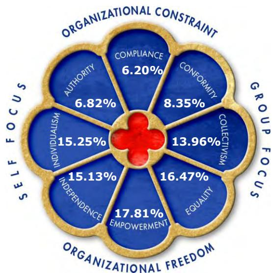
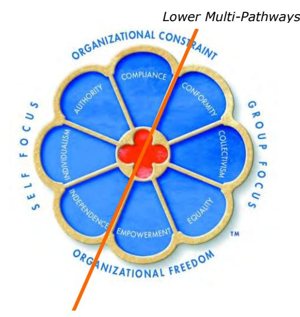

# **Team Management Systems Research Manual 5th Edition:**

## **Window on Work Values Profile Questionnaire**

Editors: D.J. McCann and N.H.S. Mead

Publisher: [Team Management Systems](http://www.tmsworldwide.com/)

Copyright © Team Management Systems, 2018. All rights reserved.

ISBN: 978-0-9580722-9-8

While copyright of this publication is held by Team Management Systems, we make no claim on any articles, applications and/or designs presented by independent contributors.

The purchaser of this Research Manual is permitted to print only a single copy for personal use. No further copies or distributions are permitted.

No part of this publication may be reproduced, stored in a retrieval system, or transmitted in any form or by any means, electronic, mechanical, photocopying, recording, or otherwise without the prior written permission of the publishers.

## Welcome,

This fifth edition of the *Team Management Systems Research Manual* is a collection of stand-alone manuals focusing on each of the eight Profiles. These manuals are a major revision of the last edition which was published in 2010. Since then we have undertaken new research and significantly increased the norm data allowing for a greater depth and breadth of analysis to be presented.

The research was carried out by the Institute of Team Management Studies (ITMS) led by Dr. Dick McCann and Nikki Mead. ITMS was established in 1988 by Team Management Systems (TMS) authors Drs. Charles Margerison and Dick McCann to formalize the research program that was already underway. ITMS was headed up by Rod Davies until 1994 and the comprehensive research program he created was continued by the current editors. It should also be noted that ITMS has many associates who have carried out both joint and external research studies on TMS. Their involvement has been crucial to our work and we thank them for their enthusiasm and commitment.

Each manual includes an *Executive Summary*. These are ideal for clients who want a summary of the key research points, without being overwhelmed by statistics. Normative data and detailed articles on specific studies on face validity, construct validity and criterion-related validity as well as confirmatory factor analyses are also presented.

We have enjoyed writing, compiling and editing this collection of manuals and hope they will stimulate you to use TMS in new and exciting ways.

Dick McCann & Nikki Mead

Editors

Team Management Systems (TMS) distributes a wide variety of products developed by Drs . Charles Margerison and Dick McCann. Over the years they have developed, jointly and individually, many concepts and models widely in use throughout the world. Today there are more than 15,000 accredited international network members who have used the Margerison-McCann Team Management Systems Profiles to enhance the personal, team and organizational performance of more than 1,500,000 people.

For further information, please visit [TMSworldwide.com.](http://www.tmsworldwide.com/)

## **Abbreviations & Conventions Used**

### **Abbreviations**

| ITMS   | - | Institute of Team Management Studies        |
|--------|---|---------------------------------------------|
| OVP    | - | Organizational Values Profile               |
| OVPQ   | - | Organizational Values Profile Questionnaire |
| QO2™   | - | Opportunities-Obstacles Quotient            |
| RVS    | - | Rokeach Values Survey                       |
| SVS    | - | Schwartz Values Survey                      |
| TMP    | - | Team Management Profile                     |
| TMPQ   | - | Team Management Profile Questionnaire       |
| TMS    | - | Team Management Systems                     |
| WoWV   | - | Window on Work Values                       |
| WoWVP  | - | Window on Work Values Profile               |
| WoWVPQ | - | Window on Work Values Profile Questionnaire |

## **Conventions**

**All rater**. This term is used to describe data samples that include multi-rater responses and results.

**Bipolar scales** refer to the four E-I, P-C, A-B, and S-F scales treated as categorical variables (e.g. 'E' = 1, 'I' = 0).

**Continuous scales**. In the case of the Team Management Profile Questionnaire, continuous scales refer to the four E-I, P-C, A-B, and S-F scales measured on the continuum, from the +30 for the first mentioned pole (e.g. 'E' in Extroversion-Introversion) to -30 for the second mentioned pole ('I' in the above example).

**Global ratings**. This term is used to describe data samples that include multi-rater responses and results.

**Major role preference** is the role identified by the Team Management Profile Questionnaire as being major and identified as such in the written feedback.

The **major sample** refers to the total worldwide database for a particular profile questionnaire.

**Net scores** on the Team Management Profile Questionnaire refer to the difference between the raw scores on each of the work preference measures. For example raw scores of E:22 and I:10 result in a net score of E:12.

**Organizational Values Profile**. The output report from the processing of Organizational Values Profile Questionnaires.

**QO2™ Profile**. The output from the processing of a QO2™ Profile Questionnaire.

**Raw scores** on the Team Management Profile Questionnaire are the total scores for each pole on the work preference measures. For example E: 22 and I:10 represent the number of points scored on the Team Management Profile Questionnaire for Extroversion and Introversion.

**Role Profiles** are the narrative output from the Team Management Profile Questionnaire. These are divided into the eight roles originally developed by Drs. Charles Margerison and Dick McCann - *Reporter-Adviser*, *Creator-Innovator*, *Explorer-Promoter*, *Assessor-Developer*, *Thruster-Organizer*, *Concluder-Producer*, *Controller-Inspector*, and *Upholder-Maintainer*. These can be further divided to create 16 subsectors, there being two distinct types of each role Profile.

**Team Management Profile**. The output from the processing of the Team Management Profile Questionnaire.

**Value type**. There are eight core value types in the Window on Work Values that together define the

main values observed in the workplace.

**Window on Work Values Profile**. The output report from the processing of a Window on Work Values Profile Questionnaire.

## **Statistical Glossary**

*This statistical glossary is not an exhaustive list of all the terms and concepts used in this publication. Definitions and brief examples are only provided for the key concepts used for comparing data samples.* 

**Cronbach's coefficient alpha** is a measure of how well the items in a scale are related to each other. The alpha coefficient is a measure of internal consistency that in turn is an indicator of the reliability of a scale. Values range from 0.00 to 1.00, where 0 represents no reliability and 1.00 perfect reliability. It takes into account every item's correlation with each other and the total score for that scale. As a rule of thumb, a value of 0.70-0.75 is seen as adequate reliability for a preference type scale.

**Factor Analysis** is a general descriptor for a number of specific computational techniques. All of these techniques, however, have the object of reducing a large number of measures or tests to some smaller number by telling us which belong together and which seem to measure the same thing.

The **mean** is the most commonly used measure of location. It is equal to the sum of measurements divided by the number of measurements (*n)*.

The shorthand for probability is '**p**'. For example, *p*<0.05 indicates that the probability of a difference between scores being attributable to chance rather than some other factor is less than five per cent. It is used, among other purposes, for indicating whether two mean scores vary, or whether the magnitude of a correlation coefficient is large enough to be due to a real difference rather than a chance.

The **Pearson product-moment coefficient** is a summary statistic that represents the linear relationship between 2 sets of variables. The values can vary between -1 to 0 to +1, with 0 representing no association, and -1 indicating a perfect negative association.

The **standard deviation** provides us with a look at the distribution or spread of the scores with approximately 68% of the sample being within one standard deviation (plus or minus) of the mean. For example, in a sample where the mean scale percentage is 8.45 and the standard deviation is 4.35, we would be able to say that 68% of the sample for that scale was between 4.10% and 12.80%. The higher the standard deviation, the more 'spread out' the scores.

## **Window on Work Values Profile Questionnaire: Executive Summary**

## **Development**

Modern-day thinking about values has been largely influenced by the work of Milton Rokeach (1973; 1979). He defined the value concept as 'an enduring belief that a specific mode of conduct or end-state of existence is personally or socially preferable to an opposite or converse mode of conduct or end-state of existence'. He developed an instrument to measure personal and social values. This Rokeach Values Survey (RVS) has been a popular tool for many research studies investigating the structure of value domains.

Following Rokeach's work, Schwartz (1994) developed a typology of values as conscious goals relating to three universal requirements with which all individuals and societies must cope: needs of individuals as biological organisms; requisites of coordinated social interaction; and requirements for the smooth functioning and survival of groups. Schwartz' model was based on his Schwartz' Values Survey (SVS) which measured the responses of over 9000 people from 20 countries worldwide. Respondents were asked to rate 56 values 'as a guiding principle in my life'. His survey included 30 of the values from the Rokeach Survey, and the SVS has therefore, become the 'gold standard' assessment instrument for measuring individual values.

Other important work on cross-cultural values has been done by Triandis (1995) and colleagues. In his monograph he has drawn together much of the literature describing Individualism and Collectivism.

Working with many teams all over the world in 25 years of being a management consultant convinced Dr. McCann that people will expend a lot of energy to preserve core work values, and to defend them against potential violators. Infringements of people's core work values can lead to terminal conflicts in teams. That is why an understanding of these core values is essential to effective teamwork.

Margerison and McCann (1984-2005) developed the Team Management Profile Questionnaire and associated model, the Team Management Wheel, to explain the concept of work preferences. Although preferences explain many of the behaviors exhibited in teams, they do not adequately explain behaviors emanating from values. In an effort to develop an integrated approach to understanding behaviors within teams, Dr. McCann (McCann, 2002) developed the concept of the Pyramid of Workplace Behavior (Figure 1). This shows the three levels that build a complete picture of the different ways that people approach work.

Preferences are usually transparent and are often the first thing we notice in others – 'He's rather quiet, isn't he?' or 'She never stops talking.' Preferences are therefore at the apex of the Pyramid because they are readily visible to others and are usually the basis of first impressions. They are also subject to a degree of variability dependent upon the situations faced.

The middle layer of the Pyramid of Workplace Behavior addresses the way people approach risk. All through our life we are faced with opportunities and obstacles; they crop up in every project we undertake no matter how much forward planning is undertaken. The concepts of risk are addressed by the QO2 ™ - the Opportunities-Obstacles Quotient (McCann, 2000).

At the base of the Pyramid are values. These are fundamental concepts or beliefs which people use to guide their behavior in the workplace. Values will drive our decision-making and cause us to summon up energy to preserve what we believe in. They go beyond specific situations and determine how we view people, behavior and events. Often major sources of conflict and disillusionment are due to mismatched values. Whereas we are often willing to work on tasks that we dislike, we are much less likely to compromise when our values are under threat.

Values are difficult to observe in others, as they are inner concepts often buried in the human psyche and not readily accessible by the conscious mind. When these values are violated then the conscious mind takes over and appropriate behavior occurs to preserve and defend this attack.

### Figure 1. The Pyramid of Workplace Behavior

### *The Window on Work Values Model: Content Validity*

Most of the research on values focuses on the non-work domain or on the cross-cultural domain. To give workplace values some theoretical underpinning, Dr. McCann created the model of the Window on Work Values, by developing the ideas expressed by Rokeach, Schwartz and Triandis and applying them to the workplace. The starting point was a conceptual definition of values (Schwartz, 1994) that incorporates five main features recurrently mentioned in the literature. Values are concepts or beliefs (1), pertaining to desirable end states or behaviors (2), that transcend specific situations (3), guide selection or evaluation of people, behavior and events (4), and are ordered by importance relative to other values to form a system of value priorities (5).

It is this definition of values that form the basis of the Window on Work Values. The primary content aspect is the type of goal or motivational concern that the value expresses. Preliminary discussions and interviews with participants on management development workshops identified the importance of a higher-order factor that focuses on either the self or the group. This eventually became the west-east axis of the Window on Work Values. Although many people can do both, the results suggest that most people will have a bias one way or the other.

The *Self Focus* value types govern the dominance of personal over group goals. The defining motivation for the *Self Focus* value types are actions that further individual gain and foster a hierarchy of differentiation within an organization. The key 'self-focus' value type was identified as *Individualism*. The *Group Focus* value types have defining goals where the individual is subordinated to the wishes, needs and goals of the group. The key 'group-focus' value type is *Collectivism*.

The other higher-order factor suggested was the cluster of values that related to an organizational environment where the focus was on 'constraints' vs. a cluster of values that allowed more organizational freedom. This eventually became the north-south axis of the model, where the focus was on the organizational environment that people value. The key *Organizational Constraint* value type is Compliance; the key *Organizational Freedom* value type is Empowerment.

This two-factor model led to the concept of value types where values would cluster in sectors around the two-factor model. The end result was eight 'value types', which are depicted as windowpanes, rather like those in the rose windows of many European cathedrals. The model was developed to have good structural validity, meaning that value types close to one another in the Window are related whereas those on opposite sides of the Window are unrelated.

The Window on Work Values (Figure 2) helps explain why problems exist within any group of people working together. Value types define core frameworks that people hold and for which they are prepared to expend considerable quantities of energy in either promoting or defending. Most people will hold three or four of the values reasonably strongly and because of the structure of the model these values are more likely to be concentrated in one particular section, giving rise to key value patterns which are useful in understanding and predicting individual and group behavior.

Brief summaries of the value types are given below.

### *Individualism*

*Individualism* is the value type which focuses entirely on the self. It comprises values held in high regard in many western countries such as the USA, Australia and the UK. A society that values *Individualism*  will idolize the individual and have many role models to which people aspire.

### *Collectivism*

*Collectivism* is the opposite of *Individualism* and is a value type that focuses on the importance of the group rather than the self. People who hold these values will usually put others first and want to work in a way that preserves the functioning of the group and the support that goes with it. Collectivists will want to avoid conflict and often go out of their way to promote harmony. Often they will shield those of less ability and actively support any underdogs.

### *Compliance*

*Compliance* is a core value type built around a person's need to work to an agreed set of rules and procedures – the organizational constraints. People high on *Compliance* feel comfortable in knowing what they can and can't do and it is this security that enables them to give of their best.

### *Empowerment*

Directly opposite the *Compliance* value type is *Empowerment*. A person holding this value type will insist on organizational freedom*,* where they can have the opportunity to contribute to the organization, unfettered by unnecessary rules and regulations. They will accept the need for business objectives and performance targets but because they hold to the principles of self-reliance and self-accountability they will want to establish their own constraints in order to pursue outputs and outcomes in their own way.

### *Authority*

The *Authority* value type comprises a focus on the self, combined with a belief in the need for

organizational constraints. A strong *Authority* person will want to work within an organizational hierarchy so that adequate control processes are in place and outputs delivered to maximum quality and minimum cost. They usually believe that people need to be monitored otherwise inefficiencies will creep in.

### *Equality*

The *Equality* value type comprises a focus on the group, combined with the need for an organizational environment that allows a degree of freedom. *Equality* people value the group and therefore put emphasis on the need for tolerance and the acceptance of other people's ideas and beliefs. The need for organizational freedom means that they expect to be trusted and will give trust in return, to those people they are managing. To some extent there is an air of altruism about high *Equality* scorers, as they like to work for the benefit of others and have a willingness to forgive.

### *Independence*

The *Independence* value type is a combination of a focus on the self with the need for an environment that allows organizational freedom. In many ways the high *Independence* person is often seen as a maverick or a 'loose cannon' who values their own creativity and will work with a high degree of selfdirection and autonomy. The problem may come when they go off in different directions to those defined by 'organizational visions' or 'team purposes'.

### *Conformity*

*Conformity* is the combination of a focus on the group plus the need for an environment of organizational constraints. People high on the *Conformity* value type will avoid extremes of action and conform to others' expectations of them. *Conformity* people will not want to stand out from the crowd, but fit into the norms of the group as they need a group in order to give of their best.

### **Item Development**

When developing an item pool for the Window on Work Values, a decision was made to use items that were concrete and related to workplace activities or situations; that were 'lean' rather than 'fat'; and which were expressed, wherever possible, as situations that avoided the espoused/values-in-use dilemma. Item wording was critical as the seemingly simple addition, replacement or simplification of a single word often had dramatic consequences on how the item was perceived by the respondent, resulting in lowered reliability coefficients.

Initially 110 items were generated that seemed to fit in into either end of the two higher-order factors – Self Focus vs. Group Focus and Organizational Constraint vs. Organizational Freedom. Using the experience obtained when developing the Types of Work Profile Questionnaire (Margerison & McCann, 1984-2005), Dr. McCann used the two-pass item approach, in order to increase item discrimination. Respondents first assessed whether the activity or situation was something they valued at work ('Yes' or 'No') and for those items with a 'Yes' response they then recorded to what extent they valued this situation or activity, making one of four choices: *To a little extent*; *To some extent*; *To a great extent*; or *To a very great extent*. The overall responses then formed a five-point Likert scale.

Example of items chosen are:

- Doing what I am told
- Being in control of others
- Self-accountability
- Being seen as intelligent
- Harmony in the workplace

These initial 110 items were tested using four different samples of respondents from the UK, USA and Australia. Initial statistical analysis suggested that the wording of all questions in the Window on Work Values Profile Questionnaire was clear enough for respondents to return high-reliability coefficients.

Iterative factor analysis was carried out to determine whether items should be discarded as being unreliable or accepted and grouped into a particular value type. The reliability analysis was combined with structural validity analysis, where the aim was to develop a progression of related value types around the Window, and at the same time maintain adequate item-scale correlations for each item in a chosen scale. After four iterations, reliability and structural validity were deemed adequate.

In the final commercial version of the profile questionnaire, individual work value types are measured by responses to just 64 questions, 8 per value type. Respondents are first asked the question, *Is this activity or situation something you value at work?* All 64 questions are first answered in this way. For those questions marked *Yes*, respondents then record to what extent they value the activity or situation. Four responses are possible – *To a little extent, To some extent, To a great extent, To a very great extent.* Responses are scored as 0 for a *No* response to any question, 1 for *To a little extent*, 2 for *To some extent*, 3 for *To a great exten*t and 4 for *To a very great extent.* 

For example, Question 15 is 'Having a Leadership Role'. If this is an activity that the respondent does not value at work then a 0 is recorded. If a 'Yes' is recorded and the second pass is marked at the *To a great extent* level then the response is recorded as a 3.

## **Reliability**

Psychometric scales are measured by a number of items that define each scale. These items should be related to some extent, otherwise errors become unacceptable. Too much correlation accurately defines a scale that is so narrow to be of limited use; too little correlation means that the scale is so broad that that it measures nothing. A reliable scale must have an adequate degree of *internal consistency* and this can be measured using a statistic known as the Cronbach alpha coefficient. Values below 0.7 indicate that the scale is becoming too broad; values over 0.9 indicate the scale is becoming too narrow. An ideal range is 0.75-0.85.

The Cronbach alpha coefficients for the eight value type scales are shown in Table 1. This analysis has been conducted on the total worldwide sample from the commercial English language versions of the WoWVPQ, which, as of 2018, consists of 5302 completed profile questionnaires.

Cronbach alphas for the scales range from 0.69 to 0.85. This is adequate for the Window on Work Values where there is a broad range of values contributing to each value type cluster.

| Value type    | Cronbach alpha |
|---------------|----------------|
| Compliance    | 0.85           |
| Conformity    | 0.79           |
| Collectivism  | 0.69           |
| Equality      | 0.73           |
| Empowerment   | 0.70           |
| Independence  | 0.82           |
| Individualism | 0.70           |
| Authority     | 0.71           |

### Table 1. Cronbach alpha coefficients for each value type (n=5302)

It is also important to check the temporal stability of a scale by measuring people's responses to it at two different times. We need to be sure that Window on Work Values has sufficient stability to be used in personal and team development, for which it was designed.

A sample of 110 people has been analyzed with a time interval of re-administration ranging from one month to over three years. The gender distribution was 50% male and 50% female, with respondents working in Australia (55), the United Kingdom (49), USA (2), Singapore (1), Ireland (1), Belgium (1) and India (1).

The test-retest correlation coefficients were ranged from 0.66 to 0.77 for percentage scores, perfectly adequate to be used for personal, team and organizational development.

## **Validity**

Two questions that are often asked when assessing the adequacy of a profile questionnaire are 'How well does it minimize error in measurement?' and 'How well does the score measure what it has been designed to measure?' The first question is that of *reliability*, the second is that of *validity*. Put in another way, *reliability* concerns the association between different measurements of the same concept using the same indicator. *Validity*, on the other hand, concerns the association between the indicator and the concept. Important concepts of validity are face validity, structural validity, predictive validity, construct validity and criterion-related validity.

### *Face Validity*

Face validity is the extent to which a scale or group of scales 'makes sense' to observers and test users. As far as the Window on Work Values is concerned, people like to be convinced that a profile questionnaire is 'sensible' before they complete it. When users feel comfortable with a profile questionnaire, they are more likely to feel positive about the process which the tests are intended to facilitate. If this is the case then we can say the instrument has high face validity.

Of more importance though, is the extent to which the feedback report – the Window on Work Values Profile – is acceptable to the test respondent. In management development it is critical that any feedback based on an instrument has high face validity otherwise the data will be rejected and the instrument denounced, even though it may have high reliability and even predictive validity.

Much care was taken to ensure high face validity was obtained on both the Window on Work Values Profile Questionnaire and the Profile itself. This was achieved through an iterative process with many focus groups. A typical procedure was as follows:

- 1) A group of at least 8 people with the same top three value types was assembled and a preliminary feedback report presented to them. They then indicated the paragraphs that were accurate for them, those that were dubious and those which were inaccurate.
- 2) Based on this information, a new version of the relevant Profile was produced and tested in a new focus group.
- 3) The process was repeated until at least 80% face validity was indicated by the subsequent focus group.
- 4) Steps 1) to 3) were repeated for various combinations of the top three value types
- 5) After the instrument was commercially released subsequent changes to the Profiles were made over a two-year period whenever consistent criticism was received about any particular report.

Traditionally, face validity is seen as the least important form of validity, particularly as far as the test is concerned. Test developers often try to obscure the concepts behind the test which may be important in situations where the test is used for selection purposes or for psychometric assessment. However in the realm of management development face validity is usually the most important form of validity.

### *Structural Validity*

Structural validity is a form of validity that relates to the development of models or their scales and subscales. For continuous models such as the Window on Work Values, good structural validity requires the correlations between one value type and the other seven to vary progressively around the model. Adjacent value types should show moderate correlations that then progressively decrease as the gap between value types increases. Opposite value types should be unrelated or even negatively correlated. This verifies the model's spatial integrity.

Structural validity can be measured by using the Pearson product-moment correlation coefficient. The correlation coefficient determines the extent to which the values of two variables are 'proportional' to each other. Selection of scale items and structural validity verification require an iterative research program. Items for a particular scale or subscale are selected or rejected according to internal consistency requirements, while simultaneously checking that the scale intercorrelations follow the progressive pattern. Items that enhance both the international consistency and the structural validity requirement are accepted.

Pearson product-moment correlations for each of the value types is shown in Table 2, for the development sample of 250 respondents.

The progressive nature of the correlations can be seen by selecting any value type from Table 2 (e.g. Equality) and then plotting the figures from the appropriate column and row.

| Value type       | CP                        | CF       | CV                         | EQ       | EM                            | IP      | IV                    | A     |
|------------------|---------------------------|----------|----------------------------|----------|-------------------------------|---------|-----------------------|-------|
| CP               |                           | 0.75     | 0.40                       | 0.16     | 0.09                          | -0.09   | 0.21                  | 0.48  |
| CF               |                           |          | 0.54                       | 0.34     | 0.22                          | -0.12   | 0.17                  | 0.30  |
| CV               |                           |          |                            | 0.69     | 0.38                          | 0.14    | 0.11                  | 0.02  |
| EQ               |                           |          |                            |          | 0.50                          | 0.25    | 0.05                  | -0.17 |
| EM               |                           |          |                            |          |                               | 0.52    | 0.48                  | 0.25  |
| IP               |                           |          |                            |          |                               |         | 0.53                  | 0.26  |
| IV               |                           |          |                            |          |                               |         |                       | 0.54  |
| A                |                           |          |                            |          |                               |         |                       |       |
| Key: CP EM | Compliance Empowerment | CF IP | Conformity Independence | CV IV | Collectivism Individualism | EQ A | Equality Authority |       |

### Table 2. Pearson product-moment correlations for each value type (raw scales; n=250)

Figure 3 is the plot for the Equality line. Equality is correlated to the adjacent sectors, Collectivism and Empowerment, at the 0.69 and 0.50 levels respectively. The relationships then decline to the lowest figure of –0.17 for Authority, the value type that lies directly opposite Equality.

These results show that an eight-sector model is sufficient to differentiate core values in the workplace. If a step change existed between one value type and the next, it would likely indicate that a critical value type was missing from the model.

### *Predictive Validity*

Predictive validity is the ability of a measure to predict future criteria. This form of validity is important when a test is used for selection purposes. If the Window on Work Values Profile Questionnaire was being used to predict the success of a group of job applicants we would have to prove that it is related to the criteria for success that were chosen at the recruitment or promotion stage. Predictive validity studies are difficult to administer as they involve a long-term research design which has the inherent difficulty of locating subjects at times in the future and possible changes in the success criteria that can occur over time.

The Window on Work Values Profile Questionnaire was not designed as a predictive instrument and no claims are made about its predictive validity. The instrument was designed primarily for personal, team and organizational development.

### *Construct Validity*

Construct validity is a special case of criterion-related validity and measures the extent to which a test or

scale relates to other theoretical concepts (i.e. constructs) which have been proved by other studies to be valid. By studying the relationships of a test to many others, researchers can get a better feel for the real meaning of a scale. To the extent that one construct is related to another that it should be related to, and not to others that it should not be related to, we can say that the test has good construct validity.

Several construct validity studies have been carried out and confirm the construct validity of the model.

*Comparison with the Schwartz Values Survey* 

Schwartz' model (Schwartz, 1994) was based on his Schwartz' Values Survey (SVS) which measured the responses of over 9000 people from 20 countries worldwide. Respondents were asked to rate 56 values 'as a guiding principle in my life'. His survey included 30 of the values from the Rokeach Survey, and the SVS has therefore, become the definitive assessment instrument for measuring individual values. The comparison between the Schwartz model and the Window on Work Values is discussed in the *Comparative Studies: WoWVP & the Schwartz Values Survey* section of this manual.

*Comparison with the Team Management Profile Questionnaire and associated Team Management Wheel* 

As the constructs of the Team Management Profile Questionnaire have been well researched and described in the *Team Management Systems Research Manual 5th Edition: Team Management Profile Questionnaire* (McCann & Mead, 2018) and reviewed by the British Psychological Society (2003), it is useful to carry out a construct validity comparison between the scales of the Window on Work Values Profile Questionnaire (WoWVPQ) and those of the Team Management Profile Questionnaire (TMPQ). The results of this study are discussed in the *Comparative Studies: WoWV & Work Preferences* section of this manual*.* 

*Comparison with the Opportunities-Obstacles Profile (QO2 ™) Questionnaire* 

A construct validity study was also carried out between the Window on Work Values Profile Questionnaire and the Opportunities-Obstacles Profile Questionnaire. The results of this study are discussed in the *Comparative Studies: QO2* ™ *& the Window on Work Values* section of this manual.

Other comparisons with various values structures are reported in the *WoWVPQ: Validity* section of this manual.

### *Criterion-Related Validity*

Criterion-related validity is the extent to which a test is related to external criteria. Three studies were undertaken in this area – two based on self-ratings and one based on associate ratings.

*Self-Ratings and Associate Ratings of Values Lists* 

A sample of 100 respondents was selected for this study. A list of 40 values considered important in the workplace literature was drawn up. These values, which are mixtures of instrumental and terminal values, were grouped into four lists of 10 and respondents were asked to rate these lists in order of importance. The Window on Work Values Profile Questionnaire was simultaneously administered to each respondent.

The results showed good correspondence between the values on the list and the relevant value types, confirming the relationship between the model and commonly used values lists. Further details are in the *WoWVPQ Studies: Self-Rating and Associate Raters WoWV Study* section of this manual.

*Mapping of values onto the Window on Work Values* 

The data from the self-rater and associate-rater criterion validity studies, together with the construct validity comparison with the Schwartz' Values Survey (see the *Comparative Studies: WoWVP & the Schwartz Values Survey* section of this manual), enables a validity values map (Figure 4) to be drawn on the Window on Work Values. A close examination of these instrumental and terminal values indicates close congruence with the concepts defined by the Window on Work Values. This gives a good level of confidence that the domain content of the values types is valid.

Although the listed values appear only once in a chosen windowpane, in most cases they also apply to the adjacent windowpanes, given the structural validity of the Window and the cross correlations between adjacent sectors.

Figure 4. Mapping of terminal and instrumental values onto the Window on Work Values (Combination of data from three validity studies)

## **British Psychological Society Review**

In their 2006 review1 of Windows on Work Values Profile, the British Psychological Society (BPS) concluded that, "*The measurement aims of the profile questionnaire are very focused and have immediate relevance and application to the world of work. It is likely that end users will appreciate the face validity of this instrument.*"

They further said, "*Construct validity and criterion related validity are adequate, but further research would be welcome, in particular criterion studies that look at behavioural outcomes that can be reliably measured. WoWV reliability is well documented and described, with both internal consistency and testretest studies reported. Correlations appear in the main to be of an acceptable or good standard.*"

In their final conclusions, they state that: *"In summary the WoWV appears to be a generally psychometrically robust tool with adequate construct and criterion related validity. The new manual gives good information on the development rationale and the scoring process. Its relative newness (it was released in January 2003) has resulted in somewhat less normative data than would be ideal, although this should be rectified as the tool gains greater exposure. It has a professional look and feel, and the report appears well constructed. All in all it is likely to be a useful tool for those users who wish to understand an individual's value set in a development or counselling scenario."*

Ratings given in the review of the instrument are reproduced below.

1 A copy of the review can be found online at [ptc.bps.org.uk.](http://www.ptc.bps.org.uk/)

| Characteristics            | Evaluation |
|----------------------------|------------|
| Quality of documentation   |            |
| Quality of materials       |            |
| Norms and reference groups |            |
| Construct validity         |            |
| Criterion-related validity |            |
| Reliability - overall      |            |

This table shows adequate to good ratings for all BPS evaluation categories.

### **Norm Data**

The worldwide WoWVPQ database as of 2018 consists of 5302 completed profile questionnaires from 57 industries and 43 countries. A summary of the mean percentage score distribution data is shown in Figure 5. Other breakdowns are given in the *WoWVPQ: Worldwide Database* sections of this manual. These cover analyses of gender, age group, functional area, profession, industry, organizational level, countries, and regional areas.

Figure 5. Percentage score scale means: worldwide database (n=5032)

The low means shown in Figure 5 for the Organizational Constraint part of the model are due to the bias in functional areas in the worldwide sample. 25% of the sample is in the functional areas of Personnel/HR/Training/ Recruitment and Consultancy where the value types of Organizational Freedom are strongly supported.

### **References**

British Psychological Society, (2003), Team Management Profile, **Psychological Testing Center Test Reviews**.

British Psychological Society, (2006), Window on Work Values Profile, **Psychological Testing Center Test Reviews**.

Margerison, C.J., & McCann, D.J., (1984-2005), The Team Management Profile Questionnaire, Team Management Systems, Brisbane.

Margerison, C.J., & McCann, D.J., (1984-2005), The Types of Work Profile Questionnaire, Team Management Systems, Brisbane.

McCann, D.J., (2000), The Opportunities-Obstacles (QO2™) Profile Questionnaire, Team Management

Systems, Brisbane.

McCann, D.J., (2002), The Workplace Wizard: The Definitive Guide to Working with Others, Gwent Publishing, Brisbane.

McCann, D.J., & Mead, N.H.S., (Eds.), (2018), Team Management Systems Research Manual 5th Edition: Team Management Profile Questionnaire, Team Management Systems, Brisbane.

Rokeach, M., (1973), The nature of human values, New York: Free Press

Rokeach, M., (1979), Understanding human values, New York: Free Press.

Schwartz, S.H., (1994), Are there universal aspects in the structure and content of human values?, **Journal of Social Sciences**, 50(4), 19-45.

Triandis, H., (1995), Individualism and Collectivism, Boulder, CO: Westview Press.

## **Window on Work Values Profile Questionnaire: Development**

### **Values Research**

### *Rokeach Values Survey*

Modern-day thinking about values has been largely influenced by the work of Milton Rokeach (1973; 1979). He defined the value concept as 'an enduring belief that a specific mode of conduct or end-state of existence is personally or socially preferable to an opposite or converse mode of conduct or end-state of existence'. He developed an instrument to measure personal and social values. This Rokeach Values Survey (RVS) has been a popular tool for many research studies investigating the structure of value domains. The RVS distinguishes two kinds of values: instrumental, referring to modes of conduct and reflecting behavioral characteristics that are seen as socially desirable, and terminal, referring to end states of existence or ultimate modes of living which have been idealized. For example, 'an exciting life' and 'freedom' are examples of terminal values, whereas 'ambitious' and 'helpful' are examples of 'instrumental' values. Subsequent work by Schwartz (1992) suggests that it is unnecessary to distinguish between these two concepts and that only a single form – either terminal or instrumental - is needed to accurately measure values.

### *Debats' Work*

Debats (1996) initiated a study to empirically investigate the structure of human values. Its aim was to evaluate the coherence between the 36 values as specified by the RVS. It was hypothesized that human values do not exist in isolation but cluster in some coherent fashion to values domains with more specific meanings. To this end the RVS items were subjected to a principal components factor analysis followed by an orthogonal rotation varimax.

Debats' research approach was inspired by Feather (1991) who revealed from an analysis of the RVS instrumental values the existence of three value domains that were largely consistent with the motivational domains as described by Schwartz and Bilsky (1987): self-directed competence, restrictive conformity and pro-social concern. Within the intercorrelations of the terminal values, Feather discriminated five value domains: positive affiliation, universal prosocial, mature accomplishment, comfort/stimulation and security/salvation.

The Debats study was carried out on a sample of 109 clients, as part of a wider study to determine the impact of values on the process and outcome of psychotherapy. The results of this study are summarized in Table 1.

| Scales (major and sub-)                | Rokeach values                                                                             |
|----------------------------------------|--------------------------------------------------------------------------------------------|
| Terminal values                        |                                                                                            |
| Life without inner and outer conflicts | Pleasure, national security, inner harmony, happiness, a comfortable life, salvation    |
| Universal prosocial                    | Equality, a world at peace, a world of beauty                                              |
| Mature accomplishment                  | A sense of accomplishment, social recognition, self respect, wisdom                     |
| Positive affiliation                   | True friendship, mature love                                                               |
| Individual self-definition             | An exciting life, freedom, (negative correlation with family security)                  |
| Instrumental values                    |                                                                                            |
| Self-directed competence               | Broad-minded, independent, courageous, imaginative, logical                             |
| Restrictive conformity                 | Polite, clean, ambitious, self-controlled, capable, obedient                               |
| Prosocial concern                      | Forgiving, helpful, responsible, honest, loving, cheerful, (negative with intellectual) |

Table 1. Debats' analysis of the Rokeach Values Survey

Debats' study showed the existence of eight factors that were derived from the principal components analysis of the 36 RVS values. These eight factors accounted for substantial variances within the

This document is an extract from *Team Management Systems Research Manual 5th Edition: WoWVPQ*  Editors: D.J. McCann & N.H.S. Mead - Copyright © 2018 Team Management Systems

intercorrelations for the terminal and instrumental RVS values.

### *Schwartz Values Survey*

Schwartz (1994) developed a typology of values as conscious goals relating to three universal requirements with which all individuals and societies must cope: needs of individuals as biological organisms; requisites of coordinated social interaction; and requirements for the smooth functioning and survival of groups.

Ten motivationally distinct types of values were derived from these three universal requirements. They are:

- Power Universalism
- Achievement Benevolence
- Hedonism Tradition
- Stimulation Conformity
- Self-direction Security

The relationship between these value types pointed to two higher-order factors that Schwartz called Selfenhancement – Self-transcendence, and Openness to Change - Conservation.

Schwartz' model was based on his Schwartz' Values Survey (SVS) which measured the responses of over 9000 people from 20 countries worldwide. Respondents were asked to rate 56 values 'as a guiding principle in my life'. His survey included 30 of the values from the Rokeach Survey, and the SVS has therefore, become the 'gold standard' assessment instrument for measuring individual values.

### *Other Studies*

Another rigorous study was based on the theories of motivation (Wicker, Lambert, Richardson & Kahler, 1984). Hierarchical cluster analysis and factor analysis yielded stable clusters and factors implicit in large sets of goals. Factors of Interpersonal Concern, Competitive Ambition, Intellectual Orientation, Balanced Success, and Exploration were shown to be important factors.

The study by Crosby et al (1990) also shows interesting comparisons with seven dimensions containing a mixture of terminal and instrumental values. Their confirmatory factor analysis identified these seven dimensions as: Virtuousness, Conformity, Self-direction, Security, Idealism, Hedonism and Selfactualization.

### *Cross-Cultural Structures*

The two most important values constructs appearing in cross-cultural studies are those of Individualism and Collectivism. Triandis (1995) in his monograph has drawn together much of the literature describing these important cross-cultural constructs. The defining attributes of Individualism and Collectivism suggested by Triandis are:

- 1. Collectivists define themselves as parts or aspects of a group; Individualists focus on selfconcepts that are autonomous from groups. They also have personal goals that overlap with the goals of their in-groups, and if there is a discrepancy between the two sets of goals, they consider it obvious that the group goals should have priority over their personal goals. Individualists have personal goals that may or may not overlap with the goals of their in-groups, and if there is a discrepancy between the two sets of goals, they consider it obvious that their personal goals should have priority over the group.
- 2. Among Collectivists, social behavior is best predicted from norms and perceived duties and obligations (Miller, 1994). Among Individualists, social behavior is best predicted from attitudes and other such internal processes as well as contracts made by the individual.
- 3. Among Collectivists, relationships are of the greatest importance, and even if the costs of these relationships exceed the benefits, individuals tend to stay with the relationship. Among Individualists when the costs exceed the benefits, the relationship is often dropped (Kim, Triandis, Kagitcibasi & Yoon, 1994).

This document is an extract from *Team Management Systems Research Manual 5th Edition: WoWVPQ*  Editors: D.J. McCann & N.H.S. Mead - Copyright © 2018 Team Management Systems

## **Rationale**

Working with many teams all over the world in over 20 years of being a management consultant convinced Dr. McCann that people will expend a lot of energy to preserve core work values, and to defend them against potential violators. Infringements of people's core work values can lead to terminal conflicts in teams. That is why an understanding of these core values is essential to effective teamwork.

Margerison and McCann (1984-2005) developed the Team Management Profile Questionnaire and associated model, the Team Management Wheel, to explain the concept of work preferences. Preferences are another name for what we like doing. They are dimensions of individual differences in tendencies to show consistent patterns of relationships, thoughts, feelings and actions.

Preferences determine the conditions we set up to allow our mental and psychic processes to flow freely. They guide our behavior, but if we have to work outside them at various times then we can usually cope. Although we value our preferences, they are not 'values'. Preferences simply describe what people are like rather than any intention behind their behavior. Values, however, are deep-seated determinants of behavior and define what people think are important – the goals or motivations that will drive their behavior. We are more likely to react negatively when our values are violated but are often neutral to the actions flowing from other people's preferences.

Although preferences explain many of the behaviors exhibited in teams, they do not adequately explain behaviors emanating from values. In an effort to develop an integrated approach to understanding behaviors within teams, Dr. McCann (McCann, 2002) developed the concept of the Pyramid of Workplace Behavior (Figure 1). This shows the three levels that build a complete picture of the different ways that people approach work.

Preferences are usually transparent and are often the first thing we notice in others – 'He's rather quiet, isn't he?' or 'She never stops talking.' Some people prefer to think things through on their own whereas others need to talk out loud to clarify their ideas. Preferences are therefore at the apex of the Pyramid because they are readily visible to others and are usually the basis of first impressions. They are also subject to a degree of variability dependent upon the situations faced.

The middle layer of the Pyramid of Workplace Behavior addresses the way people approach risk. All through our life we are faced with opportunities and obstacles; they crop up in every project we undertake no matter how much forward planning is undertaken. What determines peoples' risk profiles is the different emphasis they place on either 'seeing the opportunities' or 'seeing the obstacles'. Some people treat obstacles as an opportunity to take a new direction whereas others use them as an excuse to give up. Some people treat obstacles as a stumbling block but for others they are stepping-stones to the future. The concepts of risk are addressed by the QO2™ – the Opportunities-Obstacles Quotient (McCann, 2000).

At the base of the Pyramid are values. These are fundamental concepts or beliefs which people use to guide their behavior in the workplace. Values will drive our decision-making and cause us to summon up energy to preserve what we believe in. They go beyond specific situations and determine how we view people, behavior and events. Often major sources of conflict and disillusionment are due to mismatched values. Whereas we are often willing to work on tasks that we dislike, we are much less likely to compromise when our values are under threat.

Values are difficult to observe in others, as they are inner concepts often buried in the human psyche and not readily accessible by the conscious mind. When these values are violated then the conscious mind takes over and appropriate behavior occurs to preserve and defend this attack.

Most of the research on values focuses on the non-work domain or on the cross-cultural domain. Where values are applied to the work situation the approach is invariably *ad hoc,* with random checklists of workplace 'values' such as 'excellence, honesty, creativity etc.' offered (Senge et al, 1994) as a basis for developing a shared-values approach to working together. To give workplace values some theoretical underpinning, Dr. McCann developed the model of the Window on Work Values, by developing the ideas expressed by Rokeach, Schwartz and Triandis and applying them to the workplace.

Schwartz (1992, 1994) has generated a conceptual definition of values that incorporates the five main features of values recurrently mentioned in the literature.

Values are concepts or beliefs (1), pertaining to desirable end states or behaviors (2), that transcend specific situations (3), guide selection or evaluation of people, behavior and events (4), and are ordered by importance relative to other values to form a system of value priorities (5).

It is this definition of values that form the basis of the Window on Work Values. The primary content aspect is the type of goal or motivational concern that the value expresses. The work of previous researchers suggested that higher-order factors or clusters might be a way to start developing a useful values model for the world of work. Preliminary discussions and interviews with participants on management development workshops identified the importance of a factor that focuses on either the Self or the Group. This eventually became the west-east axis of the Window on Work Values. Although many people can do both, the results suggest that most people will have a bias one way or the other.

The other higher-order factor suggested was the cluster of values that related to an organizational environment where the focus was on 'constraints' vs. a cluster of values that allowed more organizational freedom. This eventually became the north-south axis of the model, where the focus was on the organizational environment that people value.

This two-factor model led to the concept of value types where values would cluster around the two-factor model. The end result was eight 'value types', which are depicted as windowpanes, rather like those in the rose windows of many European cathedrals. The model was developed to have good structural validity, meaning that value types close to one another in the Window are related whereas those on opposite sides of the Window are unrelated.

### *Self Focus vs. Group Focus*

The Self Focus value types govern the dominance of personal over group goals. The defining motivation for the Self Focus value types are actions that further individual gain and foster a hierarchy of differentiation within an organization. The Group Focus value types have defining goals where the individual is subordinated to the wishes, needs and goals of the group.

The key 'self focus' value type was identified as Individualism. People high on Individualism will invest energy in being seen as capable, intelligent and highly competent. They will value self-sufficiency and also the rewards that go with being successful. The work behaviors of those high on Individualism will also depend on the organizational environment they value. People who believe that organizational constraints (such as rules, regulations and procedures) are necessary for effective work will hold the Authority value as well, whereas those who desire organizational freedom will more likely hold the value of Independence.

The key 'group focus' value type is that of Collectivism. Collectivism emphasizes the placing of group goals over personal ones. Those who value this highly will want to put others first, support the underdog and work with loyal people who value harmony. Issues such as truth, integrity and fairness feature high on their list. The generation of group opinions and adherence to them are far more important than personal gain. People who value Collectivism highly will use the power of the group to bring individual recalcitrants into line with group thinking.

Work behaviors of people who value Collectivism will depend to a large extent on their desired working environment. Those who also value organizational constraint will also hold the value of Conformity. Those who believe in organizational freedom are more likely to value Equality.

### Figure 2. The Window on Work Values

### *Organizational Constraint versus Organizational Freedom*

Organizational Constraint as a motivational type is derived from the prerequisite for some groups to ensure smooth interaction and group survival, thereby developing a prescriptive set of norms for group members to restrain impulses and inhibit actions that might hurt others. Organizational Freedom, on the other hand, is a motivational type with defining goals of independence of thought and action where individual behavior is unrestricted and people are free to choose their pathways, unfettered by organizational constraints. As such these two value types are unlikely to be held in the human psyche with equal probability, as the behaviors associated with each are conflicting.

The Window on Work Values helps explain why problems exist within any group of people working together. Value types define core frameworks that people hold and for which they are prepared to expend considerable quantities of energy in either promoting or defending. Most people will hold three or four of the values reasonably strongly and because of the structure of the model these values are more likely to be concentrated in one particular section, giving rise to key value patterns which are useful in understanding and predicting individual and group behavior.

Brief descriptions of the eight core value types:

### *Individualism*

Individualism is the value type which focuses entirely on the self. It comprises values held in high regard in many western countries such as the USA, Australia and the UK. A society that values Individualism will idolize the individual and have many role models to which people aspire.

People high on Individualism tend to classify themselves and others by individual characteristics rather than by membership of a particular group. Individualists in the world of work are driven by the need to be successful and competent, and to receive the individual accolades that go with successful performance. Individual incentives such as pay for performance and assessment based on individual targets are the hallmark of Individualism. Very often high-performers, heroes and champions are sought out for special praise.

In an organization valuing Individualism, people are encouraged to achieve alone and take personal responsibility for their decisions. Conducting business alone means that this person is respected by their company and has esteem. A negotiator can commit those that sent them and are usually reluctant to go back on an undertaking. The toughest negotiations were probably done within the organization while preparing for the meeting.

An organization valuing Individualism will have in its senior management structure a collection of individuals striving to do the best for themselves as well as their organization. In many cases employees are more interested in how their current organization can benefit their personal career rather than what they can do for the organization. In other words their involvement with the organization is more likely to be 'calculative' rather than 'altruistic'.

Organizations that value Individualism will emphasize individual initiative and achievement and will reward people who show these characteristics. Promotion is just as likely to come from outside the organization as inside and will be based on market value. As a result job mobility is likely to be higher than in organizations based on Collectivism where there is much more of a 'cradle-to-the-grave' approach.

### *Collectivism*

Collectivism is the opposite of Individualism and is a value type that focuses on the importance of the group rather than the self. People who hold these values will usually put others first and want to work in a way that preserves the functioning of the group and the support that goes with it. Collectivists will want to avoid conflict and often go out of their way to promote harmony. Often they will shield those of less ability and actively support any underdogs.

For collectivists the important words are 'we', 'us' and 'ours', compared to words such as 'I', 'me' and 'mine', which reside in the vocabulary of the 'individualist'. Individualists will work in a team primarily because it will further their self-interest, whereas collectivists need a team to give them social context, meaning and purpose. The work group is like a family, community or clan that nurtures its members and gives them a sense of belonging. Trades unions are often based on the need for Collectivism within organizations that focus primarily on Individualism.

Although many people give lip service to values such as 'integrity' and 'the truth', these are guiding principles to 'collectivists' who will want to behave in ways that align with such values.

In a collectivist group, consensus is highly valued and group members are reluctant to vote on key issues unless there is an absolute necessity. They much prefer to continue meeting and debating issues until a group decision emerges. This is why decisions in primarily collectivist organizations can take a long time. However once there is agreement, implementation can proceed quickly.

Pay-for-performance schemes that reward individuals are less likely to work with work groups that value Collectivism. Where the group is working cohesively, it is far better to construct a group-bonus system where everyone in the group benefits from the group's performance. Many organizations meet the needs of both Individualism and Collectivism by combining individual pay-for-performance systems with a group bonus structure.

Negotiations in collectivist organizations are often done with many people from the one organization involved in the face-to-face discussions. Leaders of delegations are more likely to be valued when they arrive with several colleagues rather than on their own. Whereas lone-ranger negotiators are valued in 'individualism' cultures, they are considered less important if they don't have a team of people helping them.

### *Compliance*

Compliance is a core value type built around a person's need to work to an agreed set of rules and procedures – the Organizational Constraints. People high on Compliance feel comfortable in knowing what they can and can't do and it is this security that enables them to give of their best.

Compliance in the Window on Work Values is midway between Self Focus and Group Focus and if this value type is the strongest one then a person holding it will give equal emphasis to both themselves and the group to which they belong. Usually this is manifested by their need to set an example in being obedient, following the rules, sticking to procedures and being stable. Their desire to also ensure that their group functions well is shown by their tendency to advocate these values when working with others. Therefore if they are in a management position they will expect team members to also comply with the organizational constraints although they will not push this as strongly as someone who holds predominantly the Authority value.

Organizations that value Compliance will usually have a clearly defined strategy and a system of ensuring that detailed business objectives are cascaded throughout the organization. In most cases performanceevaluation schemes against these targets are designed to ensure the business objectives are delivered. For many of these organizations the basic philosophy may well be that of 'punishment' rather than encouragement.

### *Empowerment*

Directly opposite the Compliance value type is Empowerment. A person strongly holding this value will insist on Organizational Freedom, where they can have the opportunity to contribute to the organization, unfettered by unnecessary rules and regulations. They will accept the need for business objectives and performance targets but because they hold to the principles of self-reliance and self-accountability they will want to establish their own constraints in order to pursue outputs and outcomes in their own way.

The Empowerment value type is midway between a focus on the self and a focus on the group. Consequently a person who scores highest on Empowerment will also value empowerment being passed on to those they manage. As a result they will usually want to work in a way where they can find the best in others and give them personal responsibility. High-scoring Empowerment people are also more likely to value and implement personal development and training programs for their staff.

Organizations that value Empowerment highly can often be identified by their open system of management where there is a readiness to listen to other's ideas, no matter how radical, and a culture where people are encouraged to learn from their mistakes.

### *Authority*

The Authority value type comprises a focus on the self, combined with a belief in the need for organizational constraints. A strong Authority person will want to work within an organizational hierarchy so that adequate control processes are in place and outputs delivered to maximum quality and minimum cost. They usually believe that people need to be monitored otherwise inefficiencies will creep in.

The focus on the self means that they will often want to put themselves first and be seen to be right in front of others. They usually dislike being proved wrong and may react strongly to situations where they are allowed to 'lose face'. Authority people will be ambitious and because they put themselves first they will constantly seek promotion and may therefore have a tendency to be highly mobile.

Organizations that hold the Authority value strongly tend to have a hierarchical system of management where the leader takes charge and organizational structure and accountability are unambiguously enforced. People are less likely to challenge those in senior positions, as there tends to be an acceptance that the leader is always right. Such organizations are often identified by a system of strong line management authority in pursuit of an agreed business plan.

#### *Equality*

The Equality value type comprises a focus on the group, combined with the need for an organizational environment that allows a degree of freedom. Equality people value the group and therefore put emphasis on the need for tolerance and the acceptance of other people's ideas and beliefs. The need for organizational freedom means that they expect to be trusted and will give trust in return, to those people they are managing. To some extent there is an air of altruism about high Equality scorers, as they like to work for the benefit of others and have a willingness to forgive.

In an organization that values Equality there will be a belief that everyone brings value, talent, skill and resources to the organization, no matter what their job function. People understand that a hierarchy of management is necessary but interactions between those at the 'top' and those more to the 'bottom' tend to be frequent and courteous. There is an openness about such organizations, where equality of opportunity is available to all.

### *Independence*

The Independence value type is a combination of a focus on the self with the need for an environment that allows organizational freedom. In many ways the high Independence person is often seen as a maverick or a 'loose cannon' that values their own creativity and will work with a high degree of selfdirection and autonomy. The problem may come when they go off in different directions to those defined by organizational visions or team purposes.

High Independence scorers value making their own decisions and 'doing their own thing'. Material rewards are not necessarily key desires. They would rather have a 'long leash' and the freedom to act in any way they thought might be beneficial. They are even likely to continue working in organizations where remuneration is low provided that their independence is ensured.

Organizations that value Independence highly are often those where individual creativity and 'having fun while working' are part of the culture. Many of the 'dot com' start-ups, with senior executives under 30 years old, had a culture where this value was upheld.

### *Conformity*

Conformity is the combination of a focus on the group plus the need for an environment of organizational constraints. People high on the Conformity value type will avoid extremes of action and conform to others' expectations of them. Conformity people will not want to stand out from the crowd, but fit into the norms of the group as they need a group in order to give of their best.

Whereas Independence people are more likely to challenge the status quo, Conformity people are happy doing what they are told. They are more likely to want to preserve the organization's traditions and culture and if they hold this value strongly they may have a tendency to oppose change.

Organizations that value Conformity often have a culture where there is an emphasis on the past and a reluctance to take risks. The ideals of the 'founders' tend to be preserved and reinforced by a celebration of the past successes. Rewards tend to be given to those who want to conserve past values and in this way a strong solidarity is maintained which, in a rapidly changing environment, could lead to a situation of 'group think'.

### **The Profile Questionnaire**

The Window on Work Values Profile Questionnaire was built up from an initial pool of over 100 items that were judged to be good indicators of at least one of the value types in the Window.

These items were tested using four different samples of respondents from the UK, USA and Australia. Initial statistical analysis suggested that the wording of all questions in the Window on Work Values Profile Questionnaire was clear enough for respondents to return high-reliability coefficients.

### *Item Development*

The Rokeach and Schwartz Values Surveys rely on measurement using a complex stimulus of an abstract phrase that is assessed on a scale that measures how much of a guiding principle it is in the respondent's approach to life. For example three of the items in the Schwartz Values Survey are:

- Reciprocation of favors (avoidance of debtors)
- Detachment (from worldly concerns)
- Social justice (correcting injustice, care for the weak)

There are three major difficulties with items of this type. The first is the difficulty respondents have with understanding the concept, the second is the 'fat' nature of the idea expressed and the third is the ability of the respondent to assess whether the idea expressed is actually a guiding principle. Another major problem with items of this type is the error generated between the espoused values of the respondent and the values-in-use, as assessed by the actions and behavior of the respondent. The misalignment of these two value sets leads to major problems in workplace management.

Consequently when developing an item pool for the Window on Work Values, a decision was made to use items that were concrete and related to workplace activities or situations; that were 'lean' rather than 'fat'; and which were expressed, wherever possible, as situations that avoided the espoused/values-inuse dilemma. Item wording was critical as the seemingly simple addition, replacement or simplification of a single word often had dramatic consequences on how the item was perceived by the respondent, resulting in lowered reliability coefficients.

Initially 110 items were generated that seemed to fit in into either end of the two higher-order factors - Self Focus vs. Group Focus and Organizational Constraint vs. Organizational Freedom. Using the experience obtained when developing the Types of Work Profile Questionnaire (Margerison & McCann, 1984-2005), Dr. McCann used the two-pass item approach, in order to increase item discrimination. Respondents first assessed whether the activity or situation was something they valued at work (Yes or No) and for those items with a 'Yes' response they then recorded to what extent they valued this situation or activity, making one of four choices: *To a little extent*; *To some extent*; *To a great extent*; or *To a very great extent*. The overall responses then formed a five-point Likert scale.

Example of items chosen are:

- Doing what I am told
- Being in control of others
- Self-accountability
- Being seen as intelligent
- Harmony in the workplace

Rather than providing a complex stimulus (item), a simple and non-specific stimulus was provided. As people's motivations, intelligence and personality vary widely, items can be viewed in different ways. So, for example, in the item 'Self-accountability', we do not know whether people are responding in reference to everything that they do, or only in some situations. But the results do tell us that this item is a good consistent measure of Empowerment, with the eight items in this cluster giving a good balance between scale breadth and internal consistency.

So simplicity in question wording is often a help rather than a hindrance to questionnaire reliability. This is why when people ask questions about what an item really means it is important for the facilitator not to interpret it for them, because they may be putting their own interpretation on the item. It is their reaction to the item that is important, and if there is something in the item that they do not understand, the other seven items that make up the particular scale should counteract this error.

These initial 110 items were tested using four different samples of respondents from the UK, USA and Australia. Initial statistical analysis suggested that the wording of all questions in the Window on Work Values Profile Questionnaire was clear enough for respondents to return high reliability coefficients.

Iterative factor analysis was carried out to determine whether items should be discarded as being unreliable or accepted and grouped into a particular value type. The reliability analysis was combined with structural validity analysis, where the aim was to develop a progression of related value types around the Window, and at the same time maintain adequate item-scale correlations for each item in a chosen scale. After four iterations, reliability and structural validity were deemed adequate.

In the final commercial version of the profile questionnaire, individual value types are measured by responses to just 64 questions, 8 per value type. Respondents are first asked the question, '*Is this activity or situation something you value at work?'* All 64 questions are first answered in this way. For those questions marked *Yes*, respondents then record to what extent they value the activity or situation. Four responses are possible – *To a little extent, To some extent, To a great extent, To a very great extent.* Responses are scored as 0 for a *No* response to any question, 1 for *To a little extent*, 2 for *To some extent*, 3 for *To a great e*x*tent* and 4 for *To a very great extent.* 

For example, Question 15 is 'Having a leadership role'. If this is an activity that the respondent does not value at work then a 0 is recorded. If a 'Yes' is recorded and the second pass is marked at the *To a great extent* level then the response is recorded as a 3.

### **References**

Crosby, L.A., Bitner, M.J., & Gill, J.D., (1990), Organizational structure of values, **Journal of Business Research**, 20, 123-134.

Debats, D.L., (1996), "The structure of human values: A principal components analysis of the Rokeach Value Survey (RVS)", Chapter 5 in Debats, D.L., Meaning in life: Psychometric, clinical and phenomenological aspects, Thesis, University of Groningen, ISBN 90 367 0586X.

Feather, N.T., (1991), Human values, global self-esteem and belief in a just world, **Journal of Personality**, 59, 83-107.

Kim, U., Triandis, H.C., Kagitcibasi, C., & Yoon, G., (Eds.), (1994), Individualism and Collectivism: theoretical and methodological issues, Newbury Park, CA: Sage.

Margerison, C.J., & McCann, D.J., (1984-2005), The Team Management Profile Questionnaire, Team Management Systems, Brisbane.

Margerison, C.J., & McCann, D.J., (1984-2005), The Types of Work Profile Questionnaire, Team Management Systems, Brisbane.

McCann, D.J., (2000), The Opportunities-Obstacles (QO2™) Profile Questionnaire, Team Management Systems, Brisbane.

McCann, D.J., (2002), The Workplace Wizard: The Definitive Guide to Working with Others, Gwent Publishing, Brisbane.

Miller, J.G., (1994), Cultural diversity in the morality of caring: Individual-oriented versus duty-based interpersonal moral codes, **Cross-Cultural Research**, Vol. 28, 3-39.

Rokeach, M., (1973), The nature of human values, New York: Free Press

Rokeach, M., (1979), Understanding human values, New York: Free Press.

Schwartz, S.H., (1992), Universals in the Content and Structure of Values: Theoretical advances and empirical tests in 20 countries, **Advances in Experimental Social Psychology**, Vol. 25, No. 1, pp. 1- 65.

Schwartz, S.H., (1994), Are there universal aspects in the structure and content of human values?, **Journal of Social Sciences**, 50(4), 19-45.

Schwartz, S.H., & Bilsky, W., (1987), Towards a universal psychological structure of human values, **Journal of Personality and Social Psychology**, 53, 550-562.

Senge, P.M., Roberts, C., Ross, R.B., Smith, B.J., & Kleiner, A., (1994), The Fifth Discipline Fieldbook, Nicholas Brearley Publishing, London.

Triandis, H., (1995), Individualism and Collectivism, Boulder, CO: Westview Press.

Wicker, F.W., Lambert, F.B., Richardson, F.C., & Kahler, J., (1984), Categorical goal hierarchies and classification of human motive, **Journal of Personality**, 53, 285-305.

## **Window on Work Values Profile Questionnaire: Reliability**

## **What is Reliability?**

If an individual completing the Window on Work Values Profile Questionnaire receives a score of 80% on Authority one day and 8% two weeks later, we may begin to question the accuracy of the profile questionnaire. Knowing that a score can vary from 0% to 100%, a difference of 72 points seems quite large. Considering that the instrument is meant to measure consistent and relatively enduring predispositions, we would rightly claim that the Window on Work Values Profile Questionnaire is doing a poor job of measurement.

Let us approach this measurement error problem from another angle. During development of the Window on Work Values Profile Questionnaire, many more items than were actually needed for the profile questionnaire were collected and assessed on their ability to measure each scale. Suppose that, of these, 20 reached acceptable standards, but only 8 were needed because retaining the whole 20 would make the Window on Work Values Profile Questionnaire too lengthy.

Suppose also that the final 8 scale items were selected randomly and now comprise the Authority scale. What of the other 12? We know they would do just as good a job as the 8 randomly selected items. Going a step further then, we should expect an individual to attain the same or similar scores on both sets of items. If, however, they scored 20% on one set and 60% on the other, we would have real reason for concern. How could important decisions be made on a respondent's personal or career development if such were the case?

The reliability of a scale is a measure of the extent to which an individual would get similar scores on parallel forms of the same test. In the language of psychometrics, when we measure a group of individuals at different times and compare the scores, we are assessing 'test-retest reliability'. When we compare the scores of individuals taking different forms of the same test we assess 'parallel forms reliability'.

The above methods of estimating reliability involve giving the same or a similar test more than once to the same subjects. However, it is possible to estimate reliability on just one administration of the test using what is called 'domain sampling theory'. Such estimates measure reliability by assessing the similarity between items in the scale. The logic is that, if a scale is to be reliable, the items must have some degree of similarity to each other and that, the more items present, the closer we should get to the true score. Such methods assess a special form of reliability - that of internal consistency.

### **Internal Consistency**

Four versions of the profile questionnaire were developed from an initial item pool of more than 100 questions. The fifth version became the commercial version and the following reliability data was recorded.

### *Development Sample Analysis*

Tables 1-3 display the descriptive data for the evaluation sample of 250 respondents. Table 4 presents the Cronbach alpha coefficients for each value type.

Cronbach alpha coefficients in the range 0.75 to 0.90 are ideal for most work-based instruments. However in the Window on Work Values there are a broad range of values contributing to each value type cluster and we can safely relax the alpha coefficient requirements to 0.70. All value types except Empowerment reached this level in the development sample.

#### Table 1. Gender distribution for evaluation sample (n=250)

| Gender       | n   |
|--------------|-----|
| Male         | 125 |
| Female       | 125 |
| Missing Data | 0   |

### Table 2. Functional area distribution for evaluation sample (n=250)

| Functional area                   | n  |
|-----------------------------------|----|
| CEO/Managing Director             | 18 |
| Corporate Planning/Development    | 11 |
| Personnel/HR/Training/Recruitment | 92 |
| Finance/Accounting                | 12 |
| Sales/Marketing/PR                | 21 |
| Production/Construction/Control   | 11 |
| Design/R&D                        | 3  |
| Consultants                       | 55 |
| Administration                    | 14 |
| Missing Data                      | 13 |

### Table 3. Country distribution for evaluation sample (n=250)

| Country      | n   |
|--------------|-----|
| Australia    | 119 |
| Belgium      | 1   |
| England      | 90  |
| Hong Kong    | 2   |
| India        | 1   |
| Indonesia    | 18  |
| Ireland      | 1   |
| Mexico       | 1   |
| Singapore    | 9   |
| USA          | 8   |
| Missing Data | 0   |

### Table 4. Cronbach alpha coefficients for evaluation sample (n=250)

| Value type    | Cronbach alpha |
|---------------|----------------|
| Compliance    | 0.85           |
| Conformity    | 0.81           |
| Collectivism  | 0.76           |
| Equality      | 0.74           |
| Empowerment   | 0.67           |
| Independence  | 0.82           |
| Individualism | 0.70           |
| Authority     | 0.78           |

### *Current Worldwide Sample Analysis*

Since the original development sample was analyzed, further data have been collected for validation testing. The sample below includes those respondents recorded during development.

Tables 5-7 display the descriptive data for the current worldwide sample while Table 8 presents the Cronbach alpha coefficients. The alpha coefficient for Empowerment has increased to 0.70 in this expanded sample.

#### Table 5. Gender distribution for worldwide sample (n=5302)

| Gender       | n    |
|--------------|------|
| Male         | 2585 |
| Female       | 2415 |
| Missing Data | 302  |

### Table 6. Functional area distribution for worldwide sample (n=5302)

| Functional area                   | n    |
|-----------------------------------|------|
| CEO/Managing Director             | 269  |
| Corporate Planning/Development    | 326  |
| Personnel/HR/Training/Recruitment | 740  |
| Finance/Accounting                | 186  |
| Sales/Marketing/PR                | 320  |
| Production/Construction/Control   | 366  |
| Design/R&D                        | 119  |
| Consultants                       | 501  |
| Administration                    | 594  |
| Missing Data                      | 1881 |

Table 7. Country distribution for worldwide sample (n=5302)

| Country              | n    |
|----------------------|------|
| Australia            | 2624 |
| Belgium              | 7    |
| Bermuda              | 1    |
| Canada               | 17   |
| Chile                | 1    |
| Cook Islands         | 5    |
| Cyprus               | 2    |
| England              | 486  |
| France               | 4    |
| Germany              | 69   |
| Hong Kong            | 12   |
| India                | 1    |
| Indonesia            | 21   |
| Iraq                 | 1    |
| Ireland              | 8    |
| Italy                | 2    |
| Japan                | 1    |
| Lebanon              | 2    |
| Luxembourg           | 1    |
| Malaysia             | 3    |
| Maldives             | 2    |
| Mexico               | 1    |
| Netherlands          | 3    |
| New Zealand          | 927  |
| Norway               | 1    |
| Papua New Guinea     | 2    |
| Philippines          | 4    |
| Poland               | 1    |
| Portugal             | 1    |
| Russia               | 1    |
| Saudi Arabia         | 2    |
| Scotland             | 7    |
| Singapore            | 82   |
| South Africa         | 11   |
| Spain                | 3    |
| Sweden               | 11   |
| Switzerland          | 3    |
| Tajikistan           | 1    |
| Thailand             | 1    |
| Turkey               | 2    |
| United Arab Emirates | 2    |

### Table 7 *Contd*. Country distribution for worldwide sample (n=5302)

| Country      | n   |
|--------------|-----|
| USA          | 151 |
| Wales        | 11  |
| Missing Data | 804 |

Table 8. Cronbach alpha coefficients for each value type (n=5302)

| Value type    | Cronbach alpha |
|---------------|----------------|
| Compliance    | 0.85           |
| Conformity    | 0.79           |
| Collectivism  | 0.69           |
| Equality      | 0.73           |
| Empowerment   | 0.70           |
| Independence  | 0.82           |
| Individualism | 0.70           |
| Authority     | 0.71           |

### **Test-Retest Study**

One important measure of reliability for psychometric instruments is that of temporal stability, often known as 'test-retest'. For an instrument to be useful, it is important for it to have a reasonable level of temporal stability that can be related to the defining measures of the constructs.

If a respondent scored strongly on the Conformity value type and low on the Independence value type on a particular day and then, say, two weeks later reversed their scores, then we may begin to question whether this instrument is measuring anything useful. That is why all instrument designers should publish their test-retest data so that users know the level of stability they can rely on.

'Test-retest' involves administering the same test to people over a time span. Intervals can vary from a short-term interval of, say, two to four weeks to longer-term ones of several months or years.

Test-retest reliability can tap sources of error external to the actual instrument. Issues such as mood swings, health, motivational factors and recording errors are just some of the aspects that can cause response variations over time. The length of time between testing administrations is crucial here as well. Short periods will be subject to bias from 'remembering' effects and longer periods will be subject to the fact that people will change if the time duration is long enough.

It is possible that a change in scores does represent a legitimate change in the true score rather than random error, particularly over longer time spans.

A sample of 110 was used to evaluate temporal stability of the Window on Work Values model. The gender distribution was 50% male and 50% female, with respondents working in Australia (55), the United Kingdom (49), USA (2), Singapore (1), Ireland (1), Belgium (1) and India (1).

Table 9 shows the functional areas of respondents on the first administration.

Frequency of intervals between administrations is shown in Table 10.

### Table 9. Functional area of respondents (n=110)

| Functional area                   | n  |
|-----------------------------------|----|
| CEO/Managing Director             | 11 |
| Corporate Planning/Development    | 4  |
| Personnel/HR/Training/Recruitment | 41 |
| Finance/Accounting                | 4  |
| Sales/Marketing/PR                | 12 |
| Production/Construction/Control   | 5  |
| Design/R&D                        | 0  |
| Consultancy                       | 16 |
| Administration                    | 9  |
| Missing Data                      | 8  |

### Table 10. Frequency of intervals between administrations

| Interval    | Percentage |
|-------------|------------|
| <6 months   | 20%        |
| 6-12 months | 11%        |
| 1-2 years   | 48%        |
| 2-3 years   | 20%        |
| >3 years    | 1%         |

Because of the correlations between adjacent windowpanes, it is necessary to reduce the model to a 4 fold version for the test-retest computations, so that near orthogonality occurs between adjacent variables. Scores were combined to produce the four variables of Compliance/Conformity, Collectivism/Equality, Empowerment/Independence and Individualism/Authority.

The relationships between these four variables are shown in Table 11, for the responses at Time 1 (raw scale data). The data indicate the orthogonality of the four grouped value types. Similar results are shown in Table 12 for the second administration to the same respondents (Time 2).

### Table 11. Pearson product-moment correlations for each value type: Time 1 administration (raw scales; n=110)

| Value type               | Compliance/ Conformity | Collectivism/ Equality | Empowerment/ Independence | Individualism/ Authority |
|--------------------------|---------------------------|---------------------------|------------------------------|-----------------------------|
| Compliance/Conformity    |                           | 0.45                      | 0.01                         | 0.25                        |
| Collectivism/Equality    |                           |                           | 0.32                         | -0.03                       |
| Empowerment/Independence |                           |                           |                              | 0.58                        |
| Individualism/Authority  |                           |                           |                              |                             |

### Table 12. Pearson product-moment correlations for each value type: Time 2 administration (raw scales; n=110)

| Value type               | Compliance/ Conformity | Collectivism/ Equality | Empowerment/ Independence | Individualism/ Authority |
|--------------------------|---------------------------|---------------------------|------------------------------|-----------------------------|
| Compliance/Conformity    |                           | 0.48                      | -0.02                        | 0.16                        |
| Collectivism/Equality    |                           |                           | 0.26                         | 0.11                        |
| Empowerment/Independence |                           |                           |                              | 0.55                        |
| Individualism/Authority  |                           |                           |                              |                             |

Table 13 shows the cross relationships between Time 1 and Time 2, for the raw scale data. The diagonal correlations indicate the correlations between the Time 1 and Time 2 administrations.

| Pearson product-moment correlations for each value type (raw scales; n=110) | Table 13. |  |  |  |  |  |
|-----------------------------------------------------------------------------|-----------|--|--|--|--|--|
|-----------------------------------------------------------------------------|-----------|--|--|--|--|--|

| Time 1 Administration    | Time 2 Administration                                  |       |                              |                             |  |  |
|--------------------------|--------------------------------------------------------|-------|------------------------------|-----------------------------|--|--|
| Value type               | Compliance/ Collectivism/ Conformity Equality |       | Empowerment/ Independence | Individualism/ Authority |  |  |
| Compliance/Conformity    | 0.77                                                   | 0.34  |                              | 0.07                        |  |  |
| Collectivism/Equality    | 0.41                                                   | 0.69  | 0.18                         | -0.07                       |  |  |
| Empowerment/Independence | -0.09                                                  | 0.06  | 0.53                         | 0.36                        |  |  |
| Individualism/Authority  | 0.13                                                   | -0.05 | 0.35                         | 0.60                        |  |  |

The same analysis was also carried out on the normalized percentage score scales for each value type. The results are shown in Table 14-16.

Table 14. Pearson product-moment correlations for each value type: Time 1 administration (percentage score scales; n=110)

| Value type               | Compliance/ Conformity | Collectivism/ Equality | Empowerment/ Independence | Individualism/ Authority |  |
|--------------------------|---------------------------|---------------------------|------------------------------|-----------------------------|--|
| Compliance/Conformity    |                           | -0.23                     | -0.85                        | -0.32                       |  |
| Collectivism/Equality    |                           |                           | 0.01                         | -0.73                       |  |
| Empowerment/Independence |                           |                           |                              | 0.20                        |  |
| Individualism/Authority  |                           |                           |                              |                             |  |

Table 15. Pearson product-moment correlations for each value type: Time 2 administration (percentage score scales; n=110)

| Value type               | Compliance/ Conformity | Collectivism/ Equality | Empowerment/ Independence | Individualism/ Authority |  |
|--------------------------|---------------------------|---------------------------|------------------------------|-----------------------------|--|
| Compliance/Conformity    |                           | -0.13                     | -0.83                        | -0.45                       |  |
| Collectivism/Equality    |                           |                           | -0.10                        | -0.63                       |  |
| Empowerment/Independence |                           |                           |                              | 0.24                        |  |
| Individualism/Authority  |                           |                           |                              |                             |  |

Table 16. Pearson product-moment correlations for each value type (percentage score scales; n=110)

| Time 1 Administration    | Time 2 Administration                                  |                |                              |                             |  |  |
|--------------------------|--------------------------------------------------------|----------------|------------------------------|-----------------------------|--|--|
| Value type               | Compliance/ Collectivism/ Conformity Equality |                | Empowerment/ Independence | Individualism/ Authority |  |  |
| Compliance/Conformity    | 0.77                                                   | -0.09 -0.64 |                              | -0.36                       |  |  |
| Collectivism/Equality    | -0.09                                                  | 0.66           | -0.01                        | -0.48                       |  |  |
| Empowerment/Independence | -0.70                                                  | -0.04          | 0.69                         | 0.34                        |  |  |
| Individualism/Authority  | -0.30                                                  | -0.52          | 0.23                         | 0.68                        |  |  |

The diagonal in Tables 13 and 16 show an adequate degree of test-retest reliability for a structural model of this type.

## **Window on Work Values Profile Questionnaire: Validity**

## **What is Validity?**

The measurement of all psychological phenomena, like work preferences, confronts us with problems over and above those we would encounter in measuring phenomena that exist in the physical world. Such concepts as personality, ability, attitudes and cognitive style cannot be measured *directly* as we would measure height of buildings, total sales or marketing expenditure. At best, when we measure psychological phenomena we obtain an 'indication' of what it is that we are measuring. As Carmines and Zeller (1979) state:

*"... From an empirical standpoint, the focus is on the 'observable response' - whether it takes the form of a mark on a self-administered questionnaire, the behavior recorded in an observational study, or the answer given to an interviewer. Theoretically, interest lies in the 'underlying observable' (and directly unmeasurable) concept that is represented by the response..."*

Two questions that are often asked when assessing the adequacy of a profile questionnaire are 'How well does it minimize error in measurement?' and 'How well does the score measure what it has been designed to measure?' The first question is that of *reliability*, the second is that of *validity*.

Put in another way, *reliability* concerns the association between different measurements of the same concept using the same indicator. *Validity*, on the other hand, concerns the association between the indicator and the concept.

When we move from assessing reliability to the validity of an indicator, we may use what we call 'external criteria'. External criteria are other indicators or more direct measures that have been found from past experiences and research to be strongly related to the concept we are trying to measure.

To the extent that the indicator shows a strong and consistent relationship to the appropriate external criteria, we say that it has some degree of validity.

For an indicator of personal characteristics, a researcher may use peer ratings, other personality tests, personnel files, or assessment center ratings as external criteria. For the test to demonstrate validity, a strong relationship between external criteria and the indicator is required. Of course this estimate of the relationship is dependent on the accuracy with which we measure these external criteria and the extent to which they themselves represent the concept of interest. It is for this reason that careful selection and measurement of criteria are vital in validity studies. Often multiple criteria are used and various complex methods have been used to combine them.

The types of criteria we would use to assess the validity of the Window on Work Values Profile Questionnaire would be such things as a person's own assessment of their values and behaviors, their colleague's ratings of similar characteristics, biographical records, personnel files and other measures of values.

The process of validation is therefore long term. An effective validation program is based on the scientific method. Experiments are designed and hypotheses formulated regarding the relationship of an indicator to certain criteria, in certain situations and among certain subjects. Extraneous factors are controlled, both experimentally and statistically. Gradually, researchers build up a feel for, or a 'picture' of, the concept that the indicator is tapping and its relationship to other phenomena. Cronbach and Meehi (1955) refer to this as positioning the concept within the nomological network.

Reliability is important when we discuss validity as it acts as an upper limit on the validity we can achieve. This is because an instrument cannot have a stronger relationship to anything but itself. The first requirement of high validity therefore is minimal random measurement error, or in other words, high reliability.

Another term we could use in describing validity is 'meaningfulness'. An indicator with high reliability may have minimal error but, until we establish the relationship between itself and external criteria of which we know more, it is hard to either understand or interpret the output. The more we know about the relationships between the Window on Work Values scales and other concepts, the more meaningful and useful the outcome becomes.

## **Face Validity**

Face validity is the extent to which a scale or group of scales 'makes sense' to observers and test users. As far as the Window on Work Values is concerned, people like to be convinced that a profile questionnaire is 'sensible' before they complete it. When users feel comfortable with a profile questionnaire, they are more likely to feel positive about the process which the tests are intended to facilitate. If this is the case then we can say the instrument has high face validity.

Of more importance though, is the extent to which the feedback report – the Window on Work Values Profile – is acceptable to the test respondent. In management development it is critical that any feedback based on an instrument has high face validity otherwise the data will be rejected and the instrument denounced, even though it may have high reliability and even predictive validity.

Much care was taken to ensure high face validity was obtained on both the Window on Work Values Profile Questionnaire and the Profile itself. This was achieved through an iterative process with many focus groups. A typical procedure was as follows:

- 1. A group of at least 8 people with the same top three value types was assembled and a preliminary feedback report presented to them. They then indicated the paragraphs that were accurate for them, those that were dubious and those which were inaccurate.
- 2. Based on this information, a new version of the relevant Profile was produced and tested in a new focus group.
- 3. The process was repeated until at least 80% face validity was indicated by the subsequent focus group.
- 4. Steps 1) to 3) were repeated for various combinations of the top three value types.
- 5. After the instrument was commercially released subsequent changes to the Profiles were made over a two-year period whenever consistent criticism was received about any particular report.

Traditionally, face validity is seen as the least important form of validity, particularly as far as the test is concerned. Test developers often try to obscure the concepts behind the test which may be important in situations where the test is used for selection purposes or for psychometric assessment. However in the realm of management development face validity is usually the most important form of validity.

## **Structural Validity**

Structural validity relates to the relationship between the various scales and subscales. For continuous models such as the Window on Work Values, good structural validity requires the correlations between one value type and the other seven to vary progressively around the model. Adjacent value types should show moderate correlations that then progressively decrease as the gap between value types increases. Opposite value types should be unrelated or even negatively correlated. This verifies the model's spatial integrity.

Selection of scale items and structural validity verification require an iterative research program. Items for a particular scale or subscale are selected or rejected according to internal consistency requirements, while simultaneously checking that the scale intercorrelations follow the progressive pattern. Items that enhance both the internal consistency and the structural validity requirement are accepted.

### *Development Sample*

Pearson product-moment correlations for each of the value types are shown in Table 1.

The progressive nature of the correlations can be seen by selecting any value type from Table 1 (e.g. Equality) and then plotting the figures from the appropriate column and row.

Figure 1 is the plot for the Equality line. Equality is correlated to the adjacent sectors, Collectivism and Empowerment, at the 0.69 and 0.50 levels respectively. The relationships then decline to the lowest figure of –0.17 for Authority, the value type that lies directly opposite Equality.

| Value type | CP | CF   | CV   | EQ   | EM   | IP    | IV   | A     |
|------------|----|------|------|------|------|-------|------|-------|
| CP         |    | 0.75 | 0.40 | 0.16 | 0.09 | -0.09 | 0.21 | 0.48  |
| CF         |    |      | 0.54 | 0.34 | 0.22 | -0.12 | 0.17 | 0.30  |
| CV         |    |      |      | 0.69 | 0.38 | 0.14  | 0.11 | 0.02  |
| EQ         |    |      |      |      | 0.50 | 0.25  | 0.05 | -0.17 |
| EM         |    |      |      |      |      | 0.52  | 0.48 | 0.25  |
| IP         |    |      |      |      |      |       | 0.53 | 0.26  |
| IV         |    |      |      |      |      |       |      | 0.54  |
| A          |    |      |      |      |      |       |      |       |
| Key:       |    |      |      |      |      |       |      |       |

| Table 1. |  | Pearson product-moment correlations for each value type (raw scales; n=250) |
|----------|--|-----------------------------------------------------------------------------|
|          |  |                                                                             |

*Key:*

CP Compliance CF Conformity CV Collectivism EQ Equality EM Empowerment IP Independence IV Individualism A Authority

These results show that an eight-sector model is sufficient to differentiate core values in the workplace. If a step change existed between one value type and the next, it would likely indicate that a critical value type was missing from the model.

### *Current Worldwide Sample Analysis*

Since the original development sample was analyzed, further data have been collected for validation testing. The current worldwide sample as of 2018 is shown in the table below and includes those respondents recorded during development.

Figure 2 is a plot of the Conformity line. Again the progressive relationship around the model is confirmed.

| Value type | CP | CF   | CV   | EQ   | EM   | IP    | IV   | A    |
|------------|----|------|------|------|------|-------|------|------|
| CP         |    | 0.76 | 0.41 | 0.21 | 0.07 | -0.11 | 0.18 | 0.29 |
| CF         |    |      | 0.51 | 0.34 | 0.16 | -0.12 | 0.14 | 0.20 |
| CV         |    |      |      | 0.67 | 0.37 | 0.16  | 0.21 | 0.09 |
| EQ         |    |      |      |      | 0.56 | 0.21  | 0.21 | 0.06 |
| EM         |    |      |      |      |      | 0.46  | 0.47 | 0.26 |
| IP         |    |      |      |      |      |       | 0.57 | 0.33 |
| IV         |    |      |      |      |      |       |      | 0.56 |
| A          |    |      |      |      |      |       |      |      |
| Key:       |    |      |      |      |      |       |      |      |

#### Table 2. Pearson product-moment correlations for each value type (raw scores; n=5302)

CP Compliance CF Conformity CV Collectivism EQ Equality

EM Empowerment IP Independence IV Individualism A Authority

Figure 2. Pearson product-moment correlations against Conformity (n=5302)

### **Predictive Validity**

Predictive validity is the ability of a measure to predict future criteria. This form of validity is important when a test is used for selection purposes. If the Window on Work Values Profile Questionnaire was being used to predict the success of a group of job applicants we would have to prove that it is related to the criteria for success that were chosen at the recruitment or promotion stage. Predictive validity studies are difficult to administer as they involve a long-term research design which has the inherent difficulty of locating subjects at times in the future and possible changes in the success criteria that can occur over time.

The Window on Work Values Profile Questionnaire was not designed as a predictive instrument and no claims are made about its predictive validity. The instrument was designed primarily for personal, team and organizational development.

## **Construct Validity**

Construct validity is a special case of criterion-related validity and measures the extent to which a test or scale relates to other theoretical concepts (i.e. constructs) which have been proved by other studies to be valid. By studying the relationships of a test to many others, researchers can get a better feel for the real meaning of a scale. To the extent that one construct is related to another that it should be related to, and not to others that it should not be related to, we can say that the test has good construct validity.

### *Comparison with Rokeach's Values Structure*

The Rokeach Values Survey (Rokeach, 1973, 1979) is discussed in the section 'Development'. Debats (1996) used a sample of 109 clients to study the 36 values in the Rokeach Values Survey. The results of this study are summarized in Table 3.

| Table 3. |  | Debats' analysis of the Rokeach Values Survey |  |
|----------|--|-----------------------------------------------|--|
|          |  |                                               |  |

| Scales (major and sub-)                | Rokeach values                                                                             |  |
|----------------------------------------|--------------------------------------------------------------------------------------------|--|
| Terminal values                        |                                                                                            |  |
| Life without inner and outer conflicts | Pleasure, national security, inner harmony, happiness, a comfortable life, salvation    |  |
| Universal prosocial                    | Equality, a world at peace, a world of beauty                                              |  |
| Mature accomplishment                  | A sense of accomplishment, social recognition, self respect, wisdom                     |  |
| Positive affiliation                   | True friendship, mature love                                                               |  |
| Individual self-definition             | An exciting life, freedom, (negative correlation with family security)                  |  |
| Instrumental values                    |                                                                                            |  |
| Self-directed competence               | Broad-minded, independent, courageous, imaginative, logical                             |  |
| Restrictive conformity                 | Polite, clean, ambitious, self-controlled, capable, obedient                            |  |
| Prosocial concern                      | Forgiving, helpful, responsible, honest, loving, cheerful, (negative with intellectual) |  |

Debats' study showed the existence of eight factors that were derived from the principal components analysis of the 36 RVS values. These eight factors accounted for substantial variances within the intercorrelations for the terminal and instrumental RVS values.

Although the Window on Work Values is based on the work domain and Debats' eight factors are based on the non-work domain, it is easy to see the overlap between the constructs. For the instrumental values domain of the RVS, *self-directed competence* clearly matches the *Independence* value type of the Window on Work Values (independent, imaginative), whereas *restrictive conformity* overlaps with the *Conformity* value type (self-controlled, obedient). *Prosocial concern* best matches the concept of *Equality* in the Window on Work Values (forgiving, helpful, honest). It is interesting that *Independence* and *Conformity* are negatively correlated on the Window on Work Values (opposite sectors) and that *Equality*  is in the orthogonal position to both these value types, giving good support to the existence of the instrumental values domain of the RVS within the Window on Work Values.

As for the terminal values domain, the relationships are less obvious but seem to suggest that *individual self-definition* aligns with the *Individualism* values type, *positive affiliation* with *Collectivism*, *mature accomplishment* with *Empowerment*, and *universal prosocial* with *Equality*.

### *Comparison with the Schwartz Values Survey*

Schwartz' model (Schwartz, 1992, 1994) was based on his Schwartz' Values Survey (SVS) which measured the responses of over 9000 people from 20 countries worldwide. Respondents were asked to rate 56 values 'as a guiding principle in my life'. His survey included 30 of the values from the Rokeach Survey, and the SVS has therefore, become the definitive assessment instrument for measuring individual values. The comparison between the Schwartz model and the Window on Work Values is discussed in the *Comparative Studies: WoWVP & the Schwartz Values Survey* section of this manual.

### *Other Values Structures*

Another rigorous study was based on the theories of motivation (Wicker, Lambert, Richardson & Kahler, 1984). Hierarchical cluster analysis and factor analysis yielded stable clusters and factors implicit in large sets of goals. Factors of Interpersonal Concern, Competitive Ambition, Intellectual Orientation, Balanced Success, and Exploration have direct parallels between the Window on Work value types of Equality, Authority, Individualism, and Empowerment respectively.

The study by Crosby et al (1990) also shows interesting comparisons with the seven dimensions containing a mixture of terminal and instrumental values. Their confirmatory factor analysis identified these seven dimensions as: Virtuousness, Conformity, Self-direction, Security, Idealism, Hedonism and Self-actualization. The overlap between these factors and those that form the Window on Work Values is quite striking.

### *Cross-Cultural Structures*

The Window on Work Values draws two of its value types from the extensive literature on Individualism and Collectivism. Triandis (1995) in his monograph has drawn together much of the literature describing this important cross-cultural construct. Defining attributes of Individualism and Collectivism suggested by Triandis are:

- 1. Collectivists define themselves as parts or aspects of a group; Individualists focus on selfconcepts that are autonomous from groups. They also have personal goals that overlap with the goals of their in-groups, and if there is a discrepancy between the two sets of goals, they consider it obvious that the group goals should have priority over their personal goals. Individualists have personal goals that may or may not overlap with the goals of their in-groups, and if there is a discrepancy between the two sets of goals, they consider it obvious that their personal goals should have priority over the group.
- 2. Among Collectivists, social behavior is best predicted from norms and perceived duties and obligations (Miller, 1994). Among Individualists, social behavior is best predicted from attitudes and other such internal processes as well as contracts made by the individual.
- 3. Among Collectivists, relationships are of the greatest importance, and even if the costs of these relationships exceed the benefits, individuals tend to stay with the relationship. Among Individualists when the costs exceed the benefits, the relationship is often dropped (Kim, Triandis, Kagitcibasi & Yoon, 1994)

In developing the item content for these concepts, the attributes of *Individualism* and *Collectivism* as identified in Triandis' book were adapted to form a set of items that had relevance to the workplace. Final internal consistency studies reduced these items to eight defining activities or behaviors that respondents would easily recognize within a work context.

Singelis, Triandis, Bhawuk and Gelfand (1995) furthered the work on Individualism-Collectivism by making a distinction between vertical and horizontal individualism and vertical and horizontal collectivism. They state that, "Horizontal collectivism is a cultural pattern in which the individual sees the self as an aspect of an in-group. That is, the self is merged with the members of the in-group, all of whom are extremely similar to each other. In this pattern, the self is interdependent and the same as the self or others. Equality is the essence of this pattern." Horizontal collectivism would therefore equate to the Equality value type on the Window on Work Values, lying adjacent to the Collectivism value type. Eight items in the article by Singelis et al were used to define horizontal collectivism. Two of the items relating to the work environment are: *it is important to maintain harmony within the group*; and *the wellbeing of my coworkers is important to me*. Related items in the Window on Work Values are: *harmony in the workplace; having close supportive colleague;* and *working for the benefit of others*.

They also define vertical collectivism as a cultural pattern in which the individual sees the self as an aspect of an in-group, but the members of the in-group are different from each other, some having more status than others. The self is interdependent and different from the self of others. Inequality is accepted in this pattern, and people do not see each other as the same. Serving and sacrificing for the in-group is an important aspect of this pattern. Inequality and status variation is accepted as part of the necessary functioning of a coherent group. This concept is one that matches well the value type of *Conformity*, lying on the other side of the core *Collectivism* value type. Two of the items in the Singelis et al article relating to vertical collectivism are: *I usually sacrifice my self-interest for the benefit of the group*; and *I hate to disagree with others in my group.* Related items in the Window on Work Values are: *exercising self-restraint; avoiding extremes of action;* and *not upsetting others*.

In defining horizontal individualism they state it is, "…a cultural pattern where an autonomous self is postulated, but the individual is more or less equal in status with others. The self is independent and the same as the self of others." This concept matches very closely with value type of *Independence*, located next to *Individualism* on the Window on Work Values. Two of the items in the Singelis et al article relating to horizontal individualism are: *I often do my own thing; one should live one's life independently of others*; and *I am a unique individual*. Related items in the Window on Work Values are: *doing my own thing; being allowed independence;* and *autonomy*.

Vertical individualism is a cultural pattern, in which the autonomous self is postulated, but individuals see each other as different, and inequality is expected. The self is independent and different from the self of others. Competition is an important aspect of this pattern. It matches well with the value type of *Authority* on the Window on Work Values. Two of the items in the Singelis et al article relating to vertical individualism are: *It annoys me when other people perform better than I do; winning is everything*; and *I enjoy working in situations involving competition with others*. Related items in the Window on Work Values are: *being seen to be right in front of others; obtaining material rewards;* and *putting myself first*. An excellent summary of the concepts of Individualism and Collectivism is given in the paper by Oyserman, Coon and Kemmelmeier (2002), where they summarized the domains assessed by authors over a period of 20 years and identified seven components of the Individualism scale and eight components of the Collectivism scale. These domains and descriptions are summarized in Table 4.

Table 4. Individualism and Collectivism domains assessed in Individualism-Collectivism scales

| Individualism        |                                                             |
|----------------------|-------------------------------------------------------------|
| Domain name          | Description                                                 |
| Independent          | Freedom, self-sufficiency, and control over one's life      |
| Goals                | Striving for one's own goals, desires and achievements      |
| Compete              | Personal competition and wining                             |
| Unique               | Focus on one's unique idiosyncratic qualities               |
| Private              | Thoughts and actions private from others                    |
| Self-knowledge       | Knowing oneself; having a strong identity                   |
| Direct Communication | Clearly articulating one's wants and needs                  |
| Collectivism         |                                                             |
| Domain name          | Description                                                 |
| Related              | Considering close others an integral part of the self       |
| Belong               | Wanting to belong to and enjoy being part of groups         |
| Duty                 | The duties and sacrifices that being a group member entails |
| Harmony              | Concern for group harmony and that groups get along         |
| Advice               | Turning to close others for decision help                   |
| Context              | The self changes according to context or situation          |
| Hierarchy            | Focus on hierarchy and status issues                        |
| Group                | A preference for group work                                 |

Most of these content domains have been captured by the items in the Window on Work Values Profile Questionnaire. The domains of Private (Individualism) and Group (Collectivism) as described in the work of Oyserman et al have not been specifically included in the development of the Window on Work Values, so as not to confuse these domains with concepts more conveniently captured in the work preference domains of Introversion and Extroversion.

### *Comparison with the Team Management Profile Questionnaire and Associated Team Management Wheel*

As the constructs of the Team Management Profile Questionnaire have been well researched and described in the *Team Management Systems Research Manual 5th Edition: Team Management Profile Questionnaire* (McCann & Mead, 2018) and reviewed by the British Psychological Society (2003), it is useful to carry out a construct validity comparison between the scales of the Window on Work Values Profile Questionnaire (WoWVPQ) and those of the Team Management Profile Questionnaire (TMPQ). The results of this study are discussed in the *Comparative Studies: WoWV & Work Preferences* section of this manual.

### *Comparison with the Opportunities-Obstacles (QO2™) Profile Questionnaire*

A construct validity study was also carried out between the Window on Work Values Profile Questionnaire

and the Opportunities-Obstacles Profile Questionnaire. The results of this study are discussed in the *Comparative Studies: QO2™ & the Window on Work Values* section of this manual.

## **Criterion-Related Validity**

Criterion-related validity is the extent to which a test is related to external criteria.

### *Self-Ratings and Associate Ratings of Values Lists*

A sample of 100 respondents was selected for this criterion-related validity study. Based on lists such as those reported in Senge et al (1994) and from discussions in focus groups comprising experienced Team Management Systems (TMS) network members, a list of 40 values considered important in the workplace was drawn up. These values, which are mixtures of instrumental and terminal values, were grouped into four lists of 10 and respondents were asked to complete the questionnaire below. The Window on Work Values Profile Questionnaire was simultaneously administered to each respondent. The results of this study are discussed in the *WoWVPQ Studies: Self-Rating and Associate Raters WoWV Study* section of this manual.

### *Self-Ratings of Behavioral Actions*

A second self-rater study was conducted on a sample of 119 respondents, many of whom completed the first self-rater study. Rather than using value lists, this time respondents were asked to assess their behavior on 16 sets of statements relating to their actions in the workplace. The results of this study are discussed in the *WoWVPQ Studies: Self-Ratings of Behavioral Actions Study* section of this manual.

### *Mapping of Values onto the Window on Work Values*

The data from the self-rater and associate-rater criterion validity studies, together with the construct validity comparison with the Schwartz' Values Survey (see *Comparative Studies: WoWVP & the Schwartz Values Survey* section of this manual), enables a validity values map (Figure 3) to be drawn on the Window on Work Values. A close examination of these instrumental and terminal values indicates close congruence with the concepts defined by the Window on Work Values. This gives a good level of confidence that the domain content of the values types is valid.

Although the listed values appear only once in a chosen windowpane, in most cases they also apply to the adjacent windowpanes, given the structural validity of the Window and the cross-correlations between adjacent sectors.

### *OVP & WoWVP Satisfaction Study*

This criterion-related validity study tests the hypothesis that those respondents with a higher match between their personal work values and their organization's values are more likely to be satisfied with their job. 101 respondents completed both the WoWVPQ and the OVPQ and also indicated on a 5-point Likert scale their level of job satisfaction. A single overall match percentage was calculated from the data of both instruments, with a mean value of 80.1% and a standard deviation of 9.6%. This figure was correlated to job satisfaction with a Pearson product-moment correlation coefficient of 0.53. This strongly supports the hypotheses that a match between personal work values and organizational work values is related to job satisfaction. Further information is contained in the *WoWV Studies: OVP & WoWVP Satisfaction Study* section of this manual.

### **References**

British Psychological Society, (2003), Team Management Profile, **Psychological Testing Center Test Reviews**.

Carmines, E.G., & Zeller, R.A., (1979), Reliability and validity assessment, Sage, California.

Cronbach, L.J., & Meehi, P.E., (1955*),* Construct validity in psychological tests, **Psychological Bulletin**, Vol. 52, pp. 281-302.

Crosby, L.A., Bitner, M.J., & Gill, J.D., (1990), Organizational structure of values, **Journal of Business Research**, 20, 123-134.

Debats, D.L., (1996), "The structure of human values: A principal components analysis of the Rokeach Value Survey (RVS)", Chapter 5 in Debats, D.L., Meaning in life: Psychometric, clinical and phenomenological aspects, Thesis, University of Groningen, ISBN 90 367 0586X.

Kim, U., Triandis, H.C., Kagitcibasi, C., & Yoon, G., (Eds.), (1994), Individualism and Collectivism: theoretical and methodological issues, Newbury Park, CA: Sage.

McCann, D.J., (2002), The Workplace Wizard: The Definitive Guide to Working with Others, Gwent Publishing, Brisbane.

McCann, D.J., & Mead, N.H.S., (Eds.), (2018), Team Management Systems Research Manual 5th Edition: Team Management Profile Questionnaire, Team Management Systems, Brisbane.

Miller, J.G., (1994), Cultural diversity in the morality of caring: Individual-oriented versus duty-based interpersonal moral codes, **Cross-Cultural Research**, Vol. 28, 3-39.

Oyserman, D., Coon, H.M., & Kemmelmeier, M., (2002), Rethinking Individualism and Collectivism: evaluation of theoretical assumptions and meta-analysis*,* **Psychological Bulletin**, Vol. 128(1), 3-72.

Rokeach, M., (1973), The nature of human values, New York: Free Press

Rokeach, M., (1979), Understanding human values, New York: Free Press.

Schwartz, S.H., (1992), Universals in the Content and Structure of Values: Theoretical advances and empirical tests in 20 countries, **Advances in Experimental Social Psychology**, Vol. 25, No. 1, pp. 1- 65.

Schwartz, S.H., (1994), Are there universal aspects in the structure and content of human values?, **Journal of Social Sciences**, 50(4), 19-45.

Schwartz, S.H., & Bilsky, W., (1987), Towards a universal psychological structure of human values, **Journal of Personality and Social Psychology**, 53, 550-562.

Senge, P.M., Roberts, C., Ross, R.B., Smith, B.J. & Kleiner, A., (1994), The Fifth Discipline Fieldbook, Nicholas Brearley Publishing, London.

Singelis, T., Triandis, H., Bhawuk, D., & Gelfand, M., (1995), Horizontal and vertical dimensions of Individualism and Collectivism: a theoretical and measurement refinement, **Cross Cultural Research**, Vol. 29 (3), 240-275.

Triandis, H., (1995), Individualism and Collectivism, Boulder, CO: Westview Press.

Wicker, F.W., Lambert, F.B., Richardson, F.C., & Kahler, J., (1984), Categorical goal hierarchies and classification of human motive, **Journal of Personality**, 53, 285-305.

## **Window on Work Values Profile Questionnaire: Profiles & their Interpretation**

### **Scoring**

There are eight questions for each of the eight windowpanes, making a total of 64 questions in all. The scoring for each question ranges from 0 for a '*No*' to the first part of the profile questionnaire to 4 *for 'To a Very Great Extent*'. So the maximum raw score for any windowpane is 32. The scores are then converted into raw score percentages representing the % of the maximum score possible. So if over eight questions the total were 24, then the raw score would be 75% of the maximum.

Next the scores are 'normalized' so that they add up to 100%. The result is a pattern of distribution around the Window showing which sectors score higher and which score lower. If there were the same score in each sector respondents are saying that they regard each of the eight value types equally. While this is theoretically possible, the psychometric data confirms that it is highly unlikely as most people will favor some values more than others, resulting in a hierarchy of work values.

It is the hierarchy that is more important rather than the absolute percentage. Decisive respondents will have a more discriminated Window whereas conservative respondents will have a flatter Profile.

For each sector on the Window there are 16 possible texts that are used to create the Profile report. To determine which text is printed the following algorithm is used:

The eight raw scores are first rearranged so that the highest score is graded as 100% and the others proportionally upgraded. As an example, the following table shows an example of raw scores and their upgrade.

| Value type    | Raw scores | Upgraded scores |
|---------------|------------|-----------------|
| Compliance    | 81%        | 100%            |
| Conformity    | 75%        | 93%             |
| Collectivism  | 47%        | 58%             |
| Equality      | 34%        | 42%             |
| Empowerment   | 16%        | 20%             |
| Independence  | 28%        | 35%             |
| Individualism | 59%        | 73%             |
| Authority     | 66%        | 82%             |

Table 1. Example of Window on Work Values scoring

To determine which text is printed out the upgraded scores are used. If the score is 75% or over then a 'strong' text file is printed. Between 50-74% a 'moderate to high' text file is printed; between 25-49% a 'moderate to low' text file is printed and less than 25% a 'low' file is printed.

To each of these files is appended another file depending upon the score in the opposite pole of the value pair. As an example, Compliance has 100% but its opposite pole, Empowerment has 20%. So appended to the 'strong' Compliance text is another text based on the interaction of a strong Compliance with a low Empowerment. Similarly, the Individualism file will have the moderate to high text but appended to it will be a file looking at the situation when the opposite pole, Collectivism is moderate to low. The net result is one of 16 options for each windowpane.

This procedure takes account of the different answering patterns of respondents. No matter whether the respondent is decisive or indecisive, the algorithm will calculate which files will be printed out in their 'strong' version and which in their weaker version. In this way everyone will receive a number of 'strong' texts followed by texts that describe those value types with lower scores.

The second page of the Window on Work Values Profile contains the values hierarchy and this should be referred to when feeding back a Profile. It is the hierarchy order that is important rather than the percentage scores. The strength of the percentage scores will depend on how respondents answer the questions. Some people are conservative respondents and may tend to answer 'yes' to most of the 64 questions in the Window on Work Values Profile Questionnaire. If they then follow a central tendency when they score the second pass of the profile questionnaire then the percentages will not be well differentiated. However research has shown that even in these cases the hierarchy of values will be correct even if there may be some question about the absolute percentages.

Hierarchical values theory states that there will be an order of importance to our values. Where possible we will try to act in accordance with the strongest components of our hierarchy. However when faced with conflicting values then we will forfeit the lower-placed value.

### **Feedback**

The Window on Work Values Profile gives personal feedback to respondents. The percentage distribution around the Window and the hierarchy of values indicates which value types will be the most important determinant of behavior. 3000 words of text give explanatory information of key points associated with the strength of scores in each value type pair.

The Window on Work Values Profile is the main focus of all interventions using this model. The Profile allows an 'alignment check' to be carried out between the respondents' value types and those of the organization or team to which they belong. This information is a powerful basis for initiating behavioral change.

The process of feeding back the Profiles to respondents is critical to success. All Profiles must be returned complete with the *Window on Work Values Development Guide* and can only be interpreted by an accredited person. Anyone wishing to use the Window on Work Values Profile must attend an accreditation workshop. In this workshop case studies and role-plays are used to ensure that the concepts behind the Window are well understood by the facilitator and that the results are not overinterpreted, nor misinterpreted.

## **Window on Work Values Profile Questionnaire: Worldwide Database Sample Breakdown & Global Means**

The analysis contained in the *WoWVPQ: Worldwide Database* sections of this manual has been conducted on the total worldwide sample from the commercial English language version of the Window on Work Values Profile Questionnaire. This database includes the development sample of 250.

### **Sample Breakdown**

The worldwide Window on Work Values Profile Questionnaire (WoWVPQ) database as of 2018 consists of 5302 completed profile questionnaires.

Please note that the sample size of the worldwide database cannot be taken as an indicator of the number of profile questionnaires completed worldwide.

The breakdown of the sample is summarized in Tables 1 to 4.

### Table 1. Age and gender distribution of the worldwide sample

|                    | Age (n=2807) | Gender (n=5000) |
|--------------------|--------------|-----------------|
| Mean age           | 41.0         |                 |
| Range              | 16 to 74     |                 |
| Standard deviation | 9.8          |                 |
|                    |              |                 |
| Male               |              | 2585            |
| Female             |              | 2415            |

### Table 2. Functional area distribution of the worldwide sample (n=5302)

| Functional area                   | n    |
|-----------------------------------|------|
| CEO/Managing Director             | 269  |
| Corporate Planning/Development    | 326  |
| Personnel/HR/Training/Recruitment | 740  |
| Finance/Accounting                | 186  |
| Sales/Marketing/PR                | 320  |
| Production/Construction/Control   | 366  |
| Design/R&D                        | 119  |
| Consultancy                       | 501  |
| Administration                    | 594  |
| Missing Data                      | 1881 |

Table 3 displays the language distribution of profile questionnaires completed in the worldwide sample. Please note that this table does not refer to all languages that the profile questionnaire has been translated into but rather the languages that are recorded in our research database.

#### Table 3. Language distribution of the worldwide sample (n=5302)

| Language     | n    |
|--------------|------|
| English      | 5302 |
| Missing Data | 0    |

Table 4 presents the regional distribution of the WoWVPQ worldwide database. Please note that for the purposes of regional area distribution some countries may be counted/included in more than one region. This does not affect any data other than regional distribution.

| Regional area          | n    |                                                                      |  |
|------------------------|------|----------------------------------------------------------------------|--|
| Africa                 | 11   | South Africa                                                         |  |
| Australasia            | 3558 | Australia, Cook Islands, New Zealand, Papua New Guinea               |  |
| Caribbean              | 0    |                                                                      |  |
| Europe                 | 114  | Belgium, Cyprus, France, Germany, Italy, Luxembourg, Netherlands, |  |
|                        |      | Norway, Poland, Portugal, Russia, Spain, Sweden, Switzerland, Turkey |  |
| Latin America          | 2    | Chile, Mexico                                                        |  |
| Middle East            | 8    | Iraq, Lebanon, Saudi Arabia, Tajikistan, United Arab Emirates        |  |
| North America          | 168  | Canada, USA                                                          |  |
| North East & West Asia | 16   | Hong Kong, India, Japan, Maldives                                    |  |
| Scandinavia            | 12   | Norway, Sweden                                                       |  |
| South East Asia        | 111  | Indonesia, Malaysia, Philippines, Singapore, Thailand                |  |
| United Kingdom         | 584  | Bermuda, England, Ireland, Scotland, Wales                           |  |
| Missing Data           | 730  |                                                                      |  |

#### Table 4. Regional area breakdown of the worldwide sample (n=5302)

### **Global Means**

Table 5 presents the percentage score scale means and standard deviations for the total worldwide sample. The three highest mean percentage scores are highlighted.

Figure 1 displays the scale means on the Window.

| Table 5. |  |  | Percentage score scale means: worldwide sample (n=5302) |  |
|----------|--|--|---------------------------------------------------------|--|
|----------|--|--|---------------------------------------------------------|--|

| Value type    | Mean  | Standard deviation |
|---------------|-------|--------------------|
| Compliance    | 8.57  | 4.32               |
| Conformity    | 9.85  | 3.79               |
| Collectivism  | 14.48 | 2.60               |
| Equality      | 16.12 | 2.85               |
| Empowerment   | 16.56 | 2.73               |
| Independence  | 13.66 | 4.03               |
| Individualism | 14.65 | 2.80               |
| Authority     | 6.10  | 3.31               |

Figure 1. Percentage score scale means: worldwide sample (n=5302)

## **Window on Work Values Profile Questionnaire: Worldwide Database Gender & Age Analysis**

The analysis contained in the *WoWVPQ: Worldwide Database* sections of this manual has been conducted on the total worldwide sample from the commercial English language version of the Window on Work Values Profile Questionnaire. This database includes the development sample of 250. Further information on the worldwide sample can be found in the *WoWVPQ: Worldwide Database Sample Breakdown & Global Means* section.

## **Gender Analysis**

Table 1 below presents the percentage score scale means and standard deviations for the worldwide gender samples. The three highest mean percentage scores for each sample are highlighted.

Figures 1 and 2 display the scale means on the Window.

This data show no significant differences between the two samples.

## **Age Group Analysis**

Table 2 below presents the percentage score scale means and standard deviations for the worldwide age group samples. The three highest mean percentage scores for each sample are highlighted.

**Please Note:** The age groups of *Less than age 20*, *Age 60-69* and *Age 70 and over* are not included in this analysis due to their sample sizes being too small for analysis.

Figures 3-6 display the scale means on the Window.

The age group analysis sets show little difference in the mean percentage score for each value type, apart from small trends in the Compliance and Authority sectors which both progressively decrease with age and Equality which has increasing mean scores with age.

A small difference on the Independence and Empowerment value type means also occurs between the 20-29 age group and older groups. The older groups seem to value both value types slightly more.

Table 1. Percentage score scale means: worldwide gender samples

|        | Compliance |      | Conformity |      | Collectivism |      | Equality |      | Empowerment |      | Independence |      | Individualism |      | Authority |      |
|--------|------------|------|------------|------|--------------|------|----------|------|-------------|------|--------------|------|---------------|------|-----------|------|
| Sample | Mean       | SD   | Mean       | SD   | Mean         | SD   | Mean     | SD   | Mean        | SD   | Mean         | SD   | Mean          | SD   | Mean      | SD   |
| 1      | 8.60       | 4.30 | 9.93       | 3.70 | 14.21        | 2.62 | 15.94    | 2.93 | 16.56       | 2.75 | 13.69        | 3.83 | 14.57         | 2.82 | 6.50      | 3.31 |
| 2      | 8.45       | 4.35 | 9.71       | 3.86 | 14.77        | 2.53 | 16.37    | 2.71 | 16.65       | 2.65 | 13.60        | 3.86 | 14.78         | 2.74 | 5.65      | 3.27 |

*Key:* 

Sample 1 Worldwide gender sample: Male (n=2585)

Sample 2 Worldwide gender sample: Female (n=2415)

Figure 1. Percentage score scale means for worldwide gender sample: Male (n=2585)

Figure 2. Percentage score scale means for worldwide gender sample: Female (n=2415)

Table 2. Percentage score scale means: worldwide age group samples

|        | Compliance |      |       | Conformity |       | Collectivism | Equality |      | Empowerment |      |       | Independence |       | Individualism | Authority |      |
|--------|------------|------|-------|------------|-------|--------------|----------|------|-------------|------|-------|--------------|-------|---------------|-----------|------|
| Sample | Mean       | SD   | Mean  | SD         | Mean  | SD           | Mean     | SD   | Mean        | SD   | Mean  | SD           | Mean  | SD            | Mean      | SD   |
| 1      | 9.68       | 3.79 | 10.28 | 3.56       | 14.50 | 2.68         | 15.88    | 2.64 | 15.79       | 2.61 | 12.55 | 3.58         | 14.90 | 2.76          | 6.41      | 3.45 |
| 2      | 8.66       | 4.43 | 9.55  | 3.84       | 14.38 | 2.72         | 16.00    | 2.96 | 16.70       | 2.53 | 13.69 | 4.01         | 14.89 | 2.92          | 6.12      | 3.42 |
| 3      | 8.10       | 4.44 | 9.48  | 3.92       | 14.53 | 2.52         | 16.38    | 2.80 | 17.05       | 2.60 | 14.04 | 4.02         | 14.56 | 2.86          | 5.85      | 3.35 |
| 4      | 8.07       | 4.57 | 9.84  | 3.87       | 14.61 | 2.54         | 16.52    | 2.78 | 17.02       | 2.57 | 13.89 | 3.95         | 14.39 | 2.89          | 5.64      | 3.15 |

### *Key:*

Sample 2 Worldwide age group sample: 30-39 (n=848)

Sample 3 Worldwide age group sample: 40-49 (n=949)

- Sample 4 Worldwide age group sample: 50-59 (n=555)
- Figure 3. Percentage score scale means for worldwide age group sample: 20-29 (n=386)

Figure 4. Percentage score scale means for worldwide age group sample: 30-39 (n=848)

Figure 5. Percentage score scale means for worldwide age group sample: 40-49 (n=949)

Figure 6. Percentage score scale means for worldwide age group sample: 50-59 (n=555)

## **Window on Work Values Profile Questionnaire: Worldwide Database Organizational Level Analysis**

The analysis contained in the *WoWVPQ: Worldwide Database* sections of this manual has been conducted on the total worldwide sample from the commercial English language version of the Window on Work Values Profile Questionnaire. This database includes the development sample of 250. Further information on the worldwide sample can be found in the *WoWVPQ: Worldwide Database Sample Breakdown & Global Means* section.

## **Organizational Level Analysis**

Table 1 below presents the percentage score scale means and standard deviations for the worldwide organizational level samples. The three highest mean percentage scores for each sample are highlighted.

Figures 1 to 4 display the mean percentage scores on the Window.

**Please note:** *This data refers only to the current organizational level indicated by respondents and in no way reflects quality of performance.*

These results show some interesting trends. Compliance progressively decreases as we move from the lower organizational level samples (9.61% for Team Member) to the top level sample (6.20% for Top Manager/Leader). The opposite value type of Empowerment shows an increasing trend - 15.74% at the Team Member level sample to 17.81% at the Top Manager/Leader level sample. This probably reflects the influence of organizational culture on employees, where senior managers are given more responsibility and freedom to deliver organizational expectations.

Conformity shows a similar trend to Compliance (10.87% for the Team Member level sample to 8.35% for the Top Manger/Leader level sample). The opposite value type of Independence shows the same trend as for Empowerment (12.80% for the Team Member sample to 15.13% for the Top Manager/Leader level sample). Organizations are more likely to encourage Independence at the higher levels of management and expect Conformity at the lower levels.

Although with smaller changes than the trends above, Collectivism progressively decreases as we move from the lower organizational level samples (15.06% for Team Member) to the top level sample (13.96% for Top Manager/Leader).

Authority, like Collectivism, shows small changes but a progressively decreasing trend as we move from the lower organizational level samples (5.21% for Team Member) to the top level sample (6.82% for Top Manager/Leader).

| Page | ╯ | ΩŤ |  |
|------|---|----|--|
|      |   |    |  |

Table 1. Percentage score scale means: worldwide organizational level samples

|        | Compliance |      | Conformity |      | Collectivism |      | Equality |      | Empowerment |      | Independence |      | Individualism |      | Authority |      |
|--------|------------|------|------------|------|--------------|------|----------|------|-------------|------|--------------|------|---------------|------|-----------|------|
| Sample | Mean       | SD   | Mean       | SD   | Mean         | SD   | Mean     | SD   | Mean        | SD   | Mean         | SD   | Mean          | SD   | Mean      | SD   |
| 1      | 6.20       | 4.16 | 8.35       | 3.66 | 13.96        | 2.52 | 16.47    | 2.83 | 17.81       | 2.50 | 15.13        | 3.82 | 15.25         | 2.79 | 6.82      | 3.19 |
| 2      | 8.44       | 4.31 | 9.56       | 3.78 | 14.35        | 2.57 | 16.23    | 2.85 | 17.12       | 2.50 | 13.67        | 3.88 | 14.63         | 2.76 | 5.99      | 3.16 |
| 3      | 9.50       | 4.20 | 10.11      | 3.55 | 14.47        | 2.49 | 16.26    | 2.67 | 16.66       | 2.53 | 12.96        | 3.58 | 14.17         | 2.84 | 5.86      | 3.16 |
| 4      | 9.61       | 4.10 | 10.87      | 3.61 | 15.06        | 2.60 | 16.29    | 2.83 | 15.74       | 2.51 | 12.80        | 3.74 | 14.40         | 2.73 | 5.21      | 3.47 |

*Key:* 

| Sample 1 | Worldwide organizational level sample: Top Manager/Leader (n=725) |  |  |  |
|----------|-------------------------------------------------------------------|--|--|--|
|----------|-------------------------------------------------------------------|--|--|--|

Sample 2 Worldwide organizational level sample: Middle Manager/Leader (n=1231)

Sample 3 Worldwide organizational level sample: Front Line Manager/Leader (n=517)

Sample 4 Worldwide organizational level sample: Team Member (n=814)

Figure 1. Percentage score scale means for worldwide organizational level sample: Top Manager/Leader (n=725)

- Figure 2. Percentage score scale means for worldwide organizational level sample: Middle Manager/Leader (n=1231)

Figure 4. Percentage score scale means for worldwide organizational level sample: Team Member (n=814)

## **Window on Work Values Profile Questionnaire: Worldwide Database Functional Area Analysis**

The analysis contained in the *WoWVPQ: Worldwide Database* sections of this manual has been conducted on the total worldwide sample from the commercial English language version of the Window on Work Values Profile Questionnaire. This database includes the development sample of 250. Further information on the worldwide sample can be found in the *WoWVPQ: Worldwide Database Sample Breakdown & Global Means* section.

## **Functional Area Analysis**

Table 1 below presents the percentage score scale means and standard deviations for the worldwide functional area samples. The three highest mean percentage scores for each sample are highlighted.

Figures 1 to 9 display the mean percentage scores for each sample on the Window.

Some interesting observations can be made from the samples shown here. The highest mean scores on Compliance and Conformity occur for the functional area samples of Administration (10.20%, 11.01%), Finance/Accounting (9.81%, 10.65%) and Production/Construction/Control (10.67%, 10.90%). The lowest mean scores in these two sectors are for the functional area samples of Consultancy (5.66%, 8.30%) and Personnel/HR/Training/Recruitment (6.60%, 8.14%). This confirms a general perception of the differing values-in-use for people working in these functions.

Other interesting observations are:

- The highest mean score on Authority is for the functional area sample of CEO/Managing Director (7.44%) compared with the lowest mean score for the Administration functional area sample of 5.10%.
- The highest mean score on Independence is for the functional area sample of Consultants (15.36%) compared with the lowest mean score for the Administration functional area sample of 12.47%.

| Table 1. Percentage score scale means: worldwide functional area samples |  |
|-----------------------------------------------------------------------------|--|
|-----------------------------------------------------------------------------|--|

|        | Compliance |      | Conformity |      | Collectivism |      | Equality |      | Empowerment |      | Independence |      | Individualism |      | Authority |      |
|--------|------------|------|------------|------|--------------|------|----------|------|-------------|------|--------------|------|---------------|------|-----------|------|
| Sample | Mean       | SD   | Mean       | SD   | Mean         | SD   | Mean     | SD   | Mean        | SD   | Mean         | SD   | Mean          | SD   | Mean      | SD   |
| 1      | 7.05       | 3.87 | 8.36       | 3.55 | 13.89        | 2.28 | 15.93    | 2.76 | 17.38       | 2.47 | 15.02        | 3.74 | 14.93         | 2.76 | 7.44      | 3.24 |
| 2      | 8.35       | 4.08 | 9.95       | 3.66 | 14.29        | 2.52 | 16.37    | 2.78 | 16.99       | 2.59 | 13.51        | 3.79 | 14.43         | 2.83 | 6.10      | 3.17 |
| 3      | 6.60       | 4.10 | 8.14       | 3.99 | 14.77        | 2.73 | 16.90    | 2.89 | 17.49       | 2.46 | 15.00        | 3.96 | 15.29         | 2.92 | 5.81      | 3.38 |
| 4      | 9.81       | 3.64 | 10.65      | 3.01 | 13.96        | 2.45 | 15.42    | 2.50 | 16.32       | 2.31 | 12.92        | 3.37 | 14.48         | 2.74 | 6.44      | 3.42 |
| 5      | 8.79       | 3.91 | 9.91       | 3.83 | 14.33        | 2.49 | 15.73    | 2.49 | 16.15       | 2.71 | 13.32        | 3.53 | 14.87         | 2.68 | 6.88      | 3.24 |
| 6      | 10.67      | 4.03 | 10.90      | 3.28 | 13.92        | 2.62 | 15.55    | 2.92 | 16.00       | 2.58 | 12.61        | 3.50 | 13.98         | 2.82 | 6.35      | 3.32 |
| 7      | 8.87       | 4.20 | 10.00      | 3.97 | 13.89        | 2.58 | 15.70    | 2.65 | 16.87       | 2.81 | 13.33        | 4.12 | 15.08         | 3.00 | 6.26      | 2.81 |
| 8      | 5.66       | 4.31 | 8.30       | 3.98 | 14.55        | 2.63 | 16.69    | 2.92 | 17.63       | 2.41 | 15.36        | 4.19 | 15.65         | 2.79 | 6.16      | 3.46 |
| 9      | 10.20      | 3.97 | 11.01      | 3.52 | 14.88        | 2.67 | 16.17    | 2.90 | 16.15       | 2.71 | 12.47        | 3.72 | 13.99         | 2.64 | 5.10      | 3.22 |

*Key:* 

Sample 1 Worldwide functional area sample: CEO/Managing Director (n=269)

Sample 2 Worldwide functional area sample: Corporate Planning/Development (n=326)

Sample 3 Worldwide functional area sample: Personnel/HR/Training/Recruitment (n=740)

Sample 4 Worldwide functional area sample: Finance/Accounting (n=186)

Sample 5 Worldwide functional area sample: Sales/Marketing/PR (n=320)

Sample 6 Worldwide functional area sample: Production/Construction/Control (n=366)

Sample 7 Worldwide functional area sample: Design/R&D (n=119)

Sample 8 Worldwide functional area sample: Consultancy (n=501)

Sample 9 Worldwide functional area sample: Administration (n=594)

Figure 1. Percentage score scale means for worldwide functional area sample: CEO/Managing Director (n=269)

Figure 3. Percentage score scale means for worldwide functional area sample: Personnel/HR/Training/Recruitment

Figure 2. Percentage score scale means for worldwide functional area sample: Corporate Planning/Development (n=326)

Figure 4. Percentage score scale means for worldwide functional area sample: Finance/Accounting (n=186)

This document is an extract from *Team Management Systems Research Manual 5th Edition: WoWVPQ*  Editors: D.J. McCann & N.H.S. Mead - Copyright © 2018 Team Management Systems

Figure 5. Percentage score scale means for worldwide functional area sample: Sales/Marketing/PR (n=320)

Figure 7. Percentage score scale means for worldwide functional area sample: Design/R&D (n=119)

Figure 6. Percentage score scale means for worldwide functional area sample: Production/Construction/Control (n=366)

Figure 8. Percentage score scale means for worldwide functional area sample: Consultancy (n=501)

This document is an extract from *Team Management Systems Research Manual 5th Edition: WoWVPQ*  Editors: D.J. McCann & N.H.S. Mead - Copyright © 2018 Team Management Systems

Figure 9. Percentage score scale means for worldwide functional area sample: Administration (n=594)

## **Window on Work Values Profile Questionnaire: Worldwide Database Profession Analysis**

The analysis contained in the *WoWVPQ: Worldwide Database* sections of this manual has been conducted on the total worldwide sample from the commercial English language version of the Window on Work Values Profile Questionnaire. This database includes the development sample of 250. Further information on the worldwide sample can be found in the *WoWVPQ: Worldwide Database Sample Breakdown & Global Means* section.

## **Profession Analysis**

There are now 104 profession codes applied to respondents in the worldwide database. The distinction of what is coded as a profession and what is not, is drawn from whether a specific qualification must be obtained for a person to hold that position, i.e. doctor, lawyer/solicitor, forensic scientist, fire-fighter, or boilermaker.

The following analysis below has been conducted on major profession areas with 100 or more respondents.

Table 1 below presents the percentage score scale means and standard deviations for the worldwide profession samples. The three highest mean percentage scores are highlighted.

Figure 1 displays the scale means on the Window.

Table 1. Percentage score scale means for worldwide profession sample: Engineer - Unspecified (n=148)

| Value type    | Mean  | Standard deviation |
|---------------|-------|--------------------|
| Compliance    | 8.65  | 3.97               |
| Conformity    | 10.54 | 3.25               |
| Collectivism  | 14.12 | 2.65               |
| Equality      | 15.81 | 2.83               |
| Empowerment   | 16.87 | 2.59               |
| Independence  | 13.51 | 3.49               |
| Individualism | 14.14 | 2.76               |
| Authority     | 6.35  | 3.32               |

Figure 1. Percentage score scale means for worldwide profession sample: Engineer - Unspecified (n=148)

## **Window on Work Values Profile Questionnaire: Worldwide Database Industry Analysis**

The analysis contained in the *WoWVPQ: Worldwide Database* sections of this manual has been conducted on the total worldwide sample from the commercial English language version of the Window on Work Values Profile Questionnaire. This database includes the development sample of 250. Further information on the worldwide sample can be found in the *WoWVPQ: Worldwide Database Sample Breakdown & Global Means* section.

## **Industry Analysis**

There are now 57 industry codes applied to respondents in the worldwide database. Of the total sample, 79.6% have been allocated an industry code.

The following analysis has been conducted on major industry samples with 300 or more respondents.

Table 1 below presents the percentage score scale means and standard deviations for the worldwide industry samples. The three highest mean percentage scores for each sample are highlighted.

Figures 1-4 display the scale means on the Window.

Some interesting observations can be made from the samples shown here.

- The highest mean scores on Compliance and Conformity are for the industry samples of Telecommunications (10.08%, 11.56%) and Government (9.59%, 10.48%) compared with the industry sample of Business Improvement & Management Consultants which recorded the lowest (5.08%, 7.39%).
- The highest mean score on Independence is for the industry sample of Business Improvement & Management Consultants (16.24%) compared with the industry sample of Telecommunications which recorded the lowest mean of 12.51%.

#### WoWVPQ: Worldwide Database Industry Analysis Page 2 of 3

Table 1. Percentage score scale means: worldwide industry samples

|        | Compliance |      | Conformity |      | Collectivism |      | Equality |      | Empowerment |      | Independence |      | Individualism |      | Authority |      |
|--------|------------|------|------------|------|--------------|------|----------|------|-------------|------|--------------|------|---------------|------|-----------|------|
| Sample | Mean       | SD   | Mean       | SD   | Mean         | SD   | Mean     | SD   | Mean        | SD   | Mean         | SD   | Mean          | SD   | Mean      | SD   |
| 1      | 5.08       | 4.17 | 7.39       | 4.05 | 14.59        | 2.74 | 16.85    | 3.03 | 17.65       | 2.79 | 16.24        | 6.36 | 15.92         | 2.90 | 6.27      | 3.58 |
| 2      | 7.34       | 4.00 | 8.49       | 3.99 | 14.53        | 2.68 | 16.80    | 2.73 | 17.23       | 2.61 | 14.68        | 4.09 | 15.02         | 2.56 | 5.90      | 3.41 |
| 3      | 9.59       | 4.23 | 10.48      | 3.47 | 14.65        | 2.50 | 16.37    | 2.92 | 16.47       | 2.66 | 13.00        | 3.73 | 14.04         | 2.75 | 5.40      | 2.99 |
| 4      | 10.08      | 3.57 | 11.56      | 3.12 | 14.38        | 2.35 | 15.37    | 2.46 | 15.26       | 2.61 | 12.51        | 3.06 | 14.55         | 2.56 | 6.28      | 3.31 |

*Key:* 

Sample 1 Worldwide industry sample: Business Improvement & Management Consultants (n=305)

Sample 2 Worldwide industry sample: Education (n=338)

Sample 3 Worldwide industry sample: Government (n=1082)

Sample 4 Worldwide industry sample: Telecommunications (n=752)

Figure 1. Percentage score scale means for worldwide industry sample: Business Improvement & Management Consultants (n=305)

Figure 2. Percentage score scale means for worldwide industry sample: Education (n=338)

## **Window on Work Values Profile Questionnaire: Worldwide Database International Analysis**

The analysis contained in the *WoWVPQ: Worldwide Database* sections of this manual has been conducted on the total worldwide sample from the commercial English language version of the Window on Work Values Profile Questionnaire. This database includes the development sample of 250. Further information on the worldwide sample can be found in the *WoWVPQ: Worldwide Database Sample Breakdown & Global Means* section.

## **Country Analysis**

The worldwide database has recorded data from 43 countries.

The analysis below has been conducted on major country samples with 300 or more respondents.

**Please note:** *The following country samples represent only where the respondent works. As such they should not be taken as an indication of nationality or cultural orientation.*

Table 1 below presents the percentage score scale means and standard deviations for the major country samples. The three highest mean percentage scores for each sample are highlighted.

Figures 1-3 display the scale means on the Window.

It appears that there are no significant differences between the country samples for Australia and New Zealand.

When comparing the country sample of England to those for Australia and New Zealand, there are some small differences that can be noted. Respondents working in England recorded lower means on Compliance and Conformity (6.70%, 7.54%) compared to their counterparts in Australia (8.86%, 10.20%) and New Zealand (9.58%, 11.12%). On Independence the country sample for England recorded a mean of 15.60% compared to the country samples for Australia and New Zealand (13.33%, 12.79%). While interesting, given the country sample size for England, these results should be taken with caution.

### **Regional Areas**

The country listing for each regional area coded in the worldwide sample was previously shown in *WoWVPQ: Worldwide Database Sample Breakdown & Global Means*.

The following analysis shows data for major regional area samples recorded in the worldwide database. Major regional area samples for analysis have been determined as those with 1000 or more respondents.

**Please note:** *The following regional area sample(s) represent only where the respondent works. As such they should not be taken as an indication of nationality or cultural orientation.*

Table 2 below presents the percentage score scale means and standard deviations for the regional area sample for Australasia. The three highest mean percentage scores are highlighted.

Figure 4 displays the scale means on the Window.

|        | Compliance |      | Conformity |      | Collectivism |      | Equality |      | Empowerment |      | Independence |      | Individualism |      | Authority |      |
|--------|------------|------|------------|------|--------------|------|----------|------|-------------|------|--------------|------|---------------|------|-----------|------|
| Sample | Mean       | SD   | Mean       | SD   | Mean         | SD   | Mean     | SD   | Mean        | SD   | Mean         | SD   | Mean          | SD   | Mean      | SD   |
| 1      | 8.86       | 4.43 | 10.20      | 3.57 | 14.62        | 2.53 | 16.29    | 2.81 | 16.69       | 2.62 | 13.33        | 3.80 | 14.35         | 2.74 | 5.65      | 3.13 |
| 2      | 6.70       | 4.09 | 7.54       | 4.23 | 14.16        | 2.96 | 16.57    | 3.07 | 17.21       | 2.76 | 15.60        | 5.71 | 15.66         | 2.92 | 6.54      | 3.63 |
| 3      | 9.58       | 3.80 | 11.12      | 3.37 | 14.49        | 2.38 | 15.58    | 2.51 | 15.65       | 2.73 | 12.79        | 3.18 | 14.57         | 2.59 | 6.21      | 3.27 |

Table 1. Percentage score scale means: country samples

*Key:* 

Sample 1 Country sample: Australia (n=2624)

Sample 2 Country sample: England (n=486)

- Sample 3 Country sample: New Zealand (927)
- Figure 1. Percentage score scale means for country sample: Australia (n=2624)

Figure 2. Percentage score scale means for country sample: England (n=486)

Figure 3. Percentage score scale means for country sample: New Zealand (n=927)

| Table 2. | Percentage score scale means: regional area sample: Australasia (n=3558) |  |  |
|----------|--------------------------------------------------------------------------|--|--|
|          |                                                                          |  |  |

| Value type    | Mean  | Standard deviation |
|---------------|-------|--------------------|
| Compliance    | 9.04  | 4.29               |
| Conformity    | 10.43 | 3.55               |
| Collectivism  | 14.59 | 2.50               |
| Equality      | 16.10 | 2.76               |
| Empowerment   | 16.42 | 2.69               |
| Independence  | 13.19 | 3.66               |
| Individualism | 14.41 | 2.71               |
| Authority     | 5.80  | 3.18               |

Figure 4. Percentage score scale means for regional area sample: Australasia (n=3558)

## **Window on Work Values Profile Questionnaire: Translations**

To date the Window on Work Values Profile Questionnaire has been translated into Latin American Spanish only. Results are not available at this stage.

## **Comparative Studies: QO2™ & the Window on Work Values**

## **The Pyramid of Workplace Behavior**

The Risk-Orientation (QO2™) Model is part of the Pyramid of Workplace Behavior (McCann, 2003) which links the three people characteristics that are most important in understanding behavior at work. The other two concepts are preferences and values.

Figure 1. The Pyramid of Workplace Behavior

### *Work Preferences*

Drs. Charles Margerison and Dick McCann (1995) developed in the 1980s the work preference model known as the Team Management Wheel. It identified eight key role preferences that described how team members preferred to work in the team environment. The Team Management Profile Questionnaire (Margerison & McCann (1984-2005)), which determines an individual's role preference, is based on four independent scales measuring work preferences. These four scales are summarized below in Figure 2.

Work preferences are dimensions of individual differences in tendencies to show consistent patterns of relationships, thoughts, feelings and actions in the work environment. Work preferences determine the conditions we set up to allow our mental and psychic processes to flow freely. They guide our behavior, but if we have to work outside them at various times then we can usually cope. Preferences are another name for what we like doing. Often our preferences at work are different from our preferences outside of work.

Preferences are usually transparent and are often the first thing we notice in others – 'He's rather quiet, isn't he?' or 'She never stops talking.' Some people prefer to think things through on their own whereas others need to talk out loud to clarify their ideas. Preferences are readily visible to others and are usually the basis of first impressions. They are also subject to a degree of variability dependent upon the situations faced.

This document is an extract from *Team Management Systems Research Manual 5th Edition: WoWVPQ*  Editors: D.J. McCann & N.H.S. Mead - Copyright © 2018 Team Management Systems

### Figure 2. Work preference measures

|                   | How you relate to others             |
|-------------------|--------------------------------------|
| <b>Extrovert</b>  | <b>Introvert</b>                     |
|                   | How you gather and use information   |
| <b>Practical</b>  | <b>Creative</b>                      |
|                   | How you make decisions               |
| <b>Analytical</b> | <b>Beliefs-based</b>                 |
|                   | How you organize yourself and others |
| <b>Structured</b> | <b>Flexible</b>                      |

#### *Values*

At the base of the Pyramid are values. These are fundamental concepts or beliefs which people use to guide their behavior in the workplace. Values will drive our decision-making and cause us to summon up energy to preserve what we believe in. They go beyond specific situations and determine how we view people, behavior and events. Often major sources of conflict and disillusionment are due to mismatched values. Whereas we are often willing to work on tasks that we dislike, we are much less likely to compromise when our values are under threat.

Values are concepts or beliefs (1), pertaining to desirable end states or behaviors (2), that transcend specific situations (3), guide selection or evaluation of people, behavior and events (4), and are ordered by importance relative to other values to form a system of value priorities (5).

It is this definition of values that forms the basis of the Window on Work Values (WoWV), the model that measures the base of the Pyramid of Workplace Behavior. This model defines two higher-order valuetype constructs – Self Focus versus Group Focus, and Organizational Constraint versus Organizational Freedom.

### *Self Focus vs. Group Focus*

The Self Focus value types govern the dominance of personal over group goals. The defining motivation for the Self Focus value types are actions that further individual gain and foster a hierarchy of differentiation within an organization. The Group Focus value types have defining goals where the individual is subordinated to the wishes, needs and goals of the group.

The key 'self focus' value type was identified as Individualism. People high on Individualism will invest energy in being seen as capable, intelligent and highly competent. They will value self-sufficiency and also the rewards that go with being successful. The work behaviors of those high on Individualism will also depend on the organizational environment they value. People who believe that organizational constraints (such as rules, regulations and procedures) are necessary for effective work will hold the Authority value as well, whereas those who desire organizational freedom will more likely hold the value of Independence.

The key 'group-focus' value type is that of Collectivism. Collectivism emphasizes the placing of group goals over personal ones. Those who value this highly will want to put others first, support the underdog and work with loyal people who value harmony. Issues such as truth, integrity and fairness feature high on their list. The generation of group opinions and adherence to them are far more important than personal gain. People who value Collectivism highly will use the power of the group to bring individual recalcitrants into line with group thinking.

Work behaviors of people who value Collectivism will depend to a large extent on their desired working environment. Those who also value Organizational Constraint will also hold the value of Conformity. Those who believe in Organizational Freedom are more likely to value Equality.

### Figure 3. The Window on Work Values

### *Organizational Constraint versus Organizational Freedom*

Organizational Constraint as a motivational type is derived from the prerequisite for some groups to ensure smooth interaction and group survival, thereby developing a prescriptive set of norms for group members to restrain impulses and inhibit actions that might hurt others. Organizational Freedom, on the other hand, is a motivational type with defining goals of independence of thought and action where individual behavior is unrestricted and people are free to choose their pathways, unfettered by organizational constraints. As such these two value types are unlikely to be held in the human psyche with equal probability, as the behaviors associated with each are conflicting.

The Window on Work Values helps explain why problems exist within any group of people working together. Value types define core frameworks that people hold and for which they are prepared to expend considerable quantities of energy in either promoting or defending. Most people will hold three or four of the values reasonably strongly and because of the structure of the model these values are more likely to be concentrated in one particular section, giving rise to key value patterns which are useful in understanding and predicting individual and group behavior.

Brief descriptions of the eight core value types:

#### *Individualism*

Individualism is the value type which focuses entirely on the self. It comprises values held in high regard in many western countries such as the USA, Australia and the UK. A society that values Individualism will idolize the individual and have many role models to which people aspire.

People high on Individualism tend to classify themselves and others by individual characteristics rather than by membership of a particular group. Individualists in the world of work are driven by the need to be successful and competent, and to receive the individual accolades that go with successful performance. Individual incentives such as pay for performance and assessment based on individual targets are the hallmark of Individualism. Very often high-performers, heroes and champions are sought out for special praise.

In an organization valuing Individualism, people are encouraged to achieve alone and take personal responsibility for their decisions. Conducting business alone means that this person is respected by their company and has esteem. A negotiator can commit those that sent him/her and are usually reluctant to go back on an undertaking. The toughest negotiations were probably done within the organization while preparing for the meeting.

An organization valuing Individualism will have in its senior management structure a collection of individuals striving to do the best for themselves as well as their organization. In many cases employees are more interested in how their current organization can benefit their personal career rather than what they can do for the organization. In other words their involvement with the organization is more likely to be 'calculative' rather than 'altruistic'.

Organizations that value Individualism will emphasize individual initiative and achievement and will reward people who show these characteristics. Promotion is just as likely to come from outside the organization as inside and will be based on market value. As a result job mobility is likely to be higher than in organizations based on Collectivism where there is much more of a 'cradle-to-the-grave' approach.

### *Collectivism*

Collectivism is the opposite of Individualism and is a value type that focuses on the importance of the group rather than the self. People who hold these values will usually put others first and want to work in a way that preserves the functioning of the group and the support that goes with it. Collectivists will want to avoid conflict and often go out of their way to promote harmony. Often they will shield those of less ability and actively support any underdogs.

For collectivists the important words are 'we', 'us' and 'ours', compared to words such as 'I', 'me' and 'mine', which reside in the vocabulary of the 'individualist'. Individualists will work in a team primarily because it will further their self-interest, whereas collectivists need a team to give them social context, meaning and purpose. The work group is like a family, community or clan that nurtures its members and gives them a sense of belonging. Trades unions are often based on the need for Collectivism within organizations that focus primarily on Individualism.

Although many people give lip service to values such as 'integrity' and 'the truth', these are guiding principles to 'collectivists' who will want to behave in ways that align with such values.

In a collectivist group, consensus is highly valued and group members are reluctant to vote on key issues unless there is an absolute necessity. They much prefer to continue meeting and debating issues until a group decision emerges. This is why decisions in primarily collectivist organizations can take a long time. However once there is agreement, implementation can proceed quickly.

Pay-for-performance schemes that reward individuals are less likely to work with work groups that value Collectivism. Where the group is working cohesively, it is far better to construct a group-bonus system where everyone in the group benefits from the group's performance. Many organizations meet the needs of both Individualism and Collectivism by combining individual pay-for-performance systems with a group bonus structure.

Negotiations in collectivist organizations are often done with many people from the one organization involved in the face-to-face discussions. Leaders of delegations are more likely to be valued when they arrive with several colleagues rather than on their own. Whereas lone-ranger negotiators are valued in 'individualism' cultures, they are considered less important if they don't have a team of people helping them.

#### *Compliance*

Compliance is a core value type built around a person's need to work to an agreed set of rules and procedures – the Organizational Constraints. People high on Compliance feel comfortable in knowing what they can and can't do and it is this security that enables them to give of their best.

Compliance in the Window on Work Values is midway between Self Focus and Group Focus and if this value type is the strongest one then a person holding it will give equal emphasis to both themselves and the group to which they belong. Usually this is manifested by their need to set an example in being obedient, following the rules, sticking to procedures and being stable. Their desire to also ensure that their group functions well is shown by their tendency to advocate these values when working with others. Therefore if they are in a management position they will expect team members to also comply with the organizational constraints although they will not push this as strongly as someone who holds predominantly the Authority value.

Organizations that value Compliance will usually have a clearly defined strategy and a system of ensuring that detailed business objectives are cascaded throughout the organization. In most cases performanceevaluation schemes against these targets are designed to ensure the business objectives are delivered. For many of these organizations the basic philosophy may well be that of 'punishment' rather than encouragement.

#### *Empowerment*

Directly opposite the Compliance value type is Empowerment. A person strongly holding this value will insist on organizational freedom, where they can have the opportunity to contribute to the organization, unfettered by unnecessary rules and regulations. They will accept the need for business objectives and performance targets but because they hold to the principles of self-reliance and self-accountability they will want to establish their own constraints in order to pursue outputs and outcomes in their own way.

The Empowerment value type is midway between a focus on the self and a focus on the group. Consequently a person who scores highest on Empowerment will also value empowerment being passed on to those they manage. As a result they will usually want to work in a way where they can find the best in others and give them personal responsibility. High-scoring Empowerment people are also more likely to value and implement personal development and training programs for their staff.

Organizations that value Empowerment highly can often be identified by their open system of management where there is a readiness to listen to other's ideas, no matter how radical, and a culture where people are encouraged to learn from their mistakes.

### *Authority*

The Authority value type comprises a focus on the self, combined with a belief in the need for organizational constraints. A strong Authority person will want to work within an organizational hierarchy so that adequate control processes are in place and outputs delivered to maximum quality and minimum cost. They usually believe that people need to be monitored otherwise inefficiencies will creep in.

The focus on the self means that they will often want to put themselves first and be seen to be right in front of others. They usually dislike being proved wrong and may react strongly to situations where they are allowed to 'lose face'. Authority people will be ambitious and because they put themselves first they will constantly seek promotion and may therefore have a tendency to be highly mobile.

Organizations that hold the Authority value strongly tend to have a hierarchical system of management where the leader takes charge and organizational structure and accountability are unambiguously enforced. People are less likely to challenge those in senior positions, as there tends to be an acceptance that the leader is always right. Such organizations are often identified by a system of strong line management authority in pursuit of an agreed business plan.

### *Equality*

The Equality value type comprises a focus on the group, combined with the need for an organizational environment that allows a degree of freedom. Equality people value the group and therefore put emphasis on the need for tolerance and the acceptance of other people's ideas and beliefs. The need for organizational freedom means that they expect to be trusted and will give trust in return, to those people they are managing. To some extent there is an air of altruism about high Equality scorers, as they like to work for the benefit of others and have a willingness to forgive.

In an organization that values Equality there will be a belief that everyone brings value, talent, skill and resources to the organization, no matter what their job function. People understand that a hierarchy of management is necessary but interactions between those at the 'top' and those more to the 'bottom' tend to be frequent and courteous. There is an openness about such organizations, where equality of opportunity is available to all.

### *Independence*

The Independence value type is a combination of a focus on the self with the need for an environment that allows organizational freedom. In many ways the high Independence person is often seen as a maverick or a 'loose cannon' that values their own creativity and will work with a high degree of selfdirection and autonomy. The problem may come when they go off in different directions to those defined by organizational visions or team purposes.

High Independence scorers value making their own decisions and 'doing their own thing'. Material

rewards are not necessarily key desires. They would rather have a 'long leash' and the freedom to act in any way they thought might be beneficial. They are even likely to continue working in organizations where remuneration is low provided that their independence is ensured.

Organizations that value Independence highly are often those where individual creativity and 'having fun while working' are part of the culture. Many of the 'dot com' start-ups, with senior executives under 30 years old, had a culture where this value was upheld.

### *Conformity*

Conformity is the combination of a focus on the group plus the need for an environment of organizational constraints. People high on the Conformity value type will avoid extremes of action and conform to others' expectations of them. Conformity people will not want to stand out from the crowd, but fit into the norms of the group as they need a group in order to give of their best.

Whereas Independence people are more likely to challenge the status quo, Conformity people are happy doing what they are told. They are more likely to want to preserve the organization's traditions and culture and if they hold this value strongly they may have a tendency to oppose change.

Organizations that value Conformity often have a culture where there is an emphasis on the past and a reluctance to take risks. The ideals of the 'founders' tend to be preserved and reinforced by a celebration of the past successes. Rewards tend to be given to those who want to conserve past values and in this way a strong solidarity is maintained which, in a rapidly changing environment, could lead to a situation of 'group think'.

More information on the concepts of the Window on Work Values is given in the book *The Workplace Wizard* (McCann, 2002).

### **Comparison with the Window on Work Values Profile Questionnaire (WoWVPQ)**

As the constructs of the Window on Work Values Profile Questionnaire have been well researched and described in this manual as well as being reviewed by the British Psychological Society (2006), it is useful to carry out a construct validity comparison between the scales of the QO2™ Profile Questionnaire (McCann, 2000) and those of the Window on Work Values Profile Questionnaire (McCann, 2002a).

The QO2™ Profile Questionnaire and the Window on Work Values Profile Questionnaire (WoWVPQ) were administered concurrently to a sample of 135 respondents. 105 of these were of UK nationality, 11 were Australian and the remainder from the USA, India, New Zealand, Canada, Singapore and Germany. 62 were male and 73 were female. Mean age was 36.0 with a standard deviation of 11.45. The functional area distribution is listed in Table 1.

#### Table 1. Functional area distribution (n=135)

| Functional area                   | n  |
|-----------------------------------|----|
| CEO/Managing Director             | 11 |
| Corporate Planning/Development    | 2  |
| Personnel/HR/Training/Recruitment | 14 |
| Finance/Accounting                | 10 |
| Sales/Marketing                   | 18 |
| Production/Construction/Control   | 7  |
| Design/R&D                        | 12 |
| Consultancy                       | 23 |
| Administration                    | 25 |
| Missing Data                      | 13 |

Internal consistency data and intra-scale Pearson product-moment correlations replicated the data reported in the *QO2™ Accreditation Manual*, the *Window on Work Values Accreditation Manual* and the *Team Management Systems Research Manual: 4th Edition* (McCann & Mead, 2010). Summary results are reported in Tables 2-5.

### Table 2. QO2™ Cronbach alpha coefficients for concurrent study (n=135)

| Scale/subscale          | Cronbach alpha |
|-------------------------|----------------|
| Opportunities scale     | 0.88           |
| Obstacles scale         | 0.82           |
| MTG Energy subscale     | 0.78           |
| Multi-Pathways subscale | 0.73           |
| Optimism subscale       | 0.79           |
| Fault-Finding subscale  | 0.75           |
| Time Focus subscale     | 0.70           |

### Table 3. Pearson product-moment correlations for QO2™ scales and subscales (n=135)

| Scale/subscale | OPP | OBST | MTG   | MPATH | OPT   | F-FIND | TIME  | QO2™  |
|----------------|-----|------|-------|-------|-------|--------|-------|-------|
| OPP            |     | 0.51 | 0.79  | 0.67  | 0.69  | -0.48  | 0.70  | 0.62  |
| OBS            |     |      | -0.48 | -0.33 | -0.82 | 0.78   | -0.55 | -0.86 |
| MTG            |     |      |       | 0.37  | 0.58  | -0.36  | 0.45  | 0.49  |
| MPATH          |     |      |       |       | 0.33  | -0.23  | 0.39  | 0.44  |
| OPT            |     |      |       |       |       | -0.57  | 0.48  | 0.76  |
| F-FIND         |     |      |       |       |       |        | -0.35 | -0.70 |
| TIME           |     |      |       |       |       |        |       | 0.58  |

*Key:* 

OBST: Obstacles scale MPATH: Multi-Pathways subscale

QO2™: Opportunities-Obstacles Quotient OPT: Optimism subscale

OPP: Opportunities scale MTG: Moving Towards Goals (MTG) Energy subscale

F-FIND: Fault-Finding subscale

TIME: Time Focus subscale

#### Table 4. WoWVPQ Cronbach alpha coefficients for concurrent study (n=135)

| Value type    | Cronbach alpha |
|---------------|----------------|
| Compliance    | 0.82           |
| Conformity    | 0.81           |
| Collectivism  | 0.75           |
| Equality      | 0.71           |
| Empowerment   | 0.70           |
| Independence  | 0.83           |
| Individualism | 0.68           |
| Authority     | 0.70           |

#### Table 5. Pearson product-moment correlations for WoWV value types (raw scales; n=135)

| Value type | CP         | CF   | CV         | EQ   | EM           | IP    | IV       | A    |
|------------|------------|------|------------|------|--------------|-------|----------|------|
| CP         |            | 0.78 | 0.32       | 0.22 | -0.01        | -0.32 | 0.15     | 0.33 |
| CF         |            |      | 0.50       | 0.41 | 0.06         | -0.26 | 0.08     | 0.15 |
| CV         |            |      |            | 0.69 | 0.35         | 0.03  | 0.11     | 0.00 |
| EQ         |            |      |            |      | 0.50         | 0.12  | 0.18     | 0.06 |
| EM         |            |      |            |      |              | 0.50  | 0.45     | 0.24 |
| IP         |            |      |            |      |              |       | 0.49     | 0.21 |
| IV         |            |      |            |      |              |       |          | 0.54 |
| Key: CP | Compliance | CF   | Conformity | CV   | Collectivism | EQ    | Equality |      |

Table 6 shows the similarities and differences in the constructs that are measuring the Opportunities-Obstacles concepts (QO2™) and the values structures. Because the Pyramid of Workplace Behavior identifies three levels of workplace behavior we would expect there to be significant differences between

EM Empowerment IP Independence IV Individualism A Authority

the domains, but equally, because there are at least 8 scales and even more subscales involved across the Pyramid we would also expect some similarities.

The first point to make is that Collectivism seems to be unrelated to the 'seeing opportunities', 'seeing obstacles' and QO2™ scales. Subscales also show little relationships, with Fault-Finding, just reaching negative significance.

The opposite value type of Individualism shows a similar result, although a low correlation exists with the Opportunities scale and the MTG Energy subscale, suggesting that higher scores on Individualism do relate to a stronger focus on 'seeing opportunities' and a higher MTG Energy. It appears that those with a values structure relating to their own needs may deploy more energy to fulfill them.

MTG Energy also correlates positively with Empowerment and Equality, suggesting that values related to Organizational Freedom are more likely to contribute to a higher personal MTG Energy than those in the northern windowpanes.

An interesting relationship is indicated between the Multi-Pathways subscale of the QO2™ Profile Questionnaire and four of the Window on Work Values scales. Empowerment and Independence (southwest location in the Window) show a definite positive relationship with Multi-Pathways and an equally strong negative relationship with Compliance and Conformity (north-east location in the Window). This suggests that the Multi-Pathways construct may lie across the Window as shown in Figure 4. It appears that those holding the value types of Independence and Empowerment may be more likely to look for alternative pathways when obstacles arise. This supports the concepts of Independence and Empowerment as defined by the WoWV item domain. Interestingly the relationships also support the idea that higher scores on Independence and Empowerment are also related to higher QO2™ scores, higher 'seeing opportunities' scores and lower 'seeing obstacles' scores. This means they are more likely to be risk-accepting than those with value types on the other side of the Window.

| Table 6. | Pearson product-moment cross-correlations between the QO2™ scales and subscales and |
|----------|-------------------------------------------------------------------------------------|
|          | WoWV value types (raw scales; n=135)                                                |

|    | OPP   | OBST   | QO2™   | MTG   | MPATH  | OPT   | F-FIND | TIME   |
|----|-------|--------|--------|-------|--------|-------|--------|--------|
| CP | -0.12 | 0.32*  | -0.30* | 0.02  | -0.41* | -0.10 | 0.15   | -0.29* |
| CF | -0.01 | 0.14   | -0.16  | 0.08  | -0.37* | 0.08  | 0.00   | -0.15  |
| CV | 0.05  | -0.11  | 0.11   | 0.08  | -0.14  | 0.15  | -0.17* | -0.00  |
| EQ | 0.23* | -0.23* | 0.22*  | 0.22* | 0.03   | 0.26* | -0.23* | 0.19*  |
| EM | 0.39* | -0.29* | 0.31*  | 0.35* | 0.35*  | 0.27* | -0.23* | 0.30*  |
| IP | 0.19* | -0.11  | 0.18*  | 0.08  | 0.32*  | 0.05  | -0.04  | 0.22*  |
| IV | 0.20* | 0.02   | 0.07   | 0.24* | 0.11   | 0.03  | 0.01   | 0.11   |
| A  | 0.10  | 0.09   | -0.01  | 0.17* | -0.02  | -0.06 | 0.03   | 0.04   |

*NOTE:* Marked correlations are significant at *p<*0.05

*QO2™ Key:*

QO2™: Opportunities-Obstacles Quotient OPT: Optimism subscale

OPP: Opportunities scale MTG: Moving Towards Goals (MTG) Energy subscale OBST: Obstacles scale MPATH: Multi-Pathways subscale F-FIND: Fault-Finding subscale TIME: Time Focus subscale

|    | Window on Work Values Key: |    |              |    |               |    |           |
|----|----------------------------|----|--------------|----|---------------|----|-----------|
| CP | Compliance                 | CF | Conformity   | CV | Collectivism  | EQ | Equality  |
| EM | Empowerment                | IP | Independence | IV | Individualism | A  | Authority |

### Figure 4. Mapping the Multi-Pathways QO2™ subscale onto the Window on Work Values

*Higher Multi-Pathways*

Conversely the opposite is true of those scoring more strongly in the north-east part of the Window (Compliance and Conformity). Here the focus is more likely to be on a narrower range of alternatives when obstacles arise and more of a risk-averse approach to opportunities.

The Optimism subscale is unrelated to six of the value types but does show a significant relationship with the Empowerment and Equality value types – those in the south-east part of the Window. A possible interpretation here is that those holding values supporting a group approach to work within a culture of organizational freedom are more likely to show elevated levels of Optimism. These two value types also show a negative relationship with Fault-Finding indicating a lower propensity to look for 'what might go wrong'.

The Time Focus subscale also shows a positive significant relationship with the value types in the southern part of the Window – Independence, Empowerment and Equality. This indicates that those scoring stronger in this area are more likely to look to the future than the past. In contrast to this, those scoring higher in the Compliance windowpane show a significant relationship with a focus on the past. This suggests that those with values supporting Organizational constraint are less likely to focus on the future and therefore likely to be less receptive to change, or as the QO2™ and 'seeing obstacles' score show for this value type – they are more risk-averse.

Finally, overall similarities and differences between the eight WoWV value types and the QO2™ main scales are worth summarizing. As far as the derived QO2™ scale is concerned, the highest significant correlation is with the Empowerment value type (0.31) and the lowest is with Compliance (-0.30). Similarly the highest relationship with the 'seeing opportunities' main scale is 0.39 for Empowerment and the lowest is with Compliance (–0.12). Highest relationship for 'seeing obstacles' is with Compliance and the lowest is with Empowerment (-0.29). These results are summarized in the mapping of Figure 5.

The comparison between the QO2™ Profile Questionnaire and the Window on Work Values Profile Questionnaire show significant correlations on those domain contents that overlap, as defined by the concepts behind each instrument. Organizations that value Compliance tend to discourage risk-taking as the emphasis is on clear rules, regulations and procedures that avoid ambiguity. Deviations from an agreed plan are more likely to be 'punished' leading to more of a focus on potential obstacles, rather than opportunities. Organizations that value Empowerment encourage an open management system with an emphasis on self-accountability and self-reliance within a framework of business objectives and performance management. Those who look for opportunities tend to be rewarded and this leads to a more risk-accepting culture.

This study adds to the construct validity of the instrument, confirming the expected content overlap with the Window on Work Values Profile Questionnaire. However the comparison also highlights the areas where the instruments are different, reinforcing the idea that both levels of measurement are required to gain a more complete understanding of how people are likely to behave in the workplace.

*More risk-accepting Higher focus on 'seeing opportunities' Lower focus on 'seeing obstacles'*

### **References**

British Psychological Society, (2006), Window on Work Values Profile, **Psychological Testing Center Test Reviews**.

Margerison, C.J., & McCann, D.J., (1984-2005), The Team Management Profile Questionnaire, Team Management Systems, Brisbane and York.

Margerison, C.J., & McCann, D.J., (1995), Team Management: Practical New Approaches, Management Books 2000, Chalford, Gloucestershire, UK.

McCann, D.J., (2000), The Opportunities-Obstacles (QO2™) Profile Questionnaire, Team Management Systems, Brisbane.

McCann, D.J., (2002), The Workplace Wizard: The Definitive Guide to Working with Others, Gwent Publishing, Brisbane.

McCann, D.J., (2002a), The Window on Work Values Profile Questionnaire, Team Management Systems, Brisbane and York.

McCann, D.J., (2003), The Workplace Behavior Pyramid, Team Management Systems, Brisbane.

McCann, D.J., & Mead, N.H.S., (Eds.), (2010), Team Management Systems Research Manual: 4th Edition, Team Management Systems, Brisbane.

## **Comparative Studies: WoWV & Work Preferences**

## **Comparison with the Team Management Profile Questionnaire (TMPQ)**

TMPQ scores were available for 131 of the 250 respondents in the development sample. Table 1 shows the internal correlations between each scale and Table 2 shows the relationship between the Window on Work Values (WoWV) value types and the four work preference measures.

Table 1. Pearson product-moment correlations for the four work preference measures of the TMPQ (n=131)

| Work preference | E-I | P-C    | A-B   | S-F    |  |
|-----------------|-----|--------|-------|--------|--|
| E-I             |     | -0.25* | -0.03 | -0.26* |  |
| P-C             |     |        | 0.33* | 0.59*  |  |
| A-B             |     |        |       | 0.34*  |  |
| S-F             |     |        |       |        |  |

*NOTE:* Marked correlations are significant at *p<*0.05

Table 2. Pearson product-moment correlations for the eight value types of the Window on Work Values (n=131)

|     | CP    | CF    | CV    | EQ     | EM     | IP     | IV     | A     |
|-----|-------|-------|-------|--------|--------|--------|--------|-------|
| E-I | -0.08 | -0.03 | -0.13 | -0.02  | 0.06   | 0.07   | 0.10   | 0.13  |
| P-C | 0.35* | 0.25* | 0.07  | -0.20* | -0.23* | -0.41* | -0.17* | 0.00  |
| A-B | 0.27* | 0.14  | -0.16 | -0.23* | -0.04  | -0.11  | 0.11   | 0.28* |
| S-F | 0.35* | 0.27* | -0.04 | -0.26* | -0.21* | -0.33* | -0.05  | 0.04  |

*NOTE:* Marked correlations are significant at *p<*0.05

| Key: |             |    |              |    |               |    |           |
|------|-------------|----|--------------|----|---------------|----|-----------|
| CP   | Compliance  | CF | Conformity   | CV | Collectivism  | EQ | Equality  |
| EM   | Empowerment | IP | Independence | IV | Individualism | A  | Authority |

Table 1 shows the general independence of the four work preference measures of the TMPQ except for the P-C/S-F correlation. The 0.59 correlation between P-C and S-F is due to the biased sample where 86 of the 131 respondents had either the PS or CF combination in their scores.

Table 2 shows no significant correlations between the E-I work preference measure and any of the eight value types. The A-B work preference measure shows only a low correlation with the Equality and Authority value types.

The P-C work preference measure shows significant but low correlations with Conformity, Equality, Empowerment and Individualism. Moderate correlations are between Practical (P) work preferences and Compliance (0.35) and Creative (C) work preferences and Independence. The S-F work preference measure shows significant but low correlations with Conformity, Equality and Empowerment. Moderate correlations are between Structured (S) and Compliance and Flexible (F) and Independence. However the intercorrelations between the two instruments are generally lower than the intra-correlations of work preferences in the TMPQ, indicating that the Window on Work Values Profile Questionnaire is tapping into a different domain to that measured by the TMPQ.

One point worth noting in this analysis is that the CF combination in the TMPQ, represented mainly by the Creator-Innovator sector is more likely to have higher Independence value type scores. The PS combination, mainly represented by the Concluder-Producer sector is more likely to have higher Compliance scores. Both of these results are consistent with Team Management Wheel role preference definitions.

## **Comparative Studies: WoWVP & the Schwartz Values Survey**

## **Schwartz Value Survey**

Schwartz (1992, 1994) developed a typology of values as conscious goals relating to three universal requirements with which all individuals and societies must cope: needs of individuals as biological organisms; requisites of coordinated social interaction; and requirements for the smooth functioning and survival of groups.

Ten motivationally distinct types of values were derived from these three universal requirements. They are:

- Power Universalism
- Achievement Benevolence
- Hedonism Tradition
- Stimulation Conformity
- Self-direction Security

The relationship between these value types pointed to two higher order factors that Schwartz called Self-Enhancement – Self-Transcendence, and Openness to Change - Conservation.

Schwartz' model was based on his Schwartz' Values Survey (SVS) which measured the responses of over 9000 people from 20 countries worldwide. Respondents were asked to rate 56 values 'as a guiding principle in my life'. His survey included 30 of the values from the Rokeach Survey (Rokeach, 1973), and the SVS has therefore, become the 'gold standard' assessment instrument for measuring individual values.

The items comprising the SVS are as follows:

- 1. EQUALITY (equal opportunity for all)
- 2. INNER HARMONY (at peace with myself)
- 3. SOCIAL POWER (control over others, dominance)
- 4. PLEASURE (gratification of desires)
- 5. FREEDOM (freedom of action and thought)
- 6. A SPIRITUAL LIFE (emphasis on spiritual not material matters)
- 7. SENSE OF BELONGING (feeling that others care about me)
- 8. SOCIAL ORDER (stability of society)
- 9 AN EXCITING LIFE (stimulating experiences)
- 10. MEANING IN LIFE (a purpose in life)
- 11. POLITENESS (courtesy, good manners)
- 12. WEALTH (material possessions, money)
- 13. NATIONAL SECURITY (protection of my nation from enemies)
- 14. SELF-RESPECT (belief in one's own worth)
- 15. RECIPROCATION OF FAVOURS (avoidance of debtors)
- 16. CREATIVITY (uniqueness, imagination)
- 17. A WORLD AT PEACE (free of war and conflict)
- 18. RESPECT FOR TRADITION (preservation of time-honored customs)
- 19. MATURE LOVE (deep emotional and spiritual intimacy)
- 20. SELF-DISCIPLINE (self-restraint, resistance to temptation)
- 21. DETACHMENT (from worldly concerns)
- 22. FAMILY SECURITY (safety for loved ones)
- 23. SOCIAL RECOGNITION (respect, approval by others)
- 24. UNITY WITH NATURE (fitting into nature)

- 25. A VARIED LIFE (filled with challenge, novelty and change)
- 26. WISDOM (a mature understanding of life)
- 27. AUTHORITY (the right to lead or command)
- 28. TRUE FRIENDSHIP (close, supportive friends)
- 29. A WORLD OF BEAUTY (beauty of nature and the arts)
- 30. SOCIAL JUSTICE (correcting injustice, care for the weak)
- 31. INDEPENDENT (self-reliant, self-sufficient)
- 32. MODERATE (avoiding extremes of feeling and action)
- 33. LOYAL (faithful to my friends, group)
- 34. AMBITIOUS (hardworking, aspiring)
- 35. BROAD-MINDED (tolerant of differing ideas and beliefs)
- 36. HUMBLE (modest, self-effacing)
- 37. DARING (seeking adventure, risk)
- 38. PROTECTING THE ENVIRONMENT (preserving nature)
- 39. INFLUENTIAL (having an impact on people and events)
- 40. HONORING OF PARENTS AND ELDERS (showing respect)
- 41. CHOOSING OWN GOALS (selecting own purposes)
- 42. HEALTHY (not being sick physically or mentally)
- 43. CAPABLE (competent, effective, efficient)
- 44. ACCEPTING MY PORTION IN LIFE (submitting to life's circumstances)
- 45. HONEST (genuine, sincere)
- 46. PRESERVING MY PUBLIC IMAGE (protecting my 'face')
- 47. OBEDIENT (dutiful, meeting obligations)
- 48. INTELLIGENT (logical, thinking)
- 49. HELPFUL (working for the welfare of others)
- 50. ENJOYING LIFE (enjoying food, sex, leisure etc)
- 51. DEVOUT (holding to religious faith and belief)
- 52. RESPONSIBLE (dependable, reliable)
- 53. CURIOUS (interested in everything, exploring)
- 54. FORGIVING (willing to pardon others)
- 55. SUCCESSFUL (achieving goals)
- 56. CLEAN (neat, tidy)

Using SSA (Smallest Space Analysis) techniques, Schwartz and co-workers mapped these 56 values into the 10 values types as follows:

| POWER                                                                              | UNIVERSALISM                                                                                                                                            |  |  |  |  |
|------------------------------------------------------------------------------------|---------------------------------------------------------------------------------------------------------------------------------------------------------|--|--|--|--|
| Social power; Authority; Wealth; Preserving my public image; Social recognition | Protecting the environment; A world of beauty; Unity with nature; Broad-minded; Social justice; Wisdom; Equality; A world at peace; Inner harmony |  |  |  |  |
| ACHIEVEMENT                                                                        | BENEVOLENCE                                                                                                                                             |  |  |  |  |
| Successful; Capable; Ambitious; Influential; Intelligent; Self-respect          | Helpful; Honest; Forgiving; Loyal; Responsible; True friendship; A spiritual life; Mature love; Meaning in life                                      |  |  |  |  |
| HEDONISM                                                                           | TRADITION                                                                                                                                               |  |  |  |  |
| Pleasure; Enjoying life                                                            | Devout; Accepting my portion in life; Humble; Moderate; Respect for tradition; Detachment                                                            |  |  |  |  |
| STIMULATION                                                                        | CONFORMITY                                                                                                                                              |  |  |  |  |
| Daring; A varied life; An exciting life                                            | Politeness; Honoring parents and elders; Obedient; Self discipline                                                                                   |  |  |  |  |
| SELF-DIRECTION                                                                     | SECURITY                                                                                                                                                |  |  |  |  |
| Creativity; Curious; Freedom; Choosing own goals; Independent                   | Clean; National Security; Social order; Family security; Reciprocation of favors; Healthy; Sense of belonging                                        |  |  |  |  |

## **Concurrent Study**

To determine the construct validity of the Window on Work Values (WoWV) a concurrent study was undertaken where a sample of 110 respondents simultaneously completed both the Window on Work Values Profile Questionnaire (WoWVPQ) and the Schwartz Values Survey (SVS).

### *Descriptive Data*

WoWVPQ scores and SVS scores were concurrently available for a sample of 110 respondents. 51 recorded their country of nationality as Australia, 22 as the UK and the remainder as Switzerland, USA, New Zealand, Germany, Canada, and Ireland. 53 were male and 57 female. The mean age was 40.8 with a standard deviation 12.6. Table 1 shows the breakdown of the functional areas.

### Table 1. Functional area of respondents (n=110)

| Functional area                   | n  |
|-----------------------------------|----|
| CEO/Managing Director             | 15 |
| Corporate Planning/Development    | 1  |
| Personnel/HR/Training/Recruitment | 23 |
| Finance/Accounting                | 8  |
| Sales/Marketing/PR                | 10 |
| Production/Construction/Control   | 7  |
| Design/R&D                        | 2  |
| Consultancy                       | 21 |
| Administration                    | 14 |
| Missing Data                      | 9  |

Scale analyses of both instruments were carried out to confirm the internal relationships of both sets of data. The Window on Work Values data confirmed the structural validity of the model as discussed in the section 'Structural validity'. The Schwartz data confirmed the relationships published in the Schwartz articles (Schwartz, 1992, 1994). The Schwartz correlation matrix is given in Table 2.

Cross-correlations between the SVS constructs and the WoWVPQ constructs are shown in Table 3.

| Value type          | P     | AC    | H     | ST    | SD    | U     | B     | T     | CF    | SE    |
|---------------------|-------|-------|-------|-------|-------|-------|-------|-------|-------|-------|
| (P) Power           | 1.00  | 0.49* | 0.54* | 0.36* | 0.18  | -0.04 | 0.16  | 0.18  | 0.23* | 0.46* |
| (AC) Achievement    | 0.49* | 1.00  | 0.35* | 0.36* | 0.35* | 0.01  | 0.29* | 0.05  | 0.17  | 0.28* |
| (H) Hedonism        | 0.54* | 0.35* | 1.00  | 0.41* | 0.12  | -0.08 | 0.11  | -0.02 | 0.32* | 0.40* |
| (ST) Stimulation    | 0.36* | 0.36* | 0.41* | 1.00  | 0.37* | 0.08  | 0.08  | -0.07 | -0.08 | 0.14  |
| (SD) Self-direction | 0.18  | 0.35* | 0.12  | 0.37* | 1.00  | 0.35* | 0.14  | -0.08 | -0.18 | 0.03  |
| (U) Universalism    | -0.04 | 0.01  | -0.08 | 0.08  | 0.35* | 1.00  | 0.50* | 0.30* | 0.19* | 0.32* |
| (B) Benevolence     | 0.16  | 0.29* | 0.11  | 0.08  | 0.14  | 0.50* | 1.00  | 0.42* | 0.40* | 0.40* |
| (T) Tradition       | 0.18  | 0.05  | -0.02 | -0.07 | -0.08 | 0.30* | 0.42* | 1.00  | 0.55* | 0.29* |
| (C) Conformity      | 0.23* | 0.17  | 0.32* | -0.08 | -0.18 | 0.19* | 0.40* | 0.55* | 1.00  | 0.62* |
| (SE) Security       | 0.46* | 0.28* | 0.40* | 0.14  | 0.03  | 0.32* | 0.40* | 0.29* | 0.62* | 1.00  |

Table 2. Pearson product-moment correlations for the ten SVS value types (n=110)

*NOTE:* Marked correlations are significant at *p<*0.05

|  | Table 3. |  |  | Pearson product-moment correlations between the 10 Schwartz value types and the eight WoWVPQ value types (n=110) |  |  |
|--|----------|--|--|------------------------------------------------------------------------------------------------------------------|--|--|
|--|----------|--|--|------------------------------------------------------------------------------------------------------------------|--|--|

| Value type          | A     | CP     | CF     | CV    | EQ     | EM    | IP     | IV    |
|---------------------|-------|--------|--------|-------|--------|-------|--------|-------|
| (P) Power           | 0.42* | 0.16   | 0.01   | -0.01 | -0.04  | -0.02 | -0.03  | 0.33* |
| (AC) Achievement    | 0.38* | 0.01   | -0.11  | -0.00 | -0.01  | 0.10  | 0.16   | 0.47* |
| (H) Hedonism        | 0.27* | 0.26*  | 0.12   | 0.06  | -0.21* | -0.16 | -0.24* | 0.25* |
| (ST) Stimulation    | 0.20* | -0.12  | -0.17  | -0.03 | -0.05  | 0.05  | 0.01   | 0.23* |
| (SD) Self-direction | 0.01  | -0.34* | -0.28* | -0.07 | 0.06   | 0.18  | 0.39*  | 0.21* |
| (U) Universalism    | -0.17 | -0.01  | 0.12   | 0.34* | 0.47*  | 0.15  | 0.03   | -0.14 |
| (B) Benevolence     | 0.15  | 0.19*  | 0.19*  | 0.33* | 0.43*  | -0.06 | -0.12  | -0.01 |
| (T) Tradition       | -0.04 | 0.37*  | 0.43*  | 0.37* | 0.30*  | -0.03 | 0.01   | -0.04 |
| (C) Conformity      | -0.07 | 0.62*  | 0.61*  | 0.33* | 0.19   | -0.06 | -0.28* | -0.05 |
| (SE) Security       | 0.05  | 0.38*  | 0.35*  | 0.26* | 0.15   | -0.08 | -0.24* | 0.08  |

*NOTE:* Marked correlations are significant at *p<*0.05

Window on Work Values Key:

| CP | Compliance  | CF | Conformity   | CV | Collectivism  | EQ | Equality  |
|----|-------------|----|--------------|----|---------------|----|-----------|
| EM | Empowerment | IP | Independence | IV | Individualism | A  | Authority |

Examining the columns of Table 3, gives us an insight into the construct validity of the Window on Work Values Profile Questionnaire.

- Authority correlates strongly with Power and Achievement, moderately with Hedonism and weakly with Stimulation
- Compliance correlates strongly with Conformity, Security and Tradition, moderately with Hedonism and negatively with Self-direction.
- Conformity correlates strongly with Conformity, Tradition and Security, weakly with Benevolence and negatively with Self-direction.
- Collectivism correlates strongly with Tradition, Universalism, Conformity and Benevolence, and moderately with Security.
- Equality correlates strongly with Universalism, Benevolence and Tradition, negatively with Hedonism and weakly with Conformity.
- Independence correlates strongly with Self-direction and negatively with Conformity and Security.
- Individualism correlates strongly with Achievement and Power and moderately with Stimulation Self-direction and Hedonism.
- Only two of the Schwartz value types show low correlations with any of the eight WoWV value types. They are Stimulation and Hedonism. These categories have the smallest number of values assigned to them. *Hedonism* has just two – Pleasure and Enjoying Life and *Stimulation* has just three- An Exciting Life, A Varied Life and Daring. It can be easily argued that these would be expected to show little relevance to values discriminating behavior at work and therefore are not represented in the domain defined by the Window on Work Values.
- Conversely the value type of Empowerment in the Window on Work Values shows no relationship with any of the Schwartz value types. In the Window it defines the space between Independence and Equality and therefore one might expect it to show weak correlations with those Schwartz value types that correlate with these two adjacent sectors (Self-direction and Universalism). These two Schwartz value types do show the highest relationship with Empowerment although they are not significant. The data suggest that Empowerment is an important value type for the world of work but is not really represented by the Schwartz Values Survey – not a surprise given that the SVS deals essentially with the world of non-work.

In summary, the relationships between the Schwartz Values Survey and the Window on Work Values Profile Questionnaire show excellent construct validity, giving further meaning to the value types other than those expressed by the profile questionnaire items. It also confirms the suitability of the WoWVPQ item format where the items are expressed, not as 'values' which are open to ambiguous interpretations but to activities and situations readily experienced in the world of work and more able to create a stimulus in the respondent, which leads to a more accurate interpretation.

### *Relating Schwartz Values to the Window on Work Values*

The concurrent study between the Window on Work Values Profile Questionnaire and the Schwartz Values Survey also enables us to build up a map for the Window that can interpret the Schwartz value types in terms of their component values. This adds to the interpretation and understanding of the Window content. Table 4 shows those values that have the highest significant correlation with a particular WoWV value type. Pearson product-moment correlations are in brackets.

Plotting these values onto the Window on Work Values gives us the relationships between whole-of-life values as defined by Schwartz and the work value types represented by the Window. This map is shown in Figure 1.

| WoWV value type | Schwartz values                                                     |  |  |  |
|-----------------|---------------------------------------------------------------------|--|--|--|
| AUTHORITY       | SOCIAL POWER – control over others, dominance (0.39)                |  |  |  |
|                 | WEALTH – material possessions, money (0.35)                         |  |  |  |
|                 | AUTHORITY – the right to lead or command (0.32)                     |  |  |  |
|                 | AMBITIOUS – hardworking, aspiring (0.37)                            |  |  |  |
|                 | INFLUENTIAL – having on impact on people and events (0.32)          |  |  |  |
| COMPLIANCE      | POLITENESS – courtesy, good manners (0.46)                          |  |  |  |
|                 | NATIONAL SECURITY - Protection of my nation from enemies (0.31)     |  |  |  |
|                 | OBEDIENT - dutiful, meeting obligations (0.63)                      |  |  |  |
|                 | CLEAN – neat, tidy (0.42)                                           |  |  |  |
| CONFORMITY      | RESPECT FOR TRADITION – Preservation of time honored customs (0.44) |  |  |  |
|                 | SELF-DISCIPLINE – self-restraint, resistance to temptation (0.39)   |  |  |  |
|                 | MODERATE – avoiding extremes of feeling and action (0.36)           |  |  |  |
|                 | HONORING OF PARENTS AND ELDERS – showing respect (0.42)             |  |  |  |
| COLLECTIVISM    | A WORLD AT PEACE – free of war and conflict (0.30)                  |  |  |  |
|                 | HELPFUL – working for the welfare of others (0.40)                  |  |  |  |
| EQUALITY        | EQUALITY – equal opportunity for all (0.35)                         |  |  |  |
|                 | UNITY WITH NATURE – fitting into nature (0.35)                      |  |  |  |
|                 | WISDOM – a mature understanding of life (0.31)                      |  |  |  |
|                 | A WORLD OF BEAUTY – beauty of nature and the arts (0.29)            |  |  |  |
|                 | BROADMINDED – tolerant of differing ideas and beliefs (0.39)        |  |  |  |
|                 | FORGIVING – willing to pardon others (0.37)                         |  |  |  |
| INDEPENDENCE    | FREEDOM – freedom of action and thoughts (0.28)                     |  |  |  |
|                 | CREATIVITY – uniqueness (0.36)                                      |  |  |  |
|                 | CURIOUS – interested in everything, curious (0.28)                  |  |  |  |
| INDIVIDUALISM   | INDEPENDENT – self-reliant, self-sufficient (0.29)                  |  |  |  |
|                 | CAPABLE – competent, effective, efficient (0.29)                    |  |  |  |
|                 | INTELLIGENT – logical, thinking (0.48)                              |  |  |  |
|                 | SUCCESSFUL – achieving goals (0.39)                                 |  |  |  |

#### Table 4. Relationship of Schwartz values to the WoWV value types (n=110)

Figure 1. Mapping of the Schwartz values onto the Window on Work Values

## **References**

Roccas, S., Sagiv, L., Schwartz, S.H., & Knafo, A., (2002), The big five personality factors and personal values, **Personality and Social Psychology Bulletin**, 28(6), 789-801.

Rokeach, M., (1973), The nature of human values, New York: Free Press

Schwartz, S.H., (1992), Universals in the context and structure of values: theoretical advances and empirical tests in 20 countries, **Advances in Experimental Social Psychology**, 25 (1), 1-65.

Schwartz, S.H., (1994), Are there universal aspects in the structure and content of human values?*,* **Journal of Social Sciences**, 50(4), 19-45.

## **WoWV Studies: OVP & WoWVP Satisfaction Study**

A study was carried out to test the hypothesis that those respondents with a higher match between their personal work values and their organizational values are likely to be more satisfied with their job. 101 respondents were invited to complete the online version of the Window on Work Values Profile Questionnaire (WoWVPQ).

They simultaneously completed an Organizational Values Profile Questionnaire, relating to the organization (or that part of it) in which they were currently working. They also recorded the approximate size of the organizational unit they were rating. Respondents also indicated how satisfied they were with their job, using a 5-point Likert scale, ranging from 0 for *Not at all* to 4 for *To a Very Great Extent.* The mean satisfaction level was 2.46 with a standard deviation of 1.00.

The mean age of respondents was 41.5 with a standard deviation of 9.59. Further descriptive data are reported in Tables 1-4.

### Table 1. Gender distribution of satisfaction study respondents (n=101)

| Gender       | n  |
|--------------|----|
| Male         | 39 |
| Female       | 61 |
| Missing Data | 1  |

Table 2. Organization regional location distribution for satisfaction study respondents (n=101)

| Regional area  | n  |
|----------------|----|
| Asia           | 3  |
| Australasia    | 45 |
| Europe         | 5  |
| North America  | 3  |
| United Kingdom | 44 |
| Missing Data   | 1  |
|                |    |

Table 3. Distribution by industry sector for organization in satisfaction study (n=101)

| Industry                     | n  |
|------------------------------|----|
| Advertising/Marketing/PR     | 2  |
| Armed Forces/Defense         | 2  |
| Aviation/Aerospace           | 2  |
| Banking/Finance              | 9  |
| Consultants                  | 22 |
| Education                    | 10 |
| Engineering                  | 2  |
| Government                   | 19 |
| Graphic Art/Design           | 2  |
| Oil/Petroleum                | 2  |
| Pharmaceutical/Biotechnology | 2  |
| Professional Bodies          | 4  |
| Publishing/Printing          | 2  |
| Telecommunications           | 2  |
| Other                        | 12 |
| Missing Data                 | 7  |

Table 4. Distribution by size of organization in satisfaction study (n=101)

| No. of employees | n  |
|------------------|----|
| <50              | 43 |
| 50-100           | 6  |
| 100-250          | 3  |
| 250-500          | 7  |
| 500-1000         | 8  |
| 1000-5000        | 16 |
| >5000            | 12 |
| Missing Data     | 6  |

Organizational values Cronbach alpha coefficients and Pearson product-moment correlations were similar to those reported for the development sample. Window on Work Values Cronbach alpha coefficients and Pearson product-moment correlations were similar to those reported in this manual.

### **Overall Match**

It is possible to calculate an overall match score between personal work values as measured by the WoWVPQ and organizational values as determined by the OVPQ. For example, consider the data below in Figure 1, extracted from the sample Organizational Values Profile.

The left-hand Window gives net percentage scores for Nicole Mathers' rating of her organization's values. The right-hand Window gives the net percentage scores for her personal work values.

The overall match (OM) between the two sets of data is calculated simply by adding together the lowest numbers from each corresponding sectors in the two Windows.

Overall match % = 16.6+3.1+0.0+3.9+13.8+15.6+13.8+16.7

= 83.5%

In simple terms:

 i=8 OM = ∑ {lower(OVi,PVi)} i=1

Figure 1. Sample match data from WoWVPQ and OVPQ results

The mean overall match for the sample of 101 respondents was 80.1% with a minimum of 40.8% and a maximum of 96.1%. Standard deviation was 9.6%.

The relationship between the overall match of personal values to organizational values (OM) can be correlated against the Likert satisfaction scale to show the relationship between the two variables.

For the 101 respondents in this study a satisfaction/overall-match correlation coefficient of 0.53 was obtained. This strongly supports the hypothesis that a match between personal work values and organizational work values is related to job satisfaction.

## **WoWVPQ Studies: Self-Rating & Associate Rater WoWV Study**

### **Self-Ratings of Value Lists**

Many articles and books provide lists of values claimed to be important in the workplace. Based on lists such as those reported in Senge et al (1994) and from discussions in focus groups comprising experienced Team Management Systems (TMS) network members, a list of 40 values considered important in the workplace was drawn up. These values, which are mixtures of instrumental and terminal values, were grouped into four lists of 10 and respondents were asked to complete the questionnaire below. The Window on Work Values Profile Questionnaire was simultaneously administered to each respondent.

Figure 1. Self-rating questionnaire for criterion-related validity study on values lists

*Apply the three steps below to each of the word lists that follow. Fully complete each word list (Steps 1, 2 and 3) before continuing to the next word list.*

Step 1: As a guiding principle in your worklife, please choose from each word list below the word or phrase that is of highest importance to you. Enter the number 4 in the appropriate box for the word chosen.

Step 2: As a guiding principle in your worklife, please choose from each word list below the word or phrase that is of lowest importance to you. Enter the number 0 in the appropriate box for the word chosen.

Step 3: Now assign any of the numbers 1 to 3 to the remaining boxes in each word list, according to the following key:

- 1 Important to a little extent
- 2 Important to some extent
- 3 Important to a great extent

You may use the same number more than once for Step 3.

Complete Steps 1, 2 and 3 for each word list before proceeding to the next list.

| Word List 1 Word List 2 |                                                              | Word List 3             | Word List 4                      |
|----------------------------|--------------------------------------------------------------|-------------------------|----------------------------------|
| Personal success        | Responsibility                                               | Equality of opportunity | Creativity                       |
| Loyalty                    | Business objectives                                          | Power                   | Order                            |
| Ambition                   | Dependability                                                | Tolerance               | Freedom                          |
| Harmony                    | Performance targets                                          | Status                  | Self-restraint                   |
| Self-sufficiency           | Obedience                                                    | Forgiveness             | Curiosity                        |
| Shared rewards             | Involving others                                             | Influence               | Tradition                        |
| Competence                 | Security                                                     | Sharing                 | Autonomy                         |
| Consensus                  | Self-accountability Decisiveness Respect for hierarchy |                         |                                  |
| Personal rewards        | Stability                                                    | Cooperation             | Independence                     |
| Integrity                  | Learning from mistakes                                       | Control                 | Commitment to group decisions |

A sample of 100 respondents was selected for this criterion-related validity study. 72 of these were of UK nationality, 11 were Australian and the remainder from the USA, New Zealand, Canada and Germany. 44 were male and 55 were female. Mean age was 36.7 with a standard deviation of 11.6. Functional area of work is listed in Table 1.

### Table 1. Functional area of respondents

| Functional area                   | n  |
|-----------------------------------|----|
| CEO/Managing Director             | 8  |
| Corporate Planning/Development    | 2  |
| Personnel/HR/Training/Recruitment | 12 |
| Finance/Accounting                | 8  |
| Sales/Marketing/PR                | 11 |
| Production/Construction/Control   | 7  |
| Design/R&D                        | 6  |
| Consultancy                       | 14 |
| Administration                    | 23 |
| Missing Data                      | 9  |

Scores for each value in each list were then correlated against the eight value types of the Window on Work Values (WoWV) to relate external values criteria to the concepts measured in the instrument. Results are shown in Tables 2-5.

| Table 2. | Pearson product-moment correlations of self-rater list 1 values, against the eight WoWV |
|----------|-----------------------------------------------------------------------------------------|
|          | value types (n=100)                                                                     |

| Value            | CP    | CF    | CV     | EQ     | EM     | IP    | IV     | A      |
|------------------|-------|-------|--------|--------|--------|-------|--------|--------|
| Personal success | 0.07  | 0.07  | -0.12  | -0.13  | -0.12  | -0.05 | 0.25*  | 0.33*  |
| Loyalty          | 0.10  | 0.26* | 0.31*  | 0.34*  | 0.14   | -0.07 | -0.09  | -0.10  |
| Ambition         | 0.16  | 0.17  | -0.04  | 0.07   | 0.01   | -0.11 | 0.14   | 0.32*  |
| Harmony          | 0.04  | 0.08  | 0.42*  | 0.32*  | 0.08   | -0.04 | -0.10  | -0.26* |
| Self-sufficiency | 0.05  | 0.02  | 0.08   | 0.08   | 0.29*  | 0.26* | 0.25*  | -0.05  |
| Shared rewards   | -0.07 | -0.05 | 0.18   | 0.13   | 0.07   | -0.08 | -0.22* | -0.07  |
| Competence       | -0.03 | -0.10 | -0.21* | -0.12  | -0.03  | 0.08  | 0.18   | -0.02  |
| Consensus        | 0.05  | 0.20* | 0.12   | 0.15   | -0.01  | 0.08  | -0.08  | 0.00   |
| Personal rewards | 0.00  | -0.11 | -0.17  | -0.31* | -0.22* | -0.01 | 0.16   | 0.30*  |
| Integrity        | -0.15 | -0.09 | 0.19   | 0.23*  | 0.33*  | 0.18  | 0.07   | -0.17  |

*NOTE:* Marked correlations are significant at *p<*0.05

*Key:*

| CP | Compliance  | CF | Conformity   | CV | Collectivism  | EQ | Equality  |
|----|-------------|----|--------------|----|---------------|----|-----------|
| EM | Empowerment | IP | Independence | IV | Individualism | A  | Authority |

- *Personal success* correlates with the value types of Individualism and Authority, as would be expected from value types that focus on the self rather than the group.
- *Loyalty* correlates with the three value types of the eastern side of the Window Conformity, Collectivism and Equality – as expected for value types where the 'group' is more important than the 'self'.
- *Ambition* correlates significantly with Authority, a result intuitively expected by many in the workforce.
- *Harmony* as a group value would be expected to correlate with the eastern part of the Window Collectivism – which it does so at the 0.42 level. It also correlates positively with Equality (0.32) and negatively with the opposite side of the Window, in the Authority sector.
- *Self-sufficiency* relates to the Individualism, Independence and Empowerment value types, as might be expected.
- *Shared rewards* seems to be unrelated to seven of the value types but does show a negative

correlation with Individualism.

- *Personal rewards* shows the opposite relationship, with a negative correlation with the Equality and Empowerment value types and a positive one with Authority. The shared rewards/personal rewards dimension would seem therefore to map across the Window from east to west, as might be expected.
- *Competence* as a value does not differentiate well across value types, although it is of least importance in the Collectivism windowpane.
- *Consensus* correlates significant only with the Conformity value type a fundamental feature of those this value type where preservation of the group norm is a fundamental characteristic.
- *Integrity* correlates significantly with the Empowerment and Equality value types.
- Table 3. Pearson product-moment correlations of self-rater list 2 values, against the eight WoWV value types (n=100)

| Value                     | CP    | CF    | CV    | EQ    | EM     | IP     | IV    | A      |
|---------------------------|-------|-------|-------|-------|--------|--------|-------|--------|
| Responsibility            | 0.05  | 0.00  | -0.07 | 0.01  | 0.10   | 0.16   | 0.22* | 0.20*  |
| Business objectives       | 0.04  | 0.12  | 0.12  | 0.15  | 0.41*  | 0.21*  | 0.23* | 0.30*  |
| Dependability             | 0.06  | 0.05  | 0.08  | 0.04  | -0.14  | -0.13  | -0.12 | -0.20* |
| Performance targets       | 0.04  | 0.14  | 0.16  | 0.17  | 0.29*  | 0.12   | 0.24* | 0.19   |
| Obedience                 | 0.31* | 0.26* | 0.04  | -0.06 | -0.24* | -0.29* | 0.00  | 0.00   |
| Involving others          | -0.16 | -0.15 | 0.19  | 0.21* | 0.29*  | 0.33*  | 0.16  | 0.05   |
| Security                  | 0.34* | 0.24* | 0.27* | 0.07  | -0.05  | -0.07  | 0.08  | 0.01   |
| Self-accountability       | -0.14 | -0.10 | -0.11 | 0.01  | 0.31*  | 0.21*  | -0.05 | -0.00  |
| Stability                 | 0.35* | 0.27* | 0.02  | -0.08 | -0.30* | -0.23* | -0.06 | -0.06  |
| Learning from mistakes | -0.11 | -0.06 | -0.13 | -0.03 | 0.03   | 0.05   | 0.11  | -0.29* |

*NOTE:* Marked correlations are significant at *p<*0.05

| Key: |             |    |              |    |               |    |           |
|------|-------------|----|--------------|----|---------------|----|-----------|
| CP   | Compliance  | CF | Conformity   | CV | Collectivism  | EQ | Equality  |
| EM   | Empowerment | IP | Independence | IV | Individualism | A  | Authority |

- *Business objectives* as a value correlates with four contiguous value types Authority, Individualism, Independence and Empowerment, the strongest relationship occurring with Empowerment.
- *Performance targets* might be expected to relate to *Business objectives* and therefore one would expect a similar correlation pattern. The highest correlation here is also with Empowerment. This is an interesting result suggesting that the implementation of an empowerment culture might help develop a focus on business objectives and personal performance.
- *Obedience* shows the strongest positive relationship with Compliance and Conformity and the strongest negative relationship with Empowerment and Independence, on the opposite side of the Window, further reinforcing the validity of the model.
- *Involving others* correlates with the three southern value types Equality, Empowerment and Independence - in the Organizational Freedom part of the Window.
- *Security* correlates with the north-east part of the Window in the areas of Compliance, Conformity and Collectivism, as would be expected from the definitions of these value types.
- *Self-accountability* correlates with Empowerment and Independence again a result that would be expected if the model was valid.
- *Stability* is an important value for those holding the Compliance and Conformity value types but is of least importance for those on the opposite side of the Window in the Empowerment and Independence windowpanes. Again this is an expected result from the theory behind the model.

- The *Learning from mistakes* correlations show little differentiation across the model, although it is least valued by those holding the Authority value type. Many employees may agree with this observation!
- *Dependability* shows a similar pattern to *Learning from mistakes*.
- *Responsibility* shows some relationship with Individualism and Authority, although this word, by itself, is a 'fat word' with many widely different interpretations of its meaning being possible.

Table 4. Pearson product-moment correlations of self-rater list 3 values, against the eight WoWV value types (n=100)

| Value                   | CP     | CF     | CV     | EQ     | EM    | IP    | IV    | A      |
|-------------------------|--------|--------|--------|--------|-------|-------|-------|--------|
| Equality of opportunity | 0.12   | 0.26*  | 0.40*  | 0.24*  | 0.03  | -0.02 | -0.02 | -0.29* |
| Power                   | -0.00  | -0.13  | -0.12  | 0.00   | 0.13  | -0.00 | 0.13  | 0.37*  |
| Tolerance               | -0.08  | 0.08   | 0.26*  | 0.37*  | 0.15  | -0.02 | -0.18 | -0.42* |
| Status                  | 0.04   | -0.04  | 0.03   | -0.04  | 0.01  | 0.23* | 0.28* | 0.21*  |
| Forgiveness             | 0.03   | 0.12   | 0.17   | 0.25*  | 0.00  | -0.05 | -0.13 | -0.19  |
| Influence               | -0.29* | -0.30* | -0.25* | -0.22* | 0.08  | 0.30* | 0.20* | 0.13   |
| Sharing                 | -0.02  | 0.07   | 0.25*  | 0.20   | 0.11  | 0.19  | 0.13  | 0.01   |
| Decisiveness            | 0.16   | 0.12   | -0.03  | -0.03  | -0.02 | -0.03 | 0.12  | 0.03   |
| Cooperation             | 0.18   | 0.20*  | 0.35*  | 0.21*  | -0.03 | -0.08 | -0.04 | 0.01   |
| Control                 | 0.09   | -0.11  | -0.26* | -0.15  | 0.05  | -0.03 | 0.10  | 0.33*  |

*NOTE:* Marked correlations are significant at *p<*0.05

| Key: |             |    |              |    |               |    |           |
|------|-------------|----|--------------|----|---------------|----|-----------|
| CP   | Compliance  | CF | Conformity   | CV | Collectivism  | EQ | Equality  |
| EM   | Empowerment | IP | Independence | IV | Individualism | A  | Authority |

- *Equality of Opportunity* correlates positively with the three value types (Conformity, Collectivism and Equality) that define the set of values focusing on 'the group' rather than 'the individual' – a result that would be expected according to the theory behind the Window on Work Values. It also correlates negatively with the Authority value type again supporting the concepts expressed in this value type cluster.
- *Power* shows a definite correlation with the Authority value type, as expected.
- *Tolerance* is strongest in the Collectivism-Equality value type areas but has a definite negative correlation with Authority, following the same relationship as for *Equality of Opportunity*.
- *Status* correlates positively with the three value types (Independence, Individualism and Authority) defining the set of values that focus on the 'individual' rather than 'the group' – again a result expected from the concepts behind the Window on Work Values.
- *Forgiveness* correlates positively with Equality and has its highest negative correlation with the opposing value type of Authority, although this just misses out on being significant.
- *Influence* shows an interesting result, with the four contiguous value types on the eastern side of the model (Compliance, Conformity, Collectivism and Equality) showing significant negative correlations and Independence and Individualism, directly opposite, showing significant positive correlation. This shows how 'influence' as a defining work value is interpreted as being *personal influence*.
- *Sharing* is a concept that should correlate with the value types of the eastern part of the Window, and it reaches significance in the core value type of this area – Collectivism.
- *Cooperation* correlates positively with the three contiguous 'group' value types (Conformity, Collectivism and Equality) as would be expected.
- *Control* correlates positively with the Authority value type, as expected, and negatively on the other side of the Window (with the Collectivism value type).

*Decisiveness* did not correlate significantly with any of the value types suggesting that it may be more related to other domains – such as preferences.

Table 5. Pearson product-moment correlations of self-rater list 4 values, against the eight WoWV value types (n=100)

| Value              | CP     | CF     | CV    | EQ     | EM     | IP     | IV    | A      |
|--------------------|--------|--------|-------|--------|--------|--------|-------|--------|
| Creativity         | -0.28* | -0.32* | -0.09 | 0.10   | 0.26*  | 0.27*  | 0.05  | -0.02  |
| Order              | 0.46*  | 0.34*  | 0.09  | -0.03  | -0.18  | -0.38* | -0.01 | -0.05  |
| Freedom            | -0.27* | -0.21* | 0.02  | 0.05   | 0.16   | 0.38*  | 0.31* | 0.03   |
| Self-restraint     | 0.02   | 0.10   | 0.20  | 0.08   | -0.05  | -0.12  | -0.18 | -0.34* |
| Curiosity          | -0.33* | -0.26* | -0.15 | -0.02  | 0.13   | 0.21*  | 0.01  | -0.25* |
| Tradition          | 0.25*  | 0.23*  | -0.02 | -0.02  | -0.26* | -0.30* | -0.18 | -0.11  |
| Autonomy           | -0.42* | -0.35* | -0.09 | -0.02  | 0.25*  | 0.39*  | 0.05  | 0.02   |
| Respect for        | 0.49*  | 0.62*  | 0.20* | 0.06   | -0.26* | -0.34* | 0.06  | -0.02  |
| hierarchy          |        |        |       |        |        |        |       |        |
| Independence       | -0.15  | -0.22* | -0.12 | -0.23* | 0.14   | 0.35*  | 0.22* | 0.01   |
| Commitment         | 0.31*  | 0.36*  | 0.48* | 0.37*  | 0.14   | -0.09  | 0.04  | 0.04   |
| to group decisions |        |        |       |        |        |        |       |        |

*NOTE:* Marked correlations are significant at *p<*0.05

| Key: |             |    |              |    |               |    |           |
|------|-------------|----|--------------|----|---------------|----|-----------|
| CP   | Compliance  | CF | Conformity   | CV | Collectivism  | EQ | Equality  |
| EM   | Empowerment | IP | Independence | IV | Individualism | A  | Authority |

- *Creativity* correlates positively with the Independence and Empowerment value types and negatively with the opposite side of the Window (Conformity and Compliance).
- *Order* correlates positively with the Compliance and Conformity value types and negatively with the value type of Independence on the opposite side of the Window.
- *Freedom* is positively correlated with Independence (as would be expected) and Individualism, and negatively with Compliance and Conformity (also expected from the theoretical constructs of these value types).
- *Curiosity* is negatively correlated with those value types focusing on Organizational Constraint (Authority, Compliance and Conformity) and positively with Independence.
- *Tradition* correlates positively with the Compliance and Conformity value types and negatively with the direct opposites on the Window - Independence and Empowerment.
- *Autonomy* has the opposite correlation, with a positive correlation against the Independence and Empowerment value types, and a negative correlation with Compliance and Conformity.
- *Respect for hierarchy* is positively correlated with the Compliance and Conformity value types and negatively with the opposing value types of Empowerment and Independence.
- *Independence* correlates strongest with the Independence value type (not surprisingly!), and also against Individualism but negatively with the Equality and Conformity value types.
- *Commitment to group decisions* shows a broad positive relation with the four contiguous value types of Compliance, Conformity, Collectivism and Equality - mainly on the eastern side of the Window where the focus is on putting the group before the individual.
- *Self-restraint* correlated negatively only with Authority, which gives some idea of the content of this value type (i.e. lack of self-restraint).

## **Associate Ratings of Values Lists**

Each respondent participating in the self-rating of value lists study was asked to choose an associate to rate them according to the lists of 40 values that were used in the self-study. Pearson product-moment correlations are given in Tables 6-9. Associate ratings are an excellent form of criterion-related validity assessment provided observable behaviors are being assessed. Difficulties might be expected when values are assessed, as values are more embedded in the human psyche and therefore more difficult for associates to accurately determine. However any significant correlations in such an associate study are likely to indicate a strong relationship with the relevant Window value types, particularly if also confirmed through the self-study.

Table 6. Pearson product-moment correlations of associate-rater list 1 values, against the eight WoWV value types (n=100)

| Value            | CP     | CF    | CV     | EQ    | EM    | IP    | IV    | A      |
|------------------|--------|-------|--------|-------|-------|-------|-------|--------|
| Personal success | -0.06  | -0.03 | -0.16  | -0.07 | 0.08  | 0.19  | 0.11  | 0.28*  |
| Loyalty          | 0.04   | 0.20* | 0.30*  | 0.40* | 0.10  | -0.09 | -0.14 | -0.14  |
| Ambition         | 0.08   | 0.05  | -0.03  | 0.06  | -0.09 | -0.09 | 0.08  | 0.19   |
| Harmony          | 0.06   | 0.13  | 0.31*  | 0.17  | -0.12 | -0.07 | -0.09 | -0.23* |
| Self-sufficiency | 0.04   | 0.07  | 0.08   | 0.03  | 0.25* | 0.12  | 0.15  | 0.04   |
| Shared rewards   | 0.00   | 0.05  | 0.11   | 0.15  | 0.08  | 0.03  | -0.13 | -0.18  |
| Competence       | -0.00  | -0.04 | -0.20* | -0.06 | -0.06 | 0.08  | 0.02  | -0.12  |
| Consensus        | 0.03   | 0.08  | 0.17   | 0.22* | 0.03  | 0.01  | -0.17 | -0.08  |
| Personal rewards | -0.00  | -0.06 | -0.12  | -0.15 | -0.01 | 0.16  | 0.20* | 0.30*  |
| Integrity        | -0.23* | -0.19 | -0.08  | -0.03 | 0.03  | -0.02 | -0.20 | -0.28* |

*NOTE:* Marked correlations are significant at *p<*0.05

| Key: |             |    |              |    |               |    |           |
|------|-------------|----|--------------|----|---------------|----|-----------|
| CP   | Compliance  | CF | Conformity   | CV | Collectivism  | EQ | Equality  |
| EM   | Empowerment | IP | Independence | IV | Individualism | A  | Authority |

- *Personal success* correlates only with the value types of Authority. In the self-rater study it also correlated with Individualism.
- *Loyalty* correlates with the three value types of the eastern side of the Window Conformity, Collectivism and Equality – exactly as found in the self-rater study.
- *Harmony* shows the same relationships identified in the self-rater study it correlates positively with Collectivism at the 0.31 level and negatively with Authority.
- *Self-sufficiency* correlates positively with the Empowerment value type.
- *Shared rewards* is unrelated to all of the value types, similar to the self-rater study result.
- *Personal rewards* shows a positive relationship with the Authority value type, as indicted in the self-rater study. It also achieved significance in correlating with the Individualism value type.
- *Competence* as a value does not differentiate well across value types (as shown in the self-rater study), although it shows a significant negative relationship with Collectivism.
- *Consensus* correlates significantly with the Equality value type whereas it correlated best with Conformity in the self-rater study. However both results confirm its relationship with the eastern part of the Window.
- *Integrity* showed a significant negative relationship with the Authority and Compliance value types.

| Value               | CP     | CF     | CV    | EQ    | EM    | IP     | IV    | A     |
|---------------------|--------|--------|-------|-------|-------|--------|-------|-------|
| Responsibility      | 0.22*  | 0.28*  | 0.07  | 0.16  | -0.02 | -0.20* | -0.11 | 0.20* |
| Business objectives | -0.17  | -0.09  | 0.06  | 0.16  | 0.31* | 0.23*  | 0.10  | 0.17  |
| Dependability       | 0.07   | 0.03   | -0.03 | 0.01  | -0.18 | -0.21* | -0.19 | -0.08 |
| Performance targets | -0.12  | -0.09  | 0.07  | 0.19  | 0.20* | 0.01   | -0.11 | 0.03  |
| Obedience           | -0.01  | 0.07   | -0.02 | -0.12 | -0.13 | -0.08  | -0.00 | -0.08 |
| Involving others    | -0.09  | -0.09  | 0.16  | 0.27* | 0.17  | 0.14   | 0.02  | -0.15 |
| Security            | 0.20*  | 0.22*  | 0.15  | 0.06  | -0.05 | -0.06  | -0.01 | -0.06 |
| Self-accountability | -0.24* | -0.33* | -0.16 | -0.08 | 0.12  | 0.16   | -0.03 | -0.11 |
| Stability           | 0.10   | 0.19   | 0.05  | 0.02  | -0.19 | -0.13  | -0.05 | -0.19 |
| Learning from       | -0.08  | -0.02  | 0.08  | 0.05  | 0.11  | 0.11   | 0.07  | -0.14 |
| mistakes            |        |        |       |       |       |        |       |       |

Table 7. Pearson product-moment correlations of associate-rater list 2 values, against the eight WoWV value types (n=100)

*NOTE:* Marked correlations are significant at *p<*0.05

#### *Key:*

| EM Empowerment IP Independence IV Individualism A | CP | Compliance | CF | Conformity | CV | Collectivism | EQ | Equality Authority |
|---------------------------------------------------------------------|----|------------|----|------------|----|--------------|----|-----------------------|
|---------------------------------------------------------------------|----|------------|----|------------|----|--------------|----|-----------------------|

- *Responsibility* shows a positive correlation with Authority, Compliance and Conformity reflecting its relationship with the northern part of the Window where the focus is on values relating to Organizational Constraint. In the self-rater study the data correlated with Authority and Individualism.
- *Business objectives* correlated significantly with Independence and Empowerment similar to the result for the self-rater study.
- *Performance targets* correlates significantly only with Empowerment, similar to the *Business objectives* correlation.
- *Obedience* shows no significance with any value type whereas in the self-rater study it showed a north-east to south-east relationship. This suggests obedience as a value as being 'personal' and not readily translated into behaviors impacting others.
- *Involving others* correlates significantly with the Collectivism and Equality value types. Equality is the only value type to show significance in both the self-rater and the associate-rater study.
- *Security* correlates with the Compliance and Conformity value types a similar result to that found in the self-rater study.
- *Self-accountability* correlated with the Empowerment and Independence value types in the selfrater study but did not reach significance in these areas for the associate-rater study. However negative significance was achieved in the opposing windowpanes of Compliance and Conformity, confirming the south-east/north-east relationship for this value.
- *Stability* and *Learning from mistakes* did not achieve significance in this study.
- The *Learning from mistakes c*orrelations show little differentiation across the model, although it is least valued by those holding the Authority value type. Many employees may agree with this observation!
- *Dependability* showed a negative significant relationship with the Independence value type.

| Value                   | CP     | CF     | CV     | EQ     | EM    | IP    | IV    | A      |
|-------------------------|--------|--------|--------|--------|-------|-------|-------|--------|
| Equality of opportunity | -0.04  | 0.00   | 0.13   | 0.14   | -0.02 | -0.02 | -0.06 | -0.23* |
| Power                   | 0.07   | 0.12   | -0.03  | 0.17   | 0.13  | 0.01  | 0.10  | 0.29*  |
| Tolerance               | -0.02  | 0.03   | 0.08   | 0.26*  | 0.02  | 0.13  | 0.09  | -0.19  |
| Status                  | 0.09   | 0.05   | 0.06   | 0.05   | 0.16  | 0.09  | 0.16  | 0.22*  |
| Forgiveness             | 0.09   | 0.12   | 0.12   | 0.10   | -0.15 | -0.08 | -0.01 | -0.21* |
| Influence               | -0.27* | -0.28* | -0.22* | -0.10  | 0.10  | 0.13  | 0.05  | 0.14   |
| Sharing                 | 0.19   | 0.18   | 0.26*  | 0.26*  | -0.05 | 0.00  | -0.01 | -0.13  |
| Decisiveness            | 0.07   | -0.09  | -0.24* | -0.27* | -0.07 | -0.02 | -0.08 | 0.11   |
| Cooperation             | -0.03  | 0.07   | 0.22*  | 0.23*  | -0.01 | -0.13 | -0.15 | -0.28* |
| Control                 | 0.13   | 0.06   | -0.05  | -0.08  | -0.06 | 0.01  | 0.06  | 0.19   |

### Table 8. Pearson product-moment correlations of associate-rater list 3 values, against the eight WoWV value types (n=100)

*NOTE:* Marked correlations are significant at *p<*0.05

*Key:*

| CP | Compliance  | CF | Conformity   | CV | Collectivism  | EQ | Equality  |
|----|-------------|----|--------------|----|---------------|----|-----------|
| EM | Empowerment | IP | Independence | IV | Individualism | A  | Authority |

- *Equality of opportunity* correlates negatively with the Authority value type but does not reach significance with the three value types of Conformity, Collectivism and Equality, which show significant positive correlations in the self-rater study.
- *Power* shows a positive significant correlation with the Authority value type, as for the self-rater study.
- *Tolerance* correlates positively with the Equality value type, as for the self-rater study.
- *Status* correlates positively with the Authority value types a result also confirmed in the selfrater study.
- *Forgiveness* correlates negatively with the Authority value type but does not show a significant positive correlation with any of the other value types.
- *Influence* shows a similar result to the self-rater study, with significant negative correlations occurring in the three contiguous value types of Compliance, Conformity, and Collectivism. This confirms the likely interpretation of 'influence' as *personal influence*.
- *Sharing* correlates positively with the Collectivism and Equality value types as expected.
- *Cooperation* also correlates positively with the Collectivism and Equality value types and negatively with the Authority value type, showing how this value maps across the Window.
- *Control* correlates positively with the Authority value type, as expected, and negatively on the other side of the Window (with the Collectivism value type).
- *Decisiveness* did not correlate significantly with any of the value types suggesting that it may be more related to other domains – such as preferences.

| Value                 | CP     | CF     | CV    | EQ     | EM     | IP     | IV    | A      |
|-----------------------|--------|--------|-------|--------|--------|--------|-------|--------|
| Creativity            | -0.30* | -0.35* | -0.03 | 0.12   | 0.28*  | 0.22*  | 0.07  | -0.01  |
| Order                 | 0.22*  | 0.30*  | 0.18  | 0.07   | -0.14  | -0.21* | 0.02  | 0.05   |
| Freedom               | -0.13  | -0.16  | -0.11 | -0.04  | 0.17   | 0.28*  | 0.14  | 0.01   |
| Self-restraint        | 0.00   | 0.11   | 0.14  | 0.10   | 0.01   | -0.11  | -0.01 | -0.05  |
| Curiosity             | -0.14  | -0.17  | -0.12 | -0.03  | 0.13   | 0.25*  | 0.02  | 0.00   |
| Tradition             | 0.12   | 0.20*  | 0.02  | -0.04  | -0.21* | -0.17  | -0.17 | -0.05  |
| Autonomy              | -0.15  | -0.18  | -0.17 | -0.28* | 0.04   | 0.17   | 0.08  | 0.03   |
| Respect for hierarchy | 0.24*  | 0.29*  | 0.15  | 0.11   | -0.17  | -0.31* | -0.18 | -0.23* |
| Independence          | 0.01   | -0.07  | -0.05 | -0.02  | -0.07  | 0.21*  | 0.11  | -0.07  |
| Commitment to group   | 0.08   | 0.09   | 0.13  | 0.17   | 0.00   | -0.06  | 0.00  | -0.00  |
| Decisions             |        |        |       |        |        |        |       |        |

### Table 9. Pearson product-moment correlations of associate-rater list 4 values, against the eight WoWV value types (n=100)

*NOTE:* Marked correlations are significant at *p<*0.05

| Key: |             |    |              |    |               |    |           |
|------|-------------|----|--------------|----|---------------|----|-----------|
| CP   | Compliance  | CF | Conformity   | CV | Collectivism  | EQ | Equality  |
| EM   | Empowerment | IP | Independence | IV | Individualism | A  | Authority |

- *Creativity* correlates positively with the Independence and Empowerment value types and negatively with the opposite side of the Window (Conformity and Compliance), showing similar results to the self-rater study.
- *Order* correlates positively with the Compliance and Conformity value types and negatively with the value type of Independence on the opposite side of the Window. Exactly the same result was shown in the self-rater study.
- *Freedom* is positively correlated with Independence (as for the self-rater study).
- *Curiosity* is negatively correlated positively with the Independence value types, similar to the self-rater study result.
- *Tradition* correlates positively with the Conformity value type and negatively with the direct opposite part of the Window, in the Empowerment value type.
- *Autonomy* has a negative correlation with the Equality value type.
- *Respect for hierarchy* is positively correlated with the Compliance and Conformity value types (as for the self-rater study) and negatively with value types of Independence and Authority.
- *Independence* correlates positively with the Independence value type (not surprisingly!), but does not reach significance with any of the other value types.
- *Commitment to group decisions* and *Self-restraint* shows no significant correlations with any of the value types.

### **References**

McCann, D.J., (2002), The Workplace Wizard: The Definitive Guide to Working with Others, Gwent Publishing, Brisbane.

Senge, P.M., Roberts, C., Ross, R.B., Smith, B.J., & Kleiner, A., (1994), The Fifth Discipline Fieldbook, Nicholas Brearley Publishing, London.

## **WoWVPQ Studies: Self-Ratings of Behavioral Actions Study**

A second self-rater study was conducted on a sample of 119 respondents, many of whom completed the first self-rater study. 92 of these were of UK nationality, 11 were Australian and the remainder from the USA, New Zealand, Singapore, Canada and Germany. 55 were male and 64 were female. Mean age was 36.0 with a standard deviation of 11.7.

Rather than using value lists, this time respondents were asked to assess their behavior on 16 sets of statements relating to their actions in the workplace. Respondents were asked to rate each statement as 'true', 'false' or 'unsure'. An extract from the questionnaire is shown in Figure 1.

Figure 1. Self-rating questionnaire for criterion-related validity study on 16 sets of behaviors

| Please answer True, False or Unsure to the following statements about yourself. Circle the appropriate word. |                                                                                                                                                  |      |       |        |  |
|--------------------------------------------------------------------------------------------------------------|--------------------------------------------------------------------------------------------------------------------------------------------------|------|-------|--------|--|
| 1.                                                                                                           | It is important for you to be seen to be right in front of others.                                                                               | True | False | Unsure |  |
| 2.                                                                                                           | You have a lower tolerance for people with opposing beliefs and ideas.                                                                           | True | False | Unsure |  |
| 3.                                                                                                           | You treat others equally and fairly.                                                                                                             | True | False | Unsure |  |
| 4.                                                                                                           | You don't enjoy conflict and will have reduced motivation and commitment in such circumstances.                                               | True | False | Unsure |  |
| 5.                                                                                                           | You will usually insist on following the organizational procedures.                                                                              | True | False | Unsure |  |
| 6.                                                                                                           | You value stability and are unlikely to take kindly to those who 'rock the boat'.                                                                | True | False | Unsure |  |
| 7.                                                                                                           | You like to be consulted on key issues and to have input in the decision-making process.                                                      | True | False | Unsure |  |
| 8.                                                                                                           | You work best when trusted and given individual or group responsibility for outcomes.                                                         | True | False | Unsure |  |
| 9.                                                                                                           | You show respect for the hierarchy that may exist within any group.                                                                              | True | False | Unsure |  |
| 10.                                                                                                          | You will avoid extremes of action and accept the current situation rather than moving to change it.                                           | True | False | Unsure |  |
| 11.                                                                                                          | You value freedom of thought and freedom of action.                                                                                              | True | False | Unsure |  |
| 12.                                                                                                          | You will want to exercise creativity and will not respond well to those who restrict you.                                                     | True | False | Unsure |  |
| 13.                                                                                                          | You need time to consult with other members of the team or group to ensure that everyone's needs are discussed, before agreeing to decisions. | True | False | Unsure |  |
| 14.                                                                                                          | You will not act in a way that causes a member of the team or group to be humiliated in front of others.                                      | True | False | Unsure |  |
| 15.                                                                                                          | You tend to make decisions on your own without necessarily referring back to the group.                                                       | True | False | Unsure |  |
| 16.                                                                                                          | You usually respond well to pay incentives and recognition that singles you out from the group.                                               | True | False | Unsure |  |

These statements were drawn from the concepts expressed by the eight value types. For each of the value types two behaviors/actions were selected that were considered to be indicative of the value types and presented in a way that would make them relatively easy for the respondents to assess. The frequency of answers for the 119 respondents is shown in Table 1, with the predicted location each statement indicated by the bracketed value type.

In a study of this design we would expect to have no more than 25% of responses rated in the 'unsure' area. A higher percentage would indicate that the worded statement is probably unclear and needs to be replaced. All statements except S9 achieved this cut-off point. Some of the responses to the statements are heavily skewed towards 'true' or 'false' but this is largely due to the skewness of the sample towards particular sectors of the Window on Work Values.

Table 2 shows the Pearson product-moment correlations between the statement answers and the raw scores on the Window on Work Values.

| Statement           | True | False | Unsure |
|---------------------|------|-------|--------|
| S1 (Authority)   | 60   | 41    | 18     |
| S2 (Authority    | 20   | 87    | 12     |
| S3 (Equality)    | 107  | 3     | 9      |
| S4 (Equality)    | 73   | 32    | 14     |
| S5 (Compliance)  | 45   | 53    | 21     |
| S6 (Compliance)) | 32   | 66    | 21     |
| S7 (Empowerment) | 105  | 6     | 8      |
| S8 (Empowerment) | 110  | 2     | 7      |
| S9 (Conformity)  | 56   | 27    | 36     |
| S10 (Conformity)    | 27   | 74    | 18     |
| S11 (Independence)  | 110  | 1     | 8      |
| S12 (Independence)  | 78   | 24    | 17     |
| S13 (Collectivism)  | 66   | 27    | 26     |
| S14 (Collectivism)  | 105  | 7     | 7      |
| S15 (Individualism) | 36   | 56    | 27     |
| S16 (Individualism) | 56   | 32    | 31     |

### Table 1. Frequency responses for 16 statements with their predicted domain location

Table 2. Pearson product-moment correlations of self-rater behavioral statements, against the eight WoWV value types (n=119)

| Statement            | CP     | CF     | CV     | EQ     | EM    | IP     | IV    | A      |
|----------------------|--------|--------|--------|--------|-------|--------|-------|--------|
| S1 (Authority)    | -0.02  | -0.05  | -0.16  | -0.24* | -0.07 | 0.13   | 0.34* | 0.31*  |
| S2 (Authority)    | 0.21*  | 0.09   | -0.02  | -0.06  | -0.04 | -0.06  | 0.12  | 0.40*  |
| S3 (Collectivism) | 0.02   | 0.07   | 0.23*  | 0.10   | 0.10  | 0.00   | 0.00  | -0.21* |
| S4 (Collectivism) | 0.09   | 0.08   | 0.25*  | 0.05   | 0.00  | -0.05  | -0.02 | -0.10  |
| S5 (Compliance)   | 0.45*  | 0.50*  | 0.20*  | 0.05   | -0.10 | -0.21* | -0.05 | -0.02  |
| S6 (Compliance)   | 0.36*  | 0.36*  | 0.20*  | 0.01   | -0.15 | -0.31* | -0.17 | -0.03  |
| S7 (Empowerment)  | -0.17  | -0.21* | -0.23* | -0.15  | 0.09  | 0.32*  | 0.32* | 0.15   |
| S8 (Empowerment)  | -0.20* | -0.16  | -0.10  | -0.09  | 0.22* | 0.27*  | 0.27* | 0.05   |
| S9 (Conformity)   | 0.32*  | 0.48*  | 0.07   | 0.07   | -0.17 | -0.29* | -0.03 | 0.11   |
| S10 (Conformity)     | 0.17   | 0.36*  | 0.17   | -0.00  | -0.13 | -0.06  | -0.04 | -0.14  |
| S11 (Independence)   | -0.25* | -0.16  | 0.05   | 0.14   | 0.29* | 0.46*  | 0.13  | -0.01  |
| S12 (Independence)   | -0.29* | -0.35* | -0.21* | -0.12  | 0.27* | 0.45*  | 0.14  | 0.23*  |
| S13 (Equality)       | 0.11   | 0.15   | 0.31*  | 0.32*  | 0.12  | 0.08   | -0.05 | 0.01   |
| S14 (Equality)       | -0.11  | 0.07   | 0.25*  | 0.29*  | 0.29* | 0.17   | 0.05  | -0.03  |
| S15 (Individualism)  | -0.15  | -0.14  | -0.15  | -0.21* | -0.09 | 0.08   | -0.06 | 0.07   |
| S16 (Individualism)  | 0.24*  | 0.15   | 0.02   | -0.09  | -0.05 | 0.03   | 0.23* | 0.37*  |

*NOTE:* Marked correlations are significant at *p<*0.05

| Key: |             |    |              |    |               |    |           |
|------|-------------|----|--------------|----|---------------|----|-----------|
| CP   | Compliance  | CF | Conformity   | CV | Collectivism  | EQ | Equality  |
| EM   | Empowerment | IP | Independence | IV | Individualism | A  | Authority |

- S1 and S2 correlate positively with Authority at 0.31 and 0.40 respectively. They also correlate with Individualism (S1=0.34) and Compliance (S2=0.21), indicating that these two behavioral statements definitely relate to the north-west section of the Window on Work Values, as expected.
- S3 and S4 correlate positively with Collectivism at 0.23 and 0.25 respectively. S3 correlated negatively with Authority (-0.21), confirming that these two behavioral statements are located on the eastern side of the Window, in the Collectivism windowpane - as expected.
- S5 and S6 correlate positively with Compliance at 0.45 and 0.36 respectively. They also correlated equally strongly with Conformity (S5=0.50 and S6=0.36) and negatively with Independence. This suggests a location on the Window on Work Values in the Compliance/Conformity windowpanes, as expected.

- S7 correlates positively with Independence and Individualism (0.32 for both value types) and negatively with Conformity and Collectivism. This suggests a location on the Window in the Independence windowpane, next door to Empowerment – the predicted location. S8 also correlates positively with Independence and Individualism but also achieves significance with Empowerment. It correlates negatively with Compliance (-0.20), suggesting a location for this behavioral statement more in line with the Empowerment windowpane.
- S9 and S10 correlate strongest with Conformity (0.48 and 0.36 respectively). S9 also correlates positively with Compliance and negatively with Independence (-0.29). This suggests a definite location in the Conformity value type of the Window on Work Values, as expected.
- S11 and S12 correlate strongest with Independence (0.46 and 0.45 respectively). They also correlate with the adjacent value type of Empowerment. S12 correlates negatively with Compliance, Conformity and Collectivism (-0.29, -0.35 and –0.21 respectively), suggesting a definite location for S11 and S12 in the Independence value type of the Window on Work Values, as expected.
- S13 and S14 correlate strongest with the Equality value type (0.32 and 0.39 respectively) and just slightly less against the Collectivism and Empowerment (S14 only) value types, suggesting a location for these two behavioral statements in the south-east section of the Window on Work Values – most likely in the Equality windowpane, as expected.
- S15 showed no positive correlation with any of the value types but did show a negative correlation with Equality.
- S16 correlated positively with the Individualism, Authority and Compliance value types (0.23, 0.37 and 0.24 respectively), suggesting a reasonable match with the predicted value type of Individualism.

All in all, this study showed a greater-than-expected relationship between the Window on Work Values sectors and the behaviors/actions described by the 16 statements. The results add a further dimension of confidence to the criterion-related validity studies described in this manual.

## **Window on Work Values Profile: British Psychological Society Review**

In their 2006 review1 of the Windows on Work Values Profile, the British Psychological Society (BPS) concluded that,

"*The measurement aims of the profile questionnaire are very focused and have immediate relevance and application to the world of work. It is likely that end users will appreciate the face validity of this instrument.*"

They further said,

"*Construct validity and criterion related validity are adequate, but further research would be welcome, in particular criterion studies that look at behavioural outcomes that can be reliably measured. WoWV reliability is well documented and described, with both internal consistency and test-retest studies reported. Correlations appear in the main to be of an acceptable or good standard.*"

In their final conclusions, they state that:

*"In summary the WoWV appears to be a generally psychometrically robust tool with adequate construct and criterion related validity. The new manual gives good information on the development rationale and the scoring process. Its relative newness (it was released in January 2003) has resulted in somewhat less normative data than would be ideal, although this should be rectified as the tool gains greater exposure. It has a professional look and feel, and the report appears well constructed. All in all it is likely to be a useful tool for those users who wish to understand an individual's value set in a development or counselling scenario."*

| Characteristics            | Evaluation |
|----------------------------|------------|
| Quality of documentation   |            |
| Quality of materials       |            |
| Norms and reference groups |            |
| Construct validity         |            |
| Criterion-related validity |            |
| Reliability - overall      |            |

Ratings given in the review of the instrument are reproduced below.

This table shows adequate to good ratings for all BPS evaluation categories.

In the data submitted to the BPS for their 2006 review there was only one sample of 529, of which 65% were from the HR/Personnel/Training/Recruitment and Consultancy functions. Since then the norm and reference groups have increased to a global sample of 5302 with a greater diversity in the composition of the sample. Full details can be found in the *WoWVPQ: Worldwide Database Sample Breakdown & Global Means* section of this manual.

Data analysis on these samples are now included in this manual, significantly increasing the utility of the instrument.

Although construct and criterion-related validity were noted in the review as being adequate we have an ongoing program to strengthen these criteria. Further work is underway to provide cross-correlations with other independent measures of workplace behavior and performance to provide further evidence of criterion-related validity.

1 A copy of the review can be found online at [ptc.bps.org.uk.](http://www.ptc.bps.org.uk/)

This document is an extract from *Team Management Systems Research Manual 5th Edition: WoWVPQ*  Editors: D.J. McCann & N.H.S. Mead - Copyright © 2018 Team Management Systems

Once such study completed recently was the criterion-related validity study in the *WoWV Studies: OVP and WoWVP Satisfaction Study* section of this manual. This criterion-related validity study tests the hypothesis that those respondents with a higher match between their personal work values and their organization's values are more likely to be satisfied with their job. 101 respondents completed both the Window on Work Values Profile Questionnaire and the Organizational Values Profile Questionnaire and also indicated on a 5 point Likert scale their level of job satisfaction. A match between personal and organizational values was calculated and correlated to job satisfaction at the 0.53 level. This strongly supports the hypotheses that a match between personal work values and organizational work values is related to job satisfaction.

### **References**

British Psychological Society, (2006), Window on Work Values Profile, **Psychological Testing Center Test Reviews**.