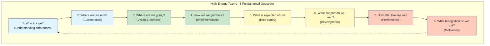
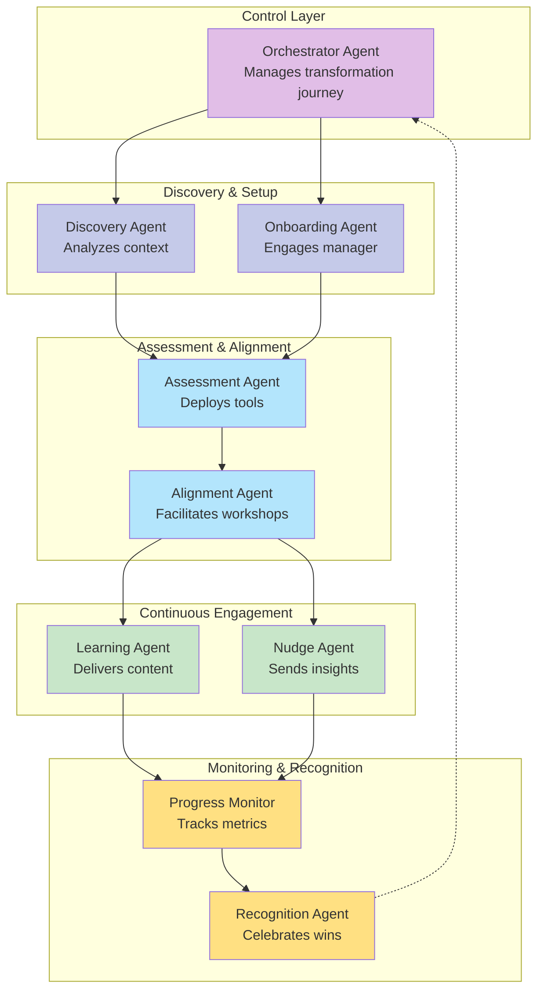
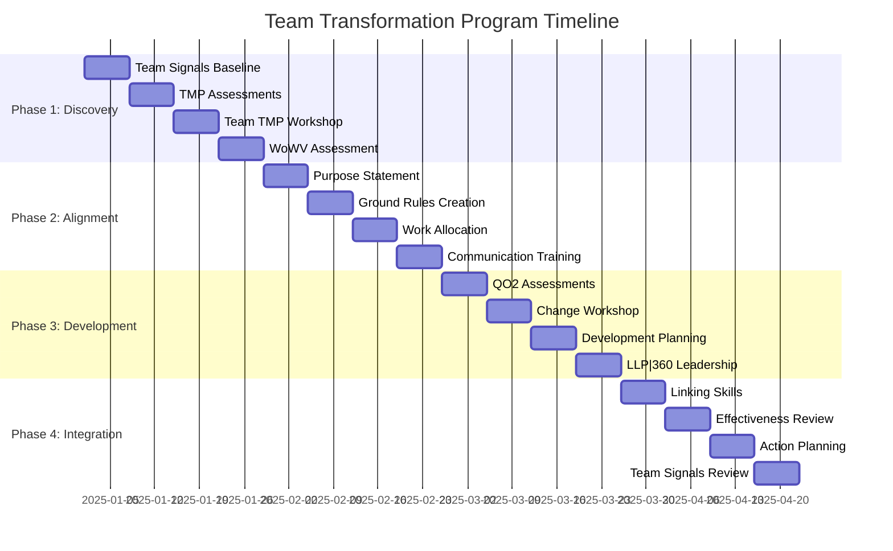
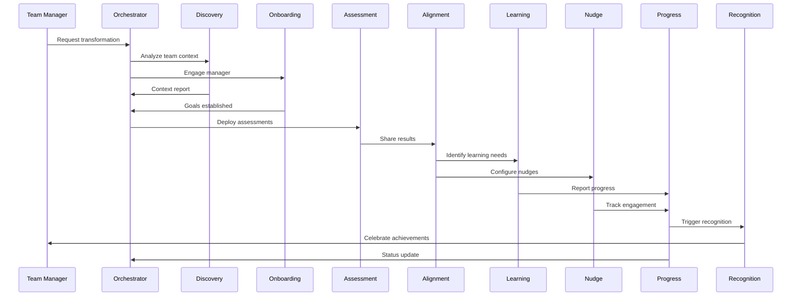
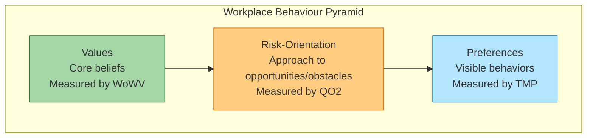
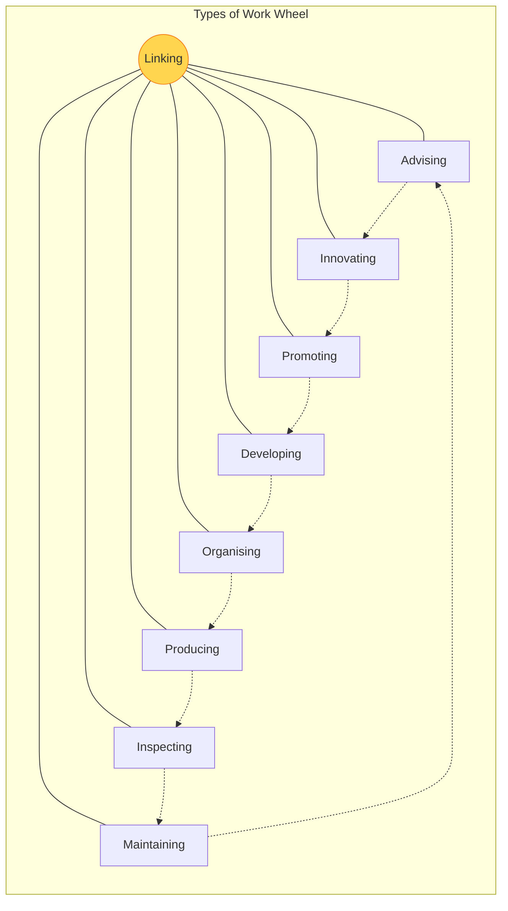
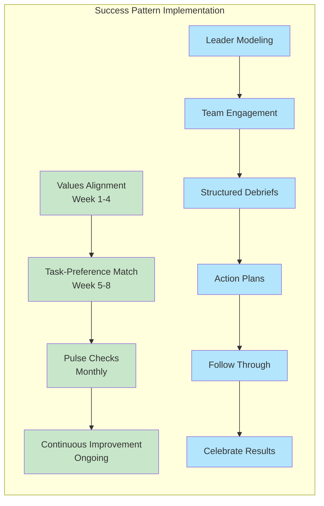
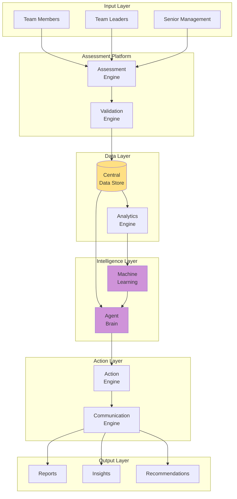

# TMS System Architecture Diagrams

This document contains visual representations of the Team Transformation System architecture using Mermaid diagrams.

## 1. High Energy Teams Framework



## 2. TMS Assessment Tools Ecosystem

```mermaid
graph LR
    subgraph "Quick Assessment"
        TS[Team Signals<br/>32 items, 5 min<br/>Pulse check]
    end
    
    subgraph "Core Assessments"
        TMP[TMP<br/>Work Preferences<br/>RIDO Model]
        QO2[QO2<br/>Risk Orientation<br/>Opportunities vs Obstacles]
        WoWV[WoWV<br/>Work Values<br/>8 Value Types]
    end
    
    subgraph "Leadership Assessment"
        LLP[LLP|360<br/>13 Linking Skills<br/>Multi-rater]
    end
    
    TS --> TMP
    TS --> QO2
    TS --> WoWV
    
    TMP --> LLP
    QO2 --> LLP
    WoWV --> LLP
    
    style TS fill:#e3f2fd
    style TMP fill:#e8f5e9
    style QO2 fill:#fff3e0
    style WoWV fill:#fce4ec
    style LLP fill:#f3e5f5
```

## 3. Multi-Agent System Architecture



## 4. Tool Selection Decision Tree

```mermaid
graph TD
    Start[Team Need Assessment] --> Q1{Quick health check needed?}
    Q1 -->|Yes| TS[Deploy Team Signals]
    Q1 -->|No| Q2{New team formation?}
    
    Q2 -->|Yes| NewTeam[TMP → WoWV → Purpose Statement]
    Q2 -->|No| Q3{Performance issues?}
    
    Q3 -->|Yes| Q4{What type?}
    Q3 -->|No| Q5{Leadership development?}
    
    Q4 -->|Communication| TMP2[Deploy TMP]
    Q4 -->|Conflict| WoWV2[Deploy WoWV]
    Q4 -->|Change resistance| QO2_2[Deploy QO2]
    
    Q5 -->|Yes| LLP2[Deploy LLP|360]
    Q5 -->|No| Full[Full transformation suite]
    
    style Start fill:#f9f9f9
    style TS fill:#e3f2fd
    style TMP2 fill:#e8f5e9
    style WoWV2 fill:#fce4ec
    style QO2_2 fill:#fff3e0
    style LLP2 fill:#f3e5f5
```

## 5. 16-Week Transformation Timeline



## 6. Agent Communication Flow



## 7. Workplace Behaviour Pyramid



## 8. Types of Work Wheel



## 9. Success Pattern Flow



## 10. Data Flow Architecture



## Usage Notes

These diagrams can be rendered using any Mermaid-compatible viewer or integrated into documentation platforms that support Mermaid syntax. They provide visual representations of:

1. The conceptual framework (HET questions)
2. Tool relationships and dependencies
3. System architecture and agent interactions
4. Decision flows and timelines
5. Communication patterns
6. Core models from TMS methodology

Each diagram is designed to be self-contained and can be used independently in presentations or documentation.