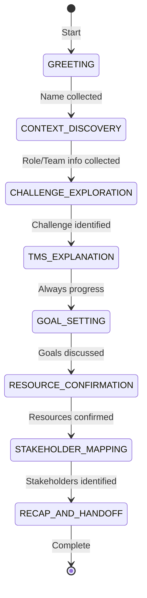
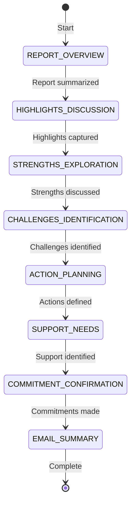
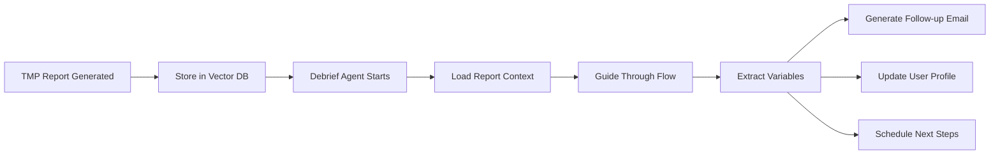

# Agent Flow Architecture for TeamOS

## Overview

TeamOS agents use a **state machine pattern** to guide structured conversations while extracting key variables for later use. This ensures agents stay on track, collect necessary information, and can provide personalized follow-ups.

## Core Concepts

### 1. State Machine Pattern
Each agent conversation follows a defined flow through multiple states, with:
- **States**: Distinct conversation phases (e.g., greeting, context discovery, challenge exploration)
- **Transitions**: Rules for moving between states based on collected data
- **Variables**: Key information extracted at each state
- **Progress Tracking**: Current position in the conversation flow

### 2. Variable Extraction
At each state, agents extract specific variables that are:
- Stored in the conversation context
- Used for state transitions
- Available for follow-up actions (emails, reports, handoffs)

## Onboarding Agent Flow



### Onboarding States & Variables

| State | Purpose | Variables Extracted | Duration |
|-------|---------|-------------------|----------|
| **GREETING** | Welcome & set expectations | `manager_name` | 30 sec |
| **CONTEXT_DISCOVERY** | Basic information | `organization`, `team_size`, `user_role` | 1 min |
| **CHALLENGE_EXPLORATION** | Understand pain points | `primary_challenge`, `challenge_impact` | 2 min |
| **TMS_EXPLANATION** | Explain solution | - | 1 min |
| **GOAL_SETTING** | Define objectives | `success_metrics`, `timeline` | 1 min |
| **RESOURCE_CONFIRMATION** | Verify readiness | `budget_confirmed`, `team_buy_in` | 30 sec |
| **STAKEHOLDER_MAPPING** | Identify key people | `decision_makers`, `influencers` | 1 min |
| **RECAP_AND_HANDOFF** | Summarize & next steps | `next_action`, `follow_up_date` | 30 sec |

### Implementation Example

```typescript
// State definition
export enum ConversationState {
  GREETING = 'greeting',
  CONTEXT_DISCOVERY = 'context_discovery',
  CHALLENGE_EXPLORATION = 'challenge_exploration',
  // ... more states
}

// Transition rules
const transitions: StateTransition[] = [
  {
    from: ConversationState.GREETING,
    to: ConversationState.CONTEXT_DISCOVERY,
    condition: (data) => !!data.manager_name
  },
  {
    from: ConversationState.CONTEXT_DISCOVERY,
    to: ConversationState.CHALLENGE_EXPLORATION,
    condition: (data) => !!data.team_size && !!data.organization
  }
  // ... more transitions
];

// Variable extraction during conversation
async function processMessage(message: string, currentState: ConversationState) {
  const extractedData = await extractVariables(message, currentState);
  
  // Store variables
  await updateConversationData(extractedData);
  
  // Check for state transition
  if (canTransition(extractedData)) {
    await moveToNextState();
  }
}
```

## Debrief Agent Flow (Proposed)



### Debrief States & Variables

| State | Purpose | Variables Extracted | Example Questions |
|-------|---------|-------------------|------------------|
| **REPORT_OVERVIEW** | Summarize TMP results | `major_role`, `key_scores` | "Your TMP shows you're an Upholder Maintainer..." |
| **HIGHLIGHTS_DISCUSSION** | Explore what resonated | `resonant_insights`, `surprising_findings` | "What stood out to you most?" |
| **STRENGTHS_EXPLORATION** | Deep dive on strengths | `top_strengths`, `strength_examples` | "How do you see these strengths in your work?" |
| **CHALLENGES_IDENTIFICATION** | Identify growth areas | `development_areas`, `current_obstacles` | "What challenges does this reveal?" |
| **ACTION_PLANNING** | Create next steps | `action_items`, `timeline` | "What's one thing you'll do differently?" |
| **SUPPORT_NEEDS** | Determine help needed | `support_type`, `resources_needed` | "What support would help you succeed?" |
| **COMMITMENT_CONFIRMATION** | Lock in commitments | `commitments`, `accountability_partner` | "Can you commit to these actions?" |
| **EMAIL_SUMMARY** | Prepare follow-up | `email_summary`, `follow_up_date` | "I'll send you a summary..." |

## Variable Usage Post-Conversation

### 1. Email Generation
```typescript
async function generateFollowUpEmail(conversationData: ConversationData) {
  const emailContent = await generateEmail({
    recipientName: conversationData.manager_name,
    majorRole: conversationData.major_role,
    topStrengths: conversationData.top_strengths,
    actionItems: conversationData.action_items,
    commitments: conversationData.commitments,
    nextSteps: conversationData.next_action
  });
  
  await sendEmail(emailContent);
}
```

### 2. CRM/Database Updates
```typescript
async function updateUserProfile(conversationData: ConversationData) {
  await db.users.update({
    where: { id: userId },
    data: {
      tmpMajorRole: conversationData.major_role,
      primaryChallenge: conversationData.primary_challenge,
      developmentAreas: conversationData.development_areas,
      commitments: conversationData.commitments
    }
  });
}
```

### 3. Journey Progression
```typescript
async function progressJourney(conversationData: ConversationData) {
  if (conversationData.commitments?.length > 0) {
    await journeyTracker.moveToPhase('ACTION_PLANNING');
    await scheduleFollowUp(conversationData.follow_up_date);
  }
}
```

## Flow Configuration

### JSON Flow Definition
```json
{
  "agentId": "debrief",
  "flow": {
    "states": [
      {
        "id": "report_overview",
        "name": "Report Overview",
        "objectives": ["Summarize TMP results", "Build rapport"],
        "requiredVariables": [],
        "extractVariables": ["major_role", "key_scores"],
        "maxDuration": 120,
        "prompts": [
          "Let me walk you through your TMP results...",
          "Your profile shows you're a {major_role}..."
        ]
      },
      {
        "id": "highlights_discussion",
        "name": "Highlights Discussion",
        "objectives": ["Explore resonant insights"],
        "requiredVariables": ["major_role"],
        "extractVariables": ["resonant_insights", "surprising_findings"],
        "maxDuration": 180,
        "prompts": [
          "What stood out to you most about being a {major_role}?",
          "Was anything surprising in your results?"
        ]
      }
    ],
    "transitions": [
      {
        "from": "report_overview",
        "to": "highlights_discussion",
        "condition": "major_role != null"
      }
    ]
  }
}
```

## Benefits of Flow Architecture

### 1. **Consistency**
- Every user gets a complete, structured experience
- No important questions are missed
- Quality assurance through defined flows

### 2. **Variable Extraction**
- Systematic collection of key information
- Data available for multiple uses (emails, reports, analytics)
- Enables personalized follow-ups

### 3. **Progress Tracking**
- Users know where they are in the process
- Can resume interrupted conversations
- Managers can see team progress

### 4. **Flexibility**
- Flows can be configured without code changes
- A/B testing different conversation paths
- Easy to add new states or modify existing ones

### 5. **Integration**
- Variables feed into other systems (CRM, email, analytics)
- Enables automated workflows
- Creates rich user profiles

## Implementation Considerations

### 1. State Persistence
- Store current state in database
- Enable conversation resume
- Track state transition history

### 2. Timeout Handling
- Maximum duration per state
- Graceful progression if stuck
- Optional state skipping

### 3. Variable Validation
- Ensure required data is collected
- Type checking for extracted variables
- Fallback values for missing data

### 4. Multi-Modal Support
- Text chat
- Voice conversations
- Mixed mode transitions

## Integration with TMS Reports

The Debrief Agent specifically uses the TMP report data:



## Future Enhancements

### 1. Dynamic Flow Builder
- Visual flow designer in admin interface
- Drag-and-drop state creation
- Conditional logic builder

### 2. Machine Learning Integration
- Optimize flow based on success metrics
- Predict best next state
- Personalize flows per user type

### 3. Multi-Agent Coordination
- Hand-offs between specialized agents
- Shared variable context
- Orchestrated multi-step processes

### 4. Analytics Dashboard
- Flow completion rates
- Drop-off points
- Variable extraction success
- Time per state metrics

## Conclusion

The Flow Architecture ensures TeamOS agents deliver consistent, valuable conversations while systematically collecting data for enhanced user experiences. This pattern scales across different agent types (onboarding, debrief, support) and enables sophisticated automation and personalization.