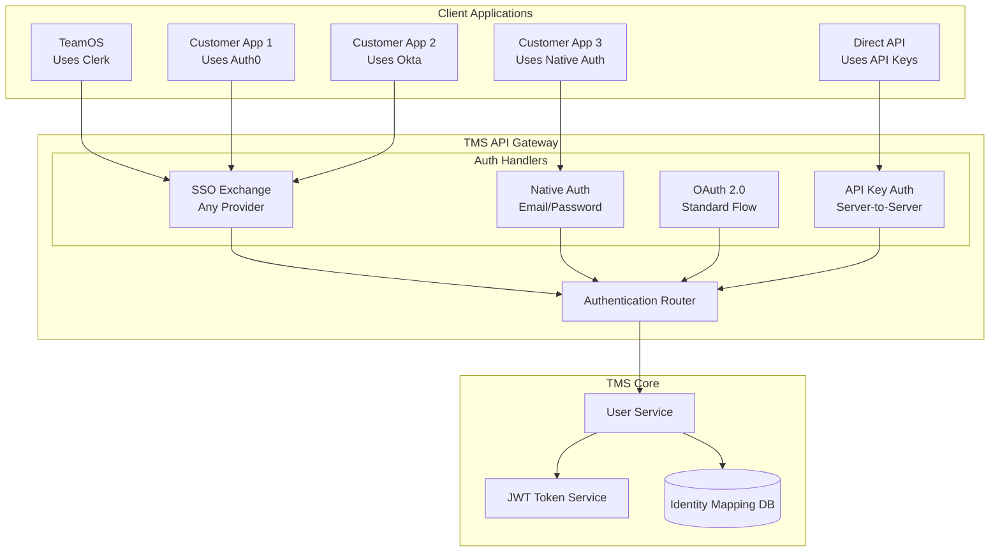
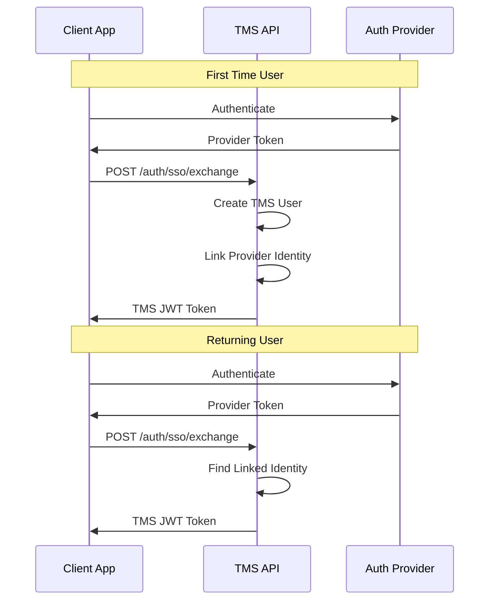

# Flexible Authentication Architecture

## Problem Statement

The current design assumes all customers will use Clerk for authentication. This is too restrictive for a public API that needs to support various authentication providers.

## Proposed Solution: Provider-Agnostic Authentication

### 1. Multiple Authentication Methods



### 2. Identity Mapping Strategy

Instead of requiring a specific provider (like Clerk), TMS maintains its own user IDs and maps them to external identities:

```sql
-- TMS internal users table
CREATE TABLE tms_users (
    id VARCHAR PRIMARY KEY,          -- tms_usr_123
    email VARCHAR UNIQUE NOT NULL,
    organization_id VARCHAR,
    role VARCHAR,
    created_at TIMESTAMP
);

-- Linked external identities
CREATE TABLE linked_identities (
    id VARCHAR PRIMARY KEY,
    tms_user_id VARCHAR REFERENCES tms_users(id),
    provider VARCHAR NOT NULL,       -- 'clerk', 'auth0', 'okta', etc.
    provider_user_id VARCHAR NOT NULL,
    provider_metadata JSONB,
    linked_at TIMESTAMP,
    UNIQUE(provider, provider_user_id)
);
```

### 3. Authentication Flow Examples

#### TeamOS (using Clerk)
```javascript
// 1. TeamOS authenticates with Clerk
const clerkUser = await clerk.signIn();

// 2. Exchange Clerk ID for TMS token
const tmsAuth = await fetch('/api/v2/auth/sso/exchange', {
  method: 'POST',
  body: JSON.stringify({
    provider: 'clerk',
    providerUserId: clerkUser.id,
    metadata: {
      email: clerkUser.email,
      firstName: clerkUser.firstName,
      lastName: clerkUser.lastName
    }
  })
});

// 3. Use TMS token for all API calls
const { token } = await tmsAuth.json();
```

#### Customer using Auth0
```javascript
// 1. Customer authenticates with Auth0
const auth0User = await auth0.authenticate();

// 2. Same exchange endpoint, different provider
const tmsAuth = await fetch('/api/v2/auth/sso/exchange', {
  method: 'POST',
  body: JSON.stringify({
    provider: 'auth0',
    providerUserId: auth0User.sub,
    providerToken: auth0User.idToken, // Optional validation
    metadata: {
      email: auth0User.email,
      organizationId: auth0User.org_id
    }
  })
});
```

#### Customer using Native Auth
```javascript
// Direct authentication with TMS
const tmsAuth = await fetch('/api/v2/auth/native/login', {
  method: 'POST',
  body: JSON.stringify({
    email: 'user@company.com',
    password: 'securePassword123'
  })
});
```

### 4. API Key Authentication (for automation)
```javascript
// Server-to-server authentication
const response = await fetch('/api/v2/assessments', {
  headers: {
    'x-api-key': 'pk_live_abc123',
    'x-api-secret': 'sk_live_xyz789'
  }
});
```

### 5. Benefits of This Approach

1. **Provider Independence**: Customers can use any auth provider
2. **Backward Compatible**: Existing Clerk integration continues to work
3. **Multiple Identities**: Users can link multiple auth providers
4. **Enterprise Ready**: Supports SAML/SSO via provider
5. **API Automation**: API keys for CI/CD and automation

### 6. Migration Path



### 7. Security Considerations

1. **Provider Validation**: Optionally validate provider tokens
2. **Rate Limiting**: Per API key and per user
3. **Webhook Security**: Verify webhook signatures
4. **Token Rotation**: Support refresh tokens
5. **Audit Logging**: Track all auth events

### 8. Configuration Example

```json
{
  "authProviders": {
    "clerk": {
      "enabled": true,
      "webhookSecret": "whsec_...",
      "validateTokens": false
    },
    "auth0": {
      "enabled": true,
      "domain": "customer.auth0.com",
      "validateTokens": true,
      "jwksUri": "https://customer.auth0.com/.well-known/jwks.json"
    },
    "native": {
      "enabled": true,
      "passwordPolicy": {
        "minLength": 8,
        "requireUppercase": true,
        "requireNumbers": true
      }
    }
  }
}
```

This architecture allows TMS to be a truly public API that any customer can integrate with, regardless of their authentication provider choice.