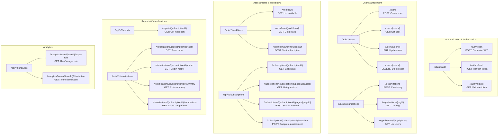
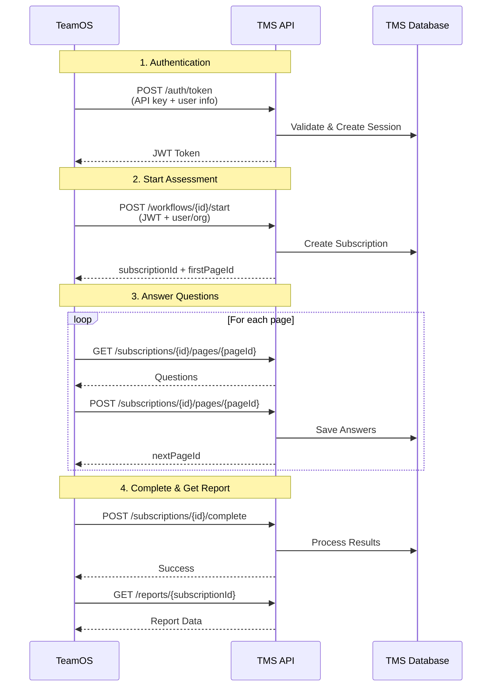

# TMS API Endpoints Overview

## Complete Endpoint Map



## Endpoint Categories by Priority

### 🔴 MVP Critical (Week 1-2)

| Endpoint | Method | Purpose | Priority |
|----------|--------|---------|----------|
| `/auth/token` | POST | Generate JWT for user | **Critical** |
| `/auth/validate` | GET | Validate JWT token | **Critical** |
| `/users` | POST | Create user | **Critical** |
| `/users/{userId}` | GET | Get user details | **Critical** |
| `/organizations` | POST | Create organization | **Critical** |
| `/workflows` | GET | List available assessments | **Critical** |
| `/workflows/{workflowId}/start` | POST | Start assessment | **Critical** |

### 🟡 MVP Required (Week 2-3)

| Endpoint | Method | Purpose | Priority |
|----------|--------|---------|----------|
| `/subscriptions/{subscriptionId}` | GET | Get assessment status | **High** |
| `/subscriptions/{subscriptionId}/pages/{pageId}` | GET | Get questions | **High** |
| `/subscriptions/{subscriptionId}/pages/{pageId}` | POST | Submit answers | **High** |
| `/subscriptions/{subscriptionId}/complete` | POST | Complete assessment | **High** |
| `/reports/{subscriptionId}` | GET | Get report (HTML OK) | **High** |
| `/organizations/{orgId}/users` | GET | List org users | **High** |

### 🟢 Post-MVP Enhancements

| Endpoint | Method | Purpose | Priority |
|----------|--------|---------|----------|
| `/reports/{subscriptionId}` | GET | Structured JSON report | Medium |
| `/visualizations/*/` | GET | All visualization endpoints | Medium |
| `/analytics/*/` | GET | Analytics endpoints | Low |
| `/auth/refresh` | POST | Refresh token | Low |
| `/users/{userId}` | PUT/DELETE | Update/Delete user | Low |

## Integration Flow Sequence



## Request/Response Flow by Feature

### Feature 1: User Onboarding
```
1. TeamOS → POST /auth/token → Get JWT
2. TeamOS → POST /organizations → Create org (with automation)
3. TeamOS → POST /users → Create manager
4. TeamOS → GET /workflows → Show available assessments
```

### Feature 2: Assessment Taking
```
1. TeamOS → POST /workflows/{id}/start → Begin assessment
2. TeamOS → GET /subscriptions/{id}/pages/{pageId} → Get questions
3. TeamOS → POST /subscriptions/{id}/pages/{pageId} → Submit answers
4. TeamOS → POST /subscriptions/{id}/complete → Finish
5. TeamOS → GET /reports/{subscriptionId} → Get results
```

### Feature 3: Team Management
```
1. TeamOS → GET /organizations/{orgId}/users → List team
2. TeamOS → POST /users → Add team member
3. TeamOS → GET /analytics/teams/{teamId}/distribution → View insights
```

## Implementation Notes for Developer

### 🚨 Critical Backend Automation
When creating an organization (`POST /organizations`), the backend MUST:
1. Create organization under the distributor linked to API key
2. Grant permissions to workflows (TMP, QO2, Team Signals, WoW, LLP)
3. Create default group/team
4. Create wallet for credit management
5. Auto-purchase starter credits
6. Configure default settings
7. Set up billing if applicable

### 🔐 Authentication Flow
```javascript
// Every request after /auth/token needs:
headers: {
  'Authorization': 'Bearer {jwt_token}',
  'Content-Type': 'application/json'
}
```

### 📊 Report Format Evolution
- **MVP**: Return HTML report (existing format)
- **Phase 2**: Return structured JSON with:
  - Sections array
  - Visualization metadata
  - Pre-computed vectorChunks for images only

### 👥 User Roles
Three roles to support:
- `admin`: Full system access
- `manager`: Organization management
- `member`: Assessment taking only

### 🗄️ Legacy System Constraints
- Managers stored in `users` table
- Team members stored in `respondents` table
- Abstract this complexity in the API layer

## Quick Reference Card

```
BASE URL: https://api.tms-global.com/api/v2

HEADERS:
- Authentication: x-api-key, x-api-secret (for /auth/token)
- Authorization: Bearer {token} (all other endpoints)

WORKFLOW IDs:
- tmp-workflow: Team Management Profile
- qo2-workflow: Questionnaire Organisational Outcomes
- team-signals-workflow: Team Signals Assessment
- wow-workflow: Ways of Working
- llp-workflow: Leadership Learning Profile

RESPONSE FORMAT: JSON
ERROR FORMAT: { error: string, code: string }
```

## Testing Checklist

- [ ] Can generate JWT token with API key
- [ ] Can create organization (with all automation)
- [ ] Can create users with different roles
- [ ] Can start assessment workflow
- [ ] Can retrieve and answer questions
- [ ] Can complete assessment
- [ ] Can retrieve report
- [ ] Token expiry handled correctly
- [ ] Role-based access enforced
- [ ] Organization isolation working