# TeamOS System Architecture

## Overview

This document provides visual representations of how TeamOS integrates with various systems including TMS Global (legacy), Clerk (auth), Supabase (database), OpenAI (AI), and Vercel (hosting).

## 1. High-Level System Architecture

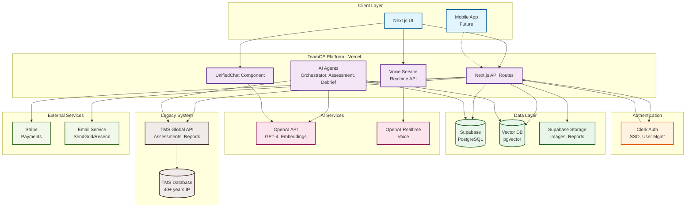

## 2. Simple API Key Authentication Flow

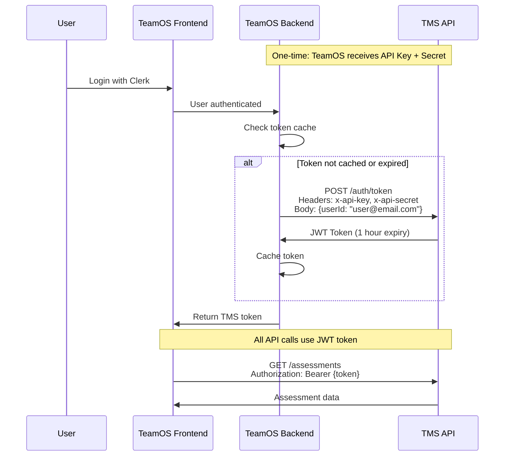

## 3. Assessment Journey Flow

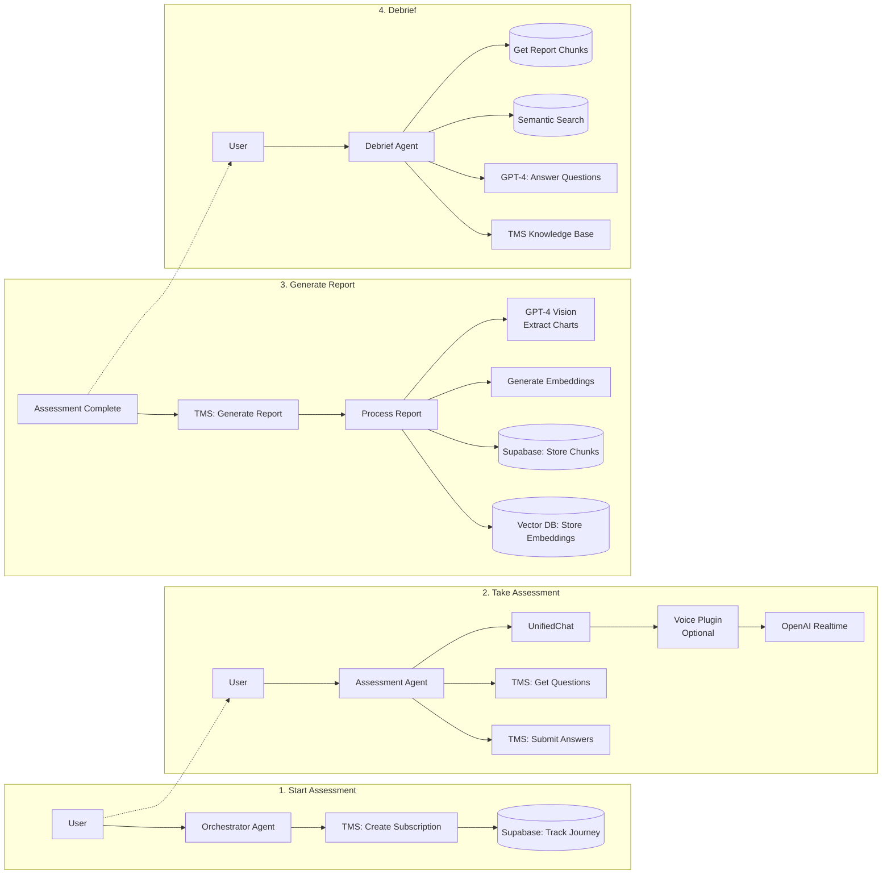

## 4. Data Storage Architecture

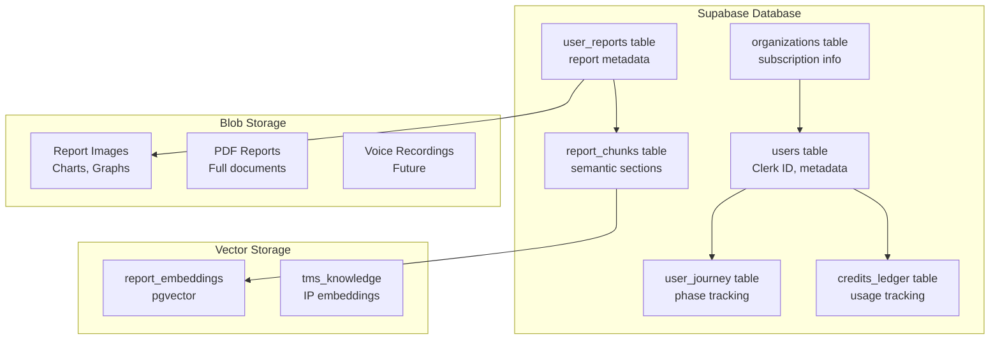

## 5. AI Agent Architecture

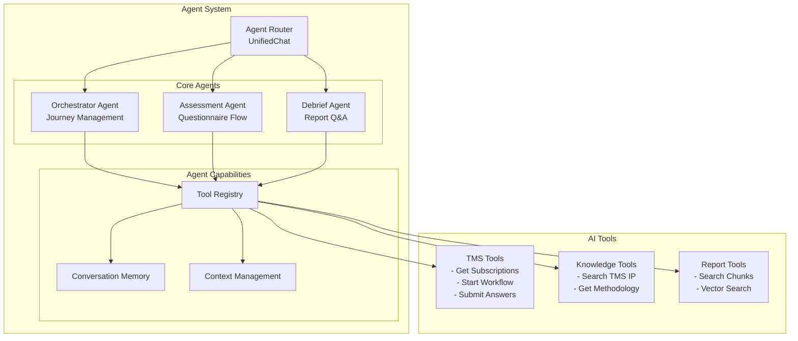

## 6. Report Processing & Vector Storage Pipeline

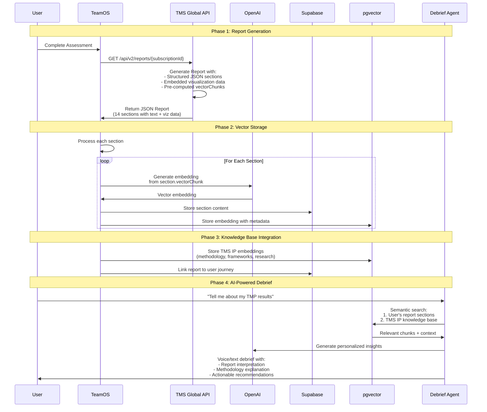

## 7. Debrief Agent Architecture

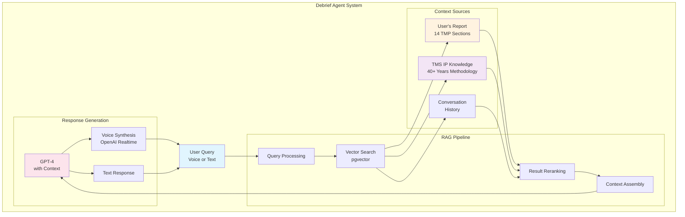

## 8. Real-time Voice Integration

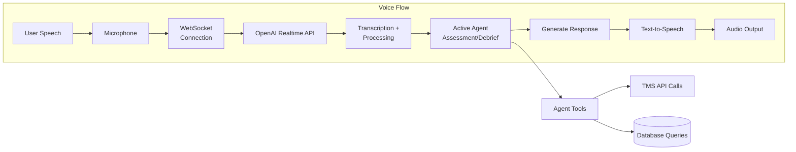

## 9. Knowledge Base & Vector Storage Structure

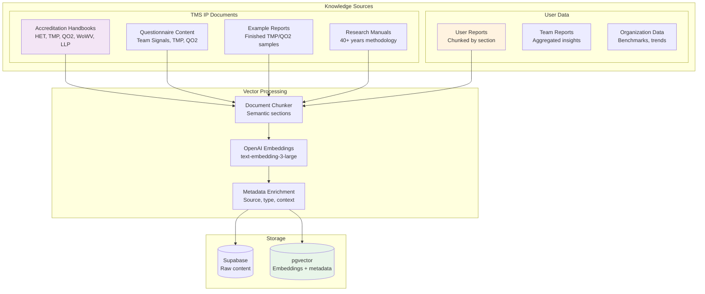

## 10. Infrastructure Overview

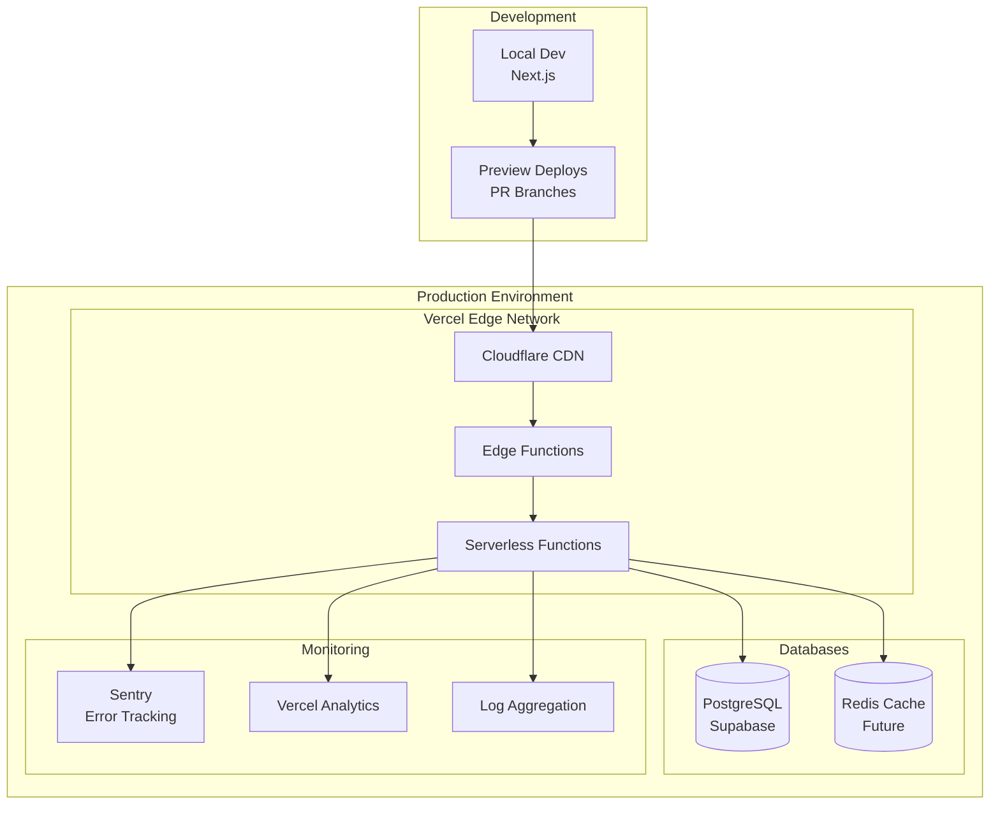

## Key Integration Points

### 1. **Simple API Key Authentication**
- TeamOS uses API key + secret for TMS access
- Generate JWT tokens for users via TMS API
- No complex SSO or identity mapping needed

### 2. **TeamOS ↔ TMS API**
- RESTful API communication
- JWT-based authentication per user
- Structured JSON responses with embedded visualization data
- Pre-computed vectorChunks for AI processing

### 3. **Supabase & Vector Storage**
- Primary database for TeamOS data
- pgvector for semantic search (report chunks + TMS IP)
- Store report sections as individual records
- Blob storage for visualization images

### 4. **OpenAI Integration**
- GPT-4 for debrief agent intelligence
- text-embedding-3-large for vector embeddings
- Realtime API for voice debrief sessions
- NO Vision API needed (data comes structured from TMS)

### 5. **Vercel Hosting**
- Edge functions for API routes
- Serverless deployment
- Global CDN distribution

## Security Considerations

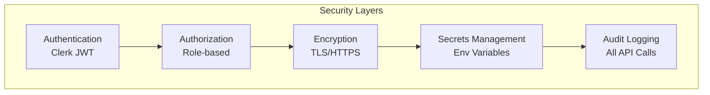

## Technology Stack Rationale (Why Not .NET/Azure?)

### MVP Requirements (3-Month Timeline)
- **AI-first application** with voice interaction and RAG pipeline
- **Rapid iteration** with daily deployments for customer feedback
- **Modern UX** to demonstrate innovation beyond legacy system
- **Clean API boundary** to protect legacy system from MVP experiments

### Why Modern Stack (Next.js/TypeScript/Vercel) for MVP

| Factor | Modern Stack | Legacy .NET/Azure |
|--------|-------------|-------------------|
| **Time to Market** | 3 months achievable | 9-12 months realistic |
| **AI Ecosystem** | First-class OpenAI, vector DB, LangChain support | Limited AI tooling, secondary support |
| **Development Speed** | Hot reload, instant deploys, rich components | Slower iteration, complex deployments |
| **Developer Pool** | 10x more React developers available | Limited .NET specialists |
| **Cost** | ~$500/month (Vercel + Supabase) | ~$2000/month (Azure App Service + SQL) |
| **Risk Isolation** | Completely separate from legacy | Could impact production system |

### Strategic Benefits

1. **Forces Proper API Design** - Legacy system must expose clean APIs that benefit any future architecture
2. **Parallel Development** - Legacy team continues maintenance while innovation happens separately  
3. **Modern Skills Investment** - Team gains AI/RAG experience regardless of MVP outcome
4. **Customer Perception** - Modern UI demonstrates innovation vs "another enterprise app"
5. **Potential Future Path** - If successful, modern stack could become the platform going forward

### The Business Case

> "We're building the MVP on modern stack to achieve 3-month delivery of an AI-first application. This approach delivers 3-5x faster than extending the legacy system, provides access to cutting-edge AI tools, and protects the production system from experimental risk. The clean API boundary means the legacy system gains valuable APIs regardless of outcome. Success creates a modern platform for the future; failure means we've learned quickly without any impact to core operations."

### Post-MVP Options

1. **If Successful** → Modern stack becomes the new platform, legacy provides data APIs
2. **If Pivot Needed** → APIs built for MVP can be consumed by any technology
3. **If Failed** → No impact to legacy system, valuable learnings gained

## Scalability Design

- **Stateless Architecture**: All services are stateless
- **Horizontal Scaling**: Vercel automatically scales
- **Database Pooling**: Supabase connection pooling
- **Caching Strategy**: Edge caching for static content
- **Queue System**: Future implementation for heavy tasks

This architecture ensures:
1. **Separation of Concerns** - Each system handles its domain
2. **Scalability** - Can handle growth without major changes
3. **Security** - Multiple layers of protection
4. **Flexibility** - Easy to add new features or integrations
5. **Reliability** - Redundancy and error handling at each layer