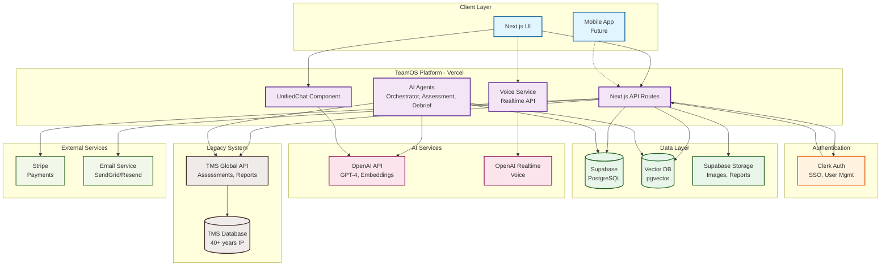
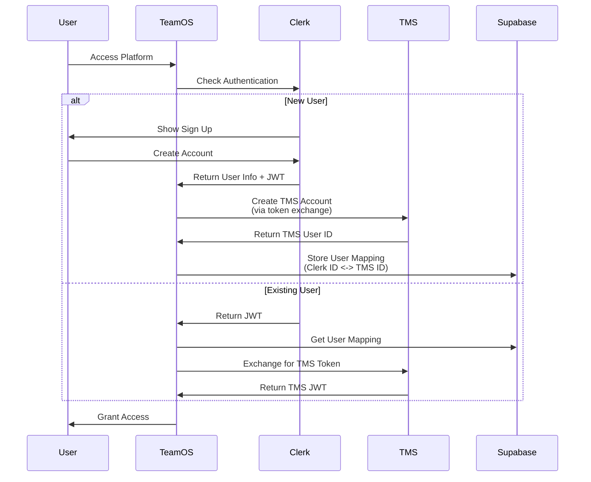
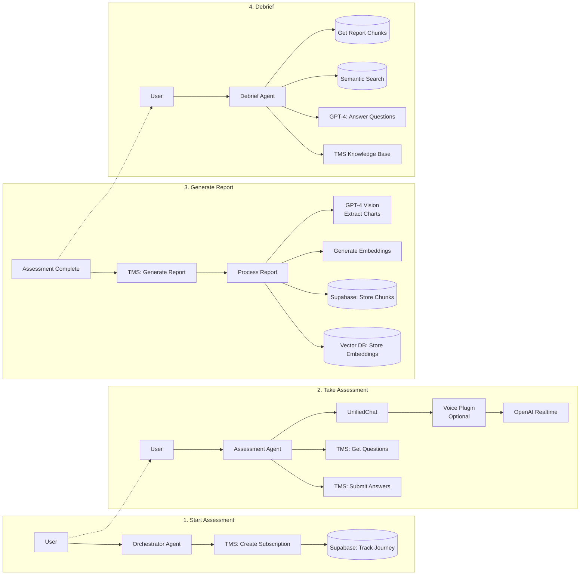
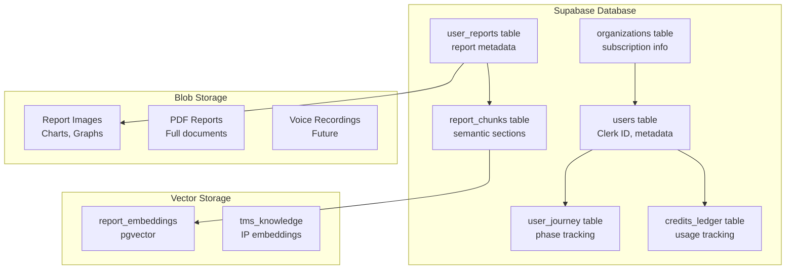
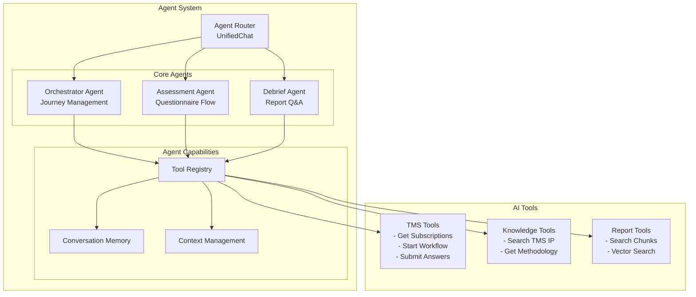
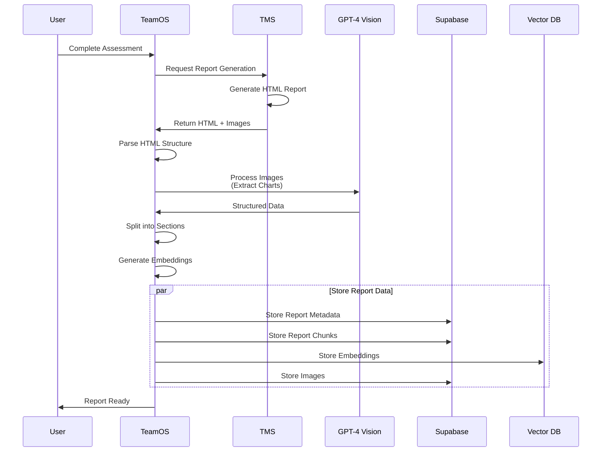
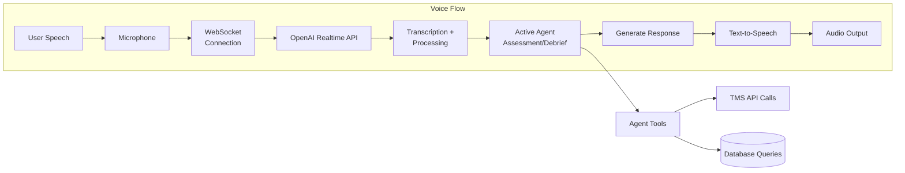
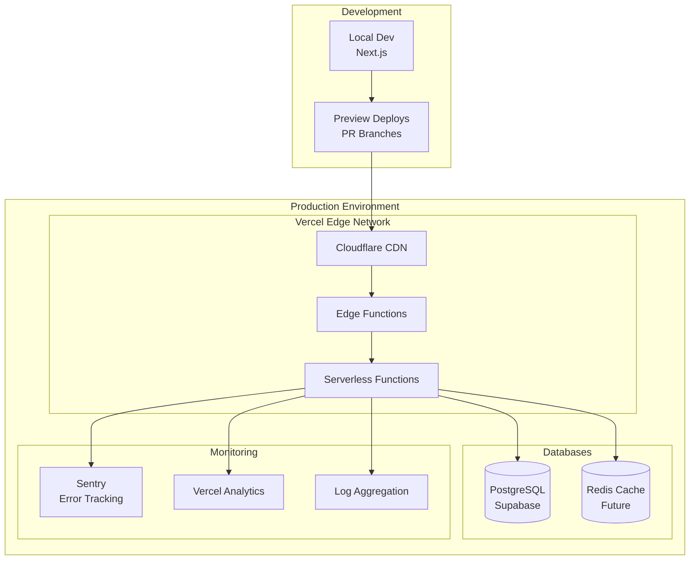
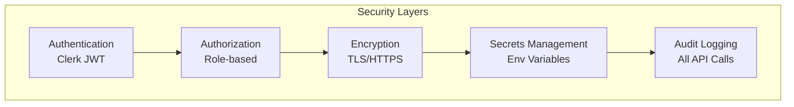

# TeamOS System Architecture

## Overview

This document provides visual representations of how TeamOS integrates with various systems including TMS Global (legacy), Clerk (auth), Supabase (database), OpenAI (AI), and Vercel (hosting).

## 1. High-Level System Architecture

## 2. Authentication Flow

## 3. Assessment Journey Flow

## 4. Data Storage Architecture

## 5. AI Agent Architecture

## 6. Report Generation Pipeline

## 7. Real-time Voice Integration

## 8. Infrastructure Overview

## Key Integration Points

### 1. **Clerk ↔ TMS Authentication**
- Clerk manages user authentication
- TMS token exchange for legacy API access
- User mapping stored in Supabase

### 2. **TeamOS ↔ TMS API**
- RESTful API communication
- JWT-based authentication
- Structured JSON responses (proposed)

### 3. **Supabase Integration**
- Primary database for TeamOS data
- Vector storage for semantic search
- Blob storage for images and reports

### 4. **OpenAI Integration**
- GPT-4 for agent intelligence
- Embeddings for semantic search
- Realtime API for voice interaction
- Vision API for chart extraction

### 5. **Vercel Hosting**
- Edge functions for API routes
- Serverless deployment
- Global CDN distribution

## Security Considerations

## Scalability Design

- **Stateless Architecture**: All services are stateless
- **Horizontal Scaling**: Vercel automatically scales
- **Database Pooling**: Supabase connection pooling
- **Caching Strategy**: Edge caching for static content
- **Queue System**: Future implementation for heavy tasks

This architecture ensures:
1. **Separation of Concerns** - Each system handles its domain
2. **Scalability** - Can handle growth without major changes
3. **Security** - Multiple layers of protection
4. **Flexibility** - Easy to add new features or integrations
5. **Reliability** - Redundancy and error handling at each layer