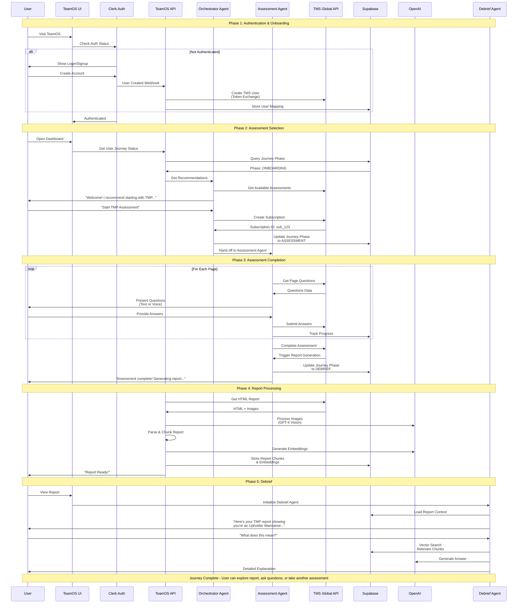
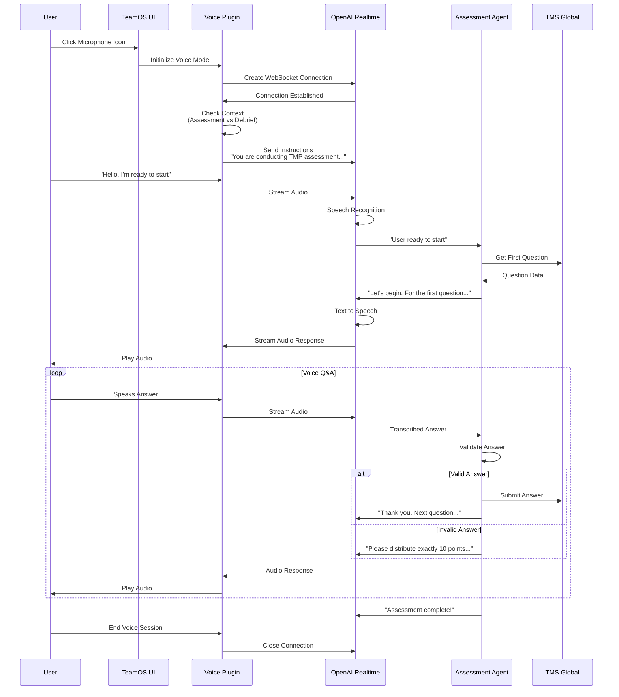
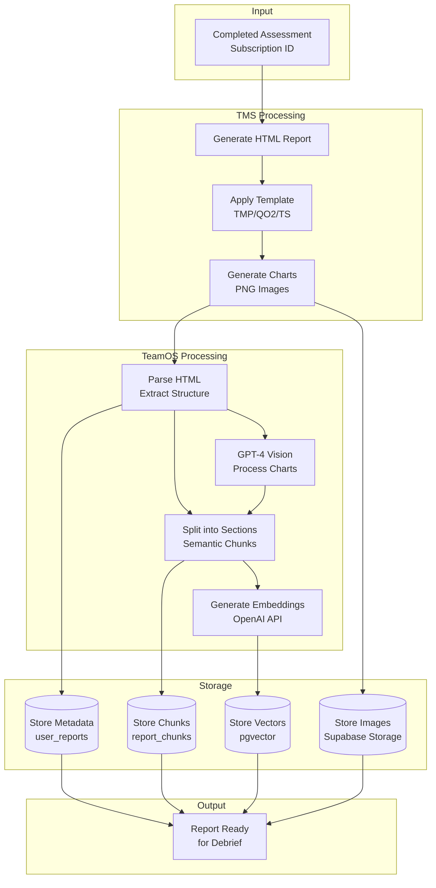
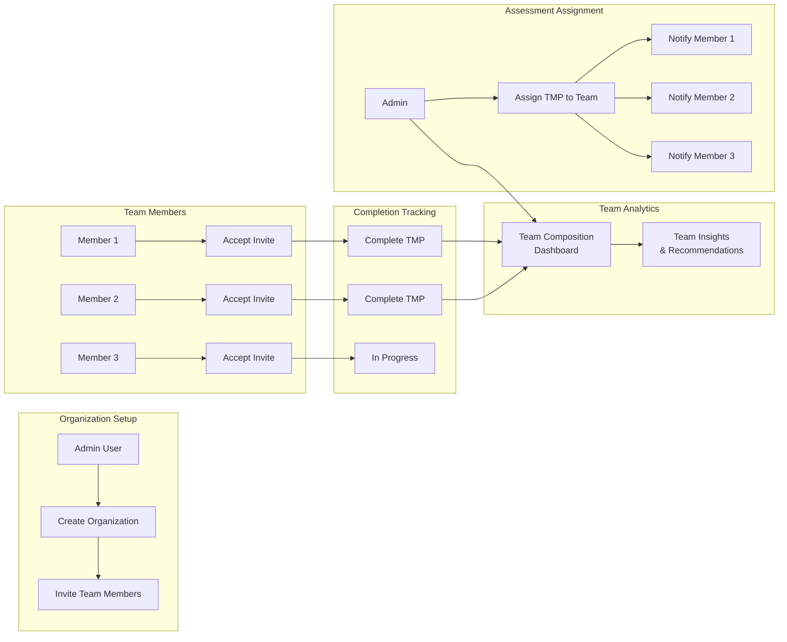
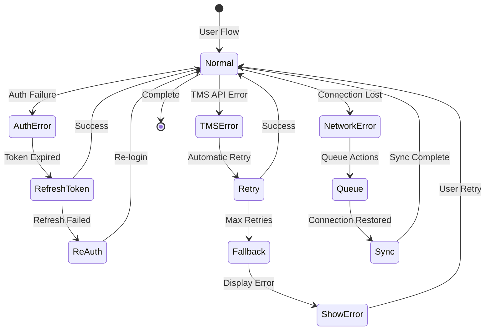
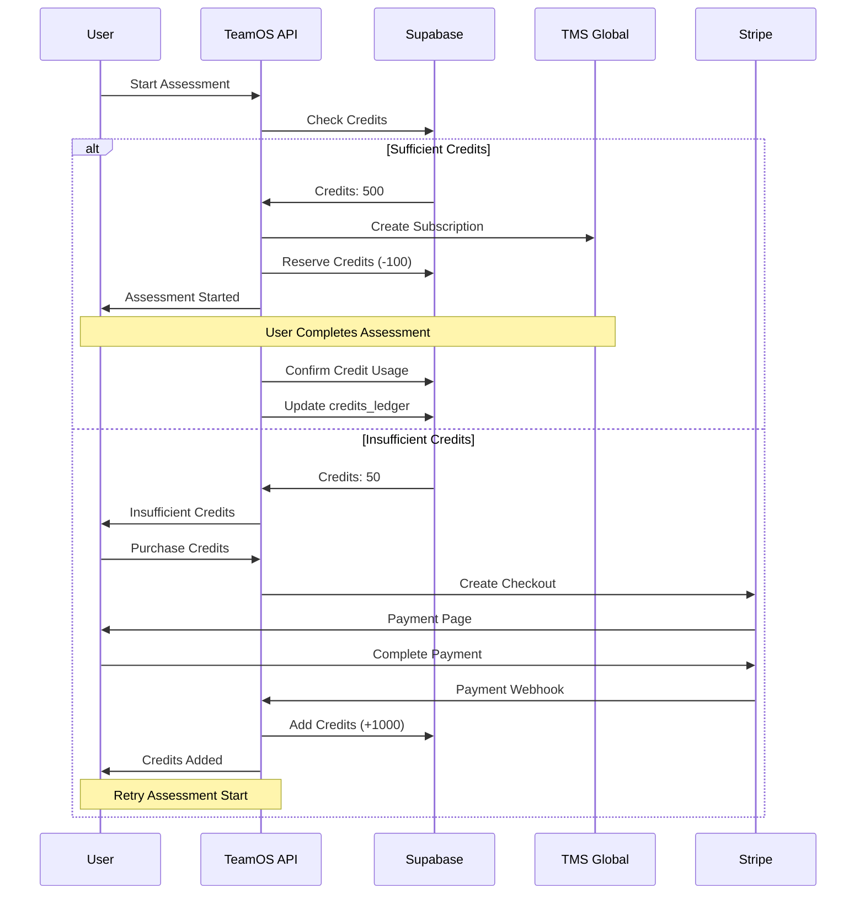

# User Journey Flows

## 1. Complete Assessment Journey

## 2. Voice Assessment Flow

## 3. Report Generation Pipeline

## 4. Multi-User Organization Flow

## 5. Error Recovery Flows

## 6. Credit System Flow

## Key Integration Points Summary

1. **Clerk ↔ TeamOS**: Handles all authentication
2. **TeamOS ↔ TMS**: API calls for assessments and reports  
3. **TeamOS ↔ Supabase**: All data persistence
4. **TeamOS ↔ OpenAI**: AI processing and embeddings
5. **TeamOS ↔ Stripe**: Payment processing
6. **TeamOS ↔ Vercel**: Hosting and edge functions

Each flow shows how data moves through the system and where each external service is utilized.